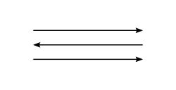

\newpage

Published by the [Ludwig Wittgenstein Project](https://www.wittgensteinproject.org/).

_This digital edition is a normalised version of Wittgenstein’s *Nachlass* Ts-309 (so-called *Blue Book*) produced with the Interactive Dynamic Presentation tool[^1] provided by the [Wittgenstein Archives at the University of Bergen (WAB)](http://wab.uib.no/). This original-language text is in the public domain in its country of origin and other countries and areas where the copyright term is the author's life plus 70 years or fewer._

\newpage

What is the meaning of a word?

Let us attack this question by asking, first, what is an explanation of the meaning of a word; what does the explanation of a word look like?

The way this question helps us is analogous to the way the question “how do we measure a length?” helps us to understand the problem, “what is length?”

The questions, “What is length?”, “What is meaning?”, “What is the number one?” etc., produce in us a mental cramp. We feel that we can't point to anything in reply to them and yet ought to point to something. (We are up against one of the great sources of philosophical bewilderment: we try to find a substance for a substantive.)

Asking first, “What's an explanation of meaning?” has two advantages. You in a sense bring the question “what is meaning?” down to earth. For, surely, to understand the meaning of “meaning” you ought also to understand the meaning of “explanation of meaning”. Roughly: “let's ask what the explanation of meaning is, for whatever that explains will be the meaning.” Studying the grammar of the expression “explanation of meaning” will teach you something about the grammar of the word “meaning” and will cure you of the temptation to look about you for something which you might call the “meaning”.

What one generally calls “explanations of the meaning of  a word” can, *very roughly*, be divided into verbal and ostensive definitions. It will be seen later in what sense this division is only rough and provisional (and that it is, is an important point). The verbal definition, as it takes us from one verbal expression to another, in a sense gets us no further. In the ostensive definition however we seem to make a much more real step towards learning the meaning.

One difficulty which strikes us is that for many words in our language there do not seem to be ostensive definitions; e.g. for such words as “one”, “number”, “not”, etc.

Question: Need the ostensive definition itself be understood? – Can't the ostensive definition be misunderstood?

If the definition explains the meaning of a word, surely it can't be essential that you should have heard the word before. It is the ostensive definition's business to *give* it a meaning. Let us then explain the word “tove” by pointing to a pencil and saying “this is tove”. (Instead of “this is tove” I could here have said “this is called ‘tove’”. I point this out to remove, once and for all, the idea that the words of the ostensive definition predicate something of the defined; the confusion between the sentence “this is red”, attributing the colour red to something, and this ostensive definition “this is called ‘red’”.) Now the ostensive definition “this is tove” can be interpreted in all sorts of ways. I will give a few such interpretations and use English words with well established usage. The definition then can be interpreted to mean: –

“This is a pencil”, “This is round”, “This is wood”, “This is one”, “This is hard”, etc. etc.

One might object to this argument that all these interpretations presuppose another word-language. And this objection is significant if by “interpretation” we only mean “Translation into a word-language”. – Let me give some hints which might make this clearer. Let us ask ourselves what is our criterion when we say that someone has interpreted the ostensive definition in a particular way. Suppose I give to an Englishman the ostensive definition “this is what the Germans call ‘Buch’”. Then, in the great majority of cases, at any rate, the English word “book” will come into the Englishman's mind. We may say he has interpreted “Buch” to mean “book”. The case will be different if e.g., we point to a thing which he has never seen before and say: “This is a banjo”. Possibly the word “guitar” will then come into his mind, possibly no word at all but the image of a similar instrument, possibly nothing at all. Supposing then I give him the order “now pick a banjo from amongst those things”. If he picks what we call a “banjo” we might say “he has given the word ‘banjo’ the correct interpretation”; if he picks some other instrument: – “he has interpreted ‘banjo’ to mean ‘string instrument’”.

We say “he has given the word ‘banjo’ this or that interpretation”,  and are inclined to assume a definite act of interpretation besides the act of choosing.

Our problem is analogous to the following: – If I give someone the order “fetch me a red flower from that meadow”, how is he to know what sort of flower to bring, as I have only given him a *word*?

Now the answer one might suggest first is that he went to look for a red flower carrying a red image in his mind, and comparing it with the flowers to see which of them had the colour of the image. Now there is such a way of searching, and it is not at all essential that the image we use should be a mental one. In fact the process may be this: – I carry a chart co-ordinating names and coloured squares. When I hear the order “fetch me etc.” I draw my finger across the chart from the word “red” to a certain square, and I go and look for a flower which has the same colour as the square. But this is not the only way of searching and it isn't the usual way. We go, look about us, walk up to a flower and pick it, without comparing it to anything. To see that the process of obeying the order can be of this kind, consider the order “*imagine* a red patch”. You are not tempted in this case to think that *before* obeying you must have imagined a red patch to serve you as a pattern for the red patch which you were ordered to imagine.

Now you might ask “do we *interpret* the words before we obey the order?” And in some cases you will find that you do something which might be called interpreting before obeying, in some cases not.

It seems that there are *certain definite* mental processes bound up with the working of language; processes through which alone language can function. I mean the processes of understanding and meaning. The signs of our language seem dead without these mental processes; and it might seem that the only function of the signs is to induce such processes, and that these are the things we ought really to be interested in. Thus, if you are asked what is the relation between a name and the thing it names, you will be inclined to answer that the relation is a psychological one, and perhaps when you say this you think in particular of the mechanism of association. – We are tempted to think that the action of language consists of two parts; an inorganic part, the handling of signs, and an organic part, which we may call understanding these signs, meaning them, interpreting them, thinking. These latter activities seem to take place in a queer kind of medium, the mind; and the mechanism of the mind, the nature of which, it seems, we don't quite understand, can bring about effects which no material mechanism could. Thus e.g. a thought (which is such a mental process) can agree or disagree with reality: I am able to think of a man who isn't present; I am able to imagine him, “mean” him, in a remark which I make about him even if he is thousands of miles away or dead. “What a queer mechanism”, one might say, “the mechanism of wishing must be if I can wish that which will never happen”.

There is one way of avoiding at least partly the occult appearance of the process of thinking, and it is, to replace in these processes any working of the imagination by looking at real  objects. Thus it may seem essential that, at least in certain cases, when I hear the word “red” with understanding, a red image should be before my mind's eye. But why should I not substitute seeing a red bit of paper for imagining a red patch? The visual image will only be the more vivid. You can easily imagine a man carrying a sheet of paper in his pocket on which the names of colours are coordinated with coloured patches. You may say that it would be a nuisance to carry such a table of samples about with you, and that the mechanism of association is what we always use instead of it. But this is irrelevant; and in many cases it is not even true. If, for instance, you were ordered to paint a particular shade of blue, called “Prussian Blue”, you might have to use a table to lead you from the word “Prussian Blue” to a sample of the colour, which would serve you as a copy.

We could perfectly well, for our purposes, replace every process of imagining by a process of looking at an object or by painting, drawing or modelling; and every process of speaking to oneself by speaking aloud or writing.

Frege ridiculed the formalist conception of mathematics by saying that the formalists confused the unimportant thing, the sign, with the important, the meaning. Surely, one wishes to say, mathematics does not treat of dashes on a bit of paper. Frege's idea could be expressed thus: the propositions of mathematics, if they were just complexes of dashes, would be dead and utterly uninteresting, whereas they obviously have a kind of life. And the same, of course, could be said of any proposition: Without a sense, or without the thought, a proposition would be an utterly  dead and trivial thing. And further it seems clear that no adding of inorganic signs can make the proposition live. And the conclusion which one draws from this is that what must be added to the dead signs in order to make a live proposition is something immaterial with properties different from all mere signs.

But if we had to name anything which is the life of the sign, we should have to say that it was its *use*.

If the meaning of the sign (roughly, that which is of importance about the sign) is an image built up in our minds when we see or hear the sign, then first let us adopt the method we just described of replacing this mental image by seeing some sort of outward object, e.g. a painted or modelled image. Then why should the written sign plus this painted image be alive if the written sign alone was dead? – In fact, as soon as you think of replacing the mental image by, say, a painted one, and as soon as the image thereby loses its occult character, it ceases to seem to impart any life to the sentence at all. (It was in fact just the occult character of the mental process which you needed for your purposes.)

The mistake we are liable to make could be expressed thus: We are looking for the use of a sign, but we look for it as though it were an object *co-existing* with the sign. (One of the reasons for this mistake is again that we are looking for a “thing corresponding to a substantive.”)

The sign (the sentence) gets its significance from the system of signs, from the language to which it belongs. Roughly: understanding a sentence means understanding a language.

As a part of the system of language, one may say “the sentence has life”. But one is tempted to imagine that which gives the sentence life as something in an occult sphere, accompanying the sentence. But whatever would accompany it would for us just be another sign.

It seems at first sight that that which gives to thinking its peculiar character is that it is a train of mental states, and it seems that what is queer and difficult to understand about thinking is the processes which happen in the medium of the mind, processes possible only in this medium. The comparison which here forces itself upon us is that of the mental medium with the protoplasm of a cell, say, of an amoeba. We observe certain actions of the amoeba, its taking food by extending arms, its splitting up into similar cells, each of which grows and behaves like the original one. We say “of what a queer nature the protoplasm must be to act in such a way”, and perhaps we say that no physical mechanism could behave in this way, and that the mechanism of the amoeba must be of a totally different kind. In the same way we are tempted to say “the mechanism of the mind must be of a most peculiar kind to be able to do what the mind does.” But here we are making two mistakes. For what struck *us* as being queer about thought and thinking was not at all that it had curious effects which we were not yet able to explain (causally). Our problem, in other words, was not a scientific one; but a muddle felt as a problem.

Supposing we tried to construct a mind-model as a result of psychological investigations, a model which, as we should say,  would explain the action of the mind. This model would be part of a psychological theory in the way in which a mechanical model of the ether can be part of a theory of electricity. (Such a model, by the way, is always part of the *symbolism* of a theory. Its advantage may be that it is seen at a glance and easily held in the mind. It has been said that a model, in a sense, dresses up the pure theory; that the *naked* theory is sentences or equations. This must be examined more closely later on.)

We may find that such a mind-model would have to be very complicated and intricate in order to explain the observed mental activities; and on this ground we might call the mind a queer kind of medium. But this aspect of the mind does not interest us. The problems which it may set are psychological problems, and the method of their solution is that of natural science.

Now if it is not the causal connections which we are concerned with, then the activities of the mind lie open before us. And when we are worried about the nature of thinking, the puzzlement which we wrongly interpret to be one about the nature of a medium is a puzzlement caused by the mystifying use of our language. This kind of mistake recurs again and again in philosophy, e.g. when we are puzzled about the nature of time; when time seems to us a queer thing. We are most strongly tempted to think that here are things hidden, something we can see from the outside but which we can't look into. And yet nothing of the sort is the case. It is not new facts about time which we want to know. All the facts that concern us lie open before us. But it is the use of the substantive “time” which mystifies us. If we look into  the grammar of that word, we shall feel that it is no less astounding that man should have conceived of a deity of time than it would be to conceive of a deity of negation or disjunction.

It is misleading then to talk of thinking as of a “mental activity”. We may say that thinking is essentially the activity of operating with signs. This activity is performed by the hand, when we think by writing; by the mouth and larynx, when we think by speaking; and, if we think by imagining signs or pictures I can give you no agent that thinks. If then you say that in such cases the mind thinks, I would only draw your attention to the fact that you are using a metaphor, that here the mind is an agent in a different sense from that in which the hand can be said to be the agent in writing.

If again we talk about the locality where thinking takes place we have a right to say that this locality is the paper on which we write; or the mouth which speaks. And if we talk of the head or the brain as the locality of thought, this is using the expression “locality of thinking” in a different sense. Let us examine what are the reasons for calling the head the place of thinking. It is not our intention to criticize this form of expression, or to show that it is not appropriate. What we must do is: understand its working, its grammar, e.g. see what relation this grammar has to that of the expression “we think with our mouth”, or “we think with a pencil on a piece of paper”.

Perhaps the main reason why we are so strongly inclined to talk of the head as the locality of our thoughts is this: – the existence of the words “thinking” and “thought” alongside of the  words denoting (bodily) activities, such as writing, speaking, etc. makes us look for an activity, different from these but analogous to them, corresponding to the word “thinking”. When words in our ordinary language have prima facie analogous grammars we are inclined to try to interpret them analogously; i.e. we try to make the analogy hold throughout. – We say, “The thought is not the same as the sentence; for an English and a French sentence, which are utterly different, can express the same thought”. And now, as the sentences are *somewhere*, we look for a place for the thought. (It is as though we looked for the place of the king of which the rules of chess treat, as opposed to the places of the various bits of wood, etc., the kings of the various sets.) – We say, “surely the thought is *something*; it is not nothing”; and all one can answer to this is, that the word “thought” has its *use*, which is of a totally different kind from the use of the word “sentence”.

Now does this mean that it is nonsensical to talk of a locality where thought takes place? Certainly not. This phrase has sense, if we give it sense. Now if we say “thought takes place in our heads”, what is the sense of this phrase soberly understood? I suppose it is that certain physiological processes correspond to our thoughts in such a way that if we know the correspondence we can, by observing these processes, find the thoughts. But in what sense can the physiological processes be said to correspond to thoughts, and in what sense can we be said to get the thoughts from the observation of the brain?

I suppose we imagine the correspondence to have been verified  experimentally. Let us imagine such an experiment crudely. It consists in looking at the brain while the subject thinks. And now you may think that the reason why my explanation is going to go wrong is that of course the experimenter gets the thoughts of the subject only *indirectly* by being told them, the subject *expressing* them in some way or the other. But I will remove this difficulty by assuming that the subject is at the same time the experimenter, who is looking at his own brain, say by means of a mirror. (The crudity of this description in no way reduces the force of the argument.)

Then I ask you, is the subject-experimenter observing one thing or two things? (Don't say that he is observing one thing both from the inside and from the outside; for this does not remove the difficulty. We will talk of inside and outside later.) The subject-experimenter is observing a correlation of two phenomena. One of them he, perhaps, calls the *thought*. This may consist of a train of images, organic sensations, or, on the other hand of a train of the various visual, tactile and muscular experiences which he has in writing or speaking a sentence. – The other experience is one of seeing his brain work. Both these phenomena could correctly be called “expressions of thought”; and the question “where is the thought itself?” had better, in order to prevent confusion, be rejected as nonsensical. If however we do use the expression “the thought takes place in our heads”, we have given this expression its meaning by describing the experience which would justify the *hypothesis* “the thought takes place in our heads” by describing what we call the experience of observing  the thought in our brain.

We easily forget that the word “locality” is used in many different senses and that there are many different kinds of statements about a thing which in a particular case, in accordance with general usage, we may call “specifications of the locality of the thing”. Thus it has been said of visual space that its place is in our head; and I think one has been tempted to say this, partly, by a grammatical misunderstanding.

I can say: “in my visual field I see the image of the tree to the right of the image of the tower” or “I see the image of the tree in the middle of the visual field”. And now we are inclined to ask, “and where do you see the visual field?” Now if the “where” is meant to ask for a locality in the sense in which we have specified the locality of the image of the tree, then I would draw your attention to the fact that you have not yet given this question sense; that is, that you have been proceeding by a grammatical analogy without having worked out the analogy in detail.

In saying that the idea of our visual field being located in our brain arose from a grammatical misunderstanding, I did not mean to say that we could not give sense to such a specification of locality. We could e.g., easily imagine an experience which we should describe by such a statement. Imagine that we looked at a group of things in this room, and while we looked, a probe was stuck into our brain, and it was found that if the point of the probe reached a particular point in our brain, then a particular small part of our visual field was thereby obliterated. In this way we might coordinate points of our brain to points of  the visual image, and this might make us say that the visual field was seated in such-and-such a place in our brain. And if now we asked the question “Where do you see the image of this book?” the answer could be (as above) “To the right of that pencil”, or “In the left hand part of my visual field”, or again: “three inches behind my left eye”.

But what if someone said “I can assure you I feel the visual image to be two inches behind the bridge of my nose”; – what are we to answer him? Should we say that he is not speaking the truth, or that there cannot be such a feeling? What if he asks us “do you know all the feelings there are? How do you know there isn't such a feeling?”

What if the diviner tells us that when he holds the rod he *feels* that the water is five feet under the ground? or that he *feels* that a mixture of copper and gold is five feet under the ground? Suppose that to our doubts he answered: “You can estimate a length when you see it. Why shouldn't I have a different way of estimating it?”

If we understand the idea of such an estimation, we shall get clear about the nature of our doubts about the statements of the diviner, and of the man who said he felt the visual image behind the bridge of his nose.

There is the statement: “this pencil is five inches long”, and the statement, “I feel that this pencil is five inches long”, and we must get clear about the relation of the grammar of the first statement to the grammar of the second. To the statement “I feel in my hand that the water is three feet under the ground”  we should like to answer: “I don't know what this *means*”. But the diviner would say: “surely you know what it means. You know what ‘three feet under the ground’ means, and you know what ‘I feel’ means.” But I should answer him: “I know what a word means *in certain contexts*. Thus I understand the phrase ‘three feet under the ground’, say, in the connections, ‘the measurement has shown that the water runs three feet under the ground’, ‘If we dig three feet deep we are going to strike water’, ‘the depth of the water is three feet by the eye’. But the use of the expression ‘a feeling in my hands of water being three feet under the ground’ has yet to be explained to me.”

We could ask the diviner “how did you learn the meaning of the word ‘three feet’?” We suppose by being shown such lengths, by having measured them and such like. Were you also taught to talk of a feeling of water being three feet under the ground, a feeling, say, in your hands? For if not, what made you connect the word “three feet” with a feeling in your hands? Supposing we had been estimating lengths by the eye, but had never spanned a length. How could we estimate a length in inches by spanning it? I.e., how could we interpret the experience of spanning in inches? The question is, what connection is there between, say, a tactile sensation and the experience of measuring a thing by means of a yard rod? This connection will show us what it means to “feel that a thing is six inches long”. Supposing the diviner said, “I have never learnt to correlate depth of water under the ground with feelings in my hand, but when I have a certain feeling of tension in my hands, the words “three feet” spring up in my  mind.” We should answer “This is a perfectly good explanation of what you mean by ‘feeling the depth to be three feet’, and the statement that you feel this will have neither more, nor less, meaning than your explanation has given it. And if experience shows that the actual depth of the water always agrees with the words, ‘n feet’ which come into your mind, your experience will be very useful for determining the depth of water”. – But you see that the meaning of the words, “I feel the depth of the water to be n feet” had to be explained; it was not known when the meaning of the words “n feet” in the ordinary sense (i.e. in the ordinary contexts) was known. – We don't say that the man who tells us he feels the visual image two inches behind the bridge of his nose is telling a lie or talking nonsense. But we say that we don't understand the meaning of such a phrase. It combines well-known words but combines them in a way we don't yet understand. The grammar of this phrase has yet to be explained to us.

The importance of investigating the diviner's answer lies in the fact that we often think we have given a meaning to a statement P if only we assert “I *feel* (or I believe) that P is the case.” (We shall talk at a later occasion of Professor Hardy saying that Goldbach's theorem is a proposition because he can believe that it is true.) We have already said that by merely explaining the meaning of the words “three feet” in the usual way, we have not yet explained the sense of the phrase “feeling that water is three feet, etc.” Now we should not have felt these difficulties had the diviner said that he had *learnt* to estimate the depth of the  water, say, by digging for water whenever he had a particular feeling and in this way correlating such feelings with *measurements* of depth. Now we must examine the relation of the process of *learning to estimate* with the act of estimating. The importance of this examination lies in this, that it applies to the relation between learning the meaning of a word and making use of the word. Or, more generally, that it shows the different possible relations between a rule given and its application.

Let us consider the process of estimating a length by the eye: It is extremely important that you should realise that there are a great many different processes which we call “estimating by the eye”.

Consider these cases: –

(1) Someone asks “How did you estimate the height of this building?” I answer: “It has four storeys; I suppose each storey is about fifteen feet high; so it must be about sixty feet.”

(2) In another case: “I roughly know what a yard at that distance looks like; so it must be about four yards long.”

(3) Or again: “I can imagine a tall man reaching to about this point; so it must be about six feet above the ground.”

(4) Or: “I don't know; it just looks like a yard.”

This latter case is likely to puzzle us. If you ask “what happened in this case when the man estimated the length?” the correct answer may be: “he *looked* at the thing and *said* ‘it looks one yard long’.” This may be all that has happened.

We said before that we should not have been puzzled about the  diviner's answer if he had told us that he had *learnt* how to estimate depth. Now learning to estimate may, broadly speaking, be seen in two different relations to the act of estimating; either as a cause of the phenomenon of estimating; or as supplying us with a rule (a table, a chart, or some such thing) which we make use of when we estimate.

Supposing I teach someone the use of the word “yellow” by repeatedly pointing to a yellow patch and pronouncing the word. On another occasion I make him apply what he has learnt by giving him the order, “choose a yellow ball out of this bag”. What was it that happened when he obeyed my order? I say: “possibly just this: he heard my words and took a yellow ball from the bag.” Now you may be inclined to think that this couldn't possibly have been all; and the *kind* of thing that you would suggest is that he imagined something yellow when he *understood* the order, and then chose a ball according to his image. To see that this is not *necessary* remember that I could have given him the order, “Imagine a yellow patch”. Would you still be inclined to assume that he first imagines a yellow patch, just *understanding* my order, and then imagines a yellow patch to match the first? (Now I don't say that this is not possible. Only, putting it in this way immediately shows you that it need not happen. This, by the way, illustrates the method of philosophy.)

If we are taught the meaning of the word “yellow” by being given some sort of ostensive definition (a rule of the usage of the word) this teaching can be looked at in two different ways.

A. The teaching is a drill. This drill causes us to  associate a yellow image, yellow things, with the word “yellow”. Thus when I give the order “Choose a yellow ball from this bag” the word “yellow” might have brought up a yellow image, or a feeling of recognition when the person's eye fell on the yellow ball. The drill of teaching could in this case be said to have built up a psychical mechanism. This, however, would only be a hypothesis or else a metaphor. We could *compare* teaching with installing an electric connection between a switch and a bulb. The parallel to the connection going wrong or breaking down should then be what we call forgetting the explanation or the meaning of the word. (We ought to talk further on about the meaning of “forgetting the meaning of a word”).

In so far as the teaching brings about the association, feeling of recognition, etc. etc., it is the *cause* of the phenomena of understanding, obeying, etc.; and it is a hypothesis that the process of teaching should be needed in order to bring about these effects. It is conceivable, in this sense, that *all* the processes of understanding, obeying, etc. should have happened without the person ever having been taught the language. (This, just now, seems extremely paradoxical).

B. The teaching may have supplied us with a rule which is itself involved in the processes of understanding, obeying, etc.; “involved”, however, meaning that the expression of this rule forms part of these processes.

We must distinguish between what one might call a “process being *in accordance with a rule*”, and, “a process involving a rule” (in the above sense).

Take an example. Some one teaches me to square cardinal numbers; he writes down the row

1 2 3 4,

and asks me to square them. (I will, in this case, again, replace any processes happening “in the mind” by processes of calculation on the paper). Suppose, underneath the first row of numbers, I then write: –

1 4 9 16.

What I wrote is in accordance with the general rule of squaring; but it obviously is in accordance with any number of other rules also; and amongst these it is not more in accordance with one than with another. In the sense in which before we talked about a rule being involved in a process, *no* rule was involved in this. Supposing that in order to get to my results, I calculated 1 × 1, 2 × 2, 3 × 3, 4 × 4 (that is, in this case, wrote down the calculations); these would again be in accordance with any number of rules. Supposing, on the other hand, in order to get to my results, I had written down what you may call “the rule of squaring”, say, algebraically. In this case this rule was involved in a sense in which no other rule was.

We shall say that the rule is *involved* in the understanding, obeying, etc., if, as I should like to express it, the symbol of the rule forms part of the calculation. (As we are not interested in where the processes of thinking, calculating, take place, we can, for our purposes, imagine the calculations being done entirely on paper. We are not concerned with the difference: internal, external.)

A characteristic example of the case B would be one in which the teaching supplied us with a table which we actually make use of in understanding, obeying, etc. If we are taught to play chess, we may be taught rules. If then we play chess, these rules need not be involved in the act of playing. But they may be. Imagine, e.g., that the rules were expressed in the form of a table; in one column the shapes of the chessmen are drawn, and in a parallel column we find diagrams showing the “freedom” (the legitimate moves) of the pieces. Suppose now that the way the game is played involves making the transition from the shape to the possible moves in the table, and then making one of these moves.

Teaching as the hypothetical history of our subsequent actions (understanding, obeying, estimating a length, etc.) drops out of our considerations. The rule which has been taught and is subsequently applied interests us only so far as it is involved in the application. A rule, so far as it interests us, does not act at a distance.

Suppose I pointed to a piece of paper and said, to some one: “this colour I call ‘red’”. Afterwards I give him the order: “now paint me a red patch”. I then ask him: “why, in carrying out my order, did you paint just this colour?” His answer could then be: “This colour (pointing to the sample which I have given him) was called red; and the patch I have painted has, as you see, the colour of the sample”. He has now given me a reason for carrying out the order in the way he did. Giving a reason for something one did or said means showing a *way* which leads to this  action. In some cases it means telling the way which one has gone oneself; in others it means describing a way which leads there and is in accordance with certain accepted rules. Thus when asked, “why did you carry out my order by painting just this colour?” the answer could have described the way the person had actually taken to arrive at this particular shade. This would have been so if, hearing the word “red”, he had taken up the sample I had given him, labelled “red”, and had *copied* that sample when painting the patch. On the other hand he might have painted it “automatically” or from a memory image; but when asked to give the reason he might still point to the sample and show that it matched the patch he had painted. In this latter case the reason given would have been of the second kind; i.e. a justification post hoc.

Now if one thinks that there could be no understanding and obeying the order without a previous teaching, one thinks of the teaching as supplying a *reason* for doing what one did; as supplying the road one walks. Now there is the idea that if an order is understood and obeyed there must be a reason for our obeying it as we do; and in fact, a chain of reasons reaching back to infinity. This is as if one said: “Wherever you are, you must have got there from somewhere else, and to that previous place from another place; and so on ad infinitum”. (If, on the other hand, you had said, “wherever you are, you *could* have got there from another place ten yards away; and from that other place from a third, ten yards further away, and so on ad infinitum”, what then you would have stressed would have been the infinite *possibility* of making a step. Thus  the idea of an infinite chain of reasons arises out of a confusion similar to this: – that a line of a certain length consists of an infinite number of parts because it is indefinitely divisible; i.e. because there is no end to the possibility of dividing it.)

If on the other hand you realise that the chain of *actual* reasons has a beginning, you will no longer be revolted by the idea of a case in which there is *no* reason for the way you obey the order. At this point, however, another confusion sets in, that between reason and cause. One is led into this confusion by the ambiguous use of the word “why”. Thus when the chain of reasons has come to an end and still the question “Why?” is asked one is *then* inclined to give a cause instead of a reason. If, e.g., to the question, “why did you paint just this colour when I told you to paint a red patch” you give the answer: “I have been shown a sample of this colour, and the word “red” was pronounced to me at the same time; and therefore this colour now always comes to my mind when I hear the word ‘red’”, then you have given a cause for your action and not a reason.

The proposition, that your action has such-and-such a cause, is a hypothesis. The hypothesis is well-founded if one has had a number of experiences which, roughly speaking, agree in showing that your action is the regular sequel of certain conditions which we then call causes of the action. In order to know the reason which you had for making a certain statement, for acting in a particular way, etc., no number of agreeing experiences is necessary, and the statement of your reason is not a hypothesis. The difference between the grammars of “reason” and “cause” is quite similar  to that between the grammars of “motive” and “cause”. Of the cause one can say that one can't *know* it but one can only conjecture it. On the other hand one often says: “Surely *I* must know why I did it” talking of the *motive*. When I say: “we can only *conjecture* the cause but we *know* the motive” this statement will be seen later on to be a grammatical one. The “can” refers to a *logical* possibility.

The double use of the word “why”, asking for the cause and asking for the motive, together with the idea that we can know, and not only conjecture, our motives, gives rise to the confusion that a motive is a cause of which we are immediately aware, a cause “seen from the inside”, or a cause experienced. – Giving a reason is like giving a calculation by which you have arrived at a certain result.

Let us go back to the statement that thinking essentially consists in operating with signs. My point was that it is liable to mislead us if we say thinking is a mental activity. The question what kind of an activity thinking is is analogous to this: “Where does thinking take place?” We can answer: on paper, in our head, in the mind. None of these statements of locality gives *the* locality of thinking. The use of all these specifications is correct but we must not be misled by the similarity of their linguistic forms into a false conception of their grammar. As, e.g., when you say: “Surely, the *real* place of thought is in our head”. The same applies to the idea of thinking as an activity. It is correct to say that thinking is an activity of our writing hand, of our larynx, of our head, and  of our mind, so long as we understand the grammar of these statements. And it is, furthermore, extremely important to realise how by misunderstanding the grammar of our expressions, we are led to think of one in particular of these statements as giving the *real* seat of the activity of thinking.

There is an objection to saying that thinking is some such thing as an activity of the hand. Thinking, one wants to say, is part of our “private experience”. It is not material, but an event in private consciousness. This objection is expressed in the question: “Could a machine think?” I shall talk about this at a later point, and now only refer you to an analogous question: “Can a machine have toothache?” You will certainly be inclined to say: “A machine can't have toothache”. All I will do now is to draw your attention to the use which you have made of the word “can” and to ask you: “Did you mean to say that all our past experience has shown that a machine never had toothache?” The impossibility of which you speak is a logical one. The question is: What is the relation between thinking (or toothache) and the subject which thinks, has toothache, etc. I shall say no more about this now.

If we say thinking is essentially operating with signs, the first question you might ask is: “What are signs?” – Instead of giving any kind of general answer to this question, I shall propose to you to look closely at particular cases which we should call “operating with signs”. Let us look at a simple example of operating with words. I give someone the order: “fetch me six apples from the grocer”, and I will describe a way of making use  of such an order: The words “six apples” are written on a bit of paper, the paper is handed to the grocer, the grocer compares the word “apple” with labels on different shelves. He finds it to agree with one of the labels, counts from 1 to the number written on the slip of paper, and for every number counted takes a fruit off the shelf and puts it in a bag. – And here you have *one* use of words. I shall in the future again and again draw your attention to what I shall call language-games. These are processes of using signs simpler than those which usually occur in the use of our highly complicated everyday language. Language games are the forms of language with which a child begins to make use of words. The study of language-games is the study of primitive forms of language or primitive languages. If we want to study the problems of truth and falsehood, of the agreement and disagreement of propositions with reality, of the nature of assertion, assumption, and question, we shall with great advantage look at primitive forms of language in which these forms of thinking appear without the confusing background of highly complicated processes of thought. When we look at such simple forms of language, the mental mist which seems to enshroud our ordinary use of language disappears. We see activities, reactions, which are clear-cut and transparent. On the other hand we recognize in these simple processes forms of language not separated by a break from our more complicated ones. We see that we can build up the complicated forms from the primitive ones by gradually adding new forms.

Now what makes it difficult for us to take this line of investigation  is our craving for generality.

This craving for generality is the resultant of a number of tendencies connected with particular philosophical confusions. There is –

(a) The tendency to look for something in common to all the entities which we commonly subsume under a general term. – We are inclined to think that there must be something in common to all games, say, and that this common property is the justification for applying the general term “game” to the various games; whereas games form a *family* the members of which have family likenesses. Some of them have the same nose, others the same eyebrows and others again the same way of walking; and these likenesses overlap. The idea of a general concept being a common property of its particular instances connects up with other primitive, too simple, ideas of the structure of language. It is comparable to the idea that *properties* are *ingredients* of the things which have the properties; e.g. that beauty is an ingredient of all beautiful things as alcohol is of beer and wine, and that we therefore could have pure beauty, unadulterated by anything that is beautiful.

(b) There is a tendency, rooted in our usual forms of expression, to think that the man who has learnt to understand a general term, say, the term “leaf”, has thereby come to possess a kind of general picture of a leaf, as opposed to pictures of particular leaves. He was shown different leaves when he learnt the meaning of the word “leaf”; and showing him the particular leaves was only a means to the end of producing “*in him*” an idea which we imagine to be some kind of general image. We say that he sees what is in common  to all these leaves; and this is true if we mean that he can on being asked tell us certain features or properties which they have in common. But we are inclined to think that the general idea of a leaf is something like a visual image but one which only contains what is common to all leaves. (Galtonian composite photograph). This again is connected with the idea that the meaning of a word is an image, or a thing correlated to the word. (This roughly means, we are looking at words as though they all were proper names, and we then confuse the bearer of a name with the meaning of the name.)

(c) Again the idea we have of what happens when we get hold of the general idea “leaf”, “plant” etc. etc., is connected with the confusion between a mental state, meaning a state of a hypothetical mental mechanism, and a mental state meaning a state of consciousness (toothache, etc.).

(d) Our craving for generality has another main source: our preoccupation with the method of science. I mean the method of reducing the explanation of natural phenomena to the smallest possible number of primitive natural laws; and, in mathematics, of unifying the treatment of different topics by using a generalization. Philosophers constantly see the method of science before their eyes, and are irresistibly tempted to ask and answer questions in the way science does. This tendency is the real source of metaphysics, and leads the philosopher into complete darkness. I want to say here that it can never be our job to reduce anything to anything, or to explain anything. Philosophy really *is* “purely descriptive”. (Think of such questions as “Are there sense data?”  And ask: What method is there of determining this? Introspection?)

Instead of “craving for generality” I could also have said “the contemptuous attitude towards the particular case”. If, e.g. someone tries to explain the concept of number and tells us that such-and-such a definition will not do or is clumsy because it only applies to, say, finite cardinals I should answer that the mere fact that he could have given such a limited definition makes this definition extremely important to us. (Elegance is *not* what we are trying for.) For why should what finite and transfinite numbers have in common be more interesting to us than what distinguishes them? Or rather, I should not have said “why should it be more interesting to us?” – it *isn't*; and this characterizes our way of thinking.

The attitude towards the more general and the more special in logic is connected with the usage of the word “kind” which is liable to cause confusion. We talk of kinds of numbers, kinds of propositions, kinds of proofs; and, also, of kinds of apples, kinds of paper, etc. In one sense what defines the kind are properties, like sweetness, hardness, etc. In the other the different kinds are different grammatical structures. A treatise on pomology may be called incomplete if there exist kinds of apples which it doesn't mention. Here we have a standard of completeness in nature. Supposing on the other hand there was a game resembling that of chess but simpler, no pawns being used in it. Should we call this game incomplete? Or should we call it a game “more complete than chess” which in some way contained chess but added new elements? The contempt for what seems the less general case in logic springs from the idea that it is incomplete. It is in fact  confusing to talk of cardinal arithmetic as something special as opposed to something more general. Cardinal arithmetic bears no mark of incompleteness; nor does an arithmetic which is cardinal and finite. (There are no subtle distinctions between logical forms as there are between the tastes of different kinds of apples).

If we study the grammar, say, of the words, “wishing”, “thinking”, “understanding”, “meaning”, we shall not be dissatisfied when we have described various cases of wishing, thinking, etc. If someone said, “surely this is not all that one calls ‘wishing’”, we should answer, “certainly not, but you can build up more complicated cases if you like.” And after all, there is not one definite class of features which characterise all cases of wishing (at least not as the word is commonly used). If on the other hand you wish to give a definition of wishing, i.e., to draw a sharp boundary then you are free to draw it as you like; and this boundary will never entirely coincide with the actual usage, as this usage has no sharp boundary.

The idea that in order to get clear about the meaning of a general term one had to find the common element in all its applications, has shackled philosophical investigation; for it has not only led to no result, but also made the philosopher dismiss as irrelevant the concrete cases, which alone could have helped him to understand the usage of the general term. When Socrates asks the question, “what is knowledge?” he does not even regard it as a *preliminary* answer to enumerate cases of knowledge. If I wished to find out what sort of thing arithmetic is, I should be very content indeed to have investigated the case of a finite cardinal  arithmetic. For

(a) this would lead me on to all the more complicated cases, (b) a finite cardinal arithmetic is not incomplete, it has no gaps which are then filled in by the rest of arithmetic.

What happens if from 4 till 4.30 A expects B to come to his room? In one sense in which the phrase “to expect something from 4 to 4.30” is used it certainly does not refer to one process or state of mind going on throughout that interval, but is a great many different activities, and states of mind. If for instance I expect B to come to tea, what happens *may* be this: At four o'clock I look at my diary and see the name ‘B’ against today's date; I prepare tea for two; I think for a moment “does B smoke?” and put out cigarettes; towards 4.30 I begin to feel impatient; I imagine B as he will look when he comes into my room. All this is called “expecting B from 4 to 4.30”. And there are endless variations to this process which we all describe by the same expression. If one asks what the different processes of expecting someone to tea have in common, the answer is that there is no single feature in common to all of them, though there are many common features overlapping. These cases of expectation form a family; they have family likenesses which are not clearly defined.

There is a totally different use of the word “expectation” if we use it to mean a particular sensation. This use of the words like “wish”, “expectation”, etc., readily suggests itself. There is an obvious connection between this use and the one described above. There is no doubt that in many cases if we expect some one, in the first sense, some, or all, of the activities described are accompanied by a peculiar feeling, a tension; and it is natural  to use the word “expectation” to mean this experience of tension.

There arises now the question: is this sensation to be called “the sensation of expectation”, or “the sensation of expectation that B will come?” In the first case to say that you are in a state of expectation admittedly does not fully describe the situation of expecting that so-and-so will happen. The second case is often rashly suggested as an explanation of the use of the phrase “expecting that so-and-so will happen”, and you may even think that with this explanation you are on safe ground, as every further question is dealt with by saying that the sensation of expectation is indefinable.

Now there is no objection to calling a particular sensation “the expectation that B will come”. There may even be good practical reasons for using such an expression. Only mark: – if we have explained the meaning of the phrase “expecting that B will come” in this way no phrase which is derived from this by substituting a different name for “B” is thereby explained. One might say that the phrase “expecting that B will come” is not a value of a function “expecting that x will come”. To understand this compare our case with that of the functional “I eat x”. We understand the proposition “I eat a chair” although we weren't specifically taught the meaning of the expression “eating a chair”.

The role which in our present case the name “B” plays in the expression “I expect B” can be compared with that which the name “Bright” plays in the expression “Bright's disease”. Compare the grammar of this word, when it denotes a particular kind of disease, with that of the expression “Bright's disease” when it  means the disease which Bright has. I will characterize the difference by saying that the word “Bright” in the first case is an index in the complex *name* “Bright's disease”; in the second case I shall call it an argument of the function “x's disease”. One may say that an index *alludes* to something, and such an allusion may be justified in all sorts of ways. Thus calling a sensation “the expectation that B will come” is giving it a complex name and “B” possibly alludes to the man whose coming had regularly been preceded by the sensation.

Again we may use the phrase “expectation that B will come” not as a name but as a characteristic of certain sensations. We might, e.g., explain that a certain tension is said to be an expectation that B will come if it is relieved by B's coming. If this is how we use the phrase then it is true to say that we don't know what we expect until our expectation has been fulfilled (cf. Russell). But no one can believe that this is the only way or even the most common way of using the word “expect”. If I ask someone “whom do you expect?” and after receiving the answer ask again “are you sure that you don't expect someone else?” then, in most cases, this question would be regarded as absurd, and the answer will be something like “Surely, I must know whom I expect”.

One may characterise the meaning which Russell gives to the word “wishing” by saying that it means to him a kind of hunger. – It is a hypothesis that a particular feeling of hunger will be relieved by eating a particular thing. In Russell's way of using the word “wishing” it makes no sense to say “I wished for an apple but a pear has satisfied me”. But we do sometimes say this using  the word “wishing” in a way different from Russell's. In this sense we can say that the tension of wishing was relieved without the wish being fulfilled; and also that the wish was fulfilled without the tension being relieved. That is, I may, in this sense, become satisfied without my wish having been satisfied.

Now one might be tempted to say that the difference which we are talking about simply comes to this, that in some cases we know what we wish and in others we don't. There are certainly cases in which we say, “I feel a longing, though I don't know what I'm longing for” or, “I feel a fear, but I don't know what I'm afraid of”, or again: “I feel fear, but I'm not afraid of anything in particular”.

Now we may describe these cases by saying that we have certain sensations not referring to objects. The phrase “not referring to objects” introduces a grammatical distinction. If in characterising such sensations we use verbs like “fearing”, “longing”, etc., these verbs will be intransitive; “I fear” will be analogous to “I cry”. We may cry about something, but what we cry about is not a constituent of the process of crying; that is to say, we could describe all that happens when we cry without mentioning what we are crying about.

Suppose now that I suggested we should use the expression “I feel fear”, and similar ones, in a transitive way only. Whenever before we said “I have a sensation of fear” (intransitively) we will now say “I am afraid of something, but I don't know of what”. Is there an objection to this terminology?

We may say: “There isn't, except that we are then using the word “to know” in a queer way”. Consider this case: – we have a general undirected feeling of fear. Later on, we have an experience which makes us say, “Now I know what I was afraid of. I was afraid of so-and-so happening”. Is it correct to describe my first feeling by an intransitive verb, or should I say that my fear had an object although I did not know that it had one? Both these forms of description  can be used. To understand this examine the following examples: – It might be found practical to call a certain state of decay in a tooth, not accompanied by what we commonly call toothache, “unconscious toothache” and to use in such a case the expression that we have toothache, but don't know it. It is in just this sense that psychoanalysis talks of unconscious thoughts, acts of volition, etc. Now is it wrong in this sense to say that I have toothache but don't know it? There is nothing wrong about it, as it is just a new terminology and can at any time be retranslated into ordinary language. On the other hand it obviously makes use of the word “to know” in a new way. If you wish to examine how this expression is used it is helpful to ask yourself “what in this case is the process of getting to know like?” “What do we call ‘getting to know’ or, ‘finding out’?”

It isn't wrong, according to our new convention, to say “I have unconscious toothache”. For what more can you ask of your notation than that it should distinguish between a bad tooth which doesn't give you toothache and one which does? But the new expression misleads us by calling up pictures and analogies which make it difficult for us to go through with our convention. And it is extremely difficult to discard  these pictures unless we are constantly watchful; particularly difficult when, in philosophising, we contemplate what we say about things. Thus, by the expression, “unconscious toothache” you may either be mislead into thinking that a stupendous discovery has been made, a discovery which in a sense altogether bewilders our understanding; or else you may be extremely puzzled by the expression (the puzzlement of philosophy) and perhaps ask such a question as “How is unconscious toothache possible?” You may then be tempted to deny the possibility of unconscious toothache; but the scientist will tell you that it is a proved fact that there is such a thing, and he will say it like a man who is destroying a common prejudice. He will say: “Surely it's quite simple; there are other things which you don't know of, and there can also be toothache which you don't know of. It is just a new discovery”. You won't be satisfied, but you won't know what to answer. This situation constantly arises between the scientists and the philosophers.

In such a case we may clear the matter up by saying: “Let's see how the word “unconscious”, “to know”, etc. etc., is used in *this* case, and how it's used in others”. *How far does the analogy between these uses go*? We shall also try to construct new notations, in order to break the spell of those which we are accustomed to.

We said that it was a way of examining the grammar (the use) of the word “to know”, to ask ourselves what, in the particular case we are examining, we should call “getting to know”. There  is a temptation to think that this question is only vaguely relevant, if relevant at all, to the question: “what is the meaning of the word ‘to know’?” We seem to be on a side-track when we ask the question “What is it like in this case ‘to get to know’?” But this question really is a question concerning the grammar of the word “to know”, and this becomes clearer if we put it in the form: “What do we *call* ‘getting to know’?” It is part of the grammar of the word “chair” that *this* is what we call “to sit on a chair”, and it is a part of the grammar of the word “meaning” that *this* is what we call “explanation of a meaning”; in the same way to explain my criterion for another person's having toothache is to give a grammatical explanation about the word “toothache” and, in this sense, “an explanation concerning the meaning of the word ‘toothache.’”

When we learnt the meaning of the phrase “so-and-so has toothache” we were pointed out certain kinds of behaviour of those who were said to have toothache. As an instance of these kinds of behaviour let us take, holding your cheek. Suppose that by observation I found that in certain cases whenever these first criteria told me a person had toothache, a red patch appeared on the person's cheek. Supposing I now said to someone “I see A has toothache, he's got a red patch on his cheek”. He may ask me “How do you know A has toothache when you see a red patch?” I should then point out that certain phenomena had always coincided with the appearance of the red patch.

Now one may go on and ask: “How do you know that he has got  toothache when he holds his cheek?” The answer to this might be, “I say, *he* has toothache when he holds his cheek because I hold my cheek when I have toothache”. But what if we went on asking: – “And why do you suppose that toothache corresponds to his holding his cheek just because your toothache corresponds to your holding your cheek?” You will be at a loss to answer this question and find that here we strike rock bottom, that is we have come down to conventions. (If you suggest as an answer to the last question that, whenever we've seen people holding their cheeks and asked them “what's the matter”, they have answered, “I have toothache”, – remember that this experience only co-ordinates holding your cheek with saying certain words.)

Let us introduce two antithetical terms in order to avoid certain elementary confusions: To the question “How do you know that so-and-so is the case”, we sometimes answer by giving “*criteria*” and sometimes by giving “*symptoms*”. If medical science calls angina an inflammation caused by a particular bacillus, and we ask in a particular case “why do you say this man has got angina?” then the answer “I have found the bacillus so-and-so in his blood” gives us the criterion, or what we may call the defining criterion of angina. If on the other hand the answer was, “His throat is inflamed”, this might give us a symptom of angina. I call “symptom” a phenomenon of which experience has taught us that it coincided, in some way or other, with the phenomenon which is our defining criterion. Then to say, “A man has angina” if this bacillus is found in him is a tautology  or it is a loose way of stating the definition of “angina”. But to say, “A man has angina whenever he has an inflamed throat” is to make a hypothesis.

In practice, if you were asked which phenomenon is the defining criterion and which is a symptom, you would in most cases be unable to answer this question except by making an arbitrary decision ad hoc. It may be practical to define a word by taking one phenomenon as the defining criterion, but we shall easily be persuaded to define the word by means of what, according to our first use, was a symptom. Doctors will use names of diseases without ever deciding which phenomena are to be taken as criteria and which as symptoms; and this need not be a deplorable lack of clarity. For remember that in general we don't use language according to strict rules – it hasn't been taught us by means of strict rules, either. *We*, in our discussions on the other hand, constantly compare language with a calculus proceeding according to exact rules.

This is a very one-sided way of looking at language. In practice we very rarely use language as such a calculus. For not only do we not think of the rules of usage – of definitions, etc. – while using language, but when we are asked to give such rules in most cases we aren't able to do so. We are unable clearly to circumscribe the concepts we use; not because we don't know their real definition, but because there is no real “definition” to them. To suppose that there *must* be would be like supposing that whenever children play with a ball they play a  game according to strict rules.

When we talk of language as a symbolism used in an exact calculus, that which is in our mind can be found in the sciences and in mathematics. Our ordinary use of language conforms to this standard of exactness only in rare cases. Why then do we in philosophizing constantly compare our use of words with one following exact rules? The answer is that the puzzles which we try to remove always spring from just this attitude towards language.

Consider as an example the question “What is time?” as Saint Augustine and others have asked it. At first sight what this question asks for is a definition, but then immediately the question arises: “What should we gain by a definition, as it can only lead us to other undefined terms?” And why should one be puzzled just by the lack of a definition of time, and not by the lack of a definition of “chair”? Why shouldn't we be puzzled in all cases where we haven't got a definition? Now a definition often clears up the *grammar* of a word. And in fact it is the grammar of the word “time” which puzzles us. We are only expressing this puzzlement by asking a slightly misleading question, the question: “What is … ?” This question is an utterance of unclarity, of mental discomfort; and it is comparable with the question “Why?” as children so often ask it. This too is an expression of a mental discomfort, and doesn't necessarily ask for either a cause or a reason. (Hertz, Principles of Mechanics). Now the puzzlement about the grammar of the word  “time” arises from what one might call apparent contradictions in that grammar.

It was such a “contradiction” which puzzled Saint Augustine when he argued: How is it possible that one should measure time? For the past can't be measured, as it is gone by; and the future can't be measured because it has not yet come. And the present can't be measured because it has no extension.

The contradiction which here seems to arise could be called a conflict between two different usages of a word, in this case the word “measure”. Augustine, we might say, thinks of the process of measuring a *length*: say, the distance between two marks on a travelling band which passes us, and of which we can only see a tiny bit (the present) in front of us. Solving this puzzle will consist in comparing what we mean by “measurement” (the grammar of the word “measurement”) when applied to a distance on a travelling band with the grammar of that word when applied to time. The problem may seem simple, but its extreme difficulty is due to the fascination which the analogy between two similar structures in our language can exert on us. (It is helpful here to remember that it is sometimes almost impossible for a child to realise that one word can have two meanings).

Now it is clear that this problem about the concept of time asks for an answer given in the form of strict rules. The puzzle is about rules. – Take another example: Socrates' question: “What is knowledge?” Here the case is even clearer, as the discussion begins with the pupil giving an example of an  exact definition; and then analogous to this, a definition of the word “knowledge” is asked for. As the problem is put, it seems that there is something wrong with the ordinary use of the word “knowledge”. It appears, we don't know what it means, and that therefore, perhaps, we have no right to use it. We should reply: “There is no one exact usage of the word ‘knowledge’; but we can make up several such usages, which will more or less agree with the ways the word is actually used”.

The man who is philosophically puzzled sees a law in the way a word is used, and trying to apply this law consistently, comes up against cases where it leads to paradoxical results. Very often the way the discussion of such a puzzle runs is this: First the question is asked, “What is time?” This question makes it appear that what we want is a definition. We mistakenly think that a definition is what will remove the trouble; as in certain states of indigestion we feel a kind of hunger which cannot be removed by eating. The question is then answered by a wrong definition; say: “Time is the motion of the celestial bodies”. The next step is to see that this definition is unsatisfactory. But this only means that we don't use the word “time” synonymous with “motion of the celestial bodies”. However in saying that the first definition is wrong, we are now tempted to think that we must replace it by a different one, the correct one.

Compare with this the case of the definition of number. Here the explanation that a number is the same thing as a numeral satisfies that craving for a definition. And it is very  difficult not to ask: “Well, if it isn't the numeral, *what* is it?”

Philosophy, as we use the word, is a fight against the fascination which forms of expression exert upon us.

I want you to remember that words have those meanings which we have given them; and we give them meanings by explanations. I may have given a definition of a word and used the word accordingly, or those who taught me the use of the word may have given me the explanation. Or else we might, by explanation of a word, mean the explanation which, on being asked, we are ready to give. That is, if we *are* ready to give an explanation; in most cases we aren't. Many words in this sense then don't have a strict meaning. But this is not a defect. To think it is would be like saying that the light of my reading lamp is no real light at all because it has no sharp boundary.

Philosophers very often talk about investigating, analysing, the meaning of words. But let's not forget that a word hasn't got a meaning given to it, as it were, by a power independent of us, so that there can be a kind of scientific investigation into what the word *really* means. A word has the meaning someone has given to it.

There are words with several clearly defined meanings. It is easy to tabulate these meanings. And there are words of which one might say: they are used in a thousand different ways which gradually merge into one another. No wonder that we can't tabulate strict rules for their use.

It is wrong to say that in philosophy we consider an ideal language as opposed to our ordinary one. For this makes it appear as though we thought we could improve on ordinary language. But ordinary language is all right. Whenever we make up “ideal languages” it is not in order to replace our ordinary language by them; but just to remove some trouble, caused in someone's mind by thinking that he has got hold of the exact use of a common word. That is also why our method is not merely to enumerate actual usages of words, but rather deliberately to invent new ones, some of them because of their absurd appearance.

When we say that by our method we try to counteract the misleading effect of certain analogies, it is important that you should understand that the idea of an analogy being misleading is nothing sharply defined. No sharp boundary can be drawn round the cases in which we should say that a man was misled by an analogy. The use of expressions constructed on analogical patterns stresses analogies between cases often far apart. And by doing this these expressions may be extremely useful. It is, in most cases, impossible to show an exact point where an analogy begins to mislead us. Every particular notation stresses some particular point of view. If, e.g., we call our investigations “philosophy”, this title, on the one hand, seems appropriate, on the other hand it certainly has misled people. (One might say that the subject we are dealing with is one of the heirs of the subject which we used to call “philosophy”.) The cases in which particularly, we wish to say that someone  is misled by a form of expression are those in which we would say: “he wouldn't talk as he does if he were aware of this difference in the grammar of such-and-such words, or if he were aware of this other possibility of expression” and so on. Thus we may say of some philosophizing mathematicians that they are obviously not aware of the difference between the many different usages of the word “proof”; and that they are not clear about the difference between the uses of the word “kind”, when they talk of kinds of numbers, kinds of proofs, as thought the word “kind” here meant the same thing as in the context, “kinds of apples”. Or, we may say, they are not aware of the different *meanings* of the word “discovery”, when in one case we talk of the discovery of the construction of the pentagon and in the other case of the discovery of the South Pole.

Now when we distinguished a transitive and an intransitive use of such words as “longing”, “fearing”, “expecting”, etc., we said that someone might try to smooth over our difficulties by saying: “The difference between the two cases is simply that in one case we know what we are longing for and in the other we don't”. Now who says this, I think, obviously doesn't see the difference which he tried to explain away reappears when we carefully consider the use of the word “to know” in the two cases. The expression “the difference is simply … ” makes it appear as though we had analysed the case and found a simple analysis; as when we point out that two substances with very different names hardly differ in composition.

We said in this case that we might use both expressions: “we feel a longing” (where “longing” is used intransitively) and “we feel a longing and don't know what we are longing for”. It may seem queer to say that we may correctly use either of two forms of expression which seem to contradict each other; but such cases are very frequent.

Let us use the following example to clear this up. We say that the equation x² = ‒1 has the solution ± √‒1. There was a time when one said that this equation had no solution. Now this statement, whether agreeing or disagreeing with the one which told us the solutions, certainly hasn't its multiplicity. But we can easily give it that multiplicity by saying that an equation x² + ax + b = 0 hasn't got a solution but comes α near to the nearest solution which is β. Analogously we can say either “A straight line always intersects a circle; sometimes in real, sometimes in complex points”, or, “A straight line either intersects a circle, or it doesn't and is α far from doing so”. These two statements mean exactly the same. They will be more or less satisfactory according to the way a man wishes to look at it. He may wish to make the difference between intersecting and not intersecting as inconspicuous as possible. Or on the other hand he may wish to stress it; and either tendency may be justified, say, by his particular practical purposes. But this may not be the reason at all why he prefers one form of expression to the other. Which form he prefers, and whether he has a preference at all, often depends on general, deeply rooted  tendencies of his thinking.

Should we say that there are cases when a man despises another man and doesn't know it; or should we describe such cases by saying that he doesn't despise him but unintentionally behaves towards him in a way – speaks to him in a tone of voice, etc., – which in general would go together with despising him. Either form of expression is correct; but they may betray different tendencies of mind.

Let us revert to examining the grammar of the expressions “to wish”, “to expect”, “to long for”, etc., and consider that most important case in which the expression, “I wish so-and-so to happen” is the direct description of a conscious process. That is to say, the case in which we should be inclined to answer the question “Are you sure that it is this you wish?” by saying: “Surely I must know what I wish”. Now compare this answer to the one which most of us would give to the question: “Do you know the ABC?” Has the emphatic assertion that you know it a sense analogous to that of the former assertion? Both assertions in a way brush aside the question. But the former doesn't wish to say “Surely I know such a simple thing as this” but rather: “The question which you asked me makes no sense”. We might say: We adopt in this case a wrong method of brushing aside the question. “Of course I know” could here be replaced by “of course, there is no doubt” and this interpreted to mean “It makes, in this case, no sense to talk of a doubt”. In this way the answer “Of course I know what I wish” can be  interpreted to be a grammatical statement.

It is similar when we ask “Has this room a length?”, and some one answers: “Of course it has”. He might have answered “Don't ask nonsense”. On the other hand “The room has length” can be used as a grammatical statement. It then says that a sentence of the form “The room is – feet long” makes sense.

A great many philosophical difficulties are connected with that sense of the expressions “to wish”, “to think”, etc., which we are now considering. These can all be summed up in the question: “How can one think what is not the case?”

This is a beautiful example of a philosophical question. It asks “How can one … ?” and while this puzzles us we must admit that nothing is easier than to think what is not the case. I mean, this shows us again that the difficulty which we are in does not arise through our inability to imagine how thinking something is done; just as the philosophical difficulty about the measurement of time did not arise through our inability to imagine how time was actually measured. I say this because sometimes it almost seems as though our difficulty were one of remembering exactly what happened when we thought something, a difficulty of introspection, or something of the sort; whereas in fact it arises when we look at the facts through the medium of a misleading form of expression.

“How can one think what is not the case? If I think that King's College is on fire when it is not on fire, the fact of its being on fire does not exist. Then how can I think it?  How can we hang a thief who doesn't exist?” Our answer could be put in this form: “I can't hang him when he doesn't exist; but I can look for him when he doesn't exist”.

We are here misled by the substantives “object of thought” and “fact”, and by the different meanings of the word “exist”.

Talking of the fact as a “complex of objects” springs from this confusion (cf. *Tractatus Logico-Philosophicus*). Supposing we asked: “How can one *imagine* what does not exist?” The answer seems to be: “If we do, we imagine non-existent combinations of existing elements”. A centaur doesn't exist, but a man's head and torso and arms and a horse's legs do exist. “But can't we imagine an object utterly different from any one which exists?” – We should be inclined to answer: “No; the elements, individuals, must exist. If redness, roundness and sweetness did not exist, we could not imagine them”.

But what do you mean by “redness exists”? My watch exists, if it hasn't been pulled to pieces, if it hasn't been *destroyed*. What would we call “destroying redness”? We might of course mean destroying all red objects; but would this make it impossible to imagine a red object? Supposing to this one answered: “But surely, red objects must have existed and you must have seen them?” – But how do you know that this is so? Suppose I said “Exerting a pressure on your eyeball produces a red image”. Couldn't the way by which you first became acquainted with red have been this? And why shouldn't it have been just imagining a red patch? (The difficulty which you will feel  here will have to be discussed at a later occasion).

We may now be inclined to say: “As the fact which would make our thought true if it existed does not always exist, it is not the *fact* which we think”. But this just depends upon how I wish to use the word “fact”. Why shouldn't I say: “I believe the fact that the college is on fire”? It is just a clumsy expression for saying: “I believe that the college is on fire”. To say “It is not the fact which we believe”, is itself the result of a confusion. We think we are saying something like: “It isn't the sugar-cane which we eat but the sugar”, “It isn't Mr. Smith who hangs in the gallery, but his picture”.

The next step we are inclined to take is to think that as the object of our thought isn't the fact it is a shadow of the fact. There are different names for this shadow, e.g. “proposition”, “sense of the sentence”.

But this doesn't remove our difficulty. For the question now is: “How can something be the shadow of a fact which doesn't exist?”

I can express our trouble in a different form by saying: “How can we know what the shadow is a shadow of?” – The shadow would be some sort of portrait; and therefore I can restate our problem by asking: “What makes a portrait a portrait of Mr. N?” The answer which might first suggest itself is: “The similarity between the portrait and Mr. N”. This answer in fact shows what we had in mind when we talked  of the shadow of a fact. It is quite clear, however, that similarity does not constitute our idea of a portrait; for it is in the essence of this idea that it should make sense to talk of a good or a bad portrait. In other words, it is essential that the shadow should be capable of representing things as in fact they are not.

An obvious, and correct, answer to the question “What makes the portrait the portrait of so-and-so?” is that it is the *intention*. But if we wish to know what it means “intending this to be a portrait of so-and-so” let's see what actually happens when we intend this. Remember the occasion when we talked of what happened when we expect someone from four to four-thirty. To intend a picture to be the portrait of so-and-so (on the part of the painter, e.g.) is neither a particular state of mind nor a particular mental process. But there are a great many combinations of actions and states of mind which we should call “intending … ” It might have been that he was told to paint a portrait of N, and sat down before N, going through certain actions which we call “copying N's face”. One might object to this by saying that the essence of copying is the intention to copy. I should answer that there are a great many different processes which we call “copying something”. Take an instance. I draw an ellipse on a sheet of paper and ask you to copy it. What characterises the process of copying? For it is clear that it isn't the  fact that you draw a similar ellipse. You might have tried to copy it and not succeeded; or you might have drawn an ellipse with a totally different intention, and it happened to be like the one you should have copied. So what do you do when you try to copy the ellipse? Well, you look at it, draw something on a piece of paper, perhaps measure what you have drawn, perhaps you curse if you find that it doesn't agree with the model or perhaps you say “I am going to copy this ellipse” and just draw an ellipse like it. There are an endless variety of actions and words, having a family likeness to each other, which we call “trying to copy”.

Suppose we said “that a picture is a portrait of a particular object consists in its being derived from that object in a particular way”. Now it is easy to describe what we should call “processes of deriving a picture from an object” (roughly speaking, processes of projection). But there is a peculiar difficulty about admitting that any such process is what we call “intentional representation”. For describe whatever process (activity) of projection we may, there is a way of reinterpreting this projection. Therefore – one is tempted to say – such a process can never be the intention itself. For we could always have intended the opposite by re-interpreting the process of projection. Imagine this case: We give someone an order to walk in a certain direction by pointing, or drawing an arrow which points in the direction. Suppose drawing arrows is the language in which generally we  give such an order. Couldn't such an order be interpreted to mean that the man who gets it is to walk in the direction opposite to that of the arrow? This could obviously be done by adding to our arrow some symbols which we might call “*an interpretation*”. It is easy to imagine a case in which, say, to deceive someone, we might make an arrangement that an order should be carried out in the sense opposite to its normal one. The symbol which adds the interpretation to our original arrow could, for instance, be another arrow. Whenever we interpret a symbol in one way or another, the interpretation is a new symbol added to the old one.

Now we might say that whenever we give someone an order by showing him an arrow, and don't do it “automatically”, we *mean* the arrow in one way or another. And this process of meaning, of whatever kind it may be, can be represented by another arrow (pointing in the same or the opposite sense to the first). In this picture which we make of “meaning and saying” it is essential that we should imagine the processes of saying and meaning to take place in two different spheres.

Is it then correct to say that no arrow could be the meaning, as every arrow could be meant the opposite way? – Suppose we write down the scheme of saying and meaning by a column of arrows one below the other.

Then if this scheme is to serve our purpose at all, it must show us which of the three levels is the level of meaning. I can, e.g., make a scheme with three levels, the bottom level always being the level of meaning. But adopt whatever model or scheme you may, it will have a bottom level, and there will be no such thing as an interpretation of that. To say in this case that every arrow can still be interpreted would only mean that I *could* always make a different model of saying and meaning which had one more level than the one I am using.

Let us put it in this way: – What one wishes to say is: “Every sign is capable of interpretation; but the *meaning* mustn't be capable of interpretation. It is the last interpretation.” Now I assume that you take the meaning to be a process accompanying the saying, and that it is translatable into, and so far equivalent to, a further sign. You have therefore further to tell me what you take to be the distinguishing mark between *a sign* and *the meaning*. If you do so, e.g., by saying that the meaning is the arrow which you *imagine* as opposed to any which you may draw or produce in any other way you thereby say, that you will call no further arrow an interpretation of the one which you have imagined.

All this will become clearer if we consider what it is that really happens when we say a thing and mean what we say. – Let us ask ourselves: If we say to someone “I should be delighted to see you” and mean it, does a conscious process run alongside these words, a process which could itself be  translated into spoken words? This will hardly ever be the case.

But let us imagine an instance in which it does happen. Supposing I had a habit of accompanying every English sentence which I said aloud by a German sentence spoken to myself inwardly. If then, for some reason or other, you call the silent sentence the meaning of the one spoken aloud, the process of meaning accompanying the process of saying would be one which could itself be translated into outward signs. Or, *before* any sentence which we say aloud we say its meaning (whatever it may be) to ourselves in a kind of aside. An example at least similar to the case we want would be saying one thing and at the same time seeing a picture before our mind's eye which is the meaning and agrees or disagrees with what we say. Such cases and similar ones exist, but they are not at all what happens as a rule when we say something and mean it, or mean something else. There are of course real cases in which what we call meaning is a definite conscious process accompanying, preceding, or following the verbal expression and itself a verbal expression of some sort or translatable into one. A typical example of this is the “aside” on the stage.

But what tempts us to think of the meaning of what we say as a process essentially of the kind which we have described is the analogy between the forms of expression:

“to say something” “to mean something”,

which seem to refer to two parallel processes.

A process accompanying our words which one might call the “process of meaning them”, is the modulation of the voice in which we speak the words; or one of the processes, similar to this like the play of facial expression. These accompany the spoken words not in the way a German sentence might accompany an English sentence, or writing a sentence accompany speaking a sentence; but in the sense in which the tune of a song accompanies its words. This tune corresponds to the “feeling” with which we say the sentence. And I wish to point out that this feeling is the expression with which the sentence is said, or something similar to this expression.

Let us revert to our question: “What is the object of a thought?” (e.g. when we say, “I think that King's College is on fire”).

The question as we put it is already the expression of several confusions. This is shown by the mere fact that it almost sounds like a question of physics; like asking: “What are the ultimate constituents of matter?” (It is a typically metaphysical question; the characteristic of a metaphysical question being that we express an unclarity about the grammar of words in the *form* of a scientific question.)

One of the origins of our question is the two-fold use of the propositional function “I think X”. We say “I think that so-and-so will happen” or “that so-and-so is the case”, and also “I think just the same *thing* as he”; and we say “I expect  him”, and also “I expect that he will come”. Compare “I expect him” and “I shoot him”. We can't shoot him if he isn't there. This is how the question arises: “How can we expect something that is not the case?”, “How can we expect a fact which does not exist?”

The way out of this difficulty seems to be: what we expect is not the fact, but a shadow of the fact; as it were, the next thing to the fact. We have said that this is only pushing the question one step further back. There are several origins to this idea of a shadow. One of them is this: we say “Surely two sentences of different languages can have the same sense”; and we argue, “therefore the sense is not the same as the sentence”, and ask the question “What is the sense?” And we make of “it” a shadowy being, one of the many which we create when we wish to give meaning to substantives to which no material objects correspond.

Another source of the idea of a shadow being the object of our thought is this: We imagine the shadow to be a picture the intention of which *can not be questioned*, that is, a picture which we don't interpret in order to understand it, but which we understand without interpreting it. Now there are pictures of which we should say that we interpret them, that is, translate them into a different kind of picture, in order to understand them; and pictures of which we should say that we understand them immediately, without any further interpretation. If you see a telegram written in cipher, and you know the key to this  cipher, you will, in general, not say that you understand the telegram before you have translated it into ordinary language. Of course you have only replaced one kind of symbols for another; and yet if now you read the telegram in your language no further process of interpretation will take place. – Or rather, you may now, in certain cases, again translate this telegram, say into a picture; but then too you have only replaced one set of symbols by another.

The shadow, as we think of it, is some sort of a picture; in fact, what we mean by it is something very much like an image which comes before our mind's eye; and this again is something not unlike a painted representation in the ordinary sense. A source of the idea of the shadow certainly is the fact that in some cases saying, hearing or reading a sentence brings images before our mind's eye, images which more or less strictly correspond to the sentence, and which are therefore, in a sense, translations of this sentence into a pictorial language. – But it is absolutely essential for the picture which we imagine the shadow to be that it is what I shall call a “picture by similarity”. I don't mean by this that it is a picture similar to what it is intended to represent, but that it is a picture which is correct only when it is similar to what it represents. One might use for this kind of picture the word “copy”. Roughly speaking, copies are good pictures when they can easily be mistaken for what they represent.

A plane projection of one hemisphere of our terrestrial  globe is not a picture by similarity or a copy in this sense. It would be conceivable that I portrayed some one's face by projecting it in some queer way, though correctly according to the adopted rule of projection, on a piece of paper, in such a way that no one would normally call the projection “a good portrait of so-and-so” because it would not look a bit like him.

If we keep in mind the possibility of a picture which, though correct, has no similarity with its object, the interpolation of a shadow between the sentence and reality loses all point. For now the sentence itself can serve as such a shadow. The sentence is just such a picture, which hasn't the slightest similarity with what it represents. If we were doubtful about how the sentence “King's College is on fire” can be a picture of King's College on fire, we need only ask ourselves: “How should we explain what the sentence means?” Such an explanation might consist of ostensive definitions. We should say, e.g., “this is King's College” (pointing to the building), “this is a fire” (pointing to a fire). This is the way we connect words with things.

The idea that that which we wish to happen must be present as a shadow in our wish is deeply rooted in our forms of expression. But, in fact, we might say that it is only the next best absurdity to the one which we should really like to say. If it weren't too absurd we should say that the fact which we wish for must be present in our wish. For how can we wish *just this* to happen if just this isn't present in our wish?  It is quite true to say: The mere shadow won't do; for it stops short before the object; and we want the wish to contain the object itself. – We want that the wish that Mr. Smith should come into this room should wish that just *Mr. Smith*, and no substitute, should do the *coming*, and no substitute for that, *into my room*, and no substitute for that. But this is exactly what we said.

Our confusion could be described in this way: Quite in accordance with our usual form of expression we think of the fact which we wish for as of a thing which is not yet here, and to which, therefore, I cannot point. Now in order to understand the grammar of our expression “object of our wish” let's just consider the answer which we give to the question: “What is the object of your wish?” The answer to this question of course is “I wish that so-and-so should happen”. Now what would the answer be if we went on asking: “And what is the object of this wish?” It could only consist in a repetition of our previous expression of the wish, or else in a translation into some other form of expression. We might, e.g., state what we wished in other words or illustrate it by a picture, etc., etc. Now when we are under the impression that what we call the object of our wish is, as it were, a man who has not yet entered our room, and therefore can't yet be seen, we imagine that any explanation of what it is we wish is only the next best thing to that explanation which would show *the actual fact*, – which, we are afraid, can't yet be  shown as it has not yet entered. – It is as though I said to some one “I am expecting Mr. Smith”, and he asked me “Who is Mr. Smith?”, and I answered, “I can't show him to you now, as he isn't there. All I can show you is a picture of him”. It then seems as though I could never entirely explain what I wished until it had actually happened. But of course this is not the case. The truth is that I needn't be able to give a better explanation of what I wished after the wish was fulfilled than before; for I might perfectly well have shown Mr. Smith to my friend, and have shown him what “coming in” means, and have shown him what my room is, before Mr. Smith came into my room.

Our difficulty could be put this way: We think about things, – but how do these things enter into our thoughts? We think about Mr. Smith; but Mr. Smith need not be present. A picture of him won't do; for how are we to know whom it represents. In fact no substitutes for him will do. Then how can he himself be an object of our thoughts? (I am here using the expression “object of our thought” in a way different from that in which I have used it before. I mean a thing I am thinking *about*, not “that which I am thinking”.)

We said the connection between our thinking, or speaking, about a man and the man himself was made when, in order to explain the meaning of the word “Mr. Smith” we pointed to him, saying “this is Mr. Smith”. And there is nothing mysterious about this connection. I mean, there is no queer mental act which somehow conjured up Mr. Smith in our minds when he really  isn't there. What makes it difficult to see that this is the connection is a peculiar form of expression of ordinary language, which makes it appear that the connection between our thought (or the expression of our thought) and the thing we think about must have subsisted *during* the act of thinking.

“Isn't it queer that in Europe we should be able to mean somebody who is in America?” – If someone had said “Napoleon was crowned in 1804”, and we asked him “Did you mean the man who won the battle of Austerlitz?” he might say “Yes, I meant him”. And the use of the past tense “meant” might make it appear as though the idea of Napoleon having won the battle of Austerlitz must have been present in the man's mind when he said that Napoleon was crowned in 1804.

Someone says, “Mr. N will come to see me this afternoon”; I ask “Do you mean him?” pointing to someone present, and he answers “Yes”. In this conversation a connection was established between the word, “Mr. N” and Mr. N. But we are tempted to think that while my friend said, “Mr. N will come to see me”, and meant what he said, his mind must have made the connection.

This is partly what makes us think of meaning or thinking as a peculiar *mental activity*; the word “mental” indicating that we mustn't expect to understand how these things work.

What we said of thinking can also be applied to imagining. Someone says, he imagines King's College on fire. We ask him: “How do you know that it's *King's College* you imagine on fire? Couldn't it be a different building, very much like it? In  fact, is your imagination so absolutely exact that there might not be a dozen buildings whose representation your image could be?” – And still you say: “There's no doubt I imagine King's College and no other building”. But can't saying this be making the very connection we want? For saying it is like writing the words “Portrait of Mr. So-and-so” under a picture. It might have been that *while* you imagined King's College on fire you said the words “King's College is on fire”. But in very many cases you certainly don't speak explanatory words in your mind while you have the image. And consider, even if you do, you are not going the whole way from your image to King's College, but only to the words “King's College”. The connection between these words and King's College was, perhaps, made at another time.

The fault which in all our reasoning about these matters we are inclined to make is thinking that images and experiences of all sorts, which are in some sense closely connected with each other, must be present in our mind at the same time. If we sing a tune we know by heart, or say the alphabet, the notes and letters seem to hang together; and each seems to draw out the next as though they were pearls strung on a thread, and by pulling out one I pulled out the one following it.

Now there is no doubt that seeing the picture of a string of beads being pulled out of a box through a hole in the lid, I should say: “These beads must all have been together in the box before”. But it is easy to see that this is making a  hypothesis. I should have seen the same picture if the beads had gradually come into existence in the hole of the lid. We easily overlook the distinction between stating a conscious mental event, and making a hypothesis about what one might call the mechanism of the mind. All the more as such hypotheses or pictures of the working of our mind are embodied in many of the forms of expression of our everyday language. The past tense “meant” in the sentence “I meant the man who won the battle of Austerlitz” is only part of such a picture, the mind being conceived as a place in which what we remember is kept, stored, before we expresses it. If I whistle a tune I know well and am interrupted in the middle, if then someone asked me “did you know how to go on?” I should answer “yes I did”. What sort of process is this *knowing how to go on*? It might appear as though the whole continuation of the tune had to be present while I knew how to go on.

Ask yourself such a question as: “How long does it take to know how to go on?” Or is it an instantaneous process? Aren't we making a mistake like mixing up the existence of a gramophone record of a tune with the existence of the tune? And aren't we assuming that whenever a tune passes through existence there must be some sort of a gramophone record of it from which it is played?

Consider the following example: A gun is fired in my presence and I say: “This crash wasn't as loud as I had  expected”. Someone asks me: “How is this possible? Was there a crash, louder than that of a gun, in your imagination?” I must confess that there was nothing of the sort. Now he says: “Then you didn't really expect a louder crash, – but perhaps the shadow of one. – And how did you know that it was the shadow of a louder crash?” – Let's see what, in such a case, might really have happened. Perhaps in waiting for the report I opened my mouth, held on to something to steady myself, and perhaps I said: “This is going to be terrible”. Then, when the explosion was over: “It wasn't so loud after all”. – Certain tensions in my body relax. But what is the connection between these tensions, opening my mouth, etc., and a real louder crash? Perhaps this connection was made by having heard such a crash and having had the experiences mentioned.

Examine expressions like: “having an idea in one's mind”, “analysing the idea before one's mind”. In order not to be misled by them see what really happens when, say, in writing a letter you are looking for the words which correctly express the idea which is “before your mind”. To say that we are trying to express the idea which is before our mind is to use a metaphor, one which very naturally suggests itself; and which is all right so long as it doesn't mislead us when we are philosophizing. For when we recall what really happens in such cases we find a great variety of processes more or less akin to each other. – We might be inclined to say that in all such cases, at any rate, we are *guided* by something before our mind.  But then the words “guided” and “thing before our mind” are used in as many senses as the words “idea” and “expression of an idea”.

The phrase “to express an idea which is before our mind” suggests that what we are trying to express in words is already expressed, only in a different language; that this expression is before our mind's eye; and that what we do is to translate from the mental into the verbal language. In most cases which we call “expressing an idea, etc.” something very different happens. Imagine what it is that happens in cases such as this: I am looking for a word. Several words are suggested and I reject them. Finally one is proposed and I say: “That is what I meant!”

(We should be inclined to say that the proof of the impossibility of trisecting the angle with ruler and compasses analyses our idea of the trisection of an angle. But the proof gives us a new idea of trisection, one which we didn't have before the proof constructed it. The proof led us a road *which we were inclined to go*; but it led us away from where we were, and didn't just show us clearly the place where we had been all the time.)

Let us now revert to the point where we said that we gained nothing by assuming that a shadow must intervene between the expression of our thought and the reality with which our thought is concerned. We said that if we wanted a picture of reality the sentence itself is such a picture (though not a  “picture by similarity”).

I have been trying in all this to remove the temptation to think that there “*must* be” what is called a mental process of thinking, hoping, wishing, believing, etc., independent of the process of expressing a thought, a hope, a wish, etc. And I want to give you the following rule of thumb: If you are puzzled about the nature of thought, belief, knowledge, and the like, substitute for the thought the expression of the thought etc. The difficulty which lies in this substitution, and at the same time the whole point of it, is this: the expression of belief, thought, etc., is just a sentence; – and the sentence has sense only as a member of a system of language; as one expression within a calculus. Now we are tempted to imagine this calculus, as it were, as a permanent background to every sentence which we say, and to think that, although the sentence as written on a piece of paper or spoken stands isolated, in the mental act of thinking the calculus is there – all in a lump. The mental act seems to perform in a miraculous way what could not be performed by any act of manipulating symbols. Now when the temptation to think that in some sense the whole calculus must be present at the same time vanishes, there is no more point in *postulating* the existence of a peculiar kind of mental act alongside of our expression. This, of course, doesn't mean that we have shown that peculiar acts of consciousness do not accompany the expressions of our thoughts! Only we no longer say that they *must* accompany them.

“But the expression of our thoughts can always lie, for we may say one thing and mean another”. Imagine the many different things which happen when we say one thing and mean another! – Make the following experiment: say the sentence “It is hot in this room”, and mean: “it is cold”. Observe closely what you are doing.

We could easily imagine beings who do their private thinking by means of “asides” and who manage their lies by saying one thing aloud, following it up by an aside saying the opposite.

“But meaning, thinking, etc., are private experiences. They are not activities like writing, speaking, etc.” – But why shouldn't they be the specific private experiences of writing, – the muscular, visual, tactile sensations of writing or speaking?

Make the following experiment: say and mean a sentence, e.g. – “It will probably rain tomorrow”. Now think the same thought again, mean what you just meant, but without saying anything (neither aloud or to yourself). If thinking that it will rain tomorrow accompanied saying that it will rain tomorrow, then just do the first activity and leave out the second. – If thinking and speaking stood in the relation of the words and the melody of a song, we could leave out the speaking and do the thinking just as we can sing the tune without the words.

But can't one at any rate speak and leave out the thinking?  Certainly, – but observe what sort of thing you are doing if you speak without thinking. Observe first of all that the process which we might call “speaking and meaning what you speak” is not necessarily distinguished from that of thoughtlessly speaking by what happens *at the time when you speak*. What distinguishes the two might very well be what happens before or after you speak.

Suppose I tried, deliberately, to speak without thinking; – what in fact would I do? I might read out a sentence from a book, trying to read it automatically, that is, trying to prevent myself from following the sentence with images and sensations which otherwise it would produce. A way of doing this would be to concentrate my attention on something else while I was speaking the sentence, e.g., by pinching my skin hard while I was speaking. – Put it this way: Speaking a sentence without thinking consists in switching on speech and switching off certain accompaniments of speech. Now ask yourself: Does thinking the sentence without speaking it consist in turning over the switch (switching on what we previously switched off and vice versa); that is: does thinking the sentence without speaking it now simply consist in keeping on what accompanied the words but leaving out the words? Try to think the thoughts of a sentence without the sentence and see whether this is what happens.

Let us sum up: If we scrutinize the usages which we make of such words as “thinking”, “meaning”, “wishing”, etc.,  going through this process rids us of the temptation to look for a peculiar act of thinking, independent of the act of expressing our thoughts, and stowed away in some peculiar medium. We are no longer prevented by the established forms of expression from recognizing that the experience of thinking *may* be just the experience of saying, or may consist of this experience plus others which accompany it. (It is useful also to examine the following case: Suppose a multiplication is part of a sentence; ask yourself what it is like to say the multiplication “7 × 5 = 35”, thinking it, and, on the other hand, saying it without thinking.) The scrutiny of the grammar of a word weakens the position of certain standards of our expression which had prevented us from seeing facts with unbiassed eyes. Our investigation tried to remove this bias, which forces us to think that the facts *must* conform to certain pictures embodied in our language.

“Meaning” is one of the words of which one may say that they have odd jobs in our language. It is these words which cause most philosophical troubles. Imagine an institution most members of which have certain regular functions, functions which can easily be described, say, in the statutes of the institution. There are, on the other hand, some members who are employed for odd jobs, which nevertheless may be extremely important. – What causes most trouble in philosophy is that we are tempted to describe the use of important “odd-job” words as though they were words with regular functions.

The reason I postponed talking about personal experiences was that thinking about this topic raises a host of philosophical difficulties which threaten to break up all our common-sense notions about what we should commonly call the objects of our experience. And being struck by these problems it might seem to us that all we have said about signs and the various objects we mentioned in our examples may have to go into the melting-pot.

The situation in a way is typical in the study of philosophy; and one sometimes has described it by saying that no philosophical problem can be solved until all philosophical problems are solved; which means that as long as they aren't all solved every new difficulty renders all our previous results questionable. One can only give a rough answer to this if one speaks in such general terms. It is, that every new problem may question the *position* which partial results should occupy in the final picture. One then speaks of having to reinterpret these results; and I should say: they have to be placed in a different surrounding.

Imagine we had to arrange the books of a library. When we begin the books lie higgledy-piggledy on the floor. Now there would be many ways of sorting them and putting them in their places. One would be to take the books one by one and put each on the shelf in its right place. On the other hand  we might take up several books from the floor and put them in a row on a shelf, merely in order to indicate that these books ought to go together in this order. In the course of arranging the library this whole row of books will have to change its place. But it would be wrong to say that therefore putting them together on a shelf was no step towards the final result. In this case, in fact, it is pretty obvious that having put together books which belong together was a definite achievement, even though the whole row of them had to be shifted. But some of the greatest achievements in philosophy could only be compared with taking up some books which seemed to belong together, and putting them on different shelves; nothing more being final about their positions than that they no longer lie side by side. The onlooker who doesn't know the difficulty of the task might well think in such a case that nothing at all had been achieved. – The difficulty in philosophy is to say no more than we know. E.g., to see that when we have put two books together in their right order we have not thereby put them in their final places.

When we think about the relation of the objects surrounding us to our personal experiences of them, we are sometimes tempted to say that these personal experiences are the material of which reality consists. How this temptation arises will become clearer later on.

When we think in this way we seem to lose our firm hold on the objects surrounding us. And instead we are left with  a lot of separate personal experiences of individuals. These personal experiences again seem vague and seem to be in constant flux. Our language seems not to have been made to describe them. We are tempted to think that in order to clear up such matters philosophically our ordinary language is too coarse, that we need a more subtle one.

We seem to have made a discovery, – which I could describe by saying that the ground on which we stood and which appeared to be firm and reliable was found to be boggy and unsafe. – That is, this happens when we philosophize; for as soon as we revert to the standpoint of common sense this *general* uncertainty disappears.

This queer situation can be cleared up somewhat by looking at an example; in fact a kind of parable illustrating the difficulty we are in, and also showing the way out of this sort of difficulty: We have been told by popular scientists that the floor on which we stand is not solid, as it appears to common sense, as it has been discovered that the wood consists of particles filling space so thinly that it can almost be called empty. This is liable to perplex us, for in a way of course we know that the floor is solid, or that, if it isn't solid, this may be due to the wood being rotten but not to its being composed of electrons. To say, on this latter ground, that the floor is not solid is to misuse language. For even if the particles were as big as grains of sand, and as close together as these are in a sand heap, the  floor would not be solid if it were composed of them in the sense in which a sand heap is composed of grains. Our perplexity was based on a misunderstanding; the picture of the thinly filled space had been wrongly *applied*. For this picture of the structure of matter was meant to explain the very phenomenon of solidity.

As in this example the word “solidity” was used wrongly and it seemed that we had shown that nothing really was solid, just in this way, in stating our puzzles about the *general vagueness* of sense-experience, and about the flux of all phenomena, we are using the words “flux” and “vagueness” wrongly, in a typically metaphysical way, namely, without an antithesis; whereas in their correct and everyday use, vagueness is opposed to clearness, flux to stability, inaccuracy to accuracy, and *problem* to *solution*. The very word “problem”, one might say, is misapplied when used for our philosophical troubles. These difficulties, as long as they are seen as problems, are tantalizing, and appear insoluble.

There is a temptation for me to say that only my own experience is real: “I know that I see, hear, feel pains, etc. but not that anyone else does. I can't know this, because I am I and they are they.”

On the other hand I feel ashamed to say to anyone that my experience is the only real one; and I know that he will reply that he could say exactly the same thing about his experience. This seems to lead to a silly quibble. Also  I am told: “If you pity someone for having pains, surely you must at least *believe* that he has pains”. But how can I even *believe* this? How can these words make sense to me? How could I even have come by the idea of another's experience if there is no possibility of any evidence for it?

But wasn't this a queer question to ask? *Can't* I believe that someone else has pains? Is it not quite easy to believe this? – Is it an answer to say that things are as they appear to common sense? – Again, needless to say, we don't feel these difficulties in ordinary life. Nor is it true to say that we feel them when we scrutinize our experiences by introspection, or make scientific investigations about them. But somehow, when we look at them in a certain way, our expression is liable to get into a tangle. It seems to us as though we had either the wrong pieces, or not enough of them, to put together our jig-saw puzzle. But they are all there, only all mixed up; and there is a further analogy between the jig-saw puzzle and our case: It's no use trying to apply force in fitting pieces together. All we should do is to look at them *carefully* and arrange them.

There are propositions of which we may say that they describe facts in the material world (external world). Roughly speaking, they treat of physical objects; bodies, fluids, etc. I am not thinking in particular of the laws of the natural sciences, but of any such proposition as “the tulips in our garden are in full bloom”, or “Smith will come in any moment”. There are on the other hand propositions describing personal experiences, as when the subject in a psychological experiment describes his sense-experiences; say his visual experience, independent of what bodies are actually before his eyes and, N.B., independent also of any processes which might be observed to take place in his retina, his nerves, his brain, or other parts of his body. (That is, independent of both physical and physiological facts.)

At first sight it may appear (but why it should can only become clear later) that here we have two kinds of worlds, worlds built of different materials; a mental world and a physical world. The mental world in fact is liable to be imagined as gaseous, or rather, ethereal. But let me remind you here of the queer role which the gaseous and the ethereal play in philosophy, – when we perceive that a substantive is not used as what in general we should call the name of an object, and when therefore we can't help saying to ourselves that it is the name of an ethereal object. I mean, we already know the idea of “ethereal objects” as a subterfuge, when we are embarrassed about the grammar of certain words  and when all we know is that they are not used as names for material objects. This is a hint as to how the problem of the two materials, *mind* and *matter*, is going to dissolve.

It seems to us sometimes as though the phenomena of personal experience were in a way phenomena in the upper strata of the atmosphere as opposed to the material phenomena which happen on the ground. There are views according to which these phenomena in the upper strata arise when the material phenomena reach a certain degree of complexity. E.g., that the mental phenomena, sense experience, volition, etc., emerge when a type of animal body of a certain complexity has been evolved. There seems to be some obvious truth in this, for the amoeba certainly doesn't speak or write or discuss, whereas we do. On the other hand the problem here arises which could be expressed by the question: “Is it possible for a machine to think?” (whether the action of this machine can be described and predicted by the laws of physics or, possibly, only by laws of a different kind applying to the behaviour of organisms). And the trouble which is expressed in this question is not really that we don't yet know a machine which could do the job. The question is not analogous to that which someone might have asked a hundred years ago: “Can a machine liquefy a gas?” The trouble is rather that the sentence, “A machine thinks” (perceives, wishes) seems somehow nonsensical. It is as though we had asked “Has the number 3 a colour?” (“What colour could it be, as it obviously  has none of the colours known to us?”) For in one aspect of the matter, personal experience, far from being the *product* of physical, chemical, physiological processes, seems to be the very *basis* of all that we say with any sense about such processes. Looking at it in this way we are inclined to use our idea of a building-material in yet another misleading way, and to say that the whole world, mental and physical, is made of one material only.

When we look at everything that we know and can say about the world as resting upon personal experience, then what we know seems to lose a good deal of its value, reliability, and solidity. We are then inclined to say that it is all “subjective”; and “subjective” is used derogatively, as when we say that an opinion is *merely* subjective, a matter of taste. Now, that this aspect should seem to shake the authority of experience and knowledge points to the fact that here our language is tempting us to draw some misleading analogy. This should remind us of the case, when the popular scientist appeared to have shown that the floor which we stand on is not really solid because it is made up of electrons.

We are up against trouble caused by our way of expression.

Another such trouble, closely akin, is expressed in the sentence: “I can only know that I have personal experiences, not that anyone else has”. – Shall we then call it an unnecessary hypothesis that anyone else has personal experiences? – But is it an hypothesis at all? For how can I even make  the hypothesis if it transcends all possible experience? How could such a hypothesis be backed by meaning? (Is it not like paper money, not backed by gold?) – It doesn't help if anyone tells us that, though we don't know whether the other person has pains, we certainly believe it when, for instance, we pity him. Certainly we shouldn't pity him if we didn't believe that he had pains; but is this a philosophical, a metaphysical, belief: Does a realist pity me more than an idealist or a solipsist? – In fact the solipsist asks: “How *can* we believe that the other has pain; what does it mean to believe this? How can the expression of such a supposition make sense?” Now the answer of the common sense philosopher (which, N.B., is not the common sense man, who is as far from realism as from idealism) the answer of the common sense philosopher is that surely there is no difficulty in the idea of supposing, thinking, imagining, that someone else has what I have. But the trouble with the realist is always that he does not solve but skip the difficulties which his adversaries see, though they too don't succeed in solving them. The realist answer, for us, just brings out the difficulty; for who argues like this overlooks the difference between different usages of the words “to have”, “to imagine”. “A has a gold tooth” means that the tooth is in A's mouth. Now the case of his toothache, of which I say I am not able to feel it because it is in his mouth, is not analogous to the case of the gold  tooth. It is the apparent analogy, and again the lack of analogy, between these cases which causes our trouble. And it is this troublesome feature in our grammar which the realist does not notice. It is conceivable that I feel pain in a tooth in another man's mouth; and the man who says that he cannot feel the other's toothache is not denying *this*. The grammatical difficulty which we are in we shall only see clearly if we get familiar with the idea of feeling pain in another person's body. For otherwise, in puzzling about this problem, we shall be liable to confuse our metaphysical proposition “I can't feel his pain” with the experiential proposition, “We can't have (haven't as a rule) pains in another person's tooth”. In this proposition the word “can't” is used in the same way as in the proposition “An iron nail can't scratch glass”. (We could write this in the form “experience teaches that an iron nail *doesn't* scratch glass”, thus doing away with the “can't”). In order to see that it is conceivable that one person should have pain in another person's body, one must examine what sort of facts we call criteria for a pain being in a certain place. It is easy to imagine the following case: When I see my hands I am not always aware of their connection with the rest of my body. That is to say, I often see my hand moving but don't see the arm which connects it to my torso. Nor do I necessarily, at the time, check up on the arm's existence in any other way. Therefore the hand may, for all I know, be connected to the  body of a man standing beside me (or, of course, not to a human body at all). Suppose I feel a pain which in the evidence of the pain alone, e.g., with closed eyes, I should call a pain in my left hand. Someone asks me to touch the painful spot with my right hand. I do so and looking round perceive that I am touching my neighbour's hand (meaning the hand connected to my neighbour's torso.)

Ask yourself: How do we know where to point to when we are asked to point to the painful spot? Can this sort of pointing be compared with pointing to a black spot on a sheet of paper when someone says: “point to the black spot on this sheet.” Suppose someone said “You point to this spot because you know before you point that the pains are there”; ask yourself “What does it mean to *know* that the pains are there?” The word “there” refers to a locality; – but in what space, i.e., a “locality” in what sense? Do we know the place of pain in Euclidian space, so that when we know where we have pains we know how far away from two of the walls of this room, and from the floor? When I have pain in the tip of my finger and touch my tooth with it, is my pain now both a toothache and a pain in my finger? Certainly in one sense the pain can be said to be located on the tooth. Is the reason why in this case it is wrong to say I have toothache, that in order to be in the tooth the pain should be one sixteenth of an inch away from the tip of my finger? Remember that the word “where” can refer to localities in many different  senses. (Many different grammatical games, resembling each other *more* or *less*, are played with this word. Think of the different uses of the numeral “1”.) I may know where a thing is and then point to it by virtue of that knowledge. The knowledge tells me where to point to. We here conceived this knowledge as the condition for deliberately pointing to the object. Thus one can say: “I can point to the spot you mean because I see it”, “I can direct you to the place because I know where it is; first turning to the right, etc.” Now one is inclined to say “I must know where a thing is before I can point to it”. Perhaps you will feel less happy about saying: “I must know where a thing is before I can look at it”. Sometimes of course it is correct to say this. But we are tempted to think that there is one particular psychical state or event, the knowledge of the place, which must precede every deliberate act of pointing, moving towards, etc. Think of the analogous case: “One can only obey an order after having understood it”.

If I point to the painful spot on my arm, in what sense can I be said to have known where the pain was before I pointed to the place? Before I pointed I could have said “The pain is in my left arm”. Supposing my arm had been covered with a meshwork of lines numbered in such a way that I could refer to any place on its surface. Was it necessary that I should have been able to describe the painful spot by means of these co-ordinates before I could point to it? What I wish to say is that the act of pointing *determines* a place of pain. This  act of pointing, by the way, is not to be confused with that of finding the painful spot by probing. In fact the two may lead to different results.

An innumerable variety of cases can be thought of in which we should say that someone has pains in another person's body; or, say, in a piece of furniture, or in any empty spot. Of course we mustn't forget that a pain in a particular part of our body, e.g., in an upper tooth, has a peculiar tactile and kinaesthetic neighbourhood; moving our hand upward a little distance we touch our eye; and the word “little distance” here refers to tactile distance or kinaesthetic distance, or both. (It is easy to imagine tactile and kinaesthetic distances correlated in ways different from the usual. The distance from our mouth to our eye might seem very great “to the muscles of our arm” when we move our finger from the mouth to the eye. Think how large you imagine the cavity of your tooth when the dentist is drilling and probing it.)

When I said that if we moved our hand upward a little, we touch our eye, I was referring to tactile evidence only. That is, the criterion for my finger touching my eye was to be only that I had the particular feeling which would have made me say that I was touching my eye, even if I had no visual evidence for it, and even if, on looking into a mirror, I saw my finger not touching my eye but, say, my forehead. Just as the “little distance” I referred to was a tactile or kinaesthetic one, so also the places of which I said, “they  lie a little distance apart” were tactile places. To say that my finger in tactile and kinaesthetic space moves from my tooth to my eye then means that I have those tactile and kinaesthetic experiences which we normally have when we say “my finger moves from my tooth to my eye”. But what we regard as evidence for this latter proposition is, as we all know, by no means only tactile and kinaesthetic. In fact if I had the tactile and kinaesthetic sensations referred to, I might still deny the proposition “my finger moves … etc. …” because of what I saw. That proposition is a proposition about physical objects. (And now don't think that the expression “physical objects” is meant to distinguish one kind of physical object from another.) The grammar of propositions which we call propositions about physical objects admits of a variety of evidences for every such proposition. It characterises the grammar of the proposition “my finger moves etc.” that I regard the propositions “I see it move”, “I feel it move”, “He sees it move”, “He tells me that it moves”, etc. as evidence for it. Now if I say “I see my hand move”, this at first sight seems to presuppose that I agree with the proposition “my hand moves”. But if I regard the proposition “I see my hand move” as one of the evidences for the proposition “my hand moves”, the truth of the latter is, of course, not presupposed in the truth of the former. One might therefore suggest the expression “It looks as though my hand were moving” instead of “I see my hand moving”. But this expression,  although it indicates that my hand may appear to be moving without really moving, might still suggest that after all there must be a hand in order that it should appear to be moving; whereas we could easily imagine cases in which the proposition describing the visual evidence is true and at the same time other evidences make us say that I have no hand. Our ordinary way of expression obscures this. We are handicapped in ordinary language by having to describe, say, a tactile sensation by means of terms for physical objects such as the word “eye”, “finger”, etc. when what we want to say does not entail the existence of an eye or finger etc.: We have to use a roundabout description of our sensations. This of course does not mean that our ordinary language is insufficient for our purposes, but that it is slightly cumbrous and sometimes misleading. The reason for this peculiarity of our language is of course the regular coincidence of certain sense experiences. Thus when I feel my arm moving I mostly also can see it moving. And if I touch it with my hand, also that hand feels the motion, etc. (The man whose foot has been amputated will describe a particular pain as pain in his foot.) We feel in such cases a strong need for such an expression as: “a sensation travels from my tactile cheek to my tactile eye”. I said all this because, if you are aware of the tactile and kinaesthetic environment of a pain, you may find a difficulty in imagining that one could have toothache anywhere else than in one's own teeth. But if we  imagine such a case, this simply means that we imagine a correlation between visual, tactile, kinaesthetic, etc., experiences different from the ordinary correlation. Thus we can imagine a person having the sensation of toothache plus those tactile and kinaesthetic experiences which are normally bound up with seeing his hand travelling from his tooth to his nose, to his eyes, etc., but correlated to the visual experience of his hand moving to those places in another person's face. Or again, we can imagine a person having the kinaesthetic sensation of moving his hand, and the tactile sensation, in his fingers and face, of his fingers moving over his face, whereas his kinaesthetic and visual sensations should have to be described as those of his fingers moving over his knee. If we had a sensation of toothache plus certain tactile and kinaesthetic sensations usually characteristic of touching the painful tooth and neighbouring parts of our face, and if these sensations were accompanied by seeing my hand touch, and move about on, the edge of my table, we should feel doubtful whether to call this experience an experience of toothache in the table or not. If, on the other hand, the tactile and kinaesthetic sensations described were correlated to the visual experience of seeing my hand touch a tooth and other parts of the face of another person, there is no doubt that I would call this experience “toothache in another person's tooth.”

I said that the man who contended that it was impossible  to feel the other person's pain did not thereby wish to deny that one person could feel pain in another person's body. In fact, he would have said: “I may have toothache in another man's tooth, but not *his* toothache”.

Thus the proposition “A has a gold tooth” and “A has toothache” are not used analogously. They differ in their grammar where at first sight they might not seem to differ.

As to the use of the word “imagine” – one might say: “Surely there is quite a definite act of imagining the other person to have pain”. Of course we don't deny this, or any other statement about facts. But let us see: If we make an image of the other person's pain, do we apply it in the same way in which we apply the image, say, of a black eye, when we imagine the other person having one? Let us again replace imagining, in the ordinary sense, by making a painted image, (This could quite well be *the* way certain beings did their imagining.) Then let a man imagine in this way that A has a black eye. A very important application of this picture will be comparing it with the real eye to see if the picture is correct. When we vividly imagine that someone suffers pain, there often enters in our image what one might call a shadow of a pain felt in the locality corresponding to that in which we say his pain is felt. But the sense in which an image is an image is determined by the way in which it is compared with reality. This we might call the method of projection. Now think of comparing an image of A's toothache with his  toothache. How would you compare them? If you say, you compare them “indirectly” via his bodily behaviour, I answer that this means you *don't* compare them as you compare the picture of his behaviour with his behaviour.

Again, when you say, “I grant you that you can't *know* when A has pain, you can only conjecture it”, you don't see the difficulty which lies in the different uses of the words “conjecturing” and “knowing”. What sort of impossibility were you referring to when you said you *couldn't* know? Weren't you thinking of a case analogous to that when one couldn't know whether the other man had a gold tooth in his mouth because he had his mouth shut? Here what you didn't know, you could nevertheless imagine to know; it made sense to say that you saw that tooth although you didn't see it; or rather, it makes sense to say that you don't see his tooth and therefore it also makes sense to say that you do. When on the other hand, you granted me that a man can't *know* whether the other person has pain, you do not wish to say that as a matter of fact people didn't know, but that it made no sense to say they knew (and therefore no sense to say they don't know). If therefore in this case you use the term “conjecture” or “believe”, you don't use it as opposed to “know”. That is, you did not state that knowing was a goal which you could not reach, and that you have to be contented with conjecturing; rather, there is no goal in this game. Just as when one says “You can't count through the whole  series of cardinal numbers”, one doesn't state a fact about human frailty but about a convention which we have made. Our statement is not comparable, though always falsely compared, with such a one as “it is impossible for a human being to swim across the Atlantic”; but it *is* analogous to a statement like “there is no goal in an endurance race”. And this is one of the things which the person feels dimly who is not satisfied with the explanation that though you can't know … you can conjecture ….

If we are angry with someone for going out on a cold day with a cold in his head, we sometimes say: “I won't feel your cold”. And this can mean: “I don't suffer when you catch a cold”. This is a proposition taught by experience. For we could imagine a, so to speak, wireless connection between the two bodies which made one person feel pain in his head when the other had exposed his to the cold air. One might in this case argue that the pains are mine because they are felt in my head; but suppose I and someone else had a part of our bodies in common, say a hand. Imagine the nerves and tendons of my arm and A's connected to this hand by an operation. Now imagine the hand stung by a wasp. Both of us cry, contort our faces, give the same description of the pain, etc. Now are we to say we have the same pain or different ones? If in such a case you say: “We feel pain in the same place, in the same body, our descriptions tally, but still my pain can't be his”, I suppose as a reason you will be inclined to say:  “because my pain is my pain and his pain is his pain”. And here you are making a grammatical statement about the use of such a phrase as “the same pain”. You say that you don't wish to apply the phrase, “he has got my pain” or “we both have the same pain”, and instead you will perhaps apply such a phrase as “his pain is exactly like mine”. (It would be no argument to say that the two couldn't have the same pain because one might anaesthetize or kill one of them while the other still felt pain.) Of course, if we exclude the phrase “I have his toothache” from our language, we thereby also exclude “I have (or feel) my toothache”. Another form of our metaphysical statement is this: “A man's sense data are private to himself”. And this way of expressing it is even more misleading because it looks still more like an experiential proposition; the philosopher who says this may well think that he is expressing a kind of scientific truth.

We use the phrase “two books have the same colour”, but we could perfectly well say: “They can't have the *same* colour, because, after all, this book has its own colour, and the other book has its own colour too”. This also would be stating a grammatical rule, – a rule not in accordance with our ordinary usage. The reason why one should think of these two different usages at all is this: We compare the case of sense data with that of physical bodies in which case we make a distinction between: “this is the same chair that I saw an hour ago” and “this is not the same chair, but one exactly  like the other”. Here it makes sense to say, and it is an experiential proposition: “A and B couldn't have seen the same chair, for A was in London and B in Cambridge; they saw two chairs exactly alike”. (Here it will be useful if you consider the different criteria for what we call the “identity of these objects”. How do we apply the statements: “This is the same day … ”, “This is the same word … ”; “This is the same occasion … ”, etc.?)

What we did in these discussions was what we always do when we meet the word “can” in a metaphysical proposition. We show that this proposition hides a grammatical rule. That is to say, we destroy the outward similarity between a metaphysical proposition and an experiential one, and we try to find the form of expression which fulfills a certain craving of the metaphysician which our ordinary language does not fulfill and which, as long as it isn't fulfilled, produces the metaphysical puzzlement. Again, when in a metaphysical sense I say “I *must* always know when I have pain”, this simply makes the word “know” redundant; and instead of “I know that I have pain”, I can simply say “I have pain”. The matter is different of course if we give the phrase “unconscious pain” sense by fixing experiential criteria for the case in which a man has pain and doesn't know it, and if then we say (rightly or wrongly), that as a matter of fact nobody has ever had pains which he didn't know of.

When we say “I can't feel his pain”, the idea of an  insurmountable barrier suggests itself to us. Let us think straight away of a similar case: “The colours green and blue can't be in the same place simultaneously”. Here the picture of physical impossibility which suggests itself is, perhaps, not that of a barrier; rather we feel that the two colours are in each other's way. What is the origin of this idea? – We say three people can't sit side by side on this bench; they have no room. Now the case of the colours is not analogous to this; but it is somewhat analogous to saying: “3 × 18 inches won't go into 3 feet”. This is a grammatical rule and states a logical impossibility. The proposition “three men can't sit side by side on a bench a yard long” states a physical impossibility; and this example shows clearly why the two impossibilities are confused. (Compare the proposition, “He is six inches taller than I” with “6 feet are 6 inches longer than 5 foot 6”. These propositions are of utterly different kinds, but look exactly alike.) The reason why in these cases the idea of physical impossibility suggests itself to us is that on the one hand we decide against using a particular form of expression, on the other hand we are strongly tempted to use it, as, firstly, it sounds English, or German, etc. all right, and, secondly, there are closely similar forms of expression used in other departments of our language. We have decided against using the phrase, “They are in the same place, etc.”; on the other hand this phrase strongly recommends itself to us through the analogy with  other cases, so that, in a sense, we have to turn out this form of expression by force. And this is why we seem to ourselves to be rejecting a universally false proposition. We make a picture like that of the two colours being in each other's way, or that of a barrier which doesn't allow one person to come closer to another's experience than observing his behaviour; but on looking closer we find that we can't apply the picture which we have made.

Our wavering between logical and physical impossibility makes us make such statements as this: “If what I feel is always *my* pain only, what can the supposition mean that someone else has pain?” The thing to do in such cases is always to look how the words in question *are actually used in our language*. We are in all such cases thinking of a use different from that which our ordinary language makes of the words. Of a use, on the other hand, which just then for some reason strongly recommends itself to us. When something seems queer about the grammar of our words, it is because we are alternately tempted to use a word in several different ways. And it is particularly difficult to discover that an assertion which the metaphysician makes expresses discontentment with our grammar when the words of this assertion can also be used to state a fact of experience. Thus when he says “only my pain is real pain”, this sentence might mean that the other people are only pretending. And when he says “this tree doesn't exist when nobody sees it”, this might mean: “this  tree vanishes when we turn our backs to it”. The man who says “only my pain is real”, doesn't mean to say that he has found out by the common criteria – the criteria, i.e., which give our words their common meanings – that the others who said they had pains were cheating. But what he rebels against is the use of *this* expression in connection with *these* criteria. That is, he objects to using this word in the particular way in which it is commonly used. On the other hand, he is not aware that he is objecting to a convention. He sees a way of dividing the country different from the one used on the ordinary map. He feels tempted, say, to use the name “Devonshire” not for the county with its conventional boundary, but for a region differently bounded. He could express this by saying: “Isn't it absurd to make *this* a county, to draw the boundaries *here*?” But what he says is: “The *real* Devonshire is this”. We could answer: “What you want is only a new notation, and by a new notation no facts of geography are changed”. It is true, however, that we may be irresistibly attracted or repelled by a notation. (We easily forget how much a notation, a form of expression, may mean to us, and that changing it isn't always as easy as it often is in mathematics or in the sciences. A change of clothes or of names may mean very little and it may mean a great deal.)

I shall try to elucidate the problem discussed by realists, idealists, and solipsists by showing you a problem closely related to it. It is this: “Can we have unconscious thoughts,  unconscious feelings, etc.?” The idea of there being unconscious thoughts has revolted many people. Others again have said that these were wrong in supposing that there could only be conscious thoughts, and that psychoanalysis had discovered unconscious ones. The objectors to unconscious thought did not see that they were not objecting to the newly discovered psychological reactions, but to the way in which they were described. The psychoanalysts on the other hand were misled by their own way of expression into thinking that they had done more than discover new psychological reactions; that they had, in a sense, discovered conscious thoughts which were unconscious. The first could have stated their objection by saying, “We don't wish to use the phrase ‘unconscious thoughts’; we wish to reserve the word ‘thought’ for what you call ‘conscious thoughts’”. They state their case wrongly when they say: “There can only be conscious thoughts and no unconscious ones”. For if they don't wish to talk of “unconscious thought” they should not use the phrase “conscious thought”, either.

But is it not right to say that in any case the person who talks both of conscious and unconscious thoughts thereby uses the word “thoughts” in two different ways? Do we use a hammer in two different ways when we hit a nail with it and, on the other hand, drive a peg into a hole? And do we use it in two different ways or in the same way when we drive this peg into this hole and, on the other hand, another peg into  another hole? Or should we only call it different uses when in one case we drive something into something and in the other, say, we smash something? Or is this all using the hammer in one way and is it to be called a different way only when we use the hammer as a paper weight? – In which cases are we to say that a word is used in two different ways and in which that it is used in one way? To say that a word is used in two (or more) different ways does in itself not yet give us any idea about its use. It only specifies a way of looking at this usage by providing a schema for its description with two (or more) subdivisions. It is all right to say: “I do *two* things with this hammer: I drive a nail into this board and one into that board”. But I could also have said: “I am doing only one thing with this hammer; I am driving a nail into this board and one into that board”. There can be two kinds of discussions as to “whether a word is used in one way or in two ways”: (a) Two people may discuss whether the English word “cleave” is only used for chopping up something or also for joining things together. This is a discussion about the acts of a certain actual usage. (b) They may discuss whether the word “altus”, standing for “deep” and “high” is *thereby* used in two different ways. This question is analogous to the question whether the word “thought” is used in two ways or in one when we talk of conscious and unconscious thought. The man who says “surely, these are two different usages” has already decided to use a two-way  schema, and what he said expressed this decision.

Now when the solipsist says that only his own experiences are real, it is no use answering him: “Why do you tell us this if you don't believe that we really hear it?” Or anyhow, if we give him this answer, we mustn't believe that we have answered his difficulty. There is no common sense answer to a philosophical problem. One can only defend common sense against the attacks of philosophers by solving their puzzles, i.e., by curing them of the temptation to attack common sense; not by restating the views of common sense. A philosopher is not a man out of his senses, a man who doesn't see what everybody sees; nor on the other hand is his disagreement with common sense that of the scientist disagreeing with the coarse views of the man in the street. That is, his disagreement is not founded on a more subtle knowledge of fact. We therefore have to look round for the *source* of his puzzlement. And we find that there is puzzlement and mental discomfort, not only when our curiosity about certain facts is not satisfied or when we can't find a law of nature fitting in with all our experience, but also when a notation dissatisfies us, – perhaps because of various associations which it calls up. Our ordinary language, which of all possible notations is the one which pervades all our life, holds our mind rigidly in one position, as it were, and in this position sometimes it feels cramped having a desire for other positions as well. Thus we sometimes wish for a notation which stresses a difference  more strongly, makes it more obvious, than ordinary language does, or one which in a particular case uses more closely similar forms of expression than our ordinary language. Our mental cramp is loosened when we are shown the notations which fulfill these needs. These needs can be of the greatest variety.

Now the man whom we call a solipsist and who says that only his own experiences are real, on the one hand does not thereby disagree with us about any practical question of fact, he does not say that we are simulating when we complain of pains, he pities us as much as anyone else, and at the same time he wishes to restrict the use of the epithet “real” to what we should call his experiences; and perhaps he doesn't want to call our experiences “experiences” at all (again without disagreeing with us about any question of fact). For he would say that it was *inconceivable* that experiences other than his own were real. He ought therefore to use a notation in which such a phrase as “A has real toothache” (where A is not he) is meaningless, a notation whose rules exclude this phrase as the rules of chess exclude a pawn's making a knight's move. The solipsist's suggestion comes to using such a phrase as “there is real toothache” instead of “Smith (the solipsist) has toothache”. And why shouldn't we grant him this notation. I needn't say that in order to avoid confusion he had in his case better not use the word “real” as opposed to “simulated” at all; which just means that we shall have to provide for the  distinction “real”, “simulated” in some other way. The solipsist who says “only I feel real pain”, “only I really see (or hear)” is not stating an opinion; and that's why he is so sure of what he says. He is irresistibly tempted to use a certain form of expression; but we must yet find *why* he is.

The phrase “only I really see” is closely connected with the idea expressed in the assertion “we never know what the other man really sees when he looks at a thing” or this, “we can never know whether he calls the same thing ‘blue’ which we call ‘blue’”. In fact we might argue: “I can never know what he sees or that he sees at all, for all I have is signs of various sorts which he gives me; therefore it is an unnecessary hypothesis altogether that he sees; what seeing is I only know from seeing myself; I have only learnt the word to mean what I do”. Of course that is just not true, for I have definitely learned a different and much more complicated use of the word “to see” than I here have professed. Let us make clear the tendency which guided me when I did so, by an example from a slightly different sphere: Consider this argument: “How can we wish that this paper were red if it isn't red? Doesn't this mean that I wish that which doesn't exist at all? Therefore my wish can only contain something *similar* to the paper's being red. Oughtn't we therefore to use a different word instead of ‘red’ when we talk of wishing that something were red? The imagery of the wish surely shows us something less definite, something hazier, than the reality  of the paper being red.

I should therefore say, instead of ‘I wish this paper were red’, something like ‘I wish a pale red for this paper’”. But if in the usual way of speaking he had said, “I wish a pale red for this paper”, we should, in order to fulfill his wish, have painted it a pale red – and this wasn't what he wished. On the other hand there is no objection to adopting the form of expression which he suggests as long as we know that he uses the phrase, “I wish a pale x for this paper”, always to mean what ordinarily we express by “I wish this paper to have the colour x”. What he said really recommended his notation, in the sense in which a notation can be recommended. But he did not tell us a new truth and did not show us that what we said before was false. (All this connects our present problem up with the problem of negation. I will only give you a hint, by saying that a notation would be possible in which, to put it roughly, a quality had always two names, one for the case when something is said to have it, the other for the case when something is said not to have it. The negation of “This paper is red” could then be, say, “This paper is not rode”. Such a notation would actually fulfill some of the wishes which are denied us by our ordinary language and which sometimes produce a cramp of philosophical puzzlement about the idea of negation.)

The difficulty which we express by saying “We can't know what he sees when he (truthfully) says that he sees a blue patch” arises from the idea that “knowing what he sees” means:  “seeing that which he also sees”; not however in the sense in which we do so when we both have the same object before our eyes: but in the sense in which the object seen would be an object, say, in his head, or in *him*. The idea is that the same object may be before his eyes and mine, but that I can't stick my head into his (or my mind into his, which comes to the same) so that the *real* and *immediate* object of his vision becomes the real and immediate object of my vision, too. By “I don't know what he sees” we really mean “I don't know what he looks at”, where “what he looks at” is hidden and he can't show it to me; it is *before his mind's eye*. Therefore, in order to get rid of this puzzle, examine the grammatical difference between the statements “I don't know what he sees” and “I don't know what he looks at”, as they are actually used in our language.

Sometimes the most satisfying expression of our solipsism seems to be this: “When anything is seen (really *seen*), it is always I who see it”.

What should strike us about this expression is the phrase “always I”. Always *who*? – For, queer enough, I don't mean: “always L.W.” This leads us to considering the criteria for the identity of a person. Under what circumstances do we say: “This is the same person whom I saw an hour ago”? Our actual use of the phrase “the same person” and of the name of a person is based on the fact that many characteristics which we use as the criteria for identity coincide in the vast  majority of cases. I am as a rule recognized by the appearance of my body. My body changes its appearance only gradually and comparatively little, and likewise my voice, characteristic habits, etc. only change slowly and within a narrow range. We are inclined to use personal names in the way we do, only as a consequence of these facts. This can best be seen by imagining unreal cases which show us what different “geometries” we would be inclined to use if facts were different. Imagine, e.g., that all human bodies which exist looked alike, that on the other hand, different sets of characteristics seemed, as it were, to change their habitation among these bodies. Such a set of characteristics might be, say, mildness, together with a high pitched voice, and slow movements, or a choleric temperament, a deep voice, and jerky movements, and such like. Under such circumstances, although it would be possible to give the bodies names, we should perhaps be as little inclined to do so as we are to give names to the chairs of our dining room set. On the other hand, it might be useful to give names to the sets of characteristics, and the use of these names would now *roughly* correspond to the personal names in our present language.

Or imagine that it was usual for a man to have two characters, in this way: His shape, size, and characteristics of behaviour sometimes changed unaccountably. It is the usual thing that a man has two such states, and he lapses suddenly from one into the other. It is very likely that in such a  case we should be inclined to christen every man with two names, and perhaps to talk of the pair of persons in his body. Now were Dr. Jekyll and Mr. Hyde two persons or were they the same person who merely changed? We can say whichever we like. We are not forced to talk of a double personality.

There are many uses of the word “personality” which we may feel inclined to adopt, all more or less akin. The same applies when we define the identity of a person by means of his memories. Imagine a man whose memories on the even days of his life comprise the events of all these days, skipping entirely what happened on the odd days. On the other hand, he remembers on an odd day what happened on previous odd days, but his memory would then skip the even days without a feeling of discontinuity. If we like we can also assume that he has alternating appearances and characteristics on odd and even days. Are we bound to say that here two persons are inhabiting the same body? That is, is it right to say that there are, and wrong to say that there aren't, or vice versa? Neither. For the *ordinary* use of the word “person” is what one might call a composite use suitable under the ordinary circumstances. If I assume, as I do, that these circumstances are changed, the application of the term “person” or “personality” has thereby changed, and if I wish to preserve this term and give it a use analogous to its former use, I am at liberty to choose between many uses, that is, between many different kinds of analogy. One might say in such a case  that the term “personality” hasn't got one legitimate heir only. (This kind of consideration is of importance in the philosophy of mathematics. Consider the use of the words “proof”, “formula”, and others. Consider the question: “Why should what we do here be called ‘philosophy’? Why should it be regarded as the only legitimate heir of the different activities which had this name in former times?”)

Now let us ask ourselves what sort of identity of personality it is we are referring to when we say “when anything is seen, it is always I who see”. What is it I want all these cases of seeing to have in common? As an answer I have to confess to myself that it is not my bodily appearance. I don't always see part of my body when I see. And it isn't essential that my body, if seen amongst the things I see, should always look the same. In fact I don't mind how much it changes. And in the same way I feel about all the properties of my body, the characteristics of my behaviour, and even about my memories. – When I think about it a little longer I see that what I wished to say was: “Always when anything is seen, something is seen”. I.e., that of which I said it continued during all the experiences of seeing was not any particular entity “I”, but the experience of seeing itself. This may become clearer if we imagine the man who makes our solipsistic statement to point to his eyes while he says “I”. (Perhaps because he wishes to be exact and wants to say expressly which eyes belong to the mouth which says “I” and  to the hands pointing to his own body). But what is he pointing to? These particular eyes with the identity of physical objects? (To understand this sentence, you must remember that the grammar of words of which we say that they stand for physical objects is characterized by the way in which we use the phrase “the *same* so-and-so”, or “the identical so-and-so”, where so-and-so designates the physical object.) We said before that we did not wish to point to a particular physical object at all. The idea that he had made a significant statement arose from a confusion corresponding to the confusion between what we shall call “the geometrical eye” and “the physical eye”. I will indicate the use of these terms: If a man tries to obey the order “Point to your eye”, he may do many different things, and there are many different criteria which he will accept for having pointed to his eye. If these criteria, as they usually do, coincide, I may use them alternately and in different combinations to show me that I have touched my eye. If they don't coincide, I shall have to distinguish between different senses of the phrase “I touch my eye” or “I move my finger towards my eye”. If, e.g., my eyes are shut, I can still have the characteristic kinaesthetic experience in my arm which I should call the kinaesthetic experience of raising my hand to my eye. That I had succeeded in doing so, I shall recognize by the peculiar tactile sensation of touching my eye. But if my eye was behind a glass plate which was fastened in such a way that it prevented  me from exerting a pressure on my eye with my finger, there would still be a criterion of muscular sensation which would make me say that now my finger was in front of my eye. As to visual criteria, there are two I can adopt. There is the ordinary experience of seeing my hand rise and come towards my eye, and this experience of course is different from seeing two things meet, say, two finger tips. On the other hand, I can use a criterion for my finger moving towards my eye, what I see when I look into a mirror and see my finger nearing my eye. If that place on my body which, we say, “sees” is to be determined by moving my finger towards my eye, according to the second criterion, then it is conceivable that I may see with what according to other criteria is the tip of my nose, or places on my forehead; or I might in this way point to a place lying outside my body. If I wish a person to point to his eye (or his eyes) according to the second criterion alone, I shall express my wish by saying: “Point to your geometrical eye (or eyes)”. The grammar of the word “geometrical eye” stands in the same relation to the grammar of the word “physical eye” as the grammar of the expression “the visual sense datum of a tree” to the grammar of the expression “the physical tree”. In either case it confuses everything to say “the one is a *different kind* of object from the other”; for those who say that a sense datum is a different kind of object from a physical object misunderstand the grammar of the word “kind”, just as those who say that a number is a different kind of  object from a numeral. They think they are making such a statement as “A railway train, a railway station, and a railway car are different kinds of objects”, whereas their statement is analogous to “A railway train, a railway accident, and a railway law are different kinds of objects”.

What tempted me to say “it is always I who see when anything is seen”, I could also have yielded to by saying: “when ever anything is seen, it is *this* which is seen”, accompanying the word “this” by a gesture embracing my visual field (but not meaning by “this” the particular objects which I happen to see at the moment). One might say, “I am pointing at the visual field as such, not at anything in it”. And this only serves to bring out the senselessness of the former expression.

Let us then discard the “always” in our expression. Then I can still express my solipsism by saying, “Only what *I* see (or: see now) is really seen”. And here I am tempted to say: “Although by the word “I” I don't mean L.W., it will do if the others understand “I” to mean L.W. if just now I am in fact L.W.”. I could also express my claim by saying: “I am the vessel of life”; but mark, it is essential that everyone to whom I say this should be unable to understand me. It is essential that the other should not be able to understand “what *I* really *mean*”, though in practice he might do what I wish by conceding to me an exceptional position in his notation. But I wish it to be *logically* impossible that he should understand me, that is to say, it should be meaningless,  not false, to say that he understands me. Thus my expression is one of the many which is used on various occasions by philosophers and supposed to convey something to the person who says it, though essentially incapable of conveying anything to anyone else. Now if to convey a meaning means to be accompanied by or to produce certain experiences, our expression may have all sorts of meanings, and I can't say anything about them. But we are, as a matter of fact, misled into thinking that our expression has a meaning in the sense in which a non-metaphysical expression has; for we wrongly compare our case with one in which the other person can't understand what we say because he lacks a certain information. (This remark can only become clear if we understand the connection between grammar and sense and nonsense.)

The meaning of a phrase for us is characterised by the use we make of it. The meaning is not a mental accompaniment to the expression. Therefore the phrase “I think I mean something by it”, or “I'm sure I mean something by it”, which we so often hear in philosophical discussions to justify the use of an expression is for us no justification at all. We ask: “*What* do you mean?”, i.e., “How do you use this expression?” If someone taught me the word “bench” and said that he sometimes or always put a stroke over it thus: “”, and that this meant something to him, I should say: “I don't know what sort of idea you associate with this stroke, but it doesn't interest me unless you show me that there is a use for  the stroke in the kind of calculus in which I wish to use the word “bench”. – I want to play chess, and a man gives the white king a paper crown, leaving the use of the piece unaltered, but telling me that the crown has a meaning to him in the game, which he can't express by rules. I say: “as long as it doesn't alter the use of the piece, it hasn't what I call a meaning”.

One sometimes hears that such a phrase as “This is here”, when while I say it I point to a part of my visual field, has a kind of primitive meaning to me, although it can't impart information to anybody else.

When I say “Only this is seen”, I forget that a sentence may come over so natural to us without having any use in the calculus of language. Think of the law of identity, “a = a”, and of how we sometimes try hard to get hold of its sense, to visualize it, by looking at an object and repeating to ourselves such a sentence as “This tree is the same thing as this tree”. The gestures and images by which I apparently give this sentence sense are very similar to those which I use in the case of “Only *this* is really seen”. (To get clear about philosophical problems, it is useful to become conscious of the apparently unimportant details of the particular situation in which we are inclined to make a certain metaphysical assertion. Thus we may be tempted to say “Only this is really seen” when we stare at unchanging surroundings, whereas we may not at all be tempted to say this when we look about us  while walking.) There is, as we have said, no objection to adopting a symbolism in which a certain person always or temporarily holds an exceptional place. And therefore, if I utter the sentence “Only I really see”, it is conceivable that my fellow creatures thereupon will arrange their notation so as to fall in with me by saying “so-and-so is really seen” instead of “L.W. sees so-and-so”, etc., etc. What however, is wrong is to think that I can *justify* this choice of notation. When I said, from my heart, that only I see, I was also inclined to say that by “I” I didn't really mean L.W., although for the benefit of my fellow men I might say, “It is now L.W. who really sees” though this is not what I really mean. I could almost say that by “I” I mean something which just now inhabits L.W., something which the others can't see. (I meant my mind, but could only point to it via my body.) There is nothing wrong in suggesting that the others should give me an exceptional place in their notation, but the justification which I wish to give for it: that this body is now the seat of that which really lives, – is senseless. For admittedly this is not to state anything which in the ordinary sense is a matter of experience. (And don't think that it is an experiential proposition which only I can know because only I am in the position to have the particular experience.) Now the idea that the real I lives in my body is connected with the peculiar grammar of the word “I”, and the misunderstandings  this grammar is liable to give rise to. There are two different cases in the use of the word “I” (or “my”) which I might call “the use as object” and “the use as subject”. Examples of the first kind of use are these: “My arm is broken”, “I have grown six inches”, “I have a bump on my forehead”, “The wind blows my hair about”. Examples of the second kind are: “*I* see so-and-so”, “*I* hear so-and-so”, “*I* try to lift my arm”, “*I* think it will rain”, “*I* have toothache”. One can point to the difference between these two categories by saying: The cases of the first category involve the recognition of a particular person, and there is in these cases the possibility of an error, or as I should rather put it: The possibility of an error has been provided for. The possibility of failing to score has been provided for in a pin game. On the other hand, it is not one of the hazards of the game that the balls should fail to come up if I have put a penny in the slot. It is possible that, say in an accident, I should feel a pain in my arm, see a broken arm at my side, and think it is mine, when really it is my neighbour's. And I could, looking into a mirror, mistake a bump on his forehead for one on mine. On the other hand, there is no question of recognizing a person when I say I have toothache. To ask “are you sure that it's *you* who have pains?” would be nonsensical. Now, when in this case no error is possible, it is because the move which we might be inclined to think of as an error, a “bad move”, is no move of the game at all. (We distinguish in chess between good and bad moves, and we call it a mistake if we expose the  queen to a bishop. But it is no mistake to promote a pawn to a king.) And now this way of stating our idea suggests itself: that it is as impossible that in making the statement “I have toothache” I should have mistaken another person for myself, as it is to moan with pain by mistake, having mistaken someone else for me. To say, “I have pain” is no more a statement *about* a particular person than moaning is. “But surely the word ‘I’ in the mouth of a man refers to the man who says it; it points to himself; and very often a man who says it actually points to himself with his finger”. But it was quite superfluous to point to himself. He might just as well only have raised his hand. It would be wrong to say that when someone points to the sun with his hand, he is pointing both to the sun and himself because it is *he* who points; on the other hand, he may by pointing attract attention both to the sun and to himself.

The word “I” does not mean the same as “L.W.” even if I am L.W., nor does it mean the same as the expression “the person who is now speaking”. But that doesn't mean: that “L.W.” and “I” mean different things. All it means is that these words are different instruments in our language. Think of words as instruments characterized by their use, and then think of the use of a hammer, the use of a chisel, the use of a square, of a glue pot, and of the glue. (Also, all that we say here can only be understood if you understand that a great variety of games is played with the sentences of  our language: Giving and obeying orders; asking questions and answering them; describing an event; telling a fictitious story; telling a joke; describing an immediate experience; making conjectures about events in the physical world; making scientific hypotheses and theories; greeting someone, etc. etc. The mouth which says “I” or the hand which is raised to indicate that it is I who wish to speak, or I who have toothache, does not thereby point to anything. If, on the other hand, I wish to indicate the *place* of my pain, I point. And here again remember the difference between pointing to the painful spot without being led by the eye and on the other hand pointing to a scar on my body after looking for it. (“That's where I was vaccinated.”) – The man who cries out with pain, or says that he has pain, *doesn't choose the mouth which says it*.

All this comes to saying that the person of whom we say “he has pain” is, by the rules of the game, the person who cries, contorts his face, etc. The place of the pain – as we have said – may be in another person's body. If, in saying “I”, I point to my own body, I model the use of the word “I” on that of the demonstrative “this person” or “he”. (This way of making the two expressions similar is somewhat analogous to that which one sometimes adopts in mathematics, say in the proof that the sum of the three angles of a triangle is 180˚.

We say “α = α'”, “β = β'”, and “*γ = γ*”. The first two equalities are of an entirely  different kind from the third.) In “I have pain”, “I” is not a demonstrative pronoun.

Compare the two cases: 1. “How do you know that *he* has pains?” – “Because I hear him moan”. 2. “How do you know that you have pains?” – “Because I *feel* them”. But “I feel them” means the same as “I have them”. Therefore this was no explanation at all. That, however, in my answer I am inclined to stress the word “feel” and not the word “I” indicates that I don't wish to pick out one person (from amongst different persons).

The difference between the propositions “I have pain” and “he has pain” is not that of “L.W. has pain” and “Smith has pain”. Rather, it corresponds to the difference between moaning and saying that someone moans. – “But surely the word ‘I’ in ‘I have pains’ serves to distinguish me from other people, because it is by the sign ‘I’ that I distinguish saying that I have pain from saying that one of the others has”. Imagine a language in which, instead of “I found nobody in the room”, one said “I found Mr. Nobody in the room”. Imagine the philosophical problems which would arise out of such a notation. Some philosophers brought up in this language would probably feel that they didn't like the similarity of the expressions “Mr. Nobody” and “Mr. Smith”. When we feel that we wish to abolish the “I” in “I have pain”, one may say that we tend to make the verbal expression of pain similar to the expression by moaning. – We are inclined to forget  that it is the particular use of a word only which gives the word its meaning. Let us think of our old example for the use of words: Someone is sent to the grocer with a slip of paper with the words “five apples” written on it. The use of the word *in practice* is its meaning. Imagine it were the usual thing that the objects around us carried labels with words on them by means of which our speech referred to the objects. Some of these words would be proper names of the objects, others generic names, (like table, chair, etc.), others again, names of colours, names of shapes, etc. That is to say, a label would only have a meaning to us in so far as we made a particular use of it. Now we could easily imagine ourselves to be impressed by merely seeing a label on a thing, and to forget that what makes these labels important is their use. In this way we sometimes believe that we have named something when we make a gesture of pointing and utter words like “This is … ” (the formula of the ostensive definition). We say we call something “toothache”, and think that the word has received a definite function in the dealings we carry out with language when, under certain circumstances, we have pointed to our cheek and said: “This is toothache”. (Our idea is that when we point and the other “only knows what we point to” he knows the use of the word. And here we have in mind the special case when “what we point to” is, say, a person and “to know that I point to” means to see which of the persons present I point to.)

We feel then that in the cases in which “I” is used as subject, we don't use it because we recognize a particular person by his bodily characteristics; and this creates the illusion that we use this word to refer to something bodiless, which, however, has its seat in our body. In fact *this* seems to be the real ego, the one of which it was said, “Cogito, ergo sum”. – “Is there then no mind, but only a body?” Answer: The word “mind” has meaning, i.e., it has a use in our language; but saying this doesn't yet say what kind of use we make of it.

In fact one may say that what in these investigations we were concerned with was the grammar of these words which describe what is called “mental activities”; seeing, hearing, feeling, etc. And this comes to the same as saying that we are concerned with the grammar of “phrases describing sense data”.

Philosophers say it as a philosophical opinion or conviction that there are sense data. But to say that I *believe* that there are sense data comes to saying that I *believe* that an object may appear to be before our eyes even when it isn't. Now when one uses the word “sense datum”, one should be clear about the peculiarity of its grammar. For the idea in introducing this expression was to model expressions referring to “appearance” after expressions referring to “reality”. It was said, e.g., that if two things *seem* to be equal, there *must* be two somethings which *are* equal. Which of course  means nothing else but that we have decided to use such an expression as “the appearances of these two things are equal” synonymous with “these two things seem to be equal”. Queerly enough, the introduction of this new phraseology has deluded people into thinking that they had discovered new entities, new elements of the structure of the world, as though to say “I believe that there are sense data” were similar to saying “I believe that matter consists of electrons”. When we talk of the equality of appearances or sense data, we introduce a new usage of the word “equal”. It is possible that the lengths A and B should appear to us to be equal, that B and C should appear to be equal, but that A and C do not appear to be equal. And in the new notation we shall have to say that though the appearance (sense datum) of A is equal to that of B and the appearance of B equal to that of C, the appearance of A is not equal to the appearance of C; which is all right if you don't mind using “equal” intransitively.

Now the danger we are in when we adopt the sense datum notation is to forget the difference between the grammar of a statement about sense data and the grammar of an outwardly similar statement about physical objects. (From this point one might go on talking about the misunderstandings which find their expression in such sentences as: “We can never see an accurate circle”, “All our sense data are vague”. Also, this leads to the comparison of the grammar of “position”, “motion”, and “size” in Euclidian and in visual space. There  is, e.g., absolute position, absolute motion and size in visual space.)

Now we can make use of such an expression as “pointing to the *appearance* of a body” or “pointing to a visual sense datum”. Roughly speaking, this sort of pointing comes to the same as sighting, say, along the barrel of a gun. Thus we may point and say: “This is the direction in which I see my image in the mirror”. One can also use such an expression as “the appearance, or sense datum, of my finger points to the sense datum of the tree” and similar ones. From these cases of pointing, however, we must distinguish those of pointing in the direction a sound seems to come from, or of pointing to my forehead with closed eyes, etc.

Now when in the solipsistic way I say “*This* is what's really seen”, I point before me and it is essential that I point *visually*. If I pointed sideways or behind me – as it were, to things which I don't see – the pointing would in this case be meaningless to me; it would not be pointing in the sense in which I wish to point. But this means that when I point before me saying “this is what's really seen”, although I make the gesture of pointing, I don't point to one thing as opposed to another. This is as when travelling in a car and feeling in a hurry, I instinctively press against something in front of me as though I could push the car from the inside.

When it makes sense to say “I see this”, or “this is seen”, pointing to what I see, it also makes *sense* to say “I  see this”, or “this is seen”, pointing to something I *don't* see. When I made my solipsist statement, I pointed, but I robbed the pointing of its sense by inseparably connecting that which points and that to which it points. I constructed a clock with all its wheels, etc., and in the end fastened the dial to the pointer and made it go round with it. And in this way the solipsist's “Only this is really seen” reminds us of a tautology.

Of course one of the reasons why we are tempted to make our pseudo-statement is its similarity with the statement “I only see this”, or “this is the region which I see”, where I point to certain objects around me, as opposed to others, or in a certain direction in physical space (not in visual space), as opposed to other directions in physical space. And if, pointing in this sense, I say “this is what is really seen”, one may answer me: “This is what *you*, L.W., see; but there is no objection to adopting a notation in which what we used to call ‘things which L.W. sees’ is called ‘things really seen’”. If, however, I believe that by pointing to that which in my grammar has no neighbour I can convey something to myself (if not to others), I make a mistake similar to that of thinking that the sentence, “I am here” makes sense to me (and, by the way, is always true) under conditions different from those very special conditions under which it does make sense. (E.g., when my voice and the direction from which I speak is recognized by another person.) – Again an important case where you can  learn that a word has meaning by the particular use we make of it. We are like people who think that pieces of wood shaped more or less like chess or draught pieces and standing on a chess board make a game, even if nothing has been said as to how they are to be used.

To say “it approaches me” has sense, even when, physically speaking, nothing approaches my body; and in the same way it makes sense to say, “it is here” or “it has reached me” when nothing has reached my body. And, on the other hand, “I am here” makes sense if my voice is recognised and heard to come from a particular place of “common space”. In the sentence, “it is here” the “here” was a here in visual space. Roughly speaking, it is the geometrical eye. The sentence “I am here”, to make sense, must attract attention to a place in common space. (And there are several ways in which this sentence might be used.) The philosopher who thinks it makes sense to say to himself “I am here”, takes the verbal expression from the sentence in which “here” is a place in common space and thinks of “here” as the here in visual space. He therefore really says something like “Here is here”.

I could, however, try to express my solipsism in a different way: I imagine that I and others draw pictures or write descriptions of what each of us sees. These descriptions are put before me. I point to the one which I have made and say: “Only this is (or was) really seen”. That is, I am tempted to say: “Only this description has reality (visual reality)  behind it”. The others I might call – “blank descriptions”. I could also express myself by saying: “*This* description only was derived from reality; only this was compared with reality”. Now it has a clear meaning when we say that this picture or description is a projection, say, of this group of objects – the trees I look at ‒, or that it has been derived from these objects. But we must look into the grammar of such a phrase as “this description is derived from my sense datum”. What we are talking about is connected with that peculiar temptation to say: “I never know what the other really means by ‘brown’, or what he really sees when he (truthfully) says that he sees a brown object”. – We could propose to one who says this to use two different words instead of the one word “brown”; one word “*for his particular impression*”, the other word with that meaning which other people besides him can understand as well. If he thinks about this proposal he will see that there is something wrong about his conception of the meaning, function, of the word “brown”, and others. He looks for a justification of his description where there is none. (Just as in the case when a man believes that the chain of reasons must be endless. Think of the justification by a general formula for performing mathematical operations; and of the question: Does this formula compel us to make use of it in this particular case as we do?) To say “I derive a description from visual reality” can't mean anything analogous to: “I derive a description from what I see here”. I may, e.g., see a chart in which a coloured  square is correlated to the word “brown”, and also a patch of the same colour elsewhere; and I may say: “This shows me that I must use ‘brown’ for the description of this patch”. This is how I may derive the word “brown” for the use of my description. But it would be meaningless to say that I derive the word “brown” from the particular colour-impression which I receive.

Let us now ask: “Can a human *body* have pain?” One is inclined to say: “How can the body have pain? The body in itself is something dead; a body isn't conscious!” And here again it is as though we looked into the nature of pain and saw that it lies in its nature that a material object can't have it. And it is as though we saw that what has pain must be an entity of a different nature from that of a material object; that, in fact, it must be of a mental nature. But to say that the ego is mental is like saying that the number 3 is of a mental or an immaterial nature, when we recognize that the numeral “3” isn't used as a sign for a physical object.

On the other hand we can perfectly well adopt the expression “this body feels pain”, and we shall then, just as usual, tell it to go to the doctor, to lie down, and even to remember that when the last time it had pains they were over in a day. “But wouldn't this form of expression at least be an indirect one?” – Is it using an indirect expression when we say “Write ‘3’ for ‘x’ in this formula” instead of “Substitute 3 for x”? (Or on the other hand, is the first of these two expressions  the only direct one, as some philosophers think?) One expression is no more direct than the other. The meaning of the expression depends entirely on how we go on using it. Let's not imagine the meaning as an occult connection the mind makes between a word and a thing, and that this connection *contains* the whole usage of a word as the seed might be said to contain the tree.

The kernel of our proposition, that that which has pains or sees or thinks is of a mental nature, is only, that the word “I” in “I have pains” does not denote a particular body, for we can't substitute for it a description of a body.

---

[^1]: Wittgenstein, L. 2016–. [Interactive Dynamic Presentation (IDP) of Ludwig Wittgenstein’s philosophical Nachlass](http://wab.uib.no/transform/wab.php?modus=opsjoner), ed. by the Wittgenstein Archives at the University of Bergen under the direction of Alois Pichler, Bergen.