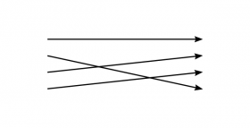
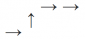
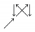
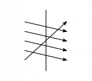
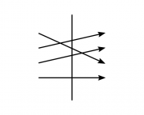
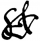
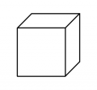
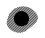

# Editor's Note

_Published by the [Ludwig Wittgenstein Project](https://www.wittgensteinproject.org/)._

_This digital edition is a normalised version of Wittgenstein’s *Nachlass* Ts-310 (so-called *Brown Book*) produced with the Interactive Dynamic Presentation tool[^1] provided by the [Wittgenstein Archives at the University of Bergen (WAB)](http://wab.uib.no/). This original-language text is in the public domain in its country of origin and other countries and areas where the copyright term is the author's life plus 70 years or fewer._

# Brown Book

## Part I

Augustine, in describing his learning of language, says that he was taught to speak by learning the names of things. It is clear that whoever says this has in mind the way in which a child learns such words as “man”, “sugar”, “table”, etc. He does not primarily think of such words as “today”, “not”, “but”, “perhaps”.

Suppose a man described a game of chess, without mentioning the existence and operations of the pawns. His description of the game as a natural phenomenon will be incomplete. On the other hand we may say that he has completely described a simpler game. In this sense we can say that Augustine's description of learning the language was correct for a simpler language than ours. Imagine this language: –

**1).** Its function is the communication between a builder A & his man B. B has to reach A building stones. There are cubes, bricks, slabs, beams, columns. The language consists of the words “cube”, “brick”, “slab”, “column”. A calls out one of these words, upon which B brings a stone of a certain shape. Let us imagine a society in which this is the only system of language. The child learns this language from the grown-ups by being trained to its use. I am using the word “trained” in a way strictly analogous to that in which we talk of an animal being trained to do certain things. It is done by means of example, reward, punishment, and such like. Part of this training is that we point to a building stone, direct the attention of the child towards it, & pronounce a word. I will call this procedure *demonstrative* teaching of words. In the actual  use of this language, one man calls out the words as orders, the other acts according to them. But learning and teaching this language will contain this procedure: The child just “names” things, that is, he pronounces the words of the language when the teacher points to the things. In fact, there will be a still simpler exercise: The child repeats words which the teacher pronounces.

(Note: Objection: The word “brick” in language 1) has not the meaning which it has in *our* language. – This is true if it means that in our language there are usages of the word “brick!” different from our usages of this word in language 1). But don't we sometimes use the word “brick!” in just this way? Or should we say that when we use it, it is an elliptical sentence, a shorthand for “Bring me a brick”? Is it right to say that if *we* say “brick!” we *mean* “Bring me a brick”? Why should I translate the expression “brick!” into the expression, “Bring me a brick”? And if they are synonymous, why shouldn't I say: If he says “brick!” he means “brick!” … ? Or: Why shouldn't he be able to mean just “brick!” if he is able to mean “Bring me a brick”, unless you wish to assert that while he says aloud “brick!” he as a matter of fact always says in his mind, to himself, “Bring me a brick”? But what reason could we have to assert this? Suppose someone asked: If a man gives the order, “Bring me a brick”, must he mean it as four words, or can't he mean it as one composite word synonymous with the one word “brick!”? One is tempted to answer: He *means* all four words if in his language he uses that sentence in contrast with other  sentences in which these words are used, such as, for instance, “Take these two bricks away”. But what if I asked, “But how is his sentence contrasted with these others? Must he have thought them simultaneously, or shortly before or after, or is it sufficient that he should have one time learnt them, etc.?” When we have asked ourselves this question, it appears that it is irrelevant which of these alternatives is the case. And we are inclined to say that all that is really relevant is that these contrasts should exist in the system of language which he is using, and that they need not in any sense be present in his mind when he utters his sentence. Now compare this conclusion with our original question. When we asked it, we seemed to ask a question about the state of mind of the man who says the sentence, whereas the idea of meaning which we arrived at in the end was not that of a state of mind. We think of the meaning of signs sometimes as states of mind of the man using them, sometimes as the role which these signs are playing in a system of language.The connection between these two ideas is that the mental experiences which accompany the use of a sign undoubtedly are caused by our usage of the sign in a particular system of language. William James speaks of specific feelings accompanying the use of such words as “&”, “if”, “or”. And there is no doubt that at least certain gestures are often connected with such words, as a collecting gesture with “and”, & a dismissing gesture with “not”. And there obviously are visual and muscular sensations connected with these gestures. On the other hand it is clear enough that these sensations do not accompany every use of the word “not”, and “&”. If in some language the word “but” meant what “not” means in English, it is clear that we should not compare the meanings of these two  words by comparing the sensations which they produce. Ask yourself what means we have of finding out the feelings which they produce in different people and on different occasions. Ask yourself: “When I said, ‘Give me an apple *&* a pear, *&* leave the room’, had I the same feeling when I pronounced the two words ‘&’?” But we do not deny that the people who use the word “but” as “not” is used in English will broadly speaking have similar sensations accompanying the word “but” as the English have when they use “not”. And the word “but” in the two languages will on the whole be accompanied by different sets of experiences.)

**2).** Let us now look at an extension of language 1). The builder's man knows by heart the series of words from one to ten. On being given the order, “Five slabs!”, he goes to where the slabs are kept, says the words from one to five, takes up a plate for each word, & carries them to the builder. Here both the parties use the language by speaking the words. Learning the numerals by heart will be one of the essential features of learning this language. The use of the numerals will again be taught demonstratively. But now the same word, e.g., “three”, will be taught either by pointing to slabs, or to bricks, or to columns, etc. And on the other hand, different numerals, will be taught by pointing to groups of stones of the same shape.

(Remark: We stressed the importance of learning the series of numerals by heart because there was no feature comparable to this in the learning of language 1). And this shews us that by introducing numerals we have introduced an entirely different

kind of instrument into our language. The difference of kind is much more obvious when we contemplate such a simple example than when we look at our ordinary language with innumerable kinds of words all looking more or less alike when they stand in the dictionary. ‒ ‒

What have the demonstrative explanations of the numerals in common with those of the words “slab”, “column”, etc. except a gesture and pronouncing the words? The way such a gesture is used in the two cases is different. This difference is blurred if one says, “In one case we point to a shape, in the other we point to a number”. The difference becomes obvious and clear only when we contemplate a *complete* example (i.e., the example of a language completely worked out in detail).)

**3).** Let us introduce a new instrument of communication, – a proper name. This is given to a particular object (a particular building stone) by pointing to it and pronouncing the name. If A calls the name, B brings the object. The demonstrative teaching of a proper name is different again from the demonstrative teaching in the cases 1) & 2).

(Remark: This difference does not lie, however, in the act of pointing and pronouncing the word or in any mental act (meaning)﹖ accompanying it, but in the role which the demonstration (pointing & pronouncing) plays in the whole training and in the use which is made of it in the practice of communication by means of this language. One might think that the difference could be described by saying that in the different cases we point to different kinds of objects. But suppose I point with  my hand to a blue jersey. How does pointing to its colour differ from pointing to its shape? – We are inclined to say the difference is that we *mean* something different in the two cases. And “meaning” here is to be some sort of process taking place while we point. What particularly tempts us to this view is that a man on being asked whether he pointed to the colour or the shape is, at least in most cases, able to answer this & to be certain that his answer is correct. If on the other hand, we look for two such characteristic mental acts as meaning the colour and meaning the shape, etc., we aren't able to find any, or at least none which must always accompany pointing to colour, pointing to shape, respectively. We have only a *rough* idea of what it means to concentrate one's attention on the colour as opposed to the shape, or vice versa. The difference one might say does not lie in the act of demonstration, but rather in the surrounding of that act in the use of the language.)

**4).** On being ordered “This slab!”, B brings the plate to which A points. On being ordered, “Plate, there!”, he carries a plate to the place indicated. Is the word “there” taught demonstratively? Yes & no! When a person is trained in the use of the word “there”, the teacher will in training him make the pointing gesture and pronounce the word “there”. But should we say that thereby he gives a place the name “there”? Remember that the pointing gesture in this case is part of the practice of communication itself.

(Remark: It has been suggested that such words as “there”,  “here”, “now”, “this” are the “*real proper names*” as opposed to what in ordinary life we call proper names, & in the view I am referring to, can only be called so crudely. There is a widespread tendency to regard what in ordinary life is called a proper name only as a rough approximation of what ideally could be called so. Compare Russell's idea of the “individual”. He talks of individuals as the ultimate constituents of reality, but says that it is difficult to say which things are individuals. The idea is that further analysis has to reveal this. We, on the other hand, introduced the idea of a proper name in a language in which it was applied to what in ordinary life we call “objects”, “things” (“building stones”).

– “What does the word ‘exactness’ mean? Is it real exactness if you are supposed to come to tea at 4.30 and come when a good clock strikes 4.30? Or would it only be exactness if you began to open the door at the moment the clock begins to strike? But how is this moment to be defined and how is “beginning to open the door” to be defined? Would it be correct to say, ‘It is difficult to say what real exactness is, for all we know is only rough approximations’?”)

**5).** Question and answer: A asks, “How many plates?” B counts them and answers with the numeral.

Systems of communication as for instance 1), 2), 3), 4), 5) we shall call “language-games”. They are more or less akin to what in ordinary language we call games. Children are taught their native language by means of such games, and here they even have the entertaining character of games. We are not,  however, regarding the language-games which we describe as incomplete parts of a language, but as languages complete in themselves, as complete systems of human communication. To keep this point of view in mind, it very often is useful to imagine such a simple language to be the entire system of communication of a tribe in a primitive state of society. Think of primitive arithmetics of such tribes.

When the boy or grown-up learns what one might call special technical languages, e.g., the use of charts and diagrams, descriptive geometry, chemical symbolism, etc., he learns more language-games. (Remark: The picture we have of the language of the grown-up is that of a nebulous mass of language, his mother tongue, surrounded by discreet and more or less clear cut language games, the technical languages.)

**6).** Asking for the name: we introduce new forms of building stones. B points to one of them & asks, “What is this?”; A answers, “This is a … ”. Later on A calls out this new word, say “arch”, & B brings the stone. The words, “This is a … ” together with the pointing gesture we shall call ostensive explanation or ostensive definition. In case 6) a generic name was explained, in actual fact, the name of a shape. But we can ask analogously for the proper name of a particular object, for the name of a colour, of a number \|\| numeral, of a direction.

(Remark: Our use of expressions like “names of numbers”, “names of colours”, “names of materials”, “names of nations” may spring from two different sources. a) One is that we might imagine the functions of proper names, numerals, words for colours,  etc. to be much more alike than they actually are. If we do so we are tempted to think that the function of every word is more or less like the function of a proper name of a person, or such generic names as “table”, “chair”, “door”, etc. The b) second source is this, that if we see how fundamentally different the functions of such words as “table”, “chair”, etc. are from those of proper names, and how different from either the functions of, say, the names of colours, we see no reason why we shouldn't speak of names of numbers or names of directions either, not by way of saying some such thing as “numbers and directions are just different forms of objects”, but rather by way of stressing the analogy which lies in the lack of analogy between the functions of the words “chair” & “Jack” on the one hand, & “east” and “Jack” on the other hand.)

**7).** B has a table in which written signs are placed opposite to pictures of objects (say, a table, a chair, a tea-cup, etc.). A writes one of the signs, B looks for it in the table, looks or points with his finger from the written sign to the picture opposite, & fetches the object which the picture represents.

Let us now look at the different kinds of signs which we have introduced. First let us distinguish between sentences and words. A sentence I will call every complete sign in a language-game, its constituent signs are words. (This is merely a rough and general remark about the way I will use the words “proposition” and “word”). A proposition may consist of only one word. In 1) the signs “brick!”, “column!” are the sentences. In 2) a sentence consists of two words. According  to the role which propositions play in a language-game, we distinguish between orders, questions, explanations, descriptions, & so on.

**8).** If in a language-game similar to 1) A calls out an order: “slab, column, brick!” which is obeyed by B by bringing a slab, a column & a brick, we might here talk of three propositions, or of one only. If on the other hand,

**9).** the order of words shews B the order in which to bring the building stones, we shall say that A calls out a proposition consisting of three words. If the command in this case took the form, “Slab, then column, then brick!” we should say that it consisted of four words (not of five). Amongst the words we see groups of words with similar functions. We can easily see a similarity in the use of the words “one”, “two”, “three”, etc. & again one in the use of “slab”, “column” & “brick”, etc., & thus we distinguish parts of speech. In 8) all words of the proposition belonged to the same part of speech.

**10).** The order in which B had to bring the stones in 9) could have been indicated by the use of the ordinals thus: “Second, column; first, slab; third, brick!”. Here we have a case in which what was the function of the order of words in one language-game is the function of particular words in another.

Reflections such as the preceding will shew us the infinite variety of the functions of words in propositions, and it is curious to compare what we see in our examples with the simple & rigid rules which logicians give for the construction of propositions. If we group words together according to the similarity of their functions, thus distinguishing parts of speech,  it is easy to see that many different ways of classification can be adopted. We could indeed easily imagine a reason for not classing the word “one” together with “two”, “three”, etc., as follows:

**11).** Consider this variation of our language-game 2). Instead of calling out, “One slab!”, “One cube!”, etc., A just calls “slab!”, “cube!”, etc., the use of the other numerals being as described in 2). Suppose that a man accustomed to this form (11)) of communication was introduced to the use of the word “one” as described in 2). We can easily imagine that he would refuse to classify “one” with the numerals “2”, “3”, etc.

(Remark: Think of the reasons for and against classifying “0” with the other cardinals. “Are black and white colours?” In which cases would you be inclined to say so & which not? – Words can in many ways be compared to chess men. Think of the several ways of distinguishing different kind of pieces in the game of chess (e.g., pawns & “officers”).

Remember the phrase, “two or more”.)

It is natural for us to call gestures, as those employed in 4), or pictures as in 7), elements or instruments of language. (We talk sometimes of a language of gestures.) The pictures in 7) & other instruments of language which have a similar function I shall call patterns. (This explanation, as others which we have given, is vague, and meant to be vague.) We may say that words and patterns have different kinds of functions. When we make use of a pattern we compare something with it, e.g.,  a chair with the picture of a chair. We did not compare a slab with the word “slab”. In introducing the distinction, “word, pattern”, the idea was not to set up a final logical duality. We have only singled out two characteristic kinds of instruments from the variety of instruments in our language. We shall call “one”, “two”, “three”, etc. words. If instead of these signs we used “–”, “– –”, “– – –”, “– – – –”, we might call these patterns. Suppose in a language the numerals were “one”, “one one”, “one one one”, etc., should we call “one” a word or a pattern? The same element may in one place be used as word & in another as pattern. A circle might be the name for an ellipse, or on the other hand a pattern with which the ellipse is to be compared by a particular method of projection. Consider also these two systems of expression:

**12).** A gives B an order consisting of two written symbols, the first an irregularly shaped patch of a certain colour, say green, the second the drawn outline of a geometrical figure, say a circle. B brings an object of this outline and that colour, say a circular green object.

**13).** A gives B an order consisting of one symbol, a geometrical figure painted a particular colour, say a green circle. B brings him a green circular object. In 12) patterns correspond to our names of colours and other patterns to our names of shape. The symbols in 13) cannot be regarded as combinations of two such elements. A word in inverted commas can be called a pattern. Thus in the sentence, “He said, ‘Go to hell’”, ‘Go to hell’ is a pattern of what he said. Compare these cases:

a) Someone says, “I whistled \  (whistling a tune)”; b) Someone writes, “I whistled ”. An onomatopoetic word like “rustling” may be called a pattern. We call a very great variety of processes “comparing an object with a pattern”. We comprise many kinds of symbols under the name “pattern”. In 7) B compares a picture in the table with the objects he has before him. But what does comparing a picture with the object consist in? Suppose the table shewed: a) a picture of a hammer, of pincers, of a saw, of a chisel; b) on the other hand, pictures of twenty different kinds of butterflies. Imagine what the comparison in these cases would consist in, & note the difference. Compare with these cases a third case c) where the pictures in the table represent building stones drawn to scale, & the comparing has to be done with ruler and compasses. Suppose that B's task is to bring a piece of cloth of the colour of the sample. How are the colours of sample and cloth to be compared? Imagine a series of different cases:

**14).** A shews the sample to B, upon which B goes and fetches the material “from memory”.

**15).** A gives B the sample, B looks from the sample to the materials on the shelves from which he has to choose.

**16).** B lays the sample on each bolt of material & chooses that one which he can't distinguish from the sample, for which the difference between the sample & the material seems to vanish.

**17).** Imagine on the other hand that the order has been, “Bring a material slightly darker than this sample”. In 14) I said that B fetches the material “from memory”, which is using a  common form of expression. But what might happen in such a case of comparing “from memory” is of the greatest variety. Imagine a few instances:

**14a).** B has a memory image before his mind's eye when he goes for the material. He alternately looks at materials and recalls his image. He goes through this process with, say, five of the bolts, in some instances saying to himself, “Too dark”, in some instances saying to himself, “Too light”. At the fifth bolt he stops, says, “That's it”, & takes it from the shelf.

**14b).** No memory image is before B's eye. He looks at four bolts, shaking his head each time, feeling some sort of mental tension. On reaching the fifth bolt, this tension relaxes, he nods his head, & takes the bolt down.

**14c).** B goes to the shelf without a memory image, looks at five bolts one after the other, takes the fifth bolt from the shelf.

“But this can't be all comparing consists in”.

When we call these three preceding cases cases of comparing from memory, we feel that their description is in a sense unsatisfactory, or incomplete. We are inclined to say that the description has left out the essential feature of such a process & given us accessory features only. The essential feature it seems would be what one might call a specific experience of comparing & of recognizing. Now it is queer that on closely looking at cases of comparing, it is very easy to see a great number of activities and states of mind, all *more or less* characteristic  of the act of comparing. This in fact is so, whether we speak of comparing from memory or of comparing by means of a sample before our eyes. We know a *vast* number of such processes, processes similar to each other in a vast number of different ways. We hold pieces whose colours we want to compare together or near each other for a longer or shorter period, look at them alternately or simultaneously, place them under different lights, say different things while we do so, have memory images, feelings of tension & relaxation, satisfaction & dissatisfaction, the various feelings of strain in and around our eyes accompanying prolonged gazing at the same object, & all possible combinations of these & many other experiences. The more such cases we observe & the closer we look at them, the more doubtful we feel about finding one particular mental experience characteristic of comparing. In fact, if after you had scrutinized a number of such *closely*, I admitted that there existed a peculiar mental experience which you might call the experience of comparing, & that if you insisted, I should be willing to adopt the word “comparing” only for cases in which this peculiar feeling had occurred, you would now feel that the assumption of such a peculiar experience had lost its point, because this experience was placed side by side with a vast number of other experiences which after we have scrutinized the cases seems to be that which really constitutes what connects all the cases of comparing. For the “specific experience” we had been looking for was meant to have played the role which has been assumed by the mass of experiences revealed to us by our  scrutiny: We never wanted the specific experience to be just one among a number of *more or less* characteristic experiences. (One might say that there are two ways of looking at this matter, one as it were, at close quarters, the other as though from a distance and through the medium of a peculiar atmosphere.) In fact we have found that the use which we really make of the word “comparing” is different from that which looking at it from far away we were led to expect. We find that what connects all the cases of comparing is a vast number of overlapping similarities, and as soon as we see this, we feel no longer compelled to say that there must be some one feature common to them all. What ties the ship to the wharf is a rope, and the rope consists of fibres, but it does not get its strength from any fibre which runs through it from one end to the other, but from the fact that there is a vast number of fibres overlapping.

“But surely in case 14c) B acted entirely automatically. If all that happened was really what was described there, he did not know why he chose the bolt he did choose. He had no reason for choosing it. If he chose the right one, he did it as a machine might have done it”. Our first answer is that we did not deny that B in case 14c) had what we should call a personal experience, for we did not say that he didn't see the materials from which he chose or that which he chose, nor that he didn't have muscular and tactile sensations and such like while he did it. Now what would such a reason which justified his choice and made it non-automatic be like? (i.e.: What do we  *imagine* it to be like?) I suppose we should say that the opposite of automatic comparing, as it were, the ideal case of conscious comparing, was that of having a clear memory image before our mind's eye or of seeing a real sample & of having a specific feeling of not being able to distinguish in a particular way between these samples and the material chosen. I suppose that this peculiar sensation is the reason, the justification, for the choice. This specific feeling, one might say, connects the two experiences of seeing the sample, on the one hand, and the material on the other. But if so, what connects this specific experience with either? We don't deny that such an experience might intervene. But looking at it as we did just now, the distinction between automatic and non-automatic appears no longer clear-cut and final as it did at first. We don't mean that this distinction loses its practical value in particular cases, e.g., if asked under particular circumstances, “Did you take this bolt from the shelf automatically, or did you think about it?”, we may be justified in saying that we did not act automatically and give as a reason \|\| explanation we had looked at the material carefully, had tried to recall the memory image of the pattern, & had uttered to ourselves doubts and decisions. This may *in the particular case* be taken to distinguish automatic from non-automatic. In another case however we may distinguish between an automatic & a non-automatic way of the appearance of a memory image, and so on.

If our case 14c) troubles you, you may be inclined to say: “But *why* did he bring just this bolt of material? How has he  recognized it as the right one? What by? – If you ask “why”, do you ask for the cause or for the reason? If for the cause, it is easy enough to think up a physiological or psychological hypothesis which explains this choice under the given conditions. It is the task of the experimental sciences to test such hypotheses. If on the other hand you ask for a reason the answer is, “There need not have been a reason for the choice. A reason is a step preceding the step of the choice. But why should every step be preceded by another one?”

“But then B didn't really *recognize* the material as the right one”. – You needn't reckon 14c) among the cases of recognizing, but if you have become aware of the fact that the processes which we call processes of recognition form a vast family with overlapping similarities, you will probably feel not disinclined to include 14c) in this family, too. – “But doesn't B in this case lack the criterion by which he can recognize the material? In 14a), e.g., he had the memory image and he recognized the material he looked for by its agreement with the image”. – But had he also a picture of this agreement before him, a picture with which he could compare the agreement between the pattern and the bolt to see whether it was the right one? And, on the other hand, couldn't he have been given such a picture? Suppose, e.g., that A wished B to remember that what was wanted was a bolt exactly like the sample, not, as perhaps in other cases, a material slightly darker than the pattern. Couldn't A in this case have given to B an example of the agreement required by giving him two pieces of the same colour (e.g.,  as a kind of reminder)? Is any such link between the order & its execution necessarily the last one? – And if you say that in 14b) at least he had the relaxing of the tension by which to recognize the right material, had he to have an image of this relaxation about him to recognize it as that by which the right material was to be recognized? ‒ ‒

“But supposing B brings the bolt, as in 14c), & on comparing it with the pattern it turns out to be the wrong one?” – But couldn't that have happened in all the other cases as well? Suppose in 14a) the bolt which B brought back was found not to match with the pattern. Wouldn't we in some such cases say that his memory image had changed, in others that the pattern or the material had changed, in others again that the light had changed? It is not difficult to invent cases, imagine circumstances, in which each of these judgements would be made. – “But isn't there after all an essential difference between the cases 14a) & 14c)?”‒ ‒ Certainly! Just that pointed out in the description of these cases. ‒ ‒

In 1) B learnt to bring a building stone on hearing the word “column!” called out. We could imagine what happened in such a case to be this: In B's mind the word called out brought up an image of a column, say; the training had, as we should say, established this association. B takes up that building stone which conforms to his image. – But was this *necessarily* what happened? If the training could bring it about that the idea or image – automatically – arose in B's mind, why shouldn't it bring about B's *actions* without the intervention of an image?

This would only come to a slight variation of the associative mechanism. Bear in mind that the image which is brought up by the word is not arrived at by a rational process (but if it is, this only pushes our argument further back), but that this case is strictly comparable with that of a mechanism in which a button is pressed and an indicator plate appears. In fact this sort of mechanism can be used instead of that of association.

Mental images of colours, shapes, sounds, etc. etc., which play a role in communication by means of language we put in the same category with patches of colour actually seen, sounds heard.

**18).** The object of the training in the use of tables (as in 7)) may be not only to teach the use of one particular table, but it may be to enable the pupil to use or construct himself tables with new coordinations of written signs & pictures. Suppose the first table a person was trained to use contained the four words “hammer”, “pincers”, “saw”, “chisel” & the corresponding pictures. We might now add the picture of another object which the pupil had before him, say of a plane, & correlate with it the word “plane”. We shall make the correlation between this new picture and word as similar as possible to the correlations in the previous table. Thus we might add the new word and picture on the same sheet, and place the new word under the previous words and the new picture under the previous pictures. The pupil will now be encouraged to make use of the new picture and word without the special training which we gave him when we taught him to use the first table.

These acts of encouragement will be of various kinds, and many such acts will only be possible if the pupil responds, and responds in a particular way. Imagine the gestures, sounds, etc. of encouragement you use when you teach a dog to retrieve. Imagine on the other hand, that you tried to teach a cat to retrieve. As the cat will not respond to your encouragement, most of the acts of encouragement which you performed when you trained the dog are here out of the question.

**19).** The pupil could also be trained to give things names of his own invention and to bring the objects when the names are called. He is, e.g., presented with a table on which he finds pictures of objects around him on one side and blank spaces on the other, and he plays the game by writing signs of his own invention opposite the pictures and reacting in the previous way when these signs are used as orders. Or else,

**20).** the game may consist in B's constructing a table and obeying orders given in terms of this table. When the use of a table is taught, and the table consists, say, of two vertical columns, the left hand one containing the names, the right hand one the pictures, a name and a picture being correlated by standing on a horizontal line, an important feature of the training may be that which makes the pupil slide his finger from left to right, as it were the training to draw a series of horizontal lines, one below the other. Such training may help to make the transition from the first table to the new item.

Tables, ostensive definitions, & similar instruments I shall call rules, in accordance with ordinary usage. The use of a rule can be explained by a further rule.

**21).** Consider this example: We introduce different ways of reading tables. Each table consists of two columns of words & pictures, as above. In some cases they are to be read horizontally from left to right, i.e., according to the scheme:

\

In others according to such schemes as:

\

Or:

\

etc.

Schemes of this kind can be adjoined to our tables, as rules for reading them. Could not these rules again be explained by further rules? Certainly. On the other hand, is a rule incompletely explained if no rule for its usage has been given?

We introduce into our language-games the endless series of numerals. But how is this done? Obviously the analogy between this process & that of introducing a series of twenty numerals is not the same as that between introducing a series of twenty numerals and introducing a series of ten numerals. Suppose that our game was like 2) but played with the endless series of numerals. The difference between it & 2) would not be just that more numerals were used. That is to say, suppose that as a matter of fact in playing the game we had actually made use of, say, 155 numerals, the game we play would not be that which could be described by saying that we played the game 2), only with 155 instead of 10 numerals. But what does the difference consist in? (The difference would seem to be almost  one of the spirit in which the games are played.) The difference between games can lie say in the number of the counters used, in the number of squares of the playing board, or in the fact that we use squares in one case & hexagons in the other, & such like. Now the difference between the finite and infinite game does not seem to lie in the material tools of the game; for we should be inclined to say that infinity can't be expressed in them, that is, that we can only conceive of it in our thoughts & hence that it is in these thoughts that the finite and infinite game must be distinguished. (It is queer though that these thoughts should be capable of being expressed in signs.) Let us consider two games. They are both played with cards carrying numbers, and the highest number takes the trick.

**22).** One game is played with a fixed number of such cards, say 32. In the other game we are under certain circumstances allowed to increase the number of cards to as many as we like, by cutting pieces of paper and writing numbers on them. We will call the first of these games bounded, the second unbounded. Suppose a hand of the second game was played & the number of cards actually used was 32. What is the difference in this case between playing a hand *a*) of the unbounded game & playing a hand *b*) of the bounded game?

The difference will not be that between a hand of a bounded game with 32 cards and a hand of a bounded game with a greater number of cards. The number of cards used was, we said, the same. But there will be differences of another kind, e.g., the bounded game is played with a normal pack of cards, the unbounded game with a large supply of blank cards & pencils.

The unbounded game is opened with the question, “How high shall we go?” If the players look up the rules of this game in a book of rules, they will find the phrase “& so on” or “& so on ad inf.” at the end of certain series of rules. So the difference between the two hands *a*) & *b*) lies in the tools we use, though admittedly not in the cards they are played with. But this difference seems trivial and not the essential difference between the games. We feel that there must be a big & essential difference somewhere. But if you look closely at what happens when the hands are played, you find that you can only detect a number of differences in details, each of which would seem inessential. The acts, e.g., of dealing & playing the cards *may* in both cases be identical. In the course of playing the hand *a*), the players may have considered making up more cards, & again discarded the idea. But what was it like to consider this? It could be some such process as saying to themselves or aloud, “I wonder whether I should make up another card”. Again, no such consideration may have entered the minds of the players. It is possible that the whole difference in the events of a hand of the bounded, and a hand of the unbounded game lay in what was said before the game started, e.g., “Let's play the bounded game”.

“But isn't it correct to say that hands of the two different games belong to two different systems?” Certainly. Only the facts which we are referring to by saying that they belong to different systems are much more complex than we might expect them to be.

Let us now compare language-games of which we should say  that they are played with a limited set of numerals with language-games of which we should say that they are played with the endless series of numerals.

**23).** Like 2) A orders B to bring him a number of building stones. The numerals are the signs “1”, “2”, etc. … “9”, each written on a card. A has a set of these cards and gives B the order by shewing him one of the set & calling out one of the words, “slab”, “column”, etc.

**24).** Like 23), only there is no set of indexed cards. The series of numerals 1 … 9 is learned by heart. The numerals are called out in the orders, & the child learns them by word of mouth.

**25).** An abacus is used. A sets the abacus, gives it to B, B goes with it to where the slabs lie, etc.

**26).** B is to count the slabs in a heap. He does it with an abacus, the abacus has twenty beads. There are never more than 20 plates in a heap. B sets the abacus for the heap in question & shews A the abacus thus set.

**27).** Like 26). The abacus has 20 small beads & one large one. If the heap contains more than 20 plates, the large bead is moved. (So the large bead in some way corresponds to the word “many”).

**28).** Like 26). If the heap contains n plates, n being more than 20 but less than 40, B moves n-20 beads, shews A the abacus thus set, & claps his hand once.

**29).** A & B use the numerals of the decimal system (written or spoken) up to 20. The child learning this language learns these  numerals by heart, etc., as in 2).

**30).** A certain tribe has a language of the kind 2). The numerals used are those of our decimal system. No one numeral used can be observed to play the predominant role of the last numeral in some of the above games (27), 28)). (One is tempted to continue this sentence by saying, “although there is of course a highest numeral actually used”). The children of the tribe learn the numerals in this way: They are taught the signs from 1 to 20 as in 2) and to count rows of beads of no more than 20 on being ordered, “Count these”. When in counting the pupil arrives at the numeral 20, one makes a gesture suggestive of “Go on”, upon which the child says (in most cases at any rate) “21”. Analogously, the children are made to count to 22 & to higher numbers, no particular number playing in these exercises the predominant role of a last one. The last stage of the training is that the child is ordered to count a group of objects, well above 20, without the suggestive gesture being used to help the child over the numeral 20. If a child does not respond to the suggestive gesture, it is separated from the others and treated as a lunatic.

**31).** Another tribe. Its language is like that in 30). The highest numeral observed in use is 159. In the life of this tribe the numeral 159 plays a peculiar role. Supposing I said, “They treat this number as their highest”, – but what does this mean? Could we answer: “They just say that it is the highest”? – They say certain words, but how do we know what they mean by them? A criterion for what they mean would be the occasions  on which the word we are inclined to translate into our word “highest” is used, the role, we might say, which we observe this word to play in the life of the tribe. In fact we could easily imagine the numeral 159 to be used on such occasions, in connection with such gestures and forms of behaviour as would make us say that this numeral plays the role of an unsurmountable limit, even if the tribe had no word corresponding to our “highest”, and the criteria for numeral 159 being the highest numeral did not consist of anything that was *said* about the numeral.

**32).** A tribe has two systems of counting. People learned to count with the alphabet from A to Z and also with the decimal system as in 30). If a man is to count objects with the first system, he is ordered to count “*in the closed way*”, in the second case, “*in the open way*”; & the tribe uses the words “closed” & “open” also for a closed and open door.

(Remarks: 23) is limited in an obvious way by the set of cards. 24): Note analogy and lack of analogy between the *limited supply* of cards in 23) & of words in our memory in 24). Observe that the limitation in 26) on the one hand lies in the *tool* (the abacus of 20 beads) & its usage in our game, on the other hand (in a totally different way) in the fact that in the actual practice of playing the game no more than 20 objects are ever to be counted. In 27) that latter kind of limitation was absent, but the large bead rather stressed the limitation of our means. Is 28) a limited or an unlimited game? The practice we have described gives the limit 40. We are inclined to say this game “has it in it” to be continued indefinitely, but remember  that we could also have construed the preceding games as beginnings of a system. In 29) the systematic aspect of the numerals used is even more conspicuous than in 28). One might say that there was no limitation imposed by the tools of this game, if it were not for the remark that the numerals up to 20 are learnt by heart. This suggests the idea that the child is not taught to “*understand*” the system which we see in the decimal notation. Of the tribe in 30) we should certainly say that they are trained to construct numerals indefinitely, that the arithmetic of their language is not a finite one, that their series of numbers has no end. (It is just in such a case when numerals are constructed “indefinitely” that we say that people have the infinite series of numbers.) 31) might shew you what a vast variety of cases can be imagined in which we should be inclined to say that the arithmetic of the tribe deals with a finite series of numbers, even in spite of the fact that the way in which the children are trained in the use of numerals suggests no upper limit. In 32) the terms “closed” & “open” (which could by a slight variation of the example be replaced by “limited” and “unlimited”) are introduced into the language of the tribe itself. Introduced in that simple and clearly circumscribed game, there is of course nothing mysterious about the use of the word “open”. But this word corresponds to our “infinite”, & the games we play with the latter differ from 31) only by being vastly more complicated. In other words, our use of the word “infinite” is just as *straight forward* as that of “open” in 31 \|\| 32?), and our idea that its meaning is  “transcendent” rests on a misunderstanding.)

We might say roughly that the unlimited cases are characterized by this: that they are not played with a *definite supply* of numerals, but instead with a *system* for constructing numerals (indefinitely). When we say that someone has been supplied with a system for constructing numerals, we generally think of either of three things: a) of giving him a *training* similar to that described in 30), which, experience teaches us, will make him pass tests of the kind mentioned there; b) of creating a *disposition* in the same man's mind, or brain, to react in that way; c) of supplying him with a *general rule* for the construction of numerals.

What do we call a rule? Consider this example:

**33).** B moves about according to rules which A gives him. B is supplied with the following table:

|   |   |
|---|---|
|a |→ |
|b |← |
|c |↑ |
|d |↓ |

A gives an order made up of the letters in the table, say: “a a c a d d d”. B looks up the arrow corresponding to each letter of the order and moves accordingly; in our example thus:

\

The table 33) we should call a rule (or else “the expression of a rule”. Why I give these synonymous expressions will appear later.) We shan't be inclined to call the sentence “a a c a d d d” itself a rule. It is of course the description of the way B has to take. On the other hand, such a description would under certain circumstances be called a rule, e.g., in the following case:

**34).** B is to draw various ornamental linear designs. Each design is a repetition of one element which A gives him. Thus if A gives the order “c a d a”, B draws a line thus: \

In this case I think we should say that “c a d a” is the rule for drawing the design. Roughly speaking, it characterizes what we call a rule to be applied repeatedly, in an indefinite number of instances. Cf., e.g., the following case with 34):

**35).** A game played with pieces of various shapes on a chess board. The way each piece is allowed to move is laid down by a rule. Thus the rule for a particular piece is “ac”, for another piece “acaa”, & so on. The first piece then can make a move like this: \ , the second, like this: \ . Both a formula like “ac” or a diagram like that corresponding to such a formula might here be called a rule.

**36).** Suppose that after playing the game 33) several times as described above, it was played with this variation: that B no longer looked at the table, but reading A's order the letters call up the images of the arrows (by association), & B acts according to these imagined arrows.

**37).** After playing it like this for several times, B moves about according to the written order as he would have done had he looked up or imagined the arrows, but actually without any such picture intervening. Imagine even this variation:

**38).** B in being trained to follow a written order, is shewn the table of 33) once, upon which he obeys A's orders without further intervention of the table in the same way in which B in  33) does with the help of the table on each occasion.

In each of these cases, we might say that the table 33) is a rule of the game. But in each one this rule plays a different role. In 33) the table is an instrument used in what we should call *the practice* of the game. It is replaced in 36) by the working of association. In 37) even this shadow of the table has dropped out of the practice of the game, and in 38) the table is admittedly an instrument for the *training* of B only.

But imagine this further case:

**39).** A certain system of communication is used by a tribe. I will describe it by saying that it is similar to our game 38) except that no table is used in the training. The training *might* have consisted in several times leading the pupil by the hand along the path one wanted him to go. But we could also imagine a case:

**40).** where even this training is not necessary, where, as we should say, the look of the letters abcd naturally produced an urge to move in the way described. This cause at first sight looks puzzling. We seem to be assuming a most unusual working of the mind. Or we may ask \|\| perhaps we ask, “How on earth is he to know which way to move if the letter *a* is shewn him”? But isn't B's reaction in this case the very reaction described in 37) & 38), & in fact our usual reaction when for instance we hear and obey an order? For, the fact that the training in 38) & 39) *preceded* the carrying out of the order does not change the process of carrying out. In other words the “curious mental mechanism” assumed in 40) is no other than that which we assumed to be  created by the training in 37) and 38). “But *could* such a mechanism be born with you?” But did you find any difficulty in assuming that *that* mechanism was born with B, which enabled him to respond to the training in the way he did? And remember that the rule or explanation given in table 33) of the signs abcd was not essentially the last one, and that we might have given a table for the use of such tables, and so on. (Cf. 21)).

How does one explain to a man how he should carry out the order, “Go *this* way!” (pointing with an arrow the way he should go)? Couldn't this mean going the direction which we should call the opposite of that of the arrow? Isn't every explanation of how he should follow the arrow in the position of another arrow? What would you say to this explanation: A man says, “If I point this way (pointing with his right hand) I mean you to go like this” (pointing with his left hand the same way)? This just shews you the extremes between which the uses of signs vary.

Let us return to 39). Someone visits the tribe and observes the use of the signs in their language. He describes the language by saying that its sentences consist of the letters abcd used according to the table: (of 33)). We see that the expression, “A game is played according to the rule so-and-so” is used not only in the variety of cases exemplified by 36), 37), & 38), but even in cases where the rule is neither an instrument of the training nor of the practice of the game, but stands in the relation to it in which our table stands to the practice of our game 39). One might in this case call the table a natural  law describing the behaviour of the people of this tribe. Or we might say that the table is a record belonging to the natural history of the tribe.

Note that in the game 33) I distinguished sharply between the order to be carried out and the rule employed. In 34) on the other hand, we called the sentence “c a d a” a rule, & it was the order. Imagine also this variation:

**41).** The game is similar to 33), but the pupil is not just trained to use a single table; but the training aims at making the pupil use any table correlating letters with arrows. Now by this I mean no more than that the training is of a peculiar kind, roughly speaking one analogous to that described in 30). I will refer to a training more or less similar to that in 30) as a “*general training*”. General trainings form a family whose members differ greatly from one another. The kind of thing I'm thinking of now mainly consists: *a*) of a training in a limited range of actions, *b*) of giving the pupil a lead to extend this range, & *c*) of random exercises and tests. After the general training the order is now to consist in giving him a sign of this kind:

rrtst

|   |   |
|---|---|
|r |↗ |
|s |↖ |
|t |↓ |

He carries out the order by moving thus:

\

Here I suppose we should say the table, the rule, is *part* of the order.

Note, we are not saying “*what a rule is*” but just giving different applications of the word “rule”; & we certainly do this by giving applications of the words “expression of a rule”.

Note also that in 41) there is no clear case against calling  the whole symbol given the sentence, though we *might* distinguish in it between the sentence and the table. What in this case more particularly tempts us to this distinction is the linear writing of the part outside the table. Though from certain points of view we should call the linear character of the sentence merely external and inessential, this character and similar ones play a great role in what as logicians we are inclined to say about sentences and propositions. And therefore if we conceive of the symbol in 41) as a unit, this may make us realise what a sentence *can* look like.

Let us now consider these two games:

**42).** A gives orders to B: they are written signs consisting of dots and dashes and B executes them by doing a figure in dancing with a particular step. Thus the order “– ·” is to be carried out by taking a step and a hop alternately; the order “· · – – –” by alternately taking two hops and three steps, etc. The training in this game is “general” in the sense explained in 41); and I should like to say, “the orders given don't move in a limited range. They comprise combinations of any number of dots and dashes”. – But what does it mean to say that the orders don't move in a limited range? Isn't this nonsense? Whatever orders are given in the practice of the game constitute the limited range. – Well, what I meant to say by “the orders don't move in a limited range” was that neither in the teaching of the game nor in the practice of it a limitation of the range plays a “predominant” role (see 30)) or, as we might say, the range of the game (it is superfluous to say  limited) is just the extent of its actual (“accidental”) practice. (Our game is in this way like 30)) Cf. with this game the following:

**43).** The orders and their execution as in 42); but only these three signs are used: “– ·”, “– · ·”, “· – –”. We say that in 42) B in executing the order is *guided* by the sign given to him. But if we ask ourselves whether the three signs in 43) guide B in executing the orders, it seems that we can say both yes and no according to the way we look at the execution of the orders.

If we try to decide whether B in 43) is guided by the signs or not, we are inclined to give such answers as the following: *a*) B is guided if he doesn't just look at an order, say “· – –” as a whole and then act, but if he reads it “word by word” (the words used in our language being “·” “–”) and acts according to the words he has read.

We could make these cases clearer if we imagine that the “reading word by word” consisted in pointing to each word of the sentence in turn with one's finger as opposed to pointing at the whole sentence at once, say by pointing to the beginning of the sentence. And the “acting according to the words” we shall for the sake of simplicity imagine to consist in acting (stepping or hopping) after each word of the sentence in turn. – *b*) B is guided if he goes through a conscious process which makes a connection between the pointing to a word and the act of hopping and stepping. Such a connection could be imagined in many different ways. E.g., B has a table in which a dash  is correlated to the picture of a man making a step and a dot to a picture of a man hopping. Then the conscious acts connecting reading the order and carrying it out might consist in consulting the table, or in consulting a memory image of it “with one's mind's eye”. *c*) B is guided if he does not just react to looking at each word of the order, but experiences the peculiar strain of “trying to remember what the sign means”, & further, the relaxing of this strain when the meaning, the right action, comes before his mind.

All these explanations seem in a peculiar way unsatisfactory, and it is the limitation of our game which makes them unsatisfactory. This is expressed by the explanation that B is guided by the particular combination of words in one of our three sentences if he *could* also have carried out orders consisting in other combinations of dots and dashes. And if we say this, it seems to us that the “*ability*” to carry out other orders is a particular state of the person carrying out the orders of 42). And at the same time we can't in this case find anything which we should call such a state.

Let us see what role the words “can” or “to be able to” play in our language. Consider these examples:

**44).** Imagine that for some purpose or other people use a kind of instrument or tool; this consists of a board with a slot in it guiding the movement of a peg. The man using the tool slides the peg along the slot. There are such boards with straight slots, circular slots, elliptic slots, etc. The language of the people using this instrument has expressions for  describing the activity of moving the peg in the slot. They talk of moving it in a circle, in a straight line, etc. They also have a means of describing the board used. They do it in this form: “This is a board in which the peg *can* be moved in a circle”. One could in this case call the word “can” an operator by means of which the form of expression describing an action is transformed into a description of the instrument.

**45).** Imagine a people in whose language there is no such form of sentence as “the book is in the drawer” or “water is in the glass”, but wherever we should use these forms they say, “The book can be taken out of the drawer”, “The water can be taken out of the glass”.

**46).** An activity of the men of a certain tribe is to test sticks as to their hardness. They do it by trying to bend the sticks with their hands. In their language they have expressions of the form, “This stick can be bent easily” or “This stick can be bent with difficulty”. They use these expressions as we use “This stick is soft” or “This stick is hard”. I mean to say that they don't use the expression, “This stick can be bent easily” as we should use the sentence “I am bending the stick with ease”. Rather they use their expression in a way which would make us say that they are describing a state of the stick. I.e., they use such sentences as, “This hut is built of sticks that can be bent easily”. (Think of the way in which we form adjectives out of verbs by means of the ending “-able”, e.g., “deformable”.)

Now we might say that in the last three cases the sentences  of the form “so-and-so can happen” described the state of objects, but there are great differences between these examples. In 44) we saw the state described before our eyes. We saw that the board had a circular or a straight slot, etc. In 45), in some instances at least this was the case, we could see the objects in the box, the water in the glass, etc. In such cases we use the expression “state of an object” in such a way that there corresponds to it what one might call a stationary sense experience.

When on the other hand, we talk of the state of a stick in 46), observe that to this “state” there does not correspond a particular sense experience which lasts while the state lasts. Instead of that, the defining criterion for something being in this state consists in certain *tests*.

We may say that a car travels 20 miles an hour even if it only travels for half an hour. We can explain our form of expression by saying that the car travels with a speed which enables it to make 20 miles an hour. And here also we are inclined to talk of the velocity of the car as of a state of its motion. I think we should not use this expression if we had no other “experiences of motion” than those of a body being in a particular place at a certain time and in another place at another time; if, e.g., our experiences of motion were of the kind which we have when we see the hour hand of the clock has moved from one point of the dial to the other.

**47).** A tribe has in its language commands for the execution of certain actions of men in warfare, something like “Shoot!”,  “Run!”, “Crawl!”, etc. They also have a way of describing a man's build. Such a description has the form “He can run fast”, “He can throw the spear far”. What justifies me in saying that these sentences are descriptions of the man's build is the use which they make of sentences of this form. Thus if they see a man with bulging leg muscles but who as we should say has not the use of his legs for some reason or other, they say he is a man who can run fast. The drawn image of a man which shews large biceps they describe as representing a man “who can throw a spear far”.

**48).** The men of a tribe are subjected to a kind of medical examination before going into war. The examiner puts the men through a set of standardised tests. He lets them lift certain weights, swing their arms, skip, etc. The examiner then gives his verdict in the form “So-and-so can throw a spear” or “can throw a boomerang” or “is fit to pursue the enemy”, etc. There are no special expressions in the language of this tribe for the activities performed in the tests; but these are referred to only as the tests for certain activities in warfare.

It is an important remark concerning this example and others which we give that one may object to the description which we give of the language of a tribe, that in the specimens we give of their language we let them speak English, thereby already presupposing the whole background of the English language, that is, our usual meanings of the words. Thus if I say that in a certain language there is no special verb for “skipping”, but that this language uses instead the form “making  the test for throwing the boomerang”, one may ask how I have characterized the use of the expressions, “make a test for” & “throwing the boomerang”, to be justified in substituting these English expressions for whatever their actual words may be. To this we must answer that we have only given a very sketchy description of the practices of our fictitious languages, in some cases only hints, but that one can easily make these descriptions more complete. Thus in 48) I could have said that the examiner uses orders for making the men go through the tests. These orders all begin with one particular expression which I could translate into the English words, “Go through the test”. And this expression is followed by one which in actual warfare is used for certain actions. Thus there is a command upon which men throw their boomerangs and which therefore I should translate into, “Throw the boomerangs”. Further, if a man gives an account of the battle to his chief, he again uses the expression I have translated into “Throw a boomerang”, this time in a description. Now what characterizes an order as such or a description as such or a question as such, etc., is – as we have said – the role which the utterance of these signs plays in the whole practice of the language. That is to say, whether a word of the language of our tribe is rightly translated into a word of the English language depends upon the role this word plays in the whole life of the tribe; the occasions on which it is used, the expressions of emotions by which it is generally accompanied, the ideas which it generally awakens or which prompt its saying, etc. etc. As an exercise ask yourself: in which  cases would you say that a certain word uttered by the people of the tribe was a greeting? In which cases should we say it corresponded to our “Goodbye”, in which to our “Hello”? In which cases would you say that a word of a foreign language corresponded to our “perhaps”? – to our expressions of doubt, trust, certainty? You will find that the justifications for calling something an expression of doubt, conviction, etc. largely, though of course not wholly, consist in descriptions of gestures, the play of facial expressions, and even the tone of voice. Remember at this point that the personal experiences of an emotion must in part be strictly localized experiences; for if I frown in anger I feel the muscular tension of the frown in my forehead, & if I weep, the sensations around my eyes are obviously part, and an important part, of what I feel. This is, I think, what William James meant when he said that a man doesn't cry because he is sad but that he is sad because he cries. The reason why this point is often not understood is that we think of the utterance of an emotion as though it were some artificial device to let others know that we have it. Now there is no sharp line between such “artificial devices” and what one might call the natural expressions of emotion. Cf. in this respect: *a*) weeping, *b*) raising one's voice when one is angry, *c*) writing an angry letter, *d*) ringing the bell for a servant you wish to scold.

**49).** Imagine a tribe in whose language there is an expression corresponding to our “He has done so-and-so” and another expression corresponding to our “He can do so-and-so”, this latter  expression, however, being only used where its use is justified by the same fact which would also justify the former expression. Now what can make me say this? They have a form of communication which we should call narration of past events because of the circumstances under which it is employed. There are also circumstances under which we should ask and answer such questions as “Can so-and-so do this?”. Such circumstances can be described, e.g., by saying that a chief picks men suitable for a certain action, say crossing a river, climbing a mountain, etc. As the defining criteria of “the chief picking men suitable for this action”, I will not take what he says but only the other features of the situation. The chief under these circumstances asks a question which, as far as its practical consequences go, would have to be translated by our “Can so-and-so swim across this river?” This question, however, is only answered affirmatively by those who actually have swum across this river. This answer is not given in the same words in which under the circumstances characterizing narration he would say that he has swum across this river, but it is given in the terms of the question asked by the chief. On the other hand, this answer is not given in cases in which we should certainly give the answer, “I can swim across this river”, if, e.g., I had performed more difficult feats of swimming though not just that of swimming across this particular river.

By the way, have the two phrases, “He has done so-&-so” and “He can do so-&-so” the same meaning in this language or have they different meanings? If you think about it, something  will tempt you to say the one, something to say the other. This only shows that the question has here no clearly defined meaning. All I can say is: If the fact that they only say, “He can … ” if he has done … is your criterion for the same meaning, then the two expressions have the same meaning. If the circumstances under which an expression is used make its meaning, the meanings are different. The use which is made of the word “can” – the expression of possibility in 49) – can throw a light upon the idea that what can happen must have happened before (Nietzsche). It will also be interesting to look, in the light of our examples, on the statement that what happens can happen.

Before we go on with our consideration of the use of “the expression of possibility”, let us get clearer about that department of our language in which things are said about past & future, that is, about the use of sentences containing such expressions as “yesterday”, “a year ago”, “in five minutes”, “before I did this”, etc. Consider this example:

**50).** Imagine how a child might be trained in the practice of “narration of past events”. He was first trained in asking for certain things (as it were, in giving orders. See 1).) Part of this training was the exercise of “naming the things”. He has thus learnt to name (& ask for) a dozen of his toys. Say now that he has played with three of them (e.g., a ball, a stick, and a rattle), then they are taken away from him, and now the grown-up says such a phrase as, “He's had a ball, a stick, and a rattle”. On a similar occasion he stops short in the enumeration  and induces the child to complete it. On another occasion, perhaps, he only says, “He's had … ” and leaves the child to give the whole enumeration. Now the way of “inducing the child to go on” can be this: He stops short in his enumeration with a facial expression and a raised tone of voice which we should call one of expectancy. All then depends on whether the child will react to this “inducement” or not. Now there is a queer misunderstanding we are most liable to fall into, which consists in regarding the “outward means” the teacher uses to induce the child to go on as what we might call an indirect means of making himself understood to the child. We treat \|\| regard the case as though the child already possessed a language in which it thought and that the teacher's job is to induce it to guess his meaning in the realm of meanings before the child's mind, as though the child could in his own private language ask himself such a question as, “Does he want me to continue, or repeat what he said, or something else?” (Cf. with 30)).

**51).** Another example of a primitive kind of narration of past events: we live in a landscape with characteristic natural landmarks against the horizon. It is therefore easy to remember the place at which the sun rises at a particular season, or the place above which it stands when at its highest point, or the place at which it sets. We have some characteristic pictures of the sun in different positions in our landscape. Let us call this series of pictures the sun series. We have also some characteristic pictures of the activities of a child, lying in bed, getting up, dressing, lunching, etc. This *set*  I'll call the life pictures. I imagine that the child can frequently see the position of the sun while about the day's activities. We draw the child's attention to the sun's standing in a certain place while the child is occupied in a particular way. We then let it look both at a picture representing its occupation and at a picture showing the sun in its position at that time. We can thus roughly tell the story of the child's day by laying out a row of the life pictures, and above it what I called the sun series, the two rows in the proper correlation. We shall then proceed to let the child supplement such a picture story, which we leave incomplete. And I wish to say at this point that this form of training (see 50) and 30)) is one of the big characteristic features in the use of language, or in thinking.

**52).** A variation of 51). There is a big clock in the nursery, for simplicity's sake imagine it with an hour hand only. The story of the child's day is narrated as above, but there is no sun series; instead we write one of the digits \|\| numbers of the dial against each life picture.

**53).** Note that there would have been a similar game in which also, as we might say, time was involved, that of just laying out a series of life pictures. We might play this game with the help of words which would correspond to our “before” and “after”. In this sense we may say that 53) involves the ideas of before and after, but not the idea of a measurement of time. I needn't say that an easy step would lead us from the narrations in 51), 52), & 53) to narrations in words. Possibly someone

considering such forms of narration might think that in them the real idea of time isn't yet involved at all, but only some crude substitute for it, the position of a clock hand and such like. Now if a man claimed that there is an idea of “five o'clock” which does not bring in a clock, that the clock is only the coarse instrument indicating when it is five o'clock or that there is an idea of an hour which does not bring in an instrument for measuring the time, I will not contradict him, but I will ask him to explain to me what his use of the term “an hour” or “five o'clock” is. And if it is not that involving a clock, it is a different one; and then I will ask him why he uses the term “five o'clock”, “an hour”, “a long time”, “a short time”, etc., in one case in connection with a clock, in the other independent of one; it will be because of certain analogies holding between the two uses, but we have now two uses of these terms, and no reason to say that one of them is less real and pure than the other. This might get clearer by considering the following example:

**54).** If we give a person the order, “Say a number, any one which comes into your mind”, he can generally comply with it at once. Suppose it were found that the numbers thus said on request increased – with every normal person – as the day went on; a man starts out with some small number every morning and reaches the highest number before falling asleep at night. Consider what could tempt one to call the reactions described “a means of measuring time” or even to say that they are the *real* milestones in the passage of time, the sun clocks, etc.  being only indirect markers. \|\| indicators. (Examine the statement that the human heart is the real clock behind all the other clocks).

Let us now consider further language-games into which temporal expressions enter.

**55).** This arises out of 1). If an order like “Slab!”, “Column!”, etc. is called out, B is trained to carry it out immediately. We now introduce a clock into this game, an order is given, and we train the child not to carry it out until the hand of our clock reaches a point indicated before with the finger. (This might, e.g., be done in this way: You first trained the child to carry out the order immediately. You then give the order, but hold the child back, releasing it only when the hand of the clock has reached the point of the dial to which we point with our fingers.)

We could at this stage introduce such a word as “now”. We have two kinds of orders in this game, the orders used in 1), and orders consisting of these together with a gesture indicating a point of the clock dial. In order to make the distinction between these two kinds more explicit, we may affix a particular sign to the orders of the first kind and e.g., say: “slab, now!”.

It would be easy now to describe language-games in such expressions as “in five minutes”, “half an hour ago”.

**56).** Let us now have the case of a *description* of the future, a forecast. One might, e.g., awaken the tension of expectation in a child by keeping his attention for a considerable time on some traffic lights changing their colour periodically. We also have a red, a green, and a yellow disc before us and alternately  point to one of these discs by way of forecasting the colour which will appear next. It is easy to imagine further developements of this game.

Looking at these language-games, we don't come across the ideas of the past, the future, and the present in their problematic and almost mysterious aspect. What this aspect is and how it comes about that it appears can be most characteristically exemplified if we look at the question, “Where does the present go when it becomes past, and where is the past?” – under what circumstances has this question an allurement for us? For under certain circumstances it hasn't, and we should wave it away as nonsense.

It is clear that this question most easily arises if we are preoccupied with cases in which there are things flowing by us, – as logs of wood float down a river. In such a case we can say the logs which *have passed* us are all down towards the left and the logs which *will pass* us are all up towards the right. We then use this situation as a simile for all happening in time and even embody the simile in our language, as when we say that “the present event passes by” (a log passes by), “the future event is to come” (a log is to come). We talk about the flow of events; but also about the flow of time – the river on which the logs travel.

Here is one of the most fertile sources of philosophic puzzlement: We talk of the future event of something coming into my room, and also of the future coming of this event.

We say, “Something will happen”, and also, “Something  comes towards me”; we refer to the log as to “something”, but also to the log's coming towards me.

Thus it can come about that we aren't able to rid ourselves of the implications of our symbolism, which seems to admit of a question like, “where does the flame of a candle go to when it's blown out?”, “Where does the light go to?”, “Where does the past go to?”. We have become obsessed with our symbolism. We may say that we are led into puzzlement by an analogy which irresistibly drags us on. – And this also happens when the meaning of the word “now” appears to us in a mysterious light. In our example 55) it appears that the function of “now” is in no way comparable to the function of an expression like “five o'clock”, “midday”, “the time when the sun sets”, etc. This latter group of expressions I might call “specifications \|\| “determinations of times”. But our ordinary language uses the word “now” and determinations of time in similar contexts. Thus we say “The sun sets now”. \|\| “The sun sets at six o' clock”. We are inclined to say that both “now” and “six o'clock” “refer to points of time”. This use of words produces a puzzlement which one might express in the question, “What is the ‘now’? – for it is a moment of time and yet it can't be said to be either the ‘moment at which I speak’ or the ‘moment at which the clock strikes’ etc., etc.”‒ ‒ Our answer is: The function of the word “now” is entirely different from that of a specification of time. – This can easily be seen if we look at the role this word really plays in our usage of language, but it is obscured when instead of looking at the *whole language-game*, we only look at the contexts, the phrases  of language in which the word is used. (The word “today” is not a date, but it isn't anything like it either. It doesn't differ from a date as a hammer differs from a mallet, but as a hammer differs from a nail; and surely we may say there is both a connection between a hammer and a mallet and between a hammer and a nail.)

One has been tempted to say that “now” is the name of an instant of time, and this, of course, would be like saying that “here” is the name of a place, “this” the name of a thing, and “I” the name of a man. (One could of course also have said “a year ago” was the name of a time, “over there” the name of a place, and “you” the name of a person.) But nothing is more unlike than the use of the word “this” and the use of a proper name, – I mean *the games* played with these words, not the phrases in which they are used. For we do say, “This is short” and “Jack is short”; but remember that “This is short” without the pointing gesture and without the thing we are pointing to would be meaningless. – What can be compared with a name is not the word “this” but, if you like, the symbol consisting of this word, the gesture, and the sample. We might say: Nothing is more characteristic of a proper name A than that we can use it in such a phrase as, “This is A”; & it makes no sense to say, “This is this” or “Now is now” or “Here is here”.

The idea of a proposition saying something about what will happen in the future is even more liable to puzzle us than the idea of a proposition about the past. For comparing future events with past events, one may almost be inclined to say that  though the past events do not really exist in the full light of day, they exist in an underworld into which they have passed out of the real life; whereas the future events do not even have this shadowy existence. We could, of course, imagine a realm of the unborn, future events, whence they come into reality and pass into the realm of the past; and, thinking \|\| if we think in terms of this metaphor, we may be surprised that the future should appear less existent than the past. Remember, however, that the grammar of our temporal expressions is not symmetrical with respect to an origin corresponding with the present moment. Thus the grammar of the expressions relating to memory does not reappear “with opposite sign” in the grammar of the future tense. \|\| Thus there is nothing in the grammar of the future tense corresponding to the grammar of the word “memory”. This part of the grammar of the past tense does not recur “with its sign changed” on the future side. This is the reason why it has been said that propositions concerning future events are not really propositions. And to say this, is all right as long as it isn't meant to be more than a decision about the use of the term “proposition”; a decision which, though not agreeing with the common usage of the word “proposition”, may come natural to human beings under certain circumstances. If a philosopher says that propositions about the future are not real propositions, it is because he has been struck by the asymmetry in the grammar of temporal expressions. The danger is, however, that he imagines he has made a kind of scientific statement about “the nature of the future”.

**57).** A game is played in this way: A man throws a die, and before throwing he draws on a piece of paper some one of the six faces of the die. If, after having thrown, the face of the die turning up is the one he has drawn, he feels (expresses) satisfaction. If a different face turns up, he is dissatisfied. Or, let there be two partners and every time one guesses correctly what he will throw his partner pays him a penny, and if incorrectly, he pays his partner. Drawing the face of the die will under the circumstances of this game be called “making a guess” or a “conjecture”.

**58).** In a certain tribe contests are held in running, putting the weight, etc. and the spectators stake money \|\| possessions on the competitors. The pictures of all the competitors are placed in a row, and what I called the spectators' staking property on one of the competitors consists in laying this property (pieces of gold) under one of the pictures. If a man has placed his gold under the picture of the winner in the competition he gets back his stake doubled. Otherwise he loses his stake. Such a custom we should undoubtedly call betting, even if we observed it in a society whose language held no scheme for stating “degrees of probability”, “chances” and the like. I assume that the behaviour of the spectators expresses great keenness and excitement before and after the result \|\| outcome of the bet is known. I further imagine that on examining the placing of the bets I can understand “*why*” they were thus placed. I mean: In a competition between two wrestlers, mostly the bigger man is the favorite; or if the smaller, I find that he has shown greater  strength on previous occasions, or that the bigger had recently been ill, or had neglected his training, etc. Now this may be so although the language of the tribe does not express reasons for the placing of the bets. That is to say, nothing in their language corresponds to our saying, e.g., “I bet on this man because he has kept fit, whereas the other has neglected his training”, and such like. I might describe this state of affairs by saying that my observation has taught me certain *causes* for their placing their bets as they do, but that the bettors had \|\| used no *reasons* for acting as they did.

The tribe may, on the other hand, have a language which comprises “giving reasons”. Now this game of giving the reason why one acts in a particular way does not involve finding the causes of one's actions (by frequent observations of the conditions under which they arise). Let us imagine this:

**59).** If a man of our tribe has lost his bet and upon this is chaffed or scolded, he points out, possibly exaggerating, certain features of the man on whom he has laid his bet. One can imagine a discussion of pros and cons going on in this way: two people pointing out alternately certain features of the two competitors whose chances, as we should say, they are discussing; A pointing with a gesture to the great height of the one, B in answer to this shrugging his shoulders and pointing to the size of the other's biceps, and so on. I could easily add more details which would make us say that A and B are giving reasons for laying a bet on one person rather than on the other.

Now one might say \|\| suggest that giving reasons in this way for  laying their bets certainly presupposes that they have observed causal connections between the result of a fight, say, and certain features of the bodies of the fighters, or of their training. But this is an assumption which, whether reasonable or not, I certainly have not made in the description of our case. (Nor have I made the assumption that the bettors give reasons for their reasons.) We should in a case like that just described not be surprised if the language of the tribe contained what we should call expressions of degrees of belief, conviction, certainty. These expressions we could imagine to consist in the use of a particular word spoken with different intonations, or a series of words. (I am not thinking however of the use of a scale of probabilities.) – It is also easy to imagine that the people of our tribe accompany their betting by verbal expressions which we translate into, “I believe that so-and-so *can* beat so-and-so in wrestling”, etc.

**60).** Imagine in a similar way conjectures being made as to whether a certain load of gunpowder will be sufficient to blast a certain rock, and the conjecture to be expressed in a phrase of the form, “This quantity of gunpowder can blast this rock”.

**61).** Compare with 60) the case in which the expression, “I shall be able to lift this weight”, is used as an abbreviation for the conjecture, “My hand holding this weight will rise if I go through the process (experience) of ‘making an effort to lift it’”. In the last two cases the word “can” characterized what we should call the expression of a conjecture. (Of course  I don't mean that we call the sentence a conjecture because it contains the word “can”; but in calling a sentence a conjecture we referred to the role which the sentence played in the language-game; and we translate a word our tribe uses by “can” if “can” is the word we should use under the circumstances described). Now it is clear that the use of “can” in 59), 60), 61) is closely related to the use of “can” in 46) to 49); differing, however in this, that in 46) to 49) the sentences saying that something *could* \|\| can happen were not expressions of conjecture. Now one might object to this by saying: Surely we are only willing to use the word “can” in such cases as 46) to 49) because it is reasonable to conjecture in these cases what a man will do in the future from the tests he has passed or from the state he is in.

Now it is true that I have deliberately made up the cases 46) to 49) so as to make a conjecture of this kind seem reasonable. But I have also deliberately made them up so as *not* to contain a conjecture. We can, if we like, make the hypothesis that the tribe would never use such a form of expression as that used in 49), etc. if experience had not shown them that … etc. But this is an assumption which, though possibly correct, is in no way presupposed in the games 46) to 49) as I have actually described them.

**62).** Let the game be this: A writes down a row of numbers. B watches him and tries to find a system in the sequence of these numbers. When he has done so he says: “Now I can go on”. This example is particularly instructive because “being able to  go on” here seems to be something setting in suddenly in the form of a clearly outlined event. – Suppose then that A had written down the row 1, 5, 11, 19, 29. At that point B shouts, “Now I can go on”. What was it that happened when suddenly he saw how to go on? A great many different things might have happened. Let us assume then that in the present case while A wrote one number after the other B busied himself with trying out several algebraic formulae to see whether they fitted. When A had written “19” B had been led to try the formula a~n~ = n^2^ + n ‒ 1. A's writing 29 confirms his guess.

**63).** Or, no formula came into B's mind. After looking at the growing row of numbers A was \|\| is writing, possibly with a feeling of tension and with hazy ideas floating in his mind, he said to himself the words, “He's squaring and always adding one more”; then he made up the next number of the sequence and found it to agree with the numbers A then wrote down. ‒ ‒

**64).** Or the row A wrote down was 2, 4, 6, 8. B looks at it, and says, “Of course I can go on”, and continues the series of even numbers. Or he says nothing, and just goes on. Perhaps when looking at the row 2, 4, 6, 8 which A had written down, he had some sensation, or sensations, often accompanying such words as, “That's easy!” A sensation of this kind is for instance, the experience of a slight, quick intake of breath, what one might call a slight start.

Now, should we say that the proposition, “B can continue the series”, means that one of the occurrences just described takes place? Isn't it clear that the statement, “B can continue … ”  is not the same as the statement that the formula a~n~ = n^2^ + n ‒ 1 comes into B's mind? This occurrence might have been all that actually took place. (It is clear, by the way, that it can make no difference to us here whether B has the experience of this formula appearing before his mind's eye, or the experience of writing or speaking the formula, or of picking it out with his eyes from amongst several formulae written down beforehand.) If a parrot had uttered the formula, we should not have said that he could continue the series. – Therefore, we are inclined to say “to be able to … ” must mean more than just uttering the formula, – and in fact more than any one of the occurrences we have described. And this, we go on, shows that saying the formula was only a symptom of B's being able to go on, and that it was not the ability of going on itself. Now what is misleading in this is that we seem to intimate that there is one peculiar activity, process, or state called “being able to go on” which somehow is hidden from our eyes but manifests itself in these occurrents which we call symptoms (as an inflammation of the mucous membranes of the nose produces the symptom of sneezing). This is the way talking of symptoms, in this case, misleads us. When we say, “Surely there must be something else behind the mere uttering of the formula, as this alone we should not call ‘being able to … ’”, the word “behind” here is certainly used metaphorically, and “behind” the utterance of the formula may be the circumstances under which it is uttered. It is true, “B can continue … ” is not the same as to say, “B says the formula … ”, but it  doesn't follow from this that the expression, “B can continue … ” refers to an activity other than that of saying the formula, in the way in which “B says the formula” refers to the well-known activity. The error we are in is analogous to this: Someone is told the word “chair” does not mean this particular chair I am pointing to, upon which he looks round the room for the object which the word “chair” does denote. (The case would be even more a striking illustration if he tried to look inside the chair in order to find the real meaning of the word “chair”.) It is clear that when with reference to the act of writing or speaking the formula etc., we use the sentence, “He can continue the series”, this must be because of some connection between writing down a formula and actually continuing the series. And the connection in experience of these two processes or activities is clear enough. But this connection tempts us to suggest that the sentence, “B can continue … ” means something like, “B does something which, experience has shown us, generally leads to his continuing the series.” But does B, when he says, “Now I can go on” really mean, “Now I am doing something which, as experience has shown us, etc., etc.”? Do you mean that he had this phrase in his mind or that he would have been prepared to give it as an explanation of what he had said?! To say the phrase, “B can continue … ” is correctly used when prompted by such occurrences as described in 62), 63), 64) but that these occurrences justify its use only under certain circumstances (e.g. when experience has shown certain connections) is not to say that the sentence, “B can continue … ”  is short for the sentence which describes all these circumstances, i.e. the whole situation which is the background of our game.

On the other hand we should *under certain circumstances* be ready to substitute “B knows the formula”, “B has said the formula” for “B can continue the series”. As when we ask a doctor, “Can the patient walk?”, we shall sometimes be ready to substitute for this, “Is his leg healed?” – “Can he speak?” under certain circumstances means, “Is his throat all right?”, under others (e.g. if he is a small child) it means, “Has he learned to speak?” – To the question, “Can the patient walk?”, the doctor's answer may be, “His leg is all right”. – We use the phrase, “He can walk, as far as the state of his leg is concerned”, especially when we wish to oppose this condition for his walking to some other condition, say the state of his spine. Here we must beware of thinking that there is in the nature of the case something which we might call a \|\| the complete set of conditions, e.g. for his walking; so that the patient, as it were, *must* walk \|\| can't help walking if all these conditions are fulfilled.

We can say: The expression, “B can continue the series”, is used under different circumstances to make different distinctions. Thus it may distinguish *a*) between the case when a man knows the formula and the case when he doesn't; or *b*) between the case when a man knows the formula and hasn't forgotten how to write the numerals of the decimal system, and the case when he knows the formula and has forgotten how to write the numerals; or *c*) (as perhaps in 64)) between the case when a man is feeling  his normal self and the case when he is still in a condition of shell shock; or *d*) between the case of a man who has done this kind of exercise before and the case of a man who is new at it. These are only a few of a large family of cases.

The question whether “He can continue … ” means the same as “He knows the formula” can be answered in several different ways: We can say, “They don't mean the same, i.e., they are not in general used as synonyms as, e.g., the phrases, ‘I am well’ and ‘I am in good health’”; or we may say, “*Under certain circumstances*” ‘He can continue … ’ means he knows the formula”. Imagine the case of a language (somewhat analogous to 49)) in which two forms of expression, two different sentences, are used to say that a person's legs are in working order. The one form of expression is exclusively used under circumstances when preparations are going on for an expedition, a walking tour, or the like; the other is used in cases when there is no question of such preparations. We shall here be doubtful whether to say the two sentences have the same meaning or different meanings. In any case the true state of affairs can only be seen when we look into the detail of the usage of our expressions. – And it is clear that if in our present case we should decide on saying \|\| to say that the two expressions have different meanings, we shall certainly not be able to say that the difference is that the fact which makes the second sentence true is a different one from the fact which makes the first sentence true.

We are justified in saying that the sentence, “He can  continue … ” has a different meaning from that, “He knows the formula”. But we mustn't imagine that we can find a particular state of affairs “which the first sentence refers to”, as it were on \|\| in a plane above that on \|\| in which the special occurrences (like knowing the formula, imagining certain further terms, etc.) take place.

Let us ask the following question: Suppose that, on one ground or another, B has said, “I can continue the series”, but on being asked to continue it he had shown himself unable to do so, – should we say that this proved that his statement, that he could continue, was wrong, or should we say that he was able to continue when he said he was? Would B himself say, “I see I was wrong”, or “What I said was true, I could do it then but I can't now”? – There are cases in which he would correctly say the one and cases in which he would correctly say the other. Suppose *a*) when he said he could continue he saw the formula before his mind, but when he was asked to continue he found he had forgotten it; – or, *b*) when he said he could continue he had said to himself the next five terms of the series, but now finds that they don't come into his mind; – or *c*) before, he had continued the series calculating five more places, now he still remembers these five numbers but has forgotten how he had calculated them; – or *d*) he says, “Then I felt I could continue, now I can't”; – or *e*), “When I said I could lift the weight my arm didn't hurt, now it does”; etc.

On the other hand we say, “I thought I could lift this weight, but I see I can't”, “I thought I could say this piece  by heart, but I see I was mistaken”.

These illustrations of the \|\| our use of the word “can” should be supplemented by illustrations showing the variety of uses we make of the terms “forgetting” and “trying”, for these uses are closely connected with those of the word “can”. Consider \|\| Contemplate these cases: *a*) Before, B had said to himself the formula, now, “He finds a complete blank there”. *b*) Before, he had said to himself the formula, now, for a moment he isn't sure “whether it was 2^n^ or 3^n^”. *c*) He has forgotten a name and it is “on the tip of his tongue”. Or *d*), he is not certain whether he has ever known the name or has forgotten it.

Now look at the way in which we use the word “trying”: *a*) A man is trying to open a door by pulling as hard as he can. *b*) He is trying to open the door of a safe by trying to find the combination. *c*) He is trying to find the combination by trying to remember it, or *d*) by turning the knobs and listening with a stethoscope. Consider the various processes we call “trying to remember”. Compare *e*) trying to move your finger against a resistance (e.g. when someone is holding it), and *f*) when you have intertwined the fingers of both hands in a particular way and feel “You don't know what to do in order to make a particular finger move”.

(Consider also the class of cases in which we say, “I can do so-and-so but I won't”: “I could if I tried” – e.g. lift 100 pounds; “I could if I wished” – e.g. say the alphabet.)

One might perhaps suggest that the only case in which it is correct to say, without restriction, that I can do a certain  thing, is that in which while saying that I can do it, I actually do it, and that otherwise I ought to say, “I can do it as far as … is concerned”. One may be inclined to think that only in the above case has a person given a real proof of being able to do a thing.

**65).** But if we look at a language-game in which the phrase “I can … ” is used in this way (e.g., a game in which doing a thing is taken as the only justification for saying that one is able to do it), we see that there is not the *metaphysical* difference between this game and one in which other justifications are accepted for saying “I can do so-and-so”. A game of the kind 65), by the way, shows us the real use of the phrase, “If something happens it certainly can happen”; an almost useless phrase in our language. It sounds as though it had some very clear and deep meaning, but like most of the general philosophical propositions it is meaningless except in very special cases.

**66).** Make this clear to yourself by imagining a language (similar to 49)) which has two expressions for such sentences as, “I am lifting a fifty pound weight”; one expression is used whenever the action is performed as a test (say, before an athletic competition), the other expression is used when the action is not performed as a test.

We see that a vast net of family likenesses connects the cases in which the expressions of possibility, “can”, “to be able to”, etc. are used. Certain characteristic features, we may say, appear in these cases in different combinations: there is, e.g., the element of conjecture (that something will behave  in a certain way in the future); the description of the state of something (as a condition for its behaving in a certain way in the future); the account of certain tests someone or something has passed. ‒ ‒

There are, on the other hand, various reasons which incline us to look at the fact of something being possible, someone being able to do something, etc., as the fact that he or it is in a particular \|\| peculiar state. Roughly speaking, this comes to saying that “A is in the state of being able to do something” is the form of representation we are most strongly tempted to adopt, or, as one could also put it, we are strongly inclined to use the metaphor of something being in a peculiar state for saying that something can behave in a particular way. And this way of representation, or this metaphor, is embodied in the expressions, “He is capable of … ”, “He is able to multiply large numbers in his head”, “He can play chess”: in these sentences the verb is used in the *present tense*, suggesting that the phrases are descriptions of states which exist at the moment when we speak.

The same tendency shows itself in our calling the ability of solving a mathematical problem, the ability to enjoy a piece of music, etc., certain states of the mind; we don't mean by this expression “conscious mental phenomena”. Rather, a state of the mind in this sense is the state of a hypothetical mechanism, a mind model meant to explain the conscious mental phenomena. (Such things as unconscious or subconscious mental states are features of the mind *model*.) In this way also we  can hardly help conceiving of memory as of a kind of storehouse. Note also how sure people are that to the ability of adding or multiplying or to that of saying a poem by heart, etc., there *must* correspond a peculiar state of the person's brain, although on the other hand they know next to nothing about such psycho-physiological correspondences. We have an overwhelmingly strong tendency to conceive of the phenomena which in such \|\| these cases we actually observe by the symbol of a mechanism whose manifestations these phenomena are; //We regard these phenomena as manifestations of this mechanism.// and their possibility is the particular construction of the mechanism itself.

Now looking back to our discussion of 43), we see that it was no final \|\| real explanation of B's being guided by the signs when we said that B was guided if he *could* also have carried out orders consisting in other combinations of dots and dashes than those of 43). In fact, when we considered the question whether B in 43) was guided by the signs, we were all the time inclined to say some such thing as that we could only decide this question with certainty if we could look into the actual mechanism connecting seeing the signs with acting according to them. For we have a definite picture of what in a mechanism we should call certain parts being guided by others. In fact, the mechanism which immediately suggests itself when we wish to show what in such a case as 43) we should call “being guided by the signs” is a mechanism of the type of a pianola. Here, in the working of the pianola we have a clear case of certain actions,  those of the hammers of the piano, being guided by the pattern of holes in the pianola roll. We could use the expression, “The pianola is *reading off* the record made by the perforations in the roll”, and we might call patterns of such perforations *complex signs* or *sentences*, opposing their function in a pianola to the function which similar devices have in mechanisms of a different type, e.g., the combination of notches and teeth which form a key bit. The bolt of a lock is caused to slide by this particular combination, but we should not say that the movement of the bolt was guided by the way in which we combined teeth and notches, i.e., we should not say that the bolt moved *according* to the pattern of the key bit. You see here the connection between the idea of being guided and the idea of being able to read new combinations of signs: for we should say that the pianola *can* read *any* pattern of perforations, of a particular kind, it is not built for one particular tune or set of tunes (like a musical box), – whereas the bolt of the lock reacts to that pattern of the key bit only which is predetermined in \|\| by the construction of the lock. We could say that the notches and teeth forming a key bit are not comparable to the words making up a sentence but to the letters making up a word, and that the pattern of the key bit in this sense did not correspond to a complex sign, to a sentence, but to a word.

It is clear that although we might use the ideas of such mechanisms as similes for describing the way in which B acts in the games 42) and 43), no such mechanisms are actually involved in these games. We shall have to say that the use which we  made of the expression “to be guided” in our examples of the pianola and of the lock is only one use within a family of usages, though these examples may serve as metaphors, ways of representation, for other usages.

Let us study the use of the expression, “to be guided”, by studying the use of the word “reading”. By “reading” I here mean the activity of translating script into sounds, also of writing according to dictation or of copying in writing a page of print, and such like; reading in this sense does not involve any such thing as understanding what you read. The use of the word “reading” is, of course, extremely familiar to us in the circumstances of our ordinary life (it would be extremely difficult to describe these circumstances even roughly). A person, say an Englishman, has as a child gone through one of the normal ways of training in school or at home, he has learned to read his language, later on he reads books, newspapers, letters, etc. What happens when he reads the newspaper? – His eyes glide along the printed words, he pronounces them aloud or to himself, but he pronounces certain words just taking their pattern in as a whole, other words which he pronounces after having seen their first few letters only, others again he reads out letter by letter. We should also say that he had read a sentence if while letting his eyes glide along it he had said nothing aloud or to himself, but on being asked afterwards what he had read he was able to reproduce the sentence verbatim or in slightly different words. He may also act as what we might call a mere reading machine, I mean, paying no attention to  what he spoke, perhaps concentrating his attention on something totally different. We should in this case say that he read if he acted faultlessly like a reliable machine. – Compare with this case the case of a beginner. He reads the words by spelling them out painfully. Some of the words however, he just guesses from their contexts, or possibly he knows the piece by heart. The teacher then says that he is pretending to read the words, or just that he is not really reading them. If, looking at this example, we asked ourselves what reading was, we should be inclined to say that it was a particular conscious mental act. This is the case in which we say, “Only he knows whether he is reading; nobody else can really know it”. Yet we must admit that as far as the reading of a particular word goes, exactly the same thing might have happened in the beginner's mind when he “pretended” to read as what happened in the mind of the fluent reader when he read the word. We are using the word “reading” in a different way when we talk about the accomplished reader on the one hand and the beginner on the other hand. What in the one case we call an instance of reading we don't call an instance of reading in the other. – Of course we are inclined to say that what happened in the accomplished reader and in the beginner when they pronounced the word could not have been the same. The difference lying, if not in their conscious states, then in the unconscious regions of their minds, or in their brains. We here imagine two mechanisms, the internal working of which we can see, and this internal working is the real criterion for a person's reading or not  reading. But in fact no such mechanisms are known to us in these cases. Look at it in this way:

**67).** Imagine that human beings or animals were used as reading machines, assume that in order to become reading machines they need a particular training. The man who trains them says of some of them that they already can read, of others that they can't. Take a case of one who has so far not responded to the training. If you put before him a printed word he will sometimes make sounds, and every now and then it happens “accidentally” that these sounds more or less agree with \|\| correspond to the printed word. A third person hears the pupil \|\| creature under training uttering the right sound on looking at the word “table”. The third person says, “He reads”, but the teacher answers, “No, he doesn't, it is mere accident”. But supposing now that the pupil on being shown other words and sentences goes on reading them correctly. After a time the teacher says, “Now he can read”. – But what about the first word “table”? Should the teacher say, “I was wrong; he read that, too”, or should he say, “No, he only started reading later”? When did he really begin to read, or: Which was the first word, or the first letter, which he read? It is clear that this question here makes no sense unless I give an “artificial” explanation such as: “The first word which he reads = the first word of the first hundred consecutive words he reads correctly”. – Suppose on the other hand that we used the word “reading” to distinguish between the case when a particular conscious process of spelling out the words takes place in a person's mind from the case in which this does not happen:  – Then, at least the person who is reading could say that such-and-such a word was the first which he actually read. – Also, in the different case of a reading machine which is a mechanism connecting signs with the reactions to these signs, e.g., a pianola, we could say, “only after such-and-such a thing has been done to the machine, e.g., certain parts had been connected by wires, the machine actually read; the first letter which it read was a *d*”. ‒ ‒

In the case 67), by calling certain creatures “reading machines” we meant only that they react in a particular way to seeing printed signs. No connection between seeing and reacting, no internal mechanism enters into this case. It would be absurd if the trainer had answered to the question whether he read the word “table” or not, “Perhaps he read it”, for there is no doubt in this case about what he actually did. The change which took place was one which we might call a change in the general behaviour of the pupil, and we have in this case not given a meaning to the expression, “The first word in the new era”. (Compare with this the following case:

∙ ∙ ∙ ∙ ∙ ∙ ∙ ∙ ∙ ∙ ∙ ∙ ∙ ∙ ∙ ∙ ∙ ∙ ∙ ∙ ∙ ∙ ∙ ∙ ∙ ∙ ∙ ∙

In our figure a row of dots with large intervals succeeds a row of dots with small intervals. Which is the last dot in the first sequence and which the first dot in the second? Imagine our dots were holes in the revolving disc of a siren. Then we should hear a tone of low pitch following a tone of high pitch (or vice versa). Ask yourself: At which moment does the tone of low pitch begin and the other end?)

There is a great temptation on the other hand to regard the conscious mental act as the only real criterion distinguishing reading from not reading. For we are inclined to say, “Surely a man always knows whether he is reading or pretending to read”, or “Surely a man always knows when he is really reading”. If A tries to make B believe that he is able to read Cyrillic script, cheating him by learning a Russian sentence by heart and then saying it while looking at the printed sentence, we may certainly say that A knows that he is pretending and that he is not reading in this case is characterized by a particular personal experience, namely, that of saying the sentence by heart. Also, if A makes a slip in saying it by heart, this experience will be different from that which a person has who makes a slip in *reading*.

**68).** But supposing now that a man who could read fluently and who was made to read sentences which he had never read before read these sentences, but all the time with the peculiar feeling of knowing the sequence of words by heart. Should we in this case say that he was not reading, i.e., should we regard his personal experience as the criterion distinguishing between reading and not reading?

**69).** Or imagine this case: A man under the influence of a certain drug is shown a group of five signs, not letters of an existing alphabet; and looking at them with all the outward signs and personal experiences of spelling out a word, pronounces the word “ABOVE”. (This sort of thing happens in dreams. After waking up we then say, “It seemed to me that I was reading these  signs though they weren't really signs at all”.) In such a case some people might be inclined to say that he is reading, others that he isn't. We could imagine that after he had spelt out the word “above” we showed him other combinations of the five signs and that he read them consistently with his reading of the first permutation of signs shown to him. By a series of similar tests we might find that he used what we might call an imaginary alphabet. If this was so, we should be more ready to say, “He reads” than “He imagines that he reads, but he doesn't really”.

Note also that there is a continuous series of intermediary cases between the case when a person knows by heart what is in print before him and the case in which he spells out the letters of every word without any such help as guessing from the context, knowing by heart, and such like.

Do this: Say by heart the series of cardinals from one to twelve, – Now look at the dial of your watch and *read* this sequence of numbers. Ask yourself what in this case you called reading, that is, what did you do to make it reading?

Let us try this explanation: A person reads if he *derives* the copy which he is producing from the model which he is copying. (I will use the word “model” to mean that which he is reading off, e.g., the printed sentences which he is reading or copying in writing, or such signs as “– – · · –” in 42) and 43) which he is “reading” by his movements, or the scores which a pianist plays off, etc. The word “copy” I use for the sentence spoken or written from the printed one, for the movements made  according to such signs as “– – · · –”, for the movements of the pianist's fingers or the tune which he plays from the scores, etc.) Thus if we had taught a person the Cyrillic alphabet and had taught him how each letter was pronounced, if then we gave him a piece printed in the Cyrillic script and he spelt it out according to the pronunciation of each letter as we had taught it, we should undoubtedly say that he was deriving the sound of every word from the written and spoken alphabet taught him. And this also would be a clear case of reading. (We might use the expression, “We have taught him the *rule* of the alphabet”.)

But, let us see, what made us say that he *derived* the spoken words from the printed by means of the rule of the alphabet? Isn't all we know that we told him that this letter was pronounced this way, that letter that way, etc., and that he afterwards read out words in the Cyrillic script? What suggests itself to us as an answer is that he must have shown somehow that he did actually make the transition from the printed to the spoken words by means of the rule of the alphabet which we had given him. And what we mean by his showing this will certainly get clearer if we alter our example and

**70).** assume that he reads off a text by transcribing it, say, from block letters into cursive script. For in this case we can assume the rule of the alphabet to have been given in the form of a table which shows the block alphabet and the cursive alphabet in parallel columns. Then the *deriving* the copy from the text we should imagine this way: The person who copies looks  up the table for each letter at frequent intervals, or he says to himself such things as, “Now what's a small *a* like?”, or he tries to visualize the table, refraining from actually looking at it. ‒ ‒

**71).** But what if, doing all this, he then transcribed an “A” into a “b”, a “B” into a “c”, and so on? Should we not call this “reading” “deriving” too? We might in this case describe his procedure by saying that he used the table as we should have used it had we not looked straight from left to right like this:

\

but like this:

\

though he actually when looking up the table passed with his eyes or finger horizontally from left to right. – But let us suppose now

**72).** that going through the normal processes of “looking up”, he transcribed an “A” into an “n”, a “B” into an “x”, in short, acted, as we might say, according to a scheme of arrows which showed no simple regularity. Couldn't we call this “deriving” too? – But suppose that

**73).** he didn't stick to this way of transcribing. In fact he changed it, but according to a simple rule: After having transcribed “A” into “n”, he transcribed the next “A” into “o”, and the next “A” into “p”, and so on. But where is the sharp line between this procedure and that of producing a transcription without any system at all? Now you might object to this by saying, “In the case 71), you obviously assumed that he *understood the table differently*; he didn't understand it in the normal way”. But what do we call “understanding the table in  a particular way?” But whatever process you imagine this “understanding” to be, it is only another link interposed between the outward and inward processes of deriving \|\| derivation I have described and the actual transcription. In fact this process of understanding could obviously be described by means of a schema of the kind used in 71), and we could then say that in a particular case he looked up the table like this:

\

understood the table like this:

\

and transcribed it like this:

\

But does this mean that the word “deriving” (or “understanding”) has really no meaning, as by following up its meaning this seems to trail off into nothing? In case 70) the meaning of “deriving” stood out quite clearly, but we told ourselves that this was only one special case of deriving. It seemed to us that the essence of the process of deriving was here presented in a particular dress and that by stripping it of this we should get at the essence. Now in 71), 72), 73) we tried to strip our case of what had seemed but its peculiar costume only to find that what had seemed mere costumes were the essential features of the case. (We acted as though we had tried to find the real artichoke by stripping it of its leaves.) The use of the word “deriving” is indeed exhibited in 70), i.e., this example showed us one of the family of cases in which this word is used. And the explanation of the use of this word, as that of the use of the word “reading” or “being guided by symbols”, essentially consists in describing a selection of examples exhibiting characteristic features, some examples showing these  features in exaggeration, others showing transitions, \|\| exaggerated form, others in transitional phases, certain series of examples showing the trailing off of such features. Imagine that someone wished to give you an idea of the facial characteristics of a certain family, the So-and-so's, he would do it by showing you a set of family portraits and by drawing your attention to certain characteristic features, and his main task would consist in the proper *arrangement* of these pictures, which, e.g., would enable you to see how certain influences gradually changed the features, in what characteristic ways the members of the family aged, what features appeared more strongly as they did so.

It was not the function of our examples to show us the essence of “deriving”, “reading”, and so forth through a veil of inessential features; they \|\| the examples were not descriptions of an outside letting us guess at an inside which for some reason or other could not be shown in its nakedness. We are tempted to think that our examples are *indirect* means for producing a certain image or idea in a person's mind, – that they *hint* at something which they cannot show. This would be so in some such case as this: Suppose I wish to produce in someone a mental image of the inside of a particular 18th century room which he is prevented from entering. I therefore adopt this method: I show him the house from the outside, pointing out the windows of the room in question, I further lead him into other rooms of the same period. ‒ ‒

Our method is *purely descriptive*; the descriptions we give are not hints of explanations.

((Interval. Vacation after Michaelmas Term.))

## Part II

Do we have a feeling of familiarity whenever we look at familiar objects? Or do we have it usually?

When do we actually have it?

It helps us to ask: What do we contrast the feeling of familiarity with?

One thing we contrast it with is surprise.

One could say: “Unfamiliarity is much more of an experience than familiarity”.

We say: A shows B a series of objects. B is to tell A whether the object is familiar to him or not. *a*) The question may be, “Does B know what the objects are?” or *b*) “Does he recognize the particular object?”

**1).** Take the case that B is shown a series of apparatus, – a balance, a thermometer, a spectroscope, etc.

**2).** B is shown a pencil, a pen, an inkpot, and a pebble. Or:

**3).** Besides familiar objects he is shown an object of which he says, “That looks as though it served some purpose, but I don't know what purpose”.

What happens when B recognizes a pencil \|\| something as a pencil?

Suppose A had shown him an object looking like a stick. B handles this object, suddenly it comes apart, one of the parts being a cap, the other a pencil. B says, “Oh, this is a pencil”. He has recognized the object as a pencil.

**4).** We could say, “B always knew what a pencil looked like; he could e.g., have drawn one on being asked to. He didn't know that the object he was given contained a pencil which he  could have drawn any time”.

Compare with this case 5).

**5).** B is shewn a word written on a piece of paper held upside down. He does not recognize the word. The paper is gradually turned round until B says, “Now I see what it is. It is ‘pencil’”.

We might say, “He always knew what the word ‘pencil’ looked like. He did not know that the word he was shewn would when turned round look like ‘pencil’”.

In both cases 4) and 5) you might say something was hidden. But note the different application of “hidden”.

**6).** Compare with this: You read a letter and can't read one of its words. You guess what it must be from the context, and now can read it. You recognize this scratch as an *e*, the second as an *a*, the third as a *t*. This is different from the case where the word “eat” was covered by a blotch of ink, and you only guessed that the word “eat” must have been in this place.

**7).** Compare: You see a word and can't read it. Someone alters it slightly by adding a dash, lengthening a stroke, or suchlike. Now you can read it. Compare this alteration with the turning in 5), and note that there is a sense in which while the word was turned round you saw that it was *not* altered. I.e., there is a case in which you say, “I looked at the word while it was turned, and I know that it is the same now as it was when I didn't recognize it”.

**8).** Suppose the game between A and B just consisted in this,  that B should say whether he knows the object or not but does not say what it is. Suppose he was shewn an ordinary pencil, after having been shewn a hygrometer which he had never seen before. On being shewn the hygrometer he said that he was not familiar with it, on being shewn the pencil, that he knew it. What happened when he recognized it? Must he have told himself, though he didn't tell A, that what he saw was a pencil? Why should we assume this?

Then, when he recognized the pencil, what did he recognize it as?

**9).** Suppose even that he had said to himself, “Oh, this is a pencil”, could you compare this case with 4) or 5)? In these cases one might have said, “He recognized this as that” (pointing, e.g., for “this” to the covered up pencil and for “that” to an ordinary pencil, and similarly in 5)).

In 8) the pencil underwent no change and the words, “Oh, this is a pencil” did not refer to a paradigm, the similarity of which with the pencil shewn B had recognized.

Asked, “What is a pencil?”, B would not have pointed to another object as the paradigm or sample, but could straight away have pointed to the pencil shewn to him.

“But when he said, ‘Oh, this is a pencil’, how did he know that it was if he didn't recognize it as something?” – This really comes to saying, “How did he recognize ‘pencil’ as the name of this sort of thing?” Well, how did he recognize it? He just reacted in this particular way by saying this word.

**10).** Suppose someone shews you colours and asks you to name  them. Pointing to a certain object you say, “This is red”. What would you answer if you were asked, “How do you know that this is red?”?

Of course there is the case in which a general explanation was given to B, say, “We shall call ‘pencil’ anything that one can easily write with on a wax tablet”. Then A shews B amongst other objects a small pointed object, and B says, “Oh, this is a pencil”, after having thought, “One could write with this quite easily”. In this case, we may say, *a derivation* takes place. In 8), 9), 10) there is no derivation. In 4) we might say that B derived that the object shewn to him was a pencil by means of a paradigm, or else no such derivation might have taken place.

Now should we say that B on seeing the pencil after seeing instruments which he didn't know had a feeling of familiarity? Let us imagine what really might have happened. He saw a pencil, smiled, felt relieved, and the name of the object which he saw came into his mind or mouth.

Now isn't the feeling of relief just that which characterizes the experience of passing from unfamiliar to familiar things?

We say we experience tension and relaxation, relief, strain and rest in cases as different as these: a man holds a weight with outstretched arm; his arm, his whole body is in a state of tension. We let him put down the weight, the tension relaxes. A man runs, then rests. He thinks hard about the solution of a problem in Euclid, then finds it, and relaxes. He tries to remember a name, and relaxes on finding it.

What if we asked, “What do all these cases have in common that makes us say that they are cases of strain and relaxation?”

What makes us use the expression, “seeking in our memory”, when we try to remember a word?

Let us ask the question, “What is the similarity between looking for a word in your memory and looking for my friend in the park?” What would be the answer to such a question?

One kind of answer certainly would consist in describing a series of intermediate cases. One might say that the case which looking in your memory for something is most similar to is not that of looking for my friend in the park, but, say, that of looking up the spelling of a word in the dictionary. And one might go on interpolating cases. Another way of *pointing out* the similarity would be to say, e.g., “In both these cases at first we can't write down the word and then we can”. This is what we call pointing out a common feature.

Now it is important to note that we needn't be aware of such similarities thus pointed out when we are prompted to use the words “seeking”, “looking for”, etc. in the case of trying to remember.

One might be inclined to say, “Surely a similarity must strike us, or we shouldn't be inclined \|\| driven \|\| moved to use the same word”. – Compare this statement with that: “A similarity between these cases must strike us in order that we should be inclined to use the same picture to represent both”. This says that some act must precede the act of using this picture. But why shouldn't  what we call “the similarity striking us” consist partially or wholly in our using the same picture? And why shouldn't it consist partially or wholly in our being prompted to use the same phrase?

We say: “This picture (or this phrase) suggests itself to us irresistibly”. Well, isn't this an experience?

We are treating here of cases in which, as one might roughly put it, the grammar of a word seems to suggest the “necessity” of a certain intermediary step \|\| stage, although in fact the word is used in cases in which there is no such intermediary step. Thus we are inclined to say, “A man *must* understand an order before he obeys it”, “He must know where his pain is before he can point to it”, “He must know the tune before he can sing it”, & such like.

Let us ask the question: Suppose I had explained to someone the word “red” (or the meaning of the word “red”) by having pointed to various red objects and given the ostensive explanation. – What does it mean to say, “Now if he has understood the meaning, he will bring me a red object if I ask him to”? This seems to say: If he has really got hold of what is in common between \|\| to all the objects I have shewn him, he will be in the position to follow my order. But what is it that is in common to these objects?

Could you tell me what is in common between a light red and a dark red? Compare with this the following case: I shew you two pictures of two different landscapes. In both pictures, amongst many other objects, there is the picture of a bush, and it is exactly alike in both. I ask you, “Point to what  these two pictures have in common”, and as answer you point to this bush.

Now consider this explanation: I give someone two boxes containing various things, and say, “The object which both these boxes have in common is called a toasting fork”. The person I give this explanation to has to sort out the objects in the two boxes until he finds the one they have in common, and thereby we may say, he arrives at the ostensive explanation. Or, this explanation: “In these two pictures you see patches of many colours; the one colour which you find in both is called ‘mauve’”. – In this case it makes a clear sense to say, “If he has seen (or found) what is in common between these two pictures, he can now bring me a mauve object.”

There is this case \|\| game: I say to someone, “I shall explain to you the word ‘w’ by shewing you various objects. What's in common to them all is what ‘w’ means.” I first shew him two books, and he asks himself, “Does ‘w’ mean ‘book’?” I then point to a brick, and he says to himself, “Perhaps ‘w’ means ‘parallelepiped’”. Finally I point to glowing coal, and he says to himself, “Oh, it's ‘red’ he means, for all these objects had something red about them.” It would be interesting to consider another form of this game where the person has at each stage to *draw* or *paint* what he thinks I mean. The interest of this version lies in this, that in some cases it would be quite obvious what he has got to draw, say, when he sees that all the objects I have shewn him so far bear a certain trademark (he'd draw the trademark). – What, on the other hand, should he paint if he recognizes that there is something red on each object?  A red patch? And of what shape and shade? Here a convention would have to be laid down, say, that painting a red patch with ragged edges does not mean that the objects have that red patch with ragged edges in common, but *something* red.

If, pointing to patches of various shades of red, you asked a man, “What have these in common that makes you call them red?”, he'd be inclined to answer, “Don't you see?” And this of course would not be pointing out a common element.

There are cases where experience teaches us that a person is not able to carry out an order, say, of the form, “Bring me x” if he did not see what was in common between the various objects to which I pointed as an explanation of “x”. And “seeing what they have in common” in some cases consisted in pointing to it, in letting one's glance rest on a coloured patch after a process of scrutiny and comparing, in saying to oneself, “Oh, it's red he means,” and perhaps at the same time glancing at all the red patches on the various objects, and so on. – There are cases, on the other hand, in which no process takes place comparable with this intermediary “seeing what's in common”, and where we still use this phrase, though this time we ought to say, “If after shewing him these things he brings me another red object, then *I shall say* that he has seen the common feature of the objects I shewed him.” Carrying out the order is now the *criterion* for his having understood.

((Having now made a start, Wittgenstein resumes formal dictation.))

“Why do you call ‘strain’ all these different experiences?” – “Because they have some element in common.” – “What is it  that bodily and mental strain have in common?” – “I don't know, but obviously there is some similarity.”

Then why did you say the experiences had something in common? Didn't this expression just compare the present case with those cases in which we primarily say that two experiences have something in common? (Thus we might say that some experiences of joy and of fear have the feeling of heart beat in common.) But when you said that the two experiences of strain had something in common, these were only different words for saying that they were similar: It was then no explanation to say that the similarity consisted in the occurrence of a common element.

Also, shall we say that you had a feeling of similarity when you compared the two experiences, and that this made you use the same word for both? If you say you have a feeling of similarity, let us ask a few questions about it:

Could you say the feeling was located here or there?

*When* did you actually have this feeling? For, what we call comparing the two experiences is quite a complicated activity: perhaps you called the two experiences before your mind, and imagining a bodily strain, and imagining a mental strain, was each in itself imagining a process and not a state uniform through time. Then ask yourself at what time during all this you had the feeling of similarity.

“But surely I wouldn't say they are similar if I had no experience of their similarity.” – But must this experience be anything you should call a feeling? Suppose for a moment  it were the experience that the word “similar” suggested itself to you. Would you call this a feeling?

“But is there no feeling of similarity?” – I think there are feelings which one might call feelings of similarity. But you don't always have any such feeling if you “notice similarity”. Consider some of the different experiences which you have if you do so.

*a*) There is a kind of experience which one might call being hardly able to distinguish. You see, e.g., two lengths, two colours, almost exactly alike. But if I ask myself, “Does this experience consist in having a peculiar feeling?”, I should have to say that it certainly isn't characterized by any such feeling alone, that a most important part of the experience is that of letting my glance oscillate between the two objects, fixing it intently, now on the one, now on the other, perhaps saying words expressive of doubt, shaking my head, etc. etc. There is, one might say, hardly any room left for a feeling of similarity between these manifold experiences.

*b*) Compare with this the case in which it is impossible to have any difficulty of distinguishing the two objects. Supposing I say, “I like to have the two kinds of flowers in this bed of similar colours to avoid a strong contrast.” The experience here might be one which one may describe as an easy sliding of the glance from one to the other.

*c*) I listen to a variation on a theme and say, “I don't see yet how this is a variation of the theme, but I see a certain similarity.” What happened was that at certain points of  the variation, at certain turning points of the key, I had an experience of “knowing where I was in the theme”. And this experience might again have consisted in imagining certain figures of the theme, or in seeing them written before my mind or in actually pointing to them in the score, etc.

“But when two colours are similar, the experience of similarity should surely consist in noticing the similarity which there *is* between them.” – But is a bluish green similar to a yellowish green or not? In certain cases we should say they are similar and in others that they are most dissimilar. Would it be correct to say that in the two cases we noticed different relations between them? Suppose I observed a process in which a bluish green gradually changed into a pure green, into a yellowish green, into yellow, and into orange. I say, “It only takes a short time from bluish green to yellowish green, because these colours are similar.” – But mustn't you have had some experience of similarity to be able to say this? – The experience may be this, of seeing the two colours and saying that they are both green. Or it may be this, of seeing a band whose colour changes from one end to the other in the way described, and having some one of the experiences which one may call noticing how close to each other bluish green and yellowish green are, compared to bluish green and orange.

We use the word “similar” in a huge family of cases.

There is something remarkable about saying that we use the word “strain” for both mental and physical strain because there is a similarity between them. Should you say we use the word “blue” both for light blue and dark blue because there is a similarity  between them? If you were asked, “Why do you call this ‘blue’ also?”, you would say, “Because this *is* blue, too”.

One might suggest that the explanation is that in this case you call “blue” what is *in common* between the two colours, and that, if you called “strain” what was in common between the two experiences of strain, it would have been wrong to say, “I called them both ‘strain’ because they had a certain similarity”, but that you would have had to say, “I used the word ‘strain’ in both cases because there is a strain present in both.”

Now what should we answer to the question, “What do light blue and dark blue have in common?”? At first sight the answer seems obvious: “They are both shades of blue.” But this is really a tautology. So let us ask, “What do these colours I am pointing to have in common?” (Suppose one is light blue, the other dark blue.) The answer to this really ought to be, “I don't know what game you are playing.” And it depends upon this game whether I should say they had anything in common, and what I should say they had in common.

Imagine this game: A shews B different patches of colours and asks him what they have in common. B is to answer by pointing to a particular primary \|\| pure colour. Thus if A points to pink and orange, B is to point to pure red. If A points to two shades of greenish blue, B is to point to pure green and pure blue, etc. If in this game A shewed B a light blue and a dark blue and asked what they had in common, there would be no doubt about the answer. If then he pointed to pure red and pure green, the answer would be that these have nothing in common. But I could easily imagine circumstances under which  we should say that they had something in common and would not hesitate to say what it was: Imagine a use of language (a culture) in which there was a common name for green and red on the one hand, and yellow and blue on the other. Suppose, e.g., that there were two castes, one the patrician caste, wearing red and green garments, the other, the plebeian, wearing blue and yellow garments. Both yellow and blue would always be referred to as plebeian colours, green and red as patrician colours. Asked what a red patch and a green patch have in common, a man of our tribe would not hesitate to say they were both patrician.

We could also easily imagine a language (and that means again a culture) in which there existed no common expression for light blue and dark blue, in which the former, say, was called “Cambridge”, the latter “Oxford”. If you ask a man of this tribe what Cambridge and Oxford have in common, he'd be inclined to say, “Nothing”.

Compare this game with). B is shewn certain pictures, combinations of coloured patches. On being asked what these pictures have in common, he is to point to a sample of red, say, if there is a red patch in both, to green if there is a green patch in both, etc. This shews you in what different ways this same answer may be used.

Consider such a proposition \|\| an explanation as, “I mean by ‘blue’ what these two colours have in common.” – Now isn't it possible that someone should understand this explanation? He would, e.g., on being ordered to bring another blue object, carry out this order satisfactorily. But perhaps he will bring a red object and we shall be inclined to say: “He seems to notice some sort  of similarity between samples we shewed him and that red thing.”

Note: Some people when asked to sing a note which we strike for them on the piano, regularly sing the fifth of that note. That makes it easy to imagine that a language might have one name only for a certain note and its fifth. On the other hand we should be embarrassed to answer the question: What do a note and its fifth have in common? For of course it is no answer to say: “They have a certain affinity.”

It is one of our tasks here to give a picture of the grammar (the use) of the word “a certain.”

To say that we use the word “blue” to mean “what all these shades of colour have in common” by itself says nothing more than that we use the word “blue” in all these cases.

And the phrase, “He sees what all these shades have in common,” may refer to all sorts of different phenomena, i.e., all sorts of phenomena are used as criteria for “his seeing that … ” Or all that happens may be that on being asked to bring another shade of blue he carries out our order satisfactorily. Or a patch of pure blue may appear before his mind's eye when we shew him the different samples of blue: or he may instinctively turn his head towards some other shade of blue which we haven't shewn him for sample, etc. etc.

Now should we say that a mental strain and a bodily strain were “strains” in the same sense of the word or in different (or “slightly different”) senses of the word? – There are cases of this sort in which we should not be doubtful about the answer.

Consider this case: We have taught someone the use of the  words “darker” and “lighter”. He could, e.g., carry out such an order as, “Paint me a patch of colour darker than the one I am shewing you.” Suppose now I said to him: “Listen to the five vowels a, e, i, o, u and arrange them in order of their darkness.” He may just look puzzled and do nothing, but he may (and some people will) now arrange the vowels in a certain order (mostly i, e, a, o, u). Now one might imagine that arranging the vowels in order of darkness presupposed that when a vowel was sounded a certain colour came before a man's mind, that he then arranged these colours in their order of darkness and told you the corresponding arrangement of the vowels. But this actually need not happen. A person will comply to the order: “Arrange the vowels in their order of darkness”, without seeing any colours before his mind's eye.

Now if such a person was asked whether *u* was “*really*” darker than *e*, he would almost certainly answer some such thing as, “It isn't really darker, but it somehow gives me a darker impression.”

But what if we asked him, “What made you use the word ‘darker’ in this case at all?”?

Again we might be inclined to say, “He must have seen something that was in common both to the relation between two colours and to the relation between two vowels.” But if he isn't capable of specifying what this common element was, this leaves us just with the fact that he was prompted to use the words “darker”, “lighter” in both these cases.

For, note the word “must” in “He must have seen something … ” When you said that, you didn't mean that from past  experience you conclude that he probably did see something, and that's just why this sentence adds nothing to what we know and in fact only suggests a different form of words to describe it.

If someone said: “I do see a certain similarity, only I can't describe it”, I should say: “This itself \|\| “Saying this also characterizes your experience.”

Suppose you look at two faces and say, “They are similar, but I don't know what it is that's similar about them.” And suppose that after a while you said: “Now I know; their eyes have the same shape”, I should say, “Now your experience of their similarity is different from what it was when you saw similarity and didn't know what it consisted in.” Now to the question “What made you use the word ‘darker’ … ?” the answer may be, “Nothing made me use the word ‘darker’, – that is, if you ask me for a *reason* why I use it. I just used it, and what is more I used it with the same intonation of voice, and perhaps with the same facial expression and gesture which I should in certain cases be inclined to use when applying the word to colours.” – It is easier to see this when we speak of a *deep* sorrow, a *deep* sound, a *deep* well. Some people are able to distinguish between fat and lean days of the week. And their experience when they conceive a day as a fat one consists in applying this word together perhaps with a gesture expressive of fatness and a certain comfort.

But you may be tempted to say: This use of the word and gesture is not their primary experience. First of all they  have to conceive the day as fat and then they express this conception by word or gesture.

But why do you use the expression, “They have to”? Do you know of an experience in this case which you call “the conception, etc.”? For if you don't, isn't it just what one might call a linguistic prejudice that made you say, “He had to have a conception before, etc.”?

Rather, you can learn from this example and from others that there are cases in which we may call a particular experience “noticing, seeing, conceiving that so & so is the case”, before expressing it by word or gestures, and that there are other cases in which if we talk of an experience of conceiving at all, we have to apply this word to the experience of using certain words, gestures, etc.

When the man said, “*u* isn't really darker than *e* … ”, it was essential that he meant to say that the word “darker” was used *in different senses* when one talked of one colour being darker that another and, on the other hand, of one vowel being darker than another.

Consider this example: Suppose we had taught a man to use the words “green”, “red”, “blue” by pointing to patches of these colours. We had taught him to fetch us objects of a certain colour on being ordered, “Bring me something red!”, to sort out objects of various colours from a heap, and such like. Suppose we now shew him a heap of leaves, some of which are a slightly reddish brown, others a slightly greenish yellow, and give him the order, “Put the red leaves and the green leaves on separate heaps.” It is quite likely that he will upon this  separate the greenish yellow leaves from the reddish brown ones. Now should we say that we had here used the words “red” and “green” in the same sense as in the previous cases, or did we use them in different but similar senses? What reasons would one give for adopting the latter view? One could point out that on being asked to paint a red patch, one should certainly not have painted a slightly reddish brown one, and therefore one might say “red” means something different in the two cases. But why shouldn't I say that it had one meaning only but was, of course, used according to the circumstances?

The question is: Do we supplement our statement that the word has two meanings by a statement saying that in one case it had this, in the other that meaning? As the criterion for a word's having two meanings, we may use the fact of there being two explanations given for a word. Thus we say the word “bank” has two meanings; for in one case it means this sort of thing, (pointing, say, to a river bank) in the other case that sort of thing, (pointing to the Bank of England). Now what I point to here are paradigms for the use of the words. One could not say: “The word ‘red’ has two meanings because in one case it means this (pointing to a light red), in the other that (pointing to a dark red)”, if, that is to say, there had been only one ostensive definition for the word “red” used in our game. One could, on the other hand, imagine a language-game in which two words, say “red” and “reddish”, were explained by two ostensive definitions, the first shewing a dark red object, the second a light red one. Whether two such explanations were given or only one might depend on the natural reactions of the people using the  language. We might find that a person to whom we give the ostensive definition, “This is called ‘red’” (pointing to one red object) thereupon fetches any red object of whatever shade of red on being ordered: “Bring me something red!” Another person might not do so, but bring objects of a certain range of shades only in the neighborhood of the shade pointed out to him in the explanation. We might say that this person “does not see what is in common between all the different shades of red”. But remember please that our only criterion for that is the behaviour we have described.

Consider the following case: B has been taught a use of the words “lighter” and “darker”. He has been shewn objects of various colours and has been taught that one calls this a darker colour than that, trained to bring an object on being ordered, “Bring something darker than this”, and to describe the colour of an object by saying that it is darker or lighter than a certain sample, etc., etc. Now he is given the order to put down a series of objects, arranging them in the order of their darkness. He does this by laying out a row of books, writing down a series of names of animals, and by writing down the five vowels in the order u, o, a, e, i. We ask him why he put down that latter series, and he says, “Well *o* is lighter than *u*, and *e* lighter than *o*.” – We shall be astonished at his attitude, and at the same time admit that there is something in what he says. Perhaps we shall say: “But look, surely *e* isn't lighter than *o* in the way this book is lighter than that.” – But he may shrug his shoulders and say, “I don't know, but *e* *is* lighter than *o*, isn't it?”  We may be inclined to treat this case as some kind of abnormality, and to say, “B must have a different sense, with the help of which he arranges both coloured objects and vowels.” And if we tried to make this idea of ours (quite) explicit, it would come to this: The normal person registers lightness and darkness of visual objects on one instrument, and, what one might call the lightness and darkness of sounds (vowels) on another, in the sense in which one might say that we record rays of a certain wave length with the eyes, and rays of another range of wave length by \|\| with our sense of temperature. B on the other hand, we wish to say, arranges both sounds and colours by the readings of one instrument (sense organ) only (in the sense in which a photographic plate might record rays of a range which we could only cover with two of our senses).

This roughly is the picture standing behind our idea that B must have “understood” the word “darker” differently from the normal person. On the other hand let us put side by side with this picture the fact that there is in our case no evidence for “another sense”. – And in fact the use of the word “must” when we say, “B must have understood the word differently”, already shews us that this sentence (really) expresses our determination to look at the phenomena we have observed after the picture outlined in this sentence.

“But surely he used ‘lighter’ in a different sense when he said *e* was lighter than *u*”. – What does this mean? Are you distinguishing between the sense in which he used the word and his usage of the word? That is, do you wish to say that if someone uses the word as he does, some other difference, say in  his mind, must go along with the difference in usage? Or is all you want to say that surely the usage of “lighter” was a different one when he applied it to vowels?

Now is the fact that the usages differ anything over and above what you describe when you point out the particular differences?

What if somebody said, pointing to two patches which I had called red, “Surely you are using the word ‘red’ in two different ways.” – I should say, “This is light red and the other dark red, – but why should I have to talk of two different usages?”‒ ‒

It certainly is easy to point out differences between that part of the game in which we applied “lighter” and “darker” to coloured objects and that part in which we applied these words to vowels. In the first part there was comparison of two objects by laying them side by side and looking from one to the other, there was painting a darker or lighter shade than a certain sample given; in the second there was no comparison by the eye, no painting, etc. But when these differences are pointed out, we are still free to speak of two parts of the same game (as we have done just now) or of two different games.

“But don't I perceive that the relation between a lighter and a darker bit of material is a different one than that between the vowels *e* and *u*, – as on the other hand I perceive that the relation between *u* and *e* is the same as that between *e* and *i*?” – Under certain circumstances we shall in these cases be inclined to talk of different relations, under certain others to talk of the same relation. One might say, “It depends how  one compares them.”

Let us ask the question, “Should we say that the arrows ⟶ and ⟵ point in the same direction or in different directions?” – At first sight you might be inclined to say, “Of course, in different directions.” But look at it this way: If I look into a looking glass and see the reflection of my face, I can take this as a criterion for seeing my own head. If on the other hand, I saw in it the back of a head I might say, “It can't be my own head I am seeing, but a head looking in the opposite direction.” Now this could lead me on to say that an arrow and the reflection of an arrow in a glass have the same direction when they point at \|\| towards each other, and opposite directions when the head of the one points to the tail end of the other. Imagine the case that a man had been taught the ordinary use of the word “the same” in the cases of “the same colour”, “the same shape”, “the same length.” He had also been taught the use of the word “to point to” in such contexts as, “The arrow points to the tree.” Now we shew him two arrows facing each other, and two arrows one following the other, and ask him in which of these two cases he'd apply the phrase, “The arrows point the same way.” Isn't it easy to imagine that if certain applications were uppermost in his mind, he would be inclined to say that the arrows ⟶ ⟵ point “the same way”?

When we hear the diatonic scale we are inclined to say that after every seven notes the same note recurs, and, asked why we call it the same note again one might answer, “Well it's a *c* again.” But this isn't the explanation I want, for I should ask, “What made one call it a *c* again?” And the answer to this  would seem to be, “Well, don't you hear that it's the same tone only an octave higher?” – Here too we could imagine that a man had been taught our use of the word “the same” when applied to colours, lengths, directions, etc., and that we now played the diatonic scale for him and asked him whether he'd say that he heard the same notes again and again at certain intervals, and we could easily imagine several answers, in particular for instance, this, that he heard the same note alternately after every four or three notes (he calls the tonic, the dominant, and the octave the same tone).

If we had made this experiment with two people A and B, and A had applied the expression “the same tone” to the octave only, B to the dominant and octave, should we have a right to say that the two hear different things when we play to them the diatonic scale? – If we say they do, let us be clear whether we wish to assert that there must be some other difference between the two cases besides the one we have observed, or whether we wish to make no such statement.

All the questions considered here link up with this problem: Suppose you had taught someone to write down series of numbers according to rules of the form: Always write down a number *n* greater than the preceding. (This rule is abbreviated to “Add *n*”). The numerals in this game are to be groups of dashes –, – –, – – –, etc. What I call teaching this game of course consisted in giving general explanations and doing examples. – These examples are taken from the range, say, between 1 and 85. We now give the pupil the order, “Add 1”. After some time we observe that after passing 100 he did what we should call  adding 2; after passing 300 he does what we should call adding 3. We have him up for this: “Didn't I tell you always to add 1? Look what you have done before you got to 100!” – Suppose the pupil said, pointing to the numbers 102, 104, etc. “Well, didn't I do the same here? I thought this was what you wanted me to do”. – You see that it would get us no further here again to say, “But don't you see … ?”, pointing out to him again the rules and examples we had given to him. We might in such a case, say that this person naturally understands (interprets) the rule (and examples) we have given as we should understand the rule (and examples) telling us: “Add 1 up to 100, then 2 up to 200, etc.”

(This would be similar to the case of a man who did not naturally follow an order given by a pointing gesture by moving in the direction shoulder to hand, but in the opposite direction. And understanding here means the same as reacting.)

“I suppose what you say comes to this, that in order to follow the rule “Add 1” correctly a new insight, intuition, is needed at every step.” – But what does it mean to follow the rule *correctly*? How and when is it to be decided which at a particular point is the correct step to take? – “The correct step at every point is that which is in accordance with the rule as it was *meant*, intended.” (… with the *meaning*, intention, of the rule.”) – I suppose the idea is this: When you gave the rule, “Add 1”, and meant it, you meant him to write 101 after 100, 199 after 198, 1041 after 1040, and so on. But how did you do all these acts of meaning (I suppose an infinite number of them) when you gave him the rule? Or is this misrepresenting  it? And would you say that there was only one act of meaning, from which, however, all these others, or any one of them, followed in turn? But isn't the point just: “what does follow from the general rule?” You might say, “Surely I knew when I gave him the rule that I meant him to follow up 100 by 101.” But here you are misled by the grammar of the word “to know”. Was knowing this some mental act by which you at the time made the transition from 100 to 101, e.g., some act like saying to yourself: “I want him to write 101 after 100”? In this case ask yourself how many such acts you performed when you gave him the rule. Or do you mean by knowing some kind of disposition, – then only experience can teach us what it was a disposition for. – “But surely if one had asked me which number he should write after 1568, I should have answered ‘1569’.” – I dare say you would, but how can you be sure of it? Your idea really is that somehow in the mysterious act of *meaning* the rule you made the transitions without really making them. You crossed all the bridges before you were there. – This queer idea is connected with a peculiar use of the word “to mean”. Suppose our man got the number 100 and followed it up by 102. We should then say, “I *meant* you to write 101.” Now the past tense in the word “to mean” suggests that a particular act of meaning had been performed when the rule was given, though as a matter of fact this expression alludes to no such act. The past tense could be explained by putting the sentence into the form, “Had you asked me before what I wanted you to do at this stage, I should have said … ” But it is a hypothesis that you would have said that.

To get this clearer, think of this example: Someone says, “Napoleon was crowned in 1804.” I ask him, “Did you mean the man who won the battle of Austerlitz?” He says, “Yes, I meant him.” – Does this mean that when he “meant him” he in some way thought of Napoleon's winning the battle of Austerlitz? ‒ ‒

The expression, “The rule meant him to follow up 100 by 101,” makes it appear that this rule, as it was meant, *foreshadowed* all the transitions which were to be made according to it. But the assumption of a shadow of a transition does not get us any further, because it does not bridge the gulf between it and the transition itself. \|\| real transition. If the mere words of the rule could not anticipate a future transition, no more could any mental act accompanying these words.

We meet again and again with this curious superstition, as one might be inclined to call it, that the mental act is capable of crossing a bridge before we've got to it. This trouble crops up whenever we try to think about the ideas of thinking, wishing, expecting, believing, knowing, trying to solve a mathematical problem, mathematical induction, and so forth.

It is no act of insight, intuition, which makes us use the rule as we do at the particular stage \|\| point of the series. It would be less confusing to call it an act of decision, though this too is misleading, for nothing like an act of decision must take place, but possibly just an act of writing or speaking. And the mistake which we here and in a thousand similar cases are inclined to make is labelled by the word “to make” as we have used it in the sentence, “It is no act of insight which makes us use the rule as we do,” because there is an idea that  “something must make us” do what we do. And this again joins on to the confusion between cause and reason. *We need have no reason to follow the rule as we do*. The chain of reasons has an end.

Now compare these sentences: “Surely it is using the rule ‘Add 1’ in a different way if after 100 you go on to 102, 104, etc.” and “Surely it is using the word ‘darker’ in a new \|\| different way if after applying it to coloured patches we apply it to the vowels.” – I should say: “That depends on what you call a ‘different way’”. ‒ ‒

But I should certainly say that *I would* \|\| should call the application of “lighter” and “darker” to vowels “another usage of the words”; and I also should carry on the series “Add 1” in the way 101, 102, etc., but not – or not necessarily – because of some other justifying mental act.

There is a kind of general disease of thinking which always looks for (and finds) a mental state \|\| what would be called a mental state from which all our acts spring as from a reservoir. Thus one says, “The fashion changes because the taste of people changes.” The taste is the mental reservoir. But if a tailor today designs a cut of dress different from that which he designed a year ago, can't what is called his change of taste have consisted, partly or wholly, in doing just this?

And here we say, “But surely designing a new shape isn't in itself changing one's taste, – and saying a word isn't meaning it, – and saying that I believe isn't believing; there must be feelings, mental acts, going along with these lines and these words.” – And the reason we give for saying this is  that a man certainly could design a new shape without having changed his taste, say that he believes something without believing it, etc. And this obviously is true. But it doesn't follow that what distinguishes a case of having changed one's taste from a case of not having done so isn't under certain circumstances just designing what one hasn't designed before. Nor does it follow that in cases in which designing a new shape is not the criterion for a change of taste, the criterion must be a change in some particular region of our mind.

That is to say, we don't use the word “taste” as the name of a feeling. To think that we do is to imagine \|\| represent the structure \|\| practice of our language in undue simplification. This, of course, is the way in which philosophical puzzles generally arise; and our case is quite analogous to that of thinking that wherever we make a predicative statement we state that the subject has a certain ingredient (as we really do in the case, “Beer is alcoholic.”)

It is advantageous in treating our problem to consider parallel with the feeling or feelings characteristic for having a certain taste, changing one's taste, meaning what one says, etc. etc. the facial expression (gestures or tone of voice) characteristic for the same states or events. If someone should object, saying that feelings and facial expressions can't be compared, as the former are experiences and the latter aren't, let him consider the muscular, kinaesthetic and tactile experiences bound up with gestures and facial expressions.

Let us then consider the proposition, “Believing something can not merely consist in saying that you believe it, you must  say it with a particular facial expression, gesture, and tone of voice.” Now it cannot be doubted that we regard certain facial expressions, gestures, etc. as characteristic for the expression of belief. We speak of a “tone of conviction”. And yet it is clear that this tone of conviction isn't always present whenever we rightly speak of conviction wherever we should say there was conviction. “Just so”, you might say, “this shews that there is something else, something behind these gestures, etc. which is the real belief as opposed to mere expressions of belief.” – “Not at all”, I should say, “many different criteria distinguish, under different circumstances, cases of believing what you say from those of not believing what you say.” There may be cases where the presence of a sensation other than those bound up with gestures, tone of voice, etc. distinguishes meaning what you say from not meaning it. But sometimes what distinguishes these two is nothing that happens while we speak, but a variety of actions and experiences of different kinds before and after.

To understand this family of cases it will again be helpful to consider an analogous case drawn from facial expressions. There is a family of friendly facial expressions. Suppose we had asked, “What feature is it that characterizes a friendly face?” At first one might think that there are certain traits which one might call friendly traits, each of which makes the face look friendly to a certain degree, and which when present in a large number constitute the friendly expression. This idea would seem to be borne out by our common speech, talking  of “friendly eyes”, “friendly mouth”, etc. But it is easy to see that the same eyes of which we say they make a face look friendly, do not look friendly, or even look unfriendly, with certain other wrinkles of the forehead, lines round the mouth, etc. Why then do we ever say that it is these eyes which look friendly? Isn't it wrong to say that they characterize the face as friendly, for if we say they do so “under certain circumstances” (these circumstances being the other features of the face) why did we single out the one feature from amongst the others? The answer is that in the wide family of friendly faces there is what one might call a main branch characterized by a certain kind of eyes, another by a certain kind of mouth, etc.; although in the large family of unfriendly faces we meet these same eyes when they don't mitigate the unfriendliness of the expression. – There is further the fact that when we notice the friendly expression of a face, our attention, our gaze, is drawn to a particular feature in the face, the “friendly eyes” or the “friendly mouth”, etc., and that it does not rest on other features although these too are responsible for the friendly expression.

“But is there no difference between saying something and meaning it, and saying it without meaning it?” – There needn't be a difference while he says it, and if there is, this difference may be of all sorts of different kinds according to the surrounding circumstances. It does not follow from the fact that there is what we call a friendly and an unfriendly expression of the eye that there must be a difference between the eye  of a friendly and the eye of an unfriendly face.

One might be tempted to say, “This trait can't be said to make the face look friendly, as it may be belied by another trait.” And this is like saying, “Saying something with the tone of conviction can't be the characteristic of conviction, as it may be belied by experiences going along with it.” But neither of these sentences is correct. It is true that other traits in this face could take away the friendly character of this eye, and yet in this face it is the eye which is the outstanding friendly feature.

It is such phrases as, “He said it and meant it”, which are most liable to mislead us. – Compare meaning “I shall be delighted to see you” with meaning “The train leaves at 3.30”. Suppose you had said the first sentence to someone and were asked afterwards, “Did you mean it?”, you would then probably think of the feelings, the experiences, which you had while you said it. And accordingly you would in this case be inclined to say, “Didn't you see that I meant it?” Suppose that on the other hand, after having given someone the information, “The train leaves at 3.30”, he asked you, “Did you mean it?”, you might be inclined to answer, “Certainly. Why shouldn't I have meant it?”

In the first case we shall be inclined to speak of a feeling characteristic of meaning what we said, but not in the second. Compare also lying in both these cases. In the first case we should be inclined to say that lying consisted in saying what we did but without the appropriate feelings or even with the opposite feelings. If we lied in giving the information  about the train, we would be likely to have different experiences while we gave it than those which we have in giving truthful information, but the difference here would not consist in the absence of a characteristic feeling, but perhaps just in the presence of a feeling of discomfort.

It is even possible while lying to have quite a strong experience of what might be called the characteristic for meaning what one says, – and yet under certain circumstances, and perhaps under the ordinary circumstances \|\| ones, one refers to just this experience in saying, “I meant what I said”, because the cases in which something might give the lie to these experiences do not come into the question. In many cases therefore we are inclined to say, “Meaning what I say” means having such-and-such experiences while I say it.

If by “believing” we mean an activity, a process, taking place while we say that we believe, we may say that believing is something similar to or the same as expressing a belief.

It is interesting to consider an objection to this: What if I said, “I believe it will rain” (meaning what I say) and someone wanted to explain to a Frenchman who doesn't understand English what it was I believed. Then, you might say, if all that happened when I believed what I did was that I said the sentence, the Frenchman ought to know what I believe if you tell him the exact words I used, or say, “Il croit ‘It will rain’”. Now it is clear that this will not tell him what I believe and consequently, you might say, we failed to convey just that to him which was essential, my real mental act of believing. – But the answer is that even if my words had been accompanied by  all sorts of experiences, and if we could have transmitted these experiences to the Frenchman, he would still not have known what I believed. For “knowing what I believe” just doesn't mean: feel what I do just while I say it; just as knowing what I intend with this move in our game of chess doesn't mean knowing my exact state of mind while I'm making the move. Though, at the same time, in certain cases, knowing this state of mind might furnish you with very exact information about my intention.

We should say that we had told the Frenchman what I believed if we translated my words for him into French. And it *might* be that thereby we told him nothing – even indirectly – about what happened “in me” when I uttered my belief. Rather, we pointed out to him a sentence which in his language holds a similar position to my sentence in the English language. – Again one might say that, at least in certain cases, we could have told him much more exactly what I believed if he had been at home in the English language, because then, he would have known exactly what happened within me when I spoke.

We use the words “meaning”, “believing”, “intending” in such a way that they refer to certain acts, states of mind given certain circumstances; as by the expression “checkmating somebody” we refer to the act of taking his king. If on the other hand someone, say a child, playing about with chessmen, placed a few of them on a chess board and went through the motions of taking a king, we should not say the child had checkmated anyone. – And here too one might think that what distinguished this  case from real checkmating was what happened in the child's mind.

Suppose I had made a move in chess and someone asked me, “Did you intend to mate him?”, I answer, “I did”, and he now asks me, “How could you know you did, as all you *knew* was what happened within you when you made the move?”, I might answer, “Under *these* circumstances this was intending to mate him.”

What holds for “meaning” holds for “thinking”. – We very often find it impossible to think without speaking to ourselves half aloud, – and nobody asked to describe what happened in this case would ever say that something – the thinking – accompanied the \|\| his speaking, were they \|\| he not led into doing so by the pair of verbs, “speaking” :: “thinking”, and by many of our common phrases in which their uses run parallel. Consider these examples: “Think before you speak!”, “He speaks without thinking”, “What I said didn't quite express my thought”, “He says one thing and thinks just the opposite”, “I didn't mean a word of what I said”, “The French language uses its words in that order in which we think them.”

If anything in such a case can be said to go with the speaking, it would be something like the modulation of voice, the changes in timbre, accentuation, and the like, all of which one might call means of expressiveness. Some of these like the tone of voice and the accent, nobody for obvious reasons would call the accompaniments of the speech; and such means of expressiveness as the play of facial expression or gestures which can be said to accompany speech nobody would dream of calling thinking.

Let us revert to our example of the use of “lighter” and  “darker” for coloured objects and the vowels. A reason which we should like to give for saying that here we have two different uses and not one is this: “We don't think that the words ‘darker’, ‘lighter’ actually fit the relation between the vowels, we only feel a resemblance between the relation of the sounds and the darker and lighter colours.” Now if you wish to see what sort of feeling this is, try to imagine that without previous introduction you asked someone, “Say the vowels a, e, i, o, u, in the order of their darkness.” If I did this, I should certainly say it in a different tone from that in which I should say, “Arrange these books in the order of their darkness”, that is, I should say it haltingly in a tone similar to that of, “I wonder if you understand me”, perhaps smiling slyly as I say it. And this, if anything, describes my feeling.

And this brings me to the following point: When someone asks me, “What colour is the book over there?”, and I say, “Red”, and then he asks, “What made you call this colour ‘red’?”, I shall in most cases have to say: “Nothing *makes* me call it red; that is, no *reason*. I just looked at it and said, ‘It's red’”. One is then inclined to say: “Surely this isn't all that happened; for I could look at a colour and say a word and still not name the colour.” And then one is inclined to go on to say: “The word ‘red’ when we pronounce it, naming the colour we look at, *comes in a particular way*.” But, at the same time, asked, “Can you describe the way you mean?” – one wouldn't feel prepared to give *any* description. Suppose now we asked: “Do you, at any rate, remember that the name of the colour  came to you *in that particular way* whenever you named colours on former occasions?” – he would have to admit that he didn't remember a particular way in which this always happened. In fact one could easily make him see that naming a colour could go along with all sorts of different experiences. Compare such cases as these: *a*) I put an iron in the fire to heat it to light red heat. I am asking you to watch the iron and want you to tell me from time to time what stage of *heat* it has reached. You look and say: “It is beginning to get light red.” *b*) We stand at a street crossing and I say: “Watch out for the red light. When it comes on, tell me and I'll run across.” Ask yourself this question: If in one such case you shout “Green!” and in another “Run!”, do these words come in the same way or different ways? Can you \|\| one say anything about this in a general way? *c*) I ask you: “What's the colour of the bit of material you have in your hand?” (and I can't see). You think: “Now what does one call this? Is this ‘Prussian blue’ or ‘indigo’?”

Now it is very remarkable that when in a philosophical conversation we say: “The name of a colour comes in a particular way”, we don't trouble to think of the many different cases and ways in which such a name comes. – And our chief argument is really that naming the colour is different from just pronouncing a word on some different occasion while looking at a colour. Thus one might say: “Suppose we counted some objects lying on our table, a blue one, a red one, a white one, and a black one, – looking at each in turn we say: ‘One, two, three,  four’. Isn't it easy to see that something different happens in this case when we pronounce the words than what would happen if we had to tell someone the colours of the objects? And couldn't we, with the same right as before, have said, ‘Nothing happens when we say the numerals than just saying them while looking at the object’?” – Now two answers can be given to this: First, undoubtedly, at least in the great majority of cases, counting the objects will be accompanied by different experiences from naming their colours. And it is easy to describe roughly what the difference will be. In counting we know a certain gesture, as it were, beating the number out with one's finger or by nodding one's head. There is on the other hand an experience which one might call “concentrating one's attention on the colour”, getting the full impression of it. And these are the sort of things one recalls when one says, “It is easy to see that something different happens when we count the objects and when we name their colours.” But it is in no way necessary that certain peculiar experiences more or less characteristic for counting take place while we are counting, nor that the peculiar phenomenon of gazing at the colour takes place when we look at the object and name its colour. It is true that the processes of counting four objects and of naming their colours will, in most cases at any rate, be different taken as a whole, and *this* is what strikes us; but that doesn't mean at all that we know that something different happens every time in these two cases when we pronounce a numeral on the one hand and a name of a colour on the other.

When we philosophize about this sort of thing we almost invariably do something of this sort: We repeat to ourselves a certain experience, say, by looking fixedly at a certain object and trying to “read off” as it were the name of its colour. And it is quite natural that doing so again and again we should be inclined to say, “Something particular happens while we say the word ‘blue’”. For we are aware of going again and again through the same \|\| identical process. But ask yourself: Is this also the process which we usually go through when on various occasions – not philosophizing – we name the colour of an object?

The problem which we are concerned with we also encounter in thinking about volition, deliberate and involuntary action. Think, say, of these examples: I deliberate whether to lift a certain heavyish weight, decide to do it, I then apply my force to it and lift it. Here, you might say, you have a full-fledged case of willing and intentional action. Compare with this such a case as reaching a man a lighted match after having lit with it one's own cigarette and seeing that he wishes to light his; or again the case of moving your hand while writing a letter, or moving your mouth, larynx, etc. while speaking. – Now when I called the first example a full fledged case of willing, I deliberately used this misleading expression. For this expression indicates that one is inclined in thinking about volition to regard this sort of example as one exhibiting most clearly the typical characteristic of willing. One takes one's ideas, and one's language, about volition from this kind of example and thinks that they must apply – if not in such an  obvious way – to all cases which one can properly call cases of willing. – It is the same case that we have met over and over again: The forms of expression of our ordinary language fit most obviously certain very special applications of the words “willing”, “thinking”, “meaning”, “reading”, etc. etc. And thus we might have called the case in which a man “first thinks and then speaks” as the full fledged case of thinking and the case in which a man spells out the words he is reading as the full fledged case of reading. We speak of an “act of volition” as different from the action which is willed, and in our first example there are lots of different acts clearly distinguishing this case from one in which all that happens is that the hand and the weight lift: there are the preparations of deliberation and decision, there is the effort of lifting. But where do we find the analogues to these processes in our other examples and in innumerable ones we might have given?

Now on the other hand it has been said that when a man, say, gets out of bed in the morning, all that happens may be this: he deliberates, “Is it time to get up?”, he tries to make up his mind, and then suddenly *he finds himself getting up*. Describing it this way emphasizes the absence of an act of volition. Now first: where do we find the paradigm \|\| prototype of such a thing, i.e., how did we come by the idea of such an act? I think the prototype of the act of volition is the experience of muscular effort. – Now there is something in this above description which tempts us to contradict it; we say: “We don't just  ‘find’, observe, ourselves getting up, as though we were observing someone else: It isn't like, say, watching certain reflex actions. If, e.g., I place myself sideways close to a wall, my wall side arm hanging down outstretched, the back of the hand touching the wall, and if now keeping the arm rigid I press the back of the hand hard against the wall, doing it all by means of the delta muscle, if then I quickly step away from the wall, letting my arm hang down loosely, my arm without any action of mine, of its own accord begins to rise; this is the sort of case in which it would be proper to say, ‘I *find* my arm rising’.”

Now here again it is clear that there are many striking differences between the cases of observing my arm rising in this experiment or watching someone else getting out of bed and the case of finding myself getting up. There is, e.g., in this case a perfect absence of what one might call surprise, also I don't *look* at my own movements as I might look at someone turning about in bed, e.g., saying to myself, “Is he going to get up?”. There is a difference between the voluntary act of getting out of bed and the involuntary rising of my arm. But there is not one common difference between so-called voluntary acts and involuntary ones, viz., the presence or absence of one element, the “act of volition.”

The description of getting up in which a man says, “I just find myself getting up”, suggests that he wishes to say that he *observes* himself getting up. And we may certainly say that an attitude of observing is absent in this case. But the observing attitude again is not one continuous state of mind or  otherwise which we are in the whole time while, as we should say, we are observing. Rather, there is a family of groups of activities and experiences which we call observing attitudes. Roughly speaking one might say there are observation elements of curiosity, observant expectation, surprise, and there are, we should say, facial expressions and gestures of curiosity, of observant expectation, and of surprise; and if you agree that there is more than one facial expression characteristic for each of these cases, and that there can be these cases without any characteristic facial expression, you will admit that to each of these three words a *family* of phenomena corresponds.

If I had said, “When I told him that the train was leaving at 3.30, believing that it did, nothing happened than that I just uttered the sentence”, and if someone contradicted me saying, “Surely this couldn't have been all, as you might ‘just say a sentence’ without believing it”, – my answer should be, “I didn't wish to say that there was no difference between speaking, believing what you say, and speaking, not believing what you say; but the pair ‘believing’ :: ‘not believing’ refers to various differences in different cases (differences forming a family), not to one difference, that between the presence and the absence of a certain mental state.”

Let us consider various characteristics of voluntary and involuntary acts. In the case of lifting the heavy weight, the various experiences of effort are obviously most characteristic for lifting the weight voluntarily. On the other hand, compare with this the case of writing, voluntarily, here in most  of the ordinary cases there will be no effort; and even if we feel that the writing tires our hands and strains their muscles, this is not the experience of “pulling” and “pushing” which we would call typical voluntary actions. Further compare the lifting of your hand when you lift a weight with lifting your hand when, e.g., you point to some object above you. This will certainly be regarded as a voluntary act, though the element of effort will most likely be entirely absent; in fact this raising of the arm to point at an object is very much like raising the eye to look at it, and here we can hardly conceive of an effort. – Now let us describe an act of involuntary raising your arm. There is the case of our experiment, and this was characterized by the utter absence of muscular strain and also by our observant attitude towards the lifting of the arm. But we have just seen a case in which muscular strain was absent, and there are cases in which we should call an action voluntary although we take an observant attitude towards it. But in a large class of cases it is the peculiar impossibility of taking an observant attitude towards a certain action which characterizes it as a voluntary one: Try, e.g., to observe your hand rising when you voluntarily raise it. Of course you *see* it rising as you do, say, in the experiment; but you can't somehow follow it in the same way with your eye. This might get clearer if you compare two different cases of following lines on a piece of paper with your eye; *A*) some irregular line like this: \ , *B*) a written sentence. You will find that in *A*) the eye, as it were, alternately slips and gets stuck, whereas  in reading a sentence it glides along smoothly.

Now consider a case in which we do take up an observant attitude towards a voluntary action, I mean the very instructive case of trying to draw a square with its diagonals by placing a mirror on your drawing paper and directing your hand by what you see by looking at it in the mirror. And here one is inclined to say that our real *actions*, the ones to which volition *immediately* applies \|\| for which volition is *immediately* responsible, are not the movements of our hand but something further back, say, the actions of our muscles. We are inclined to compare the case with this: Imagine we had a series of levers before us, through which, by a hidden mechanism, we could direct a pencil drawing on a sheet of paper. We might then be in doubt which levers to pull in order to get the desired movement of the pencil; and we could say that *we deliberately* pulled this particular lever, although we didn't deliberately produce the wrong result that we thereby produced. But this comparison, though it easily suggests itself, is very misleading. For in the case of the levers which we saw before us, there was such a thing as deciding which one we were going to pull before pulling it. But does our volition, as it were, play on a keyboard of muscles, choosing which one it was going to use next? – For some actions which we call deliberate it is characteristic that we, in some sense, “know what we are going to do” before we do it. In this sense we say that we know what object we are going to point to, and what we might call “the act of knowing” might consist in looking at the object before we point to it or in describing its position by words or  pictures. Now we could describe our drawing the square through the mirror by saying that our acts were deliberate as far as their motor aspect is concerned but not as far as their visual aspect is concerned. This could \|\| would, e.g., be demonstrated by our ability to repeat a movement of the hand which had produced a wrong result, on being told to do so. But it would obviously be absurd to say that this motor character of voluntary motion consisted in our knowing beforehand what we were going to do, as though we had had a picture of the kinaesthetic sensation before our mind and decided to bring about this sensation. Remember the experiment [p. 62](#p-62); if here, instead of pointing from a distance to the finger which you order the subject to move, you touch that finger, the subject will always move it without the slightest difficulty. And here it is tempting to say, “Of course I can move it now, because now I know which finger it is I'm asked to move.” This makes it appear as though I had now shown you which muscle to contract in order to bring about the desired result. The word “of course” makes it appear as though by touching your finger I had given you an item of information telling you what to do. (As though normally when you tell a man to move such-and-such a finger he could follow your order because he knew how to bring the movement about.)

(It is interesting here to think of the case of sucking a liquid through a tube; if asked what part of your body you sucked with, you would be inclined to say your mouth, although the work was done by the muscles by which you draw your breath.)

Let us now ask ourselves what we should call “speaking  involuntarily”. First note that when normally you speak, voluntarily, you could hardly describe what happened by saying that by an act of volition you move your mouth, tongue, larynx, etc. as a means to producing certain sounds. Whatever happens in your mouth, larynx, etc. and whatever sensations you have in these parts while speaking would almost seem secondary phenomena accompanying the production of sounds, and volition, one wishes to say, operates on the sounds themselves without intermediary mechanism. This shews how loose our idea of this agent “volition” is.

Now to involuntary speaking. Imagine you had to describe a case, – what would you do? There is of course the case of speaking in one's sleep; here the characteristic is that you know nothing about it while it happens and don't remember having done it afterwards. \|\| this is characterized by our doing it without being aware of it and not remembering having done it. But this obviously you wouldn't call the characteristic of an involuntary action.

A better example of involuntary speaking would I suppose be that of involuntary exclamations: “Oh!”, “Help!”, and such like, and these utterances are akin to shrieking with pain. (This, by the way, could set us thinking about “words as expressions of feelings.”) One might say, “Surely these are good examples of involuntary speech, because there is in these cases not only no act of volition by which we speak, but in many cases we utter these words *against* our will.” I should say: I certainly should call this involuntary speaking; and I agree that an act of volition preparatory to or accompanying these words is absent, – if by “act of volition” you refer to certain acts of  intention, premeditation, or effort. But then in many cases of voluntary speech I don't feel an effort, much that I speak \|\| say voluntarily is not premeditated, and I don't know of any acts of intention preceding it.

Crying out with pain against our will could be compared with raising our arm against our will when someone forces it up while we are struggling against him. But it is important to notice that the will – or should we say “wish” – not to cry out is overcome in a different way from that in which our resistance is overcome by the strength of the opponent. When we cry out against our will, we are as it were taken by surprise; as though someone forced up our hands by unexpectedly sticking a gun into our ribs, commanding, “Hands up!”

Consider now the following example, which is of great help in all these considerations: In order to see what happens when one understands a word, we play this game: You have a list of words, partly these words are words of my native language, partly words of foreign languages more or less familiar to me, partly words of languages entirely unknown to me, (or, which comes to the same, nonsensical words invented for the occasion.) Some of the words of my native tongue, again, are words of ordinary, everyday usage; and some of these, like “house”, “table”, “man”, are what we might call primitive words, being among the first words a child learns, and some of these again, words of baby talk like “Mamma”, “Papa”. Again there are more or less common technical terms such as “carburetor”, “dynamo”, “fuse”; etc. etc. All these words are read out to me, and after each one I have to say “Yes” or “No” according to whether I understand the word or  not. I then try to remember what happened in my mind when I understood the words I did understand, and when I didn't understand the others. And here again it will be useful to consider the particular tone of voice and facial expression with which I say “Yes” and “No”, alongside of the so-called mental events. – Now it may surprise us to find that although this experiment will shew us a multitude of different characteristic experiences, it will not shew us any one experience which we should be inclined to call the experience of understanding. There will be such experiences as these: I hear the word “tree” and say “Yes” with the tone of voice and sensation of “Of course”. Or I hear “corroboration” – I say to myself, “Let me see”, vaguely remember a case of helping, and say “Yes”. I hear “gadget”, I imagine the man who always used this word, and say “Yes”. I hear “Mamma”, this strikes me as funny and childish, – “Yes”. A foreign word I shall very often translate in my mind into English before answering. I hear “spinthariscope”, and say to myself, “Must be some sort of scientific instrument”, perhaps try to think up its meaning from its derivation and fail, and say “No”. In another case I might say to myself, “Sounds like Chinese” – “No”. Etc. There will on the other hand be a large class of cases in which I am not aware of anything happening except hearing the word and saying the answer. And there will also be cases in which I remember experiences (sensations, thoughts), which, as I should say, had nothing to do with the word at all. Thus amongst the experiences which I can describe there will be a class which I might call typical experiences of understanding and some typical experiences of  not understanding. But opposed to these there will be a large class of cases in which I should have to say, “I know of no particular experience at all, I just said ‘Yes’, or ‘No’.”

Now if someone said, “But surely something did happen when you understood the word ‘tree’, unless you were utterly absent minded when you said ‘Yes’”, I might be inclined to reflect and say to myself, “Didn't I have a sort of homely feeling \|\| sensation when I took in the word ‘tree’?” But then, do I always have this feeling which now I referred to when I hear that word used or use it myself, do I remember having had it, do I even remember a set of, say, five sensations some one of which I had on every occasion when I could be said to have understood the word? Further, isn't that “homely feeling” I referred to an experience rather characteristic for the particular situation I'm in at present, i.e., that of philosophizing about “understanding”?

Of course in our experiment we might call saying “Yes” or “No” characteristic experiences of understanding or not understanding, but what if we just hear a word in a sentence where there isn't even a question of this reaction to it? – We are here in a curious difficulty: on the one hand it seems we have no reason to say that in all cases in which we understand a word one particular experience – or even one of a set – is present. On the other hand we may feel it's plainly wrong to say that in such a case all that happens may be that I hear or say the word. For that seems to be saying that part of the time we act as mere automatons. And the answer is that in a sense we do and in a sense we don't.

If someone talked to me with a kindly play of facial expressions, is it necessary that in any short interval his face should have been \|\| looked such that seeing it at any other time \|\| under any other circumstances I should have called its expression distinctly kindly? And if not, does this mean that his “kindly play of expression” was interrupted by periods of inexpressiveness? – We certainly should not say this under the circumstances which I am assuming, and we don't feel that the look at this moment interrupts \|\| interrupted the expressiveness, although taken alone we should call it inexpressive.

Just in this way we refer by the phrase “understanding a word” not necessarily to that which happens while we are saying or hearing it, but to the whole environment of the event of saying it. And this also applies to our saying that someone speaks like an automaton or like a parrot. Speaking with understanding certainly differs from speaking like an automaton, but this doesn't mean that the speaking in the first case is all the time accompanied by something which is lacking in the second case. Just as when we say that two people move in different circles this doesn't mean that they mayn't walk the street in identical surroundings.

Thus also, acting voluntarily (or involuntarily) is, in many cases, characterized as such by a multitude of circumstances under which the action takes place rather than by an experience which we should call characteristic of voluntary action. And in this sense it is true to say that what happened when I got out of bed – when I should certainly not call it involuntary – was that I found myself getting up. Or rather, this is a  possible case; for of course every day something different happens.

The troubles which since ) we have been discussing \|\| turning over were all closely bound up \|\| connected with the use of the word “particular”. We have been inclined to say that seeing familiar objects we have a particular feeling, that the word “red” came in a particular way when we recognized the colour as red, that we had a particular experience when we acted voluntarily.

Now the use of the word “particular” is apt to produce a kind of delusion and roughly speaking this delusion is produced by the double usage of this word. On the one hand, we may say, it is used preliminary to a specification, description, comparison; on the other hand, as what one might describe as an emphasis. The first usage I shall call the transitive one, the second the intransitive one. Thus, on the one hand I say, “This face gives me a particular impression which I can't describe.” The latter sentence may mean something like: “This face gives me a strong impression.” These examples would perhaps be more striking if we substituted the word “peculiar” for “particular”, for the same applies \|\| same comments apply to “peculiar”. If I say, “This soap has a peculiar smell: it is the kind we used as children”, the word “peculiar” may be used merely as an introduction to the comparison which follows it, as though I said, “I'll tell you what this soap smells like: … .” If on the other hand, I say, “This soap has a *peculiar* smell!” or “It has a most peculiar smell”, “peculiar” here stands for some such expression as “out of the ordinary”, “uncommon”, “striking”.

We might ask, “Did you say it had a peculiar smell, as  opposed to no peculiar smell, or that it had this smell, as opposed to some other smell, or did you wish to say both the first and the second?” – Now what was it like when, philosophizing, I said that the word “red” came in a particular way when I described something I saw as red? Was it that I was going to describe the way in which the word “red” came, like saying, “It always comes quicker than the word ‘two’ when I'm counting coloured objects” or “It always comes with a shock,” etc.? – Or was it that I wished to say that “red” comes in a striking way? – Not exactly that either. But certainly rather the second than the first. To see this more clearly, consider another example: You are, of course, constantly changing the position of your body throughout the day; arrest yourself in any such attitude (while writing, reading, talking, etc. etc.) and say to yourself in the way in which you say, “‘Red’ comes in a particular way … ”, “I am now in a particular attitude.” You will find that you can quite naturally say this. But aren't you always in a particular attitude? And of course you didn't mean that you were just then in a particularly striking attitude. What was it that happened? You concentrated, as it were stared at, your sensations. And this is exactly what you did when you said that “red” came in a particular way.

“But didn't I mean that ‘red’ came in a different way from ‘two’?” – You may have meant this, but the phrase, “They come in different ways”, is itself liable to cause confusion. Suppose I said, “Smith and Jones always enter my room in different ways”: I might go on and say, “Smith enters quickly, Jones  slowly”, I am specifying the ways. I might on the other hand say, “I don't know what the difference is”, intimating that I'm *trying* to specify the difference, and perhaps later on I shall say, “Now I know what it is; it is … ” – I could on the other hand tell you that they came in different ways, and you wouldn't know what to make of this statement, and perhaps answer, “Of course they come in different ways; they just *are* different.” – We could describe our trouble by saying that we feel as though we could give an experience a name without at the same time committing ourselves about its use, and in fact without any intention to use it at all. Thus when I say “red” comes in a particular way … , I feel that I might now give this way a name if it hasn't already got one, say “A”. But at the same time I am not at all prepared to say that I recognize this to be the way “red” has always come on such occasions, nor even to say that there are, say, four ways, say A, B, C, D, in one of which it always comes. You might say that the two ways in which “red” and “two” come can be identified by, say, exchanging the meaning of the two words, using “red” as the second cardinal numeral, “two” as the name of a colour. Thus, on being asked how many eyes I had, I should answer “red”, and to the question, “What is the colour of blood?”, “two”. But the question now arises whether you can identify the “way in which these words come” independently of the ways in which they are used, – I mean the ways just described. Did you wish to say that as a matter of experience, the word when used in *this* way always comes in the way A, but may, the next time, come in the way “two” usually comes? You will see then that  you meant nothing of the sort.

What is *particular* about the way “red” comes is that it comes while you're philosophizing about it, as what is particular about the position of your body when you concentrated on it was concentration. We appear to ourselves to be on the verge of giving a characterization of the “way” \|\| describing the way, whereas we aren't really opposing it to any other way. We are emphasizing, not comparing, but we express ourselves as though this emphasis was really a comparison of the object with itself; there seems to be a reflexive comparison. Let me express myself in this way: suppose I speak of the way in which A enters the room, I may say, “I have noticed the way in which A enters the room”, and on being asked, “What is it?”, I may answer, “He always sticks his head into the room before coming in.” Here I'm referring to a definite feature, and I could say that B had the same way, or that A no longer had it. Consider on the other hand the statement, “I've now been observing the way A sits and smokes.” I want to draw him like this. In this case I needn't be ready to give any description of a particular feature of his attitude, and my statement may just mean, “I've been observing A as he sat and smoked.” – “The way” can't in this case be separated from him. Now if I wished to draw him as he sat there, and was contemplating, studying, his attitude, I should while doing so be inclined to say and repeat to myself, “He has a particular way of sitting.” But the answer to the question, “What way?” would be, “Well, *this* way”, and perhaps one would give it by drawing the characteristic outlines of his attitude. On the other hand, my phrase, “He has a particular way … ”, might  just have to be translated into, “I'm contemplating his attitude.” Putting it in this form we have, as it were, straightened out the proposition; \|\| our expression; whereas in its first form its meaning seems to describe a loop, that is to say, the word “particular” here seems to be used transitively and, more particularly, reflexively, i.e., we are regarding its use as a special case of the transitive use. We are inclined to answer the question, “What way do you mean?” by “*This* way”, instead of answering: “I didn't refer to any particular feature; I was just contemplating his position.” My expression made it appear as though I was pointing out something *about* his way of sitting, or, in our previous case, about the way the word “red” came, whereas what makes me use the word “particular” here is that by my attitude towards the phenomenon I am laying an emphasis on it: I am concentrating on it, or retracing it in my mind, or drawing it, etc.

Now this is a characteristic situation to find ourselves in when thinking about philosophical problems. There are many troubles which arise in this way, that a word has a transitive and an intransitive use, and that we regard the latter as a particular case of the former, explaining the word when it is used intransitively by a reflexive construction.

Thus we say, “By ‘kilogram’ I mean the weight of one liter of water”, “By ‘A’ I mean ‘B’”, where B is an explanation of “A”. But there is also the intransitive use: “I said that I was sick of it and meant it.” Here again, meaning what you said could be called “retracing it”, “laying an emphasis on it.” But using the word “meaning” in this sentence makes it appear that  it must have sense to ask, “*What* did you mean?”, and to answer, “By what I said I meant what I said”; treating the case of “I mean what I say” as a special case of “By saying ‘A’ I mean ‘B’.” In fact one uses the expression, “I mean what I mean” to say, “I have no explanation for it.” The question, “What does this sentence *p* mean?”, if it doesn't ask for a translation of *p* into other symbols, has no more sense than “what sentence is formed by this sequence of words?”

Suppose to the question, “What's a kilogram?” I answered, “It is what a liter of water weighs”, and someone asked, “Well, what does a liter of water weigh?” ‒ ‒

We often use the reflexive form of speech as a means of emphasizing something. And in all such cases our reflexive expressions can be “straightened out”. Thus we use the expression, “If I can't, I can't”, “I am as I am”, “It is just what it is”, also “That's that.” This latter phrase means as much as, “That's settled”, but why should we express “That's settled” by “That's that”? The answer can be given by laying before ourselves a series of interpretations which make a transition between the two expressions. Thus \|\| So for “That's settled” I will say, “The matter is closed.” And this expression, as it were, files the matter and shelves it. And filing it is like drawing a line around it, as one sometimes draws a line around the result of a calculation, thereby marking it as final. But this also makes it stand out, it is a way of emphasizing it. And what the expression, “That's that” does is to emphasize the “That”.

Another expression akin to those we have just considered  is this: “Here it is; take it or leave it!” And this again is akin to a kind of introductory statement which we sometimes make before remarking on certain alternatives, as when we say: “It either rains or it doesn't rain; if it rains we'll stay in my room, if it doesn't … ” The first part of this sentence is no piece of information (just as “Take it or leave it” is no order). Instead of, “It either rains or it doesn't rain” we could have said, “Consider the two cases … ” Our expression underlines these cases, presents them to your attention.

It is closely connected with this that in describing a case like 30) \|\| 30) or 31) we are tempted to use the phrase, “There is, *of course*, a number beyond which no one of the tribe has ever counted; let this number be … ” Straightened out this reads: “Let the number beyond which no one of the tribe has ever counted be … ” Why we tend to prefer the first expression to the one straightened out is that it more strongly directs our attention to the upper end of the range of numerals used by our tribe in their actual practice.

Let us now consider a very instructive case of that use of the word “particular” in which it does not point to a comparison \|\| in which it doesn't indicate that I'm making a comparison, and yet seems most strongly to do so, – the case when we contemplate the expression of a face primitively drawn in this way: \ . Let this face produce an impression on you. You may then feel inclined to say: “Surely I don't see mere strokes. \|\| dashes. I see a face with a *particular* expression.” But you don't mean that it has an outstanding expression nor is it said as an introduction to a description of the expression, though we  might give such a description and say, e.g., “It looks like a complacent business man, stupidly supercilious, who though fat, imagines he's a lady killer.” But this would only be meant as an approximate description of the expression. “Words can't exactly describe it”, one sometimes says. And yet one feels that what one calls the expression of the face is something that can be detached from the drawing of the face. It is as though we could say: “This face has a particular expression: namely this” (pointing to something). But if I had to point to anything in this place it would have to be the face \|\| drawing I am looking at. (We are, as it were, under an optic delusion which by some sort of reflection makes us think that there are two objects where there is only one.) The delusion is assisted by our using the verb “to have”, saying “The face *has* a particular expression.” Things look different when, instead of this, we say: “This *is* a peculiar face.” (What a thing *is*, we mean, is bound up with it; what it has can be separated from it.)

“This face has a particular expression.” – I am inclined to say this when I am letting it make \|\| trying to let it make its full impression upon me.

What goes on here is an act, as it were, of digesting it, getting hold of it, and the phrase, “getting hold of the expression of this face” suggests that we are getting hold of a thing which is in the face and different from it. It seems we are looking for something, but we don't do so in the sense of looking for a model of the expression outside the face we see, but in the sense of sounding the thing with our attention. It is,  when I let the face make an impression on me, as though there existed a double of its expression, as though the double was the prototype of the expression and as though seeing the expression of the face was finding the prototype to which it corresponded – as though in our mind there had been a mould and the picture we see had fallen into that mould, fitting it. But it is rather that we let the picture sink into our mind and make a mould there.

When we say, “This is a *face*, and not mere strokes”, we are, of course, distinguishing such a drawing \  from such a one \ . And it is true: If you ask anyone: “What is this?” (pointing to the first drawing) he will certainly say: “It's a face”, and he will be able straight away to reply to such questions as, “Is it male or female?”, “Smiling or sad?”, etc. If on the other hand you ask him: “What is this?” (pointing to the second drawing), he will most likely say, “This is nothing at all”, or “These are just dashes”. Now think of looking for a man in a picture puzzle; there it often happens that what at first sight appears as “mere dashes” later appears as a face. We say in such cases: “Now I see it is a face.” It must be quite clear to you that this doesn't mean that we recognize it as the face of a friend or that we are under the delusion of seeing a “real” face: rather, this “seeing it *as a face*” must be compared with seeing this drawing

\

either as a cube or as a plane figure consisting of a square and two rhombuses; or with seeing this

\

“as a square with diagonals”, or “as a swastika”, that is, as a limiting case of this

\

or again with seeing these four dots .... as two pairs of dots side by side with  each other, or as two interlocking pairs, or as one pair inside the other, etc.

The case of “seeing

\

as a swastika” is of special interest because this expression might mean being, somehow, under the optical delusion that the square is not quite closed, that there are the gaps which distinguish the swastika from our drawing. On the other hand it is quite clear that this was not what we meant by “seeing our drawing as a swastika”. We saw it in a way which suggested the description, “I see it as a swastika.” One might suggest that we ought to have said, “I see it as a closed swastika”; – but then, what is the difference between a closed swastika and a square with diagonals? I think that in this case it is easy to recognize “what happens when we see our figure as a swastika.” I believe it is that we retrace the figure with our eyes in a particular way, viz., by starting at the centre, looking along a radius, and along a side adjacent to it, starting at the centre again, taking the next radius and the next side, say in a right handed sense of rotation, etc. But this *explanation* of the phenomenon of seeing the figure as a swastika is of no fundamental interest to us. It is of interest to us only in so far as it helps one to see that the expression, “seeing the figure as a swastika” did not mean seeing *this* as *that*, seeing one thing as something else, when, essentially, *two* visual objects entered the process of doing so. – Thus also seeing the first figure as a cube did not mean “taking it to be a cube.” (For we might never have seen a cube and still have this experience of “seeing it as a cube”).

And in this way “seeing dashes as a face” does not involve  a comparison between a group of dashes and a real human face; and on the other hand, this form of expression most strongly suggests that we are alluding to a comparison.

Consider also this example: Look at W once “as a capital double-U”, and another time as a capital M upside down. Observe what doing the one and doing the other consists in.

We distinguish seeing a drawing as a face and seeing it as something else or as “mere dashes.” And we also distinguish between superficially glancing at a drawing (seeing it as a face), and letting the face make its full impression on us. But it would be queer to say: “I am letting the face make *a particular* impression on me”, (except in such cases in which you can say that you can let the same face make different impressions on you). And in letting the face impress itself on me and contemplating its “particular impression”, no two things of the multiplicity of a face are compared with each other; there is only *one* which is laden with emphasis. Absorbing its expression, I don't find a prototype of this expression in my mind; rather, I, as it were, cut a seal from \|\| after the impression.

And this also describes what happens when in ) we say to ourselves, “The word ‘red’ comes in a particular way … ” The reply could be: “I see, you're repeating to yourself some experience and again and again gazing at it.”

We may shed light on all these considerations if we compare what happens when we remember the face of someone who enters our room, when we recognize him as Mr. So-and-so, – when we compare what really happens in such cases with the representation we are sometimes inclined to make of the events.  For here we are often obsessed by a primitive conception, viz., that we are comparing the man we see with a memory image in our mind and we find the two to agree. I.e., we are representing “recognizing someone” as a process of identification by means of a picture (as a criminal is identified by his photo.) I needn't say that in most cases in which we recognize someone no comparison between him and a mental picture takes place. We are, of course, tempted to give this description by the fact that there are memory images. Very often, for instance, such an image comes before our mind immediately *after* having recognized someone. I see him as he stood when we last saw each other ten years ago.

I will here again describe the *kind* of thing that happens in your mind and otherwise when you recognize a person coming into your room by means of what you might *say* when you recognize him. Now this may just be: “Hello!” And thus we may say that one kind of event of recognizing a thing we see consists in saying “Hello!” to it in words, gestures, facial expressions, etc. – And thus also we may think that when we look at our drawing and see it as a face, we compare it with some paradigm, and it agrees with it, or it fits into a mould ready for it in our mind. But no such mould or comparison enters into our experience, there is only this shape, not any other to compare it with, and as it were, say “Of course!” to it. As when in putting together a jig-saw puzzle, somewhere a small space is left unfilled and I see a piece obviously fitting it and put it in the place saying to myself “Of course!” But here we say, “Of course!” *because* the piece fits the mould  whereas in our case of seeing the drawing as a face, we have the same attitude for *no* reason.

The same strange illusion which we are under when we seem to seek the something which a face expresses whereas, in reality, we are giving ourselves up to the features before us, – that same illusion possesses us even more strongly if repeating a tune to ourselves and letting it make its full impression on us, we say, “This tune says *something*”, and it is as though I had to find *what* it says. And yet I know that it doesn't say anything in which I might express in words or pictures what it says. And if, recognizing this, I resign myself to saying, “It just expresses a musical thought”, this would mean no more than saying, “It expresses itself.” – “But surely when you play it you don't play it *anyhow*, you play it in this particular way, making a crescendo here, a diminuendo there, a caesura in this place, etc.”‒ ‒ Precisely, and that's all I can say about it, or may be all that I can say about it. For in certain cases I can justify, explain the particular expression with which I play it by a comparison, as when I say, “At this point of the theme, there is, as it were, a colon”, or, “This is, as it were, the answer to what came before”, etc. (This, by the way, shews what a “justification” and an “explanation” in aesthetics is like.) It is true I may hear a tune played and say, “This is not how it ought to be played, it goes like this”; and I whistle it in a different tempo. Here one is inclined to ask, “What is it like to know the tempo in which a piece of music should be played?” And the idea suggests itself that there *must* be a paradigm somewhere in our mind, and that we have  adjusted the tempo to conform to that paradigm. But in most cases if someone asked me, “How do you think this melody should be played?”, I will as an answer just whistle it in a particular way, and nothing will have been present to my mind but the tune *actually whistled* (not an image of *that*).

This doesn't mean that suddenly understanding a musical theme may not consist in finding a form of verbal expression which I conceive as the verbal counterpoint of the theme. And in the same way I may say, “Now I understand the expression of this face”, and what happened when the understanding came was that I found the word which seemed to sum it up. \|\| characterize its expression.

Consider also this expression: “Tell yourself that it's a *waltz*, and you will play it correctly.”

What we call “understanding a sentence” has, in many cases, a much greater similarity to understanding a musical theme than we might be inclined to think. But I don't mean that understanding a musical theme is more like the picture which one tends to make oneself of understanding a sentence; but rather that this picture is wrong, and that understanding a sentence is much more like what really happens when we understand a tune than at first sight appears. For understanding a sentence, “we say”, \|\| one says, points to a reality outside the sentence \|\| language. Whereas one might say, “Understanding a sentence means getting hold of its content; and the content of the sentence is *in* the sentence”.

We may now return to the ideas of “recognizing” and “familiarity”, and in fact to that example of recognition and familiarity which started our reflections on the use of these terms and of a multitude of terms connected with them. I mean the  example of reading, say, a written sentence in a well-known language. – I read such a sentence to see what the experience of reading is like, what “really happens” when one reads, and I get a particular experience which I take to be the experience of reading. And, it seems, this doesn't simply consist in seeing and pronouncing the words, but, besides, in an experience of what I might call an intimate character \|\| experience of an intimate character, as I should like to say. (I am \|\| am as it were on an intimate footing with the words “I read”).

In reading the spoken words come in a particular way, I am inclined to say; and the written words themselves which I read don't just look to me like any kind of scribbles. At the same time I am unable to point to, or get a grasp on, that “particular way.”

The phenomenon of seeing and speaking the words seems enshrouded by a particular atmosphere. But I don't recognize this atmosphere as one which always characterized reading \|\| the situation of reading. Rather, I notice it when I read a line, trying to see what reading is like.

When noticing this atmosphere I am in the situation of a man who is working in his room, reading, writing, speaking, etc., and who suddenly concentrates his attention on some soft uniform noise, such as one can almost always hear, particularly in a town (the dim noise resulting from all the various noises of the street, the sounds of wind, rain, workshops, etc.). We could imagine that this man might think that a particular noise was a common element of all the experiences he had in this  room. We should then draw his attention to the fact that most of the time he hadn't noticed any noise going on outside, and secondly, that the noise he could hear wasn't always the same (there was sometimes wind, sometimes not, etc.)

Now we have used a misleading expression when we said that besides the experiences of seeing and speaking in reading there was another experience, etc. This is saying that to certain experiences another experience is added. – Now take the experience of seeing a sad face, say, in drawing, – we can say that to see the drawing as a sad face is not “just” to see it as some complex of strokes, (think of a puzzle picture). But the word “just” here seems to intimate that in seeing the drawing as a face some experience is added to the experience of seeing it as mere strokes; as though I had to say that seeing the drawing as a face consisted of two experiences, elements.

You should now notice the difference between the various cases in which we say that an experience consists of several elements \|\| experiences or that it is a *compound* experience. We might say to the doctor, “I don't have one pain; I have two: toothache and headache.” And one might express this by saying, “My experience of pain is not simple, but compound, I toothache and headache.” Compare with this case that in which I say, “I have got both pains in my stomach and a general feeling of sickness.” Here I don't separate the constituent experiences by pointing to two localities of pain. Or consider this statement: “When I drink sweet tea, my taste experience is a compound of the taste of sugar and the taste of tea.” Or again: “If I hear  the C major chord my experience is composed of hearing C, E, and G.” And, on the other hand, “I hear a piano playing and some noise in the street.” A most instructive example is this: in a song words are sung to certain notes. In what sense is the experience of hearing the vowel *a* sung to the note C a composite one? Ask yourself in each of these cases: What is it like to single out the constituent experiences in the compound experience?

Now although the expression that seeing a drawing as a face is not merely seeing strokes seems to point to some kind of addition of experiences, we certainly should not say that when we see the drawing as a face we also have the experience of seeing it as mere strokes and some other experience *besides*. And this becomes still clearer when we imagine that someone said that seeing the drawing

\

as a cube consisted in seeing it as a plane figure plus having an experience of depth.

Now when I felt that though while reading a certain constant experience went on and on, I could not in a sense lay hold of that experience, my difficulty arose through wrongly comparing this case with one in which one part of my experience can be said to be an accompaniment of another. Thus we are sometimes tempted to ask: “If I feel this constant hum going on while I read, *where* is it?” I wish to make a pointing gesture, and there is nothing to point to. And the words “lay hold of” express the same misleading analogy.

Instead of asking the question, “Where is this constant experience which seems to go on all through my reading?”, we should ask, “What is it in saying, ‘A particular atmosphere  enshrouds the words which I am reading’, that I am contrasting this case with?”

I will try to elucidate this by an analogous case: We are inclined to be puzzled by the three-dimensional appearance of the drawing

\

in a way expressed by the question, “What does seeing it three-dimensionally consist in?” And this question really asks, “What is it that is added to simply seeing the drawing when we see it three-dimensionally?” And yet what answer can we expect to this question? It is the form of this question which produces the puzzlement. As Hertz says: “Aber offenbar irrt die Frage in Bezug auf die Antwort, welche sie erwartet” (p. 9, Einleitung, *Die Prinzipien der Mechanik*). The question itself keeps the mind pressing against a blank wall, thereby preventing it from ever finding the outlet. To show a man how to get out you have first of all to free him from the misleading influence of the question.

Look at a written word, say, “read”, – “It isn't just a scribble, it's ‘read’”, I should like to say, “It has one definite physiognomy.” But what is it that I am really saying about it?! What is this statement, straightened out? “The word falls”, one is tempted to explain, “into a mould of my mind *long* prepared for it.” But as I don't perceive both the word and a mould, the metaphor of the word's fitting a mould can't allude to an experience of comparing the hollow and the solid shape before they are fitted together, but rather to an experience of seeing the solid shape accentuated by a particular background.

*i*) \ ,

*ii*) \ .

*i*) would be the picture of the hollow and the solid shape before they are fitted together. We here see two circles and can compare them. *ii*) is the picture of the solid in the hollow. There is only one circle, and what we call the mould only accentuates, or as we sometimes said, emphasizes it.

I am tempted to say, “This isn't just a scribble, but it's *this* particular face.” – But I can't say, “I see *this* as *this* face”, but ought to say, “I see this as *a* face.” But I feel I want to say, “I don't see this as *a* face, I see it as *this* face!” But in the second half of this sentence the word “face” is redundant, and it should have run, “I don't see this as a face, I see it like *this*.”

Suppose I said, “I see this scribble like *this*”, and while saying “this scribble” I look at it as a mere scribble, and while saying “like *this*”, I see the face, – this would come to something like saying, “What at one time appears to me like this at another appears to me like that”, and here the “this” and the “that” would be accompanied by the two different ways of seeing. – But we must ask ourselves in what game is this sentence with the processes accompanying it to be used. E.g., whom am I telling this? Suppose the answer is, “I'm saying it to myself.” But that is not enough. We are here in the grave danger of believing that we know what to do with a sentence if it looks more or less like one of the common sentences of our language. But here in order not to be deluded we have to ask ourselves: What is the use, say, of the words “this” and “that”? – or rather, What are the different uses which we make of them? What we call their meaning //the meaning of these words// is  not anything which they have got in them or which is fastened to them irrespective of what use we make of them. Thus it is one use of the word “this” to go along with a gesture pointing to something: We say, “I am seeing the square with the diagonals like this”, pointing to a swastika. And referring to the square with diagonals I might have said, “What at one time appears to me like this \  at another time appears to me like that \ .” And this is certainly not the use we made of the sentence in the above case. – One might think the whole difference between the two cases is this, that in the first the pictures are mental, in the second, real drawings. We should here ask ourselves in what sense we can call mental images pictures, for in some ways they are comparable to drawn or painted pictures, and in others not. It is, e.g., one of the essential points about the use of a “material” picture that we say that it remains the same not only on the ground that it seems to us to be the same, that we remember that it looked before as it looks now. In fact we shall say under certain circumstances that the picture hasn't changed although it seems to have changed; and we say it hasn't changed because it has been kept in a certain way, certain influences have been kept out. Therefore the expression, “The picture hasn't changed”, is used in a different way when we talk of a material picture on the one hand, and of a mental one on the other. Just as the statement, “These ticks follow at equal intervals”, has got one grammar if the ticks are the tick of a pendulum and the criterion for their regularity is the result of measurements which we have made on our apparatus, and another grammar if the ticks are ticks which  we imagine. I might for instance ask the question: When I said to myself, “What at one time appears to me like this, at another … ”, did I recognize the two aspects, this and that, as the same which I got on previous occasions? Or were they new to me and I tried to remember them for future occasions? Or was all that I meant to say, “I can change the aspect of this figure”?

The danger of delusion which we are in becomes most clear if we propose to ourselves to give the aspects “this” and “that” names, say A and B. For we are most strongly tempted to imagine that giving a name consists in correlating in a peculiar and rather mysterious way a sound (or other sign) with something. How we make use of this peculiar correlation then seems to be almost a secondary matter. (One could almost imagine that naming was done by a peculiar sacramental act, and that this produced some magic relation between the name and the thing.)

But let us look at an example; consider this language-game: A sends B to various houses in their town to fetch goods of various sorts from various people. A gives B various lists. On top of every list he puts a scribble, and B is trained to go to that house on the door of which he finds the same scribble, this is the name of the house. In the first column of every list he then finds one or more scribbles which he has been taught to read out. When he enters the house he calls out these words, and every inhabitant of the house has been trained to run up to him when a certain one of these sounds is called out, these sounds are the names of the people. He then addresses himself to each one of them in turn and shews to each two  consecutive scribbles which stand on the list against his name. The first of these two, people of that town have been trained to associate with some particular kind of object, say, apples. The second is one of a row \|\| series of scribbles which each man carries about him on a slip of paper. The person thus addressed fetches, say, five apples. The first scribble was the generic name of the objects required, the second, the name of their number.

What now is the relation between a name and the object named, say, the house and its name? I suppose we could give either of two answers. The one is that the relation consists in certain strokes having been painted on to the door of the house. The second answer I meant is that the relation we are concerned with is established, not just by painting these strokes on the door, but by the particular role which they play in the practice of our language as we have been sketching it. – Again, the relation of the name of a person to the person in ) consists in the person having been trained to run up to someone who calls out the name; or again, we might say that it consists in this and the whole of the usage of the name in the language-game.

Look into this language-game and see if you can find the mysterious relation of the object and its name. – The relation of name and object we may say, consists in a scribble being written on an object (or some other such very trivial relation), and that's all there is to it. But we are not satisfied with that, for we feel that a scribble written on an object in itself is of no importance to us, and interests us in no way. And this is true; the whole importance lies in the particular use  we make of the scribble written on the object, and we, in a sense, simplify matters by saying that the name has a peculiar relation to its object, a relation other than that, say, of being written on the object, or of being spoken by a person pointing to an object with his finger. A primitive philosophy condenses the whole usage of the name into the idea of a relation, which thereby becomes a mysterious relation. (Compare the ideas of mental activities, wishing, believing, thinking etc., which for the same reason have something mysterious and inexplicable about them.)

Now we might use the expression, “The relation of name to \|\| and object does not merely consist in this kind of trivial, ‘purely external’, connection”, meaning that what we call the relation of name and object is characterized by the entire usage of the name, but then it is clear that there is no one relation of name to object, but as many as there are uses of sounds or scribbles which we call names.

We can therefore say that if naming something is to be more than just uttering a sound while pointing to something, there must come to it, in some form or other, the knowledge of how in the particular case the sound or scratch is to be used.

Now when we proposed to give the aspects of a drawing names, we made it appear that by seeing the drawing in two different ways, and each time saying something, we had done more than performing just this uninteresting action; whereas we now see that it is the usage of the “name” and in fact the detail of this usage which gives the naming its peculiar significance.

It is therefore not an unimportant question, but a question about the essence of the matter: “Are ‘A’ and ‘B’ to remind me of these aspects; can I carry out such an order as ‘See this drawing in the aspect ‘A’; are there, in some way, pictures of these aspects correlated with the names ‘A’ and ‘B’ (like \  and \ ); are ‘A’ and ‘B’ used in communicating with other people, and what exactly is the game played with them?”

When I say, “I don't see mere dashes (a mere scribble) but a face (or word) with this particular physiognomy”, I don't wish to assert any general characteristic of what I see, but to assert that I see that particular physiognomy which I do see. And it is obvious that here my expression is moving in a circle. But this is so because really the particular physiognomy which I saw ought to have entered my proposition. – When I find that, “In reading a sentence, a peculiar experience goes on all the while”, I have actually to read over a fairly long stretch to get the peculiar impression uttered in this way \|\| which makes one say this.

I might then have said, “I find that the same experience goes on all the time”, but I wished to say: “I don't just notice that it's the same experience throughout, I notice a particular experience.” Looking at a uniformly coloured wall I might say, “I don't just see that it has the same colour all over, but I see the \|\| a particular colour.” But in saying this I am mistaking the function of a sentence. – It seems that you wish to specify the colour you see, but not by saying anything about it, nor by comparing it with a sample, – but by pointing to it; using it at the same time as the sample and that which  the sample is compared with.

Consider this example: You tell me to write a few lines, and while I am doing so you ask, “Do you feel something in your hand \|\| notice a feeling in your hand while you are writing?” I say, “Yes, I have a peculiar feeling.” – Can't I say to myself when I write, “I have *this* feeling”? Of course I can say it, and while saying “this feeling”, I concentrate on the feeling. – But what do I do with this sentence? What use is it to me? It seems that I am pointing out to myself what I am feeling, – as though my act of concentration was an “inward” act of pointing, one which no one else but me is aware of, this however is unimportant. But I don't point to the feeling by attending to it. Rather, attending to the feeling means producing or modifying it. (On the other hand, observing a chair does not mean producing or modifying the chair.)

Our sentence, “I have *this* feeling while I'm writing”, is of the kind of the sentence, “I see this.” I don't mean the sentence when it is used to inform someone that I am looking at the object which I am pointing to, nor when it is used, as in ), to convey to someone that I see a certain drawing in the way A and not in the way B. I mean the sentence, “I see this”, as it is sometimes contemplated by us when we are brooding over certain philosophical problems. We are then, say, holding on to a particular visual impression by staring at some object, and we feel it is most natural to say to ourselves, “I see this”, though we know of no further use we can make of this sentence.

“Surely it makes sense to say what I see, and how better  could I do this than by letting what I see speak for itself!”

But the words, “I see” in our sentence are redundant. I don't wish to tell myself that it is *I* who see this, nor that I *see* it. Or, as I might put it, it is impossible that I should not see *this*. This comes to the same as saying that I can't point out to myself by a visual hand what I am seeing; as this hand does not point to what I see but is part of what I see.

It is as though the sentence was singling out the particular colour I saw; as if it presented it to me.

It seems as though the colour which I see was its own description.

For the pointing with my finger was ineffectual. (And the looking is no pointing, it does not, for me, indicate a direction, which could mean contrasting a direction with other directions.)

What I see, or feel, enters my sentence as a sample does; but no use is made of this sample; the words of my sentence don't seem to matter, they only serve to present the sample to me.

I don't really speak *about* what I see, but *to* it.

I am in fact going through the acts of attending which could accompany the use of a sample. And this is what makes it seem as though I was making use of a sample. This error is akin to that of believing that an ostensive definition says something about the object to which it directs our attention.

When I said, “I am mistaking the function of a sentence”, it was because by its help I seemed to be pointing out to myself which colour it is I see, whereas I was just contemplating a  sample of a colour. It seemed to me that the sample was the description of its own colour.

Suppose I said to someone: “Observe the particular lighting of this room.” – Under certain circumstances the sense of this order \|\| imperative will be quite clear, e.g., if the walls of the room were red with the setting sun. But suppose at any other time when there is nothing striking about the lighting I said, “Observe the particular lighting of this room”: – Well, isn't there a particular lighting? So what is the difficulty about observing it? But the person who was told to observe the lighting when there was nothing striking about it would probably look about the room and say, “Well, what about it?” Now I might go on and say, “It is exactly the same lighting as yesterday at this hour”, or “It is just this slightly dim light which you see in this picture of the room.”

In the first case, when the room was lit a striking red, you could have pointed out the peculiarity which you were meant, though not explicitly told, to observe. You could, e.g., have used a sample of the particular colour in order to do so. We shall in this case be inclined to say that a peculiarity was added to the normal appearance of the room.

In the second case, when the room was just ordinarily lighted and there was nothing striking about its appearance, you didn't know exactly what to do when you were told to observe the lighting of the room. All you could do was to look about you waiting for something further to be said which would give the first order its full sense.

But wasn't the room, in both cases, lit in a particular way? Well, this question, as it stands, is senseless, and so is the answer, “It was … ” The order, “Observe the particular lighting of this room”, does not imply any statement about the appearance of this room. It seemed to say: “This room has a particular lighting, which I need not name; observe it!” The lighting referred to, it seems, is given by a sample, and you are to make use of the sample; as you would be doing in copying the precise shade of a colour sample on a palette. Whereas the order is similar to this: “Get hold of this sample!”

Imagine yourself saying, “There is a particular lighting I must observe \|\| which I'm to observe.” You could imagine yourself in this case staring about you in vain, that is, without seeing the lighting.

You could have been given a sample, e.g., a piece of colour material, and been asked: “Observe the colour of this patch.” – And we can draw a distinction between observing, attending to, the shape of the sample and attending to its colour. But, attending to the colour can't be described as looking at a thing which is connected with the sample, rather, as looking at the sample in a peculiar way.

When we obey the order, “Observe the colour … ”, what we do is to open our eyes to colour. “Observe the colour … ” doesn't mean “See the colour you see.” The order, “Look at so-and-so”, is of the kind, “Turn your head in this direction”; what you will see when you do so does not enter this order. By attending, looking, you produce the impression; you can't look at the impression.

Suppose someone answered to our order: “Yes \|\| “All right, I am now observing the particular lighting this room has”, – this would sound as though he could point out to us the particular lighting \|\| which lighting it was. The order, that is to say, may seem to tell \|\| have told you to do something with this particular lighting, as opposed to another one (like “Paint this lighting, not that”). Whereas you obey the order by taking in *lighting*, as opposed to dimensions, shapes, etc.

(Compare, “Get hold of the colour of this sample” with “Get hold of this pencil”, i.e., there it is, take hold of it.)

I return to our sentence: “This face has a particular expression.” In this case too I did not compare or contrast my impression with anything, I did not make use of the sample before me. The sentence was an utterance of a state of attention.

What has to be explained is this: Why do we talk to our impression? – You read, put yourself into a state of attention \|\| particular state of attention and say: “Something peculiar happens undoubtedly.” You are inclined to go on: “There is a certain smoothness about it”; but you feel that this is only an inadequate description and that the experience can only stand for itself. “Something peculiar happens undoubtedly” is like saying, “I have had an experience.” But you don't wish to make a general statement independent of the particular experience you have had but rather a statement into which this experience enters.

You are under an impression. This makes you say, “I am under a *particular* impression”, and this sentence seems to say, to yourself at least, under what impression you are. As though you were referring to a picture ready \|\| in readiness in your mind and said,  “This is it” \|\| and said, “This is what my impression is like”. Whereas you have only pointed to your impression. In our case), saying “I notice the particular colour of this wall” is like drawing, say, a black rectangle enclosing a small patch of the wall and thereby designating that patch as a sample for further use.

When you read, as it were attending closely to what happened when you read \|\| in reading, you seemed to be observing reading as under a magnifying glass and to see the reading process. (But the case is more like that of observing something through a coloured glass.) You think you have noticed the process of reading, the particular way in which signs are translated \|\| pass over into spoken words.

I have read a line with a peculiar attention; I am impressed by the reading, and this makes me say that I have observed something besides the mere seeing of the written signs and the speaking of words. I have also expressed it by saying that I have noticed a particular atmosphere round the seeing and speaking. How such a metaphor as that embodied in the last sentences can arise \|\| can come to suggest \|\| present itself to me may be seen more clearly by looking at this example: If you heard sentences spoken in a monotone, you might be tempted to say that the words were all enshrouded in a particular atmosphere. But wouldn't it be using a peculiar way of representation to say that speaking the sentence in a monotone was adding something to the mere saying of it? Couldn't we even conceive speaking in a monotone as the result of *taking away* from the sentence its inflexion. Different circumstances would make us adopt different  ways of representation. If, e.g., certain words had to be read out in a monotone, this being indicated by a staff and a sustained note beneath the written words, this notation would very strongly suggest the idea that something had been added to the mere speaking of the sentence.

I am impressed by the reading of a sentence, and I say the sentence has shewn me something, that I have noticed something in it. This made me think of the following example: A friend and I once looked at beds of pansies. Each bed shewed a different kind. We were impressed by each in turn. Speaking about them my friend said, “What a variety of colour patterns, and each says something.” And this was just what I myself wished to say.

Compare such a statement with this: “Every one of these men says something.” ‒ ‒

If one had asked what the colour pattern of the pansy said, the right answer would have seemed to be that it said itself. Hence we could have used an intransitive form of expression, say, “Each of these colour patterns impresses one.”

It has sometimes been said that what music conveys to us are feelings of joyfulness, melancholy, triumph, etc. etc. and what repels us in this account is that it seems to say that music is a means to \|\| an instrument for producing in us sequences of feelings. And from this one might gather that any other means of producing such feelings would do for us instead of music. – To this \|\| such an account we are tempted to reply “Music conveys to us *itself*!”

It is similar with such expressions as, “Each of these  colour patterns impresses one.” We feel we wish to guard against the idea that a colour pattern is a means to producing in us a certain impression – the colour pattern being like a drug and we interested merely in the effect this drug produces. – We wish to avoid any form of expression which would seem to refer to an effect produced by an object on a subject. (Here we are bordering on the problem of idealism and realism and on the problem whether statements of aesthetics are subjective or objective.) Saying, “I see this and am impressed” is apt to make it seem as though \|\| that the impression was some feeling accompanying the seeing, and that the sentence said something like, “I see this and feel a pressure.”

I could have used the expression, “Each of these colour patterns has meaning”; – I didn't say “has meaning”, for this would provoke the question, “What meaning?”, which in the case we are considering is senseless. We are distinguishing between meaningless patterns and patterns which have meaning; but there is no such expression in our game as, “This pattern has the meaning so-and-so.” Nor even the expression, “These two patterns have different meanings”, unless this is to say: “These are two different patterns and both have meaning.”

It is easy to understand though why we should be inclined to use the transitive form of expression. For let us see what use we make of such an expression as, “This face says something”, that is, what the situations are in which we use this expression, what sentence would precede or follow it, (what kind of conversation it is a part of). We should perhaps follow up such  a remark by saying, “Look at the line of these eyebrows” or “The *dark* eyes and the *pale* face!”; these expressions would draw attention to certain features. We should in the same connection use comparisons, as for instance, “The nose is like a beak”, – but also such expressions as “The whole face expresses bewilderment”, and here we have used “expressing” transitively.

We can now consider sentences which, as one might say, give an analysis of the impression we get, say, from a face. Take such a statement as, “The particular impression of this face is due to its small eyes and low forehead.” Here the words, “the particular impression”, may stand for a certain specification, e.g., “the stupid expression.” Or, on the other hand, they may mean, “what makes this expression a striking one” (i.e. an extraordinary one); or, “what strikes one about this face” (i.e., “what draws one's attention”). Or again, our sentence may mean, “If you change *these* features in the slightest the expression will change entirely (whereas you might change other features without changing the expression nearly so much)”. The form of this statement, however, mustn't mislead us into thinking that there is in every case a supplementing statement of the form, “First the expression was *this*, after the change it's *that*.” We can, of course, say, “Smith frowned, and his expression changed from this to that”, pointing, say, at two drawings of his face. – (Compare with this the two statements: “He said these words”, and “His words said something”).

When, trying to see what reading consisted in, I read a written sentence, let it \|\| the reading of it impress itself upon me, and said that  I had a particular impression, one could have asked me such a question as whether my impression was not due to the particular handwriting \|\| whether it was not, say, the handwriting which had given me the particular impression. This would be asking me whether my impression would not be a different one if the writing had been a different one, or say, if each word of the sentence were written in a different handwriting. In this sense we could also ask whether that impression wasn't due after all to the *sense* of the particular sentence which I read. One might suggest: Read a different sentence (or the same one in a different handwriting) and see if you would still say that you had the same impression. And the answer might be: “Yes, the impression I had was really due to the handwriting.” – But this would *not* imply that when I first said the sentence gave me a particular impression I had contrasted one impression with another, or that my statement had not been of the kind, “This sentence has *its own expression* \|\| character.” This will get clearer by considering the following example: Suppose we have three faces drawn side by side: a) \ , b) \ , c) \ . They should be absolutely identical, but for an additional stroke in b) and two dots in c). I contemplate the first one, saying to myself, “This face has a peculiar expression.” Then I am shewn the second one and asked whether it has the same expression. I answer “Yes”. Then the third one is shewn to me and I say, “It has a different expression.” In my two answers I might be said to have distinguished the face and its expression: for b) is different from a) and still I say they have the same expression, whereas the difference between c) and a) corresponds to a  difference of expression; and this may make us think that also in my first utterance I distinguished between the face and its expression.

Let us now go back to the idea of a feeling of familiarity which arises when I see familiar objects. Pondering about the question whether there is such a feeling or not, we are likely to gaze at some object and say, “Don't I have a particular feeling when I look at my old coat and hat?” But to this we now answer: What feeling do you compare this \|\| it with, or oppose it to? Should you say that your old coat gives you the same feeling as your old friend A with whose appearance too you are well acquainted, or that *whenever* you happened to look at your coat you get that feeling, say of intimacy and warmth?

“But is there no such thing as a feeling of familiarity?” – I should say that there are a great many different experiences, some of them feelings, which we might call “experiences (feelings) of familiarity.”

Different experiences of familiarity: *a*) Someone enters my room, I haven't seen him for a long time, and didn't expect him. I look at him, say or feel, “Oh, it's you.” – (Why did I in giving this example say that I hadn't seen the man for a long time? Wasn't I setting out to describe *experiences of* familiarity? And whatever the experience was I alluded to, couldn't I have had it even if I had seen the man half an hour ago? I mean, I gave the circumstances of recognizing the man as a means to the end of describing the precise situation of the recognition. One might object to this way of describing the *experience*, saying that it brought in irrelevant things, and in  fact wasn't a *description* of the feeling at all. In saying this one takes as the prototype of a description, say, the description of a table, which tells you the exact shape, dimensions, the material which it is made of, and its colour. Such a description one might say pieces the table together. There is on the other hand a different kind of description of a table, such as you might find in a novel, e.g., “It was a small, rickety table decorated in Moorish style, the sort that is used for smoker's requisites.” Such a description might be called an indirect one; but if the purpose of it is to bring a vivid image of the table before your mind in a flash, it might serve this purpose incomparably better than a detailed “direct” description. – Now if I am to give the description of a feeling of familiarity or recognition, – what do you expect me to do? Can I piece the feeling together? In a sense of course I could, giving you many different stages and the way my feelings changed. Such detailed descriptions you can find in some of the great novels. Now if you think of descriptions of pieces of furniture as you might find them in a novel, you see that to this kind of description you can oppose another making use of drawings, measures such as one should give to a cabinet maker. This latter kind one is inclined to call the only direct and complete description (though this way of expressing ourselves shews that we forget that there are certain purposes which the “real” description does not fulfil). These considerations should warn you not to think that there is one real and direct description of, say, the feeling of recognition as opposed to  the “indirect” one which I have given.)

*b*) the same as *a*), but the face is not familiar to me immediately. After a little, recognition “dawns upon me.” I say, “Oh, it's you”, but with totally different inflexion than in a). (Consider tone of voice, inflexion, gestures, as essential parts of our experience, not as inessential accompaniments or mere means of communication. (Compare p. 104–5)). *c*) There is an experience directed towards people or things which we see every day when suddenly we feel them to be “old acquaintances” or “good old friends”; one might also describe the feeling as one of warmth or of being at home with them. *d*) My room with all the objects in it is thoroughly familiar to me. When I enter it in the morning do I greet the familiar chairs, tables, etc., with a feeling of “Oh, hello!”? or have such a feeling as described in *c*)? But isn't the way I walk about in it, take something out of a drawer, sit down, etc. different from my behaviour in a room I don't know? And why shouldn't I say therefore, that I had experiences of familiarity whenever I lived amongst these familiar objects? *e*) Isn't it an experience of familiarity when on being asked, “Who is this man?” I answer straight away (or after some reflection), “It is so-and-so”? Compare with this experience, *f*), that of looking at the written word “feeling” and saying, “This is A's handwriting” and on the other hand *g*) the experience of reading the word, which also is an experience of familiarity.

To *e*) one might object saying that the experience of saying the man's name was not the experience of familiarity, that he had to be familiar to us in order that we might know his name,  and that we had to *know his name* in order that we might say it. Or, we might say, “Saying his name is not enough, for surely we might say the name without knowing that it was his name.” And this remark is certainly true if only we realise that it does not imply that knowing the name is a process accompanying or preceding saying the name.

Consider this example: What is the difference between a memory image, an image that comes with expectation, and say, an image of a day dream. You may be inclined to answer, “There is an intrinsic difference between the images”. – Did you notice that difference, or did you only say there was one because you thought there had to be one? \|\| think there must be one?

“But surely I recognize a memory image as a memory image, an image of a day dream as an image of a day dream, etc.” – Remember that you are sometimes doubtful whether you actually saw a certain event happening or whether you dreamt it, or just had heard of it and imagined it vividly. But apart from that, what do you mean by “recognizing an image as a memory image”? I agree that (at least in most cases) while an image is before your mind's eye you are not in a state of doubt as to whether it is a memory image, etc. Also, if asked whether your image was a memory image, you would (in most cases) answer the question without hesitation. Now what if I asked you, “*When* do you know what sort of an image it is?”? Do you call knowing what sort of image it is not being in a state of doubt, not wondering about it? Does introspection make you see a state or activity of mind which you would call knowing that the image was a memory image, and which takes place while the image is before  your mind? – Further, if you answer the question, what sort of image it was you had, do you do so by, as it were, looking at the image and discovering a certain characteristic in it? (as though you had been asked by whom a picture was painted, looked at it, recognized the style, and said it was a Rembrandt.)

It is easy, on the other hand, to point out experiences characteristic of remembering, expecting, etc. accompanying the images, and further differences in the immediate or more remote surrounding of them. Thus we certainly *say* different things in the different cases, e.g., “I remember his coming into my room”, “I expect his coming into my room”, “I imagine his coming into my room.” – “But surely this can't be all the difference there is!” It isn't all: There are the three different games played with these three words surrounding these statements.

When challenged, do we *understand* the word “remember”, etc., is there really a difference between the cases besides the mere verbal one, our thoughts moving in the immediate surroundings of the image we had or the expression we used. I have an image of dining in Hall with T. If asked whether this is a memory image, I say, “Of course”, and my thoughts begin to move on paths starting from this image. I remember who sat next to us, what the conversation was about, what I thought about it, what happened to T later on, etc. etc.

Imagine two different games both played with chess men on a chess board. The initial positions of both are alike. One of the games is always played with red and green pieces, the other with black and white. Two people are beginning to play, they have the chess board between them with the red and green  pieces in position. Someone asks them, “Do you know what game you're intending to play?” A player answers, “Of course; we are playing No.2.” “What is the difference now between playing no.2 and no.1?” – “Well, there are red and green pieces on the board and not black and white ones, also we say that we are playing no.2.” – “But this couldn't be the only difference; don't you *understand* what ‘no.2’ means and what game the red and green pieces stand for?” Here we are inclined to say, “Certainly I do” and to prove this to ourselves we actually begin to move the pieces according to the rules of game no.2. This is what I should call moving in the immediate surrounding of our initial position.

But isn't there also a peculiar feeling of pastness characteristic of images as memory images? There certainly are experiences which I should be inclined to call feelings of pastness, although not always when I remember something is one of these feelings present. – To get clear about the nature of these feelings it is again very \|\| most useful to remember that there are gestures of pastness and inflexions of pastness which we can regard as representing the experiences of pastness. (Aristotle).

I will examine one particular case, that of a feeling which I shall roughly describe by saying it is the feeling of “long, long ago.” These words and the tone in which they are said are a gesture of pastness. But I will specify the experiences which I mean still further by saying that it is that corresponding to a certain tune (Davidsbündlertänze – “Wie aus weiter Ferne”). I'm imagining this tune played with the right  expression and thus recorded, say, for a gramophone. Then this is the most elaborate and exact expression of a feeling of pastness \|\| exact gesture of pastness which I can imagine.

Now should I say that hearing this tune played with this expression is in itself that particular experience of pastness, or should I say that hearing the tune causes the feeling of pastness to arise and that this feeling accompanies the tune? I.e., can I separate what I call this experience of pastness from the experience of hearing the tune? Or, can I separate an experience of pastness expressed by a gesture from the experience of making this gesture? Can I discover something, the essential feeling of pastness, which remains after abstracting all those experiences which we might call the experiences of expressing the feeling?

I am inclined to suggest to you to put the expression of our experience instead of the experience. “But these two aren't the same.” This is certainly true, at least in the sense in which it is true to say that a railway train and a railway accident aren't the same thing. And yet there is a justification for talking as though the expression, “the gesture ‘long, long ago’” and the expression, “the feeling ‘long, long ago’” had the same meaning. Thus I could give the rules of chess in the following way: I have a chess board before me with a set of chess men on it. I give rules for moving these particular chess men (these particular pieces of wood) on this particular board. Can these rules be the rules of the game of chess? They can be converted into them by the usage of a single  operator, such as the word “any”. Or, the rules for my particular set may stand as they are and be made into rules of the game of chess by changing our standpoint towards them.

There is the idea that the feeling, say, of pastness, is an amorphous something in a place, the mind, and that this something is the cause or effect of what we call the expression of feeling. The expression of feeling then is an indirect way of transmitting the feeling. And people have often talked of a direct transmission of feeling which would obviate the external medium of communication.

Imagine that I tell you to mix a certain colour and I describe the colour by saying that it is that which you get if you let sulphuric acid react on copper. This might be called an indirect way of communicating the colour I meant. It is conceivable that the reaction of sulphuric acid on copper under certain circumstances does not produce the colour I wished you to mix, and that on seeing the colour you had got I should have to say, “No, it's not this”, and to give you a sample.

Now can we say that the communication of feelings by gestures is in this sense indirect? Does it make sense to talk of a direct communication as opposed to that indirect one? Does it make sense to say, “I can't feel his toothache, but if I could I'd know what he feels like”?

If I speak of communicating a feeling to someone else, mustn't I in order to understand what I say know what I shall call the criterion of having succeeded in communicating?

We are inclined to say that when we communicate a feeling  to someone, something which we can never know happens at the other end. All that we can receive from him is again an expression. This is closely analogous to saying that we can never know when in Fitzeau's experiment the ray of light reaches the mirror.

---

[^1]: Wittgenstein, L. 2016–. [Interactive Dynamic Presentation (IDP) of Ludwig Wittgenstein’s philosophical Nachlass](http://wab.uib.no/transform/wab.php?modus=opsjoner), ed. by the Wittgenstein Archives at the University of Bergen under the direction of Alois Pichler, Bergen.