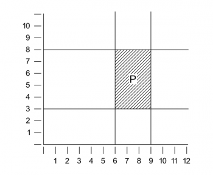

% Some Remarks on Logical Form
% Ludwig Wittgenstein

_This digital edition is based on Ludwig Wittgenstein. *Philosophical Occasions 1912–1951*, edited by James Klagge and Alfred Nordmann, Hackett Publishing Company, 1993, pp. 29–35. This original-language text is in the public domain in its country of origin and other countries and areas where the copyright term is the author's life plus 70 years or fewer._

Every proposition has a content and a form. We get the picture of the pure form if we abstract from the meaning of the single words, or symbols (so far as they have independent meanings). That is to say, if we substitute variables for the constants of the proposition. The rules of syntax which applied to the constants must apply to the variables also. By syntax in this general sense of the word I mean the rules which tell us in which connections only a word gives sense, thus excluding nonsensical structures. The syntax of ordinary language, as is well known, is not quite adequate for this purpose. It does not in all cases prevent the construction of nonsensical pseudopropositions (constructions such as "red is higher than green" or "the Real, though it is an *in itself*, must also be able to become a *for myself*", etc.).

If we try to analyze any given propositions we shall find in general that they are logical sums, products or other truthfunctions of simpler propositions. But our analysis, if carried far enough, must come to the point where it reaches propositional forms which are not themselves composed of simpler propositional forms. We must eventually reach the ultimate connection of the terms, the immediate connection which cannot be broken without (163) destroying the propositional form as such. The propositions which represent this ultimate connexion of terms I call, after B. Russell, atomic propositions. They, then, are the kernels of every proposition, *they* contain the material, and all the rest is only a development of this material. It is to them we have to look for the subject matter of propositions. It is the task of the theory of knowledge to find them and to understand their construction out of the words or symbols. This task is very difficult, and Philosophy has hardly yet begun to tackle it at some points. What method have we for tackling it? The idea is to express in an appropriate symbolism what in ordinary language leads to endless misunderstandings. That is to say, where ordinary language disguises logical structure, where it allows the formation of pseudopropositions, where it uses one term in an infinity of different meanings, we must replace it by a symbolism which gives a clear picture of the logical structure, excludes pseudopropositions, and uses its terms unambiguously. Now we can only substitute a clear symbolism for the unprecise one by inspecting the phenomena which we want to describe, thus trying to understand their logical multiplicity. That is to say, we can only arrive at a correct analysis by, what might be called, the logical investigation of the phenomena themselves, *i.e.*, in a certain sense *a posteriori*, and not by conjecturing about *a priori* possibilities. One is often tempted to ask from an *a priori* standpoint: What, after all, *can* be the only forms of atomic propositions, and to answer, *e.g.*, subject-predicate and relational propositions with two or more terms further, perhaps, propositions relating predicates and relations to one another, and so on. But this, I believe, is mere playing with words. An atomic form cannot be foreseen. And it would be surprising if the actual (164) phenomena had nothing more to teach us about their structure. To such conjectures about the structure of atomic propositions, we are led by our ordinary language, which uses the subject-predicate and the relational form. But in this our language is misleading: I will try to explain this by a simile. Let us imagine two parallel planes, I and II. On plane I figures are drawn, say, ellipses and rectangles of different sizes and shapes, and it is our task to produce images of these figures on plane II. Then we can imagine two ways, amongst others, of doing this. We can, first, lay down a law of projection—say that of orthogonal projection or any other—and then proceed to project all figures from I into II, according to this law. Or, secondly, we could proceed thus: We lay down the rule that every ellipse on plane I is to appear as a circle in plane II, and every rectangle as a square in II. Such a way of representation may be convenient for us if for some reason we the prefer to draw only circles and squares on plane II. Of course, from these images the exact shapes of the original figures on plane I cannot be immediately inferred. We can only gather from them that the original was an ellipse or a rectangle. In order to get in a single instance at the determinate shape of the original we would have to know the individual method by which, *e.g.*, a particular ellipse is projected into the circle before me. The case of ordinary language is quite analogous. If the facts of reality are the ellipses and rectangles on plane I the subject-predicate and relational forms correspond to the circles and squares in plane II. These forms are the norms of our particular language into which we project in *ever so many different* ways *ever so many different* logical forms. And for this very reason we can draw no conclusions except very vague ones from the use of these (165) norms as to the actual logical form of the phenomena described. Such forms as "This paper is boring", "The weather is fine", "I am lazy", which have nothing whatever in common with one another, present themselves as subject-predicate propositions, *i.e.*, apparently as propositions of the same form.

If, now, we try to get at an actual analysis, we find logical forms which have very little similarity with the norms of ordinary language. We meet with the forms of space and time with the whole manifold of spatial and temporal objects, as colours, sounds, etc., etc., with their gradations, continuous transitions, and combinations in various proportions, all of which we cannot seize by our ordinary means of expression. And here I wish to make my first definite remark on the logical analysis of actual phenomena: it is this, that for their representation numbers (rational and irrational) must enter into the structure of the atomic propositions themselves. I will illustrate this by an example. Imagine a system of rectangular axes, as it were, cross wires, drawn in our field of vision and an arbitrary scale fixed. It is clear that we then can describe the shape and position of every patch of colour in our visual field by means of statements of numbers which have their significance relative to the system of co-ordinates and the unit chosen. Again, it is clear that this description will have the right logical multiplicity, and that a description which has a smaller multi plicity will not do. A simple example would be the representation of a patch P by the expression “[6–9, 3–8]” and of a proposition (166)

about it, *e.g.*, P is red, by the symbol "[6–9, 3–8] R", where "R" is yet an unanalyzed term ("6–9" and "3–8" stand for the continuous in terval between the respective numbers). The system of co-ordinates here is part of the mode of expression; it is part of the method of projection by which the reality is projected into our symbolism. The relation of a patch lying between two others can be expressed analogously by the use of apparent variables. I need not say that this analysis does not in any way pretend to be complete. I have made no mention in it of time, and the use of two-dimensional space is not justified even in the case of monocular vision. I only wish to point out the direction in which, I believe, the analysis of visual phenomena is to be looked for, and that in this analysis we meet with logical forms quite different from those which ordinary language leads us to expect. The occurrence of numbers in the forms of atomic propositions is, in my opinion, not merely a feature of a special symbolism, but an essential and, consequently, unavoidable feature of the representation. And numbers will have to enter these forms when—as we should say in ordinary language—we are (167) dealing with properties which admit of gradation, *i.e.*, properties as the length of an interval, the pitch of a tone, the brightness or redness of a shade of colour, etc. It is a characteristic of these properties that one degree of them excludes any other. One shade of colour cannot simultaneously have two different degrees of brightness or redness, a tone not two different strengths, etc. And the important point here is that these remarks do not express an experience but are in some sense tautologies. Every one of us knows that in ordinary life. If someone asks us "What is the temperature outside?" and we said "Eighty degrees", and now he were to ask us again, "And is it ninety degrees?" we should answer, "I told you it was eighty." We take the statement of a degree (of temperature, for instance) to be a *complete* description which needs no supplementation. Thus, when asked, we say what the time is, and not also what it isn't.

One might think—and I thought so not long ago—that a statement expressing the degree of a quality could be analyzed into a logical product of single statements of quantity and a completing supplementary statement. As I could describe the contents of my pocket by saying "It contains a penny, a shilling, two keys, and nothing else". This "and nothing less" is the supplementary statement which completes the description. But this will not do as an analysis of a statement of degree. For let us call the unit of, say, brightness *b* and let E(*b*) be the statement that the entity E possesses this brightness, then the proposition E(2*b*), which says that E has two degrees of brightness, should be analyzable into the logical product E(*b*) & E(*b*), but this is equal to E(*b*); if, on the other hand, we try to distinguish between the units and consequently write E(2*b*) = E(*b*') & E(*b*"), we assume (168) two different units of brightness; and then, if an entity possesses one unit, the question could arise, which of the two—*b*' or *b*"—it is; which is obviously absurd.

I maintain that the statement which attributes a degree to a quality cannot further be analyzed, and, moreover, that the relation of difference of degree is an internal relation and that it is therefore represented by an internal relation between the statements which attribute the different degrees. That is to say, the atomic statement must have the same multiplicity as the degree which it attributes, whence it follows that numbers must enter the forms of atomic propositions. The mutual exclusion of unanalyzable statements of degree contradicts an opinion which was published by me several years ago and which necessitated that atomic propositions could not exclude one another. I here deliberately say "exclude" and not "contradict", for there is a difference between these two notions, and atomic propositions, although they cannot contradict, may exclude one another. I will try to explain this. There are functions which can give a true proposition only for one value of their argument because—if I may so express myself—there is only room in them for one. Take, for in stance, a proposition which asserts the existence of a colour R at a certain time T in a certain place P of our visual field. I will write this proposition "R P T", and abstract for the moment from any consideration of how such a statement is to be further analyzed. "B P T", then, says that the colour B is in the place P at the time T, and it will be clear to most of us here, and to all of us in ordinary life, that "R P T & B P T" is some sort of contradiction (and not merely a false proposition). Now if statements of degree were analyzable—as I used to think—we could explain this contradiction by saying that the colour R con-(169)tains all degrees of R and none of B and that the colour B contains all degrees of B and none of R. But from the above it follows that no analysis can eliminate statements of degree. How, then, does the mutual exclusion of R P T and B P T operate? I believe it consists in the fact that R P T as well as B P T are in a certain sense *complete*. That which corresponds in reality to the function "( ) P T" leaves room only for one entity—in the same sense, in fact, in which we say that there is room for one person only in a chair. Our symbolism, which allows us to form the sign of the logical product of "R P T" and "B P T", gives here no correct picture of reality.

I have said elsewhere that a proposition "reaches up to reality", and by this I meant that the forms of the entities are contained in the form of the proposition which is about these entities. For the sentence, together with the mode of projection which projects reality into the sentence, determines the logical form of the entities, just as in our simile a picture on plane II, together with its mode of projection, determines the shape of the figure on plane I. This remark, I believe, gives us the key for the explanation of the mutual exclusion of R P T and B P T. For if the proposition contains the form of an entity which it is about, then it is possible that two propositions should collide in this very form. The propositions, "Brown now sits in this chair" and "Jones now sits in this chair" each, in a sense, try to set their subject term on the chair. But the logical product of these propositions will put them both there at once, and this leads to a collision, a mutual exclusion of these terms. How does this exclusion represent itself in symbolism? We can write the logical product of the two propositions, *p* and *q*, in this way:—(170)

|   |   |   |
|---|---|---|
|p |q | |
|T |T |T |
|T |F |F |
|F |T |F |
|F |F |F |

What happens if these two propositions are R P T and B P T? In this case the top line "T T T" must disappear, as it represents an impossible combination. The true possibilities here are—

|   |   |
|---|---|
|R P T |B P T |
|T |F |
|F |T |
|F |F |

That is to say, there *is* no logical product of R P T and B P T in the first sense, and herein lies the exclusion as opposed to a contradiction. The contradiction, if it existed, would have to be written—

|   |   |   |
|---|---|---|
|R P T |B P T | |
|T |T |F |
|T |F |F |
|F |T |F |
|F |F |F |

but this is nonsense, as the top line, "T T F," gives the proposition all greater logical multiplicity than that of the actual possibilities. It is, of course, a deficiency of our (171) notation that it does not prevent the formation of such nonsensical constructions, and a perfect notation will have to exclude such structures by definite rules of syntax. These will have to tell us that in the case of certain kinds of atomic propositions described in terms of definite symbolic features certain combinations of the T's and F's must be left out. Such rules, however, cannot be laid down until we have actually reached the ultimate analysis of the phenomena in question. This, as we all know, has not yet been achieved.