# Editor's Note

_Published by the [Ludwig Wittgenstein Project](https://www.wittgensteinproject.org/)._

_Traduction, préambule et notes de [Gilles Gaston Granger](https://en.wikipedia.org/wiki/Gilles-Gaston_Granger)_

_Cette édition digitale est une reproduction de l’édition papier suivante : Ludwig Wittgenstein (traduction, préambule et notes de Gilles Gaston Granger), *Tractatus logico-philosophicus*, Paris, Gallimard, coll. « Bibliothèque de philosophie », 1993. La transcription publiée sur ce site internet a été réalisée par [Michele Lavazza](https://www.wittgensteinproject.org/w/index.php/Project:People#Michele_Lavazza) et corrigée par Thomas Houlié. Le texte original est dans le domaine public dans tous les pays pour lesquels le droit d’auteur a une durée de vie de 70 ans ou moins après la mort de l’auteur. Tous les droits sur la traduction appartiennent au [Centre Gilles Gaston Granger](https://centregranger.cnrs.fr/). Le [Ludwig Wittgenstein Project](https://www.wittgensteinproject.org/w/index.php/Main_Page) remercie les Directeurs du Centre Gilles Gaston Granger de l’avoir autorisé à publier cette édition digitale. Toute reproduction de ce texte est interdite._

# Tractatus logico-philosophicus (français)

## Tractatus logico-philosophicus

## Dédicace

Dédié à la mémoire de mon ami
DAVID H. PINSENT

## Devise

>
>
> *Devise : ... et tout ce que l'on sait, qu'on n'a pas seulement entendu comme un bruissement ou un grondement, se laisse dire en trois mots. *
>
> *Kürnberger*
>
>

## Avant-propos

Ce livre ne sera peut-être compris que par qui aura déjà pensé lui-même les pensées qui s'y trouvent exprimées – ou du moins des pensées semblables. Ce n'est donc point un ouvrage d'enseignement. Son but serait atteint s'il se trouvait quelqu'un qui, l'ayant lu et compris, en retirait du plaisir.

Le livre traite des problèmes philosophiques, et montre – à ce que je crois – que leur formulation repose sur une mauvaise compréhension de la logique de notre langue. On pourrait résumer en quelque sorte tout le sens du livre en ces termes : tout ce qui proprement peut être dit peut être dit clairement, et sur ce dont on ne peut parler, il faut garder le silence.

Le livre tracera donc une frontière à l'acte de penser, – ou plutôt non pas à l'acte de penser, mais à l'expression des pensées : car pour tracer une frontière à l'acte de penser, nous devrions pouvoir penser les deux côtés de cette frontière (nous devrions donc pouvoir penser ce qui ne se laisse pas penser).

La frontière ne pourra donc être tracée que dans la langue, et ce qui est au-delà de cette frontière sera simplement dépourvu de sens.

Jusqu'à quel point mes efforts coïncident avec ceux d'autres philosophes, je n'en veux pas juger. En vérité, ce que j'ai ici écrit n'élève dans son détail absolument aucune prétention à la nouveauté ; et c'est pourquoi je ne donne pas non plus de sources, car il m'est indifférent que ce que j'ai pensé, un autre l'ait déjà pensé avant moi.

Je veux seulement mentionner qu'aux œuvres grandioses de Frege et aux travaux de mon ami M. Bertrand Russell je dois, pour une grande part, la stimulation de mes pensées.

Si ce travail a quelque valeur, elle consiste en deux choses distinctes. Premièrement, en ceci, que des pensées y sont exprimées, et cette valeur sera d'autant plus grande que les pensées y sont mieux exprimées. D'autant mieux on aura frappé sur la tête du clou. Je suis conscient, sur ce point, d'être resté bien loin en deçà du possible. Simplement parce que mes forces sont trop modiques pour dominer la tâche. Puissent d'autres venir qui feront mieux.

Néanmoins, la *vérité* des pensées ici communiquées me semble intangible et définitive. Mon opinion est donc que j'ai, pour l'essentiel, résolu les problèmes d'une manière décisive. Et si en cela je ne me trompe pas, la valeur de ce travail consiste alors, en second lieu, en ceci, qu'il montre combien peu a été fait quand ces problèmes ont été résolus.

*L.W.*

*Vienne, 1918.*

## Tractatus Logico-Philosophicus

**[1](https://www.wittgensteinproject.org/w/index.php/Logisch-philosophische_Abhandlung#1)** Le monde est tout ce qui a lieu[^tlp-note-1_2-0].

**[1.1](https://www.wittgensteinproject.org/w/index.php/Logisch-philosophische_Abhandlung#1.1)** Le monde est la totalité des faits, non des choses.

**[1.11](https://www.wittgensteinproject.org/w/index.php/Logisch-philosophische_Abhandlung#1.11)** Le monde est déterminé par les faits, et par ceci qu'ils sont *tous* les faits.

**[1.12](https://www.wittgensteinproject.org/w/index.php/Logisch-philosophische_Abhandlung#1.12)** Car la totalité des faits détermine ce qui a lieu, et aussi tout ce qui n'a pas lieu.

**[1.13](https://www.wittgensteinproject.org/w/index.php/Logisch-philosophische_Abhandlung#1.13)** Les faits dans l'espace logique sont le monde.

**[1.2](https://www.wittgensteinproject.org/w/index.php/Logisch-philosophische_Abhandlung#1.2)** Le monde se décompose en faits.

**[1.21](https://www.wittgensteinproject.org/w/index.php/Logisch-philosophische_Abhandlung#1.21)** Quelque chose peut isolément avoir lieu ou ne pas avoir lieu, et tout le reste demeurer inchangé.

**[2](https://www.wittgensteinproject.org/w/index.php/Logisch-philosophische_Abhandlung#2)** Ce qui a lieu, le fait, est la subsistance[^3] d'états de chose.

**[2.01](https://www.wittgensteinproject.org/w/index.php/Logisch-philosophische_Abhandlung#2.01)** L'état de choses est une connexion d'objets (entités, choses).

**[2.011](https://www.wittgensteinproject.org/w/index.php/Logisch-philosophische_Abhandlung#2.011)** Il fait partie de l'essence d'une chose d'être élément constitutif d'un état de choses.

**[2.012](https://www.wittgensteinproject.org/w/index.php/Logisch-philosophische_Abhandlung#2.012)** En logique, rien n'est accidentel : quand la chose se présente dans un état de choses, c'est que la possibilité de l'état de choses doit déjà être préjugée dans la chose.

**[2.0121](https://www.wittgensteinproject.org/w/index.php/Logisch-philosophische_Abhandlung#2.0121)** Il apparaîtrait pour ainsi dire comme accidentel qu'à une chose qui pourrait subsister seule en elle-même, une situation[^4] convînt par surcroît.

Si les choses peuvent se présenter dans des états de choses, cette possibilité doit être déjà inhérente à celles-ci.

\(Quelque chose de logique ne peut être seulement possible. La logique traite de chaque possibilité, et toutes les possibilités sont ses faits.)

De même que nous ne pouvons absolument nous figurer des objets spatiaux en dehors de l'espace, des objets temporels en dehors du temps, de même ne pouvons-nous nous figurer *aucun* objet en dehors de la possibilité de sa connexion avec d'autres.

Si je puis me figurer l'objet lié dans l'état de choses, je ne puis me le figurer en dehors de la *possibilité* de ce lien.

**[2.0122](https://www.wittgensteinproject.org/w/index.php/Logisch-philosophische_Abhandlung#2.0122)** La chose est indépendante, en tant qu'elle peut se présenter dans toutes situations possibles, mais cette forme d'indépendance est une forme d'interdépendance avec l'état de choses, une forme de non-indépendance. (Il est impossible que des mots apparaissent à la fois de deux façons différentes, isolés et dans la proposition.)

**[2.0123](https://www.wittgensteinproject.org/w/index.php/Logisch-philosophische_Abhandlung#2.0123)** Si je connais l'objet, je connais aussi l'ensemble de ses possibilités d'occurrence dans des états de choses.

\(Chacune de ces possibilités doit être inhérente à la nature de cet objet.)

Il n'est pas possible de trouver de surcroît une possibilité nouvelle.

**[2.01231](https://www.wittgensteinproject.org/w/index.php/Logisch-philosophische_Abhandlung#2.01231)** Pour connaître un objet, il ne me faut certes pas connaître ses propriétés externes – mais bien toutes ses propriétés internes.

**[2.0124](https://www.wittgensteinproject.org/w/index.php/Logisch-philosophische_Abhandlung#2.0124)** Si tous les objets sont donnés, alors sont aussi en même temps donnés tous les états de choses *possibles*.

**[2.013](https://www.wittgensteinproject.org/w/index.php/Logisch-philosophische_Abhandlung#2.013)** Chaque chose est, pour ainsi dire, dans un espace d'états de choses possibles. Cet espace, je puis me le figurer comme vide, mais non me figurer la chose sans l'espace.

**[2.0131](https://www.wittgensteinproject.org/w/index.php/Logisch-philosophische_Abhandlung#2.0131)** L'objet spatial doit se trouver dans un espace infini. (Le point spatial est une place pour un argument.)

Une tache dans le champ visuel n'a certes pas besoin d'être rouge, mais elle doit avoir une couleur : elle porte pour ainsi dire autour d'elle l'espace des couleurs. Le son doit avoir *une* hauteur, l'objet du tact *une* dureté, etc.

**[2.014](https://www.wittgensteinproject.org/w/index.php/Logisch-philosophische_Abhandlung#2.014)** Les objets contiennent la possibilité de toutes les situations.

**[2.0141](https://www.wittgensteinproject.org/w/index.php/Logisch-philosophische_Abhandlung#2.0141)** La possibilité de son occurrence dans des états de choses est la forme de l'objet.

**[2.02](https://www.wittgensteinproject.org/w/index.php/Logisch-philosophische_Abhandlung#2.02)** L'objet est simple.

**[2.0201](https://www.wittgensteinproject.org/w/index.php/Logisch-philosophische_Abhandlung#2.0201)** Tout énoncé portant sur des complexes se laisse analyser en un énoncé sur leurs éléments et en propositions telles qu'elles décrivent complètement ces complexes.

**[2.021](https://www.wittgensteinproject.org/w/index.php/Logisch-philosophische_Abhandlung#2.021)** Les objets constituent la substance du monde. C'est pourquoi ils ne peuvent être composés.

**[2.0211](https://www.wittgensteinproject.org/w/index.php/Logisch-philosophische_Abhandlung#2.0211)** Si le monde n'avait pas de substance, il en résulterait que, pour une proposition, avoir un sens dépendrait de la vérité d'une autre proposition.

**[2.0212](https://www.wittgensteinproject.org/w/index.php/Logisch-philosophische_Abhandlung#2.0212)** Il serait alors impossible d'esquisser une image du monde (vraie ou fausse).

**[2.022](https://www.wittgensteinproject.org/w/index.php/Logisch-philosophische_Abhandlung#2.022)** Il est patent que, si différent du monde réel que soit conçu un monde, il faut qu'il ait quelque chose – une forme – en commun avec lui.

**[2.023](https://www.wittgensteinproject.org/w/index.php/Logisch-philosophische_Abhandlung#2.023)** Cette forme consiste justement dans les objets.

**[2.0231](https://www.wittgensteinproject.org/w/index.php/Logisch-philosophische_Abhandlung#2.0231)** La substance du monde ne *peut* déterminer qu'une forme, et nullement des propriétés matérielles. Car celles-ci sont d'abord figurées[^5] par les propositions – d'abord formées par la configuration des objets.

**[2.0232](https://www.wittgensteinproject.org/w/index.php/Logisch-philosophische_Abhandlung#2.0232)** En termes sommaires : les objets sont sans couleur.

**[2.0233](https://www.wittgensteinproject.org/w/index.php/Logisch-philosophische_Abhandlung#2.0233)** Deux objets de même forme logique – leurs propriétés externes mises à part – ne se différencient l'un de l'autre que parce qu'ils sont distincts.

**[2.02331](https://www.wittgensteinproject.org/w/index.php/Logisch-philosophische_Abhandlung#2.02331)** Ou bien une chose a des propriétés que ne possède aucune autre, et l'on peut alors sans plus la détacher des autres par une description, et la désigner ; ou bien au contraire il y a plusieurs choses qui ont en commun toutes leurs propriétés, et il est alors absolument impossible de montrer l'une d'elles parmi les autres.

Car si rien ne distingue une chose, je ne puis la distinguer, sans quoi elle serait justement distinguée.

**[2.024](https://www.wittgensteinproject.org/w/index.php/Logisch-philosophische_Abhandlung#2.024)** La substance est ce qui subsiste indépendamment de ce qui a lieu.

**[2.025](https://www.wittgensteinproject.org/w/index.php/Logisch-philosophische_Abhandlung#2.025)** Elle est forme et contenu.

**[2.0251](https://www.wittgensteinproject.org/w/index.php/Logisch-philosophische_Abhandlung#2.0251)** L'espace, le temps et la couleur (la capacité d'être coloré) sont des formes des objets.

**[2.026](https://www.wittgensteinproject.org/w/index.php/Logisch-philosophische_Abhandlung#2.026)** Ce n'est que s'il y a des objets qu'il peut y avoir une forme fixe du monde.

**[2.027](https://www.wittgensteinproject.org/w/index.php/Logisch-philosophische_Abhandlung#2.027)** Le fixe, le subsistant et l'objet sont une seule et même chose.

**[2.0271](https://www.wittgensteinproject.org/w/index.php/Logisch-philosophische_Abhandlung#2.0271)** L'objet est le fixe, le subsistant ; la configuration est le changeant, l'instable.

**[2.0272](https://www.wittgensteinproject.org/w/index.php/Logisch-philosophische_Abhandlung#2.0272)** La configuration des objets forme l'état de choses.

**[2.03](https://www.wittgensteinproject.org/w/index.php/Logisch-philosophische_Abhandlung#2.03)** Dans l'état de choses, les objets sont engagés les uns dans les autres comme les anneaux pendants d'une chaîne.

**[2.031](https://www.wittgensteinproject.org/w/index.php/Logisch-philosophische_Abhandlung#2.031)** Dans l'état de choses les objets sont mutuellement dans un rapport déterminé.

**[2.032](https://www.wittgensteinproject.org/w/index.php/Logisch-philosophische_Abhandlung#2.032)** La manière déterminée dont les objets se rapportent les uns aux autres dans l'état de choses est la structure de ce dernier.

**[2.033](https://www.wittgensteinproject.org/w/index.php/Logisch-philosophische_Abhandlung#2.033)** La forme est la possibilité de la structure.

**[2.034](https://www.wittgensteinproject.org/w/index.php/Logisch-philosophische_Abhandlung#2.034)** La structure du fait consiste dans les structures des états de choses.

**[2.04](https://www.wittgensteinproject.org/w/index.php/Logisch-philosophische_Abhandlung#2.04)** La totalité des états de choses subsistants est le monde.

**[2.05](https://www.wittgensteinproject.org/w/index.php/Logisch-philosophische_Abhandlung#2.05)** La totalité des états de choses subsistants détermine aussi quels sont les états de choses non subsistants.

**[2.06](https://www.wittgensteinproject.org/w/index.php/Logisch-philosophische_Abhandlung#2.06)** La subsistance des états de choses et leur non-subsistance est la réalité.

\(La subsistance des états de choses et leur non-subsistance, nous les nommerons respectivement aussi fait positif et fait négatif.)

**[2.061](https://www.wittgensteinproject.org/w/index.php/Logisch-philosophische_Abhandlung#2.061)** Les états de choses sont mutuellement indépendants.

**[2.062](https://www.wittgensteinproject.org/w/index.php/Logisch-philosophische_Abhandlung#2.062)** De la subsistance ou de la non-subsistance d'un état de choses, on ne peut déduire la subsistance ou la non-subsistance d'un autre état de choses.

**[2.063](https://www.wittgensteinproject.org/w/index.php/Logisch-philosophische_Abhandlung#2.063)** La totalité de la réalité est le monde[^6].

**[2.1](https://www.wittgensteinproject.org/w/index.php/Logisch-philosophische_Abhandlung#2.1)** Nous nous faisons des images des faits.

**[2.11](https://www.wittgensteinproject.org/w/index.php/Logisch-philosophische_Abhandlung#2.11)** L'image présente la situation dans l'espace logique, la subsistance et la non-subsistance des états de choses.

**[2.12](https://www.wittgensteinproject.org/w/index.php/Logisch-philosophische_Abhandlung#2.12)** L'image est un modèle de la réalité.

**[2.13](https://www.wittgensteinproject.org/w/index.php/Logisch-philosophische_Abhandlung#2.13)** Aux objets correspondent, dans l'image, les éléments de celle-ci.

**[2.131](https://www.wittgensteinproject.org/w/index.php/Logisch-philosophische_Abhandlung#2.131)** Les éléments de l'image sont les représentants des objets dans celle-ci.

**[2.14](https://www.wittgensteinproject.org/w/index.php/Logisch-philosophische_Abhandlung#2.14)** L'image consiste en ceci, que ses éléments sont entre eux dans un rapport déterminé.

**[2.141](https://www.wittgensteinproject.org/w/index.php/Logisch-philosophische_Abhandlung#2.141)** L'image est un fait.

**[2.15](https://www.wittgensteinproject.org/w/index.php/Logisch-philosophische_Abhandlung#2.15)** Que les éléments de l'image soient entre eux dans un rapport déterminé présente ceci : que les choses sont entre elles dans ce rapport.

Cette interdépendance des éléments de l'image, nommons-la sa structure, et la possibilité de cette interdépendance sa forme de représentation.

**[2.151](https://www.wittgensteinproject.org/w/index.php/Logisch-philosophische_Abhandlung#2.151)** La forme de représentation est la possibilité que les choses soient entre elles dans le même rapport que les éléments de l'image.

**[2.1511](https://www.wittgensteinproject.org/w/index.php/Logisch-philosophische_Abhandlung#2.1511)** L'image est ainsi attachée à la réalité ; elle va jusqu'à atteindre la réalité.

**[2.1512](https://www.wittgensteinproject.org/w/index.php/Logisch-philosophische_Abhandlung#2.1512)** Elle est comme une règle graduée appliquée à la réalité.

**[2.15121](https://www.wittgensteinproject.org/w/index.php/Logisch-philosophische_Abhandlung#2.15121)** Seuls les traits de division extrêmes *touchent* l'objet à mesurer.

**[2.1513](https://www.wittgensteinproject.org/w/index.php/Logisch-philosophische_Abhandlung#2.1513)** Selon cette conception, la relation représentative appartient donc aussi à l'image qu'elle constitue comme telle.

**[2.1514](https://www.wittgensteinproject.org/w/index.php/Logisch-philosophische_Abhandlung#2.1514)** La relation représentative consiste dans les correspondances des éléments de l'image et des choses.

**[2.1515](https://www.wittgensteinproject.org/w/index.php/Logisch-philosophische_Abhandlung#2.1515)** Ces correspondances sont pour ainsi dire les antennes des éléments de l'image, par le moyen desquelles celle-ci touche la réalité.

**[2.16](https://www.wittgensteinproject.org/w/index.php/Logisch-philosophische_Abhandlung#2.16)** Pour être une image, le fait doit avoir quelque chose en commun avec ce qu'il représente.

**[2.161](https://www.wittgensteinproject.org/w/index.php/Logisch-philosophische_Abhandlung#2.161)** Dans l'image et dans le représenté quelque chose doit se retrouver identiquement, pour que l'une soit proprement l'image de l'autre.

**[2.17](https://www.wittgensteinproject.org/w/index.php/Logisch-philosophische_Abhandlung#2.17)** Ce que l'image doit avoir en commun avec la réalité pour la représenter à sa manière – correctement ou incorrectement – c'est sa forme de représentation.

**[2.171](https://www.wittgensteinproject.org/w/index.php/Logisch-philosophische_Abhandlung#2.171)** L'image peut représenter toute réalité dont elle a la forme.

L'image spatiale tout ce qui est spatial, l'image en couleurs tout ce qui est coloré, etc.

**[2.172](https://www.wittgensteinproject.org/w/index.php/Logisch-philosophische_Abhandlung#2.172)** Mais sa forme de représentation, l'image ne peut la représenter ; elle la montre.

**[2.173](https://www.wittgensteinproject.org/w/index.php/Logisch-philosophische_Abhandlung#2.173)** L'image figure son corrélat de l'extérieur (son point de vue est sa forme de figuration), c'est pourquoi elle présente son corrélat correctement ou incorrectement.

**[2.174](https://www.wittgensteinproject.org/w/index.php/Logisch-philosophische_Abhandlung#2.174)** Mais l'image ne peut se placer en dehors de sa forme de figuration.

**[2.18](https://www.wittgensteinproject.org/w/index.php/Logisch-philosophische_Abhandlung#2.18)** Ce que toute image, quelle qu'en soit la forme, doit avoir en commun avec la réalité pour pouvoir proprement la représenter – correctement ou non – c'est la forme logique, c'est-à-dire la forme de la réalité.

**[2.181](https://www.wittgensteinproject.org/w/index.php/Logisch-philosophische_Abhandlung#2.181)** Si la forme de représentation est la forme logique, l'image est appelée image logique.

**[2.182](https://www.wittgensteinproject.org/w/index.php/Logisch-philosophische_Abhandlung#2.182)** Toute image est *en même temps* image logique. (Au contraire, toute image n'est pas spatiale.)

**[2.19](https://www.wittgensteinproject.org/w/index.php/Logisch-philosophische_Abhandlung#2.19)** L'image logique peut représenter le monde.

**[2.2](https://www.wittgensteinproject.org/w/index.php/Logisch-philosophische_Abhandlung#2.2)** L'image a en commun avec le représenté la forme logique de représentation.

**[2.201](https://www.wittgensteinproject.org/w/index.php/Logisch-philosophische_Abhandlung#2.201)** L'image représente la réalité en figurant une possibilité de subsistance et de non-subsistance d'états de choses.

**[2.202](https://www.wittgensteinproject.org/w/index.php/Logisch-philosophische_Abhandlung#2.202)** L'image figure une situation possible dans l'espace logique.

**[2.203](https://www.wittgensteinproject.org/w/index.php/Logisch-philosophische_Abhandlung#2.203)** L'image contient la possibilité de la situation qu'elle figure.

**[2.21](https://www.wittgensteinproject.org/w/index.php/Logisch-philosophische_Abhandlung#2.21)** L'image s'accorde ou non avec la réalité ; elle est correcte ou incorrecte, vraie ou fausse.

**[2.22](https://www.wittgensteinproject.org/w/index.php/Logisch-philosophische_Abhandlung#2.22)** L'image figure ce qu'elle figure, indépendamment de sa vérité ou de sa fausseté, par la forme de représentation.

**[2.221](https://www.wittgensteinproject.org/w/index.php/Logisch-philosophische_Abhandlung#2.221)** Ce que l'image figure est son sens.

**[2.222](https://www.wittgensteinproject.org/w/index.php/Logisch-philosophische_Abhandlung#2.222)** C'est dans l'accord ou le désaccord de son sens avec la réalité que consiste sa vérité ou sa fausseté.

**[2.223](https://www.wittgensteinproject.org/w/index.php/Logisch-philosophische_Abhandlung#2.223)** Pour reconnaître si l'image est vraie ou fausse, nous devons la comparer avec la réalité.

**[2.224](https://www.wittgensteinproject.org/w/index.php/Logisch-philosophische_Abhandlung#2.224)** À partir de la seule image, on ne peut reconnaître si elle est vraie ou fausse.

**[2.225](https://www.wittgensteinproject.org/w/index.php/Logisch-philosophische_Abhandlung#2.225)** Il n'y a pas d'image vraie a priori.

**[3](https://www.wittgensteinproject.org/w/index.php/Logisch-philosophische_Abhandlung#3)** L'image logique des faits est la pensée.

**[3.001](https://www.wittgensteinproject.org/w/index.php/Logisch-philosophische_Abhandlung#3.001)** « Un état de choses est pensable » signifie : nous pouvons nous en faire une image.

**[3.01](https://www.wittgensteinproject.org/w/index.php/Logisch-philosophische_Abhandlung#3.01)** La totalité des pensées vraies est une image du monde.

**[3.02](https://www.wittgensteinproject.org/w/index.php/Logisch-philosophische_Abhandlung#3.02)** La pensée contient la possibilité des situations qu'elle pense. Ce qui est pensable est aussi possible.

**[3.03](https://www.wittgensteinproject.org/w/index.php/Logisch-philosophische_Abhandlung#3.03)** Nous ne pouvons rien penser d'illogique, parce que nous devrions alors penser illogiquement.

**[3.031](https://www.wittgensteinproject.org/w/index.php/Logisch-philosophische_Abhandlung#3.031)** On a dit que Dieu pouvait tout créer, sauf seulement ce qui contredirait aux lois de la logique. – En effet, nous ne pourrions pas *dire* à quoi ressemblerait un monde « illogique ».

**[3.032](https://www.wittgensteinproject.org/w/index.php/Logisch-philosophische_Abhandlung#3.032)** Figurer dans le langage quelque chose de « contraire à la logique », on ne le peut pas plus que figurer en géométrie par ses coordonnées une figure qui contredirait aux lois de l'espace ; ou donner les coordonnées d'un point qui n'existe pas.

**[3.0321](https://www.wittgensteinproject.org/w/index.php/Logisch-philosophische_Abhandlung#3.0321)** Nous pouvons bien figurer spatialement un état de choses qui heurte les lois de la physique, mais non pas un état de choses qui heurte celles de la géométrie.

**[3.04](https://www.wittgensteinproject.org/w/index.php/Logisch-philosophische_Abhandlung#3.04)** Une pensée correcte a priori serait telle que sa possibilité détermine sa vérité.

**[3.05](https://www.wittgensteinproject.org/w/index.php/Logisch-philosophische_Abhandlung#3.05)** Nous ne pourrions savoir a priori qu'une pensée est vraie, que si sa vérité pouvait être reconnue dans la pensée même (sans objet de comparaison).

**[3.1](https://www.wittgensteinproject.org/w/index.php/Logisch-philosophische_Abhandlung#3.1)** Dans la proposition la pensée s'exprime pour la perception sensible.

**[3.11](https://www.wittgensteinproject.org/w/index.php/Logisch-philosophische_Abhandlung#3.11)** Nous usons du signe sensible (sonore ou écrit, etc.) de la proposition comme projection de la situation possible.

La méthode de projection est la pensée du sens de la proposition.

**[3.12](https://www.wittgensteinproject.org/w/index.php/Logisch-philosophische_Abhandlung#3.12)** Le signe par lequel nous exprimons la pensée, je le nomme signe propositionnel. Et la proposition est le signe propositionnel dans sa relation projective au monde.

**[3.13](https://www.wittgensteinproject.org/w/index.php/Logisch-philosophische_Abhandlung#3.13)** À la proposition appartient tout ce qui appartient à la projection ; mais non pas le projeté.

Donc la possibilité du projeté, non le projeté lui-même.

Dans la proposition, le sens n'est donc pas encore contenu, mais seulement la possibilité de l'exprimer.

\(« Le contenu de la proposition » signifie le contenu de la proposition pourvue de sens.)

Dans la proposition, est contenue la forme de son sens, mais non pas le contenu de celui-ci.

**[3.14](https://www.wittgensteinproject.org/w/index.php/Logisch-philosophische_Abhandlung#3.14)** Le signe propositionnel consiste en ceci, qu'en lui ses éléments, les mots, sont entre eux dans un rapport déterminé. Le signe propositionnel est un fait.

**[3.141](https://www.wittgensteinproject.org/w/index.php/Logisch-philosophische_Abhandlung#3.141)** La proposition n'est pas un mélange de mots. (De même que le thème musical n'est pas un mélange de notes.)

La proposition est articulée.

**[3.142](https://www.wittgensteinproject.org/w/index.php/Logisch-philosophische_Abhandlung#3.142)** Seuls des faits peuvent exprimer un sens, une classe de noms ne le peut pas.

**[3.143](https://www.wittgensteinproject.org/w/index.php/Logisch-philosophische_Abhandlung#3.143)** Que le signe propositionnel soit un fait, la forme d'expression usuelle de l'écriture ou de l'imprimerie le masque.

Car dans la proposition imprimée, par exemple, le signe propositionnel n'apparaît pas comme essentiellement distinct du mot.

\(Ce qui a rendu possible que Frege ait appelé la proposition un nom composé.)

**[3.1431](https://www.wittgensteinproject.org/w/index.php/Logisch-philosophische_Abhandlung#3.1431)** L'essence du signe propositionnel devient très claire lorsque nous nous le figurons comme composé d'objets spatiaux (tels des tables, des chaises, des livres) au lieu de signes d'écriture.

La position spatiale respective de ces choses exprime alors le sens de la proposition.

**[3.1432](https://www.wittgensteinproject.org/w/index.php/Logisch-philosophische_Abhandlung#3.1432)** Non pas : « le signe complexe aRb dit que a est dans la relation R avec b », mais bien : que « a » soit dans une relation determinée avec « b » dit que aRb.

**[3.144](https://www.wittgensteinproject.org/w/index.php/Logisch-philosophische_Abhandlung#3.144)** Les situations peuvent être décrites, non *nommées*. (Les noms sont comme des points, les propositions comme des flèches, elles ont un sens.)

**[3.2](https://www.wittgensteinproject.org/w/index.php/Logisch-philosophische_Abhandlung#3.2)** Dans la proposition la pensée peut être exprimée de telle façon que les objets de la pensée correspondent aux éléments du signe propositionnel.

**[3.201](https://www.wittgensteinproject.org/w/index.php/Logisch-philosophische_Abhandlung#3.201)** Je nomme ces éléments : « signes simples » et cette proposition : « complètement analysée ».

**[3.202](https://www.wittgensteinproject.org/w/index.php/Logisch-philosophische_Abhandlung#3.202)** Les signes simples utilisés dans la proposition s'appellent noms.

**[3.203](https://www.wittgensteinproject.org/w/index.php/Logisch-philosophische_Abhandlung#3.203)** Le nom signifie[^7] l'objet. L'objet est sa signification. (« A » est le même signe que « A ».)

**[3.21](https://www.wittgensteinproject.org/w/index.php/Logisch-philosophische_Abhandlung#3.21)** À la configuration des signes simples dans le signe propositionnel correspond la configuration des objets dans la situation.

**[3.22](https://www.wittgensteinproject.org/w/index.php/Logisch-philosophische_Abhandlung#3.22)** Le nom est dans la proposition le représentant de l'objet.

**[3.221](https://www.wittgensteinproject.org/w/index.php/Logisch-philosophische_Abhandlung#3.221)** Je ne puis que *nommer* les objets. Des signes en sont les représentants. Je ne puis qu'en parler, non les *énoncer*[^8]. Une proposition peut seulement dire *comment* est une chose, non *ce qu'*elle est.

**[3.23](https://www.wittgensteinproject.org/w/index.php/Logisch-philosophische_Abhandlung#3.23)** Requérir la possibilité des signes simples, c'est requérir la détermination du sens.

**[3.24](https://www.wittgensteinproject.org/w/index.php/Logisch-philosophische_Abhandlung#3.24)** La proposition qui concerne un complexe est dans un rapport interne avec la proposition qui concerne un élément de ce complexe.

Le complexe ne peut être donné que par une description, et celle-ci convient ou ne convient pas. La proposition dans laquelle il est question d'un complexe, si celui-ci n'existe pas, ne sera pas dépourvue de sens[^9], mais simplement fausse.

Qu'un élément propositionnel dénote un complexe, on peut le reconnaître à une indétermination dans les propositions où il apparaît. Nous *savons* que par cette proposition tout n'est pas encore déterminé. (La notation du général contient en effet une image primitive.)

La contraction du symbole d'un complexe en un symbole simple peut être exprimée par une définition.

**[3.25](https://www.wittgensteinproject.org/w/index.php/Logisch-philosophische_Abhandlung#3.25)** Il y a une analyse complète de la proposition, et une seulement.

**[3.251](https://www.wittgensteinproject.org/w/index.php/Logisch-philosophische_Abhandlung#3.251)** La proposition exprime d'une manière déterminée et clairement assignable ce qu'elle exprime : la proposition est articulée.

**[3.26](https://www.wittgensteinproject.org/w/index.php/Logisch-philosophische_Abhandlung#3.26)** Le nom ne saurait être fractionné en éléments par une définition : c'est un signe primitif.

**[3.261](https://www.wittgensteinproject.org/w/index.php/Logisch-philosophische_Abhandlung#3.261)** Chaque signe défini dénote *par-delà* les signes qui servent à le définir ; et les définitions montrent la direction.

Deux signes, l'un primitif et l'autre défini par des signes primitifs, ne peuvent dénoter de la même manière. On *ne peut* démembrer des noms au moyen de définitions. (Ni aucun signe qui a une signification isolément et par soi-même.)

**[3.262](https://www.wittgensteinproject.org/w/index.php/Logisch-philosophische_Abhandlung#3.262)** Ce qui, dans les signes, ne parvient pas à l'expression, l'emploi de ceux-ci le montre. Ce que les signes escamotent, leur emploi l'énonce.

**[3.263](https://www.wittgensteinproject.org/w/index.php/Logisch-philosophische_Abhandlung#3.263)** Les significations des signes primitifs peuvent être expliquées par des éclaircissements. Les éclaircissements sont des propositions contenant les signes primitifs. Ils ne peuvent donc être compris que si les significations de ces signes sont déjà connues.

**[3.3](https://www.wittgensteinproject.org/w/index.php/Logisch-philosophische_Abhandlung#3.3)** Seule la proposition a un sens ; ce n'est que lié dans une proposition que le nom a une signification.

**[3.31](https://www.wittgensteinproject.org/w/index.php/Logisch-philosophische_Abhandlung#3.31)** Chaque partie de la proposition qui caractérise son sens, je la nomme expression (symbole).

\(La proposition elle-même est une expression.)

Est expression tout ce qui, étant essentiel au sens d'une proposition, peut être commun à des propositions.

L'expression fait reconnaître une forme et un contenu.

**[3.311](https://www.wittgensteinproject.org/w/index.php/Logisch-philosophische_Abhandlung#3.311)** L'expression présuppose les formes de toutes les propositions dans lesquelles elle peut apparaître. Elle est la marque caractéristique commune d'une classe de propositions.

**[3.312](https://www.wittgensteinproject.org/w/index.php/Logisch-philosophische_Abhandlung#3.312)** Elle est donc figurée par la forme générale des propositions qu'elle caractérise.

Et alors, dans cette forme, l'expression sera *constante* et tout le reste *variable*.

**[3.313](https://www.wittgensteinproject.org/w/index.php/Logisch-philosophische_Abhandlung#3.313)** L'expression sera donc figurée au moyen d'une variable, dont les valeurs sont les propositions qui contiennent cette expression.

\(À la limite, la variable devient une constante, l'expression une proposition.)

J'appelle une telle variable « variable propositionnelle ».

**[3.314](https://www.wittgensteinproject.org/w/index.php/Logisch-philosophische_Abhandlung#3.314)** L'expression n'a de signification que dans la proposition. Toute variable peut être conçue comme variable propositionnelle.

\(Y compris le nom variable.)

**[3.315](https://www.wittgensteinproject.org/w/index.php/Logisch-philosophische_Abhandlung#3.315)** Si nous transformons en variable une partie constituante d'une proposition, il existe alors une classe de propositions qui sont toutes les valeurs de la proposition variable ainsi créée. Cette classe dépend encore en général de ce que par convention arbitraire nous entendons par parties de cette proposition. Mais si nous transformons en variable tout signe dont la signification a été arbitrairement déterminée, il existe encore une telle classe, mais elle ne dépend plus alors d'aucune convention, et dépend seulement de la nature de la proposition. Elle correspond à une forme logique, à une image logique primitive.

**[3.316](https://www.wittgensteinproject.org/w/index.php/Logisch-philosophische_Abhandlung#3.316)** Les valeurs que la variable propositionnelle peut prendre sont déterminées.

La détermination de ces valeurs *est* la variable.

**[3.317](https://www.wittgensteinproject.org/w/index.php/Logisch-philosophische_Abhandlung#3.317)** La détermination des valeurs de la variable propositionnelle est la *donnée des propositions* dont cette variable est la marque commune.

Cette détermination est une description de ces propositions. Cette détermination ne concerne donc que les symboles non leur signification.

Ceci seulement est essentiel à cette détermination, à savoir *qu'elle n'est qu'une description de symboles, qui ne déclare rien au sujet de ce qui est dénoté*.

La manière dont se produit la description des propositions est inessentielle.

**[3.318](https://www.wittgensteinproject.org/w/index.php/Logisch-philosophische_Abhandlung#3.318)** Je conçois la proposition – avec Frege et Russell – comme fonction des expressions qu'elle contient.

**[3.32](https://www.wittgensteinproject.org/w/index.php/Logisch-philosophische_Abhandlung#3.32)** Le signe est ce qui est perceptible aux sens dans le symbole.

**[3.321](https://www.wittgensteinproject.org/w/index.php/Logisch-philosophische_Abhandlung#3.321)** Deux symboles différents peuvent avoir leur signe en commun (écrit ou parlé, etc.) – ils dénotent alors de manières différentes.

**[3.322](https://www.wittgensteinproject.org/w/index.php/Logisch-philosophische_Abhandlung#3.322)** Que nous dénotions deux objets par le même signe, mais selon deux *modes de dénotation différents*, ne peut jamais indiquer la marque commune de ces objets. Car le signe est arbitraire. On pourrait donc aussi bien choisir deux signes différents, et où serait alors le caractère commun dans la dénotation ?

**[3.323](https://www.wittgensteinproject.org/w/index.php/Logisch-philosophische_Abhandlung#3.323)** Dans la langue usuelle il arrive fort souvent que le même mot dénote de plusieurs manières différentes – et appartienne donc à des symboles différents –, ou bien que deux mots, qui dénotent de manières différentes, sont en apparence employés dans la proposition de la même manière.

Ainsi le mot « est » apparaît comme copule, comme signe d'égalité et comme expression de l'existence ; « exister » comme verbe intransitif, à la façon d'« aller » ; « identique » comme adjectif qualificatif ; nous parlons « de quelque chose », mais disons aussi que « quelque chose » arrive.

\(Dans la proposition « Brun est brun » – où le premier mot est un nom de personne, le dernier un adjectif qualificatif –, ces deux mots n'ont pas simplement des significations différentes, ce sont des *symboles différents*.)

**[3.324](https://www.wittgensteinproject.org/w/index.php/Logisch-philosophische_Abhandlung#3.324)** Ainsi naissent facilement les confusions fondamentales (dont toute la philosophie est pleine).

**[3.325](https://www.wittgensteinproject.org/w/index.php/Logisch-philosophische_Abhandlung#3.325)** Pour éviter ces erreurs, il nous faut employer une langue symbolique qui les exclut, qui n'use pas du même signe pour des symboles différents, ni n'use, en apparence de la même manière, de signes qui dénotent de manières différentes. Une langue symbolique donc qui obéisse à la grammaire *logique* – à la syntaxe logique.

\(L'idéographie[^10] de Frege et de Russell constitue une telle langue, qui pourtant n'est pas encore exempte de toute erreur.)

**[3.326](https://www.wittgensteinproject.org/w/index.php/Logisch-philosophische_Abhandlung#3.326)** Pour reconnaître le symbole sous le signe, il faut prendre garde à son usage pourvu de sens.

**[3.327](https://www.wittgensteinproject.org/w/index.php/Logisch-philosophische_Abhandlung#3.327)** Le signe ne détermine une forme logique que pris avec son emploi logico-syntaxique.

**[3.328](https://www.wittgensteinproject.org/w/index.php/Logisch-philosophische_Abhandlung#3.328)** Si un signe n'a pas d'usage, il n'a pas de signification. Tel est le sens de la devise d'Occam.

\(Si tout se passe comme si un signe avait une signification, c'est qu'alors il en a une.)

**[3.33](https://www.wittgensteinproject.org/w/index.php/Logisch-philosophische_Abhandlung#3.33)** Dans la syntaxe logique, la signification d'un signe ne saurait jouer aucun rôle ; il faut que la syntaxe soit établie sans pour autant faire état de la signification d'un signe, elle ne peut que supposer seulement la description des expressions.

**[3.331](https://www.wittgensteinproject.org/w/index.php/Logisch-philosophische_Abhandlung#3.331)** À partir de cette remarque, examinons la « théorie des types » de Russell : l'erreur de Russell se manifeste en ceci qu'il lui faille parler de la signification des signes pour établir leur syntaxe.

**[3.332](https://www.wittgensteinproject.org/w/index.php/Logisch-philosophische_Abhandlung#3.332)** Aucune proposition ne peut rien dire à son propre sujet, puisque le signe propositionnel ne saurait être contenu en lui-même (c'est là toute la « théorie des types »).

**[3.333](https://www.wittgensteinproject.org/w/index.php/Logisch-philosophische_Abhandlung#3.333)** Une fonction ne saurait par conséquent être son propre argument, puisque le signe de fonction contient déjà l'image primitive de son argument, et ne peut se contenir lui-même.

Supposons, par exemple, que la fonction F(fx) puisse être son propre argument ; il y aurait donc alors une proposition « F(F(fx)) », dans laquelle la fonction externe F et la fonction interne F devraient avoir des significations différentes, car la fonction interne est de la forme φ(fx), l'externe ψ(φ(fx)). Seule est commune aux deux fonctions la lettre F, mais qui en elle-même ne dénote rien.

Ceci s'éclaire immédiatement si, au lieu de « F(F(u)) », nous écrivons : « (∃φ) : F(φu) . φu = Fu ».

Ainsi se trouve éliminé le paradoxe de Russell.

**[3.334](https://www.wittgensteinproject.org/w/index.php/Logisch-philosophische_Abhandlung#3.334)** Il faut que les règles de la syntaxe logique se comprennent d'elles-mêmes, si l'on sait seulement comment chaque signe dénote.

**[3.34](https://www.wittgensteinproject.org/w/index.php/Logisch-philosophische_Abhandlung#3.34)** La proposition possède des traits essentiels et des traits contingents.

Sont contingents les traits qui proviennent du mode particulier de production du signe propositionnel. Sont essentiels ceux qui permettent à la proposition d'exprimer son sens.

**[3.341](https://www.wittgensteinproject.org/w/index.php/Logisch-philosophische_Abhandlung#3.341)** L'essentiel, dans une proposition, est donc ce qui est commun à toutes les propositions qui peuvent exprimer le même sens.

Et de même, plus généralement, est essentiel au symbole ce qui est commun à tous les symboles qui peuvent atteindre le même but.

**[3.3411](https://www.wittgensteinproject.org/w/index.php/Logisch-philosophische_Abhandlung#3.3411)** On pourrait donc dire : le véritable nom est ce que tous les symboles qui dénotent l'objet ont en commun. Il s'ensuivrait, de proche en proche, qu'aucune composition n'est essentielle au nom.

**[3.342](https://www.wittgensteinproject.org/w/index.php/Logisch-philosophische_Abhandlung#3.342)** Dans nos notations, il y a bien quelque chose d'arbitraire ; mais ce qui n'est pas arbitraire, c'est que, lorsque quelque chose a été arbitrairement déterminé, alors quelque chose d'autre doit avoir lieu. (Ceci résulte de l'*essence* de la notation.)

**[3.3421](https://www.wittgensteinproject.org/w/index.php/Logisch-philosophische_Abhandlung#3.3421)** Il se peut qu'un mode particulier de dénotation soit sans importance, mais ce qui est toujours important, c'est qu'il soit un mode *possible* de dénotation. Ainsi en est-il, en règle générale, en philosophie : l'individuel se révèle toujours comme étant sans importance, mais la possibilité de chaque cas individuel nous révèle quelque chose sur l'essence du monde.

**[3.343](https://www.wittgensteinproject.org/w/index.php/Logisch-philosophische_Abhandlung#3.343)** Les définitions sont des règles de traduction d'une langue dans une autre. Tout symbolisme correct doit pouvoir être traduit dans tout autre au moyen de telles règles : c'est *cela* qu'ils ont tous en commun.

**[3.344](https://www.wittgensteinproject.org/w/index.php/Logisch-philosophische_Abhandlung#3.344)** Ce qui dénote dans le symbole, c'est ce qui est commun à tous les symboles qui peuvent le remplacer conformément aux règles de syntaxe logique.

**[3.3441](https://www.wittgensteinproject.org/w/index.php/Logisch-philosophische_Abhandlung#3.3441)** On peut, par exemple, exprimer ainsi ce qui est commun à toutes les notations des fonctions de vérité : il leur est commun de pouvoir toutes *être remplacées* en utilisant – par exemple – la notation « \~p » (« non p ») et « p ∨ q » (« p ou q »).

\(Ce qui nous fait connaître la manière dont une notation particulière possible peut nous donner une information générale.)

**[3.3442](https://www.wittgensteinproject.org/w/index.php/Logisch-philosophische_Abhandlung#3.3442)** Aussi, le signe d'un complexe ne se résout pas arbitrairement par l'analyse, de sorte que, en quelque manière, sa résolution serait différente dans chaque construction propositionnelle.

**[3.4](https://www.wittgensteinproject.org/w/index.php/Logisch-philosophische_Abhandlung#3.4)** La proposition détermine un lieu dans l'espace logique. L'existence de ce lieu logique est garantie par la seule existence des parties constituantes, par l'existence de la proposition pourvue de sens.

**[3.41](https://www.wittgensteinproject.org/w/index.php/Logisch-philosophische_Abhandlung#3.41)** Le signe propositionnel et les coordonnées logiques : voilà le lieu logique.

**[3.411](https://www.wittgensteinproject.org/w/index.php/Logisch-philosophische_Abhandlung#3.411)** Le lieu géométrique et le lieu logique s'accordent en ceci, que tous deux sont la possibilité d'une existence[^11].

**[3.42](https://www.wittgensteinproject.org/w/index.php/Logisch-philosophische_Abhandlung#3.42)** Quoique la proposition ne puisse déterminer qu'un seul lieu de l'espace logique, la totalité de celui-ci doit pourtant être déjà donnée par la proposition.

\(Sinon la négation, la somme et le produit logique introduiraient constamment de nouveaux éléments – en coordination.)

\(L'échafaudage logique enveloppant une image détermine l'espace logique. La proposition traverse de part en part l'espace logique tout entier.)

**[3.5](https://www.wittgensteinproject.org/w/index.php/Logisch-philosophische_Abhandlung#3.5)** Le signe propositionnel employé, pensé, est la pensée.

**[4](https://www.wittgensteinproject.org/w/index.php/Logisch-philosophische_Abhandlung#4)** La pensée est la proposition pourvue de sens.

**[4.001](https://www.wittgensteinproject.org/w/index.php/Logisch-philosophische_Abhandlung#4.001)** La totalité des propositions est la langue.

**[4.002](https://www.wittgensteinproject.org/w/index.php/Logisch-philosophische_Abhandlung#4.002)** L'homme possède la capacité de construire des langues par le moyen desquelles tout sens peut être exprimé, sans qu'il ait une idée de ce que chaque mot signifie, ni comment il signifie. De même aussi l'on parle sans savoir comment sont produits les différents sons.

La langue usuelle est une partie de l'organisme humain, et n'est pas moins compliquée que lui.

Il est humainement impossible de se saisir immédiatement, à partir d'elle, de la logique de la langue.

La langue déguise la pensée. Et de telle manière que l'on ne peut, d'après la forme extérieure du vêtement, découvrir la forme de la pensée qu'il habille ; car la forme extérieure du vêtement est modelée à de tout autres fins qu'à celle de faire connaître la forme du corps.

Les conventions tacites nécessaires à la compréhension de la langue usuelle sont extraordinairement compliquées.

**[4.003](https://www.wittgensteinproject.org/w/index.php/Logisch-philosophische_Abhandlung#4.003)** La plupart des propositions et des questions qui ont été écrites touchant les matières philosophiques ne sont pas fausses, mais sont dépourvues de sens. Nous ne pouvons donc en aucune façon répondre à de telles questions, mais seulement établir leur non-sens. La plupart des propositions et questions des philosophes découlent de notre incompréhension de la logique de la langue.

\(Elles sont du même type que la question : le Bien est-il plus ou moins identique que le Beau ?)

Et ce n'est pas merveille si les problèmes les plus profonds ne sont, à proprement parler, *pas* des problèmes.

**[4.0031](https://www.wittgensteinproject.org/w/index.php/Logisch-philosophische_Abhandlung#4.0031)** Toute philosophie est « critique du langage ». (Mais certainement pas au sens de Mauthner[^12].) Le mérite de Russell est d'avoir montré que la forme logique apparente de la proposition n'est pas nécessairement sa forme logique réelle.

**[4.01](https://www.wittgensteinproject.org/w/index.php/Logisch-philosophische_Abhandlung#4.01)** La proposition est une image de la réalité.

La proposition est un modèle de la réalité, telle que nous nous la figurons.

**[4.011](https://www.wittgensteinproject.org/w/index.php/Logisch-philosophische_Abhandlung#4.011)** À première vue, la proposition – telle qu'elle est imprimée sur le papier, par exemple – ne paraît pas être une image de la réalité dont elle traite. Mais la notation musicale, à première vue, ne paraît pas être non plus une image de la musique, ni nos signes phonétiques (les lettres) une image des sons de notre langue.

Et pourtant ces symbolismes se révèlent bien comme étant, même au sens usuel du mot, des images de ce qu'ils présentent.

**[4.012](https://www.wittgensteinproject.org/w/index.php/Logisch-philosophische_Abhandlung#4.012)** Il est patent que nous percevons une proposition de la forme « aRb » comme une image. Il est patent qu'ici le signe est une métaphore[^13] du dénoté.

**[4.013](https://www.wittgensteinproject.org/w/index.php/Logisch-philosophische_Abhandlung#4.013)** Et si nous pénétrons l'essence de cette capacité d'être image, nous voyons qu'elle n'est pas perturbée par d'apparentes irrégularités (comme l'emploi du dièse et du bémol dans la notation musicale).

Car ces irrégularités mêmes représentent ce qu'elles doivent exprimer ; mais seulement d'une autre manière.

**[4.014](https://www.wittgensteinproject.org/w/index.php/Logisch-philosophische_Abhandlung#4.014)** Le disque de phonographe, la pensée musicale, la notation musicale, les ondes sonores sont tous, les uns par rapport aux autres, dans la même relation représentative interne que le monde et la langue.

À tous est commune la structure logique.

\(Comme dans le conte, les deux jeunes gens, leurs deux chevaux et leurs lis. Ils sont tous en un certain sens un.)

**[4.0141](https://www.wittgensteinproject.org/w/index.php/Logisch-philosophische_Abhandlung#4.0141)** Qu'il y ait une règle générale grâce à laquelle le musicien peut extraire la symphonie de la partition, et grâce à laquelle on peut extraire la symphonie des sillons du disque, et derechef, selon la première règle, retrouver la partition, c'est en cela que repose la similitude interne de ces figurations apparemment si différentes. Et cette règle est la loi de projection qui projette la symphonie dans la langue de la notation musicale. C'est la règle de traduction de la langue de la notation musicale dans la langue du disque.

**[4.015](https://www.wittgensteinproject.org/w/index.php/Logisch-philosophische_Abhandlung#4.015)** La possibilité de toute métaphore, de toute capacité d'être image dans notre mode d'expression, repose sur la logique de la représentation.

**[4.016](https://www.wittgensteinproject.org/w/index.php/Logisch-philosophische_Abhandlung#4.016)** Pour comprendre l'essence de la proposition, pensons aux hiéroglyphes qui représentent les faits qu'ils décrivent.

À partir d'eux, a été créée l'écriture alphabétique, sans que soit perdu l'essentiel de la représentation.

**[4.02](https://www.wittgensteinproject.org/w/index.php/Logisch-philosophische_Abhandlung#4.02)** Nous le voyons en ceci que nous comprenons le sens du signe propositionnel sans qu'il nous ait été expliqué.

**[4.021](https://www.wittgensteinproject.org/w/index.php/Logisch-philosophische_Abhandlung#4.021)** La proposition est une image de la réalité. Car je connais par elle la situation qu'elle présente, quand je comprends la proposition. Et je comprends la proposition sans que son sens m'ait été expliqué.

**[4.022](https://www.wittgensteinproject.org/w/index.php/Logisch-philosophische_Abhandlung#4.022)** La proposition *montre* son sens.

La proposition *montre* ce qu'il en est des états de choses *quand* elle est vraie. Et elle *dit qu*'il en est ainsi.

**[4.023](https://www.wittgensteinproject.org/w/index.php/Logisch-philosophische_Abhandlung#4.023)** La réalité doit être fixée par oui ou par non grâce à la proposition.

Il faut pour cela qu'elle soit complètement décrite par la proposition.

La proposition est la description d'un état de choses.

Alors que la description d'un objet se fait par ses propriétés externes, la proposition décrit la réalité par ses propriétés internes.

La proposition construit un monde au moyen d'un échafaudage logique, et c'est pourquoi l'on peut voir dans la proposition, *quand* elle est vraie, ce qu'il en est de tout ce qui est logique. On peut d'une proposition fausse tirer des *inférences*.

**[4.024](https://www.wittgensteinproject.org/w/index.php/Logisch-philosophische_Abhandlung#4.024)** Comprendre une proposition, c'est savoir ce qui a lieu quand elle est vraie.

\(On peut donc la comprendre sans savoir si elle est vraie.)

On la comprend quand on comprend ses constituants.

**[4.025](https://www.wittgensteinproject.org/w/index.php/Logisch-philosophische_Abhandlung#4.025)** La traduction d'une langue dans une autre ne se produit pas par la traduction d'une proposition de l'une dans une proposition de l'autre ; seuls sont traduits les constituants de la proposition.

\(Et le dictionnaire ne traduit pas seulement les substantifs, mais aussi les verbes, les adjectifs, les conjonctions, etc. ; et il les traite tous de la même façon.)

**[4.026](https://www.wittgensteinproject.org/w/index.php/Logisch-philosophische_Abhandlung#4.026)** Les significations des signes simples (des mots) doivent nous être expliquées pour que nous les comprenions.

Avec les propositions, nous nous entendons mutuellement.

**[4.027](https://www.wittgensteinproject.org/w/index.php/Logisch-philosophische_Abhandlung#4.027)** Il est dans la nature de la proposition de pouvoir nous communiquer un sens *nouveau*.

**[4.03](https://www.wittgensteinproject.org/w/index.php/Logisch-philosophische_Abhandlung#4.03)** Une proposition doit communiquer un sens nouveau avec des expressions anciennes.

La proposition nous communique une situation, donc elle doit avoir une interdépendance essentielle avec cette situation.

Et cette interdépendance consiste justement en ce qu'elle est l'image logique de la situation.

La proposition ne dit quelque chose que dans la mesure où elle est image.

**[4.031](https://www.wittgensteinproject.org/w/index.php/Logisch-philosophische_Abhandlung#4.031)** Dans la proposition, les éléments d'une situation sont pour ainsi dire rassemblés à titre d'essai.

On peut directement dire, au lieu de cette proposition a tel ou tel sens, cette proposition figure telle ou telle situation.

**[4.0311](https://www.wittgensteinproject.org/w/index.php/Logisch-philosophische_Abhandlung#4.0311)** Un nom est mis pour une chose, un autre pour une autre, et ils sont reliés entre eux, de telle sorte que le tout, comme un *tableau vivant*[^14], figure un état de choses.

**[4.0312](https://www.wittgensteinproject.org/w/index.php/Logisch-philosophische_Abhandlung#4.0312)** La possibilité de la proposition repose sur le principe de la position de signes comme représentants des objets.

Ma pensée fondamentale est que les « constantes logiques » ne sont les représentants de rien. Que la *logique* des faits ne peut elle-même avoir de représentant.

**[4.032](https://www.wittgensteinproject.org/w/index.php/Logisch-philosophische_Abhandlung#4.032)** La proposition est une image d'une situation dans la mesure seulement où elle est logiquement segmentée.

\(Même la proposition « ambulo » est composée, car son radical accompagné d'une autre terminaison et sa terminaison accompagnant un autre radical donnent un autre sens.)

**[4.04](https://www.wittgensteinproject.org/w/index.php/Logisch-philosophische_Abhandlung#4.04)** Dans la proposition, il doit y avoir exactement autant d'éléments distincts que dans la situation qu'elle présente.

Toutes deux doivent posséder le même degré de multiplicité logique (mathématique). (Comparez avec la « Mécanique » de Herz, à propos des modèles dynamiques.)

**[4.041](https://www.wittgensteinproject.org/w/index.php/Logisch-philosophische_Abhandlung#4.041)** Cette multiplicité mathématique ne peut naturellement être elle-même à son tour représentée. On ne peut se placer en dehors d'elle en la représentant.

**[4.0411](https://www.wittgensteinproject.org/w/index.php/Logisch-philosophische_Abhandlung#4.0411)** Si nous voulions, par exemple, exprimer au moyen d'un indice préfixé, tel que « Gén.fx », ce que l'on exprime par « (x)fx », cela ne serait pas suffisant, car nous ne saurions pas ce qui est généralisé. Si nous voulions l'exprimer par un indice suffixé « α », tel que : « f(x~α~) », ce ne serait pas non plus suffisant, car nous ne saurions pas quelle est la portée de la notation de généralisation.

Si nous voulions essayer de l'exprimer en introduisant une marque aux places des arguments, comme par exemple : « (G,G) . F(G,G) », cela ne suffirait pas, car nous ne pourrions fixer l'identité des variables. Etc.

Tous ces modes de dénotation sont insuffisants, en ce qu'ils ne possèdent pas le degré nécessaire de multiplicité mathématique.

**[4.0412](https://www.wittgensteinproject.org/w/index.php/Logisch-philosophische_Abhandlung#4.0412)** Pour la même raison, l'explication idéaliste de la vision des relations spatiales par des « lunettes d'espace » ne suffit pas, car elle ne peut expliquer la multiplicité de ces relations.

**[4.05](https://www.wittgensteinproject.org/w/index.php/Logisch-philosophische_Abhandlung#4.05)** La réalité est comparée à la proposition.

**[4.06](https://www.wittgensteinproject.org/w/index.php/Logisch-philosophische_Abhandlung#4.06)** La proposition ne peut être vraie ou fausse que dans la mesure où elle est une image de la réalité.

**[4.061](https://www.wittgensteinproject.org/w/index.php/Logisch-philosophische_Abhandlung#4.061)** Si l'on ne considère pas que le sens de la proposition est indépendant des faits, on peut facilement croire que le vrai et le faux sont, au même titre, des relations des signes au dénoté.

On pourrait dire alors, par exemple, que « p » dénote selon la vérité, ce que « \~p » dénote selon la fausseté, etc.

**[4.062](https://www.wittgensteinproject.org/w/index.php/Logisch-philosophische_Abhandlung#4.062)** Ne peut-on se faire comprendre au moyen de propositions fausses, comme on l'a fait jusqu'à présent avec des vraies ?

Pourvu que l'on sache seulement qu'elles sont entendues comme fausses. Non ! car une proposition est vraie si les états de choses sont tels que nous le disons par son moyen ; et si par « p » nous voulons dire \~p, et qu'il en soit ainsi que nous le disons, « p » est alors, dans la nouvelle conception, une proposition vraie et non une fausse.

**[4.0621](https://www.wittgensteinproject.org/w/index.php/Logisch-philosophische_Abhandlung#4.0621)** Mais que les signes « p » et « \~p » puissent dire la même chose est important. Car cela montre que, dans la réalité, rien ne correspond au signe « \~ ».

Que dans une proposition la négation apparaisse ne caractérise encore pas son sens (\~\~p = p).

Les propositions « p » et « \~p » ont un sens opposé, mais il leur correspond une seule et même réalité.

**[4.063](https://www.wittgensteinproject.org/w/index.php/Logisch-philosophische_Abhandlung#4.063)** Une image pour expliquer le concept de vérité : une tache noire sur un papier blanc ; la forme de la tache peut être décrite en disant pour chaque point de la feuille s'il est blanc ou noir. Le fait qu'un point soit noir correspond à un fait positif – le fait qu'un point soit blanc (non noir) à un fait négatif. Si j'indique un point de la surface (une valeur de vérité frégéenne), ceci correspond à une hypothèse proposée à un jugement, etc., etc.

Mais pour pouvoir dire qu'un point est noir ou blanc, il me faut tout d'abord savoir quand un point sera dit blanc et quand il sera dit noir ; pour pouvoir dire « p » est vrai (ou faux), il me faut avoir déterminé en quelles circonstances j'appelle « p » vraie, et par là je détermine le sens de la proposition.

Le point où la métaphore cloche c'est alors celui-ci : nous pouvons montrer un point de la feuille de papier sans savoir s'il est blanc ou noir ; tandis qu'une proposition détachée de son sens ne correspond à rien, car elle ne dénote aucune chose (valeur de vérité) dont les qualités puissent être dites vraies ou fausses ; le verbe d'une proposition n'est pas « est vrai » ou « est faux », comme le croyait Frege, – mais il faut que ce qui « est vrai » contienne déjà le verbe.

**[4.064](https://www.wittgensteinproject.org/w/index.php/Logisch-philosophische_Abhandlung#4.064)** Toute proposition doit *déjà* avoir un sens ; l'assertion ne peut le lui donner, car ce qu'elle affirme c'est justement ce sens lui-même. Et cela vaut de même pour la négation, etc.

**[4.0641](https://www.wittgensteinproject.org/w/index.php/Logisch-philosophische_Abhandlung#4.0641)** On pourrait dire : la négation se rapporte déjà au lieu logique que la proposition niée détermine.

La proposition négative détermine un *autre* lieu logique que la proposition niée.

La proposition négative détermine un lieu logique au moyen du lieu logique de la proposition niée, en décrivant son lieu logique comme se situant en dehors du premier.

Que l'on puisse nier de nouveau une proposition niée montre déjà que ce qui est nié est déjà une proposition et non pas seulement la préparation d'une proposition.

**[4.1](https://www.wittgensteinproject.org/w/index.php/Logisch-philosophische_Abhandlung#4.1)** La proposition figure la subsistance ou la non-subsistance des états de choses.

**[4.11](https://www.wittgensteinproject.org/w/index.php/Logisch-philosophische_Abhandlung#4.11)** La totalité des propositions vraies est toute la science de la nature (ou la totalité des sciences de la nature).

**[4.111](https://www.wittgensteinproject.org/w/index.php/Logisch-philosophische_Abhandlung#4.111)** La philosophie n'est pas une science de la nature.

\(Le mot « philosophie » doit signifier quelque chose qui est au-dessus ou au-dessous des sciences de la nature, mais pas à leur côté.)

**[4.112](https://www.wittgensteinproject.org/w/index.php/Logisch-philosophische_Abhandlung#4.112)** Le but de la philosophie est la clarification logique des pensées.

La philosophie n'est pas une théorie mais une activité.

Une œuvre philosophique se compose essentiellement d'éclaircissements.

Le résultat de la philosophie n'est pas de produire des « propositions philosophiques », mais de rendre claires les propositions.

La philosophie doit rendre claires, et nettement délimitées, les propositions qui autrement sont, pour ainsi dire, troubles et confuses.

**[4.1121](https://www.wittgensteinproject.org/w/index.php/Logisch-philosophische_Abhandlung#4.1121)** La psychologie n'est pas plus apparentée à la philosophie que n'importe laquelle des sciences de la nature. La théorie de la connaissance est la philosophie de la psychologie.

Mon étude de la langue symbolique ne correspond-elle pas à celle des processus de la pensée, que les philosophes ont tenue pour si essentielle à la philosophie de la logique ? Oui, mais ils se sont empêtrés le plus souvent dans des recherches psychologiques non essentielles, et ma méthode est exposée à un danger analogue.

**[4.1122](https://www.wittgensteinproject.org/w/index.php/Logisch-philosophische_Abhandlung#4.1122)** La théorie de Darwin n'a pas plus à voir avec la philosophie que n'importe quelle autre hypothèse des sciences de la nature.

**[4.113](https://www.wittgensteinproject.org/w/index.php/Logisch-philosophische_Abhandlung#4.113)** La philosophie délimite le territoire contesté de la science de la nature.

**[4.114](https://www.wittgensteinproject.org/w/index.php/Logisch-philosophische_Abhandlung#4.114)** Elle doit marquer les frontières du pensable, et partant de l'impensable.

Elle doit délimiter l'impensable de l'intérieur par le moyen du pensable.

**[4.115](https://www.wittgensteinproject.org/w/index.php/Logisch-philosophische_Abhandlung#4.115)** Elle signifiera l'indicible en figurant le dicible dans sa clarté.

**[4.116](https://www.wittgensteinproject.org/w/index.php/Logisch-philosophische_Abhandlung#4.116)** Tout ce qui peut proprement être pensé peut être exprimé. Tout ce qui se laisse exprimer se laisse exprimer clairement.

**[4.12](https://www.wittgensteinproject.org/w/index.php/Logisch-philosophische_Abhandlung#4.12)** La proposition peut figurer la totalité de la réalité, mais elle ne peut figurer ce qu'elle doit avoir de commun avec la réalité pour pouvoir figurer celle-ci : la forme logique.

Pour pouvoir figurer la forme logique, il faudrait que nous puissions, avec la proposition, nous placer en dehors de la logique, c'est-à-dire en dehors du monde.

**[4.121](https://www.wittgensteinproject.org/w/index.php/Logisch-philosophische_Abhandlung#4.121)** La proposition ne peut figurer la forme logique, elle en est le miroir.

Ce qui se reflète dans la langue, celle-ci ne peut le figurer.

Ce qui *s'exprime* dans la langue, *nous* ne pouvons par elle l'exprimer.

La proposition *montre* la forme logique de la réalité.

Elle l'indique.

**[4.1211](https://www.wittgensteinproject.org/w/index.php/Logisch-philosophische_Abhandlung#4.1211)** C'est ainsi que la proposition « fa » montre que dans son sens l'objet a apparaît ; les deux propositions « fa » et « ga » montrent que dans toutes les deux il est question du même objet a.

Si deux propositions sont contradictoires, leur structure le montre ; de même si l'une est la conséquence de l'autre, etc.

**[4.1212](https://www.wittgensteinproject.org/w/index.php/Logisch-philosophische_Abhandlung#4.1212)** Ce qui *peut* être montré ne *peut* être dit.

**[4.1213](https://www.wittgensteinproject.org/w/index.php/Logisch-philosophische_Abhandlung#4.1213)** Aussi comprenons-nous maintenant le sentiment que nous avons d'être en possession d'une conception logique correcte seulement si tout est cohérent dans notre langage symbolique.

**[4.122](https://www.wittgensteinproject.org/w/index.php/Logisch-philosophische_Abhandlung#4.122)** Nous pouvons en un certain sens parler de propriétés formelles des objets et des états de choses, et respectivement des propriétés de structure des faits, et dans le même sens de relations formelles et de relations entre structures.

\(Au lieu de propriété d'une structure, je parle aussi de « propriété interne » ; au lieu de relation des structures, « relation interne ».

J'introduis ces expressions en vue de montrer la raison de la confusion largement répandue chez les philosophes entre les relations internes et les relations proprement dites (externes).)

La subsistance de telles propriétés et relations internes ne peut cependant pas être affirmée dans des propositions, mais elle se montre dans les propositions qui figurent ces états de choses et traitent de ces objets.

**[4.1221](https://www.wittgensteinproject.org/w/index.php/Logisch-philosophische_Abhandlung#4.1221)** On peut aussi appeler une propriété interne d'un fait un trait de ce fait. (Au sens à peu près où l'on parle des traits d'un visage.)

**[4.123](https://www.wittgensteinproject.org/w/index.php/Logisch-philosophische_Abhandlung#4.123)** Une propriété est interne quand il est impensable que son objet ne la possède pas.

\(Cette nuance de bleu et cette autre sont ipso facto dans une relation interne de plus clair à plus foncé. Il est impensable que *ces* deux objets ne soient pas dans cette relation.)

\(Ici, à l'usage incertain des mots « propriété » et « relation » correspond l'usage incertain du mot « objet ».)

**[4.124](https://www.wittgensteinproject.org/w/index.php/Logisch-philosophische_Abhandlung#4.124)** La subsistance d'une propriété interne d'une situation possible n'est pas exprimée par une proposition, mais elle s'exprime dans la proposition qui présente cette situation par une propriété interne de cette proposition.

Il serait tout aussi dépourvu de sens d'attribuer une propriété formelle à une proposition aussi bien que de la lui refuser.

**[4.1241](https://www.wittgensteinproject.org/w/index.php/Logisch-philosophische_Abhandlung#4.1241)** On ne peut distinguer des formes les unes des autres en disant que l'une a telle propriété, l'autre telle autre ; car ceci suppose qu'il y ait un sens à énoncer ces deux propriétés des deux propositions.

**[4.125](https://www.wittgensteinproject.org/w/index.php/Logisch-philosophische_Abhandlung#4.125)** La subsistance d'une relation interne entre deux situations possibles s'exprime dans le langage au moyen d'une relation interne entre les propositions qui la figurent.

**[4.1251](https://www.wittgensteinproject.org/w/index.php/Logisch-philosophische_Abhandlung#4.1251)** Ainsi se trouve réglée la question débattue de savoir si « toutes les relations sont internes ou externes ».

**[4.1252](https://www.wittgensteinproject.org/w/index.php/Logisch-philosophische_Abhandlung#4.1252)** Les séries qui sont ordonnées par des relations *internes*, je les nomme séries de formes.

La série des nombres n'est pas ordonnée par une relation externe, mais par une relation interne.

De même la série des propositions

« aRb »,

« (∃ x) : aRx . xRb »,

« (∃ x,y) : aRx . xRy . yRb », etc.

\(Si b est dans une de ces relations avec a, je nomme b un successeur de a.)

**[4.126](https://www.wittgensteinproject.org/w/index.php/Logisch-philosophische_Abhandlung#4.126)** Dans le même sens où nous parlons de propriétés formelles, nous pouvons aussi maintenant parler de concepts formels.

\(J'introduis cette expression afin de rendre claire la raison de la confusion des concepts formels et des concepts proprement dits, qui pénètre toute l'ancienne logique.)

Que quelque chose tombe sous un concept formel comme l'un de ses objets ne peut être exprimé par une proposition. Mais cela se montre dans le signe même de cet objet. (Le nom montre qu'il dénote un objet, le chiffre montre qu'il dénote un nombre, etc.)

Les concepts formels ne peuvent, comme les concepts propres, être présentés au moyen d'une fonction.

Car leurs caractères, les propriétés formelles, ne sont pas exprimés par des fonctions.

L'expression de la propriété formelle est un trait de certains symboles.

Le signe des caractères d'un concept formel est donc un trait caractéristique de tous les symboles dont les significations tombent sous ce concept.

L'expression du concept formel est donc une variable propositionnelle dans laquelle seul est constant ce trait caractéristique.

**[4.127](https://www.wittgensteinproject.org/w/index.php/Logisch-philosophische_Abhandlung#4.127)** La variable propositionnelle dénote le concept formel, et ses valeurs dénotent les objets qui tombent sous lui.

**[4.1271](https://www.wittgensteinproject.org/w/index.php/Logisch-philosophische_Abhandlung#4.1271)** Chaque variable est le signe d'un concept formel.

Car chaque variable figure une forme constante, que possèdent toutes ses valeurs, et qui peut être conçue comme leur propriété formelle.

**[4.1272](https://www.wittgensteinproject.org/w/index.php/Logisch-philosophische_Abhandlung#4.1272)** Ainsi le nom variable « x » est le signe propre du pseudo-concept *objet*.

Chaque fois que le mot « objet » (« chose », « entité », etc.) est correctement employé, il est exprimé dans l'idéographie par le moyen du nom variable.

Par exemple dans la proposition : « Il y a deux objets qui... », au moyen de « (∃ x,y)... »

Chaque fois qu'il en est autrement, qu'il est donc utilisé comme nom de concept propre, naissent des pseudo-propositions dépourvues de sens.

Ainsi ne peut-on dire : « Il y a des objets », comme on dit par exemple : « Il y a des livres. » Et encore moins : « Il y a 100 objets » ; ou : « Il y a ℵ~0~ objets. »

Et il est dépourvu de sens de parler du *nombre de tous les objets*.

Il en est de même pour les mots « complexe », « fait », « fonction », « nombre », etc.

Tous dénotent des concepts formels et sont présentés dans l'idéographie par des variables, et non par des fonctions ou des classes. (Comme le croyaient Frege et Russell.)

Des expressions comme : « 1 est un nombre », « Il n'y a qu'un seul zéro », et toutes celles du même genre sont dépourvues de sens.

\(Il est tout aussi dépourvu de sens de dire : « Il n'y a qu'un seul 1 » qu'il serait dépourvu de sens de dire : « 2 + 2 est, à 3 heures, égal à 4. »)

**[4.12721](https://www.wittgensteinproject.org/w/index.php/Logisch-philosophische_Abhandlung#4.12721)** Le concept formel est immédiatement donné avec un objet qui tombe sous lui. On ne peut donc à la fois introduire comme concepts fondamentaux les objets d'un concept formel *et* le concept formel lui-même. On ne peut donc, par exemple, introduire comme concepts fondamentaux à la fois le concept de fonction et des fonctions particulières (comme fait Russell) ; ou le concept de nombre et des nombres déterminés.

**[4.1273](https://www.wittgensteinproject.org/w/index.php/Logisch-philosophische_Abhandlung#4.1273)** Si nous voulons exprimer dans l'idéographie la proposition générale : « b est un successeur de a », nous avons alors besoin d'une expression pour le terme général de la série de formes :

aRb,

\(∃x) : aRx . xRb,

\(∃ x,y) : aRx . xRy . yRb...

Le terme général d'une série de formes ne peut être exprimé que par une variable, car le concept de terme de cette série de formes est un concept *formel*. (Ce qui a échappé à Frege et Russell ; la manière dont ils veulent exprimer des propositions générales comme celles de l'exemple ci-dessus est par conséquent fausse ; elle renferme un cercle vicieux.)

Nous pouvons déterminer le terme général d'une série de formes en donnant son premier terme et la forme générale de l'opération qui produit le terme suivant à partir de la proposition précédente.

**[4.1274](https://www.wittgensteinproject.org/w/index.php/Logisch-philosophische_Abhandlung#4.1274)** La question de l'existence[^15] d'un concept formel est dépourvue de sens car aucune proposition ne peut répondre à une telle question.

\(On ne peut donc demander, par exemple : « Y a-t-il des propositions de la forme sujet-prédicat qui soient non analysables ? »)

**[4.128](https://www.wittgensteinproject.org/w/index.php/Logisch-philosophische_Abhandlung#4.128)** Les formes logiques n'*ont pas de nombre*.

C'est pourquoi il n'y a pas en logique de nombres distingués, et c'est pourquoi il n'y a pas de monisme ou de dualisme philosophique, etc.

**[4.2](https://www.wittgensteinproject.org/w/index.php/Logisch-philosophische_Abhandlung#4.2)** Le sens de la proposition est son accord ou son désaccord avec les possibilités de subsistance ou de non-subsistance des états de choses.

**[4.21](https://www.wittgensteinproject.org/w/index.php/Logisch-philosophische_Abhandlung#4.21)** La proposition la plus simple, la proposition élémentaire, affirme la subsistance d'un état de choses.

**[4.211](https://www.wittgensteinproject.org/w/index.php/Logisch-philosophische_Abhandlung#4.211)** Un signe qu'une proposition est élémentaire, c'est qu'aucune proposition élémentaire ne peut être en contradiction avec elle.

**[4.22](https://www.wittgensteinproject.org/w/index.php/Logisch-philosophische_Abhandlung#4.22)** La proposition élémentaire se compose de noms. Elle est une interdépendance, un enchaînement de noms.

**[4.221](https://www.wittgensteinproject.org/w/index.php/Logisch-philosophische_Abhandlung#4.221)** Il est patent que, par l'analyse des propositions, nous devons parvenir à des propositions élémentaires, qui consistent en noms dans une connexion immédiate.

La question est alors de savoir comment se produit la connexion propositionnelle.

**[4.2211](https://www.wittgensteinproject.org/w/index.php/Logisch-philosophische_Abhandlung#4.2211)** Même si le monde est infiniment complexe, de telle sorte que chaque fait consiste en une infinité d'états de choses et chaque état de choses soit composé d'une infinité d'objets, il faudrait quand même qu'il y ait des objets et des états de choses.

**[4.23](https://www.wittgensteinproject.org/w/index.php/Logisch-philosophische_Abhandlung#4.23)** Le nom n'apparaît dans la proposition que lié dans la proposition élémentaire.

**[4.24](https://www.wittgensteinproject.org/w/index.php/Logisch-philosophische_Abhandlung#4.24)** Les noms sont les symboles simples, je les indique par des lettres simples (« x », « y », « z »).

J'écris la proposition élémentaire comme fonction de noms, sous la forme : « fx », « φ(x,y) », etc.

Ou bien je l'indique au moyen des lettres p, q, r.

**[4.241](https://www.wittgensteinproject.org/w/index.php/Logisch-philosophische_Abhandlung#4.241)** Si j'utilise deux signes pour une même signification, j'exprime ceci en posant entre les deux le signe « = ».

« a = b » veut donc dire : le signe « a » peut être remplacé par le signe « b ».

\(Si j'introduis par le moyen d'une équation un nouveau signe « b », en déterminant qu'il doit remplacer un signe « a » déjà connu, j'écris alors l'égalité – une définition – (comme Russell) sous la forme : « a = b Déf. ». La définition est une règle concernant les signes.)

**[4.242](https://www.wittgensteinproject.org/w/index.php/Logisch-philosophische_Abhandlung#4.242)** Les expressions de la forme « a = b » ne sont donc que des auxiliaires de la figuration ; elles ne disent rien quant aux significations des signes « a », « b ».

**[4.243](https://www.wittgensteinproject.org/w/index.php/Logisch-philosophische_Abhandlung#4.243)** Pouvons-nous comprendre deux noms sans savoir s'ils désignent la même chose ou deux choses différentes ? – Pouvons-nous comprendre une proposition où apparaissent deux noms, sans savoir s'ils ont même signification ou des significations différentes ?

Si je connais la signification d'un mot anglais et de son équivalent allemand, il est impossible que je ne sache pas qu'ils sont équivalents ; il est impossible que je ne puisse les traduire l'un par l'autre.

Des expressions comme « a = a », ou celles qui en dérivent, ne sont ni des propositions élémentaires, ni même des signes pourvus de sens[^16]. (Ceci se montrera plus tard.)

**[4.25](https://www.wittgensteinproject.org/w/index.php/Logisch-philosophische_Abhandlung#4.25)** Si la proposition élémentaire est vraie, l'état de choses subsiste ; si la proposition élémentaire est fausse, l'état de choses ne subsiste pas.

**[4.26](https://www.wittgensteinproject.org/w/index.php/Logisch-philosophische_Abhandlung#4.26)** La donnée de toutes les propositions élémentaires vraies décrit complètement le monde. Le monde est complètement décrit par la donnée de toutes les propositions élémentaires, plus la donnée de celles qui sont vraies et de celles qui sont fausses.

**[4.27](https://www.wittgensteinproject.org/w/index.php/Logisch-philosophische_Abhandlung#4.27)** Concernant la subsistance et la non-subsistance de n états de choses, il y a :

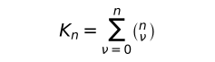\  possibilités[^17].

Pour toute combinaison d'états de choses, il est possible qu'elle subsiste, les autres ne subsistant pas.

**[4.28](https://www.wittgensteinproject.org/w/index.php/Logisch-philosophische_Abhandlung#4.28)** À ces combinaisons correspondent exactement autant de possibilités de vérité – ou de fausseté – de n propositions élémentaires.

**[4.3](https://www.wittgensteinproject.org/w/index.php/Logisch-philosophische_Abhandlung#4.3)** Les possibilités de vérité des propositions élémentaires signifient les possibilités de subsistance ou de non-subsistance des états de choses.

**[4.31](https://www.wittgensteinproject.org/w/index.php/Logisch-philosophische_Abhandlung#4.31)** On peut figurer les possibilités de vérité au moyen de schémas du type suivant (« V » signifie « vrai », « F » signifie « faux » ; les lignes de « V » et de « F » sous la ligne de propositions élémentaires signifient, selon un symbolisme facile à comprendre, leurs possibilités de vérité) :

|p |q |r |
|---|---|---|
|V|V|V |
|F|V|V |
|V|F|V |
|V|V|F |
|F|F|V |
|F|V|F |
|V|F|F |
|F|F|F |

|p |q |
|---|---|
|V|V |
|F|V |
|V|F |
|F|F |

|p |
|---|
|V |
|F |

**[4.4](https://www.wittgensteinproject.org/w/index.php/Logisch-philosophische_Abhandlung#4.4)** La proposition est l'expression de l'accord et du désaccord avec les possibilités de vérité des propositions élémentaires.

**[4.41](https://www.wittgensteinproject.org/w/index.php/Logisch-philosophische_Abhandlung#4.41)** Les possibilités de vérité des propositions élémentaires sont les conditions de la vérité et de la fausseté des propositions.

**[4.411](https://www.wittgensteinproject.org/w/index.php/Logisch-philosophische_Abhandlung#4.411)** Il est d'ores et déjà vraisemblable que l'introduction des propositions élémentaires est fondamentale pour la compréhension de toute autre espèce de propositions. En fait, la compréhension des propositions en général dépend visiblement de celle des propositions élémentaires.

**[4.42](https://www.wittgensteinproject.org/w/index.php/Logisch-philosophische_Abhandlung#4.42)** Concernant l'accord et le désaccord d'une proposition avec les possibilités de vérité de n propositions élémentaires, il y a :

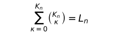\ [^18] possibilités.

**[4.43](https://www.wittgensteinproject.org/w/index.php/Logisch-philosophische_Abhandlung#4.43)** L'accord avec les possibilités de vérité peut être exprimé en adjoignant à celles-ci, dans le schéma, par exemple la marque « V » (vrai).

L'absence de cette marque signifie la non-concordance.

**[4.431](https://www.wittgensteinproject.org/w/index.php/Logisch-philosophische_Abhandlung#4.431)** L'expression de l'accord et du désaccord avec les possibilités de vérité des propositions élémentaires exprime les conditions de vérité d'une proposition.

La proposition est l'expression de ses conditions de vérité. (Frege a donc eu tout à fait raison de les faire précéder par l'explication des signes de sa langue symbolique. Seulement l'explication du concept de vérité est chez Frege erronée : si « le vrai » et « le faux » étaient réellement des objets, et les arguments dans \~p etc., alors le sens de « \~p » ne serait en aucune manière déterminé par la détermination de Frege.)

**[4.44](https://www.wittgensteinproject.org/w/index.php/Logisch-philosophische_Abhandlung#4.44)** Le signe qui naît de l'adjonction de la marque « V » et des possibilités de vérité est un signe propositionnel.

**[4.441](https://www.wittgensteinproject.org/w/index.php/Logisch-philosophische_Abhandlung#4.441)** Il est clair qu'au complexe des signes « F » et « V » aucun objet (ou complexe d'objets) ne correspond ; pas plus qu'aux traits horizontaux ou aux traits verticaux ou aux parenthèses. – Il n'y a pas d'« objets logiques ».

Il en est naturellement de même pour tous les signes qui expriment la même chose que les schémas des « V » et des « F ».

**[4.442](https://www.wittgensteinproject.org/w/index.php/Logisch-philosophische_Abhandlung#4.442)** Par exemple :

«

|p |q | |
|---|---|---|
|V|V |V |
|F|V |V |
|V|F | |
|F|F |V |

»

est un signe propositionnel.

\(Le « signe de jugement » frégéen « 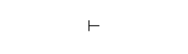\  » est dépourvu de signification logique ; il montre simplement chez Frege (et Russell) que ces auteurs tiennent pour vraies les propositions ainsi désignées. « \  » n'appartient donc pas davantage à la construction propositionnelle que, par exemple, son numéro. Il n'est pas possible qu'une proposition dise d'elle-même qu'elle est vraie.)

Si la suite des possibilités de vérité dans le schéma est une fois pour toute fixée par une règle de combinaison, la dernière colonne suffit à exprimer les conditions de vérité. En écrivant cette colonne sous forme de ligne, le signe propositionnel devient : « (VV–V) (p,q) » ou plus clairement : « (VVFV) (p,q) ». (Le nombre des places dans les parenthèses de gauche est déterminé par le nombre des membres dans celles de droite.)

**[4.45](https://www.wittgensteinproject.org/w/index.php/Logisch-philosophische_Abhandlung#4.45)** Pour n propositions élémentaires il y a L~n~ groupes possibles de conditions de vérité.

Les groupes de conditions de vérité qui appartiennent aux possibilités de vérité d'un nombre donné de propositions élémentaires peuvent être ordonnés selon une série.

**[4.46](https://www.wittgensteinproject.org/w/index.php/Logisch-philosophische_Abhandlung#4.46)** Parmi les groupes possibles de conditions de vérité, il existe deux cas extrêmes.

Dans l'un d'eux, la proposition est vraie pour toutes les possibilités de vérité des propositions élémentaires. Nous disons que les conditions de vérité sont *tautologiques*.

Dans le second cas, la proposition est fausse pour toutes les possibilités de vérité : les conditions de vérité sont *contradictoires*.

Dans le premier cas, nous appelons la proposition tautologie, dans le second cas contradiction.

**[4.461](https://www.wittgensteinproject.org/w/index.php/Logisch-philosophische_Abhandlung#4.461)** La proposition montre ce qu'elle dit, la tautologie et la contradiction montrent qu'elles ne disent rien.

La tautologie n'a pas de conditions de vérité, car elle est inconditionnellement vraie ; et la contradiction n'est vraie sous aucune condition.

La tautologie et la contradiction sont vides de sens[^19]. (Comme le point, duquel partent deux flèches en directions opposées.)

\(Je ne sais rien du temps qu'il fait par exemple, lorsque je sais ou il pleut ou il ne pleut pas.)

**[4.4611](https://www.wittgensteinproject.org/w/index.php/Logisch-philosophische_Abhandlung#4.4611)** Mais la tautologie et la contradiction ne sont pas dépourvues de sens ; elles appartiennent au symbolisme, tout à fait à la manière dont le « 0 » appartient au symbolisme de l'arithmétique.

**[4.462](https://www.wittgensteinproject.org/w/index.php/Logisch-philosophische_Abhandlung#4.462)** La tautologie et la contradiction ne sont pas des images de la réalité. Elles ne figurent aucune situation possible. Car celle-là permet *toute* situation possible, celle-ci *aucune*.

Dans la tautologie les conditions de l'accord avec le monde – les relations de figuration – s'annulent mutuellement, de sorte qu'elle n'entretient aucune relation de figuration avec la réalité.

**[4.463](https://www.wittgensteinproject.org/w/index.php/Logisch-philosophische_Abhandlung#4.463)** Les conditions de vérité déterminent le domaine de variation laissé aux faits par la proposition.

\(La proposition, l'image, le modèle sont, en un sens négatif, comme un corps solide qui limite la liberté de mouvement des autres corps ; dans un sens positif, comme l'espace borné par une substance solide, où un corps peut être placé.)

La tautologie laisse à la réalité la totalité – infinie – de l'espace logique ; la contradiction remplit la totalité de l'espace logique et ne laisse à la réalité aucun point. Aucune des deux ne peut donc déterminer en quelque manière la réalité.

**[4.464](https://www.wittgensteinproject.org/w/index.php/Logisch-philosophische_Abhandlung#4.464)** La vérité de la tautologie est certaine, celle d'une proposition est possible, celle de la contradiction impossible.

\(Certain, possible, impossible : nous avons ici l'indice des degrés dont nous avons besoin dans la théorie des probabilités.)

**[4.465](https://www.wittgensteinproject.org/w/index.php/Logisch-philosophische_Abhandlung#4.465)** Le produit logique d'une tautologie et d'une proposition dit la même chose que cette proposition. Ce produit est donc identique à la proposition. Car on ne peut altérer ce qui est essentiel à un symbole sans altérer son sens.

**[4.466](https://www.wittgensteinproject.org/w/index.php/Logisch-philosophische_Abhandlung#4.466)** À une connexion logique déterminée de signes correspond une connexion logique déterminée de leurs significations ; toute connexion *arbitraire* ne correspond qu'à des signes sans connexion.

C'est-à-dire que des propositions vraies pour chaque situation ne peuvent absolument pas être des connexions de signes, car ne pourraient en ce cas leur correspondre que des connexions déterminées d'objets.

\(Et à l'absence de connexion logique correspond l'absence de connexion d'objets.)

La tautologie et la contradiction sont les cas limites de la connexion de signes, à savoir sa dissolution.

**[4.4661](https://www.wittgensteinproject.org/w/index.php/Logisch-philosophische_Abhandlung#4.4661)** À vrai dire, dans la tautologie et dans la contradiction les signes sont bien encore liés entre eux, c'est-à-dire qu'ils ont des relations mutuelles, mais ces relations sont sans signification, elles ne sont pas essentielles au *symbole*.

**[4.5](https://www.wittgensteinproject.org/w/index.php/Logisch-philosophische_Abhandlung#4.5)** Il paraît maintenant possible de poser la forme la plus générale de la proposition, c'est-à-dire la description des propositions d'une langue symbolique *quelconque*, de telle sorte que chaque sens possible puisse être exprimé par un symbole auquel la description convienne, et que chaque symbole auquel la description convienne puisse exprimer un sens, si les significations des noms sont choisies adéquatement.

Il est clair que dans la description de la forme la plus générale de la proposition, l'essentiel seul peut être décrit – sans quoi elle ne saurait être la description la plus générale.

Qu'il y ait une forme générale de la proposition, ceci le prouve qu'il ne peut y avoir aucune proposition dont on n'aurait pu prévoir la forme (c'est-à-dire la construire). La forme générale de la proposition est : ce qui a lieu est ainsi et ainsi.

**[4.51](https://www.wittgensteinproject.org/w/index.php/Logisch-philosophische_Abhandlung#4.51)** À supposer que *toutes* les propositions élémentaires me soient données, on peut alors simplement demander : quelles propositions puis-je former à partir d'elles ? Et la réponse est : *toutes* les propositions, ainsi se trouvent-elles délimitées.

**[4.52](https://www.wittgensteinproject.org/w/index.php/Logisch-philosophische_Abhandlung#4.52)** Les propositions sont *tout* ce qui découle de l'ensemble des propositions élémentaires (naturellement aussi de ce que cet ensemble en est la *totalité*). (Ainsi pourrait-on dire, en un certain sens, que *toutes* les propositions sont des généralisations des propositions élémentaires.)

**[4.53](https://www.wittgensteinproject.org/w/index.php/Logisch-philosophische_Abhandlung#4.53)** La forme générale de la proposition est une variable.

**[5](https://www.wittgensteinproject.org/w/index.php/Logisch-philosophische_Abhandlung#5)** La proposition est une fonction de vérité des propositions élémentaires.

\(La proposition élémentaire est une fonction de vérité d'elle-même.)

**[5.01](https://www.wittgensteinproject.org/w/index.php/Logisch-philosophische_Abhandlung#5.01)** Les propositions élémentaires sont les arguments de vérité de la proposition.

**[5.02](https://www.wittgensteinproject.org/w/index.php/Logisch-philosophische_Abhandlung#5.02)** Il est facile de confondre les arguments des fonctions avec les indices des noms. Je reconnais en effet aussi bien sur un argument que sur un indice la signification du signe qui les contient.

Chez Russell « ~c~ » dans « +~c~ » est un indice qui montre que le signe dans son ensemble est le symbole de l'addition pour les cardinaux. Mais cette dénotation repose sur une convention arbitraire, et l'on pourrait, au lieu de « +~c~ », choisir un signe simple ; dans « \~p » au contraire, « p » n'est pas un indice mais un argument : le sens de « \~p » *ne peut pas* être compris sans qu'ait été compris auparavant le sens de « p ». (Dans le nom Julius Caesar, Julius est un indice. L'indice est toujours une partie de la description de l'objet au nom duquel nous l'apposons. Par exemple : le Caesar parmi les membres de la gens Julia.)

C'est la confusion de l'argument et de l'indice qui est à la base, si je ne me trompe, de la théorie de Frege sur la signification des propositions et des fonctions. Pour Frege, les propositions de la logique étaient des noms, et leurs arguments des indices de ces noms.

**[5.1](https://www.wittgensteinproject.org/w/index.php/Logisch-philosophische_Abhandlung#5.1)** Les fonctions de vérité peuvent être ordonnées en séries.

Tel est le fondement de la théorie des probabilités.

**[5.101](https://www.wittgensteinproject.org/w/index.php/Logisch-philosophische_Abhandlung#5.101)** Les fonctions de vérité de tout nombre donné de propositions élémentaires peuvent être écrites selon un schéma du type suivant :

|   |   |   |
|---|---|---|
|(VVVV)(p, q) |Tautologie |(si p alors p ; et si q alors q.) (p ⊃ p . q ⊃ q) |
|(FVVV)(p, q) |soit : |pas à la fois p et q. (\~(p . q)) |
|(VFVV)(p, q) | « |si q alors p. (q ⊃ p) |
|(VVFV)(p, q) | « |si p alors q. (p ⊃ q) |
|(VVVF)(p, q) | « |p ou q. (p ∨ q) |
|(FFVV)(p, q) | « |non q. \~q |
|(FVFV)(p, q) | « |non p. \~p |
|(FVVF)(p, q) | « |p ou q, mais pas les deux. (p . \~q : ∨ : q . \~p) |
|(VFFV)(p, q) | « |si p alors q ; et si q alors p. (p ≡ q) |
|(VFVF)(p, q) | « |p |
|(VVFF)(p, q) | « |q |
|(FFFV)(p, q) | « |ni p ni q. (\~p . \~q) ou (p \| q) |
|(FFVF)(p, q) | « |p et non q. (p . \~q) |
|(FVFF)(p, q) | « |q et non p. (q . \~p) |
|(VFFF)(p, q) | « |q et p. (q . p) |
|(FFFF)(p, q) |Contradiction |(p et non p ; et q et non q.) (p . \~p . q . \~q) |

À ces possibilités de vérité de ses arguments de vérité qui vérifient une proposition, je donnerai le nom de *fondements de vérité* de cette proposition.

**[5.11](https://www.wittgensteinproject.org/w/index.php/Logisch-philosophische_Abhandlung#5.11)** Si les fondements de vérité communs à un certain nombre de propositions sont aussi, pris ensemble, fondements de vérité d'une proposition déterminée, nous disons que la vérité de celle-ci suit de la vérité de celles-là.

**[5.12](https://www.wittgensteinproject.org/w/index.php/Logisch-philosophische_Abhandlung#5.12)** En particulier, la vérité d'une proposition « p » suit de la vérité d'une proposition « q » quand tous les fondements de vérité de la seconde sont fondements de vérité de la première.

**[5.121](https://www.wittgensteinproject.org/w/index.php/Logisch-philosophische_Abhandlung#5.121)** Les fondements de vérité de l'une sont contenus dans ceux de l'autre : p suit de q.

**[5.122](https://www.wittgensteinproject.org/w/index.php/Logisch-philosophische_Abhandlung#5.122)** Quand p suit de q, le sens de « p » est contenu dans le sens de « q ».

**[5.123](https://www.wittgensteinproject.org/w/index.php/Logisch-philosophische_Abhandlung#5.123)** Si un dieu crée un monde dans lequel certaines propositions sont vraies, il crée du même coup un monde dans lequel sont valables toutes leurs conséquences. Et de même il ne saurait créer aucun monde où serait vraie la proposition « p » sans créer en même temps tous les objets de celle-ci.

**[5.124](https://www.wittgensteinproject.org/w/index.php/Logisch-philosophische_Abhandlung#5.124)** Une proposition affirme toute proposition qui s'ensuit.

**[5.1241](https://www.wittgensteinproject.org/w/index.php/Logisch-philosophische_Abhandlung#5.1241)** « p . q » est l'une des propositions qui affirment « p » et en même temps l'une des propositions qui affirment « q ».

Deux propositions sont opposées l'une à l'autre s'il n'y a pas de proposition pourvue de sens qui les affirme toutes deux.

Toute proposition qui en contredit une autre la nie.

**[5.13](https://www.wittgensteinproject.org/w/index.php/Logisch-philosophische_Abhandlung#5.13)** Que la vérité d'une proposition suive de la vérité d'autres propositions nous le voyons par leur structure.

**[5.131](https://www.wittgensteinproject.org/w/index.php/Logisch-philosophische_Abhandlung#5.131)** Si la vérité d'une proposition suit de la vérité d'autres propositions, ceci s'exprime dans les relations qu'ont entre elles leurs formes ; et nous n'avons certes nul besoin de les mettre d'abord dans ces relations en les combinant dans une proposition unique, car ces relations sont au contraire internes, et elles subsistent dès que subsistent ces propositions, et par cette subsistance même.

**[5.1311](https://www.wittgensteinproject.org/w/index.php/Logisch-philosophische_Abhandlung#5.1311)** Quand nous déduisons q de p v q et \~p, la relation entre les formes des propositions « p v q » et « \~p » est masquée par le mode de description. Mais si nous écrivons, par exemple, au lieu de « p v q », « p \| q .\|. p \| q », et au lieu de « \~p », « p \| p » (p \| q = ni p ni q), alors l'interdépendance interne devient évidente.

\(Que l'on puisse déduire fa de (x). fx montre que la généralité est déjà comprise dans le symbole « (x). fx ».)

**[5.132](https://www.wittgensteinproject.org/w/index.php/Logisch-philosophische_Abhandlung#5.132)** Si p suit de q, je puis déduire p de q, tirer de q la conséquence p.

La manière de déduire ne peut être tirée que des deux propositions.

Elles seules peuvent justifier la déduction.

Des « lois de la déduction », qui – comme chez Frege et Russell – doivent justifier les déductions, sont vides de sens, et seraient superflues.

**[5.133](https://www.wittgensteinproject.org/w/index.php/Logisch-philosophische_Abhandlung#5.133)** Toute conséquence est conséquence a priori.

**[5.134](https://www.wittgensteinproject.org/w/index.php/Logisch-philosophische_Abhandlung#5.134)** D'une proposition élémentaire ne suit aucune autre.

**[5.135](https://www.wittgensteinproject.org/w/index.php/Logisch-philosophische_Abhandlung#5.135)** On ne peut en aucune manière déduire de la subsistance d'une situation quelconque la subsistance d'une autre situation totalement différente.

**[5.136](https://www.wittgensteinproject.org/w/index.php/Logisch-philosophische_Abhandlung#5.136)** Il n'y a pas de lien causal qui justifierait une telle déduction.

**[5.1361](https://www.wittgensteinproject.org/w/index.php/Logisch-philosophische_Abhandlung#5.1361)** Les événements futurs, nous *ne pouvons* les conclure à partir des événements présents.

La croyance en un lien causal est un *préjugé*.

**[5.1362](https://www.wittgensteinproject.org/w/index.php/Logisch-philosophische_Abhandlung#5.1362)** Le libre arbitre consiste en ce que nous ne pouvons connaître maintenant les actions futures. Nous ne pourrions les connaître que si la causalité était une nécessité *interne*, comme celle de la déduction logique. L'interdépendance du connaître et de ce qui est connu est celle de la nécessité logique.

\(« A sait que p a lieu » est vide de sens, si p est une tautologie.)

**[5.1363](https://www.wittgensteinproject.org/w/index.php/Logisch-philosophische_Abhandlung#5.1363)** Si, de ce qu'une proposition est pour nous évidente il ne *suit* pas qu'elle est vraie, cette évidence ne constitue pas non plus une justification de notre croyance en sa vérité.

**[5.14](https://www.wittgensteinproject.org/w/index.php/Logisch-philosophische_Abhandlung#5.14)** Si une proposition suit d'une autre, celle-ci dit plus que celle-là, celle-là moins que celle-ci.

**[5.141](https://www.wittgensteinproject.org/w/index.php/Logisch-philosophische_Abhandlung#5.141)** Si p suit de q et q suit de p, p et q ne sont qu'une seule et même proposition.

**[5.142](https://www.wittgensteinproject.org/w/index.php/Logisch-philosophische_Abhandlung#5.142)** La tautologie suit de toute proposition : elle ne dit rien.

**[5.143](https://www.wittgensteinproject.org/w/index.php/Logisch-philosophische_Abhandlung#5.143)** La contradiction est ce qui est commun aux propositions, sans qu'aucune proposition l'ait en commun avec une autre. La tautologie est ce qui est commun aux propositions qui n'ont rien de commun entre elles.

La contradiction s'évanouit, pour ainsi dire, à l'extérieur, la tautologie à l'intérieur, de toutes les propositions.

La contradiction est la frontière externe des propositions, la tautologie est leur centre sans substance.

**[5.15](https://www.wittgensteinproject.org/w/index.php/Logisch-philosophische_Abhandlung#5.15)** Si V~r~ est le nombre des fondements de vérité de la proposition « r », V~rs~ le nombre des fondements de vérité de la proposition « s » qui sont en même temps fondements de vérité de « r », nous nommons alors le rapport V~rs~ : V~r~ *mesure de la probabilité* que la proposition « r » confère à la proposition « s ».

**[5.151](https://www.wittgensteinproject.org/w/index.php/Logisch-philosophische_Abhandlung#5.151)** Dans un schéma comme celui de [5.101](#5.101), soit V~r~ le nombre des « V » de la proposition r ; V~rs~ le nombre des « V » de la proposition s qui correspondent, dans une même colonne à des « V » de la proposition r. La proposition r confère alors à la proposition s la probabilité V~rs~ : V~r~.

**[5.1511](https://www.wittgensteinproject.org/w/index.php/Logisch-philosophische_Abhandlung#5.1511)** Il n'y a pas d'objet particulier propre aux propositions de probabilité.

**[5.152](https://www.wittgensteinproject.org/w/index.php/Logisch-philosophische_Abhandlung#5.152)** Les propositions qui n'ont en commun aucun argument de vérité nous les nommerons mutuellement indépendantes.

Deux propositions élémentaires se confèrent mutuellement la probabilité 1/2.

Si p suit de q, la proposition « q » confère à la proposition « p » la probabilité 1. La certitude de la déduction logique est un cas limite de la probabilité.

\(Application à la tautologie et à la contradiction.)

**[5.153](https://www.wittgensteinproject.org/w/index.php/Logisch-philosophische_Abhandlung#5.153)** Une proposition n'est, en elle-même, ni probable ni improbable. Un événement se produit ou ne se produit pas, il n'y a pas de milieu.

**[5.154](https://www.wittgensteinproject.org/w/index.php/Logisch-philosophische_Abhandlung#5.154)** Soient dans une urne autant de boules blanches de que boules noires (et nulles autres). Je tire une boule après l'autre et les remets dans l'urne. Je puis alors, par cette épreuve, établir que les nombres de boules noires et de boules blanches tirées se rapprochent à mesure que l'on poursuit le tirage.

Il ne s'agit donc pas là d'une propriété mathématique.

Si maintenant je dis : il est également probable que je tirerai une boule blanche ou une boule noire, cela signifie : toutes les circonstances de moi connues (y compris les lois de la nature prises comme hypothèses) ne confèrent pas à la production de l'un de ces événements plus de probabilité qu'à la production de l'autre. C'est-à-dire qu'elles donnent à chacun – comme on le conclut aisément des explications précédentes – la probabilité 1/2.

Ce que je confirme par cette épreuve, c'est que la production des deux événements est indépendante des circonstances que je ne connais pas plus exactement.

**[5.155](https://www.wittgensteinproject.org/w/index.php/Logisch-philosophische_Abhandlung#5.155)** La proposition élémentaire de probabilité[^20] est : les circonstances – dont je n'ai pas par ailleurs une connaissance plus poussée – confèrent à la production d'un événement déterminé tel ou tel degré de probabilité.

**[5.156](https://www.wittgensteinproject.org/w/index.php/Logisch-philosophische_Abhandlung#5.156)** C'est ainsi que la probabilité est une généralisation.

Elle enveloppe la description générale d'une forme propositionnelle.

Ce n'est qu'à défaut de certitude que nous utilisons la probabilité. Quand nous ne connaissons pas un fait complètement, tout en sachant *quelque chose* au sujet de sa forme.

\(Une proposition peut certes n'être qu'incomplètement l'image d'une situation déterminée, mais elle est toujours une *image complète*.)

La proposition de probabilité est comme un extrait d'autres propositions.

**[5.2](https://www.wittgensteinproject.org/w/index.php/Logisch-philosophische_Abhandlung#5.2)** Les structures des propositions ont entre elles des relations internes.

**[5.21](https://www.wittgensteinproject.org/w/index.php/Logisch-philosophische_Abhandlung#5.21)** Nous pouvons souligner par notre mode d'expression ces relations internes en figurant une proposition comme résultat d'une opération qui la produit à partir d'autres propositions (les bases de l'opération).

**[5.22](https://www.wittgensteinproject.org/w/index.php/Logisch-philosophische_Abhandlung#5.22)** L'opération est l'expression d'une relation entre les structures de son résultat et celles de ses bases.

**[5.23](https://www.wittgensteinproject.org/w/index.php/Logisch-philosophische_Abhandlung#5.23)** L'opération est ce qui doit arriver à une proposition pour que l'autre en résulte.

**[5.231](https://www.wittgensteinproject.org/w/index.php/Logisch-philosophische_Abhandlung#5.231)** Et cela dépendra naturellement de leurs propriétés formelles, de la similitude interne de leurs formes.

**[5.232](https://www.wittgensteinproject.org/w/index.php/Logisch-philosophische_Abhandlung#5.232)** La relation interne qui ordonne une série est équivalente à l'opération par laquelle un terme de la série est engendré par un autre.

**[5.233](https://www.wittgensteinproject.org/w/index.php/Logisch-philosophische_Abhandlung#5.233)** Une opération ne peut apparaître que là où une proposition est engendrée par une autre de manière logiquement significative. Donc là où commence la construction logique de la proposition.

**[5.234](https://www.wittgensteinproject.org/w/index.php/Logisch-philosophische_Abhandlung#5.234)** Les fonctions de vérité des propositions élémentaires sont les résultats d'opérations ayant les propositions élémentaires pour base. (J'appelle ces opérations opérations de vérité.)

**[5.2341](https://www.wittgensteinproject.org/w/index.php/Logisch-philosophische_Abhandlung#5.2341)** Le sens d'une fonction de vérité de p est une fonction du sens de p.

La négation, l'addition logique, la multiplication logique, etc., etc., sont des opérations.

\(La négation inverse le sens de la proposition.)

**[5.24](https://www.wittgensteinproject.org/w/index.php/Logisch-philosophische_Abhandlung#5.24)** L'opération se manifeste dans une variable ; elle montre comment, d'une forme de propositions, on parvient à la forme d'autres propositions.

Elle donne une expression à la différence des formes.

\(Et ce qui est commun aux bases et au résultat de l'opération, ce sont justement les bases.)

**[5.241](https://www.wittgensteinproject.org/w/index.php/Logisch-philosophische_Abhandlung#5.241)** Une opération n'est pas la marque d'une forme, mais seulement de la différence entre des formes.

**[5.242](https://www.wittgensteinproject.org/w/index.php/Logisch-philosophische_Abhandlung#5.242)** La même opération qui produit « q » à partir de « p », produit « r » à partir de « q », et ainsi de suite. On ne peut exprimer ceci que par le trait de « p », « q », « r », etc., d'être des variables qui donnent une expression générale à certaines relations formelles.

**[5.25](https://www.wittgensteinproject.org/w/index.php/Logisch-philosophische_Abhandlung#5.25)** L'occurrence de l'opération ne caractérise nullement le sens de la proposition.

L'opération en effet ne dit rien, mais seulement son résultat, et celui-ci dépend des bases de l'opération.

\(Opération et fonction ne doivent pas être confondues.)

**[5.251](https://www.wittgensteinproject.org/w/index.php/Logisch-philosophische_Abhandlung#5.251)** Une fonction ne peut être son propre argument, tandis que le résultat d'une opération peut fort bien devenir sa propre base.

**[5.252](https://www.wittgensteinproject.org/w/index.php/Logisch-philosophische_Abhandlung#5.252)** C'est seulement ainsi que la progression d'un terme à un autre dans une série de formes (de type à type dans les hiérarchies de Russell et Whitehead) est possible. (Russell et Whitehead n'ont pas accordé la possibilité de cette progression mais en ont toujours fait usage.)

**[5.2521](https://www.wittgensteinproject.org/w/index.php/Logisch-philosophische_Abhandlung#5.2521)** L'application itérée d'une opération à son propre résultat, je l'appelle son application successive (« O'O'O'a » est le résultat de trois applications successives de « O'ξ » à « a ».)

En un sens semblable je parle des applications successives de *plusieurs* opérations à un certain nombre de propositions.

**[5.2522](https://www.wittgensteinproject.org/w/index.php/Logisch-philosophische_Abhandlung#5.2522)** Le terme général d'une série de formes : a, O'a, O'O'a... je l'écris donc ainsi : « [a,x,O'x] ». Cette expression entre crochets est une variable. Le premier terme est le début de la série de formes, le second est la forme d'un terme arbitraire de la série, et le troisième la forme du terme de la série qui suit immédiatement x.

**[5.2523](https://www.wittgensteinproject.org/w/index.php/Logisch-philosophische_Abhandlung#5.2523)** Le concept des applications successives d'une opération est équivalent au concept « et caetera ».

**[5.253](https://www.wittgensteinproject.org/w/index.php/Logisch-philosophische_Abhandlung#5.253)** Une opération peut inverser l'effet d'une autre opération. Les opérations peuvent mutuellement s'annuler.

**[5.254](https://www.wittgensteinproject.org/w/index.php/Logisch-philosophische_Abhandlung#5.254)** Une opération peut disparaître (par exemple la négation dans « \~\~p » : \~\~p = p).

**[5.3](https://www.wittgensteinproject.org/w/index.php/Logisch-philosophische_Abhandlung#5.3)** Toutes les propositions sont les résultats d'opérations de vérité sur des propositions élémentaires.

Une opération de vérité est la manière dont, à partir de propositions élémentaires, naît une fonction de vérité.

De par la nature de l'opération de vérité, de même que naît de propositions élémentaires leur fonction de vérité, de même naîtra de fonctions de vérité une fonction de vérité nouvelle. Chaque opération de vérité engendre, à partir de fonctions de vérité de propositions élémentaires, une nouvelle fonction de vérité de propositions élémentaires, une proposition. Le résultat de chaque opération de vérité ayant pour base des résultats d'opérations de vérités sur des propositions élémentaires est à nouveau le résultat d'*une* opération de vérité sur des propositions élémentaires.

Chaque proposition est le résultat d'opérations de vérité sur des propositions élémentaires.

**[5.31](https://www.wittgensteinproject.org/w/index.php/Logisch-philosophische_Abhandlung#5.31)** Les schémas de [4.31](#4.31) ont encore une signification quand « p », « q », « r », etc., ne sont pas des propositions élémentaires. Et il est aisé de voir que le signe propositionnel de [4.442](#4.442) exprime encore une unique fonction de vérité de propositions élémentaires, même quand « p » et « q » sont des fonctions de vérité de propositions élémentaires.

**[5.32](https://www.wittgensteinproject.org/w/index.php/Logisch-philosophische_Abhandlung#5.32)** Toutes les fonctions de vérité sont des résultats d'applications successives d'un nombre fini d'opérations de vérité sur les propositions élémentaires.

**[5.4](https://www.wittgensteinproject.org/w/index.php/Logisch-philosophische_Abhandlung#5.4)** Il devient ici manifeste qu'il n'y a pas d'« objets logiques », de « constantes logiques » (au sens de Frege et Russell).

**[5.41](https://www.wittgensteinproject.org/w/index.php/Logisch-philosophische_Abhandlung#5.41)** Car sont identiques entre eux tous les résultats d'opérations de vérité sur des fonctions de vérité, s'ils sont une seule et même fonction de vérité de propositions élémentaires.

**[5.42](https://www.wittgensteinproject.org/w/index.php/Logisch-philosophische_Abhandlung#5.42)** Il est évident que ∨, ⊃, etc., ne sont pas des relations au sens de : à droite de, à gauche de, etc.

La possibilité des définitions réciproques des signes logiques « primitifs » de Frege et Russell montre déjà que ce ne sont pas des signes primitifs, et encore mieux qu'ils ne désignent aucune relation.

Et il est patent que le « ⊃ » que nous définissons au moyen de « \~ » et de « ∨ » est identique à celui au moyen duquel nous définissons « ∨ » en usant de « \~ », et que ce « ∨ » est identique au premier. Et ainsi de suite.

**[5.43](https://www.wittgensteinproject.org/w/index.php/Logisch-philosophische_Abhandlung#5.43)** Qu'à partir du fait p doivent s'ensuivre une infinité d'*autres* faits, à savoir \~\~p, \~\~\~\~p, etc., voilà qui est au premier abord à peine croyable. Et il n'est pas moins remarquable que le nombre infini des propositions de la logique (de la mathématique) suivent d'une demi-douzaine de « lois fondamentales ».

Mais toutes les propositions de la logique disent la même chose. A savoir : rien.

**[5.44](https://www.wittgensteinproject.org/w/index.php/Logisch-philosophische_Abhandlung#5.44)** Les fonctions de vérité ne sont pas des fonctions matérielles.

Si l'on peut, par exemple, engendrer une affirmation par une double négation, la négation est-elle donc alors en un certain sens contenue dans l'affirmation ? « \~\~p » nie-t-il \~p, ou affirme-t-il p ; ou les deux à la fois ?

La proposition « \~\~p » ne traite pas la négation comme un objet ; mais la possibilité de la négation est assurément présupposée dans l'affirmation.

Et s'il y avait un objet nommé « \~ », « \~\~p » devrait dire autre chose que « p ». Car l'une des deux propositions traiterait justement de \~, et l'autre point.

**[5.441](https://www.wittgensteinproject.org/w/index.php/Logisch-philosophische_Abhandlung#5.441)** Cette disparition des constantes logiques apparentes intervient encore avec « \~(∃x) . \~fx » qui dit la même chose que « (x) . fx », ou « (∃x) . fx. x = a » la même chose que « fa ».

**[5.442](https://www.wittgensteinproject.org/w/index.php/Logisch-philosophische_Abhandlung#5.442)** Quand une proposition nous est donnée, sont aussi donnés, *avec elle*, les résultats de toutes les opérations de vérité qui la prennent pour base.

**[5.45](https://www.wittgensteinproject.org/w/index.php/Logisch-philosophische_Abhandlung#5.45)** S'il y a des signes logiques primitifs, une logique correcte doit rendre claire leur position relative, et justifier leur existence. La construction de la logique *à partir* de ses signes primitifs doit être rendue claire.

**[5.451](https://www.wittgensteinproject.org/w/index.php/Logisch-philosophische_Abhandlung#5.451)** Si la logique a des concepts fondamentaux, ils doivent être mutuellement indépendants. Si un concept fondamental est introduit, il doit être introduit dans toutes les connexions dans lesquelles il peut apparaître. On ne peut donc l'introduire d'abord pour l'*une* d'elles, puis de nouveau pour une autre. Par exemple, si la négation est introduite, nous devons alors la comprendre dans des propositions de la forme « \~p » aussi bien que dans « \~(p ∨ q) », « (∃x) . \~fx », etc. Nous n'avons pas le droit de l'introduire d'abord pour une classe de cas, puis pour les autres, car il demeurerait alors douteux si sa signification dans les deux cas est la même, et l'on ne disposerait d' aucune raison d'user dans les deux cas du même mode de connexion des signes.

\(En bref, pour l'introduction de signes primitifs, vaut *mutatis mutandis* ce que dit Frege (*Lois fondamentales de l'arithmétique*) de l'introduction des signes au moyen de définitions[^21].)

**[5.452](https://www.wittgensteinproject.org/w/index.php/Logisch-philosophische_Abhandlung#5.452)** L'introduction d'un expédient nouveau dans le symbolisme logique est nécessairement un événement lourd de conséquences. Aucun expédient nouveau ne devrait en logique être introduit, pour ainsi dire, avec des airs innocents, comme parenthèse ou comme note.

\(C'est ainsi que dans les *Principia Mathematica* de Russell et Whitehead des définitions et des lois fondamentales sont données en mots ordinaires. Pourquoi ce soudain usage de mots ? Ceci appellerait une justification, qui manque, et doit manquer, car cette façon de procéder est en fait inadmissible.)

Mais si l'introduction d'un nouvel expédient en un certain endroit se révèle indispensable, on doit aussitôt se demander : où cet expédient doit-il être maintenant constamment appliqué ? Sa place en logique doit désormais être expliquée.

**[5.453](https://www.wittgensteinproject.org/w/index.php/Logisch-philosophische_Abhandlung#5.453)** Tout nombre, en logique, doit être justifié.

Ou plutôt, il doit ressortir qu'en logique il n'y a pas de nombres.

Il n'y a pas de nombres distingués.

**[5.454](https://www.wittgensteinproject.org/w/index.php/Logisch-philosophische_Abhandlung#5.454)** En logique, il ne peut y avoir de coordination ni de classification.

En logique, il ne peut y avoir un plus général et un plus spécifique.

**[5.4541](https://www.wittgensteinproject.org/w/index.php/Logisch-philosophische_Abhandlung#5.4541)** Les solutions des problèmes logiques doivent être simples, car elles établissent les normes de la simplicité.

Les hommes ont toujours soupçonné qu'il devait y avoir un domaine de questions dont les réponses seraient – a priori – symétriquement réunies dans une construction close et régulière.

Un domaine où vaut la proposition : *Simplex sigillum veri*.

**[5.46](https://www.wittgensteinproject.org/w/index.php/Logisch-philosophische_Abhandlung#5.46)** Si l'on introduisait correctement les signes logiques, on aurait du même coup déjà introduit le sens de toutes leurs combinaisons ; donc, non seulement « p ∨ q », mais encore « \~(p ∨ \~q) », etc., etc. On aurait introduit déjà du même coup l'effet de toutes les seules combinaisons possibles de parenthèses. Et il serait par là devenu clair que les authentiques signes primitifs généraux ne sont pas « p ∨ q », « (∃x) . fx », etc., mais plutôt la forme la plus générale de leurs combinaisons.

**[5.461](https://www.wittgensteinproject.org/w/index.php/Logisch-philosophische_Abhandlung#5.461)** Significative est la circonstance apparemment sans importance de l'exigence de parenthèses pour les pseudo-relations logiques, comme ∨ et ⊃, contrairement aux relations réelles.

L'usage des parenthèses avec ces pseudo-signes primitifs suggère déjà que ce ne sont pas réellement les signes primitifs. Et il ne viendra certes à l'esprit de personne de croire que les parenthèses ont une signification autonome.

**[5.4611](https://www.wittgensteinproject.org/w/index.php/Logisch-philosophische_Abhandlung#5.4611)** Les signes des opérations logiques sont des signes de ponctuation.

**[5.47](https://www.wittgensteinproject.org/w/index.php/Logisch-philosophische_Abhandlung#5.47)** Il est clair que ce qui peut simplement être dit par avance de la forme de toutes les propositions, doit pouvoir se dire *en une seule fois*.

Toutes les opérations logiques sont déjà contenues dans les propositions élémentaires. Car « fa » dit la même chose que : « (∃fx) . fx . x = a ».

Là où il y a composition, il y a argument et fonction, et avec eux sont présentes toutes les constantes logiques.

On pourrait dire que la constante logique unique est ce que toutes les propositions, de par leur nature, ont en commun.

Mais cela, c'est la forme générale de la proposition.

**[5.471](https://www.wittgensteinproject.org/w/index.php/Logisch-philosophische_Abhandlung#5.471)** La forme générale de la proposition est l'essence de la proposition.

**[5.4711](https://www.wittgensteinproject.org/w/index.php/Logisch-philosophische_Abhandlung#5.4711)** Poser l'essence de la proposition, c'est poser l'essence de toute description, par conséquent l'essence du monde.

**[5.472](https://www.wittgensteinproject.org/w/index.php/Logisch-philosophische_Abhandlung#5.472)** La description de la forme la plus générale de la proposition, c'est la description du seul et unique signe primitif général de la logique.

**[5.473](https://www.wittgensteinproject.org/w/index.php/Logisch-philosophische_Abhandlung#5.473)** La logique doit prendre soin d'elle-même.

Si un signe est *possible*, il est aussi capable de dénoter. En logique, tout ce qui est possible est aussi permis. (« Socrate est identique » ne veut rien dire parce qu'il n'y a aucune propriété appelée « identique ». La proposition est dépourvue de sens, parce que nous n'avons pas effectué une détermination arbitraire, mais non pas parce que le symbole serait illégitime en soi et par soi.)

En un certain sens, nous ne pouvons nous tromper en logique.

**[5.4731](https://www.wittgensteinproject.org/w/index.php/Logisch-philosophische_Abhandlung#5.4731)** Si, de l'évidence dont Russell a tant parlé, on peut en logique se dispenser, c'est seulement parce que la langue empêche elle-même toute faute logique. Le caractère a priori de la logique consiste dans l'*impossibilité* de rien penser d'illogique.

**[5.4732](https://www.wittgensteinproject.org/w/index.php/Logisch-philosophische_Abhandlung#5.4732)** Nous ne pouvons donner à un signe un sens incorrect.

**[5.47321](https://www.wittgensteinproject.org/w/index.php/Logisch-philosophische_Abhandlung#5.47321)** La devise d'Occam n'est naturellement pas une règle arbitraire, ou justifiée par son succès pratique : elle déclare que les unités *non nécessaires* d'un système de signes n'ont aucune signification.

Des signes qui ont *un* seul et même but sont logiquement équivalents, des signes qui n'ont *aucun* but sont logiquement sans signification.

**[5.4733](https://www.wittgensteinproject.org/w/index.php/Logisch-philosophische_Abhandlung#5.4733)** Frege dit : toute proposition construite selon les règles doit avoir un sens ; et je dis : toute proposition possible est construite selon les règles, et si elle n'a pas de sens, ce ne peut être que parce que l'on n'a pas donné de *signification* à certains de ses éléments.

\(Même si nous croyons l'avoir fait.)

Ainsi « Socrate est identique » ne dit rien, parce que le mot « identique » n'a pas reçu de signification en tant qu'*adjectif*. Car lorsqu'il intervient comme signe d'égalité il symbolise de toute autre manière – sa relation de dénotation est autre –, de sorte que dans les deux cas le symbole est tout à fait différent ; les deux symboles n'ont en commun que le signe, accidentellement.

**[5.474](https://www.wittgensteinproject.org/w/index.php/Logisch-philosophische_Abhandlung#5.474)** Le nombre des opérations fondamentales nécessaires ne dépend *que* de notre notation.

**[5.475](https://www.wittgensteinproject.org/w/index.php/Logisch-philosophische_Abhandlung#5.475)** Il s'agit seulement de construire un système de signes ayant un nombre déterminé de dimensions – d'une multiplicité mathématique déterminée.

**[5.476](https://www.wittgensteinproject.org/w/index.php/Logisch-philosophische_Abhandlung#5.476)** Il est clair qu'il n'est pas question ici d'un *certain nombre de concepts fondamentaux* qui doivent être dénotés, mais de l'expression d'une règle.

**[5.5](https://www.wittgensteinproject.org/w/index.php/Logisch-philosophische_Abhandlung#5.5)** Chaque fonction de vérité est le résultat d'applications successives de l'opération : (– – – – – V) (ξ,....) à des propositions élémentaires.

Cette opération nie l'ensemble des propositions comprises dans les parenthèses de droite, et je la nomme négation de ces propositions.

**[5.501](https://www.wittgensteinproject.org/w/index.php/Logisch-philosophische_Abhandlung#5.501)** Une expression entre parenthèses, dont les membres sont des propositions dont l'ordre est arbitraire, je la note par un signe de la forme « 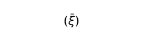\  ». « ξ » est une variable dont les valeurs sont les membres de l'expression entre parenthèses ; et la barre au-dessus de la variable note que celle-ci représente l'ensemble de ses valeurs dans les parenthèses.

\(Si par exemple ξ a les trois valeurs P,Q,R :

\  = (P,Q,R).)

Les valeurs des variables sont fixées. On les fixe en décrivant les propositions dont la variable tient lieu.

Le mode de description des membres de l'expression entre parenthèses n'est pas essentiel.

Nous pouvons distinguer trois espèces de description : 1. L'énumération directe. En ce cas, nous pouvons, au lieu de la variable, poser simplement ses valeurs constantes. 2. La donnée d'une fonction fx, dont les valeurs pour toutes les valeurs de x sont les propositions à décrire. 3. La donnée d'une loi formelle, selon laquelle ces propositions sont construites. En ce cas, les membres de l'expression entre parenthèses sont l'ensemble des membres d'une série de formes.

**[5.502](https://www.wittgensteinproject.org/w/index.php/Logisch-philosophische_Abhandlung#5.502)** J'écris donc, au lieu de « (– – – – – V) (ξ,....) », « 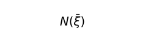\  ».

\  est la négation de l'ensemble des valeurs de la variable propositionnelle ξ.

**[5.503](https://www.wittgensteinproject.org/w/index.php/Logisch-philosophische_Abhandlung#5.503)** Puisqu'il est patent que l'on peut aisément exprimer comment, au moyen de cette opération, des propositions peuvent être construites et comment des propositions ne le peuvent pas, ceci doit donc pouvoir trouver une expression exacte.

**[5.51](https://www.wittgensteinproject.org/w/index.php/Logisch-philosophische_Abhandlung#5.51)** Si ξ n'a qu'une seule valeur, \  = \~p (non p) ; si elle en a deux, \  = \~p . \~q (ni p, ni q).

**[5.511](https://www.wittgensteinproject.org/w/index.php/Logisch-philosophische_Abhandlung#5.511)** Comment la logique, qui embrasse toute chose et reflète le monde, peut-elle avoir recours à des manipulations et à des instruments si particuliers ? Simplement parce qu'ils se relient tous dans un réseau infiniment fin, dans le grand miroir.

**[5.512](https://www.wittgensteinproject.org/w/index.php/Logisch-philosophische_Abhandlung#5.512)** « \~p » est vraie si « p » est fausse. Par conséquent, dans la proposition vraie « \~p », « p » est une proposition fausse. Comment le trait « \~ » peut-il la rendre conforme à la réalité ?

Ce qui nie dans « \~p » ce n'est pas le « \~ », mais ce qui est commun à tous les signes de cette notation qui nient p.

Et par conséquent la règle commune selon laquelle sont construits « \~ p », « \~\~\~p », « \~p ∨ \~p », « \~p . \~p », etc. (*ad inf*.). Et ce qui est commun est le reflet répété de la négation.

**[5.513](https://www.wittgensteinproject.org/w/index.php/Logisch-philosophische_Abhandlung#5.513)** On pourrait dire : ce qui est commun à tous les symboles qui affirment à la fois p et q, c'est la proposition « p . q ». Ce qui est commun à tous les symboles qui affirment p ou q, c'est la proposition « p ∨ q ».

Et ainsi pourrait-on dire : deux propositions sont opposées quand elles n'ont rien en commun ; et : à chaque proposition correspond une seule négation, parce qu'il n'y a qu'une seule proposition qui lui soit complètement extérieure.

Dans la notation de Russell, se montre également que « q : p ∨ \~p » dit la même chose que « q » ; que « p ∨ \~p » ne dit rien.

**[5.514](https://www.wittgensteinproject.org/w/index.php/Logisch-philosophische_Abhandlung#5.514)** Quand une notation est fixée, elle comporte une règle selon laquelle toutes les propositions qui nient p sont construites ; une règle selon laquelle toutes les propositions affirmant p sont construites ; une règle selon laquelle toutes les propositions affirmant p ou q sont construites, et ainsi de suite. Ces règles sont équivalentes aux symboles, et en elles se reflète leur sens.

**[5.515](https://www.wittgensteinproject.org/w/index.php/Logisch-philosophische_Abhandlung#5.515)** Il doit se montrer dans nos symboles que ce qui est combiné par « ∨ », « . », etc., ce doit être des propositions.

Et c'est en effet le cas, car le symbole « p » et le symbole « q » présupposent d'eux-mêmes les « ∨ », « \~ », etc. Si le signe « p » dans « p ∨ q » ne tient pas lieu d'un signe complexe, il ne peut avoir de sens pris isolément ; et les signes « p ∨ p », « p . p » équivalents à « p » ne peuvent non plus avoir aucun sens. Mais si « p ∨ p » n'a aucun sens, « p ∨ q » ne peut en avoir un.

**[5.5151](https://www.wittgensteinproject.org/w/index.php/Logisch-philosophische_Abhandlung#5.5151)** Le signe de la proposition négative doit-il être construit à partir du signe de la proposition positive ? Pourquoi ne devrait-on pas pouvoir exprimer la proposition négative au moyen d'un fait négatif ? (Par exemple : que « a » ne soit pas dans une certaine relation avec « b » pourrait exprimer que aRb n'a pas lieu.)

Mais alors la proposition négative est encore indirectement construite au moyen de la positive.

La *proposition* positive doit présupposer l'existence de la *proposition* négative, et vice versa.

**[5.52](https://www.wittgensteinproject.org/w/index.php/Logisch-philosophische_Abhandlung#5.52)** Si les valeurs de ξ sont l'ensemble des valeurs d'une fonction fx pour toutes les valeurs de x, alors \  = \~(∃x) . fx.

**[5.521](https://www.wittgensteinproject.org/w/index.php/Logisch-philosophische_Abhandlung#5.521)** Je sépare le concept *tous* de la fonction de vérité.

Frege et Russell ont introduit la généralisation en connexion avec le produit ou la somme logique. Il était dès lors difficile de comprendre les propositions « (∃x) . fx » et « (x) . fx », dans lesquelles les deux idées sont impliquées.

**[5.522](https://www.wittgensteinproject.org/w/index.php/Logisch-philosophische_Abhandlung#5.522)** Le propre de la notation du général c'est, premièrement qu'elle renvoie à une image primitive, et, deuxièmement, qu'elle met en vedette des constantes.

**[5.523](https://www.wittgensteinproject.org/w/index.php/Logisch-philosophische_Abhandlung#5.523)** La notation du général s'introduit comme argument.

**[5.524](https://www.wittgensteinproject.org/w/index.php/Logisch-philosophische_Abhandlung#5.524)** Si les objets sont donnés, alors nous sont du même coup donnés *tous* les objets.

Si les propositions élémentaires sont données, alors sont données du même coup *toutes* les propositions élémentaires.

**[5.525](https://www.wittgensteinproject.org/w/index.php/Logisch-philosophische_Abhandlung#5.525)** Il est incorrect de traduire en mots, comme l'a fait Russell, la proposition « (∃x) . fx » par « fx est possible ».

La certitude, la possibilité, ou l'impossibilité d'une situation ne s'expriment pas au moyen d'une proposition, mais par ceci qu'une expression est une tautologie, une proposition pourvue de sens ou une contradiction.

Cette circonstance préliminaire, à laquelle on voudrait toujours faire appel, doit déjà être présente dans les symboles mêmes.

**[5.526](https://www.wittgensteinproject.org/w/index.php/Logisch-philosophische_Abhandlung#5.526)** On peut décrire complètement le monde au moyen de propositions totalement généralisées, c'est-à-dire, par conséquent, sans coordonner par avance aucun nom à un objet déterminé.

Pour passer alors au mode d'expression usuel il suffit, après une expression comme : « il y a un x et un seulement tel que... », d'ajouter : et cet x est a.

**[5.5261](https://www.wittgensteinproject.org/w/index.php/Logisch-philosophische_Abhandlung#5.5261)** Une proposition totalement généralisée est, comme chaque autre proposition, composée. (Ceci apparaît en ce que nous devons, dans « (∃x,φ). φx » mentionner séparément « φ » et « x ». Tous deux sont, indépendamment l'un de l'autre, dans des relations de dénotation avec le monde, comme dans une proposition non généralisée.)

Marque distinctive d'un symbole composé : il a quelque chose en commun avec d'*autres* symboles.

**[5.5262](https://www.wittgensteinproject.org/w/index.php/Logisch-philosophische_Abhandlung#5.5262)** La vérité ou la fausseté de chaque proposition change assurément quelque chose à la constitution générale du monde. Et le jeu que laisse à cette constitution l'ensemble des propositions est justement celui que délimitent les propositions totalement généralisées.

\(Quand une proposition élémentaire est vraie, il en résulte en effet qu'il y a une proposition élémentaire vraie *de plus*.)

**[5.53](https://www.wittgensteinproject.org/w/index.php/Logisch-philosophische_Abhandlung#5.53)** J'exprime l'égalité[^22] des objets par l'égalité des signes, et non au moyen d'un signe d'égalité. J'exprime la différence des objets par la différence des signes.

**[5.5301](https://www.wittgensteinproject.org/w/index.php/Logisch-philosophische_Abhandlung#5.5301)** Que l'identité[^23] ne soit pas une relation entre objets, c'est évident. Cela devient très clair, si l'on considère, par exemple, la proposition : « (x) : fx . ⊃ . x = a ». Cette proposition dit simplement que a est seul à satisfaire la fonction f, et non que seules satisfont la fonction f des choses qui ont une relation déterminée avec a.

On pourrait dire alors, il est vrai, que a seul a cette relation avec a, mais pour exprimer cela nous aurions besoin du signe d'égalité lui-même.

**[5.5302](https://www.wittgensteinproject.org/w/index.php/Logisch-philosophische_Abhandlung#5.5302)** La définition que donne Russell de « = » ne suffit pas ; car on ne peut, selon elle, dire que deux objets ont en commun toutes leurs propriétés. (Même si cette proposition est incorrecte, elle a pourtant un *sens*.)

**[5.5303](https://www.wittgensteinproject.org/w/index.php/Logisch-philosophische_Abhandlung#5.5303)** Sommairement parlant, dire que *deux* choses sont identiques est dépourvu de sens, et dire d'*une* chose qu'elle est identique à elle-même c'est ne rien dire du tout.

**[5.531](https://www.wittgensteinproject.org/w/index.php/Logisch-philosophische_Abhandlung#5.531)** Je n'écris donc pas « f(a,b) . a = b », mais « f(a,a) » (ou « f(b,b) »). Ni « f(a,b) . \~ a = b », mais « f(a,b) ».

**[5.532](https://www.wittgensteinproject.org/w/index.php/Logisch-philosophische_Abhandlung#5.532)** Et de même, non pas « (∃x,y) . f(x,y) . x = y » mais « (∃x) . f(x,x) » ; ni « (∃x,y) . f(x,y) . \~x = y) », mais « (∃x,y) . f(x,y) ».

\(Donc, au lieu de la formule de Russell « (∃x,y) . f(x,y) », j'écris « (∃x,y) . f(x,y) . ∨ . (∃x) . f(x,x) ».)

**[5.5321](https://www.wittgensteinproject.org/w/index.php/Logisch-philosophische_Abhandlung#5.5321)** Au lieu de « (x) : fx ⊃ x = a », nous écrivons donc par exemple « (∃x) . fx . ⊃ . fa : \~(∃x,y) . fx . fy ».

Et la proposition : « Il y a seulement un x qui satisfait f( ) » se formule : « (∃x) . fx : \~(∃x,y) . fx . fy ».

**[5.533](https://www.wittgensteinproject.org/w/index.php/Logisch-philosophische_Abhandlung#5.533)** Le signe d'égalité n'est donc pas un élément essentiel de l'idéographie.

**[5.534](https://www.wittgensteinproject.org/w/index.php/Logisch-philosophische_Abhandlung#5.534)** Et nous voyons maintenant que des pseudo-propositions telles que : « a = a », « a = b . b = c . ⊃ a = c », « (x) . x = x », « (∃x) . x = a », etc., ne se laissent absolument pas écrire dans une idéographie correcte.

**[5.535](https://www.wittgensteinproject.org/w/index.php/Logisch-philosophische_Abhandlung#5.535)** Par là sont aussi réglés tous les problèmes liés à de telles pseudo-propositions.

Tous les problèmes introduits par l'« axiome de l'infini » de Russell trouvent alors ici une solution.

Ce que doit dire l'axiome de l'infini pourrait s'exprimer dans la langue par ceci, qu'il y a une infinité de noms avec des significations différentes.

**[5.5351](https://www.wittgensteinproject.org/w/index.php/Logisch-philosophische_Abhandlung#5.5351)** Dans certains cas, on se trouve tenté d'utiliser des expressions de la forme : « a = a » ou « p ⊃ p » et d'autres du même genre. Ceci arrive en fait lorsque l'on voudrait parler d'une image primitive : proposition, chose, etc. Ainsi Russell dans les *Principles of mathematics* a rendu l'expression dépourvue de sens « p est une proposition » en symboles par : « p ⊃ p », et l'a posée comme hypothèse précédant certaines propositions, afin que leurs arguments ne puissent y être occupés que par des propositions.

\(Il est déjà dépourvu de sens de placer l'hypothèse « p ⊃ p » devant une proposition pour lui garantir des arguments ayant la forme correcte, parce que l'hypothèse, pour un argument non propositionnel, ne devient pas fausseté, mais perd son sens, et comme la proposition elle-même est transformée en expression dépourvue de sens par l'espèce incorrecte d'arguments, elle se garde aussi bien, ou aussi mal, des arguments incorrects que l'hypothèse vide de sens qu'on lui adjoint à cet effet.)

**[5.5352](https://www.wittgensteinproject.org/w/index.php/Logisch-philosophische_Abhandlung#5.5352)** De même, on voudrait exprimer qu'« il n'y a aucune *chose* » par « \~(∃x) . x ⊃ x ». Mais à supposer même que ceci soit une proposition, ne serait-elle pas encore vraie si en effet « il y avait des choses », mais que ces choses ne fussent pas identiques à elles-mêmes ?

**[5.54](https://www.wittgensteinproject.org/w/index.php/Logisch-philosophische_Abhandlung#5.54)** Dans la forme générale de la proposition, la proposition n'apparaît dans une proposition que comme base d'une opération de vérité.

**[5.541](https://www.wittgensteinproject.org/w/index.php/Logisch-philosophische_Abhandlung#5.541)** À première vue, il semble qu'une proposition puisse apparaître aussi dans une autre proposition d'une autre manière.

Particulièrement dans certaines formes propositionnelles de la psychologie, telles que « A croit que p a lieu », ou « A pense p », etc.

Car superficiellement, il semble qu'ici la proposition p ait une espèce de relation avec un objet A.

\(Et dans la théorie moderne de la connaissance (Russell, Moore, etc.) ces propositions sont conçues de cette manière.)

**[5.542](https://www.wittgensteinproject.org/w/index.php/Logisch-philosophische_Abhandlung#5.542)** Il est cependant clair que « A croit que p », « A pense p », « A dit p » sont de la forme « "p" dit p », et il ne s'agit pas ici de la coordination d'un fait et d'un objet, mais de la coordination de faits par la coordination de leurs objets.

**[5.5421](https://www.wittgensteinproject.org/w/index.php/Logisch-philosophische_Abhandlung#5.5421)** Ceci montre encore que l'âme – le sujet, etc. –, telle qu'elle est conçue dans la psychologie superficielle d'aujourd'hui, est une pseudo-chose.

Car une âme composée ne serait en effet plus une âme.

**[5.5422](https://www.wittgensteinproject.org/w/index.php/Logisch-philosophische_Abhandlung#5.5422)** L'explication correcte de la forme de la proposition « A juge que p » doit montrer qu'il est impossible qu'un jugement soit dépourvu de sens. (La théorie de Russell ne satisfait pas à cette condition.)

**[5.5423](https://www.wittgensteinproject.org/w/index.php/Logisch-philosophische_Abhandlung#5.5423)** Percevoir un complexe signifie percevoir que ses éléments sont dans tel ou tel rapport.

Ceci explique bien aussi que l'on puisse voir de deux manières la figure ci-dessous comme un cube ; et de même pour tous les phénomènes analogues. Car nous voyons alors réellement deux faits distincts.
\
\(Si je regarde tout d'abord les sommets marqués a, et seulement marginalement les sommets marqués b, a paraît être en avant ; et inversement.)

**[5.55](https://www.wittgensteinproject.org/w/index.php/Logisch-philosophische_Abhandlung#5.55)** Il nous faut maintenant répondre a priori à la question concernant toutes les formes possibles de propositions élémentaires.

La proposition élémentaire se compose de noms. Mais puisque nous ne pouvons fixer le nombre des noms ayant des significations distinctes, nous ne pouvons de même fixer la composition de la proposition élémentaire.

**[5.551](https://www.wittgensteinproject.org/w/index.php/Logisch-philosophische_Abhandlung#5.551)** Notre principe est que toute question susceptible d'être en général décidée par la logique, doit pouvoir être décidée sans autre apport.

\(Et si nous nous trouvons en situation de devoir résoudre un tel problème en observant le monde, cela montre que nous nous sommes engagés dans une voie fondamentalement erronée.)

**[5.552](https://www.wittgensteinproject.org/w/index.php/Logisch-philosophische_Abhandlung#5.552)** L'« expérience » dont nous avons besoin pour comprendre la logique, ce n'est pas qu'il y ait tel ou tel état de choses, mais qu'il y *ait* quelque chose : mais *ce n'est pas* là une expérience.

La logique est *antérieure* à toute expérience – que quelque chose est ainsi. Elle est antérieure au Comment, non au Quoi.

**[5.5521](https://www.wittgensteinproject.org/w/index.php/Logisch-philosophische_Abhandlung#5.5521)** Et s'il n'en était pas ainsi, comment pourrions-nous appliquer la logique ? On pourrait dire : s'il y avait une logique même sans qu'il y ait un monde, comment pourrait-il donc y avoir une logique alors qu'il y a un monde ?

**[5.553](https://www.wittgensteinproject.org/w/index.php/Logisch-philosophische_Abhandlung#5.553)** Russell a dit qu'il y avait des relations simples entre différents nombres de choses (d'individus). Mais entre quels nombres ? Et comment doit-il en être décidé ? Par l'expérience ?

\(Il n'y a pas de nombre distingué.)

**[5.554](https://www.wittgensteinproject.org/w/index.php/Logisch-philosophische_Abhandlung#5.554)** La fixation de chaque forme spécifique serait totalement arbitraire.

**[5.5541](https://www.wittgensteinproject.org/w/index.php/Logisch-philosophische_Abhandlung#5.5541)** Il doit pouvoir être fixé a priori, par exemple, si je peux me trouver obligé de dénoter quelque chose au moyen du signe d'une relation à 27 termes.

**[5.5542](https://www.wittgensteinproject.org/w/index.php/Logisch-philosophische_Abhandlung#5.5542)** Mais avons-nous proprement le droit de poser la question ? Pouvons-nous proposer une forme de signe sans savoir s'il peut lui correspondre quelque chose ?

La question suivante a-t-elle un sens : que faut-il qui *soit* pour que quelque chose ait lieu ?

**[5.555](https://www.wittgensteinproject.org/w/index.php/Logisch-philosophische_Abhandlung#5.555)** Il est clair que nous avons le concept de proposition élémentaire indépendamment de sa forme logique particulière.

Mais quand il est possible de créer des symboles selon un système, c'est ce système qui est logiquement important et non les symboles individuels.

Et comment se pourrait-il qu'en logique j'aie affaire à des formes que je puis inventer ; c'est bien plutôt à ce qui me rend capable de les inventer que je dois avoir affaire.

**[5.556](https://www.wittgensteinproject.org/w/index.php/Logisch-philosophische_Abhandlung#5.556)** Il ne peut y avoir de hiérarchie des formes des propositions élémentaires. Nous ne pouvons anticiper que ce que nous-mêmes construisons.

**[5.5561](https://www.wittgensteinproject.org/w/index.php/Logisch-philosophische_Abhandlung#5.5561)** La réalité empirique est circonscrite par la totalité des objets. Cette frontière se montre encore dans la totalité des propositions élémentaires.

Les hiérarchies sont et doivent être indépendantes de la réalité.

**[5.5562](https://www.wittgensteinproject.org/w/index.php/Logisch-philosophische_Abhandlung#5.5562)** Si nous savons par des raisons purement logiques qu'il doit y avoir des propositions élémentaires, quiconque comprend les propositions sous leur forme non analysée doit alors le savoir.

**[5.5563](https://www.wittgensteinproject.org/w/index.php/Logisch-philosophische_Abhandlung#5.5563)** Toutes les propositions de notre langue usuelle sont en fait, telles qu'elles sont, ordonnées de façon logiquement parfaite. La chose excessivement simple qu'il nous faut offrir ici n'est pas une ressemblance métaphorique de la vérité, mais la vérité même dans sa totalité.

\(Nos problèmes ne sont pas abstraits, mais au contraire peut-être les plus concrets qui soient.)

**[5.557](https://www.wittgensteinproject.org/w/index.php/Logisch-philosophische_Abhandlung#5.557)** L'*application* de la logique décide quelles sont les propositions élémentaires.

Ce qui appartient à son application, la logique ne peut le présupposer.

Il est clair que la logique ne saurait entrer en conflit avec son application.

Mais la logique doit être en contact avec son application.

La logique et son application ne doivent donc pas empiéter l'une sur l'autre.

**[5.5571](https://www.wittgensteinproject.org/w/index.php/Logisch-philosophische_Abhandlung#5.5571)** Si je ne puis fixer a priori les propositions élémentaires, vouloir les fixer doit conduire à ce qui est manifestement dépourvu de sens.

**[5.6](https://www.wittgensteinproject.org/w/index.php/Logisch-philosophische_Abhandlung#5.6)** *Les frontières de mon langage* sont les frontières de mon monde.

**[5.61](https://www.wittgensteinproject.org/w/index.php/Logisch-philosophische_Abhandlung#5.61)** La logique remplit le monde ; les frontières du monde sont aussi ses frontières.

Nous ne pouvons donc dire en logique : il y a ceci et ceci dans le monde, mais pas cela.

Car ce serait apparemment présupposer que nous excluons certaines possibilités, ce qui ne peut avoir lieu, car alors la logique devrait passer au-delà des frontières du monde ; comme si elle pouvait observer ces frontières également à partir de l'autre bord.

Ce que nous ne pouvons penser, nous ne pouvons le penser ; nous ne pouvons donc davantage *dire* ce que nous ne pouvons penser.

**[5.62](https://www.wittgensteinproject.org/w/index.php/Logisch-philosophische_Abhandlung#5.62)** Cette remarque fournit la clef pour décider de la réponse à la question : dans quelle mesure le solipsisme est-il une vérité ?

Car ce que le solipsisme *veut signifier* est tout à fait correct, seulement cela ne peut se *dire*, mais se montre.

Que le monde soit *mon* monde se montre en ceci que les frontières du *langage* (le seul langage que je comprenne) signifient les frontières de *mon* monde.

**[5.621](https://www.wittgensteinproject.org/w/index.php/Logisch-philosophische_Abhandlung#5.621)** Le monde et la vie ne font qu'un.

**[5.63](https://www.wittgensteinproject.org/w/index.php/Logisch-philosophische_Abhandlung#5.63)** Je suis mon monde. (Le microcosme.)

**[5.631](https://www.wittgensteinproject.org/w/index.php/Logisch-philosophische_Abhandlung#5.631)** Il n'y a pas de sujet de la pensée de la représentation.

Si j'écrivais un livre intitulé *Le monde tel que je l'ai trouvé*, je devrais y faire aussi un rapport sur mon corps, et dire quels membres sont soumis à ma volonté, quels n'y sont pas soumis, etc. Ce qui est en effet une méthode pour isoler le sujet, ou plutôt pour montrer que, en un sens important, il n'y a pas de sujet : car c'est de lui seulement qu'il ne pourrait être question dans ce livre.

**[5.632](https://www.wittgensteinproject.org/w/index.php/Logisch-philosophische_Abhandlung#5.632)** Le sujet n'appartient pas au monde, mais il est une frontière du monde.

**[5.633](https://www.wittgensteinproject.org/w/index.php/Logisch-philosophische_Abhandlung#5.633)** Où, *dans* le monde, un sujet métaphysique peut-il être discerné ?

Tu réponds qu'il en est ici tout à fait comme de l'œil et du champ visuel. Mais l'œil, en réalité, tu *ne le vois pas*.

Et rien *dans le champ visuel* ne permet de conclure qu'il est vu par un œil.

**[5.6331](https://www.wittgensteinproject.org/w/index.php/Logisch-philosophische_Abhandlung#5.6331)** Le champ visuel n'a pas en fait une telle forme :
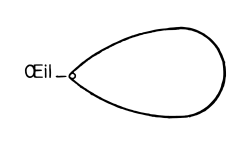\

**[5.634](https://www.wittgensteinproject.org/w/index.php/Logisch-philosophische_Abhandlung#5.634)** Ce qui dépend de ceci, à savoir qu'aucune partie de notre expérience n'est en même temps a priori.

Tout ce que nous voyons pourrait aussi être autre.

Tout ce que, d'une manière générale, nous pouvons décrire, pourrait aussi être autre.

Il n'y a aucun ordre a priori des choses.

**[5.64](https://www.wittgensteinproject.org/w/index.php/Logisch-philosophische_Abhandlung#5.64)** On voit ici que le solipsisme, développé en toute rigueur, coïncide avec le réalisme pur. Le je du solipsisme se réduit à un point sans extension, et il reste la réalité qui lui est coordonnée.

**[5.641](https://www.wittgensteinproject.org/w/index.php/Logisch-philosophische_Abhandlung#5.641)** Il y a donc réellement un sens selon lequel il peut être question en philosophie d'un je, non psychologiquement.

Le je fait son entrée dans la philosophie grâce à ceci : que « le monde est mon monde ».

Le je philosophique n'est ni l'être humain, ni le corps humain, ni l'âme humaine dont s'occupe la psychologie, mais c'est le sujet métaphysique, qui est frontière – et non partie – du monde.

**[6](https://www.wittgensteinproject.org/w/index.php/Logisch-philosophische_Abhandlung#6)** La forme générale de la fonction de vérité est : ![{ [ \bar{p}, \bar{\xi}, N (\bar{\xi}) ] }](images/336cae8a41089348ef601ba5dbe893d3758f7baa1841701bd587566e0f16d282.svg)\ .

C'est la forme générale de la proposition.

**[6.001](https://www.wittgensteinproject.org/w/index.php/Logisch-philosophische_Abhandlung#6.001)** Cequine dit rien d'autre que ceci : chaque proposition est le résultat d'applications successives de l'opération \  à des propositions élémentaires.

**[6.002](https://www.wittgensteinproject.org/w/index.php/Logisch-philosophische_Abhandlung#6.002)** Quand est donnée la forme générale selon laquelle une proposition est construite, est déjà donnée du même coup la forme selon laquelle par le moyen d'une opération une proposition en engendre une autre.

**[6.01](https://www.wittgensteinproject.org/w/index.php/Logisch-philosophische_Abhandlung#6.01)** La forme générale de l'opération 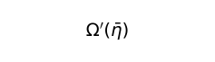\  est donc : ![{ [\bar{\xi}, N(\bar{\xi})]' (\bar{\eta}) (= [ \bar{\eta}, \bar{\xi}, N (\bar{\xi}) ]) }](images/d1cf195aa1fb631bffe7b018f1114530b8c1bcc712299ba306fdef8ed6c55335.svg)\ .

Ce qui est la forme générale du passage d'une proposition à une autre.

**[6.02](https://www.wittgensteinproject.org/w/index.php/Logisch-philosophische_Abhandlung#6.02)** Ainsi en venons-nous aux nombres : je définis

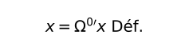\  et
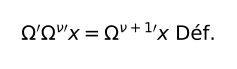\

Conformément à ces règles de signes nous écrivons donc la série 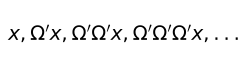\

de cette manière : \

J'écris donc, au lieu de « ![{ [ x, \xi, \Omega ' \xi ] }](images/356a71ba81334c39be3a91a1d42c9d51eb9ad1ea7b726f750fd3a307d7947385.svg)\  » :

« ![{ [ \Omega^{0 \prime} x, \Omega^{ \nu \prime} x, \Omega^{ \nu + 1 \prime} x ] }](images/cbe2c1a200eb49c3a9b16c7105afbb9fbed122da767f2d37389ac28a9e93e102.svg)\  ».

Et je définis :

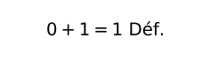\

\

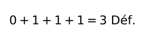\

\(etc.)

**[6.021](https://www.wittgensteinproject.org/w/index.php/Logisch-philosophische_Abhandlung#6.021)** Le nombre est l'exposant d'une opération.

**[6.022](https://www.wittgensteinproject.org/w/index.php/Logisch-philosophische_Abhandlung#6.022)** Le concept de nombre n'est rien d'autre que ce qui est commun à tous les nombres, la forme générale du nombre.

Le concept de nombre est le nombre variable.

Et le concept d'égalité entre nombres est la forme générale de toutes les égalités numériques particulières.

**[6.03](https://www.wittgensteinproject.org/w/index.php/Logisch-philosophische_Abhandlung#6.03)** La forme générale du nombre entier est : [0, ξ, ξ+1].

**[6.031](https://www.wittgensteinproject.org/w/index.php/Logisch-philosophische_Abhandlung#6.031)** La théorie des classes est en mathématique tout à fait superflue.

Ceci dépend de ce que la généralité dont nous avons besoin en mathématique n'est pas une généralité *accidentelle*.

**[6.1](https://www.wittgensteinproject.org/w/index.php/Logisch-philosophische_Abhandlung#6.1)** Les propositions de la logique sont des tautologies.

**[6.11](https://www.wittgensteinproject.org/w/index.php/Logisch-philosophische_Abhandlung#6.11)** Les propositions de la logique ne disent donc rien. (Ce sont les propositions analytiques.)

**[6.111](https://www.wittgensteinproject.org/w/index.php/Logisch-philosophische_Abhandlung#6.111)** Les théories qui font apparaître une proposition de la logique comme ayant un contenu sont toujours fausses. On pourrait croire, par exemple, que les mots « vrai » et « faux » désignent deux propriétés parmi d'autres, et que par conséquent ce soit un fait remarquable que chaque proposition possède l'une ou l'autre. Ce qui semble alors rien moins qu'aller de soi, pas plus que ne sonnerait comme allant de soi, par exemple, la proposition : « toutes les roses sont ou jaunes ou rouges », même si elle était vraie. Cette proposition acquiert alors tous les caractères d'une proposition des sciences de la nature, et c'est l'indice sûr qu'elle aura été conçue faussement.

**[6.112](https://www.wittgensteinproject.org/w/index.php/Logisch-philosophische_Abhandlung#6.112)** L'explication correcte des propositions logiques doit leur conférer une position unique parmi toutes les propositions.

**[6.113](https://www.wittgensteinproject.org/w/index.php/Logisch-philosophische_Abhandlung#6.113)** La marque particulière des propositions logiques est que l'on peut reconnaître sur le seul symbole qu'elles sont vraies, et ce fait clôt sur elle-même toute la philosophie de la logique. Et c'est de même un des faits les plus importants que la vérité ou la fausseté des propositions non logiques *ne* se laisse *pas* reconnaître sur la seule proposition.

**[6.12](https://www.wittgensteinproject.org/w/index.php/Logisch-philosophische_Abhandlung#6.12)** Que les propositions de la logique soient des tautologies *montre* les propriétés formelles – logiques – de la langue, du monde.

Que les composants liés *de cette manière* engendrent une tautologie, voilà qui caractérise la logique de ses composants.

Pour que des propositions liées d'une certaine manière engendrent une tautologie, elles doivent avoir des propriétés déterminées de structure. Qu'elles engendrent, dans cette connexion, une tautologie, montre donc qu'elles possèdent ces propriétés de structure.

**[6.1201](https://www.wittgensteinproject.org/w/index.php/Logisch-philosophische_Abhandlung#6.1201)** Que par exemple les propositions « p » et « \~p » dans la connexion « \~(p . \~p) » engendrent une tautologie montre qu'elles se contredisent l'une l'autre. Que les propositions « p ⊃ q », « p », et « q » liées sous la forme : « (p ⊃ q) . (p) : ⊃ : (q) » engendrent une tautologie montre que q suit de p et de p ⊃ q. Que « (x) . fx : ⊃ : fa » soit une tautologie montre que fa suit de (x) . fx, etc., etc.

**[6.1202](https://www.wittgensteinproject.org/w/index.php/Logisch-philosophische_Abhandlung#6.1202)** Il est clair que l'on pourrait, au lieu des tautologies, employer les contradictions.

**[6.1203](https://www.wittgensteinproject.org/w/index.php/Logisch-philosophische_Abhandlung#6.1203)** Pour reconnaître une tautologie comme telle, on peut dans les cas où aucun signe de généralisation n'y apparaît, se servir de la méthode intuitive suivante : j'écris, au lieu de « p », « q », « r », etc., « VpF », « VqF », « VrF », etc. J'exprime les combinaisons de vérité au moyen d'accolades, par exemple :
\
et la correspondance de la vérité ou de la fausseté de la proposition entière, et des combinaisons de vérité de ses arguments de vérité, au moyen de traits de la manière suivante :
\
Ce signe, par exemple, figurerait donc la proposition p ⊃ q. Supposons maintenant que je veuille vérifier si, par exemple, la proposition \~(p. \~p) (loi de contradiction) est une tautologie.

La forme « \~ξ » sera dans notre notation écrite :
\
La forme « ξ . η » :
\
La proposition \~(p.\~q) s'écrira par conséquent :
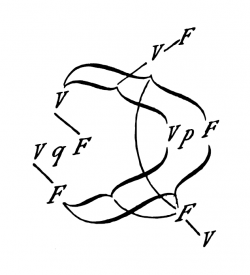\
Remplaçons maintenant « q » par « p » et examinons la connexion des V et F les plus externes avec les internes ; il en résulte que la vérité de la proposition entière correspond à toutes les combinaisons de vérité de son argument, et sa fausseté à aucune[^24].

**[6.121](https://www.wittgensteinproject.org/w/index.php/Logisch-philosophische_Abhandlung#6.121)** Les propositions de la logique démontrent les propriétés logiques des propositions, en formant par leur connexion des propositions qui ne disent rien.

On pourrait appeler encore cette méthode : méthode de réduction à zéro. Dans la proposition logique, les propositions sont mises entre elles en équilibre, et cet état d'équilibre montre alors comment ces propositions doivent être logiquement agencées.

**[6.122](https://www.wittgensteinproject.org/w/index.php/Logisch-philosophische_Abhandlung#6.122)** Il en résulte que nous pourrions aussi bien nous passer des propositions logiques, puisque, dans une notation convenable, nous pouvons déjà reconnaître les propriétés formelles des propositions à la seule inspection de celles-ci.

**[6.1221](https://www.wittgensteinproject.org/w/index.php/Logisch-philosophische_Abhandlung#6.1221)** Si, par exemple, des deux propositions « p » et « q » dans leur connexion « p ⊃ q » une tautologie résulte, il est alors clair que q suit de p.

Que par exemple « q » suive de « p ⊃ q . p » nous le voyons sur ces deux propositions mêmes, en les liant dans « p ⊃ q . p : ⊃ : q », et montrant alors que c'est là une tautologie.

**[6.1222](https://www.wittgensteinproject.org/w/index.php/Logisch-philosophische_Abhandlung#6.1222)** Cela éclaire la question : pourquoi les propositions logiques ne peuvent-elles être confirmées par l'expérience, pas plus que par l'expérience elles ne peuvent être réfutées. Non seulement une proposition de la logique ne peut être réfutée par aucune expérience possible, mais encore elle ne peut être confirmée par aucune.

**[6.1223](https://www.wittgensteinproject.org/w/index.php/Logisch-philosophische_Abhandlung#6.1223)** La raison sera maintenant claire pour laquelle on a souvent eu le sentiment que les « vérités logiques » doivent être de nous « exigées » : nous pouvons en effet les exiger, dans la mesure où nous pouvons exiger une notation convenable.

**[6.1224](https://www.wittgensteinproject.org/w/index.php/Logisch-philosophische_Abhandlung#6.1224)** La raison sera également claire pour laquelle la logique a été nommée théorie des formes et des déductions.

**[6.123](https://www.wittgensteinproject.org/w/index.php/Logisch-philosophische_Abhandlung#6.123)** Il est clair que les lois logiques ne doivent pas elles-mêmes se soumettre derechef à des lois logiques.

\(Il n'y a pas, comme le voulait Russell, pour chaque « type » une loi de contradiction particulière, mais une seule suffit, parce qu'elle ne s'applique pas à elle-même.)

**[6.1231](https://www.wittgensteinproject.org/w/index.php/Logisch-philosophische_Abhandlung#6.1231)** La marque de la proposition logique *n'est pas* la validité générale.

Être général veut en effet seulement dire : valoir accidentellement pour toutes choses. Une proposition non généralisée peut aussi bien être tautologique qu'une proposition généralisée.

**[6.1232](https://www.wittgensteinproject.org/w/index.php/Logisch-philosophische_Abhandlung#6.1232)** La validité générale logique, on pourrait la nommer essentielle, par opposition à l'accidentelle, comme par exemple dans la proposition : « Tous les hommes sont mortels. » Des propositions comme l'« axiome de réductibilité » de Russell ne sont pas des propositions logiques, et ceci explique le sentiment que nous avons que, si elles sont vraies, elles ne sauraient l'être que par un heureux hasard.

**[6.1233](https://www.wittgensteinproject.org/w/index.php/Logisch-philosophische_Abhandlung#6.1233)** Un monde dans lequel l'axiome de réductibilité ne vaudrait pas est pensable. Mais il est clair que la logique n'a rien à voir avec la question de savoir si notre monde est ou n'est pas réellement ainsi.

**[6.124](https://www.wittgensteinproject.org/w/index.php/Logisch-philosophische_Abhandlung#6.124)** Les propositions logiques décrivent l'échafaudage du monde, ou plutôt elles le figurent. Elles ne « traitent » de rien. Elles présupposent que les noms ont une signification et les propositions élémentaires un sens : et c'est là leur connexion au monde. Il est clair que quelque chose à propos du monde doit nous être indiqué par la circonstance que certaines connexions de symboles – qui ont par essence un caractère déterminé – soient des tautologies. C'est là le point décisif. Nous avons dit que plusieurs choses dans les symboles que nous utilisons étaient arbitraires, plusieurs ne l'étaient pas. En logique ce sont seulement les secondes qui expriment. Mais cela veut dire qu'en logique ce n'est pas *nous* qui exprimons, au moyen des signes, ce que nous voulons, mais qu'en logique c'est la nature des signes naturellement nécessaires qui elle-même se manifeste. Si nous connaissons la syntaxe logique d'un symbolisme quelconque, alors nous sont déjà données toutes les propositions de la logique.

**[6.125](https://www.wittgensteinproject.org/w/index.php/Logisch-philosophische_Abhandlung#6.125)** Il est possible, et même selon la conception ancienne de la logique, de donner par avance une description de toutes les propositions logiques « vraies ».

**[6.1251](https://www.wittgensteinproject.org/w/index.php/Logisch-philosophische_Abhandlung#6.1251)** C'est pourquoi il ne peut *jamais* y avoir de surprises en logique.

**[6.126](https://www.wittgensteinproject.org/w/index.php/Logisch-philosophische_Abhandlung#6.126)** On peut calculer si une proposition appartient à la logique en calculant les propriétés logiques du *symbole*.

Et c'est ce que nous faisons lorsque nous « démontrons » une proposition logique. Car, sans nous préoccuper de son sens[^25] ou de sa signification[^26], nous construisons la proposition logique à partir d'autres propositions au moyen de *règles portant seulement sur les signes*.

La démonstration des propositions logiques consiste en ce que nous l'engendrons à partir d'autres propositions logiques par applications successives d'opérations déterminées, lesquelles produisent toujours de nouvelles tautologies à partir des premières. (Car d'une tautologie ne *suivent* que des tautologies.)

Naturellement, cette façon de montrer que les propositions de la logique sont des tautologies ne lui est en aucune manière essentielle. Ne fût-ce que parce que les propositions dont part la démonstration doivent assurément montrer sans démonstration qu'elles sont des tautologies.

**[6.1261](https://www.wittgensteinproject.org/w/index.php/Logisch-philosophische_Abhandlung#6.1261)** En logique, procédure et résultat sont équivalents. (D'où l'absence de surprises.)

**[6.1262](https://www.wittgensteinproject.org/w/index.php/Logisch-philosophische_Abhandlung#6.1262)** La démonstration en logique n'est qu'un auxiliaire mécanique pour reconnaître plus aisément une tautologie, quand elle est compliquée.

**[6.1263](https://www.wittgensteinproject.org/w/index.php/Logisch-philosophische_Abhandlung#6.1263)** Il serait certes par trop remarquable qu'on puisse démontrer *logiquement*, à partir d'autres propositions, une proposition pourvue de sens, et *aussi* une proposition logique. Il est clair d'emblée que la démonstration logique d'une proposition pourvue de sens et la démonstration *en logique* doivent être deux choses totalement différentes.

**[6.1264](https://www.wittgensteinproject.org/w/index.php/Logisch-philosophische_Abhandlung#6.1264)** La proposition pourvue de sens dit quelque chose, et sa démonstration montre qu'il en est comme elle le dit ; en logique, chaque proposition est la forme d'une démonstration.

Chaque proposition de la logique est un *modus ponens* figuré en signes. (Et le *modus ponens* ne peut être exprimé par une proposition.)

**[6.1265](https://www.wittgensteinproject.org/w/index.php/Logisch-philosophische_Abhandlung#6.1265)** On peut toujours concevoir la logique de telle sorte que chaque proposition soit sa propre démonstration.

**[6.127](https://www.wittgensteinproject.org/w/index.php/Logisch-philosophische_Abhandlung#6.127)** Toutes les propositions de la logique ont une égale légitimité, il n'y a pas parmi elles de lois fondamentales essentielles et de propositions dérivées.

Chaque tautologie montre par elle-même qu'elle est une tautologie.

**[6.1271](https://www.wittgensteinproject.org/w/index.php/Logisch-philosophische_Abhandlung#6.1271)** Il est clair que le nombre des « lois logiques fondamentales » est arbitraire, car on pourrait dériver la logique d'une seule loi fondamentale, par exemple en prenant le produit logique des lois fondamentales de Frege. (Frege dirait peut-être que cette loi fondamentale ne serait plus alors immédiatement évidente. Mais il est remarquable qu'un penseur aussi rigoureux que Frege ait fait appel au degré d'évidence comme critère de la proposition logique.)

**[6.13](https://www.wittgensteinproject.org/w/index.php/Logisch-philosophische_Abhandlung#6.13)** La logique n'est point une théorie, mais une image qui reflète le monde.

La logique est transcendantale.

**[6.2](https://www.wittgensteinproject.org/w/index.php/Logisch-philosophische_Abhandlung#6.2)** La mathématique est une méthode logique.

Les propositions de la mathématique sont des équations, et par conséquent des pseudo-propositions.

**[6.21](https://www.wittgensteinproject.org/w/index.php/Logisch-philosophische_Abhandlung#6.21)** La proposition de la mathématique n'exprime aucune pensée.

**[6.211](https://www.wittgensteinproject.org/w/index.php/Logisch-philosophische_Abhandlung#6.211)** Dans la vie, ce n'est pas de propositions mathématiques dont nous avons besoin, mais nous usons de la proposition mathématique, pour déduire, de propositions qui n'appartiennent pas à la mathématique, d'autres propositions, qui ne lui appartiennent pas non plus.

\(En philosophie la question : « À quoi proprement nous sert ce mot, cette proposition ? » conduit toujours à des intuitions précieuses.)

**[6.22](https://www.wittgensteinproject.org/w/index.php/Logisch-philosophische_Abhandlung#6.22)** La logique du monde, que les propositions de la logique montrent dans les tautologies, la mathématique la montre dans les équations.

**[6.23](https://www.wittgensteinproject.org/w/index.php/Logisch-philosophische_Abhandlung#6.23)** Si deux propositions sont mises en connexion par le signe d'égalité, cela veut dire qu'elles sont mutuellement substituables. Mais si c'est le cas, les deux expressions mêmes doivent le montrer.

Qu'elles soient mutuellement substituables caractérise la forme logique des deux expressions.

**[6.231](https://www.wittgensteinproject.org/w/index.php/Logisch-philosophische_Abhandlung#6.231)** C'est une propriété de l'affirmation que l'on puisse la concevoir comme double négation.

C'est une propriété de « 1+1+1+1 » que l'on puisse le concevoir comme « (1+1) + (1+1) ».

**[6.232](https://www.wittgensteinproject.org/w/index.php/Logisch-philosophische_Abhandlung#6.232)** Frege dit que les deux expressions ont même signification[^27], mais des sens[^28] différents.

Mais l'essentiel dans l'équation est qu'elle n'est pas nécessaire pour montrer que les deux expressions mises en connexion par le signe d'égalité ont la même signification, car ceci les deux expressions elles-mêmes le font voir.

**[6.2321](https://www.wittgensteinproject.org/w/index.php/Logisch-philosophische_Abhandlung#6.2321)** Et que les propositions de la mathématique puissent être démontrées, cela ne veut rien dire d'autre sinon que leur correction est percevable sans que ce qu'elles expriment doive être comparé avec les faits, pour établir sa propre correction.

**[6.2322](https://www.wittgensteinproject.org/w/index.php/Logisch-philosophische_Abhandlung#6.2322)** L'identité de signification de deux propositions ne peut faire l'objet d'une *assertion*. Car pour faire une assertion concernant leur signification, je dois connaître cette signification : et en connaissant cette signification, je sais si elles signifient la même chose ou des choses différentes.

**[6.2323](https://www.wittgensteinproject.org/w/index.php/Logisch-philosophische_Abhandlung#6.2323)** L'équation ne fait connaître que le point de vue duquel je considère les deux expressions, c'est-à-dire le point de vue de leur égalité de signification.

**[6.233](https://www.wittgensteinproject.org/w/index.php/Logisch-philosophische_Abhandlung#6.233)** À la question de savoir si l'on a besoin de l'intuition pour résoudre un problème de mathématiques, il faut répondre que c'est justement ici le langage lui-même qui fournit l'intuition nécessaire.

**[6.2331](https://www.wittgensteinproject.org/w/index.php/Logisch-philosophische_Abhandlung#6.2331)** L'acte de *calculer* procure justement cette intuition.

Le calcul n'est pas une expérience.

**[6.234](https://www.wittgensteinproject.org/w/index.php/Logisch-philosophische_Abhandlung#6.234)** La mathématique est une méthode de la logique.

**[6.2341](https://www.wittgensteinproject.org/w/index.php/Logisch-philosophische_Abhandlung#6.2341)** L'essentiel de la méthode mathématique, c'est que l'on travaille avec des équations. Car sur cette méthode repose le fait que toute proposition mathématique doit se comprendre d'elle-même.

**[6.24](https://www.wittgensteinproject.org/w/index.php/Logisch-philosophische_Abhandlung#6.24)** La méthode dont use la mathématique pour obtenir ses équations est la méthode de substitution.

Les équations en effet expriment la substituabilité de deux expressions, et nous procédons d'un certain nombre d'équations à de nouvelles équations, en substituant, conformément aux équations, des expressions à d'autres.

**[6.241](https://www.wittgensteinproject.org/w/index.php/Logisch-philosophische_Abhandlung#6.241)** Ainsi se formule la démonstration de la proposition 2 × 2 = 4 :

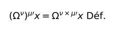\

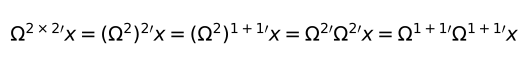\

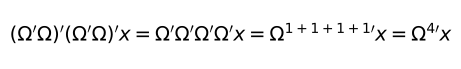\

**[6.3](https://www.wittgensteinproject.org/w/index.php/Logisch-philosophische_Abhandlung#6.3)** L'exploration de la logique signifie l'exploration de *toute capacité d'être soumis à des lois*. Et hors de la logique, tout est hasard.

**[6.31](https://www.wittgensteinproject.org/w/index.php/Logisch-philosophische_Abhandlung#6.31)** La prétendue loi d'induction ne peut en aucun cas être une loi logique, car elle est manifestement une loi pourvue de sens. Et elle ne peut par conséquent être une loi a priori.

**[6.32](https://www.wittgensteinproject.org/w/index.php/Logisch-philosophische_Abhandlung#6.32)** La loi de causalité n'est pas une loi, mais la forme d'une loi.

**[6.321](https://www.wittgensteinproject.org/w/index.php/Logisch-philosophische_Abhandlung#6.321)** « Loi de causalité » est un nom générique. Et de même que, disons, en mécanique, il y a des principes variationnels – par exemple la loi de moindre action –, de même il y a en physique des lois de causalité, des lois de la forme de la causalité.

**[6.3211](https://www.wittgensteinproject.org/w/index.php/Logisch-philosophische_Abhandlung#6.3211)** L'on a en effet eu aussi l'idée qu'il devait y avoir une « loi de moindre action » avant de savoir comment elle se formulait. (Ici, comme toujours, une connaissance a priori se révèle comme étant une connaissance purement logique.)

**[6.33](https://www.wittgensteinproject.org/w/index.php/Logisch-philosophische_Abhandlung#6.33)** Nous ne *croyons* pas a priori en une loi de conservation, mais nous *connaissons* a priori la possibilité d'une forme logique.

**[6.34](https://www.wittgensteinproject.org/w/index.php/Logisch-philosophische_Abhandlung#6.34)** Toutes les propositions du genre du principe de raison suffisante, du principe de continuité de la nature, de moindre dépense dans la nature, etc., etc. sont toutes des vues a priori concernant la mise en forme possible des propositions de la science.

**[6.341](https://www.wittgensteinproject.org/w/index.php/Logisch-philosophische_Abhandlung#6.341)** La mécanique newtonienne, par exemple, uniformise la description du monde. Figurons-nous une surface blanche, avec des taches noires irrégulières. Nous disons alors : tout ce qui ressort comme image, je puis toujours en donner une description aussi approchée que je veux, en recouvrant la surface d'un quadrillage convenablement fin et en disant de chaque carreau s'il est blanc ou noir. J'aurai ainsi uniformisé la description de la surface. Cette forme unique est arbitraire, car j'aurais pu utiliser avec le même succès un réseau à mailles triangulaires ou hexagonales. Il se peut que la description au moyen d'un réseau à mailles triangulaires soit plus simple ; ce qui veut dire que nous pourrions décrire plus exactement la surface au moyen d'un réseau à mailles triangulaires plus grossier qu'avec un quadrillage plus fin (ou inversement), et ainsi de suite. Aux différents réseaux correspondent différents systèmes de description du monde. La mécanique détermine une forme de description du monde en disant : toutes les propositions de la description du monde doivent être obtenues d'une manière donnée à partir d'un certain nombre de propositions données – les axiomes de la mécanique. Ainsi la mécanique fournit-elle les pierres pour la construction de l'édifice de la science et dit : quel que soit l'édifice que tu veux élever, tu dois le construire d'une manière ou d'une autre en assemblant ces pierres et seulement elles.

\(De même que l'on peut écrire n'importe quel nombre avec le système des nombres, de même avec le système de la mécanique on peut former n'importe quelle proposition de la physique.)

**[6.342](https://www.wittgensteinproject.org/w/index.php/Logisch-philosophische_Abhandlung#6.342)** Nous voyons maintenant la position relative de la logique et de la mécanique. (On pourrait constituer le réseau avec des figures différentes, par exemple des triangles et des hexagones.) Qu'une image, comme celle mentionnée plus haut, se laisse décrire par un réseau de forme donnée ne dit *rien* concernant l'image. (Car ceci vaut pour toute image de cette espèce.) Mais ce qui caractérise l'image, c'est qu'elle se laisse décrire *complètement* par un réseau déterminé d'une finesse *déterminée*.

Ainsi, que le monde se laisse décrire par la mécanique newtonienne ne dit rien le concernant, mais qu'il se laisse *ainsi* décrire, comme c'est justement le cas, certes si. Et encore, qu'il se laisse décrire plus simplement par une mécanique que par une autre, ceci nous dit quelque chose concernant le monde.

**[6.343](https://www.wittgensteinproject.org/w/index.php/Logisch-philosophische_Abhandlung#6.343)** La mécanique est un essai pour construire selon un plan unique toutes les propositions *vraies* dont nous avons besoin pour décrire le monde.

**[6.3431](https://www.wittgensteinproject.org/w/index.php/Logisch-philosophische_Abhandlung#6.3431)** À travers tout leur appareil logique, les lois physiques parlent cependant des objets du monde.

**[6.3432](https://www.wittgensteinproject.org/w/index.php/Logisch-philosophische_Abhandlung#6.3432)** Nous ne devons pas oublier que la description du monde par la mécanique est toujours tout à fait générale. Il n'y est jamais question, par exemple, de points matériels déterminés, mais toujours de points matériels *quelconques*.

**[6.35](https://www.wittgensteinproject.org/w/index.php/Logisch-philosophische_Abhandlung#6.35)** Bien que les taches dans notre image soient des figures géométriques, il va de soi que la géométrie ne peut rien dire quant à leur forme et leur position de fait. Le réseau, en revanche, est *purement* géométrique, toutes ses propriétés peuvent être données a priori.

Des lois comme le principe de raison suffisante, etc. concernent le réseau, non pas ce que le réseau décrit.

**[6.36](https://www.wittgensteinproject.org/w/index.php/Logisch-philosophische_Abhandlung#6.36)** S'il y avait une loi de causalité, elle pourrait se formuler : « Il y a des lois de la nature. »

Mais à la vérité on ne peut le dire : cela se montre.

**[6.361](https://www.wittgensteinproject.org/w/index.php/Logisch-philosophische_Abhandlung#6.361)** Dans la terminologie de Hertz, on pourrait dire : seules des interdépendances légales sont pensables.

**[6.3611](https://www.wittgensteinproject.org/w/index.php/Logisch-philosophische_Abhandlung#6.3611)** Nous ne pouvons comparer aucun processus au « cours du temps » – qui n'existe pas – mais seulement à un autre processus (par exemple à la marche du chronomètre).

C'est pourquoi la description du déroulement temporel n'est possible qu'en se fondant sur un autre processus.

Il en va analogiquement tout à fait de même pour l'espace. Quand on dit, par exemple, qu'aucun de deux événements (qui mutuellement s'excluent) ne peut se produire, parce qu'*aucune cause* n'est donnée par laquelle l'un devrait se produire plutôt que l'autre, il est alors question en réalité de ce que l'on ne peut décrire l'un de ces deux événements si quelque asymétrie n'est donnée. Et si une telle asymétrie est donnée, nous pouvons alors la concevoir comme la cause de la production de l'un et de la non-production de l'autre.

**[6.36111](https://www.wittgensteinproject.org/w/index.php/Logisch-philosophische_Abhandlung#6.36111)** Le problème kantien de la main droite et de la main gauche, que l'on ne peut faire se recouvrir, subsiste déjà dans le plan, et même dans un espace à une dimension
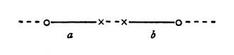\
où l'on ne peut pas non plus faire se recouvrir les deux figures congruentes a et b sans les faire sortir de cet espace. Main droite et main gauche sont en fait parfaitement congruentes. Et que l'on ne puisse les faire se recouvrir n'a rien à y voir.

On pourrait enfiler un gant droit de la main gauche, si l'on pouvait le retourner dans un espace à quatre dimensions.

**[6.362](https://www.wittgensteinproject.org/w/index.php/Logisch-philosophische_Abhandlung#6.362)** Ce qui se laisse décrire peut aussi arriver, et ce que la loi de causalité doit exclure ne se laisse pas non plus décrire.

**[6.363](https://www.wittgensteinproject.org/w/index.php/Logisch-philosophische_Abhandlung#6.363)** La procédure de l'induction consiste en ceci que nous adoptons la loi la plus simple qui puisse être mise en accord avec nos expériences.

**[6.3631](https://www.wittgensteinproject.org/w/index.php/Logisch-philosophische_Abhandlung#6.3631)** Mais cette procédure n'a aucun fondement logique, son fondement est seulement psychologique.

Il est clair qu'il n'y a aucune raison de croire que se produira maintenant réellement le cas le plus simple.

**[6.36311](https://www.wittgensteinproject.org/w/index.php/Logisch-philosophische_Abhandlung#6.36311)** Que le soleil se lèvera demain est une hypothèse, et cela veut dire que nous ne *savons* pas s'il se lèvera.

**[6.37](https://www.wittgensteinproject.org/w/index.php/Logisch-philosophische_Abhandlung#6.37)** Rien ne contraint quelque chose à arriver du fait qu'autre chose soit arrivé. Il n'est de nécessité que *logique*.

**[6.371](https://www.wittgensteinproject.org/w/index.php/Logisch-philosophische_Abhandlung#6.371)** Toute la vision moderne du monde repose sur l'illusion que les prétendues lois de la nature sont des explications des phénomènes de la nature.

**[6.372](https://www.wittgensteinproject.org/w/index.php/Logisch-philosophische_Abhandlung#6.372)** Aussi se tiennent-ils devant les lois de la nature comme devant quelque chose d'intouchable, comme les Anciens devant Dieu et le Destin.

Et les uns et les autres ont en effet raison et tort. Cependant les Anciens ont assurément une idée plus claire en ce qu'ils reconnaissent une limitation, tandis que dans le système nouveau il doit sembler que *tout* est expliqué.

**[6.373](https://www.wittgensteinproject.org/w/index.php/Logisch-philosophische_Abhandlung#6.373)** Le monde est indépendant de ma volonté.

**[6.374](https://www.wittgensteinproject.org/w/index.php/Logisch-philosophische_Abhandlung#6.374)** Même si tous nos voeux se réalisaient, ce serait pourtant seulement, pour ainsi dire, une grâce du Destin, car il n'y a aucune interdépendance *logique* entre le vouloir et le monde, qui garantirait qu'il en soit ainsi, et l'interdépendance physique supposée, quant à elle, nous ne pourrions encore moins la vouloir.

**[6.375](https://www.wittgensteinproject.org/w/index.php/Logisch-philosophische_Abhandlung#6.375)** De même qu'il n'est de nécessité que *logique*, de même il n'est d'impossibilité que *logique*.

**[6.3751](https://www.wittgensteinproject.org/w/index.php/Logisch-philosophische_Abhandlung#6.3751)** Que, par exemple, deux couleurs soient ensemble en un même lieu du champ visuel est impossible, et même *logiquement* impossible, car c'est la structure logique de la couleur qui l'exclut.

Réfléchissons à la manière dont cette contradiction[^29] se présente en physique ; à peu près ainsi : une particule ne peut avoir au même instant deux vitesses ; c'est-à-dire qu'elle ne peut pas être au même instant en deux lieux ; c'est-à-dire que des particules, en des lieux différents en un seul moment du temps, ne peuvent être identiques.

\(Il est clair que le produit logique de deux propositions élémentaires ne peut être ni une tautologie ni une contradiction[^30]. Énoncer qu'un point du champ visuel a dans le même temps deux couleurs différentes est une contradiction.)

**[6.4](https://www.wittgensteinproject.org/w/index.php/Logisch-philosophische_Abhandlung#6.4)** Toutes les propositions ont même valeur.

**[6.41](https://www.wittgensteinproject.org/w/index.php/Logisch-philosophische_Abhandlung#6.41)** Le sens du monde doit être en dehors de lui. Dans le monde, tout est comme il est, et tout arrive comme il arrive ; il n'y a *en lui* aucune valeur – et s'il y en avait une elle serait sans valeur.

S'il y a une valeur qui a de la valeur, elle doit être extérieure à tout ce qui arrive, et à tout état particulier. Car tout ce qui arrive et tout état particulier est accidentel.

Ce qui le rend non accidentel ne peut être *dans* le monde, car ce serait retomber dans l'accident.

Ce doit être hors du monde.

**[6.42](https://www.wittgensteinproject.org/w/index.php/Logisch-philosophische_Abhandlung#6.42)** C'est pourquoi il ne peut y avoir de propositions éthiques. Les propositions ne peuvent rien exprimer de Supérieur[^31].

**[6.421](https://www.wittgensteinproject.org/w/index.php/Logisch-philosophische_Abhandlung#6.421)** Il est clair que l'éthique ne se laisse pas énoncer. L'éthique est transcendantale. (Éthique et esthétique sont une seule et même chose.)

**[6.422](https://www.wittgensteinproject.org/w/index.php/Logisch-philosophische_Abhandlung#6.422)** La première pensée qui vient en posant une loi éthique de la forme : « Tu dois... » est la suivante : et qu'en sera-t-il donc si je ne fais pas ainsi ? Il est pourtant clair que l'éthique n'a rien à voir avec le châtiment et la récompense au sens usuel. Cette question touchant les *conséquences* d'un acte doit donc être sans importance. Du moins faut-il que ces conséquences ne soient pas des événements. Car la question posée doit malgré tout être par quelque côté correcte. Il doit y avoir, en vérité, une espèce de châtiment et une espèce de récompense éthiques, mais ils doivent se trouver dans l'acte lui-même.

\(Et il est clair aussi que la récompense doit être quelque chose d'agréable, le châtiment quelque chose de désagréable.)

**[6.423](https://www.wittgensteinproject.org/w/index.php/Logisch-philosophische_Abhandlung#6.423)** Du vouloir comme porteur de l'éthique on ne peut rien dire.

Et le vouloir comme phénomène n'intéresse que la psychologie.

**[6.43](https://www.wittgensteinproject.org/w/index.php/Logisch-philosophische_Abhandlung#6.43)** Si le bon ou le mauvais vouloir changent le monde, ils ne peuvent changer que les frontières du monde, non les faits ; non ce qui peut être exprimé par le langage.

En bref, le monde doit alors devenir par là totalement autre. Il doit pouvoir, pour ainsi dire, diminuer ou croître dans son ensemble.

Le monde de l'homme heureux est un autre monde que celui de l'homme malheureux.

**[6.431](https://www.wittgensteinproject.org/w/index.php/Logisch-philosophische_Abhandlung#6.431)** Ainsi dans la mort, le monde n'est pas changé, il cesse.

**[6.4311](https://www.wittgensteinproject.org/w/index.php/Logisch-philosophische_Abhandlung#6.4311)** La mort n'est pas un événement de la vie. On ne vit pas la mort.

Si l'on entend par éternité non la durée infinie mais l'intemporalité, alors il a la vie éternelle celui qui vit dans le présent.

Notre vie n'a pas de fin, comme notre champ de vision est sans frontière.

**[6.4312](https://www.wittgensteinproject.org/w/index.php/Logisch-philosophische_Abhandlung#6.4312)** L'immortalité de l'âme humaine, c'est-à-dire sa survie éternelle après la mort, non seulement n'est en aucune manière assurée, mais encore et surtout n'apporte nullement ce qu'on a toujours voulu obtenir en en recevant la croyance. Car quelle énigme se trouvera résolue du fait de mon éternelle survie ? Cette vie éternelle n'est-elle pas aussi énigmatique que la vie présente ? La solution de l'énigme de la vie dans le temps et dans l'espace se trouve *en dehors* de l'espace et du temps.

\(Ce n'est pas la solution des problèmes de la science de la nature qui est ici requise.)

**[6.432](https://www.wittgensteinproject.org/w/index.php/Logisch-philosophische_Abhandlung#6.432)** Comment est le monde, ceci est pour le Supérieur parfaitement indifférent. Dieu ne se révèle pas *dans* le monde.

**[6.4321](https://www.wittgensteinproject.org/w/index.php/Logisch-philosophische_Abhandlung#6.4321)** Les faits appartiennent tous au problème à résoudre, non pas à sa solution.

**[6.44](https://www.wittgensteinproject.org/w/index.php/Logisch-philosophische_Abhandlung#6.44)** Ce n'est pas *comment* est le monde qui est le Mystique, mais *qu'il soit*.

**[6.45](https://www.wittgensteinproject.org/w/index.php/Logisch-philosophische_Abhandlung#6.45)** La saisie du monde *sub specie æterni* est sa saisie comme totalité bornée.

Le sentiment du monde comme totalité bornée est le Mystique.

**[6.5](https://www.wittgensteinproject.org/w/index.php/Logisch-philosophische_Abhandlung#6.5)** D'une réponse qu'on ne peut formuler, on ne peut non plus formuler la question.

Il n'y a pas d'*énigme*.

Si une question peut de quelque manière être posée, elle peut aussi recevoir une réponse.

**[6.51](https://www.wittgensteinproject.org/w/index.php/Logisch-philosophische_Abhandlung#6.51)** Le scepticisme *n'est pas* irréfutable, mais évidemment dépourvu de sens, quand il veut élever des doutes là où l'on ne peut poser de questions.

Car le doute ne peut subsister que là où subsiste une question ; une question seulement là où subsiste une réponse, et celle-ci seulement là où quelque chose peut être *dit*.

**[6.52](https://www.wittgensteinproject.org/w/index.php/Logisch-philosophische_Abhandlung#6.52)** Nous sentons que, à supposer même que toutes les questions scientifiques *possibles* soient résolues, les problèmes de notre vie demeurent encore intacts. A vrai dire, il ne reste plus alors aucune question ; et cela même est la réponse.

**[6.521](https://www.wittgensteinproject.org/w/index.php/Logisch-philosophische_Abhandlung#6.521)** La solution du problème de la vie, on la perçoit à la disparition de ce problème.

\(N'est-ce pas la raison pour laquelle les hommes qui, après avoir longuement douté, ont trouvé la claire vision du sens de la vie, ceux-là n'ont pu dire alors en quoi ce sens consistait ?)

**[6.522](https://www.wittgensteinproject.org/w/index.php/Logisch-philosophische_Abhandlung#6.522)** Il y a assurément de l'indicible. Il se montre, c'est le Mystique.

**[6.53](https://www.wittgensteinproject.org/w/index.php/Logisch-philosophische_Abhandlung#6.53)** La méthode correcte en philosophie consisterait proprement en ceci : ne rien dire que ce qui se laisse dire, à savoir les propositions de la science de la nature – quelque chose qui, par conséquent, n'a rien à faire avec la philosophie –, puis quand quelqu'un d'autre voudrait dire quelque chose de métaphysique, lui démontrer toujours qu'il a omis de donner, dans ses propositions, une signification à certains signes. Cette méthode serait insatisfaisante pour l'autre – qui n'aurait pas le sentiment que nous lui avons enseigné de la philosophie – mais ce serait la seule strictement correcte.

**[6.54](https://www.wittgensteinproject.org/w/index.php/Logisch-philosophische_Abhandlung#6.54)** Mes propositions sont des éclaircissements en ceci que celui qui me comprend les reconnaît à la fin comme dépourvues de sens, lorsque par leur moyen – en passant sur elles – il les a surmontées. (Il doit pour ainsi dire jeter l'échelle après y être monté.)

Il lui faut dépasser ces propositions pour voir correctement le monde.

**[7](https://www.wittgensteinproject.org/w/index.php/Logisch-philosophische_Abhandlung#7)** Sur ce dont on ne peut parler, il faut garder le silence.

---

[^3]: *Sachlage*. Employé par Wittgenstein apparemment comme substitut plus vague de fait possible ou réel.

[^4]: Wittgenstein use des mots *darstellen*, *vorstellen*, *abbilden* pour exprimer l'idée de représenter. Sans être sûr que les différences, dans son texte, soient toujours autres que purement stylistiques, je traduirai dans le *Tractatus* *darstellen* par figurer, *vorstellen* par présenter, *abbilden* par représenter et *Abbildung* par représentation. On trouvera aussi *vertreten* : être le représentant, le substitut de.

[^5]: Il y a trois définitions du monde : les *faits* dans l'espace logique (1.13), la totalité des états de choses *subsistants* (2.04), la totalité de la *réalité* (2.063), qui doivent coïncider.

[^6]: *bedeutet*. On distinguera la traduction de ce verbe de celles de : *aufweisen* (*montrer* sans pouvoir *exprimer*, 2.172 par exemple), et de : *bezeichnen* (indiquer, dénoter, mot général et assez vague s'appliquant aussi bien au signe propositionnel qu'au nom). On traduira *Bedeutung* par : *signification*.

[^7]: *aussprechen*.

[^8]: *unsinnig*.

[^9]: *Begriffsschrift*.

[^10]: *Existenz*.

[^11]: Auteur de *Contributions à une critique du langage* (1903). Son influence sur Wittgenstein apparaît néanmoins clairement dans cette citation : « Sitôt que nous avons vraiment quelque chose à dire, il faut nous taire » (*Contributions I*, p. 111), à rapprocher de l'aphorisme 7 du *Tractatus*.

[^12]: *Gleichnis*.

[^13]: *lebendes Bild*. Nous empruntons à la traduction anglaise de D.F. Pears et B.F. McGuiness le mot français : « tableau vivant ».

[^14]: *Existenz*.

[^15]: *sinnvolle*.

[^16]: Wittgenstein note par le symbole 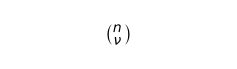\  le nombre des combinaisons de n objets ν à ν, soit :
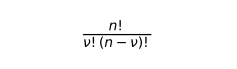\
Il y a en tout : 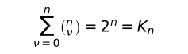\  situations possibles.
Il additionne en effet les nombres de combinaisons de n propositions (ou états de choses) dans lesquelles entrent 0, 1, 2,... ν propositions vraies (ou états de choses subsistants). Le calcul direct usuel du nombre des *arrangements* des 2 objets V et F n à n avec répétition est apparemment plus intuitif.

[^17]: D'après le calcul de la note précédente L = 2 exp 2^n^. Il s'agit alors en fait de dénombrer les connecteurs logiques de n propositions. On additionne les nombres de situations de n propositions comportant 0, 1, 2,... K~n~ combinaisons vraies. L'intérêt de ce calcul peu intuitif est qu'il est formellement identique au précédent, le nombre K~n~ des situations remplaçant le nombre n des propositions.

[^18]: *sinnlos*. Par opposition à *unsinnig*, dépourvu de sens. Tautologie et contradiction n'apportent aucune information sur le monde. Elles ont un sens, mais vide de tout contenu. Voir l'analogie avec le zéro arithmétique à l'aphorisme [4.4611](#4.4611).

[^19]: *Die Einheit des Wahrscheinlichkeitssatzes*.

[^20]: *Grundgesetze*, I. § 63. ; II. § 58., 67. En particulier une définition doit être « complète » ; elle doit permettre de donner un sens à l'application du concept à un objet, même si cette application est fausse.

[^21]: *Gleichheit*.

[^22]: *Identität*.

[^23]: Cette consigne est trop vague. Une fois q remplacé par p, il faut évidemment veiller à ce que les valeurs de vérité de l'unique proposition p soient les mêmes à gauche et à droite du schéma, qui se réduit alors en effet à : 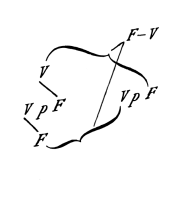\

[^24]: *Sinn*.

[^25]: *Bedeutung*.

[^26]: *Bedeutung*.

[^27]: *Sinn*.

[^28]: *Widerspruch*.

[^29]: *Kontradiktion*.

[^30]: *nichts Höheres*.