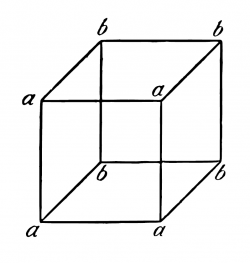
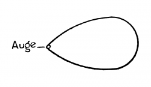
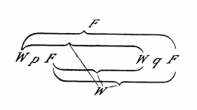
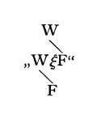
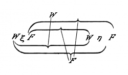
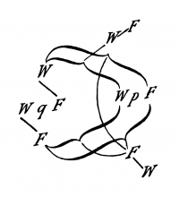

# Editor's Note

_Published by the [Ludwig Wittgenstein Project](https://www.wittgensteinproject.org/)._

_Diese digitale Ausgabe ist eine Reproduktion von L. Wittgenstein. *Tractatus Logico-Philosophicus*. Herausgegeben von C. K. Ogden und F. P. Ramsey, Kegan Paul, Trench, Trubner & Co., 1922. Dieses Werk ist gemeinfrei, weil seine urheberrechtliche Schutzfrist abgelaufen ist. Dies gilt für das Herkunftsland des Werks und alle weiteren Staaten mit einer gesetzlichen Schutzfrist von 70 oder weniger Jahren nach dem Tod des Urhebers._

# Logisch-philosophische Abhandlung

## Widmung

Dem Andenken meines Freundes
DAVID H. PINSENT
gewidmet

## Motto

>
>
> *Motto:* . . . und alles, was man weiss, nicht bloss rauschen und brausen gehört hat, lässt sich in drei Worten sagen.
>
> *Kürnberger.*
>
>

## Vorwort

Dieses Buch wird vielleicht nur der verstehen, der die Gedanken, die darin ausgedrückt sind – oder doch ähnliche Gedanken – schon selbst einmal gedacht hat. – Es ist also kein Lehrbuch. – Sein Zweck wäre erreicht, wenn es Einem, der es mit Verständnis liest Vergnügen bereitete.

Das Buch behandelt die philosophischen Probleme und zeigt – wie ich glaube – dass die Fragestellung dieser Probleme auf dem Missverständnis der Logik unserer Sprache beruht. Man könnte den ganzen Sinn des Buches etwa in die Worte fassen: Was sich überhaupt sagen lässt, lässt sich klar sagen; und wovon man nicht reden kann, darüber muss man schweigen.

Das Buch will also dem Denken eine Grenze ziehen, oder vielmehr – nicht dem Denken, sondern dem Ausdruck der Gedanken: Denn um dem Denken eine Grenze zu ziehen, müssten wir beide Seiten dieser Grenze denken können (wir müssten also denken können, was sich nicht denken lässt).

Die Grenze wird also nur in der Sprache gezogen werden können und was jenseits der Grenze liegt, wird einfach Unsinn sein.

Wieweit meine Bestrebungen mit denen anderer Philosophen zusammenfallen, will ich nicht beurteilen. Ja, was ich hier geschrieben habe macht im Einzelnen überhaupt nicht den Anspruch auf Neuheit; und darum gebe ich auch keine Quellen an, weil es mir gleichgültig ist, ob das was ich gedacht habe, vor mir schon ein anderer gedacht hat.

Nur das will ich erwähnen, dass ich den grossartigen Werken Freges und den Arbeiten meines Freundes Herrn Bertrand Russell einen grossen Teil der Anregung zu meinen Gedanken schulde.

Wenn diese Arbeit einen Wert hat, so besteht er in Zweierlei. Erstens darin, dass in ihr Gedanken ausgedrückt sind, und dieser Wert wird umso grösser sein, je besser die Gedanken ausgedrückt sind. Je mehr der Nagel auf den Kopf getroffen ist. – Hier bin ich mir bewusst, weit hinter dem Möglichen zurückgeblieben zu sein. Einfach darum, weil meine Kraft zur Bewältigung der Aufgabe zu gering ist. – Mögen andere kommen und es besser machen.

Dagegen scheint mir die *Wahrheit* der hier mitgeteilten Gedanken unantastbar und definitiv. Ich bin also der Meinung, die Probleme im Wesentlichen endgültig gelöst zu haben. Und wenn ich mich hierin nicht irre, so besteht nun der Wert dieser Arbeit zweitens darin, dass sie zeigt, wie wenig damit getan ist, dass diese Probleme gelöst sind.

*L. W.*

*Wien, 1918.*

## Logisch-philosophische Abhandlung

**1** Die Welt ist alles, was der Fall ist.[^1]

**1.1** Die Welt ist die Gesamtheit der Tatsachen, nicht der Dinge.

**1.11** Die Welt ist durch die Tatsachen bestimmt und dadurch, dass es *alle* Tatsachen sind.

**1.12** Denn, die Gesamtheit der Tatsachen bestimmt, was der Fall ist und auch, was alles nicht der Fall ist.

**1.13** Die Tatsachen im logischen Raum sind die Welt.

**1.2** Die Welt zerfällt in Tatsachen.

**1.21** Eines kann der Fall sein oder nicht der Fall sein und alles übrige gleich bleiben.

**2** Was der Fall ist, die Tatsache, ist das Bestehen von Sachverhalten.

**2.01** Der Sachverhalt ist eine Verbindung von Gegenständen. (Sachen, Dingen.)

**2.011** Es ist dem Ding wesentlich, der Bestandteil eines Sachverhaltes sein zu können.

**2.012** In der Logik ist nichts zufällig: Wenn das Ding im Sachverhalt vorkommen *kann*, so muss die Möglichkeit des Sachverhaltes im Ding bereits präjudiziert sein.

**2.0121** Es erschiene gleichsam als Zufall, wenn dem Ding, das allein für sich bestehen könnte, nachträglich eine Sachlage passen würde.

Wenn die Dinge in Sachverhalten vorkommen können, so muss dies schon in ihnen liegen.

(Etwas Logisches kann nicht nur-möglich sein. Die Logik handelt von jeder Möglichkeit und alle Möglichkeiten sind ihre Tatsachen.)

Wie wir uns räumliche Gegenstände überhaupt nicht ausserhalb des Raumes, zeitliche nicht ausserhalb der Zeit denken können, so können wir uns *keinen* Gegenstand ausserhalb der Möglichkeit seiner Verbindung mit anderen denken.

Wenn ich mir den Gegenstand im Verbande des Sachverhalts denken kann, so kann ich ihn nicht ausserhalb der *Möglichkeit* dieses Verbandes denken.

**2.0122** Das Ding ist selbständig, insofern es in allen *möglichen* Sachlagen vorkommen kann, aber diese Form der Selbständigkeit ist eine Form des Zusammenhangs mit dem Sachverhalt, eine Form der Unselbständigkeit. (Es ist unmöglich, dass Worte in zwei verschiedenen Weisen auftreten, allein und im Satz.)

**2.0123** Wenn ich den Gegenstand kenne, so kenne ich auch sämtliche Möglichkeiten seines Vorkommens in Sachverhalten.

(Jede solche Möglichkeit muss in der Natur des Gegenstandes liegen.)

Es kann nicht nachträglich eine neue Möglichkeit gefunden werden.

**2.01231** Um einen Gegenstand zu kennen, muss ich zwar nicht seine externen – aber ich muss alle seine internen Eigenschaften kennen.

**2.0124** Sind alle Gegenstände gegeben, so sind damit auch alle *möglichen* Sachverhalte gegeben.

**2.013** Jedes Ding ist, gleichsam, in einem Raume möglicher Sachverhalte. Diesen Raum kann ich mir leer denken, nicht aber das Ding ohne den Raum.

**2.0131** Der räumliche Gegenstand muss im unendlichen Raume liegen. (Der Raumpunkt ist eine Argumentstelle.)

Der Fleck im Gesichtsfeld muss zwar nicht rot sein, aber eine Farbe muss er haben: er hat sozusagen den Farbenraum um sich. Der Ton muss *eine* Höhe haben, der Gegenstand des Tastsinnes *eine* Härte u. s. w.

**2.014** Die Gegenstände enthalten die Möglichkeit aller Sachlagen.

**2.0141** Die Möglichkeit seines Vorkommens in Sachverhalten, ist die Form des Gegenstandes.

**2.02** Der Gegenstand ist einfach.

**2.0201** Jede Aussage über Komplexe lässt sich in eine Aussage über deren Bestandteile und in diejenigen Sätze zerlegen, welche die Komplexe vollständig beschreiben.

**2.021** Die Gegenstände bilden die Substanz der Welt. Darum können sie nicht zusammengesetzt sein.

**2.0211** Hätte die Welt keine Substanz, so würde, ob ein Satz Sinn hat, davon abhängen, ob ein anderer Satz wahr ist.

**2.0212** Es wäre dann unmöglich, ein Bild der Welt (wahr oder falsch) zu entwerfen.

**2.022** Es ist offenbar, dass auch eine von der wirklichen noch so verschieden gedachte Welt Etwas – eine Form – mit der wirklichen gemein haben muss.

**2.023** Diese feste Form besteht eben aus den Gegenständen.

**2.0231** Die Substanz der Welt *kann* nur eine Form und keine materiellen Eigenschaften bestimmen. Denn diese werden erst durch die Sätze dargestellt – erst durch die Konfiguration der Gegenstände gebildet.

**2.0232** Beiläufig gesprochen: Die Gegenstände sind farblos.

**2.0233** Zwei Gegenstände von der gleichen logischen Form sind – abgesehen von ihren externen Eigenschaften – von einander nur dadurch unterschieden, dass sie verschieden sind.

**2.02331** Entweder ein Ding hat Eigenschaften, die kein anderes hat, dann kann man es ohneweiteres durch eine Beschreibung aus den anderen herausheben, und darauf hinweisen; oder aber, es gibt mehrere Dinge, die ihre sämtlichen Eigenschaften gemeinsam haben, dann ist es überhaupt unmöglich auf eines von ihnen zu zeigen.

Denn, ist das Ding durch nichts hervorgehoben, so kann ich es nicht hervorheben, denn sonst ist es eben hervorgehoben.

**2.024** Die Substanz ist das, was unabhängig von dem was der Fall ist, besteht.

**2.025** Sie ist Form und Inhalt.

**2.0251** Raum, Zeit und Farbe (Färbigkeit) sind Formen der Gegenstände.

**2.026** Nur wenn es Gegenstände gibt, kann es eine feste Form der Welt geben.

**2.027** Das Feste, das Bestehende und der Gegenstand sind Eins.

**2.0271** Der Gegenstand ist das Feste, Bestehende; die Konfiguration ist das Wechselnde, Unbeständige.

**2.0272** Die Konfiguration der Gegenstände bildet den Sachverhalt.

**2.03** Im Sachverhalt hängen die Gegenstände ineinander, wie die Glieder einer Kette.

**2.031** Im Sachverhalt verhalten sich die Gegenstände in bestimmter Art und Weise zueinander.

**2.032** Die Art und Weise, wie die Gegenstände im Sachverhalt zusammenhängen, ist die Struktur des Sachverhaltes.

**2.033** Die Form ist die Möglichkeit der Struktur.

**2.034** Die Struktur der Tatsache besteht aus den Strukturen der Sachverhalte.

**2.04** Die Gesamtheit der bestehenden Sachverhalte ist die Welt.

**2.05** Die Gesamtheit der bestehenden Sachverhalte bestimmt auch, welche Sachverhalte nicht bestehen.

**2.06** Das Bestehen und Nichtbestehen von Sachverhalten ist die Wirklichkeit.

(Das Bestehen von Sachverhalten nennen wir auch eine positive, das Nichtbestehen eine negative Tatsache.)

**2.061** Die Sachverhalte sind von einander unabhängig.

**2.062** Aus dem Bestehen oder Nichtbestehen eines Sachverhaltes kann nicht auf das Bestehen oder Nichtbestehen eines anderen geschlossen werden.

**2.063** Die gesamte Wirklichkeit ist die Welt.

**2.1** Wir machen uns Bilder der Tatsachen.

**2.11** Das Bild stellt die Sachlage im logischen Raume, das Bestehen und Nichtbestehen von Sachverhalten vor.

**2.12** Das Bild ist ein Modell der Wirklichkeit.

**2.13** Den Gegenständen entsprechen im Bilde die Elemente des Bildes.

**2.131** Die Elemente des Bildes vertreten im Bild die Gegenstände.

**2.14** Das Bild besteht darin, dass sich seine Elemente in bestimmter Art und Weise zu einander verhalten.

**2.141** Das Bild ist eine Tatsache.

**2.15** Dass sich die Elemente des Bildes in bestimmter Art und Weise zu einander verhalten stellt vor, dass sich die Sachen so zu einander verhalten.

Dieser Zusammenhang der Elemente des Bildes heisse seine Struktur und ihre Möglichkeit seine Form der Abbildung.

**2.151** Die Form der Abbildung ist die Möglichkeit, dass sich die Dinge so zu einander verhalten, wie die Elemente des Bildes.

**2.1511** Das Bild ist *so* mit der Wirklichkeit verknüpft; es reicht bis zu ihr.

**2.1512** Es ist wie ein Massstab an die Wirklichkeit angelegt.

**2.15121** Nur die äussersten Punkte der Teilstriche *berühren* den zu messenden Gegenstand.

**2.1513** Nach dieser Auffassung gehört also zum Bilde auch noch die abbildende Beziehung, die es zum Bild macht.

**2.1514** Die abbildende Beziehung besteht aus den Zuordnungen der Elemente des Bildes und der Sachen.

**2.1515** Diese Zuordnungen sind gleichsam die Fühler der Bildelemente, mit denen das Bild die Wirklichkeit berührt.

**2.16** Die Tatsache muss um Bild zu sein, etwas mit dem Abgebildeten gemeinsam haben.

**2.161** In Bild und Abgebildetem muss etwas identisch sein, damit das eine überhaupt ein Bild des anderen sein kann.

**2.17** Was das Bild mit der Wirklichkeit gemein haben muss, um sie auf seine Art und Weise – richtig oder falsch – abbilden zu können, ist seine Form der Abbildung.

**2.171** Das Bild kann jede Wirklichkeit abbilden, deren Form es hat. Das räumliche Bild alles Räumliche, das farbige alles Farbige, etc.

**2.172** Seine Form der Abbildung aber, kann das Bild nicht abbilden; es weist sie auf.

**2.173** Das Bild stellt sein Objekt von ausserhalb dar (sein Standpunkt ist seine Form der Darstellung), darum stellt das Bild sein Objekt richtig oder falsch dar.

**2.174** Das Bild kann sich aber nicht ausserhalb seiner Form der Darstellung stellen.

**2.18** Was jedes Bild, welcher Form immer, mit der Wirklichkeit gemein haben muss, um sie überhaupt – richtig oder falsch – abbilden zu können, ist die logische Form, das ist, die Form der Wirklichkeit.

**2.181** Ist die Form der Abbildung die logische Form, so heisst das Bild das logische Bild.

**2.182** Jedes Bild ist *auch* ein logisches. (Dagegen ist z. B. nicht jedes Bild ein räumliches.)

**2.19** Das logische Bild kann die Welt abbilden.

**2.2** Das Bild hat mit dem Abgebildeten die logische Form der Abbildung gemein.

**2.201** Das Bild bildet die Wirklichkeit ab, indem es eine Möglichkeit des Bestehens und Nichtbestehens von Sachverhalten darstellt.

**2.202** Das Bild stellt eine mögliche Sachlage im logischen Raume dar.

**2.203** Das Bild enthält die Möglichkeit der Sachlage, die es darstellt.

**2.21** Das Bild stimmt mit der Wirklichkeit überein oder nicht; es ist richtig oder unrichtig, wahr oder falsch.

**2.22** Das Bild stellt dar, was es darstellt, unabhängig von seiner Wahr- oder Falschheit, durch die Form der Abbildung.

**2.221** Was das Bild darstellt, ist sein Sinn.

**2.222** In der Übereinstimmung oder Nichtübereinstimmung seines Sinnes mit der Wirklichkeit, besteht seine Wahrheit oder Falschheit.

**2.223** Um zu erkennen, ob das Bild wahr oder falsch ist, müssen wir es mit der Wirklichkeit vergleichen.

**2.224** Aus dem Bild allein ist nicht zu erkennen, ob es wahr oder falsch ist.

**2.225** Ein a priori wahres Bild gibt es nicht.

**3** Das logische Bild der Tatsachen ist der Gedanke.

**3.001** „Ein Sachverhalt ist denkbar“ heisst: Wir können uns ein Bild von ihm machen.

**3.01** Die Gesamtheit der wahren Gedanken sind ein Bild der Welt.

**3.02** Der Gedanke enthält die Möglichkeit der Sachlage die er denkt. Was denkbar ist, ist auch möglich.

**3.03** Wir können nichts Unlogisches denken, weil wir sonst unlogisch denken müssten.

**3.031** Man sagte einmal, dass Gott alles schaffen könne, nur nichts, was den logischen Gesetzen zuwider wäre. – Wir könnten nämlich von einer „unlogischen“ Welt nicht *sagen*, wie sie aussähe.

**3.032** Etwas „der Logik widersprechendes“ in der Sprache darstellen, kann man ebensowenig, wie in der Geometrie eine den Gesetzen des Raumes widersprechende Figur durch ihre Koordinaten darstellen; oder die Koordinaten eines Punktes angeben, welcher nicht existiert.

**3.0321** Wohl können wir einen Sachverhalt räumlich darstellen, welcher den Gesetzen der Physik, aber keinen, der den Gesetzen der Geometrie zuwiderliefe.

**3.04** Ein a priori richtiger Gedanke wäre ein solcher, dessen Möglichkeit seine Wahrheit bedingte.

**3.05** Nur so könnten wir a priori wissen, dass ein Gedanke wahr ist, wenn aus dem Gedanken selbst (ohne Vergleichsobjekt) seine Wahrheit zu erkennen wäre.

**3.1** Im Satz drückt sich der Gedanke sinnlich wahrnehmbar aus.

**3.11** Wir benützen das sinnlich wahrnehmbare Zeichen (Laut- oder Schriftzeichen etc.) des Satzes als Projektion der möglichen Sachlage.

Die Projektionsmethode ist das Denken des Satz-Sinnes.

**3.12** Das Zeichen, durch welches wir den Gedanken ausdrücken, nenne ich das Satzzeichen. Und der Satz ist das Satzzeichen in seiner projektiven Beziehung zur Welt.

**3.13** Zum Satz gehört alles, was zur Projektion gehört; aber nicht das Projizierte.

Also die Möglichkeit des Projizierten, aber nicht dieses selbst.

Im Satz ist also sein Sinn noch nicht enthalten, wohl aber die Möglichkeit ihn auszudrücken.

(„Der Inhalt des Satzes“ heisst der Inhalt des sinnvollen Satzes.)

Im Satz ist die Form seines Sinnes enthalten, aber nicht dessen Inhalt.

**3.14** Das Satzzeichen besteht darin, dass sich seine Elemente, die Wörter, in ihm auf bestimmte Art und Weise zu einander verhalten.

Das Satzzeichen ist eine Tatsache.

**3.141** Der Satz ist kein Wörtergemisch. – (Wie das musikalische Thema kein Gemisch von Tönen.)

Der Satz ist artikuliert.

**3.142** Nur Tatsachen können einen Sinn ausdrücken, eine Klasse von Namen kann es nicht.

**3.143** Dass das Satzzeichen eine Tatsache ist, wird durch die gewöhnliche Ausdrucksform der Schrift oder des Druckes verschleiert.

Denn im gedruckten Satz z. B. sieht das Satzzeichen nicht wesentlich verschieden aus vom Wort.

(So war es möglich, dass Frege den Satz einen zusammengesetzten Namen nannte.)

**3.1431** Sehr klar wird das Wesen des Satzzeichens, wenn wir es uns, statt aus Schriftzeichen, aus räumlichen Gegenständen (etwa Tischen, Stühlen, Büchern) zusammengesetzt denken.

Die gegenseitige räumliche Lage dieser Dinge drückt dann den Sinn des Satzes aus.

**3.1432** Nicht: „Das komplexe Zeichen ‚*aRb*‘ sagt, dass *a* in der Beziehung *R* zu *b* steht“, sondern: *Dass* „*a*“ in einer gewissen Beziehung zu „*b*“ steht, sagt, *dass* *aRb*.

**3.144** Sachlagen kann man beschreiben, nicht *benennen*.

(Namen gleichen Punkten, Sätze Pfeilen, sie haben Sinn.)

**3.2** Im Satze kann der Gedanke so ausgedrückt sein, dass den Gegenständen des Gedankens Elemente des Satzzeichens entsprechen.

**3.201** Diese Elemente nenne ich „einfache Zeichen“ und den Satz „vollständig analysiert“.

**3.202** Die im Satze angewandten einfachen Zeichen heissen Namen.

**3.203** Der Name bedeutet den Gegenstand. Der Gegenstand ist seine Bedeutung. („*A*“ ist dasselbe Zeichen wie „*A*“.)

**3.21** Der Konfiguration der einfachen Zeichen im Satzzeichen entspricht die Konfiguration der Gegenstände in der Sachlage.

**3.22** Der Name vertritt im Satz den Gegenstand.

**3.221** Die Gegenstände kann ich nur *nennen*. Zeichen vertreten sie. Ich kann nur *von* ihnen sprechen, *sie aussprechen* kann ich nicht. Ein Satz kann nur sagen, *wie* ein Ding ist, nicht *was* es ist.

**3.23** Die Forderung der Möglichkeit der einfachen Zeichen ist die Forderung der Bestimmtheit des Sinnes.

**3.24** Der Satz, welcher vom Komplex handelt, steht in interner Beziehung zum Satze, der von dessen Bestandteil handelt.

Der Komplex kann nur durch seine Beschreibung gegeben sein, und diese wird stimmen oder nicht stimmen. Der Satz, in welchem von einem Komplex die Rede ist, wird, wenn dieser nicht existiert, nicht unsinnig, sondern einfach falsch sein.

Dass ein Satzelement einen Komplex bezeichnet, kann man aus einer Unbestimmtheit in den Sätzen sehen, worin es vorkommt. Wir *wissen*, durch diesen Satz ist noch nicht alles bestimmt. (Die Allgemeinheitsbezeichnung *enthält* ja ein Urbild.)

Die Zusammenfassung des Symbols eines Komplexes in ein einfaches Symbol kann durch eine Definition ausgedrückt werden.

**3.25** Es gibt eine und nur eine vollständige Analyse des Satzes.

**3.251** Der Satz drückt auf bestimmte, klar angebbare Weise aus, was er ausdrückt: Der Satz ist artikuliert.

**3.26** Der Name ist durch keine Definition weiter zu zergliedern: er ist ein Urzeichen.

**3.261** Jedes definierte Zeichen bezeichnet *über* jene Zeichen, durch welche es definiert wurde; und die Definitionen weisen den Weg.

Zwei Zeichen, ein Urzeichen, und ein durch Urzeichen definiertes, können nicht auf dieselbe Art und Weise bezeichnen. Namen *kann* man nicht durch Definitionen auseinanderlegen. (Kein Zeichen, welches allein, selbständig eine Bedeutung hat.)

**3.262** Was in den Zeichen nicht zum Ausdruck kommt, das zeigt ihre Anwendung. Was die Zeichen verschlucken, das spricht ihre Anwendung aus.

**3.263** Die Bedeutungen von Urzeichen können durch Erläuterungen erklärt werden. Erläuterungen sind Sätze, welche die Urzeichen enthalten. Sie können also nur verstanden werden, wenn die Bedeutungen dieser Zeichen bereits bekannt sind.

**3.3** Nur der Satz hat Sinn; nur im Zusammenhange des Satzes hat ein Name Bedeutung.

**3.31** Jeden Teil des Satzes, der seinen Sinn charakterisiert, nenne ich einen Ausdruck (ein Symbol).

(Der Satz selbst ist ein Ausdruck.)

Ausdruck ist alles, für den Sinn des Satzes wesentliche, was Sätze miteinander gemein haben können.

Der Ausdruck kennzeichnet eine Form und einen Inhalt.

**3.311** Der Ausdruck setzt die Formen aller Sätze voraus, in welchen er vorkommen kann. Er ist das gemeinsame charakteristische Merkmal einer Klasse von Sätzen.

**3.312** Er wird also dargestellt durch die allgemeine Form der Sätze, die er charakterisiert.

Und zwar wird in dieser Form der Ausdruck *konstant* und alles übrige *variabel* sein.

**3.313** Der Ausdruck wird also durch eine Variable dargestellt, deren Werte die Sätze sind, die den Ausdruck enthalten.

(Im Grenzfall wird die Variable zur Konstanten, der Ausdruck zum Satz.)

Ich nenne eine solche Variable „Satzvariable“.

**3.314** Der Ausdruck hat nur im Satz Bedeutung. Jede Variable lässt sich als Satzvariable auffassen.

(Auch der variable Name.)

**3.315** Verwandeln wir einen Bestandteil eines Satzes in eine Variable, so gibt es eine Klasse von Sätzen, welche sämtlich Werte des so entstandenen variablen Satzes sind. Diese Klasse hängt im allgemeinen noch davon ab, was wir, nach willkürlicher Übereinkunft, mit Teilen jenes Satzes meinen. Verwandeln wir aber alle jene Zeichen, deren Bedeutung willkürlich bestimmt wurde, in Variable, so gibt es nun noch immer eine solche Klasse. Diese aber ist nun von keiner Übereinkunft abhängig, sondern nur noch von der Natur des Satzes. Sie entspricht einer logischen Form – einem logischen Urbild.

**3.316** Welche Werte die Satzvariable annehmen darf, wird festgesetzt.

Die Festsetzung der Werte *ist* die Variable.

**3.317** Die Festsetzung der Werte der Satzvariablen ist die *Angabe der Sätze*, deren gemeinsames Merkmal die Variable ist.

Die Festsetzung ist eine Beschreibung dieser Sätze.

Die Festsetzung wird also nur von Symbolen, nicht von deren Bedeutung handeln.

Und *nur* dies ist der Festsetzung wesentlich, *dass sie nur eine Beschreibung von Symbolen ist und nichts über das Bezeichnete aussagt*.

Wie die Beschreibung der Sätze geschieht, ist unwesentlich.

**3.318** Den Satz fasse ich – wie Frege und Russell – als Funktion der in ihm enthaltenen Ausdrücke auf.

**3.32** Das Zeichen ist das sinnlich Wahrnehmbare am Symbol.

**3.321** Zwei verschiedene Symbole können also das Zeichen (Schriftzeichen oder Lautzeichen etc.) miteinander gemein haben – sie bezeichnen dann auf verschiedene Art und Weise.

**3.322** Es kann nie das gemeinsame Merkmal zweier Gegenstände anzeigen, dass wir sie mit demselben Zeichen, aber durch zwei verschiedene *Bezeichnungsweisen* bezeichnen. Denn das Zeichen ist ja willkürlich. Man könnte also auch zwei verschiedene Zeichen wählen, und wo bliebe dann das Gemeinsame in der Bezeichnung.

**3.323** In der Umgangssprache kommt es ungemein häufig vor, dass dasselbe Wort auf verschiedene Art und Weise bezeichnet – also verschiedenen Symbolen angehört –, oder, dass zwei Wörter, die auf verschiedene Art und Weise bezeichnen, äusserlich in der gleichen Weise im Satze angewandt werden.

So erscheint das Wort „ist“ als Kopula, als Gleichheitszeichen und als Ausdruck der Existenz; „existieren“ als intransitives Zeitwort wie „gehen“; „identisch“ als Eigenschaftswort; wir reden von *Etwas*, aber auch davon, dass *etwas* geschieht.

(Im Satze „Grün ist grün“ – wo das erste Wort ein Personenname, das letzte ein Eigenschaftswort ist – haben diese Worte nicht einfach verschiedene Bedeutung, sondern es sind *verschiedene Symbole*.)

**3.324** So entstehen leicht die fundamentalsten Verwechslungen (deren die ganze Philosophie voll ist).

**3.325** Um diesen Irrtümern zu entgehen, müssen wir eine Zeichensprache verwenden, welche sie ausschliesst, indem sie nicht das gleiche Zeichen in verschiedenen Symbolen, und Zeichen, welche auf verschiedene Art bezeichnen, nicht äusserlich auf die gleiche Art verwendet. Eine Zeichensprache also, die der *logischen* Grammatik – der logischen Syntax – gehorcht.

(Die Begriffsschrift Frege’s und Russell’s ist eine solche Sprache, die allerdings noch nicht alle Fehler ausschliesst.)

**3.326** Um das Symbol am Zeichen zu erkennen, muss man auf den sinnvollen Gebrauch achten.

**3.327** Das Zeichen bestimmt erst mit seiner logisch-syntaktischen Verwendung zusammen eine logische Form.

**3.328** Wird ein Zeichen *nicht gebraucht*, so ist es bedeutungslos. Das ist der Sinn der Devise Occams.

(Wenn sich alles so verhält als hätte ein Zeichen Bedeutung, dann hat es auch Bedeutung.)

**3.33** In der logischen Syntax darf nie die Bedeutung eines Zeichens eine Rolle spielen; sie muss sich aufstellen lassen, ohne dass dabei von der *Bedeutung* eines Zeichens die Rede wäre, sie darf *nur* die Beschreibung der Ausdrücke voraussetzen.

**3.331** Von dieser Bemerkung sehen wir in Russell’s „Theory of types“ hinüber: Der Irrtum Russell’s zeigt sich darin, dass er bei der Aufstellung der Zeichenregeln von der Bedeutung der Zeichen reden musste.

**3.332** Kein Satz kann etwas über sich selbst aussagen, weil das Satzzeichen nicht in sich selbst enthalten sein kann, (das ist die ganze „Theory of types“).

**3.333** Eine Funktion kann darum nicht ihr eigenes Argument sein, weil das Funktionszeichen bereits das Urbild seines Arguments enthält und es sich nicht selbst enthalten kann.

Nehmen wir nämlich an, die Funktion *F* (*fx*) könnte ihr eigenes Argument sein; dann gäbe es also einen Satz: „*F* (*F* (*fx*))“ und in diesem müssen die äussere Funktion *F* und die innere Funktion *F* verschiedene Bedeutungen haben, denn die innere hat die Form *ϕ*(*fx*), die äussere, die Form *ψ*(*ϕ*(*fx*)). Gemeinsam ist den beiden Funktionen nur der Buchstabe „*F* “, der aber allein nichts bezeichnet.

Dies wird sofort klar, wenn wir statt „*F* (*F* (*u*))“ schreiben „(∃*ϕ*) : *F* (*ϕu*) *. ϕu* = *Fu*“.

Hiermit erledigt sich Russell’s Paradox.

**3.334** Die Regeln der logischen Syntax müssen sich von selbst verstehen, wenn man nur weiss, wie ein jedes Zeichen bezeichnet.

**3.34** Der Satz besitzt wesentliche und zufällige Züge.

Zufällig sind die Züge, die von der besonderen Art der Hervorbringung des Satzzeichens herrühren. Wesentlich diejenigen, welche allein den Satz befähigen, seinen Sinn auszudrücken.

**3.341** Das Wesentliche am Satz ist also das, was allen Sätzen, welche den gleichen Sinn ausdrücken können, gemeinsam ist.

Und ebenso ist allgemein das Wesentliche am Symbol das, was alle Symbole, die denselben Zweck erfüllen können, gemeinsam haben.

**3.3411** Man könnte also sagen: Der eigentliche Name ist das, was alle Symbole, die den Gegenstand bezeichnen, gemeinsam haben. Es würde sich so successive ergeben, dass keinerlei Zusammensetzung für den Namen wesentlich ist.

**3.342** An unseren Notationen ist zwar etwas willkürlich, aber *das* ist nicht willkürlich: Dass, *wenn* wir etwas willkürlich bestimmt haben, dann etwas anderes der Fall sein muss. (Dies hängt von dem *Wesen* der Notation ab.)

**3.3421** Eine besondere Bezeichnungsweise mag unwichtig sein, aber wichtig ist es immer, dass diese eine *mögliche* Bezeichnungsweise ist. Und so verhält es sich in der Philosophie überhaupt: Das Einzelne erweist sich immer wieder als unwichtig, aber die Möglichkeit jedes Einzelnen gibt uns einen Aufschluss über das Wesen der Welt.

**3.343** Definitionen sind Regeln der Übersetzung von einer Sprache in eine andere. Jede richtige Zeichensprache muss sich in jede andere nach solchen Regeln übersetzen lassen: *Dies* ist, was sie alle gemeinsam haben.

**3.344** Das, was am Symbol bezeichnet, ist das Gemeinsame aller jener Symbole, durch die das erste den Regeln der logischen Syntax zufolge ersetzt werden kann.

**3.3441** Man kann z. B. das Gemeinsame aller Notationen für die Wahrheitsfunktionen so ausdrücken: Es ist ihnen gemeinsam, dass sich alle – z. B. – durch die Notation von „∼*p*“ („nicht *p*“) und „*p* ∨ *q*“ („*p* oder *q*“) *ersetzen lassen*.

(Hiermit ist die Art und Weise gekennzeichnet, wie eine spezielle mögliche Notation uns allgemeine Aufschlüsse geben kann.)

**3.3442** Das Zeichen des Komplexes löst sich auch bei der Analyse nicht willkürlich auf, so dass etwa seine Auflösung in jedem Satzgefüge eine andere wäre.

**3.4** Der Satz bestimmt einen Ort im logischen Raum. Die Existenz dieses logischen Ortes ist durch die Existenz der Bestandteile allein verbürgt, durch die Existenz des sinnvollen Satzes.

**3.41** Das Satzzeichen und die logischen Koordinaten: Das ist der logische Ort.

**3.411** Der geometrische und der logische Ort stimmen darin überein, dass beide die Möglichkeit einer Existenz sind.

**3.42** Obwohl der Satz nur einen Ort des logischen Raumes bestimmen darf, so muss doch durch ihn schon der ganze logische Raum gegeben sein.

(Sonst würden durch die Verneinung, die logische Summe, das logische Produkt, etc. immer neue Elemente – in Koordination – eingeführt.)

(Das logische Gerüst um das Bild herum bestimmt den logischen Raum. Der Satz durchgreift den ganzen logischen Raum.)

**3.5** Das angewandte, gedachte, Satzzeichen ist der Gedanke.

**4** Der Gedanke ist der sinnvolle Satz.

**4.001** Die Gesamtheit der Sätze ist die Sprache.

**4.002** Der Mensch besitzt die Fähigkeit Sprachen zu bauen, womit sich jeder Sinn ausdrücken lässt, ohne eine Ahnung davon zu haben, wie und was jedes Wort bedeutet. – Wie man auch spricht, ohne zu wissen, wie die einzelnen Laute hervorgebracht werden.

Die Umgangssprache ist ein Teil des menschlichen Organismus und nicht weniger kompliziert als dieser.

Es ist menschenunmöglich, die Sprachlogik aus ihr unmittelbar zu entnehmen.

Die Sprache verkleidet den Gedanken. Und zwar so, dass man nach der äusseren Form des Kleides, nicht auf die Form des bekleideten Gedankens schliessen kann; weil die äussere Form des Kleides nach ganz anderen Zwecken gebildet ist, als danach, die Form des Körpers erkennen zu lassen.

Die stillschweigenden Abmachungen zum Verständnis der Umgangssprache sind enorm kompliziert.

**4.003** Die meisten Sätze und Fragen, welche über philosophische Dinge geschrieben worden sind, sind nicht falsch, sondern unsinnig. Wir können daher Fragen dieser Art überhaupt nicht beantworten, sondern nur ihre Unsinnigkeit feststellen. Die meisten Fragen und Sätze der Philosophen beruhen darauf, dass wir unsere Sprachlogik nicht verstehen.

(Sie sind von der Art der Frage, ob das Gute mehr oder weniger identisch sei als das Schöne.)

Und es ist nicht verwunderlich, dass die tiefsten Probleme eigentlich *keine* Probleme sind.

**4.0031** Alle Philosophie ist „Sprachkritik“. (Allerdings nicht im Sinne Mauthners.) Russell’s Verdienst ist es, gezeigt zu haben, dass die scheinbare logische Form des Satzes nicht seine wirkliche sein muss.

**4.01** Der Satz ist ein Bild der Wirklichkeit.

Der Satz ist ein Modell der Wirklichkeit, so wie wir sie uns denken.

**4.011** Auf den ersten Blick scheint der Satz – wie er etwa auf dem Papier gedruckt steht – kein Bild der Wirklichkeit zu sein, von der er handelt. Aber auch die Notenschrift scheint auf den ersten Blick kein Bild der Musik zu sein, und unsere Lautzeichen- (Buchstaben-)Schrift kein Bild unserer Lautsprache.

Und doch erweisen sich diese Zeichensprachen auch im gewöhnlichen Sinne als Bilder dessen, was sie darstellen.

**4.012** Offenbar ist, dass wir einen Satz von der Form „*aRb*“ als Bild empfinden. Hier ist das Zeichen offenbar ein Gleichnis des Bezeichneten.

**4.013** Und wenn wir in das Wesentliche dieser Bildhaftigkeit eindringen, so sehen wir, dass dieselbe durch *scheinbare Unregelmässigkeiten* (wie die Verwendung der ♯ und ♭ in der Notenschrift) *nicht* gestört wird.

Denn auch diese Unregelmässigkeiten bilden das ab, was sie ausdrücken sollen; nur auf eine andere Art und Weise.

**4.014** Die Grammophonplatte, der musikalische Gedanke, die Notenschrift, die Schallwellen, stehen alle in jener abbildenden internen Beziehung zu einander, die zwischen Sprache und Welt besteht.

Ihnen allen ist der logische Bau gemeinsam.

(Wie im Märchen die zwei Jünglinge, ihre zwei Pferde und ihre Lilien. Sie sind alle in gewissem Sinne Eins.)

**4.0141** Dass es eine allgemeine Regel gibt, durch die der Musiker aus der Partitur die Symphonie entnehmen kann, durch welche man aus der Linie auf der Grammophonplatte die Symphonie und nach der ersten Regel wieder die Partitur ableiten kann, darin besteht eben die innere Ähnlichkeit dieser scheinbar so ganz verschiedenen Gebilde. Und jene Regel ist das Gesetz der Projektion, welches die Symphonie in die Notensprache projiziert. Sie ist die Regel der Übersetzung der Notensprache in die Sprache der Grammophonplatte.

**4.015** Die Möglichkeit aller Gleichnisse, der ganzen Bildhaftigkeit unserer Ausdrucksweise, ruht in der Logik der Abbildung.

**4.016** Um das Wesen des Satzes zu verstehen, denken wir an die Hieroglyphenschrift, welche die Tatsachen die sie beschreibt abbildet.

Und aus ihr wurde die Buchstabenschrift, ohne das Wesentliche der Abbildung zu verlieren.

**4.02** Dies sehen wir daraus, dass wir den Sinn des Satzzeichens verstehen, ohne dass er uns erklärt wurde.

**4.021** Der Satz ist ein Bild der Wirklichkeit: Denn ich kenne die von ihm dargestellte Sachlage, wenn ich den Satz verstehe. Und den Satz verstehe ich, ohne dass mir sein Sinn erklärt wurde.

**4.022** Der Satz *zeigt* seinen Sinn.

Der Satz *zeigt*, wie es sich verhält, *wenn* er wahr ist. Und er *sagt*, *dass* es sich so verhält.

**4.023** Die Wirklichkeit muss durch den Satz auf ja oder nein fixiert sein.

Dazu muss sie durch ihn vollständig beschrieben werden. Der Satz ist die Beschreibung eines Sachverhaltes.

Wie die Beschreibung einen Gegenstand nach seinen externen Eigenschaften, so beschreibt der Satz die Wirklichkeit nach ihren internen Eigenschaften.

Der Satz konstruiert eine Welt mit Hilfe eines logischen Gerüstes und darum kann man am Satz auch sehen, wie sich alles Logische verhält, *wenn* er wahr ist. Man kann aus einem falschen Satz *Schlüsse ziehen*.

**4.024** Einen Satz verstehen, heisst, wissen was der Fall ist, wenn er wahr ist.

(Man kann ihn also verstehen, ohne zu wissen, ob er wahr ist.)

Man versteht ihn, wenn man seine Bestandteile versteht.

**4.025** Die Übersetzung einer Sprache in eine andere geht nicht so vor sich, dass man jeden *Satz* der einen in einen *Satz* der anderen übersetzt, sondern nur die Satzbestandteile werden übersetzt.

(Und das Wörterbuch übersetzt nicht nur Substantiva, sondern auch Zeit-, Eigenschafts- und Bindewörter etc.; und es behandelt sie alle gleich.)

**4.026** Die Bedeutungen der einfachen Zeichen (der Wörter) müssen uns erklärt werden, dass wir sie verstehen.

Mit den Sätzen aber verständigen wir uns.

**4.027** Es liegt im Wesen des Satzes, dass er uns einen *neuen* Sinn mitteilen kann.

**4.03** Ein Satz muss mit alten Ausdrücken einen neuen Sinn mitteilen. Der Satz teilt uns eine Sachlage mit, also muss er *wesentlich* mit der Sachlage zusammenhängen.

Und der Zusammenhang ist eben, dass er ihr logisches Bild ist.

Der Satz sagt nur insoweit etwas aus, als er ein Bild ist.

**4.031** Im Satz wird gleichsam eine Sachlage probeweise zusammengestellt.

Man kann geradezu sagen: statt, dieser Satz hat diesen und diesen Sinn; dieser Satz stellt diese und diese Sachlage dar.

**4.0311** Ein Name steht für ein Ding, ein anderer für ein anderes Ding und untereinander sind sie verbunden, so stellt das Ganze – wie ein lebendes Bild – den Sachverhalt vor.

**4.0312** Die Möglichkeit des Satzes beruht auf dem Prinzip der Vertretung von Gegenständen durch Zeichen.

Mein Grundgedanke ist, dass die „logischen Konstanten“ nicht vertreten. Dass sich die *Logik* der Tatsachen nicht vertreten lässt.

**4.032** Nur insoweit ist der Satz ein Bild einer Sachlage, als er logisch gegliedert ist.

(Auch der Satz „ambulo“ ist zusammengesetzt, denn sein Stamm ergibt mit einer anderen Endung und seine Endung mit einem anderen Stamm, einen anderen Sinn.)

**4.04** Am Satz muss gerade soviel zu unterscheiden sein, als an der Sachlage die er darstellt.

Die beiden müssen die gleiche logische (mathematische) Mannigfaltigkeit besitzen. (Vergleiche Hertz’s Mechanik, über Dynamische Modelle.)

**4.041** Diese mathematische Mannigfaltigkeit kann man natürlich nicht selbst wieder abbilden. Aus ihr kann man beim Abbilden nicht heraus.

**4.0411** Wollten wir z. B. das, was wir durch „(*x*)*fx*“ ausdrücken, durch Vorsetzen eines Indexes vor „*fx*“ ausdrücken – etwa so: „Alg. *fx*“, es würde nicht genügen – wir wüssten nicht, was verallgemeinert wurde. Wollten wir es durch einen Index „*a*“ anzeigen – etwa so: „*f* (*x~a~*)“ – es würde auch nicht genügen – wir wüssten nicht den Bereich der Allgemeinheitsbezeichnung.

Wollten wir es durch Einführung einer Marke in die Argumentstellen versuchen – etwa so: „(*A, A*) *. F* (*A, A*)“ – es würde nicht genügen – wir könnten die Identität der Variablen nicht feststellen. U. s. w.

Alle diese Bezeichnungsweisen genügen nicht, weil sie nicht die notwendige mathematische Mannigfaltigkeit haben.

**4.0412** Aus demselben Grunde genügt die idealistische Erklärung des Sehens der räumlichen Beziehungen durch die „Raumbrille“ nicht, weil sie nicht die Mannigfaltigkeit dieser Beziehungen erklären kann.

**4.05** Die Wirklichkeit wird mit dem Satz verglichen.

**4.06** Nur dadurch kann der Satz wahr oder falsch sein, indem er ein Bild der Wirklichkeit ist.

**4.061** Beachtet man nicht, dass der Satz einen von den Tatsachen unabhängigen Sinn hat, so kann man leicht glauben, dass wahr und falsch gleichberechtigte Beziehungen von Zeichen und Bezeichnetem sind.

Man könnte dann z. B. sagen, dass „*p*“ auf die wahre Art bezeichnet, was „∼*p*“ auf die falsche Art, etc.

**4.062** Kann man sich nicht mit falschen Sätzen, wie bisher mit wahren, verständigen? Solange man nur weiss, dass sie falsch gemeint sind. Nein! Denn, wahr ist ein Satz, wenn es sich so verhält, wie wir es durch ihn sagen; und wenn wir mit „*p*“ ∼*p* meinen, und es sich so verhält wie wir es meinen, so ist „*p*“ in der neuen Auffassung wahr und nicht falsch.

**4.0621** Dass aber die Zeichen „*p*“ und „∼*p*“ das gleiche sagen *können*, ist wichtig. Denn es zeigt, dass dem Zeichen „∼“ in der Wirklichkeit nichts entspricht.

Dass in einem Satz die Verneinung vorkommt, ist noch kein Merkmal seines Sinnes (∼∼*p* = *p*).

Die Sätze „*p*“ und „∼*p*“ haben entgegengesetzten Sinn, aber es entspricht ihnen eine und dieselbe Wirklichkeit.

**4.063** Ein Bild zur Erklärung des Wahrheitsbegriffes: Schwarzer Fleck auf weissem Papier; die Form des Fleckes kann man beschreiben, indem man für jeden Punkt der Fläche angibt, ob er weiss oder schwarz ist. Der Tatsache, dass ein Punkt schwarz ist, entspricht eine positive – der, dass ein Punkt weiss (nicht schwarz) ist, eine negative Tatsache. Bezeichne ich einen Punkt der Fläche (einen Frege’schen Wahrheitswert), so entspricht dies der Annahme, die zur Beurteilung aufgestellt wird, etc. etc.

Um aber sagen zu können, ein Punkt sei schwarz oder weiss, muss ich vorerst wissen, wann man einen Punkt schwarz und wann man ihn weiss nennt; um sagen zu können: „*p*“ ist wahr (oder falsch), muss ich bestimmt haben, unter welchen Umständen ich „*p*“ wahr nenne, und damit bestimme ich den Sinn des Satzes.

Der Punkt an dem das Gleichnis hinkt ist nun der: Wir können auf einen Punkt des Papiers zeigen, auch ohne zu wissen, was weiss und schwarz ist; einem Satz ohne Sinn aber entspricht gar nichts, denn er bezeichnet kein Ding (Wahrheitswert) dessen Eigenschaften etwa „falsch“ oder „wahr“ hiessen; das Verbum eines Satzes ist nicht „ist wahr“ oder „ist falsch“ – wie Frege glaubte –, sondern das, was „wahr ist“ muss das Verbum schon enthalten.

**4.064** Jeder Satz muss *schon* einen Sinn haben; die Bejahung kann ihn ihm nicht geben, denn sie bejaht ja gerade den Sinn. Und dasselbe gilt von der Verneinung, etc.

**4.0641** Man könnte sagen: Die Verneinung bezieht sich schon auf den logischen Ort, den der verneinte Satz bestimmt.

Der verneinende Satz bestimmt einen *anderen* logischen Ort als der verneinte.

Der verneinende Satz bestimmt einen logischen Ort mit Hilfe des logischen Ortes des verneinten Satzes, indem er jenen ausserhalb diesem liegend beschreibt.

Dass man den verneinten Satz wieder verneinen kann, zeigt schon, dass das, was verneint wird, schon ein Satz und nicht erst die Vorbereitung zu einem Satze ist.

**4.1** Der Satz stellt das Bestehen und Nichtbestehen der Sachverhalte dar.

**4.11** Die Gesamtheit der wahren Sätze ist die gesamte Naturwissenschaft (oder die Gesamtheit der Naturwissenschaften).

**4.111** Die Philosophie ist keine der Naturwissenschaften.

(Das Wort „Philosophie“ muss etwas bedeuten, was über oder unter, aber nicht neben den Naturwissenschaften steht.)

**4.112** Der Zweck der Philosophie ist die logische Klärung der Gedanken.

Die Philosophie ist keine Lehre, sondern eine Tätigkeit.

Ein philosophisches Werk besteht wesentlich aus Erläuterungen.

Das Resultat der Philosophie sind nicht „philosophische Sätze“, sondern das Klarwerden von Sätzen.

Die Philosophie soll die Gedanken, die sonst, gleichsam, trübe und verschwommen sind, klar machen und scharf abgrenzen.

**4.1121** Die Psychologie ist der Philosophie nicht verwandter als irgend eine andere Naturwissenschaft.

Erkenntnistheorie ist die Philosophie der Psychologie.

Entspricht nicht mein Studium der Zeichensprache dem Studium der Denkprozesse, welches die Philosophen für die Philosophie der Logik für so wesentlich hielten? Nur verwickelten sie sich meistens in unwesentliche psychologische Untersuchungen und eine analoge Gefahr gibt es auch bei meiner Methode.

**4.1122** Die Darwinsche Theorie hat mit der Philosophie nicht mehr zu schaffen, als irgend eine andere Hypothese der Naturwissenschaft.

**4.113** Die Philosophie begrenzt das bestreitbare Gebiet der Naturwissenschaft.

**4.114** Sie soll das Denkbare abgrenzen und damit das Undenkbare. Sie soll das Undenkbare von innen durch das Denkbare begrenzen.

**4.115** Sie wird das Unsagbare bedeuten, indem sie das Sagbare klar darstellt.

**4.116** Alles was überhaupt gedacht werden kann, kann klar gedacht werden. Alles was sich aussprechen lässt, lässt sich klar aussprechen.

**4.12** Der Satz kann die gesamte Wirklichkeit darstellen, aber er kann nicht das darstellen, was er mit der Wirklichkeit gemein haben muss, um sie darstellen zu können – die logische Form.

Um die logische Form darstellen zu können, müssten wir uns mit dem Satze ausserhalb der Logik aufstellen können, das heisst ausserhalb der Welt.

**4.121** Der Satz kann die logische Form nicht darstellen, sie spiegelt sich in ihm.

Was sich in der Sprache spiegelt, kann sie nicht darstellen.

Was *sich* in der Sprache ausdrückt, können *wir* nicht durch sie ausdrücken.

Der Satz *zeigt* die logische Form der Wirklichkeit.

Er weist sie auf.

**4.1211** So zeigt ein Satz „*fa*“, dass in seinem Sinn der Gegenstand *a* vorkommt, zwei Sätze „*fa*“ und „*ga*“, dass in ihnen beiden von demselben Gegenstand die Rede ist.

Wenn zwei Sätze einander widersprechen, so zeigt dies ihre Struktur; ebenso, wenn einer aus dem anderen folgt. U. s. w.

**4.1212** Was gezeigt werden *kann*, *kann* nicht gesagt werden.

**4.1213** Jetzt verstehen wir auch unser Gefühl: dass wir im Besitze einer richtigen logischen Auffassung seien, wenn nur einmal alles in unserer Zeichensprache stimmt.

**4.122** Wir können in gewissem Sinne von formalen Eigenschaften der Gegenstände und Sachverhalte bezw. von Eigenschaften der Struktur der Tatsachen reden und in demselben Sinne von formalen Relationen und Relationen von Strukturen.

(Statt Eigenschaft der Struktur sage ich auch „interne Eigenschaft“; statt Relation der Strukturen „interne Relation“.

Ich führe diese Ausdrücke ein, um den Grund der, bei den Philosophen sehr verbreiteten Verwechslung zwischen den internen Relationen und den eigentlichen (externen) Relationen zu zeigen.)

Das Bestehen solcher interner Eigenschaften und Relationen kann aber nicht durch Sätze behauptet werden, sondern es zeigt sich in den Sätzen, welche jene Sachverhalte darstellen und von jenen Gegenständen handeln.

**4.1221** Eine interne Eigenschaft einer Tatsache können wir auch einen Zug dieser Tatsache nennen. (In dem Sinn, in welchem wir etwa von Gesichtszügen sprechen.)

**4.123** Eine Eigenschaft ist intern, wenn es undenkbar ist, dass ihr Gegenstand sie nicht besitzt.

(Diese blaue Farbe und jene stehen in der internen Relation von heller und dunkler eo ipso. Es ist undenkbar, dass *diese* beiden Gegenstände nicht in dieser Relation stünden.)

(Hier entspricht dem schwankenden Gebrauch der Worte „Eigenschaft“ und „Relation“ der schwankende Gebrauch des Wortes „Gegenstand“.)

**4.124** Das Bestehen einer internen Eigenschaft einer möglichen Sachlage wird nicht durch einen Satz ausgedrückt, sondern es drückt sich in dem sie darstellenden Satz, durch eine interne Eigenschaft dieses Satzes aus.

Es wäre ebenso unsinnig, dem Satze eine formale Eigenschaft zuzusprechen, als sie ihm abzusprechen.

**4.1241** Formen kann man nicht dadurch von einander unterscheiden, dass man sagt, die eine habe diese, die andere aber jene Eigenschaft; denn dies setzt voraus, dass es einen Sinn habe, beide Eigenschaften von beiden Formen auszusagen.

**4.125** Das Bestehen einer internen Relation zwischen möglichen Sachlagen drückt sich sprachlich durch eine interne Relation zwischen den sie darstellenden Sätzen aus.

**4.1251** Hier erledigt sich nun die Streitfrage „ob alle Relationen intern oder extern“ seien.

**4.1252** Reihen, welche durch *interne* Relationen geordnet sind, nenne ich Formenreihen.

Die Zahlenreihe ist nicht nach einer externen, sondern nach einer internen Relation geordnet.

Ebenso die Reihe der Sätze „*aRb*“,

„(∃*x*) : *aRx . xRb*“,

„(∃*x, y*) : *aRx . xRy . yRb*“, u. s. f.

(Steht *b* in einer dieser Beziehungen zu *a*, so nenne ich *b* einen Nachfolger von *a*.)

**4.126** In dem Sinne, in welchem wir von formalen Eigenschaften sprechen, können wir nun auch von formalen Begriffen reden.

(Ich führe diesen Ausdruck ein, um den Grund der Verwechslung der formalen Begriffe mit den eigentlichen Begriffen, welche die ganze alte Logik durchzieht, klar zu machen.)

Dass etwas unter einen formalen Begriff als dessen Gegenstand fällt, kann nicht durch einen Satz ausgedrückt werden. Sondern es zeigt sich an dem Zeichen dieses Gegenstandes selbst. (Der Name zeigt, dass er einen Gegenstand bezeichnet, das Zahlenzeichen, dass es eine Zahl bezeichnet etc.)

Die formalen Begriffe können ja nicht, wie die eigentlichen Begriffe, durch eine Funktion dargestellt werden.

Denn ihre Merkmale, die formalen Eigenschaften, werden nicht durch Funktionen ausgedrückt.

Der Ausdruck der formalen Eigenschaft ist ein Zug gewisser Symbole.

Das Zeichen der Merkmale eines formalen Begriffes ist also ein charakteristischer Zug aller Symbole, deren Bedeutungen unter den Begriff fallen.

Der Ausdruck des formalen Begriffes also, eine Satzvariable, in welcher nur dieser charakteristische Zug konstant ist.

**4.127** Die Satzvariable bezeichnet den formalen Begriff und ihre Werte die Gegenstände, welche unter diesen Begriff fallen.

**4.1271** Jede Variable ist das Zeichen eines formalen Begriffes.

Denn jede Variable stellt eine konstante Form dar, welche alle ihre Werte besitzen, und die als formale Eigenschaft dieser Werte aufgefasst werden kann.

**4.1272** So ist der variable Name „*x*“ das eigentliche Zeichen des Scheinbegriffes *Gegenstand*.

Wo immer das Wort „Gegenstand“ („Ding“, „Sache“, etc.) richtig gebraucht wird, wird es in der Begriffsschrift durch den variablen Namen ausgedrückt.

Zum Beispiel in dem Satz „es gibt 2 Gegenstände, welche . . . “ durch „(∃*x, y*) *. . .*“.

Wo immer es anders, also als eigentliches Begriffswort gebraucht wird, entstehen unsinnige Scheinsätze.

So kann man z. B. nicht sagen „Es gibt Gegenstände“, wie man etwa sagt „Es gibt Bücher“. Und ebenso wenig „Es gibt 100 Gegenstände“, oder „Es gibt ℵ~0~ Gegenstände“.

Und es ist unsinnig, von der *Anzahl aller Gegenstände* zu sprechen.

Dasselbe gilt von den Worten „Komplex“, „Tatsache“, „Funktion“, „Zahl“, etc.

Sie alle bezeichnen formale Begriffe und werden in der Begriffsschrift durch Variable, nicht durch Funktionen oder Klassen dargestellt. (Wie Frege und Russell glaubten.)

Ausdrücke wie „1 ist eine Zahl“, „es gibt nur Eine Null“ und alle ähnlichen sind unsinnig.

(Es ist ebenso unsinnig zu sagen „es gibt nur eine 1“, als es unsinnig wäre, zu sagen: 2 + 2 ist um 3 Uhr gleich 4.)

**4.12721** Der formale Begriff ist mit einem Gegenstand, der unter ihn fällt, bereits gegeben. Man kann also nicht Gegenstände eines formalen Begriffes *und* den formalen Begriff selbst als Grundbegriffe einführen. Man kann also z. B. nicht den Begriff der Funktion, und auch spezielle Funktionen (wie Russell) als Grundbegriffe einführen; oder den Begriff der Zahl und bestimmte Zahlen.

**4.1273** Wollen wir den allgemeinen Satz: „*b* ist ein Nachfolger von *a*“ in der Begriffsschrift ausdrücken, so brauchen wir hierzu einen Ausdruck für das allgemeine Glied der Formenreihe: *aRb*, (∃*x*) : *aRx.xRb*, (∃*x, y*) : *aRx.xRy.yRb*, . . . Das allgemeine Glied einer Formenreihe kann man nur durch eine Variable ausdrücken, denn der Begriff: Glied dieser Formenreihe, ist ein *formaler* Begriff. (Dies haben Frege und Russell übersehen; die Art und Weise wie sie allgemeine Sätze, wie den obigen ausdrücken wollen ist daher falsch; sie enthält einen circulus vitiosus.)

Wir können das allgemeine Glied der Formenreihe bestimmen, indem wir ihr erstes Glied angeben und die allgemeine Form der Operation, welche das folgende Glied aus dem vorhergehenden Satz erzeugt.

**4.1274** Die Frage nach der Existenz eines formalen Begriffes ist unsinnig. Denn kein Satz kann eine solche Frage beantworten.

(Man kann also z. B. nicht fragen: „Gibt es unanalysierbare Subjekt-Prädikatsätze?“)

**4.128** Die logischen Formen sind zah*llos*.

Darum gibt es in der Logik keine ausgezeichneten Zahlen und darum gibt es keinen philosophischen Monismus oder Dualismus, etc.

**4.2** Der Sinn des Satzes ist seine Übereinstimmung, und Nichtübereinstimmung mit den Möglichkeiten des Bestehens und Nichtbestehens der Sachverhalte.

**4.21** Der einfachste Satz, der Elementarsatz, behauptet das Bestehen eines Sachverhaltes.

**4.211** Ein Zeichen des Elementarsatzes ist es, dass kein Elementarsatz mit ihm in Widerspruch stehen kann.

**4.22** Der Elementarsatz besteht aus Namen. Er ist ein Zusammenhang, eine Verkettung, von Namen.

**4.221** Es ist offenbar, dass wir bei der Analyse der Sätze auf Elementarsätze kommen müssen, die aus Namen in unmittelbarer Verbindung bestehen.

Es frägt sich hier, wie kommt der Satzverband zustande.

**4.2211** Auch wenn die Welt unendlich komplex ist, so dass jede Tatsache aus unendlich vielen Sachverhalten besteht und jeder Sachverhalt aus unendlich vielen Gegenständen zusammengesetzt ist, auch dann müsste es Gegenstände und Sachverhalte geben.

**4.23** Der Name kommt im Satz nur im Zusammenhange des Elementarsatzes vor.

**4.24** Die Namen sind die einfachen Symbole, ich deute sie durch einzelne Buchstaben („*x*“, „*y*“, „*z*“) an.

Den Elementarsatz schreibe ich als Funktion der Namen in der Form: „*fx*“, „*ϕ*(*x, y*)“, etc.

Oder ich deute ihn durch die Buchstaben *p*, *q*, *r* an.

**4.241** Gebrauche ich zwei Zeichen in ein und derselben Bedeutung, so drücke ich dies aus, indem ich zwischen beide das Zeichen „=“ setze.

„*a* = *b*“ heisst also: das Zeichen „*a*“ ist durch das Zeichen „*b*“ ersetzbar.

(Führe ich durch eine Gleichung ein neues Zeichen „*b*“ ein, indem ich bestimme, es solle ein bereits bekanntes Zeichen „*a*“ ersetzen, so schreibe ich die Gleichung – Definition – (wie Russell) in der Form „*a* = *b* Def.“. Die Definition ist eine Zeichenregel.)

**4.242** Ausdrücke von der Form „*a* = *b*“ sind also nur Behelfe der Darstellung; sie sagen nichts über die Bedeutung der Zeichen „*a*“, „*b*“ aus.

**4.243** Können wir zwei Namen verstehen, ohne zu wissen, ob sie dasselbe Ding oder zwei verschiedene Dinge bezeichnen? – Können wir einen Satz, worin zwei Namen vorkommen, verstehen, ohne zu wissen, ob sie Dasselbe oder Verschiedenes bedeuten?

Kenne ich etwa die Bedeutung eines englischen und eines gleichbedeutenden deutschen Wortes, so ist es unmöglich, dass ich nicht weiss, dass die beiden gleichbedeutend sind; es ist unmöglich, dass ich sie nicht ineinander übersetzen kann.

Ausdrücke wie „*a* = *a*“, oder von diesen abgeleitete, sind weder Elementarsätze, noch sonst sinnvolle Zeichen. (Dies wird sich später zeigen.)

**4.25** Ist der Elementarsatz wahr, so besteht der Sachverhalt; ist der Elementarsatz falsch, so besteht der Sachverhalt nicht.

**4.26** Die Angabe aller wahren Elementarsätze beschreibt die Welt vollständig. Die Welt ist vollständig beschrieben durch die Angaben aller Elementarsätze plus der Angabe, welche von ihnen wahr und welche falsch sind.

**4.27** Bezüglich des Bestehens und Nichtbestehens von *n* Sachverhalten gibt es ${\displaystyle K_{n}=\sum _{v=0}^{n}{\binom {n}{v}}}$ Möglichkeiten.

Es können alle Kombinationen der Sachverhalte bestehen, die andern nicht bestehen.

**4.28** Diesen Kombinationen entsprechen ebenso viele Möglichkeiten der Wahrheit – und Falschheit – von *n* Elementarsätzen.

**4.3** Die Wahrheitsmöglichkeiten der Elementarsätze bedeuten die Möglichkeiten des Bestehens und Nichtbestehens der Sachverhalte.

**4.31** Die Wahrheitsmöglichkeiten können wir durch Schemata folgender Art darstellen („W“ bedeutet „wahr“, „F“, „falsch“. Die Reihen der „W“ und „F“ unter der Reihe der Elementarsätze bedeuten in leichtverständlicher Symbolik deren Wahrheitsmöglichkeiten):

**4.4** Der Satz ist der Ausdruck der Übereinstimmung und Nichtübereinstimmung mit den Wahrheitsmöglichkeiten der Elementarsätze.

**4.41** Die Wahrheitsmöglichkeiten der Elementarsätze sind die Bedingungen der Wahrheit und Falschheit der Sätze.

**4.411** Es ist von vornherein wahrscheinlich, dass die Einführung der Elementarsätze für das Verständnis aller anderen Satzarten grundlegend ist. Ja, das Verständnis der allgemeinen Sätze hängt *fühlbar* von dem der Elementarsätze ab.

**4.42** Bezüglich der Übereinstimmung und Nichtübereinstimmung eines Satzes mit den Wahrheitsmöglichkeiten von *n* Elementarsätzen gibt es ${\displaystyle \sum _{k=0}^{K_{n}}{\binom {K_{n}}{k}}=L_{n}}$ Möglichkeiten.

**4.43** Die Übereinstimmung mit den Wahrheitsmöglichkeiten können wir dadurch ausdrücken, indem wir ihnen im Schema etwa das Abzeichen „W“ (wahr) zuordnen.

Das Fehlen dieses Abzeichens bedeutet die Nichtübereinstimmung.

**4.431** Der Ausdruck der Übereinstimmung und Nichtübereinstimmung mit den Wahrheitsmöglichkeiten der Elementarsätze drückt die Wahrheitsbedingungen des Satzes aus.

Der Satz ist der Ausdruck seiner Wahrheitsbedingungen.

(Frege hat sie daher ganz richtig als Erklärung der Zeichen seiner Begriffsschrift vorausgeschickt. Nur ist die Erklärung des Wahrheitsbegriffes bei Frege falsch: Wären „das Wahre“ und „das Falsche“ wirklich Gegenstände und die Argumente in ∼*p* etc. dann wäre nach Frege’s Bestimmung der Sinn von „∼*p*“ keineswegs bestimmt.)

**4.44** Das Zeichen, welches durch die Zuordnung jener Abzeichen „W“ und der Wahrheitsmöglichkeiten entsteht, ist ein Satzzeichen.

**4.441** Es ist klar, dass dem Komplex der Zeichen „F“ und „W“ kein Gegenstand (oder Komplex von Gegenständen) entspricht; so wenig, wie den horizontalen und vertikalen Strichen oder den Klammern. – „Logische Gegenstände“ gibt es nicht.

Analoges gilt natürlich für alle Zeichen, die dasselbe ausdrücken wie die Schemata der „W“ und „F“.

**4.442** Es ist z. B.:

„

|p |q | |
|---|---|---|
|W|W |W |
|F|W |W |
|W|F | |
|F|F |W |

“

ein Satzzeichen.

Frege’s „Urteilsstrich“ „${\displaystyle \vdash }$“ ist logisch ganz bedeutungslos; er zeigt bei Frege (und Russell) nur an, dass diese Autoren die so bezeichneten Sätze für wahr halten. „${\displaystyle \vdash }$“ gehört daher ebenso wenig zum Satzgefüge, wie etwa die Nummer des Satzes. Ein Satz kann unmöglich von sich selbst aussagen, dass er wahr ist.)

Ist die Reihenfolge der Wahrheitsmöglichkeiten im Schema durch eine Kombinationsregel ein für allemal festgesetzt, dann ist die letzte Kolonne allein schon ein Ausdruck der Wahrheitsbedingungen. Schreiben wir diese Kolonne als Reihe hin, so wird das Satzzeichen zu:

„(WW–W)(*p*, *q*)“ oder deutlicher „(WWFW)(*p*, *q*)“.

(Die Anzahl der Stellen in der linken Klammer ist durch die Anzahl der Glieder in der rechten bestimmt.)

**4.45** Für *n* Elementarsätze gibt es *L~n~* mögliche Gruppen von Wahrheitsbedingungen.

Die Gruppen von Wahrheitsbedingungen, welche zu den Wahrheitsmöglichkeiten einer Anzahl von Elementarsätzen gehören, lassen sich in eine Reihe ordnen.

**4.46** Unter den möglichen Gruppen von Wahrheitsbedingungen gibt es zwei extreme Fälle.

In dem einen Fall ist der Satz für sämtliche Wahrheitsmöglichkeiten der Elementarsätze wahr. Wir sagen, die Wahrheitsbedingungen sind *tautologisch*.

Im zweiten Fall ist der Satz für sämtliche Wahrheitsmöglichkeiten falsch: Die Wahrheitsbedingungen sind *kontradiktorisch*.

Im ersten Fall nennen wir den Satz eine Tautologie, im zweiten Fall eine Kontradiktion.

**4.461** Der Satz zeigt was er sagt, die Tautologie und die Kontradiktion, dass sie nichts sagen.

Die Tautologie hat keine Wahrheitsbedingungen, denn sie ist bedingungslos wahr; und die Kontradiktion ist unter keiner Bedingung wahr.

Tautologie und Kontradiktion sind sinnlos.

(Wie der Punkt von dem zwei Pfeile in entgegengesetzter Richtung auseinandergehen.)

(Ich weiss z. B. nichts über das Wetter, wenn ich weiss, dass es regnet oder nicht regnet.)

**4.4611** Tautologie und Kontradiktion sind aber nicht unsinnig; sie gehören zum Symbolismus, und zwar ähnlich wie die „0“ zum Symbolismus der Arithmetik.

**4.462** Tautologie und Kontradiktion sind nicht Bilder der Wirklichkeit. Sie stellen keine mögliche Sachlage dar. Denn jene lässt *jede* mögliche Sachlage zu, diese *keine*.

In der Tautologie heben die Bedingungen der Übereinstimmung mit der Welt – die darstellenden Beziehungen – einander auf, so dass sie in keiner darstellenden Beziehung zur Wirklichkeit steht.

**4.463** Die Wahrheitsbedingungen bestimmen den Spielraum, der den Tatsachen durch den Satz gelassen wird.

(Der Satz, das Bild, das Modell, sind im negativen Sinne wie ein fester Körper, der die Bewegungsfreiheit der anderen beschränkt; im positiven Sinne, wie der von fester Substanz begrenzte Raum, worin ein Körper Platz hat.)

Die Tautologie lässt der Wirklichkeit den ganzen – unendlichen – logischen Raum; die Kontradiktion erfüllt den ganzen logischen Raum und lässt der Wirklichkeit keinen Punkt. Keine von beiden kann daher die Wirklichkeit irgendwie bestimmen.

**4.464** Die Wahrheit der Tautologie ist gewiss, des Satzes möglich, der Kontradiktion unmöglich.

(Gewiss, möglich, unmöglich: Hier haben wir das Anzeichen jener Gradation, die wir in der Wahrscheinlichkeitslehre brauchen.)

**4.465** Das logische Produkt einer Tautologie und eines Satzes sagt dasselbe, wie der Satz. Also ist jenes Produkt identisch mit dem Satz. Denn man kann das Wesentliche des Symbols nicht ändern, ohne seinen Sinn zu ändern.

**4.466** Einer bestimmten logischen Verbindung von Zeichen entspricht eine bestimmte logische Verbindung ihrer Bedeutungen; *jede beliebige* Verbindung entspricht nur den unverbundenen Zeichen.

Das heisst, Sätze die für jede Sachlage wahr sind, können überhaupt keine Zeichenverbindungen sein, denn sonst könnten ihnen nur bestimmte Verbindungen von Gegenständen entsprechen.

(Und keiner logischen Verbindung entspricht *keine* Verbindung der Gegenstände.)

Tautologie und Kontradiktion sind die Grenzfälle der Zeichenverbindung, nämlich ihre Auflösung.

**4.4661** Freilich sind auch in der Tautologie und Kontradiktion die Zeichen noch mit einander verbunden, d. h. sie stehen in Beziehungen zu einander, aber diese Beziehungen sind bedeutungslos, dem *Symbol* unwesentlich.

**4.5** Nun scheint es möglich zu sein, die allgemeinste Satzform anzugeben: das heisst, eine Beschreibung der Sätze *irgendeiner* Zeichensprache zu geben, so dass jeder mögliche Sinn durch ein Symbol, auf welches die Beschreibung passt, ausgedrückt werden kann, und dass jedes Symbol, worauf die Beschreibung passt, einen Sinn ausdrücken kann, wenn die Bedeutungen der Namen entsprechend gewählt werden.

Es ist klar, dass bei der Beschreibung der allgemeinsten Satzform *nur* ihr Wesentliches beschrieben werden darf, – sonst wäre sie nämlich nicht die allgemeinste.

Dass es eine allgemeine Satzform gibt, wird dadurch bewiesen, dass es keinen Satz geben darf, dessen Form man nicht hätte voraussehen (d. h. konstruieren) können. Die allgemeine Form des Satzes ist: Es verhält sich so und so.

**4.51** Angenommen, mir wären *alle* Elementarsätze gegeben: Dann lässt sich einfach fragen: welche Sätze kann ich aus ihnen bilden. Und das sind *alle* Sätze und *so* sind sie begrenzt.

**4.52** Die Sätze sind Alles, was aus der Gesamtheit aller Elementarsätze folgt (natürlich auch daraus, dass es die *Gesamtheit aller* ist). (So könnte man in gewissem Sinne sagen, dass *alle* Sätze Verallgemeinerungen der Elementarsätze sind.)

**4.53** Die allgemeine Satzform ist eine Variable.

**5** Der Satz ist eine Wahrheitsfunktion der Elementarsätze.

(Der Elementarsatz ist eine Wahrheitsfunktion seiner selbst.)

**5.01** Die Elementarsätze sind die Wahrheitsargumente des Satzes.

**5.02** Es liegt nahe, die Argumente von Funktionen mit den Indices von Namen zu verwechseln. Ich erkenne nämlich sowohl am Argument wie am Index die Bedeutung des sie enthaltenden Zeichens.

In Russell’s „+*~c~*“ ist z. B. „*c*“ ein Index, der darauf hinweist, dass das ganze Zeichen das Additionszeichen für Kardinalzahlen ist. Aber diese Bezeichnung beruht auf willkürlicher Übereinkunft und man könnte statt „+*~c~*“ auch ein einfaches Zeichen wählen; in „∼*p*“ aber ist „*p*“ kein Index, sondern ein Argument: der Sinn von „∼*p*“ *kann nicht* verstanden werden, ohne dass vorher der Sinn von „*p*“ verstanden worden wäre. (Im Namen Julius Cäsar ist „Julius“ ein Index. Der Index ist immer ein Teil einer Beschreibung des Gegenstandes, dessen Namen wir ihn anhängen. Z. B. *Der* Cäsar aus dem Geschlechte der Julier.)

Die Verwechslung von Argument und Index liegt, wenn ich mich nicht irre, der Theorie Frege’s von der Bedeutung der Sätze und Funktionen zugrunde. Für Frege waren die Sätze der Logik Namen, und deren Argumente die Indices dieser Namen.

**5.1** Die Wahrheitsfunktionen lassen sich in Reihen ordnen. Das ist die Grundlage der Wahrscheinlichkeitslehre.

**5.101** Die Wahrheitsfunktionen jeder Anzahl von Elementarsätzen lassen sich in einem Schema folgender Art hinschreiben:

|   |   |   |
|---|---|---|
|(WWWW)(*p*, *q*) |Tautologie |(Wenn *p*, so *p*; und wenn *q*, so *q*.) (*p* ⊃ *p . q* ⊃ *q*) |
|(FWWW)(*p*, *q*) |in Worten: |Nicht beides *p* und *q*. (\~(*p* . *q*)) |
|(WFWW)(*p*, *q*) |„ „ |Wenn *q*, so *p*. (q ⊃ p) |
|(WWFW)(*p*, *q*) |„ „ |Wenn *p*, so *q*. (p ⊃ q) |
|(WWWF)(*p*, *q*) |„ „ |*p* oder *q*. (*p* ∨ *q*) |
|(FFWW)(*p*, *q*) |„ „ |Nicht *q*. \~*q* |
|(FWFW)(*p*, *q*) |„ „ |Nicht *p*. \~*p* |
|(FWWF)(*p*, *q*) |„ „ |*p* oder *q*, aber nicht beide. (*p* . \~*q* : ∨ : *q* . \~*p*) |
|(WFFW)(*p*, *q*) |„ „ |Wenn *p*, so *q*; und wenn *q*, so *p*. (*p* ≡ *q*) |
|(WFWF)(*p*, *q*) |„ „ |*p* |
|(WWFF)(*p*, *q*) |„ „ |*q* |
|(FFFW)(*p*, *q*) |„ „ |Weder *p* noch *q*. (\~*p* . \~*q*) oder (*p* | *q*) |
|(FFWF)(*p*, *q*) |„ „ |*p* und nicht *q*. (*p* . \~*q*) |
|(FWFF)(*p*, *q*) |„ „ |*q* und nicht *p*. (*q* . \~*p*) |
|(WFFF)(*p*, *q*) |„ „ |*q* und *p*. (*q* . *p*) |
|(FFFF)(*p*, *q*) |Kontradiktion |(*p* und nicht *p*; und *q* und nicht *q*.) (*p* . \~*p* . *q* . \~*q*) |

Diejenigen Wahrheitsmöglichkeiten seiner Wahrheitsargumente, welche den Satz bewahrheiten, will ich seine *Wahrheitsgründe* nennen.

**5.11** Sind die Wahrheitsgründe, die einer Anzahl von Sätzen gemeinsam sind, sämtlich auch Wahrheitsgründe eines bestimmten Satzes, so sagen wir, die Wahrheit dieses Satzes folge aus der Wahrheit jener Sätze.

**5.12** Insbesondere folgt die Wahrheit eines Satzes „*p*“ aus der Wahrheit eines anderen „*q*“, wenn alle Wahrheitsgründe des zweiten Wahrheitsgründe des ersten sind.

**5.121** Die Wahrheitsgründe des einen sind in denen des anderen enthalten; *p* folgt aus *q*.

**5.122** Folgt *p* aus *q*, so ist der Sinn von „*p*“ im Sinne von „*q*“ enthalten.

**5.123** Wenn ein Gott eine Welt erschafft, worin gewisse Sätze wahr sind, so schafft er damit auch schon eine Welt, in welcher alle ihre Folgesätze stimmen. Und ähnlich könnte er keine Welt schaffen, worin der Satz „*p*“ wahr ist, ohne seine sämtlichen Gegenstände zu schaffen.

**5.124** Der Satz bejaht jeden Satz der aus ihm folgt.

**5.1241** „*p . q*“ ist einer der Sätze, welche „*p*“ bejahen und zugleich einer der Sätze, welche „*q*“ bejahen.

Zwei Sätze sind einander entgegengesetzt, wenn es keinen sinnvollen Satz gibt, der sie beide bejaht.

Jeder Satz der einem anderen widerspricht, verneint ihn.

**5.13** Dass die Wahrheit eines Satzes aus der Wahrheit anderer Sätze folgt, ersehen wir aus der Struktur der Sätze.

**5.131** Folgt die Wahrheit eines Satzes aus der Wahrheit anderer, so drückt sich dies durch Beziehungen aus, in welchen die Formen jener Sätze zu einander stehen; und zwar brauchen wir sie nicht erst in jene Beziehungen zu setzen, indem wir sie in einem Satze miteinander verbinden, sondern diese Beziehungen sind intern und bestehen, sobald, und dadurch dass, jene Sätze bestehen.

**5.1311** Wenn wir von *p* ∨ *q* und ∼*p* auf *q* schliessen, so ist hier durch die Bezeichnungsweise die Beziehung der Satzformen von „*p* ∨ *q*“ und „∼*p*“ verhüllt. Schreiben wir aber z. B. statt „*p* ∨ *q*“ „*p* | *q* . | . *p* | *q*“ und statt „∼*p*“ „*p* | *p*“ (*p* | *q* = weder *p*, noch *q*), so wird der innere Zusammenhang offenbar.

(Dass man aus (*x*) *. fx* auf *fa* schliessen kann, das zeigt, dass die Allgemeinheit auch im Symbol „(*x*) . *fx*“ vorhanden ist.)

**5.132** Folgt *p* aus *q*, so kann ich von *q* auf *p* schliessen; *p* aus *q* folgern.

Die Art des Schlusses ist allein aus den beiden Sätzen zu entnehmen.

Nur sie selbst können den Schluss rechtfertigen.

„Schlussgesetze“, welche – wie bei Frege und Russell – die Schlüsse rechtfertigen sollen, sind sinnlos, und wären überflüssig.

**5.133** Alles Folgern geschieht a priori.

**5.134** Aus einem Elementarsatz lässt sich kein anderer folgern.

**5.135** Auf keine Weise kann aus dem Bestehen irgend einer Sachlage auf das Bestehen einer, von ihr gänzlich verschiedenen Sachlage geschlossen werden.

**5.136** Einen Kausalnexus, der einen solchen Schluss rechtfertigte, gibt es nicht.

**5.1361** Die Ereignisse der Zukunft *können* wir nicht aus den gegenwärtigen erschliessen.

Der Glaube an den Kausalnexus ist der *Aberglaube*.

**5.1362** Die Willensfreiheit besteht darin, dass zukünftige Handlungen jetzt nicht gewusst werden können. Nur dann könnten wir sie wissen, wenn die Kausalität eine *innere* Notwendigkeit wäre, wie die des logischen Schlusses. – Der Zusammenhang von Wissen und Gewusstem, ist der der logischen Notwendigkeit.

(„A weiss, dass *p* der Fall ist“ ist sinnlos, wenn *p* eine Tautologie ist.)

**5.1363** Wenn daraus, dass ein Satz uns einleuchtet, nicht *folgt*, dass er wahr ist, so ist das Einleuchten auch keine Rechtfertigung für unseren Glauben an seine Wahrheit.

**5.14** Folgt ein Satz aus einem anderen, so sagt dieser mehr als jener, jener weniger als dieser.

**5.141** Folgt *p* aus *q* und *q* aus *p*, so sind sie ein und derselbe Satz.

**5.142** Die Tautologie folgt aus allen Sätzen: sie sagt Nichts.

**5.143** Die Kontradiktion ist das Gemeinsame der Sätze, was *kein* Satz mit einem anderen gemein hat. Die Tautologie ist das Gemeinsame aller Sätze, welche nichts miteinander gemein haben.

Die Kontradiktion verschwindet sozusagen ausserhalb, die Tautologie innerhalb aller Sätze.

Die Kontradiktion ist die äussere Grenze der Sätze, die Tautologie ihr substanzloser Mittelpunkt.

**5.15** Ist *W~r~* die Anzahl der Wahrheitsgründe des Satzes „*r*“, *W~rs~* die Anzahl derjenigen Wahrheitsgründe des Satzes „*s*“, die zugleich Wahrheitsgründe von „*r*“ sind, dann nennen wir das Verhältnis: *W~rs~* : *W~r~* das Mass der *Wahrscheinlichkeit*, welche der Satz „*r*“ dem Satz „*s*“ gibt.

**5.151** Sei in einem Schema wie dem obigen in No. [5.101](#5.101) *W~r~* die Anzahl der „*W* “ im Satze *r*; *W~rs~* die Anzahl derjenigen „*W* “ im Satze *s*, die in gleichen Kolonnen mit „*W* “ des Satzes *r* stehen. Der Satz *r* gibt dann dem Satze *s* die Wahrscheinlichkeit: *W~rs~* : *W~r~*.

**5.1511** Es gibt keinen besonderen Gegenstand, der den Wahrscheinlichkeitssätzen eigen wäre.

**5.152** Sätze, welche keine Wahrheitsargumente mit einander gemein haben, nennen wir von einander unabhängig.

Von einander unabhängige Sätze (z. B. irgend zwei Elementarsätze) geben einander die Wahrscheinlichkeit ½.

Folgt *p* aus *q*, so gibt der Satz „*q*“ dem Satz „*p*“ die Wahrscheinlichkeit 1. Die Gewissheit des logischen Schlusses ist ein Grenzfall der Wahrscheinlichkeit.

(Anwendung auf Tautologie und Kontradiktion.)

**5.153** Ein Satz ist an sich weder wahrscheinlich noch unwahrscheinlich. Ein Ereignis trifft ein, oder es trifft nicht ein, ein Mittelding gibt es nicht.

**5.154** In einer Urne seien gleichviel weisse und schwarze Kugeln (und keine anderen). Ich ziehe eine Kugel nach der anderen und lege sie wieder in die Urne zurück. Dann kann ich durch den Versuch feststellen, dass sich die Zahlen der gezogenen schwarzen und weissen Kugeln bei fortgesetztem Ziehen einander nähern.

*Das* ist also kein mathematisches Faktum.

Wenn ich nun sage: Es ist gleich wahrscheinlich, dass ich eine weisse Kugel wie eine schwarze ziehen werde, so heisst das: Alle mir bekannten Umstände (die hypothetisch angenommenen Naturgesetze mitinbegriffen) geben dem Eintreffen des einen Ereignisses nicht *mehr* Wahrscheinlichkeit als dem Eintreffen des anderen. Das heisst, sie geben – wie aus den obigen Erklärungen leicht zu entnehmen ist – jedem die Wahrscheinlichkeit ½.

Was ich durch den Versuch bestätige ist, dass das Eintreffen der beiden Ereignisse von den Umständen, die ich nicht näher kenne, unabhängig ist.

**5.155** Die Einheit des Wahrscheinlichkeitssatzes ist: Die Umstände – die ich sonst nicht weiter kenne – geben dem Eintreffen eines bestimmten Ereignisses den und den Grad der Wahrscheinlichkeit.

**5.156** So ist die Wahrscheinlichkeit eine Verallgemeinerung.

Sie involviert eine allgemeine Beschreibung einer Satzform. Nur in Ermanglung der Gewissheit gebrauchen wir die Wahrscheinlichkeit. – Wenn wir zwar eine Tatsache nicht vollkommen kennen, wohl aber *etwas* über ihre Form wissen.

(Ein Satz kann zwar ein unvollständiges Bild einer gewissen Sachlage sein, aber er ist immer *ein* vollständiges Bild.)

Der Wahrscheinlichkeitssatz ist gleichsam ein Auszug aus anderen Sätzen.

**5.2** Die Strukturen der Sätze stehen in internen Beziehungen zu einander.

**5.21** Wir können diese internen Beziehungen dadurch in unserer Ausdrucksweise hervorheben, dass wir einen Satz als Resultat einer Operation darstellen, die ihn aus anderen Sätzen (den Basen der Operation) hervorbringt.

**5.22** Die Operation ist der Ausdruck einer Beziehung zwischen den Strukturen ihres Resultats und ihrer Basen.

**5.23** Die Operation ist das, was mit dem einen Satz geschehen muss, um aus ihm den anderen zu machen.

**5.231** Und das wird natürlich von ihren formalen Eigenschaften, von der internen Ähnlichkeit ihrer Formen abhängen.

**5.232** Die interne Relation, die eine Reihe ordnet, ist äquivalent mit der Operation, durch welche ein Glied aus dem anderen entsteht.

**5.233** Die Operation kann erst dort auftreten, wo ein Satz auf logisch bedeutungsvolle Weise aus einem anderen entsteht. Also dort, wo die logische Konstruktion des Satzes anfängt.

**5.234** Die Wahrheitsfunktionen der Elementarsätze sind Resultate von Operationen, die die Elementarsätze als Basen haben. (Ich nenne diese Operationen Wahrheitsoperationen.)

**5.2341** Der Sinn einer Wahrheitsfunktion von *p* ist eine Funktion des Sinnes von *p*.

Verneinung, logische Addition, logische Multiplikation, etc., etc. sind Operationen.

(Die Verneinung verkehrt den Sinn des Satzes.)

**5.24** Die Operation zeigt sich in einer Variablen; sie zeigt, wie man von einer Form von Sätzen zu einer anderen gelangen kann.

Sie bringt den Unterschied der Formen zum Ausdruck. (Und das Gemeinsame zwischen den Basen und dem Resultat der Operation sind eben die Basen.)

**5.241** Die Operation kennzeichnet keine Form, sondern nur den Unterschied der Formen.

**5.242** Dieselbe Operation, die „*q*“ aus „*p*“ macht, macht aus „*q*“ „*r*“ u. s. f. Dies kann nur darin ausgedrückt sein, dass „*p*“, „*q*“, „*r*“, etc. Variable sind, die gewisse formale Relationen allgemein zum Ausdruck bringen.

**5.25** Das Vorkommen der Operation charakterisiert den Sinn des Satzes nicht.

Die Operation sagt ja nichts aus, nur ihr Resultat, und dies hängt von den Basen der Operation ab.

(Operation und Funktion dürfen nicht miteinander verwechselt werden.)

**5.251** Eine Funktion kann nicht ihr eigenes Argument sein, wohl aber kann das Resultat einer Operation ihre eigene Basis werden.

**5.252** Nur so ist das Fortschreiten von Glied zu Glied in einer Formenreihe (von Type zu Type in den Hierarchien Russells und Whiteheads) möglich. (Russell und Whitehead haben die Möglichkeit dieses Fortschreitens nicht zugegeben, aber immer wieder von ihr Gebrauch gemacht.)

**5.2521** Die fortgesetzte Anwendung einer Operation auf ihr eigenes Resultat nenne ich ihre successive Anwendung („*O'O'O'a*“ ist das Resultat der dreimaligen successiven Anwendung von „*O'ξ*“ auf „*a*“).

In einem ähnlichen Sinne rede ich von der successiven Anwendung *mehrerer* Operationen auf eine Anzahl von Sätzen.

**5.2522** Das allgemeine Glied einer Formenreihe *a*, *O'a*, *O'O'a*, *. . . .* schreibe ich daher so: „[*a, x, O'x*]“. Dieser Klammerausdruck ist eine Variable. Das erste Glied des Klammerausdruckes ist der Anfang der Formenreihe, das zweite die Form eines beliebigen Gliedes *x* der Reihe und das dritte die Form desjenigen Gliedes der Reihe, welches auf *x* unmittelbar folgt.

**5.2523** Der Begriff der successiven Anwendung der Operation ist äquivalent mit dem Begriff „und so weiter“.

**5.253** Eine Operation kann die Wirkung einer anderen rückgängig machen. Operationen können einander aufheben.

**5.254** Die Operation kann verschwinden (z. B. die Verneinung in „∼∼*p*“, ∼∼*p* = *p*).

**5.3** Alle Sätze sind Resultate von Wahrheitsoperationen mit den Elementarsätzen.

Die Wahrheitsoperation ist die Art und Weise, wie aus den Elementarsätzen die Wahrheitsfunktion entsteht.

Nach dem Wesen der Wahrheitsoperation wird auf die gleiche Weise, wie aus den Elementarsätzen ihre Wahrheitsfunktion, aus Wahrheitsfunktionen eine Neue. Jede Wahrheitsoperation erzeugt aus Wahrheitsfunktionen von Elementarsätzen wieder eine Wahrheitsfunktion von Elementarsätzen, einen Satz. Das Resultat jeder Wahrheitsoperation mit den Resultaten von Wahrheitsoperationen mit Elementarsätzen ist wieder das Resultat *Einer* Wahrheitsoperation mit Elementarsätzen.

Jeder Satz ist das Resultat von Wahrheitsoperationen mit Elementarsätzen.

**5.31** Die Schemata No. [4.31](#4.31) haben auch dann eine Bedeutung, wenn „*p*“, „*q*“, „*r*“, etc. nicht Elementarsätze sind.

Und es ist leicht zu sehen, dass das Satzzeichen in No. [4.442](#4.442), auch wenn „*p*“ und „*q*“ Wahrheitsfunktionen von Elementarsätzen sind, Eine Wahrheitsfunktion von Elementarsätzen ausdrückt.

**5.32** Alle Wahrheitsfunktionen sind Resultate der successiven Anwendung einer endlichen Anzahl von Wahrheitsoperationen auf die Elementarsätze.

**5.4** Hier zeigt es sich, dass es „logische Gegenstände“, „logische Konstante“ (im Sinne Freges und Russells) nicht gibt.

**5.41** Denn: Alle Resultate von Wahrheitsoperationen mit Wahrheitsfunktionen sind identisch, welche eine und dieselbe Wahrheitsfunktion von Elementarsätzen sind.

**5.42** Dass ∨, ⊃, etc. nicht Beziehungen im Sinne von rechts und links etc. sind, leuchtet ein.

Die Möglichkeit des kreuzweisen Definierens der logischen „Urzeichen“ Freges und Russells zeigt schon, dass dies keine Urzeichen sind, und schon erst recht, dass sie keine Relationen bezeichnen.

Und es ist offenbar, dass das „⊃“, welches wir durch „∼“ und „∨“ definieren, identisch ist mit dem, durch welches wir „∨ “ mit „∼“ definieren und dass dieses „∨“ mit dem ersten identisch ist. U. s. w.

**5.43** Dass aus einer Tatsache *p* unendlich viele *andere* folgen sollten, nämlich ∼∼*p*, ∼∼∼∼*p*, etc., ist doch von vornherein kaum zu glauben. Und nicht weniger merkwürdig ist, dass die unendliche Anzahl der Sätze der Logik (der Mathematik) aus einem halben Dutzend „Grundgesetzen“ folgen.

Alle Sätze der Logik sagen aber dasselbe. Nämlich Nichts.

**5.44** Die Wahrheitsfunktionen sind keine materiellen Funktionen.

Wenn man z. B. eine Bejahung durch doppelte Verneinung erzeugen kann, ist dann die Verneinung – in irgend einem Sinn – in der Bejahung enthalten? Verneint „∼∼*p*“ ∼*p*, oder bejaht es *p*; oder beides?

Der Satz „∼∼*p*“ handelt nicht von der Verneinung wie von einem Gegenstand; wohl aber ist die Möglichkeit der Verneinung in der Bejahung bereits präjudiziert.

Und gäbe es einen Gegenstand, der „∼“ hiesse, so müsste „∼∼*p*“ etwas anderes sagen als „*p*“. Denn der eine Satz würde dann eben von ∼ handeln, der andere nicht.

**5.441** Dieses Verschwinden der scheinbaren logischen Konstanten tritt auch ein, wenn „∼(∃*x*) *.* ∼*fx*“ dasselbe sagt wie „(*x*) *. fx*“, oder „(∃*x*) *. fx . x* = *a*“ dasselbe wie „*fa*“.

**5.442** Wenn uns ein Satz gegeben ist, so sind *mit ihm* auch schon die Resultate aller Wahrheitsoperationen, die ihn zur Basis haben, gegeben.

**5.45** Gibt es logische Urzeichen, so muss eine richtige Logik ihre Stellung zueinander klar machen und ihr Dasein rechtfertigen. Der Bau der Logik *aus* ihren Urzeichen muss klar werden.

**5.451** Hat die Logik Grundbegriffe, so müssen sie von einander unabhängig sein. Ist ein Grundbegriff eingeführt, so muss er in allen Verbindungen eingeführt sein, worin er überhaupt vorkommt. Man kann ihn also nicht zuerst für *eine* Verbindung, dann noch einmal für eine andere einführen. Z. B.: Ist die Verneinung eingeführt, so müssen wir sie jetzt in Sätzen von der Form „∼*p*“ ebenso verstehen, wie in Sätzen wie „∼(*p* ∨ *q*)“, „(∃*x*) *.* ∼*fx*“ u. a. Wir dürfen sie nicht erst für die eine Klasse von Fällen, dann für die andere einführen, denn es bliebe dann zweifelhaft, ob ihre Bedeutung in beiden Fällen die gleiche wäre und es wäre kein Grund vorhanden, in beiden Fällen dieselbe Art der Zeichenverbindung zu benützen.

(Kurz, für die Einführung der Urzeichen gilt, mutatis mutandis, dasselbe, was Frege („Grundgesetze der Arithmetik“) für die Einführung von Zeichen durch Definitionen gesagt hat.)

**5.452** Die Einführung eines neuen Behelfes in den Symbolismus der Logik muss immer ein folgenschweres Ereignis sein. Kein neuer Behelf darf in die Logik – sozusagen, mit ganz unschuldiger Miene – in Klammern oder unter dem Striche eingeführt werden.

(So kommen in den „Principia Mathematica“ von Russell und Whitehead Definitionen und Grundgesetze in Worten vor. Warum hier plötzlich Worte? Dies bedürfte einer Rechtfertigung. Sie fehlt und muss fehlen, da das Vorgehen tatsächlich unerlaubt ist.)

Hat sich aber die Einführung eines neuen Behelfes an einer Stelle als nötig erwiesen, so muss man sich nun sofort fragen: Wo muss dieser Behelf nun *immer* angewandt werden? Seine Stellung in der Logik muss nun erklärt werden.

**5.453** Alle Zahlen der Logik müssen sich rechtfertigen lassen.

Oder vielmehr: Es muss sich herausstellen, dass es in der Logik keine Zahlen gibt.

Es gibt keine ausgezeichneten Zahlen.

**5.454** In der Logik gibt es kein Nebeneinander, kann es keine Klassifikation geben.

In der Logik kann es nicht Allgemeineres und Spezielleres geben.

**5.4541** Die Lösungen der logischen Probleme müssen einfach sein, denn sie setzen den Standard der Einfachheit.

Die Menschen haben immer geahnt, dass es ein Gebiet von Fragen geben müsse, deren Antworten – a priori – symmetrisch, und zu einem abgeschlossenen, regelmässigen Gebilde vereint liegen.

Ein Gebiet, in dem der Satz gilt: simplex sigillum veri.

**5.46** Wenn man die logischen Zeichen richtig einführte, so hätte man damit auch schon den Sinn aller ihrer Kombinationen eingeführt; also nicht nur „*p* ∨ *q*“ sondern auch schon „∼(*p* ∨ ∼*q*)“ etc. etc. Man hätte damit auch schon die Wirkung aller nur möglichen Kombinationen von Klammern eingeführt. Und damit wäre es klar geworden, dass die eigentlichen allgemeinen Urzeichen nicht die „*p* ∨ *q*“, „(∃*x*) *. fx*“, etc. sind, sondern die allgemeinste Form ihrer Kombinationen.

**5.461** Bedeutungsvoll ist die scheinbar unwichtige Tatsache, dass die logischen Scheinbeziehungen, wie ∨ und ⊃, der Klammern bedürfen – im Gegensatz zu den wirklichen Beziehungen.

Die Benützung der Klammern mit jenen scheinbaren Urzeichen deutet ja schon darauf hin, dass diese nicht die wirklichen Urzeichen sind. Und es wird doch wohl niemand glauben, dass die Klammern eine selbständige Bedeutung haben.

**5.4611** Die logischen Operationszeichen sind Interpunktionen.

**5.47** Es ist klar, dass alles was sich überhaupt *von vornherein* über die Form aller Sätze sagen lässt, sich *aufeinmal* sagen lassen muss.

Sind ja schon im Elementarsatze alle logischen Operationen enthalten. Denn „*fa*“ sagt dasselbe wie „(∃*x*) *. fx . x* = *a*“.

Wo Zusammengesetztheit ist, da ist Argument und Funktion, und wo diese sind, sind bereits alle logischen Konstanten.

Man könnte sagen: Die Eine logische Konstante ist das, was *alle* Sätze, ihrer Natur nach, mit einander gemein haben.

Das aber ist die allgemeine Satzform.

**5.471** Die allgemeine Satzform ist das Wesen des Satzes.

**5.4711** Das Wesen des Satzes angeben, heisst, das Wesen aller Beschreibung angeben, also das Wesen der Welt.

**5.472** Die Beschreibung der allgemeinsten Satzform ist die Beschreibung des einen und einzigen allgemeinen Urzeichens der Logik.

**5.473** Die Logik muss für sich selber sorgen.

Ein *mögliches* Zeichen muss auch bezeichnen können. Alles was in der Logik möglich ist, ist auch erlaubt. („Sokrates ist identisch“ heisst darum nichts, weil es keine Eigenschaft gibt, die „identisch“ heisst. Der Satz ist unsinnig, weil wir eine willkürliche Bestimmung nicht getroffen haben, aber nicht darum, weil das Symbol an und für sich unerlaubt wäre.)

Wir können uns, in gewissem Sinne, nicht in der Logik irren.

**5.4731** Das Einleuchten, von dem Russell so viel sprach, kann nur dadurch in der Logik entbehrlich werden, dass die Sprache selbst jeden logischen Fehler verhindert. – Dass die Logik a priori ist, besteht darin, dass nicht unlogisch gedacht werden *kann*.

**5.4732** Wir können einem Zeichen nicht den unrechten Sinn geben.

**5.47321** Occams Devise ist natürlich keine willkürliche, oder durch ihren praktischen Erfolg gerechtfertigte, Regel: Sie besagt, dass *unnötige* Zeicheneinheiten nichts bedeuten.

Zeichen, die *Einen* Zweck erfüllen, sind logisch äquivalent, Zeichen, die *keinen* Zweck erfüllen, logisch bedeutungslos.

**5.4733** Frege sagt: Jeder rechtmässig gebildete Satz muss einen Sinn haben; und ich sage: Jeder mögliche Satz ist rechtmässig gebildet, und wenn er keinen Sinn hat, so kann das nur daran liegen, dass wir einigen seiner Bestandteile keine *Bedeutung* gegeben haben.

(Wenn wir auch glauben, es getan zu haben.)

So sagt „Sokrates ist identisch“ darum nichts, weil wir dem Wort „identisch“ als *Eigenschaftswort keine* Bedeutung gegeben haben. Denn, wenn es als Gleichheitszeichen auftritt, so symbolisiert es auf ganz andere Art und Weise – die bezeichnende Beziehung ist eine andere, – also ist auch das Symbol in beiden Fällen ganz verschieden; die beiden Symbole haben nur das Zeichen zufällig miteinander gemein.

**5.474** Die Anzahl der nötigen Grundoperationen hängt nu r von unserer Notation ab.

**5.475** Es kommt nur darauf an, ein Zeichensystem von einer bestimmten Anzahl von Dimensionen – von einer bestimmten mathematischen Mannigfaltigkeit – zu bilden.

**5.476** Es ist klar, dass es sich hier nicht um eine *Anzahl von Grundbegriffen* handelt, die bezeichnet werden müssen, sondern um den Ausdruck einer Regel.

**5.5** Jede Wahrheitsfunktion ist ein Resultat der successiven Anwendung der Operation (– – – – –W)(*ξ, . . . .*) auf Elementarsätze.

Diese Operation verneint sämtliche Sätze in der rechten Klammer und ich nenne sie die Negation dieser Sätze.

**5.501** Einen Klammerausdruck, dessen Glieder Sätze sind, deute ich – wenn die Reihenfolge der Glieder in der Klammer gleichgültig ist – durch ein Zeichen von der Form „${\displaystyle ({\bar {\xi }}}$)“ an. „*ξ*“ ist eine Variable, deren Werte die Glieder des Klammerausdruckes sind; und der Strich über der Variablen deutet an, dass sie ihre sämtlichen Werte in der Klammer vertritt.

(Hat also *ξ* etwa die 3 Werte P, Q, R, so ist ${\displaystyle ({\bar {\xi }})}$ = (P, Q, R).)

Die Werte der Variablen werden festgesetzt.

Die Festsetzung ist die Beschreibung der Sätze, welche die Variable vertritt.

Wie die Beschreibung der Glieder des Klammerausdruckes geschieht, ist unwesentlich.

Wir *können* drei Arten der Beschreibung unterscheiden: 1. Die direkte Aufzählung. In diesem Fall können wir statt der Variablen einfach ihre konstanten Werte setzen. 2. Die Angabe einer Funktion *fx*, deren Werte für alle Werte von *x* die zu beschreibenden Sätze sind. 3. Die Angabe eines formalen Gesetzes, nach welchem jene Sätze gebildet sind. In diesem Falle sind die Glieder des Klammerausdrucks sämtliche Glieder einer Formenreihe.

**5.502** Ich schreibe also statt „(– – – – –W)(*ξ, . . . .*)“ „${\displaystyle N({\bar {\xi }})}$“.

${\displaystyle N({\bar {\xi }})}$ ist die Negation sämtlicher Werte der Satzvariablen *ξ*.

**5.503** Da sich offenbar leicht ausdrücken lässt, wie mit dieser Operation Sätze gebildet werden können und wie Sätze mit ihr nicht zu bilden sind, so muss dies auch einen exakten Ausdruck finden können.

**5.51** Hat *ξ* nur einen Wert, so ist ${\displaystyle N({\bar {\xi }})}$ = ∼*p* (nicht *p*), hat es zwei Werte, so ist ${\displaystyle N({\bar {\xi }})}$ = ∼*p .* ∼*q* (weder *p* noch *q*).

**5.511** Wie kann die allumfassende, weltspiegelnde Logik so spezielle Haken und Manipulationen gebrauchen? Nur, indem sich alle diese zu einem unendlich feinen Netzwerk, zu dem grossen Spiegel, verknüpfen.

**5.512** „∼*p*“ ist wahr, wenn „*p*“ falsch ist. Also in dem wahren Satz „∼*p*“ ist „*p*“ ein falscher Satz. Wie kann ihn nun der Strich „∼“ mit der Wirklichkeit zum Stimmen bringen?

Das, was in „∼*p*“ verneint, ist aber nicht das „∼“, sondern dasjenige, was allen Zeichen dieser Notation, welche *p* verneinen, gemeinsam ist.

Also die gemeinsame Regel, nach welcher „∼*p*“, „∼∼∼*p*“, „∼*p* ∨ ∼*p*“, „∼*p .* ∼*p*“, etc. etc. (ad inf.) gebildet werden. Und dies Gemeinsame spiegelt die Verneinung wider.

**5.513** Man könnte sagen: Das Gemeinsame aller Symbole, die sowohl *p* als *q* bejahen, ist der Satz „*p . q*“. Das Gemeinsame aller Symbole, die entweder *p* oder *q* bejahen, ist der Satz „*p* ∨ *q*“.

Und so kann man sagen: Zwei Sätze sind einander entgegengesetzt, wenn sie nichts miteinander gemein haben, und: Jeder Satz hat nur ein Negativ, weil es nur einen Satz gibt, der ganz ausserhalb seiner liegt.

Es zeigt sich so auch in Russells Notation, dass „*q* : *p* ∨ ∼*p*“ dasselbe sagt wie „*q*“; dass „*p* ∨ ∼*p*“ nichts sagt.

**5.514** Ist eine Notation festgelegt, so gibt es in ihr eine Regel, nach der alle *p* verneinenden Sätze gebildet werden, eine Regel, nach der alle *p* bejahenden Sätze gebildet werden, eine Regel, nach der alle *p* oder *q* bejahenden Sätze gebildet werden, u. s. f. Diese Regeln sind den Symbolen äquivalent und in ihnen spiegelt sich ihr Sinn wider.

**5.515** Es muss sich an unseren Symbolen zeigen, dass das, was durch „∨“, „*.*“, etc. miteinander verbunden ist, Sätze sein müssen.

Und dies ist auch der Fall, denn das Symbol „*p*“ und „*q*“ setzt ja selbst das „∨“, „∼“, etc. voraus. Wenn das Zeichen „*p*“ in „*p*∨ *q*“ nicht für ein komplexes Zeichen steht, dann kann es allein nicht Sinn haben; dann können aber auch die mit „*p*“ gleichsinnigen Zeichen „*p* ∨ *p*“, „*p . p*“, etc. keinen Sinn haben. Wenn aber „*p* ∨ *p*“ keinen Sinn hat, dann kann auch „*p* ∨ *q*“ keinen Sinn haben.

**5.5151** Muss das Zeichen des negativen Satzes mit dem Zeichen des positiven gebildet werden? Warum sollte man den negativen Satz nicht durch eine negative Tatsache ausdrücken können. (Etwa: Wenn „*a*“ nicht in einer bestimmten Beziehung zu „*b*“ steht, könnte das ausdrücken, dass *aRb* nicht der Fall ist.)

Aber auch hier ist ja der negative Satz indirekt durch den positiven gebildet.

Der positive *Satz* muss die Existenz des negativen *Satzes* voraussetzen und umgekehrt.

**5.52** Sind die Werte von *ξ* sämtliche Werte einer Funktion *fx* für alle Werte von *x*, so wird ${\displaystyle N({\bar {\xi }})}$ = ∼(∃*x*) *. fx*.

**5.521** Ich trenne den Begriff *Alle* von der Wahrheitsfunktion.

Frege und Russell haben die Allgemeinheit in Verbindung mit dem logischen Produkt oder der logischen Summe eingeführt. So wurde es schwer, die Sätze „(∃*x*) *. fx*“ und „(*x*) *. fx*“, in welchen beide Ideen beschlossen liegen, zu verstehen.

**5.522** Das Eigentümliche der Allgemeinheitsbezeichnung ist erstens, dass sie auf ein logisches Urbild hinweist, und zweitens, dass sie Konstante hervorhebt.

**5.523** Die Allgemeinheitsbezeichnung tritt als Argument auf.

**5.524** Wenn die Gegenstände gegeben sind, so sind uns damit auch schon *alle* Gegenstände gegeben.

Wenn die Elementarsätze gegeben sind, so sind damit auch *alle* Elementarsätze gegeben.

**5.525** Es ist unrichtig, den Satz „(∃*x*) *. fx*“ – wie Russell dies tut – in Worten durch „*fx* ist *möglich*“ wiederzugeben.

Gewissheit, Möglichkeit oder Unmöglichkeit einer Sachlage wird nicht durch einen Satz ausgedrückt, sondern dadurch, dass ein Ausdruck eine Tautologie, ein sinnvoller Satz, oder eine Kontradiktion ist.

Jener Präzedenzfall, auf den man sich immer berufen möchte, muss schon im Symbol selber liegen.

**5.526** Man kann die Welt vollständig durch vollkommen verallgemeinerte Sätze beschreiben, das heisst also, ohne irgend einen Namen von vornherein einem bestimmten Gegenstand zuzuordnen.

Um dann auf die gewöhnliche Ausdrucksweise zu kommen, muss man einfach nach einem Ausdruck „es gibt ein und nur ein *x*, welches *. . . .*“ sagen: Und dies *x* ist *a*.

**5.5261** Ein vollkommen verallgemeinerter Satz ist, wie jeder andere Satz zusammengesetzt. (Dies zeigt sich daran, dass wir in „(∃*x, ϕ*)*.ϕx*“ „*ϕ*“ und „*x*“ getrennt erwähnen müssen. Beide stehen unabhängig in bezeichnenden Beziehungen zur Welt, wie im unverallgemeinerten Satz.)

Kennzeichen des zusammengesetzten Symbols: Es hat etwas mit *anderen* Symbolen gemeinsam.

**5.5262** Es verändert ja die Wahr- oder Falschheit *jedes* Satzes etwas am allgemeinen Bau der Welt. Und der Spielraum, welcher ihrem Bau durch die Gesamtheit der Elementarsätze gelassen wird, ist eben derjenige, welchen die ganz allgemeinen Sätze begrenzen.

(Wenn ein Elementarsatz wahr ist, so ist damit doch jedenfalls Ein Elementarsatz *mehr* wahr.)

**5.53** Gleichheit des Gegenstandes drücke ich durch Gleichheit des Zeichens aus, und nicht mit Hilfe eines Gleichheitszeichens. Verschiedenheit der Gegenstände durch Verschiedenheit der Zeichen.

**5.5301** Dass die Identität keine Relation zwischen Gegenständen ist, leuchtet ein. Dies wird sehr klar, wenn man z. B. den Satz „(*x*) : *fx.* ⊃*.x* = *a*“ betrachtet. Was dieser Satz sagt, ist einfach, dass *nur* *a* der Funktion *f* genügt, und nicht, dass nur solche Dinge der Funktion *f* genügen, welche eine gewisse Beziehung zu *a* haben.

Man könnte nun freilich sagen, dass eben *nur* *a* diese Beziehung zu *a* habe, aber um dies auszudrücken, brauchten wir das Gleichheitszeichen selber.

**5.5302** Russells Definition von „=“ genügt nicht; weil man nach ihr nicht sagen kann, dass zwei Gegenstände alle Eigenschaften gemeinsam haben. (Selbst wenn dieser Satz nie richtig ist, hat er doch *Sinn*.)

**5.5303** Beiläufig gesprochen: Von *zwei* Dingen zu sagen, sie seien identisch, ist ein Unsinn, und von *Einem* zu sagen, es sei identisch mit sich selbst, sagt gar nichts.

**5.531** Ich schreibe also nicht „*f* (*a, b*) *. a* = *b*“, sondern „*f* (*a, a*)“ (oder „*f* (*b, b*)“). Und nicht „*f* (*a, b*) *.* ∼*a* = *b*“, sondern „*f* (*a, b*)“.

**5.532** Und analog: Nicht „(∃*x, y*) *. f* (*x, y*) *. x* = *y*“, sondern „(∃*x*) *. f* (*x, x*)“; und nicht „(∃*x, y*) *. f* (*x, y*) *.* ∼*x* = *y*“, sondern „(∃*x, y*) *. f* (*x, y*)“.

(Also statt des Russell’schen „(∃*x, y*) *. f* (*x, y*)“: „(∃*x, y*) *. f* (*x, y*) *.* ∨ *.* (∃*x*) *. f* (*x, x*)“.)

**5.5321** Statt „(*x*) : *fx* ⊃ *x* = *a*“ schreiben wir also z. B. „(∃*x*) *. fx.* ⊃ *.fa* : ∼(∃*x, y*) *. fx . fy*“.

Und der Satz „*nur* Ein *x* befriedigt *f* ()“ lautet: „(∃*x*) *. fx* : ∼(∃*x, y*) *. fx . fy*“.

**5.533** Das Gleichheitszeichen ist also kein wesentlicher Bestandteil der Begriffsschrift.

**5.534** Und nun sehen wir, dass Scheinsätze wie: „*a* = *a*“, „*a* = *b . b* = *c.* ⊃ *a* = *c*“, „(*x*) *. x* = *x*“, „(∃*x*) *. x* = *a*“, etc. sich in einer richtigen Begriffsschrift gar nicht hinschreiben lassen.

**5.535** Damit erledigen sich auch alle Probleme, die an solche Scheinsätze geknüpft waren.

Alle Probleme, die Russells „Axiom of Infinity“ mit sich bringt, sind schon hier zu lösen.

Das, was das Axiom of infinity sagen soll, würde sich in der Sprache dadurch ausdrücken, dass es unendlich viele Namen mit verschiedener Bedeutung gäbe.

**5.5351** Es gibt gewisse Fälle, wo man in Versuchung gerät, Ausdrücke von der Form „*a* = *a*“ oder „*p* ⊃ *p*“ u. dgl. zu benützen. Und zwar geschieht dies, wenn man von dem Urbild: Satz, Ding, etc. reden möchte. So hat Russell in den „Principles of Mathematics“ den Unsinn „*p* ist ein Satz“ in Symbolen durch „*p* ⊃ *p*“ wiedergegeben und als Hypothese vor gewisse Sätze gestellt, damit deren Argumentstellen nur von Sätzen besetzt werden könnten.

(Es ist schon darum Unsinn, die Hypothese *p* ⊃ *p* vor einen Satz zu stellen, um ihm Argumente der richtigen Form zu sichern, weil die Hypothese für einen Nicht-Satz als Argument nicht falsch, sondern unsinnig wird, und weil der Satz selbst durch die unrichtige Gattung von Argumenten unsinnig wird, also sich selbst ebenso gut, oder so schlecht, vor den unrechten Argumenten bewahrt, wie die zu diesem Zweck angehängte sinnlose Hypothese.)

**5.5352** Ebenso wollte man „Es gibt keine *Dinge*“ ausdrücken durch „∼(∃*x*) *. x* = *x*“. Aber selbst wenn dies ein Satz wäre, – wäre er nicht auch wahr, wenn es zwar „Dinge gäbe“, aber diese nicht mit sich selbst identisch wären?

**5.54** In der allgemeinen Satzform kommt der Satz im Satze nur als Basis der Wahrheitsoperationen vor.

**5.541** Auf den ersten Blick scheint es, als könne ein Satz in einem anderen auch auf andere Weise vorkommen.

Besonders in gewissen Satzformen der Psychologie, wie „A glaubt, dass *p* der Fall ist“, oder „A denkt *p*“, etc.

Hier scheint es nämlich oberflächlich, als stünde der Satz *p* zu einem Gegenstand A in einer Art von Relation.

(Und in der modernen Erkenntnistheorie (Russell, Moore, etc.) sind jene Sätze auch so aufgefasst worden.)

**5.542** Es ist aber klar, dass „A glaubt, dass *p*“, „A denkt *p*“, „A sagt *p*“ von der Form „‚*p*‘ sagt *p*“ sind: Und hier handelt es sich nicht um eine Zuordnung von einer Tatsache und einem Gegenstand, sondern um die Zuordnung von Tatsachen durch Zuordnung ihrer Gegenstände.

**5.5421** Dies zeigt auch, dass die Seele – das Subjekt, etc. – wie sie in der heutigen oberflächlichen Psychologie aufgefasst wird, ein Unding ist.

Eine zusammengesetzte Seele wäre nämlich keine Seele mehr.

**5.5422** Die richtige Erklärung der Form des Satzes „A urteilt *p*“ muss zeigen, dass es unmöglich ist, einen Unsinn zu urteilen. (Russells Theorie genügt dieser Bedingung nicht.)

**5.5423** Einen Komplex wahrnehmen, heisst, wahrnehmen, dass sich seine Bestandteile so und so zu einander verhalten.

Dies erklärt wohl auch, dass man die Figur

\

auf zweierlei Art als Würfel sehen kann; und alle ähnlichen Erscheinungen. Denn wir sehen eben wirklich zwei verschiedene Tatsachen.

(Sehe ich erst auf die Ecken *a* und nur flüchtig auf *b*, so erscheint *a* vorne; und umgekehrt.)

**5.55** Wir müssen nun die Frage nach allen möglichen Formen der Elementarsätze a priori beantworten.

Der Elementarsatz besteht aus Namen. Da wir aber die Anzahl der Namen von verschiedener Bedeutung nicht angeben können, so können wir auch nicht die Zusammensetzung des Elementarsatzes angeben.

**5.551** Unser Grundsatz ist, dass jede Frage, die sich überhaupt durch die Logik entscheiden lässt, sich ohne weiteres entscheiden lassen muss.

(Und wenn wir in die Lage kommen, ein solches Problem durch Ansehen der Welt beantworten zu müssen, so zeigt dies, dass wir auf grundfalscher Fährte sind.)

**5.552** Die „Erfahrung“, die wir zum Verstehen der Logik brauchen, ist nicht die, dass sich etwas so und so verhält, sondern, dass etwas *ist*: aber das ist eben *keine* Erfahrung.

Die Logik ist *vor* jeder Erfahrung – dass etwas *so* ist. Sie ist vor dem Wie, nicht vor dem Was.

**5.5521** Und wenn dies nicht so wäre, wie könnten wir die Logik anwenden? Man könnte sagen: Wenn es eine Logik gäbe, auch wenn es keine Welt gäbe, wie könnte es dann eine Logik geben, da es eine Welt gibt.

**5.553** Russell sagte, es gäbe einfache Relationen zwischen verschiedenen Anzahlen von Dingen (Individuals). Aber zwischen welchen Anzahlen? Und wie soll sich das entscheiden? – Durch die Erfahrung?

(Eine ausgezeichnete Zahl gibt es nicht.)

**5.554** Die Angabe jeder speziellen Form wäre vollkommen willkürlich.

**5.5541** Es soll sich a priori angeben lassen, ob ich z. B. in die Lage kommen kann, etwas mit dem Zeichen einer 27-stelligen Relation bezeichnen zu müssen.

**5.5542** Dürfen wir denn aber überhaupt so fragen? Können wir eine Zeichenform aufstellen und nicht wissen, ob ihr etwas entsprechen könne?

Hat die Frage einen Sinn: Was muss *sein*, damit etwas der-Fall-sein kann?

**5.555** Es ist klar, wir haben vom Elementarsatz einen Begriff, abgesehen von seiner besonderen logischen Form.

Wo man aber Symbole nach einem System bilden kann, dort ist dieses System das logisch wichtige und nicht die einzelnen Symbole.

Und wie wäre es auch möglich, dass ich es in der Logik mit Formen zu tun hätte, die ich erfinden kann; sondern mit dem muss ich es zu tun haben, was es mir möglich macht, sie zu erfinden.

**5.556** Eine Hierarchie der Formen der Elementarsätze kann es nicht geben. Nur was wir selbst konstruieren, können wir voraussehen.

**5.5561** Die empirische Realität ist begrenzt durch die Gesamtheit der Gegenstände. Die Grenze zeigt sich wieder in der Gesamtheit der Elementarsätze.

Die Hierarchien sind, und müssen unabhängig von der Realität sein.

**5.5562** Wissen wir aus rein logischen Gründen, dass es Elementarsätze geben muss, dann muss es jeder wissen, der die Sätze in ihrer unanalysierten Form versteht.

**5.5563** Alle Sätze unserer Umgangssprache sind tatsächlich, so wie sie sind, logisch vollkommen geordnet. – Jenes Einfachste, was wir hier angeben sollen, ist nicht ein Gleichnis der Wahrheit, sondern die volle Wahrheit selbst.

(Unsere Probleme sind nicht abstrakt, sondern vielleicht die konkretesten, die es gibt.)

**5.557** Die *Anwendung* der Logik entscheidet darüber, welche Elementarsätze es gibt.

Was in der Anwendung liegt, kann die Logik nicht vorausnehmen.

Das ist klar: Die Logik darf mit ihrer Anwendung nicht kollidieren.

Aber die Logik muss sich mit ihrer Anwendung berühren.

Also dürfen die Logik und ihre Anwendung einander nicht übergreifen.

**5.5571** Wenn ich die Elementarsätze nicht a priori angeben kann, dann muss es zu offenbarem Unsinn führen, sie angeben zu wollen.

**5.6** *Die Grenzen meiner Sprache* bedeuten die Grenzen meiner Welt.

**5.61** Die Logik erfüllt die Welt; die Grenzen der Welt sind auch ihre Grenzen.

Wir können also in der Logik nicht sagen: Das und das gibt es in der Welt, jenes nicht.

Das würde nämlich scheinbar voraussetzen, dass wir gewisse Möglichkeiten ausschliessen und dies kann nicht der Fall sein, da sonst die Logik über die Grenzen der Welt hinaus müsste; wenn sie nämlich diese Grenzen auch von der anderen Seite betrachten könnte.

Was wir nicht denken können, das können wir nicht denken; wir können also auch nicht *sagen*, was wir nicht denken können.

**5.62** Diese Bemerkung gibt den Schlüssel zur Entscheidung der Frage, inwieweit der Solipsismus eine Wahrheit ist.

Was der Solipsismus nämlich *meint*, ist ganz richtig, nur lässt es sich nicht *sagen*, sondern es zeigt sich.

Dass die Welt *meine* Welt ist, das zeigt sich darin, dass die Grenzen *der* Sprache (der Sprache, die allein ich verstehe) die Grenzen *meiner* Welt bedeuten.

**5.621** Die Welt und das Leben sind Eins.

**5.63** Ich bin meine Welt. (Der Mikrokosmos.)

**5.631** Das denkende, vorstellende, Subjekt gibt es nicht.

Wenn ich ein Buch schriebe „Die Welt, wie ich sie vorfand“, so wäre darin auch über meinen Leib zu berichten und zu sagen, welche Glieder meinem Willen unterstehen und welche nicht etc., dies ist nämlich eine Methode, das Subjekt zu isolieren, oder vielmehr zu zeigen, dass es in einem wichtigen Sinne kein Subjekt gibt: Von ihm allein nämlich könnte in diesem Buche *nicht* die Rede sein. –

**5.632** Das Subjekt gehört nicht zur Welt, sondern es ist eine Grenze der Welt.

**5.633** Wo in der Welt ist ein metaphysisches Subjekt zu merken?

Du sagst, es verhält sich hier ganz, wie mit Auge und Gesichtsfeld. Aber das Auge siehst du wirklich *nicht*.

Und nichts *am Gesichtsfeld* lässt darauf schliessen, dass es von einem Auge gesehen wird.

**5.6331** Das Gesichtsfeld hat nämlich nicht etwa eine solche Form:

\

**5.634** Das hängt damit zusammen, dass kein Teil unserer Erfahrung auch a priori ist.

Alles, was wir sehen, könnte auch anders sein.

Alles, was wir überhaupt beschreiben können, könnte auch anders sein.

Es gibt keine Ordnung der Dinge a priori.

**5.64** Hier sieht man, dass der Solipsismus, streng durchgeführt, mit dem reinen Realismus zusammenfällt. Das Ich des Solipsismus schrumpft zum ausdehnungslosen Punkt zusammen, und es bleibt die ihm koordinierte Realität.

**5.641** Es gibt also wirklich einen Sinn, in welchem in der Philosophie nicht-psychologisch vom Ich die Rede sein kann.

Das Ich tritt in die Philosophie dadurch ein, dass die „Welt meine Welt ist“.

Das philosophische Ich ist nicht der Mensch, nicht der menschliche Körper, oder die menschliche Seele, von der die Psychologie handelt, sondern das metaphysische Subjekt, die Grenze – nicht ein Teil der Welt.

**6** Die allgemeine Form der Wahrheitsfunktion ist: ${\displaystyle [{\bar {p}},{\bar {\xi }},N({\bar {\xi }})]}$.

Dies ist die allgemeine Form des Satzes.

**6.001** Dies sagt nichts anderes, als dass jeder Satz ein Resultat der successiven Anwendung der Operation ${\displaystyle N'({\bar {\xi }})}$ auf die Elementarsätze ist.

**6.002** Ist die allgemeine Form gegeben, wie ein Satz gebaut ist, so ist damit auch schon die allgemeine Form davon gegeben, wie aus einem Satz durch eine Operation ein anderer erzeugt werden kann.

**6.01** Die allgemeine Form der Operation ${\displaystyle \Omega '({\bar {\eta }})}$ ist also: ${\displaystyle [{\bar {\xi }},N({\bar {\xi }})]'({\bar {\eta }})(=[{\bar {\eta }},{\bar {\xi }},N({\bar {\xi }})])}$.

Das ist die allgemeinste Form des Überganges von einem Satz zum anderen.

**6.02** Und so kommen wir zu den Zahlen: Ich definiere

${\displaystyle x=\Omega ^{0\prime }x{\text{ Def.}}}$ und
${\displaystyle \Omega ^{\prime }\Omega ^{\nu \prime }x=\Omega ^{\nu +1\prime }x{\text{ Def.}}}$

Nach diesen Zeichenregeln schreiben wir also die Reihe ${\displaystyle x,\Omega 'x,\Omega '\Omega 'x,\Omega '\Omega '\Omega 'x,.....}$

so: ${\displaystyle \Omega ^{0\prime }x,\Omega ^{0+1\prime }x,\Omega ^{0+1+1\prime }x,\Omega ^{0+1+1+1\prime }x,.....}$

Also schreibe ich statt „${\displaystyle [x,\xi ,\Omega '\xi ]}$“:

„${\displaystyle [\Omega ^{0\prime }x,\Omega ^{\nu \prime }x,\Omega ^{\nu +1\prime }x]}$“.

Und definiere:

${\displaystyle 0+1=1{\text{ Def.}}}$

${\displaystyle 0+1+1=2{\text{ Def.}}}$

${\displaystyle 0+1+1+1=3{\text{ Def.}}}$

${\displaystyle {\text{(u. s. f.)}}}$

**6.021** Die Zahl ist der Exponent einer Operation.

**6.022** Der Zahlbegriff ist nichts anderes, als das Gemeinsame aller Zahlen, die allgemeine Form der Zahl.

Der Zahlbegriff ist die variable Zahl.

Und der Begriff der Zahlengleichheit ist die allgemeine Form aller speziellen Zahlengleichheiten.

**6.03** Die allgemeine Form der ganzen Zahl ist: ${\displaystyle [0,\xi ,\xi +1]}$.

**6.031** Die Theorie der Klassen ist in der Mathematik ganz überflüssig.

Dies hängt damit zusammen, dass die Allgemeinheit, welche wir in der Mathematik brauchen, nicht die *zufällige* ist.

**6.1** Die Sätze der Logik sind Tautologien.

**6.11** Die Sätze der Logik sagen also Nichts. (Sie sind die analytischen Sätze.)

**6.111** Theorien, die einen Satz der Logik gehaltvoll erscheinen lassen, sind immer falsch. Man könnte z. B. glauben, dass die Worte „wahr“ und „falsch“ zwei Eigenschaften unter anderen Eigenschaften bezeichnen, und da erschiene es als eine merkwürdige Tatsache, dass jeder Satz eine dieser Eigenschaften besitzt. Das scheint nun nichts weniger als selbstverständlich zu sein, ebensowenig selbstverständlich, wie etwa der Satz, „alle Rosen sind entweder gelb oder rot“ klänge, auch wenn er wahr wäre. Ja, jener Satz bekommt nun ganz den Charakter eines naturwissenschaftlichen Satzes und dies ist das sichere Anzeichen dafür, dass er falsch aufgefasst wurde.

**6.112** Die richtige Erklärung der logischen Sätze muss ihnen eine einzigartige Stellung unter allen Sätzen geben.

**6.113** Es ist das besondere Merkmal der logischen Sätze, dass man am Symbol allein erkennen kann, dass sie wahr sind, und diese Tatsache schliesst die ganze Philosophie der Logik in sich. Und so ist es auch eine der wichtigsten Tatsachen, dass sich die Wahrheit oder Falschheit der nicht-logischen Sätze *nicht* am Satz allein erkennen lässt.

**6.12** Dass die Sätze der Logik Tautologien sind, das *zeigt* die formalen – logischen – Eigenschaften der Sprache, der Welt.

Dass ihre Bestandteile *so* verknüpft eine Tautologie ergeben, das charakterisiert die Logik ihrer Bestandteile.

Damit Sätze, auf bestimmte Art und Weise verknüpft, eine Tautologie ergeben, dazu müssen sie bestimmte Eigenschaften der Struktur haben. Dass sie *so* verbunden eine Tautologie ergeben, zeigt also, dass sie diese Eigenschaften der Struktur besitzen.

**6.1201** Dass z. B. die Sätze „*p*“ und „∼*p*“ in der Verbindung „∼(*p.*∼*p*)“ eine Tautologie ergeben, zeigt, dass sie einander widersprechen. Dass die Sätze „*p* ⊃ *q*“, „*p*“ und „*q*“ in der Form „(*p* ⊃ *q*)*.*(*p*) : ⊃ : (*q*)“ miteinander verbunden eine Tautologie ergeben, zeigt, dass *q* aus *p* und *p* ⊃ *q* folgt. Dass „(*x*) *. fx* : ⊃ : *fa*“ eine Tautologie ist, dass *fa* aus (*x*) *. fx* folgt. etc. etc.

**6.1202** Es ist klar, dass man zu demselben Zweck statt der Tautologien auch die Kontradiktionen verwenden könnte.

**6.1203** Um eine Tautologie als solche zu erkennen, kann man sich, in den Fällen, in welchen in der Tautologie keine Allgemeinheitsbezeichnung vorkommt, folgender anschaulichen Methode bedienen: Ich schreibe statt „*p*“, „*q*“, „*r*“ etc. „W*p*F“, „W*q*F“, „W*r*F“ etc. Die Wahrheitskombinationen drücke ich durch Klammern aus. z. B.:

\

und die Zuordnung der Wahr- oder Falschheit des ganzen Satzes und der Wahrheitskombinationen der Wahrheitsargumente durch Striche auf folgende Weise:

\

Dies Zeichen würde also z. B. den Satz *p* ⊃ *q* darstellen. Nun will ich z. B. den Satz ∼(*p .* ∼*p*) (Gesetz des Widerspruchs) daraufhin untersuchen, ob er eine Tautologie ist. Die Form „∼*ξ*“ wird in unserer Notation

\

geschrieben; die Form „*ξ . η*“ so:

\

Daher lautet der Satz ∼(*p .* ∼*q*) so:

\

Setzen wir hier statt „*q*“ „*p*“ ein und untersuchen die Verbindung der äussersten W und F mit den innersten, so ergibt sich, dass die Wahrheit des ganzen Satzes *allen* Wahrheitskombinationen seines Argumentes, seine Falschheit keiner der Wahrheitskombinationen zugeordnet ist.

**6.121** Die Sätze der Logik demonstrieren die logischen Eigenschaften der Sätze, indem sie sie zu nichtssagenden Sätzen verbinden.

Diese Methode könnte man auch eine Nullmethode nennen. Im logischen Satz werden Sätze miteinander ins Gleichgewicht gebracht und der Zustand des Gleichgewichts zeigt dann an, wie diese Sätze logisch beschaffen sein müssen.

**6.122** Daraus ergibt sich, dass wir auch ohne die logischen Sätze auskommen können, da wir ja in einer entsprechenden Notation die formalen Eigenschaften der Sätze durch das blosse Ansehen dieser Sätze erkennen können.

**6.1221** Ergeben z. B. zwei Sätze „*p*“ und „*q*“ in der Verbindung „*p* ⊃ *q*“ eine Tautologie, so ist klar, dass *q* aus *p* folgt.

Dass z. B. „*q*“ aus „*p* ⊃ *q . p*“ folgt, ersehen wir aus diesen beiden Sätzen selbst, aber wir können es auch *so* zeigen, indem wir sie zu „*p* ⊃ *q . p* : ⊃ : *q*“ verbinden und nun zeigen, dass dies eine Tautologie ist.

**6.1222** Dies wirft ein Licht auf die Frage, warum die logischen Sätze nicht durch die Erfahrung bestätigt werden können, ebenso wenig, wie sie durch die Erfahrung widerlegt werden können. Nicht nur muss ein Satz der Logik durch keine mögliche Erfahrung widerlegt werden können, sondern er darf auch nicht durch eine solche bestätigt werden können.

**6.1223** Nun wird klar, warum man oft fühlte, als wären die „logischen Wahrheiten“ von uns zu „*fordern*“: Wir können sie nämlich insofern fordern, als wir eine genügende Notation fordern können.

**6.1224** Es wird jetzt auch klar, warum die Logik die Lehre von den Formen und vom Schliessen genannt wurde.

**6.123** Es ist klar: Die logischen Gesetze dürfen nicht selbst wieder logischen Gesetzen unterstehen.

(Es gibt nicht, wie Russell meinte, für jede „Type“ ein eigenes Gesetz des Widerspruches, sondern Eines genügt, da es auf sich selbst nicht angewendet wird.)

**6.1231** Das Anzeichen des logischen Satzes ist *nicht* die Allgemeingültigkeit.

Allgemein sein, heisst ja nur: Zufälligerweise für alle Dinge gelten. Ein unverallgemeinerter Satz kann ja ebensowohl tautologisch sein, als ein verallgemeinerter.

**6.1232** Die logische Allgemeingültigkeit könnte man wesentlich nennen, im Gegensatz zu jener zufälligen, etwa des Satzes „alle Menschen sind sterblich“. Sätze, wie Russells „Axiom of reducibility“ sind nicht logische Sätze, und dies erklärt unser Gefühl: Dass sie, wenn wahr, so doch nur durch einen günstigen Zufall wahr sein könnten.

**6.1233** Es lässt sich eine Welt denken, in der das Axiom of reducibility nicht gilt. Es ist aber klar, dass die Logik nichts mit der Frage zu schaffen hat, ob unsere Welt wirklich so ist oder nicht.

**6.124** Die logischen Sätze beschreiben das Gerüst der Welt, oder vielmehr, sie stellen es dar. Sie „handeln“ von nichts. Sie setzen voraus, dass Namen Bedeutung, und Elementarsätze Sinn haben: Und dies ist ihre Verbindung mit der Welt. Es ist klar, dass es etwas über die Welt anzeigen muss, dass gewisse Verbindungen von Symbolen – welche wesentlich einen bestimmten Charakter haben – Tautologien sind. Hierin liegt das Entscheidende. Wir sagten, manches an den Symbolen, die wir gebrauchen, wäre willkürlich, manches nicht. In der Logik drückt nur dieses aus: Dass heisst aber, in der Logik drücken nicht *wir* mit Hilfe der Zeichen aus, was wir wollen, sondern in der Logik sagt die Natur der naturnotwendigen Zeichen selbst aus: Wenn wir die logische Syntax irgend einer Zeichensprache kennen, dann sind bereits alle Sätze der Logik gegeben.

**6.125** Es ist möglich, und zwar auch nach der alten Auffassung der Logik, von vornherein eine Beschreibung aller „wahren“ logischen Sätze zu geben.

**6.1251** Darum kann es in der Logik auch *nie* Überraschungen geben.

**6.126** Ob ein Satz der Logik angehört, kann man berechnen, indem man die logischen Eigenschaften des *Symbols* berechnet. Und dies tun wir, wenn wir einen logischen Satz „beweisen“. Denn, ohne uns um einen Sinn und eine Bedeutung zu kümmern, bilden wir den logischen Satz aus anderen nach blossen *Zeichenregeln*.

Der Beweis der logischen Sätze besteht darin, dass wir sie aus anderen logischen Sätzen durch successive Anwendung gewisser Operationen entstehen lassen, die aus den ersten immer wieder Tautologien erzeugen. (Und zwar *folgen* aus einer Tautologie nur Tautologien.)

Natürlich ist diese Art zu zeigen, dass ihre Sätze Tautologien sind, der Logik durchaus unwesentlich. Schon darum, weil die Sätze, von welchen der Beweis ausgeht, ja ohne Beweis zeigen müssen, dass sie Tautologien sind.

**6.1261** In der Logik sind Prozess und Resultat äquivalent. (Darum keine Überraschung.)

**6.1262** Der Beweis in der Logik ist nur ein mechanisches Hilfsmittel zum leichteren Erkennen der Tautologie, wo sie kompliziert ist.

**6.1263** Es wäre ja auch zu merkwürdig, wenn man einen sinnvollen Satz *logisch* aus anderen beweisen könnte, und einen logischen Satz *auch*. Es ist von vornherein klar, dass der logische Beweis eines sinnvollen Satzes und der Beweis *in* der Logik zwei ganz verschiedene Dinge sein müssen.

**6.1264** Der sinnvolle Satz sagt etwas aus, und sein Beweis zeigt, dass es so ist; in der Logik ist jeder Satz die Form eines Beweises.

Jeder Satz der Logik ist ein in Zeichen dargestellter modus ponens. (Und den modus ponens kann man nicht durch einen Satz ausdrücken.)

**6.1265** Immer kann man die Logik so auffassen, dass jeder Satz sein eigener Beweis ist.

**6.127** Alle Sätze der Logik sind gleichberechtigt, es gibt unter ihnen nicht wesentlich Grundgesetze und abgeleitete Sätze.

Jede Tautologie zeigt selbst, dass sie eine Tautologie ist.

**6.1271** Es ist klar, dass die Anzahl der „logischen Grundgesetze“ willkürlich ist, denn man könnte die Logik ja aus Einem Grundgesetz ableiten, indem man einfach z. B. aus Freges Grundgesetzen das logische Produkt bildet. (Frege würde vielleicht sagen, dass dieses Grundgesetz nun nicht mehr unmittelbar einleuchte. Aber es ist merkwürdig, dass ein so exakter Denker wie Frege sich auf den Grad des Einleuchtens als Kriterium des logischen Satzes berufen hat.)

**6.13** Die Logik ist keine Lehre, sondern ein Spiegelbild der Welt. Die Logik ist transcendental.

**6.2** Die Mathematik ist eine logische Methode.

Die Sätze der Mathematik sind Gleichungen also Scheinsätze.

**6.21** Der Satz der Mathematik drückt keinen Gedanken aus.

**6.211** Im Leben ist es ja nie der mathematische Satz, den wir brauchen, sondern wir benützen den mathematischen Satz *nur*, um aus Sätzen, welche nicht der Mathematik angehören, auf andere zu schliessen, welche gleichfalls nicht der Mathematik angehören.

(In der Philosophie führt die Frage „wozu gebrauchen wir eigentlich jenes Wort, jenen Satz“ immer wieder zu wertvollen Einsichten.)

**6.22** Die Logik der Welt, die die Sätze der Logik in den Tautologien zeigen, zeigt die Mathematik in den Gleichungen.

**6.23** Wenn zwei Ausdrücke durch das Gleichheitszeichen verbunden werden, so heisst das, sie sind durch einander ersetzbar. Ob dies aber der Fall ist muss sich an den beiden Ausdrücken selbst zeigen.

Es charakterisiert die logische Form zweier Ausdrücke, dass sie durch einander ersetzbar sind.

**6.231** Es ist eine Eigenschaft der Bejahung, dass man sie als doppelte Verneinung auffassen kann.

Es ist eine Eigenschaft von „1 + 1 + 1 + 1“, dass man es als „(1 + 1) + (1 + 1)“ auffassen kann.

**6.232** Frege sagt, die beiden Ausdrücke haben dieselbe Bedeutung, aber verschiedenen Sinn.

Das Wesentliche an der Gleichung ist aber, dass sie nicht notwendig ist, um zu zeigen, dass die beiden Ausdrücke, die das Gleichheitszeichen verbindet, dieselbe Bedeutung haben, da sich dies aus den beiden Ausdrücken selbst ersehen lässt.

**6.2321** Und, dass die Sätze der Mathematik bewiesen werden können, heisst ja nichts anderes, als dass ihre Richtigkeit einzusehen ist, ohne dass das, was sie ausdrücken, selbst mit den Tatsachen auf seine Richtigkeit hin verglichen werden muss.

**6.2322** Die Identität der Bedeutung zweier Ausdrücke lässt sich nicht *behaupten*. Denn um etwas von ihrer Bedeutung behaupten zu können, muss ich ihre Bedeutung kennen: und indem ich ihre Bedeutung kenne, weiss ich, ob sie dasselbe oder verschiedenes bedeuten.

**6.2323** Die Gleichung kennzeichnet nur den Standpunkt, von welchem ich die beiden Ausdrücke betrachte, nämlich vom Standpunkte ihrer Bedeutungsgleichheit.

**6.233** Die Frage, ob man zur Lösung der mathematischen Probleme die Anschauung brauche, muss dahin beantwortet werden, dass eben die Sprache hier die nötige Anschauung liefert.

**6.2331** Der Vorgang des *Rechnens* vermittelt eben diese Anschauung.

Die Rechnung ist kein Experiment.

**6.234** Die Mathematik ist eine Methode der Logik.

**6.2341** Das Wesentliche der mathematischen Methode ist es, mit Gleichungen zu arbeiten. Auf dieser Methode beruht es nämlich, dass jeder Satz der Mathematik sich von selbst verstehen muss.

**6.24** Die Methode der Mathematik, zu ihren Gleichungen zu kommen, ist die Substitutionsmethode.

Denn die Gleichungen drücken die Ersetzbarkeit zweier Ausdrücke aus und wir schreiten von einer Anzahl von Gleichungen zu neuen Gleichungen vor, indem wir, den Gleichungen entsprechend, Ausdrücke durch andere ersetzen.

**6.241** So lautet der Beweis des Satzes 2 × 2 = 4:

${\displaystyle (\Omega ^{\nu })^{\mu \prime }x=\Omega ^{\nu \times \mu \prime }x{\text{ Def.}}}$

${\displaystyle (\Omega ^{2\times 2\prime }x=(\Omega ^{2})^{2\prime }x=(\Omega ^{2})^{1+1\prime }x=\Omega ^{2\prime }\Omega ^{2\prime }x=\Omega ^{1+1\prime }\Omega ^{1+1\prime }x}$

${\displaystyle (\Omega '\Omega )^{\prime }(\Omega '\Omega )^{\prime }x=\Omega '\Omega '\Omega '\Omega 'x=\Omega ^{1+1+1+1\prime }x=\Omega ^{4\prime }x}$

**6.3** Die Erforschung der Logik bedeutet die Erforschung *aller Gesetzmässigkeit*. Und ausserhalb der Logik ist alles Zufall.

**6.31** Das sogenannte Gesetz der Induktion kann jedenfalls kein logisches Gesetz sein, denn es ist offenbar ein sinnvoller Satz. – Und darum kann es auch kein Gesetz a priori sein.

**6.32** Das Kausalitätsgesetz ist kein Gesetz, sondern die Form eines Gesetzes.

**6.321** „Kausalitätsgesetz“, das ist ein Gattungsname. Und wie es in der Mechanik, sagen wir, Minimum-Gesetze gibt, – etwa der kleinsten Wirkung – so gibt es in der Physik Kausalitätsgesetze, Gesetze von der Kausalitätsform.

**6.3211** Man hat ja auch davon eine Ahnung gehabt, dass es *ein* „Gesetz der kleinsten Wirkung“ geben müsse, ehe man genau wusste, wie es lautete. (Hier, wie immer, stellt sich das a priori Gewisse als etwas rein Logisches heraus.)

**6.33** Wir *glauben* nicht a priori an ein Erhaltungsgesetz, sondern wir *wissen* a priori die Möglichkeit einer logischen Form.

**6.34** Alle jene Sätze, wie der Satz vom Grunde, von der Kontinuität in der Natur, vom kleinsten Aufwande in der Natur etc. etc., alle diese sind Einsichten a priori über die mögliche Formgebung der Sätze der Wissenschaft.

**6.341** Die Newtonsche Mechanik z. B. bringt die Weltbeschreibung auf eine einheitliche Form. Denken wir uns eine weisse Fläche, auf der unregelmässige schwarze Flecken wären. Wir sagen nun: Was für ein Bild immer hierdurch entsteht, immer kann ich seiner Beschreibung beliebig nahe kommen, indem ich die Fläche mit einem entsprechend feinen quadratischen Netzwerk bedecke und nun von jedem Quadrat sage, dass es weiss oder schwarz ist. Ich werde auf diese Weise die Beschreibung der Fläche auf eine einheitliche Form gebracht haben. Diese Form ist beliebig, denn ich hätte mit dem gleichen Erfolge ein Netz aus dreieckigen oder sechseckigen Maschen verwenden können. Es kann sein, dass die Beschreibung mit Hilfe eines Dreiecks-Netzes einfacher geworden wäre; das heisst, dass wir die Fläche mit einem gröberen Dreiecks-Netz genauer beschreiben könnten, als mit einem feineren quadratischen (oder umgekehrt) u. s. w. Den verschiedenen Netzen entsprechen verschiedene Systeme der Weltbeschreibung. Die Mechanik bestimmt eine Form der Weltbeschreibung, indem sie sagt: Alle Sätze der Weltbeschreibung müssen aus einer Anzahl gegebener Sätze – den mechanischen Axiomen – auf eine gegebene Art und Weise erhalten werden. Hierdurch liefert sie die Bausteine zum Bau des wissenschaftlichen Gebäudes und sagt: Welches Gebäude immer du aufführen willst, jedes musst du irgendwie mit diesen und nur diesen Bausteinen zusammenbringen.

(Wie man mit dem Zahlensystem jede beliebige Anzahl, so muss man mit dem System der Mechanik jeden beliebigen Satz der Physik hinschreiben können.)

**6.342** Und nun sehen wir die gegenseitige Stellung von Logik und Mechanik. (Man könnte das Netz auch aus verschiedenartigen Figuren etwa aus Dreiecken und Sechsecken bestehen lassen.) Dass sich ein Bild, wie das vorhin erwähnte, durch ein Netz von gegebener Form beschreiben lässt, sagt über das Bild *nichts* aus. (Denn dies gilt für jedes Bild dieser Art.) *Das* aber charakterisiert das Bild, dass es sich durch ein bestimmtes Netz von *bestimmter* Feinheit *vollständig* beschreiben lässt.

So auch sagt es nichts über die Welt aus, dass sie sich durch die Newtonsche Mechanik beschreiben lässt; wohl aber, dass sie sich *so* durch jene beschreiben lässt, wie dies eben der Fall ist. Auch das sagt etwas über die Welt, dass sie sich durch die eine Mechanik einfacher beschreiben lässt, als durch die andere.

**6.343** Die Mechanik ist ein Versuch, alle *wahren* Sätze, die wir zur Weltbeschreibung brauchen, nach Einem Plane zu konstruieren.

**6.3431** Durch den ganzen logischen Apparat hindurch sprechen die physikalischen Gesetze doch von den Gegenständen der Welt.

**6.3432** Wir dürfen nicht vergessen, dass die Weltbeschreibung durch die Mechanik immer die ganz allgemeine ist. Es ist in ihr z. B. nie von *bestimmten* materiellen Punkten die Rede, sondern immer nur von *irgendwelchen*.

**6.35** Obwohl die Flecke in unserem Bild geometrische Figuren sind, so kann doch selbstverständlich die Geometrie gar nichts über ihre tatsächliche Form und Lage sagen. Das Netz aber ist *rein* geometrisch, alle seine Eigenschaften können a priori angegeben werden.

Gesetze, wie der Satz vom Grunde, etc., handeln vom Netz, nicht von dem, was das Netz beschreibt.

**6.36** Wenn es ein Kausalitätsgesetz gäbe, so könnte es lauten: „Es gibt Naturgesetze“.

Aber freilich kann man das nicht sagen: es zeigt sich.

**6.361** In der Ausdrucksweise Hertz’s könnte man sagen: Nur *gesetzmässige* Zusammenhänge sind *denkbar*.

**6.3611** Wir können keinen Vorgang mit dem „Ablauf der Zeit“ vergleichen – diesen gibt es nicht –, sondern nur mit einem anderen Vorgang (etwa mit dem Gang des Chronometers).

Daher ist die Beschreibung des zeitlichen Verlaufs nur so möglich, dass wir uns auf einen anderen Vorgang stützen.

Ganz Analoges gilt für den Raum. Wo man z. B. sagt, es könne keines von zwei Ereignissen (die sich gegenseitig ausschliessen) eintreten, weil *keine Ursache* vorhanden sei, warum das eine eher als das andere eintreten solle, da handelt es sich in Wirklichkeit darum, dass man gar nicht *eines* der beiden Ereignisse beschreiben kann, wenn nicht irgend eine Asymmetrie vorhanden ist. Und *wenn* eine solche Asymmetrie vorhanden *ist*, so können wir diese als *Ursache* des Eintreffens des einen und Nicht-Eintreffens des anderen auffassen.

**6.36111** Das Kant’sche Problem von der rechten und linken Hand, die man nicht zur Deckung bringen kann, besteht schon in der Ebene, ja im eindimensionalen Raum, wo die beiden kongruenten Figuren *a* und *b* auch nicht zur Deckung gebracht werden können, ohne aus diesem Raum herausbewegt zu werden. Rechte und linke Hand sind tatsächlich vollkommen kongruent. Und dass man sie nicht zur Deckung bringen kann, hat damit nichts zu tun.

\

Den rechten Handschuh könnte man an die linke Hand ziehen, wenn man ihn im vierdimensionalen Raum umdrehen könnte.

**6.362** Was sich beschreiben lässt, das kann auch geschehen, und was das Kausalitätsgesetz ausschliessen soll, das lässt sich auch nicht beschreiben.

**6.363** Der Vorgang der Induktion besteht darin, dass wir das *einfachste* Gesetz annehmen, das mit unseren Erfahrungen in Einklang zu bringen ist.

**6.3631** Dieser Vorgang hat aber keine logische, sondern nur eine psychologische Begründung.

Es ist klar, dass kein Grund vorhanden ist, zu glauben, es werde nun auch wirklich der einfachste Fall eintreten.

**6.36311** Dass die Sonne morgen aufgehen wird, ist eine Hypothese; und das heisst: wir *wissen* nicht, ob sie aufgehen wird.

**6.37** Einen Zwang, nach dem Eines geschehen müsste, weil etwas anderes geschehen ist, gibt es nicht. Es gibt nur eine *logische* Notwendigkeit.

**6.371** Der ganzen modernen Weltanschauung liegt die Täuschung zugrunde, dass die sogenannten Naturgesetze die Erklärungen der Naturerscheinungen seien.

**6.372** So bleiben sie bei den Naturgesetzen als bei etwas Unantastbarem stehen, wie die älteren bei Gott und dem Schicksal.

Und sie haben ja beide Recht, und Unrecht. Die Alten sind allerdings insofern klarer, als sie einen klaren Abschluss anerkennen, während es bei dem neuen System scheinen soll, als sei *alles* erklärt.

**6.373** Die Welt ist unabhängig von meinem Willen.

**6.374** Auch wenn alles, was wir wünschen, geschähe, so wäre dies doch nur, sozusagen, eine Gnade des Schicksals, denn es ist kein *logischer* Zusammenhang zwischen Willen und Welt, der dies verbürgte, und den angenommenen physikalischen Zusammenhang könnten wir doch nicht selbst wieder wollen.

**6.375** Wie es nur eine *logische* Notwendigkeit gibt, so gibt es auch nur eine *logische* Unmöglichkeit.

**6.3751** Dass z. B. zwei Farben zugleich an einem Ort des Gesichtsfeldes sind, ist unmöglich und zwar logisch unmöglich, denn es ist durch die logische Struktur der Farbe ausgeschlossen.

Denken wir daran, wie sich dieser Widerspruch in der Physik darstellt: Ungefähr so, dass ein Teilchen nicht zu gleicher Zeit zwei Geschwindigkeiten haben kann; das heisst, dass es nicht zu gleicher Zeit an zwei Orten sein kann; das heisst, dass Teilchen an verschiedenen Orten zu Einer Zeit nicht identisch sein können.

(Es ist klar, dass das logische Produkt zweier Elementarsätze weder eine Tautologie noch eine Kontradiktion sein kann. Die Aussage, dass ein Punkt des Gesichtsfeldes zu gleicher Zeit zwei verschiedene Farben hat, ist eine Kontradiktion.)

**6.4** Alle Sätze sind gleichwertig.

**6.41** Der Sinn der Welt muss ausserhalb ihrer liegen. In der Welt ist alles wie es ist und geschieht alles wie es geschieht; es gibt *in* ihr keinen Wert – und wenn es ihn gäbe, so hätte er keinen Wert.

Wenn es einen Wert gibt, der Wert hat, so muss er ausserhalb alles Geschehens und So-Seins liegen. Denn alles Geschehen und So-Sein ist zufällig.

Was es nicht-zufällig macht, kann nicht *in* der Welt liegen, denn sonst wäre dies wieder zufällig.

Es muss ausserhalb der Welt liegen.

**6.42** Darum kann es auch keine Sätze der Ethik geben. Sätze können nichts Höheres ausdrücken.

**6.421** Es ist klar, dass sich die Ethik nicht aussprechen lässt. Die Ethik ist transcendental.

(Ethik und Aesthetik sind Eins.)

**6.422** Der erste Gedanke bei der Aufstellung eines ethischen Gesetzes von der Form „du sollst *. . . .*“ ist: Und was dann, wenn ich es nicht tue? Es ist aber klar, dass die Ethik nichts mit Strafe und Lohn im gewöhnlichen Sinne zu tun hat. Also muss diese Frage nach den *Folgen* einer Handlung belanglos sein. – Zum Mindesten dürfen diese Folgen nicht Ereignisse sein. Denn etwas muss doch an jener Fragestellung richtig sein. Es muss zwar eine Art von ethischem Lohn und ethischer Strafe geben, aber diese müssen in der Handlung selbst liegen.

(Und das ist auch klar, dass der Lohn etwas Angenehmes, die Strafe etwas Unangenehmes sein muss.)

**6.423** Vom Willen als dem Träger des Ethischen kann nicht gesprochen werden.

Und der Wille als Phänomen interessiert nur die Psychologie.

**6.43** Wenn das gute oder böse Wollen die Welt ändert, so kann es nur die Grenzen der Welt ändern, nicht die Tatsachen; nicht das, was durch die Sprache ausgedrückt werden kann.

Kurz, die Welt muss dann dadurch überhaupt eine andere werden. Sie muss sozusagen als Ganzes abnehmen oder zunehmen.

Die Welt des Glücklichen ist eine andere als die des Unglücklichen.

**6.431** Wie auch beim Tod die Welt sich nicht ändert, sondern aufhört.

**6.4311** Der Tod ist kein Ereignis des Lebens. Den Tod erlebt man nicht.

Wenn man unter Ewigkeit nicht unendliche Zeitdauer, sondern Unzeitlichkeit versteht, dann lebt der ewig, der in der Gegenwart lebt.

Unser Leben ist ebenso endlos, wie unser Gesichtsfeld grenzenlos ist.

**6.4312** Die zeitliche Unsterblichkeit der Seele des Menschen, das heisst also ihr ewiges Fortleben auch nach dem Tode, ist nicht nur auf keine Weise verbürgt, sondern vor allem leistet diese Annahme gar nicht das, was man immer mit ihr erreichen wollte. Wird denn dadurch ein Rätsel gelöst, dass ich ewig fortlebe? Ist denn dieses ewige Leben dann nicht ebenso rätselhaft wie das gegenwärtige? Die Lösung des Rätsels des Lebens in Raum und Zeit liegt *ausserhalb* von Raum und Zeit.

(Nicht Probleme der Naturwissenschaft sind ja zu lösen.)

**6.432** *Wie* die Welt ist, ist für das Höhere vollkommen gleichgültig. Gott offenbart sich nicht *in* der Welt.

**6.4321** Die Tatsachen gehören alle nur zur Aufgabe, nicht zur Lösung.

**6.44** Nicht *wie* die Welt ist, ist das Mystische, sondern *dass* sie ist.

**6.45** Die Anschauung der Welt sub specie aeterni ist ihre Anschauung als – begrenztes – Ganzes.

Das Gefühl der Welt als begrenztes Ganzes ist das mystische.

**6.5** Zu einer Antwort, die man nicht aussprechen kann, kann man auch die Frage nicht aussprechen.

*Das Rätsel* gibt es nicht.

Wenn sich eine Frage überhaupt stellen lässt, so *kann* sie auch beantwortet werden.

**6.51** Skeptizismus ist *nicht* unwiderleglich, sondern offenbar unsinnig, wenn er bezweifeln will, wo nicht gefragt werden kann.

Denn Zweifel kann nur bestehen, wo eine Frage besteht; eine Frage nur, wo eine Antwort besteht, und diese nur, wo etwas *gesagt* werden *kann*.

**6.52** Wir fühlen, dass selbst, wenn alle *möglichen* wissenschaftlichen Fragen beantwortet sind, unsere Lebensprobleme noch gar nicht berührt sind. Freilich bleibt dann eben keine Frage mehr; und eben dies ist die Antwort.

**6.521** Die Lösung des Problems des Lebens merkt man am Verschwinden dieses Problems.

(Ist nicht dies der Grund, warum Menschen, denen der Sinn des Lebens nach langen Zweifeln klar wurde, warum diese dann nicht sagen konnten, worin dieser Sinn bestand.)

**6.522** Es gibt allerdings Unaussprechliches. Dies *zeigt* sich, es ist das Mystische.

**6.53** Die richtige Methode der Philosophie wäre eigentlich die: Nichts zu sagen, als was sich sagen lässt, also Sätze der Naturwissenschaft – also etwas, was mit Philosophie nichts zu tun hat –, und dann immer, wenn ein anderer etwas Metaphysisches sagen wollte, ihm nachzuweisen, dass er gewissen Zeichen in seinen Sätzen keine Bedeutung gegeben hat. Diese Methode wäre für den anderen unbefriedigend – er hätte nicht das Gefühl, dass wir ihn Philosophie lehrten – aber *sie* wäre die einzig streng richtige.

**6.54** Meine Sätze erläutern dadurch, dass sie der, welcher mich versteht, am Ende als unsinnig erkennt, wenn er durch sie – auf ihnen – über sie hinausgestiegen ist. (Er muss sozusagen die Leiter wegwerfen, nachdem er auf ihr hinaufgestiegen ist.)

Er muss diese Sätze überwinden, dann sieht er die Welt richtig.

**7** Wovon man nicht sprechen kann, darüber muss man schweigen.

---

[^1]: Die Decimalzahlen als Nummern der einzelnen Sätze deuten das logische Gewicht der Sätze an, den Nachdruck, der auf ihnen in meiner Darstellung liegt. Die Sätze *n*.1, *n*.2, *n*.3, etc., sind Bemerkungen zum Satze No. *n*; die Sätze *n*.*m*1, *n*.*m*2, etc. Bemerkungen zum Satze No. *n*.*m*; und so weiter.