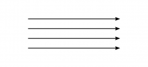

_Herausgegeben von [G. E. M. Anscombe](https://en.wikipedia.org/wiki/G._E._M._Anscombe), [R. Rhees](https://en.wikipedia.org/wiki/Rush_Rhees), [G. H. Von Wright](https://en.wikipedia.org/wiki/G._H._Von_Wright)_

_Diese digitale Ausgabe ist eine Reproduktion von L. Wittgenstein, *Philosophische Untersuchungen*. Herausgegeben von G. E. M. Anscombe, R. Rhees, G. H. Von Wright. Ludwig Wittgenstein Werkausgabe, Band 1. Suhrkamp Verlag, Frankfurt am Main, 1999, S. 231–485. Dieses Werk ist gemeinfrei, weil seine urheberrechtliche Schutzfrist abgelaufen ist. Dies gilt für das Herkunftsland des Werks und alle weiteren Staaten mit einer gesetzlichen Schutzfrist von 70 oder weniger Jahren nach dem Tod des Urhebers._

>
> Überhaupt hat der Fortschritt das an sich, daß er viel größer ausschaut, als er wirklich ist.
>
>
> *– Nestroy*
>

*Vorwort*

In dem Folgenden veröffentliche ich Gedanken, den Niederschlag philosophischer Untersuchungen, die mich in den letzten 16 Jahren beschäftigt haben. Sie betreffen viele Gegenstände: Den Begriff der Bedeutung, des Verstehens, des Satzes, der Logik, die Grundlagen der Mathematik, die Bewußtseinszustände und Anderes. Ich habe diese Gedanken alle als Bemerkungen, kurze Absätze, niedergeschrieben. Manchmal in längeren Ketten, über den gleichen Gegenstand, manchmal in raschem Wechsel von einem Gebiet zum andern überspringend. – Meine Absicht war es von Anfang, alles dies einmal in einem Buche zusammenzufassen, von dessen Form ich mir zu verschiedenen Zeiten verschiedene Vorstellungen machte. Wesentlich aber schien es mir, daß darin die Gedanken von einem Gegenstand zum andern in einer natürlichen und lückenlosen Folge fortschreiten sollten.

Nach manchen mißglückten Versuchen, meine Ergebnisse zu einem solchen Ganzen zusammenzuschweißen, sah ich ein, daß mir dies nie gelingen würde. Daß das beste, was ich schreiben konnte, immer nur philosophische Bemerkungen bleiben würden; daß meine Gedanken bald erlahmten, wenn ich versuchte, sie, gegen ihre natürliche Neigung, in einer Richtung weiterzuzwingen. –– Und dies hing freilich mit der Natur der Untersuchung selbst zusammen. Sie nämlich zwingt uns, ein weites Gedankengebiet, kreuz und quer, nach allen Richtungen hin zu durchreisen. –– Die philosophischen Bemerkungen dieses Buches sind gleichsam eine Menge von Landschaftsskizzen, die auf diesen langen und verwickelten Fahrten entstanden sind.

Die gleichen Punkte, oder beinahe die gleichen, wurden stets von neuem von verschiedenen Richtungen her berührt und immer neue Bilder entworfen. Eine Unzahl dieser waren verzeichnet, oder uncharakteristisch, mit allen Mängeln eines schwachen Zeichners behaftet. Und wenn man diese ausschied, blieb eine Anzahl halbwegser übrig, die nun so angeordnet, oftmals beschnitten, werden mußten, daß sie dem Betrachter ein Bild der Landschaft geben konnten. – So ist also dieses Buch eigentlich nur ein Album.

Ich hatte bis vor kurzem den Gedanken an eine Veröffentlichung meiner Arbeit bei meinen Lebzeiten eigentlich aufgegeben. Er wurde allerdings von Zeit zu Zeit rege gemacht, und zwar hauptsächlich dadurch, daß ich erfahren mußte, daß meine Ergebnisse, die ich in Vorlesungen, Skripten und Diskussionen weitergegeben hatte, vielfach mißverstanden, mehr oder weniger verwässert oder verstümmelt im Umlauf waren. Hierdurch wurde meine Eitelkeit aufgestachelt, und ich hatte Mühe, sie zu beruhigen.

Vor zwei Jahren aber hatte ich Veranlassung, mein erstes Buch (die »Logisch-Philosophische Abhandlung«) wieder zu lesen und seine Gedanken zu erklären. Da schien es mir plötzlich, daß ich jene alten Gedanken und die neuen zusammen veröffentlichen sollte: daß diese nur durch den Gegensatz und auf dem Hintergrund meiner älteren Denkweise ihre rechte Beleuchtung erhalten könnten.

Seit ich nämlich vor 16 Jahren mich wieder mit Philosophie zu beschäftigen anfing, mußte ich schwere Irrtümer in dem erkennen, was ich in jenem ersten Buche niedergelegt hatte. Diese Irrtümer einzusehen, hat mir – in einem Maße, das ich kaum selbst zu beurteilen vermag – die Kritik geholfen, die meine Ideen durch Frank Ramsey erfahren haben, – mit welchem ich sie während der zwei letzten Jahre seines Lebens in zahllosen Gesprächen erörtert habe. – Mehr noch als dieser – stets kraftvollen und sichern – Kritik verdanke ich derjenigen, die ein Lehrer dieser Universität, Herr P. Sraffa durch viele Jahre unablässig an meinen Gedanken geübt hat. Diesem Ansporn verdanke ich die folgereichsten der Ideen dieser Schrift.

Aus mehr als einem Grunde wird, was ich hier veröffentliche, sich mit dem berühren, was Andre heute schreiben. – Tragen meine Bemerkungen keinen Stempel an sich, der sie als die meinen kennzeichnet, – so will ich sie auch weiter nicht als mein Eigentum beanspruchen.

Ich übergebe sie mit zweifelhaften Gefühlen der Öffentlichkeit. Daß es dieser Arbeit in ihrer Dürftigkeit und der Finsternis dieser Zeit beschieden sein sollte Licht in ein oder das andere Gehirn zu werfen, ist nicht unmöglich; aber freilich nicht wahrscheinlich.

Ich möchte nicht mit meiner Schrift Andern das Denken ersparen. Sondern, wenn es möglich wäre, jemand zu eigenen Gedanken anregen.

Ich hätte gerne ein gutes Buch hervorgebracht. Es ist nicht so ausgefallen; aber die Zeit ist vorbei, in der es von mir verbessert werden könnte.

*Cambridge, im Januar 1945.*

**1.** *Augustinus*, in den Confessiones I/8: cum ipsi (majores homines) appellabant rem aliquam, et cum secundum eam vocem corpus ad aliquid movebant, videbam, et tenebam hoc ab eis vocari rem illam, quod sonabant, cum eam vellent ostendere. Hoc autem eos velle ex motu corporis aperiebatur: tamquam verbis naturalibus omnium gentium, quae fiunt vultu et nutu oculorum, ceterorumque membrorum actu, et sonitu vocis indicante affectionem animi in petendis, habendis, rejicindis, fugiendisve rebus. Ita verba in variis sententiis locis suis posita, et crebro audita, quarum rerum signa essent, paulatim colligebam, measque iam voluntates, edomito in eis signis ore, per haec enuntiabam.

[Nannten die Erwachsenen irgend einen Gegenstand und wandten sie sich dabei ihm zu, so nahm ich das wahr und ich begriff, daß der Gegenstand durch die Laute, die sie aussprachen, bezeichnet wurde, da sie auf *ihn* hinweisen wollten. Dies aber entnahm ich aus ihren Gebärden, der natürlichen Sprache aller Völker, der Sprache, die durch Mienen- und Augenspiel, durch die Bewegungen der Glieder und den Klang der Stimme die Empfindungen der Seele anzeigt, wenn diese irgend etwas begehrt, oder festhält, oder zurückweist, oder flieht. So lernte ich nach und nach verstehen, welche Dinge die Wörter bezeichneten, die ich wieder und wieder, an ihren bestimmten Stellen in verschiedenen Sätzen, aussprechen hörte. Und ich brachte, als nun mein Mund sich an diese Zeichen gewöhnt hatte, durch sie meine Wünsche zum Ausdruck.]

In diesen Worten erhalten wir, so scheint es mir, ein bestimmtes Bild von dem Wesen der menschlichen Sprache. Nämlich dieses: Die Wörter der Sprache benennen Gegenstände – Sätze sind Verbindungen von solchen Benennungen. –– In diesem Bild von der Sprache finden wir die Wurzeln der Idee: Jedes Wort hat eine Bedeutung. Diese Bedeutung ist dem Wort zugeordnet. Sie ist der Gegenstand, für welchen das Wort steht.

Von einem Unterschied der Wortarten spricht Augustinus nicht. Wer das Lernen der Sprache so beschreibt, denkt, so möchte ich glauben, zunächst an Hauptwörter, wie »Tisch«, »Stuhl«, »Brot«, und die Namen von Personen, erst in zweiter Linie an die Namen gewisser Tätigkeiten und Eigenschaften, und an die übrigen Wortarten als etwas, was sich finden wird.

Denke nun an diese Verwendung der Sprache: Ich schicke jemand einkaufen. Ich gebe ihm einen Zettel, auf diesem stehen die Zeichen: »fünf rote Äpfel«. Er trägt den Zettel zum Kaufmann; der öffnet die Lade, auf welcher das Zeichen »Äpfel« steht; dann sucht er in einer Tabelle das Wort »rot« auf und findet ihm gegenüber ein Farbmuster; nun sagt er die Reihe der Grundzahlwörter – ich nehme an, er weiß sie auswendig – bis zum Worte »fünf« und bei jedem Zahlwort nimmt er einen Apfel aus der Lade, der die Farbe des Musters hat. –– So, und ähnlich, operiert man mit Worten. –– »Wie weiß er aber, wo und wie er das Wort »rot« nachschlagen soll und was er mit dem Wort »fünf« anzufangen hat?« –– Nun, ich nehme an, er handelt, wie ich es beschrieben habe. Die Erklärungen haben irgendwo ein Ende. – Was ist aber die Bedeutung des Wortes »fünf«? – Von einer solchen war hier gar nicht die Rede; nur davon, wie das Wort »fünf« gebraucht wird.

**2.** Jener philosophische Begriff der Bedeutung ist in einer primitiven Vorstellung von der Art und Weise, wie die Sprache funktioniert, zu Hause. Man kann aber auch sagen, es sei die Vorstellung einer primitiveren Sprache als der unsern.

Denken wir uns eine Sprache, für die die Beschreibung, wie Augustinus sie gegeben hat, stimmt: Die Sprache soll der Verständigung eines Bauenden A mit einem Gehilfen B dienen. A führt einen Bau auf aus Bausteinen; es sind Würfel, Säulen, Platten und Balken vorhanden. B hat ihm die Bausteine zuzureichen, und zwar nach der Reihe, wie A sie braucht. Zu dem Zweck bedienen sie sich einer Sprache, bestehend aus den Wörtern: »Würfel«, »Säule«, »Platte«, »Balken«. A ruft sie aus; – B bringt den Stein, den er gelernt hat, auf diesen Ruf zu bringen. –– Fasse dies als vollständige primitive Sprache auf.

**3.** Augustinus beschreibt, könnten wir sagen, ein System der Verständigung; nur ist nicht alles, was wir Sprache nennen, dieses System. Und das muß man in so manchen Fällen sagen, wo sich die Frage erhebt: »Ist diese Darstellung brauchbar, oder unbrauchbar?« Die Antwort ist dann: »Ja, brauchbar; aber nur für dieses eng umschriebene Gebiet, nicht für das Ganze, das du darzustellen vorgabst.«

Es ist, als erklärte jemand: »Spielen besteht darin, daß man Dinge, gewissen Regeln gemäß, auf einer Fläche verschiebt .....« – und wir ihm antworten: Du scheinst an die Brettspiele zu denken; aber das sind nicht alle Spiele. Du kannst deine Erklärung richtigstellen, indem du sie ausdrücklich auf diese Spiele einschränkst.

**4.** Denk dir eine Schrift, in welcher Buchstaben zur Bezeichnung von Lauten benützt würden, aber auch zur Bezeichnung der Betonung und als Interpunktionszeichen. (Eine Schrift kann man auffassen als eine Sprache zur Beschreibung von Lautbildern.) Denk dir nun, daß Einer jene Schrift so verstünde, als entspräche einfach jedem Buchstaben ein Laut und als hätten die Buchstaben nicht auch ganz andere Funktionen. So einer, zu einfachen, Auffassung der Schrift gleicht Augustinus’ Auffassung der Sprache.

**5.** Wenn man das Beispiel im § 1 betrachtet, so ahnt man vielleicht, inwiefern der allgemeine Begriff der Bedeutung der Worte das Funktionieren der Sprache mit einem Dunst umgibt, der das klare Sehen unmöglich macht. – Es zerstreut den Nebel, wenn wir die Erscheinungen der Sprache an primitiven Arten ihrer Verwendung studieren, in denen man den Zweck und das Funktionieren der Wörter klar übersehen kann.

Solche primitiven Formen der Sprache verwendet das Kind, wenn es sprechen lernt. Das Lehren der Sprache ist hier kein Erklären, sondern ein Abrichten.

**6.** Wir könnten uns vorstellen, daß die Sprache im § 2 die *ganze* Sprache des A und B ist; ja, die ganze Sprache eines Volksstamms. Die Kinder werden dazu erzogen, *diese* Tätigkeiten zu verrichten, *diese* Wörter dabei zu gebrauchen, und *so* auf die Worte des Anderen zu reagieren.

Ein wichtiger Teil der Abrichtung wird darin bestehen, daß der Lehrende auf die Gegenstände weist, die Aufmerksamkeit des Kindes auf sie lenkt, und dabei ein Wort ausspricht; z. B. das Wort »Platte« beim Vorzeigen dieser Form. (Dies will ich nicht »hinweisende Erklärung«, oder »Definition«, nennen, weil ja das Kind noch nicht nach der Benennung *fragen* kann. Ich will es »hinweisendes Lehren der Wörter« nennen. –– Ich sage, es wird einen wichtigen Teil der Abrichtung bilden, weil es bei Menschen so der Fall ist; nicht, weil es sich nicht anders vorstellen ließe.) Dieses hinweisende Lehren der Wörter, kann man sagen, schlägt eine assoziative Verbindung zwischen dem Wort und dem Ding: Aber was heißt das? Nun, es kann Verschiedenes heißen; aber man denkt wohl zunächst daran, daß dem Kind das Bild des Dings vor die Seele tritt, wenn es das Wort hört. Aber wenn das nun geschieht, – ist das der Zweck des Worts? – Ja, es *kann* der Zweck sein. – Ich kann mir eine solche Verwendung von Wörtern (Lautreihen) denken. (Das Aussprechen eines Wortes ist gleichsam ein Anschlagen einer Taste auf dem Vorstellungsklavier.) Aber in der Sprache im § 2 ist es *nicht* der Zweck der Wörter, Vorstellungen zu erwecken. (Es kann freilich auch gefunden werden, daß dies dem eigentlichen Zweck förderlich ist.)

Wenn aber das das hinweisende Lehren bewirkt, – soll ich sagen, es bewirkt das Verstehen des Worts ? Versteht nicht der den Ruf »Platte!«, der so und so nach ihm handelt? – Aber dies half wohl das hinweisende Lehren herbeiführen; aber doch nur zusammen mit einem bestimmten Unterricht. Mit einem anderen Unterricht hätte dasselbe hinweisende Lehren dieser Wörter ein ganz anderes Verständnis bewirkt.

»Indem ich die Stange mit dem Hebel verbinde, setze ich die Bremse instand.« – Ja, gegeben den ganzen übrigen Mechanismus. Nur mit diesem ist er der Bremshebel; und losgelöst von seiner Unterstützung ist er nicht einmal Hebel, sondern kann alles Mögliche sein, oder nichts.

**7.** In der Praxis des Gebrauchs der Sprache (2) ruft der eine Teil die Wörter, der andere handelt nach ihnen; im Unterricht der Sprache aber wird sich *dieser* Vorgang finden: Der Lernende *benennt* die Gegenstände. D.h. er spricht das Wort, wenn der Lehrer auf den Stein zeigt. – Ja, es wird sich hier die noch einfachere Übung finden: der Schüler spricht die Worte nach, die der Lehrer ihm vorsagt –– beides sprachähnliche Vorgänge.

Wir können uns auch denken, daß der ganze Vorgang des Gebrauchs der Worte in (2) eines jener Spiele ist, mittels welcher Kinder ihre Muttersprache erlernen. Ich will diese Spiele »*Sprachspiele*« nennen, und von einer primitiven Sprache manchmal als einem Sprachspiel reden.

Und man könnte die Vorgänge des Benennens der Steine und des Nachsprechens des vorgesagten Wortes auch Sprachspiele nennen. Denke an manchen Gebrauch, der von Worten in Reigenspielen gemacht wird.

Ich werde auch das Ganze: der Sprache und der Tätigkeiten, mit denen sie verwoben ist, das »Sprachspiel« nennen.

**8.** Sehen wir eine Erweiterung der Sprache (2) an. Außer den vier Wörtern »Würfel«, »Säule«, etc. enthalte sie eine Wörterreihe, die verwendet wird, wie der Kaufmann in (1) die Zahlwörter verwendet (es kann die Reihe der Buchstaben des Alphabets sein); ferner, zwei Wörter, sie mögen »dorthin« und »dieses« lauten (weil dies schon ungefähr ihren Zweck andeutet), sie werden in Verbindung mit einer zeigenden Handbewegung gebraucht; und endlich eine Anzahl von Farbmustern. A gibt einen Befehl von der Art: »d-Platte-dorthin«. Dabei läßt er den Gehilfen ein Farbmuster sehen, und beim Worte »dorthin« zeigt er an eine Stelle des Bauplatzes. B nimmt von dem Vorrat der Platten je eine von der Farbe des Musters für jeden Buchstaben des Alphabets bis zum »d« und bringt sie an den Ort, den A bezeichnet. – Bei anderen Gelegenheiten gibt A den Befehl: »dieses-dorthin«. Bei »dieses« zeigt er auf einen Baustein. Usw.

**9.** Wenn das Kind diese Sprache lernt, muß es die Reihe der ›Zahlwörter‹ a, b, c, ... auswendiglernen. Und es muß ihren Gebrauch lernen. – Wird in diesem Unterricht auch ein hinweisendes Lehren der Wörter vorkommen? – Nun, es wird z.B. auf Platten gewiesen und gezählt werden: »a, b, c Platten«. – Mehr Ähnlichkeit mit dem hinweisenden Lehren der Wörter »Würfel«, »Säule«, etc. hätte das hinweisende Lehren von Zahlwörtern, die nicht zum Zählen dienen, sondern zur Bezeichnung mit dem Auge erfassbarer Gruppen von Dingen. So lernen ja Kinder den *Gebrauch* der ersten fünf oder sechs Grundzahlwörter.

Wird auch »dorthin« und »dieses« hinweisend gelehrt? – Stell dir vor, wie man ihren Gebrauch etwa lehren könnte! Es wird dabei auf Örter und Dinge gezeigt werden, – aber hier geschieht ja dieses Zeigen auch im *Gebrauch* der Wörter und nicht nur beim Lernen des Gebrauchs. –

**10.** Was *bezeichnen* nun die Wörter dieser Sprache? – Was sie bezeichnen, wie soll ich das zeigen, es sei denn in der Art ihres Gebrauchs? Und den haben wir ja beschrieben. Der Ausdruck »dieses Wort bezeichnet *das*« müßte also ein Teil dieser Beschreibung werden. Oder: die Beschreibung soll auf die Form gebracht werden: »Das Wort .... bezeichnet ....«.

Nun, man kann ja die Beschreibung des Gebrauchs des Wortes »Platte« dahin abkürzen, daß man sagt, dieses Wort bezeichne diesen Gegenstand. Das wird man tun, wenn es sich z.B. nurmehr darum handelt, das Mißverständnis zu beseitigen, das Wort »Platte« beziehe sich auf die Bausteinform, die wir tatsächlich »Würfel« nennen, – die Art und Weise dieses ›*Bezugs*‹ aber, d.h. der Gebrauch dieser Worte im übrigen, bekannt ist.

Und ebenso kann man sagen, die Zeichen »a«, »b«, etc. bezeichnen Zahlen; wenn dies etwa das Mißverständnis behebt, »a«, »b«, »c«, spielten in der Sprache die Rolle, die in Wirklichkeit »Würfel«, »Platte«, »Säule«, spielen. Und man kann auch sagen, »c« bezeichne diese Zahl und nicht jene; wenn damit etwa erklärt wird, die Buchstaben seien in der Reihenfolge a, b, c, d, etc. zu verwenden und nicht in der: a, b, d, c.

Aber dadurch, daß man so die Beschreibungen des Gebrauchs der Wörter einander anähnelt, kann doch dieser Gebrauch nicht ähnlicher werden! Denn, wie wir sehen, ist er ganz und gar ungleichartig.

**11.** Denk an die Werkzeuge in einem Werkzeugkasten: es ist da ein Hammer, eine Zange, eine Säge, ein Schraubenzieher, ein Maßstab, ein Leimtopf, Leim, Nägel und Schrauben. – So verschieden die Funktionen dieser Gegenstände, so verschieden sind die Funktionen der Wörter. (Und es gibt Ähnlichkeiten hier und dort.)

Freilich, was uns verwirrt ist die Gleichförmigkeit ihrer Erscheinung, wenn die Wörter uns gesprochen, oder in der Schrift und im Druck entgegentreten. Denn ihre *Verwendung* steht nicht so deutlich vor uns. Besonders nicht, wenn wir philosophieren!

**12.** Wie wenn wir in den Führerstand einer Lokomotive schauen: da sind Handgriffe, die alle mehr oder weniger gleich aussehen. (Das ist begreiflich, denn sie sollen alle mit der Hand angefaßt werden.) Aber einer ist der Handgriff einer Kurbel, die kontinuierlich verstellt werden kann (sie reguliert die Offnung eines Ventils); ein andrer ist der Handgriff eines Schalters, der nur zweierlei wirksame Stellungen hat, er ist entweder umgelegt, oder aufgestellt; ein dritter ist der Griff eines Bremshebels, je stärker man zieht, desto stärker wird gebremst; ein vierter, der Handgriff einer Pumpe, er wirkt nur, solange er hin und her bewegt wird.

**13.** Wenn wir sagen: »jedes Wort der Sprache bezeichnet etwas« so ist damit vorerst noch *gar* nichts gesagt; es sei denn, daß wir genau erklärten, *welche* Unterscheidung wir zu machen wünschen. (Es könnte ja sein, daß wir die Wörter der Sprache (8) von Wörtern ›ohne Bedeutung‹ unterscheiden wollten, wie sie in Gedichten Lewis Carroll’s vorkommen, oder von Worten wie »juwiwallera« in einem Lied.)

**14.** Denke dir, jemand sagte: »*Alle* Werkzeuge dienen dazu, etwas zu modifizieren. So, der Hammer die Lage des Nagels, die Säge die Form des Bretts, etc.« – Und was modifiziert der Maßstab, der Leimtopf, die Nägel? – »Unser Wissen um die Länge eines Dings, die Temperatur des Leims, und die Festigkeit der Kiste.« –– Wäre mit dieser Assimilation des Ausdrucks etwas gewonnen? –

**15.** Am direktesten ist das Wort »bezeichnen« vielleicht da angewandt, wo das Zeichen auf dem Gegenstand steht, den es bezeichnet. Nimm an, die Werkzeuge, die A beim Bauen benützt, tragen gewisse Zeichen. Zeigt A dem Gehilfen ein solches Zeichen, so bringt dieser das Werkzeug, das mit dem Zeichen versehen ist.

So, und auf mehr oder weniger ähnliche Weise, bezeichnet ein Name ein Ding, und wird ein Name einem Ding gegeben. – Es wird sich oft nützlich erweisen, wenn wir uns beim Philosophieren sagen: Etwas benennen, das ist etwas Ähnliches, wie einem Ding ein Namentäfelchen anheften.

**16.** Wie ist es mit den Farbmustern, die A dem B zeigt, – gehören sie zur *Sprache*? Nun, wie man will. Zur Wortsprache gehören sie nicht; aber wenn ich jemandem sage: »Sprich das Wort ›das‹ aus«, so wirst du doch dieses zweite »›das‹« auch noch zum Satz rechnen. Und doch spielt es eine ganz ähnliche Rolle, wie ein Farbmuster im Sprachspiel (8); es ist nämlich ein Muster dessen, was der Andre sagen soll.

Es ist das Natürlichste, und richtet am wenigsten Verwirrung an, wenn wir die Muster zu den Werkzeugen der Sprache rechnen.

((Bemerkung über das reflexive Fürwort »*dieser* Satz«.))

**17.** Wir werden sagen können: in der Sprache (8) haben wir verschiedene *Wortarten*. Denn die Funktion des Wortes »Platte« und des Wortes »Würfel« sind einander ähnlicher als die von »Platte« und von »d«. Wie wir aber die Worte nach Arten zusammenfassen, wird vom Zweck der Einteilung abhängen, – und von unserer Neigung.

Denke an die verschiedenen Gesichtspunkte, nach denen man Werkzeuge in Werkzeugarten einteilen kann. Oder Schachfiguren in Figurenarten.

**18.** Daß die Sprachen (2) und (8) nur aus Befehlen bestehen, laß dich nicht stören. Willst du sagen, sie seien darum nicht vollständig, so frage dich, ob unsere Sprache vollständig ist; – ob sie es war, ehe ihr der chemische Symbolismus und die Infinitesimalnotation einverleibt wurden; denn dies sind, sozusagen, Vorstädte unserer Sprache. (Und mit wieviel Häusern, oder Straßen, fängt eine Stadt an, Stadt zu sein?) Unsere Sprache kann man ansehen als eine alte Stadt: Ein Gewinkel von Gässchen und Plätzen, alten und neuen Häusern, und Häusern mit Zubauten aus verschiedenen Zeiten; und dies umgeben von einer Menge neuer Vororte mit geraden und regelmäßigen Straßen und mit einförmigen Häusern.

**19.** Man kann sich leicht eine Sprache vorstellen, die nur aus Befehlen und Meldungen in der Schlacht besteht. – Oder eine Sprache, die nur aus Fragen besteht und einem Ausdruck der Bejahung und der Verneinung. Und unzählige Andere. –– Und eine Sprache vorstellen heißt, sich eine Lebensform vorstellen.

Wie ist es aber: Ist der Ruf »Platte!« im Beispiel (2) ein Satz oder ein Wort? – Wenn ein Wort, so hat es doch nicht dieselbe Bedeutung wie das gleichlautende unserer gewöhnlichen Sprache, denn im § 2 ist es ja ein Ruf. Wenn aber ein Satz, so ist es doch nicht der elliptische Satz »Platte!« unserer Sprache. –– Was die erste Frage anbelangt, so kannst du »Platte!« ein Wort, und auch einen Satz nennen; vielleicht treffend einen ›degenerierten Satz‹ (wie man von einer degenerierten Hyperbel spricht), und zwar ist es eben unser ›elliptischer‹ Satz. – Aber der ist doch nur eine verkürzte Form des Satzes »Bring mir eine Platte!« und diesen Satz gibt es doch in Beispiel (2) nicht. – Aber warum sollte ich nicht, umgekehrt, den Satz »Bring mir eine Platte!« eine *Verlängerung* des Satzes »Platte!« nennen? – Weil der, der »Platte!« ruft, eigentlich meint: »Bring mir eine Platte!«. – Aber wie machst du das, *dies meinen*, während du »Platte« *sagst*? Sprichst du dir inwendig den unverkürzten Satz vor? Und warum soll ich, um zu sagen, was Einer mit dem Ruf »Platte« meint, diesen Ausdruck in einen andern übersetzen? Und wenn sie das Gleiche bedeuten, – warum soll ich nicht sagen: »wenn er ›Platte!‹ sagt, meint er ›Platte!‹«? Oder: warum sollst du nicht »Platte« meinen können, wenn du »Bring mir die Platte« meinen kannst? –– Aber wenn ich »Platte!« rufe, so will ich doch, *er soll mir eine Platte bringen*! –– Gewiß, aber besteht ›dies wollen‹ darin, daß du in irgend einer Form einen andern Satz denkst als den, den du sagst? –

**20.** Aber wenn nun Einer sagt »Bring mir eine Platte!«, so scheint es ja jetzt, als könnte er diesen Ausdruck als *ein* langes Wort meinen: entsprechend nämlich dem einen Worte »Platte!«. –– Kann man ihn also einmal als *ein* Wort, einmal als *vier* Wörter meinen? Und wie meint man ihn gewöhnlich? –– Ich glaube, wir werden geneigt sein, zu sagen: Wir meinen den Satz als einen von vier Wörtern, wenn wir ihn im Gegensatz zu andern Sätzen gebrauchen, wie »*Reich* mir eine Platte zu«, »Bring *ihm* eine Platte«, »Bring *zwei* Platten«, etc.; also im Gegensatz zu Sätzen, welche die Wörter unseres Befehls in andern Verbindungen enthalten. –– Aber worin besteht es, einen Satz im Gegensatz zu andern Sätzen gebrauchen? Schweben einem dabei etwa diese Sätze vor? Und *alle*? Und *während* man den einen Satz sagt, oder vor-, oder nachher? – Nein! Wenn auch so eine Erklärung einige Versuchung für uns hat, so brauchen wir doch nur einen Augenblick zu bedenken, was wirklich geschieht, um zu sehen, daß wir hier auf falschem Weg sind. Wir sagen, wir gebrauchen den Befehl im Gegensatz zu andern Sätzen, weil *unsere Sprache* die Möglichkeit dieser andern Sätze enthält. Wer unsere Sprache nicht versteht, ein Ausländer, der öfter gehört hätte, wie jemand den Befehl gibt »Bring mir eine Platte!«, könnte der Meinung sein, diese ganze Lautreihe sei ein Wort und entspräche etwa dem Wort für »Baustein« in seiner Sprache. Wenn er selbst dann diesen Befehl gegeben hätte, würde er ihn vielleicht anders aussprechen, und wir würden sagen: Er spricht ihn so sonderbar aus, weil er ihn für *ein* Wort hält. –– Aber geht also nicht, wenn er ihn ausspricht, eben auch etwas anderes in ihm vor, – *dem* entsprechend, daß er den Satz als *ein* Wort auffaßt? –– Es kann das Gleiche in ihm vorgehen, oder auch anderes. Was geht denn in dir vor, wenn du so einen Befehl gibst; bist du dir bewußt, daß er aus vier Wörtern besieht, *während* du ihn aussprichst? Freilich, du *beherrschst* diese Sprache – in der es auch jene andern Sätze gibt – aber ist dieses Beherrschen etwas, was ›*geschieht*‹, während du den Satz aussprichst? – Und ich habe ja zugegeben: der Fremde wird den Satz, den er anders auffaßt, wahrscheinlich anders aussprechen; aber, was wir die falsche Auffassung nennen, *muß* nicht in irgend etwas liegen, was das Aussprechen des Befehls begleitet.

›Elliptisch‹ ist der Satz nicht, weil er etwas ausläßt, was wir meinen, wenn wir ihn aussprechen, sondern weil er gekürzt ist – im Vergleich mit einem bestimmten Vorbild unserer Grammatik.–Man könnte hier freilich den Einwand machen: »Du gibst zu, daß der verkürzte und der unverkürzte Satz den gleichen Sinn haben. – Welchen Sinn haben sie also? Gibt es denn für diesen Sinn nicht einen Wortausdruck?« –– Aber besteht der gleiche Sinn der Sätze nicht in ihrer gleichen *Verwendung*? – (Im Russischen heißt es »Stein rot« statt »der Stein ist rot«; geht ihnen die Kopula im Sinn ab, oder *denken* sie sich die Kopula dazu?)

**21.** Denke dir ein Sprachspiel, in welchem B dem A auf dessen Frage die Anzahl der Platten, oder Würfel in einem Stoß meldet, oder die Farben und Formen der Bausteine, die dort und dort liegen. – So eine Meldung könnte also lauten: »Fünf Platten«. Was ist nun der Unterschied zwischen der Meldung, oder Behauptung, »Fünf Platten« und dem Befehl »Fünf Platten!«? – Nun, die Rolle, die das Aussprechen dieser Worte im Sprachspiel spielt. Aber es wird wohl auch der Ton, in dem sie ausgesprochen werden, ein anderer sein, und die Miene, und noch manches andere. Aber wir können uns auch denken, daß der Ton der gleiche ist, – denn ein Befehl und eine Meldung können in *mancherlei* Ton ausgesprochen werden und mit mancherlei Miene – und daß der Unterschied allein in der Verwendung liegt. (Freilich könnten wir auch die Worte »Behauptung« und »Befehl« zur Bezeichnung einer grammatischen Satzform und eines Tonfalls gebrauchen; wie wir ja »Ist das Wetter heute nicht herrlich?« eine Frage nennen, obwohl sie als Behauptung verwendet wird.) Wir könnten uns eine Sprache denken, in der *alle* Behauptungen die Form und den Ton rhetorischer Fragen hätten; oder jeder Befehl die Form der Frage: »Möchtest du das tun?« Man wird dann vielleicht sagen: »Was er sagt, hat die Form der Frage, ist aber wirklich ein Befehl« – d.h., hat die Funktion des Befehls in der Praxis der Sprache. (Ähnlich sagt man »Du wirst das tun«, nicht als Prophezeiung, sondern als Befehl. Was macht es zu dem einen, was zu dem andern?)

**22.** Freges Ansicht, daß in einer Behauptung eine Annahme steckt, die dasjenige ist, was behauptet wird, basiert eigentlich auf der Möglichkeit, die es in unserer Sprache gibt, jeden Behauptungssatz in der Form zu schreiben »Es wird behauptet, daß das und das der Fall ist.« – Aber »Daß das und das der Fall ist«, ist eben in unsrer Sprache kein Satz – es ist noch kein *Zug* im Sprachspiel. Und schreibe ich statt »Es wird behauptet, daß ...« »Es wird behauptet: das und das ist der Fall«, dann sind hier die Worte »Es wird behauptet« eben überflüssig.

Wir könnten sehr gut auch jede Behauptung in der Form einer Frage mit nachgesetzter Bejahung schreiben; etwa: »Regnet es? Ja!« Würde das zeigen, daß in jeder Behauptung eine Frage steckt?

Man hat wohl das Recht, ein Behauptungszeichen zu verwenden im Gegensatz z.B. zu einem Fragezeichen; oder wenn man eine Behauptung unterscheiden will von einer Fiktion, oder einer Annahme. Irrig ist es nur, wenn man meint, daß die Behauptung nun aus zwei Akten besteht, dem Erwägen und dem Behaupten (Beilegen des Wahrheitswerts, oder dergl.) und daß wir diese Akte nach dem Zeichen des Satzes vollziehen, ungefähr wie wir nach Noten singen. Mit dem Singen nach Noten ist allerdings das laute, oder leise Lesen des geschriebenen Satzes zu vergleichen, aber nicht das ›*Meinen*‹ (Denken) des gelesenen Satzes.

Das Fregesche Behauptungszeichen betont den *Satzanfang*. Es hat also eine ähnliche Funktion wie der Schlusspunkt. Es unterscheidet die ganze Periode vom Satz in der Periode. Wenn ich Einen sagen höre »es regnet«, aber nicht weiß, ob ich den Anfang und den Schluß der Periode gehört habe, so ist dieser Satz für mich noch kein Mittel der Verständigung.

---

Denken wir uns ein Bild, einen Boxer in bestimmter Kampfstellung darstellend. Dieses Bild kann nun dazu gebraucht werden, um jemand mitzuteilen, wie er stehen, sich halten soll; oder, wie er sich nicht halten soll; oder, wie ein bestimmter Mann dort und dort gestanden hat; oder etc. etc. Man könnte dieses Bild (chemisch gesprochen) ein Satzradikal nennen. Ähnlich dachte sich wohl Frege die »Annahme«.

---

**23.** Wieviele Arten der Sätze gibt es aber? Etwa Behauptung, Frage und Befehl? – Es gibt *unzählige* solcher Arten: unzählige verschiedene Arten der Verwendung alles dessen, was wir »Zeichen«, »Worte«, »Sätze«, nennen. Und diese Mannigfaltigkeit ist nichts Festes, ein für allemal Gegebenes; sondern neue Typen der Sprache, neue Sprachspiele, wie wir sagen können, entstehen und andre veralten und werden vergessen. (Ein *ungefähres* Bild davon können uns die Wandlungen der Mathematik geben.)

Das Wort »Sprach*spiel*« soll hier hervorheben, daß das Sprechen der Sprache ein Teil ist einer Tätigkeit, oder einer Lebensform.

Führe dir die Mannigfaltigkeit der Sprachspiele an diesen Beispielen, und anderen, vor Augen:

Befehlen, und nach Befehlen handeln –

Beschreiben eines Gegenstands nach dem Ansehen, oder nach Messungen –

Herstellen eines Gegenstands nach einer Beschreibung (Zeichnung) –

Berichten eines Hergangs –

Über den Hergang Vermutungen anstellen –

Eine Hypothese aufstellen und prüfen –

Darstellen der Ergebnisse eines Experiments durch Tabellen und Diagramme –

Eine Geschichte erfinden; und lesen –

Theater spielen –

Reigen singen –

Rätsel raten –

Einen Witz machen; erzählen –

Ein angewandtes Rechenexempel lösen –

Aus einer Sprache in die andere übersetzen –

Bitten, Danken, Fluchen, Grüßen, Beten.

– Es ist interessant, die Mannigfaltigkeit der Werkzeuge der Sprache und ihrer Verwendungsweisen, die Mannigfaltigkeit der Wort- und Satzarten, mit dem zu vergleichen, was Logiker über den Bau der Sprache gesagt haben. (Und auch der Verfasser der Logisch-Philosophischen Abhandlung.)

**24.** Wem die Mannigfaltigkeit der Sprachspiele nicht vor Augen ist, der wird etwa zu den Fragen geneigt sein, wie dieser: »Was ist eine Frage?« – Ist es die Feststellung, daß ich das und das nicht weiß, oder die Feststellung, daß ich wünsche, der Andre möchte mir sagen ....? Oder ist es die Beschreibung meines seelischen Zustandes der Ungewißheit? – Und ist der Ruf »Hilfe!« so eine Beschreibung?

Denke daran, wieviel Verschiedenartiges »Beschreibung« genannt wird: Beschreibung der Lage eines Körpers durch seine Koordinaten; Beschreibung eines Gesichtsausdrucks; Beschreibung einer Tastempfindung; einer Stimmung.

Man kann freilich statt der gewöhnlichen Form der Frage die der Feststellung, oder Beschreibung setzen: »Ich will wissen, ob, ....«, oder »Ich bin im Zweifel, ob, ....« – aber damit hat man die verschiedenen Sprachspiele einander nicht näher gebracht.

Die Bedeutsamkeit solcher Umformungsmöglichkeiten, z.B. aller Behauptungssätze in Sätze, die mit der Klausel »Ich denke«, oder »Ich glaube« anfangen (also sozusagen in Beschreibungen *meines* Innenlebens) wird sich an anderer Stelle deutlicher zeigen. (Solipsismus.)

**25.** Man sagt manchmal: die Tiere sprechen nicht, weil ihnen die geistigen Fähigkeiten fehlen. Und das heißt: »sie denken nicht, darum sprechen sie nicht«. Aber: sie sprechen eben nicht. Oder besser: sie verwenden die Sprache nicht – wenn wir von den primitivsten Sprachformen absehen. – Befehlen, fragen, erzählen, plauschen gehören zu unserer Naturgeschichte so wie gehen, essen, trinken, spielen.

**26.** Man meint, das Lernen der Sprache bestehe darin, daß man Gegenstände benennt. Und zwar: Menschen, Formen, Farben, Schmerzen, Stimmungen, Zahlen etc. Wie gesagt – das Benennen ist etwas Ähnliches, wie, einem Ding ein Namentäfelchen anheften. Man kann das eine Vorbereitung zum Gebrauch eines Wortes nennen. Aber *worauf* ist es eine Vorbereitung?

**27.** »Wir benennen die Dinge und können nun über sie reden. Uns in der Rede auf sie beziehen.« – Als ob mit dem Akt des Benennens schon das, was wir weiter tun, gegeben wäre. Als ob es nur Eines gäbe, was heißt: »von Dingen reden«. Während wir doch das Verschiedenartigste mit unsern Sätzen tun. Denken wir allein an die Ausrufe. Mit ihren ganz verschiedenen Funktionen.

Wasser!

Fort!

Au!

Hilfe!

Schön!

Nicht!

Bist du nun noch geneigt, diese Wörter »Benennungen von Gegenständen« zu nennen?

In den Sprachen (2) und (8) gab es ein Fragen nach der Benennung nicht. Dies und sein Korrelat, die hinweisende Erklärung, ist, wie wir sagen könnten, ein eigenes Sprachspiel. Das heißt eigentlich: wir werden erzogen, abgerichtet dazu, zu fragen: »Wie heißt das?« – worauf dann das Benennen erfolgt. Und es gibt auch ein Sprachspiel: Für etwas einen Namen erfinden. Also, zu sagen: »Das heißt ....«, und nun den neuen Namen zu verwenden. (So benennen Kinder z.B. ihre Puppen und reden dann von ihnen, und zu ihnen. Dabei bedenke gleich, wie eigenartig der Gebrauch des Personennamens ist, mit welchem wir den Benannten *rufen*!)

**28.** Man kann nun einen Personennamen, ein Farbwort, einen Stoffnamen, ein Zahlwort, den Namen einer Himmelsrichtung, etc. hinweisend definieren. Die Definition der Zahl Zwei »Das heißt ›zwei‹« – wobei man auf zwei Nüsse zeigt – ist vollkommen exakt. – Aber wie kann man denn die Zwei so definieren? Der, dem man die Definition gibt, weiß ja dann nicht, *was* man mit »zwei« benennen will; er wird annehmen, daß du *diese* Gruppe von Nüssen »zwei« nennst! –– Er *kann* dies annehmen; vielleicht nimmt er es aber nicht an. Er könnte ja auch, umgekehrt, wenn ich dieser Gruppe von Nüssen einen Namen beilegen will, ihn als Zahlnamen mißverstehen. Und ebensogut, wenn ich einen Personennamen hinweisend erkläre, diesen als Farbnamen, als Bezeichnung der Rasse, ja als Namen einer Himmelsrichtung auffassen. Das heißt, die hinweisende Definition kann in *jedem* Fall so und anders gedeutet werden.

---

Könnte man zur Erklärung des Wortes »rot« auf etwas weisen, was *nicht rot* ist? Das wäre ähnlich, wie wenn man Einem, der der deutschen Sprache nicht mächtig ist, das Wort »bescheiden« erklären sollte, und man zeigte zur Erklärung auf einen arroganten Menschen und sagte »Dieser ist *nicht* bescheiden«. Es ist kein Argument gegen eine solche Erklärungsweise, daß sie vieldeutig ist. Jede Erklärung kann mißverstanden werden. Wohl aber könnte man fragen: Sollen wir das noch eine »Erklärung« nennen? – Denn sie spielt im Kalkül natürlich eine andere Rolle als das, was wir gewöhnlich »hinweisende Erklärung« des Wortes »rot« nennen; auch wenn sie dieselben praktischen Folgen, dieselbe *Wirkung* auf den Lernenden hätte.

---

**29.** Vielleicht sagt man: die Zwei kann nur so hinweisend definiert werden: »Diese *Zahl* heißt ›zwei‹«. Denn das Wort »Zahl« zeigt hier an, an welchen *Platz* der Sprache, der Grammatik, wir das Wort setzen. Das heißt aber, es muß das Wort »Zahl« erklärt sein, ehe jene hinweisende Definition verstanden werden kann. – Das Wort »Zahl« in der Definition zeigt allerdings diesen Platz an; den Posten, an den wir das Wort stellen. Und wir können so Mißverständnissen vorbeugen, indem wir sagen: »Diese *Farbe* heißt so und so«, »Diese *Länge* heißt so und so«, usw. Das heißt: Mißverständnisse werden manchmal so vermieden. Aber läßt sich denn das Wort »Farbe«, oder »Länge« nur so auffassen? – Nun, wir müssen sie eben erklären. – Also erklären durch andere Wörter! Und wie ist es mit der letzten Erklärung in dieser Kette? (Sag nicht »Es gibt keine ›letzte‹ Erklärung«. Das ist gerade so, als wolltest du sagen: »Es gibt kein letztes Haus in dieser Straße; man kann immer noch eines dazubauen.«)

Ob das Wort »Zahl« in der hinweisenden Definition der Zwei nötig ist, das hängt davon ab, ob er sie ohne dieses Wort anders auffaßt, als ich es wünsche. Und das wird wohl von den Umständen abhängen, unter welchen sie gegeben wird, und von dem Menschen, dem ich sie gebe.

Und wie er die Erklärung ›auffaßt‹, zeigt sich darin, wie er von dem erklärten Wort Gebrauch macht.

**30.** Man könnte also sagen: Die hinweisende Definition erklärt den Gebrauch – die Bedeutung – des Wortes, wenn es schon klar ist, welche Rolle das Wort in der Sprache überhaupt spielen soll. Wenn ich also weiß, daß Einer mir ein Farbwort erklären will, so wird mir die hinweisende Erklärung »Das heißt ›Sepia‹« zum Verständnis des Wortes verhelfen. – Und dies kann man sagen, wenn man nicht vergißt, daß sich nun allerlei Fragen an das Wort »wissen«, oder »klar sein« anknüpfen.

Man muß schon etwas wissen (oder können), um nach der Benennung fragen zu können. Aber was muß man wissen?

**31.** Wenn man jemandem die Königsfigur im Schachspiel zeigt und sagt »Das ist der Schachkönig«, so erklärt man ihm dadurch nicht den Gebrauch dieser Figur, – es sei denn, daß er die Regeln des Spiels schon kennt, bis auf diese letzte Bestimmung: die Form einer Königsfigur. Man kann sich denken, er habe die Regeln des Spiels gelernt, ohne daß ihm je eine wirkliche Spielfigur gezeigt wurde. Die Form der Spielfigur entspricht hier dem Klang, oder der Gestalt eines Wortes.

Man kann sich aber auch denken, Einer habe das Spiel gelernt, ohne je Regeln zu lernen, oder zu formulieren. Er hat etwa zuerst durch Zusehen ganz einfache Brettspiele gelernt und ist zu immer komplizierteren fortgeschritten. Auch diesem könnte man die Erklärung geben: »Das ist der König« – wenn man ihm z.B. Schachfiguren von einer ihm ungewohnten Form zeigt. Auch diese Erklärung lehrt ihn den Gebrauch der Figur nur darum, weil, wie wir sagen könnten, der Platz schon vorbereitet war, an den sie gestellt wurde. Oder auch: Wir werden nur dann sagen, sie lehre ihn den Gebrauch, wenn der Platz schon vorbereitet ist. Und er ist es hier nicht dadurch, daß der, dem wir die Erklärung geben, schon Regeln weiß, sondern dadurch, daß er in anderm Sinne schon ein Spiel beherrscht.

Betrachte noch diesen Fall: Ich erkläre jemandem das Schachspiel; und fange damit an, indem ich auf eine Figur zeige und sage: »Das ist der König. Er kann so und so ziehen, etc. etc.«. – In diesem Fall werden wir sagen: die Worte »Das ist der König« (oder »Das heißt ›König‹«) sind nur dann eine Worterklärung, wenn der Lernende schon ›weiß, was eine Spielfigur ist‹. Wenn er also etwa schon andere Spiele gespielt hat, oder dem Spielen Anderer ›mit Verständnis‹ zugesehen hat – *und dergleichen*. Auch nur dann wird er beim Lernen des Spiels relevant fragen können: »Wie heißt das?« – nämlich, diese Spielfigur.

Wir können sagen: Nach der Benennung fragt nur der sinnvoll, der schon etwas mit ihr anzufangen weiß.

Wir können uns ja auch denken, daß der Gefragte antwortet: »Bestimm die Benennung selber« – und nun müßte, der gefragt hat, für alles selber aufkommen.

**32.** Wer in ein fremdes Land kommt, wird manchmal die Sprache der Einheimischen durch hinweisende Erklärungen lernen, die sie ihm geben; und er wird die Deutung dieser Erklärungen oft *raten* müssen und manchmal richtig, manchmal falsch raten.

Und nun können wir, glaube ich, sagen: Augustinus beschreibe das Lernen der menschlichen Sprache so, als käme das Kind in ein fremdes Land und verstehe die Sprache des Landes nicht; das heißt: so als habe es bereits eine Sprache, nur nicht diese. Oder auch: als könne das Kind schon *denken*, nur noch nicht sprechen. Und »denken« hieße hier etwas, wie: zu sich selber reden.

**33.** Wie aber, wenn man einwendete: »Es ist nicht wahr, daß Einer schon ein Sprachspiel beherrschen muß, um eine hinweisende Definition zu verstehen, sondern er muß nur – selbstverständlich – wissen (oder erraten) worauf der Erklärende zeigt! Ob also z.B. auf die Form des Gegenstandes, oder auf seine Farbe, oder auf die Anzahl, etc. etc.« –– Und worin besteht es denn – ›auf die Form zeigen‹, ›auf die Farbe zeigen‹? Zeig auf ein Stück Papier! – Und nun zeig auf seine Form, – nun auf seine Farbe, – nun auf seine Anzahl (das klingt seltsam!) – Nun, wie hast du es gemacht? – Du wirst sagen, du habest jedesmal etwas anderes beim Zeigen ›*gemeint*‹. Und wenn ich frage, wie das vor sich geht, wirst du sagen, du habest deine Aufmerksamkeit auf die Farbe, Form etc. konzentriert. Nun aber frage ich noch einmal, wie *das* vor sich geht.

Denke, jemand zeigt auf eine Vase und sagt: »Schau das herrliche Blau an! – auf die Form kommt es nicht an. – « Oder: »Schau die herrliche Form an! – die Farbe ist gleichgültig.« Es ist zweifellos, du wirst *Verschiedenes* tun, wenn du diesen beiden Aufforderungen nachkommst. Aber tust du immer das *Gleiche*, wenn du deine Aufmerksamkeit auf die Farbe richtest? Stell dir doch verschiedene Fälle vor! Ich will einige andeuten:

»Ist dieses Blau das gleiche, wie das dort? Siehst du einen Unterschied?« –

Du mischst die Farben und sagst: »Dieses Blau des Himmels ist schwer zu treffen.«

»Es wird schön, man sieht schon wieder blauen Himmel!«

»Schau, wie verschieden diese beiden Blau wirken!«

»Siehst du dort das blaue Buch? Bring es her.«

»Dieses blaue Lichtsignal bedeutet ....«

»Wie heißt nur dieses Blau? – ist es ›Indigo‹?«

Die Aufmerksamkeit auf die Farbe richten, das tut man manchmal, indem man sich die Umrisse der Form mit der Hand weghält; oder den Blick nicht auf die Kontur des Dinges richtet; oder auf den Gegenstand starrt und sich zu erinnern trachtet, wo man diese Farbe schon gesehen hat.

Man richtet seine Aufmerksamkeit auf die Form, manchmal, indem man sie nachzeichnet, manchmal, indem man blinzelt, um die Farbe nicht deutlich zu sehen, etc. etc. Ich will sagen: dies und Ähnliches geschieht, *während* man ›die Aufmerksamkeit auf das und das richtetet‹. Aber das ist es nicht allein, was uns sagen läßt, Einer richte seine Aufmerksamkeit auf die Form, die Farbe, etc. Wie ein Schachzug nicht allein darin besteht, daß ein Stein so und so auf dem Brett verschoben wird, – aber auch nicht in den Gedanken und Gefühlen des Ziehenden, die den Zug begleiten; sondern in den Umständen, die wir nennen: »eine Schachpartie spielen«, »ein Schachproblem lösen«, und dergl.

**34.** Aber nimm an, Einer sagte: »Ich tue immer das Gleiche, wenn ich meine Aufmerksamkeit auf die Form richte: ich folge der Kontur mit den Augen und fühle dabei ....«. Und nimm an, dieser gibt einem Andern die hinweisende Erklärung »Das heißt ›Kreis‹«, indem er, mit all diesen Erlebnissen, auf einen kreisförmigen Gegenstand zeigt –– kann der Andre die Erklärung nicht dennoch anders deuten, auch wenn er sieht, daß der Erklärende der Form mit den Augen folgt, und auch wenn er fühlt, was der Erklärende fühlt? Das heißt: diese ›Deutung‹ kann auch darin bestehen, wie er nun von dem erklärten Wort Gebrauch macht, z.B., worauf er zeigt, wenn er den Befehl erhält »Zeige auf einen Kreis!«. – Denn weder der Ausdruck »die Erklärung so und so meinen«, noch der, »die Erklärung so und so deuten«, bezeichnen einen Vorgang, der das Geben und Hören der Erklärung begleitet.

**35.** Es gibt freilich, was man »charakteristische Erlebnisse«, für das Zeigen auf die Form etwa, nennen kann. Zum Beispiel, das Nachfahren der Kontur mit dem Finger, oder mit dem Blick, beim Zeigen. – Aber so wenig, wie *dies* in allen Fällen geschieht, in denen ich ›die Form meine‹, so wenig geschieht irgend ein anderer charakteristischer Vorgang in allen diesen Fällen. – Aber auch, wenn ein solcher sich in allen wiederholte, so käme es doch auf die Umstände an – d.h., auf das, was vor und nach dem Zeigen geschieht – ob wir sagen würden »Er hat auf die Form und nicht auf die Farbe gezeigt«.

Denn es werden die Worte »auf die Form zeigen«, »die Form meinen« etc. nicht so gebraucht, wie *die*: »auf dies Buch zeigen« (nicht auf jenes), »auf den Stuhl zeigen, nicht auf den Tisch«, etc. – Denn denk nur, wie anders wir den Gebrauch der Worte *lernen*: »auf dieses Ding zeigen«, »auf jenes Ding zeigen«, und anderseits: »auf die Farbe, nicht auf die Form, zeigen«, »die *Farbe* meinen«, etc. etc.

Wie gesagt, in gewissen Fällen, besonders beim Zeigen ›auf die Form‹, oder ›auf die Anzahl‹ gibt es charakteristische Erlebnisse und Arten des Zeigens – ›charakteristisch‹, weil sie sich oft (nicht immer) wiederholen, wo Form, oder Anzahl ›gemeint‹ werden. Aber kennst du auch ein charakteristisches Erlebnis für das Zeigen auf die Spielfigur, als *Spielfigur*? Und doch kann man sagen: »Ich meine, diese *Spielfigur* heißt ›König‹, nicht dieses bestimmte Stück Holz, worauf ich zeige«. (Wiedererkennen, wünschen, sich erinnern, etc.)

---

Wie geht es vor sich: die Worte »*Das* ist blau« einmal als Aussage über den Gegenstand, auf den man zeigt – einmal als Erklärung des Wortes »blau« *meinen*? Im zweiten Fall meint man also eigentlich »Das heißt ›blau‹« – Kann man also das Wort »ist« einmal als »heißt« meinen, und das Wort »blau« als »›blau‹«? und ein andermal das »ist« wirklich als »ist«?
Es kann auch geschehen, daß jemand aus dem, was als Mitteilung gemeint war, eine Worterklärung zieht. [Hier liegt ein folgenschwerer Aberglaube verborgen.]
Kann ich mit dem Wort »bububu« meinen »Wenn es nicht regnet, werde ich spazieren gehen«? – Nur in einer Sprache kann ich etwas mit etwas meinen. Das zeigt klar, daß die Grammatik von »meinen« nicht ähnlich der ist des Ausdrucks »sich etwas vorstellen« und dergl.

---

**36.** Und wir tun hier, was wir in tausend ähnlichen Fällen tun: Weil wir nicht *eine* körperliche Handlung angeben können, die wir das Zeigen auf die Form (im Gegensatz z.B. zur Farbe) nennen, so sagen wir, es entspreche diesen Worten eine geistige Tätigkeit.

Wo unsere Sprache uns einen Körper vermuten läßt, und kein Körper ist, dort, möchten wir sagen, sei ein *Geist*.

**37.** Was ist die Beziehung zwischen Namen und Benanntem? – Nun, was *ist* sie? Schau auf das Sprachspiel (2), oder ein anderes! dort ist zu sehen, worin diese Beziehung etwa besteht. Diese Beziehung kann, unter vielem andern, auch darin bestehen, daß das Hören des Namens uns das Bild des Benannten vor die Seele ruft, und sie besteht unter anderem auch darin, daß der Name auf das Benannte geschrieben ist, oder daß er beim Zeigen auf das Benannte ausgesprochen wird.

**38.** Was benennt aber z.B. das Wort »dieses« im Sprachspiel (8), oder das Wort »das« in der hinweisenden Erklärung »Das heißt ....«? – Wenn man keine Verwirrung anrichten will, so ist es am besten, man sagt gar nicht, daß diese Wörter etwas benennen. – Und merkwürdigerweise wurde von dem Worte »dieses« einmal gesagt, es sei der *eigentliche* Name. Alles, was wir sonst »Name« nennen, sei dies also nur in einem ungenauen, angenäherten Sinn.

Diese seltsame Auffassung rührt von einer Tendenz her, die Logik unserer Sprache zu sublimieren – wie man es nennen könnte. Die eigentliche Antwort darauf ist: »Name« nennen wir *sehr Verschiedenes*; das Wort »Name« charakterisiert viele verschiedene, miteinander auf viele verschiedene Weisen verwandte, Arten des Gebrauchs eines Worts; – aber unter diesen Arten des Gebrauchs ist nicht die des Wortes »dieses«.

Es ist wohl wahr, daß wir oft, z.B. in der hinweisenden Definition, auf das Benannte zeigen und dabei den Namen aussprechen. Und ebenso sprechen wir, z.B. in der hinweisenden Definition, das Wort »dieses« aus, indem wir auf ein Ding zeigen. Und das Wort »dieses« und ein Name stehen auch oft an der gleichen Stelle im Satzzusammenhang. Aber charakteristisch für den Namen ist es gerade, daß er durch das hinweisende »Das ist N« (oder »Das heißt ›N‹«) erklärt wird. Erklären wir aber auch: »Das heißt ›dieses‹«, oder »Dieses heißt ›dieses‹«?

Dies hängt mit der Auffassung des Benennens als eines, sozusagen, okkulten Vorgangs zusammen. Das Benennen erscheint als eine *seltsame* Verbindung eines Wortes mit einem Gegenstand. – Und so eine seltsame Verbindung hat wirklich statt, wenn nämlich der Philosoph, um herauszubringen, was *die* Beziehung zwischen Namen und Benanntem ist, auf einen Gegenstand vor sich starrt und dabei unzählige Male einen Namen wiederholt, oder auch das Wort »dieses«. Denn die philosophischen Probleme entstehen, wenn die Sprache *feiert*. Und *da* können wir uns allerdings einbilden, das Benennen sei irgend ein merkwürdiger seelischer Akt, quasi eine Taufe eines Gegenstandes. Und wir können so auch das Wort »dieses« gleichsam *zu* dem Gegenstand sagen, ihn damit *ansprechen* – ein seltsamer Gebrauch dieses Wortes, der wohl nur beim Philosophieren vorkommt.

**39.** Aber warum kommt man auf die Idee, gerade dieses Wort zum Namen machen zu wollen, wo es offenbar *kein* Name ist? – Gerade darum. Denn man ist versucht, gegen das, was gewöhnlich »Name« heißt, einen Einwand zu machen; und den kann man so ausdrücken: *daß der Name eigentlich Einfaches bezeichnen soll*. Und man könnte dies etwa so begründen: Ein Eigenname im gewöhnlichen Sinn ist etwa das Wort »Nothung«. Das Schwert Nothung besteht aus Teilen in einer bestimmten Zusammensetzung. Sind sie anders zusammengesetzt, so existiert Nothung nicht. Nun hat aber offenbar der Satz »Nothung hat eine scharfe Schneide« *Sinn*, ob Nothung noch ganz ist, oder schon zerschlagen. Ist aber »Nothung« der Name eines Gegenstandes, so gibt es diesen Gegenstand nicht mehr, wenn Nothung zerschlagen ist; und da dem Namen dann kein Gegenstand entspräche, so hätte er keine Bedeutung. Dann aber stünde in dem Satz »Nothung hat eine scharfe Schneide« ein Wort, das keine Bedeutung hat, und daher wäre der Satz Unsinn. Nun hat er aber Sinn; also muß den Wörtern, aus denen er besteht, immer etwas entsprechen. Also muß das Wort »Nothung« bei der Analyse des Sinnes verschwinden und statt seiner müssen Wörter eintreten, die Einfaches benennen. Diese Wörter werden wir billigerweise die eigentlichen Namen nennen.

**40.** Laß uns zuerst über *den* Punkt dieses Gedankengangs reden: daß das Wort keine Bedeutung hat, wenn ihm nichts entspricht. – Es ist wichtig, festzustellen, daß das Wort »Bedeutung« sprachwidrig gebraucht wird, wenn man damit das Ding bezeichnet, das dem Wort ›entspricht‹. Dies heißt, die Bedeutung eines Namens verwechseln mit dem *Träger* des Namens. Wenn Herr N. N. stirbt, so sagt man, es sterbe der Träger des Namens, nicht, es sterbe die Bedeutung des Namens. Und es wäre unsinnig, so zu reden, denn hörte der Name auf, Bedeutung zu haben, so hätte es keinen Sinn, zu sagen »Herr N. N. ist gestorben«.

**41.** Im § 15 haben wir in die Sprache (8) Eigennamen eingeführt. Nimm nun an, das Werkzeug mit dem Namen »N« sei zerbrochen. A weiß es nicht und gibt dem B das Zeichen »N«. Hat dieses Zeichen nun Bedeutung, oder hat es keine? – Was soll B tun, wenn er dieses Zeichen erhält? – Wir haben darüber nichts vereinbart. Man könnte fragen: was *wird* er tun? Nun, er wird vielleicht ratlos dastehen, oder A die Stücke zeigen. Man *könnte* hier sagen: »N« sei bedeutungslos geworden; und dieser Ausdruck würde besagen, daß für das Zeichen »N« in unserm Sprachspiel nun keine Verwendung mehr ist (es sei denn, wir gäben ihm eine neue). »N« könnte auch dadurch bedeutungslos werden, daß man, aus welchem Grund immer, dem Werkzeug eine andere Bezeichnung gibt und das Zeichen »N« im Sprachspiel nicht weiter verwendet. – Wir können uns aber auch eine Abmachung denken, nach der B, wenn ein Werkzeug zerbrochen ist und A das Zeichen dieses Werkzeugs gibt, als Antwort darauf den Kopf zu schütteln hat. – Damit, könnte man sagen, ist der Befehl »N«, auch wenn dieses Werkzeug nicht mehr existiert, in das Sprachspiel aufgenommen worden, und das Zeichen »N« habe Bedeutung, auch wenn sein Träger zu existieren aufhört.

**42.** Aber haben etwa auch Namen in jenem Spiel Bedeutung, die *nie* für ein Werkzeug verwendet worden sind? –– Nehmen wir also an, »X« sei so ein Zeichen, und A gäbe dieses Zeichen dem B – nun, es könnten auch solche Zeichen in das Sprachspiel aufgenommen werden, und B hätte etwa auch sie mit einem Kopfschütteln zu beantworten. (Man könnte sich dies als eine Art Belustigung der Beiden denken.)

**43.** Man kann für eine *große* Klasse von Fällen der Benützung des Wortes »Bedeutung« – wenn auch nicht für *alle* Fälle seiner Benützung – dieses Wort so erklären: Die Bedeutung eines Wortes ist sein Gebrauch in der Sprache.

Und die *Bedeutung* eines Namens erklärt man manchmal dadurch, daß man auf seinen *Träger* zeigt.

**44.** Wir sagten: der Satz »Nothung hat eine scharfe Schneide« habe Sinn, auch wenn Nothung schon zerschlagen ist. Nun, das ist so, weil in diesem Sprachspiel ein Name auch in der Abwesenheit seines Trägers gebraucht wird. Aber wir können uns ein Sprachspiel mit Namen denken (d. h. mit Zeichen, die wir gewiß auch »Namen« nennen werden), in welchem diese nur in der Anwesenheit des Trägers gebraucht werden; also *immer* ersetzt werden können durch das hinweisende Fürwort mit der hinweisenden Gebärde.

**45.** Das hinweisende »dieses« kann nie trägerlos werden. Man könnte sagen: »Solange es ein *Dieses* gibt, solange hat das Wort ›dieses‹ auch Bedeutung, ob *dieses* nun einfach oder zusammengesetzt ist.« –– Aber das macht das Wort eben nicht zu einem Namen. Im Gegenteil; denn ein Name wird nicht mit der hinweisenden Geste verwendet, sondern nur durch sie erklärt.

**46.** Was hat es nun für eine Bewandtnis damit, daß Namen eigentlich das Einfache bezeichnen ? –

Sokrates (im Theätetus): »Täusche ich mich nämlich nicht, so habe ich von Etlichen gehört: für die *Urelemente* – um mich so auszudrücken – aus denen wir und alles übrige zusammengesetzt sind, gebe es keine Erklärung; denn alles, was an und für sich ist, könne man nur mit Namen *bezeichnen*; eine andere Bestimmung sei nicht möglich, weder die, es *sei*, noch die, *es sei nicht*. ..... Was aber an und für sich ist, müsse man .... ohne alle anderen Bestimmungen benennen. Somit aber sei es unmöglich, von irgend einem Urelement erklärungsweise zu reden; denn für dieses gebe es nichts als die bloße Benennung; es habe ja nur seinen Namen. Wie aber das, was aus diesen Urelementen sich zusammensetzt, selbst ein verflochtenes Gebilde sei, so seien auch seine Benennungen in dieser Verflechtung zur erklärenden Rede geworden; denn deren Wesen sei die Verflechtung von Namen.«

Diese Urelemente waren auch Russell’s ›individuals‹, und auch meine ›Gegenstände‹ (Log. Phil. Abh.).

**47.** Aber welches sind die einfachen Bestandteile, aus denen sich die Realität zusammensetzt? – Was sind die einfachen Bestandteile eines Sessels? – Die Stücke Holz, aus denen er zusammengefügt ist? Oder die Moleküle, oder die Atome? – »Einfach« heißt: nicht zusammengesetzt. Und da kommt es darauf an: in welchem Sinne ›zusammengesetzt‹? Es hat gar keinen Sinn von den ›einfachen Bestandteilen des Sessels schlechtweg‹ zu reden.

Oder: Besteht mein Gesichtsbild dieses Baumes, dieses Sessels, aus Teilen? und welches sind seine einfachen Bestandteile? Mehrfarbigkeit ist *eine* Art der Zusammengesetztheit; eine andere ist, z.B., die einer gebrochenen Kontur aus geraden Stücken. Und ein Kurvenstück kann man zusammengesetzt nennen aus einem aufsteigenden und einem absteigenden Ast.

Wenn ich jemandem ohne weitere Erklärung sage »Was ich jetzt vor mir sehe, ist zusammengesetzt«, so wird er mit Recht fragen: »Was meinst du mit ›zusammengesetzt‹? Das kann ja alles Mögliche heißen!« – Die Frage »Ist, was du siehst, zusammengesetzt?« hat wohl Sinn, wenn bereits feststeht, um welche Art des Zusammengesetztseins – d.h., um welchen besonderen Gebrauch dieses Wortes – es sich handeln soll. Wäre festgelegt worden, das Gesichtsbild eines Baumes solle »zusammengesetzt« heißen, wenn man nicht nur einen Stamm, sondern auch Aste sieht, so hätte die Frage »Ist das Gesichtsbild dieses Baumes einfach oder zusammengesetzt?« und die Frage »Welches sind seine einfachen Bestandteile?« einen klaren Sinn – eine klare Verwendung. Und auf die zweite Frage ist die Antwort natürlich nicht »Die Äste« (dies wäre eine Antwort auf die *grammatische* Frage: »Was *nennt* man hier die ›einfachen Bestandteile‹?«) sondern etwa eine Beschreibung der einzelnen Äste.

Aber ist z.B. nicht ein Schachbrett offenbar und schlechtweg zusammengesetzt? – Du denkst wohl an die Zusammensetzung aus 32 weißen und 32 schwarzen Quadraten. Aber könnten wir z.B. nicht auch sagen, es sei aus den Farben Weiß, Schwarz und dem Schema des Quadratnetzes zusammengesetzt? Und wenn es hier ganz verschiedene Betrachtungsweisen gibt, willst du dann noch sagen, das Schachbrett sei ›zusammengesetzt‹ schlechtweg? – *Außerhalb* eines bestimmten Spiels zu fragen »Ist dieser Gegenstand zusammengesetzt?«, das ist ähnlich dem, was einmal ein Junge tat, der angeben sollte, ob die Zeitwörter in gewissen Satzbeispielen in der aktiven, oder in der passiven Form gebraucht seien, und der sich nun darüber den Kopf zerbrach, ob z.B. das Zeitwort »schlafen« etwas Aktives oder etwas Passives bedeute.

Das Wort »zusammengesetzt« (und also das Wort »einfach«) wird von uns in einer Unzahl verschiedener, in verschiedenen Weisen miteinander verwandten, Arten benützt. (Ist die Farbe eines Schachfeldes einfach, oder besteht sie aus reinem Weiß und reinem Gelb? Und ist das Weiß einfach, oder besteht es aus den Farben des Regenbogens? – Ist diese Strecke von 2 cm einfach, oder besteht sie aus zwei Teilstrecken von je 1 cm? Aber warum nicht aus einem Stück von 3 cm Länge und einem, in negativem Sinn angesetzten, Stück von 1 cm?)

Auf die *philosophische* Frage: »Ist das Gesichtsbild dieses Baumes zusammengesetzt, und welches sind seine Bestandteile?« ist die richtige Antwort: »Das kommt drauf an, was du unter ›zusammengesetzt‹ verstehst.« (Und das ist natürlich keine Beantwortung, sondern eine Zurückweisung der Frage.)

**48.** Laß uns die Methode des § 2 auf die Darstellung im *Theätetus* anwenden. Betrachten wir ein Sprachspiel, wofür diese Darstellung wirklich gilt. Die Sprache diene dazu, Kombinationen farbiger Quadrate auf einer Fläche darzustellen. Die Quadrate bilden einen schachbrettförmigen Komplex. Es gibt rote, grüne, weiße und schwarze Quadrate. Die Wörter der Sprache seien (entsprechend): »R«, »G«, »W«, »S«, und ein Satz ist eine Reihe dieser Wörter. Sie beschreiben eine Zusammenstellung von Quadraten in der Reihenfolge

|   |   |   |
|---|---|---|
|1 |2 |3 |
|4 |5 |6 |
|7 |8 |9 |

Der Satz »RRSGGGRWW« beschreibt also z.B. eine Zusammensetzung dieser Art:

|   |   |   |
|---|---|---|
| | | |
| | | |
| | | |

Hier ist der Satz ein Komplex von Namen, dem ein Komplex von Elementen entspricht. Die Urelemente sind die farbigen Quadrate. »Aber sind diese einfach?« – Ich wüßte nicht, was ich in diesem Sprachspiel natürlicher das »Einfache« nennen sollte. Unter anderen Umständen aber würde ich ein einfarbiges Quadrat »zusammengesetzt« nennen, etwa aus zwei Rechtecken, oder aus den Elementen Farbe und Form. Aber der Begriff der Zusammensetzung könnte auch so gedehnt werden, daß die kleinere Fläche ›zusammengesetzt‹ genannt wird aus einer größeren und einer von ihr subtrahierten. Vergleiche ›Zusammensetzung‹ der Kräfte, ›Teilung‹ einer Strecke durch einen Punkt außerhalb; diese Ausdrücke zeigen, daß wir unter Umständen auch geneigt sind, das Kleinere als Resultat der Zusammensetzung von Größerem aufzufassen und das Größere als ein Resultat der Teilung des Kleineren.

Aber ich weiß nicht, ob ich nun sagen soll, die Figur, die unser Satz beschreibt, bestehe aus vier Elementen oder aus neun! Nun, besteht jener Satz aus vier Buchstaben oder aus neun? – Und welches sind *seine* Elemente: die Buchstabentypen, oder die Buchstaben? Ist es nicht gleichgültig, welches wir sagen? wenn wir nur im besonderen Fall Mißverständnisse vermeiden!

**49.** Was heißt es aber, daß wir diese Elemente nicht erklären (d.h. beschreiben) sondern nur benennen können? Das könnte etwa sagen, daß die Beschreibung eines Komplexes, wenn er, in einem Grenzfall, nur aus *einem* Quadrat besteht, einfach der Name des Farbquadrates ist.

Man könnte hier sagen – obwohl dies leicht zu allerlei philosophischem Aberglauben führt – ein Zeichen »R«, oder »S«, etc., könne einmal Wort und einmal Satz sein. Ob es aber ›Wort oder Satz ist‹, hängt von der Situation ab, in der es ausgesprochen oder geschrieben wird. Soll z. B. A dem B Komplexe von Farbquadraten beschreiben und gebraucht er hier das Wort »R« *allein*, so werden wir sagen können, das Wort sei eine Beschreibung – ein Satz. Memoriert er aber etwa die Wörter und ihre Bedeutungen, oder lehrt er einen Andern den Gebrauch der Wörter und spricht sie beim hinweisenden Lehren aus, so werden wir nicht sagen, sie seien hier Sätze. In dieser Situation ist das Wort »R« z.B. keine Beschreibung; man *benennt* damit ein Element –– aber darum wäre es hier seltsam zu sagen, das Element könne man *nur* benennen! Benennen und Beschreiben stehen ja nicht auf *einer* Ebene: Das Benennen ist eine Vorbereitung zur Beschreibung. Das Benennen ist noch gar kein Zug im Sprachspiel, – so wenig, wie das Aufstellen einer Schachfigur ein Zug im Schachspiel. Man kann sagen: Mit dem Benennen eines Dings ist noch *nichts* getan. Es *hat* auch keinen Namen, außer im Spiel. Das war es auch, was Frege damit meinte: ein Wort habe nur im Satzzusammenhang Bedeutung.

**50.** Was heißt es nun, von den Elementen zu sagen, daß wir ihnen weder Sein noch Nichtsein beilegen können? – Man könnte sagen: Wenn alles, was wir »Sein« oder »Nichtsein« nennen, im Bestehen und Nichtbestehen von Verbindungen zwischen den Elementen liegt, dann hat es keinen Sinn vom Sein (Nichtsein) eines Elements zu sprechen; sowie, wenn alles, was wir »zerstören« nennen, in der Trennung von Elementen liegt, es keinen Sinn hat, vom Zerstören eines Elements zu reden.

Aber man möchte sagen: Man kann dem Element nicht Sein beilegen, denn *wäre* es nicht, so könnte man es auch nicht einmal nennen und also gar nichts von ihm aussagen. – Betrachten wir doch einen analogen Fall! Man kann von *einem* Ding nicht aussagen, es sei 1 m lang, noch, es sei nicht 1 m lang, und das ist das Urmeter in Paris. – Damit haben wir aber diesem natürlich nicht irgend eine merkwürdige Eigenschaft zugeschrieben, sondern nur seine eigenartige Rolle im Spiel des Messens mit dem Metermaß gekennzeichnet. – Denken wir uns auf ähnliche Weise wie das Urmeter auch die Muster von Farben in Paris aufbewahrt. So erklären wir: »Sepia« heiße die Farbe des dort unter Luftabschluß aufbewahrten Ur-Sepia. Dann wird es keinen Sinn haben, von diesem Muster auszusagen, es habe diese Farbe, noch, es habe sie nicht.

Wir können das so ausdrücken: Dieses Muster ist ein Instrument der Sprache, mit der wir Farbaussagen machen. Es ist in diesem Spiel nicht Dargestelltes, sondern Mittel der Darstellung. – Und eben das gilt von einem Element im Sprachspiel (48), wenn wir, es benennend, das Wort »R« aussprechen: wir haben damit diesem Ding eine Rolle in unserm Sprachspiel gegeben; es ist nun *Mittel* der Darstellung. Und zu sagen »*Wäre* es nicht, so könnte es keinen Namen haben« sagt nun so viel, und so wenig, wie: gäbe es dieses Ding nicht, so könnten wir es in unserem Spiel nicht verwenden. – Was es, scheinbar, geben *muß*, gehört zur Sprache. Es ist in unserem Spiel ein Paradigma; etwas, womit verglichen wird. Und dies feststellen, kann heißen, eine wichtige Feststellung machen; aber es ist dennoch eine Feststellung unser Sprachspiel – unsere Darstellungsweise – betreffend.

**51.** In der Beschreibung des Sprachspiels (48) sagte ich, den Farben der Quadrate entsprächen die Wörter »R«, »S«, etc. Worin aber besteht diese Entsprechung, in wiefern kann man sagen, diesen Zeichen entsprächen gewisse Farben der Quadrate? Die Erklärung in (48) stellte ja nur einen Zusammenhang zwischen diesen Zeichen und gewissen Wörtern unserer Sprache her (den Farbnamen). – Nun, es war vorausgesetzt, daß der Gebrauch der Zeichen im Spiel anders, und zwar durch Hinweisen auf Paradigmen, gelehrt würde. Wohl; aber was heißt es nun, zu sagen, in der *Praxis der Sprache* entsprächen den Zeichen gewisse Elemente? – Liegt es darin, daß der, welcher die Komplexe von Farbquadraten beschreibt, hierbei immer »R« sagt, wo ein rotes Quadrat steht; »S«, wo ein schwarzes steht, etc.? Aber wie, wenn er sich bei der Beschreibung irrt und, fälschlich, »R« sagt, wo er ein schwarzes Quadrat sieht –– was ist hier das Kriterium dafür, daß dies ein *Fehler* war? – Oder besteht, daß »R« ein rotes Quadrat bezeichnet, darin, daß den Menschen, die die Sprache gebrauchen, immer ein rotes Quadrat im Geist vorschwebt, wenn sie das Zeichen »R« gebrauchen?

Um klarer zu sehen, müssen wir hier, wie in unzähligen ähnlichen Fällen, die Einzelheiten der Vorgänge ins Auge fassen; was vorgeht *aus der Nähe betrachten*.

**52.** Wenn ich dazu neige, anzunehmen, daß eine Maus durch Urzeugung aus grauen Fetzen und Staub entsteht, so wird es gut sein, diese Fetzen genau daraufhin zu untersuchen, wie eine Maus sich in ihnen verstecken konnte, wie sie dort hinkommen konnte, etc. Bin ich aber überzeugt, daß eine Maus aus diesen Dingen nicht entstehen kann, dann wird diese Untersuchung vielleicht überflüssig sein.

Was es aber ist, das sich in der Philosophie einer solchen Betrachtung der Einzelheiten entgegensetzt, müssen wir erst verstehen lernen.

**53.** Es gibt nun *verschiedene* Möglichkeiten für unser Sprachspiel (48), verschiedene Fälle, in denen wir sagen würden, ein Zeichen benenne in dem Spiel ein Quadrat von der und der Farbe. Wir würden dies z.B. sagen, wenn wir wüßten, daß den Menschen, die diese Sprache gebrauchen, der Gebrauch der Zeichen auf die und die Art beigebracht wurde. Oder, wenn es schriftlich, etwa in Form einer Tabelle, niedergelegt wäre, daß diesem Zeichen dieses Element entspricht, und wenn diese Tabelle beim Lehren der Sprache benützt und in gewissen Streitfällen zur Entscheidung herangezogen würde.

Wir können uns aber auch denken, daß eine solche Tabelle ein Werkzeug im Gebrauch der Sprache ist. Die Beschreibung eines Komplexes geht dann so vor sich: Der den Komplex beschreibt, führt eine Tabelle mit sich und sucht in ihr jedes Element des Komplexes auf und geht von ihm in der Tabelle zum Zeichen über (und es kann auch der, dem die Beschreibung gegeben wird, die Worte derselben durch eine Tabelle in die Anschauung von farbigen Quadraten übersetzen). Man könnte sagen, diese Tabelle übernehme hier die Rolle, die in anderen Fällen Gedächtnis und Assoziation spielen. (Wir werden den Befehl »Bring mir eine rote Blume!« für gewöhnlich nicht so ausführen, daß wir die Farbe Rot in einer Farbentabelle aufsuchen und dann eine Blume bringen von der Farbe, die wir in der Tabelle finden; aber wenn es sich darum handelt, einen bestimmten Ton von Rot zu wählen, oder zu mischen, dann geschieht es, daß wir uns eines Musters oder einer Tabelle bedienen.)

Nennen wir eine solche Tabelle den Ausdruck einer Regel des Sprachspiels, so kann man sagen, daß dem, was wir Regel eines Sprachspiels nennen, sehr verschiedene Rollen im Spiel zukommen können.

**54.** Denken wir doch daran, in was für Fällen wir sagen, ein Spiel werde nach einer bestimmten Regel gespielt!

Die Regel kann ein Behelf des Unterrichts im Spiel sein. Sie wird dem Lernenden mitgeteilt und ihre Anwendung eingeübt. – Oder sie ist ein Werkzeug des Spieles selbst. – Oder: Eine Regel findet weder im Unterricht noch im Spiel selbst Verwendung; noch ist sie in einem Regelverzeichnis niedergelegt. Man lernt das Spiel, indem man zusieht, wie Andere es spielen. Aber wir sagen, es werde nach den und den Regeln gespielt, weil ein Beobachter diese Regeln aus der Praxis des Spiels ablesen kann, – wie ein Naturgesetz, dem die Spielhandlungen folgen. –– Wie aber unterscheidet der Beobachter in diesem Fall zwischen einem Fehler der Spielenden und einer richtigen Spielhandlung? – Es gibt dafür Merkmale im Benehmen der Spieler. Denke an das charakteristische Benehmen dessen, der ein Versprechen korrigiert. Es wäre möglich, zu erkennen, daß Einer dies tut, auch wenn wir seine Sprache nicht verstehen.

**55.** »Was die Namen der Sprache bezeichnen, muß unzerstörbar sein: denn man muß den Zustand beschreiben können, in dem alles, was zerstörbar ist, zerstört ist. Und in dieser Beschreibung wird es Wörter geben; und was ihnen entspricht, darf dann nicht zerstört sein, denn sonst hätten die Wörter keine Bedeutung.« Ich darf mir nicht den Ast absägen, auf welchem ich sitze.

Man könnte nun freilich gleich einwenden, daß ja die Beschreibung selbst sich von der Zerstörung ausnehmen müsse. – Aber das, was den Wörtern der Beschreibung entspricht und also nicht zerstört sein darf, wenn sie wahr ist, ist, was den Wörtern ihre Bedeutung gibt, – ohne welches sie keine Bedeutung hätten. –– Aber dieser Mensch ist ja doch in einem Sinne das, was seinem Namen entspricht. Er aber ist zerstörbar; und sein Name verliert seine Bedeutung nicht, wenn der Träger zerstört wird. – Das, was dem Namen entspricht, und ohne den er keine Bedeutung hätte, ist, z.B., ein Paradigma, das im Sprachspiel in Verbindung mit dem Namen gebraucht wird.

**56.** Aber wie, wenn kein solches Muster zur Sprache gehört, wenn wir uns, z. B., die Farbe, die ein Wort bezeichnet, *merken*? –– »Und wenn wir sie uns merken, so tritt sie also vor unser geistiges Auge, wenn wir etwa das Wort aussprechen. Sie muß also an sich unzerstörbar sein, wenn die Möglichkeit bestehen soll, daß wir uns jederzeit an sie erinnern.« –– Aber was sehen wir denn als das Kriterium dafür an, daß wir uns richtig an sie erinnern? – Wenn wir mit einem Muster statt mit unserm Gedächtnis arbeiten, so sagen wir unter Umständen, das Muster habe seine Farbe verändert und beurteilen dies mit dem Gedächtnis. Aber können wir nicht unter Umständen auch von einem Nachdunkeln (z.B.) unseres Erinnerungsbildes reden? Sind wir dem Gedächtnis nicht ebenso ausgeliefert wie einem Muster? (Denn es könnte Einer sagen wollen: »Wenn wir kein Gedächtnis hätten, wären wir einem Muster ausgeliefert.«) – Oder etwa einer chemischen Reaktion. Denke, du solltest eine bestimmte Farbe »F« malen, und es ist die Farbe, welche man sieht, wenn sich die chemischen Substanzen X und Y miteinander verbinden. – Nimm an, die Farbe käme dir an einem Tag heller vor als an einem andern; würdest du da nicht unter Umständen sagen: »Ich muß mich irren, die Farbe ist gewiß die gleiche wie gestern«? Das zeigt, daß wir uns dessen, was das Gedächtnis sagt, nicht immer als des obersten, inappellabeln, Schiedsspruchs bedienen.

**57.** »Etwas Rotes kann zerstört werden, aber Rot kann nicht zerstört werden, und darum ist die Bedeutung des Wortes ›rot‹ von der Existenz eines roten Dinges unabhängig.« – Gewiß, es hat keinen Sinn, zu sagen, die Farbe Rot (color, nicht pigmentum) werde zerrissen, oder zerstampft. Aber sagen wir nicht, »Die Röte verschwindet«? Und klammre dich nicht daran, daß wir sie uns vors geistige Auge rufen können, auch wenn es nichts Rotes mehr gibt! Dies ist nicht anders, als wolltest du sagen, daß es dann immer noch eine chemische Reaktion gäbe, die eine rote Flamme erzeugt. – Denn wie, wenn du dich nicht mehr an die Farbe erinnern kannst? – Wenn wir vergessen, welche Farbe es ist, die diesen Namen hat, so verliert er seine Bedeutung für uns; d.h., wir können ein bestimmtes Sprachspiel nicht mehr mit ihm spielen. Und die Situation ist dann der zu vergleichen, daß das Paradigma, welches ein Mittel unserer Sprache war, verlorengegangen ist.

**58.** »Ich will ›*Name*‹ nur das nennen, was nicht in der Verbindung ›X existiert‹ stehen kann. – Und so kann man nicht sagen ›Rot existiert‹, weil, wenn es Rot nicht gäbe, von ihm überhaupt nicht geredet werden könnte.« – Richtiger: Wenn »X existiert« soviel besagen soll, wie: »X« habe Bedeutung, – dann ist es kein Satz, der von X handelt, sondern ein Satz über unsern Sprachgebrauch, nämlich den Gebrauch des Wortes »X«.

Es erscheint uns, als sagten wir damit etwas über die Natur von Rot: daß die Worte »Rot existiert« keinen Sinn ergeben. Es existiere eben ›an und für sich‹. Die gleiche Idee, – daß dies eine metaphysische Aussage über Rot ist, – drückt sich auch darin aus, daß wir etwa sagen, Rot sei zeitlos, und vielleicht noch stärker im Wort »unzerstörbar«.

Aber eigentlich *wollen* wir eben nur »Rot existiert« auffassen als Aussage: das Wort »Rot« hat Bedeutung. Oder vielleicht richtiger: »Rot existiert nicht« als » ›Rot‹ hat keine Bedeutung«. Nur wollen wir nicht sagen, daß jener Ausdruck das *sagt*, sondern daß er *das* sagen müßte, *wenn* er einen Sinn hätte. Daß er sich aber beim Versuch, das zu sagen, selbst widerspricht – da eben Rot ›an und für sich‹ sei. Während ein Widerspruch nur etwa darin liegt, daß der Satz aussieht, als rede er von der Farbe, während er etwas über den Gebrauch des Wortes »rot« sagen soll. – In Wirklichkeit aber sagen wir sehr wohl, eine bestimmte Farbe existiere; und das heißt soviel wie: es existiere etwas, was diese Farbe hat. Und der erste Ausdruck ist nicht weniger exakt als der zweite; besonders dort nicht, wo ›das, was die Farbe hat‹, kein physikalischer Gegenstand ist.

**59.** »*Namen* bezeichnen nur das, was *Element* der Wirklichkeit ist. Was sich nicht zerstören läßt; was in allem Wandel gleichbleibt.« – Aber was ist das? – Während wir den Satz sagten, schwebte es uns ja schon vor! Wir sprachen schon eine ganz bestimmte Vorstellung aus. Ein bestimmtes Bild, das wir verwenden wollen. Denn die Erfahrung zeigt uns diese Elemente ja nicht. Wir sehen *Bestandteile* von etwas Zusammengesetztem (eines Sessels z.B.). Wir sagen, die Lehne ist ein Teil des Sessels, aber selbst wieder zusammengesetzt aus verschiedenen Hölzern; während ein Fuß ein einfacher Bestandteil ist. Wir sehen auch ein Ganzes, was sich ändert (zerstört wird), während seine Bestandteile unverändert bleiben. Dies sind die Materialien, aus denen wir jenes Bild der Wirklichkeit anfertigen.

**60.** Wenn ich nun sage: »Mein Besen steht in der Ecke«, – ist dies eigentlich eine Aussage über den Besenstiel und die Bürste des Besens? Jedenfalls könnte man doch die Aussage ersetzen durch eine, die die Lage des Stiels und die Lage der Bürste angibt. Und diese Aussage ist doch nun wie eine weiter analysierte Form der ersten. – Warum aber nenne ich sie »weiter analysiert«? – Nun, wenn der Besen sich dort befindet, so heißt das doch, es müssen Stiel und Bürste dort sein und in bestimmter Lage zueinander; und dies war früher gleichsam im Sinn des Satzes verborgen, und im analysierten Satz ist es *ausgesprochen*. Also meint der, der sagt, der Besen stehe in der Ecke, eigentlich: der Stiel sei dort und die Bürste, und der Stiel stecke in der Bürste? – Wenn wir jemand fragten, ob er das meint, würde er wohl sagen, daß er gar nicht an den Besenstiel besonders, oder an die Bürste besonders, gedacht habe. Und das wäre die *richtige* Antwort, denn er wollte weder vom Besenstiel, noch von der Bürste besonders reden. Denke, du sagtest jemandem statt »Bring mir den Besen!« – »Bring mir den Besenstiel und die Bürste, die an ihm steckt!« – Ist die Antwort darauf nicht: »Willst du den Besen haben? Und warum drückst du das so sonderbar aus?« –– Wird er den weiter analysierten Satz also besser verstehen? – Dieser Satz, könnte man sagen, leistet dasselbe, wie der gewöhnliche, aber auf einem umständlicheren Wege. – Denk dir ein Sprachspiel, in dem jemandem Befehle gegeben werden, gewisse, aus mehreren Teilen zusammengesetzte, Dinge zu bringen, zu bewegen, oder dergleichen. Und zwei Arten es zu spielen: in der einen (a) haben die zusammengesetzten Dinge (Besen, Stühle, Tische, etc.) Namen, wie in (15); in anderen (b) erhalten nur die Teile Namen und das Ganze wird mit ihrer Hilfe beschrieben. – In wiefern ist denn ein Befehl des zweiten Spiels eine analysierte Form eines Befehls des ersten? Steckt denn jener in diesem und wird nun durch Analyse herausgeholt? – Ja, der Besen wird zerlegt, wenn man Stiel und Bürste trennt; aber besteht darum auch der Befehl, den Besen zu bringen, aus entsprechenden Teilen?

**61.** »Aber du wirst doch nicht leugnen, daß ein bestimmter Befehl in (a) das Gleiche sagt, wie einer in (b); und wie willst du denn den zweiten nennen, wenn nicht eine analysierte Form des ersten?« – Freilich, ich würde auch sagen, ein Befehl in (a) habe den gleichen Sinn, wie einer in (b); oder, wie ich es früher ausgedrückt habe: sie leisten dasselbe. Und das heißt: Wenn mir etwa ein Befehl in (a) gezeigt und die Frage gestellt würde »Welchem Befehl in (b) ist dieser gleichsinnig?«, oder auch »Welchen Befehlen in (b) widerspricht er?«, so werde ich die Frage so und so beantworten. Aber damit ist nicht gesagt, daß wir uns über die Verwendung des Ausdrucks »den gleichen Sinn haben«, oder »dasselbe leisten« *im Allgemeinen* verständigt haben. Man kann nämlich fragen: In welchem Fall sagen wir »Das sind nur zwei verschiedene Formen desselben Spiels«?

**62.** Denke etwa, der, dem die Befehle in (a) und (b) gegeben werden, habe in einer Tabelle, welche Namen und Bilder einander zuordnet, nachzusehen, ehe er das Verlangte bringt. Tut er nun *dasselbe*, wenn er einen Befehl in (a) und den entsprechenden in (b) ausführt? – Ja und nein. Du kannst sagen: »Der *Witz* der beiden Befehle ist der gleiche«. Ich würde hier dasselbe sagen. – Aber es ist nicht überall klar, was man den ›Witz‹ des Befehls nennen soll. (Ebenso kann man von gewissen Dingen sagen: ihr Zweck ist der und der. Das Wesentliche ist, daß das eine *Lampe* ist, zur Beleuchtung dient –– daß sie das Zimmer schmückt, einen leeren Raum füllt, etc., ist nicht wesentlich. Aber nicht immer sind wesentlich und unwesentlich klar getrennt.)

**63.** Der Ausdruck aber, ein Satz in (b) sei eine ›analysierte‹ Form eines in (a), verführt uns leicht dazu, zu meinen, jene Form sei die fundamentalere; sie zeige erst, was mit der andern gemeint sei, etc. Wir denken etwa: Wer nur die unanalysierte Form besitzt, dem geht die Analyse ab; wer aber die analysierte Form kennt, der besitze damit alles. – Aber kann ich nicht sagen, daß *diesem* ein Aspekt der Sache verlorengeht, so wie jenem ?

**64.** Denken wir uns das Spiel (48) dahin abgeändert, daß in ihm Namen nicht einfarbige Quadrate bezeichnen, sondern Rechtecke, die aus je zwei solchen Quadraten bestehen. Ein solches Rechteck, halb rot, halb grün, heiße »U«; ein Rechteck, halb grün, halb weiß, heiße »V«, etc. Könnten wir uns nicht Menschen denken, die für solche Farbenkombinationen Namen hätten, aber nicht für die einzelnen Farben? Denk an die Fälle, in denen wir sagen: »Diese Farbenzusammenstellung (die französische Trikolore etwa) hat einen ganz besonderen Charakter.«

In wiefern sind die Zeichen dieses Sprachspiels einer Analyse bedürftig? Ja, in wieweit *kann* das Spiel durch (48) ersetzt werden? – Es ist eben ein *anderes* Sprachspiel; wenn auch mit (48) verwandt.

**65.** Hier stoßen wir auf die große Frage, die hinter allen diesen Betrachtungen steht. – Denn man könnte mir einwenden: »Du machst dir’s leicht! Du redest von allen möglichen Sprachspielen, hast aber nirgends gesagt, was denn das Wesentliche des Sprachspiels, und also der Sprache, ist. Was allen diesen Vorgängen gemeinsam ist und sie zur Sprache, oder zu Teilen der Sprache macht. Du schenkst dir also gerade den Teil der Untersuchung, der dir selbst seinerzeit das meiste Kopfzerbrechen gemacht hat, nämlich den, die *allgemeine Form des Satzes* und der Sprache betreffend.«

Und das ist wahr. – Statt etwas anzugeben, was allem, was wir Sprache nennen, gemeinsam ist, sage ich, es ist diesen Erscheinungen gar nicht Eines gemeinsam, weswegen wir für alle das gleiche Wort verwenden, – sondern sie sind miteinander in vielen verschiedenen Weisen *verwandt*. Und dieser Verwandtschaft, oder dieser Verwandtschaften wegen nennen wir sie alle »Sprachen«. Ich will versuchen, dies zu erklären.

**66.** Betrachte z.B. einmal die Vorgänge, die wir »Spiele« nennen. Ich meine Brettspiele, Kartenspiele, Ballspiel, Kampfspiele, usw. Was ist allen diesen gemeinsam? – Sag nicht: »Es *muß* ihnen etwas gemeinsam sein, sonst hießen sie nicht ›Spiele‹« – sondern *schau*, ob ihnen allen etwas gemeinsam ist. – Denn wenn du sie anschaust, wirst du zwar nicht etwas sehen, was *allen* gemeinsam wäre, aber du wirst Ähnlichkeiten, Verwandtschaften, sehen, und zwar eine ganze Reihe. Wie gesagt: denk nicht, sondern schau! – Schau z.B. die Brettspiele an, mit ihren mannigfachen Verwandtschaften. Nun geh zu den Kartenspielen über: hier findest du viele Entsprechungen mit jener ersten Klasse, aber viele gemeinsame Züge verschwinden, andere treten auf. Wenn wir nun zu den Ballspielen übergehen, so bleibt manches Gemeinsame erhalten, aber vieles geht verloren. – Sind sie alle ›*unterhaltend*‹. Vergleiche Schach mit dem Mühlfahren. Oder gibt es überall ein Gewinnen und Verlieren, oder eine Konkurrenz der Spielenden? Denk an die Patiencen. In den Ballspielen gibt es Gewinnen und Verlieren; aber wenn ein Kind den Ball an die Wand wirft und wieder auffängt, so ist dieser Zug verschwunden. Schau, welche Rolle Geschick und Glück spielen. Und wie verschieden ist Geschick im Schachspiel und Geschick im Tennisspiel. Denk nun an die Reigenspiele: Hier ist das Element der Unterhaltung, aber wie viele der anderen Charakterzüge sind verschwunden! Und so können wir durch die vielen, vielen anderen Gruppen von Spielen gehen. Ähnlichkeiten auftauchen und verschwinden sehen.

Und das Ergebnis dieser Betrachtung lautet nun: Wir sehen ein kompliziertes Netz von Ähnlichkeiten, die einander übergreifen und kreuzen. Ähnlichkeiten im Großen und Kleinen.

**67.** Ich kann diese Ähnlichkeiten nicht besser charakterisieren als durch das Wort »Familienähnlichkeiten«; denn so übergreifen und kreuzen sich die verschiedenen Ähnlichkeiten, die zwischen den Gliedern einer Familie bestehen: Wuchs, Gesichtszüge, Augenfarbe, Gang, Temperament, etc. etc. – Und ich werde sagen: die ›Spiele‹ bilden eine Familie.

Und ebenso bilden z.B. die Zahlenarten eine Familie. Warum nennen wir etwas »Zahl«? Nun etwa, weil es eine – direkte – Verwandtschaft mit manchem hat, was man bisher Zahl genannt hat; und dadurch, kann man sagen, erhält es eine indirekte Verwandtschaft zu anderem, was wir auch *so* nennen. Und wir dehnen unseren Begriff der Zahl aus, wie wir beim Spinnen eines Fadens Faser an Faser drehen. Und die Stärke des Fadens liegt nicht darin, daß irgend eine Faser durch seine ganze Länge läuft, sondern darin, daß viele Fasern einander übergreifen.

Wenn aber Einer sagen wollte: »Also ist allen diesen Gebilden etwas gemeinsam, – nämlich die Disjunktion aller dieser Gemeinsamkeiten« – so würde ich antworten: hier spielst du nur mit einem Wort. Ebenso könnte man sagen: es läuft ein Etwas durch den ganzen Faden, – nämlich das lückenlose Übergreifen dieser Fasern.

**68.** »Gut; so ist also der Begriff der Zahl für dich erklärt als die logische Summe jener einzelnen miteinander verwandten Begriffe: Kardinalzahl, Rationalzahl, reelle Zahl, etc., und gleicherweise der Begriff des Spiels als logische Summe entsprechender Teilbegriffe.« –– Dies muß nicht sein. Denn ich *kann* so dem Begriff ›Zahl‹ feste Grenzen geben, d.h. das Wort »Zahl« zur Bezeichnung eines fest begrenzten Begriffs gebrauchen, aber ich kann es auch so gebrauchen, daß der Umfang des Begriffs *nicht* durch eine Grenze abgeschlossen ist. Und so verwenden wir ja das Wort »Spiel«. Wie ist denn der Begriff des Spiels abgeschlossen? Was ist noch ein Spiel und was ist keines mehr? Kannst du die Grenzen angeben? Nein. Du kannst welche *ziehen*: denn es sind noch keine gezogen. (Aber das hat dich noch nie gestört, wenn du das Wort »Spiel« angewendet hast.)

»Aber dann ist ja die Anwendung des Wortes nicht geregelt; das ›Spiel‹, welches wir mit ihm spielen, ist nicht geregelt.« –– Es ist nicht überall von Regeln begrenzt; aber es gibt ja auch keine Regel dafür z.B., wie hoch man im Tennis den Ball werfen darf, oder wie stark, aber Tennis ist doch ein Spiel und es hat auch Regeln.

**69.** Wie würden wir denn jemandem erklären, was ein Spiel ist? Ich glaube, wir werden ihm *Spiele* beschreiben, und wir könnten der Beschreibung hinzufügen: »das, *und Ähnliches*, nennt man ›Spiele‹«. Und wissen wir selbst denn mehr? Können wir etwa nur dem Andern nicht genau sagen, was ein Spiel ist? – Aber das ist nicht Unwissenheit. Wir kennen die Grenzen nicht, weil keine gezogen sind. Wie gesagt, wir können – für einen besondern Zweck – eine Grenze ziehen. Machen wir dadurch den Begriff erst brauchbar? Durchaus nicht! Es sei denn, für diesen besondern Zweck. So wenig, wie der das Längenmaß ›1 Schritt‹ brauchbar machte, der die Definition gab: 1 Schritt = 75 cm. Und wenn du sagen willst »Aber vorher war es doch kein exaktes Längenmaß«, so antworte ich: gut, dann war es ein unexaktes. – Obgleich du mir noch die Definition der Exaktheit schuldig bist.

**70.** »Aber wenn der Begriff ›Spiel‹ auf diese Weise unbegrenzt ist, so weißt du ja eigentlich nicht, was du mit ›Spiel‹ meinst.« –– Wenn ich die Beschreibung gebe: »Der Boden war ganz mit Pflanzen bedeckt«, – willst du sagen, ich weiß nicht, wovon ich rede, ehe ich nicht eine Definition der Pflanze geben kann?

Eine Erklärung dessen, was ich meine, wäre etwa eine Zeichnung und die Worte »So ungefähr hat der Boden ausgesehen«. Ich sage vielleicht auch: »*genau* so hat er ausgesehen«. – Also waren genau *diese* Gräser und Blätter, in diesen Lagen, dort? Nein, das heißt es nicht. Und kein Bild würde ich, in *diesem* Sinne, als das genaue anerkennen.

---

Jemand sagt mir: »Zeige den Kindern ein Spiel!« Ich lehre sie, um Geld würfeln, und der Andere sagt mir »Ich habe nicht so ein Spiel gemeint«. Mußte ihm da, als er mir den Befehl gab, der Ausschluß des Würfelspiels vorschweben?

---

**71.** Man kann sagen, der Begriff ›Spiel‹ ist ein Begriff mit verschwommenen Rändern. – »Aber ist ein verschwommener Begriff überhaupt ein *Begriff*?« – Ist eine unscharfe Photographie überhaupt ein Bild eines Menschen? Ja, kann man ein unscharfes Bild immer mit Vorteil durch ein scharfes ersetzen? Ist das unscharfe nicht oft gerade das, was wir brauchen?

Frege vergleicht den Begriff mit einem Bezirk und sagt: einen unklar begrenzten Bezirk könne man überhaupt keinen Bezirk nennen. Das heißt wohl, wir können mit ihm nichts anfangen. – Aber ist es sinnlos zu sagen: »Halte dich ungefähr hier auf«? Denk dir, ich stünde mit einem Andern auf einem Platz und sagte dies. Dabei werde ich nicht einmal irgend eine Grenze ziehen, sondern etwa mit der Hand eine zeigende Bewegung machen – als zeigte ich ihm einen bestimmten *Punkt*. Und gerade so erklärt man etwa, was ein Spiel ist. Man gibt Beispiele und will, daß sie in einem gewissen Sinn verstanden werden. – Aber mit diesem Ausdruck meine ich nicht: er solle nun in diesen Beispielen das Gemeinsame sehen, welches ich – aus irgend einem Grunde – nicht aussprechen konnte. Sondern: er solle diese Beispiele nun in bestimmter Weise *verwenden*. Das Exemplifizieren ist hier nicht ein *indirektes* Mittel der Erklärung, – in Ermanglung eines Bessern. Denn, mißverstanden kann auch jede allgemeine Erklärung werden. *So* spielen wir eben das Spiel. (Ich meine das Sprachspiel mit dem Wort »Spiel«.)

**72.** *Das Gemeinsame sehen*. Nimm an, ich zeige jemand verschiedene bunte Bilder, und sage: »Die Farbe, die du in allen siehst, heißt ›Ocker‹.« – Das ist eine Erklärung, die verstanden wird, indem der Andere aufsucht und sieht, was jenen Bildern gemeinsam ist. Er kann dann auf das Gemeinsame blicken, darauf zeigen.

Vergleiche damit: Ich zeige ihm Figuren verschiedener Form, alle in der gleichen Farbe gemalt und sage: »Was diese miteinander gemein haben, heißt ›Ocker‹«.

Und vergleiche damit: Ich zeige ihm Muster verschiedener Schattierungen von Blau und sage: »Die Farbe, die allen gemeinsam ist, nenne ich ›Blau‹«.

**73.** Wenn Einer mir den Namen der Farben erklärt, indem er auf Muster zeigt und sagt »Diese Farbe heißt ›Blau‹, diese ›Grün‹, .....«, so kann dieser Fall in vieler Hinsicht dem verglichen werden, daß er mir eine Tabelle an die Hand gibt, in der unter den Mustern von Farben die Wörter stehen. – Wenn auch dieser Vergleich in mancher Weise irreführen kann. – Man ist nun geneigt, den Vergleich auszudehnen: Die Erklärung verstanden haben, heißt, einen Begriff des Erklärten im Geiste besitzen, und d.i. ein Muster, oder Bild. Zeigt man mir nun verschiedene Blätter und sagt: »Das nennt man ›Blatt‹«, so erhalte ich einen Begriff der Blattform, ein Bild von ihr im Geiste. – Aber wie schaut denn das Bild eines Blattes aus, das keine bestimmte Form zeigt, sondern ›das, was allen Blattformen gemeinsam ist‹? Welchen Farbton hat das ›Muster in meinem Geiste‹ der Farbe Grün – dessen, was allen Tönen von Grün gemeinsam ist?

»Aber könnte es nicht solche ›allgemeine‹ Muster geben? Etwa ein Blattschema, oder ein Muster von *reinem* Grün?« – Gewiß! Aber, daß dieses Schema als *Schema* verstanden wird, und nicht als die Form eines bestimmten Blattes, und daß ein Täfelchen von reinem Grün als Muster alles dessen verstanden wird, was grünlich ist, und nicht als Muster für reines Grün – das liegt wieder in der Art der Anwendung dieser Muster.

Frage dich: Welche *Gestalt* muß das Muster der Farbe Grün haben? Soll es viereckig sein? oder würde es dann das Muster für grüne Vierecke sein? – Soll es also ›unregelmäßig‹ geformt sein? Und was verhindert uns, es dann nur als Muster der unregelmäßigen Form anzusehen – d.h. zu verwenden?

**74.** Hierher gehört auch der Gedanke, daß der, welcher dieses Blatt als Muster ›der Blattform im allgemeinem‹ ansieht, es anders *sieht* als der, welcher es etwa als Muster für diese bestimmte Form betrachtet. Nun, das könnte ja so sein – obwohl es nicht so ist – , denn es würde nur besagen, daß erfahrungsgemäß der, welcher das Blatt in bestimmter Weise *sieht*, es dann so und so, oder den und den Regeln gemäß, verwendet. Es gibt natürlich ein *so* und *anders* Sehen; und es gibt auch Fälle, in denen der, der ein Muster *so* sieht, es im allgemeinen in *dieser* Weise verwenden wird, und wer es anders sieht, in anderer Weise. Wer, z.B., die schematische Zeichnung eines Würfels als ebene Figur sieht, bestehend aus einem Quadrat und zwei Rhomben, der wird den Befehl »Bringe mir so etwas!« vielleicht anders ausführen als der, welcher das Bild räumlich sieht.

**75.** Was heißt es: wissen, was ein Spiel ist? Was heißt es, es wissen und es nicht sagen können? Ist dieses Wissen irgendein Äquivalent einer nicht ausgesprochenen Definition? So daß, wenn sie ausgesprochen würde, ich sie als den Ausdruck meines Wissens anerkennen könnte? Ist nicht mein Wissen, mein Begriff vom Spiel, ganz in den Erklärungen ausgedrückt, die ich geben könnte? Nämlich darin, daß ich Beispiele von Spielen verschiedener Art beschreibe; zeige, wie man nach Analogie dieser auf alle möglichen Arten andere Spiele konstruieren kann; sage, daß ich das und das wohl kaum mehr ein Spiel nennen würde; und dergleichen mehr.

**76.** Wenn Einer eine scharfe Grenze zöge, so könnte ich sie nicht als die anerkennen, die ich auch schon immer ziehen wollte, oder im Geist gezogen habe. Denn ich wollte gar keine ziehen. Man kann dann sagen: sein Begriff ist nicht der gleiche wie der meine, aber ihm verwandt. Und die Verwandtschaft ist die zweier Bilder, deren eines aus unscharf begrenzten Farbflecken, das andere aus ähnlich geformten und verteilten, aber scharf begrenzten, besteht. Die Verwandtschaft ist dann ebenso unleugbar wie die Verschiedenheit.

**77.** Und wenn wir diesen Vergleich noch etwas weiter führen, so ist es klar, daß der Grad, bis zu welchem das scharfe Bild dem verschwommenen ähnlich sein *kann*, vom Grade der Unschärfe des zweiten abhängt. Denn denk dir, du solltest zu einem verschwommenen Bild ein ihm ›entsprechendes‹ scharfes entwerfen. In jenem ist ein unscharfes rotes Rechteck; du setzt dafür ein scharfes. Freilich – es ließen sich ja mehrere solche scharfe Rechtecke ziehen, die dem unscharfen entsprächen. – Wenn aber im Original die Farben ohne die Spur einer Grenze ineinanderfließen, – wird es dann nicht eine hoffnungslose Aufgabe werden, ein dem verschwommenen entsprechendes scharfes Bild zu zeichnen? Wirst du dann nicht sagen müssen: »Hier könnte ich ebenso gut einen Kreis wie ein Rechteck oder eine Herzform zeichnen; es fließen ja alle Farben durcheinander. Es stimmt alles; und nichts.« – Und in dieser Lage befindet sich z.B. der, der in der Ästhetik oder Ethik nach Definitionen sucht, die unseren Begriffen entsprechen.

Frage dich in dieser Schwierigkeit immer: Wie haben wir denn die Bedeutung dieses Wortes (»gut« z.B.) *gelernt*? An was für Beispielen; in welchen Sprachspielen? (Du wirst dann leichter sehen, daß das Wort eine Familie von Bedeutungen haben muß.)

**78.** Vergleiche: *wissen* und *sagen*:

wieviele m hoch der Mont-Blanc ist –

wie das Wort »Spiel« gebraucht wird –

wie eine Klarinette klingt.

Wer sich wundert, daß man etwas wissen könne, und nicht sagen, denkt vielleicht an einen Fall wie den ersten. Gewiß nicht an einen wie den dritten.

**79.** Betrachte dieses Beispiel: Wenn man sagt »Moses hat nicht existiert«, so kann das Verschiedenerlei bedeuten. Es kann heißen: die Israeliten haben nicht *einen* Führer gehabt, als sie aus Ägypten auszogen –– oder: ihr Führer hat nicht Moses geheißen –– oder: es hat keinen Menschen gegeben, der alles das vollbracht hat, was die Bibel von Moses berichtet –– oder etc. etc. – Nach Russell können wir sagen: der Name »Moses« kann durch verschiedene Beschreibungen definiert werden. Z.B. als: »der Mann, welcher die Israeliten durch die Wüste geführt hat«, »der Mann, welcher zu dieser Zeit und an diesem Ort gelebt hat und damals ›Moses‹ genannt wurde«, »der Mann, welcher als Kind von der Tochter Pharaos aus dem Nil gezogen wurde«, etc. Und je nachdem wir die eine oder die andere Definition annehmen, bekommt der Satz »Moses hat existiert« einen andern Sinn, und ebenso jeder andere Satz, der von Moses handelt. – Und wenn man uns sagt »N hat nicht existiert«, fragen wir auch: »Was meinst du? Willst du sagen, daß ...., oder daß ...., etc.?«

Aber wenn ich nun eine Aussage über Moses mache, – bin ich immer bereit, irgend *eine* dieser Beschreibungen für »Moses« zu setzen? Ich werde etwa sagen: Unter »Moses« verstehe ich den Mann, der getan hat, was die Bibel von Moses berichtet, oder doch vieles davon. Aber wievieles? Habe ich mich entschieden, wieviel sich als falsch erweisen muß, damit ich meinen Satz als falsch aufgebe? Hat also der Name »Moses« für mich einen festen und eindeutig bestimmten Gebrauch in allen möglichen Fällen? – Ist es nicht so, daß ich sozusagen eine ganze Reihe von Stützen in Bereitschaft habe und bereit bin, mich auf eine zu stützen, wenn mir die andere entzogen werden sollte, und umgekehrt? –– Betrachte noch einen andern Fall. Wenn ich sage »N ist gestorben«, so kann es mit der Bedeutung des Namens »N« etwa diese Bewandtnis haben: Ich glaube, daß ein Mensch gelebt hat, den ich (1) dort und dort gesehen habe, der (2) so und so ausgeschaut hat (Bilder), (3) das und das getan hat und (4) in der bürgerlichen Welt diesen Namen »N« führt. – Gefragt, was ich unter »N« verstehe, würde ich alles das, oder einiges davon, und bei verschiedenen Gelegenheiten Verschiedenes, aufzählen. Meine Definition von »N« wäre also etwa: »der Mann, von dem alles das stimmt«. – Aber wenn sich nun etwas davon als falsch erwiese! – Werde ich bereit sein, den Satz »N ist gestorben« für falsch zu erklären, – auch wenn nur etwas mir nebensächlich Scheinendes sich als falsch herausstellt? Wo aber ist die Grenze des Nebensächlichen? – Hätte ich in so einem Fall eine Erklärung des Namens gegeben, so wäre ich nun bereit, sie abzuändern.

Und das kann man so ausdrücken: Ich gebrauche den Namen »N« ohne *feste* Bedeutung. (Aber das tut seinem Gebrauch so wenig Eintrag, wie dem eines Tisches, daß er auf vier Beinen ruht, statt auf dreien, und daher unter Umständen wackelt.)

Soll man sagen, ich gebrauche ein Wort, dessen Bedeutung ich nicht kenne, rede also Unsinn? – Sage, was du willst, solange dich das nicht verhindert, zu sehen, wie es sich verhält. (Und wenn du das siehst, wirst du manches nicht sagen.)

(Das Schwanken wissenschaftlicher Definitionen: Was heute als erfahrungsmäßige Begleiterscheinung des Phänomens A gilt, wird morgen zur Definition von »A« benützt.)

**80.** Ich sage: »Dort steht ein Sessel«. Wie, wenn ich hingehe und ihn holen will, und er entschwindet plötzlich meinem Blick? –– »Also war es kein Sessel, sondern irgend eine Täuschung.« –– Aber in ein paar Sekunden sehen wir ihn wieder und können ihn angreifen, etc. –– »Also war der Sessel doch da und sein Verschwinden war irgend eine Täuschung.« –– Aber nimm an, nach einer Zeit verschwindet er wieder, – oder scheint zu verschwinden. Was sollen wir nun sagen? Hast du für solche Fälle Regeln bereit, – die sagen, ob man so etwas noch »Sessel« nennen darf? Aber gehen sie uns beim Gebrauch des Wortes »Sessel« ab; und sollen wir sagen, daß wir mit diesem Wort eigentlich keine Bedeutung verbinden, da wir nicht für alle Möglichkeiten seiner Anwendung mit Regeln ausgerüstet sind?

**81.** F. P. Ramsey hat einmal im Gespräch mit mir betont, die Logik sei eine ›normative Wissenschaft‹. Genau welche Idee ihm dabei vorschwebte, weiß ich nicht; sie war aber zweifellos eng verwandt mit der, die mir erst später aufgegangen ist: daß wir nämlich in der Philosophie den Gebrauch der Wörter oft mit Spielen, Kalkülen nach festen Regeln, *vergleichen*, aber nicht sagen können, wer die Sprache gebraucht, *müsse* ein solches Spiel spielen. –– Sagt man nun aber, daß unser sprachlicher Ausdruck sich solchen Kalkülen *nur nähert*, so steht man damit unmittelbar am Rande eines Mißverständnisses. Denn so kann es scheinen, als redeten wir in der Logik von einer *idealen* Sprache. Als wäre unsre Logik eine Logik, gleichsam, für den luftleeren Raum. – Während die Logik doch nicht von der Sprache – bzw. vom Denken – handelt in dem Sinne, wie eine Naturwissenschaft von einer Naturerscheinung, und man höchstens sagen kann, wir *konstruierten* ideale Sprachen. Aber hier wäre das Wort »ideal« irreführend, denn das klingt, als wären diese Sprachen besser, vollkommener, als unsere Umgangssprache; und als brauchte es den Logiker, damit er den Menschen endlich zeigt, wie ein richtiger Satz ausschaut.

All das kann aber erst dann im rechten Licht erscheinen, wenn man über die Begriffe des Verstehens, Meinens und Denkens größere Klarheit gewonnen hat. Denn dann wird es auch klar werden, was uns dazu verleiten kann (und mich verleitet hat) zu denken, daß, wer einen Satz ausspricht und ihn *meint*, oder *versteht*, damit einen Kalkül betreibt nach bestimmten Regeln.

**82.** Was nenne ich ›die Regel, nach der er vorgehe‹? – Die Hypothese, die seinen Gebrauch der Worte, den wir beobachten, zufriedenstellend beschreibt; oder die Regel, die er beim Gebrauch der Zeichen nachschlägt; oder, die er uns zur Antwort gibt, wenn wir ihn nach seiner Regel fragen? – Wie aber, wenn die Beobachtung keine Regel klar erkennen läßt, und die Frage keine zu Tage fördert? – Denn er gab mir zwar auf meine Frage, was er unter »N« verstehe, eine Erklärung, war aber bereit, diese Erklärung zu widerrufen und abzuändern. – Wie soll ich also die Regel bestimmen, nach der er spielt? Er weiß sie selbst nicht. – Oder richtiger: Was soll der Ausdruck »Regel, nach welcher er vorgeht« hier noch besagen?

**83.** Steckt uns da nicht die Analogie der Sprache mit dem Spiel ein Licht auf? Wir können uns doch sehr wohl denken, daß sich Menschen auf einer Wiese damit unterhielten, mit einem Ball zu spielen, so zwar, daß sie verschiedene bestehende Spiele anfingen, manche nicht zu Ende spielten, dazwischen den Ball planlos in die Höhe würfen, einander im Scherz mit dem Ball nachjagen und bewerfen, etc. Und nun sagt Einer: Die ganze Zeit hindurch spielen die Leute ein Ballspiel, und richten sich daher bei jedem Wurf nach bestimmten Regeln.

Und gibt es nicht auch den Fall, wo wir spielen und – ›make up the rules as we go along‹? Ja auch den, in welchem wir sie abandern – as we go along.

**84.** Ich sagte von der Anwendung eines Wortes: sie sei nicht überall von Regeln begrenzt. Aber wie schaut denn ein Spiel aus, das überall von Regeln begrenzt ist? dessen Regeln keinen Zweifel eindringen lassen; ihm alle Löcher verstopfen. – Können wir uns nicht eine Regel denken, die die Anwendung der Regel regelt? Und einen Zweifel, den *jene* Regel behebt – und so fort?

Aber das sagt nicht, daß wir zweifeln, weil wir uns einen Zweifel *denken* können. Ich kann mir sehr wohl denken, daß jemand jedesmal vor dem Öffnen seiner Haustür zweifelt, ob sich hinter ihr nicht ein Abgrund aufgetan hat, und daß er sich darüber vergewissert, eh’ er durch die Tür tritt (und es kann sich einmal erweisen, daß er recht hatte) – aber deswegen zweifle ich im gleichen Falle doch nicht.

**85.** Eine Regel steht da, wie ein Wegweiser. – Läßt er keinen Zweifel offen über den Weg, den ich zu gehen habe? Zeigt er, in welche Richtung ich gehen soll, wenn ich an ihm vorbei bin; ob der Straße nach, oder dem Feldweg, oder querfeldein? Aber wo steht, in welchem Sinne ich ihm zu folgen habe; ob in der Richtung der Hand, oder (z.B.) in der entgegengesetzten? – Und wenn statt eines Wegweisers eine geschlossene Kette von Wegweisern stünde, oder Kreidestriche auf dem Boden liefen, – gibt es für sie nur *eine* Deutung? – Also kann ich sagen, der Wegweiser läßt doch keinen Zweifel offen. Oder vielmehr: er läßt manchmal einen Zweifel offen, manchmal nicht. Und dies ist nun kein philosophischer Satz mehr, sondern ein Erfahrungssatz.

**86.** Ein Sprachspiel wie (2) werde mit Hilfe einer Tabelle gespielt. Die Zeichen, die A dem B gibt, seien nun Schriftzeichen. B hat eine Tabelle; in der ersten Spalte stehen die Schriftzeichen, die im Spiel gebraucht werden, in der zweiten, Bilder von Bausteinformen. A zeigt dem B ein solches Schriftzeichen; B sucht es in der Tabelle auf, blickt auf das gegenüberliegende Bild, etc. Die Tabelle ist also eine Regel, nach der er sich beim Ausführen der Befehle richtet. – Das Aufsuchen des Bildes in der Tabelle lernt man durch Abrichtung, und ein Teil dieser Abrichtung besteht etwa darin, daß der Schüler lernt, in der Tabelle mit dem Finger horizontal von links nach rechts zu fahren; also lernt, sozusagen eine Reihe horizontaler Striche zu ziehen.

Denk dir, es würden nun verschiedene Arten eingeführt eine Tabelle zu lesen; nämlich einmal, wie oben, nach dem Schema:

ein andermal nach diesem Schema:

oder einem andern. – So ein Schema werde der Tabelle beigefügt als Regel, wie sie zu gebrauchen sei.

Können wir uns nun nicht weitere Regeln zur Erklärung *dieser* vorstellen? und war anderseits jene erste Tabelle unvollständig ohne das Schema der Pfeile? Und sind es die andern Tabellen ohne ihr Schema?

**87.** Nimm an, ich erkläre: »Unter ›Moses‹ verstehe ich den Mann, wenn es einen solchen gegeben hat, der die Israeliten aus Ägypten geführt hat, wie immer er damals geheißen hat und was immer er sonst getan, oder nicht getan haben mag«. – Aber über die Wörter dieser Erklärung sind ähnliche Zweifel möglich wie die über den Namen »Moses« (was nennst du »Ägypten«, wen »die Israeliten«, etc.?). Ja, diese Fragen kommen auch nicht zu einem Ende, wenn wir bei Wörtern wie »rot«, »dunkel«, »süß«, angelangt wären. – »Aber wie hilft mir dann eine Erklärung zum Verständnis, wenn sie doch nicht die letzte ist? Die Erklärung ist dann ja nie beendet; ich verstehe also noch immer nicht, und nie, was er meint!« – Als hinge eine Erklärung, gleichsam, in der Luft, wenn nicht eine andere sie stütze. Während eine Erklärung zwar auf einer andern, die man gegeben hat, ruhen kann, aber keine einer anderen bedarf – es sei denn, daß *wir* sie benötigen, um ein Mißverständnis zu vermeiden. Man könnte sagen: Eine Erklärung dient dazu, ein Mißverständnis zu beseitigen, oder zu verhüten –– also eines, das ohne die Erklärung eintreten würde; aber nicht: jedes, welches ich mir vorstellen kann.

Es kann leicht so scheinen, als *zeigte* jeder Zweifel nur eine vorhandene Lücke im Fundament; so daß ein sicheres Verständnis nur dann möglich ist, wenn wir zuerst an allem zweifeln, woran gezweifelt werden *kann*, und dann alle diese Zweifel beheben.

Der Wegweiser ist in Ordnung, – wenn er, unter normalen Verhältnissen, seinen Zweck erfüllt.

**88.** Wenn ich Einem sage »Halte dich ungefähr hier auf!« – kann denn diese Erklärung nicht vollkommen funktionieren? Und kann jede andere nicht auch versagen?

»Aber ist die Erklärung nicht doch unexakt?« – Doch; warum soll man sie nicht »unexakt« nennen? Verstehen wir aber nur, was »unexakt« bedeutet! Denn es bedeutet nun nicht »unbrauchbar«. Und überlegen wir uns doch, was wir, im Gegensatz zu dieser Erklärung, eine »exakte« Erklärung nennen! Etwa das Abgrenzen eines Bezirks durch einen Kreidestrich? Da fällt uns gleich ein, daß der Strich eine Breite hat. Exakter wäre also eine Farbgrenze. Aber hat denn diese Exaktheit hier noch eine Funktion; läuft sie nicht leer? Und wir haben ja auch noch nicht bestimmt, was als Überschreiten dieser scharfen Grenze gelten soll; wie, mit welchen Instrumenten, es festzustellen ist. Usw.

Wir verstehen, was es heißt: eine Taschenuhr auf die genaue Stunde stellen, oder, sie richten, daß sie genau geht. Wie aber, wenn man fragte: Ist diese Genauigkeit eine ideale Genauigkeit, oder wie weit nähert sie sich ihr? – wir können freilich von Zeitmessungen reden, bei welchen es eine andere und, wie wir sagen würden, größere Genauigkeit gibt als bei der Zeitmessung mit der Taschenuhr. Wo die Worte »die Uhr auf die genaue Stunde stellen« eine andere, wenn auch verwandte, Bedeutung haben, und ›die Uhr ablesen‹ ein anderer Vorgang ist, etc. – Wenn ich nun jemandem sage: »Du solltest pünktlicher zum Essen kommen; du weißt, daß es genau um ein Uhr anfängt« – ist hier von *Genauigkeit* eigentlich nicht die Rede? weil man sagen kann: »Denk an die Zeitbestimmung im Laboratorium, oder auf der Sternwarte; *da* siehst du, was ›Genauigkeit‹ bedeutet.«

»Unexakt«, das ist eigentlich ein Tadel, und »exakt« ein Lob. Und das heißt doch: das Unexakte erreicht sein Ziel nicht so vollkommen wie das Exaktere. Da kommt es also auf das an, was wir »das Ziel« nennen. Ist es unexakt, wenn ich den Abstand der Sonne von uns nicht auf 1 m genau angebe; und dem Tischler die Breite des Tisches nicht auf 0,001 mm?

*Ein* Ideal der Genauigkeit ist nicht vorgesehen; wir wissen nicht, was wir uns darunter vorstellen sollen – es sei denn, du selbst setzt fest, was so genannt werden soll. Aber es wird dir schwer werden, so eine Festsetzung zu treffen; eine, die dich befriedigt.

**89.** Wir stehen mit diesen Überlegungen an dem Ort, wo das Problem steht: Inwiefern ist die Logik etwas Sublimes?

Denn es schien, daß ihr eine besondere Tiefe – allgemeine Bedeutung – zukomme. Sie liege, so schien es, am Grunde aller Wissenschaften. – Denn die logische Betrachtung erforscht das Wesen aller Dinge. Sie will den Dingen auf den Grund sehen, und soll sich nicht um das So oder So des tatsächlichen Geschehens kümmern. –– Sie entspringt nicht einem Interesse für Tatsachen des Naturgeschehens, noch dem Bedürfnisse, kausale Zusammenhänge zu erfassen, sondern einem Streben, das Fundament, oder Wesen, alles Erfahrungsmäßigen zu verstehen. Nicht aber, als sollten wir dazu neue Tatsachen aufspüren: es ist vielmehr für unsere Untersuchung wesentlich, daß wir nichts *Neues* mit ihr lernen wollen. Wir wollen etwas *verstehen*, was schon offen vor unsern Augen liegt. Denn *das* scheinen wir, in irgendeinem Sinne, nicht zu verstehen.

Augustinus (Conf. XI/14): »quid est ergo tempus? si nemo ex me quaerat scio; si quaerenti explicare velim, nescio.« – Dies könnte man nicht von einer Frage der Naturwissenschaft sagen (etwa der nach dem spezifischen Gewicht des Wasserstoffs). Das, was man weiß, wenn uns niemand fragt, aber nicht mehr weiß, wenn wir es erklären sollen, ist etwas, worauf man sich *besinnen* muß. (Und offenbar etwas, worauf man sich aus irgendeinem Grunde schwer besinnt.)

**90.** Es ist uns, als müßten wir die Erscheinungen *durchschauen*: unsere Untersuchung aber richtet sich nicht auf die *Erscheinungen*, sondern, wie man sagen könnte, auf die ›*Möglichkeiten*‹ der Erscheinungen. Wir besinnen uns, heißt das, auf die *Art der Aussagen*, die wir über die Erscheinungen machen. Daher besinnt sich auch Augustinus auf die verschiedenen Aussagen, die man über die Dauer von Ereignissen, über ihre Vergangenheit, Gegenwart, oder Zukunft macht. (Dies sind natürlich *nicht philosophische* Aussagen über die Zeit, Vergangenheit, Gegenwart und Zukunft.)

Unsere Betrachtung ist daher eine grammatische. Und diese Betrachtung bringt Licht in unser Problem, indem sie Mißverständnisse wegräumt. Mißverständnisse, die den Gebrauch von Worten betreffen; hervorgerufen, unter anderem, durch gewisse Analogien zwischen den Ausdrucksformen in verschiedenen Gebieten unserer Sprache. – Manche von ihnen lassen sich beseitigen, indem man eine Ausdrucksform durch eine andere ersetzt; dies kann man ein »Analysieren« unsrer Ausdrucksformen nennen, denn der Vorgang hat manchmal Ähnlichkeit mit einem Zerlegen.

**91.** Nun aber kann es den Anschein gewinnen, als gäbe es so etwas wie eine letzte Analyse unserer Sprachformen, also *eine* vollkommen zerlegte Form des Ausdrucks. D.h.: als seien unsere gebräuchlichen Ausdrucksformen, wesentlich, noch unanalysiert; als sei in ihnen etwas verborgen, was ans Licht zu befördern ist. Ist dies geschehen, so sei der Ausdruck damit vollkommen geklärt und unsre Aufgabe gelöst.

Man kann das auch so sagen: Wir beseitigen Mißverständnisse, indem wir unsern Ausdruck exakter machen: aber es kann nun so scheinen, als ob wir einem bestimmten Zustand, der vollkommenen Exaktheit, zustreben; und als wäre das das eigentliche Ziel unserer Untersuchung.

**92.** Dies drückt sich aus in der Frage nach dem Wesen der Sprache, des Satzes, des Denkens. – Denn wenn wir auch in unsern Untersuchungen das Wesen der Sprache – ihre Funktion, ihren Bau – zu verstehen trachten, so ist es doch nicht *das*, was diese Frage im Auge hat. Denn sie sieht in dem Wesen nicht etwas, was schon offen zutage liegt und was durch Ordnen *übersichtlich* wird. Sondern etwas, was *unter* der Oberfläche liegt. Etwas, was im Innern liegt, was wir sehen, wenn wir die Sache durchschauen, und was eine Analyse hervorgraben soll.

›*Das Wesen ist uns verborgen*‹. das ist die Form, die unser Problem nun annimmt. Wir fragen: »*Was ist* die Sprache?«, »*Was ist* der Satz?«. Und die Antwort auf diese Fragen ist ein für allemal zu geben; und unabhängig von jeder künftigen Erfahrung.

**93.** Einer könnte sagen »Ein Satz, das ist das Alltäglichste von der Welt«, und der Andre: »Ein Satz – das ist etwas sehr Merkwürdiges!« –– Und dieser kann nicht: einfach nachschauen, wie Sätze funktionieren. Weil die Formen unserer Ausdrucksweise, die Sätze und das Denken betreffend, ihm im Wege stehen.

Warum sagen wir, der Satz sei etwas Merkwürdiges? Einerseits, wegen der ungeheuren Bedeutung, die ihm zukommt. (Und das ist richtig.) Anderseits verführt uns diese Bedeutung und ein Mißverstehen der Sprachlogik dazu, daß wir meinen, der Satz müsse etwas Außerordentliches, ja Einzigartiges, leisten. – Durch ein *Mißverständnis* erscheint es uns, als *tue* der Satz etwas Seltsames.

**94.** ›Der Satz, ein merkwürdiges Ding!‹: darin liegt schon die Sublimierung der ganzen Darstellung. Die Tendenz, ein reines Mittelwesen anzunehmen zwischen dem Satz*zeichen* und den Tatsachen. Oder auch, das Satzzeichen selber reinigen, sublimieren, zu wollen. – Denn, daß es mit gewöhnlichen Dingen zugeht, das zu sehen, verhindern uns auf mannigfache Weise unsere Ausdrucksformen, indem sie uns auf die Jagd nach Chimären schicken.

**95.** »Denken muß etwas Einzigartiges sein.« Wenn wir sagen, *meinen*, daß es sich so und so verhält, so halten wir mit dem, was wir meinen, nicht irgendwo vor der Tatsache: sondern meinen, daß *das und das – so und so – ist*. – Man kann aber dieses Paradox (welches ja die Form einer Selbstverständlichkeit hat) auch so ausdrücken: Man kann *denken*, was nicht der Fall ist.

**96.** Der besondern Täuschung, die hier gemeint ist, schließen sich, von verschiedenen Seiten, andere an. Das Denken, die Sprache, erscheint uns nun als das einzigartige Korrelat, Bild, der Welt. Die Begriffe: Satz, Sprache, Denken, Welt, stehen in einer Reihe hintereinander, jeder dem andern äquivalent. (Wozu aber sind diese Wörter nun zu brauchen? Es fehlt das Sprachspiel, worin sie anzuwenden sind.)

**97.** Das Denken ist mit einem Nimbus umgeben. – Sein Wesen, die Logik, stellt eine Ordnung dar, und zwar die Ordnung a priori der Welt, d.i. die Ordnung der *Möglichkeiten*, die Welt und Denken gemeinsam sein muß. Diese Ordnung aber, scheint es, muß *höchst einfach* sein. Sie ist *vor* aller Erfahrung; muß sich durch die ganze Erfahrung hindurchziehen; ihr selbst darf keine erfahrungsmäßige Trübe oder Unsicherheit anhaften. –– Sie muß vielmehr vom reinsten Kristall sein. Dieser Kristall aber erscheint nicht als eine Abstraktion; sondern als etwas Konkretes, ja als das Konkreteste, gleichsam *Härteste*. (Log. Phil. Abh. 5.5563.)

Wir sind in der Täuschung, das Besondere, Tiefe, das uns Wesentliche unserer Untersuchung liege darin, daß sie das unvergleichliche Wesen der Sprache zu begreifen trachtet. D.i., die Ordnung, die zwischen den Begriffen des Satzes, Wortes, Schließens, der Wahrheit, der Erfahrung, usw. besteht. Diese Ordnung ist eine *Über*-Ordnung zwischen – sozusagen – *Über*-Begriffen. Während doch die Worte »Sprache«, »Erfahrung«, »Welt«, wenn sie eine Verwendung haben, eine so niedrige haben müssen, wie die Worte »Tisch«, »Lampe«, »Tür«.

**98.** Einerseits ist klar, daß jeder Satz unsrer Sprache ›in Ordnung ist, wie er ist‹. D.h., daß wir nicht ein Ideal *anstreben*: Als hätten unsere gewöhnlichen, vagen Sätze noch keinen ganz untadelhaften Sinn und eine vollkommene Sprache wäre von uns erst zu konstruieren. – Anderseits scheint es klar: Wo Sinn ist, muß vollkommene Ordnung sein. –– Also muß die vollkommene Ordnung auch im vagsten Satze stecken.

**99.** Der Sinn des Satzes – möchte man sagen – kann freilich dies oder das offen lassen, aber der Satz muß doch *einen* bestimmten Sinn haben. Ein unbestimmter Sinn, – das wäre eigentlich *gar kein* Sinn. – Das ist wie: Eine unscharfe Begrenzung, das ist eigentlich gar keine Begrenzung. Man denkt da etwa so: Wenn ich sage »ich habe den Mann fest im Zimmer eingeschlossen – nur *eine* Tür ist offen geblieben« – so habe ich ihn eben gar nicht eingeschlossen. Er ist nur zum Schein eingeschlossen. Man wäre geneigt, hier zu sagen: »also hast du damit gar nichts getan«. Eine Umgrenzung, die ein Loch hat, ist so gut, wie *gar keine*. – Aber ist das denn wahr?

**100.** »Es ist doch kein Spiel, wenn es eine Vagheit *in den Regeln* gibt.« – Aber *ist* es dann kein Spiel? – »Ja, vielleicht wirst du es Spiel nennen, aber es ist doch jedenfalls kein vollkommenes Spiel.« D.h.: es ist doch dann verunreinigt, und ich interessiere mich nun für dasjenige, was hier verunreinigt wurde. – Aber ich will sagen: Wir mißverstehen die Rolle, die das Ideal in unsrer Ausdrucksweise spielt. D.h.: auch wir würden es ein Spiel nennen, nur sind wir vom Ideal geblendet und sehen daher nicht deutlich die wirkliche Anwendung des Wortes »Spiel«.

**101.** Eine Vagheit in der Logik – wollen wir sagen – kann es nicht geben. Wir leben nun in der Idee: das Ideal ›*müsse*‹ sich in der Realität finden. Während man noch nicht sieht, *wie* es sich darin findet, und nicht das Wesen dieses »muß« versteht. Wir glauben: es muß in ihr stecken; denn wir glauben, es schon in ihr zu sehen.

**102.** Die strengen und klaren Regeln des logischen Satzbaues erscheinen uns als etwas im Hintergrund, – im Medium des Verstehens versteckt. Ich sehe sie schon jetzt (wenn auch durch ein Medium hindurch), da ich ja das Zeichen verstehe, etwas mit ihm meine.

**103.** Das Ideal, in unsern Gedanken, sitzt unverrückbar fest. Du kannst nicht aus ihm heraustreten. Du muß immer wieder zurück. Es gibt gar kein Draußen; draußen fehlt die Lebensluft. – Woher dies? Die Idee sitzt gleichsam als Brille auf unsrer Nase, und was wir ansehen, sehen wir durch sie. Wir kommen gar nicht auf den Gedanken, sie abzunehmen.

**104.** Man prädiziert von der Sache, was in der Darstellungsweise liegt. Die Möglichkeit des Vergleichs, die uns beeindruckt, nehmen wir für die Wahrnehmung einer höchst allgemeinen Sachlage.

---

(Faraday »The Chemical History of a Candle«): »Water is one individual thing – it never changes.«

---

**105.** Wenn wir glauben, jene Ordnung, das Ideal, in der wirklichen Sprache finden zu müssen, werden wir nun mit dem unzufrieden, was man im gewöhnlichen Leben »Satz«, »Wort«, »Zeichen«, nennt.

Der Satz, das Wort, von dem die Logik handelt, soll etwas Reines und Scharfgeschnittenes sein. Und wir zerbrechen uns nun über das Wesen des *eigentlichen* Zeichens den Kopf. – Ist es etwa die *Vorstellung* vom Zeichen? oder die Vorstellung im gegenwärtigen Augenblick?

**106.** Hier ist es schwer, gleichsam den Kopf oben zu behalten, – zu sehen, daß wir bei den Dingen des alltäglichen Denkens bleiben müssen, um nicht auf den Abweg zu geraten, wo es scheint, als müßten wir die letzten Feinheiten beschreiben, die wir doch wieder mit unsern Mitteln gar nicht beschreiben könnten. Es ist uns, als sollten wir ein zerstörtes Spinnennetz mit unsern Fingern in Ordnung bringen.

**107.** Je genauer wir die tatsächliche Sprache betrachten, desto stärker wird der Widerstreit zwischen ihr und unsrer Forderung. (Die Kristallreinheit der Logik hatte sich mir ja nicht *ergeben*; sondern sie war eine Forderung.) Der Widerstreit wird unerträglich; die Forderung droht nun, zu etwas Leerem zu werden. – Wir sind aufs Glatteis geraten, wo die Reibung fehlt, also die Bedingungen in gewissem Sinne ideal sind, aber wir eben deshalb auch nicht gehen können. Wir wollen gehen; dann brauchen wir die *Reibung*. Zurück auf den rauhen Boden!

**108.** Wir erkennen, daß, was wir »Satz«, »Sprache«, nennen, nicht die formelle Einheit ist, die ich mir vorstellte, sondern die Familie mehr oder weniger miteinander verwandter Gebilde. –– Was aber wird nun aus der Logik? Ihre Strenge scheint hier aus dem Leim zu gehen. – Verschwindet sie damit aber nicht ganz? – Denn wie kann die Logik ihre Strenge verlieren? Natürlich nicht dadurch, daß man ihr etwas von ihrer Strenge abhandelt. – Das *Vorurteil* der Kristallreinheit kann nur so beseitigt werden, daß wir unsere ganze Betrachtung drehen. (Man könnte sagen: Die Betrachtung muß gedreht werden, aber um unser eigentliches Bedürfnis als Angelpunkt.)

---

Die Philosophie der Logik redet in keinem andern Sinn von Sätzen und Wörtern, als wir es im gewöhnlichen Leben tun, wenn wir etwa sagen »hier steht ein chinesischer Satz aufgeschrieben«, oder »nein, das sieht nur aus wie Schriftzeichen, ist aber ein Ornament«, etc.
Wir reden von dem räumlichen und zeitlichen Phänomen der Sprache; nicht von einem unräumlichen und unzeitlichen Unding. [Nur kann man sich in verschiedener Weise für ein Phänomen interessieren.] Aber wir reden von ihr so, wie von den Figuren des Schachspiels, indem wir Spielregeln für sie angeben, nicht ihre physikalischen Eigenschaften beschreiben.
Die Frage »Was ist eigentlich ein Wort?« ist analog der »Was ist eine Schachfigur?«

---

**109.** Richtig war, daß unsere Betrachtungen nicht wissenschaftliche Betrachtungen sein durften. Die Erfahrung, ›daß sich das oder das denken lasse, entgegen unserm Vorurteil‹ – was immer das heißen mag – konnte uns nicht interessieren. (Die pneumatische Auffassung des Denkens.) Und wir dürfen keinerlei Theorie aufstellen. Es darf nichts Hypothetisches in unsern Betrachtungen sein. Alle *Erklärung* muß fort, und nur Beschreibung an ihre Stelle treten. Und diese Beschreibung empfängt ihr Licht, d.i. ihren Zweck, von den philosophischen Problemen. Diese sind freilich keine empirischen, sondern sie werden durch eine Einsicht in das Arbeiten unserer Sprache gelöst, und zwar so, daß dieses erkannt wird: *entgegen* einem Trieb, es mißzuverstehen. Diese Probleme werden gelöst, nicht durch Beibringen neuer Erfahrung, sondern durch Zusammenstellung des längst Bekannten. Die Philosophie ist ein Kampf gegen die Verhexung unsres Verstandes durch die Mittel unserer Sprache.

**110.** »Die Sprache (oder das Denken) ist etwas Einzigartiges« – das erweist sich als ein Aberglaube (nicht Irrtum!), hervorgerufen selbst durch grammatische Täuschungen.

Und auf diese Täuschungen, auf die Probleme, fällt nun das Pathos zurück.

**111.** Die Probleme, die durch ein Mißdeuten unserer Sprachformen entstehen, haben den Charakter der *Tief*e. Es sind tiefe Beunruhigungen; sie wurzeln so tief in uns wie die Formen unserer Sprache, und ihre Bedeutung ist so groß wie die Wichtigkeit unserer Sprache. –– Fragen wir uns: Warum empfinden wir einen grammatischen Witz als *tief*? (Und das ist ja die philosophische Tiefe.)

**112.** Ein Gleichnis, das in die Formen unserer Sprache aufgenommen ist, bewirkt einen falschen Schein; der beunruhigt uns: »Es ist doch nicht *so*!« – sagen wir. »Aber es muß doch *so sein*!«

**113.** »Es ist doch *so* – – –« sage ich wieder und wieder vor mich hin. Es ist mir, als müßte ich das Wesen der Sache erfassen, wenn ich meinen Blick *nur ganz scharf* auf dies Faktum einstellen, es in den Brennpunkt rücken könnte.

**114.** Log. Phil. Abh. (4.5): »Die allgemeine Form des Satzes ist: Es verhält sich so und so«. – Das ist ein Satz von jener Art, die man sich unzählige Male wiederholt. Man glaubt, wieder und wieder der Natur nachzufahren, und fährt nur der Form entlang, durch die wir sie betrachten.

**115.** Ein *Bild* hielt uns gefangen. Und heraus konnten wir nicht, denn es lag in unsrer Sprache, und sie schien es uns nur unerbittlich zu wiederholen.

**116.** Wenn die Philosophen ein Wort gebrauchen – »Wissen«, »Sein«, »Gegenstand«, »Ich«, »Satz«, »Name« – und das *Wesen* des Dings zu erfassen trachten, muß man sich immer fragen: Wird denn dieses Wort in der Sprache, in der es seine Heimat hat, je tatsächlich so gebraucht? –

*Wir* führen die Wörter von ihrer metaphysischen, wieder auf ihre alltägliche Verwendung zurück.

**117.** Man sagt mir: »Du verstehst doch diesen Ausdruck? Nun also, – in der Bedeutung, die du kennst, gebrauche auch ich ihn.« – Als wäre die Bedeutung ein Dunstkreis, den das Wort mitbringt und in jederlei Verwendung hinübernimmt.

Wenn z.B. Einer sagt, der Satz »Dies ist hier« (wobei er vor sich hin auf einen Gegenstand zeigt) habe für ihn Sinn, so möge er sich fragen, unter welchen besonderen Umständen man diesen Satz tatsächlich verwendet. In diesen hat er dann Sinn.

**118.** Woher nimmt die Betrachtung ihre Wichtigkeit, da sie doch nur alles Interessante, d.h. alles Große und Wichtige, zu zerstören scheint? (Gleichsam alle Bauwerke; indem sie nur Steinbrocken und Schutt übrig läßt.) Aber es sind nur Luftgebäude, die wir zerstören, und wir legen den Grund der Sprache frei, auf dem sie standen.

**119.** Die Ergebnisse der Philosophie sind die Entdeckung irgendeines schlichten Unsinns und Beulen, die sich der Verstand beim Anrennen an die Grenze der Sprache geholt hat. Sie, die Beulen, lassen uns den Wert jener Entdeckung erkennen.

**120.** Wenn ich über Sprache (Wort, Satz etc.) rede, muß ich die Sprache des Alltags reden. Ist diese Sprache etwa zu grob, materiell, für das, was wir sagen wollen? *Und wie wird denn eine andere gebildet? –* Und wie merkwürdig, daß wir dann mit der unsern überhaupt etwas anfangen können!

Daß ich bei meinen Erklärungen, die Sprache betreffend, schon die volle Sprache (nicht etwa eine vorbereitende, vorläufige) anwenden muß, zeigt schon, daß ich nur Äußerliches über die Sprache vorbringen kann.

Ja, aber wie können uns diese Ausführungen dann befriedigen? – Nun, deine Fragen waren ja auch schon in dieser Sprache abgefaßt; mußten in dieser Sprache ausgedrückt werden, wenn etwas zu fragen war!

Und deine Skrupel sind Mißverständnisse.

Deine Fragen beziehen sich auf Wörter; so muß ich von Wörtern reden.

Man sagt: Es kommt nicht aufs Wort an, sondern auf seine Bedeutung; und denkt dabei an die Bedeutung, wie an eine Sache von der Art des Worts, wenn auch vom Wort verschieden. Hier ist das Wort, hier die Bedeutung. Das Geld und die Kuh, die man dafür kaufen kann. (Anderseits aber: das Geld, und sein Nutzen.)

**121.** Man könnte meinen: wenn die Philosophie vom Gebrauch des Wortes »Philosophie« redet, so müsse es eine Philosophie zweiter Ordnung geben. Aber es ist eben nicht so; sondern der Fall entspricht dem der Rechtschreibelehre, die es auch mit dem Wort »Rechtschreibelehre« zu tun hat, aber dann nicht eine solche zweiter Ordnung ist.

**122.** Es ist eine Hauptquelle unseres Unverständnisses, daß wir den Gebrauch unserer Wörter nicht *übersehen*. – Unserer Grammatik fehlt es an Übersichtlichkeit. – Die übersichtliche Darstellung vermittelt das Verständnis, welches eben darin besteht, daß wir die ›Zusammenhänge sehen‹. Daher die Wichtigkeit des Findens und des Erfindens von *Zwischengliedern*.

Der Begriff der übersichtlichen Darstellung ist für uns von grundlegender Bedeutung. Er bezeichnet unsere Darstellungsform, die Art, wie wir die Dinge sehen. (Ist dies eine ›Weltanschauung‹?)

**123.** Ein philosophisches Problem hat die Form: »Ich kenne mich nicht aus.«

**124.** Die Philosophie darf den tatsächlichen Gebrauch der Sprache in keiner Weise antasten, sie kann ihn am Ende also nur beschreiben.

Denn sie kann ihn auch nicht begründen.

Sie läßt alles, wie es ist.

Sie läßt auch die Mathematik, wie sie ist, und keine mathematische Entdeckung kann sie weiterbringen. Ein »führendes Problem der mathematischen Logik« ist für uns ein Problem der Mathematik, wie jedes andere.

**125.** Es ist nicht Sache der Philosophie, den Widerspruch durch eine mathematische, logisch-mathematische, Entdeckung zu lösen. Sondern den Zustand der Mathematik, der uns beunruhigt, den Zustand *vor* der Lösung des Widerspruchs, übersehbar zu machen. (Und damit geht man nicht etwa einer Schwierigkeit aus dem Wege.)

Die fundamentale Tatsache ist hier: daß wir Regeln, eine Technik, für ein Spiel festlegen, und daß es dann, wenn wir den Regeln folgen, nicht so geht, wie wir angenommen hatten. Daß wir uns also gleichsam in unsern eigenen Regeln verfangen.

Dieses Verfangen in unsern Regeln ist, was wir verstehen, d. h. übersehen wollen.

Es wirft ein Licht auf unsern Begriff des Meinens. Denn es kommt also in jenen Fällen anders, als wir es gemeint, vorausgesehen, hatten. Wir sagen eben, wenn, z.B., der Widerspruch auftritt: »So hab’ ich’s nicht gemeint.«

Die bürgerliche Stellung des Widerspruchs, oder seine Stellung in der bürgerlichen Welt: das ist das philosophische Problem.

**126.** Die Philosophie stellt eben alles bloß hin, und erklärt und folgert nichts. – Da alles offen daliegt, ist auch nichts zu erklären. Denn, was etwa verborgen ist, interessiert uns nicht.

»Philosophie« könnte man auch das nennen, was *vor* allen neuen Entdeckungen und Erfindungen möglich ist.

**127.** Die Arbeit des Philosophen ist ein Zusammentragen von Erinnerungen zu einem bestimmten Zweck.

**128.** Wollte man *Thesen* in der Philosophie aufstellen, es könnte nie über sie zur Diskussion kommen, weil Alle mit ihnen einverstanden wären.

**129.** Die für uns wichtigsten Aspekte der Dinge sind durch ihre Einfachheit und Alltäglichkeit verborgen. (Man kann es nicht bemerken, – weil man es immer vor Augen hat.) Die eigentlichen Grundlagen seiner Forschung fallen dem Menschen gar nicht auf. Es sei denn, daß ihm *dies* einmal aufgefallen ist. – Und das heißt: das, was, einmal gesehen, das Auffallendste und Stärkste ist, fällt uns nicht auf.

**130.** Unsere klaren und einfachen Sprachspiele sind nicht Vorstudien zu einer künftigen Reglementierung der Sprache, – gleichsam erste Annäherungen, ohne Berücksichtigung der Reibung und des Luftwiderstands. Vielmehr stehen die Sprachspiele da als *Vergleichsobjekte*, die durch Ähnlichkeit und Unähnlichkeit ein Licht in die Verhältnisse unsrer Sprache werfen sollen.

**131.** Nur so nämlich können wir der Ungerechtigkeit, oder Leere unserer Behauptungen entgehen, indem wir das Vorbild als das, was es ist, als Vergleichsobjekt – sozusagen als Maßstab hinstellen; und nicht als Vorurteil, dem die Wirklichkeit entsprechen *müsse*. (Der Dogmatismus, in den wir beim Philosophieren so leicht verfallen.)

**132.** Wir wollen in unserm Wissen vom Gebrauch der Sprache eine Ordnung herstellen: eine Ordnung zu einem bestimmten Zweck; eine von vielen möglichen Ordnungen; nicht *die* Ordnung. Wir werden zu diesem Zweck immer wieder Unterscheidungen *hervorheben*, die unsre gewöhnlichen Sprachformen leicht übersehen lassen. Dadurch kann es den Anschein gewinnen, als sähen wir es als unsre Aufgabe an, die Sprache zu reformieren.

So eine Reform für bestimmte praktische Zwecke, die Verbesserung unserer Terminologie zur Vermeidung von Mißverständnissen im praktischen Gebrauch, ist wohl möglich. Aber das sind nicht die Fälle, mit denen wir es zu tun haben. Die Verwirrungen, die uns beschäftigen, entstehen gleichsam, wenn die Sprache leerläuft, nicht wenn sie arbeitet.

**133.** Wir wollen nicht das Regelsystem für die Verwendung unserer Worte in unerhörter Weise verfeinern oder vervollständigen.

Denn die Klarheit, die wir anstreben, ist allerdings eine *vollkommene*. Aber das heißt nur, daß die philosophischen Probleme *vollkommen* verschwinden sollen.

Die eigentliche Entdeckung ist die, die mich fähig macht, das Philosophieren abzubrechen, wann ich will. – Die die Philosophie zur Ruhe bringt, so daß sie nicht mehr von Fragen gepeitscht wird, die *sie selbst* in Frage stellen. – Sondern es wird nun an Beispielen eine Methode gezeigt, und die Reihe dieser Beispiele kann man abbrechen. – Es werden Probleme gelöst (Schwierigkeiten beseitigt), nicht *ein* Problem.

---

Es gibt nicht *eine* Methode der Philosophie, wohl aber gibt es Methoden, gleichsam verschiedene Therapien.

---

**134.** Betrachten wir den Satz: »Es verhält sich so oder so« – wie kann ich sagen, dies sei die allgemeine Form des Satzes? – Es ist vor allem *selbst* ein Satz, ein deutscher Satz, denn es hat Subjekt und Prädikat. Wie aber wird dieser Satz angewendet – in unsrer alltäglichen Sprache nämlich? Denn nur *daher* habe ich ihn ja genommen.

Wir sagen z.B.: »Er erklärte mir seine Lage, sagte, es verhalte sich so und so, und er brauche daher einen Vorschuß.« Man kann also insofern sagen, jener Satz stünde für irgendwelche Aussagen. Er wird als Satz*schema* verwendet; aber das *nur*, weil er den Bau eines deutschen Satzes hat. Man könnte statt seiner ohneweiters auch sagen: »das und das ist der Fall«, oder »so und so liegen die Sachen«, etc. Man könnte auch, wie in der symbolischen Logik, bloß einen Buchstaben, eine Variable gebrauchen. Aber den Buchstaben »p« wird doch niemand die allgemeine Form eines Satzes nennen. Wie gesagt: »Es verhält sich so und so« war dies nur dadurch, daß er selbst das ist, was man einen deutschen Satz nennt. Aber obschon es ein Satz ist, so hat es doch nur als Satzvariable Verwendung. Zu sagen, dieser Satz stimme mit der Wirklichkeit überein (oder nicht überein), wäre offenbarer Unsinn, und er illustriert also dies, daß *ein* Merkmal unseres Satzbegriffes der *Satzklang* ist.

**135.** Aber haben wir denn nicht einen Begriff davon, was ein Satz ist, was wir unter »Satz« verstehen? – Doch; sofern wir auch einen Begriff davon haben, was wir unter »Spiel« verstehen. Gefragt, was ein Satz ist – ob wir nun einem Andern antworten sollen, oder uns selbst – werden wir Beispiele angeben und unter diesen auch, was man induktive Reihen von Sätzen nennen kann; nun, auf *diese* Weise haben wir einen Begriff vom Satz. (Vergleiche den Begriff des Satzes mit dem Begriff der Zahl.)

**136.** Im Grunde ist die Angabe von »Es verhält sich so und so« als allgemeine Form des Satzes das gleiche, wie die Erklärung: ein Satz sei alles, was wahr oder falsch sein könne. Denn, statt »Es verhält sich ...« hätte ich auch sagen können: »Das und das ist wahr«. (Aber auch: »Das und das ist falsch«.) Nun ist aber

›p‹ ist wahr = p ›p‹ ist falsch = nicht-p.

Und zu sagen, ein Satz sei alles, was wahr oder falsch sein könne, kommt darauf hinaus: Einen Satz nennen wir das, worauf wir *in unserer Sprache* den Kalkül der Wahrheitsfunktionen anwenden.

Es scheint nun, als bestimmte die Erklärung – Satz sei dasjenige, was wahr oder falsch sein könne – was ein Satz ist, indem sie sage: Was zum Begriff ›wahr‹ paßt, oder, worauf der Begriff ›wahr‹ paßt, das ist ein Satz. Es ist also so, als hätten wir einen Begriff von wahr und falsch, mit dessen Hilfe wir nun bestimmen können, was ein Satz ist und was keiner. Was in den Begriff der Wahrheit *eingreift* (wie in ein Zahnrad), das ist ein Satz.

Aber das ist ein schlechtes Bild. Es ist, als sagte man »Schachkönig ist *die* Figur, der man Schach ansagen kann.« Aber das kann doch nur heißen, daß wir in unserm Schachspiel nur dem König Schach geben. So wie der Satz, daß nur ein *Satz* wahr sein könne, nur sagen kann, daß wir »wahr« und »falsch« nur von dem prädizieren, was wir einen Satz nennen. Und was ein Satz ist, ist in *einem* Sinne bestimmt durch die Regeln des Satzbaus (der deutschen Sprache z.B.), in einem andern Sinne durch den Gebrauch des Zeichens im Sprachspiel. Und der Gebrauch der Wörter »wahr« und »falsch« kann auch ein Bestandteil dieses Spiels sein; und dann *gehört* er für uns zum Satz, aber er ›paßt‹ nicht zu ihm. Wie wir auch sagen können, das Schachgeben *gehöre* zu unserm Begriff vom Schachkönig (gleichsam als ein Bestandteil desselben). Zu sagen, das Schachgeben *passe* nicht auf unsern Begriff von den Bauern, würde heißen, daß ein Spiel, in welchem den Bauern Schach gegeben wird, in welchem etwa der verliert, der seine Bauern verliert, – daß ein solches Spiel uninteressant wäre, oder dumm, oder zu kompliziert, oder dergleichen.

**137.** Wie ist es denn, wenn wir das Subjekt im Satz bestimmen lernen durch die Frage »Wer oder was ....?« – Hier gibt es doch ein ›*Passen*‹ des Subjekts zu dieser Frage; denn wie erführen wir sonst durch die Frage, was das Subjekt ist? Wir erfahren es in ähnlicher Weise, wie wir erfahren, welcher Buchstabe im Alphabet nach dem ›K‹ kommt, indem wir uns das Alphabet bis zum ›K‹ hersagen. In wiefern paßt nun das ›L‹ zu jener Buchstabenreihe? – Und insofern könnte man auch sagen, »wahr« und »falsch« passe zum Satz; und man könnte ein Kind lehren, Sätze von andern Ausdrücken zu unterscheiden, indem man ihm sagt: »Frag dich, ob du danach sagen kannst ›ist wahr‹. Wenn diese Worte passen, so ist es ein Satz.« (Und ebenso hätte man sagen können: Frage dich, ob du davor die Worte »Es verhält sich *so*:« setzen kannst.)

**138.** Kann denn aber nicht die Bedeutung eines Wortes, die ich verstehe, zum Sinn des Satzes, den ich verstehe, passen? Oder die Bedeutung eines Wortes zur Bedeutung eines andern? –– Freilich, wenn die Bedeutung der *Gebrauch* ist, den wir vom Worte machen, dann hat es keinen Sinn, von so einem Passen zu reden. Nun *verstehen* wir aber die Bedeutung eines Wortes, wenn wir es hören, oder aussprechen; wir erfassen sie mit einem Schlage; und was wir so erfassen, ist doch etwas Andres als der in der Zeit ausgedehnte ›Gebrauch‹!

---

Muß ich *wissen*, ob ich ein Wort verstehe? Geschieht es nicht auch, daß ich mir einbilde, ein Wort zu verstehen (nicht anders, als eine Rechenart zu verstehen) und nun darauf komme, daß ich es nicht verstanden habe? (»Ich habe geglaubt, ich weiß, was ›relative‹ und ›absolute‹ Bewegung heißt, aber ich sehe, ich weiß es nicht.«)

---

**139.** Wenn mir jemand z.B. das Wort »Würfel« sagt, so weiß ich, was es bedeutet. Aber kann mir denn die ganze *Verwendung* des Wortes vorschweben, wenn ich es so *verstehe*?

Ja, wird aber anderseits die Bedeutung des Wortes nicht auch durch diese Verwendung bestimmt? Und können sich diese Bestimmungen nun widersprechen? Kann, was wir so *mit einem Schlage*erfassen, mit einer Verwendung übereinstimmen, zu ihr passen, oder nicht zu ihr passen? Und wie kann das, was uns in einem Augenblicke gegenwärtig ist, was uns in einem Augenblick vorschwebt, zu einer *Verwendung* passen?

Was ist es denn eigentlich, was uns vorschwebt, wenn wir ein Wort *verstehen*? – Ist es nicht etwas, wie ein Bild? Kann es nicht ein Bild *sein*?

Nun, nimm an, beim Hören des Wortes »Würfel« schwebt dir ein Bild vor. Etwa die Zeichnung eines Würfels. In wiefern kann dies Bild zu einer Verwendung des Wortes »Würfel« passen, oder nicht zu ihr passen? – Vielleicht sagst du: »das ist einfach; – wenn mir dieses Bild vorschwebt und ich zeige z.B. auf ein dreieckiges Prisma und sage, dies sei ein Würfel, so paßt diese Verwendung nicht zum Bild.« – Aber paßt sie nicht? Ich habe das Beispiel absichtlich so gewählt, daß es ganz leicht ist, sich eine *Projektionsmethode* vorzustellen, nach welcher das Bild nun doch paßt.

Das Bild des Würfels *legte* uns allerdings eine gewisse Verwendung *nahe*, aber ich konnte es auch anders verwenden.

---

(a) »Ich glaube, das richtige Wort in diesem Fall ist ..... Zeigt das nicht, daß die Bedeutung des Worts ein Etwas ist, das uns vorschwebt, und das gleichsam das genaue Bild ist, welches wir hier brauchen wollen? Denke, ich wählte zwischen den Wörtern »stattlich«, »würdevoll«, »stolz«, »Achtung gebietend«; ist es nicht, als ob ich zwischen den Zeichnungen in einer Mappe wählte? – Nein; daß man vom *treffenden Wort* redet, *zeigt* nicht die Existenz eines Etwas, welches etc. Vielmehr ist man geneigt, von jenem bildartigen Etwas zu sprechen, weil man ein Wort als treffend empfinden kann; zwischen Worten oft, wie zwischen ähnlichen, aber doch nicht gleichen Bildern, wählt; weil man Bilder oft statt Wörtern, oder zur Illustration von Wörtern, gebraucht; etc. (b) Ich sehe ein Bild: es stellt einen alten Mann dar, der auf einen Stock gestützt einen steilen Weg aufwärts geht. – Und wie das? Konnte es nicht auch so aussehen, wenn er in dieser Stellung die Straße hinunterrutschte? Ein Marsbewohner würde das Bild vielleicht so beschreiben. Ich brauche nicht zu erklären, warum *wir* es nicht so beschreiben.

---

**140.** Welcher Art war dann aber mein Irrtum; der, welchen man so ausdrücken möchte: ich hätte geglaubt, das Bild zwinge mich nun zu einer bestimmten Verwendung? Wie konnte ich denn das glauben? Was *habe* ich da geglaubt? Gibt es denn ein Bild, oder etwas einem Bild Ähnliches, das uns zu einer bestimmten Anwendung zwingt, und war mein Irrtum also eine Verwechslung? – Denn wir könnten geneigt sein, uns auch so auszudrücken: wir seien höchstens unter einem psychologischen Zwang, aber unter keinem logischen. Und da scheint es ja völlig, als kennten wir zweierlei Fälle.

Was tat denn mein Argument? Es machte darauf aufmerksam (erinnerte uns daran), daß wir unter Umständen bereit wären, auch einen andern Vorgang »Anwendung des Würfelbildes« zu nennen als nur den, an welchen wir ursprünglich gedacht hatten. Unser ›Glaube, das Bild zwinge uns zu einer bestimmten Anwendung‹, bestand also darin, daß uns nur der eine Fall und kein andrer einfiel. »Es gibt auch eine andere Lösung«, heißt: es gibt auch etwas Anderes, was ich bereit bin »Lösung« zu nennen; worauf ich bereit bin, das und das Bild, die und die Analogie anzuwenden, etc.

Und das Wesentliche ist nun, daß wir sehen, daß uns das Gleiche beim Hören des Wortes vorschweben, und seine Anwendung doch eine andere sein kann. Und hat es dann beide Male die *gleiche* Bedeutung? Ich glaube, das werden wir verneinen.

**141.** Aber wie, wenn uns nicht einfach das Bild des Würfels, sondern dazu auch die Projektionsmethode vorschwebt? –– Wie soll ich mir das denken? – Etwa so, daß ich ein Schema der Projektionsart vor mir sehe. Ein Bild etwa, das zwei Würfel zeigt, durch Projektionsstrahlen miteinander verbunden. – Aber bringt mich denn das wesentlich weiter? Kann ich mir nun nicht auch verschiedene Anwendungen dieses Schemas denken? –– Ja aber kann mir denn also nicht eine *Anwendung vorschweben? –* Doch; nur müssen wir uns über unsre Anwendung *dieses* Ausdrucks klarer werden. Nimm an, ich setze jemandem verschiedene Projektionsmethoden auseinander, damit er sie dann anwende; und fragen wir uns, in welchem Falle wir sagen werden, es schwebe ihm *die* Projektionsmethode vor, welche ich meine.

Wir erkennen dafür nun offenbar zweierlei Kriterien an: Einerseits das Bild (welcher Art immer es sei), welches ihm zu irgendeiner Zeit vorschwebt; anderseits die Anwendung, die er – im Laufe der Zeit – von dieser Vorstellung macht. (Und ist es hier nicht klar, daß es durchaus unwesentlich ist, daß dieses Bild ihm in der Phantasie vorschwebt, und nicht vielmehr als eine Zeichnung vor ihm liegt, oder als Modell; oder auch von ihm als Modell hergestellt wird?)

Können nun Bild und Anwendung kollidieren? Nun, sie können insofern kollidieren, als uns das Bild eine andere Verwendung erwarten läßt; weil die Menschen im allgemeinen von *diesem* Bild *diese* Anwendung machen.

Ich will sagen: Es gibt hier einen *normalen* Fall und abnormale Fälle.

**142.** Nur in normalen Fällen ist der Gebrauch der Worte uns klar vorgezeichnet; wir wissen, haben keinen Zweifel, was wir in diesem oder jenem Fall zu sagen haben. Je abnormaler der Fall, desto zweifelhafter wird es, was wir nun hier sagen sollen. Und verhielten sich die Dinge ganz anders, als sie sich tatsächlich verhalten –– gäbe es z.B. keinen charakteristischen Ausdruck des Schmerzes, der Furcht, der Freude; würde, was Regel ist, Ausnahme und was Ausnahme, zur Regel; oder würden beide zu Erscheinungen von ungefähr gleicher Häufigkeit –– so verlören unsere normalen Sprachspiele damit ihren Witz. – Die Prozedur, ein Stück Käse auf die Waage zu legen und nach dem Ausschlag der Waage den Preis zu bestimmen, verlöre ihren Witz, wenn es häufiger vorkäme, daß solche Stücke ohne offenbare Ursache plötzlich anwüchsen, oder einschrumpften. Diese Bemerkung wird klarer werden, wenn wir über Dinge, wie das Verhältnis des Ausdrucks zum Gefühl und Ähnliches reden werden.

---

Was wir zur Erklärung der Bedeutung, ich meine der Wichtigkeit, eines Begriffs sagen müssen, sind oft außerordentlich allgemeine Naturtatsachen. Solche, die wegen ihrer großen Allgemeinheit kaum je erwähnt werden.

---

**143.** Betrachten wir nun diese Art von Sprachspiel: B soll auf den Befehl des A Reihen von Zeichen niederschreiben nach einem bestimmten Bildungsgesetz.

Die erste dieser Reihen soll die sein der natürlichen Zahlen im Dezimalsystem. – Wie lernt er dieses System verstehen? – Zunächst werden ihm Zahlenreihen vorgeschrieben und er wird angehalten, sie nachzuschreiben. (Stoß dich nicht an dem Wort »Zahlenreihen«, es ist hier nicht unrichtig verwendet!) Und schon hier gibt es eine normale und eine abnormale Reaktion des Lernenden. – Wir führen ihm etwa zuerst beim Nachschreiben der Reihe 0 bis 9 die Hand; dann aber wird die *Möglichkeit der Verständigung* daran hängen, daß er nun selbständig weiterschreibt. – Und hier können wir uns, z.B., denken, daß er nun zwar selbständig Ziffern kopiert, aber nicht nach der Reihe, sondern regellos einmal die, einmal die. Und dann hört *da* die Verständigung auf. – Oder aber er macht ›*Fehler*‹ in der Reihenfolge. – Der Unterschied zwischen diesem und dem ersten Fall ist natürlich einer der Häufigkeit. – Oder: er macht einen *systematischen* Fehler, er schreibt z.B. immer nur jede zweite Zahl nach; oder er kopiert die Reihe 0, 1, 2, 3, 4, 5, .... so: 1, 0, 3, 2, 5, 4, ..... Hier werden wir beinahe versucht sein zu sagen, er habe uns *falsch* verstanden.

Aber merke: Es gibt keine scharfe Grenze zwischen einem regellosen und einem systematischen Fehler. D.h., zwischen dem, was du einen »regellosen«, und dem, was du einen »systematischen Fehler« zu nennen geneigt bist.

Man kann ihm nun vielleicht den systematischen Fehler abgewöhnen (wie eine Unart). Oder, man läßt seine Art des Kopierens gelten und trachtet, ihm die normale Art als eine Abart, Variation, der seinigen beizubringen. – Und auch hier kann die Lernfähigkeit unseres Schülers abbrechen.

**144.** Was meine ich denn, wenn ich sage »hier *kann* die Lernfähigkeit des Schülers abbrechen«? Teile ich das aus meiner Erfahrung mit? Natürlich nicht. (Auch wenn ich so eine Erfahrung gemacht hätte.) Und was tue ich denn mit jenem Satz? Ich möchte doch, daß du sagst: »Ja, es ist wahr, das könnte man sich auch denken, das könnte auch geschehen!« – Aber wollte ich Einen darauf aufmerksam machen, daß er imstande ist, sich dies vorzustellen? –– Ich wollte dies Bild vor seine Augen stellen, und seine *Anerkennung* dieses Bildes besteht darin, daß er nun geneigt ist, einen gegebenen Fall anders zu betrachten: nämlich ihn mit *dieser* Bilderreihe zu vergleichen. Ich habe seine *Anschauungsweise* geändert. (Indische Mathematiker: »Sieh dies an!«)

**145.** Der Schüler schreibe nun die Reihe 0 bis 9 zu unsrer Zufriedenheit. – Und dies wird nur der Fall sein, wenn ihm dies *oft* gelingt, nicht, wenn er es einmal unter hundert Versuchen richtig macht. Ich führe ihn nun weiter in der Reihe und lenke seine Aufmerksamkeit auf die Wiederkehr der ersten Reihe in den Einern; dann auf diese Wiederkehr in den Zehnern. (Was nur heißt, daß ich gewisse Betonungen anwende, Zeichen unterstreiche, in der und der Weise untereinander schreibe, und dergleichen.) – Und nun setzt er einmal die Reihe selbständig fort, – oder er tut es nicht. – Aber warum sagst du das; *das* ist selbstverständlich! – Freilich; ich wollte nur sagen: die Wirkung jeder weiteren *Erklärung* hänge von seiner *Reaktion* ab.

Aber nehmen wir nun an, er setzt, nach einigen Bemühungen des Lehrers, die Reihe richtig fort, d. h. so, wie wir es tun. Nun können wir also sagen: er beherrscht das System. – Aber wie weit muß er die Reihe richtig fortsetzen, damit wir das mit Recht sagen können? Es ist klar: du kannst hier keine Begrenzung angeben.

**146.** Wenn ich nun frage: »Hat er das System verstanden, wenn er die Reihe hundert Stellen weit fortsetzt?« Oder – wenn ich in unserm primitiven Sprachspiel nicht von ›verstehen‹ reden soll: Hat er das System inne, wenn er die Reihe bis *dorthin* richtig fortsetzt? – Da wirst du vielleicht sagen: Das System innehaben (oder auch: verstehen) kann nicht darin bestehen, daß man die Reihe bis zu *dieser*, oder bis zu *jener* Zahl fortsetzt; das ist nur die Anwendung des Verstehens. Das Verstehen selbst ist ein Zustand, *woraus* die richtige Verwendung entspringt.

Und an was denkt man da eigentlich? Denkt man nicht an das Ableiten einer Reihe aus ihrem algebraischen Ausdruck? Oder doch an etwas Analoges? – Aber da waren wir ja schon einmal. Wir können uns ja eben mehr als *eine* Anwendung eines algebraischen Ausdrucks denken; und jede Anwendungsart kann zwar wieder algebraisch niedergelegt werden, aber dies führt uns selbstverständlich nicht weiter. – Die Anwendung bleibt ein Kriterium des Verständnisses.

**147.** »Aber wie kann sie das sein? Wenn *ich* sage, ich verstehe das Gesetz einer Reihe, so sage ich es doch nicht auf Grund der *Erfahrung*, daß ich bis jetzt den algebraischen Ausdruck so und so angewandt habe! Ich weiß doch von mir selbst jedenfalls, daß ich die und die Reihe meine; gleichgültig, wieweit ich sie tatsächlich entwickelt habe.« –

Du meinst also: du weißt die Anwendung des Gesetzes der Reihe, auch ganz abgesehen von einer Erinnerung an die tatsächlichen Anwendungen auf bestimmte Zahlen. Und du wirst vielleicht sagen: »Selbstverständlich! denn die Reihe ist ja unendlich und das Reihenstück, das ich entwickeln konnte, endlich.«

**148.** Worin aber besteht dies Wissen? Laß mich fragen: *Wann* weißt du diese Anwendung? Immer? Tag und Nacht? Oder nur während du gerade an das Gesetz der Reihe denkst? D. h.: Weißt du sie, wie du auch das ABC und das Einmaleins weißt; oder nennst du ›Wissen‹ einen Bewußtheitszustand oder Vorgang – etwa ein An-etwas-denken, oder dergleichen?

**149.** Wenn man sagt, das Wissen des ABC sei ein Zustand der Seele, so denkt man an den Zustand eines Seelenapparats (etwa unsres Gehirns), mittels welches wir die *Äußerungen* dieses Wissens erklären. Einen solchen Zustand nennt man eine Disposition. Es ist aber nicht einwandfrei, hier von einem Zustand der Seele zu reden, insofern es für den Zustand zwei Kriterien geben sollte; nämlich ein Erkennen der Konstruktion des Apparates, abgesehen von seinen Wirkungen. (Nichts wäre hier verwirrender als der Gebrauch der Wörter »bewußt« und »unbewußt« für den Gegensatz von Bewußtseinszustand und Disposition. Denn jenes Wortpaar verhüllt einen grammatischen Unterschied.)

---

(*a*) »Ein Wort verstehen«, ein Zustand. Aber ein *seelischer* Zustand? – Betrübnis, Aufregung, Schmerzen, nennen wir seelische Zustände. Mache diese grammatische Betrachtung: Wir sagen
»Er war den ganzen Tagen betrübt«.

»Er war den ganzen Tag in großer Aufregung«.

»Er hatte seit gestern ununterbrochen Schmerzen«. –

Wir sagen auch »Ich verstehe dieses Wort seit gestern«. Aber »ununterbrochen«? – Ja, man kann von einer Unterbrechung des Verstehens reden. Aber in welchen Fällen? Vergleiche: »Wann haben deine Schmerzen nachgelassen?« und »Wann hast du aufgehört, das Wort zu verstehen?«
(*b*) Wie, wenn man fragte: Wann *kannst* du Schach spielen? Immer? oder während du einen Zug machst? Und während jedes Zuges das ganze Schach? – Und wie seltsam, daß Schachspielen können so kurze Zeit braucht, und eine Partie so viel länger.

---

**150.** Die Grammatik des Wortes »wissen« ist offenbar eng verwandt der Grammatik der Worte »können«, »imstande sein«. Aber auch eng verwandt der des Wortes »verstehen«. (Eine Technik ›beherrschen‹.)

**151.** Nun gibt es aber auch *diese* Verwendung des Wortes »wissen«: wir sagen »Jetzt weiß ich’s!« – und ebenso »Jetzt kann ich’s!« und »Jetzt versteh ich’s!«

Stellen wir uns dieses Beispiel vor: A schreibt Reihen von Zahlen an; B sieht ihm zu und trachtet, in der Zahlenfolge ein Gesetz zu finden. Ist es ihm gelungen, so ruft er: »Jetzt kann ich fortsetzen!« –– Diese Fähigkeit, dieses Verstehen ist also etwas, was in einem Augenblick eintritt. Schauen wir also nach: Was ist es, was hier eintritt? – A habe die Zahlen 1, 5, 11, 19, 29 hingeschrieben; da sagt B, jetzt wisse er weiter. Was geschah da? Es konnte verschiedenerlei geschehen sein; z.B.: Während A langsam eine Zahl nach der andern hinsetzte, ist B damit beschäftigt, verschiedene algebraische Formeln an den angeschriebenen Zahlen zu versuchen. Als A die Zahl 19 geschrieben hatte, versuchte B die Formel a~n~ = n² + n – 1; die nächste Zahl bestätigte seine Annahme.

Oder aber: B denkt nicht an Formeln. Er sieht mit einem gewissen Gefühl der Spannung zu, wie A seine Zahlen hinschreibt; dabei schwimmen ihm allerlei unklare Gedanken im Kopf. Endlich fragt er sich »Was ist die Reihe der Differenzen?« Er findet: 4, 6, 8, 10 und sagt: Jetzt kann ich weiter.

Oder er sieht hin und sagt: »Ja, *die* Reihe kenn’ ich« – und setzt sie fort; wie er’s etwa auch getan hätte, wenn A die Reihe 1, 3, 5, 7, 9 hingeschrieben hätte. – Oder er sagt gar nichts und schreibt bloß die Reihe weiter. Vielleicht hatte er eine Empfindung, die man »das ist leicht!« nennen kann. (Eine solche Empfindung ist z.B. die eines leichten, schnellen Einziehens des Atems, ähnlich wie bei einem gelinden Schreck.)

**152.** Aber sind denn diese Vorgänge, die ich da beschrieben habe, das *Verstehen*? »B versteht das System der Reihe« heißt doch nicht einfach: B fällt die Formel »a~n~ = ....« ein! Denn es ist sehr wohl denkbar, daß ihm die Formel einfällt und er doch nicht versteht. »Er versteht« muß mehr beinhalten als: ihm fällt die Formel ein. Und ebenso auch mehr, als irgendeiner jener, mehr oder weniger charakteristischen, *Begleitvorgänge*, oder Äußerungen, des Verstehens.

**153.** Wir versuchen nun, den seelischen Vorgang des Verstehens, der sich, scheint es, hinter jenen gröbern und uns daher in die Augen fallenden Begleiterscheinungen versteckt, zu erfassen. Aber das gelingt nicht. Oder, richtiger gesagt: es kommt gar nicht zu einem wirklichen Versuch. Denn auch angenommen, ich hätte etwas gefunden, was in allen jenen Fällen des Verstehens geschähe, – warum sollte *das* nun das Verstehen sein? Ja, wie konnte denn der Vorgang des Verstehens versteckt sein, wenn ich doch sagte »Jetzt verstehe ich«, *weil* ich verstand?! Und wenn ich sage, er ist versteckt, – wie weiß ich denn, wonach ich zu suchen habe? Ich bin in einem Wirrwarr.

**154.** Aber halt! – wenn »jetzt verstehe ich das System« nicht das Gleiche sagt, wie »mir fällt die Formel .... ein« (oder »ich spreche die Formel aus«, »ich schreibe sie auf«, etc.) – folgt daraus, daß ich den Satz »jetzt verstehe ich ....«, oder »jetzt kann ich fortsetzen«, als Beschreibung eines Vorgangs verwende, der hinter, oder neben dem des Aussprechens der Formel besteht?

Wenn etwas ›hinter dem Aussprechen der Formel‹ stehen muß, so sind es *gewisse Umstände*, die mich berechtigen, zu sagen, ich könne fortsetzen, – wenn mir die Formel einfällt.

Denk doch einmal gar nicht an das Verstehen als ›seelischen Vorgang‹! – Denn *das* ist die Redeweise, die dich verwirrt. Sondern frage dich: in was für einem Fall, unter was für Umständen sagen wir denn »Jetzt weiß ich weiter«? ich meine, wenn mir die Formel eingefallen ist. -

In dem Sinne, in welchem es für das Verstehen charakteristische Vorgänge (auch seelische Vorgänge) gibt, ist das Verstehen kein seelischer Vorgang.

(Das Ab- und Zunehmen einer Schmerzempfindung, das Hören einer Melodie, eines Satzes: seelische Vorgänge.)

**155.** Ich wollte also sagen: Wenn er plötzlich weiter wußte, das System verstand, so hatte er vielleicht ein besonderes Erlebnis – welches er etwa beschreiben wird, wenn man ihn fragt »Wie war das, was ging da vor, als du das System plötzlich begriffst?«, ähnlich wie wir es oben beschrieben haben – das aber, was ihn für uns berechtigt, in so einem Fall zu sagen, er verstehe, er wisse weiter, sind die *Umstände*, unter denen er ein solches Erlebnis hatte.

**156.** Dies wird klarer werden, wenn wir die Betrachtung eines andern Wortes einschalten, nämlich des Wortes »*lesen*«. Zuerst muß ich bemerken, daß ich zum ›Lesen‹, in dieser Betrachtung, nicht das Verstehen des Sinns des Gelesenen rechne; sondern Lesen ist hier die Tätigkeit, Geschriebenes oder Gedrucktes in Laute umzusetzen; auch aber, nach Diktat zu schreiben, Gedrucktes abzuschreiben, nach Noten zu spielen und dergleichen.

Der Gebrauch dieses Wortes unter den Umständen unsres gewöhnlichen Lebens ist uns natürlich ungemein wohl bekannt. Die Rolle aber, die das Wort in unserm Leben spielt, und damit das Sprachspiel, in dem wir es verwenden, wäre schwer auch nur in groben Zügen darzustellen. Ein Mensch, sagen wir ein Deutscher, ist in der Schule, oder zu Hause, durch eine der bei uns üblichen Unterrichtsarten gegangen, er hat in diesem Unterricht seine Muttersprache lesen gelernt. Später liest er Bücher, Briefe, die Zeitung, u. a.

Was geht nun vor sich, wenn er, z.B., die Zeitung liest? –– Seine Augen gleiten – wie wir sagen – den gedruckten Wörtern entlang, er spricht sie aus, – oder sagt sie nur zu sich selbst; und zwar gewisse Wörter, indem er ihre Druckform als Ganzes erfaßt, andere, nachdem sein Aug die ersten Silben erfaßt hat, einige wieder liest er Silbe für Silbe, und das eine oder andre vielleicht Buchstabe für Buchstabe. – Wir würden auch sagen, er habe einen Satz gelesen, wenn er während des Lesens weder laut noch zu sich selbst spricht, aber danach imstande ist, den Satz wörtlich oder annähernd wiederzugeben. – Er kann auf das achten, was er liest, oder auch – wie wir sagen könnten – als bloße Lesemaschine funktionieren, ich meine, laut und richtig lesen, ohne auf das, was er liest, zu achten; vielleicht während seine Aufmerksamkeit auf etwas ganz anderes gerichtet ist (so daß er nicht imstande ist, zu sagen, was er gelesen hat, wenn man ihn gleich darauf fragt).

Vergleiche nun mit diesem Leser einen Anfänger. Er liest die Wörter, indem er sie mühsam buchstabiert. – Einige Wörter aber errät er aus dem Zusammenhang; oder er weiß das Lesestück vielleicht zum Teil schon auswendig. Der Lehrer sagt dann, daß er die Wörter nicht wirklich *liest* (und in gewissen Fällen, daß er nur vorgibt, sie zu lesen).

Wenn wir an *dieses* Lesen, an das Lesen des Anfängers, denken und uns fragen, worin *Lesen* besteht, werden wir geneigt sein, zu sagen: es sei eine besondere bewußte geistige Tätigkeit.

Wir sagen von dem Schüler auch: »Nur er weiß natürlich, ob er wirklich liest, oder die Worte bloß auswendig sagt«. (Über diese Sätze »Nur *er* weiß, ....« muß noch geredet werden.)

Ich will aber sagen: Wir müssen zugeben, daß – was das Aussprechen irgend *eines* der gedruckten Wörter betrifft – im Bewußtsein des Schülers, der ›vorgibt‹ es zu lesen, das Gleiche stattfinden kann wie im Bewußtsein des geübten Lesers, der es ›liest‹. Das Wort »lesen« wird *anders* angewandt, wenn wir vom Anfänger, und wenn wir vom geübten Leser sprechen. –– Wir möchten nun freilich sagen: Was im geübten Leser und was im Anfänger vor sich geht, wenn sie das Wort aussprechen, *kann* nicht das Gleiche sein. Und wenn kein Unterschied in dem wäre, was ihnen gerade bewußt ist, so im unbewußten Arbeiten ihres Geistes; oder auch im Gehirn. – Wir möchten also sagen: Hier sind jedenfalls zwei verschiedene Mechanismen! Und was in ihnen vorgeht, muß Lesen von Nichtlesen unterscheiden. – Aber diese Mechanismen sind doch nur Hypothesen; Modelle zur Erklärung, zur Zusammenfassung dessen, was du wahrnimmst.

**157.** Überlege dir folgenden Fall: Menschen, oder andere Wesen, würden von uns als Lesemaschinen benützt. Sie werden zu diesem Zweck abgerichtet. Der, welcher sie abrichtet, sagt von Einigen, sie können schon lesen, von Andern, sie könnten es noch nicht. Nimm den Fall eines Schülers, der bisher nicht mitgetan hat: zeigt man ihm ein geschriebenes Wort, so wird er manchmal irgendwelche Laute hervorbringen, und hie und da geschieht es dann ›zufällig‹, daß sie ungefähr stimmen. Ein Dritter hört diesen Schüler in so einem Fall und sagt: »Er liest«. Aber der Lehrer sagt: »Nein, er liest nicht; es war nur ein Zufall.« – Nehmen wir aber an, dieser Schüler, wenn ihm nun weitere Wörter vorgelegt werden, reagiert auf sie fortgesetzt richtig. Nach einiger Zeit sagt der Lehrer: »Jetzt kann er lesen!« – Aber wie war es mit jenem ersten Wort? Soll der Lehrer sagen: »Ich hatte mich geirrt, er hat es *doch* gelesen« – oder: »Er hat erst später angefangen, wirklich zu lesen«? – Wann hat er angefangen, zu lesen? Welches ist das erste Wort, das er *gelesen* hat? Diese Frage ist hier sinnlos. Es sei denn, wir erklärten: »Das erste Wort, das einer ›liest‹, ist das erste Wort der ersten Reihe von 50 Wörtern, die er richtig liest« (oder dergl.).

Verwenden wir dagegen »Lesen« für ein gewisses Erlebnis des Übergangs vom Zeichen zum gesprochenen Laut, dann hat es wohl Sinn, von einem *ersten* Wort zu sprechen, das er wirklich gelesen hat. Er kann dann etwa sagen: »Bei diesem Worte hatte ich zum ersten Male das Gefühl: ›jetzt lese ich‹.«

Oder aber in dem hiervon verschiedenen Fall einer Lesemaschine, die, etwa nach Art eines Pianolas, Zeichen in Laute übersetzt, könnte man sagen: »Erst nachdem dies und dies an der Maschine geschehen war – die und die Teile durch Drähte verbunden worden waren – hat die Maschine *gelesen*; das erste Zeichen, welches sie gelesen hat, war ....«

Im Falle aber der lebenden Lesemaschine hieß »lesen«: so und so auf Schriftzeichen reagieren. Dieser Begriff war also ganz unabhängig von dem eines seelischen, oder andern Mechanismus. – Der Lehrer kann hier auch vom Abgerichteten nicht sagen: »Vielleicht hat er dieses Wort schon gelesen«. Denn es ist ja kein Zweifel über das, was er getan hat. – Die Veränderung, als der Schüler zu lesen anfing, war eine Veränderung seines *Verhaltens*; und von einem ›ersten Wort im neuen Zustand‹ zu reden, hat hier keinen Sinn.

**158.** Aber liegt dies nicht nur an unserer zu geringen Kenntnis der Vorgänge im Gehirn und im Nervensystem? Wenn wir diese genauer kennten, würden wir sehen, welche Verbindungen durch das Abrichten hergestellt worden waren, und wir könnten dann, wenn wir ihm ins Gehirn sähen, sagen: »Dieses Wort hat er jetzt *gelesen*, jetzt war die Leseverbindung hergestellt.« –– Und das *muß* wohl so sein – denn wie könnten wir sonst so sicher sein, daß es eine solche Verbindung gibt? Das ist wohl a priori so – oder ist es nur wahrscheinlich? Und wie wahrscheinlich ist es? Frag dich doch: was *weißt* du denn von diesen Sachen? –– Ist es aber a priori, dann heißt das, daß es eine uns sehr einleuchtende Darstellungsform ist.

**159.** Aber wir sind, wenn wir darüber nachdenken, versucht zu sagen: das einzig wirkliche Kriterium dafür, daß Einer *liest*, ist der bewußte Akt des Lesens, des Ablesens der Laute von den Buchstaben. »Ein Mensch weiß doch, ob er liest, oder nur vorgibt zu lesen!« – Angenommen, A will den B glauben machen, er könne cyrillische Schrift lesen. Er lernt einen russischen Satz auswendig und sagt ihn dann, indem er die gedruckten Wörter ansieht, als läse er sie. Wir werden hier gewiß sagen, A wisse, daß er nicht liest, und er empfinde, während er zu lesen vorgibt, eben dies. Denn es gibt natürlich eine Menge für das Lesen eines Satzes im Druck mehr oder weniger charakteristische Empfindungen; es ist nicht schwer, sich solche ins Gedächtnis zu rufen: denke an Empfindungen des Stockens, genauem Hinsehens, Verlesens, der größeren und geringeren Geläufigkeit der Wortfolgen, u. a. Und ebenso gibt es charakteristische Empfindungen für das Aufsagen von etwas Auswendiggelerntem. Und A wird in unserem Fall keine von den Empfindungen haben, die für das Lesen charakteristisch sind, und er wird etwa eine Reihe von Empfindungen haben, die für das Schwindeln charakteristisch sind.

**160.** Denke dir aber diesen Fall: Wir geben Einem, der fließend lesen kann, einen Text zu lesen, den er nie zuvor gesehen hat. Er liest ihn uns vor – aber mit der Empfindung, als sage er etwas Auswendiggelerntes (dies könnte die Wirkung irgendeines Giftes sein). Würden wir in einem solchen Falle sagen, er lese das Stück nicht wirklich? Würden wir hier also seine Empfindungen als Kriterium dafür gelten lassen, ob er liest oder nicht?

Oder aber: Wenn man einem Menschen, der unter dem Einfluß eines bestimmten Giftes steht, eine Reihe von Schriftzeichen vorlegt, die keinem existierenden Alphabet anzugehören brauchen, so spreche er nach der Anzahl der Zeichen Wörter aus, so als wären die Zeichen Buchstaben, und zwar mit allen äußeren Merkmalen und Empfindungen des Lesens. (Ähnliche Erfahrungen haben wir in Träumen; nach dem Aufwachen sagt man dann etwa: »Es kam mir vor, als läse ich die Zeichen, obwohl es gar keine Zeichen waren.«) In so einem Fall würden Manche geneigt sein, zu sagen, der Mensch *lese* diese Zeichen. Andere, er lese sie nicht. – Angenommen, er habe auf diese Weise eine Gruppe von vier Zeichen als OBEN gelesen (oder gedeutet) – nun zeigen wir ihm die gleichen Zeichen in umgekehrter Reihenfolge und er liest NEBO, und so behält er in weiteren Versuchen immer die gleiche Deutung der Zeichen bei; hier wären wir wohl geneigt, zu sagen, er lege sich ad hoc ein Alphabet zurecht und lese dann danach.

**161.** Bedenke nun auch, daß es eine kontinuierliche Reihe von Übergängen gibt zwischen dem Falle, in welchem jemand das auswendig hersagt, was er lesen soll, und dem, in welchem er jedes Wort Buchstabe für Buchstabe liest, ohne jede Hilfe des Erratens aus dem Zusammenhang, oder des Auswendigwissens.

Mach diesen Versuch: sag die Zahlenreihe von 1 bis 12. Nun schau auf das Zifferblatt deiner Uhr und *lies* diese Reihe. – Was hast du in diesem Falle »lesen« genannt? Das heißt: was hast du getan, um es zum *Lesen* zu machen?

**162.** Versuchen wir diese Erklärung: Jemand liest, wenn er die Reproduktion von der Vorlage *ableitet*. Und ›Vorlage‹ nenne ich den Text, welchen er liest, oder abschreibt; das Diktat, nach welchem er schreibt; die Partitur, die er spielt; etc. etc. – Wenn wir nun z.B. jemanden das cyrillische Alphabet gelehrt hätten und wie jeder Buchstabe auszusprechen sei, – wenn wir ihm dann ein Lesestück vorlegen und er liest es, indem er jeden Buchstaben so ausspricht, wie wir es ihn gelehrt haben, – dann werden wir wohl sagen, er leite den Klang eines Wortes vom Schriftbild mit Hilfe der Regel, die wir ihm gegeben haben, ab. Und dies ist auch ein klarer Fall des *Lesens*. (Wir könnten sagen, wir haben ihn die ›Regel des Alphabets‹ gelehrt.)

Aber warum sagen wir, er habe die gesprochenen Worte von den gedruckten *abgeleitete?* Wissen wir mehr, als daß wir ihn gelehrt haben, wie jeder Buchstabe auszusprechen sei, und daß er dann die Worte laut gelesen habe? Wir werden vielleicht antworten: der Schüler zeige: daß er den Übergang vom Gedruckten zum Gesprochenen mit Hilfe der Regel macht, die wir ihm gegeben haben. – Wie man dies *zeigen* könne, wird klarer, wenn wir unser Beispiel dahin abändern, daß der Schüler, statt den Text vorzulesen, ihn abzuschreiben hat, die Druckschrift in Schreibschrift zu übertragen hat. Denn in diesem Fall können wir ihm die Regel in Form einer Tabelle geben; in einer Spalte stehen die Druckbuchstaben, in der andern die Kursivbuchstaben. Und daß er die Schrift vom Gedruckten ableitet, zeigt sich darin, daß er in der Tabelle nachsieht.

**163.** Aber wie, wenn er dies täte, und dabei ein A immer in ein b, ein B in ein c, ein C in ein d umschriebe, usf., und ein Z in ein a? – Auch das würden wir doch ein Ableiten nach der Tabelle nennen. – Er gebraucht sie nun, könnten wir sagen, nach dem zweiten Schema im § 86, statt nach dem ersten.

Auch das wäre wohl noch ein Ableiten nach der Tabelle, das durch ein Pfeilschema ohne alle einfache Regelmäßigkeit wiedergegeben würde.

Aber nimm an, er bleibe nicht bei *einer* Art des Transkribierens; sondern andere sie nach einer einfachen Regel: Hat er einmal ein A in ein n umgeschrieben, so schreibt er das nächste A in ein o, das nächste in ein p um, usw. – Aber wo ist die Grenze zwischen diesem Vorgehen und einem regellosen?

Aber heißt das nun, das Wort »ableiten« habe eigentlich keine Bedeutung, da es ja scheint, daß diese, wenn wir ihr nachgehen, in nichts zerfließt?

**164.** Im Falle (162) stand die Bedeutung des Wortes »ableiten« klar vor uns. Aber wir sagten uns, dies sei nur ein ganz spezieller Fall des Ableitens, eine ganze spezielle Einkleidung; diese mußte ihm abgestreift werden, wenn wir das Wesen des Ableitens erkennen wollten. Nun streiften wir ihm die besonderen Hüllen ab; aber da verschwand das Ableiten selbst. – Um die eigentliche Artischocke zu finden, hatten wir sie ihrer Blätter entkleidet. Denn es war freilich (162) ein spezieller Fall des Ableitens, aber das Wesentliche des Ableitens war nicht unter dem Äußeren dieses Falls versteckt, sondern dieses ›Äußere‹ war ein Fall aus der Familie der Fälle des Ableitens.

Und so verwenden wir auch das Wort »Lesen« für eine Familie von Fällen. Und wir wenden unter verschiedenen Umständen verschiedene Kriterien an dafür, daß Einer liest.

**165.** Aber lesen – möchten wir sagen – ist doch ein ganz bestimmter Vorgang! Lies eine Druckseite, dann kannst du’s sehen; es geht da etwas Besonderes vor und etwas höchst Charakteristisches. –– Nun, was geht denn vor, wenn ich den Druck lese! Ich sehe gedruckte Wörter und spreche Wörter aus. Aber das ist natürlich nicht alles; denn ich könnte gedruckte Wörter sehen und Wörter aussprechen, und es wäre doch nicht Lesen. Auch dann nicht, wenn die Wörter, die ich spreche, die sind, die man zufolge einem bestehenden Alphabet, von jenen gedruckten ablesen *soll*. – Und wenn du sagst, das Lesen sei ein bestimmtes Erlebnis, so spielt es ja gar keine Rolle, ob du nach einer von Menschen allgemein anerkannten Regel des Alphabets liest, oder nicht. – Worin besteht also das Charakteristische am Erlebnis des Lesens? – Da möchte ich sagen: »Die Worte, die ich ausspreche, *kommen* in besonderer Weise.« Nämlich sie kommen nicht so, wie sie kämen, wenn ich sie z.B. ersänne. – Sie kommen von selbst. – Aber auch das ist nicht genug; denn es können mir ja Wortklänge *einfallen*, während ich auf die gedruckten Worte schaue, und ich habe damit diese doch nicht gelesen. – Da könnte ich noch sagen, daß mir die gesprochenen Wörter auch nicht so einfallen, als erinnerte mich, z.B., etwas an sie. Ich möchte z.B. nicht sagen: das Druckwort »nichts« erinnert mich immer an den Laut »nichts«. – Sondern die gesprochenen Wörter schlüpfen beim Lesen gleichsam herein. Ja, ich kann ein deutsches gedrucktes Wort gar nicht ansehen, ohne einen eigentümlichen Vorgang des Innern Hörens des Wortklangs.

---

Die Grammatik des Ausdrucks: »Eine ganz bestimmte« (Atmosphäre). Man sagt »Dieses Gesicht hat einen ganz *bestimmten* Ausdruck«, und sucht etwa nach Worten, die ihn charakterisieren.

---

**166.** Ich sagte, die gesprochenen Worte beim Lesen kämen ›in besonderer Weise‹; aber in welcher Weise? Ist dies nicht eine Fiktion? Sehen wir uns einzelne Buchstaben an und geben acht, in welcher Weise der Laut des Buchstabens kommt. Lies den Buchstaben A. – Nun, wie kam der Laut? – Wir wissen gar nichts darüber zu sagen. –– Nun schreib ein kleines lateinisches a! – Wie kam die Handbewegung beim Schreiben? Anders als der Laut im vorigen Versuch? – Ich habe auf den Druckbuchstaben gesehen und schrieb den Kursivbuchstaben; mehr weiß ich nicht. –– Nun schau auf das Zeichen  und laß dir dabei einen Laut einfallen; sprich ihn aus. Mir fiel der Laut ›U‹ ein; aber ich könnte nicht sagen, es war ein wesentlicher Unterschied in der Art und Weise, wie dieser Laut *kam*. Der Unterschied lag in der etwas andern Situation: Ich hatte mir vorher gesagt, ich solle mir einen Laut einfallen lassen; es war eine gewisse Spannung da, ehe der Laut kam. Und ich sprach nicht automatisch den Laut ›U‹, wie beim Anblick des Buchstaben U. Auch war mir jenes Zeichen nicht *vertraut*, wie die Buchstaben. Ich sah es gleichsam gespannt, mit einem gewissen Interesse für seine Form an; ich dachte dabei an ein umgekehrtes Sigma. –– Stell dir vor, du müßtest nun dieses Zeichen regelmäßig als Buchstaben benützen; du gewöhnst dich also daran, bei seinem Anblick einen bestimmten Laut auszusprechen, etwa den Laut ›sch‹. Können wir mehr sagen, als daß nach einiger Zeit dieser Laut automatisch kommt, wenn wir das Zeichen ansehen? D.h.: ich frage mich bei seinem Anblick nicht mehr »Was ist das für ein Buchstabe?« – auch sage ich mir natürlich nicht »Ich will bei diesem Zeichen den Laut ›sch‹ aussprechen« – noch auch »Dieses Zeichen erinnert mich irgendwie an den Laut ›sch‹.« (Vergleiche damit die Idee: das Gedächtnisbild unterscheide sich von andern Vorstellungsbildern durch ein besonderes Merkmal.)

**167.** Was ist nun an dem Satz, das Lesen sei doch ›ein ganz bestimmter Vorgang‹? Das heißt doch wohl, beim Lesen finde immer *ein* bestimmter Vorgang statt, den wir wiedererkennen. – Aber wenn ich nun einmal einen Satz im Druck lese und ein andermal nach Morsezeichen schreibe, – findet hier wirklich der gleiche seelische Vorgang statt? –– Dahingegen ist aber freilich eine Gleichförmigkeit in dem Erlebnis des Lesens einer Druckseite. Denn der Vorgang ist ja ein gleichförmiger. Und es ist ja leicht verständlich, daß sich dieser Vorgang unterscheidet von dem etwa, sich Wörter beim Anblick beliebiger Striche einfallen zu lassen. – Denn schon der bloße Anblick einer gedruckten Zeile ist ja ungemein charakteristisch, d.h., ein ganz spezielles Bild: Die Buchstaben alle von ungefähr der gleichen Größe, auch der Gestalt nach verwandt, immer wiederkehrend; die Wörter, die zum großen Teil sich ständig wiederholen und uns unendlich wohlvertraut sind, ganz wie wohlvertraute Gesichter. – Denke an das Unbehagen, das wir empfinden, wenn die Rechtschreibung eines Wortes geändert wird. (Und an die noch tieferen Gefühle, die Fragen der Schreibung von Wörtern aufgeregt haben.) Freilich, nicht jede Zeichenform hat sich uns *tief* eingeprägt. Ein Zeichen z. B. in der Algebra der Logik kann durch ein beliebiges anderes ersetzt werden, ohne daß tiefe Gefühle in uns aufgeregt würden. –

Bedenke, daß das gesehene Wortbild uns in ähnlichem Grade vertraut ist wie das gehörte.

**168.** Auch gleitet der Blick anders über die gedruckte Zeile als über eine Reihe beliebiger Haken und Schnörkel. (Ich rede hier aber nicht von dem, was durch Beobachtung der Augenbewegung des Lesenden festgestellt werden kann.) Der Blick gleitet, möchte man sagen, besonders widerstandslos, ohne hängen zu bleiben; und doch *rutscht* er nicht. Und dabei geht ein unwillkürliches Sprechen in der Vorstellung vor sich. Und so verhält es sich, wenn ich Deutsch und andere Sprachen lese; gedruckt oder geschrieben, und in verschiedenen Schriftformen. – Was aber von dem allen ist für das Lesen als solches wesentlich? Nicht ein Zug, der in allen Fällen des Lesens vorkäme! (Vergleiche mit dem Vorgang beim Lesen der gewöhnlichen Druckschrift das Lesen von Worten, die ganz in Großbuchstaben gedruckt sind, wie manchmal die Auflösung von Rätseln. Welch anderer Vorgang! – Oder das Lesen unserer Schrift von rechts nach links.)

**169.** Aber empfinden wir nicht, wenn wir lesen, eine Art Verursachung unseres Sprechens durch die Wortbilder? –– Lies einen Satz! – und nun schau der Reihe

&8§≠ §≠?ß +% 8!’§*

entlang und sprich dabei einen Satz. Ist es nicht fühlbar, daß im ersten Fall das Sprechen mit dem Anblick der Zeichen *verbunden* war und im zweiten ohne Verbindung neben dem Sehen der Zeichen herläuft?

Aber warum sagst du, wir fühlten eine Verursachung? Verursachung ist doch das, was wir durch Experimente feststellen; indem wir, z.B., das regelmäßige Zusammentreffen von Vorgängen beobachten. Wie könnte ich denn sagen, daß ich das, was so durch Versuche festgestellt wird, *fühle?* (Es ist wohl wahr, daß wir Verursachung nicht nur durch die Beobachtung eines regelmäßigen Zusammentreffens feststellen.) Eher noch könnte man sagen, ich fühle, daß die Buchstaben der *Grund* sind, warum ich so und so lese. Denn, wenn mich jemand fragt: »Warum liest du so?« – so begründe ich es durch die Buchstaben, welche da stehen.

Aber was soll es heißen, diese Begründung, die ich ausgesprochen, gedacht, habe, zu *fühlen?* Ich möchte sagen: Ich fühle beim Lesen einen gewissen *Einfluß* der Buchstaben auf mich –– aber nicht einen Einfluß jener Reihe beliebiger Schnörkel auf das, was ich rede. – Vergleichen wir wieder einen einzelnen Buchstaben mit einem solchen Schnörkel! Würde ich auch sagen, ich fühle den Einfluß von »i«, wenn ich diesen Buchstaben lese? Es ist natürlich ein Unterschied, ob ich beim Anblicken von »i« den i-Laut sage, oder beim Anblick von »§«. Der Unterschied ist etwa, daß beim Anblick des Buchstabens das innere Hören des i-Lauts automatisch, ja gegen meinen Willen, vor sich geht; und wenn ich den Buchstaben laut lese, sein Aussprechen anstrengungsloser ist als beim Anblick von »§«. Das heißt – es verhält sich so, wenn ich den *Versuch* mache; aber natürlich nicht, wenn ich, zufällig auf das Zeichen »§« blickend, etwa ein Wort ausspreche, in welchem der i-Laut vorkommt.

**170.** Wir wären ja nie auf den Gedanken gekommen, wir *fühlten den Einfluß* der Buchstaben auf uns beim Lesen, wenn wir nicht den Fall der Buchstaben mit dem beliebiger Striche verglichen hätten. Und hier merken wir allerdings einen *Unterschied*. Und diesen Unterschied deuten wir als Einfluß, und Fehlen des Einflusses.

Und zwar sind wir zu dieser Deutung dann besonders geneigt, wenn wir absichtlich langsam lesen, – etwa um zu sehen, was denn beim Lesen geschieht. Wenn wir uns sozusagen recht absichtlich von den Buchstaben *führen* lassen. Aber dieses ›mich führen lassen‹ besteht wieder nur darin, daß ich mir die Buchstaben gut anschaue, – etwa, gewisse andere Gedanken ausschalte.

Wir bilden uns ein, wir nähmen durch ein Gefühl, quasi, einen verbindenden Mechanismus wahr zwischen dem Wortbild und dem Laut, den wir sprechen. Denn wenn ich vom Erlebnis des Einflusses, der Verursachung, des Geführtwerdens rede, so soll das ja heißen, daß ich sozusagen die Bewegung der Hebel fühle, die den Anblick der Buchstaben mit dem Sprechen verbinden.

**171.** Ich hätte mein Erlebnis beim Lesen eines Wortes auf verschiedene Weise treffend durch Worte ausdrücken können. So könnte ich sagen, daß das Geschriebene mir die Laute *eingebe*. – Aber auch dies, daß Buchstabe und Laut beim Lesen eine *Einheit* bilden – gleichsam eine Legierung. (Eine ähnliche Verschmelzung gibt es z.B. zwischen den Gesichtern berühmter Männer und dem Klang ihrer Namen. Es kommt uns vor, dieser Name sei der einzig richtige Ausdruck für dieses Gesicht.) Wenn ich diese Einheit fühle, könnte ich sagen: ich sehe, oder höre den Laut in dem geschriebenen Wort. –

Aber jetzt lies einmal ein paar Sätze im Druck, so wie du’s gewöhnlich tust, wenn du nicht an den Begriff des Lesens denkst; und frage dich, ob du beim Lesen solche Erlebnisse der Einheit, des Einflusses, etc. gehabt hast. – Sag nicht, du habest sie unbewußt gehabt! Auch lassen wir uns nicht durch das Bild verleiten, ›beim nähern Hinsehen‹ zeigten sich diese Erscheinungen! Wenn ich beschreiben soll, wie ein Gegenstand aus der Ferne ausschaut, so wird diese Beschreibung nicht genauer dadurch, daß ich sage, was bei näherem Hinsehen an ihm zu bemerken ist.

**172.** Denken wir an das Erlebnis des Geführtwerdens! Fragen wir uns: Worin besteht dieses Erlebnis, wenn wir z.B. einen *Weg* geführt würden? – Stelle dir diese Fälle vor:

Du bist auf einem Spielplatz, etwa mit verbundenen Augen, und wirst von jemandem an der Hand geleitet, bald links, bald rechts; du mußt immer des Zuges seiner Hand gewärtig sein, auch achtgeben, daß du bei einem unerwarteten Zug nicht stolperst.

Oder aber: du wirst von jemandem an der Hand mit Gewalt geführt, wohin du nicht willst.

Oder: du wirst im Tanz von einem Partner geführt; du machst dich so rezeptiv wie möglich, um seine Absicht zu erraten und dem leisesten Drucke zu folgen.

Oder: jemand führt dich einen Spazierweg; ihr geht im Gespräch; wo immer er geht, gehst du auch.

Oder: du gehst einen Feldweg entlang, läßt dich von ihm führen.

Alle diese Situationen sind einander ähnlich; aber was ist allen den Erlebnissen gemeinsam?

**173.** »Aber Geführtwerden ist doch ein bestimmtes Erlebnis!« – Die Antwort darauf ist: Du *denkst* jetzt an ein bestimmtes Erlebnis des Geführtwerdens.

Wenn ich mir das Erlebnis desjenigen vergegenwärtigen will, der in einem der früheren Beispiele durch den gedruckten Text und die Tabelle beim Schreiben geführt wird, so stelle ich mir das ›gewissenhafte‹ Nachsehen, etc., vor. Ich nehme dabei sogar einen bestimmten Gesichtsausdruck an (den z.B. eines gewissenhaften Buchhalters). An diesem Bild ist z.B. die *Sorgfalt* sehr wesentlich; an einem andern wieder das Ausschalten jedes eigenen Willens. (Denke dir aber, daß jemand Dinge, die der gewöhnliche Mensch mit den Zeichen der Unachtsamkeit tut, mit dem Ausdruck – und warum nicht mit den Empfindungen? – der Sorgfalt begleitet. – Ist er nun sorgfältig? Stell dir etwa vor, der Diener lasse das Teebrett mit allem was darauf ist, mit den äußeren Zeichen der Sorgfalt, zu Boden fallen.) Vergegenwärtige ich mir so ein bestimmtes Erlebnis, so erscheint es mir als *das* Erlebnis des Geführtwerdens (oder Lesens). Nun aber frage ich mich: Was tust du? – Du schaust auf jedes Zeichen, du machst dieses Gesicht dazu, du schreibst die Buchstaben mit Bedacht (u. dergl.). – Das ist also das Erlebnis des Geführtwerdens? –– Da möchte ich sagen: »Nein, das ist es nicht: es ist etwas Innerlicheres, Wesentlicheres.« – Es ist, als ob zuerst all diese mehr oder weniger unwesentlichen Vorgänge in eine bestimmte Atmosphäre gekleidet wären, die sich nun verflüchtigt, wenn ich genau hinschaue.

**174.** Frage dich, wie du ›*mit Bedacht*‹ eine Strecke parallel zu einer gegebenen Strecke ziehst, – ein andermal mit Bedacht in einem Winkel zu ihr. Was ist das Erlebnis des Bedachts? Da fällt dir gleich eine bestimmte Miene, eine Gebärde ein, – und dann möchtest du sagen: »und es ist eben ein *bestimmtes* inneres Erlebnis«. (Womit du natürlich gar nichts mehr gesagt hast.)

(Es ist da ein Zusammenhang mit der Frage nach dem Wesen der Absicht, des Willens.)

**175.** Mach einen beliebigen Fahrer auf dem Papier. –– Und nun zeichne ihn daneben nach, laß dich von ihm führen. –– Ich möchte sagen: »Gewiß! ich habe mich jetzt führen lassen. Aber was dabei Charakteristisches geschehen ist? – Wenn ich sage, was geschehen ist, so kommt es mir nicht mehr charakteristisch vor.«

Aber nun merke dies: *Während* ich mich führen lasse, ist alles ganz einfach, ich merke nichts *besonderes*; aber danach, wenn ich mich frage, was damals geschehen ist, so scheint es etwas Unbeschreibbares gewesen zu sein. *Danach* genügt mir keine Beschreibung. Ich kann, sozusagen, nicht glauben, daß ich bloß hingeschaut, dieses Gesicht gemacht, den Strich gezogen habe. – Aber *erinnere* ich mich denn an etwas anderes? Nein; und doch kommt mir vor, als müsse etwas anderes gewesen sein; und zwar dann, wenn ich mir dabei das Wort »*führen*«, »*Einfluß*« und derlei, vorsage. »Denn ich bin doch *geführt* worden«, sage ich mir. – Dann erst tritt die Idee jenes ätherischen, ungreifbaren Einflusses auf.

**176.** Ich habe, wenn ich nachträglich an das Erlebnis denke, das Gefühl, daß das Wesentliche an ihm ein ›Erlebnis eines Einflusses‹, einer Verbindung, ist – im Gegensatz zu irgendeiner bloßen Gleichzeitigkeit von Phänomenen: Zugleich aber möchte ich kein erlebtes Phänomen »Erlebnis des Einflusses« nennen. (Hier liegt die Idee: der Wille ist keine *Erscheinung*.) Ich möchte sagen, ich hätte das ›*Weil*‹ erlebt; und doch will ich keine Erscheinung »Erlebnis des Weil« nennen.

**177.** Ich möchte sagen: »Ich erlebe das Weil«. Aber nicht, weil ich mich an dieses Erlebnis erinnere; sondern, weil ich beim Nachdenken darüber, was ich in so einem Fall erlebe, dies durch das Medium des Begriffes ›weil‹ (oder ›Einfluß‹, oder ›Ursache‹, oder ›Verbindung‹) anschaue. – Denn es ist freilich richtig, zu sagen, ich habe diese Linie unter dem Einfluß der Vorlage gezogen: dies liegt aber nicht einfach in dem, was ich beim Ziehen der Linie empfinde – sondern, unter Umständen, z.B. darin, daß ich sie zu der andern parallel ziehe; obwohl auch das wieder für das Geführtwerden nicht allgemein wesentlich ist. –

**178.** Wir sagen auch: »Du *siehst* ja, daß ich mich von ihr führen lasse« – und was sieht der, der das sieht?

Wenn ich zu mir selbst sage: »Ich werde doch geführt« – so mache ich etwa eine Handbewegung dazu, die das Führen ausdrückt. – Mach eine solche Handbewegung, gleichsam als leitetest du jemand entlang, und frage dich dann, worin *das Führende* dieser Bewegung besteht. Denn du hast hier ja niemand geführt. Und doch möchtest du die Bewegung eine ›führende‹ nennen. Also war in dieser Bewegung, und Empfindung, nicht das Wesen des Führens enthalten und doch drängte es dich, diese Bezeichnung zu gebrauchen. Es ist eben *eine Erscheinungsform* des Führens, die uns diesen Ausdruck aufdrängt.

**179.** Kehren wir zu unserm Fall (151) zurück. Es ist klar: wir würden nicht sagen, B habe ein Recht, die Worte »Jetzt weiß ich weiter« zu sagen, weil ihm die Formel eingefallen ist, – wenn nicht erfahrungsmäßig ein Zusammenhang bestünde zwischen dem Einfallen – Aussprechen, Anschreiben – der Formel und dem tatsächlichen Fortsetzen der Reihe. Und so ein Zusammenhang besteht ja offenbar. – Und nun könnte man meinen, der Satz »Ich kann fortsetzen« sage soviel wie: »Ich habe ein Erlebnis, welches erfahrungsgemäß zum Fortsetzen der Reihe führt«. Aber meint das B, wenn er sagt, er könne fortsetzen? Schwebt ihm jener Satz dabei im Geiste vor, oder ist er bereit, ihn als Erklärung dessen, was er meint, zu geben?

Nein. Die Worte »Jetzt weiß ich weiter« waren richtig angewandt, wenn ihm die Formel eingefallen war: nämlich unter gewissen Umständen. Z.B., wenn er Algebra gelernt, solche Formeln schon früher benützt hatte. – Das heißt aber nicht, jene Aussage sei nur eine Abkürzung für die Beschreibung sämtlicher Umstände, die den Schauplatz unseres Sprachspiels bilden. – Denke daran, wie wir jene Ausdrücke, »jetzt weiß ich weiter«, »jetzt kann ich fortsetzen«, u.a., gebrauchen lernen; in welcher Familie von Sprachspielen wir ihren Gebrauch lernen.

Wir können uns auch den Fall vorstellen, daß im Geist des B gar nichts anderes vorfiel, als daß er plötzlich sagte »Jetzt weiß ich weiter« – etwa mit einem Gefühl der Erleichterung; und daß er nun die Reihe tatsächlich fortrechnet, ohne die Formel zu benützen. Und auch in diesem Fall würden wir – unter gewissen Umständen – sagen, er habe weiter gewußt.

**180.** *So werden diese Worte gebraucht*. Es wäre in diesem letzteren Fall z.B. ganz irreleitend, die Worte eine »Beschreibung eines seelischen Zustandes« zu nennen. – Eher könne man sie hier ein »Signal« nennen; und ob es richtig angewendet war, beurteilen wir nach dem, was er weiter tut.

**181.** Um dies zu verstehen, müssen wir uns auch folgendes überlegen: Angenommen, B sagt, er wisse weiter – wenn er aber nun fortsetzen will, stockt er und kann es nicht: Sollen wir dann sagen, er habe mit Unrecht gesagt, er könne fortsetzen, oder aber: er hätte damals fortsetzen können, nur jetzt könne er es nicht? – Es ist klar, daß wir in verschiedenen Fällen Verschiedenes sagen werden. (Überlege dir beide Arten von Fällen.)

**182.** Die Grammatik von »passen«, »können« und »verstehen«. Aufgaben: 1) Wann sagt man, ein Zylinder Z passe in einen Hohlzylinder H? Nur solange Z in H steckt? 2) Man sagt manchmal: Z hat um die und die Zeit aufgehört, in H zu passen. Welche Kriterien verwendet man in so einem Fall dafür, daß es um diese Zeit geschah? 3) Was betrachtet man als Kriterien dafür, daß ein Körper sein Gewicht um eine bestimmte Zeit geändert hat, wenn er damals nicht auf der Waage lag? 4) Gestern wußte ich das Gedicht auswendig; heute weiß ich’s nicht mehr. In was für Fällen hat die Frage Sinn: »Wann habe ich aufgehört, es auswendig zu wissen«? 5) Jemand fragt mich: »Kannst du dieses Gewicht heben?« Ich antworte »Ja«. Nun sagt er »Tu’s!« – da kann ich es nicht. Unter was für Umständen würde man die Rechtfertigung gelten lassen: »Als ich antwortete ›Ja‹, da *konnte* ich’s, nur jetzt kann ich’s nicht«? Die Kriterien, die wir für das ›Passen‹, ›Können‹, ›Verstehen‹ gelten lassen, sind viel kompliziertere, als es auf den ersten Blick scheinen möchte. D.h., das Spiel mit diesen Worten, ihre Verwendung im sprachlichen Verkehr, dessen Mittel sie sind, ist verwickelter – die Rolle dieser Wörter in unsrer Sprache eine andere, als wir versucht sind, zu glauben.

(Diese Rolle ist es, die wir verstehen müssen, um philosophische Paradoxe aufzulösen. Und darum genügt dazu gewöhnlich nicht eine Definition; und schon erst recht nicht die Feststellung, ein Wort sei ›undefinierbar‹.)

**183.** Wie aber, – hat nun der Satz »Jetzt kann ich fortsetzen« im Fall (151) das Gleiche geheißen, wie »Jetzt ist mir die Formel eingefallen«, oder etwas anderes? Wir können sagen, daß dieser Satz, unter diesen Umständen, den gleichen Sinn habe (das Gleiche leiste) wie jener. Aber auch, daß, *allgemein*, diese beiden Sätze nicht den gleichen Sinn haben. Wir sagen auch: »Jetzt kann ich fortsetzen, ich meine, ich weiß die Formel«; wie wir sagen: »Ich kann gehen, d.h., ich habe Zeit«; aber auch: »Ich kann gehen, d.h., ich bin schon stark genug«; oder: »Ich kann gehen, was den Zustand meines Beins anbelangt«, wenn wir nämlich *diese* Bedingung des Gehens andern Bedingungen entgegensetzen. Hier müssen wir uns aber hüten, zu glauben, es gebe, entsprechend der Natur des Falles, eine *Gesamtheit* aller Bedingungen (z.B. dafür daß Einer geht), so daß er, sozusagen, nicht anders als gehen *könnte*, wenn sie alle erfüllt sind.

**184.** Ich will mich an eine Melodie erinnern und sie fällt mir nicht ein; plötzlich sage ich »Jetzt weiß ich’s!«, und singe sie. Wie war es, als ich sie plötzlich wußte? Sie konnte mir doch nicht in diesem Moment *ganz* eingefallen sein! – Du sagst vielleicht: »Es ist ein bestimmtes Gefühl, als wäre sie jetzt *da*« – aber *ist* sie jetzt da? Wie, wenn ich nun anfange, sie zu singen und stecken bleibe? –– Ja aber konnte ich nicht doch in diesem Moment *sicher* sein, daß ich sie wüßte? Sie war also eben doch in irgendeinem Sinne *da*! –– Aber in welchem Sinne? Du sagst wohl, die Melodie sei da, wenn er sie etwa durchsingt, oder von Anfang zu Ende vor dem Innern Ohr hört. Ich leugne natürlich nicht, daß der Aussage, die Melodie sei da, auch ein ganz anderer Sinn gegeben werden kann – z.B. der, ich hätte einen Zettel, auf dem sie aufgeschrieben steht. – Und worin besteht es denn, daß er ›sicher‹ ist, er wisse sie? – Man kann natürlich sagen: Wenn jemand mit Überzeugung sagt, jetzt wisse er die Melodie, so steht sie in diesem Augenblick (irgendwie) ganz vor seinem Geist –– und dies ist eine Erklärung der Worte: »die Melodie steht ganz vor seinem Geist«.

**185.** Gehen wir nun zu unserm Beispiel (143) zurück. Der Schüler beherrscht jetzt – nach den gewöhnlichen Kriterien beurteilt – die Grundzahlenreihe. Wir lehren ihn, nun auch andere Reihen von Kardinalzahlen anschreiben und bringen ihn dahin, daß er z.B. auf Befehle von der Form »+ n« Reihen der Form

0, n, 2n, 3n, etc.

anschreibt; auf den Befehl »+1« also die Grundzahlenreihe. – Wir hätten unsre Übungen und Stichproben seines Verständnisses im Zahlenraum bis 1000 gemacht.

Wir lassen nun den Schüler einmal eine Reihe (etwa »+2«) über 1000 hinaus fortsetzen, – da schreibt er: 1000, 1004, 1008, 1012.

Wir sagen ihm: »Schau, was du machst!« – Er versteht uns nicht. Wir sagen: »Du solltest doch *zwei* addieren; schau, wie du die Reihe begonnen hast!« – Er antwortet: »Ja! Ist es denn nicht richtig? Ich dachte, so *soll* ich’s machen.« –– Oder nimm an, er sagte, auf die Reihe weisend: »Ich bin doch auf die gleiche Weise fortgefahren!« – Es würde uns nun nichts nützen, zu sagen »Aber siehst du denn nicht .....?« – und ihm die alten Erklärungen und Beispiele zu wiederholen. – Wir könnten in so einem Falle etwa sagen: Dieser Mensch versteht von Natur aus jenen Befehl, auf unsre Erklärungen hin, so, wie *wir* den Befehl: »Addiere bis 1000 immer 2, bis 2000 4, bis 3000 6, etc.«. Dieser Fall hätte Ähnlichkeit mit dem, als reagierte ein Mensch auf eine zeigende Gebärde der Hand von Natur damit, daß er in der Richtung von der Fingerspitze zur Handwurzel blickt, statt in der Richtung zur Fingerspitze.

**186.** »Was du sagst, läuft also darauf hinaus, es sei zum richtigen Befolgen des Befehls ›+n‹ auf jeder Stufe eine neue Einsicht – Intuition – nötig.« – Zur richtigen Befolgung! Wie wird denn entschieden, welches an einem bestimmten Punkt der richtige Schritt ist? – »Der richtige Schritt ist der, welcher mit dem Befehl – wie er *gemeint* war – übereinstimmt.« – Du hast also zur Zeit, als du den Befehl »+2« gabst, gemeint, er solle auf 1000 1002 schreiben – und hast du damals auch gemeint, er solle auf 1866 1868 schreiben, und auf 100054 100036, usf. – eine unendliche Anzahl solcher Sätze? – »Nein; ich habe gemeint, er solle nach *jeder* Zahl, die er schreibt, die zweitnächste schreiben; und daraus folgen ihres Orts alle jene Sätze.« – Aber es ist ja gerade die Frage, was, an irgendeinem Ort, aus jenem Satz folgt. Oder auch – was wir an irgendeinem Ort »Übereinstimmung« mit jenem Satz nennen sollen (und auch mit der *Meinung*, die du damals dem Satz gegeben hast, – worin immer diese bestanden haben mag). Richtiger, als zu sagen, es sei an jedem Punkt eine Intuition nötig, wäre beinah, zu sagen: es sei an jedem Punkt eine neue Entscheidung nötig.

**187.** »Ich habe aber doch auch damals, als ich den Befehl gab, schon gewußt, daß er auf 1000 1002 schreiben soll!« – Gewiß; und du kannst sogar sagen, du habest es damals *gemeint*; nur sollst du dich nicht von der Grammatik der Wörter »wissen« und »meinen« irreführen lassen. Denn du meinst ja nicht, daß du damals an den Übergang von 1000 auf 1002 gedacht hast – und wenn auch an diesen Übergang, so doch an andre nicht. Dein »Ich habe damals schon gewußt ....« heißt etwa: »Hätte man mich damals gefragt, welche Zahl er nach 1000 schreiben soll, so hätte ich geantwortet ›1002‹.« Und daran zweifle ich nicht. Es ist das eine Annahme etwa von der Art dieser: »Wenn er damals ins Wasser gefallen wäre, so wäre ich ihm nachgesprungen.« – Worin lag nun das Irrige deiner Idee?

**188.** Da möchte ich zuerst sagen: Deine Idee sei die gewesen, jenes Meinen des Befehls habe auf seine Weise alle jene Übergänge doch schon gemacht: deine Seele fliege beim Meinen, gleichsam, voraus und mache alle Übergänge, ehe du körperlich bei dem oder jenem angelangt bist.

Du warst also zu Ausdrücken geneigt, wie: »Die Übergänge sind *eigentlich* schon gemacht; auch ehe ich sie schriftlich, mündlich, oder in Gedanken mache.« Und es schien, als wären sie in einer *einzigartigen* Weise vorausbestimmt, antizipiert – wie nur das Meinen die Wirklichkeit antizipieren könne.

**189.** »Aber sind die Übergänge also durch die algebraische Formel *nicht* bestimmt?« – In der Frage liegt ein Fehler.

Wir verwenden den Ausdruck: »die Übergänge sind durch die Formel ..... bestimmt«. *Wie* wird er verwendet? – Wir können etwa davon reden, daß Menschen durch Erziehung (Abrichtung) dahin gebracht werden, die Formel y = x² so zu verwenden, daß Alle, wenn sie die gleiche Zahl für x einsetzen, immer die gleiche Zahl für y herausrechnen. Oder wir können sagen: »Diese Menschen sind so abgerichtet, daß sie alle auf den Befehl ›+3‹ auf der gleichen Stufe den gleichen Übergang machen. Wir könnten dies so ausdrücken: Der Befehl ›+3‹ bestimmt für diese Menschen jeden Übergang von einer Zahl zur nächsten völlig.« (Im Gegensatz zu andern Menschen, die auf diesen Befehl nicht wissen, was sie zu tun haben; oder die zwar mit völliger Sicherheit, aber ein jeder in anderer Weise, auf ihn reagieren.)

Wir können anderseits verschiedene Arten von Formeln, und zu ihnen gehörige verschiedene Arten der Verwendung (verschiedene Arten der Abrichtung) einander entgegensetzen. Wir *nennen* dann Formeln einer bestimmten Art (und der dazugehörigen Verwendungsweise) »Formeln, welche eine Zahl y für ein gegebenes x bestimmen«, und Formeln anderer Art solche, »die die Zahl y für ein gegebenes x nicht bestimmen«. (y = x² wäre von der ersten Art, y ≠ x² von der zweiten.) Der Satz »Die Formel .... bestimmt eine Zahl y« ist dann eine Aussage über die Form der Formel – und es ist nun zu unterscheiden ein Satz wie dieser: »Die Formel, die ich hingeschrieben habe, bestimmt y« oder »Hier steht eine Formel, die y bestimmt« – von einem Satz der Art: »Die Formel y = x² bestimmt die Zahl y für ein gegebenes x«. Die Frage »Steht dort eine Formel, die y bestimmt?« heißt dann dasselbe wie: »Steht dort eine Formel dieser Art, oder jener Art?« – was wir aber mit der Frage anfangen sollen »Ist y = x² eine Formel, die y für ein gegebenes x bestimmt?« ist nicht ohne weiteres klar. Diese Frage könnte man etwa an einen Schüler richten, um zu prüfen, ob er die Verwendung des Wortes »bestimmen« versteht; oder es könnte eine mathematische Aufgabe sein, in einem bestimmten System zu beweisen, daß x nur ein Quadrat besitzt.

**190.** Man kann nun sagen: »Wie die Formel gemeint wird, das bestimmt, welche Übergänge zu machen sind.« Was ist das Kriterium dafür, wie die Formel gemeint ist? Etwa die Art und Weise, wie wir sie ständig gebrauchen, wie uns gelehrt wurde, sie zu gebrauchen.

Wir sagen z.B. Einem, der ein uns unbekanntes Zeichen gebraucht: »Wenn du mit ›x!2‹ meinst x², so erhältst du *diesen* Wert für y, wenn du 2x damit meinst, *jenen*.« – Frage dich nun: Wie macht man es, mit »x!2« das eine, oder das andere *meinen*?

*So* kann also das Meinen die Übergänge zum Voraus bestimmen.

**191.** »Es ist, als könnten wir die ganze Verwendung des Wortes mit einem Schlage erfassen.« – Wie *was* z. B.? – *Kann* man sie nicht – in gewissem Sinne – mit einem Schlag erfassen? Und in *welchem* Sinne kannst du dies nicht? – Es ist eben, als könnten wir sie in einem noch viel direkteren Sinne ›mit einem Schlag erfassen‹. – Aber hast du dafür ein Vorbild? Nein. Es bietet sich uns nur diese Ausdrucksweise an. Als das Resultat sich kreuzender Bilder.

**192.** Du hast kein Vorbild dieser übermäßigen Tatsache, aber du wirst dazu verführt, einen Über-Ausdruck zu gebrauchen. (Man könnte das einen philosophischen Superlativ nennen.)

**193.** Die Maschine als Symbol ihrer Wirkungsweise: Die Maschine – könnte ich zuerst sagen – scheint ihre Wirkungsweise schon in sich zu haben. Was heißt das? – Indem wir die Maschine kennen, scheint alles Übrige, nämlich die Bewegungen, welche sie machen wird, schon ganz bestimmt zu sein.

Wir reden so, als könnten sich diese Teile nur so bewegen, als könnten sie nichts anderes tun. Wie ist es – vergessen wir also die Möglichkeit, daß sie sich biegen, abbrechen, schmelzen, etc.? Ja; wir denken in vielen Fällen gar nicht daran. Wir gebrauchen eine Maschine, oder das Bild einer Maschine, als Symbol für eine bestimmte Wirkungsweise. Wir teilen z.B. Einem dieses Bild mit und setzen voraus, daß er die Erscheinungen der Bewegung der Teile aus ihm ableitet. (So wie wir jemand eine Zahl mitteilen können, indem wir sagen, sie sei die fünfundzwanzigste der Reihe 1, 4, 9, 16, ....)

»Die Maschine scheint ihre Wirkungsweise schon in sich zu haben« heißt: wir sind geneigt, die künftigen Bewegungen der Maschine in ihrer Bestimmtheit mit Gegenständen zu vergleichen, die schon in einer Lade liegen und nun von uns herausgeholt werden. –– So aber reden wir nicht, wenn es sich darum handelt, das wirkliche Verhalten einer Maschine vorauszusagen. Da vergessen wir, im allgemeinen, nicht die Möglichkeit der Deformation der Teile, etc. –– Wohl aber, wenn wir uns darüber wundern, wie wir denn die Maschine als Symbol einer Bewegungsweise verwenden können, – da sie sich doch auch ganz *anders* bewegen kann.

Wir könnten sagen, die Maschine, oder ihr Bild, sei der Anfang einer Reihe von Bildern, die wir aus diesem Bild abzuleiten gelernt haben.

Wenn wir aber bedenken, daß sich die Maschine auch anders hätte bewegen können, so kann es nun scheinen, als müßte in der Maschine, als Symbol, ihre Bewegungsart noch viel bestimmter enthalten sein als in der wirklichen Maschine. Es genüge da nicht, daß dies die erfahrungsmäßig vorausbestimmten Bewegungen seien, sondern sie müßten eigentlich – in einem mysteriösen Sinne – bereits *gegenwärtig* sein. Und es ist ja wahr: die Bewegung des Maschinensymbols ist in anderer Weise vorausbestimmt als die einer gegebenen wirklichen Maschine.

**194.** Wann denkt man denn: die Maschine habe ihre möglichen Bewegungen schon in irgendeiner mysteriösen Weise in sich? – Nun, wenn man philosophiert. Und was verleitet uns, das zu denken? Die Art und Weise, wie wir von der Maschine reden. Wir sagen z.B., die Maschine *habe* (besäße) diese Bewegungsmöglichkeiten; wir sprechen von der ideal starren Maschine, die sich nur so und so bewegen *könne*. – Die Bewegungs*möglichkeit*, was ist sie? Sie ist nicht die *Bewegung*; aber sie scheint auch nicht die bloße physikalische Bedingung der Bewegung zu sein – etwa, daß zwischen Lager und Zapfen ein Spielraum ist, der Zapfen nicht zu streng ins Lager paßt. Denn dies ist zwar erfahrungsmäßig die Bedingung der Bewegung, aber man könnte sich die Sache auch anders vorstellen. Die Bewegungsmöglichkeit soll eher wie ein Schatten der Bewegung selber sein. Aber kennst du so einen Schatten? Und unter Schatten verstehe ich nicht irgendein Bild der Bewegung, – denn dies Bild müßte ja nicht das Bild gerade *dieser* Bewegung sein. Aber die Möglichkeit dieser Bewegung muß die Möglichkeit gerade dieser Bewegung sein. (Sieh, wie hoch die Wellen der Sprache hier gehen!)

Die Wellen legen sich, sowie wir uns fragen: Wie gebrauchen wir denn, wenn wir von einer Maschine reden, das Wort »Möglichkeit der Bewegung«? –– Woher kamen aber dann die seltsamen Ideen? Nun, ich zeige dir die Möglichkeit der Bewegung, etwa durch ein *Bild* der Bewegung: ›also ist die Möglichkeit etwas der Wirklichkeit Ähnliches‹. Wir sagen: »es bewegt sich noch nicht, aber es hat schon die Möglichkeit, sich zu bewegen« –– ›also ist die Möglichkeit etwas der Wirklichkeit sehr Nahes‹. Wir mögen zwar bezweifeln, ob die und die physikalische Bedingung diese Bewegung möglich macht, aber wir diskutieren nie, ob *dies* die Möglichkeit dieser oder jener Bewegung sei: ›also steht die Möglichkeit der Bewegung zur Bewegung selbst in einer einzigartigen Relation; enger als die des Bildes zu seinem Gegenstand‹; denn es kann bezweifelt werden, ob dies das Bild dieses oder jenes Gegenstandes ist. Wir sagen »Die Erfahrung wird lehren, ob dies dem Zapfen diese Bewegungsmöglichkeit gibt«, aber wir sagen nicht »Die Erfahrung wird lehren, ob dies die Möglichkeit dieser Bewegung ist«; ›also ist es nicht Erfahrungstatsache, daß diese Möglichkeit die Möglichkeit gerade dieser Bewegung ist‹.

Wir achten auf unsere eigene Ausdrucksweise, diese Dinge betreffend, verstehen sie aber nicht, sondern mißdeuten sie. Wir sind, wenn wir philosophieren, wie wilde, primitive Menschen, die die Ausdrucksweise zivilisierter Menschen hören, sie mißdeuten und nun die seltsamsten Schlüsse aus ihrer Deutung ziehen.

**195.** »Aber ich meine nicht, daß, was ich jetzt (beim Erfassen) tue, die künftige Verwendung *kausal* und erfahrungsmäßig bestimmt, sondern daß, in einer *seltsamen* Weise, diese Verwendung selbst in irgendeinem Sinne, gegenwärtig ist.« – Aber ›in *irgendeinem* Sinne‹ ist sie es ja! Eigentlich ist an dem, was du sagst, falsch nur der Ausdruck »in seltsamer Weise«. Das Übrige ist richtig; und seltsam erscheint der Satz nur, wenn man sich zu ihm ein anderes Sprachspiel vorstellt als das, worin wir ihn tatsächlich verwenden. (Jemand sagte mir, er habe sich als Kind darüber gewundert, daß der Schneider ›*ein Kleid nähen könne*‹ – er dachte, dies heiße, es werde durch bloßes Nähen ein Kleid erzeugt, indem man Faden an Faden näht.)

**196.** Die unverstandene Verwendung des Wortes wird als Ausdruck eines seltsamen *Vorgangs* gedeutet. (Wie man sich die Zeit als seltsames Medium, die Seele als seltsames Wesen denkt.)

**197.** »Es ist, als könnten wir die ganze Verwendung des Wortes mit einem Schlag erfassen.« – Wir sagen ja, daß wir es tun. D.h., wir beschreiben ja manchmal, was wir tun, mit diesen Worten. Aber es ist an dem, was geschieht, nichts Erstaunliches, nichts Seltsames. Seltsam wird es, wenn wir dazu geführt werden, zu denken, daß die künftige Entwicklung auf irgendeine Weise schon im Akt des Erfassens gegenwärtig sein muß und doch nicht gegenwärtig ist. – Denn wir sagen, es sei kein Zweifel, daß wir dies Wort verstehen, und anderseits liegt seine Bedeutung in seiner Verwendung. Es ist kein Zweifel, daß ich jetzt Schach spielen will; aber das Schachspiel ist dies Spiel durch alle seine Regeln (u. s. f.). Weiß ich also nicht, was ich spielen wollte, ehe ich gespielt *habe?* oder aber, sind alle Regeln in meinem Akt der Intention enthalten? Ist es nun Erfahrung, die mich lehrt, daß auf diesen Akt der Intention für gewöhnlich diese Art des Spielens folgt? Kann ich also doch nicht sicher sein, was ich zu tun beabsichtigte? Und wenn dies Unsinn ist, – welcherlei über-starre Verbindung besteht zwischen dem Akt der Absicht und dem Beabsichtigten? –– Wo ist die Verbindung gemacht zwischen dem Sinn der Worte »Spielen wir eine Partie Schach!« und allen Regeln des Spiels? – Nun, im Regelverzeichnis des Spiels, im Schachunterricht, in der täglichen Praxis des Spielens.

**198.** »Aber wie kann mich eine Regel lehren, was ich an *dieser* Stelle zu tun habe? Was immer ich tue, ist doch durch irgendeine Deutung mit der Regel zu vereinbaren.« – Nein, so sollte es nicht heißen. Sondern so: Jede Deutung hängt, mitsamt dem Gedeuteten, in der Luft; sie kann ihm nicht als Stütze dienen. Die Deutungen allein bestimmen die Bedeutung nicht.

»Also ist, was immer ich tue, mit der Regel vereinbar?« – Laß mich so fragen: Was hat der Ausdruck der Regel – sagen wir, der Wegweiser – mit meinen Handlungen zu tun? Was für eine Verbindung besteht da? – Nun, etwa diese: ich bin zu einem bestimmten Reagieren auf dieses Zeichen abgerichtet worden, und so reagiere ich nun.

Aber damit hast du nur einen kausalen Zusammenhang angegeben, nur erklärt, wie es dazu kam, daß wir uns jetzt nach dem Wegweiser richten; nicht, worin dieses Dem-Zeichen-Folgen eigentlich besteht. Nein; ich habe auch noch angedeutet, daß sich Einer nur insofern nach einem Wegweiser richtet, als es einen ständigen Gebrauch, eine Gepflogenheit, gibt.

**199.** Ist, was wir »einer Regel folgen« nennen, etwas, was nur *ein* Mensch, nur *einmal* im Leben, tun könnte? – Und das ist natürlich eine Anmerkung zur *Grammatik* des Ausdrucks »der Regel folgen«.

Es kann nicht ein einziges Mal nur ein Mensch einer Regel gefolgt sein. Es kann nicht ein einziges Mal nur eine Mitteilung gemacht, ein Befehl gegeben, oder verstanden worden sein, etc. – Einer Regel folgen, eine Mitteilung machen, einen Befehl geben, eine Schachpartie spielen sind *Gepflogenheiten* (Gebräuche, Institutionen).

Einen Satz verstehen, heißt, eine Sprache verstehen. Eine Sprache verstehen, heißt, eine Technik beherrschen.

**200.** Es ist natürlich denkbar, daß in einem Volke, das Spiele nicht kennt, zwei Leute sich an ein Schachbrett setzen und die Züge einer Schachpartie ausführen; ja auch mit allen seelischen Begleiterscheinungen. Und sähen *wir* dies, so würden wir sagen, sie spielten Schach. Aber nun denk dir eine Schachpartie nach gewissen Regeln in eine Reihe von Handlungen übersetzt, die wir nicht gewöhnt sind, mit einem *Spiel* zu assoziieren, – etwa ein Ausstoßen von Schreien und Stampfen mit den Füßen. Und jene Beiden sollen nun, statt die uns geläufige Form des Schach zu spielen, schreien und stampfen; und zwar so, daß diese Vorgänge sich nach geeigneten Regeln in eine Schachpartie übersetzen ließen. Wären wir nun noch geneigt, zu sagen, sie spielten ein Spiel; und mit welchem Recht könnte man das sagen?

**201.** Unser Paradox war dies: eine Regel könnte keine Handlungsweise bestimmen, da jede Handlungsweise mit der Regel in Übereinstimmung zu bringen sei. Die Antwort war: Ist jede mit der Regel in Übereinstimmung zu bringen, dann auch zum Widerspruch. Daher gäbe es hier weder Übereinstimmung noch Widerspruch.

Daß da ein Mißverständnis ist, zeigt sich schon darin, daß wir in diesem Gedankengang Deutung hinter Deutung setzen; als beruhige uns eine jede wenigstens für einen Augenblick, bis wir an eine Deutung denken, die wieder hinter dieser liegt. Dadurch zeigen wir nämlich, daß es eine Auffassung einer Regel gibt, die *nicht* eine *Deutung* ist; sondern sich, von Fall zu Fall der Anwendung, in dem äußert, was wir »der Regel folgen«, und was wir »ihr entgegenhandeln« nennen.

Darum besteht eine Neigung, zu sagen: jedes Handeln nach der Regel sei ein Deuten. »Deuten« aber sollte man nur nennen: einen Ausdruck der Regel durch einen anderen ersetzen.

**202.** Darum ist ›der Regel folgen‹ eine Praxis. Und der Regel zu folgen *glauben* ist nicht: der Regel folgen. Und darum kann man nicht der Regel ›privatim‹ folgen, weil sonst der Regel zu folgen glauben dasselbe wäre, wie der Regel folgen.

**203.** Die Sprache ist ein Labyrinth von Wegen. Du kommst von *einer* Seite und kennst dich aus; du kommst von einer andern zur selben Stelle, und kennst dich nicht mehr aus.

**204.** Ich kann etwa, wie die Sachen stehen, ein Spiel erfinden, das nie von jemandem gespielt wird. – Wäre aber auch dies möglich: Die Menschheit habe nie Spiele gespielt; einmal aber hat Einer ein Spiel erfunden, – das dann allerdings nie gespielt wurde?

**205.** »Das ist ja das Merkwürdige an der *Intention*, am seelischen Vorgang, daß für ihn das Bestehen der Gepflogenheit, der Technik, nicht nötig ist. Daß es z.B. denkbar ist, zwei Leute spielten in einer Welt, in der sonst nicht gespielt wird, eine Schachpartie, ja auch nur den Anfang einer Schachpartie, – und würden dann gestört.«

Ist aber das Schachspiel nicht durch seine Regeln definiert? Und wie sind diese Regeln im Geist dessen gegenwärtig, der beabsichtigt, Schach zu spielen?

**206.** Einer Regel folgen, das ist analog dem: einen Befehl befolgen. Man wird dazu abgerichtet und man reagiert auf ihn in bestimmter Weise. Aber wie, wenn nun der Eine *so*, der Andere *anders* auf Befehl und Abrichtung reagiert? Wer hat dann Recht?

Denke, du kämst als Forscher in ein unbekanntes Land mit einer dir gänzlich fremden Sprache. Unter welchen Umständen würdest du sagen, daß die Leute dort Befehle geben, Befehle verstehen, befolgen, sich gegen Befehle auflehnen, usw.?

Die gemeinsame menschliche Handlungsweise ist das Bezugssystem, mittels dessen wir uns eine fremde Sprache deuten.

**207.** Denken wir uns, die Leute in jenem Land verrichteten gewöhnliche menschliche Tätigkeiten und bedienen sich dabei, wie es scheint, einer artikulierten Sprache. Sieht man ihrem Treiben zu, so ist es verständlich, erscheint uns ›logisch‹. Versuchen wir aber, ihre Sprache zu erlernen, so finden wir, daß es unmöglich ist. Es besteht nämlich bei ihnen kein regelmäßiger Zusammenhang des Gesprochenen, der Laute, mit den Handlungen; dennoch aber sind diese Laute nicht überflüssig; denn knebeln wir z.B. einen dieser Leute, so hat dies die gleichen Folgen, wie bei uns: ohne jene Laute geraten ihre Handlungen in Verwirrung – wie ich mich ausdrücken will.

Sollen wir sagen, diese Leute hätten eine Sprache; Befehle, Mitteilungen, usw.?

Zu dem, was wir »Sprache« nennen, fehlt die Regelmäßigkeit.

**208.** So erkläre ich also, was »Befehl« und was »Regel« heißt, durch »Regelmäßigkeit«? – Wie erkläre ich jemandem die Bedeutung von »regelmäßig«, »gleichförmig«, »gleich«? – Einem der, sagen wir, nur Französisch spricht, werde ich diese Wörter durch die entsprechenden französischen erklären. Wer aber diese *Begriffe* noch nicht besitzt, den werde ich die Worte durch *Beispiele* und durch *Übung* gebrauchen lehren. – Und dabei teile ich ihm nicht weniger mit, als ich selber weiß.

Ich werde ihm also in diesem Unterricht gleiche Farben, gleiche Längen, gleiche Figuren zeigen, ihn sie finden und herstellen lassen, usw. Ich werde ihn etwa dazu anleiten, Reihenornamente auf einen Befehl hin ›gleichmäßig‹ fortzusetzen. – Und auch dazu, Progressionen fortzusetzen. Also etwa auf . .. ... so fortzufahren: .... ..... ...... .

Ich mach’s ihm vor, er macht es mir nach; und ich beeinflusse ihn durch Äußerungen der Zustimmung, der Ablehnung, der Erwartung, der Aufmunterung. Ich lasse ihn gewähren, oder halte ihn zurück; usw.

Denke, du wärest Zeuge eines solchen Unterrichts. Es würde darin kein Wort durch sich selbst erklärt, kein logischer Zirkel gemacht.

Auch die Ausdrücke »und so weiter« und »und so weiter ad infinitum« werden in diesem Unterricht erklärt werden. Es kann dazu unter anderem auch eine Gebärde dienen. Die Gebärde, die bedeutet »fahr so fort!«, oder »und so weiter« hat eine Funktion, vergleichbar der des Zeigens auf einen Gegenstand, oder auf einen Ort.

Es ist zu unterscheiden: das »usw.«, das eine Abkürzung der Schreibweise ist, von demjenigen, welches dies *nicht* ist. Das »usw. ad inf.« ist *keine* Abkürzung der Schreibweise. Daß wir nicht alle Stellen von π anschreiben können, ist nicht eine menschliche Unzulänglichkeit, wie Mathematiker manchmal glauben.

Ein Unterricht, der bei den vorgeführten Beispielen stehen bleiben will, unterscheidet sich von einem, der über sie ›*hinausweist*‹.

**209.** »Aber reicht denn nicht das Verständnis weiter als alle Beispiele?« – Ein sehr merkwürdiger Ausdruck, und ganz natürlich! –

Aber ist das *alles?* Gibt es nicht eine noch tiefere Erklärung; oder muß nicht doch das *Verständnis* der Erklärung tiefer sein? – Ja, habe ich denn selbst ein tieferes Verständnis? *Habe* ich mehr, als ich in der Erklärung gebe? – Woher aber dann das Gefühl, ich hätte mehr?

Ist es, wie wenn ich das nicht Begrenzte als Länge deute, die über jede Länge hinausreicht?

**210.** »Aber erklärst du ihm wirklich, was du selber verstehst? Läßt du ihn das Wesentliche nicht *erraten*? Du gibst ihm Beispiele, – er aber muß ihre Tendenz erraten, also deine Absicht.« – Jede Erklärung, die ich mir selbst geben kann, gebe ich auch ihm. – »Er errät, was ich meine« würde heißen: ihm schweben verschiedene Deutungen meiner Erklärung vor, und errät auf eine von ihnen. Er könnte also in diesem Falle fragen; und ich könnte, und würde, ihm antworten.

**211.** »Wie immer du ihn im Fortführen des Reihenornaments unterrichtest, – wie kann er *wissen*, wie er selbständig fortzusetzen hat?« – Nun, wie weiß *ich’s*? –– Wenn das heißt »Habe ich Gründe?«, so ist die Antwort: die Gründe werden mir bald ausgehen. Und ich werde dann, ohne Gründe, handeln.

**212.** Wenn jemand, den ich fürchte, mir den Befehl gibt, die Reihe fortzusetzen, so werde ich schleunig, mit völliger Sicherheit, handeln, und das Fehlen der Gründe stört mich nicht.

**213.** »Aber dieser Reihenanfang konnte offenbar verschieden gedeutet werden (z.B. durch algebraische Ausdrücke) und du mußtest also erst *eine* solche Deutung wählen.« – Durchaus nicht! Es war, unter Umständen, ein Zweifel möglich. Aber das sagt nicht, daß ich gezweifelt habe, oder auch nur zweifeln konnte. (Damit steht im Zusammenhang, was über die psychologische ›Atmosphäre‹ eines Vorgangs zu sagen ist.)

Nur Intuition konnte diesen Zweifel heben? – Wenn sie eine innere Stimme ist, – wie weiß ich, *wie* ich ihr folgen soll? Und wie weiß ich, daß sie mich nicht irreleitet? Denn, kann sie mich richtig leiten, dann kann sie mich auch irreleiten.

((Die Intuition eine unnötige Ausrede.))

**214.** Ist eine Intuition zum Entwickeln der Reihe 1 2 3 4 ... nötig, dann auch zum Entwickeln der Reihe 2 2 2 2 ... .

**215.** Aber ist nicht wenigstens gleich: *gleich*?

Für die Gleichheit scheinen wir ein unfehlbares Paradigma zu haben in der Gleichheit eines Dinges mit sich selbst. Ich will sagen: »Hier kann es doch nicht verschiedene Deutungen geben. Wenn er ein Ding vor sich sieht, so sieht er auch Gleichheit.«

Also sind zwei Dinge gleich, wenn sie so sind, wie *ein* Ding? Und wie soll ich nun das, was mir das *eine* Ding zeigt, auf den Fall der zwei anwenden?

**216.** »Ein Ding ist mit sich selbst identisch.« – Es gibt kein schöneres Beispiel eines nutzlosen Satzes, der aber doch mit einem Spiel der Vorstellung verbunden ist. Es ist, als legten wir das Ding, in der Vorstellung, in seine eigene Form hinein, und sähen, daß es paßt.

Wir könnten auch sagen: »Jedes Ding paßt in sich selbst.« – Oder anders: »Jedes Ding paßt in seine eigene Form hinein.« Man schaut dabei ein Ding an und stellt sich vor, daß der Raum dafür ausgespart war und es nun genau hineinpaßt.

›*Paßt*‹ dieser Flecke  in seine weiße Umgebung? – *Aber genau so würde es aussehen*, wenn statt seiner erst ein Loch gewesen wäre, und er nun hineinpaßte. Mit dem Ausdruck »er paßt« wird eben nicht einfach dies Bild beschrieben. Nicht einfach diese *Situation*.

»Jeder Farbfleck paßt genau in seine Umgebung« ist ein etwas spezialisierter Satz der Identität.

**217.** »Wie kann ich einer Regel folgen?« – wenn das nicht eine Frage nach den Ursachen ist, so ist es eine nach der Rechtfertigung dafür, daß ich *so* nach ihr handle.

Habe ich die Begründungen erschöpft, so bin ich nun auf dem harten Felsen angelangt, und mein Spaten biegt sich zurück. Ich bin dann geneigt zu sagen: »So handle ich eben.«

(Erinnere dich, daß wir manchmal Erklärungen fordern nicht ihres Inhalts wegen, sondern der Form der Erklärung wegen. Unsere Forderung ist eine architektonische; die Erklärung eine Art Scheingesims, das nichts trägt.)

**218.** Woher die Idee, es wäre die angefangene Reihe ein sichtbares Stück unsichtbar bis ins Unendliche gelegter Geleise? Nun, statt der Regel könnten wir uns Geleise denken. Und der nicht begrenzten Anwendung der Regel entsprechen unendlich lange Geleise.

**219.** »Die Übergänge sind eigentlich alle schon gemacht« heißt: ich habe keine Wahl mehr. Die Regel, einmal mit einer bestimmten Bedeutung gestempelt, zieht die Linien ihrer Befolgung durch den ganzen Raum. –– Aber wenn so etwas wirklich der Fall wäre, was hülfe es mir?

Nein; meine Beschreibung hatte nur Sinn, wenn sie symbolisch zu verstehen war. – *So kommt es mir vor* – sollte ich sagen.

Wenn ich der Regel folge, wähle ich nicht.

Ich folge der Regel *blind*.

**220.** Welchen Zweck hat aber jener symbolische Satz? Er sollte einen Unterschied hervorheben zwischen kausaler Bedingtheit und logischer Bedingtheit.

**221.** Mein symbolischer Ausdruck war eigentlich eine mythologische Beschreibung des Gebrauchs einer Regel.

**222.** »Die Linie gibt’s mir ein, wie ich gehen soll.« – Aber das ist natürlich nur ein Bild. Und urteile ich, sie gebe mir, gleichsam verantwortungslos, dies oder das ein, so würde ich nicht sagen, ich folgte ihr als einer Regel.

**223.** Man fühlt nicht, daß man immer des Winkes (der Einflüsterung) der Regel gewärtig sein muß. Im Gegenteil. Wir sind nicht gespannt darauf, was sie uns wohl jetzt sagen wird, sondern sie sagt uns immer dasselbe, und wir tun, was sie uns sagt.

Man könnte dem, den man abrichtet, sagen: »Sieh, ich tue immer das Gleiche: ich .....«

**224.** Das Wort »Übereinstimmung« und das Wort »Regel« sind miteinander *verwandt*, sie sind Vettern. Lehre ich Einen den Gebrauch des einen Wortes, so lernt er damit auch den Gebrauch des andern.

**225.** Die Verwendung des Wortes »Regel« ist mit der Verwendung des Wortes »gleich« verwoben. (Wie die Verwendung von »Satz« mit der Verwendung von »wahr«.)

**226.** Nimm an, Einer folgt der Reihe 1, 3, 5, 7, .... indem er die Reihe der 2x + 1 hinschreibt. Und er fragte sich: »aber tue ich auch immer das Gleiche, oder jedesmal etwas anderes?«

Wer von einem Tag auf den andern verspricht »Morgen will ich dich besuchen« – sagt der jeden Tag das Gleiche; oder jeden Tag etwas anderes?

**227.** Hätte es einen Sinn zu sagen: »Wenn er jedesmal etwas *anderes* täte, würden wir nicht sagen: er folge einer Regel«? Das hat *keinen* Sinn.

**228.** »Eine Reihe hat für uns *ein* Gesicht!« – Wohl; aber welches? Nun doch das algebraische, und das eines Stücks der Entwicklung. Oder hat sie sonst noch eins? – »Aber in dem liegt doch schon alles!« – Aber das ist keine Feststellung über das Reihenstück, oder über etwas, was wir darin erblicken; sondern der Ausdruck dafür, daß wir nur auf den Mund der Regel schauen und *tun*, und an keine weitere Anleitung appellieren.

**229.** Ich glaube, im Reihenstück ganz fein eine Zeichnung wahrzunehmen, einen charakteristischen Zug, der nur noch des »usw.« bedarf, um in die Unendlichkeit zu reichen.

**230.** »Die Linie gibt’s mir ein, wie ich gehen soll«: das paraphrasiert nur: sie sei meine *letzte* Instanz dafür, wie ich gehen soll.

**231.** »Aber du siehst doch ....!« Nun, das ist eben die charakteristische Äußerung Eines, der von der Regel gezwungen ist.

**232.** Nimm an, eine Regel gebe mir ein, wie ich ihr folgen soll; d.h., wenn ich der Linie mit den Augen nachgehe, so sagt mir nun eine innere Stimme: »Zieh *so*!« – Was ist der Unterschied zwischen diesem Vorgang, einer Art Inspiration zu folgen, und dem, einer Regel zu folgen? Denn sie sind doch nicht das Gleiche. In dem Fall der Inspiration *warte* ich auf die Anweisung. Ich werde einen Andern nicht meine ›Technik‹ lehren können, der Linie zu folgen. Es sei denn, ich lehrte ihn eine Art des Hinhorchens, der Rezeptivität. Aber dann kann ich natürlich nicht verlangen, daß er der Linie so folge wie ich.

Dies sind nicht meine Erfahrungen vom Handeln nach einer Inspiration und nach einer Regel; sondern grammatische Anmerkungen.

**233.** Man könnte sich auch so einen Unterricht in einer Art von Arithmetik denken. Die Kinder können dann, ein jedes auf seine Weise, rechnen, – solange sie nur auf die innere Stimme horchen und ihr folgen. Dieses Rechnen wäre wie ein Komponieren.

**234.** Aber könnten wir nicht auch rechnen, wie wir rechnen (Alle übereinstimmend, etc.), und doch bei jedem Schritt das Gefühl haben, von den Regeln wie von einem Zauber geleitet zu werden; erstaunt darüber vielleicht, daß wir übereinstimmen? (Der Gottheit etwa für diese Übereinstimmung dankend.)

**235.** Daraus siehst du nur, was alles zu der Physiognomie desjenigen gehört, was wir im alltäglichen Leben »einer Regel folgen« nennen.

**236.** Die Kunstrechner, die zum richtigen Resultat gelangen, aber nicht sagen können, wie. Sollen wir sagen, sie rechnen nicht? (Eine Familie von Fällen.)

**237.** Denke dir, Einer folgte einer Linie als Regel auf diese Weise: Er hält einen Zirkel, dessen eine Spitze er der Regel-Linie entlang führt, während die andre Spitze die Linie zieht, welche der Regel folgt. Und während er so der Regel entlang fährt, verändert er die Öffnung des Zirkels, wie es scheint mit großer Genauigkeit, wobei er immer auf die Regel schaut, als bestimme sie sein Tun. Wir nun, die ihm zusehen, sehen keinerlei Regelmäßigkeit in diesem Öffnen und Schließen des Zirkels. Wir können seine Art, der Linie zu folgen, von ihm nicht lernen. Wir würden hier vielleicht wirklich sagen: »Die Vorlage scheint ihm *einzugeben*, wie er zu gehen hat. Aber sie ist keine Regel.«

**238.** Damit es mir erscheinen kann, als hätte die Regel alle ihre Folgesätze zum Voraus erzeugt, müssen sie mir *selbstverständlich* sein. So selbstverständlich, wie es mir ist, diese Farbe »blau« zu nennen. (Kriterien dafür, daß dies mir ›selbstverständlich‹ ist.)

**239.** Wie soll er wissen, welche Farbe er zu wählen hat, wenn er »rot« hört? – Sehr einfach: er soll die Farbe nehmen, deren Bild ihm beim Hören des Wortes einfällt. – Aber wie soll er wissen, welche Farbe das ist, ›deren Bild ihm einfällt‹? Braucht es dafür ein weiteres Kriterium? (Es gibt allerdings einen Vorgang: die Farbe wählen, die einem beim Wort .... einfällt.)

»›Rot‹ bedeutet die Farbe, die mir beim Hören des Wortes ›rot‹ einfällt« – wäre eine *Definition*. Keine Erklärung des *Wesens* der Bezeichnung durch ein Wort.

**240.** Es bricht kein Streit darüber aus (etwa zwischen Mathematikern), ob der Regel gemäß vorgegangen wurde oder nicht. Es kommt darüber z.B. nicht zu Tätlichkeiten. Das gehört zu dem Gerüst, von welchem aus unsere Sprache wirkt (z.B. eine Beschreibung gibt).

**241.** »So sagst du also, daß die Übereinstimmung der Menschen entscheide, was richtig und was falsch ist?« – Richtig und falsch ist, was Menschen *sagen*; und in der *Sprache* stimmen die Menschen überein. Dies ist keine Übereinstimmung der Meinungen, sondern der Lebensform.

**242.** Zur Verständigung durch die Sprache gehört nicht nur eine Übereinstimmung in den Definitionen, sondern (so seltsam dies klingen mag) eine Übereinstimmung in den Urteilen. Dies scheint die Logik aufzuheben; hebt sie aber nicht auf. – Eines ist, die Meßmethode zu beschreiben, ein Anderes, Messungsergebnisse zu finden und auszusprechen. Aber was wir »messen« nennen, ist auch durch eine gewisse Konstanz der Messungsergebnisse bestimmt.

**243.** Ein Mensch kann sich selbst ermutigen, sich selbst befehlen, gehorchen, tadeln, bestrafen, eine Frage vorlegen und auf sie antworten. Man könnte sich also auch Menschen denken, die nur monologisch sprächen. Ihre Tätigkeiten mit Selbstgesprächen begleiteten. – Einem Forscher, der sie beobachtet und ihre Reden belauscht, könnte es gelingen, ihre Sprache in die unsre zu übersetzen. (Er wäre dadurch in den Stand gesetzt, Handlungen dieser Leute richtig vorherzusagen, denn er hört sie auch Vorsätze und Entschlüsse fassen.)

Wäre aber auch eine Sprache denkbar, in der Einer seine inneren Erlebnisse – seine Gefühle, Stimmungen, etc. – für den eigenen Gebrauch aufschreiben, oder aussprechen könnte? – Können wir denn das in unserer gewöhnlichen Sprache nicht tun? – Aber so meine ich’s nicht. Die Wörter dieser Sprache sollen sich auf das beziehen, wovon nur der Sprechende wissen kann; auf seine unmittelbaren, privaten, Empfindungen. Ein Anderer kann diese Sprache also nicht verstehen.

**244.** Wie *beziehen* sich Wörter auf Empfindungen? – Darin scheint kein Problem zu liegen; denn reden wir nicht täglich von Empfindungen, und benennen sie? Aber wie wird die Verbindung des Namens mit dem Benannten hergestellt? Die Frage ist die gleiche wie die: wie lernt ein Mensch die Bedeutung der Namen von Empfindungen? Z.B. des Wortes »Schmerz«. Dies ist eine Möglichkeit: Es werden Worte mit dem ursprünglichen, natürlichen, Ausdruck der Empfindung verbunden und an dessen Stelle gesetzt. Ein Kind hat sich verletzt, es schreit; und nun sprechen ihm die Erwachsenen zu und bringen ihm Ausrufe und später Sätze bei. Sie lehren das Kind ein neues Schmerzbenehmen.

»So sagst du also, daß das Wort ›Schmerz‹ eigentlich das Schreien bedeute?« – Im Gegenteil; der Wortausdruck des Schmerzes ersetzt das Schreien und beschreibt es nicht.

**245.** Wie kann ich denn mit der Sprache noch zwischen die Schmerzäußerung und den Schmerz treten wollen?

**246.** Inwiefern sind nun meine Empfindungen *privat? –* Nun, nur ich kann wissen, ob ich wirklich Schmerzen habe; der Andere kann es nur vermuten. – Das ist in einer Weise falsch, in einer andern unsinnig. Wenn wir das Wort »wissen« gebrauchen, wie es normalerweise gebraucht wird (und wie sollen wir es denn gebrauchen!), dann wissen es Andre sehr häufig, wenn ich Schmerzen habe. – Ja, aber doch nicht mit der Sicherheit, mit der ich selbst es weiß! – Von mir kann man überhaupt nicht sagen (außer etwa im Spaß), ich *wisse*, daß ich Schmerzen habe. Was soll es denn heißen – außer etwa, daß ich Schmerzen *habe?*

Man kann nicht sagen, die Andern lernen meine Empfindung *nur* durch mein Benehmen, – denn von mir kann man nicht sagen, ich lernte sie. Ich *habe* sie. Das ist richtig: es hat Sinn, von Ändern zu sagen, sie seien im Zweifel darüber, ob ich Schmerzen habe; aber nicht, es von mir selbst zu sagen.

**247.** »Nur du kannst wissen, ob du die Absicht hattest.« Das könnte man jemandem sagen, wenn man ihm die Bedeutung des Wortes »Absicht« erklärt. Es heißt dann nämlich: *so* gebrauchen wir es.

(Und »wissen« heißt hier, daß der Ausdruck der Ungewißheit sinnlos ist.)

**248.** Der Satz »Empfindungen sind privat« ist vergleichbar dem: »Patience spielt man allein.«

**249.** Sind wir vielleicht voreilig in der Annahme, daß das Lächeln des Säuglings nicht Verstellung ist? – Und auf welcher Erfahrung beruht unsre Annahme?

(Das Lügen ist ein Sprachspiel, das gelernt sein will, wie jedes andre.)

**250.** Warum kann ein Hund nicht Schmerzen heucheln? Ist er zu ehrlich? Könnte man einen Hund Schmerzen heucheln lehren? Man kann ihm vielleicht beibringen, bei bestimmten Gelegenheiten wie im Schmerz aufzuheulen, ohne daß er Schmerzen hat. Aber zum eigentlichen Heucheln fehlte diesem Benehmen noch immer die richtige Umgebung.

**251.** Was bedeutet es, wenn wir sagen: »Ich kann mir das Gegenteil davon nicht vorstellen«, oder: »Wie wäre es denn, wenn’s anders wäre?« – Z.B., wenn jemand gesagt hat, daß meine Vorstellungen privat seien; oder, daß nur ich selbst wissen kann, ob ich einen Schmerz empfinde; und dergleichen.

»Ich kann mir das Gegenteil nicht vorstellen« heißt hier natürlich nicht: Meine Vorstellungskraft reicht nicht hin. Wir wehren uns mit diesen Worten gegen etwas, was uns durch seine Form einen Erfahrungssatz vortäuscht, aber in Wirklichkeit ein grammatischer Satz ist.

Aber warum sage ich »Ich kann mir das Gegenteil nicht vorstellen«? Warum nicht: »Ich kann mir, was du sagst, nicht vorstellen«?

Beispiel: »Jeder Stab hat eine Länge«. Das heißt etwa: wir nennen etwas (oder *dies*) »die Länge eines Stabes« – aber nichts »die Länge einer Kugel«. Kann ich mir nun vorstellen, daß ›jeder Stab eine Länge hat‹? Nun, ich stelle mir eben einen Stab vor; und das ist alles. Nur spielt dieses Bild in Verbindung mit diesem Satz eine ganz andere Rolle als ein Bild in Verbindung mit dem Satz »Dieser Tisch hat die gleiche Länge wie der dort«. Denn hier verstehe ich, was es heißt, sich ein Bild vom Gegenteil zu machen (und es muß kein Vorstellungsbild sein).

Das Bild aber zum grammatikalischen Satz konnte nur etwa zeigen, was man »Länge eines Stabes« nennt. Und was sollte davon das entgegengesetzte Bild sein?

((Bemerkung über die Verneinung eines Satzes a priori.))

**252.** Wir könnten auf den Satz »Dieser Körper hat eine Ausdehnung« antworten: »Unsinn!« – neigen aber dazu, zu antworten: »Freilich!« – Warum?

**253.** »Der Andre kann nicht meine Schmerzen haben.« – Welches sind *meine* Schmerzen? Was gilt hier als Kriterium der Identität? Überlege, was es möglich macht, im Falle physikalischer Gegenstände von »zwei genau gleichen« zu sprechen. Z.B. zu sagen: »Dieser Sessel ist nicht derselbe, den du gestern hier gesehen hast, aber er ist ein genau gleicher.«

Soweit es *Sinn* hat, zu sagen, mein Schmerz sei der gleiche wie seiner, soweit können wir auch beide den gleichen Schmerz haben. (Ja, es wäre auch denkbar, daß zwei Menschen an der gleichen – nicht nur homologen – Stelle Schmerz empfänden. Bei siamesischen Zwillingen, z.B., könnte das der Fall sein.)

Ich habe gesehen, wie jemand in einer Diskussion über diesen Gegenstand sich an die Brust schlug und sagte: »Aber der Andre kann doch nicht DIESEN Schmerz haben!« – Die Antwort darauf ist, daß man durch das emphatische Betonen des Wortes »diesen« kein Kriterium der Identität definiert. Die Emphase spiegelt uns vielmehr nur den Fall vor, daß ein solches Kriterium uns geläufig ist, wir aber daran erinnert werden müssen.

**254.** Auch das Ersetzen des Wortes »gleich« durch »identisch« (z.B.) ist ein typisches Auskunftsmittel in der Philosophie. Als redeten wir von Abschattungen der Bedeutung und es handle sich nur darum, mit unsern Worten die richtige Nuance zu treffen. Und darum handelt sich’s beim Philosophieren nur dort, wo es unsre Aufgabe ist, die Versuchung, eine bestimmte Ausdrucksweise zu gebrauchen, psychologisch genau darzustellen. Was wir in so einem Fall ›zu sagen versucht sind‹, ist natürlich nicht Philosophie; sondern es ist ihr Rohmaterial. Was also ein Mathematiker, z.B., über Objektivität und Realität der mathematischen Tatsachen zu sagen geneigt ist, ist nicht eine Philosophie der Mathematik, sondern etwas, was Philosophie zu *behandeln* hätte.

**255.** Der Philosoph behandelt eine Frage; wie eine Krankheit.

**256.** Wie ist es nun mit der Sprache, die meine Innern Erlebnisse beschreibt und die nur ich selbst verstehen kann? *Wie* bezeichne ich meine Empfindungen mit Worten? – So wie wir’s gewöhnlich tun? Sind also meine Empfindungsworte mit meinen natürlichen Empfindungsäußerungen verknüpft? – In diesem Falle ist meine Sprache nicht ›privat‹. Ein Anderer könnte sie verstehen, wie ich. – Aber wie, wenn ich keine natürlichen Äußerungen der Empfindung, sondern nur die Empfindung besäße? Und nun *assoziiere* ich einfach Namen mit den Empfindungen und verwende diese Namen in einer Beschreibung. –

**257.** »Wie wäre es, wenn die Menschen ihre Schmerzen nicht äußerten (nicht stöhnten, das Gesicht nicht verzögen, etc.)? Dann könnte man einem Kind nicht den Gebrauch des Wortes ›Zahnschmerzen‹ beibringen.« – Nun, nehmen wir an, das Kind sei ein Genie und erfinde selbst einen Namen für die Empfindung! – Aber nun könnte es sich freilich mit diesem Wort nicht verständlich machen. – Also versteht es den Namen, kann aber seine Bedeutung niemand erklären? – Aber was heißt es denn, daß er ›seinen Schmerz benannt hat‹? – Wie hat er das gemacht: den Schmerz benennen?! Und, was immer er getan hat, was hat es für einen Zweck? – Wenn man sagt »Er hat der Empfindung einen Namen gegeben«, so vergißt man, daß schon viel in der Sprache vorbereitet sein muß, damit das bloße Benennen einen Sinn hat. Und wenn wir davon reden, daß einer dem Schmerz einen Namen gibt, so ist die Grammatik des Wortes »Schmerz« hier das Vorbereitete; sie zeigt den Posten an, an den das neue Wort gestellt wird.

**258.** Stellen wir uns diesen Fall vor. Ich will über das Wiederkehren einer gewissen Empfindung ein Tagebuch führen. Dazu assoziiere ich sie mit dem Zeichen »E« und schreibe in einem Kalender zu jedem Tag, an dem ich die Empfindung habe, dieses Zeichen. –– Ich will zuerst bemerken, daß sich eine Definition des Zeichens nicht aussprechen läßt. – Aber ich kann sie doch mir selbst als eine Art hinweisende Definition geben! – Wie? kann ich auf die Empfindung zeigen? – Nicht im gewöhnlichen Sinne. Aber ich spreche, oder schreibe das Zeichen, und dabei konzentriere ich meine Aufmerksamkeit auf die Empfindung – zeige also gleichsam im Innern auf sie. – Aber wozu diese Zeremonie? denn nur eine solche scheint es zu sein! Eine Definition dient doch dazu, die Bedeutung eines Zeichens festzulegen. – Nun, das geschieht eben durch das Konzentrieren der Aufmerksamkeit; denn dadurch präge ich mir die Verbindung des Zeichens mit der Empfindung ein. – »Ich präge sie mir ein« kann doch nur heißen: dieser Vorgang bewirkt, daß ich mich in Zukunft *richtig* an die Verbindung erinnere. Aber in unserm Falle habe ich ja kein Kriterium für die Richtigkeit. Man möchte hier sagen: richtig ist, was immer mir als richtig erscheinen wird. Und das heißt nur, daß hier von ›richtig‹ nicht geredet werden kann.

**259.** Sind die Regeln der privaten Sprache *Eindrucke* von Regeln? – Die Waage, auf der man die Eindrücke wägt, ist nicht der *Eindruck* von einer Waage.

**260.** »Nun, ich *glaube*, daß dies wieder die Empfindung E ist.« – Du *glaubst* es wohl zu glauben!

So hätte sich also, der das Zeichen in den Kalender eintrug, *gar nichts* notiert? – Sieh’s nicht als selbstverständlich an, daß Einer sich etwas notiert, wenn er Zeichen – in einen Kalender z.B. – einträgt. Eine Notiz hat ja eine Funktion; und das »E« hat, soweit, noch keine.

(Man kann zu sich selber reden. – Spricht Jeder zu sich selbst, der redet, wenn niemand anderer zugegen ist?)

**261.** Welchen Grund haben wir, »E« das Zeichen für eine *Empfindung* zu nennen? »Empfindung« ist nämlich ein Wort unserer allgemeinen, nicht mir allein verständlichen, Sprache. Der Gebrauch dieses Worts bedarf also einer Rechtfertigung, die Alle verstehen. – Und es hülfe auch nichts, zu sagen: es müsse keine *Empfindung* sein; wenn er »E« schreibe, habe er *Etwas* – und mehr könnten wir nicht sagen. Aber »haben« und »etwas« gehören auch zur allgemeinen Sprache. – So gelangt man beim Philosophieren am Ende dahin, wo man nur noch einen unartikulierten Laut ausstoßen möchte. – Aber ein solcher Laut ist ein Ausdruck nur in einem bestimmten Sprachspiel, das nun zu beschreiben ist.

**262.** Man könnte sagen: Wer sich eine private Worterklärung gegeben hat, der muß sich nun im Innern *vornehmen*, das Wort so und so zu gebrauchen. Und wie nimmt er sich das vor? Soll ich annehmen, daß er die Technik dieser Anwendung erfindet; oder daß er sie schon fertig vorgefunden hat?

**263.** »Ich kann mir (im Innern) doch vornehmen, in Zukunft DAS ›Schmerz‹ zu nennen.« – »Aber hast du es dir auch gewiß vorgenommen? Bist du sicher, daß es dazu genug war, die Aufmerksamkeit auf dein Gefühl zu konzentrieren?« – Seltsame Frage. –

**264.** »Wenn du einmal weißt, *was* das Wort bezeichnet, verstehst du es, kennst seine ganze Anwendung.«

**265.** Denken wir uns eine Tabelle, die nur in unsrer Vorstellung existiert; etwa ein Wörterbuch. Mittels eines Wörterbuchs kann man die Übersetzung eines Wortes X durch ein Wort Y rechtfertigen. Sollen wir es aber auch eine Rechtfertigung nennen, wenn diese Tabelle nur in der Vorstellung nachgeschlagen wird? – »Nun, es ist dann eben eine subjektive Rechtfertigung.« – Aber die Rechtfertigung besteht doch darin, daß man an eine unabhängige Stelle appelliert. – »Aber ich kann doch auch von einer Erinnerung an eine andre appellieren. Ich weiß (z.B.) nicht, ob ich mir die Abfahrzeit des Zuges richtig gemerkt habe und rufe mir zur Kontrolle das Bild der Seite des Fahrplans ins Gedächtnis. Haben wir hier nicht den gleichen Fall?« – Nein; denn dieser Vorgang muß nun wirklich die *richtige* Erinnerung hervorrufen. Wäre das Vorstellungsbild des Fahrplans nicht selbst auf seine Richtigkeit *zu prüfen*, wie könnte es die Richtigkeit der ersten Erinnerung bestätigen? (Als kaufte Einer mehrere Exemplare der heutigen Morgenzeitung, um sich zu vergewissern, daß sie die Wahrheit schreibt.)

In der Vorstellung eine Tabelle nachschlagen, ist so wenig ein Nachschlagen einer Tabelle, wie die Vorstellung des Ergebnisses eines vorgestellten Experiments das Ergebnis eines Experiments ist.

**266.** Ich kann auf die Uhr schaun, um zu sehen, wieviel Uhr es ist. Aber ich kann auch, um zu *raten*, wieviel Uhr es ist, auf das Zifferblatt einer Uhr sehen; oder zu diesem Zweck die Zeiger einer Uhr verstellen, bis mir die Stellung richtig vorkommt. So kann das Bild der Uhr auf mehr als eine Weise dazu dienen, die Zeit zu bestimmen. (In der Vorstellung auf die Uhr schaun.)

**267.** Angenommen, ich wollte die Dimensionierung einer Brücke, die in meiner Vorstellung gebaut wird, dadurch rechtfertigen, daß ich zuerst in der Vorstellung Zerreißproben mit dem Material der Brücke mache. Dies wäre natürlich die Vorstellung von dem, was man die Rechtfertigung der Dimensionierung einer Brücke nennt. Aber würden wir es auch eine Rechtfertigung der Vorstellung einer Dimensionierung nennen?

**268.** Warum kann meine rechte Hand nicht meiner linken Geld schenken? – Meine rechte Hand kann es in meine linke geben. Meine rechte Hand kann eine Schenkungsurkunde schreiben und meine linke eine Quittung. – Aber die weitern praktischen Folgen wären nicht die einer Schenkung. Wenn die linke Hand das Geld von der rechten genommen hat, etc., wird man fragen: »Nun, und was weiter?« Und das Gleiche könnte man fragen, wenn Einer sich eine private Worterklärung gegeben hätte; ich meine, wenn er sich ein Wort vorgesagt und dabei seine Aufmerksamkeit auf eine Empfindung gerichtet hat.

**269.** Erinnern wir uns daran, daß es gewisse Kriterien des Benehmens dafür gibt, daß Einer ein Wort nicht versteht: daß es ihm nichts sagt, er nichts damit anzufangen weiß. Und Kriterien dafür, daß er das Wort ›zu verstehen glaubt‹, eine Bedeutung mit ihm verbindet, aber nicht die richtige. Und endlich Kriterien dafür, daß er das Wort richtig versteht. Im zweiten Falle könnte man von einem subjektiven Verstehen reden. Und eine »private Sprache« könnte man Laute nennen, die kein Andrer versteht, ich aber ›*zu verstehen scheine*‹.

**270.** Denken wir uns nun eine Verwendung des Eintragens des Zeichens »E« in mein Tagebuch. Ich mache folgende Erfahrung: Wenn immer ich eine bestimmte Empfindung habe, zeigt mir ein Manometer, daß mein Blutdruck steigt. So werde ich in den Stand gesetzt, ein Steigen meines Blutdrucks ohne Zuhilfenahme eines Apparats anzusagen. Dies ist ein nützliches Ergebnis. Und nun scheint es hier ganz gleichgültig zu sein, ob ich die Empfindung *richtig* wiedererkannt habe oder nicht. Nehmen wir an, ich irre mich beständig bei ihrer Identifizierung, so macht es gar nichts. Und das zeigt schon, daß die Annahme dieses Irrtums nur ein Schein war. (Wir drehten, gleichsam, an einem Knopf, der aussah, als könnte man mit ihm etwas an der Maschine einstellen; aber er war ein bloßes Zierrat, mit dem Mechanismus gar nicht verbunden.)

Und welchen Grund haben wir hier, »E« die Bezeichnung einer Empfindung zu nennen? Vielleicht die Art und Weise, wie dies Zeichen in diesem Sprachspiel verwendet wird. – Und warum eine »bestimmte Empfindung«, also jedesmal die gleiche? Nun, wir nehmen ja an, wir schrieben jedesmal »E«.

**271.** »Denke dir einen Menschen, der es nicht im Gedächtnis behalten könnte, *was* das Wort ›Schmerz‹ bedeutet – und der daher immer wieder etwas Anderes so nennt – das Wort aber dennoch in Übereinstimmung mit den gewöhnlichen Anzeichen und Voraussetzungen des Schmerzes verwendete!« – der es also verwendet, wie wir Alle. Hier möchte ich sagen: das Rad gehört nicht zur Maschine, das man drehen kann, ohne daß Anderes sich mitbewegt.

**272.** Das Wesentliche am privaten Erlebnis ist eigentlich nicht, daß Jeder sein eigenes Exemplar besitzt, sondern daß keiner weiß, ob der Andere auch *dies* hat, oder etwas anderes. Es wäre also die Annahme möglich – obwohl nicht verifizierbar – ein Teil der Menschheit habe *eine* Rotempfindung, ein anderer Teil eine andere.

**273.** Wie ist es nun mit dem Worte »rot« – soll ich sagen, dies bezeichne etwas ›uns Allen Gegenüberstehendes‹, und Jeder sollte eigentlich außer diesem Wort noch eines haben zur Bezeichnung seiner *eigenen* Empfindung von Rot? Oder ist es so: das Wort »rot« bezeichnet etwas uns gemeinsam Bekanntes; und für Jeden, außerdem, etwas nur ihm Bekanntes? (Oder vielleicht besser: es *bezieht* sich auf etwas nur ihm Bekanntes.)

**274.** Es hilft uns natürlich nichts zum Begreifen der Funktion von »rot«, zu sagen, es »*beziehe* sich auf« statt »es bezeichne« das Private; aber es ist der psychologisch treffendere Ausdruck für ein bestimmtes Erlebnis beim Philosophieren. Es ist, als werfe ich beim Aussprechen des Worts einen Seitenblick auf die eigene Empfindung, gleichsam um mir zu sagen: ich wisse schon, was ich damit meine.

**275.** Schau auf das Blau des Himmels, und sag zu dir selbst »Wie blau der Himmel ist!« – Wenn du es spontan tust – nicht mit philosophischen Absichten – so kommt es dir nicht in den Sinn, dieser Farbeneindruck gehöre nur *dir*. Und du hast kein Bedenken, diesen Ausruf an einen Andern zu richten. Und wenn du bei den Worten auf etwas zeigst, so ist es der Himmel. Ich meine: du hast nicht das Gefühl des In-dich-selber-Zeigens, das oft das ›Benennen der Empfindung‹ begleitet, wenn man über die ›private Sprache‹ nachdenkt. Du denkst auch nicht, du solltest eigentlich nicht mit der Hand, sondern nur mit der Aufmerksamkeit auf die Farbe zeigen. (Überlege, was es heißt, »mit der Aufmerksamkeit auf etwas zeigen«.)

**276.** »Aber *meinen* wir denn nicht wenigstens etwas ganz Bestimmtes, wenn wir auf eine Farbe hinschauen und den Farbeindruck benennen?« Es ist doch förmlich, als lösten wir den Farb*eindruck*, wie ein Häutchen, von dem gesehenen Gegenstand ab. (Dies sollte unsern Verdacht erregen.)

**277.** Aber wie ist es überhaupt möglich, daß man in Versuchung ist zu glauben, man *meine* einmal mit einem Wort die Allen bekannte Farbe, – einmal: den ›visuellen Eindrucke‹, den *ich jetzt* erhalte? Wie kann hier auch nur eine Versuchung bestehen? –– Ich wende in diesen Fällen der Farbe nicht die gleiche Art der Aufmerksamkeit zu. Meine ich (wie ich sagen möchte) den mir zu eigen gehörenden Farbeindruck, so vertiefe ich mich in die Farbe – ungefähr so, wie wenn ich mich an einer Farbe ›nicht sattsehen kann‹. Daher ist es leichter, dieses Erlebnis zu erzeugen, wenn man auf eine leuchtende Farbe sieht, oder auf eine Farbenzusammenstellung, die sich uns einprägt.

**278.** »Ich weiß, wie *mir* die Farbe Grün erscheint« – nun, das hat doch Sinn! – Gewiß; welche Verwendung des Satzes denkst du dir?

**279.** Denke dir Einen, der sagte: »Ich weiß doch, wie hoch ich bin!« und dabei die Hand als Zeichen auf seinen Scheitel legt!

**280.** Einer malt ein Bild, um zu zeigen, wie er sich, etwa, eine Szene auf dem Theater vorstellt. Und nun sage ich: »Dies Bild hat eine doppelte Funktion; es teilt Ändern etwas mit, wie Bilder oder Worte eben etwas mitteilen –– aber für den Mitteilenden ist es noch eine Darstellung (oder Mitteilung?) anderer Art: für ihn ist es das Bild seiner Vorstellung, wie es das für keinen Andern sein kann. Sein privater Eindruck des Bildes sagt ihm, was er sich vorgestellt hat; in einem Sinne, in welchem es das Bild für die Andern nicht kann.« – Und mit welchem Recht rede ich in diesem zweiten Falle von Darstellung oder Mitteilung, – wenn diese Worte im *ersten* Falle richtig angewandt waren?

**281.** »Aber kommt es, was du sagst, nicht darauf hinaus, es gebe, z.B., keinen Schmerz ohne *Schmerzbenehmen*?« – Es kommt darauf hinaus: man könne nur vom lebenden Menschen, und was ihm ähnlich ist, (sich ähnlich benimmt) sagen, es habe Empfindungen; es sähe; sei blind; höre; sei taub; sei bei Bewußtsein, oder bewußtlos.

**282.** »Aber im Märchen kann doch auch der Topf sehen und hören!« (Gewiß; aber er *kann* auch sprechen.)

»Aber das Märchen erdichtet doch nur, was nicht der Fall ist; es spricht doch nicht *Unsinn*.« – So einfach ist es nicht. Ist es Unwahrheit, oder Unsinn, zu sagen, ein Topf rede? Macht man sich ein klares Bild davon, unter welchen Umständen wir von einem Topf sagen würden, er rede? (Auch ein Unsinn-Gedicht ist nicht Unsinn in der Weise, wie etwa das Lallen eines Kindes.)

Ja; wir sagen von Leblosem, es habe Schmerzen: im Spiel mit Puppen z.B. Aber diese Verwendung des Schmerzbegriffs ist eine sekundäre. Stellen wir uns doch den Fall vor, Leute sagten *nur* von Leblosem, es habe Schmerzen; bedauerten *nur* Puppen! (Wenn Kinder Eisenbahn spielen, hängt ihr Spiel mit ihrer Kenntnis der Eisenbahn zusammen. Es könnten aber Kinder eines Volksstammes, dem die Eisenbahn unbekannt ist, dies Spiel von andern übernommen haben, und es spielen, ohne zu wissen, daß damit etwas nachgeahmt wird. Man könnte sagen, das Spiel habe für sie nicht den gleichen *Sinn* wie für uns.)

**283.** Woher kommt uns *auch nur der Gedanke*: Wesen, Gegenstände, könnten etwas fühlen?

Meine Erziehung hätte mich darauf geführt, indem sie mich auf die Gefühle in mir aufmerksam machte, und nun übertrage ich die Idee auf Objekte außer mir? Ich erkenne, es ist da (in mir) etwas, was ich, ohne mit dem Wortgebrauch der Andern in Widerspruch zu geraten, »Schmerzen« nennen kann? – Auf Steine und Pflanzen, etc. übertrage ich meine Idee nicht.

Könnte ich mir nicht denken, ich hätte fürchterliche Schmerzen und würde, während sie andauern, zu einem Stein? Ja, wie weiß ich, wenn ich die Augen schließe, ob ich nicht zu einem Stein geworden bin? – Und wenn das nun geschehen ist, inwiefern wird *der Stein* Schmerzen haben? Inwiefern wird man es vom Stein aussagen können? Ja warum soll der Schmerz hier überhaupt einen Träger haben?!

Und kann man von dem Stein sagen, er habe eine Seele und *die* hat Schmerzen? Was hat eine Seele, was haben Schmerzen, mit einem Stein zu tun?

Nur von dem, was sich benimmt wie ein Mensch, kann man sagen, daß es Schmerzen *hat*.

Denn man muß es von einem Körper sagen, oder, wenn du willst, von einer Seele, die ein Körper *hat*. Und wie kann ein Körper eine Seele *haben?*

**284.** Schau einen Stein an und denk dir, er hat Empfindungen! – Man sagt sich: Wie konnte man auch nur auf die Idee kommen, einem *Ding* eine Empfindung zuzuschreiben? Man könnte sie ebensogut einer Zahl zuschreiben! – Und nun schau auf eine zappelnde Fliege, und sofort ist diese Schwierigkeit verschwunden und der Schmerz scheint hier *angreifen* zu können, wo vorher alles gegen ihn, sozusagen, *glatt* war.

Und so scheint uns auch ein Leichnam dem Schmerz gänzlich unzugänglich. – Unsre Einstellung zum Lebenden ist nicht die zum Toten. Alle unsre Reaktionen sind verschieden. – Sagt Einer: »Das kann nicht einfach daran liegen, daß das Lebendige sich so und so bewegt und das Tote nicht« – so will ich ihm bedeuten, hier liege ein Fall des Übergangs ›von der Quantität zur Qualität‹ vor.

**285.** Denk an das Erkennen des *Gesichtsausdrucks*. Oder an die Beschreibung des Gesichtsausdrucks, – die nicht darin besteht, daß man die Maße des Gesichts angibt! Denke auch daran, wie man das Gesicht eines Menschen nachahmen kann, ohne das eigene dabei im Spiegel zu sehen.

**286.** Aber ist es nicht absurd, von einem *Körper* zu sagen, er habe Schmerzen? –– Und warum fühlt man darin eine Absurdität? Inwiefern fühlt meine Hand nicht Schmerzen; sondern ich in meiner Hand?

Was ist das für eine Streitfrage: Ist es der *Körper*, der Schmerzen fühlt? – Wie ist sie zu entscheiden? Wie macht es sich geltend, daß es *nicht* der Körper ist? – Nun, etwa so: Wenn Einer in der Hand Schmerzen hat, so sagt’s die *Hand* nicht (außer sie schreibt’s), und man spricht nicht der Hand Trost zu, sondern dem Leidenden; man sieht ihm in die Augen.

**287.** Wie bin ich von Mitleid *für diesen Menschen* erfüllt? Wie zeigt es sich, welches Objekt das Mitleid hat? (Das Mitleid, kann man sagen, ist eine Form der Überzeugung, daß ein Andrer Schmerzen hat.)

**288.** Ich erstarre zu Stein und meine Schmerzen dauern an. – Und wenn ich mich nun irrte und es nicht mehr *Schmerzen* wären! –– Aber ich kann mich doch hier nicht irren; es heißt doch nichts, zu zweifeln, ob ich Schmerzen habe! – D.h.: wenn Einer sagte »Ich weiß nicht, ist das ein Schmerz, was ich habe, oder ist es etwas anderes?«, so dächten wir etwa, er wisse nicht, was das deutsche Wort »Schmerz« bedeute und würden’s ihm erklären. – Wie? Vielleicht durch Gebärden, oder indem wir ihn mit einer Nadel stächen und sagten, »Siehst du, das ist Schmerz«. Er könnte diese Worterklärung, wie jede andere, richtig, falsch, oder gar nicht verstehen. Und welches er tut, wird er im Gebrauch des Wortes zeigen, wie es auch sonst geschieht.

Wenn er nun z.B. sagte: »O, ich weiß, was ›Schmerz‹ heißt, aber ob *das* Schmerzen sind, was ich jetzt hier habe, das weiß ich nicht« – da würden wir bloß die Köpfe schütteln und müßten seine Worte für eine seltsame Reaktion ansehen, mit der wir nichts anzufangen wissen. (Es wäre etwa, wie wenn wir jemand im Ernste sagen hörten: »Ich erinnere mich deutlich, einige Zeit vor meiner Geburt geglaubt zu haben, .....«)

Jener Ausdruck des Zweifels gehört nicht zu dem Sprachspiel; aber wenn nun der Ausdruck der Empfindung, das menschliche Benehmen, ausgeschlossen ist, dann scheint es, ich *dürfe* wieder zweifeln. Daß ich hier versucht bin, zu sagen, man könne die Empfindung für etwas andres halten, als was sie ist, kommt daher: Wenn ich das normale Sprachspiel mit dem Ausdruck der Empfindung abgeschafft denke, brauche ich nun ein Kriterium der Identität für sie; und dann bestünde auch die Möglichkeit des Irrtums.

**289.** »Wenn ich sage ›Ich habe Schmerzen‹, bin ich jedenfalls *vor mir selbst* gerechtfertigt.« – Was heißt das? Heißt es: »Wenn ein Anderer wissen könnte, was ich ›Schmerzen‹ nenne, würde er zugeben, daß ich das Wort richtig verwende«?

Ein Wort ohne Rechtfertigung gebrauchen, heißt nicht, es zu Unrecht gebrauchen.

**290.** Ich identifiziere meine Empfindung freilich nicht durch Kriterien, sondern ich gebrauche den gleichen Ausdruck. Aber damit *endet* ja das Sprachspiel nicht; damit fängt es an.

Aber fängt es nicht mit der Empfindung an, – die ich beschreibe? – Das Wort »beschreiben« hat uns da vielleicht zum Besten. Ich sage »Ich beschreibe meinen Seelenzustand« und »Ich beschreibe mein Zimmer«. Man muß sich die Verschiedenheiten der Sprachspiele ins Gedächtnis rufen.

**291.** Was wir »*Beschreibungen*« nennen, sind Instrumente für besondere Verwendungen. Denke dabei an eine Maschinenzeichnung, einen Schnitt, einen Aufriß mit den Maßen, den der Mechaniker vor sich hat. Wenn man an eine Beschreibung als ein Wortbild der Tatsachen denkt, so hat das etwas Irreführendes: Man denkt etwa nur an Bilder, wie sie an unsern Wänden hängen; die schlechtweg abzubilden scheinen, wie ein Ding aussieht, wie es beschaffen ist. (Diese Bilder sind gleichsam müßig.)

**292.** Glaub nicht immer, daß du deine Worte von Tatsachen abliest; diese nach Regeln in Worte abbildest! Denn die Anwendung der Regel im besondern Fall müßtest du ja doch ohne Führung machen.

**293.** Wenn ich von mir selbst sage, ich wisse nur vom eigenen Fall, was das Wort »Schmerz« bedeutet, – muß ich *das* nicht auch von den Andern sagen? Und wie kann ich denn den *einen* Fall in so unverantwortlicher Weise verallgemeinern?

Nun, ein Jeder sagt es mir von sich, er wisse nur von sich selbst, was Schmerzen seien! –– Angenommen, es hätte Jeder eine Schachtel, darin wäre etwas, was wir »Käfer« nennen. Niemand kann je in die Schachtel des Andern schaun; und Jeder sagt, er wisse nur vom Anblick *seines* Käfers, was ein Käfer ist. – Da könnte es ja sein, daß Jeder ein anderes Ding in seiner Schachtel hätte. Ja, man könnte sich vorstellen, daß sich ein solches Ding fortwährend veränderte. – Aber wenn nun das Wort »Käfer« dieser Leute doch einen Gebrauch hätte? – So wäre er nicht der der Bezeichnung eines Dings. Das Ding in der Schachtel gehört überhaupt nicht zum Sprachspiel; auch nicht einmal als ein *Etwas*: denn die Schachtel könnte auch leer sein. – Nein, durch dieses Ding in der Schachtel kann ›gekürzt werden‹; es hebt sich weg, was immer es ist.

Das heißt: Wenn man die Grammatik des Ausdrucks der Empfindung nach dem Muster von ›Gegenstand und Bezeichnung‹ konstruiert, dann fällt der Gegenstand als irrelevant aus der Betrachtung heraus.

**294.** Wenn du sagst, er sähe ein privates Bild vor sich, das er beschreibe, so hast du immerhin eine Annahme gemacht über das, was er vor sich hat. Und das heißt, daß du es näher beschreiben kannst, oder beschreibst. Gibst du zu, daß du gar keine Ahnung hast, von welcher Art, was er vor sich hat, sein könnte, – was verführt dich dann dennoch zu sagen, er habe etwas vor sich? Ist das nicht, als sagte ich von Einem: »Er *hat* etwas. Aber ob es Geld, oder Schulden, oder eine leere Kasse ist, weiß ich nicht.«

**295.** Und was soll »Ich weiß nur vom *eigenen* Fall ....« überhaupt für ein Satz sein? Ein Erfahrungssatz? Nein. – Ein grammatischer?

Ich denke mir also: Jeder sage von sich selbst, er wisse nur vom eigenen Schmerz, was Schmerz sei. – Nicht, daß die Menschen das wirklich sagen, oder auch nur bereit sind zu sagen. Aber *wenn* nun Jeder es sagte –– es könnte eine Art Ausruf sein. Und wenn er auch als Mitteilung nichtssagend ist, so ist er doch ein Bild; und warum sollten wir uns so ein Bild nicht vor die Seele rufen wollen? Denke dir statt der Worte ein gemaltes allegorisches Bild.

Ja, wenn wir beim Philosophieren in uns schauen, bekommen wir oft gerade so ein Bild zu sehen. Förmlich, eine bildliche Darstellung unsrer Grammatik. Nicht Fakten; sondern gleichsam illustrierte Redewendungen.

**296.** »Ja, aber es ist doch da ein Etwas, was meinen Ausruf des Schmerzes begleitet! Und um dessentwillen ich ihn mache. Und dieses Etwas ist das, was wichtig ist, – und schrecklich.« – Wem teilen wir das nur mit? Und bei welcher Gelegenheit?

**297.** Freilich, wenn das Wasser im Topf kocht, so steigt der Dampf aus dem Topf und auch das Bild des Dampfes aus dem Bild des Topfes. Aber wie, wenn man sagen wollte, im Bild des Topfes müsse auch etwas kochen?

**298.** Daß wir so gerne sagen möchten »Das Wichtige ist *das*« – indem wir für uns selbst auf die Empfindung deuten, – zeigt schon, wie sehr wir geneigt sind, etwas zu sagen, was keine Mitteilung ist.

**299.** Nicht umhin können – wenn wir uns philosophischen Gedanken hingeben – das und das zu sagen, unwiderstehlich dazu neigen, dies zu sagen, heißt nicht, zu einer *Annahme* gezwungen sein, oder einen Sachverhalt unmittelbar einsehen, oder wissen.

**300.** Zu dem Sprachspiel mit den Worten »er hat Schmerzen« gehört – möchte man sagen – nicht nur das Bild des Benehmens, sondern auch das Bild des Schmerzes. Oder: nicht nur das Paradigma des Benehmens, sondern auch das des Schmerzes. – Zu sagen »Das Bild des Schmerzes tritt ins Sprachspiel mit dem Worte ›Schmerz‹ ein«, ist ein Mißverständnis. Die Vorstellung des Schmerzes ist kein Bild, und *diese* Vorstellung ist im Sprachspiel auch nicht durch etwas ersetzbar, was wir ein Bild nennen würden. – Wohl tritt die Vorstellung des Schmerzes in einem Sinn ins Sprachspiel ein; nur nicht als Bild.

**301.** Eine Vorstellung ist kein Bild, aber ein Bild kann ihr entsprechen.

**302.** Wenn man sich den Schmerz des Andern nach dem Vorbild des eigenen vorstellen muß, dann ist das keine so leichte Sache: da ich mir nach den Schmerzen, die *ich fühle*, Schmerzen vorstellen soll, die ich *nicht fühle*. Ich habe nämlich in der Vorstellung nicht einfach einen Übergang von einem Ort des Schmerzes zu einem andern zu machen. Wie von Schmerzen in der Hand zu Schmerzen im Arm. Denn ich soll mir nicht vorstellen, daß ich an einer Stelle seines Körpers Schmerz empfinde. (Was auch möglich wäre.)

Das Schmerzbenehmen kann auf eine schmerzhafte Stelle deuten, – aber die leidende Person ist die, welche Schmerz äußert.

**303.** »Ich kann nur *glauben*, daß der Andre Schmerzen hat, aber ich *weiß* es, wenn ich sie habe.« – Ja; man kann sich dazu entschließen zu sagen »Ich glaube, er hat Schmerzen« statt »Er hat Schmerzen«. Aber das ist alles. –– Was hier wie eine Erklärung oder Aussage über die seelischen Vorgänge ausschaut, ist in Wahrheit ein Vertauschen einer Redeweise für eine andere, die, während wir philosophieren, uns die treffendere scheint.

Versuch einmal – in einem wirklichen Fall – die Angst, die Schmerzen des Andern zu bezweifeln.

**304.** »Aber du wirst doch zugeben, daß ein Unterschied ist, zwischen Schmerzbenehmen mit Schmerzen und Schmerzbenehmen ohne Schmerzen.« – Zugeben? Welcher Unterschied könnte größer sein! – »Und doch gelangst du immer wieder zum Ergebnis, die Empfindung selbst sei ein Nichts.« – Nicht doch. Sie ist kein Etwas, aber auch nicht ein Nichts! Das Ergebnis war nur, daß ein Nichts die gleichen Dienste täte wie ein Etwas, worüber sich nichts aussagen läßt. Wir verwarfen nur die Grammatik, die sich uns hier aufdrängen will.

Das Paradox verschwindet nur dann, wenn wir radikal mit der Idee brechen, die Sprache funktioniere immer auf *eine* Weise, diene immer dem gleichen Zweck: Gedanken zu übertragen – seien diese nun Gedanken über Häuser, Schmerzen, Gut und Böse, oder was immer.

**305.** »Aber du kannst doch nicht leugnen, daß, z.B., beim Erinnern ein innerer Vorgang stattfindet.« – Warum macht es denn den Eindruck, als wollten wir etwas leugnen? Wenn man sagt »Es findet doch dabei ein innerer Vorgang statt« – so will man fortsetzen: »Du *siehst* es doch.« Und es ist doch dieser innere Vorgang, den man mit dem Wort »sich erinnern« meint. – Der Eindruck, als wollten wir etwas leugnen, rührt daher, daß wir uns gegen das Bild vom ›innern Vorgang‹ wenden. Was wir leugnen, ist, daß das Bild vom Innern Vorgang uns die richtige Idee von der Verwendung des Wortes »erinnern« gibt. Ja wir sagen, daß dieses Bild mit seinen Ramifikationen uns verhindert, die Verwendung des Wortes zu sehen, wie sie ist.

**306.** Warum soll ich denn leugnen, daß ein geistiger Vorgang da ist?! Nur heißt »Es hat jetzt in mir der geistige Vorgang der Erinnerung an .... stattgefunden« nichts andres als: »Ich habe mich jetzt an .... erinnert«. Den geistigen Vorgang leugnen, hieße, das Erinnern leugnen; leugnen, daß irgend jemand sich je an etwas erinnert.

**307.** »Bist du nicht doch ein verkappter Behaviourist? Sagst du nicht doch, im Grunde, daß alles Fiktion ist, außer dem menschlichen Benehmen?« – Wenn ich von einer Fiktion rede, dann von einer grammatischen Fiktion.

**308.** Wie kommt es nur zum philosophischen Problem der seelischen Vorgänge und Zustände und des Behaviourism? –– Der erste Schritt ist der ganz unauffällige. Wir reden von Vorgängen und Zuständen, und lassen ihre Natur unentschieden! Wir werden vielleicht einmal mehr über sie wissen – meinen wir. Aber eben dadurch haben wir uns auf eine bestimmte Betrachtungsweise festgelegt. Denn wir haben einen bestimmten Begriff davon, was es heißt: einen Vorgang näher kennen zu lernen. (Der entscheidende Schritt im Taschenspielerkunststück ist getan, und gerade er schien uns unschuldig.) – Und nun zerfällt der Vergleich, der uns unsere Gedanken hätte begreiflich machen sollen. Wir müssen also den noch unverstandenen Prozeß im noch unerforschten Medium leugnen. Und so scheinen wir also die geistigen Vorgänge geleugnet zu haben. Und wollen sie doch natürlich nicht leugnen!

**309.** Was ist dein Ziel in der Philosophie? – Der Fliege den Ausweg aus dem Fliegenglas zeigen.

**310.** Ich sage jemandem, ich habe Schmerzen. Seine Einstellung zu mir wird nun die des Glaubens sein; des Unglaubens; des Mißtrauens; usw.

Nehmen wir an, er sagt: »Es wird nicht so schlimm sein.« – Ist das nicht der Beweis dafür, daß er an etwas glaubt, das hinter der Schmerzäußerung steht? –– Seine Einstellung ist ein Beweis seiner Einstellung. Denke dir nicht nur den Satz »Ich habe Schmerzen«, sondern auch die Antwort »Es wird nicht so schlimm sein« durch Naturlaute und Gebärden ersetzt!

**311.** »Welcher Unterschied könnte größer sein!« – Im Falle der Schmerzen glaube ich, ich könne mir diesen Unterschied privatim vorführen. Den Unterschied aber zwischen einem abgebrochenen und einem nicht abgebrochenen Zahn kann ich Jedem vorführen. – Aber zu der privaten Vorführung brauchst du dir gar nicht Schmerzen hervorzurufen, sondern es genügt, wenn du dir sie *vorstellst*, – z. B. ein wenig das Gesicht verziehst. Und weißt du, daß, was du dir so vorführst, Schmerzen sind, und nicht z. B. ein Gesichtsausdruck? Wie weißt du auch, was du dir vorführen sollst, ehe du dir’s vorführst? Diese *private* Vorführung ist eine Illusion.

**312.** Aber sind die Fälle des Zahnes und der Schmerzen nicht doch wieder ähnlich? Denn der Gesichtsempfindung im einen entspricht die Schmerzempfindung im ändern. Die Gesichtsempfindung kann ich mir so wenig vorführen, oder so gut, wie die Schmerzempfindung.

Denken wir uns diesen Fall: Die Oberflächen der Dinge unsrer Umgebung (Steine, Pflanzen, etc. etc.) hätten Flecken und Zonen, die unsrer Haut bei der Berührung Schmerz verursachten. (Etwa durch die chemische Beschaffenheit dieser Oberflächen. Aber das brauchen wir nicht zu wissen.) Wir würden nun, wie heute von einem rotgefleckten Blatt einer bestimmten Pflanze, von einem Blatt mit Schmerzflecken reden. Ich denke mir, daß die Wahrnehmung dieser Flecken und ihrer Gestalt für uns von Nutzen wäre, daß wir aus ihr Schlüsse auf wichtige Eigenschaften der Dinge ziehen könnten.

**313.** Ich kann Schmerzen vorführen, wie ich Rot vorführe, und wie ich Gerade und Krumm und Baum und Stein vorführe. – *Das nennen* wir eben »vorführen«.

**314.** Es zeigt ein fundamentales Mißverständnis an, wenn ich meinen gegenwärtigen Zustand der Kopfschmerzen zu betrachten geneigt bin, um über das philosophische Problem der Empfindung ins Klare zu kommen.

**315.** Könnte der das Wort »Schmerz« verstehen, der *nie* Schmerz gefühlt hat? – Soll die Erfahrung mich lehren, ob es so ist oder nicht? – Und wenn wir sagen »Einer kann sich Schmerzen nicht vorstellen, außer er hat sie einmal gefühlt« – woher wissen wir das? Wie läßt sich entscheiden, ob das wahr ist?

**316.** Um über die Bedeutung des Wortes »denken« klar zu werden, schauen wir uns selbst beim Denken zu: Was wir da beobachten, werde das sein, was das Wort bedeutet! – Aber so wird dieser Begriff eben nicht gebraucht. (Es wäre ähnlich, wenn ich, ohne Kenntnis des Schachspiels, durch genaues Beobachten des letzten Zuges einer Schachpartie herausbringen wollte, was das Wort »mattsetzen« bedeutet.)

**317.** Irreführende Parallele: Der Schrei, ein Ausdruck des Schmerzes – der Satz, ein Ausdruck des Gedankens!

Als wäre es der Zweck des Satzes, Einen wissen zu lassen, wie es dem Andern zu Mute ist: Nur, sozusagen, im Denkapparat und nicht im Magen.

**318.** Wenn wir denkend sprechen, oder auch schreiben – ich meine, wie wir es gewöhnlich tun – so werden wir, im allgemeinen, nicht sagen, wir dächten schneller, als wir sprechen; sondern der Gedanke erscheint hier vom Ausdruck *nicht abgelöst*. Anderseits aber redet man von der Schnelle des Gedankens; wie ein Gedanke uns blitzartig durch den Kopf geht, wie Probleme uns mit einem Schlage klar werden, etc. Da liegt es nahe, zu fragen: Geschieht beim blitzartigen Denken das gleiche, wie beim nicht gedankenlosen Sprechen, – nur äußerst beschleunigt? So daß also im ersten Fall das Uhrwerk gleichsam mit einem Ruck abläuft, im zweiten aber, durch die Worte gehemmt, Schritt für Schritt.

**319.** Ich kann in demselben Sinn blitzartig einen Gedanken ganz vor mir sehen, oder verstehen, wie ich ihn mit wenigen Worten oder Strichen notieren kann.

Was macht diese Notiz zu einer Zusammenfassung dieses Gedankens?

**320.** Der blitzartige Gedanke kann sich zum ausgesprochenen verhalten wie die algebraische Formel zu einer Zahlenfolge, die ich aus ihr entwickle.

Wird mir z.B. eine algebraische Funktion gegeben, so bin ich SICHER, ich werde ihre Werte für die Argumente 1, 2, 3, bis 10 berechnen können. Man wird diese Sicherheit ›wohlbegründet‹ nennen, denn ich habe gelernt, solche Funktionen zu berechnen, usw. In andern Fällen wird sie nicht begründet sein, – aber durch den Erfolg dennoch gerechtfertigt.

**321.** »Was geschieht, wenn ein Mensch plötzlich versteht?« – Die Frage ist schlecht gestellt. Fragt sie nach der Bedeutung des Ausdrucks »plötzlich verstehen«, so ist die Antwort nicht das Hinweisen auf einen Vorgang, den wir so nennen. – Die Frage könnte bedeuten: Was sind Anzeichen dafür, daß Einer plötzlich versteht; welches sind die charakteristischen psychischen Begleiterscheinungen des plötzlichen Verstehens?

(Es ist kein Grund, anzunehmen, daß ein Mensch die Ausdrucksbewegungen seines Gesichts, z.B., oder die für eine Gemütsbewegung charakteristischen Veränderungen in seiner Atmung, fühle. Auch wenn er sie fühlt, sobald er seine Aufmerksamkeit auf sie lenkt.) ((Positur.))

**322.** Daß die Antwort auf die Frage nach der Bedeutung des Ausdrucks mit dieser Beschreibung nicht gegeben ist, verleitet dann zu der Folgerung, das Verstehen sei eben ein spezifisches, undefinierbares, Erlebnis. Man vergißt aber, daß, was uns interessieren muß, die Frage ist: Wie *vergleichen* wir diese Erlebnisse; was *legen wir fest* als Kriterium der Identität des Geschehnisses?

**323.** »Jetzt weiß ich weiter!« ist ein Ausruf; er entspricht einem Naturlaut, einem freudigen Aufzucken. Aus meiner Empfindung folgt natürlich nicht, daß ich nicht stecken bleibe, sowie ich versuche, weiterzugehen. – Es gibt da Fälle, in denen ich sagen werde: »Als ich sagte, ich wisse weiter, da *war* es so.« Das wird man z.B. sagen, wenn eine unvorhergesehene Störung eingetreten ist. Aber das Unvorhergesehene dürfte nicht einfach das sein, daß ich steckenblieb.

Es wäre auch denkbar, daß Einer immer wieder Scheinerleuchtungen hätte, – ausriefe »Jetzt hab ich’s!« und es dann nie durch die Tat rechtfertigen könnte. – Es könnte ihm scheinen, als vergäße er augenblicklich wieder die Bedeutung des Bildes, das ihm vorschwebte.

**324.** Wäre es richtig zu sagen, es handle sich hier um Induktion, und ich sei so sicher, daß ich die Reihe werde fortsetzen können, wie ich es bin, daß dieses Buch zur Erde fallen wird, wenn ich es auslasse; und ich wäre nicht erstaunter, wenn ich plötzlich ohne offenbare Ursache im Entwickeln der Reihe steckenbliebe, als ich es wäre, wenn das Buch, statt zu fallen, in der Luft schweben bliebe? – Darauf will ich antworten, daß wir eben auch zu *dieser* Sicherheit keiner Gründe bedürfen. Was könnte die Sicherheit *mehr* rechtfertigen als der Erfolg?

**325.** »Die Gewißheit, daß ich werde fortsetzen können, nachdem ich dies Erlebnis gehabt habe – z.B. diese Formel gesehen habe – gründet sich einfach auf Induktion.« Was heißt das? – »Die Gewißheit, daß das Feuer mich brennen wird, gründet sich auf Induktion.« Heißt dies, daß ich bei mir schließe »Ich habe mich immer an einer Flamme verbrannt, also wird es auch jetzt geschehen«? Oder ist die frühere Erfahrung die *Ursache* meiner Gewißheit, nicht ihr Grund? Ist die frühere Erfahrung die Ursache der Gewißheit – das kommt auf das System von Hypothesen, Naturgesetzen an, in welchem wir das Phänomen der Gewißheit betrachten.

Ist die Zuversicht gerechtfertigt? – Was die Menschen als Rechtfertigung gelten lassen, – zeigt, wie sie denken und leben.

**326.** Wir erwarten *dies* und werden von *dem* überrascht; aber die Kette der Gründe hat ein Ende.

**327.** »Kann man denken, ohne zu reden?« – Und was ist *Denken? –* Nun, denkst du nie? Kannst du dich nicht beobachten und sehen, was da vorgeht? Das sollte doch einfach sein. Du mußt ja darauf nicht, wie auf ein astronomisches Ereignis warten und dann etwa in Eile deine Beobachtung machen.

**328.** Nun, was nennt man noch »denken«? Wofür hat man gelernt, das Wort zu benützen? – Wenn ich sage, ich habe gedacht, – muß ich da immer recht haben? – Was für eine *Art* des Irrtums gibt es da? Gibt es Umstände, unter denen man fragen würde: »War, was ich da getan habe, wirklich ein Denken; irre ich mich nicht?« Wenn jemand, im Verlauf eines Gedankengangs, eine Messung ausführt: hat er das Denken unterbrochen, wenn er beim Messen nicht zu sich selbst spricht?

**329.** Wenn ich in der Sprache denke, so schweben mir nicht neben dem sprachlichen Ausdruck noch ›Bedeutungen‹ vor; sondern die Sprache selbst ist das Vehikel des Denkens.

**330.** Ist Denken eine Art Sprechen? Man möchte sagen, es ist das, was denkendes Sprechen vom gedankenlosen Sprechen unterscheidet. – Und da scheint es eine Begleitung des Sprechens zu sein. Ein Vorgang, der vielleicht auch etwas anderes begleiten, oder selbständig ablaufen kann.

Sprich die Zeile: »Die Feder ist wohl stumpf. Nu, nu, sie geht.« Einmal denkend; dann gedankenlos; dann denk nur den Gedanken, aber ohne die Worte. – Nun, ich könnte, im Laufe einer Handlung, die Spitze meiner Feder prüfen, mein Gesicht verziehen, – dann mit einer Gebärde der Resignation weiterschreiben. – Ich könnte auch, mit irgendwelchen Messungen beschäftigt, so handeln, daß, wer mir zusieht, sagen würde, ich habe – ohne Worte – gedacht: Sind zwei Größen einer dritten gleich, so sind sie untereinander gleich. – Aber was hier das Denken ausmacht, ist nicht ein Vorgang, der die Worte begleiten muß, wenn sie nicht gedankenlos ausgesprochen sein sollen.

**331.** Stell dir Menschen vor, die nur laut denken könnten! (Wie es Menschen gibt, die nur laut lesen können.)

**332.** »Denken« nennen wir wohl manchmal, den Satz mit einem seelischen Vorgang begleiten, aber »Gedanke« nennen wir nicht jene Begleitung. –– Sprich einen Satz und denke ihn; sprich ihn mit Verständnis! – Und nun sprich ihn nicht, und tu nur das, womit du ihn beim verständnisvollen Sprechen begleitet hast! – (Sing dies Lied mit Ausdruck! Und nun sing es nicht, aber wiederhole den Ausdruck! – Und man könnte auch hier etwas wiederholen; z.B. Schwingungen des Körpers, langsameres und schnelleres Atmen, etc.)

**333.** »Das kann nur Einer sagen, der davon *überzeugt* ist.« – Wie hilft ihm die Überzeugung, wenn er es sagt? – Ist sie dann neben dem gesprochenen Ausdruck vorhanden? (Oder wird sie von diesem zugedeckt, wie ein leiser Ton von einem lauten, so daß sie gleichsam nicht mehr gehört werden kann, wenn man sie laut ausdrückt?) Wie, wenn Einer sagte: »Damit man eine Melodie nach dem Gedächtnis singen kann, muß man sie im Geiste hören und sie nachsingen« ?

**334.** »Du wolltest also eigentlich sagen ....« – Mit dieser Redeweise leiten wir Jemand von einer Ausdrucksform zu einer andern. Man ist versucht, das Bild zu gebrauchen: das, was er eigentlich ›sagen wollte‹, was er ›meinte‹, sei, noch ehe wir es aussprachen, in seinem Geist vorhanden gewesen. Was uns dazu bewegt, einen Ausdruck aufzugeben und an seiner Stelle einen andern anzunehmen, kann von mannigfacher Art sein. Das zu verstehen, ist es nützlich, das Verhältnis zu betrachten, in welchem Lösungen mathematischer Probleme zum Anlaß und Ursprung ihrer Fragestellung stehen. Der Begriff ›Dreiteilung des Winkels mit Lineal und Zirkel‹, wenn Einer nach der Dreiteilung sucht, und anderseits, wenn bewiesen ist, daß es sie nicht gibt.

**335.** Was geschieht, wenn wir uns bemühen – etwa beim Schreiben eines Briefes – den richtigen Ausdruck für unsere Gedanken zu finden? – Diese Redeweise vergleicht den Vorgang dem einer Übersetzung, oder Beschreibung: Die Gedanken sind da (etwa schon vorher), und wir suchen nur noch nach ihrem Ausdruck. Dieses Bild trifft für verschiedene Fälle mehr oder weniger zu. – Aber was kann hier nicht alles geschehen! – Ich gebe mich einer Stimmung hin, und der Ausdruck *kommt*. Oder: es schwebt mir ein Bild vor, das ich zu beschreiben trachte. Oder: es fiel mir ein englischer Ausdruck ein, und ich will mich auf den entsprechenden deutschen besinnen. Oder: ich mache eine Gebärde, und frage mich: »Welches sind die Worte, die dieser Gebärde entsprechen?« Etc.

Wenn man nun fragte »Hast du den Gedanken, ehe du den Ausdruck hattest?« – was müßte man da antworten? Und was auf die Frage: »Worin bestand der Gedanke, wie er vor dem Ausdruck vorhanden war?«

**336.** Es liegt hier ein Fall vor, ähnlich dem, wenn jemand sich vorstellt, man könne einen Satz mit der merkwürdigen Wortstellung der deutschen oder lateinischen Sprache nicht einfach denken, wie er dasteht. Man müsse ihn zuerst denken, und dann bringt man die Wörter in jene seltsame Ordnung. (Ein französischer Politiker schrieb einmal, es sei eine Eigentümlichkeit der französischen Sprache, daß in ihr die Worte in der Ordnung stehen, in welcher man sie denkt.)

**337.** Aber habe ich nicht die Gesamtform des Satzes, z.B., schon an seinem Anfang beabsichtigt? Also war er mir doch schon im Geiste, ehe er noch ausgesprochen war! – Wenn er mir im Geiste war, dann, im allgemeinen, nicht mit anderer Wortstellung. Aber wir machen uns hier wieder ein irreführendes Bild vom ›Beabsichtigen‹; d.h., vom Gebrauch dieses Worts. Die Absicht ist eingebettet in der Situation, den menschlichen Gepflogenheiten und Institutionen. Gäbe es nicht die Technik des Schachspiels, so könnte ich nicht beabsichtigen, eine Schachpartie zu spielen. Soweit ich die Satzform im voraus beabsichtige, ist dies dadurch ermöglicht, daß ich deutsch sprechen kann.

**338.** Man kann doch nur etwas sagen, wenn man sprechen gelernt hat. Wer also etwas sagen *will*, muß dazu auch gelernt haben, eine Sprache beherrschen; und doch ist es klar, daß er beim Sprechenwollen nicht sprechen mußte. Wie er auch beim Tanzenwollen nicht tanzt.

Und wenn man darüber nachdenkt, so greift der Geist nach der *Vorstellung* des Tanzens, Redens, etc.

**339.** Denken ist kein unkörperlicher Vorgang, der dem Reden Leben und Sinn leiht, und den man vom Reden ablösen könnte, gleichsam wie der Böse den Schatten Schlemihls vom Boden abnimmt. –– Aber wie: »kein unkörperlicher Vorgang«? Kenne ich also unkörperliche Vorgänge, das Denken aber ist nicht einer von ihnen? Nein; das Wort »unkörperlicher Vorgang« nahm ich mir zu Hilfe, in meiner Verlegenheit, da ich die Bedeutung des Wortes »denken« auf primitive Weise erklären wollte.

Man könnte aber sagen »Denken ist ein unkörperlicher Vorgang«, wenn man dadurch die Grammatik des Wortes »denken« von der des Wortes »essen«, z.B., unterscheiden will. Nur erscheint dadurch der Unterschied der Bedeutung *zu gering*. (Ähnlich ist es, wenn man sagt: die Zahlzeichen seien wirkliche, die Zahlen nicht-wirkliche Gegenstände.) Eine unpassende Ausdrucksweise ist ein sicheres Mittel, in einer Verwirrung stecken zu bleiben. Sie verriegelt gleichsam den Ausweg aus ihr.

**340.** Wie ein Wort funktioniert, kann man nicht erraten. Man muß seine Anwendung *ansehen* und daraus lernen.

Die Schwierigkeit aber ist, das Vorurteil zu beseitigen, das diesem Lernen entgegensteht. Es ist kein *dummes* Vorurteil.

**341.** Gedankenloses und nicht gedankenloses Sprechen ist zu vergleichen dem gedankenlosen und nicht gedankenlosen Spielen eines Musikstücks.

**342.** William James, um zu zeigen, daß Denken ohne Sprechen möglich ist, zitiert die Erinnerung eines Taubstummen, Mr. Ballard, welcher schreibt, er habe in seiner frühen Jugend, noch ehe er sprechen konnte, sich über Gott und die Welt Gedanken gemacht. – Was das wohl heißen mag! – Ballard schreibt: »It was during those delightful rides, some two or three years before my initiation into the rudiments of written language, that I began to ask myself the question: how came the world into being?« – Bist du sicher, daß dies die richtige Übersetzung deiner wortlosen Gedanken in Worte ist? – möchte man fragen. Und warum reckt diese Frage – die doch sonst gar nicht zu existieren scheint – hier ihren Kopf hervor? Will ich sagen, es täusche den Schreiber sein Gedächtnis? – Ich weiß nicht einmal, ob ich *das* sagen würde. Diese Erinnerungen sind ein seltsames Gedächtnisphänomen – und ich weiß nicht, welche Schlüsse auf die Vergangenheit des Erzählers man aus ihnen ziehen kann!

**343.** Die Worte, mit denen ich meine Erinnerung ausdrücke, sind meine Erinnerungsreaktion.

**344.** Wäre es denkbar, daß Menschen nie eine hörbare Sprache sprächen, wohl aber eine im Innern, in der Vorstellung, zu sich selber?

»Wenn die Menschen immer nur in ihrem Innern zu sich selbst sprächen, so täten sie schließlich nur dasjenige *beständig*, was sie auch heute *manchmal* tun.« – Es ist also ganz leicht, sich dies vorzustellen; man braucht nur den leichten Übergang von Einigen zu Allen zu machen. (Ähnlich: »Eine unendlich lange Baumreihe ist einfach eine, die *nicht* zu einem Ende kommt«.) Unser Kriterium dafür, daß Einer zu sich selbst spricht, ist das, was er uns sagt, und sein übriges Verhalten; und wir sagen nur von dem, er spräche zu sich selbst, der, im gewöhnlichen Sinne, *sprechen kann*. Und wir sagen es auch nicht von einem Papagei; und nicht von einem Grammophon.

**345.** »Was manchmal geschieht, könnte immer geschehen« – was wäre das für ein Satz? Ein ähnlicher, wie dieser: Wenn »F(a)« Sinn hat, hat »(x).F(x)« Sinn.

»Wenn es vorkommen kann, daß Einer in einem Spiel falsch zieht, so könnte es sein, daß alle Menschen in allen Spielen nichts als falsche Züge machten.« – Wir sind also in der Versuchung, hier die Logik unsrer Ausdrücke mißzuverstehen, den Gebrauch unsrer Worte unrichtig darzustellen.

Befehle werden manchmal nicht befolgt. Wie aber würde es aussehen, wenn Befehle *nie* befolgt würden? Der Begriff ›Befehl‹ hätte seinen Zweck verloren.

**346.** Aber könnten wir uns nicht vorstellen, daß Gott einem Papagei plötzlich Verstand schenkte, und dieser nun zu sich selbst redete? – Aber hier ist es wichtig, daß ich zu dieser Vorstellung die Vorstellung von einer Gottheit zu Hilfe nahm.

**347.** »Aber ich weiß doch von mir selbst, was es heißt ›zu sich selbst sprechen‹. Und würde ich der Organe des lauten Sprechens beraubt, so könnte ich dennoch in mir Selbstgespräche führen.«

Weiß ich’s nur von mir selbst, dann weiß ich also nur, was *ich* so nenne, nicht, was ein Andrer so nennt.

**348.** »Diese Taubstummen haben alle nur eine Gebärdensprache gelernt, Jeder aber spricht zu sich selbst im Innern eine Lautsprache.« – Nun, verstehst du das nicht? – Wie weiß ich nur, ob ich’s verstehe?! – Was kann ich mit dieser Mitteilung (wenn’s eine ist) anfangen? Die ganze Idee des Verstehens erhält hier einen verdächtigen Geruch. Ich weiß nicht, ob ich sagen soll, ich versteh’s, oder ich versteh’s nicht. Ich möchte antworten: »Es ist ein deutscher Satz; *scheinbar* ganz in Ordnung, – ehe man nämlich mit ihm arbeiten will; er steht mit andern Sätzen in einem Zusammenhang, der es uns schwer macht zu sagen, man wisse eigentlich nicht, was er uns mitteilt; Jeder, der nicht durch Philosophieren empfindungslos geworden ist, merkt, daß hier etwas nicht stimmt.«

**349.** »Aber diese Annahme hat doch gewiß einen guten Sinn!« – Ja; diese Worte und dies Bild haben unter gewöhnlichen Umständen eine uns geläufige Anwendung. – Nehmen wir aber einen Fall an, in welchem diese Anwendung wegfällt, so werden wir uns nun gleichsam zum ersten Male der Nacktheit der Worte und des Bildes bewußt.

**350.** »Aber wenn ich annehme, Einer habe Schmerzen, so nehme ich einfach an, er habe dasselbe, was ich so oft gehabt habe.« – Das führt uns nicht weiter. Es ist, als sagte ich: »Du weißt doch, was es heißt ›Es ist hier 5 Uhr‹; dann weißt du auch, was es heißt, es sei 5 Uhr auf der Sonne. Es heißt eben, es sei dort ebensoviel Uhr wie hier, wenn es hier 5 Uhr ist.« – Die Erklärung mittels der *Gleichheit* funktioniert hier nicht. Weil ich zwar weiß, daß man 5 Uhr hier »die gleiche Zeit« nennen kann, wie 5 Uhr dort, aber eben nicht weiß, in welchem Falle man von Zeitgleichheit hier und dort sprechen soll.

Geradeso ist es keine Erklärung, zu sagen: die Annahme, er habe Schmerzen, sei eben die Annahme, er habe das Gleiche wie ich. Denn *dieser* Teil der Grammatik ist mir wohl klar: daß man nämlich sagen werde, der Ofen habe das gleiche Erlebnis wie ich, *wenn* man sagt: er habe Schmerzen und ich habe Schmerzen.

**351.** Wir möchten doch immer sagen: »Schmerzgefühl ist Schmerzgefühl – ob *er* es hat, oder *ich* es habe; und wie immer ich erfahre, ob er eines hat oder nicht.« – Damit könnte ich mich einverstanden erklären. – Und wenn du mich fragst: »Weißt du denn nicht, was ich meine, wenn ich sage, der Ofen habe Schmerzen?« – so kann ich antworten: Diese Worte können mich zu allerlei Vorstellungen führen; aber weiter geht ihr Nutzen nicht. Und ich kann mir auch etwas bei den Worten vorstellen »Es war gerade 5 Uhr nachmittag auf der Sonne« – nämlich etwa eine Pendeluhr, die auf 5 zeigt. – Noch besser wäre aber das Beispiel der Anwendung von »oben« und »unten« auf die Erdkugel. Hier haben wir alle eine ganz deutliche Vorstellung davon, was »oben« und »unten« bedeutet. Ich sehe doch, daß ich oben bin; die Erde ist doch unter mir! (Lächle ja nicht über dieses Beispiel. Es wird uns zwar schon in der Volksschule beigebracht, daß es dumm ist, so etwas zu sagen. Aber es ist eben viel leichter, ein Problem zuzuschütten, als es zu lösen.) Und erst eine Überlegung zeigt uns, daß in diesem Fall »oben« und »unten« nicht auf die gewohnte Weise zu gebrauchen sind. (Daß wir z.B. von den Antipoden als den Menschen ›unter‹ unserem Erdteil reden können, es aber nun für richtig anerkennen müssen, wenn sie auf uns den gleichen Ausdruck anwenden.)

**352.** Hier geschieht es nun, daß uns unser Denken einen seltsamen Streich spielt. Wir wollen nämlich das Gesetz vom ausgeschlossenen Dritten zitieren und sagen: »Entweder es schwebt ihm ein solches Bild vor, oder nicht; ein Drittes gibt es nicht!« – Dieses seltsame Argument treffen wir auch in andern Gebieten der Philosophie. »In der unendlichen Entwicklung von π kommt einmal die Gruppe ›7777‹ vor, oder nicht – ein Drittes gibt es nicht.« D.h.: Gott sieht es – aber wir wissen es nicht. Was bedeutet das aber? – Wir gebrauchen ein Bild; das Bild einer sichtbaren Reihe, die der Eine übersieht, der Andre nicht. Der Satz vom ausgeschlossenen Dritten sagt hier: Es muß entweder *so* ausschaun, oder *so*. Er sagt also eigentlich – und das ist ja selbstverständlich – gar nichts, sondern gibt uns ein Bild. Und das Problem soll nun sein: ob die Wirklichkeit mit dem Bild übereinstimme, oder nicht. Und dies Bild *scheint* nun, was wir zu tun, wie und wonach wir zu suchen haben, zu bestimmen – tut es aber nicht, weil wir eben nicht wissen, wie es zu applizieren ist. Wenn wir hier sagen »Es gibt kein Drittes«, oder »Es gibt doch kein Drittes!« – so drückt sich darin aus, daß wir den Blick von diesem Bild nicht wenden können, – das ausschaut, als müßte in ihm schon das Problem und seine Lösung liegen, während wir doch *fühlen*, daß es nicht der Fall ist.

Ebenso, wenn man sagt »Entweder hat er diese Empfindung, oder er hat sie nicht!« – so schwebt uns dabei vor allem ein Bild vor, das schon den Sinn der Aussagen *unmißverständlich* zu bestimmen scheint. »Du weißt jetzt, worum es sich handelt« – möchte man sagen. Und gerade das weiß er damit noch nicht.

**353.** Die Frage nach der Art und Möglichkeit der Verifikation eines Satzes ist nur eine besondere Form der Frage »Wie meinst du das?« Die Antwort ist ein Beitrag zur Grammatik des Satzes.

**354.** Das Schwanken in der Grammatik zwischen Kriterien und Symptomen läßt den Schein entstehen, als gäbe es überhaupt nur Symptome. Wir sagen etwa: »Die Erfahrung lehrt, daß es regnet, wenn das Barometer fällt, aber sie lehrt auch, daß es regnet, wenn wir bestimmte Gefühle der Nässe und Kälte haben, oder den und den Gesichtseindruck.« Als Argument dafür gibt man dann an, daß diese Sinneseindrücke uns täuschen können. Aber man bedenkt dabei nicht, daß die Tatsache, daß sie uns gerade den Regen vortäuschen, auf einer Definition beruht.

**355.** Nicht darum handelt es sich, daß unsre Sinneseindrücke uns belügen können, sondern, daß wir ihre Sprache verstehen. (Und diese Sprache beruht, wie jede andere, auf Übereinkunft.)

**356.** Man ist geneigt zu sagen: »Es regnet, oder es regnet nicht – wie ich das weiß, wie mich die Kunde davon erreicht hat, ist eine andere Sache.« Aber stellen wir also die Frage so: Was nenne ich »eine Kunde davon, daß es regnet«? (Oder habe ich auch von dieser Kunde nur Kunde erhalten?) Und was kennzeichnet denn diese ›Kunde‹ als Kunde von etwas? Leitet uns da nicht die Form unseres Ausdrucks irre? Ist das eben nicht eine irreführende Metapher: »Mein Auge gibt mir Kunde davon, daß dort ein Sessel stehe«?

**357.** Wir sagen nicht, ein Hund spräche *möglicherweise* zu sich selber. Ist das, weil wir seine Seele so genau kennen? Nun, man könnte so sagen: Wenn man das Benehmen des Lebewesens sieht, sieht man seine Seele. – Aber sage ich auch von mir, ich spreche zu mir selber, weil ich mich so und so benehme? – Ich sage es *nicht* auf die Beobachtung meines Benehmens hin. Aber es hat nur Sinn, weil ich mich so benehme. – So hat es also nicht darum Sinn, weil ich es *meine*?

**358.** Aber ist es nicht unser *Meinen*, das dem Satz Sinn gibt? (Und dazu gehört natürlich: Sinnlose Wortreihen kann man nicht meinen.) Und das Meinen ist etwas im seelischen Bereich. Aber es ist auch etwas Privates! Es ist das ungreifbare Etwas; vergleichbar nur dem Bewußtsein selbst.

Wie könnte man das lächerlich finden! es ist ja, gleichsam, ein Traum unserer Sprache.

**359.** Könnte eine Maschine denken? –– Könnte sie Schmerzen haben? – Nun, soll der menschliche Körper so eine Maschine heißen? Er kommt doch am nächsten dazu, so eine Maschine zu sein.

**360.** Aber eine Maschine kann doch nicht denken! – Ist das ein Erfahrungssatz? Nein. Wir sagen nur vom Menschen, und was ihm ähnlich ist, es denke. Wir sagen es auch von Puppen und wohl auch von Geistern. Sieh das Wort »denken« als Instrument an!

**361.** Der Sessel denkt bei sich selber: .....

Wo? In einem seiner Teile? Oder außerhalb seines Körpers; in der Luft um ihn? Oder gar nicht *irgendwo*? Aber was ist dann der Unterschied zwischen dem inneren Sprechen dieses Sessels und eines ändern, der daneben steht? – Aber wie ist es dann mit dem Menschen: Wo spricht *er* zu sich selber? Wie kommt es, daß diese Frage sinnlos scheint; und keine Ortsbestimmung nötig ist, außer der, daß eben dieser Mensch zu sich selbst spricht? Während die Frage, *wo* der Sessel mit sich selbst spreche, eine Antwort zu verlangen scheint. – Der Grund ist: Wir wollen wissen, *wie* der Sessel hier einem Menschen gleichen soll; ob der Kopf z.B. am obern Ende der Lehne ist, usw.

Wie ist das, wenn man im Innern zu sich selbst spricht; was geht da vor? – Wie soll ich’s erklären? Nun, nur so, wie du Einen die Bedeutung des Ausdrucks »zu sich selbst sprechen« lehren kannst. Und als Kinder lernen wir ja diese Bedeutung. – Nur, daß niemand sagen wird, wer sie uns lehrt, sage uns, ›was da vorgehe‹.

**362.** Vielmehr scheint es uns, als ob der Lehrer in diesem Falle dem Schüler die Bedeutung *beibringe* – ohne sie ihm direkt zu sagen; daß aber der Schüler endlich dazu gebracht wird, sich selbst die richtige hinweisende Erklärung zu geben. Und hierin liegt unsre Illusion.

**363.** »Wenn ich mir etwas vorstelle, so *geschieht* doch wohl etwas!« Nun, es geschieht etwas – und wozu mache ich dann einen Lärm? Wohl dazu, was geschieht, mitzuteilen. – Aber wie teilt man denn überhaupt etwas mit? Wann sagt man, etwas werde mitgeteilt? – Was ist das Sprachspiel des Mitteilens?

Ich möchte sagen: du siehst es für viel zu selbstverständlich an, daß man Einem etwas mitteilen kann. Das heißt: Wir sind so sehr an die Mitteilung durch Sprechen, im Gespräch, gewöhnt, daß es uns scheint, als läge der ganze Witz der Mitteilung darin, daß ein Andrer den Sinn meiner Worte – etwas Seelisches – auffaßt, sozusagen in seinen Geist aufnimmt. Wenn er dann auch noch etwas damit anfängt, so gehört das nicht mehr zum unmittelbaren Zweck der Sprache.

Man möchte sagen »Die Mitteilung bewirkt, daß er *weiß*, daß ich Schmerzen habe; sie bewirkt dies geistige Phänomen; alles Andere ist der Mitteilung unwesentlich.« Was dieses merkwürdige Phänomen des Wissens ist – damit läßt man sich Zeit. Seelische Vorgänge sind eben merkwürdig. (Es ist, als sagte man: »Die Uhr zeigt uns die Zeit an. *Was* die Zeit ist, ist noch nicht entschieden. Und *wozu* man die Zeit abliest – das gehört nicht hierher.«)

**364.** Jemand macht eine Berechnung im Kopf. Das Ergebnis verwendet er, sagen wir, beim Bauen einer Brücke, oder Maschine. – Willst du sagen, er habe diese Zahl *eigentlich* nicht durch Berechnung gefunden? Sie sei ihm etwa, nach einer Art Träumerei, in den Schoß gefallen? Es mußte doch da gerechnet werden, und ist gerechnet worden. Denn er *weiß*, daß, und wie, er gerechnet hat; und das richtige Resultat wäre ohne Rechnung nicht erklärbar. –– Wie aber, wenn ich sagte: »Es *kommt ihm vor*, er habe gerechnet. Und warum soll sich das richtige Resultat erklären lassen? Ist es nicht unverständlich genug, daß er ohne ein Wort, oder Schriftzeichen, RECHNEN konnte?« –

Ist das Rechnen in der Vorstellung in gewissem Sinne unwirklicher als das auf dem Papier? Es ist das *wirkliche* – Kopfrechnen. – Ist es ähnlich dem Rechnen auf dem Papier? – Ich weiß nicht, ob ich es ähnlich nennen soll. Ist ein Stück weißes Papier mit schwarzen Strichen drauf einem menschlichen Körper ähnlich?

**365.** Spielen Adelheid und der Bischof eine *wirkliche* Schachpartie? – Freilich. Sie geben nicht bloß vor, eine zu spielen – wie es doch in einem Theaterstücke auch geschehen könnte. – Aber diese Partie hat doch z.B. keinen Anfang! – Doch; sonst wäre es ja keine Schachpartie.

**366.** Ist das Rechnen im Kopf unwirklicher als das Rechnen auf dem Papier? – Man ist vielleicht geneigt, so etwas zu sagen; kann sich aber auch zur gegenteiligen Ansicht bringen, indem man sich sagt: Papier, Tinte, etc. seien nur logische Konstruktionen aus unsern Sinnesdaten. »Ich habe die Multiplikation ..... im Kopfe ausgeführt« – *glaube* ich etwa so eine Aussage nicht? – Aber war es wirklich eine Multiplikation? Es war nicht bloß ›eine‹ Multiplikation, sondern *diese* – im Kopfe. Dies ist der Punkt, an dem ich irregehe. Denn ich will jetzt sagen: Es war irgend ein, dem Multiplizieren auf dem Papier *entsprechender*, geistiger Vorgang. So daß es Sinn hätte, zu sagen: »*Dieser* Vorgang im Geiste entspricht *diesem* Vorgang auf dem Papier.« Und es hätte dann Sinn, von einer Methode der Abbildung zu reden, nach welcher die Vorstellung des Zeichens das Zeichen selbst darstellt.

**367.** Das Vorstellungsbild ist das Bild, das beschrieben wird, wenn Einer seine Vorstellung beschreibt.

**368.** Ich beschreibe Einem ein Zimmer, und lasse ihn dann, zum Zeichen, daß er meine Beschreibung verstanden hat, ein *impressionistisches* Bild nach dieser Beschreibung malen. – Er malt nun die Stühle, die in meiner Beschreibung grün hießen, dunkelrot; wo ich »gelb« sagte, malt er blau. – Das ist der Eindruck, den er von diesem Zimmer erhielt. Und nun sage ich: »Ganz richtig; so sieht es aus.«

**369.** Man möchte fragen: »Wie ist das – was geht da vor – wenn Einer im Kopfe rechnet?« – Und im besondern Fall kann die Antwort sein: »Ich addiere zuerst 17 und 18, dann subtrahiere ich 39 .....« Aber das ist nicht die Antwort auf unsre Frage. Was im Kopf rechnen heißt, wird auf *solche* Weise nicht erklärt.

**370.** Nicht, was Vorstellungen sind, oder was da geschieht, wenn man sich etwas vorstellt, muß man fragen, sondern: wie das Wort »Vorstellung« gebraucht wird. Das heißt aber nicht, daß ich nur von Worten reden will. Denn soweit in meiner Frage vom Wort »Vorstellung« die Rede ist, ist sie’s auch in der Frage nach dem Wesen der Vorstellung. Und ich sage nur, daß diese Frage nicht durch ein Zeigen – weder für den Vorstellenden, noch für den Andern, zu erklären ist; noch durch die Beschreibung irgend eines Vorgangs. Nach einer Worterklärung fragt auch die erste Frage; aber sie lenkt unsre Erwartung auf eine falsche Art der Antwort.

**371.** Das *Wesen* ist in der Grammatik ausgesprochen.

**372.** Überlege: »Das einzige Korrelat in der Sprache zu einer Naturnotwendigkeit ist eine willkürliche Regel. Sie ist das Einzige, was man von dieser Naturnotwendigkeit in einen Satz abziehen kann.«

**373.** Welche Art von Gegenstand etwas ist, sagt die Grammatik. (Theologie als Grammatik.)

**374.** Die große Schwierigkeit ist hier, die Sache nicht so darzustellen, als *könne* man etwas nicht. Als wäre da wohl ein Gegenstand, von dem ich die Beschreibung abziehe, aber ich wäre nicht im Stande, ihn jemandem zu zeigen. –– Und das Beste, was ich vorschlagen kann, ist wohl, daß wir der Versuchung, dies Bild zu gebrauchen, nachgeben: aber nun untersuchen, wie die *Anwendung* dieses Bildes aussieht.

**375.** Wie lehrt man jemand, leise für sich selbst lesen? Wie weiß man, wenn er’s kann? Wie weiß er selbst, daß er tut, was man von ihm verlangt?

**376.** Wenn ich mir im Innern das ABC vorsage, was ist das Kriterium dafür, daß ich das Gleiche tue, wie ein Andrer, der es sich im Stillen vorsagt? Es könnte gefunden werden, daß in meinem Kehlkopf und in seinem das Gleiche dabei vorgeht. (Und ebenso, wenn wir beide an das Gleiche denken, das Gleiche wünschen, etc.) Aber lernten wir denn die Verwendung der Worte »sich im Stillen das und das vorsagen«, indem auf einen Vorgang im Kehlkopf, oder im Gehirn, hingewiesen wurde? Ist es nicht auch wohl möglich, daß meiner Vorstellung vom Laute a und seiner verschiedene physiologische Vorgänge entsprechen? Die Frage ist: *Wie vergleicht* man Vorstellungen?

**377.** Ein Logiker denkt vielleicht: Gleich ist gleich – es ist eine psychologische Frage, wie ein Mensch sich von der Gleichheit überzeugt. (Höhe ist Höhe – es gehört in die Psychologie, daß der Mensch sie manchmal *sieht*, manchmal *hört*.)

Was ist das Kriterium der Gleichheit zweier Vorstellungen? – Was ist das Kriterium der Röte einer Vorstellung? Für mich, wenn der Andre sie hat: was er sagt und tut. Für mich, wenn ich sie habe: gar nichts. Und was für »rot« gilt, gilt auch für »gleich«.

**378.** »Ehe ich urteile, daß zwei meiner Vorstellungen gleich sind, muß ich sie doch als gleich erkennen.« Und wenn das geschehen ist, wie werde ich dann wissen, daß das Wort »gleich« meine Erkenntnis beschreibt? Nur dann, wenn ich diese Erkenntnis auf andere Weise ausdrücken, und ein Andrer mich lehren kann, daß hier »gleich« das richtige Wort ist.

Denn, bedarf ich einer Berechtigung dafür, ein Wort zu gebrauchen, dann muß es eine auch für den Andern sein.

**379.** Ich erkenne es erst als *das*; und erinnere ich mich daran, wie das genannt wird. – Bedenke: In welchen Fällen kann man dies mit Recht sagen?

**380.** Wie erkenne ich, daß dies rot ist? – »Ich sehe, daß es *dies* ist; und nun weiß ich, daß dies so heißt.« Dies? – Was?! Welche Art der Antwort hat auf diese Frage Sinn?

(Du steuerst immer wieder auf eine innere hinweisende Erklärung hin.)

Auf den *privaten* Übergang von dem Gesehenen zum Wort könnte ich keine Regeln anwenden. Hier hingen die Regeln wirklich in der Luft; da die Institution ihrer Anwendung fehlt.

**381.** Wie erkenne ich, daß diese Farbe Rot ist? – Eine Antwort wäre: »Ich habe Deutsch gelernt.«

**382.** Wie kann ich es *rechtfertigen*, daß ich mir auf diese Worte hin diese Vorstellung mache?

Hat mir jemand die Vorstellung der blauen Farbe gezeigt, und gesagt, daß *sie* es sei?

Was bedeuten die Worte »*diese* Vorstellung«? Wie zeigt man auf eine Vorstellung? Wie zeigt man zweimal auf die gleiche Vorstellung?

**383.** Wir analysieren nicht ein Phänomen (z.B. das Denken), sondern einen Begriff (z.B. den des Denkens), und also die Anwendung eines Worts. So kann es scheinen, als wäre, was wir treiben, Nominalismus. Nominalisten machen den Fehler, daß sie alle Wörter als *Namen* deuten, also ihre Verwendung nicht wirklich beschreiben, sondern sozusagen nur eine papierene Anweisung auf so eine Beschreibung geben.

**384.** Den *Begriff* ›Schmerz‹ hast du mit der Sprache gelernt.

**385.** Frage dich: Wäre es denkbar, daß Einer im Kopfe rechnen lernte, ohne je schriftlich oder mündlich zu rechnen? – »Es lernen« heißt wohl: dazu gebracht werden, daß man’s kann. Und es fragt sich nur, was als Kriterium dafür gelten wird, daß jemand dies kann. –– Ist aber auch dies möglich, daß einem Volksstamm nur das Kopfrechnen bekannt ist, und kein andres? Hier muß man sich fragen »Wie wird das aussehen?« – Man wird sich dies also als einen Grenzfall ausmalen müssen. Und es wird sich dann fragen, ob wir hier noch den Begriff des ›Kopfrechnens‹ anwenden wollen – oder ob er unter solchen Umständen seinen Zweck eingebüßt hat; weil die Erscheinungen nun zu einem ändern Vorbild hin gravitieren.

**386.** »Aber warum traust du dir selbst so wenig? Du weißt doch sonst immer, was ›rechnen‹ heißt. Wenn du also sagst, du habest in der Vorstellung gerechnet, so wird es eben so sein. Hättest du *nicht* gerechnet, so würdest du’s nicht sagen. Ebenso: wenn du sagst, du sähest etwas Rotes in der Vorstellung, so wird es eben rot *sein*. Du weißt ja sonst, was ›rot‹ ist. – Und weiter: du verläßt dich ja nicht immer auf die Übereinstimmung mit den Andern; denn oft berichtest du, du habest etwas gesehen, was niemand Andrer gesehen hat.« –– Aber ich traue mir ja – ich sage ja ohne Bedenken, ich habe dies im Kopf gerechnet, diese Farbe mir vorgestellt. Nicht das ist die Schwierigkeit, daß ich zweifle, ob ich mir wirklich etwas Rotes vorgestellt habe. Sondern *dies*: daß wir so ohne weiteres zeigen oder beschreiben können, welche Farbe wir uns vorgestellt haben, daß uns das Abbilden der Vorstellung in die Wirklichkeit gar keine Schwierigkeit bereitet. Sehen sie sich denn zum Verwechseln ähnlich? – Aber ich kann ja auch ohne weiteres einen Menschen nach einer Zeichnung erkennen. – Aber kann ich denn fragen »Wie schaut eine richtige Vorstellung dieser Farbe aus?«, oder »Wie ist sie beschaffen?«; kann ich dies *lernen*?

(Ich kann sein Zeugnis nicht annehmen, weil es kein *Zeugnis* ist. Es sagt mir nur, was er zu sagen *geneigt* ist.)

**387.** Der *tiefe* Aspekt entschlüpft leicht.

**388.** »Ich sehe zwar hier nichts Violettes, aber wenn du mir einen Farbkasten gibst, so kann ich’s dir darin zeigen.« Wie kann man *wissen*, daß man es zeigen kann, wenn ....., daß man es also erkennen kann, wenn man es sieht?

Wie weiß ich von meiner *Vorstellung* her, wie die Farbe wirklich ausschaut?

Wie weiß ich, daß ich etwas werde tun können? d.h., daß der Zustand, in welchem ich jetzt bin, der ist: jenes tun zu können?

**389.** »Die Vorstellung muß ihrem Gegenstand ähnlicher sein als jedes Bild: Denn wie ähnlich ich auch das Bild dem mache, was es darstellen soll, es kann immer noch das Bild von etwas anderem sein. Aber die Vorstellung hat es in sich, daß sie die Vorstellung von *diesem*, und von nichts anderem, ist«. Man könnte so dahin kommen, die Vorstellung als ein Über-Bildnis anzusehen.

**390.** Könnte man sich vorstellen, daß ein Stein Bewußtsein hätte? Und wenn’s Einer kann – warum soll das nicht bloß beweisen, daß diese Vorstellerei für uns kein Interesse hat?

**391.** Ich kann mir vielleicht auch vorstellen (obwohl es nicht leicht ist), jeder der Leute, die ich auf der Straße sehe, habe furchtbare Schmerzen, verberge sie aber kunstvoll. Und es ist wichtig, daß ich mir hier ein kunstvolles Verbergen vorstellen muß. Daß ich mir also nicht einfach sage: »Nun, seine Seele hat Schmerzen; aber was hat das mit seinem Leib zu tun!« oder »das muß sich schließlich am Leib nicht zeigen!« – Und wenn ich mir das nun vorstelle, – was tue ich; was sage ich zu mir selbst; wie sehe ich die Leute an? Ich schaue etwa Einen an und denke mir »Das muß schwer sein, zu lachen, wenn man solche Schmerzen hat«, und vieles dergleichen. Ich spiele gleichsam eine Rolle, *tue so*, als hätten die Andern Schmerzen. Wenn ich das tue, sagt man etwa, ich stelle mir vor, ....

**392.** »Wenn ich mir vorstelle, er habe Schmerzen, geht eigentlich nur ..... in mir vor.« Ein Andrer sagt dann: »Ich glaube, ich kann es mir auch vorstellen, *ohne* dabei ..... zu denken«. (»Ich glaube, ich kann denken, ohne zu reden.«) Das führt zu nichts. Die Analyse schillert zwischen einer naturwissenschaftlichen und einer grammatischen.

**393.** »Wenn ich mir vorstelle, daß Einer, der lacht, in Wirklichkeit Schmerzen hat, so stelle ich mir doch kein Schmerzbenehmen vor, denn ich sehe eben das Gegenteil. *Was* stelle ich mir also vor?« – Ich habe es schon gesagt. Und ich stelle mir dazu nicht notwendigerweise vor, daß *ich* Schmerzen fühle. –– »Aber wie geht es also vor sich: sich dies vorstellen?« –– Wo (außerhalb der Philosophie) verwenden wir denn die Worte »Ich kann mir vorstellen, daß er Schmerzen hat«, oder »Ich stelle mir vor, daß ....«, oder »Stell dir vor, daß ....!«?

Man sagt z.B. dem, der eine Theaterrolle zu spielen hat: »Du mußt dir hier vorstellen, daß dieser Mensch Schmerzen hat, die er verbirgt« – und wir geben ihm nun keine Anweisung, sagen ihm nicht, was er *eigentlich* tun soll. Darum ist auch jene Analyse nicht zur Sache. – Wir schaun nun dem Schauspieler zu, der sich diese Situation vorstellt.

**394.** Unter was für Umständen würden wir jemand fragen: »Was ist da eigentlich in dir vorgegangen, wie du dir dies vorgestellt hast?« – Und was für eine Antwort erwarten wir uns da?

**395.** Es besteht Unklarheit darüber, welche Rolle *Vorstellbarkeit* in unserer Untersuchung spielt. Inwiefern sie nämlich den Sinn eines Satzes sicherstellt.

**396.** Es ist so wenig für das Verständnis eines Satzes wesentlich, daß man sich bei ihm etwas vorstelle, als daß man nach ihm eine Zeichnung entwerfe.

**397.** Statt »Vorstellbarkeit« kann man hier auch sagen: Darstellbarkeit in einem bestimmten Mittel der Darstellung. Und von einer solchen Darstellung *kann* allerdings ein sicherer Weg zur weitern Verwendung führen. Anderseits kann sich uns ein Bild aufdrängen und gar nichts nützen.

**398.** »Aber wenn ich mir etwas vorstelle, oder auch wirklich Gegenstände *sähe*, so *habe* ich doch etwas, was mein Nachbar nicht hat.« – Ich verstehe dich. Du willst um dich schaun und sagen: »Nur *ich* habe doch DIESES.« – Wozu diese Worte? Sie taugen zu nichts. – Ja, kann man nicht auch sagen »Es ist hier von einem ›Sehen‹ – und daher auch von einem ›Haben‹ – und von einem Subjekt, also auch vom Ich, nicht die Rede«? Könnte ich nicht fragen: Das, wovon du redest und sagst, nur du habest es, – inwiefern *hast* du es denn? Besitzt du es? Du *siehst* es nicht einmal. Ja, müßtest du nicht davon sagen, niemand habe es? Es ist ja auch klar: wenn du logisch ausschließt, daß ein Andrer etwas hat, so verliert es auch seinen Sinn, zu sagen, du habest es.

Aber was ist dann das, wovon du redest? Ich sagte ja, ich wisse in meinem Innern, was du meinst. Aber das hieße: ich weiß, wie man diesen Gegenstand aufzufassen, zu sehen, wie man ihn sozusagen durch Blick und Gesten zu bezeichnen meint. Ich weiß, in welcher Weise man in diesem Fall vor sich und um sich schaut, – und anderes. Ich glaube, man kann sagen: Du redest (wenn du z.B. im Zimmer sitzt) vom ›visuellen Zimmer‹. Das, was keinen Besitzer hat, ist das ›visuelle Zimmer‹. Ich kann es so wenig besitzen, als ich darin umhergehen, oder es anschaun, oder darauf zeigen kann. Es gehört insofern nicht mir an, als es niemand anderm angehören kann. Oder: es gehört insofern nicht mir an, als ich ja darauf die gleiche Ausdrucksform anwenden will wie auf das materielle Zimmer selbst, in dem ich sitze. Die Beschreibung des letzteren braucht keinen Besitzer zu erwähnen, es muß ja auch keinen Besitzer haben. Dann aber *kann* das visuelle Zimmer keinen haben. »Denn es hat keinen Herrn außer sich und keinen in sich« – könnte man sagen.

Denk dir ein Landschaftsbild, eine Phantasielandschaft, und in ihr ein Haus – und jemand fragte »Wem gehört das Haus?« – Es könnte übrigens die Antwort darauf sein: »Dem Bauern, der auf der Bank davor sitzt.« Aber dieser kann sein Haus dann, z.B., nicht betreten.

**399.** Man könnte auch sagen: der Besitzer des visuellen Zimmers müßte doch wesensgleich mit ihm sein; aber er befindet sich nicht in ihm, noch gibt es ein Außen.

**400.** Was der, der gleichsam das ›visuelle Zimmer‹ entdeckt zu haben schien, – was der gefunden hatte, war eine neue Sprechweise, ein neuer Vergleich; und man könnte auch sagen, eine neue Empfindung.

**401.** Du deutest die neue Auffassung als das Sehen eines neuen Gegenstands. Du deutest eine grammatische Bewegung, die du gemacht hast: als quasi-physikalische Erscheinung, die du beobachtest. (Denk z.B. an die Frage »Sind Sinnesdaten der Baustoff des Universums?«)

Aber mein Ausdruck ist nicht einwandfrei: Du habest eine ›grammatische‹ Bewegung gemacht. Du hast vor allem eine neue Auffassung gefunden. So, als hättest du eine neue Malweise erfunden; oder auch ein neues Metrum, oder eine neue Art von Gesängen. –

**402.** »Ich sage zwar ›Ich habe jetzt die und die Vorstellung‹ aber die Worte ›ich habe‹ sind nur ein Zeichen für den *Andern*; die Vorstellungswelt ist *ganz* in der Beschreibung der Vorstellung dargestellt.« – Du meinst: das »Ich habe« ist wie ein »Jetzt Achtung!« Du bist geneigt zu sagen, es sollte eigentlich anders ausgedrückt werden. Etwa einfach, indem man mit der Hand ein Zeichen gibt und dann beschreibt. – Wenn man, wie hier, mit den Ausdrücken unsrer gewöhnlichen Sprache (die doch ihre Schuldigkeit tun) nicht einverstanden ist, so sitzt uns ein Bild im Kopf, das mit dem der gewöhnlichen Ausdrucksweise streitet. Während wir versucht sind, zu sagen, unsre Ausdrucksweise beschreibe die Tatsachen nicht so, wie sie wirklich sind. Als ob (z.B.) der Satz »Er hat Schmerzen« noch auf andre Weise falsch sein könnte als dadurch, daß dieser Mensch *nicht* Schmerzen hat. Als sage die Ausdrucksform etwas Falsches, auch wenn der Satz, zur Not, etwas Richtiges behauptet.

Denn *so* sehen ja die Streitigkeiten zwischen Idealisten, Solipsisten und Realisten aus. Die Einen greifen die normale Ausdrucksform an, so als griffen sie eine Behauptung an; die Andern verteidigen sie, als konstatierten sie Tatsachen, die jeder vernünftige Mensch anerkennt.

**403.** Wenn ich das Wort »Schmerz« ganz für dasjenige in Anspruch nähme, was ich bis dahin »meinen Schmerz« genannt habe, und was Andre »den Schmerz des L. W.« genannt haben, so geschähe den Andern damit kein Unrecht, solange nur eine Notation vorgesehen wäre, in der der Ausfall des Wortes »Schmerz« in anderen Verbindungen irgendwie ersetzt würde. Die Andern werden dann dennoch bedauert, vom Arzt behandelt, usw. Es wäre natürlich auch *kein* Einwand gegen diese Ausdrucksweise, zu sagen: »Aber die Andern haben ja genau dasselbe, was du hast!«

Aber was hätte ich dann von dieser neuen Art der Darstellung? Nichts. Aber der Solipsist *will* ja auch keine praktischen Vorteile, wenn er seine Anschauung vertritt!

**404.** »Wenn ich sage ›ich habe Schmerzen‹, weise ich nicht auf eine Person, die die Schmerzen hat, da ich in gewissem Sinne gar nicht weiß, *wer* sie hat.« Und das läßt sich rechtfertigen. Denn vor allem: Ich sage ja nicht, die und die Person habe Schmerzen, sondern »ich habe ....«. Nun, damit nenne ich ja keine Person. So wenig wie dadurch, daß ich vor Schmerz *stöhne*. Obwohl der Andre aus dem Stöhnen ersieht, wer Schmerzen hat.

Was heißt es denn: wissen, *wer* Schmerzen hat? Es heißt, z.B., wissen, welcher Mensch in diesem Zimmer Schmerzen hat: also, der dort sitzt, oder, der in dieser Ecke steht, der Lange mit den blonden Haaren dort, etc. – Worauf will ich hinaus? Darauf, daß es sehr verschiedene Kriterien der ›*Identität*‹ der Person gibt.

Nun, welches ist es, das mich bestimmt, zu sagen, ›*ich*‹ habe Schmerzen? Gar keins.

**405.** »Aber du willst doch jedenfalls, wenn du sagst ›ich habe Schmerzen‹, die Aufmerksamkeit der Andern auf eine bestimmte Person lenken.« – Die Antwort könnte sein: Nein; ich will sie nur auf *mich* lenken. –

**406.** »Aber du willst doch durch die Worte ›Ich habe ....‹ zwischen *dir* und *dem Andern* unterscheiden.« – Kann man das in allen Fällen sagen? Auch, wenn ich bloß stöhne? Und auch wenn ich zwischen mir und dem Andern ›unterscheiden will‹ – will ich damit zwischen den Personen L. W. und N. N. unterscheiden?

**407.** Man könnte sich denken, daß jemand stöhnte: »Irgend jemand hat Schmerzen – ich weiß nicht wer!« – worauf man ihm, dem Stöhnenden, zu Hilfe eilte.

**408.** »Du zweifelst doch nicht, ob du die Schmerzen, oder der Andere sie hat!« – Der Satz »Ich weiß nicht, ob ich, oder der Andere Schmerzen hat« wäre ein logisches Produkt, und einer seiner Faktoren: »Ich weiß nicht, ob ich Schmerzen habe oder nicht« – und dies ist kein sinnvoller Satz.

**409.** Denke, mehrere Leute stehen in einem Kreis, darunter auch ich. Irgend einer von uns, einmal der, einmal jener, wird mit den Polen einer Elektrisiermaschine verbunden, ohne daß wir es sehen können. Ich beobachte die Gesichter der Andern und trachte zu erkennen, welcher von uns jetzt gerade elektrisiert wird. – Einmal sage ich: »Jetzt *weiß* ich, welcher es ist; *ich* bin’s nämlich.« In diesem Sinn könnte ich auch sagen: »Jetzt weiß ich, wer die Schläge spürt; ich nämlich«. Dies wäre eine etwas seltsame Ausdrucksweise. – Nehme ich aber hier an, daß ich Schläge auch dann fühlen kann, wenn Andre elektrisiert werden, dann wird nun die Ausdrucksweise »Jetzt weiß ich, wer ....« ganz unpassend. Sie gehört nicht zu diesem Spiel.

**410.** »Ich« benennt keine Person, »hier« keinen Ort, »dieses« ist kein Name. Aber sie stehen mit Namen in Zusammenhang. Namen werden mittels ihrer erklärt. Es ist auch wahr, daß die Physik dadurch charakterisiert ist, daß sie diese Wörter nicht verwendet.

**411.** Überlege: Wie können diese Fragen angewendet, und wie entschieden werden:

1) »Sind diese Bücher *meine* Bücher?«

2) »Ist dieser Fuß *mein* Fuß?«

3) »Ist dieser Körper *mein* Körper?«

4) »Ist diese Empfindung *meine* Empfindung?«

Jede dieser Fragen hat praktische (unphilosophische) Anwendungen.

Zu 2): Denk an Fälle, in denen mein Fuß anästhesiert oder gelähmt ist. Unter gewissen Umständen könnte die Frage dadurch entschieden werden, daß festgestellt wird, ob ich in diesem Fuß Schmerzen empfinde.

Zu 3): Dabei könnte man auf ein Bild im Spiegel weisen. Unter gewissen Umständen aber könnte man einen Körper betasten und die Frage stellen. Unter andern Umständen bedeutet sie das gleiche, wie: »Sieht *so* mein Körper aus?«

Zu 4): Welche ist denn *diese* Empfindung? D.h.: wie verwendet man hier das hinweisende Fürwort? Doch anders als z.B. im ersten Beispiel! Verirrungen entstehen hier wieder dadurch, daß man sich einbildet, man zeige auf eine Empfindung, indem man seine Aufmerksamkeit auf sie richtet.

**412.** Das Gefühl der Unüberbrückbarkeit der Kluft zwischen Bewußtsein und Gehirnvorgang: Wie kommt es, daß das in die Betrachtungen des gewöhnlichen Lebens nicht hineinspielt? Die Idee dieser Artverschiedenheit ist mit einem leisen Schwindel verbunden, – der auftritt, wenn wir logische Kunststücke ausführen. (Der gleiche Schwindel erfaßt uns bei gewissen Theoremen der Mengenlehre.) Wann tritt, in unserm Fall, dieses Gefühl auf? Nun, wenn ich z.B. meine Aufmerksamkeit in bestimmter Weise auf mein Bewußtsein lenke und mir dabei staunend sage: DIES solle durch einen Gehirnvorgang erzeugt werden! – indem ich mir gleichsam an die Stirne greife. – Aber was kann das heißen: »meine Aufmerksamkeit auf mein Bewußtsein lenken«? Es ist doch nichts merkwürdiger, als daß es so etwas gibt! Was ich so nannte (denn diese Worte werden ja im gewöhnlichen Leben nicht gebraucht), war ein Akt des Schauens. Ich schaute steif vor mich hin – aber *nicht* auf irgend einen bestimmten Punkt oder Gegenstand. Meine Augen waren weit offen, meine Brauen nicht zusammengezogen (wie sie es meistens sind, wenn ein bestimmtes Objekt mich interessiert). Kein solches Interesse war dem Schauen vorangegangen. Mein Blick war ›vacant‹; oder *ähnlich* dem eines Menschen, der die Beleuchtung des Himmels bewundert und das Licht eintrinkt.

Bedenk nun, daß an dem Satz, den ich als Paradox aussprach (DIES werde durch einen Gehirnvorgang erzeugt!) gar nichts Paradoxes war. Ich hätte ihn während eines Experiments aussprechen können, dessen Zweck es war zu zeigen, der Beleuchtungseffekt, den ich sehe, werde durch die Erregung einer bestimmten Gehirnpartie erzeugt. – Aber ich sprach den Satz nicht in der Umgebung aus, in welcher er einen alltäglichen und nicht-paradoxen Sinn gehabt hätte. Und meine Aufmerksamkeit war nicht von der Art, die dem Experiment gemäß gewesen wäre. – (Mein Blick wäre ›intent‹, nicht ›vacant‹ gewesen.)

**413.** Hier haben wir einen Fall von Introspektion; nicht unähnlich derjenigen, durch welche William James herausbrachte, das ›Selbst‹ bestehe hauptsächlich aus ›peculiar motions in the head and between the head and throat‹. Und was die Introspektion James’ zeigte, war nicht die Bedeutung des Wortes »Selbst« (sofern dies etwas ähnliches bedeutet, wie »Person«, »Mensch«, »er selbst«, »ich selbst«), noch eine Analyse eines solchen Wesens, sondern der Aufmerksamkeitszustand eines Philosophen, der sich das Wort »Selbst« vorspricht und seine Bedeutung analysieren will. (Und daraus ließe sich vieles lernen.)

**414.** Du denkst, du mußt doch einen Stoff weben: weil du vor einem – wenngleich leeren – Webstuhl sitzt und die Bewegungen des Webens machst.

**415.** Was wir liefern, sind eigentlich Bemerkungen zur Naturgeschichte des Menschen; aber nicht kuriose Beiträge, sondern Feststellungen, an denen niemand gezweifelt hat, und die dem Bemerktwerden nur entgehen, weil sie ständig vor unsern Augen sind.

**416.** »Die Menschen sagen übereinstimmend: sie sehen, hören, fühlen, etc. (wenn auch Mancher blind und Mancher taub ist). Sie bezeugen also von sich, sie haben *Bewußtsein*.« – Aber wie merkwürdig! wem mache ich eigentlich eine Mitteilung, wenn ich sage »Ich habe Bewußtsein«? Was ist der Zweck, mir das zu sagen, und wie kann der Andre mich verstehen? – Nun, Sätze wie »Ich sehe«, »Ich höre«, »Ich bin bei Bewußtsein« haben ja wirklich ihren Gebrauch. Dem Arzt sage ich »Jetzt höre ich wieder auf diesem Ohr«; dem, der mich ohnmächtig glaubt, sage ich »Ich bin wieder bei Bewußtsein«, usw.

**417.** Beobachte ich mich also und nehme wahr, daß ich sehe, oder bei Bewußtsein bin? Und wozu überhaupt von Beobachtung reden! Warum nicht einfach sagen »Ich nehme wahr, daß ich bei Bewußtsein bin«? – Aber wozu hier die Worte »Ich nehme wahr« – warum nicht sagen »Ich bin bei Bewußtsein«? –

Aber zeigen die Worte »ich nehme wahr« hier nicht an, daß ich auf mein Bewußtsein aufmerksam bin? – was doch gewöhnlich nicht der Fall ist. – Wenn es so ist, dann sagt der Satz »Ich nehme wahr, daß ....« nicht, daß ich bei Bewußtsein bin, sondern, daß meine Aufmerksamkeit so und so eingestellt sei.

Aber ist es denn nicht eine bestimmte Erfahrung, die mich veranlaßt, zu sagen »Ich bin wieder bei Bewußtsein«? – *Welche* Erfahrung? In welcher Situation sagen wir es?

**418.** Ist, daß ich Bewußtsein habe, eine Erfahrungstatsache? –

Aber sagt man nicht vom Menschen, er habe Bewußtsein; vom Baum, oder Stein aber, sie haben keines? – Wie wäre es, wenn’s anders wäre? – Wären die Menschen alle bewußtlos? – Nein; nicht im gewöhnlichen Sinn des Worts. Aber ich, z.B., hätte nicht Bewußtsein –– wie ich’s jetzt tatsächlich habe.

**419.** Unter welchen Umständen werde ich sagen, ein Stamm habe einen *Häuptling*? Und der Häuptling muß doch *Bewußtsein* haben. Er darf doch nicht ohne Bewußtsein sein!

**420.** Aber kann ich mir nicht denken, die Menschen um mich her seien Automaten, haben kein Bewußtsein, wenn auch ihre Handlungsweise die gleiche ist wie immer? – Wenn ich mir’s jetzt – allein in meinem Zimmer – vorstelle, sehe ich die Leute mit starrem Blick (etwa wie in Trance) ihren Verrichtungen nachgehen – die Idee ist vielleicht ein wenig unheimlich. Aber nun versuch einmal im gewöhnlichen Verkehr, z.B. auf der Straße, an dieser Idee festzuhalten! Sag dir etwa: »Die Kinder dort sind bloße Automaten; alle ihre Lebendigkeit ist bloß automatisch.« Und diese Worte werden dir entweder gänzlich nichtssagend werden; oder du wirst in dir etwa eine Art unheimliches Gefühl, oder dergleichen, erzeugen.

Einen lebenden Menschen als Automaten sehen, ist analog dem, irgend eine Figur als Grenzfall oder Variation einer ändern zu sehen, z.B. ein Fensterkreuz als Swastika.

**421.** Es scheint uns paradox, daß wir in *einem* Bericht Körper- und Bewußtseinszustände kunterbunt durcheinander mischen: »Er litt große Qualen und warf sich unruhig umher«. Das ist ganz gewöhnlich; warum erscheint es uns also paradox? Weil wir sagen wollen, der Satz handle von Greifbarem und Ungreifbarem. – Aber findest du etwas dabei, wenn ich sage: »Diese 3 Stützen geben dem Bau Festigkeit«? Sind Drei und Festigkeit greifbar? –– Sieh den Satz als Instrument an, und seinen Sinn als seine Verwendung!

**422.** Woran glaube ich, wenn ich an eine Seele im Menschen glaube? Woran glaube ich, wenn ich glaube, diese Substanz enthalte zwei Ringe von Kohlenstoffatomen? In beiden Fällen ist ein Bild im Vordergrund, der Sinn aber weit im Hintergrund; d.h., die Anwendung des Bildes nicht leicht zu übersehen.

**423.** *Gewiß*, in dir geschehen alle diese Dinge. – Und nun laß mich nur den Ausdruck verstehen, den wir gebrauchen. – Das Bild ist da. Und seine Gültigkeit im besondern Falle bestreite ich nicht. – Nur laß mich jetzt noch die Anwendung des Bildes verstehen.

**424.** Das Bild ist *da*; und ich bestreite seine *Richtigkeit* nicht. Aber *was* ist seine Anwendung? Denke an das Bild der Blindheit als einer Dunkelheit in der Seele oder im Kopf des Blinden.

**425.** Während wir nämlich in unzähligen Fällen uns bemühen, ein Bild zu finden, und ist dieses gefunden, die Anwendung sich gleichsam von selbst macht, so haben wir hier bereits ein Bild, das sich uns auf Schritt und Tritt aufdrängt, – uns aber nicht aus der Schwierigkeit hilft, die nun erst anfängt.

Frage ich z.B.: »Wie soll ich es mir vorstellen, daß *dieser* Mechanismus in *dieses* Gehäuse geht?« – so kann als Antwort etwa eine Zeichnung in verkleinertem Maßstab dienen. Man kann mir dann sagen »Siehst du, so geht er hinein«; oder vielleicht auch: »Warum wundert es dich? So, wie du es *hier* siehst, so geht es auch dort.« – Das letztere erklärt freilich nichts mehr, sondern fordert mich nur auf, nun die Anwendung von dem Bild, das man mir gegeben hat, zu machen.

**426.** Ein Bild wird heraufbeschworen, das *eindeutig* den Sinn zu bestimmen scheint. Die wirkliche Verwendung scheint etwas Verunreinigtes der gegenüber, die das Bild uns vorzeichnet. Es geht hier wieder wie in der Mengenlehre: Die Ausdrucksweise scheint für einen Gott zugeschnitten zu sein, der weiß, was wir nicht wissen können; er sieht die ganzen unendlichen Reihen und sieht in das Bewußtsein des Menschen hinein. Für uns freilich sind diese Ausdrucksformen quasi ein Ornat, das wir wohl anlegen, mit dem wir aber nicht viel anfangen können, da uns die reale Macht fehlt, die dieser Kleidung Sinn und Zweck geben würde.

In der wirklichen Verwendung der Ausdrücke machen wir gleichsam Umwege, gehen durch Nebengassen; während wir wohl die gerade breite Straße vor uns sehen, sie aber freilich nicht benützen können, weil sie permanent gesperrt ist.

**427.** »Während ich zu ihm sprach, wußte ich nicht, was hinter seiner Stirn vorging.« Dabei denkt man nicht an Gehirnvorgänge, sondern an Denkvorgänge. Das Bild ist ernst zu nehmen. Wir möchten wirklich hinter diese Stirne schauen. Und doch meinen wir nur das, was wir auch sonst mit den Worten meinen: wir möchten wissen, was er denkt. Ich will sagen: wir haben das lebhafte Bild – und denjenigen Gebrauch, der dem Bild zu widersprechen scheint, und das Psychische ausdrückt.

**428.** »Der Gedanke, dieses seltsame Wesen« – aber er kommt uns nicht seltsam vor, wenn wir denken. Der Gedanke kommt uns nicht geheimnisvoll vor, während wir denken, sondern nur, wenn wir gleichsam retrospektiv sagen: »Wie war das möglich?« Wie war es möglich, daß der Gedanke von diesem Gegenstand *selbst* handelte? Es scheint uns, als hätten wir mit ihm die Realität eingefangen.

**429.** Die Übereinstimmung, Harmonie, von Gedanke und Wirklichkeit liegt darin, daß, wenn ich fälschlich sage, etwas sei *rot*, es doch immerhin nicht *rot* ist. Und wenn ich jemandem das Wort »rot« im Satze »Das ist nicht rot« erklären will, ich dazu auf etwas Rotes zeige.

**430.** »Lege einen Maßstab an diesen Körper an; er sagt nicht, daß der Körper so lang ist. Vielmehr ist er an sich – ich möchte sagen – tot, und leistet nichts von dem, was der Gedanke leistet.« – Es ist, als hätten wir uns eingebildet, das Wesentliche am lebenden Menschen sei die äußere Gestalt, und hätten nun einen Holzblock von dieser Gestalt hergestellt und sähen mit Beschämung den toten Klotz, der auch keine Ähnlichkeit mit einem Lebewesen hat.

**431.** »Zwischen dem Befehl und der Ausführung ist eine Kluft. Sie muß durch das Verstehen geschlossen werden.«

»Erst im Verstehen heißt es, daß wir DAS zu tun haben. Der *Befehl* –– das sind ja nur Laute, Tintenstriche. – «

**432.** Jedes Zeichen scheint *allein* tot. *Was* gibt ihm Leben? – Im Gebrauch *lebt* es. Hat es da den lebenden Atem in sich? – Oder ist der *Gebrauch* sein Atem?

**433.** Wenn wir einen Befehl geben, so kann es scheinen, als ob das Letzte, was der Befehl wünscht, unausgedrückt bleiben muß, da immer noch eine Kluft zwischen dem Befehl und seiner Befolgung bleibt. Ich wünsche etwa, daß Einer eine bestimmte Bewegung macht, etwa den Arm hebt. Damit es ganz deutlich wird, mache ich ihm die Bewegung vor. Dieses Bild scheint unzweideutig; bis auf die Frage: wie weiß er, daß *er diese Bewegung machen soll*? – Wie weiß er überhaupt, wie er die Zeichen, welche immer ich ihm gebe, gebrauchen soll? – Ich werde nun etwa trachten, den Befehl durch weitere Zeichen zu ergänzen, indem ich von mir auf den Andern deute, Gebärden der Aufmunterung mache, etc. Hier scheint es, als finge der Befehl zu stammeln an.

Als trachtete das Zeichen mit unsichern Mitteln in uns ein Verständnis hervorzurufen. – Aber wenn wir es nun verstehen, in welchen Zeichen tun wir das?

**434.** Die Gebärde *versucht* vorzubilden – möchte man sagen – aber kann es nicht.

**435.** Wenn man fragt »Wie macht der Satz das, daß er darstellt?« – so könnte die Antwort sein: »Weißt du es denn nicht? Du siehst es doch, wenn du ihn benützt.« Es ist ja nichts verborgen.

Wie macht der Satz das? – Weißt du es denn nicht? Es ist ja nichts versteckt.

Aber auf die Antwort »Du weißt ja, wie es der Satz macht, es ist ja nichts verborgen« möchte man erwidern: »Ja, aber es fließt alles so rasch vorüber, und ich möchte es gleichsam breiter auseinander gelegt sehen.«

**436.** Hier ist es leicht, in jene Sackgasse des Philosophierens zu geraten, wo man glaubt, die Schwierigkeit der Aufgabe liege darin, daß schwer erhaschbare Erscheinungen, die schnell entschlüpfende gegenwärtige Erfahrung oder dergleichen, von uns beschrieben werden sollen. Wo die gewöhnliche Sprache uns zu roh erscheint, und es scheint, als hätten wir es nicht mit den Phänomenen zu tun, von denen der Alltag redet, sondern »mit den leicht entschwindenden, die mit ihrem Auftauchen und Vergehen jene ersteren annähernd erzeugen«.

(Augustinus: Manifestissima et usitatissima sunt, et eadem rursus nimis latent, et nova est inventio eorum.)

**437.** Der Wunsch scheint schon zu wissen, was ihn erfüllen wird, oder würde; der Satz, der Gedanke, was ihn wahr macht, auch wenn es gar nicht da ist! Woher dieses *Bestimmen*, dessen, was noch nicht da ist? Dieses despotische Fordern? (»Die Härte des logischen Muß.«)

**438.** »Der Plan ist als Plan etwas Unbefriedigtes.« (Wie der Wunsch, die Erwartung, die Vermutung, usf.)

Und hier meine ich: die Erwartung ist unbefriedigt, weil sie die Erwartung von etwas ist; der Glaube, die Meinung, unbefriedigt, weil sie die Meinung ist, daß etwas der Fall ist, etwas Wirkliches, etwas außerhalb dem Vorgang des Meinens.

**439.** Inwiefern kann man den Wunsch, die Erwartung, den Glauben, etc. »unbefriedigt« nennen? Was ist unser Urbild der Unbefriedigung? Ist es ein Hohlraum? Und würde man von einem solchen sagen, er sei unbefriedigt? Wäre das nicht auch eine Metapher? – Ist es nicht ein Gefühl, was wir Unbefriedigung nennen, – etwa den Hunger?

Wir können in einem bestimmten System des Ausdrucks einen Gegenstand mittels der Worte »befriedigt« und »unbefriedigt« beschreiben. Wenn wir z.B. festsetzen, den Hohlzylinder einen »unbefriedigten Zylinder« zu nennen, und den ihn ergänzenden Vollzylinder »seine Befriedigung«.

**440.** Zu sagen »Ich habe Lust auf einen Apfel« heißt nicht: Ich glaube, ein Apfel wird mein Gefühl der Unbefriedigung stillen. *Dieser* Satz ist keine Äußerung des Wunsches, sondern der Unbefriedigung.

**441.** Wir sind von Natur und durch eine bestimmte Abrichtung, Erziehung, so eingestellt, daß wir unter bestimmten Umständen Wunschäußerungen von uns geben. (Ein solcher ›Umstand‹ ist natürlich nicht der *Wunsch*.) Eine Frage, ob ich weiß, was ich wünsche, ehe mein Wunsch erfüllt ist, kann in diesem Spiele gar nicht auftreten. Und daß ein Ereignis meinen Wunsch zum Schweigen bringt, bedeutet nicht, daß es den Wunsch erfüllt. Ich wäre vielleicht nicht befriedigt, wäre mein Wunsch befriedigt worden.

Anderseits wird auch das Wort »wünschen« so gebraucht: »Ich weiß selbst nicht, was ich mir wünsche.« (»Denn die Wünsche verhüllen uns selbst das Gewünschte.«)

Wie, wenn man fragte: »Weiß ich, wonach ich lange, ehe ich es erhalte?« Wenn ich sprechen gelernt habe, so weiß ich’s.

**442.** Ich sehe, wie Einer das Gewehr anlegt, und sage: »Ich erwarte mir einen Knall.« Der Schuß fällt. – Wie, das hast du dir erwartet; war also dieser Knall irgendwie schon in deiner Erwartung? Oder stimmt deine Erwartung nur in anderer Hinsicht mit dem Eingetretenen überein; war dieser Lärm nicht in deiner Erwartung enthalten und kam nur als Accidens hinzu, als die Erwartung erfüllt wurde? – Aber nein, wenn der Lärm nicht eingetreten wäre, so wäre meine Erwartung nicht erfüllt worden; der Lärm hat sie erfüllt; er trat nicht zur Erfüllung hinzu, wie ein zweiter Gast zu dem einen, den ich erwartet hatte. – War das am Ereignis, was nicht auch in der Erwartung war, ein Accidens, eine Beigabe der Schickung? – Aber was war denn dann *nicht* Beigabe? Kam denn irgend etwas von diesem Schuß schon in meiner Erwartung vor? – Und was *war* denn Beigabe, – denn hatte ich mir nicht den ganzen Schuß erwartet?

»Der Knall war nicht so laut, als ich ihn erwartet hatte.« – »Hat es also in deiner Erwartung lauter geknallt?«

**443.** »Das Rot, das du dir vorstellst, ist doch gewiß nicht Dasselbe (nicht dieselbe Sache) wie das, was du vor dir siehst; wie kannst du dann sagen, es sei das, was du dir vorgestellt hattest?« – Aber verhält es sich nicht analog in den Sätzen »Hier ist ein roter Fleck« und »Hier ist kein roter Fleck«? In beiden kommt das Wort »rot« vor; also kann dieses Wort nicht das Vorhandensein von etwas Rotem anzeigen.

**444.** Man hat vielleicht das Gefühl, daß man sich im Satz »Ich erwarte, daß er kommt« der Worte »er kommt« in anderer Bedeutung bedient als in der Behauptung »Er kommt«. Aber wäre es so, wie könnte ich davon reden, daß meine Erwartung in Erfüllung gegangen ist? Wollte ich die beiden Wörter »er« und »kommt« erklären, etwa durch hinweisende Erklärungen, so würden die gleichen Erklärungen dieser Wörter für beide Sätze gelten.

Nun könnte man aber fragen: Wie schaut das aus, wenn er kommt? – Es geht die Tür auf, jemand tritt herein, etc. – Wie schaut das aus, wenn ich erwarte, daß er kommt? – Ich gehe im Zimmer auf und ab, sehe zuweilen auf die Uhr, etc. – Aber der eine Vorgang hat ja mit dem ändern nicht die geringste Ähnlichkeit! Wie kann man dann die selben Worte zu ihrer Beschreibung gebrauchen? – Aber nun sage ich vielleicht beim auf und ab Gehen: »Ich erwarte, daß er hereinkommt«. – Nun ist eine Ähnlichkeit vorhanden. Aber welcher Art ist sie?!

**445.** In der Sprache berühren sich Erwartung und Erfüllung.

**446.** Komisch wäre es, zu sagen: »Ein Vorgang sieht anders aus, wenn er geschieht, als wenn er nicht geschieht.« Oder: »Ein roter Fleck sieht anders aus, wenn er da ist, als wenn er nicht da ist – aber die Sprache abstrahiert von diesem Unterschied, denn sie spricht von einem roten Fleck, ob er da ist oder nicht.«

**447.** Das Gefühl ist, als müßte der verneinende Satz, um einen Satz zu verneinen, ihn erst in gewissem Sinne wahr machen.

(Die Behauptung des verneinenden Satzes enthält den verneinten Satz, aber nicht dessen Behauptung.)

**448.** »Wenn ich sage, ich habe heute nacht *nicht* geträumt, so muß ich doch wissen, wo nach dem Traum zu suchen wäre; d. h.: der Satz ›Ich habe geträumt‹ darf, auf die tatsächliche Situation angewendet, falsch, aber nicht unsinnig sein.« – Heißt das also, daß du doch etwas gespürt hast, sozusagen die Andeutung eines Traums, die dir die Stelle bewußt macht, an der ein Traum gestanden hätte?

Oder: wenn ich sage: »Ich habe keine Schmerzen im Arm«, heißt das, daß ich einen Schatten eines Schmerzgefühls habe, der gleichsam die Stelle andeutet, in die der Schmerz eintreten könnte?

Inwiefern enthält der gegenwärtige schmerzlose Zustand die Möglichkeit der Schmerzen?

Wenn Einer sagt: »Damit das Wort ›Schmerzen‹ Bedeutung habe, ist es notwendig, daß man Schmerzen als solche erkennt, wenn sie auftreten« – so kann man antworten: »Es ist nicht notwendiger, als daß man das Fehlen der Schmerzen erkennt.«

**449.** »Aber muß ich nicht wissen, wie es wäre, wenn ich Schmerzen hätte?« – Man kommt nicht davon weg, daß die Benützung des Satzes darin besteht, daß man sich bei jedem Wort etwas vorstelle.

Man bedenkt nicht, daß man mit den Worten *rechnet*, operiert, sie mit der Zeit in dies oder jenes Bild überführt. – Es ist, als glaubte man, daß etwa die schriftliche Anweisung auf eine Kuh, die mir Einer ausfolgen soll, immer von einer Vorstellung einer Kuh begleitet sein müsse, damit diese Anweisung nicht ihren Sinn verliere.

**450.** Wissen, wie jemand ausschaut: es sich vorstellen können – aber auch: es *nachmachen* können. Muß man sich’s vorstellen, um es nachzumachen? Und ist, es nachmachen, nicht ebenso stark, als es sich vorstellen?

**451.** Wie ist es, wenn ich Einem den Befehl gebe »Stell dir hier einen roten Kreis vor!« – und ich sage nun: den Befehl verstehen heiße, wissen, wie es ist, wenn er ausgeführt wurde – oder gar: sich vorstellen können, wie es ist ....?

**452.** Ich will sagen: »Wenn Einer die Erwartung, den geistigen Vorgang, sehen könnte, müßte er sehen, *was* erwartet wird.« – Aber so ist es ja auch: Wer den Ausdruck der Erwartung sieht, sieht, was erwartet wird. Und wie könnte man es auf andere Weise, in anderem Sinne, sehen?

**453.** Wer mein Erwarten wahrnähme, müßte unmittelbar wahrnehmen, *was* erwartet wird. D.h.: nicht aus dem wahrgenommenen Vorgang darauf *schließen*! – Aber zu sagen, Einer nehme die Erwartung wahr, *hat keinen Sinn*. Es sei denn etwa den: er nehme den Ausdruck der Erwartung wahr. Vom Erwartenden zu sagen, er nähme die Erwartung wahr, statt, er erwarte, wäre blödsinnige Verdrehung des Ausdrucks.

**454.** »Es liegt alles schon in ....« Wie kommt es, daß der Pfeil  *zeigt*? Scheint er nicht schon etwas außerhalb seiner selbst in sich zu tragen? – »Nein, es ist nicht der tote Strich; nur das Psychische, die Bedeutung, kann dies.« – Das ist wahr und falsch. Der Pfeil zeigt nur in der Anwendung, die das Lebewesen von ihm macht.

Dieses Zeigen ist *nicht* ein Hokuspokus, welches nur die Seele vollziehen kann.

**455.** Wir wollen sagen: »Wenn wir meinen, so ist hier kein totes Bild (welcher Art immer), sondern es ist, als gingen wir auf jemand zu.« Wir gehen auf das Gemeinte zu.

**456.** »Wenn man meint, so meint man selber«; so bewegt man sich selber. Man stürmt selber vor und kann daher das Vorstürmen nicht auch beobachten. Gewiß nicht.

**457.** Ja; meinen ist, wie wenn man auf jemanden zugeht.

**458.** »Der Befehl befiehlt seine Befolgung.« So kennt er seine Befolgung, schon ehe sie da ist? – Aber dies war ein grammatischer Satz und er sagt: Wenn ein Befehl lautet »Tu das und das!«, dann nennt man »das und das tun« das Befolgen des Befehls.

**459.** Wir sagen »Der Befehl befiehlt *dies* – « und tun es; aber auch: »Der Befehl befiehlt dies: ich soll ....«. Wir übertragen ihn einmal in einen Satz, einmal in eine Demonstration, und einmal in die Tat.

**460.** Könnte die Rechtfertigung einer Handlung als Befolgung eines Befehls so lauten: »Du hast gesagt ›Bring mir eine gelbe Blume‹, und diese hier hat mir daraufhin ein Gefühl der Befriedigung gegeben, darum habe ich sie gebracht«? Müßte man da nicht antworten: »Ich habe dir doch nicht gesagt, mir die Blume zu bringen, die dir auf meine Worte hin ein solches Gefühl geben wird!«?

**461.** Inwiefern antizipiert denn der Befehl die Ausführung? – Dadurch, daß er *das* jetzt befiehlt, was später ausgeführt wird? – Aber es müßte ja heißen: »was später ausgeführt, oder auch nicht ausgeführt wird«. Und das sagt nichts.

»Aber wenn auch mein Wunsch nicht bestimmt, was der Fall sein wird, so bestimmt er doch sozusagen das Thema einer Tatsache; ob die nun den Wunsch erfüllt oder nicht.« Wir wundern uns – gleichsam – nicht darüber, daß Einer die Zukunft weiß; sondern darüber, daß er überhaupt prophezeien kann (richtig oder falsch).

Als nähme die bloße Prophezeiung, gleichgültig ob richtig oder falsch, schon einen Schatten der Zukunft voraus; während sie über die Zukunft nichts weiß, und weniger als nichts nicht wissen kann.

**462.** Ich kann ihn suchen, wenn er nicht da ist, aber ihn nicht hängen, wenn er nicht da ist.

Man könnte sagen wollen: »Da muß er doch auch dabei sein, wenn ich ihn suche«. – Dann muß er auch dabei sein, wenn ich ihn nicht finde, und auch, wenn es ihn gar nicht gibt.

**463.** »*Den* hast du gesucht? Du konntest ja nicht einmal wissen, ob er da ist!« – Dieses Problem aber entsteht *wirklich* beim Suchen in der Mathematik. Man kann z.B. die Frage stellen: Wie war es möglich, nach der Dreiteilung des Winkels auch nur zu *suchen?*

**464.** Was ich lehren will, ist: von einem nicht offenkundigen Unsinn zu einem offenkundigen übergehen.

**465.** »Eine Erwartung ist so gemacht, daß, was immer kommt, mit ihr übereinstimmen muß oder nicht.«

Wenn man nun fragt: Ist also die Tatsache durch die Erwartung auf ja und nein bestimmt oder nicht, – d.h., ist es bestimmt, in welchem Sinne die Erwartung durch ein Ereignis – welches immer eintreffen mag – beantwortet werden wird; so muß man antworten »Ja; es sei denn, daß der Ausdruck der Erwartung unbestimmt ist, daß er etwa eine Disjunktion verschiedener Möglichkeiten enthält.«

**466.** Wozu denkt der Mensch? wozu ist es nütze? – Wozu *berechnet* er Dampfkessel und überläßt ihre Wandstärke nicht dem Zufall? Es ist doch nur Erfahrungstatsache, daß Kessel, die so berechnet wurden, nicht so oft explodieren! Aber so, wie er alles eher täte, als die Hand ins Feuer stecken, das ihn früher gebrannt hat, so wird er alles eher tun, als den Kessel nicht berechnen. – Da uns Ursachen aber nicht interessieren, – werden wir sagen: Die Menschen denken tatsächlich: sie gehen, z.B., auf diese Weise vor, wenn sie einen Dampfkessel bauen. – Kann nun ein so erzeugter Kessel nicht explodieren? O doch.

**467.** Denkt der Mensch also, weil Denken sich bewährt hat? – Weil er denkt, es sei vorteilhaft, zu denken?

(Erzieht er seine Kinder, weil es sich bewährt hat?)

**468.** Wie wäre herauszubringen: *warum* er denkt?

**469.** Und doch kann man sagen, das Denken habe sich bewährt. Es seien jetzt weniger Kesselexplosionen als früher, seit etwa die Wandstärken nicht mehr nach dem Gefühl bestimmt, sondern auf die und die Weise berechnet werden. Oder, seit man jede Berechnung eines Ingenieurs durch einen zweiten kontrollieren läßt.

**470.** *Manchmal* also denkt man, weil es sich bewährt hat.

**471.** Wenn wir die Frage »warum« unterdrücken, werden wir oft erst die wichtigen *Tatsachen* gewahr; die dann in unseren Untersuchungen zu einer Antwort führen.

**472.** Die Natur des Glaubens an die Gleichförmigkeit des Geschehens wird vielleicht am klarsten im Falle, in dem wir Furcht vor dem Erwarteten empfinden. Nichts könnte mich dazu bewegen, meine Hand in die Flamme zu stecken, – obwohl ich mich doch *nur in der Vergangenheit* verbrannt habe.

**473.** Der Glaube, daß mich das Feuer brennen wird, ist von der Art der Furcht, daß es mich brennen wird.

**474.** Daß mich das Feuer brennen wird, wenn ich die Hand hineinstecke: das ist Sicherheit.

D.h., da sehen wir, was Sicherheit bedeutet. (Nicht nur, was das Wort »Sicherheit« bedeutet, sondern auch, was es mit ihr auf sich hat.)

**475.** Nach den Gründen zu einer Annahme gefragt, *besinnt* man sich auf diese Gründe. Geschieht hier dasselbe, wie wenn man darüber nachdenkt, was die Ursachen eines Ereignisses gewesen sein mögen?

**476.** Es ist zu unterscheiden zwischen dem Gegenstand der Furcht und der Ursache der Furcht.

So ist das Gesicht, das uns Furcht, oder Entzücken, einflößt (der Gegenstand der Furcht, des Entzückens) darum nicht ihre Ursache, sondern – man könnte sagen – ihre Richtung.

**477.** »Warum glaubst du, daß du dich an der heißen Herdplatte verbrennen wirst?« – Hast du Gründe für diesen Glauben; und brauchst du Gründe?

**478.** Was für einen Grund habe ich, anzunehmen, daß mein Finger, wenn er den Tisch berührt, einen Widerstand spüren wird? Was für einen Grund, zu glauben, daß dieser Bleistift sich nicht schmerzlos durch meine Hand wird stecken lassen? – Wenn ich dies frage, melden sich hundert Gründe, die einander kaum zu Wort kommen lassen wollen. »Ich habe es doch selbst unzählige Male erfahren; und ebenso oft von ähnlichen Erfahrungen gehört; wenn es nicht wäre, würde ....; etc.«

**479.** Die Frage »Aus welchen Gründen glaubst du das?« könnte bedeuten: »Aus welchen Gründen leitest du das jetzt ab (hast du es jetzt abgeleitet)?« Aber auch: »Welche Gründe kannst du mir nachträglich für diese Annahme angeben?«

**480.** Man könnte also unter »Gründen« zu einer Meinung tatsächlich nur das verstehen, was Einer sich vorgesagt hat, ehe er zu der Meinung kam. Die Rechnung, die er tatsächlich ausgeführt hat. Wenn man nun fragte: Wie *kann* aber frühere Erfahrung ein Grund zur Annahme sein, es werde später das und das eintreffen? – so ist die Antwort: Welchen allgemeinen Begriff vom Grund zu solch einer Annahme haben wir denn? Diese Art Angabe über die Vergangenheit nennen wir eben Grund zur Annahme, es werde das in Zukunft geschehen. – Und wenn man sich wundert, daß wir ein solches Spiel spielen, dann berufe ich mich auf die *Wirkung* einer vergangenen Erfahrung (darauf, daß ein gebranntes Kind das Feuer fürchtet).

**481.** Wer sagte, er sei durch Angaben über Vergangenes nicht davon zu überzeugen, daß irgend etwas in Zukunft geschehen werde, – den würde ich nicht verstehen. Man könnte ihn fragen: was willst du denn hören? Was für Angaben nennst du Gründe dafür, das zu glauben? Was nennst du denn »überzeugen«? Welche Art des Überzeugens erwartest du dir? – Wenn *das* keine Gründe sind, was sind denn Gründe? – Wenn du sagst, das seien keine Gründe, so mußt du doch angeben können, was der Fall sein müßte, damit wir mit Recht sagen könnten, es seien Gründe für unsre Annahme vorhanden.

Denn wohlgemerkt: Gründe sind hier nicht Sätze, aus denen das Geglaubte logisch folgt.

Aber nicht, als ob man sagen könnte: fürs Glauben genügt eben weniger als für das Wissen. – Denn hier handelt es sich nicht um eine Annäherung an das logische Folgen.

**482.** Wir werden irregeführt durch die Ausdrucksweise: »Dieser Grund ist gut, denn er macht das Eintreffen des Ereignisses wahrscheinlich.« Hier ist es, als ob wir nun etwas weiteres über den Grund ausgesagt hätten, was ihn als Grund rechtfertigt; während mit dem Satz, daß dieser Grund das Eintreffen wahrscheinlich macht, nichts gesagt ist, wenn nicht, daß dieser Grund einem bestimmten Maßstab des guten Grundes entspricht, – der Maßstab aber nicht begründet ist!

**483.** Ein guter Grund ist einer, der *so* aussieht.

**484.** Man möchte sagen: »Ein guter Grund ist er nur darum, weil er das Eintreffen *wirklich* wahrscheinlich macht«. Weil er sozusagen wirklich einen Einfluß auf das Ereignis hat; also quasi einen erfahrungsmäßigen.

**485.** Die Rechtfertigung durch die Erfahrung hat ein Ende. Hätte sie keins, so wäre sie keine Rechtfertigung.

**486.** *Folgt*, daß dort ein Sessel steht, aus den Sinneseindrücken, die ich empfange? – Wie kann denn ein *Satz* aus Sinneseindrücken folgen? Nun, folgt er aus den Sätzen, die die Sinneseindrücke beschreiben? Nein. – Aber schließe ich denn nicht aus den Eindrücken, Sinnesdaten, daß ein Sessel dort steht? – Ich ziehe keinen Schluß! – Manchmal aber doch. Ich sehe z.B. eine Photographie und sage »Es muß also dort ein Sessel gestanden sein«, oder auch »Aus dem, was man da sieht, schließe ich, daß ein Sessel dort steht«. Das ist ein Schluß; aber keiner der Logik. Ein Schluß ist der Übergang zu einer Behauptung; also auch zu dem der Behauptung entsprechenden Benehmen. ›Ich ziehe die Konsequenzen‹ nicht nur in Worten, sondern auch in Handlungen.

War ich dazu berechtigt, diese Konsequenzen zu ziehen? Was *nennt* man hier eine Berechtigung? – Wie wird das Wort »Berechtigung« gebraucht? Beschreibe Sprachspiele! Aus ihnen wird sich auch die Wichtigkeit des Berechtigtseins entnehmen lassen.

**487.** »Ich verlasse das Zimmer, weil du es befiehlst.« »Ich verlasse das Zimmer, aber nicht, weil du es befiehlst.« *Beschreibt* dieser Satz einen Zusammenhang meiner Handlung mit seinem Befehl; oder macht er den Zusammenhang?

Kann man fragen: »Woher weißt du, daß du es deswegen tust, oder nicht deswegen tust?« Und ist die Antwort gar: »Ich fühle es«?

**488.** Wie beurteile ich, ob es so ist? Nach Indizien?

**489.** Frage dich: Bei welcher Gelegenheit, zu welchem Zweck, sagen wir das?

Welche Handlungsweisen begleiten diese Worte? (Denk ans Grüßen!) In welchen Szenen werden sie gebraucht; und wozu?

**490.** Wie weiß ich, daß *dieser Gedankengang* mich zu dieser Handlung geführt hat? – Nun, es ist ein bestimmtes Bild: z.B., in einer experimentellen Untersuchung durch eine Rechnung zu einem weitern Experiment geführt werden. Es sieht *so* aus –– und nun könnte ich ein Beispiel beschreiben.

**491.** Nicht: »ohne Sprache könnten wir uns nicht miteinander verständigen« – wohl aber: ohne Sprache können wir andre Menschen nicht so und so beeinflussen; können wir nicht Straßen und Maschinen bauen, etc. Und auch: Ohne den Gebrauch der Rede und der Schrift könnten sich Menschen nicht verständigen.

**492.** Eine Sprache erfinden, könnte heißen, auf Grund von Naturgesetzen (oder in Übereinstimmung mit ihnen) eine Vorrichtung zu bestimmtem Zweck erfinden; es hat aber auch den andern Sinn, dem analog, in welchem wir von der Erfindung eines Spiels reden.

Ich sage hier etwas über die Grammatik des Wortes »Sprache« aus, indem ich sie mit der Grammatik des Wortes »erfinden« in Verbindung bringe.

**493.** Man sagt: »Der Hahn ruft die Hühner durch sein Krähen herbei« – aber liegt dem nicht schon der Vergleich mit unsrer Sprache zu Grunde? – Wird der Aspekt nicht ganz verändert, wenn wir uns vorstellen, durch irgend eine physikalische Einwirkung setze das Krähen die Hühner in Bewegung?

Wenn aber gezeigt würde, in welcher Weise die Worte »Komm zu mir!« auf den Angesprochenen einwirken, sodaß am Schluß unter gewissen Bedingungen seine Beinmuskeln innerviert werden, etc. – würde jener Satz damit für uns den Charakter des Satzes verlieren?

**494.** Ich will sagen: Der Apparat unserer gewöhnlichen Sprache, unserer Wortsprache, ist *vor allem* das, was wir »Sprache« nennen; und dann anderes nach seiner Analogie oder Vergleichbarkeit mit ihr.

**495.** Es ist klar, ich kann durch Erfahrung feststellen, daß ein Mensch (oder Tier) auf ein Zeichen so reagiert, wie ich es will, auf ein anderes nicht. Daß z.B. ein Mensch auf das Zeichen »« hin nach rechts, auf das Zeichen »« nach links geht; daß er aber auf das Zeichen »« nicht so reagiert wie auf »«, etc.

Ja, ich brauche gar keinen Fall zu erdichten, und nur den tatsächlichen betrachten, daß ich einen Menschen, der nur Deutsch gelernt hat, nur mit der deutschen Sprache lenken kann. (Denn das Lernen der deutschen Sprache betrachte ich nun als ein Einstellen des Mechanismus auf eine gewisse Art der Beeinflussung; und es kann uns gleich sein, ob der Andre die Sprache gelernt hat, oder vielleicht schon von Geburt so gebaut ist, daß er auf die Sätze der deutschen Sprache so reagiert wie der gewöhnliche Mensch, wenn er Deutsch gelernt hat.)

**496.** Grammatik sagt nicht, wie die Sprache gebaut sein muß, um ihren Zweck zu erfüllen, um so und so auf Menschen zu wirken. Sie beschreibt nur, aber erklärt in keiner Weise, den Gebrauch der Zeichen.

**497.** Man kann die Regeln der Grammatik »willkürlich« nennen, wenn damit gesagt sein soll, der *Zweck* der Grammatik sei nur der der Sprache.

Wenn Einer sagt »Hätte unsere Sprache nicht diese Grammatik, so könnte sie diese Tatsachen nicht ausdrücken« – so frage man sich, was hier das »*könnte*« bedeutet.

**498.** Wenn ich sage, der Befehl »Bring mir Zucker!« und »Bring mir Milch!« hat Sinn, aber nicht die Kombination »Milch mir Zucker«, so heißt das nicht, daß das Aussprechen dieser Wortverbindung keine Wirkung hat. Und wenn sie nun die Wirkung hat, daß der Andre mich anstarrt und den Mund aufsperrt, so nenne ich sie deswegen nicht den Befehl, mich anzustarren etc., auch wenn ich gerade diese Wirkung hätte hervorbringen wollen.

**499.** Zu sagen »Diese Wortverbindung hat keinen Sinn« schließt sie aus dem Bereich der Sprache aus und umgrenzt dadurch das Gebiet der Sprache. Wenn man aber eine Grenze zieht, so kann das verschiedenerlei Gründe haben. Wenn ich einen Platz mit einem Zaun, einem Strich, oder sonst irgendwie umziehe, so kann das den Zweck haben, jemand nicht hinaus, oder nicht hinein zu lassen; es kann aber auch zu einem Spiel gehören, und die Grenze soll etwa von den Spielern übersprungen werden; oder es kann andeuten, wo der Besitz eines Menschen aufhört und der des ändern anfängt; etc. Ziehe ich also eine Grenze, so ist damit noch nicht gesagt, weshalb ich sie ziehe.

**500.** Wenn gesagt wird, ein Satz sei sinnlos, so ist nicht, quasi, sein Sinn sinnlos. Sondern eine Wortverbindung wird aus der Sprache ausgeschlossen, aus dem Verkehr gezogen.

**501.** »Der Zweck der Sprache ist, Gedanken auszudrücken.« – So ist es wohl der Zweck jedes Satzes, einen Gedanken auszudrücken. Welchen Gedanken drückt also z.B. der Satz »Es regnet« aus? –

**502.** Die Frage nach dem Sinn. Vergleiche:

»Dieser Satz hat Sinn.« – »Welchen?«

»Diese Wortreihe ist ein Satz.« – »Welcher?«

**503.** Wenn ich jemandem einen Befehl gebe, so ist es mir *ganz genug*, ihm Zeichen zu geben. Und ich würde nie sagen: Das sind ja nur Worte, und ich muß hinter die Worte dringen. Ebenso, wenn ich jemand etwas gefragt hätte, und er gibt mir eine Antwort (also ein Zeichen), bin ich zufrieden – das war es, was ich erwartete – und wende nicht ein: Das ist ja eine bloße Antwort.

**504.** Wenn man aber sagt: »Wie soll ich wissen, was er meint, ich sehe ja nur seine Zeichen«, so sage ich: »Wie soll *er* wissen, was er meint, er hat ja auch nur seine Zeichen.«

**505.** Muß ich einen Befehl verstehen, ehe ich nach ihm handeln kann? – Gewiß! sonst wüßtest du ja nicht, was du zu tun hast. – Aber vom *Wissen* zum Tun ist ja wieder ein Sprung! –

**506.** Der Zerstreute, der auf den Befehl »Rechts um!« sich nach links dreht, und nun, an die Stirn greifend, sagt »Ach so – rechts um« und rechts um macht. – Was ist ihm eingefallen? Eine Deutung?

**507.** »Ich sage das nicht nur, ich meine auch etwas damit.« – Wenn man sich überlegt, was dabei in uns vorgeht, wenn wir Worte *meinen* (und nicht nur sagen), so ist es uns, als wäre dann etwas mit diesen Worten gekuppelt, während sie sonst leerliefen. – Als ob sie gleichsam in uns eingriffen.

**508.** Ich sage einen Satz: »Das Wetter ist schön«; aber die Worte sind doch willkürliche Zeichen – setzen wir also an ihrer Statt diese: »a b c d«. Aber nun kann ich, wenn ich dies lese, mit ihm nicht ohne weiteres den obigen Sinn verbinden. – Ich bin nicht gewöhnt, könnte ich sagen, statt »das« »a«, statt »Wetter« »b« zu sagen, etc. Aber damit meine ich nicht, ich sei nicht gewöhnt, mit »a« sofort das Wort »das« zu assoziieren, sondern ich bin nicht gewöhnt, »a« *an der Stelle* von »das« zu gebrauchen – also in der Bedeutung von »das«. (Ich beherrsche diese Sprache nicht.)

(Ich bin nicht gewöhnt, Temperaturen in Fahrenheit-Graden zu messen. Darum ›*sagt*‹ mir eine solche Temperaturangabe nichts.)

**509.** Wie, wenn wir jemanden fragten »Inwiefern sind diese Worte eine Beschreibung dessen, was du siehst?« – und er antwortet: »Ich *meine* das mit diesen Worten.« (Er sah etwa auf eine Landschaft.) Warum ist diese Antwort »Ich *meine* das ....« gar keine Antwort?

Wie *meint* man, was man vor sich sieht, mit Worten?

Denke, ich sagte »a b c d« und meine damit: Das Wetter ist schön. Ich hatte nämlich beim Aussprechen dieser Zeichen das Erlebnis, welches normalerweise nur der hätte, der jahraus jahrein »a« in der Bedeutung von »das«, »b« in der Bedeutung von »Wetter«, usw., gebraucht hat. – Sagt dann »a b c d«: das Wetter ist schön?

Welches soll das Kriterium dafür sein, daß ich *dies* Erlebnis hatte?

**510.** Mach diesen Versuch: *Sag* »Hier ist es kalt« und *meine* »Hier ist es warm«. Kannst du es? – Und was tust du dabei? Und gibt es nur eine Art, das zu tun?

**511.** Was heißt es denn: »entdecken, daß eine Aussage keinen Sinn hat«? – Und was heißt das: »Wenn ich etwas damit meine, muß es doch Sinn haben«? – Wenn ich etwas damit meine? – Wenn ich *was* damit meine?! – Man will sagen: der sinnvolle Satz ist der, den man nicht nur sagen, sondern den man auch denken kann.

**512.** Es scheint, als könnte man sagen: »Die Wortsprache läßt unsinnige Wortzusammenstellungen zu, die Sprache der Vorstellung aber nicht unsinnige Vorstellungen.« – Also die Sprache der Zeichnung auch nicht unsinnige Zeichnungen? Denke, es wären Zeichnungen, nach denen Körper modelliert werden sollen. Dann haben manche Zeichnungen Sinn, manche keinen. – Wie, wenn ich mir unsinnige Wortzusammenstellungen vorstelle?

**513.** Betrachte diese Ausdrucksform: »Mein Buch hat soviel Seiten, wie eine Lösung der Gleichung x³ + 2x – 3 = 0 beträgt.« Oder: »Die Zahl meiner Freunde ist n und n² + 2n + 2 = 0.« Hat dieser Satz Sinn? Es ist ihm unmittelbar nicht anzukennen. Man sieht an diesem Beispiel, wie es zugehen kann, daß etwas aussieht wie ein Satz, den wir verstehen, was doch keinen Sinn ergibt.

(Dies wirft ein Licht auf den Begriff ›Verstehen‹ und ›Meinen‹.)

**514.** Ein Philosoph sagt: er verstehe den Satz »Ich bin hier«, meine etwas mit ihm, denke etwas, – auch wenn er sich gar nicht darauf besinnt, wie, bei welcher Gelegenheit, dieser Satz verwendet wird. Und wenn ich sage »Die Rose ist auch im Finstern rot«, so siehst du diese Röte im Finstern förmlich vor dir.

**515.** Zwei Bilder der Rose im Finstern. Das eine ist ganz schwarz; denn die Rose ist unsichtbar. Im andern ist sie in allen Einzelheiten gemalt und von Schwärze umgeben. Ist eines von ihnen richtig, das andere falsch? Reden wir nicht von einer weißen Rose im Finstern und von einer roten Rose im Finstern? Und sagen wir nicht doch, sie ließen sich im Finstern nicht unterscheiden?

**516.** Es scheint klar: wir verstehen, was die Frage bedeutet »Kommt die Ziffernfolge 7777 in der Entwicklung von π vor?« Es ist ein deutscher Satz; man kann zeigen, was es heißt, 415 komme in der Entwicklung von π vor; und ähnliches. Nun, soweit solche Erklärungen reichen, soweit, kann man sagen, versteht man jene Frage.

**517.** Es fragt sich: Können wir uns denn darin nicht irren, daß wir eine Frage verstehen?

Denn mancher mathematische Beweis führt uns eben dazu, zu sagen, daß wir uns *nicht* vorstellen können, was wir glaubten, uns vorstellen zu können. (Z.B. die Konstruktion des Siebenecks.) Er führt uns dazu, zu revidieren, was uns als der Bereich des Vorstellbaren galt.

**518.** Sokrates zu Theaitetos: »Und wer vorstellt, sollte nicht *etwas* vorstellen?« – Th.: »Notwendig.« – Sok.: »Und wer etwas vorstellt, nichts Wirkliches?« – Th.: »So scheint es.«

Und wer malt, sollte nicht etwas malen – und wer etwas malt, nichts Wirkliches? – Ja, was ist das Objekt des Malens: das Menschenbild (z.B.) oder der Mensch, den das Bild darstellt?

**519.** Man will sagen: ein Befehl sei ein Bild der Handlung, die nach ihm ausgeführt wurde? aber auch ein Bild der Handlung, die nach ihm ausgeführt werden *soll*.

**520.** »Wenn man auch den Satz als Bild eines möglichen Sachverhalts auffaßt und sagt, er zeige die Möglichkeit des Sachverhalts, so kann doch der Satz bestenfalls tun, was ein gemaltes, oder plastisches Bild, oder ein Film, tut; und er kann also jeden falls nicht hinstellen, was nicht der Fall ist. Also hängt es ganz von unserer Grammatik ab, was (logisch) möglich genannt wird, und was nicht, – nämlich eben was sie zuläßt?« – Aber das ist doch willkürlich! – Ist es willkürlich? – Nicht mit jeder satzartigen Bildung wissen wir etwas anzufangen, nicht jede Technik hat eine Verwendung in unserm Leben, und wenn wir in der Philosophie versucht sind, etwas ganz Unnützes unter die Sätze zu zählen, so geschieht es oft, weil wir uns seine Anwendung nicht genügend überlegt haben.

**521.** Vergleiche ›logisch möglich‹ mit ›chemisch mögliche‹. Chemisch möglich könnte man etwa eine Verbindung nennen, für die es eine Strukturformel mit den richtigen Valenzen gibt (etwa H-O-O-O-H). Eine solche Verbindung muß natürlich nicht existieren; aber auch einer Formel HO~2~ kann nicht weniger in der Wirklichkeit entsprechen, als keine Verbindung.

**522.** Wenn wir den Satz mit einem Bild vergleichen, so müssen wir bedenken, ob mit einem Porträt (einer historischen Darstellung) oder mit einem Genrebild. Und beide Vergleiche haben Sinn.

Wenn ich ein Genrebild anschaue, so ›sagt‹ es mir etwas, auch wenn ich keinen Augenblick glaube (mir einbilde), die Menschen, die ich darin sehe, seien wirklich, oder es habe wirkliche Menschen in dieser Situation gegeben. Denn wie, wenn ich fragte: »*Was* sagt es mir denn?«

**523.** »Das Bild sagt mir sich selbst« – möchte ich sagen. D.h., daß es mir etwas sagt, besteht in seiner eigenen Struktur, in *seinen* Formen und Farben. (Was hieße es, wenn man sagte »Das musikalische Thema sagt mir sich selbst«?)

**524.** Sieh es nicht als selbstverständlich an, sondern als ein merkwürdiges Faktum, daß uns Bilder und erdichtete Erzählungen Vergnügen bereiten; unsern Geist beschäftigen.

(»Sieh es nicht als selbstverständlich an« – das heißt: Wundere dich darüber so, wie über anderes, was dich beunruhigt. Dann wird das Problematische verschwinden, indem du die eine Tatsache so wie die andere hinnimmst.)

((Übergang von einem offenkundigen zu einem nichtoffenkundigen Unsinn.))

**525.** »Nachdem er das gesagt hatte, verließ er sie wie am vorigen Tage.« – Verstehe ich diesen Satz? Verstehe ich ihn ebenso, wie ich es täte, wenn ich ihn im Verlaufe einer Mitteilung hörte? Steht er isoliert da, so würde ich sagen, ich weiß nicht, wovon er handelt. Ich wüßte aber doch, wie man diesen Satz etwa gebrauchen könnte; ich könnte selbst einen Zusammenhang für ihn erfinden.

(Eine Menge wohlbekannter Pfade führen von diesen Worten aus in alle Richtungen.)

**526.** Was heißt es, ein Bild, eine Zeichnung zu verstehen? Auch da gibt es Verstehen und Nichtverstehen. Und auch da können diese Ausdrücke verschiedenerlei bedeuten. Das Bild ist etwa ein Stilleben; einen Teil davon aber verstehe ich nicht: ich bin nicht fähig, dort Körper zu sehen, sondern sehe nur Farbflecke auf der Leinwand. – Oder ich sehe alles körperlich, aber es sind Gegenstände, die ich nicht kenne (sie schauen aus wie Geräte, aber ich kenne ihren Gebrauch nicht). – Vielleicht aber kenne ich die Gegenstände, verstehe aber, in anderem Sinne – ihre Anordnung nicht.

**527.** Das Verstehen eines Satzes der Sprache ist dem Verstehen eines Themas in der Musik viel verwandter, als man etwa glaubt. Ich meine es aber so: daß das Verstehen des sprachlichen Satzes näher, als man denkt, dem liegt, was man gewöhnlich Verstehen des musikalischen Themas nennt. Warum sollen sich Stärke und Tempo gerade in *dieser* Linie bewegen? Man möchte sagen: »Weil ich weiß, was das alles heißt.« Aber was heißt es? Ich wüßte es nicht zu sagen. Zur ›Erklärung‹ könnte ich es mit etwas anderem vergleichen, was denselben Rhythmus (ich meine, dieselbe Linie) hat. (Man sagt: »Siehst du nicht, das ist, als würde eine Schlußfolgerung gezogen« oder: »Das ist gleichsam eine Parenthese«, etc. Wie begründet man solche Vergleiche? – Da gibt es verschiedenartige Begründungen.)

**528.** Man könnte sich Menschen denken, die etwas einer Sprache nicht ganz Unähnliches besäßen: Lautgebärden, ohne Wortschatz oder Grammatik. (›Mit Zungen reden.‹)

**529.** »Was wäre aber hier die Bedeutung der Laute?« – Was ist sie in der Musik? Wenn ich auch gar nicht sagen will, daß diese Sprache der klanglichen Gebärden mit Musik verglichen werden müßte.

**530.** Es könnte auch eine Sprache geben, in deren Verwendung die ›Seele‹ der Worte keine Rolle spielt. In der uns z.B. nichts daran liegt, ein Wort durch ein beliebig erfundenes neues zu ersetzen.

**531.** Wir reden vom Verstehen eines Satzes in dem Sinne, in welchem er durch einen ändern ersetzt werden kann, der das Gleiche sagt; aber auch in dem Sinne, in welchem er durch keinen andern ersetzt werden kann. (So wenig wie ein musikalisches Thema durch ein anderes.)

Im einen Fall ist der Gedanke des Satzes, was verschiedenen Sätzen gemeinsam ist; im andern, etwas, was nur diese Worte, in diesen Stellungen, ausdrücken. (Verstehen eines Gedichts.)

**532.** So hat also »verstehen« hier zwei verschiedene Bedeutungen? – Ich will lieber sagen, diese Gebrauchsarten von »verstehen« bilden seine Bedeutung, meinen *Begriff* des Verstehens.

Denn ich *will* »verstehen« auf alles das anwenden.

**533.** Wie kann man aber in jenem zweiten Falle den Ausdruck erklären, das Verständnis übermitteln? Frage dich: Wie *führt* man jemand zum Verständnis eines Gedichts, oder eines Themas? Die Antwort darauf sagt, wie man hier den Sinn erklärt.

**534.** Ein Wort in dieser Bedeutung *hören*. Wie seltsam, daß es so etwas gibt!

*So* phrasiert, so betont, so gehört, ist der Satz der Anfang eines Übergangs zu *diesen* Sätzen, Bildern, Handlungen.

((Eine Menge wohlbekannter Pfade führen von diesen Worten aus in alle Richtungen.))

**535.** Was geschieht, wenn wir lernen, den Schluß einer Kirchentonart als Schluß zu *empfinden*?

**536.** Ich sage: »Dieses Gesicht (das den Eindruck der Furchtsamkeit macht) kann ich mir auch als ein mutiges denken.« Damit meinen wir nicht, daß ich mir vorstellen kann, wie jemand mit diesem Gesicht etwa einem Ändern das Leben retten kann (das kann man sich natürlich zu jedem Gesicht vorstellen). Ich rede vielmehr von einem Aspekt des Gesichtes selbst. Was ich meine, ist auch nicht, ich könnte mir vorstellen, daß dieser Mensch sein Gesicht in ein mutiges, im gewöhnlichen Sinn, verändern kann; wohl aber, daß es auf ganz bestimmtem Wege in ein solches übergehen kann. Die Umdeutung eines Gesichtsausdrucks ist zu vergleichen der Umdeutung eines Akkords in der Musik, wenn wir ihn einmal als Überleitung in diese, einmal in jene Tonart empfinden.

**537.** Man kann sagen »Ich lese die Furchtsamkeit in diesem Gesicht«, aber jedenfalls scheint mit dem Gesicht Furchtsamkeit nicht bloß assoziiert, äußerlich verbunden; sondern die Furcht lebt in den Gesichtszügen. Wenn sich die Züge ein wenig ändern, so können wir von einer entsprechenden Änderung der Furcht reden. Würden wir gefragt: »Kannst du dir dieses Gesicht auch als Ausdruck des Mutes denken?« – so wüßten wir, gleichsam, nicht, wie wir den Mut in diesen Zügen unterbringen sollten. Ich sage dann etwa: »Ich weiß nicht, was das hieße, wenn dieses Gesicht ein mutiges Gesicht ist«. Aber wie sieht die Lösung so einer Frage aus? Man sagt etwa: »Ja, jetzt versteh ich es: das Gesicht ist sozusagen gleichgültig gegen die Außenwelt.« Wir haben also Mut hineingedeutet. Der Mut, könnte man sagen, *paßt* jetzt wieder auf das Gesicht. Aber *was* paßt hier *worauf*?

**538.** Es ist ein verwandter Fall (obwohl es vielleicht nicht so scheinen möchte), wenn wir uns z.B. darüber wundern, daß im Französischen das prädikative Adjektiv mit dem Substantiv im Geschlecht übereinstimmt, und wenn wir uns dies so erklären: Sie meinen »der Mensch ist *ein guter*«.

**539.** Ich sehe ein Bild, das einen lächelnden Kopf darstellt. Was tue ich, wenn ich das Lächeln einmal als ein freundliches, einmal als ein böses auffasse? Stelle ich es mir nicht oft in einer räumlichen und zeitlichen Umgebung vor, die freundlich oder böse ist? So könnte ich mir zu dem Bild vorstellen, daß der Lächelnde auf ein spielendes Kind herunterlächelt, oder aber auf das Leiden eines Feindes.

Daran wird nichts geändert dadurch, daß ich mir auch die auf den ersten Blick liebliche Situation durch eine weitere Umgebung wieder anders deuten kann. – Ein gewisses Lächeln werde ich, wenn keine besondern Umstände meine Deutung umstellen, als freundliches auffassen, ein »freundliches« nennen, entsprechend reagieren.

((Wahrscheinlichkeit, Häufigkeit.))

**540.** »Ist es nicht eigentümlich, daß ich nicht soll denken können, es werde bald aufhören zu regnen, – auch ohne die Institution der Sprache und ihre ganze Umgebung?« – Willst du sagen, es ist seltsam, daß du dir diese Worte nicht solltest sagen können und sie *meinen* ohne jene Umgebung?

Nimm an, jemand rufe, auf den Himmel weisend, eine Reihe unverständlicher Worte aus. Da wir ihn fragen, was er meint, sagt er, das heiße »Gottlob, es wird bald aufhören zu regnen.« Ja, er erklärt uns auch, was die einzelnen Wörter bedeuten. – Ich nehme an, er käme gleichsam plötzlich zu sich und sagte: jener Satz sei völliger Unsinn gewesen, sei ihm aber, als er ihn aussprach, als Satz einer ihm geläufigen Sprache erschienen. (Ja sogar wie ein wohlbekanntes Zitat.) – Was soll ich nun sagen? Hat er diesen Satz nicht verstanden, als er ihn sagte? Trug der Satz nicht seine ganze Bedeutung in sich?

**541.** Aber worin lag jenes Verstehen und die Bedeutung? Er sprach die Lautreihen etwa in erfreutem Tone, indem er auf den Himmel zeigte, während es noch regnete, aber schon lichter wurde; *später* machte er eine Verbindung seiner Worte mit den deutschen Worten.

**542.** »Aber seine Worte fühlten sich für ihn eben wie die Worte einer ihm wohlbekannten Sprache an.« – Ja; ein Kriterium dafür ist, daß er *dies* später sagte. Und nun sag *ja* nicht: »Die Wörter einer uns geläufigen Sprache fühlen sich eben in ganz bestimmter Weise an.« (Was ist der *Ausdruck* dieses Gefühls?)

**543.** Kann ich nicht sagen: der Schrei, das Lachen, seien voll von Bedeutung?

Und das heißt ungefähr: Es ließe sich viel aus ihnen ablesen.

**544.** Wenn die Sehnsucht aus mir spricht »Wenn er doch nur käme!«, gibt das Gefühl den Worten ›Bedeutung‹. Gibt es aber den einzelnen Worten ihre Bedeutungen?

Man könnte hier aber auch sagen: das Gefühl gebe den Worten *Wahrheit*. Und da siehst du, wie hier die Begriffe ineinander fließen. (Dies erinnert an die Frage: Was ist der *Sinn* eines mathematischen Satzes?)

**545.** Wenn man aber sagt »Ich *hoffe*, er wird kommen« – gibt das Gefühl nicht dem Worte »hoffen« seine Bedeutung? (Und wie ist es mit dem Satz »Ich hoffe *nicht* mehr, daß er kommen wird«?) Das Gefühl gibt dem Worte »hoffen« vielleicht seinen besondern Klang; d.h., es hat seinen Ausdruck im Klang. – Wenn das Gefühl dem Wort seine Bedeutung gibt, so heißt »Bedeutung« hier: *das, worauf es ankommt*. Warum aber kommt es aufs Gefühl an?

Ist die Hoffnung ein Gefühl? (Kennzeichen.)

**546.** So, möchte ich sagen, sind die Worte »Möchte er doch kommen!« mit meinem Wunsche geladen. Und Worte können sich uns entringen, – wie ein Schrei. Worte können *schwer* auszusprechen sein: solche z.B., mit denen man auf etwas Verzicht leistet, oder eine Schwäche eingesteht. (Worte sind auch Taten.)

**547.** Verneinen: eine ›geistige Tätigkeit‹. Verneine etwas, und beobachte, was du tust! – Schüttelst du etwa innerlich den Kopf? Und wenn es so ist – ist dieser Vorgang nun unseres Interesses würdiger als der etwa, ein Verneinungszeichen in einen Satz zu schreiben? Kennst du jetzt das *Wesen* der Negation?

**548.** Was ist der Unterschied zwischen den beiden Vorgängen: Wünschen, daß etwas geschehe – und wünschen, daß dasselbe *nicht* geschehe?

Will man es bildlich darstellen, so wird man mit dem Bild des Ereignisses verschiedenes vornehmen: es durchstreichen, es abzäunen, und dergleichen. Aber das, kommt uns vor, ist eine *rohe* Methode des Ausdrucks. In der Wortsprache gar verwenden wir das Zeichen »nicht«. Dies ist wie ein ungeschickter Behelf. Man meint: Im *Denken* geschieht es schon anders.

**549.** »Wie kann das Wort ›nicht‹ verneinen?!« – »Das Zeichen ›nicht‹ deutet an, du sollst, was folgt, negativ auffassen.« Man möchte sagen: Das Zeichen der Verneinung ist eine Veranlassung, etwas – möglicherweise sehr Kompliziertes – zu tun. Es ist, als veranlaßte uns das Zeichen der Negation zu etwas. Aber wozu? Das wird nicht gesagt. Es ist, als brauchte es nur angedeutet werden; als wüßten wir es schon. Als sei eine Erklärung unnötig, da wir die Sache ohnehin schon kennen.

**550.** Die Negation, könnte man sagen, ist eine ausschließende, abweisende, Gebärde. Aber eine solche Gebärde verwenden wir in sehr verschiedenen Fällen!

**551.** »Ist es die *gleiche* Verneinung: ›Eisen schmilzt nicht bei 100 Grad C‹ und ›2 mal 2 ist nicht 5‹?« Soll das durch Introspektion entschieden werden; dadurch, daß wir zu sehen trachten, was wir bei beiden Sätzen *denken?*

**552.** Wie, wenn ich fragte: Zeigt es sich uns klar, während wir die Sätze aussprechen »Dieser Stab ist 1 m lang« und »Hier steht 1 Soldat«, daß wir mit »1« Verschiedenes meinen, daß »1« verschiedene Bedeutungen hat? – Es zeigt sich uns gar nicht. – Sag etwa einen Satz wie »Auf je 1 m steht ein Soldat, auf je 2 m also 2 Soldaten«. Gefragt »Meinst du dasselbe mit den beiden Einsern?«, würde man etwa antworten: »Freilich meine ich dasselbe: *eins*!« (Dabei hebt man etwa einen Finger in die Höhe.)

**553.** Hat nun die »1« verschiedene Bedeutung, wenn sie einmal für die Maßzahl, ein andermal für die Anzahl steht? Wird die Frage *so* gestellt, so wird man sie bejahen.

**554.** Wir können uns leicht Menschen mit einer ›primitiveren‹ Logik denken, in der es etwas unserer Verneinung entsprechendes nur für bestimmte Sätze gibt; für solche etwa, die noch keine Verneinung enthalten. Man könnte den Satz »Er geht in das Haus« verneinen, eine Verneinung des negativen Satzes aber wäre sinnlos, oder sie gilt nur als Wiederholung der Verneinung. Denk an andere Mittel als an die unseren, eine Verneinung auszudrücken: etwa durch die Tonhöhe des Satzes. Wie sähe hier eine doppelte Verneinung aus?

**555.** Die Frage, ob für diese Menschen die Verneinung dieselbe Bedeutung hat wie für uns, wäre analog der, ob die Ziffer »5« für Menschen, deren Zahlenreihe mit 5 endigt, dasselbe bedeutet wie für uns.

**556.** Denk dir eine Sprache mit zwei verschiedenen Worten für die Verneinung, das eine ist »X«, das andere »Y«. Ein doppeltes »X« gibt eine Bejahung, ein doppeltes »Y« aber eine verstärkte Verneinung. Im übrigen werden die beiden Wörter gleich verwendet. – Haben nun »X« und »Y« die gleiche Bedeutung, wenn sie ohne Wiederholung in Sätzen vorkommen? – Darauf könnte man verschiedenes antworten.

a) Die beiden Wörter haben verschiedenen Gebrauch. Also verschiedene Bedeutung. Sätze aber, in denen sie ohne Wiederholung stehen, und die im übrigen gleich lauten, haben gleichen Sinn.

b) Die beiden Wörter haben die gleiche Funktion in Sprachspielen, bis auf die eine Verschiedenheit, die eine unwichtige Sache des Herkommens ist. Der Gebrauch beider Wörter wird auf die gleiche Weise gelehrt, durch die gleichen Handlungen, Gebärden, Bilder etc.; und der Unterschied in ihrer Gebrauchsweise wird als etwas Nebensächliches, als einer von den kapriziösen Zügen der Sprache, der Erklärung der Wörter hinzugefügt. Darum werden wir sagen: »X« und »Y« haben die gleiche Bedeutung.

c) Mit den beiden Verneinungen verbinden wir verschiedene Vorstellungen. »X« dreht gleichsam den Sinn um 180 Grad. Und *darum* bringen zwei solche Verneinungen den Sinn in seine alte Lage zurück. »Y« ist wie ein Kopfschütteln. Und wie man nicht ein Kopfschütteln durch ein zweites aufhebt, so auch nicht ein »Y« durch ein zweites. Und wenn also auch Sätze mit den beiden Verneinungen praktisch aufs selbe hinauskommen, so drücken »X« und »Y« doch verschiedene Ideen aus.

---

a) »Daß drei Verneinungen wieder eine Verneinung ergeben, muß doch schon in der einen Verneinung, die ich jetzt gebrauche, liegen.« (Die Versuchung, einen Mythos des »Bedeutens« zu erfinden.)
Es hat den Anschein, als würde aus der Natur der Negation folgen, daß eine doppelte Verneinung eine Bejahung ist. (Und etwas Richtiges ist daran. Was? *Unsere* Natur hängt mit beiden zusammen.)
b) Es kann keine Diskussion darüber geben, ob diese Regeln, oder andere, die richtigen für das Wort »nicht« sind (ich meine, ob sie seiner Bedeutung gemäß sind). Denn das Wort hat ohne diese Regeln noch keine Bedeutung; und wenn wir die Regeln ändern, so hat es nun eine andere Bedeutung (oder keine), und wir können dann ebensogut auch das Wort ändern.

---

**557.** Worin mag das gelegen haben, als ich die doppelte Verneinung aussprach, daß ich sie als verstärkte Verneinung und nicht als Bejahung meinte? Es gibt keine Antwort, die lautet: »Es lag darin, daß ....« Statt zu sagen »Diese Verdoppelung ist als Verstärkung gemeint«, kann ich sie unter gewissen Umständen als Verstärkung *aussprechen*. Statt zu sagen »Die Verdoppelung der Verneinung ist als ihre Aufhebung gemeint«, kann ich z.B. Klammern setzen. – »Ja, aber diese Klammern selbst können doch verschiedene Rollen spielen; denn wer sagt, daß sie als *Klammern* aufzufassen seien?« Niemand sagt es. Und du hast ja deine Auffassung wieder durch Worte erklärt. Was die Klammern bedeuten, liegt in der Technik ihrer Anwendung. Die Frage ist: unter welchen Umständen hat es Sinn zu sagen: »Ich habe .... gemeint«, und welche Umstände berechtigen mich zu sagen »Er hat .... gemeint«?

**558.** Was heißt es, daß im Satze »Die Rose ist rot« das »ist« eine andere Bedeutung hat als in »zwei mal zwei ist vier«? Wenn man antwortet, es heiße, daß verschiedene Regeln von diesen beiden Wörtern gelten, so ist zu sagen, daß wir hier nur *ein* Wort haben. – Und wenn ich nur auf die grammatischen Regeln achte, so erlauben diese eben die Verwendung des Wortes »ist« in beiderlei Zusammenhängen. – Die Regel aber, welche zeigt, daß das Wort »ist« in diesen Sätzen verschiedene Bedeutung hat, ist die, welche erlaubt, im zweiten Satz das Wort »ist« durch das Gleichheitszeichen zu ersetzen, und die diese Ersetzung im ersten Satz verbietet.

**559.** Man möchte etwa von der Funktion des Wortes in *diesem* Satz reden. Als sei der Satz ein Mechanismus, in welchem das Wort eine bestimmte Funktion habe. Aber worin besteht diese Funktion? Wie tritt sie zu Tage? Denn es ist ja nichts verborgen, wir sehen ja den ganzen Satz! Die Funktion muß sich im Laufe des Kalküls zeigen. ((Bedeutungskörper.))

**560.** »Die Bedeutung des Wortes ist das, was die Erklärung der Bedeutung erklärt.« D.h.: willst du den Gebrauch des Worts »Bedeutung« verstehen, so sieh nach, was man »Erklärung der Bedeutung« nennt.

**561.** Ist es nun nicht merkwürdig, daß ich sage, das Wort »ist« werde in zwei verschiedenen Bedeutungen (als Kopula und als Gleichheitszeichen) gebraucht, und nicht sagen möchte, seine Bedeutung sei sein Gebrauch: nämlich als Kopula und Gleichheitszeichen?

Man möchte sagen, diese beiden Arten des Gebrauchs geben nicht *eine* Bedeutung; die Personalunion durch das gleiche Wort sei ein unwesentlicher Zufall.

**562.** Aber wie kann ich entscheiden, welches ein wesentlicher und welches ein unwesentlicher, zufälliger Zug der Notation ist? Liegt denn eine Realität hinter der Notation, nach der sich ihre Grammatik richtet?

Denken wir an einen ähnlichen Fall im Spiel: im Damespiel wird eine Dame dadurch gekennzeichnet, daß man zwei Spielsteine aufeinanderlegt. Wird man nun nicht sagen, daß es für das Spiel unwesentlich ist, daß eine Dame aus zwei Steinen besteht?

**563.** Sagen wir: die Bedeutung eines Steines (einer Figur) ist ihre Rolle im Spiel. – Nun werde vor Beginn jeder Schachpartie durch das Los entschieden, welcher der Spieler Weiß erhält. Dazu halte der Eine in jeder geschlossenen Hand einen Schachkönig, der andre wählt auf gut Glück eine der beiden Hände. Wird man es nun zur Rolle des Schachkönigs im Schachspiel rechnen, daß er so zum Auslosen verwendet wird?

**564.** Ich bin also geneigt, auch im Spiel zwischen wesentlichen und unwesentlichen Regeln zu unterscheiden. Das Spiel, möchte man sagen, hat nicht nur Regeln, sondern auch einen *Witz*.

**565.** Wozu das gleiche Wort? Wir machen ja im Kalkül keinen Gebrauch von dieser Gleichheit! – Warum für beide Zwecke die gleichen Spielsteine? – Aber was heißt es hier »von der Gleichheit Gebrauch machen«? Ist es denn nicht ein Gebrauch, wenn wir eben das gleiche Wort gebrauchen?

**566.** Hier scheint es nun, als hätte der Gebrauch des gleichen Worts, des gleichen Steins, einen *Zweck* – wenn die Gleichheit nicht zufällig, unwesentlich, ist. Und als sei der Zweck, daß man den Stein wiedererkennen, und wissen könne, wie man zu spielen hat. – Ist da von einer physischen, oder einer logischen Möglichkeit die Rede? Wenn das Letztere, so gehört eben die Gleichheit der Steine zum Spiel.

**567.** Das Spiel soll doch durch die Regeln bestimmt sein! Wenn also eine Spielregel vorschreibt, daß zum Auslosen vor der Schachpartie die Könige zu verwenden sind, so gehört das, wesentlich, zum Spiel. Was könnte man dagegen einwenden? Daß man den Witz dieser Vorschrift nicht einsehe. Etwa, wie wenn man auch den Witz einer Regel nicht einsähe, nach der jeder Stein dreimal umzudrehen wäre, ehe man mit ihm zieht. Fänden wir diese Regel in einem Brettspiel, so würden wir uns wundern und Vermutungen über den Zweck der Regel anstellen. (»Sollte diese Vorschrift verhindern, daß man ohne Überlegung zieht?«)

**568.** Wenn ich den Charakter des Spiels richtig verstehe – könnte ich sagen – so gehört das nicht wesentlich dazu.

((Die Bedeutung eine Physiognomie.))

**569.** Die Sprache ist ein Instrument. Ihre Begriffe sind Instrumente. Man denkt nun etwa, es könne keinen *großen* Unterschied machen, *welche* Begriffe wir verwenden. Wie man schließlich mit Fuß und Zoll Physik treiben kann, sowie mit m und cm; der Unterschied sei doch nur einer der Bequemlichkeit. Aber auch das ist nicht wahr, wenn, z.B., Rechnungen in einem Maßsystem mehr Zeit und Mühe erfordern, als wir aufwenden können.

**570.** Begriffe leiten uns zu Untersuchungen. Sind der Ausdruck unseres Interesses, und lenken unser Interesse.

**571.** Irreführende Parallele: Psychologie handelt von den Vorgängen in der psychischen Sphäre, wie Physik in der physischen.

Sehen, Hören, Denken, Fühlen, Wollen sind nicht *im gleichen Sinne* die Gegenstände der Psychologie, wie die Bewegungen der Körper, die elektrischen Erscheinungen, etc., Gegenstände der Physik. Das siehst du daraus, daß der Physiker diese Erscheinungen sieht, hört, über sie nachdenkt, sie uns mitteilt, und der Psychologe die *Äußerungen* (das Benehmen) des Subjekts beobachtet.

**572.** Erwartung ist, grammatikalisch, ein Zustand; wie: einer Meinung sein, etwas hoffen, etwas wissen, etwas können. Aber um die Grammatik dieser Zustände zu verstehen, muß man fragen: »Was gilt als Kriterium dafür, daß sich jemand in diesem Zustand befindet?« (Zustand der Härte, des Gewichts, des Passens.)

**573.** Eine Ansicht haben ist ein Zustand. – Ein Zustand wessen? Der Seele? des Geistes? Nun, wovon sagt man, es habe eine Ansicht? Vom Herrn N. N. zum Beispiel. Und das ist die richtige Antwort.

Man darf eben von der Antwort auf die Frage noch keinen Aufschluß erwarten. Fragen, welche tiefer dringen, sind: Was sehen wir, in besondern Fällen, als Kriterien dafür an, daß Einer die und die Meinung hat? Wann sagen wir: er sei damals zu dieser Meinung gekommen? Wann: er habe seine Meinung geändert? Usw. Das Bild, welches die Antworten auf diese Fragen uns geben, zeigt, *was* hier grammatisch als *Zustand* behandelt wird.

**574.** Ein Satz, und daher in anderm Sinne ein Gedanke, kann der ›Ausdruck‹ des Glaubens, Hoffens, Erwartens, etc., sein. Aber Glauben ist nicht Denken. (Eine grammatische Bemerkung.) Die Begriffe des Glaubens, Erwartens, Hoffens, sind einander weniger artfremd, als sie dem Begriff des Denkens sind.

**575.** Als ich mich auf diesen Stuhl setzte, glaubte ich natürlich, er werde mich tragen. Ich dachte gar nicht, daß er zusammenbrechen könnte.

Aber: »Trotz allem, was er tat, hielt ich an dem Glauben fest, ....« Hier wird gedacht, und etwa immer wieder eine bestimmte Einstellung erkämpft.

**576.** Ich schaue auf die brennende Lunte, folge mit höchster Spannung dem Fortschreiten des Brandes und wie er sich dem Explosivstoff nähert. Ich denke vielleicht überhaupt nichts, oder eine Menge abgerissener Gedanken. Das ist gewiß ein Fall des Erwartens.

**577.** Wir sagen »Ich erwarte ihn«, wenn wir glauben, er werde kommen, sein Kommen uns aber nicht *beschäftigt*. (»Ich erwarte ihn« hieße hier »Ich wäre erstaunt, wenn er nicht käme« – und das wird man nicht die Beschreibung eines Seelenzustands nennen.) Wir sagen aber auch »Ich erwarte ihn«, wenn dies heißen soll: Ich harre auf ihn. Wir könnten uns eine Sprache denken, die in diesen Fällen konsequent verschiedene Verben benützt. Und ebenso mehr als ein Verbum dort, wo wir von ›glauben‹, ›hoffen‹, usw. reden. Die Begriffe dieser Sprache wären für ein Verständnis der Psychologie vielleicht geeigneter als die Begriffe unsrer Sprache.

**578.** Frage dich: Was heißt es, den Goldbach’schen Satz *glauben?* Worin besteht dieser Glaube? In einem Gefühl der Sicherheit, wenn wir den Satz aussprechen, hören oder denken? (Das interessiert uns nicht.) Und was sind die Kennzeichen dieses Gefühls? Ich weiß ja auch nicht, wie weit das Gefühl durch den Satz selbst hervorgerufen sein mag.

Soll ich sagen, der Glaube ist ein Farbton der Gedanken? Woher diese Idee? Nun, es gibt einen Tonfall des Glaubens, wie des Zweifels.

Ich möchte fragen: Wie greift der Glaube in diesen Satz ein? Sehen wir nach, welche Konsequenzen dieser Glaube hat, wozu er uns bringt. »Er bringt mich zum Suchen nach einem Beweis dieses Satzes.« – Gut, jetzt sehen wir noch nach, worin dein Suchen eigentlich besteht! dann werden wir wissen, was es mit dem Glauben an den Satz auf sich hat.

**579.** Das Gefühl der Zuversicht. Wie äußert es sich im Benehmen?

**580.** Ein ›innerer Vorgang‹ bedarf äußerer Kriterien.

**581.** Eine Erwartung ist in einer Situation eingebettet, aus der sie entspringt. Die Erwartung einer Explosion kann z.B. aus einer Situation entspringen, in der eine Explosion *zu erwarten ist*.

**582.** Wenn Einer, statt zu sagen »Ich erwarte jeden Moment die Explosion«, flüstert: »Es wird gleich losgehen«, so beschreiben doch seine Worte keine Empfindung; obgleich sie und ihr Ton eine Äußerung seiner Empfindung sein können.

**583.** »Aber du sprichst ja, als erwartete, hoffte, ich nicht eigentlich *jetzt* – da ich zu hoffen glaube. Als wäre, was *jetzt* geschieht, ohne tiefe Bedeutung.« – Was heißt es: »Was jetzt geschieht, hat Bedeutung« oder »hat tiefe Bedeutung«? Was ist eine *tiefe* Empfindung? Könnte Einer eine Sekunde lang innige Liebe oder Hoffnung empfinden, – *was immer* dieser Sekunde voranging oder ihr folgt? –– Was jetzt geschieht, hat Bedeutung – in dieser Umgebung. Die Umgebung gibt ihm die Wichtigkeit. Und das Wort »hoffen« bezieht sich auf ein Phänomen des menschlichen Lebens. (Ein lächelnder Mund *lächelt* nur in einem menschlichen Gesicht.)

**584.** Wenn ich nun in meinem Zimmer sitze und hoffe, N. N. werde kommen und mir Geld bringen, und eine Minute dieses Zustands könnte isoliert, aus ihrem Zusammenhang herausgeschnitten werden: wäre, was in ihr geschieht, dann kein Hoffen? – Denke, z.B., an die Worte, die du etwa in dieser Zeit aussprichst. Sie gehören nun nicht mehr dieser Sprache an. Und die Institution des Geldes gibt es in einer ändern Umgebung auch nicht.

Eine Königskrönung ist das Bild der Pracht und Würde. Schneide eine Minute dieses Vorgangs aus ihrer Umgebung heraus: dem König im Krönungsmantel wird die Krone aufs Haupt gesetzt. – In einer andern Umgebung aber ist Gold das billigste Metall, sein Glanz gilt als gemein. Das Gewebe des Mantels ist dort billig herzustellen. Die Krone ist die Parodie eines anständigen Huts. Etc.

**585.** Wenn Einer sagt »Ich hoffe, er wird kommen« – ist das ein *Bericht* über seinen Seelenzustand, oder eine *Äußerung* seiner Hoffnung? – Ich kann es z.B. zu mir selbst sagen. Und mir mache ich doch keinen Bericht. Es kann ein Seufzer sein; aber muß kein Seufzer sein. Sage ich jemandem »Ich kann heute meine Gedanken nicht bei der Arbeit halten; ich denke immer an sein Kommen« – so wird man *das* eine Beschreibung meines Seelenzustandes nennen.

**586.** »Ich habe gehört, er wird kommen; ich erwarte ihn schon den ganzen Tag.« Dies ist ein Bericht darüber, wie ich den Tag verbracht habe. –– Ich komme in einem Gespräch zum Ergebnis, daß ein bestimmtes Ereignis zu erwarten sei, und ziehe diesen Schluß mit den Worten: »Ich muß also jetzt sein Kommen erwarten«. Das kann man den ersten Gedanken, den ersten Akt, dieser Erwartung nennen. –– Den Ausruf »Ich erwarte ihn sehnsüchtig!« kann man einen Akt des Erwartens nennen. Ich kann aber dieselben Worte als das Resultat einer Selbstbeobachtung aussprechen, und sie hießen dann etwa: »Also nach allem, was vorgegangen ist, erwarte ich ihn dennoch mit Sehnsucht.« Es kommt darauf an: Wie ist es zu diesen Worten gekommen?

**587.** Hat es Sinn zu fragen »Woher weißt du, daß du das glaubst?« – und ist die Antwort: »Ich erkenne es durch Introspektion«?

In *manchen* Fällen wird man so etwas sagen können, in den meisten nicht.

Es hat Sinn, zu fragen: »Liebe ich sie wirklich, mache ich mir das nicht nur vor?« und der Vorgang der Introspektion ist das Wachrufen von Erinnerungen; von Vorstellungen möglicher Situationen und der Gefühle, die man hätte, wenn ....

**588.** »Ich wälze den Entschluß in mir herum, morgen abzureisen.« (Dies kann man eine Beschreibung des Gemütszustandes nennen.) –– »Deine Gründe überzeugen mich nicht; ich bin nach wie vor der Absicht, morgen abzureisen.« Hier wird man versucht sein, die Absicht ein Gefühl zu nennen. Das Gefühl ist das einer gewissen Steifigkeit; des unabänderlichen Entschlusses. (Aber es gibt auch hier viele verschiedene charakteristische Gefühle und Haltungen.) –– Man fragt mich: »Wie lange bleibst du hier?« Ich antworte: »Morgen reise ich ab; meine Ferien gehen zu Ende.« – Dagegen aber: Ich sage am Ende eines Streits »Nun gut; dann reise ich morgen ab!« Ich fasse einen Entschluß.

**589.** »Ich habe mich in meinem Herzen dazu entschlossen.« Und man ist dabei auch geneigt, auf die Brust zu zeigen. Diese Redeweise ist psychologisch ernst zu nehmen. Warum sollte sie weniger ernst zu nehmen sein als die Aussage, der Glaube sei ein Zustand der Seele? (Luther: »Der Glaube ist unter der linken Brustzitze.«)

**590.** Es könnte sein, daß jemand die Bedeutung des Ausdrucks »was man sagt, ernstlich *meinen*« durch ein Zeigen auf das Herz verstehen lerne. Aber nun muß man fragen »Wie zeigt sich’s, daß er es gelernt hat?«

**591.** Soll ich sagen, wer eine Absicht hat, erlebt eine Tendenz? Es gebe bestimmte Tendenzerlebnisse? – Erinnere dich an diesen Fall: Wenn man in einer Diskussion dringend eine Bemerkung, einen Einwurf machen will, geschieht es häufig, daß man den Mund öffnet, den Atem einzieht und anhält; entscheidet man sich dann, den Einwurf zu unterlassen, so läßt man den Atem aus. Das Erlebnis dieses Vorgangs ist offenbar das Erlebnis einer Tendenz, zu sprechen. Wer mich beobachtet, wird erkennen, daß ich etwas sagen wollte und mich dann anders besonnen habe. In *dieser* Situation nämlich. – In einer ändern würde er mein Benehmen so nicht deuten, so charakteristisch es auch in der gegenwärtigen Situation für die Absicht, zu sprechen, ist. Und ist irgend ein Grund vorhanden, anzunehmen, dieses selbe Erlebnis könnte in einer ganz ändern Situation nicht auftreten, – in der es mit einer Tendenz nichts zu tun hat?

**592.** »Aber wenn du sagst ›Ich habe die Absicht, abzureisen‹, so meinst du’s doch! Es ist eben hier wieder das geistige Meinen, das den Satz belebt. Sprichst du den Satz bloß einem Andern nach, etwa um seine Sprechweise zu verspotten, so sprichst du ihn ohne dieses Meinen.« – Wenn wir philosophieren, so kann es manchmal so scheinen. Aber denken wir uns doch wirklich *verschiedene* Situationen aus, und Gespräche, und wie jener Satz in ihnen ausgesprochen wird! – »Ich entdecke immer einen geistigen Unterton; vielleicht nicht immer den *gleichen*.« – Und war da kein Unterton vorhanden, als du den Satz dem Andern nachsprachst? Und wie nun den ›Unterton‹ von dem übrigen Erlebnis des Sprechens trennen?

**593.** Eine Hauptursache philosophischer Krankheiten – einseitige Diät: man nährt sein Denken mit nur einer Art von Beispielen.

**594.** »Aber die Worte, sinnvoll ausgesprochen, haben doch nicht nur Fläche, sondern auch eine Tiefendimension!« Es findet eben doch etwas anderes statt, wenn sie sinnvoll ausgesprochen werden, als wenn sie bloß ausgesprochen werden. – Wie ich das ausdrücke, darauf kommt’s nicht an. Ob ich sage, sie haben im ersten Fall Tiefe; oder, es geht dabei etwas in mir, in meinem Innern, vor; oder, sie haben eine Atmosphäre – es kommt immer aufs gleiche hinaus.

»Wenn wir nun Alle hierin übereinstimmen, wird es da nicht wahr sein?«

(Ich kann des Ändern Zeugnis nicht annehmen, weil es kein *Zeugnis* ist. Es sagt mir nur, was er zu sagen *geneigt* ist.)

**595.** Es ist uns natürlich, den Satz in diesem Zusammenhang auszusprechen; und unnatürlich, ihn isoliert zu sagen. Sollen wir sagen: Es gibt ein bestimmtes Gefühl, das das Aussprechen jedes Satzes begleitet, dessen Aussprechen uns natürlich ist?

**596.** Das Gefühl der ›Bekanntheit‹ und der ›Natürlichkeit‹. Leichter ist es, ein Gefühl der Unbekanntheit und der Unnatürlichkeit aufzufinden. Oder: *Gefühle*. Denn nicht alles, was uns unbekannt ist, macht uns einen Eindruck der Unbekanntheit. Und hier muß man sich überlegen, was wir »unbekannt« nennen. Einen Feldstein, den wir am Wege sehen, erkennen wir als solchen, aber vielleicht nicht als den, der immer da gelegen ist. Einen Menschen etwa als Menschen, aber nicht als Bekannten. Es gibt Gefühle der Wohlvertrautheit; ihre Äußerung ist manchmal ein Blick, oder die Worte »Das alte Zimmer!« (das ich vor vielen Jahren bewohnt habe und nun unverändert wiederfinde). Ebenso gibt es Gefühle der Fremdheit: Ich stutze; sehe den Gegenstand, oder Menschen, prüfend oder mißtrauisch an; sage: »Es ist mir alles fremd.« – Aber weil es nun dies Gefühl der Fremdheit gibt, kann man nicht sagen: jeder Gegenstand, den wir gut kennen und der uns nicht fremd vorkommt, gebe uns ein Gefühl der Vertrautheit. – Wir meinen, quasi, der Platz, den einmal das Gefühl der Fremdheit einnimmt, müsse doch *irgendwie* besetzt sein. Es ist der Platz für diese Atmosphäre vorhanden und nimmt ihn nicht die eine ein, dann eine andere.

**597.** Wie dem Deutschen, der gut Englisch spricht, Germanismen unterlaufen, obgleich er nicht erst den deutschen Ausdruck bildet und ihn dann ins Englische übersetzt; wie er also Englisch spricht, *als übersetze er*, ›unbewußt‹, aus dem Deutschen, so denken wir oft, als läge unserm Denken ein Denkschema zu Grunde; als übersetzten wir aus einer primitiveren Denkweise in die unsre.

**598.** Wenn wir philosophieren, möchten wir Gefühle hypostasieren, wo keine sind. Sie dienen dazu, uns unsere Gedanken zu erklären.

›*Hier* verlangt die Erklärung unseres Denkens ein Gefühl!‹ Es ist, als ob unsre Überzeugung auf diese Forderung hin ihr nachkäme.

**599.** In der Philosophie werden nicht Schlüsse gezogen. »Es muß sich doch so verhalten!« ist kein Satz der Philosophie. Sie stellt nur fest, was Jeder ihr zugibt.

**600.** Macht alles, was uns nicht auffällt, den Eindruck der Unauffälligkeit? Macht uns das Gewöhnliche immer den *Eindruck* der Gewöhnlichkeit?

**601.** Wenn ich von diesem Tisch rede, – *erinnere* ich mich daran, daß dieser Gegenstand »Tisch« genannt wird?

**602.** Wenn man mich fragt »Hast du deinen Schreibtisch wiedererkannt, wie du heute morgens in dein Zimmer getreten bist?« – so würde ich wohl sagen »Gewiß!« Und doch wäre es irreführend, zu sagen, es habe sich da ein Wiedererkennen abgespielt. Der Schreibtisch war mir natürlich nicht fremd; ich war nicht überrascht, ihn zu sehen, wie ich es gewesen wäre, wenn ein Anderer da gestanden hätte, oder ein fremdartiger Gegenstand.

**603.** Niemand wird sagen, daß jedesmal, wenn ich in mein Zimmer komme, in die altgewohnte Umgebung, sich ein Wiedererkennen alles dessen, was ich sehe und hundertmal gesehen habe, abspielt.

**604.** Von den Vorgängen, die man »Wiedererkennen« nennt, haben wir leicht ein falsches Bild; als bestünde das Wiedererkennen immer darin, daß wir zwei Eindrücke miteinander vergleichen. Es ist, als trüge ich ein Bild eines Gegenstandes bei mir und agnoszierte danach einen Gegenstand als den, welchen das Bild darstellt. Unser Gedächtnis scheint uns so einen Vergleich zu vermitteln, indem es uns ein Bild des früher Gesehenen aufbewahrt, oder uns erlaubt (wie durch ein Rohr) in die Vergangenheit zu blicken.

**605.** Und es ist ja nicht so sehr, als vergliche ich den Gegenstand mit einem neben ihm stehenden Bild, sondern als *deckte* er sich mit dem Bild. Ich sehe also nur Eins und nicht Zwei.

**606.** Wir sagen: »Der Ausdruck seiner Stimme war *echt*.« War er unecht, so denken wir uns quasi hinter ihm einen anderen stehen. – Er macht nach außen *dieses* Gesicht, im Innern aber ein anderes. – Das heißt aber nicht, daß, wenn sein Ausdruck *echt* ist, er zwei gleiche Gesichter macht.

((»Ein ganz bestimmter Ausdruck.«))

**607.** Wie schätzt man, wieviel Uhr es ist? Ich meine aber nicht, nach äußeren Anhaltspunkten, dem Stand der Sonne, der Helligkeit im Zimmer, u. dergl. – Man fragt sich etwa »Wieviel Uhr kann es sein?«, hält einen Augenblick inne, stellt sich vielleicht das Zifferblatt vor; und dann spricht man eine Zeit aus. – Oder man überlegt sich mehrere Möglichkeiten; man denkt sich *eine* Zeit, dann eine andre, und bleibt endlich bei einer stehen. So und ähnlich geht es vor sich. –– Aber ist nicht der Einfall von einem Gefühl der Überzeugung begleitet; und heißt das nicht, daß er nun mit einer inneren Uhr übereinstimmt? – Nein, ich lese die Zeit von keiner Uhr ab; ein Gefühl der Überzeugung ist insofern da, als ich mir *ohne* Empfindung des Zweifels, mit Ruhe und Sicherheit, eine Zeit sage. – Aber schnappt nicht etwas bei dieser Zeitangabe ein? – Nichts, das ich wüßte; wenn du nicht das Zur-Ruhe-Kommen der Überlegung, das Stehenbleiben bei einer Zahl so nennst. Ich hätte hier auch nie von einem ›Gefühl der Überzeugung‹ geredet, sondern gesagt: ich habe eine Weile überlegt und mich dann dafür entschieden, daß es viertel sechs ist. – Wonach aber hab ich mich entschieden? Ich hätte vielleicht gesagt: »bloß nach dem Gefühl«; das heißt nur: ich habe es dem Einfall überlassen. –– Aber du mußtest dich doch wenigstens zum Schätzen der Zeit in einen bestimmten Zustand versetzen; und du nimmst doch nicht jede Vorstellung einer Zeitangabe als Angabe der richtigen Zeit! – Wie gesagt: ich hatte *mich gefragt* »Wieviel Uhr mag es sein?« D.h., ich habe diese Frage nicht, z.B., in einer Erzählung gelesen; noch sie als Ausspruch eines Andern zitiert; noch mich im Aussprechen dieser Wörter geübt; usf. Nicht unter *diesen* Umständen habe ich die Worte gesprochen. – Aber unter *welchen* also? – Ich dachte an mein Frühstück und ob es heute spät damit würde. Solcherart waren die Umstände. – Aber siehst du denn wirklich nicht, daß du doch in einem, wenn auch ungreifbaren, für das Schätzen der Zeit charakteristischen Zustand, gleichsam in einer dafür charakteristischen Atmosphäre warst? – Ja, das Charakteristische war, daß ich mich fragte »Wieviel Uhr mag es sein?« – Und hat dieser Satz eine bestimmte Atmosphäre, – wie soll ich sie von ihm selbst trennen können? Es wäre mir nie eingefallen, der Satz hätte einen solchen Dunstkreis, hätte ich nicht daran gedacht, wie man ihn auch anders – als Zitat, im Scherz, als Sprechübung, etc. – sagen könnte. Und *da* wollte ich auf einmal sagen, da erschien es mir auf einmal, ich müßte die Worte doch irgendwie besonders *gemeint* haben; anders nämlich als in jenen ändern Fällen. Es hatte sich mir das Bild von der besonderen Atmosphäre aufgedrängt; ich sehe sie förmlich vor mir – solange ich nämlich nicht auf das sehe, was nach meiner Erinnerung wirklich gewesen ist.

Und was das Gefühl der Sicherheit anbelangt: so sage ich mir manchmal »Ich bin sicher, es ist ... Uhr«, und in mehr oder weniger sicherem Tonfall, etc. Fragst du nach dem *Grund* für diese Sicherheit, so habe ich keinen.

Wenn ich sage: ich lese es auf einer Innern Uhr ab, – so ist das ein Bild, dem nur entspricht, daß ich diese Zeitangabe gemacht habe. Und der Zweck des Bildes ist, diesen Fall dem ändern anzugleichen. Ich sträube mich, die beiden verschiedenen Fälle anzuerkennen.

**608.** Von größter Wichtigkeit ist die Idee der Ungreifbarkeit jenes geistigen Zustands beim Schätzen der Zeit. Warum ist er *ungreifbar*? Ist es nicht, weil wir, was an unserem Zustand greifbar ist, uns weigern, zu dem spezifischen Zustand zu rechnen, den wir postulieren?

**609.** Die Beschreibung einer Atmosphäre ist eine spezielle Sprachanwendung, zu speziellen Zwecken.

((Deuten des ›Verstehens‹ als Atmosphäre; als seelischer Akt. Man kann zu allem eine Atmosphäre hinzukonstruieren. ›Ein unbeschreiblicher Charakter‹.))

**610.** Beschreib das Aroma des Kaffees! – Warum geht es nicht? Fehlen uns die Worte? Und *wofür* fehlen sie uns? – Woher aber der Gedanke, es müsse doch so eine Beschreibung möglich sein? Ist dir so eine Beschreibung je abgegangen? Hast du versucht, das Aroma zu beschreiben, und es ist nicht gelungen?

((Ich möchte sagen: »Diese Töne sagen etwas Herrliches, aber ich weiß nicht was.« Diese Töne sind eine starke Geste, aber ich kann ihr nichts Erklärendes an die Seite stellen. Ein tief ernstes Kopfnicken. James: »Es fehlen uns die Worte«. Warum führen wir sie dann nicht ein? Was müßte der Fall sein, damit wir es könnten?))

**611.** »Das Wollen ist auch nur eine Erfahrung«, möchte man sagen (der ›Wille‹ auch nur ›Vorstellung‹). Er kommt, wenn er kommt, und ich kann ihn nicht herbeiführen.

Nicht herbeiführen? – Wie *was?* Was kann ich denn herbeiführen? Womit vergleiche ich das Wollen, wenn ich dies sage?

**612.** Von der Bewegung meines Armes, z.B., würde ich nicht sagen, sie komme, wenn sie komme, etc. Und hier ist das Gebiet, in welchem wir sinnvoll sagen, daß uns etwas nicht einfach geschieht, sondern daß wir es *tun*. »Ich brauche nicht abwarten, bis mein Arm sich heben wird, – ich kann ihn heben.« Und hier setze ich die Bewegung meines Arms etwa dem entgegen, daß sich das heftige Klopfen meines Herzens legen wird.

**613.** In dem Sinne, in welchem ich überhaupt etwas herbeiführen kann (etwa Magenschmerzen durch Überessen), kann ich auch das Wollen herbeiführen. In diesem Sinne führe ich das Schwimmen-Wollen herbei, indem ich ins Wasser springe. Ich wollte wohl sagen: ich könnte das Wollen nicht wollen; d.h., es hat keinen Sinn, vom Wollen-Wollen zu sprechen. »Wollen« ist nicht der Name für eine Handlung und also auch für keine willkürliche. Und mein falscher Ausdruck kam daher, daß man sich das Wollen als ein unmittelbares, nichtkausales, Herbeiführen denken will. Dieser Idee aber liegt eine irreführende Analogie zu Grunde; der kausale Nexus erscheint durch einen Mechanismus hergestellt, der zwei Maschinenteile verbindet. Die Verbindung kann auslassen, wenn der Mechanismus gestört wird. (Man denkt nur an die Störungen, denen ein Mechanismus normalerweise ausgesetzt ist; nicht daran, daß etwa die Zahnräder plötzlich weich werden, oder einander durchdringen, etc.)

**614.** Wenn ich meinen Arm ›willkürlich‹ bewege, so bediene ich mich nicht eines Mittels, die Bewegung herbeizuführen. Auch mein Wunsch ist nicht ein solches Mittel.

**615.** »Das Wollen, wenn es nicht eine Art Wünschen sein soll, muß das Handeln selber sein. Es darf nicht vor dem Handeln stehenbleiben.« Ist es das Handeln, so ist es dies im gewöhnlichen Sinne des Worts; also: sprechen, schreiben, gehen, etwas heben, sich etwas vorstellen. Aber auch: trachten, versuchen, sich bemühen, – zu sprechen, zu schreiben, etwas zu heben, sich etwas vorzustellen, etc.

**616.** Wenn ich meinen Arm hebe, so habe ich *nicht* gewünscht, er möge sich heben. Die willkürliche Handlung schließt diesen Wunsch aus. Man kann allerdings sagen: »Ich hoffe, ich werde den Kreis fehlerlos zeichnen«. Und damit drückt man einen Wunsch aus, die Hand möge sich so und so bewegen.

**617.** Wenn wir unsere Finger in besonderer Weise verschränken, so sind wir manchmal nicht im Stande, einen bestimmten Finger auf Befehl zu bewegen, wenn der Befehlende bloß auf den Finger *zeigt* – ihn bloß unserm Auge zeigt. Wenn er ihn dagegen berührt, so können wir ihn bewegen. Man möchte diese Erfahrung so beschreiben: wir seien nicht im Stande, den Finger bewegen zu *wollen*. Der Fall ist ganz verschieden von dem, wenn wir nicht im Stande sind, den Finger zu bewegen, weil ihn etwa jemand festhält. Man wird nun geneigt sein, den ersten Fall so zu beschreiben: man könne für den Willen keinen Angriff finden, ehe der Finger nicht berührt werde. Erst wenn man ihn fühle, könne der Wille wissen, wo er anzugreifen habe. – Aber diese Ausdrucksweise ist irreführend. Man möchte sagen: »Wie soll ich denn wissen, wo ich mit dem Willen anzupacken habe, wenn das Gefühl nicht die Stelle bezeichnet?« Aber wie weiß man denn, wenn das Gefühl da ist, wohin ich den Willen zu lenken habe?

Daß der Finger in diesem Falle gleichsam gelähmt ist, ehe wir eine Berührung in ihm fühlen, das zeigt die Erfahrung; es war aber nicht a priori einzusehen.

**618.** Das wollende Subjekt stellt man sich hier als etwas Masseloses (Trägheitsloses) vor; als einen Motor, der in sich selbst keinen Trägheitswiderstand zu überwinden hat. Und also nur Treibendes und nicht Getriebenes ist. D.h.: Man kann sagen »Ich will, aber mein Körper folgt mir nicht« – aber nicht: »Mein Wille folgt mir nicht«. (Augustinus.)

Aber in dem Sinn, in welchem es mir nicht mißlingen kann, zu wollen, kann ich es auch nicht versuchen.

**619.** Und man könnte sagen: »Ich kann nur insofern jederzeit *wollen*, als ich nie versuchen kann, zu wollen.«

**620.** *Tun* scheint selbst kein Volumen der Erfahrung zu haben. Es scheint wie ein ausdehnungsloser Punkt, die Spitze einer Nadel. Diese Spitze scheint das eigentliche Agens. Und das Geschehen in der Erscheinung nur Folge dieses Tuns. »Ich *tue*« scheint einen bestimmten Sinn zu haben, abgelöst von jeder Erfahrung.

**621.** Aber vergessen wir eines nicht: wenn ›ich meinen Arm hebe‹, hebt sich mein Arm. Und das Problem entsteht: was ist das, was übrigbleibt, wenn ich von der Tatsache, daß ich meinen Arm hebe, die abziehe, daß mein Arm sich hebt?

((Sind nun die kinaesthetischen Empfindungen mein Wollen?))

**622.** Wenn ich meinen Arm hebe, *versuche* ich meistens nicht, ihn zu heben.

**623.** »Ich will unbedingt dieses Haus erreichen.« Wenn aber keine Schwierigkeit da ist, – *kann* ich da trachten, unbedingt dies Haus zu erreichen?

**624.** Im Laboratorium, unter dem Einfluß elektrischer Ströme etwa, sagt Einer mit geschlossenen Augen »Ich bewege meinen Arm auf und ab« – obgleich sich der Arm nicht bewegt. »Er hat also das besondere Gefühl dieser Bewegung«, sagen wir. – Beweg mit geschlossenen Augen deinen Arm hin und her. Und nun versuch, während du es tust, dir einzureden, der Arm stehe still, und du habest nur gewisse seltsame Empfindungen in Muskeln und Gelenken!

**625.** »Wie weißt du, daß du deinen Arm gehoben hast?« – »Ich fühle es.« Was du also wiedererkennst, ist die Empfindung? Und bist du sicher, daß du sie richtig wiedererkennst? – Du bist sicher, daß du deinen Arm gehoben hast; ist nicht dies das Kriterium, das Maß des Wiedererkennens?

**626.** »Wenn ich mit einem Stock diesen Gegenstand abtaste, habe ich die Tastempfindung in der Spitze des Stockes, nicht in der Hand, die ihn hält.« Wenn Einer sagt »Ich habe nicht hier in der Hand, sondern im Handgelenk Schmerzen«, so ist die Konsequenz, daß der Arzt das Handgelenk untersucht. Welchen Unterschied macht es aber, ob ich sage, ich fühle die Härte des Gegenstands in der Stockspitze, oder in der Hand? Heißt, was ich sage: »Es ist, als hätte ich Nervenenden in der Stockspitze«? *Inwiefern* ist es so? – Nun, ich bin jedenfalls geneigt zu sagen: »Ich fühle die Härte, etc. in der Stockspitze«. Und damit geht zusammen, daß ich beim Abtasten nicht auf meine Hand, sondern auf die Stockspitze sehe; daß ich, was ich fühle, mit den Worten beschreibe »Ich fühle dort etwas Hartes, Rundes« – nicht mit den Worten »Ich fühle einen Druck gegen die Fingerspitzen des Daumens, Mittelfingers und Zeigefingers ....« Wenn mich etwa jemand fragt »Was fühlst du jetzt in den Fingern, die die Sonde halten?«, so könnte ich ihm antworten: »Ich weiß nicht –– ich fühle *dort* etwas Hartes, Rauhes.«

**627.** Betrachte diese Beschreibung einer willkürlichen Handlung: »Ich fasse den Entschluß, um 5 Uhr die Glocke zu ziehen; und wenn es 5 schlägt, macht mein Arm nun diese Bewegung.« – Ist das die richtige Beschreibung, und nicht *die*: ».... und wenn es 5 schlägt, hebe ich meinen Arm«? –– Die erste Beschreibung möchte man so ergänzen: »und siehe da! mein Arm hebt sich, wenn es 5 schlägt.« Und dies »siehe da« ist gerade, was hier wegfällt. Ich sage *nicht*: »Sieh, mein Arm hebt sich!« wenn ich ihn hebe.

**628.** Man könnte also sagen: die willkürliche Bewegung sei durch die Abwesenheit des Staunens charakterisiert. Und nun will ich nicht, daß man fragt »*Aber warum* erstaunt man hier nicht?«

**629.** Wenn Leute über die Möglichkeit eines Vorherwissens der Zukunft reden, vergessen sie immer die Tatsache des Vorhersagens der willkürlichen Bewegungen.

**630.** Betrachte die beiden Sprachspiele:

a) Einer gibt einem Andern den Befehl, bestimmte Armbewegungen zu machen, oder Körperstellungen einzunehmen (Turnlehrer und Schüler). Und eine Variante dieses Sprachspiels ist dies: Der Schüler gibt sich selbst Befehle und führt sie dann aus.

b) Jemand beobachtet gewisse regelmäßige Vorgänge – z.B. die Reaktion verschiedener Metalle auf Säuren – und macht daraufhin Vorhersagen über die Reaktionen, die in bestimmten Fällen eintreten werden.

Es ist zwischen diesen beiden Sprachspielen eine offenbare Verwandtschaft, und auch Grundverschiedenheit. In beiden könnte man die ausgesprochenen Worte »Voraussagen« nennen. Vergleiche aber die Abrichtung, die zu der ersten Technik führt, mit der Abrichtung für die zweite!

**631.** »Ich werde jetzt zwei Pulver einnehmen; eine halbe Stunde darauf werde ich erbrechen.« – Es erklärt nichts, wenn ich sage, im ersten Fall sei ich das Agens, im zweiten bloß der Beobachter. Oder: im ersten Falle sähe ich den kausalen Zusammenhang von innen, im zweiten von außen. Und vieles ähnliche.

Es ist auch nicht zur Sache, zu sagen, daß eine Vorhersage der ersten Art so wenig unfehlbar ist wie eine der zweiten Art.

Nicht auf Grund von Beobachtungen meines Verhaltens sagte ich, ich würde jetzt zwei Pulver einnehmen. Die Antezedentien dieses Satzes waren andere. Ich meine die Gedanken, Handlungen etc., die zu ihm hinleiten. Und es ist nur irreführend, zu sagen: »Die einzige wesentliche Voraussetzung deiner Äußerung war eben dein Entschluß.«

**632.** Ich will nicht sagen: im Falle der Willensäußerung »Ich werde Pulver einnehmen« sei die Voraussage Ursache – und ihre Erfüllung der Effekt. (Das könnte vielleicht eine physiologische Untersuchung entscheiden.) Soviel aber ist wahr: Wir können häufig aus der Äußerung des Entschlusses die Handlung eines Menschen vorhersagen. Ein wichtiges Sprachspiel.

**633.** »Du wurdest früher unterbrochen; weißt du noch, was du sagen wolltest?« – Wenn ich’s nun weiß und es sage – heißt das, daß ich es schon früher gedacht, und nur nicht gesagt hatte? Nein. Es sei denn, daß du die Sicherheit, mit der ich den unterbrochenen Satz weiterführe, als Kriterium dafür nimmst, daß der Gedanke damals bereits fertig war. – Aber es lag freilich schon alles mögliche in der Situation und in meinen Gedanken, das dem Satz weiterhilft.

**634.** Wenn ich den unterbrochenen Satz fortsetze und sage, *so* hätte ich ihn damals fortsetzen wollen, so ist das ähnlich, wie wenn ich einen Gedankengang nach kurzen Notizen ausführe.

Und *deute* ich also diese Notizen nicht? War nur *eine* Fortsetzung unter jenen Umständen möglich? Gewiß nicht. Aber ich *wählte* nicht unter diesen Deutungen. Ich *erinnerte* mich: daß ich das sagen wollte.

**635.** »Ich wollte sagen ....« – Du erinnerst dich an verschiedene Einzelheiten. Aber sie alle zeigen nicht diese Absicht. Es ist, als wäre das Bild einer Szene aufgenommen worden, aber es sind von ihm nur einige verstreute Einzelheiten zu sehen; hier eine Hand, dort ein Stück eines Gesichts, oder ein Hut, – das übrige ist dunkel. Und nun ist es, als wüßte ich doch ganz gewiß, was das ganze Bild darstellt. Als könnte ich das Dunkel lesen.

**636.** Diese ›Einzelheiten‹ sind nicht irrelevant in dem Sinne, in welchem andere Umstände, an die ich mich gleichfalls erinnern kann, es sind. Aber wem ich mitteile »Ich wollte für einen Augenblick sagen ....«, der erfährt dadurch diese Einzelheiten nicht und muß sie auch nicht erraten. Er muß z.B. nicht wissen, daß ich schon den Mund zum Sprechen geöffnet hatte. Er *kann* sich aber den Vorgang so ›ausmalen‹. (Und diese Fähigkeit gehört zum Verstehen meiner Mitteilung.)

**637.** »Ich weiß genau, was ich sagen wollte!« Und doch hatte ich’s nicht gesagt. – Und doch lese ich’s nicht von irgend einem ändern Vorgang ab, der damals stattfand und mir in der Erinnerung ist.

Und ich *deute* auch nicht die damalige Situation und ihre Vorgeschichte. Denn ich überlege mir sie nicht und beurteile sie nicht.

**638.** Wie kommt es, daß ich dann trotzdem geneigt bin, ein Deuten darin zu sehen, wenn ich sage »Einen Augenblick lang wollte ich ihn betrügen«?

»Wie kannst du sicher sein, daß du einen Augenblick lang ihn betrügen wolltest? Waren nicht deine Handlungen und Gedanken viel zu rudimentär?«

Kann denn die Evidenz nicht zu spärlich sein? Ja, wenn man ihr nachgeht, scheint sie außerordentlich spärlich; aber ist das nicht, weil man die Geschichte dieser Evidenz außer acht läßt? Wenn ich einen Augenblick lang die Absicht hatte, dem Andern Unwohlsein vorzuheucheln, so brauchte es dazu eine Vorgeschichte.

Beschreibt der, der sagt »Für einen Augenblick ....« wirklich nur einen momentanen Vorgang?

Aber auch die ganze Geschichte war nicht die Evidenz, auf Grund derer ich sagte »Für einen Augenblick ....«

**639.** Die Meinung, möchte man sagen, *entwickelt sich*. Aber auch darin liegt ein Fehler.

**640.** »Dieser Gedanke knüpft an Gedanken an, die ich früher einmal gehabt habe.« – Wie tut er das? Durch ein *Gefühl* der Anknüpfung? Aber wie kann das Gefühl die Gedanken wirklich verknüpfen? – Das Wort »Gefühl« ist hier sehr irreleitend. Aber es ist manchmal möglich, mit Sicherheit zu sagen »Dieser Gedanke hängt mit jenen früheren zusammen«, ohne daß man doch im Stande ist, den Zusammenhang zu zeigen. Dies gelingt vielleicht später.

**641.** »Wenn ich die Worte gesagt hätte ›Ich will ihn jetzt betrügen‹, hätte ich die Absicht nicht gewisser gehabt als so.« – Aber wenn du jene Worte gesagt hättest, mußtest du sie im vollen Ernste gemeint haben? (So ist also der am meisten explizite Ausdruck der Absicht allein keine genügende Evidenz der Absicht.)

**642.** »Ich habe ihn in diesem Augenblick gehaßt« – was geschah da? Bestand es nicht in Gedanken, Gefühlen und Handlungen? Und wenn ich mir nun diesen Augenblick vorführte, würde ich ein bestimmtes Gesicht machen, dächte an gewisse Geschehnisse, atmete in bestimmter Weise, brächte in mir gewisse Gefühle hervor. Ich könnte ein Gespräch, eine ganze Szene erdenken, in der dieser Haß zum Aufflammen käme. Und ich könnte diese Szene mit Gefühlen spielen, die denen eines wirklichen Vorfalls nahekämen. Dabei wird mir natürlich helfen, daß ich Ähnliches wirklich durchlebt habe.

**643.** Wenn ich mich nun des Vorfalls schäme, schäme ich mich des Ganzen: der Worte, des giftigen Tones, usw.

**644.** »Ich schäme mich nicht dessen, was ich damals tat, sondern der Absicht, die ich hatte.« – Und lag die Absicht nicht *auch* in dem, was ich tat? Was rechtfertigt die Scham? Die ganze Geschichte des Vorfalls.

**645.** »Einen Augenblick lang wollte ich ....« D.h., ich hatte ein bestimmtes Gefühl, inneres Erlebnis; und ich erinnere mich dran. –– Und nun erinnere dich *recht genau*! Da scheint das ›innere Erlebnis‹ des Wollens wieder zu verschwinden. Stattdessen erinnert man sich an Gedanken, Gefühle, Bewegungen, auch an Zusammenhänge mit früheren Situationen.

Es ist, als hätte man die Einstellung eines Mikroskops verändert, und was jetzt im Brennpunkt liegt, sah man früher nicht.

**646.** »Nun, das zeigt nur, daß du dein Mikroskop falsch eingestellt hast. Du solltest eine bestimmte Schicht des Präparats anschaun, und siehst nun eine andere.«

Daran ist etwas richtig. Aber nimm an, ich erinnere mich (mit einer bestimmten Einstellung der Linsen) an *eine* Empfindung; wie darf ich sagen, daß sie das ist, was ich die »Absicht« nenne? Es könnte sein, daß ein bestimmter Kitzel (z.B.) jede meiner Absichten begleitete.

**647.** Was ist der natürliche Ausdruck einer Absicht? – Sieh eine Katze an, wenn sie sich an einen Vogel heranschleicht; oder ein Tier, wenn es entfliehen will.

((Verbindung mit Sätzen über Empfindungen.))

**648.** »Ich erinnere mich nicht mehr an meine Worte, aber ich erinnere mich genau an meine Absicht; ich wollte ihn mit meinen Worten beruhigen.« Was *zeigt* mir meine Erinnerung; was führt sie mir vor die Seele? Nun, wenn sie nichts täte, als mir diese Worte einzugeben! und vielleicht noch andere, die die Situation noch genauer ausmalen. – (»Ich erinnere mich nicht mehr meiner Worte, aber wohl an den Geist meiner Worte.«)

**649.** »So kann also der gewisse Erinnerungen nicht haben, der keine Sprache gelernt hat?« Freilich, – er kann keine sprachlichen Erinnerungen, sprachlichen Wünsche oder Befürchtungen, etc. haben. Und Erinnerungen, etc., in der Sprache sind ja nicht bloß die fadenscheinigen Darstellungen der *eigentlichen* Erlebnisse; ist denn das Sprachliche kein Erlebnis?

**650.** Wir sagen, der Hund fürchtet, sein Herr werde ihn schlagen; aber nicht: er fürchte, sein Herr werde ihn morgen schlagen. Warum nicht?

**651.** »Ich erinnere mich, ich wäre damals gerne noch länger geblieben.« – Welches Bild dieses Verlangens tritt mir vor die Seele? Gar keins. Was ich in der Erinnerung vor mir sehe, läßt keinen Schluß auf meine Gefühle zu. Und doch erinnere ich mich ganz deutlich daran, daß sie vorhanden waren.

**652.** »Er maß ihn mit feindseligem Blick und sagte ....« Der Leser der Erzählung versteht dies; er hat keinen Zweifel in seiner Seele. Nun sagst du: »Wohl, er denkt sich die Bedeutung hinzu, er errät sie.« – Im allgemeinen: Nein. Im allgemeinen denkt er sich nichts hinzu, errät nichts. – Es ist aber auch möglich, daß der feindselige Blick und die Worte sich später als Verstellung erweisen, oder daß der Leser im Zweifel darüber erhalten wird, ob sie es sind oder nicht, und daß er also wirklich auf eine mögliche Deutung rät. – Aber dann rät er vor allem auf einen Zusammenhang. Er sagt sich etwa: die Beiden, die hier so feindlich tun, sind in Wirklichkeit Freunde, etc. etc.

((»Wenn du den Satz verstehen willst, mußt du dir die seelische Bedeutung, die Seelenzustände, dazu vorstellen.«))

**653.** Denk dir diesen Fall: Ich sage Einem, ich sei einen gewissen Weg gegangen, einem Plan gemäß, den ich zuvor angefertigt habe. Ich zeige ihm darauf diesen Plan, und er besteht aus Strichen auf einem Papier; aber ich kann nicht erklären, inwiefern diese Striche der Plan meiner Wanderung sind, dem Andern keine Regel sagen, wie der Plan zu deuten ist. Wohl aber bin ich jener Zeichnung mit allen charakteristischen Anzeichen des Kartenlesens nachgegangen. Ich könnte so eine Zeichnung einen ›privaten‹ Plan nennen; oder die Erscheinung, die ich beschrieben habe: »einem privaten Plan folgen«. (Aber dieser Ausdruck wäre natürlich sehr leicht mißzuverstehen.)

Könnte ich nun sagen: »Daß ich damals so und so handeln wollte, lese ich gleichsam wie von einem Plan ab, obgleich kein Plan da ist«? Aber das heißt doch nichts anderes als: *Ich bin jetzt geneigt zu sagen*: »Ich lese die Absicht, so zu handeln, in gewissen Seelenzuständen, an die ich mich erinnere.«

**654.** Unser Fehler ist, dort nach einer Erklärung zu suchen, wo wir die Tatsachen als ›Urphänomene‹ sehen sollten. D. h., wo wir sagen sollten: *dieses Sprachspiel wird gespielt*.

**655.** Nicht um die Erklärung eines Sprachspiels durch unsre Erlebnisse handelt sich’s, sondern um die Feststellung eines Sprachspiels.

**656.** *Wozu* sage ich jemandem, ich hätte früher den und den Wunsch gehabt? – Sieh auf das Sprachspiel als das *Primäre*! Und auf die Gefühle, etc. als auf eine Betrachtungsweise, eine Deutung, des Sprachspiels!

Man könnte fragen: Wie ist der Mensch je dahin gekommen, eine sprachliche Äußerung zu machen, die wir »Berichten eines vergangenen Wunsches«, oder einer vergangenen Absicht, nennen?

**657.** Denken wir uns, diese Äußerung nehme immer die Form an: »Ich sagte mir: ›wenn ich nur länger bleiben könnte!‹« Der Zweck einer solchen Mitteilung könnte sein, den Andern meine Reaktionen kennen zu lehren. (Vergleiche die Grammatik von »meinen« und »vouloir dire«.)

**658.** Denk, wir drückten die Absicht eines Menschen immer so aus, indem wir sagen: »Er sagte gleichsam zu sich selbst ›Ich will ....‹« – Das ist das Bild. Und nun will ich wissen: Wie verwendet man den Ausdruck »etwas gleichsam zu sich selbst sagen«? Denn er bedeutet nicht: etwas zu sich selbst sagen.

**659.** Warum will ich ihm außer dem, was ich tat, auch noch eine Intention mitteilen? – Nicht, weil die Intention auch noch etwas war, was damals vor sich ging. Sondern, weil ich ihm etwas über *mich* mitteilen will, was über das hinausgeht, was damals geschah.

Ich erschließe ihm mein Inneres, wenn ich sage, was ich tun wollte. – Nicht aber auf Grund einer Selbstbeobachtung, sondern durch eine Reaktion (man könnte es auch eine Intuition nennen).

**660.** Die Grammatik des Ausdrucks »Ich wollte damals sagen ....« ist verwandt der des Ausdrucks »Ich hätte damals fortsetzen können«.

Im einen Fall die Erinnerung an eine Absicht, im ändern, an ein Verstehen.

**661.** Ich erinnere mich, *ihn* gemeint zu haben. Erinnere ich mich eines Vorgangs oder Zustands? – Wann fing er an; wie verlief er; etc.?

**662.** In einer nur um weniges verschiedenen Situation hätte er, statt stumm mit dem Finger zu winken, jemandem gesagt: »Sag dem N., er soll zu mir kommen«. Man kann nun sagen, die Worte »Ich wollte, N. solle zu mir kommen« beschreiben den damaligen Zustand meiner Seele, und kann es auch wieder *nicht* sagen.

**663.** Wenn ich sage »Ich meinte *ihn*«, da mag mir wohl ein Bild vorschweben, etwa davon, wie ich ihn ansah, etc.; aber das Bild ist nur wie eine Illustration zu einer Geschichte. Aus ihr allein wäre meistens gar nichts zu erschließen; erst wenn man die Geschichte kennt, weiß man, was es mit dem Bild soll.

**664.** Man könnte im Gebrauch eines Worts eine ›Oberflächengrammatik‹ von einer ›Tiefengrammatik‹ unterscheiden. Das, was sich uns am Gebrauch eines Worts unmittelbar einprägt, ist seine Verwendungsweise im *Satzbau*, der Teil seines Gebrauches – könnte man sagen – den man mit dem Ohr erfassen kann. –– Und nun vergleiche die Tiefengrammatik, des Wortes »meinen« etwa, mit dem, was seine Oberflächengrammatik uns würde vermuten lassen. Kein Wunder, wenn man es schwer findet, sich auszukennen.

**665.** Denke, jemand zeigte mit dem Gesichtsausdruck des Schmerzes auf seine Wange und sagte dabei »abrakadabra!« – Wir fragen »Was meinst du?« Und er antwortet »Ich meine damit Zahnschmerzen.« – Du denkst dir sofort: Wie kann man denn mit diesem Wort ›Zahnschmerzen *meinen*‹? Oder was *hieß* es denn: Schmerzen mit dem Wort *meinen?* Und doch hättest du, in anderem Zusammenhang, behauptet, daß die geistige Tätigkeit, das und das zu *meinen*, gerade das Wichtigste beim Gebrauch der Sprache sei.

Aber wie, – kann ich denn nicht sagen »Mit ›abrakadabra‹ meine ich Zahnschmerzen«? Freilich; aber das ist eine Definition; nicht eine Beschreibung dessen, was in mir beim Aussprechen des Wortes vorgeht.

**666.** Denke, du habest Schmerzen und zugleich hörst du, wie nebenan Klavier gestimmt wird. Du sagst: »Es wird bald aufhören.« Es ist doch wohl ein Unterschied, ob du den Schmerz meinst, oder das Klavierstimmen! – Freilich; aber worin besteht dieser Unterschied? Ich gebe zu: es wird in vielen Fällen der Meinung eine Richtung der Aufmerksamkeit entsprechen, sowie auch oft ein Blick, eine Geste, oder ein Schließen der Augen, das man ein »Nach-Innen-Blicken« nennen könnte.

**667.** Denke, es simuliert Einer Schmerzen und sagt nun: »Es wird bald nachlassen«. Kann man nicht sagen, er meine den Schmerz? und doch konzentriert er seine Aufmerksamkeit auf keinen Schmerz. – Und wie, wenn ich endlich sage »Er hat schon aufgehört«?

**668.** Aber kann man nicht auch so lügen, indem man sagt »Es wird bald aufhören« und den Schmerz meint, – aber auf die Frage »Was hast du gemeint?« zur Antwort gibt: »Den Lärm im Nebenzimmer«? In Fällen dieser Art sagt man etwa: »Ich wollte antworten ...., habe mir’s aber überlegt und geantwortet ....«

**669.** Man kann sich beim Sprechen auf einen Gegenstand beziehen, indem man auf ihn zeigt. Das Zeigen ist hier ein Teil des Sprachspiels. Und nun kommt es uns vor, als spreche man von einer Empfindung dadurch, daß man seine Aufmerksamkeit beim Sprechen auf sie richtet. Aber wo ist die Analogie? Sie liegt offenbar darin, daß man durch *Schauen* und *Horchen* auf etwas zeigen kann.

Aber auch auf den Gegenstand *zeigen*, von dem man spricht, kann ja für das Sprachspiel, für den Gedanken, unter Umständen ganz unwesentlich sein.

**670.** Denk, du telephonierst jemandem und sagst ihm: »Dieser Tisch ist zu hoch«, wobei du mit dem Finger auf den Tisch zeigst. Welche Rolle spielt hier das Zeigen? Kann ich sagen: ich *meine* den betreffenden Tisch, indem ich auf ihn zeige? Wozu dieses Zeigen, und wozu diese Worte und was sonst sie begleiten mag?

**671.** Und worauf zeige ich denn durch die innere Tätigkeit des Horchens? Auf den Laut, der mir zu Ohren kommt, und auf die Stille, wenn ich *nichts* höre?

Das Horchen *sucht* gleichsam einen Gehörseindruck und kann daher auf ihn nicht zeigen, sondern nur auf den *Ort*, wo es ihn sucht.

**672.** Wenn die rezeptive Einstellung ein ›Hinweisen‹ auf etwas genannt wird, – dann nicht auf die Empfindung, die wir dadurch erhalten.

**673.** Die geistige Einstellung ›*begleitet*‹ das Wort nicht in demselben Sinne, wie eine Gebärde es begleitet. (Ähnlich, wie Einer allein reisen kann, und doch von meinen Wünschen begleitet, und wie ein Raum leer sein kann und doch vom Licht durchflossen.)

**674.** Sagt man z.B.: »Ich habe jetzt eigentlich nicht meinen Schmerz gemeint; ich habe nicht genügend auf ihn Acht gegeben«? Frage ich mich etwa: »Was habe ich denn jetzt mit diesem Wort gemeint? meine Aufmerksamkeit war zwischen meinem Schmerz und dem Lärm geteilt – «?

**675.** »Sag mir, was ist in dir vorgegangen, als du die Worte .... aussprachst?« – Darauf ist die Antwort nicht »Ich habe gemeint ....«!

**676.** »Ich meinte mit dem Wort *dies*« ist eine Mitteilung, die anders verwendet wird als die einer Affektion der Seele.

**677.** Anderseits: »Als du vorhin fluchtest, hast du es wirklich gemeint?« Dies heißt etwa soviel wie: »Warst du dabei wirklich ärgerlich?« – Und die Antwort kann auf Grund einer Introspektion gegeben werden, und ist oft von der Art: »Ich habe es nicht sehr ernst gemeint«, »Ich habe es halb im Scherz gemeint« etc. Hier gibt es Gradunterschiede.

Und man sagt allerdings auch: »Ich habe bei diesem Wort halb und halb an ihn gedacht.«

**678.** Worin besteht dieses Meinen (der Schmerzen oder des Klavierstimmens)? Es kommt keine Antwort – denn die Antworten, die sich uns auf den ersten Blick anbieten, taugen nicht. – »Und doch *meinte* ich damals das eine und nicht das andre.« Ja, – nun hast du nur einen Satz mit Emphase wiederholt, dem ja niemand widersprochen hat.

**679.** »Kannst du aber zweifeln, daß du *das* meintest?« – Nein; aber sicher sein, es wissen, kann ich auch nicht.

**680.** Wenn du mir sagst, du habest geflucht und dabei den N. gemeint, so wird es mir gleichgültig sein, ob du dabei sein Bild angeschaut, ob du dir ihn vorgestellt hast, seinen Namen aussprachst, etc. Die Schlüsse aus dem Faktum, die mich interessieren, haben damit nichts zu tun. Anderseits aber könnte es sein, daß Einer mir erklärt, der Fluch sei nur dann *wirksam*, wenn man sich den Menschen klar vorstellt, oder seinen Namen laut ausspricht. Aber man würde nicht sagen: »Es kommt darauf an, wie der Fluchende sein Opfer *meint*.«

**681.** Man fragt natürlich auch nicht: »Bist du sicher, daß du *ihn* verflucht hast, daß die Verbindung mit ihm hergestellt war?«

So ist also wohl diese Verbindung sehr leicht herzustellen, daß man ihrer so sicher sein kann?! Wissen kann, daß sie nicht daneben geht. – Nun, kann es mir passieren, daß ich an den *Einen* schreiben will und tatsächlich an den Andern schreibe? und wie könnte das geschehen?

**682.** »Du sagtest ›Es wird bald aufhören‹. – Hast du an den Lärm gedacht, oder an deine Schmerzen?« Wenn er nun antwortet »Ich habe ans Klavierstimmen gedacht« – konstatiert er, es habe diese Verbindung bestanden, oder schlägt er sie mit diesen Worten? – Kann ich nicht *beides* sagen? Wenn, was er sagte, wahr war, bestand da nicht jene Verbindung – und schlägt er nicht dennoch eine, die nicht bestand?

**683.** Ich zeichne einen Kopf. Du fragst »Wen soll das vorstellen?« – Ich: »Das soll N. sein.« – Du: »Es sieht ihm aber nicht ähnlich; eher noch dem M.« – Als ich sagte, es stelle den N. vor, – machte ich einen Zusammenhang, oder berichtete ich von einem? Welcher Zusammenhang hatte denn bestanden?

**684.** Was ist dafür zu sagen, daß meine Worte einen Zusammenhang, der bestanden hat, beschreiben? Nun, sie beziehen sich auf Verschiedenes, was nicht erst mit ihnen in die Erscheinung trat. Sie sagen, z.B., daß ich damals eine bestimmte Antwort gegeben *hätte*, wenn ich gefragt worden wäre. Und wenn dies auch nur konditional ist, so sagt es doch etwas über die Vergangenheit.

**685.** »Suche den A« heißt nicht »Suche den B«; aber ich mag, indem ich die beiden Befehle befolge, genau das gleiche tun.

Zu sagen, es müsse dabei etwas anderes geschehen, wäre ähnlich, als sagte man: die Sätze »Heute ist mein Geburtstag« und »Am 26. April ist mein Geburtstag« müßten sich auf verschiedene Tage beziehen, da ihr Sinn nicht der gleiche sei.

**686.** »Freilich habe ich den B gemeint; ich habe gar nicht an A gedacht!«

»Ich wollte, B sollte zu mir kommen, damit ....« – Alles dies deutet auf einen größern Zusammenhang.

**687.** Statt »Ich habe ihn gemeint« kann man freilich manchmal sagen »Ich habe an ihn gedacht«; manchmal auch »Ja, wir haben von ihm geredet«. Also frag dich, worin es besteht ›von ihm reden‹!

**688.** Man kann unter Umständen sagen: »Als ich sprach, empfand ich, ich sagte es *dir*.« Aber das würde ich nicht sagen, wenn ich ohnehin mit dir sprach.

**689.** »Ich denke an N.« »Ich rede von N.«

Wie rede ich von ihm? Ich sage etwa »Ich muß heute N. besuchen.« –– Aber das ist doch nicht genug! Mit »N.« könnte ich doch verschiedene Personen meinen, die diesen Namen haben. – »Also muß noch eine andere Verbindung meiner Rede mit dem N. bestehen, denn sonst hätte ich *doch* nicht IHN gemeint.«

Gewiß, eine solche Verbindung besteht. Nur nicht, wie du sie dir vorstellst: nämlich durch einen geistigen *Mechanismus*.

(Man vergleicht »ihn meinen« mit »auf ihn zielen«.)

**690.** Wie, wenn ich einmal eine scheinbar unschuldige Bemerkung mache und sie mit einem verstohlenen Seitenblick auf jemand begleite; ein andermal, vor mich niedersehend, offen über einen Anwesenden rede, indem ich seinen Namen nenne, – denke ich wirklich *eigens* an ihn, wenn ich seinen Namen gebrauche?

**691.** Wenn ich das Gesicht des N. nach dem Gedächtnis für mich hinzeichne, so kann man doch sagen, ich *meine* ihn mit meiner Zeichnung. Aber von welchem Vorgang, der während des Zeichnens stattfindet (oder vor- oder nachher) könnte ich sagen, er wäre das Meinen?

Denn man möchte natürlich sagen: als er ihn meinte, habe er auf ihn gezielt. Wie aber macht das Einer, wenn er sich das Gesicht des Andern in die Erinnerung ruft?

Ich meine, wie ruft er sich IHN ins Gedächtnis?

*Wie ruft er ihn?*

**692.** Ist es richtig, wenn Einer sagt: »Als ich dir diese Regel gab, meinte ich, du solltest in diesem Falle .....«? Auch wenn er, als er die Regel gab, an diesen Fall gar nicht dachte? Freilich ist es richtig. »Es meinen« hieß eben nicht: daran denken. Die Frage ist nun aber: Wie haben wir zu beurteilen, ob Einer dies gemeint hat? – Daß er z.B. eine bestimmte Technik der Arithmetik und Algebra beherrschte und dem Andern den gewöhnlichen Unterricht im Entwickeln einer Reihe gab, ist so ein Kriterium.

**693.** »Wenn ich Einen die Bildung der Reihe .... lehre, meine ich doch, er solle an der hundertsten Stelle .... schreiben.« – Ganz richtig: du meinst es. Und offenbar, ohne notwendigerweise auch nur daran zu denken. Das zeigt dir, wie verschieden die Grammatik des Zeitworts »meinen« von der des Zeitworts »denken« ist. Und nichts Verkehrteres, als Meinen eine geistige Tätigkeit nennen! Wenn man nämlich nicht darauf ausgeht, Verwirrung zu erzeugen. (Man könnte auch von einer Tätigkeit der Butter reden, wenn sie im Preise steigt; und wenn dadurch keine Probleme erzeugt werden, so ist es harmlos.)