# Editor's Note

_Published by the [Ludwig Wittgenstein Project](https://www.wittgensteinproject.org/)._

_Translated by Ashok Vohra_

_This digital edition is based on Ludwig Wittgenstein. ट्रैक्टेटस लॉजिको-फ़िलोसॉफ़िकस. Translated by Ashok Vohra, Bharatiya Jnanpith, 2016. The original-language text is in the public domain in its country of origin and other countries and areas where the copyright term is the author’s life plus 70 years or fewer; additionally, it is in the public domain in the United States, because it was published before 1 January 1931. The translation was kindly released by Prof. Ashok Vohra under the [Creative Commons Attribution-ShareAlike](https://creativecommons.org/licenses/by-sa/4.0/deed.en) licence. The web edition was created by Michele Lavazza and proofread under the supervision of Désirée Weber from the College of Wooster. This web edition was first published on the website of the Ludwig Wittgenstein Project in 2026._

# ट्रैक्टेटस लॉजिको-फ़िलोसॉफ़िकस

## Dedication

अपने मित्र डेविड एच. पिन्सेन्ट की स्मृति को समर्पित

## Motto

>
>
> *ध्येय : ... और मनुष्य और मनुष्य जो कुछ भी जानता है, जो महज़ सुना-सुनाया गुलगपाड़ा और शोर-शराबा नहीं है, उसे तीन शब्दों में कहा जा सकता है। *
>
> *— कूर्बर्गर*
>
>

## प्राक्कथन

संभवतः इस पुस्तक को सिर्फ वही समझ पाएगा जिसने पहले से ही इसमें अभिव्यक्त विचारों या कम से कम उनसे मिलते-जुलते विचारों पर मनन किया हो। इसलिए यह कोई पाठ्य पुस्तक नहीं है। इसको पढ़कर समझने वाले किसी एक व्यक्ति को भी यदि यह पुस्तक आनन्द प्रदान करे तो यह अपने उद्देश्य की पूर्ति में सफल हो जाएगी।

यह पुस्तक दार्शनिक समस्याओं से सरोकार रखती है और मेरी सोच के अनुसार इसमें यह सिद्ध किया गया है कि हमारी भाषा की गलत समझ ही इन समस्याओं की उत्पत्ति का कारण है। इस पुस्तक के सार-संक्षेप को निम्नलिखित शब्दों में कहा जा सकता है : जो कुछ भी कहा जा सकता है उसकी सहज एवं स्पष्ट अभिव्यक्ति होनी चाहिए, और जो बात कही नहीं जा सकती वहाँ मौन ही श्रेयस्कर है।

अतः, इस पुस्तक का उद्देश्य विचारों की — बल्कि विचारों के बजाय विचारों की अभिव्यक्ति की सीमा का निर्धारण करना है : क्योंकि विचारों की सीमा निर्धारित करने के लिए, हमें उसके दोनों छोरों की कल्पना करनी होगी (यानी हममें अचिन्त्य पर भी चिन्तन करने का सामर्थ्य होना चाहिए)।

यह सीमा-निर्धारण भाषा में ही किया जा सकता है, और भाषा की इस सीमा के पार सब कुछ निरर्थक ही है।

मेरे प्रयासों का दूसरे दार्शनिकों से क्या साम्य-वैषम्य है, इस पर मैं कोई टिप्पणी नहीं करना चाहता। वस्तुत :, यहाँ मौलिकता का मेरा कोई दावा भी नहीं है और किसी सन्दर्भ का न दिया जाना केवल इस बात का सूचक है कि मुझे इससे कोई अंतर नहीं पड़ता कि ये विचार मुझसे पहले भी किसी अन्य व्यक्ति को सूझ गए थे।

यहाँ इतना ही कहना पर्याप्त है कि फ्रेगे की महान कृतियों, और अपने मित्र बटैंड रसेल की रचनाओं ने मुझे चिन्तन के लिए प्रेरित किया और इसलिए मैं इन दोनों महानुभावों का आभारी हूँ।

इस कृति का यदि कोई महत्त्व है तो वह दो बातों में है : पहली बात तो यह है कि इसमें विचारों की स्पष्ट अभिव्यक्ति है, और इस परिप्रेक्ष्य में विचारों की जितनी स्पष्ट अभिव्यक्ति होगी, उतना ही तीर लक्ष्य को भेद सकेगा — उतना ही इसका महत्त्व बढ़ेगा। — मैं इस बारे में सचेत हूँ कि यहाँ मैं इस लक्ष्य से बहुत पीछे रह गया हूँ। कारण इस लक्ष्य प्राप्ति के लिए अपेक्षित सामर्थ्य की मुझमें कमी का होना है। ईश्वर करे अन्य लोग मुझसे बेहतर इस कार्य को पूरा करें।

पर मुझे यहाँ अभिव्यक्त विचारों की *सत्यता* अकाट्य और निर्णायक प्रतीत होती है। इसलिए मैं यह समझता हूँ कि समस्त महत्त्वपूर्ण विषयों और समस्याओं का मुझे समुचित निदान मिल गया है। यदि मेरा मानना गलत नहीं है तो इस पुस्तक की अन्यतम खूबी इस बात का पता चलना है कि इन समस्याओं का निदान कोई बड़ी उपलब्धि नहीं है।

*— लुडविग विट्गेन्स्टाइन*

वियना, 1918

## Tractatus Logico-Philosophicus

**[1](https://www.wittgensteinproject.org/w/index.php/Logisch-philosophische_Abhandlung#1)** जो कुछ है वही संसार है।[^cite_ref-tlp-note-1_1-0]

**[1.1](https://www.wittgensteinproject.org/w/index.php/Logisch-philosophische_Abhandlung#1.1)** संसार तथ्यों का साकल्य है, वस्तुओं का नहीं।

**[1.11](https://www.wittgensteinproject.org/w/index.php/Logisch-philosophische_Abhandlung#1.11)** संसार तथ्यों से, तथा उन तथ्यों की तथ्य-*समग्रता* होने से निर्धारित होता है।

**[1.12](https://www.wittgensteinproject.org/w/index.php/Logisch-philosophische_Abhandlung#1.12)** क्योंकि तथ्यों की समग्रता ही क्या सत् है, और यह भी कि क्या असत् है, इसका निर्धारण करती है।

**[1.13](https://www.wittgensteinproject.org/w/index.php/Logisch-philosophische_Abhandlung#1.13)** संसार तर्कसंवेद्य-आकाश में विद्यमान तथ्य हैं।

**[1.2](https://www.wittgensteinproject.org/w/index.php/Logisch-philosophische_Abhandlung#1.2)** संसार तथ्यों में वितरित है।

**[1.21](https://www.wittgensteinproject.org/w/index.php/Logisch-philosophische_Abhandlung#1.21)** प्रत्येक तथ्य का अस्तित्व या अनस्तित्व यथावत रह सकता है भले ही अन्य तथ्य पूर्ववत् स्थिति में रहें।

**[2](https://www.wittgensteinproject.org/w/index.php/Logisch-philosophische_Abhandlung#2)** जो कुछ भी है — वह एक तथ्य है — वही वस्तुस्थितियों का होना है।

**[2.01](https://www.wittgensteinproject.org/w/index.php/Logisch-philosophische_Abhandlung#2.01)** वस्तुस्थिति (पदार्थों की स्थिति) वस्तुओं (पदार्थों) का समुच्चय है।

**[2.011](https://www.wittgensteinproject.org/w/index.php/Logisch-philosophische_Abhandlung#2.011)** वस्तुओं के लिए यह अनिवार्य है कि वे वस्तुस्थितियों के संभाव्य अंग हों।

**[2.012](https://www.wittgensteinproject.org/w/index.php/Logisch-philosophische_Abhandlung#2.012)** तर्क में कुछ भी सांयोगिक नहीं होता : यदि कोई वस्तु किसी वस्तुस्थिति में पाई जा सकती है, तो उस वस्तुस्थिति की सम्भावना उस वस्तु में अनिवार्यतः पहले से ही समवेत होती है।

**[2.0121](https://www.wittgensteinproject.org/w/index.php/Logisch-philosophische_Abhandlung#2.0121)** पहले से पूर्णतः स्वायत्त रूप में अस्तित्ववान वस्तु के अनुकूल किसी वस्तुस्थिति का पाया जाना महज एक संयोग होगा।

यदि वस्तुएँ वस्तुस्थितियों में पाई जा सकती हैं तो उनमें यह सम्भावना अनिवार्य रूप आरम्भ से ही होनी चाहिए।

\(तर्क के क्षेत्र में मात्र सम्भावना जैसा कुछ नहीं हो सकता। तर्क सभी सम्भावनाओं से सरोकार रखता है और सभी सम्भावनाएँ तर्क के तथ्य होते हैं।)

जिस प्रकार दैशिक वस्तुओं की कल्पना हम दिक् से बाहर, या फिर कालिक वस्तुओं की कल्पना काल से बाहर कतई नहीं कर सकते, उसी प्रकार कोई ऐसी वस्तु *नहीं* हो सकती जिसकी अन्य वस्तुओं के साथ संयोजित किए जाने की *सम्भावना* की कल्पना ही न की जा सके।

यदि मैं वस्तुस्थितियों के साथ संयुक्त हुई वस्तुओं की कल्पना कर सकता हूँ, तो मैं उन वस्तुओं की कल्पना इस प्रकार के संयोजनों की सम्भावना से वियुक्त होकर नहीं कर सकता।

**[2.0122](https://www.wittgensteinproject.org/w/index.php/Logisch-philosophische_Abhandlung#2.0122)** समस्त *संभाव्य* परिस्थितियों में पाया जा सकना ही वस्तुओं की स्वतन्त्रता है, किन्तु स्वतन्त्रता का यह रूप वस्तुस्थितियों के साथ उन वस्तुओं का एक प्रकार का सम्बन्ध है, एक प्रकार की परतन्त्रता है। (शब्दों के लिए यह असम्भव है कि वे दो अलग-अलग भूमिकाओं में पाए जाएँ : स्वयं में तथा प्रतिज्ञप्तियों में।)

**[2.0123](https://www.wittgensteinproject.org/w/index.php/Logisch-philosophische_Abhandlung#2.0123)** यदि मैं किसी वस्तु को जानता हूँ तो वस्तुस्थितियों में उसकी उपलब्धता की सकल सम्भावनाओं को भी जानता हूँ।

\(ऐसी प्रत्येक सम्भावना वस्तु के स्वभाव का अनिवार्य अंश है।)

इसके बाद किसी नई सम्भावना के पाए जाने का कोई अवकाश नहीं रहता।

**[2.01231](https://www.wittgensteinproject.org/w/index.php/Logisch-philosophische_Abhandlung#2.01231)** यदि मुझे किसी वस्तु को जानना है तो भले ही मुझे उसके बाह्य गुणों का ज्ञान न हो, परन्तु यह अनिवार्य होगा कि मुझे उसके समस्त आन्तरिक गुणों का ज्ञान हो।

**[2.0124](https://www.wittgensteinproject.org/w/index.php/Logisch-philosophische_Abhandlung#2.0124)** यदि सभी वस्तुएँ प्रदत्त हैं तो सभी *संभाव्य* वस्तुस्थितियाँ भी प्रदत्त हैं।

**[2.013](https://www.wittgensteinproject.org/w/index.php/Logisch-philosophische_Abhandlung#2.013)** कहा जा सकता है कि प्रत्येक वस्तु संभावित वस्तुस्थितियों के देश में होती है। मैं इस देश के रिक्त होने की कल्पना तो कर सकता हूँ, किन्तु मैं देश-विहीन वस्तु की कल्पना भी नहीं कर सकता।

**[2.0131](https://www.wittgensteinproject.org/w/index.php/Logisch-philosophische_Abhandlung#2.0131)** दैशिक वस्तु का अनन्त दिक् में स्थिति होना अनिवार्य है। (दैशिक बिन्दु ही विवेचन का मुद्दा हो सकता है।)

दृश्यमान क्षेत्र के बिन्दु का कोई न कोई रंग होना अनिवार्य है, यह ज़रूरी नहीं कि वह लाल रंग का ही हो : यूँ कहें कि वह रंग-क्षेत्र से घिरा है। सुरों में *किसी* आलाप का होना अनिवार्य है, स्पृश्य वस्तुओं में *कमोबेश* कठोरता अनिवार्य है, इत्यादि।

**[2.014](https://www.wittgensteinproject.org/w/index.php/Logisch-philosophische_Abhandlung#2.014)** वस्तुओं में सभी परिस्थितियों की संभावनाएँ निहित होती हैं।

**[2.0141](https://www.wittgensteinproject.org/w/index.php/Logisch-philosophische_Abhandlung#2.0141)** वस्तुस्थितियों में वस्तु के होने की संभावना ही वस्तु-आकार है।

**[2.02](https://www.wittgensteinproject.org/w/index.php/Logisch-philosophische_Abhandlung#2.02)** वस्तुएँ सरल होती हैं।

**[2.0201](https://www.wittgensteinproject.org/w/index.php/Logisch-philosophische_Abhandlung#2.0201)** संश्लिष्ट विषयक प्रत्येक उक्ति को संश्लिष्टों के संघटकों सम्बन्धी कथनों में और उन संश्लिष्टों का सम्पूर्ण विवरण देनेवाली प्रतिज्ञप्तियों में विश्लेषित किया जा सकता है।

**[2.021](https://www.wittgensteinproject.org/w/index.php/Logisch-philosophische_Abhandlung#2.021)** संसार-तत्त्व वस्तुओं से निर्मित है। यही कारण है कि वस्तुएँ संश्लिष्ट नहीं हो सकतीं।

**[2.0211](https://www.wittgensteinproject.org/w/index.php/Logisch-philosophische_Abhandlung#2.0211)** यदि संसार अतात्त्विक होता तो कोई प्रतिज्ञप्ति सार्थक है या नहीं इसका निर्धारण किसी अन्य प्रतिज्ञप्ति की सत्यता पर निर्भर करता।

**[2.0212](https://www.wittgensteinproject.org/w/index.php/Logisch-philosophische_Abhandlung#2.0212)** उस स्थिति में हम संसार का (सत्य अथवा मिथ्या के रूप में) चित्रण नहीं कर पाते।

**[2.022](https://www.wittgensteinproject.org/w/index.php/Logisch-philosophische_Abhandlung#2.022)** यह तो सुस्पष्ट है कि काल्पनिक संसार और वास्तविक संसार में *कुछ न कुछ* आकार-प्रकार एक जैसा अवश्य होता है, भले ही उन दो संसारों में कितना भी भेद क्यों न हो।

**[2.023](https://www.wittgensteinproject.org/w/index.php/Logisch-philosophische_Abhandlung#2.023)** वस्तुएँ ही इस अविकारी आकार के अवयव हैं।

**[2.0231](https://www.wittgensteinproject.org/w/index.php/Logisch-philosophische_Abhandlung#2.0231)** संसार के तत्त्व से केवल आकार का ही निर्धारण *हो सकता है*, भौतिक गुणों का नहीं। क्योंकि प्रतिज्ञप्तियों के माध्यम से ही भौतिक गुणों का प्रतिनिधित्व हो पाता है — केवल वस्तुओं के समुच्चय से ही उनकी निष्पत्ति होती है।

**[2.0232](https://www.wittgensteinproject.org/w/index.php/Logisch-philosophische_Abhandlung#2.0232)** कहा जा सकता है कि वस्तुएँ वर्णहीन होती हैं।

**[2.0233](https://www.wittgensteinproject.org/w/index.php/Logisch-philosophische_Abhandlung#2.0233)** यदि दो वस्तुओं का तार्किक आकार एक जैसा हो तो उनके बाह्य गुणों के अतिरिक्त उनमें केवल यही भेद होगा कि वे भिन्न हैं।

**[2.02331](https://www.wittgensteinproject.org/w/index.php/Logisch-philosophische_Abhandlung#2.02331)** या तो यह हो सकता है कि किसी वस्तु में ऐसे गुण हैं जो अन्य किसी वस्तु में नहीं हैं, ऐसी स्थिति में अन्य वस्तुओं से उसका भेद दिखलाने के लिए, और उसका संकेतन करने के लिए, हम अविलम्ब किसी विवरण का प्रयोग कर सकते हैं; अन्यथा यह भी हो सकता है कि अनेक वस्तुएँ हैं जो अपने सभी गुणों में समानधर्मा हैं और इसी कारण उनमें से किसी एक को इंगित करना असम्भव होगा।

क्योंकि यदि किसी वस्तु को अन्य वस्तुओं से भिन्न करने वाला कोई तत्त्व है ही नहीं तो मैं उसे अन्य से अलग नहीं कर पाऊँगा, क्योंकि पृथक्करण की स्थिति में तो अन्ततः उसका भेद हो ही जाएगा।

**[2.024](https://www.wittgensteinproject.org/w/index.php/Logisch-philosophische_Abhandlung#2.024)** द्रव्य वह है जिसकी सत्ता वस्तुस्थिति के होने (या न होने) से स्वतन्त्र है।

**[2.025](https://www.wittgensteinproject.org/w/index.php/Logisch-philosophische_Abhandlung#2.025)** द्रव्य आकार और विषय है।

**[2.0251](https://www.wittgensteinproject.org/w/index.php/Logisch-philosophische_Abhandlung#2.0251)** दिक्, काल और वर्ण (रंगीन होना) वस्तुओं के आकार हैं।

**[2.026](https://www.wittgensteinproject.org/w/index.php/Logisch-philosophische_Abhandlung#2.026)** संसार के अविकारीय आकार के लिए वस्तुओं का होना अनिवार्य है।

**[2.027](https://www.wittgensteinproject.org/w/index.php/Logisch-philosophische_Abhandlung#2.027)** वस्तुएँ, अविकारी द्रव्य, एवं सत् ये सब एक ही हैं।

**[2.0271](https://www.wittgensteinproject.org/w/index.php/Logisch-philosophische_Abhandlung#2.0271)** जो अविकारी एवं सत् है वे ही वस्तुएँ हैं; केवल उनका विन्यास ही विकारी और अस्थायी है।

**[2.0272](https://www.wittgensteinproject.org/w/index.php/Logisch-philosophische_Abhandlung#2.0272)** वस्तुओं के विन्यास से वस्तुस्थितियों की उत्पत्ति होती है।

**[2.03](https://www.wittgensteinproject.org/w/index.php/Logisch-philosophische_Abhandlung#2.03)** वस्तुस्थिति में वस्तुएँ एक दूसरे के साथ इस तरह जुड़ी होती हैं जैसे जंजीर की कड़ियाँ।

**[2.031](https://www.wittgensteinproject.org/w/index.php/Logisch-philosophische_Abhandlung#2.031)** वस्तुस्थितियों में वस्तुओं का परस्पर एक सुनिश्चित सम्बन्ध होता है।

**[2.032](https://www.wittgensteinproject.org/w/index.php/Logisch-philosophische_Abhandlung#2.032)** वस्तुस्थिति में वस्तुएँ जिस सुनिश्चित ढंग से एक दूसरे से जुड़ी होती हैं वही उस वस्तुस्थिति की संरचना होती है।

**[2.033](https://www.wittgensteinproject.org/w/index.php/Logisch-philosophische_Abhandlung#2.033)** आकार संरचना की सम्भावना है।

**[2.034](https://www.wittgensteinproject.org/w/index.php/Logisch-philosophische_Abhandlung#2.034)** तथ्य की संरचना में वस्तुस्थितियों की संरचनाएँ निहित होती हैं।

**[2.04](https://www.wittgensteinproject.org/w/index.php/Logisch-philosophische_Abhandlung#2.04)** अस्तित्ववान वस्तुस्थितियों का साकल्य ही संसार है।

**[2.05](https://www.wittgensteinproject.org/w/index.php/Logisch-philosophische_Abhandlung#2.05)** अस्तित्ववान वस्तुस्थितियों के साकल्य से इस बात का भी निर्धारण हो जाता है कि कौन-सी वस्तुस्थितियों का अस्तित्व नहीं है।

**[2.06](https://www.wittgensteinproject.org/w/index.php/Logisch-philosophische_Abhandlung#2.06)** वस्तुस्थितियों का होना या न होना ही यथार्थता है।

\(हम वस्तुस्थितियों के होने को भावात्मक और उनके न होने को अभावात्मक तथ्य भी कहते हैं।)

**[2.061](https://www.wittgensteinproject.org/w/index.php/Logisch-philosophische_Abhandlung#2.061)** वस्तुस्थितियाँ एक दूसरे से स्वतन्त्र होती हैं।

**[2.062](https://www.wittgensteinproject.org/w/index.php/Logisch-philosophische_Abhandlung#2.062)** एक वस्तुस्थिति के होने या न होने से दूसरी वस्तुस्थिति के होने या न होने की अनुमिति असम्भव है।

**[2.063](https://www.wittgensteinproject.org/w/index.php/Logisch-philosophische_Abhandlung#2.063)** यथार्थता का साकल्य ही संसार है।

**[2.1](https://www.wittgensteinproject.org/w/index.php/Logisch-philosophische_Abhandlung#2.1)** हम तथ्यों के अपने-अपने चित्र बनाते हैं।

**[2.11](https://www.wittgensteinproject.org/w/index.php/Logisch-philosophische_Abhandlung#2.11)** स्थिति विशेष का चित्र वस्तुस्थितियों के होने और न होने की तर्कसंवेद्य क्षेत्र में प्रस्तुति है।

**[2.12](https://www.wittgensteinproject.org/w/index.php/Logisch-philosophische_Abhandlung#2.12)** चित्र यथार्थता का एक प्रतिरूप है।

**[2.13](https://www.wittgensteinproject.org/w/index.php/Logisch-philosophische_Abhandlung#2.13)** चित्र में चित्रित वस्तुओं के अनुरूप घटक तत्त्व होते हैं।

**[2.131](https://www.wittgensteinproject.org/w/index.php/Logisch-philosophische_Abhandlung#2.131)** चित्र में चित्र के घटक तत्त्व ही वस्तुओं का प्रतिनिधित्व करते हैं।

**[2.14](https://www.wittgensteinproject.org/w/index.php/Logisch-philosophische_Abhandlung#2.14)** संघटकों की परस्पर सुनिश्चित संबद्धता से चित्र की निर्मिति होती है।

**[2.141](https://www.wittgensteinproject.org/w/index.php/Logisch-philosophische_Abhandlung#2.141)** चित्र तथ्य होता है

**[2.15](https://www.wittgensteinproject.org/w/index.php/Logisch-philosophische_Abhandlung#2.15)** चित्र के संघटक परस्पर एक सुनिश्चित ढंग से सम्बन्धित होते हैं, इस तथ्य से द्योतित होता है कि वस्तुएँ भी सुनिश्चित ढंग से सम्बन्धित होती हैं।

चित्र के संघटकों के इस सम्बन्ध को चित्र की संरचना और इस संरचना की सम्भावना को चित्र का चित्रात्मक-आकार कहा जा सकता है।

**[2.151](https://www.wittgensteinproject.org/w/index.php/Logisch-philosophische_Abhandlung#2.151)** चित्रात्मक-आकार वह सम्भावना है जिसमें वस्तुएँ चित्र के संघटकों की भाँति परस्पर सम्बद्ध होती हैं।

**[2.1511](https://www.wittgensteinproject.org/w/index.php/Logisch-philosophische_Abhandlung#2.1511)** चित्र यथार्थ से *इसी प्रकार* जुड़ा होता है; वह सीधे यथार्थ तक पहुँचता है।

**[2.1512](https://www.wittgensteinproject.org/w/index.php/Logisch-philosophische_Abhandlung#2.1512)** मापक के समान, चित्र यथार्थ का सहगामी होता है।

**[2.15121](https://www.wittgensteinproject.org/w/index.php/Logisch-philosophische_Abhandlung#2.15121)** नापी जाने वाली वस्तु को तो वस्तुतः मापक के कोने ही छू पाते हैं।

**[2.1513](https://www.wittgensteinproject.org/w/index.php/Logisch-philosophische_Abhandlung#2.1513)** अतः, इस प्रकार से कल्पित चित्र में चित्रात्मक सम्बन्ध भी निहित होता है। यह चित्रात्मक सम्बन्ध ही उसे चित्र बनाता है।

**[2.1514](https://www.wittgensteinproject.org/w/index.php/Logisch-philosophische_Abhandlung#2.1514)** चित्र के संघटकों का वस्तुओं के साथ जो अन्योन्य सम्बन्ध होते हैं उन्हीं से चित्रात्मक सम्बन्ध निर्मित होता है।

**[2.1515](https://www.wittgensteinproject.org/w/index.php/Logisch-philosophische_Abhandlung#2.1515)** यूँ कहें कि ये अन्योन्य सम्बन्ध चित्र के संघटकों के अनुभावक होते हैं, इन्हीं के द्वारा चित्र यथार्थ का स्पर्श करते हैं।

**[2.16](https://www.wittgensteinproject.org/w/index.php/Logisch-philosophische_Abhandlung#2.16)** वस्तुस्थिति का चित्र होने के लिए चित्र में, और उसके द्वारा चित्रित विषय में अनिवार्यतः कोई साम्य होना चाहिए।

**[2.161](https://www.wittgensteinproject.org/w/index.php/Logisch-philosophische_Abhandlung#2.161)** चित्र, और उसके द्वारा चित्रित विषय में कोई ऐसा साम्य होना चाहिए जिसके कारण उनमें से एक को चित्रित विषय का चित्र कहा जा सके।

**[2.17](https://www.wittgensteinproject.org/w/index.php/Logisch-philosophische_Abhandlung#2.17)** चित्र अपने ढंग से यथार्थ का (सही या गलत) के रूप में चित्रण कर सके इसके लिए चित्र और यथार्थ में चित्रात्मक आकार साझा होना चाहिए।

**[2.171](https://www.wittgensteinproject.org/w/index.php/Logisch-philosophische_Abhandlung#2.171)** चित्र किसी भी ऐसी यथार्थ स्थिति का चित्रण कर सकता है जिसका आकार उसमें सन्निहित हो।

दैशिक चित्र दैशिक विषय का चित्रण कर सकता है, रंगीन चित्र रंगीन विषय का, आदि-आदि।

**[2.172](https://www.wittgensteinproject.org/w/index.php/Logisch-philosophische_Abhandlung#2.172)** फिर भी चित्र अपने चित्रात्मक आकार का चित्रण नहीं कर सकता : वह मात्र उसको प्रदर्शित करता है।

**[2.173](https://www.wittgensteinproject.org/w/index.php/Logisch-philosophische_Abhandlung#2.173)** चित्र असंपृक्त होकर अपने विषय को निरूपित करता है। (चित्र की दृष्टि उसका प्रातिनिधिक आकार है।) इसी कारण चित्र अपने विषय को, सही या गलत रूप में, निरूपित करता है।

**[2.174](https://www.wittgensteinproject.org/w/index.php/Logisch-philosophische_Abhandlung#2.174)** परन्तु चित्र अपने प्रतिनिधिक-आकार का अतिक्रमण नहीं कर सकता।

**[2.18](https://www.wittgensteinproject.org/w/index.php/Logisch-philosophische_Abhandlung#2.18)** यथार्थ का सही या गलत किसी भी रूप में चित्रण करने के लिए किसी भी प्रकार के चित्र का यथार्थ के साथ जो साझा होना चाहिए वही तार्किक आकार है, यानी यथार्थ का आकार।

**[2.181](https://www.wittgensteinproject.org/w/index.php/Logisch-philosophische_Abhandlung#2.181)** जिस चित्र का चित्रात्मक आकार ही तार्किक आकार होता है उसे तार्किक चित्र कहते हैं।

**[2.182](https://www.wittgensteinproject.org/w/index.php/Logisch-philosophische_Abhandlung#2.182)** *फिर भी* प्रत्येक चित्र तार्किक चित्र होता है। (दूसरी ओर, उदाहरण के लिए, प्रत्येक चित्र दैशिक चित्र नहीं होता।)

**[2.19](https://www.wittgensteinproject.org/w/index.php/Logisch-philosophische_Abhandlung#2.19)** तार्किक चित्र संसार का चित्रण कर सकते हैं।

**[2.2](https://www.wittgensteinproject.org/w/index.php/Logisch-philosophische_Abhandlung#2.2)** चित्र और उसके द्वारा चित्रित वस्तु में तार्किक व चित्रात्मक आकार साझा होता है।

**[2.201](https://www.wittgensteinproject.org/w/index.php/Logisch-philosophische_Abhandlung#2.201)** चित्र वस्तुस्थितियों के होने या न होने की सम्भावना को निरूपित करके यथार्थ का चित्रण करता है।

**[2.202](https://www.wittgensteinproject.org/w/index.php/Logisch-philosophische_Abhandlung#2.202)** चित्र तर्कसंवेद्य क्षेत्र में किसी सम्भावित स्थिति का निरूपण करता है।

**[2.203](https://www.wittgensteinproject.org/w/index.php/Logisch-philosophische_Abhandlung#2.203)** चित्र में निरूप्यमाण वस्तुस्थिति की सम्भावना निहित होती है।

**[2.21](https://www.wittgensteinproject.org/w/index.php/Logisch-philosophische_Abhandlung#2.21)** चित्र या तो यथार्थ के अनुरूप होता है या उसके प्रतिरूप; वह या तो सही होता है या गलत, या तो सत्य होता है या मिथ्या।

**[2.22](https://www.wittgensteinproject.org/w/index.php/Logisch-philosophische_Abhandlung#2.22)** चित्र यथार्थ की सत्यता एवं मिथ्यात्व से निरपेक्ष होकर, चित्रात्मक-आकार के माध्यम से, यथार्थ का चित्रण करता है।

**[2.221](https://www.wittgensteinproject.org/w/index.php/Logisch-philosophische_Abhandlung#2.221)** चित्र अपने अर्थ का चित्रण करता है।

**[2.222](https://www.wittgensteinproject.org/w/index.php/Logisch-philosophische_Abhandlung#2.222)** यथार्थ के साथ अपने अर्थ के मेल अथवा भेद के कारण चित्र सत्य अथवा असत्य होता है।

**[2.223](https://www.wittgensteinproject.org/w/index.php/Logisch-philosophische_Abhandlung#2.223)** चित्र सत्य है या असत्य, यह जानने के लिए हमें यथार्थ से उसकी तुलना करनी चाहिए।

**[2.224](https://www.wittgensteinproject.org/w/index.php/Logisch-philosophische_Abhandlung#2.224)** केवल चित्र से उसकी सत्यता अथवा असत्यता का आकलन असम्भव है।

**[2.225](https://www.wittgensteinproject.org/w/index.php/Logisch-philosophische_Abhandlung#2.225)** कोई भी चित्र प्रागनुभविक रूप से सत्य या असत्य नहीं होता।

**[3](https://www.wittgensteinproject.org/w/index.php/Logisch-philosophische_Abhandlung#3)** विचार तथ्यों का तार्किक चित्र होता है।

**[3.001](https://www.wittgensteinproject.org/w/index.php/Logisch-philosophische_Abhandlung#3.001)** ‘वस्तुस्थिति कल्पनीय होती है’ : इसका अर्थ यह है कि हम अपने लिए उसका एक चित्र बना सकते हैं।

**[3.01](https://www.wittgensteinproject.org/w/index.php/Logisch-philosophische_Abhandlung#3.01)** सत्यात्मक विचारों का साकल्य ही संसार का चित्र है।

**[3.02](https://www.wittgensteinproject.org/w/index.php/Logisch-philosophische_Abhandlung#3.02)** विचार में विचारगत वस्तुस्थिति की सम्भावना निहित होती है। जिस पर विचार किया जा सकता है वह संभाव्य भी होता है।

**[3.03](https://www.wittgensteinproject.org/w/index.php/Logisch-philosophische_Abhandlung#3.03)** अतार्किक विषय पर विचार करना सर्वथा असम्भव है, क्योंकि यदि ऐसा सम्भव होता तो हमें अतार्किक रूप से विचार करना पड़ता।

**[3.031](https://www.wittgensteinproject.org/w/index.php/Logisch-philosophische_Abhandlung#3.031)** ऐसा कहा जाता था कि तर्क के नियमों के विरुद्ध विषयों के अतिरिक्त, ईश्वर किसी भी वस्तु की रचना कर सकता है। — सच तो यह है कि हम *कह* ही नहीं सकते कि ‘अतार्किक संसार’ कैसा होता होगा?

**[3.032](https://www.wittgensteinproject.org/w/index.php/Logisch-philosophische_Abhandlung#3.032)** जिस प्रकार रेखागणित में दिक् के नियमों के प्रतिकूल आकार का समवर्गों में निरूपण नहीं किया जा सकता, या किसी अस्तित्व-हीन बिन्दु के समवर्ग नहीं दिए जा सकते, उसी प्रकार ‘तर्क-प्रतिकूल’ विषय की भाषा में अभिव्यक्ति असम्भव है।

**[3.0321](https://www.wittgensteinproject.org/w/index.php/Logisch-philosophische_Abhandlung#3.0321)** भौतिकशास्त्रीय नियमों के प्रतिकूल किसी वस्तुस्थिति का तो हम दैशिक निरूपण कर सकते हैं, परन्तु रेखागणित के नियमों के प्रतिकूल वस्तुस्थिति का निरूपण हम नहीं कर सकते।

**[3.04](https://www.wittgensteinproject.org/w/index.php/Logisch-philosophische_Abhandlung#3.04)** यदि कोई विचार प्रागनुभविक रूप से सत्य होता, तो विचार की सम्भावना उसकी सत्यात्मकता को सुनिश्चित करती।

**[3.05](https://www.wittgensteinproject.org/w/index.php/Logisch-philosophische_Abhandlung#3.05)** विचार की सत्यात्मकता का प्रागनुभविक ज्ञान केवल तभी सम्भव है जब अकेले (बिना किसी ऐसे विषय के जिस के साथ उसकी तुलना की जा सके) उस विचार से ही उसकी सत्यात्मकता का ज्ञान हो सके।

**[3.1](https://www.wittgensteinproject.org/w/index.php/Logisch-philosophische_Abhandlung#3.1)** प्रतिज्ञप्ति इन्द्रिय-ग्राह्य विचार को अभिव्यक्त करती है।

**[3.11](https://www.wittgensteinproject.org/w/index.php/Logisch-philosophische_Abhandlung#3.11)** हम किसी सम्भावित वस्तुस्थिति की प्रस्तुति के रूप में प्रतिज्ञप्ति के (मौखिक या लिखित जैसे) प्रत्यक्षगम्य संकेत का प्रयोग करते हैं। प्रतिज्ञप्ति के अर्थ के बारे में सोचना ही प्रस्तुति की पद्धति है।

**[3.12](https://www.wittgensteinproject.org/w/index.php/Logisch-philosophische_Abhandlung#3.12)** जिस संकेत द्वारा हम विचार को अभिव्यक्त करते हैं उसको मैं प्रतिज्ञप्ति-संकेत कहता हूँ और संसार से अपने प्रत्याशित सम्बन्ध के कारण ही प्रतिज्ञप्ति, प्रतिज्ञप्ति-संकेत होती है।

**[3.13](https://www.wittgensteinproject.org/w/index.php/Logisch-philosophische_Abhandlung#3.13)** प्रतिज्ञप्ति में प्रत्येक प्रत्याशित विषय निहित होता है, किन्तु उसके द्वारा अपेक्षित विषय नहीं होता।

इसलिए, यद्यपि प्रतिज्ञप्ति में अपने द्वारा अपेक्षित विषय तो नहीं होता, तो भी उस विषय की सम्भावना उसमें निहित होती है।

इसलिए, प्रतिज्ञप्ति में वस्तुतः उसका अपना अर्थ निहित नहीं होता, किन्तु उसमें अपने अर्थ को अभिव्यक्त करने की सम्भावना निहित होती है।

\(‘प्रतिज्ञप्ति के विषय’ से अभिप्राय है सार्थक प्रतिज्ञप्ति का विषय।)

प्रतिज्ञप्ति में विषय-वस्तु के बजाय अपने अर्थ का आकार निहित होता है।

**[3.14](https://www.wittgensteinproject.org/w/index.php/Logisch-philosophische_Abhandlung#3.14)** प्रतिज्ञप्ति के घटकतत्त्वों (शब्दों) के परस्पर सुनिश्चित रूप से सम्बन्धित होने से प्रतिज्ञप्ति-संकेत की निर्मिति होती है।

प्रतिज्ञप्ति-संकेत एक तथ्य होता है।

**[3.141](https://www.wittgensteinproject.org/w/index.php/Logisch-philosophische_Abhandlung#3.141)** प्रतिज्ञप्ति शब्दों का घालमेल नहीं होती। (जैसे सुरों के घालमेल से राग नहीं बनता।)

प्रतिज्ञप्ति मुखर होती है।

**[3.142](https://www.wittgensteinproject.org/w/index.php/Logisch-philosophische_Abhandlung#3.142)** केवल तथ्यों में ही अर्थाभिव्यक्ति का सामर्थ्य है, नामपदों के संग्रह में नहीं।

**[3.143](https://www.wittgensteinproject.org/w/index.php/Logisch-philosophische_Abhandlung#3.143)** प्रतिज्ञप्ति-संकेत तथ्य तो होता है परन्तु अभिव्यक्ति का सामान्य लिखित अथवा मुद्रित रूप उसे आवृत्त कर देता है।

क्योंकि, उदाहरणार्थ, एक मुद्रित प्रतिज्ञप्ति में, प्रतिज्ञप्ति-संकेत और शब्द में कोई मौलिक भेद दिखाई नहीं देता।

\(इसी कारण फ्रेगे ने प्रतिज्ञप्ति को संश्लिष्ट नाम कहा है।)

**[3.1431](https://www.wittgensteinproject.org/w/index.php/Logisch-philosophische_Abhandlung#3.1431)** लिखित चिह्नों के स्थान पर प्रतिज्ञप्ति-संकेतों को दैशिक वस्तुओं (जैसे कि कुर्सी, मेज़ और पुस्तकें) द्वारा रचित किए जाने की कल्पना करने से प्रतिज्ञप्ति-संकेतों का सार हमें स्पष्ट हो जाता है।

तब इन वस्तुओं का दैशिक विन्यास प्रतिज्ञप्ति के अर्थ को अभिव्यक्त करेगा।

**[3.1432](https://www.wittgensteinproject.org/w/index.php/Logisch-philosophische_Abhandlung#3.1432)** यह कहने के स्थान पर कि ‘संश्लिष्ट चिह्न’ “*aRb*” में *a* और *b* में *R* सम्बन्ध है, हमें यह कहना चाहिए कि ‘संश्लिष्ट प्रतीक’ *aRb* यह अभिव्यक्त करता है कि “*a*” का “*b*” से एक विशिष्ट सम्बन्ध है।

**[3.144](https://www.wittgensteinproject.org/w/index.php/Logisch-philosophische_Abhandlung#3.144)** वस्तुस्थितियों का विवरण तो दिया जा सकता है किन्तु उनका *नामकरण* नहीं किया जा सकता।

\(नाम बिन्दुओं की तरह होते हैं; प्रतिज्ञप्तियाँ तीरों के समान होती हैं — वे अर्थवान होती हैं।)

**[3.2](https://www.wittgensteinproject.org/w/index.php/Logisch-philosophische_Abhandlung#3.2)** प्रतिज्ञप्ति द्वारा विचार को इस प्रकार अभिव्यक्त किया जा सकता है कि प्रतिज्ञप्ति-चिह्न के अवयव विचार्य वस्तुओं के अनुरूप हों।

**[3.201](https://www.wittgensteinproject.org/w/index.php/Logisch-philosophische_Abhandlung#3.201)** मैं ऐसे अवयवों को ‘सरल संकेत’ और ऐसी प्रतिज्ञप्ति को ‘पूर्णत : विश्लिष्ट’ प्रतिज्ञप्ति कहूँगा।

**[3.202](https://www.wittgensteinproject.org/w/index.php/Logisch-philosophische_Abhandlung#3.202)** प्रतिज्ञप्तियों में प्रयुक्त सरल संकेत नाम कहलाते हैं।

**[3.203](https://www.wittgensteinproject.org/w/index.php/Logisch-philosophische_Abhandlung#3.203)** नाम का अभिप्राय है वस्तु। वस्तु नाम का अर्थ होती है। (‘*A*’ का अर्थ है वही चिन ‘*A*’।)

**[3.21](https://www.wittgensteinproject.org/w/index.php/Logisch-philosophische_Abhandlung#3.21)** वस्तुस्थिति में वस्तुओं का विन्यास, प्रतिज्ञप्ति-संकेत के घटक सरल संकेतों के विन्यास के अनुरूप होता है।

**[3.22](https://www.wittgensteinproject.org/w/index.php/Logisch-philosophische_Abhandlung#3.22)** प्रतिज्ञप्ति में नाम वस्तु का प्रतिनिधि होता है।

**[3.221](https://www.wittgensteinproject.org/w/index.php/Logisch-philosophische_Abhandlung#3.221)** वस्तुओं का केवल *नामकरण* ही किया जा सकता है। संकेत उनके प्रतीक होते हैं। मैं केवल उनका *उल्लेख* ही कर सकता हूँ : मैं उन्हें *शब्दों में नहीं* कह सकता। प्रतिज्ञप्तियाँ केवल यह बता सकती हैं कि वस्तुस्थितियाँ *कैसी* हैं, न कि यह कि वे *क्या* हैं।

**[3.23](https://www.wittgensteinproject.org/w/index.php/Logisch-philosophische_Abhandlung#3.23)** सरल संकेत सम्भव होने चाहिए का आशय यही अपेक्षा है कि अर्थ सुनिश्चित होना चाहिए।

**[3.24](https://www.wittgensteinproject.org/w/index.php/Logisch-philosophische_Abhandlung#3.24)** संश्लिष्ट विषय-वस्तु से सम्बन्धित प्रतिज्ञप्ति का उसकी संघटक प्रतिज्ञप्तियों से आन्तरिक सम्बन्ध होता है।

संश्लिष्ट विषय-वस्तु का केवल सही या गलत विवरण ही दिया जा सकता है। संश्लिष्ट विषयवस्तु के अभाव में उसका उल्लेख करने वाली प्रतिज्ञप्ति निरर्थक न होकर केवल असत्यात्मक होती है।

जब प्रतिज्ञप्ति का कोई घटक किसी संश्लिष्ट विषय-वस्तु को द्योतित करता है तो इस बात का पता उन प्रतिज्ञप्तियों की अनिश्चियात्मकता से चलता है जिनका वह घटक होता है। ऐसी स्थितियों में हम *जानते* हैं कि इस प्रतिज्ञप्ति में कोई अनिश्चितता है। (वस्तुत : सामान्य विषयक संकेतन पद्धति में आद्यप्रारूप *निहित* होता है।)

परिभाषा के द्वारा किसी संश्लिष्ट विषय-वस्तु के प्रतीक के सरल प्रतीक में संक्षेपण को अभिव्यक्त किया जा सकता है

**[3.25](https://www.wittgensteinproject.org/w/index.php/Logisch-philosophische_Abhandlung#3.25)** प्रतिज्ञप्ति का पूर्ण विश्लेषण मात्र एक ही हो सकता है।

**[3.251](https://www.wittgensteinproject.org/w/index.php/Logisch-philosophische_Abhandlung#3.251)** प्रतिज्ञप्ति जिस विषय को व्यक्त करती है, उसे निश्चयात्मक ढंग से व्यक्त करती है, उस अभिव्यक्ति को स्पष्ट रूप से निर्दिष्ट किया जा सकता है : प्रतिज्ञप्ति मुखर होती है।

**[3.26](https://www.wittgensteinproject.org/w/index.php/Logisch-philosophische_Abhandlung#3.26)** परिभाषा द्वारा किसी नाम का और अधिक विश्लेषण नहीं किया जा सकता : नाम तो आद्य प्रतीक है।

**[3.261](https://www.wittgensteinproject.org/w/index.php/Logisch-philosophische_Abhandlung#3.261)** प्रत्येक परिभाष्यमाण प्रतीक अपनी परिभाषा में प्रयुक्त प्रतीकों *द्वारा* व्यक्त होता है; और परिभाषाएँ उसका दिशा-निर्देश करती हैं।

आद्य प्रतीक और उनके द्वारा परिभाषित प्रतीक — ये दोनों प्रतीक एक समान ढंग से सार्थक नहीं हो सकते। नाम परिभाषाओं से विश्लेषित नहीं किए जा *सकते*। (न ही स्वतन्त्र और स्वायत्त अर्थ वाले प्रतीक भी।)

**[3.262](https://www.wittgensteinproject.org/w/index.php/Logisch-philosophische_Abhandlung#3.262)** प्रतीक जिसे अभिव्यक्त नहीं कर पाते, वह उनके प्रयोग में प्रकट हो जाता है। प्रतीकों में जो अस्पष्ट रह जाता है, वह उनके प्रयोग में स्पष्ट हो जाता है।

**[3.263](https://www.wittgensteinproject.org/w/index.php/Logisch-philosophische_Abhandlung#3.263)** आद्य प्रतीकों के अर्थ व्याख्याओं द्वारा समझाये जा सकते हैं। व्याख्याएँ ऐसी प्रतिज्ञप्तियाँ होती हैं जिनमें आद्य प्रतीक निहित होते हैं। अत : उन प्रतीकार्थों का ज्ञान होने के बाद ही उन प्रतिज्ञप्तियों को समझा जा सकता है।

**[3.3](https://www.wittgensteinproject.org/w/index.php/Logisch-philosophische_Abhandlung#3.3)** केवल प्रतिज्ञप्तियाँ ही सार्थक होती हैं; किसी प्रतिज्ञप्ति से सम्बद्ध होने पर ही नाम अर्थवान होता है।

**[3.31](https://www.wittgensteinproject.org/w/index.php/Logisch-philosophische_Abhandlung#3.31)** प्रतिज्ञप्ति के किसी भी अर्थाभिलक्षी अंश को मैं अभिव्यक्ति (या प्रतीक) कहता हूँ।

\(प्रतिज्ञप्ति अपने आप में एक अभिव्यक्ति है।)

प्रतिज्ञप्तियों का साझा सकल सारभूत अर्थ ही अभिव्यक्ति है।

अभिव्यक्ति आकार एवं विषय की अभिलक्षक होती है।

**[3.311](https://www.wittgensteinproject.org/w/index.php/Logisch-philosophische_Abhandlung#3.311)** अभिव्यक्ति उन सभी प्रतिज्ञप्तियों के आकार की पूर्वकल्पना कर लेती है जिनमें वह घटित हो सकती है। वह प्रतिज्ञप्तियों की जाति का सामान्य अभिलक्षक चिह्न होती है।

**[3.312](https://www.wittgensteinproject.org/w/index.php/Logisch-philosophische_Abhandlung#3.312)** अतः वह अपनी अभिलक्षक प्रतिज्ञप्तियों के सामान्य आकार द्वारा प्रस्तुत की जाती है।

वस्तुतः इस प्रकार अभिव्यक्ति *अचर* (नियत) और शेष सब कुछ चर हो जाता है।

**[3.313](https://www.wittgensteinproject.org/w/index.php/Logisch-philosophische_Abhandlung#3.313)** अतः अभिव्यक्ति की प्रस्तुति किसी ऐसे चर द्वारा की जाती है जिसका मूल्य ऐसी प्रतिज्ञप्तियाँ होती हैं जिनमें वह अभिव्यक्ति पाई जाती है।

\(सीमांत स्थिति में चर अचर बन जाता है, अभिव्यक्ति प्रतिज्ञप्ति बन जाती है।)

ऐसे चर को मैं ‘प्रतिज्ञप्ति-गत चर’ कहता हूँ।

**[3.314](https://www.wittgensteinproject.org/w/index.php/Logisch-philosophische_Abhandlung#3.314)** अभिव्यक्ति का अर्थ केवल प्रतिज्ञप्ति में ही होता है। सभी चरों को प्रतिज्ञप्ति-गत चरों के रूप में परिभाषित किया जा सकता है।

\(नामों के चर को भी।)

**[3.315](https://www.wittgensteinproject.org/w/index.php/Logisch-philosophische_Abhandlung#3.315)** प्रतिज्ञप्ति के किसी संघटक को चर में बदल देने पर प्रतिज्ञप्तियों की एक ऐसी जाति उपस्थित हो जाती है जिसकी समस्त प्रतिज्ञप्तियाँ परिवर्तित प्रतिज्ञप्ति का मूल्य होती हैं। साधारणतः परिवर्तित प्रतिज्ञप्तियों की यह जाति भी हमारी यादृच्छिक परम्पराओं द्वारा मूल प्रतिज्ञप्ति के भागों के प्रदत्त अर्थों पर निर्भर करती है। किन्तु यदृच्छानुसार निर्धारित इसके सभी प्रतीकों को यदि चरों में परिवर्तित कर दिया जाए तो भी हमें इसी प्रकार की जाति उपलब्ध होगी। परन्तु वह किसी परम्परा पर निर्भर न होकर केवल प्रतिज्ञप्ति के स्वरूप पर ही निर्भर होगी। यह स्वरूप तार्किक आकार के अनुरूप होगा — आद्य तार्किक प्रारूप के अनुरूप होगा।

**[3.316](https://www.wittgensteinproject.org/w/index.php/Logisch-philosophische_Abhandlung#3.316)** प्रतिज्ञप्ति-गत चर के सम्भावित मूल्य पूर्वनिर्धारित होते हैं।

मूल्यों का पूर्वनिर्धारण *ही* चर होता है।

**[3.317](https://www.wittgensteinproject.org/w/index.php/Logisch-philosophische_Abhandlung#3.317)** प्रतिज्ञप्ति-गत चर के मूल्यों का पूर्वनिर्धारण करना *ऐसी प्रतिज्ञप्तियाँ देना है* जिनका सामान्य गुण वह चर है।

ऐसी प्रतिज्ञप्तियों का विवरण ही पूर्वनिर्धारण है।

अतः पूर्वनिर्धारण का सम्बन्ध केवल प्रतीकों से होगा न कि उनके अर्थ से और पूर्वनिर्धारण की अनिवार्य शर्त *केवल* यह है कि *वह प्रतीकों का विवरण मात्र होता है और वह द्योतित विषय-वस्तु के बारे में मौन ही रहता है*।

प्रतिज्ञप्तियों के विवरण की प्रस्तुति का प्रकार क्या है, यह महत्त्वहीन बात है।

**[3.318](https://www.wittgensteinproject.org/w/index.php/Logisch-philosophische_Abhandlung#3.318)** फ्रेगे और रसेल के समान मैं भी प्रतिज्ञप्ति को उसमें निहित अभिव्यक्तियों की योग्यता के रूप में परिभाषित करता हूँ।

**[3.32](https://www.wittgensteinproject.org/w/index.php/Logisch-philosophische_Abhandlung#3.32)** प्रतीक के बोध को संकेत कहते हैं।

**[3.321](https://www.wittgensteinproject.org/w/index.php/Logisch-philosophische_Abhandlung#3.321)** अतः दो भिन्न प्रतीकों का कोई एक ही (लिखित अथवा मौखिक इत्यादि) चिह्न हो सकता है — ऐसी स्थिति में वे दोनों प्रतीक भिन्न-भिन्न प्रकार से अर्थ-संकेतन करेंगे।

**[3.322](https://www.wittgensteinproject.org/w/index.php/Logisch-philosophische_Abhandlung#3.322)** भिन्न-भिन्न वस्तुओं को द्योतित करने के उद्देश्य से प्रयुक्त एक ही प्रतीक का भिन्न-भिन्न प्रकार के अर्थों में प्रयुक्त किया जाना कदापि उन दोनों के *किसी लक्षण साम्य* को इंगित नहीं कर सकता। क्योंकि प्रतीक तो होते ही यादृच्छिक हैं। यानी उस एक प्रतीक के स्थान पर दो भिन्न प्रतीकों का चयन किया जा सकता था; पर तब प्रतीकीकृत विषयों में क्या साम्य रह पायेगा?

**[3.323](https://www.wittgensteinproject.org/w/index.php/Logisch-philosophische_Abhandlung#3.323)** आम भाषा में यह अक्सर देखने को मिलता है कि एक ही शब्द के भिन्न-भिन्न अर्थ होते हैं और इसीलिए उनके प्रतीक भी भिन्न-भिन्न होते हैं — या भिन्नार्थक शब्दों को आपाततः एक जैसी प्रतिज्ञप्तियों में प्रयुक्त किया जाता है।

अतः, ‘है’ शब्द का प्रयोग संयोजक के रूप में, तादात्म्य के संकेतक के रूप में, तथा अस्तित्व की अभिव्यंजना के लिए किया जाता है; ‘अस्ति’ का प्रयोग ‘गति’ के समान अकर्मक क्रिया के रूप में, और ‘तादात्म्य’ का प्रयोग विशेषण के रूप में किया जाता है; हम *कुछ* के बारे में ही बात नहीं करते, अपितु *कुछ* के होने के बारे में भी बात करते हैं।

\(‘लालबाबू लाल हैं’ — इस प्रतिज्ञप्ति में पहला ‘लाल’ पद व्यक्ति वाचक संज्ञापद, और दूसरा लाल पद विशेषणवाचक पद है — इन शब्दों का केवल अर्थ ही भिन्न नहीं है : वे *भिन्न प्रतीक* भी हैं।)

**[3.324](https://www.wittgensteinproject.org/w/index.php/Logisch-philosophische_Abhandlung#3.324)** सभी मौलिक भ्रान्तियाँ इसी प्रकार आसानी से उत्पन्न होती हैं (समूचा दर्शन उनसे भरा पड़ा है)।

**[3.325](https://www.wittgensteinproject.org/w/index.php/Logisch-philosophische_Abhandlung#3.325)** इस प्रकार की भ्रांतियों से बचने के लिए हमें एक ऐसी प्रतीक-भाषा का प्रयोग करना होगा जो विभिन्न प्रतीकों के लिए एक ही चिह्न का प्रयोग न करती हो और जो सतही तौर पर समानार्थक चिह्नों का प्रयोग न करती हो : यानी एक ऐसी प्रतीक-भाषा जो *तार्किक* व्याकरण द्वारा तार्किक-विन्यास द्वारा अनुशासित हो।

\(फ्रेगे और रसेल द्वारा प्रतिपादित संप्रत्यात्मक संकेतन पद्धति ऐसी ही भाषा है। यह भाषा यद्यपि सही है फिर भी वह इन सभी भ्रान्तियों को दूर नहीं करती।)

**[3.326](https://www.wittgensteinproject.org/w/index.php/Logisch-philosophische_Abhandlung#3.326)** प्रतीक को उसके चिह्न द्वारा पहचानने के लिए हमें यह देखना होगा कि उसका सार्थक प्रयोग किस प्रकार किया गया है।

**[3.327](https://www.wittgensteinproject.org/w/index.php/Logisch-philosophische_Abhandlung#3.327)** तर्कसंगत वाक्य-विन्यास के प्रयोग के बिना चिह्न का तार्किक आकार निर्धारित नहीं होता।

**[3.328](https://www.wittgensteinproject.org/w/index.php/Logisch-philosophische_Abhandlung#3.328)** अनुपयोगी चिह्न *निरर्थक* हो जाता है। ओकम के सिद्धान्त का यही अर्थ है।)

\(यदि व्यवहार चिह्न के सार्थक रूप को दर्शाता है तो निश्चय ही वह सार्थक है।)

**[3.33](https://www.wittgensteinproject.org/w/index.php/Logisch-philosophische_Abhandlung#3.33)** तार्किक वाक्य-विन्यास में *प्रतीकार्थ* की कभी कोई भूमिका नहीं

होनी चाहिए। *प्रतीकार्थ* का उल्लेख किए बिना ही तार्किक *वाक्य*-विन्यास की स्थापना सम्भव होनी चाहिए : *केवल* अभिव्यक्तियों के विवरण की ही पूर्वकल्पना की जानी चाहिए।

**[3.331](https://www.wittgensteinproject.org/w/index.php/Logisch-philosophische_Abhandlung#3.331)** इस टिप्पणी के बाद हम रसेल द्वारा प्रतिपादित ‘प्रारूपवाद’ की ओर चलते हैं। यह तो स्पष्ट है कि रसेल गलत थे, क्योंकि प्रतीकों के प्रयोग करने के नियम बनाते समय उन्हें उनके प्रतीकों के अर्थ का उल्लेख करना पड़ा।

**[3.332](https://www.wittgensteinproject.org/w/index.php/Logisch-philosophische_Abhandlung#3.332)** कोई भी प्रतिज्ञप्ति अपने बारे में कुछ नहीं कह सकती, क्योंकि प्रतिज्ञप्ति-गत चिह्न स्वयं अपने आप में निहित नहीं होता (यही ‘प्रारूपवाद’ का सर्वस्व है)।

**[3.333](https://www.wittgensteinproject.org/w/index.php/Logisch-philosophische_Abhandlung#3.333)** फ़लन स्वयं अपनी युक्ति नहीं हो सकता; क्योंकि फ़लन के चिह्न में युक्ति का आद्य प्रारूप अंतर्निहित होता है, और वह अपने आप में पूर्ण नहीं होता।

मान लीजिए कि *F*(*fx*) यह फ़लन अपनी ही युक्ति है : उस स्थिति में ‘*F*(*F*(*fx*))’ एक ऐसी प्रतिज्ञप्ति होगी जिसमें बाह्य फ़लन *F* और आन्तरिक फ़लन *F* के अर्थ भिन्न होंगे; क्योंकि आन्तरिक फ़लन का आकार *ϕ*(*fx*) है और बाह्य फ़लन का आकार (*ψ*(*ϕ*(*fx*)) है। दोनों फ़लनों में केवल ‘*F*’ वर्ण ही साझा है, किन्तु वर्ण का अपने आप में कोई अर्थ नहीं होता।

यह बात — ‘*F*(*Fu*)’ के स्थान पर ‘(∃(*ϕ*) : *F* (*ϕu*)) . *ϕu* = *Fu*’ लिखने पर तत्काल सुस्पष्ट हो जाती है।

इससे रसेल का विरोधाभास खारिज हो जाता है।

**[3.334](https://www.wittgensteinproject.org/w/index.php/Logisch-philosophische_Abhandlung#3.334)** चिह्न की सार्थकता ज्ञात होते ही तार्किक वाक्य-विन्यास के नियम स्वतः समाप्त हो जाते हैं।

**[3.34](https://www.wittgensteinproject.org/w/index.php/Logisch-philosophische_Abhandlung#3.34)** प्रतिज्ञप्ति में मौलिक व आगन्तुक दोनों ही तरह के गुण होते हैं।

आगुन्तक गुण प्रतिज्ञप्ति चिह्न के विशिष्ट रचना-प्रकार के परिणाम होते हैं। और मौलिक गुण वे हैं जिनके बिना प्रतिज्ञप्ति अपने अर्थ को अभिव्यक्त नहीं कर सकती।

**[3.341](https://www.wittgensteinproject.org/w/index.php/Logisch-philosophische_Abhandlung#3.341)** अतः एक ही अर्थ का प्रतिपादन करने वाली सभी प्रतिज्ञप्तियों में जो सामान्य रूप से पाया जाता है वही प्रतिज्ञप्ति का मौलिक गुण है।

इसी तरह, समान उद्देश्य की पूर्ति करने वाले सभी प्रतीकों में जो सामान्य रूप से पाया जाता है वही साधारणतः प्रतीक का मौलिक गुण है।

**[3.3411](https://www.wittgensteinproject.org/w/index.php/Logisch-philosophische_Abhandlung#3.3411)** अतः यह कहा जा सकता है कि वस्तु का संकेत करने वाले सभी प्रतीकों में जो सामान्य रूप से पाया जाता है वही उस वस्तु का नाम होता है। इस प्रकार एक-एक करके सभी प्रकार की संरचनाएँ नाम के लिए अनावश्यक हो जाएँगी।

**[3.342](https://www.wittgensteinproject.org/w/index.php/Logisch-philosophische_Abhandlung#3.342)** यद्यपि हमारी संकेतन-व्यवस्था यादृच्छिक होती है, परन्तु *इतनी बात* यादृच्छिक नहीं है कि *जब* हम किसी एक बात को यादृच्छिक रूप से तय कर लें तो कोई अन्य बात अनिवार्य हो जाती है। (संकेतन-व्यवस्था के *सार* से यह फलित होता है।)

**[3.3421](https://www.wittgensteinproject.org/w/index.php/Logisch-philosophische_Abhandlung#3.3421)** संकेतन की कोई एक विशेष विधि महत्त्वहीन हो सकती है फिर भी यह सदैव महत्त्वपूर्ण है कि वह संकेतन की एक *सम्भावित* विधि है। और दर्शनशास्त्र में सामान्यतः ऐसा होता है : कोई एक स्थिति बारंबार महत्त्वहीन पायी जाती है, फिर भी प्रत्येक सम्भावित स्थिति संसार के सार के बारे में कुछ न कुछ अवश्य बताती है।

**[3.343](https://www.wittgensteinproject.org/w/index.php/Logisch-philosophische_Abhandlung#3.343)** परिभाषाएँ एक भाषा से दूसरी भाषा में अनुवाद के नियम हैं। इन नियमों का पालन करके किसी उचित संकेत-भाषा को किसी भी अन्य भाषा में अनूदित किया जा सकता है : *यही* बात है जो सबमें समान रूप से पायी जाती है।

**[3.344](https://www.wittgensteinproject.org/w/index.php/Logisch-philosophische_Abhandlung#3.344)** प्रतीक की सार्थकता सभी प्रतीकों की वह समानधर्मिता है जिसे तार्किक वाक्य-विन्यास के नियमों के प्रयोग द्वारा प्रतिस्थापित किया जा सकता है।

**[3.3441](https://www.wittgensteinproject.org/w/index.php/Logisch-philosophische_Abhandlung#3.3441)** उदाहरणार्थ, सत्यता-फ़लनों की सभी संकेतन पद्धतियों में जो साझा है उसे हम निम्नलिखित ढंग से अभिव्यक्त कर सकते हैं : उनमें, उदाहरणार्थ, यह साझा है कि ‘\~*p*’ (‘न-*p*’) और ‘*p*∨*q*’ (‘*p*’ अथवा ‘*q*’) इनका प्रयोग करने वाली संकेतन-पद्धति को उनमें से किसी के स्थान पर भी *प्रतिस्थापित किया जा सकता है*।

\(इससे यह समझने में सहायता मिलती है कि किसी विशेष संकेतन-पद्धति की सम्भावना से किसी सामान्य बात का पता कैसे चलता है।)

**[3.3442](https://www.wittgensteinproject.org/w/index.php/Logisch-philosophische_Abhandlung#3.3442)** संश्लिष्ट प्रतीक के मनमाने विश्लेषण से यह पता नहीं चलता कि इतर प्रतिज्ञप्तियों में उसके प्रयोग का कोई नियत अर्थ होगा।

**[3.4](https://www.wittgensteinproject.org/w/index.php/Logisch-philosophische_Abhandlung#3.4)** प्रतिज्ञप्ति तार्किक-देश में स्थान का निर्धारण करती है। संघटकों का अस्तित्वमात्र — सार्थक प्रतिज्ञप्ति का अस्तित्वमात्र — ऐसे तार्किक-देश के अस्तित्व की गारंटी है।

**[3.41](https://www.wittgensteinproject.org/w/index.php/Logisch-philosophische_Abhandlung#3.41)** तर्कसंगत निर्देशांकों से युक्त प्रतिज्ञप्ति-गत चिह्न ही तर्कगत क्षेत्र होते हैं।

**[3.411](https://www.wittgensteinproject.org/w/index.php/Logisch-philosophische_Abhandlung#3.411)** रेखागणित और तर्कशास्त्र दोनों में ही स्थान एक तार्किक सम्भावना है : उसमें किसी भी वस्तु का अस्तित्व हो सकता है।

**[3.42](https://www.wittgensteinproject.org/w/index.php/Logisch-philosophische_Abhandlung#3.42)** प्रतिज्ञप्ति तार्किक-देश में केवल एक स्थान ही निर्धारित कर सकती है : फिर भी वह पहले से ही सम्पूर्ण तार्किक-देश के बारे में सूचित करती है।

\(अन्यथा निषेध, तार्किक योग, तार्किक गुणनफल, इत्यादि समन्वयन द्वारा नित नए तत्त्व जोड़ देंगे।)

\(चित्र के चारों ओर का तर्कसंगत ढाँचा तार्किक-देश का निर्धारण करता है। प्रतिज्ञप्ति का प्रभाव समूचे तार्किक-देश में व्याप्त होता है।)

**[3.5](https://www.wittgensteinproject.org/w/index.php/Logisch-philosophische_Abhandlung#3.5)** सुविचारित एवं सुप्रयुक्त प्रतिज्ञप्तिगत चिह्न ही विचार हैं।

**[4](https://www.wittgensteinproject.org/w/index.php/Logisch-philosophische_Abhandlung#4)** विचार सार्थक प्रतिज्ञप्ति ही है।

**[4.001](https://www.wittgensteinproject.org/w/index.php/Logisch-philosophische_Abhandlung#4.001)** प्रतिज्ञप्तियों का साकल्य ही भाषा है।

**[4.002](https://www.wittgensteinproject.org/w/index.php/Logisch-philosophische_Abhandlung#4.002)** जैसे ध्वनियों की उत्पत्ति के मर्म को जाने बिना लोग बोलते हैं, वैसे ही शब्द या शब्दार्थ के मर्म को जाने बिना ही व्यक्ति में सार्थक भाषा-रचना की सामर्थ्य होती है।

आम भाषा मानव-शरीर-रचना का एक भाग है, और वह शरीर-रचना से कम जटिल भी नहीं है।

मानव के लिए भाषा से भाषा के तर्क का मर्म तुरत-फुरत जानना असम्भव है।

भाषा विचार को अवगुण्ठित कर लेती है। यहाँ तक कि उसके बाहर के परिधान के आकार से उसमें छिपे विचार के आकार का अनुमान लगाना असम्भव होता है, क्योंकि बाहरी परिधान का उद्देश्य शरीर को प्रदर्शित करना न होकर, कुछ और है।

आम भाषा की समझ अन्तर्हित परम्पराओं पर निर्भर करती है, वो परम्पराएँ अत्यन्त जटिल होती हैं।

**[4.003](https://www.wittgensteinproject.org/w/index.php/Logisch-philosophische_Abhandlung#4.003)** दर्शन-सम्बन्धी रचनाओं में पाई जाने वाली अधिकतर प्रतिज्ञप्तियाँ और जिज्ञासाएँ असत्य न होकर निरर्थक होती हैं। इसलिए हम इस प्रकार की जिज्ञासाओं का कोई समाधान नहीं दे सकते, अपितु केवल यही बता सकते हैं कि वे निरर्थक हैं। दार्शनिकों की अधिकतर प्रतिज्ञप्तियों और जिज्ञासाओं की उत्पत्ति का कारण उनके द्वारा अपनी भाषा के तर्क को समझने की विफलता है।

\(उनकी स्थिति वैसी ही है मानो कोई यह पूछे कि क्या शुभ सुन्दर की तुलना में कमोबेश समरूप है।)

और यह आश्चर्यजनक नहीं है कि गूढ़तम समस्याएँ वस्तुतः समस्याएँ ही *नहीं* होतीं।

**[4.0031](https://www.wittgensteinproject.org/w/index.php/Logisch-philosophische_Abhandlung#4.0031)** समस्त दर्शन ‘भाषा की समीक्षा’ है (यद्यपि मॉथनेर के द्वारा सोचे गए अर्थ में नहीं)। इसका श्रेय रसेल को जाता है जिन्होंने हमें यह बताया कि प्रतिज्ञप्ति का दृश्यमान तार्किक आकार उसका वास्तविक तार्किक आकार नहीं होता।

**[4.01](https://www.wittgensteinproject.org/w/index.php/Logisch-philosophische_Abhandlung#4.01)** प्रतिज्ञप्ति यथार्थता का चित्रण है।

प्रतिज्ञप्ति यथार्थता का हमारे द्वारा कल्पित मॉडल है।

**[4.011](https://www.wittgensteinproject.org/w/index.php/Logisch-philosophische_Abhandlung#4.011)** उदाहरणार्थ, पृष्ठ पर मुद्रित प्रतिज्ञप्ति पहली नज़र में अपनी यथार्थता का चित्र नहीं लगती। वैसे ही जैसे पहली नज़र में न लिखित सुर संगीत-रचना लगते हैं, न ही हमारे ध्वनि-संकेत (वर्णमाला) हमारी बोली भाषा के चित्र लगते हैं।

किन्तु फिर भी ये प्रतीक-भाषाएँ सामान्यतः अपने द्वारा प्रतिनिधित विषय का चित्र सिद्ध होती है।

**[4.012](https://www.wittgensteinproject.org/w/index.php/Logisch-philosophische_Abhandlung#4.012)** यह स्पष्ट है कि ‘*aRb*’ के आकार वाली प्रतिज्ञप्ति हमें चित्र जैसी ही लगती है। इसमें प्रतीक नि :संदेह अपने प्रतीयमान अर्थ जैसा ही हैं।

**[4.013](https://www.wittgensteinproject.org/w/index.php/Logisch-philosophische_Abhandlung#4.013)** इस चित्रात्मक गुण के गूढ़ार्थ को जानकर हम समझ जाते हैं कि यह (संगीत संकेतन में ♯ और ♭ के प्रयोग के समान) *प्रतीयमान अनियमितताओं* से विकृत नहीं है।

क्योंकि ये अनियमितताएँ भी अपनी अभिलक्षित विषय-वस्तु को ही अभिव्यक्त करती हैं; केवल उनकी अभिव्यक्ति का ढंग भिन्न है।

**[4.014](https://www.wittgensteinproject.org/w/index.php/Logisch-philosophische_Abhandlung#4.014)** ग्रामोफोन रिकार्ड, संगीतात्मक विचार, लिखित सुर और ध्वनि-तरंगे इनके बीच पारस्परिक अभिव्यक्ति का वही आन्तरिक सम्बन्ध है जो भाषा और संसार में है।

इन सबका निर्माण एक सामान्य तार्किक ढाँचे के अनुसार किया जाता है।

\(परी-कथा के दो युवकों, उनके अपने-अपने घोड़ों और उनके लिली फूलों जैसे। एक विशिष्ट अर्थ में वे सब एक ही हैं।)

**[4.0141](https://www.wittgensteinproject.org/w/index.php/Logisch-philosophische_Abhandlung#4.0141)** एक साधारण नियम के तहत स्वरलिपि से संगीतज्ञ सिम्फनी पढ़ सकता है, वही नियम ग्रामोफोन रिकार्ड से सिम्फनी के वादन को सम्भव बनाता है, और वही प्रथम नियम दोबारा स्वरलिपि के पुनर्लेखन को सम्भव बनाता है। इस प्रकार पूरी तरह भिन्न ढंगों से निर्मित दिखाई देने वाली इन विषय-वस्तुओं की आन्तरिक समानताओं का भी यही कारण है। और यह नियम सिम्फनी को स्वरांकन-भाषा में परिवर्तित करने वाला परिवर्तन-सिद्धान्त है। वह स्वरांकन-भाषा को ग्रामोफोन रिकार्डों की भाषा में अनूदित करने का नियम है।

**[4.015](https://www.wittgensteinproject.org/w/index.php/Logisch-philosophische_Abhandlung#4.015)** चित्रात्मक अभिव्यक्ति के समस्त प्रकारों, समस्त बिंब-विधानों की सम्भावना चित्रण के तर्क में निहित होती है।

**[4.016](https://www.wittgensteinproject.org/w/index.php/Logisch-philosophische_Abhandlung#4.016)** प्रतिज्ञप्ति के तात्त्विक स्वरूप को समझने के लिए हमें उस चित्रात्मक लिपि पर विचार करना होगा जो वर्ण्य विषयों को चित्रित करती है।

और इस हेतु हमें वर्णलिपि पर भी विचार करना होगा जो चित्रात्मक लिपि से ही चित्रण के मौलिक रूप को भंग किए बिना विकसित हुई है।

**[4.02](https://www.wittgensteinproject.org/w/index.php/Logisch-philosophische_Abhandlung#4.02)** हमारी इस जानकारी का कारण यह है कि प्रतिज्ञप्तिगत प्रतीक का अर्थ जाने बिना किसी व्याख्या के समझा जा सकता है।

**[4.021](https://www.wittgensteinproject.org/w/index.php/Logisch-philosophische_Abhandlung#4.021)** प्रतिज्ञप्ति यथार्थता का चित्र है : क्योंकि प्रतिज्ञप्ति को समझने पर मैं उसके द्वारा द्योतित परिस्थिति को जान जाता हूँ। और मैं प्रतिज्ञप्ति के अर्थ को बिना किसी व्याख्या के समझ जाता हूँ।

**[4.022](https://www.wittgensteinproject.org/w/index.php/Logisch-philosophische_Abhandlung#4.022)** प्रतिज्ञप्ति अपने अर्थ को *प्रदर्शित* करती है।

यदि प्रतिज्ञप्ति सत्यात्मक हो तो वह वस्तुस्थिति का *प्रदर्शन* करती है। और वह यह *बताती* है कि प्रतिज्ञप्ति और वस्तुस्थिति इस प्रकार सम्बन्धित है।

**[4.023](https://www.wittgensteinproject.org/w/index.php/Logisch-philosophische_Abhandlung#4.023)** प्रतिज्ञप्ति में यथार्थता दो विकल्पों : हाँ और ना में सीमित रहनी चाहिए।

इसके लिए उसे यथार्थता का समग्र विवरण देना चाहिए। प्रतिज्ञप्ति वस्तुस्थितियों का विवरण है। जैसे विवरण किसी वस्तु के बाह्य गुणों का वर्णन करता है, वैसे ही प्रतिज्ञप्ति आन्तरिक गुणों द्वारा यथार्थता का वर्णन करती है। प्रतिज्ञप्ति तार्किक संरचना की सहायता से एक संसार का निर्माण करती है ताकि उस प्रतिज्ञप्ति के सत्यात्मक *होने पर* यह ठीक तरह से जाना जा सके कि तार्किक रूप से वस्तुस्थिति कैसी होगी। असत्यात्मक प्रतिज्ञप्ति से *अनुमान लगाया* जा सकता है।

**[4.024](https://www.wittgensteinproject.org/w/index.php/Logisch-philosophische_Abhandlung#4.024)** प्रतिज्ञप्ति को समझने का अर्थ उसके सत्यात्मक होने पर यह जानने से है कि वस्तुस्थिति कैसी है।

\(अतः, बिना यह जाने कि वह सत्यात्मक है या नहीं हम उसे समझ सकते हैं।)

उसके संघटकों को समझने वाला कोई भी व्यक्ति उसे समझ सकता है।

**[4.025](https://www.wittgensteinproject.org/w/index.php/Logisch-philosophische_Abhandlung#4.025)** एक भाषा का किसी दूसरी भाषा में अनुवाद करते समय हम उस भाषा की प्रत्येक *प्रतिज्ञप्ति* का दूसरी भाषा की *प्रतिज्ञप्ति* में अनुवाद करते नहीं जाते, अपितु हम प्रतिज्ञप्तियों के संघटकों का ही अनुवाद करते हैं।

\(और शब्दकोश केवल संज्ञापदों का ही अनुवाद नहीं करता अपितु क्रियापदों, विशेषणों और समुच्चयबोधक पदों के भी अनुवाद देता है; और वह इन सभी को एक समान स्थान देता है।)

**[4.026](https://www.wittgensteinproject.org/w/index.php/Logisch-philosophische_Abhandlung#4.026)** सरल प्रतीकों (शब्दों) को समझने के लिए उनके अर्थों की व्याख्या अपेक्षित होती है।

निस्संदेह, यह व्याख्या अपने आप ही समझ आने वाली प्रतिज्ञप्तियों की सहायता से की जाती है।

**[4.027](https://www.wittgensteinproject.org/w/index.php/Logisch-philosophische_Abhandlung#4.027)** प्रतिज्ञप्ति का सारतत्त्व यह है कि उसमें *नवीन* अर्थ को बताने की क्षमता होनी चाहिए।

**[4.03](https://www.wittgensteinproject.org/w/index.php/Logisch-philosophische_Abhandlung#4.03)** प्रतिज्ञप्ति को नवीन अर्थ का संप्रेषण करने के लिए रूढ़ अभिव्यक्तियों का सहारा लेना होगा।

प्रतिज्ञप्ति हमें वस्तुस्थिति का परिचय देती है, अतः उसे वस्तुस्थिति के साथ *अनिवार्यतः* सम्बन्धित होना चाहिए।

और अनिवार्य सम्बन्ध यही है कि वह परिस्थिति का तार्किक चित्र होती है।

प्रतिज्ञप्ति किसी वस्तु का कथन तभी कर सकती है जब वह उसका चित्र हो।

**[4.031](https://www.wittgensteinproject.org/w/index.php/Logisch-philosophische_Abhandlung#4.031)** प्रतिज्ञप्ति में वस्तुस्थिति ऐसी प्रतीत होती है मानो उसका प्रायोगिक रूप में निर्माण हुआ हो।

यह कहने के बजाय कि ‘इस प्रतिज्ञप्ति का अमुक अर्थ है’ हम केवल इतना कह सकते हैं कि ‘यह प्रतिज्ञप्ति अमुक वस्तुस्थिति को निरूपित करती है।’

**[4.0311](https://www.wittgensteinproject.org/w/index.php/Logisch-philosophische_Abhandlung#4.0311)** एक नाम किसी एक वस्तु का, और कोई अन्य नाम किसी अन्य वस्तु का प्रतीक होता है, और वे एक दूसरे से संपृक्त हो जाते हैं। इस प्रकार समस्त समूह *एक विराट झाँकी* के समान किसी वस्तुस्थिति का प्रदर्शन करता है।

**[4.0312](https://www.wittgensteinproject.org/w/index.php/Logisch-philosophische_Abhandlung#4.0312)** प्रतिज्ञप्तियों की सम्भावना इस सिद्धान्त पर आधारित है कि प्रतीक वस्तुओं के प्रतिनिधि होते हैं।

मेरा मूलभूत विचार यह है कि ‘तार्किक अचर’ प्रतिनिधि नहीं होते; और यह भी कि तथ्यों के *तर्क* के प्रतिनिधि नहीं हो सकते।

**[4.032](https://www.wittgensteinproject.org/w/index.php/Logisch-philosophische_Abhandlung#4.032)** तार्किक रूप से अभिव्यक्त होने पर ही प्रतिज्ञप्ति वस्तुस्थिति का चित्रण करती है।

\(‘*प्रहार*’ यह प्रतिज्ञप्ति भी संश्लिष्ट है : क्योंकि उपसर्ग भेद, तथा धातु और प्रत्यय के बदलने पर इसका अर्थ भी भिन्न हो जाएगा।)

**[4.04](https://www.wittgensteinproject.org/w/index.php/Logisch-philosophische_Abhandlung#4.04)** प्रतिज्ञप्ति में ठीक उतने ही विशिष्ट अवयव होने चाहिए जितने कि उसके द्वारा प्रतिनिहित वस्तुस्थिति में होते हैं।

दोनों में एक जैसी तार्किक (गणितीय) विविधता होनी चाहिए। (हर्टज़ के *यान्त्रिक* गतिक नमूनों से तुलना कीजिए।)

**[4.041](https://www.wittgensteinproject.org/w/index.php/Logisch-philosophische_Abhandlung#4.041)** यह गणितीय विविधता, बेशक अपने आप में चित्र का विषय नहीं हो सकती। चित्रण करते समय इससे अलग नहीं रहा जा सकता।

**[4.0411](https://www.wittgensteinproject.org/w/index.php/Logisch-philosophische_Abhandlung#4.0411)** उदाहरणार्थ, यदि हम अब ‘(*x*) . *fx*’ लिखकर जिसको अभिव्यक्त करते हैं उसे ‘*fx*’ से पहले कोई प्रत्यय लगाकर जैसे कि ‘Gen. *fx*’ लिखकर अभिव्यक्त करना चाहें तो यह अपर्याप्त होगा : हमें यह पता ही नहीं चलेगा कि सामान्यीकरण किसका किया जा रहा है। यह हम ऐसा ‘*g*’ प्रत्यय लगाकर जैसे कि ‘*f*(*x~g~*)’ लिखकर करना चाहें तो वह भी पर्याप्त नहीं होगा : ऐसा करने पर हमें सामान्यीकरण चिह्न की व्याप्ति का ज्ञान ही नहीं होगा।

यदि हम युक्ति स्थलों में कोई चिह्न लगाकर ऐसा करने का प्रयास करें — जैसे कि ‘(*G, G*) . *F*(*G, G*)’ तो यह पर्याप्त नहीं होगा : हम चरों का तादात्म्य सिद्ध नहीं कर पाएँगे। और यथावत।

संकेतन की ये सभी विधियाँ अपर्याप्त हैं क्योंकि इनमें आवश्यक गणितीय विविधता की कमी है।

**[4.0412](https://www.wittgensteinproject.org/w/index.php/Logisch-philosophische_Abhandlung#4.0412)** आदर्शवादियों द्वारा ‘दैशिक चश्मे’ का प्रयोग करके दैशिक सम्बन्धों को देखने वाली व्याख्या इसी कारण अपर्याप्त है, क्योंकि वह इन सम्बन्धों की विविधता की व्याख्या नहीं कर सकता।

**[4.05](https://www.wittgensteinproject.org/w/index.php/Logisch-philosophische_Abhandlung#4.05)** यथार्थता की तुलना प्रतिज्ञप्तियों से की जाती है।

**[4.06](https://www.wittgensteinproject.org/w/index.php/Logisch-philosophische_Abhandlung#4.06)** यथार्थता का चित्र होने के कारण ही प्रतिज्ञप्ति सत्य या असत्य हो सकती है।

**[4.061](https://www.wittgensteinproject.org/w/index.php/Logisch-philosophische_Abhandlung#4.061)** इस बात की अनदेखी नहीं करनी चाहिए कि प्रतिज्ञप्ति का तथ्यों से स्वतन्त्र एक अर्थ होता है : अन्यथा हम आसानी से यह मान लेंगे कि प्रतीकों में और उनके द्वारा बोधित विषयों में सत्यात्मकता और असत्यात्मकता का सम्बन्ध समान स्तर का है।

उदाहरणार्थ, तब हम कह सकते हैं कि जिसको ‘*p*’ सत्यात्मक रूप से सूचित करती है उसी को ‘\~*p*’ असत्यात्मक रूप से सूचित करती है, इत्यादि।

**[4.062](https://www.wittgensteinproject.org/w/index.php/Logisch-philosophische_Abhandlung#4.062)** क्या हम असत्यात्मक प्रतिज्ञप्तियों का प्रयोग करके अपनी बात को ठीक उसी प्रकार नहीं समझा सकते जैसे अब तक हमने सत्यात्मक प्रतिज्ञप्तियों के प्रयोग द्वारा किया है? यह जानते हुए भी कि वे असत्यात्मक हैं नहीं ! क्योंकि प्रतिज्ञप्ति तभी सत्यात्मक होती है जब हम उसका प्रयोग यह बताने के लिए करते हैं कि विषय-वस्तुओं में एक निश्चित सम्बन्ध है, और वैसा होता भी है; और यदि ‘*p*’ से हमारा तात्पर्य ‘\~*p*’ हो, किन्तु वस्तुस्थितियाँ वैसी ही हों जैसी हम समझते हैं, तो नए ढंग से अन्वय किए जाने पर ‘*p*’ सत्यात्मक होगी न कि असत्यात्मक।

**[4.0621](https://www.wittgensteinproject.org/w/index.php/Logisch-philosophische_Abhandlung#4.0621)** किन्तु यह महत्त्वपूर्ण है कि ‘*p*’ और ‘\~*p*’ ये (दो) प्रतीक एक ही बात को कह सकते हैं। क्योंकि इससे पता चलता है कि वास्तव में ‘\~’ प्रतीक के अनुरूप कुछ भी नहीं होता।

\(\~\~*p* = *p*) किसी प्रतिज्ञप्ति के इस अर्थ के बोध के लिए उस प्रतिज्ञप्ति में निषेध का होना पर्याप्त नहीं है।

‘*p*’ और ‘\~*p*’ प्रतिज्ञप्तियों का विरोधी अर्थ है, किन्तु दोनों के अनुरूप एक ही यथार्थता है।

**[4.063](https://www.wittgensteinproject.org/w/index.php/Logisch-philosophische_Abhandlung#4.063)** सत्य के प्रत्यय को उदाहरण से समझाने के लिए एक उपमा : सफ़ेद कागज़ पर एक काले धब्बे की कल्पना कीजिए : कागज़ के प्रत्येक भाग को काला या सफ़ेद बताकर आप उस धब्बे के आकार का वर्णन कर सकते हैं। काले भाग के तथ्य के अनुरूप एक भावात्मक तथ्य है, और किसी सफ़ेद बिन्दु (जो काला नहीं है) के तथ्य के अनुरूप एक अभावात्मक तथ्य है। यदि मैं कागज़ पर किसी बिन्दु (फ्रेगे के अनुसार सत्यात्मक मूल्य) को निर्दिष्ट करता हूँ तो यह निर्णयादि के लिए दी जाने वाली मान्यताओं के अनुरूप होता है।

किसी बिन्दु को काला या सफ़ेद बताने के लिए मुझे पहले से ही ज्ञात होना चाहिए कि उसे कब काला, और कब सफ़ेद कहा जाता है : ‘“*p*” सत्यात्मक है (या असत्यात्मक है)’ यह कह सकने के लिए मुझे पहले से ही यह निर्धारित करना होगा कि किन वस्तुस्थितियों में मैं ‘*p*’ को सत्य कहूँगा, और ऐसा करते हुए मैं प्रतिज्ञप्ति का अर्थ निर्धारित करता हूँ।

यह उपमा यहीं पर आकर अटक जाती है : काले या सफ़ेद को जाने बिना हम कागज़ पर किसी बिन्दु को निर्दिष्ट कर सकते हैं, किन्तु निरर्थक प्रतिज्ञप्ति के अनुरूप कुछ भी नहीं होता, क्योंकि वह ‘सत्यात्मक’ या ‘असत्यात्मक’ गुणों वाली किसी वस्तु (सत्यात्मक-मूल्य) को निर्दिष्ट नहीं करती। प्रतिज्ञप्ति में क्रियापद ‘सत्यात्मक है’ या ‘असत्यात्मक है’ पर लागू नहीं होता जैसा कि फ्रेगे ने सोचा था, अपितु ‘सत्यात्मकता’ में क्रियापद पहले से ही निहित होना चाहिए।

**[4.064](https://www.wittgensteinproject.org/w/index.php/Logisch-philosophische_Abhandlung#4.064)** प्रत्येक प्रतिज्ञप्ति में *पूर्वनिर्धारित* अर्थ होना चाहिए : सहमति से उसको अर्थ नहीं दिया जा सकता। वस्तुतः वहाँ उस अर्थ की ही तो पुष्टि की जाती है। और निषेध इत्यादि के बारे में भी यही कहा जा सकता है।

**[4.0641](https://www.wittgensteinproject.org/w/index.php/Logisch-philosophische_Abhandlung#4.0641)** हम कह सकते हैं कि निषेध का सम्बन्ध निषिद्ध प्रतिज्ञप्ति द्वारा निर्धारित तार्किक देश से होना चाहिए।

निषेधात्मक प्रतिज्ञप्ति निषिद्ध प्रतिज्ञप्ति से *भिन्न* तार्किक देश का निर्धारण करती है।

निषेधात्मक प्रतिज्ञप्ति निषिद्ध प्रतिज्ञप्ति के तार्किक देश की सहायता से अपना तार्किक देश निर्धारित करती है। क्योंकि वह निषिद्ध प्रतिज्ञप्ति के तार्किक देश से बाह्य-रूप में इसका वर्णन करती है।

निषिद्ध प्रतिज्ञप्ति का पुनः निषेध किया जा सकता है और इससे यह पता चलता है कि जिसका निषेध किया गया है वह प्रतिज्ञप्ति की कोई प्रारंभिक अवस्था न होकर पहले से ही (सम्पूर्ण) प्रतिज्ञप्ति है।

**[4.1](https://www.wittgensteinproject.org/w/index.php/Logisch-philosophische_Abhandlung#4.1)** प्रतिज्ञप्तियाँ वस्तुस्थितियों के अस्तित्व या अनस्तित्व का प्रतिनिधित्व करती हैं।

**[4.11](https://www.wittgensteinproject.org/w/index.php/Logisch-philosophische_Abhandlung#4.11)** सत्यात्मक प्रतिज्ञप्तियों का साकल्य ही सम्पूर्ण प्रकृति-विज्ञान (या सम्पूर्ण प्रकृति-विज्ञान का वाडमय) है।

**[4.111](https://www.wittgensteinproject.org/w/index.php/Logisch-philosophische_Abhandlung#4.111)** दर्शनशास्त्र कोई प्रकृति-विज्ञान नहीं है।

\(‘दर्शनशास्त्र’ शब्द का ऐसा कोई अर्थ होना चाहिए — जो प्रकृति-विज्ञान से या तो ऊँचा हो या फिर नीचा, उसकी बराबरी का तो बिल्कुल नहीं।)

**[4.112](https://www.wittgensteinproject.org/w/index.php/Logisch-philosophische_Abhandlung#4.112)** दर्शनशास्त्र का उद्देश्य विचारों की तार्किक स्पष्टता ही है।

दर्शनशास्त्र सक्रियता का नाम है, किन्हीं सिद्धान्तों की पोथी का नहीं।

दार्शनिक कृति का मौलिक कार्य है व्याख्या करना।

दर्शनशास्त्र का कार्य ‘दार्शनिक प्रतिज्ञप्तियों’ का निर्माण न होकर प्रतिज्ञप्तियों का स्पष्टीकरण हुआ करता है।

दर्शनशास्त्र के बिना विचार मानो धुँधले और अस्पष्ट होते हैं : दर्शनशास्त्र का उद्देश्य विचारों का स्पष्टीकरण एवं उनका सुदृढ़ सीमांकन है।

**[4.1121](https://www.wittgensteinproject.org/w/index.php/Logisch-philosophische_Abhandlung#4.1121)** ऐसा नहीं है कि अन्य प्रकृति विज्ञानों की तुलना में मनोविज्ञान का दर्शनशास्त्र से अधिक गहरा सम्बन्ध है।

ज्ञानमीमांसा मनोविज्ञान का दर्शन है।

क्या प्रतीक भाषा-विषयक मेरा अध्ययन उन्हीं विचार प्रक्रियाओं के अध्ययन के अनुरूप नहीं है जिन्हें दार्शनिक तर्कशास्त्र के लिए बहुत आवश्यक मानते थे? बहुधा वे अनावश्यक मनोवैज्ञानिक परीक्षणों में उलझ कर रह गए। मेरी अध्ययन पद्धति के साथ भी इन्हीं खतरों की सम्भावना है।

**[4.1122](https://www.wittgensteinproject.org/w/index.php/Logisch-philosophische_Abhandlung#4.1122)** प्रकृति-विज्ञान की किसी अन्य प्राक्कल्पना से अधिक डार्विन के सिद्धान्त का दर्शनशास्त्र से कोई सरोकार नहीं है।

**[4.113](https://www.wittgensteinproject.org/w/index.php/Logisch-philosophische_Abhandlung#4.113)** दर्शनशास्त्र प्रकृति-विज्ञान के अति विवादग्रस्त क्षेत्र की सीमा निर्धारित करता है।

**[4.114](https://www.wittgensteinproject.org/w/index.php/Logisch-philosophische_Abhandlung#4.114)** दर्शनशास्त्र को, विचार का जो विषय हो सकता है उस की सीमा निर्धारित करनी चाहिए, और ऐसा करते हुए उसे इस बात की भी मर्यादा निर्धारित करनी चाहिए कि क्या विचार का विषय नहीं हो सकता।

इस शास्त्र को, जो विचार का विषय हो सकता है को उसकी परिधि से बाहर निकलकर, इस बात की सीमा निर्धारित करनी चाहिए कि विचार का विषय क्या नहीं हो सकता।

**[4.115](https://www.wittgensteinproject.org/w/index.php/Logisch-philosophische_Abhandlung#4.115)** दर्शनशास्त्र जो कथनीय है उसे स्पष्टता के साथ प्रस्तुत करके इस बात का भी संकेत करता है कि अकथनीय क्या है।

**[4.116](https://www.wittgensteinproject.org/w/index.php/Logisch-philosophische_Abhandlung#4.116)** जो कुछ भी सोचा जा सकता है वह स्पष्ट रूप से सोचा जा सकता है। जो भी शब्दों में प्रस्तुत किया जा सकता है वह स्पष्टत : कहा भी जा सकता है।

**[4.12](https://www.wittgensteinproject.org/w/index.php/Logisch-philosophische_Abhandlung#4.12)** प्रतिज्ञप्तियाँ वस्तु-स्थिति का सम्पूर्ण प्रतिनिधित्व कर सकती हैं, किन्तु उन्हें प्रतिनिधित्व के योग्य बनाने वाले तार्किक आकार का वे प्रतिनिधित्व नहीं कर सकतीं।

तार्किक आकार का प्रतिनिधित्व करने के लिए हमें तर्कशास्त्र के बाहर अर्थात संसार के बाहर, किसी स्थान पर प्रतिज्ञप्तियों के साथ-साथ अपना ठिकाना बनाना होगा।

**[4.121](https://www.wittgensteinproject.org/w/index.php/Logisch-philosophische_Abhandlung#4.121)** प्रतिज्ञप्तियाँ तार्किक आकार का प्रतिनिधित्व नहीं कर सकतीं : यह उनमें प्रतिबिंबित होता है।

भाषा, भाषा में प्रतिबिंबित बिम्ब का प्रतिनिधित्व नहीं कर सकती।

जो *स्वयं* भाषा में ही प्रकट होता है उसे *हम* भाषा द्वारा अभिव्यक्त नहीं कर सकते।

प्रतिज्ञप्तियाँ यथार्थता के तार्किक आकार को *प्रकट* करती हैं।

वे उसे प्रदर्शित करती हैं।

**[4.1211](https://www.wittgensteinproject.org/w/index.php/Logisch-philosophische_Abhandlung#4.1211)** अतः कोई एक प्रतिज्ञप्ति ‘*fa*’ यह दर्शाती है कि उसके अर्थ में वस्तु *a* का उल्लेख होता है, ‘*fa*’ और ‘*ga*’ ये दो प्रतिज्ञप्तियाँ यह दर्शाती हैं कि उन दोनों में उसी वस्तु का उल्लेख है।

यदि दो प्रतिज्ञप्तियाँ परस्पर विरोधी होती हैं तो यह उनकी संरचना से प्रकट हो जाता है; यही बात उस प्रतिज्ञप्ति पर भी लागू होती है जो किसी अन्य प्रतिज्ञप्ति से निगमित होती है। और यथावत।

**[4.1212](https://www.wittgensteinproject.org/w/index.php/Logisch-philosophische_Abhandlung#4.1212)** जिसे प्रदर्शित किया *जा सकता है*, उसका वर्णन *नहीं किया जा सकता*।

**[4.1213](https://www.wittgensteinproject.org/w/index.php/Logisch-philosophische_Abhandlung#4.1213)** अब भी हम यह समझते हैं कि सम्यक् संकेत-भाषा की उपस्थिति में तार्किक दृष्टिकोण भी सही होगा।

**[4.122](https://www.wittgensteinproject.org/w/index.php/Logisch-philosophische_Abhandlung#4.122)** एक विशिष्ट अर्थ में हम वस्तुओं और वस्तुस्थितियों के आकारगत गुणों, या तथ्य-सम्बन्धी संरचनात्मक गुणों के बारे में विचार-विमर्श कर सकते हैं : और उसी अर्थ में आकारगत सम्बन्धों और संरचनात्मक सम्बन्धों के बारे में भी विचार-विमर्श कर सकते हैं।

\(‘संरचनात्मक गुण’ के स्थान पर मैं ‘आन्तरिक गुण’ भी कह सकता हूँ; ‘संरचनात्मक सम्बन्ध’ के बदले ‘आन्तरिक सम्बन्ध’ भी कह सकता हूँ।

इन अभिव्यक्तियों की प्रस्तुति का कारण आन्तरिक सम्बन्धों और वास्तविक सम्बन्धों (बाह्य सम्बन्धों) के बारे में दार्शनिकों में प्रचलित भ्रान्तियों के स्रोत को इंगित करना है।)

बेशक, प्रतिज्ञप्तियों के माध्यम से ऐसे आन्तरिक गुणों और सम्बन्धों के अस्तित्व का दावा करना असम्भव है : अपितु, प्रासंगिक वस्तुस्थितियों का प्रतिनिधित्व करने वाली, और प्रासंगिक वस्तुओं से सम्बन्धित प्रतिज्ञप्तियों में यह अपने आप ही व्यक्त हो जाता है।

**[4.1221](https://www.wittgensteinproject.org/w/index.php/Logisch-philosophische_Abhandlung#4.1221)** तथ्य के आन्तरिक गुण को उसका एक लक्षण भी कह सकते हैं। (उदाहरणार्थ, उस अर्थ में जिसमें हम मुखाकृति का उल्लेख करते हैं।)

**[4.123](https://www.wittgensteinproject.org/w/index.php/Logisch-philosophische_Abhandlung#4.123)** कोई गुण तभी आन्तरिक गुण होता है जब उसके बिना वस्तु की कल्पना करना असम्भव हो।

\(नीले रंग की एक छटा और दूसरी छटा में वही आन्तरिक सम्बन्ध है जो हलके और गाढ़े में होता है। *इन* वस्तुओं में इस सम्बन्ध का न होना अकल्पनीय है।)

\(यहाँ पर ‘वस्तु’ शब्द का प्रयोग, ‘गुण’ और ‘सम्बन्ध’ शब्दों के प्रयोग-परिवर्तन के अनुरूप है।)

**[4.124](https://www.wittgensteinproject.org/w/index.php/Logisch-philosophische_Abhandlung#4.124)** संभाव्य स्थिति के आन्तरिक गुण के अस्तित्व को प्रतिज्ञप्ति के माध्यम से अभिव्यक्त नहीं किया जाता : अपितु वह तो स्थिति-द्योतक के आन्तरिक सम्बन्ध द्वारा अपने आप ही अभिव्यक्त हो जाता है।

प्रतिज्ञप्तियों का आकारगत गुण कथन उसके गुणों को नकारने की भाँति निरर्थक है।

**[4.1241](https://www.wittgensteinproject.org/w/index.php/Logisch-philosophische_Abhandlung#4.1241)** आकारगत गुण कथन द्वारा आकारभेद करना असम्भव है : क्योंकि इसमें यह पूर्वमान्यता निहित है कि आकारों के गुण होते हैं।

**[4.125](https://www.wittgensteinproject.org/w/index.php/Logisch-philosophische_Abhandlung#4.125)** संभाव्य वस्तुस्थितियों में आन्तरिक सम्बन्ध के अस्तित्व का द्योतन प्रतिज्ञप्तियों के आन्तरिक सम्बन्धों द्वारा भाषा में अपने-आप अभिव्यक्त होता है।

**[4.1251](https://www.wittgensteinproject.org/w/index.php/Logisch-philosophische_Abhandlung#4.1251)** ‘क्या सभी सम्बन्ध आन्तरिक होते हैं या बाह्य’ इस जटिल प्रश्न का उत्तर अब हमें मिल गया है।

**[4.1252](https://www.wittgensteinproject.org/w/index.php/Logisch-philosophische_Abhandlung#4.1252)** क्रमबद्ध श्रृंखला को मैं आन्तरिक सम्बन्धों से बनी आकारों की श्रृंखला कहता हूँ।

अंक-श्रृंखला का क्रम बाह्य सम्बन्ध द्वारा नहीं, अपितु आन्तरिक सम्बन्ध द्वारा नियन्त्रित होता है।

यही बात प्रतिज्ञप्तियों की इस श्रृंखला पर भी लागू होती है।

‘*aRb*’

‘(∃*x*) : *aRx* . *xRb*’

‘(∃*x,y*) : *aRx* . *xRy* . *yRb*’

और यथावत।

\(यदि *b* का *a* से इनमें से कोई एक सम्बन्ध हो तो मैं *b* को *a* का उत्तरवर्ती कहूँगा।)

**[4.126](https://www.wittgensteinproject.org/w/index.php/Logisch-philosophische_Abhandlung#4.126)** अब हम आकार-गत गुणों की भाँति आकार-गत प्रत्ययों के बारे में भी विचार-विमर्श कर सकते हैं।

\(मेरा उद्देश्य इन अभिव्यक्तियों के माध्यम से पारम्परिक तर्कशास्त्र में व्याप्त आकारगत प्रत्ययों और वास्तविक प्रत्ययों सम्बन्धी सम्पूर्ण भ्रांतियों के स्रोत को प्रदर्शित करना है।)

आकारगत प्रत्यय के अन्तर्गत आने वाली किसी वस्तु को प्रतिज्ञप्ति द्वारा अभिव्यक्त नहीं किया जा सकता। अपितु उसे स्वयं उस वस्तु के चिह्न द्वारा ही अभिव्यक्त किया जा सकता है। (नाम दर्शाता है कि वह किसी वस्तु का द्योतन करता है, संख्या का प्रतीक यह दर्शाता है कि वह किसी संख्या का द्योतन करता है, इत्यादि।)

वस्तुतः आकारगत प्रत्ययों को किसी फ़लनक द्वारा निरूपित नहीं किया जा सकता, जबकि उससे वास्तविक प्रत्ययों को निरूपित किया जा सकता है।

अपने लक्षणों के कारण आकारगत गुणों को फ़लनकों के माध्यम से अभिव्यक्त नहीं किया जा सकता।

आकारगत गुण की अभिव्यक्ति कुछ प्रतीकों की विशेषता होती है।

अतः, आकारगत प्रत्यय के लक्षणों के चिह्न की विशिष्टता यह है कि वह उन सभी प्रतीकों का चिह्न होता है जिनके अर्थ उस प्रत्यय के अन्तर्गत आते हैं।

अतः, आकारगत प्रत्यय की अभिव्यक्ति ऐसे प्रतिज्ञप्ति-गत चर से होती है जिसमें केवल यह विशिष्ट लक्षण ही अचर होता है।

**[4.127](https://www.wittgensteinproject.org/w/index.php/Logisch-philosophische_Abhandlung#4.127)** प्रतिज्ञप्ति-गत चर आकारगत प्रत्यय का द्योतन करता है, और उसके मूल्य उस प्रत्यय के अन्तर्गत आने वाली वस्तुओं को द्योतित करते हैं।

**[4.1271](https://www.wittgensteinproject.org/w/index.php/Logisch-philosophische_Abhandlung#4.1271)** प्रत्येक चर आकारगत प्रत्यय का चिह्न होता है।

क्योंकि प्रत्येक चर अपने सभी अचर आकार वाले मूल्यों का प्रतिनिधित्व करता है, और इसे उन मूल्यों का आकारगत गुण कहा जा सकता है।

**[4.1272](https://www.wittgensteinproject.org/w/index.php/Logisch-philosophische_Abhandlung#4.1272)** अतः, *वस्तु* के छद्म-प्रत्यय का ‘*x*’ नाम समुचित अचर चिह्न है।

जब भी ‘वस्तु’ (‘पदार्थ’ इत्यादि) का सही प्रयोग किया जाता है तो ऐसा चर नाम द्वारा प्रत्ययात्मक संकेतन-पद्धति के माध्यम से किया जाता है।

उदाहरणार्थ, ‘ऐसी दो वस्तुएँ हैं जो...’ यह प्रतिज्ञप्ति ‘(∃*x*, *y*)...’ द्वारा अभिव्यक्त की जाती हैं।

उसे किसी भिन्न प्रकार से प्रयुक्त किये जाने पर उसका परिणाम निरर्थक छद्म-प्रतिज्ञप्तियाँ होती हैं, उदाहणार्थ, समीचीन प्रत्यय-शब्द के रूप में हैं।

इसलिए, उदाहरण के तौर पर हम यह नहीं कह सकते कि ‘वस्तुओं का अस्तित्व है’ जबकि हम कह सकते हैं कि ‘पुस्तकों का अस्तित्व’ है। और यह कहना भी असम्भव है कि ‘100 वस्तुएँ हैं’, या फिर ‘ℵ~0~ वस्तुएँ हैं।’ और *वस्तुओं की सम्पूर्ण संख्या* का उल्लेख करना भी निरर्थक है।

यही बात ‘संश्लिष्ट’, ‘तथ्य’, ‘फ़लनक’, ‘अंक’, इत्यादि पर भी लागू होती है।

वे सब आकारगत प्रत्ययों का द्योतन करते हैं, और उनका प्रतिनिधित्व प्रत्ययात्मक संकेतन-पद्धति में चरों के माध्यम से, न कि (जैसी कि फ्रेगे और रसेल की मान्यता थी) फ़लनकों या संवर्गों के माध्यम से होता है।

‘1 अंक है’, ‘शून्य केवल एक है’ और ऐसी अभिव्यक्तियाँ निरर्थक होती हैं।

\(केवल एक (संख्यात्मक) 1 होता है, यह कहना भी उतना ही निरर्थक होता है जितना कि ‘तीन बजे’ 2 + 2, 4 होते हैं।)

**[4.12721](https://www.wittgensteinproject.org/w/index.php/Logisch-philosophische_Abhandlung#4.12721)** आकारगत प्रत्यय के अन्तर्गत आने वाली वस्तु के दृष्टिगोचर होते ही आकारगत प्रत्यय का भी पता चल जाता है। इसलिए प्रत्ययों और तद्विषयक वस्तुओं को प्रारंभिक विचार के रूप में एक साथ प्रस्तुत करना असम्भव है। अतः, फ़लनक के प्रत्यय को और किन्हीं विशिष्ट फ़लनकों को; या अंक के प्रत्यय को और किन्हीं अंकों को, एक साथ प्रारम्भिक प्रत्यय के रूप में प्रस्तुत करना असम्भव है। जैसा कि रसेल ने किया है।

**[4.1273](https://www.wittgensteinproject.org/w/index.php/Logisch-philosophische_Abhandlung#4.1273)** यदि हम ‘*b*, *a* का उत्तरवर्ती है’ इस सामान्य प्रतिज्ञप्ति को प्रत्यात्मक संकेतन-पद्धति में अभिव्यक्त करना चाहें तो हमें

*aRb*

\(∃*x*) : *aRx* . *xRb*

\(∃*x*, *y*) : *aRx* . *xRy* . *yRb*

....

इस आकार-श्रृंखला लिए सामान्य पद की अभिव्यक्ति की आवश्यकता होगी।

आकारों की श्रृंखला के सामान्य पद की अभिव्यक्ति के लिए हमें चरों का प्रयोग करना होगा; क्योंकि ‘आकारों की उस श्रृंखला का पद’ यह प्रत्यय एक *आकारगत* प्रत्यय है। (फ्रेगे और रसेल ने इस बात की अनदेखी कर दी : फलस्वरूप, उपर्युक्त उदाहरण की भांति, वे सामान्य प्रतिज्ञप्ति को अभिव्यक्त करना चाहते हैं पर उनकी यह इच्छा गलत है; वह दुश्चक्र है।)

किसी श्रृंखला के प्रथम पद और उसके उत्तरवर्ती पद का निर्धारण करने वाली प्रतिज्ञप्ति-प्रक्रिया के प्रथम पद और उसके सामान्य आकार के द्वारा हम आकारों की श्रृंखला के सामान्य पद का निर्धारण कर सकते हैं।

**[4.1274](https://www.wittgensteinproject.org/w/index.php/Logisch-philosophische_Abhandlung#4.1274)** आकारगत प्रत्यय के बारे में अस्तित्व विषयक प्रश्न पूछना ही निरर्थक है। क्योंकि ऐसे प्रश्न का उत्तर कोई प्रतिज्ञप्ति नहीं हो सकती।

\(अतः, ‘क्या ऐसी उद्देश्यात्मक-विधेयात्मक प्रतिज्ञप्तियाँ होती हैं जिनका विश्लेषण नहीं किया जा सकता?’ उदाहरणार्थ, यह प्रश्न पूछा ही नहीं जा सकता।)

**[4.128](https://www.wittgensteinproject.org/w/index.php/Logisch-philosophische_Abhandlung#4.128)** तार्किक आकारों की संख्या *नहीं* होती।

इसलिए तर्कशास्त्र में परात्पर संख्याएँ नहीं होतीं और इसलिए दार्शनिक अद्वैतवाद या द्वैतवाद आदि की कोई सम्भावना नहीं है।

**[4.2](https://www.wittgensteinproject.org/w/index.php/Logisch-philosophische_Abhandlung#4.2)** प्रतिज्ञप्ति का अर्थ वस्तुस्थितियों के अस्तित्व या अनस्तित्व की सम्भावना से सहमति या असहमति ही है।

**[4.21](https://www.wittgensteinproject.org/w/index.php/Logisch-philosophische_Abhandlung#4.21)** सबसे सरल प्रतिज्ञप्ति, प्राथमिक प्रतिज्ञप्ति, वस्तुस्थितियों के अस्तित्व का दावा करती है।

**[4.211](https://www.wittgensteinproject.org/w/index.php/Logisch-philosophische_Abhandlung#4.211)** प्राथमिक प्रतिज्ञप्ति की यह पहचान है कि उसका व्याघात करने वाली कोई अन्य प्राथमिक प्रतिज्ञप्ति नहीं होती।

**[4.22](https://www.wittgensteinproject.org/w/index.php/Logisch-philosophische_Abhandlung#4.22)** प्राथमिक प्रतिज्ञप्ति की रचना नामों से होती है। वह नामों का समुच्चय, एक संगठन होती है।

**[4.221](https://www.wittgensteinproject.org/w/index.php/Logisch-philosophische_Abhandlung#4.221)** यह तो स्पष्ट ही है कि प्रतिज्ञप्तियों का विश्लेषण हमें अनिवार्यतः उन तात्त्विक प्रतिज्ञप्तियों पर ले आता है जो नामों के प्रत्यक्ष समुच्चय से निष्पन्न होती हों।

यहाँ यह प्रश्न उपस्थापित होता है कि ऐसे समुच्चयों से प्रतिज्ञप्तियाँ किस प्रकार बन सकती हैं।

**[4.2211](https://www.wittgensteinproject.org/w/index.php/Logisch-philosophische_Abhandlung#4.2211)** संसार चाहे जितना भी संश्लिष्ट क्यों न हो, प्रत्येक तथ्य अनन्त वस्तुस्थितियों से युक्त होगा, और प्रत्येक वस्तुस्थिति का निर्माण अनन्त वस्तुओं से होगा, फिर भी संसार में वस्तुएँ और वस्तुस्थितियों तो बनी ही रहेंगी।

**[4.23](https://www.wittgensteinproject.org/w/index.php/Logisch-philosophische_Abhandlung#4.23)** तात्त्विक प्रतिज्ञप्ति के संगठन में ही नाम पाया जाता है।

**[4.24](https://www.wittgensteinproject.org/w/index.php/Logisch-philosophische_Abhandlung#4.24)** नाम सरल प्रतीक होते हैं : मैं उन्हें एकाकी अक्षरों (‘*x*’, ‘*y*’, ‘*z*’) द्वारा इंगित करता हूँ।

प्राथमिक प्रतिज्ञप्तियों को मैं नाम फ़लनकों के रूप में लिखता हूँ ताकि ‘*fx*’, ‘*ϕ*(*x*, *y*)’ इत्यादि उनके आकार हों।

या प्राथमिक प्रतिज्ञप्तियों को मैं ‘*p*’, ‘*q*’, ‘*r*’ वर्गों द्वारा इंगित करता हूँ।

**[4.241](https://www.wittgensteinproject.org/w/index.php/Logisch-philosophische_Abhandlung#4.241)** दो चिह्नों के एकार्थक प्रयोग को मैं उन चिह्नों के बीच ‘=’ का चिह्न लगाकर अभिव्यक्त करता हूँ।

अत :, ‘*a* = *b*’ का अर्थ है कि ‘*a*’ चिह्न को ‘*b*’ चिह्न से प्रतिस्थापित किया जा सकता है।

\(जब मैं किसी नए चिह्न ‘*b*’ की प्रस्तुति किसी पूर्वपरिचित चिह्न ‘*a*’ को प्रतिस्थापित करने के रूप में करता हूँ तब मैं रसेल की तरह समीकरण-परिभाषा को ‘*a* = *b*Def.’ के आकार में लिखता हूँ। परिभाषा का सम्बन्ध तो चिह्न सम्बन्धी नियम से है।)

**[4.242](https://www.wittgensteinproject.org/w/index.php/Logisch-philosophische_Abhandlung#4.242)** अतः, ‘*a* = *b*’ आकार वाली अभिव्यक्तियाँ निरूपण के साधन मात्र होती हैं। वे ‘*a*’ और ‘*b*’ चिह्नों के अर्थ के बारे में कुछ नहीं कहतीं।

**[4.243](https://www.wittgensteinproject.org/w/index.php/Logisch-philosophische_Abhandlung#4.243)** बिना यह जाने कि दो नाम एक या अनेक वस्तुओं का द्योतन करने वाले हैं, क्या हम उन नामों को जान सकते हैं? — बिना यह जाने कि किसी प्रतिज्ञप्ति में दो नामों का अर्थ एक ही है या अलग-अलग, क्या हम उस प्रतिज्ञप्ति को समझ सकते हैं?

मान लीजिए कि मैं एक समानार्थक अँग्रेज़ी और जर्मन शब्द के अर्थ को जानता हूँ : तो उनकी समानार्थकता को न जानना मेरे लिए असम्भव हैं; मुझमें उनके पारस्परिक अनुवाद का सामर्थ्य अनिवार्यतः होना चाहिए।

‘*a* = *a*’ जैसी और उनसे निष्पन्न प्रतिज्ञप्तियाँ न तो प्राथमिक प्रतिज्ञप्तियाँ होती हैं, न ही वे किसी अन्य ढंग से सार्थक होती हैं। (यह आगे चलकर स्पष्ट हो जाऐगा।)

**[4.25](https://www.wittgensteinproject.org/w/index.php/Logisch-philosophische_Abhandlung#4.25)** प्राथमिक प्रतिज्ञप्तियों के सत्यात्मक होने पर तद्विषयक वस्तुस्थितियों का भी अस्तित्व होता है; प्राथमिक प्रतिज्ञप्तियों के असत्यात्मक होने पर तद्विषयक वस्तुस्थितियों का भी अस्तित्व नहीं होता।

**[4.26](https://www.wittgensteinproject.org/w/index.php/Logisch-philosophische_Abhandlung#4.26)** सभी सत्यात्मक प्राथमिक प्रतिज्ञप्तियों की उपलब्धता से संसार का पूर्ण विवरण मिल जाता है। सभी प्राथमिक प्रतिज्ञप्तियों के सत्यात्मक एवं असत्यात्मक होने से संसार का समग्र वर्णन हो जाता है।

**[4.27](https://www.wittgensteinproject.org/w/index.php/Logisch-philosophische_Abhandlung#4.27)** वस्तुस्थितियों की *n* संख्या होने पर उनके अस्तित्व या अनस्तित्व \  की सम्भावनाएँ होती हैं।

इन वस्तुस्थितियों के किसी एक समुच्चय का तो अस्तित्व हो सकता है, अवशिष्ट समुच्चयों का नहीं।

**[4.28](https://www.wittgensteinproject.org/w/index.php/Logisch-philosophische_Abhandlung#4.28)** प्राथमिक प्रतिज्ञप्तियों की *n* संख्या के लिए इन सत्यात्मक — और असत्यात्मक — समुच्चयों की संख्या बराबर होती है।

**[4.3](https://www.wittgensteinproject.org/w/index.php/Logisch-philosophische_Abhandlung#4.3)** प्राथमिक प्रतिज्ञप्तियों की सत्यात्मक सम्भावनाओं का अर्थ है वस्तुस्थितियों के अस्तित्व और अनस्तित्व की सम्भावनाएँ।

**[4.31](https://www.wittgensteinproject.org/w/index.php/Logisch-philosophische_Abhandlung#4.31)** निम्नलिखित आकृतिगणों द्वारा हम सत्यात्मक सम्भावनाओं का प्रदर्शन कर सकते हैं (‘*T*’ का अर्थ है ‘सत्यात्मक’, ‘*F*’ का अर्थ है ‘असत्यात्मक’, प्राथमिक प्रतिज्ञप्तियों के नीचे दी गई ‘*T*’ और ‘*F*’ की पंक्तियाँ उन तात्त्विक प्रतिज्ञप्तियों की सत्यात्मक सम्भावनाओं के सरलता से समझे जा सकने वाले प्रतीक हैं।)

|p |q |r |
|---|---|---|
|T|T|T |
|F|T|T |
|T|F|T |
|T|T|F |
|F|F|T |
|F|T|F |
|T|F|F |
|F|F|F |

|p |q |
|---|---|
|T|T |
|F|T |
|T|F |
|F|F |

|p |
|---|
|T |
|F |

**[4.4](https://www.wittgensteinproject.org/w/index.php/Logisch-philosophische_Abhandlung#4.4)** प्रतिज्ञप्ति, प्राथमिक प्रतिज्ञप्ति की सत्यात्मक सम्भावनाओं से सहमति या असहमति की अभिव्यक्ति है।

**[4.41](https://www.wittgensteinproject.org/w/index.php/Logisch-philosophische_Abhandlung#4.41)** प्राथमिक प्रतिज्ञप्ति की सत्यात्मक सम्भावनाएँ प्रतिज्ञप्ति की सत्यात्मकता या असत्यात्मकता की शर्तें हैं।

**[4.411](https://www.wittgensteinproject.org/w/index.php/Logisch-philosophische_Abhandlung#4.411)** यकायक हमें प्राथमिक प्रतिज्ञप्तियों की जानकारी अन्य प्रकार की प्रतिज्ञप्तियों को समझने का आधार प्रतीत होने लगती हैं। वस्तुतः स्थिति यह है कि सामान्य प्रतिज्ञप्तियों की समझ *स्पष्ट रूप* से प्राथमिक प्रतिज्ञप्तियों की समझ पर निर्भर करती है।

**[4.42](https://www.wittgensteinproject.org/w/index.php/Logisch-philosophische_Abhandlung#4.42)** प्राथमिक प्रतिज्ञप्तियों की *n* संख्या की सत्यात्मकता-सम्भावनाओं के अनुरूप या प्रतिरूप होने के बारे में जानने की विधि है :

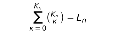\

**[4.43](https://www.wittgensteinproject.org/w/index.php/Logisch-philosophische_Abhandlung#4.43)** सत्यात्मक सम्भावनाओं के आकृतिगणों के सामने ‘*T*’ (सत्य) चिह्न लगाकर हम उनसे अपनी सहमति अभिव्यक्त कर सकते हैं।

इस चिह्न के न होने का अर्थ है असहमति।

**[4.431](https://www.wittgensteinproject.org/w/index.php/Logisch-philosophische_Abhandlung#4.431)** प्राथमिक प्रतिज्ञप्तियों की सत्यात्मक सम्भावनाओं से सहमति या असहमति की अभिव्यक्ति प्रतिज्ञप्ति की सत्यात्मक शर्तों को अभिव्यक्त करती है।

प्रतिज्ञप्ति अपनी सत्यात्मक शर्तों की अभिव्यक्ति है।

\(इसलिए, फ्रेंगे द्वारा अपनी प्रत्यात्मक संकेतन-पद्धति के चिह्नों की व्याख्या के प्रारम्भ में इन सत्यात्मक शर्तों का प्रयोग बिल्कुल ठीक था। किन्तु फ्रेगे की सत्य-प्रत्यय की व्याख्या गलत है : यदि ‘सत्य’ और ‘असत्य’ वस्तुतः वस्तु-विषय होते और वे ‘\~*p*’ इत्यादि में युक्तियाँ होते, तो फ्रेगे द्वारा प्रतिपादित अर्थ-निर्धारण की विधि से ‘\~*p*’ का अर्थ बिल्कुल निर्धारित नहीं हो पाता।)

**[4.44](https://www.wittgensteinproject.org/w/index.php/Logisch-philosophische_Abhandlung#4.44)** सत्यात्मक सम्भावनाओं के साथ ‘*T*’ चिह्न के संयोग से जो चिह्न बनता है उसे प्रतिज्ञप्ति-गत चिह्न कहते हैं।

**[4.441](https://www.wittgensteinproject.org/w/index.php/Logisch-philosophische_Abhandlung#4.441)** निस्संदेह, जैसे आड़ी और तिरछी पंक्तियों या कोष्ठकों के अनुरूप कोई वस्तु (या वस्तुओं का समिश्र) नहीं होती वैसे ही ‘*F*’ और ‘*T*’ इन चिह्नों के सम्मिश्रण के अनुरूप भी कोई वस्तु (या वस्तुओं का समिश्र) नहीं होती — ‘तार्किक वस्तुऐं’ नहीं होतीं।

बेशक यही बात ‘*T*’ और ‘*F*’ आकृतिगणों के चिह्नों से अभिव्यक्त विषय-वस्तुओं पर भी लागू होती है।

**[4.442](https://www.wittgensteinproject.org/w/index.php/Logisch-philosophische_Abhandlung#4.442)** उदाहरणार्थ, निम्नलिखित एक प्रतिज्ञप्ति-गत चिह्न है :

‘

|p |q | |
|---|---|---|
|T|T |T |
|F|T |T |
|T|F | |
|F|F |T |

’

\(फ्रेगे का ‘जजमॅन्ट-स्ट्रोक’ ‘\ ’ तार्किक रूप से पूर्णतः निरर्थक है : फ्रेगे (और रसेल) की रचनाओं में इस चिह्न का प्रयोग केवल यह इंगित करता है कि वे इस चिह्न से युक्त प्रतिज्ञप्तियों को सत्यात्मक मानते हैं। अतः ‘\ ’ यह चिह्न प्रतिज्ञप्ति की संख्या जैसे उदाहरण के समान प्रतिज्ञप्ति का अंश नहीं है। प्रतिज्ञप्ति का स्वकीय सत्यात्मक निरूपण नितान्त असम्भव है।)

यदि किसी समुच्चय-नियम द्वारा आकृतिगण की सत्यात्मक सम्भावनाओं को पूर्णतः क्रमबद्ध किया जाए तो अन्तिम कॉलम स्वयं ही सत्यात्मक शर्तों को अभिव्यक्त करेगा। इस कॉलम को पंक्ति के रूप में लिखने पर प्रतिज्ञप्ति-गत चिह्न ऐसा होगा।

“(*TT*–*T*)(*p*, *q*)”

या इससे अधिक स्पष्ट रूप से

“(*TTFT*)(*p*, *q*)”

\(बाँये कोष्ठकों में स्थानों की संख्या, दाँये कोष्ठकों में दिए गए पदों की संख्या द्वारा निर्धारित होती है।)

**[4.45](https://www.wittgensteinproject.org/w/index.php/Logisch-philosophische_Abhandlung#4.45)** प्राथमिक प्रतिज्ञप्तियों की *n* संख्या के लिए संख्या *L~n~*, सत्यात्मक-शर्तों का सम्भावित समूह होती है।

उन सत्यात्मक शर्तों के समूहों को श्रृंखलाबद्ध किया जा सकता है जो किन्हीं प्राथमिक प्रतिज्ञप्तियों की सत्यात्मक सम्भावनाओं से प्राप्त होते हैं।

**[4.46](https://www.wittgensteinproject.org/w/index.php/Logisch-philosophische_Abhandlung#4.46)** सत्यात्मक शर्तों के सम्भावित समूहों में दो चरम परिस्थितियाँ होती हैं।

इनमें से एक स्थिति ऐसी होती है जो प्राथमिक प्रतिज्ञप्तियों की सभी सत्यात्मक सम्भावनाओं में सत्यात्मक होती है। इस स्थिति में हम कहते हैं कि सत्यात्मक शर्तें *पुनरुक्ति* हैं।

दूसरी स्थिति में सभी सत्यात्मक सम्भावनाओं में प्रतिज्ञप्ति असत्यात्मक होती है : इस प्रकार की सत्यात्मक शर्तें *व्याघाती* होती हैं।

पहली स्थिति में हम प्रतिज्ञप्ति को पुनरुक्ति कहते हैं; दूसरी स्थिति में व्याघाती।

**[4.461](https://www.wittgensteinproject.org/w/index.php/Logisch-philosophische_Abhandlung#4.461)** प्रतिज्ञप्तियाँ अपने कथन का प्रदर्शन करती हैं : पुनरुक्तियाँ और व्याघाती प्रतिज्ञप्तियाँ यह दर्शाती हैं कि वे कुछ नहीं कहतीं।

सत्यात्मक शर्तों के अभाव के कारण पुनरुक्ति बिना शर्त के सत्यात्मक होती है; और व्याघाती प्रतिज्ञप्ति कभी भी सत्यात्मक नहीं होती।

पुनरुक्ति और व्याघाती प्रतिज्ञप्तियाँ निरर्थक होती हैं।

\(उस बिन्दु के समान जहाँ परस्पर विरुद्ध दिशाओं में जाने वाले तीर हों।)

\(उदाहरणार्थ, यह जानकारी कि वर्षा हो रही है या नहीं हो रही, मुझे मौसम की जानकारी नहीं देती।)

**[4.4611](https://www.wittgensteinproject.org/w/index.php/Logisch-philosophische_Abhandlung#4.4611)** फिर भी पुनरुक्ति और व्याघाती प्रतिज्ञप्तियाँ निरर्थक नहीं होतीं। वे गणित में ‘0’ के समान प्रतीक-विधान के भाग हैं।

**[4.462](https://www.wittgensteinproject.org/w/index.php/Logisch-philosophische_Abhandlung#4.462)** पुनरुक्तियाँ और व्याघाती प्रतिज्ञप्तियाँ यथार्थता के चित्र नहीं होतीं। वे किसी संभाव्य स्थिति का द्योतन नहीं करतीं। क्योंकि पुनरुक्ति *सभी* संभाव्य स्थितियों को स्वीकार करती है, जबकि व्याघाती प्रतिज्ञप्ति *किसी भी* संभाव्य स्थिति को स्वीकार *नहीं* करती।

पुनरुक्ति में संसार से सहमति की शर्तें — सादृश्यमूलक सम्बन्ध — एक दूसरे को रद्द कर देती हैं, इसी कारण उसका यथार्थता से सादृश्यमूलक सम्बन्ध नहीं होता।

**[4.463](https://www.wittgensteinproject.org/w/index.php/Logisch-philosophische_Abhandlung#4.463)** प्रतिज्ञप्ति की सत्यात्मक शर्तों से तथ्यों के सीमा-क्षेत्र का निर्धारण होता है।

\(प्रतिज्ञप्ति, चित्र या मॉडल अपने निषेधात्मक अर्थों में उस ठोस वस्तु के समान होते हैं जो दूसरों की सक्रियता में बाधक है, और अपने सकारात्मक अर्थों में ठोस पदार्थ से आवृत्त उस क्षेत्र के समान है जिसमें वस्तुओं के लिए स्थान होता है।)

पुनरुक्ति वस्तु-स्थिति के लिए सम्पूर्ण ‘अनन्त’ तार्किक देश के लिए अवकाश प्रदान करती है : व्याघाती प्रतिज्ञप्ति यथार्थता के लिए कोई भी स्थान छोड़े बिना सम्पूर्ण तार्किक देश को भर देती है। अतः, इन दोनों में से कोई भी यथार्थता का निर्धारण करने में समर्थ नहीं है।

**[4.464](https://www.wittgensteinproject.org/w/index.php/Logisch-philosophische_Abhandlung#4.464)** पुनरुक्ति की सत्यात्मकता सुनिश्चित है, प्रतिज्ञप्ति की सत्यात्मकता सम्भावित है, व्याघाती की सत्यात्मकता असम्भव है।

\(सुनिश्चित, संभाव्य, असम्भवः यहाँ हमें प्रसम्भाव्यता-मीमांसा में प्रयोग किए जाने वाले मापदंड का प्रथम संकेत मिलता है।)

**[4.465](https://www.wittgensteinproject.org/w/index.php/Logisch-philosophische_Abhandlung#4.465)** पुनरुक्ति और प्रतिज्ञप्ति का तार्किक गुणनफल, प्रतिज्ञप्ति की प्रतिध्वनि ही है। इसलिए इस गुणनफल का प्रतिज्ञप्ति से तादात्म्य होता है। क्योंकि अर्थ-परिवर्तन के बिना किसी प्रतीक के आवश्यक गुण को परिवर्तित करना असम्भव है।

**[4.466](https://www.wittgensteinproject.org/w/index.php/Logisch-philosophische_Abhandlung#4.466)** संकेतों के सुनिश्चित तार्किक समुच्चय के अनुरूप उनके अर्थों के भी सुनिश्चित तार्किक समुच्चय होते हैं। केवल वियुक्त संकेतों के अनुरूप *कोई भी* समुच्चय हो सकता है।

दूसरे शब्दों में, प्रत्येक परिस्थिति में सत्यात्मक होने वाली प्रतिज्ञप्तियाँ, चिह्नों के समुच्चय नहीं हो सकतीं, क्योंकि उस स्थिति में उसके अनुरूप वस्तुओं के सुनिश्चित समुच्चय ही उनके अनुरूप होते।

\(और जो तार्किक समुच्चय नहीं है उसके अनुरूप वस्तुओं का समुच्यय *नहीं* होता।)

पुनरुक्ति और व्याघाती प्रतिज्ञप्तियों के संकेतों के समुच्चयों की अवच्छेदक स्थितियाँ — वस्तुतः उनका विघटन होती हैं।

**[4.4661](https://www.wittgensteinproject.org/w/index.php/Logisch-philosophische_Abhandlung#4.4661)** यह तो सर्वमान्य है कि पुनरुक्तियों और व्याघाती प्रतिज्ञप्तियों में भी संकेत परस्पर संयोजित होते हैं — यानी, उनमें परस्पर एक विशिष्ट सम्बन्ध होता है : किन्तु इन सम्बन्धों का कोई अर्थ नहीं होता, *प्रतीक* के लिए ये सम्बन्ध आवश्यक नहीं होते।

**[4.5](https://www.wittgensteinproject.org/w/index.php/Logisch-philosophische_Abhandlung#4.5)** अति सामान्य प्रतिज्ञप्ति-गत आकार का दिया जाना अब सम्भव लगता है : अर्थात *किसी भी* संकेत-भाषा की किसी भी प्रतिज्ञप्ति को इस ढंग से वर्णित किया जा सकता है जिसमें प्रत्येक सम्भावित अर्थ को उसके वर्ण्य-प्रतीक द्वारा अभिव्यक्त किया जा सकता है, और नामों के सम्यक्-अर्थ-चयन की स्थिति में प्रत्येक वर्ण्य-प्रतीक, अर्थ को अभिव्यक्त कर सकता है।

यह तो स्पष्ट है कि विवरण में सर्वाधिक सामान्य प्रतिज्ञप्ति-गत आकार के अनिवार्य तत्त्व को *ही* सम्मिलित किया जाए — अन्यथा वह सर्वाधिक सामान्य आकार नहीं होगा।

सामान्य प्रतिज्ञप्ति-गत आकार की सिद्धि इस तथ्य से होती है कि ऐसी कोई भी प्रतिज्ञप्ति नहीं हो सकती जिसके आकार का पूर्वज्ञान न हो सके। अर्थात जिसकी संरचना न हो सके। प्रतिज्ञप्ति का सामान्य आकार है : वस्तुस्थिति यह है।

**[4.51](https://www.wittgensteinproject.org/w/index.php/Logisch-philosophische_Abhandlung#4.51)** मान लीजिए कि मुझे *सभी* प्राथमिक प्रतिज्ञप्तियाँ प्रदत्त हैं : तो मैं सहज ही यह पूछ सकता हूँ कि मैं उनसे कौन-सी प्रतिज्ञप्तियाँ संरचित कर सकता हूँ। और इससे मुझे *सभी* प्रतिज्ञप्तियों का पता चल जाता है और *इससे* उनकी सीमा का निर्धारण हो जाता है।

**[4.52](https://www.wittgensteinproject.org/w/index.php/Logisch-philosophische_Abhandlung#4.52)** सभी प्राथमिक प्रतिज्ञप्तियों के साकल्य से जो कुछ भी निगमित होता है उससे प्रतिज्ञप्तियों का निर्माण होता है (और निस्संदेह उन *सबका* इसके *समुच्चय* होने से)। (इस प्रकार, एक तरह से यह कहा जा सकता है कि सभी प्रतिज्ञप्तियाँ प्राथमिक प्रतिज्ञप्तियों का सामान्यीकरण हैं।)

**[4.53](https://www.wittgensteinproject.org/w/index.php/Logisch-philosophische_Abhandlung#4.53)** सामान्य प्रतिज्ञप्तिगत आकार चर होता है।

**[5](https://www.wittgensteinproject.org/w/index.php/Logisch-philosophische_Abhandlung#5)** प्रतिज्ञप्ति, प्राथमिक प्रतिज्ञप्तियों की सत्यात्मक-फ़लनक होती है।

\(प्राथमिक प्रतिज्ञप्ति स्वयं अपनी ही सत्यात्मक फ़लनक होती है।)

**[5.01](https://www.wittgensteinproject.org/w/index.php/Logisch-philosophische_Abhandlung#5.01)** प्राथमिक प्रतिज्ञप्तियाँ, प्रतिज्ञप्तियों की सत्यात्मक-युक्तियाँ होती हैं।

**[5.02](https://www.wittgensteinproject.org/w/index.php/Logisch-philosophische_Abhandlung#5.02)** फ़लनक-युक्तियों को नाम सम्बन्धी प्रत्यय समझने की भूल आसानी से हो सकती है। क्योंकि युक्तियाँ एवं प्रत्यय दोनों ही संकेतार्थ को समझने में मेरी सहायता करते हैं।

उदाहरणार्थ जब रसेल ‘+*~c~*’ लिखते हैं तो इस प्रतीक में ‘*c*’ एक ऐसा प्रत्यय संकेत है जो सम्पूर्ण मूल संकेत गणन-संख्याओं के योग-संकेत को द्योतित करता है। किन्तु इसका प्रयोग मनमानी परंपरा का परिणाम है, और ‘+*~c~*’ संकेत के बदले किसी भी सरल संकेत का भी सुगमता से चयन किया जा सकता है; निस्संदेह ‘\~*p*’ में ‘*p*’ कोई प्रत्यय संकेत न होकर, एक युक्ति है : ‘\~*p*’ के अर्थ की पूर्ण जानकारी के बिना ‘\~*p*’ के अर्थ को समझा नहीं जा सकता। (जुलियस सीज़र इस नाम में ‘जुलियस’ एक प्रत्यय संकेत है। जिस वस्तु के नाम के साथ हम प्रत्यय संकेत को जोड़ते हैं वह सदैव उस वस्तु के विवरण का भाग होता है : उदाहरणार्थ, जुलियस वंश का सीज़र।)

यदि मैं भूल नहीं कर रहा तो प्रतिज्ञप्तियों और फ़लनकों के अर्थ से सम्बन्धित फ्रेगे का सिद्धान्त, युक्ति और प्रत्यय के बीच की भ्रान्ति पर आधारित है। फ्रेगे तर्कशास्त्र की प्रतिज्ञप्तियों को नाम और उनकी युक्तियों को उन नामों का प्रत्यय मानते थे।

**[5.1](https://www.wittgensteinproject.org/w/index.php/Logisch-philosophische_Abhandlung#5.1)** सत्यात्मक-फलनों को श्रृंखला बद्ध किया जा सकता है।

प्रसम्भाव्यता-मीमांसा का यही आधार है।

**[5.101](https://www.wittgensteinproject.org/w/index.php/Logisch-philosophische_Abhandlung#5.101)** प्राथमिक प्रतिज्ञप्तियों की प्रदत्त संख्या के सत्यात्मक-फ़लनकों को सदा निम्नलिखित प्रकार के आकृतिगण में निरूपित किया जा सकता है :

|   |   |   |
|---|---|---|
|(TTTT)(*p*, *q*) |Tautology |(if *p* then *p*, and if *q* then *q*.) [*p* ⊃ *p . q* ⊃ *q*] |
|(FTTT)(*p*, *q*) |in words: |Not both *p* and *q*. [\~(*p* . *q*)] |
|(TFTT)(*p*, *q*) |” ” |If *q* then *p*. [*q* ⊃ *p*] |
|(TTFT)(*p*, *q*) |” ” |If *p* then *q*. [*p* ⊃ *q*] |
|(TTTF)(*p*, *q*) |” ” |*p* or *q*. [*p* ∨ *q*] |
|(FFTT)(*p*, *q*) |” ” |Not *q*. \~*q* |
|(FTFT)(*p*, *q*) |” ” |Not *p*. \~*p* |
|(FTTF)(*p*, *q*) |” ” |*p* or *q*, but not both. [*p* . \~*q* : ∨ : *q* . \~*p*] |
|(TFFT)(*p*, *q*) |” ” |If *p*, then *q*; and if *q*, then *p*. [*p* ≡ *q*] |
|(TFTF)(*p*, *q*) |” ” |*p* |
|(TTFF)(*p*, *q*) |” ” |*q* |
|(FFFT)(*p*, *q*) |” ” |Neither *p* nor *q*. [\~*p* . \~*q* or *p* \| *q*] |
|(FFTF)(*p*, *q*) |” ” |*p* and not *q*. [*p* . \~*q*] |
|(FTFF)(*p*, *q*) |” ” |*q* and not *p*. [*q* . \~*p*] |
|(TFFF)(*p*, *q*) |” ” |*q* and *p*. [*q* . *p*] |
|(FFFF)(*p*, *q*) |Contradiction |(*p* and not *p*; and *q* and not *q*.) [*p* . \~*p* . *q* . \~*q*] |

प्रतिज्ञप्ति को सत्यात्मक बनाने वाली सत्यात्मक युक्तियों की सत्यात्मक सम्भावनाओं को मैं *सत्यात्मक आधार* नाम दूँगा।

**[5.11](https://www.wittgensteinproject.org/w/index.php/Logisch-philosophische_Abhandlung#5.11)** जब सत्यात्मक आधार अनेक प्रतिज्ञप्तियों में समान रूप से व्याप्त होने के साथ-साथ किसी विशिष्ट प्रतिज्ञप्ति का सत्यात्मक आधार भी हो तब हम कहते हैं कि उस विशिष्ट प्रतिज्ञप्ति की सत्यात्मकता अन्य प्रतिज्ञप्तियों की सत्यात्मकता का अनुसरण करती है।

**[5.12](https://www.wittgensteinproject.org/w/index.php/Logisch-philosophische_Abhandlung#5.12)** विशेष रूप से ‘*p*’ इस प्रतिज्ञप्ति की सत्यात्मकता एक अन्य प्रतिज्ञप्ति ‘*q*’ से तभी निगमित होती है जब ‘*q*’ के सभी सत्यात्मक आधार ‘*p*’ के भी सत्यात्मक आधार होते हैं।

**[5.121](https://www.wittgensteinproject.org/w/index.php/Logisch-philosophische_Abhandlung#5.121)** एक प्रतिज्ञप्ति के सत्यात्मक आधार दूसरी प्रतिज्ञप्ति में निहित होते हैं : *p*, *q* से निगमित होती है।

**[5.122](https://www.wittgensteinproject.org/w/index.php/Logisch-philosophische_Abhandlung#5.122)** यदि *p*, *q* से निगमित होती है तो ‘*p*’ का अर्थ ‘*q*’ के अर्थ में अन्तर्निहित होता है।

**[5.123](https://www.wittgensteinproject.org/w/index.php/Logisch-philosophische_Abhandlung#5.123)** यदि कोई ईश्वर एक ऐसे संसार की रचना करता है जिसमें कुछ प्रतिज्ञप्तियाँ सत्यात्मक हों तो उसी रचना-व्यापार से वह एक ऐसे संसार की भी रचना करता है जिसमें उन प्रतिज्ञप्तियों से निगमित होने वाली सभी प्रतिज्ञप्तियाँ भी सत्यात्मक होती हैं और इसी प्रकार वह ऐसे संसार की रचना नहीं कर सकता जिसमें ‘*p*’ प्रतिज्ञप्ति अपने अनुरूप वस्तुओं की रचना के बिना सत्यात्मक हो।

**[5.124](https://www.wittgensteinproject.org/w/index.php/Logisch-philosophische_Abhandlung#5.124)** प्रतिज्ञप्ति अपनी सभी अनुवर्ती प्रतिज्ञप्तियों की पुष्टि करती है।

**[5.1241](https://www.wittgensteinproject.org/w/index.php/Logisch-philosophische_Abhandlung#5.1241)** ‘*p* . *q*’ यह प्रतिज्ञप्ति उन प्रतिज्ञप्तियों में से एक है जो ‘*p*’ की पुष्टि करती हैं, और इसके साथ ही वह उन प्रतिज्ञप्तियों में से भी है जो ‘*q*’ की पुष्टि करती हैं।

दो प्रतिज्ञप्तियाँ परस्पर विरोधी होती हैं, जब तक दोनों की पुष्टि करने वाली कोई सार्थक प्रतिज्ञप्ति न हो।

किसी प्रतिज्ञप्ति का व्याघात करने वाली प्रतिज्ञप्ति उसका निषेध करती है।

**[5.13](https://www.wittgensteinproject.org/w/index.php/Logisch-philosophische_Abhandlung#5.13)** जब एक प्रतिज्ञप्ति की सत्यात्मकता दूसरी प्रतिज्ञप्तियों की सत्यात्मकता से निगमित होती है तो इस बात को हम उन प्रतिज्ञप्तियों की संरचना को देखकर जान सकते हैं।

**[5.131](https://www.wittgensteinproject.org/w/index.php/Logisch-philosophische_Abhandlung#5.131)** जब किसी प्रतिज्ञप्ति की सत्यात्मकता किन्हीं अन्य प्रतिज्ञप्तियों की सत्यात्मकता से निगमित होती है तो इसकी अभिव्यक्ति प्रतिज्ञप्तियों के आकार-विषयक पारस्परिक सम्बन्धों में होती है : इन पारस्परिक सम्बन्धों के योग से किसी भिन्न प्रतिज्ञप्ति की संरचना की आवश्यकता नहीं है; इसके विपरीत, सम्बन्ध आन्तरिक होते हैं और वे प्रतिज्ञप्ति के अस्तित्व के तात्कालिक परिणाम होते हैं।

**[5.1311](https://www.wittgensteinproject.org/w/index.php/Logisch-philosophische_Abhandlung#5.1311)** जब हम *p* ∨ *q* और \~*p* से *q* की अनुमिति करते हैं तो हमारी द्योतन-पद्धति के कारण *p* ∨ *q* और \~*p* इन प्रतिज्ञप्तिगत आकारों के पारस्परिक सम्बन्ध पर परदा पड़ जाता है। किन्तु जब हम *p* ∨ *q* लिखने के बजाय, उदाहरणार्थ, ‘*p* \| *q* . \| . *p* \| *q*’ लिखते हैं और \~*p* के बजाय ‘*p* \| *p*’ (*p* \| *q* = न तो *p*, न ही *q*) लिखते हैं तो उनका आन्तरिक सम्बन्ध सुस्पष्ट हो जाता है।

\((*x*) . *fx* से *fa* की अनुमिति की सम्भावना यह सिद्ध करती है कि (*x*) . *fx* प्रतीक स्वयं ही सामान्य है।)

**[5.132](https://www.wittgensteinproject.org/w/index.php/Logisch-philosophische_Abhandlung#5.132)** यदि *p* से *q* निगमित होता है, तो मैं *q* से *p* की अनुमिति कर सकता हूँ, *q* से *p* निगमित कर सकता हूँ।

केवल दो प्रतिज्ञप्तियों से ही अनुमान के स्वरूप का पता चल सकता है। ये प्रतिज्ञप्तियाँ स्वयं ही अनुमान का एकमात्र सम्भावित औचित्य हो सकती हैं।

फ्रेगे और रसेल की रचनाओं में अनुमान को औचित्य प्रदान करने वाले ‘अनुमान-नियम’ निरर्थक एवं अनपेक्षित हैं।

**[5.133](https://www.wittgensteinproject.org/w/index.php/Logisch-philosophische_Abhandlung#5.133)** सभी निगमन *प्रागनुभविक* होते हैं।

**[5.134](https://www.wittgensteinproject.org/w/index.php/Logisch-philosophische_Abhandlung#5.134)** कोई प्राथमिक प्रतिज्ञप्ति किसी दूसरी प्राथमिक प्रतिज्ञप्ति से निगमित नहीं की जा सकती।

**[5.135](https://www.wittgensteinproject.org/w/index.php/Logisch-philosophische_Abhandlung#5.135)** एक वस्तुस्थिति के अस्तित्व का किसी अन्य नितान्त भिन्न वस्तुस्थिति के अस्तित्व से अनुमान किसी प्रकार नहीं लगाया जा सकता।

**[5.136](https://www.wittgensteinproject.org/w/index.php/Logisch-philosophische_Abhandlung#5.136)** इस प्रकार के अनुमान के औचित्य के लिए कोई कारण-कार्य सम्बन्ध नहीं है।

**[5.1361](https://www.wittgensteinproject.org/w/index.php/Logisch-philosophische_Abhandlung#5.1361)** हम वर्तमान घटनाओं से भविष्य की घटनाओं का अनुमान *नहीं* लगा सकते।

*अन्धविश्वास*, कारण-कार्य सम्बन्धों में विश्वास के अतिरिक्त और कुछ भी नहीं हैं।

**[5.1362](https://www.wittgensteinproject.org/w/index.php/Logisch-philosophische_Abhandlung#5.1362)** संकल्प-स्वातन्त्रय भविष्य के गर्भ में छिपे कार्यव्यापारों को जानने की असमर्थता में निहित है। हम उन्हें केवल तभी जान सकते हैं जब वे तार्किक अनुमान के समान, कारण-कार्य सम्बन्ध भी उनकी *आन्तरिक* आवश्यकता होते। — ज्ञान और ज्ञेय में तार्किक आवश्यकता का सम्बन्ध होता है।

\(*p* के पुनरुक्ति होने पर ‘*A* जानता है कि वस्तुस्थिति *p* है’, यह प्रतिज्ञप्ति निरर्थक होती है।)

**[5.1363](https://www.wittgensteinproject.org/w/index.php/Logisch-philosophische_Abhandlung#5.1363)** यदि प्रतिज्ञप्ति की स्वयंसिद्ध सम्बन्धी मान्यता से उस प्रतिज्ञप्ति की सत्यात्मकता *निगमित* नहीं होती तो उसकी स्वयंसिद्धता से प्रतिज्ञप्ति के सत्यात्मकता विषयक हमारे विश्वास को कोई सहारा नहीं मिलता।

**[5.14](https://www.wittgensteinproject.org/w/index.php/Logisch-philosophische_Abhandlung#5.14)** यदि पहली प्रतिज्ञप्ति दूसरी प्रतिज्ञप्ति से निगमित होती है तो दूसरी, पहली प्रतिज्ञप्ति से अधिक व्यापक है और पहली दूसरी से कम व्यापक।

**[5.141](https://www.wittgensteinproject.org/w/index.php/Logisch-philosophische_Abhandlung#5.141)** यदि *p* प्रतिज्ञप्ति *q* से और *q* प्रतिज्ञप्ति *p* से निगमित होती तो वो दोनों प्रतिज्ञप्तियाँ एक ही हैं।

**[5.142](https://www.wittgensteinproject.org/w/index.php/Logisch-philosophische_Abhandlung#5.142)** पुनरुक्ति सभी प्रतिज्ञप्तियों से निगमित होती है : पर वह कुछ भी अभिव्यक्त नहीं करती।

**[5.143](https://www.wittgensteinproject.org/w/index.php/Logisch-philosophische_Abhandlung#5.143)** व्याघात प्रतिज्ञप्तियों के बीच का वह सामान्य घटक है जो किन्हीं भी *दो* प्रतिज्ञप्तियों में साझा *नहीं* होता। पुनरुक्ति उन सभी प्रतिज्ञप्तियों के बीच का सामान्य घटक है जिनमें परस्पर कुछ भी साझा नहीं होता।

हम कह सकते हैं कि व्याघात सभी प्रतिज्ञप्तियों के बाहर लुप्त हो जाता है : पुनरुक्ति प्रतिज्ञप्तियों के भीतर लुप्त होती है।

व्याघात प्रतिज्ञप्तियों की बाह्य सीमा होती है : पुनरुक्ति उनके केन्द्र में स्थित अतात्त्विक बिन्दु है।

**[5.15](https://www.wittgensteinproject.org/w/index.php/Logisch-philosophische_Abhandlung#5.15)** यदि किसी प्रतिज्ञप्ति ‘*r*’ के सत्यात्मक-आधारों की संख्या *T~r~* हो, और यदि किसी अन्य प्रतिज्ञप्ति ‘*s*’ के ऐसे सत्यात्मक आधारों की संख्या जो ‘*r*’ के भी सत्यात्मक आधार हो, *T~rs~* हो, तो हम प्रतिज्ञप्ति ‘*r*’ द्वारा प्रतिज्ञप्ति ‘*s*’ को दी गई सम्भावना के परिणाम को *T~rs~* : *T~r~* के अनुपात द्वारा अभिव्यक्त करेंगे।

**[5.151](https://www.wittgensteinproject.org/w/index.php/Logisch-philosophische_Abhandlung#5.151)** मान लीजिए कि [5.101](#5.101) में प्रदत्त आकृतिगण के समान किसी आकृतिगण की *r* प्रतिज्ञप्ति में ‘*T*’ की संख्या *T~r~* हो, और *s* प्रतिज्ञप्ति में ऐसी ‘*T*’ की संख्या *r* प्रतिज्ञप्ति के ‘*T*’ वाले कॉलम में *T~rs~* हो, तो *r* प्रतिज्ञप्ति *s* प्रतिज्ञप्ति को *T~rs~* : *T~r~* की सम्भाव्यता प्रदान करती है।

**[5.1511](https://www.wittgensteinproject.org/w/index.php/Logisch-philosophische_Abhandlung#5.1511)** कोई विशेष वस्तु प्रसम्भाव्यता प्रतिज्ञप्तियों का विषय नहीं होती।

**[5.152](https://www.wittgensteinproject.org/w/index.php/Logisch-philosophische_Abhandlung#5.152)** सामान्य सत्यात्मक युक्तियों के अभाव में प्रतिज्ञप्तियाँ एक दूसरे से भिन्न कही जाती हैं।

दो प्राथमिक प्रतिज्ञप्तियों का सम्भाव्यता-कारक ½ होता है।

जब *p*, *q* की अनुवर्ती होती है तो ‘*q*’ और ‘*p*’ प्रतिज्ञप्ति का संभाव्यकता-कारक 1 होता है। तार्किक अनुमान की सुनिश्चितता प्रसम्भाव्यता की पराकाष्ठा है।

\(पुनरुक्ति और व्याघात पर इसका प्रयोग।)

**[5.153](https://www.wittgensteinproject.org/w/index.php/Logisch-philosophische_Abhandlung#5.153)** प्रतिज्ञप्ति अपने आप में न तो संभाव्य होती है न ही असंभाव्य। घटना घटती है या फिर नहीं घटती : इसके बीच का कुछ नहीं होता हैं।

**[5.154](https://www.wittgensteinproject.org/w/index.php/Logisch-philosophische_Abhandlung#5.154)** मान लीजिए कि किसी घड़े के अन्दर बराबर संख्या में काली और सफेद गेंद हैं (और इन दोनों के अलावा उसमें किसी अन्य रंग की गेंद नहीं हैं।) मैं एक-एक करके गेंदों को निकालता हूँ और फिर से उन्हें घड़े में रख देता हूँ। गेंद निकालने की इस प्रक्रिया से मैं यह सिद्ध कर सकता हूँ कि घड़े से निकाली गई गेंदों की संख्या लगभग बराबर है।

अतः *यह* गणितीय सत्य नहीं है।

अब, यदि यह कहा जाए कि सफेद और काली गेंदों को मेरे निकालने की समान सम्भावनाएँ हैं, तो इसका अर्थ यह है कि ज्ञात (प्राक्कल्पना के रूप में मान्य प्रकृति के नियमों सहित) सभी परिस्थितयाँ एक के मुकाबले किसी दूसरी घटना को *अधिक* प्रसम्भाव्यता प्रदान नहीं करतीं। अर्थात, उपर्युक्त परिभाषाओं से यह आसानी से पता चल सकता है कि वे सभी को ½ सम्भाव्यता-कारक ही प्रदान करती हैं।

इस प्रयोग से यह सिद्ध होता है कि दोनों घटनाएँ उन परिस्थितियों से भिन्न हैं जिनकी मुझे विस्तृत जानकारी नहीं है।

**[5.155](https://www.wittgensteinproject.org/w/index.php/Logisch-philosophische_Abhandlung#5.155)** प्रसम्भाव्यता प्रतिज्ञप्ति की लघुतम इकाई यह है : वे परिस्थितियाँ जिनके बारे में मुझे अधिक जानकारी नहीं है — किसी विशिष्ट घटना के घटित होने को कोई विशिष्ट प्रसम्भाव्यता प्रदान करती है।

**[5.156](https://www.wittgensteinproject.org/w/index.php/Logisch-philosophische_Abhandlung#5.156)** इस प्रकार प्रसम्भाव्यता एक सामान्यीकरण है।

उस (प्रसम्भाव्यता) में प्रतिज्ञप्ति-गत आकार का सामान्य विवरण निहित होता है।

प्रसम्भाव्यता का प्रयोग हम सुनिश्चितता के अभाव में करते हैं — इसका प्रयोग हम तब करते हैं जब तथ्यविषयक हमारा ज्ञान पूर्ण न हो परन्तु हम उसके आकार के बारे में ही कुछ जानते हों।

\(प्रतिज्ञप्ति कभी किसी विशिष्ट वस्तुस्थिति का अधूरा चित्र हो सकती है किन्तु वह सर्वदा *किसी न किसी विषय* का पूर्ण चित्र होती है।)

प्रसम्भाव्यता प्रतिज्ञप्ति एक प्रकार से अन्य प्रतिज्ञप्तियों का उद्धरण होती है।

**[5.2](https://www.wittgensteinproject.org/w/index.php/Logisch-philosophische_Abhandlung#5.2)** प्रतिज्ञप्तियों की संरचनाएँ परस्पर आन्तरिक रूप से सम्बद्ध होती हैं।

**[5.21](https://www.wittgensteinproject.org/w/index.php/Logisch-philosophische_Abhandlung#5.21)** इन आन्तरिक सम्बन्धों की महत्ता प्रतिपादित करने के लिए हम यह कथन अपना सकते हैं : हम किसी प्रतिज्ञप्ति की प्रस्तुति एक ऐसी प्रक्रिया के परिणाम के रूप में कर सकते हैं जो अन्य प्रतिज्ञप्तियों (जो उस प्रक्रिया का आधार हैं) से उस प्रतिज्ञप्ति की रचना करता है।

**[5.22](https://www.wittgensteinproject.org/w/index.php/Logisch-philosophische_Abhandlung#5.22)** प्रक्रिया अपनी परिणाम-संरचनाओं और आधारों के सम्बन्ध की अभिव्यक्ति है।

**[5.23](https://www.wittgensteinproject.org/w/index.php/Logisch-philosophische_Abhandlung#5.23)** प्रक्रिया एक प्रतिज्ञप्ति से दूसरी प्रतिज्ञप्ति का रचना व्यापार है।

**[5.231](https://www.wittgensteinproject.org/w/index.php/Logisch-philosophische_Abhandlung#5.231)** और निस्संदेह वह उन प्रतिज्ञप्तियों के आकार सम्बन्धी गुणों और उनकी आकारगत आन्तरिक समानताओं पर निर्भर करता है।

**[5.232](https://www.wittgensteinproject.org/w/index.php/Logisch-philosophische_Abhandlung#5.232)** श्रृंखला को क्रमबद्ध करने वाला आन्तरिक सम्बन्ध एक आकार से दूसरे आकार को उत्पन्न करने वाले व्यापार के तुल्य है।

**[5.233](https://www.wittgensteinproject.org/w/index.php/Logisch-philosophische_Abhandlung#5.233)** किसी एक प्रतिज्ञप्ति से अन्य प्रतिज्ञप्ति की तार्किक रूप से सार्थक रचना से पहले, अर्थात प्रतिज्ञप्तियों की तार्किक रचना शुरू होने तक, प्रक्रियाएँ शुरू नहीं हो सकतीं।

**[5.234](https://www.wittgensteinproject.org/w/index.php/Logisch-philosophische_Abhandlung#5.234)** प्राथमिक प्रतिज्ञप्तियों के सत्यात्मक-फ़लन, प्राथमिक प्रतिज्ञप्तियों पर आधारित प्रक्रियाओं के परिणाम हैं। (इन प्रक्रियाओं को मैं सत्यात्मक प्रक्रियाएँ कहता हूँ।)

**[5.2341](https://www.wittgensteinproject.org/w/index.php/Logisch-philosophische_Abhandlung#5.2341)** *p* के सत्यात्मक-फ़लन का अर्थ *p* के अर्थ का फ़लन है।

निषेध, तार्किक-गुणन इत्यादि, इत्यादि प्रक्रियाएँ हैं।

\(निषेध प्रतिज्ञप्ति के अर्थ को उलट देता है।)

**[5.24](https://www.wittgensteinproject.org/w/index.php/Logisch-philosophische_Abhandlung#5.24)** प्रक्रिया अपने आप को चर के रूप में व्यक्त करती है; उससे हम प्रतिज्ञप्ति के एक आकार से दूसरे आकार तक कैसे पहुँच सकते हैं, इस बात का पता चलता है।

वह आकारों के बीच विद्यमान भेद का कथन करती है।

\(और प्रक्रिया के आधार और उसके परिणामों में, आधार ही साधारण धर्म हैं।)

**[5.241](https://www.wittgensteinproject.org/w/index.php/Logisch-philosophische_Abhandlung#5.241)** प्रक्रिया आकार का लक्षण न होकर आकार-भेद का ही लक्षण होती है।

**[5.242](https://www.wittgensteinproject.org/w/index.php/Logisch-philosophische_Abhandlung#5.242)** ‘*p*’ से ‘*q*’ को उत्पन्न करने वाली प्रक्रिया ‘*q*’ से ‘*r*’ को भी उत्पन्न करती है। और यथावत। इसे अभिव्यक्त करने का एक-मात्र ढंग है : ‘*p*’, ‘*q*’, ‘*r*’ इत्यादि अनिवार्यतः ऐसे चर हैं जो विशिष्ट आकारिक सम्बन्धों को सामान्य रूप से अभिव्यक्त करते हैं।

**[5.25](https://www.wittgensteinproject.org/w/index.php/Logisch-philosophische_Abhandlung#5.25)** प्रक्रिया का घटित होना प्रतिज्ञप्ति के अर्थ को अभिलक्षित नहीं करता।

वस्तुतः, प्रक्रिया अपने आप कुछ अभिव्यक्त नहीं करती, अपितु उसके परिणाम से ही कुछ पता चलता है, और वह प्रक्रिया के आधारों पर निर्भर है।

\(प्रक्रियाओं और फ़लनकों को समझने में भूल नहीं करनी चाहिए।)

**[5.251](https://www.wittgensteinproject.org/w/index.php/Logisch-philosophische_Abhandlung#5.251)** फ़लनक अपने आप में कोई युक्ति नहीं हो सकता, जबकि प्रक्रिया अपने किसी परिणाम को ही अपना आधार बना सकती है।

**[5.252](https://www.wittgensteinproject.org/w/index.php/Logisch-philosophische_Abhandlung#5.252)** केवल इस प्रकार ही आकार-शृंखला की एक कड़ी से दूसरी कड़ी (रसेल और व्हाइटहेड द्वारा दी गयी क्रम-परंपरा में एक प्रारूप से दूसरे प्रारूप) तक पहुँचना सम्भव होता है। (रसेल और व्हाइटहेड ने यद्यपि ऐसे क्रम को नहीं स्वीकारा फिर भी उन्होंने इसका निरन्तर प्रयोग किया।)

**[5.2521](https://www.wittgensteinproject.org/w/index.php/Logisch-philosophische_Abhandlung#5.2521)** यदि किसी प्रक्रिया का अपने परिणामों पर बार-बार प्रयोग किया जाये तो मैं इसे उस प्रक्रिया का आनुक्रमिक प्रयोग कहता हूँ। (‘*O′ξ*’ प्रक्रिया के ‘*a*’ पर तीन आनुक्रमिक प्रयोगों का परिणाम ‘*O′O′O′a’* होता है।)

इसी अर्थ में मैं अनेक प्रतिज्ञप्तियों की एक से अधिक प्रक्रियाओं के आनुक्रमिक प्रयोगों का उल्लेख करता हूँ।

**[5.2522](https://www.wittgensteinproject.org/w/index.php/Logisch-philosophische_Abhandlung#5.2522)** तदनुसार आकारों की श्रृंखला *a*, *O′a*, *O′O′a*,... के सामान्य पद के लिए मैं [*a*, *x*, *O′x*], यह प्रतीक प्रयुक्त करता हूँ। यहाँ कोष्ठक में दी गयी अभिव्यक्ति एक चर है : कोष्ठकबद्ध अभिव्यक्ति का पहला पद आकारों की श्रृंखला का आरम्भ है, उसका दूसरा पद शृंखला में से मनमाने ढंग से चुने गए *x* पद का आकार है, और तीसरा पद श्रृंखला में *x* के एकदम बाद आने वाला पद है।

**[5.2523](https://www.wittgensteinproject.org/w/index.php/Logisch-philosophische_Abhandlung#5.2523)** एक प्रक्रिया के आनुक्रमिक प्रयोग की अवधारणा ‘और यथावत’ इस अवधारणा के तुल्य है।

**[5.253](https://www.wittgensteinproject.org/w/index.php/Logisch-philosophische_Abhandlung#5.253)** एक प्रक्रिया दूसरी प्रक्रिया की विरोधी हो सकती है। प्रक्रियाएँ एक दूसरे को निरस्त कर सकती हैं।

**[5.254](https://www.wittgensteinproject.org/w/index.php/Logisch-philosophische_Abhandlung#5.254)** प्रक्रिया लुप्त हो सकती है (उदाहरणार्थ ‘\~\~*p* : \~\~*p* = *p*’ में निषेध)।

**[5.3](https://www.wittgensteinproject.org/w/index.php/Logisch-philosophische_Abhandlung#5.3)** सभी प्रतिज्ञप्तियाँ प्राथमिक प्रतिज्ञप्तियों पर सत्यात्मक प्रक्रियाओं के परिणाम हैं।

सत्यात्मक प्रक्रिया प्राथमिक प्रतिज्ञप्तियों से सत्यात्मक-फ़लन उत्पन्न करने का ढंग है।

सत्यात्मक प्रक्रिया का सार यह है कि जैसे प्राथमिक प्रतिज्ञप्तियाँ अपना सत्यात्मक-फ़लन उत्पन्न करती हैं, वैसे ही सत्यात्मक-फलन भी अनुवर्ती सत्यात्मक-फ़लन की उत्पत्ति करते हैं। प्राथमिक प्रतिज्ञप्तियों के सत्यात्मक-फ़लनकों पर सत्यात्मक प्रक्रिया का प्रयोग सदैव एक और प्राथमिक प्रतिज्ञप्तियों के सत्यात्मकता फ़लन की, एक और प्रतिज्ञप्ति की उत्पत्ति करता है। जब कोई सत्यात्मक प्रक्रिया किसी प्राथमिक प्रतिज्ञप्ति से प्राप्त सत्यात्मक-प्रक्रिया-परिणामों पर लागू की जाती है तो प्राथमिक प्रतिज्ञप्ति देने वाली कोई *एकल* प्रक्रिया भी होती है।

प्रत्येक प्रतिज्ञप्ति प्राथमिक प्रतिज्ञप्तियों पर सत्यता-फ़लनकों के प्रयोग का परिणाम है।

**[5.31](https://www.wittgensteinproject.org/w/index.php/Logisch-philosophische_Abhandlung#5.31)** ‘*p*’, ‘*q*’, ‘*r*’ इत्यादि के प्राथमिक प्रतिज्ञप्ति न होने पर भी [4.31](#4.31) में दिया गया आकृतिगण सार्थक होता है।

और यह सहज ही समझा जा सकता है कि प्राथमिक प्रतिज्ञप्तियों ‘*p*’ और ‘*q*’ के सत्यात्मक-फ़लनक होने पर भी [4.442](#4.442) में अंकित प्रतिज्ञप्ति-गत चिह्न प्राथमिक प्रतिज्ञप्ति के किसी एकल सत्यात्मक फ़लन को अभिव्यक्त करता है।

**[5.32](https://www.wittgensteinproject.org/w/index.php/Logisch-philosophische_Abhandlung#5.32)** सभी सत्यात्मक-फ़लनक, प्राथमिक प्रतिज्ञप्तियों पर किए गए सत्यात्मक-प्रक्रियाओं के सीमित आनुक्रमिक प्रयोगों के परिणाम हैं।

**[5.4](https://www.wittgensteinproject.org/w/index.php/Logisch-philosophische_Abhandlung#5.4)** अब यह बात स्पष्ट हो जाती है कि (फ्रेगे और रसेल द्वारा अभिप्रेत) ‘तार्किक वस्तुएँ’, या ‘तार्किक अचर’ नहीं होते।

**[5.41](https://www.wittgensteinproject.org/w/index.php/Logisch-philosophische_Abhandlung#5.41)** इसका कारण यह है कि प्राथमिक प्रतिज्ञप्तियों के सत्यात्मक फ़लन समान होने पर, सत्यात्मक फ़लनकों पर सत्यात्मक-प्रक्रियाओं के प्रयोग का परिणाम सदैव एक जैसा होता है।

**[5.42](https://www.wittgensteinproject.org/w/index.php/Logisch-philosophische_Abhandlung#5.42)** यह स्वतः सिद्ध है कि ∨, ⊃ इत्यादि चिह्नों में सम्बन्ध दक्षिण (दाहिने) और वाम (बाँऐ) इत्यादि सम्बन्धों जैसा सम्बन्ध नहीं है।

फ्रेगे और रसेल द्वारा प्रयुक्त तर्कशास्त्र के मूल चिह्नों की अन्तर्परिभाषा से ही यह सिद्ध हो जाता है कि वे न मूल चिह्न हैं, और इसके साथ-साथ वे सम्बन्धों के चिह्न भी नहीं हैं।

और यह सुस्पष्ट है कि ‘\~’ और ‘∨’ चिह्नों के द्वारा दी गई ‘⊃’ चिह्न की परिभाषा, ‘∨’ चिह्न की ‘\~’ द्वारा की गई परिभाषा के समरूप है; और द्वितीय ‘∨’ चिह्न प्रथम के समान है; यथावत।

**[5.43](https://www.wittgensteinproject.org/w/index.php/Logisch-philosophische_Abhandlung#5.43)** शुरु में तो यह नितान्त अविश्वसनीय लगता है कि किसी एक तथ्य *p* से अनेक अन्य तथ्य, उदाहरणार्थ \~\~*p*, \~\~\~\~*p* इत्यादि निगमित होते हैं। और यह भी कम विचित्र नहीं है कि तर्कशास्त्र (गणित) की असंख्य प्रतिज्ञप्तियाँ आधा दर्जन ‘मूल प्रतिज्ञप्तियों’ से निगमित होती हैं।

किन्तु सच तो यह है कि तर्क की सभी प्रतिज्ञप्तियाँ एक ही बात कहती हैं, यानी वे कुछ भी नहीं कहतीं।

**[5.44](https://www.wittgensteinproject.org/w/index.php/Logisch-philosophische_Abhandlung#5.44)** सत्यात्मक-फ़लनक, वस्तुगत-फ़लनक नहीं होते। उदाहरणार्थ, निषेध-द्वय द्वारा सकारात्मक प्रतिज्ञप्ति प्राप्त होती है : क्या इससे यह निगमित होता है कि सकारात्मक प्रतिज्ञप्ति में निषेध निहित होता है? क्या ‘\~\~*p*’, ‘\~*p*’ का निषेध करती है, अथवा क्या वह ‘*p*’ की पुष्टि करती है — या वह दोनों कार्य करती है?

‘\~\~*p*’ यह प्रतिज्ञप्ति किसी वस्तु विशेष के निषेध को इंगित नहीं करती; क्योंकि निषेध कोई वस्तु नहीं है : इसके विपरीत सकारात्मकता में निषेध पहले से ही विद्यमान होता है और यदि ‘\~’ नाम की कोई वस्तु होती तो ‘\~\~*p*’ से किसी ऐसी बात का पता चलता जो ‘*p*’ द्वारा बताई जाने वाली बात से भिन्न होती; क्योंकि तब एक प्रतिज्ञप्ति \~ के बारे में होती और दूसरी \~ के बारे में नहीं होती।

**[5.441](https://www.wittgensteinproject.org/w/index.php/Logisch-philosophische_Abhandlung#5.441)** ‘\~(∃*x*) . \~fx’ वही जानकारी देता है जो ‘(*x*) . *fx*’ से मिलती है, और ‘(∃*x*). *fx* . *x* = *a*’ भी वही जानकारी देता है जो ‘*fa*’ से मिलती है, इन दोनों स्थितियों में भी प्रत्यक्ष तार्किक अचर लुप्त हो जाते हैं।

**[5.442](https://www.wittgensteinproject.org/w/index.php/Logisch-philosophische_Abhandlung#5.442)** किसी प्रतिज्ञप्ति के *साथ-साथ* हमें उस प्रतिज्ञप्ति पर आधारित सभी सत्यात्मक प्रक्रियाओं के परिणाम भी उपलब्ध कराए जाते हैं।

**[5.45](https://www.wittgensteinproject.org/w/index.php/Logisch-philosophische_Abhandlung#5.45)** यदि मूल तार्किक चिह्न होते हैं तो उनके पारस्परिक सम्बन्धों की स्पष्ट जानकारी न देने वाला, और उनके अस्तित्व की व्याख्या न करने वाला कोई भी तर्कशास्त्र सही नहीं है। मूल चिह्नों से *निर्मित* तर्कशास्त्र की रचना को स्पष्ट करना अनिवार्य है।

**[5.451](https://www.wittgensteinproject.org/w/index.php/Logisch-philosophische_Abhandlung#5.451)** यदि तर्कशास्त्र में मूल विचार होते हैं तो उनका एक दूसरे से स्वतन्त्र होना अनिवार्य है। मूल विचार को उसके सभी सम्भावित संयोजनों में, प्रस्तुत किया जाना अनिवार्य है। अतः उसे पहले किसी एक संयोजन में, और बाद में किसी अन्य संयोजन में पुन : प्रस्तुत नहीं किया जा सकता। उदाहरणार्थ, निषेधात्मक स्थिति में, ‘\~*p*’ आकारवाली प्रतिज्ञप्तियों और ‘\~(*p* ∨ *q*)’, ‘(∃*x*) . \~*fx*’ इत्यादि जैसे आकार वाली प्रतिज्ञप्तियों में हमें उसे समझना अनिवार्य है। उसकी प्रस्तुति कभी किसी एक श्रेणी की स्थितियों के लिए और फिर किसी दूसरी श्रेणी की स्थितियों के लिए नहीं करनी चाहिए, क्योंकि तब उसका दोनों स्थितियों में एक ही अर्थ होने का भ्रम बना रहेगा, और दोनों स्थितियों में चिह्नों को एक ही ढंग से संयोजित किए जाने का भी कोई कारण नहीं दिया जा सकेगा।

\(संक्षेप में फ्रेंगे द्वारा (*दॅ फन्डामॅन्टल लॉज ऑव अर्थमैटिक में*) परिभाषाओं की सहायता से चिह्नों की प्रस्तुति के बारे में की गई टिप्पणियाँ मूल चिह्नों पर भी *जस की तस* लागू होती हैं।)

**[5.452](https://www.wittgensteinproject.org/w/index.php/Logisch-philosophische_Abhandlung#5.452)** तर्कशास्त्र की प्रतीकात्मकता में किसी नवीन संकेतक की प्रस्तुति निश्चित रूप से एक महत्त्वपूर्ण घटना होती है। तर्कशास्त्र में अनभिज्ञता का नाटक करते हुए किसी नवीन संकेतक को कोष्ठकों में या पादटिप्पणियों में नहीं देना चाहिए।

\(रसेल और व्हाइटहेड की पुस्तक *प्रिंसिपिया मैथमेटिका* में परिभाषाओं और मूल प्रतिज्ञप्तियों को इसी प्रकार शब्दों में अभिव्यक्त किया गया है। शब्द यकायक क्यों आ जाते हैं? शब्दों के प्रयोग का कोई औचित्य होना चाहिए किन्तु यहाँ न तो कोई औचित्य दिया गया है, और न ही कोई दिया जा सकता है क्योंकि यह पद्धति ही अवैध है।)

किन्तु, यदि कभी नवीन संकेतक की प्रस्तुति अत्यावश्यक हो ही तो हमें तत्काल यह पूछना होगा कि ‘अब इस संकेतक का प्रयोग कहाँ अपरिहार्य है?’ और इस तरह तर्कशास्त्र में उसकी स्थिति को सुस्पष्ट कर देना होगा।

**[5.453](https://www.wittgensteinproject.org/w/index.php/Logisch-philosophische_Abhandlung#5.453)** तर्कशास्त्र में सभी अंकों का औचित्य अपेक्षित है। या फिर, यह स्पष्ट हो जाना चाहिए कि तर्कशास्त्र में अंक होते ही नहीं।

अभिजात्य अंक नहीं होते।

**[5.454](https://www.wittgensteinproject.org/w/index.php/Logisch-philosophische_Abhandlung#5.454)** तर्कशास्त्र में न तो कोई समान स्थिति होती है, न ही किसी प्रकार का वर्गीकरण होता है।

तर्कशास्त्र में सामान्य और विशेष में कोई भेद नहीं होता।

**[5.4541](https://www.wittgensteinproject.org/w/index.php/Logisch-philosophische_Abhandlung#5.4541)** तर्कशास्त्र की समस्याओं के सरल समाधान होने चाहिए; क्योंकि वे समाधानों की सरलता के प्रतिमान बनाते हैं।

मानवजाति की सर्वदा यह पूर्वापेक्षा रही है कि कोई ऐसा क्षेत्र अवश्य होना चाहिए — जिसमें *प्रागनुभविक सन्तुलित* रूप से — स्वायत्त प्रणाली की रचना के लिए प्रश्नों के उत्तर रूप से संयोजित हों।

नियमाधीन क्षेत्र : सरल सत्यात्मकता को द्योतित करते हैं।

**[5.46](https://www.wittgensteinproject.org/w/index.php/Logisch-philosophische_Abhandlung#5.46)** तार्किक चिह्नों की यथोचित प्रस्तुति से उनके सभी संयोजनों की सार्थक प्रस्तुति भी हो जाती है; यानी न केवल ‘*p* ∨ *q*’ अपितु ‘\~(*p* ∨ \~*q*)’ इत्यादि, इत्यादि भी प्रस्तुत हो जाते हैं। तार्किक चिह्नों की यथोचित प्रस्तुति से कोष्ठकों के सभी सम्भावित संयोजनों की सार्थक प्रस्तुति भी हो जाती है। और इस प्रकार यह स्पष्ट हो जाता है कि ‘*p* ∨ *q*’, ‘(∃*x*) . *fx*’ इत्यादि चिह्न वास्तव में सामान्य मूल चिह्न नहीं हैं, अपितु वे तो मूल चिह्नों के संयोजनों के सर्वाधिक सामान्य आकार हैं।

**[5.461](https://www.wittgensteinproject.org/w/index.php/Logisch-philosophische_Abhandlung#5.461)** महत्त्वहीन प्रतीत होने पर भी यह बात महत्त्वपूर्ण है कि तर्कशास्त्र में ∨ और ⊃ जैसे छद्म-सम्बन्धों को कोष्ठकों की आवश्यकता पड़ती है — जबकि वास्तविक सम्बन्धों को कोष्ठकों की आवश्यकता नहीं होती।

वस्तुतः ऊपरी तौर से मूल चिह्नों के लिए कोष्ठकों के प्रयोग से ही यह पता चल जाता है कि वे वास्तविक मूल चिह्न नहीं हैं। और निस्संदेह कोई भी यह नहीं मानेगा कि कोष्ठकों का कोई स्वतन्त्र अर्थ होता है।

**[5.4611](https://www.wittgensteinproject.org/w/index.php/Logisch-philosophische_Abhandlung#5.4611)** तार्किक प्रक्रियाओं के चिह्न विरामचिह्न होते हैं

**[5.47](https://www.wittgensteinproject.org/w/index.php/Logisch-philosophische_Abhandlung#5.47)** यह तो स्पष्ट है कि प्रतिज्ञप्ति-आकारों के बारे में *अग्रिम* कथनों को *एक ही बार* में कहने का हममें सामर्थ्य होना चाहिए।

प्राथमिक प्रतिज्ञप्ति में प्रायः सभी तार्किक प्रक्रियाएँ निहित होती हैं। क्योंकि ‘*fa*’ वही अभिव्यक्त करती है जो अभिव्यक्त करती है।

‘(∃*x*) . *fx* . *x* = *a*’

संयुक्तता में युक्ति एवं फ़लनक होते हैं, और जहाँ युक्ति एवं फ़लनक होते हैं वहाँ तार्किक अचर पहले से ही उपस्थित होते हैं।

*सभी* प्रतिज्ञप्तियों में स्वरूपगत सामान्य को उनका एकमात्र तार्किक अचर कहा जा सकता है।

किन्तु यही तो सामान्य प्रतिज्ञप्ति-गत आकार है।

**[5.471](https://www.wittgensteinproject.org/w/index.php/Logisch-philosophische_Abhandlung#5.471)** सामान्य प्रतिज्ञप्ति-गत आकार प्रतिज्ञप्ति का सार होता है।

**[5.4711](https://www.wittgensteinproject.org/w/index.php/Logisch-philosophische_Abhandlung#5.4711)** प्रतिज्ञप्ति के सार को उपलब्ध कराने का अर्थ है सम्पूर्ण विवरण का सार उपलब्ध करवाना और इसलिए संसार का सार उपलब्ध करवाना।

**[5.472](https://www.wittgensteinproject.org/w/index.php/Logisch-philosophische_Abhandlung#5.472)** प्रतिज्ञप्ति-गत आकार का सर्वाधिक सामान्य विवरण तर्कशास्त्र के एकमात्र सामान्य मूल चिह्न का विवरण है।

**[5.473](https://www.wittgensteinproject.org/w/index.php/Logisch-philosophische_Abhandlung#5.473)** तर्कशास्त्र को स्वायत्त होना चाहिए।

*सम्भावित* चिह्न सार्थक होना चाहिए। तर्कशास्त्र में प्रत्येक सम्भावना पर विचार किया जाता है। (‘सुकरात तद्रूप है’ इस प्रतिज्ञप्ति का कोई अर्थ नहीं होता; क्योंकि ‘तद्रूप’ कोई गुण धर्म नहीं होता। इस प्रतिज्ञप्ति के अर्थहीन होने का कारण यह नहीं है कि यह प्रतीक अपने आप में गलत है, अपितु इसका कारण तो इस प्रतीक का यादृच्छिक अर्थ निर्धारण करने में हमारी असफलता है)।

कहा जा सकता है कि तर्कशास्त्र में गलती हो ही नहीं सकती।

**[5.4731](https://www.wittgensteinproject.org/w/index.php/Logisch-philosophische_Abhandlung#5.4731)** रसेल के बहुचर्चित स्वतःप्रामाण्यवाद का तर्कशास्त्र में अनुपयोगी होने का एकमात्र कारण यह है कि स्वयं भाषा ही सभी तार्किक त्रुटियों का निरसन करती है। — अतार्किक विचारों की *असम्भाव्यता* तर्कशास्त्र को *प्रागनुभविक* बनाती है।

**[5.4732](https://www.wittgensteinproject.org/w/index.php/Logisch-philosophische_Abhandlung#5.4732)** चिह्न को हम गलत अर्थ नहीं दे सकते।

**[5.47321](https://www.wittgensteinproject.org/w/index.php/Logisch-philosophische_Abhandlung#5.47321)** निस्संदेह औकम न्याय (लाघव न्याय) का सिद्धान्त न तो यादृच्छिक नियम है, न ही व्यावहारिक सफलता से इसका औचित्य सिद्ध किया जा सकता है : इसका सार यह है कि संकेत-भाषा की *अनावश्यक* ईकाइयाँ निरर्थक होती हैं।

सोद्देश्य तार्किक चिह्न तार्किक रूप से *एक समान* होते हैं, और सभी *निरुद्देश्य* चिह्न तार्किक रूप से निरर्थक होते हैं।

**[5.4733](https://www.wittgensteinproject.org/w/index.php/Logisch-philosophische_Abhandlung#5.4733)** फ्रेगे कहता है कि नियमानुसार रचित प्रत्येक प्रतिज्ञप्ति अनिवार्यतः सार्थक होती है। और मैं कहता हूँ कि प्रत्येक संभाव्य प्रतिज्ञप्ति नियमानुसार रचित होती है, ओर उसके निरर्थक होने का कारण केवल यह हो सकता है कि हम उसके कतिपय संघटकों को *अर्थ* प्रदान करने में असफल रहे हैं।

\(चाहे हम यह मानते हों कि हमने उन्हें अर्थ प्रदान किया है।)

अतः ‘सुकरात तद्रूप है’ इस प्रतिज्ञप्ति के निरर्थक होने का कारण यह है कि हमने ‘तद्रूप’ शब्द को कोई *विशेषणात्मक अर्थ* प्रदान *नहीं* किया है। क्योंकि जब यह शब्द तद्रूपता के चिह्न के रूप में प्रयुक्त होता है तो वह नितान्त भिन्न विषय का द्योतन करता है — इस स्थिति में द्योतक सम्बन्ध भिन्न है — अतः दोनों स्थितियों में प्रतीक भी नितान्त भिन्न हैं : दोनों प्रतीकों में केवल उनका चिह्न ही साझा है, और यह मात्र एक संयोग है।

**[5.474](https://www.wittgensteinproject.org/w/index.php/Logisch-philosophische_Abhandlung#5.474)** मूल प्रक्रियाओं की आवश्यक संख्या *केवल* हमारी संकेतन-पद्धति पर ही निर्भर करती है।

**[5.475](https://www.wittgensteinproject.org/w/index.php/Logisch-philosophische_Abhandlung#5.475)** केवल यही अपेक्षित है कि हम आयामों की एक निश्चित संख्या से — ऐसी चिह्न-प्रणाली विकसित करें जो सीमित आयामों और विशिष्ट गणितीय विविधता से युक्त हो।

**[5.476](https://www.wittgensteinproject.org/w/index.php/Logisch-philosophische_Abhandlung#5.476)** यह स्पष्ट है कि यहाँ जिनका संकेतन करना है ऐसे *मूल विचारों की संख्या* का प्रश्न नहीं है, बल्कि प्रश्न नियम की अभिव्यक्ति का है।

**[5.5](https://www.wittgensteinproject.org/w/index.php/Logisch-philosophische_Abhandlung#5.5)** तात्त्विक प्रतिज्ञप्तियों पर (– – – – – T)(*ξ*, ....) इस प्रक्रिया के आनुक्रमिक प्रयोग का परिणाम सत्यात्मक-फ़लन होता है।

यह प्रक्रिया दाहिनी कोष्ठकों में प्रदत्त प्रत्येक प्रतिज्ञप्ति का निषेध कर देती है, और मैं इसे उन प्रतिज्ञप्तियों का निषेध कहता हूँ।

**[5.501](https://www.wittgensteinproject.org/w/index.php/Logisch-philosophische_Abhandlung#5.501)** जब प्रतिज्ञप्तियाँ कोष्ठकबद्ध अभिव्यक्ति के पदों के रूप में होती हैं — और कोष्ठकबद्ध पदों का कोई भी क्रम हो सकता है — तब मैं ‘\ ’ इस चिह्न के आकार द्वारा उसे इंगित करता हूँ। ‘*ξ*’ चिह्न एक ऐसा चर है, कोष्ठकबद्ध अभिव्यक्ति के पद जिसके मूल्य हैं, और इस चर के ऊपर लगी रेखा यह इंगित करती है कि वह कोष्ठकों में दिए गये सभी मूल्यों का द्योतन करता है।

\(उदाहरणार्थ, यदि *ξ* के तीन मूल्य *P*, *Q*, *R* हों तो

\  = (*P*, *Q*, *R*)।)

चरों के मूल्य पूर्व निर्धारित होते हैं। चरों द्वारा द्योतित प्रतिज्ञप्तियों का विवरण पूर्वनिर्धारित होता है।

कोष्ठकबद्ध अभिव्यक्ति के पदों का विवरण कैसे दिया जाता है, यह महत्त्वपूर्ण नहीं है।

विवरणों के तीन भेद हो *सकते* हैं : 1. प्रत्यक्ष गणना जिसमें हम चरों को उनके मूल्य वाले अचरों से प्रतिस्थापित कर सकते हैं; 2. फ़लनक *fx* को प्रस्तुत करना, *x* के उन सभी मूल्यों के लिए जिसके मूल्य, विवरण दी जाने वाली प्रतिज्ञप्तियाँ हों; 3. प्रतिज्ञप्तियों की रचना को नियमित करने वाला आकारिक नियम प्रस्तुत करना, इस स्थिति में कोष्ठक बद्ध अभिव्यक्ति के घटक आकारों की श्रृंखला के सभी पद होंगे।

**[5.502](https://www.wittgensteinproject.org/w/index.php/Logisch-philosophische_Abhandlung#5.502)** अतः ‘(– – – – – T)(*ξ*, ....)’ यह लिखने के बजाय मैं ‘*N*(\ )’ यह लिखता हूँ।

‘*N*(\ )’ प्रतिज्ञप्तिगत चर *ξ* के सभी मूल्यों का निषेध है।

**[5.503](https://www.wittgensteinproject.org/w/index.php/Logisch-philosophische_Abhandlung#5.503)** यह तो स्पष्ट है कि इस प्रक्रिया से प्रतिज्ञप्तियों की रचना कैसे की जाती है, और कैसे उनकी रचना इससे नहीं की जा सकती है, यह बात हम सहज ही अभिव्यक्त कर सकते हैं; अतः, इसकी सटीक अभिव्यक्ति सम्भव होनी चाहिए।

**[5.51](https://www.wittgensteinproject.org/w/index.php/Logisch-philosophische_Abhandlung#5.51)** यदि *Nξ* का केवल एक मूल्य हो तो *N*(\ ) = \~*p* (न-*p*); यदि उसके दो मूल्य हों तो *N*(\ ) = \~*p* . \~*q* (न तो *p*, न ही *q*)।

**[5.511](https://www.wittgensteinproject.org/w/index.php/Logisch-philosophische_Abhandlung#5.511)** तर्कशास्त्र — सर्वग्राही तर्कशास्त्र जो संसार का दर्पण है — में इस प्रकार के निरर्थक अपलाप के लिए कहाँ अवकाश है? इसका एक मात्र कारण यह है कि वे परस्पर एक अत्यन्त महद्दर्पण रूपी सूक्ष्म तन्त्र में बन्धे हैं।

**[5.512](https://www.wittgensteinproject.org/w/index.php/Logisch-philosophische_Abhandlung#5.512)** ‘*p*’ के असत्य होने पर ‘\~*p*’ सत्य होता है। अतः, ‘\~*p*’ प्रतिज्ञप्ति में जब वह सत्य हो, ‘*p*’ एक असत्य प्रतिज्ञप्ति है। तो फिर ‘\~’ यह चिह्न उसे वस्तुस्थिति के अनुकूल कैसे बनाता है?

किन्तु ‘\~*p*’ में निषेध का चिह्न ‘\~’ निषेध नहीं करता है; वस्तुतः इस संकेतनपद्धति के सभी चिह्नों में जो साझा है वही *p* का निषेध करता है।

अर्थात ‘\~*p*’, ‘\~\~\~*p*’, ‘\~*p* ∨ \~*p*’, ‘\~*p* . *\~p*’ आदि-आदि (अनन्त तक) इन प्रतिज्ञप्तियों की रचना को नियमित करने वाला साझा नियम है। और यह सामान्य नियम निषेध का प्रतिबिम्ब है।

**[5.513](https://www.wittgensteinproject.org/w/index.php/Logisch-philosophische_Abhandlung#5.513)** कहा जा सकता है कि *p* और *q* दोनों की पुष्टि करने वाले सभी प्रतीकों में ‘*p* . *q*’ प्रतिज्ञप्ति साझी है; और *p* या *q* की पुष्टि करने वाले सभी प्रतीकों में ‘*p* ∨ *q*’ प्रतिज्ञप्ति साझी है।

और इसी तरह हम कह सकते हैं कि यदि उनके बीच में कुछ भी साझा नहीं है तो दो प्रतिज्ञप्तियाँ परस्पर विरोधी होती हैं, और यह भी कह सकते हैं कि प्रत्येक प्रतिज्ञप्ति का केवल एक निषेध होता है, क्योंकि निषेध से पूरी तरह बाहर केवल एक ही प्रतिज्ञप्ति होती है।

अतः, रसेल की संकेतन-पद्धति में भी यह स्पष्ट है कि ‘*q* : *p* ∨ \~*p*’ वही अभिव्यक्त करती है जो ‘*q*’ अभिव्यक्त करती है, और यह भी स्पष्ट है कि ‘*p* ∨ \~*p*’ कुछ भी अभिव्यक्त नहीं करती।

**[5.514](https://www.wittgensteinproject.org/w/index.php/Logisch-philosophische_Abhandlung#5.514)** संकेतन-पद्धति की स्थापना में ऐसे नियमों का होना निहित होता है जो *p* का निषेध करने वाली सभी प्रतिज्ञप्तियों की रचना का, *p* की पुष्टि करने वाली सभी प्रतिज्ञप्तियों की रचना का, और *p* या *q* की पुष्टि करने वाली सभी प्रतिज्ञप्तियों की रचना का नियामक हो; और यथावत। ये नियम प्रतीकों के समतुल्य होते हैं; और इन नियमों में प्रतीकों के अर्थ प्रतिबिम्बित होते हैं।

**[5.515](https://www.wittgensteinproject.org/w/index.php/Logisch-philosophische_Abhandlung#5.515)** हमारे प्रतीकों में यह स्पष्ट रूप से व्यक्त हो जाना चाहिए कि ‘∨’, ‘.’, ‘\~’ इत्यादि से केवल प्रतिज्ञप्तियों को ही परस्पर जोड़ा जा सकता है। और ‘*p*’ और ‘*q*’ प्रतीकों द्वारा स्वतः ही ‘∨’, ‘\~’ इत्यादि चिह्नों

की पूर्वापेक्षा के कारण वस्तुतः ऐसा है भी। यदि ‘*p* ∨ *q*’ में ‘*p*’ चिह्न किसी संश्लिष्ट चिह्न का द्योतन न करे तो स्वयं उसका कोई अर्थ नहीं होगा : किन्तु *p* के अर्थ वाले ‘*p* ∨ *p*’, ‘*p* . *p*’ इत्यादि चिह्नों का भी कोई अर्थ नहीं होगा। किन्तु ‘*p* ∨ *p*’ के अर्थहीन होने पर ‘*p* ∨ *q*’ का भी कोई अर्थ नहीं हो सकता।

**[5.5151](https://www.wittgensteinproject.org/w/index.php/Logisch-philosophische_Abhandlung#5.5151)** क्या यह अनिवार्य है कि निषेधात्मक प्रतिज्ञप्ति के चिह्न की रचना सकारात्मक प्रतिज्ञप्ति के साथ ही की जाए? निषेधात्मक प्रतिज्ञप्ति को निषेधात्मक तथ्यों द्वारा अभिव्यक्त करने की सम्भावना क्यों नहीं होनी चाहिए? (उदाहरणार्थ, मान लीजिए कि ‘*a*’ का ‘*b*’ के साथ कोई एक विशेष सम्बन्ध नहीं है; तो इसका प्रयोग यह अभिव्यक्त करने के लिए किया जा सकता है कि *aRb* सही स्थिति नहीं है।)

किन्तु सच तो यह है कि इस स्थिति में भी निषेधात्मक प्रतिज्ञप्ति की रचना सकारात्मक प्रतिज्ञप्ति के अप्रत्यक्ष प्रयोग द्वारा ही हुई है।

सकारात्मक *प्रतिज्ञप्ति* में अनिवार्यतः निषेधात्मक *प्रतिज्ञप्ति* के होने की पूर्व धारणा होती है और *इससे उलट भी*।

**[5.52](https://www.wittgensteinproject.org/w/index.php/Logisch-philosophische_Abhandlung#5.52)** यदि *x* के सारे मूल्यों के लिए *fx* फ़लनक के सभी मूल्य *ξ* के मूल्य हों तो *N*(\ ) = \~(∃*x*) . *fx*।

**[5.521](https://www.wittgensteinproject.org/w/index.php/Logisch-philosophische_Abhandlung#5.521)** *सकल* प्रत्यय को मैं सत्यात्मक फ़लनकों से अलग रखता हूँ।

फ्रेगे और रसेल ने तार्किक गुणनफल या तार्किक जोड़ के संयोजन में ही सामान्यता के प्रत्यय को प्रस्तुत किया है। इसी कारण दोनों विचारों वाली ‘(∃*x*) . *fx*’ और ‘(*x*) . *fx*’ इन प्रतिज्ञप्तियों को समझना कठिन हो गया।

**[5.522](https://www.wittgensteinproject.org/w/index.php/Logisch-philosophische_Abhandlung#5.522)** सामान्यता-चिह्न की पहली विशेषता यह है कि वह आद्य तार्किक प्रारूप को इंगित करता है, और उसकी दूसरी विशेषता यह है कि वह अचरों को प्रमुखता प्रदान करता है।

**[5.523](https://www.wittgensteinproject.org/w/index.php/Logisch-philosophische_Abhandlung#5.523)** सामान्यता-चिह्न एक युक्ति के रूप में प्रस्तुत होता है।

**[5.524](https://www.wittgensteinproject.org/w/index.php/Logisch-philosophische_Abhandlung#5.524)** जब वस्तुएँ प्रदत्त हैं, तो उसी समय *सभी* वस्तुएँ उपलब्ध होती है।

जब तात्त्विक प्रतिज्ञप्तियाँ प्रदत्त हैं तो उसी समय *सभी* तात्त्विक प्रतिज्ञप्तियाँ उपलब्ध होती हैं।

**[5.525](https://www.wittgensteinproject.org/w/index.php/Logisch-philosophische_Abhandlung#5.525)** ‘(∃*x*) . *fx*’ प्रतिज्ञप्ति को ‘*fx* *सम्भव* है’ शब्दों द्वारा अनूदित करना गलत है, जैसा कि रसेल करते हैं।

वस्तुस्थिति की निश्चितता, सम्भाव्यता, या असम्भाव्यता किसी प्रतिज्ञप्ति द्वारा अभिव्यक्त नहीं की जाती, अपितु वह अभिव्यक्ति के पुनरुक्ति, सार्थक प्रतिज्ञप्ति या व्याघाती प्रतिज्ञप्ति होने से अभिव्यक्त होती है।

जिस पूर्वोदाहरण से हमें निरन्तर अपेक्षा रहती है उसे स्वयं प्रतीक में ही होना चाहिए।

**[5.526](https://www.wittgensteinproject.org/w/index.php/Logisch-philosophische_Abhandlung#5.526)** हम संसार का सम्पूर्ण विवरण पूर्णतः सामान्यीकृत प्रतिज्ञप्ति द्वारा, अर्थात किसी विशिष्ट वस्तु से किसी नाम को पहले से जोड़े बिना दे सकते हैं।

और फिर उस विवरण को प्रचलित ढंग से अभिव्यक्त करने के लिए हमें ‘केवल एक और केवल एक ही *x* ऐसा है कि......’ इस प्रकार की अभिव्यक्ति में केवल ये शब्द जोड़ने होंगे कि ‘और वह *x*, *a* है’।

**[5.5261](https://www.wittgensteinproject.org/w/index.php/Logisch-philosophische_Abhandlung#5.5261)** प्रत्येक अन्य प्रतिज्ञप्ति के समान पूर्णतः सामान्यीकृत प्रतिज्ञप्ति भी संश्लिष्ट होती है। (इसका पता इस तथ्य से चलता है कि ‘(∃x, *ϕ*) . *ϕx*’ में हमें ‘*ϕ*’ और ‘*ϕ*’ का अलग-अलग उल्लेख करना पड़ता है। असामान्यीकृत प्रतिज्ञप्तियों के समान ही उन दोनों के संसार के साथ स्वतन्त्र द्योतन-सम्बन्ध होते हैं।)

संश्लिष्ट प्रतीक की एक पहचान यह भी होती है कि उसमें, और *अन्य* प्रतीकों में कुछ साझा होता है।

**[5.5262](https://www.wittgensteinproject.org/w/index.php/Logisch-philosophische_Abhandlung#5.5262)** *प्रत्येक* प्रतिज्ञप्ति की सत्यात्मकता या असत्यात्मकता से संसार की सामान्य व्याख्या में थोड़ा-बहुत बदलाव आता है। और प्राथमिक प्रतिज्ञप्तियों का साकल्य भी संसार की उतनी ही व्याख्या करता है जितना की सामान्य प्रतिज्ञप्तियों का समुदाय।

\(तात्त्विक प्रतिज्ञप्ति के सत्यात्मक होने का अर्थ है किसी भी कीमत पर *एक और* सत्यात्मक प्राथमिक प्रतिज्ञप्ति)।

**[5.53](https://www.wittgensteinproject.org/w/index.php/Logisch-philosophische_Abhandlung#5.53)** वस्तु के तादात्म्य को मैं तादात्म्य के लिए प्रयुक्त चिह्न द्वारा नहीं, बल्कि चिह्न के तादात्म्य द्वारा अभिव्यक्त करता हूँ। वस्तुओं के भेद को मैं चिह्नों के भेद द्वारा अभिव्यक्त करता हूँ।

**[5.5301](https://www.wittgensteinproject.org/w/index.php/Logisch-philosophische_Abhandlung#5.5301)** यह तो स्वतः सिद्ध है कि तादात्म्य वस्तुओं के बीच का सम्बन्ध नहीं है। यह बात, उदाहरणार्थ, ‘(*x*) : *fx* . ⊃ . *x* = *a*’ इस प्रतिज्ञप्ति पर विचार करने से स्पष्ट हो जाती है। यह प्रतिज्ञप्ति केवल यह अभिव्यक्त करती है कि *केवल* *a* ही फ़लनक *f* का समाधेय है, पर यह इस बात को अभिव्यक्त नहीं करती कि *a* से विशिष्ट सम्बन्ध रखने वाली वस्तुएँ ही फ़लनक *f* की समाधेय हैं।

निस्संदेह, तब यह कहा जा सकता है कि *केवल* *a* का ही *a* से यह संबंध है; किन्तु इसको अभिव्यक्त करने के लिए हमें स्वयं तादात्म्य-चिह्न की आवश्यकता होगी।

**[5.5302](https://www.wittgensteinproject.org/w/index.php/Logisch-philosophische_Abhandlung#5.5302)** ‘=’ चिह्न की रसेल द्वारा दी गयी परिभाषा अपर्याप्त है; क्योंकि उसके अनुसार हम यह नहीं कह सकते कि दो वस्तुओं के सभी गुण साझे हैं। (इस प्रतिज्ञप्ति के कभी भी सही न होने पर भी, इसमें *सार्थकता* होती है।)

**[5.5303](https://www.wittgensteinproject.org/w/index.php/Logisch-philosophische_Abhandlung#5.5303)** दो वस्तुओं को तद्रूप कहना निरर्थक है, और *किसी* वस्तु को स्वयं से तद्रूप कहना कुछ न कहने जैसा है।

**[5.531](https://www.wittgensteinproject.org/w/index.php/Logisch-philosophische_Abhandlung#5.531)** अत : मैं ‘*f* (*a*, *b*) . *a* = *b*’ न लिखकर ‘*f* (*a*, *a*)’ (अथवा ‘*f* (*b*, *b*)’) लिखता हूँ); और ‘*f* (*a*, *b*) . \~*a* = *b*’ न लिखकर ‘*f* (*a*, *b*)’ लिखता हूँ।

{{ParTLPwrapper-hi\|**[5.532](https://www.wittgensteinproject.org/w/index.php/Logisch-philosophische_Abhandlung#5.532)** और इसी प्रकार मैं ‘(∃*x*, *y*) . *f* (*x*, *y*). *x* = *y*’ न लिखकर ‘(∃*x*, *y*) . f (*x*, *x*)’ लिखता हूँ; और ‘(∃*x*, *y*) . *f* (*x*, *y*) \~ *x* = *y*’ न लिखकर ‘(∃*x*, *y*) . *f* (*x*, *y*)’ लिखता हूँ।

\(अत :, रसेल का ‘(∃*x*, *y*). *f* (*x*, *y*)’ यह सूत्र परिवर्तित हो जाता है, इस सूत्र में :

‘(∃*x*, *y*) . *f* (*x*, *y*) . ∨ . (∃*x*) . *f* (*x*, *x*)’)।)

**[5.5321](https://www.wittgensteinproject.org/w/index.php/Logisch-philosophische_Abhandlung#5.5321)** अतः, उदाहरणार्थ, ‘(*x*) : *fx* ⊃ *x* = *a*’ यह लिखने के बजाय हम ‘(∃*x*) . *fx* . ⊃ . *fa* : \~(∃*x*, *y*) . fx . *fy*’ लिखते हैं।

और ‘*केवल एक* *x*, *f*( ) का समाधेय है’ इस प्रतिज्ञप्ति को ‘(∃x).fx : \~ (∃x, y). fx. fy’ इस प्रकार लिखा जाएगा।

**[5.533](https://www.wittgensteinproject.org/w/index.php/Logisch-philosophische_Abhandlung#5.533)** इसलिए, तादात्म्य-चिह्न प्रत्ययात्मक संकेत-व्यवस्था का अनिवार्य घटक नहीं होता।

**[5.534](https://www.wittgensteinproject.org/w/index.php/Logisch-philosophische_Abhandlung#5.534)** और अब हम यह जान सकते हैं कि सही प्रत्ययात्मक संकेतन-पद्धति में ‘*a* = *a*’, ‘*a* = *b* . *b* = *c* . ⊃ *a* = *c*’, ‘(*x*) . *x* = *x*’, ‘(∃*x*) . *x* = *a*’ इत्यादि छद्म प्रतिज्ञप्तियों को लिखा ही नहीं जा सकता।

**[5.535](https://www.wittgensteinproject.org/w/index.php/Logisch-philosophische_Abhandlung#5.535)** इससे छद्म प्रतिज्ञप्ति सम्बन्धी सभी समस्याओं का भी निपटारा हो जाता है। अब रसेल के ‘अपरिमित-अभिगृहीत’ के कारण उत्पन्न सभी समस्याओं को भी हल किया जा सकता है।

अपरिमित-अभिगृहीत जिसे अभिव्यक्त करना चाहता है वह विभिन्न अर्थों वाले अनेक नामों द्वारा भाषा में अभिव्यक्त हो जाता है।

**[5.5351](https://www.wittgensteinproject.org/w/index.php/Logisch-philosophische_Abhandlung#5.5351)** ऐसी विशिष्ट वस्तुस्थितियाँ होती हैं जिनमें हम ‘*a* = *a*’ या ‘*p* ⊃ *p*’ जैसे आकार वाली अभिव्यक्तियों का प्रयोग करना चाहते हैं। वस्तुतः ऐसा तब होता है जब हम आद्य प्रारूपों का, उदारणार्थ, प्रतिज्ञप्तियों, वस्तुओं इत्यादि का उल्लेख करते हैं। इसलिए, रसेल की *प्रिंसिप्लस ऑव मैथेमैटिक्स* पुस्तक में ‘*p* एक प्रतिज्ञप्ति है’ — जो अर्थहीन है — को ‘*p* ⊃ *p*’ में अनूदित किया गया था और उसे कुछ प्रतिज्ञप्तियों के सम्मुख एक प्राक्कल्पना के रूप में रखा गया था ताकि उन प्रतिज्ञप्तियों के युक्ति-स्थलों में प्रतिज्ञप्तियों के सिवाय कुछ भी न बचे।

\(प्रतिज्ञप्ति की युक्तियों के सही आकार सुनिश्चित करने के लिए उनके सम्मुख ‘*p* ⊃ *p*’ इस प्राक्कल्प को रखना निरर्थक है, क्योंकि युक्ति के रूप में अ-प्रतिज्ञप्ति होने पर प्राक्कल्पना असत्य न होकर निरर्थक हो जाती है, और इसका कारण यह है कि गलत ढंग की युक्ति प्रतिज्ञप्ति को ही निरर्थक बना देती है, परिणामस्वरूप उससे जोड़ी गयी वह प्रतिज्ञप्ति भी स्वयं को गलत युक्तियों से उतने ही अच्छे या बुरे ढंग से बचा लेती है जैसे इस प्रयोजन से उसके साथ जोड़ी गयी अर्थहीन प्राक्कल्पना उसे बचाती है)।

**[5.5352](https://www.wittgensteinproject.org/w/index.php/Logisch-philosophische_Abhandlung#5.5352)** इसी प्रकार लोगों ने ‘*वस्तुएँ* नहीं हैं’ इस बात को ‘\~(∃*x*) . *x* = *x*’ ऐसा लिखकर अभिव्यक्त करना चाहा है। किन्तु यदि इसे प्रतिज्ञप्ति मान भी लिया जाए तो भी क्या वह उतनी ही सत्यात्मक नहीं होगी जितनी कि ‘वस्तुएँ होती हैं’ किन्तु उनका स्वयं से तादात्म्य नहीं होता?

**[5.54](https://www.wittgensteinproject.org/w/index.php/Logisch-philosophische_Abhandlung#5.54)** प्रतिज्ञप्तियाँ अपने सामान्य आकार में अन्य प्रतिज्ञप्तियों के सत्यात्मक प्रक्रियाओं के आधारों के रूप में ही होती हैं।

**[5.541](https://www.wittgensteinproject.org/w/index.php/Logisch-philosophische_Abhandlung#5.541)** प्रथम दृष्ट्या प्रतीत होता है कि कोई प्रतिज्ञप्ति किसी अन्य प्रतिज्ञप्ति में किसी अन्य ढंग से भी रह सकती है।

विशेष रूप से मनोविज्ञान की प्रतिज्ञप्तियों के कुछ आकारों में — उदाहरणार्थ ‘*A*’ का विश्वास यह है कि *p* नामक स्थिति है और ‘*A* को *p* सूझा’, इत्यादि में ऐसा होता है।

सतही तौर पर ऐसा लगता है मानो प्रतिज्ञप्ति *p* का वस्तु *A* से किसी प्रकार का सम्बन्ध हो।

\(और आधुनिक ज्ञानमीमांसा (रसेल, मूअर आदि) में इन प्रतिज्ञप्तियों की रचना इसी ढंग से की गई है।)

**[5.542](https://www.wittgensteinproject.org/w/index.php/Logisch-philosophische_Abhandlung#5.542)** फिर भी, यह स्पष्ट है कि ‘*A* का विश्वास है कि *p*’, ‘*A* को *p* सूझा’ और ‘*A* कहता है कि *p*’ इनका “*p* कहता है कि *p*” आकार है : और इसमें तथ्य के साथ वस्तु का कोई सम्बन्ध नहीं होता अपितु इसमें तथ्यों की संघटक वस्तुओं के सम्बन्ध के द्वारा तथ्यों का सम्बन्ध होता है।

**[5.5421](https://www.wittgensteinproject.org/w/index.php/Logisch-philosophische_Abhandlung#5.5421)** इससे यह भी पता चलता है कि आज का सतही मनोविज्ञान विषय के रूप में आत्मा, इत्यादि जिन वस्तुओं की कल्पना करता है वैसी कोई वस्तु नहीं होती।

वस्तुतः संश्लिष्ट आत्मा, आत्मा होगी ही नहीं।

**[5.5422](https://www.wittgensteinproject.org/w/index.php/Logisch-philosophische_Abhandlung#5.5422)** ‘*A* ने *p* निर्णय लिया’ इस आकार वाली प्रतिज्ञप्ति की सही व्याख्या को अनिवार्यतः यह प्रतिपादित करना चाहिए कि किसी भी निर्णय का निरर्थक होना असम्भव है। (रसेल का सिद्धान्त इस कसौटी पर खरा नहीं उतरता।)

**[5.5423](https://www.wittgensteinproject.org/w/index.php/Logisch-philosophische_Abhandlung#5.5423)** संश्लिष्ट वस्तु को समझने का अर्थ है उस वस्तु के संघटकों के पारस्परिक सम्बन्धों को समझना।

निस्संदेह, इससे यह स्पष्ट हो जाता है कि इस आकृति
\
को दो सम्भावित रूपों, घन के रूप में; और इसी प्रकार की अन्य संवृत्तियों के रूप में देखा जा सकता है। क्योंकि हमें वस्तुतः दो भिन्न-भिन्न तथ्य दिखाई देते हैं।

\(जब मैं पहले पहल *a* द्वारा चिह्नित कोनों को देखता हूँ, और *b* द्वारा चिह्नित कोनों को मात्र सरसरी दृष्टि से देखता हूँ, तो सभी *a* मुझे *b* से आगे लगते हैं और *इसके उलट भी*।)

**[5.55](https://www.wittgensteinproject.org/w/index.php/Logisch-philosophische_Abhandlung#5.55)** प्राथमिक प्रतिज्ञप्तियों के सभी सम्भावित रूपों से सम्बन्धित प्रश्नों का अब हमें *प्रागनुभविक* उत्तर देना होगा।

प्राथमिक प्रतिज्ञप्तियों में नाम होते हैं। निस्संदेह, जब तक हम विभिन्न अर्थों वाले नामों की संख्या उपलब्ध कराने में असमर्थ होते हैं, तब तक हम तात्त्विक प्रतिज्ञप्तियों के संघटकों को उपलब्ध कराने में भी असमर्थ होते हैं।

**[5.551](https://www.wittgensteinproject.org/w/index.php/Logisch-philosophische_Abhandlung#5.551)** हमारा मूल सिद्धान्त यह है कि जहाँ तक किसी समस्या का समाधान तर्कशास्त्र द्वारा दिया जा सकता है वहाँ तक बिना किसी अन्य कठिनाई के उसका समाधान करना सम्भव होना चाहिए।

\(और यदि हमारी स्थिति ऐसी हो जाय कि इस समस्या के समाधान के लिए हमें संसार की ओर देखना पड़े तो समझ लेना चाहिए कि हम बिल्कुल गलत रास्ते पर हैं।)

**[5.552](https://www.wittgensteinproject.org/w/index.php/Logisch-philosophische_Abhandlung#5.552)** तर्कशास्त्र को समझने के लिए जिस ‘अनुभव’ की आवश्यकता होती है, वह वस्तुओं की इदमित्थं स्थिति के बारे में नहीं होता अपितु वह तो *अस्तित्व* के बारे में होता है : निस्संदेह उसे अनुभव *नहीं* कहा जा सकता।

तर्कशास्त्र प्रत्येक अनुभव — कुछ *होने के* अनुभव — से *पूर्ववर्त्ती* होता है।

वह ‘कैसे?’ (तकनीकी सम्बन्धी) इस प्रश्न से *पूर्ववर्ती* होता है न कि ‘क्या?’ (विषय-वस्तु सम्बन्धी) प्रश्न से।

**[5.5521](https://www.wittgensteinproject.org/w/index.php/Logisch-philosophische_Abhandlung#5.5521)** और यदि ऐसा नहीं होता तो हम तर्कशास्त्र का प्रयोग ही कैसे कर पाते? हम इसे इस तरह कह सकते हैं : संसार के न होने पर भी यदि तर्कशास्त्र होता तो संसार के होने पर तर्कशास्त्र कैसे हो सकता है?

**[5.553](https://www.wittgensteinproject.org/w/index.php/Logisch-philosophische_Abhandlung#5.553)** रसेल ने कहा कि वस्तुओं (व्यष्टियों) की विभिन्न संख्याओं में सरल सम्बन्ध होते हैं। किन्तु किन संख्याओं में? और इसका निर्णय कैसे किया जाएगा? — अनुभव द्वारा?

\(कोई संख्या अभिजात्य नहीं होती।)

**[5.554](https://www.wittgensteinproject.org/w/index.php/Logisch-philosophische_Abhandlung#5.554)** किसी विशिष्ट आकार का उल्लेख करना पूर्णत : यादृच्छिक होगा।

**[5.5541](https://www.wittgensteinproject.org/w/index.php/Logisch-philosophische_Abhandlung#5.5541)** किसी वस्तु का द्योतन करने के लिए क्या ऐसा हो सकता है कि मुझे 27 पदों वाले सम्बन्ध के चिह्न की आवश्यकता पड़े। ऐसी मान्यता है कि इस समस्या का *प्रागनुभविक* उत्तर देना सम्भव है।

**[5.5542](https://www.wittgensteinproject.org/w/index.php/Logisch-philosophische_Abhandlung#5.5542)** किन्तु क्या इस प्रकार का प्रश्न पूछना भी उचित है? क्या हम किसी चिह्न के अनुरूप विषयवस्तु को जाने बिना उस चिह्न को आकार प्रदान कर सकते हैं?

क्या यह प्रश्न पूछना सार्थक है कि किसी परिस्थिति के लिए अमुक (विषयवस्तु) का *अस्तित्व* होना क्या आवश्यक है?

**[5.555](https://www.wittgensteinproject.org/w/index.php/Logisch-philosophische_Abhandlung#5.555)** स्पष्टतः, प्राथमिक प्रतिज्ञप्तियों का प्रत्यय ऐसा होता है जो उनके विशिष्ट तार्किक आकारों से नितान्त भिन्न है।

किन्तु, प्रतीकों की रचना करने वाली प्रणाली होने पर तर्कशास्त्र में एकल प्रतीकों की बजाय वह प्रणाली महत्त्वपूर्ण हो जाती है।

क्या तर्कशास्त्र में अपने द्वारा ही आविष्कृत आकारों से मेरा वास्ता पड़ना सम्भव है? जिनसे मेरा वास्ता पड़ता है वे अनिवार्यतः ऐसे विषय होते हैं जिनके कारण उनका आविष्कार करना मेरे लिए सम्भव होता है।

**[5.556](https://www.wittgensteinproject.org/w/index.php/Logisch-philosophische_Abhandlung#5.556)** प्राथमिक प्रतिज्ञप्तियों के आकारों का उच्चावच क्रम नहीं हो सकता। हमें केवल उसी का पूर्वज्ञान होता है जिसकी रचना हम स्वयं करते हैं।

**[5.5561](https://www.wittgensteinproject.org/w/index.php/Logisch-philosophische_Abhandlung#5.5561)** वस्तुओं की समग्रता अनुभवगत यथार्थता को सीमित कर देती है। यह सीमा प्रतिज्ञप्तियों की समग्रता में भी अभिव्यक्त होती है।

उच्चावच अनुक्रम वास्तविकता से मुक्त होते हैं और उन्हें मुक्त होना भी चाहिए।

**[5.5562](https://www.wittgensteinproject.org/w/index.php/Logisch-philosophische_Abhandlung#5.5562)** यदि हम शुद्ध तार्किक आधारों पर यह जानते हैं कि प्राथमिक प्रतिज्ञप्तियाँ होनी चाहियें तो प्रतिज्ञप्तियों को उनके अविश्लेषित आकार में जानने वाले प्रत्येक व्यक्ति को इस बात की जानकारी जरूर होगी।

**[5.5563](https://www.wittgensteinproject.org/w/index.php/Logisch-philosophische_Abhandlung#5.5563)** वस्तुतः, हमारी दैनन्दिन भाषा की सभी प्रतिज्ञप्तियाँ अपनी यथास्थिति में सटीक तार्किक अनुक्रम वाली हैं। — जिस अत्यन्त सरल बात को हमें यहाँ लिपिबद्ध करना है वह सत्य का प्रतिरूप नहीं है, अपितु वह तो स्वयं सम्पूर्ण सत्य ही है।

\(हमारी समस्याएँ अमूर्त न होकर सम्भवतः पूरी तरह मूर्त हैं।)

**[5.557](https://www.wittgensteinproject.org/w/index.php/Logisch-philosophische_Abhandlung#5.557)** प्राथमिक प्रतिज्ञप्तियों का निर्णय तर्कशास्त्र के *प्रयोग* से होता है।

तर्कशास्त्र अपने प्रयोग से सम्बन्धित विषयवस्तु का पूर्वानुमान नहीं लगा सकता।

यह तो स्पष्ट है कि तर्कशास्त्र का अपने प्रयोग से कोई विरोध नहीं होना चाहिए।

किन्तु तर्कशास्त्र का अपने प्रयोग से संपर्क रहना चाहिए।

अतः, तर्कशास्त्र और उसके प्रयोग को अतिव्याप्त नहीं होना चाहिए।

**[5.5571](https://www.wittgensteinproject.org/w/index.php/Logisch-philosophische_Abhandlung#5.5571)** यदि मैं *प्रागनुभविक* रूप से प्राथमिक प्रतिज्ञप्तियों के बारे में नहीं बता सकता, तो एतद्विषयक प्रयास पूर्णतः निरर्थक होंगे।

**[5.6](https://www.wittgensteinproject.org/w/index.php/Logisch-philosophische_Abhandlung#5.6)** *भाषा विषयक मेरी सीमाओं* का तात्पर्य है संसार विषयक मेरी सीमाएँ।

**[5.61](https://www.wittgensteinproject.org/w/index.php/Logisch-philosophische_Abhandlung#5.61)** तर्कशास्त्र विश्वव्यापक है, संसार की सीमाएँ उसकी भी सीमाएँ हैं।

इसलिए तर्कशास्त्र में हम यह नहीं कह सकते कि ‘संसार में अमुक-अमुक वस्तु है, किन्तु अमुक वस्तु नहीं है।’

क्योंकि इससे ऐसा लगेगा कि हम कतिपय विशेष सम्भावनाओं को अलग कर रहे हैं, पर ऐसा हो नहीं सकता क्योंकि ऐसा करने पर तर्कशास्त्र को संसार की सीमाओं के परे चले जाना पड़ेगा; केवल तभी तर्कशास्त्र उन सीमाओं को सीमापार से भी देख पाएगा।

हम अचिन्त्य का चिन्तन नहीं कर सकते; अतः, जिसका हम चिन्तन नहीं कर सकते उसे हम *कह* भी नहीं सकते।

**[5.62](https://www.wittgensteinproject.org/w/index.php/Logisch-philosophische_Abhandlung#5.62)** इस टिप्पणी से अहंमात्रवाद में कितनी सत्यता है इस प्रश्न की कुंजी मिल जाती है।

क्योंकि अहंमात्रवादी का *अभिप्राय* तो बिल्कुल ठीक है; लेकिन इसे *अभिव्यक्त* नहीं किया जा सकता, वह तो स्वतः दृश्यमान है।

संसार *मेरा* संसार है : यह इस तथ्य से व्यक्त होता है कि *भाषा* (केवल वही भाषा जिसे मैं समझता हूँ) की सीमाओं का अर्थ है *मेरे* संसार की सीमाएँ।

**[5.621](https://www.wittgensteinproject.org/w/index.php/Logisch-philosophische_Abhandlung#5.621)** संसार और जीवन एक हैं।

**[5.63](https://www.wittgensteinproject.org/w/index.php/Logisch-philosophische_Abhandlung#5.63)** मैं ही अपना संसार हूँ। (सूक्ष्म-जगत।)

**[5.631](https://www.wittgensteinproject.org/w/index.php/Logisch-philosophische_Abhandlung#5.631)** चिन्तन करने वाला अथवा विचारों का कर्त्ता जैसी कोई वस्तु नहीं होती।

यदि मैं *संसार जैसा मैंने पाया* नामक पुस्तक लिखूँ तो उसमें मुझे अपने शरीर के विवरण को सम्मिलित करना होगा, यह बताना होगा कि कौन से अंग मेरी इच्छा के आधीन हैं और कौन से अंग इच्छा के आधीन नहीं हैं, इत्यादि, यह कर्त्ता को अलग करने का एक ढंग है, बल्कि एक महत्त्वपूर्ण अर्थ में यह प्रदर्शित करने का ढंग है कि कोई कर्त्ता होता ही नहीं; क्योंकि उस पुस्तक में केवल उसी का उल्लेख नहीं किया जा सकता।

**[5.632](https://www.wittgensteinproject.org/w/index.php/Logisch-philosophische_Abhandlung#5.632)** कर्त्ता का संसार से कोई सम्बन्ध नहीं होता बल्कि, वह तो संसार का सीमांकन होता है।

**[5.633](https://www.wittgensteinproject.org/w/index.php/Logisch-philosophische_Abhandlung#5.633)** संसार *में* पराभौतिक कर्त्ता का स्थान कहाँ है?

आप कहेंगे कि यह ठीक आँख और दृश्य जगत् जैसी स्थिति है। पर वस्तुतः आप आँख को देखते ही *नहीं*।

और दृश्य-जगत् में कुछ भी ऐसा नहीं होता जिससे आप यह अनुमान लगा सकें कि उसे आँख द्वारा देखा जा रहा है।

**[5.6331](https://www.wittgensteinproject.org/w/index.php/Logisch-philosophische_Abhandlung#5.6331)** क्योंकि दृश्य-जगत् का आकार निश्चित रूप से ऐसा नहीं होता।
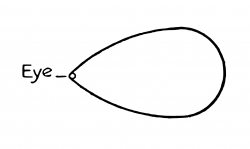\

**[5.634](https://www.wittgensteinproject.org/w/index.php/Logisch-philosophische_Abhandlung#5.634)** इसका सम्बन्ध इस तथ्य से है कि हमारे अनुभव का कोई भी भाग *प्रागनुभविक* नहीं होता।

जो कुछ भी हम देखते हैं, वह, उससे भिन्न भी हो सकता है। हम जिसका कोई विवरण भी दे सकते हैं वह उस विवरण से भिन्न भी हो सकता है।

वस्तुओं का कोई *प्रागनुभविक* क्रम नहीं होता।

**[5.64](https://www.wittgensteinproject.org/w/index.php/Logisch-philosophische_Abhandlung#5.64)** अब यह समझा जा सकता है कि अहंमात्रवाद अपने समग्र रूप में शुद्ध वस्तुवाद के सदृश है। अहंमात्रवाद का अहं विस्तारहीन विन्दु में सिकुड़ जाता है, और उससे जुड़ी वास्तविकता भी वहीं रह जाती है।

**[5.641](https://www.wittgensteinproject.org/w/index.php/Logisch-philosophische_Abhandlung#5.641)** अतः, यह कहना सार्थक है कि अहं के बारे में दर्शनशास्त्र एक गैर-मनोवैज्ञानिक ढंग से विचार-विमर्श कर सकता है।

दर्शनशास्त्र में अहं की प्रविष्टि कराने वाला तथ्य है ‘संसार मेरा संसार है।’

दार्शनिक अहम् मनोविज्ञान — विषयक मानव नहीं होता, न ही मानव शरीर या आत्मा होती है, अपितु वह तो पराभौतिक कर्त्ता होता है, जो संसार का सीमान्त होता है — न कि उसका भाग।

**[6](https://www.wittgensteinproject.org/w/index.php/Logisch-philosophische_Abhandlung#6)** सत्यात्मक फ़लन का सामान्य आकार ![{ [ \bar{p}, \bar{\xi}, N (\bar{\xi}) ] }](images/336cae8a41089348ef601ba5dbe893d3758f7baa1841701bd587566e0f16d282.svg)\  होता है।

यह प्रतिज्ञप्ति का सामान्य आकार है।

**[6.001](https://www.wittgensteinproject.org/w/index.php/Logisch-philosophische_Abhandlung#6.001)** इससे केवल यही पता चलता है कि प्रत्येक प्रतिज्ञप्ति प्राथमिक प्रतिज्ञप्ति पर \  प्रक्रिया के क्रमिक प्रयोग का परिणाम होती है।

**[6.002](https://www.wittgensteinproject.org/w/index.php/Logisch-philosophische_Abhandlung#6.002)** प्रतिज्ञप्ति-संरचना के सामान्य आकार उपलब्ध होने पर हमें प्रक्रिया-प्रयोग द्वारा किसी एक प्रतिज्ञप्ति से कोई दूसरी प्रतिज्ञप्ति प्राप्त करने का सामान्य आकार भी उपलब्ध हो जाता है।

**[6.01](https://www.wittgensteinproject.org/w/index.php/Logisch-philosophische_Abhandlung#6.01)** अतः, प्रक्रिया \  का सामान्य आकार है

![{ [\bar{\xi}, N(\bar{\xi})]' (\bar{\eta}) (= [ \bar{\eta}, \bar{\xi}, N (\bar{\xi}) ]) }](images/d1cf195aa1fb631bffe7b018f1114530b8c1bcc712299ba306fdef8ed6c55335.svg)\

एक प्रतिज्ञप्ति से दूसरी प्रतिज्ञप्ति में परिवर्तन का यह सर्वाधिक सामान्य आकार है।

**[6.02](https://www.wittgensteinproject.org/w/index.php/Logisch-philosophische_Abhandlung#6.02)** और हम इस प्रकार संख्याओं पर पहुँचते हैं। मैं निम्नलिखित परिभाषाएँ देता हूँ।

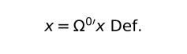\ ,
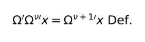\

अतः चिह्नों से सम्बन्ध रखने वाले इन नियमों के अनुसार हम श्रृंखला

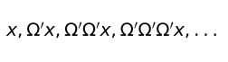\

को निम्नलिखित ढंग से लिखते हैं

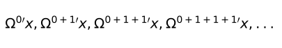\

इसीलिए ![{ [ x, \xi, \Omega ' \xi ] }](images/356a71ba81334c39be3a91a1d42c9d51eb9ad1ea7b726f750fd3a307d7947385.svg)\  लिखने के बजाय मैं लिखता हूँ

‘![{ [ \Omega^{0 \prime} x, \Omega^{ \nu \prime} x, \Omega^{ \nu + 1 \prime} x ] }](images/cbe2c1a200eb49c3a9b16c7105afbb9fbed122da767f2d37389ac28a9e93e102.svg)\ ’

और मैं निम्नलिखित परिभाषाएँ देता हूँ :

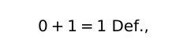\

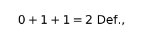\

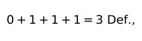\

\(इत्यादि-इत्यादि)।

**[6.021](https://www.wittgensteinproject.org/w/index.php/Logisch-philosophische_Abhandlung#6.021)** संख्या प्रक्रिया की प्रतिपादक होती है।

**[6.022](https://www.wittgensteinproject.org/w/index.php/Logisch-philosophische_Abhandlung#6.022)** जो सभी संख्याओं में साझा होता है वही संख्या का प्रत्यय है, वही संख्या का सामान्य आकार है।

संख्या का प्रत्यय चर संख्या होती है।

और संख्यात्मक समानता का प्रत्यय सभी विशिष्ट संख्यात्मक समानताओं की स्थितियों का सामान्य आकार है।

**[6.03](https://www.wittgensteinproject.org/w/index.php/Logisch-philosophische_Abhandlung#6.03)** पूर्णांक का सामान्य आकार ![{ [ 0, \xi, \xi + 1] }](images/b62025c4a407e7eb826ef60301c7aba855768d91af1e7b6d3248a9d8c43658f1.svg)\  है।

**[6.031](https://www.wittgensteinproject.org/w/index.php/Logisch-philosophische_Abhandlung#6.031)** गणित में वर्ग-सिद्धान्त पूर्णतः अनावश्यक है।

इसका सम्बन्ध इस तथ्य से है कि गणित में अपेक्षित सामान्यता *आकस्मिक* सामान्यता नहीं होती।

**[6.1](https://www.wittgensteinproject.org/w/index.php/Logisch-philosophische_Abhandlung#6.1)** तर्कशास्त्र की प्रतिज्ञप्तियाँ पुनरुक्तियाँ होती हैं।

**[6.11](https://www.wittgensteinproject.org/w/index.php/Logisch-philosophische_Abhandlung#6.11)** इसलिए तर्कशास्त्र की प्रतिज्ञप्तियाँ कुछ भी अभिव्यक्त नहीं करतीं। (वे विश्लेषी प्रतिज्ञप्तियाँ होती हैं।)

**[6.111](https://www.wittgensteinproject.org/w/index.php/Logisch-philosophische_Abhandlung#6.111)** तर्कशास्त्र की प्रतिज्ञप्तियों में विषयवस्तु का आभास कराने वाले सभी सिद्धान्त असत्यतात्मक होते हैं। उदाहरणार्थ, हम यह मान सकते हैं कि ‘सत्यात्मक’ और ‘असत्यात्मक’ ये शब्द अन्य गुणों के साथ-साथ दो गुणों को द्योतित करते हैं, और तब यह तथ्य महत्त्वपूर्ण लगेगा कि प्रत्येक प्रतिज्ञप्ति में इनमें से एक गुण होता है। इस सिद्धान्त से यह तो स्पष्ट नहीं होता कि ‘सभी गुलाब या तो पीले होते हैं या लाल’ जैसी प्रतिज्ञप्ति सत्य होने पर भी स्पष्ट नहीं प्रतीत होती। वस्तुतः तार्किक प्रतिज्ञप्ति प्राकृतिक विज्ञान की प्रतिज्ञप्ति के गुणों को ग्रहण कर लेती है और यह उसकी त्रुटिपूर्ण रचना का निश्चित लक्षण है।

**[6.112](https://www.wittgensteinproject.org/w/index.php/Logisch-philosophische_Abhandlung#6.112)** तर्कशास्त्र की प्रतिज्ञप्तियों की सही व्याख्या उन प्रतिज्ञप्तियों को सभी अन्य प्रतिज्ञप्तियों की तुलना में एक अनुपम स्थान देती है।

**[6.113](https://www.wittgensteinproject.org/w/index.php/Logisch-philosophische_Abhandlung#6.113)** तार्किक प्रतिज्ञप्तियों का विशिष्ट लक्षण यह है कि केवल प्रतीकों से ही उनकी सत्यात्मकता को जाना जा सकता है, और तर्कशास्त्र का सम्पूर्ण दर्शन इस तथ्य में निहित है। और इसलिए यह एक अति महत्त्वपूर्ण तथ्य है कि गैर-तार्किक प्रतिज्ञप्तियों की सत्यात्मकता या असत्यात्मकता केवल उन्हीं प्रतिज्ञप्तियों से *नहीं* जानी जा सकती।

**[6.12](https://www.wittgensteinproject.org/w/index.php/Logisch-philosophische_Abhandlung#6.12)** तर्कशास्त्र की प्रतिज्ञप्तियाँ पुनरुक्तियाँ होती हैं, यह तथ्य भाषा और संसार के आकारिक — तार्किक — गुणों को *दर्शाता* है।

पुनरुक्ति के संघटकों को *इस विशिष्ट ढंग* से जोड़कर उसकी संरचना की जा सकती है, यह तथ्य पुनरुक्ति के संघटकों के तर्क का अभिलक्षण है।

यदि प्रतिज्ञप्तियों को एक विशिष्ट ढंग से संयोजित करने पर पुनरुक्ति प्राप्त होती है, तो उनमें कुछ विशेष संरचनात्मक गुण होने चहिए। अतः, *इस प्रकार से* संयोजित होने पर पुनरुक्ति का प्राप्त होना यह दर्शाता है कि प्रतिज्ञप्तियों में ये संरचनात्मक गुण होते हैं।

**[6.1201](https://www.wittgensteinproject.org/w/index.php/Logisch-philosophische_Abhandlung#6.1201)** उदाहरणार्थ, ‘*p*’ और ‘\~*p*’ प्रतिज्ञप्तियों के ‘\~(*p* . \~*p*)’ संयोजन से ‘*p*’ पुनरुक्ति प्राप्त होती हैं, यह तथ्य दर्शाता है कि वे एक दूसरे के व्याघाती हैं। ‘*p* ⊃ *q*’, ‘*p*’ और ‘*q*’ इन प्रतिज्ञप्तियों को ‘(*p* ⊃ *q*) . (*p*) : ⊃ : *q*’ आकार में संयोजित किए जाने पर पुनरुक्ति प्राप्त होती है, यह तथ्य दर्शाता है कि और *p* ⊃ *q* से *q* निगमित होता है। ‘(*x*) . *fx* : ⊃ : *fa*’ पुनरुक्ति है यह तथ्य दर्शाता है कि (*x*) . *fx* से *fa* निगमित होता है। इत्यादि, इत्यादि।

**[6.1202](https://www.wittgensteinproject.org/w/index.php/Logisch-philosophische_Abhandlung#6.1202)** यह स्पष्ट है कि पुनरुक्तियों के स्थान पर व्याघातों के प्रयोग से भी यही उद्देश्य प्राप्त होता है।

**[6.1203](https://www.wittgensteinproject.org/w/index.php/Logisch-philosophische_Abhandlung#6.1203)** जिन स्थितियों में कोई सामान्यता-चिह्न न हों उन्हें किसी पुनरुक्ति के रूप में पहचानने के लिए निम्नलिखित अन्तः प्रज्ञात्मक पद्धति का प्रयोग किया जा सकता है : ‘*p*’, ‘*q*’, ‘*r*’ इत्यादि के स्थान पर मैं ‘*T* *p* *F*’, ‘*T* *q* *F*’, ‘*T* *r* *F*’ इत्यादि लिखता हूँ। सत्यात्मक संयोजनों को मैं कोष्ठकों के माध्यम से अभिव्यक्त करता हूँ, उदाहरणार्थ
\
और सम्पूर्ण प्रतिज्ञप्तियों की सत्यात्मकता या असत्यात्मकता से सत्यात्मक युक्तियों के सत्यात्मक संयोजनों के सहसम्बन्धों को अभिव्यक्त करने के लिए मैं निम्नलिखित ढंग से रेखाओं का प्रयोग करता हूँ उदाहरणार्थ
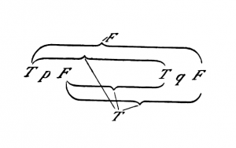\
अत :, यह चिह्न उदाहरणार्थ *p* ⊃ *q* प्रतिज्ञप्ति का प्रतिनिधित्व करता है। अब उदाहरण के तौर पर यह जानने के लिए कि \~(*p* . \~*p*) प्रतिज्ञप्ति (व्याघात का नियम) पुनरुक्ति है या नहीं मैं इस प्रतिज्ञप्ति का परीक्षण करना चाहूँगा। हमारी संकेतन-पद्धति में ‘\~*ξ*’ आकार को इस प्रकार लिखा जाता है :
\
और *ξ* . *η* को इस प्रकार लिखा जाता है
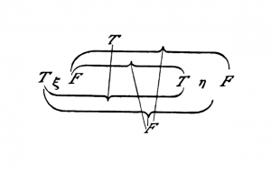\
अतः, \~(*p* . \~*q*) प्रतिज्ञप्ति को निम्न प्रकार से बाँचा जा सकता है।
\
यदि यहाँ पर हम ‘*p*’ को ‘*q*’ से प्रतिस्थापित करें तो बाह्यतम और अन्तरतम *T* और *F* के परस्पर सम्बन्ध का निरीक्षण करने पर हम पायेंगे कि सम्पूर्ण प्रतिज्ञप्ति की सत्यता उसकी युक्ति के *सभी* सत्यात्मक संयोजनों से सम्बन्धित है, और उसकी असत्यात्मकता किसी भी सत्यात्मक संयोजन से सम्बन्धित नहीं है।

**[6.121](https://www.wittgensteinproject.org/w/index.php/Logisch-philosophische_Abhandlung#6.121)** तर्कशास्त्र की प्रतिज्ञप्तियाँ, प्रतिज्ञप्तियों के कुछ भी अभिव्यक्त न करने वाले संयोजनों द्वारा उनके तार्किक गुणों को प्रदर्शित करती हैं।

इस पद्धति को शून्य-पद्धति भी कहा जा सकता है। तार्किक प्रतिज्ञप्ति में प्रतिज्ञप्तियों को परस्पर सन्तुलित किया जाता है, सन्तुलन स्थापित होने पर, सन्तुलन की स्थिति उन प्रतिज्ञप्तियों की आदर्श तार्किक संरचना को इंगित करती है।

**[6.122](https://www.wittgensteinproject.org/w/index.php/Logisch-philosophische_Abhandlung#6.122)** इससे यह पता चलता है कि वस्तुतः हमारा काम तार्किक प्रतिज्ञप्तियों के बिना भी चल सकता है; क्योंकि किसी उपयुक्त संकेतन-पद्धति में हम स्वयं प्रतिज्ञप्तियों के निरीक्षण मात्र से ही उन प्रतिज्ञप्तियों के आकारिक गुणों को वस्तुतः पहचान जाते हैं।

**[6.1221](https://www.wittgensteinproject.org/w/index.php/Logisch-philosophische_Abhandlung#6.1221)** उदाहरणार्थ, ‘*p*’ और ‘*q*’ के ‘*p* ⊃ *q*’ संयोजन से यदि हमें पुनरुक्ति प्राप्त होती है तो यह स्पष्ट हो जाता है कि प्रतिज्ञप्ति *q*, *p* से निगमित होती है।

उदाहरणार्थ, स्वयं दो प्रतिज्ञप्तियों से ही हम जान जाते हैं कि *p* ⊃ *q* . *p*’ से ‘*q*’ निगमित होती है, किन्तु इसे इस प्रकार भी सिद्ध किया जा सकता है : हम उन्हें ‘*p* ⊃ *q* . *p* : ⊃ : *q*’ इस आकार में संयोजित करते हैं, और फिर यह सिद्ध करते हैं कि यह एक पुनरुक्ति है।

**[6.1222](https://www.wittgensteinproject.org/w/index.php/Logisch-philosophische_Abhandlung#6.1222)** इससे यह पता चलता है कि तार्किक प्रतिज्ञप्तियों की पुष्टि, उनके खण्डन के समान, अनुभव द्वारा क्यों नहीं की जा सकती। तर्कशास्त्र की प्रतिज्ञप्तियाँ सम्भावित अनुभव द्वारा न तो खंडित होती हैं और न ही वे उससे पुष्ट की जा सकती हैं।

**[6.1223](https://www.wittgensteinproject.org/w/index.php/Logisch-philosophische_Abhandlung#6.1223)** अब यह स्पष्ट हो जाता है कि बहुधा लोग ऐसा क्यों मानते हैं कि ‘तर्कशास्त्र के सत्यों’ की *धारणा* बनाना हमारा कार्य है। इसका कारण यह है कि किसी उपयुक्त संकेतन-पद्धति की धारणा में ही हम उनकी धारणा बना सकते हैं।

**[6.1224](https://www.wittgensteinproject.org/w/index.php/Logisch-philosophische_Abhandlung#6.1224)** अब यह भी स्पष्ट हो जाता है कि तर्कशास्त्र को आकार और अनुमान का सिद्धान्त क्यों कहा जाता था।

**[6.123](https://www.wittgensteinproject.org/w/index.php/Logisch-philosophische_Abhandlung#6.123)** निस्संदेह तर्कशास्त्र के नियम स्वयं तर्कशास्त्र के नियमों के आधीन नहीं हो सकते।

\(रसेल के अनुसार प्रत्येक ‘प्रारूप’ के लिए व्याघात का एक विशेष नियम होता है, किन्तु ऐसा नहीं है; एक नियम ही पर्याप्त है, क्योंकि वह अपने आप पर लागू नहीं होता।)

**[6.1231](https://www.wittgensteinproject.org/w/index.php/Logisch-philosophische_Abhandlung#6.1231)** सामान्य वैधता तार्किक प्रतिज्ञप्ति की पहचान *नहीं* है।

सामान्य का अर्थ इससे अधिक कुछ नहीं है कि वह अनायास सभी वस्तुओं के लिए वैध है। कोई असामान्य प्रतिज्ञप्ति, किसी सामान्य प्रतिज्ञप्ति के समान, पुनरुक्ति भी हो सकती है।

**[6.1232](https://www.wittgensteinproject.org/w/index.php/Logisch-philosophische_Abhandlung#6.1232)** ‘सभी मनुष्य मरणधर्मा हैं’ जैसी प्रतिज्ञप्तियों की आकस्मिक सामान्य वैधता की तुलना में, तर्कशास्त्र की सामान्य वैधता को अनिवार्य कहा जा सकता है। रसेल द्वारा प्रतिपादित ‘स्वयं सिद्ध-अपचेयता-सिद्धान्त’ जैसी प्रतिज्ञप्तियाँ तार्किक प्रतिज्ञप्तियाँ नहीं हैं, इससे हमारे इस मत की व्याख्या भी हो जाती है कि उन जैसी प्रतिज्ञप्तियों के सत्यात्मक होने पर भी उनकी सत्यात्मकता एक शुभ संयोग का परिणाम मात्र है।

**[6.1233](https://www.wittgensteinproject.org/w/index.php/Logisch-philosophische_Abhandlung#6.1233)** एक ऐसे संसार की कल्पना करना सम्भव है जिसमें स्वयं सिद्ध अपचेयता सिद्धान्त वैध नहीं होता। फिर भी यह स्पष्ट है कि तर्कशास्त्र का इस प्रश्न से कोई सम्बन्ध नहीं है कि हमारा संसार वस्तुतः वैसा है या नहीं।

**[6.124](https://www.wittgensteinproject.org/w/index.php/Logisch-philosophische_Abhandlung#6.124)** तर्कशास्त्र की प्रतिज्ञप्तियाँ संसार के ढाँचे का विवरण प्रदान करती हैं, या फिर वे उसका प्रतिनिधित्व करती हैं। उनकी कोई ‘विषयवस्तु’ नहीं होती। वे यह मानकर चलती हैं कि नामों के अर्थ होते हैं, और प्राथमिक प्रतिज्ञप्तियाँ सार्थक होती हैं; और संसार से उनका यही सम्बन्ध होता है। निस्सन्देह, संसार के बारे में कोई बात इस तथ्य से इंगित होती है कि निर्धारित गुणों वाले कुछ संयोजन पुनरुक्तियाँ होती हैं। यह एक निर्णायक बात है। हम कह चुके हैं कि हमारे द्वारा प्रयुक्त प्रतीकों में कुछ बातें यादृच्छिक होती हैं, और कुछ बातें यादृच्छिक नहीं होतीं। तर्कशास्त्र में अन्त्योक्त ही अभिव्यक्त करने वाली होती हैं : किन्तु इसका अर्थ है कि तर्कशास्त्र कोई ऐसा विषय नहीं है जिसमें हम इच्छानुसार अपनी बात को प्रतीकों द्वारा अभिव्यक्त करते हैं; अपितु तर्कशास्त्र एक ऐसा विषय है जिसमें सर्वथा अनिवार्य प्रतीक स्वयं बोलते हैं। किसी भी प्रतीक-भाषा के तार्किक वाक्यविन्यास को जानने पर तर्कशास्त्र की सभी प्रतिज्ञप्तियाँ हमें उपलब्ध हो जाती हैं।

**[6.125](https://www.wittgensteinproject.org/w/index.php/Logisch-philosophische_Abhandlung#6.125)** सभी ‘सत्यात्मक’ तार्किक प्रतिज्ञप्तियों का अग्रिम विवरण देना सम्भव है, यह बात तर्कशास्त्र की प्राचीन अवधारणा पर भी निश्चित रूप से लागू होती है।

**[6.1251](https://www.wittgensteinproject.org/w/index.php/Logisch-philosophische_Abhandlung#6.1251)** अतः, तर्कशास्त्र में *कभी कुछ भी* अप्रत्याशित *नहीं* हो सकता।

**[6.126](https://www.wittgensteinproject.org/w/index.php/Logisch-philosophische_Abhandlung#6.126)** *प्रतीक* के तार्किक गुणों की संगणना द्वारा यह पता लगाया जा सकता है कि कोई प्रतिज्ञप्ति तर्कशास्त्र से सम्बन्धित है या नहीं।

और तार्किक प्रतिज्ञप्ति को ‘सिद्ध’ करते समय हम यही करते हैं। क्योंकि भाव या अर्थ की परवाह किए बिना हम दूसरी प्रतिज्ञप्तियों से केवल *चिह्नों से सम्बन्धित नियमों* का प्रयोग करके तार्किक प्रतिज्ञप्ति की रचना करते हैं।

तार्किक प्रतिज्ञप्ति की उपपत्ति निम्नलिखित प्रक्रिया में निहित है : तार्किक प्रतिज्ञप्तियों पर मूल पुनरुक्तियों से अन्य पुनरुक्तियाँ प्राप्त कराने वाली विशिष्ट प्रक्रियाएँ क्रमिक रूप से लागू करके हम अन्य तार्किक प्रतिज्ञप्तियाँ बनाते हैं। (और वस्तुतः पुनरुक्ति से केवल पुनरुक्तियाँ ही *निगमित* होती हैं।)

तर्कशास्त्र की प्रतिज्ञप्तियों को पुनरुक्ति के रूप में प्रदर्शित करने का यह ढंग निस्संदेह तर्कशास्त्र में आवश्यक नहीं है, क्योंकि उपपत्ति की प्रारंभिक प्रतिज्ञप्तियों को, किसी प्रमाण के बिना, यह प्रदर्शित करना अनिवार्य है कि वे पुनरुक्तियाँ हैं।

**[6.1261](https://www.wittgensteinproject.org/w/index.php/Logisch-philosophische_Abhandlung#6.1261)** तर्कशास्त्र में प्रक्रिया और परिणाम बराबर हैं। (इसलिए उसमें अप्रत्याशित्व का अभाव होता है।)

**[6.1262](https://www.wittgensteinproject.org/w/index.php/Logisch-philosophische_Abhandlung#6.1262)** तर्कशास्त्र में प्रमाण तो संश्लिष्ट वस्तुस्थितयों में पुनरुक्ति को पहचानने का सहायक रीतितन्त्र ही है।

**[6.1263](https://www.wittgensteinproject.org/w/index.php/Logisch-philosophische_Abhandlung#6.1263)** वस्तुतः सार्थक प्रतिज्ञप्ति का अन्य प्रतिज्ञप्तियों द्वारा *तार्किक रूप से* सिद्ध किया जाना, और *इसी प्रकार* किसी तार्किक प्रतिज्ञप्ति का भी सिद्ध किया जाना, एक महत्त्वपूर्ण घटना होगी। प्रारम्भ से ही यह स्पष्ट है कि सार्थक प्रतिज्ञप्ति का प्रमाण और तर्कशास्त्र में प्रमाण अनवार्यतः दो सर्वथा भिन्न बातें हैं।

**[6.1264](https://www.wittgensteinproject.org/w/index.php/Logisch-philosophische_Abhandlung#6.1264)** सार्थक प्रतिज्ञप्ति अपनी उपपत्ति द्वारा स्थापित बात को अभिव्यक्त करती है। तर्कशास्त्र में प्रत्येक प्रतिज्ञप्ति उपपत्ति के रूप में होती है।

तर्कशास्त्र की प्रत्येक प्रतिज्ञप्ति चिह्नों द्वारा प्रतिनिहित *विधि-वध्यात्मक हेतुफलानुमान* (मोडेस पोनेन्स) होती है। (पर *विधि-वध्यात्मक हेतुफलानुमान* को प्रतिज्ञप्ति द्वारा अभिव्यक्त नहीं किया जा सकता।)

**[6.1265](https://www.wittgensteinproject.org/w/index.php/Logisch-philosophische_Abhandlung#6.1265)** तर्कशास्त्र का ऐसा अन्वय सदैव संभव है जिसमें प्रत्येक प्रतिज्ञप्ति स्वयं अपना प्रमाण हो।

**[6.127](https://www.wittgensteinproject.org/w/index.php/Logisch-philosophische_Abhandlung#6.127)** तर्कशास्त्र की सभी प्रतिज्ञप्तियाँ समान रूप से महत्त्वपूर्ण होती हैं : ऐसा नहीं होता कि उनमें से कुछ अनिवार्यतः मूल प्रतिज्ञप्तियाँ होती हों और शेष निगमित प्रतिज्ञप्तियाँ।

प्रत्येक पुनरुक्ति स्वयं यह दर्शाती है कि वह एक पुनरुक्ति है।

**[6.1271](https://www.wittgensteinproject.org/w/index.php/Logisch-philosophische_Abhandlung#6.1271)** यह तो स्पष्ट है कि ‘तर्कशास्त्र की मूल प्रतिज्ञप्तियों’ की संख्या यादृच्छिक है; क्योंकि केवल एक मूल प्रतिज्ञप्ति से तर्कशास्त्र की व्युत्पत्ति सम्भव है; उदाहरणार्थ, फ्रेंगे द्वारा दी गयी मूल प्रतिज्ञप्तियों के तार्किक गुणनफल की रचना द्वारा। (सम्भवतः इस पर फ्रेंगे कहें कि तब हमें तत्काल स्वयं सिद्ध मूल प्रतिज्ञप्ति की आवश्यकता ही नहीं होगी। किन्तु यह महत्त्वपूर्ण है कि फ्रेगे जैसा उत्कृट विचारक तार्किक प्रतिज्ञप्ति की कसौटी के रूप में स्वयंसिद्धि की कोटि को मान्यता देता है।)

**[6.13](https://www.wittgensteinproject.org/w/index.php/Logisch-philosophische_Abhandlung#6.13)** तर्कशास्त्र सिद्धान्तों का समूह नहीं है, अपितु वह तो संसार का प्रतिबिम्ब है।

तर्कशास्त्र अलौकिक है।

**[6.2](https://www.wittgensteinproject.org/w/index.php/Logisch-philosophische_Abhandlung#6.2)** गणित तार्किक पद्धति है।

गणित की प्रतिज्ञप्तियाँ समीकरण होती हैं, और इसीलिए वे छद्म-प्रतिज्ञप्तियाँ होती हैं।

**[6.21](https://www.wittgensteinproject.org/w/index.php/Logisch-philosophische_Abhandlung#6.21)** गणित की प्रतिज्ञप्ति किसी विचार को अभिव्यक्त नहीं करती।

**[6.211](https://www.wittgensteinproject.org/w/index.php/Logisch-philosophische_Abhandlung#6.211)** सच तो यह है कि वास्तविक जीवन में हमें कभी भी गणितीय प्रतिज्ञप्ति की आवश्यकता नहीं होती। अपितु, हम गणितीय प्रतिज्ञप्तियों का प्रयोग *केवल* उन अनुमानों में करते हैं जिनमें हम गणित से असम्बद्ध प्रतिज्ञप्तियों से ऐसी अन्य प्रतिज्ञप्तियों की अनुमिति करते हैं जो उनके समान गणित से असम्बद्ध होती हैं।

\(‘हम इस शब्द को या इस प्रतिज्ञप्ति को वास्तव में किस लिए प्रयोग में लाते हैं’, दर्शनशास्त्र में इस प्रश्न से हमें अकसर मूल्यवान अन्तर्दृष्टि प्राप्त होती है।)

**[6.22](https://www.wittgensteinproject.org/w/index.php/Logisch-philosophische_Abhandlung#6.22)** संसार के जिस तर्क को तर्कशास्त्र की प्रतिज्ञप्तियों द्वारा पुनरुक्तियों में प्रदर्शित किया जाता है उसी तर्क को गणित द्वारा समीकरणों में प्रदर्शित किया जाता है।

**[6.23](https://www.wittgensteinproject.org/w/index.php/Logisch-philosophische_Abhandlung#6.23)** जब दो अभिव्यक्तियों को समानता के चिह्न द्वारा संयोजित किया जाता है तो उसका अर्थ होता है कि उन्हें परस्पर प्रतिस्थापित किया जा सकता है। किन्तु ऐसा है या नहीं यह स्वयं उन दोनों अभिव्यक्तियों से स्पष्ट होना चाहिए।

जब दो अभिव्यक्तियाँ परस्पर प्रतिस्थापित की जा सकती हैं तो इससे उनके तार्किक आकार का पता चलता है।

**[6.231](https://www.wittgensteinproject.org/w/index.php/Logisch-philosophische_Abhandlung#6.231)** पुष्टि का यह गुण है कि उसका दो निषेधों के रूप में अन्वय किया जा सकता है।

‘1 + 1 + 1 + 1’ का यह गुण है कि उसका अन्वय ‘(1 + 1) + (1 + 1)’ के रूप में किया जा सकता है।

**[6.232](https://www.wittgensteinproject.org/w/index.php/Logisch-philosophische_Abhandlung#6.232)** फ्रेगे कहता है कि दोनों अभिव्यक्तियों का अर्थ तो एक ही है पर उनके भाव भिन्न-भिन्न हैं।

किन्तु यह सिद्ध करने के लिए कि समीकरण के चिह्न द्वारा संयोजित दोनों अभिव्यक्तियों का एक ही अर्थ है, समीकरण की आवश्यकता ही नहीं होती क्योंकि उन अभिव्यक्तियों के एक समान अर्थ होने का पता स्वयं उन अभिव्यक्तियों से ही चल जाता है।

**[6.2321](https://www.wittgensteinproject.org/w/index.php/Logisch-philosophische_Abhandlung#6.2321)** और गणितीय प्रतिज्ञप्तियों को सिद्ध करने की सम्भावना का केवल यही अर्थ है कि उनके औचित्य की जानकारी के लिए यह आवश्यक नहीं कि हम उन प्रतिज्ञप्तियों द्वारा अभिव्यक्त विषयवस्तु की तुलना तथ्यों से करें।

**[6.2322](https://www.wittgensteinproject.org/w/index.php/Logisch-philosophische_Abhandlung#6.2322)** दो अभिव्यक्तियों के अर्थों के तादात्म्य की *पुष्टि* करना असम्भव है। क्योंकि उनके अर्थ के बारे में दृढ़ता से कुछ भी कह पाने के लिए मुझे उनके अर्थ का ज्ञान होना चाहिए, और यह जाने बिना कि उनका एक ही अर्थ है या भिन्न अर्थ हैं, मुझे उनके अर्थ का ज्ञान नहीं हो सकता।

**[6.2323](https://www.wittgensteinproject.org/w/index.php/Logisch-philosophische_Abhandlung#6.2323)** समीकरण केवल उस दृष्टिकोण को इंगित करता है जिससे हम दोनों अभिव्यक्तियों पर विचार करते हैं : वह उनके अर्थों की समतुल्यता को इंगित करता है।

**[6.233](https://www.wittgensteinproject.org/w/index.php/Logisch-philosophische_Abhandlung#6.233)** गणितीय समस्याओं के समाधान के लिए अन्त : प्रज्ञा की आवश्यकता होती है या नहीं, इस प्रश्न का उत्तर यही है कि गणितीय समस्याओं के समाधान के लिए स्वयं भाषा ही आवश्यक अन्त : प्रज्ञा मुहैया करवाती है।

**[6.2331](https://www.wittgensteinproject.org/w/index.php/Logisch-philosophische_Abhandlung#6.2331)** *गणना करने* की प्रक्रिया उस अन्तः प्रज्ञा को उत्पन्न करने में सहायक होती है।

गणना करना कोई प्रयोग नहीं है।

**[6.234](https://www.wittgensteinproject.org/w/index.php/Logisch-philosophische_Abhandlung#6.234)** गणित, तर्कशास्त्र की एक पद्धति है।

**[6.2341](https://www.wittgensteinproject.org/w/index.php/Logisch-philosophische_Abhandlung#6.2341)** समीकरणों का उपकरण गणितीय पद्धति का एक आवश्यक गुण है। इसी पद्धति के कारण गणित की प्रत्येक प्रतिज्ञप्ति कुछ भी अभिव्यक्त नहीं कर सकती।

**[6.24](https://www.wittgensteinproject.org/w/index.php/Logisch-philosophische_Abhandlung#6.24)** जिस पद्धति द्वारा गणित अपने समीकरणों पर पहुँचता है वह प्रतिस्थापन पद्धति है।

क्योंकि समीकरण दो अभिव्यक्तियों के प्रतिस्थापन को अभिव्यक्त करता है, और समीकरणों की संख्या से आरम्भ करके, समीकरणों के अनुसार भिन्न अभिव्यक्तियों को प्रतिस्थापित करते हुए हम नए समीकरणों पर पहुँचते हैं।

**[6.241](https://www.wittgensteinproject.org/w/index.php/Logisch-philosophische_Abhandlung#6.241)** अतः 2 × 2 = 4 इसकी निम्नलिखित उपपत्ति इस प्रकार होती है :

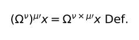\

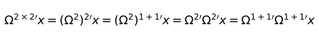\

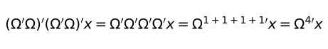\

**[6.3](https://www.wittgensteinproject.org/w/index.php/Logisch-philosophische_Abhandlung#6.3)** तर्कशास्त्र में गवेषणा का अर्थ है *प्रत्येक नियमाधीन वस्तु-विषय* की गवेषणा। तर्कशास्त्र से बाहर सब कुछ अनायास है।

**[6.31](https://www.wittgensteinproject.org/w/index.php/Logisch-philosophische_Abhandlung#6.31)** तथाकथित आगमन-सिद्धान्त संभवतः तर्कशास्त्र का नियम नहीं हो सकता, क्योंकि वह स्पष्टतया एक सार्थक प्रतिज्ञप्ति है। — इसलिए वह *प्रागनुभविक* नियम भी नहीं हो सकता।

**[6.32](https://www.wittgensteinproject.org/w/index.php/Logisch-philosophische_Abhandlung#6.32)** कार्य-कारण सिद्धान्त, सिद्धान्त न होकर सिद्धान्त का एक आकार है।

**[6.321](https://www.wittgensteinproject.org/w/index.php/Logisch-philosophische_Abhandlung#6.321)** ‘कार्य-कारण सिद्धान्त’ — यह एक सामान्य नाम है। और उदाहरणार्थ, जिस प्रकार यान्त्रिकी में न्यूनतम क्रिया सिद्धान्त जैसे ‘न्यूनतम-सिद्धान्त’ होते हैं उसी प्रकार भौतिकी में भी कार्य-कारण सिद्धान्त, कारणता-आकार सिद्धान्त जैसे सिद्धान्त होते हैं।

**[6.3211](https://www.wittgensteinproject.org/w/index.php/Logisch-philosophische_Abhandlung#6.3211)** वस्तुतः, ‘न्यूनतम क्रिया-सिद्धान्त’ का पूर्णत : ज्ञान होने से पहले लोगों का यह अनुमान ही था कि ‘न्यूनतम क्रिया-सिद्धान्त’ होना चाहिए। (हमेशा की तरह यहाँ भी जो *प्रागनुभविक* रूप से निश्चित है वही पूर्णत : तार्किक रूप से सिद्ध हुआ)।

**[6.33](https://www.wittgensteinproject.org/w/index.php/Logisch-philosophische_Abhandlung#6.33)** संरक्षण सिद्धान्त में हमें *प्रागनुभविक विश्वास* नहीं होता, अपितु तार्किक आकार की सम्भावना का *प्रागनुभविक* ज्ञान होता है।

**[6.34](https://www.wittgensteinproject.org/w/index.php/Logisch-philosophische_Abhandlung#6.34)** पर्याप्त-कारण-सिद्धान्त, प्रकृति में निरन्तरता-सिद्धान्त और प्रकृति में न्यूनतम-प्रयास-सिद्धान्त, इत्यादि, इत्यादि समेत ऐसी सभी प्रतिज्ञप्तियाँ उन आकारों के बारे में *प्रागनुभाविक* अन्तर्दृष्टियाँ हैं जिनमें विज्ञान की प्रतिज्ञप्तियों को ढाला जा सकता है।

**[6.341](https://www.wittgensteinproject.org/w/index.php/Logisch-philosophische_Abhandlung#6.341)** उदाहरणार्थ, न्यूटन द्वारा प्रतिपादित यान्त्रिकी संसार के विवरण पर एकीकृत आकार थोपती है। एक ऐसी सफ़ेद सतह की कल्पना करें जिस पर काले धब्बे छितरे हों। तब हम कहते हैं कि वे चाहे जैसा भी चित्र बनाते हों, मैं उस सतह को यथेष्ट महीन वर्गाकार छेदों वाली जाली से ढककर, उसका अपनी इच्छानुसार यह कहते हुए कि कौन सा वर्ग सफ़ेद है और कौन सा काला सूक्ष्म वर्णन कर सकता हूँ। इस प्रकार, मैं उस सतह के विवरण पर एकीकृत आकार थोपता हूँ। यह आकार वैकल्पिक है; क्योंकि किसी त्रिभुजाकार या षड्भुजाकार छेदों वाली जाली के प्रयोग से भी यही परिणाम प्राप्त होता है। त्रिभुजाकार छेदों वाली जाली के प्रयोग से संभवतः यह विवरण आसान हो जाता : अर्थात त्रिभुजाकार मोटे छेदों वाली जाली के प्रयोग से, दिया जाने वाला सतह का विवरण महीन वर्गाकार छेदों वाली जाली के प्रयोग से दिए जाने वाले विवरण से कहीं अधिक सूक्ष्म हो सकता है (अथवा इसके उलट भी) और यथावत। भिन्न-भिन्न जालियाँ, संसार के विवरण के लिए प्रयुक्त भिन्न-भिन्न प्रणालियों के अनुरूप हैं। संसार के विवरण के एक रूप को यान्त्रिकी यह कहते हुए निर्धारित करती है कि उसके लिए प्रयुक्त सभी प्रतिज्ञप्तियों को स्वयं-सिद्ध यान्त्रिकी सिद्धान्तों — सुनिश्चित प्रदत्त प्रतिज्ञप्तियों द्वारा प्रदत्त पद्धति से प्राप्त किया जाना चाहिए। इस प्रकार यह विज्ञान के भवन को बनाने के लिए इंटें उपलब्ध कराता है और कहता है, ‘आप जो भी और जैसे भी भवन का निर्माण करना चाहें करें, किन्तु आपको यही और केवल यही ईंटें प्रयोग में लानी होंगी।’

\(जिस प्रकार अंक-प्रणाली में हम इच्छानुसार संख्या लिख सकते हैं उसी प्रकार यान्त्रिकी-प्रणाली में भी हम इच्छानुसार भौतिकी की प्रतिज्ञप्तियाँ लिख सकते हैं।)

**[6.342](https://www.wittgensteinproject.org/w/index.php/Logisch-philosophische_Abhandlung#6.342)** अब हम तर्कशास्त्र और यान्त्रिकी की तुलनात्मक स्थिति को समझ सकते हैं। (जाल में एक से अधिक प्रकार के छिद्र भी हो सकते हैं : उदाहरणार्थ, हम तिकोने और षड्भुजाकार दोनों प्रकार के छिद्रों का प्रयोग कर सकते हैं।) उपलब्ध छिद्र आकार के जाल द्वारा उपर्युक्त चित्र के वर्णन की सम्भावना से हमें चित्र के बारे में कुछ भी पता *नहीं* चलता। (क्योंकि ऐसे सभी चित्रों के बारे में वह विवरण सत्य है।) किन्तु चित्र का गुण यही है कि किसी विशिष्ट आकार के छिद्रों वाली विशिष्ट जाली द्वारा उसका सम्पूर्ण विवरण दिया जा सकता है।

इसी प्रकार न्यूटन द्वारा प्रतिपादित यान्त्रिकी सिद्धान्तों द्वारा संसार का विवरण दिये जाने की सम्भावना से हमें संसार के बारे में कुछ भी पता नहीं चलता : किन्तु इन सिद्धान्तों की सहायता से संसार का सूक्ष्म विवरण देना जिस *ढंग* से सम्भव होता है उससे संसार के बारे में कुछ पता चलता है। यान्त्रिकी की किन्हीं दो प्रणालियों में से संसार का विवरण किसी एक प्रणाली द्वारा अधिक सुगमता से दिया जा सकता है, इस तथ्य से भी संसार के बारे में कुछ पता चलता है।

**[6.343](https://www.wittgensteinproject.org/w/index.php/Logisch-philosophische_Abhandlung#6.343)** संसार के विवरण के लिए आवश्यक सभी *सत्यात्मक* प्रतिज्ञप्तियों का योजनाबद्ध संरचना-प्रयास ही यान्त्रिकी है।

**[6.3431](https://www.wittgensteinproject.org/w/index.php/Logisch-philosophische_Abhandlung#6.3431)** अपने सकल तार्किक उपकरणों के साथ भौतिकी के नियम परोक्ष रूप से ही सही अन्ततः संसार के पदार्थों का उल्लेख करते हैं।

**[6.3432](https://www.wittgensteinproject.org/w/index.php/Logisch-philosophische_Abhandlung#6.3432)** हमें यह कदापि नहीं भूलना चाहिए कि यान्त्रिकी द्वारा प्रदत्त संसार का कोई भी विवरण पूर्णतः सामान्य प्रकार का होगा। उदाहरणार्थ, वह किन्हीं *विशिष्ट* बिन्दु-द्रव्यमानों का उल्लेख कदापि नहीं करेगा, वह सामान्य *बिन्दु-द्रव्यमानों* का ही उल्लेख करेगा।

**[6.35](https://www.wittgensteinproject.org/w/index.php/Logisch-philosophische_Abhandlung#6.35)** यद्यपि हमारे चित्र में विद्यमान धब्बे किसी न किसी ज्यामितीय आकार के हैं, फिर भी यह स्पष्ट है कि ज्यामिति उनके वास्तविक आकार और स्थान के बारे में कुछ भी नहीं बता सकती। बेशक, जाल *पूर्णत :* ज्यामितीय है : उसके सभी गुणों को *प्रागनुभविक* रूप से वर्णित किया जा सकता है।

पर्याप्त-कार्य-कारण सिद्धान्त, इत्यादि जैसे नियम जाल के बारे में हैं, न कि जाल द्वारा वर्णित विषयवस्तु के बारे में।

**[6.36](https://www.wittgensteinproject.org/w/index.php/Logisch-philosophische_Abhandlung#6.36)** यदि कार्य-कारण सिद्धान्त होता तो उसे निम्नलिखित ढंग से प्रस्तुत किया जा सकता था : प्रकृति के नियम होते हैं।

किन्तु सच तो यह है कि ऐसा नहीं कहा जा सकता : वह स्वयं को प्रकाशित करता है।

**[6.361](https://www.wittgensteinproject.org/w/index.php/Logisch-philosophische_Abhandlung#6.361)** हर्टज़ की शब्दावली का प्रयोग करते हुए कहा जा सकता है कि केवल *नियमाधीन सम्बन्ध ही कल्पनीय होते हैं*।

**[6.3611](https://www.wittgensteinproject.org/w/index.php/Logisch-philosophische_Abhandlung#6.3611)** हम प्रक्रिया की तुलना ‘समय की गति’ से नहीं कर सकते — ऐसी कोई चीज़ होती ही नहीं, अपितु हम प्रक्रिया की तुलना किसी अन्य प्रक्रिया से (जैसे कि घड़ी की कार्यप्रणाली से) कर सकते हैं।

अतः, हम समय के बीतने का विवरण केवल किसी अन्य प्रक्रिया की सहायता से ही दे सकते हैं।

दिक् पर भी बिल्कुल यही बात लागू होती है : उदाहरणार्थ, जब लोग कहते हैं कि (एक दूसरे की विरोधी) दो घटनाओं में से कोई भी घट नहीं सकती, क्योंकि किसी एक या दूसरे के घटने का *कोई भी कारण नहीं है*, तो उन दो घटनाओं में किसी प्रकार की विषमता के अभाव में यह उनमें से किसी *एक* का विवरण दे पाने की हमारी अक्षमता ही है। और यदि ऐसी विषमता पायी जाती है तो हम उसे एक घटना के घटने और दूसरी घटना के न घटने का *कारण* मान सकते हैं।

**[6.36111](https://www.wittgensteinproject.org/w/index.php/Logisch-philosophische_Abhandlung#6.36111)** दाएँ और बाएँ हाथ के सम्पाती न होने के बारे में काण्ट की समस्या द्विविम में भी होती है। वस्तुतः यह समस्या ऐसे एकल — विम में भी होती है जिसमें दो सर्वांगसम आकृतियाँ *a* और *b*
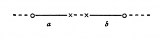\
को अपने स्थान से हिलाये बिना सम्पाती नहीं बनाया जा सकता। दायाँ और बायाँ हाथ वस्तुतः पूरी तरह सर्वांगसम होते हैं। उनका सम्पाती न हो सकना पूर्णतः अप्रासंगिक है।

चतुर्विम दिक् में यदि दस्तानों को पलटा जा सकता तो दाएँ हाथ का दस्ताना बाएँ हाथ में पहना जा सकता है।

**[6.362](https://www.wittgensteinproject.org/w/index.php/Logisch-philosophische_Abhandlung#6.362)** जिसका वर्णन किया जा सकता है वह घटित भी हो सकता है : और कार्य-कारण सिद्धान्त से बाह्य विषय का वर्णन भी नहीं किया जा सकता।

**[6.363](https://www.wittgensteinproject.org/w/index.php/Logisch-philosophische_Abhandlung#6.363)** हमारे अनुभवों के अनुकूल *सरलतम* सिद्धान्तों को सत्यात्मक मानना आगमन-प्रक्रिया का अंग है।

**[6.3631](https://www.wittgensteinproject.org/w/index.php/Logisch-philosophische_Abhandlung#6.3631)** निस्संदेह, इस प्रक्रिया का कोई तार्किक औचित्य न होकर केवल मनोवैज्ञानिक औचित्य है।

यह स्पष्ट है कि इस विश्वास का कोई आधार नहीं है कि सामान्य से सामान्य घटना वस्तुतः घटित होगी।

**[6.36311](https://www.wittgensteinproject.org/w/index.php/Logisch-philosophische_Abhandlung#6.36311)** सूर्य कल उदित होगा, यह एक प्राक्कल्पना है : और इसका अर्थ है कि हम यह नहीं *जानते* कि वह उदित होगा कि नहीं।

**[6.37](https://www.wittgensteinproject.org/w/index.php/Logisch-philosophische_Abhandlung#6.37)** यह अनिवार्य नहीं कि एक घटना घटित हुई है इसलिए दूसरी घटना घटित होगी ही। एक ही अनिवार्यता का अस्तित्व है, और वह अनिवार्यता है *तार्किक* अनिवार्यता।

**[6.371](https://www.wittgensteinproject.org/w/index.php/Logisch-philosophische_Abhandlung#6.371)** संसार की सम्पूर्ण आधुनिक अवधारणा इस भ्रान्ति पर टिकी है कि तथाकथित प्रकृति के नियमों द्वारा प्राकृतिक संवृत्तियों की व्याख्या दी जा सकती है।

**[6.372](https://www.wittgensteinproject.org/w/index.php/Logisch-philosophische_Abhandlung#6.372)** अतः, प्राचीन युग में ईश्वर और नियति के समान, आधुनिक लोग प्रकृति के सिद्धान्तों को अलंघ्य समझकर इन नियमों को सब कुछ मान लेते हैं।

वस्तुतः दोनों ही ठीक हैं और दोनों ही गलत हैं : यद्यपि हमारे पूर्वजों द्वारा स्वीकृत सुस्पष्ट लक्ष्य, आधुनिक लोगों से कहीं अधिक स्पष्ट है, क्योंकि आधुनिक प्रणाली यह आभास देने की कोशिश करती है कि मानो *प्रत्येक विषय* की व्याख्या दे दी गयी हो।

**[6.373](https://www.wittgensteinproject.org/w/index.php/Logisch-philosophische_Abhandlung#6.373)** संसार मेरे संकल्प से स्वतन्त्र है।

**[6.374](https://www.wittgensteinproject.org/w/index.php/Logisch-philosophische_Abhandlung#6.374)** हमारी इच्छानुसार सब कुछ होना भी मानो नियति द्वारा प्रदत्त वरदान ही है : क्योंकि संकल्प और संसार में कोई ऐसा *तार्किक* सम्बन्ध नहीं है जो उनके होने की गारंटी दे, और जिसे हम भौतिक सम्बन्ध कहते हैं, उसकी इच्छा शायद हम नहीं करते।

**[6.375](https://www.wittgensteinproject.org/w/index.php/Logisch-philosophische_Abhandlung#6.375)** जिस प्रकार केवल एक ही अनिवार्यता का अस्तित्व है, और वह अनिवार्यता है *तार्किक* अनिवार्यता, उसी प्रकार केवल एक ही असम्भावना का अस्तित्व है और वह है *तार्किक* असम्भावना

**[6.3751](https://www.wittgensteinproject.org/w/index.php/Logisch-philosophische_Abhandlung#6.3751)** उदाहरणार्थ, एक ही दृश्य-क्षेत्र में दो रंगों का एक साथ होना असम्भव, तथ्यतः तार्किक रूप से असम्भव है, क्योंकि रंग की तार्किक संरचना उसकी आज्ञा नहीं देती।

आइए, विचार करते हैं कि भौतिक-शास्त्र में यह विरोधाभास कैसे होता है : कमोबेश इस तरह — एक ही समय पर किसी कण की दो गतियाँ नहीं हो सकतीं, अर्थात वह एक ही समय पर दो स्थानों पर नहीं हो सकता; अर्थात, एक ही समय पर भिन्न स्थानों पर पाए जाने वाले कणों में तादात्म्य नहीं हो सकता।

\(यह तो स्पष्ट है कि दो प्राथमिक प्रतिज्ञप्तियों का तार्किक गुणनफल, न तो पुनरुक्ति हो सकती है और न ही व्याघात। यह कथन कि दृश्यक्षेत्र के किसी बिन्दु के एक ही समय पर, दो भिन्न रंग होते हैं व्याघाती है।)

**[6.4](https://www.wittgensteinproject.org/w/index.php/Logisch-philosophische_Abhandlung#6.4)** सभी प्रतिज्ञप्तियों का समान महत्त्व है।

**[6.41](https://www.wittgensteinproject.org/w/index.php/Logisch-philosophische_Abhandlung#6.41)** संसार की सार्थकता संसार से बाहर निहित होनी चाहिए। संसार में सब कुछ यथावत् है, और जो होना है वह होता है : उसमें कोई मूल्य नहीं होता और यदि कोई मूल्य होता भी है तो उसका कोई मूल्य नहीं होता।

यदि किसी मूल्य का मूल्य है तो उसे अनिवार्यतः जो कुछ घटित होता है, और जो वस्तुस्थिति है, उससे बाहर होना चाहिए। क्योंकि घटनाक्रम और स्थितिक्रम अनपेक्षित हैं।

क्योंकि उसे अपेक्षित बनाने वाला संसार के *भीतर* नहीं हो सकता, क्योंकि यदि वह संसार के भीतर होता है तो वह स्वयं भी अनपेक्षित ही होगा।

उसे अनिवार्यतः संसार के बाहर ही निहित होना चाहिए।

**[6.42](https://www.wittgensteinproject.org/w/index.php/Logisch-philosophische_Abhandlung#6.42)** इसी तरह नीतिशास्त्र की प्रतिज्ञप्तियों का होना भी असम्भव है।

प्रतिज्ञप्तियाँ किसी भी ऐसी विषयवस्तु को अभिव्यक्त नहीं कर सकतीं जो उच्च है।

**[6.421](https://www.wittgensteinproject.org/w/index.php/Logisch-philosophische_Abhandlung#6.421)** यह स्पष्ट है कि नीतिशास्त्र को शब्दों के द्वारा अभिव्यक्त नहीं किया जा सकता।

नीतिशास्त्र अलौकिक है।

\(नीतिशास्त्र और सौन्दर्यशास्त्र एक-दूसरे से अनतिरिक्त हैं।)

**[6.422](https://www.wittgensteinproject.org/w/index.php/Logisch-philosophische_Abhandlung#6.422)** ‘आप.... करेंगें’ जब ऐसे विधिवाक्यों के आकार वाला नैतिक सिद्धान्त बनाया जाता है, तो हम यकायक सोचते हैं ‘यदि मैं ऐसा न करूँ तो क्या होगा?’ बेशक यह स्पष्ट है कि नीतिशास्त्र का दंड और प्रतिफल के सामान्य अर्थ में दण्ड और प्रतिफल से कोई सम्बन्ध नहीं है। अतः *कर्मफल* के बारे में हमारे प्रश्न अनिवार्यतः महत्त्वहीन होने चाहिए। — ये कर्मफल कोई घटना तो नहीं हो सकते। क्योंकि हमारे द्वारा उठाए गए प्रश्नों में कुछ तो सही होना चाहिए। वस्तुतः किसी प्रकार का नैतिक प्रतिफल और नैतिक दण्ड अवश्य होना चाहिए, किन्तु उन्हें अनिवार्यतः कर्म में ही निहित होना चाहिए।

\(और यह भी स्पष्ट है कि पुरस्कार को सुखद और दण्ड को दुःखद होना चाहिए।)

**[6.423](https://www.wittgensteinproject.org/w/index.php/Logisch-philosophische_Abhandlung#6.423)** जब तक संकल्प नैतिक गुणों का विषय है तब तक हम संकल्प के बारे में बात नहीं कर सकते।

और घटना के रूप में संकल्प केवल मनोविज्ञान का विषय है।

**[6.43](https://www.wittgensteinproject.org/w/index.php/Logisch-philosophische_Abhandlung#6.43)** यदि शुभ या अशुभ संकल्प के आचरण से संसार परिवर्तित होता भी है तो भी वह संसार की सीमाओं को ही परिवर्तित करता है, तथ्यों को नहीं — उसको नहीं जिसे भाषा अभिव्यक्त कर सकती है।

संक्षेप में कहें तो इसके परिणाम स्वरूप संसार को पूर्णतः बदल जाना चाहिए। मानो वह पूरी तरह घटता-बढ़ता हो।

सुखी व्यक्ति का संसार दुःखी व्यक्ति के संसार से भिन्न होता है।

**[6.431](https://www.wittgensteinproject.org/w/index.php/Logisch-philosophische_Abhandlung#6.431)** इसी प्रकार मृत्यु से संसार परिवर्तित नहीं होता अपितु समाप्त ही हो जाता है।

**[6.4311](https://www.wittgensteinproject.org/w/index.php/Logisch-philosophische_Abhandlung#6.4311)** मृत्यु जीवन की घटना नहीं है : मृत्यु का अनुभव करने के लिए हम जीवित नहीं रहते।

यदि हम अमरता को अनन्त कालावधि न समझकर कालाभाव समझें तो शाश्वत जीवन वर्तमान में जीने वाले व्यक्तियों के लिए होगा।

जिस प्रकार हमारे गोचर-क्षेत्र की कोई सीमा नहीं है उसी प्रकार हमारे जीवन का भी कोई अन्त नहीं है।

**[6.4312](https://www.wittgensteinproject.org/w/index.php/Logisch-philosophische_Abhandlung#6.4312)** न केवल मानवीय आत्मा की कालिक अमरता, अर्थात मरणोपरान्त उसके शाश्वत जीवन की कोई गारंटी नहीं है; अपितु, यह पूर्वमान्यता सदैव, अपने अभीष्ट उद्देश्य को पाने में पूर्णतः असफल रही है। या मेरे सर्वदा जीवित रहने से कोई समस्या सुलझ जाती है? क्या शाश्वत जीवन भी हमारे वर्तमान जीवन की तरह एक समस्या नहीं है? दिक् और काल में स्थित जीवन की समस्या का हल दिक् और काल से *बाहर* पाया जाता है।

\(निश्चित रूप से यहाँ प्राकृतिक विज्ञान की किसी समस्या का अपेक्षित समाधान नहीं है।)

**[6.432](https://www.wittgensteinproject.org/w/index.php/Logisch-philosophische_Abhandlung#6.432)** सर्वोच्च सत्ता, सांसारिक वस्तुएँ *किस प्रकार* व्यवस्थित हैं, इस बात के प्रति पूर्णतः उदासीन है। ईश्वर सांसारिक वस्तुओं में अपने आपको प्रकाशित नहीं करता।

**[6.4321](https://www.wittgensteinproject.org/w/index.php/Logisch-philosophische_Abhandlung#6.4321)** तथ्य समस्याएँ ही उत्पन्न करते हैं, उनसे समस्याओं का समाधान नहीं होता।

**[6.44](https://www.wittgensteinproject.org/w/index.php/Logisch-philosophische_Abhandlung#6.44)** संसार में वस्तुएँ *किस प्रकार* से हैं, यह कोई रहस्य की बात नहीं है, बल्कि *यही* एक रहस्य है *कि* संसार का अस्तित्व है।

**[6.45](https://www.wittgensteinproject.org/w/index.php/Logisch-philosophische_Abhandlung#6.45)** संसार पर विहंगम दृष्टिपात का अर्थ है उसे एक सीमित-समग्र के रूप में देखना।

संसार को सीमित-समग्र समझना — यही तो रहस्य है।

**[6.5](https://www.wittgensteinproject.org/w/index.php/Logisch-philosophische_Abhandlung#6.5)** जब समाधान शब्दों से अभिव्यक्त नहीं किया जा सकता तो समस्या भी शब्दों में अभिव्यक्त नहीं हो सकती।

*समस्या* का कोई अस्तित्व ही नहीं है।

यदि समस्या का स्वरूप किसी तरह निर्धारित किया जा सकता है तो उसका समाधान भी दिया जा *सकता* है।

**[6.51](https://www.wittgensteinproject.org/w/index.php/Logisch-philosophische_Abhandlung#6.51)** जब संशयवाद निर्मूल समस्याएँ खड़ी करता है तो वह अकाट्य तर्क *न* होकर पूर्णतः निरर्थक हो जाता है।

क्योंकि संशय वहीं होता है जहाँ कोई समस्या हो, समस्या वही है जिसका कोई समाधान हो, और समाधान वही है जिसे *अभिव्यक्त किया जा सके*।

**[6.52](https://www.wittgensteinproject.org/w/index.php/Logisch-philosophische_Abhandlung#6.52)** हमें लगता है कि *समस्त संभाव्य* वैज्ञानिक समस्याओं का समाधान होने पर भी जीवन की समस्याएँ वैसी ही बनी रहेंगी। वस्तुतः तब कोई समस्या रहेगी ही नहीं, और यही समाधान है।

**[6.521](https://www.wittgensteinproject.org/w/index.php/Logisch-philosophische_Abhandlung#6.521)** जीवन की समस्या के विलुप्त होने में ही उसका समाधान है।

\(क्या यही कारण है कि जीवन के अर्थ को जानने की दीर्घकालीन सतत-साधना के पश्चात् उसे जानने पर भी साधक उसके बारे में कुछ भी नहीं कह पाते?)

**[6.522](https://www.wittgensteinproject.org/w/index.php/Logisch-philosophische_Abhandlung#6.522)** कुछ वस्तुएँ निश्चित रूप से ऐसी होती हैं जिन्हें शब्दों द्वारा व्यक्त नहीं किया जा सकता। वे *स्वयं अभिव्यक्त होती हैं*। उन्हें ही रहस्यात्मक कहा जा सकता है।

**[6.53](https://www.wittgensteinproject.org/w/index.php/Logisch-philosophische_Abhandlung#6.53)** दर्शनशास्त्र की वास्तविक पद्धति यही होगी : अभिव्यंग्य अर्थात प्राकृतिक विज्ञान की प्रतिज्ञप्तियों के अतिरिक्त कुछ भी न — कहना यानी वह कहना जिसका दर्शनशास्त्र से कोई सरोकार ही नहीं — और फिर यदि कोई व्यक्ति पराभौतिक विषयक बात कहना चाहे तो उसे यह प्रदर्शित करना होगा कि उसके द्वारा प्रयुक्त प्रतिज्ञप्ति में कुछ चिह्नों के अर्थ नहीं दिए गए हैं। यद्यपि इससे वह व्यक्ति सन्तुष्ट नहीं होगा — उसे दर्शन जैसे शास्त्र का अध्ययन-अध्यापन जैसा कुछ लगेगा ही नहीं — लेकिन यही पद्धति सर्वाधिक समीचीन पद्धति है।

**[6.54](https://www.wittgensteinproject.org/w/index.php/Logisch-philosophische_Abhandlung#6.54)** मेरी प्रतिज्ञप्तियाँ ऐसी व्याख्याएँ हैं इन प्रतिज्ञप्तियों को समझने के बाद, प्रयोक्ता उन्हें निरर्थक समझकर उनका परित्याग कर देगा-उनको सोपान की तरह प्रयोग कर, उनसे ऊपर चढ़कर। (मानो सीढ़ी से ऊपर चढ़ने के बाद प्रयोक्ता सीढ़ी को ठोकर मार दे।)

उन प्रतिज्ञप्तियों से ऊपर उठकर ही उसे संसार का यथार्थ बोध होगा।

**[7](https://www.wittgensteinproject.org/w/index.php/Logisch-philosophische_Abhandlung#7)** अनभिव्यंग्य के प्रति मौन रहना ही श्रेयस्कर है।