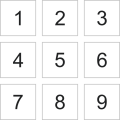
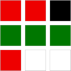
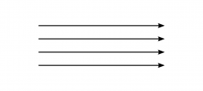
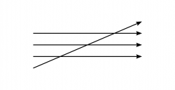
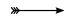

# Editor's Note

_Published by the [Ludwig Wittgenstein Project](https://www.wittgensteinproject.org/)._

_Tranlsated by Ashok Vohra_

_This digital edition is based on Ludwig Wittgenstein. *फ़िलोसॉफ़िकल इन्वेस्टिगेशंस*. Translated by Ashok Vohra, Indian Council of Philosophical Research, 1996. The original-language text is in the public domain in its country of origin and other countries and areas where the copyright term is the author’s life plus 70 years or fewer. The translation was kindly released by Prof. Ashok Vohra under the [Creative Commons Attribution-ShareAlike](https://creativecommons.org/licenses/by-sa/4.0/deed.en) licence. The web edition was created by Michele Lavazza in cooperation with Filippo Villaggi and proofread by Abhishek Manhas under the supervision of Désirée Weber from the College of Wooster._

# फ़िलोसॉफ़िकल इन्वेस्टिगेशंस

>
>
> *“प्रगति का स्वरूप ही कुछ ऐसा है कि वह वास्तविकता से कहीं अधिक महान् जान पड़ती है।” *
>
> *नेस्ट्रॉय*
>
>

## लेखक का प्राक्कथन

इस पुस्तक में प्रकाशित विचार पिछले सोलह वर्ष के मेरे दार्शनिक अन्वेषण के परिणाम हैं। वे अनेक विषयों से संबंधित हैं : अर्थ, समझ और तर्क के प्रत्ययों से, गणित के आधारों से, चित्त की स्थितियों से और कई दूसरे विषयों से। इन सभी विचारों को मैंने *टिप्पणियों*, छोटे-छोटे अनुच्छेदों के रूप में लिखा है। कहीं तो एक ही विषय पर इन टिप्पणियों और अनुच्छेदों की लम्बी श्रृंखला है, और कहीं मैं यकायक एक विषय से दूसरे विषय पर पहुँच जाता हूँ। — शुरु में मैं इन्हें एक ऐसी पुस्तक के रूप में प्रस्तुत करना चाहता था जिसकी मैंने भिन्न‑भिन्न कालों में भिन्न‑भिन्न रूप में कल्पना की। किन्तु इन कल्पनाओं में अनिवार्य बात यह थी कि भावी पुस्तक में मेरे विचार बिना किसी बाधा के सहज ढंग से एक विषय से दूसरे विषय पर चलते चले जायें।

अपने अन्वेषण के परिणामों को इस प्रकार संजोने के अनेक असफल प्रयासों के बाद मुझे अनुभव हुआ कि मैं इसमें कभी सफल नहीं हो पाऊँगा। मुझे लगा कि मैं दार्शनिक टिप्पणियां ही लिख सकूँगा : जैसे ही मैं अपने विचारों को उनकी सहज दिशा के विपरीत किसी एक विषय पर केन्द्रित करने का प्रयत्न करता, वे बिखर जाते। — और इसका कारण अन्वेषण का स्वरूप ही था। क्योंकि, अन्वेषण का स्वरूप ही हमें बृहद् क्षेत्र में, हर ओर आड़ी-तिरछी दिशाओं में जाने को बाध्य करता है। — मानो इस पुस्तक की दार्शनिक टिप्पणियां लम्बी और दुर्बोध यात्राओं के दौरान बनाए गए भूदृश्यों के चित्र हों।

उन्हीं विषयों पर, अथवा उनसे मिलते-जुलते विषयों पर, मैंने बार-बार नये ढंग से सोचा और उनके नए चित्र बनाए। उनमें से अनेक तो बेढब या बेतरतीब थे, क्योंकि उनमें अकुशल चित्रकार की सभी कमियां विद्यमान थीं। पर ऐसे चित्रों को छाँट कर अलग करने पर भी कई संतोषजनक चित्र बचे रहे। अब इन चित्रों को किसी क्रम में रखने और उनमें ऐसी काँट-छाँट करने का काम ही बाकी रह गया था जिससे वे भूदृश्य के चित्र प्रतीत हों। अतः, यह पुस्तक एक चित्रावली ही है।

कुछ समय पहले तक तो मैंने अपने जीवन काल में इस पुस्तक को छपवाने का विचार छोड़ ही दिया था। किन्तु समय-समय पर मेरे मन में यह विचार फिर से उठता रहता था। इसका मुख्य कारण तो मुझे यह पता चलना था कि मेरे अन्वेषण के परिणामों (जिनके बारे में मैं अपने व्याख्यानों, पाण्डुलिपियों और परिचर्चाओं में लोगों को बताता रहा हूँ) को अनेकानेक गलतफहमियों के साथ, कमोबेश तोड़-मरोड़ कर, अथवा उनके ढुलमुल विकृत रूप में प्रसारित किया जा रहा है। इससे मेरे अहं को चोट लगी और अपने आपको समझाने में मुझे कठिनाई हुई।

चार वर्ष पूर्व मुझे अपनी पहली पुस्तक (*ट्रैक्टेटस लॉजिको फिलॉसफ़िक्स*) पढ़ने का, और उसमें प्रकाशित अपने विचारों को किसी और को समझाने का मौका मिला। अचानक मुझे लगा कि मुझे अपने उन पुराने और इन नए विचारों को एक साथ प्रकाशित करना चाहिए। मुझे यह भी लगा कि मेरे नए विचारों को ठीक प्रकार से समझने के लिए मेरे सोच-समझ के पुराने ढंग को समझना, और पुराने से नए विचारों की तुलना करना आवश्यक है।

सोलह वर्ष पूर्व जब मैंने दर्शन-शास्त्र में दुबारा रुचि लेनी आरंभ की तभी से मुझे अपनी पहली पुस्तक में प्रकाशित विचारों की गंभीर भूलों का पता है। फ्रैंक रैमसे, जिनसे मैंने उनके जीवन के अन्तिम दो वर्षों में इन विचारों पर अनेक बार विचार-विमर्श किया, द्वारा की गई इन विचारों की आलोचना, इन भूलों पर मेरा ध्यान दिलवाने में जिस सीमा तक सहायक सिद्ध हुई है — उस सीमा का स्वयं मुझे भी अनुमान नहीं है। इससे भी कहीं अधिक मैं इस विश्वविद्यालय के अध्यापक श्री पी. सराफा का आभारी हूँ जो निरंतर कई वर्षों से मेरे विचारों की एक सुनिश्चित एवं सशक्त आलोचना करते रहे हैं। मैं *इस* प्रेरणा के लिए उनका आभारी हूँ क्योंकि इस पुस्तक में प्रकाशित अधिकतर विचार ऐसी आलोचना के परिणाम हैं।

अनेक कारणों से यहाँ प्रकाशित विचार अन्य लेखकों के आज के लेखन से, कई तरह से मेल खाते हैं। — यदि मेरी टिप्पणियों पर मेरी विशिष्ट छाप नहीं है, — तो मैं उन पर अपने स्वामित्व का हक नहीं जताऊँगा।

इन टिप्पणियों को प्रकाशित करने में मुझे हिचकिचाहट हो रही है। इस अन्धे युग में, यह असंभव तो नहीं है कि इस तुच्छ पुस्तक के भाग्य में किसी व्यक्ति के मन-मस्तिष्क को आलोकित करना लिखा हो — किन्तु संभवतः ऐसा होगा नहीं।

मैं नहीं चाहता कि मेरे लेखन से पाठक चिन्तन से बच जाएँ। किन्तु यदि संभव हो तो मैं यह चाहता हूँ कि इससे औरों को विचार करने की प्रेरणा मिले।

मैं चाहता था कि मैं एक अच्छी पुस्तक लिखूँ। किन्तु ऐसा हुआ नहीं, और अब इसे सुधारने का समय निकल चुका है।

**कैम्ब्रिज, जनवरी, 1945**

## भाग I

**[1.](https://www.wittgensteinproject.org/w/index.php/Philosophische_Untersuchungen#1)** “जब मेरे अग्रज किसी वस्तु का नाम पुकार कर उस वस्तु की ओर चले तो मैंने यह देखा और समझ गया कि उस वस्तु को उस ध्वनि से जाना जाता है जिसे उन्होंने उस वस्तु को इंगित करने के लिए उच्चारित किया। उनकी शारीरिक गतिविधियों, जैसे कि चेहरे के हाव-भाव, आँखों का संचालन, शरीर के दूसरे अंगों की हरकतें और उनके स्वर के आरोह-अवरोह, से उनके आशय का पता चलता है। इन भंगिमाओं और गतिविधियों से हमारी मानसिक अवस्था, जैसे कि किसी वस्तु को खोजने की, उसके मिल जाने की, उसे नकारने की या फिर उस से बचे रहने की भी अभिव्यक्ति होती है। इस प्रकार जब मैंने बार-बार शब्दों को उनके उचित स्थानों पर विविध वाक्यों में प्रयुक्त होते हुए सुना तो मैं शनैः-शनैः सीख गया कि वे किन वस्तुओं के प्रतीक हैं, और जब मैंने अपने मुँह से वैसी ध्वनि निकालना सीख लिया तो मैं भी उनका प्रयोग अपनी इच्छा को व्यक्त करने के लिए करने लगा।” (ऑगस्टीन, *कन्फैशंस*, 1.8)

मुझे ऐसा लगता है कि इन शब्दों में मानव-भाषा के सार का एक विशेष चित्रण है। इसके अनुसार भाषा का प्रत्येक शब्द तो किसी वस्तु का नाम है, तथा वाक्य ऐसे नामों के समूह हैं। — भाषा के इस चित्रण में हमें इस विचार का उद्गम मिलता है कि प्रत्येक शब्द का कोई अर्थ होता है। यह अर्थ उस शब्द से जुड़ा होता है। शब्द तो वस्तु का ही प्रतीक है।

विभिन्न शब्द-प्रकारों के अन्तर के अस्तित्व के बारे में तो ऑगस्टीन कुछ कहते ही नहीं। मेरे विचार से यदि आप भाषा को इस प्रकार निरूपित करते हैं तो आप मुख्य रूप से संज्ञा, — जैसे “मेज”, “कुर्सी”, “रोटी” एवं लोगों के नामों — के बारे में ही सोचते हैं, और केवल अपरोक्ष रूप से ही कुछ विशेष कार्यों एवं गुणों के नामों के बारे में सोचते हैं, और शेष शब्द-प्रकारों के बारे में कुछ भी सोचते ही नहीं।

अब भाषा के निम्नलिखित प्रयोग के बारे में सोचिए : मैं किसी को खरीददारी के लिए बाजार भेजता हूँ। मैं उसे “पाँच लाल सेब” लिखा हुआ पर्चा देता हूँ। वह उसे लेकर दुकानदार के पास जाता है। दुकानदार “सेब” लिखे हुए खाने को खोलता है; फिर वह सारिणी में “लाल” शब्द को देखता है जिस के सामने एक रंग का नमूना है; और फिर वह “पाँच” शब्द आने तक गिनती गिनता है — मैं मानता हूँ कि उसने गिनती कण्ठस्थ कर रखी है और वह गिनती के प्रत्येक पग पर खाने में से एक सेब रंग वाले नमूने के साथ मिलाकर निकालता है। — इस प्रकार और इससे मिलते जुलते ढंग से ही हम शब्दों से काम चलाते हैं — “लेकिन उसे कैसे पता चलता है कि उसे कहाँ और कैसे ‘लाल’ शब्द का अर्थ ढूँढना है और उसे ‘पाँच’ शब्द के साथ क्या करना है?” बहरहाल मैं समझता हूँ कि वह वैसा ही *करता* है जैसे मैंने कहा है। व्याख्याओं का कहीं न कहीं तो अन्त होता ही है। — परन्तु “पाँच” शब्द का अर्थ क्या है? — इस प्रकार का कोई प्रश्न यहाँ नहीं उठता, प्रश्न तो यह है कि “पाँच” शब्द का प्रयोग कैसे किया जाता है।

**[2.](https://www.wittgensteinproject.org/w/index.php/Philosophische_Untersuchungen#2)** अर्थ का यह दार्शनिक प्रत्यय भाषा के प्रयोग के बारे में किये गए आदिम चिंतन में पाया जाता है। परन्तु यह भी कहा जा सकता है कि भाषा का यह निरूपण हमारी भाषा से भी अधिक आदिम भाषा का है।

आइए हम ऐसी भाषा की कल्पना करें जो ऑगस्टीन के विवरण के अनुरूप हो। यह भाषा एक गृहनिर्माण करने वाले राजमिस्त्री **क** एवं उसके सहायक **ख** के बीच *संलाप* के लिए है। **क** निर्माण-पत्थरों से निर्माण कर रहा है : उनमें गुटके, खम्बे पट्टियाँ और कड़ियाँ हैं। **ख** का काम **क** की आवश्यकता के क्रम में, **क** को पत्थर देना है। इस हेतु वे एक ऐसी भाषा का प्रयोग करते हैं जिसमें “गुटका”, “खम्बा”, “पट्टी”, “कड़ी” शब्द आते हैं। **क** इन शब्दों को बोलता है; — **ख** उस पत्थर को ले आता है जो कि उसने उस शब्द के उच्चारण पर लाना सीखा है। — इसे एक संपूर्ण आदिम भाषा समझिए।

**[3.](https://www.wittgensteinproject.org/w/index.php/Philosophische_Untersuchungen#3)** यहाँ हम कह सकते हैं कि ऑगस्टीन किसी संलाप-व्यवस्था का उदाहरण देते हैं; किन्तु भाषा कहलाने वाला प्रत्येक क्रिया-कलाप ऐसी व्यवस्था नहीं होता। और उन बहुत सी स्थितियों में जिनमें यह प्रश्न उठता है : “क्या यह एक उपयुक्त विवरण है या नहीं?” यही कहना पड़ता है : “हाँ यह उपयुक्त है, किन्तु केवल संकीर्ण सीमित क्षेत्र के लिए, न कि उस सारे क्षेत्र के लिए जिसका आप वर्णन करने का दावा कर रहे थे।”

यह ऐसा ही होगा जैसे कि कोई कहे : “किसी खेल को खेलना तो कुछ वस्तुओं को नियमानुसार एक पटल पर घुमाना फिराना भर ही होता है......” — और हम उत्तर दें : आप केवल पटल पर खेले जाने वाले खेलों के बारे में ही सोचते जान पड़ते हैं, किन्तु अन्य प्रकार के खेल भी होते हैं। आप अपनी परिभाषा को संशोधित कर सकते हैं, उसे उन्हीं खेलों तक स्पष्टतः सीमित करके जिन पर आपकी परिभाषा लागू होती है।

**[4.](https://www.wittgensteinproject.org/w/index.php/Philosophische_Untersuchungen#4)** किसी ऐसी लिपि की कल्पना कीजिए जिसमें अक्षर ध्वनियों के नाम होने के साथ-साथ विराम-चिह्न एवं जोर देने के चिह्न भी हों। (लिपि को ध्वनि-व्यवस्थाओं का वर्णन देने की भाषा के रूप में भी समझा जा सकता है।) अब कल्पना कीजिए कि कोई व्यक्ति यूँ समझे कि यह लिपि अक्षरों एवं ध्वनियों का साहचर्य मात्र है तथा उन अक्षरों का अन्य कोई कार्य ही नहीं है। इस लिपि जैसी अति सरल संकल्पना जैसी ही है ऑगस्टीन की भाषा संबंधी संकल्पना।

**[5.](https://www.wittgensteinproject.org/w/index.php/Philosophische_Untersuchungen#5)** यदि हम §1 में दिये गये उदाहरण का निरीक्षण करें, तो शायद हमें इस बात की भनक पड़ जाए कि भाषा का प्रयोग शब्दार्थ की ऐसी संकल्पना के कोहरे से ऐसा घिरा हुआ है कि उसे स्पष्ट देखना असंभव है। भाषा के आदिम प्रकार के ऐसे उपयोगों का परीक्षण करने से यह कोहरा हट जायेगा जिनमें शब्दों के उद्देश्य एवं क्रियाकलाप स्पष्ट होते हैं।

जब बच्चा बोलना सीखता है तो भाषा के ऐसे ही आदिम प्रकारों का प्रयोग करता है। यहाँ भाषा का सिखाना व्याख्या न होकर प्रशिक्षण है।

**[6.](https://www.wittgensteinproject.org/w/index.php/Philosophische_Untersuchungen#6)** हम कल्पना कर सकते हैं कि §2 में वर्णित भाषा **क** एवं **ख** की, अपितु किसी जन-जाति की *सम्पूर्ण* भाषा है। बच्चों को यही सिखाया जाता है कि *यही* कार्य करें, उनको करते हुए *इन्हीं* शब्दों का प्रयोग करें, और दूसरे के शब्दों पर *यही* प्रतिक्रिया करें।

अध्यापक का वस्तुओं को इंगित करते हुए, बच्चों का ध्यान उस ओर आकृष्ट करना और ऐसा करते समय किसी शब्द का उच्चारण करना इस प्रशिक्षण का एक महत्त्वपूर्ण अंग है; उदाहरणार्थ “पट्टी” शब्द का उच्चारण करते हुए उचित आकार की ओर इंगित करना। (मैं इसे “निदर्शनात्मक परिभाषा” नहीं कहना चाहता क्योंकि बच्चा अभी यह नहीं पूछ सकता कि इसका नाम क्या है। मैं इसे शब्दों का “निदर्शनात्मक शिक्षण” कहूँगा। — मैं कहता हूँ कि यह प्रशिक्षण का एक महत्त्वपूर्ण अंग है; इसलिए नहीं कि इसके अलावा प्रशिक्षण के किसी अन्य प्रकार की कल्पना नहीं की जा सकती बल्कि इसलिए कि मानव-जाति के साथ होता ऐसा ही है।) यह कहा जा सकता है कि शब्दों का निदर्शनात्मक प्रशिक्षण शब्द और विषय का साहचर्य स्थापित करता है। परन्तु इसका अर्थ क्या है? इसके तो अनेक अर्थ हो सकते हैं; सर्वप्रथम तो हम संभवतः यही सोचेंगे कि किसी शब्द के सुनने पर बच्चे के मानस पटल पर उस विषय का चित्र उभर आता है। किन्तु यदि ऐसा होता भी हो, तो भी — क्या शब्द का प्रयोजन यही है? — हाँ यह प्रयोजन *भी हो सकता* है। — मैं शब्दों के (ध्वनियों की एक श्रृंखला के) ऐसे प्रयोग की कल्पना कर सकता हूँ। (शब्द का उच्चारण करना तो कल्पना के स्वर-मण्डल पर स्वर को छेड़ने जैसा ही है। परन्तु §2 की भाषा में शब्दों का प्रयोजन बिम्बोद्दीपन तो नहीं है। (हालांकि संभव है कि हमें आगे चलकर पता चले कि बिम्बोद्दीपन भाषा के वास्तविक प्रयोजन को समझने में सहायक हो सकता है।)

परन्तु यदि निदर्शनात्मक शिक्षण का ऐसा परिणाम है — तो क्या यह कहना होगा कि इस से शाब्द-बोध प्रभावित होता है? क्या आप “पट्टी”, कथन को नहीं समझते जब आप इस कथन को सुनकर अमुक कार्य करने लगते हैं? — बेशक, निदर्शनात्मक शिक्षण ऐसा करने में सहायक तो हुआ, परन्तु विशेष प्रशिक्षण के संयोग के साथ ही। अन्य प्रशिक्षण के साथ, इन्हीं शब्दों का वही निदर्शनात्मक शिक्षण नितान्त भिन्न बोध कराने वाला होता।

“मैं छड़ और टेकन को जोड़कर एक ब्रेक बना देता हूँ” — हाँ, तभी जब कि शेष यन्त्र उपलब्ध हों। उस पूरे यन्त्र के साथ तो यह ब्रेक-टेकन है, परन्तु उससे वियुक्त होकर तो वह टेकन भी नहीं। ऐसी अवस्था में तो यह कुछ भी हो सकता है — या फिर कुछ भी नहीं।

**[7.](https://www.wittgensteinproject.org/w/index.php/Philosophische_Untersuchungen#7)** §2 की भाषा के वास्तविक प्रयोग में कोई व्यक्ति तो शब्दों का उच्चारण करता है, और कोई अन्य व्यक्ति उन पर अमल करता है। इस भाषा को सिखाने में इस तरह की प्रक्रिया होगी : शिक्षार्थी विषयों के नाम बोलता है; यानी जब अध्यापक पत्थर की ओर इशारा करता है तो शिक्षार्थी उस शब्द का उच्चारण करता है। — और इससे भी अधिक सरल प्रक्रिया होगी : शिक्षार्थी अध्यापक के शब्दों को दोहराता है — ये दोनों ही भाषा से मिलती-जुलती प्रक्रियाएं हैं।

हम §2 के शब्दों की प्रयोगविधि की पूर्ण प्रक्रिया को उन खेलों में से एक खेल मान सकते हैं जिनसे बच्चे अपनी मातृभाषा सीखते हैं। मैं इन खेलों को “भाषा-खेल” कहूँगा, और कभी-कभी किसी आदिम भाषा को भी भाषा-खेल कहूँगा।

और पत्थरों के नाम बोलने एवं अन्य व्यक्तियों के द्वारा बोले गए शब्दों को दोहराने की प्रक्रियाएं भी भाषा-खेल कही जा सकती हैं। रिंग-ए-रिंग-ए-रोजिज़ जैसे खेलों में शब्दों के प्रयोग के बारे में सोचिए।

भाषा और उसके साथ गंथी हुई क्रियाओं के साकल्य को भी मैं “भाषा-खेल” कहूँगा।

**[8.](https://www.wittgensteinproject.org/w/index.php/Philosophische_Untersuchungen#8)** आइए अब हम §2 के किसी भाषा-विस्तार का निरीक्षण करें। मान लीजिए कि उसमें “गुटका”, “खम्बा” इत्यादि चार शब्दों के अतिरिक्त अब उन शब्दों की श्रृंखला भी है जिनका प्रयोग वही है जो कि 81 में दुकानदार द्वारा किए गए अंकों का प्रयोग है (यह वर्णमाला के अक्षरों की श्रृंखला भी हो सकती है)। और मान लीजिए कि उसमें संकेत-भंगिमा से जुड़े दो और शब्द हैं जो “यह” एवं “वहाँ” भी हो सकते

हैं (क्योंकि इससे उनका प्रयोग मोटे तौर पर इंगित होता है); और अन्ततः मान लीजिए उसमें रंगों के कई नमूने भी हैं। “**ई**-पट्टियाँ-वहाँ” जैसा आदेश **क** देता है। इसी के साथ-साथ वह अपने सहायक को रंग का एक नमूना दिखाता है, और जब वह “वहाँ” कहता है तो निर्माण-स्थल के किसी स्थान की ओर संकेत भी करता है। **ई** पर्यन्त वर्णमाला के प्रत्येक अक्षर के लिए **ख** पट्टियों के ढेर में से, नमूने के रंग की पट्टियां निकालता है और उन्हें **क** के द्वारा दिखाए गए स्थान पर लाता है। — अन्य अवसरों पर क आदेश देता है : “यह वहाँ”। “यह” कहने के साथ-साथ वह किसी निर्माण-पत्थर की ओर संकेत करता है। और इसी प्रकार के कई अन्य आदेश देता है।

**[9.](https://www.wittgensteinproject.org/w/index.php/Philosophische_Untersuchungen#9)** जब कोई बच्चा इस भाषा को सीखता है तो उसे ‘अंक’ शृंखला **अ**, **आ**, **इ**, **ई**,... को कंठस्थ करना पड़ता है। और उसे उनका प्रयोग भी सीखना पड़ता है। — क्या इस प्रशिक्षण में इन शब्दों का निदर्शनात्मक प्रशिक्षण सम्मिलित होगा? — उदाहरणार्थ, लोग पट्टियों की ओर संकेत करके गिनेंगेः “अ, आ, इ...” पट्टियां। — गणना के लिए प्रयुक्त होने की बजाय, तत्काल दिखाई देने वाले विषय-समूहों को इंगित करने वाले अंकों का निदर्शनात्मक शिक्षण, “गुटका”, “खम्बा” इत्यादि शब्दों के निदर्शनात्मक शिक्षण जैसा ही होता है। बच्चे प्रथम पाँच या छः अंक इसी प्रकार सीखते हैं।

क्या “वहाँ” और “यह” भी निदर्शनात्मक विधि से सिखाए जाते हैं? — सोचिए कि किस प्रकार उनका प्रयोग सिखाया जाता है। संभवतः स्थलों एवं वस्तुओं की ओर संकेत करके ऐसा किया जा सकता है। पर तब यह मानना पड़ेगा कि शब्द द्वारा इंगित करने का काम हम प्रयोग सिखाने में ही नहीं करते, *प्रयोग* में भी करते हैं।

**[10.](https://www.wittgensteinproject.org/w/index.php/Philosophische_Untersuchungen#10)** अब प्रश्न उठता है कि इस भाषा के शब्दों का *अर्थ* क्या है? — उनके प्रयोग यदि उनके अर्थों को नहीं दशति तो किसे उनके अर्थ दर्शाने वाला माना जाए? और उसका विवरण तो हम दे ही चुके हैं। तो हमारा कहना है कि “इस शब्द का अर्थ यह है” इस अभिव्यक्ति को उसी विवरण का अंग बनाया जाए। दूसरे शब्दों में इस विवरण का आकार होना चाहिए : “... शब्द का अर्थ है...”I

“पट्टी शब्द के प्रयोग के विवरण का रूपान्तर करके यह कहा जा सकता है कि अमुक शब्द का अर्थ अमुक वस्तु है। उदाहरणार्थ, जब हमें इस भ्रान्ति का निराकरण करना हो कि “पट्टी” शब्द उस निर्माण-पत्थर के आकार का द्योतक है जिस पत्थर को हम वस्तुतः “गुटका” कहते हैं तो ऐसा ही किया जाएगा। किन्तु इस प्रकार का ‘*द्योतन*’, अर्थात् इन शब्दों का शेष सब बातों के लिए प्रयोग, तो पहले से ही ज्ञात है।

यह कहना भी उतना ही उपयुक्त होगा कि “**अ**”, “**आ**” इत्यादि प्रतीकों का अर्थ अंक है; उदाहरणार्थ, जब यह कथन इस भ्रान्ति का निराकरण करता है कि भाषा में “**अ**”, “**आ**”, “**इ**” का वही कार्य है जो कि वास्तव में “गुटका”, “पट्टी”, “खम्बा” का है। और यह भी कहा जा सकता है कि “**इ**” का अर्थ यह अंक है, न कि वह अंक उदाहरणार्थ जब इससे यह समझाया जाए कि अक्षरों को **अ**, **आ**, **इ**, **ई** इत्यादि क्रम में प्रयोग करना होता है न कि **अ**, **आ**, **ई**, **इ** क्रम में।

परन्तु शब्दों के प्रयोगों के विवरणों के इस प्रकार के समीकरण से शब्दों के प्रयोगों सादृश्य नहीं आ जाता। क्योंकि, जैसा कि हमें स्पष्ट है, वे एक दूसरे से नितान्त भिन्न हैं।

**[11.](https://www.wittgensteinproject.org/w/index.php/Philosophische_Untersuchungen#11)** औज़ार-बक्स में रखे औज़ारों के बारे में सोचिए : उसमें हथौड़ा है, प्लास है, आरी है, पेचकस है, पट्टिका है, गोंददानी है, गोंद है, कीलें और पेच हैं। — शब्दों के कार्य वैसे ही विभिन्न हैं जैसे कि इन वस्तुओं के कार्य। (और दोनों ही में समानताएं भी हैं।)

वस्तुतः, हम जिससे भ्रमित होते हैं वह है शब्दों की एकाकृति, जब हम उन्हें सुनते हैं, अथवा लिखित या मुद्रित देखते हैं। क्योंकि इनकी प्रयोगविधि *हमें स्पष्ट रूप से* पता नहीं चलती विशेषतः दार्शनिक चिंतन करते समय तो बिल्कुल भी नहीं!

**[12.](https://www.wittgensteinproject.org/w/index.php/Philosophische_Untersuchungen#12)** यह रेल-इंजन के चालक-कक्ष को देखने जैसा ही है। वहाँ हमें सभी हत्थे लगभग एक जैसे ही दिखाई देते हैं। (स्वाभाविकतः, क्योंकि वे सभी पकड़ने के लिए होते हैं।) किन्तु उनमें से एक तो क्रैंक का हत्था है जिसे अविराम चलाया जा सकता है (जो कि वाल्व के खुलने को नियमित करता है); दूसरा हत्था स्विच का है जिसकी केवल दो ही स्थितियां हैं : चालू या बन्द! तीसरा ब्रेकलिवर का हत्था है जिसे जितना अधिक खींचे उतनी ही अधिक ब्रेक लगती है; चौथा, पंप का हत्थाः जिसे आगे-पीछे चलाने से ही कोई गति होती है।

**[13.](https://www.wittgensteinproject.org/w/index.php/Philosophische_Untersuchungen#13)** “भाषा के प्रत्येक शब्द का कुछ न कुछ अर्थ होता है” कहने मात्र से तो हम तब तक *कुछ भी नहीं* कह पाते जब तक हम यह व्याख्या नहीं करते कि निश्चित रूप से हम *कौन* से भेद करना चाहते हैं। (हाँ, यह तो हो सकता है कि §8 की भाषा के शब्दों का हम ऐसे ‘अर्थहीन’ शब्दों से भेद करना चाहें जैसे कि लुइस राल की कविताओं में आने वाले शब्द, अथवा गानों में आने वाले “डमडम-डिगाडिगा” जैसे शब्द।

**[14.](https://www.wittgensteinproject.org/w/index.php/Philosophische_Untersuchungen#14)** किसी के इस कथन की कल्पना कीजिए : “*सभी* औजार कुछ न कुछ परिवर्तन करने के लिए होते हैं। जैसे हथौड़ा कील की स्थिति में परिवर्तन करता है, आरी बदलाव लाती है बोर्ड के आकार में; आदि, आदि।” — किन्तु पट्टिका, गोंददानी, कीलों से क्या बदलता है? — “हमारा ज्ञान — वस्तु की लम्बाई का, गोंद के तापमान का, और बक्से के ठोसपन का।” — परन्तु क्या अभिव्यक्तियों के इस समीकरण से कुछ भी उपलब्ध होगा? —

**[15.](https://www.wittgensteinproject.org/w/index.php/Philosophische_Untersuchungen#15)** “द्योतक है” शब्द का सबसे सीधा प्रयोग सम्भवतः तभी होता है जब द्योतित वस्तु पर वह प्रतीक अंकित कर दिया जाए जिसका वह द्योतन करता है। मान लीजिए कि **क** द्वारा निर्माण कार्य में लाए जाने वाले औजारों पर कुछ चिह्न लगे हुए हैं। जब **क** अपने सहायक को अमुक चिह्न दिखाता है, तो वह उस चिह्न वाले औज़ार ले आता है।

इस प्रकार तथा इससे बहुत कुछ मिलते-जुलते प्रकारों से ही नाम का अर्थ होता है तथा किसी विषय का नामकरण भी। दार्शनिक चिन्तन में बहुधा अपने आप से यह कहना लाभप्रद सिद्ध होगा : किसी वस्तु का नामकरण तो उस वस्तु पर लेबल लगाने जैसा ही है।

**[16.](https://www.wittgensteinproject.org/w/index.php/Philosophische_Untersuchungen#16)** उन रंग नमूनों के बारे में क्या कहा जाए जो **ख** को **क** दिखाता है : क्या वे *भाषा* के अंग हैं? आप चाहें तो ऐसा कह सकते हैं। वे शब्द तो नहीं हैं फिर भी जब मैं किसी को कहता हूँ : “‘वह’ शब्द का उच्चारण करो”, तब ‘वह’ शब्द को तो आप उस वाक्य का एक अंग ही मानेंगे। फिर भी, उसका कार्य तो है, यह कार्य भाषा-खेल §8 में रंग-नमूने जैसा ही है; अर्थात् वह जो अन्य व्यक्ति कहना चाहता है उसका नमूना है।

नमूनों को भाषा के उपकरण मानना सर्वाधिक स्वाभाविक और भ्रान्ति रहित है।

\((निजवाचक सर्वनाम “*यह* वाक्य” पर टिप्पणी।))

**[17.](https://www.wittgensteinproject.org/w/index.php/Philosophische_Untersuchungen#17)** यह कहना संभव होगा : §8 की भाषा में *विभिन्न प्रकार के शब्द* हैं। क्योंकि “पट्टी” शब्द के कार्य और “गुटका” शब्द के कार्य का सादृश्य “पट्टी” शब्द के कार्य और “**ई**” शब्द के कार्य के सादृश्य से कहीं अधिक है। परन्तु शब्दों के वर्ग बनाना तो हमारे वर्गीकरण के उद्देश्य पर और हमारे झुकाव पर निर्भर करता है।

उन विभिन्न दृष्टियों के बारे में सोचिए जिनसे औज़ारों का, या फिर शतरंज के मोहरों का वर्गीकरण किया जा सकता है।

**[18.](https://www.wittgensteinproject.org/w/index.php/Philosophische_Untersuchungen#18)** इस बात से परेशान न हों कि §2 एवं §8 की भाषाओं में केवल आदेश ही हैं। यदि आप यह कहना चाहते हैं कि इससे यह प्रदर्शित होता है कि वे भाषाएं अपूर्ण हैं तो अपने आप से प्रश्न कीजिए कि क्या हमारी भाषा पूर्ण है, — क्या वह पूर्ण थी जब उसमें अभी रसायन-शास्त्र की प्रतीक-पद्धति और अत्यणुकलन गणितीय प्रतीक-पद्धति का समावेश नहीं हुआ था; क्योंकि ये तो यूँ कहिए कि हमारी भाषा के उपनगर ही हैं। (और एक कस्बे को कस्बा होने के लिए कितने मकान, या कितनी वीथियाँ चाहिऐं?) हमारी भाषा को एक पुराने नगर रूप में देखा जा सकता है : एक भूल-भुलैयाँ छोटी संकरी गलियों एवं चौराहों की, पुराने एवं नए मकानों और विभिन्न कालों में समय-समय पर परिवर्तित मकानों की; और यह भूल-भुलैयाँ घिरी है नई बस्तियों से, जिनमें सीधी-सपाट सड़कें एवं एक जैसे घर हैं।

**[19.](https://www.wittgensteinproject.org/w/index.php/Philosophische_Untersuchungen#19)** ऐसी भाषा की कल्पना करना सुगम है जिसमें केवल युद्ध के आदेश एवं विवरण हों — या फिर ऐसी भाषा की कल्पना भी सुगम है जिसमें केवल प्रश्न हों और उनके उत्तर हाँ या ना में देने के लिए अभिव्यक्तियां हों। और अनगिनत अन्य भाषाओं की कल्पना करना भी सुगम है। — और किसी भाषा की कल्पना करने का अर्थ तो एक जीवन-शैली की कल्पना करना है।

परन्तु इस बारे में क्या कहेंगे : क्या §2 की भाषा में “पट्टी!” शब्द है, या वाक्य? — यदि यह शब्द है तो निश्चय ही इस का अर्थ वही नहीं है जो हमारी लोकभाषा में इसी की ध्वनि वाले शब्द का है, क्योंकि §2 की भाषा में एक बुलावा है। किन्तु यदि यह वाक्य है तो निश्चय ही हमारी भाषा का न्यूनीकृत वाक्य “पट्टी!” तो नहीं हो सकता — जहाँ तक पहले प्रश्न का सम्बन्ध है, आप “पट्टी!” बुलावे को शब्द भी कह सकते हैं और वाक्य भी; शायद इसे अपभ्रंश वाक्य कहना उचित होगा (जैसे हम अपभ्रंश हाइपरबोला कहते हैं); वास्तव में यह हमारा ‘न्यूनीकृत’ वाक्य *ही* है। — परन्तु निश्चय ही यह तो “मुझे पट्टी ला दो” वाक्य का एक लघु रूप मात्र है, और उदाहरण §2 में तो ऐसा कोई वाक्य है ही नहीं। — परन्तु इसके विपरीत मैं यह क्यों न कहूँ कि “मुझे पट्टी ला दो” वाक्य, “पट्टी!” वाक्य का *विस्तार* है? क्योंकि जब आप “पट्टी!” कहते हैं तो वास्तव में आपका आशय होता है : “मुझे पट्टी ला दो”। पर आप यह कैसे करते हैं : कैसे *यह* अर्थ होता है जब आप “पट्टी!” कहते हैं? क्या आप अपने आप से असंक्षिप्त वाक्य कहते हैं? और यह बताने के लिए कि “पट्टी!” बुलावे से किसी का क्या अर्थ होता है, मैं इस बुलावे का किसी अन्य अभिव्यक्ति में अनुवाद क्यों करूँ? और यदि इन दोनों का अर्थ एक ही है तो मैं क्यों कहूँ : “जब वह ‘पट्टी!’ कहता है तो उसका अर्थ ‘पट्टी!’ होता है”? पुनः यदि आपका अर्थ “मुझे पट्टी ला दो” हो सकता है तो आप का अर्थ “पट्टी!” क्यों नहीं हो सकता? — परन्तु जब मैं “पट्टी!” कहता हूँ तो मैं जो चाहता हूँ वह यह है *कि वह मुझे पट्टी ला दे*! — निश्चय ही; किन्तु ‘यह चाहना’ क्या आपके कहे वाक्य से भिन्न किसी वाक्य को किसी न किसी रूप में सोचना है? —

**[20.](https://www.wittgensteinproject.org/w/index.php/Philosophische_Untersuchungen#20)** परन्तु अब ऐसा लगता है कि जब कोई कहता है, “मुझे पट्टी ला दो”, तो इस अभिव्यक्ति से उसका अर्थ अकेले शब्द “पट्टी!” के अनुरूप कोई *एक* लम्बा शब्द हो सकता है। — तो क्या इससे हमारा अर्थ कभी तो एक शब्द, और कभी चार शब्द हो सकता है? और प्रायः इससे हमारा अर्थ कैसे होता है? — मेरे विचार में हमारी प्रवृत्ति यह कहने की होगी : इस वाक्य से हमारा अर्थ *चतुश्शब्द* होता है जब हम इस वाक्य को “मुझे एक पट्टी दो”, “उसे एक पट्टी दो”, “दो पट्टियां लाओ” इत्यादि वाक्यों से भेद करते हुए प्रयोग करते हैं; अर्थात् उन वाक्यों से भेद करते हुए जिनमें हमारे आदेशों में प्रयुक्त अलग-अलग शब्दों के इतर संयोग होते हैं। — किन्तु किसी वाक्य को अन्य वाक्यों से भेद करते हुए प्रयोग करने में क्या निहित होता है? क्या अन्य वाक्य संभवत : मन में विचरते रहते हैं? सभी ही? उस वाक्य को कहते हुए ही अथवा उससे पहले या फिर बाद में भी? — नहीं। यह व्याख्या चाहे हमें कुछ लुभावनी भी लगे तो भी यह देखने के लिए कि हम यहाँ पथभ्रष्ट हो रहे हैं, हमें केवल क्षण भर के लिए इतना ही सोचना आवश्यक है कि वास्तव में होता क्या है। हम कहते हैं कि हम आदेशात्मक वाक्य का अन्य वाक्यों से भेद करते हुए प्रयोग करते हैं क्योंकि हमारी भाषा में उन अन्य वाक्यों की संभावना निहित है। वह विदेशी जो हमारी भाषा को नहीं समझता, और जिसने कई बार किसी को “मुझे पट्टी ला दो!” आदेश देते हुए सुना है संभवतः यह सोचे कि यह संपूर्ण ध्वनि-श्रृंखला तो ‘निर्माण-पत्थर’ जैसे उसकी भाषा के शब्द जैसा एक ही शब्द है। यदि उसने यह आदेश दिया होता, तो शायद वह उसका उच्चारण किसी और प्रकार से करता, और हम कहते : उसका उच्चारण इतना विचित्र इसलिए है कि वह इसे एक ही शब्द मानता है। — परन्तु ऐसा उच्चारण करते हुए क्या उसमें कुछ अन्य क्रिया नहीं हो रही होती — ऐसी प्रक्रिया जो इस तथ्य से सम्बद्ध हो कि उसकी इस वाक्य की संकल्पना एक ही शब्द की है? — या तो उसमें वही प्रक्रिया होगी या फिर उससे कुछ भिन्न। जब आप ऐसा आदेश देते हैं तो आप को क्या लगता है? यह आदेश देते हुए क्या आप सजग हैं- कि यह चार शब्दों का समूह है? बेशक, आप इस भाषा — जिसमें अन्य वाक्य भी हैं — में निपुण हैं, किन्तु आपकी यह निपुणता क्या तभी प्रकाशित होती है जब आप वाक्य को बोलते हैं? और यह मैंने मान ही लिया है कि यदि किसी विदेशी की इस वाक्य की संकल्पना भिन्न है, तो उसका उच्चारण भी भिन्न ही होगा। परन्तु यह आवश्यक नहीं कि जिसे हम उसकी भ्रान्त संकल्पना कहते हैं वह उसके आदेश की किसी सहगामी प्रक्रिया में निहित हो।

यह ‘पदलोची’ वाक्य है, इसलिए नहीं कि इसको बोलते हुए जो हम सोचते हैं उसमें से कुछ छूट जाता है, परन्तु इसलिए कि हमारी भाषा के विशिष्ट प्रतिमान की तुलना में यह संक्षिप्त है। — बेशक यहाँ कोई टोक सकता है : “आप यह मानते हैं कि संक्षिप्त और असंक्षिप्त वाक्य का अर्थ एक ही है — तो यह अर्थ क्या है? क्या इस अर्थ के लिए कोई भाषाई अभिव्यक्ति नहीं है?” — किन्तु वाक्यों के एक ही अर्थ होने का तथ्य क्या उनके प्रयोग की अभिन्नता में ही निहित नहीं है? — (रूसी भाषा में “पत्थर लाल है” की बजाय “पत्थर लाल” कहते हैं; क्या उन्हें इस के अर्थ में “है” का अभाव खटकता है, या फिर वे उसे अपने विचार में जोड़ लेते हैं?)

**[21.](https://www.wittgensteinproject.org/w/index.php/Philosophische_Untersuchungen#21)** ऐसे भाषा-खेल की कल्पना कीजिए जिसमें **क** पूछता है और **ख** चट्टे में पड़ी हुई पट्टियों या गुटकों की संख्या बताता है, अथवा फिर किसी स्थान पर रखे निर्माण-पत्थरों के रंग और आकार बताता है। ऐसा विवरण यूँ भी हो सकता है : “पाँच पट्टियां”। तो विवरण अथवा कथन “पांच पट्टियां” तथा आदेश “पांच पट्टियां!” में क्या अन्तर है? — यह तो भाषा-खेल में इन शब्दों के उच्चारण के ढंग पर निर्भर करता है। उन्हें बोलते हुए कंठस्वर, भंगिमा तथा अन्य बहुत कुछ भी बेशक भिन्न ही होगा। परन्तु हम कंठ-स्वर की अभिन्नता की भी कल्पना कर सकते हैं-क्योंकि आदेश और विवरण दोनों ही विभिन्न प्रकार के कंठस्वरों और विभिन्न भंगिमाओं के साथ कहे जा सकते हैं-अन्तर तो केवल उनके प्रयोग में है। (निश्चय ही हम “कथन” और “आदेश” शब्दों को वाक्यों के व्याकरण-सम्मत आकारों के रूप में तथा स्वर-शैलियों के रूप में भी प्रयोग कर सकते हैं; हम वास्तव में “क्या आज मौसम लुभावना नहीं?” को प्रश्न कहते हैं यद्यपि इसका कथन के रूप में प्रयोग होता है।) हम ऐसी भाषा की कल्पना कर सकते हैं जिसमें सभी वाक्यों का आकार तथा स्वर आलंकारिक प्रश्नों का सा हो; या फिर प्रत्येक आदेश का आकार “क्या आप चाहेंगे कि...?” प्रश्न रूप हो। संभवत : तब यह कहा जाए : “वह जो कहता है उसका आकार तो प्रश्न रूपी है, परन्तु वास्तव में वह आदेश है” — अर्थात् भाषा के प्रयोग की विधि में उसका प्रयोग आदेश का है। (इसी प्रकार “आप यह करेंगे” कथन भविष्यवाणी के रूप में नहीं, अपितु आदेश के रूप में, कहा जाता है। वह क्या है जो इसे भविष्यवाणी अथवा आदेश का रूप प्रदान करता है?)

**[22.](https://www.wittgensteinproject.org/w/index.php/Philosophische_Untersuchungen#22)** फ्रेगे की यह धारणा, कि प्रत्येक कथ्य में एक तथ्य निहित होता है, वास्तव में हमारी भाषा में प्रत्येक कथन को “यह अभिकथित है कि अमुक स्थिति है” — रूप में लिखने की संभावना पर आधारित है। किन्तु “अमुक स्थिति है” हमारी भाषा का वाक्य नहीं है — भाषा-खेल में ऐसी तो कोई चाल ही नहीं है। और “यह अभिकथित है कि...” न लिखकर यदि मैं “यह अभिकथित है : अमुक-अमुक स्थिति है” लिखूँ तो “यह अभिकथित है” शब्द निष्प्रयोजन हो जाते हैं।

प्रत्येक कथन को एक प्रश्न के रूप में लिखकर फिर “हाँ” जोड़कर भी तो लिखा जा सकता है; उदाहरणार्थ : “क्या वर्षा हो रही है? हाँ!”। क्या इससे यह प्रदर्शित होता है कि प्रत्येक कथन में एक प्रश्न निहित है?

उदाहरणार्थ : प्रश्नवाचक चिह्न से भेद करते हुए अभिकथन चिह्न के प्रयोग का तो हमें बेशक अधिकार है ही, या फिर यदि हम चाहें तो इसका प्रयोग अभिकथन को गल्प अथवा प्राक्कल्पना से भेद करने के लिए भी कर सकते हैं। यह सोचना तो भ्रम ही है कि किसी अभिकथन में दो क्रियाएं होती हैं, ग्रहण करना तथा अभिकथित करना (सत्य/असत्य कहना या कुछ ऐसा ही तय करना), तथा यह कि इन क्रियाओं में हम कथनात्मक चिह्न को उसी प्रकार समझते हैं जैसे कि स्वरलिपि को उसे पढ़कर गाते समय समझते हैं। लिखित वाक्य को ऊँचे अथवा नीचे सुर में पढ़ना तो स्वरलिपि से गाने के समान है, किन्तु यह पढ़े हुए वाक्य का ‘*अर्थ करना*’ (सोचना) नहीं होता।

फ्रेगे का अभिकथन-चिह्न तो *वाक्यारंभ* चिह्न है। तो इसका कार्य पूर्णविराम चिह्न जैसा ही है। यह तो पूर्ण वाक्य का उसके उपवाक्य से भेद करता है। यदि मैं किसी को “वर्षा हो रही है”, यह कहते हुए सुनूँ, किन्तु यह न जान पाऊँ कि मैंने वाक्य का आरम्भ तथा अन्त सुना है अथवा नहीं तो मैं इस वाक्य से कुछ भी न जान पाऊँगा।

---

विशिष्ट मुद्रा में खड़े हुए किसी मुक्केबाज के चित्र की कल्पना कीजिए। इस चित्र का प्रयोग किसी को यह बताने के लिए किया जा सकता है कि उसे कैसे खड़ा होना चाहिए, कैसे अपने आप को बचाना चाहिए : अथवा कैसे उसे अपने आप को नहीं बचाना चाहिए। अथवा यह बताने के लिए कि कोई व्यक्ति अमुक स्थान पर किस मुद्रा में खड़ा इत्यादि था; इस चित्र का प्रयोग किया जा सकता है। (रसायन-शास्त्र की भाषा में) हम इस चित्र को प्रतिज्ञप्ति मूलक कह सकते हैं। फ्रेंगे ने “पूर्वधारणा” की कल्पना इसी प्रकार बनाई होगी।

---

**[23.](https://www.wittgensteinproject.org/w/index.php/Philosophische_Untersuchungen#23)** परन्तु वाक्य कितने प्रकार के होते हैं? — उदाहरणार्थ : अभिकथन, प्रश्न, और आदेश? — *अनगिनत* प्रकार के होते हैं : “प्रतीकों” के “शब्दों” के, “वाक्यों” के *अनगिनत* विविध प्रयोग होते हैं। और यह अनेकता सदा के लिए निश्चित नहीं होती; अपितु कहा जा सकता है कि भाषा के नये प्रकारों का, नए भाषा-खेलों का उद्भव होता है, और उनमें से कुछ अप्रचलित हो जाते हैं और इसीलिए विस्मृत हो जाते हैं। (गणित में हुए परिवर्तनों से हमें इसका *धुंधला चित्र* मिल सकता है।)

यहाँ “भाषा-खेल” पद तो इस तथ्य की प्रमुखता दर्शाने के लिए है कि भाषा *बोलना* एक क्रिया-कलाप है, या फिर एक जीवन-पद्धति का भाग है।

निम्नलिखित एवं अन्य उदाहरणों में भाषा-खेलों की अनेकता का पुनरवलोकन कीजिए :

आदेश देना, और उनका पालन करना —

किसी वस्तु के रूप का विवरण देना, या उसका नाप देना —

किसी वस्तु को उसके विवरण से (ड्राइंग से) बनाना —

किसी घटना का वर्णन करना —

किसी घटना के बारे में अनुमान करना —

किसी प्राक्कल्पना की रचना और उसकी परीक्षा करना —

किसी प्रयोग के परिणामों को सारणियों तथा रेखाचित्रों में प्रस्तुत करना —

कोई कहानी बनाना; और उसे सुनाना —

अभिनय करना —

अन्त्याक्षरी करना —

पहेलियां बुझाना —

व्यावहारिक गणित के सवाल हल करना —

एक भाषा से दूसरी भाषा में अनुवाद करना —

माँगना, धन्यवाद देना, बुरा-भला कहना, अभिवादन करना, प्रार्थना करना।

भाषा के औजारों और उनकी प्रयोग विधियों की अनेकता की, शब्द और वाक्य के अनेक प्रकारों की अनेकताओं की, तार्किकों (*ट्रैक्टेटस लॉजिको-फ़िलॉसफ़िकस* का लेखक भी) के द्वारा भाषा की संरचना के संबंध में जो कहा गया है उससे तुलना करना दिलचस्प है।

**[24.](https://www.wittgensteinproject.org/w/index.php/Philosophische_Untersuchungen#24)** यदि आप भाषा-खेलों की अनेकता का ध्यान नहीं रखेंगे तो आप “प्रश्न क्या होता है?” जैसे प्रश्न पूछेंगे। — ऐसा पूछना वास्तव में यह कहना है कि मैं

अमुक-अमुक विषय को नहीं जानता, अथवा यह कहना है कि मैं चाहता हूँ कि कोई मुझे बताए कि...? — अथवा यह मेरी अनिश्चित मनःस्थिति का विवरण है? — पर “बचाओ!” यह चीत्कार भी क्या ऐसा विवरण है?

“विवरण” कहे जाने वाली विभिन्न परिस्थितियों पर विचार कीजिए : किसी वस्तु की स्थिति का उसके स्थानकों द्वारा विवरण; किसी चेहरे की अभिव्यक्ति का विवरण; स्पर्श-संवेदन का विवरण; भावदशा का विवरण।

सामान्यतः प्रयुक्त प्रश्न के आकार को निस्संदेह कथन के इस आकार अथवा विवरण से प्रतिस्थापित किया जा सकता है : “मैं जानना चाहता हूँ कि...” अथवा “मुझे संशय है कि...” — परन्तु इससे विभिन्न भाषा-खेल कोई अधिक निकट तो नहीं आ जाते।

उदाहरणार्थ, सभी कथनों को, “मैं सोचता हूँ”, अथवा “मुझे विश्वास है” (मानो वे मेरे आन्तरिक जीवन के विवरण हों) से आरंभ होने वाले वाक्यों में रूपान्तरित करने की संभावनाओं का महत्त्व किसी दूसरी जगह अधिक स्पष्ट होगा। (अहम्मात्रवाद)

**[25.](https://www.wittgensteinproject.org/w/index.php/Philosophische_Untersuchungen#25)** कभी-कभी ऐसा कहा जाता है कि पशु नहीं बोलते क्योंकि उनमें मानसिक क्षमता नहीं होती। और इसका अर्थ है : “वे सोचते नहीं हैं और इसलिए वे बोलते भी नहीं।” परन्तु — वे बोलते ही नहीं हैं। अथवा यह कहना बेहतर होगाः वे तो भाषा का प्रयोग ही नहीं करते — यदि सबसे आदिम भाषाओं को हम छोड़ दें तो। — आदेश देना, प्रश्न पूछना, वर्णन करना, बातचीत करना उतना ही हमारे प्राकृतिक इतिहास का अंग है जितना कि चलना, खाना-पीना, खेलना।

**[26.](https://www.wittgensteinproject.org/w/index.php/Philosophische_Untersuchungen#26)** साधारणतः ऐसा प्रतीत होता है कि भाषा को सीखना तो विषयों को नाम देना ही है। जैसे मनुष्यों, रंगों, वेदनाओं, भावदशाओं, संख्याओं आदि को नाम देना। यानि कि — नामकरण तो किसी विषय पर लेबल लगाने जैसा ही है। ऐसा कहा जा सकता है कि यह तो शब्द के प्रयोग की तैयारी है। परन्तु इस तैयारी का *उद्देश्य क्या* है?

**[27.](https://www.wittgensteinproject.org/w/index.php/Philosophische_Untersuchungen#27)** “हम विषयों का नामकरण करते हैं और फिर उनके बारे में बात कर सकते हैं : अपनी बातचीत में उनका उल्लेख कर सकते हैं” — मानो हमारी आगामी क्रिया तो नामकरण मात्र से ही निश्चित हो जाती है। मानो “विषय के बारे में बातचीत” नामक अभिव्यक्ति का केवल एक ही अर्थ हो। जबकि वास्तव में हम अपने वाक्यों के साथ अत्यन्त विभिन्न कार्य करते हैं। नितान्त भिन्न कार्यों वाले केवल विस्मयादिबोधकों के संबंध में विचार कीजिए।

जल!

परे!

ओ!

बचाओ!

ठीक!

नहीं!

क्या अब भी आप इन शब्दों को “विषयों के नाम” कहना चाहेंगे?

§2 और §8 में वर्णित भाषाओं के विषय के नाम पूछने जैसी कोई बात थी ही नहीं। हम कह सकते हैं कि यह अपनी सहसंबद्ध निदर्शनात्मक परिभाषा के साथ स्वयं में एक भाषा-खेल है। यह तो वास्तव में ऐसा कहना है : हमें यह पूछने का प्रशिक्षण दिया जाता है : “उसे क्या कहते हैं?” — जिस पर नाम बताया जाता है। और किसी विषय के नाम का आविष्कार करने और इस प्रकार “यह... है” कहने और फिर नए नाम का प्रयोग करने वाला भाषा-खेल भी होता है। (उदाहरणार्थ, बच्चे अपनी पुतलिकाओं का नामकरण करते हैं और फिर उनके बारे में स्वयं उनसे बातें करते हैं। इस विषय पर विचार कीजिए कि किसी व्यक्ति के नाम का उसे *संबोधित* करने का प्रयोग, कितना विलक्षण है।)

**[28.](https://www.wittgensteinproject.org/w/index.php/Philosophische_Untersuchungen#28)** किसी नामवाचक संज्ञा, किसी रंग के नाम, किसी पदार्थ के नाम, किसी संख्यांक, कम्पास के किसी बिन्दु के नाम, इत्यादि को निदर्शनात्मक विधि से परिभाषित किया जा सकता है। संख्या **दो** की परिभाषा — दो पेचों को इंगित करते हुए — यह कह कर करना कि “उसको **दो** कहते हैं” — बिल्कुल ठीक है। — किन्तु **दो** को इस प्रकार कैसे परिभाषित किया जा सकता है? जिस व्यक्ति को आप यह परिभाषा देते हैं वह यह नहीं जानता कि आप “**दो**” किसे कहते हैं; वह यह समझेगा कि “**दो**” तो इस पेच-समूह को दिया गया नाम है! — उसका ऐसा समझना *संभव* तो है; किन्तु संभवत : वह ऐसा समझता नहीं। वह इससे बिल्कुल उलट गलती कर सकता है; जब मेरा अभिप्राय इस पेच-समूह को नाम देने का तो यह हो सकता है कि वह उस नाम को संख्यांक समझे। और उसी प्रकार जब मैं उसे निदर्शनात्मक परिभाषा द्वारा किसी व्यक्ति का नाम बताता हूँ तो यह उतना ही संभव है कि वह उस नाम को किसी रंग, किसी जाति, अथवा कम्पास के किसी बिन्दु का ही, नाम समझे। अर्थात् निदर्शनात्मक परिभाषा को तो *सदैव* विविध प्रकार से समझा जा सकता है।

**[29.](https://www.wittgensteinproject.org/w/index.php/Philosophische_Untersuchungen#29)** संभवतः आप कहेंगे : **दो** तो निदर्शनात्मक रूप से केवल इस प्रकार ही परिभाषित किया जा सकता है : “यह *संख्या* **दो** कहलाती है”। क्योंकि “संख्या” शब्द यह दर्शाता है कि भाषा में, व्याकरण में, उस शब्द के लिए हम कौन सा स्थान नियत करते हैं। परन्तु इसका अर्थ यह हुआ कि निदर्शनात्मक परिभाषा के बोध से पूर्व ही “संख्या” शब्द की व्याख्या करनी होगी। — परिभाषा में “संख्या” शब्द निश्चय ही उस स्थान को दर्शाता है, उस स्थान को बताता है जहाँ हम उस शब्द को रखते हैं। और हम यह कहकर मिथ्याबोधों का निवारण कर सकते हैं; “यह *रंग*, अमुक-अमुक कहलाता है”, “यह *लम्बाई*, अमुक-अमुक कहलाती है” इत्यादि, इत्यादि। अर्थात्, मिथ्याबोधों का कई बार इस प्रकार निवारण हो जाता है। किन्तु “रंग” या “लम्बाई” शब्द क्या *एक* ही रूप में ग्राह्य हैं? — वस्तुतः, उनको परिभाषित करने की आवश्यकता है। — अन्य शब्दों से परिभाषित करने की! और इस श्रृंखला में अंतिम परिभाषा का क्या होगा? (मत कहिए : “‘अंतिम’ परिभाषा तो होती ही नहीं”। यह तो ऐसा कहने जैसा ही होगा : “इस वीथी में अंतिम गृह है ही नहीं : एक और गृह का निर्माण तो सदैव संभव है”।)

निदर्शनात्मक परिभाषा में “संख्या” शब्द आवश्यक है या नहीं यह इस बात पर निर्भर करता है कि क्या उसके बिना कोई दूसरा व्यक्ति उस परिभाषा को मेरी इच्छा से विपरीत रूप में ग्रहण करता है या नहीं। और यह निर्भर करता है उन परिस्थितियों पर जिनमें वह परिभाषा दी जा रही है, और उस व्यक्ति पर जिसे मैं यह परिभाषा देता हूँ।

और वह उस परिभाषा को किस रूप में ‘ग्रहण’ करता है इसका पता उसके परिभाषित शब्द के प्रयोग से चलता है।

**[30.](https://www.wittgensteinproject.org/w/index.php/Philosophische_Untersuchungen#30)** तो यह कहा जा सकता है : निदर्शनात्मक परिभाषा तभी किसी शब्द के प्रयोग के अर्थ की व्याख्या कर पाती है जब भाषा में उस शब्द का संपूर्ण कार्य स्पष्ट हो जाए। जैसे यदि मुझे यह पता हो कि किसी का तात्पर्य मुझे किसी रंग-शब्द की व्याख्या देना है तो निदर्शनात्मक परिभाषा “उसे भूरा कहते हैं”, मुझे शब्द के समझने में सहायक होती है। — और यह आप तब तक ही कह सकते हैं जब तक आप यह न भूल जाएं कि “जानना” या “स्पष्ट होना” शब्दों के साथ कई प्रकार की समस्याएं जुड़ी हुई हैं।

किसी वस्तु का नाम पूछने का सामर्थ्य होने से पूर्व कुछ जानना (या करने योग्य होना) आवश्यक है। परन्तु वह है क्या जिसे जानना होता है?

**[31.](https://www.wittgensteinproject.org/w/index.php/Philosophische_Untersuchungen#31)** जब कोई किसी को शतरंज के ‘राजा’ मोहरे को दिखाए और कहे : “यह राजा है” तो इससे उसे उस मोहरे के प्रयोग के बारे में तब तक पता नहीं चलता-जब तक उसे पहले से ही खेल के नियमों की जानकारी इस अन्तिम बात तक न हो कि राजा की आकृति होना क्या होता है। उसका वास्तविक मोहरे देखे बिना ही खेल के नियम सीखना कल्पनीय है। शतरंज के मोहरे की आकृति यहाँ शब्द की ध्वनि अथवा आकृति के तुल्य है।

नियमों को बिना सीखे अथवा सूत्रबद्ध किए, किसी के द्वारा खेल सीखने की कल्पना संभव है। हो सकता है कि सर्वप्रथम वह पटल-खेलों को देख-देख कर ही सीख गया हो, और फिर उत्तरोत्तर कठिन खेलों की ओर अग्रसर हुआ हो। उसे भी “यह राजा है” कह कर व्याख्या दी जा सकती है — उदाहरणार्थ, जब उसे दिखाए जाने वाले शतरंज के मोहरे ऐसी आकृति के हों जिससे वह परिचित न हो। इस व्याख्या से उसे इस मोहरे के प्रयोग का पता चलता है क्योंकि कहा जा सकता है, उसके लिए स्थान तो पूर्वनिर्मित था। अथवा फिर हम केवल यही कहेंगे कि इससे उसके प्रयोग का पता चलता है, यदि स्थान पूर्वनिर्मित हो। और यहाँ ऐसा इसलिए नहीं है कि जिसे हम व्याख्या दे रहे हैं, वह पहले से ही नियम जानता है, बल्कि ऐसा इसलिए है कि किसी दूसरे अर्थ में वह पहले से ही किसी खेल में दक्ष है।

---

क्या “लाल” शब्द की परिभाषा किसी ऐसी वस्तु को इंगित करके दी जा सकती है जो *लाल* न हो? ऐसा करना तो हिन्दी के ज्ञान में कमजोर व्यक्ति को “भद्र” शब्द का अर्थ बताने के लिए किसी घमंडी व्यक्ति को इंगित करके यह कहने के समान है कि “वह व्यक्ति भद्र *नहीं* है”। परिभाषा के ऐसे ढंग को अस्पष्ट कहना तो कोई तर्क नहीं है। किसी भी परिभाषा का गलत अर्थ लगाया जा सकता है।

किन्तु यह भी तो पूछा जा सकता है : क्या हम इसे अभी भी “परिभाषा” ही कहेगें, — चाहे इसके एक जैसे ही व्यावहारिक परिणाम निकलते हों, चाहे इसका शिक्षार्थी पर एक जैसा ही *प्रभाव* पड़ता हो, तो भी “लाल” शब्द की “निदर्शनात्मक परिभाषा” से इसकी भूमिका भिन्न होगी।

---

आगामी स्थिति पर विचार कीजिए : मैं किसी को शतरंज की व्याख्या कर रहा हूँ और मैं आरंभ करता हूँ शतरंज के मोहरे को इंगित करके, और यह कह कर : “यह राजा है; इसकी चाल इस प्रकार होती है..... इत्यादि इत्यादि।” — ऐसी स्थिति में हम कहेंगे : “यह राजा है” (अथवा “इसे ‘राजा’ कहते हैं”) शब्द केवल तभी परिभाषित होते हैं जब सीखने वाला पहले से ही ‘जानता हो कि खेल में मोहरा क्या होता है’। अर्थात् यदि उसने पहले अन्य खेल खेले हैं, या फिर अन्य व्यक्तियों को खेलते हुए देखा है ‘और समझा’ है — और ऐसी ही बातें की हैं। तथा, केवल इन्हीं परिस्थितियों में वह खेल सीखने की प्रक्रिया में सुसंगत रूप से पूछ सकता है : “आप इसे क्या कहते हैं?” अर्थात् खेल में इस मोहरे को।

हम कह सकते हैं : केवल वही व्यक्ति सार्थक रूप से नाम पूछ सकता है जो उसका उपयोग पहले से ही जानता हो।

और हम कल्पना कर सकते हैं कि जिससे यह प्रश्न पूछा गया हो, उसका उत्तर हो : “नाम स्वयं निर्धारित कर लीजिए” — और अब प्रश्नकर्ता को सब कुछ अपने आप ही संभालना होगा।

**[32.](https://www.wittgensteinproject.org/w/index.php/Philosophische_Untersuchungen#32)** अपरिचित देश में आने वाला व्यक्ति वहाँ के निवासियों की भाषा कभी-कभी उनकी दी हुई निदर्शनात्मक परिभाषाओं से सीख जाएगा; पर अधिकतर उसे इन परिभाषाओं के अर्थ का *अनुमान* करना होगा; और उसका अनुमान कभी ठीक और कभी गलत होगा।

और, अब मैं समझता हूँ, हम कह सकते हैं : ऑगस्टीन का मानव - भाषा सीखने का विवरण कुछ इस प्रकार का है मानो बच्चा किसी अपरिचित देश में आ गया हो और उस देश की भाषा को न समझता हो; अर्थात् मानो वह पहले से ही कोई अन्य भाषा जानता हो, किन्तु इसे नहीं। अथवा फिरः मानो बच्चा पहले से ही *सोच* सकता हो, बस अभी बोल न सकता हो। और “सोचना” का अर्थ यहाँ कुछ “अपने आप से बातें करना” जैसा होगा।

**[33.](https://www.wittgensteinproject.org/w/index.php/Philosophische_Untersuchungen#33)** मान लीजिए कि कोई आपत्ति उठाए : “यह सत्य नहीं कि किसी निदर्शनात्मक परिभाषा को समझने के लिए आपको पहले से ही किसी भाषा में दक्ष होना आवश्यक है : उसे समझने के लिए — निस्संदेह — आपको आवश्यकता है केवल यह जानने या अनुमान लगाने की कि व्याख्या देने वाला व्यक्ति किसको इंगित कर रहा है। वह, उदाहरणार्थ, वस्तु की आकृति को, या उसके रंग को या उसकी संख्या इत्यादि को इंगित कर रहा है”। — और ‘आकृति को इंगित करना’, ‘रंग को इंगित करना’ क्या होता है? कागज के टुकड़े को इंगित कीजिए — और अब उसकी आकृति को इंगित कीजिए — अब उसके रंग को — अब उसकी संख्या को (यह अटपटा लगता है) — आपने ऐसा क्यों किया? — आप कहेंगे कि आपने जब भी इंगित किया हर बार आपका ‘अर्थ’ भिन्न था। और यदि मैं पूछूं कि ऐसा कैसे किया जाता है तो आप कहेंगे कि आपने अपना ध्यान रंग पर, आकृति इत्यादि पर केन्द्रित किया। परन्तु मैं फिर पूछता हूँ : *यह* कैसे किया जा सकता है?

मान लीजिए कि कोई किसी फूलदान को इंगित करता है और कहता है “इस अद्भुत नीले रंग को देखिए — आकृति की बात नहीं” — अथवाः “अद्भुत आकृति को देखिए — रंग से कोई फर्क नहीं पड़ता।” निस्संदेह इन दो आह्नानों पर आपकी प्रतिक्रिया *भिन्न* होगी। परन्तु जब आप रंग पर अपना ध्यान केन्द्रित करते हैं तो क्या सदैव आप की क्रिया *एक* ही होती है? विभिन्न स्थितियों की कल्पना कीजिए। जैसे कि :

“क्या यह नीला वैसा ही है जैसा वह नीला? क्या आप कोई अन्तर देखते हैं?” —

रंग-द्रव्य मिलाते हुए आप कहते हैं, “आकाश के इस नीले रंग जैसा रंग बना पाना कठिन है”।

“मौसम बदल रहा है, अब तो आप फिर से नीला आकाश देख सकते हैं।”

“देखिए इन दो नीले रंगों के प्रभाव कितने भिन्न हैं।”

“क्या आपको वहाँ नीली पुस्तक दिखाई देती है? उसे यहाँ ले आइए।”

“इस नीले प्रकाश-संकेत का अर्थ है....”

“यह नीला क्या कहलाता है? – क्या यह ‘जामुनी’ है?”

कभी-कभी रंग पर ध्यान केन्द्रित करने के लिए आप अपने हाथों से आकृति ढांप लेते हैं; या फिर आकृति की ओर देखते ही नहीं; कई बार वस्तु की ओर टकटकी लगाकर देखते हुए यह स्मरण करने की चेष्टा करते हैं कि आपने वह रंग पहले कहाँ देखा था।

आप आकृति पर ध्यान केन्द्रित करते हैं कभी तो उसका अनुरेखन करके, कभी रंग प्रत्यक्ष से बचने के लिए अपने आँखें मींच-मिंचा कर, या और भी अनेक प्रकार से। मैं यह कहना चाहता हूँ : कुछ ऐसा ही होता है जब कोई ‘अपना ध्यान इस पर या उस पर केन्द्रित करता है’। परन्तु इन सब से हमें यह कहने का आधार नहीं मिलता कि कोई व्यक्ति आकृति पर रंग इत्यादि पर ध्यान केन्द्रित कर रहा है। जैसे शतरंज की कोई चाल न तो किसी मोहरे का शतरंज पटल पर अमुक-अमुक ढंग से चलाना मात्र होता है — और न ही चाल चलते समय चलने वाले व्यक्ति के विचारों या भावों का कोई समूहः बल्कि शतरंज की चाल तो उन परिस्थितियों में ही चाल होती है जिन्हें हम “शतरंज का खेल खेलना”, “शतरंज की समस्या का हल” इत्यादि कहते हैं।

**[34.](https://www.wittgensteinproject.org/w/index.php/Philosophische_Untersuchungen#34)** परन्तु यदि कोई कहे “मैं जब भी आकृति पर ध्यान देता हूँ : मेरी आँखें रूपरेखा का अनुगमन करती हैं और मुझे आभास होता है कि....”। और यदि वह व्यक्ति किसी वृत्ताकार वस्तु को इंगित करते हुए और उन सभी अनुभूतियों सहित “उसे ‘वृत्त’ कहते हैं” ऐसा कहकर निदर्शनात्मक परिभाषा किसी को दे — तो क्या इस परिभाषा को श्रोता इससे अन्यथा नहीं समझ सकता यद्यपि वह उसकी आँखों को रूपरेखा का अनुगमन करते हुए देखता है, और यद्यपि उसकी भी वही अनुभूति है जो दूसरे की है? अर्थात् : इस ‘व्याख्या’ से यह भी तात्पर्य हो सकता है कि वह इस शब्द को अब कैसे प्रयोग करता है; उदाहरणार्थ “वृत्त को इंगित करो” कहने पर वह किसको इंगित करता है। — क्योंकि न तो “परिभाषा से अमुक ढंग का अभिप्राय होना” यह अभिव्यक्ति और न ही “परिभाषा की अमुक ढंग से व्याख्या करना” यह अभिव्यक्ति किसी ऐसी प्रक्रिया की अभिव्यक्ति है जिस का परिभाषा देने अथवा सुनने के साथ साहचर्य-सम्बन्ध हो।

**[35.](https://www.wittgensteinproject.org/w/index.php/Philosophische_Untersuchungen#35)** निस्संदेह ऐसे अनुभव तो हैं जिन्हें (उदाहरणार्थ) आकृति को इंगित करने “विशिष्ट अनुभव” कहा जा सकता है; उदाहरणार्थ, इंगित करते समय अपनी उंगलियों अथवा नेत्रों से रूपरेखा का अनुगमन करना। — किन्तु न तो सदैव *ऐसा* होता है जब ‘तात्पर्य वह आकृति होता है’ और न ही कोई अन्य विशिष्ट प्रक्रिया इन सभी स्थितियों में घटित होती है। — और यदि सदैव ऐसी पुनरावृत्ति होती भी हो तो भी यह कहना निर्भर करेगा उन परिस्थितियों पर — अर्थात्, इस पर कि इंगित करने से पूर्व और उसके पश्चात क्या हुआ — जिनमें हम कह सकें : “उसने तो आकृति को इंगित किया, रंग को नहीं”।

क्योंकि “आकृति को इंगित करना”, “आकृति का तात्पर्य होना” इत्यादि शब्दों उसी प्रकार प्रयोग नहीं किया जाता जिस प्रकार *इनको* : “इस पुस्तक को (न कि उसको) इंगित करना”, “कुर्सी को इंगित करना न कि मेज को”, इत्यादि। इतना ही सोचिए कि “इस वस्तु को इंगित करना”, “उस वस्तु को इंगित करना” शब्दों का प्रयोग सीखने और दूसरी ओर “रंग को, न कि आकृति को इंगित करना”, “रंग का तात्पर्य होना”, इत्यादि शब्दों का प्रयोग *सीखने* में कितनी भिन्नता है।

यानी : कुछ स्थितियों — विशेषकर जिनमें कोई ‘आकृति को’, ‘संख्या को’ इंगित करता है — में विशिष्ट अनुभव तथा इंगित करने के ढंग होते हैं — ‘विशिष्ट’ इसलिए कि बहुधा (सदा तो नहीं) वे अनुभव बार-बार होते हैं जब हमारा ‘तात्पर्य’ आकृति अथवा संख्या होता है। परन्तु क्या आप किसी खेल की गोटी को *खेल की गोटी के रूप* में इंगित करने का कोई विशिष्ट अनुभव जानते हैं? फिर भी कोई कह सकता है : “मेरा तात्पर्य है कि यह *मोहरा*, न कि लकड़ी का विशेष टुकड़ा जिसे मैं इंगित कर रहा हूँ, ‘राजा’ कहलाता है”। (पहचानना, चाहना, स्मरण करना, इत्यादि।)

**[36.](https://www.wittgensteinproject.org/w/index.php/Philosophische_Untersuchungen#36)** और यहाँ हम वही करते हैं जो अनेक स्थितियों में किया जाता है : क्योंकि जब हम किसी ऐसी *एक* दैहिक क्रिया का उल्लेख नहीं कर पाते जिसे हम आकृति (उदाहरणार्थ रंग के विरुद्ध) को इंगित करना कहते हैं, तो हम कहते हैं कि इन शब्दों से कोई आध्यात्मिक (मानसिक, बौद्धिक) क्रिया अभिव्यक्त होती है।

जहाँ हमारी भाषा हमें कोई देह सुझाती है और वहाँ देह कोई होती नहीं : वहाँ हम कहना चाहते हैं कि कोई *आत्मा* है।

**[37.](https://www.wittgensteinproject.org/w/index.php/Philosophische_Untersuchungen#37)** नाम का उस वस्तु से क्या संबंध है जिसे वह नाम दिया गया है? — हाँ तो, यह है क्या? भाषा-खेल §2 अथवा किसी अन्य भाषा खेल पर दृष्टिपात करें; तब आप यह जान पायेंगे कि यह संबंध क्या है। यह संबंध अनेक अन्य बातों के साथ-साथ इस तथ्य में भी निहित हो सकता है कि किसी नाम को सुनने पर हमारे मन में उस वस्तु का चित्र उभर आता है जिस वस्तु का वह नाम है; और अन्य बातों के साथ-साथ यह इस में भी निहित हो सकता है कि वस्तु पर उसका नाम लिखा होता हो, अथवा उस वस्तु को इंगित करते समय वह नाम उच्चारित किया जाता हो।

---

“*वह* नीला है” शब्दों से कभी तो इंगित वस्तु — और कभी ‘नीला’ शब्द की व्याख्या, *अर्थ* होना कैसे होता है? हाँ, दूसरी स्थिति में हमारा यह तात्पर्य होता है “उसे ‘नीला’ कहते हैं” — तो क्या कभी “है” शब्द से हमारा तात्पर्य “कहलाता है”, और “नीला” शब्द से “‘नीला’” हो सकता है, और कभी “है” शब्द से हमारा तात्पर्य ‘है’ शब्द जैसा वास्तव में होता है, वैसा ही हो सकता है?

ऐसे वाक्यों से, जिनका उद्देश्य सूचित करना हो, भी कोई व्यक्ति शब्दों को समझ सकता है। (हाशियों में टिप्पणी : यहाँ महत्त्वपूर्ण अंधविश्वास है।)

क्या बुबुबु कहने से मेरा तात्पर्य “यदि वर्षा नहीं होगी तो मैं सैर को जाऊँगा” हो सकता है? — भाषा में ही मेरा कोई अर्थ हो सकता है। इससे पता चलता है कि “अर्थ होना” अभिव्यक्ति का व्याकरण “कल्पना करना” इत्यादि के व्याकरण जैसा नहीं होता।

---

**[38.](https://www.wittgensteinproject.org/w/index.php/Philosophische_Untersuchungen#38)** परन्तु, भाषा-खेल §8 में “यह” अथवा “वह.... कहलाता है” जैसी निदर्शनात्मक परिभाषा में “वह” शब्द किसका नाम है? — यदि आप मतिभ्रम उत्पन्न करना नहीं चाहते तो आपके लिए सर्वश्रेष्ठ यही होगा कि इन शब्दों को नाम कहें ही नहीं। — तथापि, आश्चर्य है कि केवल “यह” शब्द को ही *यथार्थ* नाम कहा गया है; फिर और किसी शब्द को नाम कहना तो केवल अशुद्ध एवं मिलते-जुलते अर्थ में ही नाम कहना होगा।

यूँ कहिए कि भाषा के तर्क को उदात्त बनाने की हमारी प्रवृत्ति ही इस विचित्र संकल्पना का स्रोत है। इसका उचित उत्तर तो यह है : हम विभिन्न विषयों को “नाम” कहते हैं; “नाम” शब्द का प्रयोग तो शब्द के ऐसे भिन्न प्रयोगों में होता है जो एक दूसरे से विभिन्न प्रकारों से संबंधित हैं; किन्तु जिस प्रकार का प्रयोग “यह” का होता है वह उनमें से नहीं है।

उदाहरणार्थ, यह तो नितान्त सत्य है कि, निदर्शनात्मक परिभाषा देते हुए हम बहुधा विषय को इंगित करते हुए उस का नाम पुकारते हैं। और उसी प्रकार, निदर्शनात्मक परिभाषा देते हुए हम विषय को इंगित करते हुए “यह” शब्द कहते हैं। वाक्य में “यह” शब्द का और नाम का स्थान भी बहुधा एक ही होता है। परन्तु यह तो नाम की ही विशेषता है कि उसे “वह न है” (अथवा “वह न कहलाता है”) प्रदर्शनात्मक अभिव्यक्ति द्वारा परिभाषित किया जाता है। किन्तु क्या हम ऐसी परिभाषाएं भी देते हैं : “वह, ‘यह’ कहलाता है”, अथवा “यह ‘यह’ कहलाता है”?

इसका संबंध नामकरण की ऐसी संकल्पना से है जिसमें उसे कोई रहस्यमय प्रक्रिया माना गया है। नामकरण किसी शब्द का किसी वस्तु से एक *विचित्र* संबंध प्रतीत होता है। — और आपको वास्तव में ऐसा विचित्र संबंध मिलता है जब नाम और वस्तु के बीच का ही संबंध दार्शनिक प्रस्तुत करता है। ऐसे संबंध को प्रस्तुत करने के लिए वह अपने समक्ष स्थित वस्तु को अपलक निहारता है एवं किसी नाम को अथवा “यह” शब्द को ही अनेक बार दोहराता है। क्योंकि जब *भाषा विरत हो जाती है* तब दार्शनिक समस्याएं उत्पन्न हो जाती हैं और *यहाँ* निस्संदेह हम मिथ्या कल्पना कर सकते हैं कि नामकरण मानो किसी वस्तु के ही नाम रखने की कोई असाधारण मानसिक क्रिया हो। और हम वस्तु के तईं भी “यह” शब्द कह सकते हैं, यूँ कहिए कि वस्तु को हम “यह” से *संबोधित* कर सकते हैं — निस्संदेह इस शब्द का विचित्र प्रयोग केवल दार्शनिक चिन्तन में होता है।

**[39.](https://www.wittgensteinproject.org/w/index.php/Philosophische_Untersuchungen#39)** परन्तु किसी की इसी शब्द को ही नाम बनाने की इच्छा क्यों होती है, जबकि स्पष्टत : यह नाम ही *नहीं* है? — यही तो कारण है। क्योंकि साधारणतः जो नाम कहलाता है उसके विरुद्ध आपत्ति उठाने का हमें प्रलोभन होता है। इसे यूँ कहा जा सकता है : *नाम से तो वास्तव में सरल विषय ही निर्दिष्ट होना चाहिए*। और इसके लिए संभवत : निम्नलिखित कारण दिए जा सकते हैं : उदाहरणार्थ, “एक्सकालिबर” शब्द साधारण अर्थ में एक समीचीन नाम है। एक्सकालिबर तलवार तो विभिन्न अंशों का विशिष्ट प्रकार का संयोजन है। यदि उसका संयोजन किसी अन्य प्रकार से किया जाए तो वह एक्सकालिबर नहीं होती। परन्तु यह स्पष्ट है कि “एक्सकालिबर का फल पैना है” वाक्य तो अर्थपूर्ण ही है, चाहे एक्सकालिबर अखंड रहे अथवा खंड-खंड हो जाए। किन्तु यदि “एक्सकालिबर” किसी वस्तु का नाम है तब वह वस्तु रहती ही नहीं जब एक्सकालिबर के खंड हो जाते हैं; और तब इस नाम का कोई अर्थ नहीं होगा क्योंकि तब इसके अनुरूप कोई भी वस्तु नहीं होगी। किन्तु फिर तो “एक्सकालिबर का पैना फल है” वाक्य में एक ऐसा शब्द होगा जिसका कोई अर्थ ही नहीं और इसलिए पूर्ण वाक्य ही निरर्थक होगा। परन्तु इसका अर्थ तो है; अतः इस वाक्य के प्रत्येक शब्द के अनुरूप कुछ न कुछ तो होना ही चाहिए। अतः, अर्थ के विश्लेषण करने पर “एक्सकालिबर” शब्द को अनिवार्यतः लुप्त हो जाना चाहिए और उसका स्थान उन शब्दों को ले लेना चाहिए जो असंयुक्त-खंडों के नाम हों। उन शब्दों को यथार्थ नाम देना उचित ही होगा।

**[40.](https://www.wittgensteinproject.org/w/index.php/Philosophische_Untersuchungen#40)** आइए पहले हम युक्ति के इस पक्ष का विवेचन करें : यदि शब्द के अनुरूप कुछ भी न हो तो उसका कोई अर्थ ही नहीं होता। — यह ध्यान देने योग्य बात है कि यदि “अर्थ” शब्द का प्रयोग उसके ‘अनुरूप’ वस्तु को इंगित करने के लिए किया जाए तो उसका प्रयोग ही अयुक्त है। वह तो नाम के अर्थ को उस नाम के *वाहक* के साथ उलझाना है। जब श्री **न. न.** की मृत्यु होती है तो कहा जाता है कि उस नाम के वाहक की मृत्यु हो गई है, न कि उस नाम के अर्थ की। परन्तु यह कहना निरर्थक होगा क्योंकि यदि उस नाम का अर्थ नहीं रहा हो तो “श्री **न. न.** की मृत्यु हो गई है” कहने का कोई अर्थ ही नहीं होगा।

**[41.](https://www.wittgensteinproject.org/w/index.php/Philosophische_Untersuchungen#41)** §15 में हमने §8 की भाषा में व्यक्तिवाचक नामों का समावेश किया था। अब मान लीजिए कि “**न**” नाम वाला उपकरण टूट गया है। इस बात से अनभिज्ञ **क** अब **ख** को “**न**” संकेत देता है। क्या यह संकेत अब अर्थपूर्ण है या नहीं? — **ख** क्या करे जब उसे यह संकेत दिया जाए? — इस बारे में हमने कुछ भी निश्चय नहीं किया है। पूछा जा सकता है : वह करेगा क्या? संभवत : वह किंकर्त्तव्यविमूढ़ खड़ा रहेगा, अथवा **क** को उसके खंड दिखाएगा। यहाँ कहा जा *सकता* है : “**न**” अर्थहीन हो गया है; और इस अभिव्यक्ति का अर्थ होगा कि “**न**” संकेत का हमारे भाषा-खेल अब कोई प्रयोग नहीं रहा (यदि हम उसे कोई नया प्रयोग न दें तो)। “**न**” इसलिए भी अर्थहीन हो सकता है कि किसी भी कारणवश उपकरण को कोई अन्य नाम दे दिया गया हो और “**न**” संकेत को अब भाषा-खेल में प्रयोग नहीं किया जाता हो — किन्तु हम ऐसी परिपाटी की कल्पना भी कर सकते हैं जिसमें जब **ख** को **क** ऐसे उपकरण का संकेत दे जो खंडित हो चुका हो तो **ख** को उत्तर में सिर हिलाना होता है। — कहा जा सकता है कि इस प्रकार उपकरण के न रहने पर भी “**न**” आदेश को भाषा-खेल में स्थान दिया गया है, और “**न**” संकेत का अर्थ उसके वाहक के न रहने पर भी है।

**[42.](https://www.wittgensteinproject.org/w/index.php/Philosophische_Untersuchungen#42)** किन्तु, क्या उस खेल में, उदाहरणार्थ, ऐसे नाम का भी कोई अर्थ होता है जिसे *कभी भी* किसी भी उपकरण के लिए प्रयोग न किया गया हो? — आइए हम मान लें कि “**X**” इस प्रकार का संकेत है, और **क** यह संकेत **ख** को देता है — हाँ इस प्रकार के संकेतों को भी भाषा-खेल में स्थान दिया जा सकता है, और **ख** को उनका उत्तर भी, मानो सिर हिलाकर देना हो सकता है (इसकी कल्पना उनके बीच एक प्रकार के परिहास के रूप में की जा सकती है।)

**[43.](https://www.wittgensteinproject.org/w/index.php/Philosophische_Untersuchungen#43)** *अधिकांश* स्थितियों में — यद्यपि सभी में तो नहीं — जिनमें हम ‘अर्थ’ शब्द का प्रयोग करते हैं, इसकी परिभाषा यूँ की जा सकती है : किसी भी शब्द का अर्थ तो भाषा में उसका प्रयोग है।

और नाम के *अर्थ* की व्याख्या कभी-कभी उसके *वाहक* को इंगित करके की जाती है।

**[44.](https://www.wittgensteinproject.org/w/index.php/Philosophische_Untersuchungen#44)** हमने कहा कि एक्सकालिबर के खंडित हो जाने पर भी “एक्सकालिबर का पैना फल है” वाक्य अर्थपूर्ण होता है। अब ऐसा इसलिए है कि इस भाषा-खेल में नाम का उसके वाहक की अनुपस्थिति में भी प्रयोग किया जाता है। किन्तु हम नामों (अर्थात् ऐसे संकेतों जिन्हें हम निश्चित रूप से नामों में सम्मिलित करेंगे) वाले ऐसे भाषा-खेल की कल्पना भी कर सकते हैं जिसमें उनका प्रयोग उनके वाहक की उपस्थिति में ही किया जा सकता हो; और इसलिए उन्हें प्रदर्शनात्मक सर्वनाम एवं इंगित करने की भंगिमा द्वारा *सदैव* प्रतिस्थापित किया जा सकता हो।

**[45.](https://www.wittgensteinproject.org/w/index.php/Philosophische_Untersuchungen#45)** प्रदर्शनात्मक “यह” कभी भी वाहक विहीन नहीं हो सकता। कहा जा सकता है : “जब तक कोई *यह* है तब तक ‘यह’ शब्द अर्थपूर्ण भी है, चाहे *यह* असंयुक्त हो अथवा संयुक्त” — किन्तु उससे यह शब्द नाम तो नहीं बन जाता। इसके विपरीत : नाम का प्रयोग इंगित करने की भंगिमा के साथ नहीं किया जाता अपितु उस भंगिमा द्वारा उसकी तो केवल व्याख्या ही की जाती है।

**[46.](https://www.wittgensteinproject.org/w/index.php/Philosophische_Untersuchungen#46)** नाम वस्तुत : असंयुक्तों को इंगित करते हैं, इस विचार की पृष्ठभूमि क्या है? — *थिएटेटस* में सुकरात कहते हैं : “यदि मैं कोई भूल नहीं कर रहा तो मैंने कुछ लोगों को यह कहते हुए सुना है : मूल तत्त्वों की, यानि उन तत्त्वों की जिनसे हमारी और अन्य सभी विषयों की संरचना हुई है, कोई परिभाषा नहीं होती; क्योंकि प्रत्येक स्वयंभू विषय का तो *नामकरण* ही किया जा सकता है, अन्य निर्धारण संभव ही नहीं, न तो यूँ ही कि वह है, न ही यूँ कि यह नहीं है....। किन्तु जो स्वयंभू है उस का.... नामकरण तो किसी अन्य निर्धारण के बिना ही करना है। परिणामस्वरूप किसी भी मूल तत्त्व का विवरण देना असंभव है; उसके लिए मात्र नाम के अतिरिक्त कुछ भी संभव नहीं, अपना नाम ही उसका सर्वस्व है। किन्तु जिस प्रकार जो भी इन मूल तत्त्वों से संरचित है वह स्वयं संयुक्त होता है, उसी प्रकार संरचना द्वारा तत्त्वों के नाम वर्णनात्मक भाषा बन जाते हैं। क्योंकि वाक् का सार तो नामों का संकलन है।”

रॅसेल के ‘विशेष’ और मेरे ‘विषय’ (*ट्रैक्टेटस लॉजिको फिलॉसफ़िक्स*) दोनों ही ऐसे मूल तत्त्व थे।

**[47.](https://www.wittgensteinproject.org/w/index.php/Philosophische_Untersuchungen#47)** किन्तु वे संयुक्त संघटक कौन से हैं जिनसे यथार्थ की संरचना हुई है? — कुर्सी के असंयुक्त संघटक कौन से हैं? — लकड़ी के वे अंश जिनसे वह बनी है? अथवा अणु, या परमाणु? — “असंयुक्त” का अर्थ है : संयुक्त नहीं। और यहाँ विचारणीय है : ‘संयुक्त’ किस अर्थ में? निरपेक्ष रूप से ‘कुर्सी के असंयुक्त भाग’ कहने का तो कोई अर्थ ही नहीं होता।

फिर : क्या इस वृक्ष का मेरा चाक्षुष प्रत्यक्ष घटकों में बंटा है? और इसके असंयुक्त घटक कौन से हैं? बहुरंगी होना एक प्रकार की संयुक्तता है; एक अन्य प्रकार की संयुक्तता का उदाहरण सरल खंडों से रचित खंडित रूपरेखा है। और वक्राकृति को आरोही एवं अवरोही खंडों से संरचित भी कहा जा सकता है।

यदि मैं बिना किसी और व्याख्या के किसी को कहूँ : अब मैं अपने समक्ष जो देख रहा हूँ वह संयुक्त है, तो उसे यह पूछने का अधिकार होगा : “‘संयुक्त’ से आपका क्या अर्थ है? क्योंकि उसका अर्थ अनेक प्रकार के विषय हो सकते हैं!” — “जो आप देख रहे हैं क्या वह संयुक्त है?” प्रश्न तो अर्थपूर्ण होता है यदि यह पहले से सुनिश्चित हो कि किस प्रकार की संयुक्तता — अर्थात् शब्द के किस विशिष्ट प्रयोग की बात है। यदि यह नियत हो कि वृक्ष का चाक्षुष प्रत्यक्ष “संयुक्त” कहलाएगा जब हमें एक मात्र तना ही न दिखाई दे अपितु शाखाएं भी दिखाई दें तो “क्या इस वृक्ष का चाक्षुष प्रत्यक्ष असंयुक्त है, अथवा संयुक्त?” प्रश्न और “उसके असंयुक्त घटक कौन से हैं?” प्रश्न का एक स्पष्ट अर्थ, एक स्पष्ट प्रयोग होगा। और निस्संदेह द्वितीय प्रश्न का उत्तर “उसकी शाखाएं” तो नहीं है (वह तो व्याकरण सम्मत प्रश्न — “यहाँ ‘असंयुक्त घटक’ किसे कहते हैं?” — का उत्तर होगा) अपितु इस प्रश्न का उत्तर उसकी विभिन्न शाखाओं का विवरण होगा।

किन्तु क्या, उदाहरणार्थ, शतरंज की बिसात, स्पष्टतः एवं निरपेक्ष रूप से संयुक्त नहीं है? — संभवतः आप बत्तीस श्वेत और बत्तीस श्याम वर्गों की संरचना के बारे में सोच रहे हैं। किन्तु उदाहरणार्थ, क्या ऐसा नहीं कि आप भी यह कह सकते हैं कि यह श्याम एवं श्वेत रंगों से और वर्गाकृति से संरचित है? और यदि इसके अवलोकन के विभिन्न ढंग हैं तो भी क्या आप कहना चाहेंगे कि शतरंज की बिसात निरपेक्ष रूप से ‘संयुक्त’ है? — किसी विशिष्ट भाषा-खेल के *बाहर* “क्या यह विषय संयुक्त है?” पूछना तो ऐसा है जैसा एक बार एक लड़के ने किया जिसको यह बताना था कि प्रदत्त वाक्यों की क्रियाएं कर्तृवाच्य हैं अथवा कर्मवाच्य और उसने माथापच्ची इस प्रश्न पर की कि क्या “शयन” क्रिया सकर्मक है या अकर्मक\|

“संयुक्त” शब्द (और इसीलिए “असंयुक्त” शब्द) का प्रयोग हम भिन्न, एवं विभिन्न प्रकार से सम्बन्धित ढंगों से करते हैं। (क्या शतरंज की बिसात के वर्ग का रंग असंयुक्त होता है, अथवा क्या वह इन्द्रधनुष के रंगों से बना है? और क्या श्वेत असंयुक्त है, अथवा क्या वह इन्द्रधनुष के रंगों से बना है? क्या 2 सेंटीमीटर की यह लम्बाई असंयुक्त है, अथवा क्या वह 1 सेंटीमीटर लम्बे दो भागों से बनी है? किन्तु 3 सेंटीमीटर लम्बे एक खंड और विपरीत दिशा में मापे गए 1 सेंटीमीटर के एक खंड से क्यों नहीं बनी हो सकती?)

“क्या इस वृक्ष का चाक्षुष प्रत्यक्ष संयुक्त है, और उसके घटक कौन से हैं?” ऐसे *दार्शनिक* प्रश्न का उचित उत्तर है : “वह इस पर निर्भर है कि आप ‘असंयुक्त’ से क्या समझते हैं।” (और निस्संदेह वह उत्तर नहीं अपितु प्रश्न को ही खारिज करना है।)

**[48.](https://www.wittgensteinproject.org/w/index.php/Philosophische_Untersuchungen#48)** आइए हम §2 की पद्धति से *थिएटेटस* के विवरण पर विचार करें। ऐसे भाषा-खेल का विचार करें जिसके लिए यह विवरण वास्तव में वैध हो। यह भाषा है किसी सतह पर रंगीन वर्गों के संयोजनों का विवरण देने की। ये वर्ग शतरंज की बिसात के सदृश एक संकुल बनाते हैं। लाल, हरे, श्वेत और श्याम वर्ग हैं। भाषा के शब्द (तदनुसार) हैं : “**ला**”, “**ह**”, “**श्वे**”, “**श्या**”, और वाक्य हैं इन शब्दों की कोई श्रृंखला। वे वर्गों के विन्यास का विवरण इस क्रम में देते हैं :

\

और यूँ उदाहरणार्थ, “**ला ला श्या ह ह ह ला श्वे श्वे**” वाक्य इस प्रकार के विन्यास का विवरण देता है :

\

यहाँ वाक्य नामों का एक ऐसा संकुल है जिसके अनुरूप तत्त्वों का संकुल है। मूल तत्त्व हैं रंगीन वर्ग। “किन्तु क्या वे असंयुक्त विषय हैं?” — मुझे नहीं पता कि आप मुझसे और किसे “असंयुक्त” कहलवाएंगे, इस भाषा-खेल में इससे अधिक स्वाभाविक क्या होगा? किन्तु अन्य परिस्थितियों में मुझे इकरंगे वर्ग को “संयुक्त” कहना चाहिए क्योंकि वह संभवतः दो आयतों को, अथवा रंग एवं आकृति के तत्त्वों को मिलाकर बना है। किन्तु संयुक्तता के प्रत्यय का विस्तार इस प्रकार भी किया जा सकता है कि लघु क्षेत्र को बृहत् क्षेत्र से किसी अन्य क्षेत्र को घटाने से ‘बना हुआ’ कहा जा सके। ‘बलों की संहति’ की बाह्य बिन्दु द्वारा रेखा के ‘विभाजन’ से तुलना कीजिए : ये अभिव्यक्तियां दर्शाती हैं कि कभी-कभी हम लघु को बृहत् भागों की संरचना के परिणाम और बृहत् को लघु भागों के विभाजन के परिणाम की धारणा बनाने को प्रवृत्त होते हैं।

किन्तु मैं नहीं जानता कि हमारे वाक्य द्वारा वर्णित आकृति को चार तत्त्वों से बना हुआ कहा जाए अथवा नौ तत्त्वों से! अच्छा, क्या यह वाक्य चार अक्षर का है अथवा नौ का? — और *इसके* तत्त्व कौन से हैं, अक्षर-प्रारूप, अथवा अक्षर? हम उत्तर में क्या कहते हैं इससे कोई अन्तर नहीं पड़ता यदि हम परिस्थिति विशेष में भ्रान्तियों से बचे रहें।

**[49.](https://www.wittgensteinproject.org/w/index.php/Philosophische_Untersuchungen#49)** किन्तु यह कहने का क्या अर्थ है कि इन तत्त्वों को हम परिभाषित (अर्थात् वर्णित) नहीं कर सकते, अपितु उनका तो हम नामकरण ही कर सकते हैं? उदाहरणार्थ, इसका अर्थ हो सकता है कि जब किसी चरम स्थिति में कोई संकुल केवल *एक ही* वर्ग से बना हो तो उसका विवरण उस रंगीन वर्ग का नाम ही होता है।

यहाँ हम कह सकते हैं — यद्यपि इससे सभी प्रकार के दार्शनिक अन्धविश्वासों का रास्ता खुल जाता है — कि “**ला**” अथवा “**श्या**” इत्यादि संकेत कभी तो शब्द और कभी प्रतिज्ञप्ति हो सकते हैं। किन्तु यह ‘शब्द है अथवा प्रतिज्ञप्ति’ तो उस परिस्थिति पर निर्भर है जिसमें उसे कहा अथवा लिखा गया है। उदाहरणार्थ, यदि **क** को **ख** के लिए रंगीन वर्गों के संकुल का विवरण देना है और वह केवल **ला** शब्द को *ही* प्रयोग करता है तो हम कह सकते हैं कि यह शब्द विवरण है — प्रतिज्ञप्ति है। किन्तु यदि वह शब्दों को और उनके अर्थों को कंठस्थ कर रहा है, अथवा यदि वह किसी और को शब्दों का प्रयोग सिखा रहा है और निदर्शनात्मक शिक्षण की प्रक्रिया में उन शब्दों का उच्चारण कर रहा है तो हम यह नहीं कहेंगे कि वे प्रतिज्ञप्तियां हैं। उदाहरणार्थ, इस परिस्थिति में, “**ला**” शब्द विवरण नहीं है; वह किसी तत्त्व का *नाम* है — किन्तु इस तत्त्व का तो *केवल* नामकरण ही किया जा सकता है यह कहने का आधार बनाना तो विचित्र ही होगा। क्योंकि नामकरण और विवरण देना एक जैसा नहीं है : नामकरण तो विवरण की तैयारी है। नामकरण अभी तक भाषा-खेल में कोई चाल नहीं है — उसी प्रकार जैसे कि बिसात पर मोहरे को उसके स्थान पर रखना शतरंज की कोई चाल नहीं होती। हम कह सकते हैं : जब किसी वस्तु का नामकरण भर किया गया है तब

तक कुछ भी *नहीं* किया गया। उस भाषा-खेल से परे तो उसे नाम भी नहीं *मिला*। फ्रेगे का भी यही तात्पर्य था जब उन्होंने कहा कि : वाक्य के अवयव के रूप में ही शब्द अर्थपूर्ण होता है।

**[50.](https://www.wittgensteinproject.org/w/index.php/Philosophische_Untersuchungen#50)** यह कहने का क्या अर्थ है कि तत्त्वों को न तो हम सत् और न ही असत् कह सकते हैं? — कहा जा सकता है : जिसे भी हम “सत्” और “असत्” कहते हैं यदि वह तत्त्वों के संबंधों के होने एवं न होने में निहित है तो तत्त्व को सत् (असत्) कहने का कोई अर्थ ही नहीं होता; ठीक वैसे ही जैसे कि जिसे भी हम “विनाश” कहते हैं यदि वह तत्त्वों के पृथक्करण में निहित है तो तत्त्व का विनाश कहने का कोई अर्थ ही नहीं होता।

फिर भी कोई कहना चाहेगा : तत्त्व पर सत्ता आरोपित नहीं की जा सकती क्योंकि यदि वह तत्त्व *होता* ही नहीं तो उसका नामकरण भी नहीं किया जा सकता था, और इसीलिए उसके बारे में कुछ भी नहीं कहा जा सकता। — किन्तु आइए हम एक समानान्तर स्थिति पर विचार करें। *एक* ऐसी वस्तु है जिसके बारे में न तो यह कहा जा सकता है कि वह एक मीटर लम्बी है और न ही यह कि वह एक मीटर लम्बी नहीं है, और वह है पेरिस में रखा मानक मीटर। — किन्तु निस्संदेह यह उस पर कोई साधारण गुण आरोपित करना नहीं है, अपितु मीटर-पैमाने के मापने के भाषा-खेल में उसकी विशिष्ट भूमिका को लक्षित करना मात्र है। — आइए हम मानक मीटर की भांति रंग के नमूनों की पेरिस में परिरक्षित होने की कल्पना करें। हम परिभाषित करते हैं : “सीपिया” का अर्थ है उस मानक सीपिया का रंग जो वहाँ सुरक्षित है। तब यह कहने का कोई अर्थ ही नहीं होगा कि यह नमूना इस रंग का है, अथवा यह इस रंग का नहीं है।

हम इसे यूँ कह सकते हैं : यह नमूना तो रंग-निर्धारण में प्रयोग की जाने वाली भाषा का उपकरण है। इस भाषा-खेल में किसी विषय का निरूपण नहीं होता, अपितु इसमें तो निरूपित करने के साधन होते हैं। और भाषा — खेल §48 वाले तत्त्व के साथ यही होता है जब “**ला**” शब्द को उच्चारित करके हम उसका नामकरण करते हैं : इससे उस विषय को हमारे भाषा-खेल में एक भूमिका मिलती है; वह अब निरूपण का *साधन* है। और “यदि इसकी *सत्ता* नहीं होती तो इसका नाम भी नहीं होता” कहना तो केवल इतना ही कहना है : यदि इस वस्तु की सत्ता नहीं होती तो अपने भाषा-खेल में हम इसका प्रयोग भी नहीं कर सकते थे। यह आभास कि उसकी सत्ता तो होनी ही *चाहिए* भाषा का अंग ही है। यह तो हमारे भाषा-खेल का एक प्रतिमान है; एक ऐसा विषय है जिससे तुलना की जाती है। और यह एक महत्त्वपूर्ण प्रेक्षण हो सकता है; किन्तु फिर भी यह प्रेक्षण हमारे भाषा-खेल से — हमारे निरूपण की विधि से — संबंधित है।

**[51.](https://www.wittgensteinproject.org/w/index.php/Philosophische_Untersuchungen#51)** भाषा-खेल §48 का विवरण देते हुए मैंने कहा था कि “**ला**”, “**का**” इत्यादि शब्द वर्गों के रंगों के अनुरूप हैं। किन्तु यह अनुरूपता किस में निहित है; किस अर्थ में कहा जा सकता है कि वर्गों के कुछ विशिष्ट रंग इन संकेतों के अनुरूप हैं? क्योंकि §48 में दिया गया विवरण तो इन संकेतों और हमारी भाषा के कुछ शब्दों (रंगों के नामों) में मात्र संबंध ही स्थापित करता है। — हाँ, यह पूर्वकल्पना तो की गई थी कि भाषा-खेल में इन संकेतों के प्रयोग को भिन्न प्रकार से, विशेषकर प्रतिमानों को इंगित करके सिखाया जाएगा। बिल्कुल ठीक; किन्तु यह कहने का क्या अर्थ है कि *भाषा को प्रयोग करने की तकनीक में* कुछ तत्त्व संकेतों के अनुरूप होते हैं। — क्या ऐसा होता है कि रंगीन वर्गों के संकुलों का विवरण देने वाला व्यक्ति जहाँ भी लाल वर्ग होता है वहाँ “**ला**” कहता है; जहाँ काला होता है वहाँ “**का**” कहता है एवं तथावत्? किन्तु क्या हो यदि वह विवरण देने में भूल कर दे और जहाँ उसे काला वर्ग दिखाई देता है वहाँ वह भूल से “**ला**” कह दे — वह कौन सी कसौटी है जिसके अनुसार यह *भूल* है? — अथवा क्या “**ला**” के लाल वर्ग के स्थान पर होने में यह निहित है कि वे लोग जिनकी यह भाषा है जब “**ला**” संकेत को प्रयोग करते हैं तो उनके मन के समक्ष सदैव ही एक लाल वर्ग आ जाता है?

इस और इसके समान अनगिनत स्थितियों में बातों को अधिक स्पष्ट रूप से समझने के लिए जो कुछ वास्तव में घटित होता है उसके विस्तृत विवरण पर हमें अपना ध्यान केन्द्रित करना चाहिए; उनका *सूक्ष्म* निरीक्षण करना चाहिए।

**[52.](https://www.wittgensteinproject.org/w/index.php/Philosophische_Untersuchungen#52)** यदि मैं यह मानने को प्रवृत्त हूँ, कि पुराने चीथड़ों एवं धूल में से चूहे की स्वतः उत्पत्ति हुई है तो यह जानने के लिए कि चूहा उनमें कैसे छिप सकता है, कैसे वहाँ पहुँच सकता है इत्यादि, मेरा उन चीथड़ों का अति सूक्ष्म निरीक्षण करना उचित ही होगा। किन्तु यदि मैं विश्वस्त हूँ कि इन वस्तुओं से चूहा अस्तित्व में नहीं आ सकता, तो यह अन्वेषण संभवत : अनावश्यक होगा।

किन्तु पहले हमें यह समझना चाहिए कि ऐसा क्या है जो दर्शन में विस्तृत विवरण के ऐसे परीक्षण का विरोध करता है।

**[53.](https://www.wittgensteinproject.org/w/index.php/Philosophische_Untersuchungen#53)** हमारे भाषा - खेल §48 में *अनेक* संभावनाएं हैं, ऐसी विविध परिस्थितियां हैं जिनमें हमें कहना चाहिए कि उस खेल में प्रयुक्त संकेत अमुक रंग के वर्ग का नाम था। उदाहरणार्थ, हमें ऐसा कहना चाहिए यदि हमें विदित हो कि उन लोगों को, जो इस भाषा का प्रयोग करते हैं, संकेतों का प्रयोग अमुक प्रकार से सिखाया गया है। अथवा यदि उसे लिखित रूप दिया गया हो, उदाहरणार्थ, ऐसी सारिणी के आकार में, जिसमें यह बताया गया हो कि यह तत्त्व इस संकेत से संबद्ध है, और यदि भाषा के प्रशिक्षण में उस सारिणी का प्रयोग किया जाए और विशेष विवादास्पद स्थितियों में उससे निर्देश लिए जाएं।

ऐसी सारिणी के भाषा के प्रयोग में उपकरण होने की भी हम कल्पना कर सकते हैं। तो, संकुल का विवरण इस प्रकार दिया जाता है : संकुल का विवरण देने वाले व्यक्ति के पास एक सारिणी है और वह संकुल के प्रत्येक तत्त्व को उसमें खोजता है और इससे संकेत की ओर जाता है (और जिसे विवरण दिया जा रहा है वह भी रंगीन वर्गों के चित्र में उसे परिवर्तित करने के लिए सारिणी का प्रयोग कर सकता है)। कहा जा सकता है कि यह सारिणी यहाँ स्मृति की, और अन्य स्थितियों में सहसम्बन्धन की भूमिका निभाती है। (“मेरे लिए एक लाल फूल लाओ” आदेश का पालन हम प्रायः लाल रंग को रंगों की सारिणी में खोजकर, और फिर उस सारिणी में देखे गए रंग के फूल को लाकर नहीं करते; किन्तु जब लाल रंग की किसी विशेष छटा को चुनना अथवा उसे घोलकर बनाना हो तो कभी-कभी हम नमूने अथवा सारिणी का प्रयोग करते हैं।)

यदि ऐसी सारिणी को हम भाषा-खेल के नियम की अभिव्यक्ति कहें, तो कहा जा सकता है कि जिसे हम भाषा-खेल का नियम कहते हैं उसकी उस खेल में अत्यन्त भिन्न भूमिकाएं हो सकती हैं।

**[54.](https://www.wittgensteinproject.org/w/index.php/Philosophische_Untersuchungen#54)** आइए, हम ऐसी परिस्थितियों पर गौर करें जिनमें हम कह सकते हैं कि खेल निश्चित नियम के अनुसार खेला जाता है।

खेल के प्रशिक्षण में नियम सहायक-साधन हो सकता है। शिक्षार्थी को इसे बताया जाता है और इसे प्रयोग करने का अभ्यास कराया जाता है। — अथवा यह खेल का ही उपकरण है। — अथवा नियम को न तो प्रशिक्षण में और न खेल में ही प्रयुक्त किया जाता है; न ही उसे नियम की तालिका में स्थान दिया जाता है। अन्य लोग कैसे खेल खेलते हैं इस का निरीक्षण कर के ही हम खेल सीखते हैं। किन्तु हम कहते हैं कि यह खेल अमुक नियमों के अनुसार खेला जाता है क्योंकि कोई भी प्रेक्षक खेल के अभ्यास से इन नियमों को — खेल का नियमन करने वाले स्वाभाविक नियमों के समान — समझ सकता है। — किन्तु इस स्थिति में प्रेक्षक खिलाड़ियों के अनुचित और उचित खेल में भेद कैसे करता है? इसके तो खिलाड़ियों के व्यवहार में विशिष्ट संकेत होते हैं। जुबान की फिसलन को सुधारने के विशिष्ट व्यवहार पर विचार कीजिए। जब कोई ऐसा करता है तो उसकी भाषा को जाने बिना भी हम यह जान सकते हैं कि वह अपनी भूल सुधार रहा है।

**[55.](https://www.wittgensteinproject.org/w/index.php/Philosophische_Untersuchungen#55)** “भाषा में नाम जिनका द्योतन करते हैं उनको अविनाशी होना चाहिए; क्योंकि ऐसी परिस्थितियों का विवरण देना संभव होना चाहिए जिनमें प्रत्येक नश्वर वस्तु नष्ट की जा चुकी है। इस विवरण में शब्द होंगे; और इनसे संबद्ध विषयों को तो नष्ट ही नहीं किया जा सकता, अन्यथा उन शब्दों का कोई अर्थ ही नहीं होगा।” मुझे उस शाखा को काटना नहीं चाहिए जिस पर मैं बैठा हुआ हूँ।

निस्संदेह, कोई छूटते ही कह सकता है कि स्वयं इस विवरण को तो इस विनाश से अछूता रखना होगा। — किन्तु यदि यह सच है कि जो विवरण के भिन्न शब्दों से संबद्ध है और इसीलिए जिसको नष्ट नहीं किया जा सकता, उसकी सत्ता होती है तो वह वही है जो शब्दों को उनका अर्थ प्रदान करता है — और जिसके बिना उनका कोई अर्थ ही नहीं होगा। — बहरहाल, एक अर्थ में यही वह पुरुष है जो अपने नाम से संबद्ध है। किन्तु वह तो नश्वर है और वाहक के मरने के साथ उसका नाम अर्थहीन नहीं हो जाता। — नाम से संबद्ध ऐसे विषय, जिसके बिना नाम का कोई अर्थ नहीं होता, का उदाहरण ऐसा प्रतिमान है जिसे भाषा-खेल में नाम के सन्दर्भ में प्रयोग किया जाता है।

**[56.](https://www.wittgensteinproject.org/w/index.php/Philosophische_Untersuchungen#56)** किन्तु क्या हो, यदि ऐसा कोई भी नमूना भाषा का अंग न हो, और शब्द जिस रंग का (उदाहरणार्थ) प्रतिनिधित्व करता है उसको ही हम *याद* रखें? — “और यदि हम उसे याद रखते हैं तो जब भी हम उस शब्द का उच्चारण करते हैं वह हमारे मानस पटल पर उपस्थित हो जाता है। अतः, यदि यह मान लिया जाए कि उसे स्मरण रखना हमारे लिए सदैव संभव है तो वह स्वयं अविनाशी होना चाहिए।” — किन्तु उसकी उचित स्मृति होने की कसौटी हम किसे मानते हैं? – जब हम अपनी स्मृति के स्थान पर किसी नमूने से कार्य करते हैं तो ऐसी परिस्थितियां होती हैं जिनमें हम कहते हैं कि नमूने का रंग परिवर्तित हो गया है और हम इसका निर्णय स्मृति द्वारा करते हैं। किन्तु क्या कभी-कभी हम अपने स्मृति-बिंब के धुंधले होने का (उदाहरणार्थ) उल्लेख नहीं कर सकते? क्या हम स्मृति की कृपा पर उतने ही निर्भर नहीं हैं जितने कि नमूने की? (क्योंकि कोई ऐसा कहना चाह सकता है : “यदि हमें स्मृति नहीं रहती तो हम नमूने की कृपा पर ही निर्भर रहते”।) — अथवा संभवतः किसी रासायनिक

प्रतिक्रिया पर निर्भर रहते। कल्पना कीजिए कि आपको ऐसा विशेष रंग “**ग**” पोतना जो तब दृष्टिगोचर होता है जब रासायनिक द्रव्य **य** और **ल** को मिलाया जाता है। — मान लीजिए कि दूसरे दिनों की अपेक्षा आपको रंग किसी दिन अधिक चटख प्रतीत होता हो; क्या कभी-कभी आप नहीं कहेंगे : “मैं निश्चय ही भूल कर रहा हूँ, निश्चित रूप से रंग वैसा ही है जैसा कल था”? यह प्रदर्शित करता है कि स्मृति-जन्य बातों के लिए उच्चतम न्यायालय में अपील के निर्णय के समान, हम सदैव स्मृति पर आश्रित नहीं रहते।

**[57.](https://www.wittgensteinproject.org/w/index.php/Philosophische_Untersuchungen#57)** “किसी लाल वस्तु को नष्ट किया जा सकता है, किन्तु लाल को नष्ट नहीं किया जा सकता, और इसी कारण ‘लाल’ का अर्थ लाल वस्तुओं की सत्ता से निरपेक्ष है” — निस्संदेह, यह कहने का कोई अर्थ नहीं होता कि लाल रंग को फाड़ दिया गया है अथवा उसके चीथड़े कर दिए गए हैं। किन्तु क्या हम नहीं कहते : “लाल धीरे-धीरे लुप्त हो रहा है”? कुछ भी लाल न रहने पर भी अपने मानस पटल पर सदैव लाल लाने की हमारी क्षमता, के विचार से न बंधे रहें। वह तो बिल्कुल आपके यह कहने जैसा ही है कि तब भी लाल ज्वाला को उत्पन्न करने वाली रासायनिक प्रतिक्रिया तो होगी ही। — मान लीजिए कि अब आप रंग का स्मरण ही नहीं कर पाते? जब हम भूल जाते हैं कि यह नाम किस रंग का है, तो हमारे लिए उसका अर्थ लुप्त हो जाता है; अर्थात् अब हम उससे विशेष भाषा खेल नहीं खेल सकते। और तब यह स्थिति उस स्थिति के तुल्य हो जाती है जिसमें हमने ऐसे प्रतिमान को खो दिया हो जो हमारी भाषा का उपकरण था।

**[58.](https://www.wittgensteinproject.org/w/index.php/Philosophische_Untersuchungen#58)** “मैं ‘नाम’ पद को वहाँ तक सीमित करना चाहता हूँ जहाँ वह ‘**य** की सत्ता है’ इस संयोजन में नहीं हो सकता। — अतः यह नहीं कहा जा सकता कि ‘लाल की सत्ता है’ क्योंकि यदि लाल होता ही नहीं तो उसका उल्लेख ही नहीं किया जा सकता था।” — बेहतर ढंग से : यदि “**य** की सत्ता है” का अर्थ मात्र यह कहना है : “**य**” अर्थपूर्ण है, — तो यह ऐसी प्रतिज्ञप्ति नहीं जो य को अभिव्यक्त करती है, अपितु ऐसी प्रतिज्ञप्ति है जो भाषा के हमारे प्रयोग के बारे में है, अर्थात् “**य**” शब्द के प्रयोग के बारे में है।

हमें ऐसा प्रतीत होता है मानो “लाल की सत्ता है” इन शब्दों का कोई अर्थ नहीं निकलता ऐसा कहने में हम लाल के स्वभाव के बारे में कुछ कह रहे हों। यानी लाल की सत्ता तो ‘स्वयंसिद्ध’ है। इसी धारणा — कि यह लाल के बारे में एक तात्त्विक कथन है — की पुनः अभिव्यक्ति होती है जब हम कुछ ऐसा कहते हैं कि लाल कालातीत है, और संभवतः इससे भी दृढ़ शब्दों में जब हम कहते हैं कि वह अविनाशी है।

किन्तु वास्तव में हम “लाल की सत्ता है” को इस कथन के सदृश ही समझना *चाहते* हैं : “लाल” शब्द अर्थपूर्ण है। अथवा संभवतः इससे बेहतर रूप में : “लाल की सत्ता नहीं है” को “‘लाल’ का कोई अर्थ नहीं है”। हम केवल इतना ही नहीं कहना चाहते कि यह अभिव्यक्ति यह *कहती* है, अपितु यह कहते हैं कि इसे *यही* कहना चाहिए, *यदि* इसका कोई अर्थ है। किन्तु ऐसा कहने के प्रयास में यह — केवल इस कारण कि लाल की सत्ता ‘स्वयंसिद्ध’ है, स्वयं अपने आप का व्याघात करता है। जबकि व्याघात तो कुछ ऐसी स्थिति में ही होता है : ऐसा प्रतीत होता है मानो प्रतिज्ञप्ति रंग के बारे में हो जबकि इसे तो “लाल” शब्द के प्रयोग का उल्लेख करने वाली होना चाहिए था। — बहरहाल, वस्तुतः हम स्वभावत : कहते हैं कि किसी विशेष रंग की सत्ता होती है; और वह इतना ही कहना है कि किसी ऐसे विषय की सत्ता है जिसका वह रंग है। और पहली अभिव्यक्ति दूसरी अभिव्यक्ति से कम यथार्थ नहीं है; विशेषतः उन स्थितियों में जिनमें ‘जिसका वह रंग है’, वह भौतिक विषय नहीं होता।

**[59.](https://www.wittgensteinproject.org/w/index.php/Philosophische_Untersuchungen#59)** “*नाम* केवल उसका ही द्योतन करते हैं जिसमें वास्तविकता का *तत्त्व* होता है; जिसको नष्ट नहीं किया जा सकता; जो सभी परिवर्तनों में समान रहता है।” — किन्तु वह है क्या? — क्यों, जैसे ही हमने यह वाक्य कहा वह हमारे मन में झूल गया! एक अत्यंत विशिष्ट प्रतिबिंब की : विशिष्ट चित्र की, यही तो ऐसी अभिव्यक्ति थी जिसका हम प्रयोग करना चाहते हैं। क्योंकि निश्चित रूप से, अनुभव तो हमें ऐसे तत्त्व प्रदर्शित नहीं करता। हम किसी संयुक्त विषय के (उदाहरणार्थ, कुर्सी के) *संघटक* अंगों को देखते हैं। हम कहते हैं कि कुर्सी की पीठ कुर्सी का अंग है, किन्तु पीठ स्वयं तो लकड़ी के अनेक टुकड़ों से बनी है; जबकि कुर्सी की टांग तो कुर्सी का असंयुक्त संघटक अंग है। हम ऐसे साकल्य को भी जानते हैं जिसमें परिवर्तन होता है (जो नष्ट हो जाता है) जबकि उसके संघटक अंग अपरिवर्तित रहते हैं। यही वे पदार्थ हैं जिनसे हम वास्तविकता के चित्र की रचना करते हैं।

**[60.](https://www.wittgensteinproject.org/w/index.php/Philosophische_Untersuchungen#60)** जब मैं कहता हूँ : “मेरा लम्बे हत्थे वाला झाडू कोने में रखा है”, — तो क्या वास्तव में यह कथन झाडू के हत्थे एवं झाड़ू के बारे में है? हाँ, इसे तो हत्थे की स्थिति एवं झाडू की स्थिति बताने वाले कथन द्वारा प्रतिस्थापित किया जा सकता है। और यह कथन निस्संदेह पहले वाले का अधिक विश्लेषित रूप है। — किन्तु मैं उसे ‘अधिक विश्लेषित’ क्यों कहता हूँ? — हाँ, यदि झाडू वहाँ है तो उसका निश्चित रूप से अर्थ है कि हत्थे एवं झाडू को भी एक दूसरे से विशेष प्रकार से संबंधित रूप में वहाँ होना चाहिए। और पहले वाक्य के अर्थ में मानो यह बात छिपी हुई थी, और विश्लेषित वाक्य में स्पष्टतः *अभिव्यक्त* हो गई है। तो क्या जब कोई कहता है कि झाडू कोने में पड़ी है तो उसका वास्तव में अर्थ होता है : झाडू का हत्था है, और झाड़ू भी वहाँ पड़ी है, और हत्था झाडू में जुड़ा है? — यदि हम किसी से पूछें कि क्या उसका यह अर्थ था तो सम्भवतः वह कहेगा कि उसने विशेष रूप से हत्थे के बारे में, विशेष रूप से झाड़ू के बारे में सोचा ही नहीं था। और वह *सही* उत्तर होगा, क्योंकि उसका तात्पर्य विशेषतः न तो हत्थे का और न ही झाडू का उल्लेख करना था। मान लीजिए कि “झाडू मेरे पास लाओ” कहने के स्थान पर आप कहें “झाडू के हत्थे और उस झाडू को जो उससे जुड़ा है मेरे पास लाओ”! — क्या यह उत्तर नहीं है : “क्या आप झाडू माँग रहे हैं? आप इसे इतने अजीब ढंग से क्यों कह रहे हैं?” — क्या वह अधिक विश्लेषित वाक्य को अच्छी प्रकार से समझता है? कहा जा सकता है कि उससे इतना ही पता चलता है जितना कि साधारण वाक्य से, किन्तु यह जानकारी अधिक घुमावदार ढंग से मिलती है। — ऐसे भाषा-खेल की कल्पना कीजिए जिसमें किसी को अनेक भागों से बने विशेष विषयों को लाने का, उन्हें घुमाने फिराने का, अथवा इसी प्रकार का कुछ और करने का आदेश दिया जाता है। और उसे खेलने के दो ढंग हैं : (क) एक में §15 के सदृश संयुक्त विषयों (झाडुओं, कुर्सियों, मेजों, इत्यादि) के नाम होते हैं; (ख) दूसरे में केवल भागों का ही नामकरण किया जाता है और उनके द्वारा साकल्य का विवरण दिया जाता है। दूसरे खेल का आदेश किस अर्थ में पहले खेल के आदेश का विश्लेषित रूप है? क्या उत्तरोक्त पूर्वोक्त में छिपा होता है, और विश्लेषण द्वारा इसे अब उजागर किया जा रहा है? यह ठीक है कि जब झाडू को हत्थे को और झाड़ू को अलग किया जाता है तो झाडू को खंडित किया जाता है; किन्तु क्या उससे यह निष्कर्ष निकलता है कि झाडू लाने के आदेश में इसके सम्बद्ध भागों को लाने का आदेश भी निहित है?

**[61.](https://www.wittgensteinproject.org/w/index.php/Philosophische_Untersuchungen#61)** “किन्तु फिर भी आप इस बात से इन्कार नहीं करेंगे कि (क) में किसी विशेष आदेश का वही अर्थ होता है जो (ख) में होता है; और यदि आप दूसरे को पहले का विश्लेषित रूप न कहें तो आप उसे क्या कहेंगे?” — निश्चित रूप से मुझे भी यह कहना चाहिए कि (क) में आदेश का वही अर्थ होता है जो (ख) में; अथवा जैसे मैंने पहले कहा था : उनसे एक ही बात का पता चलता है। और इसका अर्थ है कि यदि मुझे (क) में कोई आदेश दिखाया जाए और पूछा जाए : “(ख) में कौन से आदेश का इस के जैसा अर्थ है? अथवा फिर “यह (ख) के किस आदेश का व्याघाती है?” तो मुझे अमुक उत्तर देना चाहिए। किन्तु वह यह कहना तो नहीं है कि “वही अर्थ होना”, अथवा “एक ही बात का पता चलना” अभिव्यक्तियों के प्रयोग के बारे में हम किसी *सामान्य* सहमति पर पहुँच गए हैं। क्योंकि यह पूछा जा सकता है कि किन स्थितियों में हम कहते हैं : “यह तो एक खेल के ही दो रूप हैं।”

**[62.](https://www.wittgensteinproject.org/w/index.php/Philosophische_Untersuchungen#62)** उदाहरणार्थ, मान लीजिए कि (क) और (ख) में आदेश दिए जाने वाले व्यक्ति को अभीप्सित वस्तु को लाने से पूर्व नामों और चित्रों का सामंजस्य दिखाने वाली सारिणी का सहारा लेना पड़ता है। क्या वह *वही* क्रिया करता है जब वह (ख) उसके अनुरूप आदेश का पालन करता है? — हाँ और नहीं। आप यह भी कह सकते हैं : “दोनों आदेशों का *विषय* तो एक ही है”। मुझे भी यही कहना चाहिए। — किन्तु सभी स्थलों पर यह स्पष्ट नहीं है कि आदेश का ‘विषय’ किसे कहना चाहिए। (इसी प्रकार कुछ वस्तुओं के बारे में भी कहा जा सकता है कि उनका यह, अथवा वह प्रयोजन है। मूल बात तो यह है कि यह एक *लैम्प* है, और प्रकाश देने के काम आता है; — यह कमरे का ऐसा अलंकार है जो रिक्त स्थान को भरता है इत्यादि, तो मूलभूत नहीं है। किन्तु मूल और अ-मूल में सदैव सुस्पष्ट भेद नहीं होता।)

**[63.](https://www.wittgensteinproject.org/w/index.php/Philosophische_Untersuchungen#63)** बहरहाल यह कहना कि (ख) में (क) के वाक्य का ‘विश्लेषित’ रूप है हमें यह समझने को लालायित करता है कि पूर्वोक्त अधिक मौलिक रूप है; और उसी से पता चलता है कि दूसरे वाक्य का क्या अर्थ इत्यादि है। उदाहरणार्थ, हम समझते हैं : यदि आप केवल अविश्लेषित रूप को जानते हैं तो आप विश्लेषण से चूक जाते हैं; किन्तु यदि आप विश्लेषित रूप को जानते हैं तो उससे आपको सब कुछ मिल जाता है। — किन्तु क्या मैं नहीं कह सकता कि उत्तरोक्त स्थिति में भी पूर्वोक्त स्थिति के समान बात का कोई पक्ष आप से छूट जाता है?

**[64.](https://www.wittgensteinproject.org/w/index.php/Philosophische_Untersuchungen#64)** आइए हम §48 के भाषा-खेल के इस प्रकार परिवर्तित होने की कल्पना करें कि नाम एकरंगी वर्गों के द्योतक न हों अपितु ऐसी आयतों के द्योतक हों जो दो एकरंगी वर्गों से बनी हों। आधे लाल एवं आधे हरे रंग वाले आयत को “**य**” कहें; आधे हरे आधे श्वेत को “**व**” कहे; एवं तथावत्। क्या हम ऐसे लोगों की कल्पना नहीं कर सकते जिन्हें रंगों के संयोजनों के नाम तो पता हों किन्तु एकल रंगों के नाम पता न हों? ऐसी स्थितियों के बारे में सोचिए जिनमें हम कहते हैं : “रंगों के इस विन्यास का (मान लीजिए फ्रांसिसी तिरंगे का) नितान्त विशिष्ट रूप है।”

इस भाषा-खेल के प्रतीकों के विश्लेषण की आवश्यकता किस अर्थ में है? इस भाषा-खेल को §48 के भाषा-खेल द्वारा प्रतिस्थापित करना भी कहाँ तक सम्भव है? — यह तो कोई *अन्य* भाषा-खेल है; यद्यपि यह §48 से सम्बन्धित है।

**[65.](https://www.wittgensteinproject.org/w/index.php/Philosophische_Untersuchungen#65)** यहाँ हमारे समक्ष वह महत्त्वपूर्ण प्रश्न आ जाता है जो इन सभी विवेचनाओं की पृष्ठभूमि में होता है। — क्योंकि कोई मेरे विरुद्ध आपत्ति उठा सकता है : “आप तो सुगम मार्ग अपनाते हैं! आप अनेक प्रकार के भाषा-खेलों के बारे में बात तो करते हैं किन्तु कहीं भी यह नहीं कहते कि भाषा-खेल का, और इसीलिए भाषा का, सार क्या है :: इन सभी क्रियाकलापों में साझा क्या है और भाषा अथवा भाषा के अंग किससे बनते हैं। अतः आपने स्वयं को अन्वीक्षा के उसी भाग से — *प्रतिज्ञप्तियों के सामान्य आकार* और भाषा से संबंधित भाग से — हटा लिया है जो स्वयं कभी आपके लिए सिरदर्द था।”

और यह सच भी है। — जिसे भी हम भाषा कहते हैं उसमें कुछ साझा प्रस्तुत करने के बजाए मैं कह रहा हूँ कि इन संवृत्तियों में कोई भी एक ऐसा साझा विषय नहीं है जिसके कारण हम सब उन सब के लिए एक ही शब्द प्रयोग करते हैं — अपितु कह रहा हूँ कि विविध ढंगों से एक दूसरे से सम्बन्धित हैं। और इसी सम्बन्ध अथवा इन्हीं सम्बन्धों के कारण इन सभी को “भाषा” कहते हैं। मैं इसकी व्याख्या देने का प्रयत्न करूँगा।

**[66.](https://www.wittgensteinproject.org/w/index.php/Philosophische_Untersuchungen#66)** उदाहरणार्थ, “खेल” कही जाने वाली गतिविधियों पर विचार कीजिए। मेरा आशय पटल-खेलों, ताश-खेलों, गेंद खेलों, ऑलम्पिक खेलों आदि से है। उन सब में साझा क्या है? ऐसा न कहें : “कुछ तो साझा *अवश्य* होना चाहिए, नहीं तो उन्हें ‘खेल’ नहीं कहा जाता” — किन्तु *सोचें* कि क्या उन सब में कुछ भी साझा है। — क्योंकि यदि आप उन पर दृष्टिपात करें तो आप कुछ भी ऐसा नहीं पाएंगे जो *सब* में साझा हो, अपितु उनमें आप पायेंगे समानताएँ, कई सम्बन्ध और ऐसी समानताओं और संबन्धों की एक श्रृंखला। अथवा : सोचिये नहीं, बल्कि खोजिए! — उदाहरणार्थ, पटल-खेलों पर उनके विविध सम्बन्धों सहित विचार करें। अब ताश-खेलों की ओर बढ़ें; यहाँ आपको पहले वाले समूह के साथ अनेक समानताएं मिलेंगी, किन्तु अनेक साझे लक्षण छूट जाएंगे, और कई अन्य लक्षण दृष्टिगोचर होंगे। अब जब हम गेंद-खेलों की ओर बढ़ते हैं तो बहुत कुछ जो साझा है वह तो बच जाता है किन्तु बहुत कुछ छूट जाता है। — क्या वे सभी ‘मनोरंजक’ हैं? शतरंज के खेल की नॉटस एंड क्रॉसिस खेल से तुलना कीजिए। अथवा क्या खेलों में सदैव ही जीत और हार होती है, अथवा खिलाड़ियों में प्रतिस्पर्धा होती है? ‘पेशंस’ नामक खेल के बारे में सोचिए। गेंद-खेलों

में जीत और हार होती है; किन्तु जब कोई बालक दीवार पर अपनी गेंद फेंक कर लपकता है तो यह लक्षण लुप्त हो जाता है। भाग्य और कौशल की भूमिका पर दृष्टिपात करें; और शतरंज के कौशल और टेनिस के कौशल के भेद पर भी। अब रिंग-ए-रिंग-ए-रोज़िस जैसे खेलों पर विचार करें; यहाँ मनोरंजन का तत्त्व तो है किन्तु कितने अन्य विशिष्ट लक्षण लुप्त हो गए! और इसी प्रकार के खेलों के अनेकानेक अन्य समूहों पर भी हम विचार कर सकते हैं; यह समझ सकते हैं कि समानताएं किस प्रकार उत्पन्न होती हैं, और लुप्त हो जाती हैं।

और इस परीक्षण का परिणाम है : हमें अतिव्यापी एवं मक्कड़जाल के समान समानताओं का जटिल जाल दिखता है : कभी तो समग्र समानता और कभी विस्तारपूर्ण विवरणगत समानता दिखती है।

**[67.](https://www.wittgensteinproject.org/w/index.php/Philosophische_Untersuchungen#67)** इन समानताओं को निरूपित करने के लिए मुझे “पारिवारिक सादृश्य” से अधिक उपयुक्त अभिव्यक्ति नहीं सूझती; क्योंकि परिवार के सदस्यों में विविध साम्य : डील-डौल, नाक-नक्श, आँखों का रंग, चाल-ढाल, स्वभाव इत्यादि-इत्यादि के साम्य, इसी प्रकार अतिव्यापी एवं जटिल होते हैं। — और मैं कहूँगा : ‘खेल’ परिवार बनाते हैं।

और उदाहरणार्थ, अंक के वर्गों का भी इसी प्रकार परिवार बनता है। हम किसी विषय को “अंक” क्यों कहते हैं? सम्भवतः इसलिए कि इसका उन अनेक विषयों को जिन्हें अब तक अंक कहा गया है, से एक अपरोक्ष सम्बन्ध होता है; और उन अन्य विषयों को, जिन्हें हम उसी नाम से पुकारते हैं, भी यह सम्बन्ध प्रदान करने वाला कहा जा सकता है। और अंक के अपने प्रत्यय का विस्तार हम उसी प्रकार करते हैं जैसे धागे की कताई में हम तंतु-दर-तंतु बटते हैं। और धागे की मजबूती इस तथ्य में निहित नहीं होती कि कोई एक तंतु उसकी सम्पूर्ण लम्बाई में आद्योपांत रहता है, अपितु वह निहित होती है अनेक तंतुओं के परस्पर गुंथे होने में।

किन्तु यदि कोई कहना चाहे : “इन सभी संरचनाओं में कुछ साझा है — यानी उनके सभी साझे गुणों का विनियोजन” तो मैं उत्तर दूँगा “आप अब शब्दों से ही खेल रहे हैं। यह भी कहा जा सकता है : सम्पूर्ण धागे में आद्योपांत कुछ है — यानी उन तंतुओं का ‘निरंतर’ आपस में गुंथे रहना।”

**[68.](https://www.wittgensteinproject.org/w/index.php/Philosophische_Untersuchungen#68)** “ठीक है : आप तो अंक के प्रत्यय से यह समझ रहे हैं कि वह गणन संख्याओं, परिमेय संख्याओं, वास्तविक संख्याओं जैसे अन्तर्सबन्धित प्रत्ययों का तार्किक संयोजन है। और इसी प्रकार आप खेल के प्रत्यय को खेल के समरूप उप-प्रत्यय समूह के तार्किक संयोजन के रूप में समझ रहे हैं।” — यह आवश्यक नहीं कि ऐसा हो। क्योंकि ‘अंक’ प्रत्यय को मैं इस प्रकार से सीमाबद्ध कर नियत कर *सकता* हूँ, अतः “अंक” शब्द को नियत रूप से सीमित किसी प्रत्यय के लिए प्रयुक्त कर सकता हूँ, किन्तु इसका प्रयोग मैं इस प्रकार भी कर सकता हूँ कि प्रत्यय का विस्तार किसी भी सीमा द्वारा प्रतिबन्धित *न* हो। और “खेल” शब्द का प्रयोग हम इसी प्रकार करते हैं। क्योंकि खेल का प्रत्यय सीमाबद्ध कैसे हो सकता है? खेलों में अभी भी किसकी गिनती होती है, और किस की नहीं? क्या आप सीमा निश्चित कर सकते हैं? नहीं। आप कोई भी सीमा *बना* सकते हैं; क्योंकि अभी तक कोई भी सीमा बनाई ही नहीं गई। (किन्तु इससे पहले तो “खेल” शब्द को प्रयुक्त करते समय आप कभी भी उद्वेलित नहीं हुए।)

“किन्तु यदि शब्द का प्रयोग अनियमित है, तो वह ‘खेल’ जो हम उस (शब्द) के साथ खेलते हैं वह भी अनियमित है।” — यह सभी स्थलों पर नियमों से परिमित नहीं है; किन्तु टेनिस में भी ऐसा कोई नियम नहीं होता कि गेंद को कितना ऊँचा उछालना है, अथवा कितनी जोर से मारना है; किन्तु तिस पर भी टेनिस खेल है और उसके नियम भी होते हैं।

**[69.](https://www.wittgensteinproject.org/w/index.php/Philosophische_Untersuchungen#69)** किसी को हम कैसे समझाएं कि खेल क्या होता है? मैं कल्पना करता हूँ कि हमें उसे खेलों का विवरण देना चाहिए, और हम यह भी कह सकते हैं : “यह और *इस प्रकार के विषय* ‘खेल’ कहलाते हैं”। और क्या हमें स्वयं भी इसके बारे में इससे अधिक कुछ विदित है? या केवल अन्य व्यक्तियों को ही हम यह नहीं बता सकते कि यथार्थतः खेल क्या होता है? — किन्तु इसे अनभिज्ञता तो नहीं कहा जा सकता। हमें सीमाओं का पता नहीं है क्योंकि कोई सीमा बनाई ही नहीं गई। यानी हम — किसी विशेष प्रयोजन हेतु सीमा बना सकते हैं। प्रत्यय को प्रयोग के योग्य बनाने के लिए क्या यही करना होता है? कदापि नहीं! (सिर्फ उस विशेष प्रयोजन को छोड़कर) वैसे ही जैसे ‘एक पेस’ को लम्बाई के पैमाने के रूप में प्रयोग करने योग्य बनाने के लिए हमें एक पेस = 75 से.मी. ऐसी परिभाषा देनी पड़ी। और यदि आप कहना चाहें, “किन्तु फिर भी इससे पूर्व तो वह यथार्थ पैमाना नहीं था”, तो मैं उत्तर दूंगाः ठीक है, यह अयथार्थ ही था। — यद्यपि अभी भी आप को मुझे यथार्थता की परिभाषा देनी है।

**[70.](https://www.wittgensteinproject.org/w/index.php/Philosophische_Untersuchungen#70)** “किन्तु यदि ‘खेल’ प्रत्यय का इस प्रकार सीमांकन नहीं हुआ है तो आप वास्तव में नहीं जानते कि आपका ‘खेल’ से क्या तात्पर्य है।” लेकिन जब मैं यह विवरण देता हूँ : “मैदान पौधों से आच्छादित था” — तो क्या आप कहना चाहेंगे कि जब तक मैं पौधों की परिभाषा नहीं दूँ तब तक मैं नहीं जानता कि मैं क्या कह रहा हूँ?

यूँ कहिये कि मेरे अर्थ की व्याख्या, किसी चित्र या “मैदान लगभग ऐसा प्रतीत हो रहा था” शब्दों द्वारा की जा सकती है। मैं कह सकता हूँ “वह *यथार्थत* : ऐसा ही प्रतीत होता था।” — तो क्या वहाँ *इस* घास और इन पत्तियों का बिल्कुल इसी प्रकार विन्यास किया गया था? नहीं, इसका यह अर्थ नहीं है। और मुझे *इस* अर्थ में किसी भी चित्र को यथार्थ के रूप में स्वीकारना नहीं चाहिए।

---

कोई मुझे कहता है : “बच्चों को कोई खेल खिलाओ।” मैं उन्हें पाँसे से खेला जाने वाला कोई खेल खिलाता हूँ, और दूसरा व्यक्ति कहता है “मेरा आशय उस प्रकार के खेल से नहीं था।” खेल खिलाने का आदेश देते समय क्या उसके मन में पाँसे से खेले जाने वाले खेल थे या नहीं?

---

**[71.](https://www.wittgensteinproject.org/w/index.php/Philosophische_Untersuchungen#71)** कहा जा सकता है कि ‘खेल’ प्रत्यय तो अस्पष्ट छोरों वाला प्रत्यय है। — “किन्तु क्या कोई अस्पष्ट प्रत्यय भी प्रत्यय होता है?” — क्या कोई धुंधला फोटो भी किसी व्यक्ति का चित्र हो सकता है? किसी अस्पष्ट चित्र को स्पष्ट चित्र द्वारा प्रतिस्थापित करना क्या सदैव ही लाभप्रद होता है? अस्पष्ट चित्र ही क्या बहुधा वह चित्र नहीं होता जिसकी यथार्थतः हमें आवश्यकता होती है?

फ्रेगे प्रत्यय की तुलना एक क्षेत्र से करते हैं और कहते हैं कि अनिर्दिष्ट सीमाओं वाले क्षेत्र को क्षेत्र ही नहीं कहा जा सकता। अनुमानत : इसका अर्थ है कि हम इससे कुछ भी नहीं कर सकते। — किन्तु क्या यह कहना अर्थहीन है : “लगभग वहाँ खड़े रहना”? मान लीजिए कि मैं किसी के साथ शहर के चौराहे पर खड़ा हूँ और यह कहता हूँ। इसे कहते हुए मैं किसी भी प्रकार की सीमा नहीं बनाता अपितु सम्भवतः अपने हाथ से इंगित करता हूँ — मानो मैं किसी *स्थान* विशेष को इंगित कर रहा होऊं। और इसी प्रकार ही खेल क्या होता है, की व्याख्या दी जा सकती है। हम उदाहरण देते हैं और हमारा अभिप्राय होता है कि उन्हें विशेष ढंग से समझा जाए। — बहरहाल, इससे मेरा अर्थ यह नहीं है कि उन उदाहरणों से उसे वह साझी विषय-वस्तु सूझनी चाहिए जिसे — किसी कारणवश — मैं अभिव्यक्त करने में असमर्थ था : अपितु इससे मेरा अर्थ यह है कि अब उसे उन उदाहरणों को एक विशेष ढंग से *प्रयोग* में लाना है। यहाँ उदाहरण देना व्याख्या देने का — बेहतर साधन के अभाव में — *परोक्ष* साधन

नहीं है। क्योंकि कोई सार्वभौम परिभाषा भी गलत समझी जा सकती है। बात तो यह है कि हम खेल को *इसी प्रकार* खेलते हैं। “खेल” से मेरा तात्पर्य भाषा-खेल है।

**[72.](https://www.wittgensteinproject.org/w/index.php/Philosophische_Untersuchungen#72)** *यह समझना कि साझा क्या है।* मान लीजिए मैं किसी को अनेक बहुरंगी चित्र दिखाता हूँ और कहता हूँ : “जो रंग आप इन सभी में देख रहे हैं ‘पीत गेरुआ’ कहलाता है”। — यह एक परिभाषा है और दूसरा व्यक्ति चित्रों का निरीक्षण और अवलोकन करने पर समझ जाता है कि उनमें साझा क्या है। फिर वह साझे विषय *का* अवलोकन कर सकता है, *उसे* इंगित कर सकता है। इसकी तुलना ऐसी स्थिति से करें जिसमें मैं उसे एक ही रंग से पुती भिन्न आकारों वाली आकृतियों को दिखाता हूँ और कहता हूँ : “जो इन सब में साझा है वही ‘पीत गेरुआ’ कहलाता है”।

और इस स्थिति से तुलना कीजिए : मैं उसे नीले रंग के भिन्न छटाओं के नमूने दिखाता हूँ और कहता हूँ : “वह रंग जो इन सब में साझा है उस को मैं ‘नीला’ कहता हूँ”।

**[73.](https://www.wittgensteinproject.org/w/index.php/Philosophische_Untersuchungen#73)** जब कोई मुझे रंगों के नाम उनके नमूनों को इंगित कर के और “यह रंग ‘नीला’ कहलाता है, यह ‘हरा’....” ऐसा कह कर समझाता है, तो अनेक प्रकार से इस स्थिति की तुलना मेरे हाथों में दी हुई ऐसी सारिणी से की जा सकती है जिसमें रंग-नमूनों के नीचे शब्द लिखे हों। — यद्यपि यह तुलना अनेक प्रकार से भ्रमोत्पादक हो सकती है। हम अब इस तुलना का विस्तार करने को प्रवृत्त हैं : परिभाषा को समझने का अर्थ है मन में परिभाषित विषय का धारण हो जाना और वह धारणा होती है नमूने अथवा चित्र की। अतः यदि मुझे विविध पत्तियाँ दिखाई जाएं और कहा जाए “यह ‘पत्ती’ कहलाती है” तो मुझे पत्ती की आकृति की धारणा हो जाती है, और उसका चित्र मेरे मन में आ जाता है। — किन्तु पत्ती का चित्र कैसा प्रतीत होता है जब वह हमें कोई आकृति विशेष नहीं दर्शाता, अपितु उसे दर्शाता है ‘जो पत्ती की सभी आकृतियों में साझा होता है’? ‘मेरे मन के हरे रंग के नमूने’ की हरे रंग की कौन सी छटा है — वही नमूना जो हरे रंग की सभी छटाओं में साझा है?

“किन्तु क्या ऐसे ‘सार्वभौम’ नमूने नहीं हो सकते? जैसे कि पत्ती का प्रारूप अथवा विशुद्ध हरे रंग का नमूना?” — निस्संदेह हो सकते हैं। किन्तु ऐसे प्रारूप को *प्रारूप* के समान समझना, न कि किसी पत्ती विशेष की आकृति के समान समझना, और विशुद्ध हरे रंग के नमूने को सभी हरी वस्तुओं का नमूना समझना, न कि विशुद्ध हरे रंग के समान समझना — यह तो नमूनों के प्रयुक्त किए जाने के ढंग में निहित होता है।

अपने आप से पूछें : हरे रंग के नमूने की कौन सी *आकृति* होनी चाहिए? क्या उसे आयताकार होना चाहिए? अथवा क्या फिर वह हरे आयत का नमूना होगा? — तो क्या उसकी आकृति ‘अनियमित’ होनी चाहिए? और तब हमें उसे अनियमित आकृति का नमूना मात्र मानने से — अर्थात् उसका प्रयोग करने से — कौन रोक सकता है?

**[74.](https://www.wittgensteinproject.org/w/index.php/Philosophische_Untersuchungen#74)** इससे सम्बन्धित विचार यह है कि यदि आप इस पत्ती को ‘सार्वभौमिक पत्ती की आकृति’ के रूप में देखते हैं तो आप उसे उस व्यक्ति की अपेक्षा भिन्न रूप से समझते हैं जिसकी, यूँ कहिये कि, यह मान्यता है कि यह इस आकृति विशेष का नमूना है। अब हो सकता है कि यह ऐसा ही हो — यद्यपि यह ऐसा नहीं है — क्योंकि यह तो केवल यही कहना होगा कि अनुभवतः यदि आप पत्ती को इस विशेष ढंग से *देखते* हैं, तो आप इसका प्रयोग अमुक प्रकार से करते हैं, अथवा अमुक नियमों के अनुसार करते हैं। निस्संदेह *इस* अथवा *उस* प्रकार से देखना तो होता है; और ऐसी स्थितियां भी होती हैं जिनमें जो भी नमूने को *इस* प्रकार देखता है वह उसका प्रयोग किसी विशिष्ट प्रकार से करता है। उदाहरणार्थ, यदि आप घन प्रारूप के रेखांकन को वर्ग एवं दो समचतुर्भुजों से बनी समतल आकृति के रूप में देखते हैं तो सम्भवतः आप “मेरे पास कुछ ऐसा लाओ” आदेश का पालन उससे भिन्न रूप में करेंगे जो चित्र को त्रिविम रूप से देखता है।

**[75.](https://www.wittgensteinproject.org/w/index.php/Philosophische_Untersuchungen#75)** “खेल क्या होता है” को जानने का क्या अर्थ होता है? उसे जानने और उसे न कह पाने का क्या अर्थ होता है? क्या यह ज्ञान किसी प्रकार भी अनिरूपित परिभाषा के तुल्य है? ताकि, यदि कभी निरूपण हो तो मैं इसे अपने ज्ञान की अभिव्यक्ति के रूप में पहचानने में समर्थ होऊँ? मेरा ज्ञान, खेल का मेरा प्रत्यय क्या उन व्याख्याओं में जो मैं दे सकता हूँ, पूर्णतः अभिव्यक्त नहीं होता? यानी, खेलों के विभिन्न प्रकार के उदाहरणों के मेरे विवरण में; यह दर्शाने में कि इन के सामान्यानुमान पर अनेक प्रकार के खेल किस प्रकार बनाए जा सकते हैं; यह उल्लेख करने में कि मुझे इस अथवा उसको खेलों में कदापि सम्मिलित नहीं करना चाहिए; इत्यादि द्वारा।

**[76.](https://www.wittgensteinproject.org/w/index.php/Philosophische_Untersuchungen#76)** यदि कोई सीमा बनाता है तो मैं कतई स्वीकार नहीं करता कि मैं भी सदैव वैसी ही सीमा बनाना चाहता था, अथवा मैंने भी अपने मन में वैसी ही सीमा बनाई थी। क्योंकि मैं तो कोई सीमा बनाना ही नहीं चाहता था। तब उसके प्रत्यय को मेरे प्रत्यय के समान नहीं कहा जा सकता, अपितु उसका सजातीय कहा जा सकता

है। उनका सम्बन्ध उन दो चित्रों के समान है जिनमें से एक अस्पष्ट किनारों वाले रंगीन धब्बों से बना है और दूसरा उन्हीं के समान आकृतियों और उसी प्रकार संयोजित स्पष्ट किनारों वाले धब्बों से बना है। उनके सम्बन्ध को उसी प्रकार नकारा नहीं जा सकता जिस प्रकार उनके भेद को।

**[77.](https://www.wittgensteinproject.org/w/index.php/Philosophische_Untersuchungen#77)** और उपमा को अधिक गहराई से देखने पर यह स्पष्ट हो जाता है कि सुस्पष्ट चित्र कहाँ तक अस्पष्ट चित्र के समान हो *सकता* है यह तो अस्पष्ट चित्र की अस्पष्टता की कोटि पर निर्भर करता है। किसी अस्पष्ट चित्र के ‘अनुरूप’ एक स्पष्ट चित्र बनाने की कल्पना कीजिए। अस्पष्ट चित्र में एक धुंधले लाल रंग की आयत है : इसके स्थान पर आप एक सुस्पष्ट आयत बनाते हैं। बेशक — इस अस्पष्ट आयत के अनुरूप अनेक सुस्पष्ट आयत बनाये जा सकते हैं। — किन्तु यदि मूल चित्र में रंगों विलयन के कारण रूपरेखा का अता-पता ही न चले तो क्या अस्पष्ट चित्र के अनुरूप स्पष्ट चित्र बनाना असम्भव नहीं हो जाएगा? तब क्या आप को यह नहीं कहना पड़ेगा : “मैं चाहूँ तो वृत्ताकार या हृदयाकार को भी आयत बना सकता हूँ, क्योंकि सभी रंगों का विलयन हो गया है। इनमें कुछ भी — या फिर कुछ भी उचित नहीं।” — और जब आप सौंदर्यशास्त्र या नीतिशास्त्र में हमारे प्रत्ययों के अनुरूप परिभाषाओं को खोजते हैं, तब आप इसी स्थिति में होते हैं।

ऐसी कठिनाई में सदैव स्वयं से पूछिए : हमने अमुक शब्द (उदाहरणार्थ “शुभ”) का अर्थ कैसे *सीखा*? किस तरह के उदाहरणों से? कौन से भाषा खेलों से? तब आप के लिए यह जानना सरल हो जाएगा कि शब्द के अर्थों का परिवार होना ही चाहिए।

**[78.](https://www.wittgensteinproject.org/w/index.php/Philosophische_Untersuchungen#78)** *जानने एवं कहने में तुलना कीजिए :*

मांट ब्लैंक कितने फुट ऊंचा है —

“खेल” शब्द कैसे प्रयोग होता है —

शहनाई की ध्वनि कैसी होती है।

यदि आपको किसी के कुछ जानने किन्तु उसे न कह सकने पर अचरज हो रहा है तो आप सम्भवत : पहली स्थिति जैसी किसी स्थिति के बारे में सोच रहे हैं। निश्चय ही तीसरी स्थिति के समान नहीं।

**[79.](https://www.wittgensteinproject.org/w/index.php/Philosophische_Untersuchungen#79)** इस उदाहरण पर विचार कीजिए। “मोसिस था ही नहीं” कहने के विभिन्न अर्थ हो सकते हैं। इसका अर्थ हो सकता है : मिस्र से वापसी के समय यहूदियों का कोई एक नेता नहीं था — अथवा : उनका नेता मोसिस नहीं कहलाता था —

अथवा : कोई भी ऐसा व्यक्ति नहीं हो सकता जिसमें बाइबल में मोसिस के बारे में वर्णित गुण हो — अथवा : इसी प्रकार का कोई अन्य अर्थ। — हम रॅसेल का अनुगमन करते हुए कह सकते हैं : “मोसिस” नाम को विभिन्न विवरणों द्वारा परिभाषित किया जा सकता है। उदाहरणार्थ, “वह पुरुष जिसने यहूदियों का बियावान में नेतृत्व किया”, “वह पुरुष जो अमुक समय और अमुक स्थान पर रहता था, और ‘मोसिस’ कहलाता था”, “वह पुरुष जिसे शैशवास्था में फ़ारोह की पुत्री ने नील नदी से निकाला था” इत्यादि। और हम जिस किसी भी परिभाषा को मानेंगे उसके आधार पर “मोसिस था ही नहीं” प्रतिज्ञप्ति का, और मोसिस के बारे में सभी प्रतिज्ञप्तियों के विभिन्न अर्थ होंगे। — और हम यह बताए जाने पर कि “**न** की सत्ता नहीं थी” यह तो नहीं पूछते : “आपका क्या अर्थ है? क्या आप कहना चाहते हैं कि..... अथवा..... इत्यादि?”

किन्तु जब मैं मोसिस के बारे में कोई वक्तव्य देता हूँ तो — क्या मैं सदैव इन विवरणों में से किसी *एक* को “मोसिस” के स्थान पर प्रतिस्थापित करने को तत्पर रहता हूँ? संभवत : मैं कहूँ : “मोसिस” शब्द से मैं उस पुरुष को समझता हूँ जिसने वे सब कार्य किए, या फिर उनमें से बहुत से कार्य किए जिनका विवरण बाईबल में दिया गया है। किन्तु कितने? क्या मैं निश्चय कर चुका हूँ कि मुझे अपनी प्रतिज्ञप्ति असत्य मानने के लिए कितना कुछ असत्य सिद्ध करना होगा? क्या मेरे लिए “मोसिस” नाम की प्रत्येक संभावना की निश्चित एवं असंदिग्ध उपयोगिता है? — क्या ऐसा नहीं है कि मेरे पास, मानो कि, अनुकूल आलंबनों की एक पूर्ण श्रृंखला है और यदि कोई अन्य आलंबन मेरे नीचे से खिसका दिया जाए तो मैं किसी एक आलंबन का सहारा लेने को तत्पर हूँ और उससे भिन्न (आलंबन) का भी? — एक अन्य स्थिति पर विचार कीजिए। जब मैं कहता हूँ “**न** की मृत्यु हो गयी है”, तो **न** नाम के अर्थ के लिए कुछ ऐसा समझना होगा : मेरा विश्वास है कि वह व्यक्ति जीवित था जिसे मैंने (1) अमुक-अमुक स्थानों पर देखा है, (2) जो देखने में इस (चित्र) के समान दिखता था, (3) जिसने अमुक-अमुक कार्य किए हैं, और (4) जिसका सामाजिक जीवन में “**न**” नाम था। — यह पूछे जाने पर कि “**न**” से मैं क्या समझता हूँ, मुझे इन सबका या इनमें से कुछ का ब्यौरा देना होगा, और भिन्न अवसरों पर भिन्न बातों का विवरण देना होगा। अतः “**न**” की मेरी परिभाषा संभवतः “वह पुरुष जिसके बारे में यह सब सत्य हो” होगी। — किन्तु इनमें से कोई बात यदि अब असत्य हो तो? — क्या मैं “**न** की मृत्यु हो गई है” प्रतिज्ञप्ति को असत्य घोषित करने को तत्पर हूँगा — तब भी जब मुझे असत्य होने वाली बात आनुषंगिक प्रतीत हो? किन्तु आनुषंगिकता की सीमाएं कहाँ हैं? — यदि मैंने ऐसी स्थिति में नाम की परिभाषा दी है तो अब मुझे उसे परिवर्तित करने को तत्पर रहना चाहिए।

और इसे इस प्रकार अभिव्यक्त किया जा सकता है : मैं “**न**” नाम का प्रयोग, बिना किसी *निश्चित* अर्थ के करता हूँ। (किन्तु इससे उसकी उपयोगिता उतनी सी ही कम होती है जितनी कि चार पैरों में से तीन पैरों पर खड़ी ऐसी मेज की जो कभी-कभी दोलायमान हो जाती है।)

क्या यह कहना चाहिए कि मैं ऐसे शब्द का प्रयोग कर रहा हूँ जिसका अर्थ मैं नहीं जानता, और इसीलिए मैं बकबक कर रहा हूँ? — जो चाहे कहें, तब तक कोई अन्तर नहीं पड़ता, जब तक कि आपको उससे तथ्यों को देखने में बाधा न हो। (और जब आप उन्हें देखेंगे तब आप कई बातें नहीं कहेंगे।)

\(वैज्ञानिक परिभाषाओं में उतार-चढ़ाव : आज जिसे हम संवृत्ति का सहगामी कहते हैं, आने वाले समय में उसका ही संवृत्ति को परिभाषित करने में प्रयोग किया जाएगा।)

**[80.](https://www.wittgensteinproject.org/w/index.php/Philosophische_Untersuchungen#80)** मैं कहता हूँ “वहाँ एक कुर्सी है”। क्या हो यदि मैं उस तक उसे लाने के लिए जाऊँ और वह यकायक ओझल हो जाए? — “तो वह कुर्सी न होकर किसी प्रकार का मतिभ्रम था”। — किन्तु कुछ ही क्षणों में हम उसे पुनः देख सकते हैं और उसे छू इत्यादि सकते हैं। — “तो कुर्सी तो वहाँ थी किन्तु उसका ओझल होना किसी प्रकार का मतिभ्रम था”। किन्तु मान लीजिए कि कुछ समय बाद वह पुनः ओझल हो जाती है — अथवा ओझल प्रतीत होती है। अब हम क्या कहें? क्या आप के पास ऐसी स्थितियों के लिए पहले से ही तैयार किया हुआ कोई नियम है — ऐसा नियम जो इस बात का निर्धारण कर सके कि “कुर्सी” शब्द का प्रयोग क्या इस प्रकार की वस्तु को भी समाविष्ट करने के लिए किया जा सकता है? किन्तु जब हम “कुर्सी” शब्द का प्रयोग करते हैं तो क्या हम उस नियम को छोड़ जाते हैं; और क्या हमें कहना चाहिए कि हम इस शब्द का कोई अर्थ ही नहीं लगाते क्योंकि हमारे पास इसके प्रत्येक संभाव्य प्रयोग के नियम नहीं हैं?

**[81.](https://www.wittgensteinproject.org/w/index.php/Philosophische_Untersuchungen#81)** एक बार वार्तालाप में एफ. पी. रामसे ने मुझे जोर देकर कहा कि तर्कशास्त्र एक ‘नियामक विज्ञान’ है। मैं यथार्थतः तो नहीं जानता कि उनके मन में क्या था, किन्तु उसका निश्चय ही उससे संबंध है जो बाद में मुझे समझ में आया : अर्थात् दर्शन में, बहुधा हम शब्दों के प्रयोग की *तुलना* निश्चित नियमों वाले खेलों से और कलन (कैल्कुलस) से करते हैं, किन्तु हम यह नहीं कह सकते कि भाषा को प्रयोग करने वाला *अनिवार्यतः* कोई ऐसा ही खेल खेल रहा है। — किन्तु यदि आप कहते हैं कि हमारी भाषा ऐसे कलन के *सन्निकट* ही है तो आप गलतफहमी के शिकार होने वाले हैं। क्योंकि तब ऐसा प्रतीत होगा मानो हम अब तक *आदर्श* भाषा के बारे में बातचीत कर रहे हों। यानी हमारा तर्कशास्त्र, मानो किसी शून्य स्थान का तर्कशास्त्र हो। — जबकि तर्कशास्त्र भाषा का — या विचार का विवेचन उसी अर्थ में नहीं करता जिसमें कोई प्राकृतिक विज्ञान किसी प्राकृतिक संवृत्ति का विवेचन करता है, अधिकाधिक यही कहा जा सकता है कि हम आदर्श-भाषाओं का *निर्माण* करते हैं। किन्तु यहाँ “आदर्श” शब्द भ्रमित कर सकता है क्योंकि ऐसा प्रतीत होता है मानो ये भाषाएं हमारी दैनंदिन भाषा से अधिक अच्छी, अधिक निर्दोष हों; और मानो तर्कशास्त्री अन्ततः लोगों को यह दिखा पाया हो कि उचित वाक्य कैसा होता है।

बहरहाल, इस सबका सही परिप्रेक्ष्य में तभी पता चल सकेगा जब हममें समझने के, अर्थ के, एवं विचार के प्रत्ययों के बारे में अधिक स्पष्टता आ जायेगी। क्योंकि तब हमें यह भी स्पष्ट हो जाएगा कि ऐसा क्या होता है जिससे हमें ज्ञात होता है (और जिससे मुझे ज्ञात हुआ) कि जब कोई किसी वाक्य का उच्चारण करता है, और उससे कोई *अभिप्राय रखता* है, अथवा उसे *समझता है* तो वह निश्चित नियमों के अनुसार कार्य करता है।

**[82.](https://www.wittgensteinproject.org/w/index.php/Philosophische_Untersuchungen#82)** “उस नियम को जिसका वह पालन करता है” मैं किस नाम से पुकारूँ? — ऐसी प्राक्कल्पना जो उसके द्वारा प्रयुक्त और हमारे द्वारा निरीक्षित शब्दों का संतोषजनक विवरण दे; अथवा ऐसा नियम जिसको वह चिह्नों का प्रयोग करते समय ध्यान में रखता है; अथवा मैं उसे वह नियम कहूँ जो हमारे यह पूछने पर कि उसने किस नियम का पालन किया है वह हमें बताता है? — किन्तु क्या हो जब निरीक्षण करने पर हमें किसी भी स्पष्ट नियम का पता न चल सके, और प्रश्न करने पर भी कुछ भी पता न चले? — क्योंकि मेरे यह पूछने पर कि “**न**” से वह क्या समझता है उसने वास्तव में मुझे एक परिभाषा दी थी, किन्तु वह उसे वापिस लेने को और उसे बदलने को तत्पर था। — तो मैं यह कैसे निर्धारित करूँ कि वह किस नियम के अनुसार चल रहा है? उसे तो स्वयं भी नहीं पता। — अथवा, बेहतर ढंग से पूछें : “नियम, जिसका वह पालन करता है” इस अभिव्यक्ति का यहाँ क्या अर्थ रह गया है?

**[83.](https://www.wittgensteinproject.org/w/index.php/Philosophische_Untersuchungen#83)** क्या भाषा एवं खेलों की उपमा से यहाँ कुछ पता नहीं चलता। हम आसानी से कल्पना कर सकते हैं कि खेल के मैदान में लोग मनोरंजन के लिए गेंद से इस प्रकार खेल रहे हैं जिससे मौजूदा विभिन्न खेल शुरू तो हो जाते हैं, किन्तु खत्म नहीं होते और बीच-बीच में वे गेंद को निरुद्देश्य हवा में उछालते हैं और उसे लेकर एक-दूसरे का पीछा करते हैं, आपस में गाली-गलौज करते हुए हंसी मजाक करते हैं, इत्यादि। पर अब कोई कहता है : पूरे समय वे गेंद का खेल खेल रहे हैं और प्रत्येक बार गेंद फेंकने में वे निश्चित नियमों का पालन कर रहे हैं।

पर क्या ऐसी स्थिति होती ही नहीं जिसमें हम खेलते हैं और — खेलते समय ही नियमों को बनाते हैं? और ऐसी स्थिति तो होती ही है जिसमें हम उन्हें — खेल खेलते हुए ही बदलते रहते हैं।

**[84.](https://www.wittgensteinproject.org/w/index.php/Philosophische_Untersuchungen#84)** मैंने कहा कि शब्द का प्रयोग सभी स्थानों पर नियम-बद्ध नहीं होता। किन्तु पूर्णरूपेण नियम-बद्ध खेल कैसा लगेगा? ऐसा खेल जिसके नियम संशय को उत्पन्न ही नहीं होने देंगे अपितु समस्त शंकाओं का निराकरण कर देंगे? — क्या हम नियम के प्रयोग को निर्धारित करने वाले नियम, और *उसके* द्वारा हटाये जाने वाले संशय — इत्यादि की कल्पना नहीं कर सकते?

किन्तु इसका अर्थ यह नहीं है कि हमें संशय है क्योंकि हमारे लिए संशय की *कल्पना* करना संभव है। मैं सरलता से ऐसी कल्पना कर सकता हूँ कि कोई द्वार खोलने से पहले सदैव सशंक रहे कि कहीं द्वार के पीछे कोई खाई तो नहीं है, और द्वार से निकलने से पहले स्वयं को इस बारे में आश्वस्त कर ले (और कुछ मौकों पर तो वह ठीक भी हो सकता है) — किन्तु इस कारण उस स्थिति में मैं शंकित नहीं होता।

**[85.](https://www.wittgensteinproject.org/w/index.php/Philosophische_Untersuchungen#85)** नियम तो मार्ग-दर्शक स्तम्भ के समान होता है। — जिस दिशा में मुझे जाना है उसके बारे में मार्ग-दर्शक स्तम्भ क्या कोई दुविधा नहीं छोड़ता? उसे पीछे छोड़ देने के बाद क्या वह दर्शाता रहता है कि मुझे किस दिशा में जाना होगा; सड़क पर, अथवा पटरी पर, अथवा अन्तर-प्रदेशीय मार्ग पर? परन्तु मुझे किस प्रकार उसका अनुगमन करना है यह कहाँ कहा गया है; क्या संकेतक की दिशा में अथवा (उदाहरणार्थ) उससे विपरीत दिशा में? — और यदि एक मार्ग-दर्शक स्तम्भ के स्थान पर संलग्न स्तंभों की शृंखला हो, अथवा भूतल पर खड़िया के संकेत हों — तो क्या उनकी व्याख्या करने का मात्र *एक* ही ढंग है? — यानी मैं कह सकता हूँ कि अंततः मार्गदर्शक स्तम्भ संशय के लिए कोई स्थान ही नहीं छोड़ता। या फिर : कभी-कभी वह स्थान छोड़ता है और कभी-कभी नहीं भी। पर अब तो यह दार्शनिक प्रतिज्ञप्ति न रहकर एक आनुभविक प्रतिज्ञप्ति हो गई है।

**[86.](https://www.wittgensteinproject.org/w/index.php/Philosophische_Untersuchungen#86)** §2 के समान किसी ऐसे भाषा-खेल की कल्पना कीजिए जो सारिणी की सहायता से खेला जाता हो। इसमें **क** द्वारा **ख** को दिए जाने वाले संकेत लिपिबद्ध हैं। **ख** के पास एक सारिणी है; सारिणी के पहले खाने में खेल में प्रयुक्त होने वाले संकेत हैं, दूसरे खाने में निर्माण-पत्थरों के चित्र हैं। **ख** को **क** एक ऐसा लिपिबद्ध संकेत दिखाता है; **ख** उसे सारिणी में ढूँढता है, उसके सामने के चित्र को देखता है और ऐसी ही क्रियाएं करता है। अतः सारिणी वह नियम है जिसे वह आदेशों को पालन करने में प्रयोग करता है। — वह प्रशिक्षण द्वारा सारिणी में चित्र देखना सीखता है, संभवतः इस प्रशिक्षण का एक अंश तो शिक्षार्थी द्वारा अपनी उँगली को समरेखा पर बाँए से दाँए चलाना सीखना है; मानो ऐसा करना मेज पर सम रेखाओं की एक श्रृंखला खींचना हो।

मान लीजिए कि अब सारिणी पढ़ने की विभिन्न विधियाँ प्रारंभ की जाती है; ऊपर बताई विधि का पालन करते हुए निम्न योजना के अनुसार :

\

किसी और समय इस प्रकार :

\

अथवा किसी अन्य विधि से। — सारिणी के साथ ही उसके नियमों के प्रयोगों को जानने के लिए ऐसी योजना दी जाती है।

क्या अब हम इस नियम की व्याख्या के लिए किन्हीं अन्य नियमों की कल्पना नहीं कर सकते? और इससे विपरीत, क्या पहली सारिणी अपने इंगित-चिह्नों के बिना अधूरी थी? और क्या अन्य सारिणियां अपनी नियमावलियों के बिना अधूरी हैं?

**[87.](https://www.wittgensteinproject.org/w/index.php/Philosophische_Untersuchungen#87)** मान लीजिए मैं यह व्याख्या देता हूँ : “‘मोसिस’ से मेरा तात्पर्य, एक ऐसा पुरुष है, जो यदि रहा हो तो, उसने यहूदियों का मिस्र से बहिर्गमन के समय नेतृत्व किया था, उसे उस समय चाहे जिस नाम से पुकारते हों, और उसने इसके अतिरिक्त चाहे जो कुछ और भी किया हो।” — किन्तु जैसे “मोसिस” के बारे में संशय किया जा सकता है वैसे ही इस व्याख्या के शब्दों के बारे में भी संशय संभव हैं (आप “मित्र” किसे कहते हैं, “यहूदी” किसे कहते हैं?)। न ही “लाल”, “श्याम”, “मीठा” जैसे शब्दों पर पहुंचने पर इन प्रश्नों का अंत होगा. — “जब कोई व्याख्या अन्तिम व्याख्या ही नहीं है, तो वह किसी बात को समझने में कैसे सहायक हो सकती है? उस स्थिति में तो व्याख्या कभी पूर्ण होती ही नहीं; अतः मैं अभी भी उसका अर्थ नहीं समझता और न ही कभी समझ पाऊँगा!” — व्याख्या मानो हवा में तब तक लटकी रहेगी जब तक उसे किसी अन्य व्याख्या का सहारा न मिले। जबकि वस्तुतः यह सम्भव है कि कोई व्याख्या किसी पूर्व-व्याख्या पर अवलंबित हो, किन्तु व्याख्या को किसी अन्य व्याख्या की आवश्यकता तब तक नहीं होती — जब तक *हम* उसका प्रयोग भ्रम की रोकथाम के लिए न करें। कहा जा सकता है : व्याख्या तो भ्रम को मिटाने अथवा उसकी रोकथाम में सहायक होती है — यानी उसी भ्रम को जो व्याख्या की अनुपस्थिति में हो सकता है, न कि उन सब भ्रमों को (मिटाने या रोकने में) जिनकी कल्पना मैं कर सकता हूँ।

ऐसा प्रतीत होना आसान है कि प्रत्येक संशय मानो नींव की दरारों को, *दर्शाता* हो; ताकि पक्की समझ तो केवल तभी संभव हो सकती है जब हम पहले उन सभी विषयों जिनके बारे में शंकित होना संभव हो *सकता* है, के बारे में शंका करें और फिर उन सब शंकाओं को दूर करें।

मार्ग-दर्शक स्तम्भ तो ठीक ही है — यदि सामान्य स्थितियों में वह अपना प्रयोजन पूरा करता है।

**[88.](https://www.wittgensteinproject.org/w/index.php/Philosophische_Untersuchungen#88)** यदि मैं किसी से कहूँ “इस स्थान के आसपास खड़े रहना” — क्या यह व्याख्या संपूर्ण रूप से सार्थक नहीं होगी? और, क्या, कोई अन्य व्याख्या निरर्थक नहीं हो सकती?

किन्तु क्या यह अयथार्थ व्याख्या नहीं है? — हाँ; हम इसे “अयथार्थ” क्यों न कहें? आइए हम “अयथार्थ” के अर्थ को ही समझें। क्योंकि इसका अर्थ “अनुपयोगी” तो नहीं है। और आइए इसकी तुलना हम उससे करें जिसे हम “यथार्थ” कहते हैं : संभवत : किसी क्षेत्र के चारों ओर खड़िया से एक रेखा खींचने जैसा। यहाँ हमें तुरन्त यह प्रतीत होता है कि रेखा की तो चौड़ाई भी होती है। अतः रंग का किनारा अधिक यथार्थ होगा। किन्तु इस यथार्थता का क्या यहाँ अभी भी कोई अर्थ है; क्या इंजन निष्प्रयोजन नहीं चल रहा? और यह भी ध्यान रहे कि हमने अभी तक इस यथार्थ सीमा के उल्लंघन की भी परिभाषा नहीं दी है; यह उल्लंघन कैसे और किन उपकरणों से सिद्ध किया जाएगा? और ऐसे ही अन्य प्रश्न यहाँ उठते हैं।

हम जानते हैं कि जेब-घड़ी के सन्दर्भ में यथार्थ समय मिलाने का, अथवा उसे यथार्थ समय दिखाने के लिए नियंत्रित करने का क्या अर्थ होता है। किन्तु क्या होगा, यदि पूछा जाए : क्या यह यथार्थता आदर्श यथार्थता है, अथवा यह आदर्श के कितने समीप है? — बेशक, हम समय-मापन के अन्य प्रकारों का भी उल्लेख कर सकते हैं, जिनमें जेब-घड़ी के समय-मापन से भिन्न यथार्थता, यानी उससे अधिक यथार्थता, होती है : उनमें “घड़ी को यथार्थ समय से मिलाना” शब्दों की क्रिया इत्यादि भी भिन्न होती है। — अब यदि मैं किसी को कहूँ : “आपको रात्रिभोज पर ठीक समय पर आना चाहिए; आप को पता है कि भोज ठीक एक बजे आरम्भ होता है” — वास्तव में यहाँ पर *यथार्थता* का क्या कोई प्रश्न ही नहीं होता? यह कहना तो संभव है : “प्रयोगशाला अथवा वेधशाला में समय-निर्धारण के बारे में विचार कीजिए; *इससे* आप को ‘यथार्थता’ के अर्थ का पता चलेगा”?

वास्तव में “अयथार्थ” अपमानसूचक है और “यथार्थ” सम्मानसूचक। अतएव यथार्थ की तुलना में अयथार्थ अपने ध्येय को कहीं कम पूर्णता से प्राप्त करता है। यानी बात तो यहाँ यह है कि हम “ध्येय” किसे कहते हैं। जब मैं सूर्य से हमारी दूरी समीपस्थ फुट तक नहीं बताता, अथवा बढ़ई को मेज की चौड़ाई इंच के हजारवें भाग तक नहीं बताता तो क्या मैं यथातथ्य नहीं होता?

यथार्थता का कोई *एक* मानदण्ड निर्धारित नहीं किया गया है; हमें नहीं पता कि इस बात से हमसे किसकी कल्पना करने की आशा की जाती है — यदि हम स्वयं यह निर्धारित न करें कि मानदण्ड किसे कहना है। किन्तु ऐसी परिपाटी, कमोबेश कोई ऐसी परिपाटी जो आपको सन्तुष्ट कर सके, को समझना आपके लिए कठिन है।

**[89.](https://www.wittgensteinproject.org/w/index.php/Philosophische_Untersuchungen#89)** यह समीक्षा हमें इस समस्या तक लाती है : तर्कशास्त्र किस अर्थ में गहन विषय है?

क्योंकि तर्कशास्त्र के साथ एक विशेष गहराई — सार्वभौमिक सार्थकता जुड़ी प्रतीत होती है। ऐसा प्रतीत होता है कि तर्कशास्त्र सभी विज्ञानों का आधार है। — क्योंकि तार्किक अन्वीक्षणा सभी पदार्थों की प्रकृति का अन्वेषण करती है। वह पदार्थों के आधार को देखने का प्रयत्न करती है और यह परवाह नहीं करती कि वास्तव यह घटित होता है अथवा वह। — इसके विकास का कारण, न तो प्राकृतिक तथ्यों की अभिरुचि में है, न ही कारणात्मक संबंधों को समझाने की आवश्यकता में : किन्तु इसके विकास का कारण तो प्रत्येक आनुभविक पदार्थ के आधार अथवा सार को समझने की अन्त : प्रेरणा में निहित है। बहरहाल ऐसा नहीं है कि इस हेतु हमें नये तथ्यों की खोज करनी पड़ती हो; बल्कि हमारी अन्वेक्षणा का सार तो यह है कि हम उससे कुछ *नया* सीखने का प्रयत्न ही नहीं करते। हम तो उसे ही *समझना* चाहते हैं जो पहले से ही हमें दृष्टिगोचर है। क्योंकि ऐसा प्रतीत होता है कि उसे ही हम किसी विशिष्ट अर्थ में, समझ नहीं पाते।

*कन्फैशन्स* में ऑगस्टीन कहते हैं : “समय क्या है? जब तक इस प्रश्न को मुझ से नहीं पूछा जाता, तब तक मैं इसका उत्तर जानता हूँ; किन्तु प्रश्न पूछे जाने पर मुझे उसका उत्तर नहीं सूझता।” — प्राकृतिक विज्ञान के प्रश्न के बारे में ऐसा नहीं कहा जा सकता (उदाहरणार्थ, “हाइड्रोजन का आपेक्षिक गुरुत्त्व क्या है?”)। किसी ऐसी बात को हमें *स्मरण रखने की* आवश्यकता है जिसे हम तब तो जानते हैं जब हमसे उसके बारे में कोई नहीं पूछता; किन्तु जब हमसे उसके विवरण की अपेक्षा की जाती है तब हम उसे नहीं जानते। (और स्पष्टतः यह कोई ऐसी बात है जिसको किसी कारणवश याद रखना कठिन है।)

**[90.](https://www.wittgensteinproject.org/w/index.php/Philosophische_Untersuchungen#90)** ऐसा प्रतीत होता है मानो हमें संवृत्तियों को *भेदना* पड़ेगा : बहरहाल हमारे अन्वेषण की दिशा तो संवृत्ति की ओर न होकर, यूँ कहिये कि संवृत्ति की ‘*संभावनाओं*’ की ओर है। अतः हम स्वयं संवृत्ति के बारे में अपने *वक्तव्य के प्रकार* का स्मरण करते हैं। अतः ऑगस्टीन घटनाओं की अवधि, उनके भूत, वर्तमान अथवा भविष्य के बारे में दिए गए विभिन्न वक्तव्यों का स्मरण करते हैं। (बेशक ये वक्तव्य भूत, वर्तमान एवं भविष्य काल के बारे में *दार्शनिक* वक्तव्य नहीं हैं।)

अतः हमारा अन्वेषण तो व्याकरणपरक है। ऐसा अन्वेषण भ्रम को दूर कर हमारी समस्या पर प्रकाश डालता है। शब्द प्रयोग संबंधी भ्रम अन्य कारणों के साथ-साथ विभिन्न भाषा क्षेत्रों की अभिव्यक्ति-प्रकारों में पाई जाने वाली विशिष्ट समानताओं के कारण होते हैं। — उनमें से कुछ भ्रम तो किसी अभिव्यक्ति के एक प्रकार को दूसरे प्रकार से प्रतिस्थापित कर दूर किए जा सकते हैं; इसे हम अभिव्यक्ति-प्रकार का “विश्लेषण” कह सकते हैं क्योंकि यह प्रक्रिया किसी वस्तु को विच्छिन्न करने के समान है।

**[91.](https://www.wittgensteinproject.org/w/index.php/Philosophische_Untersuchungen#91)** किन्तु अब ऐसा प्रतीत हो सकता है मानो हमारी भाषा के प्रकारों का कोई अन्तिम विश्लेषण हो, और इसीलिए प्रत्येक अभिव्यक्ति का पूर्णतः वियोजित *एक* आकार हो। अतएव मानो हमारे साधारण अभिव्यक्ति-आकार तो अनिवार्यतः अविश्लेषित ही हों; अथवा उनमें कुछ अदृश्य हो और उसे प्रकाश में लाना हो। ऐसा किए जाने पर अभिव्यक्ति पूर्णतः स्पष्ट हो जाती है और हमारी समस्या सुलझ जाती है।

यूँ भी कहा जा सकता है : हम अपनी अभिव्यक्तियों को अधिक यथार्थ बनाकर भ्रान्तियों का निवारण कर सकते हैं; किन्तु अब ऐसा प्रतीत हो सकता है मानो हम एक विशेष स्थिति, यथार्थता की स्थिति की ओर बढ़ रहे हों; और मानों यही हमारे अन्वेषण का वास्तविक ध्येय हो।

**[92.](https://www.wittgensteinproject.org/w/index.php/Philosophische_Untersuchungen#92)** भाषा के, प्रतिज्ञप्तियों के विचार के, सार संबंधी प्रश्नों में इसकी अभिव्यक्ति होती है। — क्योंकि इन अन्वेषणों में यद्यपि हम भी भाषा के सार — उसके कार्यों, उसकी संरचना को समझने का प्रयत्न कर रहे हैं — फिर भी इन प्रश्नों का यह उद्देश्य नहीं है। क्योंकि सार से वे कुछ ऐसा नहीं समझते जो पहले से ही दृश्यमान हो और जिसका पुनर्विन्यास किए जाने पर सर्वेक्षण किया जा सकता हो, अपितु उसे वे कुछ ऐसा समझते हैं जो सतह के नीचे स्थित हो। कुछ ऐसा जो अन्तर्भाग में रहता है, जिसे हम पदार्थ का निरीक्षण करने पर देखते हैं, और जिसे विश्लेषण खोद कर बाहर निकालता है।

‘*सार तो हमसे छुपा हुआ है*’ : अब हमारी समस्या का यह आकार हो सकता है। हम पूछते हैं : “भाषा *क्या है?*”, “प्रतिज्ञप्ति क्या है?” और इन प्रश्नों का उत्तर किसी भी भावी अनुभव पर विचार किये बिना हमेशा-हमेशा के लिए दिया जाना है।

**[93.](https://www.wittgensteinproject.org/w/index.php/Philosophische_Untersuchungen#93)** कोई व्यक्ति कह सकता है “प्रतिज्ञप्ति तो संसार की सर्वाधिक साधारण वस्तु है” और दूसरा व्यक्ति कह सकता है : “प्रतिज्ञप्ति — क्या ही विलक्षण विषय!” — और कोई अन्य व्यक्ति यह देखने में बिल्कुल असमर्थ है कि प्रतिज्ञप्ति वास्तव में कैसे कार्य करती है। प्रतिज्ञप्तियों एवं विचार को अभिव्यक्त करने में प्रयुक्त हमारे आकार उस व्यक्ति के आड़े आते हैं।

हम क्यों कहते हैं कि प्रतिज्ञप्ति तो विशिष्ट होती है? एक तो इसलिए कि इसकी अत्यधिक महत्ता है। (और यह उचित ही है)। दूसरी ओर भाषा के तर्क की गलतफहमी के साथ मिलकर यह महत्ता हमें प्रतिज्ञप्ति द्वारा अवश्य ही कुछ असाधारण, कुछ अप्रतिम निष्पादित किया जाएगा — ऐसा सोचने का प्रलोभन देती है। *गलतफहमी* के कारण हमें ऐसा प्रतीत होता है मानो प्रतिज्ञप्ति विलक्षण है।

**[94.](https://www.wittgensteinproject.org/w/index.php/Philosophische_Untersuchungen#94)** ‘प्रतिज्ञप्ति एक विलक्षण विषय है!’ इसमें तर्कशास्त्र के हमारे संपूर्ण विवरण को उत्कृष्ट समझने का बीज है। प्रतिज्ञप्ति संबंधी *संकेतों* एवं तथ्यों के बीच विशुद्ध मध्यस्थता अपनाने की प्रवृत्ति अथवा संकेतों के शुद्धीकरण, उदात्तीकरण का प्रयास भी इसमें निहित है। — क्योंकि हमें मृग-मरीचिका की खोज में लगाकर हमारी अभिव्यक्ति के आकार अनेक ढंगों से हमें यह समझने से बचाते हैं कि इस खोज में कुछ भी असाधारण नहीं है।

**[95.](https://www.wittgensteinproject.org/w/index.php/Philosophische_Untersuchungen#95)** “विचार को तो अपूर्व होना ही चाहिए”। जब हम अमुक-अमुक स्थिति है, ऐसा कहते हैं और इससे यही हमारा *अभिप्राय* होता है तो हम — और हमारा अभिप्राय — तथ्य को जाने बिना कभी नहीं रुकते; किन्तु हमारा अभिप्राय है : *यह* — ऐसा — है। किन्तु इस विरोधाभास (जो यथातथ्यता के आकार वाला है) को इस प्रकार भी अभिव्यक्त किया जा सकता है : जो स्थिति *नहीं* है, उस की भी *धारणा* बनाई जा सकती है।

**[96.](https://www.wittgensteinproject.org/w/index.php/Philosophische_Untersuchungen#96)** यहाँ उल्लिखित विशिष्ट भ्रांति के साथ विभिन्न स्थितियों में पाई जाने वाली अन्य भ्रान्तियां भी जुड़ जाती हैं। अब हमें विचार और भाषा, संसार के सहसंबद्ध अपूर्व चित्र प्रतीत होते हैं। ये प्रत्यय प्रतिज्ञप्ति, भाषा, विचार, संसार, एक दूसरे के पीछे पंक्तिबद्ध खड़े हैं, इनमें से हर एक दूसरे का समानार्थी है। (किन्तु अब इन शब्दों का किसके लिए प्रयोग करें? जिस भाषा-खेल में इनका प्रयोग करना है वह तो यहाँ है ही नहीं।)

**[97.](https://www.wittgensteinproject.org/w/index.php/Philosophische_Untersuchungen#97)** विचार के चारों ओर एक प्रभामण्डल होता है। — इसका सार, अतः तर्क, एक व्यवस्था, वस्तुतः संसार की प्रागनुभव व्यवस्था, प्रस्तुत करता है : अतः *संभावनाओं* की व्यवस्था जो संसार और विचार दोनों में ही साझी होंगी। किन्तु ऐसा प्रतीत होता है कि यह व्यवस्था *पूर्णतः सरल* होनी चाहिए। यह समस्त अनुभव से पूर्ववर्ती है, इसे समस्त अनुभव में आद्योपांत रहना चाहिए; इस पर किसी भी आनुभविक भटकाव अथवा अनिश्चितता का प्रभाव नहीं पड़ने देना चाहिए — बल्कि इसे तो सर्वाधिक शुद्ध स्फटिक होना चाहिए। किन्तु यह स्फटिक अमूर्त तो प्रतीत नहीं होता; बल्कि यह तो मूर्त, वास्तव में सर्वाधिक मूर्त, प्रतीत होता है मानो सत्तावान पदार्थों में यह सर्वाधिक कठोर पदार्थ हो (*ट्रेकटेटस लॉजिको-फ़िलोसफ़िकस* न. 5.5563)।

हमें यह भ्रम है कि हमारी अन्वेषणा की विशिष्टता, गहनता, एवं अपरिहार्यता भाषा के अनुपमेय सार को ग्रहण करने के प्रयत्न में निहित है; यानी प्रतिज्ञप्ति, शब्द, प्रमाण, सत्य, अनुभव इत्यादि के प्रत्ययों में पाई जाने वाली व्यवस्था में। यह व्यवस्था तो — यूँ कहिये कि — *परा*-प्रत्ययों के मध्य *परा*-व्यवस्था है। “भाषा”, “अनुभव”, “संसार” शब्दों का यदि प्रयोग है तो बेशक वह “मेज”, “दीपक”, “द्वार”, शब्दों के समान ही साधारण होना चाहिए।

**[98.](https://www.wittgensteinproject.org/w/index.php/Philosophische_Untersuchungen#98)** एक ओर तो यह स्पष्ट है कि हमारी भाषा का प्रत्येक वाक्य ‘जैसे भी है ठीक है’। यानी हम किसी आदर्श के *पीछे* नहीं *पड़े हैं*, मानो हमारे साधारण अस्पष्ट वाक्यों को अभी पूर्णतः असाधारण अर्थ नहीं मिले हों और एक परिपूर्ण भाषा को हमारे द्वारा रचे जाने की प्रतीक्षा हो। — दूसरी ओर, ऐसा स्पष्ट प्रतीत होता है कि जहाँ अर्थ होता है वहाँ परिपूर्ण व्यवस्था होनी चाहिए। — अतः अत्यन्त अस्पष्ट वाक्यों में भी परिपूर्ण व्यवस्था होनी चाहिए।

**[99.](https://www.wittgensteinproject.org/w/index.php/Philosophische_Untersuchungen#99)** वाक्य का अर्थ — कोई कह सकता है — बेशक इसे या उसे अनिर्धारित छोड़ सकता है, किन्तु फिर भी वाक्य का कोई निर्धारित अर्थ तो होना ही चाहिए। अनिर्धारित अर्थ — वह तो *कोई* अर्थ ही नहीं हुआ। — यह ऐसा है : अनिर्धारित सीमा तो वास्तव में कोई सीमा ही नहीं होती। यहाँ संभवत : कोई विचार करता है : यदि मैं कहता हूँ “मैंने व्यक्ति को कमरे में अच्छी तरह बन्द कर दिया है — केवल एक द्वार ही खुला रख छोड़ा है” — तो मैंने उसे कमरे में बन्द किया ही नहीं; उसका कमरे बन्द होना तो ढोंग है। कोई यहाँ कहना चाहेगा : “आपने तो कुछ किया ही नहीं”। टूटा हुआ अहाता तो अहाता न होने के समान ही है। — किन्तु क्या यह सत्य है?

**[100.](https://www.wittgensteinproject.org/w/index.php/Philosophische_Untersuchungen#100)** “परन्तु फिर भी, यदि *नियमों में* कुछ अस्पष्टता है तो यह खेल नहीं है” — किन्तु *क्या* यह उसे खेल होने से रोकता है? — “संभवतः आप इसे खेल कहेंगे, किन्तु निश्चय ही किसी भी प्रकार यह परिपूर्ण खेल नहीं है।” इसका अर्थ है : इसमें अशुद्धियां हैं, और इस समय मेरी रुचि पूर्ण विवरण में है। — किन्तु मैं कहना चाहता हूँ : हमारी भाषा में आदर्श की भूमिका को हम गलत ढंग से समझते हैं। अतएव हमें भी इसे खेल ही कहना चाहिए, किन्तु आदर्श ने हमें हतप्रभ कर दिया है और इसलिए हम “खेल” शब्द के वास्तविक प्रयोग को स्पष्टतः देखने में असमर्थ हैं।

**[101.](https://www.wittgensteinproject.org/w/index.php/Philosophische_Untersuchungen#101)** हम कहना चाहते हैं कि तर्कशास्त्र में तो कोई अस्पष्टता हो ही नहीं सकती। अब हम इस विचार में मग्न रहते हैं कि आदर्श तो ‘*अनिवार्यतः*’ वास्तविकता में ही मिलना चाहिए। इस बीच, हमें यह नहीं पता चलता कि यह वहाँ *कैसे* पाया जाता है, न ही हम इस “अनिवार्यतः” के स्वभाव को समझते हैं। हम सोचते हैं कि इस अनिवार्यतः को वास्तविकता में होना चाहिए; क्योंकि हमें लगता है कि हम उसे पहले से ही वहाँ देख रहे हैं।

**[102.](https://www.wittgensteinproject.org/w/index.php/Philosophische_Untersuchungen#102)** प्रतिज्ञप्तियों की तार्किक संरचना के सुनिश्चित एवं स्पष्ट नियम हमें पृष्ठभूमि में विवेक के माध्यम द्वारा छुपाये हुए से प्रतीत होते हैं। मैं पहले से ही उन्हें देख सकता हूँ (यद्यपि किसी माध्यम के द्वारा) : क्योंकि मैं प्रतिज्ञप्ति-संकेत को समझता हूँ मैं उसका प्रयोग कुछ कहने के लिए करता हूँ।

**[103.](https://www.wittgensteinproject.org/w/index.php/Philosophische_Untersuchungen#103)** आदर्श के बारे में हम सोचते हैं कि वह दृढ़ होता है। आप उससे बाहर नहीं जा सकते आपको सदैव वहीं लौटना होगा। बाहर तो है ही नहीं; बाहर तो आप सांस भी नहीं ले सकते। — यह विचार कहाँ से आता है? यह तो हमारी आँख पर लगे चश्मे जैसा है और सभी विषयों का निरीक्षण हम उसी माध्यम से करते हैं उसे उतारने की तो हम कभी सोचते ही नहीं।

**[104.](https://www.wittgensteinproject.org/w/index.php/Philosophische_Untersuchungen#104)** किसी पदार्थ को निरूपित करने वाली पद्धति को ही हम विधेय कहते हैं। तुलना की सम्भावना से प्रभावित होकर हम सोचते हैं कि हम अत्यन्त व्यापकता की स्थिति को देख रहे हैं।

**[105.](https://www.wittgensteinproject.org/w/index.php/Philosophische_Untersuchungen#105)** जब हम यह समझते हैं कि हमें अपनी वास्तविक भाषा में उस व्यवस्था को, आदर्श को, अनिवार्यतः ढूँढना ही चाहिए तो सामान्यतः हम “प्रतिज्ञप्तियां”, “शब्द”, “संकेत” कहे जाने वाले विषयों से असन्तुष्ट हो जाते हैं।

ऐसा माना जाता है कि तर्कशास्त्र द्वारा व्यवहृत प्रतिज्ञप्ति एवं शब्द शुद्ध एवं स्पष्ट होते हैं। और हम *वास्तविक* संकेत के स्वभाव के बारे में ही मगज़पच्ची करते रहते हैं। — सम्भवतः यह संकेत का *विचार* है? अथवा इस क्षण होने वाला यह विचार है?

**[106.](https://www.wittgensteinproject.org/w/index.php/Philosophische_Untersuchungen#106)** यहाँ पर ऐसा लगता है मानो सिर उठाए रखना कठिन है, — इसे समझने के लिए हमें अपने दैनिक विषयों पर ही टिके रहना चाहिए, और न तो पथभ्रष्ट होना चाहिए और न ही यह कल्पना करनी चाहिए कि हमें ऐसे सूक्ष्म प्रभेदों का विवरण देना होगा, जिनका विवरण अन्ततोगत्वा अपने पास उपलब्ध साधनों से देने में हम नितान्त असमर्थ हैं। ऐसा प्रतीत होता है मानो हमें अपनी अंगुलियों से मकड़ी के टूटे हुए जाल की मरम्मत करनी हो।

**[107.](https://www.wittgensteinproject.org/w/index.php/Philosophische_Untersuchungen#107)** जितनी अधिक सूक्ष्मता से हम अपनी वास्तविक भाषा का परीक्षण करते हैं उतना ही उसमें, और हमारी आवश्यकता में, विरोध स्पष्ट होता जाता है। (क्योंकि तर्कशास्त्र की स्फुटिक शुद्धता बेशक अन्वेषण *का फल* तो नहीं थी : यह तो एक आवश्यकता थी।) यह विरोध असहनीय हो जाता है; आवश्यकता के तो अब निरर्थक हो जाने का अंदेशा है। — हम तो अब ऐसी फिसलनी बर्फ पर पहुँच चुके हैं जहाँ घर्षण ही नहीं है, और इसलिए किसी विशिष्ट अर्थ में यह एक आदर्श परिस्थिति है, किन्तु इसी कारण हम चलने में असमर्थ भी हैं। हम चलना चाहते हैं : इसलिए हमें *घर्षण* की आवश्यकता है। अब असमतल भूमि पर लौटिये।

**[108.](https://www.wittgensteinproject.org/w/index.php/Philosophische_Untersuchungen#108)** हम देखते हैं कि जिन्हें हम “वाक्य” एवं “भाषा” कहते हैं उन में वैसी आकारिक एकता नहीं है जिसकी मैंने कल्पना की थी, अपितु वह तो एक दूसरे से

---

द *कैमिकल हिस्ट्री ऑफ ए कैंडल* में फैराडे ने लिखा : “जल एक ऐसी वस्तु है जो कभी भी परिवर्तित नहीं होती।”

---

न्यूनाधिक सम्बद्ध संरचनाओं का परिवार है। — किन्तु अब तर्कशास्त्र का क्या होगा? इसकी दृढ़ता तो यहाँ कमजोर पड़ गई प्रतीत होती है। — किन्तु क्या उस परिस्थिति में तर्कशास्त्र पूर्णतः लुप्त नहीं हो जाएगा? — क्योंकि वह अपनी दृढ़ता कैसे खो सकता है ? बेशक अपनी दृढ़ता की कीमत पर तो नहीं — स्फुटिक शुद्धता के *पूर्वकल्पित विचार* को तो अपने सम्पूर्ण परीक्षण को पूरी तरह उलट कर ही दूर किया जा सकता है। (कहा जा सकता है : अपने परीक्षण के संदर्भ की धुरी को तो हमें घुमाना ही चाहिए, किन्तु अपनी वास्तविक आवश्यकता के केन्द्रबिन्दु के इर्द-गिर्द ही।)

वाक्यों और शब्दों के बारे में तर्कशास्त्र का दर्शन बिल्कुल उसी अर्थ में उल्लेख करता है जिसमें हम अपने दैनिक जीवन में उनका उल्लेख करते हैं, उदाहरणार्थ, जब हम कहते हैं, “यह एक चीनी वाक्य है” अथवा “नहीं वह तो लिपि प्रतीत भर होती है; वास्तव में तो वह अलंकृति है”।

और हम बातें कर रहे हैं भाषा की दिक् एवं काल संबंधी संवृत्ति के बारे में, न कि दिक्कालरहित किसी फंतासी के बारी में। (हाशिये पर टिप्पणी : किसी संवृत्ति में अनेक प्रकार से रुचि ली जा सकती है।) किन्तु हम इसके बारे में उसी प्रकार बात करते हैं जैसे कि हम शतरंज के खेल के नियमों का उल्लेख करते हुए शतरंज के मोहरों के बारे में बात करते हैं। किन्तु ऐसा करते समय उनके भौतिक गुणों का विवरण नहीं देते।

“वास्तव में शब्द क्या है?” यह प्रश्न, “शतरंज में मोहरा क्या है?” इस प्रश्न के समान है।

**[109.](https://www.wittgensteinproject.org/w/index.php/Philosophische_Untersuchungen#109)** यह कहना सही था कि हमारी समीक्षाएं तो वैज्ञानिक हो ही नहीं सकती थीं। ‘हमारे पूर्वकल्पित विचारों के विपरीत अमुक-अमुक सोचना सम्भव है’ इसके परीक्षण में — चाहे उसका जो कुछ भी अर्थ हो, हमारी कोई भी रुचि नहीं थी। (गैस जैसा माध्यम होने जैसी विवेक की धारणा) और मनमर्जी सिद्धान्त प्रस्तुत न करें। हमारी समीक्षाओं में कुछ भी परिकल्पित नहीं होना चाहिए। हमें *व्याख्या* को सम्पूर्णतः हटा देना चाहिए और मात्र विवरण को उसका स्थान दे देना चाहिए। और यह विवरण अपना अर्थ अतएव अपना उद्देश्य, दार्शनिक समस्याओं से प्राप्त करता है। बेशक ये आनुभविक समस्याएं नहीं हैं; वस्तुतः उनका समाधान हमारी भाषा की कार्यपद्धति का निरीक्षण करने से हो जाता है, और वह भी इस प्रकार से कि हम इन कार्यपद्धतियों को स्वीकार कर लें : उनको गलत अर्थ में लेने की उत्कट इच्छा *होते हुए भी*। समस्याओं का समाधान नई सूचना देने से नहीं होता, अपितु समाधान सदैव पूर्वज्ञात सूचनाओं को व्यवस्थित करने से होता है। दर्शन तो भाषा द्वारा हमारी बुद्धि के वशीकरण के विरुद्ध संघर्ष है।

**[110.](https://www.wittgensteinproject.org/w/index.php/Philosophische_Untersuchungen#110)** “भाषा (अथवा विचार) तो कुछ अपूर्व है” — यह तो एक अंधविश्वास (न कि भ्रान्ति) सिद्ध होता है, जो स्वयं ही व्याकरण सम्बन्धी भ्रान्तियों की उपज है। और यह अपूर्वता अब, इन भ्रान्तियों, इन समस्याओं में छुप जाती है।

**[111.](https://www.wittgensteinproject.org/w/index.php/Philosophische_Untersuchungen#111)** हमारी भाषा के आकारों की गलत व्याख्या से उत्पन्न समस्याओं में *गहनता* होता है। वे उग्र व्यग्रताएं होती हैं; भाषा-आकारों की भांति हमारे भीतर उनकी जड़ें बहुत गहरी होती हैं। और वे हमारी भाषा के समान ही महत्त्वपूर्ण होते हैं। — आइए हम अपने आप से पूछें : हमें व्याकरण-सम्बन्धी चुटकुला *गहन* क्यों प्रतीत होता है? (और इसे ही दर्शन की गहनता कहा जाता है।)

**[112.](https://www.wittgensteinproject.org/w/index.php/Philosophische_Untersuchungen#112)** हमारे भाषा-आकारों में आत्मसात् हुई उपमाएं मिथ्या आभास उत्पन्न करती हैं, और इससे हम व्याकुल हो जाते हैं। “किन्तु यह *ऐसा* तो नहीं है!” — हम कहते हैं “तथापि इसे *ऐसा* ही होना चाहिए!”

**[113.](https://www.wittgensteinproject.org/w/index.php/Philosophische_Untersuchungen#113)** “किन्तु यह *ऐसा* है” — मैं अपने आप बार-बार कहता हूँ। मुझे प्रतीत होता है मानो यदि मैं इस तथ्य पर गौर कर पाता, इस पर ध्यान केन्द्रित कर पाता, तो मैं निश्चय ही इसके सार को ग्रहण कर पाता।

**[114.](https://www.wittgensteinproject.org/w/index.php/Philosophische_Untersuchungen#114)** (*ट्रैक्टेटस लॉजिको फिलोसॅफिक्स*, 4.5) “प्रतिज्ञप्ति का साधारण आकार है : पदार्थ ऐसे होते हैं।” — इस प्रकार की प्रतिज्ञप्ति को कोई अनेक बार दोहराता है। वह ऐसा सोचता है कि पदार्थ के स्वभाव की रूपरेखा को वह बार-बार बना रहा है, किन्तु वस्तुतः वह उस आकार को ही रेखांकित कर रहा होता है जिसके माध्यम से हम उसे देखते हैं।

**[115.](https://www.wittgensteinproject.org/w/index.php/Philosophische_Untersuchungen#115)** *चित्र* ने हमें बाँध लिया है। और हम उससे बाहर नहीं निकल सकते क्योंकि वह हमारी भाषा में ही था और हमें ऐसा लगता है कि भाषा इसे निरपवाद रूप से दोहराती रहती है।

**[116.](https://www.wittgensteinproject.org/w/index.php/Philosophische_Untersuchungen#116)** जब दार्शनिक — “ज्ञान”, “सत्ता”, “वस्तु”, “मैं”, “प्रतिज्ञप्ति”, “नाम” जैसे शब्दों का प्रयोग करते हैं — और पदार्थ के *सार* को ढूँढ़ने का प्रयत्न करते हैं तो हमें प्रश्न करना चाहिए : इस शब्द के मौलिक निवास-स्थान, भाषा-खेल में क्या कभी इसे इस ढंग से प्रयोग किया जाता है? —

इससे *हम* शब्दों को उनके परा-भौतिक प्रयोग से वापिस दैनन्दिन प्रयोग में लौटा लाते हैं।

**[117.](https://www.wittgensteinproject.org/w/index.php/Philosophische_Untersuchungen#117)** आप मुझे कहते हैं : “आप इस अभिव्यक्ति को समझते हैं, क्या आप नहीं समझते? ठीक है, तब तो — मैं इसका उसी अर्थ में प्रयोग कर रहा हूँ जिससे आप परिचित हैं।” — मानो अर्थ शब्द से संलग्न ऐसा वातावरण हो जो उसके हर प्रकार के प्रयोग का सहगामी हो।

उदाहरणार्थ, यदि कोई कहे कि “यह यहाँ है” (और इस वाक्य को कहने के साथ-साथ वह अपने समक्ष रखी किसी वस्तु को इंगित करे) का अर्थ वह समझता है तो उसे स्वयं से पूछना चाहिए कि वास्तव में इस वाक्य का प्रयोग किन विशिष्ट परिस्थितियों में किया जाता है। उन्हीं परिस्थितियों में उसका अर्थ होता है।

**[118.](https://www.wittgensteinproject.org/w/index.php/Philosophische_Untersuchungen#118)** हमारा अन्वेषण महत्त्वपूर्ण क्योंकर होता है, क्योंकि यह तो सभी रुचिकर विषयों : अतः उन सब का जो महान एवं महत्त्वपूर्ण हैं, विनाश ही करना प्रतीत होता है? (मानो सभी भवनों का विनाश, और बचे रहते हैं केवल टूटे पत्थर और उनका मलबा।) हम जिसका विनाश कर रहे हैं वह ताश के पत्तों से बने घरों के अतिरिक्त कुछ भी नहीं है, और हम भाषा के उसी आधार को खत्म कर रहे हैं जिस पर वे बने हैं।

**[119.](https://www.wittgensteinproject.org/w/index.php/Philosophische_Untersuchungen#119)** किसी विशुद्ध *बकवास* को प्रदर्शित करना, और बोध के द्वारा भाषा की सीमाओं से सिर फोड़ने से आई चोटों को दिखाना दर्शन के परिणाम हैं। इन चोटों से हमें खोज की महत्ता पता चलती है।

**[120.](https://www.wittgensteinproject.org/w/index.php/Philosophische_Untersuchungen#120)** जब मैं भाषा (शब्दों, वाक्यों इत्यादि) के बारे में बात करता हूँ तो मुझे दैनन्दिन भाषा का उल्लेख करना चाहिए। क्या यह भाषा हमारी अभिव्यक्ति के लिए कोई बेहद घटिया एवं दुनियावी साधन है? *तो किसी अन्य भाषा का निर्माण कैसे होगा?* — यह विचित्र ही है कि उपलब्ध भाषा द्वारा हम कुछ भी कर पाते हैं!

व्याख्याओं के लिए मुझे पूर्णत : पूर्व-विकसित (न कि किसी प्रकार की प्रारम्भिक, कामचलाऊ) भाषा का प्रयोग करना पड़ता है; इसी से पता चलता है कि मैं तो भाषा के बारे में केवल बाह्य तथ्यों को ही प्रस्तुत कर सकता हूँ।

हाँ, किन्तु तब इन व्याख्याओं से हमें कैसे संतोष होगा? अच्छा, आपके प्रश्न भी तो इसी भाषा में ही गढ़े गये थे; यदि कोई जिज्ञासा हो तो उसे इसी भाषा में अभिव्यक्त करना पड़ेगा!

और आपकी आशंकाएं तो गलतफहमियां ही हैं।

आपके प्रश्न शब्दों को इंगित करते हैं; इसीलिए मुझे शब्दों के बारे में बात करनी पड़ती है।

आप कहते हैं : बात शब्द की नहीं अपितु उसके अर्थ की है, और अर्थ को आप शब्द के समान ही समझते हैं; यद्यपि उससे भिन्न भी। यह शब्द, और उसका वह अर्थ। धन, और इस धन से खरीदी जा सकने वाली गाय। (किन्तु तुलना कीजिए : धन, और उसके प्रयोग की।)

**[121.](https://www.wittgensteinproject.org/w/index.php/Philosophische_Untersuchungen#121)** कोई समझ सकता है : यदि दर्शन “दर्शन” शब्द के प्रयोग का उल्लेख करता है तो दर्शन का कोई अवर-क्रम (सैकण्ड-ऑर्डर) भी होना चाहिए। किन्तु ऐसा नहीं है; वस्तुत : यह वर्तनी-विचार के समान है जो यद्यपि अन्य शब्दों के साथ-साथ “वर्तनी-विचार” शब्द की भी व्याख्या देता है, तो भी उसका अवर-क्रम नहीं होता।

**[122.](https://www.wittgensteinproject.org/w/index.php/Philosophische_Untersuchungen#122)** किसी विषय को समझने की हमारी असफलता का मुख्य कारण तो यह है कि हमें अपने-शब्द प्रयोग का कोई *स्पष्ट-विचार* नहीं होता। — हमारे व्याकरण में इस प्रकार की स्पष्ट अभिव्यक्ति की कमी है। सुस्पष्ट निरूपण ‘सम्बन्धों को देखने’ वाली समझ ही उत्पन्न करता है। अतः *मध्यवर्ती स्थितियों* को पाने एवं खोजने का महत्त्व होता है।

सुस्पष्ट निरूपण का प्रत्यय हमारे लिए मौलिक रूप से महत्त्वपूर्ण है। यह हमारे द्वारा दिए गए विवरण के आकार को, पदार्थों को, समझने के हमारे ढंग को, निर्धारित करता है। (क्या यह ‘*वेल्टनश्युआंग*’ है?)

**[123.](https://www.wittgensteinproject.org/w/index.php/Philosophische_Untersuchungen#123)** दार्शनिक समस्या का रूप यह है : “मुझे नहीं मालूम कि मेरा मार्ग कौन सा है?”

**[124.](https://www.wittgensteinproject.org/w/index.php/Philosophische_Untersuchungen#124)** भाषा के वास्तविक प्रयोग में दर्शन किसी प्रकार का हस्तक्षेप न करे; अन्ततः तो वह उसका विवरण ही दे सकता है।

क्योंकि वह उसे कोई आधार भी नहीं दे सकता। वह तो प्रत्येक विषय को जस-का-तस छोड़ देता है।

वह गणित को भी जस-का-तस छोड़ देता है, और कोई भी गणितीय खोज उसे आगे नहीं बढ़ा सकती। हमारे लिए “गणितीय तर्कशास्त्र की प्रमुख समस्या” गणित की अन्य किसी समस्या के समान ही होती है।

**[125.](https://www.wittgensteinproject.org/w/index.php/Philosophische_Untersuchungen#125)** दर्शन का कार्य गणितीय अथवा तर्क-गणितीय खोजों द्वारा व्याघातों का समाधान देना नहीं है, अपितु इसका कार्य हमें बेचैन करने वाली गणित की अवस्था, व्याघात-समाधान से *पूर्व-अवस्था*, को स्पष्ट कर सकना है। (पर इसका अर्थ कठिनाइयों से बचना नहीं है।)

मूल बात यह है कि इस खेल के नियम, उसकी पद्धतियां बनाते हैं और फिर जब हम उन नियमों का पालन करते हैं तब वह नहीं होता जो हमने सोचा था। इसलिए मानो हम स्वयं अपने नियमों में ही उलझ गये हैं।

अपने नियमों में इस उलझाव को ही हम समझना (अतः उसे स्पष्टतः देखना) चाहते हैं।

यह हमारे किसी *अर्थ* होने के प्रत्यय पर प्रकाश डालता है। क्योंकि तब स्थितियां हमारे पूर्वाभास से उलट निकलती हैं। उदाहरणार्थ, जब भी कोई व्याघात प्रकट होता है हम यही कहते हैं : “मेरा वह अर्थ तो नहीं था।”

व्याघात की शिष्ट स्थिति अथवा शिष्ट जनों में उसकी स्थिति : यही तो दार्शनिक समस्या है।

**[126.](https://www.wittgensteinproject.org/w/index.php/Philosophische_Untersuchungen#126)** दर्शन तो हमारे सामने सब कुछ रखता भर है, वह न तो कोई व्याख्या देता है और न ही कोई निर्गमन करता है। — क्योंकि सब कुछ हमारी आँखों के सामने खुला होता है, व्याख्या के लिए कुछ बचता ही नहीं। क्योंकि छुपे हुए विषय में हमारी कोई रुचि नहीं होती।

सभी नई खोजों एवं अन्वेषणों से *पूर्व* सम्भव विषयों को भी “दर्शन” नाम दिया जा सकता है।

**[127.](https://www.wittgensteinproject.org/w/index.php/Philosophische_Untersuchungen#127)** दार्शनिक का कार्य तो किसी विशेष प्रयोजन के लिए अनुस्मारक एकत्र करना होता है।

**[128.](https://www.wittgensteinproject.org/w/index.php/Philosophische_Untersuchungen#128)** यदि कोई दर्शन में स्थापना प्रस्तुत करे तो उस पर चर्चा करना कभी भी सम्भव नहीं होगा, क्योंकि सभी उससे सहमत होंगे।

**[129.](https://www.wittgensteinproject.org/w/index.php/Philosophische_Untersuchungen#129)** हमारे लिए सर्वाधिक महत्त्वपूर्ण विषयों के पहलू अपनी सरलता एवं अंतरंगता के कारण हमसे छुपे रहते हैं। (हम किसी वस्तु पर ध्यान देने में असमर्थ होते हैं — क्योंकि वह सदैव ही हमारी आँखों के सामने रहती है।) मनुष्य को अपनी जाँच का वास्तविक आधार तो सूझता ही नहीं जब तक कि कभी *इस* तथ्य ने उसे आकर्षित न किया हो। — और इसका अर्थ है : हमें एक बार समझ आ जाने पर जो विषय सर्वाधिक आकर्षक एवं सर्वाधिक प्रभावकारी है उससे आकृष्ट होने में साधारणतः हम असफल रहते हैं।

**[130.](https://www.wittgensteinproject.org/w/index.php/Philosophische_Untersuchungen#130)** हमारे स्पष्ट एवं सरल भाषा-खेल, भाषा के भावी व्यवस्थापन के प्रारम्भिक अध्ययन नहीं हैं — यानी ये घर्षण एवं वायु-प्रतिरोध की उपेक्षा करके उस (भावी अध्ययन) के सबसे निकट हैं। भाषा-खेलों का गठन तो वस्तुतः *तुलना के उन विषयों* के समान है जिनका कार्य न केवल समानताओं द्वारा, अपितु असमानताओं द्वारा भी हमारी भाषा के तथ्यों पर प्रकाश डालना है।

**[131.](https://www.wittgensteinproject.org/w/index.php/Philosophische_Untersuchungen#131)** क्योंकि हम अपने अभिकथनों में असंगति अथवा शून्यता के आदर्श को जस-का-तस, उपमान के समान, यानी मापदण्ड के समान, प्रस्तुत करके बच सकते हैं; न कि उस पूर्वकल्पित विचार को प्रस्तुत करके जिसके अनुरूप वास्तविकता को *अनिवार्यतः* होना चाहिए। (यह वही रूढ़िवाद है जिसमें हम तत्त्व-विचार करते समय सरलता से फँस सकते हैं।)

**[132.](https://www.wittgensteinproject.org/w/index.php/Philosophische_Untersuchungen#132)** अपने भाषा-प्रयोग में हम व्यवस्था, किसी विशेष प्रयोजन हेतु व्यवस्था; अनेक सम्भव व्यवस्थाओं में से एक, न कि *सर्वश्रेष्ठ* व्यवस्था, स्थापित करना चाहते हैं। इसलिए हम उन भेदों को निरंतर प्रमुखता देंगे जिनकी भाषा के हमारे साधारण आकार सुगमता से उपेक्षा करवा देते हैं। इससे ऐसा प्रतीत हो सकता है मानो हमारा कार्य भाषा सुधारना हो।

किन्हीं विशिष्ट प्रयोजनों के लिए व्यवहार में गलतफहमियों से बचने के लिए अपनी शब्दावली में सुधार जैसा सुधार पूर्णतः सम्भव है। किन्तु ये वे स्थितियां नहीं हैं जिनसे हमें निपटना पड़ता है। उलझाने वाली भ्रान्तियां तभी उत्पन्न होती हैं जब भाषा एक निष्क्रिय इंजिन के समान होती है, न कि तब जब वह कार्यरत होती है।

**[133.](https://www.wittgensteinproject.org/w/index.php/Philosophische_Untersuchungen#133)** हमारा उद्देश्य शब्द-प्रयोग की अपनी नियम-प्रणाली को बिल्कुल नये ढंग से संशोधित करना अथवा पूर्ण करना नहीं है।

क्योंकि जो स्पष्टता हमारा ध्येय है वह वास्तव में तो *सम्पूर्ण* स्पष्टता है। किन्तु इसका अर्थ तो केवल यह है कि दार्शनिक समस्याओं को *पूर्णतः* लुप्त हो जाना चाहिए।

खोज तो वह होती है जो मुझे यह क्षमता प्रदान करे कि मैं जब चाहूँ तब दार्शनिक चिन्तन से विरत हो सकूँ। — ऐसी खोज, जो दार्शनिक चिन्तन को शान्त करे, ताकि वह *स्वयं को* पैदा करने वाले प्रश्नों से खिन्न न हो। हम उदाहरणों द्वारा एक पद्धति प्रदर्शित करते हैं; और उदाहरणों की श्रृंखला को भंग किया जा सकता है। — इससे समस्याओं का समाधान (कठिनाइयों का खात्मा) किया जा सकता है, किसी *एक* समस्या का नहीं।

यद्यपि कोई *एक* दार्शनिक पद्धति नहीं होती, तथापि विभिन्न चिकित्सा-पद्धतियों के समान दार्शनिक पद्धतियां तो होती हैं।

**[134.](https://www.wittgensteinproject.org/w/index.php/Philosophische_Untersuchungen#134)** आइए हम इस प्रतिज्ञप्ति का परीक्षण करें : “पदार्थ ऐसे होते हैं।” — मैं कैसे कह सकता हूँ कि यह प्रतिज्ञप्तियों का सामान्य आकार है? मुख्य रूप से यह *स्वयं* ही एक प्रतिज्ञप्ति, एक हिन्दी वाक्य है, क्योंकि इसमें एक विषय एवं एक विधेय है। किन्तु इस वाक्य का प्रयोग हमारे दैनिक जीवन में कैसे किया जाता है? क्योंकि वह मुझे वहीं से मिला है, कहीं और से नहीं।

उदाहरणार्थ, हम कह सकते हैं : “उसने मुझे अपनी स्थिति बतलाई, अपनी कठिनाई बतलाई और यह कहा कि इसीलिए उसे पेशगी की जरूरत थी।” अब तो यह कहा जा सकता है कि वाक्य किसी अन्य कथन का पर्याय है। इसका प्रतिज्ञप्ति सम्बन्धी आकृति-कल्प के समान प्रयोग करने का कारण केवल यह है कि इसकी संरचना हिन्दी वाक्य वाली है। विकल्प में यह कहना सम्भव है कि “अमुक-अमुक स्थिति है”, “यह स्थिति है”, और तथावत्। यहाँ पर प्रतीकात्मक तर्कशास्त्र में होने वाले प्रयोग के समान मात्र एक अक्षर, एक चर, का प्रयोग भी सम्भव है। किन्तु कोई भी “प” अक्षर को प्रतिज्ञप्तियों का सामान्य आकार नहीं कहेगा। यानी “पदार्थ ऐसे होते हैं” उसकी इस स्थिति का कारण हिन्दी का वाक्य होना है। पर यद्यपि यह एक प्रतिज्ञप्ति है, तो भी यह वाक्य प्रतिज्ञप्ति सम्बन्धी चर के समान प्रयुक्त होता है। यह कहना, कि यह प्रतिज्ञप्ति वास्तविकता के अनुरूप (अथवा उसके अनुरूप नहीं है, तो स्पष्टतः कोरी बकवास होगी। अतः इससे पता चलता है कि *प्रतिज्ञप्ति के समान प्रतीत होना* तो प्रतिज्ञप्ति के हमारे प्रत्यय का *एक* लक्षण है।

**[135.](https://www.wittgensteinproject.org/w/index.php/Philosophische_Untersuchungen#135)** किन्तु हमारे पास प्रतिज्ञप्ति क्या होती है, “प्रतिज्ञप्ति” से हम क्या समझते हैं — इनका क्या कोई प्रत्यय नहीं होता? — हाँ, उसी तरह जैसे कि हमारे पास “खेल” से हमारा क्या अर्थ है इस का प्रत्यय होता है। प्रतिज्ञप्ति क्या होती है यह पूछे जाने पर — चाहे इसका उत्तर हमें किसी अन्य व्यक्ति को अथवा अपने आप को देना हो — हम उदाहरण देंगे, और इनमें आगमनात्मक विधि से परिभाषित की जाने वाली प्रतिज्ञप्तियों की श्रृंखला भी होगी। इस प्रकार के ढंग से ही हम ‘प्रतिज्ञप्ति’ जैसे प्रत्यय को जानते हैं। (प्रतिज्ञप्ति के प्रत्यय की, अंक के प्रत्यय से तुलना कीजिए।)

**[136.](https://www.wittgensteinproject.org/w/index.php/Philosophische_Untersuchungen#136)** अंतत : “पदार्थ ऐसे होते हैं” इसको प्रतिज्ञप्तियों का सामान्य आकार कहना

यह परिभाषा देने के समान है कि जो भी सत्य अथवा असत्य हो सकती है वह प्रतिज्ञप्ति है। क्योंकि “पदार्थ ऐसे होते हैं” के बदले मैं कह सकता था “यह सत्य है”। (या फिर “यह असत्य है”।) किन्तु हमारे लिए :

‘**प**’ सत्य है = **प**

‘**प**’ असत्य है = नहीं - **प**

और यह कहना कि जो सत्य अथवा असत्य हो सकता है वह प्रतिज्ञप्ति होता है, इस कथन के समान है : जब *अपनी भाषा में* हम किसी विषय पर सत्य-फलन कलन (कैलकुलस) पद्धति को लागू करते हैं तो हम उसे प्रतिज्ञप्ति कहते हैं।

अब ऐसा प्रतीत होता है मानो — जो भी सत्य अथवा असत्य हो सकता है प्रतिज्ञप्ति होता है — इस परिभाषा ने प्रतिज्ञप्ति का निर्धारण यह कह कर किया : जो ‘सत्य’ के प्रत्यय के अनुकूल है, अथवा ‘सत्य’ का प्रत्यय जिसके अनुकूल होता है उसे प्रतिज्ञप्ति कहते हैं। यानी यह तो ऐसा ही हुआ जैसे हमारे पास सत्य अथवा असत्य का प्रत्यय था जिसे हम प्रतिज्ञप्ति क्या है अथवा क्या नहीं है इसका निर्धारण करने के लिए प्रयोग कर सकते थे। जो (दांतेदार पहिये के समान) सत्य के प्रत्यय के साथ *सम्बद्ध* हो जाता है, वही प्रतिज्ञप्ति कहलाता है।

किन्तु यह कोई अच्छी तस्वीर नहीं है। यह तो ऐसा हुआ जैसे शतरंज में राजा “वह मोहरा होता है जिसे शह दी जा सके।” किन्तु इसका अर्थ केवल यही हुआ कि शतरंज के खेल में हम केवल राजा को ही शह दे सकते हैं। उसी प्रकार यह प्रतिज्ञप्ति कि केवल *प्रतिज्ञप्ति* ही सत्य अथवा असत्य हो सकती है, का अर्थ इससे अधिक कुछ नहीं हो सकता कि केवल प्रतिज्ञप्ति कहलाने वाले विषय के लिए ही हम “सत्य” अथवा “असत्य” का विधान करते हैं। और प्रतिज्ञप्ति क्या होती है इसका निर्धारण एक अर्थ में तो वाक्य-रचना के नियमों (उदाहरणार्थ, हिन्दी भाषा के नियमों) द्वारा होता है, और एक अन्य अर्थ में भाषा-खेल में संकेतों के प्रयोग द्वारा भी। और “सत्य” एवं “असत्य” शब्दों का प्रयोग तो इस भाषा के संघटक भागों में से एक भाग हो सकता है; और यदि ऐसा है तो यह ‘प्रतिज्ञप्ति’ के हमारे प्रत्यय से सम्बन्धित तो है किन्तु उसके ‘*अनुकूल*’ नहीं है। जैसे हम कह सकते हैं कि शह देना शतरंज के राजा के हमारे प्रत्यय से सम्बन्धित है ( मानो वह उसका संघटक भाग हो)। शह देना प्यादों के हमारे प्रत्यय के *अनुकूल* नहीं है ऐसा कहने का अर्थ होगा कि ऐसा खेल जिसमें प्यादों को शह दी जाती हो, जिसमें अपने प्यादों को खो देने वाले खिलाड़ी हार जाते हों, अरुचिकर अथवा, मूर्खतापूर्ण, अथवा अत्यधिक जटिल, अथवा कुछ इसी प्रकार का होगा।

**[137.](https://www.wittgensteinproject.org/w/index.php/Philosophische_Untersuchungen#137)** “क्यों अथवा क्या....?” प्रश्न द्वारा वाक्य के विषय को जानना सीखने के बारे में क्या कहें? — निश्चित रूप से यहाँ विषय का इस प्रश्न के ‘अनुकूल’ होने जैसा कुछ है; क्योंकि अन्यथा हमें प्रश्न द्वारा विषय क्या था इसका पता कैसे चलेगा? हमें इसका पता उसी प्रकार से चलता है जैसे हमें ‘र’ अक्षर के बाद कौन सा अक्षर आता है इस का पता ‘र’ अक्षर तक वर्णमाला के अक्षरों को याद करने पर चलता है। अब ‘ल’ शब्द किस अर्थ में इस अक्षर-श्रृंखला में फिट बैठता है। उसी अर्थ में “सत्य” एवं “असत्य” को प्रतिज्ञप्तियों के अनुकूल कहा जा सकता है; और शिशु को प्रतिज्ञप्तियों एवं अन्य अभिव्यक्तियों में भेद करना यह कहकर सिखाया जा सकता है “स्वयं से पूछो कि क्या तुम इसके पश्चात् ‘सत्य है’ कह सकते हो। यदि ये शब्द ऐसा कह सकने के अनुकूल हैं तो यह प्रतिज्ञप्ति है।” (और इसी प्रकार कहा जा सकता है कि स्वयं से पूछो कि क्या तुम “पदार्थ *ऐसे* होते हैं :” इन शब्दों को प्रतिज्ञप्ति के पहले रख सकते हो।)

**[138.](https://www.wittgensteinproject.org/w/index.php/Philosophische_Untersuchungen#138)** किन्तु क्या मुझे समझ आने वाले शब्द का अर्थ मुझे समझ आने वाले वाक्य के अर्थ के अनुकूल नहीं हो सकता? अथवा एक शब्द का अर्थ दूसरे के अनुकूल नहीं हो सकता? — बेशक, यदि अर्थ हमारे द्वारा किये गये शब्द का *प्रयोग* है तो ऐसी ‘अनुकूलता’ के उल्लेख का कोई अर्थ ही नहीं होता। किन्तु जब हम शब्द को सुनते अथवा कहते हैं तो हम अर्थ को समझते हैं; हम उसे एकाएक ग्रहण कर लेते हैं, और इस प्रकार जिसे हम ग्रहण करते हैं उसे तो काल के परिमाण में होने वाले प्रयोग से भिन्न होना चाहिए!

---

क्या मुझे यह *विदित* होना चाहिए कि मैं शब्द को समझता हूँ? कभी-कभी क्या मैं शब्द को समझने की कल्पना नहीं करता। (जैसे मैं एक प्रकार के परिकलन को समझने की कल्पना कर सकता हूँ) और फिर अनुभव करता हूँ कि मैं उसे नहीं समझता? (“मैं समझता था कि मुझे 'सापेक्ष' एवं 'निरपेक्ष' गति के अर्थ का ज्ञान है, किन्तु मैं पाता हूँ कि मुझे उसका ज्ञान नहीं है।”)

---

**[139.](https://www.wittgensteinproject.org/w/index.php/Philosophische_Untersuchungen#139)** उदाहरणार्थ, जब कोई मेरे सामने “घन” शब्द का उल्लेख करता है तो मैं जानता हूँ कि इसका क्या अर्थ है। किन्तु जब मैं उसे इस ढंग से *समझता* हूँ तो क्या उस शब्द के सम्पूर्ण *प्रयोग* मेरे समक्ष आ जाते हैं?

किन्तु दूसरी ओर क्या शब्द का अर्थ निर्धारित करने के इन ढंगों में कोई विरोध नहीं हो सकता? क्या जिसे हम *यकायक* ग्रहण करते हैं उसका किसी प्रयोग से तालमेल हो सकता है, — क्या वह उसके अनुकूल है अथवा उसके प्रतिकूल ? और जो क्षण-भर में हमारे समक्ष, हमारे मन के समक्ष आ जाता है, वह किसी *प्रयोग* के अनुकूल कैसे हो सकता है?

जब हम किसी शब्द को *समझते* हैं तो हमारे मन के समक्ष क्या आता है? — क्या वह चित्र जैसा ही कुछ नहीं होता? क्या वह चित्र नहीं हो *सकता*?

हाँ तो मान लें कि जब आप “घन” शब्द सुनते हैं तो आपके मन के समक्ष एक चित्र, यानी किसी घन का रेखांकन, आता ही है। किन अर्थों में यह चित्र “घन” शब्द प्रयोग के अनुकूल अथवा प्रतिकूल हो सकता है। — सम्भवतः आप कहें : “यह तो नितान्त सरल है; — यदि मेरे ध्यान में वह चित्र आता है और उदाहरणार्थ, मैं एक तिकोने प्रिज्म को इंगित करता हूँ और कहता हूँ कि वह एक घन है, तो इस शब्द का यह प्रयोग चित्र के अनुकूल नहीं होता।” — किन्तु क्या यह अनुकूल नहीं है? मैंने जानबूझ

कर ऐसा उदाहरण चुना है ताकि *प्रक्षेपण की ऐसी पद्धति* — जिसके अनुसार अन्ततः चित्र अनुकूल हो जाता है — की कल्पना नितान्त सुगम हो जाये।

वास्तव में घन का चित्र एक विशेष प्रयोग सुझाता है, किन्तु मैं उसका प्रयोग विभिन्न ढंगों से कर सकता था।

---

\(क) “इस स्थिति में मेरा विश्वास है कि... उचित शब्द है”। क्या यह नहीं दर्शाता कि शब्द का अर्थ वह है जो हमारे मन के समक्ष आता है, जो कि, मानो एक निश्चित चित्र है जिसे यहाँ हम प्रयोग करना चाहते हैं? मान लीजिए मुझे “प्रभावशाली”, “अभिजात”, “गौरवान्वित”, “श्रद्धेय” शब्दों में चुनाव करना है; क्या यह पोर्टफोलियो में से किसी एक चित्र को चुनने के समान नहीं है? — नहीं; हम *उचित* शब्द का प्रयोग करते हैं इस तथ्य से यह *पता* नहीं लगता कि उस प्रकार के विषय का कोई अस्तित्व है। क्योंकि हमें कोई शब्द उचित शब्द लगता है; क्योंकि हम मिलते-जुलते किन्तु असमान चित्रों में चुनाव के समान शब्दों का चुनाव करते हैं; क्योंकि हम बहुधा शब्दों के स्थान पर चित्रों का प्रयोग करते हैं, अथवा शब्दों का उदाहरण देने के लिए चित्रों का प्रयोग करते हैं एवं इसी प्रकार की अन्य क्रियाएं करते हैं, इसीलिए हम चित्र के समान विषय का उल्लेख करने को प्रवृत्त होते हैं।

\(ख) मैं एक चित्र देखता हूँ; जिसमें छड़ी पर झुके एक वृद्ध व्यक्ति को दुर्गम मार्ग पर चलते हुए दिखाया गया है। — कैसे? क्या वह बिल्कुल वैसा ही नहीं दिखता यदि वह उस स्थिति में नीचे फिसल रहा होता? सम्भवतः कोई मंगलग्रहवासी चित्र की ऐसी ही व्याख्या करे। *हम* उसका विवरण ऐसे क्यों नहीं देते यह व्याख्या करना मेरे लिए आवश्यक नहीं है।

---

**[140.](https://www.wittgensteinproject.org/w/index.php/Philosophische_Untersuchungen#140)** तो मैंने किस प्रकार की भूल की; क्या हम उसकी अभिव्यक्ति इस प्रकार करेंगे : मुझे यह समझना चाहिए था कि चित्र ने मुझपर एक विशेष प्रयोग आरोपित किया? मैं यह कैसे समझ सकता था? मैंने क्या *समझा*? क्या चित्र जैसी कोई वस्तु होती है, अथवा चित्र के समान कुछ होता है जो हम पर एक विशेष प्रयोग आरोपित करता है; यानी मेरी भूल का कारण तो मेरे द्वारा एक चित्र को किसी अन्य चित्र के समान समझ लेना था? — क्योंकि हम ऐसा भी कह सकते हैं : हमें तार्किक मजबूरी की बजाय ज्यादा से ज्यादा मनोवैज्ञानिक मजबूरी ही है। और अब हमें ऐसा प्रतीत होता है मानो हमें स्थिति के दो प्रकारों का ज्ञान हो।

मेरे तर्क का परिणाम क्या था? उसने हमारा ध्यान इस तथ्य की ओर आकर्षित किया (हमें याद दिलाया) कि आरम्भ में जिस प्रक्रिया के बारे में हमने सोचा था, उससे भिन्न कई अन्य प्रतिक्रियाएं भी होती हैं जिन्हें हमें “घन के चित्र का प्रयोग” कहने को तत्पर रहना चाहिए। अतः हमारा ‘विश्वास कि चित्र ने हम पर एक विशेष प्रयोग आरोपित किया’ इस तथ्य में निहित है कि हमें केवल एक ही बात सूझी। “कोई अन्य समाधान भी होता है” इसका अर्थ है : मैं किसी अन्य को भी “समाधान” कहने के लिए तत्पर हूँ; जिसके लिए मैं अमुक-अमुक चित्र अमुक-अमुक उपमा आदि का प्रयोग करने के लिए तैयार हूँ।

आवश्यक तो यह समझना है कि जब हम शब्द चुनते हैं तो हमारे मन के समक्ष एक ही विषय आ सकता है, किन्तु फिर भी उस शब्द के प्रयोग भिन्न हो सकते हैं। क्या दोनों बार उसका *एक-ही* अर्थ होता है? मैं समझता हूँ कि हम कहेंगे, नहीं।

**[141.](https://www.wittgensteinproject.org/w/index.php/Philosophische_Untersuchungen#141)** बहरहाल, मान लीजिए कि न केवल घन का चित्र अपितु प्रक्षेपण की पद्धति भी हमारे मन के समक्ष आती है? — मैं इसकी कल्पना कैसे करूँ? — सम्भवतः मैं अपने समक्ष प्रक्षेपण-पद्धति को प्रदर्शित करने वाले आकृति-कल्प, मान लीजिए कि प्रक्षेपण की रेखाओं द्वारा जुड़े दो घनों के चित्र को देखता हूँ। — किन्तु वास्तव में क्या मैं इससे कुछ आगे बढ़ सकता हूँ? क्या अब मैं इस आकृति-कल्प के भी भिन्न प्रयोगों की कल्पना नहीं कर सकता? — बेशक हाँ, किन्तु तब क्या *प्रयोग मेरे मन के समक्ष* नहीं आ सकता? — आ सकता है : हमें मात्र इस अभिव्यक्ति के प्रयोग के बारे में स्पष्ट होने की आवश्यकता भर है। मान लीजिए कि मैं किसी को प्रक्षेपण की विविध पद्धतियों की व्याख्या करता हूँ ताकि वह उनका प्रयोग कर सके; आइए हम अपने आप से पूछें कि हमें कब कहना चाहिए कि उसके मन के समक्ष *वही* पद्धति आती है जिसे मैं उसे बताना चाहता हूँ।

अब यह तो स्पष्ट है कि हमें दो भिन्न प्रकारों की कसौटियां स्वीकार्य हैं : एक ओर तो (किसी भी प्रकार का) वह चित्र है जो कभी न कभी उसके मन के समक्ष आता है; दूसरी ओर, उसके द्वारा कल्पित विषय का कालक्रम में, उसी के द्वारा किया गया प्रयोग होता है। (और क्या यहाँ स्पष्ट रूप से यह नहीं समझा जा सकता कि उसकी कल्पना में चित्र का होना बहुत अनावश्यक है, उसके समक्ष उपस्थित किसी आरेखन या मॉडल की तरह; अथवा किसी ऐसे विषय की तरह जिसे वह मॉडल के रूप में समझता है।)

क्या चित्र और प्रयोग में भिड़न्त हो सकती है? बिल्कुल हो सकती है, क्योंकि चित्र से हमें किसी भिन्न प्रयोग की अपेक्षा रहती है, क्योंकि सामान्यतः, लोग *इस* चित्र को इस प्रकार प्रयोग करते हैं।

मैं कहना चाहता हूँ : हमारे पास यहाँ एक सामान्य स्थिति और अनेक असामान्य स्थितियां हैं।

**[142.](https://www.wittgensteinproject.org/w/index.php/Philosophische_Untersuchungen#142)** शब्द का प्रयोग सामान्य स्थितियों में ही निर्धारित होता है; हमें इस अथवा उस स्थिति में क्या कहना है इसके बारे में हम जानते हैं, हमें कोई संदेह नहीं होता। स्थिति जितनी अधिक असामान्य होती है उतनी ही अपनी अभिव्यक्ति के बारे में हमारी संदिग्धता बढ़ती जाती है। और यदि विषय अपनी वस्तुस्थिति से अत्यन्त भिन्न होते — उदाहरणार्थ, यदि वेदना की, भय की, हर्ष की, कोई विशेष अभिव्यक्ति न होती; यदि नियम अपवाद बन जाते, और अपवाद नियम; अथवा दोनों लगभग समान आवृत्ति वाली संवृत्तियां बन जातीं — तो हमारे सामान्य भाषा-खेलों की विशेषता लुप्त हो जाती। — यदि पनीर के टुकड़े अनायास घट-बढ़ जाते तो उन्हें तोलने और दाम लगाने की पद्धति की विशेषता लुप्त हो जाती। यह टिप्पणी तब और भी अधिक स्पष्ट हो जाएगी जब हम अनुभूति का अभिव्यक्ति से सम्बन्ध जैसे विषयों, और वैसे ही अन्य विषयों की व्याख्या करेंगे।

---

प्रत्यय की सार्थकता, मेरा तात्पर्य उसकी महत्ता से है, की व्याख्या करने के लिए बहुधा हमें प्रकृति के अत्यन्त सामान्य तथ्यों का उल्लेख करना पड़ता है ऐसे तथ्यों का जिनका उल्लेख उनके अति सामान्य होने के कारण कभी किया ही नहीं जाता।

---

**[143.](https://www.wittgensteinproject.org/w/index.php/Philosophische_Untersuchungen#143)** आइए अब हम निम्नलिखित प्रकार के भाषा-खेल का परीक्षण करें : जब क आदेश दे तो ख को एक विशिष्ट संरचना-नियमावली के अनुसार संकेत-श्रृंखला लिखनी पड़ेगी।

इनमें से प्रथम श्रृंखला दशमलव अंकन पद्धति के घन पूर्णांकों की है। — वह इस अंकन-पद्धति को कैसे समझता है? — सर्वप्रथम उसके लिए अंकों की श्रृंखला को लिखा जाएगा और उनकी नकल करनी होगी। (“अंकों की शृंखला” इस अभिव्यक्ति पर अचकचाने की आवश्यकता नहीं है; यहाँ इसका प्रयोग अनुचित नहीं है।) और यहाँ पर पहले से ही सामान्य एवं असामान्य शिक्षार्थी की प्रतिक्रिया होती है। — सम्भवतः, सर्वप्रथम हम उसका हाथ पकड़ कर 0 से 9 श्रृंखला लिखने में मदद करते हैं; परन्तु फिर *उसकी समझ में आने की सम्भावना* इस बात पर निर्भर करती है कि वह बिना किसी सहायता के लिखता चला जाये। — और यहाँ हम कल्पना कर सकते हैं कि वह अपने-आप अंकों की नकल तो करता है, किन्तु उनके उचित क्रम में नहीं; वह अपनी मनमर्जी से कभी एक और कभी किसी अन्य अंक को लिखता है। और *उस* बिन्दु पर संवाद थम जाता है। अथवा पुनः, वह क्रम में ‘*त्रुटियां*’ करता है। बेशक, इसमें और प्रथम स्थिति में मात्र आवृत्ति का अन्तर है। — अथवा वह *नियमित* गलती करता है; उदाहरणार्थ वह एक अंक छोड़कर दूसरे अंक को नकल करता है, यानी वह 0, 1, 2, 3, 4, 5.... श्रृंखला की इस प्रकार नकल करता है : 1, 0, 3, 2, 5, 4....। यहाँ हम यह कहना चाहेंगे कि उसने *गलत* समझा है।

बहरहाल गौर कीजिए कि मनमानी त्रुटि और नियमित त्रुटि में स्पष्ट भेद नहीं है। यानी उनमें जिन्हें आप “मनमानी” और “नियमित” त्रुटि कहना चाहते हैं।

यह सम्भव है कि उसे नियमित त्रुटि से प्रयत्नपूर्वक बचाया जा सके (जैसे किसी गंदी आदत से किसी को बचाया जाता है)। अथवा सम्भवतः हम उसके नकल करने के ढंग को स्वीकार कर लें और उसे अपना ढंग उसके ढंग से व्युत्पन्न ढंग के समान, उसके ढंग के परिवर्तित ढंग के रूप में सिखाने का प्रयत्न करें। — और यहाँ भी हमारे शिष्य के सीखने की क्षमता समाप्त हो सकती है।

**[144.](https://www.wittgensteinproject.org/w/index.php/Philosophische_Untersuchungen#144)** “यहाँ शिष्य के सीखने की क्षमता *समाप्त हो सकती* है” यह कहने से मेरा क्या तात्पर्य है? क्या मैं ऐसा अपने अनुभव से कहता हूँ? बेशक नहीं। (चाहे मुझे ऐसा अनुभव हुआ भी हो।) तो, मैं उस प्रतिज्ञप्ति का क्या कर रहा हूँ? बेशक, मैं चाहता हूँ कि आप कहें : “हाँ यह सत्य है, आप इसकी कल्पना भी कर सकते हैं, ऐसा हो भी सकता है!” — किन्तु क्या मैं इस तथ्य की ओर किसी का ध्यान दिलाना चाहता था कि उसमें यह क्षमता है कि वह इसकी कल्पना कर सके? — मैं उस चित्र को उसके समक्ष रखना चाहता था, और चित्र की उसकी *समझ* उस प्रदत्त स्थिति को भिन्न प्रकार से समझ सकने में निहित है : यानी इस स्थिति की तुलना चित्रों के *इस* समूह से, न कि *उस* समूह से कर सकने में। मैंने *विषयों सम्बन्धी उसकी दृष्टि* में परिवर्तन कर दिया है। (भारतीय गणितज्ञ : “इस पर विचार करें”)

**[145.](https://www.wittgensteinproject.org/w/index.php/Philosophische_Untersuchungen#145)** मान लीजिए अब शिष्य द्वारा 0 से 9 तक अंक-श्रृंखला लिखने से हम संतुष्ट हैं। — और यह संतुष्टि उसके बहुधा सफल होने पर ही होगी न कि उसके सौ बार में से एक बार ठीक होने पर। अब मैं श्रृंखला को आगे बढ़ाता हूँ और इकाई की प्रथम श्रृंखला में पुनरावृत्ति की ओर उसका ध्यान आकर्षित करता हूँ, और फिर दहाई की पुनरावृत्ति की ओर। (इसका अर्थ मात्र यह है कि मैं एक विशिष्ट बलाघात का प्रयोग करता हूँ, अंकों को रेखांकित करता उनको अमुक-अमुक ढंग से एक के बाद दूसरा अंक लिखता हूँ, और इस समान ही कुछ और करता हूँ।) — और अब कुछ समय बाद वह श्रृंखला को स्वाधीनतापूर्वक आगे बढ़ाता है — अथवा नहीं बढ़ाता। — किन्तु आप ऐसा क्यों कहते हैं? *इतना* तो स्पष्ट ही है! — बेशक; मैं तो यही कहना चाहता था : किसी भी आगामी *व्याख्या* का परिणाम तो शिक्षार्थी की *प्रतिक्रिया* पर निर्भर करता है।

बहरहाल, अब हम मान लेते हैं कि अध्यापक के थोड़े प्रयत्नों के बाद वह श्रृंखला को ठीक ढंग से आगे बढ़ाता है, ठीक वैसे ही जैसे हम उसे आगे बढ़ाते हैं। तो अब हम कह सकते हैं कि उसने प्रणाली में निपुणता प्राप्त कर ली है। — किन्तु उसे श्रृंखला

को कहाँ तक बढ़ाना पड़ेगा ताकि हम ऐसा कह सकें? स्पष्ट है कि यहाँ आप कोई सीमा तय नहीं कर सकते।

**[146.](https://www.wittgensteinproject.org/w/index.php/Philosophische_Untersuchungen#146)** मान लीजिए कि अब मैं पूछता हूँ : “जब वह सौवें स्थान तक श्रृंखला को आगे बढ़ाता है, क्या तब वह प्रणाली को समझ जाता है?” अथवा — क्या मुझे हमारी आदिम भाषा-खेल के सम्बन्ध में ‘समझने’ का उल्लेख ही नहीं करना चाहिए : यदि वह श्रृंखला को उचित रूप से यहाँ तक आगे बढ़ा लेता है, तो क्या वह प्रणाली को समझ जाता है? — सम्भवतः, यहाँ आप कहेंगे : प्रणाली को जानना (अथवा, फिर, उसे समझना) श्रृंखला को *इस* या *उस* संख्या तक आगे बढ़ाने में निहित नहीं हो सकता : *वह* तो अपनी समझ के प्रयोग में निहित है। समझना तो स्वयं ही एक स्थिति है जो उचित प्रयोग का स्रोत है।

वास्तव में हम यहाँ क्या सोच रहे हैं? क्या हम श्रृंखला को बीजगणितीय सिद्धान्त से व्युत्पत्ति के बारे में नहीं सोच रहे? अथवा कमोबेश इसी जैसे किसी विषय के बारे में? — किन्तु यही बात तो हम पहले भी कह रहे थे। बात यह है कि बीजगणितीय सिद्धान्त के *एक* से अधिक प्रयोग के बारे में हम सोच सकते हैं; और हर प्रकार के प्रयोग का बीजगणितीय सूत्रीकरण भी किया जा सकता है; किन्तु निश्चित रूप से यह हमें कुछ आगे नहीं बढ़ाता। — अब भी समझने की कसौटी तो प्रयोग ही है।

**[147.](https://www.wittgensteinproject.org/w/index.php/Philosophische_Untersuchungen#147)** “किन्तु ऐसा कैसे हो सकता है? जब मैं कहता हूँ कि मैं श्रृंखला के नियम को समझ गया हूँ तो मैं निश्चयपूर्वक ऐसा इसलिए नहीं कहता कि मुझे *ज्ञात हो गया है* कि मैंने अब तक बीजगणितीय सिद्धान्त को अमुक-अमुक ढंग से प्रयोग किया है! मेरी अपनी स्थिति में, प्रत्येक अवस्था में, मैं निश्चयपूर्वक जानता हूँ कि मेरा तात्पर्य अमुक-अमुक श्रृंखला है; इससे कोई अन्तर नहीं पड़ता कि मैंने उसे कहाँ तक विकसित किया है।” —

तो आपका विचार है कि विशेष अंकों पर वास्तविक प्रयोगों को पूरी तरह भुलाकर आप शृंखला-नियम प्रयोग के बारे में पूरी तरह जानते हैं? और सम्भवतः आप कहें : “बेशक! क्योंकि शृंखला तो अपरिमित है और जिस खंड को मैं विकसित कर सकता हूँ वह तो सीमित होती है।”

**[148.](https://www.wittgensteinproject.org/w/index.php/Philosophische_Untersuchungen#148)** किन्तु इस ज्ञान में क्या निहित है? मैं पूछना चाहता हूँ! आपको उस प्रयोग का ज्ञान कब होता है? सदैव? दिन-रात? अथवा केवल तब जब आप वास्तव में नियम के बारे में सोचते हैं? क्या आप उसे जानते हैं, यानी, उसी प्रकार जैसे आप वर्णमाला को एवं पहाड़े को जानते हैं? अथवा जिसे आप “ज्ञान” कहते हैं क्या वह चेतना की अथवा किसी प्रक्रिया की अवस्था है — यानी किसी विषय अथवा उसके समान किसी विचार की?

**[149.](https://www.wittgensteinproject.org/w/index.php/Philosophische_Untersuchungen#149)** यदि कोई कहे कि क ख ग जानना तो मन की एक स्थिति है, तो वह हमारे द्वारा ज्ञान की *अभिव्यक्तियों* की व्याख्या देने वाले मानसिक उपकरण की (सम्भवतः मस्तिष्क की) स्थिति के बारे में सोचता है। ऐसी स्थिति आदत कहलाती है। किन्तु मन की स्थिति के उल्लेख पर आपत्तियां हैं, क्योंकि ऐसी स्थिति की दो भिन्न-भिन्न कसौटियां होनी चाहिए : उपकरण की क्रिया से नितान्त भिन्न उसकी संरचना का ज्ञान। (यहाँ चेतना की अवस्था और आदत में तुलना के लिए “चेतन” और “अचेतन” शब्दों के प्रयोग से अधिक भ्रमित करने वाला कुछ भी नहीं होगा। क्योंकि पदों का यह युग्म व्याकरणगत भेद को छिपा देता है।)

---

\(क) “शब्द को समझना” : एक स्थिति। किन्तु एक *मानसिक* स्थिति? — विषाद, उत्तेजना, वेदना मानसिक स्थितियां कहलाती हैं। निम्नलिखित व्याकरणिक अन्वेषण कीजिए : हम कहते हैं,

“सारे दिन वह उदास रहा।”

“सारे दिन वह उत्तेजित रहा।”

“उसे कल से निरन्तर वेदना हो रही है।”

हम यह भी कहते हैं “इस शब्द को मैं कल ही समझ पाया।” यद्यपि क्या उसके बाद मैं “*निरन्तर*” उस शब्द को समझता रहा? — वस्तुतः समझ में रुकावट आने के बारे में तो हम कह सकते हैं। किन्तु कौनसी स्थितियों में? तुलना कीजिए : “आपका दर्द कब कम हुआ?” इस अभिव्यक्ति और “आपने इस शब्द को समझना कब छोड़ दिया?” अभिव्यक्ति में।

\(ख) मान लीजिए कि कोई पूछे : “आप *कब* कहते हैं कि आपको शतरंज खेलना आता है? हर समय? या फिर चाल चलते समय ही? और हर चाल के दौरान *पूरे* शतरंज के खेल के बारे में? — कितनी विचित्र बात है कि शतरंज का खेल खेलना आने में इतना कम समय लगता है और इसको खेलने में इतनी देर!”

---

**[150.](https://www.wittgensteinproject.org/w/index.php/Philosophische_Untersuchungen#150)** “विदित होना” शब्द के व्याकरण का तो “सकने”, “समर्थ होना” शब्दों व्याकरण से गहरा सम्बन्ध है। किन्तु उसका “समझना” के व्याकरण से भी गहरा सम्बन्ध है। (किसी तकनीक में निपुणता।)

**[151.](https://www.wittgensteinproject.org/w/index.php/Philosophische_Untersuchungen#151)** किन्तु “विदित होना” शब्द का *यह* प्रयोग भी है : हम कहते हैं “अब मैं इसे जानता हूँ!” — और उसी प्रकार “अब मैं इसे कर सकता हूँ!” और “अब मैं इसे समझता हूँ!”

मुझे निम्नलिखित उदाहरण की कल्पना करने दें : क अंकों की शृंखला को लिखता है; ख उसे देखता है और अंकों के अनुक्रम के नियम को खोजने का प्रयत्न करता है। यदि वह सफल हो जाता है तो वह खुशी से चीख उठता है “अब मैं आगे बढ़ सकता हूँ!” अतः यह क्षमता, यह बोध कुछ ऐसा है जो क्षण में ही प्रकट हो जाता है। तो आइए हम विचार करें कि क्या प्रकट होता है। — क ने 1, 5, 11, 19, 20 संख्याएं लिखीं हैं; इस क्षण ख कहता है कि वह जानता है कि आगे कैसे बढ़ना है। यहाँ क्या हुआ? विभिन्न बातें हो सकती हैं; उदाहरणार्थ, जब क धीरे-धीरे एक के बाद दूसरी संख्या लिख रहा था, तो ख लिखित संख्याओं पर विभिन्न बीजगणितीय सिद्धान्तों का परीक्षण करने में व्यस्त था। जब क *19* संख्या लिख चुका तो ख ने अ~न~ = न^2^ + न − 1 सिद्धान्त का परीक्षण किया; और क द्वारा लिखित उससे आगामी संख्या ने ख की परिकल्पना की पुष्टि कर दी।

अथवा फिर ख सिद्धान्तों के बारे में सोचता ही नहीं। वह क को तनावपूर्ण स्थिति में संख्याएं लिखते हुए देखता है, और उसके मन में अनेक संकल्प-विकल्प उठते हैं। अन्ततः वह अपने आप से पूछता है : “व्यतिरेक श्रृंखला क्या होती है? वह 4, 6, 8, 10 श्रृंखला को खोज लेता है और कहता है : अब मैं श्रृंखला को आगे बढ़ा सकता हूँ।

अथवा वह निरीक्षण करता है और कहता है “हाँ मैं उस श्रृंखला को जानता हूँ” — और उसे वैसे आगे बढ़ाता है जैसे वह क द्वारा लिखी गई 1, 3, 5, 7, 9 श्रृंखला को आगे बढ़ाता। — अथवा वह कुछ भी नहीं कहता और श्रृंखला को आगे बढ़ाता चला जाता है। सम्भवतः, उसे “यह तो सरल है!” ऐसी अनुभूति होती है। (उदाहरणार्थ, स्तम्भित होने पर लंबी सांस लेना एक ऐसी ही अनुभूति है।)

**[152.](https://www.wittgensteinproject.org/w/index.php/Philosophische_Untersuchungen#152)** किन्तु क्या मेरे द्वारा व्याख्यायित प्रक्रियाओं को *समझ* कहा जा सकता है?

“ख श्रृंखला-सिद्धान्त को समझाता है” इसका निश्चित रूप से यह अर्थ तो नहीं है : ख को “अ~न~ = ....” सिद्धान्त सूझता है। क्योंकि इसकी कल्पना तो की जा सकती है कि उसे वह सिद्धान्त सूझता है किन्तु वह उसे समझ नहीं आता। “वह समझता है” इसमें सिद्धान्त उसे सूझता है, इससे अधिक कुछ निहित होना चाहिए। और इसी प्रकार कमोबेश उसके *सहगामी* गुणों अथवा समझ की अभिव्यक्तियों से अधिक कुछ।

**[153.](https://www.wittgensteinproject.org/w/index.php/Philosophische_Untersuchungen#153)** हम समझ की ऐसी मानसिक प्रक्रियाओं को पाने का प्रयत्न कर रहे हैं स्थूल और इसीलिए उससे जुड़े सरलता से दिखाई दी जाने वाले संलग्नी विषयों के पीछे छिपी हुई प्रतीत होती हैं। किन्तु हम सफल नहीं होते; अथवा, वस्तुतः वह वास्तविक प्रयत्न के पास भी नहीं पहुँचता। क्योंकि यदि हम मान भी लें कि समझ की इन सभी स्थितियों में होने वाला विषय मुझे मिल भी गया हो, — तो भी *वह* समझ क्योंकर हो? और समझ की प्रक्रिया छिपी हुई कैसे हो सकती है जब मैं कहता हूँ, “अब मैं समझता हूँ” *क्योंकि* मैं समझ गया हूँ! और यदि मैं कहता हूँ कि वह छिपी हुई है — तो मैं कैसे जानता हूँ कि मुझे क्या खोजना है? मैं दलदल में फँसा हूँ।

**[154.](https://www.wittgensteinproject.org/w/index.php/Philosophische_Untersuchungen#154)** किन्तु थोड़ी प्रतीक्षा करें — यदि “अब मैं सिद्धान्त को समझता हूँ” का अर्थ “... सिद्धान्त मेरे ध्यान में आता है” (अथवा “मैं सिद्धान्त का उल्लेख करता हूँ”, “मैं उसे लिखता हूँ”, इत्यादि) के समान नहीं है — तो क्या उससे यह परिणाम निकलता है कि “अब मैं समझता हूँ.....” अथवा “अब मैं आगे बढ़ सकता हूँ” इन वाक्यों का प्रयोग उस सिद्धान्त के उल्लेख की अनुवर्ती अथवा सहवर्ती प्रक्रिया के विवरण के रूप में करता हूँ?

यदि ‘सिद्धान्त के उच्चारण के पीछे’ कुछ होना जरूरी है तो वह हैं कुछ विशिष्ट परिस्थितियाँ — जो सिद्धान्त का स्मरण करते समय मेरे आगे बढ़ सकने के कथन का औचित्य बताती हैं।

समझ को ‘मानसिक प्रक्रिया’ जैसा समझने का प्रयत्न बिल्कुल न करें — क्योंकि *वह* अभिव्यक्ति ही आपको भ्रमित करती है। किन्तु अपने आप से पूछें : किस प्रकार की स्थिति में, किस प्रकार की परिस्थितियों में हम कहते हैं “अब मैं जानता हूँ कि आगे कैसे बढ़ना है”, यानी उस समय जब सिद्धान्त मेरे ध्यान में आ *गया* हो? —

उस अर्थ में जिसमें समझ की विशिष्ट प्रक्रियाएं (मानसिक प्रक्रियाओं को सम्मिलित करके) होती हैं, समझ मानसिक प्रक्रिया नहीं है।

\(वेदना कम या अधिक हो रही है; गाने की धुन अथवा वाक्य को सुनना : ये मानसिक प्रक्रियाएं हैं।)

**[155.](https://www.wittgensteinproject.org/w/index.php/Philosophische_Untersuchungen#155)** अतः मैं जो कहना चाहता था : जब उसने यकायक जाना कि आगे कैसे बढ़ना है, जब उसने सिद्धान्त को समझा, तो संभवतः उसे कोई विशेष अनुभव हुआ — और यदि उससे पूछा जाए : “वह क्या था?, जब तुमने सिद्धान्त को यकायक समझ लिया तो क्या घटित हुआ?” संभवतः वह इसका विवरण हमारे उपर्युक्त विवरण के समान ही देगा — किन्तु हमारे लिए तो *ऐसी परिस्थितियां* — जिनमें उसको इस प्रकार का अनुभव हुआ हो कि वह कह सके कि वह समझता है, वह जानता है कि आगे कैसे बढ़ना है — ही उसके ऐसा कहने का औचित्य सिद्ध करती हैं।

**[156.](https://www.wittgensteinproject.org/w/index.php/Philosophische_Untersuchungen#156)** एक अन्य शब्द, उदाहरणार्थ, “पठन” शब्द की समीक्षा को यदि हम समाविष्ट कर लें तो यह अधिक स्पष्ट हो जाएगा। मुझे यह टिप्पणी करने की आवश्यकता है कि इस अन्वेषण के लिए मैं, पठन की समझ को, ‘पठन’ का भाग नहीं मानता : यहाँ पठन से तात्पर्य लिखित अथवा मुद्रित सामग्री को उच्चस्वर में अभिव्यक्त करना, इमला से लिखना, मुद्रित सामग्री को लिखना और स्वरलिपि से गायन आदि है।

हमारे जीवन की साधारण परिस्थितियों में इस शब्द के प्रयोग से बेशक हम बेहद परिचित हैं। किन्तु हमारे जीवन में और इसीलिए उस भाषा-खेल में जिसमें हम उस शब्दको प्रयुक्त करते हैं इस शब्द की भूमिका की अस्पष्ट व्याख्या करना भी कठिन होगा। किसी व्यक्ति ने, मान लीजिए किसी अंग्रेज़ ने, पाठशाला में अथवा अपने घर पर, प्रचलित शिक्षा प्राप्त की है, और उस अवधि में अपनी मातृभाषा भी सीख ली है। इसके बाद वह पुस्तकें, पत्र, समाचार-पत्र आदि पढ़ता है।

अब, क्या घटित होता है जब वह, मान लीजिए कि, समाचार-पत्र पढ़ता है? — उसकी दृष्टि — जैसा हम कहते हैं — मुद्रित शब्दों के साथ-साथ चलती है, वह जोर से अथवा मन ही मन शब्दों को बोलता है; विशेषतः वह कुछ विशेष शब्दों को उनकी मुद्रित आकृतियों को, पूर्ण रूप से देख-समझकर पढ़ता है, अन्य शब्दों को उनके प्रथमाक्षर देखते ही, अन्यान्य शब्दों को अक्षर-दर-अक्षर और संभवतः किसी-किसी शब्द को एक-एक अक्षर जोड़कर। — हमें यह भी कहना चाहिए कि उसने वाक्य को पढ़ लिया था चाहे उसने पढ़ते समय न तो उच्चस्वर से और न ही मन-ही-मन पाठ किया हो, किन्तु बाद में वाक्य को शब्दानुसार अथवा लगभग शब्दानुसार, दुहरा दिया हो। — वह पढ़े हुए विषय पर ध्यान दे सकता है, या फिर — जैसा हम कह सकते हैं — वह एक पठन-यंत्र के समान ही कार्य करे : मेरा तात्पर्य है, वह पाठ को बिना ध्यान दिए उच्चस्वर से ठीक-ठीक पढ़े; संभवतः उसका ध्यान किसी नितान्त भिन्न विषय में हो। (यानी यदि पढ़ने के एक दम बाद ही उससे पूछा जाए कि वह क्या पढ़ रहा था तो वह उत्तर देने में असमर्थ हो।)

अब एक नौसिखिए की इस पाठक से तुलना कीजिए। नौसिखिया शब्दों को बड़ी ठता से एक एक अक्षर बाँच कर पढ़ता है। — कुछ को तो, वह प्रसंग से ही भाँप लेता है, अथवा संभवतः उसे वह उद्धरण पहले से ही अंशत : कंठस्थ है। ऐसी स्थिति में अध्यापक कहता है कि वह वास्तव में शब्दों को *पढ़* नहीं रहा (और कुछ अन्य स्थितियों में अध्यापक कहता है कि वह उनको पढ़ने का नाटक कर रहा है)।

यदि हम *इस* प्रकार के पढ़ने को नौसिखिए का पढ़ना समझें और अपने आप से पूछें कि *पठन* में क्या निहित है, तो हम कहना चाहेंगे : यह मन की एक चेतन क्रिया है।

हम शिष्य के बारे में भी यही कहते हैं : “बेशक, वही जानता है कि वह वास्तव में पढ़ रहा है अथवा शब्दों को स्मृति से बोल रहा है”। (अभी हमें इन प्रतिज्ञप्तियों का विवेचन करना है : “वही जानता है कि.....”।)

किन्तु मैं कहना चाहता हूँ हमें यह मानना पड़ेगा कि — जहाँ तक मुद्रित शब्दों के उच्चारण का प्रश्न है — पढ़ने का ‘नाटक करने’ वाले शिष्य की चेतना में और वस्तुतः ‘पढ़ने’ वाले अनुभवी पाठक की चेतना में एक ही प्रक्रिया होती है। जब हम नौसिखिए और अनुभवी पाठक का उल्लेख करते हैं तो हम “पठन” शब्द का प्रयोग भिन्न-भिन्न प्रकार से करते हैं। — बेशक अब हम कहना चाहेंगे : शब्द का उच्चारण करते हुए नौसिखिए और अनुभवी पाठक में समान प्रक्रिया नहीं हो *सकती*। और यदि जिसके प्रति वे सचेत होते हैं में कोई भेद न हो, तो उनके अचेतन मन में अथवा फिर उनके मस्तिष्क में कोई भेद अवश्य होना चाहिए। — अतः हम कहना चाहेंगे : यहाँ सभी परिस्थितियों में दो भिन्न प्रणालियां कार्यरत हैं। इन्हीं प्रणालियों द्वारा पठन और अपठन का भेद करना चाहिए — किन्तु ये प्रणालियां तो मात्र परिकल्पनाएं हैं, वे तो आपके प्रेक्षणों के संकलन और उनकी व्याख्या के लिए बनाये गये नमूने हैं।

**[157.](https://www.wittgensteinproject.org/w/index.php/Philosophische_Untersuchungen#157)** निम्नलिखित स्थिति पर ध्यान दीजिए। हम मनुष्यों को अथवा किसी अन्य प्रकार के प्राणियों को पठन-यंत्रों के समान प्रयुक्त करते हैं। उन्हें इस उद्देश्य से प्रशिक्षित करते हैं। उनमें से कुछ के बारे में प्रशिक्षक कहता है कि वे पहले से ही पढ़ सकते हैं, दूसरों के बारे में वह कहता है कि वे अभी नहीं पढ़ सकते। अब ऐसी स्थिति को लें जिसमें शिक्षार्थी ने अभी तक प्रशिक्षण में भाग न लिया हो : यदि उसे कोई लिखित शब्द दिखाया जाए तो कभी-कभी वह कोई ध्वनि निकालेगा, और वह ध्वनि ‘कभी कभी संयोगवश’ लगभग ठीक भी हो सकती है। कोई अन्य व्यक्ति ऐसे अवसर पर शिक्षार्थी को सुनता है, और कहता है : “वह पढ़ रहा है”। किन्तु अध्यापक कहता है : “नहीं वह पढ़ नहीं रहा; वह तो मात्र एक संयोग था”। — किन्तु आइए हम मान लें कि शिक्षार्थी उसके सामने आने वाले आगामी शब्दों पर सही प्रतिक्रिया करता रहता है। कुछ समय बाद अध्यापक कहता है : “अब वह पढ़ सकता है!” — किन्तु अब उसके पहले कथन का क्या हो? क्या अध्यापक को कहना पड़ेगा : “मेरी भूल थी, उसने *तो* इसे पढ़ा था” — अथवा : “वास्तव में उसने उसके पश्चात् ही पढ़ना आरम्भ किया?” — कौन सा पहला शब्द उसने *पढ़ा*? इस प्रश्न का यहाँ कोई अर्थ ही नहीं है। जब तक वस्तुतः हम यह परिभाषा न दें : “व्यक्ति द्वारा ‘पढ़े’ जाने वाला प्रथम शब्द तो उसके द्वारा उचित रूप से पढ़े जाने वाले 50 शब्दों की प्रथम श्रृंखला का प्रथम शब्द होता है” (अथवा इसी प्रकार का कुछ)।

दूसरी ओर, यदि “पठन” का प्रयोग हम संकेतों को ध्वनियों में परिवर्तित करने के विशिष्ट अनुभव के लिए करते हैं तो निस्संदेह शिक्षार्थी द्वारा पढ़े जाने वाले *प्रथम* शब्द के बारे में बात करने का अर्थ होता है। उदाहरणार्थ, तब वह कह सकता है, “इस शब्द पर मुझे पहली बार यह अनुभूति हुई : ‘अब मैं पढ़ सकता हूँ’।”

या फिर पियानोला ध्वनि-यंत्र के समान, चिन्हों को ध्वनियों में अनूदित करने वाले पठन-यंत्रों के बारे में यह कहना संभव होगा : “यंत्र ने अमुक-अमुक घटित होने के बाद ही पढ़ा — अमुक-अमुक भागों को तारों से जोड़ने के पश्चात्; यंत्र के द्वारा पढ़े जाने वाला पहला शब्द........ था।”

किंतु जीवंत पठन-यंत्र की स्थिति में, “पठन” का अर्थ लिखित संकेतों पर अमुक-अमुक ढंग की प्रतिक्रिया करना होता है। यानी यह प्रत्यय मानसिक अथवा अन्य प्रणालियों से नितान्त भिन्न प्रत्यय है। — न तो यहाँ अध्यापक शिक्षार्थी के बारे में कह सकता है : “जब उसने वह शब्द उच्चारित किया तो संभवतः वह पहले से ही पढ़ रहा था”। क्योंकि उसकी क्रिया के बारे में कोई संदेह ही नहीं है। — पढ़ना आरम्भ करने पर शिक्षार्थी में हुआ परिवर्तन तो उसके *व्यवहार* में हुआ परिवर्तन है; और यहाँ ‘उसकी नवीन अवस्था में प्रथम शब्द’ के उल्लेख का कोई अर्थ नहीं होता।

**[158.](https://www.wittgensteinproject.org/w/index.php/Philosophische_Untersuchungen#158)** किन्तु मस्तिष्क एवं स्नायु यंत्र में होने वाली प्रक्रियाओं के बारे में हमारा अत्यधिक अल्प ज्ञान क्या इसका एकमात्र कारण नहीं है? यदि इन विषयों के बारे हमारा ज्ञान अधिक यथार्थ होता तो प्रशिक्षण द्वारा स्थापित संबंधों को हम समझ जाते, और फिर शिक्षार्थी के मस्तिष्क के भीतर झाँक कर हम कह सकते : “अब उसने शब्द को *पढ़* लिया है, अब पठन-संबंध स्थापित हो चुका है”। — और सम्भवत : इसे ऐसा *ही* होना चाहिए — अन्यथा, हमें कैसे पता चलता कि ऐसा संबंध होता है? ऐसा होता ही है कहना तो सम्भवत : प्रागनुभव है — अथवा क्या यह सम्भावना मात्र है? और इसकी कितनी सम्भावना है? अब अपने आप से पूछें : आप इन विषयों के बारे में क्या *जानते* हैं? — किन्तु यदि यह प्रागनुभव है तो उसका अर्थ है कि यह हमें अत्यंत विश्वसनीय लगनेवाला विवरण है।

**[159.](https://www.wittgensteinproject.org/w/index.php/Philosophische_Untersuchungen#159)** किन्तु जब हम इस विषय पर विचार करते हैं तो हम यह कहना चाहते हैं : *पठन* की वास्तविक कसौटी को पढ़ने की सचेत क्रिया, अक्षरों से ध्वनियों को पढ़ने की क्रिया है। “निश्चय ही हर व्यक्ति जानता है कि वह पढ़ सकता है अथवा पढ़ने का नाटक मात्र कर रहा है” — **क** चाहता है कि **ख** समझे कि **क** स्लाव लिपि पढ़ सकता है। वह एक रूसी वाक्य को कंठस्थ कर लेता है और मुद्रित शब्दों को देखते हुए उन्हें ऐसे उच्चारित करता है मानो वह उन्हें पढ़ रहा हो। यहाँ हम निश्चय ही कहेंगे कि **क** जानता है कि वह पढ़ नहीं रहा और उसे पढ़ने का नाटक करते समय ठीक ऐसी ही अनुभूति होती है। बेशक, मुद्रित वाक्यों को पढ़ते हुए कमोबेश विशिष्ट संवेदनाएं होती हैं; ऐसी संवेदनाओं को स्मरण रखना कठिन नहीं है : संकोच की, ध्यान केंद्रित करने की गलत पढ़ने की शब्दों के कमोबेश कठिनाई-रहित सहज अनुगमन करने इत्यादि की, संवेदनाओं पर गौर कीजिए। और उसी प्रकार किसी कंठस्थ किए हुए विषय को सुनाने की भी विशिष्ट संवेदनाएं होती हैं। हमारे उदाहरण में **क** को पढ़ने में होने वाली विशिष्ट संवेदनाएं नहीं होगी, और संभवतः उसे नाटक करने की विशिष्ट संवेदनाएं होंगी।

**[160.](https://www.wittgensteinproject.org/w/index.php/Philosophische_Untersuchungen#160)** किन्तु निम्नलिखित स्थिति की कल्पना कीजिए : हम धाराप्रवाह पढ़ सकने वाले किसी व्यक्ति को एक ऐसा मजमून देते हैं जिसे उसने पहले कभी न देखा हो। वह उसे हमें पढ़ कर सुनाता है — किन्तु उसमें किसी कंठस्थ मजमून के पठन की अनुभूति होती है (यह किसी दवा का प्रभाव हो सकता है)। क्या ऐसी स्थिति में हमें कहना चाहिए कि वह वास्तव में मजमून को पढ़ रहा है? क्या हमें यहाँ उसकी संवेदनाओं को, उसके पढ़ने अथवा न पढ़ने की कसौटी नहीं मानना चाहिए?

अथवा फिर मान लीजिए कि किसी विशेष दवा से प्रभावित किसी मनुष्य के प्रत्यक्ष, संतों की एक श्रृंखला है (यह आवश्यक नहीं कि वे संकेत किसी वर्तमान वर्णमाला के हो)। वह संकेतों के अनुरूप शब्द उच्चारित करता है, मानो वे अक्षर हों और ऐसा करते समय उसमें पठन के सभी बाह्य संकेत, तथा संवेदनाएं होती हैं (हमें स्वप्नों इस प्रकार के अनुभव होते हैं; ऐसी स्थिति में जागने पर हम संभवतः कहते हैं : “मुझे प्रतीत हुआ मानो मैं किसी लिपि को पढ़ रहा हूँ, यद्यपि वह लिपि तो थी ही नहीं।”) ऐसी स्थिति में कुछ लोग ऐसा कहना चाहेंगे कि व्यक्ति उन संकेतों को *पढ़* रहा था। दूसरे लोग कहेंगे, नहीं। — मान लीजिए कि उसने इस प्रकार पाँच चिन्हों के ऐसे समूह **उ प र्यु क् त** को पढ़ा (अथवा उनकी व्याख्या की) — और अब हम उसे वही संकेत विपरीत क्रम में दिखाते हैं और वह उन्हें **त** **क् र्यु प उ** पढ़ता है; और आगामी परीक्षणों में भी उसे संकेतों की यही व्याख्या याद रहती है : यहाँ निश्चय ही हम यह कहना चाहेंगे कि वह अपने प्रयोग के लिए किसी संदर्भ का निर्माण करता है और तदनुसार उसे पढ़ता है।

**[161.](https://www.wittgensteinproject.org/w/index.php/Philosophische_Untersuchungen#161)** और यह भी याद रहे कि उन दोनों स्थितियों में जिनमें यह माना जा रहा हो कि कोई व्यक्ति पढ़कर बोल रहा है — पहली, एक जिसमें वह कंठस्थ विषय को कहता है, दूसरी, जिसमें वह न तो सन्दर्भ से और न ही स्मृति से बल्कि वास्तव में एक-एक अक्षर पढ़कर बोलता है — एक अनवरत संक्रमण शृंखला होती है।

यह प्रयोग करके देखें : 1 से 12 तक अंक बोलें। अब घड़ी के डायल को देखें और उन अंकों को *पढ़ें*। — उपरोक्त स्थिति में ऐसा क्या था जिसे आपने “पढ़ना” कहा? यानी आप ने उसे *पढ़ना* संभव बनाने के लिए क्या किया?

**[162.](https://www.wittgensteinproject.org/w/index.php/Philosophische_Untersuchungen#162)** आइए हम निम्नलिखित परिभाषा का परीक्षण करें : जब आप मूल की *नकल करते हैं* तो आप पठन-क्रिया करते हैं। और “मूल” से मेरा तात्पर्य वह पाठ है जिसे आप पढ़ते हैं अथवा जिसकी आप नकल करते हैं; वह इमला है जिसे आप लिखते हैं; वह स्वरलिपि है जिससे आप गाते-बजाते हैं; इत्यादि, इत्यादि। — उदाहरणार्थ, अब मान लीजिए कि हमने किसी को स्लाव वर्णमाला सिखाई है और उसे प्रत्येक अक्षर का उच्चारण सिखाया है। फिर हम उसे एक गद्यांश देते हैं और वह उसके प्रत्येक अक्षर का हमारी सिखाई विधि के अनुसार उच्चारण करते हुए उसे पढ़ता है। इस स्थिति में हमारे यह कहने की अत्यधिक संभावना है कि वह हमारे द्वारा सिखाए नियमानुसार लिखित-संरूप से शब्द-ध्वनि की नकल करता है। और यह भी *पठन* की स्पष्ट स्थिति है। (हम कह सकते हैं कि हमने उसे ‘वर्णमाला नियम’ सिखाया था।)

किन्तु हम ऐसा क्यों कहते हैं कि उसने मुद्रित शब्दों से उच्चारित शब्दों की व्युत्पत्ति की? क्या हम इससे अधिक कुछ जानते हैं कि हमने उसे सिखाया कि प्रत्येक अक्षर को कैसे उच्चारित किया जाना चाहिए और फिर उसने शब्दों का उच्चारण किया? संभवतः हमारा उत्तर होगा : शिक्षार्थी यह प्रदर्शित करता है कि वह हमारे द्वारा बनाये गये मुद्रित से उच्चारित शब्दों पर जाने के नियम का प्रयोग कर रहा है। — यह अधिक स्पष्टता से तब *प्रदर्शित* होता है जब हम अपने उदाहरण को ऐसे उदाहरण में परिवर्तित करते हैं जिसमें शिक्षार्थी पाठ को हमें पढ़ कर नहीं सुनाता अपितु उसे लिखता है, उसे मुद्रित-सामग्री को हस्तलेख में परिवर्तित करना होता है। क्योंकि ऐसी स्थिति में हम उसे नियम एक ऐसी सारिणी के रूप में दे सकते हैं जिसमें एक खाने में तो मुद्रित अक्षर हैं और दूसरे में घसीट-लेख। और वह प्रदर्शित करता है कि वह मुद्रित शब्दों को सारिणी की सहायता से हस्तलेख में परिवर्तित करता है।

**[163.](https://www.wittgensteinproject.org/w/index.php/Philosophische_Untersuchungen#163)** किन्तु मान लीजिए कि ऐसा करते समय वह सदैव **क** के स्थान पर, **ख**, **ख** के स्थान पर **ग**, **ग** के स्थान पर **घ**, और अन्ततः **ज्ञ** के स्थान पर **क** लिखता है? — निश्चय ही हमें इसे भी सारिणी द्वारा व्युत्पत्ति कहना चाहिए — हम कह सकते हैं कि अब वह उसका §86 में दिये गये, पहले के बजाय दूसरे आकृति-कल्प के अनुसार प्रयोग कर रहा है।

तब भी यह सारिणी के अनुसार की गई व्युत्पत्ति का सटीक उदाहरण होगा जब वह संकेत-योजना में किसी साधारण नियमितता के बिना भी व्युत्पत्ति की विधि को दिखाये।

बहरहाल, मान लीजिए कि वह प्रतिलेखन की किसी *एक* विधि का पालन नहीं करता, अपितु अपनी विधि को किसी सरल नियम के अनुसार परिवर्तित करता रहता है : यदि उसने **अ** के स्थान पर एक बार **न** लिखा है, तो वह आगामी **अ** के स्थान पर **प** लिखता है, उससे आगामी के स्थान पर **क** और तथावत्। — किन्तु इस प्रक्रिया और मनमानी प्रक्रिया में फर्क ही कहाँ है?

किन्तु क्या इसका अर्थ है कि “व्युत्पन्न करना” शब्द का वास्तव में कोई अर्थ नहीं है, क्योंकि जब हम उसके अर्थ को समझने का प्रयास करते हैं तो उस अर्थ का विघटन हो जाता है।

**[164.](https://www.wittgensteinproject.org/w/index.php/Philosophische_Untersuchungen#164)** §162 की स्थिति में “व्युत्पन्न करना” का अर्थ स्पष्ट था। किन्तु हमने अपने-आप से कहा क यह व्युत्पत्ति की अति विशिष्ट स्थिति थी; वहाँ (व्युत्पत्ति तो घूँघट में छिपी थी, और उसका सार जानने के लिये हमें घूँघट हटाना होगा। अतः हमने उस घूँघट हो हटा दिया; किंतु घूँघट हटाते ही स्वयं व्युत्पत्ति ही लुप्त हो गई। — हाथीचक (एक प्रकार का केले जैसा पौधा) की वास्तविकता को जानने के लिए हमने उसके पत्ते हटा दिये, यानी उसकी सतह हमने हटा दी। क्योंकि, निश्चित रूप से §162 की स्थिति व्युत्पत्ति की विशिष्ट स्थिति थी; बहरहाल, इस स्थिति में व्युत्पत्ति का सार सतह के नीचे छुपा हुआ न था, अपितु उसकी ‘सतह’ तो व्युत्पत्ति के उदाहरण-समूहों में से एक उदाहरण था।

और इसी प्रकार हम “पढ़ना” शब्द का प्रयोग भी स्थितियों के समूह के लिए करते हैं। और भिन्न-भिन्न परिस्थितियों में यह निर्धारित करने के लिए कि कोई पढ़ रहा है, हम विभिन्न कसौटियों का प्रयोग करते हैं।

**[165.](https://www.wittgensteinproject.org/w/index.php/Philosophische_Untersuchungen#165)** किन्तु निश्चय ही — हम कहना चाहेंगे — पढ़ना तो अति विशिष्ट प्रक्रिया होती है! मुद्रित पृष्ठ को पढ़िए और आप समझ जाऐंगे कि कुछ विशिष्ट, कुछ अत्यन्त विशिष्ट घटित हो रहा है। — तो क्या घटित होता है जब मैं पृष्ठ को पढ़ता हूँ? मैं मुद्रित शब्दों को देखता हूँ और शब्दों को उच्चारित करता हूँ। किन्तु बेशक, यही सब कुछ नहीं है, क्योंकि यह सम्भव है कि मैं मुद्रित शब्दों को देखूँ और शब्दों का उच्चारण करूँ किन्तु फिर भी उन्हें पढ़ न रहा होऊँ। चाहे वे शब्द वही हों जिन्हें वर्तमान नियमानुसार मुद्रित शब्दों से पढ़ा जाना चाहिए। — और यदि आप कहते हैं कि पढ़ना तो विशिष्ट अनुभव होता है, तो यह नितान्त महत्त्वहीन हो जाता है कि आप किसी सामान्य-स्वीकृत वर्णमाला-नियम के अनुसार पढ़ते हैं, अथवा उसके अनुसार नहीं पढ़ते। — और पठनानुभव की विशिष्टता किसमें निहित है? — मैं यहाँ कहना चाहूंगा : “मेरे द्वारा उच्चारित शब्द विशेष ढंग से मेरी जुबान पर आते हैं।” वे वैसे नहीं आते जैसे कि, उदाहरणार्थ, वे मेरे द्वारा गढ़े जाने पर आते। वे तो अपने आप आते हैं। — किन्तु यह पर्याप्त नहीं है; क्योंकि हो सकता है कि जब मैं मुद्रित शब्दों का अवलोकन कर रहा होऊँ तो शब्दों की ध्वनियां मुझे *सुनाई* दें, किन्तु उसका अर्थ यह तो नहीं कि मैंने उन्हें पढ़ा। उदाहरणार्थ, मैं यह नहीं कहना चाहूँगा : मुद्रित शब्द “शून्य” मुझे सदैव “शून्य” ध्वनि की याद दिलाता है — किन्तु पढ़ते समय उच्चारित शब्द तो मानो फिसल जाते हैं। और यदि मैं जर्मन भाषा के मुद्रित शब्द को देख भर लूं तो मेरे अन्तर्मन में उसकी ध्वनि सुनने की एक विशिष्ट प्रक्रिया होती है।

---

“नितान्त विशिष्ट” (परिवेश) अभिव्यक्ति का व्याकरण। हम “इस मुख पर *विशिष्ट* अभिव्यक्ति है” कहते हैं, और उसके लक्षणों के विवरण के लिए शब्द खोजते हैं।

---

**[166.](https://www.wittgensteinproject.org/w/index.php/Philosophische_Untersuchungen#166)** मैंने कहा कि जब कोई पढ़ता है तो उच्चारित शब्द ‘एक विशेष ढंग से’ उसकी जुबान पर आते हैं : किन्तु किस ढंग से? क्या यह गल्प नहीं है? आइए हम एक-एक अक्षर को देखें और उसके ध्वनित होने के ढंग पर ध्यान दें। **A** अक्षर को पढ़ें। — अब, यह कैसे ध्वनित हुआ? — हम नहीं जानते कि इस बारे में क्या कहें — अब छोटा रोमन **a** लिखें — लिखते समय आपके हाथ ने कैसे हरकत की? पूर्ववर्ती प्रयोग में शब्द के ध्वनित होने के भिन्न ढंग से? — मैं तो केवल यह जानता हूँ कि मैंने मुद्रित अक्षर को देखा और हाथ से लिखा। — अब \  चिह्न को देखें और ऐसा करते समय किसी ध्वनि को सुनें — उसका उच्चारण करें। मुझे **‘U’** ध्वनि सुनाई दी; किन्तु मैं नहीं कह सकता कि जिस ढंग से वह ध्वनि *आई* उस में और पहली स्थिति में कोई अनिवार्य भिन्नता थी। भिन्नता तो स्थिति की भिन्नता में है। मैंने पहले ही अपने आप सोच रखा था कि मुझे किसी ध्वनि को सुनना है; ध्वनि आने से पहले विशेष तनाव विद्यमान था। और मैंने **‘U’** को उसी प्रकार सहज ढंग से नहीं कहा जैसे मैं **U** अक्षर को देखने पर कहता हूँ। इसके अतिरिक्त इस चिह्न से मैं उस प्रकार सुपरिचित नहीं था जिस प्रकार कि मैं वर्णमाला के अक्षरों से होता हूँ। मैंने वस्तुतः उसे गौर से, और उसकी आकृति में विशेष रुचि लेकर देखा; उसे देखते ही मेरे मन में ग्रीक उल्टे सिग्मा (ग्रीक वर्णमाला का अक्षर) का विचार आया — इस चिह्न की नियमित रूप से एक अक्षर के समान प्रयोग किए जाने की कल्पना कीजिए; ताकि आप को इसे देखने पर एक विशेष ध्वनि, कहिए कि ‘श’ ध्वनि, उच्चारण करने की आदत पड़ जाए। क्या हम इसके अतिरिक्त कुछ कह सकते हैं कि कुछ समय उपरान्त जब हम चिह्न को देखते हैं तो हमें यह ध्वनि सहज ही आ जाती है? यानी मैं उसे देखने पर अब अपने-आप से नहीं पूछता “यह किस प्रकार का अक्षर है?” — न ही मैं अपने-आप को कहता हूँ “यह चिह्न मुझसे ‘श’ की ध्वनि उच्चारित करवाना चाहता है”, और न ही “किसी प्रकार से यह चिह्न मुझे ‘श’ ध्वनि की याद दिलाता है”।

\(स्मृति-प्रतिबिम्बों की अन्य मानसिक प्रतिबिम्बों से भिन्नता, कुछ विशेष गुणों द्वारा की जाती है इस विचार की उपर्युक्त स्थिति से तुलना कीजिए। )

**[167.](https://www.wittgensteinproject.org/w/index.php/Philosophische_Untersuchungen#167)** पढ़ना एक ‘विशिष्ट प्रक्रिया’ होती है, इस प्रतिज्ञप्ति में अब क्या रह गया? अनुमानत : इसका अर्थ है कि जब हम पढ़ते हैं तो *एक* विशेष प्रक्रिया होती है जिसे हम पहचानते हैं। — किन्तु मैं एक समय में तो मुद्रित वाक्य को पढ़ता हूँ और दूसरे . समय पर उसे मोर्स संकेत-पद्धति में लिखता हूँ — क्या इन दोनों में मानसिक प्रक्रिया वास्तव में समान है? बहरहाल, दूसरी ओर, मुद्रित पृष्ठ को पढ़ने के अनुभव में निश्चय ही एकरूपता होती है। क्योंकि प्रक्रिया तो एकरूप होती है। और यह समझना तो नितान्त सरल है कि इस प्रक्रिया में और कहिए कि यादृच्छिक चिह्नों को देखने पर शब्दों के ध्यान में आने की प्रक्रिया में भिन्नता होती है। — क्योंकि मुद्रित पंक्ति को देखना भर ही अपने आप में अत्यन्त विशिष्ट होता है — अतः यह लगभग एक समान लम्बे-चौड़े और मोटे, एक सदृश आकृति वाले, और सदैव पुनरावृत्त होने वाले अक्षरों का विशिष्ट स्वरूप प्रस्तुत करती है; शब्दों में से अधिकतर तो लगातार बारम्बार दोहराए जाते हैं और सुपरिचित चेहरों के समान हम उनसे अत्यधिक परिचित होते हैं। — किसी शब्द के वर्ण-विन्यास में किए गए परिवर्तन से हमें होने वाली बेचैनी के बारे में विचार कीजिए। (और शब्दों के वर्ण विन्यास के बारे में विवादों से उत्पन्न बल्कि उससे भी तीव्र संवेगों के बारे में भी।) बेशक सभी संकेत हम पर उतना *प्रबल* प्रभाव नहीं डालते। उदाहरणार्थ, हमें उद्वेलित किये बिना तर्कशास्त्रीय बीजगणित के किसी संकेत को, किसी भी अन्य संकेत द्वारा प्रतिस्थापित किया जा सकता है। —

याद रहे कि शब्द की आकृति से हम उसी प्रकार परिचित होते हैं जिस प्रकार कि उसकी ध्वनि से।

**[168.](https://www.wittgensteinproject.org/w/index.php/Philosophische_Untersuchungen#168)** यादृच्छिक अलंकृतियों और हस्तलिपि के भेदों पर हमारी दृष्टि मुद्रित पंक्तियों से भिन्न ढंग से पड़ती है। (यहाँ मैं उसका उल्लेख नहीं कर रहा जिसका पता पाठक की आंखों में हलचल के निरीक्षण से चलता है।) हम कहना चाहेंगे कि हमारी दृष्टि अनवरत बेहद आसानी से बिना *फिसले* चलती चली जाती है। और उसके साथ-साथ हमारी कल्पना में अनैच्छिक पाठ चलता रहता है। विविध शैलियों में जब मैं मुद्रित अथवा लिखित, जर्मन एवं अन्य भाषाएं पढ़ता हूँ तो ऐसा ही होता है। — किन्तु इस सब में पढ़ने के लिए अनिवार्य क्या है? पढ़ने की सभी स्थितियों में उपलब्ध कोई एक सामान्य लक्षण तो नहीं। (साधारण मुद्रित शब्दों को पढ़ने की तुलना पूर्णतः बड़े अक्षरों में मुद्रित शब्दों — जिनमें कभी-कभी वर्ग पहेलियों के समाधान छपे होते हैं, — को पढ़ने से, अथवा हमारी लिपि को दाएं से बाएं पढ़ने से करें। कितना भिन्न है यह!)

**[169.](https://www.wittgensteinproject.org/w/index.php/Philosophische_Untersuchungen#169)** किन्तु जब हम पढ़ते हैं तो क्या हमें ऐसा प्रतीत नहीं होता कि शब्द आकृतियां किसी-न-किसी प्रकार हमारे उच्चारण का निमित्त हैं। — वाक्य को पढ़ें। — और अब निम्नलिखित पंक्ति को देखें :

&8§= §=?β +% 8!'§*

और ऐसा करते समय कोई वाक्य बोलें। क्या हमें ऐसा प्रतीत नहीं हो सकता कि प्रथम स्थिति में तो उच्चारण का सम्बन्ध संकेतों को देखने के साथ था, और दूसरी स्थिति में उच्चारण बिना किसी सम्बन्ध को देखे हुआ?

किन्तु आप क्यों कहते हैं कि हमें हेतु-सम्बन्ध प्रतीत हुआ? कार्य-कारणवाद तो निश्चय ही प्रयोगों द्वारा, उदाहरणार्थ, घटनाओं के नियमित सहवर्तन के निरीक्षण द्वारा, सिद्ध किया जाता है। अतः मैं यह कैसे कह सकता हूँ कि मुझे वही प्रतीत हुआ, जो प्रयोग द्वारा सिद्ध किया गया है। (सच्चाई तो यह है कि केवल नियमित सहवर्तन का निरीक्षण ही वह ढंग नहीं है जिससे हम कार्य-कारण सिद्धान्त को स्थापित करते हैं।) वस्तुतः हम कह सकते हैं, कि मुझे प्रतीत होता है, कि मेरे अमुक-अमुक पढ़ने का *कारण* तो अक्षर ही हैं। क्योंकि यदि कोई मुझसे पूछता है “आप अमुक-अमुक क्यों पढ़ते हैं?” — मैं अपने पढ़ने का औचित्य वहाँ उपस्थित अक्षरों द्वारा देता हूँ।

बहरहाल, यह औचित्य तो मेरे कुछ कहने अथवा समझने में था : यह कहने का क्या अर्थ है कि मैं इसे *अनुभव* करता हूँ? मैं कहना चाहूँगा : जब मैं पढ़ता हूँ तो

मुझे प्रतीत होता है कि मैं अक्षरों के किसी प्रभाव से संचालित हो रहा हूँ — किन्तु मेरे द्वारा कही गई यादृच्छिक अलंकृत अभिव्यक्तियों की श्रृंखलाओं का मुझ पर कोई प्रभाव नहीं पड़ता। आइए, एक बार फिर हम किसी एक अक्षर की ऐसी अलंकृति से तुलना करें। क्या मुझे यह भी कहना चाहिए कि जब मैं “*मैं*” को पढ़ता हूँ तो क्या मुझ पर उसका प्रभाव पड़ता है? बेशक, मेरे “मैं” को देखने पर “मैं” कहने में, अथवा 8 चिह्न देखने पर “मैं” कहने में अन्तर होता है। अन्तर, उदाहरणार्थ, यह है कि “मैं” अक्षर को देखने पर स्वतः अपने अन्तर्मन में “मैं” ध्वनि सुनाई देती है, ऐसा मेरी इच्छा के विरुद्ध भी होता है; और “§” देखने पर “मैं” उच्चारण करने की अपेक्षा “मैं” अक्षर को देखकर “मैं” का उच्चारण मैं कहीं अधिक सरलता से करता हूँ। यानी ऐसा ही होता है जब मैं कोई प्रयोग करता हूँ; किन्तु बेशक, ऐसा नहीं होता जब मैं § चिह्न को देख रहा होता हूँ और उसके साथ-साथ “मैं” ध्वनि वाले शब्द को उच्चारित करता हूँ।

**[170.](https://www.wittgensteinproject.org/w/index.php/Philosophische_Untersuchungen#170)** यदि हमने अक्षरों की यादृच्छिक चिह्नों से तुलना न की होती तो हमें पढ़ते समय अक्षरों के *प्रभाव* के *अनुभव* पर विचार करने के बारे में सूझता ही नहीं। और यहाँ हम *भिन्नता* तो देख ही रहे हैं। और इसकी व्याख्या हम प्रभावित होने और प्रभावित न होने में भेद के समान कर रहे हैं।

विशेषतः यह व्याख्या हमें तब रुचिकर लगती हैं जब हम — सम्भवतः यह जानने के लिए कि जब हम पढ़ते हैं तो क्या होता है, धीरे-धीरे पढ़ते हैं। जब हम मानो, जान-बूझकर स्वयं को अक्षरों द्वारा *नियंत्रित* होने देते हैं। किन्तु यह ‘स्वयं को नियंत्रित होने देना’ तो अक्षरों को *मेरे* द्वारा ध्यानपूर्वक देखने में — और संभवतः कुछ अन्य विचारों का बहिष्कार करने में — निहित है।

हम कल्पना करते हैं कि संवेदना मानो वह कड़ी है जो शब्द की आकृति और हमारे द्वारा उच्चारित ध्वनि सम्बन्ध को हमें देखने योग्य बनाती है। क्योंकि, जब मैं प्रभावित होने के कार्य-कारण सम्बन्ध के, शब्दों द्वारा नियंत्रित होने के, अपने अनुभवों का उल्लेख करता हूँ तो उसका वास्तविक अर्थ होता है कि मुझे अक्षरों को देखने और उनको उच्चारित करने वाली कड़ी की हलचल का अनुभव होता है।

**[171.](https://www.wittgensteinproject.org/w/index.php/Philosophische_Untersuchungen#171)** शब्द पठन के समय होने वाले अनुभव का उपयुक्त विवरण देने के लिए मैं अन्य शब्दों का प्रयोग भी कर सकता था। अतः मैं कह सकता था कि लिखित शब्द मुझे ध्वनि की *सूचना* देते हैं। — अथवा पुनः, पढ़ते समय अक्षर और ध्वनि *एकाकार* हो जाते हैं — मानो वे मिश्रधातु हों। (उदाहरणार्थ इसी प्रकार, प्रसिद्ध मनुष्यों के चेहरे और उनके नाम की ध्वनि भी एकाकार होते हैं। मुझे अमुक चेहरे के लिए केवल यही नाम उपयुक्त लगता है।) मैं कह सकता हूँ कि जब मैं इस ऐक्य का अनुभव करता हूँ तो मुझे लिखित शब्द में ध्वनि दिखाई अथवा सुनाई देती है।

किन्तु अब कुछ मुद्रित वाक्यों को वैसे ही पढ़िए जैसे आप साधारणतः तब पढ़ते हैं जब आप पढ़ने के प्रत्यय पर विचार नहीं कर रहे होते; और अपने आप से पूछिए कि पढ़ते समय क्या आपको ऐक्य के प्रभावित होने के, और अन्य प्रकार के अनुभव हुए। — ऐसा न कहें कि आपको ये अनुभव अनायास हुए। न ही हमें किसी ऐसे चित्रण से भ्रमित होना चाहिए जो सुझाता हो कि ये संवृत्तियां तो ‘सूक्ष्म निरीक्षण’ के कारण ही दृष्टिगोचर हुईं। दूर से कोई वस्तु कैसी लगती है यदि इसका विवरण मुझे देना हो, तो मैं वस्तु के सूक्ष्म निरीक्षण पर दिखाई देने वाली बातों का उल्लेख करके उस विवरण को अधिक यथार्थ नहीं बनाता।

**[172.](https://www.wittgensteinproject.org/w/index.php/Philosophische_Untersuchungen#172)** आइए हम नियंत्रित होने के अनुभव पर ध्यान दें और अपने आप से पूछें : इस अनुभव — उदाहरणार्थ, जब हमारा मार्ग नियंत्रित होता है — में क्या निहित होता है। निम्नलिखित स्थितियों पर विचार कीजिए :

आप अपनी आँखों पर पट्टी बांधे हुए खेल के मैदान में हैं, और कोई आपका हाथ पकड़कर कभी बाएं, कभी दाएं ले जा रहा है; आपको उसके हाथ की गति के अनुरूप चलने के लिए सदा तत्पर रहना पड़ता है, और यह भी ध्यान रखना पड़ता है कि कहीं है आप उसके अप्रत्याशित झटके के कारण लड़खड़ा न जाएं।

या फिर : कोई बलपूर्वक आपका हाथ पकड़कर आपको वहाँ ले जाता है जहाँ आप जाना नहीं चाहते।

अथवा : नृत्य में आप अपने साथी नर्तक द्वारा नियंत्रित होते हैं; आप अपने साथी के आशय को भाँपने एवं उसके थोड़े से इशारे पर नृत्य भंगिमा बदलने के हर सम्भव प्रयास के लिए तत्पर रहते हैं।

अथवा : कोई आपको सैर के लिए ले जाता है; आप वार्तालाप कर रहे हैं; वह जिस ओर जाता आप भी उसी ओर जाते हैं।

अथवा : आप किसी पगडंडी पर टहल रहे हैं, मात्र उसका अनुसरण करते हुए। ये सभी स्थितियां एक दूसरे के सदृश हैं; किन्तु इन सभी अनुभवों में साझा क्या है?

**[173.](https://www.wittgensteinproject.org/w/index.php/Philosophische_Untersuchungen#173)** “किन्तु निश्चय ही नियंत्रित होना तो एक विशेष अनुभव है!” — इसका उत्तर है : अब आप नियंत्रित होने के किसी विशेष अनुभव के बारे में *सोच रहे हैं*।

यदि मैं पूर्वोदाहरणों में से ही किसी ऐसे व्यक्ति के अनुभव को समझना चाहूँ जिसका लेखन मुद्रित पाठ एवं सारिणी से नियंत्रित हो तो मैं उसके द्वारा ‘विवेकपूर्ण’ अवलोकन इत्यादि की कल्पना करता हूँ। ऐसा करते समय मेरे चेहरे पर एक विशेष भाव (मानो कि विवेकशील मुनीम का भाव) आता है। *सतर्कता* इस चित्र का अनिवार्य अंग है; किसी अन्य चित्र में अपने संकल्पों, समस्त इच्छाओं का निवारण अनिवार्य होगा। (किन्तु सामान्य लोगों द्वारा नितान्त तटस्थ रूप से की जाने वाली क्रिया पर ध्यान दें और कल्पना करें कि कोई उसे बेहद सतर्कता की अभिव्यक्ति के साथ — और संवेदनाओं के साथ भी क्यों नहीं? — करता है। — क्या इसका अर्थ होगा कि वह सतर्क है? बाहरी रूप से सतर्क दिखने वाले किसी नौकर द्वारा सामान सहित चाय की ट्रे को गिराने की कल्पना कीजिए।) यदि मैं ऐसे विशिष्ट अनुभव की कल्पना करता हूँ तो वह मुझे नियंत्रित होने (अथवा पढ़ने) का अनुभव प्रतीत होता है। किन्तु अब मैं अपने आप से पूछता हूँ : आप क्या कर रहे हैं? — आप प्रत्येक अक्षर को देख रहे हैं, आप ऐसी मुखाकृति बना रहे आप अक्षरों को सतर्कतापूर्वक लिख रहे हैं। (इत्यादि)। — तो नियंत्रित होना ऐसा अनुभव है? — यहाँ मैं कहना चाहूंगा : “नहीं वह ऐसा नहीं है; वह तो अधिक अंतर्वर्ती, अधिक मूलभूत है।” — मानो शुरू में ये सभी न्यूनाधिक अनावश्यक प्रक्रियाएँ ऐसे कोहरे से आच्छादित हैं जो मेरे सूक्ष्म निरीक्षण करने पर छूट जाता है।

**[174.](https://www.wittgensteinproject.org/w/index.php/Philosophische_Untersuchungen#174)** अपने आप से पूछें कि आप ‘सतर्कतापूर्वक’ किसी रेखा के समानान्तर — और किसी अन्य समय सतर्कतापूर्वक उससे कोण बनाते हुए, रेखा कैसे खींचते हैं। सतर्कतापूर्ण होने का अनुभव कैसा होता है? यहाँ आपको यकायक एक विशिष्ट दृष्टि, विशिष्ट भंगिमा ध्यान आती है — और फिर आप कहना चाहेंगे : “पर यही तो एक *विशिष्ट* आंतरिक अनुभव होता है”। (पर यह तो कुछ भी नया कहना नहीं है।)

\(इसका सम्बन्ध अभिप्राय और संकल्प की प्रकृति की समस्या से है।)

**[175.](https://www.wittgensteinproject.org/w/index.php/Philosophische_Untersuchungen#175)** कागज के टुकड़े पर कोई यादृच्छिक डिज़ाइन बनाएं। — और अब उसके पास ही उसकी प्रतिकृति बनाएं ऐसा करते समय आप अपने आपको उससे नियंत्रित होने दें। — मैं कहना चाहूँगा : “निश्चय ही, मैं यहाँ नियंत्रित था। किन्तु जहाँ तक घटित — यदि मैं उसे घटित होना कहूँ तो — में वैशिष्ट्य का प्रश्न है, वह अब मुझे विशिष्ट नहीं लगता।”

किन्तु अब इस पर ध्यान दें : *जब तक* मैं नियंत्रित होता हूँ तब तक सब कुछ बिल्कुल सामान्य रहता है, कुछ भी *विशेष* नहीं लगता; किन्तु बाद में जब मैं अपने आप से पूछता हूँ कि क्या हुआ था, तो वह मुझे अनिर्वचनीय प्रतीत होता है। *बाद* में कोई भी विवरण मुझे संतुष्ट नहीं करता। मानो मुझे विश्वास नहीं होता कि मैंने मात्र अवलोकन किया था, अमुक मुखाकृति बनाई थी, और अमुक रेखा खींची थी। — किन्तु क्या मुझे कुछ और *स्मरण* नहीं है? नहीं; और फिर भी मुझे प्रतीत होता है कि कुछ और अवश्य होना चाहिए; विशेषत : तब जब मैं स्वयं “*नियंत्रित* होने”, “*प्रभावित* होने” और अन्य ऐसे शब्दों का उल्लेख करता हूँ। “क्योंकि निश्चय ही” मैं अपने आप से कहता हूँ “मैं *नियंत्रित* था।” — केवल तभी उस सूक्ष्म, अमूर्त प्रभाव का विचार उठता है।

**[176.](https://www.wittgensteinproject.org/w/index.php/Philosophische_Untersuchungen#176)** जब मैं अपने अनुभव का सिंहावलोकन करता हूँ तो मुझे प्रतीत होता है। कि इसके बारे में अनिवार्य बात तो यह है कि यह संवृत्तियों की समकालीनता का नहीं, अपितु उनके संबंधों से ‘प्रभावित होने का अनुभव’ है। किन्तु इसके साथ ही मैं किसी भी अनुभव की हुई संवृत्ति को “प्रभावित होने का अनुभव” नहीं कहना चाहूँगा। (इच्छा करना *संवृत्ति* तो नहीं होता, इस विचार का इसमें बीजाणु है।) मैं कहना चाहूँगा कि मुझे ‘*क्योंकि*’ का अनुभव हुआ पर फिर भी मैं किसी भी संवृत्ति को “क्योंकि का अनुभव” नहीं कहना चाहता।

**[177.](https://www.wittgensteinproject.org/w/index.php/Philosophische_Untersuchungen#177)** मैं कहना चाहूँगा : “मैं क्योंकि का अनुभव करता हूँ”। इसलिए नहीं कि मुझे ऐसे अनुभव की स्मृति है, अपितु इसलिए कि जब मैं ऐसी स्थिति में हुए अनुभव के बारे में विचार करता हूँ तो मैं उसे ‘क्योंकि’ (अथवा ‘प्रभाव’ अथवा ‘कारण’, अथवा ‘सम्बन्ध’) प्रत्यय के माध्यम से देखता हूँ — क्योंकि निस्संदेह यह कहना उचित है कि मैंने मूल से प्रभावित होकर रेखा खींची : बहरहाल, यह प्रभाव रेखा खींचते समय मुझे होने वाली संवेदनाओं में निहित नहीं होता — किन्हीं विशेष परिस्थितियों में यह समानान्तर रेखा खींचने में निहित हो सकता है — यद्यपि यह भी साधारणतः नियंत्रित होने में अनिवार्य नहीं होता। —

**[178.](https://www.wittgensteinproject.org/w/index.php/Philosophische_Untersuchungen#178)** हम यह भी कहते हैं : “आप समझ सकते हैं कि मैं इससे नियंत्रित हूँ” — और यदि आप इसे समझते हैं तो आप क्या समझते हैं?

जब मैं अपने आप से कहता हूँ : “किन्तु मैं तो नियंत्रित हूँ” — सम्भवत : मैं अपने हाथ को कुछ इस तरह हिलाता हूँ जिससे नियन्त्रित किये जाने का पता चले। — हाथ को ऐसे ढंग से हिलायें, मानो, आप किसी को नियंत्रित कर रहे हों, और फिर अपने आप से पूछें कि इस गतिविधि में *नियंत्रित* करने वाला गुण किसमें निहित है। क्योंकि आप तो किसी का भी मार्गदर्शन नहीं कर रहे थे। किन्तु आप अब भी इस गतिविधि को ‘नियंत्रण’ करने वाली गतिविधि कहना चाहते हैं। इस गतिविधि एवं संवेदना में नियंत्रित करने का सार निहित नहीं है, तो भी यह शब्द आप पर हावी रहता है। नियंत्रित करने का *एकल आकार* ही हम पर अभिव्यक्ति को लादता है।

**[179.](https://www.wittgensteinproject.org/w/index.php/Philosophische_Untersuchungen#179)** आइए हम §151 की स्थिति पर लौटें। यह तो स्पष्ट है कि हमें तब तक यह नहीं कहना चाहिए कि **ख** को केवल सूत्र सोचने के कारण “अब मैं जानता हूँ कि आगे कैसे बढ़ना है” इन शब्दों का कहने का अधिकार है, — जब तक कि अनुभव ने यह प्रदर्शित न किया हो कि सूत्र को सोचने — उसका उल्लेख करने, उसे लिखने — और श्रृंखला को वस्तुतः आगे बढ़ाने में कोई संबंध होता है। और स्पष्ट रूप से ऐसा संबंध होता है। — और अब कोई समझ सकता है कि “मैं आगे बढ़ सकता हूँ” वाक्य का अर्थ होता है कि मुझे ऐसा अनुभव है जिस के बारे में मैं प्रयोग-ज्ञान से जानता हूँ कि वह श्रृंखला को आगे बढ़ाता है”। किन्तु जब **ख** कहता है कि वह आगे बढ़ सकता है तो क्या उसका यह तात्पर्य होता है? क्या वह वाक्य उसके मन में आता है, अथवा क्या वह उसे अपने तात्पर्य की व्याख्या करते समय देने को तत्पर है?

नहीं। जब उसने सूत्र के बारे में सोचा था तो “अब मैं जानता हूँ कि आगे कैसे बढ़ना है” शब्दों का उचित प्रयोग हुआ; यानी जब तक पता हो कि उसने बीजगणित सीखा था, पहले ऐसे सूत्र प्रयोग किये थे। — किन्तु इसका यह अर्थ नहीं है कि उसका कथन हमारे भाषा-खेल के दृश्य की संरचना करने वाली सभी परिस्थितियों के विवरण का संक्षिप्त रूप है। — विचार कीजिए : “अब मैं जानता हूँ कि आगे कैसे बढ़ना है”, “अब मैं आगे बढ़ सकता हूँ” और अन्य अभिव्यक्तियों को हम कैसे सीखते हैं; भाषा-खेलों के किस समूह में हम उनका प्रयोग सीखते हैं।

हम ऐसी स्थिति की कल्पना भी कर सकते हैं जिसमें **ख** के मन में सिवाए इसके कुछ भी नहीं होता कि उसने अचानक — सम्भवतः चैन के साथ — कहा “अब मैं जानता हूँ कि आगे कैसे बढ़ना है” और बिना सूत्र का प्रयोग किए वह श्रृंखला को आगे बढ़ाता गया। और इस स्थिति में हमें कहना चाहिए : विशिष्ट परिस्थितियों में वह निश्चय ही जानता था कि आगे कैसे बढ़ना है।

**[180.](https://www.wittgensteinproject.org/w/index.php/Philosophische_Untersuchungen#180)** *ये शब्द इसी तरह प्रयुक्त होते हैं।* उदाहरणार्थ, इस उत्तरोक्त स्थिति में शब्दों को “मनःस्थिति का विवरण” कहना तो अत्यन्त भ्रामक होगा। — वस्तुतः उन्हें “संकेतक” कहा जा सकता है; संकेतक के उचित प्रयोग के प्रश्न का निर्धारण हम उसके आगामी कार्य से करते हैं।

**[181.](https://www.wittgensteinproject.org/w/index.php/Philosophische_Untersuchungen#181)** यह समझने के लिए हमें इस पर विचार करने की आवश्यकता है : मान लीजिए **ख** कहता है कि वह यह जानता है कि आगे कैसे बढ़ना है — किन्तु जब वह आगे बढ़ना चाहता है तो वह द्विविधा-ग्रस्त हो जाता है और आगे नहीं बढ़ पाता; क्या हमें कहना चाहिए कि जब उसने कहा कि वह आगे बढ़ सकता है तो वह गलती पर था, अथवा यह कि तब वह आगे बढ़ सकने में समर्थ था परन्तु अब नहीं? — स्पष्टतः हम भिन्न स्थितियों में भिन्न बातें कहेंगे। (दोनों प्रकार की स्थितियों पर विचार कीजिए।)

**[182.](https://www.wittgensteinproject.org/w/index.php/Philosophische_Untersuchungen#182)** “फ़िट होने”, “समर्थ होने”, और “समझने” का व्याकरण।

अभ्यास : (1) हम कब कहते हैं कि बेलन **ब** खोखले बेलन **ख** में फिट होता है? केवल तभी जब **ब** को **ख** में फँसाया जाता है? (2) कभी-कभी हम कहते हैं कि अमुक-अमुक समय पर **ब**, **ख** में फिट नहीं होता। ऐसी स्थिति में उसके फिट होने की कौन सी कसौटी प्रयुक्त की जाती है ? (3) किसी समय विशेष पर जब कोई वस्तु तुला पर नहीं होती उसके भार परिवर्तन की क्या कसौटी होगी ? (4) कल मुझे कविता कंठस्थ थी; परन्तु अब मुझे वह याद नहीं। किन स्थितियों में यह पूछने का अर्थ होता है : “मैं उसे कब से भूला?” (5) कोई मुझसे पूछता है : “क्या आप यह भार उठा सकते हैं?” मैं उत्तर देता हूँ “हां”। अब वह कहता है “उठाओ!” — पर मैं उठा नहीं पाता। किन स्थितियों में यह कहना असंगत होगा “जब मैंने ‘हाँ’ में उत्तर दिया था तो मैं ऐसा कर *सकता* था, किन्तु अब नहीं”?

“फ़िट होने”, “योग्य होने”, “समझने” के लिए जिन कसौटियों को हम स्वीकार करते हैं, वे पहली नजर में दिखाई देने वाली जटिलता से कहीं अधिक जटिल होती हैं। अतः इन शब्दों से खेले जाने वाले खेल, उनके प्रयोग द्वारा होने वाले भाषाई-सम्पर्क — हमारी भाषा में इन शब्दों की भूमिका — हमारी कल्पना से कहीं अधिक जटिल होते हैं।

\(दार्शनिक विरोधाभासों के समाधान के लिए हमें इन भूमिकाओं को समझना आवश्यक है। और इसीलिए सामान्यतः, परिभाषाएं उनका समाधान करने में असफल होती हैं; और इसीलिए *सुतरां स्पष्ट* यह अभिकथन भी कि शब्द ‘अनिर्वचनीय’ है।)

**[183.](https://www.wittgensteinproject.org/w/index.php/Philosophische_Untersuchungen#183)** किन्तु क्या §157 की स्थिति में “अब मैं आगे बढ़ सकता हूँ” का अर्थ “अब मुझे सूत्र पता चल गया है” के समान था, अथवा इससे कुछ भिन्न? हम कह सकते हैं कि इन परिस्थितियों में दोनों वाक्यों का एक समान अर्थ है, उनकी निष्पत्ति भी समान है। किन्तु यह भी कह सकते हैं कि *साधारणतया* इन दो वाक्यों का अर्थ

एक समान नहीं होता। हम कहते ही हैं : “अब मैं आगे बढ़ सकता हूँ, मेरा तात्पर्य है कि मुझे सूत्र ज्ञात है”, इसको उसी प्रकार कहते हैं, जैसे “मैं चल सकता हूँ मेरा तात्पर्य है कि मेरे पास समय है”; और यह भी कह सकते हैं “मैं चल सकता हूँ मेरा तात्पर्य है कि मुझमें पहले से ही यथेष्ट बल है”; अथवा : “मैं चल सकता जहाँ तक कि मेरी अंगों की स्थिति का सम्बन्ध है”, यानी जब हम चलने की इस परिस्थिति की तुलना चलने की अन्य परिस्थितियों से करते हैं। किन्तु यहाँ हमें इस समझ से बचना होगा कि प्रत्येक स्थिति, उदाहरणार्थ, व्यक्ति के चलने की स्थिति के अनुरूप परिस्थितियों, की *सम्पूर्णता* होती है ताकि यदि उन सब परिस्थितियों की पूर्ति हो जाए तो वह चलने के *अतिरिक्त कुछ भी न* कर पाएगा।

**[184.](https://www.wittgensteinproject.org/w/index.php/Philosophische_Untersuchungen#184)** मैं किसी गाने की धुन को स्मरण करना चाहता हूँ, किन्तु वह मुझे याद नहीं आती; अचानक मैं कहता हूँ “अब मुझे वह ज्ञात है”, और मैं उसे गाता हूँ। उस धुन को एकाएक जानने में क्या होता है? निश्चय ही उस क्षण वह अपनी *सम्पूर्णता* में तो मुझे याद नहीं आ सकती! — सम्भवतः आप कहें : “यह तो मानो वह धुन *वहाँ* मौजूद हो इस बात की विशेष अनुभूति है” — किन्तु क्या वह धुन वहाँ मौजूद *होती है?* — मान लीजिए कि मैं उसे गाना आरम्भ करता हूँ और अटक जाता हूँ? — किन्तु क्या उस क्षण उसे जानने के बारे में मैं *निश्चित* नहीं हो सकता था? अतः, किसी अर्थ में तो वह *वहाँ* मौजूद थी ही! — किन्तु किस अर्थ में? यदि कोई धुन को आद्योपांत गाए, अथवा उसे आरंभ से अन्त तक मन-ही-मन सुने तो आप कहेंगे कि वह वहाँ मौजूद थी। बेशक, मैं इस बात से इंकार नहीं कर रहा कि धुन वहाँ मौजूद है इस अभिकथन को नितान्त भिन्न अर्थ भी दिया जा सकता है — उदाहरणार्थ, मेरे पास ऐसा कागज का टुकड़ा है जिस पर धुन लिखी हुई है। — और उसका ‘सुनिश्चित’ होना, उसका उसे जानना, किस में निहित है? — बेशक हम कह सकते हैं : यदि कोई दृढ़ निश्चय से कहता है कि अब वह धुन जानता है तो वह सम्पूर्ण रूप से उसके मन में (किसी न किसी तरह) मौजूद होती है। — और यही “धुन सम्पूर्ण रूप में उसके मन में उपस्थित है” अभिव्यक्ति की परिभाषा है।

**[185.](https://www.wittgensteinproject.org/w/index.php/Philosophische_Untersuchungen#185)** आइए हम §143 के अपने उदाहरण की ओर लौटें। अब — साधारण कसौटी द्वारा परखने पर — शिक्षार्थी पूर्णांकों की श्रृंखला में निपुण हो गया है। इसके बाद हम उसे अंकों की अन्य श्रृंखला लिखना सिखाते हैं और उसे इतना सिखा देते हैं कि **+n** आकार के आदेश देने पर वह **0, n, 2n, 3n** इत्यादि आकार की श्रृंखला लिख देता है; अतः +1 आदेश पर वह पूर्णांकों की शृंखला लिखता है। आइए हम मान लें कि हमने उसे 1000 तक अभ्यास कराया है और उसकी परीक्षा ली है।

अब हम शिक्षार्थी को श्रृंखला को 1000 से आगे बढ़ाने (मान लीजिए +2) को कहते हैं — और वह लिखता है 1000, 1004, 1008, 1012 ।

हम उसे कहते हैं : “देखो तुमने क्या किया!” — वह समझता नहीं। हम कहते हैं : तुम्हें तो दो जोड़ना था : “ध्यान दो कि तुमने श्रृंखला का आरम्भ कैसे किया था।” — वह उत्तर देता है : “ओह, क्या वह ठीक नहीं है? मैंने समझा कि मुझे ऐसा ही *करना* था।” — अथवा मान लीजिए कि वह श्रृंखला को इंगित करता है और कहता है : “किन्तु मैं तो उसी प्रकार आगे बढ़ा।” — अब उसे यह कहने “किन्तु क्या तुम्हें नहीं सूझता कि....?” — और पुराने उदाहरणों एवं व्याख्याओं को दुहराने से कोई लाभ नहीं होगा। ऐसी स्थितियों में सम्भवतः हम कहें : यह व्यक्ति हमारी व्याख्याओं सहित हमारे आदेश को स्वाभाविक रूप से उसी प्रकार समझता है जैसे हम “1000 तक 2 जोड़ो 2000 तक 4, 3000 तक 6, आदि” आदेशों को समझते हैं।

यह तो कुछ ऐसी स्थिति है जिसमें किसी व्यक्ति की अंगुली का इशारा दिखाने पर वह अंगुली की दिशा की ओर देखने के बजाय कलाई की ओर देखने लगे।

**[186.](https://www.wittgensteinproject.org/w/index.php/Philosophische_Untersuchungen#186)** “तो आपके कहने का अर्थ यह होता है : **+n** को उचित रूप से पालन करने के लिए पग-पग पर नई अन्तर्दृष्टि — अन्तःप्रज्ञा — की आवश्यकता होती है।” — उचित रूप से पालन करने के लिए! किसी विशेष स्थिति में कौन सा उचित कदम है इस का निर्णय कैसे किया जाता है? — “उचित कदम वह होता है जो आदेश — जैसा कि उसका *तात्पर्य* है — के अनुरूप होता है।” अतः, जब आपने +2 का आदेश दिया तो आपका तात्पर्य था कि वह 1000 के पश्चात् 1002 लिखे — और क्या आपका तात्पर्य यह भी था कि उसे 1866 के पश्चात् 1868, और 100034 के पश्चात् 100036 इत्यादि ऐसी प्रतिज्ञप्तियों की अनन्त संख्या लिखनी चाहिए? “नहीं : मेरा तात्पर्य तो यह था कि वह *प्रत्येक* अंक से एक अंक छोड़कर लिखे : और उससे वे सभी प्रतिज्ञप्तियां निष्पादित होती हैं।” — किन्तु यही तो विवाद का विषय है : किसी भी स्थिति में उस वाक्य से क्या निष्पादित होता है? अथवा पुनः, किसी भी स्थिति में हमें उस वाक्य के “अनुरूप होना” किसे कहना चाहिए (वाक्य को आपके द्वारा दिए गए *अर्थ* के साथ — चाहे वह जिसमें भी निहित हो)। यह कहना अधिक उपयुक्त होगा कि प्रत्येक स्थिति में अन्तःप्रज्ञा की आवश्यकता न होकर नए निर्णय की आवश्यकता होती है।

**[187.](https://www.wittgensteinproject.org/w/index.php/Philosophische_Untersuchungen#187)** “आदेश देने के समय मैं पहले से ही जानता था कि उसे 1000 के पश्चात् 1002 लिखना चाहिए।” — निश्चित रूप से; और आप यह भी कह सकते हैं कि उस समय आपका यह *अर्थ* था; किन्तु आप अपने आप को “जानने” और “अर्थ होने” के व्याकरण द्वारा भ्रमित न होने दें। क्योंकि आप यह नहीं कहना चाहते कि उस समय आपने 1000 से 1002 के पदन्यास के बारे में सोचा था — और यदि आपने इस पदन्यास के बारे में सोचा भी हो तो भी आपने अन्य पदन्यासों के बारे में तो नहीं सोचा था। जब आपने कहा “मैं उस समय पहले से ही जानता था...” तो उसका अर्थ कुछ इस प्रकार था : “यदि उस समय मुझसे पूछा जाता कि 1000 के पश्चात् किस संख्या को लिखा जाना चाहिए तो मैं उत्तर देता ‘1002’ को।” और उसके बाद मैं शंकित नहीं हूँ। यह कल्पना तो वस्तुतः वैसी ही है : “यदि वह पानी में गिर जाता तो मैं भी उसके पीछे कूद पड़ता”। — तो, आपकी समझ में क्या गड़बड़ी थी?

**[188.](https://www.wittgensteinproject.org/w/index.php/Philosophische_Untersuchungen#188)** यहाँ पहले तो मैं कहना चाहूँगा : आप समझते थे कि आदेश का अर्थ होने की क्रिया से पहले ही, अपने ढंग से, आपने उन सभी पदन्यासों को पार कर लिया जिनकी किसी भी क्रिया को भौतिक रूप से करने से पहले आवश्यकता होती है : जब आपका वह अर्थ था तो आपके मन ने, मानो आगे उड़ान भरी और आपके इस या उस पदन्यास पर भौतिक रूप से पहुँचने से पहले ही उसने सभी पदन्यासों को पार कर लिया।

अतः आपकी रुचि ऐसी अभिव्यक्तियों को प्रयोग करने में हुई : “*वास्तव* में कदम तो मेरे लिखने, बोलने अथवा विचार करने से पूर्व ही उठाये जा चुके हैं।” और ऐसा प्रतीत हुआ मानो वे किसी *अप्रतिम* ढंग से पूर्वनिर्धारित, पूर्वानुमानित हों -- क्योंकि मात्र अर्थ प्रदान करने की क्रिया ही वास्तविकता का पूर्वानुमान कर सकती है।

**[189.](https://www.wittgensteinproject.org/w/index.php/Philosophische_Untersuchungen#189)** “किन्तु, तब, क्या पदन्यास बीजगणितीय सूत्र द्वारा निर्धारित *नहीं* किए जाते?” — इस प्रश्न में एक भ्रान्ति निहित है।

हम इस अभिव्यक्ति का प्रयोग करते हैं : “...... सूत्र द्वारा पदन्यास निर्धारित किए जाते हैं।” -- इसका प्रयोग *कैसे* किया जाता है? -- संभवतः हम इस तथ्य को उद्धृत करें कि लोगों को इस प्रकार शिक्षित (प्रशिक्षित) किया जाता है कि वे y = x^2^ सूत्र का प्रयोग इस प्रकार करें कि जब वे x को एक ही संख्या से प्रतिस्थापित करें तब उन्हें y का एक ही मूल्य मिले। अथवा हम कह सकते हैं : “ये व्यक्ति इस प्रकार प्रशिक्षित हैं कि वे 3 जोड़ो' आदेश मिलने पर समान स्थान पर समान पदन्यास करते हैं”। हम इसे यह कहकर अभिव्यक्त कर सकते हैं : इन लोगों के लिए “3 जोड़ो” आदेश एक संख्या से आगामी संख्या तक प्रत्येक पदन्यास को पूर्णतः निर्धारित करता है। (उन अन्य लोगों की तुलना में जिन्हें यह नहीं पता कि यह आदेश मिलने पर उन्हें क्या करना है, अथवा उन लोगों की तुलना में जो इस पर पूर्ण निश्चितता से प्रतिक्रिया करते हैं, किन्तु अपने-अपने ढंग से।)

इसके विपरीत हम विभिन्न प्रकार के सूत्रों और उनके उपयुक्त विभिन्न प्रयोगों (विभिन्न प्रकार के प्रशिक्षणों) की तुलना कर सकते हैं। फिर हम विशिष्ट प्रकार के सूत्र (उपयुक्त प्रयोग की विधियों सहित) को “x के प्रदत्त मूल्य के लिए y संख्या का निर्धारण करने वाला सूत्र” कहकर *पुकारते* हैं, और अन्य प्रकार के सूत्र को “x के प्रदत्त मूल्य के लिए y संख्या का निर्धारण न करने वाला” सूत्र कहते हैं। (प्रथम प्रकार का सूत्र y = x^2^ होगा, y ≠ x^2^ दूसरे प्रकार का सूत्र होगा।) “..... सूत्र y संख्या का निर्धारण करता है” प्रतिज्ञप्ति तो अब सूत्र के आकार के बारे में अभिकथन होगी — और अब हमें इस प्रकार की प्रतिज्ञप्तियों “मेरे द्वारा लिखित सूत्र y का निर्धारण करता है” अथवा “यहy का निर्धारण करने वाला सूत्र है” का निम्न प्रकार की प्रतिज्ञप्तियों से भेद करना होगा : “y = x^2^ सूत्र x के प्रदत्त मूल्य के लिए y संख्या का निर्धारण करता है”। “क्या वहाँ लिखे हुए सूत्र द्वारा y का निर्धारण होता है?” प्रश्न का अर्थ तो “क्या जो वहाँ है वह इस अथवा उस प्रकार का सूत्र है?” इसके समान होगा — किन्तु यह तो तुरन्त स्पष्ट नहीं होता कि हम इस प्रश्न का क्या करें : “क्या y = x^2^ सूत्र वही नहीं है जो x के प्रदत्त मूल्य के लिए y का निर्धारण करता है?” शिक्षार्थी से यह प्रश्न, यह जानने के लिए किया जा सकता है कि वह “निर्धारण करने” शब्द का प्रयोग समझता है या नहीं; अथवा किसी विशिष्ट प्रणाली में यह एक गणितीय समस्या हो सकती है — यह सिद्ध करने के लिए कि x का मात्र एक वर्ग होता है।

**[190.](https://www.wittgensteinproject.org/w/index.php/Philosophische_Untersuchungen#190)** अब कहा जा सकता है : “सूत्र के अर्थ-निर्धारण से पदन्यास भी निर्धारित होता है”। सूत्र के अर्थ-निर्धारण की कौन सी कसौटी है? उदाहरणार्थ, यह उसी प्रकार की होती है जिसका हम सदैव प्रयोग करते हैं, हम उसे उसी प्रकार से प्रयोग करते हैं जिस प्रकार से उसे प्रयोग करने का हमें प्रशिक्षण दिया जाता है।

उदाहरणार्थ, किसी अपरिचित-संकेत का प्रयोग करने वाले को हम कहते हैं : “यदि x!2 से आपका तात्पर्य x^2^ है तो आपको y का अमुक मूल्य मिलेगा, यदि आपका तात्पर्य 2x है तो अमुक।” — अब अपने आप से पूछें : x!2 से अमुक अथवा अमुक *अर्थ* कैसे होता है?

*इसी* प्रकार सूत्र के अर्थ-निर्धारण से पहले ही पदन्यास निर्धारित हो जाते हैं।

**[191.](https://www.wittgensteinproject.org/w/index.php/Philosophische_Untersuchungen#191)** “भानो शब्द का संपूर्ण प्रयोग हमने एकाएक समझ लिया।” उदाहरणार्थ *किस* प्रकार? — क्या प्रयोग को — एक विशेष अर्थ में — एकाएक समझा नहीं जा सकता? और *किस* अर्थ में इसे एकाएक समझा नहीं जा सकता — बात यह है इसे तो मानो अन्य, और इससे कहीं अधिक स्पष्ट अर्थ में, हम ‘एकाएक समझ’ सकते हों। — किन्तु क्या इसके लिए आपके पास कोई नमूना है? नहीं। यह अभिव्यक्ति तो स्वयं अपने आपको सुझाती है। विभिन्न चित्रों के मिश्रण के परिणाम की तरह।

**[192.](https://www.wittgensteinproject.org/w/index.php/Philosophische_Untersuchungen#192)** आपके पास श्रेष्ठतम तथ्य का कोई नमूना नहीं है, किन्तु आप श्रेष्ठतम अभिव्यक्ति को प्रयोग करने के लिए लालायित रहते हैं। (इसे दार्शनिक श्रेष्ठतम कहा जा सकता है।)

**[193.](https://www.wittgensteinproject.org/w/index.php/Philosophische_Untersuchungen#193)** अपनी क्रिया के प्रतीक के रूप में यंत्र : सर्वप्रथम मैं यह कह सकता कि यंत्र की क्रिया — तो आरंभ से ही प्रतीत होती है। इसका क्या अर्थ है? — यदि यंत्र का ज्ञान है तो शेष सब कुछ, अतः उसकी गतिविधि, पहले से ही पूर्णत : निर्धारित प्रतीत होती है।

हम इस प्रकार वार्तालाप करते हैं मानो ये पुर्जे केवल इसी ढंग से गतिशील होते हैं, मानो वे कुछ और कर न सकते हों। ऐसा कैसे होता है — क्या हम उनके मुड़ने, टूटने, पिघलने इत्यादि की संभावना को भूल जाते हैं? हाँ, बहुत सी स्थितियों में तो हम उस के बारे में सोचते ही नहीं। हम यंत्र की किसी विशेष क्रिया को सांकेतिक रूप में दिखाने के लिए यन्त्र का, अथवा यन्त्र के आरेखन का प्रयोग करते हैं। उदाहरणार्थ, हम किसी को ऐसा आरेखन देते हैं, और मान लेते हैं कि वह उससे पुर्जों की गतिविधि निष्पादित कर लेगा। (उसी प्रकार जैसे कि हम किसी को कोई संख्या यह कह कर बताते हैं कि वह संख्या 1, 4, 9, 16...... श्रृंखला में पच्चीसवीं है।)

“यंत्र की क्रिया आरंभ से ही उसमें प्रतीत होती है” का अर्थ है : हम यंत्र की आगामी गतिविधियों की निश्चितता की तुलना मेज की दराज में पहले से ही रखी वस्तुओं से करने को प्रवृत्त हैं जिन्हें हम बाद में बाहर निकाल लेते हैं। — किन्तु जब हम यंत्र की वास्तविक कार्य-प्रणाली का पूर्वानुमान करते हैं तो हम इस प्रकार की बातें नहीं करते। सामान्यतः उस समय तो हम पुर्जों के विकारों इत्यादि की संभावना को नहीं भूलते। — बहरहाल, जब हम यंत्र को किसी *गतिशीलता* के प्रतीकीकरण के लिए प्रयोग किए जा सकने के ढंग पर विचार करते हैं, तब हम इसी प्रकार की बातें *करते* हैं, क्योंकि वह नितान्त *भिन्न* ढंग से भी गतिशील हो सकता है।

हम कह सकते हैं कि जिस चित्र-श्रृंखला को हमने इसमें निष्पादित करना सीखा है उसका पहला चित्र तो यह यंत्र, या इस यंत्र का चित्र है।

किन्तु जब हम विचार करते हैं कि यंत्र किसी अन्य प्रकार से भी गतिमान हो सकता था तो ऐसा प्रतीत हो सकता है मानो उसके वास्तव में गतिमान होने का निर्धारण तो वास्तविक यंत्र की अपेक्षा यंत्र-रूपी प्रतीक में कहीं अधिक निहित होता है। मानो वर्णित गतिविधियों का आनुभविक पूर्व निर्धारण पर्याप्त न हो, अपितु वस्तुतः उन्हें तो — रहस्यपूर्ण अर्थ में — पहले से ही *उपस्थित* होना पड़ता है। और यह बिल्कुल ठीक है : यंत्र-रूपी प्रतीक की गतिविधियों का पूर्वनिर्धारण, किसी वास्तविक यंत्र की गतिविधियों के पूर्वनिर्धारण से नितान्त भिन्न अर्थ में किया जाता है।

**[194.](https://www.wittgensteinproject.org/w/index.php/Philosophische_Untersuchungen#194)** यह विचार कब आता है : यंत्र की सामान्य संभावित गतिविधियाँ किसी रहस्यपूर्ण ढंग से उसमें पहले से ही उपस्थित रहती हैं? बेशक, तब, जब हम तत्त्व-चिंतन कर रहे होते हैं। और हम ऐसा क्यों सोचते हैं? जिस ढंग से हम यंत्रों के बारे में बात करते हैं; उदाहरणार्थ, हम कहते हैं कि यंत्र में गतिविधियों की अमुक-अमुक संभावनाएं *होती* हैं; हम अमुक-अमुक ढंग से ही गतिमान हो सकने वाले वाले पूर्ण दुर्धर्ष यंत्र का उल्लेख करते हैं। — गतिविधि की यह संभावना क्या होती है? वह *गतिविधि* तो नहीं होती — जैसे पिन और सॉकेट की फिटिंग में ढील रहना, पिन का सॉकेट में पूरी तरह फिट न होना। जबकि गतिविधि की यह आनुभविक परिस्थिति है, तो भी इससे भिन्न कल्पना करना भी संभव है। गतिविधि की संभावना, तो वस्तुतः गतिविधि की परछाईं के समान ही मानी जाती है। किन्तु क्या आप ऐसी परछाई के बारे में जानते हैं? और परछाई से मेरा तात्पर्य गतिविधि का कोई चित्र नहीं है — क्योंकि ऐसे चित्र को मात्र *इस* गतिविधि का ही चित्र नहीं होना होगा। किन्तु इस गतिविधि की संभावना को मात्र इस गतिविधि की ही संभावना होना चाहिए। (यहाँ इस पर गौर करें कि भाषा की लहरें कितने ऊँची उठती हैं।)

ये लहरें शांत हो जाती हैं ज्यों ही हम अपने आप से यह प्रश्न पूछते हैं : जब हम किसी यंत्र के बारे में बात करते हैं “तो गतिविधि की संभावना” वाक्यांश का प्रयोग हम किस प्रकार करते हैं? — किन्तु इस स्थिति में विचित्र विचार हमें कहाँ से आए? अच्छा मैं आपको गतिविधि की संभावना प्रदर्शित करता हूँ, मान लीजिए गतिविधि के *चित्र* द्वारा : ‘अत : संभावना तो वास्तविकता के समान कुछ होती है’। हम कहते हैं : “यह अभी तक गतिमान नहीं है, किन्तु इसमें गतिशील होने की संभावना है” — अतः संभावना तो वास्तविकता के अत्यन्त सन्निकट होती है। क्या अमुक-अमुक भौतिक परिस्थितियाँ इस गतिविधि को संभव बनाती हैं, इसके बारे में यद्यपि हमें शंका हो सकती है परन्तु हम यह विवेचन कभी नहीं करते कि *यह* इस अथवा उस गतिविधि की संभावना है। ‘यानी गतिविधि की संभावना का स्वयं गतिविधि से अप्रतिम संबंध होता है; ऐसा संबंध जो किसी चित्र के अपने विषय संबंध से कहीं अधिक होता है; क्योंकि संदेह किया जा सकता है कि चित्र इस विषय का है अथवा उस विषय का। हम कहते हैं : “अनुभव ही बताएगा कि ऐसा करने पर इस पिन को गतिविधि की यही संभावना प्राप्त होगी या नहीं”, किन्तु हम ऐसा नहीं कहते कि “अनुभव ही बताएगा कि क्या इस गतिविधि की यही संभावना है” : ‘अतः यह एक आनुभविक तथ्य नहीं है कि यह संभावना यथार्थतः इसी गतिविधि की संभावना है।

इन विषयों के लिए प्रयुक्त अभिव्यक्तियों के बारे में हम सतर्क रहते हैं; बहरहाल हम उन्हें समझते नहीं हैं, अपितु उनकी गलत व्याख्या करते हैं। तत्त्व-चिन्तन करते समय हम उन असभ्य आदिम व्यक्तियों के समान होते हैं जो सभ्य मनुष्यों की अभिव्यक्तियों को सुनते हैं, उन पर मिथ्या व्याख्याएं आरोपित करते हैं, और फिर उनके विचित्र निष्कर्ष निकालते हैं।

**[195.](https://www.wittgensteinproject.org/w/index.php/Philosophische_Untersuchungen#195)** “किन्तु मेरा तात्पर्य यह नहीं है कि (अर्थ ग्रहण करने के लिए) मेरी वर्तमान क्रिया से उसका आगामी प्रयोग, कार्य-कारण भाव से और अनुभव से, निर्धारित होता है, किन्तु मेरा तात्पर्य यह है कि प्रयोग किसी अर्थ में किसी विचित्र ढंग से स्वयं ही उपस्थित होता है।” — किन्तु बेशक यह ‘*किसी* अर्थ में’ होता है! वास्तव में आपके कथन में अनुचित तो “विचित्र ढंग से” अभिव्यक्ति ही है। शेष तो उचित ही है और वाक्य केवल तभी विचित्र प्रतीत होता है जब हम उसके लिए ऐसे भाषा-खेल की कल्पना करते हैं जो उस भाषा-खेल से भिन्न होता है जिसमें वह वाक्य वास्तव में प्रयुक्त होता है। (एक बार किसी ने मुझे बताया कि जब वह बच्चा था तो उसे हैरानी होती थी कि दर्जी ‘पोशाक सी’ सकता है — वह समझता था कि पोशाक सीने से ही बन जाती है, यानी एक धागे को दूसरे धागे से सीने से।)

**[196.](https://www.wittgensteinproject.org/w/index.php/Philosophische_Untersuchungen#196)** शब्द-प्रयोग को समझने की असफलता के कारण हम उसे किसी विचित्र *प्रक्रिया* की अभिव्यक्ति जैसा मान लेते हैं। (जैसे हम समय को एक विचित्र माध्यम समझते हैं, मन को एक विचित्र प्रकार का जीव समझते हैं।)

**[197.](https://www.wittgensteinproject.org/w/index.php/Philosophische_Untersuchungen#197)** “यह तो ऐसा ही है मानो हम शब्द के संपूर्ण प्रयोग को एकाएक समझा सकते हों।” — और यही तो हम कहते हैं कि हम ऐसा करते हैं। यानी जो हम करते हैं उसका हम कभी-कभी इन शब्दों में विवरण देते हैं। किन्तु जो कुछ होता है उस के बारे में कुछ भी विस्मयकारी, कुछ भी विचित्र नहीं है। विचित्र तो यह तब बनता है जब हमें यह सोचने के लिए विवश किया जाता है कि प्रयोग को समझने की क्रिया में आगामी परिवर्धन तो किसी प्रकार पहले से ही उपस्थित होते भी हैं, और नहीं भी। — क्योंकि हम कहते हैं कि इसमें कोई संशय नहीं है कि हम शब्द को समझते हैं, और साथ ही यह भी कहते हैं कि उसका अर्थ तो उसके प्रयोग में निहित है। इसमें कोई संशय नहीं कि अब मैं शतरंज खेलना चाहता हूँ, किन्तु शतरंज अपने नियमों (इत्यादि) के कारण ही खेल होता है। मैं कौन सा खेल खेलना चाहता हूँ, क्या यह मैं तब तक नहीं जानता, जब तक मैं उसे खेल नहीं *लेता*? अथवा क्या सभी नियम मेरे अभिप्राय में होते हैं? क्या मुझे अनुभव से पता चलता है कि साधारणतः अमुक अभिप्राय का परिणाम अमुक खेल होता है? तो अपने अभिप्रेत कार्य के बारे में क्या मेरा निश्चित होना असंभव है? और यदि यह निरर्थक है, तो अभिप्राय एवं अभिप्रेत विषय में किस प्रकार का अटूट संबंध है? — “आइए, शतरंज का खेल खेलें” इस अभिव्यक्ति के अर्थ और इस खेल के सभी नियमों के परस्पर संबंध कैसे प्रभावित होते हैं? — बेशक, खेल के नियमों की नियमावली में, उसे सिखाने में, खेलने के दैनंदिन अभ्यास में।

**[198.](https://www.wittgensteinproject.org/w/index.php/Philosophische_Untersuchungen#198)** “किन्तु कोई नियम कैसे बता सकता है कि मुझे इस स्थान पर क्या करना है? मैं जो कुछ भी करता हूँ वह किसी न किसी व्याख्या के अनुसार, किसी न किसी नियम के अनुरूप होता है।” — हमें ऐसा नहीं कहना चाहिए, अपितु हमें वस्तुतः यह कहना चाहिए :: कोई भी व्याख्या व्याख्येय विषय के साथ अधर में लटकती रहती है, और उस विषय को कोई आधार नहीं देती। व्याख्याएं अपने आप किसी अर्थ का निर्धारण नहीं करतीं।

“तो जो कुछ भी मैं करता हूँ क्या उसको नियम के अनुरूप बनाया जा सकता है?” — मुझे यह पूछने दें :: नियम की अभिव्यक्ति का — उदाहरणार्थ, संकेत-स्तंभ का — मेरी क्रियाओं से क्या संबंध है? यहाँ किस प्रकार का संबंध है? — संभवतः यह :: मुझे इस संकेत पर इस प्रकार की प्रतिक्रिया करने का प्रशिक्षण दिया गया है, और इस समय मैं इस पर उसी प्रकार की प्रतिक्रिया कर रहा हूँ।

किन्तु यह तो केवल कार्य-कारण संबंध बताना ही है; यह बताना कि संकेत-स्तंभ अनुसरण की परिपाटी प्रचलित हुई; न कि यह बताना कि संकेत का अनुसरण किसमें निहित है। इससे विपरीत, मैंने यह भी इंगित किया है कि कोई व्यक्ति संकेत-स्तंभ के अनुसार केवल तभी जा सकता है जब संकेत-स्तंभों का कोई नियमित प्रयोग हो, या फिर कोई परिपाटी हो।

**[199.](https://www.wittgensteinproject.org/w/index.php/Philosophische_Untersuchungen#199)** क्या जिसे हम “नियम-पालन” कहते हैं वह कुछ ऐसा होता है कि जिसे केवल एक व्यक्ति ही कर सकता है, और वह भी जीवन में केवल एक ही बार? — बेशक, यह तो “नियम-पालन” अभिव्यक्ति के व्याकरण पर एक टिप्पणी है।

यह तो संभव नहीं कि केवल एक ही ऐसा अवसर आया हो जब किसी ने नियम-पालन किया हो। यह भी संभव नहीं है कि एक ही ऐसा अवसर आया हो जब विवरण दिया गया हो, जब आदेश दिया गया हो, अथवा आदेश को समझा गया हो; इत्यादि। — नियम-पालन करना, विवरण देना, आदेश देना, शतरंज के खेल को खेलना, तो *परिपाटियां* (प्रयोग, संस्थाए) हैं।

वाक्य को समझने का अर्थ तो भाषा को समझना ही है। भाषा को समझने का अर्थ किसी तकनीक पर अधिकार प्राप्त करना है।

**[200.](https://www.wittgensteinproject.org/w/index.php/Philosophische_Untersuchungen#200)** बेशक कल्पना की जा सकती है कि खेलों से अनभिज्ञ जनजाति के दो व्यक्ति शतरंज की बिसात के दोनों ओर बैठ जाएं; शतरंज की चालों को चलने से पहले होने वाली मानसिक क्रियाओं के साथ, चालें चलें; और यदि हम इसे देखें तो हमें कहना पड़े कि वे शतरंज खेल रहे हैं। किन्तु अब कल्पना कीजिए कि शतरंज के खेल को विशेष नियमों के अनुसार हम ऐसी क्रियाओं की श्रृंखला में परिवर्तित कर देते हैं जिन्हें हम साधारणतः *खेल* से संबंधित नहीं मानते — उदाहरणार्थ, शोर मचाने और धरती पर पैर पटकने की क्रियाओं में। और अब मान लीजिए कि वे दोनों व्यक्ति हमारी तरह शतरंज खेलने के बजाय, शोर मचाते हैं और धरती पर पैर पटकते हैं; और ऐसा वे कुछ इस प्रकार करते हैं कि उनकी पद्धति उचित नियमों द्वारा शतरंज के खेल में परिवर्तित की जा सकती है। क्या अब भी हम यह कहना चाहेंगे कि वे खेल खेल रहे थे? किसी को यह कहने का क्या अधिकार है?

**[201.](https://www.wittgensteinproject.org/w/index.php/Philosophische_Untersuchungen#201)** हमारा विरोधाभास यह था :: नियम द्वारा क्रिया के किसी भी अनुक्रम का निर्धारण नहीं किया जा सकता, क्योंकि क्रिया के सभी अनुक्रमों को नियम के अनुकूल बनाया जा सकता है। इसका उत्तर था :: यदि सभी विषयों को नियम के अनुकूल बनाया जा सकता है, तो उसे उन्हीं विषयों के प्रतिकूल भी बनाया जा सकता है। अतः यहाँ न तो अनुकूलता होगी और न ही प्रतिकूलता होगी।

यह समझा जा सकता है कि इस भ्रम का कारण यह है कि अपनी युक्ति के दौरान हम एक के बाद दूसरी व्याख्या देते हैं; मानो हर व्याख्या हमें उस क्षण तक संतुष्ट करती है, जब तक हम उसके पीछे छुपी किसी अन्य व्याख्या को न सोचें। इससे पता चलता है कि नियम को समझने का ऐसा ढंग भी होता है जो *व्याख्या नहीं* होता, किन्तु जिसका हमें तब पता चलता है जब हम वास्तविक स्थितियों में कभी “नियम पालन” करते हैं और कभी “नियम-विरुद्ध” आचरण करते हैं।

इसलिए हम यह कहना चाहते हैं :: नियमानुसार होने वाली प्रत्येक क्रिया व्याख्या होती है। किन्तु हमें “व्याख्या” पद को, नियम की किसी एक अभिव्यक्ति का किसी दूसरी अभिव्यक्ति से, प्रतिस्थापन तक सीमित रखना पड़ेगा।

**[202.](https://www.wittgensteinproject.org/w/index.php/Philosophische_Untersuchungen#202)** और इसीलिए “नियम-पालन” एक पद्धति है। और यह समझना कि कोई नियम-पालन कर रहा है, नियम पालन करना नहीं होता। अतः ‘निजी रूप’ से नियम पालन संभव नहीं होता :: अन्यथा यह सोचना कि हम नियम-पालन कर रहे हैं वास्तव में नियम-पालन करने के समान होता।

**[203.](https://www.wittgensteinproject.org/w/index.php/Philosophische_Untersuchungen#203)** भाषा तो भूल भुलैया है। अपनी मंजिल के लिए आप एक ओर से चलें तो आपको अपनी राह मिल जाएगी; उसी मंजिल के लिए दूसरी ओर से चलें, तो आप भटक जायेंगे।

**[204.](https://www.wittgensteinproject.org/w/index.php/Philosophische_Untersuchungen#204)** वर्तमान स्थितियों में मैं, उदाहरणार्थ, ऐसे खेल का आविष्कार कर सकता हूँ जिसे कभी भी कोई न खेले। — किन्तु क्या यह भी संभव होगा :: मानव-जाति ने कभी भी कोई खेल नहीं खेला; बहरहाल एक बार किसी ने एक ऐसे खेल का आविष्कार किया — जिसे कभी किसी ने नहीं खेला?

**[205.](https://www.wittgensteinproject.org/w/index.php/Philosophische_Untersuchungen#205)** “किन्तु *अभिप्राय* के बारे में, मानसिक प्रक्रिया के बारे में विचित्र बात तो यह है कि उसके लिए किसी परिपाटी, किसी तकनीक की आवश्यकता नहीं होती। उदाहरणार्थ, यह कल्पना संभव है कि दो व्यक्ति ऐसे संसार में जहाँ कोई भी खेल न होते हों, शतरंज खेलें; और यह भी कल्पना की जा सकती है कि वे शतरंज के खेल का आरंभ करें — और फिर उनके खेल में व्यवधान पैदा हो जाये।”

किन्तु क्या शतरंज को उसके नियमों से परिभाषित नहीं किया जाता? और शतरंज खेलने की इच्छा रखने वाले व्यक्ति के मन में ये नियम किस प्रकार उपस्थित रहते हैं?

**[206.](https://www.wittgensteinproject.org/w/index.php/Philosophische_Untersuchungen#206)** नियम का अनुसरण करना तो आदेश-पालन के समान है। हमें ऐसा प्रशिक्षण दिया जाता है; हम आदेश पर एक विशिष्ट ढंग से प्रतिक्रिया करते हैं। किन्तु क्या हो यदि एक व्यक्ति आदेश और प्रशिक्षण पर एक प्रकार से, और कोई अन्य व्यक्ति अन्य प्रकार से प्रतिक्रिया करे? उनमें से कौन ठीक होगा?

मान लीजिए कि आप किसी अनजाने और नितान्त अपरिचित भाषाभाषी प्रदेश में अनुसंधान के लिए पहुँचते हैं। आप किन परिस्थितियों में कहेंगें कि वहाँ के लोग आदेश देते हैं, उन्हें समझते हैं, उनका पालन करते हैं, उनका विरोध करते हैं, इत्यादि। मानव-जाति के सामान्य-व्यवहार की संदर्भ-प्रणाली के द्वारा ही हम अपरिचित भाषा की व्याख्या करते हैं।

**[207.](https://www.wittgensteinproject.org/w/index.php/Philosophische_Untersuchungen#207)** आइए हम कल्पना करें कि उस देश के लोग साधारण मानवीय क्रियाएँ करते हैं और उन क्रियाओं को करते समय स्पष्टतया एक व्यक्त भाषा का प्रयोग करते हैं। यदि हम उनके व्यवहार का निरीक्षण करें तो वह हमें सुबोध लगता है, ‘तार्किक’ प्रतीत होता है। किन्तु जब हम उनकी भाषा को सीखने का प्रयत्न करते हैं तो हमें उसे सीखना असंभव लगता है क्योंकि उनके कथन में, ध्वनि-उच्चारण में, और उनकी क्रियाओं में कोई नियमित संबंध नहीं होता; किन्तु फिर भी ये ध्वनियां निष्प्रयोजन नहीं होतीं क्योंकि यदि उन व्यक्तियों में से किसी एक का भी मुँह बंद कर दें तो इसका वही परिणाम होगा जो हमारे मुँह बंद करने पर होता है। ध्वनियों के बिना उनकी क्रियाएं, मैं कहना चाहूँगा, अव्यवस्थित हो जाती हैं।

क्या हमें कहना चाहिए कि इन लोगों की कोई भाषा :: आदेश, विवरण और तमाम अन्य बातें — हैं?

इसे “भाषा” कहने के लिए हम इसमें पर्याप्त नियमितताएं नहीं पाते।

**[208.](https://www.wittgensteinproject.org/w/index.php/Philosophische_Untersuchungen#208)** तो क्या मैं “आदेश” और “नियम” को नियमितता” द्वारा परिभाषित कर रहा हूँ? — मैं “नियमित”, “एकरूप”, “एक समान” शब्दों के अर्थ की व्याख्या कैसे देता हूँ? — किसी ऐसे व्यक्ति को — उदाहरणार्थ केवल फ्रेंच-भाषी व्यक्ति को मैं इन शब्दों की व्याख्या तदनरूप फ्रेंच शब्दों द्वारा करूँगा। इन *प्रत्ययों* से अनभिज्ञ व्यक्ति को मैं *उदाहरणों* एवं *व्यवहार* द्वारा इन शब्दों का प्रयोग सिखाऊंगा। — और ऐसा करके मैं उसे अपने ज्ञान से कोई कम जानकारी नहीं देता।

इस अध्यापन के दौरान मैं उसे वही रंग, वही लम्बाई, वही आकृति, प्रदर्शित करूँगा, मैं उससे उन्हें ढूँढ़वाऊँगा, और उन्हें बनवाऊँगा, इत्यादि। उदाहरणार्थ, आलंकारिक संरूप को आगे बढ़ाने के आदेश पर मैं उससे उसे आगे बढ़वाऊँगा। — और अनुक्रमों को भी आगे बढ़वाऊँगा — और उदाहरणार्थ जब उसे..... इस बिंदु-क्रम को आगे बढ़ाने का आदेश दिया जाये तो वह......... इस प्रकार आगे बढ़े। मैं ऐसा करता हूँ, वह मेरा अनुसरण करता है; मैं उसे स्वीकृति की, अस्वीकृति की, प्रोत्साहन की अभिव्यक्तियों द्वारा प्रभावित करता हूँ। या तो मैं उसे अपने रास्ते जाने देता हूँ अथवा फिर उसे रोक लेता हूँ; इत्यादि।

ऐसे अध्यापन के साक्षी होने की कल्पना कीजिए। किसी भी शब्द की स्वयं उसी शब्द द्वारा व्याख्या नहीं की जाएगी; कोई तार्किक चक्रव्यूह नहीं होगा।

इस प्रकार के अध्यापन में “एवं यथावत्”, “एवं अनंत तक यथावत्” अभिव्यक्तियों कभी व्याख्या की जाती है। अन्य बातों के साथ-साथ भंगिमा भी इस प्रयोजन में सहायक हो सकती है। “इसी प्रकार आगे बढ़ो”, अथवा “एवं यथावत्” के अर्थ वाली भंगिमा किसी वस्तु अथवा स्थान को इंगित करने के तुल्य है।

संक्षिप्त संकेतन वाले “इत्यादि” के प्रयोग में, और “इत्यादि” के उस प्रयोग में जो संक्षिप्त संकेतन नहीं है, हमें भेद करना चाहिए। “अनंत इत्यादि” ऐसा संक्षेपण नहीं है। π के सभी अंकों को न लिख सकना, जैसा कि गणितज्ञ कभी-कभी समझते हैं, मानवीय कमजोरी नहीं है।

ऐसा अध्यापन जो केवल प्रदत्त उदाहरणों के अतिरिक्त किसी पर लागू न हो, ऐसे अध्यापन से भिन्न होगा जो प्रदत्त उदाहरणों से ‘*परे इंगित*’ करे।

**[209.](https://www.wittgensteinproject.org/w/index.php/Philosophische_Untersuchungen#209)** “किन्तु फिर क्या हमारी समझ समस्त उदाहरणों से परे नहीं पहुँच जाती?” — बेहद विचित्र होने के साथ-साथ अत्यन्त सहज अभिव्यक्ति भी! —

किन्तु क्या *बस इतना ही* है? क्या इससे अधिक गहरी व्याख्या नहीं होती; अथवा क्या कम से कम व्याख्या की *समझ* को तो इससे अधिक गहरा नहीं होना चाहिए? — तो क्या स्वयं मुझे इससे अधिक गहरी समझ है? क्या अपने द्वारा दी गई व्याख्या से अधिक मैं कुछ जानता हूँ? — किन्तु फिर यह विचार कि मैं अधिक जानता हूँ कहाँ से आता है?

क्या यह उस स्थिति के समान है जिसमें मैं सीमित न होने की व्याख्या एक ऐसी लम्बाई के रूप में देता हूँ जो हर लम्बाई के पार पहुँच जाती है?

**[210.](https://www.wittgensteinproject.org/w/index.php/Philosophische_Untersuchungen#210)** “किन्तु क्या जो आप स्वयं समझते हैं उसकी व्याख्या आप किसी अन्य व्यक्ति के लिए भी करते हैं? क्या आप उसे अपरिहार्य विषय का *अनुमान* नहीं लगाने देते? आप उसे उदाहरण देते हैं, — किन्तु उसे आपके अभिप्राय के बारे में अनुमान लगाने के लिए उन उदाहरणों के उद्देश्यों के बारे में अनुमान लगाना पड़ता है।” — मैं उसे वे सभी व्याख्याएं देता हूँ जिन्हें मैं स्वयं समझता हूँ। — “मेरे अभिप्राय के बारे में वह अनुमान लगाता है” इसका अर्थ होगा :: उसके मन में मेरी व्याख्या के विभिन्न विवेचन आते हैं, और वह उनमें से किसी एक को स्वीकार कर लेता है। यानी इस स्थिति में वह प्रश्न पूछ सकता है; मैं उसे उत्तर दे सकता हूँ, और मुझे उसे उत्तर देना भी चाहिए।

**[211.](https://www.wittgensteinproject.org/w/index.php/Philosophische_Untersuchungen#211)** उसे आप जो भी अनुदेश देते हैं उससे वह कैसे *समझ* सकता है कि उसे रचना को आगे बढ़ाना है? — मैं कैसे समझता हूँ? — यदि उसका अर्थ है “क्या मेरे पास कारण हैं?” तो उसका उत्तर है : शीघ्र ही मेरे कारण समाप्त हो जाएंगे। और फिर मैं कारणों के बिना ही क्रिया करूँगा।

**[212.](https://www.wittgensteinproject.org/w/index.php/Philosophische_Untersuchungen#212)** जब कोई ऐसा व्यक्ति, जिससे मैं डरता होऊ, मुझे श्रृंखला को आगे बढ़ाने का आदेश देता है, तो मैं शीघ्रतापूर्वक पूर्ण निश्चय से आदेश का पालन करता हूँ और कारणों की कमी मुझे नहीं खलती।

**[213.](https://www.wittgensteinproject.org/w/index.php/Philosophische_Untersuchungen#213)** “किन्तु श्रृंखला के आरम्भिक खंड की तो स्पष्टतः विभिन्न व्याख्याएं (उदाहरणार्थ, बीजगणितीय अभिव्यक्तियों द्वारा) दी जा सकती हैं, और इसीलिए आपने शुरू में ऐसी व्याख्याओं में से किसी *एक* का चुनाव किया होगा।” — बिल्कुल नहीं। विशिष्ट परिस्थितियों में संशय करना सम्भव था। किन्तु इसका अर्थ यह नहीं है कि मैंने संशय किया, अथवा मैं संशय कर सकता था। (इससे सम्बन्धित प्रक्रिया के मनोवैज्ञानिक ‘वातावरण’ के बारे में कुछ कहना होगा।)

अतः इस संशय को अन्तःप्रज्ञा द्वारा ही हटाया गया होगा। — यदि अन्तःप्रज्ञा आन्तरिक वाणी है — तो मैं कैसे जानता हूँ कि उसका पालन कैसे करना है? और मैं कैसे समझता हूँ कि वह मुझे भुलावे में नहीं डालती? क्योंकि यदि वह मेरा उचित मार्गदर्शन कर सकती है तो वह मुझे भटका भी सकती है।

\(अन्तःप्रज्ञा — अनावश्यक पत्तेबाजी)

**[214.](https://www.wittgensteinproject.org/w/index.php/Philosophische_Untersuchungen#214)** यदि 1, 2, 3, 4 . . .!!! श्रृंखला को विकसित करने के लिए अन्तःप्रज्ञा आवश्यक है, तो 2 2 2 2 ... श्रृंखला को विकसित करने के लिए भी उसकी आवश्यकता होनी चाहिए।

**[215.](https://www.wittgensteinproject.org/w/index.php/Philosophische_Untersuchungen#215)** किन्तु *समान होना* क्या अन्ततः समान होना नहीं है?

हमें ऐसा प्रतीत होता है कि वस्तु की अपने आप में तद्रूपता में हमें तद्रूपता का अमोघ प्रतिमान मिलता है। मैं कहना चाहता हूँ :: “यहाँ पर विविध व्याख्याएं हो ही नहीं सकतीं। यदि आप किसी वस्तु का अवलोकन करते हैं, तो आप तद्रूपता का भी अवलोकन करते हैं।”

तो क्या दो वस्तुएं तब समान होती हैं, जब उनमें वही होता है जो उनमें से किसी *एक* वस्तु में विद्यमान हो। और जो *एक* वस्तु प्रदर्शित करती है उसे मैं दो वस्तुओं पर कैसे लागू करूँ?

**[216.](https://www.wittgensteinproject.org/w/index.php/Philosophische_Untersuchungen#216)** “वस्तु तो अपने आप में तद्रूप होती है।” — निरर्थक प्रतिज्ञप्ति का इससे बेहतर उदाहरण नहीं हो सकता, फिर भी वह कल्पना-शक्ति से जुड़ी रहती है, मानो अपनी कल्पना में हम वस्तु की आकृति लायें और समझें कि वह उसमें फिट हो गई है।

हम यह भी कह सकते हैं : कि उसके लिए कोई स्थान रिक्त छोड़ा गया था और अब वह उसमें बिल्कुल फिट हो गई है।

क्या यह धब्बा [23px](https://www.wittgensteinproject.org/w/index.php?title=Par._216.png&action=edit&redlink=1) अपने शुभ्र परिवेश में ‘फिट’ होता है — किन्तु *यह बिल्कुल ऐसे ही लगेगा* यदि शुरू में इसके स्थान पर कोई छिद्र होता, और फिर वह उस छिद्र में फिट हो जाता। किन्तु जब हम “यह फिट हो जाता है” कहते हैं तो हम न तो इस आभास का ही विवरण देते हैं और न ही केवल इस *परिस्थिति* का।

“प्रत्येक रंगीन धब्बा अपने परिवेश में बिल्कुल फिट हो जाता है” तो वस्तुतः तद्रूपता के सिद्धान्त का विशेष आकार है।

**[217.](https://www.wittgensteinproject.org/w/index.php/Philosophische_Untersuchungen#217)** “मैं नियम का पालन करने के योग्य कैसे होता हूँ?” — यदि यह कारणों के बारे में प्रश्न नहीं है तो मेरे नियमानुसरण-विधि के औचित्य के बारे में है।

यदि मैंने औचित्य समाप्त कर दिये हों तो मैं चट्टान पर पहुँच जाता हूँ और मेरी कुदाल मुड़ जाती है। तब मैं यह कहना चाहता हूँ “मैं तो यही करता हूँ।”

\(स्मरण रहे कि कभी-कभी हम परिभाषाओं की मांग उन परिभाषाओं के विषय-वस्तु के लिए नहीं, अपितु उन परिभाषाओं के आकार के लिए करते हैं। हमारी आवश्यकता तो स्थापत्य सम्बन्धित है; परिभाषा एक प्रकार का ऐसा आलंकारिक मेहराब है जिस पर कुछ भी टिका नहीं होता।)

**[218.](https://www.wittgensteinproject.org/w/index.php/Philosophische_Untersuchungen#218)** यह विचार कहाँ से आता है कि श्रृंखला का आरम्भ तो अनन्त सीमा तक बिछाई गई अदृष्ट पटरियों का दृश्यमान खंड है? हाँ, इस नियम के बदले पटरियों की कल्पना कर सकते हैं। और अनन्त लम्बाई वाली पटरियां, नियम के असीमित प्रयोग के अनुरूप हैं।

**[219.](https://www.wittgensteinproject.org/w/index.php/Philosophische_Untersuchungen#219)** “सभी पदन्यास वास्तव में पहले ही किये जा चुके हैं” का अर्थ है : अब मेरे पास कोई विकल्प नहीं है। किसी अर्थ - विशेष का ठप्पा लगने के बाद नियम अपने सम्पूर्ण प्रयोग को रेखांकित कर देता है। — किन्तु यदि इस प्रकार की स्थिति हो भी, तो भी वह कैसे सहायक होगी?

नहीं; मेरे विवरण का अर्थ केवल तभी होता है जब उसे प्रतीकात्मक रूप से समझा जाए। — मुझे कहना चाहिए था :: *यह मुझे ऐसा प्रतीत होता है*।

जब मैं किसी नियम का पालन करता हूँ तो मैं कोई चुनाव नहीं करता। मैं *अंधवत्* नियम-पालन करता हूँ।

**[220.](https://www.wittgensteinproject.org/w/index.php/Philosophische_Untersuchungen#220)** किन्तु उस प्रतीकात्मक प्रतिज्ञप्ति का क्या प्रयोजन है? अनुमानतः उसका कार्य तो कार्य-कारण रूप से निर्धारित होने, और तार्किक रूप से निर्धारित किए जाने में भेद को उजागर करना था।

**[221.](https://www.wittgensteinproject.org/w/index.php/Philosophische_Untersuchungen#221)** मेरी प्रतीकात्मक अभिव्यक्ति वास्तव में नियम-प्रयोग का पौराणिक विवरण थी।

**[222.](https://www.wittgensteinproject.org/w/index.php/Philosophische_Untersuchungen#222)** “रेखा मुझे सूचित करती है कि मुझे किस ओर जाना है।” — किन्तु यह तो एक चित्र ही है। और यदि मैंने दायित्वहीन ढंग से निर्णय लिया कि वह इसे अथवा उसे सूचित करती है तो मुझे यह नहीं कहना चाहिए कि मैं उसका नियम के समान पालन कर रहा था।

**[223.](https://www.wittgensteinproject.org/w/index.php/Philosophische_Untersuchungen#223)** ऐसा तो नहीं लगता कि हमें नियम की अनुमति की, (फुसफुसाहट की) सदैव प्रतीक्षा करनी पड़ती है। इसके विपरीत हमें यह असमंजस नहीं होता कि यह आगे चलकर हमें क्या कहेगा, किन्तु वह हमें सदैव एक ही बात बताता है, और हम वही करते हैं जो वह हमें बताता है।

अपने शिक्षार्थी को हम कह सकते हैं : “ध्यान दो, मैं सदैव एक ही बात करता हूँः मैं....”।

**[224.](https://www.wittgensteinproject.org/w/index.php/Philosophische_Untersuchungen#224)** “सहमति” शब्द और “नियम” शब्द एक दूसरे से *सम्बन्धित* हैं, वे तो भाई-भतीजे हैं। यदि मैं किसी व्यक्ति को इनमें से कोई एक शब्द सिखाता हूँ तो वह उसके साथ ही दूसरे को भी सीख जाता है।

**[225.](https://www.wittgensteinproject.org/w/index.php/Philosophische_Untersuchungen#225)** “नियम” शब्द का प्रयोग और “समान” शब्द के प्रयोग परस्पर गुंफित हैं। (जैसे कि “प्रतिज्ञप्ति” का प्रयोग और “सत्य” का प्रयोग परस्पर गुँथे हुए हैं।)

**[226.](https://www.wittgensteinproject.org/w/index.php/Philosophische_Untersuchungen#226)** मान लीजिए कि कोई 2x + 1 श्रृंखला की गणना करके 1, 3, 5, 7 अंकों की शृंखला पर पहुँचता है। और अब वह अपने आपसे पूछता है : किन्तु क्या मैं सदैव एक ही क्रिया करता हूँ, अथवा हर बार भिन्न क्रिया करता हूँ?”

यदि आप दिन-प्रतिदिन प्रतिज्ञा करें :: “कल मैं आऊंगा और तुम्हें मिलूंगा” — तो क्या आप हर दिन एक ही बात कहते हैं, अथवा हर दिन कुछ भिन्न बात कहते हैं?

**[227.](https://www.wittgensteinproject.org/w/index.php/Philosophische_Untersuchungen#227)** क्या यह कहने का कोई अर्थ होगा :: “यदि वह हर दिन कुछ *भिन्न* क्रिया करता है तो हमें यह नहीं कहना चाहिए कि वह किसी नियम का पालन कर रहा था”? इसका कोई अर्थ *नहीं* होता।

**[228.](https://www.wittgensteinproject.org/w/index.php/Philosophische_Untersuchungen#228)** “हम श्रृंखला पर मात्र किसी *एक* ढंग से विचार करते हैं!” — ठीक है, किन्तु वह कौन सा ढंग है? स्पष्टतः हम उस पर बीजगणितीय पद्धति से विचार करते हैं, और उसे श्रृंखला के प्रसरण के किसी खंड के समान समझते हैं। अथवा क्या इसमें इससे अधिक कुछ है? — “किन्तु जिस ढंग से हम उसे समझते हैं वह, निश्चय ही हमें सब कुछ बता देता है!” — किन्तु वह तो श्रृंखला के खंड के बारे में; अथवा हमारे द्वारा उसमें ध्यान देने योग्य पाए गए किसी विषय के बारे में टिप्पणी नहीं है; यह तो इस तथ्य को उजागर करता है कि हम नियम की ओर ही अनुदेश प्राप्त करने के लिए देखते हैं और *कुछ* करते हैं, न कि किसी अन्य विषय की ओर।

**[229.](https://www.wittgensteinproject.org/w/index.php/Philosophische_Untersuchungen#229)** मेरा विश्वास है कि श्रृंखला के खंड में मुझे कोई बहुत सूक्ष्म अतिविशिष्ट प्रारूप दिखाई देता है, जिसे अनन्त तक पहुँचने के लिए केवल “इत्यादि” शब्द जोड़ने की आवश्यकता है।

**[230.](https://www.wittgensteinproject.org/w/index.php/Philosophische_Untersuchungen#230)** “रेखा मुझे सूचित करती है कि मुझे किस ओर जाना है” तो केवल इसका भावानुवाद है : मुझे जिस ओर जाना है उस दिशा की वह *अंतिम* निर्णायक है।

**[231.](https://www.wittgensteinproject.org/w/index.php/Philosophische_Untersuchungen#231)** “किन्तु निश्चय ही आप समझ सकते हैं कि...?” यह तो नियम से बाध्य व्यक्ति की तद्विशिष्ट अभिव्यक्ति ही है।

**[232.](https://www.wittgensteinproject.org/w/index.php/Philosophische_Untersuchungen#232)** आइए हम ऐसे नियम की कल्पना करें जो मुझे सूचित करे कि मुझे उसका किस ढंग से पालन करना है; यानी जब मेरी आँखें रेखा का अनुसरण करें तो मेरे भीतर कोई आवाज कहे :: “*इस ओर*!” किसी प्रेरणा को पालन करने की इस प्रक्रिया में और नियम-पालन की प्रक्रिया में क्या भेद है? क्योंकि निश्चय ही वे समान नहीं हैं। प्रेरणा की स्थिति में मैं निर्देश की *प्रतीक्षा* करता हूँ। किसी अन्य व्यक्ति को मैं रेखा के अनुसरण की अपनी ‘तकनीक’ तब तक नहीं सिखा पाऊँगा जब तक मैं उसे, ध्यान लगाकर सुनने की किसी विधि को, सीखने के किसी प्रकार को, नहीं समझा सकता। किन्तु तब मैं उससे रेखा के उसी प्रकार के अनुसरण की अपेक्षा नहीं करता जिस प्रकार से मैं स्वयं उस रेखा का अनुसरण करता हूँ।

ये प्रेरणा से सक्रिय होने, और नियम के अनुसार कार्य करने के मेरे अनुभव नहीं हैं; ये तो व्याकरण-सम्बन्धी टिप्पणियां हैं।

**[233.](https://www.wittgensteinproject.org/w/index.php/Philosophische_Untersuchungen#233)** किसी प्रकार के अंकगणित में इस तरह के प्रशिक्षण की कल्पना करना भी सम्भव है। बच्चे अपने-अपने ढंग से गणना कर सकते हैं — जब तक वे अन्तर्वाक् को सुनें और उसका पालन करें। इस ढंग से गणना करना एक प्रकार की संगीत-रचना के समान है।

**[234.](https://www.wittgensteinproject.org/w/index.php/Philosophische_Untersuchungen#234)** बहरहाल, क्या हमारे लिए वास्तविक गणना (जिसमें सभी सहमत होते हैं, इत्यादि) के समान गणना करना संभव नहीं होगा, और फिर भी ऐसा करते समय हमें प्रत्येक पदन्यास पर यह अनुभूति हो कि हम सम्मोहित व्यक्ति के समान, किसी नियम से संचालित हैं और इस तथ्य से भौंचक हैं कि हम सहमत हुए? (अपनी सहमति के लिए हमें ईश्वर को धन्यवाद देना होगा।)

**[235.](https://www.wittgensteinproject.org/w/index.php/Philosophische_Untersuchungen#235)** इससे तो केवल यह पता चलता है कि दैनिक जीवन में हम जिसे “नियम-पालन” कहते हैं उस में क्या निहित होता है।

**[236.](https://www.wittgensteinproject.org/w/index.php/Philosophische_Untersuchungen#236)** गणना करने में विलक्षण-प्रतिभावान व्यक्ति उचित उत्तर तो देते हैं किन्तु यह नहीं बता सकते कि वे ऐसा कैसे करते हैं। क्या हमें कहना चाहिए कि वे गणना करते ही नहीं? (स्थितियों का कोई समूह।)

**[237.](https://www.wittgensteinproject.org/w/index.php/Philosophische_Untersuchungen#237)** कल्पना कीजिए कि कोई व्यक्ति किसी रेखा को नियम की तरह निम्न प्रकार से प्रयुक्त करता है : वह कम्पास को पकड़ता है, और उसके एक सिरे को उस ‘नियम’ रूपी लम्बाई में ले जाता है, जबकि दूसरे सिरे से नियम का अनुसरण करने वाली रेखा खींचता है। और जब वह नियम रूपी रेखा की लम्बाई में कम्पास के सिरे को ले जा रहा होता है तो उस कम्पास के सिरे को प्रत्यक्षतः बड़ी सूक्ष्मता से परिवर्तित करता रहता है, ऐसा करते समय वह हमेशा नियम को इस प्रकार देखता रहता है मानो उसी से उसकी क्रिया निर्धारित हो रही हो। और उसको देखने से हमें कम्पास के इस प्रकार खुलने और बन्द होने में किसी प्रकार की नियमितता का पता नहीं चलता। इससे हमें यह पता नहीं चल सकता कि वह रेखा का अनुसरण किस ढंग से करता है। संभवतः यहाँ हम यही कहना चाहें :: यह *सूचित* करता हुआ प्रतीत होता है कि “उसे किस ओर जाना है, किन्तु वह नियम नहीं है।”

**[238.](https://www.wittgensteinproject.org/w/index.php/Philosophische_Untersuchungen#238)** मुझे नियम केवल तभी अपने सभी परिणामों को पहले से ही प्रस्तुत करता प्रतीत होता है जब मैं उन परिणामों पर *स्वाभाविक* रूप से पहुँचता हूँ। जैसे मैं स्वाभाविक रूप से अमुक रंग को “नीला” कहता हूँ। (इस तथ्य की कसौटी कि कोई विषय मेरे लिए “स्वाभाविक रूप से” है।)

**[239.](https://www.wittgensteinproject.org/w/index.php/Philosophische_Untersuchungen#239)** उसे यह कैसे पता चलता है कि “लाल” शब्द सुनने पर उसे कौन सा रंग चुनना है? — बिल्कुल सीधी बात :: शब्द सुनने पर जिस रंग का प्रतिबिंब उसके सामने आता है उसे उसी का चयन करना होता है। — किन्तु उसे कैसे पता चलता है कि “जो प्रतिबिंब सामने आता है” उसका रंग कौन सा है? क्या उसके लिए किसी अन्य कसौटी की आवश्यकता है? (वस्तुतः ऐसी पद्धति होती है जिसमें “....” शब्द सुनने पर हम अपने सामने वाले रंग का चयन करते हैं।)

“‘लाल’ रंग का अर्थ वह रंग होता है जो ‘लाल’ शब्द सुनने पर मेरे सामने आता है” — यह तो *परिभाषा* होगी। न कि शब्द को नाम के समान प्रयोग *करना क्या होता* है, इसकी व्याख्या।

**[240.](https://www.wittgensteinproject.org/w/index.php/Philosophische_Untersuchungen#240)** किसी नियम के पालन करने अथवा न करने के प्रश्न पर विवाद नहीं उठते (उदाहरणार्थ, गणितज्ञों में)। इस पर लोग कभी हाथापाई पर नहीं उतरते। यह उस ढांचे का अंग है जिस पर हमारी भाषा का क्रियान्वयन आधारित है (उदाहरणार्थ, विवरण देते समय)।

**[241.](https://www.wittgensteinproject.org/w/index.php/Philosophische_Untersuchungen#241)** “यानी आप कह रहे हैं कि मानवीय सहमति ही सत्य और असत्य का निर्धारण करती है?” मनुष्य जो कहते हैं वही सत्य और असत्य होता है; और वे प्रयुक्त-*भाषा* के बारे में आपस में सहमत होते हैं। वह मतों की सहमति न होकर, जीवन-पद्धति की सहमति है।

**[242.](https://www.wittgensteinproject.org/w/index.php/Philosophische_Untersuchungen#242)** भाषा को संचार का माध्यम होने के लिए न केवल परिभाषाओं में सहमति आवश्यक है, अपितु इस के लिए विचारों की सहमति भी जरूरी है। (चाहे यह कितना ही विचित्र प्रतीत होता हो)। इससे तर्क उन्मूलित होता जान पड़ता है, किन्तु ऐसा नहीं है। — माप-तोल की विधियों का विवरण देना एक बात है, और उस के परिणाम प्राप्त करना और उसका उल्लेख करना दूसरी बात है। किन्तु जिसे हम “माप-तोल” कहते हैं उसका अंशत :: निर्धारण माप-तोल के परिणामों में पायी जाने वाली विशिष्ट नियमितता द्वारा किया जाता है।

**[243.](https://www.wittgensteinproject.org/w/index.php/Philosophische_Untersuchungen#243)** कोई मनुष्य स्वयं प्रेरित हो सकता है; अपने आप को आदेश दे सकता है; अपनी आज्ञा का पालन कर सकता है, स्वयं को दोषी ठहरा सकता है, और अपने आप को दंडित कर सकता है; वह अपने से प्रश्न पूछ सकता है और उस प्रश्न का उत्तर दे सकता है। हम एकालाप करने वाले, स्वगत भाषण द्वारा ही क्रियाकलाप करने वाले, मनुष्यों की कल्पना भी कर सकते हैं। — उनको देखने और सुनने वाला शोधार्थी उनकी भाषा को हमारी भाषा में अनूदित करने में सफलता प्राप्त कर सकता है। (इससे वह उन लोगों की क्रियाओं की उचित भविष्यवाणी भी कर सकता है, क्योंकि वह उन्हें संकल्प करते और निर्णय लेते हुए भी सुनता है।)

किन्तु क्या हम ऐसी भाषा की कल्पना भी कर सकते हैं जिसमें कोई व्यक्ति अपने आंतरिक अनुभवों — अपनी अनुभूतियों, भावदशाओं आदि — को अपने निजी प्रयोग के लिए लिखित अथवा मौखिक रूप से अभिव्यक्त कर सकता हो। — हाँ, तो क्या हम अपनी साधारण भाषा में ऐसा नहीं कर सकते? — किन्तु यह मेरा तात्पर्य नहीं है। इस भाषा का प्रत्येक शब्द, उस शब्द को उच्चारित करने वाले व्यक्ति को ही समझ आने वाले विषय को, उसकी निजी तात्कालिक संवेदनाओं को, इंगित करता है। यानी कोई अन्य व्यक्ति तो उस भाषा को समझ ही नहीं सकता।

**[244.](https://www.wittgensteinproject.org/w/index.php/Philosophische_Untersuchungen#244)** संवेदनाओं को शब्द कैसे *इंगित* करते हैं? — यहाँ तो कोई समस्या ही नहीं जान पड़ती; क्या हम प्रतिदिन संवेदनाओं के बारे में बातचीत और उनका नामकरण नहीं करते? किन्तु नाम और उस नाम-विषय में संबंध कैसे स्थापित होता है? यह तो इसी प्रकार का प्रश्न है : कोई व्यक्ति संवेदनाओं — उदाहरणार्थ “वेदना”, शब्द — के नामों के अर्थ कैसे सीखता है? यहाँ एक संभावना है : शब्द संवेदना की आदिम, स्वाभाविक अभिव्यक्तियों से संबंधित होते हैं और उनके स्थान पर प्रयुक्त किए जाते हैं। शिशु चोट खा कर चिल्लाता है; फिर बड़े-बूढ़े उसे समझाते हैं, विस्मयादि-बोधक शब्दों, और बाद में वाक्यों को सिखाते हैं। वे शिशु को नवीन वेदना-व्यवहार सिखाते हैं।

“यानी आप कह रहे हैं कि वास्तव में ‘वेदना’ शब्द का अर्थ चिल्लाना होता है?” — इसके विपरीत :: वेदना की शाब्दिक अभिव्यक्ति चिल्लाने को प्रतिस्थापित करती है और उसका विवरण नहीं देती।

**[245.](https://www.wittgensteinproject.org/w/index.php/Philosophische_Untersuchungen#245)** वेदना और अभिव्यक्ति के बीच भाषा का प्रयोग करने की हिमाकत भी मैं कैसे कर सकता हूँ?

**[246.](https://www.wittgensteinproject.org/w/index.php/Philosophische_Untersuchungen#246)** मेरी संवेदनाएं किस अर्थ में *निजी* हैं? — बेशक, केवल मैं ही जान सकता हूँ कि क्या वास्तव में मैं वेदनाग्रस्त हूँ; कोई अन्य व्यक्ति तो केवल उसका अनुमान ही कर सकता है। — एक प्रकार से तो यह अनुचित है, और दूसरे प्रकार से निरर्थक। यदि हम “जानने” शब्द का प्रयोग उसी प्रकार कर रहे हैं जैसे कि उसका प्रयोग सामान्यतः किया जाता है, (और अन्यथा उसका प्रयोग हम कैसे करें?) तो जब मैं वेदनाग्रस्त होता हूँ तब दूसरे लोग बहुधा जानते हैं कि मैं वेदनाग्रस्त हूँ। — हाँ किन्तु फिर भी मेरी जितनी निश्चितता से तो नहीं। — मेरे बारे में यह कतई नहीं कहा जा सकता (सिवाय हँसी-मजाक के) कि मैं *जानता* हूँ कि मैं वेदनाग्रस्त हूँ। इसका क्या अर्थ हो सकता है — सिवाय यह कहने के कि मैं वेदनाग्रस्त हूँ।

अन्य व्यक्तियों के बारे में यह नहीं कहा जा सकता कि वे मेरे व्यवहार से *ही* मेरी संवेदनाओं को जानते हैं — क्योंकि ऐसा नहीं कहा जा सकता कि *मैं* उनको जानता हूँ। वे तो मेरी ही हैं।

सच्चाई यह है : यदि दूसरे लोग यह कहें कि उन्हें मेरे वेदनाग्रस्त होने के बारे में संशय है, तो इसका कोई अर्थ होता है; किन्तु मेरे ऐसा कहने का कोई अर्थ नहीं होता।

**[247.](https://www.wittgensteinproject.org/w/index.php/Philosophische_Untersuchungen#247)** “केवल आप ही जान सकते हैं कि आपका अभिप्राय यही था।” हम किसी को ऐसा तब कह सकते हैं जब हम उसे “अभिप्राय” शब्द के अर्थ की व्याख्या दे रहे हों। क्योंकि तब इसका अर्थ होता है : हम इसका *इस प्रकार* प्रयोग करते हैं।

\(और यहाँ “जानने” का अर्थ है कि अनिश्चितता की अभिव्यक्ति निरर्थक है।)

**[248.](https://www.wittgensteinproject.org/w/index.php/Philosophische_Untersuchungen#248)** “संवेदनाएं निजी होती हैं” इस अभिव्यक्ति की तुलना :: “पेशंस (ताश का एक खेल) अकेले ही खेली जाती है” इस अभिव्यक्ति से की जा सकती है।

**[249.](https://www.wittgensteinproject.org/w/index.php/Philosophische_Untersuchungen#249)** कहीं हमने अपनी यह धारणा कि नवजात शिशु की मुस्कराहट नाटक नहीं हो सकती, बेहद जल्दबाजी में तो नहीं बना ली? — और हमारी धारणा किस अनुभव पर आधारित है?

\(झूठ बोलना एक भाषा-खेल है, जिसे किसी अन्य भाषा-खेल की भाँति सीखने की आवश्यकता होती है।)

**[250.](https://www.wittgensteinproject.org/w/index.php/Philosophische_Untersuchungen#250)** कुत्ता वेदना का नाटक क्यों नहीं कर सकता? क्या वह बेहद ईमानदार होता है? क्या कुत्ते को वेदना का नाटक करना सिखाया जा सकता है? संभवतः उसे किसी ऐसे अवसर पर जब वह वेदनाग्रस्त न हो, इस प्रकार भौंकना सिखाना संभव हो मानो वह वेदनाग्रस्त है। परन्तु ऐसे व्यवहार को नाटकीय बनाने वाली अनिवार्य परिस्थितियां तो अनुपस्थित हैं।

**[251.](https://www.wittgensteinproject.org/w/index.php/Philosophische_Untersuchungen#251)** इसका अर्थ क्या होता है जब हम कहते हैं : “इससे उलट की तो मैं कल्पना ही नहीं कर सकता” अथवा “अन्यथा होने पर कैसा होता?” — उदाहरणार्थ, जब कोई कहता है कि मेरे बिम्ब निजी हैं, अथवा, केवल मैं ही जान सकता हूँ कि मुझे वेदना की अनुभूति हो रही है, इत्यादि।

यहाँ, “इससे उलट की तो मैं कल्पना ही नहीं कर सकता” का बेशक, यह अर्थ नहीं है : मेरी कल्पना शक्ति ऐसा करने में असमर्थ है। ये शब्द किसी ऐसे विषय से बचाव करने वाले हैं जिसका आकार उसे आनुभविक प्रतिज्ञप्ति होने का आभास देता है जबकि वास्तव में वह व्याकरण-संबंधी प्रतिज्ञप्ति है।

किन्तु हम क्यों कहते हैं : “इससे उलट की तो मैं कल्पना ही नहीं कर सकता”? ऐसा क्यों नहीं :: “मैं तो विषय की ही कल्पना नहीं कर सकता”?

उदाहरण :: “प्रत्येक छड़ की लम्बाई होती है।” इसका अर्थ कुछ ऐसा होता है : हम किसी विषय को (अथवा *इसे*) “छड़ की लम्बाई कहते हैं” — किन्तु किसी को भी “गोले की लम्बाई” नहीं कहते। तो क्या मैं ‘प्रत्येक छड़ की लम्बाई होने’ की कल्पना कर सकता हूँ? निस्संदेह मैं छड़ की ही कल्पना करता हूँ। उपर्युक्त प्रतिज्ञप्ति से संबंधित इसी चित्र का प्रयोग तो “इस मेज की लम्बाई उस मेज के बराबर है” प्रतिज्ञप्ति से संबंधित चित्र के प्रयोग से नितान्त भिन्न है। क्योंकि यहाँ मैं समझता हूँ कि इससे उलट चित्र होने का क्या अर्थ होता है (न कि इसका मानसिक चित्र होना आवश्यक है)।

किन्तु व्याकरण-संबंधी प्रतिज्ञप्ति से संबंधित चित्र तो मात्र यह प्रदर्शित कर सकता है कि, उदाहरणार्थ, “छड़ की लम्बाई” किसे कहते हैं। और इसके उलट कैसा चित्र होना चाहिए?

\((प्रागनुभविक प्रतिज्ञप्ति के निषेध पर टिप्पणी।))

**[252.](https://www.wittgensteinproject.org/w/index.php/Philosophische_Untersuchungen#252)** “इस वस्तु में विस्तार है।” इसका उत्तर हम ऐसे दे सकते हैं : “बकवास!” — किन्तु हम यह उत्तर देने को उद्यत होते हैं : “बेशक!” — ऐसा क्यों होता है?

**[253.](https://www.wittgensteinproject.org/w/index.php/Philosophische_Untersuchungen#253)** “किसी अन्य व्यक्ति को मुझे होने वाली वेदनाएं नहीं हो सकतीं।” — *मेरी* वेदनाएं कौन सी हैं? यहाँ तद्रूपता की कसौटी किसे माना जाता है? — जिसके कारण भौतिक वस्तुओं को “दोनों बिल्कुल एक जैसी” ऐसा कहना संभव होता है, उस पर विचार कीजिए, उदाहरणार्थ यह कहना “यह कुर्सी वह नहीं है जिसे आपने कल यहाँ देखा था, किन्तु यह बिल्कुल उस जैसी है”।

जहाँ तक यह कहना सार्थक है कि मेरी वेदना उसकी वेदना के समान है, वहाँ तक हम दोनों का एक ही वेदना से ग्रस्त होना संभव है। (और इसकी भी कल्पना की जा सकती है कि दो व्यक्तियों को एक ही — न कि मात्र अनुरूप — स्थान पर वेदना की अनुभूति हो। उदाहरणार्थ, ऐसा स्वामी — जुड़वाँओं के साथ हो सकता है।)

मैंने इस विषय पर परिचर्चा के दौरान एक व्यक्ति को अपनी छाती पीटकर यह कहते हुए देखा :: “किन्तु निश्चय ही किसी अन्य व्यक्ति को *यह* वेदना नहीं हो सकती!” — इसका उत्तर है कि तद्रूपता की कसौटी की परिभाषा “यह” शब्द पर अत्यधिक जोर डाल कर नहीं की जाती। वस्तुतः अत्यधिक जोर डालना तो उस स्थिति का द्योतक है जिसमें हम तद्रूपता की ऐसी कसौटी से पूर्णतः परिचित होते हैं, किन्तु हमें उसकी याद दिलाने की आवश्यकता होती है।

**[254.](https://www.wittgensteinproject.org/w/index.php/Philosophische_Untersuchungen#254)** “एक समान” के स्थान पर “अभिन्न” का प्रतिस्थापन (उदाहरणार्थ) दर्शन का एक अन्य विशिष्ट कार्य है। मानो हम अर्थों की श्रृंखला के बारे में बातचीत कर रहे हों और प्रश्न केवल ऐसे उपयुक्त शब्दों को खोजने का हो जो सूक्ष्म अर्थ-भेद दिखला सकें। दर्शन में यह प्रश्न केवल तभी उठता है जब हमें किसी विशिष्ट अभिव्यक्ति के प्रयोग की अपनी लालसा का यथार्थ मनोवैज्ञानिक विवरण देना हो। ऐसी स्थिति में जो हम ‘कहने को लालायित होते हैं’ वह बेशक दर्शन नहीं होता; अपितु वह उसका अनगढ़ रूप है। अतः, उदाहरणार्थ, गणितीय तथ्यों की वास्तविकता एवं वस्तुनिष्ठता के बारे में जो कुछ भी गणितज्ञ कहना चाहता है, वह गणित का दर्शन नहीं होता, अपितु वह तो दार्शनिक *विवेचन* का विषय है।

**[255.](https://www.wittgensteinproject.org/w/index.php/Philosophische_Untersuchungen#255)** दार्शनिक द्वारा किसी प्रश्न का विवेचन तो किसी रोग के उपचार के समान ही होता है।

**[256.](https://www.wittgensteinproject.org/w/index.php/Philosophische_Untersuchungen#256)** अब मेरे आन्तरिक अनुभवों का विवरण देने वाली और केवल मुझे ही समझ आने वाली भाषा का क्या होगा? मैं अपनी संवेदनाओं के स्थान पर शब्दों का प्रयोग *कैसे* करता हूँ — जैसा हम साधारणतया करते हैं? तो क्या संवेदनाओं को अभिव्यक्त करने वाले मेरे शब्द, संवेदनाओं की मेरी स्वाभाविक अभिव्यक्तियों के साथ बँधे हैं?

उस स्थिति में मेरी भाषा ‘निजी’ नहीं है। मेरे साथ-साथ कोई अन्य भी उसे समझ सकता है — किन्तु मान लीजिए कि संवेदना का प्रतिनिधित्व करने वाली मेरी कोई स्वाभाविक अभिव्यक्ति ही न हो, अपितु मुझे मात्र संवेदन हो? और अब मैं नामों को संवेदनाओं मे *संयुक्त* ही समझता हूँ, और इन नामों का विवरणों में प्रयोग करता हूँ। —

**[257.](https://www.wittgensteinproject.org/w/index.php/Philosophische_Untersuchungen#257)** “यदि मनुष्य वेदना के बाह्य संकेतों को प्रदर्शित न करते (न तो कराहते, नही मुँह बनाते, इत्यादि) तो कैसा होता? तो शिशु को ‘दंतपीड़ा’ शब्द का प्रयोग सिखाना असंभव होता।” — हाँ तो आइए हम मान लें कि शिशु प्रतिभावान है और वह स्वयं ही इस संवेदना के नाम का आविष्कार कर लेता है! — किन्तु फिर तो जब भी वह उस शब्द का प्रयोग करेगा, वह हमें अपनी बात को समझा नहीं पाएगा। — तो क्या नाम के अर्थ की व्याख्या दे सकने में सक्षम हुए बिना वह नाम को समझ सकता है? — किन्तु ‘उसने अपनी वेदना का नामकरण कर लिया है’ ऐसा कहने का अर्थ तो होता है। — उसने वेदना का ऐसा नामकरण कैसे किया?! और उसने जो कुछ भी किया उसका प्रयोजन क्या था? जब हम कहते हैं “उसने अपनी संवेदना का नामकरण किया”, तो हम भूल जाते हैं कि नामकरण की क्रिया को सार्थक होने के लिए भी भाषा में पहले से अत्यधिक तैयारी अपेक्षित है। और जब हम वेदना के नामकरण का उल्लेख करते हैं तो “वेदना” शब्द के व्याकरण के होने की अपेक्षा रहती है; यह उस स्थान को प्रदर्शित करता है जहाँ नया शब्द स्थित है।

**[258.](https://www.wittgensteinproject.org/w/index.php/Philosophische_Untersuchungen#258)** आइए हम निम्नलिखित स्थिति की कल्पना करें। मैं किसी विशेष संवेदना की पुनरावृत्ति का लेखा-जोखा रखना चाहता हूँ। उसके लिए मैं उसे “स” संकेत से संबद्ध करता हूँ और इस संकेत को कैलेंडर में उस उस दिन लिखता हूँ जिस-जिस दिन ऐसे संवेदन की अनुभूति होती है। — सर्वप्रथम तो मैं यह कहना चाहूँगा कि संकेत की परिभाषा को सूत्रबद्ध नहीं किया जा सकता। — किन्तु फिर भी मैं अपने लिए कोई निदर्शनात्मक परिभाषा दे सकता हूँ। — कैसे? क्या मैं संवेदना को इंगित कर सकता हूँ? साधारण अर्थ में तो नहीं। किन्तु मैं संकेत का उच्चारण करता हूँ अथवा उसे लिपिबद्ध करता हूँ और उसी समय मैं अपना ध्यान संवेदना पर केंद्रित करता हूँ — और इसीलिए मानो मैं उसे आन्तरिक रूप से इंगित करता हूँ। — किन्तु यह अनुष्ठान किसलिए है? क्योंकि यह तो ऐसा ही प्रतीत होता है! निस्संदेह परिभाषा संकेत के अर्थको स्थापित करने में सहायक होती है। — हाँ, अपना ध्यान केंद्रित करने में यथार्थतः ऐसा ही होता है; क्योंकि इस प्रकार संकेत और संवेदना के सम्बन्ध को मैं अपने आप पर अंकित कर लेता हूँ। — किन्तु “मैं इसे अपने मन पर अंकित कर लेता हूँ” का अर्थ तो यही हो सकता है : इस प्रक्रिया द्वारा कुछ ऐसा होता है जिसमें भविष्य में मैं इस सम्बन्ध का *उचित* स्मरण रखूँ। किन्तु वर्तमान स्थिति में मेरे पास औचित्य की कोई कसौटी नहीं है। हम कहना चाहेंगे :: जो भी मुझे उचित प्रतीत हो वही उचित है। और इसका अर्थ यही है कि यहाँ हम ‘उचित’ के बारे में बात ही नहीं कर सकते।

**[259.](https://www.wittgensteinproject.org/w/index.php/Philosophische_Untersuchungen#259)** क्या निजी भाषा के नियम, नियमों की प्रतिच्छाया हैं? — जिस तुला पर प्रतिच्छाया को तोला जाता है, वह तुला की प्रतिच्छाया नहीं होती।

**[260.](https://www.wittgensteinproject.org/w/index.php/Philosophische_Untersuchungen#260)** “हाँ, मेरी *मान्यता* है कि यह संवेदन स का संवेदन है।” — संभवतः आप मानते हैं कि यह आपकी मान्यता है!

तो क्या जिस व्यक्ति ने कैलैंडर में प्रविष्टि की थी उसने कुछ भी दर्ज नहीं किया था। — इसे आम बात न समझें कि जब कोई व्यक्ति कोई चिह्न बनाता है — मान लीजिए कि किसी कैलेंडर में, तो वह किसी विषय को दर्ज करता है। क्योंकि किसी भी प्रविष्टि का कोई प्रयोजन होता है किन्तु अभी तक इस “स” का कोई प्रयोजन नहीं है।

\(हम आत्मालाप कर सकते हैं। — जब कोई व्यक्ति किसी अन्य व्यक्ति के उपस्थित न रहने पर भी बोलता रहता है तो क्या आप इसे उसका आत्मालाप कहना चाहेंगे?)

**[261.](https://www.wittgensteinproject.org/w/index.php/Philosophische_Untersuchungen#261)** हम “स” को किसी *संवेदन* का संकेत क्यों कहते हैं? क्योंकि ‘संवेदन’ हमारी सामान्य भाषा का शब्द है, किसी ऐसी भाषा का नहीं जिसे केवल मैं ही समझता हूँ। अतः इस शब्द-प्रयोग के ऐसे औचित्य की आवश्यकता है जिसे सब लोग समझते हों। — और यह कहने से भी कोई मतलब नहीं है कि इसका *संवेदन* होना आवश्यक नहीं; कि जब वह “स” लिखता है तो उसे *कुछ* होता है — और बस यही कहा जा सकता है। “होता” है और “कुछ” हमारी सामान्य भाषा से सम्बन्धित हैं। — यानी तत्त्व-चिन्तन करते समय अन्ततः हम ऐसी स्थिति में पहुँच जाते हैं जहाँ हम केवल अर्थहीन ध्वनियाँ ही उच्चारित करना चाहते हैं। — किन्तु ऐसी ध्वनि — अभिव्यक्ति तभी बनती है जब वह किसी विशेष भाषा-खेल, जिसका अब विवरण दिया जाना चाहिए, में उच्चारित की जाती हो।

**[262.](https://www.wittgensteinproject.org/w/index.php/Philosophische_Untersuchungen#262)** कहा जा सकता है : यदि आपने शब्द की कोई निजी परिभाषा की है तो आपको अमुक-अमुक प्रकार से शब्द-प्रयोग की अपने मन में प्रतिज्ञा करनी होगी। और आप ऐसा और कैसे कर सकते हैं? क्या यह कल्पना करनी होगी कि आप शब्द के प्रयोग की तकनीक का आविष्कार करते हैं; अथवा क्या आपको वह तैयार मिली?

**[263.](https://www.wittgensteinproject.org/w/index.php/Philosophische_Untersuchungen#263)** “किन्तु (अपने मन में) मैं भविष्य में *इसे* ‘वेदना’ कहने की प्रतिज्ञा कर सकता हूँ।” — “किन्तु क्या यह निश्चित है कि आपने ऐसी प्रतिज्ञा की है? क्या आपको विश्वास है कि इस उद्देश्य हेतु अपनी अनुभूतियों पर अपना ध्यान केंद्रित करना ही पर्याप्त है?” — विचित्र प्रश्न है।

**[264.](https://www.wittgensteinproject.org/w/index.php/Philosophische_Untersuchungen#264)** “यदि एक बार आप जान जाते हैं कि शब्द *किस* का प्रतीक है, तो आप उसको समझ जाते हैं, आप उसके संपूर्ण प्रयोग को जान जाते हैं।”

**[265.](https://www.wittgensteinproject.org/w/index.php/Philosophische_Untersuchungen#265)** आइए हम ऐसी सारिणी (किसी शब्दकोश के समान) की कल्पना करें जो केवल हमारी कल्पना में ही रहती हो। X शब्द का Y अनुवाद शब्दकोष के प्रयोग द्वारा ही उचित ठहराया जा सकता है। किन्तु ऐसी सारिणी यदि केवल कल्पना में ही देखी जा सके तो भी क्या हम उसे औचित्य का साधन मान सकते हैं? — “बेशक; हाँ, तब यह व्यक्तिनिष्ठ औचित्य होगा।” — किन्तु औचित्य तो किसी निरपेक्ष विषय से तुलना करने में निहित है। — “किन्तु निस्संदेह मैं एक स्मृति की दूसरी स्मृति से तुलना कर सकता हूँ। उदाहरणार्थ, मैं नहीं जानता कि मुझे गाड़ी छूटने का समय ठीक-ठीक याद है कि नहीं, और उसकी पड़ताल के लिए मैं अपने मन में समय-सारिणी में पृष्ठ कैसा दिखता था उसका स्मरण करता हूँ। क्या यहाँ भी वैसा ही नहीं है?” — नहीं, क्योंकि इस प्रक्रिया को ऐसी स्मृति का निर्माण करना है जो कि वास्तव में उपयुक्त हो। यदि समय-सारिणी के मानसिक प्रतिबिंब की उपयुक्तता के लिए ही *परीक्षण* नहीं किया जा सकता, तो वह पूर्व स्मृति की उपयुक्तता की पुष्टि कैसे कर सकता है? (अखबार की खबर की सच्चाई के बारे में आश्वस्त होने के लिए मानो कोई उसी अखबार की बहुत सारी प्रतियां खरीदे।)

कल्पना में सारिणी का अवलोकन करना उसी प्रकार वास्तविक सारिणी का अवलोकन नहीं है, जैसे काल्पनिक प्रयोग के परिणाम का बिंब, वास्तविक प्रयोग का परिणाम नहीं होता।

**[266.](https://www.wittgensteinproject.org/w/index.php/Philosophische_Untersuchungen#266)** समय जानने के लिए मैं घड़ी देख सकता हूँ :: किन्तु समय का *अनुमान* करने के लिए भी मैं घड़ी का डायल देख सकता हूँ; अथवा मैं घड़ी की सुइयों को तब तक घुमाता रहता हूँ जब तक मुझे उनकी स्थिति ठीक समय दर्शाती प्रतीत नहीं होती। यानी घड़ी की सुइयों की स्थिति समय जानने में अनेक प्रकार से सहायक हो सकती है। (कल्पना में घड़ी को देखना।)

**[267.](https://www.wittgensteinproject.org/w/index.php/Philosophische_Untersuchungen#267)** अपनी कल्पना में निर्माणाधीन सेतु की लम्बाई-चौड़ाई-ऊँचाई (आयाम) के चुनाव का औचित्य, मान लीजिए मैं सेतु की निर्माण-सामग्री पर अपनी कल्पना में किए गए लोडिंग-परीक्षण द्वारा देना चाहता हूँ। निस्संदेह, यह तो के आयाम के चयन का औचित्य कहलाने वाले विषय की कल्पना करना होगा। किन्तु, क्या हमें इसे सेतु के आयाम के काल्पनिक चयन का औचित्य भी कहना होगा?

**[268.](https://www.wittgensteinproject.org/w/index.php/Philosophische_Untersuchungen#268)** मेरा दाहिना हाथ ही बाँये हाथ को पैसे क्यों नहीं दे सकता? — दाँये हाथ से बाँये हाथ पर पैसे रखे जा सकते हैं। दाँये हाथ से उपहार का दस्तावेज लिखा जा सकता है और बाँये हाथ से उसकी पावती लिखी जा सकती है। — किन्तु उसके आगामी व्यवहारिक परिणाम उपहार देने के समान नहीं होंगे। जब बाँया हाथ, दाँये हाथ से पैसे इत्यादि ले चुकेगा, तो हम पूछेंगे :: “तो अब क्या होगा?” और जब कोई व्यक्ति अपने ही प्रयोग के लिए शब्द की निजी परिभाषा देता है तो कुछ ऐसा ही पूछा जा सकता है; यहाँ मेरा मन्तव्य है कि संभवतः ऐसा करते समय उसने अपने प्रयोग के लिए किसी शब्द का उल्लेख किया हो, और साथ ही अपना ध्यान किसी संवेदना की ओर निर्दिष्ट किया हो।

**[269.](https://www.wittgensteinproject.org/w/index.php/Philosophische_Untersuchungen#269)** स्मरण रहे कि मनुष्य के आचरण में इस तथ्य की कुछ ऐसी विशिष्ट कसौटियां होती हैं जिनसे यह कहा जा सकता है कि उस व्यक्ति को किसी शब्द के अर्थ की समझ नहीं है : उस शब्द का उसके लिए कोई अर्थ नहीं होता, वह उसके साथ कुछ भी नहीं कर सकता। और साथ ही साथ ऐसी कसौटियां भी होती हैं जिनसे यह पता चलता है कि कोई व्यक्ति ‘सोचता है कि उसे शब्द के अर्थ का बोध है’, वह शब्द के साथ कोई अनुपयुक्त अर्थ जोड़ता है। और अन्ततः ऐसी कसौटियां भी होती है जिनसे यह पता चलता है कि किसी व्यक्ति को शब्द का अनुपयुक्त बोध है। दूसरी स्थिति में व्यक्तिनिष्ठ बोध का उल्लेख किया जा सकता है। और ऐसी ध्वनियों को ‘निजी भाषा’ कहा जा सकता है जिन्हें कोई अन्य व्यक्ति नहीं समझता, किन्तु जो केवल मुझे *समझ आती प्रतीत होती हैं*।

**[270.](https://www.wittgensteinproject.org/w/index.php/Philosophische_Untersuchungen#270)** आइए अब मेरी दैनंदिनी में “स” संकेत की प्रविष्टि के प्रयोग की कल्पना करें। मैं पाता हूँ कि जब-जब मुझे किसी विशिष्ट संवेदन की प्रतीति होती है तब-तब मेनोमीटर से पता चलता है कि मेरा रक्त-चाप बढ़ गया है। अतः संवेदना की अनुभूति के समय मैं किसी उपकरण के प्रयोग के बिना भी यह कह सकता हूँ कि मेरा रक्त-चाप बढ़ रहा है। यह उपयोगी परिणाम है। और अब मेरा संवेदना को *उपयुक्त* रूप से पहचानना अथवा न पहचानना नितान्त महत्त्वहीन प्रतीत होता है। मान लीजिए कि मैं उसकी सदैव अनुचित पहचान करता हूँ, उससे मुझे कोई अन्तर नहीं पड़ता। और इससे ही यह पता चल जाता है कि गलती करने की मेरी प्राक्कल्पना मात्र दिखावा ही है। (मानो हमने किसी ऐसे हत्थे को घुमाया जो ऐसा दिखाई देता था कि वह यंत्र के किसी भाग को चलाने में प्रयुक्त किया जाता हो; किन्तु वास्तव में वह तो अलंकार मात्र था; जिसका यंत्र से कोई संबंध ही नहीं था।)

और यहाँ हम “स” को संवेदना का नाम क्यों कहते हैं? संभवतः भाषा-खेल में इस संकेत के प्रयोग के तरीके के कारण — पर हमेशा उसी “विशिष्ट संवेदना” को ही क्यों? हाँ तो, क्या हम यह नहीं मान रहे कि हम हमेशा “स” ही लिखते हैं?

**[271.](https://www.wittgensteinproject.org/w/index.php/Philosophische_Untersuchungen#271)** “ऐसे व्यक्ति की कल्पना कीजिए जिसे यह स्मरण नहीं रहता कि ‘वेदना’ शब्द का क्या अर्थ है — इसलिए वह विभिन्न विषयों को प्रायः उसी नाम से पुकारता रहता है — किन्तु फिर भी वह उस शब्द का प्रयोग इस प्रकार करता है कि वह प्रयोग वेदना के सामान्य लक्षणों एवं पूर्व धारणाओं के अनुकूल होता है” — संक्षेप में, वह हमारी तरह ही उस शब्द का प्रयोग करता है। यहाँ मैं कहना चाहूँगा :: ऐसा पहिया जिसे घुमाया जा सकता हो, जिसके साथ कोई भी अन्य पुर्जा न घूमता हो, यंत्र का भाग नहीं होता।

**[272.](https://www.wittgensteinproject.org/w/index.php/Philosophische_Untersuchungen#272)** निजी अनुभव की अनिवार्य बात यह नहीं है कि प्रत्येक व्यक्ति का अपना अलग प्रतिमान हो, परन्तु यह है कि कोई भी व्यक्ति यह नहीं जानता कि दूसरे लोगों के पास भी *यही* अथवा कोई दूसरा प्रतिमान है। कुछ मनुष्यों को लाल रंग की एक प्रकार की संवेदना होती है और दूसरों को अन्य प्रकार की — ऐसी धारणा सम्भव है — यद्यपि यह धारणा सत्यापित नहीं हो सकती।

**[273.](https://www.wittgensteinproject.org/w/index.php/Philosophische_Untersuchungen#273)** “लाल” शब्द के बारे में मुझे क्या कहना चाहिए? इसका अर्थ यह है कि “हम सबको दिखाई देने वाला विषय” और यह कि हर व्यक्ति के पास *उसकी* *अपनी* लाल रंग की संवेदना के तात्पर्य वाला कोई अन्य शब्द होना चाहिए। अथवा यूँ कहें :: “लाल” शब्द के अर्थ को सभी जानते हैं; इसके अतिरिक्त प्रत्येक व्यक्ति के लिए इसका अर्थ एक ऐसा विषय है जो केवल उसी को ज्ञात है? (अथवा सम्भवतः यह किसी ऐसे विषय को *इंगित* करता है जिसे केवल वही समझता है।)

**[274.](https://www.wittgensteinproject.org/w/index.php/Philosophische_Untersuchungen#274)** निस्संदेह “लाल” शब्द का “अर्थ” कोई निजी विषय है कहने के बजाय यह कहने से कि “लाल” शब्द किसी निजी विषय को “इंगित करता है”, लाल शब्द के क्रियाकलापों को समझने में हमें कोई मदद नहीं मिलती; किन्तु तत्त्व-चिन्तन में किसी विशिष्ट अनुभव के लिए यह मनोवैज्ञानिक रूप से प्रभावशाली अभिव्यक्ति है। यह तो ऐसा ही है मानो शब्द का उच्चारण करते समय मैंने निजी संवेदना की ओर इस तरह झाँका कि अपने आप से यह कह सकूँ :: मैं सही तौर पर जानता हूँ कि इससे मेरा क्या तात्पर्य है।

**[275.](https://www.wittgensteinproject.org/w/index.php/Philosophische_Untersuchungen#275)** आकाश की नीलिमा को देखें और विचार करें :: “आकाश कितना नीला है!” — जब आप बिना किसी दार्शनिक अभिप्राय के सहज भाव से ऐसा करते हैं तो आपके मन में यह विचार कभी नहीं आता कि रंग की इस छाप पर केवल *आपका* अधिकार है। और इसे किसी अन्य के समक्ष अभिव्यक्त करने में आपको कोई झिझक नहीं होती। और इन शब्दों को कहते हुए यदि आप किसी वस्तु को इंगित करते भी, तो वह इशारा आकाश की ओर ही होता। मेरा कहना है : आपको अपने भीतर इंगित करने की वैसी अनुभूति नहीं होती जैसी ‘निजी-भाषा’ में ‘संवेदना का नामकरण’ करते बहुधा होती है। न ही आप यह सोचते हैं कि रंग की ओर आपको हाथ की बजाय अपने ध्यान से इंगित करना चाहिए। (“ध्यान से किसी की ओर इंगित करने” का क्या अर्थ होता है इस पर विचार कीजिए।)

**[276.](https://www.wittgensteinproject.org/w/index.php/Philosophische_Untersuchungen#276)** किन्तु जब हम रंग को देखते हैं और उसके बारे में अपनी छाप का नामकरण करते हैं तो क्या अन्ततः हमारा *अर्थ* पूर्णतः निर्धारित नहीं होता? यह तो कुछ ऐसा ही है जैसे हमने झिल्ली समान रंग की *छाप* को विषय से पृथक् कर दिया हो। (इससे हमें सावधान रहना चाहिए।)

**[277.](https://www.wittgensteinproject.org/w/index.php/Philosophische_Untersuchungen#277)** किन्तु यह कैसे सम्भव है कि कभी तो हम प्रत्येक व्यक्ति द्वारा ज्ञात में रंग शब्द का प्रयोग करना चाहते हैं — और कभी हम रंग शब्द का प्रयोग *मुझे इस समय* होने वाले *दृश्य-अनुभव* के अर्थ में करते हैं। यहाँ ऐसी इच्छा ही कैसे हो सकती है? — इन दोनों स्थितियों में रंग पर मैं एक सा ध्यान नहीं देता। जब मेरा अभिप्राय उस रंग-अनुभव से होता है जिस पर (जैसा कि मैं कहना चाहूँगा) मात्र मेरा अधिकार है, तो मैं अपने आपको उस रंग में डुबो लेता हूँ ‘मानो रंग से मेरी तृप्ति नहीं हो सकती’। यानी किसी चटकीले रंग अथवा किसी प्रभावी रंग-योजना का अवलोकन करते समय ऐसा अनुभव सुगमता से होता है।

**[278.](https://www.wittgensteinproject.org/w/index.php/Philosophische_Untersuchungen#278)** “मैं जानता हूँ कि *मुझे* हरा रंग कैसा दिखाई देता है” — निश्चय ही इसका कोई अर्थ है! — बेशक :: प्रतिज्ञप्ति के किस प्रयोग के बारे में आप विचार कर रहे हैं?

**[279.](https://www.wittgensteinproject.org/w/index.php/Philosophische_Untersuchungen#279)** मान लीजिए कोई कहता है : “निस्संदेह मैं जानता हूँ कि मेरी लम्बाई क्या है!” और इसे सिद्ध करने के लिए वह अपना हाथ अपने सिर पर रख लेता है।

**[280.](https://www.wittgensteinproject.org/w/index.php/Philosophische_Untersuchungen#280)** कोई अपने नाटक की दृश्य-कल्पना को प्रदर्शित करने के लिए एक चित्र बनाता है। और अब मैं कहता हूँ :: “इस चित्र का दोहरा कार्य है : यह चित्रों अथवा शब्दों के समान दूसरों को सूचना प्रदान करता है — परन्तु सूचना देने वाले के लिए यह एक अन्य प्रकार का चित्रण (अथवा सूचना?) है : उसके लिए तो यह उसकी कल्पना का एक ऐसा चित्र है, जो किसी अन्य व्यक्ति के लिए नहीं हो सकता। उसके लिए उस चित्र के निजी अनुभव का अर्थ वही है जिसकी उसने कल्पना की थी परन्तु दूसरों के लिए चित्र का वही अर्थ नहीं हो सकता।” — और — यदि *प्रथम* स्थिति में ये शब्द उचित रूप से प्रयुक्त किए गए थे, तो द्वितीय स्थिति में चित्रण अथवा सूचना के उल्लेख का मुझे क्या अधिकार है?

**[281.](https://www.wittgensteinproject.org/w/index.php/Philosophische_Untersuchungen#281)** “किन्तु आपके कहने का यह तात्पर्य तो नहीं है : *वेदना -व्यवहार* के बिना तो वेदना होती ही नहीं?” यानी केवल जिन्दा मानवों और उनसे मिलते-जुलते (समान व्यवहार करने वाले) प्राणियों के बारे में ही हम कह सकते हैं : उसमें संवेदनाएं हैं; वह देख सकता है, वह अन्धा है; वह सुन सकता है; बहरा है, बेहोश है, अथवा होश में है ।

**[282.](https://www.wittgensteinproject.org/w/index.php/Philosophische_Untersuchungen#282)** “किन्तु परीकथा में बर्तन-भाँडे भी देख सुन सकते है!” (बेशक; और वह बोल भी तो *सकते* हैं।)

“किन्तु परीकथा अधार्थ स्थितियों का आविष्कार मात्र करती है; वह *बकबक* नहीं करती।” — यह इतनी आसान बात नहीं है। बर्तन-भाँडे बोलते हैं ऐसा कहना क्या असत्य है अथवा अपलाप? क्या हमारे पास बर्तन-भाँडे के बोलने वाली स्थितियों का स्पष्ट चित्र है? (निरर्थक - कविता भी शिशु के *बड़बड़ाने* के समान निरर्थक नहीं होती।)

वास्तव में किसी निर्जीव वस्तु के बारे में, उदाहरणार्थ गुड़ियों से खेलते हुए, हम कहते हैं कि उसे वेदना हो रही है। किन्तु वेदना के प्रत्यय का यह प्रयोग तो गौण है। ऐसी स्थिति की कल्पना कीजिए जिसमें लोग केवल निर्जीव वस्तुओं को ही वेदनाग्रस्त कहैं; *केवल* गुड़ियों पर ही दया-भाव रखें! (जब बच्चे गाड़ी-गाड़ी खेल खेलते हैं तो उनका खेल गाड़ियों के बारे में उनके ज्ञान तक सीमित होता है। फिर भी गाड़ियों से अनभिज्ञ किसी जनजाति के बच्चों के लिए इस खेल को अन्य बच्चों से सीखना एवं खेलना सम्भव है भले ही वे यह न जानें कि यह खेल किसी वस्तु की अनुकृति है। यह कहा जा सकता है कि खेल का *अर्थ* उनके लिए वही नहीं है जो हमारे लिए है।)

**[283.](https://www.wittgensteinproject.org/w/index.php/Philosophische_Untersuchungen#283)** जिन्दा प्राणी, या फिर जीवित वस्तुएं ही अनुभव कर सकती हैं *ऐसा विचार* हमें कैसे मिला? क्या मेरे प्रशिक्षण ने मेरी संवेदनाओं की ओर मेरा ध्यान खींचकर मुझे इस ओर उन्मुख किया और अब मैं इसे अपने से बाहर होने वाले विषयों पर आरोपित करता हूँ? मैं यह मानता हूँ कि (मुझमें) कुछ ऐसा है जिसे मैं “वेदना” कह सकता हूँ और ऐसा करते हुए अन्य लोगों के इस शब्द-प्रयोग से मेरा कोई विरोध नहीं होता। — अपने वेदना-संबंधी विचार को मैं पत्थरों, पौधों आदि पर आरोपित नहीं करता।

क्या मैं भीषण वेदनाग्रस्त होने की, और उस दौरान पत्थर बन जाने की कल्पना नहीं कर सकता? यदि मैं अपनी आँखें बन्द कर लूं तो मुझे कैसे पता चलेगा कि मैं पत्थर बन गया हूँ? और यदि ऐसा हुआ तो किस अर्थ में *पत्थर* को वेदना होगी? उन्हें किस अर्थ में पत्थर पर आरोपित किया जा सकता है? और यहाँ वेदना के वाहक होने की आवश्यकता ही क्यों होती है?!

क्या पत्थर के बारे में कहा जा सकता है कि उसमें आत्मा होती है और *उसी* को वेदना होती है? आत्मा अथवा वेदना का पत्थर से क्या लेना-देना?

केवल मनुष्य के समान आचरण करने वाले के लिए ही कहा जा सकता है कि उसे वेदना होती है।

क्योंकि ऐसा तो किसी देह के बारे में ही कहा जा सकता है, अथवा, यदि आप चाहें तो ऐसी आत्मा के बारे में भी ऐसा कहा जा सकता है जो किसी देह में रहती हो। और देह में *आत्मा* कैसे हो सकती है?

**[284.](https://www.wittgensteinproject.org/w/index.php/Philosophische_Untersuchungen#284)** किसी पत्थर को देखिए और उसमें संवेदनाओं के होने की कल्पना कीजिए। — हम अपने आप से कहते हैं : किसी *वस्तु* पर *संवेदना* का आरोपण करने का विचार हमें कैसे आ सकता है? इसे किसी संख्या पर भी आरोपित किया जा सकता है! — और किसी फड़फड़ाती मक्खी को देखते ही ये सब समस्याएं गायब हो जाती हैं, और यहाँ वेदना को सहारा मिल जाता है, जबकि इससे पहले उसका कोई सहारा न था।

और इसीलिए हमें लगता है कि शव में भी कोई वेदना नहीं हो सकती। — जीवित एवं मृत के प्रति हमारा रुख एक सा नहीं होता। हमारी सभी प्रतिक्रियाएं भिन्न होती हैं। — यदि कोई कहता है : “इसका सम्बन्ध इस बात से नहीं है कि जीवित प्राणी अमुक-अमुक प्रकार से हिलता-डुलता है, और मृत प्राणी ऐसा नहीं करता”, तो मैं उसे बताना चाहूँगा कि यह ‘संख्या से गुणवत्ता की ओर’ संक्रमण का मामला है।

**[285.](https://www.wittgensteinproject.org/w/index.php/Philosophische_Untersuchungen#285)** मुखाकृतियों की पहचान के बारे में विचार कीजिए। अथवा मुखाकृतियों के ऐसे विवरण के बारे में सोचिए, जिसमें मुख का परिमाप निहित न हो! इस पर भी विचार कीजिए कि अपने मुख को दर्पण में निहारे बिना कोई व्यक्ति किसी अन्य व्यक्ति की मुखाकृति की नकल कैसे कर सकता है।

**[286.](https://www.wittgensteinproject.org/w/index.php/Philosophische_Untersuchungen#286)** किन्तु क्या यह कहना कि किसी देह में वेदना होती है निरर्थक नहीं है? — और उसमें निरर्थकता-बोध क्यों होता है? यह किस अर्थ में सत्य है कि मेरा हाथ वेदना का अनुभव नहीं करता, अपितु मैं अपने हाथ में वेदना का अनुभव करता हूँ?

यह किस प्रकार का विवाद है : क्या देह को वेदना की अनुभूति होती है? — इसका निर्णय कैसे किया जाएगा? यह कैसे कहा जा सकता है कि देह को तो वेदना *नहीं* होती? यदि किसी के हाथ में वेदना होती है तो हाथ यह नहीं कहता कि वह वेदना-ग्रस्त है (जब तक कि हाथ लिखकर यह न बताए), और सान्त्वना हाथ को नहीं, अपितु वेदना-ग्रस्त व्यक्ति को दी जाती है, हम वेदना-ग्रस्त व्यक्ति के मुख का अवलोकन करते हैं।

**[287.](https://www.wittgensteinproject.org/w/index.php/Philosophische_Untersuchungen#287)** मैं *इस मनुष्य के प्रति* दयार्द्र कैसे होता हूँ? मेरे दया-भाव के विषय का पता कैसे चलता है? (कहा जा सकता है कि दया-भाव एक ऐसा दृढ़ विश्वास है कि कोई अन्य व्यक्ति वेदना-ग्रस्त है।)

**[288.](https://www.wittgensteinproject.org/w/index.php/Philosophische_Untersuchungen#288)** मैं पत्थर में परिवर्तित हो जाता हूँ, किन्तु मुझे वेदना रहती है। — मान लीजिए कि मैं उद्भ्रान्त था और वह *वेदना* थी ही नहीं? — किन्तु यहाँ मैं उद्भ्रान्त नहीं हो सकता; अपने वेदना-ग्रस्त होने के बारे में संशय होने का कोई अर्थ नहीं होता! — यानी यदि कोई कहे, “मैं नहीं जानता कि मुझे जो हो रहा है वह वेदना है या कुछ और”, तो हम इस प्रकार सोचेंगे कि वह नहीं जानता कि हिन्दी शब्द “वेदना” का अर्थ क्या होता है; और हमें उसे इस शब्द की व्याख्या देनी होगी। — कैसे? सम्भवतः भंगिमाओं द्वारा अथवा सुई चुभोते हुए हम उसे कहें :: “देखा यह वेदना होती है!” हो सकता है कि किसी अन्य व्याख्या के समान इस व्याख्या को भी वह ठीक, गलत, या बिल्कुल ही नहीं समझे। अन्य स्थितियों के समान वह यहाँ भी इस शब्द-प्रयोग द्वारा यह प्रदर्शित करेगा कि उसने इसे ठीक, गलत, अथवा बिल्कुल ही नहीं समझा है।

यदि अब वह कहे :: “ओह, मैं जानता हूँ कि ‘वेदना’ का क्या अर्थ होता है; मैं तो यह नहीं जानता कि क्या यह जो अब मुझे हो रही है वही वेदना कहलाती है” — इस पर हम केवल अपना सर पीट कर ही रह जाते हैं, क्योंकि हमें उसका उत्तर विचित्र लगेगा। हम नहीं जानते कि ऐसे उत्तर का हम क्या करें? (वस्तुतः, यह उत्तर कुछ ऐसा होगा मानो हमने किसी को गम्भीरतापूर्वक यह कहते सुना हो :: “मुझे अच्छी तरह स्मरण है कि अपने जन्म से कुछ पहले मेरा विश्वास था कि....”।)

भाषा-खेल में मेरे संशय की अभिव्यक्ति का कोई स्थान नहीं है; किन्तु यदि हम संवेदना को अभिव्यक्त करने वाले मानवीय आचरण को ही बहिष्कृत कर दें तो मेरा नये सिरे से संशय करना आरम्भ करना उचित प्रतीत होगा। मेरा यह कहने का प्रलोभन कि हम संवेदना को उससे इतर कुछ अन्य समझ सकते हैं, इससे उत्पन्न होता है : यदि मैं संवेदना की अभिव्यक्ति के साथ साधारण भाषा-खेल की समाप्ति की कल्पना करता हूँ तो मुझे संवेदना की तद्रूपता की कसौटी की आवश्यकता होगी; और फिर त्रुटि की सम्भावना भी रहेगी।

**[289.](https://www.wittgensteinproject.org/w/index.php/Philosophische_Untersuchungen#289)** “जब मैं कहता हूँ कि ‘मैं वेदना-ग्रस्त हूँ’ उस समय मैं *अपने-आपको* पूरी तरह प्रमाणिक मानता हूँ।” — इसका क्या अर्थ है? क्या इसका अर्थ है : “यदि जिसे मैं वेदना कहता हूँ वह किसी दूसरे व्यक्ति को विदित हो सकती तो वह व्यक्ति स्वीकार करता कि मैं उस शब्द का उचित प्रयोग कर रहा था।”

शब्द को बिना किसी औचित्य के प्रयोग करने का यह अर्थ नहीं होता कि हमें उसके प्रयोग का अधिकार नहीं है।

**[290.](https://www.wittgensteinproject.org/w/index.php/Philosophische_Untersuchungen#290)** निस्संदेह, मैं अपनी संवेदना को किसी कसौटी से नहीं पहचानता अपितु मैं अभिव्यक्ति को दोहराता हूँ। किन्तु यह भाषा-खेल की *समाप्ति* नहीं है : यह तो उसकी शुरुआत है।

किन्तु शुरूआत क्या वही संवेदना नहीं है — जिसका विवरण मैं देता हूँ? — सम्भवतः यहाँ “विवरण” शब्द हमें उलझाता है। मैं कहता हूँ “मैं अपनी मनःस्थिति का विवरण देता हूँ” और “मैं अपने कमरे का विवरण देता हूँ”। आपको भाषा-खेलों में भिन्नता का ध्यान रखना पड़ेगा।

**[291.](https://www.wittgensteinproject.org/w/index.php/Philosophische_Untersuchungen#291)** जिन्हें हम “*विवरण*” कहते हैं, वे विशेष उपयोग के साधन ही होते हैं। अभियंता के सामने पड़े यंत्र-आरेखन, अनुप्रस्थ-काट, नाप-तौल सहित यन्त्र के उन्नयन के बारे में, विचार कीजिए। विवरण को तथ्यों के शब्द-चित्र जैसा समझना भ्रामक है; हम वैसे ही चित्रों के बारे में सोचने को प्रवृत्त होते हैं जैसे चित्र हमारी दीवारों पर टंगे रहते हैं। ये चित्र तो केवल यही बताते हैं कि अमुक वस्तु अमुक तरह की है और अमुक तरह दिखाई देती है। (मानो इन चित्रों का कोई प्रयोजन न हो।)

**[292.](https://www.wittgensteinproject.org/w/index.php/Philosophische_Untersuchungen#292)** यह न सोचें कि आप जो कहते हैं वह सदैव किसी न किसी तथ्य पर आधारित होता है; और यह भी कि आप इन्हें नियमानुसार शब्दों में ढालते हैं। क्योंकि तब भी विशेष स्थिति में आपको बिना किसी सहायता के नियम का प्रयोग करना पड़ेगा।

**[293.](https://www.wittgensteinproject.org/w/index.php/Philosophische_Untersuchungen#293)** यदि अपने बारे में मैं कहता हूँ कि मैं “वेदना” शब्द का अर्थ केवल अपनी ही स्थिति से जानता हूँ — तो क्या अन्य लोगों के बारे में भी मुझे ऐसा ही नहीं कहना चाहिए? और मैं एक स्थिति का इतने अनुत्तरदायी ढंग से सामान्यीकरण कैसे कर सकता हूँ?

अब कोई मुझे बताता है कि उसे वेदना का ज्ञान केवल अपनी स्थिति से होता है! — मान लीजिए कि हर व्यक्ति के पास एक-एक डिब्बा है जिनमें कोई चीज रखी है : हम उस चीज को “भ्रमर” कहते हैं। कोई भी एक-दूसरे के डिब्बे में नहीं देख सकता और प्रत्येक व्यक्ति कहता है कि उसे भ्रमर का ज्ञान केवल *अपने* भ्रमर को देखकर होता है। ऐसा कतई सम्भव है कि हर व्यक्ति के डिब्बे में अलग-अलग वस्तु हो। और ऐसी वस्तु के निरन्तर परिवर्तित होने की भी कल्पना की जा सकती है। — किन्तु मान लीजिए कि इन लोगों की भाषा में “भ्रमर” शब्द का प्रयोग हो? — यदि ऐसा हो तो भी उसका प्रयोग वस्तु के नाम के समान नहीं होगा। डिब्बे में पड़ी वस्तु का भाषा-खेल में कोई भी स्थान नहीं है : *किसी वस्तु* के समान भी नहीं :: क्योंकि डिब्बा खाली भी हो सकता है। — नहीं, डिब्बे में पड़ी वस्तु द्वारा ‘आद्योपांत विभाजन’ किया जा सकता है; चाहे वह जो कुछ भी हो, वह स्वयं को समाप्त कर देता है।

यानी :: यदि हम संवेदना की अभिव्यक्ति का विश्लेषण ‘विषय एवं निर्देश’ के नमूने के समान करें तो विषय विवेचन से अप्रासंगिक हो कर अलग हो जाता है।

**[294.](https://www.wittgensteinproject.org/w/index.php/Philosophische_Untersuchungen#294)** यदि आप कहते हैं कि वह एक निजी चित्र देखता है, और उसका विवरण देता है, तो भी आप उसके सामने जो कुछ भी है उसकी कल्पना करते हैं। और इसका तात्पर्य है कि आप उसका विवरण दे सकते हैं, अथवा वास्तव में उसका विवरण अधिक सूक्ष्मता से देते हैं। यदि आप स्वीकार करते हैं कि उसके सामने कैसा विषय है इसके बारे में आपको कुछ पता नहीं — तो ऐसा होने पर भी आप क्यों कहते हैं कि उसके सामने कुछ है? क्या यह किसी के बारे में ऐसा कहने जैसा नहीं :: “उसके *पास* कुछ है? किन्तु मुझे नहीं पता कि वह धन है, अथवा उधारी है, अथवा खाली खजाना है”।

**[295.](https://www.wittgensteinproject.org/w/index.php/Philosophische_Untersuchungen#295)** “... का बोध मुझे केवल *अपनी* स्थिति से ही होता है” — यह कैसी प्रतिज्ञप्ति है? आनुभविक? नहीं। — वैयाकरणिक?

मान लीजिए कि प्रत्येक व्यक्ति अपने बारे में कहता है कि वेदना का बोध उसे केवल अपनी वेदना से ही होता है। — ऐसा नहीं है कि लोग वास्तव में ऐसा कहते हैं, अथवा ऐसा कहने को तैयार रहते हैं। किन्तु *यदि* प्रत्येक व्यक्ति ऐसा कहता हो — तो यह एक प्रकार का विस्मयादिबोधक होगा। और यदि यह कोई जानकारी न भी देता हो तो भी यह चित्र तो है ही और हमें ऐसे चित्र को स्मरण क्यों नहीं करना चाहिए? रूपक चित्र द्वारा इन शब्दों का स्थान लेने की कल्पना कीजिए।

तत्त्व-चिंतन करते समय जब हम अपने अन्तर्मन में झांकते हैं तो बहुधा हमें ऐसे ही चित्र देखने को मिलते हैं। हमारे व्याकरण का समग्र चित्र-निरूपण हमें दिखाई देता है। तथ्य नहीं; अपितु मानो वाक् के अनुकूल चित्रण।

**[296.](https://www.wittgensteinproject.org/w/index.php/Philosophische_Untersuchungen#296)** “हाँ, किन्तु फिर भी वेदना की मेरी चीत्कार से कुछ तो जुड़ा होता है। और उसी कारण मैं चीत्कार करता हूँ। और यही वह है जो महत्त्वपूर्ण है — भयावह है।” — बात तो यह है कि इसके बारे में हम किसे सूचित कर रहे हैं? और किस अवसर पर।

**[297.](https://www.wittgensteinproject.org/w/index.php/Philosophische_Untersuchungen#297)** निस्संदेह जब बर्तन में पानी खौलता है तो उससे भाप निकलती है और चित्रित बर्तन से चित्रित भाप निकलती है। किन्तु क्या हो जब कोई यह कहने का हठ करे कि चित्रित बर्तन में भी कुछ खौल रहा होना चाहिए?

**[298.](https://www.wittgensteinproject.org/w/index.php/Philosophische_Untersuchungen#298)** संवेदना को निजी रूप से इंगित करते समय — हमें ऐसा कहने की बेहद इच्छा होती है : “*यह* महत्त्वपूर्ण बात है” — इससे पूरी तरह पता चलता है कि हम ऐसी बात, जिससे हमें कोई जानकारी नहीं मिलती, कहने को कितने लालायित होते हैं।

**[299.](https://www.wittgensteinproject.org/w/index.php/Philosophische_Untersuchungen#299)** जब हम अपने आप को दार्शनिक विचार के सामने समर्पित कर देते हैं तो अमुक-अमुक न कहने में असमर्थ होते हैं; उसे कहने की अप्रतिहत प्रवृत्ति रखते हैं — तो इसका अर्थ यह नहीं होता कि हम किसी *पूर्वधारणा* से, अथवा किसी तात्कालिक प्रत्यक्ष बोध से, अथवा किन्हीं स्थितियों के ज्ञान से बाध्य होते हों।

**[300.](https://www.wittgensteinproject.org/w/index.php/Philosophische_Untersuchungen#300)** हम कहना चाहेंगे कि “उसे वेदना है” इन शब्दों के भाषा-खेल में मात्र व्यवहार के चित्र की भूमिका नहीं होती, अपितु उसमें वेदना के चित्र की भूमिका भी होती है। यानी न केवल व्यवहार के प्रतिमान की, अपितु वेदना के प्रतिमान की भी।

“‘वेदना’ शब्द के साथ ही वेदना का चित्र भाषा-खेल में प्रविष्ट हो जाता है” यह कहना भ्रान्तिपूर्ण है। वेदना की प्रतिकृति चित्र नहीं होती, और भाषा-खेल में *यह* प्रतिकृति किसी भी चित्र कहलाने वाले विषय द्वारा प्रतिस्थापनीय नहीं है। — एक अर्थ में वेदना की प्रतिकृति भाषा-खेल में निःसंदेह प्रविष्ट होती है; किन्तु किसी चित्र के समान नहीं।

**[301.](https://www.wittgensteinproject.org/w/index.php/Philosophische_Untersuchungen#301)** प्रतिकृति चित्र नहीं होती, किन्तु चित्र उसके अनुरूप हो सकता है।

**[302.](https://www.wittgensteinproject.org/w/index.php/Philosophische_Untersuchungen#302)** यदि हमें किसी अन्य व्यक्ति की वेदना की, अपनी वेदना के नमूने पर कल्पना करनी पड़े तो यह कोई आसान काम नहीं होगा :: क्योंकि मुझे अपनी *न होने वाली* वेदना की कल्पना, अपनी *होने वाली* वेदना के नमूने पर करनी पड़ेगी। यानी, मुझे अपनी कल्पना में वेदना को अपने शरीर में एक स्थान से दूसरे स्थान पर परिवर्तन ही नहीं करना होगा। जैसे कि हाथ की वेदना से बाँह की वेदना पर। क्योंकि मुझे यह कल्पना नहीं करनी कि मुझे उसके शरीर के किसी भाग में वेदना होती है। (यद्यपि ऐसा करना भी सम्भव है।)

वेदना-व्यवहार किसी वेदनादायी स्थान को इंगित कर सकता है — किन्तु वेदना का विषय तो उसे अभिव्यक्त करने वाला व्यक्ति ही होता है।

**[303.](https://www.wittgensteinproject.org/w/index.php/Philosophische_Untersuchungen#303)** “किसी अन्य व्यक्ति के वेदना-ग्रस्त होने का मुझे केवल *अनुमान* ही हो सकता है किन्तु यदि मैं वेदना-ग्रस्त होता हूँ तो मुझे उसका *बोध* होता है।” — हाँ :: “वह वेदना-ग्रस्त है”। किन्तु बस इतना ही। — यहाँ व्याख्या अथवा मानसिक प्रक्रिया के बारे में प्रतिज्ञप्ति प्रतीत होने वाला विषय तो वस्तुतः तत्त्व-चिन्तन करते समय किसी अभिव्यक्ति का उससे अधिक उचित प्रतीत होने वाली किसी अन्य अभिव्यक्ति से विनिमय करना है।

किसी वास्तविक स्थिति में — किसी अन्य व्यक्ति की चिन्ता अथवा उसकी वेदना के बारे में संशय करने — का प्रयत्न तो कीजिए।

**[304.](https://www.wittgensteinproject.org/w/index.php/Philosophische_Untersuchungen#304)** “किन्तु निश्चित रूप से आप स्वीकार करेंगे कि वेदना के सहगामी वेदना-व्यवहार में, और वेदना के बिना वेदना-व्यवहार में अन्तर होता है?” — स्वीकार करते हैं? इससे बड़ा कौन सा अन्तर हो सकता है? — “और फिर भी आप बारम्बार इसी निष्कर्ष पर पहुँचते हैं कि संवेदना अपने आप में *कुछ नहीं होती*।” — बिल्कुल नहीं। वह न तो *कुछ है* और न ही कुछ नहीं! निष्कर्ष तो यही था कि कुछ ऐसा जिसके बारे में कुछ भी नहीं कहा जा सकता उतना ही उपयोगी होता है, जितना उपयोगी कुछ भी नहीं होता। यहाँ हमने उस व्याकरण को ठुकरा दिया है जो हम पर हावी रहता है।

यह विरोधाभास केवल तभी समाप्त होगा जब हम इस विचार को बिल्कुल त्याग दें कि भाषा सदैव एक ही ढंग से क्रियान्वित होती है, इसका सदैव यही प्रयोजन है : विचारों की जानकारी देना। ये विचार मकानों के बारे में, वेदनाओं के बारे में, शुभ एवं अशुभ के बारे में, अथवा जो आप चाहें उसके बारे में हो सकते हैं।

**[305.](https://www.wittgensteinproject.org/w/index.php/Philosophische_Untersuchungen#305)** “किन्तु निश्चित रूप से आप यह तो अस्वीकार नहीं कर सकते कि, स्मरण करने में कोई आन्तरिक प्रक्रिया होती है।” — यह धारणा कि हम कुछ भी अस्वीकार करना चाहते हैं कहाँ से आती है? जब कोई कहता है “तो भी, यहाँ आन्तरिक प्रक्रिया तो होती ही है” — तो वह आगे कहता है “बहरहाल आप इसे *समझते* हैं।” और “स्मरण करना” शब्द से हमारा तात्पर्य यही आन्तरिक प्रक्रिया होती है। — हम कुछ अस्वीकार करना चाहते हैं ऐसी धारणा की उत्पत्ति का कारण हमारे द्वारा इस ‘आन्तरिक प्रक्रिया’ के चित्र का विरोध है। हम तो यह अस्वीकार करते हैं कि आन्तरिक प्रक्रिया का चित्र हमें ‘स्मरण करने’ शब्द के प्रयोग का ठीक तरीका बताता है। हमारा कहना है कि अपनी सभी दुरूहताओं के साथ यह चित्र शब्द के प्रयोग की हमारी समझ में आड़े आता है।

**[306.](https://www.wittgensteinproject.org/w/index.php/Philosophische_Untersuchungen#306)** मैं यह क्यों न मानूँ कि मानसिक प्रक्रिया तो होती है? किन्तु “अभी-अभी मुझमें... स्मरण करने की मानसिक प्रक्रिया हुई” इसका अर्थ इससे अधिक कुछ नहीं होता :: “मुझे अभी-अभी स्मरण आया कि.....”। मानसिक प्रक्रिया को अस्वीकार करने का अर्थ स्मरण करने को अस्वीकार करना होगा; इस बात का अस्वीकरण कि कोई भी, किसी को स्मरण करता है।

**[307.](https://www.wittgensteinproject.org/w/index.php/Philosophische_Untersuchungen#307)** “वास्तव में क्या आप छद्म व्यवहारवादी नहीं हैं? अंतत :: क्या आप यह नहीं कहते कि मनुष्य के व्यवहार के अतिरिक्त सब कुछ कपोल-कल्पना है?” यदि मैं कपोल-कल्पना का उल्लेख करता हूँ तो यह वैयाकरणीय कपोल-कल्पना ही है।

**[308.](https://www.wittgensteinproject.org/w/index.php/Philosophische_Untersuchungen#308)** मानसिक प्रक्रियाओं, अवस्थाओं और व्यवहारवाद के बारे में दार्शनिक समस्याएं कैसे उत्पन्न होती हैं? — प्रारंभिक कदम की ओर तो हमारा ध्यान ही नहीं जाता। हम प्रक्रियाओं एवं अवस्थाओं की तो बात करते हैं परन्तु उनकी प्रकृति के बारे में कुछ नहीं कहते। सम्भवतः, कभी हमें उनके बारे में अधिक ज्ञान होगा — ऐसा हम समझते हैं। किन्तु इसी कारण हम विषय-वस्तु का एक विशेष-ढंग से निरीक्षण करने को प्रतिबद्ध हो जाते हैं। क्योंकि प्रक्रिया के ज्ञान को ज्यादा अच्छी तरह सीखने के बारे में हमारा निश्चित मत होता है। (षड्यंत्र में निर्णायक चाल चल दी गई है, और यह वही चाल थी जिसे हम नितान्त निर्दोष समझते थे।) — और अब हमें हमारे विचारों को समझाने वाली उपमा छिन्न-भिन्न हो जाती है। अतः हमें अब तक अज्ञात माध्यम में अब तक की अनभिज्ञ प्रक्रिया की सत्ता को अस्वीकार करना होगा। और अब ऐसा प्रतीत होता है मानो हमने मानसिक प्रक्रियाओं को अस्वीकार किया हो। और स्वाभाविकतः, हम उनको अस्वीकार नहीं करना चाहते।

**[309.](https://www.wittgensteinproject.org/w/index.php/Philosophische_Untersuchungen#309)** दर्शन में आपका उद्देश्य क्या है? — बोतल में फँसी मक्खी को उससे बाहर निकलने का मार्ग बताना।

**[310.](https://www.wittgensteinproject.org/w/index.php/Philosophische_Untersuchungen#310)** मैं किसी को बताता हूँ कि मैं वेदना-ग्रस्त हूँ। तब मेरे प्रति उसकी वृत्ति विश्वास, अविश्वास, संदेह, इत्यादि की होगी।

मान लीजिए कि वह कहता है “इतनी बुरी हालत तो नहीं है।” — क्या इससे यह सिद्ध नहीं होता कि वह मानता है कि वेदना की बाह्य अभिव्यक्ति की आड़ में कुछ छिपा है? — उसकी वृत्ति का प्रमाण है। केवल “मैं वेदना-ग्रस्त हूँ” शब्दों की ही नहीं अपितु “इतनी बुरी हालत तो नहीं” इस उत्तर की भी नैसर्गिक कोलाहल एवं भंगिमाओं द्वारा प्रतिस्थापन की कल्पना कीजिए।

**[311.](https://www.wittgensteinproject.org/w/index.php/Philosophische_Untersuchungen#311)** “कौन सा भेद बड़ा हो सकता है? — वेदना के बारे में मेरी मान्यता है कि मैं अपने लिए भेद का निजी प्रदर्शन कर सकता हूँ। किन्तु टूटे और साबुत दाँत भेद को मैं किसी को भी दिखा सकता हूँ। — किन्तु निजी प्रदर्शन के लिए अपने आपको वास्तविक पीड़ा नहीं देनी पड़ती; उसकी *कल्पना* ही पर्याप्त है — उदाहरणार्थ, आप अपने मुख को थोड़ा सा टेढ़ा कर लें। और क्या आप जानते हैं; कि जिसका आप अपने लिए प्रदर्शन कर रहे हैं वह वेदना ही है न कि, कोई मुख-भंगिमा? और आप ऐसा करने से पूर्व यह कैसे जानते हैं कि आपको अपने लिए किसका प्रदर्शन करना है? यह *निजी* प्रदर्शन तो भ्रम है।

**[312.](https://www.wittgensteinproject.org/w/index.php/Philosophische_Untersuchungen#312)** किन्तु फिर क्या दाँत की, और वेदना की स्थितियां एक जैसी *नहीं* हैं? क्योंकि एक स्थिति में चाक्षुष संवेदन दूसरी स्थिति में वेदना-संवेदन के अनुरूप है। मैं अपने लिए चाक्षुष संवेदन का उतना ही कम या ज्यादा प्रदर्शन कर सकता हूँ जितना कि वेदना-संवेदन का।

आइए हम कल्पना करें कि हमारे चारों ओर फैली वस्तुओं (पत्थर, पौधे, इत्यादि) की सतहों पर ऐसे क्षेत्र एवं हिस्से होते हैं जिन्हें छूने पर हममें वेदना उत्पन्न होती है (संभवत :: ऐसा उन सतहों के रासायनिक गुणों से होता है)। इस स्थिति में हमें किसी विशेष पौधे की पत्ती पर वेदना-क्षेत्र का उसी प्रकार उल्लेख करना चाहिए जैसे हम उस पर लाल रंग वाले क्षेत्र का उल्लेख करते हैं। मैं मान रहा हूँ कि इन क्षेत्रों एवं उनके आकारों पर ध्यान देना हमारे लिए लाभप्रद है; और यह भी कि इससे हम उनके महत्त्वपूर्ण गुणों का अनुमान लगा सकते हैं।

**[313.](https://www.wittgensteinproject.org/w/index.php/Philosophische_Untersuchungen#313)** मैं वेदना को उसी प्रकार प्रदर्शित कर सकता हूँ जैसे मैं लाल रंग को, या सीधे-एवं टेढ़े-मेढ़े आकार को, या वृक्षों एवं शिलाओं को प्रदर्शित करता हूँ। — *इसे* हम ‘प्रदर्शित करना’ *कहते* हैं।

**[314.](https://www.wittgensteinproject.org/w/index.php/Philosophische_Untersuchungen#314)** संवेदना की दार्शनिक समस्या के समाधान के लिए यदि मैं अपने हाल ही के सिरदर्द का अध्ययन करने को प्रवृत्त होता हूँ तो इससे आधारभूत भ्रान्ति का प्रदर्शन होता है।

**[315.](https://www.wittgensteinproject.org/w/index.php/Philosophische_Untersuchungen#315)** जिसे *कभी भी* वेदना की अनुभूति *न* हुई हो क्या वह “वेदना” शब्द को समझ सकेगा?” क्या अनुभव से मुझे पता चलता है कि ऐसा है या नहीं? — और यदि हम कहें :: “कोई भी व्यक्ति कभी न कभी वेदना की अनुभूति हुए बिना उसकी कल्पना नहीं कर सकता — इसे हम कैसे जानते हैं?”। इसकी सत्यता का निर्णय कैसे किया जा सकता है?

**[316.](https://www.wittgensteinproject.org/w/index.php/Philosophische_Untersuchungen#316)** “सोचना” शब्द के अर्थ को भली-भाँति जानने के लिए, हम किसी विषय पर सोचते हुए आत्मालोचन करते हैं; शब्द का वही अर्थ होगा जिसका हमें इस प्रकार के आत्मालोचन से पता चलता है! — किन्तु इस प्रत्यय का ऐसा प्रयोग तो नहीं किया जाता। (यह शतरंज के खेल को जाने बिना उसकी बाजी की अन्तिम चाल को ध्यान में देख कर “शह” शब्द के अर्थ को जानने का प्रयास करने जैसा ही होगा।)

**[317.](https://www.wittgensteinproject.org/w/index.php/Philosophische_Untersuchungen#317)** भ्रान्तिपूर्ण सादृश्य :: चीत्कार, वेदना की अभिव्यक्ति है — विचार की अभिव्यक्ति है, प्रतिज्ञप्ति।

मानो प्रतिज्ञप्ति का प्रयोजन किसी व्यक्ति को यह सूचित करना हो कि कोई अन्य व्यक्ति कैसी स्थिति में है : यूँ कहिए कि केवल उसके विचार की स्थिति के बारे में, न कि उसके पेट की स्थिति के बारे में।

**[318.](https://www.wittgensteinproject.org/w/index.php/Philosophische_Untersuchungen#318)** मान लीजिए कि बोलते अथवा लिखते समय हम विचार करते हैं : कहने का अर्थ है कि जैसा हम साधारणत :: करते हैं — सामान्यतः हम नहीं कहेंगे कि हम बोलने से अधिक शीघ्रता से सोचते हैं; विचार अभिव्यक्ति *से पृथक् तो नहीं* प्रतीत होता। बहरहाल, दूसरी ओर हम *विचार की गति का* उल्लेख करते हैं; इसका, कि विचार बिजली की तरह मन में कौंध जाते हैं; समस्या किस तरह एकाएक सुलझ जाती है, इत्यादि। अतः यह पूछना स्वाभाविक ही है कि क्या बिजली के समान आने वाले विचार में भी वही होता है — बल्कि उससे भी अत्यंत त्वरित गति से — जैसा कि जब हम बोलते हैं और ‘बोलते समय सोचते हैं’। पहली स्थिति में समय तुरन्त निकल जाता है किन्तु दूसरी स्थिति में धीरे-धीरे शब्द-नियंत्रित।

**[319.](https://www.wittgensteinproject.org/w/index.php/Philosophische_Untersuchungen#319)** पूरे विचार को मैं यकायक ठीक उसी अर्थ में देख-समझ सकता हूँ जैसे मैं कुछ शब्दों अथवा पेन्सिल से बने चिह्नों से उसका लेखा रख सकता हूँ।

ऐसा क्या है जो इस लेखे को उस विचार का प्रतीक बनाता है?

**[320.](https://www.wittgensteinproject.org/w/index.php/Philosophische_Untersuchungen#320)** तड़ित-विचार का उच्चरित विचार से वैसा ही संबंध हो सकता है जैसा बीजगणितीय सूत्र का उन संख्या-श्रृंखलाओं से संबंध होता है जिनका निगमन हम सूत्र-प्रयोग से करते हैं।

उदाहरणार्थ, जब मुझे कोई बीजगणितीय सूत्र दिया जाता है तो मैं निश्चित होता हूँ कि मैं 1, 2, 3, 4 ..... 10 संख्याओं तक हल कर सकता हूँ। यह निश्चिन्तता ‘उचित’ आधार वाली कही जायेगी क्योंकि मैंने ऐसे सूत्रों को हल करना सीखा है। अन्य स्थितियों में इसका कोई कारण नहीं दिया जाएगा — अपितु सफलता से ही इसका औचित्य सिद्ध होगा।

**[321.](https://www.wittgensteinproject.org/w/index.php/Philosophische_Untersuchungen#321)** “जब कोई व्यक्ति यकायक समझता है तो क्या घटित होता है?” — यह प्रश्न ठीक से नहीं बनाया गया है। यदि यह प्रश्न “यकायक समझने” की अभिव्यक्ति के अर्थ के बारे में है तो जिस प्रक्रिया को हम यह नाम देते हैं उसको इंगित करना इसका उत्तर नहीं होगा। — प्रश्न का यह अर्थ भी हो सकता है : यकायक समझने के लक्षण कौन से होते हैं; इससे जुड़ी विशिष्ट मानसिक प्रक्रियाएं कौन सी होती हैं?

\(अपनी अभिव्यक्ति से जुड़ी मुख-भंगिमा का, अथवा किसी संवेग के कारण हुए श्वास-परिवर्तन की अनुभूति का किसी व्यक्ति को अनुभव होता है, इस धारणा का कोई आधार नहीं है। भले ही इस ओर उसका ध्यान दिलाये जाने पर उसे इसका अनुभव हो।)

**[322.](https://www.wittgensteinproject.org/w/index.php/Philosophische_Untersuchungen#322)** अभिव्यक्ति का अर्थ क्या है, इस प्रश्न का उत्तर ऐसे विवरण से नहीं दिया जाता; और इससे भ्रान्त होकर हम यह निष्कर्ष निकालते हैं कि समझना कोई विशिष्ट परिभाषातीत अनुभव होता है। किन्तु हम यह भूल जाते हैं कि हमारे लिए यह प्रश्न रुचिकर होना चाहिए :: हम इन अनुभवों की *तुलना* कैसे करते हैं; इन अनुभवों के होने के लिए तद्रूपता की कौन सी कसौटियां *हमने निर्धारित की है*?

**[323.](https://www.wittgensteinproject.org/w/index.php/Philosophische_Untersuchungen#323)** “अब मैं जानता हूँ कि आगे कैसे बढ़ना है!” यह तो विस्मयादिबोधक है; यह एक स्वाभाविक ध्वनि, एक शुभारंभ के अनुरूप होता है। निस्संदेह मेरी इस सोच से यह निष्कर्ष नहीं निकाला जा सकता कि आगे बढ़ने का प्रयास करने पर मैं अटक भी सकता हूँ। — यहाँ ऐसी स्थितियां होती हैं जिनमें मैं कहना चाहूँगा :: “जब मैंने कहा था कि मैं जानता हूँ कि आगे कैसे बढ़ना है तो मुझे यह *पता था* कि आगे *कैसे* बढ़ना है। उदाहरणार्थ, किसी अनहोनी बाधा के आने पर, हम ऐसा ही कहेंगे। किन्तु अनहोनी यह तो नहीं होनी चाहिए कि मैं अटक कर रह जाऊँ।

हम ऐसी स्थिति की भी कल्पना कर सकते हैं जिसमें ऐसा प्रतीत होता हो कि किसी व्यक्ति को यकायक कुछ सूझ जाता है — वह खुशी से कहेगा “अब तो मैं इसे समझ गया!” किन्तु फिर व्यवहार में वह कभी भी इसका औचित्य नहीं दे पाता। — उसे ऐसा प्रतीत हो सकता है कि पलक झपकते ही वह फिर से उस चित्र का अर्थ भूल गया जो उसे सूझा था।

**[324.](https://www.wittgensteinproject.org/w/index.php/Philosophische_Untersuchungen#324)** क्या यह कहना उचित होगा कि यह आगमनात्मक वस्तु है और यह भी कि श्रृंखला को आगे बढ़ाने की अपनी योग्यता के बारे में मैं उतना ही निश्चिन्त हूँ जितना मैं इस पुस्तक को हाथ से छोड़ने पर इसके फर्श पर गिर जाने के बारे में होता हूँ; और यह कहना भी कि यदि मैं यकायक और बिना कारण श्रृंखला को हल करने में अटक जाऊँ तो मुझे उतना ही आश्चर्य होगा जितना कि गिरने के बजाय इस पुस्तक के अधर में लटक जाने से होगा। इसके उत्तर में मैं कहूँगा कि इस निश्चिन्तता के लिए भी किसी आधार की आवश्यकता नहीं है। निश्चिन्तता का सफलता से *अधिक अच्छा* औचित्य क्या हो सकता है?

**[325.](https://www.wittgensteinproject.org/w/index.php/Philosophische_Untersuchungen#325)** “यह निश्चिन्तता कि ऐसा अनुभव होने — उदाहरणार्थ, सूत्र को समझने के अनुभव — के पश्चात् मैं श्रृंखला को आगे बढ़ाने के योग्य हो जाऊँगा यह तो आगमन पर ही आधारित है।” इसका क्या अर्थ है? — “यह निश्चितता कि अग्नि मुझे जला देगी, आगमन पर आधारित है।” क्या इसका अर्थ यह है कि मैं अपने आप से तर्क करता हूँ :: “अग्नि ने हमेशा मुझे जलाया है, अतः अब भी ऐसा ही होगा?” अथवा क्या पूर्वानुभव मेरी निश्चितता का कारण है, न कि उसका आधार? पूर्वानुभव का इस निश्चितता का कारण होना तो प्राक्कल्पनाओं, प्राकृतिक नियमों की उस प्रणाली पर निर्भर करता है, जिसमें हम निश्चितता की संवृत्ति पर विचार कर रहे हैं।

क्या हमारे विश्वास का कोई औचित्य है? — जिसे लोग औचित्य मानते हैं — उसका तो उनके विचार और व्यवहार से पता चलता है।

**[326.](https://www.wittgensteinproject.org/w/index.php/Philosophische_Untersuchungen#326)** हम *इसकी* अपेक्षा करते हैं, और उस पर विस्मित होते हैं। किन्तु कारण-श्रृंखला का कहीं तो अन्त होता है।

**[327.](https://www.wittgensteinproject.org/w/index.php/Philosophische_Untersuchungen#327)** “क्या कोई बोले बिना सोच सकता है?” — और *सोचना* क्या होता है? अच्छा, क्या आप कभी भी नहीं सोचते? क्या आप आत्मालोचन करके यह नहीं समझ सकते कि क्या हो रहा है? यह तो बिल्कुल आसान होना चाहिए। इसके लिए आपको किसी खगोलीय घटना की तरह न तो प्रतीक्षा करनी पड़ती है और न ही कोई तुरंत टिप्पणी देनी पड़ती है।

**[328.](https://www.wittgensteinproject.org/w/index.php/Philosophische_Untersuchungen#328)** अच्छा, ‘विचार किया’ इस अभिव्यक्ति में हम क्या शामिल करते हैं? इस शब्द का प्रयोग हमने किस विषय के लिए करना सीखा है? — जब मैं कहता हूँ कि मैंने विचार किया — तो क्या मेरा सदैव ठीक होना आवश्यक होता है? यहाँ किस *प्रकार* की गलतियों की संभावना है? क्या ऐसी परिस्थितियां होती हैं जिनमें पूछा जा सकता है : क्या जो मैं उस समय कर रहा था वह वास्तव में विचार-क्रिया थी; कहीं मैं भूल तो नहीं कर रहा? मान लीजिए कि विचार-श्रृंखला के बीच में कोई व्यक्ति माप-तोल करता है : माप-तोल करते समय यदि वह अपने से कुछ भी न बोले तो क्या उसकी विचार-श्रृंखला टूटती है।

**[329.](https://www.wittgensteinproject.org/w/index.php/Philosophische_Untersuchungen#329)** जब मैं भाषा के माध्यम से विचार करता हूँ तो मौखिक अभिव्यक्तियों के अतिरिक्त मेरे मन में कोई दूसरे ‘अर्थ’ नहीं होते :: भाषा तो स्वयं ही विचार की वाहक होती है।

**[330.](https://www.wittgensteinproject.org/w/index.php/Philosophische_Untersuchungen#330)** क्या सोचना किसी प्रकार को बोलना होता है? हम कहना चाहेंगे कि इससे तो सोचने के साथ बोलने, और बिना सोचे बोलने में भेद किया जाता है — और इसलिए यह भाषा का सहगामी प्रतीत होता है। ऐसी प्रक्रिया जो किसी अन्य की सहवर्ती हो सकती है, या फिर स्वतः चलती रह सकती है।

बोलें कि :: “हाँ, यह कलम कुंद है। चलो ठीक है, काम चलेगा।” पहले इस पर विचार करके; फिर बिना विचारे; फिर इस विचार को बिना शब्दों के ही सोचिए। — निस्संदेह, कुछ लिखते समय हो सकता है कि मैं अपनी कलम की नोक को देखूँ, मुँह बनाऊँ — और फिर उदासीन भाव से आगे बढ़ता बनाऊँ। — नाप-तोल करते समय मैं ऐसा व्यवहार भी कर सकता हूँ कि कोई कहे कि मैंने — बिना शब्दों के विचार किया :: यदि दो परिमाण किसी तीसरे परिमाण के बराबर होते हों तो वे एक-दूसरे के बराबर होंगे। — किन्तु यहाँ जिससे विचार गठित होता है वह कोई ऐसी प्रक्रिया नहीं होती जो ऐसे शब्दों से जुड़ी हो जिन्हें बिना विचारे बोला न जा सके।

**[331.](https://www.wittgensteinproject.org/w/index.php/Philosophische_Untersuchungen#331)** ऐसे लोगों की कल्पना कीजिए जो केवल उच्च स्वर में ही सोच सकते हों। (जैसे ऐसे लोग होते हैं जो केवल उच्च स्वर में ही पढ़ सकते हैं।)

**[332.](https://www.wittgensteinproject.org/w/index.php/Philosophische_Untersuchungen#332)** हालाँकि कभी-कभी हम कहते हैं कि “विचार कना” वाक्य की सहगामी मानसिक प्रक्रिया होती है, फिर भी “विचार” से हमारा तात्पर्य वह सहगामी विषय नहीं होता। — वाक्य को बोलो और उस पर विचार करो; फिर उसे समझ कर बोलो। — और अब इसे बोलो मत, केवल वही करो जो उस समय किया था जब आपने इसे कहा था! — (इस धुन को भावाभिव्यक्ति सहित गाओ। और अब इसे गाओ नहीं, अपितु इसकी भावाभिव्यक्ति को दोहराओ! — और वास्तव में यहाँ कुछ दोहराया जा सकता है। उदाहरणार्थ, विभिन्न भावभंगिमाएं बनाना, श्वासों को तेजी से अथवा धीरे-धीरे लेना, इत्यादि।)

**[333.](https://www.wittgensteinproject.org/w/index.php/Philosophische_Untersuchungen#333)** “ऐसा केवल वही कह सकता है जो *आश्वस्त* हो।” — जब वह उसे कहता है तो उसका विश्वास किस प्रकार सहायक होता है? — क्या यह उच्चारित अभिव्यक्ति के आस-पास ही कहीं होता है? (अथवा, मध्यम स्वरों के उच्च स्वरों से दब जाने के समान क्या वह उससे छुप जाता है, ताकि जब इसे उच्च स्वर में अभिव्यक्त किया जाता है तब मानो इसे सुना ही न जा सकता हो?) क्या हो यदि कोई कहे :: “स्मृति से किसी धुन को गाने के सामर्थ्य के लिए हमें उसे अपने मन में सुनना पड़ता है, और उसे मन में सुनकर गाना पड़ता है”?

**[334.](https://www.wittgensteinproject.org/w/index.php/Philosophische_Untersuchungen#334)** “अतः आप वास्तव में कहना चाहते थे कि....।” — किसी व्यक्ति को किसी एक अभिव्यक्ति से किसी अन्य अभिव्यक्ति पर लाने के लिए हम इस शैली का प्रयोग करते हैं। हम निम्नलिखित चित्र का प्रयोग करने के लिए भी प्रवृत्त होते हैं : जो वह वास्तव में ‘कहना चाहता था’, जो उसका ‘अर्थ’ था वह तो हमारे उसे अभिव्यक्त करने से पहले ही उसके मन में *कहीं* उपस्थित था। एक अभिव्यक्ति को छोड़ कर उसके स्थान पर किसी अन्य अभिव्यक्ति को अपनाने के लिए प्रेरित करने वाली अनेक बातें हो सकती हैं। गणितीय समस्याओं के समाधानों एवं उनके सूत्रीकरण के संदर्भ एवं आधार पर विचार करना इसे समझने में सहायक होता है। ‘रेखनी एवं कम्पास की सहायता से कोण का समत्रिभाजन करना’ प्रत्यय, उस समय जब लोग ऐसा करने का प्रयत्न कर रहे हों, और दूसरी ओर तब जब यह सिद्ध किया जा चुका हो कि ऐसा कुछ नहीं होता।

**[335.](https://www.wittgensteinproject.org/w/index.php/Philosophische_Untersuchungen#335)** क्या होता है जब हम, मान लीजिए कि, पत्र लिखते समय अपने विचारों की उचित अभिव्यक्ति खोजने का प्रयत्न करते हैं? — यह शब्दावली इस प्रक्रिया की तुलना अनुवाद, अथवा विवरण की प्रक्रिया से करती है : विचार तो पहले से ही हैं (संभवत :: पहले से ही थे) और हम उनकी अभिव्यक्ति को ही खोजते हैं। विभिन्न परिस्थितियों में यह चित्रण न्यूनाधिक उचित है। — किन्तु क्या यहाँ सभी प्रकार की बातें नहीं हो सकतीं। — किसी भावदशा को मैं स्वीकार करता हूँ और अभिव्यक्ति *आ जाती है*। अथवा कोई चित्र मुझे सूझता है और मैं उसका विवरण देने का प्रयत्न करता हूँ। अथवा, कोई अंग्रेजी भाषा की अभिव्यक्ति मुझे सूझती है और मैं उसके अनुरूप जर्मन भाषा की अभिव्यक्ति को पाने का प्रयास करता हूँ। अथवा मैं कोई भावभंगिमा बनाता हूँ और अपने आप से पूछता हूँ :: इस भावभंगिमा के अनुरूप कौन से शब्द होते हैं? आदि।

यदि अब पूछा जाए :: “क्या अभिव्यक्ति को खोजने से पहले आप के पास विचार होता है?” तो क्या कोई उत्तर देगा? और इस प्रश्न का :: “अपनी अभिव्यक्ति से विचार में क्या निहित था?” कोई क्या उत्तर दे सकता है?

**[336.](https://www.wittgensteinproject.org/w/index.php/Philosophische_Untersuchungen#336)** यह स्थिति उस स्थिति के सदृश है जिसमें कोई कल्पना करता है कि वह कोई ऐसा वाक्य नहीं सोच सकता जिसमें जर्मन अथवा लैटिन भाषा का दिया हुआ कोई विशिष्ट शब्द-क्रम हो। पहले हमें यह सोचना पड़ता है तत्पश्चात् हम शब्दों को उस विलक्षण क्रम में व्यवस्थित करते हैं। (किसी फ्रांसिसी राजनीतिज्ञ ने लिखा था कि फ्रेंच भाषा की यह विशिष्टता है कि उसमें शब्द उसी क्रम में आते हैं जिसमें कि हम उन्हें सोचते हैं।)

**[337.](https://www.wittgensteinproject.org/w/index.php/Philosophische_Untersuchungen#337)** किन्तु वाक्य के, उदाहरणार्थ, आरंभ में ही क्या पहले से ही मेरा अभिप्राय उसकी संपूर्ण संरचना नहीं था? अतः निस्संदेह मेरे मन में इसका अस्तित्व मेरे इसे उच्चारित करने से पूर्व ही था! — यदि यह मेरे मन में हो भी, तो भी यह किसी भिन्न शब्द-क्रम में सामान्यतः नहीं होगा। किन्तु यहाँ हम ‘अभिप्राय होने’ के भ्रामक चित्र की संरचना कर रहे हैं, यानि इस शब्द के प्रयोग की अभिप्राय अपनी स्थितियों में, मानवीय प्रथाओं एवं संस्थाओं में निहित होते हैं। यदि शतरंज के खेल की तकनीक ही न होती तो मेरा अभिप्राय शतरंज के खेल को खेलना हो ही नहीं सकता था। जहाँ तक पहले से ही वाक्य की संरचना के मेरे अभिप्राय की बात है तो उसे यह तथ्य संभव बनाता है कि मैं प्रसंगगत भाषा को बोल सकता हूँ।

**[338.](https://www.wittgensteinproject.org/w/index.php/Philosophische_Untersuchungen#338)** बहरहाल, कुछ भी हो, हम केवल तभी कुछ कह सकते हैं जब हमने बोलना सीखा हो। अतः कुछ कहना *चाहने* के लिए हमें भाषा में निपुण भी होना चाहिए; और फिर भी यह स्पष्ट ही है कि हम बिना बोले ही बोलना चाहें। उसी प्रकार जैसे कि हम बिना नाचे ही नाचना चाहें।

और जब हम इस बारे में विचार करते हैं तो हमें नाचने, बोलने, इत्यादि के *प्रतिबिंब* का बोध होता है।

**[339.](https://www.wittgensteinproject.org/w/index.php/Philosophische_Untersuchungen#339)** सोचना ऐसी निराकार प्रक्रिया नहीं होती जिससे बोलने को जीवन एवं अर्थ मिलता है, और जिसे बोलने से उसी प्रकार पृथक् करना संभव हो, जैसे कि डैविल (शैतान) ने शमिहल की परछाई को धरती पर से उठा लिया था। — किन्तु “निराकार प्रक्रिया कैसे नहीं”? क्या मैं निराकार प्रक्रियाओं से परिचित हूँ, और क्या मात्र सोचना ही उनमें से एक नहीं है? नहीं; “निराकार प्रक्रिया” इस अभिव्यक्ति को मैं अपनी व्याकुलता को छुपाने के लिए उस समय लाया जब मैं “सोचने” शब्द के अर्थ को आदिम ढंग से व्याख्यायित करने का प्रयत्न कर रहा था।

बहरहाल, हम कह सकते हैं, “सोचना एक निराकार प्रक्रिया होती है”, जिसका प्रयोग हम “सोचने” शब्द के व्याकरण का, मान लीजिए कि “खाने” शब्द के व्याकरण से भेद करने के लिए करते हैं। इससे अर्थों में भेद *अत्यन्त महत्त्वहीन* ही प्रतीत होता है। (यह ऐसा कहने के समान है : संख्येय वास्तविक, और संख्याएं अवास्तविक विषय होते हैं।) अनुचित प्रकार की अभिव्यक्ति मतिभ्रम की स्थिति में रहने का असंदिग्ध साधन है। वह मानो निकास मार्ग को अवरुद्ध कर देती है।

**[340.](https://www.wittgensteinproject.org/w/index.php/Philosophische_Untersuchungen#340)** शब्द कैसे कार्य करते हैं, इसका अनुमान नहीं लगाया जा सकता। हमें उनके प्रयोग का *निरीक्षण* करना, और उससे सीखना पड़ता है।

किन्तु कठिनाई तो इसके मार्ग में आने वाले पूर्वग्रह को हटाना है। यह *मूर्खतापूर्ण* पूर्वग्रह नहीं है।

**[341.](https://www.wittgensteinproject.org/w/index.php/Philosophische_Untersuchungen#341)** विचार के साथ और विचार के बिना बोलने की तुलना संगीत को विचार के साथ, और विचार के बिना बजाने से ही करनी चाहिए।

**[342.](https://www.wittgensteinproject.org/w/index.php/Philosophische_Untersuchungen#342)** विलियम जेम्स यह सिद्ध करने के लिए कि बोलने के बिना विचार करना संभव है किसी मूक-बधि श्री बॅलार्ड के संस्मरण को उद्धृत करते हैं जिनमें यह कहा गया कि युवावस्था में बोल सकने से पूर्व भी उन्हें ईश्वर एवं संसार के बारे में विचार आते थे। — इससे उनका क्या अभिप्राय हो सकता था? — बॅलार्ड लिखते हैं : “आह्लादकारी घुड़सवारी के दौरान प्रारंभिक लिखित भाषा में मेरी दीक्षा से लगभग दो-तीन वर्ष पूर्व मैंने अपने से यह प्रश्न पूछना आरंभ कर दिया :: संसार सत्ता में कैसे आया?” क्या आप विश्वस्त हैं — हम पूछना चाहेंगे — कि यह आपके शब्दहीन विचार का शब्दों में उचित अनुवाद है? और यह प्रश्न — जिसके अस्तित्व के बारे में अन्यथा पता नहीं चलता — यहाँ क्यों उत्पन्न हो रहा है? क्या मैं यह कहना चाहता हूँ कि लेखक की स्मृति उसे धोखा दे रही है? — मैं यह नहीं जानता कि क्या मुझे *ऐसा* कहना चाहिए? ये संस्मरण तो विचित्र स्मृति-संवृत्तियां हैं, — और मुझे स्वयं पता नहीं कि इन संस्मरणों को सुनाने वाले व्यक्ति के विगत जीवन के बारे में इनसे कौन से निष्कर्ष निकालने चाहिए।

**[343.](https://www.wittgensteinproject.org/w/index.php/Philosophische_Untersuchungen#343)** जिन शब्दों से मैं अपनी स्मृति को अभिव्यक्त करता हूँ वे मेरी स्मृति-प्रतिक्रियाएं हैं।

**[344.](https://www.wittgensteinproject.org/w/index.php/Philosophische_Untersuchungen#344)** क्या यह कल्पना की जा सकती है कि लोग कभी भी श्रव्य भाषा न बोलें, किन्तु फिर भी कल्पना में अपने आप से बातें करें?

“यदि लोग सदैव केवल अपने आप से बातें करें तो जो अब वे *कभी-कभी* करते हैं उसे ही सदैव कर रहे होंगे।” — अतः यह कल्पना करना नितान्त सरल है : करना तो केवल यह है कि हमें कभी-कभी से हमेशा की ओर छलांग लगानी होगी। (जैसे :: “पेड़ों की अनन्त कतार वह होती है जो कभी समाप्त नहीं होती।”) किसी के आत्मकथन की हमारी कसौटी उसका संपूर्ण व्यवहार, और जो वह हमें बताता है, होती है। और हम केवल तभी कहते हैं कि कोई आत्मकथन प्रस्तुत करता है जब, शब्दों के साधारण अर्थ में, वह *बोल सकता* है। और न तो हम तोते के बारे में ऐसा कहते हैं और न ही ग्रामोफोन के बारे में।

**[345.](https://www.wittgensteinproject.org/w/index.php/Philosophische_Untersuchungen#345)** “जो कभी-कभी घटता है, सदैव घटित हो सकता है।” यह किस प्रकार की प्रतिज्ञप्ति है? यह इस प्रकार की है : यदि “F(a)” का कोई अर्थ होता है तो “(x) . F(x)” का भी अर्थ होता है।

“यदि किसी का किसी खेल में कूट चाल चलना संभव है तो प्रत्येक व्यक्ति का प्रत्येक खेल में कूट चाल के अतिरिक्त कुछ भी नहीं चलना संभव हो सकता है।” — अतः यहाँ हम अपनी अभिव्यक्तियों के तर्क का गलत अर्थ समझने, अपने शब्द-प्रयोग का अनुचित विवरण देने को, लालायित हैं।

कभी-कभी आदेश का पालन नहीं होता। किन्तु किसी भी आदेश का *कभी भी* पालन न होना कैसा होगा? ‘आदेश’ प्रत्यय का उद्देश्य ही लुप्त हो जाएगा।

**[346.](https://www.wittgensteinproject.org/w/index.php/Philosophische_Untersuchungen#346)** “किन्तु क्या हम यह कल्पना नहीं कर सकते कि ईश्वर ने किसी तोते को यकायक समझ दे दी हो और वह अपने आप से बातें करने लगा हो?” किन्तु यहाँ यह महत्त्वपूर्ण तथ्य है कि ऐसी कल्पना करने के लिए मुझे ईश्वर की कल्पना करनी पड़ी।

**[347.](https://www.wittgensteinproject.org/w/index.php/Philosophische_Untersuchungen#347)** “किन्तु कम से कम मुझे स्वयं अपनी स्थिति से पता चलता है कि :: ‘अपने आप से बातें करना’ क्या होता है। और यदि मुझे वाणी से वंचित कर दिया जाए तो भी मैं अपने आप से बातें कर सकता हूँ।”

यदि मुझे इसका ज्ञान केवल अपनी स्थिति से ही होता है तो मुझे केवल यह ज्ञात होता है कि *मैं* उसे क्या कहता हूँ, न कि अन्य लोग उसे क्या कहते हैं।

**[348.](https://www.wittgensteinproject.org/w/index.php/Philosophische_Untersuchungen#348)** “इन मूक-बधिरों ने केवल संकेत-भाषा ही सीखी है, किन्तु इनमें से प्रत्येक अपने आप से मन-ही-मन शाब्दिक भाषा में बातें करता है।” — क्या आप इसे नहीं समझते? — किन्तु मैं कैसे जानता हूँ कि मैं इसे समझता हूँ?! — मैं इस जानकारी (यदि यह जानकारी हो) का क्या कर सकता हूँ? यहाँ तो समझने का संपूर्ण विचार ही संदिग्ध लगता है। मैं नहीं जानता कि मैं कहूँ कि मैं इसे समझता हूँ अथवा नहीं समझता। मैं उत्तर दे सकता हूँ “यह हिन्दी भाषा का वाक्य है; *देखने* में तो यह बिल्कुल ठीक है — यानी जब तक कि हम इससे कुछ करना न चाहें; इसके अन्य वाक्यों से ऐसे संबंध हैं जिनसे हमारे लिए यह कहना कठिन हो जाता है कि वास्तव में कोई भी नहीं जानता कि इससे हमें क्या पता चलता है; अपितु ऐसा प्रत्येक व्यक्ति जो दार्शनिक चिन्तन करने से रूखा न हो गया हो, उसे पता चल जाता है कि यहाँ कुछ गड़बड़ है।

**[349.](https://www.wittgensteinproject.org/w/index.php/Philosophische_Untersuchungen#349)** “किन्तु मान्यता निश्चय ही सार्थक होती है!” — हाँ; साधारण परिस्थितियों में इन शब्दों का और इस चित्र का ऐसा प्रयोग होता है जिससे हम परिचित हैं। — किन्तु यदि हम ऐसी स्थिति की कल्पना करें जिसमें यह प्रयोग नष्ट हो जाता है तो मानो पहली बार हम शब्दों एवं चित्र की निरर्थकता के प्रति सचेत होते हैं।

**[350.](https://www.wittgensteinproject.org/w/index.php/Philosophische_Untersuchungen#350)** “किन्तु यदि मैं यह मानता हूँ कि कोई वेदनाग्रस्त है तो मैं यही मानता हूँ कि उसे वही हो रहा है जो मुझे बहुधा होता है।” — इससे हम कहीं नहीं पहुँचते। यह तो मेरे ऐसा कहने के समान ही है : “निस्संदेह आप जानते हैं कि ‘यहाँ पाँच बजे हैं’ का क्या अर्थ होता है; अतः आप यह भी जानते हैं कि ‘सूर्य पर पाँच बजे हैं’ का क्या अर्थ होता है। इसका अर्थ केवल यह है कि जब पाँच बजते हैं तो वहाँ पर भी वही समय होता है जो यहाँ होता है।” — *तद्रूपता* द्वारा व्याख्या यहाँ नहीं चलती। क्योंकि मैं भली-भाँति जानता हूँ कि यहाँ पाँच बजने को और वहाँ पाँच बजने को हम “एक ही बात” कह सकते हैं, किन्तु मैं नहीं जानता कि हमें किन स्थितियों में यह कहना है कि यहाँ और वहाँ एक ही समय है।

बिल्कुल उसी प्रकार यह कहना कोई व्याख्या नहीं होता :: उसके वेदनाग्रस्त होने की मान्यता तो बस यही मान्यता है कि उसे वही अनुभव हो रहा है जो मुझे। क्योंकि व्याकरण का *वह* अंश तो मेरे लिए नितान्त स्पष्ट है; यानी हम कहेंगे कि स्टोव को वही अनुभव हो रहा है जो मुझे, *यदि* कोई कहे :: वह स्टोव वेदनाग्रस्त है, और मैं वेदनाग्रस्त हूँ।

**[351.](https://www.wittgensteinproject.org/w/index.php/Philosophische_Untersuchungen#351)** फिर भी हम यही कहना चाहते हैं : “वेदना तो वेदना है — चाहे *उसे* हो अथवा *मुझे*, और बहरहाल मैं जान ही जाता हूँ कि वह वेदनाग्रस्त है अथवा नहीं।” — मैं सहमत हो सकता हूँ। — और जब आप मुझसे पूछते हैं “तो क्या तुम नहीं जानते कि जब मैं कहता हूँ कि स्टोव वेदनाग्रस्त है तो मेरा क्या अर्थ होता है?” — मैं उत्तर दे सकता हूँ :: इन शब्दों द्वारा विभिन्न प्रकारों के प्रतिबिम्ब तो मेरे समक्ष प्रस्तुत होते हैं; किन्तु उनकी कोई और उपयोगिता नहीं होती। और इन शब्दों :: “सूर्य पर शाम के ठीक पाँच बजे थे” के संबंध में भी मैं कोई कल्पना कर सकता हूँ — जैसे कि पुरानी दीवार-घड़ी पाँच बजा रही है। — किन्तु इससे भी अधिक उचित उदाहरण पृथ्वी के सन्दर्भ में “ऊपर” एवं “नीचे” शब्दों का प्रयोग होगा। “ऊपर” एवं “नीचे” के अर्थ को हम भली-भांति जानते हैं। मैं भली-भांति जानता हूँ कि मैं ऊपर हूँ; पृथ्वी निस्संदेह मेरे नीचे है! (और इस उदाहरण पर आप मुस्कुराएं नहीं। हम सभी को पाठशाला में ही सिखाया गया था कि ऐसी बातें करना मूर्खतापूर्ण है। किन्तु समस्या को दफनाना उसे सुलझाने से कहीं अधिक सरल होता है।) और इस पर पुनर्विचार करने पर ही यह पता चलता है कि इस स्थिति में “ऊपर” एवं “नीचे” का साधारण ढंग से प्रयोग नहीं किया जा सकता। (उदाहरणार्थ, हम कह सकते हैं कि प्रतिध्रुव पर रहने वाले लोग हमारे “नीचे” रहते हैं, किन्तु उन्हें भी हमारे बारे में ऐसा कहने का अधिकार हमें देना होगा।)

**[352.](https://www.wittgensteinproject.org/w/index.php/Philosophische_Untersuchungen#352)** यहाँ हमारी समझ हमसे एक विलक्षण खेल खेलती है। अतः हम नियम को उद्धृत करना चाहते हैं और कहना चाहते हैं : “या तो ऐसा प्रतिबिम्ब उसके मन में है अथवा नहीं है; कोई तीसरी संभावना नहीं है।” — दर्शन के अन्य क्षेत्रों में भी हम इसी विचित्र तर्क का सामना करते हैं। “π के दशमलव प्रसरण में या तो ‘7777’ का समूह होता है अथवा नहीं होता — कोई तीसरी संभावना नहीं है। यानी ईश्वर देखता है — किन्तु हमें पता नहीं चलता।” किन्तु इसका क्या अर्थ है? — हम चित्र का प्रयोग करते हैं; एक ऐसी प्रत्यक्ष श्रृंखला का चित्र जिसे एक व्यक्ति तो संपूर्ण रूप से देखता है किन्तु दूसरा व्यक्ति नहीं देखता। मध्याभाव नियम यहाँ कहता है : इसे या तो ऐसा दिखना चाहिए अथवा वैसा। अतः वास्तव में — और यह स्वयंसिद्ध सत्य भी है — यह कुछ भी नहीं कहता, अपितु एक चित्र प्रदान करता है। और अब समस्या होनी चाहिए :: क्या वास्तविकता चित्र के अनुकूल है या नहीं? और ऐसा *प्रतीत* होता है कि यही चित्र निर्धारित करता है कि हमें क्या करना है, किसे खोजना है और कैसे — किन्तु यह ऐसा करता नहीं है, क्योंकि हम यह ही नहीं जानते कि इसका प्रयोग कैसे करना है। यहाँ “कोई तीसरी संभावना नहीं है” अथवा “किन्तु तीसरी संभावना हो ही नहीं सकती!” यह कहना — इस चित्र से अपनी आँखें फेर सकने में हमारी अयोग्यता को अभिव्यक्त करता है : ऐसे चित्र से जिसमें ऐसा प्रतीत होता है मानो उसमें पहले से ही समस्या और उसका समाधान निहित हो, जबकि हर समय हमें यह *लगता* रहता है कि ऐसा नहीं है।

इसी प्रकार जब कहा जाता है “या तो उसे यह अनुभव है अथवा नहीं है” — तो मुख्यतः हमें ऐसे चित्र का अनुभव होता है जो स्वतः ही अभिव्यक्तियों के अर्थ को *सुस्पष्ट* कर देता है : “अब आप जानते हैं कि मुद्दा क्या है” — हम कहना चाहेंगे। और बिल्कुल यही बात उसे बता नहीं पाते।

**[353.](https://www.wittgensteinproject.org/w/index.php/Philosophische_Untersuchungen#353)** यह पूछना कि प्रतिज्ञप्ति को क्या और कैसे सत्यापित किया जा सकता है, तो “आपका क्या अर्थ है?” पूछने का ही एक विशेष ढंग है। इसका उत्तर प्रतिज्ञप्ति के व्याकरण में वृद्धि करता है।

**[354.](https://www.wittgensteinproject.org/w/index.php/Philosophische_Untersuchungen#354)** कसौटियों एवं लक्षणों के व्याकरण में परिवर्तन से ऐसा प्रतीत होता है मानो लक्षणों के अतिरिक्त कुछ है ही नहीं। उदाहरणार्थ, हम कहते हैं : “अनुभव सिखाता है कि जब बैरोमीटर में गिरावट आती है तो वर्षा होती है, किन्तु वह यह भी सिखाता है कि जब हमें नमी एवं शीतलता की संवेदनाएं होती हैं अथवा अमुक-अमुक दृश्य दिखाई देता है, तो वर्षा होती है।” प्रत्युत्तर में हम कहते हैं कि ये इन्द्रियार्थ-सन्निकर्ष हमें धोखा दे सकता है। किन्तु यहाँ हम इस तथ्य पर विचार करने से चूक जाते हैं कि वर्षा की मिथ्या प्रतीति भी किसी परिभाषा पर आधारित होती है।

**[355.](https://www.wittgensteinproject.org/w/index.php/Philosophische_Untersuchungen#355)** यहाँ बात यह नहीं है कि इन्द्रियार्थ-सन्निकर्ष से हमें मिथ्याज्ञान होता है, अपितु बात यह है कि हम उनकी भाषा को समझते हैं। (और अन्य भाषाओं के समान यह भाषा भी परिपाटियों पर आधारित है।)

**[356.](https://www.wittgensteinproject.org/w/index.php/Philosophische_Untersuchungen#356)** हम कहना चाहेंगे :: “या तो वर्षा हो रही है अथवा नहीं — यह मैं कैसे जानता हूँ, यह जानकारी मुझ तक कैसे पहुँची है, इसकी तो अलग बात है।” किन्तु तब हमें इस प्रश्न को इस प्रकार पूछना होगा :: “वर्षा होने की जानकारी” मैं किसे कहता हूँ? (अथवा क्या इस जानकारी की भी केवल जानकारी ही मेरे पास है?) और इस ‘जानकारी’ को किसी के बारे में जानकारी होने का गुण कौन प्रदान करता है? क्या अभिव्यक्ति का आकार यहाँ हमें भ्रान्त नहीं करता? क्योंकि भला यह कहना भ्रान्ति-रूप अलंकार नहीं है : “मेरी आँखें मुझे बताती हैं कि वहाँ एक कुर्सी है?”

**[357.](https://www.wittgensteinproject.org/w/index.php/Philosophische_Untersuchungen#357)** हम नहीं कहते कि *संभवतः* कुत्ता अपने आप से बातें करता है। क्या इसका कारण यह है कि हम उसकी आत्मा से पूर्णतः परिचित हैं? हाँ तो, कोई यह कह सकता है : जब हम किसी जीवित प्राणी के आचरण का अवलोकन करते हैं तो हम उसकी आत्मा का अवलोकन करते हैं। किन्तु क्या मैं अपने बारे में भी यही कहता हूँ कि मैं अपने आप से कुछ कहता हूँ क्योंकि मैं अमुक-अमुक ढंग से आचरण करता हूँ? — मैं अपने आचरण के निरीक्षण से ऐसा *नहीं* कहता। किन्तु ये मेरे इसी ढंग से आचरण करने के कारण ही सार्थक होता है।― तो यह मेरे *तात्पर्य* से ही सार्थक नहीं हो जाता?

**[358.](https://www.wittgensteinproject.org/w/index.php/Philosophische_Untersuchungen#358)** किन्तु क्या हमारा वाक्य को *समझना* ही उसे अर्थ प्रदान नहीं करता? (और निस्संदेह इससे इस तथ्य का पता चलता है कि हम निरर्थक शब्दों की श्रृंखला को नहीं समझ सकते।) और ‘इसे समझना’ तो मन का विषय है। किन्तु यह तो निजी ‘विषय’ भी है! *यह* तो अमूर्त *विषय* है; जिसकी तुलना केवल चेतना से ही की जा सकती है।

यह हास्यास्पद कैसे प्रतीत हो सकता है? यह तो, मानो हमारी भाषा का स्वप्न है।

**[359.](https://www.wittgensteinproject.org/w/index.php/Philosophische_Untersuchungen#359)** क्या यंत्र विचार कर सकता है? — क्या वह वेदना-ग्रस्त हो सकता है? — अच्छा, क्या मानव देह को ऐसा यंत्र कहा जा सकता है? निश्चित रूप से देह यन्त्र जैसी ही है।

**[360.](https://www.wittgensteinproject.org/w/index.php/Philosophische_Untersuchungen#360)** किन्तु निश्चय ही यंत्र विचार नहीं कर सकता! — क्या यह आनुभविक कथन है? नहीं। हम केवल मनुष्यों के और उसके सदृश जीवों के बारे में ही कहते हैं कि वे विचार करते हैं। पुत्तलिकाओं के और निस्संदेह आत्माओं के बारे में भी हम ऐसा ही कहते हैं। “विचार करना” शब्द को उपकरण के समान ही समझिये।

**[361.](https://www.wittgensteinproject.org/w/index.php/Philosophische_Untersuchungen#361)** कुर्सी सोच रही है कि.........

**कहाँ?** अपने किसी भाग में, अथवा अपनी देह से बाहर; अपने चारों ओर के वायुमण्डल में? अथवा *कहीं भी नहीं*? किन्तु तब उस कुर्सी के अपने आप कुछ कहने में, और इसके साथ पड़ी कुर्सी के ऐसा ही करने में क्या भेद है? — तब मनुष्य के साथ ऐसा कैसे होता है : वह अपने आप से कहाँ बातें करता है? यह प्रश्न अर्थहीन क्यों प्रतीत होता है; और सिवा यह कहने के कि यह मनुष्य अपने आप से कुछ कह रहा है, देह अथवा देह से बाहर उस स्थान के बारे में जहाँ वह अपने से कुछ कहता है, कुछ भी कहना आवश्यक नहीं है? जबकि ऐसा लगता है कि कुर्सी *किस स्थान पर* स्वयं से वार्तालाप करती हैं, इस प्रश्न का उत्तर होना चाहिए। — कारण यह है : हम जानना चाहते हैं कि कुर्सी मनुष्य के समान *कैसे* हो सकती है; उदाहरणार्थ, क्या कुर्सी का सिर उसकी टेक के ऊपर है, इत्यादि।

अपने आप से बात करना कैसा होता है; यहाँ क्या होता है? — मैं इसकी व्याख्या कैसे करूँ? अच्छा, बिल्कुल उसी प्रकार जिस प्रकार आप किसी को “अपने आप से कुछ कहना” इस अभिव्यक्ति का अर्थ सिखाते हैं। और निश्चित रूप से बाल्यकाल में हम उसका अर्थ सीखते हैं। — कोई भी यह नहीं कहेगा कि जिस व्यक्ति ने हमें यह सिखाया है उसने ‘क्या घटित होता है’ यह भी बताया है।

**[362.](https://www.wittgensteinproject.org/w/index.php/Philosophische_Untersuchungen#362)** वस्तुत :: हमें ऐसा प्रतीत होता है, मानो इस स्थिति में शिक्षक ने शिक्षार्थी को — उसे प्रत्यक्ष रूप में बताये बिना इसका अर्थ समझाया; किन्तु अन्त में शिक्षार्थी को प्रशिक्षण द्वारा उस अवस्था में पहुँचाया गया जिसमें वह स्वयं को उचित निदर्शनात्मक परिभाषा प्रदान न कर सका। और हमारा भ्रम यहीं पर है।

**[363.](https://www.wittgensteinproject.org/w/index.php/Philosophische_Untersuchungen#363)** “किन्तु जब मैं किसी विषय की कल्पना करता हूँ, तो कुछ अवश्य *घटित* होता है!” हाँ, कुछ होता तो है — और फिर मैं शोर मचाता हूँ। किसलिए? संभवतः, यह बताने के लिए कि क्या घटित हुआ है। — किन्तु *बताया* कैसे जाता है? कब कहा जाता है हमने कुछ *बताया* है? — बताने का भाषा-खेल कौन सा होता है?

मैं कहना चाहूँगा :: आप इसे अत्यधिक मामूली बात मानते हैं कि कोई किसी को कुछ भी बता सकता है। यानी :: वार्तालाप में हम भाषा के माध्यम से संप्रेषण के इतने आदी हो जाते हैं कि हमें प्रतीत होता है मानो संप्रेषण का सारा उद्देश्य यही है : कोई अन्य व्यक्ति मेरे शब्दों के अर्थ — जो कि मानसिक होता है, को ग्रहण करता है : मानो वह उसे अपने मन में ले जाता है। यदि फिर वह उस के साथ कुछ और भी करता है तो वह भाषा के तात्कालिक उद्देश्य का कोई भी भाग नहीं होता।

हम कहना चाहेंगे “बताने से वह *जान* जाता है कि मैं वेदना-ग्रस्त हूँ, यह उस मानसिक संवृत्ति को उत्पन्न करता है; बताने के लिए दूसरी सभी चीजें गौण हैं।” जहाँ तक ज्ञान की विचित्र संवृत्ति का प्रश्न है — उसके लिए पर्याप्त समय है। मानसिक प्रक्रियाएं तो विचित्र ही होती हैं। (मानो कोई कहे :: “घड़ी हमें समय बताती है। समय क्या है, इसका अभी तक निर्धारण नहीं हुआ है। और जहाँ तक यह प्रश्न है कि कोई समय बताता ही *क्यों* है, यह प्रश्न तो यहाँ उठता ही नहीं है।”)

**[364.](https://www.wittgensteinproject.org/w/index.php/Philosophische_Untersuchungen#364)** कोई मन-ही-मन में अंकगणित के किसी प्रश्न को हल करता है। मान लीजिए कि वह उसके परिणाम को पुल अथवा यन्त्र बनाने के लिए प्रयोग करता है। — क्या आप यह कहना चाहेंगे कि वह *वास्तव में* गणन द्वारा इस संख्या पर नहीं पहुँचा? या यह कि यह संख्या तो उसे किसी स्वप्न में ‘सूझी’ है। निस्संदेह, कोई गणन तो हुआ होगा, और ऐसा था भी। क्योंकि वह *जानता* है कि उसने गणन किया और कैसे; और यह भी कि जो सही उत्तर उसने पाया उसकी ऐसे गणन के बिना व्याख्या नहीं की जा सकती। — किन्तु क्या हो, यदि मैं कहूँ :: “*उसे ऐसा प्रतीत होता है मानो* उसने गणन किया। और उचित परिणाम की व्याख्या क्यों होनी चाहिए? क्या यह समझ से परे नहीं है कि कोई बिना कोई शब्द बोले, बिना कुछ लिखे **गणन** कर सका।

कल्पना में गणन करना, कागज पर गणन करने से क्या किसी अर्थ में कम होता है? मन-में-गणन तो होता है। — क्या यह कागज पर गणन के समान है? — मुझे नहीं पता कि इन्हें एक समान कहना चाहिए या नहीं। क्या काली रेखाओं वाला सफेद कागज मानव-शरीर के समान है?

**[365.](https://www.wittgensteinproject.org/w/index.php/Philosophische_Untersuchungen#365)** क्या अडेलहीड और बिशॅप शतरंज का *वास्तविक* खेल खेलते हैं? — निस्संदेह। वे खेलने का स्वांग तो नहीं कर रहे — ऐसा करना भी खेल का भाग हो सकता है। — किन्तु उदाहरणार्थ, खेल का कोई आरंभ ही नहीं है! — निस्संदेह आरंभ है; अन्यथा यह शतरंज का खेल ही नहीं होगा। —

**[366.](https://www.wittgensteinproject.org/w/index.php/Philosophische_Untersuchungen#366)** क्या मन-ही-मन संख्याओं को जोड़ना कागज पर जोड़ लगाने से कम वास्तविक होता है? — संभवतः हम कुछ ऐसा कहना चाहेंगे; किन्तु हम मन-ही-मन यह कह कर इससे उलट भी सोच सकते हैं : कागज, स्याही, इत्यादि तो हमारी इन्द्रिय-प्रदत्त सामग्री की तार्किक संरचनाएं हैं।

“मैंने.... गुणन अपने मन में किया है” — क्या यह संभव है कि मैं ऐसे कथन पर *विश्वास* न करूँ? — किन्तु क्या वस्तुतः वह कोई गुणन था? यह ‘कोई’ भी गुणन नहीं था, अपितु *यह* मन में गुणन था। यहीं पर मैं गलती करता हूँ। क्योंकि अब मैं कहना चाहता हूँ :: यह कागज पर गुणन के *अनुरूप* कोई मानसिक प्रक्रिया थी। अत :: यह कहना सार्थक होगा :: “मन की *यह* प्रक्रिया, कागज की *इस* प्रक्रिया के अनुरूप है।” और फिर प्रक्षेपण की ऐसी पद्धति के बारे में बात करना सार्थक होगा जिसके अनुसार संकेत का प्रतिबिम्ब स्वयं संकेत का निरूपण करे।

**[367.](https://www.wittgensteinproject.org/w/index.php/Philosophische_Untersuchungen#367)** अपनी कल्पना का विवरण देते समय जिस चित्र का विवरण दिया जाता है वही चित्र मानसिक चित्र होता है।

**[368.](https://www.wittgensteinproject.org/w/index.php/Philosophische_Untersuchungen#368)** मैं किसी को कमरे का विवरण देता हूँ और फिर यह जानने के लिए कि वह उसे समझ गया है, मैं उससे इस विवरण का *प्रभाववादी* चित्र बनवाता हूँ। — अब जिनको मैंने हरा बताया था उन कुर्सियों को वह, गहरे लाल रंग की बनाता है; जहाँ मैंने “पीला रंग” कहा था, वह नीला रंग रंगता है। उसने कमरे की यही धारणा बनाई। और अब मैं कहता हूँ :: “बिल्कुल ठीक! वह कमरा ऐसा ही है।”

**[369.](https://www.wittgensteinproject.org/w/index.php/Philosophische_Untersuchungen#369)** हम पूछना चाहते हैं : “मन ही मन संख्याओं का जोड़ करना कैसा लगता है — ऐसा करते समय क्या होता है?” — और किसी स्थिति विशेष में यह उत्तर हो सकता है “पहले मैं 17 एवं 18 का योग करता हूँ, फिर उस योगफल में से 39 को घटता हूँ....”। किन्तु यह तो हमारे प्रश्न का उत्तर नहीं है। जिसे हम संख्याओं का जोड़ना कहते हैं उसकी व्याख्या ऐसे उत्तर से नहीं दी जाती।

**[370.](https://www.wittgensteinproject.org/w/index.php/Philosophische_Untersuchungen#370)** यह नहीं पूछना चाहिए कि प्रतिबिम्ब क्या है अथवा किसी विषय की कल्पना करते समय क्या घटित होता है, अपितु यह पूछना चाहिए कि “कल्पना” शब्द का प्रयोग कैसे किया जाता है। किन्तु इसका अर्थ यह नहीं है कि मैं शब्दों के बारे में ही बात करना चाहता हूँ। क्योंकि कल्पना के स्वभाव के बारे में कोई भी प्रश्न उसी तरह “कल्पना” शब्द के बारे में है जिस तरह कल्पना संबंधी मेरा प्रश्न है। और मैं केवल इतना ही कह रहा हूँ कि इस प्रश्न का निर्णय — न तो कल्पना करने वाले व्यक्ति के लिए, न ही किसी अन्य व्यक्ति के लिए — इंगित करके नहीं लिया जा सकता, और न ही यह निर्णय किसी भी प्रक्रिया के विवरण द्वारा लिया जा सकता है। पहला प्रश्न शब्द की व्याख्या भी पूछता है; किन्तु इससे अनुचित उत्तर की अपेक्षा भी पैदा होती है।

**[371.](https://www.wittgensteinproject.org/w/index.php/Philosophische_Untersuchungen#371)** *सार*, व्याकरण द्वारा अभिव्यक्त होता है।

**[372.](https://www.wittgensteinproject.org/w/index.php/Philosophische_Untersuchungen#372)** विचार कीजिए :: “भाषा की मूलभूत आवश्यकता यादृच्छिक नियम ही हैं। इसी को मूलभूत आवश्यकता के जरिये प्रतिज्ञप्ति में परिणित किया जा सकता है।”

**[373.](https://www.wittgensteinproject.org/w/index.php/Philosophische_Untersuchungen#373)** व्याकरण बताता है कि कोई वस्तु कैसी है। (धर्मशास्त्र के समान व्याकरण)

**[374.](https://www.wittgensteinproject.org/w/index.php/Philosophische_Untersuchungen#374)** यहाँ सबसे बड़ी कठिनाई तो विषय को किसी ऐसे रूप में निरूपित नहीं करने की है जिसमें हम, मानो कि कुछ कर ही *न सकते* हों। मानो वास्तव में कोई ऐसा विषय तो है जिससे मैं उसके विवरण की व्युत्पत्ति करता हूँ, किन्तु मैं उसे किसी के समक्ष प्रस्तुत करने में असमर्थ होता हूँ। — और अधिकाधिक मैं यही कह सकता हूँ कि हमें इस चित्र के प्रयोग का प्रलोभन स्वीकार कर लेना चाहिए, किन्तु फिर इस बात की खोज करनी चाहिए कि इस चित्र का *उपयोग* कैसे होता है।

**[375.](https://www.wittgensteinproject.org/w/index.php/Philosophische_Untersuchungen#375)** किसी को मन ही मन पढ़ने का प्रशिक्षण कैसे दिया जाता है? कैसे पता चलता है कि वह ऐसा कर सकता है? वह स्वयं ही कैसे जान पाता है कि वह वही कर रहा है जिसकी उससे अपेक्षा है?

**[376.](https://www.wittgensteinproject.org/w/index.php/Philosophische_Untersuchungen#376)** जब मैं अपने आप **क, ख, ग** बोलता हूँ और कोई अन्य व्यक्ति भी मन ही मन चुपचाप उन्हें दोहराता है तो मेरी और उस व्यक्ति की क्रियाओं में समानता निर्धारित करने की कसौटी क्या है? यह पता चल सकता है कि मेरे और उसके कंठ में एक समान हलचल हो रही है। (और ऐसा ही होता है जब हम दोनों एक ही विषय के बारे में सोचते हैं, एक ही कामना करते हैं, इत्यादि-इत्यादि।) किन्तु फिर क्या हमने इन शब्दों :: “अपने आप को अमुक बात कहना” का प्रयोग किसी व्यक्ति द्वारा कंठ अथवा मस्तिष्क की किसी प्रक्रिया को इंगित करने से सीखा था? क्या यह भी पूर्णत :: संभव नहीं है कि क की ध्वनि का मेरा और उसका प्रतिबिम्ब अलग-अलग शारीरिक-क्रियाओं से संबद्ध हो? प्रश्न तो यह है : प्रतिबिम्बों *की तुलना हम कैसे करते हैं*?

**[377.](https://www.wittgensteinproject.org/w/index.php/Philosophische_Untersuchungen#377)** संभवत :: तर्कशास्त्री सोचेगा :: सादृश्य तो सादृश्य ही है — तादात्म्य कैसे स्थापित किया जाता है यह तो मनोवैज्ञानिक प्रश्न है। (ऊँचा तो ऊँचा ही है — यह मनोवैज्ञानिक विषय है कि हम कभी तो ऊँचा *देखते* हैं, और कभी ऊँचा *सुनते* हैं।)

दो प्रतिबिम्ब के सादृश्य की कौन सी कसौटी है? — किसी प्रतिबिम्ब के रक्ताभ होने की कौन सी कसौटी है? जब वह किसी अन्य व्यक्ति का प्रतिबिम्ब होता है तो मेरे लिए कसौटी यह है : जो वह कहता है और करता है। जब वह मेरा प्रतिबिम्ब होता तो मेरे लिए कोई भी कसौटी नहीं होती। और जो “लाल” के साथ होता है वही “सदृश” के साथ भी होता है।

**[378.](https://www.wittgensteinproject.org/w/index.php/Philosophische_Untersuchungen#378)** “इससे पूर्व कि मैं यह निर्णय करूँ कि मेरे दो प्रतिबिम्ब एक दूसरे के सदृश हैं, मुझे उन्हें सदृश रूप में पहचानना होगा।” और जब ऐसा हो चुका होता है तो मुझे कैसे पता चलेगा कि जिसे मैंने पहचाना है, “समान” शब्द वही बतलाता है? ऐसा तभी होगा जब मैं अपने अभिज्ञान को किसी अन्य ढंग से अभिव्यक्त कर सकता होऊँ, और यदि किसी अन्य व्यक्ति के लिए मुझे यह सिखाना संभव हो कि यहाँ पर “सदृश” शब्द उचित है।

क्योंकि यदि शब्द-प्रयोग के औचित्य की मुझे आवश्यकता है तो यह आवश्यकता किसी अन्य व्यक्ति को भी होगी।

**[379.](https://www.wittgensteinproject.org/w/index.php/Philosophische_Untersuchungen#379)** पहले मैं उसे *यह* के रूप में पहचानता हूँ :: और मुझे स्मरण होता है कि इसे क्या कहते हैं। — विचार कीजिए :: किन स्थितियों में ऐसा कहना उचित है?

**[380.](https://www.wittgensteinproject.org/w/index.php/Philosophische_Untersuchungen#380)** मैं कैसे पहचानता हूँ कि यह लाल है? — “मैं देखता हूँ कि यह *यह* है; और फिर मैं जानता हूँ कि इसे यह कहा जाता है।” यह? — क्या?! इस प्रश्न का कैसा उत्तर सार्थक होगा?

\(आप निजी निदर्शनात्मक परिभाषा की ओर अग्रसर होते जाते हैं।) दिखाई देने वाले विषयों से शब्दों की ओर *निजी* संक्रमण के लिए मैं किसी भी नियम का प्रयोग नहीं कर सकता। वास्तव में नियम तो यहाँ अधर में लटके रहेंगे; क्योंकि उनकी प्रयोग-विधि का अभाव है।

**[381.](https://www.wittgensteinproject.org/w/index.php/Philosophische_Untersuchungen#381)** मैं कैसे जानता हूँ कि यह रंग लाल है? — कोई ऐसा उत्तर देना होगा :: “मैंने हिन्दी सीखी है”।

**[382.](https://www.wittgensteinproject.org/w/index.php/Philosophische_Untersuchungen#382)** इन शब्दों को सुनकर मैं यह प्रतिबिम्ब बनाता हूँ। मैं इसका *औचित्य* कैसे सिद्ध कर सकता हूँ।

क्या किसी ने मुझे नीले रंग का प्रतिबिम्ब दिखाया है और मुझे बताया है कि *यह* नीले रंग का प्रतिबिम्ब है?

“*यह* प्रतिबिम्ब” इन शब्दों का क्या अर्थ है? — किसी प्रतिबिम्ब को इंगित कैसे किया जाता है? उसी प्रतिबिम्ब को दो बार कैसे इंगित किया जाता है?

**[383.](https://www.wittgensteinproject.org/w/index.php/Philosophische_Untersuchungen#383)** हम किसी संवृत्ति (उदाहरणार्थ किसी विचार) का विश्लेषण नहीं कर रहे, अपितु प्रत्यय (उदाहरणार्थ, सोच) का और इसीलिए शब्द के प्रयोग का विश्लेषण कर रहे हैं। अतः ऐसा प्रतीत हो सकता है मानो हम नामरूपवाद में फँसे हों। नामरूपवादी सभी शब्दों का *नामों* के सदृश निर्वचन करने की भूल करते हैं, और इसीलिए उनके प्रयोग का यथार्थ विवरण नहीं देते अपितु यूँ कहिए कि, ऐसे विवरण का केवल कागजी प्रारूप ही देते हैं।

**[384.](https://www.wittgensteinproject.org/w/index.php/Philosophische_Untersuchungen#384)** आपने ‘वेदना’ *प्रत्यय* को तब सीखा था जब आपने भाषा सीखी थी।

**[385.](https://www.wittgensteinproject.org/w/index.php/Philosophische_Untersuchungen#385)** अपने आप से पूछें : क्या किसी के द्वारा कभी भी बिना लिखे या बोले संख्याओं को मन ही मन जोड़ने की कल्पना की जा सकती है? — “इसे सीखने” का अर्थ होगा : इसको करने के योग्य होना। प्रश्न तो यही होगा कि इसको करने के योग्य होने की कसौटी क्या होगी? — किन्तु क्या यह भी संभव है कि कोई जनजाति केवल मन ही मन संख्याओं का जोड़ करना जानती हो, और किसी भी अन्य प्रकार के जोड़ के तरीके को नहीं जानती हो? यहाँ अपने आप से पूछना होगा : “यह तरीका कैसा होगा?” — और इसीलिए सीमान्त स्थिति के रूप में इसका वर्णन करना होगा। और तब यह प्रश्न उत्पन्न होगा कि क्या अभी भी यहाँ हम ‘मन में गणन करना’ प्रत्यय का प्रयोग करने के इच्छुक हैं — अथवा क्या ऐसी परिस्थितियों में इसका उद्देश्य समाप्त हो गया है, क्योंकि यह संवृत्ति किसी अन्य प्रतिमान की ओर झुक रही है।

**[386.](https://www.wittgensteinproject.org/w/index.php/Philosophische_Untersuchungen#386)** “किन्तु आपमें आत्मविश्वास की इतनी कमी क्यों है? साधारणतया आप भली भाँति जानते हैं कि ‘गणन’ करना क्या होता है। अतः यदि आप कहते हैं कि आपने कल्पना में गिनती की है, तो आपने गिनती की होगी। यदि आपने गिनती *नहीं* की होती तो आप ऐसा नहीं कहते। इसी प्रकार यदि आप कहते हैं कि आप कल्पना में किसी लाल वस्तु को देखते हैं, तो वह *लाल* ही *होगी*। आप जानते हैं कि अन्यत्र ‘लाल’ कैसा होता है। — और फिर : आप हमेशा तो अन्य लोगों से सहमति पर निर्भर नहीं रहते; क्योंकि बहुधा आप बताते हैं कि आपने कुछ ऐसा देखा है जिसे अन्य किसी ने भी नहीं देखा।” — किन्तु मुझमें आत्मविश्वास है, मैं बेहिचक कहता हूँ कि मैंने मन-ही-मन इन संख्याओं का योग किया है, और यह भी बेहिचक कहता हूँ कि मैंने इस रंग की कल्पना की है। कठिनाई यह नहीं है कि मुझे किसी लाल वस्तु की कल्पना करने के बारे में शक है। किन्तु कठिनाई तो *यह* है : हम कल्पित रंग की ओर आसानी से इंगित कर सकते हैं और उसका विवरण भी दे सकते हैं। और यह भी कि प्रतिबिम्ब का यथार्थ रूप में परिवर्तन कोई भी कठिनाई प्रस्तुत नहीं करता। तो क्या वे इतने सदृश हैं कि हम उन्हें गड्डमड्ड कर दें? — किन्तु मैं मनुष्य को चित्र से सीधे भी पहचान सकता हूँ। — हाँ, किन्तु क्या मैं पूछ सकता हूँ : “इस रंग का उचित प्रतिबिम्ब कैसा प्रतीत होता है?” अथवा “यह किस प्रकार का विषय है?”; क्या मैं इसे *सीख* सकता हूँ? (मैं उसके साक्ष्य को स्वीकार नहीं करता क्योंकि वह *साक्ष्य* नहीं है। इससे मुझे केवल यही पता चलता है कि वह क्या कहना *चाहता* है।)

**[387.](https://www.wittgensteinproject.org/w/index.php/Philosophische_Untersuchungen#387)** उस विषय का *गहन* पक्ष तो आसानी से हमसे छूट जाता है।

**[388.](https://www.wittgensteinproject.org/w/index.php/Philosophische_Untersuchungen#388)** “मुझे यहाँ कोई बैंगनी वस्तु दिखाई नहीं देती, किन्तु यदि आप मुझे रंगों का डिब्बा दें तो मैं आपको इसे दिखा सकता हूँ।” कैसे *जाना* जा सकता है कि कोई इसे दिखा सकता है यदि...., दूसरे शब्दों में यह कि कोई इसे देखकर पहचान सकता है।

अपने *प्रतिबिम्ब* से मैं कैसे जानता हूँ कि रंग वास्तव में कैसा प्रतीत होता है?

मैं कैसे जानता हूँ कि मैं कुछ कर पाऊँगा? यानी अब मैं उस स्थिति में हूँ जिसमें उस कार्य को कर सकूँ?

**[389.](https://www.wittgensteinproject.org/w/index.php/Philosophische_Untersuchungen#389)** “प्रतिबिम्ब को किसी चित्र की अपेक्षा अपने विषय से अधिक सदृश होना चाहिए। क्योंकि चित्र को मैं उसके विषय से चाहे जितना भी मिलता-जुलता बनाऊँ, वह सदैव किसी अन्य विषय का चित्र भी हो सकता है। किन्तु प्रतिबिम्ब के लिए यह अपरिहार्य है कि वह *इसका* प्रतिबिम्ब है और किसी अन्य का नहीं।” अतः प्रतिबिम्ब को अति-सादृश्य के रूप में मान्यता दी जा सकती है।

**[390.](https://www.wittgensteinproject.org/w/index.php/Philosophische_Untersuchungen#390)** क्या किसी शिला में चेतना की कल्पना की जा सकती है? और यदि कोई ऐसा कर सके तो — इससे केवल यह सिद्ध क्यों नहीं होना चाहिए कि ऐसे प्रतिबिम्ब-व्यापार में हमारी कोई रुचि नहीं है?

**[391.](https://www.wittgensteinproject.org/w/index.php/Philosophische_Untersuchungen#391)** मैं संभवतः यह कल्पना भी कर सकता हूँ (यद्यपि ऐसा करना सरल नहीं है) कि सड़क पर दिखने वाले प्रत्येक व्यक्ति को घोर वेदना हो रही है, किन्तु उसे वह चतुराई से छिपा रहा है। और यह महत्त्वपूर्ण है कि मुझे यहाँ चतुराई से छिपाने की कल्पना करनी पड़ रही है। यह भी कि मैं अपने आप से सरलतापूर्वक नहीं कहता : “अच्छा उसकी आत्मा वेदना ग्रस्त है : किन्तु इससे उसके शरीर को क्या लेना देना?” अथवा “बहरहाल इसे उसके शरीर में दिखाई देने की आवश्यकता नहीं है!” — और यदि मैं इसकी कल्पना करता हूँ *तो* मैं क्या करता हूँ; मैं अपने आप से क्या कहता हूँ; मैं लोगों को कैसे समझता हूँ? संभवतः मैं किसी एक को देखूँ और सोचूँ : “जब कोई ऐसी वेदना से ग्रस्त हो, तो उसके लिए हँसना कठिन होता होगा”, और ऐसी और भी बहुत सी बातें। मानो मैं कोई नाटक खेल रहा हूँ, और इसमें ऐसा *अभिनय* करता हूँ जैसे कि दूसरे लोग वेदना-ग्रस्त हों। जब मैं ऐसा करता हूँ तो, उदाहरणार्थ, कहा जाता है कि मैं, ... कल्पना कर रहा हूँ।

**[392.](https://www.wittgensteinproject.org/w/index.php/Philosophische_Untersuchungen#392)** “जब मैं उसके वेदना ग्रस्त होने की कल्पना करता तो मेरे अन्तर्मन में वास्तव में... होता है”। तब कोई अन्य व्यक्ति कहता है : “मेरा विश्वास है कि मैं *बिना* ‘...’ सोचे इसकी कल्पना कर सकता हूँ” (“मेरा विश्वास है कि मैं शब्दों के बिना सोच सकता हूँ।”) इससे कोई परिणाम नहीं निकलता। यह विश्लेषण प्राकृतिक विज्ञान एवं व्याकरण के बीच डोलता रहता है।

**[393.](https://www.wittgensteinproject.org/w/index.php/Philosophische_Untersuchungen#393)** “जब मैं कल्पना करता हूँ कि वह हँसने वाला व्यक्ति वास्तव में वेदना-ग्रस्त है तो मैं किसी वेदना-व्यवहार की कल्पना नहीं करता क्योंकि मैं उसके ठीक विपरीत देखता हूँ। तो मैं *किसकी* कल्पना करता हूँ?” — मैंने पहले ही कह दिया है कि किसकी। और अनिवार्यतः मैं *स्वयं अपने* वेदना-ग्रस्त होने की कल्पना नहीं करता। — “किन्तु फिर इसकी कल्पना करने की प्रक्रिया क्या होगी?” — “मैं उसके वेदना-ग्रस्त होने की कल्पना कर सकता हूँ” अथवा “मैं कल्पना करता हूँ कि...” अथवा “कल्पना कीजिए कि...” शब्दों का प्रयोग हम (दर्शन से बाहर) कहाँ करते हैं?

उदाहरणार्थ, नाटक में भाग लेने वाले व्यक्ति को हम कहते हैं : “यहाँ आपको यह कल्पना करनी होगी कि यह मनुष्य वेदना-ग्रस्त है किन्तु उसे छिपा रहा है” — और अब हम उसे कोई निर्देश नहीं देते, उसे यह नहीं बताते कि उसे अब *वास्तव* में क्या करना है। इसी कारण प्रस्तावित विश्लेषण भी युक्तियुक्त नहीं है। — अब हम ऐसी स्थिति की कल्पना करने वाले अभिनेता का निरीक्षण करते हैं।

**[394.](https://www.wittgensteinproject.org/w/index.php/Philosophische_Untersuchungen#394)** किन परिस्थितियों में हम पूछेंगे : “इसकी कल्पना करते समय आपके अन्तर्मन में वास्तव में क्या हुआ? — और हमें किस प्रकार के उत्तर की अपेक्षा है?

**[395.](https://www.wittgensteinproject.org/w/index.php/Philosophische_Untersuchungen#395)** हमारे अन्वीक्षण में *कल्पनाशीलता* की भूमिका के बारे में स्पष्टता का अभाव है। यानी प्रतिज्ञप्ति के सार्थक होने के आश्वासन की सीमा के बारे में।

**[396.](https://www.wittgensteinproject.org/w/index.php/Philosophische_Untersuchungen#396)** प्रतिज्ञप्ति को समझने के लिए उससे सम्बन्धित किसी विषय की कल्पना करना उतना ही महत्त्वहीन है जितना उससे कोई चित्र बनाना।

**[397.](https://www.wittgensteinproject.org/w/index.php/Philosophische_Untersuchungen#397)** “कल्पनाशीलता” के बजाय यहाँ यह भी कह सकते हैं : निरूपण की विशेष पद्धति द्वारा निरूपण-योग्यता। और ऐसा निरूपण वस्तुतः वाक्य के और आगे प्रयोग के ढंग को सरलता से इंगित कर *सकता* है। दूसरी ओर चित्र हम पर हावी हो सकता है, और ऐसा होने पर वह हमारे किसी काम का नहीं रहता।

**[398.](https://www.wittgensteinproject.org/w/index.php/Philosophische_Untersuchungen#398)** “किन्तु जब मैं किसी विषय की कल्पना करता हूँ, अथवा वस्तुतः विषयों को *देखता* भी हूँ, तो मेरे *पास* कुछ होता है जो मेरे पड़ोसी के पास नहीं होता।” — मैं आपकी बात समझता हूँ। आप अपने आस-पास देख कर कहना चाहते हैं : “कुछ भी हो **यह** तो केवल मेरे पास ही है।” — इन शब्दों का क्या प्रयोजन है? इनका कोई प्रयोजन नहीं है। — क्या इसमें यह नहीं जोड़ा जा सकता : जिस के बारे में आप बात कर रहे हैं और कह रहे हैं कि वह केवल आपके पास है, किस अर्थ में वह आपके *पास* है? क्या आपका उस पर कोई अधिकार है? आप तो उसे देख भी नहीं सकते। क्या आपको वस्तुतः यह नहीं कहना चाहिए कि यह तो किसी के पास भी नहीं है? और यह भी स्पष्ट है : यदि तार्किक रूप से कहें कि कोई वस्तु किसी भी दूसरे व्यक्ति के पास नहीं है तो यह कहना कि वह आपके पास है अर्थहीन है।

किन्तु आप किस वस्तु का उल्लेख कर रहे हैं? यह सच है कि मैंने कहा था कि मन-ही-मन मैं जानता हूँ कि आपका क्या तात्पर्य है। किन्तु उसका अर्थ था कि मैं जानता हूँ कि इस विषय को धारण करने, देखने, अवलोकन और इंगित करने से इसके तात्पर्य का विचार कैसे किया जाता है। मैं जानता हूँ कि इस स्थिति में — अन्य स्थितियों में अपने सामने और अपने चारों ओर कैसे देखा जाता है। मेरे विचार में हम कह सकते हैं : आप ‘दृश्यमान कक्ष’ की बात कर रहे हैं (यदि, उदाहरणार्थ, आप कक्ष में बैठे हैं)। ‘दृश्यमान कक्ष’ का कोई स्वामी नहीं होता। उस पर मेरा कोई स्वामित्व नहीं है, न ही मैं उसके चारों ओर घूम सकता हूँ, न ही उसका अवलोकन कर सकता हूँ और न ही उसे इंगित कर सकता हूँ। चूंकि यह किसी अन्य का नहीं हो सकता इसलिए यह मेरा भी नहीं होता। दूसरे शब्दों में, यह मेरा नहीं है *क्योंकि* मैं इसके बारे में अभिव्यक्ति के उसी आकार का प्रयोग करना चाहता हूँ जिसका प्रयोग मैं उस भौतिक कक्ष के बारे में करता हूँ जिसमें मैं बैठा हूँ। भौतिक कक्ष के विवरण में किसी स्वामी के उल्लेख की आवश्यकता नहीं होती, वस्तुतः यह आवश्यक नहीं कि कोई उसका स्वामी हो। किन्तु दृश्यमान कक्ष का तो कोई स्वामी ही नहीं हो *सकता*। “क्योंकि” — कहा जा सकता है — “इसके बाहर या अन्दर कोई स्वामी नहीं है।”

किसी ऐसे भूदृश्य की कल्पना कीजिए जिसमें एक मकान हो। कोई पूछता है “यह किसका मकान है?” — इसका यह उत्तर हो सकता है “मकान के सामने के बेंच पर बैठे किसान का है।” किन्तु फिर भी वह अपने घर में प्रवेश नहीं कर सकता।

**[399.](https://www.wittgensteinproject.org/w/index.php/Philosophische_Untersuchungen#399)** यह भी कहा जा सकता है : दृश्यमान कक्ष के स्वामी को निस्संदेह उसी प्रकार का होना होगा जैसा कि वह कक्ष है; किन्तु वह उसके भीतर नहीं पाया जाता, और उसके बाहर तो कुछ है ही नहीं।

**[400.](https://www.wittgensteinproject.org/w/index.php/Philosophische_Untersuchungen#400)** ‘दृश्यमान कक्ष’ तो किसी खोज के समान प्रतीत होता था, किन्तु खोजकर्ता ने जो वास्तव में पाया वह था बोलने का एक नया ढंग, एक नयी उपमा; इसे नयी संवेदना भी कहा जा सकता है।

**[401.](https://www.wittgensteinproject.org/w/index.php/Philosophische_Untersuchungen#401)** आपके पास एक नयी संरचना है और आप उसकी व्याख्या किसी नए विषय को देखने के समान करते हैं। अपनी वैयाकरणिक गतिविधि की आप ऐसी अर्द्ध-भौतिक संवृत्ति (जिसका आप निरीक्षण कर रहे हैं) के रूप में व्याख्या करते हैं। (उदाहरणार्थ, इस प्रश्न पर विचार करें : “क्या इन्द्रिय-संवेद्य वे पदार्थ हैं जिनसे विश्व की रचना हुई है?”)

किन्तु मेरे इस कथन पर कि आपने ‘वैयाकरणिक’ गतिविधि की है, आपत्ति उठाई जा सकती है। आपने तो मुख्यतः विषयों के अवलोकन का एक नया ढंग खोजा है, मानो कि आपने चित्रण के नए ढंग का आविष्कार किया हो; या फिर किसी नये छन्द का अथवा गायन के नए प्रकार का।

**[402.](https://www.wittgensteinproject.org/w/index.php/Philosophische_Untersuchungen#402)** “यह सत्य है कि मैं कहता हूँ ‘अब मुझे अमुक प्रतिबिम्ब की अनुभूति हो रही है’ किन्तु ‘मुझे अनुभूति हो रही है’ शब्द तो केवल अन्य व्यक्ति के लिए संकेत मात्र हैं; प्रतिबिम्ब का विवरण तो काल्पनिक संसार का *संपूर्ण* विवरण है।” — आपका अर्थ है : “मुझे अनुभूति हो रही है” शब्द “मैं.... कहता!” के समान हैं। आप यह कहना चाहते हैं कि इसे तो भिन्न रूप से अभिव्यक्त किया जाना चाहिए। संभवत : केवल अपने हाथ का संकेत बनाकर और फिर उसका विवरण देकर। — इस स्थिति के समान, जब हम साधारण भाषा की अभिव्यक्तियों को (जो अपना कार्य ही कर रही होती हैं) अस्वीकार करते हैं, तो हमारे मन में ऐसा चित्र होता है जो हमारे बोलने के साधारण ढंग के प्रतिकूल है। जबकि हम यह कहना चाहते हैं कि हमारे बोलने का ढंग तथ्यों का वास्तविक विवरण नहीं देता। मानो “वह वेदना-ग्रस्त है” यह प्रतिज्ञप्ति उस व्यक्ति के वेदना-ग्रस्त *न* होने से भी किसी अन्य ढंग से असत्य हो सकती हो। अभिव्यक्ति का आकार तब भी कुछ असत्य कह रहा हो, जब कोई अपूर्ण प्रतिज्ञप्ति कोई सत्य बात प्रतिपादित कर रही हो।

ऐसा प्रतीत होता है कि *यही* वे विवाद हैं जो आदर्शवादियों, आत्मवादियों और यथार्थवादियों के मध्य हैं। अभिव्यक्ति के सामान्य आकार पर एक पक्ष ऐसे आक्षेप करता है मानो वे किसी कथन पर आक्षेप कर रहे हों; अन्य उसका बचाव ऐसे करते हैं मानो वे ऐसे तथ्यों का उल्लेख कर रहे हों जो प्रत्येक विवेकशील मनुष्य को मान्य हों।

**[403.](https://www.wittgensteinproject.org/w/index.php/Philosophische_Untersuchungen#403)** यदि “वेदना” शब्द को मैं केवल उसके लिए सुरक्षित रखूँ जिसे अब तक मैं “मेरी वेदना” कहता आया हूँ, और जिसे अन्य व्यक्ति “लु. वि. की वेदना” कहते हैं तो अन्य लोगों के साथ मैं तब तक कोई अन्याय नहीं करता जब तक कि उन्हें ऐसा संकेतक दिया जाता है जो अन्य प्रसंगों में “वेदना” शब्द की किसी प्रकार क्षतिपूर्ति करता हो। अन्य लोग अभी भी दया के पात्र रहेंगे और उनका डॉक्टरों द्वारा उपचार इत्यादि किया जाएगा। निस्संदेह इस प्रकार की अभिव्यक्ति पर यह कहना *कोई* आपत्ति उठाना *नहीं* है : “किन्तु देखिए तो, अन्य लोगों के पास भी वही है जो आपके पास है!”

किन्तु इस नए प्रकार के विवरण से मुझे क्या लाभ होगा? कुछ भी नहीं। किन्तु, बहरहाल, अपने दृष्टिकोण को प्रस्तुत करते समय आत्मवादी भी कोई अव्यवहारिक लाभ नहीं उठाना *चाहता*!

**[404.](https://www.wittgensteinproject.org/w/index.php/Philosophische_Untersuchungen#404)** “जब मैं कहता हूँ कि ‘मैं वेदना-ग्रस्त हूँ’ तो मैं किसी ऐसे व्यक्ति को इंगित नहीं करता जो वेदना-ग्रस्त है, क्योंकि किसी विशिष्ट अर्थ में मुझे यह पता ही नहीं होता कि *कौन* वेदना-ग्रस्त है।” और इसका औचित्य सिद्ध किया जा सकता है। क्योंकि मुख्य बात तो यह है : मैंने यह नहीं कहा कि अमुक व्यक्ति वेदना-ग्रस्त था अपितु यह कहा “मैं.... हूँ।” ऐसा कहते हुए मैं किसी व्यक्ति का नाम नहीं लेता। जैसे वेदना से *कराहते* समय मैं किसी का नाम नहीं लेता। जबकि कराहने से किसी अन्य व्यक्ति को यह पता चलता है कि कौन वेदना-ग्रस्त है।

इसे जानने का क्या अर्थ है कि *कौन* वेदना-ग्रस्त है? उदाहरणार्थ, इसका अर्थ यह जानना है कि इस कमरे में कौन सा व्यक्ति वेदना-ग्रस्त है : उदाहरणार्थ, वह व्यक्ति वेदना-ग्रस्त है जो वहाँ बैठा है, अथवा वह जो उस कोने में खड़ा है, अथवा वह लम्बा व्यक्ति जिसके बाल सफेद हैं, इत्यादि। — मैं क्या कहना चाहता हूँ? इस तथ्य को कि वैयक्तिक ‘तद्रूपता’ की नाना प्रकार की कसौटियां हैं।

उनमें से कौन सी मेरे इस कथन को निर्धारित करती है कि ‘*मैं*’ वेदना-ग्रस्त हूँ? कोई भी नहीं।

**[405.](https://www.wittgensteinproject.org/w/index.php/Philosophische_Untersuchungen#405)** “किन्तु फिर भी जब आप कहते हैं मैं ‘वेदना-ग्रस्त हूँ’ तो आप अन्य लोगों का ध्यान किसी व्यक्ति विशेष की ओर आकर्षित करना चाहते हैं” — उत्तर हो सकता है : नहीं, मैं उनका ध्यान *अपनी* ओर आकर्षित करना चाहता हूँ।

**[406.](https://www.wittgensteinproject.org/w/index.php/Philosophische_Untersuchungen#406)** “किन्तु निस्संदेह आप ‘मैं.... हूँ’ शब्दों से *अपने* और *अन्य* व्यक्तियों में भेद करना चाहते हैं।” — क्या प्रत्येक स्थिति में ऐसा कहा जा सकता है? तब भी जब मैं मात्र कराहता हूँ? और यदि मैं अपने और अन्य लोगों के बीच ‘भेद करना चाहूं’ — तो क्या मैं **लु. वि.** व्यक्ति और **न. न** व्यक्ति में भेद करना चाहता हूँ?

**[407.](https://www.wittgensteinproject.org/w/index.php/Philosophische_Untersuchungen#407)** इसकी कल्पना करना सम्भव है कि कोई जोर-जोर से कराह रहा हो और कह रहा हो : “कोई वेदना-ग्रस्त है — मैं नहीं जानता कि कौन है!” — और फिर हम उसकी सहायता को दौड़ें जो कराह रहा हो

**[408.](https://www.wittgensteinproject.org/w/index.php/Philosophische_Untersuchungen#408)** “किन्तु आपको संशय नहीं होता कि कौन वेदना-ग्रस्त है — आप या कोई अन्य व्यक्ति वेदना ग्रस्त है!”, “मैं नहीं जानता कि क्या मैं अथवा कोई अन्य व्यक्ति वेदना-ग्रस्त है”, यह प्रतिज्ञप्ति तो तार्किक रचना है और इसका एक घटक है : “मैं नहीं जानता कि मैं वेदना-ग्रस्त हूँ अथवा नहीं” — और यह महत्त्वपूर्ण प्रतिज्ञप्ति नहीं है।

**[409.](https://www.wittgensteinproject.org/w/index.php/Philosophische_Untersuchungen#409)** कल्पना कीजिए कि बहुत से लोग घेरा बनाकर खड़े हैं, और मैं भी उनमें से एक हूँ। हमें बिना बताये हममें से कभी एक को, कभी किसी दूसरे को बिजली तारों से जोड़ दिया जाता है। मैं अन्य लोगों के चेहरे देखता हूँ और यह जानने का प्रयत्न करता हूँ कि हममें से अभी किसे झटका लगा है। — फिर मैं कहता हूँ : “अब मैं जानता हूँ कि किसे क्योंकि इस बार स्वयं मुझे झटका लगा है”। इसी अर्थ में मैं यह भी कह सकता हूँ : “अब मुझे पता है कि किसे झटके लग रहे हैं; मुझे ही तो।” यह बातचीत का विचित्र ढंग होगा। — किन्तु यदि मैं पूर्वमान्यता बना कि किसी अन्य व्यक्ति को करंट लगने पर मुझे झटकों की अनुभूति होगी तो “अब मुझे पता है कि किसे...” अभिव्यक्ति बिल्कुल अनुपयुक्त होगी। यह इस खेल से सम्बन्धित नहीं है।

**[410.](https://www.wittgensteinproject.org/w/index.php/Philosophische_Untersuchungen#410)** “मैं” किसी व्यक्ति का नाम नहीं है, न ही “यहाँ” किसी स्थान का; और “यह” तो नाम ही नहीं है। किन्तु वे नामों से सम्बन्धित हैं। उनके द्वारा नामों की व्याख्या दी जाती है। यह भी सच है कि इन शब्दों का प्रयोग न करना भौतिक विज्ञान की विशेषता है।

**[411.](https://www.wittgensteinproject.org/w/index.php/Philosophische_Untersuchungen#411)** विचार कीजिए कि निम्नलिखित प्रश्नों को कैसे प्रयुक्त किया जा सकता है, और कैसे सुलझाया जा सकता है :

\(1) “क्या ये किताबें *मेरी* किताबें हैं?”

\(2) “क्या यह पैर *मेरा* पैर है?”

\(3) “क्या यह देह *मेरी* देह है?”

\(4) “क्या यह संवेदना *मेरी* संवेदना है?”

इनमें से प्रत्येक प्रश्न के व्यावहारिक (गैर-दार्शनिक) उपयोग हैं।

\(2) ऐसी स्थितियों के बारे में सोचिए जिनमें मेरे पैर को संज्ञाहीन कर दिया जाता है, या फिर उसे लकवा मार जाता है। किन्हीं परिस्थितियों में तो इस पैर की वेदनानुभूति ही इस प्रश्न का समाधान कर सकती है।

\(3) यहाँ दर्पण-प्रतिबिम्ब का सन्दर्भ हो सकता है। बहरहाल, किन्हीं परिस्थितियों में देह को छू कर यह प्रश्न पूछा जा सकता है। अन्य परिस्थितियों में इसका अर्थ होगा : “क्या मेरी देह *ऐसी* लगती है?”

\(4) ‘*यह*’ से कौन सी संवेदना का तात्पर्य है? यानी : यहाँ संकेतवाचक सर्वनाम का प्रयोग कैसे किया जा रहा है? निश्चय ही पहले उदाहरण से भिन्न रूप में! यहाँ मतिभ्रम का कारण यह कल्पना है कि संवेदना पर ध्यान केंद्रित करने से ही वह इंगित हो जाती है।

**[412.](https://www.wittgensteinproject.org/w/index.php/Philosophische_Untersuchungen#412)** चेतना एवं मस्तिष्क प्रक्रिया के बीच अलंघ्य खाई की अनुभूति : यह कैसे होता है कि हमारे सामान्य जीवन की समीक्षा में यह नहीं आती? गुण-भेद का यह विचार कुछ ऐसी बेसुधी में होता है, — जो तार्किक कौशल प्रदर्शित करते समय होती है। (ऐसी ही बेसुधी का अनुभव हमें सेट थ्योरी के किसी प्रमेय का संधारण करते समय होता है।) वर्तमान स्थिति में यह अनुभूति कब होती है? उदाहरणार्थ, यह तब होती है जब, मैं एक विशिष्ट ढंग से अपने ध्यान को चेतना की ओर निर्दिष्ट करता हूँ, और स्तब्ध होकर अपने आप से कहता है : तो **यह** मस्तिष्क की प्रक्रिया द्वारा उत्पन्न होती है! — मानो इसने मेरे माथे को जकड़ रखा हो। — किन्तु “अपने ध्यान को अपनी चेतना की ओर निर्दिष्ट करने” के उल्लेख का क्या अर्थ है? संभाव्य घटनाओं में यह निश्चित रूप से सर्वाधिक विचित्र घटना है! वह तो एक विशेष प्रकार का दृष्टिपात था जिसे मैंने ऐसा करना कहा था। मैंने अपने सामने टकटकी बाँध कर देखा — किन्तु किसी विशेष बिन्दु अथवा विषय को *नहीं*। मेरी आँखें पूर्णतः खुली थीं, भृकुटि तनी नहीं थी (जैसी कि वे बहुधा होती हैं जब किसी विशेष विषय में मेरी रुचि होती है)। अपलक इस दृष्टिपात से पूर्व मेरी कोई रुचि नहीं थी। मेरा दृष्टिपात रिक्त था; अथवा फिर, किसी व्यक्ति के नभालोक की प्रशंसा करने एवं उस आलोक को पीने के *समान*।

स्मरण रहे कि जिस प्रतिज्ञप्ति को मैंने विरोधाभास के समान उच्चारित किया था (**यह** मस्तिष्क की प्रक्रिया द्वारा उत्पादित है!) उसमें कुछ भी विरोधाभासात्मक नहीं है। मैं ऐसा किसी ऐसे प्रयोग के दौरान कह सकता था जिसका प्रयोजन यह सिद्ध करना हो कि मुझे दिखाई पड़ने वाले प्रकाश का प्रभाव मस्तिष्क के किसी भाग के आलोकित होने से उत्पन्न होता है। — किन्तु वाक्य को मैंने ऐसे परिवेश में उच्चारित नहीं किया था जिसमें इसका साधारण एवं गैर-विरोधाभासात्मक अर्थ हो। और मेरा ध्यान ऐसा नहीं था जो किसी प्रयोग करने के अनुकूल हो। (यदि वह ऐसा होता तो मेरे दृष्टिपात में उद्देश्य होता, न कि रिक्तता।)

**[413.](https://www.wittgensteinproject.org/w/index.php/Philosophische_Untersuchungen#413)** यह आत्मालोचन की स्थिति है, ऐसी स्थिति जिसमें विलियम जेम्स को यह सूझा कि ‘आत्मा’ ‘मुख्यतः सिर और सिर एवं गले के बीच होने वाली विशिष्ट क्रियाओं से बनी है’। और जेम्स के आत्मालोचन ने न तो “आत्मा” शब्द के अर्थ को (जहाँ तक इसका अर्थ होता है “व्यक्ति”, “मनुष्य”, “वह स्वयं”, “मैं स्वयं” जैसा कुछ) प्रदर्शित किया, न ही किसी ऐसे विषय का विश्लेषण प्रस्तुत किया, बल्कि उसने दार्शनिक के ध्यान की उस अवस्था को दिखाया जब वह अपने आप को “आत्मा” शब्द कहता है और इसके अर्थ का विश्लेषण करने का प्रयत्न करता है। (और इससे बहुत कुछ सीखा जा सकता है।)

**[414.](https://www.wittgensteinproject.org/w/index.php/Philosophische_Untersuchungen#414)** आप समझते हैं कि आप कपड़ा तो बुन ही रहे हैं : क्योंकि आप खड्डी पर बैठे हैं — चाहे वह खाली ही है — और बुनने की क्रियाएं कर रहे हैं।

**[415.](https://www.wittgensteinproject.org/w/index.php/Philosophische_Untersuchungen#415)** वास्तव में तो हम मनुष्यों के प्राकृतिक इतिहास पर टिप्पणियाँ कर रहे हैं; बहरहाल, हम जिज्ञासाएं नहीं कर रहे, अपितु ऐसे प्रेक्षण कर रहे हैं जिन पर किसी संशय नहीं किया, और क्योंकि ऐसे प्रेक्षण तो सदैव हमारे सामने ही रहते हैं इसीलिए वे हमारी टिप्पणियों से बचे रह गए।

**[416.](https://www.wittgensteinproject.org/w/index.php/Philosophische_Untersuchungen#416)** “मनुष्य इस बात पर सहमत होते हैं कि वे देखते, सुनते और अनुभव इत्यादि करते हैं। (यद्यपि कुछ मनुष्य अन्धे होते हैं, और कुछ बहरे)। अतः वे स्वयं अपने *चेतन* होने के साक्षी होते हैं।” — किन्तु यह कितना विचित्र है! जब मैं कहता हूँ, “मुझ में चेतना है”, तो मैं किसे बताता हूँ? अपने आप यह कहने का क्या उद्देश्य है, और कोई अन्य व्यक्ति मुझे कैसे समझ सकता है? — पर, “मैं देखता हूँ”, “मैं सुनता हूँ”, “मैं सचेत हूँ” इन अभिव्यक्तियों जैसी अभिव्यक्तियों का प्रयोग तो होता है। मैं किसी चिकित्सक को कहता हूँ “अब मुझे फिर से इस कान से सुनाई दे रहा है”, अथवा जब कोई मुझे मूर्छित समझता है तो मैं उसे कहता हूँ “मैं फिर से सचेत हो गया हूँ”, इत्यादि।

**[417.](https://www.wittgensteinproject.org/w/index.php/Philosophische_Untersuchungen#417)** तो क्या मैं अपना निरीक्षण करता हूँ और समझता हूँ कि मैं देख रहा हूँ अथवा सचेत हूँ? और प्रेक्षण के बारे में बात ही क्यों करें? क्यों न केवल यह कहें “मुझे बोध है कि मैं सचेत हूँ?” किन्तु यहाँ “मुझे बोध है” शब्द क्या यह नहीं दिखाते कि मैं अपनी चेतना पर ध्यान केन्द्रित कर रहा हूँ? — जब कि साधारणतः ऐसा नहीं होता। — यदि ऐसा है तो “मुझे बोध है कि मैं सचेत हूँ” वाक्य यह नहीं बताता कि मैं हूँ, अपितु यह बताता है कि मेरा ध्यान अमुक विषय की ओर केन्द्रित है।

किन्तु क्या कोई विशेष अनुभव होते समय मैं नहीं कहता “मैं फिर सचेत हो गया हूँ”? — *कौन सा* अनुभव? किन परिस्थितियों में हम ऐसा कहते हैं?

**[418.](https://www.wittgensteinproject.org/w/index.php/Philosophische_Untersuchungen#418)** क्या मेरा सचेत होना आनुभविक है?

किन्तु क्या यह नहीं कहा जाता कि मनुष्य में चेतना है, किन्तु किसी भी वृत्त में अथवा शिला में नहीं? — क्या होता यदि ऐसा न होता? — क्या सभी मनुष्य अचेतन होते? — नहीं; इस शब्द के साधारण अर्थ में तो नहीं। किन्तु, उदाहरणार्थ, मुझ में ऐसी चेतना नहीं होती — जैसी चेतना अब मुझमें है।

**[419.](https://www.wittgensteinproject.org/w/index.php/Philosophische_Untersuchungen#419)** किन परिस्थितियों में मैं यह कहता हूँ कि जनजाति का एक *मुखिया* होता है? और मुखिया में निश्चित रूप से *चेतना* होनी चाहिए। निःसंदेह मुखिया चेतना-रहित नहीं हो सकता!

**[420.](https://www.wittgensteinproject.org/w/index.php/Philosophische_Untersuchungen#420)** किन्तु क्या मैं यह कल्पना नहीं कर सकता कि मेरे आस-पास के लोग तो कठपुतले हैं, उनमें चेतना नहीं है, यद्यपि वे सामान्य व्यवहार करते हैं? — यदि मैं इसकी कल्पना अब — अपने कमरे में अकेले बैठे हुए — करूँ तो मैं पथराई दृष्टि (अचेतन अवस्था के समान) वाले लोगों को अपना कार्य करते हुए देखता हूँ — सम्भवतः यह विचार कुछ अजीब है। पर इस विचार को अपने दैनंदिन व्यवहार में लागू करने का प्रयत्न करें। अपने सामान्य संसर्ग में इस विचार को हाथ से न जाने दें! उदाहरणार्थ, अपने से कहें : “वहाँ बैठे बच्चे तो कठपुतले मात्र हैं; उनकी समग्र जीवन्तता तो मशीनी ही है।” और यह कहते हुए आप या तो इन शब्दों को नितान्त अर्थहीन होते पाएंगे; अथवा आपके भीतर कोई अजीब अनुभूति अथवा कुछ वैसा ही उत्पन्न होगा।

जीवित मनुष्य को कठपुतले की भाँति देखना तो एक आकृति को सीमान्त स्थिति अथवा किसी अन्य आकृति के परिवर्त के समान देखने जैसा है; उदाहरणार्थ, खिड़की की आड़ी-तिरछी ग्रिल को स्वस्तिक के समान देखना।

**[421.](https://www.wittgensteinproject.org/w/index.php/Philosophische_Untersuchungen#421)** हमें यह विरोधाभासी प्रतीत होता है कि एक ही रपट में हम दैहिक अवस्थाओं के विवरण और चेतना के विवरण की खिचड़ी बना देते हैं। “उसे घोर यंत्रणा हुई और वह बेचैनी से करवटें बदलता रहा।” यह बिल्कुल स्वाभाविक है; तो यह हमें विरोधाभासी क्यों प्रतीत होता है? क्योंकि हम कहना चाहते हैं कि यह वाक्य अनुभव एवं अनुभवातीत दोनों से एकसाथ सम्बन्धित है। — किन्तु क्या आप चिन्तित होंगे यदि मैं कहूँ : “इन तीनों स्तम्भों से भवन को स्थिरता मिलती है”? क्या ‘तीन’ और ‘स्थिरता’ अनुभवगम्य हैं? — वाक्य को उपकरण के समान और वाक्यार्थ को उसके उपयोग के समान समझें।

**[422.](https://www.wittgensteinproject.org/w/index.php/Philosophische_Untersuchungen#422)** जब मैं यह सोचता हूँ कि मनुष्यों में आत्माएं होती हैं तो मैं किसमें विश्वास करता हूँ? मैं किसमें विश्वास करता हूँ जब मैं सोचता हूँ कि इस पदार्थ में दो कार्बन-वलय हैं? दोनों ही स्थितियों में हमारे समक्ष एक चित्र है किन्तु उसका अर्थ तो कहीं दूर पृष्ठभूमि में छिपा है; यानी चित्र के प्रयोग का सर्वेक्षण सरल नहीं है।

**[423.](https://www.wittgensteinproject.org/w/index.php/Philosophische_Untersuchungen#423)** *निस्संदेह* ये सब बातें आपके अन्दर घटित होती हैं। — और मैं तो केवल अपनी प्रयुक्त अभिव्यक्तियों को समझने का ही आग्रह कर रहा हूँ। — चित्र तो है। और मैं कहीं भी उसकी वैधता पर शंका नहीं कर रहा। — मैं भी तो चित्र के प्रयोग को समझना चाहता हूँ।

**[424.](https://www.wittgensteinproject.org/w/index.php/Philosophische_Untersuchungen#424)** चित्र तो *है*; और मैं उसकी *उपयुक्तता* पर शंका नहीं करता। किन्तु इसका प्रयोग *क्या* है? आत्मा में, अथवा दृष्टिहीन मनुष्य की बुद्धि में, अन्धकार के समान दृष्टिहीनता के चित्र पर विचार कीजिए।

**[425.](https://www.wittgensteinproject.org/w/index.php/Philosophische_Untersuchungen#425)** असंख्य स्थितियों में हम चित्र को खोजने का यत्न करते हैं और जब वह हमें मिल जाता है तो उसका प्रयोग, मानो, स्वयं ही अकस्मात् हमें मिल जाता है। इस स्थिति में हमारे पास पहले से ही एक ऐसा चित्र है जो हर समय हम पर हावी होता है, — किन्तु वह चित्र हमें यहीं से आरम्भ होने वाली कठिनाई से बाहर निकालने में सहायक नहीं होता।

उदाहरणार्थ, यदि मैं पूछूं : “*इस* यंत्र के *इस* डिब्बे में जाने की कल्पना मैं कैसे कर सकता हूँ?” — सम्भवतः न्यूनीकृत आरेखन मुझे इसका उत्तर दे सके। तब मुझे बताया जा सकता है : “देखो, यह इस तरह जाता है”; अथवा सम्भवतः यह कह कर भी : “आप चकित क्यों होते हैं? अब देखो, यह ऐसे जाता है; ऐसे ही वहाँ भी जाता है”। निस्संदेह, बाद का कथन इससे अधिक कोई व्याख्या नहीं देता; यह तो मुझे प्रदत्त चित्र के प्रयोग का आमंत्रण ही देता है।

**[426.](https://www.wittgensteinproject.org/w/index.php/Philosophische_Untersuchungen#426)** ऐसा जादुई चित्र बनाया गया है जो *असंदिग्ध* रूप से अपने अर्थ को निर्धारित करता प्रतीत होता है। चित्र द्वारा सुझाये गये प्रयोग की तुलना में वास्तविक प्रयोग कुछ अस्पष्ट सा प्रतीत होता है। यहाँ पुनः हमें वही प्राप्त होता है जो सेट-थ्योरी में मिलता है : ऐसा प्रतीत होता है कि हमारे द्वारा प्रयुक्त अभिव्यक्ति का आकार ऐसे देवता के लिए बनाया गया है जिसे वह सब ज्ञात है जो हमें ज्ञात नहीं हो सकता; वह उन अनन्त श्रृंखलाओं में से प्रत्येक का सम्पूर्ण अवलोकन करता है और मानव चेतना का भी अवलोकन करता है। अभिव्यक्ति के ये आकार हमारे लिए, निस्संदेह, दैवी अस्त्रों के समान हैं जिन्हें हम धारण तो कर सकते हैं किन्तु उनसे कुछ कर नहीं सकते, क्योंकि हमारे पास वह प्रभावी शक्ति नहीं है जो इन अस्त्रों को अर्थ और उद्देश्य प्रदान करती है।

अभिव्यक्तियों के वास्तविक प्रयोग में हम घुमावदार रास्ते ले लेते हैं, हम पगडंडियों पर चले जाते हैं। हमें अपने समक्ष सीधा सपाट राजमार्ग दिखाई देता है किन्तु वस्तुतः हम उसका प्रयोग नहीं कर सकते क्योंकि वह स्थायी रूप से बंद है।

**[427.](https://www.wittgensteinproject.org/w/index.php/Philosophische_Untersuchungen#427)** “जब मैं उससे बातचीत कर रहा था तो मुझे यह ज्ञात नहीं था कि उसके मन में क्या चल रहा था।” ऐसा कहते समय हम मस्तिष्क-प्रक्रियाओं के बारे में नहीं सोचते, अपितु विचार-प्रक्रियाओं के बारे में सोचते हैं। चित्र को गम्भीरता से लेना चाहिए। हम वास्तव में उस व्यक्ति के मन में झाँकना चाहेंगे। और फिर भी हमारा तात्पर्य वही होता है जो किसी अन्य स्थान पर यह कहते हुए होता है : हम जानना चाहेंगे कि वह क्या सोच रहा है। मैं कहना चाहता हूँ : हमारे पास यह स्पष्ट चित्र है — और उसका ऐसा प्रयोग है, जो किसी मानसिक स्थिति को अभिव्यक्त करने वाले चित्र का व्याघाती है।

**[428.](https://www.wittgensteinproject.org/w/index.php/Philosophische_Untersuchungen#428)** “विचार विचित्र विषय है”, किन्तु विचार करते समय वह हमें विचित्र नहीं लगता। सोचते समय विचार हमें रहस्यपूर्ण नहीं लगता, अपितु यह तभी ऐसा लगता है जब सिंहावलोकन करते समय हम कहते हैं : “यह कैसे सम्भव था?” विचार स्वयं *अपने* विषय से कैसे सम्बन्धित हो सकता है? हमें ऐसा प्रतीत होता है मानो इसके द्वारा हमने वास्तविकता को पकड़ लिया है।

**[429.](https://www.wittgensteinproject.org/w/index.php/Philosophische_Untersuchungen#429)** विचार और वास्तविकता का ऐक्य और सामंजस्य इस में निहित है : यदि मैं झूठमूठ यह कहता हूँ कि कोई वस्तु *लाल* है, तो इसी कारण वह *लाल* नहीं होती। और जब मैं “यह लाल नहीं है” इस वाक्य में किसी व्यक्ति को “लाल” शब्द की व्याख्या देना चाहता हूँ, तो मैं ऐसा किसी लाल वस्तु को इंगित करके करता हूँ।

**[430.](https://www.wittgensteinproject.org/w/index.php/Philosophische_Untersuchungen#430)** “इस वस्तु के पास मापनी रखो इससे यह नहीं पता चलता कि वह वस्तु अमुक लम्बाई वाली है। वस्तुतः मापनी को वस्तु के समीप रखने की क्रिया तो — मैं कहना चाहूँगा अपने आप में बेजान है, और इससे कुछ भी ऐसा पता नहीं चलता जिसका पता विचार से चलता है।” — यह तो ऐसा ही है मानो हमने यह कल्पना की हो कि जीवित मनुष्य में महत्त्वपूर्ण बात तो उसका बाह्य आकार है। फिर हमने लकड़ी के खंड को वैसा आकार दिया और उस निष्क्रिय टुकड़े में जीवित प्राणी जैसा कोई भी साम्य न देख कर झेंप गए।

**[431.](https://www.wittgensteinproject.org/w/index.php/Philosophische_Untersuchungen#431)** “आदेश देने में और उसके पालन करने में एक खाई होती है। उसे समझने की क्रिया से पाटना होता है।”

“समझने की क्रिया में ही यह निहित होता है कि हमें **यह** करना है। ‘क्यों’ का *आदेश* तो ध्वनियों, स्याही के धब्बों के अतिरिक्त कुछ भी नहीं। —”

**[432.](https://www.wittgensteinproject.org/w/index.php/Philosophische_Untersuchungen#432)** हर संकेत *अपने आप* में मृत प्रतीत होता है। उसे जीवन *कैसे* मिलता है? — वह प्रयोग में *जीवंत* होता है। क्या वहाँ उसमें जीवन फूँका जाता है? — अथवा क्या *प्रयोग* ही उसका जीवन है?

**[433.](https://www.wittgensteinproject.org/w/index.php/Philosophische_Untersuchungen#433)** जब हम कोई आदेश देते हैं तो ऐसा प्रतीत होता है कि उस आदेश के मूलभूत लक्ष्य को तो अव्यक्त ही रहना चाहिए था क्योंकि आदेश देने और उसके पालन करने में सदैव एक खाई होती है। मान लीजिए कि मैं किसी व्यक्ति से किसी विशेष क्रिया की अपेक्षा करता हूँ, उदाहरणार्थ यह कि वह अपना हाथ उठाए। क्रिया को ठीक से समझने के लिए मैं वही क्रिया करके दिखाता हूँ। यह चित्र हमारे यह पूछने तक सुस्पष्ट प्रतीत होता है : वह कैसे जानता है कि *उसे वही क्रिया करनी है*? — उसे कैसे पता चलता है कि उसे मेरे द्वारा दिये गये संकेतों का, चाहे वे जो भी हों, कैसे प्रयोग करना है? — सम्भवतः अब मैं आदेश को अपने से उसकी ओर इंगित करने वाले संकेतों और उत्साहित करने वाली भंगिमाओं जैसे अतिरिक्त संकेतों द्वारा पुष्ट करने का प्रयत्न करूँगा। अब आदेश लड़खड़ाता प्रतीत होता है।

मानो संकेत हममें बोध उत्पन्न करने का निष्फल प्रयत्न कर रहे हों। — किन्तु यदि अब हमें उनका बोध हो जाता है तो ऐसे कौन से लक्षण हैं जिनसे हमें उनका बोध होता है?

**[434.](https://www.wittgensteinproject.org/w/index.php/Philosophische_Untersuchungen#434)** भंगिमा — हम कहना चाहेंगे कि — निरूपण करने का *प्रयत्न* करती है, किन्तु ऐसा नहीं कर सकती।

**[435.](https://www.wittgensteinproject.org/w/index.php/Philosophische_Untersuchungen#435)** यदि यह पूछा जाए : “वाक्य निरूपण कैसे कर पाते हैं?” — तो इसका उत्तर हो सकता है : “क्या आप नहीं जानते? निस्संदेह, आप इसे वाक्यों को प्रयोग करते समय देखते हैं” क्योंकि कुछ भी तो छिपा नहीं है।

वाक्य ऐसा कैसे करते हैं? — क्या आप नहीं जानते? क्योंकि कुछ भी तो छिपा नहीं है।

किन्तु इस उत्तर : “किन्तु आप जानते हैं कि वाक्य ऐसा कैसे करते हैं, क्योंकि कुछ भी तो छिपा नहीं है” के बाद कोई प्रत्युत्तर दे सकता है “हाँ, किन्तु यह अत्यन्त शीघ्रता से हो जाता और मैं इसे इस प्रकार देखना चाहता हूँ मानो यह दृष्टि के सामने पूर्णत : खुला पड़ा हो।”

**[436.](https://www.wittgensteinproject.org/w/index.php/Philosophische_Untersuchungen#436)** यहाँ हम दर्शन के उस छोर पर आसानी से पहुँच जाते हैं जहाँ हमें यह प्रतीत होता है कि इस कार्य की कठिनाई तो दुर्बोध संवृत्तियों तथा अपने क्षणिक अनुभवों अथवा इससे मिलते-जुलते विषयों के विवरण देने की हमारी बाध्यता में निहित है। वहाँ हम अपनी साधारण भाषा को अत्यन्त स्थूल पाते हैं, और हमें ऐसा लगता है मानो हम अपनी दैनंदिन संवृत्तियों के बजाय उन संवृत्तियों से निपटते हों जो “सरलता से हमसे बच निकलती हैं, और, अपने आवागमन के फलस्वरूप सहज ही उन अन्य संवृत्तियों को जन्म देती हैं।” (ऑगस्टीन : वे अत्यधिक उजागर और स्पष्ट होने पर भी पूरी तरह छिपी रहती हैं और इसीलिए उनको खोजने पर वे नई प्रतीत होती हैं।)

**[437.](https://www.wittgensteinproject.org/w/index.php/Philosophische_Untersuchungen#437)** ऐसा लगता है कि अभिलाषा को पहले से ही यह विदित होता है कि उसे क्या पूर्ण करेगा अथवा वह कैसे पूरी होगी? कोई प्रतिज्ञप्ति, कोई विचार उसे तब भी सत्य बनाती है — जब वह वस्तु होती ही नहीं! अविद्यमान वस्तु का यह *निर्धारण* कब और कैसे हुआ? यह मनमानी मांग? (“तार्किक आवश्यकता की कठोरता।”)

**[438.](https://www.wittgensteinproject.org/w/index.php/Philosophische_Untersuchungen#438)** “मात्र योजना तो अपूर्ण होती है।” (अभिलाषा के, प्रत्याशा के, संदेह इत्यादि के, समान।)

इससे मेरा तात्पर्य है : प्रत्याशा अपूर्ण होती है, क्योंकि वह किसी विषय की प्रत्याशा होती है; कोई विश्वास या मत अपूर्ण होता है, क्योंकि यह इस बात का मत है कि कोई विषय है, कुछ वास्तविक है, विश्वास करने की प्रक्रिया से बाह्य कुछ है।

**[439.](https://www.wittgensteinproject.org/w/index.php/Philosophische_Untersuchungen#439)** अभिलाषाओं को प्रत्याशाओं को, विश्वासों इत्यादि को किस अर्थ में “अपूर्ण” कहा जा सकता है। अपूर्णता का हमारा आदि प्रारूप कौन सा है? क्या वह रिक्त स्थान है? और क्या उसे अपूर्ण कहा जाएगा? क्या यह भी अलंकार नहीं होगा? — क्या जिसे हम अपूर्णता कहते हैं वह संवेदना नहीं होती — उदाहरणार्थ, भूख?

अभिव्यक्तियों की विशिष्ट प्रणाली में हम किसी विषय का विवरण “पूर्ण” और “अपूर्ण” शब्दों द्वारा दे सकते हैं। उदाहरणार्थ, यदि हम यह नियम बना दें कि हम खाली सिलिंडर को “अपूर्ण सिलिंडर” कहेंगे तो उसे भरने वाले ठोस सिलिंडर को “उसकी पूर्णता” कहा जाएगा।

**[440.](https://www.wittgensteinproject.org/w/index.php/Philosophische_Untersuchungen#440)** “मैं सेब खाना चाहूँगा” कहने का यह अर्थ नहीं होता : मैं समझता हूँ कि सेब मेरे अपूर्णता-बोध को मिटा देगा। *यह* प्रतिज्ञप्ति अभिलाषा की अभिव्यक्ति न होकर अपूर्णता की अभिव्यक्ति है।

**[441.](https://www.wittgensteinproject.org/w/index.php/Philosophische_Untersuchungen#441)** स्वभाव और अपनी शिक्षा-दीक्षा के कारण हम विशेष परिस्थितियों में अभिलाषाओं की सहज अभिव्यक्ति के आदी होते हैं। (निस्संदेह *अभिलाषा* ऐसी ‘परिस्थिति’ नहीं होती।) क्या मैं अपनी अभिलाषा पूर्ण होने से पूर्व यह जानता हूँ कि मैं किस की अभिलाषा कर रहा हूँ यह प्रश्न इस खेल में उठ ही नहीं सकता। और इस तथ्य का, कि कोई घटना मुझे अभिलाषा करने से रोकती है, अर्थ यह नहीं है कि वह उसे पूर्ण करती है। यदि मेरी अभिलाषा पूर्ण भी हो जाये, तो भी सम्भवतः मैं संतुष्ट नहीं होता।

दूसरी ओर “अभिलाषा” शब्द का इस प्रकार भी प्रयोग किया जाता है : “मैं स्वयं नहीं जानता कि मुझे किसकी अभिलाषा है।” (“क्योंकि स्वयं अभिलाषाएं ही हमारे और हमारी अभीप्सित वस्तुओं के बीच परदा होती हैं।”)

मान लीजिए यह पूछा जाए “क्या प्राप्ति से पूर्व ही मैं जानता हूँ कि मुझे किस की अभिलाषा है?” हाँ यदि मैंने बोलना सीखा है, तो मैं अवश्य ही जानता हूँ।

**[442.](https://www.wittgensteinproject.org/w/index.php/Philosophische_Untersuchungen#442)** कोई मुझे बन्दूक से धमकाते हुए कहता है : “मुझे जानकारी दो”। गोली चला दी जाती है। — अच्छा तो यही आपकी अपेक्षा थी; तो क्या वह जानकारी किसी प्रकार आपको अपेक्षित थी। अथवा, क्या आपकी अपेक्षा और घटित घटना के बीच किसी अन्य प्रकार का सम्बन्ध है; और यह कि वह शोर आपको अपेक्षित न था, परन्तु अपेक्षापूर्ति के समय वह अकस्मात् आ टपका? — किन्तु नहीं, यदि शोर न होता तो मेरी अपेक्षा की पूर्ति भी न होती; शोर ने उसकी पूर्ति की; यह शोर मेरे अपेक्षित अतिथि के साथ बिन बुलाए आने वाले व्यक्ति के समान मेरी अपेक्षा-पूर्ति का साथी नहीं है। क्या अनपेक्षित घटना आकस्मिक दुर्घटना ही थी? किन्तु आकस्मिक क्या *था*? क्या गोली चलने की मुझे पहले ही अपेक्षा थी? तो, आकस्मिक क्या *था*? क्योंकि क्या मुझे गोली चलने की पूरी अपेक्षा नहीं थी?

“धमाका मेरी अपेक्षा जितना तीव्र नहीं था।” — “तो क्या आपकी अपेक्षा में कोई अधिक तीव्र धमाका था?”

**[443.](https://www.wittgensteinproject.org/w/index.php/Philosophische_Untersuchungen#443)** “आपके सामने पड़ी वस्तु का लाल रंग तो आपकी कल्पना के लाल रंग जैसा (वही वस्तु) नहीं है; तो आप कैसे कह सकते हैं कि यह वही है जिसकी आपने कल्पना की थी?” — किन्तु “यहाँ लाल धब्बा है”, और “यहाँ लाल धब्बा नहीं है” प्रतिज्ञप्तियां भी क्या ऐसी ही नहीं हैं? दोनों में ही “लाल” शब्द आता है; अतः यह शब्द किसी लाल वस्तु की उपस्थिति नहीं दिखाता।

**[444.](https://www.wittgensteinproject.org/w/index.php/Philosophische_Untersuchungen#444)** “मुझे अपेक्षा है कि वह आ रहा है” इस वाक्य में किसी को ऐसा आभास हो सकता है कि “वह आ रहा है” इन शब्दों का प्रयोग, मात्र “वह आ रहा है” इस कथन में इन शब्दों के प्रयोग से भिन्न है। तब मैं कैसे कह सकता था कि मेरी अभिलाषा पूर्ण हो गई? उदाहरणार्थ, यदि मैं “वह” और “आ रहा है” शब्दों की व्याख्या, निदर्शनात्मक परिभाषाओं द्वारा देना चाहूँ तो दोनों वाक्यों में इन शब्दों के लिए एक समान परिभाषाएं होंगी।

किन्तु अब पूछा जा सकता है : उसका आना कैसे होता है? — द्वार खुलता है, कोई भीतर आता है, इत्यादि। — उसके आने की मेरी अपेक्षा कैसी होती है? — मैं कमरे में इधर-उधर चहलकदमी करता हूँ, कभी-कभी घड़ी देखता हूँ, इत्यादि। — किन्तु एक घटना-समूह और दूसरे घटना-समूह में कोई भी समानता नहीं है! तो उनका विवरण देने के लिए एक समान शब्दों का प्रयोग कैसे किया जा सकता है? — किन्तु सम्भवतः चहलकदमी करते हुए मैं कहता हूँ : “मुझे आशा है कि वह आएगा” — अब कहीं पर समानता है। किन्तु किस प्रकार की?!

**[445.](https://www.wittgensteinproject.org/w/index.php/Philosophische_Untersuchungen#445)** अपेक्षा और उसकी पूर्ति भाषा में ही होती है।

**[446.](https://www.wittgensteinproject.org/w/index.php/Philosophische_Untersuchungen#446)** यह कहना अटपटा होगा : “किसी प्रक्रिया के होने अथवा न होने में भेद होता है” अथवा “लाल धब्बे के होने और न होने में भेद होता है। किन्तु भाषा इस भेद से सारग्रहण करती है क्योंकि वह लाल धब्बे का उल्लेख करती है, चाहे वह हो अथवा न हो।”

**[447.](https://www.wittgensteinproject.org/w/index.php/Philosophische_Untersuchungen#447)** ऐसा प्रतीत होता है मानो किसी प्रतिज्ञप्ति का निषेध करने के लिए उस प्रतिज्ञप्ति को एक विशेष अर्थ में सत्य बनाना होगा, ताकि उसका निषेध किया जा सके।

\(निषेधात्मक प्रतिज्ञप्ति के अभिकथन में वह प्रतिज्ञप्ति निहित होती है जिसका निषेध किया गया है, किन्तु उस प्रतिज्ञप्ति का अभिकथन निहित नहीं होता।)

**[448.](https://www.wittgensteinproject.org/w/index.php/Philosophische_Untersuchungen#448)** “यदि मैं कहता हूँ कि पिछली रात मुझे स्वप्न *नहीं* आया, तो भी मुझे यह ज्ञात होना चाहिए कि स्वप्न आना क्या होता है; यानी ‘मुझे स्वप्न आया’ प्रतिज्ञप्ति इस वास्तविक स्थिति में कही जाने पर असत्य हो सकती है, किन्तु उसे अर्थहीन नहीं होनी चाहिए।” — तो क्या इसका अर्थ है कि आप को कुछ तो अनुभूति हुई, मानो वह स्वप्न का संकेत हो जिसने आपको उस स्थान के बारे में सचेत किया हो जहाँ स्वप्न हो सकता था?

पुनः — यदि मैं कहूँ “अपनी बाँह में मुझे कोई वेदना नहीं है” तो क्या इसका अर्थ है कि मुझमें वेदना के संवेदन की प्रतिच्छाया होती है, जिससे यह पता चलता है कि वेदना कहाँ हो सकती है।

मेरी वर्तमान वेदनारहित स्थिति में वेदना की सम्भावना किस अर्थ में निहित होती है?

यदि कोई कहता है : “‘वेदना’ शब्द को सार्थक होने के लिए यह अनिवार्य है कि जब वेदना हो रही हो, तो उसे उसी रूप में पहचाना जाए” — तो हमारा उत्तर हो सकता है : “वेदना होने पर वेदना को पहचानना इससे अधिक महत्त्वपूर्ण नहीं है कि वेदना के अभाव में वेदना को पहचाना जाए।”

**[449.](https://www.wittgensteinproject.org/w/index.php/Philosophische_Untersuchungen#449)** “किन्तु क्या मुझे यह विदित नहीं होना चाहिए कि मेरा वेदना-ग्रस्त होना कैसा होगा?” — हम इस विचार से बच निकलने में असफल हैं कि वाक्य को प्रयोग करने में, प्रत्येक शब्द के स्थान पर कुछ कल्पना करनी होती है।

हम यह नहीं समझते कि हम शब्दों को *नाप-तोल* कर प्रयोग करते हैं, उनसे काम लेते हैं, और कालांतर में उनको कभी तो एक चित्र में और कभी किसी अन्य चित्र में अनूदित करते हैं। — यह तो ऐसा ही है मानो कोई समझे कि मुझे दी जाने वाली गाय से संबन्धित लिखित आदेश को अर्थपूर्ण होने के लिए ऐसे आदेश के साथ सदैव गाय की प्रतिकृति को संलग्न किया जाना चाहिए।

**[450.](https://www.wittgensteinproject.org/w/index.php/Philosophische_Untersuchungen#450)** ‘कोई कैसा लगता है’ को जानना : प्रतिकृति का स्मरण कर सकना — अपितु यह भी : उसकी भावाभिव्यंजना की *नकल* उतार सकना। नकल उतार सकने के लिए क्या उसकी कल्पना करना अनिवार्य है? और क्या उसकी नकल उतारना उसकी कल्पना करने जैसा ही नहीं है?

**[451.](https://www.wittgensteinproject.org/w/index.php/Philosophische_Untersuchungen#451)** मान लीजिए कि मैं किसी को आदेश देता हूँ “यहाँ लाल वृत्त की कल्पना करो” — और फिर यह कहता हूँ : आदेश को समझने का अर्थ है यह जानना कि उसका पालन कैसे किया जाता है — अथवा यह भी : यह कल्पना कर सकने की योग्यता होना कि ऐसा कैसे होता है कि...?

**[452.](https://www.wittgensteinproject.org/w/index.php/Philosophische_Untersuchungen#452)** मैं कहना चाहता हूँ : “यदि कोई अपेक्षा की मानसिक प्रक्रिया को देख पाता तो यह अनिवार्यतः यह देख पाता कि किस की अपेक्षा की जा रही है।” — किन्तु स्थिति ऐसी ही है : यदि आप अपेक्षा की भावाभिव्यंजना का अवलोकन करें तो आप जिस की अपेक्षा है उसको समझ जाते हैं। और किस अन्य ढंग से, किस अन्य अर्थ में, उसे समझना सम्भव है?

**[453.](https://www.wittgensteinproject.org/w/index.php/Philosophische_Untersuchungen#453)** जिसे भी मेरी अपेक्षा का प्रत्यक्ष बोध होता है उसे अनिवार्यतः *जिसकी* अपेक्षा की जा रही है उसका भी स्पष्ट प्रत्यक्ष बोध होता है। यानी, उसे प्रत्यक्ष प्रक्रिया से उसका *अनुमान* नहीं लगाना पड़ता। — किन्तु किसी को अपेक्षा का प्रत्यक्ष बोध होता है ऐसा कहने का *कोई अर्थ नहीं होता*। यदि वास्तव में इसका अर्थ यह न होता कि उसे अपेक्षा की भावाभिव्यंजना का प्रत्यक्ष बोध होता है। अपेक्षा करने वाले किसी व्यक्ति के बारे में यह कहने के बदले कि वह अपेक्षा कर रहा है यह कहना कि वह अपनी अपेक्षा का प्रत्यक्ष बोध कर रहा है, अभिव्यक्ति का मूर्खतापूर्ण विरूपण करना होगा।

**[454.](https://www.wittgensteinproject.org/w/index.php/Philosophische_Untersuchungen#454)** ‘... में पहले से ही सब कुछ है’। यह तीर \  कैसे *इंगित* कर पाता है? क्या इसमें स्वयं अपने अतिरिक्त कुछ और नहीं होता? — “नहीं, कागज पर कोरी रेखा नहीं; केवल कोई मानसिक विषय, कोई अर्थ ही ऐसा कर सकता है?” — यह सत्य एवं असत्य दोनों है। जीवित प्राणी के प्रयोग में ही तीर इंगित कर सकता है।

यह इंगित करना आत्मा द्वारा अनुष्ठित तंत्र-मंत्र नहीं है।

**[455.](https://www.wittgensteinproject.org/w/index.php/Philosophische_Untersuchungen#455)** हम कहना चाहते हैं : “जब हमारा कोई तात्पर्य होता है तो वह किसी के समीप जाने जैसा होता है, न कि वह (किसी प्रकार का) कोई जड़ चित्र होता है।” हम अपने अभिप्रेत विषय तक जाते हैं।

**[456.](https://www.wittgensteinproject.org/w/index.php/Philosophische_Untersuchungen#456)** “जब हमारा तात्पर्य कोई विषय होता है तो उसका अर्थ स्वयं विषय ही है”, अतः हम स्वयं ही गतिशील होते हैं। हम आगे दौड़ रहे हैं, और इसीलिए अपने आपको आगे दौड़ते हुए नहीं देख सकते। निश्चय ही नहीं।

**[457.](https://www.wittgensteinproject.org/w/index.php/Philosophische_Untersuchungen#457)** हाँ : अर्थ लगाना किसी के समीप जाने के समान है।

**[458.](https://www.wittgensteinproject.org/w/index.php/Philosophische_Untersuchungen#458)** “आदेश अपने आपको पालन करने का आदेश देता है।” अतः इसे अपने पालन किए जाने से पहले ही इसका ज्ञान होता है? — किन्तु वह तो वैयाकरणिक प्रतिज्ञप्ति है और इसका अर्थ है : यदि कोई आदेश देता है “अमुक-अमुक करो” तो “अमुक-अमुक करना” आदेश का पालन कहलाता है।

**[459.](https://www.wittgensteinproject.org/w/index.php/Philosophische_Untersuchungen#459)** हम कहते हैं “आदेश *इसका* — आदेश देता है”, और हम उसे करते हैं, अपितु यह भी “आदेश इसका आदेश देता है : मुझे... करना है।” इसका हम कभी तो प्रतिज्ञप्ति में, कभी प्रदर्शन में, और कभी कर्म में रूपान्तरित करते हैं।

**[460.](https://www.wittgensteinproject.org/w/index.php/Philosophische_Untersuchungen#460)** किसी आदेश-पूर्ति के कर्म का औचित्य क्या इस प्रकार का हो सकता है : “आपने कहा ‘मुझे पीला फूल दो’, इससे मुझे संतोष की अनुभूति हुई और इसीलिए मैं इसे लाया हूँ”? क्या हमें यह उत्तर नहीं देना होगा : “किन्तु, मैंने तुम्हें ऐसा फूल लाने के लिए तो नहीं कहा था जिससे तुम्हें मेरे कथन के बाद उस प्रकार की अनुभूति हो!”?

**[461.](https://www.wittgensteinproject.org/w/index.php/Philosophische_Untersuchungen#461)** आदेश अपने पालन का किस अर्थ में पूर्वानुमान करता है? *केवल उसका* आदेश देकर जिसका बाद में पालन किया जाता है? — किन्तु हमें कहना पड़ेगा “जिसका बाद में पालन किया जाता है, या फिर नहीं किया जाता।” और यह तो कुछ भी कहना नहीं हुआ।

“किन्तु यदि मेरी अभिलाषा भवितव्य का निर्धारण न भी करे, तो भी कहा जा सकता है कि वह तथ्य के विषय का निर्धारण करती है, चाहे वह तथ्य अभिलाषा की पूर्ति करता हो अथवा नहीं।” हम — मानो — स्तंभित होते हैं और किसी के भविष्य को जानने से नहीं, अपितु उसके द्वारा (उचित, अथवा अनुचित) भविष्यवाणी कर सकने से।

मानो मात्र भविष्यवाणी चाहे वह सत्य हो अथवा असत्य, भविष्य का पूर्वाभास कराती हो; जबकि वह भविष्य के बारे में कुछ भी नहीं जानती और कुछ जान भी नहीं सकती।

**[462.](https://www.wittgensteinproject.org/w/index.php/Philosophische_Untersuchungen#462)** जब वह मौजूद नहीं होता तो मैं उसे खोज तो सकता हूँ किन्तु उसे फाँसी नहीं दे सकता।

कोई कह सकता है : “यदि मैं उसे खोज रहा हूँ तो उसे वहीं कहीं होना चाहिए।” — फिर तो उसे वहीं कहीं तब भी होना चाहिए जब मैं उसे खोज नहीं पाता, और तब भी जब उसका अस्तित्व ही नहीं होता।

**[463.](https://www.wittgensteinproject.org/w/index.php/Philosophische_Untersuchungen#463)** “आप उसे खोज रहे थे? आप को यह पता भी नहीं चल सकता कि वह वहाँ है भी या नहीं।” — किन्तु यह समस्या तभी उत्पन्न होती है जब हम गणित सम्बन्धी खोज कर रहे हों। उदाहरणार्थ, पूछा जा सकता है कि किसी कोण के त्रिभाजन की प्रत्याशा करना कैसे सम्भव था?

**[464.](https://www.wittgensteinproject.org/w/index.php/Philosophische_Untersuchungen#464)** मेरा उद्देश्य है : आपको छद्म निरर्थकता से वास्तविक निरर्थकता की ओर जाना सिखाना।

**[465.](https://www.wittgensteinproject.org/w/index.php/Philosophische_Untersuchungen#465)** “अपेक्षा की बनावट ऐसी होती है कि घटना को या तो उसके अनुकूल होना होता है अथवा उसके अनुकूल नहीं होना होता।”

मान लीजिए कि अब आप पूछते हैं : तो क्या अपेक्षा तथ्यों की इस या उस प्रकार की परिभाषा देती है — यानी, क्या वह अपेक्षा की पूर्ति करने वाली अथवा न करने वाली घटना को भी परिभाषित करेगी? उत्तर होगा : “हाँ, यदि अपेक्षा की अभिव्यक्ति अनिश्चित न हो; उदाहरणार्थ, उसमें विभिन्न संभावनाओं के वियोजन हों।”

**[466.](https://www.wittgensteinproject.org/w/index.php/Philosophische_Untersuchungen#466)** मनुष्य किसलिए विचार करता है? इसका क्या लाभ है? बॉयलर को वह *गणना* के अनुसार क्यों बनाता है, और उसकी चादरों की मोटाई को भाग्य के सहारे क्यों नहीं छोड़ देता? यह तो आनुभविक तथ्य ही है कि यदि बॉयलरों को गणना के अनुसार बनाया जाए तो प्रायः वे नहीं फटते। किन्तु जैसे दूध का जला छाछ भी फूँक-फूँक कर पीता है, उसी तरह बॉयलर बनाने के लिए हमेशा गणना की ही जायेगी। — किन्तु क्योंकि कारणों में हमारी रुचि नहीं है, — हम कहेंगे : वास्तव में मनुष्य विचार करते हैं : उदाहरणार्थ, जब वे बॉयलर बनाते हैं तो ऐसा ही करते हैं। — तो, क्या इस प्रकार निर्मित बॉयलर फट नहीं सकता? हाँ, क्यों नहीं।

**[467.](https://www.wittgensteinproject.org/w/index.php/Philosophische_Untersuchungen#467)** तो क्या मनुष्य के विचार करने का कारण यह है कि उसने अनुभव किया है कि विचार करने से लाभ होता है? — क्योंकि वह मानता है कि विचार करना लाभदायक है?

\(क्या उसका अपने बच्चों को पालने का कारण यह है कि उसने अनुभव किया है कि इससे उसे लाभ होता है?)

**[468.](https://www.wittgensteinproject.org/w/index.php/Philosophische_Untersuchungen#468)** कैसे पता चलेगा कि वह विचार *क्यों* करता है?

**[469.](https://www.wittgensteinproject.org/w/index.php/Philosophische_Untersuchungen#469)** और फिर भी यह कहा जा सकता है कि विचार करना लाभकारी पाया गया है। जबसे हम बॉयलरों की चादरों की मोटाई तुक्के से निर्धारित करने की बजाय गणना द्वारा निर्धारित करने लगे हैं तबसे बॉयलरों के फटने की संख्या में कमी आई है, अथवा उस समय से जबसे एक इंजीनियर की गणना की जाँच दूसरे इंजीनियर द्वारा की जानी शुरू की गई है।

**[470.](https://www.wittgensteinproject.org/w/index.php/Philosophische_Untersuchungen#470)** अतः हम *कभी-कभी* इसलिए भी विचार करते हैं क्योंकि ऐसा करना लाभप्रद पाया गया है।

**[471.](https://www.wittgensteinproject.org/w/index.php/Philosophische_Untersuchungen#471)** बहुधा हम “क्यों?” से आरम्भ होने वाले प्रश्नों को दरकिनार करने पर ही महत्त्वपूर्ण *तथ्यों* से अवगत होते हैं; और फिर हमारी खोज के बीच यही तथ्य हमें उन प्रश्नों के उत्तर की ओर ले जाते हैं।

**[472.](https://www.wittgensteinproject.org/w/index.php/Philosophische_Untersuchungen#472)** प्रकृति की एकरूपता में अपने विश्वास के स्वरूप को सम्भवतः हम उन स्थितियों में अत्यधिक स्पष्ट रूप में देख सकते हैं जिनमें हम अपनी अपेक्षा से भयभीत हों। किसी भी कारण मैं अपने हाथ को आग में नहीं डालता भले ही — *केवल भूतकाल में ही* मैं इससे जला हूँ।

**[473.](https://www.wittgensteinproject.org/w/index.php/Philosophische_Untersuchungen#473)** मेरा यह विश्वास कि आग मुझे जला देगी वैसा ही है जैसा यह भय कि वह मुझे जला देगी।

**[474.](https://www.wittgensteinproject.org/w/index.php/Philosophische_Untersuchungen#474)** यदि मैं अपने हाथ आग पर रखें तो मैं जल जाऊँगा : यह निश्चित है। यानी : यहाँ हम निश्चितता के अर्थ को समझते हैं। (इसके महत्त्व को, न कि “निश्चितता” शब्द के अर्थ मात्र को।)

**[475.](https://www.wittgensteinproject.org/w/index.php/Philosophische_Untersuchungen#475)** परिकल्पना के आधारों के बारे में पूछे जाने पर हम उन पर गौर करते हैं। क्या यहाँ वैसा ही होता है जैसा किसी घटना के कारणों पर विचार करते समय होता है?

**[476.](https://www.wittgensteinproject.org/w/index.php/Philosophische_Untersuchungen#476)** भय के विषय और उसके कारण के बीच हमें भेद करना चाहिए।

अतः जो मुखाकृति भयभीत करती है अथवा आह्लादित करती है (भय का अथवा आह्लाद का विषय) वह उस वजह से इसका कारण नहीं होती, अपितु — कहा जा सकता है — वह इसका लक्ष्य होती है।

**[477.](https://www.wittgensteinproject.org/w/index.php/Philosophische_Untersuchungen#477)** “आपको यह विश्वास क्यों है कि गर्म तवे से आप जल जाएंगे?” — क्या आपके पास इस विश्वास के कारण हैं; और क्या आपको इनकी आवश्यकता है?

**[478.](https://www.wittgensteinproject.org/w/index.php/Philosophische_Untersuchungen#478)** मेज को छूने पर मेरी अंगुलियों में स्पर्शानुभूति होगी ऐसी कल्पना का क्या कारण है? यह विश्वास करने का क्या कारण है कि मेरे हाथ में पेंसिल चुभाने पर मुझे पीड़ा होगी? मेरे यह पूछने पर एक से बढ़ कर एक सैंकड़ों कारण सूझते हैं। “किन्तु मैंने स्वयं इसका असंख्य बार अनुभव किया है, और अक्सर ऐसे अनुभवों के बारे में सुना है; यदि ऐसा नहीं होता तो......; इत्यादि।”

**[479.](https://www.wittgensteinproject.org/w/index.php/Philosophische_Untersuchungen#479)** “इस पर विश्वास करने का आपका क्या आधार है?” इस प्रश्न का यह अर्थ हो सकता है : “इस समय आप इसका निगमन किससे कर रहे हैं। (अभी आपने इसका निगमन किससे किया)?” किन्तु इसका अर्थ यह भी हो सकता है : इस पूर्व-कल्पना पर सोच विचार कर आप इसके कौन से आधार दे सकते हैं?”

**[480.](https://www.wittgensteinproject.org/w/index.php/Philosophische_Untersuchungen#480)** अतः, वस्तुतः किसी मत के “आधारों” का वह अर्थ भी हो सकता है जो किसी व्यक्ति ने उस मत पर पहुँचने से पहले अपने आपसे कहा है। इसका अर्थ वे गणन भी हो सकते हैं जो उसने वास्तविकता में किए हों। यदि अब पूछा जाए : किन्तु भविष्य में अमुक-अमुक होगा इस पूर्वकल्पना के आधारों का हमारे पास कौन सा सामान्य प्रत्यय है? भूतकाल के बारे में इस प्रकार के कथन को तो हम साधारणतः भविष्यवाणी करने वाली पूर्वकल्पना का आधार कहते हैं। — और यदि आप हमारे इस प्रकार के खेल खेलने से विस्मित हैं तो मैं आपका ध्यान भूतकालीन अनुभव के *प्रभाव* (इस तथ्य की ओर कि दूध का जला छाछ भी फूँक-फूंक कर पीता है) की ओर आकर्षित करूँगा।

**[481.](https://www.wittgensteinproject.org/w/index.php/Philosophische_Untersuchungen#481)** यदि कोई कहे कि भूतकाल की जानकारी भविष्य की घटनाओं के बारे में उसे आश्वस्त नहीं कर पाती, तो मैं यह बात समझ नहीं पाऊँगा। उससे पूछा जा सकता है : तो आप क्या जानना चाहते हैं? कैसी जानकारी को आप ऐसे विश्वास का आधार कहते हैं? आप “आश्वस्त होना” किसे कहते हैं? आप किस प्रकार की बात से आश्वस्त होंगे? — यदि *ये* आधार नहीं हैं तो फिर कौन से आधार हैं? — यदि आप कहते हैं कि ये आधार नहीं हैं तो निस्संदेह आपको उस स्थिति का उल्लेख करना चाहिए जिसमें हम यह कहने के अधिकारी हों कि हमारी पूर्वकल्पना के आधार हैं।

ध्यान दीजिए : यहाँ आधार ऐसी प्रतिज्ञप्तियां नहीं हैं जिनमें कही गई बात तार्किक रूप से अन्तर्निहित होती है।

ऐसा नहीं है कि कोई कह सकता हो : विश्वास के लिए तो ज्ञान से कम आश्वस्ति की आवश्यकता होती है। — क्योंकि यहाँ प्रश्न तार्किक अनुमति से सन्निधि नहीं है।

**[482.](https://www.wittgensteinproject.org/w/index.php/Philosophische_Untersuchungen#482)** इस बात को कहने का यह ढंग हमें भ्रमित करता है : “यह ठीक आधार है, क्योंकि यह इस घटना को संभाव्य बनाता है।” मानो हम आधार के बारे में कोई ऐसी नई बात कह रहे हों जिससे उसका आधार के रूप में औचित्य सिद्ध किया जा रहा है; जबकि आधार घटना को संभाव्य बनाते हैं यह कहना इसके अलावा और कुछ कहना नहीं है कि यह आधार अच्छे आधारों के विशिष्ट मानदण्ड के समीप हैं — किन्तु मानदण्ड का तो कोई भी आधार नहीं होता!

**[483.](https://www.wittgensteinproject.org/w/index.php/Philosophische_Untersuchungen#483)** अच्छा आधार तो *इस प्रकार* का होता है।

**[484.](https://www.wittgensteinproject.org/w/index.php/Philosophische_Untersuchungen#484)** हम कहना चाहेंगे : “*वास्तव में* घटना को संभाव्य बनाने के कारण ही यह एक अच्छा आधार है”। क्योंकि, कहा जा सकता है कि, इससे घटना प्रभावित होती है; मानो वह आनुभविक हो।

**[485.](https://www.wittgensteinproject.org/w/index.php/Philosophische_Untersuchungen#485)** अनुभव द्वारा औचित्य सिद्ध करने का तो कोई अन्त होता है। यदि ऐसा न होता तो वह औचित्य ही नहीं होता।

**[486.](https://www.wittgensteinproject.org/w/index.php/Philosophische_Untersuchungen#486)** मुझे होने वाले ऐन्द्रिय बोध से क्या यह *परिणाम* निकलता है कि वहाँ एक कुर्सी पड़ी है? — कोई *प्रतिज्ञप्ति* ऐन्द्रिय बोध का परिणाम कैसे हो सकती है? क्या वह ऐन्द्रिय बोध का विवरण देने वाली प्रतिज्ञप्तियों का परिणाम है? नहीं। — किन्तु क्या मैं अपने ऊपर पड़े प्रभावों से, इन्द्रिय-प्रदत्त सामग्री से कुर्सी के वहाँ पड़े रहने का अनुमान नहीं लगाता? मैं कोई अनुमान नहीं लगाता! — पर फिर भी कभी-कभी लगाता हूँ। उदाहरणार्थ, मैं चित्र देखता हूँ और कहता हूँ “वहाँ अवश्य ही कोई कुर्सी होनी चाहिए”, या फिर, “जो मुझे यहाँ दिखाई देता है उससे मैं अनुमान लगाता हूँ कि वहाँ कोई कुर्सी होनी चाहिए। वह अनुमान तो है; किन्तु तर्कशास्त्र से सम्बन्धित नहीं। अनुमान तो परिवर्तन है अभिकथन में; और इसीलिए उस व्यवहार में भी जो अभिकथन से सम्बद्ध है। न केवल शब्दों में, अपितु कर्म में भी ‘मैं निष्कर्ष निकालता हूँ’।

क्या मेरा यह निष्कर्ष निकालना उचित था? यहाँ औचित्य किसे *कहा जाता* है? — “औचित्य” शब्द का प्रयोग कैसे किया गया है? भाषा-खेलों का विवरण दें। इनसे आप औचित्यपूर्ण होने का महत्त्व भी समझ पाएंगे।

**[487.](https://www.wittgensteinproject.org/w/index.php/Philosophische_Untersuchungen#487)** “मैं कमरे से बाहर जा रहा हूँ, क्योंकि आप मुझे ऐसा करने को कह रहे हैं।”

“मैं कमरे से बाहर जा रहा हूँ, किन्तु इसलिए नहीं कि आप मुझे ऐसा करने को कह रहे हैं।”

क्या यह प्रतिज्ञप्ति मेरी क्रिया और उसके द्वारा दिये गये आदेश के सम्बन्ध का *विवरण* देती है; अथवा क्या यह उनमें कोई सम्बन्ध बनाती है?

क्या हम पूछ सकते हैं : “आप कैसे जानते हैं कि इस कारण आप इसे करते हैं, अथवा इस कारण आप इसे नहीं करते? और क्या सम्भवतः उत्तर यह होगा : “मुझे इसका अनुभव होता है”?

**[488.](https://www.wittgensteinproject.org/w/index.php/Philosophische_Untersuchungen#488)** मैं कैसे निर्णय करता हूँ कि ऐसा है? परिस्थितिजन्य साक्ष्य द्वारा?

**[489.](https://www.wittgensteinproject.org/w/index.php/Philosophische_Untersuchungen#489)** अपने आप से पूछें : कहाँ और क्यों हम ऐसा कहते हैं?

इन शब्दों की सहगामी क्रियाएं कौन सी हैं? (किसी अभिवादन के बारे में विचार करें।) किन परिस्थितियों में उनका उपयोग किया जाएगा, और किसलिए?

**[490.](https://www.wittgensteinproject.org/w/index.php/Philosophische_Untersuchungen#490)** मैं कैसे जानता हूँ कि अमुक *विचार-शृंखला* ने मुझे अमुक क्रिया की ओर प्रेरित किया? — निस्संदेह यह एक विशिष्ट चित्र है : उदाहरणार्थ, ऐसे गणन का जो प्रायोगिक अन्वीक्षण में और आगे प्रयोग करने को प्रेरित करता है। यह *ऐसा* प्रतीत होता है, और अब मैं किसी उदाहरण का विवरण दे सकता हूँ।

**[491.](https://www.wittgensteinproject.org/w/index.php/Philosophische_Untersuchungen#491)** ऐसा नहीं : “भाषा के बिना हम आपस में वार्तालाप नहीं कर सकते थे” — किन्तु निश्चित ही : भाषा के बिना हम अन्य लोगों को अमुक-अमुक ढंग से प्रभावित नहीं कर सकते; सड़कें और यंत्र, इत्यादि नहीं बना सकते। और यह भी : वाणी और लिपि का प्रयोग किए बिना लोग वार्तालाप नहीं कर सकते।

**[492.](https://www.wittgensteinproject.org/w/index.php/Philosophische_Untersuchungen#492)** किसी भाषा के आविष्कार का अर्थ प्रकृति के नियमों के आधार पर (अथवा उनके अनुरूप) किसी विशिष्ट प्रयोजन के लिए किसी उपकरण का आविष्कार करना हो सकता है; किन्तु इसका वह अन्य अर्थ भी है जो खेल के आविष्कार का उल्लेख करने के सदृश है।

यहाँ मैं “भाषा” शब्द के व्याकरण को, “आविष्कार” शब्द के व्याकरण से जोड़कर बतला रहा हूँ।

**[493.](https://www.wittgensteinproject.org/w/index.php/Philosophische_Untersuchungen#493)** हम कहते हैं : “मुर्गा वाँग देकर मुर्गियों को बुलाता है” — किन्तु क्या यह कहना हमारी भाषा की तुलना पर आधारित नहीं है? यदि हम यह कल्पना करें कि मुर्गे की बाँग किसी प्रकार के भौतिक कारणों द्वारा मुर्गियों में हलचल पैदा कर देती है — तो क्या दृष्टिकोण पूर्णतः परिवर्तित नहीं हो जाता?

किन्तु यदि यह प्रदर्शित किया जा सकता कि “मेरे पास आओ” इन शब्दों का प्रभाव किन्हीं विशिष्ट स्थितियों में सम्बोधित व्यक्ति की टांगों में स्फुरण पैदा करता है — तो क्या हमें समझना चाहिए कि वाक्य ने, *वाक्य* के गुण को खो दिया है?

**[494.](https://www.wittgensteinproject.org/w/index.php/Philosophische_Untersuchungen#494)** मैं कहना चाहता हूँ : हम *मुख्यतः* अपनी साधारण भाषा के अपनी शाब्दिक भाषा के उपकरण को ही भाषा कहते हैं; और बाकी अन्य विषयों को इसकी उपमा के आधार पर, अथवा इसकी समानता के आधार पर ही भाषा कहते हैं।

**[495.](https://www.wittgensteinproject.org/w/index.php/Philosophische_Untersuchungen#495)** स्पष्टत : मैं अनुभव द्वारा यह स्थापित कर सकता हूँ कि कोई मनुष्य (अथवा पशु) एक प्रकार के संकेत पर मेरी मनचाही प्रतिक्रिया करता है और दूसरे प्रकार के संकेत पर कोई प्रतिक्रिया नहीं करता। उदाहरणार्थ, मनुष्य “\ ” संकेत पर दाँई ओर जाता है और “\ ” संकेत पर बाँई ओर जाता है; किन्तु “\ ” संकेत पर वह वैसी कोई प्रतिक्रिया नहीं करता, जैसी “\ ” संकेत पर।

मुझे तो किसी स्थिति की कल्पना करने की आवश्यकता ही नहीं है, मुझे तो जो वास्तविक स्थिति है उस पर ही विचार करना है; उदाहरणार्थ, जर्मन भाषा जानने वाले व्यक्ति को मैं जर्मन भाषा का प्रयोग करके ही निर्देश दे सकता हूँ। (चूँकि जर्मन भाषा को सीखने से यहाँ मेरा तात्पर्य किसी क्रिया द्वारा यंत्र में हुई प्रतिक्रिया के समान है; और हमारे लिए इस बात से कोई अन्तर नहीं पड़ता कि किसी ने इस भाषा को सीखा है, अथवा सम्भवतः शैशव काल से ही जर्मन भाषा के वाक्यों पर उसी प्रकार प्रतिक्रिया करता आया है जिस प्रकार कोई ऐसा साधारण व्यक्ति जिसने जर्मन भाषा सीखी हो।)

**[496.](https://www.wittgensteinproject.org/w/index.php/Philosophische_Untersuchungen#496)** व्याकरण हमें यह नहीं बताता कि अपने उद्देश्य की पूर्ति के लिए, मनुष्यों : पर अमुक-अमुक प्रभाव डालने के लिए भाषा की संरचना कैसे की जानी चाहिए। वह तो विवरण ही देता है और संकेतों के प्रयोग की कोई व्याख्या नहीं करता।

**[497.](https://www.wittgensteinproject.org/w/index.php/Philosophische_Untersuchungen#497)** व्याकरण के नियमों को “यादृच्छिक” कहा जा सकता है, यदि इसका अर्थ हो कि व्याकरण का उद्देश्य तो भाषा का उद्देश्य ही है।

यदि कोई कहे “यदि हमारी भाषा का यह व्याकरण न होता तो वह इन तथ्यों को अभिव्यक्त न कर पाती” — तो पूछना चाहिए कि “*कर पाती*” का यहाँ क्या अर्थ है।

**[498.](https://www.wittgensteinproject.org/w/index.php/Philosophische_Untersuchungen#498)** जब मैं कहता हूँ कि “मुझे शक्कर दो” और “मुझे दूध दो” तो इन आदेशों का अर्थ होता है, किन्तु “दूध मुझे शक्कर” इस शब्द-संयोजन का कोई अर्थ नहीं होता फिर भी इसका अर्थ यह नहीं होता कि शब्दों के इस संयोजन के उच्चारण से कोई प्रभाव नहीं पड़ता। और यदि इसका यह प्रभाव हो कि दूसरा व्यक्ति मुझे घूरे और अवाक् हो जाए तो इस कारण मैं इसे घूरने और अवाक् होने का आदेश नहीं कहता, भले ही मैं वही प्रभाव उत्पन्न करना चाहता था।

**[499.](https://www.wittgensteinproject.org/w/index.php/Philosophische_Untersuchungen#499)** “शब्दों के इस संयोजन का कोई अर्थ नहीं होता” ऐसा कहने से वह संयोजन भाषा के क्षेत्र से बहिष्कृत हो जाता है, और परिणामस्वरूप भाषा के क्षेत्र को सीमित कर देता है। किन्तु जब कोई सीमारेखा खींचता है तो उसके अनेक कारण हो सकते हैं। यदि मैं किसी क्षेत्र के चारों ओर तार बिछाता हूँ, अथवा रेखा खींचता हूँ, अथवा कुछ और करता हूँ, तो मेरा उद्देश्य किसी को अन्दर आने से अथवा बाहर जाने से रोकना हो सकता है; किन्तु यह किसी खेल का भाग भी हो सकता है; अथवा वह रेखा यह प्रदर्शित कर सकती हैं कि किसी मनुष्य की संपत्ति कहाँ से आरम्भ होती है; इत्यादि। अतः मेरी बनाई हुई सीमा-रेखा से यह पता नहीं चलता कि मैं इसे किस उद्देश्य से बना रहा हूँ।

**[500.](https://www.wittgensteinproject.org/w/index.php/Philosophische_Untersuchungen#500)** जब कोई दाक्य निरर्थक कहलाता है तो ऐसा नहीं है कि उसका अर्थ ‘निरर्थक’ हो। अपितु शब्दों के एक संयोजन को भाषा से बहिष्कृत किया जाता है, उसे प्रचलन से हटाया जाता है।

**[501.](https://www.wittgensteinproject.org/w/index.php/Philosophische_Untersuchungen#501)** “भाषा का उद्देश्य विचारों को अभिव्यक्त करना है।” — इससे यह अनुमान लगाया जा सकता है कि प्रत्येक वाक्य का उद्देश्य किसी विचार को अभिव्यक्त करना होता है। फिर, “वर्षा हो रही है” जैसे वाक्य द्वारा कौन सा विचार अभिव्यक्त होता है? —

**[502.](https://www.wittgensteinproject.org/w/index.php/Philosophische_Untersuchungen#502)** अर्थ क्या है, यह पूछना। तुलना कीजिए :

“इस वाक्य का अर्थ होता है।” — “कौन सा अर्थ?”

“शब्दों का यह समूह वाक्य है।” — “कौन सा वाक्य?”

**[503.](https://www.wittgensteinproject.org/w/index.php/Philosophische_Untersuchungen#503)** यदि मैं किसी को आदेश दूँ तो मैं उसे संकेत देना *ही पर्याप्त* समझता हूँ। और मुझे कदापि नहीं कहना चाहिए : ये तो मात्र शब्द हैं, किन्तु मुझे तो शब्दों के मूल में जाना होगा। इसी प्रकार जब मैं किसी से पूछता हूँ और वह मुझे उसका उत्तर (अतः, एक संकेत) देता है तो मैं संतुष्ट हो जाता हूँ — इसी की तो मुझे अपेक्षा थी — और तब मैं यह आपत्ति नहीं उठाता : किन्तु यह तो उत्तर मात्र है।

**[504.](https://www.wittgensteinproject.org/w/index.php/Philosophische_Untersuchungen#504)** किन्तु यदि आप कहें : “मुझे कैसे विदित हो कि उसका क्या अर्थ है, जब मुझे उसके द्वारा दिए गए संकेतों के अतिरिक्त कुछ भी पता नहीं?” तो मैं कहूँगा : “*उसे* कैसे विदित हो कि उसका अपना क्या अर्थ है, जब उसके पास भी संकेतों के अतिरिक्त कुछ नहीं है!”

**[505.](https://www.wittgensteinproject.org/w/index.php/Philosophische_Untersuchungen#505)** आदेश का पालन करने से पूर्व क्या मुझे उसे समझना आवश्यक है? — निस्संदेह, अन्यथा आपको यह पता ही नहीं चलेगा कि आपको क्या करना है! — किन्तु यहाँ क्या *जानने* और करने के बीच खाई नहीं है?

**[506.](https://www.wittgensteinproject.org/w/index.php/Philosophische_Untersuchungen#506)** ऐसा भुलक्कड़ व्यक्ति जो “दाहिने मुड़ो!” आदेश पर बाँएँ मुड़ जाता है और फिर अपना माथा पीटते हुए कहता है “ओ! दाहिने मुड़ो” और दाएँ मुड़ जाता है। — उसे क्या सूझता है? कोई व्याख्या?

**[507.](https://www.wittgensteinproject.org/w/index.php/Philosophische_Untersuchungen#507)** “मैं इसे केवल कह नहीं रहा, इससे मेरा कुछ अभिप्राय भी है।” — शब्दों से जब हमारा *अभिप्राय* होता है (और हम उन्हें कहते मात्र नहीं हैं) तब जो हममें घटित होता है जब हम विचार करते हैं तो हम पाते हैं कि उन शब्दों से मानो कुछ जुड़ा हुआ है, जो अन्यथा निष्प्रयोजन रहता। — मानो वे हमारे भीतर किसी विषय से जुड़े हों।

**[508.](https://www.wittgensteinproject.org/w/index.php/Philosophische_Untersuchungen#508)** मैं यह वाक्य कहता हूँ : “आज अच्छा मौसम है”; किन्तु अंतत : शब्द तो यादृच्छिक संकेत हैं — तो आइए उनके स्थान पर हम “**क ख ग घ**” को रखें। किन्तु अब जब मैं इसे पढ़ता हूँ तो मैं इसे तत्काल उपर्युक्त अर्थ से जोड़ नहीं पाता। — मैं कह सकता हूँ कि मुझे “आज” के स्थान पर “**क**”, “मौसम” के स्थान पर “**ख**” इत्यादि कहने का अभ्यास नहीं है। किन्तु इससे मेरा तात्पर्य यह नहीं है कि मुझे “आज” और “**क**” में तत्कालिक सम्बन्ध बैठाने का अभ्यास नहीं है, अपितु यह है कि मुझे “आज” *के स्थान पर* “**क**” का प्रयोग करने का — और इसीलिए “आज” के अर्थ का अभ्यास नहीं है। (मैंने इस भाषा में निपुणता प्राप्त नहीं की है।)

\(मुझे फार्नहीट माप पर तापमान का अभ्यास नहीं है। अतः इस प्रकार के तापमान से मुझे कुछ भी ‘*पता*’ नहीं चलता।)

**[509.](https://www.wittgensteinproject.org/w/index.php/Philosophische_Untersuchungen#509)** मान लीजिए कि हम किसी से पूछें “ये शब्द आपके दृष्टिगोचर विषय का विवरण किस अर्थ में देते हैं?” — और वह उत्तर देता है : “इन शब्दों से मेरा यह *अर्थ* है।” (उदाहरणार्थ, वह किसी लैंडस्केप को देख रहा था।) “मेरा यह *अर्थ* है...” उत्तर क्यों कोई उत्तर ही नहीं है?

अपने दृष्टिगोचर विषय का *अर्थ* होने के लिए शब्दों का प्रयोग कैसे किया जाता है?

मान लीजिए कि मैंने ‘**क ख ग घ**’ कहा और मेरा अर्थ था : आज मौसम अच्छा है। क्योंकि जब मैंने इन संकेतों का उच्चारण किया तो वही अनुभव हुआ जो सामान्यतः केवल उसी व्यक्ति को होता है जो सालों-साल लगातार “आज” के अर्थ में “**क**” को, “मौसम” के अर्थ में “**ख**”, इत्यादि को, प्रयुक्त करता रहा हो। — क्या अब “**क ख ग घ**” का अर्थ है : आज मौसम अच्छा है?

मुझे ऐसे अनुभव हो चुकने की कौन सी कसौटी हो सकती है?

**[510.](https://www.wittgensteinproject.org/w/index.php/Philosophische_Untersuchungen#510)** निम्नलिखित प्रयोग कीजिए : “यहाँ ठंड है” ऐसा *कहिए* और *अर्थ कीजिए* “यहाँ गर्मी है”। क्या आप ऐसा कर सकते हैं? — और ऐसा करते समय आप क्या करते हैं? और ऐसा करने का क्या केवल एक ही ढंग है?

**[511.](https://www.wittgensteinproject.org/w/index.php/Philosophische_Untersuchungen#511)** “किसी अभिव्यक्ति के अर्थ न होने का पता चलना” इसका क्या अर्थ है? और यह कहने का क्या अर्थ है : “यदि इससे मेरा कोई अर्थ है तो निस्संदेह इसका अर्थ होना चाहिए”? — यदि मेरा इससे कोई अर्थ है? — यदि मेरा इससे *क्या* अर्थ है?! — हम कहना चाहते हैं : सार्थक वाक्य वह होता है जिसे न केवल कहा जा सके, अपितु सोचा भी जा सके।

**[512.](https://www.wittgensteinproject.org/w/index.php/Philosophische_Untersuchungen#512)** ऐसा प्रतीत होता है मानो हम कह सकते हों : “शाब्दिक भाषा शब्दों अर्थहीन संयोजनों की छूट देती है, किन्तु सृजनात्मक भाषा हमें किसी भी अर्थहीन विषय की कल्पना करने की छूट नहीं देती।” — अतः रेखांकन की भाषा भी अर्थहीन आखों की छूट नहीं देती। मान लीजिए कि वे ऐसे आरेख हों जिनसे प्रतिकृतियां बनाई जानी हों। ऐसी स्थिति में कुछ आरेख तो सार्थक होंगे और कुछ सार्थक नहीं होंगे। — क्या हो, यदि मैं शब्दों के अर्थहीन संयोजनों की कल्पना करूँ?

**[513.](https://www.wittgensteinproject.org/w/index.php/Philosophische_Untersuchungen#513)** अभिव्यक्ति के निम्नलिखित आकार पर विचार कीजिए : “मेरी पुस्तक के पृष्ठों की संख्या **क^2^ + 2क − 3 = 0** समीकरण के मूल के बराबर है” अथवा : “मेरे च मित्र हैं और **च^2^ + 2च + 2 = 0** होते हैं।” क्या इस वाक्य का अर्थ है? यह तत्काल तो नहीं सूझता। यह उदाहरण प्रदर्शित करता है कि कैसे कोई विषय ऐसे वाक्य के समान प्रतीत होता है जिसे हम समझते तो हैं, किन्तु जिससे कोई अर्थ नहीं निकलता।

\(इससे ‘समझने’ और ‘अर्थ होने’ के प्रत्ययों पर प्रकाश पड़ता है।)

**[514.](https://www.wittgensteinproject.org/w/index.php/Philosophische_Untersuchungen#514)** दार्शनिक कहता है कि “मैं यहाँ हूँ” इस वाक्य को वह तब भी समझता है, इससे उसका कुछ अभिप्राय होता है, इसके बारे में वह कुछ सोचता है — जब वह बिल्कुल भी यह नहीं जानता कि कैसे और कहाँ, यह वाक्य प्रयुक्त होता है। और यदि मैं कहूँ : “अँधेरे में भी गुलाब लाल होता है” तो आप निश्चित रूप से अँधेरे में इस लाल रंग को अपने समक्ष देखते हैं।

**[515.](https://www.wittgensteinproject.org/w/index.php/Philosophische_Untersuchungen#515)** अंधेरे में गुलाब के दो चित्र। एक तो बिल्कुल काला है; क्योंकि गुलाब अदृश्य है। दूसरे में काले रंग की पृष्ठभूमि पर उसका सजीव चित्र बनाया गया है। क्या उनमें से एक ठीक है और दूसरा गलत? और तिस पर भी क्या हम नहीं कहते कि अंधेरे में उनमें भेद नहीं किया जा सकता?

**[516.](https://www.wittgensteinproject.org/w/index.php/Philosophische_Untersuchungen#516)** हमें ऐसा प्रतीत होता है कि हम इस प्रश्न का अर्थ समझते हैं : “क्या π के विस्तार में 7777 श्रृंखला आती है?” यह हिन्दी का वाक्य है; यह प्रदर्शित किया जा सकता है कि के विस्तार में 415 आने का क्या अर्थ है; इत्यादि। हाँ, कहा जा सकता है कि इस प्रश्न की हमारी समझ ऐसी व्याख्याओं की पहुँच तक ही सीमित होती है।

**[517.](https://www.wittgensteinproject.org/w/index.php/Philosophische_Untersuchungen#517)** सवाल पैदा होता है : क्या हम यह सोचने की भूल नहीं कर सकते कि हम प्रश्न को समझते हैं?

क्योंकि अनेक गणितीय प्रमाण हमें यह कहने को बाध्य करते हैं कि हम कई ऐसे विषयों की कल्पना *नहीं कर सकते* जिनकी कल्पना कर सकने का हमें विश्वास था।(उदाहरणार्थ, सप्तभुज का निर्माण।) वे हमें कल्पना-क्षेत्र में फेर-बदल करने को बाध्य करते हैं।

**[518.](https://www.wittgensteinproject.org/w/index.php/Philosophische_Untersuchungen#518)** सुकरात थिएटेटस को कहते हैं : “और यदि कोई ऐसा सोचता है तो क्या उसे कुछ सोचना नहीं चाहिए?” — थि. :: “हाँ, अवश्य” — सु. :: “और यदि वह कुछ सोचता है, तो क्या उस विषय का कोई अस्तित्व नहीं होना चाहिए?” — थि. :: “स्पष्टतया।”

और क्या चित्रकार को किसी विषय का चित्र नहीं बनाना चाहिए — और किसी विषय का चित्र बनाने वाला तो किसी वास्तविक विषय का चित्र ही बना रहा होगा! — अच्छा, मुझे बताओ कि चित्र का विषय क्या है : मनुष्य का चित्र (उदाहरणार्थ), अथवा वह व्यक्ति जिसे चित्र चित्रित करता है

**[519.](https://www.wittgensteinproject.org/w/index.php/Philosophische_Untersuchungen#519)** हम कहना चाहते हैं कि आदेश, आदेश-पालन-क्रिया का चित्र है; अपितु यह उस क्रिया का चित्र भी है जो आदेश के पालन हेतु *की जाएगी*।

**[520.](https://www.wittgensteinproject.org/w/index.php/Philosophische_Untersuchungen#520)** “यदि प्रतिज्ञप्ति की भी संभाव्य परिस्थितियों के चित्र के रूप में अवधारणा की जाए और कहा जाए कि वह परिस्थितियों की संभावना को प्रदर्शित करती है तो भी प्रतिज्ञप्ति अधिकाधिक वही कर सकती है जो एक चित्र, अथवा मूर्ति, अथवा चलचित्र करता है और इसीलिए कोई प्रतिज्ञप्ति किसी भी प्रकार अयथार्थ स्थिति की व्याख्या नहीं कर सकती। तो क्या यह पूर्णतः हमारे व्याकरण पर निर्भर करता है कि किसे (तार्किक रूप से) संभाव्य कहा जाए और किसे नहीं — यानी जिसकी वह व्याकरण छूट देता है?” किन्तु निस्संदेह वह तो यादृच्छिक है! — क्या यह यादृच्छिक है? — हम नहीं जानते कि प्रत्येक वाक्य के समान संरचना को कैसे प्रयोग करना है; न ही प्रत्येक तकनीक का हमारे जीवन में उपयोग होता है; और दर्शन में जब हम नितान्त अनुपयोगी विषय को प्रतिज्ञप्ति के समान मानने को लालायित होते हैं तो ऐसा बहुधा इस कारण होता है कि हमने उसकी उपयोगिता पर पूरी तरह विचार नहीं किया होता।

**[521.](https://www.wittgensteinproject.org/w/index.php/Philosophische_Untersuchungen#521)** ‘तार्किक रूप से संभाव्य’ की ‘रासायनिक रूप से संभाव्य’ से तुलना कीजिए। किसी संयोजन को रासायनिक रूप से संभाव्य कहा जा सकता है यदि उसका उचित संयोजन-सूत्र होता हो (उदाहरणार्थ, **H-O-O-O-H**)। निस्संदेह ऐसे संयोजन का होना आवश्यक नही; किन्तु **HO~2~** सूत्र भी वास्तव में अपने अनुरूप किसी भी संयोजन से कम नहीं हो सकता।

**[522.](https://www.wittgensteinproject.org/w/index.php/Philosophische_Untersuchungen#522)** यदि हम प्रतिज्ञप्ति की तैल चित्र (पोर्टेट) से तुलना करें तो हमें इस पर अवश्य विचार करना चाहिए कि क्या हम उसकी तुलना रूपचित्र (ऐतिहासिक चित्र) से अथवा सामान्य चित्र से कर रहे हैं। और दोनों तुलनाओं का कोई-न-कोई उद्देश्य होता है।

जब मैं सामान्य चित्र को देखता हूँ तो वह मुझे कुछ ‘जतलाता’ है, यद्यपि मैं एक क्षण को भी यह विश्वास नहीं करता कि जिन लोगों को मैं उसमें देखता हूँ उनका

वास्तव में अस्तित्व है, अथवा यह कि वस्तुतः उस स्थिति में लोग रहे हैं। किन्तु मान लीजिए कि मैं पूछता हूँ : “तो वह मुझे *क्या* जतलाता है?”

**[523.](https://www.wittgensteinproject.org/w/index.php/Philosophische_Untersuchungen#523)** मैं कहना चाहूँगा “चित्र स्वयं अपने को मुझे जतलाता है।” अर्थात् इसका मुझे कुछ जतलाना स्वयं इसकी संरचना, इसकी रेखाओं एवं रंगों में निहित है। (यह कहने का क्या अर्थ होगा “यह संगीत धुन स्वयं को मुझे जतलाती है?”)

**[524.](https://www.wittgensteinproject.org/w/index.php/Philosophische_Untersuchungen#524)** चित्रों एवं गल्प-वर्णनों से हम खुश होते हैं और वे हमारे मन में बस जाते हैं, इस बात को साधारण नहीं अपितु महत्त्वपूर्ण तथ्य समझें।

\(“इसे साधारण न समझें” का अर्थ है : इसे आश्चर्यजनक समझें, वैसे ही जैसे आप उन विषयों को समझते हैं जो आपको आन्दोलित करते हैं। अन्य तथ्यों के समान इस तथ्य को स्वीकार करने से बाद वाले कथन का समस्यामूलक पक्ष लुप्त हो जायेगा।)

\(विशुद्ध निरर्थकता से कपटपूर्ण निरर्थकता की ओर संक्रमण।)

**[525.](https://www.wittgensteinproject.org/w/index.php/Philosophische_Untersuchungen#525)** “ऐसा कहने के पश्चात् उसने पिछले दिन की भांति उस लड़की को छोड़ दिया।” — क्या मैं इस वाक्य को समझता हूँ? क्या मैं इसे *किसी वृत्तान्त में* सुनने के समान समझता हूँ? यदि यह वाक्य अलग-थलग हो तो कहना चाहिए कि मुझे नहीं पता कि किसके बारे में है। फिर भी मुझे पता होना चाहिए कि इस वाक्य का प्रयोग कैसे किया जा सकता है; मैं स्वयं इसके प्रसंग बना सकता हूँ।

\(इन शब्दों से प्रत्येक दिशा में जानी पहचानी अनगिनत राहों पर जाया जा सकता है।)

**[526.](https://www.wittgensteinproject.org/w/index.php/Philosophische_Untersuchungen#526)** किसी चित्र को, किसी आरेखन को समझने का क्या अर्थ होता है? यहाँ भी समझना और समझने से चूक जाना होता है। और यहाँ भी इन अभिव्यक्तियों के अनेक अर्थ हो सकते हैं। चित्र में संभवतः समय ठहर जाता है; किन्तु मैं इसके एक पक्ष को नहीं समझताः मैं उसमें ठोस वस्तुएं न देखकर केवल कैनवस पर रंगों के धब्बे देखता हूँ। — अथवा, मैं प्रत्येक वस्तु को ठोस के रूप में देखता हूँ किन्तु उसमें ऐसी वस्तुएं होती हैं जिनसे मैं परिचित नहीं होता (वे उपकरणों के समान प्रतीत होते हैं, किन्तु मैं उनके प्रयोग को नहीं जानता।) — बहरहाल, शायद मैं वस्तुओं से परिचित तो हूँ, किन्तु एक अन्य अर्थ में मैं उनके विन्यास को नहीं समझता।

**[527.](https://www.wittgensteinproject.org/w/index.php/Philosophische_Untersuchungen#527)** वाक्य को समझना, संगीत की किसी धुन को समझने के समान ही है। मेरा तात्पर्य है कि वाक्य को समझना, साधारणतः संगीत की धुन को समझने के समीप है। स्वर-प्रबलता एवं लय में विषयान्तर का *यही* विन्यास क्यों? हम कहना चाहेंगे, “क्योंकि मैं जानता हूँ कि यह किसके बारे में है।” किन्तु यह है किसके बारे में? मैं यह नहीं कह सकता। ‘व्याख्या’ देने के लिए मैं इसकी तुलना किसी अन्य विषय से कर सकता हूँ जिसकी ऐसी ही लय (मेरा तात्पर्य है, ऐसा ही विन्यास) हो। (हम कहते हैं : “क्या आप नहीं समझते कि यह तो निष्कर्ष निकालने जैसा है” अथवा “मानो कोई कोष्ठक हो”, इत्यादि। ऐसी तुलना का औचित्य कैसे दिया जाता है? — यहाँ, अनेक प्रकार के औचित्य हैं।)

**[528.](https://www.wittgensteinproject.org/w/index.php/Philosophische_Untersuchungen#528)** ऐसे लोगों की कल्पना करना संभव है जिनमें किसी भाषा से नितान्त भिन्न कुछ हो : बिना शब्दावली अथवा व्याकरण के ध्वनि-समूह। (‘जिह्वा से बोलना’)

**[529.](https://www.wittgensteinproject.org/w/index.php/Philosophische_Untersuchungen#529)** “किन्तु ऐसी स्थिति में ध्वनियों का क्या अर्थ होगा?” — संगीत में उनका क्या अर्थ होता है? यद्यपि मैं कदापि यह कहना नहीं चाहूँगा कि ऐसे ध्वनि-समूह की भाषा की तुलना संगीत से की जानी चाहिए।

**[530.](https://www.wittgensteinproject.org/w/index.php/Philosophische_Untersuchungen#530)** ऐसी भाषा भी हो सकती है जिसके प्रयोग में शब्दों की ‘आत्मा’ की कोई भूमिका ही न हो। जिसमें किसी शब्द को स्वयं अपने द्वारा आविष्कृत किसी यादृच्छिक शब्द से प्रतिस्थापित करने में कोई आपत्ति न हो।

**[531.](https://www.wittgensteinproject.org/w/index.php/Philosophische_Untersuchungen#531)** हम वाक्य को समझने का उल्लेख उस अर्थ में करते हैं जिसमें उसे वही बात कहने वाले किसी अन्य वाक्य से प्रतिस्थापित किया जा सकता हो; किन्तु उस अर्थ में भी जिसमें वह किसी अन्य वाक्य से प्रतिस्थापित न किया जा सकता हो। (वैसे ही जैसे संगीत की किसी धुन को किसी अन्य धुन द्वारा प्रतिस्थापित किया जा सकता हो।)

एक स्थिति में तो वाक्य में निहित विचार विभिन्न वाक्यों में साझा है; अन्य स्थिति में कुछ ऐसा है जो कि केवल इन्हीं शब्दों द्वारा इन्हीं स्थितियों में अभिव्यक्त किया जाता है। (कविता को समझना।)

**[532.](https://www.wittgensteinproject.org/w/index.php/Philosophische_Untersuchungen#532)** तो क्या “समझने” के यहाँ दो भिन्न-भिन्न अर्थ होते हैं? — मैं तो वस्तुतः कहना चाहूँगा कि “समझने” के प्रयोग के इन प्रकारों से उसका अर्थ बनता है, उन से समझने का मेरा *प्रत्यय* बनता है।

क्योंकि मैं इन सब पर “समझने” शब्द को लागू करना *चाहता* हूँ।

**[533.](https://www.wittgensteinproject.org/w/index.php/Philosophische_Untersuchungen#533)** किन्तु दूसरी स्थिति में हम अभिव्यक्ति की व्याख्या कैसे कर सकते हैं, हम अपने बोध का संप्रेक्षण कैसे कर सकते हैं? अपने आप से पूछें : हम किसी को कविता का, अथवा संगीत की धुन का बोध कैसे कराते हैं? इसके उत्तर से हमें पता चलता है कि यहाँ अर्थ की व्याख्या कैसे की जाती है।

**[534.](https://www.wittgensteinproject.org/w/index.php/Philosophische_Untersuchungen#534)** शब्द को एक विशिष्ट अर्थ में *सुनना*। ऐसे विषय का होना कितनी विचित्र बात है!

*इस प्रकार की* अभिव्यक्ति से इस प्रकार के आग्रह से, इस प्रकार सुनने से, यह वाक्य उस श्रृंखला में प्रथम होता है जिनमें इन वाक्यों, चित्रों, क्रियाओं में संप्रेक्षण किया जाता है।

\((इन शब्दों में से प्रत्येक दिशा में अनगिनत राहों पर जाया जा सकता है।))

**[535.](https://www.wittgensteinproject.org/w/index.php/Philosophische_Untersuchungen#535)** जब हम चर्च संगीत के अन्त को अन्त *समझना* सीखते हैं, तब क्या होता है?

**[536.](https://www.wittgensteinproject.org/w/index.php/Philosophische_Untersuchungen#536)** मैं कहता हूँ : “इस मुखाकृति (जो भीरुता का आभास देती है) को मैं निर्भीक भी समझ सकता हूँ।” इससे हमारा अर्थ यह नहीं है कि मैं इस मुखाकृति वाले व्यक्ति द्वारा संभवत : किसी के जीवन को बचाने की कल्पना कर सकता हूँ (निस्संदेह यह तो किसी भी मुखाकृति के संबंध में कल्पनीय है)। मैं तो वस्तुतः इस मुखाकृति के ही एक पक्ष का उल्लेख कर रहा हूँ। न ही मेरा यह तात्पर्य है कि मैं यह कल्पना कर रहा हूँ कि इस व्यक्ति की मुखाकृति में परिवर्तन हो जाए जिससे साधारण अर्थ में यह निर्भीक प्रतीत होने लगे; यद्यपि मेरा तात्पर्य यह हो सकता है इस मुखाकृति को निर्भीक मुखाकृति में परिवर्तित करने का एक सुनिश्चित ढंग है। मुखाकृति की अभिव्यक्ति की पुनर्व्याख्या की तुलना संगीत में स्वरों के तारतम्य की ऐसी पुनर्व्याख्या से की जा सकती है, जब हम उनको पहले तो स्वर के किसी एक आरोह-अवरोह के रूप में, और फिर किसी दूसरे स्वर-क्रम में सुनते हैं।

**[537.](https://www.wittgensteinproject.org/w/index.php/Philosophische_Untersuchungen#537)** यह कहना संभव है : “इस मुखाकृति से मुझे भीरुता का आभास होता है” किन्तु सभी स्थितियों में भीरुता इस मुखाकृति से केवल संबंधित, बाह्यरूप से संबंधित नहीं प्रतीत होती; अपितु भय उसके नाक-नक्श में बसा है। यदि नाक-नक्श में थोड़ा भी परिवर्तन आ जाए तो हम उसके अनुरूप भय में भी परिवर्तन का उल्लेख कर सकते हैं। यदि हमसे पूछा जाए : “क्या आप इस मुखाकृति को निर्भीकता की अभिव्यक्ति भी समझ सकते हैं” — हम यह नहीं जान पाएंगे कि इस नाक-नक्श में निर्भीकता को कैसे स्थान दें। फिर संभवत : मैं कहूँ : “मैं नहीं जानता कि इस मुखाकृति से निर्भीक मुखाकृति का अर्थ कैसे होगा।” किन्तु ऐसे प्रश्न का उत्तर कैसा होगा? संभवत : हम कहते हैं : “हाँ, अब मैं समझता हूँ : यह मुखाकृति मानो बाह्य जगत के प्रति उदासीनता प्रदर्शित करती है”; अतः किसी प्रकार हमने इस मुखाकृति में निर्भीकता देख ली। अब एक बार फिर हम कह सकते हैं कि निर्भीकता इस मुखाकृति के *अनुकूल* है। किन्तु यहाँ *क्या किसके* अनुकूल है?

**[538.](https://www.wittgensteinproject.org/w/index.php/Philosophische_Untersuchungen#538)** इससे संबंधित स्थिति में (यद्यपि संभवतः ऐसा प्रतीत नहीं होता) जब, उदाहरणार्थ हमें (जर्मनों को) आश्चर्य होता है कि फ्रेंच भाषा में विधेय के विशेषण का रूप उद्देश्य के लिंग के अनुरूप होता है, और जब हम अपने आप को इसकी व्याख्या यह कह कर देते हैं : उनका अर्थ है : “वह व्यक्ति *एक अच्छा व्यक्ति है*।”

**[539.](https://www.wittgensteinproject.org/w/index.php/Philosophische_Untersuchungen#539)** मैं एक हँसती हुई मुखाकृति का चित्र देखता हूँ। जब मुस्कुराहट को मैं उदार समझता हूँ और जब उसे मैं द्वेषपूर्ण समझता हूँ तो मेरे भीतर क्या प्रतिक्रिया होती है। क्या बहुधा मैं उसकी कल्पना उदारता अथवा विद्वेष के दिक् एवं काल के सन्दर्भ में नहीं करता? अतः मैं चित्र के साथ ऐसी कल्पना जोड़ सकता हूँ जिसमें मुस्कुराने वाला व्यक्ति किसी क्रीड़ारत शिशु पर मुस्कुरा रहा हो, अथवा फिर शत्रु को दुखी देख कर मुस्कुरा रहा हो।

इस बात से कोई अन्तर नहीं पड़ता कि पहले तो मैं उदारतापूर्ण परिस्थिति को देखता हूँ और उसकी व्याख्या व्यापक संदर्भ में रखकर भिन्न ढंग से करता हूँ। — यदि किसी भी विशिष्ट परिस्थिति में मेरी व्याख्या नहीं बदलती, तो मैं उस मुस्कुराहट को उदार समझँगा, उसे “उदार” कहूँगा, और तदनुसार व्यवहार करूँगा।

\((संभाव्यता, आवृत्ति))

**[540.](https://www.wittgensteinproject.org/w/index.php/Philosophische_Untersuchungen#540)** “क्या यह विचित्र नहीं है कि — भाषा की संस्था और उसके समस्त परिवेश के *बिना* भी मैं यह सोचने में असमर्थ हूँ कि शीघ्र ही वर्षा होनी बन्द हो जाएगी?” — क्या आप कहना चाहते हैं कि यह विचित्र बात है कि बिना उस परिवेश के आप इन शब्दों को कहने में और उनको *अर्थपूर्ण करने* में असमर्थ हैं?

मान लीजिए कि कोई आकाश की ओर इंगित करे और कुछ अस्पष्ट शब्दों का उच्चारण करे। जब हम उसे पूछें कि उसका क्या अर्थ है तो वह व्याख्या दे कि उन शब्दों का अर्थ है, “भगवान का शुक्र है, शीघ्र ही वर्षा बन्द हो जाएगी।” वह हमें हर एक शब्द के अर्थ की व्याख्या भी देता है — मैं कल्पना करता हूँ कि वह व्यक्ति अचानक होश में आ जाएगा और कहेगा कि वाक्य पूर्णतः अर्थहीन है, किन्तु जब उसने उस वाक्य का उच्चारण किया था, तो उसे वह वाक्य किसी ऐसी भाषा का वाक्य प्रतीत हुआ था जिसे वह जानता था। (निस्संदेह किसी परिचित उद्धरण की भाँति।) — अब मैं क्या कहूँ। क्या वाक्य को कहते हुए वह उसे समझ नहीं रहा था? क्या वाक्य में संपूर्ण अर्थ नहीं था?

**[541.](https://www.wittgensteinproject.org/w/index.php/Philosophische_Untersuchungen#541)** किन्तु उसका समझना, और अर्थ होना किसमें निहित था? जब वर्षा हो रही थी, किन्तु बादल छँटने लगे थे, तब सम्भवतः उसने आकाश की ओर इंगित करते हुए पुलकित स्वर में इन ध्वनियों का उच्चारण किया था, *बाद में* उसने अपने शब्दों में और हिन्दी भाषा के शब्दों में संबंध स्थापित किये।

**[542.](https://www.wittgensteinproject.org/w/index.php/Philosophische_Untersuchungen#542)** “किन्तु बात तो यह है कि वे शब्द उसे किसी सुपरिचित भाषा के शब्दों के समान प्रतीत हुए।” — हाँ उसकी कसौटी यह है कि बाद में उसने *यही* कहा और अब यह न कहिए : “परिचित भाषा के शब्दों का हमारा अनुभव नितान्त विशिष्ट प्रकार का होता है।” (इस अनुभव की *अभिव्यक्ति* कौन सी है?)

**[543.](https://www.wittgensteinproject.org/w/index.php/Philosophische_Untersuchungen#543)** क्या मैं नहीं कह सकता : चीत्कार, अट्टहास, अर्थ से परिपूर्ण होते हैं? और इसका मोटे तौर पर अर्थ होता है : उनसे बहुत कुछ जाना जा सकता है।

**[544.](https://www.wittgensteinproject.org/w/index.php/Philosophische_Untersuchungen#544)** जब चाहत मुझे रुला देती है और मैं कहता हूँ “काश! वह यहाँ होता!” तो संवेदना शब्दों को ‘अर्थ’ प्रदान करती है। किन्तु क्या वह प्रत्येक शब्द को उसका अर्थ प्रदान करती है?

किन्तु यहाँ यह भी कहा जा सकता था कि संवेदना ने शब्दों को *सार्थकता* प्रदान की और इससे पता चलता है कि यहाँ प्रत्ययों का विलय कैसे हो जाता है। (इससे यह प्रश्न याद आता है : गणितीय प्रतिज्ञप्ति का *अर्थ* क्या है?)

**[545.](https://www.wittgensteinproject.org/w/index.php/Philosophische_Untersuchungen#545)** किन्तु जब हम कहते हैं “मुझे *आशा* है कि वह आएगा” — तो क्या संवेदना “आशा” शब्द को अर्थ प्रदान नहीं करती? (और इस वाक्य के बारे में क्या कहें : “अब मुझे उसके आने की आशा *नहीं* है”?) संभवत : संवेदना “आशा” शब्द को उसकी विशिष्टता प्रदान करती है; यानी वह उस विशिष्टता में अभिव्यक्त हो जाती है। — यदि संवेदना शब्दों को उनका अर्थ प्रदान करती है, तो “अर्थ” का अर्थ है *विषय*। किन्तु संवेदना ही विषय क्यों है?

क्या आशा संवेदना है? (विशिष्ट चिह्न।)

**[546.](https://www.wittgensteinproject.org/w/index.php/Philosophische_Untersuchungen#546)** इस प्रकार मैं कहना चाहूँगा कि “काश वह आये!” ये शब्द मेरी चाहत

से ओत-प्रोत हैं। और चीत्कार के समान हमसे इन शब्दों को जबरन बुलवाया जा सकता है। शब्दों को कहना *कठिन हो* सकता उदाहरणार्थ, ऐसे शब्दों को कहना जिनसे त्याग का व्रत लिया जाता है अथवा जिनसे किसी दुर्बलता को स्वीकारा जाता है। (शब्द कर्म भी होते हैं।)

**[547.](https://www.wittgensteinproject.org/w/index.php/Philosophische_Untersuchungen#547)** अभाव : एक ‘मानसिक क्रिया’। किसी विषय का निषेध कीजिए और ऐसा करते समय आत्मालोचन कीजिए। — क्या आप आन्तरिक रूप से अपना सिर हिलाते हैं? और यदि आप ऐसा करते हैं — तो उदाहरणार्थ, क्या यह प्रक्रिया किसी वाक्य में निषेध का चिह्न लगाने में हमारी अभिरुचि से अधिक बलशाली है? क्या अब आपको अभाव का *सार* पता चल गया है?

**[548.](https://www.wittgensteinproject.org/w/index.php/Philosophische_Untersuchungen#548)** इन दोनों प्रक्रियाओं में क्या भेद है : यह कामना करना कि कुछ हो — और यह भी कि वही बात *न* हो?

यदि हम इसका चित्र बनाना चाहें, तो हम घटना-चित्र को विभिन्न ढंगों से बनायेंगे : उसे काट देंगे, उसके चारों ओर रेखा खींच देंगे, इत्यादि। किन्तु अभिव्यक्ति का यह ढंग हमें *भोंडा* प्रतीत होता है। शाब्दिक भाषा में, वास्तव में हम “नहीं” संकेत का प्रयोग करते हैं। किन्तु यह भोंडी युक्ति के समान है। हम समझते हैं कि विचार में उसका *विन्यास* भिन्न रूप से होता है।

**[549.](https://www.wittgensteinproject.org/w/index.php/Philosophische_Untersuchungen#549)** “‘नहीं’ शब्द कैसे निषेध कर सकता है?” — “‘नहीं’ संकेत इंगित करता है कि आपको इसके साथ जुड़ी अभिव्यक्ति को निषेधपूर्वक समझना है।” हम कहना चाहेंगे : निषेध का संकेत तो हमारे द्वारा कुछ करने — संभवत : कुछ बेहद जटिल करने का अवसर होता है। मानो निषेध-चिह्न हमारे कुछ करने का कारण हो। किन्तु क्या करने का? वह तो बताया ही नहीं गया। मानो उसका तो मात्र संकेत ही देना था; मानो वह तो पहले से ही हमें ज्ञात हो। मानो किसी भी व्याख्या की आवश्यकता ही नहीं थी, क्योंकि बहरहाल हम तो पहले से ही विषय से परिचित थे।

---

\(क) “यह तथ्य, कि तीन निषेधों का परिणाम निषेध ही होता है, तो मेरे द्वारा प्रयुक्त एकल निषेध में पहले से ही निहित होता है।” ('अर्थ' के मिथक का आविष्कार करने की लालसा।)

ऐसा प्रतीत होता है मानो निषेध के स्वभाव से ही यह निष्कर्ष निकाला जा सकता हैं कि दोहरा निषेध अस्तिवाचक होता है। (और इसमें कुछ सच्चाई भी है। क्या? *हमारा* स्वभाव इन दोनों से संबंधित है।)

\(ख) “नहीं” के प्रयोग के ये नियम ठीक भी हैं अथवा नहीं, का तो प्रश्न ही नहीं उठ सकता। (मेरा तात्पर्य नियमों का अर्थ के अनुरूप होने का प्रश्न है।) क्योंकि इन नियमों के बिना तो शब्द का कोई अर्थ ही नहीं होता; और अब यदि हम नियमों को बदल दें तो इसका कोई अन्य अर्थ हो जाता है (या कोई अर्थ नहीं होता), और उस स्थिति में तो हम शब्द को ही बदल सकते हैं।

---

**[550.](https://www.wittgensteinproject.org/w/index.php/Philosophische_Untersuchungen#550)** कहा जा सकता है कि निषेध तो वर्जन की, अस्वीकार की भंगिमा है। किन्तु ऐसी भंगिमा तो अनेक स्थितियों में प्रयुक्त होती है!

**[551.](https://www.wittgensteinproject.org/w/index.php/Philosophische_Untersuchungen#551)** क्या इनमें एक *जैसा* निषेध होता है : “‘लोहा एक सौ डिग्री सेंटीग्रेड पर नहीं पिघलता’ और ‘दो गुणा दो पाँच नहीं होते’?” क्या इसका निर्णय आत्मालोचन द्वारा किया जाएगा; इन दोनों वाक्यों को बोलते समय यह समझने के प्रयास द्वारा कि हम क्या *सोच* रहे हैं।

**[552.](https://www.wittgensteinproject.org/w/index.php/Philosophische_Untersuchungen#552)** मान लीजिए कि मैं पूछँ “यह छड़ एक गज लम्बी है” और “यहाँ एक सैनिक है” इन वाक्यों को उच्चारित करते समय क्या हमें यह स्पष्ट होता है कि “एक” से हमारा अर्थ भिन्न विषय है, और यह भी कि “एक” के भिन्न अर्थ होते हैं? — बिल्कुल नहीं। — उदाहरणार्थ, ऐसे वाक्य बोलिए जैसे “एक सैनिक एक गज जगह घेरता है, और इसीलिए दो गज जगह दो सैनिकों द्वारा घेरी जाती है।” यह पूछे जाने पर कि “दोनों ‘एक’ से क्या आपका अर्थ समान विषय है”? संभवतः हम उत्तर देना चाहेंगे : “निस्संदेह मेरा अर्थ समान विषय है : *एक*!

\(संभवतः कोई उंगली उठाकर।)

**[553.](https://www.wittgensteinproject.org/w/index.php/Philosophische_Untersuchungen#553)** तो क्या माप और संख्या के लिए प्रयुक्त “1” का अलग-अलग अर्थ होता है? यदि प्रश्न को *इस* ढंग से पूछा जाये तो हमारा उत्तर सकारात्मक होगा।

**[554.](https://www.wittgensteinproject.org/w/index.php/Philosophische_Untersuchungen#554)** हम आसानी से ऐसे मनुष्यों की कल्पना कर सकते हैं जिनका तर्क ‘अधिक अविकसित’ हो, और जिसमें हमारे निषेध के अनुरूप विषय को विशिष्ट प्रकार के वाक्यों में ही प्रयुक्त किया जाता हो, संभवतः ऐसे वाक्यों में जिनमें कोई निषेध न हो। “वह घर में जा रहा है” प्रतिज्ञप्ति का निषेध करना संभव होगा, किन्तु निषेधात्मक प्रतिज्ञप्ति का निषेध करना निरर्थक होगा, अथवा वह निषेध की पुनरावृत्ति ही मानी जाएगी। निषेध की अभिव्यक्ति के हमारे साधनों से भिन्न साधनों पर विचार कीजिए : उदाहरणार्थ, स्वर की उदात्तता द्वारा। ऐसे में दोहरा निषेध कैसे होगा?

**[555.](https://www.wittgensteinproject.org/w/index.php/Philosophische_Untersuchungen#555)** निषेध का इन लोगों के लिए क्या वही अर्थ होगा जो हमारे लिए है, यह प्रश्न उस प्रश्न के समान है जिसमें पूछा जाता है कि क्या “**5**” अंक का उन लोगों के लिए जिनकी गिनती **5** पर समाप्त हो जाती है वही अर्थ होता है जो हमारे लिए होता है।

**[556.](https://www.wittgensteinproject.org/w/index.php/Philosophische_Untersuchungen#556)** ऐसी भाषा की कल्पना कीजिए जिसमें निषेध के लिए दो भिन्न शब्द “**क**” और “**ख**” हों। “**क**” को दोहराने का सकारात्मक परिणाम होता है, “**ख**” को दोहराने का घोर नकारात्मक परिणाम होता है। बाकी स्थानों पर दोनों शब्दों को एक समान प्रयोग किया जाता है। — तो क्या “**क**” और “**ख**” को दोहराए बिना प्रयोग किए जाने वाले वाक्यों में उनका अर्थ एक समान होता है — हम इसके अनेक उत्तर दे सकते हैं।

\(अ) दोनों शब्दों के भिन्न प्रयोग हैं। अतः उनके भिन्न अर्थ हैं। किन्तु उन वाक्यों में जिनमें वे दोहराए बिना प्रयोग किए जाते हैं, और जिनमें अन्य सब बातें समान होती हैं, उनमें उनका समान अर्थ होता है।

\(आ) मात्र इस तुच्छ परिपाटी-रूपी भिन्नता के अलावा दोनों शब्दों का भाषा-खेलों में एक सा कार्य है। दोनों शब्दों का प्रयोग एक ही तरह, एक जैसी क्रियाओं, भंगिमाओं, चित्रों इत्यादि द्वारा सिखाया जाता है; और इन शब्दों की व्याख्याओं में, उनके प्रयोग करने के ढंगों में भेद को, आनुषंगिक संयोजन के समान, भाषा के किसी नियमित लक्षण के साथ जोड़ दिया जाता है। इसीलिए हम कहेंगे कि “**क**” और “**ख**” का एक ही अर्थ है।

\(इ) विभिन्न प्रतिबिम्बों को हम इन दो निषेधों से जोड़ते हैं। मानो “**क**” अर्थ को उल्टा देता है। और *इसीलिए*, ऐसे दो निषेध अर्थों को उनकी मूल स्थिति में पहुँचा देते हैं। “**ख**” सिर हिलाने के समान है। और जिस प्रकार एक बार सिर हिलाने को दूसरी बार सिर हिलाने द्वारा रद्द नहीं किया जाता। और इसीलिए यद्यपि, व्यवहारिक तौर पर, दोनों संकेतों वाले वाक्यों का एक ही अर्थ होता है, तो भी “**क**” और “**ख**” विभिन्न विचारों को अभिव्यक्त करते हैं।

**[557.](https://www.wittgensteinproject.org/w/index.php/Philosophische_Untersuchungen#557)** तो, जब मैंने दोहरे निषेध का उच्चारण किया तो उससे सकारात्मक के

बजाय घोर नकारात्मक अर्थ होना किस में निहित था? यह कोई उत्तर नहीं है : “यह इस तथ्य में निहित है कि....।” विशिष्ट परिस्थितियों में “इस दोहराने का अर्थ ही प्रबलता है,” यह कहने के बजाय मैं इसे ही प्रबल स्वर में *घोषित* कर सकता हूँ। “निषेध को दोहराने का अर्थ उसे रद्द करना होता है” यह कहने के बजाय मैं, उदाहरणार्थ, कोष्ठक लगा सकता हूँ। — “हाँ किन्तु अन्ततः इन कोष्ठकों की भी विभिन्न भूमिकाएं हो सकती हैं; क्योंकि यह कौन निर्धारित करता है कि उन्हें *कोष्ठकों* के समान समझना है?” कोई नहीं। और अपनी संधारणा की व्याख्या भी क्या आप शब्दों द्वारा नहीं करते? कोष्ठकों का अर्थ उन्हें प्रयोग करने की विधि में निहित होता है। प्रश्न है : कौन सी परिस्थितियों में मेरे “मेरा..... अर्थ था” यह कहने का अर्थ होता है, और कौन सी परिस्थितियों में मेरे “उसका.... अर्थ था” कहने का औचित्य होता है?

**[558.](https://www.wittgensteinproject.org/w/index.php/Philosophische_Untersuchungen#558)** यह कहने का क्या अर्थ होता है : “गुलाब लाल है” इस वाक्य में “है” शब्द का अर्थ “दो दूनी चार है” इस वाक्य के “है” शब्द के अर्थ से भिन्न होता है? यदि यह उत्तर दिया जाए कि इसका अर्थ है कि इन दो शब्दों के लिए भिन्न नियम लागू होते हैं, तो हम कह सकते हैं कि यहाँ तो केवल *एक* ही शब्द है। — और यदि मैं केवल व्याकरण-संबंधी नियमों पर ही ध्यान दे रहा हूँ तो वे दोनों प्रसंगों में “है” शब्द के प्रयोग की अनुमति देते हैं। किन्तु यह प्रदर्शित करने वाला नियम, कि इन वाक्यों में “है” शब्द के भिन्न अर्थ होते हैं, तो वही नियम है जो दूसरे वाक्य में “है” शब्द को समतुल्यता के संकेत द्वारा प्रतिस्थापित करने की अनुमति देता है, किन्तु पहले वाक्य में इस प्रकार के प्रतिस्थापन का निषेध करता है।

**[559.](https://www.wittgensteinproject.org/w/index.php/Philosophische_Untersuchungen#559)** *इस* वाक्य में किसी शब्द के कार्य-व्यापार का हम उल्लेख करना चाहेंगे। मानो वाक्य कोई ऐसा यंत्र हो जिसमें शब्दों का कोई विशिष्ट कार्य-व्यापार हो। किन्तु यह कार्य - व्यापार किसमें निहित है? इसका पता कैसे चलता है? क्योंकि कुछ भी तो छिपा हुआ नहीं है — क्या हम संपूर्ण वाक्य को नहीं समझते? शब्द-प्रयोग से ही कार्य-व्यापार स्पष्ट हो जाना चाहिए। ((अर्थ-देह।))

**[560.](https://www.wittgensteinproject.org/w/index.php/Philosophische_Untersuchungen#560)** “शब्द का अर्थ तो वही है जिसका अर्थ की व्याख्या करने पर विवेचन हो जाता है।” यानी : यदि आप “अर्थ” शब्द के प्रयोग को समझना चाहते हैं तो जो “अर्थ की व्याख्याएं” कहलाती हैं, उन्हें खोजें।

**[561.](https://www.wittgensteinproject.org/w/index.php/Philosophische_Untersuchungen#561)** तो क्या यह विचित्र नहीं है कि मैं कहता हूँ कि “है” शब्द का प्रयोग दो भिन्न अर्थों में होता है (योजक के रूप में, और समतुल्यता के संकेत के रूप में), और मैं यह कहने को तैयार नहीं हूँ कि उसका अर्थ तो उसका प्रयोग है; उसका प्रयोग, यानी, योजक के रूप में, और समतुल्यता के संकेत के रूप में?

हम कहना चाहेंगे कि इन दो प्रकार के प्रयोगों से *एक* ही अर्थ निष्पादित नहीं होता; एक प्रयोग में तो यह एकीकरण मात्र अनावश्यक संयोग है।

**[562.](https://www.wittgensteinproject.org/w/index.php/Philosophische_Untersuchungen#562)** किन्तु मैं इसका निर्णय कैसे कर सकता हूँ कि संकेत-पद्धति में क्या आवश्यक है और क्या अनावश्यक संयोग मात्र है? क्या संकेत-पद्धति की पृष्ठभूमि में कोई ऐसी यथार्थता होती है जो व्याकरण को आकार प्रदान करती है?

आइये हम खेल में इससे मिलती-जुलती स्थिति पर विचार करें : ‘ड्राफ्ट’ खेल में एक गोटी पर दूसरी गोटी रखकर राजा को इंगित किया जाता है। तो क्या यह नहीं कहा जा सकता कि खेल में राजा को दो गोटियों से बना होना आवश्यक है?

**[563.](https://www.wittgensteinproject.org/w/index.php/Philosophische_Untersuchungen#563)** मान लीजिए कि गोटी का अर्थ खेल में उसकी भूमिका होती है? — अब शतरंज की बाजी आरंभ होने से पूर्व लाटरी द्वारा इस बात का निर्णय होने दें कि कौन से खिलाड़ी को श्वेत गोटियों से खेलना है। इस के लिए एक खिलाड़ी, एक रंग के राजा को अपनी एक मुट्ठी में भींच लेता है और दूसरे रंग के राजा को दूसरी मुट्ठी में, और दूसरा खिलाड़ी दोनों हाथों में से किसी एक को मनमाने ढंग से चुन लेता है। क्या इसे शतरंज में राजा की भूमिका माना जाएगा कि उसे इस प्रकार से लाटरी निकालने में प्रयुक्त किया जाता है?

**[564.](https://www.wittgensteinproject.org/w/index.php/Philosophische_Untersuchungen#564)** तो खेल में भी मुझे आवश्यक और अनावश्यक में भेद करना पड़ता है। हम कहना चाहेंगे कि खेल में मात्र नियम ही नहीं होता अपितु उसका एक *उद्देश्य* भी होता है।

**[565.](https://www.wittgensteinproject.org/w/index.php/Philosophische_Untersuchungen#565)** वही शब्द क्यों? गणन में हम इस अनन्यता का कोई उपयोग नहीं करते! — दोनों उद्देश्यों के लिए एक ही गोटी क्यों? — किन्तु यहाँ “अनन्यता का उपयोग करने” का उल्लेख करने का क्या अर्थ है? क्योंकि जब हम वस्तुतः एक ही शब्द का प्रयोग करते हैं तो क्या यह कोई प्रयोग नहीं होता?

**[566.](https://www.wittgensteinproject.org/w/index.php/Philosophische_Untersuchungen#566)** और अब ऐसा प्रतीत होता है मानो एक ही शब्द अथवा एक ही गोटी का प्रयोग करने का कोई *उद्देश्य* था — यदि अनन्यता सांयोगिक, अनावश्यक न हो तो। और मानो गोटी को पहचानने की योग्यता होना और खेल को खेलना जानना उद्देश्य हों। — क्या यहाँ हम भौतिक अथवा तार्किक संभावना के बारे में कह रहे हैं? यदि बाद वाली बात के बारे में कह रहे हैं तो गोटी की अनन्यता का संबंध खेल से है।

**[567.](https://www.wittgensteinproject.org/w/index.php/Philosophische_Untersuchungen#567)** किन्तु, बहरहाल, खेल तो नियमों द्वारा ही परिभाषित होता है। अतः यदि खेल का कोई नियम यह निर्धारित करता है कि शतरंज की बाजी आरंभ करने से पूर्व राजाओं को लाटरी निकालने में प्रयुक्त किया जाना चाहिए तो वह खेल का अनिवार्य अंग बन जाता है। इस पर किसी को क्या आपत्ति हो सकती है? यही कि इस नियम का प्रयोजन उसे समझ नहीं आता। संभवतः वैसे ही जैसे किसी को उस नियम का प्रयोजन समझ नहीं आता जिसके अनुसार चाल चलने से पूर्व गोटी को तीन बार घुमाना होता है। यदि यह नियम हमें किसी पट्ट-खेल में मिलता तो हमें आश्चर्य होता और हम इस नियम के प्रयोजन के बारे में अनुमान लगाते। (“क्या इस नियम का प्रयोजन किसी को बिना सोचे-समझे चाल चलने से रोकना है?”)

**[568.](https://www.wittgensteinproject.org/w/index.php/Philosophische_Untersuchungen#568)** खेल को यदि मैं ठीक ढंग से समझता हूँ — तो मैं कह सकता हूँ — यह उसका अनिवार्य अंग नहीं हो सकता।

\((अर्थ तो मुखाकृति-विज्ञान है।))

**[569.](https://www.wittgensteinproject.org/w/index.php/Philosophische_Untersuchungen#569)** भाषा तो एक उपकरण है। उसके प्रत्यय ही उसके उपकरण होते हैं। अब संभवतः कोई समझ सकता है कि हम *जिन* प्रत्ययों का उपयोग करते हैं उनसे कोई *महत्त्वपूर्ण* अन्तर नहीं पड़ता। क्योंकि, बहरहाल, भौतिक विज्ञान से फुटों एवं इंचों का, और मीटरों एवं सेंटीमीटरों का भी प्रयोग किया जा सकता है; अन्तर तो प्रयोग-सरलता का है। किन्तु ऐसा कहना भी ठीक नहीं है, यदि मापने की किसी प्रणाली के गणन हमारा आवश्यकता से अधिक समय लगता हो, और हमें जरूरत से ज्यादा कठिनाई होती हो।

**[570.](https://www.wittgensteinproject.org/w/index.php/Philosophische_Untersuchungen#570)** भ्रामक सादृश्य : मनोविज्ञान मानसिक क्षेत्र की प्रक्रियाओं पर उसी प्रकार विचार-विनिमय करता है जैसे कि भौतिकी भौतिक क्षेत्र की प्रतिक्रियाओं पर।

*उसी अर्थ में* जिस अर्थ में पिंडों की गतिविधियाँ, विद्युत की संवृत्ति भौतिकी के विषय में नहीं है, देखना, सुनना, सोचना, अनुभव करना, कामना करना मनोविज्ञान के विषय नहीं हैं। इसे आप इस तथ्य से समझ सकते हैं कि भौतिक-विज्ञानी इन संवृत्तियों को देखता है, सुनता है, उनके बारे में सोचता है, और उनके बारे में हमें सूचना देता है, और मनोवैज्ञानिक विषय की *बाह्य प्रतिक्रियाओं* (व्यवहार) का निरीक्षण करता है।

**[572.](https://www.wittgensteinproject.org/w/index.php/Philosophische_Untersuchungen#572)** अपेक्षा तो एक व्याकरण-सम्मत स्थिति है : जैसे कोई मान्यता होना, किसी की आशा करना, कुछ जानना, कुछ करने के योग्य होना। किन्तु इन परिस्थितियों के व्याकरण को समझने के लिए यह पूछना आवश्यक है : “किसी के ऐसी स्थिति में होने की कसौटी क्या होती है?” (कठोरता की, भार की, अनुकूलता की स्थितियाँ।)

**[573.](https://www.wittgensteinproject.org/w/index.php/Philosophische_Untersuchungen#573)** किसी मत का होना एक स्थिति है — किसकी स्थिति? आत्मा की? मन की? तो, किस के बारे में कहा जाता है कि उसका भी कोई मत है? उदाहरणार्थ श्री न. न. का? और यही ठीक उत्तर है।

*उस* प्रश्न के इस उत्तर से किसी को ज्ञान-वृद्धि की अपेक्षा नहीं करनी चाहिए। अन्य व्यक्ति इससे अधिक गहराई से सोचते हैं : विशिष्ट स्थितियों में किसी के अमुक मत रखने की कसौटी हम किसे मानते हैं? हम कब कहते हैं : उस समय वह इस मत पर पहुँचा? जब : उसने अपना मत बदल दिया? इत्यादि। इन उत्तरों से बनने वाले चित्र हमें बताते हैं कि व्याकरण के नियमों के अनुसार यहाँ *स्थिति किसे* कहते हैं।

**[574.](https://www.wittgensteinproject.org/w/index.php/Philosophische_Untersuchungen#574)** कोई प्रतिज्ञप्ति, और इसीलिए एक अन्य अर्थ में कोई विचार, विश्वास, आशा, अपेक्षा, इत्यादि की ‘अभिव्यक्ति’ हो सकती है। किन्तु विश्वास करना तो विचार करना नहीं है। (एक व्याकरणपरक टिप्पणी।) विश्वास करने, अपेक्षा होने, आशा करने के प्रत्यय, विचार करने के प्रत्यय की अपेक्षा एक दूसरे से कहीं अधिक निकट हैं।

**[575.](https://www.wittgensteinproject.org/w/index.php/Philosophische_Untersuchungen#575)** जब मैं इस कुर्सी पर बैठा, तो निश्चय ही, मुझे यह विश्वास था कि वह मेरा भार वहन कर लेगी। मैंने इसके टूट जाने के बारे में तो सोचा ही नहीं था।

किन्तु : “उसकी तमाम कोशिशों के बावजूद, मैंने अपने इस विश्वास को बनाए रखा कि....।” यहाँ एक विचार, और संभवतः दृष्टिकोण के नवीनीकरण के लिए सतत संघर्ष है।

**[576.](https://www.wittgensteinproject.org/w/index.php/Philosophische_Untersuchungen#576)** धीरे-धीरे सुलगते हुए पलीते की आग को विस्फोटक की ओर बढ़ते हुए देखकर मैं उत्तेजित हो जाता हूँ। संभवतः मैं कुछ भी नहीं सोचता, अथवा असंबद्ध बातों के बारे में सोचता हूँ। यह तो किसी घटना की अपेक्षा की स्थिति है।

**[577.](https://www.wittgensteinproject.org/w/index.php/Philosophische_Untersuchungen#577)** जब हमें यह विश्वास होता है कि वह आएगा तो हम कहते हैं, “मुझे उसके आने की अपेक्षा है”, यद्यपि उसका आना हमारे *विचारों* में नहीं *होता*। (यहाँ “मुझे उसके आने की अपेक्षा है” इसका अर्थ है “यदि वह नहीं आएगा तो मुझे आश्चर्य होगा”, और इसे किसी मनःस्थिति का विवरण नहीं कहा जाएगा।) किन्तु हम यह भी कहते हैं “मुझे उसके आने की अपेक्षा है” जबकि इसका अर्थ होता है मैं उत्सुकता से उसकी प्रतीक्षा कर रहा हूँ। हम ऐसी भाषा की कल्पना कर सकते हैं जिसमें इन स्थितियों में लगातार भिन्न क्रियाएं प्रयुक्त होती हों। और इसी प्रकार जहाँ भी हम ‘विश्वास करने’, ‘आशा करने’ इत्यादि का उल्लेख करें वहाँ एक से अधिक क्रियाएं प्रयुक्त हों। ऐसी भाषा के प्रत्यय, संभवत : मनोविज्ञान को समझने के लिए, हमारी भाषा के प्रत्ययों से कहीं अधिक उपयुक्त होंगे।

**[578.](https://www.wittgensteinproject.org/w/index.php/Philosophische_Untersuchungen#578)** अपने आप से पूछें : गोल्डबाख के सिद्धान्त में *विश्वास* का क्या अर्थ है? यह विश्वास किसमें निहित है? इस सिद्धान्त का वर्णन करते समय, श्रवण करते समय, अथवा उस पर विचार करते समय होने वाली निश्चय की अनुभूति में? (इसमें हमारी कोई रुचि नहीं होगी।) और इस अनुभूति के गुण कौन से हैं? मैं तो यह भी नहीं जानता कि स्वयं प्रतिज्ञप्ति द्वारा ही अनुभूति कैसे हो सकती है।

क्या मुझे कहना चाहिए कि विश्वास तो हमारे विचार की कोई विशिष्ट निर्मिति होती है? यह विचार कहाँ से आता है? हाँ, संशय की तरह विश्वास का भी भाव होता है।

मैं पूछना चाहूँगा : विश्वास इस प्रतिज्ञप्ति के साथ कैसे जुड़ता है? आइए हम विचार करें कि इस विश्वास के परिणाम क्या हैं, और यह हमें कहाँ ले जाता है। “यह मुझसे प्रतिज्ञप्ति के प्रमाण की खोज करवाता है।” — बिल्कुल ठीक; और आइए अब हम विचार करें कि वास्तव में आपकी खोज किस में निहित है। तब हमें पता चलेगा कि प्रतिज्ञप्ति में विश्वास क्या होता है।

**[579.](https://www.wittgensteinproject.org/w/index.php/Philosophische_Untersuchungen#579)** विश्वास की अनुभूति। यह व्यवहार में कैसे व्यक्त होती है?

**[580.](https://www.wittgensteinproject.org/w/index.php/Philosophische_Untersuchungen#580)** ‘आन्तरिक प्रक्रिया’ को बाह्य कसौटी की आवश्यकता होती है।

**[581.](https://www.wittgensteinproject.org/w/index.php/Philosophische_Untersuchungen#581)** अपेक्षा तो परिस्थिति में निहित होती है, और वहीं से उत्पन्न होती है। उदाहरणार्थ, विस्फोट की अपेक्षा ऐसी परिस्थिति से उत्पन्न हो सकती है जिसमें विस्फोट की *अपेक्षा की ही जानी चाहिए*।

**[582.](https://www.wittgensteinproject.org/w/index.php/Philosophische_Untersuchungen#582)** यदि कोई “मुझे किसी भी क्षण विस्फोट की अपेक्षा है” यह कहने के स्थान पर फुसफुसाता “अब विस्फोट होगा”, तो भी उसके शब्द किसी संवेदना का विवरण नहीं देते; यद्यपि वे शब्द और उनके उच्चारण का ढंग उसकी अनुभूति की अभिव्यक्ति होते हैं।

**[583.](https://www.wittgensteinproject.org/w/index.php/Philosophische_Untersuchungen#583)** “किन्तु आप इस प्रकार बात कर रहे हैं मानो वास्तव में *अब* मैं वैसी अपेक्षा, आशा नहीं कर रहा — जैसी मैं पहले करता था। मानो जो *अब* हो रहा है उसका कोई महत्त्व ही न हो।” — यह कहने का क्या अर्थ है “जो अब हो रहा है वह महत्त्वपूर्ण है” अथवा “बहुत महत्त्वपूर्ण है”? *गहन* अनुभूति क्या होती है? क्या क्षण भर के लिए किसी को उत्कट प्रेम, अथवा आशा की अनुभूति हो सकती है — इस क्षण से पूर्व, अथवा पश्चात क्या होता है इस से *कोई अन्तर नहीं पड़ता*? इन परिस्थितियों में — जो अब हो रहा है सार्थक है। परिस्थितियाँ ही इसे महत्त्वपूर्ण बनाती हैं। और “आशा” शब्द मानव जीवन की संवृत्ति को इंगित करता है। (मानव-मुखाकृति में ही स्मित-मुख मुस्कुराता है।)

**[584.](https://www.wittgensteinproject.org/w/index.php/Philosophische_Untersuchungen#584)** अब मान लीजिए कि मैं अपने कमरे में बैठा हूँ, और आशा करता हूँ कि श्री न. न. आएंगे और मुझे कुछ पैसा देंगे, और मान लीजिए कि इस स्थिति को एक क्षण के लिए अपने प्रसंग से काटकर पृथक किया जा सकता; तो क्या जो भी उस क्षण में हुआ उसे आशा नहीं कहेंगे। — उदाहरणार्थ, उस क्षण आप अपने द्वारा उच्चारित शब्दों पर विचार कीजिए। अब वे इस भाषा के भाग नहीं हैं, और न ही किन्हीं भिन्न परिस्थितियों में पैसे का मतलब होता है।

राज्याभिषेक वैभव एवं गरिमा का चित्र होता है। इस कार्यवाही के किसी क्षण को उसके परिवेश से अलग कर लें : राज्याभिषेक के समय के परिधान पहने राजा के सिर पर मुकुट रखा जा रहा है। — किन्तु किन्हीं भिन्न परिस्थितियों में सोना सर्वाधिक सस्ती धातु है, उसकी चमक-दमक बेहूदा समझी जाती है। उन परिस्थितियों में परिधान वस्त्र सस्ते में बनाया जा सकता है। मुकुट किसी अच्छे खासे टोप की पेरोडी है; इत्यादि।

**[585.](https://www.wittgensteinproject.org/w/index.php/Philosophische_Untersuchungen#585)** जब कोई कहता है “मुझे आशा है कि वह आएगा” — तो क्या यह उसकी मनःस्थिति के बारे में सूचना है, अथवा यह उसकी आशा की *अभिव्यक्ति* है? उदाहरणार्थ, यह मैं अपने आप से कह सकता हूँ। और निस्संदेह मैं स्वयं को सूचित नहीं कर रहा। यह आह हो सकती है; किन्तु ऐसा होना अनिवार्य नहीं। यदि मैं किसी को कहूँ “आज मैं अपने काम में मन नहीं लगा पा रहा; मैं निरंतर उसके आने के बारे में सोच रहा हूँ” — तो *यह* मेरी मनःस्थिति का विवरण कहलाएगा।

**[586.](https://www.wittgensteinproject.org/w/index.php/Philosophische_Untersuchungen#586)** “मैंने सुना है कि वह आ रहा है; मैं सुबह से उसकी प्रतीक्षा कर रहा हूँ।” यह बात तो मेरी दिनचर्या की सूचना है। — वार्तालाप के दौरान मैं इस निष्कर्ष पर पहुँचा कि कोई विशेष घटना अपेक्षित है, और इस निष्कर्ष पर इन शब्दों से पहुँचता हूँ : “तो अब मुझे उसके आने की अपेक्षा होनी चाहिए।” उसे इस अपेक्षा का प्रथम विचार, प्रथम चरण कहा जा सकता है। — “उसे देखने को मैं तरस रहा हूँ!” इस चीत्कार को अपेक्षा होने का चरण कहा जा सकता है। किन्तु आत्मालोचन के परिणामस्वरूप भी मैं इन्हीं शब्दों का उच्चारण कर सकता हूँ, किन्तु तब इनका अर्थ होगा : “तो अन्ततः यह हो ही गया, मैं अभी भी उसे देखने को तरस रहा हूँ।” बात तो यह है : इन शब्दों तक हम कैसे पहुँचे?

**[587.](https://www.wittgensteinproject.org/w/index.php/Philosophische_Untersuchungen#587)** क्या यह पूछने का अर्थ होता है : “आप कैसे जानते हैं कि आपको विश्वास है?” — और क्या यह उत्तर है : “मैं इसे आत्मालोचन द्वारा जानता हूँ”?

*कुछ* परिस्थितियों में ऐसा कहना संभव होगा, किन्तु अधिकतर स्थितियों में ऐसा नहीं कहा जा सकता।

यह पूछने का अर्थ होता है : “क्या मैं वास्तव में उस लड़की से प्रेम करता हूँ, अथवा मैं अपने आप से छलावा कर रहा हूँ?” और आत्मालोचन की प्रक्रिया में तो संभावित काल्पनिक परिस्थितियों की, और उन अनुभूतियों की, जो होतीं यदि.... होता, स्मृतियों में जीना होता है।

**[588.](https://www.wittgensteinproject.org/w/index.php/Philosophische_Untersuchungen#588)** “कल चले जाने के अपने निर्णय पर मैं विचार कर रहा हूँ।” (इसे मनःस्थिति का विवरण कहा जा सकता है।) — “आपके तर्क मुझे आश्वस्त नहीं करते; पहले के समान, अब भी, मेरी इच्छा कल चले जाने की है।” यहाँ इच्छा को अनुभूति कहने की लालसा होती है। विशिष्ट हठीलेपन की अनुभूति; अपरिवर्तनीय संकल्प की अनुभूति। (किन्तु यहाँ अनेक भिन्न विशिष्ट अनुभूतियाँ और दृष्टिकोण होते हैं।) — मुझे पूछा जाता है : “आप यहाँ कब तक ठहरेंगे?” मैं उत्तर देता हूँ : “मैं कल जा रहा हूँ; मेरी छुट्टी खत्म हो रही है।” — किन्तु इसके उलट : विवाद के अन्त में मैं कहता हूँ, “ठीक है! तो कल मैं जा रहा हूँ।” मैं तय कर लेता हूँ।

**[589.](https://www.wittgensteinproject.org/w/index.php/Philosophische_Untersuchungen#589)** “अपने मन में मैंने यह तय कर लिया है।” और ऐसा कहते समय हम अपनी छाती की ओर इशारा करते हैं। मनोवैज्ञानिक रूप से इस ढंग से बोलने को गम्भीरता-पूर्वक लेना चाहिए। विश्वास एक मनःस्थिति है इस अभिकथन से इस कथन hat गम्भीरतापूर्वक क्यों लेना चाहिए? (लूथर : “आस्था हमारे दिल में होती है।”)

**[590.](https://www.wittgensteinproject.org/w/index.php/Philosophische_Untersuchungen#590)** “किसी का अपने कथन का गम्भीर *अर्थ* लगाना।” इस अभिव्यक्ति के अर्थ को कोई अपने दिल की ओर इंगित करने की भंगिमा द्वारा समझना सीख सकता है। किन्तु अब हमें पूछना चाहिए : “यह सब कैसे पता चलता है कि उसने इसे सीख लिया है?”

**[591.](https://www.wittgensteinproject.org/w/index.php/Philosophische_Untersuchungen#591)** क्या मुझे कहना होगा कि इच्छुक व्यक्ति को किसी विषय की ओर प्रवृत्त

होने का अनुभव होता है? और यह कि ‘प्रवृत्त होने’ के विशिष्ट अनुभव होते हैं? — इस स्थिति पर विचार कीजिए : बातचीत के दौरान यदि अचानक कोई कुछ कहना चाहे, कोई आपत्ति करना चाहे, तो बहुधा वह लंबा साँस खींचते हुए मुँह खोलता है, फिर यदि वह आपत्ति न उठाने का निर्णय लेता है तो वह साँस छोड़ते हुए मुँह बंद कर लेता है। स्पष्टतः इस प्रक्रिया का अनुभव कुछ कहने को उद्यत होने का अनुभव है। मुझ पर निगाह रखने वाले को पता चल जाएगा कि मैं कुछ कहना चाहता था किन्तु फिर मैंने अपना इरादा छोड़ दिया। यानी, *इस* परिस्थिति में। — भले ही वर्तमान स्थिति में मेरी बोलने की इच्छा के संकेत कितने भी विशिष्ट क्यों न हों, किसी भिन्न परिस्थिति में, वह मेरे आचरण की इस प्रकार व्याख्या नहीं करेगा। और यह मानने का क्या कोई कारण है कि किसी नितान्त भिन्न परिस्थिति में जो ‘प्रवृत्त होने’ से संबंधित ही न हो, ऐसा ही अनुभव नहीं हो सकता?

**[592.](https://www.wittgensteinproject.org/w/index.php/Philosophische_Untersuchungen#592)** “किन्तु जब आप कहते हैं ‘मेरी चले जाने की इच्छा है’, तो निस्संदेह आपका यही अर्थ होता है! यहाँ भी अर्थपूर्ण होने की मनःस्थिति ही वाक्य को जीवन प्रदान करती है। यदि आप किसी अन्य व्यक्ति के कथन को मात्र दोहराते हैं, मानो उसके बोलने के ढंग का उपहास करने के लिए, तो आप अर्थपूर्ण हुए बिना इसे कहते हैं।” — दार्शनिक चिंतन करते समय ऐसा प्रतीत हो सकता है। किन्तु आइए हम अनेक *भिन्न* स्थितियों और वार्तालापों की कल्पना करें, और विचार करें कि उनमें उस वाक्य के कौन से ढंग होंगे। — “उनमें मुझे सदैव कोई मानसिक आभास होता है; यद्यपि *एक सा* नहीं।” और जब आपने वाक्य को किसी का अनुसरण करते हुए दोहराया तो क्या आपमें कोई भी अनुभूति नहीं थी? और ‘अनुभूति’ को बोलने के शेष अनुभव से अलग कैसे किया जाता है?

**[593.](https://www.wittgensteinproject.org/w/index.php/Philosophische_Untersuchungen#593)** दार्शनिक रुग्णता का मुख्य कारण — एक ही तरह का आहार : अपने विचारों का एक ही प्रकार के उदाहरण द्वारा पोषण।

**[594.](https://www.wittgensteinproject.org/w/index.php/Philosophische_Untersuchungen#594)** “किन्तु अर्थपूर्ण ढंग से उच्चरित शब्द मात्र सतही ही नहीं होते, अपितु उनमें गहराई भी होती है!” बहरहाल, स्थिति तो यह है कि शब्दों को मात्र उच्चरित करने के बजाय जब उन्हें अर्थपूर्ण ढंग से उच्चरित किया जाता है तब कुछ भिन्न घटित होता है। — यह महत्त्वपूर्ण नहीं है कि मैं इसे कैसे अभिव्यक्त करता हूँ। चाहे मैं कहूँ कि प्रथम स्थिति में उनमें गहराई होती है; अथवा उन्हें उच्चरित करते समय मेरे भीतर, मेरे मन में कुछ होता है; अथवा यह कहूँ कि उनका एक परिवेश होता है — ये सब एक जैसी ही बातें होती हैं।

“यदि यह हम सब को स्वीकार्य हो तो क्या यह सत्य नहीं होगी?”

\(मुझे किसी अन्य का साक्ष्य स्वीकार्य नहीं है, क्योंकि वह *साक्ष्य* है ही नहीं। उससे मुझे केवल यह सूचना मिलती है कि वह क्या कहना *चाहता* है।)

**[595.](https://www.wittgensteinproject.org/w/index.php/Philosophische_Untersuchungen#595)** किसी वाक्य को किसी सन्दर्भ में कहना हमारे लिए स्वाभाविक होता है, और उसे सन्दर्भ से काट कर कहना अस्वाभाविक होता है। क्या हमें कहना चाहिए कि प्रत्येक वाक्य को स्वाभाविक रूप से उच्चरित करते समय हमें एक विशिष्ट अनुभूति होती है?

**[596.](https://www.wittgensteinproject.org/w/index.php/Philosophische_Untersuchungen#596)** ‘परिचय’ और ‘स्वाभाविकता’ की अनुभूति। ‘अपरिचय’ की और ‘अस्वाभाविकता’ की अनुभूति अथवा *अनुभूतियों* को समझना सरल है क्योंकि प्रत्येक अपरिचित विषय से हम पर अपरिचय का प्रभाव नहीं पड़ता। यहाँ हमें “अपरिचित” कहे जाने वाले विषय पर विचार करना होगा। जब सड़क पर कोई चट्टान पड़ी हो तो हम उसे चट्टान के रूप में जानते हैं, किंतु संभवतः उस चट्टान के रूप में नहीं जो सदैव ही वहाँ थी। उदाहरणार्थ, हम किसी व्यक्ति को, व्यक्ति के रूप में पहचानते हैं, न कि किसी परिचित के रूप में। पुराने परिचय की अनुभूतियाँ होती हैं : वे कभी-कभी अवलोकन के विशिष्ट ढंग से, अथवा शब्दों द्वारा अभिव्यक्त की जाती हैं : “वही पुराना कमरा!” (जिसमें मैं वर्षों पहले रहा था और अब वापिस आने पर उसे वैसा ही पाता हूँ)। इसी प्रकार अजनबीपन की अनुभूतियाँ होती हैं। सहसा मैं रुकता हूँ, वस्तु को अथवा व्यक्ति को संशय अथवा अविश्वास से देखता हूँ और कहता हूँ, “यह सब तो मुझे अजनबी लगता है।” — किन्तु अजनबीपन की इस अनुभूति के कारण हम यह नहीं कहते कि हमारे द्वारा भली भांति जाने गये, और हमें अजनबी न लगने वाले विषयों से, हमें परिचय की अनुभूति होती है। — मानो हम सोचते हों कि अजनबीपन की रिक्तता की अनुभूति को निश्चय ही *किसी प्रकार* भी भरना होगा! इस प्रकार की स्थिति के लिए स्थान तो है, और जब इनमें से कोई एक स्थिति नहीं रहती तो वहाँ दूसरी स्थिति जगह बना लेती है।

**[597.](https://www.wittgensteinproject.org/w/index.php/Philosophische_Untersuchungen#597)** जैसे धाराप्रवाह अंग्रेजी बोलने वाले जर्मन व्यक्ति की जुबान पर जर्मन भाषा का असर दिखाई देता है, यद्यपि ऐसा नहीं होगा कि उसे पहले जर्मन भाषा के वाक्य सूझते हों और फिर वह उन्हें अंग्रेजी में अनूदित करता हो; जैसे वह अंग्रेजी ऐसे बोलता है, मानो वह ‘*अचेतन रूप से*’ जर्मन भाषा से *अनुवाद कर रहा हो* — वैसे ही हम बहुधा समझते हैं मानो हमारी सोच किसी विचार-योजना पर आधारित हो; मानो हम विचार की किसी आदिम विचार-प्रणाली से, अपनी विचार-प्रणाली में अनुवाद कर रहे हों।

**[598.](https://www.wittgensteinproject.org/w/index.php/Philosophische_Untersuchungen#598)** दार्शनिक चिन्तन करते समय हमें अननभूत अनुभूतियों की कल्पना करनी पड़ती है। वे हमारे ही विचारों की व्याख्या करने में सहायक होती हैं।

“*यहाँ* हमारी सोच की व्याख्या को अनुभूति की आवश्यकता है!” यह तो ऐसा ही है मानो हमारी धारणा इस आवश्याकता का *परिणाम* हो।

**[599.](https://www.wittgensteinproject.org/w/index.php/Philosophische_Untersuchungen#599)** दर्शन में हम निष्कर्ष नहीं निकालते। “किन्तु ऐसा होना भी चाहिए!” यह तो दार्शनिक प्रतिज्ञप्ति नहीं है। दर्शन तो केवल वही कहता है जिसे सभी स्वीकार करते हैं।

**[600.](https://www.wittgensteinproject.org/w/index.php/Philosophische_Untersuchungen#600)** क्या हर ऐसा विषय जिसे हम सुस्पष्ट नहीं समझते, हम पर अस्पष्टता की छाप छोड़ता है? क्या साधारण विषय सदैव हम पर साधारणता की *छाप* छोड़ते हैं?

**[601.](https://www.wittgensteinproject.org/w/index.php/Philosophische_Untersuchungen#601)** जब मैं इस मेज के बारे में बात करता हूँ, — तो क्या मैं *स्मरण करता* हूँ कि इस वस्तु को मेज कहते हैं?

**[602.](https://www.wittgensteinproject.org/w/index.php/Philosophische_Untersuchungen#602)** “प्रातः अपने कमरे में प्रवेश करने पर क्या आपने अपनी मेज को पहचान लिया था?” यह पूछे जाने पर — मुझे निस्संदेह कहना चाहिए “हाँ, निश्चय ही!” किन्तु फिर भी यह कहना भ्रामक ही होगा कि पहचानने की क्रिया संपन्न हुई। निस्संदेह, मेज मेरे लिए अपरिचित नहीं थी; मुझे उसे देख कर अचंभा नहीं हुआ, जैसा कि मुझे किसी अन्य मेज अथवा किसी अपरिचित वस्तु के वहाँ पड़े होने पर होता।

**[603.](https://www.wittgensteinproject.org/w/index.php/Philosophische_Untersuchungen#603)** कोई भी नहीं कहेगा कि हर बार जब मैं अपने कमरे में, अपने चिर-परिचित परिवेश में जाता हूँ, तो जो कुछ भी मैं देखता हूँ और जिसे मैं सैकड़ों बार पहले भी देख चुका हूँ, उसकी मैं फिर से पहचान करता हूँ।

**[604.](https://www.wittgensteinproject.org/w/index.php/Philosophische_Untersuchungen#604)** ‘पहचानना’ कही जाने वाली प्रक्रियाओं का अयथार्थ चित्र बनाना सरल है; मानो पहचानना तो सदैव ही दो प्रभावों की एक दूसरे से तुलना करना हो। यह तो ऐसा ही है मानो मेरे पास किसी वस्तु का चित्र हो, और मैं उसका प्रयोग उस विषय को पहचानने के लिए करूँ, जिसका वह चित्र है। हमारी स्मृति में ऐसी तुलना करने की शक्ति होती है, क्योंकि उसमें पूर्व-अवलोकित विषय के चित्र को सँजोने की क्षमता होती है, अथवा वह हमें अपने बीते हुए दिनों में झाँकने देती है। (मानो कि वह दूरबीन हो)।

**[605.](https://www.wittgensteinproject.org/w/index.php/Philosophische_Untersuchungen#605)** और ऐसा नहीं होता कि मैं विषय की उसके पास ही रखे चित्र के साथ तुलना करता रहता हूँ, अपितु मैं तो विषय को ऐसे देखता हूँ मानो वह चित्र से *आच्छादित* हो। अतः मैं एक ही वस्तु को देखता हूँ, दो को नहीं।

**[606.](https://www.wittgensteinproject.org/w/index.php/Philosophische_Untersuchungen#606)** हम कहते हैं, “उसकी वाणी में *मौलिक* अभिव्यक्ति थी”, यदि वह कृत्रिम होती तो हम ऐसा मानते कि उसकी पृष्ठभूमि में कोई अन्य अभिव्यक्ति है। — वह संसार को *यह* रूप दिखाता है, किन्तु आन्तरिक रूप से उसका कोई अन्य रूप है। — किन्तु इसका अर्थ यह नहीं होता कि जब उसकी अभिव्यक्ति *मौलिक* होती है तो दोनों अभिव्यक्तियाँ एक सी होती हैं।

\((“एक नितान्त विशिष्ट अभिव्यक्ति।”))

**[607.](https://www.wittgensteinproject.org/w/index.php/Philosophische_Untersuchungen#607)** कोई समय का कैसे पता लगाता है? बहरहाल, मेरा आशय बाह्य प्रमाणों, जैसे कि सूर्य की स्थिति, कमरे में प्रकाश आदि की स्थिति से नहीं है। — उदाहरणार्थ, कोई अपने आप से पूछता है, “इस समय क्या बजा होगा?” वह क्षण भर को रुकता है, संभवत : घड़ी की सुइयों की कल्पना करता है और फिर कोई समय बताता है। — अथवा, वह विभिन्न संभावनाओं पर विचार करता है, पहले एक समय के बारे में सोचता है, फिर दूसरे के बारे में, और अन्त में किसी एक समय पर रुक जाता है। इसी प्रकार समय बताया जाता है। — किन्तु समय के अनुमान के इस विचार की संगति पूर्ण विश्वास की अनुभूति द्वारा नहीं होती; और क्या इसका तात्पर्य यह नहीं है कि उसका आन्तरिक घड़ी से मेल है? — नहीं, मैं किसी भी घड़ी से समय नहीं देखता; पूर्ण विश्वास की अनुभूति का कारण तो *बिना* किसी संदेह की अनुभूति के, सुनिश्चित ढंग से मेरे द्वारा कोई समय बताना है। — किन्तु इस समय को बताते समय क्या बहुत कुछ घटित नहीं होता? — मैं नहीं जानता; यदि आप उसे किसी एक बिन्दु पर पहुँचकर मेरी विचार-प्रक्रिया का थम जाना न कहें। न ही मुझे यहाँ ‘विश्वास की अनुभूति’ का उल्लेख करना चाहिए था, अपितु मुझे कहना चाहिए था : मैंने कुछ क्षणों तक विचार किया, और फिर स्पष्टतया कहा कि सवा पाँच बजे हैं। — किन्तु यह निर्णय मैंने किस आधार पर किया? संभवतः मुझे कहना चाहिए : “मात्र अनुभूति द्वारा”, जिसका अर्थ तो यही है कि मैंने उसे जो कुछ भी मुझे सूझा उस पर छोड़ दिया। — किन्तु समय का अनुमान लगाने के लिए आपने अपनी मनःस्थिति को एक विशिष्ट प्रकार से ढाला होगा; और दिन का कोई भी समय बताने को आप ठीक समय होना तो नहीं मानते! — दोहराते

हुए : मैंने अपने आप से पूछा “क्या समय हुआ होगा?” यानी, मैंने इस प्रश्न को किसी वृत्तांत में नहीं पढ़ा, अथवा किसी अन्य व्यक्ति को उद्धृत नहीं किया; न ही मैं इन शब्दों के उच्चारण का अभ्यास कर रहा था; इत्यादि। मेरे द्वारा इन शब्दों को कहने के *ये* सन्दर्भ नहीं थे। — किन्तु फिर, *कौन से* सन्दर्भ थे? — मैं नाश्ते के बारे में सोच रहा था और डर रहा था कि कहीं आज नाश्ते में देर न हो जाए। ऐसे सन्दर्भ थे। — किन्तु क्या आप यह नहीं समझते कि आप ऐसी मनःस्थिति में थे जो यद्यपि अनिर्वचनीय होती है, तो भी विशिष्ट परिवेश से घिरे होने की अनुभूति के समान, समय का अनुमान लगाने की द्योतक होती है? — हाँ, विशेषता तो यह है कि मैंने अपने आप से कहा “क्या समय हुआ होगा?” — और यदि इस वाक्य का विशिष्ट परिवेश होता है तो मैं उस परिवेश को वाक्य से अलग कैसे करूँ? यदि मैंने इस पर विचार न किया होता कि वाक्य को उद्धरण के समान, परिहास के समान, वक्तृत्वकला के अभ्यास इत्यादि के समान, भिन्न रूपों में प्रयुक्त किया जा सकता है तो मैं कभी भी ऐसा न समझता कि वाक्य का परिवेश होता है। और तब अचानक मैं कहना चाहता था, तब अचानक मुझे प्रतीत हुआ, कि शब्दों से मेरा कुछ विशेष *तात्पर्य* होगा; यानी, इन अन्य स्थितियों से भिन्न तात्पर्य। विशेष परिवेश का चित्र मुझ पर हावी हो गया; इसे अब मैं सुस्पष्ट रूप से समझ सकता हूँ — यानी तब तक जब तक कि मैं उसे न देखूं, जिसे मेरी स्मृति मुझे बताती है, कि वह वास्तव में घटित हुआ।

और जहाँ तक निस्संदिग्धता की अनुभूति की बात है : कभी-कभी न्यूनाधिक विश्वासपूर्वक मैं अपने आप को कहता हूँ, “मैं निश्चयपूर्वक कह सकता हूँ कि.... बजे हैं”। यदि आप मुझसे इस निश्चयात्मकता का *कारण* पूछें, तो मेरे पास इसका कोई भी कारण नहीं होता।

यदि मैं कहूँ कि मैं आन्तरिक घड़ी से समय जानता हूँ — तो वह भी एक चित्र ही है, और उसके होने का प्रमाण मेरा यह कहना ही है कि मैं उसे देख कर बताता हूँ कि अमुक समय हुआ है। और इस चित्र का उद्देश्य इस स्थिति की, किसी अन्य स्थिति से तुलना करना है। मैं यहाँ पर दो भिन्न स्थितियों की संभावना को ही नकारता हूँ।

**[608.](https://www.wittgensteinproject.org/w/index.php/Philosophische_Untersuchungen#608)** समय का अनुमान लगाने में मनःस्थिति की अमूर्तता अत्यधिक महत्त्वपूर्ण है। वह *अमूर्त* क्यों है? क्या इसका कारण यह नहीं है कि हम अपनी मूर्त स्थिति को विशिष्ट कल्पित स्थिति का भाग मानने से इन्कार करते हैं?

**[609.](https://www.wittgensteinproject.org/w/index.php/Philosophische_Untersuchungen#609)** परिवेश का विवरण तो उद्देश्य-विशेष के लिए भाषा का विशेष प्रयोग है।

\((परिवेश के रूप में ‘समझने’ की व्याख्या मानसिक क्रिया के समान करना। किसी भी विषय के साथ संलग्न करने के लिए कोई परिवेश निर्मित किया जा सकता है। ‘अवर्णनीय चरित्र’।))

**[610.](https://www.wittgensteinproject.org/w/index.php/Philosophische_Untersuchungen#610)** कॉफ़ी की महक का विवरण दीजिए। — ऐसा क्यों नहीं किया जा सकता? क्या हमारे पास शब्दों की कमी है? और *किस बात के लिए* शब्दों की कमी है? — किन्तु हमें यह विचार ही कैसे आया कि ऐसा विवरण तो संभव होना ही चाहिए? क्या आपको कभी ऐसे विवरण का अभाव खटका है? क्या आपने कभी इस महक का विवरण देने का प्रयत्न किया, और विवरण नहीं दे पाये?

\(मैं कहना चाहूँगा : “ये सुर कुछ कहते हैं किन्तु मुझे नहीं पता कि क्या? ये सुर भव्य संकेत हैं किन्तु मेरे पास इनकी व्याख्या के लिए कुछ भी नहीं है। गंभीर स्वीकृति के रूप में सिर हिलाना। जेम्स : “हमारी शब्दावली अपर्याप्त है।” तो हम नई शब्दावली क्यों नहीं बनाते? नई शब्दावली बना सकने की स्थिति कैसी होगी?)

**[611.](https://www.wittgensteinproject.org/w/index.php/Philosophische_Untersuchungen#611)** कोई कहना चाहेगा, “इच्छा करना भी अनुभव ही है” (‘इच्छा’ भी ‘विचार’ ही है)। इसे जब होना होता है तभी होती है, और मैं इसे जब चाहे नहीं कर सकता।

कर नहीं सकता? — *किस* प्रकार? तो मैं कर सकता हूँ? जब मैं ऐसा कहता हूँ तो मैं इच्छा करने की तुलना किससे करता हूँ?

**[612.](https://www.wittgensteinproject.org/w/index.php/Philosophische_Untersuchungen#612)** उदाहरणार्थ, अपनी भुजा को हिलाने-डुलाने के बारे में, मुझे यह नहीं कहना चाहिए : जब वह हिलती है तो हिलती है, इत्यादि। और यह वह प्रसंग है जिसमें हम सार्थक रूप से कहते हैं कि हमारे साथ अपने आप कुछ भी नहीं होता, अपितु हम कहते हैं कि हम ऐसा *करते* हैं। “मुझे अपनी भुजा के उठने की प्रतीक्षा नहीं करनी पड़ती — मैं उसे उठा सकता हूँ।” और यहाँ, उदाहरणार्थ, मैं अपनी भुजा के हिलने-डुलने में और अपने दिल की तेज धड़कन के कम होने में तुलना कर रहा हूँ।

**[613.](https://www.wittgensteinproject.org/w/index.php/Philosophische_Untersuchungen#613)** उसी अर्थ में जिसमें मैं कुछ भी कर सकता हूँ (जैसे ज्यादा खाकर पेट में दर्द), उसी अर्थ में इच्छा करने की क्रिया भी कर सकता हूँ। इस अर्थ में मैं अपनी तैरने की इच्छा को जल में कूद कर संपन्न कर सकता हूँ। निस्संदेह मैं कहना चाहता था : मैं इच्छा करने की इच्छा नहीं कर सकता; यानी, इच्छा करने की इच्छा करने का कोई अर्थ ही नहीं होता। “इच्छा करना” किसी क्रिया का नाम नहीं है; और इसीलिए, किसी स्वैच्छिक क्रिया का नाम भी नहीं। और मेरी अनुचित अभिव्यक्ति के प्रयोग की उत्पत्ति तो इच्छा को तात्कालिक कारणरहित विषय के समान समझने की, हमारी प्रवृत्ति

में है। इस विचार के मूल में भ्रामक उपमा है; कारणात्मक संबंध तो मशीन के दो भागों को जोड़ने वाली यन्त्र-प्रणाली से बनता है। गड़बड़ी से संबंध टूट सकता है। (यहाँ हम उन गड़बड़ियों के बारे में ही सोचते हैं जो साधारणत : यंत्र-प्रणाली में आते हैं, न कि, उदाहरणार्थ, पहियों के यकायक नरम पड़ जाने, अथवा एक दूसरे में फँस जाने इत्यादि के बारे में)

**[614.](https://www.wittgensteinproject.org/w/index.php/Philosophische_Untersuchungen#614)** जब मैं अपनी भुजा को स्वेच्छा से ऊपर उठाता हूँ, तो मैं उसे हिलाने के लिए किसी उपकरण का प्रयोग नहीं करता। मेरी इच्छा भी इस प्रकार का उपकरण नहीं है।

**[615.](https://www.wittgensteinproject.org/w/index.php/Philosophische_Untersuchungen#615)** “यदि मेरी इच्छा करना किसी प्रकार की कामना करना न हो, तो उसे क्रिया ही होना चाहिए। उसे किसी भी रूप में क्रिया से कम तो कहा ही नहीं जा सकता।” यदि वह क्रिया है तो वह उस शब्द के साधारण अर्थ में ही हो सकती है; अतः वह बोलना, लिखना, चलना, किसी वस्तु को उठाना, किसी विषय की कल्पना करना होती है। किन्तु यह बोलने का, लिखने का, किसी वस्तु को उठाने का, किसी विषय की कल्पना करने इत्यादि का — प्रयत्न करना, चेष्टा करना, उद्यम करना भी होती है।

**[616.](https://www.wittgensteinproject.org/w/index.php/Philosophische_Untersuchungen#616)** जब मैं अपनी भुजा उठाता हूँ, तो मैं यही कामना *नहीं* करता कि वह उठ जाए। स्वैच्छिक क्रिया में इस कामना का कोई स्थान नहीं है। वास्तव में यह कहना संभव है : “मुझे आशा है कि मैं त्रुटिरहित वृत्त बनाऊँगा।” और यह इस कामना की अभिव्यक्ति है कि उसका हाथ अमुक-अमुक ढंग से घूमे।

**[617.](https://www.wittgensteinproject.org/w/index.php/Philosophische_Untersuchungen#617)** जब हम एक विशेष प्रकार से अपनी उँगलियों को एक दूसरे में फँसा लेते हैं तो यदि हमें कोई किसी विशिष्ट उँगली को इंगित करके अथवा दिखाकर हिलाने को कहता है तो हम उसे हिला नहीं पाते। दूसरी ओर यदि वह उसे छू लेता है तो हम उसे हिला पाते हैं। इस अनुभव का वर्णन इस तरह किया जा सकता है : हम उँगली को हिलाने की *इच्छा करने* में असमर्थ हैं। यह उस स्थिति से नितान्त भिन्न है जिसमें हम उँगली को हिलाने में असमर्थ होते हैं; क्योंकि किसी ने उसे पकड़ रखा है। अब पूर्व स्थिति का विवरण यह कहकर दिया जा सकता है : जब तक उँगली का स्पर्श न किया जाए तब तक उसे हिलाने की इच्छा करने के प्रयोग का कोई अर्थ नहीं है। उँगली को स्पर्श करने पर ही यह जाना जा सकता है कि अब हमें क्या करना है। — किन्तु ऐसी अभिव्यक्ति भ्रामक है। कहा जा सकता है : “स्पर्श-ज्ञान के बिना मुझे कैसे पता चलता है कि मेरी इच्छा को कहाँ प्रवृत्त होना है?” किन्तु स्पर्श-ज्ञान होने पर भी यह कैसे पता चलता है कि मुझे इच्छा को कहाँ प्रवृत्त करना है?

यह तो ऐसा ही कहना हुआ कि हमने मान लिया हो कि हमारी उँगली को लकवा मार गया हो किन्तु अनुभव से यह पता चले कि उसमें स्पर्श की अनुभूति तो है; इसे *प्रागनुभविक रूप* से नहीं समझा जा सकता।

**[618.](https://www.wittgensteinproject.org/w/index.php/Philosophische_Untersuchungen#618)** यहाँ हम इच्छा करने वाले व्यक्ति की कल्पना किसी द्रव्यहीन (जड़ता-रहित) वस्तु के समान करते हैं; उस मोटर के समान जिसे अपनी जड़ता को काबू करना है। और इसीलिए वह मात्र संचालक ही है, चलायमान नहीं। यानी : कहा जा सकता है “मैं चाहता तो हूँ किन्तु मेरी देह मेरा साथ नहीं देती। — किन्तु यह नहीं “मेरी इच्छा मेरे आधीन नहीं है।” (ऑगस्टीन)

किन्तु जैसे मैं इच्छा करने में असमर्थ नहीं होता वैसे ही, मैं इच्छा करने का प्रयत्न करने में भी असमर्थ नहीं होता।

**[619.](https://www.wittgensteinproject.org/w/index.php/Philosophische_Untersuchungen#619)** कहा जा सकता है : “चूँकि मैं कभी भी इच्छा करने का प्रयत्न नहीं कर सकता इसीलिए मैं सदैव इच्छा ही कर सकता हूँ।”

**[620.](https://www.wittgensteinproject.org/w/index.php/Philosophische_Untersuchungen#620)** ऐसा प्रतीत होता है कि *क्रिया* में तो कोई अनुभव होता ही नहीं। वह सुई की नोक की तरह विस्तारहीन बिन्दु जैसी प्रतीत होती है। यह बिन्दु ही वास्तविक कर्ता है। और दृश्यमान घटनाएं तो इसकी क्रिया का परिणाम ही होती हैं। ऐसा प्रतीत होता है कि “मैं.... *करता* हूँ” इसका समस्त अनुभव से भिन्न एक निश्चित अर्थ होता है।

**[621.](https://www.wittgensteinproject.org/w/index.php/Philosophische_Untersuchungen#621)** हमें यह नहीं भूलना चाहिए : जब ‘मैं अपनी भुजा उठाता हूँ’, तो वह ऊपर उठती है। और यह समस्या उत्पन्न होती है : मैं अपनी भुजा उठाता हूँ इसमें से यदि मैं इस तथ्य को निकाल दूँ कि मेरी भुजा ऊपर उठती है तो फिर क्या बचा रहेगा? ((क्या गतिबोधक संवेदनाएं मेरी इच्छा-शक्ति होती हैं?))

**[622.](https://www.wittgensteinproject.org/w/index.php/Philosophische_Untersuchungen#622)** जब मैं अपनी भुजा उठाता हूँ, तो साधारणतः मैं उसे उठाने का *प्रयत्न* नहीं करता।

**[623.](https://www.wittgensteinproject.org/w/index.php/Philosophische_Untersuchungen#623)** “किसी भी प्रकार मैं उस घर तक पहुँच जाऊँगा”। — किन्तु यदि वहाँ तक पहुँचने में कोई कठिनाई ही न हो — तो भी क्या मैं घर तक किसी भी प्रकार पहुँचने का प्रयत्न कर सकता हूँ?

**[624.](https://www.wittgensteinproject.org/w/index.php/Philosophische_Untersuchungen#624)** उदाहरणार्थ, किसी प्रयोगशाला में, बिजली के झटके दिए जाने पर आँखें हुए कोई कह सकता है “मैं अपनी भुजा को ऊपर-नीचे हिला रहा हूँ” — यद्यपि उसकी भुजा हिल ही नहीं रही होती। “अतः” हम कहते हैं, “उसे भुजा उठाने की विशेष अनुभूति हो रही है।” आँखें मूँद कर अपनी भुजा को इधर-उधर हिलाइये। और ऐसा करते हुए अपने आपसे यह कहने का प्रयत्न करें कि मेरी भुजा तो स्थिर है और मुझे अपनी माँसपेशियों एवं जोड़ों में कतिपय विचित्र अनुभूतियाँ ही हो रही हैं!

**[625.](https://www.wittgensteinproject.org/w/index.php/Philosophische_Untersuchungen#625)** “आप को कैसे पता चलता है कि आपने अपनी भुजा उठाई हुई है?” — “मुझे इसकी अनुभूति होती है” तो जिसे आप पहचानते हैं वह अनुभूति होती है? और क्या आपको उसे ठीक-ठीक पहचानने का भरोसा है? आपको भरोसा है कि आपने अपनी भुजा को उठाया है; क्या यह पहचान की कसौटी, उस का मापदण्ड नहीं है?

**[626.](https://www.wittgensteinproject.org/w/index.php/Philosophische_Untersuchungen#626)** “जब मैं इस वस्तु को छड़ी से छूता हूँ, तो मुझे छूने की संवेदना छड़ी के सिरे में होती है, न कि छड़ी वाले हाथ में”। जब कोई कहता है, “वेदना मेरे हाथ में नहीं अपितु मेरी कलाई में है”, तो इसके परिणामस्वरूप चिकित्सक मेरी कलाई का निरीक्षण करता है। किन्तु इससे क्या अंतर पड़ता है जब मैं कहूँ कि मुझे वस्तु की कठोरता की अनुभूति छड़ी के सिरे में होती है, अथवा यह कहूँ कि मुझे उसकी अनुभूति अपने हाथ में होती है। क्या मेरे कहने का यह अर्थ होता है : “मानो मेरे स्नायुओं के छोर छड़ी के सिरे में हों?” *ऐसा किस अर्थ में* होता है? “हाँ, मैं किसी प्रकार भी यह कहने को प्रवृत्त होता हूँ “मुझे कठोरता इत्यादि की संवेदना छड़ी के छोर में होती है।” इसका अर्थ यह होता है कि जब मैं किसी वस्तु को छूता हूँ तो मैं अपने हाथों को नहीं देखता अपितु छड़ी के छोर को देखता हूँ : और यह भी कि मैं अपने संवेदना का विवरण यह कहकर देता हूँ : “वहाँ मुझे किसी कठोर एवं गोल वस्तु की अनुभूति हो रही है” — न कि यह कहकर : “मुझे अपने अँगूठे, तर्जनी और अनामिका... के छोरों पर दबाव का अनुभव हो रहा है।” उदाहरणार्थ, यदि कोई मुझे पूछे “छड़ी को पकड़ने वाली उँगलियों में आपको अब कैसी अनुभूति हो रही है?” तो मेरा यह उत्तर हो सकता है : “मैं नहीं जानता — मुझे तो *वहाँ* किसी कठोर एवं खुरदुरे पदार्थ की अनुभूति हो रही है।”

**[627.](https://www.wittgensteinproject.org/w/index.php/Philosophische_Untersuchungen#627)** स्वैच्छिक क्रिया के निम्नलिखित विवरण पर विचार कीजिए : “मैं पाँच बजे घंटी बजाने का निश्चय करता हूँ, और जब पाँच बजते हैं तो मेरी भुजा घंटी बजाने लगती है।” — क्या यह तो उचित विवरण है, और *यह* उचित विवरण नहीं

है : “...... और जब पाँच बजते हैं तो मैं अपनी भुजा उठाता हूँ” — कोई प्रथम विवरण को यह कहकर पूर्ण करना चाहेंगा : “और देखो! पाँच बजने पर मेरी भुजा ऊपर उठती है।” पर इस “और देखो!” का निश्चित रूप से यहाँ कोई संबंध नहीं है। जब मैं अपनी भुजा उठाता हूँ तो यह *नहीं* कहता “देखो, मेरी भुजा ऊपर उठ रही है!”

**[628.](https://www.wittgensteinproject.org/w/index.php/Philosophische_Untersuchungen#628)** अतः कहा जा सकता है : विस्मय का अभाव स्वैच्छिक गतिविधि का लक्षण होता है। और अब मेरा तात्पर्य यह नहीं है कि आप पूछें, “किन्तु यहाँ कोई विस्मित *क्यों* नहीं होता?”

**[629.](https://www.wittgensteinproject.org/w/index.php/Philosophische_Untersuchungen#629)** जब लोग भविष्य के पूर्वज्ञान की संभावनाओं का उल्लेख करते हैं तो वे स्वयं अपनी स्वैच्छिक गतिविधियों के बारे में भविष्यवाणी के तथ्य को सदैव भूल जाते हैं।

**[630.](https://www.wittgensteinproject.org/w/index.php/Philosophische_Untersuchungen#630)** इन दो भाषा-खेलों पर विचार कीजिए :

\(क) कोई किसी को भुजा की विशिष्ट गतिविधि करने का, अथवा देह को विशिष्ट स्थिति में रखने का आदेश देता है (व्यायामशाला का गुरु एवं शिष्य)। और इस भाषा-खेल का यह एक रूपान्तर है : शिष्य स्वयं को आदेश देता है और फिर उनका पालन करता है।

\(ख) किन्हीं विशिष्ट नियमित प्रक्रियाओं का कोई निरीक्षण करता है — उदाहरणार्थ, विभिन्न धातुओं पर अम्लों की प्रतिक्रियाओं का — और तत्पश्चात् वह किन्हीं विशिष्ट स्थितियों में होने वाली प्रतिक्रियाओं के बारे में भविष्यवाणी करता है।

इन दोनों भाषा-खेलों में एक स्पष्ट सादृश्य है और एक मौलिक भेद भी। दोनों में उच्चारित शब्दों को ‘भविष्यवाणी’ कहा जा सकता है। किन्तु प्रथम तकनीक को जानने के प्रशिक्षण की, द्वितीय तकनीक को जानने के प्रशिक्षण से तुलना कीजिए।

**[631.](https://www.wittgensteinproject.org/w/index.php/Philosophische_Untersuchungen#631)** “अब मैं दो प्रकार की दवाइयाँ खाने जा रहा हूँ, और आधे घंटे में मैं बीमार हो जाऊँगा।” प्रथम स्थिति में तो मैं कर्ता हूँ, और द्वितीय स्थिति में मैं मात्र द्रष्टा हूँ ऐसा कहने से कुछ भी सिद्ध नहीं होता; न ही यह कहने से कि प्रथम स्थिति में मैं आंतरिक रूप से कार्य-कारण संबंध को समझता हूँ, जब कि दूसरी स्थिति में बाह्य रूप से। न ही इसी तरह की अन्य बातें कहने से।

न ही यह कहना उचित है कि प्रथम प्रकार की भविष्यवाणी, द्वितीय प्रकार की भविष्यवाणी से, कहीं अधिक निर्दोष है।

अपने आचरण के निरीक्षण के आधार पर मैंने नहीं कहा था कि मैं दो दवाइयों

को खाने जा रहा हूँ। इस प्रतिज्ञप्ति के पूर्ववृत्त भिन्न थे। मेरा आशय उन विचारों, क्रियाओं इत्यादि से था जो हमें यहाँ तक ले आए। और यह कहना तो भ्रामक ही होगा : “आपके उच्चारण की आवश्यक पूर्वकल्पना तो आपका निर्णय ही था।”**[632.](https://www.wittgensteinproject.org/w/index.php/Philosophische_Untersuchungen#632)** मैं यह नहीं कहना चाहता कि “मैं दो दवाइयाँ खाने जा रहा हूँ” इस अभिप्राय की अभिव्यक्ति में भविष्यवाणी कारण है — और अभिप्राय की पूर्ति उस अभिव्यक्ति का परिणाम। (संभवतः, शारीरिक निरीक्षण इसका निर्धारण कर पाए।) फिर भी, इतना तो सत्य ही है : किसी मनुष्य की क्रियाओं की भविष्यवाणी बहुधा हम उसके निर्णय की अभिव्यक्ति से कर सकते हैं। एक महत्त्वपूर्ण भाषा-खेल।

**[633.](https://www.wittgensteinproject.org/w/index.php/Philosophische_Untersuchungen#633)** “कुछ क्षण पूर्व आपको टोक दिया गया था; क्या अभी भी आपको पता है कि आप क्या कहने जा रहे थे?”- - यदि अब भी मुझे उस बात का पता है और मैं उसे कहता हूँ - तो क्या इसका अर्थ है कि मैंने पहले से ही उसे सोच रखा था, किन्तु उसे कहा नहीं था? नहीं; यदि आप उस निश्चय को ही, विचार से पहले पूर्ण हो जाने की कसौटी नहीं मान लेते, जिस निश्चय से टोके गये वाक्य को मैं आगे बढ़ाता हूँ। — किन्तु, निस्संदेह, मेरी परिस्थिति और विचारों में वे सभी विषय निहित थे जिनसे वाक्य को आगे बढ़ाने में सहायता मिलती है।

**[634.](https://www.wittgensteinproject.org/w/index.php/Philosophische_Untersuchungen#634)** जब मैं टोके गये वाक्य को आगे बढ़ाता हूँ और कहता हूँ कि मैं उसे *इस* प्रकार बढ़ाता, तो ऐसा करना संक्षिप्त टिप्पणियों से विचार-श्रृंखला को निष्पादित करने के समान है।

तो क्या मैं टिप्पणियों की *व्याख्या* नहीं करता? क्या इन परिस्थितियों में वाक्य को केवल एक प्रकार से ही आगे बढ़ाना संभव था? निस्संदेह, नहीं। किन्तु मैंने विभिन्न व्याख्याओं में से तो *चुनाव* नहीं किया। मुझे *स्मरण था* कि मैं यह कहने जा रहा था।

**[635.](https://www.wittgensteinproject.org/w/index.php/Philosophische_Untersuchungen#635)** “मैं कहने वाला था कि....।” — आपको विभिन्न विवरणों की स्मृति है किन्तु वे समस्त विवरण भी आपके अभिप्राय को प्रकट नहीं करते। यह तो ऐसा ही है मानो किसी दृश्य का एक चित्र लिया गया हो किन्तु उसमें केवल कुछ ही छिट-पुट विवरणों का पता चलता हो : कहीं एक हाथ, कहीं चेहरे अथवा टोप का कोई भाग, — और बाकी सब अन्धकारमय हो। और अब ऐसा है मानो हमें सुनिश्चित रूप से विदित हो कि संपूर्ण चित्र किसका है। मानो मैं अँधेरे को पढ़ सकता हूँ।

**[636.](https://www.wittgensteinproject.org/w/index.php/Philosophische_Untersuchungen#636)** ये ‘विवरण’ मेरे लिए उन अन्य परिस्थितियों के समान अप्रसांगिक नहीं

हैं। किन्तु यदि मैं किसी को कहूँ “क्षण भर को तो मैं यह कहने वाला था कि....” तो इससे उसे उन विवरणों का पता नहीं चलता, न ही उसे उनके बारे में अनुमान लगाने की आवश्यकता है। उदाहरणार्थ, उसे यह जानने की आवश्यकता नहीं है कि मैंने बोलने के लिए पहले ही मुँह खोल रखा था। किन्तु वह इस प्रकार ‘चित्र को पूर्ण’ कर *सकता* है। (और यह मेरे द्वारा उसे बताई जाने वाली बात को समझने की क्षमता का भाग है।)

**[637.](https://www.wittgensteinproject.org/w/index.php/Philosophische_Untersuchungen#637)** “मुझे ठीक से पता है कि मैं क्या कहने वाला था!” किन्तु फिर भी मैंने उसे नहीं कहाँ — और फिर भी, तत्कालीन घटित और याद रहने वाली प्रक्रिया से मुझे उसका पता नहीं चलता।

न ही मैं उस परिस्थिति एवं उसकी पूर्ववर्ती घटनाओं का विवेचन करता हूँ। क्योंकि न तो मैं उन पर विचार करता हूँ, और न ही उनकी समीक्षा करता हूँ।

**[638.](https://www.wittgensteinproject.org/w/index.php/Philosophische_Untersuchungen#638)** इसके बावजूद यह क्यों होता है कि “एक बार तो मैं उसे धोखा देने वाला था” ऐसा कहने में मुझे व्याख्या छुपी सूझती है?

“आप कैसे आश्वस्त हो सकते हैं कि एक बार तो आप उसे धोखा देने वाले थे? कहीं आपके विचार एवं कर्म बचकाने तो नहीं थे?”

क्योंकि क्या प्रमाण बिल्कुल अपर्याप्त नहीं हो सकते? हाँ, जब हम इसका विवेचन करते हैं तो साधारण रूप से अपर्याप्त प्रतीत होते हैं; किन्तु क्या इसका कारण यह नहीं है कि इस प्रमाण के इतिहास पर तो हम विचार ही नहीं कर रहे? किसी के सामने बीमारी का क्षणिक नाटक करने के अभिप्राय के लिए कुछ विशिष्ट पूर्ववर्ती स्थितियाँ आवश्यक हैं।

यदि कोई कहता है “क्षण भर को.....” तो क्या वह वास्तव में किसी क्षणिक प्रक्रिया का विवरण देता है?

किन्तु समस्त कहानी भी मेरे “क्षण भर को....” कहने का प्रमाण नहीं थी।

**[639.](https://www.wittgensteinproject.org/w/index.php/Philosophische_Untersuchungen#639)** कहा जा सकता है कि मत का *विकास* होता है। किन्तु इसमें भी भूल है।

**[640.](https://www.wittgensteinproject.org/w/index.php/Philosophische_Untersuchungen#640)** “यह विचार मेरे पहले विचारों से संबद्ध है।” — वह कैसे संबद्ध होता है? ऐसे संबंध की *अनुभूति* से? किन्तु वास्तव में अनुभूति विचारों को एक साथ कैसे बाँध सकती है? — यहाँ “अनुभूति” शब्द अत्यंत भ्रामक है। किन्तु कभी-कभी सुनिश्चित रूप से यह कहना संभव होता है : “यह विचार उन पूर्ववर्ती विचारों से संबंधित है” और फिर भी हम उनका संबंध नहीं दिखा पाते। संभवतः, वह बाद में होता है।

**[641.](https://www.wittgensteinproject.org/w/index.php/Philosophische_Untersuchungen#641)** “मेरा अभिप्राय कोई कम सुनिश्चित नहीं होता, यदि मैंने कहा होता 'अब मैं उसे धोखा दूँगा।” — किन्तु यदि आपने ये शब्द कहे होते, तो क्या आप अनिवार्यतः उसके अर्थ के प्रति गम्भीर होते? (इसीलिए, अभिप्राय की अत्यधिक स्पष्ट अभिव्यक्ति भी अभिप्राय का अपर्याप्त प्रमाण होती है।)

**[642.](https://www.wittgensteinproject.org/w/index.php/Philosophische_Untersuchungen#642)** “उस क्षण मुझे उससे घृणा थी।” — यहाँ क्या हुआ? क्या इसमें विचार, अनुभूतियाँ और क्रियाएं निहित नहीं थीं? और यदि उस क्षण को दोहराना हो तो मैं विशिष्ट मुखाकृति बनाऊँगा, कतिपय घटनाओं के बारे में सोचूँगा, विशिष्ट ढंग से श्वास-प्रश्वास करूँगा, अपने में विशिष्ट अनुभूतियों को जागृत करूँगा। सम्भव है कि घृणा भड़क उठने से संबन्धित बातचीत या परिदृश्य की कल्पना भी करूँ। और संभवतः मैं वास्तविक स्थिति में होने वाली मानसिक अनुभूतियों सहित उस परिदृश्य का मंचन करूँ। यह तथ्य कि मैंने वैसा अनुभव किया है स्वाभाविकतः मुझे उनका मंचन करने में सहायक होगा।

**[643.](https://www.wittgensteinproject.org/w/index.php/Philosophische_Untersuchungen#643)** यदि अब मैं इस घटना से लज्जित हूँ, तो मैं संपूर्ण बात : शब्दों से, तीक्ष्ण आवाज, इत्यादि से लज्जित हूँ।

**[644.](https://www.wittgensteinproject.org/w/index.php/Philosophische_Untersuchungen#644)** “जो मैंने उस समय किया उससे मैं लज्जित नहीं हूँ, अपितु मैं अपने अभिप्राय से लज्जित हूँ।” — और क्या मेरी क्रिया में मेरा अभिप्राय *भी* निहित नहीं था? लज्जा का क्या औचित्य है? घटना का संपूर्ण इतिहास।

**[645.](https://www.wittgensteinproject.org/w/index.php/Philosophische_Untersuchungen#645)** “क्षण भर को तो मेरा आशय था....।” यानी, मुझे एक विशिष्ट अनुभूति, एक आंतरिक अनुभव हुआ; और मुझे उसका स्मरण है। और अब मुझे उसका *बिल्कुल वैसा ही स्मरण* है! तो ऐसा प्रतीत होता है कि अभिप्राय का ‘आन्तरिक अनुभव’ पुनः विलुप्त हो गया है। उसके स्थान पर विचारों की, अनुभूतियों की, गतिविधियों की, और पूर्वस्थितियों से संबंध की भी स्मृति है।

यह तो माइक्रोस्कोप के समायोजन को बदलने जैसा ही है। जो अब फोकस में है वह हमें पहले दिखाई नहीं दिया।

**[646.](https://www.wittgensteinproject.org/w/index.php/Philosophische_Untersuchungen#646)** “खैर, इससे तो यही पता चलता है कि आपने अपने माइक्रोस्कोप का समायोजन ठीक नहीं किया है। आपको जीवाणु-संजनन के एक विशिष्ट भाग को देखना था, किन्तु आप देख किसी और भाग को रहे हैं।”

यह तो ठीक ही है। किन्तु मान लीजिए कि (लेन्स के विशिष्ट समायोजन से) मुझे किसी *एक* संवेदना का स्मरण हुआ; उसे “अभिप्राय” कहने का अधिकार मुझे कैसे है? यह हो सकता है कि (उदाहरणार्थ) मेरे प्रत्येक अभिप्राय से संलग्न कोई विशिष्ट अनुभूति हो।

**[647.](https://www.wittgensteinproject.org/w/index.php/Philosophische_Untersuchungen#647)** अभिप्राय की स्वाभाविक अभिव्यक्ति कौन सी है? — पक्षी पर झपटती हुई बिल्ली को अथवा किसी बंधक जंगली पशु को छूट जाने का प्रयास करते हुए देखिए।

\((संवेदनाओं से संबंधित प्रतिज्ञप्तियों के साथ संबंध।))

**[648.](https://www.wittgensteinproject.org/w/index.php/Philosophische_Untersuchungen#648)** “मुझे अब उन शब्दों का स्मरण नहीं है जिनका मैंने प्रयोग किया था, किन्तु मुझे अपने अभिप्राय का ठीक-ठीक स्मरण है; मैं अपने शब्दों द्वारा उसे चुप कराना चाहता था।” मेरी स्मृति मुझे क्या *बताती* है; उससे मेरे मन के समक्ष क्या आता है? मानो वह केवल उन शब्दों को मुझे सुझाती ही हो! — और संभवतः ऐसे अन्य शब्दों को भी जिनसे चित्र ठीक-ठीक बनता हो। — (“अब अपने शब्द तो मुझे स्मरण नहीं हैं, किन्तु उनके अर्थ का ठीक-ठीक स्मरण है।”)

**[649.](https://www.wittgensteinproject.org/w/index.php/Philosophische_Untersuchungen#649)** “अतः, यदि किसी व्यक्ति ने कोई भाषा ही न सीखी हो तो क्या उसे विशिष्ट स्मृतियाँ हो ही नहीं सकतीं?” निस्संदेह — उसे शाब्दिक स्मृतियां, शाब्दिक कामनाएं अथवा भय, इत्यादि नहीं हो सकते। और भाषा में, स्मृतियाँ, इत्यादि, *वास्तविक* अनुभवों के घिसे-पिटे निरूपण मात्र ही नहीं होतीं; क्योंकि, क्या भाषा-तत्त्व कोई अनुभव नहीं होते?

**[650.](https://www.wittgensteinproject.org/w/index.php/Philosophische_Untersuchungen#650)** हम कहते हैं कि कुत्ते को अपने स्वामी द्वारा पीटे जाने का डर है; किन्तु यह नहीं कहते कि उसे यह डर है कि उसका स्वामी उसे कल पीटेगा। ऐसा क्यों नहीं कहते?

**[651.](https://www.wittgensteinproject.org/w/index.php/Philosophische_Untersuchungen#651)** “मुझे स्मरण है कि मुझे वहाँ और अधिक दिन निवास करने से प्रसन्नता होती।” — इस कामना का कौन सा चित्र मेरे मन के समक्ष आया? कोई भी नहीं। अपनी स्मृति में होने वाली बातों से मेरी अनुभूतियों के बारे में कोई निष्कर्ष नहीं निकलता। और फिर भी मुझे ठीक-ठीक स्मरण है कि मुझे वे अनुभूतियाँ हुईं थीं।

**[652.](https://www.wittgensteinproject.org/w/index.php/Philosophische_Untersuchungen#652)** “उसने उसे गुस्से से देखा और कहा....।” इस वृत्तान्त को पढ़ने वाला इसे समझता है; उसके मन में कोई भी संदेह नहीं है। आप कहते हैं : “ठीक है, वह उसे अर्थ प्रदान करता है, उसके अर्थ का अनुमान लगाता है।” सामान्य तौर

पर : नहीं। सामान्यतः वह कुछ भी प्रदान नहीं करता, कोई भी अनुमान नहीं लगाता। — किन्तु यह भी संभव है कि कुपित दृष्टि और उक्ति बाद में नाटक सिद्ध हों, अथवा पाठक को संशय में ही रखा जाए कि वे नाटक के भाग हैं अथवा नहीं, ताकि वह संभाव्य व्याख्या का अनुमान ही लगा सके। — किन्तु फिर तो वह प्रसंग का ही मुख्य विषय के रूप में अनुमान लगाता है। उदाहरणार्थ, वह अपने आप से कहता है : यहाँ मौजूद दो विरोधी व्यक्ति वास्तव में मित्र हैं, इत्यादि, इत्यादि।

\((“यदि आप किसी वाक्य को समझना चाहते हैं तो आपको उसमें निहित मनोवैज्ञानिक महत्त्व की, मानसिक स्थितियों की, कल्पना करनी पड़ती है।”))

**[653.](https://www.wittgensteinproject.org/w/index.php/Philosophische_Untersuchungen#653)** इस स्थिति की कल्पना कीजिए : मैं किसी से कहता हूँ कि मैं अपने मानचित्र के अनुसार एक विशेष मार्ग पर गया। उसके बाद मैं कागज पर रेखांकित मानचित्र दिखाता हूँ; किन्तु वे रेखाएं मेरी गतिविधियों को कैसे चित्रित करती हैं, मैं यह व्याख्या नहीं दे पाता, न ही मानचित्र को समझने का कोई भी नियम उसे बता पाता हूँ। फिर भी मैंने रेखांकन का ठीक उसी प्रकार अनुसरण किया जैसे किसी मानचित्र का अनुसरण किया जाता है। मैं ऐसे रेखांकन को ‘निजी’ कह सकता हूँ : (किन्तु, निस्संदेह इस अभिव्यक्ति का अत्यंत सरलता से अनुचित अर्थ लगाया जा सकता है।)

क्या, अब, मैं कह सकता हूँ : “उस समय मैंने यह समझा कि मैं किसी मानचित्र का अनुसरण कर रहा हूँ जबकि उस समय मेरे सामने कोई मानचित्र था ही नहीं!” किन्तु इसका अर्थ तो केवल यह होता है : अब *मैं यह कहना चाहता हूँ* “ऐसा करने की प्रवृत्ति का ज्ञान मुझे उन विशिष्ट मनःस्थितियों से होता है जिनका मुझे स्मरण है।”

**[654.](https://www.wittgensteinproject.org/w/index.php/Philosophische_Untersuchungen#654)** हमारी भूल तो यह है कि जहाँ हमें किसी घटना को ‘आद्य संवृत्ति’ के समान समझना चाहिए था, वहाँ हम किसी व्याख्या को ढूँढने लगते हैं।” यानी, जहाँ हमें कहना चाहिए था : *यह भाषा-खेल खेला जाता है*।

**[655.](https://www.wittgensteinproject.org/w/index.php/Philosophische_Untersuchungen#655)** प्रश्न, अपने अनुभव द्वारा भाषा-खेल की व्याख्या करने का नहीं है, अपितु भाषा-खेल पर ध्यान देने का है।

**[656.](https://www.wittgensteinproject.org/w/index.php/Philosophische_Untersuchungen#656)** किसी को यह कहने का क्या उद्देश्य है कि कुछ समय पूर्व मेरी अमुक-अमुक इच्छा थी। — भाषा-खेल को *मूल* विषय के रूप में समझें और संवेदना आदि को भाषा-खेल को समझने के ढंग की किसी व्याख्या के समान समझें।

पूछा जा सकता है : भूतकालीन आकांक्षाओं अथवा अभिप्रायों की रिपोर्ट कहलायी जाने वाली बातों का मनुष्यों ने शाब्दिक उच्चारण ही कैसे आरंभ किया?

**[657.](https://www.wittgensteinproject.org/w/index.php/Philosophische_Untersuchungen#657)** आइए हम कल्पना करें कि इन उच्चारणों का सदैव यही रूप रहा है : “मैंने अपने आप से कहा ‘काश मैं कुछ और समय रुक पाता’!” ऐसे कथन का उद्देश्य किसी को मेरी प्रतिक्रियाओं से अवगत कराना हो सकता है। (“अर्थ होना” और “मतलब” के व्याकरण की तुलना कीजिए।)

**[658.](https://www.wittgensteinproject.org/w/index.php/Philosophische_Untersuchungen#658)** मान लीजिए कि हम किसी मनुष्य का यह आशय है, इस तथ्य को यह कहकर अभिव्यक्त करें : “मानो उसने अपने आप से कहा ‘मैं कामना करता हूँ.....’।” — यही चित्र है। और अब मैं जानना चाहता हूँ : कोई इस अभिव्यक्ति को कैसे प्रयोग करता है “मानो उसने अपने आप कुछ कहा?” क्योंकि इसका यह अर्थ नहीं है : अपने आप कुछ कहना।

**[659.](https://www.wittgensteinproject.org/w/index.php/Philosophische_Untersuchungen#659)** मैं उसे अपनी क्रिया के साथ-साथ अपने अभिप्राय के बारे में भी क्यों बताना चाहता हूँ? इसलिए तो नहीं कि उस समय क्रिया के साथ-साथ अभिप्राय भी मेरे मन में था। अपितु, इसलिए कि मैं उसे *अपने* बारे में कुछ ऐसा बताना चाहता हूँ जो, उस समय की मेरी क्रिया से परे है।

जब मैं उसे बताता हूँ कि मैं क्या करने जा रहा था तो मैं उसे अपने बारे में कुछ बताता हूँ। — आत्म-निरीक्षण पर आधारित तो नहीं, अपितु प्रतिक्रिया के रूप में (इसे सहजबोध भी कहा जा सकता है)।

**[660.](https://www.wittgensteinproject.org/w/index.php/Philosophische_Untersuchungen#660)** “उस समय मैं कहने जा रहा था कि....” का व्याकरण “उस समय मैं कहता रहता” इस अभिव्यक्ति के व्याकरण से संबंधित है।

एक स्थिति में तो मुझे अभिप्राय की स्मृति है और दूसरी में मुझे समझ आ जाने की।

**[661.](https://www.wittgensteinproject.org/w/index.php/Philosophische_Untersuchungen#661)** मुझे स्मरण है कि मेरा इशारा *उस व्यक्ति की ओर* था। क्या मैं किसी प्रक्रिया का स्मरण कर रहा हूँ अथवा किसी स्थिति का? — वह कब आरंभ हुई, उसकी कौन सी दिशा थी; इत्यादि?

**[662.](https://www.wittgensteinproject.org/w/index.php/Philosophische_Untersuchungen#662)** थोड़ी सी भिन्न स्थिति में, गुपचुप इशारा करने के बजाय वह किसी से कहता “न से कहो कि वह मुझे मिले।” अब कोई कह सकता है कि “मैं चाहता था कि न मुझे मिले” शब्द मेरी तत्कालीन मनःस्थिति का विवरण देते हैं; और यह भी हो सकता है कि कोई ऐसा कहे ही *नहीं*।

**[663.](https://www.wittgensteinproject.org/w/index.php/Philosophische_Untersuchungen#663)** यदि मैं कहता हूँ “मेरा इशारा *उस व्यक्ति की ओर* था” तो संभवत : मेरे सामने उसे देखने इत्यादि का एक चित्र आता है, किन्तु चित्र तो कथा में कथा-चित्र के समान है। अकेले उससे कोई भी निरूपण करना लगभग असंभव होता है; कथा-चित्र का महत्त्व तभी पता चलता है जब कहानी का ज्ञान हो।

**[664.](https://www.wittgensteinproject.org/w/index.php/Philosophische_Untersuchungen#664)** शब्दों के प्रयोग में ‘सतही व्याकरण’ और ‘गहन व्याकरण’ में भेद किया जा सकता है। कहा जा सकता है कि संरचना में शब्द के प्रयोग का वह ढंग, उसके प्रयोग का वह भाग हमें तत्काल प्रभावित करता है जिसे हम आसानी से समझ सकें। — और अब गहन व्याकरण की, उदाहरणार्थ, “अर्थ होना” शब्द की तुलना सतही व्याकरण द्वारा निरूपित अर्थ से कीजिए। अचरज की बात है कि इसमें हमें अत्यधिक कठिनाई होती है।

**[665.](https://www.wittgensteinproject.org/w/index.php/Philosophische_Untersuchungen#665)** कल्पना कीजिए कि वेदना की अभिव्यक्ति के साथ कोई अपने गाल को इंगित करते हुए कहता है “अब्राकाडाब्रा!” — हम पूछते हैं “आपका क्या आशय है?” और वह उत्तर देता है “मेरा आशय दाँत का दर्द था।” — यकायक आप विचार करते हैं : उस शब्द से किसी का ‘आशय दाँत का दर्द’ कैसे हो सकता है?, अथवा उस शब्द का *अर्थ* दर्द होने का *आशय* कैसे हो सकता है? और फिर भी, किसी अन्य प्रसंग में, आप कहते हैं कि अमुक *अर्थ* होने की मानसिक क्रिया ही भाषा के प्रयोग में अत्यधिक महत्त्वपूर्ण है।

किन्तु — क्या मैं यह नहीं कह सकता कि “‘अब्राकाडाब्रा’ से मेरा आशय दाँत का दर्द है”? निस्संदेह मैं कह सकता हूँ; किन्तु यह एक परिभाषा है; न कि शब्दोच्चारण के समय मुझमें होने वाली प्रक्रिया का विवरण।

**[666.](https://www.wittgensteinproject.org/w/index.php/Philosophische_Untersuchungen#666)** कल्पना कीजिए कि आप वेदनाग्रस्त हैं और अपने समीप किसी पिआनो को समंजित किए जाते हुए सुनते हैं। आप कहते हैं कि “शीघ्र ही यह बन्द हो जाएगा।” निश्चय ही, इस बात से अन्तर पड़ता है कि आप का तात्पर्य वेदना से था अथवा पिआनो के समंजित करने से। — निस्संदेह; किन्तु यह अन्तर किस में निहित है? मैं मानता हूँ कि अनेक स्थितियों में आपके ध्यान की दिशा, आपके इस अथवा उस आशय होने के अनुरूप होगी, वैसे ही जैसे किसी दृष्टिपात, भंगिमा अथवा अपनी आँखों को बन्द करने के ढंग को “अपने भीतर झाँकना” कहा जा सकता है।

**[667.](https://www.wittgensteinproject.org/w/index.php/Philosophische_Untersuchungen#667)** कल्पना कीजिए कि कोई वेदनाग्रस्त होने का स्वांग भरता है और कहता है “शीघ्र ही यह ठीक हो जाएगी।” क्या हम यह नहीं कह सकते कि उसका आशय वेदना है? यद्यपि वह किसी की वेदना पर अपना ध्यान केन्द्रित नहीं करता। — और आखिर जब मैं यह कहूँ कि ‘अब वह समाप्त हो गई’ तब आप क्या कहेंगे?

**[668.](https://www.wittgensteinproject.org/w/index.php/Philosophische_Untersuchungen#668)** किन्तु क्या कोई इस प्रकार झूठ नहीं बोल सकता : कोई कहे, “यह शीघ्र ही समाप्त हो जाएगी”, और उसका आशय वेदना से हो — किन्तु जब उससे पूछा जाए “आपका आशय क्या है?” तो वह उत्तर दे “साथ वाले कमरे का शोर।” ऐसी स्थिति में कहा जा सकता है : “मैं... उत्तर दे रहा था, किन्तु मैं रुक गया और...... उत्तर दिया।”

**[669.](https://www.wittgensteinproject.org/w/index.php/Philosophische_Untersuchungen#669)** बोलते समय हम इंगित करके किसी विषय का उल्लेख कर सकते हैं। यहाँ इंगित करना भाषा-खेल का अंग है। और अब हमें ऐसा प्रतीत होता है मानो हमने संवेदना पर अपना ध्यान केन्द्रित करके *उसका* उल्लेख किया। किन्तु साम्य कहाँ है? स्पष्टतः, किसी वस्तु को *देख* अथवा *सुन* कर इंगित करने में।

किन्तु किन्हीं परिस्थितियों में वर्ण्य विषय को *इंगित करना* भी उस भाषा-खेल में विचार के लिए नितान्त अनावश्यक हो सकता है।

**[670.](https://www.wittgensteinproject.org/w/index.php/Philosophische_Untersuchungen#670)** कल्पना कीजिए कि आप किसी को टेलीफोन पर कह रहे हैं : “यह मेज बहुत ऊँचा है”, और ऐसा कहते समय मेज की ओर इंगित कर रहे हैं। इंगित करने की यहाँ क्या भूमिका है? क्या मैं कह सकता हूँ : मेरा *आशय* उस मेज से है जिसे मैं इंगित करता हूँ। यहाँ इंगित करना किसलिए है, और उन शब्दों का और उनसे संलग्न विषयों का उद्देश्य क्या है?

**[671.](https://www.wittgensteinproject.org/w/index.php/Philosophische_Untersuchungen#671)** और सुनने की आन्तरिक क्रिया द्वारा मैं क्या इंगित करता हूँ? उस ध्वनि को जो मेरे कानों में पड़ती है, और उस निस्तब्धता को, जब मुझे *कुछ भी* सुनाई *नहीं* पड़ता?

मानो सुनना श्रवण आवृत्ति को *खोजता* है और इसीलिए उसे इंगित नहीं कर पाता, अपितु केवल उसी *स्थान* को इंगित कर पाता है जहाँ वह उसको खोज रहा हो।

**[672.](https://www.wittgensteinproject.org/w/index.php/Philosophische_Untersuchungen#672)** यदि ग्रहणशील अभिवृत्ति को किसी प्रकार, किसी वस्तु को ‘इंगित करना’ कहा जा सकता है — तो इंगित-वस्तु वह संवेदना नहीं होती जो हमें उस वस्तु से मिलती है।

**[673.](https://www.wittgensteinproject.org/w/index.php/Philosophische_Untersuchungen#673)** भंगिमा की तरह मानसिक अभिवृत्ति किसी कथन की *संलग्नी* नहीं होती। (जैसे कोई व्यक्ति अकेले यात्रा कर सकता है, पर फिर भी मेरी शुभकामनाएं उसके साथ होती हैं; अथवा जैसे कोई कमरा खाली हो सकता है, और फिर भी प्रकाश से भरा हो सकता है।)

**[674.](https://www.wittgensteinproject.org/w/index.php/Philosophische_Untersuchungen#674)** उदाहरणार्थ, क्या यह कहा जा सकता है : “फिलहाल मेरा आशय अपनी वेदना से नहीं था; मेरा ध्यान उस पर केन्द्रित नहीं था?” उदाहरणार्थ, क्या मैं अपने आप से पूछता हूँ : “इस शब्द से फिलहाल मेरा आशय क्या था? अपने दर्द और शोर में मेरा ध्यान बँटा हुआ था —”।

**[675.](https://www.wittgensteinproject.org/w/index.php/Philosophische_Untersuchungen#675)** “मुझे बताएं कि आपके अन्दर क्या हो रहा था जब आपने.... शब्दों का उच्चारण कि या?” — इसका उत्तर यह नहीं है : “मेरा आशय था कि.......!”

**[676.](https://www.wittgensteinproject.org/w/index.php/Philosophische_Untersuchungen#676)** “उस शब्द से मेरा यह आशय था” यह तो ऐसा कथन है जो मनोभाव व्यक्त करने वाले कथन से भिन्न रूप में प्रयुक्त होता है।

**[677.](https://www.wittgensteinproject.org/w/index.php/Philosophische_Untersuchungen#677)** दूसरी ओर : “अभी-अभी जब आप बद्दुआ दे रहे थे, तो क्या वास्तव में आपका यही आशय था?” संभवतः यह तो इतना ही कहना है : “क्या आप वास्तव में क्रुद्ध थे?” — और आत्मालोचन के परिणामस्वरूप इसका उत्तर कुछ इससे मिलता-जुलता है, “मैं तो मजाक कर रहा था”, इत्यादि। यहाँ मात्रा-भेद है।

और वस्तुतः यह भी कहा जाता है “ऐसा कहते समय कमोबेश मैं उसी के बारे में सोच रहा था।”

**[678.](https://www.wittgensteinproject.org/w/index.php/Philosophische_Untersuchungen#678)** (दर्द अथवा पिआनो-समंजन का) आशय होने की क्रिया किसमें निहित है? कोई भी उत्तर नहीं सूझता — क्योंकि तुरन्त सूझने वाले उत्तरों का कोई प्रयोग ही नहीं होता। — “पर फिर भी उस समय मेरा आशय एक विषय से था, न कि दूसरे से।” हाँ, — अब आपने जोर देकर ऐसी बात दोहराई है जिसका किसी ने कोई खण्डन नहीं किया है।

**[679.](https://www.wittgensteinproject.org/w/index.php/Philosophische_Untersuchungen#679)** “किन्तु क्या आपको अपने *उस* आशय पर शंका हो सकती है?” नहीं; किन्तु मुझे इसका निश्चय, इसका ज्ञान भी नहीं हो सकता।

**[680.](https://www.wittgensteinproject.org/w/index.php/Philosophische_Untersuchungen#680)** जब आप मुझे बताते हैं कि आपने धिक्कारा और ऐसा करते समय आपका आशय न से था, तो चाहे आपने उसके चित्र को देखा, अथवा उसकी कल्पना की,

अथवा उसके नाम का उच्चारण किया, अथवा कुछ और किया इससे मुझे कोई अन्तर नहीं पड़ता। इस तथ्य के जिन निष्कर्षों में मेरी रुचि है उन्हें इन बातों से कोई लेना-देना ही नहीं है। दूसरी ओर, कोई मुझे समझा सकता है कि धिक्कारना तो केवल तभी प्रभावी होता है जब हमारे पास धिक्कारे जाने वाले व्यक्ति का स्पष्ट चित्र हो, अथवा उसका नाम जोर से उच्चारित किया जाए। किन्तु यह नहीं कहना चाहिए “बात तो यह है कि धिक्कारने वाले व्यक्ति का *आशय* वह व्यक्ति कैसे होता है, जिसे वह धिक्कार रहा है।”

**[681.](https://www.wittgensteinproject.org/w/index.php/Philosophische_Untersuchungen#681)** न ही यह पूछा जाता है : “क्या यह तय है कि आपने *उसे* धिक्कारा” और यह भी नहीं पूछा जाता कि “क्या उसे इसके बारे में पता चल गया था?”

यह पता चलना तो बिल्कुल आसान है, यदि इसके बारे में इतना तय हो तो?! यह पता हो कि धिक्कारना अपने लक्ष्य से नहीं चूकता! — हाँ तो, क्या यह सम्भव है कि मैं किसी को पत्र लिखना चाहूँ और लिख किसी और को दूँ? और ऐसा कैसे हो सकता है?

**[682.](https://www.wittgensteinproject.org/w/index.php/Philosophische_Untersuchungen#682)** “आपने कहा, ‘यह शीघ्र ही समाप्त हो जाएगा’। — क्या आप शोर के बारे में अथवा अपनी वेदना के बारे में सोच रहे थे?” यदि वह उत्तर देता है “मैं पिआनो के समंजन के बारे में सोच रहा था” — तो क्या वह संबंध को देख रहा था, अथवा वह इन शब्दों द्वारा इस संबंध को बना रहा था? — क्या मैं *दोनों* बातें नहीं कह सकता? यदि जो कुछ भी उसने कहा सत्य था तो क्या संबंध नहीं था — और क्या वह इसीलिए ऐसा संबंध नहीं बना रहा था, जो था ही नहीं?

**[683.](https://www.wittgensteinproject.org/w/index.php/Philosophische_Untersuchungen#683)** मैं एक मुखाकृति बनाता हूँ। आप पूछते हैं “यह किसका प्रतिनिधित्व करती है?” — मैं (कहता हूँ) : यह **न** है”. आप : “किन्तु यह उसके सदृश तो प्रतीत नहीं होती; बल्कि यह तो **म** के सदृश है।” — जब मैंने कहा कि यह **न** का प्रतिनिधित्व करता है — तो क्या मैं संबंध बना रहा था, अथवा उनकी रिपोर्ट दे रहा था? और वह कौन सा संबंध था?

**[684.](https://www.wittgensteinproject.org/w/index.php/Philosophische_Untersuchungen#684)** मेरे शब्द वर्तमान संबंध का विवरण देते हैं इसके समर्थन में क्या हो सकता है? वे उन विभिन्न बातों से संबंधित हैं जो शब्दों के साथ ही दृष्टिगोचर नहीं हुईं। उदाहरणार्थ, वे कहते हैं कि यदि मुझसे पूछा जाए तो मुझे विशिष्ट उत्तर देना *चाहिए* था। और चाहे यह सोपाधिक ही है तो भी यह भूतकाल के बारे में कुछ कहती है।

**[685.](https://www.wittgensteinproject.org/w/index.php/Philosophische_Untersuchungen#685)** “**अ** को खोजो” का अर्थ “**ब** को खोजो” नहीं होता; किन्तु दोनों आदेशों का पालन करने में मैं एक जैसी ही क्रिया कर सकता हूँ।

यह कहना कि दोनों स्थितियों में कुछ भिन्न होना चाहिए तो यह कहने के समान है कि “आज मेरा जन्मदिन है” और “26 अप्रैल को मेरा जन्मदिन होता है” प्रतिज्ञप्तियां भिन्न दिनों को इंगित करती हैं, क्योंकि उनका एक समान अर्थ नहीं होता।

**[686.](https://www.wittgensteinproject.org/w/index.php/Philosophische_Untersuchungen#686)** “निस्संदेह, मेरा आशय **ब** से था; **अ** के बारे में तो मैंने सोचा ही नहीं!”

“मैं चाहता था कि **ब** मेरे पाए आए ताकि.....” — इससे विस्तृत सन्दर्भ इंगित होता है।

**[687.](https://www.wittgensteinproject.org/w/index.php/Philosophische_Untersuchungen#687)** “मेरा आशय उससे था” कहने के बजाय कभी-कभी हम कह सकते “मैंने उसके बारे में सोचा”; कभी-कभी तो यह भी कह सकते हैं “हाँ, हम उसका उल्लेख कर रहे थे।” अपने आप से पूछें कि ‘उसका उल्लेख करना’ किस में निहित है।

**[688.](https://www.wittgensteinproject.org/w/index.php/Philosophische_Untersuchungen#688)** विशिष्ट परिस्थितियों में हम कह सकते हैं, “जब मैं बोल रहा था तो मुझे ऐसा लगा कि मैं *आपको* कुछ कह रहा हूँ।” किन्तु यदि मैं आपसे ही वार्तालाप कर रहा हूँ तो मुझे ऐसा नहीं कहना चाहिए।

**[689.](https://www.wittgensteinproject.org/w/index.php/Philosophische_Untersuchungen#689)** “मैं **न** के बारे में सोच रहा हूँ।”

मैं *उसका उल्लेख* कैसे करता हूँ? उदाहरणार्थ, मैं कहता हूँ, “मुझे आज **न** से मिलने जाना चाहिए।” किन्तु इतना तो पर्याप्त नहीं है! आखिरकार जब मैं “**न**” कहता हूँ तो मेरा आशय इस नाम वाले अनेक लोगों से हो सकता है। — “तो निश्चय ही मेरी बातचीत और न के मध्य कोई और संबंध होना चाहिए, अन्यथा *अभी भी* **वह** व्यक्ति मेरा आशय नहीं हो सकता।

निश्चय ही ऐसा संबंध तो होता है। उस रूप में तो नहीं जिसमें आप उसकी कल्पना करते हैं : यानी किसी मानसिक *प्रक्रिया* के द्वारा।

\(“वह व्यक्ति अर्थ होना” की तुलना हम “वह व्यक्ति लक्ष्य होना” से करते हैं।)

“मैं **न** का उल्लेख कर रहा हूँ।”

**[690.](https://www.wittgensteinproject.org/w/index.php/Philosophische_Untersuchungen#690)** उस स्थिति के बारे में क्या कहेंगे जिसमें मैं किसी पर किसी समय स्पष्टतः मजाकिया टिप्पणी करता हूँ और ऐसा करते समय आँख बचाकर उसे कनखियों से देखता हूँ; और किसी समय बिना कनखियों से देखे किसी उपस्थित व्यक्ति का नाम लेकर खुल्लमखुल्ला उसका उल्लेख करता हूँ — तो क्या उसका नाम लेते समय मैं उसके बारे में *विशेष रूप से* सोचता हूँ?

**[691.](https://www.wittgensteinproject.org/w/index.php/Philosophische_Untersuchungen#691)** जब मैं अपनी स्मृति से **न** की मुखाकृति बनाता हूँ, तो मेरे रेखांकन से निश्चित रूप से कहा जा सकता है कि मेरा आशय **न** ही है। किन्तु रेखांकन करते समय (अथवा उससे पहले या बाद में) होने वाली कौन सी प्रक्रियाओं को मैं उसका आशय होने वाली प्रक्रिया कह सकता हूँ?

क्योंकि सहज रूप से कहा जा सकता है : जब उसका आशय वह व्यक्ति था, तो वही उसका लक्ष्य था। किन्तु किसी अन्य व्यक्ति की मुखाकृति की कल्पना करते समय हम ऐसा कैसे कर सकते हैं?

मेरा आशय है, वह *उसकी* कल्पना कैसे करता है?

*वह उसे कैसे याद करता है?*

**[692.](https://www.wittgensteinproject.org/w/index.php/Philosophische_Untersuchungen#692)** क्या किसी का यह कहना उचित है : “जब मैंने आपको यह नियम बताया, तो इस स्थिति में मेरा आशय था कि आप.... करें”? नियम बताते समय चाहे उसने इस स्थिति के बारे में बिल्कुल ही न सोचा हो? निस्संदेह यह उचित है। क्योंकि “यह आशय होने” का अर्थ उसके बारे में सोचना नहीं है। किन्तु अब समस्या यह है कि : हम इसका निर्णय कैसे करें कि किसी का अमुक आशय था? — उदाहरणार्थ, उसका अंकगणित एवं बीजगणित की विशिष्ट तकनीक में दक्ष होना और किसी को साधारण ढंग से श्रृंखला के विस्तार को सिखाना, एक ऐसी कसौटी है।

**[693.](https://www.wittgensteinproject.org/w/index.php/Philosophische_Untersuchungen#693)** “जब मैं किसी को.... श्रृंखला की संरचना सिखाता हूँ, तो निश्चित रूप से मेरा आशय होता है कि वह सौवें स्थान पर.... लिखे।” — बिल्कुल ठीक; आपका यही आशय होता है। और निश्चित रूप से बिना इसके बारे में सोचे ही। इससे पता चलता है कि “अर्थ होने” क्रिया का व्याकरण, “सोचने” क्रिया के व्याकरण से कितना भिन्न है। और अर्थ होने को मानसिक क्रिया कहने से अधिक मूर्खतापूर्ण कुछ भी नहीं हो सकता! यदि कोई भ्रान्ति फैलाना न चाहे तो। (जब मक्खन के दाम बढ़ें तो उसको मक्खन उछला कहना भी संभव है, और यदि इससे कोई समस्या उत्पन्न नहीं होती, तो ऐसा कहने में कोई भी हानि नहीं है।)

## भाग II

### i

हम किसी पशु के क्रुद्ध होने, भयभीत होने, अप्रसन्न होने, प्रसन्न होने, चकित होने की कल्पना कर सकते हैं। किन्तु आशान्वित होने को नहीं? पर क्यों नहीं?

कुत्ते को विश्वास होता है कि उसका स्वामी द्वार पर है। किन्तु क्या उसे यह विश्वास भी हो सकता है कि उसका स्वामी परसों आएगा? — और वह यहाँ *क्या* नहीं कर पाता? — मैं ऐसा कैसे करता हूँ? — इसका उत्तर मैं क्या दूँ?

क्या केवल बोलने वाले ही प्रत्याशा कर सकते हैं? क्या केवल वही जिन्होंने किसी भाषा के प्रयोग में दक्षता प्राप्त कर रखी है। यानी, प्रत्याशा की संवृत्तियाँ इस जटिल जीवन-शैली के प्रकार हैं। (यदि कोई प्रत्यय मानव की हस्तलिपि के गुण को इंगित करता है तो उसका लिख न सकने वाले प्राणियों के लिए कोई उपयोग नहीं होता।)

“दु :ख” हमारे जीवन में नाना प्रकार से बार-बार होने वाले संरूपों का विवरण देता है। यदि मनुष्य की दुःख और सुख की दैहिक अभिव्यक्ति घड़ी की टिक-टिक के साथ बदलती रहती तो हमें दुःख के, अथवा सुख के संरूप का कोई विशिष्ट संकेत नहीं मिलता।

“क्षण भर को उसे भीषण वेदना हुई।” — ऐसा कहना अटपटा क्यों लगता है : “क्षण भर को उसे अत्यंत दुःख हुआ”? क्या केवल इसलिए कि ऐसा बहुत कम होता है?

किन्तु क्या *अब* आपको दुःख नहीं हो रहा? (“किन्तु क्या *अब* आप शतरंज नहीं खेल रहे?”) उत्तर सकारात्मक हो सकता है, किन्तु उससे दुःख का प्रत्यय संवेदना प्रत्यय के सदृश तो नहीं हो जाता। — वास्तव में प्रश्न तो सामयिक एवं वैयक्तिक था, न कि वह तार्किक प्रश्न जिसे हम उठाना चाहते थे।

“मुझे आपको बताना चाहिए : मैं भयभीत हूँ।”

“मुझे आपको बताना चाहिए : इससे मेरी कँपकँपी छूटती है।” —

और ऐसा हम *हलके-फुलके* ढंग से भी कह सकते हैं।

और क्या आप मुझे बताना चाहते हैं कि उसे इसकी अनुभूति नहीं होती? अन्यथा उसे इसका कैसे *पता चलता* है? — किन्तु जब वह इसे सूचना के रूप में भी कहता है, तो भी उसे इसके बारे में अपनी संवेदनाओं से ही पता नहीं चलता।

शरीर की कँपकँपी से उत्पन्न संवेदना के बारे में सोचें : “इससे मेरी कँपकँपी छूटती है”। ये शब्द तो अपने आप में ही ऐसी कँपकँपी की प्रतिक्रिया हैं; और यदि उनको उच्चारण करते समय मैं उन्हें सुनता और अनुभव करता हूँ, तो यह भी उन संवेदनाओं में से ही है। तो निश्शब्द कँपकँपाहट को शाब्दिक कँपकँपाहट का आधार क्यों होना चाहिए?

### ii

“जब मैंने इस शब्द को सुना, तो मैंने इसको.... अर्थ में लिया” यह कहने में हम एक *निश्चित समय* को और *शब्द के प्रयोग करने के ढंग* को इंगित करते हैं। (निस्संदेह, इस संयोजन को हम समझ नहीं पाते।)

और “मैं कहने जा रहा था कि....” अभिव्यक्ति एक *निश्चित समय* को और एक *क्रिया* को इंगित करती है।

मैं उच्चारणों के अपरिहार्य *संदर्भों* का उल्लेख इसलिए कर रहा हूँ ताकि उनका हमारे द्वारा प्रयोग की जाने वाली अभिव्यक्तियों की विशिष्टताओं से किया जा सके। किसी उच्चारण के लिए अपरिहार्य संदर्भ वही होते हैं जिनमें हम अन्यथा अपरिचित अभिव्यक्ति-आकारों को अपनी भाषा के प्रचलित आकार में अनूदित करते हैं।

यदि आप यह कहने में असमर्थ हैं कि “और” शब्द सर्वनाम एवं संयोजक दोनों हो सकता है, अथवा इससे ऐसे वाक्य न बना सकें जिनमें यह कभी तो एक हो कभी दूसरा, तो आप स्कूल की साधारण अभ्यास-पुस्तिका को भी हल नहीं कर सकेंगे। किन्तु स्कूली बच्चे को यह शब्द प्रसंग से काटकर, इनमें से किसी एक ढंग से नहीं *सिखाया* जाता, न ही उससे यह अपेक्षा की जाती है कि वह हमें बताये कि उसने इसे कैसे समझा।

“गुलाब लाल है” शब्द निरर्थक होते हैं, यदि “है” का अर्थ “से तद्रूप है” हो। — क्या इसका यह अर्थ है : जब आप इस वाक्य को बोलते हैं, और “है” को तादात्म्य संकेत के रूप में समझते हैं तो उसका अर्थ लुप्त हो जाता है?

हम एक वाक्य लेते हैं और उसके प्रत्येक शब्द का अर्थ किसी को बताते हैं; इससे उसे पता चलता है कि उनको कैसे प्रयोग करना है, और इसीलिए वाक्य को भी कैसे प्रयोग करना है। यदि हमने शब्दों का बेतरतीब अनुक्रम चुना होता तो वह *अनुक्रम* के प्रयोग को नहीं सीख पाता। और यदि हम “है” शब्द को तादात्म्य के संकेत के रूप में लें, तो वह “गुलाब लाल है” इस वाक्य का प्रयोग नहीं सीख पाता।

पर ‘अर्थ के इस प्रकार विच्छिन्न हो जाने’ का कोई तो औचित्य है। निम्नलिखित उदाहरण से इसका पता चलता है : कोई किसी को कह सकता है : यदि आप “राम-राम” कहकर किसी का हार्दिक अभिवादन करते हैं, तो अच्छा होगा यदि आप इसे कहते हुए ‘राम-नाम सत्य है’ के बारे में न सोचें।

अर्थानुभूति और मानसिक बिंबानुभूति को अनुभव करना। “दोनों ही स्थितियों में” हम कहना चाहेंगे, “हमें किसी विषय का *अनुभव तो होता है*, किन्तु प्रत्येक स्थिति में भिन्न विषय का। चेतना के समक्ष भिन्न विषय-वस्तु लाई जाती है — उपस्थित होती है।” — कल्पना के अनुभव में क्या होता है? इसका उत्तर कोई चित्र अथवा विवरण है। और अर्थानुभूति में क्या होता है? इसका उत्तर मुझे नहीं मालूम। — यदि उपर्युक्त टिप्पणियों का कोई अर्थ है तो वह यही है कि दोनों प्रत्यय ‘लाल’ और ‘नीले’ प्रत्ययों के समान एक दूसरे से सम्बन्धित हैं; और यह गलत है।

क्या हम अर्थानुभूति को मानसिक बिंबानुभूति के समान पकड़े रख सकते हैं? यानी, यदि अचानक मुझे किसी शब्द का कोई अर्थ सूझ जाए, — तो क्या वह मुझे याद भी रह सकता है?

“सम्पूर्ण योजना मुझे क्षण भर में ही सूझ गई, और फिर उसी रूप में पाँच मिनट तक मेरे मन में रही।” यह अटपटा क्यों लगता है? सोचा जा सकता है : जो मुझे सूझा और जो मेरे मन में रहा वह एक ही विषय नहीं हो सकता।

मैं अकस्मात् चिल्लाया “अब मुझे सूझ गया!” — और फिर मैंने विस्तृत योजना बना ली। इस स्थिति में क्या याद रहा होगा? सम्भवतः, कोई चित्र। किन्तु, “अब मुझे सूझ गया” इसका अर्थ “मुझे चित्र सूझा है”, तो नहीं था।

यदि आपको किसी शब्द का अर्थ सूझ गया और आप उसे *भूले* नहीं हैं, तो अब आप उस शब्द का अमुक ढंग से प्रयोग कर सकते हैं।

यदि अर्थ आपको सूझ गया है तो अब आपको उसका *पता* है, और आपको उसका पता तब चला जब वह आपको सूझा तो वह किसी विषय-वस्तु की कल्पना करने जैसा कैसे है?

यदि मैं कहता हूँ “श्रीमान् स्काट, स्काट नहीं हैं”, तो प्रथम स्काट से मेरा आशय व्यक्तिवाचक नाम है, और दूसरे से जातिवाचक नाम। तो क्या पहले और दूसरे “स्काट” पर मेरे मन में भिन्न बातें होनी चाहिए? (यह मानते हुए कि मैं वाक्य का उच्चारण ‘तोते की तरह’ नहीं कर रहा।) — पहले “स्काट” को जातिवाचक और दूसरे को व्यक्तिवाचक समझने का प्रयत्न कीजिए। — यह कैसे किया जाता है? जब *मैं* ऐसा प्रयत्न करता हूँ तो शब्दों के ठीक अर्थ को समझने में मुझे देर लगती है। — किन्तु जब मैं उनका साधारण प्रयोग करता हूँ तो क्या मुझे उनके अर्थ को समझने का प्रयत्न करना पड़ता है?

अर्थों की इस अदला-बदली के साथ जब मैं वाक्य का उच्चारण करता हूँ तो मुझे होता है कि उसका अर्थ विच्छिन्न हो गया है। — हाँ, मुझे ऐसा प्रतीत होता है, किन्तु मुझसे वार्तालाप करनेवाले को ऐसा प्रतीत नहीं होता। — तो इसमें हानि क्या है? — “किन्तु बात तो यह है कि जब हम साधारण ढंग से वाक्य का उच्चारण करते हैं तो इससे *भिन्न* कुछ तो होता है।” — जो होता है वह ‘अर्थों का मन में प्रदर्शन’ तो नहीं होता।

### iii

उसके बारे में मेरा चित्रण, *उसे* कैसे चित्रित करता है?

इस चित्रण का उस जैसा दिखना तो नहीं।

“उसे अब मैं स्पष्ट रूप से अपने समक्ष देखता हूँ” अभिव्यक्ति पर भी वही बात लागू होती है जो चित्रण पर लागू होती है। यह उक्ति *उससे* सम्बन्धित उक्ति कैसे बनती है? — न तो इसमें कुछ है, और न ही इसके साथ (‘इसके पीछे’) कुछ है। यदि आप जानना चाहते हैं कि उसका आशय किससे था, तो उसी से पूछें।

\(किन्तु यह भी सम्भव है, कि मुझे कोई मुखाकृति सूझे, या यह भी कि मैं उस मुखाकृति को बना सकूँ, बिना यह जाने कि वह किसकी है अथवा मैंने उसे कहाँ देखा था।)

बहरहाल, मान लीजिए कि जब किसी को कोई बिंब सूझे, अथवा बिना किसी बिंब के ही वह उसका रेखांकन करे जैसा कि उंगलियों से हवा में करते हैं। (इसे “प्रेरक प्रतिमावली” कहा जा सकता है।) जो ऐसा कर रहा हो उससे पूछा जा सकता है : “यह किसका प्रतिनिधित्व करती है?” और उसका उत्तर निर्णायक होगा। — यह उसके द्वारा शब्दिक विवरण देने जैसा ही है : और ऐसा विवरण बिंब का *स्थान* भी सरलता से ले सकता है।

### iv

“मैं मानता हूँ कि वह वेदना-ग्रस्त है।” — क्या मैं यह भी *मानता हूँ* कि वह यंत्र नहीं है?

दोनों सम्बन्धों में एक ही शब्द का प्रयोग तो स्वभाव-विरुद्ध होगा।

\(अथवा क्या यह ऐसा है : मैं मानता हूँ कि वह वेदना-ग्रस्त है किन्तु मुझे विश्वास है कि वह यंत्र नहीं है? बकवास!)

मान लीजिए कि मैं अपने मित्र के बारे में कहता हूँ : “वह यंत्र नहीं है”। — इससे कौन सी सूचना मिलती है, और किसके लिए यह सूचना होगी? क्या उस *मनुष्य* के लिए जो उसे साधारण परिस्थितियों में मिलता है? यह उसे कौन सी सूचना दे *सकती* है? (अधिकतम यह कि यह मनुष्य सदैव ही मनुष्यों की भाँति व्यवहार करता है, और कभी भी यंत्र की भांति नहीं।)

“मैं मानता हूँ कि वह यंत्र नहीं है” का अभी तक अपने आप में कोई भी अर्थ नहीं है।

उसके प्रति मेरा दृष्टिकोण तो आत्मा के प्रति दृष्टिकोण ही है। मेरा *मत* यह नहीं है कि उसमें आत्मा है।

धर्म हमें सिखाता है कि देह के न रहने पर भी आत्मा रह सकती है। अब, क्या मैं इस उपदेश को समझता हूँ? — निस्संदेह, मैं इसे समझता हूँ — मैं इससे सम्बन्धि बहुत सी बातों की कल्पना कर सकता हूँ। और क्या इन बातों के चित्र नहीं बनाए गए हैं? और ऐसे चित्र को भाषा में प्रतिपादित सिद्धान्त की अपूर्ण अभिव्यक्ति ही क्यों होना चाहिए? वह शब्दों के *समान* ही कार्य क्यों नहीं करता? और कार्य करने की ही तो बात है।

यदि मन में विचार का चित्र हम पर हावी हो सकता है, तो आत्मा में विचार का चित्र हम पर अधिक हावी क्यों नहीं हो सकता?

मनुष्य की देह, उस की आत्मा का सर्वोत्तम चित्र है।

और ऐसी अभिव्यक्ति के बारे में क्या कहेंगे : अपने दिल को इंगित करते हुए “जब आपने यह कहा तो दिल ही दिल में मैं समझ गया”? क्या उस भंगिमा का कोई *आशय* नहीं होता? निस्संदेह, इसका आशय होता है। अथवा क्या हम *मात्र* आलंकारिक प्रयोग के लिए ही सचेष्ट हैं? बिल्कुल नहीं। — न तो हम अलंकार को चुनते हैं, न ही उपमा को, फिर भी यह आलंकारिक अभिव्यक्ति है।

### v

मान लीजिए हम किसी बिन्दु की गतिविधि का निरीक्षण कर रहे हैं (उदाहरणार्थ, परदे पर किसी प्रकाश-बिन्दु की गतिविधि का)। इस बिन्दु की गतिविधि से अनेकानेक महत्त्वपूर्ण निष्कर्ष निकाले जा सकते हैं। और यहाँ कितने प्रकार के निरीक्षण किए जा सकते हैं! — बिन्दु का मार्ग, और उसके कई विशिष्ट अनुमापों का (उदाहरणार्थ, आयाम और तरंग दैर्ध्य का), अथवा उसकी गति और उसमें परिवर्तन लाने वाले नियम का, अथवा कितनी बार और किन स्थानों पर उसके असतत रूप से परिवर्तित होने का, अथवा उन स्थानों पर उसके पथ की गोलाई का, और असंख्य अन्य बातों का। — उसकी गतिविधि के इनमें से किसी भी पक्ष में हमारी रुचि हो सकती है। उदाहरणार्थ, हम उसके व्यवहार के सभी पक्षों के प्रति उदासीन हो सकते हैं सिवाय इसके कि वह निश्चित समय में कितने लूप बनाता है। — और यदि हमारी रुचि मात्र *एक* पक्ष में न होकर, अनेक पक्षों में हो, तो संभव है कि उनमें से प्रत्येक पक्ष से हमें ऐसी विशेष सूचना मिले जो शेष पक्षों से गुणवत्ता में भिन्न हो। जैसा बिन्दु की गतिविधि में पाया जाता है वैसा ही मनुष्य के व्यवहार में भी पाया जाता है।

तो क्या मनोविज्ञान का सम्बन्ध मन की बजाय व्यवहार से है?

मनोवैज्ञानिक किस चीज का लेखा-जोखा रखते हैं? — वे किस चीज का निरीक्षण करते हैं? क्या वे मनुष्यों के व्यवहार, विशेषकर उनकी उक्तियों का लेखा-जोखा नहीं रखते? किन्तु *ये* व्यवहार के बारे में तो नहीं हैं।

“मैंने महसूस किया कि वह अप्रसन्न है।” क्या यह उसके व्यवहार के बारे में, अथवा उसकी मनोदशा के बारे में रिपोर्ट है? (“आकाश भयावह प्रतीत होता है” : क्या यह वर्तमान अथवा भविष्य के बारे में है?) दोनों के बारे में, बहरहाल साथ-साथ नहीं, अपितु एक के बारे में दूसरे के जरिए।

चिकित्सक पूछता है : “वह कैसा है?” नर्स कहती है : “वह कराह रहा है”। नर्स उसके व्यवहार की सूचना देती है। किन्तु क्या वे इस प्रश्न पर विचार करते हैं कि उसकी कराहट वास्तविक है या नहीं, कि उसकी कराहट कुछ अभिव्यक्त भी करती है? उदाहरणार्थ, क्या वे हेतु को छिपाए बिना यह निष्कर्ष नहीं निकाल सकते “यदि वह कराहता है, तो हमें उसे अधिक मात्रा में पीड़ाहर औषधि देनी चाहिए”? क्या बात इसकी नहीं है कि वे व्यवहार के विवरण का कैसा प्रयोग करते हैं?

“किन्तु वे अव्यक्त पूर्वधारणा बनाते हैं।” तो क्या हमारे भाषा-खेल में की गई सभी क्रियाएं सदैव अव्यक्त पूर्वधारणा पर आधारित होती हैं।

मैं एक 'मनोवैज्ञानिक प्रयोग का विवरण देता हूँ : उपकरणों का प्रयोगकर्ता के प्रश्नों का, व्यक्तिविशेष की क्रियाओं और उसके द्वारा दिए गए उत्तरों का — और फिर मैं कहता हूँ कि यह तो नाटक का एक दृश्य है। — अब सब कुछ बदल जाता है। तो कहा जाएगा : यदि इस प्रयोग का इसी प्रकार से मनोविज्ञान की किसी पुस्तक में वर्णन किया जाता तो वर्णित व्यवहार को किसी मानसिक विषय की अभिव्यक्ति समझा जाता क्योंकि *पूर्वधारणा* की जाती कि व्यक्तिविशेष हमें धोखा नहीं दे रहा, उसने उत्तरों याद नहीं कर रखा, और ऐसी ही अन्य बातों की भी पूर्वधारणा की जाती। — यानी, हम पूर्वधारणा कर रहे हैं?

क्या वास्तव में हमें अपने आपको कभी भी इस प्रकार अभिव्यक्त करना चाहिए : “स्वभावत : मैं पूर्वधारणा करता हूँ कि....” — अथवा क्या हम ऐसा केवल इसलिए नहीं करते कि दूसरा व्यक्ति पहले से ही यह बात जानता है?

क्या पूर्वधारणा में संशय अन्तर्निहित नहीं होता? और संशय तो है ही नहीं। संशय की सीमा होती है।

यह इस सम्बन्ध के समान है : भौतिक वस्तु — ऐन्द्रिय-प्रभाव। यहाँ हमारे पास दो भाषा-खेल हैं, और उनका परस्पर जटिल सम्बन्ध है। — यदि आप उनके सम्बन्धों को किसी सरल सूत्र में परिवर्तित करने का प्रयत्न करेंगे तो आप गलती करेंगे।

### vi

मान लीजिए कोई कहे : प्रत्येक परिचित शब्द, उदाहरणार्थ, किसी पुस्तक में, प्रयोगों को मोटे तौर पर इंगित करने वाले ‘परिवेश’ के साथ हमारे मन में आता है। जैसे किसी चित्र में प्रत्येक आकृति मनोहारी दृश्यों के धुंधले आरेखनों से घिरी हो, जिससे वह किसी दूसरे लोक की प्रतीत होती हो, और इसी कारण उनसे हमें भिन्न आकृतियों का आभास हो। आइए हम इस *पूर्वमान्यता* को गम्भीरता से लें! — तब हमें पता चलता है कि वह *आशय* की व्याख्या देने के लिए पर्याप्त नहीं है।

क्योंकि यदि ऐसा है, यदि शब्द को बोलते अथवा सुनते समय उस के संभाव्य प्रयोग हमारे सामने धुंधले से तैरते रहते हैं — तो यह अनुभव केवल *हमारे* साथ होता है। किन्तु बिना यह जाने कि दूसरों को भी यही अनुभव हो रहा है हम उनसे संवाद करते हैं।

हम ऐसे व्यक्ति का प्रतिवाद कैसे करें जो हमें कहता है कि *उसके* लिए समझना एक आन्तरिक प्रक्रिया है? — हम उसका प्रतिवाद कैसे करें यदि वह कहता कि उसके लिए शतरंज खेलना एक आन्तरिक प्रक्रिया है? — हमें कहना चाहिए कि जब हम जानना चाहते हैं कि वह शतरंज खेल सकता है या नहीं तो हमारी रुचि उसके मन में होने वाली किसी प्रक्रिया में नहीं होती। — और यदि वह उत्तर देता है कि हमारी रुचि तो इसी में है, यानी हमारी रुचि तो यह जानने में है कि वह शतरंज खेल सकता है या नहीं — तो हमें उसका ध्यान उन कसौटियों की ओर आकृष्ट कराना होगा जिनसे उसकी खेल-क्षमता का प्रदर्शन होगा, और दूसरी स्थिति में ‘आन्तरिक अवस्थाओं’ की कसौटियों की ओर।

यदि किसी में केवल तभी कोई विशिष्ट क्षमता हो जब उसे कोई विशिष्ट अनुभूति हो, और वह क्षमता केवल अनुभूति के रहने तक बनी रहे, तो भी अनुभूति क्षमता नहीं हो सकती।

शब्द को कहने अथवा सुनने का अनुभव तो शब्द का अर्थ नहीं होता, और न ही वाक्य का अर्थ ऐसे अनुभवों का समूह होता है। — (“मैंने उसे अभी तक नहीं देखा है” वाक्य का अर्थ इसमें प्रयुक्त एकल शब्दों के अर्थों से कैसे बनता है?) वाक्य शब्दों से बना है, और इतना ही पर्याप्त है।

यद्यपि — कोई कहना चाहेगा — प्रत्येक शब्द का भिन्न प्रसंगों में भिन्न गुण होता है, किन्तु इसके साथ-साथ उसका *एक* गुण सदैव बना रहता है : एक ही रूप। वह हमें देखता है। — किन्तु *चित्र* में बनी मुखाकृति भी हमें देखती है।

क्या आपको भरोसा है कि ‘यदि’ की अनुभूति एक ही होती है, न कि अनेक अनुभूतियां होती हैं? क्या आपने शब्द को अनेकानेक संदर्भों में कहने का प्रयत्न किया है? उदाहरणार्थ, जब उस शब्द की वाक्य में मुख्य भूमिका होती है, और तब जब उससे अगले शब्द की मुख्य भूमिका होती है।

मान लीजिए कि हमें एक ऐसा व्यक्ति मिले जो हमें शब्दों के अपने अनुभव को बताते हुए कहे कि “यदि” और “परन्तु” उसे *एक समान लगते* हैं। — क्या हमें उस पर अविश्वास करने का अधिकार है? यह हमें अजीब लग सकता है। हम कहना चाहेंगे कि “वह हमारा खेल ही नहीं खेलता” या फिर “यह भिन्न प्रकार का व्यक्ति है।”

यदि वह “यदि” और “परन्तु” शब्दों का *प्रयोग* हमारी तरह करे, तो भी क्या हमें यह नहीं समझना चाहिए कि वह इन शब्दों को हमारी ही तरह समझता है।

जब कोई यदि — अनुभूति को अर्थ का संलग्नी विषय मानता है, तो वह यदि — अनुभूति की मनोवैज्ञानिक रुचि के बारे में गलत धारणा बनाता है; वस्तुतः इसे तो ऐसी परिस्थितियों के एक भिन्न संदर्भ में समझने की आवश्यकता है, जिनमें वह अनुभूति होती है।

क्या किसी व्यक्ति को उस समय जब वह “यदि” शब्द का उच्चारण नहीं कर रहा होता यदि-अनुभूति कभी भी नहीं होती? इसी कारण से ही यदि यह अनुभूति उत्पन्न होती है तो यह एक महत्त्वपूर्ण बात है। और यही बात साधारणतः शब्द के ‘परिवेश’ पर लागू होती है; — हम इसे स्वाभाविक क्यों मानते हैं कि केवल *इस* शब्द का यह परिवेश है?

यदि-अनुभूति “यदि” शब्द से जुड़ी अनुभूति तो नहीं होती।

यदि-अनुभूति की तुलना तो उस विशेष अनुभूति से करनी होगी जो हमें संगीत-बद्ध पद सुनने पर होती है। (कभी-कभी हम ऐसी अनुभूति का विवरण यह कहकर देते हैं : “ऐसा लगता है मानो कोई निष्कर्ष निकाला जा रहा हो”, अथवा “मैं कहना चाहता हूँ ‘*अतः*....’” अथवा “सदैव ही मैं यहाँ.... भंगिमा बनाना चाहता हूँ” और फिर हम उसे बनाते हैं।)

किन्तु क्या पद्यांश से इस अनुभूति को अलग किया जा सकता है? और फिर भी वह अनुभूति पद्यांश तो नहीं है, क्योंकि उसे अनुभूति के बिना भी सुना जा सकता है।

क्या इस माने में यह पद्यांश, गाने की ‘अभिव्यक्ति’ के समान है?

हम कहते हैं कि यह पद्यांश हमें एक विशिष्ट अनुभूति देता है। हम उसे भाव-विह्वल होकर गाते हैं, और शायद हमें कोई विशेष संवेदना भी होती है। किन्तु किसी भिन्न प्रसंग में हम इन संलग्नी बातों — विह्वलता, संवेदना — पर बिल्कुल ध्यान ही नहीं देते। गीत-अंश के गायन-काल से इतर समय में तो वे निरर्थक ही हैं।

“मैं इसे विशिष्ट अभिव्यक्ति के साथ गाता हूँ।” यह अभिव्यक्ति कोई ऐसा विषय नहीं है जिसे पद्यांश से पृथक् किया जा सके। यह तो भिन्न प्रत्यय है। (एक भिन्न खेल है।)

*इस* प्रकार पद्यांश गाना ही अनुभव है। (यानी मेरे गाने जैसा कोई विवरण तो इस ओर *इंगित* ही कर सकता है)।

अतः अपने विषय से पृथक् न किया जा सकने वाला परिवेश तो परिवेश ही नहीं होता।

सहचारी वस्तुएं यानी वे वस्तुएं जिन्हें हमने सहचारी *बनाया* है, एक दूसरे के अनुकूल प्रतीत होती हैं। किन्तु यह अनुकूल प्रतीत होना क्या होता है? उनकी अनुकूलता की प्रतीति कैसे व्यक्त होती है? सम्भवतः इस प्रकार : हम यह कल्पना नहीं कर सकते कि अमुक नाम, अमुक मुखाकृति, अमुक हस्तलिपि वाले व्यक्ति ने *इन* कृतियों को नहीं लिखा होगा, अपितु सम्भवतः इनसे नितान्त भिन्न (किसी अन्य महान व्यक्ति की) कृतियों को लिखा होगा।

हम इसकी कल्पना नहीं कर सकते? क्या हम इसके लिए प्रयत्न करते हैं? —

यह एक सम्भावना है : मुझे पता चलता है कि कोई एक चित्र बना रहा है जिसका शीर्षक है : “बीथोवन नौवीं सिम्फॅनी लिखते हुए”। मैं सरलता से यह कल्पना कर सकता हूँ कि उस चित्र में क्या होगा? किन्तु उस चित्र में क्या होगा जिसमें कोई यह दिखाना चाहे कि गोयथे नौवीं सिम्फनी लिखते हुए कैसे लगते? यहाँ मैं किसी भी ऐसी विषय-वस्तु की कल्पना नहीं कर सकता जो उलझन में न डालने वाली, और हास्यास्पद न हो।

### vii

ऐसे लोग जो नींद से जागने पर विशिष्ट घटनाओं (कि वे अमुक-अमुक स्थानों इत्यादि में जा चुके हैं) के बारे में हमें बताते हैं। फिर हम उन्हें विवरण से पहले आनेवाली “मुझे स्वप्न आया” अभिव्यक्ति सिखाते हैं। बाद में कभी मैं उनसे पूछता हूँ “क्या आपने कल रात कोई स्वप्न देखा” और मुझे हाँ या ना में उत्तर मिलता है, जो कभी तो स्वप्न के विवरण-सहित होता है, और कभी विवरण-रहित। यही तो भाषा-खेल है। (मैंने यहाँ मान लिया है कि मैं स्वयं स्वप्न नहीं देखता। न ही मुझे कभी अदृष्ट शक्ति की अनुभूति हुई है; अन्य लोगों को ऐसी अनुभूति होती है, और मैं उनसे उनके अनुभव के बारे में पूछताछ कर सकता हूँ।)

क्या मुझे कोई पूर्वधारणा बनानी चाहिए कि लोगों की स्मृति उन्हें धोखा देती है या नहीं; उन्हें नींद में इन बिंबों का अनुभव भी हुआ था या नहीं, अथवा फिर जागने पर ही उन्हें ऐसा प्रतीत होता है? और इस प्रश्न का क्या अर्थ है? — और इसका क्या ध्येय है? जब कोई हमें अपने स्वप्न के बारे में बताता है, तो क्या हम कभी इस प्रश्न को पूछते हैं? और यदि नहीं पूछते, — तो क्या इस कारण कि हम इस बात से आश्वस्त हैं कि उसकी स्मृति उसे धोखा नहीं देगी? (और इसकी भी कल्पना कीजिए कि वह अल्प-स्मृति वाला व्यक्ति हो?) —

क्या इसका यह अर्थ है कि स्वप्न निद्रावस्था में ही दिखाई देते हैं, या फिर वे जागृत लोगों की ही स्मृति-संवृत्तियां हैं इसके बारे में प्रश्न पूछना निरर्थक है? यह तो प्रश्न के प्रयोग पर निर्भर करता है।

“ऐसा प्रतीत होता है कि मन शब्द को अर्थ प्रदान करता है” — क्या यह कुछ ऐसा ही कहना नहीं है कि : “बेन्जीन में कार्बन-परमाणु षट्कोण के कोनों में रखे प्रतीत होते हैं”? किन्तु यह ऐसा प्रतीत तो नहीं होता है; यह तो एक चित्र है।

उन्नत पशुओं का, और मनुष्य का विकास, तथा विशिष्ट स्तर पर चेतना का जागृत होना। इनका चित्र कुछ ऐसा बनेगा : यद्यपि आकाश तरंगों से भरा है, तो भी संसार अंधकारमय है। किन्तु किसी दिन मनुष्य अपने नेत्र खोलता है, और वह प्रकाशमय हो जाता है।

यह भाषा मुख्यत : किसी चित्र का विवरण देती है। चित्र का क्या करना है, उसे कैसे प्रयोग में लाना है यह तो अभी तक अस्पष्ट है। बहरहाल, यह तो स्पष्ट ही है कि अपनी कही हुई बात के अर्थ को समझने के लिए हमें खोजबीन करनी होगी। किन्तु ऐसा लगता है कि चित्र हमसे यह काम नहीं कराना चाहता : वह तो पहले से ही एक विशिष्ट प्रयोग को इंगित करता है। यहीं हम धोखा खा जाते हैं।

### viii

“गतिबोधक संवेदनाओं से मुझे अपने अंगों की गति एवं स्थिति का पता चलता है।”

मैं अपनी तर्जनी को लघु-आयामी लोलक की तरह हिलाता हूँ। मुझे इसकी नगण्य-सी अनुभूति होती है, या होती ही नहीं। सम्भवतः उँगली के छोर पर मामूली तनाव के समान थोड़ी सी अनुभूति ही होती है। (जोड़ में तो कतई नहीं।) और यह संवेदना मुझे गतिविधि के बारे में बताती है? — क्योंकि मैं गतिविधि का यथार्थ विवरण दे सकता हूँ।

“किन्तु अन्ततः तो आपको उसकी अनुभूति होनी चाहिए, अन्यथा आपको (देखे बिना) पता ही नहीं चलेगा कि आपकी उँगली हिल रही है।” किन्तु इसको “जानने” का अर्थ तो यही है : उसका विवरण देने योग्य होना। — ध्वनि की दिशा के बारे में बता सकने का मेरा कारण यही है कि उससे मेरे एक कान पर दूसरे कान से कहीं अधिक प्रभाव पड़ता है, किन्तु मुझे ध्वनि के उच्चावच की अनुभूति अपने कानों में तो नहीं होती; तो भी इसकी भूमिका तो है : मुझे ध्वनि की दिशा का *पता चलता* है; उदाहरणार्थ, मैं उस दिशा में देखता हूँ।

हमारी वेदना का कोई लक्षण ही हमें देह में वेदना के स्थान के बारे में बताता है, और स्मृति-बिंब का कोई लक्षण ही काल के बारे में हमें बताता है। इन विचारों के साथ भी ऐसा ही होता है।

किसी अंग की गतिविधि अथवा स्थिति के बारे में संवेदना हमें सूचित करवा *सकती* है। (उदाहरणार्थ, यदि आप किसी सामान्य व्यक्ति की तरह यह नहीं जान पाते कि आपने भुजा फैला रखी है या नहीं, तो आप कोहनी में चिकोटी काट कर इसका पता लगा सकते हैं।) — इसी प्रकार वेदना का लक्षण हमें बता सकता है कि चोट कहाँ है। (और चित्र के पीलेपन से हमें पता चलता है कि चित्र कितना पुराना है।)

इंद्रिय-संस्कार से किसी वस्तु की आकृति एवं रंग के मेरे ज्ञान की कौन सी कसौटी है?

*कौन सा* इन्द्रिय-संस्कार? हाँ, *यह*; मैं उसका विवरण देने के लिए शब्दों का, अथवा चित्र का प्रयोग करता हूँ।

और अब : जब आपकी उँगलियां इस स्थिति में होती हैं तो आपको कौन सी अनुभूति होती है? — “अनुभूति को कैसे परिभाषित करें? यह तो कुछ विशिष्ट एवं अनिर्वचनीय है।” किन्तु शब्दों का प्रयोग करना तो सम्भव होना ही चाहिए!

मैं तो व्याकरण-सम्बन्धी भेद को खोज रहा हूँ।

आइए, हम कुछ देर के लिए गतिबोधक अनुभूति को भूल जाएं। — मैं किसी अनुभूति का विवरण देना चाहता हूँ, और उसे कहता हूँ “*यह* करने पर आपको यह अनुभूति होगी”, और ऐसा कहते समय मैं अपनी भुजा अथवा अपने सिर को एक विशेष स्थिति में रखता हूँ। तो क्या यह अनुभूति का विवरण है? और मैं कब कहूँगा कि वह मेरी अनुभूति के आशय को समझ गया है? — बाद में उसे अनुभूति का *और अधिक* विवरण देना पड़ेगा। और वह विवरण कैसा होना चाहिए?

मैं कहता हूँ “*ऐसा* करने पर आपको यह अनुभूति होगी”। क्या यहाँ कोई संशय नहीं हो सकता? यदि हमारा आशय कोई अनुभूति हो तो क्या संशय होना ही नहीं चाहिए?

*यह* दिखने में *ऐसा* है; *यह* स्वाद में *ऐसा* है; *यह* स्पर्श में *ऐसा* है। “यह” और “ऐसा” शब्दों की व्याख्याएं भिन्न रूप से करनी होंगी।

‘अनुभूति’ में हमारी रुचि तो एक *विशेष* प्रकार की है। उदाहरणार्थ, इसमें ‘अनुभूति की कोटि’, उसका ‘स्थान’ और उसका किसी दूसरी अनुभूति में किसी हद तक विलय होने की सम्भावना सम्मिलित है। (जब कोई गतिविधि इतनी वेदनापूर्ण होती है कि उसी स्थान पर होने वाली अन्य संवेदना बिला जाती है, तो क्या इससे यह अनिश्चित हो जाता है कि आपने यह गतिविधि की भी थी या नहीं? क्या इससे आप कुछ खोजने को प्रेरित होते हैं?)

### ix

अपनी व्यथा निहारने के लिए आप किन इन्द्रियों का प्रयोग करेंगे? व्यथा को *अनुभव* करने वाली किसी विशिष्ट इन्द्रिय का? उसको निहारते समय, क्या आपको उसका *भिन्न रूप में* अनुभव होता है? और आप कौन सी व्यथा को निहार रहे होते हैं — क्या उसी व्यथा को जो केवल निहारते समय ही होती है?

“निहारने से” निहारे जाने वाली विषय-वस्तु उत्पन्न नहीं होती। (यह एक संप्रत्ययात्मक कथन है।)

पुनः — निहारे जाने पर ही उत्पन्न होने वाली विषय-वस्तु को तो मैं नहीं ‘निहारता’। निहारने का विषय तो कुछ *और* ही होता है।

जो स्पर्श कल तक पीड़ादायक था, वही आज पीड़ादायक नहीं है।

आज तो मुझे पीड़ा केवल तभी होती है जब मैं उसके बारे में सोचता हूँ। (यानी, किन्हीं विशिष्ट परिस्थितियों में।)

अब मेरी व्यथा वैसी नहीं है; एक वर्ष पहले तक जो स्मृति मुझे असहनीय थी अब असहनीय नहीं है।

यह निरीक्षण का परिणाम है।

हम कब कहते हैं कि कोई निरीक्षण कर रहा है? लगभग तब : जब वह स्वयं को ऐसी अनुकूल स्थिति में ले जाता है, जहाँ उसे कोई सूचना मिले, ताकि (उदाहरणार्थ) वह उनसे प्राप्त सूचना का विवरण दे सके।

लाल वस्तु देखने पर एक तरह की ध्वनि, पीली वस्तु को देखने पर दूसरी तरह की ध्वनि, और इसी प्रकार अन्य रंगों पर भिन्न-भिन्न प्रकार की ध्वनियाँ निकालने का प्रशिक्षण देने पर भी कोई व्यक्ति वस्तुओं का उनके रंगों द्वारा विवरण नहीं देगा। यद्यपि, वह हमें उनका विवरण देने में सहायक हो सकता है। विवरण तो दिक् में वितरण का चित्रण है। (उदाहरणार्थ, काल में)।

कमरे में चारों ओर निगाहें फिराते हुए अचानक जब मैं किसी चटख लाल वस्तु को देख कर कहता हूँ “लाल!” — तो वह कोई विवरण नहीं होता।

“मैं भयभीत हूँ” शब्द क्या किसी मनःस्थिति का विवरण हैं?

मैं कहता हूँ “मैं भयभीत हूँ”; कोई मुझे पूछता है : “क्या कहा? भय का चीत्कार; अथवा क्या तुम मुझे अपनी अनुभूति के बारे में बताना चाहते हो, अथवा क्या यह तुम्हारी वर्तमान स्थिति पर टिप्पणी है?” — क्या मैं उसे सदैव ही स्पष्ट उत्तर दे सकता हूँ? क्या मैं कभी भी उसे कोई उत्तर नहीं दे सकता?

यहाँ हम हर प्रकार की बातों की कल्पना कर सकते हैं, उदाहरणार्थ :

“नहीं, नहीं! मैं भयभीत हूँ!”

“मैं भयभीत हूँ। मुझे खेद है कि मुझे इसे स्वीकारना पड़ रहा है।”

“मैं अभी भी भयभीत हूँ, किन्तु पहले से कम।”

“मन ही मन मैं अभी भी भयभीत हूँ, किन्तु मैं स्वयं इसे स्वीकारूंगा नहीं।”

“मैं अपने आपको अनेक प्रकार की आशंकाओं से उत्पीड़ित करता रहता हूँ।”

“अब जबकि मुझे निडर होना चाहिए, मैं भयभीत हूँ!”

इनमें से प्रत्येक वाक्य के लिए कोई विशेष स्वराघात, और कोई भिन्न प्रसंग उचित है।

ऐसे लोगों की कल्पना करना सम्भव है जो हमसे कहीं अधिक अच्छी तरह विचार करते हों, और जहाँ हम केवल एक ही शब्द का प्रयोग करते हैं, वहाँ वे भिन्न-भिन्न शब्दों को प्रयोग करते हों।

हम पूछते हैं “‘मैं भयभीत हूँ’ इस का वास्तव में अर्थ क्या है, जब मैं इसे कहता हूँ तो मैं किसे इंगित करता हूँ?” और निस्संदेह हमें कोई उत्तर नहीं मिलता, अथवा अपर्याप्त उत्तर मिलता है।

प्रश्न तो यह है : “किस प्रकार के प्रसंग में ऐसा होता है?”

“मैं किसे इंगित कर रहा हूँ?” “इसे कहते हुए मैं क्या सोचता हूँ” इन प्रश्नों का, भय की अभिव्यक्ति को दोहरा कर, और ऐसा करते समय अपने पर भी ध्यान केन्द्रित करके, मानो कनखियों से मैं अपनी आत्मा को निहार रहा होऊँ, जब मैं उत्तर देने का प्रयत्न करता हूँ तो मैं उनका कोई उत्तर नहीं दे पाता। किसी वास्तविक स्थिति मैं वस्तुतः पूछ सकता हूँ “मैंने ऐसा क्यों कहा, इससे मेरा क्या तात्पर्य था?” — और मैं प्रश्न का उत्तर भी दे सकता हूँ; किन्तु वाणी के साथ-साथ होने वाली बातों के आधार पर तो नहीं। और मेरा उत्तर पहले वाले उच्चारण का पूरक होगा, उसका भावानुवाद होगा।

भय क्या होता है? “भयभीत होना” का क्या अर्थ है? यदि मैं *एक ही बार* में उसकी परिभाषा देना चाहूँ — तो मुझे भयभीत होने का *अभिनय करना* होगा।

क्या मैं आशा का भी इसी प्रकार निरूपण कर सकता हूँ? नहीं! और विश्वास का क्या होगा?

किसी विशिष्ट प्रसंग में ही मैं अपनी मनःस्थिति का (उदाहरणार्थ, भयभीत होने का) वर्णन करता हूँ। (वैसे ही जैसे किसी विशिष्ट प्रसंग में कोई क्रिया प्रयोग बन जाती है।)

तो क्या भिन्न खेलों में एक ही अभिव्यक्ति का प्रयोग विस्मयकारी है? और कभी-कभी तो खेलों को खेलते हुए भी?

क्या मैं सदैव ही सोद्देश्य वार्तालाप करता हूँ? — और क्या जो कुछ भी मैं कहता हूँ वह अर्थहीन होता है, क्योंकि मैं सोद्देश्य वार्तालाप नहीं करता?

जब अंत्येष्टि के समय कहा जाता है “हम अपने... के देहावसान पर शोक प्रकट करते हैं” तो निश्चित रूप से यह शोक की अभिव्यक्ति है; न कि उपस्थित लोगों को दी जाने वाली कोई सूचना। किन्तु कब्र पर की जाने वाली प्रार्थना में ये शब्द किसी को कुछ कहने के लिए प्रयोग किए जा सकते हैं।

किन्तु यहाँ एक समस्या है : चीत्कार, जिसे विवरण नहीं कहा जा सकता, जो कि किसी भी विवरण से कहीं अधिक आदिम है, फिर भी वह आन्तरिक जीवन के विवरण का कार्य करती है।

चीत्कार विवरण तो नहीं होता। किन्तु अपवाद तो होते हैं। और “मैं भयभीत हूँ” कमोबेश चीत्कार जैसा ही है। वे इसके अत्यंत समीप भी हो सकते हैं और इससे *बेहद* दूर भी।

किसी के अपने आपको वेदनाग्रस्त करने पर हम सदैव तो यह नहीं मानते कि वह *विलाप* कर रहा है। अतः, “मैं वेदनाग्रस्त हूँ” ये शब्द विलाप का चीत्कार भी हो सकते हैं, और कुछ और भी हो सकते हैं।

किन्तु यदि “मैं भयभीत हूँ” शब्द सदैव ही विलाप के चीत्कार नहीं होते, और हो भी सकते हैं, तो उनको *सदैव* ही मनःस्थिति का विवरण क्यों होना चाहिए?

### x

“मुझे विश्वास है कि...” जैसी अभिव्यक्तियों का प्रयोग हमने कैसे आरम्भ किया? क्या हम किसी समय पर (विश्वास की) संवृत्ति से अवगत हुए?

क्या हमने स्वयं का और अन्य लोगों का प्रेक्षण किया और इस प्रकार विश्वास को खोजा?

मूअर के विरोधाभास को इस प्रकार कहा जा सकता है : “मेरा विश्वास है कि यह स्थिति है” इस अभिव्यक्ति का “यह स्थिति है” इस कथन के समान प्रयोग किया जाता है; और फिर भी इस *प्राक्कल्पना* का कि ‘मुझे विश्वास है कि यह स्थिति है’, ‘यह स्थिति है’ प्राक्कल्पना के समान प्रयोग नहीं किया जाता।

अतः, ऐसा *प्रतीत होता है* जैसे “मुझे विश्वास है” अभिव्यक्ति, “मुझे विश्वास है” प्राक्कल्पना में निहित अभिव्यक्ति का अभिकथन नहीं है!

इसी प्रकार : “मुझे विश्वास है कि वर्षा होगी” कथन का अर्थ कुछ ऐसा है, यानी, उसका प्रयोग कुछ ऐसा है, जैसे “वर्षा होने वाली है”, किन्तु “उस समय मुझे विश्वास था कि वर्षा होने वाली है” का अर्थ “उस समय वर्षा हुई” के समान नहीं होता।

“किन्तु ‘मुझे विश्वास था’ इस अभिव्यक्ति को भूतकाल में वही सूचना देनी चाहिए जो सूचना वर्तमान काल में ‘मुझे विश्वास है’ यह अभिव्यक्ति देती है!” — निश्चित रूप से \  का −1 के संदर्भ में वही अर्थ होना चाहिए जो \  का 1 के संदर्भ में होता है! इसका कुछ भी अर्थ नहीं होता।

“मूलतः, जब मैं कहता हूँ ‘मुझे विश्वास है कि...’ तो मैं अपनी मनःस्थिति का विवरण देता हूँ — किन्तु यह विवरण विश्वास किये जा रहे विषय का परोक्ष कथन होता है। — जैसे कई परिस्थितियों में, मैं किसी चित्र का विवरण उसमें चित्रित विषय के विवरण के लिए देता हूँ।

किन्तु फिर मैं यह भी कह सकता हूँ कि चित्र अच्छा है। अतः यहाँ भी : “मुझे विश्वास है कि वर्षा हो रही है और मेरा विश्वास प्रामाणिक है, अतः मैं इस बारे में आश्वस्त हूँ।” — उस स्थिति में मेरा विश्वास एक प्रकार का इन्द्रिय-संस्कार ही होगा।

अपनी इन्द्रियों पर तो अविश्वास किया जा सकता है किन्तु अपने विश्वास पर नहीं।

यदि कोई ऐसी क्रिया होती जिसका अर्थ ‘झूठमूठ विश्वास करना’ होता तो उसका कोई भी महत्त्वपूर्ण वर्तमानकालिक उत्तम पुरुष कर्ता नहीं होता।

यह कोई मामूली नहीं अपितु महत्त्वपूर्ण बात है कि “विश्वास करना”, “आकांक्षा करना”, “संकल्प करना” क्रियाओं का वही रूप होता है जो “काटना”, “चबाना”, “भागना” का होता है।

सूचना देने के भाषा-खेल को ऐसा बनाया जा सकता है कि सूचना, श्रोता को विषय-वस्तु की सूचना न देकर, सूचना देने वाले व्यक्ति के बारे में सूचित करे।

उदाहरणार्थ, अध्यापक द्वारा किसी शिष्य की परीक्षा लेते हुए ऐसा होता है। (आप माप दण्ड के परीक्षण के लिए उसी का माप ले सकते हैं।)

मान लीजिए कि मैं किसी अभिव्यक्ति को — उदाहरणार्थ, ‘मुझे विश्वास है’ को इस प्रकार प्रस्तुत करना चाहूँ : जो सूचनाएं सूचना देने वाले व्यक्ति के बारे में सूचित करने वाली हों उनमें, उस अभिव्यक्ति को सूचना से पहिले प्रयुक्त किया जाए। (ताकि इस अभिव्यक्ति में कोई अनिश्चितता ही न रहे। स्मरण रहे कि किसी कथन की अनिश्चितता को भाववाच्य में अभिव्यक्त किया जा सकता है : “वह आज आ सकता है”।) —

“मुझे विश्वास है कि..., किन्तु ऐसा है नहीं” यह अभिव्यक्ति तो वदतो व्याघात होगी। “मुझे विश्वास है...” मेरी मनःस्थिति पर प्रकाश डालता है। इस अभिव्यक्ति से मेरे व्यवहार के बारे में निष्कर्ष निकाले जा सकते हैं। अतः, यहाँ संवेगों, मनोदशाओं इत्यादि की अभिव्यक्तियों से *समानता* है।

बहरहाल, यदि “मुझे विश्वास है कि ऐसा है” यह वाक्य मेरी मनःस्थिति पर प्रकाश डालता है, तो “ऐसा है” इस कथन से भी वही होता है। क्योंकि “मुझे विश्वास है” संकेत ऐसा नहीं कर सकता, वह तो अधिकाधिक उसको इंगित ही कर सकता है।

ऐसी भाषा की कल्पना कीजिए जिसमें “मुझे विश्वास है कि ऐसा है” को “ऐसा है” कथन के स्वरोच्चारण द्वारा ही अभिव्यक्त किया जा सके। इस भाषा में, वे “उसे विश्वास है” नहीं कहते, अपितु “वह... कहने को प्रवृत्त है” कहते हैं, और उसमें “मान लीजिए कि मैं प्रवृत्त हूँ इत्यादि” हेत्वाश्रित (हेतुहेतुमद्) अभिव्यक्तियां होती हैं किन्तु “मैं कहने को प्रवृत्त हूँ” अभिव्यक्ति नहीं होती।

इस भाषा में मूअर का विरोधाभास नहीं होता; अपितु इसके स्थान परं एक ऐसी क्रिया होती है जिसमें एक रूप का अभाव होता है।

किन्तु इससे हमें चकित नहीं होना चाहिए। इस तथ्य पर विचार करें कि हम अपने आशय की अभिव्यक्ति द्वारा *अपनी* आगामी क्रिया की भविष्यवाणी कर सकते हैं।

मैं किसी अन्य के बारे में कहता हूँ “ऐसा प्रतीत होता है कि उसका विश्वास है कि...” और दूसरे लोग मेरे बारे में ऐसा ही कहते हैं। अब ऐसा क्यों है कि मैं अपने बारे में कदापि ऐसा नहीं कहता, उस समय भी नहीं जब दूसरे लोग मेरे बारे में ऐसा कहते हैं, और वे *ठीक* होते हैं। — तो क्या मैं स्वयं को न तो देखता हूँ और न ही सुनता हूँ? — यह कहा जा सकता है।

“अपने निश्चय का अनुभव अपने अन्तर्मन से होता है, उसका अनुमान हम अपने शब्दों से, अथवा उनके उच्चारण से नहीं लगाते।” — यहाँ सच तो यह है : हम अपने शब्दों से न तो अपने निश्चय का अनुमान लगाते हैं; न ही उन निश्चयों से प्रेरित कर्मों का।

“यहाँ ऐसा प्रतीत होता है मानो ‘मुझे विश्वास है’ कथन प्राक्कल्पना में निहित बात का कथन नहीं है।” — अतः, मैं क्रिया के उत्तम पुरुष वर्तमान काल को इंगित करने वाले रूप को खोजना चाहता हूँ।

इसके बारे में मैं मानता हूँ : विश्वास एक मनःस्थिति है। उदाहरणार्थ, इसकी अवधि होती है; और यह अवधि वाक्य में विश्वास की अभिव्यक्ति की अवधि पर निर्भर नहीं करती। अतः यह तो विश्वास करने वाले व्यक्ति का कोई स्वभाव होता है। किसी अन्य व्यक्ति के सन्दर्भ में मुझे इसका पता उसके व्यवहार, और उसके द्वारा प्रयुक्त शब्दों से चलता है। “मुझे विश्वास है कि...” इस कथन द्वारा, और साधारण कथन द्वारा भी, मुझे इस विषय के बारे में पता चलता है। — मेरे अपने सन्दर्भ में क्या होता है : अपने स्वभाव को मैं स्वयं कैसे पहचानता हूँ? — यहाँ औरों की तरह मुझे भी अपने आप पर ध्यान देना होगा, अपनी बात को खुद सुनना होगा, और अपने कथनों का स्वयं ही निष्कर्ष निकालना होगा!

मेरे शब्दों के साथ मेरे सम्बन्ध, और उन शब्दों के साथ अन्य लोगों के सम्बन्धों के बीच जमीन-आसमान का अंतर है।

क्रिया-रूप का भिन्न विकास केवल तभी सम्भव होता, जब मैं कह सकता “मुझे प्रतीत होता है कि मुझे विश्वास है”।

यदि मैं अपने मुख के शब्दों को सुनता, तो हो सकता है कि मैं कहता कि मेरे मुख से कोई और बोल रहा है।

“अपने कथन के आधार पर, मैं *इसमें* विश्वास करता हूँ।” अब उन परिस्थितियों के बारे में सोचना सम्भव है, जिनमें इन शब्दों का अर्थ होगा।

और तब यह कहना भी सम्भव होगा “वर्षा हो रही है किन्तु मुझे विश्वास नहीं होता” अथवा “मुझे ऐसा प्रतीत होता है कि मेरा अहं तो यह मानता है, किन्तु यह सत्य नहीं है।” चित्र को हमें ऐसे व्यवहार से भरना होगा जो यह इंगित करे कि व्यक्ति मेरे मुँह से बोल रहे हैं।

यहाँ तक कि *प्राक्कल्पना* का संरूप भी आपकी सोच जैसा नहीं होता।

जब आप कहते हैं “मान लीजिए मुझे विश्वास है कि...” तो आप “विश्वास करने” के सम्पूर्ण व्याकरण को मानते हैं, उस व्याकरण साधारण प्रयोग में तो आप निपुण हैं। — आप किसी ऐसी स्थिति की कल्पना नहीं कर रहे जिसमें कोई स्पष्ट चित्र आपके सामने आता हो, ताकि इस काल्पनिक प्रयोग पर आप साधारण प्रयोग से भिन्न कोई निश्चयात्मक प्रयोग थोप सकें। — यदि आप “विश्वास करने” से पूर्वपरिचित नहीं हैं तो आपको यह किंचित भी पता नहीं चलेगा कि आप यहाँ क्या मान रहे थे (यानी, ऐसी मान्यता का क्या परिणाम होगा)।

“मैं कहता हूँ कि आज वर्षा होगी” इस अभिव्यक्ति में, “मैं कहता हूँ.....” पर विचार करने से यह पता चलेगा कि इसका अर्थ तो “आज... होगी” कथन के समान है। “वह कहता है कि आज... होगी” का लगभग यही अर्थ है कि “उसे विश्वास है कि आज... होगी”। “मान लीजिए मैं कहता हूँ कि...” का यह अर्थ *नहीं* होता : मान लीजिए आज वर्षा होगी।

यहाँ भिन्न प्रत्ययों का समागम होता है और यह समागम काफी देर चलता रहता है। किन्तु आपको सभी रेखाओं को *वृत्त* के रूप में समझने की आवश्यकता नहीं है।

“हो सकता है कि वर्षा हो रही हो, किन्तु वर्षा नहीं हो रही” इस ऊलजलूल वाक्य पर विचार कीजिए।

और यहाँ पर हमें “हो सकता है वर्षा हो रही हो” इस वाक्य का “मुझे विश्वास है कि वर्षा हो रही होगी” यह अर्थ लगाने से बचना चाहिए। इससे उलट क्यों नहीं हो सकता, उत्तरोक्त का अर्थ पूर्वोक्त क्यों नहीं हो सकता?

किसी संकोच पूर्ण कथन को संकोच का कथन न मानिए।

### xi

“देखना” शब्द के दो प्रयोग।

पहला : “आप वहाँ क्या देखते हैं?” — “मैं *यह* (और फिर कोई विवरण, कोई रेखांकन, कोई नकल) देखता हूँ”। दूसरा : “मैं इन दोनों चेहरों में समानता देखत हूँ” — मैं यह बात उस व्यक्ति को कहता हूँ जो मेरी तरह दोनों चेहरों को देख रहा है।

दोनों दृश्यमान ‘विषयों’ में जाति-भेद बताने के लिए यह महत्त्वपूर्ण है।

एक व्यक्ति तो दोनों चेहरों का यथार्थ चित्र बना सकता है, और दूसरा उन चित्रों में उस समानता को देख सकता है जिसे पहले वाले ने देखा ही नहीं।

मैं किसी चेहरे की कल्पना करता हूँ और फिर अचानक किसी अन्य चेहरे से उसकी तुलना करने लगता हूँ। मैं जानता हूँ कि उसमें कोई परिवर्तन नहीं आया है; पर फिर भी मैं उसे भिन्न रूप में देखता हूँ। मैं इस अनुभव को “किसी पक्ष की ओर ध्यान देना” कहता हूँ।

इसके *कारणों* में मनौविज्ञानिकों की रुचि है।

हमारी रुचि इस प्रत्यय, और अनुभव के प्रत्ययों में इसके स्थान में है।

आप कल्पना कर सकते हैं कि यह चित्र

\

किसी पुस्तक में, उदाहरणार्थ, किसी पाठ्य-पुस्तक में, अनेक स्थानों पर आता है। जहाँ भी यह चित्र आता है वहाँ पाठ्य सामग्री में भिन्न विषय-वस्तु की चर्चा होती है : कहीं किसी शीशे के घन की, कहीं उल्टे खुले डिब्बे की, कहीं घनाकार तारों से बने ढाँचे की, कहीं तीन तख्तों से निर्मित घन-कोण की। हर बार पाठ्य-सामग्री चित्र की व्याख्या देती है।

किन्तु हम भी चित्र को कभी तो एक रूप में और कभी दूसरे रूप में *देख* सकते हैं — अतः, हम उसको व्याख्यायित करते हैं, और *ऐसा* करते हुए उसे *देखते* हैं।

सम्भवतः यहाँ हम उत्तर देना चाहें : हमें तत्काल होने वाले चाक्षुष अनुभव का, व्याख्या द्वारा विवरण—तो परोक्ष विवरण है। “मुझे आकृति डिब्बे जैसी दिखती है” इसका अर्थ है : मुझे ऐसा चाक्षुष अनुभव हो रहा है जो आकृति की व्याख्या डिब्बे के रूप में देते समय, अथवा डिब्बे को देखते समय मुझे सर्वदा होता है। किन्तु यदि इसका यह अर्थ होता, तो मुझे इसकी जानकारी अनिवार्यतः होती। मुझे न केवल अनुभव को अपरोक्ष रूप से इंगित करने के योग्य होना चाहिए बल्कि उसे परोक्ष रूप से इंगित करने में भी समर्थ होना चाहिए। (जैसे मैं लाल रंग का उल्लेख उसे खून का रंग कहे बिना भी कर सकता हूँ।)

मैं जॅस्ट्रो[^1] की निम्नांकित रेखाकृति को बत्तख-खरगोश कहूँगा। इसे बत्तख, अथव खरगोश के सिर के समान देखा जा सकता है।

\

और मुझे किसी पक्ष के ‘निरंतर देखने’ और उसके ‘उजागर होने’ में भेद करना होगा।

हो सकता है कि चित्र मुझे दिखाया गया हो, और मैंने उसमें खरगोश के सिवा कभी कुछ भी न देखा हो।

यहाँ चित्र-विषय के प्रत्यय को प्रयुक्त करना लाभदायक है। उदाहरणार्थ, नीचे चित्रित आकृति

\

एक ‘चित्र-मुख’ होगा।

कुछ मामलों में इसके प्रति मेरा रुख मनुष्यों के चेहरे जैसा होता है। मानव मुखाकृति के समान मैं इसके भावों को पढ़ सकता हूँ। उन पर प्रतिक्रिया कर सकता हूँ। शिशु, चित्र-व्यक्ति, अथवा चित्र-पशु से वार्तालाप कर सकता है, उनसे गुड़ियों की तरह खेल सकता है।

सम्भव है मैंने बत्तख-खरगोश को शुरू से ही चित्र-खरगोश के रूप में देखा हो। यानी, यदि मुझसे पूछा जाता “वह क्या है?” अथवा “आपको यहाँ क्या दिखाई देता है?”, तो मैं उत्तर देता :: “चित्र-खरगोश”। यदि मुझे फिर पूछा जाता कि वह है क्या, तो मैं खरगोशों के भिन्न प्रकार के चित्रों को इंगित करके, सम्भवतः वास्तविक खरगोशों को इंगित करके, उनकी आदतों का उल्लेख करके, अथवा उनकी नकल करके इसकी व्याख्या देता।

“आप को यहाँ क्या दिखाई देता है?” इस प्रश्न का उत्तर मैं यह कह कर नहीं देता : “अब मैं इसे चित्र-खरगोश के समान देखता हूँ”। मैं तो अपने चाक्षुष प्रत्यक्ष का विवरण देता : मेरे इस कथन की तरह : “मुझे वहाँ एक लाल वृत्त दिखाई देता है।” —

फिर भी कोई अन्य व्यक्ति मेरे बारे में कह सकता है : “वह आकृति को चित्र-खरगोश के समान देख रहा है।”

“अब मैं इसे.... के समान देख रहा हूँ”, मेरे इस कथन का उतना ही अर्थ होता है जितना छुरी और काँटा देखने पर मेरे इस कथन का “अब मैं इसे छुरी और काँटे के समान देख रहा हूँ।” यह अभिव्यक्ति समझी नहीं जा सकती। — इससे अधिक नहीं : “अब यह काँटा है”, अथवा “यह काँटा भी हो सकता है”।

खाने की मेज पर रखे छुरी-काँटों को हम छुरी-काँटे जैसा नहीं *समझते*, जैसे कि साधारणतया खाते समय हम अपना मुँह चलाने का प्रयत्न नहीं करते, अथवा उसे चलाना हमारा ध्येय नहीं होता।

यदि आप कहें “अब यह मुझे मुख लगता है”, हम पूछ सकते हैं : “आप किन परिस्थितियों की बात कर रहे हैं?”

मैं दो चित्र देखता हूँ, एक में तो बत्तख-खरगोश चारों ओर से खरगोशों से घिरा है, और दूसरे में बत्तखों से। मैं इस बात पर ध्यान नहीं देता कि वे एक ही हैं। क्या इससे यह *निष्कर्ष निकाला* जा सकता है कि दोनों स्थितियों में मैं भिन्न विषय-वस्तु *देखता* हूँ? — इसी कारण इस अभिव्यक्ति को हम यहाँ प्रयुक्त करते हैं।

“मैंने इसे नितान्त भिन्न रूप में देखा, मैं तो इसे कभी भी पहचान ही नहीं सकता था!” यह तो विस्मयादिबोधक है। और इसका औचित्य भी है।

मैं बत्तख और खरगोश के सिरों को एक दूसरे पर इस प्रकार अध्यारोपित करने, उनमें *ऐसी* समानता के बारे में सोच भी नहीं सकता था। क्योंकि, उनसे किसी और तुलनात्मक कसौटी का पता चलता है।

न ही सिर को *इस* प्रकार या *उस* प्रकार देखने में कोई समानता है — यद्यपि वे समनुरूप हैं।

मुझे चित्र-खरगोश दिखाया जाता है, और पूछा जाता है कि वह क्या है; मैं कहता हूँ “यह खरगोश है”। न कि “अब यह खरगोश है”। मैं अपने चाक्षुष प्रत्यक्ष को बता रहा हूँ — मुझे बत्तख-खरगोश दिखाया जाता है, और पूछा जाता है कि यह क्या है; मैं कह *सकता* हूँ “यह बत्तख-खरगोश है”। किन्तु, इस प्रश्न पर मेरी प्रतिक्रिया भिन्न भी हो सकती है। — यह उत्तर, कि वह बत्तख-खरगोश है, तो मेरी चाक्षुष प्रत्यक्ष की सूचना है; “अब यह खरगोश है” उत्तर तो सूचना नहीं होती। यदि मैंने “यह खरगोश है” उत्तर दिया होता तो मैं अस्पष्ट बात कहने से बच जाता, और ऐसा कहकर अपने प्रत्यक्ष बोध की सूचना देता।

दृष्टिकोण में परिवर्तन। “किन्तु निःसंदिग्ध रूप से आप कहेंगे कि चित्र तो अब पूर्णतः भिन्न है!”

किन्तु भिन्न क्या है : मेरा संस्कार? मेरा दृष्टिकोण? — क्या मैं कह सकता हूँ? परिवर्तन का मैं चाक्षुष प्रत्यक्ष के समान *विवरण* देता हूँ; मानो विषय-वस्तु मेरी आँखों के सामने ही परिवर्तित हुई हो।

\(उदाहरणार्थ, किसी अन्य चित्र को इंगित करते हुए) मैं कह सकता हूँ “अब मैं इसे देख सकता हूँ”। यह नये चाक्षुष प्रत्यक्ष की सूचना जैसा है। दृष्टिकोण में परिवर्तन की अभिव्यक्ति तो *नए* चाक्षुष प्रत्यय की अभिव्यक्ति होती है, और साथ ही साथ चाक्षुष प्रत्यय के अपरिवर्तित होने की अभिव्यक्ति भी।

प्रहेलिका-चित्र का समाधान मुझे अचानक सूझ जाता है। पहले वहाँ टहनियाँ थीं; अब वहाँ मनुष्य का चेहरा है। मेरे चाक्षुष संस्कार परिवर्तित हो गये हैं, और अब मैं जा गया हूँ कि इसमें मात्र आकृति एवं रंग ही नहीं हैं, अपितु एक विशिष्ट ‘संरचना’ भी है। — मेरा चाक्षुष संस्कार परिवर्तित हो गया है; — पहले यह कैसा था और अब यह कैसा है? — यदि मैं इसकी हूबहू नकल करूं — तो क्या वह इसका अच्छा चित्र नहीं होगा? — कोई भी परिवर्तन दिखाया नहीं जाता।

और यह कहें ही *नहीं* “मेरा चाक्षुष संस्कार, *चित्र* तो नहीं होता; वह *यह* — होता है जिसे मैं किसी को भी नहीं दिखा सकता।” — निस्संदेह वह चित्र नहीं होता, किन्तु न ही यह वैसा कुछ होता है जिसे मैं अपने साथ लेकर चलता हूँ।

‘आन्तरिक चित्र’ का प्रत्यय भ्रांतिपूर्ण होता है, क्योंकि यह प्रत्यय ‘*बाह्य* चित्र’ को अपना आदर्श मानता है; और फिर भी इन प्रत्ययों के लिए प्रयुक्त शब्दों के प्रयोग एक दूसरे से उतने ही भिन्न होते हैं जितने कि ‘संख्या’ और ‘संख्यांक’ के प्रयोग। (और यदि कोई अंकों को ‘आदर्श संख्यांक’ कहना चाहे तो उसे इसी प्रकार की भ्रान्ति होगी।)

यदि आप चाक्षुष संस्कार की ‘संरचना’ को रंगों एवं आकृतियों के बराबर रखेंगे, तो आपको चाक्षुष संस्कार के प्रत्यय को आन्तरिक विषय के समान मानना होगा। निस्संदेह, इससे यह विषय-वस्तु एक काल्पनिक धारणा; विचित्र मरु-मरीचिका बन जाती है। क्योंकि चित्र के साथ समानता अब क्षीण हो जाती है।

यदि मैं जानता हूँ कि घन की रूपरेखा के अनेक पक्ष हैं, और मैं यह भी जानना चाहता हूँ कि किसी अन्य व्यक्ति को वह कैसी दिखाई देती है, तो मैं उसे उसके चाक्षुष प्रत्यक्ष का नमूना बनाने के साथ-साथ उसकी एक नकल बनाने को कह सकता हूँ, अथवा ऐसे नमूने को इंगित करने को कह सकता हूँ; यद्यपि उसे दोनों विवरण पूछने के मेरे उद्देश्य के बारे में कुछ भी पता नहीं होता।

किन्तु जब हम परिवर्तनशील दृष्टिकोण की बात करते हैं, तो स्थिति बदल जाती है। अब हमारे अनुभव की सम्भावित अभिव्यक्ति तो वही है जो पहले हमें एक नकल, एक निरर्थक निर्देश, प्रतीत होती थी, और थी भी।

इससे ‘संरचना’ और चाक्षुष संस्कार के रंग और आकृति की तुलना समाप्त हो जाती है।

बत्तख-खरगोश को खरगोश के समान देखने पर मुझे दिखा : ये आकृतियाँ और रंग (मैं उनका विस्तृत विवरण देता हूँ) — और इसके साथ-साथ मैंने यह भी देखा : और यहाँ मैं खरगोशों के विभिन्न चित्रों को इंगित करता हूँ। — इससे प्रत्ययों में भेद का पता चलता है।

‘..... के समान देखना’ तो चाक्षुष प्रत्यक्ष का अंग नहीं होता। और इसी कारण यह देखने के समान होता भी है, और नहीं भी।

किसी पशु को देखने पर मुझसे पूछा जाता है : “आप क्या देख रहे हैं?” मैं उत्तर देता हूँ : “खरगोश”। — मैं किसी भूदृश्य को देखता हूँ; अचानक एक खरगोश मैदान दौड़ता है। मैं चिल्लाता हूँ “खरगोश!”

दोनों बातें, सूचना और विस्मयादिबोधक दोनों ही चाक्षुष प्रत्यक्ष और चाक्षुष की अभिव्यक्तियाँ हैं। किन्तु, विस्मयादिबोधक, सूचना से भिन्न अर्थ में ऐसी अभिव्यक्ति है : उसके लिए हम विवश हैं। — उसका अनुभव से वही संबंध है, जो चीत्कार का वेदना से।

किन्तु क्योंकि वह चाक्षुष प्रत्यक्ष का विवरण है, उसे चिंतन की अभिव्यक्ति भी कहा जा सकता है। — यदि आप विषय-वस्तु को देख रहे हैं, तो आपको उसके बारे में सोचने की आवश्यकता नहीं होती; किन्तु यदि आपको विस्मयादिबोधक द्वारा अभिव्यक्त चाक्षुष अनुभव हो रहा है, तो आप दृश्य-पदार्थ के बारे में *सोच* भी रहे होते हैं।

अतः ऐसा प्रतीत होता है कि किसी पक्ष के यकायक सूझ जाने में चाक्षुष अनुभव और चिंतन का मिश्रण होता है।

किसी को यकायक कुछ ऐसा दृष्टिगोचर होता है जिसे वह नहीं पहचानता (यह कोई असाधारण स्थिति, अथवा प्रकाश में पड़ी हुई, कोई परिचित वस्तु हो सकती है); उसे न पहचानने की स्थिति सम्भवतः कुछ ही क्षणों के लिए रहती है। क्या यह कहना उचित है कि उसे उस वस्तु के एकदम पता चल जाने वाले लोगों से भिन्न चाक्षुष अनुभव होता है?

क्योंकि, क्या यह सम्भव नहीं कि कोई दृश्यमान अपरिचित आकृति का उतना ही *यथार्थ* विवरण दे सके जितना उस आकृति से परिचित मैं दे सकता हूँ? और क्या यही उत्तर नहीं है? — निस्संदेह साधारणतः ऐसा नहीं होता। और उसका विवरण बिल्कुल भिन्न होता है। (उदाहरणार्थ, मैं कहता हूँ “उस पशु के लम्बे कान थे” — वह कहता है “उसके दो लम्बे उपांग थे,” और फिर वह उनका चित्र बनाता है।)

मैं वर्षों बाद किसी व्यक्ति से मिलता हूँ; मैं उसे भरपूर देखता हूँ, किन्तु उसे पहचान नहीं पाता। अचानक मैं उसे पहचान जाता हूँ, बदली हुई मुखाकृति में मुझे उसका पुराना चेहरा दिखाई देता है, मुझे लगता है कि यदि मैं चित्र बना सकूँ तो अब मुझे उसका भिन्न रूपचित्र (पोर्टेट) बनाना होगा।

और जब मैं अपने परिचित व्यक्ति को भीड़ में सम्भवतः कुछ देर उसकी ओर देखकर पहचानता हूँ — तो क्या यह विशेष प्रकार का देखना होता है? क्या यह देखने और सोचने दोनों की स्थिति है? अथवा, क्या यह कहना होगा कि यह दोनों के मिश्रण की स्थिति है?

प्रश्न यह है : हम ऐसा *क्यों* कहना चाहते हैं?

यह अभिव्यक्ति, जो दृश्य-पदार्थ की सूचना भी देती है, तो पहचान की हर्षाभिव्यक्ति है।

चाक्षुष अनुभव की क्या कसौटी है? — कसौटी? आपका आशय?

‘दृश्य-पदार्थ’ का चित्रण

नकल के समान, दृश्य-पदार्थ के चित्रण का प्रत्यय अत्यधिक लचीला होता है, और इसीलिए *इसके साथ-साथ* दृश्य-पदार्थ का प्रत्यय भी। दोनों में घनिष्ठ सम्बन्ध है। (इसका अर्थ यह *नहीं* है कि वे एक जैसे हैं।)

हम कैसे कहते हैं कि मनुष्य त्रिआयामों में *देखते* हैं? — मैं किसी से उसे दिखाई देने वाले क्षेत्र का विवरण पूछता हूँ। “क्या वह इस प्रकार का है?” (मैं उसे अपने हाथ के इशारे से दिखाता हूँ) — “हाँ” — “तुम कैसे जानते हो?” — “धुंध नहीं है, मुझे स्पष्ट दिखाई दे रहा है।” — वह अटकल लगाने के कारण नहीं बताता। हमारे लिए यह स्वाभाविक ही है कि दृश्य-पदार्थ का हम त्रि-आयामी चित्र बनाते हैं; द्वि-आयामी शब्दचित्र, या रेखाचित्र बनाने के लिए विशेष प्रशिक्षण एवं अभ्यास की आवश्यकता पड़ती है। (बच्चों के रेखांकन का अटपटापन)

जब कोई किसी स्मित-हास को देखता है, किन्तु उसे स्मित हास नहीं मानता, उसे स्मित-हास जैसा नहीं समझता, तो क्या वह स्मित-हास को उसे स्मित-हास समझने वाले व्यक्ति से भिन्न रूप में समझता है? — उदाहरणार्थ, वह उसकी अलग तरह से नकल करेगा।

किसी मुखाकृति के चित्र को उल्टा पकड़ें, तो आप चेहरे के भावों को पहचान नहीं सकेंगे। सम्भवतः, आप यह देख सकें कि वह मुस्कुरा रहा है, किन्तु आप यह न देख पायें कि वह मुस्कुराहट *कैसी* है। आप मुस्कुराहट की नकल नहीं कर सकते। अथवा उसका यथार्थ विवरण नहीं दे सकते।

और फिर भी सम्भव है कि जिस चित्र को आपने उल्टा किया है, वह किसी व्यक्ति के चेहरे का यथार्थ चित्रण हो।

आकृति (क) \  आकृति (ख) \  से उल्टी है।

जैसे कि (ग) प्रसन्नता (घ) तानन्सप्र का उलट है। किन्तु — मैं कहना चाहता हूँ — (ग) और (घ) के मेरे संस्कार का भेद (क) और (ख) के संस्कार-भेद से भिन्न है। उदाहरणार्थ, (घ), (ग) से अधिक व्यवस्थित लगता है। (लुइस कैरोल की टिप्पणी से तुलना कीजिए।) (ग) की नकल करना आसान है, जबकि (घ) की मुश्किल।

बत्तख-खरगोश चित्र का आड़े-तिरछे रेखांकन में छुपे होने की कल्पना कीजिए। और अचानक मैं इस चित्र को देखता हूँ किन्तु मैं उसको खरगोश के सिर के रूप में ही पहचानता हूँ। कुछ समय पश्चात् मैं उसी चित्र को देखता हूँ, और उसी आकृति को देखता हूँ, बिना यह जाने कि दोनों बार एक ही आकृति थी, अब उसे मैं बत्तख के रूप में देखता हूँ, — यदि बाद में मुझे *पक्ष-परिवर्तन का पता चल जाता है* — तो क्या मैं कह सकता हूँ कि आड़े-तिरछे रेखांकन में पृथक-पृथक देखने की अपेक्षा बत्तख-पक्ष और खरगोश-पक्ष को अब मैं नितान्त भिन्न ढंग से देखता हूँ? नहीं।

किन्तु परिवर्तन, पहचान से भिन्न विस्मय को उत्पन्न करता है।

जब आप आकृति (1) में किसी अन्य आकृति (2) को खोजते हैं, और उसे पा लेते हैं तो आप (1) को नए ढंग से देखते हैं। आप केवल नवीन विवरण ही नहीं देते, अपितु आपको दूसरी आकृति को देखने का नवीन चाक्षुष अनुभव होता है।

किन्तु जरूरी नहीं कि आप यह कहें “आकृति (1) अब नितान्त भिन्न प्रतीत होती है; समनुरूप होने के बावजूद भी यह बिल्कुल ही उस आकृति से नहीं मिलती जिसे मैंने पहले देखा था।”

यहाँ पर अनेकानेक परस्पर सम्बन्धित संवृत्तियां और सम्भावित प्रत्यय हैं।

तो क्या आकृति की नकल मेरे चाक्षुष अनुभव का *अधूरा* विवरण है? — नहीं। — किन्तु अनिवार्य विस्तृत विनिर्देशों का तो परिस्थितियों से ही पता चलता है। यह अधूरा विवरण हो *सकता* है; यदि अभी भी कोई जिज्ञासा बची हो तो।

निस्संदेह, हम कह सकते हैं : कुछ ऐसी बातें हैं जो ‘चित्र-खरगोश’ और ‘चित्र-बत्तख’ दोनों के अन्तर्गत आती हैं। कोई चित्र, कोई रेखांकन ऐसी ही बात है। — किन्तु चित्र-बत्तख और चित्र-खरगोश का *संस्कार* तो हमें एक साथ नहीं होता।

“*दृश्य-पदार्थ* तो निश्चित रूप से मेरे भीतर वाले पदार्थ के प्रभाव से ही उत्पन्न होता है” — मेरे भीतर तो एक प्रकार की नकल पैदा होती है, जो द्रष्टव्य है, प्रत्यक्ष है, किसी *मूर्तीकरण* के समान।

और यह मूर्तीकरण स्थानिक होता है और इसका विवरण विशुद्ध स्थान-सम्बन्धी शब्दों में देना सम्भव होना चाहिए। उदाहरणार्थ, यदि मुखाकृति है तो वह मुस्कुरा सकती है; बहरहाल मित्रता के प्रत्यय का इस विवरण में कोई स्थान नहीं है, अपितु वह तो इसके लिए *अनजान* है (चाहे वह उसका साधन हो)।

यदि आप मुझसे पूछें कि मैंने क्या देखा तो सम्भव है कि मैं ऐसा चित्र बनाऊँ जिससे आप समझ जाएं; किन्तु मुझे यह याद नहीं रहता कि मैंने उसे किस तरह देखा था।

‘देखने’ का प्रत्यय जटिल संस्कार डालता है। हाँ, यह जटिल तो है। — मैं भूदृश्य को देखता हूँ, मेरी दृष्टि उस पर पड़ती है, मुझे कई तरह की स्पष्ट एवं अस्पष्ट गतिविधियाँ दिखाई देती हैं; *यह* गतिविधि तीव्रता से मुझे प्रभावित करती है, *वह* गतिविधि अस्पष्ट है। अन्ततः, दृश्य-पदार्थ कितने भोंडे प्रतीत हो सकते हैं! “दृश्य-पदार्थ का विवरण” इस अभिव्यक्ति के कितने अर्थ हो सकते हैं, इस पर अब ध्यान दें। — किन्तु इसी को तो दृश्य-पदार्थ का विवरण कहते हैं। ऐसे विवरण का *एक भी मौलिक* उचित उदाहरण नहीं है — हमें उपलब्ध उदाहरण तो अस्पष्ट हैं, उनके स्पष्टीकरण की आवश्यकता है, अथवा उन्हें कूड़ा समझकर फेंक ही देना चाहिए।

यहाँ सूक्ष्म भेद के पचड़े में हमारे उलझने का खतरा है। भौतिक विषय के प्रत्यय को ‘दृश्य-पदार्थ’ के रूप में परिभाषित करने का प्रयत्न करने पर यही स्थिति होती है। — वस्तुतः हमें आम भाषा-खेल को *स्वीकार* करना चाहिए और विवरण की असत्य बातों को असत्य *ही* समझना चाहिए। शिशुओं को सिखाए जाने वाले आदिम भाषा-खेल के औचित्य की आवश्कता नहीं होती; उनके औचित्य के प्रयासों को छोड़ देना चाहिए।

उदाहरणार्थ, त्रिकोण के पक्षों को लें। इस त्रिकोण —

\

को त्रिकोणात्मक छिद्र के समान, ठोस वस्तु के समान, ज्यामितीय चित्र के समान; अपने आधार पर स्थित होने के समान, चोटी से लटकी हुई वस्तु के समान; पर्वत के समान, फॉन के समान, तीर अथवा संकेतक के समान, उस गिरी हुई वस्तु के समान जिसे समकोण की छोटी भुजा पर खड़ा होना चाहिए था, अर्ध-समांतर चतुर्भुज के समान, और अन्य अनेक वस्तुओं के समान देखा जा सकता है।

“जब आप उसे देखते हैं, तो आप कभी *इस* के बारे में, कभी *उस* के बारे में सोच सकते हैं, और इसे कभी *यह*, कभी *वह* समझ सकते हैं, और तब आप इसे कभी तो *इस* ढंग से, कभी *उस* ढंग से देखेंगे।” — *कौन* से ढंग से? कोई और परिसीमन नहीं है।

किन्तु किसी वस्तु को किसी *व्याख्या* के अनुसार *समझना* कैसे सम्भव है? — यह प्रश्न इसे अटपटे तथ्य के रूप में प्रस्तुत करता है; मानो किसी वस्तु को ऐसे आकार में डाला जा रहा हो जो उसके अनुरूप नहीं हो। किन्तु यहाँ तो कोई ठेल-ठाल, कोई जोर-जबरदस्ती ही नहीं।

जब ऐसे आकार के लिए दूसरों के मध्य कोई स्थान दिखाई देता नहीं प्रतीत होता, तो आपको उसके लिए किसी अन्य आयाम को खोजना पड़ता है। यदि यहाँ स्थान नहीं है, तो अन्य आयाम में तो स्थान *है*।

\(इसी अर्थ में वास्तविक अंकों की श्रृंखला में काल्पनिक अंकों के लिए कोई स्थान नहीं है। किन्तु इसका अर्थ है : काल्पनिक अंकों के प्रत्यय के प्रयोग, संगणना से पता चलने वाले वास्तविक अंकों के प्रयोगों से कहीं कम सदृश हैं। प्रयोग पर आना अनिवार्य है, और फिर प्रत्यय को भिन्न स्थान मिल जाता है, उदाहरणार्थ, कोई ऐसा स्थान जिसकी हमने कभी कल्पना ही नहीं की होती।)

निम्नलिखित विवरण कैसा रहेगा : “वस्तु को मैं *जिस रूप* में देखता हूँ, वह उसी का चित्र होता है!”

इसका अर्थ है : पक्षों में परिवर्तन के पक्ष तो वही होते हैं जो चित्र की आकृतियों में *स्थायी* रूप से कभी-कभी पाए जा सकते हैं।

वस्तुतः त्रिकोण किसी एक चित्र में *खड़ा* हो सकता है, अन्य चित्र में लटका हुआ हो सकता है, और किसी अन्य चित्र में ऐसी वस्तु हो सकता है जो गिरी हुई हो। — यानी, मैं इसे देखकर यह नहीं कहता “यह कोई ऐसी वस्तु हो सकती है जो गिर गई है”, अपितु कहता हूँ “शीशा गिर गया है, और उसके टुकड़े वहाँ पड़े हैं”। चित्र पर हमारी प्रतिक्रिया ऐसी होती है।

क्या मैं कह सकता हूँ कि ऐसा प्रभाव डालने के लिए चित्र को कैसा होना चाहिए? नहीं। उदाहरणार्थ, चित्रण की ऐसी शैलियां होती हैं जिनसे मुझे इससे तात्कालिक ढंग से कोई सूचना नहीं मिलती, किन्तु अन्य लोगों को कोई सूचना तत्काल मिलती है। मेरे विचार में रीति-रिवाज एवं पालन-पोषण से ऐसा होता है।

यह कहने का क्या अर्थ है कि चित्र में मैं *‘गोले को हवा में तैरता हुआ’ देखता हूँ*?

क्या यह कहना पर्याप्त है कि यह विवरण तत्काल सूझता है, और यह सीधा-सादा भी है? नहीं क्योंकि ऐसा विभिन्न कारणों से हो सकता है। उदाहरणार्थ, यह मात्र परंपरागत विवरण हो सकता है।

उदाहरणार्थ, मेरे द्वारा चित्र को मात्र इस प्रकार न समझने की, बल्कि इस प्रकार *देखने की* अभिव्यक्ति कौन सी होगी (यह जानते हुए कि इसे कैसा होना *चाहिए*)? — इसे इस प्रकार अभिव्यक्त किया जाता है : “गोला तैरता हुआ प्रतीत होता है”, “आप को यह तैरता हुआ दिखता है”; अथवा पुनः विशिष्ट स्वराघात के साथ : “यह तैर रहा है!”

तो, यह किसी विषय-वस्तु को उस विषय-वस्तु के समान समझने की अभिव्यक्ति है। किन्तु इस प्रकार प्रयुक्त होने की नहीं।

यहाँ हम स्वयं से यह नहीं पूछ रहे कि किसी विशिष्ट स्थिति में यह संस्कार कैसे उत्पन्न होता है; इसके कौन से कारण हैं।

और क्या यह विशेष संस्कार *है*? — “जब मैं इस गोले को तैरते हुए देखता हूँ और जब मैं इसे कहीं पड़े हुए देखता हूँ, तो दोनों स्थितियों में मैं *कुछ भिन्न* देखता हूँ।” — वास्तव में इसका अर्थ है : इस अभिव्यक्ति का औचित्य है! — (क्योंकि, अक्षरशः इसमें दुहराने से अधिक कुछ भी नहीं।)

\(पर फिर भी मेरा संस्कार वास्तविक तैरते हुए गोले का तो नहीं है। त्रि-आयामी अवलोकन के विभिन्न आकार होते हैं। चित्र के त्रि-आयामी गुण, और स्टीरीयोस्कोप (घन-चित्र-दर्शक यंत्र) से दिखाई देने वाले त्रि-आयामी गुण।)

“और क्या वास्तव में यह भिन्न संस्कार है?” — इसका उत्तर देने के लिए मुझे अपने आप पूछना चाहिए कि क्या वास्तव में मेरे अन्तर्मन में कुछ भिन्न होता है। किन्तु यह मैं कैसे पता कर सकता हूँ? — दृश्य-पदार्थ का मैं भिन्न प्रकार का *विवरण* देता हूँ।

कुछ आकृतियाँ हमें सदैव चपटी दिखाई देती हैं, और दूसरी आकृतियाँ यदा-कदा, अथवा सदैव, त्रि-आयामी दिखाई देती हैं।

यहाँ, अब हम कहना चाहेंगे : त्रि-आयामी रूप में दिखाई देने वाले पदार्थों का चाक्षुष संस्कार त्रि-आयामी होता है; उदाहरणार्थ, समाकृतिक घन का चाक्षुष संस्कार घन होता है। (क्योंकि संस्कार का विवरण तो घन का विवरण ही होता है।)

और यह विचित्र ही है, कि कुछ आरेखनों का हमारा संस्कार चपटा होता है और कुछ अन्य आरेखनों का त्रि-आयामी। हम अपने आप से पूछते हैं “इसका अन्त कहाँ होगा?”

जब मैं किसी सरपट दौड़ते हुए घोड़े का चित्र देखता हूँ — तो क्या मैं *जान जाता हूँ* कि इस प्रकार की क्रिया दिखाई जा रही थी? चित्र में मैं सरपट भागते हुए घोड़े को *देखता* हूँ, यह सोचना क्या अन्धविश्वास है? — और क्या मेरा चाक्षुष संस्कार भी सरपट भागता है?

“अब मैं इसे... के समान देखता हूँ”, ऐसा कह कर कोई मुझे क्या बताता है? इस सूचना के क्या परिणाम हैं? मैं इसका क्या कर सकता हूँ?

लोग स्वर-वर्णों के साथ बहुधा रंगों को सम्बद्ध करते हैं। सम्भव है कि बार-बार दोहराने से किसी स्वर-वर्ण का रंग बदल जाये। उदाहरणार्थ, अ ‘कभी नीला लगे — कभी लाल’।

“अब मैं इसे... के समान देखता हूँ” अभिव्यक्ति का हमारे लिए “अब अ मुझे लाल लगता है” इससे अधिक कोई महत्त्व नहीं है।

\(भौतिक निरीक्षण के साथ जुड़ने पर हमारे लिए यह परिवर्तन भी महत्त्वपूर्ण हो जाएगा।)

यहाँ मुझे ऐसा लगता है कि सौन्दर्य-शास्त्र सम्बन्धी विषयों पर वार्तालाप करते हुए हम इन शब्दों का प्रयोग करते हैं : “आप को इसे *इस* प्रकार देखना होगा, इसे ऐसे देखना होता है”; “जब आप इसे *इस* प्रकार देखते हैं, तो आपको पता चलता है कि यह कहाँ गलत है”; “इस ताल को आप प्रस्तावना के समान सुनें”; “इसे आप इसी स्वर में सुनें”; “इसे आप *इसी* प्रकार (जो कि सुनने के साथ-साथ बजाने को भी इंगित कर सकता है) कहें”।

यह आकृति

\

सीढ़ी का एक पाद दर्शाती है, और इसका प्रयोग किसी स्थान के नक्शे में किया जाता है। इस के लिए हम दोनों सतहों के ज्यामितिक केन्द्रों से सरल रेखा **क** खींचते हैं। — अब यदि किसी व्यक्ति की आकृति का त्रि-आयामी संस्कार हमेशा क्षणिक होने के साथ-साथ उच्चावच भी हो, तो उसे हमारे नक्शे को समझने में कठिनाई होगी। और यदि उसे लगे कि, समतल पक्ष और त्रि-आयामी पक्ष बदलते रहते हैं, तो वह तो मेरे प्रदर्शन से उसे कोई भिन्न वस्तु दर्शाने के समान ही होगा।

विवरणात्मक ज्यामिति में किसी रेखांकन को देख कर मेरे यह कहने का क्या अर्थ होता है : “मैं यह जानता हूँ कि यह रेखा यहाँ पुनः दिखाई देती है, किन्तु मैं इसे इस प्रकार नहीं *समझ* पाता”? क्या इसका अर्थ है कि रेखांकन की क्रिया-संचालन-विधि से मैं अपरिचित हूँ; और यह भी कि मुझे अच्छी तरह से ‘अपना रास्ता ज्ञात’ नहीं है? — निस्संदेह यह परिचय तो हमारी कसौटियों में से एक है। विशेष प्रकार से ‘अपना रास्ता ज्ञात’ होने से ही हमें यह पता चलता है कि कोई व्यक्ति रेखांकन को त्रि-आयामी रूप में देख रहा है। उदाहरणार्थ, कुछ विशिष्ट भंगिमायें त्रि-आयामी सम्बन्धों को, उत्तम व्यवहार, को इंगित करती हैं।

मैं चित्र में किसी पशु को बाण से बिंधा हुआ देखता हूँ। बाण पशु के गले में बिंधा है, और गर्दन के पीछे से बाहर निकला हुआ है। मान लीजिए कि यह चित्र एक छायाचित्र है। — क्या आप बाण को *देखते* हैं — अथवा क्या आप केवल यह *जानते* हैं कि ये दोनों टुकड़े बाण को दर्शाते हैं?

\(कॉहलेर के अन्तर्व्याप्त षट्कोणों की आकृति से तुलना कीजिए।)

“किन्तु यह *देखना* तो नहीं है!” — “किन्तु यह तो देखना होता है!” — दोनों टिप्पणियों का संप्रत्ययात्मक औचित्य देना सम्भव होना चाहिए।

किन्तु यह तो देखना होता है! *किस अर्थ में* यह देखना होता है?

“आरम्भ में तो यह संवृत्ति आश्चर्यजनक होती है, किन्तु निश्चय ही इसकी भौतिक व्याख्या खोज ली जाएगी।” —

हमारी समस्या कारणात्मक न होकर प्रत्ययात्मक है।

बाण से बिंधे हुए पशु अथवा अन्तर्व्याप्त षट्कोणों का चित्र यदि मुझे क्षण भर के लिए दिखाया जाए, और फिर मुझे उसका विवरण देने के लिए कहा जाए तो मेरा विवरण *वह* होगा; यदि मुझे उसका चित्रण करने के लिए कहा जाए तो मैं निश्चित रूप से उसका ऐसा त्रुटिपूर्ण चित्र बना सकूँगा, जिसमें किसी प्रकार पशु को बाण से बिंधा हुआ दिखाया जाएगा अथवा दो षट्कोणों को अन्तर्व्याप्त दिखाया जाएगा। यानी : कुछ विशिष्ट त्रुटियाँ हैं जो मैं *नहीं* करूँगा।

इस चित्र में जिस पर मेरी दृष्टि सर्वप्रथम पड़ती है, वह है : यहाँ दो षटकोण हैं।

अब मैं उनका अवलोकन करता हूँ और अपने आप से पूछता हूँ : “क्या मैं वास्तव में उन्हें षट्कोणों के *समान* देखता हूँ?” और इस दौरान वे मेरे सामने ही रहते हैं? (यह मानते हुए कि इस दौरान उनके आकार में परिवर्तन नहीं होता।) — और मैं उत्तर देना चाहूँगा : “मैं इस दौरान उनको षट्कोणों जैसा ही नहीं समझता।”

कोई मुझे कहता है : “मैंने उसे एक ही साथ दो षट्कोणों के समान देखा। और मैंने *केवल यही* देखा।” किन्तु मैं इसे कैसे समझें? मेरे मतानुसार “आप क्या देखते हैं?” इस प्रश्न के उत्तर में वह यकायक यह विवरण देता है, न कि वह। वह अनेक सम्भावनाओं में से इसे एक सम्भावना समझता है। इसी प्रकार उसका विवरण यह चित्र

\

दिखाए जाने पर “एक मुखाकृति” यह उत्तर देने के समान है।

मुझे क्षण भर के लिए दिखाये गये दृश्य-पदार्थ का सर्वश्रेष्ठ विवरण तो *यही* है : ......।

“उसे किसी खड़े हुए पशु का आभास था”। अतः एक निश्चयात्मक वर्णन मिला। — क्या यह *समझना* था, अथवा क्या यह कोई विचार था?

स्वयं अपने आंतरिक अनुभव का विश्लेषण करने का प्रयत्न न करें।

वस्तुतः यह सम्भव है कि स्वयं मैंने भी चित्र को पहली बार किसी भिन्न वस्तु चित्र के समान देखा हो, और फिर अपने आप से कहा हो “ओह, ये तो दो षट्कोण हैं!” अतः, दृष्टिकोण में परिवर्तन आ गया। और क्या इससे यह सिद्ध होता है कि मैंने वस्तुतः उसे किसी विषय के समान *समझा*?

“क्या यह *मौलिक* चाक्षुष अनुभव है?” प्रश्न तो यह है : किस अर्थ में यह कोई चाक्षुष अनुभव है?

यहाँ यह समझना *कठिन* है कि प्रश्न तो प्रत्ययों को निर्धारित करने का है।

*प्रत्यय* हम पर हावी हो जाता है। (इसे आप नहीं भूलें)

क्योंकि, मुझे इसे समझने की बजाय ज्ञान होने की स्थिति कब कहना चाहिए? — सम्भवतः तब जब कोई चित्र को कार्यकारी आरेखन के समान समझे, उसे नक्शे के समान *पढ़े*। (व्यवहार के उत्तम अंदाज। — वे *महत्त्वपूर्ण* क्यों होते हैं? उनके महत्त्वपूर्ण परिणाम होते हैं।)

“मेरे लिए तो यह बाण से बिंधा पशु है।” इसे मैं इसी प्रकार समझता हूँ; आकृति के प्रति मेरा यही *रवैया* है। इसे ‘समझने’ की स्थिति कहने का यह भी एक अर्थ है।

किन्तु क्या मैं उसी अर्थ में कह सकता हूँ : “मेरे लिए ये दो षट्कोण हैं”? उसी अर्थ में तो नहीं, अपितु उससे मिलते-जुलते अर्थ में।

हमारे जीवन में चित्रों की, जैसे कि कलाकृतियों की (कार्यकारी आरेखनों के मुकाबले में), भूमिका पर विचार करने की आवश्यकता है। यह भूमिका किसी भी प्रकार एक समान नहीं होती।

एक तुलना : ग्रंथों के उद्धरणों को कभी-कभी दीवार पर टाँग दिया जाता है। किन्तु यांत्रिकी के प्रमेयों को नहीं। (इन दो विषय-वस्तुओं के साथ हमारा सम्बन्ध।)

जब आप रेखांकन को अमुक-अमुक पशु के रूप में देखते हैं तो आपसे मेरी अपेक्षा उस अपेक्षा से नितान्त भिन्न होती है जब आप यह जानते हैं कि उसका क्या प्रयोजन है।

सम्भवतः निम्नलिखित अभिव्यक्ति अधिक उचित हो : हम अपनी दीवार पर लगे चित्र को विषय (मनुष्य, भूदृश्य, इत्यादि) का ही वर्णन *समझते* हैं।

ऐसा होना आवश्यक नहीं था। हम ऐसे लोगों की सरलता से कल्पना कर सकते हैं जिनका ऐसे चित्रों से इस प्रकार का सम्बन्ध न हो। उदाहरणार्थ, जिन्हें चित्र अरुचिकर लगते हों, क्योंकि रंगहीन मुखाकृति, और सम्भवतः लघुकृत मुखाकृति, उन्हें अमानवीय प्रतीत होती हो।

मैं कहता हूँ : “हम रूपचित्र को मनुष्य के समान समझते हैं,” — किन्तु ऐसा हम कब और कितनी अवधि के लिए करते हैं? *सदैव*; यदि हम इसे किसी व्यक्ति का रूपचित्र समझते हैं तो (और यदि हम इसे किसी अन्य विषय के समान नहीं समझते हो)?

इस पर मैं हाँ कह सकता हूँ और इससे इस-जैसी-समझ के प्रत्यय का निर्धारण होगा। — प्रश्न तो यह है कि क्या इससे सम्बन्धित कोई अन्य प्रत्यय भी है जो हमारे लिए महत्त्वपूर्ण होता है : उदाहरणार्थ, इसके जैसा देखना, जो केवल तभी होता है जब चित्र में दर्शाये गए विषय के साथ मैं वास्तव में अपना सम्बन्ध स्थापित करता हूँ।

मैं कह सकता हूँ : चित्र को देखते समय उसका मेरे लिए सदैव *अस्तित्त्व* नहीं रहता।

“दीवार पर टँगा उस लड़की का चित्र मुझे देखकर मुस्कराता रहता है।” यह जरूरी नहीं कि जब भी मैं उसे देखूं वह मुस्कराता ही रहे।

बत्तख-खरगोश। हम पूछते हैं : इसकी आँख — यह *बिन्दु* — इस दिशा में देख सकता है? — “*देखो, यह देख रहा है!*” (और यह कहते हुए हम स्वयं ‘देखते’ हैं।) किन्तु चित्र को देखते समय हम न तो हर समय ऐसा कहते हैं, और न ही ऐसा करते हैं। और अब “*देखो, यह देख रहा है*!” इस का क्या अर्थ है — क्या यह किसी संवेदना को अभिव्यक्त करता है?

\(इन उदाहरणों से मैं न तो कोई पूर्णता दिखलाना चाहता हूँ और न ही इनसे मनोवैज्ञानिक प्रत्ययों का कोई वर्गीकरण करना चाहता हूँ। इनका प्रयोजन तो पाठक की प्रत्ययात्मक कठिनाइयों को दूर करने के उपाय सूझाना है।)

“अब मुझे यह... के समान दिखाई देता है” यह अभिव्यक्ति “मैं इसे... के समान देखने का प्रयत्न कर रहा हूँ” अथवा “मुझे अभी भी यह... के समान नहीं दिखाई देता” इन अभिव्यक्तियों के अनुरूप है। किन्तु मैं किसी परम्परागत शेर के चित्र को शेर के समान देखने का प्रयत्न नहीं कर सकता, वैसे ही जैसे **फ** अक्षर को मैं **फ** के समान देखने का प्रयत्न नहीं कर सकता। (यद्यपि मैं उसे, उदाहरणार्थ, फाँसी के फन्दे के समान देखने का प्रयत्न कर सकता हूँ।)

यह मत पूछें “*मेरे* साथ ऐसा कैसे होता है?” — पूछिए, “मैं किसी अन्य व्यक्ति के बारे में क्या जानता हूँ?”

हम इस खेल को कैसे खेलते हैं : “*यह* भी तो हो सकता था”? (कोई आकृति कैसी हो सकती थी — वह कैसी दिखाई दे सकती थी — इसकी कोई अन्य आकृति तो नहीं बनाई जा सकती। यदि कोई कहे “मैं \  को \  के समान देखता हूँ”, तो भी उसका अभिप्राय इससे बिल्कुल अलग हो सकता है।)

बच्चों द्वारा खेले जाने वाला एक खेल यह है : उदाहरणार्थ, वे किसी संदूक को घर कहते हैं; और फिर एक घर के रूप में उसकी विस्तृत व्याख्या दी जाती है। उसमें काल्पनिक बातें जोड़ दी जाती हैं।

और अब संदूक को बच्चा क्या एक घर के रूप में *समझता* है?

“वह बिल्कुल भूल जाता है कि यह एक संदूक है; उसके लिए तो यह एक वास्तविक घर है।” (इसके निश्चित संकेत होते हैं।) तो क्या यह कहना भी उचित नहीं होगा कि वह उसे घर के रूप में *देखता* है?

और, यदि आपको पता हो कि इस खेल को कैसे खेला जाता है, तो किसी विशिष्ट स्थिति में आप हर्ष की अभिव्यक्ति के साथ कहेंगे “तो यह घर है।” — ऐसा कहते हुए आप किसी पक्ष के उजागर होने को अभिव्यक्त करेंगे।

यदि मैं किसी को बत्तख-खरगोश का उल्लेख करते हुए सुनूँ और *अब* उसे खरगोश की मुखाकृति पर किसी विशिष्ट अभिव्यक्ति होने की बात करते हुए पाऊँ, तो मैं कह सकता हूँ कि अब वह उस चित्र को खरगोश के समान देख रहा है।

किन्तु, उसकी आवाज और भंगिमाओं की अभिव्यक्ति तो वैसी ही होती है मानो वस्तु परिवर्तित हुई हो और वह यह अथवा वह *बन कर* रुक गई हो।

मैं किसी धुन को अनेक बार बजवाता हूँ और हर बार वह पहले से धीमे स्वर में बजाई जाती है। अंत में मैं कहता हूँ “*अब* यह ठीक है”, अथवा “*अब* तो यह अभियान धुन है”, “*अब* तो नृत्य धुन है”। — एक ही स्वराघात से पक्ष का उजागर होना अभिव्यक्त हो जाता है।

‘व्यवहार के उत्तम अन्दाज’ — जब मैं किसी धुन के साथ-साथ सीटी बजा कर उस पर अपनी पकड़ प्रदर्शित करता हूँ तो यह ऐसे उत्तम अंदाज का एक उदाहरण होता है।

त्रिकोण के पक्ष : यह तो ऐसा ही है मानो *छवि* चाक्षुष प्रभाव को छू गई हो, और कुछ अवधि के लिए उसे छूती रही हो।

\(उदाहरणार्थ) सीढ़ी के उच्चावच पदों के पक्षों से ये पक्ष तो भिन्न है। और इस आकृति \  के पक्षों से भी भिन्न है (जिसे मैं “डबल क्रॉस” कहूँगा) श्याम पृष्ठभूमि पर सफेद क्रॉस के रूप में, और सफेद पृष्ठभूमि पर काले क्रॉस के रूप में।

स्मरण रहे कि प्रत्येक स्थिति में परिवर्तनीय पक्षों के विवरण भिन्न-भिन्न प्रकार के होते हैं।

\(“इसे” और “ऐसे” के लिए किसी वस्तु को इंगित करते हुए “मैं इसे *ऐसे* देखता हूँ” कहने की लालसा।) निजी विषय के संधारण से सदैव इस प्रकार छुटकारा पाइए : ऐसा मानिए कि वह निरंतर परिवर्तित होता है, किन्तु आप उस परिवर्तन पर ध्यान नहीं देते, क्योंकि आपकी स्मृति आपको निरंतर धोखा देती रहती है।

डबल क्रॉस के इन दोनों पक्षों (मैं उन्हें **अ** पक्ष कहूँगा) को केवल सफेद एवं केवल काले क्रॉस को इंगित करके बताया जा सकता है।

बोली सीखने से पूर्व शिशु में होने वाली आदिम प्रतिक्रिया के रूप में इसकी कल्पना सरलता से की जा सकती है।

\(अतः **अ** पक्षों को बताने के लिए हम डबल क्रॉस के एक भाग को इंगित करते हैं। — बत्तख और खरगोश पक्षों का इस प्रकार से वर्णन नहीं किया जा सकता।)

आप को ‘बत्तख और खरगोश पक्षों का पता’ केवल तभी चलता है जब आप इन दोनों प्राणियों के आकारों से पूर्व-परिचित हों। **अ** पक्षों को देखने के लिए ऐसी कोई पूर्व-शर्त नहीं है।

बत्तख-खरगोश को केवल खरगोश के चित्र के समान, डबल क्रॉस को केवल काले क्रॉस के चित्र के समान देखना सम्भव है, किन्तु केवल त्रिभुजाकार आकृति को गिरी हुई वस्तु के समान देखना सम्भव नहीं होता। त्रिभुज के इस पक्ष को जानने के लिए *कल्पनाशक्ति* की आवश्यकता होती है।

**अ** पक्ष अनिवार्यतः त्रि-आयामी नहीं है; सफेद पृष्ठभूमि पर काला क्रॉस अनिवार्यतः ऐसा क्रॉस नहीं होता जिसकी पृष्ठभूमि सफेद हो। केवल कागजों पर बने क्रॉस को दिखाकर ही किसीको आप भिन्न रंग की पृष्ठभूमि पर काले क्रॉस के बारे में सिखा सकते हैं। यहाँ पर ‘पृष्ठभूमि’ तो क्रॉस को चारों ओर से घेरे हु है।

घन अथवा सीढ़ी के रेखांकन के त्रि-आयामी पक्ष की तरह **अ** पक्ष भ्रम की सम्भावनाओं से सम्बन्धित नहीं है।

रेखांकित घन के चित्र को मैं संदूक के समान देख सकता हूँ; — किन्तु क्या मैं उसे कभी तो कागज के संदूक और कभी लोहे के संदूक के समान भी देख सकता हूँ? — यदि कोई मुझे कहे कि *वह* ऐसा कर सकता है तो मैं उसे क्या कहूँ? — यहाँ पर मैं प्रत्यय को सीमाबद्ध कर सकता हूँ।

फिर भी किसी चित्र को देखने के सन्दर्भ में “*अनुभव किया*” अभिव्यक्ति पर विचार कीजिए। (“हम वस्तु की कोमलता को अनुभव करते हैं।”) (स्वप्नों में *जानना*। “और मैं जानता था कि... कमरे में हैं।”)

\(उदाहरणार्थ, गणित में) शिशु को कैसे सिखाते हैं : “अब *इनको* एक साथ लो!” अथवा “अब *ये* एक साथ जाते हैं”? स्पष्टतः “एक साथ लेने” और “एक साथ जाने” का मूल अर्थ तो उसके लिए इन्हें इस, अथवा उस प्रकार से *समझने* से भिन्न होगा। — और यह शिक्षण-विधियों की बजाय, प्रत्ययों पर टिप्पणी है।

एक *प्रकार* के पक्ष को ‘व्यवस्था-पक्ष’ भी कहा जा सकता है। पक्ष में परिवर्तन होते ही पहले अनदेखे कुछ भागों को अब इकट्ठा कर लिया जाता है।

त्रिभुज में मैं कभी तो *इसे* शिखर, *उसे* आधार के रूप में देख सकता हूँ — कभी *उसे* शिखर, *इसे* आधार के रूप में देख सकता हूँ। — “अब मैं इसे शिखर के रूप में देख रहा हूँ” शब्दों का स्पष्टतः ऐसे व्यक्ति के लिए कोई अर्थ नहीं होगा जिसने हाल ही में शिखर, आधार, इत्यादि प्रत्ययों के बारे में सीखा हो। — किन्तु इससे मेरा आशय आनुभविक प्रतिज्ञप्ति नहीं है।

“अब वह इसे *इस प्रकार* देख रहा है”, “अब *उस प्रकार*” इन कथनों को केवल उसी के बारे में कहा जा सकता है जो स्वेच्छा से आकृति के विशिष्ट प्रयोग करने में *सक्षम* हो।

इस अनुभव का आधार तो तकनीक में दक्षता है।

किन्तु इसके अमुक-अमुक *अनुभव* होने की तार्किक शर्त होना तो अत्यंत विचित्र होगा! आप यह तो नहीं कहते कि किसी के ‘दाँत में दर्द’ केवल तभी होता है, जब वह अमुक-अमुक क्रिया करने में सक्षम हो। — इससे यह निष्कर्ष निकलता है कि यहाँ हम अनुभव के एक ही प्रत्यय को प्रयुक्त नहीं कर रहे। यद्यपि यह इससे सम्बन्धित तो है, किन्तु फिर भी यह एक भिन्न प्रत्यय है।

उसे *यह* अनुभव हो चुका है ऐसा कहने का अर्थ केवल तभी होता है जब वह अमुक-अमुक क्रिया *कर सकता है*, उसने उसे सीखा है, वह उसमें दक्ष है।

और यदि यह अटपटा लगता है तो हमारा ध्यान इस ओर जाना चाहिए कि यहाँ देखने के *प्रत्यय* को संशोधित किया गया है। (गणित में भ्रांति की अनुभूति से उबरने के लिए बहुधा इसी प्रकार के आकलन की आवश्यकता होती है।)

हम बातचीत करते हैं, शब्दों का उच्चारण करते हैं, केवल *तभी* हमें उनके जीवन-वृत्त का पता चलता है।

क्योंकि बिना यह जाने कि वह पशु की शरीर-रचना न होकर उसकी भंगिमा थी, मैं कैसे समझ सकता हूँ कि वह हिचकिचाहट की भंगिमा थी?

किन्तु निश्चय ही इसका अर्थ है कि मैं इस प्रत्यय का प्रयोग दृश्य-पदार्थ के विवरण के लिए नहीं कर सकता, क्योंकि इसमें केवल चाक्षुष प्रसंग से *अतिरिक्त* भी कुछ है? — इसलिए क्या ऐसा नहीं हो सकता कि मेरे पास हिचकिचाहटपूर्ण भंगिमा, अथवा भीरुतापूर्ण मुखाकृति का विशुद्ध चाक्षुष प्रत्यय हो?

ऐसे प्रत्यय की तुलना भावात्मक विशेषता वाले ‘मुख्य’ और ‘गौण’ प्रत्ययों से की जा सकती है, किन्तु फिर भी उन्हें दृश्य-पदार्थों का विवरण देने के लिए प्रयुक्त किया जा सकता है।

उदाहरणार्थ, “खिन्न” विशेषण जब मुखाकृति की बाह्य रेखाओं के लिए प्रयुक्त होता है तो वह वृत्त के भीतरी रेखा-समूह का वर्गीकरण करता है। वही विशेषण मनुष्यों के लिए प्रयुक्त किये जाने पर भिन्न (यद्यपि सम्बद्ध) अर्थ को द्योतित करता है। (किन्तु इसका यह अर्थ *नहीं* है कि खिन्नता की अभिव्यक्ति खिन्नता की संवेदना के समान है!)

इस पर भी विचार करें : लाल अथवा हरे को मैं केवल देख ही सकता हूँ, उन्हें सुन नहीं सकता जबकि खिन्नता को मैं देखने के साथ-साथ सुन भी सकता हूँ।

“मैंने विलाप की धुन सुनी” इस अभिव्यक्ति पर विचार कीजिए। और अब प्रश्न यह है, “क्या वह विलाप को *सुनता* है?”

और यदि मैं उत्तर दूँ : “नहीं, वह उसे सुनता नहीं, केवल अनुभव करता है” — इससे हमें क्या पता चलता है? इस अनुभूति के लिए किसी इन्द्रिय का, इस ‘संवेदना’ की ज्ञानेन्द्रिय का उल्लेख नहीं किया जा सकता।

यहाँ कोई कहेगा : “निस्संदेह मैं इसे सुनता हूँ!” — कोई अन्य कहेगा : “वास्तव में मैं इसे *सुनता* नहीं हूँ।”

बहरहाल, यहाँ हम प्रत्यय के भेदों को स्थापित कर सकते हैं।

कायरता की भंगिमा पर हमारी प्रतिक्रिया, कायरता (इस शब्द के *संपूर्ण* अर्थ में) की भंगिमा को न समझने वाले व्यक्ति से भिन्न होती है। — किन्तु यहाँ मैं यह नहीं कहना चाहता कि हम अपने पुट्ठों और जोड़ों में इस प्रतिक्रिया को अनुभव करते हैं, और इसी को ‘अनुभव करना’ कहते हैं! — नहीं, यहाँ तो *संवेदना* के प्रत्यय का संशोधित रूप है।

किसी के बारे में कहा जा सकता है कि उसने चेहरे की *अभिव्यक्ति* को देखा ही नहीं था। क्या इस कारण उसकी आँखें खराब कही जाएंगी?

निस्संदेह यह शरीर-शास्त्र सम्बन्धी प्रश्न नहीं है। यहाँ शरीर-शास्त्र सम्बन्धी बात तार्किक बात का प्रतीक है।

जब आप किसी धुन की गम्भीरता को समझते हैं, तो आप क्या समझते हैं? उस धुन को दुबारा बजा कर समझ सकने वाली बात तो बिल्कुल नहीं।

मैं कल्पना कर सकता हूँ कि कोई यादृच्छिक लिपि — उदाहरणार्थ यह \  — मानो किसी विदेशी वर्णमाला का यह हूबहू कोई अक्षर है।

या फिर, मैं उसे गलत रूप में लिखे किसी अक्षर होने की कल्पना कर सकता हूँ : उदाहरणार्थ, हो सकता है कि वह अक्षर हड़बड़ी में लिखा हुआ हो, अथवा बच्चों की लिखाई के समान कुछ लिखा हुआ सकता है, अथवा किसी कानूनी दस्तावेज की सजावटी लिखाई के समान हो सकता है। वह सही-सही लिखे अक्षर से कई तरह से भिन्न हो सकता है। — और अपनी कल्पना के अनुसार ही मैं उसके भिन्न-भिन्न पक्षों को देखता हूँ। और इसका ‘शब्दार्थानुभूति’ से अंतरंग सम्बन्ध है।

मैं कहना चाहता हूँ : मेरी सूझ वस्तु में मेरे विशिष्ट ढंग से खोये रहने तक ही बनी रहती है। (“देखो, यह देख रहा है!”) — ‘मैं कहना चाहता हूँ’ — और क्या ऐसा है? — पूछें : “किसी वस्तु में कब तक मेरा आकर्षण बना रहता है?” वह कब तक मुझे *नवीन* लगती है?

यह पक्ष आकृतिविद्या को प्रस्तुत करता है जो बाद में समाप्त हो जाती है। जैसे पहले-पहल तो मैं किसी मुखाकृति को देखकर उसकी *नकल* करता हूँ, किन्तु बाद बिना नकल किये ही उसे बना सकता हूँ। — और क्या वस्तुतः यह एक पर्याप्त व्याख्या नहीं है? — किन्तु क्या यह पर्याप्त से अधिक नहीं है?

“मैं कुछ क्षण तो पिता-पुत्र में समानता देखता रहा किन्तु फिर समानता देखना बंद कर दिया।” — ऐसा तभी कहा जा सकता है जब पुत्र का चेहरा परिवर्तित हो रहा हो, और कुछ देर के लिए ही, अपने पिता के समान दिखता हो। किन्तु इसका यह अर्थ भी हो सकता है कि कुछ क्षणों के बाद पिता-पुत्र के साम्य में मेरी रुचि समाप्त हो गई।

“समानता देखने के बाद आप कब तक उसके प्रति सचेत रहे?” इस प्रश्न का कोई क्या उत्तर दे? — “शीघ्र ही मैंने उसके बारे में सोचना बन्द कर दिया”, अथवा “समय-समय पर मैं उसके प्रति सचेत रहा,” अथवा “मैंने अनेक बार सोचा कि उनमें कितनी समानता है!” अथवा “क्षण भर को तो मैं उनकी समानता से विस्मित हो गया।” — आपको कोई ऐसा उत्तर मिलेगा।

मैं पूछना चाहूँगा “क्या मैं किसी वस्तु (उदाहरणार्थ, इस अलमारी) को देखते समय उसके विस्तार, उसकी गहराई के बारे में *सदैव सचेत* रहता हूँ?” या, यूँ कहिये कि क्या मैं उसे सर्वदा *अनुभव* करता रहता हूँ? — किन्तु प्रश्न को अन्य पुरुष के संदर्भ में पूछें। — आप कब कहेंगे कि वह सर्वदा सचेत था, और कब इससे उलट कहेंगे? — निस्संदेह, हम उससे पूछ सकते थे, — किन्तु उसने ऐसे प्रश्नों का उत्तर देना कैसे सीखा? — वह जानता है कि “निरंतर वेदनानुभूति” का क्या अर्थ होता है। किन्तु इससे तो वह (मेरी तरह) भ्रम में पड़ जायेगा।

यदि अब वह कहे कि वह गहराई के बारे में निरंतर सचेत था — तो क्या मैं उसका विश्वास कर लूँ? और, यदि वह कहे कि वह कभी-कभार ही (सम्भवतः उसके बारे में बात करते समय) उसके प्रति सचेत होता है — तो क्या मैं इसे मान लूँ? मुझे उत्तर निराधार प्रतीत होते हैं। उसका यह कहना तो अलग बात होती कि वस्तु उसे कभी चपटी और कभी त्रि-आयामी प्रतीत होती है।

कोई मुझे कहता है : “मैंने फूल देखा, किन्तु मैं किसी अन्य विषय पर सोच रहा था और इसीलिए फूल के रंग पर ध्यान ही नहीं दिया।” क्या मैं इसे समझता हूँ? — मैं किसी महत्त्वपूर्ण प्रसंग की कल्पना कर सकता हूँ, उदाहरणार्थ, उसके द्वारा आगे यह कहने की : “तभी अचानक मुझे वह *दिखाई दिया*, और मैंने जान लिया कि यही था जो...”।

अथवा फिर : “यदि उस समय मैं वहाँ से चला जाता, तो यह नहीं बता पाता कि उस फूल का क्या रंग था?”

“वह उसे अन्यमनस्क देख रहा था।” — ऐसा तो होता है। किन्तु इसकी कसौटी क्या है? — ऐसे अनेक मामले हैं।

“अभी मैंने रंग की बजाय उसकी आकृति को देखा।” ऐसे वाक्यांशों से भ्रमित न हों। और न ही इस पर चकित हों : “नेत्र अथवा मस्तिष्क में क्या चल रहा है?”

समानता से मैं बहुत प्रभावित हुआ; फिर वह प्रभाव धूमिल हो गया।

क्षण भर को तो मैं ठगा सा रह गया, परन्तु थोड़ी देर बाद उसका प्रभाव समाप्त हो गया।

यहाँ क्या हुआ? — मुझे क्या याद है? मुझे स्वयं अपनी मुखाभिव्यक्ति याद आती है; मैं उसे फिर से बना सकता हूँ। यदि कोई परिचित व्यक्ति मेरे मुख को देखे, तो वह कहेगा “आप उसकी मुखाकृति को देखकर चकित हैं”। — ऐसे मौकों पर उच्च स्वर में, अथवा मन-ही-मन कही जाने वाली बातों की याद भी मुझे आती है। और बस यही तो होता है। — तो क्या यही चकित होना होता है? नहीं। ये तो चकित होने की संवृत्तियां हैं; किन्तु यही हैं ‘जो होता है’।

क्या चकित रह जाना देखने और सोचने का संमिश्रण है? यहाँ हमारे बहुत से प्रत्ययों का *संगम* होता है।

\(‘सोचना’ और ‘मन-ही-मन बोलना’ — मेरा आशय ‘अपने आप से बोलना’ नहीं है — ये तो दो भिन्न प्रत्यय हैं।)

चाक्षुष संस्कार का रंग तो विषय-वस्तु के रंग के अनुरूप होता है (यह स्याहीसोख्ता मुझे गुलाबी रंग का लगता है, और यह गुलाबी रंग का ही है) — चाक्षुष संस्कार का आकार विषय-वस्तु के आकार के अनुरूप होता है (यह मुझे आयताकार लगती है, और यह आयताकार ही है) — किन्तु किसी पक्ष के उजागर होने पर दिखाई देने वाला वस्तु का गुण नहीं, अपितु उस वस्तु और अन्य और वस्तुओं के बीच का आंतरिक सम्बन्ध होता है।

‘इस प्रसंग में संकेत को समझना’ मानो विचार की गूँज ही हो।

कहा जा सकता है : “विचार की गूँज का दृष्टिगोचर होना”।

किसी अनुभव की शरीर-शास्त्रीय व्याख्या की कल्पना कीजिए। मान लीजिए कि वह यह है : जब हम किसी आकृति को देखते हैं तो हमारी आँखें सदैव एक विशिष्ट दिशा का अनुगमन करते हुए बारम्बार उसका अवलोकन करती हैं। अवलोकन की प्रक्रिया में वह दिशा पुतलियों के विशेष प्रकार से हिलने-डुलने के अनुरूप होती है। ऐसे किसी प्रकार का, किसी अन्य प्रकार पर पहुँचना और दोनों का परस्परानुवर्ती होना सम्भव है। (**अ** पक्ष।) शारीरिक-क्रियाओं के कारण कई अंग-विक्षेप असम्भव होते हैं; अतः, उदाहरणार्थ, समाकृतिक घन को मैं दो अन्तर्भेदी त्रिपार्श्व के रूप में नहीं देख सकता, इत्यादि। आइए हम इसकी व्याख्या ऐसे करें। — “हाँ, इससे यह पता चलता है कि यह एक प्रकार का *अवलोकन* है।” — अब आपने अवलोकन की एक नए प्रकार की शारीरिक कसौटी प्रस्तुत की है। और इससे पुरानी समस्या छुप तो सकती है, किन्तु उसका समाधान नहीं होता। — बहरहाल, इस अनुच्छेद का उद्देश्य तो यह दर्शाना था कि दैहिक व्याख्या देने पर क्या होता है। मनोवैज्ञानिक प्रत्यय तो इस व्याख्या की पहुँच से परे हैं। और इससे समस्या का स्वरूप स्पष्ट हो जाता है।

वास्तव में, क्या हर बार मैं कुछ भिन्न देखता हूँ, अथवा क्या मैं दृश्य-पदार्थ की भिन्न व्याख्या ही देता हूँ? मैं पहली बात कहना चाहूँगा। किन्तु क्यों? — व्याख्या देना विचार करना होता है, कुछ करना होता है; समझना तो एक स्थिति है।

जिन स्थितियों में हम *व्याख्या* कर रहे होते हैं, उन्हें पहचानना अब सरल हो गया है। व्याख्या करते समय हम पूर्वकल्पनाएं बनाते हैं, जो कालांतर में मिथ्या सिद्ध हो सकती हैं। — “मैं इस आकृति को... के समान देख रहा हूँ” का सत्यापन “मुझे सुर्ख लाल दिखाई दे रहा है” के समान (अथवा उसी अर्थ में) नहीं हो सकता। अतः इन दोनों संदर्भों में “देखने” शब्द के प्रयोग में समानता है। ऐसा न सोचें कि आप पहले से ही जानते थे कि “देखने की अवस्था” अभिव्यक्ति का क्या अर्थ था। प्रयोग अर्थ *सीखें*।

अवलोकन की समूची क्रिया के उलझनपूर्ण न लगने के कारण हम उसकी कुछ बातों को उलझनपूर्ण मानते हैं।

जब आप लोगों, घरों और वृक्षों के चित्र को देखते हैं, तो उनका त्रि-आयामी न होना आपको नहीं खटकता। किसी सपाट सतह पर रंगीन-धब्बों के संग्रह के रूप में किसी चित्र का विवरण देना हमारे लिए सरल नहीं होगा; किन्तु स्टीरियोस्कोप में दिखाई देने वाला चित्र तो हमे एक अन्य प्रकार से त्रि-आयामी दिखाई देता है।

\(यह साधारण बात नहीं है कि हम दो आँखों से त्रि-आयामी रूप देख सकते हैं। यदि दोनों चाक्षुष प्रतिबिम्बों का एकीकरण कर दिया जाए, तो सम्भवतः हमें धुँधला प्रतिबिम्ब ही मिले।)

पक्ष का प्रत्यय तो प्रतिबिम्ब के प्रत्यय के सदृश है। दूसरे शब्दों में : ‘अब मैं इसे... के समान देख रहा हूँ’ प्रत्यय तो ‘अब मुझे *यह* प्रतिबिम्ब दिखाई दे रहा है’ के सदृश है।

किसी बात को किसी अन्य रूप में सुनने के लिए क्या कल्पनाशीलता की आवश्यकता नहीं होती? उसे इस प्रकार सुनते हुए भी हम किसी विषय को समझते हैं।

“आप इसके इस प्रकार परिवर्तित होने की कल्पना कीजिए, और फिर आपको यह विषय-वस्तु प्राप्त होगी।” किसी विषय को सिद्ध करते समय कल्पना का प्रयोग किया जा सकता है।

किसी पक्ष को देखना और कल्पना करना इच्छाशक्ति के अधीन है। इस जैसा आदेश होता है “*इसकी* कल्पना कीजिए”, और ऐसा भी : “अब इस आकृति को *इस प्रकार* देखिए”; किन्तु ऐसा आदेश नहीं होता : “अब इस पत्ते को हरा देखिए”।

अब यह प्रश्न उठता है :: क्या ऐसे मनुष्य हो सकते हैं जिनमें किसी वस्तु को *किसी वस्तु के समान* देखने की क्षमता न हो — और यह कैसे होगा? इसके परिणाम कैसे होंगे? — क्या इस दोष की तुलना वर्णांधता से अथवा स्वर-बाध से की जा सकती है? — हम इसे “पक्षांधता” कहेंगे — और फिर विचार करेंगे कि इसका क्या अर्थ हो सकता है? (संप्रत्ययात्मक अन्वेषण।) माना जा सकता है कि पक्षांध व्यक्ति पक्षों के परिवर्तन को नहीं देख पाता। किन्तु क्या यह भी माना जा सकता है कि वह यह नहीं पहचानता कि डबल क्रॉस में काले और सफेद दोनों क्रॉस होते हैं? अतः, यदि उसे कहा जाए “इन उदाहरणों में मुझे ऐसी आकृतियाँ दिखाओ जिनमें काला क्रॉस है” तो वह उन्हें दिखाने में असमर्थ होगा? नहीं, वह उन्हें दिखा सकेगा; किन्तु वह यह नहीं कहेगा : “अब यह सफेद पृष्ठभूमि पर एक काला क्रॉस है!”

क्या यह माना जा सकता है कि वह दो मुखाकृतियों की समानता से अनभिज्ञ है? — और इसीलिए उनकी समरूपता अथवा उनके मिलते जुलते रूप से भी? मैं इसका निर्धारण नहीं करना चाहता। (“मेरे पास कोई ऐसी वस्तु लाइए जो *इस* जैसी लगती हो” उसे इस आदेश को पालन करने के योग्य होना चाहिए।)

क्या उसे समाकृतिक घन को, घन के रूप में देखने के अयोग्य होना चाहिए? — इससे यह पता नहीं चलता कि वह उसे घन के निरूपण (उदाहरणार्थ, कार्यकारी आरेखन) के समान नहीं समझता। किन्तु, उसके लिए पक्षों में परिवर्तन नहीं होता। — प्रश्न : विशिष्ट परिस्थितियों में क्या वह हमारे समान उसे घन जैसा *समझ* सकता है? — यदि नहीं तो इसे किसी प्रकार की अंधता कहा ही नहीं जा सकता।

चित्रों से हमारा और ‘पक्षांध’ का सम्बन्ध नितान्त भिन्न होगा।

\(हमारे लिए इस प्रकार की विसंगतियों की कल्पना करना आसान है।)

‘पक्षांधता’ तो ‘संगीत-प्रेम’ के अभाव जैसी होगी।

इस प्रत्यय का महत्त्व ‘किसी पक्ष को देखने’ और ‘किसी शब्द के अर्थ को अनुभव करने’ के बीच रहने वाले संबंध में निहित है। क्योंकि, हम पूछना चाहते हैं “शब्दार्थ के *अनुभव* के बिना आप किससे वंचित रह जाते?”

उदाहरणार्थ, आप किससे वंचित रह जाते हैं “और” शब्द का उच्चारण करने और उससे सर्वनाम अर्थ समझने के आग्रह को समझ नहीं पाते — अथवा जब आप यह भूल जाते हैं कि शब्दों को बार-बार दोहराने पर उनका अर्थ लुप्त हो जाता है, वे मात्र ध्वनि बन कर रह जाते हैं?

उदाहरणार्थ, किसी अदालत में यह प्रश्न उठाया जा सकता है कि किसी का किसी शब्द से क्या आशय था। और इस आशय का अनुमान कुछ बातों से लगाया जा सकता है। — यह प्रश्न तो प्रयोगकर्ता के *अभिप्राय* के बारे में है। किन्तु, उसने किसी शब्द का — उदाहरणार्थ, “बैंक” शब्द का — अनुभव कैसे किया, क्या यह प्रश्न भी आशय के प्रश्न की भाँति महत्त्वपूर्ण हो सकता है?

मान लीजिए कि मैं किसी के साथ किसी कूट संकेत को तय करता हूँ; उस संकेत के अनुसार “मीनार” का अर्थ है, बैंक। मैं उसे कहता हूँ “अब मीनार पर जाओ” — वह मेरी बात समझता है, और उसी के अनुरूप व्यवहार करता है, किन्तु उसे इस प्रयोग में “मीनार” शब्द अटपटा लगता है, क्योंकि उसने अभी तक इस अर्थ को ‘आत्मसात्’ नहीं किया है।

“किसी गद्य अथवा पद्य रचना को भाव-विभोर होकर पढ़ते समय मेरे अन्दर जो भाव उठते हैं, वही भाव उन रचनाओं को मात्र सूचना के लिए पढ़ते समय नहीं उठते।” मैं किन प्रक्रियाओं की ओर संकेत कर रहा हूँ? — वाक्यों की गूँज ही भिन्न है। मैं अपनी स्वर-शैली पर ध्यान देता हूँ। कभी-कभी किसी शब्द का उच्चारण गलत होता है, मैं उस पर जरूरत से ज्यादा, या कम बल देता हूँ। मैं अपने उच्चारण पर ध्यान देता हूँ और इसे मेरे चेहरे से पढ़ा जा सकता है। सम्भव है, बाद में मैं अपने पढ़ने के, उदाहरणार्थ, अपने स्वरारोह की त्रुटियों के बारे में विस्तृत चर्चा करूँ। कभी-कभी कोई चित्र किसी दृष्टांत के समान मुझे सूझता है। इससे मुझे सही अभिव्यक्ति सहित पढ़ने में सहायता मिलती है। इसी प्रकार की बहुत सी बातों का मैं उल्लेख कर सकता हूँ। — मैं किसी शब्द को ऐसी स्वर शैली भी दे सकता हूँ जिससे बाकी शब्दों का अर्थ स्पष्ट हो जाए, मानो यह शब्द सम्पूर्ण विषय का चित्र ही हो। (और निस्संदेह, यह वाक्य-विन्यास से ही सम्भव है।)

जब मैं भावाभिव्यक्ति सहित इस शब्द का उच्चारण करता हूँ तो वह अपने अर्थ से परिपूर्ण हो जाता है। — “यदि शब्द का प्रयोग उसका अर्थ है तो यह कैसे हो सकता है?” यह मेरा आलंकारिक कथन था। ऐसा नहीं है कि मैंने स्वेच्छा से अलंकार का प्रयोग किया हो : उसका प्रयोग मेरी मजबूरी थी। — किन्तु शब्द का आलंकारिक प्रयोग उसके मूल प्रयोग से भिन्न तो नहीं हो सकता।

मुझे *यही* चित्र सूझने की व्याख्या दी जा सकती है। (इस अभिव्यक्ति और इसके अर्थ के बारे में सोचें : “वह शब्द जो इस तक पहुँचता है”।)

किन्तु यदि वाक्य मुझे शब्द-चित्रों के समान लगते हों और उनका प्रत्येक शब्द चित्र के समान लगे, तो आश्चर्य नहीं कि किसी शब्द का अप्रासंगिक और निरुद्देश्य उच्चारण ऐसा आभास दे कि उसका अपना ही कोई विशेष अर्थ होता है।

यहाँ किसी ऐसी मरीचिका पर विचार करें जिससे इनका पता चलता है। मैं अपने मित्र के साथ किसी शहर के आसपास सैर करने जाता हूँ। बातचीत में पता चलता है कि मैं शहर को अपनी दाईं ओर समझता हूँ। इस धारणा के लिए मेरे पास *कोई* जाना-पहचाना कारण तो नहीं है, अपितु किसी छोटी सी बात से ही मैं जान जाता हूँ कि आगे जाकर शहर मेरे बाईं ओर है। मैंने ऐसा *क्यों* समझा कि शहर *इस* दिशा में है, इस प्रश्न का पहले-पहल तो मैं कोई उत्तर ही नहीं दे पाता। ऐसा समझने का मेरे पास *कोई कारण ही नहीं* था। किन्तु चाहे मुझे कोई कारण नहीं सूझता, फिर भी मुझे इसका कोई मनोवैज्ञानिक कारण लगता है। विशेषतः कुछ संयोग एवं स्मृतियाँ। उदाहरणार्थ, हम किसी नहर के किनारे चल रहे हैं और कभी पहले ऐसी ही परिस्थितियों मैं मैं किसी नहर के साथ-साथ चल रहा था, और उस समय शहर हमारी दाईं ओर था। — मैं मनोविश्लेषण से अपने निराधार विश्वास के कारणों को खोजने का प्रयत्न कर सकता हूँ।

“किन्तु यह अटपटा अनुभव क्या है?” — निस्संदेह, यह किसी अन्य अनुभव से अटपटा तो नहीं है; यह तो हमारे उन आधारभूत अनुभवों से — उदाहरणार्थ, इन्द्रिय-संस्कारों से — भिन्न है।

“मुझे ऐसा प्रतीत होता है मानो मैं जानता हूँ कि शहर वहाँ है।” — “मुझे प्रतीत होता है मानो ‘श्यूबर्ट’ नाम, श्यूबर्ट की कृतियों और उस के मुख के अनुकूल है।”

आप “मार्च” शब्द कहते हैं और कभी उसे आदेश के अर्थ में लेते हैं और कभी महीने के नाम के अर्थ में। और अब कहते है। “मार्च!” — और फिर “*आगे* मार्च न करो!” — क्या दोनों बार शब्द कहते समय *एक ही* अनुभव होता है — क्या आपको भरोसा है?

यह खेल खेलते हुए, यदि ध्यान देने पर पता चलता है कि मुझे शब्द का अब *यह*, अब *वह* अनुभव हो रहा है — तो क्या इससे यह भी पता नहीं चलता कि वार्तालाप करते समय बहुधा मुझे इसका *कोई भी* अनुभव नहीं होता? क्योंकि, यह तो प्रश्न ही नहीं है कि उस समय भी मेरा इससे कभी *यह*, कभी *वह* तात्पर्य होता है और बाद में भी यही तात्पर्य हो सकता है।

किन्तु अब यह प्रश्न रह जाता है कि शब्द को अनुभव करने के इस *खेल* में, ‘अर्थ’ का और ‘उसके अर्थ’ का उल्लेख हम क्यों करते हैं। — यह तो एक अलग प्रकार का प्रश्न है। — इस भाषा-खेल की विशेषता यह संवृत्ति है कि *इस* स्थिति में हम यह अभिव्यक्ति प्रयोग में लाते हैं : हम कहते हैं कि इस शब्द का उच्चारण हमने इस आशय से किया और किसी अन्य भाषा-खेल से हम इस अभिव्यक्ति को ले लेते हैं।

आप इसे स्वप्न कह सकते हैं।

इससे कुछ भी नहीं बदलता। ‘भारी’ और ‘हल्का’ दोनों विचारों के लिए क्या आप कहना चाहेंगे कि बुधवार भारी था, और मंगलवार हल्का था, अथवा इसके विपरीत कहना चाहेंगे? (मैं तो पूर्वोक्त बात को चुनूँगा।) तो क्या “भारी” और “हल्का” का यहाँ उनके प्रचलित अर्थ से भिन्न अर्थ है? — उनका प्रयोग तो भिन्न है। — तो क्या मुझे भिन्न शब्दों को प्रयुक्त करना चाहिए। नहीं, ऐसा नहीं करना चाहिए। *इन* शब्दों का प्रयोग *यहाँ* मैं (उनके परिचित अर्थों में) करना चाहता हूँ। — अब मैं इस संवृत्ति के कारणों के बारे में कुछ भी नहीं कह रहा। *हो सकता है* कि ये बचपन से ही मेरे साथ रहे हों। किन्तु यह तो एक प्राक्कल्पना है। व्याख्या चाहे जो भी हो, — प्रवृत्ति तो है ही।

यह पूछे जाने पर कि “‘भारी’ और ‘हल्के’ से वास्तव में आपका क्या अर्थ है?” — अर्थों की व्याख्या मैं सामान्य ढंग से ही दे सकता था। मंगलवार और बुधवार के उदाहरणों को तो मैं इंगित ही *नहीं* कर सकता था।

यहाँ हम शब्द के ‘मुख्य’ एवं ‘गौण’ अर्थ का भी उल्लेख कर सकते हैं। यदि आप शब्द के मुख्यार्थ को जानते हैं, केवल तभी आप उसे उसके गौण अर्थ में प्रयुक्त कर सकते हैं।

यदि आपने — लिख अथवा बोल कर — गणना करना सीखा है, केवल तभी आपको मन-ही-मन में गणना करने के प्रत्यय को समझाया जा सकता है।

गौण अर्थ ‘लाक्षणिक’ अर्थ नहीं होता। यदि मैं कहता हूँ, “मैं ***इ*** स्वर को पीला समझता हूँ; तो मेरा अर्थ लाक्षणिक अर्थ में ‘पीला’ नहीं है, क्योंकि मैं अपने कथन को ‘पीला’ के विचार के अलावा किसी अन्य ढंग से अभिव्यक्त ही नहीं कर सकता।

कोई मुझे कहता है : “बैंक के समीप मेरी प्रतीक्षा करो।” प्रश्न : *यह शब्द कहते समय* क्या आपका आशय इस बैंक से था? — यह प्रश्न कुछ ऐसा ही है जैसे “उससे मिलने जाते समय क्या आप उसे अमुक बात कहना चाहते थे?” इसमें किसी विशेष समय का जाने के समय का, उल्लेख है (जैसे कि पहले प्रश्न में बोलने के समय का उल्लेख था) — किन्तु इसमें उस समय होने वाले किसी *अनुभव* का उल्लेख तो नहीं है। अर्थ में आशय जैसा कोई अनुभव नहीं होता।

किन्तु किस कारण वे अनुभव से भिन्न होते हैं? — उनमें अनुभव-विषयक कुछ भी नहीं होता। क्योंकि संलग्नी और उन पर प्रकाश डालने वाले विषय (उदाहरणार्थ, बिम्ब) तो उनके अर्थ अथवा आशय नहीं होते।

हमारी क्रिया का आशय उसका ‘संलग्नी’ नहीं होता। जैसे उच्चारण का ‘संलग्नी’ विचार नहीं होता। विचार और आशय न तो ‘अभिव्यक्त’ होते हैं, और न ही ‘अनभिव्यक्त’; न ही उनकी तुलना बोलते या काम करते लोगों के किसी हुंकारे के साथ की जा सकती है, और न ही किसी धुन के साथ।

‘बोलना’ (जोर से अथवा धीरे-धीरे) और ‘सोचना’ तो एक जैसे प्रत्यय नहीं हैं; यद्यपि उनमें गहरा संबंध है।

बोलने और आशय होने के अनुभव के *उद्देश्य* एक से नहीं होते। (सम्भव है कि अनुभवों से मनोवैज्ञानिक को ‘*अवचेतन*’ के बारे में पता चल सकता हो।)

“इस शब्द को बोलने पर हम दोनों ने उसके बारे में सोचा।” मानो हम दोनों ने अपने-आप से वही शब्द कहे — और इससे *अधिक* इसका क्या अर्थ हो सकता है? — किन्तु क्या वे शब्द ही *बीजाणु* नहीं होंगे? उस मनुष्य *के* विचार की अभिव्यक्ति होने के लिए उन शब्दों को निश्चित रूप से किसी भाषा एवं किसी संदर्भ से जुड़ा होना होगा।

यदि भगवान हमारे मन में झाँक सकता तो वह भी यह न जान पाता कि हम किसके बारे में बात कर रहे हैं।

“उस शब्द पर आपने मेरी ओर क्यों देखा, क्या आप..... के बारे में सोच रहे थे?” — तो इसका अर्थ है कि किसी क्षण कोई प्रतिक्रिया होती है और उसकी व्याख्या यह कह कर दी जाती है कि “मैंने..... के बारे में सोचा” अथवा “मुझे अकस्मात याद आया कि.....।”

यह कहते हुए आप बोलने के उस क्षण को इंगित करते हैं। आपके द्वारा इंगित क्षण से अन्तर पड़ता है।

किसी शब्द की व्याख्या करने से ही बोलते समय होने वाली कोई घटना इंगित नहीं हो जाती।

“मेरा तात्पर्य *यह* है (अथवा था )” (तत्पश्चात् उस शब्द की व्याख्या) यह भाषा-खेल “इसे कहते समय मैंने.... के बारे में सोचा” इस भाषा-खेल से नितान्त भिन्न है। बाद वाला कथन तो “इससे मुझे.... की याद आई” के समान है।

“आज पहले ही मैं तीन बार याद कर चुका हूँ कि मुझे उसे पत्र लिखना चाहिए।” उस समय मेरे भीतर क्या हो रहा था, इसका क्या महत्त्व है? — दूसरी ओर इस वक्तव्य का ही क्या महत्त्व है, क्या उद्देश्य है? — इससे कुछ परिणाम निकाले जा सकते हैं।

“इन शब्दों पर मुझे *उसकी* याद आई।” — वह कौन सी आदिम प्रतिक्रिया है जिससे यह भाषा-खेल प्रारंभ होता है — जिसे इन शब्दों द्वारा कहा जा सकता है? लोग इन शब्दों का प्रयोग कैसे सीख जाते हैं?

आदिम प्रतिक्रिया तो कोई क्षणिक दृष्टिपात अथवा कोई भंगिमा हो सकती है, किन्तु वह कोई शब्द भी तो हो सकती है।

“आपने मेरी ओर देखकर सिर क्यों हिलाया?” — “मैं तुम्हें बताना चाहता था कि....।” इससे किसी प्रतीकात्मक परम्परा की बजाय, मेरी क्रिया के उद्देश्य का पता चलता है।

अर्थ शब्द से संलग्नी कोई प्रक्रिया नहीं होती। क्योंकि किसी भी *प्रक्रिया* का परिणाम अर्थ नहीं हो सकता।

\(इसी प्रकार मेरे विचार में यह कहा जा सकता है : गणना कोई प्रयोग नहीं हो सकती, क्योंकि किसी प्रयोग का परिणाम कोई गुणन हो ही नहीं सकता।)

बातचीत करते समय कई ऐसी महत्त्वपूर्ण संवृत्तियाँ होती हैं, जो बिना सोचे-समझे बोलते समय नहीं होती; और यही संवृत्तियाँ बिना सोचे-समझे बोलने की अभिव्यञ्जक होती हैं। किन्तु वे चिन्तन तो नहीं होतीं।

“अब मैं समझ गया!” यहाँ क्या हुआ? — तो जब मैंने कहा कि अब मैं समझ गया, क्या उस समय मैं *नहीं* समझता था?

आप इसे गलत समझ रहे हैं।

\(संकेत किसलिए है?)

और क्या ‘समझने’ को *अभिव्यक्ति* का संलग्नी कहा जा सकता है?

किसी शब्द की परिचित आकृति, यह अनुभूति कि इस शब्दाकृति में उसका अर्थ समाविष्ट है, वह अपने अर्थ के अनुरूप है — सम्भव है, कुछ मनुष्य इनसे अपरिचित हों (उन्हें अपने शब्दों से कोई लगाव नहीं होगा।) — और हमें इन अनुभूतियों का कैसे पता चलता है? — सच तो यह है कि हम अपने शब्दों को चुनते हैं, और उनको मान्यता देते हैं।

‘उचित’ शब्द को मैं कैसे पाता हूँ? मैं शब्दों का चुनाव कैसे करता हूँ? निस्संदेह कभी-कभी ऐसा लगता है, मानो मैं सूक्ष्म गंध-भेद से उनकी तुलना करता हूँ : *यह* तो अत्यधिक.... है, *वह* अत्यधिक.... है, — *यही* बिल्कुल ठीक है। — किन्तु मुझे सदैव निर्णय नहीं लेने पड़ते, व्याख्याएं नहीं देनी पड़ती; बहुधा मैं केवल यह कहता हूँ : “अभी तक यह उचित नहीं है।” मैं असंतुष्ट रहता हूँ, और खोजता रहता हूँ। अन्ततः कोई शब्द मुझे सूझता है : “*यही* है!” *कभी-कभी* मैं बता सकता हूँ कि क्यों। यहाँ खोजने और पाने का तो बस यही अर्थ है।

किन्तु आपको सूझने वाला शब्द क्या किसी विशेष ढंग से नहीं ‘सूझता’? ध्यान देने पर आप समझ जाऐंगे! — ध्यान देना तो मेरे किसी काम का नहीं। इससे तो बस यही पता चलता है कि *मेरे* भीतर अब क्या हो रहा है।

और ठीक इस समय मैं इसे सुन ही कैसे सकता हूँ? मुझे नये शब्द सूझने तक प्रतीक्षा करनी होगी। बहरहाल, यही विचित्र बात है : ऐसा प्रतीत होता है मानो मुझे ऐसे मौके पर प्रतीक्षा करने की आवश्यकता ही नहीं होती, अपितु मैं तो इसे उस समय भी देख सकता हूँ जब वह हो ही नहीं रही होती। कैसे? — मैं इसका *नाटक* करता हूँ। — किन्तु इस प्रकार मैं *क्या* सीख सकता हूँ? मैं किसकी नकल उतारता हूँ? — संलग्न अभिव्यंजनाओं की। मुख्यतः मुद्राओं की, मुखाकृतियों की, उच्चारण-शैलियों की।

सूक्ष्म सौन्दर्य-भेद के बारे में *बहुत कुछ* कहना संभव है — और यह महत्त्वपूर्ण भी है। — सम्भव है कि पहले-पहल आप यही कहें : “*यह* शब्द अनुकूल है, *वह* शब्द अनुकूल नहीं है” — अथवा कुछ ऐसा ही। किन्तु फिर उन शब्दों से जुड़ी सभी पेचिदगियों के विस्तृत विवरण की व्याख्या दे सकते हैं। पहले-पहले लिए गये निर्णय से बात खत्म *नहीं* होती, क्योंकि अन्ततोगत्वा शब्द-शक्ति क्षेत्र ही निर्णायक होता है।

“शब्द तो मेरे जिह्वाग्र पर हैं।” मेरी चेतना में क्या हो रहा है? उसकी तो बात नहीं है। उस अभिव्यक्ति का तात्पर्य वहाँ होने वाली कोई भी क्रिया नहीं थी। व्यवहार में ही हमारी रुचि थी। — “शब्द तो मेरे जिह्वाग्र पर है” इससे पता चलता है : यहाँ मुझे उचित शब्द नहीं सूझ रहा, किन्तु मुझे आशा है कि शीघ्र ही वह मुझे याद आ जाएगा। इसके अलावा इस शाब्दिक अभिव्यक्ति का कोई उद्देश्य नहीं होता।

इस विषय पर लिखते समय जेम्स वास्तव में यह कहने का प्रयत्न करते हैं : “कितना महत्त्वपूर्ण अनुभव है! अभी तक शब्द तो नहीं हैं, किन्तु फिर भी किसी अर्थ में वह वहाँ है, — अथवा कुछ तो है जो शब्द के अतिरिक्त कुछ *नहीं* बन *सकता*।” — किन्तु यह तो अनुभव ही नहीं है। अनुभव के समान इसकी *व्याख्या* करने पर तो यह विचित्र ही प्रतीत होता है। उसी प्रकार जब हम आशय की व्याख्या, कर्म की संलग्नी क्रिया होने के समान करते हैं; अथवा फिर ऋण एक (−1) की व्याख्या हम गणन-संख्या के समान करें।

“यह तो मेरे जिह्वाग्र पर है” यह वाक्य “अब तो मैं जानता हूँ कि आगे कैसे बढ़ना है!” इस वाक्य द्वारा अभिव्यक्त अनुभव से अधिक कुछ भी अभिव्यक्त नहीं करता। — हम *विशिष्ट परिस्थितियों* में उन शब्दों का प्रयोग करते हैं, और वे शब्द विशेष प्रकार के व्यवहार, एवं विशिष्ट अनुभवों द्वारा घिरे होते हैं। बहुधा ऐसे प्रयोग के बाद शब्द *मिल* जाता है। (पूछें : “क्या होता यदि मनुष्य *कभी भी* अपने जिह्वाग्र पर स्थित शब्द कोन ढूँढ पाते?”)

मौन, ‘आंतरिक’ बोल, ऐसे अर्धावगुंठित संवृत्ति नहीं होते जिन्हें किसी घूँघट से देखा जा सके। वह तो छिपे *ही* नहीं होते, किन्तु यह प्रत्यय हमें आसानी से भ्रमित कर सकता है क्योंकि यह दूर तक ‘बाह्य’ प्रक्रिया के प्रत्यय से गुंथा होता है, किन्तु फिर भी उसके अनुरूप नहीं होता।

\(यह प्रश्न कि ‘क्या स्वर-यंत्र (लेरिन्क्स) की ग्रंथियां आन्तरिक बोल से संबंधित होती है अथवा नहीं’, और ऐसी ही अन्य बातें अत्यन्त रुचिकर हो सकती हैं, किन्तु वे हमारे अन्वेषण का विषय नहीं हैं।)

‘मन-ही-मन कहने’ और ‘कहने’ के बीच गहन संबंध को तो मन-ही-मन कही जाने वाली बात को उच्च स्वर में कहने की संभावना और उसके *साथ* होने वाली बाह्य क्रिया द्वारा व्यक्त किया जाता है। (मैं मन-ही-मन गा सकता हूँ, अथवा खामोशी के साथ पढ़ सकता हूँ, अथवा मन-ही-मन में गणन कर सकता हूँ, और ऐसा करते समय चुटकियाँ बजा सकता हूँ।)

“किन्तु निस्संदेह मन-ही-मन बोलना ऐसी क्रिया है जिसे मुझे सीखना पड़ता है!” बिल्कुल ठीक; किन्तु यहाँ ‘करना’ और ‘सीखना’ क्या होता है?

शब्द-प्रयोग से उनका अर्थ सीखें। (गणित में बहुधा इसी प्रकार हम कह सकते हैं : *उपपत्ति* से सीखें कि साध्य *क्या* है।)

“अतः, मैं अपने मन में गणन करते समय *वास्तव* में गणन नहीं करता?” — बहरहाल, आप भी तो मन में गणन और कागज पर गणन में भेद करते हैं! किन्तु आप ‘मन में गणन’ करने को ‘गणन’ करने द्वारा ही सीख सकते हैं; गणन करने द्वारा ही आप अपने मन में गणन करना सीख सकते हैं।

जब हम अपने वाक्यों की स्वरशैली को (होठों में ही) गुनगुनाकर दोहराते हैं तो हम मन-ही-मन अत्यंत ‘स्पष्टतापूर्वक’ बातें करते हैं। स्वर-यन्त्र की गति भी सहायक होती है। किन्तु महत्त्वपूर्ण बात तो यही है कि ऐसा करने पर हमें अपनी कल्पना में वे बातें *सुनाई* देती हैं और हमें उनकी रूपरेखा मानो अपने स्वर-यंत्र में, मात्र *अनुभव* नहीं होती। (क्योंकि यह कल्पना भी की जा सकती है कि मनुष्य अपनी उँगलियों पर गणन करने के समान स्वर-यन्त्र की गति से भी चुपचाप गणन कर सकते हैं।)

जब हमने मन में गणन किया तो हमारे शरीर में अमुक-अमुक हुआ, इस प्राक्कल्पना में हमारी रुचि का कारण केवल यह है कि इससे “मैंने स्वयं से कहा कि...” अभिव्यक्ति का संभावित प्रयोग इंगित होता है; उदाहरणार्थ, इस अभिव्यक्ति से दैहिक प्रक्रिया का अनुमान लगाया जाता है।

किसी अन्य व्यक्ति द्वारा स्वयं को कही गई बात का मुझसे छुपा रहना ‘मन ही मन में कहने’ *प्रत्यय* का भाग होता है। यहाँ “छुपा होना” ही अनुचित शब्द है; क्योंकि यदि वह मुझसे छिपा हुआ है तो उसे यह स्पष्ट होना चाहिए, उसे तो इसे *जानना* ही चाहिए। किन्तु वह तो इसे ‘जानता’ नहीं; अन्तर केवल इतना है कि जो संशय मुझे होता है वह उसे नहीं होता।

“जो कुछ भी कोई अपने आप मन-ही-मन कहता है वह तो मुझसे छिपा होता है।” इसका अर्थ यह भी हो सकता है कि बहुधा न तो मैं उसका *अनुमान* लगा सकता हूँ, और न ही मैं उसे, उदाहरणार्थ, उसके गले की गतिविधि से (जो कि एक संभावना है) समझ सकता हूँ।

“मैं जानता हूँ कि मैं क्या कहना चाहता हूँ, किसकी कामना करता हूँ, किसमें विश्वास रखता हूँ, क्या अनुभव करता हूँ....” (और ऐसी ही क्रियाओं जैसे मनोवैज्ञानिक क्रियाओं के माध्यम का प्रयोग) तो दार्शनिकों की बकबक है, और यह किसी भी प्रकार की *प्रागनुभाविक* धारणा तो *नहीं* ही है।

“मैं जानता हूँ कि....” इसका अर्थ “मुझे संशय नहीं है कि....” यह हो सकता है, किन्तु इसका अर्थ यह नहीं होता कि “मुझे संशय है कि....” शब्द *अर्थहीन* हैं, कि संशय को तार्किक रूप से बहिष्कृत कर दिया गया है।

जहाँ हमें पता चल सकता है, जहाँ हम “मुझे विश्वास है” अथवा “मुझे संदेह है” भी कह सकते हैं वहाँ हम “मैं जानता हूँ” कहते हैं; (यदि आप मेरे विरुद्ध वे मामले लाते हैं जिनमें लोग कहते हैं “मुझे तो पता होना ही चाहिए कि मुझे वेदना हो रही है!”, “आप ही जान सकते हैं कि आपको कैसा लग रहा है” इत्यादि; तो आपको इन वाक्यांशों को कहने के समय और उनको उद्देश्य पर विचार करना चाहिए। “युद्ध तो युद्ध है” यह तादात्म्य सिद्धान्त का उदाहरण नहीं होता।)

ऐसे मामले की कल्पना करना संभव है जिसमें मुझे पता चल सके कि मेरे दो हाथ हैं। साधारणतः, मैं ऐसा *नहीं कर सकता*। “किन्तु आपको तो उन्हें अपनी आँखों के सामने लाना भर है!” — यदि तब भी मुझे अपने दो हाथ होने पर संदेह हो तो मुझे अपनी आँखों पर विश्वास नहीं करना चाहिए। (किसी मित्र से पूछना भी काफी होगा।)

इसी सन्दर्भ में कहा जा सकता है कि “पृथ्वी लाखों वर्षों से है” प्रतिज्ञप्ति का अर्थ “पृथ्वी पिछले पाँच मिनटों से है” इस प्रतिज्ञप्ति से अधिक स्पष्ट है। क्योंकि बाद वाली उक्ति को कहने वाले व्यक्ति से मैं पूछ सकता हूँ : “यह प्रतिज्ञप्ति किस प्रेक्षण को इंगित करती है; और कौन से प्रेक्षण इसके विरुद्ध होंगे?” — जबकि पहले कही गई उक्ति से संबद्ध विचारों एवं प्रेक्षणों को मैं जानता हूँ।

“नवजात शिशु के दाँत नहीं होते।” — “बत्तख के दाँत नहीं होते।” — “गुलाब के दाँत नहीं होते।” — आखिरी बात के बारे में हम सहज रूप से कह सकते हैं — कि वह सत्य ही है। यह तो बत्तख के दाँत न होने से भी कहीं अधिक निश्चयात्मक है। — किन्तु फिर भी यह इतनी स्पष्ट नहीं है। क्योंकि गुलाब के दाँत कहाँ होते? बत्तख के जबड़े में कोई दाँत नहीं होते। और न ही उसके पँखों में होते हैं; किन्तु, ‘बत्तख के दाँत नहीं होते’ कहने वाले व्यक्ति का यह आशय नहीं होता। — क्यों, मान लीजिए कि कोई कहे : गाय अपना खाना खाती है और फिर गुलाब पर गोबर कर देती है, अतः गुलाब के दाँत पशु के मुँह में होते हैं। यह बेतुका नहीं होगा, क्योंकि पहले से यह पता ही नहीं है कि गुलाब के दाँतों को देखने के लिए हमें कहाँ देखना होगा। ((‘किसी अन्य व्यक्ति की देह में वेदना’ से संबंध।))

मैं यह जान सकता हूँ कि कोई अन्य व्यक्ति क्या सोच रहा है, किन्तु मैं यह नहीं जान सकता कि मैं क्या सोच रहा हूँ।

“मैं जानता हूँ कि आप क्या सोच रहे हैं” कहना उचित है और “मैं जानता हूँ कि मैं क्या सोच रहा हूँ” कहना अनुचित है।

\(दर्शन का संपूर्ण सागर व्याकरण की एक बूँद में समाहित है।)

“किसी व्यक्ति का सोचना उसकी चेतना के ऐसे कोने में होता रहता है जिसकी तुलना में भौतिक एकान्त तो सार्वजनिक प्रदर्शन ही है।”

यदि ऐसे लोग होते जो दूसरों के मूक आन्तरिक वार्तालाप को — उदाहरणार्थ, अपने स्वर-यन्त्र के प्रेक्षण से सदैव समझ पाते, तो क्या वे भी पूर्ण एकांत के चित्र का प्रयोग करना चाहते?

जब मैं अपने-आप उच्चस्वर में अपने चारों ओर उपस्थित लोगों को न समझ आने वाली भाषा में बात करता हूँ तो मेरे विचार उनसे छिपे रहते हैं।

मान लीजिए, कोई व्यक्ति मेरी मन-ही-मन कही बातों का सदैव ठीक से अनुमान लगा लेता है। (इस बात से कोई फर्क नहीं पड़ता कि वह ऐसा कैसे कर पाता है।) किन्तु उसके अनुमान के *ठीक* होने की कौन सी कसौटी है? हाँ, मैं एक सत्यनिष्ठ व्यक्ति हूँ और यह मान लेता हूँ कि उसका अनुमान सही है। — किन्तु क्या मैं गलती नहीं कर सकता, क्या मेरी स्मृति मुझे धोखा नहीं दे सकती? और जब मैं — झूठ बोले बिना — अपने मन में कही हुई बात को अभिव्यक्त करता हूँ, तो क्या सदैव ऐसा नहीं हो सकता? — किन्तु अब ऐसा प्रतीत होता है कि बात यह नहीं है कि ‘मेरे अन्तर क्या हुआ’। (यहाँ पर मैं एक निर्माण-रेखा बना रहा हूँ।)

मैंने अमुक बात सोची, इस *स्वीकारोक्ति* के सत्यापन की कसौटी किसी प्रक्रिया के ठीक-ठीक *विवरण* की कसौटी नहीं होती। और सच्ची स्वीकारोक्ति का महत्त्व किसी प्रक्रिया के ठीक और निश्चित विवरण में निहित नहीं होता। वास्तव में उसका महत्त्व तो विशिष्ट *सत्यापन* की कसौटी द्वारा प्रत्याभूत स्वीकारोक्ति से निकाले जाने वाले विशेष परिणामों में निहित होता है।

\(यह अवधारणा कि स्वप्नों से स्वप्नद्रष्टा के बारे में महत्त्वपूर्ण सूचनाएं मिलती हैं : हम कह सकते हैं कि इसकी सूचना हमें स्वप्नों के सत्यनिष्ठ विवरणों से प्राप्त हुईं। जागने पर स्वप्न का विवरण देने में द्रष्टा को स्मृतिभ्रम हो सकता है, यह प्रश्न तो तब तक उत्पन्न ही नहीं होता जब तक कि हम विवरण के स्वप्नों के साथ ‘मेल खाने’ की बिल्कुल नयी कसौटी, कोई ऐसी कसौटी जो हमें ‘सत्यापन’ से भिन्न ‘सत्य’ का प्रत्यय प्रदान करती हो, नहीं देते।)

‘विचारों का अनुमान लगाना’ एक खेल का नाम है। उसका एक वर्तित रूप यह होगा : मैं **अ** को ऐसी भाषा में जिसे **ब** नहीं समझता, कुछ कहता हूँ। **ब** को अनुमान लगाना है कि मेरे कथन का क्या अर्थ है। — इसका एक और परिवर्तित रूप : मैं कोई वाक्य लिखता हूँ, जिसे दूसरा व्यक्ति नहीं देख सकता। उसे शब्दों अथवा उनके अर्थों का अनुमान लगाना है। — एक और परिवर्तित रूप : मैं किसी ‘जिग-सॉ’ प्रहेलिका को जोड़ रहा हूँ; दूसरा व्यक्ति देख नहीं सकता किन्तु समय-समय पर वह मेरे विचारों के बारे में अनुमान लगाता है, और उन्हें कहता है। उदाहरणार्थ, वह कहता है, “अब यह टुकड़ा कहाँ है?” — “अब मुझे पता है कि यह कहाँ फिट बैठेगा!” — “मुझे कुछ भी पता नहीं कि यहाँ क्या आएगा” — “सबसे कठिन तो आसमान होता है”, इत्यादि — किन्तु यह आवश्यक नहीं कि उस समय मैं उच्च स्वर में अथवा मन-ही-मन बात कर रहा होऊँ।

इन सब बातों को विचारों का अनुमान लगाना कहा जायेगा; किन्तु वास्तव में इन बातों के न होने के कारण, अनदेखी भौतिक क्रियाओं की भाँति विचार छिप नहीं जाते।

“जो भी *आन्तरिक* है वह हमसे छुपा हुआ है।” — भविष्य हमसे छुपा हुआ है। किन्तु सूर्यग्रहण के बारे में गणना करते समय क्या खगोलशास्त्री इस प्रकार सोचता है?

जब मैं किसी को दर्द से तड़पते हुए देखता हूँ, तो मैं यह नहीं सोचता : कोई बात नहीं, इसकी अनुभूतियाँ तो मुझसे छिपी हुई हैं।

कुछ लोगों के बारे में हम यह भी कहते हैं कि हम उनके बारे में सब कुछ जानते हैं। बहरहाल, यहाँ यह भी महत्त्वपूर्ण है कि कोई मनुष्य किसी अन्य व्यक्ति के लिए अत्यन्त रहस्यपूर्ण हो सकता है। इसके बारे में हमें तब पता चलता है जब हम किसी अपरिचित रीति-रिवाज वाले अनजाने देश में आते हैं; उस देश की भाषा को भली-भाँति जानने पर भी हमें वह अपरिचित और अनजाना लगता है। हम लोगों को *समझ* ही नहीं पाते। (और इसका कारण यह नहीं है कि हम यह नहीं जानते कि वे मन-ही-मन क्या कह रहे हैं।) हम उनमें अपनी जड़ें नहीं जमा पाते।

“मैं नहीं जानता कि उसके मन में क्या हो रहा है” यह तो एक *चित्र* है। यह धारणा की विश्वसनीय व्याख्या है। इससे धारणा के कारणों का पता नहीं चलता। *वे* सुलभ नहीं हैं।

यदि सिंह बोल सकता तो हम उसे समझ नहीं पाते।

विचारों के समान न केवल आशयों का अनुमान लगाने की कल्पना करना संभव है, अपितु इस अनुमान की कल्पना भी संभव है कि कोई व्यक्ति वास्तव में क्या *करने जा रहा है*।

“केवल वही जान सकता है कि उसका आशय क्या है” यह कहना तो बकवास है : “केवल वही जान सकता है कि वह क्या करेगा” यह कहना गलत है। क्योंकि यह आवश्यक तो नहीं कि आशय की मेरी अभिव्यक्ति में निहित भविष्यवाणी (उदाहरणार्थ “पाँच बजे मैं घर चला जाऊँगा”) सत्य हो, और किसी अन्य व्यक्ति को पता हो कि वास्तव में क्या होने वाला है।

बहरहाल दो बातें महत्त्वपूर्ण हैं : एक तो यह कि अधिकतर मामलों में कोई अन्य व्यक्ति मेरी क्रियाओं के बारे में भविष्यवाणी नहीं कर सकता, जबकि मुझे उसका पूर्वज्ञान हो जाता है; दूसरी यह कि मेरी करनी के बारे में (अपने आशयों की अभिव्यक्ति के बारे में) मेरी और उसकी भविष्यवाणी का आधार एक सा नहीं होता, और उन भविष्यवाणियों से निकलने वाले निष्कर्ष भी नितान्त भिन्न होते हैं।

किसी तथ्य और किसी अन्य व्यक्ति की संवेदनाओं के बारे में, मैं समान रूप से *विश्वस्त* होता हूँ। किन्तु इससे “वह अत्यधिक खिन्न है”, “25 × 25 = 625” और “मैं साठ साल का हूँ” आदि प्रतिज्ञप्तियां एक जैसी तो नहीं हो जातीं। व्याख्या से ही पता चल जाता है कि निश्चयात्मकता भिन्न *प्रकार* की होती है। — यह मनोवैज्ञानिक भेद को इंगित करता प्रतीत होता है। किन्तु भेद तो तार्किक है।

“किन्तु यदि आप *विश्वस्त* हैं तो कहीं आप संशय से आँखें तो नहीं मूँद रहे?” — वे तो मुँदी ही हैं।

‘यह व्यक्ति वेदनाग्रस्त है’, अभिव्यक्ति में क्या मेरा निश्चय ‘दो दूनी चार होते हैं’ से कम है? — क्या इससे यह पता चलता है कि बाद वाली बात में गणितीय निश्चयात्मकता है? — ‘गणितीय निश्चयात्मकता’ मनोवैज्ञानिक प्रत्यय नहीं होती।

निश्चयात्मकता का रूप तो भाषा-खेल का रूप होता है।

“अपने अभिप्रायों को केवल वही जानता है” — यह तो इस तथ्य की अभिव्यक्ति है कि हम *उससे* पूछते हैं कि उसके अभिप्राय क्या हैं। — यदि वह गम्भीर है तो उनके बारे में वह हमें बता देगा; किन्तु उसके अभिप्रायों को भाँपने के लिए मुझे गम्भीरता के अलावा कुछ और भी चाहिए। यहाँ पर इसका *जानने* से संबंध है।

अपनी क्रियाओं के अभिप्राय की मेरी स्वीकारोक्ति, जैसा भाषा-खेल होता है इस पर *चकित* होइये।

दैनन्दिन भाषा-खेलों की आश्चर्यजनक विविधता से हम बेखबर रहते हैं, क्योंकि हमारी भाषा का रूप सभी वस्तुओं को एक समान बना देता है।

नवीन (स्वाभाविक, ‘निश्चित’) तो सदैव भाषा-खेल ही होता है।

कारण और अभिप्राय में क्या भेद है? — अभिप्राय की *खोज* कैसे की जाती है, और कारण कैसे *खोजा* जाता है?

ऐसा प्रश्न भी होता है : “लोगों के अभिप्रायों को जाँचने का क्या यह विश्वसनीय तरीका है?” किन्तु इस प्रश्न को पूछने से पूर्व हमें यह ज्ञात होना चाहिए कि “अभिप्राय को जाँचने” का क्या अर्थ होता है; ‘*अभिप्राय*’ और ‘*जाँचने*’ के बारे में बताए जाने से हम इनके बारे में कुछ नहीं सीखते।

छड़ी की लम्बाई का हम अनुमान लगाते हैं, और उससे अधिक यथार्थ अथवा अधिक भरोसेमंद ढंग से अनुमान लगाने के उपाय खोजते हैं, और उन्हें पाते हैं। अतः — आप कहते हैं — *जिसका* अनुमान लगाया जा रहा है वह तो उसके अनुमान लगाने के उपायों से भिन्न है। लम्बाई क्या होती *है*, इसको लम्बाई मापने के उपायों द्वारा परिभाषित नहीं किया जा सकता। — इस प्रकार सोचना तो गलती करना है। कैसी गलती? “माउंट ब्लैंक की ऊँचाई तो उस पर चढ़ने के तरीके पर निर्भर करती है” यह कहना तो अटपटा लगेगा। और ‘लम्बाई को अधिकाधिक यथार्थतः मापने’ की तुलना हम विषय से अधिकाधिक समीप होने की प्रणाली से करना चाहते हैं। किन्तु यह कहीं तो स्पष्ट होता है और कहीं स्पष्ट *नहीं* होता कि : “विषय की लम्बाई के समीप होने” का क्या अर्थ है। “लम्बाई मापने” का अर्थ हम *लम्बाई* और मापने के अर्थ को जानकर नहीं सीखते; “लम्बाई” शब्द का अर्थ हम, अन्य बातों के साथ-साथ, लम्बाई मापना क्या होता है, यह जान कर सीखते हैं।

\(इसी कारण “पद्धति” शब्द के दो अर्थ होते हैं। दैहिक अन्वेषण को ही नहीं, अपितु प्रत्ययात्मक अन्वेषण को भी “पद्धति-विषयक अन्वेषण” कहा जा सकता है।)

कभी-कभी हम निश्चितता और विश्वास की स्वरशैली को विचार के रंग कहना चाहेंगे; और यह सच ही है कि वे स्वरशैली में अभिव्यक्ति पाते हैं। किन्तु उन्हें बोलने अथवा सोचने के समय होने वाली ‘अनुभूतियों’ जैसा न समझें।

मत पूछें : “हमारे मन में क्या होता है जब हम विश्वस्त होते हैं कि....?” — अपितु पूछें : मानवीय क्रियाओं में “निश्चयात्मकता” कैसे अभिव्यक्त होती है?

“किसी अन्य व्यक्ति की मनोदशा के बारे में यद्यपि आपको पूर्ण निश्चितता हो सकती है, फिर भी वह सदैव वस्तुपरक निश्चितता न होकर व्यक्तिपरक निश्चितता होती है।” — इन दो शब्दों से भाषा-खेलों के भेद का पता चलता है।

किसी गणन (उदाहरणार्थ, कई संख्याओं के जोड़) के ठीक परिणाम के बारे में विवाद हो सकता है। किन्तु ऐसे विवाद यदा-कदा, और थोड़ी देर के लिए ही होते हैं। उनका निर्णय तो, कहा जा सकता है, ‘निश्चयपूर्वक’ किया जा सकता है।

गणन के परिणामों के बारे में गणितज्ञों में प्रायः मतभेद नहीं होता। (यह एक महत्त्वपूर्ण तथ्य है।) — यदि ऐसा न होता, उदाहरणार्थ, यदि कोई गणितज्ञ आश्वस्त हो जाता कि कोई संख्या अनजाने ही बदल गई है, अथवा उसको अथवा किसी अन्य को मतिभ्रम हो गया है, इत्यादि — तो ‘गणितीय निश्चितता’ का हमारा प्रत्यय होता ही नहीं।

फिर भी यह कहा जा सकता है : “यह सच है कि हम कभी भी यह नहीं *जान* सकते कि गणन का क्या परिणाम होगा, किन्तु फिर भी उसका एक सुनिश्चित परिणाम होता है। (उसे ईश्वर जानता है।) गणित में तो पूर्ण निश्चितता होती ही है — यद्यपि हम उसकी धुँधली छाया तक ही पहुँच पाते हैं।”

किन्तु क्या मैं कुछ ऐसा कहने का प्रयास कर रहा हूँ कि गणित की निश्चितता तो स्याही और कागज की विश्वसनीयता पर आधारित है? *नहीं*! (वह तो एक दुश्चक्र होगा।) — मैंने यह तो नहीं कहा कि गणितज्ञों में मतभेद *क्यों* नहीं होता, मैंने तो केवल यह कहा है कि उनमें मतभेद नहीं *होता*।

निस्संदेह यह सत्य है कि आप कुछ विशेष प्रकार के कागज-कलम से गणन नहीं कर सकते, उदाहरणार्थ, ऐसे कागज-कलम से जिनमें कुछ विचित्र से परिवर्तन आ जाते हों — किन्तु फिर भी उनमें आये परिवर्तनों का पता स्मृति एवं गणन के अन्य तरीकों द्वारा ही चल सकता है। और इनका परीक्षण कैसे किया जाए?

जिसे हमें स्वीकारना है, जो हमें प्रदत्त है — कहा जा सकता है, कि वे तो *जीवन-शैलियाँ ही* हैं।

क्या यह कहने का कोई अर्थ है कि लोग रंगों के बारे में एक राय रखते हैं? यदि वे एक राय न हों तो क्या हो? — उसी फूल को कोई लाल कहेगा और कोई नीला, इत्यादि। — किन्तु इन लोगों के “लाल” एवं “नीले” शब्दों को हमें *अपने* ‘रंग-शब्द’ कहने का क्या अधिकार है?

वे इन शब्दों का प्रयोग कैसे सीखेंगे? और उनके द्वारा सीखे गये भाषा-खेल को क्या हम ‘रंगों के नाम’ का प्रयोग करना कह सकेंगे? स्पष्टतः, यहाँ पर श्रेणी-भेद है।

बहरहाल, गणित पर भी यह समीक्षा लागू होती है। यदि संपूर्ण सहमति न होती तो जिन तकनीकों को हम सीखते हैं, उन्हें मनुष्य कभी नहीं सीख पाते। वे तकनीकें तो अपरिचय की सीमा तक हमारी तकनीकों से न्यूनाधिक भिन्न होतीं।

“गणितीय-सत्य मनुष्यों की जानकारी पर निर्भर नहीं रहता।” — निस्संदेह, “मनुष्यों का विश्वास है कि दो दूनी चार होते हैं”, और “दो दूनी चार होते हैं” प्रतिज्ञप्तियों का एक समान अर्थ नहीं होता। बाद वाली प्रतिज्ञप्ति तो गणितीय प्रतिज्ञप्ति है; पहले वाली अभिव्यक्ति का, यदि कोई अर्थ है तो वह यह हो सकता है : मनुष्य गणितीय प्रतिज्ञप्ति को *जान* चुके हैं। दोनों प्रतिज्ञप्तियों के नितान्त भिन्न *प्रयोग* हैं। — किन्तु *इसका* क्या अर्थ है : “चाहे सभी लोग विश्वास करें कि दो दूनी पाँच होते हैं तो भी वे चार ही रहेंगे?” — क्योंकि सभी लोगों का ऐसा विश्वास होना कैसा होगा? — हाँ, उदाहरणार्थ, मैं कल्पना कर सकता हूँ, कि लोगों की गणन-पद्धति अथवा तकनीक इतनी भिन्न हो कि हम उसे “गणन-पद्धति” कहें ही नहीं। किन्तु क्या यह *गलत* होगा? (क्या राज्याभिषेक *गलत* है? हमसे भिन्न प्राणियों को यह बहुत विचित्र लगेगा।)

निस्संदेह, एक अर्थ में गणित ज्ञान की एक शाखा है, — किन्तु यह एक *क्रिया-कलाप* भी तो है। और ‘गलत गणना’ अपवाद ही हो सकती है। जिसे अभी हमने ‘गलत गणना’ नाम दिया यदि वह नियम बन जाए तो वह खेल जिसमें वह गलत गणना थी उसे रद्द होना पड़ेगा।

“हम सभी एक ही पहाड़ा सीखते हैं।” निस्संदेह, यह हमारी पाठशालाओं में गणित पढ़ाने पर टिप्पणी हो सकती है — किन्तु यह पहाड़े के प्रत्यय पर प्रेक्षण भी हो सकता है। (साधारणतः घुड़ दौड़ में घोड़े जितनी तेजी से भाग सकते हैं, भागते हैं।)

रंग-अंधता तो होती है, और उसे जानने के ढंग भी होते हैं। सामान्य पाये जाने वाले लोगों में रंगों के निर्धारण में साधारणतः, पूर्ण सहमति होती है। रंग-निर्धारण के प्रत्यय की यही विशेषता है।

साधारणतः, किसी अनुभूति की अभिव्यक्ति की मौलिकता पर ऐसी कोई सहमति नहीं होती।

मुझे *पूर्ण* विश्वास है कि वह दिखावा नहीं कर रहा; किन्तु किसी अन्य व्यक्ति को ऐसा नहीं लगता। क्या मैं सदैव उसे विश्वास दिला सकता हूँ? और यदि नहीं तो क्या उसके तर्क, अथवा प्रेक्षण में कोई त्रुटि है?

“जब कोई किसी ऐसी बात पर शक करता है जिसे हम पूर्णतः मौलिक मानते हैं — किन्तु हम उसे सिद्ध नहीं कर पाते, तब हम “आप सभी भ्रमित है”, ऐसा कहते हैं।

अनुभूति की अभिव्यक्तियों की मौलिकता के बारे में, क्या ‘विशेषज्ञ-निर्णय’ जैसा कुछ होता है? — यहाँ भी ऐसे लोग होते हैं जिनके निर्णय ‘अच्छे’ या ‘बुरे’ होते हैं।

मनुष्यों का अच्छा ज्ञान रखने वाले लोगों के निर्णयों पर आधारित पूर्वानुमान साधारणतः अधिक उचित होंगे।

क्या कोई इस ज्ञान को सीख सकता है? हाँ, कुछ लोग सीख सकते हैं। बहरहाल, किसी पाठयक्रम से तो नहीं, अपितु ‘*अनुभव*’ से। — क्या कोई अन्य व्यक्ति इसे किसी को सिखा सकता है? निस्संदेह। समय-समय पर वह उसे उचित *संकेत* देता रहता है। — यहाँ पर ‘सीखना’ और ‘सिखाना’ इसी प्रकार होता है। — यहाँ हम तकनीक नहीं सीखते; यहाँ तो हम उचित निर्णय लेना सीखते हैं। नियम भी होते हैं, किन्तु उनसे कोई पद्धति नहीं बनती, और केवल अनुभवी व्यक्ति ही उनका उचित प्रयोग कर सकते हैं। गणन-नियमों जैसे नहीं।

यहाँ सबसे बड़ी कठिनाई तो इस अनिश्चितता के सही और यथार्थ रूप को शब्दों प्रस्तुत करना है।

“अभिव्यक्ति की मौलिकता सिद्ध नहीं की जा सकती; उसे तो अनुभव करना पड़ता है।” — बिल्कुल ठीक, — किन्तु मौलिकता की इस पहचान का हम क्या करें? यदि कोई कहता है “ऐसा तो कोई प्रेम विह्वल हृदय ही कह सकता है” — और यदि वह किसी और का मन भी वैसा ही बना देता है, — तो इसके परिणाम आगे क्या होंगे? अथवा क्या इसके कोई परिणाम ही नहीं होंगे, और किसी बात से एक व्यक्ति के आनन्दित होने, और दूसरे के न होने से खेल *समाप्त* हो जायेगा?

इसके *परिणाम* तो होते हैं, किन्तु वे बिखरे हुए होते हैं। अनुभव, यानी, नाना प्रकार के प्रेक्षण हमें उनके बारे में बताते हैं, और उन्हें भी साधारण नियमों में नहीं बाँधा जा सकता; किसी विरले मामले में ही हम उचित एवं सार्थक निर्णय पर पहुँचते हैं, और सार्थक संबंध स्थापित कर पाते हैं। और साधारण टिप्पणियों से तो किसी पद्धति के अंश ही निकल पाते हैं।

प्रमाणों से किसी की मनःस्थिति, उदाहरणार्थ, वह दिखावा नहीं कर रहा, के बारे में सुनिश्चित होना सम्भव है। किन्तु यहाँ ‘प्रमाण’ में ‘अननुमेय’ प्रमाण भी सम्मिलित है।

प्रश्न तो यह है : अननुमेय प्रमाण क्या *निष्पादित* करता है?

मान लीजिए कि द्रव्य की रासायनिक (आन्तरिक) संरचना का कोई अननुमेय प्रमाण हो, *तो भी* उसे अपने आपको परीक्षा-*योग्य* परिणामों द्वारा सिद्ध करना होगा।

\(अननुमेय प्रमाण किसी को यह विश्वास दिला सकता है कि यह चित्र.... की मौलिक रचना है, किन्तु इसे लिखित प्रमाणों द्वारा भी सिद्ध किया जा सकता है।)

अननुमेय प्रमाण में दृष्टिपात के, भंगिमा के, स्वरशैली के सूक्ष्म भेद शामिल हैं।

मैं मौलिक प्रेम-दृष्टि को पहचान सकता हूँ और उसे कृत्रिम प्रेम दृष्टि से अलग कर सकता हूँ (और निस्संदेह, यहाँ मेरे निर्णय की ‘अननुमेय’ पुष्टि भी की जा सकती है)। किन्तु सम्भव है कि मैं उस दृष्टि-भेद का विवरण न दे सकूँ। और इसका कारण यह नहीं है कि मेरी भाषा में इसके लिए कोई शब्द नहीं हैं। नये शब्दों का आविष्कार क्यों नहीं किया जा सकता? यदि मैं प्रतिभाशाली चित्रकार होता, तो संभवत : मैं मौलिक और कृत्रिम प्रेम-दृष्टि को चित्रों में ढाल सकता।

पूछें : हम किसी विषय का ‘सहज ज्ञान’ कैसे प्राप्त करते हैं? और इस सहज ज्ञान का प्रयोग कैसे किया जा सकता है?

निस्संदेह, दिखावा करना वह विशिष्ट स्थिति होती है जिसमें (उदाहरणार्थ) वेदनाग्रस्त न होने पर भी वेदनाभिव्यक्ति का नाटक किया जाता है। यदि यह कदाचित् संभव होता, तो सदैव दिखावा ही — हमारी जीवन-पद्धति का बिल्कुल यही संरूप, क्यों होता?

शिशु को दिखावा करने से पहले बहुत कुछ सीखना होता है। (कुत्ता पाखंडी नहीं हो सकता, और न ही वह निष्कपट हो सकता है।)

वस्तुतः ऐसी स्थिति हो सकती है जिसमें हम कहें : “इस व्यक्ति को *विश्वास* है कि वह दिखावा कर रहा है।”

### xii

यदि प्रत्ययों के निर्माण की व्याख्या प्राकृतिक तथ्यों द्वारा दी जा सके, तो क्या हमारी रुचि व्याकरण की बजाय उसकी आधाररूपी प्रकृति में नहीं होनी चाहिए? प्रत्ययों, और अति साधारण प्राकृतिक तथ्यों की अनुरूपता में तो हमारी रुचि निश्चित ही है। (ऐसे तथ्यों में जिनकी सरलता के कारण हम अधिकतर उनकी ओर ध्यान ही नहीं देते।) किन्तु प्रत्ययों की संरचना के इन संभावित कारणों में हमारी रुचि नहीं होती; हम प्राकृतिक विज्ञान के क्षेत्र में चिंतन नहीं कर रहे; न ही प्राकृतिक इतिहास के क्षेत्र में — क्योंकि हम अपनी कार्य-सिद्धि के लिए काल्पनिक प्राकृतिक इतिहास का निर्माण भी कर सकते हैं।

मैं यह नहीं कह रहा : यदि प्रकृति के अमुक तथ्य भिन्न होते तो लोगों के प्रत्यय भी (प्राक्कल्पना के अर्थ में) भिन्न होते। अपितु मैं कह रहा हूँ : यदि कोई किन्हीं प्रत्ययों को बिल्कुल ठीक मानता है, और यह भी मानता है कि भिन्न प्रत्यय होने का अर्थ किसी वर्तमान अनुभव से वंचित रह जाना होगा, — तो उसे ऐसे सामान्य प्राकृतिक तथ्यों की कल्पना करने दें जिनसे हम अपरिचित हैं, और फिर उसे साधारण प्रत्ययों से भिन्न प्रत्ययों की संरचना समझ में आ जाएगी।

प्रत्यय की तुलना चित्र-शैली से करें। क्योंकि क्या हमारी चित्र-शैली यादृच्छिक है? क्या हम अपनी मर्जी से उसे चुन सकते हैं? (उदाहरणार्थ, मिस्त्री-शैली को)। क्या यह मात्र आकर्षक और भद्दे होने का प्रश्न है?

### xiii

जब मैं कहता हूँ : “आधे घंटे पहले वह यहाँ था” — यानी इसे याद करते हुए — तो यह वर्तमान अनुभव का वर्णन नहीं होता।

स्मृति-*अनुभव* तो स्मरण करने से जुड़े होते हैं।

स्मरण में अनुभव का कोई अंश नहीं होता। — निस्संदेह इसे आत्मालोचन द्वारा जाना जा सकता है? जब मैं किसी विषय को खोजता हूँ तो क्या *इससे* यह पता नहीं चलता कि वहाँ कुछ भी नहीं है? — किन्तु इसका पता तो इस अथवा उस स्थिति में ही चल सकता है। पर फिर भी इससे यह पता नहीं चलता कि ‘स्मरण’ शब्द का क्या अर्थ है, और इसीलिए यह भी पता नहीं चलता कि मुझे उस विषय को *कहाँ* खोजना चाहिए!

मनोवैज्ञानिक प्रत्ययों को आत्मसात् करने से ही हममें स्मृति-*विचार* उत्पन्न होते हैं। यह दो *खेलों* को आत्मसात् करने के समान है। (फुटबाल में *गोल* होते हैं, टैनिस में नहीं होते।)

क्या इस स्थिति की कल्पना की जा सकती है : अपने जीवन में कोई पहली बार स्मरण करता है और कहता है, “हाँ, अब मुझे पता है कि ‘स्मरण करना’ क्या होता है, स्मरण करने में *कैसा अनुभव* होता है।” — “उसे कैसे मालूम होता है कि इस अनुभूति को ‘स्मरण करना’ कहते हैं?” तुलना कीजिए : “हाँ अब मैं जानता हूँ कि ‘झनझनाना’ क्या होता है।” (संभवतः, उसे पहली बार बिजली का झटका लगा हो।) — क्या उसे मालूम है कि यह स्मृति है क्योंकि वह किसी बीती बात के कारण हुई है? और वह कैसे जानता है कि भूतकाल क्या होता है? भूतकाल के प्रत्यय को मनुष्य स्मरण-क्रिया द्वारा जानता है।

और भविष्य में भी वह कैसे जानेगा कि स्मरण करना कैसी अनुभूति होती है?

\(दूसरी ओर, संभवतः, हम “बहुत दिन पहले” की अनुभूति का उल्लेख कर सकते हैं, क्योंकि बीते समय के विवरणों को विशेष स्वरशैली, भंगिमा के साथ कहा जाता है।)

### xiv

‘बालविज्ञान’ कहकर मनोविज्ञान की अव्यवस्था और व्यर्थता की व्याख्या नहीं दी जा सकती; उदाहरणार्थ, इसकी तुलना भौतिक विज्ञान की आरंभिक स्थिति से नहीं की जा सकती। (बल्कि गणित की कुछ शाखाओं से सेट-थ्योरी से) क्योंकि मनोविज्ञान में प्रायोगिक पद्धति और *प्रत्ययात्मक अव्यवस्था* होती है। (जैसे दूसरे स्थानों में *प्रत्ययात्मक अव्यवस्था* और प्रमाण-पद्धति होती है।)

प्रायोगिक पद्धति के कारण हमें प्रतीत होता है कि हमारे पास अपनी जटिल समस्याओं के समाधान का साधन है; यद्यपि समस्या और पद्धति का कभी एक दूसरे से मेल नहीं होता।

गणित में ऐसा अन्वेषण संभव है जो मनोविज्ञान के अन्वेषण से पूरी तरह मिलता-जुलता हो। पहला अन्वेषण वैसा ही *अ-गणितीय होगा जैसा दूसरा अ- मनोवैज्ञानिक*। उदाहरणार्थ, उसमें गणन होगा ही नहीं, इसलिए वह गणित से संबंधित नहीं होगा। शायद उसका नाम ‘गणित के आधार’ का अन्वेषण होना चाहिए।

[^1]: *फैक्ट एंड फ़ेबल इन साइकोलॉजी*।