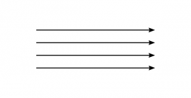
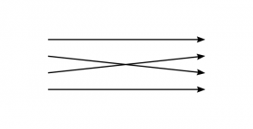
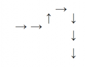
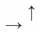
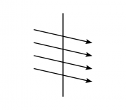

# Editor's Note

_Published by the [Ludwig Wittgenstein Project](https://www.wittgensteinproject.org/)._

_Traduzione di [Luca Bernardi](https://www.wittgensteinproject.org/w/index.php/Project:People#Luca_Bernardi)_

_Seconda edizione a cura di [Michele Lavazza](https://www.wittgensteinproject.org/w/index.php/Project:People#Michele_Lavazza)_

_Questa traduzione è stata condotta su una versione normalizzata del dattiloscritto originale inglese n. 310 (Ts-310, detto *Brown Book*) del *Nachlass* di Wittgenstein generata grazie allo strumento di presentazione dinamica interattiva (Interactive Dynamic Presentation)[^1] messo a disposizione dai [Wittgenstein Archives at the University of Bergen (WAB)](http://wab.uib.no/transform/wab.php?modus=opsjoner). Il testo originale è nel pubblico dominio nel suo paese di origine e in tutti i paesi dove i diritti di proprietà intellettuale scadono 70 anni o meno dopo la morte dell’autore. Questa traduzione, realizzata grazie al sostegno finanziario di Wikimedia Italia, è pubblicata secondo i termini della licenza [Creative Commons Attribuzione](https://creativecommons.org/licenses/by/4.0/)._

# Libro marrone

**Parte I**

Nel raccontare il proprio apprendimento del linguaggio, Agostino dice che per insegnargli a parlare gli sono stati fatti imparare i nomi delle cose. È chiaro che chiunque si esprima così ha in mente il modo in cui un bambino apprende parole quali “uomo”, “zucchero”, “tavolo”, ecc. Non pensa invece, almeno inizialmente, a “oggi”, “non”, “ma”, “magari”.

Immaginiamo che un uomo descriva una partita a scacchi senza accennare all’esistenza delle operazioni dei pedoni. Tale descrizione del gioco in quanto fenomeno naturale risulterà incompleta. D’altro canto si potrebbe dire che costui ha descritto in maniera completa un gioco diverso. In questo senso si può asserire che la descrizione di Agostino dell’apprendimento del linguaggio era corretta per un linguaggio più semplice del nostro. Immaginiamo questo linguaggio: –

**[1).](https://www.wittgensteinproject.org/w/index.php/Brown_Book#1)** La sua funzione è la comunicazione tra un costruttore A e il suo operaio B. B deve passare ad A delle pietre di costruzione. Ci sono blocchi, mattoni, lastre, travi, colonne. Il linguaggio consiste delle parole “blocco”, “mattone”, “lastra”, “colonna”. Quando A pronuncia una di queste parole, B gli porge una pietra di una certa forma. Immaginiamo una società in cui questo sia l’unico tipo di linguaggio. Per apprendere il linguaggio dagli adulti il bambino viene addestrato al suo uso. Utilizzo la parola “addestrato” nella stessa identica accezione di quando parliamo di un animale addestrato a fare certe cose. Con ricompense, punizioni e mezzi simili. Una parte di quest’addestramento consiste nel fatto che indichiamo una pietra, vi dirigiamo l’attenzione del bambino e pronunciamo una parola. Chiamerò questa procedura insegnamento *deittico* delle parole. Nell’uso pratico di questo linguaggio, un uomo pronuncia le parole in quanto ordini e l’altro agisce in accordo con essi. Imparare e insegnare un simile linguaggio comporterà la seguente procedura: il bambino si limita a “nominare” le cose, cioè, quando il maestro indica le cose, a pronunciare le parole del linguaggio. In realtà ci sarà un esercizio ancora più semplice: il bambino ripete le parole pronunciate dal maestro.

\(Nota: obiezione: nel linguaggio 1) la parola “mattone” non ha lo stesso significato che ha nel *nostro* linguaggio. – Questo è vero se nel nostro linguaggio ci sono usi della parola “mattone!” diversi dagli usi della stessa parola nel linguaggio 1). Ma talvolta noi non usiamo “mattone!” proprio allo stesso modo? Oppure dovremmo dire che nel farlo ci serviamo in realtà di un’espressione ellittica, di una forma abbreviata di “Passami un mattone”? È giusto dire che con il *nostro* “mattone!” *intendiamo* “Passami un mattone!”? Perché dovrei tradurre l’espressione “mattone!” nell’espressione “Passami un mattone”? E se si tratta di sinonimi, allora perché non dovrei affermare: se dice “mattone!” intende “mattone!”…? Oppure: se è in grado di intendere “Passami un mattone”, perché non dovrebbe essere in grado di intendere solo “mattone!”? A meno che tu voglia asserire che nel pronunciare “mattone” lui in realtà nella propria mente, a se stesso, dice sempre “Passami un mattone”? Ma che ragione potremmo avere per asserire ciò? Immaginiamo che qualcuno domandi: se un uomo ordina “Passami un mattone”, deve intenderlo in tre parole? O non può intenderlo come un’unica parola composita, sinonimo della singola parola “mattone!”? Si sarebbe tentati di rispondere: l’uomo *intende* tutte e tre le parole se nel suo linguaggio usa tale frase in contrapposizione con altre frasi in cui queste parole vengono impiegate, per esempio “Porta via questi due mattoni”. Se però chiedessi: “In che modo questa frase si distingue dalle altre? Deve averle pensate contemporaneamente, o appena prima o appena dopo, oppure basta che in passato le abbia imparate, ecc.?”? Posta una simile domanda, pare irrilevante quale delle alternative sia corretta. Siamo propensi a dire che l’importante è solo che tali contrapposizioni debbano esistere nel sistema linguistico adoperato e che, mentre l’uomo pronuncia la frase in questione, non c’è alcun bisogno che esse siano presenti nella sua mente. Ora mettiamo a confronto questa conclusione con la nostra domanda iniziale. Nel porla, sembrava che si trattasse di una domanda sullo stato mentale dell’uomo che pronuncia la frase, ma l’idea di significato a cui siamo giunti alla fine non concerne stati mentali. Concepiamo i significati dei segni talvolta come stati mentali dell’uomo che li impiega, talvolta come il ruolo che tali segni ricoprono in un sistema linguistico. La connessione tra queste due idee consiste nel fatto che le esperienze mentali che accompagnano l’uso di un segno sono causate indubbiamente dal nostro uso del segno in un particolare sistema linguistico. William James parla di sensazioni specifiche che accompagnano l’uso di parole come “e”, “se”, “o”. E non ci sono dubbi che, se non altro, spesso a tali parole si legano alcuni gesti, come un gesto di unire insieme a “e” e un gesto di scartare a “non”. E naturalmente ci sono sensazioni visive e muscolari connesse a questi gesti. Tuttavia è chiaro che queste sensazioni non accompagnano tutti gli utilizzi di parole come “non” o “e”. Se in un qualche linguaggio la parola “ma” significa ciò che “non” significa in italiano, è evidente che non bisogna paragonare i significati di queste due parole paragonando le sensazioni che producono. Chiediti con quali mezzi possiamo scoprire le sensazioni che le stesse parole producono in persone diverse in situazioni diverse. Chiediti: “Se dico ‘dammi una mela e una pera ed esci dalla stanza’, nel pronunciare le due parole ‘e’ ho provato le stesse sensazioni?”. Non neghiamo però che chi usa la parola “ma” come in italiano si usa “non” avrà, pronunciando la parola “ma”, sensazioni simili a quelle che hanno gli italiani quando usano “non”. E nei due linguaggi la parola “ma” sarà in generale accompagnata da diversi insiemi di esperienze.)

**[2).](https://www.wittgensteinproject.org/w/index.php/Brown_Book#2)** Consideriamo adesso un’estensione del linguaggio 1). L’operaio sa a memoria la serie di parole da uno a dieci. Quando riceve l’ordine “Cinque lastre!” va dove si trovano le lastre, pronuncia le parole da uno a cinque, prende una piastra per ogni parola e le porta al costruttore. Qui entrambi utilizzano il linguaggio pronunciando le parole. Imparare a memoria i numerali sarà un aspetto essenziale dell’apprendimento di questo linguaggio. Anche l’uso dei numerali verrà insegnato in modo deittico. Ma una stessa parola, per esempio “tre”, verrà insegnata indicando o delle lastre, o dei mattoni, o delle colonne, ecc. E d’altro canto numerali diversi verranno insegnati indicando gruppi di pietre della stessa forma.

\(Osservazione: abbiamo sottolineato l’importanza di imparare a memoria la serie di numerali perché nel linguaggio 1) non c’era alcun elemento paragonabile. E questo mostra che con l’introduzione dei numerali abbiamo introdotto un tipo di strumento totalmente nuovo nel nostro linguaggio. Questa differenza di tipo risulta molto più evidente se prendiamo in considerazione questo esempio semplificato rispetto a quando guardiamo al nostro linguaggio ordinario con i suoi innumerevoli tipi di parole che sul dizionario però sembrano più o meno tutte simili. – –

Cosa hanno in comune le spiegazioni deittiche dei numerali con quelle dei termini “lastra”, “colonna”, ecc., oltre al gesto e al fatto di pronunciare le parole? Nei due casi il modo di utilizzo di tale gesto è diverso. Se diciamo “In un caso indichiamo la forma, nell’altro indichiamo il numero”, tale differenza si offusca. La differenza diventa ovvia e palese solo quando prendiamo in considerazione un esempio *completo* (cioè l’esempio di un linguaggio di cui padroneggiamo ogni dettaglio).)

**[3).](https://www.wittgensteinproject.org/w/index.php/Brown_Book#3)** Introduciamo ora un nuovo strumento di comunicazione: un nome proprio. Quest’ultimo viene dato a un oggetto specifico (una pietra da costruzione specifica) indicandolo e pronunciando il nome. Se A pronuncia il nome, B gli porta l’oggetto. L’insegnamento deittico di un nome proprio è diverso dall’insegnamento deittico dei casi 1) e 2).

\(Osservazione: la differenza non risiede tuttavia nell’atto di indicare e pronunciare la parola né in qualsivoglia atto mentale (significato)? che lo accompagni, bensì nel ruolo che la deissi (l’indicare e il pronunciare) riveste nell’intero addestramento e nell’uso che se ne fa nella pratica comunicativa tramite questo linguaggio. Si potrebbe pensare di poter descrivere la differenza dicendo che negli altri casi si indicano tipi diversi di oggetti. Immagina però che io indichi con la mano una maglia blu. In che modo indicarne il colore è diverso dall’indicarne la forma? – Siamo portati a dire che la differenza è che nei due casi *intendiamo* cose diverse. E questo “intendere” deve essere una sorta di processo che avviene mentre indichiamo. Ciò che ci tenta, in una simile prospettiva, è soprattutto il fatto che, se chiediamo a qualcuno se ha indicato il colore o la forma, costui è quasi sempre in grado di risponderci e di essere certo che la sua risposta è giusta. Se però cerchiamo due atti mentali caratteristici, l’intendere il colore e l’intendere la forma, ecc., non ne troviamo alcuno, o perlomeno non ne troviamo alcuno che debba accompagnare l’indicare sempre rispettivamente il colore oppure la forma. Abbiamo solo un’idea *grossolana* di cosa significhi concentrare l’attenzione sul colore piuttosto che sulla forma o viceversa. Si potrebbe dire che la differenza non risiede nell’atto deittico, bensì in ciò che circonda tale atto nell’uso del linguaggio.)

**[4).](https://www.wittgensteinproject.org/w/index.php/Brown_Book#4)** Nel ricevere l’ordine “Questa lastra!”, B porta la piastra indicata da A. Nel ricevere l’ordine “Piastra, là!”, porta una piastra nel luogo indicato. La parola “là” viene insegnata deitticamente? Sì e no! Durante l’addestramento di una persona all’uso della parola “là”, il maestro gli farà il gesto dell’indicare e pronuncerà la parola “là”. Dobbiamo dire però che così facendo attribuisce a un luogo il nome “là”? Ricorda che in questo caso il gesto d’indicare rientra della pratica stessa della comunicazione.

\(Osservazione: si è ipotizzato che parole quali “là”, “qui”, “adesso”, “questo” siano “*i veri nomi propri*”, in contrapposizione a quelli che chiamiamo nomi propri nella vita quotidiana e che secondo il punto di vista a cui mi riferisco possono considerarsi tali solo in maniera grossolana. C’è una tendenza diffusa a ritenere ciò che nella vita quotidiana si chiama un nome proprio come una rozza approssimazione di quel che idealmente si potrebbe chiamare così. Pensiamo all’idea degli “individui” in Russell. Ne parla come dei costituenti ultimi della realtà, ma dice che è difficile stabilire quali cose sono individui. L’idea è che a rivelarlo dev’essere un’analisi ulteriore. Noi invece abbiamo introdotto l’idea di un nome proprio in un linguaggio in cui era applicata a ciò che nella vita quotidiana chiamiamo “oggetti”, “cose” (“pietre da costruzione”).

– – “Cosa significa la parola ‘esattezza’? Se devi presentarti per un tè alle 4.30 e arrivi proprio quando un buon orologio batte le 4.30, si tratta di vera esattezza? Oppure è esattezza solo se inizi ad aprire la porta nell’istante in cui l’orologio comincia a battere? Ma come si definisce tale istante e come si definisce ‘iniziare ad aprire la porta’? Sarebbe corretto dire: ‘È difficile dire che cosa è vera esattezza, perché conosciamo solo rozze approssimazioni’?”)

**[5).](https://www.wittgensteinproject.org/w/index.php/Brown_Book#5)** Domanda e risposta: A chiede “Quante piastre?”. B le conta e risponde con il numerale.

Chiameremo “giochi linguistici” sistemi di comunicazione quali per esempio 1), 2), 3), 4), 5). Sono più o meno simili a ciò nel linguaggio ordinario chiamiamo giochi. Con tali giochi ai bambini viene insegnata la lingua madre e qui conservano anche la natura divertente dei giochi. Tuttavia non consideriamo i giochi linguistici che descriviamo come parti incomplete di un linguaggio, ma come linguaggi completi in sé, sistemi compiuti di comunicazione umana. Per tenere a mente questo punto di vista, molto spesso è utile immaginarsi un tale linguaggio semplice come l’intero sistema di comunicazione di una tribù dalla struttura sociale primitiva. Pensa all’aritmetica primitiva di queste tribù.

Quando un bambino o un adulto impara quelli che si potrebbero chiamare linguaggi tecnici speciali, per esempio l’uso di grafici e diagrammi, la geometria descrittiva, il simbolismo chimico, ecc., apprende nuovi giochi linguistici. (Osservazione: la nostra immagine del linguaggio dell’adulto è quella di una massa nebulosa, la sua lingua madre, circondata da giochi linguistici compatti e più o meno nitidi, ovvero i linguaggi tecnici).

**[6).](https://www.wittgensteinproject.org/w/index.php/Brown_Book#6)** Chiedere il nome: introduciamo nuove forme di pietre da costruzione. B ne indica una e domanda: “Che cos’è questo?”; A risponde: “Questo è un…” Poi A pronuncia questa nuova parola, per esempio “arco”, e B gli porta la pietra. Le parole “Questo è un…”, accompagnate dal gesto di indicare, le chiameremo spiegazione ostensiva o definizione ostensiva. Nel caso 6) è stato spiegato un nome generico e, precisamente, il nome di una forma. Ma analogamente possiamo chiedere il nome proprio di un oggetto specifico, il nome di un colore, di un numerale, di una direzione.

\(Osservazione: il nostro uso di espressioni come “nomi di numeri”, “nomi di colori”, “nomi di materiali”, “nomi di nazioni” può sorgere da due fonti diverse. *a*) Una è che possiamo immaginare che le funzioni di nomi propri, numerali, parole per colori, ecc. siano molto più simili tra loro di quello che sono in realtà. In tal caso siamo portati a pensare che la funzione di ogni parola sia più o meno come la funzione di un nome proprio di persona, oppure di nomi comuni quali “tavolo”, “sedia”, “porta”, ecc. La seconda fonte *b*) è che se vediamo quanto sono fondamentalmente diverse le funzioni di parole come “tavolo”, “sedia” ecc. rispetto alle funzioni dei nomi propri, e quanto sono diverse da entrambe queste le funzioni, per esempio, dei nomi dei colori, allora non vediamo perché non dovremmo parlare di nomi di numeri o di nomi di direzioni, non come per dire che “numeri e direzioni sono solo forme diverse di oggetti”, bensì per sottolineare l’analogia intrinseca alla mancanza di analogia tra le funzioni delle parole “sedia” e “Jack” da un lato ed “est” e “Jack” dall’altro).

**[7).](https://www.wittgensteinproject.org/w/index.php/Brown_Book#7)** B ha una tabella in cui dei segni scritti sono posti di fronte a immagini di oggetti (per esempio un tavolo, una sedia, una tazza da tè, ecc.). A scrive uno dei segni, B lo cerca nella tabella, poi sposta lo sguardo o il dito dal segno scritto all’immagine di fronte e afferra l’oggetto raffigurato dall’immagine.

Consideriamo ora i diversi tipi di segni che abbiamo introdotto. Prima distinguiamo frasi e parole. Chiamerò frase ogni segno completo in un gioco linguistico; i suoi segni costituenti sono parole. (Questa è solo un’osservazione sommaria e generica su come impiegherò le parole “proposizione” e “parola”.) Una proposizione può consistere di una sola parola. In 1) i segni “mattone!”, “colonna!” sono frasi. In 2) una frase è composta da due parole. A seconda dal ruolo giocato dalle proposizioni in un gioco linguistico, distinguiamo ordini, domande, spiegazioni, descrizioni, e così via.

**[8).](https://www.wittgensteinproject.org/w/index.php/Brown_Book#8)** Se in un gioco linguistico simile a 1), quando A pronuncia l’ordine “lastra, colonna, mattone”, B gli porta una lastra, una colonna e un mattone, possiamo parlare di tre proposizioni oppure di una sola. Se invece

**[9).](https://www.wittgensteinproject.org/w/index.php/Brown_Book#9)** l’ordine delle parole mostra a B l’ordine in cui portare le pietre, diremo che A pronuncia una proposizione consistente di tre parole. Se l’ordine in questo caso prendesse la forma “Lastra, poi colonna, poi mattone!” dovremmo dire che consisteva di quattro parole (non cinque). Tra le parole vediamo gruppi di parole con funzioni simili. Notiamo facilmente una somiglianza nell’uso delle parole “uno”, “due”, “tre”, ecc. e poi di nuovo una somiglianza nell’uso di “lastra”, “colonna” e “mattone”, ecc., e così distinguiamo le parti del discorso. In 8) tutte le parole della proposizione appartenevano alla stessa parte del discorso.

**[10).](https://www.wittgensteinproject.org/w/index.php/Brown_Book#10)** L’ordine in cui B doveva portare le pietre in 9) avrebbe potuto essere indicato dall’uso degli ordinali nel modo seguente: “Secondo, colonna; primo, lastra; terzo, mattone!”. Questo è un caso in cui ciò che in un gioco linguistico era l’ordine delle parole in un altro gioco linguistico è la funzione di parole specifiche.

Riflessioni come la precedente ci mostreranno la varietà infinita delle funzioni delle parole nelle proposizioni, ed è curioso paragonare quello che vediamo nei nostri esempi con le regole semplici e rigide date dai logici per la costruzione delle proposizioni. Se raggruppiamo assieme le parole in base alla somiglianza delle loro funzioni, distinguendo così le parti del discorso, vedremo facilmente che si possono impiegare molti modi di classificazione. Ci vorrebbe poco infatti a immaginare una ragione per non classificare la parola “uno” assieme alla parola “due”, “tre”, ecc., come mostriamo qui sotto:

**[11).](https://www.wittgensteinproject.org/w/index.php/Brown_Book#11)** Considera questa variazione del nostro gioco linguistico 2). Invece di dire “Una lastra!”, “Un blocco!” ecc., A si limita a gridare “lastra!”, “blocco!”, ecc., l’uso degli altri numerali essendo come descritto in 2). Immagina che a un uomo abituato a questa forma (11)) di comunicazione sia stato spiegato l’uso della parola “uno” come descritto in 2). Possiamo facilmente immaginare che si rifiuterebbe di classificare “uno” insieme ai numerali “2”, “3”, ecc.

\(Osservazione: pensa alle ragioni a favore e contro la classificazione di “0” insieme agli altri cardinali. “Il nero e il bianco sono colori?” In quali casi propenderesti per il sì e in quali propenderesti per il no? – Per tanti versi le parole possono essere paragonate a pezzi degli scacchi. Pensa ai vari modi di distinguere diversi tipi di pezzi nel gioco degli scacchi (per esempio pedoni e “pezzi nobili”).

Ricorda l’espressione “due o più”.)

Ci viene naturale considerare gesti come quelli impiegati in 4) o immagini come quelle di 7) alla stregua di elementi o strumenti del linguaggio. (Parliamo talvolta di linguaggio gestuale.) Chiamo schemi le immagini di 7), e altri strumenti linguistici dalla funzione simile. (Questa spiegazione, come altre già fornite qui, è vaga e volutamente tale.) Possiamo dire che parole e schemi hanno tipi diversi di funzioni. Quando facciamo uso di uno schema paragoniamo qualcosa con esso, per esempio una sedia con l’immagine di una sedia. Non abbiamo paragonato una lastra con la parola “lastra”. Nell’introdurre la distinzione “parola, schema”, l’idea non era di istituire una dualità logica definitiva. Abbiamo solo individuato due tipi determinati di strumenti nella varietà di strumenti del nostro linguaggio. Chiamiamo “uno”, “due”, “tre”, ecc. parole. Se invece di questi segni utilizzassimo “–”, “– –”, “– – –”, “– – – –”, questi potremmo chiamarli schemi. Immagina un linguaggio in cui i numerali sono “uno”, “uno uno”, “uno uno uno”, ecc.: in tal caso bisognerebbe chiamare “uno” una parola o uno schema? Lo stesso elemento potrebbe essere impiegato in un contesto come parola e in un altro come schema. Un cerchio può essere il nome di un’ellisse, o d’altra parte uno schema a cui l’ellisse dev’essere paragonata mediante uno specifico metodo di proiezione. Considera anche questi due sistemi di espressione:

**[12).](https://www.wittgensteinproject.org/w/index.php/Brown_Book#12)** A dà a B un ordine costituito da due simboli scritti, il primo una macchia irregolare di un certo colore, diciamo verde, il secondo il disegno del contorno di una figura geometrica, diciamo un cerchio. B gli porta un oggetto con questo contorno e quel colore, diciamo un oggetto verde circolare.

**[13).](https://www.wittgensteinproject.org/w/index.php/Brown_Book#13)** A dà a B un ordine costituito da un simbolo, una figura geometrica dipinta di un colore particolare, diciamo un cerchio verde. B gli porta un oggetto circolare verde. In 12) alcuni schemi corrispondono ai nostri nomi dei colori e altri schemi ai nostri nomi della forma. I simboli in 13) non possono essere considerati come combinazioni di questi due elementi. Una parola tra apici può essere chiamata uno schema. Quindi nella frase “Ha detto ‘Vai al diavolo’”, ‘Vai al diavolo’ è uno schema di ciò che lui ha detto. Confronta questi casi:

*a*) Qualcuno dice “Ho fischiettato \  (fischiettando un motivo)”; *b*) qualcuno scrive “Ho fischiettato”. Una parola onomatopeica come “frusciare” può essere chiamata uno schema. Chiamiamo un’enorme quantità di processi “confrontare un oggetto con uno schema”. Sotto il nome “schema” raggruppiamo molti tipi di simboli. In 7) B confronta un’immagine nella tabella con gli oggetti che ha davanti. Ma in cosa consiste il confronto di un’immagine con l’oggetto? Supponi che la tabella mostri: *a*) un’immagine di un martello, di un paio di pinze, di una sega, di uno scalpello; *b*) le immagini di venti tipi diversi di farfalle. Immagina in che cosa consisterebbe in questi casi il confronto e nota la differenza. Paragona a questi casi un terzo caso *c*) in cui le immagini nella tabella raffigurano pietre da costruzione disegnate in scala e il confronto va fatto con riga e compasso. Supponi che il compito di B consista nel portare una pezza di tessuto dello stesso colore del campione. Come si confrontano i colori del campione e del tessuto? Immagina una serie di casi diversi:

**[14).](https://www.wittgensteinproject.org/w/index.php/Brown_Book#14)** A mostra il campione a B, che poi va a prendere il materiale “a memoria”.

**[15).](https://www.wittgensteinproject.org/w/index.php/Brown_Book#15)** A dà il campione a B, che sposta lo sguardo dal campione allo scaffale con i materiali tra cui deve scegliere.

**[16).](https://www.wittgensteinproject.org/w/index.php/Brown_Book#16)** B posa il campione su ogni striscia di materiale e sceglie quello che non riesce a distinguere dal campione, per il quale la differenza tra campione e materiale sembra svanire.

**[17).](https://www.wittgensteinproject.org/w/index.php/Brown_Book#17)** Immagina invece che l’ordine sia stato: “Portami un materiale leggermente più scuro di questo campione”. In 14) ho detto, servendomi di un’espressione comune, che B prende il materiale “a memoria”. Ma in un simile caso di confronto “a memoria” potrebbero accadere cose estremamente diverse. Immaginane alcune:

**[14a).](https://www.wittgensteinproject.org/w/index.php/Brown_Book#14''a'')** Quando va a prendere il materiale, di fronte all’occhio della mente B ha un’immagine mnemonica. Ora lancia occhiate ai materiali, ora ricorda l’immagine. Svolge questo processo con, diciamo, cinque strisce, dicendosi talvolta “Troppo scuro” e in altri casi “Troppo chiaro”. Alla quinta striscia si ferma, dice “Ecco qui” e la prende dallo scaffale.

**[14b).](https://www.wittgensteinproject.org/w/index.php/Brown_Book#14''b'')** Di fronte all’occhio di B non c’è alcun’immagine mnemonica. Guarda quattro strisce e scuote la testa ogni volta, sentendo una specie di tensione mentale. Quando raggiunge la quinta striscia, la tensione si allenta, lui annuisce e allunga la mano.

**[14c).](https://www.wittgensteinproject.org/w/index.php/Brown_Book#14''c'')** B va allo scaffale senza un’immagine mnemonica, guarda cinque strisce una dopo l’altra, poi prende la quinta dallo scaffale.

“Il confronto però non può ridursi solo a questo”.

Quando chiamiamo i tre casi citati casi di confronto a memoria, sentiamo che la loro descrizione è in un certo senso insoddisfacente o incompleta. Ci viene da dire che la descrizione ha tralasciato l’elemento essenziale di un simile processo e ci ha fornito invece solo i suoi aspetti accessori. L’elemento essenziale, ci pare, sarebbe ciò che potremmo chiamare un’esperienza specifica del confronto e del riconoscimento. Ora è curioso che, se si osservano da vicino alcuni casi di confronto, è molto facile scorgere un gran numero di attività e stati mentali, tutti *più o meno* caratteristici dell’atto del confronto. Ciò accade sia che parliamo di confronto a memoria sia di confronto mediante un campione posto davanti ai nostri occhi. Conosciamo un *gran* numero di tali processi, processi simili l’uno all’altro in un gran numero di modi diversi. Teniamo assieme o vicini i pezzi di cui vogliamo confrontare i colori per un tempo più lungo o più breve, li guardiamo alternativamente o contemporaneamente, li mettiamo sotto luci differenti, nel farlo diciamo cose diverse, abbiamo immagini mnemoniche, sensazioni di tensione e di rilassamento, soddisfazione e insoddisfazione, le varie sensazioni di irrigidimento negli occhi e attorno agli occhi che accompagnano il fissare a lungo lo stesso oggetto e tutte le possibili combinazioni tra queste e molte altre esperienze. Più casi simili osserviamo, e con maggior attenzione li guardiamo, più ci sembra difficile trovare un’unica esperienza mentale caratteristica del confrontare. Infatti, se, dopo aver esaminato *da vicino* una quantità di casi come questi, io ammettessi che esiste una particolare esperienza mentale che si potrebbe chiamare l’esperienza del confronto e che se tu insistessi io dovrei adottare la parola “confronto” solo in quei casi in cui si è verificata tale sensazione specifica, tu ora avresti l’impressione che l’ipotesi di questa esperienza caratteristica abbia perso il suo senso, perché questa esperienza è stata posta accanto a un gran numero di altre esperienze e, dopo aver esaminato i casi, pare che sia proprio tale enorme varietà ciò che davvero unisce tutti i casi di confronto. Poiché “l’esperienza specifica” che stavamo cercando avrebbe dovuto rivestire il ruolo che invece è stato assunto dalla massa di esperienze che ci ha rivelato la nostra analisi: non volevamo che l’esperienza specifica fosse soltanto una tra tante esperienze *più o meno* caratteristiche. (Si potrebbe dire che ci sono due modi di guardare alla questione, uno, per così dire, da vicino, l’altro come da lontano e attraverso la mediazione di un’atmosfera peculiare.) In realtà abbiamo scoperto che il nostro impiego effettivo della parola “confrontare” è diverso da quello che eravamo portati a credere guardando da lontano. Scopriamo che ciò che lega tutti i casi di confronto è un gran numero di somiglianze accavallate e appena ce ne rendiamo conto non sentiamo più l’impellenza di dire che ci deve essere un elemento comune a tutte queste esperienze. Ciò che lega la nave al molo è la corda e la corda è fatta di fibre, ma la sua forza non deriva da nessuna fibra che la attraversa da cima in fondo, bensì dall’accavallarsi di un ingente numero di fibre.

“Certamente però nel caso 14*c*) B ha agito in maniera completamente automatica. Se davvero tutto ciò che è successo è quanto descritto qui, B non sapeva perché ha scelto la striscia che ha scelto. Non aveva ragioni per sceglierla. Se ha scelto quella giusta, l’ha fatto come una macchina”. La nostra prima risposta è che non abbiamo negato che nel caso 14*c*) B ha avuto quella che dovremmo chiamare un’esperienza personale, poiché non abbiamo detto che non ha visto i materiali tra cui ha scelto o quello che ha scelto, e neppure che nell’esaminarli non ha avuto sensazioni muscolari e tattili e simili. E allora quale sarebbe una ragione in grado di giustificare la sua scelta e renderla non-automatica? (Cioè: che aspetto *immaginiamo* che avrebbe?) Penso che dovremmo dire che il contrario del confronto automatico, cioè per così dire il caso ideale del confronto consapevole, era quello in cui si aveva di fronte all’occhio della mente un’immagine mnemonica nitida o quello in cui si vedeva un campione reale e si aveva la sensazione determinata di non riuscire a distinguere tra questi campioni e il materiale scelto. Penso che tale sensazione determinata sia la ragione, la giustificazione della scelta. Questa sensazione specifica, si potrebbe dire, connette le due esperienze della vista del campione, da una parte, e il materiale, dall’altra. Ma allora che cosa connette quest’esperienza specifica a ciascuna di quelle due cose? Noi non neghiamo che una simile esperienza possa intervenire. Ma a esaminarla come abbiamo appena fatto, la distinzione tra automatico e non-automatico non ci appare più netta e definitiva come ci sembrava prima. Non intendiamo dire che tale distinzione smetta di avere valore pratico in casi particolari; per esempio se in una data circostanza ci chiedono “Questa striscia l’hai presa dallo scaffale in maniera automatica, oppure ci hai pensato su?”, noi possiamo essere giustificati a rispondere che non abbiamo agito automaticamente e a dare come spiegazione che abbiamo guardato attentamente il materiale, abbiamo cercato di rammentare l’immagine mnemonica dello schema e abbiamo espresso a noi stessi dubbi e decisioni. Ciò può *nel caso particolare* fungere da distinguo tra automatico e non-automatico. In un altro caso però potremmo distinguere i modi in cui appare un’immagine mnemonica tra un modo automatico e un modo non-automatico, ecc.

Se il nostro caso 14*c*) ti turba, magari sarai portato a dire: “Ma *perché* ha portato proprio questa striscia di materiale? Come l’ha riconosciuta in quanto quella giusta? In base a che cosa?”. – Se chiedi “perché”, è della causa o della ragione che vuoi sapere? Se ti interessa la causa, è abbastanza facile concepire un’ipotesi fisiologica o psicologica che spiega la scelta nelle condizioni date. È compito delle scienze sperimentali vagliare ipotesi simili. Se invece ti interessa la ragione, la risposta è “Non ci deve essere stata per forza una ragione della scelta. Una ragione è un passo che precede il passo della scelta. Ma perché ogni passo dovrebbe essere preceduto da un altro passo?”

“Ma allora B non ha davvero *riconosciuto* il materiale come quello giusto”. – Non devi per forza annoverare 14*c*) nei casi di riconoscimento, ma se sei divenuto cosciente di come i processi che chiamiamo processi di riconoscimento formano una grande famiglia con somiglianze che si accavallano, probabilmente non sarai restio a includere in questa famiglia anche 14*c*). – “In questo caso non manca però a B il criterio in base a cui riconoscere il materiale? In 14*a*), per esempio, aveva l’immagine mnemonica e ha riconosciuto il materiale che stava guardando proprio in base alla sua concordanza con tale immagine”. – Ma davanti a sé aveva un’immagine anche di tale concordanza, un’immagine con cui poter confrontare la congruenza tra lo schema e la striscia per vedere se era quella giusta? E d’altra parte tale immagine non avrebbe potuto essergli data? Supponi, per esempio, che A volesse far ricordare a B che ciò che era richiesto era una striscia esattamente identica al campione e non, come forse in altre circostanze, un materiale leggermente più scuro dello schema. In tal caso A non avrebbe potuto dare a B un esempio della concordanza richiesta dandogli due pezze dello stesso colore (come una specie di promemoria)? Un qualsiasi legame come questo tra l’ordine e la sua esecuzione è necessariamente l’ultimo? – E se dici che in 14*b*) almeno B aveva l’allentarsi della tensione in base al quale riconoscere il materiale giusto, doveva B avere con sé un’immagine di questo rilassamento per poterlo riconoscere come ciò in base a cui bisognava riconoscere il materiale giusto? – –

“Ma se ipotizziamo che B porti la striscia, come in 14*c*), e al confronto con lo schema poi si scopra che ha preso quella sbagliata?” – Ma una simile occorrenza non avrebbe potuto verificarsi anche in tutti gli altri casi? Immagina che in 14*a*) la striscia portata da B si sia rivelata non combaciare con lo schema. Non diremmo in alcuni di questi casi che l’immagine mnemonica è cambiata, in altri che è cambiato lo schema o il materiale, in altri ancora che è cambiata la luce? Non è difficile inventare casi, immaginare circostanze, in cui verrebbe espresso ognuno di questi giudizi. – “Ma alla fin fine non c’è una differenza sostanziale tra i casi in 14*a*) e in 14*c*)?” – – Certamente! Si tratta proprio di quella indicata nella descrizione di questi due casi. – –

In 1) B ha imparato a portare una pietra da costruzione al sentir pronunciare la parola “colonna!”. Potremmo immaginare che quanto è successo in un caso del genere sia questo: nella mente di B la parola pronunciata ha richiamato l’immagine di una colonna, per esempio; l’addestramento aveva, così dovremmo esprimerci, istituito tale associazione. B prende la pietra da costruzione che concorda con l’immagine che egli ha. – Ma deve *necessariamente* essere andata così? Se l’addestramento è stato in grado di produrre la comparsa – automatica – dell’idea o dell’immagine nella mente di B, perché non dovrebbe produrre *le azioni* di B senza l’intervento di un’immagine?

Ciò comporterebbe solo una lieve variazione del meccanismo associativo. Ricorda che all’immagine che viene richiamata dalla parola non si giunge tramite un processo raziocinante (anche se fosse così, ciò non farebbe che spingere il nostro discorso più indietro), ma che questo caso è strettamente paragonabile a quello di un meccanismo in cui si schiaccia un pulsante e compare un indicatore. In effetti si può usare un meccanismo come questo al posto di quello associativo.

Mettiamo le immagini mentali di colori, di forme, di suoni, ecc. ecc., che attraverso il linguaggio rivestono un ruolo nella comunicazione, nella stessa categoria delle superfici colorate effettivamente viste, dei suoni sentiti.

**[18).](https://www.wittgensteinproject.org/w/index.php/Brown_Book#18)** L’oggetto dell’addestramento all’uso delle tabelle (come in 7)) può non essere solo l’insegnamento dell’uso di una tabella particolare, bensì può consistere nel mettere in grado l’allievo di utilizzare o costruire egli stesso tabelle con coordinazioni nuove di segni scritti e immagini. Ipotizza che la prima tabella che una persona è stata addestrata a utilizzare contenesse le quattro parole “martello”, “pinze”, “sega”, “scalpello” e le immagini corrispondenti. Ora potremmo aggiungere l’immagine di un altro oggetto che l’allievo aveva davanti a sé, diciamo di una pialla, e correlarlo alla parola “pialla”. Renderemo la correlazione tra la nuova immagine e parola il più simile possibile alle correlazioni nella tabella precedente. Potremmo aggiungere la nuova parola e immagine sullo stesso foglio, mettere la nuova parola sotto le parole precedenti e la nuova immagine sotto le immagini precedenti. L’allievo sarà ora incoraggiato a utilizzare la nuova immagine e parola senza l’addestramento speciale che gli abbiamo fornito quando gli abbiamo insegnato a servirsi della prima tabella.

Tali atti di incoraggiamento saranno di vario genere e molti saranno possibili solo se l’allievo risponde e risponde in un modo particolare. Immagina i gesti, i suoni ecc. di incoraggiamento che usi quando addestri un cane al riporto. Immagina invece di tentare di addestrare al riporto un gatto. Poiché il gatto non risponderà ai tuoi incoraggiamenti, la maggior parte degli atti di incoraggiamento che hai compiuto nell’addestramento del cane qui non saranno nemmeno da prendere in considerazione.

**[19).](https://www.wittgensteinproject.org/w/index.php/Brown_Book#19)** L’allievo potrebbe anche essere addestrato a dare alle cose nomi di propria invenzione e a portare gli oggetti quando i nomi vengono pronunciati. Gli si presenta, per esempio, una tabella in cui trova da un lato le immagini di oggetti che ha attorno a sé e dall’altro spazi bianchi; e lui gioca il gioco scrivendo segni di propria invenzione di fronte alle immagini e, quando tali segni vengono usati come ordini, reagendo come spiegato sopra. Oppure,

**[20).](https://www.wittgensteinproject.org/w/index.php/Brown_Book#20)** il gioco può consistere nel fatto che B costruisce una tabella e obbedisce a ordini dati nei termini di questa tabella. Durante l’insegnamento dell’uso di una tabella, che per esempio è composta di due colonne verticali, di cui quella a sinistra contiene i nomi e quella a destra le immagini, un nome e un’immagine essendo correlati se situati nella stessa riga orizzontale, una caratteristica importante dell’addestramento potrebbe essere quella che porta l’allievo a far scivolare il dito da sinistra a destra, come se si trattasse di addestrarlo a tracciare una serie di linee orizzontali una sotto l’altra. Tale addestramento faciliterebbe la transizione dalla prima tabella al nuovo elemento.

In accordo con l’uso ordinario chiamerò tabelle, definizioni ostensive e strumenti simili regole. L’uso di una regola può essere spiegato da una regola ulteriore.

**[21).](https://www.wittgensteinproject.org/w/index.php/Brown_Book#21)** Considera l’esempio seguente: introduciamo modi diversi di leggere tabelle. Ogni tabella consiste di due colonne di parole e immagini, come sopra. In certi casi vanno lette orizzontalmente da sinistra a destra, per esempio secondo lo schema:

\

In altri casi secondo schemi quali:

\

Oppure:

\

ecc.

Schemi di questo tipo possono essere allegati alle nostre tabelle in quanto regole per leggerle. Queste regole non potrebbero venire spiegate di nuovo da altre regole? Certamente. D’altro canto, una regola è spiegata in modo incompleto se non si è fornita una regola per il suo uso?

Introduciamo nei nostri giochi linguistici la serie infinita dei numerali. Come facciamo? Ovviamente l’analogia tra tale processo e l’introduzione di una serie di venti numerali non è identica a quella intercorrente tra l’introduzione di una serie di venti numerali e l’introduzione di una serie di dieci numerali. Immaginiamo un gioco come 2) ma svolto con la serie infinita dei numerali. La differenza tra un simile gioco e 2) non consisterebbe solo in un aumento del numero dei numerali. Immaginiamo cioè che di fatto giocando quel gioco abbiamo usato, per esempio, 155 numerali; in tal caso il gioco giocato non sarebbe quello che si potrebbe descrivere dicendo che abbiamo giocato il gioco 2), soltanto con 155 numerali invece di 10. In che cosa consiste però la differenza? (La differenza sembrerebbe quasi riguardare lo spirito in cui vengono giocati i giochi). La differenza tra dei giochi può anche risiedere nel numero delle pedine impiegate, nel numero dei riquadri sulla superficie di gioco, oppure nel fatto che usiamo quadrati in un caso e in un altro esagoni, ecc. Ebbene, la differenza tra gioco finito e gioco infinito non pare consistere negli strumenti materiali del gioco; poiché saremmo portati a dire che l’infinito non può esprimersi tramite essi, cioè che siamo in grado di concepirlo solo nei pensieri ed è dunque in tali pensieri che vanno distinti gioco finito e infinito. (È curioso però che simili pensieri siano esprimibili in segni.) Consideriamo due giochi. Entrambi utilizzano carte numerate e il numero più alto vince.

**[22).](https://www.wittgensteinproject.org/w/index.php/Brown_Book#22)** Uno dei due giochi si svolge con un numero fisso di carte, diciamo 32. Nell’altro gioco in alcune situazioni si può aumentare a piacere il numero delle carte, basta tagliare dei fogli e scriverci sopra un numero. Chiameremo il primo gioco limitato, il secondo illimitato. Immagina che in una mano del secondo gioco il numero di carte effettivamente impiegate sia 32. In questo caso qual è la differenza tra giocare una mano *a*) del gioco illimitato e giocare una mano *b*) del gioco limitato?

La differenza non sarà la stessa che tra una mano di un gioco limitato con 32 carte e la mano di un gioco limitato con un maggior numero di carte. Il numero di carte impiegate era, abbiamo detto, uguale. Ma ci saranno differenze di altro tipo; per esempio, il gioco limitato si svolge con un normale mazzo di carte, il gioco illimitato con un’ampia scorta di fogli bianchi e matite.

Il gioco illimitato si apre con la domanda “Quanto saliamo?”. Se i giocatori cercano il regolamento del gioco in un manuale, alla fine di certe serie di regole troveranno espressione quali “e avanti così” o “e avanti così *ad inf*.”. Quindi la differenza tra le due mani *a*) e *b*) risiede negli strumenti che usiamo, anche se, per nostra stessa ammissione, non nelle carte con cui vengono giocate. Tale differenza però sembra irrilevante e non quella essenziale tra i due giochi. Abbiamo l’impressione che debba esserci da qualche parte una differenza grande ed essenziale. Se però osservi attentamente ciò che accade mentre si gioca una mano dopo l’altra, ti accorgi di riuscire a trovare qualche differenza solo in una serie di dettagli ognuno dei quali parrebbe inessenziale. Per esempio, i gesti con cui si distribuiscono e si giocano le carte nei due casi *possono* essere identici. Durante lo svolgimento della mano *a*), i giocatori possono aver considerato di creare nuove carte e poi averci rinunciato. Ma come si è svolto tale atto di considerare? Potrebbe trattarsi di un processo quale il dire a se stessi, o anche ad alta voce, “Chissà se mi conviene farmi un’altra carta”. Magari però un simile pensiero non è passato per la mente di nessuno dei giocatori. È possibile che tutta la differenza tra una mano del gioco limitato e una mano del gioco illimitato consista in ciò che si è detto prima di iniziare a giocare, per esempio “Facciamo una partita al gioco limitato”.

“Non è però giusto dire che le mani dei due giochi diversi appartengono a sistemi diversi?” Certo. Solo che i fatti a cui ci riferiamo nel dire che appartengono a sistemi diversi sono ben più complessi di quel che potremmo aspettarci.

Confrontiamo ora dei giochi linguistici di cui diremmo che si svolgono con una quantità limitata di numerali con altri di cui invece diremmo che si svolgono con una serie infinita di numerali.

**[23).](https://www.wittgensteinproject.org/w/index.php/Brown_Book#23)** Come 2) A ordina a B di portargli una certa quantità di pietre da costruzione. I numerali sono i segni “1”, “2”, ecc. … “9”, ognuno dei quali è scritto su una carta. A ha una pila di queste carte e dà l’ordine a B mostrandogliene una e pronunciando una delle parole “lastra”, “colonna”, ecc.

**[24).](https://www.wittgensteinproject.org/w/index.php/Brown_Book#24)** Come 23), solo che non c’è la pila di carte numerate. La serie dei numerali 1 … 9 viene imparata a memoria. Negli ordini vengono pronunciati i numerali e il bambino li impara sentendoli scandire a voce.

**[25).](https://www.wittgensteinproject.org/w/index.php/Brown_Book#25)** Si usa un pallottoliere. A sistema il pallottoliere e lo passa a B, che se lo porta dove si trovano le lastre, ecc.

**[26).](https://www.wittgensteinproject.org/w/index.php/Brown_Book#26)** B deve contare le lastre in una pila. Lo fa con un pallottoliere che ha 20 palline. Nella pila non ci sono mai più di 20 piastre. B sistema il pallottoliere per la pila in questione e fa vedere il pallottoliere così sistemato ad A.

**[27).](https://www.wittgensteinproject.org/w/index.php/Brown_Book#27)** Come 26). Il pallottoliere ha 20 palline piccole e una grossa. Se la pila contiene più di 20 piastre, si sposta la pallina grossa. (Quindi in qualche modo la pallina grossa corrisponde alla parola “molti”).

**[28).](https://www.wittgensteinproject.org/w/index.php/Brown_Book#28)** Come 26). Se la pila contiene *n* piastre, *n* essendo più di 20 ma meno di 40, B muove *n* − 20 palline, mostra il pallottoliere così sistemato ad A e batte le mani una volta.

**[29).](https://www.wittgensteinproject.org/w/index.php/Brown_Book#29)** A e B utilizzano i numerali del sistema decimale (scritto o parlato) fino a 20. Il bambino che apprende questo linguaggio impara tali numerali a memoria, ecc., come in 2).

**[30).](https://www.wittgensteinproject.org/w/index.php/Brown_Book#30)** Una certa tribù ha un linguaggio del tipo 2). I numerali adoperati sono quelli del nostro sistema decimale. Nessun numerale impiegato sembra rivestito del ruolo predominante dell’ultimo numerale in alcuni dei giochi di cui sopra (27), 28)). (Si è tentati di proseguire la frase precedente dicendo “anche se naturalmente esiste un numerale massimo effettivamente utilizzato”). I bambini della tribù imparano i numerali nel modo seguente: gli si insegnano i segni da 1 a 20 come in 2) e, con l’ordine “Contale”, a contare file di non più di 20 palline. Quando contando l’allievo arriva al numerale 20, gli si fa un gesto a significare “Prosegui”, al che il bambino dice (quasi sempre, perlomeno) “21”. Analogamente, i bambini vengono fatti contare fino a 22 e oltre, senza che in questi esercizi ci sia un numero particolare che gioca il ruolo predominante di ultimo numero. Nell’ultimo stadio dell’addestramento si ordina all’allievo di contare un gruppo di oggetti, ben più di 20, senza usare il gesto di incoraggiamento per aiutarlo a oltrepassare il numerale 20. Se un bambino non reagisce al gesto di incoraggiamento, lo si separa dagli altri e lo si tratta come un folle.

**[31).](https://www.wittgensteinproject.org/w/index.php/Brown_Book#31)** Un’altra tribù. Il suo linguaggio è come quello in 30). Il più alto numerale di cui si osserva l’utilizzo è 159. Nella vita di questa tribù il numerale 159 gioca un ruolo particolare. Immagina che io abbia detto “Trattano questo numero come se fosse il più alto”, – ma che cosa significa? Possiamo rispondere: “Dicono che è il più alto”? – Pronunciano certe parole, ma come facciamo a sapere che cosa intendono con esse? Un criterio per definire ciò che intendono sarebbero le occasioni in cui costoro impiegano la parola che noi siamo propensi a tradurre con “il più alto”, ovvero il ruolo, potremmo dire, che in base a quanto osserviamo tale parola gioca nella vita della tribù. In effetti si può agevolmente immaginare che il numerale 159 venga impiegato in circostanze tali, insieme a tali gesti e tali forme di comportamento, che saremmo portati a dire che tale numerale gioca il ruolo di un limite insormontabile, pur non avendo la tribù un’espressione corrispondente al nostro “il più alto” e pur non consistendo il criterio per cui il numerale 159 è il numerale più alto in nulla che sia stato *detto* su di esso.

**[32).](https://www.wittgensteinproject.org/w/index.php/Brown_Book#32)** Una tribù ha due sistemi per contare. La gente ha imparato a contare con l’alfabeto dalla A alla Z e anche con il sistema decimale come in 30). Se un uomo si accinge a contare oggetti con il primo sistema, gli si ordina di contare “*nella maniera chiusa*”, nel secondo caso invece “*nella maniera aperta*”; la tribù si serve dei termini “chiusa” e “aperta” anche in riferimento a una porta chiusa e aperta.

\(Osservazioni: 23) è limitata in modo ovvio dal mazzo di carte. 24): Nota l’analogia e la mancanza di analogia tra la *disponibilità limitata* di carte in 23) e di parole nella nostra memoria in 24). Osserva che in 26) la limitazione da un lato risiede nello *strumento* (il pallottoliere con venti palline) e nel suo utilizzo all’interno del gioco, dall’altro lato (in maniera completamente diversa) nel fatto che nella pratica concreta del gioco non devono mai essere contati più di 20 oggetti. In 27) quest’ultimo tipo di limitazione era assente, ma la sfera più grossa fungeva come da sottolineatura della limitatezza dei nostri mezzi. 28) è un gioco limitato o illimitato? La pratica che abbiamo descritto fornisce il limite 40. Siamo propensi a dire che tale gioco “contiene in sé” la possibilità di continuare indefinitamente, ma ricorda che avremmo potuto costruire anche i giochi precedenti come inizi di altrettanti sistemi. In 29) l’aspetto sistematico dei numerali impiegati è perfino più evidente che in 28). Si potrebbe dire che gli strumenti di suddetto gioco non pongono alcuna limitazione, se non fosse per l’osservazione che i numerali fino a 20 vengono appresi a memoria. Ciò suggerisce l’idea che al bambino non si insegni a “*capire*” il sistema che scorgiamo nella notazione decimale. Dei membri della tribù di 30) si dovrebbe certamente dire che sono addestrati a costruire numerali indefinitamente, che l’aritmetica del loro linguaggio non è finita, che la loro serie di numeri non ha termine. (È solo nei casi in cui i numerali sono costruiti “indefinitamente” che diciamo che le persone hanno la serie infinita dei numeri.) 31) potrebbe mostrarti quanto grande è la varietà dei casi immaginabili in cui saremmo portati a dire che l’aritmetica della tribù ha a che fare con una serie finita di numeri, anche a dispetto del fatto che il modo in cui i bambini vengono addestrati a usare i numerali non implichi alcun limite superiore. In 32) i termini “chiuso” e “aperto” (che con una lieve variazione dell’esempio potrebbero trasformarsi in “limitato” e “illimitato”) sono inseriti nel linguaggio della tribù stessa. Se lo si introduce in quel gioco semplice e chiaramente circoscritto, non c’è naturalmente nulla di misterioso nell’uso della parola “aperto”. Ma la parola in questione corrisponde al nostro “infinito” e i giochi che giochiamo con quest’ultima parola differiscono da 31) solo in quanto sono estremamente più complicati. In altre parole, il nostro impiego del termine “infinito” è tanto *lineare* quanto quello di “aperto” in 32) e la nostra idea che il suo significato sia “trascendente” si fonda su un’incomprensione.)

Potremmo dire all’incirca che i casi illimitati si caratterizzano così: non sono giocati con un *rifornimento definito* di numerali, bensì con un *sistema* per costruire numerali (indefinitamente). Quando diciamo che qualcuno ha ricevuto un sistema per costruire numerali, generalmente pensiamo a una delle tre occorrenze seguenti: *a*) a dargli un *addestramento* simile a quello descritto in 30), che, come l’esperienza ci insegna, gli farà superare prove analoghe a quelle lì menzionate; *b*) a creare una *disposizione* nella mente del soggetto in questione, o nel suo cervello, a reagire in quel modo; *c*) a fornirgli una *regola generale* per la costruzione di numerali.

Cos’è che chiamiamo una regola? Considera l’esempio seguente:

**[33).](https://www.wittgensteinproject.org/w/index.php/Brown_Book#33)** B si muove in base alle regole che A gli fornisce. B riceve la seguente tabella:

|   |   |
|---|---|
|a |→ |
|b |← |
|c |↑ |
|d |↓ |

A dà un ordine composto dalle lettere nella tabella, per esempio “a a c a d d d”. B guarda la freccia corrispondente a ogni lettera presente nell’ordine e si muove di conseguenza; per esempio così:

\

Chiameremo la tabella 33) una regola (oppure “l’espressione di una regola”. Perché fornisco queste due espressioni sinonimiche verrà chiarito in seguito). Non saremo invece portati a chiamare la frase stessa “a a c a d d d” una regola. È naturalmente la descrizione del percorso che B deve compiere. Tuttavia in alcune circostanze tale descrizione verrebbe chiamata regola, per esempio nel caso seguente:

**[34).](https://www.wittgensteinproject.org/w/index.php/Brown_Book#34)** B deve tracciare vari disegni lineari ornamentali. Ogni disegno è la ripetizione dei un elemento che A gli fornisce. Quindi se A dà l’ordine “c a d a”, B traccia una linea così: \

In questo caso credo che si debba dire che “c a d a” è la regola per tracciare il disegno. Approssimando, diremo che a caratterizzare ciò che chiamiamo regola è il fatto di essere applicata ripetutamente, in un numero indefinito di occorrenze. Confronta con 34), per esempio, il caso seguente:

**[35).](https://www.wittgensteinproject.org/w/index.php/Brown_Book#35)** Un gioco svolto con pezzi di varie forme su una scacchiera. Come ogni pezzo può muoversi è stabilito da una regola. Quindi la regola per un pezzo specifico è “ac”, per un altro “acaa”, e avanti così. Il primo pezzo può dunque muoversi così: \ , il secondo così:\ . Sia una formula come “ac” sia un diagramma come quello che le corrisponde potrebbero qui essere chiamati una regola.

**[36).](https://www.wittgensteinproject.org/w/index.php/Brown_Book#36)** Immagina che, dopo aver giocato il gioco 33) varie volte come descritto sopra, lo si giochi con la variazione seguente: B non guarda più la tabella, ma, mentre legge gli ordini di A, le lettere gli richiamano alla mente le immagini delle frecce (per associazione) e B agisce seguendo tali frecce immaginarie.

**[37).](https://www.wittgensteinproject.org/w/index.php/Brown_Book#37)** Dopo aver giocato così varie volte, B si sposta seguendo l’ordine scritto come avrebbe fatto se avesse cercato le frecce nella tabella o le avesse immaginate, ma senza che in realtà intervenga alcuna rappresentazione del genere. Immagina anche la variazione seguente:

**[38).](https://www.wittgensteinproject.org/w/index.php/Brown_Book#38)** Mentre B viene addestrato a eseguire un ordine scritto, gli si mostra una sola volta la tabella di 33), dopodiché, senza più alcun intervento della tabella, egli obbedisce agli ordini di A nello stesso modo in cui B obbedisce, in 33), ogni volta con l’aiuto della tabella.

In tutti questi casi, potremmo dire che la tabella 33) è una regola del gioco. Ma in ciascuno dei casi la regola svolge un ruolo diverso. In 33) la tabella è uno strumento utilizzato in quella che chiameremmo *la* *pratica* del gioco. In 36) è rimpiazzata dall’operare dell’associazione. In 37) nella pratica del gioco non è rimasta nemmeno l’ombra della tabella e in 38) la tabella è dichiaratamente uno strumento utile solo all’*addestramento* di B.

Immagina però quest’altro caso:

**[39).](https://www.wittgensteinproject.org/w/index.php/Brown_Book#39)** Una tribù si serve di un certo sistema di comunicazione. Lo descriverò dicendo che assomiglia al nostro gioco 38), tranne che per l’assenza dell’uso di una tabella durante l’addestramento. L’addestramento *potrebbe* consistere nell’accompagnare per mano l’allievo lungo il percorso per cui lo si vuole far camminare. Ci si potrebbe però immaginare anche un altro caso:

**[40).](https://www.wittgensteinproject.org/w/index.php/Brown_Book#40)** in cui nemmeno questo addestramento è necessario e in cui, per così dire, l’aspetto delle lettere abcd ha generato naturalmente l’impulso a muoversi nella maniera descritta. Di primo acchito una causa simile ci lascia perplessi. Sembra che si stia presupponendo un’operazione mentale particolarmente bizzarra. Oppure ci viene da chiedere “Lui come diavolo fa a sapere in quale direzione muoversi se gli si mostra la lettera *a*?”. Ma in questo caso la reazione di B non è identica a quella descritta in 37) e 38) e in fondo anche alla nostra reazione tipica quando sentiamo un ordine e obbediamo? Il fatto che in 38) e in 39) l’addestramento *precedeva* l’esecuzione dell’ordine non cambia infatti il processo della sua esecuzione. In altre parole “il curioso meccanismo mentale” presupposto in 40) non è altro che ciò che in 37) e 38) abbiamo ipotizzato quale risultato dell’addestramento. “Ma *potrebbe* un tale meccanismo essere innato?” Hai però riscontrato qualche difficoltà nel presupporre che in B fosse innato *quel* meccanismo che gli ha permesso di rispondere all’addestramento nel modo corretto? Ricorda che la regola o spiegazione dei segni abcd data nella tabella 33) non era essenzialmente l’ultima e che per l’utilizzo delle tabelle in questione avremmo potuto fornire una tabella, e avanti così. (Cfr. 21).)

Come si spiega a qualcuno come eseguire l’ordine “Vai da *questa* parte!” (indicando con una freccia la direzione in cui si vuole che vada)? Ciò non potrebbe significare l’andare nella direzione che noi chiameremmo contraria a quella della freccia? Ogni spiegazione su come si deve seguire la freccia non fa le veci di un’altra freccia? Che cosa ribatteresti alla spiegazione seguente: un uomo dice “Se indico da questa parte (indicando con la mano destra) intendo che tu ti muova così (indicando con la mano sinistra nella stessa direzione)”? Questo esempio mostra semplicemente gli estremi tra cui variano gli usi dei segni.

Torniamo a 39). Qualcuno visita la tribù e osserva l’uso dei segni nel loro linguaggio. Descrive tale linguaggio dicendo che le sue frasi sono composte dalle lettere abcd utilizzate secondo la tabella 33). Notiamo che l’espressione “Un gioco si svolge secondo la regola così-e-così” si impiega non solo nella varietà dei casi esemplificata da 36), 37) e 38), ma anche in casi in cui la regola non è né uno strumento dell’addestramento, né della pratica del gioco, ma sta con esso nella stessa relazione che intercorre tra la nostra tabella e la pratica del gioco 39). In tale circostanza si potrebbe chiamare la tabella una legge naturale che descrive il comportamento dei membri della tribù. Oppure potremmo dire che la tabella è un documento appartenente alla storia naturale della tribù.

Nota che nel gioco 33) ho operato una distinzione netta tra l’ordine da eseguire e la regola impiegata. In 34) invece abbiamo chiamato regola la frase “c a d a” che costituiva l’ordine. Immagina anche la variazione seguente:

**[41).](https://www.wittgensteinproject.org/w/index.php/Brown_Book#41)** Il gioco assomiglia a 33), ma l’allievo non è addestrato soltanto a servirsi di un’unica tabella; l’addestramento si prefigge invece di fargli impiegare qualunque tabella che correla lettere e frecce. Con ciò intendo semplicemente dire che si tratta di un tipo particolare di addestramento, per certi versi analogo a quello descritto in 30). Mi riferirò a un addestramento simile a quello di 30) come a un “*addestramento generico*”. Gli addestramenti generici formano una famiglia i cui membri sono molto diversi l’uno dall’altro. Quello a cui penso consiste soprattutto: *a*) in un addestramento a una gamma limitata di azioni, *b*) nel dare all’allievo un’indicazione per estendere tale gamma, e *c*) in esercizi e prove a caso. Dopo l’addestramento generico l’ordine dovrà consistere nel fornirgli un segno di questo tipo:

rrtst

|   |   |
|---|---|
|r |↗ |
|s |↖ |
|t |↓ |

Lui esegue l’ordine muovendosi così:

\

Qui mi pare che si debba affermare che la tabella, la regola, *fa parte* dell’ordine.

Nota, non stiamo dicendo “*che cos’è una regola*”, ma solo elencando diverse applicazioni della parola “regola”; e senz’altro lo facciamo fornendo applicazioni delle parole “espressione di una regola”.

Nota anche che in 41) non c’è un’obiezione ovvia contro il fatto di chiamare frase l’intero simbolo dato, anche se *potremmo* distinguere al suo interno tra la frase e la tabella. Ciò che qui ci tenta particolarmente a formulare una simile distinzione è la scrittura lineare della parte fuori dalla tabella. Anche se per certi versi bisognerebbe considerare meramente esterno e inessenziale il carattere lineare della frase, tale elemento e altri analoghi giocano un ruolo importante in ciò che in quanto logici siamo portati a dire su frasi e proposizioni. E quindi concepire il simbolo di 41) come un’unità ci può aiutare a comprendere quale aspetto *può* avere una frase.

Prendiamo ora in considerazione questi due giochi:

**[42).](https://www.wittgensteinproject.org/w/index.php/Brown_Book#42)** A dà ordini a B: si tratta di segni scritti composti di puntini e trattini e B li esegue compiendo coreografie di danza composte di figure specifiche. Dunque l’ordine “– ·” va espletato alternando un passo e un saltello; l’ordine “· · – – –” alternando due saltelli e tre passi, ecc. L’addestramento a tale gioco è “generico” nel senso illustrato in 41); mi piacerebbe dire che “gli ordini dati non si muovono in un intervallo limitato. Includono combinazioni di qualunque quantità di puntini e trattini”. – Ma che cosa significa che gli ordini non si muovono in un intervallo limitato? Non è insensato? Gli ordini dati nella pratica del gioco, non importa quali siano, costituiscono tale intervallo limitato. – Be’, ciò che intendevo con “gli ordini non si muovono in un intervallo limitato” era che né nell’insegnamento del gioco né nella sua pratica una limitazione dell’intervallo ricopre un ruolo “predominante” (vedi 30)) oppure, in altri termini, che l’intervallo del gioco (dire “limitato” sarebbe qui superfluo) è semplicemente l’estensione della sua pratica effettiva (“accidentale”). (In questo il nostro gioco è uguale a 30).) Cfr. questo gioco con il seguente:

**[43).](https://www.wittgensteinproject.org/w/index.php/Brown_Book#43)** Gli ordini e la loro esecuzione come in 42); ma si usano solo i tre segni “– ·”, “– · ·”, “· – –”. Diciamo che in 42) nell’esecuzione dell’ordine B è *guidato* dal segno fornitogli. Se però ci chiediamo se i tre segni in 43) guidano B nell’esecuzione degli ordini, a seconda del modo in cui guardiamo tale esecuzione, ci sembra di poter rispondere sia sì che no.

Se cerchiamo di decidere se in 43) B è guidato dai segni o meno, siamo portati a dare risposte come la seguente: *a*) B è guidato se non si limita a guardare a un ordine, per esempio “· – –” come a un’unità per poi agire e invece lo legge “parola per parola” (i termini impiegati nel nostro linguaggio essendo “·” e “–”) e agisce in base alle parole lette.

Potremmo rendere più chiari tali casi immaginando che “leggere parola per parola” consista nell’indicare ogni parola della frase a turno con il dito invece di indicare l’intera frase tutta in una volta, magari indicandone l’inizio. Per amor di semplicità ipotizzeremo che “agire in base alle parole” consista nell’agire (compiendo un passo o un saltello) di volta in volta dopo ciascuna parola della frase. – *b*) B è guidato se espleta un processo conscio che istituisce una connessione tra l’atto di indicare una parola e l’atto di compiere un saltello o un passo. Possiamo raffigurarci tale connessione in vari modi. Per esempio, B ha una tabella in cui un trattino è correlato all’immagine di un uomo che compie un passo e un puntino è correlato all’immagine di un uomo che compie un saltello. Allora gli atti coscienti che connettono il leggere l’ordine all’eseguirlo potrebbero consistere nel fatto di consultare la tabella o nel fatto di consultarne un’immagine mnemonica “con l’occhio della mente”. *c*) B è guidato se non soltanto reagisce a ogni parola nell’ordine, ma sperimenta lo sforzo specifico del “cercare di ricordare cosa significa il segno” e poi l’allentarsi dello sforzo quando il significato, l’azione giusta, gli sorge nella mente.

Tutte queste spiegazioni paiono in un certo senso insoddisfacenti, ed è la limitazione del nostro gioco a renderle tali. Ciò si esprime con la spiegazione che B è guidato dalla particolare combinazione delle parole in una delle nostre tre frasi se *è in grado* di eseguire anche ordini consistenti in altre combinazioni di puntini e trattini. E se diciamo così ci sembra che la “*capacità*” di eseguire ordini sia uno stato particolare della persona che esegue gli ordini di 42). Al contempo non riusciamo a trovare in un simile caso nulla che potremmo considerare suddetto stato.

Vediamo che ruolo hanno le parole “potere” o “essere in grado di” nel nostro linguaggio. Consideriamo gli esempi seguenti:

**[44).](https://www.wittgensteinproject.org/w/index.php/Brown_Book#44)** Immagina che per uno scopo non meglio specificato delle persone si servano di uno strumento o attrezzo che consiste in una tavola con una fessura che guida il movimento di un piolo. L’uomo che usa l’attrezzo infila il piolo nella fessura. Ci sono tavole con fessure dritte, circolari, ellittiche, ecc. Il linguaggio di coloro che utilizzano tale strumento contiene espressioni per descrivere l’atto di muovere il piolo nella fessura. Si parla di muoverlo in cerchio, in linea retta, ecc. Hanno anche un modo per descrivere la tavola impiegata. Fanno così: “Questa è una tavola il cui il piolo *può* essere mosso circolarmente”. In questo caso si potrebbe chiamare la parola “può” un operatore per mezzo del quale la forma di espressione che descrive un’azione si trasforma nella descrizione di uno strumento.

**[45).](https://www.wittgensteinproject.org/w/index.php/Brown_Book#45)** Immagina un popolo nel cui linguaggio non esistono forme proposizionali quali “Il libro è nel cassetto” o “L’acqua è nel bicchiere”, ma in cui ogniqualvolta noi utilizziamo espressioni simili loro dicono “Il libro può essere preso dal cassetto” o “L’acqua può essere presa dal bicchiere”.

**[46).](https://www.wittgensteinproject.org/w/index.php/Brown_Book#46)** Un’attività tipica degli uomini di una certa tribù consiste nel saggiare la robustezza di alcuni bastoni. La si svolge cercando di piegare tali bastoni con le mani. Nel loro linguaggio costoro hanno espressioni della forma “Questo bastone può essere piegato facilmente” oppure “Questo bastone può essere piegato con difficoltà”. Usano tali espressioni come noi usiamo “Questo bastone è elastico” o “Questo bastone è duro”. Voglio dire che non utilizzano la frase “Questo bastone può essere piegato facilmente” come noi ci serviremo della proposizione “Mi sta riuscendo facile piegare questo bastone”. La impiegano invece in maniera tale che noi diremmo che stanno descrivendo uno stato del bastone. Per esempio si servono di frasi come “Questa capanna è fatta di bastoni che possono essere piegati facilmente”. (Pensa a come noi formiamo certi aggettivi dai verbi mediante il suffisso “-bile”, per esempio in “deformabile”.)

Adesso si potrebbe dire che negli ultimi tre casi le frasi della forma di “questo-e-quest’altro può succedere” descrivono stati di oggetti, ma tra questi esempi ci sono grandi differenze. In 44) ci siamo visti descrivere tale stato davanti agli occhi. Abbiamo visto che la tavola ha una fessura circolare o lineare, ecc. In 45), almeno per certi versi, le cose stavano ancora così, vedevamo gli oggetti nella scatola, l’acqua nel bicchiere, ecc. In tali circostanze impieghiamo l’espressione “stato di un oggetto” in un modo tale che a essa corrisponde ciò che si potrebbe chiamare un’esperienza sensibile statica.

Quando però parliamo dello stato di un bastone in 46), nota che a tale “stato” non corrisponde un’esperienza sensibile particolare che si protrae finché dura tale stato. Invece il criterio per stabilire se qualcosa si trova o meno nello stato in questione consiste in *certe prove* che facciamo.

Possiamo dire che un’automobile va a quaranta chilometri all’ora anche se viaggia solo per mezz’ora. Possiamo spiegare tale modo di esprimerci dicendo che l’automobile si sposta con una velocità tale che in un’ora le permette di compiere quaranta chilometri. E qui siamo di nuovo portati a parlare della velocità della macchina come di uno stato del suo movimento. Credo che non impiegheremmo tale espressione se non avessimo altre “esperienze del movimento” oltre a quelle di un corpo che si trova in un luogo specifico in un dato momento e in un luogo diverso in un altro momento; se per esempio le nostre esperienze del movimento si riducessero a quelle che abbiamo quando vediamo che la lancetta delle ore dell’orologio si è spostata da un punto all’altro del quadrante.

**[47).](https://www.wittgensteinproject.org/w/index.php/Brown_Book#47)** Nel linguaggio di una tribù ci sono comandi per l’esecuzione di certe azioni in guerra, per esempio “Spara!”, “Corri!”, “Striscia!”, ecc. Costoro dispongono anche di una maniera particolare di descrivere la corporatura di un uomo. Tale descrizione ha la forma “È in grado di correre veloce”, “È in grado di scagliare la lancia lontano”. Ciò che mi autorizza a dire che queste frasi sono descrizioni della corporatura di un uomo è il loro impiego. Quindi, se vedono un uomo con le gambe molto muscolose ma che per qualche ragione ha perso la mobilità degli arti inferiori, dicono che si tratta di un uomo che può correre veloce. L’immagine disegnata di un uomo dai bicipiti robusti la descriverebbero come la rappresentazione di “uno che è in grado di scagliare la lancia lontano”.

**[48).](https://www.wittgensteinproject.org/w/index.php/Brown_Book#48)** Prima di andare in guerra, gli uomini di una tribù si sottopongono a una specie di esame medico. L’esaminatore fa loro compiere una serie di prove standardizzate. Fa sollevare loro certi pesi, agitare le braccia, saltellare, ecc. Poi esprime un verdetto come “Tal-dei-tali è in grado di scagliare la lancia” o “è in grado di lanciare il boomerang” o “è adatto a inseguire il nemico”, ecc. Nel linguaggio della tribù non ci sono espressioni speciali per le attività eseguite durante gli esami; a queste attività ci si riferisce solo in quanto prove per certe attività militari.

Riguardo a questo esempio e ad altri, è importante osservare che alla nostra descrizione del linguaggio adoperato dai membri di una certa tribù si potrebbe obiettare che negli scampoli che diamo del loro linguaggio li facciamo parlare in italiano e dunque presupponiamo già tutto lo sfondo della lingua italiana, ovvero i significati abituali delle parole per noi. Dunque se dico che in un certo linguaggio non c’è un verbo specifico per “saltellare” ma che al suo posto tale linguaggio si serve dell’espressione “compiere la prova per il lancio del boomerang”, mi si potrebbe chiedere in quale modo ho caratterizzato l’impiego delle espressioni “compiere una prova per” e “lanciare il boomerang” per esser giustificato a sostituire queste espressioni italiane a quelle originali. A ciò noi dobbiamo ribattere che abbiamo fornito solo una descrizione appena abbozzata delle pratiche dei nostri linguaggi inventati e che in taluni casi ci siamo limitati ad accenni, ma che sarebbe facile rendere tali descrizioni più complete. Quindi in 48) avrei potuto specificare che per far eseguire le prove agli uomini l’esaminatore dà loro degli ordini. Tutti questi ordini cominciano con un’espressione particolare che potrei tradurre in italiano con “Fai la prova”. A quest’espressione ne segue un’altra che effettivamente in battaglia si impiega per certe azioni. In guerra c’è un comando sentendo il quale i membri della tribù scagliano i boomerang e che io perciò dovrei tradurre con “Scaglia il boomerang!”. Inoltre se un uomo fa un resoconto della battaglia al suo capo, utilizza ancora l’espressione che io ho tradotto con “Scagliare il boomerang”, stavolta in una descrizione. Ora ciò che caratterizza un ordine in quanto tale o una descrizione in quanto tale o una domanda in quanto tale, ecc., è – come abbiamo detto – il ruolo giocato dall’enunciazione di tali segni nella pratica complessiva del linguaggio. Ovverosia se una parola del linguaggio della nostra tribù è tradotta correttamente o meno in italiano dipende dal ruolo che tale termine riveste nella vita complessiva della tribù; le occasioni in cui la si usa, le espressioni emotive con cui di solito la si accompagna, le idee che generalmente desta o che spingono a usarla, ecc. A mo’ di esercizio chiediti: in quali casi diresti che una certa parola enunciata dai membri della tribù è un saluto? In quali casi diresti che corrisponde al nostro “Arrivederci”, in quali invece a “Ciao”? In quali casi diresti che una parola straniera corrisponde al nostro “magari” – alle nostre espressioni di dubbio, fiducia, certezza? Ti accorgerai che le giustificazioni per considerare qualcosa come un’espressione di dubbio, convinzione, ecc. consistono in gran parte, ma ovviamente non del tutto, in descrizioni di gesti, del gioco della mimica facciale e perfino del tono di voce. Rammenta allora che le esperienze personali di un’emozione devono consistere in parte di esperienze assolutamente localizzate; se faccio una smorfia di rabbia, percepisco la tensione muscolare nella mia fronte aggrottata, se piango le sensazioni che sperimento attorno agli occhi sono naturalmente parte, e parte importante, di ciò che provo. Credo sia questo ciò a cui si riferiva William James con l’affermazione secondo la quale un uomo non piange perché è triste ma è triste perché piange. Il motivo per cui tale punto spesso non è compreso è che pensiamo all’enunciazione di un’emozione come se si trattasse di un espediente artificioso per far sapere agli altri che ne siamo affetti. Invece non c’è confine netto tra tali “espedienti artificiosi” e ciò che si potrebbe chiamare l’espressione naturale dell’emozione. Cfr. a riguardo: *a*) piangere, *b*) alzare la voce quando si è furiosi, *c*) scrivere una lettera furiosa, *d*) suonare il campanello per chiamare un domestico che si vuole sgridare.

**[49).](https://www.wittgensteinproject.org/w/index.php/Brown_Book#49)** Immagina una tribù nel cui linguaggio esiste un’espressione corrispondente al nostro “Ha fatto così-e-così” e un’altra espressione corrispondente al nostro “È in grado di fare così-e-così”, e che tuttavia la seconda sia impiegata solo quando il suo utilizzo è giustificato dallo stesso fatto che giustificherebbe anche la prima. Che cosa mi può portare a dire così? La tribù dispone di una forma di comunicazione che, per via delle circostanze in cui è impiegata, noi chiameremmo narrazione di eventi passati. Ci sono anche circostanze in cui dovremmo formulare e rispondere a domande come “È in grado Tal-dei-tali fare questo?”. Tali circostanze possono essere descritte, per esempio, dicendo che un capo sceglie gli uomini adatti per una certa azione, come attraversare un fiume, scalare una montagna, ecc. In quanto criterio distintivo dell’espressione “il capo sceglie gli uomini adatti per la tale azione” non prenderò in considerazione ciò che egli dice, ma solo gli altri elementi della situazione. In queste circostanze il capo pone una domanda che, per quanto attiene alle sue conseguenze pratiche, dovrebbe essere tradotta nel nostro “È in grado Tal-dei-tali di attraversare il fiume a nuoto?”. A fornire una risposta affermativa a tale domanda sono però solo coloro che hanno effettivamente attraversato il fiume a nuoto. Questa risposta non viene data con le stesse parole con cui, nelle circostanze tipiche di una narrazione, un uomo direbbe che ha attraversato il fiume a nuoto, bensì nei termini della domanda posta dal capo. Non viene data invece una risposta affermativa nei casi in cui noi certamente risponderemmo “sono in grado di attraversare il fiume a nuoto”, cioè se per esempio ho già compiuto imprese natatorie più ardue ma non proprio l’attraversamento a nuoto di questo particolare fiume.

In questo linguaggio allora le due espressioni “Ha fatto così-e-così” e “È in grado di fare così-e-così” hanno lo stesso significato oppure significati diversi? Se ci pensi, qualcosa ti porterà a rispondere in un modo, qualcosa a rispondere nell’altro. Ciò evidenzia solo che qui la domanda in questione non ha un significato chiaramente definito. Tutto ciò che posso dire è: se il fatto che loro dicono “Lui è in grado di…” se lui ha effettivamente fatto… è il tuo criterio per stabilire l’identità di significato, allora le due espressioni hanno lo stesso significato. Se sono le circostanze in cui la si impiega a fare il significato di un’espressione, i significati invece sono diversi. L’effettivo impiego delle parole “essere in grado” – l’espressione della possibilità in 49) – può aiutarci a comprendere l’idea che se qualcosa può succedere allora dev’essere già accaduta prima (Nietzsche). Sarà anche interessante esaminare, alla luce degli esempi forniti, l’affermazione secondo cui ciò che succede può succedere.

Prima di continuare a riflettere sull’uso di “l’espressione della possibilità”, facciamo un po’ di chiarezza sulla porzione del nostro linguaggio in cui si dicono cose sul passato e sul futuro, cioè sull’impiego di frasi contenenti formule quali “ieri”, “un anno fa”, “tra cinque minuti”, “prima che facessi questo”, ecc. Considera l’esempio seguente:

**[50).](https://www.wittgensteinproject.org/w/index.php/Brown_Book#50)** Immagina come si potrebbe addestrare un bambino alla pratica della “narrazione di eventi passati”. Inizialmente lo si è addestrato a chiedere certe cose (ovvero a dare ordini, vedi 1)). Ha fatto parte di quest’addestramento l’esercizio di “nominare le cose”. Così ha imparato a nominare (e chiedere che gli si portino) una decina di giocattoli. Poniamo che abbia giocato con tre di essi (per esempio una palla, un bastone e un sonaglio), e che poi un adulto glieli tolga e pronunci una frase come “Aveva una palla, un bastone e un sonaglio”. In una situazione simile l’adulto interrompe l’elencazione e induce il bambino a completarla. In un’altra occasione magari dice solo “Aveva…” e lascia che sia il bambino a compiere l’intera elencazione. Il modo per “indurre il bambino a proseguire” può essere questo: interrompere l’elencazione con una certa espressione facciale e un tono di voce in levare che chiameremmo di aspettativa. Tutto allora dipende dal reagire o meno del bambino a tale “induzione”. C’è però un curioso malinteso in cui è facilissimo cadere, ovvero il fatto di considerare “i mezzi esteriori” di cui il maestro si serve per indurre il bambino a proseguire come ciò che potremmo chiamare una maniera indiretta di farsi capire dal bambino. Guardiamo alla situazione come se il bambino già possedesse un linguaggio in cui pensare e il compito dell’insegnante consistesse nell’indurlo a indovinare un certo significato nel regno dei significati già presente nella mente del bambino, come se nel proprio linguaggio privato il bambino potesse porsi una domanda quale “Vuole che continui, o che ripeta quel che ha appena detto, o qualcos’altro ancora?” (Cfr. 30).)

**[51).](https://www.wittgensteinproject.org/w/index.php/Brown_Book#51)** Un altro esempio di un tipo primitivo di narrazione di eventi passati: viviamo in un paesaggio con dei punti di riferimento naturali all’orizzonte. È facile quindi ricordare il luogo in cui il sole sorge in una particolare stagione, o quello in cui si libra allo zenit, o quello in cui tramonta. Abbiamo delle immagini caratteristiche del sole in posizioni diverse nel nostro paesaggio. Chiamiamo tale serie di immagini la serie del sole. Abbiamo anche immagini caratteristiche delle attività di un bambino, sdraiato a letto, intento ad alzarsi, a vestirsi, a pranzare, ecc. Chiamerò questo *insieme* le immagini della vita. Immagino che il bambino, nel corso delle proprie attività quotidiane, sia spesso in grado di notare la posizione del sole. Mentre il bambino è intento a fare una certa cosa, attiriamo la sua attenzione sulla posizione del sole. Poi gli facciamo vedere sia un’immagine che rappresenta l’attività che stava compiendo sia un’immagine che mostra il sole nella sua posizione di quel momento. Possiamo quindi raccontare approssimativamente la giornata del bambino schierando una fila di immagini della vita e, sopra, quella che ho chiamato la serie del sole, le due file nella giusta correlazione. Lasceremo poi che sia il bambino a concludere tale storia per immagini, che noi lasceremo incompleta. A questo punto vorrei dire che tale forma di addestramento (vedi 50) e 30)) è una delle caratteristiche salienti nell’uso del linguaggio, o nel pensiero.

**[52).](https://www.wittgensteinproject.org/w/index.php/Brown_Book#52)** Una variazione di 51). Nella stanza del bebè c’è un grande orologio e per evitare complicazioni immaginiamo che abbia solo la lancetta delle ore. La storia della giornata del bambino è narrata come sopra, ma non c’è la serie del sole; invece scriviamo una delle cifre del quadrante accanto a ognuna delle immagini della vita.

**[53).](https://www.wittgensteinproject.org/w/index.php/Brown_Book#53)** Nota che avrebbe potuto esserci un gioco simile con il coinvolgimento, per così dire, anche del tempo, quello di mettere semplicemente in fila una serie di immagini della vita. Potremmo giocare tale gioco con l’aiuto di parole che corrisponderebbero ai nostri “prima” e “dopo”. In tal senso si potrebbe affermare che 53) ha a che fare con le idee di prima e di dopo ma non con l’idea di una misurazione del tempo. Non c’è bisogno di dire che dalle narrazioni di 51), 52) e 53) alle narrazioni in parole il passo sarebbe breve. Forse qualcuno, considerando tali forme di narrazione, potrebbe pensare che esse non abbiano ancora nulla a che fare con la vera idea del tempo, ma solo con un suo grezzo sostituto, la posizione di una lancetta d’orologio e cose così. Ora se qualcuno sostenesse che esiste un’idea delle “cinque in punto” che non porta con sé un orologio, che l’orologio è solo lo strumento volgare che indica quando sono le cinque, o che esiste un’idea di ora che non porta con sé uno strumento per misurare il tempo, non lo contraddirei, ma gli chiederei di spiegarmi qual è il suo impiego di “cinque in punto”, “un’ora”. E se non è quello in cui entra in gioco un orologio, sarà dunque un uso diverso; gli chiederei allora come mai usa il termine “cinque in punto”, “un’ora”, “tanto tempo”, “poco tempo”, ecc., in uno dei due casi in connessione a un orologio e nell’altro indipendentemente da un orologio; sarà per via di alcune analogie tra i due utilizzi, ma adesso abbiamo due impieghi di questi termini e nessun motivo per asserire che uno è meno reale e puro dell’altro. Tutto ciò dovrebbe diventare più chiaro considerando l’esempio seguente:

**[54).](https://www.wittgensteinproject.org/w/index.php/Brown_Book#54)** Se a qualcuno diamo l’ordine “Di’ un numero, qualunque numero ti venga in mente”, di solito l’interlocutore è in grado di obbedire subito. Immagina che si scopra che i numeri pronunciati in seguito a tale richiesta aumentano – in ogni persona normale – con il passare del giorno; un uomo comincia al mattino con un numero basso e la sera, prima di addormentarsi, arriva al più alto. Considera ciò che potrebbe portare qualcuno a chiamare le reazioni così descritte “un mezzo di misurazione del tempo” o perfino a dire che, mentre le meridiane, ecc., sarebbero solo segnali indiretti, tali reazioni sono le pietre miliari *reali* del passare del tempo. (Rifletti sull’affermazione secondo cui il cuore umano è il vero orologio dietro tutti gli altri orologi).

Ora consideriamo altri giochi linguistici in cui compaiono delle espressioni temporali.

**[55).](https://www.wittgensteinproject.org/w/index.php/Brown_Book#55)** Questo caso emerge da 1). Al sentir pronunciare un ordine come “Lastra!”, “Colonna!”, ecc., B è addestrato a eseguirlo immediatamente. In questo gioco introduciamo un orologio, un ordine viene pronunciato e noi addestriamo il bambino a non eseguirlo finché la lancetta del nostro orologio raggiunge il punto che prima abbiamo indicato con un dito. (Si potrebbe fare per esempio così: tu prima hai addestrato il bambino a eseguire l’ordine immediatamente. Poi dai l’ordine, ma trattieni il bambino e lo lasci andare solo quando la lancetta dell’orologio ha raggiunto un punto specifico del quadrante che indichiamo con il dito).

Giunti a questo stadio, potremmo introdurre una parola come “adesso”. Nel gioco in questione ci sono due tipi di ordini, quelli usati in 1) e quelli composti da essi e da un gesto che indica un punto sul quadrante dell’orologio. Per rendere più esplicita la distinzione tra i due tipi, si può aggiungere un segno particolare agli ordini del primo tipo e dire, per esempio “lastra, adesso!”

Ormai sarebbe facile descrivere i giochi linguistici presenti in espressioni quali “in cinque minuti”, “mezz’ora fa”.

**[56).](https://www.wittgensteinproject.org/w/index.php/Brown_Book#56)** Prendiamo adesso in considerazione una *descrizione* del futuro, una previsione. Si potrebbe per esempio destare in un bambino la tensione dell’aspettativa mantenendo la sua attenzione per un lasso di tempo considerevole su dei semafori che cambiano periodicamente colore. Davanti a noi abbiamo anche un disco rosso, uno verde e uno giallo e, a mo’ di previsione del colore che sta per apparire, li indichiamo a turno. È facile immaginare ulteriori sviluppi di questo gioco.

Osservando tali giochi linguistici, non ci imbattiamo nelle idee di passato, futuro e presente nel loro aspetto problematico e quasi misterioso. Cosa sia tale aspetto e come avvenga che si manifesti si può esemplificare in modo caratteristico riflettendo sulla domanda “Dove va il presente quando diventa passato, e il passato dove si trova?”. – in quali circostanze ci affascina un simile interrogativo? In certe circostanze infatti non ci affascina e lo liquideremmo come un’insensatezza.

È evidente che una domanda del genere tende a sorgere facilmente se ci si occupa di casi in cui le cose ci oltrepassano in un flusso – come tronchi portati dalla corrente. In tal caso possiamo dire che i tronchi che *ci hanno superato* sono laggiù a sinistra e quelli che *ci supereranno* sono lassù a destra. Poi ci serviamo di questa situazione come di un modello per tutto ciò che accade nel tempo e la incorporiamo perfino nel nostro linguaggio, dicendo per esempio che “l’evento presente passa e va” (un tronco passa e va), “l’evento futuro deve arrivare” (il tronco deve arrivare). Parliamo di flusso degli eventi; ma anche di flusso del tempo – cioè del fiume in cui si spostano i tronchi.

Qui si trova una delle fonti più fertili di perplessità filosofica: parliamo dell’evento futuro di qualcosa che entra nella mia stanza e anche dell’avvento futuro di tale evento.

Diciamo “La tal cosa accadrà” e anche “La tal cosa mi viene incontro”; con “la tal cosa” ci riferiamo al tronco, ma anche al fatto che mi viene incontro.

Quindi può capitarci di non riuscire più a sbarazzarci delle implicazioni del nostro simbolismo, che pare ammettere domande come “Dove va la fiamma della candela spenta con un soffio?”, “Dove va la luce?”, “Dove va il passato?”. Ci siamo lasciati ossessionare dal nostro simbolismo. Si può dire che siamo portati alla perplessità da un’analogia che ci trascina inesorabilmente. – Questo accade anche quando il significato della parola “adesso” ci appare in una luce misteriosa. Nel nostro esempio 55) sembra che la funzione di “adesso” non sia affatto paragonabile alla funzione di un’espressione come “le cinque in punto”, “mezzogiorno”, “il momento in cui il sole tramonta”, ecc. Chiamerei le espressioni appartenenti a quest’ultimo gruppo “determinazioni di tempo”. Il nostro linguaggio ordinario però si serve della parola “adesso” e delle determinazioni di tempo in contesti simili. Diciamo infatti “Il sole tramonta adesso”, “Il sole tramonta alle sei”. Siamo propensi a dire che sia “adesso” sia “alle sei” “si riferiscono a punti nel tempo”. Tale impiego delle parole produce una perplessità esprimibile con la domanda “Che cos’è l’‘adesso’? – perché è un momento del tempo, eppure non si può dire che sia né ‘il momento in cui parlo’ né ‘il momento in cui batte l’orologio’, ecc. ecc.”. – – La nostra risposta è: la funzione della parola “adesso” è completamente diversa da quella di una specificazione di tempo. – Lo si vede facilmente se si osserva il ruolo effettivamente svolto da questa parola nel nostro uso linguistico, mentre la risposta risulta oscura quando, invece di guardare al *gioco linguistico nel suo* *complesso*, guardiamo solo i contesti e le combinazioni linguistiche in cui è impiegata tale parola. (La parola “oggi” non è una data, ma non è nemmeno alcunché di paragonabile a una data. Non differisce da una data come un martello differisce da un mazzuolo, ma come un martello differisce da un chiodo; e sicuramente potremmo dire che c’è una qualche connessione sia tra un martello e un mazzuolo sia tra un martello e un chiodo).

Si è tentati di dire che “adesso” è il nome di un istante di tempo e questo naturalmente sarebbe come dire che “qui” è il nome di un luogo, “questo” il nome di una cosa e “io” il nome di una persona. (Si potrebbe affermare ovviamente che “un anno fa” è il nome di un lasso temporale, “laggiù” il nome di un luogo e “tu” il nome di una persona). Ma non c’è nulla di più difforme dell’uso della parola “questo” dall’impiego di un nome proprio – intendo i *giochi* svolti con tali parole, non le espressioni in cui le si impiega. È vero che diciamo “Questo è piccolo” e “Jack è piccolo”; ricorda però che, senza il gesto d’indicare e la cosa che stiamo indicando, “Questo è piccolo” non significherebbe niente. – Ciò che si può paragonare a un nome non è la parola “questo” ma, eventualmente, il simbolo che consiste in tale parola, il gesto, e il campione. Diremmo: niente è più tipico di un nome proprio A del nostro poterlo utilizzare in espressioni quali: “Questo è A”; invece non ha senso dire “Questo è questo” o “Adesso è adesso” o “Qui è qui”.

L’idea di una proposizione che dica qualcosa su ciò che accadrà in futuro è ancora più foriera di perplessità dell’idea di una proposizione sul passato. Per paragonare eventi futuri a eventi passati, si sarebbe quasi portati a dire che, sebbene gli eventi passati non esistano davvero nella piena luce del giorno, pure ristanno in un qualche aldilà in cui sono trapassati uscendo dal mondo reale; mentre agli eventi futuri non pertiene nemmeno una simile vita umbratile. Certamente si potrebbe immaginare un regno degli accadimenti non ancora nati e futuri, da cui questi giungono nella realtà per poi finire nel regno del passato; e, se pensiamo nei termini di questa metafora, possiamo rimanere sorpresi di come il futuro sembri meno tangibile del passato. Ricorda tuttavia che la grammatica delle nostre espressioni temporali è asimmetrica rispetto a un’origine che corrisponde al momento presente. Dunque nella grammatica del tempo futuro non c’è nulla che corrisponda alla grammatica della parola “memoria”. Questa parte della grammatica del tempo passato non ricorre “con segno cambiato” dalla parte del futuro. Questa è la ragione per cui è stato detto che le proposizioni che riguardano eventi futuri non sono davvero delle proposizioni. Dire così va bene a patto che non la si consideri altro che una decisione in merito all’utilizzo del termine “proposizione”; una decisione che, seppure in disaccordo con l’uso comune della parola “proposizione”, in determinate circostanze può venire spontanea agli esseri umani. Se un filosofo dice che le proposizioni sul futuro non sono vere proposizioni, è perché è rimasto colpito dall’asimmetria nella grammatica delle espressioni temporali. Ma il pericolo è che immagini di aver fatto una sorta di asserzione scientifica “sulla natura del futuro”.

**[57).](https://www.wittgensteinproject.org/w/index.php/Brown_Book#57)** Un gioco si svolge così: un uomo getta un dado e prima di gettarlo disegna su un foglio una delle sue sei facce. Se, dopo il tiro, la faccia in cima al dado è quella che ha disegnato, costui prova (esprime) soddisfazione. Se invece la faccia che esce è un’altra, è insoddisfatto. Oppure facciamo che i giocatori sono due e, ogni volta che il primo indovina il tiro, il secondo gli dà un centesimo, e, in caso di previsione errata, è il primo a pagare il secondo. Nelle circostanze di questo gioco, il fatto di disegnare la faccia del dado verrà chiamato “tirare a indovinare” o “fare una congettura”.

**[58).](https://www.wittgensteinproject.org/w/index.php/Brown_Book#58)** In una certa tribù si tengono gare di corsa, getto del peso, ecc. e gli spettatori puntano soldi sugli atleti. Le immagini di tutti gli atleti sono disposte in una fila e quello che ho chiamato puntare dei beni su uno degli atleti da parte degli spettatori consiste nel fatto di posizionare quei beni (pezzi d’oro) sotto una delle immagini. Se un uomo ha messo il proprio oro sotto l’immagine del vincitore della gara, ottiene il doppio di quanto aveva puntato. Altrimenti perde la somma. Una tale pratica la chiameremo indubbiamente scommettere, anche se la osservassimo in una società il cui linguaggio è privo di schemi per indicare “gradi di probabilità”, “chance”, ecc. Suppongo che il comportamento degli spettatori esprima grande attenzione ed entusiasmo prima e dopo il momento in cui si viene a conoscere il risultato della scommessa. Immagino inoltre che esaminando come vengono fatte le scommesse sarei in grado di capire “*perché*” vengono fatte così. Cioè: in un combattimento tra due lottatori, di solito è favorito il più grosso; o se invece è il più piccolo, concludo che in passato costui abbia dato prova di maggior forza, oppure che il più grosso sia stato recentemente malato, o abbia trascurato gli allenamenti, ecc. Potrei fare tali osservazioni anche se il linguaggio della tribù non esprimesse ragioni per il modo in cui vengono fatte le scommesse. Cioè se nel linguaggio in questione non c’è nulla che corrisponde per esempio al nostro dire “Scommetto su di lui perché si è tenuto in forma, mentre l’avversario si è allenato male”, e simili. Potrei descrivere tale situazione dicendo che la mia osservazione mi ha insegnato certe *cause* del fatto che fanno le loro scommesse come le fanno, ma che, gli scommettitori non avevano *ragioni* per agire come hanno agito.

Ma la tribù potrebbe avere un linguaggio che include il “fornire ragioni”. Tale gioco di fornire la ragione per cui si agisce in un certo modo non comporta però il fatto di scoprire le cause delle suddette azioni (attraverso l’osservazione frequente delle condizioni in cui queste azioni si verificano). Immaginiamo la situazione seguente:

**[59).](https://www.wittgensteinproject.org/w/index.php/Brown_Book#59)** Se un uomo della tribù ha perso la scommessa e perciò viene deriso o sgridato, costui indica, magari esagerando, certe caratteristiche dell’uomo sui cui ha puntato. Si può immaginare che ne segua un dibattito sui pro e sui contro: due persone che a turno indicano certe caratteristiche dei due sfidanti le cui chance, per così dire, sono intenti a discutere; con un gesto A indica l’altezza ragguardevole dell’uno, B risponde scrollando le spalle e indicando la robustezza dei bicipiti dell’altro, e avanti così. Potrei facilmente aggiungere altri particolari che ci farebbero dire che A e B forniscono ragioni per scommettere su questo o quell’atleta.

Si potrebbe affermare che fornire ragioni delle proprie scommesse in questo modo presuppone certamente che A e B abbiano osservato connessioni causali tra i risultati di un combattimento, per esempio, e certe caratteristiche fisiche dei lottatori o dei loro regimi di allenamento. Questa però è una presupposizione che, ragionevole o meno, certamente non ho fatto nella descrizione del nostro caso. (E non ho nemmeno presupposto che gli scommettitori forniscano ragioni per le proprie ragioni). In un caso simile a quello appena descritto non dovremmo sorprenderci se il linguaggio della tribù contenesse ciò che chiameremmo espressioni di gradi di credenza, convinzione, certezza. Potremmo immaginare che tali espressioni consistano nell’uso di una parola particolare pronunciata con diverse intonazioni, oppure di una serie di parole. (Non penso comunque all’uso di una scala di probabilità.) – È facile anche immaginare che le persone della tribù accompagnino le puntate con espressioni verbali da noi traducibili con “Credo che Tal-dei-tali *sia in grado* di battere Tal-dei-tali in un combattimento”, ecc.

**[60).](https://www.wittgensteinproject.org/w/index.php/Brown_Book#60)** Immagina analogamente che si facciano congetture sul fatto che un certo carico di polvere da sparo riesca o meno a sbriciolare una determinata roccia e che la congettura sia espressa in una frase della forma “Questa quantità di polvere da sparo è in grado di sbriciolare questa roccia”.

**[61).](https://www.wittgensteinproject.org/w/index.php/Brown_Book#61)** Paragona con 60) il caso in cui l’espressione “Io sono in grado di sollevare questo peso” funge da abbreviazione della congettura “La mia mano, che stringe questo peso, salirà se compio il processo (l’esperienza) di ‘sforzarmi di sollevarla’”. Negli ultimi due casi le parole “essere in grado” caratterizzavano ciò che chiameremmo l’espressione di una congettura. (Naturalmente non credo che si debba chiamare congettura ogni frase contenente l’espressione “essere in grado”; ma chiamando una frase congettura ci riferivamo al ruolo che essa svolgeva nel gioco linguistico; traduciamo con “essere in grado” un’espressione utilizzata dalla tribù se “essere in grado” è l’espressione che impiegheremmo noi nelle circostanze descritte.) È evidente che l’uso di “essere in grado” in 59), 60), 61) è strettamente imparentato con l’uso di “essere in grado” nei casi da 46) a 49);[^2] i due impieghi però differiscono in questo, che nei casi da 46) a 49) le frasi in cui si diceva che qualcosa *potrebbe* accadere non erano espressioni di una congettura. A ciò si potrebbe obiettare dicendo così: di certo nei casi da 46) a 49) siamo disposti a servirci dell’espressione “essere in grado” solo perché in questi casi è ragionevole fare congetture su cosa un uomo farà in futuro in base alle prove che ha superato e alle condizioni in cui si trova.

È vero che ho inventato apposta i casi da 46) a 49) per far sembrare ragionevole una congettura di questo tipo. Ma li ho creati appositamente in maniera tale da *non* contenere una congettura. Se vogliamo possiamo ipotizzare che la tribù non adopererebbe mai una forma di espressione come quella impiegata in 49), ecc., se l’esperienza non avesse mostrato loro che… ecc. Ma questo è un assunto che, per quanto potenzialmente corretto, non è in alcun modo presupposto nei giochi da 46) a 49) per come li ho effettivamente descritti.

**[62).](https://www.wittgensteinproject.org/w/index.php/Brown_Book#62)** Facciamo questo gioco: A scrive una fila di numeri. B lo guarda e cerca di trovare un sistema nella sequenza di questi numeri. Quando ci riesce dice: “Ora sono in grado di continuare”. Tale esempio è particolarmente istruttivo perché “essere in grado di continuare” qui sembra essere qualcosa che si instaura all’improvviso nella forma di un evento chiaramente definito. – Immagina allora che A abbia scritto in fila 1, 5, 11, 19, 29. A quel punto B esclama “Ora sono in grado continuare”. Che cosa è accaduto quando tutt’a un tratto ha visto come continuare? Potrebbero essere accadute molte cose. Supponiamo che nel presente caso, mentre A scriveva un numero dopo l’altro, B si sia sforzato di provare ad applicare varie formule algebriche. Quando A ha scritto “19” B è stato portato a tentare la formula a~*n*~ = *n*^2^ + *n* − 1. Che poi A abbia aggiunto 29 ha confermato l’intuizione di B.

**[63).](https://www.wittgensteinproject.org/w/index.php/Brown_Book#63)** Oppure nella mente di B non è comparsa alcuna formula. Dopo aver guardato la fila di numeri che A stava scrivendo, magari con una sensazione di tensione e con idee nebulose che gli fluttuavano nella mente, si è detto le parole “Li eleva al quadrato e poi aggiunge sempre uno”; poi ha pensato al numero successivo della sequenza e ha scoperto che concordava con i numeri che andava annotando A. – –

**[64).](https://www.wittgensteinproject.org/w/index.php/Brown_Book#64)** Oppure la fila scritta da A era 2, 4, 6, 8. B guarda e dice “Certo che sono in grado di continuare” e prosegue la serie di numeri pari. Oppure tace e si limita a continuare. Magari, nell’osservare la sequenza 2, 4, 6, 8 scritta da A, ha provato una sensazione o delle sensazioni come quelle che spesso accompagnano parole quali “Facile!”. Una sensazione di questo tipo è per esempio l’esperienza di una rapida inspirazione superficiale che si potrebbe chiamare un lieve trasalimento.

Diremo quindi che la proposizione “B è in grado di continuare la serie” significa che una delle occorrenze appena descritte ha avuto luogo? Non è evidente che l’asserzione “B è in grado di continuare…” non è uguale all’asserzione che la formula a~*n*~ = *n*^2^ + *n* − 1 sorge nella mente di B? Tale occorrenza potrebbe essere l’unico evento ad aver effettivamente avuto luogo. (È chiaro comunque che per noi non cambia nulla se B ha avuto l’esperienza della formula che gli è apparsa davanti all’occhio della mente, o l’esperienza di scrivere o pronunciare la formula, o quella di scegliere con gli occhi tra varie formule scritte in precedenza). Se un pappagallo avesse pronunciato la formula, non avremmo detto che era in grado proseguire la serie. – Quindi siamo propensi a dire che “essere in grado di…” deve significare qualcosa in più del mero atto di pronunciare la formula, – e in realtà di tutte le occorrenze che abbiamo descritto. Ciò, diremo, mostra che l’atto di pronunciare la formula era solo un sintomo del fatto che B era in grado di continuare la serie e che non costituiva tale capacità di continuare in sé. Qui a portarci fuori strada è il fatto che sembra che si stia sottintendendo l’esistenza di una particolare attività, di un processo o stato chiamato “essere in grado di continuare” che è in qualche modo nascosto ai nostri occhi ma si manifesta in queste occorrenze che chiamiamo sintomi (come un’infiammazione alle mucose nasali produce il sintomo dello starnuto). Ed è così che parlare dei sintomi, in questo caso, ci porta fuori strada. Quando diciamo “Di sicuro dev’esserci qualcos’altro dietro la mera enunciazione della formula, poiché questa da sola non basterebbe a farci dire ‘è in grado…’”, la parola “dietro” è certamente usata in senso metaforico e “dietro” l’enunciazione della formula ci possono essere le circostanze in cui la si enuncia. È vero, “B è in grado di continuare…” non equivale a dire “B pronuncia la formula…” ma da ciò non consegue che l’espressione “B è in grado di continuare” si riferisca a un atto diverso da quello della recitazione della formula nello stesso modo in cui “B pronuncia la formula” si riferisce all’atto ben noto. Il nostro errore è analogo al seguente: si spiega a qualcuno che la parola “sedia” non significa questa sedia particolare da me indicata, al che lui cerca con lo sguardo intorno a sé l’oggetto che la parola “sedia” sedia. (L’esempio sarebbe ancora più efficace se costui cercasse dentro la sedia per trovare il vero significato della parola “sedia”.) È chiaro che quando, riferendoci all’atto di scrivere o recitare la formula ecc., ci serviamo della frase “Costui è in grado di continuare la serie”, ciò deve dipendere da una qualche connessione tra il fatto di scrivere la formula e quello di continuare effettivamente la serie. Nell’esperienza, la connessione tra questi due processi o atti è chiara a sufficienza. Tale legame però ci induce nella tentazione di dire che la frase “B è in grado di continuare…” abbia un significato analogo a “B fa qualcosa che, per quanto ci ha mostrato l’esperienza, di solito porta a continuare la serie”. Ma davvero affermando “Ora sono in grado di continuare” B intende qualcosa come “Ora faccio qualcosa che, per quanto ci ha mostrato l’esperienza, ecc., ecc.”? Intendi che aveva una simile espressione in mente oppure che all’occorrenza sarebbe stato pronto a servirsene a mo’ di spiegazione di ciò che ha detto?! Affermare che l’espressione “B è in grado di continuare…” è utilizzata correttamente quando a portarci a usarla sono occorrenze simili a quelle descritte in 62), 63), 64) ma che tali occorrenze ne giustificano l’impiego solo in certe circostanze (per esempio quando l’esperienza ha mostrato certe connessioni) non equivale a dire che la frase “B è in grado di continuare…” è un’abbreviazione dell’espressione che descrive tutte queste circostanze, ovvero la situazione complessiva che costituisce lo sfondo del nostro gioco.

D’altro canto *in alcune circostanze* dovremmo essere pronti a sostituire “B è in grado di continuare la serie” con “B sa la formula”, “B ha pronunciato la formula”. Come nel chiedere al medico “Il paziente è in grado di camminare?”, dobbiamo a volte essere pronti a sostituire la frase con “Gli è guarita la gamba?”. – “È in grado di parlare” in certe circostanze significa “La sua gola sta bene?”, in altre invece (per esempio se si tratta di un bambino piccolo) significa “Ha imparato a parlare?”. – Alla domanda “Il paziente è in grado di camminare?” il dottore può rispondere “La gamba è a posto”. – Ci serviamo dell’espressione “Per quanto riguarda le condizioni della gamba, è in grado di camminare”, soprattutto quando vogliamo distinguere, in merito al fatto di camminare, tale condizione da un’altra dello stesso soggetto, per esempio quella della sua spina dorsale. Qui dobbiamo fare attenzione a non credere che nella natura del caso ci sia ciò che potremmo chiamare l’insieme completo di condizioni, per esempio, del fatto di camminare; in modo che se tutte queste condizioni fossero soddisfatte, il paziente, per così dire, non potrebbe fare a meno di camminare.

Possiamo dire: l’espressione “B è in grado di continuare la serie” è usata in circostanze diverse per operare distinzioni diverse. Quindi distinguiamo *a*) tra il caso in cui il soggetto conosce la formula e il caso in cui non la conosce; oppure *b*) tra il caso in cui costui conosce la formula e non si è scordato come scrivere i numerali del sistema decimale e il caso in cui conosce la formula e si è però scordato come scrivere i numerali; oppure *c*) (come forse in 64)) tra il caso in cui costui versa in condizioni normali e il caso in cui si trova ancora in uno stato di shock da combattimento; oppure *d*) tra il caso di chi ha già fatto simili esercizi e il caso di chi vi si accinga per la prima volta. Questi sono solo alcuni esempi all’interno di una grande famiglia.

Alla domanda se “È in grado di continuare…” ha lo stesso significato di “Conosce la formula” si può rispondere in vari modi diversi: possiamo dire “Le due locuzioni non hanno lo stesso significato, cioè solitamente non le si impiega come sinonimi come invece per esempio le espressioni ‘sto bene’ e ‘sono in buona salute’”; oppure possiamo dire “*In alcune circostanze* ‘il soggetto è in grado di continuare’ significa che conosce la formula”. Immagina il caso di un linguaggio (per certi versi analogo a 49)) in cui due forme di espressione, due frasi diverse, sono impiegate per affermare che le gambe di una persona funzionano bene. Una delle due forme di espressione è usata solo nelle circostanze in cui si sta preparando una spedizione, un viaggio a piedi o qualcosa di simile; dell’altra ci si serve in casi in cui preparativi del genere non sono contemplati. Qui non sapremo se dire che le due frasi hanno lo stesso significato o significati diversi. In ogni caso è solo osservando nel dettaglio l’utilizzo di suddette espressioni che riusciamo a scorgere lo stato reale delle cose. – Ed è evidente che se nel caso presente decideremo di dire che le due espressioni hanno significati diversi, di sicuro non saremo in grado di dire che la differenza è che il fatto che rende vera la seconda frase è diverso da quello che rende vera la prima.

Siamo giustificati a dire che la frase “È in grado di continuare…” ha un significato diverso da quello di “Sa la formula”. Non dobbiamo però immaginare di poter trovare un particolare stato di cose “a cui la prima frase si riferisce” su un piano per così dire superiore rispetto a quello dove hanno luogo le occorrenze specifiche (come il fatto di sapere la formula, di immaginare nuovi termini della serie, ecc.)

Facciamo la seguente domanda: supponi che, per un motivo o per un altro, B abbia detto “Sono in grado di continuare la serie” ma che una volta invitato a proseguire la sequenza se ne sia mostrato incapace, – diremo che ciò ha dimostrato che la sua asserzione, secondo la quale era in grado di continuare, era sbagliata o sosterremo che, mentre affermava di esserne capace, era davvero in grado di continuare? B stesso direbbe “Mi rendo conto di essermi sbagliato”, oppure “Ciò che ho detto era vero, in quel momento ne ero in grado, ma adesso non più”? – Ci sono casi in cui sarebbe giusto che dicesse la prima frase e casi in cui sarebbe giusto che dicesse la seconda. Immagina *a*) quando ha detto di essere in grado di continuare, vedeva la formula nella propria mente, ma una volta che gli è stato chiesto di proseguire ha scoperto di essersela scordata; – oppure *b*) quando ha detto di essere in grado di continuare aveva pronunciato tra sé e sé i cinque termini successivi della serie, ma adesso si accorge che non gli vengono più in mente; – oppure *c*) prima ha continuato la serie calcolando altri cinque numeri, adesso ricorda solo questi cinque numeri ma non come ha fatto a calcolarli; – oppure *d*) dice “Prima avevo l’impressione di essere in grado di continuare, adesso no”; – oppure *e*) “Quando ho detto di essere in grado sollevare il peso, il braccio non mi faceva male, adesso invece sì”; ecc.

D’altro canto diciamo “Pensavo di poter sollevare questo peso, adesso mi accorgo che non ci riesco”, “Pensavo di essere in grado di recitare questa parte a memoria, ora mi rendo conto che mi sbagliavo”.

A queste illustrazioni dell’utilizzo dell’espressione “essere in grado” bisognerebbe accompagnarne altre che mostrino la varietà dei nostri usi dei termini “dimenticare” e “tentare”, poiché tali impieghi sono strettamente connessi con l’espressione “essere in grado”. Considera i seguenti casi: *a*) prima B ha recitato la formula tra sé, adesso “Ha un vuoto mentale completo”. *b*) Prima B ha recitato la formula tra sé, adesso per un attimo non sa più “se era 2^*n*^ o 3^*n*^”. *c*) Si è scordato un nome e ce l’ha “sulla punta della lingua”. Oppure *d*) non è sicuro se il nome non l’ha mai saputo o se l’è solo dimenticato.

Adesso prestiamo attenzione a come ci serviamo della parola “tentare”: *a*) un uomo tenta di aprire una porta tirandola più forte che può; *b*) tenta di aprire la porta di una cassaforte tentando di indovinarne la combinazione; *c*) tenta di trovare la combinazione tentando di ricordarsela, oppure *d*) girando la manopola e auscultando con uno stetoscopio. Considera i vari processi che chiamiamo “tentare di ricordare”. Paragona *e*) tentare di muovere il dito contro una resistenza (per esempio qualcuno che lo trattiene) e *f*) quando hai intrecciato le mani in un modo particolare e hai l’impressione di “Non sapere cosa fare per muovere un dito determinato”.

\(Considera anche la classe di casi in cui diciamo “Sarei in grado di fare questo-e-quello ma non lo farò”: “Se provassi, sarei in grado”, per esempio di sollevare cinquanta chili; “Se volessi, sarei in grado”, per esempio di recitare l’alfabeto.)

Si potrebbe forse suggerire che l’unico caso in cui è corretto dire, senza restrizioni, che sono in grado di fare una certa cosa è quello in cui, mentre dico che sono in grado di farla, la faccio effettivamente, e che altrimenti sarebbe meglio affermare: “Per quanto riguarda…, sono in grado di farlo”. Si potrebbe essere propensi a credere che solo nel caso di cui sopra una persona ha dato davvero prova di essere in grado di fare una certa cosa.

**[65).](https://www.wittgensteinproject.org/w/index.php/Brown_Book#65)** Se però osserviamo un gioco linguistico in cui l’espressione “Sono in grado…” è usata in questo modo (per esempio un gioco in cui fare una certa cosa è considerata l’unica giustificazione dell’asserire di essere in grado di farla), notiamo che tra questo gioco e un gioco in cui si accettano altre giustificazioni per l’affermazione “Sono in grado di fare questo-e-questo” non c’è una differenza *metafisica*. Un gioco del tipo di 65), comunque, ci mostra il vero impiego dell’espressione “Se qualcosa succede sicuramente può succedere”; espressione quasi inutile del nostro linguaggio. Sembra avere un significato molto chiaro e profondo, ma come la maggioranza delle proposizioni filosofiche generali è priva di significato, tranne che in casi molto particolari.

**[66).](https://www.wittgensteinproject.org/w/index.php/Brown_Book#66)** Chiariscilo a te stesso immaginando un linguaggio (simile a 49)) dotato di due espressioni per frasi quali “Sollevo un peso di venti chili”; una delle due è usata ogni volta che l’azione è eseguita come prova (per esempio una gara sportiva), l’altra quando invece l’azione non è eseguita come prova.

Vediamo che una vasta rete di somiglianze familiari connette i casi in cui sono impiegate le espressioni di possibilità “potere”, “essere in grado di”, ecc. Certi elementi caratteristici, diremmo, in questi casi appaiono in combinazioni diverse: c’è per esempio l’elemento della congettura (che qualcosa in futuro si comporterà in un certo modo); la descrizione dello stato di qualcosa (in quanto condizione del fatto che quel qualcosa in futuro si comporterà in un certo modo); il resoconto di certe prove superate da qualcuno o da qualcosa. – –

Ci sono, d’altro canto, ragioni che ci portano a considerare il fatto che qualcosa è possibile, che qualcuno è in grado di fare qualcosa, ecc., alla stregua del fatto che costui o la tal cosa si trovano in uno stato specifico. Detto approssimativamente, ciò è quanto dire che “A è nello stato di essere in grado di fare qualcosa” è la forma di rappresentazione che siamo più fortemente tentati di adottare, oppure, per metterla in un altro modo, siamo fortemente propensi a utilizzare la metafora per cui qualcosa è in un peculiare stato per dire che qualcosa può comportarsi in un particolare modo. E questo modo di rappresentazione, o questa metafora, si incarna in espressioni quali “È capace di…”, “È in grado di moltiplicare numeri a molte cifre a mente”, “Sa giocare a scacchi”: in queste frasi il verbo è usato *al tempo presente*, suggerendo che si tratti di descrizioni di stati esistenti nel momento in cui si parla.

La stessa tendenza si manifesta quando chiamiamo l’abilità di risolvere un problema matematico, l’abilità di apprezzare un brano musicale, ecc., altrettanti stati mentali; con quest’espressione non intendiamo “fenomeni mentali coscienti”. Piuttosto, uno stato mentale in questo senso è lo stato di un meccanismo ipotetico, un modello della mente inteso a spiegare i fenomeni mentali consci. (Cose come stati mentali inconsci o consci appartengono al *modello* della mente.) In questo modo, anche, fatichiamo a non concepire la memoria come una specie di magazzino. Nota anche quanto la gente (pur non sapendo quasi nulla di tali corrispondenze psicofisiologiche) è sicura che alla capacità di eseguire addizioni o moltiplicazioni o di recitare una poesia a memoria, ecc., *debba* corrispondere un particolare stato del cervello della persona. Abbiamo una tendenza soverchiante a concepire i fenomeni che effettivamente osserviamo in questi casi tramite il simbolo di un meccanismo di cui tali fenomeni sono le manifestazioni; e la loro possibilità è la costruzione particolare del meccanismo stesso.

Tornando ora alla nostra discussione di 43), vediamo che non si trattava di una vera e propria spiegazione del fatto che B era guidato dai segni quando abbiamo detto che B ne era guidato se *era in grado* di eseguire anche ordini consistenti in altre combinazioni di puntini e trattini rispetto a quelle in 43). Infatti, nel considerare la questione se B in 43) fosse guidato dai segni o meno, eravamo sempre propensi a fare asserzioni come quella secondo cui potremmo stabilirlo con certezza solo se fossimo in grado di esaminare il meccanismo effettivo che connette il vedere i segni con l’agire seguendo i segni. Perché abbiamo un’immagine definita di ciò che in un meccanismo chiameremmo il fatto che certe parti sono guidate da altre. In effetti il meccanismo che ci si suggerisce subito quando vogliamo mostrare ciò che in un caso come 43) chiameremmo “il fatto di essere guidato dai segni” è un meccanismo del tipo della pianola. Nel funzionamento della pianola abbiamo l’esempio evidente di certe azioni, quelle dei martelletti del piano, che sono guidate dallo schema dei fori del rotolo della pianola. Si potrebbe usare l’espressione “La pianola *legge ad alta voce* la registrazione fatta dalle perforazioni nel rotolo” e noi potremmo chiamare gli schemi di tali perforazioni *segni complessi* o *frasi*, contrapponendo la loro funzione in una pianola alla funzione che simili congegni hanno in meccanismi di tipo diverso, per esempio la combinazione di tacche e denti che formano il profilo di una chiave. Con quest’ultima combinazione si fa scivolare il catenaccio di una serratura, ma non diremmo che il movimento del catenaccio è stato guidato dal modo in cui abbiamo combinato denti e tacche, cioè non diremmo che il catenaccio si è mosso *in base* allo schema del profilo della chiave. Qui vedi la connessione tra l’idea dell’essere guidato e l’idea dell’essere in grado di leggere nuove combinazioni di segni: diremmo infatti che la pianola *è in grado* di leggere *qualunque* schema di perforazioni di un certo tipo, non è costruita per una melodia particolare o per un insieme particolare di melodie (come un carillon), – mentre il catenaccio della serratura reagisce solo a quello schema del profilo della chiave che è predeterminato dalla costruzione della serratura. Potremmo dire che le tacche e i denti che formano il profilo della chiave non sono paragonabili alle parole che compongono una frase bensì alle lettere che compongono una parola e che lo schema del profilo della chiave in questo senso non corrisponde a un segno complesso, a una frase, bensì a una parola.

È evidente che sebbene possiamo usare le idee di tali meccanismi a mo’ di similitudini per descrivere il modo in cui B agisce nei giochi 42) e 43), nessun meccanismo del genere è effettivamente coinvolto in questi giochi. Dovremo dire che l’uso che abbiamo fatto dell’espressione “essere guidato” nei nostri esempi della pianola e della serratura è solo un uso in una famiglia di utilizzi, sebbene questi esempi possano servire metafore, modi di rappresentazione, per altri utilizzi.

Studiamo ora l’uso dell’espressione “essere guidato” studiando l’uso della parola “leggere”. Con “leggere” intendo qui l’atto di tradurre uno scritto in suoni e anche di scrivere sotto dettatura e di ricopiare una pagina stampata e altre attività simili; in questo senso leggere non implica minimamente la comprensione di ciò che si legge. L’impiego della parola “leggere” ci è di certo estremamente familiare nelle circostanze (che sarebbe difficilissimo descrivere pur in maniera abbozzata) della nostra vita quotidiana. Una persona, diciamo di nazionalità italiana, durante l’infanzia è stata sottoposta ai modi normali di addestramento a scuola o a casa, ha imparato a leggere la propria lingua, poi a leggere libri, riviste, lettere, ecc. Cosa succede quando legge un giornale? – I suoi occhi scorrono sulle parole stampate, le pronuncia ad alta voce o a se stesso, ma certe parole le legge solo osservando il loro schema nella sua interezza, altre le pronuncia dopo aver scorto appena le prime lettere, altre ancora le legge lettera per lettera. Diremmo anche che ha letto una frase se nel farci scivolare sopra gli occhi non ha non ha detto nulla né ad alta voce né a se stesso, ma a una domanda in merito a che cosa abbia letto è stato in grado di rispondere riproducendo la frase testualmente o in termini lievemente diversi. Costui potrebbe agire anche come ciò che potremmo chiamare una mera macchina da lettura, ovvero non prestare alcuna attenzione a ciò che dice, magari concentrando la propria attenzione su tutt’altro. In tale caso, diremmo che legge se agisce con la stessa assenza di errori di una macchina affidabile. – Paragona con questo esempio quello di un principiante, che legge le parole scandendole a fatica. Alcune però le indovina in base al contesto o forse sa il brano a memoria. L’insegnante allora gli dice che finge di leggere le parole, o che non le legge davvero. Se, guardando quest’esempio, ci chiedessimo in che cosa consiste leggere, saremmo propensi a dire che si tratta di un particolare atto mentale cosciente. Questo è il caso in cui diciamo “Solo lui sa se sta leggendo; nessun altro può saperlo davvero”. Eppure bisogna ammettere che, per quanto riguarda la lettura di una parola determinata, nella mente del principiante che “fingeva” di leggere potrebbe essere accaduta la stessa identica cosa verificatasi nella mente del lettore esperto mentre leggeva la parola in questione. Quando parliamo del lettore esperto, utilizziamo la parola “leggere” in modo diverso rispetto a quando parliamo del principiante. Ciò che in un caso chiamiamo un esempio di lettura non lo chiamiamo un esempio di lettura nell’altro. – Ovviamente siamo portati a dire che ciò che è accaduto nel lettore esperto e nel principiante quando hanno pronunciato la parola non può essere la stessa cosa. Se non nel loro stato cosciente, la differenza risiede nelle regioni inconsce delle rispettive menti, o nei loro cervelli. Immaginiamo qui due meccanismi, di cui siamo in grado di vedere il funzionamento interno, e questo funzionamento interno è il vero criterio per stabilire se una persona sta leggendo o no. In realtà però in simili casi nessun meccanismo del genere ci è noto. Consideriamo la questione così:

**[67).](https://www.wittgensteinproject.org/w/index.php/Brown_Book#67)** Immagina che degli esseri umani o degli animali siano impiegati come macchine da lettura, presupponi che per diventare macchine da lettura abbiano bisogno di un addestramento particolare. L’uomo che li addestra dice di alcuni di loro che sanno già leggere, di altri che non sanno leggere. Prendiamo il caso di uno che finora non ha risposto all’addestramento. Se lo si mette davanti a una parola stampata talvolta emetterà dei suoni e ogni tanto capiterà “per caso” che tali suoni corrispondano più o meno alla parola stampata. Una terza persona sente l’allievo pronunciare il suono giusto mentre guarda la parola “tavolo”. La terza persona dice “Legge”, ma l’insegnate ribatte “No, non legge, è solo un caso”. Immaginiamo però che, quando gli si mostrino altre parole e frasi, l’allievo continui a leggerle correttamente. Dopo un po’ l’insegnante dice “Adesso sì che sa leggere”. – Ma com’è la questione per quanto riguarda la prima parola “tavolo”? L’insegnante dovrebbe dire “Mi sbagliavo; ha letto anche quella”, oppure dovrebbe dire “No, è solo dopo che ha cominciato a leggere”? Quand’è che ha davvero iniziato a leggere, oppure: qual è stata la prima parola, o la prima lettera, che ha letto? È evidente che la presente domanda resta priva di senso a meno che io non aggiunga una spiegazione “artificiale” come la seguente: “La prima parola che legge = la prima parola delle prime cento parole consecutive che legge correttamente”. – Supponiamo invece di usare la parola “leggere” per distinguere tra il caso in cui un particolare processo conscio di scandire le parole ha luogo nella mente di una persona dal caso in cui invece non ha luogo: – allora, almeno la persona che legge saprebbe dire che la tale-o-talaltra parola è stata la prima che ha effettivamente letto. – Inoltre, nel caso diverso di una macchina da lettura che è un meccanismo di connessione tra segni e reazioni a tali segni, quindi per esempio in quello della pianola, potremmo dire “solo dopo che alla macchina è stata fatta questa-e-questa cosa, per esempio dopo che certe parti sono state connesse con dei cavi, la macchina ha davvero letto; la prima lettera che ha letto è stata una *d*”. – –

Nel caso 67) con il definire certe creature “macchine da lettura” abbiamo inteso soltanto che reagiscono in una maniera specifica al vedere dei segni stampati. Nessuna connessione tra vedere e reagire, nessun meccanismo interno fa qui il suo ingresso. Sarebbe assurdo se, alla domanda se il suo allievo abbia letto o meno la parola “tavolo”, l’addestratore avesse risposto “Magari l’ha letta”, perché in questo caso non ci sono dubbi su quel che ha fatto. Quello che ha avuto luogo è un cambiamento che potremmo chiamare un cambiamento del comportamento generale dell’allievo, e in questo caso non abbiamo dato un significato all’espressione “La prima parola della nuova era”. (Paragona questo al caso seguente:

…………………. . . . . . . . . . .

Nella figura una fila di puntini separati da ampi intervalli segue una fila di puntini separati da intervalli brevi. Qual è l’ultimo puntino della prima sequenza e qual è il primo della seconda? Immagina che i puntini siano fori nel disco rotante di una sirena. In tal caso sentiremmo un suono acuto seguito da un suono grave (o il contrario). Chiediti: in quale momento comincia il suono grave e finisce l’altro?)

Tuttavia si è fortemente tentati di considerare l’atto mentale conscio quale unico vero criterio che distingue il fatto di leggere dal fatto di non leggere. Poiché siamo propensi a dire “Di sicuro un uomo sa sempre se sta leggendo o fingendo di leggere”, oppure “Di sicuro uno lo sa se sta leggendo davvero”. Se A nel tentativo di far credere a B di essere in grado di leggere un testo in cirillico lo imbroglia imparando una frase russa a memoria e pronunciandola guardando il suo equivalente scritto, possiamo certo dire che A sa di fingere e che il non leggere in questo caso si caratterizza per una specifica esperienza personale, cioè quella del recitare la frase a memoria. Inoltre, se nel recitare a memoria A commette un errore, quest’esperienza sarà diversa da quella di una persona che inciampa nella *lettura.*

**[68).](https://www.wittgensteinproject.org/w/index.php/Brown_Book#68)** Supponiamo però che un uomo perfettamente in grado di leggere, a cui si facciano leggere frasi che non ha mai letto prima, le legga sperimentando per tutto il tempo la strana sensazione di sapere a memoria la sequenza di parole in questione. In tal caso diremmo che non sta leggendo, cioè considereremmo la sua esperienza personale quale criterio distintivo tra il fatto di leggere e il fatto di non leggere?

**[69).](https://www.wittgensteinproject.org/w/index.php/Brown_Book#69)** Oppure immagina il caso seguente: a un uomo sotto l’effetto di una certa droga si mostra un insieme di cinque segni che non sono lettere di alcun alfabeto esistente; guardandoli con tutti i segni esteriori e le esperienze personali dello scandire una parola costui pronuncia “SOPRA”. (Cose di questo genere accadono nei sogni. Al risveglio diciamo “Mi sembrava di leggere dei segni, ma in realtà non erano segni affatto”). In un caso simile alcuni sarebbero propensi a dire che il soggetto legge, altri che non legge. Potremmo immaginare che, dopo che l’uomo ha scandito la parola “sopra”, gli si mostrino altre combinazioni di quei cinque segni e che lui le legga in un modo coerente con quello in cui ha letto la prima sequenza di segni che gli abbiamo fatto vedere. Con una serie di prove simili potremmo scoprire che si è servito di quello che chiameremmo un alfabeto immaginario. Se andasse davvero così, saremmo inclini a dire “Legge” piuttosto che “Immagina di leggere, ma in realtà non legge”.

Nota anche che esiste una serie continua di casi intermedi tra il caso in cui una persona sa a memoria la scritta stampata che si trova davanti e il caso in cui scandisce le lettere di ogni parola senza mai aiutarsi indovinando in base al contesto, in base a ciò che sa a memoria, e simili.

Fai questo: recita a memoria la serie dei numeri cardinali da uno a dodici. – Adesso guarda il quadrante dell’orologio e *leggi* la sequenza dei numeri. Chiediti in questo caso cosa hai chiamato leggere, cioè che ha cosa hai fatto trasformarlo in leggere.

Tentiamo la spiegazione seguente: una persona legge se *deriva* la copia che produce dal modello che sta copiando. (Mi servirò della parola “modello” per intendere ciò da cui la persona legge, per esempio le frasi stampate che sta leggendo o copiando per iscritto, o segni come “– – · · –” in 42) e 43) che sta “leggendo” con i propri movimenti, o gli spartiti in base ai quali suona un pianista, ecc. Con la parola “copia” intendo la frase pronunciata o scritta in base a quella stampata, i movimenti fatti seguendo segni come “– – · · –”, i movimenti delle dita del pianista o la melodia suonata in base allo spartito, ecc.). Quindi se insegnassimo a un soggetto l’alfabeto cirillico con la relativa pronuncia di ciascuna lettera e poi gli fornissimo un testo stampato in cirillico e, come gli abbiamo insegnato a fare, lui lo scandisse pronunciando correttamente ogni lettera, indubbiamente diremmo che ha derivato i suoni di ogni parola dall’alfabeto scritto e parlato insegnatogli. E questo sarebbe un caso evidente di lettura. (Potremmo usare l’espressione “Gli abbiamo insegnato la *regola* dell’alfabeto”.)

Ma che cos’è che ci ha fatto dire che ha *derivato* le parole pronunciate da quelle stampate per mezzo della regola dell’alfabeto? Tutto ciò che sappiamo non si riduce al fatto che gli abbiamo detto che la tale lettera la si pronuncia in questo modo, quest’altra in quest’altro, ecc., e che lui poi ha letto ad alta voce le parole stampate in cirillico? La risposta che ci viene da sé è che il soggetto deve averci in qualche modo mostrato di aver effettivamente compiuto la transizione dalle parole stampate a quelle pronunciate per mezzo della regola dell’alfabeto da noi fornitagli. Ciò che intendiamo dicendo che ce l’ha mostrato diventerà senz’altro più chiaro se modifichiamo l’esempio e

**[70).](https://www.wittgensteinproject.org/w/index.php/Brown_Book#70)** presupponiamo che il nostro soggetto legga da un testo trascrivendolo, diciamo, dallo stampatello al corsivo. In questo caso possiamo infatti immaginare che costui abbia ricevuto la regola dell’alfabeto nella forma di una tabella che mostra l’alfabeto in stampatello e quello in corsivo in colonne parallele. Allora il fatto di *derivare* la copia dal testo lo concepiremo così: per ogni lettera la persona che copia guarda la tabella a intervalli frequenti, oppure dice tra sé cose come “Com’è la *a* minuscola?”, oppure cerca di visualizzare la tabella senza però guardarla.

**[71).](https://www.wittgensteinproject.org/w/index.php/Brown_Book#71)** E se invece nell’eseguire il compito il soggetto ha trascritto una “A” in una “b”, una “B” in una “c” e avanti così? Non dovremmo chiamare anche questo “leggere” o “derivare”? In tal caso si potrebbe descrivere la sua procedura dicendo che ha utilizzato la tabella come noi l’avremmo utilizzata se, invece di guardarla da sinistra a destra così:

\

l’avessimo guardata così:

\

anche se effettivamente lui, nel controllare la tabella, ha passato gli occhi o il dito orizzontalmente da sinistra a destra. – Ma supponiamo adesso

**[72).](https://www.wittgensteinproject.org/w/index.php/Brown_Book#72)** che compiendo il processo normale del “controllare” egli abbia trascritto una “A” in una “n”, una B in una “x”, e abbia dunque, in sintesi, agito secondo uno schema di frecce che, diremmo, non mostrava alcuna chiara regolarità. Non potremmo chiamare anche questo “derivare”? Immaginiamo però che

**[73).](https://www.wittgensteinproject.org/w/index.php/Brown_Book#73)** non sia rimasto coerente con tale modo di trascrizione. Infatti l’ha cambiato, ma in base a una semplice regola: dopo aver trascritto “A” in “n”, la “A” seguente l’ha trascritta in “o” e la “A” ancora successiva in “p” e avanti così. Dov’è il confine netto tra tale procedura e quella di produrre una trascrizione priva di qualunque sistematicità? A questo si potrebbe obiettare dicendo “Nel caso 71) tu hai ovviamente ipotizzato che avesse *compreso la tabella in maniera diversa*; che non la capisse nella maniera normale”. Ma cos’è che chiamiamo “comprendere la tabella in una maniera particolare”? Qualunque processo tu immagini sia questo “comprendere”, è solo un altro anello intermedio inserito tra i processi esterni e interni di derivazione che ho descritto e la trascrizione effettiva. In realtà questo processo di comprensione potrebbe ovviamente essere descritto per mezzo di uno schema del tipo di quello impiegato in 71), e si potrebbe dire allora che in un caso specifico il nostro soggetto abbia guardato la tabella così:

\

ma capita così:

\

e trascritta così:

\

Ma questo allora significa che in realtà la parola “derivare” (o “comprendere”) è priva di significato, visto che, a esaminarlo, tale significato pare affievolirsi nel nulla? Nel caso 70) il significato di “derivare” emergeva con una certa chiarezza, però ci siamo detti che si trattava solo di un caso speciale di derivazione. Ci è sembrato che l’essenza del processo di derivare vi fosse presentata in una veste particolare e che levandogliela saremmo giunti all’essenza. In 71), 72), 73) abbiamo cercato di spogliare il nostro caso di quel che sembrava il suo costume particolare, solo per poi scoprire che quelli che ci erano parsi meri rivestimenti ne erano invece gli elementi essenziali. (Abbiamo agito come se, per trovare il vero carciofo, gli avessimo levato le foglie.) L’impiego della parola “derivare” è davvero elucidato in 70), cioè tale esempio ci ha mostrato una delle famiglie di casi in cui la parola è impiegata. E la spiegazione dell’uso di questa parola, come quella dell’uso della parola “leggere” o di “essere guidati da simboli”, essenzialmente consiste nel descrivere una selezione di esempi che ne esibiscono gli elementi caratteristici. Alcuni di tali esempi esibiscono queste caratteristiche in forma esagerata, altri le mostrano in fase di transizione, certe altre serie di esempi ne mostrano invece l’affievolirsi. Immagina che qualcuno voglia darti un’idea dei lineamenti caratteristici di una certa famiglia Tal-dei-tali: lo farebbe mostrandoti dei ritratti di famiglia e dirigendo la tua attenzione su certi tratti caratteristici; il suo compito principale consisterebbe nell’*organizzazione* di tali immagini, che per esempio ti metterebbe in condizione di vedere come certe influenze gradualmente hanno modificato i tratti, in quali modi caratteristici sono invecchiati i membri della famiglia e quali lineamenti con l’età sono divenuti più prominenti.

La funzione dei nostri esempi non era mostrarci l’essenza del “derivare”, “leggere” e così via attraverso sotto un velo di elementi inessenziali; tali esempi non erano descrizioni di un fuori per farci indovinare un dentro che per un motivo o per l’altro non poteva essere mostrato nella sua nudità. Siamo tentati di pensare che i nostri esempi siano come un mezzo *indiretto* di generare una certa immagine o idea nella mente di qualcuno, – che *alludano* a qualcosa che non possono mostrare. Ciò sarebbe vero in casi come il seguente: immagina che io voglia produrre in un soggetto l’immagine mentale di una stanza del Settecento in cui costui non ha il permesso di entrare. Adotto dunque questo metodo: gli mostro la casa da fuori, gli indico le finestre della stanza in questione, lo conduco in altre stanze dello stesso periodo storico. – –

Il nostro metodo è *puramente descrittivo*; le descrizioni che forniamo non sono accenni di spiegazioni.

\(Intervallo. Vacanze al termine del semestre autunnale.)

**Parte II**

Proviamo un senso di familiarità ogni volta che guardiamo oggetti familiari? Oppure solo il più delle volte?

Quand’è che lo proviamo davvero?

Ci aiuta chiederci: a che cosa contrapponiamo il sentimento di familiarità?

Una delle cose a cui lo contrapponiamo è la sorpresa.

Si potrebbe dire: “L’assenza di familiarità è un’esperienza molto più saliente della familiarità”.

Diciamo: A mostra a B una serie di oggetti. B deve dire ad A se l’oggetto gli è familiare o no. *a*) La domanda potrebbe essere “B sa che oggetti sono?”. Oppure *b*) “B riconosce l’oggetto particolare?”.

**[1).](https://www.wittgensteinproject.org/w/index.php/Brown_Book#1)** Immaginiamo di mostrare a B una serie di strumenti: una bilancia, un termometro, uno spettroscopio, ecc.

**[2).](https://www.wittgensteinproject.org/w/index.php/Brown_Book#2)** Si mostra a B una matita, una penna, un calamaio e un ciottolo. Oppure:

**[3).](https://www.wittgensteinproject.org/w/index.php/Brown_Book#3)** Oltre a vari oggetti familiari gliene si mostra uno di cui lui dice “questo sembra servire per un qualche scopo, ma non saprei dire quale”.

Che cosa succede quando B riconosce qualcosa come una matita?

Immagina che A gli abbia mostrato un oggetto che sembrava un bastoncino. B lo prende in mano e all’improvviso si divide in due e da una parte è un cappuccio, dall’altra una matita. B dice “ah, è una matita”. Ha riconosciuto l’oggetto come una matita.

**[4).](https://www.wittgensteinproject.org/w/index.php/Brown_Book#4)** Potremmo dire “B ha sempre saputo qual era l’aspetto di una matita; per esempio, se glielo avessero chiesto sarebbe stato in grado di disegnarne una. Non sapeva che l’oggetto che gli era stato dato conteneva una matita, che lui non avrebbe avuto difficoltà disegnare”.

Paragonalo con il caso 5).

**[5).](https://www.wittgensteinproject.org/w/index.php/Brown_Book#5)** Si mostra a B una parola scritta su un foglio tenuto sottosopra. Lui non riconosce la parola. Lentamente si gira il foglio finché B dice “adesso vedo cosa c’è scritto. È ‘matita’”.

Potremmo dire “ha sempre saputo che aspetto aveva la parola ‘matita.’ Non sapeva che la parola che gli era stata mostrata, una volta girata, avrebbe avuto l’aspetto di ‘matita’”.

Sia in 4) sia in 5) potresti dire che c’era qualcosa di nascosto. Nota però la diversa applicazione di “nascosto”.

**[6).](https://www.wittgensteinproject.org/w/index.php/Brown_Book#6)** Confronta tale caso con il seguente: nel leggere una lettera non riesci a leggere una parola. In base al contesto indovini di cosa debba trattarsi e adesso sei in grado di leggerla. Riconosci il primo scarabocchio per una *c*, il secondo per una *i*, il terzo per una *b*, il quarto per una *o*. Questo caso è diverso da quello in cui il termine “cibo” è coperto da una macchia d’inchiostro e tu ti limiti a ipotizzare che lì debba trovarsi la parola “cibo”.

**[7).](https://www.wittgensteinproject.org/w/index.php/Brown_Book#7)** Paragona: Vedi una parola e non riesci a leggerla. Qualcuno la modifica leggermente aggiungendo un trattino, allungando una lineetta, ecc. Adesso sei in grado di leggerla. Paragona tale alterazione con il ribaltamento di 5) e osserva come c’è un senso in cui si può dire che, mentre la parola veniva capovolta, tu hai visto che *non* veniva alterata. Cioè esiste un caso in cui dici “ho guardato la parola mentre veniva girata e so che adesso è sempre la stessa di quando non l’ho riconosciuta”.

**[8).](https://www.wittgensteinproject.org/w/index.php/Brown_Book#8)** Immagina che il gioco tra A e B consista nel fatto che B deve dire se conosce l’oggetto o no ma non di che cosa si tratta. Immagina che, dopo un igrometro, che non aveva mai visto prima, gli si mostri una normale matita. Nello scorgere l’igrometro B ha detto che non gli era familiare, nel vedere la matita che sapeva che cos’era. Deve aver detto a se stesso che si trattava di una matita, anche se non l’ha detto ad A? Perché dovremmo presupporlo?

E allora, quando ha riconosciuto la matita, come che cosa l’ha riconosciuta?

**[9).](https://www.wittgensteinproject.org/w/index.php/Brown_Book#9)** Perfino supponendo che abbia davvero detto a se stesso “ah, questa è una matita”, paragoneresti tale caso a 4) o 5)? In questi casi si sarebbe potuto dire “ha riconosciuto questo come quello” (per esempio indicando la matita col cappuccio mentre pronuncia “questo” e mentre pronuncia “quello” indicando la matita normale, e operando in 5) in modo analogo).

In 8) la matita non ha subito cambiamenti e le parole “ah, questa è una matita” non si riferivano a un paradigma di cui B avrebbe riconosciuto la somiglianza con la matita mostratagli.

Se gli si avessimo chiesto “che cos’è una matita?”, B non avrebbe indicato un altro oggetto come paradigma o campione, ma avrebbe subito indicato la matita mostratagli.

“Nel dire però ‘ah, questa è una matita’, come faceva a sapere che lo era se non l’ha riconosciuta come qualcosa?” – Ciò in fondo equivale a dire: “come ha riconosciuto ‘matita’ come il nome di una cosa di questa specie?”. Be’, come ha fatto? Ha semplicemente reagito in questa maniera particolare, dicendo questa parola.

**[10).](https://www.wittgensteinproject.org/w/index.php/Brown_Book#10)** Immagina che qualcuno ti mostri dei colori e ti chieda di nominarli. Indicando un certo oggetto tu dici “questo è rosso”. Se ti chiedessero “come fai a sapere che è rosso?”, che cosa risponderesti?

Naturalmente può essere che B abbia ricevuto una spiegazione generica quale “chiameremo ‘matita’ qualunque oggetto con cui si può scrivere agevolmente su una tavoletta di cera”. Poi A gli mostra, tra gli altri, un piccolo oggetto appuntito e, dopo aver pensato “con questo sarebbe facile scrivere”, B dice “ah, questa è una matita”. In questo caso, possiamo dire, ha luogo *una derivazione*. In 8), 9), 10) non ci sono derivazioni. In 4) diremmo che B ha derivato che l’oggetto mostratogli era una matita per mezzo di un paradigma, oppure che non è avvenuta alcuna derivazione di questo tipo.

Diremo dunque che, scorgendo la matita dopo aver visto degli strumenti sconosciuti, B ha provato un senso di familiarità? Immaginiamo cosa potrebbe davvero essere successo. Ha visto una matita, ha sorriso, si è sentito sollevato e il nome dell’oggetto davanti ai suoi occhi gli è comparso nella mente o sulle labbra.

Il senso di sollievo non è proprio ciò che caratterizza l’esperienza del passaggio da ciò che non è familiare a ciò che lo è?

Diciamo di provare tensione e rilassamento, sollievo, sforzo e riposo in casi diversi come i seguenti: un uomo regge un carico con il braccio disteso; il braccio e tutto il corpo sono in uno stato di tensione. Gli permettiamo di abbassare il peso, la tensione scema. Un uomo corre, poi riposa. Pensa intensamente alla soluzione di un problema di Euclide, la trova e si rilassa. Cerca di ricordare un nome e rammentandoselo si rilassa.

Se ci chiedessimo “tutti questi casi che cos’hanno in comune che ci fa dire che si tratta sempre di casi di sforzo e di rilassamento?”

Che cosa ci porta a impiegare l’espressione “cercare nella memoria” quando tentiamo di ricordare una parola?

Chiediamoci “qual è la somiglianza tra cercare una parola nella memoria e cercare un amico nel parco?”. Quale sarebbe la risposta a una simile domanda?

Un certo tipo di risposta consisterebbe certamente nella descrizione di una serie di casi intermedi. Potremmo dire che il caso a cui più assomiglia il cercare qualcosa nella memoria non è quello di cercare un amico nel parco, bensì, diciamo, quello di cercare in un dizionario come si scrive una parola. Si potrebbe proseguire elencando altri casi. Un altro modo di *indicare* la somiglianza consisterebbe nell’affermare, per esempio, “in entrambi i casi all’inizio non siamo in grado di scrivere la parola, poi invece sì”. Questo è ciò che chiamiamo indicare un elemento comune.

È importante osservare che, quando nel caso del tentare di ricordare siamo indotti a servirci di parole quali “cercare”, “rintracciare”, ecc., non dobbiamo per forza essere consapevoli delle somiglianze appena indicate.

Si potrebbe essere inclini a dire che “di certo una qualche somiglianza ci colpisce, altrimenti non saremmo propensi a impiegare la stessa parola”. – Paragona quest’affermazione con quest’altra: “una somiglianza tra questi due casi deve colpirci affinché siamo portati a utilizzare la stessa immagine per rappresentare entrambi”. Così si dice che un qualche atto deve precedere l’atto di impiegare l’immagine. Ma perché quella che chiamiamo “la somiglianza che ci colpisce” non dovrebbe consistere in parte o interamente nel fatto che usiamo la stessa immagine? E perché non dovrebbe consistere in parte o interamente nel fatto che siamo indotti a servirci della stessa espressione?

Diciamo “questa immagine (o quest’espressione) ci si suggerisce irresistibilmente”. Be’, non è questa un’esperienza?

Qui ci occupiamo di casi in cui, per esprimerci rozzamente, la grammatica di una parola pare suggerirci “la necessità” di un certo passaggio intermedio, sebbene in realtà nei casi in cui è usata la parola non vi sia alcun simile passaggio intermedio. Quindi siamo portati a dire “prima di obbedire a un ordine, un uomo *deve per forza* averlo capito”, “prima di poterlo indicare, deve sapere dov’è che il punto che gli fa male”, “prima di poterlo cantare, deve conoscere il brano in questione”, e così via.

Poniamoci un’altra domanda: immagina che, per spiegare a qualcuno la parola “rosso” (o il significato della parola “rosso”), tu gli abbia indicato vari oggetti rossi e abbia fornito la spiegazione ostensiva. – Che cosa significa dire “se ha capito il significato, se glielo chiederò mi porterà un oggetto rosso”? Ciò sembra voler dire: se ha davvero capito cos’hanno in comune gli oggetti che gli ho mostrato, sarà nelle condizioni di eseguire tale ordine. Ma che cos’è che hanno in comune questi oggetti?

Sapresti dirmi cosa hanno in comune un rosso chiaro e un rosso scuro? Confronta questo con il caso seguente: ti mostro due immagini di due paesaggi diversi. Nelle due immagini, tra vari altri oggetti, c’è l’immagine di un cespuglio, identica in entrambe. Ti chiedo “indica ciò che hanno in comune le due immagini” e a mo’ di risposta tu indichi il cespuglio.

Consideriamo adesso la spiegazione seguente: do a qualcuno due scatole contenenti varie cose e dico “l’oggetto in comune tra le due scatole è chiamato forchettone da pane”. La persona a cui do tale spiegazione deve frugare tra gli oggetti dentro le due scatole fino a trovare quello che hanno in comune e così facendo, possiamo dire, giunge alla spiegazione ostensiva. Oppure pensiamo a una spiegazione come questa: “nelle due immagini che ti mostro vedi macchie di molti colori; il solo colore che trovi in entrambe si chiama ‘malva’”. – In questo caso ha chiaramente senso dire “se ha visto (o trovato) ciò che hanno in comune le due immagini, adesso sarà in grado di portarmi un oggetto malva”.

C’è questo gioco: dico a qualcuno “ti spiegherò la parola ‘w’ mostrandoti vari oggetti. Ciò che hanno tutti in comune è il significato di ‘w.’ Prima gli mostro due libri e lui si chiede “‘w’ vorrà dire ‘libro’?”. Io poi indico un mattone e lui si dice “forse ‘w’ significa ‘parallelepipedo’”. Infine gli indico un carbone ardente e lui si dice “ah, è ‘rosso’ che intende, poiché tutti questi oggetti avevano qualcosa di rosso”. Sarebbe interessante considerare una forma alternativa di questo gioco, in cui l’interlocutore di volta in volta deve *disegnare* o *dipingere* ciò che crede che io intenda. L’interesse di questa versione risiede nel fatto che in certi casi sarebbe assolutamente ovvio che cosa costui debba disegnare, per esempio quando vede che tutti gli oggetti che gli ho mostrato finora esibiscono un certo segno distintivo (disegnerebbe proprio tale segno distintivo). – D’altra parte, se riconosce che in ciascuno degli oggetti c’è qualcosa di rosso, che cosa dovrebbe dipingere? Una macchia rossa? Di quale forma e di che tonalità? Qui bisognerebbe stabilire una convenzione, per esempio che disegnare una macchia rossa dai contorni frastagliati non significa che gli oggetti hanno in comune una macchia rossa dai contorni frastagliati bensì *qualcosa* di rosso.

Se, indicando macchie di varie sfumature di rosso, tu chiedessi a qualcuno “che cos’hanno in comune che te le fa chiamare rosse?”, costui sarebbe portato a dirti “non vedi?”. Naturalmente una tale risposta non equivarrebbe al fatto di indicare un elemento in comune.

Ci sono casi in cui l’esperienza insegna che, se qualcuno non ha visto cosa avevano in comune i vari oggetti che gli ho indicato a mo’ di spiegazione di “x”, costui non è in grado di eseguire un ordine, per esempio, della forma di “portami x”. E “vedere che cos’hanno in comune” in certi casi consiste nell’indicarlo, nel lasciare che, dopo un processo di analisi e di confronto, lo sguardo si posi su una macchia colorata, nel dire a se stessi “ah, è rosso che intende” e magari al contempo nel dare un’occhiata a tutte le macchie rosse sui vari oggetti, e avanti così. – Tuttavia ci sono casi in cui non ha luogo nessun processo intermedio paragonabile a questo “vedere cos’hanno in comune” e in cui ci serviamo lo stesso di tale espressione, anche se qui bisognerebbe dire “se dopo che gli ho mostrato queste cose lui mi porta un altro oggetto di rosso, allora *dovrò dire* che ha visto l’elemento comune degli oggetti che gli ho mostrato”. Eseguire l’ordine è ora il *criterio* per stabilire se il soggetto ha compreso o meno.

\((Ora che ha cominciato, Wittgenstein riprende la dettatura formale.))

“Perché chiamiamo ‘sforzo’ tutte queste esperienze?” – “Perché hanno un qualche elemento in comune.” – “Che cos’è che hanno in comune lo sforzo fisico e quello mentale?” – “Non lo so, ma ovviamente una somiglianza dev’esserci.”

Allora perché hai detto che queste esperienze hanno qualcosa in comune? Tale espressione non si limitava a paragonare il caso presente con quei casi in cui primariamente diciamo che due esperienze hanno qualcosa in comune? (Quindi potremmo sostenere che alcune esperienze di gioia e di paura hanno in comune la sensazione del batticuore). Ma quando hai detto che le due esperienze di sforzo avevano qualcosa in comune, si trattava solo di parole diverse per dire che erano simili: dunque dire che la somiglianza consisteva nella presenza di un elemento comune non era una spiegazione.

Inoltre diremo che nel paragonare le due esperienze hai provato una sensazione di somiglianza e che è questo che ti ha fatto utilizzare la stessa parola per entrambe? Se dici di provare una sensazione di somiglianza, allora in merito ti faremo qualche domanda:

Potresti dire se la sensazione era localizzata qui o lì?

*Quando* di preciso hai provato questa sensazione? Infatti ciò che chiamiamo confrontare le due esperienze è un’attività piuttosto complessa: forse hai evocato le due esperienze nella tua mente e sia l’immaginare uno sforzo fisico sia l’immaginare uno sforzo mentale ha voluto già dire immaginare un processo e non uno stato uniforme nel tempo. Allora chiediti a che punto, nel corso di un simile processo, hai provato una sensazione di somiglianza.

“Ma di sicuro non direi che sono simili se non avessi fatto esperienza della loro somiglianza.” – Ma tale esperienza dev’essere per forza qualche cosa che chiameresti una sensazione? Immagina per un attimo che si tratti dell’esperienza del venirti in mente della parola “simile”. La chiameresti una sensazione?

“Ma non esistono sensazioni di somiglianza?” – Io credo che ci siano sensazioni che si potrebbero chiamare sensazioni di somiglianza. Se però “noti una somiglianza”, non percepisci sempre una simile sensazione. Considera alcune delle varie esperienze che provi quando ciò accade.

*a*) C’è un tipo di esperienza che potremmo chiamare non essere quasi in grado di distinguere. Vedi per esempio due lunghezze, due colori, quasi esattamente identici. Ma se mi chiedessi “questa esperienza consiste in una sensazione specifica?”, dovrei dire che certamente non è caratterizzata solo da una tale sensazione, che una parte molto importante dell’esperienza consiste nel lasciar oscillare lo sguardo tra i due oggetti, fissando attentamente ora l’uno ora l’altro, magari pronunciando parole che esprimono dubbio, scuotendo la testa, ecc., ecc. Si potrebbe dire che tra queste molteplici esperienze non rimane quasi nessuno spazio per una sensazione di somiglianza.

*b*) Confronta questo caso con quello in cui è impossibile avere difficoltà nel distinguere i due oggetti. Supponiamo che io dica “in questa aiuola, per evitare un contrasto stridente, preferisco avere due tipi di fiori di colori simili”. L’esperienza che forse si ha qui può essere descritta come un agevole spostamento dello sguardo dall’uno all’altro.

*c*) Ascolto la variazione di un tema e dico “per il momento non vedo come possa trattarsi di una variazione dello stesso tema, ma noto una certa somiglianza”. Ciò che è accaduto è che in certi punti della variazione, in certi cambi di tonalità, ho avuto l’esperienza di “sapere dove mi trovavo nel tema”. Tale esperienza sarebbe potuta consistere anche nell’immaginare certe figure del tema o nel vederle scritte nella mente o nell’indicarle effettivamente sullo spartito, ecc.

“Quando però due colori sono simili, l’esperienza della somiglianza dovrebbe certamente consistere nel fatto di notare la somiglianza *esistente* tra i due”. – Ma un verde bluastro è simile oppure no a un verde giallastro? In certi casi diremmo che sono simili e in altri diremmo che sono del tutto dissimili. Sarebbe corretto dire che nei due casi abbiamo notato relazioni diverse tra i due colori? Immagina che io abbia osservato un processo in cui un verde bluastro lentamente si è trasformato in verde puro, in verde giallastro, poi in giallo, infine in arancione. Dico “ci vuole poco a passare dal verde bluastro al verde giallastro, perché questi due colori sono simili”. – Ma per essere in grado di dire così non devi per forza aver avuto una qualche esperienza di somiglianza? – L’esperienza può essere questa, cioè quella di vedere i due colori e dire che sono entrambi verdi. Oppure può essere l’esperienza di vedere un nastro il cui colore cambia da un estremo all’altro nel modo descritto e nell’avere alcune delle esperienze che si potrebbero chiamare accorgersi di quanto siano vicini verde bluastro e verde giallastro rispetto a verde bluastro e arancione.

Usiamo il termine “simile” in un’enorme famiglia di casi.

Nel dire che utilizziamo la parola “sforzo” sia per lo sforzo fisico sia per quello mentale perché tra i due esiste una somiglianza c’è qualcosa di notevole. Diresti che impieghiamo la parola “blu” tanto per il blu chiaro che per il blu scuro perché tra di loro c’è una somiglianza? Se ti chiedessero “perché anche questo lo chiami blu?” tu diresti “perché anche questo *è* blu”.

Si potrebbe suggerire che la spiegazione è che in questo caso chiami “blu” ciò che i due colori hanno *in comune* e che se tu chiamassi “sforzo” ciò che hanno in comune le due esperienze di sforzo sarebbe stato sbagliato dire “le chiamo entrambe ‘sforzo’ perché tra di loro c’è una qualche somiglianza”, e invece avresti dovuto dire “ho usato la parola ‘sforzo’ in entrambi i casi perché in entrambi è presente uno sforzo”.

Allora cosa dovremmo rispondere alla domanda “cos’hanno in comune il blu chiaro e il blu scuro”? Di primo acchito la risposta pare ovvia: “sono due sfumature di blu”. Questa però è una tautologia. Chiediamoci quindi “cos’hanno in comune questi due colori che sto indicando?” (Immagina che uno sia blu chiaro, l’altro blu scuro). Qui davvero bisognerebbe rispondere “non so a quale gioco tu stia giocando”. E da questo gioco dipende se io debba dire oppure no che hanno qualcosa in comune, e che cosa nello specifico hanno in comune.

Immagina il gioco seguente: A mostra a B varie macchie di colore e gli chiede che cos’hanno in comune. B deve rispondere indicando un particolare colore puro. Quindi se A indica rosa e arancio, B deve indicare il rosso puro. Se A indica due sfumature di blu verdastro, B deve indicare il verde puro e il blu puro, ecc. Se in questo gioco A mostrasse a B un blu chiaro e un blu scuro e gli chiedesse che cos’hanno in comune, la risposta sarebbe ovvia. Se gli indicasse il rosso puro e il verde puro, la risposta sarebbe che non hanno nulla in comune. Potrei però immaginare facilmente delle circostanze in cui diremmo che hanno qualcosa in comune e non esiteremmo a dire di che cosa si tratta: immagina un uso linguistico (una cultura) in cui da un lato il verde e il rosso hanno lo stesso nome, e dall’altro anche giallo e il blu. Poniamo per esempio che ci siano due caste, quella patrizia che indossa abiti rossi e verdi, quella plebea che indossa abiti blu e gialli. Al giallo e al blu ci si riferirebbe sempre come a colori plebei, al verde e al rosso sempre come a colori patrizi. Se gli si chiedesse cos’hanno in comune una macchia rossa e una macchia verde, senza esitare un membro della tribù risponderebbe che sono entrambi colori patrizi.

Si potrebbe anche immaginare facilmente un linguaggio (quindi, come già detto, una cultura) in cui non esiste un’espressione comune per il blu chiaro e il blu scuro e nel quale per esempio il primo si chiama “Cambridge” e il secondo “Oxford”. Se chiedi a un membro della tribù cos’hanno in comune Cambridge e Oxford, lui sarebbe portato a risponderti “niente”.

Paragona questo gioco con )[^3]. Si mostrano a B certe immagini, combinazioni di macchie colorate. Quando gli si chiede cos’hanno in comune tali immagini, se per esempio in entrambe c’è una macchia rossa lui deve indicare un campione di rosso, oppure indicare il verde se in entrambe c’è una macchia verde, ecc. Ciò ti mostra in quali modi diversi può venir impiegata questa stessa risposta.

Considera una spiegazione come “con ‘blu’ intendo ciò che hanno in comune questi due colori”. – Non è possibile che qualcuno una spiegazione del genere la capisca? Per esempio gli si chiederebbe di portare un altro oggetto blu e lui eseguirebbe l’ordine nella maniera corretta. Magari però porterà un oggetto rosso e noi allora saremo propensi a dire “sembra notare una qualche somiglianza tra i campioni che gli abbiamo mostrato e questa cosa rossa”.

Osserva: certi individui, quando gli chiediamo di intonare la nota che gli suoniamo con il pianoforte, cantano sistematicamente la quinta della nota in questione. Ciò rende facile immaginare che un linguaggio possa disporre di un solo nome per una certa nota e la sua quinta. Invece ci metterebbe in imbarazzo dover rispondere alla domanda seguente: cos’hanno in comune una nota e la sua quinta? Perché di certo la frase “hanno una certa affinità” non è una risposta.

Uno dei nostri compiti qui è fornire un’immagine della grammatica (dell’uso) della parola “un certo”.

Dire che usiamo la parola “blu” per intendere “ciò che hanno in comune tutte queste sfumature di colore” in sé non dice altro se non che usiamo la parola “blu” in tutti questi casi.

L’espressione “lui vede cos’hanno in comune tutte queste sfumature” può riferirsi a moltissimi fenomeni diversi, cioè come criteri per stabilire che “lui vede che…” vengono impiegati fenomeni di vario genere. Oppure tutto quel che accade può essere che, quando gli si chiede di portare un’altra sfumatura di blu, il soggetto esegue l’ordine in maniera soddisfacente. Oppure, quando gli mostriamo diversi campioni di blu, una macchia di blu puro può apparirgli nell’occhio della mente: oppure può voltare istintivamente la testa verso qualche altra sfumatura di blu che non gli abbiamo mostrato, per usarla come campione, ecc. ecc.

Diremo quindi che uno sforzo mentale e uno sforzo fisico sono “sforzi” nello stesso senso della parola oppure in un senso diverso (o in un senso “lievemente diverso”)? – Ci sono casi di questo tipo in cui non avremmo dubbi sulla risposta.

Considera il caso seguente: abbiamo insegnato a qualcuno l’uso delle espressioni “più scuro” e “più chiaro”. Costui sarebbe in grado, per esempio, di eseguire ordini quali “dipingimi una macchia di colore più scura di quella che ti mostro”. Immagina ora che io gli dica: “ascolta le cinque vocali a, e, i, o, u e mettile in ordine dalla più chiara alla più scura”. Lui può rimanere perplesso e non fare nulla, ma può anche (e alcuni al suo posto lo farebbero) disporre le vocali in un certo ordine (i, e, a, o, u, di solito). Si potrebbe supporre che ordinare le vocali per oscurità presupponga il fatto che al sentir pronunciare una vocale sia comparso un certo colore nella mente del soggetto, che poi ha messo in ordine questi colori dal più chiaro al più scuro e ti ha comunicato l’ordine corrispondente delle vocali. Non è necessario però che questo accada. Qualcuno eseguirà il comando “metti le vocali in ordine dalla più chiara alla più scura” senza veder comparire nessun colore nell’occhio della mente.

Se a quest’ultimo individuo si chiedesse se la *u* era “*davvero*” più scura della *e*, lui quasi certamente risponderebbe qualcosa come “non è davvero più scura, ma in qualche modo mi dà un’impressione di maggiore oscurità”.

E se però gli chiedessimo “in questo caso che cosa mai ti ha portato a servirti della parola ‘scuro’?”?

Di nuovo potremmo essere portati a dire “deve aver visto qualcosa di comune alla relazione fra i due colori e alla relazione fra le due vocali”. Se però costui non è in grado di specificare cos’è tale elemento comune, a noi rimane solo il fatto che in entrambi i casi è stato indotto a impiegare le espressioni “più scura”, “più chiara”.

In “deve aver visto qualcosa…” nota la presenza del termine “deve”. Quando ti sei espresso così non intendevi affermare che sulla base di esperienze pregresse concludi che probabilmente lui ha davvero visto qualcosa, ed è per questo che tale frase non aggiunge nulla a ciò che sappiamo e in effetti non fa che suggerire altre parole per descriverlo.

Se qualcuno dicesse: “vedo una certa somiglianza, solo che non riesco a descriverla”, io risponderei “anche questo caratterizza la tua esperienza”.

Immagina di guardare due visi e dire “sono simili, ma non so che cos’hanno di simile”. Immagina di aggiungere dopo qualche minuto: “adesso lo so; è la forma degli occhi”; io allora ti risponderei “ora la tua esperienza della somiglianza dei due volti è diversa da quando vedevi sì la somiglianza ma non sapevi in che cosa consistesse”. Tornando alla domanda “che cosa ti ha portato a usare la parola ‘scuro’…?”, la riposta potrebbe essere “nulla mi ha portato a usare la parola ‘scuro’ – se mi stai chiedendo la *ragione* per cui l’ho usata. L’ho semplicemente usata, e oltretutto l’ho usata con la stessa intonazione e forse perfino con la stessa mimica facciale e lo stesso gesto che in certi casi sarei propenso a usare applicando la parola in questione ai colori”. – È più facile rendersene conto quando parliamo di un dolore *profondo*, di un suono *profondo*, di un pozzo *profondo*. Certe persone sanno distinguere tra giorni grassi e giorni magri della settimana. Quando concepiscono un giorno come grasso, la loro esperienza consiste nel servirsi di tale parola accompagnandola magari con un gesto tale da esprimere grassezza e un senso generico di comodità.

Ma tu potresti essere tentato di dire: tale utilizzo della parola e del gesto non è però la loro esperienza primaria. Innanzitutto devono concepire il giorno in quanto grasso e poi esprimono tale concezione con parole e gesti.

Come mai però impieghi l’espressione “devono”? In questo caso sei a conoscenza di un’esperienza che chiami “il concepire, ecc.”? Altrimenti, non è solo ciò che potremmo chiamare un pregiudizio linguistico ad averti fatto dire dire “prima di tutto doveva concepire che, ecc.”?

Invece da questo esempio e da altri puoi imparare che ci sono casi in cui si può chiamare una particolare esperienza “notare, vedere, concepire che le cose stanno così e così” prima di esprimerla a parole o a gesti e altri casi in cui, se parliamo davvero di un’esperienza del concepire, dobbiamo applicare tale parola all’esperienza dell’uso di certe parole, certi gesti, ecc.

Quando il nostro soggetto ha detto “la *u* non è davvero più scura della *e*…”, era essenziale che intendesse dire che l’espressione “più scura” veniva impiegata *in un senso diverso* quando, da un lato, si parlava di un colore in quanto più scuro di un altro e quando, dall’altro lato, si parlava di una vocale in quanto più scura di un’altra.

Considera questo esempio: immagina che abbiamo insegnato a un uomo a usare le parole “verde”, “rosso”, “blu” indicandogli macchie dei suddetti colori. Gli abbiamo insegnato a riportare oggetti di un certo colore in risposta all’ordine “dammi qualcosa di rosso!”, a separare gli oggetti dei vari colori da un mucchio, ecc. Immagina che gli mostriamo un mucchio di foglie, alcune di un marrone lievemente rossiccio, altre di un giallo lievemente verdastro, e che gli ordiniamo “dividi in due mucchi le foglie rosse e quelle verdi”. Molto probabilmente lui eseguirebbe separando le foglie giallo verdastre da quelle marrone rossicce. Diremo qui di aver usato le parole “rosso” e “verde” nello stesso senso dei casi precedenti oppure in un senso simile ma diverso? Che ragioni si potrebbero addurre in favore del secondo punto di vista? Si potrebbe osservare che, se ci avessero chiesto di dipingere una macchia rossa, di certo non l’avremmo dipinta di un marrone lievemente rossiccio e perciò si potrebbe dire che “rosso” nei due casi ha significati diversi. Perché però non potrei dire che aveva un solo significato e che però, ovviamente, è stato usato in base alle circostanze?

La domanda è questa: per integrare l’affermazione secondo cui la parola ha due significati, affermiamo che in questo caso aveva il tale significato e in quell’altro caso aveva il tal altro significato? Come criterio per stabilire che una parola ha due significati potremmo impiegare il fatto che per tale parola ci siano due spiegazioni. Diciamo quindi che la parola “piano” ha due significati; poiché in un caso significa questa cosa (indichiamo, per esempio, un pianoforte a coda) e in un altro caso quell’altra cosa (indichiamo, per esempio, il disegno in un manuale di geometria). Ciò a cui mi riferisco qui sono paradigmi per l’uso delle parole. Se nel nostro gioco abbiamo fornito un’unica definizione ostensiva della parola “rosso”, non possiamo dire che “la parola ‘rosso’ ha due significati perché in un caso significa questo (indichiamo un rosso chiaro) e in un altro caso significa quello (indichiamo un rosso scuro)”. D’altro canto si potrebbe immaginare un gioco linguistico in cui si spiegano due parole, per esempio “rosso” e “rossiccio”, con due definizioni ostensive, la prima delle quali indica un oggetto rosso scuro e la seconda un oggetto rosso chiaro. Se si diano entrambe queste spiegazioni oppure soltanto una potrebbe dipendere dalle reazioni naturali delle persone che usano tale linguaggio. Potremmo scoprire che un individuo a cui diamo la definizione ostensiva “questo si chiama ‘rosso’” (detto indicando un oggetto rosso), dopo aver sentito l’ordine “dammi qualcosa di rosso” ci porge qualunque oggetto rosso di qualsivoglia tonalità. Un altro invece potrebbe fare diversamente e portarci solo oggetti all’interno di una certa gamma di sfumature di rosso prossime a quella che gli abbiamo indicato a mo’ di spiegazione. Potremmo dire che costui “non vede cos’hanno in comune tutte le tonalità di rosso”. Ma ricorda per favore che il nostro unico criterio per affermarlo è il comportamento appena descritto.

Considera il caso seguente: a B hanno insegnato un uso delle espressioni “più chiaro” e “più scuro”. Gli hanno mostrato oggetti di vari colori, gli hanno spiegato che questo lo si chiama un colore più scuro di quello, l’hanno addestrato a portare un oggetto in risposta all’ordine “dammi qualcosa di più scuro di questo” e a descrivere il colore di qualcosa dicendo che è più scuro o più chiaro di un certo campione, ecc., ecc. Adesso gli si chiede di disporre una serie di oggetti in ordine dal più scuro al più chiaro. Lui esegue disponendo dei libri in fila, scrivendo i nomi di certi animali e scrivendo le cinque vocali nell’ordine u, o, a, e, i. Gli chiediamo come mai ha aggiunto quest’ultima serie e lui dice “Be’, la *o* è più chiara della *u* e la *e* è più chiara della *o*”. – Pur stupefatti da una simile prospettiva, nella sua affermazione noi riconosceremo un qualche senso. Magari diremo “guarda però, di certo la *e* non è più chiara della *o* nel modo in cui questo libro è più chiaro di quest’altro”. – Lui però potrebbe fare spallucce e ribattere “non lo so, la *e* è comunque più chiara della *o*, no?”. Potremmo essere portati a trattare un simile caso come una specie di anomalia e ad affermare “B deve avere un senso diverso, con l’aiuto del quale mette in ordine sia gli oggetti colorati sia le vocali”. E se provassimo a rendere tale nostra idea del tutto esplicita, si arriverebbe a questo: la persona normale registra la chiarezza e l’oscurità degli oggetti visibili con uno strumento e ciò che potremmo chiamare la chiarezza o l’oscurità dei suoni (delle vocali) con un altro, nello stesso senso in cui si potrebbe dire che noi registriamo i raggi di una certa lunghezza d’onda con gli occhi e i raggi di un’altra lunghezza d’onda con la percezione della temperatura. B allora, vorremmo dire, mette in ordine suoni e colori con uno strumento (organo di senso) unico (nel senso in cui una lastra fotografica potrebbe registrare raggi di una gamma per cui noi saremmo costretti a servirci di due sensi diversi).

Questa è più o meno l’immagine che sta dietro alla nostra idea che B debba per forza aver “compreso” l’espressione “più scuro” in maniera diversa dalla persona normale. D’altro canto, poniamo fianco a fianco questa immagine e il fatto che in questo caso non ci sono prove dell’esistenza di “un altro senso”. – E in effetti, quando diciamo “B deve per forza aver compreso l’espressione in modo diverso”, l’uso dell’espressione “deve per forza” già ci mostra che questa frase (in fondo) esprime la nostra determinazione a guardare ai fenomeni osservati in base all’immagine tratteggiata nella frase stessa.

“Di sicuro però nel dire che la *e* era più chiara della *u* ha usato ‘più chiara’ in un senso diverso”. – Che cosa significa? Stai facendo una distinzione tra il senso in cui B usa l’espressione e il suo uso dell’espressione? Cioè vuoi dire che, se qualcuno usa la parola nel modo di B, ad accompagnare tale differenza nell’uso deve esserci qualche altra differenza, poniamo, nella mente di costui? Oppure vuoi dire soltanto che di certo l’uso di “più chiaro” da parte di B è stato diverso quando ha applicato l’espressione alle vocali?

Ma il fatto che gli usi differiscano è qualcosa in più, di ulteriore, rispetto a ciò che descrivi indicando le differenze specifiche?

E se, accennando a due macchie che ho chiamato rosse, qualcuno dicesse “di certo stai usando la parola ‘rosso’ in due modi diversi”. – Io direi “questo è rosso chiaro e quest’altro è rosso scuro – ma perché dovrei parlare di due usi diversi?”. – –

È sicuramente facile indicare le differenze tra la parte del gioco in cui abbiamo applicato “più chiaro” e “più scuro” agli oggetti colorati e quella in cui abbiamo applicato le stesse espressioni alle vocali. Nella prima parte si trattava di confrontare due oggetti avvicinandoli e spostando lo sguardo dall’uno all’altro, si trattava di dipingere una sfumatura più scura o più chiara del campione dato; nella seconda parte non c’erano paragoni a occhio, nulla di dipinto, ecc. Ma, nell’indicare tali differenze, siamo ancora liberi di parlare di due parti dello stesso gioco (come abbiamo appena fatto) oppure di due giochi diversi.

“Non percepisco però come la relazione tra un pezzo di materiale più chiaro e uno più scuro sia diversa da quella tra le vocali *e* e *u* – mentre percepisco che la relazione tra *u* ed *e* è la stessa che tra *e* e *i*.” In certe circostanze saremo portati a parlare in questi casi di relazioni diverse, in altre circostanze della stessa relazione. “Dipende da come le confronti” si potrebbe dire.

Chiediamoci “diremo che le frecce → e ← indicano nella stessa direzione o in due direzioni diverse?”. – A prima vista saresti forse propenso a dire “in direzioni diverse, è ovvio”. Guarda però la cosa in questo modo: se guardandomi allo specchio vedo il riflesso del mio volto, lo posso considerare un criterio per il fatto di vedere la mia testa. Se invece vedessi nello specchio una nuca potrei dire “ciò che vedo non può essere la mia testa, ma una testa che guarda nella direzione opposta”. Ciò dunque potrebbe portarmi a dire che una freccia e il riflesso di una freccia in uno specchio, quando puntano l’una verso l’altro, hanno la stessa direzione e, quando invece la testa dell’una punta verso la coda dell’altro, hanno direzioni opposte. Immagina il caso di un uomo a cui abbiano insegnato l’uso ordinario dell’espressione “lo stesso” nei casi di “lo stesso colore”, “la stessa forma”, “la stessa lunghezza”. Gli hanno anche insegnato l’impiego dell’espressione “indicare verso” in contesti quali “la freccia indica verso l’albero”. Ora gli mostriamo due frecce puntate l’una verso l’altra, poi due frecce che si inseguono e gli chiediamo in quale dei due casi applicherebbe l’espressione “le frecce indicano nella stessa direzione”. Non è facile immaginare che se nella sua mente fossero predominanti certi impieghi, lui sarebbe propenso a rispondere che le frecce → ← indicano “nella stessa direzione”?

Quando sentiamo la scala diatonica siamo portati a dire che, dopo ogni sette note, ritorna la stessa nota e se ci chiedessero come mai la chiamiamo la stessa nota si potrebbe rispondere “be’, è di nuovo un do”. Non è questa però la spiegazione che voglio, poiché allora dovrei domandare “che cosa ti porta a chiamarlo di nuovo do?”. A questo punto la risposta potrebbe essere “be’, non senti che è la stessa nota, solo di un’ottava più alta?”. – Anche in tal caso si potrebbe immaginare che a un uomo abbiano insegnato il nostro utilizzo dell’espressione “lo stesso” quando applicata a colori, lunghezze, direzioni ecc. e che adesso gli suoniamo la scala diatonica e gli chiediamo se direbbe di aver sentito le stesse note riproporsi continuamente a certi intervalli; e sarebbe facile ipotizzare varie risposte, in particolare, per esempio, quella secondo la quale costui ha sentito la stessa nota alternatamente dopo ogni quattro o tre note (il nostro soggetto chiama la tonica, la dominante e l’ottava la stessa nota).

Se avessimo fatto quest’esperimento con due persone A e B, e A avesse impiegato l’espressione “la stessa nota” solo per l’ottava, B invece per la dominante e l’ottava, avremmo motivo di dire che, quando suoniamo loro la scala diatonica, A e B sentono cose diverse? – Se diciamo di sì, chiariamo se vogliamo asserire che, oltre a quella che abbiamo notato, debba esserci qualche altra differenza tra i due casi, oppure non vogliamo asserire niente del genere.

Tutte le domande considerate qui si legano al problema seguente: supponi di aver insegnato a qualcuno a scrivere serie di numeri secondo regole della forma di: scrivere sempre un numero di *n* più grande del precedente. (Tale regola si abbrevia in: “aggiungere *n*”). In questo gioco i numerali dovranno essere gruppi di trattini –, – –, – – –, ecc. Ciò che chiamo insegnare questo gioco è consistito ovviamente nel dare spiegazioni generali e fare esempi. – Questi esempi sono presi dall’intervallo, diciamo, tra 1 e 85. Diamo ora all’allievo l’ordine “aggiungi 1”. Dopo un po’ notiamo che, passato 100, lui ha fatto quello che noi chiameremmo aggiungere 2; passato 300, quello che chiameremmo aggiungere 3. Noi lo sgridiamo: “non ti ho detto di aggiungere sempre 1? Guarda quello che hai fatto prima di arrivare a 100!”. – Immagina che l’allievo dica, indicando i numeri 102, 104, ecc. “be’, qui non ho fatto lo stesso? Pensavo che fosse questo che tu che volevi che io facessi”. – Capisci che dirgli di nuovo “ma non vedi…?”, indicando le regole e gli esempi che gli avevamo dato, non ci farebbe fare alcun passo avanti. In tal caso potremmo dire che costui per natura comprende (interpreta) la regola (e gli esempi) che gli abbiamo dato come noi comprenderemmo una regola (e degli esempi) che ci dicono: “addiziona 1 fino a 100, poi 2 fino a 200, ecc.”.

\(Questo caso sarebbe simile a quello di un soggetto che non è istintivamente portato a eseguire l’ordine, datogli con un gesto di indicare, muovendosi nella direzione che va dalla spalla alla mano, bensì in quella contraria. E comprendere qui significa lo stesso che reagire.)

“Suppongo che ciò che dici implichi questo, ovvero che, per seguire correttamente la regola ‘aggiungi 1’, a ogni passo c’è bisogno di una nuova comprensione o intuizione”. – Ma che cosa significa seguire la regola *correttamente*? Come e quando si decide qual è il passo giusto da compiere in un momento specifico? – “Il passo giusto da compiere in ogni momento è quello in accordo con il *significato*, l’intenzione della regola.” – Immagino che l’idea sia questa: nel dargli la regola “addiziona 1”, e nell’intenderla, tu intendevi che lui scrivesse 101 dopo 100, 199 dopo 198, 1041 dopo 1040 e avanti così. Nel dargli la regola però come hai compiuto tutti questi atti di intendere (ne immagino una quantità infinita)? Oppure si tratta di una rappresentazione sbagliata? E diresti che c’è stato un solo atto di intendere, dal quale comunque sono conseguiti tutti questi altri, o ciascuno di essi? Ma il punto non è solo “che cosa consegue dalla regola generale?”? Tu potresti dire “di certo nel dargli la regola sapevo di intendere che dopo 100 scrivesse 101”. Qui però sei sviato dalla grammatica del termine “sapere”. Sapere ciò era un qualche atto mentale con il quale tu in quel momento hai compiuto la transizione da 100 a 101, per esempio un atto come il dire a te stesso: “voglio che scriva 101 dopo 100”? In questo caso chiediti quanti atti simili hai compiuto nel fornirgli la regola. Oppure intendi l’essere a conoscenza di un qualche tipo di disposizione… in tal caso solo l’esperienza può insegnarci a che cosa fosse atta tale disposizione. – “Certamente però se tu mi avessi chiesto quale numero avrebbe dovuto scrivere dopo 1568, io ti avrei risposto 1569.” – Non ne dubito, ma come fai a esserne sicuro? La tua idea è che in qualche modo nell’atto misterioso dell’*intendere* la regola tu abbia compiuto le transizioni senza compierle davvero. Hai venduto la pelle di tutti gli orsi prima di averli uccisi. Questa strana idea è legata a un utilizzo peculiare della parola “intendere”. Immagina che il soggetto sia arrivato a 100 e che poi abbia scritto 102. In tal caso diremmo “*intendevo* che tu scrivessi 101”. Il tempo passato nella parola “intendere” suggerisce che, quando è stata data la regola, abbia avuto luogo un particolare atto di intendere, anche se in concreto tale espressione non allude ad alcun atto del genere. Si potrebbe spiegare il verbo al passato trasponendo la frase nella forma “se tu prima mi avessi chiesto che cosa volevi che tu facessi a questo punto, io ti avrei detto…” Che tu però in tal caso gli avresti detto così resta comunque un’ipotesi.

Per capire meglio, pensa all’esempio seguente: qualcuno dice “Napoleone è stato incoronato nel 1804”. Io gli chiedo “intendevi colui che ha vinto la battaglia di Austerlitz?”. Costui risponde “sì, intendevo lui”. – Ciò significa che quando “intendeva lui” il soggetto ha in qualche modo pensato al fatto che Napoleone ha vinto la battaglia di Austerlitz?

L’espressione “la regola intendeva che dopo 100 scrivesse 101” fa sembrare che la regola in questione, per come la si intendeva, *presagisse* tutte le transizioni che si sarebbero dovute compiere seguendola. Ma presupporre il presagio di una transizione non ci aiuta a procedere, perché non accorcia il divario tra esso e la transizione vera e propria. Se le semplici parole della regola non potevano anticipare una transizione futura, non poteva farlo nemmeno un atto mentale con cui accompagnare queste parole.

Di continuo ci imbattiamo in questa bizzarra superstizione, come si potrebbe essere portati a chiamarla, secondo la quale l’atto mentale sarebbe in grado di vendere la pelle dell’orso prima di averlo ucciso. Tale intoppo sorge ogniqualvolta proviamo a riflettere su idee come pensare, desiderare, aspettarci, credere, sapere, cercare di risolvere un problema matematico, l’induzione matematica, e avanti così.

Non è un atto di comprensione, un’intuizione, che ci fa usare la regola nel modo in cui la usiamo in un punto determinato della serie. Ci confonderebbe di meno chiamarlo un atto di decisione, sebbene anche questo sia fuorviante, perché non deve avere luogo nulla di simile a un atto di decisione, bensì forse solo l’atto di scrivere o di parlare. L’errore che in questo e in migliaia di altri casi siamo propensi a commettere si estrinseca nella parola “fare” per come ce ne siamo serviti nella frase “non è un atto di comprensione, un’intuizione, che ci fa usare la regola nel modo in cui la usiamo”, perché questo sottintende l’idea che “qualcosa debba farci fare” quello che facciamo. E questo aumenta ulteriormente la confusione tra causa e ragione. *Non abbiamo bisogno di una ragione per seguire la regola nel modo in cui la seguiamo.* La catena delle ragioni ha un termine.

Adesso confronta le frasi “certamente si tratta di un uso diverso della regola ‘aggiungi 1’ se dopo 100 scrivi 102, 104, ecc.” e “certamente si tratta di un uso diverso dell’espressione ‘più scura’, se dopo averla applicata alle macchie di colore la applichiamo alle vocali”. – Risponderei: “dipende da che cosa intendi con ‘un uso diverso’”. – –

Ma certamente direi di dover chiamare l’applicazione di “più chiara” e “più scura” alle vocali “un altro uso delle parole”; e inoltre continuerei la serie “aggiungi 1” nella maniera 101, 102, ecc., ma non – o non necessariamente – a causa di qualche altro atto mentale che lo giustifichi.

C’è una sorta di malattia del pensiero che cerca sempre (e lo trova) ciò che chiameremmo uno stato mentale da cui tutti i nostri atti sgorgano come da un serbatoio. Perciò si dice “la moda cambia perché cambia il gusto della gente”. Il gusto è il serbatoio mentale. Ma se oggi un sarto disegna un abito di taglio diverso da quello che ha disegnato l’anno scorso, ciò che chiamiamo il suo cambiamento di gusto non può consistere, in parte o del tutto, semplicemente nel fatto di disegnare un abito diverso?

A questo punto ribattiamo “ma di certo disegnare una nuova forma non equivale in sé a cambiare il proprio gusto – e dire una parola non è lo stesso di intenderla – e dire che credo non equivale a credere; devono esserci sentimenti, atti mentali, ad accompagnare queste frasi e queste parole”. – La ragione che forniamo per tali asserzioni è che sicuramente un uomo sarebbe in grado di disegnare una forma nuova senza cambiare il proprio gusto, dire che crede qualcosa senza crederlo, ecc. Questo ovviamente è vero. Ma non ne consegue che ciò che distingue un caso in cui il mio gusto è cambiato da un caso in cui non è cambiato non consista, in certe circostanze, semplicemente nel fatto di disegnare ciò che non avevo mai disegnato prima. Non ne consegue nemmeno che, nei casi in cui il fatto di disegnare una nuova forma non è il criterio per stabilire un cambiamento di gusto, tale criterio debba essere un cambiamento in qualche regione particolare della mente.

Ovverosia, non usiamo la parola “gusto” come nome di un sentimento. Pensare invece che sia così significa rappresentare la pratica del nostro linguaggio con una semplificazione indebita. Questo naturalmente è il modo in cui di solito sorgono le perplessità filosofiche; il nostro caso è del tutto analogo al caso di chi pensasse che ogniqualvolta facciamo un’affermazione predicativa asseriamo che il soggetto contiene un certo ingrediente (come accade davvero nel caso di “la birra è alcolica”).

Nel trattare il nostro problema è utile considerare in parallelo con il sentimento o i sentimenti caratteristici del fatto di avere un certo gusto, di cambiarlo, di intendere ciò che si dice, ecc. ecc. le espressioni facciali (gesti o tono di voce) caratteristici degli stessi stati o eventi. Se qualcuno dovesse obiettare che sentimenti ed espressioni facciali non si possono paragonare, poiché i primi sono esperienze e le seconde no, lo si faccia riflettere sulle esperienze muscolari, cinestetiche e tattili legate ai gesti e alle espressioni facciali.

Consideriamo la proposizione “credere qualcosa non può consistere soltanto nel dire che ci credi, lo devi dire con una particolare espressione facciale, gestualità, tono di voce”. È indubbio che consideriamo certe espressioni, gesti, ecc. come caratteristici dell’espressione della credenza. Diciamo “con tono convinto”. Eppure è evidente che suddetto tono convinto non è presente in tutti i casi in cui parliamo a buon diritto di convinzione. “Infatti”, potresti rispondermi tu, “ciò mostra che c’è qualcos’altro, qualcosa dietro a questi gesti, ecc. che è la vera credenza, distinta dalle mere espressioni della credenza”. – “Niente affatto”, ti risponderei, “molti criteri diversi distinguono, in diverse circostanze, casi in cui si crede a ciò che si dice e casi in cui non si crede a ciò che si dice”. Possono esserci casi in cui la presenza di una sensazione diversa da quelle connesse a gesti, tono di voce, ecc. distingue il fatto di intendere ciò che si dice dal fatto di non intenderlo. Qualche volta però a operare tale distinzione non è qualcosa che succede mentre si parla, ma uno stuolo di azioni ed esperienze di vario genere sia prima sia dopo.

Per comprendere questa famiglia di casi ci sarà nuovamente d’aiuto considerare un caso analogo preso dall’ambito delle espressioni facciali. Esiste una famiglia di espressioni facciali amichevoli. Immagina che avessimo chiesto “qual è l’elemento che caratterizza un viso amichevole?”. All’inizio si potrebbe pensare che ci siano certi tratti che si potrebbero chiamare tratti amichevoli, ognuno dei quali conferisce al volto un certo grado di amichevolezza e che quando presenti in gran numero costituiscono l’espressione amichevole. Tale idea sembra confermata dal nostro linguaggio comune, in cui si parla di “occhi amichevoli”, “bocca amichevole”, ecc. È facile però vedere che gli stessi occhi di cui diciamo che fanno apparire un volto amichevole smettono di apparire amichevoli, anzi iniziano ad apparire ostili, se accompagnati da certe rughe sulla fronte, o da certe linee attorno alla bocca, ecc. Perché mai allora diciamo che sono questi occhi ad apparirci amichevoli? Non è sbagliato dire che caratterizzano il volto come amichevole? Infatti, se sosteniamo che hanno questo effetto “in alcune circostanze” (tali circostanze essendo gli altri elementi del viso), perché abbiamo isolato un unico tratto fra gli altri? La risposta è che nella grande famiglia delle facce amichevoli c’è quello che potremmo chiamare un ramo principale caratterizzato da un certo tipo di occhi, un altro da un certo tipo di bocca, ecc.; anche se nell’ampia famiglia di facce ostili ci imbattiamo in questi stessi occhi, quando essi non mitigano l’ostilità dell’espressione. – Bisogna inoltre considerare che, quando si nota l’espressione amichevole di un volto, la nostra attenzione, il nostro sguardo, si soffermano su un suo elemento specifico, cioè “gli occhi amichevoli” o “la bocca amichevole”, ecc., e non invece su altri tratti, sebbene anch’essi siano responsabili dell’espressione amichevole.

“Non c’è quindi differenza tra dire qualche cosa e intenderla davvero e dirla senza intenderla?” Non deve esserci per forza una differenza mentre lo si dice, e se c’è, tale differenza potrebbe essere sempre diversa a seconda delle circostanze. Dal fatto che ci sono ciò che chiamiamo un’espressione amichevole e un’espressione ostile dell’occhio non consegue che debba esserci una differenza tra l’occhio di una faccia amichevole e l’occhio di una faccia ostile.

Si potrebbe essere tentati di dire “non si può dire che sia questo tratto a rendere il viso amichevole, perché un altro tratto potrebbe smentirlo”. Ciò equivale a dire “il fatto di dire qualcosa in tono convinto non può essere la caratteristica della convinzione, poiché esso può essere smentito dalle esperienze che lo accompagnano”. Nessuna di queste due frasi però è corretta. È vero che altri tratti di questa faccia potrebbero cancellare il carattere amichevole dell’occhio, eppure in questa faccia è proprio l’occhio l’elemento amichevole predominante.

Sono espressioni quali “quando l’ha detto, lo intendeva davvero” a rischiare maggiormente di portarci fuori strada. Confronta il fatto di intendere “non vedo l’ora di vederti” con il fatto di intendere “il treno parte alle 15:30”. Immagina di aver detto la prima frase a qualcuno e che poi ti chiedano “lo intendevi davvero?”; in tal caso tu probabilmente penseresti ai sentimenti, alle esperienze che provavi quando l’hai detto. E di conseguenza saresti portato a dire “non si vedeva che lo intendevo davvero?”. Immagina d’altro canto che, dopo aver dato a qualcuno l’informazione “il treno parte alle 15:30”, costui ti chieda “lo intendevi davvero?”; a te verrebbe forse da rispondere “certamente. Perché non avrei dovuto intenderlo davvero?”.

Nel primo caso saremo propensi a parlare di un sentimento caratteristico dell’intendere ciò che abbiamo detto, ma non nel secondo. Confronta anche cosa comporterebbe, nei due casi, il fatto di mentire. Nel primo diremo che la bugia è consistita nel dire ciò che abbiamo detto senza i sentimenti appropriati o addirittura provando sentimenti opposti. Se invece avessimo mentito nel dare informazioni sul treno, è probabile che parlando avremmo avuto esperienze diverse rispetto a quelle che avremmo avuto fornendo informazioni veritiere, ma la differenza qui non starebbe nell’assenza di un sentimento caratteristico bensì forse nella presenza di una sensazione di disagio.

È addirittura possibile mentire e avere al contempo un’esperienza netta di ciò che potremmo chiamare la caratterizzazione dell’intendere ciò che si dice… eppure in certe circostanze, e forse nelle circostanze ordinarie, è proprio a una tale esperienza che ci si riferisce quando si dice “intendevo davvero quello che ho detto”, poiché i casi in cui qualcosa potrebbe svelare il carattere menzognero di tali esperienze non vengono nemmeno presi in considerazione. In molti casi allora siamo propensi a dire che “intendere davvero ciò che si dice” significa avere, mentre lo si dice, la tale-o-tal-altra esperienza.

Se per “credere” intendiamo una qualche attività, un processo che ha luogo mentre diciamo di credere, possiamo dire che credere è simile o equivalente a esprimere una credenza.

È interessante considerare un’obiezione a questo punto di vista: poniamo che io dica “credo che pioverà” (e lo intenda davvero) e qualcuno voglia spiegare a un francese che non sa l’italiano che cosa credo. Allora, potresti dire, se tutto quello che è accaduto mentre credevo ciò che credevo si riduce al fatto che ho pronunciato la frase, il francese deve venire a conoscenza di ciò che credo se gli si spiegano tutte le parole che ho impiegato oppure gli si dice “il croit ‘pioverà’”. È evidente però che questo non gli illustrerà ciò che credo e di conseguenza, si potrebbe dire, non saremo riusciti a comunicargli l’essenziale, cioè il mio vero e proprio atto mentale di credere. – Ma la risposta è che, anche se ad accompagnare le mie parole ci fosse stata tutta una serie di esperienze, e se avessimo potuto trasmetterle al francese, ciononostante lui non avrebbe saputo che cosa io credevo. Perché “sapere che cosa io credo” non significa affatto: provare ciò che provo io nel dirlo; proprio come sapere con quale intenzione ho fatto questa mossa nel gioco degli scacchi non significa conoscere il mio esatto stato mentale mentre la compio. Al contempo però, in certi casi, conoscere questo stato mentale ti fornirebbe informazioni molto precise sulla mia intenzione.

Diremmo che per spiegare al francese che cosa credevo avremmo dovuto tradurgli le mie parole in francese. E *può* darsi che così facendo non gli avremmo detto nulla – neppure indirettamente – su ciò che, mentre esprimevo tale credenza, è accaduto “dentro di me”. Invece gli avremmo indicato una frase che nel suo linguaggio occupa una posizione simile a quella della mia frase nella lingua italiana. – Di nuovo si potrebbe dire che, almeno in certi casi, avremmo potuto spiegargli con precisione molto maggiore ciò che credevo se lui fosse stato a suo agio con la lingua italiana, poiché in tal caso lui avrebbe saputo esattamente che cosa accadeva in me mentre parlavo.

Impieghiamo le parole “significare”, “credere”, “intendere” in modo tale per cui si riferiscono a certi atti o stati mentali in circostanze determinate; come con l’espressione “dare scacco matto a qualcuno” ci riferiamo all’atto di mangiare il suo re. Se però qualcuno, per esempio un bambino che a cincischia con i pezzi degli scacchi, ne mettesse alcuni sulla scacchiera e compisse il gesto di mangiare il re, non diremmo che ha dato scacco matto a qualcuno. Anche qui si potrebbe pensare che ciò che distingue questo caso da un vero scacco matto è quanto ha avuto luogo nella mente del bambino.

Immagina che io abbia compiuto una mossa a scacchi e mi si chieda “intendevi dargli scacco matto?”. Rispondo “sì” e allora mi domandano “come facevi a saperlo, se tutto ciò che *sapevi* era quel che accadeva dentro di te mentre facevi la mossa?”. Io potrei rispondere “in *queste* circostanze ciò equivaleva all’intenzione di dargli scacco matto”.

Ciò che è valido per “intendere” è valido per “pensare”. – Spessissimo ci riesce impossibile pensare senza parlare da soli quasi ad alta voce… e nessuno a cui si chieda di descrivere ciò che è accaduto in questo caso direbbe mai che qualcosa – il pensare – ha accompagnato il parlare, se a indurlo a farlo non fossero la coppia di verbi “parlare” : : “pensare” e l’uso parallelo dei suddetti in molte nostre espressioni comuni. Considera gli esempi: “prima di parlare, pensa!”, “parla senza pensare”, “ciò che ho detto non esprimeva davvero il mio pensiero”, “dice una cosa e pensa il contrario”, “non intendevo una sola parola di quello che ho detto”, “in francese si usano le parole nell’ordine in cui le pensiamo”.

Se in un caso simile si può dire che ci sia altro ad accompagnare l’atto di parlare, sarebbe qualcosa di analogo alla modulazione della voce, ai cambi di timbro, all’accentazione, ecc., tutti elementi che chiameremmo mezzi dell’espressività. Alcuni di questi, come il tono di voce e l’accento, nessuno per ovvie ragioni li chiamerebbe accompagnamenti del discorso; mentre mezzi dell’espressività come il gioco della mimica facciale o i gesti, di cui si può dire che accompagnano il discorso, nessuno si sognerebbe di chiamarli pensiero.

Torniamo all’esempio dell’utilizzo di “più chiaro” e “più scuro” per oggetti colorati e vocali. Una ragione che ci piacerebbe fornire per la tesi secondo la quale si tratta di due usi diversi e non di uno solo è la seguente: “non crediamo che le espressioni ‘più scuro’, ‘più chiaro’ in realtà siano adatte ai rapporti tra le vocali, percepiamo solo una somiglianza tra la relazione dei suoni e i colori più chiari e più scuri”. Se vuoi sapere di che tipo di sensazione si tratta, cerca di immaginare che senza preamboli tu chieda a qualcuno “recitami le vocali a, e, i, o, u in ordine dalla più scura alla più chiara”. Se dicessi tale frase, avrei di certo un tono diverso rispetto a quello con cui direi “disponi questi libri dal più scuro al più chiaro”, ovvero la prima frase la pronuncerei in un tono esitante simile a quello con cui direi “spero di riuscire a farmi capire”, magari sorridendo timidamente. E questo, perlomeno, descrive la mia impressione.

Ciò mi porta al punto successivo: quando mi si chiede “di che colore è quel libro?”, e io rispondo “rosso”, e poi mi si domanda “che cosa ti ha portato a chiamare ‘rosso’ tale colore?”, nella maggior parte dei casi io dovrò rispondere “nulla mi *porta* a chiamarlo rosso; cioè nessuna *ragione*. L’ho soltanto guardato e ho detto ‘è rosso.’” Allora si è propensi a dire “di sicuro non è successo soltanto questo; perché io potrei guardare un colore, pronunciare una parola e non nominare comunque il colore”. E poi si si sarebbe tentati di proseguire “quando la pronunciamo per nominare il colore che abbiamo davanti, la parola ‘rosso’ *arriva in una maniera particolare*”. Allo stesso tempo però se ci dicessero “descrivi questa particolare maniera”, noi non ci sentiremmo preparati a fornire *alcuna* descrizione. Immagina che chiedessimo “tu, in ogni caso, ricordi che il nome del colore ti è arrivato *in* *quella maniera particolare* ogniqualvolta in passato hai nominato un colore?” – L’interlocutore sarebbe costretto ad ammettere che non ricorda un modo specifico in cui ciò si è sempre verificato. Infatti si potrebbe facilmente fargli vedere come l’atto di nominare un colore può accompagnarsi a tutta una serie di esperienze diverse. Paragona casi come i seguenti: *a*) metto un ferro nel fuoco per riscaldarlo finché il calore lo fa diventare rosso chiaro. Ti chiedo di guardare il ferro e voglio che tu mi dica di tanto in tanto quale stadio di *calore* ha raggiunto. Tu osservi e dici “comincia a farsi rosso chiaro”. *b*) Siamo a un incrocio di strade e io dico “Tieni d’occhio il semaforo. Quando diventa verde, avvertimi che attraverso”. Poniti la domanda: se in un caso gridi “verde!” e in un altro “vai!”, queste due parole ti arrivano nello stesso modo o in modi diversi? A riguardo puoi dire qualcosa in termini generali? *c*) Ti chiedo “qual è il colore del pezzo di materiale che hai in mano?” (e che io non riesco a vedere). Tu pensi “com’è che si chiama questo? ‘Blu di Prussia’ o ‘indaco?’”

È estremamente degno di nota che, quando durante una conversazione filosofica diciamo “il nome di un colore ci arriva in una maniera particolare”, non ci diamo la pena di pensare ai molti casi e modi diversi in cui tale nome ci arriva. – La nostra tesi principale è che il nominare il colore è diverso dal semplice pronunciare una parola mentre si guarda un colore in un’altra occasione. Quindi si potrebbe dire: “immagina che contiamo alcuni oggetti posati su un tavolo, uno blu, uno rosso, uno bianco, uno nero – guardandoli uno dopo l’altro diciamo ‘uno, due, tre, quattro’. Non è facile vedere come in questo caso, mentre pronunciamo le parole, accade qualcosa di diverso rispetto a ciò che accadrebbe se dovessimo comunicare a qualcuno il colore degli oggetti? E non avremmo potuto dire, con lo stesso diritto di prima, ‘quando diciamo i numerali non succede nulla se non che li diciamo mentre guardiamo l’oggetto’?”. – A ciò si può rispondere in due modi: primo, indubbiamente, perlomeno nella stragrande maggioranza dei casi, l’atto di contare gli oggetti sarà accompagnato da esperienze diverse da quelle che accompagnano l’atto di nominarne i colori. Ed è facile abbozzare una descrizione di tale differenza. Nel contare conosciamo un certo gesto, che consiste nello scandire il numero battendo il dito sul tavolo o nell’annuire con la testa. Nell’altro caso c’è invece un’esperienza che si potrebbe chiamare “concentrare la propria attenzione sul colore”, farsene un’impressione completa. Questo è il genere di cose a cui si pensa quando si dice “è facile vedere come accade qualcosa di diverso quando contiamo gli oggetti e quando ne nominiamo i colori”. Ma non è affatto necessario che, mentre contiamo, abbiano luogo certe esperienze più o meno caratteristiche del contare, e neppure che quando guardiamo l’oggetto e ne nominiamo il colore si verifichi il fenomeno particolare del fissare tale colore. È vero che i processi del contare quattro oggetti e del nominarne i colori saranno, perlomeno nella maggioranza dei casi, diversi se presi nel loro insieme, ed è *questo* che ci colpisce; ma ciò non significa affatto che sappiamo che ogni volta, nei due casi in cui da un lato pronunciamo un numerale e nell’altro nominiamo un colore, accade per forza qualcosa di diverso.

Quando filosofiamo su simili argomenti finiamo quasi sempre per fare qualcosa di questo genere: ripetiamo a noi stessi una certa esperienza, per esempio fissiamo un certo oggetto e tentiamo di “leggervi scritto”, per così dire, il nome del suo colore. Ed è del tutto naturale che a forza di fare e rifare la stessa cosa saremo portati a dire “quando diciamo la parola ‘blu’ accade qualcosa di specifico”. Perché siamo consapevoli di stare ripetendo continuamente lo stesso processo. Chiediti però: si tratta dello stesso processo che compiamo normalmente quando in varie occasioni – non mentre facciamo filosofia – nominiamo il colore di un oggetto?

In tale problema incappiamo anche riflettendo sulla volizione, sull’azione volontaria o involontaria. Pensa per esempio ai casi seguenti: pondero se alzare un certo carico piuttosto pesante, decido di farlo, poi ci applico la mia forza e lo sollevo. Qui, potresti dire, hai un caso di azione volontaria e intenzionale a tutti gli effetti. Confronta con questo il caso in cui passo a un uomo un fiammifero acceso dopo averlo usato per accendere la mia sigaretta e aver visto che lui vuole accendere la sua; oppure ancora il caso di muovere la mano mentre si scrive una lettera, o di muovere la bocca, la laringe, ecc. mentre si parla. – Quando ho chiamato il primo esempio un caso di azione volontaria a tutti gli effetti, ho usato apposta quest’espressione fuorviante. Poiché tale espressione indica che nel pensare alla volizione si è portati a considerare gli esempi di questo genere come quelli che esibiscono in maniera più evidente il carattere tipico dell’azione volontaria. Si estrapolano le proprie idee e il proprio linguaggio circa la volontà da questo tipo di esempi e si crede che si debbano applicare – anche se magari non in maniera tanto ovvia – a tutti i casi che si possono chiamare a pieno titolo casi di intenzionalità. – Continuiamo a imbatterci nella stessa situazione: le forme espressive del nostro linguaggio ordinario combaciano nel modo più palese con certe applicazioni molto specifiche delle parole “volere”, “pensare”, “intendere”, “leggere”, ecc. ecc. Dunque avremmo potuto chiamare l’esempio del soggetto che “prima pensa e poi parla” un caso di pensiero a tutti gli effetti, e quello in cui un uomo scandisce le parole che legge un caso di lettura a tutti gli effetti. Parliamo di “un atto di volizione” come di qualcosa di diverso rispetto all’azione che è voluta e nel nostro primo esempio ci sono svariati atti diversi a distinguere chiaramente il caso in questione da un altro in cui invece succede solo che la mano e il peso si sollevano: ci sono le preparazioni del ponderare e del decidere, c’è lo sforzo del sollevare. Dove troviamo però processi analoghi a questi negli altri nostri esempi e in infiniti altri che avremmo potuto fare?

D’altra parte si è detto che quando un uomo, per esempio, al mattino si alza dal letto, tutto ciò che accade è questo: egli pondera “è ora di alzarsi?”, cerca di decidere e poi tutt’a un tratto *si ritrova intento ad alzarsi*. Questa descrizione sottolinea l’assenza di un atto di volizione. Primo: dove troviamo il prototipo di una tal cosa, cioè come siamo giunti all’idea di un atto del genere? Penso che il prototipo dell’atto di volizione sia l’esperienza dello sforzo muscolare. – C’è però qualcosa nella descrizione appena fornita che ci porta a dire diversamente; diremo “non è solo che ‘ci ritroviamo’, ci osserviamo, intenti ad alzarci, come se stessimo guardando qualcun altro: non è come, poniamo, essere testimoni di certe azioni riflesse. Se per esempio sto in piedi di fianco vicino a un muro, il braccio sul lato della parete disteso verso il basso con il dorso della mano che sfiora l’intonaco, e se mantenendo l’arto rigido premo il dorso della mano contro il muro con tutta la forza del deltoide e poi con un passo mi allontano in fretta dalla parete lasciando il braccio molle, il braccio, senza alcuna azione da parte mia, di sua iniziativa comincia a sollevarsi; questo è il genere di caso in cui sarebbe corretto dire “*ritrovo* il mio braccio intento a sollevarsi”.

Qui di nuovo è palese che si sono varie differenze notevoli tra i casi in cui osservo il mio braccio che si solleva, come nell’esperimento appena tratteggiato, o in cui guardo un’altra persona alzarsi dal letto e invece il caso in cui ritrovo me stesso intento ad alzarmi dal letto. C’è per esempio in quest’ultimo caso un’assoluta assenza di ciò si potrebbe chiamare sorpresa; inoltre non *guardo* i miei movimenti come guarderei quelli di qualcun altro che si rigira nel letto, magari dicendomi “si sta per alzare?”. Tra l’atto volontario di alzarmi dal letto e il sollevarsi involontario del mio braccio c’è un’unica differenza. Non c’è però una differenza generale tra i cosiddetti atti volontari e quelli involontari, ovvero la presenza o l’assenza di un elemento, “l’atto di volizione”.

La descrizione di un risveglio in cui si dice “mi sono semplicemente ritrovato ad alzarmi dal letto” suggerisce che il soggetto voglia dire di essersi *osservato* intento ad alzarsi. E senza dubbio si può dire che un atteggiamento di osservazione è in questo caso assente. Però di nuovo l’atteggiamento di osservazione non è uno stato mentale o di altra natura di carattere continuo in cui noi ci troviamo per tutto il tempo in cui, come diremmo, siamo intenti a osservare. C’è piuttosto una famiglia di insiemi di attività ed esperienze che noi chiamiamo atteggiamenti di osservazione. Si potrebbe dire all’incirca che ci sono elementi di osservazione della curiosità, dell’aspettativa, della sorpresa e anche, diremmo, espressioni facciali e gesti della curiosità, dell’aspettativa e della sorpresa; e se sei d’accordo che per ognuno di tali casi c’è più di un’espressione facciale caratteristica e che possono esserci casi privi di un’espressione facciale caratteristica, ammetterai che a ciascuna delle tre parole corrisponde una *famiglia* di fenomeni.

Se avessi detto “mentre lo informavo che il treno partiva alle 15:30 e mentre credevo che le cose stessero così, non è accaduto nient’altro oltre al fatto che ho pronunciato la frase”, e se poi qualcuno mi avesse ribattuto “di certo non può ridursi tutto a questo, dato che ci si può ‘limitare a dire una frase’ senza crederci”, io avrei risposto “non volevo dire che tra parlare credendo ciò che si dice e parlare senza credere ciò che si dice non c’è differenza; ma la coppia ‘credere’ : : ‘non credere’ si riferisce a varie differenze in casi diversi (le differenze formano una famiglia), non a un’unica differenza, ovvero quella tra la presenza e l’assenza di un certo stato mentale”.

Consideriamo alcune caratteristiche degli atti volontari e involontari. Nel caso in cui si solleva un carico pesante, le varie esperienze dello sforzo sono naturalmente quelle che maggiormente caratteristiche del sollevamento volontario del peso. Confronta d’altro canto con questo il caso in cui si scrive volontariamente; qui nella maggioranza dei casi ordinari non ci sarà alcuno sforzo; anche se abbiamo l’impressione che lo scrivere stanchi la mano e tenda i muscoli, non si tratta dell’esperienza di “tirare” e “spingere” che noi chiameremmo tipiche azioni volontarie. Paragona inoltre il modo in cui sollevi la mano per alzare un peso e il modo in cui la sollevi, per esempio, per indicare qualcosa sopra di te. Quest’ultimo sarà certamente annoverato tra gli atti volontari, anche se quasi certamente l’elemento dello sforzo resterà del tutto assente; in effetti alzare il braccio per indicare un oggetto è molto simile ad alzare un occhio per guardarlo, e qui ci riesce quasi impossibile concepire un qualche sforzo. – Descriviamo ora un atto involontario di sollevare il braccio. C’è il caso del nostro esperimento, che era caratterizzato dall’assenza totale di tensione muscolare e dal nostro atteggiamento di osservazione nei confronti dell’alzarsi del braccio. Abbiamo però appena visto un caso in cui non c’era tensione muscolare, e ci sono casi in cui chiameremmo volontaria un’azione nonostante assumiamo un atteggiamento di osservazione nei suoi confronti. Ma in un’ampia classe di casi è la peculiare impossibilità di assumere un atteggiamento di osservazione nei confronti di una certa azione a caratterizzarla come volontaria: prova per esempio, nell’atto di alzarla volontariamente, a osservare la tua mano alzarsi. Naturalmente, mentre per così dire compi l’esperimento, la *vedi* alzarsi, ma non riesci a seguirla con gli occhi nello stesso modo. Ciò potrebbe diventare più chiaro se confronti due casi in cui si segue con gli occhi una linea su un foglio: *A*) una linea irregolare come questa \  e *B*) una frase scritta. Scoprirai che in *A*) lo sguardo, per così dire, tende ora a scivolare e ora a intopparsi, mentre leggendo una frase scorre agevolmente.

Adesso prendi in considerazione un caso in cui assumiamo un atteggiamento di osservazione nei confronti di un’azione volontaria; intendo il caso molto istruttivo del tentare di disegnare un quadrato con le sue diagonali mettendo uno specchio sul foglio e muovendo la mano in base a ciò che si vede nello specchio. Qui si è propensi a dire che le nostre *azioni* vere e proprie, quelle di cui la volizione è *immediatamente* responsabile, non sono i movimenti della mano ma qualcosa che li precede, come le azioni dei muscoli. Siamo portati a paragonare tale caso con il seguente: immagina che abbiamo davanti una serie di leve, con le quali, per mezzo di un ingranaggio nascosto, dirigiamo i movimenti di una matita su un foglio. Potremmo avere dei dubbi su quali leve tirare per produrre il movimento desiderato della matita; e potremmo dire di aver tirato *deliberatamente* questa leva particolare, pur non avendo prodotto deliberatamente il risultato sbagliato che ne è conseguito. Questo paragone però, nonostante venga spontaneo, è molto fuorviante. Perché nel caso in cui ci trovavamo di fronte alle leve, prima di tirarne una c’era la possibilità di decidere quale tirare. Ma la nostra volizione agisce per così dire su una tastiera di muscoli, scegliendo quale sarà il prossimo da utilizzare? – A caratterizzare alcune delle azioni che chiamiamo volontarie è il fatto che, in qualche modo, “sappiamo cosa stiamo per fare” prima di farlo. In questo senso diciamo di sapere qual è l’oggetto che indicheremo e quello che chiameremmo “l’atto di sapere” potrebbe consistere nel guardare l’oggetto prima di indicarlo e nel descrivere la sua posizione con parole o immagini. Potremmo descrivere il processo di disegnare il quadrato guardando lo specchio dicendo che i nostri atti erano volontari per quanto riguarda l’aspetto motorio ma non per quanto riguarda l’aspetto visivo. Questo potrebbe essere comprovato, ad esempio, dalla nostra capacità di ripetere a comando un movimento della mano che ha generato un risultato sbagliato. Ovviamente però sarebbe assurdo dire che questo carattere motorio del movimento volontario consisteva nel nostro sapere in anticipo ciò che avremmo fatto, come se avessimo avuto nella mente un’immagine della sensazione cinestetica e avessimo deciso di generare tale sensazione. Ricorda l’esperimento [p. 62](#p-62);[^4] se qui, invece di indicare da lontano il dito che ordini al soggetto di muovere, glielo tocchi, costui lo muoverà sempre senza alcuna difficoltà. Qui si è tentati di dire “certo che ora lo posso muovere, perché adesso so quale dito mi è stato chiesto di muovere”. Questo fa sembrare che adesso io ti abbia mostrato che muscolo contrarre per causare il risultato desiderato. La parola “certo” fa sembrare che, toccandoti il dito, io ti abbia fornito un’informazione su cosa fare. (Come se di solito, quando dici a un uomo di muovere il dito così e così, lui potesse eseguire l’ordine perché sa come causare quel movimento).

\(Qui è interessante pensare al caso in cui si succhia un liquido da un tubo; se ti chiedessero con quale parte del corpo hai succhiato, tu saresti propenso a dire la bocca, ma in realtà si è trattato dei muscoli che impieghi per inspirare).

Chiediamoci ora che cosa chiameremmo “parlare in maniera involontaria”. Innanzitutto osserva che quando parli in modo normale, volontariamente, poi faticheresti molto a descrivere l’accaduto dicendo che con un atto di volizione hai mosso la bocca, la lingua, la laringe, ecc. al fine di produrre certi suoni. Qualunque cosa accada nella tua bocca, laringe, ecc., e qualunque sensazione tu parlando sperimenti in tali zone, sembrerebbe trattarsi quasi di fenomeni secondari che accompagnano la produzione dei suoni e la volizione, vorremmo dire, opera sui suoni stessi senza meccanismi intermedi. Ciò mostra quanto è vaga la nostra idea di tale “volizione” attiva.

Ora, riguardo al parlare in maniera involontaria. Immagina di doverne descrivere un esempio del genere – come faresti? C’è ovviamente il caso del parlare nel sonno; qui la caratteristica saliente è che, mentre accade, non ne sai nulla e in seguito non ti ricordi niente. Di certo però non chiameresti questa la caratteristica di un’azione involontaria.

Un esempio migliore di parlare in maniera involontaria immagino sarebbe quello delle esclamazioni involontarie: “oh!”, “aiuto!” e simili; tali enunciazioni sono analoghe a gemiti di dolore. (Ciò, incidentalmente, potrebbe farci riflettere sulle “parole in quanto espressioni di sentimenti”). Si potrebbe dire “di certo questi sono dei buoni esempi di discorso involontario, perché non solo in suddetti casi non c’è un atto di volizione tramite cui parliamo, ma in molti casi pronunciamo queste parole *contro* la nostra volontà”. Io direi: certamente ciò lo chiamerei parlare in maniera involontaria; concordo anche sull’assenza di un atto di volizione che preceda o accompagni tali parole – se per “atto di volizione” tu intendi certi atti di intenzione, premeditazione o sforzo. Eppure in molti casi di discorso volontario io non percepisco alcuno sforzo, molto di quello che dico volontariamente non è premeditato e non conosco nessun atto di intenzione che preceda le mie enunciazioni.

Il fatto di urlare di dolore contro la propria volontà potrebbe essere paragonato al fatto di sollevare il braccio contro la propria volontà quando qualcuno con cui stiamo lottando ci costringe ad alzarlo. È però importante notare che la volontà – o dovremmo dire il “desiderio” – di non urlare è soverchiato in modo diverso rispetto a come la nostra resistenza è soverchiata dalla forza dell’avversario. Quando urliamo contro la nostra volontà, siamo per così dire colti alla sprovvista; come se qualcuno ci costringesse a sollevare le braccia premendoci all’improvviso una pistola contro le costole e ordinando “mani in alto!”.

Considera adesso l’esempio seguente, che è di grande aiuto in tutte queste considerazioni: per vedere cosa succede quando una persona capisce una parola, giochiamo questo gioco: abbiamo un elenco di parole, alcune appartenenti alla mia lingua madre, alcune a lingue straniere a me più o meno familiari, alcune a lingue che mi sono completamente sconosciute (oppure – in fondo qui è lo stesso – parole senza senso inventate apposta). Alcune delle parole della mia lingua madre sono poi ordinarie, quotidiane; alcune di queste, come “casa”, “tavolo”, “uomo”, sono ciò che chiameremmo parole primitive, essendo tra le prime che un bambino impara, e alcune di queste ultime, come “mamma”, “papà”, appartengono al linguaggio dei neonati. Ci sono anche termini tecnici più o meno comuni quali “carburatore”, “dinamo”, “fusibile”; ecc. ecc. Tutte queste parole mi vengono lette ad alta voce e dopo ognuna io devo dire “sì” o “no” a seconda del fatto che la capisca o meno. Cerco poi di ricordare cosa è accaduto alla mia mente quando ho compreso le parole che ho compreso e quando non ho compreso le altre. Qui di nuovo sarà fruttuoso considerare il particolare tono di voce e l’espressione facciale con cui dico “sì” o “no”, insieme ai cosiddetti eventi mentali. – Potrebbe sorprenderci scoprire che, anche se tale esperimento ci mostrerà una moltitudine di diverse esperienze caratteristiche, non ci mostrerà nessuna esperienza singola che saremmo propensi a chiamare l’esperienza del capire. Ci saranno esperienze come queste: sento la parola “albero” e dico “sì” con il tono di voce e la sensazione di “ma certo”. Oppure sento “corroborazione” – dico a me stesso “vediamo un po’”, mi ricordo vagamente di un caso inerente e dico “sì”. Sento “aggeggio”, immagino quell’uomo che usava sempre tale parola e dico “sì”. Sento “mamma”, che mi colpisce per il suo buffo infantilismo – “sì”. Molto spesso nel sentire una parola straniera, prima di rispondere, la tradurrò mentalmente in italiano. Sento “spintariscopio”, mi dico “dev’essere un qualche strumento scientifico”, magari cerco di indovinarne il significato dall’etimologia, ma non ci riesco e dico “no”. In un altro caso potrei dire a me stesso “sembra cinese… no”. Ecc. D’altra parte ci sarà un’ampia classe di casi in cui non sono consapevole che accada altro oltre al fatto di sentire la parola e di pronunciare la risposta. E ci saranno anche casi in cui mi sovvengono esperienze (sensazioni, pensieri) che, direi, non hanno assolutamente nulla a che fare con il termine in questione. Quindi tra le esperienze che posso descrivere ci saranno una classe che potrei chiamare esperienze tipiche del capire e alcune esperienze tipiche del non capire. Ma in contrasto con queste ci sarà un’altra ampia classe di casi in cui dovrei dire “non so di nessuna esperienza specifica, ho solo detto ‘sì’ o ‘no’”.

Se qualcuno adesso affermasse “ma di sicuro, a meno che rispondendo ‘sì’ tu non fossi totalmente distratto, quando hai capito la parola ‘albero’ qualcosa è accaduto”, potrei essere portato a riflettere e dire a me stesso “nel sentire la parola ‘albero’, non ho provato una specie di sentimento di familiarità?”. Tuttavia, quando sento usare o uso io stesso tale parola, provo sempre questo sentimento? mi ricordo di averlo provato in passato? mi ricordo anche solo di un insieme di, poniamo, cinque sensazioni alcune delle quali io abbia sperimentato in ogni occasione in cui avrei potuto dire di aver compreso la parola “albero”? Inoltre tale “sentimento di familiarità” appena menzionato non è un’esperienza piuttosto caratteristica della situazione particolare in cui mi trovo in questo momento, ovvero quella di filosofare sul “capire”?

Certamente nel nostro esperimento potremmo chiamare il fatto di dire “sì” e il fatto di dire “no” esperienze caratteristiche del fatto di capire o non capire; ma se invece sentiamo una parola in una frase che da parte nostra non richiede nemmeno una reazione simile? – Ci troviamo qui in una curiosa difficoltà: da un lato sembra che non abbiamo ragioni per affermare che, in tutti questi casi in cui comprendiamo una parola, è presente un’esperienza particolare – oppure un insieme di esperienze. Dall’altro lato possiamo avere l’impressione che sia semplicemente sbagliato dire che in un tale caso tutto ciò che succede è che sento o dico la parola. Perché ciò sembra quanto dire che in certe circostanze agiamo come automi. E la riposta è che in un certo senso è così e in un altro senso non è così.

Se qualcuno mi parla con una mimica facciale gentile, è necessario che in ogni breve intervallo di tempo il suo viso debba mostrarsi tale che, vendendolo in qualunque altra circostanza, io avrei dovuto chiamarlo un viso dall’espressione inequivocabilmente gentile? Altrimenti significa che tale “mimica facciale gentile” è stata interrotta da momenti di inespressività? – Certamente nelle circostanze che ho presupposto non diremmo così e non abbiamo l’impressione che l’apparenza del viso in questo preciso istante, che pure presa da sola sarebbe da considerarsi inespressiva, interrompa la sua espressività.

Analogamente, con la locuzione “capire una parola” non ci riferiamo per forza a ciò che succede mentre la diciamo o la sentiamo, ma al contesto complessivo del momento in cui viene detta. Ciò vale anche per l’affermazione che qualcuno parla come un automa o un pappagallo. Parlare comprendendo ciò che si dice è sicuramente diverso da parlare come un automa, ma ciò non significa che parlare nel primo caso sia sempre accompagnato da qualcosa che invece manca nel secondo caso. Proprio come, quando diciamo che due persone frequentano ambienti diversi, non significa che non possano percorrere le stesse vie.

E quindi in molti casi il fatto di agire in maniera volontaria (o involontaria) si caratterizza in quanto tale per via di una moltitudine di circostanze in cui l’azione ha luogo piuttosto che per un’esperienza che chiameremmo caratteristica dell’azione volontaria. In questo senso è vera l’affermazione secondo la quale ciò che è successo quando mi sono alzato dal letto – negli esempi in cui certamente non lo chiamerei un atto involontario – è che mi sono ritrovato intento ad alzarmi. O meglio che questo è un caso possibile, poiché naturalmente ogni giorno succede qualcosa di diverso.

I problemi di cui discutiamo da )[^5] erano tutti connessi all’uso della parola “particolare”. Siamo stati portati a dire che vedendo oggetti familiari proviamo un sentimento particolare, che quando abbiamo riconosciuto il colore come rosso la parola “rosso” ci è arrivata in maniera particolare, che quando abbiamo agito volontariamente abbiamo avuto una particolare esperienza.

L’uso della parola “particolare” è atto a produrre una specie di illusione e in termini approssimativi tale illusione sorge dal doppio utilizzo di tale parola. Da un lato, possiamo dire, la si usa come preliminare di una specificazione, di una descrizione, di un paragone; dall’altro come ciò che si potrebbe chiamare un’enfatizzazione. Il primo uso lo chiamerò transitivo, il secondo intransitivo. Quindi da un lato dico “questo viso mi dà un’impressione particolare che non so descrivere”. Ciò equivale a dire “questo viso mi dà una forte impressione”. Questi esempi sarebbero forse più significativi se sostituissimo a “particolare” la parola “peculiare”, poiché le stesse osservazioni valgono anche per quest’ultima. Se dico “questo sapone ha un odore peculiare: è dello stesso tipo che usavamo da bambini”, la parola “peculiare” può essere usata semplicemente come un’introduzione del paragone che la segue, come se dicessi “ecco di cosa sa questo sapone: …”. Se invece dico “questo sapone ha un odore *peculiare*!”, oppure “ha un odore assolutamente peculiare”, qui “peculiare” ha il valore di un’espressione come “fuori dal comune”, “insolito”, “degno di nota”.

Potremmo domandare “hai detto che ha un odore peculiare in contrapposizione a un’assenza di qualsivoglia odore peculiare, o che ha questo odore in contrapposizione a un qualche altro odore, o volevi dire entrambe le cose?”. – Ora come sono andate le cose quando filosofando ho detto che la parola “rosso” mi è arrivata in maniera particolare quando ho descritto qualcosa che vedevo come rosso? Avevo in animo di descrivere il modo in cui mi è arrivata la parola “rosso”, come dicendo “quando conto degli oggetti colorati, mi arriva sempre più in fretta della parola ‘due’”, oppure “arriva sempre con un trasalimento”, ecc.? – Oppure volevo dire che “rosso” mi arriva in una maniera notevole? No, non è nemmeno questo esattamente. Di sicuro però la seconda ipotesi è più corretta della prima. Per vederci più chiaro, considera un altro esempio: ovviamente nel corso della giornata tu cambi di continuo la posizione del tuo corpo; fermati in una postura qualsiasi (mentre scrivi, leggi, parli, ecc. ecc.) e di’ a te stesso “ora mi trovo in una postura particolare” nel modo in cui dici “‘rosso’ arriva in una maniera particolare”. Scoprirai di poter dire così in maniera assolutamente naturale. Non ti trovi sempre però in una postura particolare? E di certo non intendevi dire che proprio allora ti trovavi in una postura particolarmente notevole. Che cos’è che è successo? Ti sei concentrato sulle tue sensazioni, per così dire le hai fissate. E questo è precisamente ciò che hai fatto quando hai detto che “rosso” ti è arrivato in maniera particolare.

“Non intendevo però che ‘rosso’ è arrivato in maniera diversa da ‘due?’” – Tu magari intendevi questo, ma l’espressione “mi arrivano in modi diversi”, di per sé, può portare a malintesi. Immagina che dica “Smith e Jones entrano sempre nella mia stanza in modi diversi:” potrei proseguire e dire “Smith entra in fretta, Jones con calma”, specificando così i loro modi di entrare. D’altro canto potrei dire “non so quale sia la differenza”, sottintendendo che sto *cercando* di specificare la differenza e magari poi aggiungerò “adesso so di cosa si tratta; è…” – Oppure potrei dirti che sono arrivati in modi diversi e tu, non sapendo come prendere tale affermazione, magari risponderesti “certo che arrivano in modi diversi; semplicemente *sono* diversi”. – Si potrebbe descrivere la nostra difficoltà dicendo che abbiamo l’impressione di poter dare un nome a un’esperienza senza al contempo prendere impegni circa il modo in cui lo useremo, anzi senza avere alcuna intenzione di usarlo affatto. Quindi quando dico che “rosso” mi arriva in una maniera particolare…, ho l’impressione che potrei dare a tale maniera, sempre che non ce l’abbia già, un nome, ad esempio “A”. Al contempo però non sono affatto pronto a dire che riconosco questa come la maniera in cui, in simili occasioni, “rosso” mi è sempre arrivato, e nemmeno a dire che ci sono, poniamo, quattro maniere, per esempio A, B, C, D, in una delle quali “rosso” mi arriva sempre. Tu potresti dire che le due maniere in cui arrivano “rosso” e “due” si possono individuare, per esempio, scambiando i significati delle due parole, utilizzando “rosso” come secondo numerale cardinale e “due” come nome di un colore. Quindi, se mi si chiedesse quanti occhi ho, io dovrei rispondere “rosso” e alla domanda “di che colore è il sangue?”, “due”. Adesso però sorge l’interrogativo se si possa identificare “la maniera in cui arrivano tali parole” indipendentemente dai modi in cui vengono usate – cioè i modi appena descritti. Volevi dire che, in base alla tua esperienza, quando è usata in *questo* modo, la parola arriva sempre nel modo A, ma la prossima volta può arrivare invece nel modo in cui di solito arriva “due”? Ti accorgerai allora che non intendevi dire nulla del genere.

Ciò che è *particolare* nel modo in cui “rosso” ti arriva è che ti arriva mentre stai filosofando su questo argomento, proprio come ciò che era particolare nella posizione del tuo corpo quando ti sei concentrato su di essa era la concentrazione. Sembriamo essere prossimi a fornire una caratterizzazione del “modo”, ma in realtà non lo distinguiamo da nessun altro modo. Stiamo enfatizzando, non confrontando, ma ci esprimiamo come se questa enfatizzazione in realtà fosse un confronto dell’oggetto con se stesso; una sorta di paragone autoriflessivo. Fammi esprimere così: immagina che parlando del modo in cui A entra nella stanza io dica “ho notato il modo in cui A entra nella stanza”; se mi si chiede “che modo è?”, posso rispondere “infila sempre la testa nella porta prima di entrare”. Qui mi riferisco a un elemento definito, e potrei dire che B entra nello stesso modo o che A smette di entrare così. Considera invece l’affermazione “sto osservando il modo in cui A sta seduto e fuma”. Voglio disegnarlo così. In questo caso non devo essere pronto a fornire alcuna descrizione di questo o quell’elemento specifico del suo atteggiamento, e la mia frase potrebbe significare solo “ho osservato A mentre stava seduto e fumava”. – “Il modo” qui non può essere separato dal soggetto. Se volessi disegnarlo nella posizione in cui se ne sta seduto, e stessi contemplando, studiando, il suo atteggiamento, nel farlo potrei essere propenso a dire e ripetere a me stesso “ha un modo particolare di stare seduto”. Ma la risposta alla domanda “quale modo?” sarebbe “be’, *questo* modo”, e magari la si potrebbe accompagnare con uno schizzo degli aspetti caratteristici del suo atteggiamento. D’altro canto, la mia espressione “ha un modo particolare…” forse dovrebbe essere tradotta semplicemente in “sto contemplando il suo atteggiamento”. Trasponendola in questa forma abbiamo, per così dire, raddrizzato la nostra espressione; mentre nella forma precedente sembra descrivere un circolo, ovvero la parola “particolare” pare qui essere usata transitivamente e, più nello specifico, riflessivamente, cioè guardiamo al suo uso come a un caso speciale dell’uso transitivo. Alla domanda “in che modo intendi?” siamo propensi a rispondere “in *questo* modo” anziché “non mi riferivo a nessun elemento particolare; stavo solo osservando la sua posizione”. La mia espressione faceva sembrare che stessi indicando qualcosa *sul* suo modo di stare seduto, oppure, nel caso precedente, sul modo in cui arrivava la parola “rosso”, mentre ciò che mi porta a usare la parola “particolare” qui è il fatto che, per via del mio atteggiamento nei confronti del fenomeno, lo sto enfatizzando: mi concentro su di esso, o lo rievoco nella mente, o lo disegno, ecc.

Questa è una delle situazioni caratteristiche in cui si incappa quando si riflette su problemi filosofici. Vi sono molte difficoltà che sorgono proprio così, cioè dal fatto che una parola ha sia un uso transitivo sia un uso intransitivo e che noi consideriamo il secondo come un caso particolare del primo, e diamo conto della parola, quando è usata intransitivamente, mediante una costruzione riflessiva.

Quindi diciamo “con ‘chilogrammo’ intendo il peso di un litro d’acqua”, “con ‘A’ intendo ‘B’”, dove B è una spiegazione di A. C’è però anche l’uso intransitivo: “ho detto che ero malato e lo intendevo davvero”. Qui di nuovo si potrebbe chiamare il fatto di intendere ciò che si dice “ripercorrerlo”, “enfatizzarlo”. Ma l’uso di “intendere” in questa frase fa sembrare che debba aver senso chiedere “che *cosa* intendevi?” e rispondere “con quello che ho detto intendevo quello che ho detto”; trattando il caso di “intendo ciò che dico” come un caso speciale di “dicendo ‘A’ intendo ‘B’”. In effetti si usa l’espressione “intendo ciò che intendo” per dire “non ho una spiegazione in merito”. La domanda “che cosa si intende con questa frase *p*?”, se non chiede una traduzione di *p* in altri simboli, non ha più senso della domanda “quale frase risulta da questa sequenza di parole?”.

Immagina che alla domanda “che cos’è un chilogrammo?” io risponda “è quanto pesa un litro d’acqua” e che allora qualcuno mi chieda “be’, quanto pesa un litro d’acqua?”. – –

Spesso adoperiamo la forma riflessiva del discorso come mezzo per enfatizzare qualcosa. In tutti questi casi le nostre espressioni riflessive possono venir “raddrizzate”. Quindi impieghiamo l’espressione “se non posso, non posso”, “sono quello che sono”, “le cose sono quelle che sono”, oppure “se è così è così”. Quest’ultima espressione ho lo stesso significato di “la cosa è risolta”, ma perché dovremmo rimpiazzare “la cosa è risolta” con “se è così è così”? Si può rispondere disponendo davanti a noi una serie di interpretazioni che operano una transizione tra le due espressioni. Dunque al posto di “la cosa è risolta” dirò “la questione è chiusa”. Questa espressione, per così dire, archivia la faccenda e la chiude in un cassetto. E archiviarla è come disegnarci attorno una linea, come a volte si fa con il risultato di un calcolo per marcarlo come definitivo. Ma ciò lo mette anche in rilievo, è un modo di enfatizzarlo. E ciò che fa l’espressione “se è così è così” è sottolineare il “così”.

Un’altra espressione simile a quelle appena esaminate è la seguente: “Eccoci qua; prendere o lasciare!”. Anche qui si tratta di qualcosa di analogo all’affermazione introduttiva che talvolta facciamo prima di commentare delle alternative, come quando diciamo “o piove o non piove; se piove staremo nella mia stanza, se non piove…”. La prima parte della frase non contiene informazioni (proprio come “prendere o lasciare” non è un ordine). Invece di “o piove o non piove” avremmo potuto dire “considera i due casi…”. La nostra espressione sottolinea questi casi, li presenta all’attenzione.

A ciò è strettamente legato il fatto che nel descrivere esempi come 30) o 31) si è tentati di adoperare l’espressione “*naturalmente* c’è un numero oltre il quale nessun membro della tribù ha mai contato; poniamo che tale numero sia…”. Raddrizzandola otterremo: “sia il numero oltre il quale nessun membro della tribù ha mai contato…”. Il motivo per cui a quella raddrizzata tendiamo a preferire la prima espressione è che quest’ultima dirige con maggior forza la nostra attenzione sull’estremità superiore della gamma dei numerali impiegata dalla tribù nella pratica effettiva del contare.

Consideriamo ora un caso molto istruttivo dell’impiego della parola “particolare”, in cui essa, pur non indicando un confronto, sembra proprio che lo indichi – il caso in cui contempliamo l’espressione di un volto disegnato rozzamente in questo modo: \ . Lascia che tale volto ti susciti delle impressioni. Puoi quindi essere portato a dire: “di sicuro non vedo meri tratti di penna. Vedo una faccia con un’espressione *particolare*”. Non intendi però che si tratta di un’espressione straordinaria né l’hai detto per introdurre una descrizione dell’espressione, anche se una tale descrizione la potremo fornire dicendo per esempio “sembra un uomo d’affari compiaciuto, ottusamente altezzoso, grasso eppure convinto di essere un dongiovanni”. Questa comunque sarebbe intesa solo come una descrizione approssimativa dell’espressione. “Le parole non riescono a descriverla in maniera precisa”, diciamo a volte. Tuttavia abbiamo l’impressione che ciò che chiamiamo l’espressione del volto sia qualcosa che si potrebbe staccare dal disegno del volto. È come se potessimo dire “questo volto ha un’espressione particolare: proprio questa” (indicando qualcosa). Se però a questo punto dovessi indicare qualcosa, questo qualcosa dovrebbe essere il disegno che sto guardando. (Siamo per così dire affetti da un’illusione ottica che per una sorta di riflesso ci fa pensare che ci siano due oggetti quando ce n’è uno solo.) Contribuisce all’illusione il nostro impiego del verbo “avere” nella frase “questo volto *ha* un’espressione particolare”. Le cose assumono un altro aspetto quando invece diciamo “questo *è* un volto peculiare”. (Ciò che una cosa *è*, intendiamo, è legato a essa; ciò che ha invece può esserne separato.)

“Questo volto ha un’espressione particolare”. Sono propenso a dirlo quando mi abbandono alla pienezza della sua impressione su di me.

Ciò che è in corso qui è un atto, per così dire, di digerirla, di afferrarla e la locuzione “afferrare l’espressione di questo volto” suggerisce che stiamo afferrando qualcosa che è nel volto e diverso dal volto. Sembra che stiamo cercando qualcosa, ma non nel senso che cerchiamo un modello dell’espressione al di fuori del volto che vediamo, bensì nel senso che stiamo sondando la cosa con la nostra attenzione. Quando lascio che il volto eserciti su di me la sua impressione, è come se esistesse un doppio della sua espressione, come se il doppio fosse il prototipo dell’espressione e come se vedere l’espressione del volto fosse trovare il prototipo a cui corrisponde – come se nella nostra mente ci fosse uno stampo e l’immagine che vediamo fosse caduta in tale stampo combaciando. Invece è che abbiamo fatto affondare l’immagine nella nostra mente ed essa vi ha lasciato il proprio stampo.

Ovviamente, quando diciamo “questo è un *volto*, non meri tratti di penna”, stiamo operando una distinzione tra un disegno così \  e uno così \ . Ed è vero: se chiedi a qualcuno “che cos’è?” (indicando il primo disegno), lui certamente ti dirà “è una faccia” e sarà in grado di rispondere subito a domande quali “è maschile e femminile?” “felice o triste?”, ecc. Se invece gli chiedi: “che cos’è?” (indicando il secondo disegno) lui molto probabilmente dirà “non è niente” oppure “sono solo linee”. Ora immagina di cercare un uomo in un’immagine-enigma; in tal caso accade spesso che quelle che a prima vista sembrano “solo linee” poi ci appaiano come un volto. In questi casi diciamo “ora lo vedo che è un volto”. Dev’esserti molto chiaro che ciò non significa che lo riconosciamo come il volto di un amico o abbiamo l’illusione di scorgere un “vero” volto; il fatto di “vederlo *come un volto*” va paragonato invece al fatto di vedere questo disegno

\

o come un cubo o come una figura piana consistente di un quadrato e due rombi; oppure al vedere questo

\

“come un quadrato con le diagonali” o “come una svastica”, cioè come un caso limite di

\

oppure ancora al vedere questi quattro puntini …. come due paia di puntini uno accanto all’altro, o come due paia alternate, o come un paio circoscritto dall’altro paio, ecc.

Il caso di “vedere

\

come una svastica” è di speciale interesse perché tale espressione potrebbe significare che siamo, in qualche modo, affetti dall’illusione ottica per cui il quadrato non sarebbe del tutto chiuso e vi sarebbero quei pertugi che distinguono la svastica dal nostro disegno. D’altronde è evidente che non è questo che intendevamo dicendo “vedere questo disegno come una svastica”. L’abbiamo visto in un modo che ha suggerito la descrizione “lo vedo come una svastica”. Si potrebbe ipotizzare che avremmo dovuto dire “lo vedo come una svastica chiusa”… ma allora qual è la differenza tra una svastica chiusa e un quadrato con le diagonali? Penso che in questo caso sia facile riconoscere “ciò che accade quando vediamo la figura come una svastica”. Credo si tratti del fatto che ripercorriamo la figura con gli occhi in un modo particolare, cioè cominciando dal centro, facendo scorrere lo sguardo lungo un raggio, lungo un lato adiacente a esso, poi ricominciando dal centro, prendendo il raggio successivo e il lato successivo, ad esempio in senso orario, ecc. Ma questa *spiegazione* del fenomeno di vedere la figura come una svastica non è per noi di rilevanza fondamentale. Ci interessa solo nella misura in cui contribuisce a mostrarci che l’espressione “vedere la figura come una svastica” non significava vedere *questo* come *quello*, vedere una cosa come un’altra cosa quando, in sostanza, *due* oggetti visivi sono entrati nel processo in corso. – Quindi anche vedere la prima figura come un cubo non significava “prenderla per un cubo”. (Poiché potremmo non aver mai visto un cubo e comunque avere questa esperienza di “vederla come un cubo”).

In tal modo “vedere dei tratti di penna come un volto” non comporta un confronto tra un gruppo di tratti di penna e un vero volto umano; tuttavia tale forma di espressione suggerisce nella maniera più stringente che si stia alludendo a un confronto.

Considera anche questo esempio: guarda la W prima “come una doppia V maiuscola” e poi come una M maiuscola rovesciata. Osserva in che cosa consiste fare l’una e l’altra cosa.

Distinguiamo tra vedere il disegno come un volto e vederlo come qualcos’altro o come “meri tratti di penna”. Distinguiamo anche tra il fatto dare un’occhiata superficiale a un disegno (vedendolo come un volto) e il fatto di lasciare che il volto eserciti su di noi la sua piena impressione. Sarebbe però bizzarro dire “sto lasciando che il volto eserciti su di me una *particolare* impressione” (salvo in quei casi in cui diresti di poter lasciare che lo stesso volto produca in te impressioni diverse). Nel lasciare che il volto si imprima in me e nel contemplare la sua “impressione particolare” non si paragonano l’una con l’altra due cose inerenti alla molteplicità di un volto; c’è solo *una* cosa che viene caricata di enfasi. Assorbendone l’espressione, non trovo nella mente un prototipo di tale espressione; invece, per così dire, da tale impressione ricavo un sigillo.

Ciò descrive anche quello che accade quando in )[^6] diciamo a noi stessi “la parola ‘rosso’ arriva in una maniera particolare…”. Si potrebbe ribattere “ho capito, stai ripetendo a te stesso una qualche esperienza e intanto continui a fissarla”.

Possiamo gettare luce su tutte queste considerazioni confrontando ciò che accade quando ricordiamo il volto di qualcuno che entra nella stanza, quando lo riconosciamo come il signor Tal-dei-tali – confrontando quello che davvero succede in questi casi con la rappresentazione che a volte siamo portati a farci degli eventi. Perché qui spesso ci lasciamo ossessionare da una concezione primitiva, cioè dall’idea che si tratti di paragonare l’uomo che vediamo con un’immagine mnemonica nella mente e scoprire che concordano. Cioè rappresentiamo il “riconoscere qualcuno” come un processo di identificazione per mezzo di un’immagine (come si identifica un delinquente per mezzo di una sua fotografia). Non c’è bisogno di dire che, nella maggior parte dei casi in cui riconosciamo qualcuno, non ha luogo nessun confronto tra il soggetto e un’immagine mentale. Ovviamente siamo tentati di descrivere le cose in questo modo per via del fatto che esistono delle immagini mnemoniche. Molto spesso, per esempio, un’immagine simile ci si presenta nella mente subito *dopo* che abbiamo riconosciuto qualcuno. Lo vedo com’era quando ci siamo visti per l’ultima volta dieci anni fa.

Descriverò di nuovo il *tipo* di processo che avviene nella mente e fuori di essa quando riconosci una persona che entra nella tua stanza per mezzo di ciò che *diresti* quando la riconosci. Può trattarsi semplicemente di “ciao!”. Quindi possiamo dire che un tipo di evento del riconoscimento di qualcosa che vediamo consiste nel dirle “ciao!” con parole, gesti, mimica facciale, ecc. – Così possiamo anche pensare che, quando guardiamo un disegno e lo vediamo come un volto, lo confrontiamo con qualche paradigma e troviamo che concorda, o che combacia con uno stampo pronto ad accoglierlo nella nostra mente. Nella nostra esperienza però non entra alcuno stampo né confronto, c’è solo questa forma, non altre con cui confrontarla e, per così dire, esclamare un “ma certo!”. Come quando mentre faccio un puzzle da qualche parte resta uno spazio vuoto, poi vedo un pezzo palesemente combaciante e lo metto nello spazio vuoto dicendomi “ma certo!”. Qui però esclamiamo “ma certo!” *perché* il pezzo combacia con lo stampo, mentre, nel caso invece in cui vediamo il disegno come un volto, assumiamo un atteggiamento analogo *senza* ragione.

La stessa strana illusione a cui siamo soggetti quando sembra che cerchiamo il qualcosa che un volto esprime mentre, in realtà, ci stiamo abbandonando ai lineamenti di fronte a noi – questa stessa illusione opera un’influenza ancora più totalizzante nel caso in cui, ripetendoci una melodia e lasciando che eserciti su di noi la sua piena impressione, diciamo “questa melodia dice *qualcosa*”, ed è come se dovessi trovare *che cosa* dice. Eppure so che non dice nulla di tale per cui si possa esprimere in parole o immagini ciò che dice. E se, riconoscendo che le cose stanno così, io mi arrendo e dico “esprime soltanto un pensiero musicale”, questo non significa altro se non “esprime se stessa”. – “Di certo però, quando la suoni, non la suoni *in un modo qualunque*, bensì in questo modo particolare, con un crescendo qua e un diminuendo là, una cesura a questo punto, ecc.”. – – Precisamente, ed è tutto ciò che posso dire a riguardo, o può darsi che sia tutto ciò posso dire a riguardo. Perché in certi casi posso giustificare, spiegare l’espressione particolare con cui lo suono per mezzo di un confronto, come quando dico “a questo punto del tema, c’è, per così dire, una virgola” oppure “questa è, per così dire, la risposta alla domanda di prima”, ecc. (Ciò, incidentalmente, mostra che che aspetto ha una “giustificazione” e una “spiegazione” in estetica). È vero che posso sentir suonare una melodia e dire “non è così che andrebbe suonato, ma così”; e fischiettarlo con un tempo diverso. Qui si è portati a chiedere “in che cosa consiste il fatto di sapere in che tempo va eseguito un brano musicale?”. L’idea che ci si suggerisce è che *debba per forza* esserci un paradigma da qualche parte nella nostra mente e che sia per adeguarci a tale paradigma che abbiamo modificato il tempo. Nella maggioranza dei casi però, se qualcuno mi chiede “come credi che vada suonata questa melodia?”, per rispondergli mi limiterò a fischiettarla in un modo particolare, e nella mia mente non sarà stato presente nient’altro che la melodia *effettivamente fischiettata* (e non una *sua* immagine).

Ciò non significa che comprendere all’improvviso un tema musicale non possa consistere nel trovare una forma di espressione verbale che concepisco come il contrappunto linguistico di tale tema. Ugualmente posso dire “ora capisco l’espressione di questo volto” e ciò che è successo, quando è sopraggiunta la comprensione, è che ho trovato la parola che sembrava riassumerla.

Considera anche l’espressione “di’ a te stesso che è un *valzer* e lo eseguirai correttamente”.

Ciò che chiamiamo “capire una frase” è, in molti casi, molto più simile al capire un tema musicale di quel che saremmo portati a pensare. Non intendo dire però che il capire un tema musicale è più simile all’immagine che tendiamo a farci del capire una frase; ma che tale immagine è sbagliata e che, rispetto a quanto ci parrebbe a un primo sguardo, il capire una frase assomiglia molto di più a ciò che davvero ha luogo quando capiamo una melodia. Perché il capire una frase, si dice, indica una realtà fuori dal linguaggio. Invece si potrebbe dire “capire una frase significa afferrare il suo contenuto; e il contenuto della frase è *nella* frase”.

Ora possiamo tornare alle idee di “riconoscimento” e “familiarità” e proprio all’esempio di riconoscimento e familiarità che ha avviato le nostre riflessioni sull’uso di questi termini e di molti altri connessi. Mi riferisco all’esempio della lettura, diciamo, di una frase scritta in una lingua che si conosce bene. – Leggo tale frase per vedere com’è l’esperienza della lettura, cosa “succede davvero” quando si legge, e ne ricavo un’esperienza particolare che considero essere l’esperienza della lettura. E questa, sembra, non consiste solo nel vedere le parole e nel pronunciarle, ma, inoltre, in un’esperienza che potrei chiamare di carattere intimo. (Sono per così dire in rapporti intimi con le parole “io leggo”).

Nel leggere, mi viene da dire, le parole pronunciate arrivano in una maniera particolare; anche le parole scritte che leggo non mi appaiono come dei meri scarabocchi. Al contempo non sono in grado di indicare, o afferrare, tale “maniera particolare”.

Il fenomeno di vedere e pronunciare le parole sembra avvolto da un’atmosfera particolare. Non riconosco però tale atmosfera come quella che caratterizza sempre la lettura. La noto invece se leggo una riga cercando di capire in che cosa consista la lettura.

Quando noto tale atmosfera, mi trovo nella stessa situazione di un uomo che lavora nella propria stanza, legge, scrive, parla ecc. e tutt’a un tratto concentra la propria attenzione su un leggero rumore continuo, uno di quei brusii di fondo che si sentono quasi sempre, soprattutto nelle città (il lieve rumore che risulta da tutti i vari suoni della strada, del vento, della pioggia, delle botteghe, ecc.). Potremmo immaginare che quest’uomo pensi che un rumore particolare sia un elemento comune di tutte le esperienze da lui avute in questa stanza. Allora noi attireremmo la sua attenzione sul fatto che per la maggior parte del tempo non si è accorto di nessun rumore esterno e che il brusio che sentiva non era sempre lo stesso (a volte tirava vento, a volte no, ecc.).

Quando abbiamo detto che oltre alle esperienze di vedere e pronunciare parole fa parte della lettura un’altra esperienza ecc. ci siamo espressi in maniera fuorviante. Ciò equivale a dire che a certe esperienze se ne aggiunge un’altra. – Prendiamo ora l’esperienza di vedere un volto triste, poniamo, in un disegno – possiamo dire che il fatto di vedere il disegno come un volto triste non è “solo” vederlo come un qualche insieme di tratti di penna (pensa all’immagine-enigma). Ma la parola “solo” qui pare sottintendere che, nel vedere il disegno come un volto, all’esperienza di vederlo come meri tratti di penna si aggiunge un’altra esperienza; come se dovessi dire che vedere il disegno come un volto consiste di due esperienze, di due elementi.

Adesso bisognerebbe soffermarsi sulla differenza tra i vari casi in cui sosteniamo che un’esperienza consiste di diverse esperienze o che è *composita*. Potremmo dire al medico “non ho un dolore; ne ho due: mal di denti e mal di testa”. Questo lo si potrebbe esprimere così: “la mia esperienza del dolore non è semplice, ma composita, mal di denti e mal di testa”. Confronta questo caso con quello in cui dico “ho sia male allo stomaco sia una sensazione generale di malessere”. Qui non separo le esperienze costituenti indicando le due localizzazioni del dolore. O considera questa affermazione: “quando bevo tè dolce, la mia esperienza gustativa è un composto del sapore dello zucchero e del sapore del tè”. Oppure: “se sento l’accordo di do maggiore, la mia esperienza è composta dal sentire il do, il mi, il sol”. E d’altra parte “sento un piano suonare e del rumore per strada”. Un esempio molto istruttivo è questo: in una canzone le parole sono cantate su certe note. In che senso è composita l’esperienza di sentire la vocale “a” cantata sulla alla nota do? In ognuno di questi casi chiediti: in che cosa consiste il fatto di isolare nell’esperienza composita le sue esperienze costituenti?

Anche se l’espressione secondo la quale vedere un disegno come un volto non è soltanto vedere dei tratti di penna sembra indicare una qualche somma di esperienze, certamente non diremmo che, quando vediamo il disegno come una faccia, abbiamo anche l’esperienza di vederlo come dei meri tratti di penna e *inoltre* qualche altra esperienza. Ciò si chiarisce ulteriormente se immaginiamo che qualcuno dica che vedere il disegno

\

come un cubo consiste nel vederlo come una figura piana e in più nell’avere un’esperienza di profondità.

Quando ho avuto l’impressione che, sebbene durante la lettura una certa esperienza costante continuasse indefinitamente, in un certo senso non riuscivo ad afferrarla, la mia difficoltà sorgeva dall’errore di voler paragonare tale caso con quello in cui una parte della mia esperienza può essere considerata un accompagnamento di un’altra. Dunque talvolta siamo tentati di chiedere “se mentre leggo sento questo ronzio costante, *dov*’è?”. Vorrei fare il gesto di indicare e non c’è nulla da indicare. Il termine “afferrare” esprime la stessa fuorviante analogia.

Invece di domandare “dove si trova quest’esperienza costante che sembra continuare fintanto che leggo?”, bisognerebbe domandare “quando dico ‘una particolare atmosfera avvolge le parole che leggo’, con che cosa sto confrontando questo caso?”.

Cercherò di elucidarlo per mezzo di un caso analogo: di fronte all’apparenza tridimensionale del disegno

\

in noi tende a sorgere una perplessità esprimibile con la domanda “in che cosa consiste il fatto di vederlo tridimensionalmente?”. In realtà tale interrogativo chiede “che cos’è che, quando lo vediamo tridimensionalmente, si aggiunge al semplice fatto di vedere il disegno?”. Ma quale risposta possiamo aspettarci? Come dice Hertz: “Ma evidentemente la domanda si aspetta la risposta sbagliata” (p. 9, Introduzione, *I principi della meccanica*). È la domanda stessa a tenere la mente premuta contro un muro spoglio, impedendole così di trovare l’uscita. Per mostrare a un uomo la via d’uscita devi innanzitutto liberarlo dall’influenza fuorviante della domanda.

Guarda una parola scritta, per esempio “leggere”. “Non è solo uno scarabocchio, è ‘leggere’”, direi. “Ha una fisionomia definita”. Ma che cos’è che sto dicendo davvero della parola? Una volta raddrizzata, di che affermazione si tratta? “La parola cade”, si è tentati di spiegare, “in uno stampo nella mia mente che era *da tempo* pronto per lei”. Poiché però non percepisco sia la parola sia uno stampo, la metafora della parola che si adatta a uno stampo non può alludere all’esperienza di confrontare la forma concava e quella convessa prima che le si faccia combaciare, bensì all’esperienza di vedere la forma convessa accentuata da uno sfondo particolare.

*i*) \ ,

*ii*) \ .

*i*) sarebbe l’immagine della forma concava e di quella convessa prima che le si faccia combaciare. Vediamo due cerchi e li possiamo confrontare. *ii*) è l’immagine della forma convessa in quella concava. C’è un solo cerchio e ciò che chiamiamo lo stampo si limita ad accentuarlo oppure, come abbiamo detto talvolta, a enfatizzarlo.

Sono tentato di dire “questo non è solo uno scarabocchio, è *questo* volto particolare”. – Ma non posso dire “vedo *questo* come *questo* volto”; dovrei dire “vedo questo come *un* volto”. Ma ho l’impressione di voler dire “non lo vedo come *un* volto, lo vedo come *questo* volto!”. Ma nella seconda metà di questa frase la parola “volto” è pleonastica e si sarebbe dovuto dire “questo non lo vedo come un volto, lo vedo *così*”.

Immagina che io dica “questo scarabocchio lo vedo *così*” e, mentre dico “questo scarabocchio”, lo guardo come un semplice scarabocchio e, mentre dico “*così*”, vedo il volto – questo sarebbe qualcosa di simile al dire “ciò che prima mi appare così, poi mi appare diversamente” e qui il “così” e il “diversamente” sarebbero accompagnati dai due modi diversi di vedere. – Dobbiamo però chiederci in quale gioco è usata questa frase con i processi che la accompagnano. Per esempio, a chi la sto dicendo? Supponi che la risposta sia “a me stesso”. Ciò però non è sufficiente. Qui si corre il grave pericolo di credere di sapere cosa farsene di una frase se questa sembra più o meno una delle frasi comuni del nostro linguaggio. Ma per non farci ingannare dobbiamo domandarci: qual è l’uso, per esempio, delle parole “così” e “diversamente?”. – oppure: quali sono i diversi usi che ne facciamo? Ciò che chiamiamo il loro significato non è qualcosa che le parole in questione contengono al proprio interno o che è loro agganciato indipendentemente dall’uso che ne facciamo. Quindi un utilizzo della parola “questo” è quello accompagnato dal gesto di indicare qualcosa: diciamo “vedo il quadrato con le diagonali così”, indicando la svastica. E a proposito del quadrato con le diagonali avrei potuto dire: “ciò che prima mi appare così \ , poi mi appare diversamente \ ”. E questo di certo non è l’uso che abbiamo fatto della frase nel caso descritto sopra. – Si potrebbe pensare che tutta la differenza tra i due casi sia questa, che nel primo le immagini sono mentali, nel secondo invece dei veri disegni. Qui bisognerebbe chiedersi in che senso possiamo chiamare immagini delle raffigurazioni mentali, perché da certi punti di vista sono paragonabili a immagini disegnate o dipinte e da altri no. Per esempio uno degli aspetti essenziali nell’uso di un’immagine “materiale” è che non è solo sulla base del fatto che ci pare sempre la stessa, che ricordiamo che prima aveva lo stesso aspetto che ha ora, che diciamo che rimane la stessa. Infatti in certe circostanze diremo che l’immagine non è cambiata anche se sembra essere cambiata; e diciamo che non è cambiata perché è stata tenuta in un certo modo, al riparo da determinate influenze. Quindi l’espressione “l’immagine non è cambiata” è usata in modi diversi a seconda che ci riferiamo a un’immagine materiale oppure a un’immagine mentale. Proprio come l’affermazione “questi ticchettii si susseguono a intervalli regolari” ha una grammatica se si tratta dei ticchettii di un pendolo e il criterio per la loro regolarità è il risultato di misurazioni compiute con uno strumento, e un’altra grammatica se sono invece ticchettii immaginati. Per esempio potrei chiedere: quando mi sono detto “ciò che prima mi appare così, poi…” ho riconosciuto i due aspetti, questo e quello, come gli stessi che mi si erano dati in occasioni precedenti? O mi erano nuovi e ho cercato di ricordarli per occasioni future? Oppure volevo dire soltanto che “posso cambiare l’aspetto della figura?”

Il pericolo dell’illusione a cui siamo soggetti diventa del tutto evidente se ci proponiamo di dare ai due aspetti “così” e “diversamente” dei nomi, per esempio A e B. Perché siamo fortemente tentati di immaginare che dare un nome a qualcosa consista nel correlare in un modo peculiare e quasi misterioso un suono (o un altro segno) con quel qualcosa. Come facciamo uso di tale peculiare correlazione sembra quasi una questione secondaria. (Si potrebbe quasi immaginare che dare un nome a una cosa comporti uno specifico atto sacramentale e che questo generi una qualche relazione magica tra il nome e la cosa.).

Ma prendiamo un esempio: considera il seguente gioco linguistico: A manda B in varie case della città per ritirare beni di vario tipo da varie persone. A fornisce a B varie liste. In cima a ognuna delle liste mette uno scarabocchio e B è addestrato a recarsi nella casa sulla cui porta trova lo stesso scarabocchio, che è il nome della casa. Nella prima colonna di ogni lista trova uno o più scarabocchi che gli è stato insegnato a leggere ad alta voce. Quando entra nella casa pronuncia queste parole e ogni inquilino della casa è stato addestrato a corrergli incontro quando sente uno di questi suoni, che sono i nomi delle persone. Poi B si rivolge a ciascuno a turno e gli mostra i due scarabocchi consecutivi che sulla stanno accanto al suo nome. Al primo dei due gli abitanti della città sono stati addestrati ad associare un tipo specifico di oggetti, per esempio delle mele. Il secondo è uno di una serie di scarabocchi che ogni uomo porta con sé su un pezzetto di carta. La persona apostrofata in questo modo porta, diciamo, cinque mele. Il primo scarabocchio era il nome generico degli oggetti richiesti, il secondo il nome del loro numero.

Qual è quindi la relazione tra un nome e l’oggetto nominato, per esempio la casa e il suo nome? Immagino che si potrebbe dare una di due risposte. La prima è che la relazione consiste nel fatto che certi tratti sono stati dipinti sulla porta della casa. La seconda risposta è che il rapporto in questione non viene stabilito solo con l’atto di dipingere tali tratti sulla porta, ma con il ruolo particolare che essi giocano nella pratica del nostro linguaggio per come l’abbiamo abbozzata. – Di nuovo, in )[^7] la relazione del nome di un individuo con tale individuo consiste nel fatto che la persona è stata addestrata a correre incontro a chi pronuncia tale nome; oppure di nuovo potremmo dire che consiste in questo e nell’intero uso del nome nel gioco linguistico.

Osserva questo gioco linguistico e vedi se riesci a trovare la relazione misteriosa tra l’oggetto e il suo nome. – La relazione di nome e oggetto, possiamo dire, consiste nel fatto che uno scarabocchio è scritto sopra un oggetto (o in qualche altra relazione altrettanto banale) e nient’altro. Questo però non ci soddisfa, perché abbiamo l’impressione che in sé uno scarabocchio scritto su un oggetto non rivesta per noi alcuna importanza e non ci interessi affatto. Ed è vero; tutta l’importanza risiede nell’uso particolare che facciamo dello scarabocchio scritto sull’oggetto e noi, in un certo senso, semplifichiamo la questione dicendo che il nome ha una relazione peculiare con il suo oggetto, una relazione diversa dal fatto, diciamo, di essere scritto sull’oggetto, o di essere pronunciato da una persona che con un dito indica l’oggetto. Una filosofia primitiva condensa l’intero uso del nome nell’idea di una relazione, che dunque diviene una relazione misteriosa. (Confronta le idee di attività mentali quali desiderare, credere, pensare, ecc. che per la stessa ragione hanno in sé un che di misterioso e inesplicabile.)

Potremmo usare l’espressione “la relazione tra nome e oggetto non consiste solo in questa connessione banale, ‘puramente esteriore’”, intendendo che ciò che chiamiamo il rapporto tra nome e oggetto è caratterizzato dall’impiego complessivo del nome; ma allora è chiaro che tra nome e oggetto non c’è una sola relazione, ma tante quanti sono gli usi dei suoni o degli scarabocchi che chiamiamo nomi.

Possiamo dire dunque che, se nominare qualcosa dev’essere più del solo fatto di emettere un suono indicando un oggetto, allora in un modo o nell’altro deve entrare in gioco la conoscenza di come il suono o il fregio va usato nel specifico.

Quando abbiamo proposto di dare dei nomi agli aspetti di un disegno abbiamo fatto sembrare che, vedendo un disegno in due modi diversi e dicendo in entrambi i casi qualcosa, abbiamo fatto qualcosa di più che compiere solo quell’azione priva di interesse; mentre ora vediamo che è l’utilizzo del “nome”, e proprio il dettaglio di tale utilizzo, che dà al nominare la sua peculiare rilevanza.

Non si tratta allora di una domanda senza importanza, ma di una domanda che tocca l’essenza della questione: “‘A’ e ‘B’ servono a ricordarmi tali aspetti? posso eseguire un ordine come ‘vedi questo disegno sotto l’aspetto ‘A’? ci sono, in qualche modo, immagini di questi aspetti correlate ai nomi ‘A’ e ‘B’ (come \  e \ )? ‘A’ e ‘B’ vengono impiegati per comunicare con altre persone? e qual è di preciso il gioco che viene giocato con essi?”

Quando dico “non vedo meri tratti di penna (un mero scarabocchio) ma un volto (o parola) con questa fisionomia particolare”, non voglio affermare alcuna caratteristica generale di ciò che vedo, bensì affermare che vedo quella fisionomia particolare che in effetti vedo. È ovvio che qui la mia espressione si muove in circolo. Ma ciò accade perché in realtà la fisionomia particolare che ho visto avrebbe dovuto entrare nella mia proposizione. – Quando mi accorgo che, “mentre leggo una frase, per tutto il tempo ha luogo un’esperienza peculiare”, devo in realtà proseguire piuttosto a lungo nella lettura prima di ottenere l’impressione peculiare che ci fa dire così.

Allora avrei potuto dire, “osservo che la stessa esperienza ha luogo per tutto il tempo”, ma volevo dire: “non noto solo che rimane sempre la stessa esperienza, noto proprio un’esperienza particolare”. Guardando una parete dal colore uniforme potrei affermare, “non vedo solo che è ovunque dello stesso colore, vedo anche il colore particolare”. Dicendo così però presuppongo un’idea errata della funzione di una frase. – Sembra che tu voglia specificare il colore che vedi, ma non dicendo qualcosa su di esso, né paragonandolo con un campione – bensì indicandolo; impiegandolo al contempo come campione e come ciò con cui il campione viene confrontato.

Considera l’esempio: mi chiedi di scrivere alcune righe e, mentre io lo faccio, dici, “mentre scrivi senti qualcosa nella mano?”. Io rispondo, “sì, ho una sensazione particolare”. – Mentre scrivo, non posso dire a me stesso “ho *questa* sensazione”? Certo che posso dirlo e, nel dire “questa sensazione”, mi concentro sulla sensazione. – Che cosa faccio però con tale frase? A che cosa mi serve? Sembra che stia indicando a me stesso ciò che provo – come se il mio atto di concentrazione fosse un atto “interiore” di indicare, di cui nessuno si accorge tranne me, questo comunque non è importante. Ma prestando attenzione alla sensazione non la indico. Piuttosto, prestare attenzione alla sensazione significa produrla o modificarla. (D’altronde prestare attenzione a una sedia non significa produrre o modificare la sedia.)

La frase “mentre scrivo provo *questa* sensazione” è dello stesso tipo della frase “vedo questo”. Non intendo la frase come quando la si usa per informare qualcuno che si sta guardando l’oggetto che si indica, e nemmeno come quando la si usa, ad esempio in ),[^8] per comunicare che si vede un certo disegno nel modo A e non nel modo B. Intendo la frase “vedo questo” per come talvolta la contempliamo quando rimuginiamo su certi problemi filosofici. In tali casi rimaniamo, per così dire, attaccati a una particolare impressione visiva fissando un certo oggetto, e sentiamo che è perfettamente naturale dire a noi stessi “vedo questo” anche se non conosciamo ulteriori impieghi di questa frase.

“Di certo ha senso dire che cosa vedo, e come potrei farlo meglio che lasciando che sia quello che vedo a parlare da solo?”

Ma le parole “io vedo” nella nostra frase sono pleonastiche. Non voglio dire a me stesso che sono *io* a vedere questo, né che lo *vedo*. O, per metterla così, che è impossibile che io non veda *questo*. Ciò equivale a dire che non posso indicare a me stesso quel che vedo con una mano visiva; poiché tale mano non indica ciò che vedo ma fa parte di ciò che vedo.

È come se la frase individuasse il colore specifico che ho visto; come se me lo presentasse.

Sembra come se il colore che vedo fosse la descrizione di se stesso.

Perché l’atto di indicare con il dito era inefficace. (E guardare non è indicare, non indica per me una direzione, il che potrebbe implicare il fatto di distinguere una direzione da altre direzioni).

Ciò che vedo, o provo, entra nella frase come un campione; ma di tale campione non si fa alcun impiego; le parole della mia frase non paiono rilevanti, servono solo a presentarmi il campione.

In fondo non parlo *di* ciò che vedo, ma *a* ciò vedo.[^9]

In realtà sto eseguendo gli atti connessi al prestare attenzione che potrebbero accompagnare l’uso di un campione. Ed è questo a dare l’idea che mi stia servendo di un campione. L’errore è simile al fatto di credere che una definizione ostensiva dica qualcosa sull’oggetto verso cui dirige la nostra attenzione.

Quando ho detto “mi sbaglio sulla funzione di una frase” era perché con il suo ausilio pareva che indicassi a me stesso il colore che vedo, e invece osservavo soltanto un campione di colore. Mi sembrava che il campione fosse la descrizione del proprio colore.

Immagina che io dica a qualcuno “osserva la luce particolare della stanza”. – In certe circostanze il senso di quest’ordine sarà perfettamente chiaro, per esempio se il tramonto arrossa le pareti. Supponi però che in una qualunque altra occasione in cui non c’è nulla di notevole nell’illuminazione io dica “osserva la luce particolare di questa della stanza”: – Be’, non c’è una luce particolare? Quindi dove sta la difficoltà nell’osservarla? La persona però a cui abbiamo detto di osservare la luce, quando questa non aveva nulla di particolare, probabilmente si guarderebbe in giro e direbbe “be’, che cos’ha?”. A questo punto io potrei dire “è proprio la stessa luce di ieri a quest’ora”, oppure “è la stessa identica luce un po’ fioca che si vede in quest’immagine della stanza”.

Nel primo caso, quando la stanza era illuminata di un rosso suggestivo, avresti potuto indicare la peculiarità che, pur non esplicitandolo, volevo tu osservassi. Per esempio per indicarla avresti potuto utilizzare un campione di quel colore particolare. In questo caso saremo propensi a dire che la peculiarità si è aggiunta all’aspetto normale della stanza.

Nel secondo caso, quando nella stanza c’era soltanto la luce normale e nel suo aspetto non c’era nulla di notevole, ti sei trovato disorientato quando ti ho detto di osservare la luce nella stanza. Hai potuto solo guardarti attorno in attesa di una precisazione ulteriore in grado di completare il senso del comando originale.

Ma in entrambi i casi la camera non era illuminata in una maniera particolare? Be’, per come è formulata, questa domanda è priva di senso, come anche la risposta “era…”. L’ordine “osserva la luce particolare di questa stanza” non implica alcuna affermazione sull’aspetto della stanza. Pareva che dicesse “questa stanza ha una luce particolare, non c’è bisogno che la nomini; osservala!”. La luce a cui si fa riferimento, sembra, è data da un campione, e tu lo devi utilizzare; come faresti per copiare la sfumatura esatta di un campione di colore esibita da una tavolozza. In realtà però l’ordine è simile a questo: “afferra questo campione!”.

Immagina di dire, “C’è una luce particolare che devo osservare”. Potresti immaginarti in tal caso intento a guardarti in giro invano, ovvero senza vedere la luce.

Avresti potuto ricevere un campione, per esempio un pezzo di materiale colorato, e poi l’ordine “osserva il colore di questa superficie”. – Possiamo operare una distinzione tra l’osservare la forma del campione, prestare attenzione a essa, e il prestare attenzione al suo colore. Tuttavia il fatto di prestare attenzione al colore non può essere descritto come il fatto di guardare una cosa che è connessa al campione, bensì come il fatto di guardare il campione in un modo particolare.

Quando obbediamo all’ordine “osserva il colore…”, ciò che facciamo è aprire gli occhi al colore. “Osserva il colore…” non significa “vedi il colore che vedi”. L’ordine “guarda questo-e-quello” è del tipo di “gira la testa in quella direzione”; ciò che vedrai nel farlo non rientra nell’ordine. Con il prestare attenzione, il guardare, produci un’impressione; non puoi guardare l’impressione.

Immagina che al nostro ordine qualcuno risponda “va bene, adesso sto osservando la luce particolare della stanza”, – suonerebbe come se egli potesse indicarci di che luce si tratti. L’ordine, cioè, sembrerebbe averti detto di fare qualcosa con questa luce particolare piuttosto che con un’altra (alla stregua di “dipingi questa luce, non quella”). Tu però obbedisci all’ordine afferrando *la luce* piuttosto che le dimensioni, le forme, ecc.

\(Paragona “afferra il colore di questo campione” con “afferra questa penna”, ovvero eccola qui, afferrala.)

Torno alla frase “questa faccia ha un’espressione particolare”. Anche qui non ho confrontato la mia impressione da nulla, non l’ho distinta da nulla, non mi sono servito del campione posto davanti a me. La frase era l’enunciazione di uno stato di attenzione.

Ciò che va spiegato è questo: perché parliamo alla nostra impressione? – Leggi, ti metti in uno stato di attenzione e dici: “senza dubbio accade qualcosa di specifico”. Sei portato a proseguire: “qui c’è una certa fluidità”; ma senti che questa è soltanto una descrizione inadeguata e che l’esperienza deve bastare a se stessa. “Senza dubbio accade qualcosa di specifico” è come dire “ho avuto un’esperienza”. Tu però non vuoi esprimere un’affermazione generica indipendente dall’esperienza particolare che hai avuto, bensì un’affermazione in cui fa il suo ingresso questa esperienza.

Hai un’impressione. Questo ti porta ad affermare “ho un’impressione*particolare*” e questa frase sembra dire, a te stesso almeno, quale impressione hai. Come se ti riferissi a un’immagine pronta nella tua mente e dicessi “è questo”. Invece hai solo indicato la tua impressione. Nel nostro caso ),[^10] dire “noto il colore particolare di questa parete” è come disegnare, per esempio, un rettangolo nero attorno a una piccola porzione del muro e designare quella porzione come campione in vista di impieghi ulteriori.

Quando leggevi, mentre facevi per così dire molta attenzione a ciò che accadeva mentre leggevi, pareva che osservassi il fatto di leggere sotto una lente di ingrandimento e vedessi il processo della lettura. (In realtà il caso è più simile all’osservare qualcosa attraverso un vetro colorato.) Tu pensi di aver scorto il processo della lettura, il modo particolare in cui i segni si traducono in parole pronunciate.

Ho letto una riga con attenzione particolare; sono colpito dalla lettura e ciò mi porta a dire che ho osservato qualcos’altro oltre al mero fatto di vedere i segni scritti e di dire le parole. Ho anche espresso ciò dicendo che ho notato un’atmosfera particolare attorno al vedere e al dire. In che modo una metafora come quella contenuta nell’ultima frase mi si può presentare lo si vede più chiaramente esaminando l’esempio seguente: se hai sentito delle frasi pronunciate in tono monocorde, sei propenso a dire che le parole erano tutte avvolte da una particolare atmosfera. Non si userebbe tuttavia un modo di rappresentazione peculiare se si dicesse che pronunciare la frase in tono monocorde era aggiungere qualcosa al dirla e basta? Non si potrebbe anche concepire tale tono monocorde quale risultato del *togliere* alla frase la sua intonazione? Circostanze diverse ci farebbero adottare modi di rappresentazione diversi. Se per esempio certe parole vanno lette in tono monocorde, poiché ce lo indica un pentagramma con una nota sostenuta posta sotto le parole scritte, tale notazione suggerirebbe con grande forza l’idea che si sia aggiunto qualcosa al mero pronunciare la frase.

Sono colpito dalla lettura di una frase e dico che la frase mi ha mostrato qualcosa, che in essa ho scorto qualcosa. Questo mi ha fatto pensare all’esempio seguente: un amico e io una volta stavamo guardando delle aiuole di viole. Ogni aiuola ne mostrava un tipo diverso. Ognuna, in successione, ci ha impressionati. A proposito il mio amico ha detto “che varietà di schemi di colore, e ognuno dice qualcosa”. Era proprio la stessa cosa che avrei voluto dire io.

Confronta tale affermazione con la seguente: “ognuno di questi uomini dice qualcosa”. ‒ ‒

Se ci avessero chiesto cosa diceva lo schema di colore delle viole, mi pare che la risposta giusta sarebbe stata che diceva se stesso. Quindi avremmo potuto impiegare una forma intransitiva di espressione come “ognuno di questi schemi di colore ci impressiona”.

Talvolta si è detto che ciò che la musica comunica consiste in sensazioni di gioia, malinconia, trionfo, ecc. ecc. e ciò che ci urta in tale tesi è che sembra voler dire che la musica è uno strumento per produrre in noi una successione di sensazioni. Se ne potrebbe desumere che qualunque altro modo di generare suddetti sentimenti sarebbe in grado per noi di fare le veci della musica. A questo siamo tentati di ribattere “la musica ci comunica *se stessa*!”.

Vale un discorso simile per espressioni come “ognuno di questi schemi di colore ci impressiona”. Sentiamo di volerci difendere dall’idea che uno schema di colore sia un modo di produrre in noi una certa impressione – come se lo schema di colore fosse una droga e noi fossimo interessati solo all’effetto prodotto da tale droga. – Vogliamo evitare ogni forma di espressione che sembri riferirsi a un effetto prodotto da un oggetto su un soggetto. (Qui lambiamo il problema dell’idealismo e del realismo e quello dell’oggettività o soggettività delle proposizioni dell’estetica.) Dire “io vedo questo e sono impressionato” tende a far sembrare che l’impressione sia una qualche sensazione che accompagna il vedere e che la frase dica qualcosa come “lo vedo e sento una pressione”.

Avrei potuto adoperare l’espressione “ognuno di questi schemi di colore ha significato”; – non ho detto “ha significato” perché avrei innescato la domanda “quale significato?”, che nel caso in questione è priva di senso. Stiamo distinguendo tra schemi senza significato e schemi dotati di significato; nel nostro gioco però non ci sono espressioni come “questo schema ha questo-e-questo significato”. E nemmeno espressioni come “questi due schemi hanno significati diversi”, a meno che essa voglia dire “questi sono due schemi diversi e hanno entrambi un significato”.

È facile però capire perché saremmo propensi a impiegare la forma transitiva di espressione. Vediamo infatti quale uso facciamo di espressioni come “questo volto dice qualcosa”, cioè quali sono le situazioni in cui ci serviamo di tale espressione, che genere di frase precederebbe o seguirebbe (in quale tipo di conversazione rientrerebbe). Forse dopo aver fatto un’affermazione simile diremmo “guarda la linea di queste sopracciglia!” oppure “che occhi *scuri* e che viso *pallido*!”; queste espressioni attirerebbero l’attenzione su certi elementi. Nella stessa connessione utilizzeremmo paragoni, come per esempio “il naso sembra un becco”, – ma anche espressioni come “nel complesso il volto esprime stupefazione”, e qui abbiamo impiegato “esprimere” transitivamente.

Possiamo ora considerare frasi che, potremmo dire, forniscono un’analisi dell’impressione che ricaviamo, per esempio, da un volto. Prendiamo un’affermazione come “la particolare impressione di questa faccia è dovuta agli occhi piccoli e alla fronte bassa”. Qui le parole “la particolare impressione” possono fare le veci di una specificazione determinata, per esempio “l’espressione stupida”. O invece possono significare “ciò che rende questa espressione notevole” (cioè straordinaria); oppure “ciò che ci colpisce in questo volto” (cioè “quello che attira la nostra attenzione”). O ancora la frase potrebbe significare “se alteri anche di pochissimo *questi* tratti, l’espressione cambia del tutto (mentre invece potresti modificarne altri senza che l’espressione subisca un cambiamento lontanamente paragonabile)”. La forma di quest’affermazione, comunque, non deve indurci erroneamente a pensare che in ogni caso ci sia un’affermazione supplementare della forma di “prima l’espressione era *questa*, dopo il cambiamento è *quella*”. Possiamo dire naturalmente “Smith ha aggrottato la fronte e la sua espressione è cambiata da questa a quella”, indicando per esempio due disegni del suo viso. – (Confronta con ciò le seguenti due affermazioni: “ha detto queste parole” e “le sue parole dicevano qualcosa”.)

Quando, cercando di vedere in che cosa consisteva il leggere, ho letto una frase scritta, ho lasciato che il leggerla si imprimesse su di me e ho detto di aver avuto una particolare impressione, mi si sarebbe potuto chiedere per esempio se a generare tale particolare impressione non sia stata, poniamo, la grafia. Cioè se la mia impressione non sarebbe stata diversa se la scrittura fosse stata diversa, o se per esempio ogni parola della frase fosse state scritta con una grafia diversa. In questo senso potremmo anche chiederci se l’impressione in fondo non era dovuta al *senso* della frase particolare che ho letto. Si potrebbe suggerire: leggi un’altra frase (o la stessa frase scritta in un’altra grafia) e vedi se diresti ancora di aver avuto la stessa impressione. La risposta potrebbe essere: “sì, l’impressione che ho avuto era davvero dovuta alla grafia”. – Questo però *non* implicherebbe che quando prima ho detto che la frase mi ha dato un’impressione particolare io abbia distinto un’impressione rispetto a un’altra, o che la mia affermazione non fosse del tipo di “questa frase ha *la propria espressione*”. Ciò diventerà più chiaro se consideriamo l’esempio seguente: immagina di avere tre facce disegnate una accanto all’altra: a) \ , b) \ , c) \ . Dovrebbero essere assolutamente identiche, tranne che per un tratto in più in b) e due punti in c). Contemplo la prima pensando “questa faccia ha un’espressione peculiare”. Mi si mostra la seconda e mi si chiede se ha la stessa espressione. Rispondo “sì”. Poi mi mostrano la terza e dico “questa ha un’espressione diversa”. Si potrebbe dire che nelle mie due risposte io abbia distinto la faccia e la sua espressione: perché, pur essendo b) diversa da a), io dico che hanno la stessa espressione, mentre la differenza tra c) e a) corrisponde a una differenza di espressione; e questo può portarci a pensare che anche nella mia prima enunciazione ho distinto la faccia e la sua espressione.

Torniamo all’idea di una sensazione di familiarità che sorge quando vedo oggetti familiari. Ponderando la questione se un tale senso esiste o no, probabilmente guardiamo un qualche oggetto e diciamo “quando osservo il mio vecchio cappotto e il cappello, non provo una sensazione particolare?”. A questo però rispondiamo ora: con quale sensazione la confronti, oppure da quale la distingui? Diresti che il tuo vecchio cappotto ti genera la stessa sensazione del tuo vecchio amico A, il cui aspetto ti è altrettanto familiare, o che *ogni volta* che guardi il cappotto hai una sensazione, ad esempio, di intimità e di calore?

“Non esiste dunque qualcosa come una sensazione di familiarità?” – Direi che c’è una grande quantità di esperienze diverse, alcune delle quali sono sensazioni, che potremmo chiamare “esperienze (sensazioni) di familiarità”.

Diverse esperienze di familiarità: *a*) Qualcuno entra nella mia stanza, non lo vedevo da molto tempo, non lo aspettavo. Lo guardo, dico o provo “ah, sei tu”. – (Perché nel fare l’esempio ho detto che non lo vedevo da tanto? Non mi stavo accingendo a descrivere *esperienze di* familiarità? E qualunque fosse l’esperienza a cui alludevo, non avrei potuto averla anche se avessi visto la persona mezz’ora prima? Cioè, ho fornito le circostanze del riconoscere la persona come mezzo allo scopo di descrivere la situazione specifica del riconoscimento. A questo modo di descrivere l’*esperienza* si potrebbe obiettare, dicendo che tira in ballo aspetti irrilevanti e in fondo non è affatto una *descrizione* della sensazione. Dicendo così si assume come prototipo di una descrizione, poniamo, la descrizione di un tavolo che ti dice la forma esatta, le dimensioni, il materiale di cui è fatto, il colore. Si potrebbe dire che una tale descrizione assembla il tavolo. C’è però un altro tipo di descrizione del tavolo, simile a quelle che potresti trovare in un romanzo, per esempio “era un piccolo tavolo traballante decorato in stile moresco, del genere che serve i bisogni dei fumatori”. Tale descrizione la si potrebbe definire indiretta; se il suo scopo però è di evocare con rapidità nella mente un’immagine vivida del tavolo, forse essa è in grado assolverlo incomparabilmente meglio di una descrizione dettagliata “diretta”. – Ora, se devo dare la descrizione di una sensazione di familiarità o riconoscimento, – che cosa vi aspettate che faccia? Posso assemblare la sensazione? In un certo senso ovviamente potrei, elencando molti stati diversi e il modo in cui le mie sensazioni sono cambiate. Tali descrizioni particolareggiate le trovate in alcuni grandi romanzi. Se si pensa alle descrizioni del mobilio per come si trovano nei romanzi, si vede che a questo tipo di descrizione se ne può opporre un altro, che si serve di disegni e misure come quelle che forniremmo a un falegname. Quest’ultimo tipo si è propensi a chiamarlo l’unica descrizione diretta e completa (anche se tale modo di esprimerci mostra la nostra dimenticanza del fatto che ci sono certi scopi che la descrizione “vera” non assolve). Queste considerazioni dovrebbero metterti in guardia dal pensare che ci sia una descrizione vera e diretta, poniamo, della sensazione del riconoscimento, distinta da quella “indiretta” che ho fornito).

*b*) Stesso caso di *a*), ma la faccia non mi è immediatamente familiare. Dopo un po’, “sorge in me” il riconoscimento. Dico “ah, sei tu”, ma con un’intonazione completamente diversa che in *a*). (Considera il tono di voce, l’intonazione, i gesti come parti essenziali della nostra esperienza, non come accompagnamenti inessenziali o meri espedienti comunicativi. (Confronta pp. 104-105.[^11])) *c*) C’è un’esperienza diretta verso le persone e le cose che vediamo ogni giorno quando all’improvviso le sentiamo come “vecchie conoscenze” o “amici di vecchia data”; si potrebbe anche descrivere tale sensazione come una sensazione di calore, o di sentirsi a casa in loro presenza. *d*) La mia stanza con tutti i suoi oggetti mi è assolutamente familiare. Quando ci entro al mattino saluto le sedie familiari, i tavoli, ecc. con una sensazione di “ah, ciao!”? O provo una sensazione come quella descritta in *c*)? Ma il modo in cui mi ci muovo, in cui prendo qualcosa da un cassetto, mi siedo ecc. non è diverso dal comportamento che adotterei in una stanza che mi è estranea? E perché dunque non dovrei dire che quando ho vissuto tra questi oggetti familiari ho sempre avuto esperienze di familiarità? *e*) Non si tratta di un’esperienza di familiarità quando mi chiedono “chi è quell’uomo?” e io rispondo subito (o dopo un po’ di riflessione) “è Tal-dei-tali”? Confronta con l’esperienza seguente *f*) del fatto di guardare la parola scritta “sensazione” e di dire “questa è la grafia di A” e d’altro canto con *g*) l’esperienza di leggere la parola, che è pure un’esperienza di familiarità.

A *e*) si potrebbe obiettare che l’esperienza di dire il nome di un uomo non era l’esperienza di familiarità, che costui doveva già esserci familiare perché noi potessimo sapere il suo nome e che dovevamo *sapere* tale nome per poterlo pronunciare. O potremmo dire che “dire il suo nome non è sufficiente, perché di certo potremmo dire quel nome senza sapere che è il suo nome”. E tale osservazione è indubbiamente vera se solo comprendiamo che essa non implica che il conoscere il nome sia un processo che accompagna o precede il pronunciarlo.

Considera questo esempio: quale è la differenza tra un’immagine mnemonica, un’immagine che si accompagna a un’aspettativa e, poniamo, l’immagine di una fantasticheria? Potresti essere portato a rispondere “tra queste immagini c’è una differenza intrinseca”. – Hai notato tale differenza o hai affermato che esiste solo perché hai pensato che dovesse esserci?

“Di certo però riconosco un’immagine mnemonica in quanto immagine mnemonica, l’immagine di una fantasticheria in quanto immagine di una fantasticheria, ecc.” – Rammenta che a volte non sei sicuro se hai davvero visto accadere un certo evento, o l’hai sognato, o ne hai soltanto sentito parlare e l’hai immaginato in maniera vivida. Detto ciò, cosa intendi con “riconoscere un’immagine in quanto immagine mnemonica”? Concordo che (perlomeno nella maggioranza dei casi), mentre un’immagine si trova davanti all’occhio della tua mente, tu non sei in dubbio se si tratti di un’immagine mnemonica, ecc. Inoltre, alla domanda se l’immagine in questione è un’immagine mnemonica, tu (nella maggioranza dei casi) risponderesti senza esitare. E se invece ti chiedessi “*quand’è* che sai di che tipo di immagine si tratta?”? Ciò che chiami sapere di che tipo di immagine si tratta consiste nel non essere in dubbio, nel non doverti interrogare in proposito? L’introspezione ti mostra uno stato o un atto mentale che chiameresti sapere che l’immagine è un’immagine mnemonica e che ha luogo quando l’immagine ti è presente alla mente? – E poi, se rispondi alla domanda in merito a che tipo di immagine hai avuto, lo fai, per così dire, guardando l’immagine e scoprendo in essa una certa caratteristica? (Come se ti avessero chiesto chi ha dipinto un certo quadro e tu guardandolo e riconoscendone lo stile avessi detto che è un Rembrandt.)

È facile d’altro canto indicare le esperienze caratteristiche del ricordare, aspettarsi, ecc. che accompagnano le immagini, e altre differenze nei dintorni più prossimi o remoti di tali esperienze. Dunque noi certamente *diciamo* cose diverse nei diversi casi, per esempio “mi ricordo che è stato nella mia stanza”, “mi aspetto che venga nella mia stanza”, “immagino che arrivi nella mia stanza”. – “Di sicuro però la differenza non può essere tutta qui!” Non è tutta qui: ci sono i tre diversi giochi giocati con queste tre parole che circondano queste affermazioni.

Se messi alle strette, *capiamo* la parola “ricordare”, ecc.? Tra questi casi c’è davvero una differenza oltre a quella meramente verbale, oltre al fatto che i nostri pensieri si muovono nelle immediate vicinanze dell’immagine che abbiamo avuto o dell’espressione che abbiamo usato? Ho un’immagine di una cena in Sala con T. Se mi si chiede se è un’immagine mnemonica, dico “ma certo” e i miei pensieri cominciano a muoversi su sentieri che da tale immagine si dipartono. Ricordo chi era seduto accanto a noi, su cosa verteva la conversazione, ciò che pensavo io in merito, cosa è successo in seguito a T., ecc. ecc.

Immagina due giochi diversi, entrambi giocati con i pezzi degli scacchi su una scacchiera. Nei due giochi le posizioni iniziali sono identiche. Uno dei giochi si gioca sempre con pezzi rossi e verdi, l’altro con pezzi bianchi e neri. Due persone cominciano a giocare, tra di loro sta la scacchiera con i pezzi rossi e verdi schierati. Qualcuno chiede loro “sapete quale gioco intendete giocare?”. Uno risponde “ma certo, giochiamo al gioco numero 2”. “Qual è allora la differenza tra giocare al numero 2 e al numero 1?” – “Be’, sulla scacchiera ci sono i pezzi rossi e verdi, non quelli bianchi e neri, inoltre diciamo di giocare al numero 2”. – “Questa però non può essere l’unica differenza; non *capisci* cosa significa ‘numero 2’ e per quale gioco stanno le pedine rosse e verdi?” Qui siamo propensi a rispondere “certo che lo capisco” e per provarlo a noi stessi cominciamo proprio a muovere i pezzi secondo le regole del gioco numero 2. Questo è ciò che chiamerei muoversi nelle immediate vicinanze della nostra posizione iniziale.

Non c’è però anche una sensazione peculiare di passato a caratterizzare le immagini in quanto immagini mnemoniche? Certamente ci sono esperienze che sarei portato a chiamare sensazioni di passato, anche se non sempre, quando ricordo qualcosa, è presente una di queste sensazioni. – Per gettare luce sulla natura di tali sensazioni è di nuovo utilissimo rammentare che ci sono gesti di passato e intonazioni di passato di cui possiamo pensare che rappresentano le esperienze di passato (Aristotele).

Esaminerò un caso particolare, quello di una sensazione che descriverò approssimativamente dicendo che è la sensazione di “tanto, tanto tempo fa”. Queste parole e il tono in cui le si pronuncia sono un gesto di passato. Specificherò ulteriormente le esperienze a cui mi riferisco dicendo che corrispondono a una certa melodia (Davidsbündlertänze, “Wie aus weiter Ferne”). Immagino questa melodia suonata con la giusta espressione e registrato, poniamo, per un grammofono. Questa è allora l’espressione più esatta di un gesto di passato che io riesca a immaginare.

Bisognerebbe dire che sentire la melodia suonata con questa espressione è in sé questa esperienza particolare di passato, oppure che sentire la melodia causa l’insorgere della sensazione di passato e che questa sensazione accompagna la melodia? Cioè, posso separare ciò che chiamo questa esperienza di passato dall’esperienza di sentire la melodia? Oppure posso separare un’esperienza di passato espressa da un gesto dall’esperienza di compiere il gesto? Posso scoprire qualcosa, la sensazione essenziale di passato, che rimane dopo aver astratto tutte quelle esperienze che chiameremmo le esperienze dell’espressione del sentimento?

Sono propenso a suggerirti di mettere l’espressione dell’esperienza al posto dell’esperienza. “Non sono però la stessa cosa”. Questo è sicuramente vero, perlomeno nel senso in cui è vero che un treno ferroviario e un incidente ferroviario non sono la stessa cosa. Eppure c’è una giustificazione per il fatto di parlare come se l’espressione “il gesto ‘tanto, tanto tempo fa’” e l’espressione “la sensazione ‘tanto, tanto tempo fa’” avessero lo stesso significato. Quindi potrei fornire le regole degli scacchi nella maniera seguente: ho davanti una scacchiera con i suoi pezzi. Do delle regole per muovere queste particolari pedine (questi particolari pezzi di legno) su questa particolare superficie. Possono tali regole essere le regole del gioco degli scacchi? Possono essere convertite in esse utilizzando un solo operatore, per esempio la parola “qualsiasi”. Oppure le regole per le mie particolari pedine possono rimanere quelle che sono e per trasformarle nelle regole del gioco degli scacchi si cambia il nostro punto di vista nei loro confronti.

C’è un’idea che la sensazione, poniamo, di passato sia un qualcosa di amorfo in un luogo, la mente, e che questo qualcosa sia causa o effetto di ciò che chiamiamo l’espressione della sensazione. L’espressione della sensazione allora è un modo indiretto di trasmettere la sensazione. Spesso si è parlato di una trasmissione diretta delle sensazioni che rimpiazzi il mezzo esterno della comunicazione.

Supponi che ti dica di mischiare un certo colore e che te lo descriva dicendo che è quello che si ottiene facendo reagire l’acido solforico con il rame. Questo lo si potrebbe chiamare un modo indiretto di comunicare il colore che intendo. È concepibile che la reazione dell’acido solforico con il rame in certe condizioni non produca il colore che volevo farti mischiare, e che nel vedere il colore che tu hai prodotto io debba dire “no, non è questo”, e debba poi fornirti un campione.

Possiamo dunque affermare che la comunicazione delle sensazioni tramite gesti è in questo senso indiretta? Ha senso parlare di una comunicazione diretta per distinguerla da quella indiretta? Ha senso dire “non posso sentire il suo mal di denti, ma se potessi saprei come si sente”?

Se parlo di comunicare una sensazione a qualcun altro, per capire ciò che dico non devo per forza conoscere ciò che chiamo il criterio per stabilire se la comunicazione ha avuto successo?

Siamo propensi a dire che, quando comunichiamo una sensazione a qualcuno, in costui accade qualcosa che noi non potremo mai conoscere. Tutto ciò che possiamo ricevere da lui è di nuovo un’espressione. Ciò è molto simile al dire che non possiamo mai sapere quando, nell’esperimento di Fitzeau, il raggio di luce raggiunge lo specchio.

[^1]: Ludwig Wittgenstein, [Interactive Dynamic Presentation (IDP) of Ludwig Wittgenstein’s philosophical Nachlass](http://wab.uib.no/transform/wab.php?modus=opsjoner), a cura dei Wittgenstein Archives at the University of Bergen sotto la direzione di Alois Pichler, Bergen 2016–.

[^2]: Nella maggior parte delle occorrenze rilevanti per questa argomentazione, “*can*” è stato tradotto con “essere in grado di”; nel paragrafo 46), dove è usato perlopiù per reggere forme passive, è stato invece tradotto con “potere”. Quando fa riferimento a “l’uso di ‘essere in grado’ nei casi da 46) a 49)” Wittgenstein si riferisce dunque a espressioni che sono state tradotte in parte con “essere in grado di”, in parte con “potere”. (N.d.C.)

[^3]: Il riferimento è mancante nel testo originale. *N.d.C.*

[^4]: “P. 62” è l'indicazione presente nel manoscritto. L’esempio a cui Wittgenstein fa riferimento è alla lettera *f)* dell’ultima serie di esempi alla fine della sezione 64 della Parte I. *N. d. C.*

[^5]: Il riferimento è mancante nel testo originale. *N.d.C.*

[^6]: Il riferimento è mancante nel testo originale. *N.d.C.*

[^7]: Il riferimento è mancante nel testo originale. *N.d.C.*

[^8]: Il riferimento è mancante nel testo originale. *N.d.C.*

[^9]: “I don't really speak *about* what I see, but *to* it.” Si tenga in considerazione che “to speak to” non significa solo “parlare a”, ma anche “attestare”. *N.d.C.*

[^10]: Il riferimento è mancante nel testo originale. *N.d.C.*

[^11]: “Pp. 104-105” è l'indicazione presente nel manoscritto. Wittgenstein fa riferimento al capoverso non numerato della Parte II che comincia con, “Consideriamo la proposizione ‘credere qualcosa non può consistere soltanto nel dire che ci credi, lo devi dire con una particolare espressione facciale, gestualità, tono di voce’”. *N. d. C.*

---

*This translation was made possible by the financial support of:*

