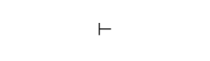
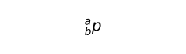
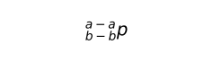

# Editor's Note

_Published by the [Ludwig Wittgenstein Project](https://www.wittgensteinproject.org/)._

_Traduzione di [Luca Bernardi](https://www.wittgensteinproject.org/w/index.php/Project:People#Luca_Bernardi)_

_La traduzione è stata condotta sulla seguente edizione: Ludwig Wittgenstein, "[Notes on Logic](https://www.wittgensteinproject.org/w/index.php/Notes_on_Logic)", in *Notebooks 1914-1916*, a cura di G. H. von Wright e G. E. M. Anscombe, Harper & Row, 1969, pp. 93-106. Il testo originale è disponibile secondo i termini della licenza [Creative Commons Attribuzione – Non commerciale 4.0 Internazionale](https://creativecommons.org/licenses/by-nc/4.0/) nel suo paese di origine, gli Stati Uniti d'America, ed è nel pubblico dominio in tutti i paesi dove i diritti di proprietà intellettuale scadono 70 anni o meno dopo la morte dell'autore. Questa traduzione, realizzata grazie al sostegno finanziario di Wikimedia Italia, è pubblicata secondo i termini della licenza [Creative Commons Attribuzione – Condividi allo stesso modo 4.0 Internazionale](https://creativecommons.org/licenses/by-sa/4.0/)._

# Note sulla logica

**Introduzione**

In filosofia non si danno deduzioni; solo descrizioni. Il termine “filosofia” dovrebbe sempre riferirsi a qualcosa che sta sopra o sotto, non accanto, alle scienze naturali. La filosofia non fornisce immagini della realtà, non conferma né confuta le ricerche scientifiche. Consiste di logica, suo fondamento, e di metafisica. L’epistemologia è la filosofia della psicologia. Diffidare della grammatica è il requisito primo della pratica filosofica. La filosofia è lo studio della forma logica delle proposizioni scientifiche (non solo delle proposizioni primitive). Una spiegazione corretta delle proposizioni logiche deve dare loro uno statuto diverso rispetto a tutte le altre.

**I. Bipolarità delle proposizioni. Senso e significato. Verità e falsità**

“Le proposizioni sono nomi” (Frege). “Le proposizioni corrispondono a complessi” (Russell). Due affermazioni false; ancora più errata è la seguente: “Le proposizioni sono nomi di complessi”. I fatti non possono venire nominati. Il presupposto falso secondo cui le proposizioni sono nomi induce a credere all’esistenza di “oggetti logici”, che sarebbero il significato delle proposizioni logiche.

Cosa corrisponde a una proposizione nella realtà dipende dalla sua verità o falsità. Noi però dobbiamo essere in grado di comprendere una proposizione senza sapere se è vera o falsa. Ciò che sappiamo se comprendiamo una proposizione è: come stanno le cose se è vera e come stanno le cose se è falsa. Ma non necessariamente sappiamo se è vera o falsa.

Per essenza ogni proposizione è vero-falsa. Dunque una proposizione ha due poli (corrispondenti l’uno al caso in cui sia vera e l’altro al caso in cui sia falsa). Questo è ciò che noi chiamiamo il *senso* di una proposizione. Il *significato* di una proposizione è il fatto che le corrisponde. La caratteristica principale della mia teoria è che p *ha lo stesso significato di non-*p (costituente = particolare, componente = particolare o relazione, etc.).

Né senso né significato di una proposizione sono cose. Qui le parole sono simboli incompleti. È evidente che comprendiamo proposizioni senza sapere se sono vere o false. Ma soltanto sapendo se la proposizione è vera o falsa possiamo conoscerne il significato. Ciò che comprendiamo è il senso della proposizione. Per comprendere una proposizione *p* non basta sapere che *p* implica “*p* è vero”, dobbiamo anche sapere che \~*p* implica “*p* è falso”. Così emerge la bipolarità della proposizione. Comprendiamo una proposizione quando ne comprendiamo i costituenti e le forme. Se conosciamo il significato di “*a*” e di “*b*” e se sappiamo cosa significa “*x* R *y*” per tutti i valori possibili di *x* e *y*, allora comprendiamo anche “*a* R *b*”. Comprendo la proposizione *a* R *b* quando so che le corrisponde il fatto che *a* R *b* oppure il fatto che non *a* R *b*; ciò però non va confuso con l’opinione falsa per cui comprendo “*a* R *b*” se so che si verifica “*a* R *b* o non *a* R *b*”.

Parlando propriamente, è sbagliato dire che comprendiamo la proposizione *p* quando sappiamo che “*p* è vera” ≡ *p*; in realtà le cose starebbero naturalmente così se per caso le due proposizioni ai lati del simbolo ≡ fossero entrambe vere o entrambe false. Noi non richiediamo solo equivalenza ma equivalenza formale, legata all’introduzione della forma di *p*. Ciò che serve è l’equivalenza formale delle forme della preposizione, cioè di tutti gli indefinibili generali presenti.

Ci sono *fatti positivi e negativi*: se la proposizione “Questa rosa non è rossa” è vera, allora la sua significazione è negativa. Ma non è l’occorrenza della parola “non” a indicarcelo, se già non sappiamo che la significazione della proposizione “Questa rosa è rossa” (quando è vera) è positiva. Solo basandoci sia sulla negazione sia sulla proposizione negata possiamo trarre conclusioni sulla significazione dell’intera proposizione. (Qui non parliamo delle negazioni delle proposizioni *generali*, cioè di quelle che contengono variabili apparenti. Fatti negativi giustificano solo negazioni di proposizioni atomiche.) I fatti possono essere positivi e negativi ma non veri e falsi.

Se trascuriamo il fatto che le proposizioni hanno un *senso* indipendente dalla loro verità o falsità, diventa facile convincersi che vero e falso siano due relazioni ugualmente giustificate tra il segno e ciò che viene significato. (Potremmo dire per esempio che “*q*” significa in modo vero ciò che “non-*q*” significa in modo falso.) Ma vero e falso non sono in realtà ugualmente giustificati? Non potremmo esprimerci servendoci di proposizioni false esattamente come finora ci siamo serviti di proposizioni vere, a patto solo di sapere che sono intese falsamente? No, poiché una proposizione è vera quando le cose stanno come asserisce; e di conseguenza se con “*q*” intendiamo “non-*q*”, e le cose stanno come intendiamo affermare, allora nella nuova interpretazione “*q*” è in realtà vera e *non* falsa. Ma che noi *siamo in grado* di intendere la stessa cosa sia tramite “*q*” sia tramite “non-*q*” è importante, perché mostra che non è al simbolo “non” né al modo in cui si combina con “*q*” che corrisponde una caratteristica della denotazione di “*q*”.

Un’analogia per la teoria della verità: consideriamo una macchia nera su un foglio bianco. Si può descrivere la forma della macchia dicendo, per ogni punto della superficie, se è bianco o nero. Al fatto che un punto è nero corrisponde un fatto positivo; al fatto che un punto è bianco (non nero) corrisponde un fatto negativo. Indicare un punto sulla superficie (uno dei “valori di verità” di Frege) è come formulare un’ipotesi da verificare. Ma per poter dire di un punto se è bianco o nero, devo prima sapere quand’è che un punto va chiamato nero e quand’è che va chiamato bianco. Per essere in grado di dire che “*p*” è vera (o falsa), devo prima aver stabilito in quali circostanze considero vera una proposizione, e in tal modo determino il *senso* di una proposizione. L’analogia inciampa qui: posso indicare un punto del foglio che è sia bianco sia nero, ma a una proposizione priva di senso non corrisponde nulla, poiché non designa una qualche cosa (valore di verità) le cui proprietà possano essere dette “false” o “vere.” Il verbo di una proposizione non è “è vero” o “è falso”, come ritiene Frege, ma ciò che è vero deve già contenere il verbo.

Il paragone tra linguaggio e realtà somiglia a quello tra immagine retinica e immagine visiva: al punto cieco non sembra corrispondere nulla nell’immagine visiva, perciò i confini del punto cieco determinano l’immagine visiva come le negazioni vere delle proposizioni atomiche determinano la realtà.

Si è tentati di interpretare “non-*p*” come “tutto il resto, solo non *p*”. Che da un singolo fatto *p* ne derivino infiniti altri, non-non-*p* etc., riesce poco plausibile. L’uomo ha l’abilità innata di costruire simboli con cui è possibile esprimere *un qualche* senso senza avere la minima idea di cosa significhino le singole parole. L’esempio migliore ne è la matematica: fino a un’epoca recente infatti ci si è serviti di simboli numerici senza sapere cosa significassero o che non significassero nulla.

Il segno di giudizio è logicamente del tutto privo di significato. Mostra solo, in Frege, Whitehead e Russell, che si considera vera la proposizione così indicata. Quindi “\ ” ha tanto poco a che fare con la proposizione quanto (per esempio) il numero della proposizione. Una proposizione non può asserire di essere vera. L’asserzione è un fatto puramente psicologico. Si danno solo proposizioni non asserite. Giudizio, ordine o domanda stanno sullo stesso piano; ma hanno in comune la forma proposizionale, nostro unico interesse. Alla logica pertengono solo proposizioni non asserite. Quando diciamo che A giudica che etc., dobbiamo menzionare un’intera proposizione giudicata da A. Non basterà menzionarne i costituenti né questi ultimi insieme alla forma ma nell’ordine errato. Ciò mostra che una proposizione deve essere presente nell’affermazione da cui risulta essere giudicata. Per esempio, in qualunque modo si spieghi “non-*p*”, la domanda “Che cosa viene negato” deve avere un significato. In “A giudica (che) *p*”, non si può sostituire a *p* un nome proprio. Questo riesce evidente se riformuliamo così: “A giudica che *p* è vero e non-*p* falso.” La proposizione “A giudica (che) *p*” consiste del nome proprio A, della proposizione *p* con i suoi due poli, e della relazione specifica tra A e i due poli. Naturalmente non si tratta di una relazione in senso ordinario. Qualunque teoria corretta del giudizio deve rendermi impossibile giudicare che “questo tavolo portapenna il libro” (la teoria di Russell non soddisfa tale requisito). La struttura della proposizione va riconosciuta, il resto è facile. Il linguaggio ordinario però cela la struttura della proposizione: fa sembrare le relazioni predicati, i predicati nomi, etc.

Un motivo per ritenere che non tutte le proposizioni con più di un argomento sono proposizioni relazionali è che, se lo fossero, le relazioni di giudizio e inferenza dovrebbero mantenersi tra un numero arbitrario di cose. L’idea che le proposizioni siano nomi di complessi ha suggerito che qualunque cosa che non sia un nome proprio sia il segno di una relazione. Per esempio Russell considera ogni fatto come un complesso spaziale e, poiché i complessi spaziali sono composti solo di cose e relazioni, è convinto che ogni fatto lo sia.

Siamo spesso portati a formulare spiegazioni delle funzioni logiche delle proposizioni che mirano a introdurre nella funzione o solo i costituenti di queste proposizioni oppure soltanto la loro forma, etc. Finiamo così per trascurare il fatto che il linguaggio ordinario non conterrebbe intere proposizioni se non ne avesse bisogno.

I nomi sono punti, le proposizioni frecce – hanno *senso*. Il senso di una proposizione è determinato dai due poli *vero* e *falso*. La forma di una proposizione è come una retta che divide tutti i punti di un piano tra destra e sinistra. La retta lo fa automaticamente, la forma della proposizione solo per convenzione. È sbagliato concepire ogni proposizione quale espressione di una relazione. Una soluzione classica di tale impasse consiste nel considerare “non-*p*” come contrario di “*p*”, dove quindi “contrario” significherebbe la relazione indefinibile. È evidente però che qualunque tentativo del genere di rimpiazzare funzioni dotate di senso (funzioni *ab*) con descrizioni deve fallire.

Nel dire “A crede *p*” in effetti si ha l’impressione di poter sostituire “*p*” con un nome proprio. Ma ci accorgiamo che qui ne va di un *senso*, non di un significato, se diciamo invece “A crede che *p* è vera”; oppure, per rendere ancora più esplicita la direzione di *p*, possiamo dire “A crede che *p* è vera e non-*p* falsa.” Qui si esprime la bipolarità di *p* e ci sembra di poter esprimere correttamente la proposizione “A crede che *p*” soltanto con la notazione *ab* (spiegata in seguito) ovvero mettendo “A” in relazione ai poli “*a*” e “*b*” di *a*-*p*-*b*. Non si possono risolvere questioni epistemologiche sulla natura del giudizio e della credenza senza una comprensione corretta della forma proposizionale.

Una proposizione è una misura rapportata a fatti, ma con i nomi la situazione cambia. Come una freccia si rapporta a un’altra freccia indicando nello stesso senso o in quello contrario, così un fatto si rapporta a una proposizione; entrano dunque in gioco bipolarità e senso. Secondo questa teoria *p* e non-*p* hanno identico significato ma senso contrario. Il significato è il fatto. Una corretta teoria del giudizio deve rendere impossibile giudicare ciò che è privo di senso. Il “senso di” una funzione *ab* di una proposizione è una funzione del suo senso. In non-*p*, *p* è proprio come se stesse da sola (questo è un punto cruciale). Tra i fatti che rendono “*p* o *q*” vera ci sono anche fatti che rendono “*p* e *q*” vera; quindi, se le proposizioni hanno soltanto significato, in simili casi dobbiamo dire che le due proposizioni in questione sono identiche. Ma in realtà il loro senso è diverso e abbiamo introdotto il senso parlando di tutte le *p* e di tutte le *q*. Ne consegue che le proposizioni molecolari andranno usate solo in casi in cui la loro funzione *ab* ricorre sotto un segno di generalità o si inserisce in un’altra funzione come “io credo che” etc., poiché allora entra in gioco il senso.

**II. Analisi di proposizioni atomiche, indefinibili generali, predicati, etc.**

Non è detto che, formate tutte le proposizioni atomiche possibili, “se di ognuna dichiarassimo la verità o la falsità, il mondo risulterebbe completamente descritto” (Russell).

Se si desse un mondo in cui sono veri i principi logici, in esso tutta la matematica sarebbe vera sempre. Non si può creare un mondo in cui è vera una proposizione a meno di non creare anche i suoi costituenti.

Gli indefinibili sono di due tipi: nomi e forme. Le proposizioni non possono consistere solo di nomi, non possono essere classi di nomi. Non solo un nome può figurare in due proposizioni diverse, ma in entrambe può figurare allo stesso modo. Le proposizioni, che sono simboli riferiti a fatti, sono pure dei fatti (che questo calamaio è su questo tavolo può esprimere che io sto seduto su questa sedia). Dobbiamo essere in grado di comprendere proposizioni che non abbiamo mai sentito prima. Ogni proposizione però è un simbolo nuovo. Ci servono quindi simboli indefinibili *generali*; essi sono inevitabili, se le proposizioni non sono tutte indefinibili. Solo una teoria degli indefinibili generali permette la comprensione della natura delle funzioni. Trascurare tale teoria ci porterebbe in un vicolo cieco.

Una proposizione deve essere compresa quando *tutti* i suoi indefinibili sono stati compresi. Gli indefinibili in “*a* R *b*” si introducono nel modo seguente: 1) “*a*” è indefinibile, 2) “*b*” è indefinibile 3) qualunque cosa significhino “*x*” e “*y*”, *x* R *y* esprime qualcosa di indefinibile sul loro significare.

In logica non ci si occupa del rapporto tra un nome specifico e il suo significato né del rapporto tra una determinata proposizione e la realtà. Vogliamo però sapere che i nostri nomi hanno significato e le nostre proposizioni senso, perciò introduciamo un concetto indefinibile “A”, dicendo “‘A’ indica qualcosa di indefinibile”, oppure la forma delle proposizioni *a* R *b*, dicendo “Per tutti i significati di ‘*x*’ e ‘*y*’, ‘*x* R *y*’ esprime qualcosa di indefinibile su *x* e *y*”.

Si può simbolizzare la forma della proposizione così: consideriamo i simboli della forma “*x* R *y*”, a cui corrispondono primariamente coppie di oggetti dei quali uno ha nome “*x*” e l’altro “*y*”. Gli x e gli y intrattengono molteplici relazioni reciproche e, fra suddette relazioni, la relazione R si instaura tra alcuni di essi ma non tra altri. Determino ora il senso di “*x* R *y*” formulando la regola: quando i fatti si comportano rispetto a “*x* R *y*” in modo tale che il significato di “*x*” intrattiene la relazione R con il significato di “*y*”, allora dico che tali fatti sono “dello stesso senso” (*gleichsinnig*) della proposizione “*x* R *y*”; altrimenti, “di senso contrario” (*entgegengesetzt*). Correlo i fatti al simbolo “*x* R *y*” dividendoli tra quelli di senso uguale e quelli di senso contrario. A tale correlazione corrisponde una correlazione tra nome e significato. Sono entrambe psicologiche. Comprendo dunque la forma “*x* R *y*” quando so cosa discrimina il comportamento di *x* e di *y* in base al loro intrattenere o meno la relazione R. Così estraggo tra tutte le relazioni possibili la relazione R, come servendomi di un nome estraggo il suo significato tra tutte le cose possibili.

Non c’è *cosa* che sia *forma* di una proposizione e non c’è nome che sia nome di una forma. Quindi non si può nemmeno dire che una relazione intrattenuta in certi casi tra cose si instauri talvolta tra forme e cose. Ciò va contro la teoria del giudizio di Russell.

I simboli non sono ciò che sembrano. In “*a* R *b*” “R” pare un sostantivo ma non lo è. Ciò che simbolizza in “*a* R *b*” è che “R” compare tra “*a*” e “*b*”. Analogamente in “ϕ*x*” “ϕ” sembra un sostantivo ma non lo è; in “\~p” “\~” sembra simile a “ϕ” ma non lo è. È questo il primo indizio che *potrebbero* non esserci costanti logiche. Un argomento a loro sfavore è la generalità della logica: la logica non può occuparsi di un insieme speciale di cose.

All’utile proprietà di essere composti, i “complessi” di Russell dovevano combinare quella altrettanto simpatica di poter essere trattati come “semplici”. Basta questo però a renderli inservibili come tipi logici (forme), poiché in tal caso avrebbe senso asserire la complessità di un semplice. Ma una *proprietà* non può essere un tipo logico.

Una teoria falsa delle relazioni porta facilmente a credere che la relazione tra fatto e costituente sia la stessa che tra fatto e fatto-che-ne-consegue. Tra le due c’è però una somiglianza esprimibile così: φ*a* . ⊃~φ,α~ . *a* = *a*.

Qualunque affermazione su complessi può risolversi nella somma logica di un’affermazione sui costituenti e un’affermazione sulla proposizione che descrive completamente il complesso. Come procedere caso per caso con la risoluzione resta un quesito importante, ma rispondervi non è strettamente necessario per la costruzione della logica. Ripeto: ogni proposizione che sembra riguardare un complesso può essere scomposta in una proposizione sui suoi costituenti e sulla proposizione che descrive compiutamente il composto; cioè quella proposizione che equivale all’affermazione dell’esistenza del complesso.

**III. Analisi delle proposizioni molecolari: funzioni *ab***

Qualunque cosa corrisponda nella realtà a proposizioni composte non deve essere più di ciò che corrisponde alle loro varie proposizioni atomiche. Le proposizioni molecolari non contengono nulla più di ciò che contengono i loro atomi; non aggiungono alcun’informazione materiale oltre a quella contenuta nei loro atomi. Tutto ciò che è essenziale nelle funzioni molecolari è il loro schema V-F (vero-falso, cioè l’indicazione dei casi dove sono vere e l’affermazione dei casi dove sono false). È probabile *a priori* che l’introduzione delle proposizioni atomiche sia fondamentale per la comprensione di tutti gli altri tipi di proposizioni. Infatti la comprensione delle proposizioni generali dipende ovviamente da quella delle proposizioni atomiche.

Un motivo per considerare sbagliata la vecchia notazione è l’estrema improbabilità che da ogni proposizione *p* consegua un numero infinito di altre proposizioni non-non-*p*, non-non-non-non-*p* etc. La stessa possibilità della spiegazione di Frege di “non-*p*” e “se *p* allora *q*”, dalla quale consegue che “non-non-*p*” denota lo stesso di *p*, rende probabile l’esistenza di qualche metodo di designazione in cui “non-non-*p*” corrisponde allo stesso simbolo di “*p*”. Se tale metodo di designazione basta per la logica, allora dev’essere quello corretto.

Se *p* = non-non-*p*, etc., si dimostra la fallacia del metodo tradizionale del simbolismo, poiché implica una molteplicità di simboli con lo stesso senso; quindi nell’analisi di tali proposizioni il simbolismo di Russell non va seguito.

Nominare è come indicare. Una funzione è come una retta che divide i punti di un piano tra destra e sinistra; “*p* o non-*p*” non ha quindi significato poiché non divide il piano. Anche se una proposizione particolare “*p* o non-*p*” è priva di significato, d’altro canto una proposizione generale “Per tutti i *p*, *p* o non-*p*” un significato ce l’ha, perché quest’ultima non contiene la funzione priva di senso “*p* o non-*p*” bensì la funzione “*p* o non-*q*”, come “per tutte le *x*, *x* R *x*” contiene la funzione “*x* R *y*”.

Le inferenze logiche possono procedere, è vero, secondo le leggi della deduzione di Frege e Russell, ma ciò non giustifica l’inferenza; quindi tali leggi non sono proposizioni primitive della logica. Se *p* segue da *q*, può anche essere inferita da *q*, e la “modalità di deduzione” è indifferente.

La ragione per cui “\~Socrate” non significa nulla è che “\~*x*” non esprime alcuna proprietà di *x*. Segni delle forme “*p* ∨ \~*p*” sono privi di senso, ma non la proposizione “(*p*) *p* ∨ \~*p*”. Se so che questa rosa è o rossa o non rossa, non so nulla. Lo stesso vale per tutte le funzioni *ab*. La supposizione che esistano oggetti logici fa sembrare strano il fatto che nelle scienze le proposizioni della forma “*p* ∨ *q*”, “*p* ⊃ *q*”, etc., siano da ritenersi non provvisorie solo quando “∨” o “⊃” si trovano nell’ambito di un segno di generalità (variabile apparente). Che “o” e “non” etc. non sono relazioni alla stregua di “destra” e “sinistra” etc. è ovvio a chiunque. La possibilità di definire i vecchi indefinibili logici l’uno con riferimento all’altro mostra già che essi non sono gli indefinibili corretti e, in maniera ancora più decisiva, che non denotano relazioni. Gli indefinibili logici non possono essere predicati o relazioni, poiché le proposizioni, a causa del loro avere senso, non possono avere predicati o relazioni. Neppure si può dire che “non” e “o”, come il giudizio, siano *analoghi* a predicati e relazioni, visto che non introducono nulla di nuovo.

Al posto di ogni proposizione “*p*” scriviamo “\ ”. Sia ogni correlazione tra proposizioni e altre proposiizoni, o tra nomi e proposizioni, effettuata attraverso una correlazione dei loro poli “*a*” e “*b*”. Sia questa correlazione transitiva. Di conseguenza “\ ” è lo stesso simbolo di “\ ”. Siano date n proposizioni. Chiamo una “classe di poli” di tali proposizioni ogni classe di n membri ciascuno dei quali è un polo di una delle n proposizioni, così che a ogni proposizione corrisponde un membro. Collego quindi a ogni classe di poli uno dei due poli (*a* e *b*). Il senso del fatto simbolizzante costruito in tal modo non posso definirlo, ma lo conosco.

Il senso di una funzione *ab* di *p* è una funzione del senso di *p*. Le funzioni *ab* si servono della distinzione dei fatti prodotta dai loro argomenti per generare nuove distinzioni. La notazione *ab* mostra la dipendenza di “o” e “non” e quindi che non si possono impiegare “o” e “non” quali indefinibili simultanei.

A ogni funzione molecolare corrisponde uno schema VF (o *ab*). Possiamo dunque utilizzare lo schema VF stesso invece della funzione. Lo schema VF serve a collegare le lettere V e F con ogni proposizione. Queste due lettere sono i poli delle proposizioni atomiche. Lo schema poi correla altri V e F a questi poli. In tale notazione importa soltanto la correlazione dei poli esterni ai poli delle proposizioni atomiche. Perciò non-non-*p* è lo stesso simbolo di *p*. Quindi non avremo mai due simboli per la stessa funzione molecolare. Poiché le funzioni *ab* (VF) delle proposizioni atomiche sono ancora proposizioni bipolari, su di loro possiamo compiere operazioni *ab*. Così facendo correleremo i nuovi poli esterni tramite i vecchi poli interni ai poli delle proposizioni atomiche.

Il fatto simbolizzante in *a*-*p*-*b* è che *per esempio* *a* è a sinistra di *p* e *b* a sinistra di *p*. [Ciò è del tutto arbitrario, ma una volta fissato l’ordine in cui situare i poli, naturalmente bisogna rispettare la convenzione. Se per esempio *apb* dice *p*, allora *bpa* non dice *alcunché* (*non* dice \~*p*). Ma *a*-*apb*-*b* è lo stesso simbolo di *apb* (qui la funzione *ab* automaticamente svanisce) perché qui i nuovi poli sono correlati allo stesso lato di *p* dei vecchi poli. La domanda è sempre: come si correlano i nuovi poli a *p* rispetto a come si correlano i vecchi poli a *p*?] Poi, data *apb*, la correlazione dei nuovi poli dev’essere transitiva, in modo che se per esempio un nuovo polo è correlato in qualunque modo, cioè tramite qualunque polo, all’*a* interno, il simbolo resta invariato. Dunque è possibile costruire tutte le funzioni *ab* compiendo ripetutamente un’operazione *ab*, e dunque consideriamo tutte le funzioni *ab* come la tutte le funzioni ottenibili compiendo ripetutamente tale operazione *ab* (*cfr.* gli studi di Sheffer).

Tra i fatti che rendono “*p* o *q*” vera, ce ne sono alcuni che rendono “*p* e *q*” vera; ma la classe che rende vera “*p* o *q*” è diversa dalla classe che rende vera “*p* e *q*”; soltanto questo ci importa. Poiché è nell’introdurre le funzioni *ab* che, per così dire, introduciamo tale classe.

Essendo le funzioni *ab* di *p* ancora una volta proposizioni bipolari, possiamo servircene per formare funzioni *ab*, e avanti così. Sorgerà così una serie di proposizioni in cui, in generale, i fatti *simbolizzanti* saranno gli stessi in vari membri. Se a questo punto troviamo una funzione *ab* di tale genere da permetterci con le sue ripetute applicazioni di ottenere ogni funzione *ab*, allora possiamo introdurre la totalità delle funzioni *ab* come la totalità di quelle generate con l’applicazione di suddetta funzione. Tale funzione è \~*p* ∨ \~*q*. È facile ipotizzare una contraddizione nel fatto che, da un lato, ogni proposizione complessa possibile è una semplice funzione *ab* di proposizioni semplici e che, d’altro canto, per generare tutte queste proposizioni basta l’applicazione ripetuta di una funzione *ab*. Se per esempio un’affermazione può essere generata da una doppia negazione, la negazione è, in qualche senso, contenuta nell’affermazione? “*p*” nega “non-*p*” o afferma “*p*”, o entrambe? Come stanno le cose nella definizione di “⊃”, “∨” e “\~”, oppure di “∨” tramite “\~” e “⊃”? Per esempio come introdurremo *p* \| *q* (cioè \~*p* ∨ \~*q*) se non dicendo che tale espressione afferma qualcosa di indefinibile su tutti gli argomenti *p* e *q*? Le funzioni *ab* però devono venire introdotte nel modo seguente: la funzione *p* \| *q* è solo un dispositivo meccanico per costruire tutti i possibili *simboli* di funzioni *ab*. I simboli generati dall’applicazione ripetuta del simbolo “\|” *non* contengono il simbolo “*p* \| *q*”. Ci serve una regola in base alla quale poter formare tutti i simboli di funzioni *ab*, così da essere in grado di parlarne come classe; e ne parliamo per esempio come di quei simboli di funzioni che possono venire generati tramite l’applicazione ripetuta dell’operazione “\|”. Affermiamo così: per tutte le *p* e le *q*, “*p* \| *q*” dice qualcosa di indefinibile sul senso delle proposizioni semplici contenute in *p* e *q*.

**IV. Analisi di proposizioni generali**

Come un tempo ci si sforzava di ricondurre ogni proposizione alla forma soggetto-predicato, così oggi si tende a concepire qualunque proposizione come esprimente una relazione, il che è altrettanto errato. Ciò che è sensato in tale impulso risulta pienamente soddisfatto dalla teoria delle relazioni artificiali di Russell.

Se soltanto i segni contenenti nomi propri sono complessi, allora le proposizioni contenenti solo variabili apparenti sarebbero semplici. E le loro negazioni? Le proposizioni sono sempre complesse, anche se non contengono nomi.

Non esistono proposizioni contenenti variabili reali. I simboli chiamati proposizioni in cui “ci sono variabili” non sono in realtà proposizioni, ma schemi di proposizioni i quali, a meno di rimpiazzare le variabili con costanti, restano tali. Nessuna proposizione è espressa da “*x* = *x*”, poiché “*x*” è privo di significato. Esiste però la proposizione “(*x*) . *x* = *x*” e proposizioni quali “Socrate = Socrate”, etc. Nei libri di logica non dovrebbero esserci variabili, ma solo proposizioni generali giustificanti l’uso di variabili. Ne consegue che le cosiddette definizioni in logica non sono definizioni ma solo schemi di definizioni e bisognerebbe sostituirle con proposizioni generali. Parimenti le cosiddette idee primitive (*Urzeichen*) della logica non sono idee primitive bensì schemi delle suddette. L’assunto errato che ci siano *cose* chiamate fatti o complessi e relazioni porta facilmente a credere che ci debba essere una relazione di interrogazione ai fatti, da cui sorge la domanda se una relazione possa sussistere tra un numero arbitrario di cose, dato che un fatto può conseguire da casi arbitrari. È un fatto che la proposizione la quale per esempio esprime che *q* segue da *p* e *p* ⊃ *q* è questa: *p* . *p* ⊃ *q* . ⊃~*p*,*q*~ . *q*.

L’interdefinibilità nel dominio delle proposizioni generali porta a quesiti simili nel dominio delle funzioni *ab*. La stessa obiezione agli indefinibili ordinari che sorge nel caso delle funzioni molecolari sorge anche nel caso delle variabili apparenti. L’applicazione della notazione *ab* a proposizioni con variabili apparenti si chiarisce se consideriamo per esempio che la proposizione “per tutte le *x*, ϕ*x*” deve essere vera quando ϕ*x* è vera per tutte le *x* e falsa quando ϕ*x* è falsa per alcune *x*. Vediamo che *alcune* e *tutte* compaiono contemporaneamente nella notazione corretta delle variabili apparenti. La notazione è

per (*x*) φ*x*: *a*-(*x*)- . *a* φ*xb* . -(∃*x*) e

per (∃*x*) φ*x*: *a*-(∃*x*)- . *a* φ*xb* . -(*x*)-*b*

Le vecchie definizioni diventano tautologiche.

Un’obiezione molto naturale al modo in cui abbiamo introdotto per esempio le proposizioni della forma *x* R *y* è che proposizioni quali (∃ *x*, *y*) *x* R *y* e simili non risultano spiegate, nonostante abbiano ovviamente in comune con *a* R *b* quanto *c* R *d* ha in comune con *a* R *b*. *D’altronde* nell’introdurre proposizioni della forma *x* R *y* non si è menzionata nessuna proposizione specifica di tale forma; e bisogna solo introdurre (*x*, *y*) ϕ(*x*, *y*) per tutte le ϕ in un qualsiasi modo tale da rendere il senso di tali proposizioni dipendente dal senso di tutte le proposizioni della forma ϕ(*a*, *b*), ed ecco giustificato il nostro modo di procedere.

**V. Principi di simbolismo: che cosa, in un simbolo, simbolizza. Fatti tramite fatti**

È facile ipotizzare che solo i simboli contenenti nomi di oggetti siano complessi e che di conseguenza “(*x*, φ) φ*x*” o “(∃ *x*, *y*) *x* R *y*” debbano essere semplici. È allora naturale considerare il primo il nome di una forma, il secondo il nome di una relazione. Ma in tal caso qual *è* il significato per esempio di “\~(∃ *x*, *y*) . *x* R *y*”? Possiamo mettere “non” davanti a un nome? L’indefinibilità alternata mostra che gli indefinibili non sono ancora stati raggiunti. Gli indefinibili della logica devono essere reciprocamente indipendenti. Se si introduce un indefinibile, bisogna introdurlo in tutte le combinazioni in cui può comparire. Non possiamo dunque introdurlo prima per una combinazione, poi per un’altra; se per esempio è stata introdotta la forma *x* R *y*, essa d’ora in poi deve essere compresa in proposizioni della forma *a* R *b* nello stesso identico modo in cui è compresa in proposizioni quali (∃ *x*, *y*) *x* R *y* e altre. Non dobbiamo introdurla per una classe di casi prima, poi per un’altra; altrimenti si avrebbe ragione di dubitare se il suo significato sia o meno lo stesso nei due diversi frangenti e potrebbe non esserci motivo per utilizzare la stessa modalità di combinazione dei simboli. In breve, per l’introduzione di simboli indefinibili e combinazioni di simboli vale la stessa regola, *mutatis mutandis*, formulata da Frege per l’introduzione di simboli tramite definizioni.

È impossibile fare a meno di proposizioni in cui lo stesso argomento ricorre in posizioni diverse. È ovviamente inutile sostituire ϕ(*a*, *a*) con ϕ(*a*, *b*) . *a* = *b*.

Non può mai esprimere la caratteristica comune di due oggetti il designarli con lo stesso nome ma, per il resto, con due differenti modalità di designazione, poiché essendo i nomi arbitrari potremmo anche sceglierne altri e dove sarebbe, a quel punto, l’elemento comune tra le varie designazioni? Ciononostante in caso di difficoltà si è sempre tentati di rifugiarsi in differenti modalità di designazione.

Bisogna ricordare che i nomi non sono cose ma classi: “A” è lo stesso della lettera “A”. Questo ha conseguenze fondamentali in ogni linguaggio simbolico.

Per la notazione è importante osservare che non ogni tratto di un simbolo simbolizza. In due funzioni molecolari che hanno lo stesso schema V-F, ciò che simbolizza dev’essere lo stesso. In “non-non-*p*”, “non-*p*” non c’è; poiché “non-non-*p*” è lo stesso che “*p*” e quindi, se in “non-non-*p*” ci fosse “non-*p*”, ci sarebbe anche in “*p*”.

Un simbolo complesso non deve mai essere introdotto quale indefinibile singolo. Così per esempio nessuna proposizione è indefinibile. Perché se una delle parti del simbolo complesso ricorre anche in un’altra connessione, in quest’ultima deve venire reintrodotta. Ma in tal caso avrebbe lo stesso significato? I modi in cui introduciamo gli indefinibili devono permetterci di costruire tutte le proposizioni che hanno senso a partire da tali indefinibili *soltanto*. È facile introdurre “tutti” e “alcuni” in un modo tale da rendere la possibile costruzione (ad esempio) di “(*x*, *y*) . *x* R *y*” a partire da “tutti” e “*x* R *y*” *così come sono stati introdotti precedentemente*.

Non bisogna dire “Il segno complesso ‘*a* R *b*’” dice che *a* sta nella relazione R con *b*; ma che “*a*” sta in una certa relazione con “*b*” dice *che* *a* R *b*.

Solo fatti possono esprimere senso, non una classe di nomi. Mostrarlo è facile. In *a* R *b* non è il complesso a simbolizzare ma il fatto che il simbolo *a* sta in una certa relazione al simbolo *b*. Dunque fatti sono simbolizzati da fatti, o meglio: che una tal cosa accade nel simbolo dice che una tal cosa accade nel mondo.

**VI. Tipi**

Nessuna proposizione può dire qualcosa su se stessa, perché il simbolo della proposizione non può contenere se stesso; questa sarà la base della teoria dei tipi logici.

Riesce facile ipotizzare che “individuo”, “particolare”, “complesso”, etc. siano idee primitive della logica. Per esempio Russell dice che “individuo” e “matrice” sono “idee primitive”. Presumibilmente tale errore si spiega con il fatto che l’impiego di variabili al posto del segno di generalità porta a credere che la logica si occupi di cose da cui sono state tolte tutte le proprietà tranne la complessità. Si dimentica che gli indefinibili dei simboli (*Urbilder von Zeichen*) ricorrono solo sotto il segno della generalità, mai al di fuori.

Ogni proposizione che dice qualcosa di indefinibile su una cosa è una proposizione soggetto-predicato; ogni proposizione che dice qualcosa di indefinibile su due cose esprime una relazione duale tra queste due cose, e avanti così. Quindi ogni proposizione contenente solo un nome e una forma indefinibile è una proposizione soggetto-predicato, etc. Un simbolo indefinibile può essere solo un nome e perciò si può arguire, in base al simbolo di una proposizione atomica, se si tratta o meno di una proposizione soggetto-predicato.

Una proposizione non può ricorrere in se stessa. Questa è la verità fondamentale della teoria dei tipi. In una proposizione data si convertano in variabili tutti gli indefinibili: si avrà allora una classe di proposizioni che non include tutte le proposizioni, ma include un intero tipo. Se trasformiamo un costituente di una proposizione ϕ(*a*) in una variabile, allora avremo una classe ![{ \hat{p}[( \exists x ) . \phi x = p] }](images/b583ec50fa22b67fa03776c54b2d54b37d83e9641fc3711201ac91decd2d560e.svg)\ . Questa classe in generale dipende ancora da ciò che, per *convenzione arbitraria* intendiamo per “ϕ*x*”. Ma se trasformiamo in variabili tutti i simboli la cui significazione era stata determinata arbitrariamente, tale classe persiste. Ciò però non dipende più da una qualche convenzione, bensì dalla natura del simbolo “ϕ*x*”. Essa corrisponde a un tipo logico.

In due modi si somigliano i segni. I nomi “Socrate” e “Platone” sono simili: sono entrambi nomi. Ma qualunque cosa abbiano in comune non deve venire introdotta prima dell’introduzione di “Socrate” e “Platone”. Lo stesso vale per la forma soggetto-predicato, etc. Quindi cosa, proposizione, forma soggetto-predicato, etc. non sono indefinibili, ovvero i tipi non sono indefinibili.

Ogni proposizione che dice qualcosa di indefinibile su una cosa è una proposizione soggetto-predicato, etc. Dunque riconosciamo una proposizione soggetto-predicato se sappiamo che contiene solo un nome e una forma, etc. Questo ci dà la costruzione dei tipi. Si può quindi riconoscere il tipo di una proposizione solo dal suo simbolo.

L’essenziale in una corretta notazione delle variabili apparenti è questo: 1) deve menzionare un tipo di proposizione, 2) deve mostrare quali componenti (forme e costituenti) di una proposizione di tale tipo sono costanti. Prendiamo (ϕ)ϕ ! *x*. Se descriviamo il *genere* di simboli per cui sta ϕ, il che come detto è sufficiente a determinare il tipo, allora automaticamente tale descrizione non può attagliarsi a “(ϕ) ϕ ! *x*”, poiché *contiene* “ϕ ! *x*” e la descrizione deve descrivere *tutto* ciò che simbolizza in simboli quali ϕ ! *x*. Se la descrizione è compiuta *in tal modo*, i circoli viziosi possono ricorrere solo tanto poco quanto per esempio (ϕ) . (*x*) ϕ dove (*x*) ϕ è una proposizione soggetto-predicato.

Non possiamo mai distinguere un tipo logico da un altro attribuendo a membri dell’uno una proprietà che neghiamo ai membri dell’altro. I tipi non possono mai essere reciprocamente distinti dicendo (come si fa oggi) che uno ha talune proprietà *mentre* l’altro ne ha talaltre, poiché ciò presuppone un *significato* nell’affermare tutte queste proprietà di entrambi i tipi. Ne consegue quanto meno che tali proprietà possono essere tipi, ma certamente non gli oggetti di cui sono asserite.

---

*This translation was made possible by the financial support of:*

