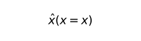
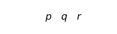

# Editor's Note

_Published by the [Ludwig Wittgenstein Project](https://www.wittgensteinproject.org/)._

_Traduzione di [Rolando Vitali](https://www.wittgensteinproject.org/w/index.php/Project:People#Rolando_Vitali)_

_Questa traduzione è stata condotta sul testo della seguente edizione tedesca: Ludwig Wittgenstein, *Notebooks 1914–1916*, a cura di G.H. von Wright e G.E.M. Anscombe, Harper & Row, 1969. Il testo originale è nel pubblico dominio in tutti i paesi dove i diritti di proprietà intellettuale scadono 70 anni o meno dopo la morte dell'autore. Questa traduzione, realizzata grazie al sostegno finanziario di Wikimedia Italia, è pubblicata secondo i termini della licenza [Creative Commons Attribuzione](https://creativecommons.org/licenses/by/4.0/)._

_*Nota alla traduzione*_

_La traduzione di testi impegnativi come quelli filosofici mette necessariamente davanti a scelte difficili e sostanzialmente insolubili in maniera unilaterale. Ogni scelta lessicale, anche quella più corretta, spesso comporta il sacrificio di una sfumatura, di una eco, di un indizio presenti nell’originale._

_Anche in questo caso, le scelte non sono state sempre facili._

_Nella traduzione del testo si è scelto di aderire quanto più scrupolosamente possibile all’originale tedesco, talvolta sacrificando anche scorrevolezza e piacevolezza della lettura._

_Per quanto riguarda le singole scelte lessicali, si è scelto di mantenere quanto più possibile invariata la traduzione del lemma nelle sue diverse occorrenze attraverso il testo. Contemporaneamente, per la scelta di traduzione di alcuni termini tecnici, si è cercato di uniformare questa versione alle altre traduzioni realizzate all’interno del The Ludwig Wittgenstein Project e in particolare a quella del *[Tractatus logico-philosophicus](https://www.wittgensteinproject.org/w/index.php/Tractatus_logico-philosophicus_(italiano))*, curata da Michele Lavazza. Ciò nonostante, in alcuni casi le scelte diverse sono state mantenute: così ad esempio, nei *Quaderni* si è scelto di tradurre *Gebilde* prevalentemente con “costrutto” – per sottolinearne il momento appunto costruttivo, formativo – mentre nel *Tractatus* esso compare tradotto con “forma”. Si tratta, in questo senso, di un lavoro di traduzione collettivo, che *presuppone* un confronto con l’originale e che si sforza di restituire la ricchezza semantica della lingua tedesca proprio assumendo e facendo virtù dell’inevitabile parzialità delle diverse scelte interpretative._

_A Michele Lavazza va il mio più sincero ringraziamento per la stima che mi ha accordato assegnandomi questa traduzione e per la professionalità dimostrata lungo tutte le fasi di lavoro. Sempre a Michele va un ulteriore ringraziamento per aver completato la revisione finale del testo._

_Rolando Vitali_

# Quaderni 1914-1916

**[22. 8. 14.](https://www.wittgensteinproject.org/w/index.php/Tageb%C3%BCcher_1914-1916#22._8._14.)**

La logica deve badare a sé stessa.

Se possono in generale esser stabilite delle regole sintattiche per le funzioni, allora l’intera teoria delle cose, delle proprietà ecc. è superflua. È inoltre addirittura troppo evidente che né i *Grundgesetze*, né i *Principia mathematica* trattano di questa teoria. Di nuovo: perché la logica deve badare a sé stessa. Un segno possibile deve anche poter indicare. Tutto ciò che è in generale possibile è anche legittimo (permesso). Ricordiamoci della spiegazione del perché “Socrate è Platone” è insensata. Ovvero perché *noi* non abbiamo adottato una determinazione arbitraria, ma NON perché il segno sia in sé e per sé qualcosa di illegittimo!

**[2. 9. 14.](https://www.wittgensteinproject.org/w/index.php/Tageb%C3%BCcher_1914-1916#2._9._14.)**

In un certo senso, nella logica non dobbiamo poterci sbagliare. Ciò è già espresso in questo: la logica deve badare a sé stessa. Questa è una cognizione sommamente profonda e importante.

Frege dice: ogni proposizione costruita correttamente deve avere un senso, mentre io dico: ogni proposizione possibile è costruita correttamente e, se non ha un senso, ciò può dipendere solo dal fatto che non abbiamo *attribuito* alcun significato ad alcuni dei suoi componenti. Anche se crediamo di averlo fatto.

**[3. 9. 14.](https://www.wittgensteinproject.org/w/index.php/Tageb%C3%BCcher_1914-1916#3._9._14.)**

Come è conciliabile con la filosofia il fatto che la logica debba badare a sé stessa? Quando per esempio chiediamo: il tale e tale fatto è della forma soggetto-predicato?, allora dobbiamo sapere che cosa intendiamo per “forma soggetto-predicato”. Dobbiamo sapere *se* una tale forma si dia in generale. Come possiamo saperlo? “Dal segno!”. Ma in che modo? Non abbiamo proprio per nulla *segni* di questa forma. Possiamo dire: abbiamo dei segni che si comportano come segni della forma soggetto-predicato, ma ciò dimostra che vi debbano essere effettivamente fatti di questa forma? Cioè: se questi sono completamente analizzati. E qui torna la questione: si dà qui un’analisi completa? *E in caso di risposta negativa*: qual è quindi il compito della filosofia?!!?

Quindi ci possiamo domandare: esiste la forma soggetto-predicato? Esiste la forma relazionale? Esiste in generale una qualunque delle forme delle quali Russell e io abbiamo parlato in continuazione? (Russell direbbe: “Sì! Perché è evidente.” *Ma certo!*)

Quindi: se *tutto* ciò che deve esser indicato deve esser indicato attraverso l’esistenza di PROPOSIZIONI del tipo soggetto-predicato ecc., allora il compito della filosofia è un altro rispetto a quello che avevo assunto originariamente. Mentre, se non è così, allora ciò che manca dovrebbe esser mostrato da una sorta di esperienza, e io ritengo che questo sia escluso.

La mancanza di chiarezza risiede *evidentemente* nella questione in che cosa consista effettivamente l’identità logica tra segno e designato! E questa questione è (*di nuovo*) uno snodo cruciale per il problema filosofico nella sua interezza.

Si dia una questione filosofica come: se “A è giusto” sia una proposizione del tipo soggetto-oggetto; oppure: se “A è più chiaro di B” sia una proposizione relazionale! *Come si può dirimere in generale una tale questione?!* Che tipo di evidenza potrebbe rassicurarmi del fatto *che – per esempio* – alla prima questione venga data risposta affermativa? (Si tratta di una questione estremamente importante.) Anche in questo caso, è ancora una volta *un tale “esser evidente” estremamente dubbio* a costituire l’unica evidenza?? Prendiamo una questione molto simile, che però è più semplice e più fondamentale; ossia questa: un punto nel nostro campo visivo è un *oggetto semplice*, una *cosa*? Finora ho considerato proprio tali questioni come quelle propriamente filosofiche – e lo sono anche certamente in un senso – ma ancora: che tipo di evidenza potrebbe dirimere una tale questione? Non c’è in questo caso un errore nella sua formulazione? Poiché sembra che *assolutamente nulla* mirisulti evidente relativamente a tale questione; sembra che potrei dire con sicurezza che tali questioni non possono mai in generale esser risolte.

**[4. 9. 14.](https://www.wittgensteinproject.org/w/index.php/Tageb%C3%BCcher_1914-1916#4._9._14.)**

Se non è l’esistenza della *proposizione* di tipo soggetto-predicato a mostrare tutto quanto è necessario, allora lo potrebbe mostrare soltanto l’esistenza di un qualche fatto particolare dotato di tale forma. E la cognizione di un tale fatto non può essere essenziale per la logica.

Posto il caso, che noi avessimo un segno che fosse *effettivamente* della forma soggetto-predicato, sarebbe quest’ultimo in qualche modo più adeguato a esprimere proposizioni soggetto-predicato delle nostre proposizioni soggetto-predicato? Pare di no! Ciò dipende dalla relazione di designazione?

Se la logica si può concludere senza una risposta a determinate questioni, allora *essa deve* esser conclusa *senza* di esse.

L’identità logica di segno e designato risiede nel fatto che nel segno non può esser riconosciuto niente di più e niente di meno che nel designato.

Se il segno e il designato *non* fossero identici rispetto al loro pieno contenuto logico, allora dovrebbe esserci qualche cosa di ancor più fondamentale rispetto alla logica.

**[5. 9. 14.](https://www.wittgensteinproject.org/w/index.php/Tageb%C3%BCcher_1914-1916#5._9._14.)**

*ϕ*a, *ϕ*b, a R b = Def *ϕ* [a R b]

Ricordati che le parole “funzione”, “argomento”, “proposizione” ecc. non devono presentarsi nella logica.

Dire di due classi che sono identiche, dice qualcosa. Dire ciò di due cose, non dice nulla; già questo mostra l’inammissibilità della definizione di Russell.

**[6. 9. 14.](https://www.wittgensteinproject.org/w/index.php/Tageb%C3%BCcher_1914-1916#6._9._14.)**

L’ultima proposizione non è altro che la vecchissima obiezione contro l’identità in matematica. Ossia quella per la quale se 2 × 2 fosse effettivamente *uguale* a 4, questa proposizione non direbbe nulla di più che a = a.

Si potrebbe dire: la logica *non* si preoccupa dell’analizzabilità delle funzioni con le quali lavora.

**[7. 9. 14.](https://www.wittgensteinproject.org/w/index.php/Tageb%C3%BCcher_1914-1916#7._9._14.)**

Considera che anche una proposizione soggetto-predicato non analizzata afferma chiaramente qualche cosa di *perfettamente determinato*.

Non si può forse dire così? Tutto dipende non dal fatto che abbiamo a che fare con proposizioni soggetto-predicato non analizzabili, bensì dal fatto che le nostre proposizioni soggetto-predicato si comportano come quelle in *ogni* rapporto, vale a dire che la logica delle *nostre* proposizioni soggetto-predicato è la stessa logica di quelle altre. Ci interessa esclusivamente di concludere la logica e la nostra maggiore obiezione contro le proposizioni soggetto-predicato non analizzate era che non ne possiamo formulare la sintassi sinché non ne conosciamo l’analisi. Ma la logica di una proposizione soggetto-predicato apparente non deve essere la stessa logica di una effettiva? Se in generale è possibile una definizione, che dia alla proposizione la forma soggetto-predicato…?

**[8. 9. 14.](https://www.wittgensteinproject.org/w/index.php/Tageb%C3%BCcher_1914-1916#8._9._14.)**

L’“esser evidente” di cui tanto parla Russell può diventare superfluo in logica solo se il linguaggio stesso impedisce ogni errore logico. Ed è chiaro che tale “esser evidente” era ed è sempre del tutto ingannevole.

**[19. 9. 14.](https://www.wittgensteinproject.org/w/index.php/Tageb%C3%BCcher_1914-1916#19._9._14.)**

Una proposizione come “questa sedia è marrone” sembra dire qualche cosa di enormemente complicato perché, se volessimo formulare questa proposizione di modo che nessuno possa sollevare contro di essa obiezioni derivanti dalla sua equivocità, allora tale proposizione dovrebbe diventare infinitamente lunga.

**[20. 9. 14.](https://www.wittgensteinproject.org/w/index.php/Tageb%C3%BCcher_1914-1916#20._9._14.)**

Che la proposizione sia una raffigurazione logica del suo significato appare evidente all’occhio non prevenuto.

Vi sono funzioni di fatti? Per esempio: “è meglio che accada questo, piuttosto che quello”.

In che cosa consiste dunque il collegamento tra il segno p e gli altri segni della proposizione “è bene che p accada”? In che cosa consiste questo collegamento??

Chi non è prevenuto dirà: chiaramente nella relazione spaziale della lettera p rispetto ai due segni vicini. Ma se il fatto “p” fosse tale che in esso non compaia alcuna cosa??

“È bene *che* p” può ben esser analizzato in “p . è bene *se* p”.

*Noi presupponiamo che p* NON *accada*: che significa quindi dire “è bene che p”? Chiaramente possiamo dire che lo stato di cose p è giusto, senza sapere se “p” è vera o falsa.

L’espressione della grammatica “una parola si riferisce a un’altra” viene qui chiarita.

Nei casi precedenti si tratta di specificare in che modo le proposizioni siano internamente connesse. Come si generi il *legame proposizionale*.

Come può una funzione *riferirsi a una proposizione*?? Sempre le antichissime questioni!

Non farsi sommergere dalle questioni; che ci si metta comodi!

“*ϕ*(*ψ*x)”: supponiamo che ci venga data la funzione di una proposizione soggetto-predicato, e che vogliamo chiarire il tipo di relazione che sussiste tra la funzione e la proposizione dicendo: la funzione si relaziona immediatamente solo con il soggetto della proposizione soggetto-predicato e ciò che indica è il prodotto logico che deriva da questa relazione e dal segno proposizionale soggetto-predicato. Se dicessimo questo, allora si potrebbe domandare: se puoi chiarire la proposizione in tal modo, perché non chiarisci anche il suo significato in maniera analoga? Ossia: “esso non è una funzione di un fatto del tipo soggetto-predicato, bensì il prodotto logico di un tale fatto e una funzione del suo soggetto”? L’obiezione che vale contro questa spiegazione- non deve valere anche contro quella?

**[21. 9. 14.](https://www.wittgensteinproject.org/w/index.php/Tageb%C3%BCcher_1914-1916#21._9._14.)**

Adesso improvvisamente mi appare chiaro, in un certo qual modo, che una proprietà di uno stato di cose deve essere sempre interna.

*ϕ*a, *ψ*b, a R b. Si potrebbe dire che lo stato di cose a R b abbia sempre una certa proprietà nel caso in cui siano vere entrambe le prime due proposizioni.

Quando dico: è bene che si dia p, allora ciò deve esser buono *in sé*.

Ora mi appare chiaro che non si possono dare funzioni di stati di cose.

**[23. 9. 14.](https://www.wittgensteinproject.org/w/index.php/Tageb%C3%BCcher_1914-1916#23._9._14.)**

Si potrebbe chiedere: come può lo stato di cose p avere una proprietà, quando alla fin fine le cose non stanno affatto così?

**[24. 9. 14.](https://www.wittgensteinproject.org/w/index.php/Tageb%C3%BCcher_1914-1916#24._9._14.)**

La questione di come sia possibile una coordinazione [*Zuordnung*] tra relazioni è identica al problema della verità.

**[25. 9. 14.](https://www.wittgensteinproject.org/w/index.php/Tageb%C3%BCcher_1914-1916#25._9._14.)**

Poiché questo è identico alla questione di come sia possibile la coordinazione tra stati di cose (tra un designante e un designato).

Essa è possibile solo attraverso la coordinazione delle parti costitutive; offre un esempio la coordinazione tra nome e denominato. (Ed è evidente che in un qualche modo ha luogo anche una coordinazione tra relazioni.)

\| a R b \| ; \| a b \| ; p = a R b Def

Qui un segno semplice viene associato a uno stato di cose.

**[26. 9. 14.](https://www.wittgensteinproject.org/w/index.php/Tageb%C3%BCcher_1914-1916#26._9._14.)**

Su cosa si basa la nostra fiducia – certamente ben fondata – che saremo in grado di esprimere qualsiasi senso attraverso la nostra scrittura bidimensionale?!

**[27. 9. 14.](https://www.wittgensteinproject.org/w/index.php/Tageb%C3%BCcher_1914-1916#27._9._14.)**

Una proposizione può esprimere il proprio senso solo nella misura in cui ne è raffigurazione logica!

È degna di nota la somiglianza tra i segni:

“a R b”

e “aσR . Rσb”.

**[29. 9. 14.](https://www.wittgensteinproject.org/w/index.php/Tageb%C3%BCcher_1914-1916#29._9._14.)**

Il concetto generale della proposizione comporta anche un concetto estremamente generale della coordinazione tra cosa e stato di cose: la soluzione a tutte le mie domande deve essere *estremamente* semplice!

Nella proposizione viene assemblato un mondo in maniera sperimentale. (Come quando al tribunale di Parigi viene rappresentato un incidente automobilistico con pupazzi ecc.)

Da ciò deve immediatamente risultare l’essenza della verità (a meno che io sia cieco).

Pensiamo alle scritture geroglifiche, nelle quali ciascuna parola rappresenta il proprio significato. Pensiamo al fatto che anche immagini *effettive* di stati di cose possono *essere corrette* ed *essere scorrette*.

“\ ”: se in questa immagine l’omino a destra rappresenta la persona A, e quello a sinistra la persona B, allora l’insieme potrebbe affermare: “A tira di scherma con B”. La proposizione scritta per immagini può essere vera o falsa. Essa possiede un senso indipendentemente dalla sua verità o falsità. Rispetto a essa deve poter esser dimostrato tutto l’essenziale.

Si può dire che in effetti non abbiamo la certezza che tutti gli stati di cose possano esser trasferiti in immagini su carta, ma che invece abbiamo la certezza di poter raffigurare tutte le proprietà *logiche* degli stati di cose attraverso una scrittura bidimensionale.

Qui siamo ancora molto in superfice, ma su di una buona traccia.

**[30. 9. 14.](https://www.wittgensteinproject.org/w/index.php/Tageb%C3%BCcher_1914-1916#30._9._14.)**

Si può dire che nella nostra immagine ciò che c’è a destra e anche ciò che c’è a sinistra rappresentino qualcosa, *ma*, quand’anche non fosse questo il caso, il loro posizionamento reciproco potrebbe rappresentare qualcosa. (Ossia una relazione.)

Un’immagine può rappresentare relazioni che non si danno!!! Come è possibile ciò?

Ora sembra di nuovo che tutte le relazioni debbano essere logiche, affinché la loro esistenza venga garantita da quella del segno.

**[2. 10. 14.](https://www.wittgensteinproject.org/w/index.php/Tageb%C3%BCcher_1914-1916#2._10._14.)**

Ciò che in “a R b . b S c” connette a e c non è il segno “.”, ma *il presentarsi della medesima lettera* “b” in entrambe le proposizioni semplici.

Si può quasi dire, invece che “questa proposizione ha questo e questo senso”, “questa proposizione rappresenta questo e questo stato di cose”!

Essa lo raffigura logicamente.

Solo così *la proposizione* può esser vera o falsa: solo in tal modo, essendo *un’immagine* di uno stato di cose, essa può corrispondere o non corrispondere alla realtà.

**[3. 10. 14.](https://www.wittgensteinproject.org/w/index.php/Tageb%C3%BCcher_1914-1916#3._10._14.)**

La proposizione è un’immagine di uno stato di cose solo *nella misura in cui* essa è strutturata logicamente! (Un segno semplice – non strutturato – non può esser né vero né falso.)

Il *nome* *non* è immagine del denominato!

La proposizione *afferma qualcosa solo nella misura in cui* essa è *un’immagine*!

Le tautologie non affermano nulla, esse non sono immagini di stati di cose: esse come tali sono logicamente assolutamente neutrali. (Il prodotto logico di una tautologia e di una proposizione non afferma niente di più e niente di meno di quest’ultima soltanto.)

**[4. 10. 14.](https://www.wittgensteinproject.org/w/index.php/Tageb%C3%BCcher_1914-1916#4._10._14.)**

È chiaro che in “x R y” può essere contenuto l’elemento designante di una relazione anche nel caso in cui “x” e “y” non designano nulla. E allora è la relazione l’unica cosa che viene designata in quel segno.

Ma com’è possibile allora che all’interno di un codice “chilo” significhi: “sto bene”? In questo caso un *segno semplice* afferma pur qualcosa e viene utilizzato per comunicare qualcosa ad altri!! ––

Non può dunque la *parola* “chilo” nel significato precedente esser vera o falsa?!

**[5. 10. 14.](https://www.wittgensteinproject.org/w/index.php/Tageb%C3%BCcher_1914-1916#5._10._14.)**

In ogni caso si può certo associare un segno semplice al senso di una proposizione. ––

Solo la realtà effettiva interessa la logica. Ossia le proposizioni SOLO nella misura in cui esse sono *immagini* della realtà effettiva.

Ma come PUÒ *una parola* esser vera o falsa? Essa non può in ogni caso esprimere il *pensiero* che corrisponde o non corrisponde con la realtà effettiva. Esso deve infatti essere articolato!

Una parola non può esser vera o falsa in *questo* senso, di poter cioè non corrispondere con la realtà effettiva o viceversa.

**[6. 10. 14.](https://www.wittgensteinproject.org/w/index.php/Tageb%C3%BCcher_1914-1916#6._10._14.)**

Il concetto generale di due complessi, dei quali il primo può essere, quindi in *un* senso *è*, l’immagine logica dell’altro.

La corrispondenza tra due complessi è chiaramente *interna* e non può perciò esser espressa, ma soltanto mostrata.

“p” è vera non afferma nient’altro che p!

“‘p’ è vera” è – per quanto sopra – solo una proposizione apparente, come tutti quei collegamenti tra segni che sembrano dire qualcosa che può soltanto esser mostrato.

**[7. 10. 14.](https://www.wittgensteinproject.org/w/index.php/Tageb%C3%BCcher_1914-1916#7._10._14.)**

Quando sia data una proposizione *ϕ*a, con essa sono *già* date anche tutte le sue funzioni logiche (\~*ϕ*a etc.)!

**[8.10.14.](https://www.wittgensteinproject.org/w/index.php/Tageb%C3%BCcher_1914-1916#8.10.14.)**

La raffigurazione completa e incompleta di uno stato di cose. (Funzione e argomento raffigurato attraverso funzione e argomento.)

L’espressione “non ulteriormente scomponibile” è una di quelle messe all’indice, insieme a “funzione”, “cosa” etc.; ma come viene *mostrato* ciò che vogliamo esprimere con essa?

\(Non si può ovviamente dire né di una cosa, né di un complesso, che non siano ulteriormente scomponibili.)

**[9. 10. 14.](https://www.wittgensteinproject.org/w/index.php/Tageb%C3%BCcher_1914-1916#9._10._14.)**

Se vi fosse una coordinazione immediata tra relazioni, allora la questione sarebbe: in che modo sono coordinate le cose che stanno in queste relazioni le une rispetto alle altre? Esiste una coordinazione diretta tra relazioni indipendentemente dal loro *senso*?

Che non siamo semplicemente fuorviati a supporre “relazioni tra relazioni” dall’analogia apparente tra le espressioni:

“relazioni tra cose”

e “relazioni tra relazioni”?

*In tutte queste riflessioni faccio da qualche parte un* ERRORE FONDAMENTALE.

La questione relativa alla possibilità di proposizioni esistenziali non sta al centro della logica, bensì al suo primo cominciamento.

Tutti i problemi che porta con sé l’“assioma dell’infinito”, vanno già risolti nella proposizione “(∃ x) x = x”!

**[10. 10. 14.](https://www.wittgensteinproject.org/w/index.php/Tageb%C3%BCcher_1914-1916#10._10._14.)**

Spesso si fa un’osservazione e si vede solo successivamente *come* essa sia vera.

**[11. 10. 14.](https://www.wittgensteinproject.org/w/index.php/Tageb%C3%BCcher_1914-1916#11._10._14.)**

La nostra difficoltà risiede ora in ciò: che nel linguaggio secondo ogni apparenza non viene rispecchiata l’analizzabilità, né il contrario. Ciò significa: a quanto pare, noi *non* possiamo evincere dal linguaggio soltanto se, per esempio, si diano effettivamente stati di cose soggetto-predicato. Ma come POTREMMO *esprimere* questo fatto o il suo contrario? *Ciò deve* essere *mostrato*!

Ma se noi non ci curassimo affatto della questione relativa alla scomponibilità? (Noi lavoreremmo allora con segni che non designano, ma che *aiutano* a esprimere solo attraverso le loro proprietà logiche.) Poiché anche la proposizione non scomposta riflette pur sempre le proprietà logiche del suo significato. E se dicessimo: che una proposizione sia ulteriormente scomponibile si mostra quando la scomponiamo ulteriormente attraverso definizioni, e noi lavoriamo con essa, in ogni caso, come se fosse inanalizzabile?

Considera che le “proposizioni dei numeri *infiniti*” vengono tutte rappresentate con segni *finiti*!

Ma non abbiamo bisogno – perlomeno seguendo il metodo di Frege – di cento milioni di segni per poter definire il numero 100.000.000? (Dipende se esso viene applicato a classi o a cose, no?)

Le proposizioni che trattano dei numeri infiniti possono essere ottenute, come *tutte* le proposizioni della logica, calcolando i segni stessi (dal momento che in nessun passaggio si aggiunge alcun elemento estraneo al segno primitivo originario); ossia anche qui i segni devono possedere essi stessi tutte le proprietà logiche del rappresentato.

**[12. 10. 14.](https://www.wittgensteinproject.org/w/index.php/Tageb%C3%BCcher_1914-1916#12._10._14.)**

Il banale fatto che una proposizione completamente analizzata contenga altrettanti nomi quante cose il suo significato, questo fatto è un esempio della rappresentazione onnicomprensiva del mondo attraverso il linguaggio.

Ora bisognerebbe una buona volta ricercare in maniera più precisa le definizioni dei numeri cardinali, per poter comprendere il senso effettivo di proposizioni come l’“assioma dell’infinito”.

**[13. 10. 14.](https://www.wittgensteinproject.org/w/index.php/Tageb%C3%BCcher_1914-1916#13._10._14.)**

La logica bada a sé stessa; noi dobbiamo soltanto stare a vedere come essa lo fa.

Consideriamo la proposizione: “esiste una classe con un solo elemento”. Oppure, il che è la stessa cosa, la proposizione:

\(∃*ϕ*) : . (∃ x) : *ϕ*x : *ϕ*y . *ϕ*z . ⊃~y,\ z~ . y = z

Che “(∃ x) x = x” sia tautologica potrebbe risultare comprensibile, poiché non si riuscirebbe affatto a scriverla se fosse falsa, ma qui! Possiamo indagare *questa* proposizione al posto dell’“assioma dell’infinito”!

Io so che le proposizioni seguenti, così come sono, sono insensate: si può parlare dei numeri, quando vi sono solo cose? Nel caso dunque in cui il mondo consistesse ad esempio di una cosa sola e nient’altro, si potrebbe dire che v’èUNA cosa? Russell probabilmente direbbe: se vi è una cosa, allora vi è anche la funzione \ . Ma! ––

Se questa funzione non lo fa, allora si può trattare dell’1 solo se si dà una funzione materiale che è soddisfatta da un solo argomento.

Come stanno le cose con proposizioni come:

\(∃ *ϕ*) . (∃ x) . *ϕ*x

e: (∃ *ϕ*) . (∃ x) . \~*ϕ*x.

Una di queste è una tautologia? Sono queste proposizioni di una scienza, vale a dire sono queste in generale delle *proposizioni*?

Ricordiamoci però che è la *variabile* e *non* la designazione della generalità a caratterizzare la logica!

**[14. 10. 14.](https://www.wittgensteinproject.org/w/index.php/Tageb%C3%BCcher_1914-1916#14._10._14.)**

Esiste quindi una scienza delle proposizioni completamente generalizzate? Ciò appare altamente improbabile.

*Questo è chiaro*: se ci sono *proposizioni* completamente generalizzate, allora il loro senso non dipende più da alcuna attribuzione segnica arbitraria! Allora però una tale connessione di segni può rappresentare il mondo solo attraverso le sue proprie proprietà logiche, cioè essa non può esser falsa, e non può esser vera. Quindi non si danno PROPOSIZIONI completamente generalizzate. Ma ora l’applicazione!

Prendiamo tuttavia le proposizioni: “(∃ *ϕ*, x) . *ϕ*x”

e “\~(∃ *ϕ*, x) . *ϕ*x”.

Quale di esse è tautologica, quale contraddittoria?

Sorge sempre di nuovo il bisogno di un confronto comparativo tra proposizioni che stanno in una relazione interna. Si potrebbe addirittura dotare questo libro di schede illustrative.

\(La tautologia *mostra* ciò che essa sembra *dire*, la contraddizione mostra *l’opposto* di ciò che essa sembra dire.)

È chiaro che possiamo formare tutte le proposizioni completamente generali che sono in generale possibili non appena ci viene dato *un* *linguaggio*. E perciò è difficile credere che tali collegamenti tra segni possano effettivamente affermare qualcosa riguardo al mondo. –– D’altra parte però questa transizione graduale dalla proposizione elementare a quella completamente generale!!

Si può dire: le proposizioni completamente generali si possono formare tutte *a priori*.

**[15. 10. 14.](https://www.wittgensteinproject.org/w/index.php/Tageb%C3%BCcher_1914-1916#15._10._14.)**

Pare però che la semplice esistenza delle forme contenute in “(∃ x, *ϕ*) . *ϕ*x” *non* possa *da sola* determinare la verità o la falsità di questa proposizione! Non appare quindi *impensabile* che, ad esempio, nessuna negazione di una proposizione elementare sia vera. Ma questa affermazione non riguarderebbe già il SENSO *della negazione*?

Chiaramente possiamo considerare ogni proposizione assolutamente generale come l’affermazione o la negazione dell’esistenza di un qualche tipo di fatti. Ma ciò non vale per tutte le proposizioni?

Ogni collegamento di segni che sembra affermare qualcosa riguardo al proprio senso è una proposizione apparente (come tutte le proposizioni della logica).

La proposizione deve modellizzare logicamente uno stato di cose. Essa però può farlo solo perché ai suoi elementi sono stati coordinati in maniera arbitraria degli oggetti. Ora, se ciò non accade nella proposizione assolutamente generale, non si capisce come essa dovrebbe rappresentare qualcosa fuori di sé.

Nella proposizione noi assembliamo le cose, per così dire, *a titolo di prova*, in una configurazione che esse *non* hanno bisogno di assumere nella realtà effettiva; non possiamo però assemblare qualcosa di *illogico*, poiché per far ciò dovremmo, nel linguaggio, poter uscire dalla logica. – Se però la proposizione assolutamente generale contiene *solo* “costanti *logiche*”, allora essa non può essere per noi altro che una – semplice – costruzione logica, e non può far altro che mostrarci le sue proprie proprietà logiche. –– Se vi sono proposizioni assolutamente generali, – che *cosa* vi assembliamo insieme a titolo di prova??

Se si ha paura della verità (come io adesso) non si presagisce mai *tutta* la verità.

Qui ho considerato le relazioni degli elementi proposizionali ai loro significati alla stregua di tentacoli, grazie ai quali la proposizione entra in contatto con il mondo esterno; e la generalizzazione di una proposizione equivale quindi al ritrarre i tentacoli; finché la proposizione assolutamente generale non resta completamente isolata. Ma questa immagine è corretta? (Davvero ritiro un tentacolo, quando invece di *ϕ*a, dico (∃ x) . *ϕ*x?)

**[16. 10. 14.](https://www.wittgensteinproject.org/w/index.php/Tageb%C3%BCcher_1914-1916#16._10._14.)**

Ora pare però che precisamente quegli stessi motivi che io ho portato per mostrare che “(∃ x, *ϕ*) . *ϕ*x” non *possa* esser falsa, parlino anche a favore del fatto che “\~(∃ x, *ϕ*) . *ϕ*x” non possa esser falsa; e qui si mostra un errore fondamentale. Poiché non si capisce perché proprio la prima proposizione, e non la seconda, debba essere una tautologia. Non si dimentichi che anche la contraddizione “p . \~p” etc. etc. non può esser vera eppure è a sua volta un costrutto logico.

Posto che nessuna negazione di una proposizione elementare è vera, in tal caso non ha “negazione” un senso diverso che nel caso opposto?

“(∃ *ϕ*) : (x) . *ϕ*x” – riguardo a questa proposizione appare quasi certo che essa non è né una tautologia, né una contraddizione. Qui il problema si acuisce in misura inaudita.

**[17. 10. 14.](https://www.wittgensteinproject.org/w/index.php/Tageb%C3%BCcher_1914-1916#17._10._14.)**

Se si danno proposizioni assolutamente generali, allora pare che tali proposizioni siano dunque prove di assemblaggio di “costanti logiche”. (!)

Non si può allora descrivere completamente il mondo intero con proposizioni assolutamente generali? (Il problema si mostra da tutti i lati.)

Sì, si potrebbe descrivere completamente il mondo attraverso proposizioni assolutamente generali, vale a dire senza fare uso di nessun nome o comunque di nessun segno designante. E, per venire al linguaggio comune, si avrebbe bisogno di introdurre nomi etc. solo in quanto, dopo un “(∃ x)”, si dicesse “e questo x è A” e così via

Si può dunque abbozzare un’immagine del mondo senza dire che cosa rappresenti che cosa.

Assumiamo, ad esempio, che il mondo consista di cose A e B e della proprietà F, e che si dia il caso di F(A) e non di F(B). Potremmo descrivere questo mondo anche attraverso le seguenti proposizioni:

\(∃ x, y) . (∃ *ϕ*) . x ≠ y . *ϕ*x . \~*ϕ*y : *ϕ*u . *ϕ*z. ⊃~u,\ z~ . u = z

\(∃ *ϕ*) . (*ψ*) . *ψ* = *ϕ*

\(∃ x , y) . (z) . z = x v z = y

E qui c’è bisogno anche di proposizioni del tipo delle ultime due, per poter identificare gli oggetti.

Da tutto ciò segue, ovviamente, che si *danno proposizioni assolutamente generali*!

Non è sufficiente, sopra, la prima proposizione (∃x ,y, *ϕ*) *ϕ*x . \~*ϕ*y . x ≠ y? La difficoltà nell’identificazione può esser superata nel momento in cui il mondo intero viene descritto in *una* proposizione generale, che comincia: “(∃ x, y, z ... *ϕ*, *ψ* ... R, S ...)” e poi segue un prodotto logico etc.

Quando diciamo “*ϕ* è una funzione d’unità e (x) . *ϕ*x”, ciò significa tanto quanto: “c’è soltanto una cosa”! (Con ciò abbiamo qui *apparentemente* aggirato la proposizione “(∃ x) (y) . y = x”.)

**[18. 10. 14.](https://www.wittgensteinproject.org/w/index.php/Tageb%C3%BCcher_1914-1916#18._10._14.)**

Il mio errore risiede evidentemente in una concezione sbagliata della raffigurazione logica attraverso la proposizione.

Un’affermazione non può riguardare la costruzione logica del mondo, poiché, affinché un’affermazione sia in generale possibile, affinché una proposizione POSSA avere SENSO, il mondo deve possedere già la costruzione logica che esso appunto ha. La logica del mondo è primaria per ogni verità e falsità.

Detto *incidentalmente*: prima che una qualsiasi proposizione possa avere in generale senso, le costanti logiche devono avere significato.

**[19. 10. 14.](https://www.wittgensteinproject.org/w/index.php/Tageb%C3%BCcher_1914-1916#19._10._14.)**

La descrizione del mondo attraverso proposizioni è possibile solo perché il designato non è segno di sé stesso! Applicazione –.

Rischiaramento della domanda di Kant “com’è possibile una matematica pura?” attraverso la teoria delle tautologie!

Appare ragionevole che la costruzione del mondo debba poter esser descritta senza *nominare* alcun *nome*.

**[20. 10. 14.](https://www.wittgensteinproject.org/w/index.php/Tageb%C3%BCcher_1914-1916#20._10._14.)**

Dalla proposizione si deve poter vedere la costruzione logica dello stato di cose che la rende vera o falsa. (come un’immagine deve mostrare in quale relazione spaziale devono stare le cose che vi sono riproposte se l’immagine è corretta (vera).)

Si potrebbe chiamare la forma di un’immagine ciò in cui l’immagine DEVE concordare con la realtà effettiva (per poterla in generale raffigurare).

La teoria della raffigurazione logica attraverso il linguaggio offre come prima cosa una chiarificazione dell’essenza della relazione veritativa.

La teoria della raffigurazione logica dice – molto in generale: affinché sia possibile che una proposizione sia vera o falsa – che essa concordi con la realtà o meno – nella proposizione e nella realtà deve esservi qualcosa di *identico*.

Ciò che in “\~p” nega non è “\~” prima di “p”, bensì ciò che è comune a tutti i segni che in questa notazione hanno lo stesso significato di “\~p”; ossia ciò che è comune a

\

Sono proposizioni apparenti quelle che, una volta analizzate, continuano a *mostrare* ciò che invece dovrebbero *dire*.

La sensazione che la proposizione descriva un complesso alla stessa maniera delle descrizioni di Russell adesso si giustifica: la proposizione descrive il complesso attraverso le sue proprietà logiche.

La proposizione costruisce un mondo con l’aiuto della sua armatura logica, e perciò si può vedere nella proposizione anche come si comporterebbe ogni elemento logico se essa fosse vera: da una proposizione falsa si possono *trarre* *conclusioni* etc. (Così posso vedere che, se “(x, *ϕ*) . *ϕ*x” fosse vera, questa proposizione sarebbe in contraddizione con una proposizione “*ψ*a”.)

Che sia possibile trarre conclusioni da proposizioni materiali a proposizioni assolutamente generali – che queste possano stare in rapporti interni *significativi* con quelle – mostra che le proposizioni assolutamente generali sono costruzioni logiche di stati di cose.

**[21. 10. 14.](https://www.wittgensteinproject.org/w/index.php/Tageb%C3%BCcher_1914-1916#21._10._14.)**

Non è forse insensata la definizione dello zero di Russell? Si può in generale parlare di una classe \ ? Si può quindi parlare di una classe \ ? Quindi x ≠ x o x = x è una funzione di x?? Lo zero non dev’esser definito attraverso l’*ipotesi* (∃*ϕ*):(x)\~*ϕ*x? E l’analogo varrebbe per tutti gli altri numeri. Questo getta una luce su tutta la questione relativa all’esistenza di numeri di cose.

\

\

\(Il segno di uguaglianza nella parentesi graffa si potrebbe *evitare*, se si scrivesse:

\ .)

La proposizione deve *contenere la possibilità della sua verità* (e mostrare che la contiene). Ma niente di più che la *possibilità*.

Secondo la mia definizione delle classi, \  è l’affermazione che \  è zero, e la definizione dello zero è quindi ![{ 0 = \hat{\alpha} [(x). \sim \alpha ] \text{ Def.} }](images/3a18f10bffe8a6e850b5b88d85182c38c054353dd7b5f48d9acd69fefb51f598.svg)\

Io pensavo che la possibilità della verità di una proposizione *ϕ*(a) fosse legata al fatto (∃ x, *ϕ*) . *ϕ*x: ma non si capisce perché *ϕ*a dovrebbe essere possibile solo allorquando si dà un’altra proposizione della stessa forma. *ϕ*a non ha bisogno di nessun precedente. (Poiché, posto che si diano solo le due proposizioni elementari “*ϕ*a” e “*ψ*a” e “*ϕ*a” sia falsa: perché questa proposizione dovrebbe aver un senso solo nel caso in cui “*ψ*a” sia vera?!)

**[22. 10. 14.](https://www.wittgensteinproject.org/w/index.php/Tageb%C3%BCcher_1914-1916#22._10._14.)**

Nella proposizione qualcosa deve essere identico col suo significato, ma la proposizione non deve esser identica col proprio significato; quindi qualcosa in essa deve *non* esser identico col suo significato. (La proposizione è un costrutto [*Gebilde*] con i tratti logici del rappresentato e con ancora altri tratti, i quali saranno arbitrari e diversi nei diversi linguaggi segnici.) Vi devono quindi essere diversi costrutti con gli stessi tratti logici; il rappresentato sarà uno di questi, e nel caso della rappresentazione si tratterà di distinguerlo da altri costrutti con gli stessi tratti logici (poiché altrimenti la rappresentazione non sarebbe univoca). Questa parte della rappresentazione (l’attribuzione di nomi) deve avvenire attraverso determinazioni arbitrarie. Perciò quindi ogni proposizione deve contenere tratti con significati determinati arbitrariamente.

Se si cerca di applicare questo risultato alle proposizioni assolutamente generali, allora sembra che esso contenga un qualche errore fondamentale.

La generalità della proposizione assolutamente generale ha carattere casuale. La proposizione tratta di tutte le cose che casualmente vi sono. E perciò essa è una proposizione materiale.

**[23. 10. 14.](https://www.wittgensteinproject.org/w/index.php/Tageb%C3%BCcher_1914-1916#23._10._14.)**

Da una parte la mia teoria della raffigurazione logica sembra l’unica possibile, dall’altra sembra esservi in essa una contraddizione insolubile!

Se la proposizione assolutamente generale non è assolutamente immateriale, allora la proposizione non viene affatto resa immateriale attraverso la generalizzazione, come credevo.

Che io affermi qualcosa di una cosa determinata o di tutte le cose che vi sono, l’affermazione è ugualmente materiale.

“Tutte le cose” è per così dire una descrizione al posto di “a e b e c”.

Che sarebbe se i nostri segni fossero così indeterminati come il mondo che essi rispecchiano?

Per riconoscere il segno nel segno si deve far attenzione all’uso.

Se noi volessimo esprimere quel che esprimiamo attraverso “(x) . *ϕ*x” anteponendo un indice a *ϕ*x, ad esempio “Gen. *ϕ*x”, ciò non sarebbe sufficiente (non sapremmo che cosa viene generalizzato).

Se lo volessimo indicare attraverso un indice di “x”, ad esempio *ϕ*(x~A~), anche ciò non sarebbe sufficiente (in tal modo non conosceremmo il dominio della generalità).

Se tentassimo riempiendo con un contrassegno gli spazi vuoti dell’argomento, ad esempio scrivendo “(A, A) . *ψ*(A, A)”, ciò non sarebbe sufficiente (non potremmo stabilire l’identità delle variabili).

Nessuna di queste modalità di designazione è sufficiente, *perché esse non posseggono le proprietà logiche necessarie*. Tutti quei collegamenti tra segni non sono in grado la facoltà di raffigurare il senso desiderato nella maniera suggerita.

**[24. 10. 14.](https://www.wittgensteinproject.org/w/index.php/Tageb%C3%BCcher_1914-1916#24._10._14.)**

Per poter in generale fare un’affermazione, noi dobbiamo – in un senso – sapere come stanno le cose se l’affermazione è vera (e questo noi appunto raffiguriamo).

La proposizione *esprime* ciò che non so, ma io *mostro in essa* ciò che pur devo sapere per poterla in generale affermare.

La definizione è una tautologia e mostra relazioni interne tra i suoi due membri!

**[25. 10. 14.](https://www.wittgensteinproject.org/w/index.php/Tageb%C3%BCcher_1914-1916#25._10._14.)**

Perché però non indaghi mai un singolo segno in particolare per comprendere il modo in cui esso raffigura logicamente?

La proposizione completamente analizzata deve presentare il suo significato.

Si potrebbe anche dire la nostra difficoltà è riconducibile al fatto che la proposizione assolutamente generale non sembra esser composta. ––

Essa non sembra consistere, come tutte le altre proposizioni, di componenti che denotano in maniera arbitraria riuniti in una forma logica. Essa sembra non AVERE alcuna forma, bensì sembra essere essa stessa una forma conchiusa in sé stessa.

Nel caso delle costanti logiche non si ha mai bisogno di sollevare questioni riguardo alla loro esistenza; esse possono addirittura *scomparire*!

Perché “*ϕ*(x̂)” non dovrebbe presentare come è (x) . *ϕ*x? Non dipende qui tutto *soltanto* da *come* – in quale maniera – tale segno presenta qualcosa?

Posto che io volessi rappresentare quattro coppie di uomini che lottano, non lo potrei fare rappresentandone una sola e dicendo: “Hanno tutte e quattro hanno questo stesso aspetto”? (Con questa aggiunta determino il modo della rappresentazione.) (In maniera simile rappresento (x) . *ϕ*x attraverso “*ϕ*(x̂)”.)

Rifletti però sul fatto che non vi sono relazioni interne ipotetiche. Se è data una struttura e una relazione strutturale a essa, allora dev’esservi un’altra struttura che abbia tale relazione con la prima. (Ciò risiede appunto nell’essenza delle relazioni strutturali.)

E ciò parla a favore della correttezza dell’osservazione precedente, con ciò essa sette di essere una – scappatoia.

**[26. 10. 14.](https://www.wittgensteinproject.org/w/index.php/Tageb%C3%BCcher_1914-1916#26._10._14.)**

Sembra quindi che non sia necessaria l’*identità* logica di segno e designato, bensì soltanto *una* relazione interna, *logica*, tra le due. (Il sussistere di una tale relazione implica in un certo senso il sussistere di un tipo più fondamentale – più interno – di identità.)

Si tratta solo di ciò, che quanto è logico del designato è completamente determinato soltanto da quanto è logico del segno e della modalità di designazione. Si potrebbe dire: segno e modalità di designazione *insieme* devono essere logicamente identici con il designato.

Il senso della proposizione è ciò che essa presenta.

**[27. 10. 14.](https://www.wittgensteinproject.org/w/index.php/Tageb%C3%BCcher_1914-1916#27._10._14.)**

“x = y” non è una forma proposizionale. (Conseguenze.)

È appunto chiaro che “a R a” avrebbe il medesimo significato di “a R b . a = b”. Si può quindi portare la proposizione apparente “a = b” alla scomparsa attraverso una notazione completamente analizzata. Miglior prova per la correttezza della precedente osservazione.

La difficoltà davanti alla mia teoria della raffigurazione logica era di trovare un nesso tra il segno sulla carta e uno stato di cose fuori nel mondo.

Io ho sempre sostenuto che la verità è una relazione tra la proposizione e lo stato di cose, ma non sono mai riuscito a scovare una tale relazione.

La rappresentazione del mondo attraverso proposizioni assolutamente generali si potrebbe chiamare la rappresentazione impersonale del mondo.

Come avviene la rappresentazione impersonale del mondo?

La proposizione è un modello della realtà così come noi ce la rappresentiamo.

**[28. 10. 14.](https://www.wittgensteinproject.org/w/index.php/Tageb%C3%BCcher_1914-1916#28._10._14.)**

Ciò che vuole esprimere la proposizione apparente “ci sono n cose” si mostra nel linguaggio attraverso la presenza di n nomi propri con significati differenti. (Etc.)

Ciò che descrivono le proposizioni assolutamente generali sono comunque in un certo senso le proprietà strutturali del mondo. Ciononostante queste proposizioni possono ancor sempre essere vere o false. Anche dopo che esse *hanno senso*, al mondo resta ancor sempre quel margine di gioco.

Infine la verità o la falsità di *ogni* proposizione pur modifica qualcosa nella *struttura* generale del mondo. E il margine di gioco che viene lasciato alla sua struttura attraverso la TOTALITÀ delle proposizioni elementari è proprio quello che viene circoscritto dalle proposizioni assolutamente generali.

**[29. 10. 14.](https://www.wittgensteinproject.org/w/index.php/Tageb%C3%BCcher_1914-1916#29._10._14.)**

Poiché se una proposizione elementare è vera è comunque in ogni caso *una* proposizione elementare *in più*.

Affinché una proposizione sia vera essa deve, prima di tutto, *poter* essere vera, e soltanto ciò importa qualcosa alla logica.

La proposizione deve mostrare ciò che essa vuole dire. – Essa deve comportarsi rispetto al proprio significato in maniera simile a una descrizione rispetto al proprio oggetto.

La forma logica dello stato di cose però non si lascia descrivere. ––

La relazione interna tra la proposizione e il suo significato, la modalità di designazione – è il sistema di coordinate che raffigura lo stato di cose nella proposizione. La proposizione corrisponde alle coordinate fondamentali.

Si potrebbero considerare due coordinate a~P~ e b~P~ come una proposizione che dice che il punto materiale P si trova nel luogo (ab). E affinché questa affermazione sia possibile le coordinate a e b devono dunque determinare un luogo effettivo. Affinché un’affermazione sia vera le coordinate logiche devono determinare effettivamente un luogo logico!

\(L’oggetto del quale trattano le proposizioni generali è in effetti propriamente il mondo; che entra in esse attraverso una descrizione logica. – E perciò il mondo non compare in esse in senso proprio, così come anche l’oggetto della descrizione non compare in questa.)

Che in un certo senso la forma logica di p debba esistere anche nel caso in cui p non si dia, si mostra simbolicamente nel fatto che “p” compare in “\~p”.

La difficoltà è questa: come può darsi la forma di p se non si dà alcuno stato di cose di questa forma. E in che cosa consiste dunque propriamente questa forma?!

Non si danno *proposizioni* analitiche.

**[30. 10. 14.](https://www.wittgensteinproject.org/w/index.php/Tageb%C3%BCcher_1914-1916#30._10._14.)**

Si potrebbe dire: in “\~*ϕ*(x)”, “*ϕ*(x)” presenta come *non* stanno le cose?

Si potrebbe rappresentare un fatto negativo anche in un’immagine, nel momento in cui si rappresenti che cosa *non* accade.

Se però ammettiamo questi metodi di rappresentazione, che cosa allora è propriamente caratteristico della relazione del *rappresentare*?

Non si può dire: ci sono appunto diversi sistemi di coordinate logiche!

Ci sono appunto modalità di rappresentazione diverse, anche attraverso l’immagine; e ciò che rappresenta non è soltanto il segno o l’immagine, ma anche il metodo della rappresentazione. *È comune a ogni rappresentazione il fatto che essa possa concordare o non concordare, esser vera o falsa*.

Immagine e modalità di rappresentazione sono infatti interamente al di fuori del rappresentato!

Entrambi insieme sono veri o falsi, ossia è vera o falsa *l’immagine in una certa maniera*. (Questo vale naturalmente anche per la proposizione elementare.)

*Ogni proposizione* può esser negata. E ciò mostra che per tutte le proposizioni “vero” e “falso” significano lo stesso. (Ciò è della massima importanza.) (In opposizione a Russell.)

Il significato della proposizione deve esser fissato per il sì o per il no attraverso *essa stessa e la sua modalità di rappresentazione*.

Nella logica non c’è alcuna compresenza, non può esservi alcuna classificazione!

**[31. 10. 14.](https://www.wittgensteinproject.org/w/index.php/Tageb%C3%BCcher_1914-1916#31._10._14.)**

Una proposizione come “(∃ x, *ϕ*) . *ϕ*x” è appunto assemblata altrettanto bene quanto una elementare; ciò si mostra nel fatto che nella parentesi dobbiamo citare *appositamente* “*ϕ*” e “x”. Entrambi stanno – indipendentemente – in una relazione di designazione rispetto al mondo, proprio come nel caso di una proposizione elementare “*ψ*a”.

Le cose non stanno forse così: che le costanti logiche caratterizzano la modalità di rappresentazione delle forme elementari della proposizione?

Il significato della proposizione deve esser fissato attraverso essa stessa e attraverso la sua modalità di rappresentazione su per il sì o per il no. A tal fine il primo deve esser descritto compiutamente attraverso la seconda.

La modalità di rappresentazione *non* raffigura; solo la proposizione è immagine.

La modalità di rappresentazione determina come la realtà debba esser confrontata con l’immagine.

Anzitutto è la forma proposizionale elementare a dover raffigurare; ogni raffigurazione avviene per suo tramite.

**[1. 11. 14.](https://www.wittgensteinproject.org/w/index.php/Tageb%C3%BCcher_1914-1916#1._11._14.)**

È alquanto facile confondere la relazione rappresentativa della proposizione rispetto al suo significato con la relazione veritativa. La prima è diversa per ogni diversa proposizione, la seconda è una e la stessa per tutte le proposizioni.

Sembra come se “(x, *ϕ*) . *ϕ*x” fosse la forma di un fatto *ϕ*a . *ψ*b . *θ*c etc. (Similmente (∃ x) . *ϕ*x sarebbe la forma di *ϕ*a, come effettivamente anch’io ho creduto.)

E proprio qui deve stare il mio errore.

Esamina dunque la proposizione elementare: qual è dunque la forma di “*ϕ*a” e come si comporta rispetto a “\~*ϕ*a”.

Quel precedente, al quale ci si vuol sempre richiamare, deve già risiedere nelsegno stesso.

La forma logica della proposizione deve esser già data attraverso le forme dei suoi componenti costitutivi. (E questi hanno a che fare soltanto con il *senso* delle proposizioni, non con il loro esser vere o false.)

Nella forma del soggetto e del predicato risiede già la possibilità della proposizione soggetto-predicato etc.; ma – è scontato – niente a proposito del suo esser vera o falsa.

L’immagine ha la relazione con la realtà che appunto ha. E il punto è come debba rappresentare. La stessa immagine concorderà o non concorderà con la realtà a seconda di come debba rappresentare.

Analogia tra proposizione e descrizione: *il complesso*, *il quale* è congruente con questo segno. (Esattamente come nella rappresentazione grafica.)

Solo non si può affatto *dire*, questo complesso è congruente con quello (o qualcosa di simile), bensì ciò si mostra. E perciò anche la descrizione acquisisce un altro carattere.

Il metodo di raffigurazione deve infatti esser completamente determinato prima che si possa in generale confrontare la realtà con la proposizione per vedere se essa è vera o falsa.

Se una proposizione è vera o falsa deve mostrarsi.

Ma noi dobbiamo sapere in precedenza *come* ciò si mostrerà.

Si può rappresentare il fatto che due persone non combattano rappresentandole mentre non combattono e anche rappresentandole mentre combattono e dicendo che l’immagine mostra come *non* stanno le cose. Si *potrebbe* rappresentare attraverso fatti negativi altrettanto bene che attraverso fatti positivi –. Noi però vogliamo *in generale* esaminare soltanto i principi della rappresentazione.

La proposizione “‘p’ è vera” ha il medesimo significato del prodotto logico di ‘p’ e di una proposizione “‘p’” che descrive la proposizione ‘p’ e una coordinazione delle parti costitutive delle due proposizioni. – Le relazioni interne tra proposizione e significato vengono raffigurate attraverso le relazioni interne tra ‘p’ e “‘p’”. (Cattiva osservazione.)

Solo, non impelagarsi in questioni parziali, ma fuggire sempre là dove si ha un libero sguardo d’insieme sull’intero *unico* grande problema, anche nel caso in cui questo sguardo d’insieme sia ancora poco chiaro!

“Uno stato di cose è pensabile” (“rappresentabile”) significa: noi ci possiamo fare un’immagine di esso.

La proposizione deve determinare un luogo logico.

L’esistenza di questo luogo logico viene garantita soltanto dall’esistenza delle parti costitutive, dall’esistenza della proposizione dotata di senso. Quand’anche non vi fosse alcun complesso nel luogo logico, ve n’è pure uno: non nel luogo logico.

**[2. 11. 14.](https://www.wittgensteinproject.org/w/index.php/Tageb%C3%BCcher_1914-1916#2._11._14.)**

Nella tautologia le condizioni per la concordanza con il mondo (le condizioni veritative) – le relazioni rappresentative – si annullano l’un l’altra, di modo che essa non sta in alcuna relazione rappresentativa con la realtà (non dice nulla.).

a = a non è una tautologia nello stesso senso di p ⊃ p.

Che una proposizione sia vera non consiste nel fatto che essa abbia una relazione *determinata* con la realtà effettiva, bensì nel fatto che essa *abbia* effettivamente una determinata relazione con essa.

Non stanno forse così le cose: la proposizione falsa ha un senso, come quella vera e indipendentemente dal suo esser vera o falsa, ma nessun significato? (Non viene fatto qui un uso migliore della parola “significato”?)

Si potrebbe dire che, non appena mi vengono dati soggetto e predicato, allora mi viene data una relazione, che *sussisterà* non *sussisterà*, tra una proposizione soggetto-predicato e il suo significato? Non appena io conosco soggetto e predicato, posso anche sapere di quella relazione che è un presupposto inaggirabile anche del caso in cui la proposizione soggetto-predicato sia falsa.

**[3. 11. 14.](https://www.wittgensteinproject.org/w/index.php/Tageb%C3%BCcher_1914-1916#3._11._14.)**

Affinché possa darsi lo stato di cose negativo, dev’esser data l’immagine di quello positivo.

La conoscenza della relazione rappresentativa *può* fondarsi già anche solo sulla conoscenza delle parti costitutive dello stato di cose!

Si potrebbe quindi dire: la conoscenza della proposizione soggetto-predicato e quella del soggetto e del predicato ci dà la conoscenza di una relazione interna etc.?

Anche questa affermazione, presa in senso stretto, non è corretta, poiché non abbiamo bisogno di conoscere alcun soggetto determinato o predicato.

È *palese* che noi percepiamo la proposizione elementare come l’immagine di uno stato di cose. – Come avviene?

La possibilità della relazione rappresentativa non deve esser data attraverso la proposizione *stessa*?

La *stessa* proposizione separa ciò che è congruente con sé da ciò che non è congruente.

Per esempio: sono date dunque la proposizione e la congruenza, allora la proposizione è vera, nel caso in cui lo stato di cose È congruente con essa; oppure sono date la proposizione e la non-congruenza, allora la proposizione è vera, nel caso in qui lo stato di cose non è congruente con essa.

Ma come ci vengono date la congruenza o la non-congruenza o simili?

Come mi può esser *comunicato* *in che modo* la proposizione rappresenta? Oppure non mi può esser *detto* affatto? E se è così, posso io “*sapere*” ciò? Se mi dovesse esser detto, questo dovrebbe accadere attraverso una proposizione; essa però potrebbe soltanto mostrarlo.

Ciò che può esser detto, mi può esser detto attraverso una proposizione; quindi, non può esser detto nulla che sia necessario alla comprensione di *tutte* le proposizioni.

Quella coordinazione arbitraria tra segni e designato che condiziona la possibilità delle proposizioni e che mi mancava nelle proposizioni assolutamente generali, accade lì attraverso la designazione della generalità allo stesso modo di come accade nella proposizione elementare attraverso i nomi (poiché la designazione della generalità non appartiene all’*immagine*). Perciò si aveva la sensazione che la generalità si presentasse pur sempre in tutto e per tutto come un argomento.

Si può negare soltanto una proposizione compiuta. (L’analogo vale per tutte le funzioni ab.)

La proposizione è l’immagine logica di uno stato di cose.

La negazione si relaziona al senso *compiuto* della proposizione negata e non alla sua modalità rappresentativa.

Quando un’immagine rappresenta ciò-che-non-avviene nella maniera accennata in precedenza, anche ciò accade soltanto rappresentando *ciò* che non *avviene*.

Poiché l’immagine dice qualcosa come: “le cose *non* stanno *così*” e la risposta alla domanda “*in che modo* non stanno?” è appunto la proposizione positiva.

Si potrebbe dire: la negazione si relaziona già al luogo logico che viene determinato dalla proposizione negata.

Solo non perdere il solido fondamento sul quale ci si è mantenuti una volta!

La proposizione che nega determina un *altro* luogo logico rispetto a quella negata.

La proposizione negata non traccia soltanto la linea di demarcazione tra il dominio che viene negato e il restante, ma accenna anche già al dominio che viene negato.

La proposizione che nega determina il suo luogo logico grazie al luogo logico della proposizione che viene negata. Nel momento in cui essa descrive il primo come situato al di fuori del secondo.

La proposizione è vera quando si dà ciò che essa presenta.

**[4. 11. 14.](https://www.wittgensteinproject.org/w/index.php/Tageb%C3%BCcher_1914-1916#4._11._14.)**

Come determina la proposizione il luogo logico?

Come rappresenta l’immagine uno stato di cose?

Essa stessa non è certo lo stato di cose, e d’altronde non è affatto necessario che questo si dia.

Un nome rappresenta una cosa, un altro un’altra cosa ed essi sono reciprocamente connessi; così l’intero presenta lo stato di cose – come un’immagine vivente.

Il collegamento logico deve naturalmente esser possibile tra le cose rappresentate, e questo sarà sempre il caso quando le cose sono effettivamente rappresentate. Beninteso, tale collegamento non è una relazione, bensì solo il *sussistere* di una relazione.

**[5. 11. 14.](https://www.wittgensteinproject.org/w/index.php/Tageb%C3%BCcher_1914-1916#5._11._14.)**

Così la proposizione rappresenta lo stato di cose, per così dire, per conto suo.

Quando però dico: il collegamento delle parti costitutive della proposizione deve esser possibile per le cose rappresentate, allora non sta in ciò l’intero problema! Come può esser possibile un collegamento tra oggetti che non sussiste?

“Il collegamento deve esser possibile” significa che la proposizione e le parti costitutive dello stato di cose devono stare in una determinata relazione.

Affinché dunque una proposizione rappresenti uno stato di cose è necessario soltanto che le sue parti costitutive rappresentino quelle dello stato di cose e che quelle stiano in un collegamento possibile per queste.

Il segno proposizionale garantisce la possibilità dello stato di cose che esso rappresenta (non il fatto che questo stato di cose effettivamente avvenga), e ciò vale anche per le proposizioni generali.

Infatti, quando è dato il fatto positivo *ϕ*a, allora è data anche la *possibilità* di (x) . *ϕ*x, \~(∃ x) . *ϕ*x, \~*ϕ*a etc. etc. (Tutte le costanti logiche sono già contenute nella proposizione elementare.)

Così sorge l’immagine.

Per poter designare un luogo logico con l’immagine dobbiamo porre accanto a essa una modalità di designazione (la positiva, negativa etc.).

Si potrebbe ad esempio mostrare attraverso dei pupazzi che tirano di scherma come *non* si dovrebbe tirare di scherma.

**[6. 11. 14.](https://www.wittgensteinproject.org/w/index.php/Tageb%C3%BCcher_1914-1916#6._11._14.)**

E qui il caso è assolutamente identico che in \~*ϕ*a, benché l’immagine tratti di ciò che non *dovrebbe* accadere, invece che di ciò che non accade.

Che si possa negare nuovamente la proposizione negata mostra che ciò che viene negato è già una proposizione e non soltanto la preparazione per una proposizione.

Si potrebbe dire: ecco l’immagine, ma sulla questione se essa sia corretta o meno non si può pronunciarsi prima di sapere che cosa essa dovrebbe dire?

L’immagine deve adesso gettare nuovamente la sua ombra sul mondo.

**[7. 11. 14.](https://www.wittgensteinproject.org/w/index.php/Tageb%C3%BCcher_1914-1916#7._11._14.)**

Il luogo logico e quello spaziale coincidono in questo: entrambi sono la possibilità di un’esistenza.

**[8. 11. 14.](https://www.wittgensteinproject.org/w/index.php/Tageb%C3%BCcher_1914-1916#8._11._14.)**

Ciò che si può constatare con un esperimento nelle proposizioni sulla probabilità non può in alcun modo esser matematica!

Le proposizioni probabilistiche sono estratti delle leggi naturali.

Esse sono generalizzazioni ed esprimono una conoscenza incompleta di quelle leggi.

Quando ad esempio estraggo sfere bianche e nere da un’urna, allora non posso dire prima di un’estrazione se estrarrò una sfera bianca o una nera, poiché rispetto a ciò non conosco le leggi naturali in maniera sufficientemente precisa; ma *questo so*, ossia che nel caso in cui vi siano sfere nere e sfere bianche in quantità identica, allora il numero di sfere nere estratte si avvicinerà a quello delle bianche al procedere delle estrazioni; conosco appunto le leggi naturali con *questo* grado di esattezza.

**[9. 11. 14.](https://www.wittgensteinproject.org/w/index.php/Tageb%C3%BCcher_1914-1916#9._11._14.)**

Ciò che quindi conosco nelle proposizioni probabilistiche sono certe proprietà generali delle proposizioni non generalizzate delle scienze naturali, come ad esempio la loro simmetria in certe relazioni, la loro asimmetria in altre etc.

I *rebus* e il vedere stati di cose.

Era questo ciò che chiamerei il mio forte sentimento scolastico, che è stato la causa delle mie migliori scoperte.

“Non p” e “p” si contraddicono reciprocamente, non possono esser vere entrambe; e però posso affermarle entrambe, *si danno entrambe le immagini*. Esse stanno l’una accanto all’altra.

Oppure piuttosto “p” e “\~p” sono come un’immagine e il piano infinito al di fuori di questa immagine (il luogo logico).

Posso produrre lo spazio infinito al di fuori solo grazie all’immagine, nel momento in cui lo circoscrivo attraverso questa.

**[10. 11. 14.](https://www.wittgensteinproject.org/w/index.php/Tageb%C3%BCcher_1914-1916#10._11._14.)**

Quando dico che “p è possibile”, ciò vuol dire che “‘p’ ha un senso”? Tale proposizione parla del linguaggio, cosicché quindi l’esistenza di un segno proposizionale (“p”) è necessaria per il suo senso? (Allora essa sarebbe del tutto priva di importanza.) Ma essa non tenta piuttosto di quel che viene mostrato da “p ∨ \~p”?

Il mio studio del linguaggio segnico non corrisponde allo studio dei processi di pensiero, che i filosofi hanno sempre considerato tanto essenziale per la filosofia della logica? – Solo, essi si sono sempre incartati in ricerche psicologiche inessenziali, e un pericolo analogo esiste anche per il mio metodo.

**[11. 11. 14.](https://www.wittgensteinproject.org/w/index.php/Tageb%C3%BCcher_1914-1916#11._11._14.)**

Poiché “a = b” non è una proposizione, e “x = y” non è una funzione, allora una “classe x̂ (x = x)” è un’assurdità così come lo è la cosiddetta classe nulla. (Si aveva per altro già sempre la sensazione che, ovunque nelle costruzioni proposizionali ci si aiutava con x = x, a = a, etc., in tutti quei casi si avesse a che fare con un trarsi d’impaccio truffaldino; così come quando si diceva “a esiste” vuol dire “(∃x) x = a”.)

*Questo è falso: perché la definizione stessa delle classi garantisce l’esistenza delle funzioni reali*.

Quando adesso sembro affermare una funzione della classe nulla, sto dicendo che questa funzione è vera per tutte le funzioni che sono nulle – e questo lo posso anche dire quando *nessuna* funzione è nulla.

x ≠ x. ≡~x.~ *ϕ*x è identica a

\(x) . \~*ϕ*x ? Certamente!

La proposizione accenna alla possibilità che le cose stiano così e così.

**[12. 11. 14.](https://www.wittgensteinproject.org/w/index.php/Tageb%C3%BCcher_1914-1916#12._11._14.)**

La negazione è *una descrizione* nello stesso senso della proposizione elementare stessa.

Si potrebbe chiamare la verità di una proposizione possibile, quella di una tautologia certa, e quella di una contraddizione impossibile. Qui compare l’indizio di una gradazione di cui abbiamo bisogno nel calcolo delle probabilità.

Nella tautologia ovviamente la proposizione elementare ancor sempre raffigura, ma quest’ultima è legata alla realtà in maniera tanto lasca, che questa possiede un margine illimitato di libertà. La contraddizione per contro impone limiti tali per cui in essi non può esistere alcuna realtà.

È come se le costanti logiche proiettassero l’immagine della proposizione elementare sulla realtà – che poi può concordare o non-concordare con questa proiezione.

Benché tutte le costanti logiche occorrano già nella proposizione semplice, in essa *deve* occorrere anche la sua propria immagine originaria intera e non scomposta!

Non è allora quindi la proposizione semplice a essere l’immagine, bensì piuttosto la sua immagine originaria, che necessariamente occorre in essa?

Questa immagine originaria non è quindi effettivamente una proposizione (ma ha la forma di una proposizione) ed *essa* potrebbe corrispondere all’“assunzione” di Frege.

La proposizione consisterebbe allora di *immagini* originarie che sarebbero proiettate sul mondo.

**[13. 11. 14.](https://www.wittgensteinproject.org/w/index.php/Tageb%C3%BCcher_1914-1916#13._11._14.)**

In questo lavoro, più che in qualunque altro, vale la pena di considerare sempre ancora da nuove angolazioni questioni che si ritengono risolte.

**[14. 11. 14.](https://www.wittgensteinproject.org/w/index.php/Tageb%C3%BCcher_1914-1916#14._11._14.)**

Pensa alla rappresentazione di fatti *negativi* attraverso modelli come: due treni non devono stare così e così sui binari. La proposizione, l’immagine, il modello sono, in senso negativo, come un corpo compatto, che limita la libertà di movimento degli altri; e, in senso positivo, come lo spazio delimitato da una sostanza compatta all’interno della quale un corpo trova posto.

\

Questa presentazione è *molto* chiara e dovrebbe condurre alla soluzione.

**[15. 11. 14.](https://www.wittgensteinproject.org/w/index.php/Tageb%C3%BCcher_1914-1916#15._11._14.)**

Proiezione dell’immagine sulla realtà

|   |   |
|---|---|
|\  |realtà |
|modello (immagine) |

\(Il metodo di Maxwell dei modelli meccanici.)

Solo non preoccuparsi di ciò che si è scritto una volta! Solo incominciare sempre di fresco a pensare, come se non fosse successo ancora assolutamente nulla!

Quell’ombra che, per così dire, l’immagine getta sul mondo: come dovrei afferrarla esattamente?

Qui c’è un profondo mistero.

È il mistero della negazione: le cose non stanno così, eppure noi possiamo dire *come* le cose *non* stanno. ––

La proposizione è proprio solo la *descrizione* di uno stato di cose. (Ma questo resta ancor del tutto alla superficie.)

*Una* intuizione all’origine vale più di molte altre da qualche parte a metà.

**[16. 11. 14.](https://www.wittgensteinproject.org/w/index.php/Tageb%C3%BCcher_1914-1916#16._11._14.)**

Introduzione del segno “0” per rendere possibile la notazione decimale: il significato logico di questo procedimento.

**[17. 11. 14.](https://www.wittgensteinproject.org/w/index.php/Tageb%C3%BCcher_1914-1916#17._11._14.)**

Posto che *ϕ*a è vero, che vuol dire affermare che \~*ϕ*a è possibile?

\(*ϕ*a ha essa stessa il medesimo significato di \~(\~*ϕ*a).)

**[18. 11. 14.](https://www.wittgensteinproject.org/w/index.php/Tageb%C3%BCcher_1914-1916#18._11._14.)**

Si tratta qui sempre soltanto dell’esistenza del luogo logico. Ma cosa diavolo è questo “luogo logico”!?

**[19. 14. 11.](https://www.wittgensteinproject.org/w/index.php/Tageb%C3%BCcher_1914-1916#19._14._11.)**

La proposizione e le coordinate logiche: ecco cos’è il luogo logico.

**[20. 11. 14.](https://www.wittgensteinproject.org/w/index.php/Tageb%C3%BCcher_1914-1916#20._11._14.)**

La realtà che corrisponde al senso della proposizione non può esser null’altro che le sue parti costitutive, dal momento che noi non *sappiamo* proprio *nient’*altro.

Quando la realtà consistesse in ancora qualcosa d’altro, allora in ogni caso questo non potrebbe né esser designato né esser espresso, poiché nel primo caso sarebbe ancora una parte costitutiva, nel secondo l’espressione sarebbe una proposizione per la quale sussisterebbe ancora lo stesso problema che sussisteva per quella originaria.

**[21. 11. 14.](https://www.wittgensteinproject.org/w/index.php/Tageb%C3%BCcher_1914-1916#21._11._14.)**

Che cosa so propriamente quando comprendo il senso di *ϕ*a ma non so se è vera o falsa? In tal caso io non so niente di più che *ϕ*a ∨ \~*ϕ*a; e ciò vuol dire che io non *so* nulla.

Poiché le realtà che corrispondono al senso di una proposizione sono soltanto le sue parti costitutive, anche le coordinate logiche possono relazionarsi solo a esse.

**[22. 11. 14.](https://www.wittgensteinproject.org/w/index.php/Tageb%C3%BCcher_1914-1916#22._11._14.)**

Qui tento ancora di esprimere qualcosa che non si lascia esprimere.

**[23. 11. 14.](https://www.wittgensteinproject.org/w/index.php/Tageb%C3%BCcher_1914-1916#23._11._14.)**

Benché la proposizione possa accennare solo a un luogo dello spazio logico, l’intero spazio logico deve esser *già* dato attraverso essa. – Altrimenti, attraverso la negazione, la disgiunzione etc. sarebbero introdotti sempre *nuovi* elementi, e invero in coordinazione, il che non può ovviamente accadere.

**[24. 11. 14.](https://www.wittgensteinproject.org/w/index.php/Tageb%C3%BCcher_1914-1916#24._11._14.)**

Proposizione e stato di cose si comportano l’una rispetto all’altro come il metro e la distanza da misurare.

Che dalla *proposizione* “(x) . *ϕ*x” si possa concludere alla *proposizione* “*ϕ*a” mostra come la generalità sia presente anche nel *segno* “(x) . *ϕ*x”.

E lo stesso vale naturalmente per la designazione della generalità come tale.

Nella proposizione applichiamo un’immagine originaria alla realtà.

\(Nella ricerca dei fatti negativi è sempre di nuovo come se questi presupponessero l’esistenza del segno proposizionale.)

Il segno della proposizione negativa *deve* esser costruito con il segno di quella positiva? (Io credo di sì!)

Perché non si dovrebbe poter esprimere la proposizione negativa attraverso un fatto negativo?! È come se invece del metro si prendesse lo spazio al di fuori del metro come oggetto di confronto.

In che maniera la *proposizione* “\~p” contraddice la *proposizione* “p”? Le relazioni interne di entrambi i segni devono significare contraddizione.

Chiaramente, con riferimento a ogni proposizione negativa, deve poter esser domandato: *come non* stanno le cose? Ma la risposta a questo è però ancora una volta soltanto una proposizione. (Osservazione incompleta, questa.)

**[25. 11. 14.](https://www.wittgensteinproject.org/w/index.php/Tageb%C3%BCcher_1914-1916#25._11._14.)**

Quello stato di cose negativo che funge da segno può però ben sussistere senza che vi sia una proposizione che a sua volta lo esprima.

Nell’indagine di questi problemi è sempre ancora come se essi fossero già risolti, e questo inganno deriva dal fatto che spesso i problemi scompaiono completamente dalla nostra vista.

Che si verifichi \~*ϕ*a può essere desunto attraverso l’osservazione dei soli *ϕ*x̂ e a.

La questione è qui: il fatto positivo è primario e quello negativo secondario, o hanno lo stesso valore? E in tal caso, come si fa coi fatti p ∨ q, p ⊃ q etc.? Questi non hanno lo stesso valore di \~p? Ma non *devono* allora *tutti i fatti* aver lo stesso valore? La questione e in realtà la seguente: ci sono fatti al di fuori di quelli positivi? (È in effetti difficile non confondere ciò che non accade con ciò che *accade* al suo posto).

È chiaro che tutte le funzioni ab sono semplicemente altrettanti metodi di misurazione diversi della realtà. – E certamente i metodi di misurazione che impiegano p e \~p hanno qualcosa di speciale rispetto a tutti gli altri. ––

È il *dualismo*, fatti positivi e negativi, che non mi dà pace. Un dualismo del genere non può darsi. Ma come sfuggirgli?

Tutto ciò si risolverebbe da sé attraverso una comprensione dell’essenza della proposizione!

**[26. 11. 14.](https://www.wittgensteinproject.org/w/index.php/Tageb%C3%BCcher_1914-1916#26._11._14.)**

Quando tutte le affermazioni positive di una cosa siano state fatte, non sono già state fatte anche tutte quelle negative? E da questo dipende tutto!

Il temuto dualismo di positivo e negativo allora non sussiste, poiché (x) . *ϕ*x etc. etc. non sono né positive, né negative.

Se già la proposizione positiva non *deve* presentarsi in quella negativa, l’immagine originaria della proposizione positiva non deve in ogni caso presentarsi in quella negativa?

Nel momento in cui noi distinguiamo tra \~ a R b e \~ b R a – e invero all’interno di qualunque notazione possibile –, presupponiamo in ciascuna delle due un determinato collegamento tra l’argomento e il posto per l’argomento nella proposizione negativa; tale collegamento appunto dischiude l’immagine originaria della proposizione positiva negata.

Allora non è quel collegamento delle parti costitutive della proposizione, con il quale ancora non è *detto* nulla, l’immagine vera e propria nella proposizione?

Che la mia mancanza di chiarezza non dipenda dalla mancata comprensione dell’essenza delle relazioni?

Si può allora negare un’*immagine*? No. E in ciò risiede la differenza tra immagine e proposizione. L’immagine può fungere da proposizione. A quel punto però si aggiunge qualcosa a essa, che fa sì che ora essa *dica* qualcosa. In breve: posso negare soltanto che l’immagine sia corretta, ma non posso negare l’*immagine*.

In quanto io collego a oggetti le parti costitutive dell’immagine, *in tanto* essa rappresenta uno stato di cose ed è corretta oppure scorretta. (Per esempio un’immagine rappresenta l’interno di una stanza etc.)

**[27. 11. 14.](https://www.wittgensteinproject.org/w/index.php/Tageb%C3%BCcher_1914-1916#27._11._14.)**

“\~p” è vera se p è falsa. Quindi, nella proposizione vera “\~p”, la parte è una proposizione falsa. Come può l’artificio “\~” portarla a concordare con la realtà effettiva? Abbiamo chiaramente già detto che non è soltanto l’artificio “\~”, ma tutto ciò che è comune ai diversi segni di negazione. E ciò che è comune a questi ultimi deve evidentemente provenire dal significato della negazione stessa. E così nel segno di negazione si deve riflettere il suo proprio significato.

**[28. 11. 14.](https://www.wittgensteinproject.org/w/index.php/Tageb%C3%BCcher_1914-1916#28._11._14.)**

La negazione si unisce alle funzioni ab della proposizione elementare. E le funzioni logiche della proposizione elementare devono riflettere il loro significato, esattamente come tutte le altre.

**[29. 11. 14.](https://www.wittgensteinproject.org/w/index.php/Tageb%C3%BCcher_1914-1916#29._11._14.)**

La funzione ab non rimane ferma *davanti* alla proposizione elementare, bensì la penetra.

Ciò che *può* esser mostrato non può esser detto.

Io credo che si potrebbe escludere del tutto il segno di uguaglianza dalla nostra notazione e alludere all’uguaglianza sempre solo attraverso l’uguaglianza dei segni (eventualmente). Allora *ϕ*(a, a) non sarebbe chiaramente un caso particolare di (x, y) . *ϕ*(x , y) e *ϕ*a non lo sarebbe di (∃ x, y) . *ϕ*x . *ϕ*y. Allora però al posto di *ϕ*x . *ϕ*y ⊃~x,\ y~ x = y si potrebbe scrivere semplicemente \~(∃x, y) . *ϕ*x . *ϕ*y.

Attraverso questa notazione anche la proposizione apparente (x) x = a o simili perdono ogni parvenza di legittimità.

**[1. 12. 14.](https://www.wittgensteinproject.org/w/index.php/Tageb%C3%BCcher_1914-1916#1._12._14.)**

La proposizione dice, per esprimerci così: questa immagine non può in tal modo rappresentare alcuno stato di cose (oppure può rappresentarne uno).

**[2. 12. 14.](https://www.wittgensteinproject.org/w/index.php/Tageb%C3%BCcher_1914-1916#2._12._14.)**

Tutto dipende però dallo stabilire che cosa distingua la proposizione dalla semplice immagine.

**[4. 12. 14.](https://www.wittgensteinproject.org/w/index.php/Tageb%C3%BCcher_1914-1916#4._12._14.)**

Guardiamo ad esempio l’equazione \~\~p = p: questa determina, con altre, il segno per p, dicendo che c’è qualcosa che “p” e “\~\~p” hanno in comune. Così quel segno acquisisce proprietà le quali riflettono che la doppia negazione è un’affermazione.

**[5. 12. 14.](https://www.wittgensteinproject.org/w/index.php/Tageb%C3%BCcher_1914-1916#5._12._14.)**

In che modo “p ∨ \~p” non dice nulla?

**[6. 12. 14.](https://www.wittgensteinproject.org/w/index.php/Tageb%C3%BCcher_1914-1916#6._12._14.)**

La meccanica newtoniana porta la descrizione del mondo a una forma unitaria. Pensiamo a una superficie bianca, sulla quale vi siano delle macchie nere irregolari. Noi ora diciamo: qualunque immagine formino tali macchie, io potrò sempre avvicinarmi a piacere alla sua descrizione coprendo la superficie con un reticolato quadrato di finezza adeguata e poi dicendo di ciascun quadrato se esso è bianco o nero. In tal modo avrò portato la descrizione di questa superficie a una forma unitaria. Questa forma è a piacere, poiché avrei potuto impiegare con lo stesso successo una rete a triangoli o a esagoni. Può essere che la descrizione ottenuta grazie a una rete a maglie triangolari sarebbe stata più semplice, ossia che avremmo potuto descrivere la superficie in maniera più precisa con una rete triangolare più grossolana che con una quadrata più fine (o viceversa) etc. Alle diverse reti corrispondono diversi sistemi di descrizione del mondo. La meccanica determina la forma della descrizione del mondo dicendo: tutte le proposizioni di cui si compone la descrizione del mondo possono esser ottenute a partire da un certo numero di proposizioni date – gli assiomi meccanici – in una maniera data. In tal modo essa fornisce i mattoni per la costruzione dell’edificio scientifico e dice: qualunque edificio tu voglia innalzare, in ogni caso lo dovrai comporre in qualche modo con questi e soltanto questi mattoni.

Come con il sistema numerico si deve poter scrivere qualunque numero a piacere, allo stesso modo si deve poter trascrivere qualunque proposizione della fisica a piacere con il sistema della meccanica.

E qui vediamo adesso la posizione reciproca della logica e della meccanica.

\(Si potrebbe far consistere la rete anche di figure di tipo diverso.)

Che un’immagine, come quella a cui si è fatto cenno prima, possa essere descritta da una rete composta da forme date non dice nulla riguardo all’immagine (poiché ciò vale per ogni immagine siffatta). Questo però caratterizza l’immagine: che essa possa essere descritta attraverso una determinata rete di *determinata* finezza. Parimenti che il mondo possa essere descritto dalla meccanica newtoniana non dice nulla riguardo a esso; ma dice bensì qualcosa riguardo al mondo che esso possa essere descritto da quella come effettivamente accade. (Questo è qualcosa che ho avvertito da *molto* tempo). – Anche questo dice qualcosa del mondo: che esso possa essere descritto in maniera più semplice da questa meccanica che dalle altre.

La meccanica è *un* tentativo di costruire tutte le proposizioni di cui abbiamo bisogno per la descrizione del mondo secondo *un* piano. (Le masse invisibili di Herz.)

Le masse invisibili di Herz sono *dichiaratamente* oggetti apparenti.

**[7. 12. 14.](https://www.wittgensteinproject.org/w/index.php/Tageb%C3%BCcher_1914-1916#7._12._14.)**

Le costanti logiche della proposizione sono le condizioni della sua verità.

**[8. 12. 14.](https://www.wittgensteinproject.org/w/index.php/Tageb%C3%BCcher_1914-1916#8._12._14.)**

Dietro ai nostri pensieri, veri e falsi, sta sempre di nuovo un fondamento oscuro, che solo successivamente portiamo alla luce e possiamo proferire come pensiero.

**[12. 12. 14.](https://www.wittgensteinproject.org/w/index.php/Tageb%C3%BCcher_1914-1916#12._12._14.)**

p\. taut = p; vale a dire taut non dice nulla!

**[13. 12. 14.](https://www.wittgensteinproject.org/w/index.php/Tageb%C3%BCcher_1914-1916#13._12._14.)**

Esaurisce l’essenza della negazione che essa sia un’operazione che toglie se stessa? Allora *χ* dovrebbe significare la negazione se *χχ*p = p, presupponendo che *χ*p ≠ p.

Questo è sicuro: che secondo queste due equazioni *χ* non può più esprimere l’affermazione!

E la capacità di scomparire di queste operazioni non mostra che esse sono logiche?

**[15. 12. 14.](https://www.wittgensteinproject.org/w/index.php/Tageb%C3%BCcher_1914-1916#15._12._14.)**

È evidente: noi possiamo introdurre come segni grafici delle funzioni ab quelli che vogliamo, il segno effettivo si formerà automaticamente. E quali proprietà si costituiranno in questo caso da sé?

L’armatura logica intorno all’immagine (della proposizione) determina lo spazio logico.

**[16. 12. 14.](https://www.wittgensteinproject.org/w/index.php/Tageb%C3%BCcher_1914-1916#16._12._14.)**

La proposizione deve attraversare l’intero spazio logico.

**[17. 12. 14.](https://www.wittgensteinproject.org/w/index.php/Tageb%C3%BCcher_1914-1916#17._12._14.)**

I segni delle funzioni ab non sono materiali, altrimenti non potrebbero scomparire.

**[18. 12. 14.](https://www.wittgensteinproject.org/w/index.php/Tageb%C3%BCcher_1914-1916#18._12._14.)**

Nel segno proposizionale vero e proprio deve potersi distinguere tanto quanto si può distinguere nello stato di cose. In ciò consiste la loro identità.

**[20. 12. 14.](https://www.wittgensteinproject.org/w/index.php/Tageb%C3%BCcher_1914-1916#20._12._14.)**

In “p” si deve riconoscere niente di più e niente di meno che in “\~p”.

Come può uno stato di cose concordare con “p” e non concordare con “\~p”?

Si potrebbe anche domandare: quando io volessi inventare *il linguaggio* al fine di intendermi con un altro, che tipo di regole dovrei concordare con lui rispetto alla nostra espressione?

**[23. 12. 14.](https://www.wittgensteinproject.org/w/index.php/Tageb%C3%BCcher_1914-1916#23._12._14.)**

Esempio caratteristico per la mia teoria del significato della descrizione fisica della natura: le due teorie del calore. Una volta si concepisce il calore come una sostanza, un’altra volta lo si concepisce come movimento.

**[25. 12. 14.](https://www.wittgensteinproject.org/w/index.php/Tageb%C3%BCcher_1914-1916#25._12._14.)**

“La proposizione dice qualcosa” è identico a: essa ha un determinato rapporto con la realtà, *qualunque questa possa essere*. E quando *quest’ultima* e tale rapporto sono dati, allora il senso della proposizione è noto. “p ∨ q” ha un altro rapporto con la realtà rispetto a “p . q”, etc.

La possibilità della proposizione si basa naturalmente sul principio che i segni STANNO PER gli oggetti.

Nella proposizione abbiamo quindi qualcosa che sta per *qualcos’altro*.

Ma anche il *comune* agente legante.

Il mio pensiero fondamentale è che le costanti logiche non stanno per alcunché. Che *niente* può stare per la *logica* dei fatti..

**[29. 12. 14.](https://www.wittgensteinproject.org/w/index.php/Tageb%C3%BCcher_1914-1916#29._12._14.)**

Nella proposizione il nome sta per l’oggetto.

**[11. 1. 15.](https://www.wittgensteinproject.org/w/index.php/Tageb%C3%BCcher_1914-1916#11._1._15.)**

Un metro non dice che un oggetto da misurare è lungo un metro.

Nemmeno quando sappiamo che esso deve servire a misurare questo oggetto *determinato*.

Non si potrebbe domandare che cosa deve aggiungersi a quel metro, affinché esso possa *affermare* qualcosa sulla lunghezza dell’oggetto?

\(Il metro senza questa aggiunta sarebbe l’“assunzione”.)

**[15. 1. 15.](https://www.wittgensteinproject.org/w/index.php/Tageb%C3%BCcher_1914-1916#15._1._15.)**

Il segno proposizionale “p ∨ q” è corretto quando p accade, quando accade q, e quando entrambi accadono, altrimenti non è corretto: ciò sembra essere infinitamente semplice; e *così* semplice sarà anche la soluzione.

**[16. 1. 15.](https://www.wittgensteinproject.org/w/index.php/Tageb%C3%BCcher_1914-1916#16._1._15.)**

La proposizione è coordinata a uno stato di cose ipotetico. Questo stato di cose è dato attraverso la sua descrizione. La proposizione è la descrizione di uno stato di cose.

Come la descrizione descrive un oggetto secondo le sue proprietà esterne, così la proposizione descrive il fatto secondo le sue proprietà interne.

La descrizione è corretta quando l’oggetto ha le dette proprietà: la proposizione è corretta quando lo stato di cose possiede le proprietà interne dichiarate attraverso la proposizione.

**[17. 1. 15.](https://www.wittgensteinproject.org/w/index.php/Tageb%C3%BCcher_1914-1916#17._1._15.)**

Lo stato di cose p . q *cade sotto* la proposizione “p ∨ q”.

Nella similitudine della rete per la fisica: benché le macchie siano figure geometriche, la geometria ovviamente non ci può dire assolutamente nulla sulla sua forma e posizione. La rete è però *puramente* geometrica, tutte le sue proprietà possono esser fornite a priori.

**[18. 1. 15.](https://www.wittgensteinproject.org/w/index.php/Tageb%C3%BCcher_1914-1916#18._1._15.)**

Il confronto tra proposizione e descrizione è puramente logico e *deve* quindi esser portato avanti.

**[20. 1. 15.](https://www.wittgensteinproject.org/w/index.php/Tageb%C3%BCcher_1914-1916#20._1._15.)**

Come mai *tutti* è un concetto logico?

Come mai *tutti* è un concetto della forma??

Com’è che *tutti* può presentarsi in ogni proposizione?

Questo infatti è l’elemento caratteristico del concetto di forma!

*Tutti* SEMBRA stare più vicino al contenuto della proposizione che alla forma.

Tutte: le cose, tutte: le funzioni, tutte: le relazioni: è come se tutti fosse un *membro* di collegamento tra il concetto della cosa, della funzione etc. e la singola cosa, la singola funzione.

La generalità è essenzialmente collegata alla FORMA elementare. La parola salvifica – ?!

**[21. 1. 15.](https://www.wittgensteinproject.org/w/index.php/Tageb%C3%BCcher_1914-1916#21._1._15.)**

La transizione dalla considerazione generale della forma proposizionale: *infinitamente difficile, favolosa*.

**[22. 1. 15.](https://www.wittgensteinproject.org/w/index.php/Tageb%C3%BCcher_1914-1916#22._1._15.)**

Il mio *intero* compito consiste nel chiarimento dell’essenza della proposizione.

Ciò significa fornire l’essenza di tutti i fatti la cui immagine *è* la proposizione.

Fornire l’essenza di ogni essere.

\(E qui essere non significa esistere – in tal caso sarebbe insensato.)

**[23. 1. 15.](https://www.wittgensteinproject.org/w/index.php/Tageb%C3%BCcher_1914-1916#23._1._15.)**

La negazione è un’operazione.

Un’operazione designa un’operazione.

La parola è una sonda, qualcuna arriva in profondità; qualcun’altra soltanto poco in profondità.

Un’operazione naturalmente non afferma nulla, soltanto il proprio risultato; e questo dipende dal suo oggetto.

**[24. 1. 15.](https://www.wittgensteinproject.org/w/index.php/Tageb%C3%BCcher_1914-1916#24._1._15.)**

Le funzioni logiche apparenti *sono* operazioni.

Solo le operazioni possono scomparire!

La proposizione negativa esclude la realtà.

Come può la logica onnicomprensiva, che riflette il mondo, utilizzare artifici e manipolazioni così particolari?! Solo in quanto tutti questi si associano insieme in una rete *infinitamente* sottile, nel grande specchio!

**[25. 1. 15.](https://www.wittgensteinproject.org/w/index.php/Tageb%C3%BCcher_1914-1916#25._1._15.)**

Si può anche dire: \~p è falsa, quando p è vera.

**[29. 1. 15.](https://www.wittgensteinproject.org/w/index.php/Tageb%C3%BCcher_1914-1916#29._1._15.)**

Il linguaggio è articolato.

**[7. 2. 15.](https://www.wittgensteinproject.org/w/index.php/Tageb%C3%BCcher_1914-1916#7._2._15.)**

I temi musicali sono in un certo senso delle proposizioni. La conoscenza dell’essenza della logica condurrà quindi alla conoscenza dell’essenza della musica.

**[14. 2. 15.](https://www.wittgensteinproject.org/w/index.php/Tageb%C3%BCcher_1914-1916#14._2._15.)**

Se ci fossero oggetti matematici – costanti logiche – allora la proposizione “mangio 5 prugne” sarebbe una proposizione della matematica. E non è neanche una proposizione della matematica applicata.

La proposizione deve descrivere *completamente* il proprio significato.

**[4. 3. 15.](https://www.wittgensteinproject.org/w/index.php/Tageb%C3%BCcher_1914-1916#4._3._15.)**

La melodia è un tipo di tautologia, essa è conchiusa in sé stessa; essa basta a sé stessa.

**[5. 3. 15.](https://www.wittgensteinproject.org/w/index.php/Tageb%C3%BCcher_1914-1916#5._3._15.)**

L’umanità ha sempre presentito che ci debba essere un ambito di questioni nel quale le risposte – a priori – giacciano unite in maniera simmetrica e in una costruzione conchiusa e regolare.

\(Più antica è una parola, tanto più essa arriva in profondità.)

**[6. 3. 15.](https://www.wittgensteinproject.org/w/index.php/Tageb%C3%BCcher_1914-1916#6._3._15.)**

I problemi della negazione, della disgiunzione, del vero e del falso – sono soltanto immagini riflesse dell’unico grande problema nei grandi e piccoli specchi, diversamente disposti, della filosofia.

**[7. 3. 15.](https://www.wittgensteinproject.org/w/index.php/Tageb%C3%BCcher_1914-1916#7._3._15.)**

Così come \~*ξ*, \~*ξ* ∨ \~*ξ* etc. sono la stessa funzione, così anche \~*η* ∨ *η*, *η* ⊃ *η*, etc. sono la stessa funzione – ossia quella tautologica. Come le altre, anch’essa può esser indagata – e forse con profitto.

**[8. 3. 15.](https://www.wittgensteinproject.org/w/index.php/Tageb%C3%BCcher_1914-1916#8._3._15.)**

La mia difficoltà è solo una – enorme – difficoltà dell’espressione.

**[18. 3. 15.](https://www.wittgensteinproject.org/w/index.php/Tageb%C3%BCcher_1914-1916#18._3''.''_15.)**

È chiaro che nemmeno l’indagine più precisa del segno proposizionale può fornire come risultato ciò che esso afferma – bensì però ciò che esso *può* affermare.

**[27. 3. 15.](https://www.wittgensteinproject.org/w/index.php/Tageb%C3%BCcher_1914-1916#27._3._15.)**

L’immagine può sostituire una descrizione.

**[29. 3. 15.](https://www.wittgensteinproject.org/w/index.php/Tageb%C3%BCcher_1914-1916#29._3._15.)**

La legge di causalità non è una legge, ma la forma *di una* legge.

“Legge di causalità”: è un nome di genere. E come nella meccanica – diciamo – vi sono leggi di minimo – come quella di minima azione – così in fisica vi è *una* legge di causalità, una legge della forma della causalità.

Come gli esseri umani hanno invero avuto un presentimento anche del fatto che ci dovesse essere *una* “legge di minima azione”, prima di sapere esattamente come essa fosse formulata.

\(Qui come accade spesso l’apriori si dimostra esser qualcosa di puramente logico.)

**[3. 4. 15.](https://www.wittgensteinproject.org/w/index.php/Tageb%C3%BCcher_1914-1916#3._4._15.)**

La proposizione è una misura del mondo.

Questa è l’immagine di un processo e non è corretta. Come può allora essere ancor sempre l’immagine di quel processo?

Che “a” *possa* stare per a, e “b” *possa* stare per b, quando “a” sta nella relazione “R” con “b”: in ciò consiste quella relazione interna POTENZIALE che cerchiamo.

**[5. 4. 15.](https://www.wittgensteinproject.org/w/index.php/Tageb%C3%BCcher_1914-1916#5._4._15.)**

La proposizione non è un miscuglio di parole.

**[11. 4. 15.](https://www.wittgensteinproject.org/w/index.php/Tageb%C3%BCcher_1914-1916#11._4._15.)**

Anche la melodia non è un miscuglio di suoni, come credono tutte le persone non musicali.

**[12. 4. 15.](https://www.wittgensteinproject.org/w/index.php/Tageb%C3%BCcher_1914-1916#12._4._15.)**

*Non* *posso* giungere alle singole operazioni logiche partendo dall’essenza della proposizione!!!

**[15. 4. 15.](https://www.wittgensteinproject.org/w/index.php/Tageb%C3%BCcher_1914-1916#15._4._15.)**

Non riesco proprio a far risultare in che senso la proposizione è l’*immagine* dello stato di cose!

Sono quasi al punto di rinunciare a tutti i miei sforzi.

**[16. 4. 15.](https://www.wittgensteinproject.org/w/index.php/Tageb%C3%BCcher_1914-1916#16._4._15.)**

La descrizione è anche per così dire un’operazione, la cui base sono i suoi strumenti e il cui risultato è l’oggetto descritto.

Il segno “non” è la classe di tutti i segni che negano.

**[17. 4. 15.](https://www.wittgensteinproject.org/w/index.php/Tageb%C3%BCcher_1914-1916#17._4._15.)**

L’universo soggettivo.

Invece di compiere le operazioni logiche nella proposizione sulle sue proposizioni parziali, noi possiamo coordinare a queste dei contrassegni e operare con essi. Allora *a una* immagine proposizionale viene coordinata una costellazione di contrassegni che le corrisponde nella maniera più complicata.

\

\

**[18. 4. 15.](https://www.wittgensteinproject.org/w/index.php/Tageb%C3%BCcher_1914-1916#18._4._15.)**

La transizione da p a \~p *non* è caratteristica per l’operazione di negazione. (La *miglior prova*: essa porta anche da \~p a p.)

**[19. 4. 15.](https://www.wittgensteinproject.org/w/index.php/Tageb%C3%BCcher_1914-1916#19._4._15.)**

Ciò che si riflette nel linguaggio non può essere espresso con esso.

**[23. 4. 15.](https://www.wittgensteinproject.org/w/index.php/Tageb%C3%BCcher_1914-1916#23._4._15.)**

Noi non crediamo a priori a una legge della conservazione, ma *conosciamo* a priori la possibilità della sua forma logica.

Tutte quelle proposizioni certe, come il principio di ragion sufficiente, dell’uniformità della natura etc. etc., tutte queste sono intuizioni a priori in relazione alla possibile messa in forma delle proposizioni della scienza.

Il “rasoio di Occam” *naturalmente* non è una regola arbitraria, o giustificata attraverso il suo successo pratico. Esso asserisce che le unità segniche non necessarie non significano nulla.

È chiaro che segni che assolvono lo stesso scopo sono logicamente identici. L’elemento puramente logico *è* proprio ciò che tali segni sono *tutti* in grado di fare.

**[24. 4. 15.](https://www.wittgensteinproject.org/w/index.php/Tageb%C3%BCcher_1914-1916#24._4._15.)**

Nella logica (la matematica) processo e risultato sono equivalenti. (Perciò niente sorprese.)

**[25. 4. 15.](https://www.wittgensteinproject.org/w/index.php/Tageb%C3%BCcher_1914-1916#25._4._15.)**

Poiché il linguaggio sta in relazioni *interne* col mondo, *esso* e queste relazioni determinano la possibilità logica dei fatti. Se abbiamo un segno significativo, allora esso deve stare in una determinata relazione interna rispetto a un costrutto. Segno e relazione determinano univocamente la forma logica del designato.

Ma non può una qualunque cosiddetta cosa esser coordinata con qualunque altra allo stesso modo?

È ad esempio assolutamente chiaro che noi sentiamo – e utilizziamo – le parole del linguaggio come unità reciprocamente equivalenti.

Sembra sempre come se vi fosse da una parte ciò che si *potrebbe considerare una cosa*, e *dall’altra parte* cose effettivamente semplici.

È chiaro: né una matita né un piroscafo sono semplici: sussiste effettivamente un’equivalenza logica tra questi due?

“Leggi” come il principio di ragion sufficiente etc. trattano della rete, non di ciò che la rete descrive.

**[26. 4. 15.](https://www.wittgensteinproject.org/w/index.php/Tageb%C3%BCcher_1914-1916#26._4._15.)**

Attraverso la generalità le proposizioni usuali dovrebbero acquisire la loro impronta di semplicità.

Dobbiamo riconoscere *come* il linguaggio bada a sé stesso.

La proposizione che tratta del “complesso” sta in una relazione interna con la proposizione che tratta di una sua parte costitutiva.

**[27. 4. 15.](https://www.wittgensteinproject.org/w/index.php/Tageb%C3%BCcher_1914-1916#27._4._15.)**

La libertà del volere consiste nel fatto che adesso gli eventi futuri non *possono* esser *conosciuti*. Solo allora noi potremmo sapere se la causalità sia una necessità INTERNA – come quella dell’inferenza logica. – Il nesso di conoscere e conosciuto è *quello* della necessità logica.

Devo potermi non preoccupare del linguaggio.

Il non-concordare è simile alla non-identità.

**[28. 4. 15.](https://www.wittgensteinproject.org/w/index.php/Tageb%C3%BCcher_1914-1916#28._4._15.)**

L’operazione della negazione non consiste tanto nel preporre \~, quanto nella classe di tutte le operazioni che negano.

Che razza di proprietà ha allora propriamente questa operazione ideale che nega?

Come si mostra quando due affermazioni sono reciprocamente compatibili? Se in p ∨ q si mette q al posto di p, allora l’affermazione diventa p!

Il segno p . q ricade sotto quelli che affermano p? p è uno dei segni per p ∨ q?

Si può dire che tutti i segni che *non* affermano p, *non* sono affermati da p e *non* contengono p come tautologia o come contraddizione, che tutti questi segni negano p?

**[29. 4. 15.](https://www.wittgensteinproject.org/w/index.php/Tageb%C3%BCcher_1914-1916#29._4._15.)**

Ciò significa: tutti i segni che sono dipendenti da p, e che non affermato p né vengono affermati da p.

**[30. 4. 15.](https://www.wittgensteinproject.org/w/index.php/Tageb%C3%BCcher_1914-1916#30._4._15.)**

Il presentarsi di un’*operazione* non può *naturalmente* dir nulla di per sé!

p viene affermato da tutte le proposizioni dalle quali consegue.

Ogni proposizione che contraddice p nega p.

**[1. 5. 15.](https://www.wittgensteinproject.org/w/index.php/Tageb%C3%BCcher_1914-1916#1._5._15.)**

Che p . \~p sia una contraddizione mostra che \~p contraddice p.

Lo scetticismo è *non* inconfutabile bensì *chiaramente insensato*, quando esso voglia dubitare là dove non si può domandare.

Poiché un dubbio può sussistere solo là dove sussiste una domanda; una domanda può sussistere solo dove sussiste una risposta, e quest’ultima solo laddove qualcosa *può* esser *detto*.

Tutte le teorie che dicono: “*Deve* pur star così, altrimenti non potremmo filosofare”, oppure “altrimenti non potremmo vivere” etc., etc., devono naturalmente scomparire.

Il mio metodo non è di separare il duro dal molle, bensì di vedere la durezza del molle.

È una capacità per eccellenza del filosofo quella di non occuparsi di questioni che non lo riguardano.

Il metodo di Russell nel suo “Scientific Method in Philosophy” è addirittura un regresso dal metodo della fisica.

**[2. 5. 15.](https://www.wittgensteinproject.org/w/index.php/Tageb%C3%BCcher_1914-1916#2._5._15.)**

La classe di tutti i segni che affermano tanto p quanto q è il segno per p . q. La classe di tutti i segni che affermano o p o q è la proposizione “p ∨ q”.

**[3. 5. 15.](https://www.wittgensteinproject.org/w/index.php/Tageb%C3%BCcher_1914-1916#3._5._15.)**

Non si può dire che sia le tautologie sia le contraddizioni non dicano *nulla* nel senso che esse sarebbero entrambe come punti zero nella scala delle proposizioni. Poiché per lo meno esse sono poli *opposti*.

Si può dire: due proposizioni sono reciprocamente opposte quando non si dà alcun segno che le affermi entrambe – il che significa propriamente: quando esse non hanno alcun membro comune?

Ci rappresentiamo dunque le proposizioni come classi di segni – le proposizioni “p” e “q” hanno il membro “p . q” in comune – e due proposizioni sono reciprocamente opposte quando giacciono l’una completamente al di fuori dell’altra.

**[4. 5. 15.](https://www.wittgensteinproject.org/w/index.php/Tageb%C3%BCcher_1914-1916#4._5._15.)**

La cosiddetta legge di induzione non può in ogni caso esser una legge logica, poiché è palesemente una proposizione.

La classe di tutte le proposizioni della forma Fx è la proposizione (x)*ϕ*x.

**[5. 5. 15.](https://www.wittgensteinproject.org/w/index.php/Tageb%C3%BCcher_1914-1916#5._5._15.)**

Esiste una forma proposizionale generale?

Sì, qualora si intenda con ciò l’unica “costante logica”!

La domanda “esistono cose semplici?” sembra sempre di nuovo aver un senso; eppure questa domanda deve esser insensata! –

**[6. 5. 15.](https://www.wittgensteinproject.org/w/index.php/Tageb%C3%BCcher_1914-1916#6._5._15.)**

Ci si sforzerebbe invano di esprimere la proposizione apparente “ci sono cose semplici?” nei segni dell’ideografia.

È infatti chiaro che ho davanti a me un concetto della cosa, della coordinazione semplice, quando rifletto su queste faccende.

Come mi rappresento però il semplice? In tal caso posso sempre solo dire “‘x’ ha significato”. – Qui c’è un grande enigma!

Come esempio del semplice penso sempre a punti dell’immagine visiva. (Così come le parti dell’immagine visiva mi si offrono sempre come tipici “oggetti composti”.)

**[7. 5. 15.](https://www.wittgensteinproject.org/w/index.php/Tageb%C3%BCcher_1914-1916#7._5._15.)**

L’esser composto spazialmente è anche esser composto logicamente? Sembra proprio di sì!

Di cosa consiste però ad esempio una parte colorata uniformemente del mio campo visivo? Di *minima sensibilia*? Come si dovrebbe determinare allora il luogo di uno di questi?

Quand’anche le proposizioni che noi utilizziamo contenessero tutte le generalizzazioni, dovrebbero certamente presentarsi in esse le immagini originarie delle parti costitutive dei loro casi particolari. Quindi rimane la questione di come vi giungiamo.

**[8. 5. 15.](https://www.wittgensteinproject.org/w/index.php/Tageb%C3%BCcher_1914-1916#8._5._15.)**

Che non si dia alcun segno di un’immagine originaria determinata non mostra che tale immagine originaria non sia presente. La raffigurazione linguistico-segnica non avviene nel senso che un *segno* di un’immagine originaria stia per un *oggetto* della medesima immagine originaria. Il segno e la relazione interna al designato determinano l’immagine originaria di quest’ultimo; come le coordinate fondamentali e le ordinate determinano i punti di una figura.

**[9. 5. 15.](https://www.wittgensteinproject.org/w/index.php/Tageb%C3%BCcher_1914-1916#9._5._15.)**

Una domanda: in LOGICA possiamo cavarcela senza oggetti semplici?

*Chiaramente* sono possibili proposizioni che non contengano alcun segno semplice, ossia nessun segno che abbia immediatamente un significato. E queste sono effettivamente *proposizioni* che hanno un senso, e non è affatto necessario che esse siano accompagnate dalle definizioni delle loro parti costitutive.

È in effetti chiaro che le parti costitutive delle nostre proposizioni possono esser scomposte attraverso definizioni e devono esserlo se vogliamo avvicinarci alla struttura vera e propria della proposizione. *In ogni caso c’è quindi un processo di analisi*. E non può esser dunque domandato se questo processo giunga infine a un termine? E se la risposta è affermativa: quale sarà il termine??

Se è vero che ogni segno definito designa attraverso la sua definizione, allora la catena delle definizioni deve pur avere un termine prima o poi.

La proposizione scomposta parla di più cose rispetto a quella non scomposta.

La scomposizione rende la proposizione più complessa di quanto non fosse prima; ma non può e non deve renderla più complicata di quanto non fosse in primo luogo il suo significato.

Se la proposizione è tanto complessa quanto il suo significato, allora essa è *completamente* scomposta.

Il significato delle nostre proposizioni non è però infinitamente complicato.

La proposizione è l’immagine del fatto. Io posso abbozzare diverse immagini di un fatto. (A ciò mi servono le operazioni logiche.) Ma quel che in queste immagini è caratteristico del *fatto* sarà lo stesso in tutte e non dipenderà da me.

Con la classe di segni della proposizione “p” è già data la classe “\~p” etc., etc. Come peraltro dev’essere. *Ma* ciò non presuppone già che ci sia data la classe di tutte le proposizioni? E come giungiamo *a essa*?

**[11. 5. 15.](https://www.wittgensteinproject.org/w/index.php/Tageb%C3%BCcher_1914-1916#11._5._15.)**

La somma logica di due tautologie è una tautologia nel primo senso? Esiste effettivamente la dualità tautologia-contraddizione?

Il nostro semplice È: quanto di più semplice conosciamo. – Quanto di più semplice la nostra analisi possa raggiungere – ha bisogno di apparire solo come immagine originaria, come variabile nelle nostre proposizioni – *questo* è quanto di semplice noi intendiamo e cerchiamo.

**[12. 5. 15.](https://www.wittgensteinproject.org/w/index.php/Tageb%C3%BCcher_1914-1916#12._5._15.)**

Il concetto generale della raffigurazione e *quello* delle coordinate.

Assumendo che l’espressione “\~(∃x) x = x” fosse una proposizione, cioè ad esempio questa: “le cose non esistono”, allora dovrebbe suscitare molto stupore il fatto che noi, per esprimere questa proposizione in simboli, dobbiamo utilizzare una relazione (=) della quale in essa propriamente non si parla affatto.

**[13. 5. 15.](https://www.wittgensteinproject.org/w/index.php/Tageb%C3%BCcher_1914-1916#13._5._15.)**

Una peculiare manipolazione logica, la *personificazione* del tempo!

Solo non stringere i nodi prima di esser sicuri di aver afferrato il capo giusto.

Siamo autorizzati a considerare una parte dello spazio come una cosa? Lo facciamo chiaramente sempre, in un certo senso, laddove parliamo delle cose spaziali.

Sembra infatti – almeno per quanto io possa vedere adesso – che non si ottenga niente con l’eliminazione dei nomi attraverso definizioni: gli oggetti spaziali complessi, ad esempio, mi sembrano essere in un qualche senso essenzialmente delle cose – io le vedo, per così dire, come cose – e la loro designazione per mezzo di nomi mi sembra qualcosa di più che un semplice trucco linguistico. Gli oggetti spaziali composti – ad esempio – appaiono – come sembra – effettivamente come cose.

Ma che cosa significa tutto questo?

Appunto che noi designiamo quegli oggetti attraverso nomi in maniera del tutto istintiva. –

**[14. 5. 15.](https://www.wittgensteinproject.org/w/index.php/Tageb%C3%BCcher_1914-1916#14._5._15.)**

Il linguaggio è una parte del nostro organismo e non è meno complesso di quest’ultimo.

L’antico problema di complesso e fatto.

**[15. 5. 15.](https://www.wittgensteinproject.org/w/index.php/Tageb%C3%BCcher_1914-1916#15._5._15.)**

La teoria del complesso si esprime in proposizioni come questa: “Se una proposizione è vera, allora esiste qualcosa”; sembra esservi una differenza tra il fatto che è espresso dalla proposizione: a sta nella relazione R con b, e il complesso: *a nella relazione R con b*, il quale è difatti quello che “esiste” quando la proposizione è vera. Sembra come se potessimo *designare* questo qualcosa, e invero con un “segno composto” vero e proprio. – Le sensazioni che si esprimono in queste proposizioni sono assolutamente naturali e spontanee; devono quindi avere una verità alla base. Ma quale?

Questo è chiaro, che un complesso può esser dato soltanto attraverso la sua descrizione; e questa sarà corretta o scorretta.

La proposizione nella quale si parla di un complesso sarà non insensata, nel caso in cui quest’ultimo non esista, bensì semplicemente falsa!

**[16. 5. 15.](https://www.wittgensteinproject.org/w/index.php/Tageb%C3%BCcher_1914-1916#16._5._15.)**

Quando io vedo lo spazio, vedo tutti i suoi punti?

Non si può rappresentare nel linguaggio qualcosa “che contraddice la logica” più di quanto in geometria si possa rappresentare attraverso le sue coordinate una figura che contraddica le leggi dello spazio, o fornire le coordinate di un punto che non esiste.

Se ci fossero proposizioni tali da asserire l’esistenza di immagini originarie, allora queste sarebbero uniche e sarebbero un tipo di “proposizioni logiche”, e l’insieme di queste proposizioni attribuirebbe alla logica una realtà impossibile. Ci sarebbe coordinazione nella logica.

**[18. 5. 15.](https://www.wittgensteinproject.org/w/index.php/Tageb%C3%BCcher_1914-1916#18._5._15.)**

La possibilità di tutte le similitudini, dell’intera capacità figurativa della nostra maniera di esprimerci, risiede nella logica della raffigurazione.

**[19. 5. 15.](https://www.wittgensteinproject.org/w/index.php/Tageb%C3%BCcher_1914-1916#19._5._15.)**

Noi possiamo concepire addirittura un corpo concepito in movimento, *ossia insieme al suo movimento*, come cosa. Così la Luna, che ruota intorno alla Terra, si muove intorno al Sole. In questo caso mi pare chiaro che in questa cosificazione non vi sia altro che una manipolazione logica – la cui possibilità può peraltro essere della massima importanza.

Oppure consideriamo cosificazioni come: una melodia, una proposizione che viene detta. –

Quando dico “‘x’ ha significato”, in tal caso sento che sarebbe impossibile che “x” significasse ad esempio questo coltello o questa lettera? Assolutamente no. Al contrario.

**[20. 5. 15.](https://www.wittgensteinproject.org/w/index.php/Tageb%C3%BCcher_1914-1916#20._5._15.)**

Un complesso è infatti una cosa!

**[21. 5. 15.](https://www.wittgensteinproject.org/w/index.php/Tageb%C3%BCcher_1914-1916#21._5._15.)**

Noi possiamo sì rappresentare spazialmente uno stato di cose che vada contro le leggi della fisica, ma non uno stato di cose che vada contro le leggi della geometria.

**[22. 5. 15.](https://www.wittgensteinproject.org/w/index.php/Tageb%C3%BCcher_1914-1916#22._5._15.)**

La notazione matematica delle serie infinite, come *insieme ai puntini* è un esempio di quella generalità allargata. È data una legge e i membri che vengono scritti servono da illustrazione.

Così, invece che (x)fx, si potrebbe scrivere “fx . fy ...”.

Complessi spaziali e *temporali*.

**[23. 5. 15.](https://www.wittgensteinproject.org/w/index.php/Tageb%C3%BCcher_1914-1916#23._5._15.)**

*I limiti del mio linguaggio* significano i limiti del mio mondo.

C’è effettivamente una sola anima del mondo, che io chiamo di preferenza la *mia* anima; e solo come essa concepisco ciò che chiamo le anime degli altri.

La precedente osservazione dà la chiave per decidere fino a che punto il solipsismo sia una verità.

Già da molto ero consapevole del fatto che potrei scrivere un libro “Il mondo che ho trovato”.

Non abbiamo forse la sensazione della relazione semplice, quella che ci si presenta sempre come la ragione principale per assumere l’esistenza di “oggetti semplici”, non abbiamo forse questa stessa sensazione quando pensiamo alla relazione tra nome e oggetto complesso?

Supponiamo che l’oggetto complesso sia questo libro; si chiami “A”. Allora il comparire di “A” nella proposizione mostra il comparire del libro nel fatto. *Esso non si dissolve arbitrariamente nemmeno nell’analisi, così che la sua dissoluzione sarebbe in qualche modo completamente diversa in ciascuna compagine proposizionale.*

E come il comparire di un nome-di-cosa in diverse proposizioni, così il comparire del nome di oggetti composti mostra la comunanza di una forma e di un contenuto.

Ciò nonostante lo stato di cose *infinitamente* complesso mi sembra essere un’assurdità!

Ma anche questo sembra chiaro: che non inferiamo l’esistenza di oggetti semplici a partire dall’esistenza di determinati oggetti semplici, bensì, piuttosto, li conosciamo come risultato finale di un’analisi – per così dire attraverso la descrizione – attraverso un processo che porta a essi.

Perciò, essendo una maniera di dire insensata, la si può ancor sempre utilizzare – vedi l’ultima osservazione.

Nel libro “Il mondo che ho trovato” si dovrebbe anche riferire riguardo al mio corpo e dire quali membra siano sottoposte alla mia volontà etc. Questo è infatti un metodo per isolare il soggetto o piuttosto per mostrare che non esiste alcun soggetto in senso forte. Soltanto di esso infatti *non* si potrebbe trattare in questo libro. –

**[24. 5. 15.](https://www.wittgensteinproject.org/w/index.php/Tageb%C3%BCcher_1914-1916#24._5._15.)**

Se anche non conosciamo gli oggetti semplici attraverso l’intuizione, *conosciamo* gli oggetti complessi a partire dall’intuizione, sappiamo a partire dall’intuizione che essi sono complessi. – E che essi devono consistere in ultima istanza di cose semplici? Ad esempio, noi estrapoliamo una parte dal nostro campo visivo, vediamo che essa è ancora sempre complessa, che una parte di essa pur essendo più semplice è ancor sempre complessa, e così via. –

È pensabile che noi – ad esempio – *vediamo* che *tutti i punti di una superficie sono gialli* senza vedere nemmeno *un* punto di questa superficie? Sembra quasi che sia così.

Il sorgere dei problemi: una tensione opprimente che a un certo punto si condensa in una domanda e si oggettiva.

Come descriveremmo, ad esempio, una superficie colorata uniformemente di blu?

**[25. 5. 15.](https://www.wittgensteinproject.org/w/index.php/Tageb%C3%BCcher_1914-1916#25._5._15.)**

L’immagine visiva di un *minimum visibile* ci appare davvero come indivisibile? Ciò che ha estensione è divisibile. Vi sono parti della nostra immagine visiva che non hanno *nessuna* estensione? Ad esempio quelle delle stelle fisse? –

La spinta al mistico viene dalla mancata soddisfazione dei nostri desideri attraverso la scienza. Noi *avvertiamo* che anche qualora tutte le *possibili* domande scientifiche fossero risolte, *il nostro problema non sarebbe nemmeno sfiorato*. Chiaramente non rimarrebbe allora più nessuna domanda; e proprio questa è la risposta.

La tautologia viene affermata da *ciascuna* proposizione; la contraddizione viene negata da ciascuna. (Si potrebbe davvero allegare con un “e” una qualche tautologia, così come la negazione di una contraddizione, a ogni proposizione, senza modificare il suo senso.)

E “senza modificare il suo senso” significa: senza modificare l’*essenziale* nel segno stesso. Poiché non si può modificare il *segno* senza modificare il suo senso.

“a R a” *deve* avere senso, se “a R b” ha senso.

**[26. 5. 15.](https://www.wittgensteinproject.org/w/index.php/Tageb%C3%BCcher_1914-1916#26._5._15.)**

Come dovrei spiegare adesso l’*essenza* generale della *proposizione*? Noi possiamo certo dire: tutto quel che accade (o non si accade) può esser raffigurato attraverso una proposizione. Ma qui abbiamo l’espressione “*accadere*”! Essa è altrettanto problematica.

La controparte alla proposizione è formata dagli oggetti.

Gli oggetti possono solo essere *nominati*. I segni stanno per essi.

**[27. 5. 15.](https://www.wittgensteinproject.org/w/index.php/Tageb%C3%BCcher_1914-1916#27._5._15.)**

Io posso solo parlare *di* loro, non posso enunciarli.

“Ma non ci potrebbe esser qualcosa che non si può esprimere attraverso una *proposizione* (e che non è nemmeno un oggetto?)” Allora ciò non si potrebbe appunto esprimere attraverso il *linguaggio*. E rispetto a ciò non potremmo nemmeno *porre domande*.

E se ci fosse qualcosa al di fuori dei *fatti*? Qualcosa che le nostre proposizioni non sono in grado di esprimere? Ma qui abbiamo ad esempio le *cose*, *e non proviamo assolutamente nessun desiderio* di esprimerle in proposizioni.

Noi non esprimiamo ciò che non si può esprimere –. E come vorremmo *domandare* se si può esprimere CIÒ che non si può ESPRIMERE?

*Non c’è alcun dominio al di fuori dei fatti?*

**[28. 5. 15.](https://www.wittgensteinproject.org/w/index.php/Tageb%C3%BCcher_1914-1916#28._5._15.)**

“Segno composto” e “proposizione” sono *vogliono dire lo stesso*.

È una tautologia dire: il *linguaggio* consiste di *proposizioni*?

Pare di sì.

**[29. 5. 15.](https://www.wittgensteinproject.org/w/index.php/Tageb%C3%BCcher_1914-1916#29._5._15.)**

Ma il *linguaggio* è l’*unico* linguaggio?

Perché non ci dovrebbe essere una maniera di esprimersi con la quale io posso parlare *del* linguaggio, di modo che quest’ultimo mi possa apparire in coordinazione con qualcosa d’altro?

Supponiamo che la musica fosse una tale maniera di esprimersi: allora per la *scienza è* in ogni caso caratteristico il fatto che in essa non possa presentarsi *nessun* tema musicale.

Anch’io non scrivo qui altro che proposizioni. E perché?

*In che modo* è unico il linguaggio?

**[30. 5. 15.](https://www.wittgensteinproject.org/w/index.php/Tageb%C3%BCcher_1914-1916#30._5._15.)**

Le parole sono come la pelle su di un’acqua profonda.

È chiaro che domandare che cosa sia una proposizione equivale alla fine dei conti a domandare che cos’è un fatto – o un complesso.

E perché non si dovrebbe dire: “Ci sono complessi; essi si possono battezzare con nomi, oppure raffigurare attraverso proposizioni”?

Il nome di un complesso funge nella proposizione come il nome di un oggetto che conosco solo attraverso una *descrizione*. – La proposizione che lo raffigura funge da descrizione.

Ma se ci sono oggetti semplici, è corretto chiamare “nomi” i loro segni e quegli altri?

Oppure nome è per così dire un concetto *logico*?

“Esso contrassegna la comunanza di una forma e di un contenuto”. –

A seconda della diversità della struttura del complesso il suo nome designa in maniera diversa ed è sottoposto a leggi sintattiche diverse.

L’errore in questa concezione deve risiedere nel fatto che essa da un lato contrappone reciprocamente oggetti semplici e complessi, dall’altro però li tratta come affini.

E però: *parti costitutive* e *complesso* sembrano esser reciprocamente affini *e* contrapposti!

\(Come la pianta di una città e la cartina di un territorio, che ci stanno di fronte con eguale grandezza e scala diversa.)

Di dove questa sensazione: “A tutto quel che io vedo, a questo paesaggio, al volare dei semi nell’aria, a tutto questo posso coordinare un nome; cosa infatti dovremmo mai chiamare nome, se non questo”?!

I nomi contrassegnano la comunanza *di una* forma e *di un* contenuto. – Essi contrassegnano soltanto *insieme* al loro impiego sintattico *una determinata* forma logica.

**[31. 5. 15.](https://www.wittgensteinproject.org/w/index.php/Tageb%C3%BCcher_1914-1916#31._5._15.)**

Con la descrizione del mondo attraverso i nomi non si può fare di più che con la descrizione generale del mondo!

Ce la si potrebbe dunque cavare senza nomi?? No di certo.

I nomi sono necessari per asserire che *questa* cosa possiede *quella* proprietà e così via.

Essi connettono la forma proposizionale con oggetti ben determinati.

E se la descrizione generale del mondo è come una sagoma del mondo, allora i nomi la inchiodano al mondo in modo tale che essa coincida con esso in ogni punto.

**[1. 6. 15.](https://www.wittgensteinproject.org/w/index.php/Tageb%C3%BCcher_1914-1916#1._6._15.)**

Il grande problema intorno a cui ruota tutto ciò che scrivo è: vi è un ordine a priori nel mondo e, se sì, in che cosa consiste?

Tu guardi nel banco di nebbia e ti puoi convincere che la meta sia già vicina. Ma la nebbia dirada e la meta non è ancora in vista!

**[2. 6. 15.](https://www.wittgensteinproject.org/w/index.php/Tageb%C3%BCcher_1914-1916#2._6._15.)**

Ho detto: “una tautologia viene affermata da *ogni* proposizione”; con ciò non si dice però ancora perché essa non è una *proposizione*. Allora si dice già con ciò *perché* una proposizione non possa esser affermata da p *e* da \~p?!

La mia teoria non esplicita effettivamente che la proposizione *deve* avere due poli.

Ora dovrei cioè trovare nella modalità argomentativa di questa teoria un’espressione per QUANTO *una proposizione dice*. E dovrebbe risultare appunto che le tautologie non dicono NULLA.

Ma come trovare questa misura di quanto-vien-detto?

Essa è comunque presente; la nostra teoria *deve* poterla portare a espressione.

**[3. 6. 15.](https://www.wittgensteinproject.org/w/index.php/Tageb%C3%BCcher_1914-1916#3._6._15.)**

Si potrebbe ben dire: dice di più *quella* proposizione dalla quale consegue di più.

Si potrebbe dire: “dalla quale conseguono più proposizioni reciprocamente indipendenti”?

Ma non è così che funziona: che se p consegue da q, ma q non consegue da p, allora q dice di più di p?

Ora però da una tautologia non consegue assolutamente nulla. – Essa però consegue da ogni proposizione.

Analogamente vale per il contrario della tautologia.

Ma come! La contraddizione non sarebbe qui la proposizione che dice di più? Da “p . \~p” non consegue soltanto “p”, ma anche “\~p”! Da esse consegue ogni proposizione ed esse non conseguono da nessuna!? Ma io non posso concludere nulla da una contraddizione, proprio *perché* essa è una contraddizione!

Ma se la contraddizione è la classe *di tutte le proposizioni*, allora la tautologia diventa ciò che è comune a tutte le classi di proposizioni che non hanno nulla di comune, e si dissolve integralmente.

“p ∨ \~p” sarebbe allora soltanto apparentemente un segno. In realtà sarebbe però la dissoluzione della proposizione.

La tautologia si dissolve per così dire all’interno di tutte le proposizioni, la contraddizione al di fuori di tutte le proposizioni.

In queste osservazioni peraltro sembro sempre prendere le mosse inconsapevolmente dalla proposizione elementare. –

La contraddizione è il confine esterno delle proposizioni; essa non afferma alcuna proposizione. La tautologia è il suo centro privo di sostanza. (Si può concepire il centro di un cerchio come la sua delimitazione interna.)

\(La parola salvifica peraltro con ciò non è ancora detta.)

Qui è infatti molto facile scambiare tra loro la somma logica e il prodotto logico.

Giungiamo infatti al risultato apparentemente strano che due proposizioni devono avere qualcosa in comune per poter esser affermate da una proposizione.

\(L’appartenenza a *una* classe è però anche qualcosa che le proposizioni possono avere *in comune*!)

\(Qui risiede ancora una decisa e decisiva mancanza di chiarezza nella mia teoria. Di qui un certo senso di insoddisfazione!)

**[4. 6. 15.](https://www.wittgensteinproject.org/w/index.php/Tageb%C3%BCcher_1914-1916#4._6._15.)**

“p . q” ha senso solo se “p ∨ q” ha senso.

**[5. 6. 15.](https://www.wittgensteinproject.org/w/index.php/Tageb%C3%BCcher_1914-1916#5._6._15.)**

“p . q” afferma “p” e “q”. Ma ciò non significa che “p . q” è la parte costitutiva comune di “p” e di “q”, bensì al contrario che tanto “p” quanto “q” sono contenuti in “p . q”.

Affinché una proposizione possa esser vera, essa deve poter essere anche falsa.

Perché la tautologia non dice nulla? Perché in essa ogni possibilità viene ammessa fin dall’inizio; perché…

*Nella proposizione stessa* deve mostrarsi che essa dice *qualcosa*, mentre nella tautologia che quest’ultima non dice nulla.

p . \~p è ciò – ad esempio *il nulla* – che p e \~p hanno in comune.

Nel segno *proprio* per p risiede effettivamente già il segno “p ∨ q”. (Poiché è allora possibile formare SENZ’ALTRO questo segno.)

**[6. 6. 15.](https://www.wittgensteinproject.org/w/index.php/Tageb%C3%BCcher_1914-1916#6._6._15.)**

\(Questa teoria tratta le proposizioni in maniera esclusiva, per così dire come un mondo a sé e non in relazione a ciò che esse rappresentano.)

Il collegamento della teoria dell’immagine con la teoria delle classi diverrà assolutamente evidente solo in seguito!

Non si può dire di una tautologia che essa è vera poiché essa è *fatta per essere vera*.

Essa non è un’immagine della realtà nella misura in cui essa non RAPPRESENTA nulla. Essa è ciò che tutte le *immagini* – che si contraddicono reciprocamente – hanno in comune.

Nella teoria delle classi non è ancora manifesto perché la proposizione *ha bisogno* del suo opposto, perché essa è una parte *distaccata* dalla parte restante dello spazio logico.

La proposizione dice: è *così*, e non *così*. Essa rappresenta una possibilità e forma già *manifestamente* la parte di un intero – di cui porta i tratti – e dal quale si emerge.

Anche p ∨ q ∨ \~p è una tautologia. –

Ci sono ben proposizioni che *permettono* tanto p quanto \~p, ma non ve n’è *nessuna* che *afferma* tanto p quanto \~p.

\

La possibilità di “p ∨ q”, se è dato “p”, è una possibilità secondo un’altra dimensione rispetto all’impossibilità di “\~p”.

“p ∨ \~p” è un CASO ASSOLUTAMENTE SPECIALE di “p ∨ q”.

“p” non ha nulla in comune con “\~p ∨ q”.

Apponendo a “p” il “\~”, la proposizione entra in un’altra classe di proposizioni.

Ciascuna proposizione ha solo un negativo; … C’è solo una proposizione che giace completamente al di fuori di “p”.

Si potrebbe anche dire così: la proposizione che afferma p e \~p viene negata da tutte le proposizioni; la proposizione che afferma p o \~p viene affermata da tutte le proposizioni.

Il mio errore deve risiedere nel fatto che io voglio utilizzare ciò che consegue dall’essenza della negazione etc. per ottenere la sua definizione. – La condivisione del confine tra “p” e “\~p” non emerge affatto dalla spiegazione che sto tentando di dare della negazione.

**[7. 6. 15.](https://www.wittgensteinproject.org/w/index.php/Tageb%C3%BCcher_1914-1916#7._6._15.)**

Se per esempio si potesse dire: tutte le proposizioni che non affermano p affermano \~p, con ciò si avrebbe una descrizione soddisfacente. – Ma così non è.

Ma non si può dire che “\~p” è ciò che hanno in comune solo quelle proposizioni che non affermano “p”? – E già di qui segue l’impossibilità di “p . \~p”.

\(Tutto questo presuppone naturalmente già l’esistenza dell’intero *mondo proposizionale*. A buon diritto?)

NON È SUFFICIENTE alludere al fatto che \~p sta al di fuori di p! Sarà possibile dedurre tutte le proprietà di “\~p“ solo quando “\~p” sarà introdotta *essenzialmente come il negativo di p*!!

Ma come si può fare!? –

Oppure è che non possiamo in generale “introdurre” la proposizione \~p, bensì essa ci viene incontro come fatto compiuto, e noi possiamo solo rinviare alle sue singole proprietà formali, come per esempio al fatto che essa non ha nulla in comune con p, che nessuna proposizione contiene essa e anche p etc. etc.?

**[8. 6. 15.](https://www.wittgensteinproject.org/w/index.php/Tageb%C3%BCcher_1914-1916#8._6._15.)**

Ciascuna “proposizione matematica” è un *modus ponens* rappresentato in segni. (Ed è chiaro che il *modus ponens* non può essere espresso in una proposizione.)

La condivisione del confine tra p e \~p si esprime attraverso il fatto che il negativo di una proposizione viene determinato grazie appunto a questa. Noi diciamo appunto: il negativo di una proposizione è la proposizione che… e segue la relazione di \~p a p. –

**[9. 6. 15.](https://www.wittgensteinproject.org/w/index.php/Tageb%C3%BCcher_1914-1916#9._6._15.)**

Si potrebbe naturalmente dir semplicemente: la negazione di p è la proposizione che non ha alcuna proposizione in comune con p.

L’espressione “tertium non datur” è propriamente un nonsenso. (In p ∨ \~p non si parla appunto di un terzo!)

Non dovremmo poterne far uso nella nostra definizione del negativo di una proposizione?

Non possiamo dire: tra tutte le proposizioni che dipendono solo da p, vi sono solo proposizioni che affermano p e proposizioni che lo negano.

Io posso quindi dire: il negativo di p è la classe di tutte le proposizioni che dipendono solo da “p” e *non affermano “p”*.

**[10. 6. 15.](https://www.wittgensteinproject.org/w/index.php/Tageb%C3%BCcher_1914-1916#10._6._15.)**

*“p . q* ∨ *\~q” NON dipende da “q”!!*

*Intere proposizioni* scompaiono!

Già il fatto che “p . q ∨ \~q” sia indipendente da “q”, benché contenga palesemente il segno scritto “q”, ci mostra come segni della forma *η* ∨ \~*η* possano apparentemente esistere, e però solo *apparentemente*.

Ciò deriva naturalmente dal fatto che questa composizione “p ∨ \~p” è possibile sì esteriormente, ma non soddisfa le condizioni sotto le quali un tale complesso *dice qualcosa*, ossia è una proposizione.

“p . q ∨ \~p” dice lo stesso di

“p . r ∨ \~r”

qualunque cosa q ed r possano dire: tutte le tautologie dicono lo stesso. (Ossia nulla.)

Dall’ultima definizione della negazione segue la che tutte le proposizioni dipendenti solo da p che non affermano p – e solo queste – negano p. Quindi “p ∨ \~p” e “p . \~p” non sono proposizioni, in quanto il primo segno non afferma né nega p, mentre il secondo dovrebbe affermare entrambi.

Poiché io però posso ben scrivere p ∨ \~p e p . \~p, tanto più in connessione con altre proposizioni, allora dev’esser messo in chiaro quale ruolo giochino ora queste proposizioni apparenti, specialmente *all’interno* di quelle connessioni. Poiché esse naturalmente non devono esser considerate come un’appendice completamente priva di significato – come ad esempio un nome privo di significato. Esse appartengono piuttosto al simbolismo – come lo “0” nell’aritmetica.

Qui è chiaro che p ∨ \~p gioca il ruolo di una vera proposizione, che però dice *zero*.

Siamo quindi di nuovo alla questione della quantità di ciò che vien detto.

**[11. 6. 15.](https://www.wittgensteinproject.org/w/index.php/Tageb%C3%BCcher_1914-1916#11._6._15.)**

Che da tutte le proposizioni segue il contrario di “p . \~p” significa che “p . \~p” non dice nulla? – Secondo la mia regola precedente la contraddizione dovrebbe dire di più rispetto a tutte le altre proposizioni.

|   |   |   |
|---|---|---|
|Contraddizione |\  |Tautologia |
| |Proposizione | |

Quando una proposizione che dice molto è falsa allora dovrebbe esser interessante proprio che essa è falsa. È sorprendente che il negativo di una proposizione che dice molto non debba dire assolutamente nulla.

**[12. 6. 15.](https://www.wittgensteinproject.org/w/index.php/Tageb%C3%BCcher_1914-1916#12._6._15.)**

Si potrebbe in realtà chiedere per ogni proposizione: che cosa avrebbe da significare nel caso in cui fosse vera, che cosa avrebbe da significare qualora fosse falsa?

Ora p . \~p è, secondo la sua assunzione, sempre solo falsa, e questo non ha niente da significare; e quanto significato avrebbe nel caso in cui fosse vera è qualcosa che non si può affatto domandare.

**[13. 6. 15.](https://www.wittgensteinproject.org/w/index.php/Tageb%C3%BCcher_1914-1916#13._6._15.)**

Se “p . \~p” POTESSE esser vera, allora essa direbbe in ogni caso *moltissimo*. Ma *l’assunzione* che essa sia vera non entra per essa in considerazione, poiché secondo la sua assunzione essa è sempre falsa.

Peculiare: le parole “vero” e “falso” si relazionano alla relazione della proposizione verso il mondo; che queste parole possano esser impiegate nella proposizione stessa per rappresentare!

Abbiamo detto: se una proposizione dipende solo da p e afferma p, allora non lo nega, e viceversa: *Questa è l’immagine di quella reciproca esclusione tra p e \~p*? Il fatto che \~p sia *ciò* che giace *al di fuori* di p?

*Sembra che sia così*! La proposizione “\~p” è nello stesso senso ciò che giace al di fuori di “p”. – (Non dimenticare anche che l’immagine può avere verso il mondo coordinate molto complesse.)

Si può del resto dire semplicemente: “p . \~p” non dice nulla nel senso proprio del termine. Poiché sin dall’inizio non viene lasciata alcuna possibilità che essa possa rappresentare *correttamente*.

Detto di passaggio: se “p deriva da q” significa “se q è vero allora p deve esser vero”, allora non si può affatto dire che qualcosa segua da “p . \~p”, poiché l’ipotesi che “p . \~p” sia vera non si dà!!

**[14. 6. 15.](https://www.wittgensteinproject.org/w/index.php/Tageb%C3%BCcher_1914-1916#14._6._15.)**

Siamo quindi giunti in chiaro sul fatto che i nomi stanno, e sono autorizzati a stare, per le forme più diverse, e che soltanto l’impiego sintattico caratterizza la forma rappresentativa.

Qual è ora l’impiego sintattico dei nomi di oggetti semplici?

Qual è il mio pensiero fondamentale, quando parlo degli oggetti semplici? Gli “oggetti composti” non soddisfano alla fine proprio quei requisiti che io apparentemente pongo agli oggetti semplici? Do il nome “N” a questo libro e poi parlo di N: la relazione di N a quell’“oggetto composto”, a quelle forme e contenuti, non è *essenzialmente* la stessa che io pensavo solo tra nome e oggetto semplice?

Infatti nota bene: se anche il nome “N” scompare nell’analisi ulteriore, esso indica però *un qualcosa di comune*.

Come stanno le cose però rispetto al significato dei nomi al di fuori del nesso proposizionale?

Si potrebbe però formulare la domanda anche così: pare che l’idea di SEMPLICE sia già presente in quella di complesso e nell’idea di analisi, di modo che arriviamo a tale idea in modo del tutto indipendente da qualunque esempio di oggetti semplici o di proposizioni nelle quali si tratti di tali oggetti, e accettiamo l’esistenza degli oggetti semplici come una necessità logica – a priori.

Pare quindi che l’esistenza degli oggetti semplici rispetto a quelli complessi funzioni come il senso di \~p si comporta rispetto al senso di p: l’oggetto *semplice* sarebbe *pregiudicato* in quello complesso.

**[15. 6. 15.](https://www.wittgensteinproject.org/w/index.php/Tageb%C3%BCcher_1914-1916#15._6._15.)**

\(Ciò non dev’esser scambiato con il *fatto* che la *parte costitutiva* sia pregiudicata nel complesso.)

\(Uno dei compiti più difficili del filosofo è quello di trovare dove sia il suo punto dolente.)

È chiarissimo che io posso a tutti gli effetti assegnare un nome a questo orologio, così come mi sta qui di fronte e ticchetta, e che questo nome avrà significato, nel senso della parola come l’ho sempre intesa, al di fuori di qualunque proposizione. E io sento che quel nome in una proposizione soddisferà tutti i requisiti posti al “nome dell’oggetto semplice”.

**[16. 6. 15.](https://www.wittgensteinproject.org/w/index.php/Tageb%C3%BCcher_1914-1916#16._6._15.)**

Vogliamo ora vedere se questo orologio corrisponda effettivamente a tutte le condizioni per essere un “oggetto semplice”! –

La domanda è propriamente la seguente: per conoscere il modo d’utilizzo sintattico di un nome devo conoscere la composizione del suo significato? Se sì, allora la sua intera composizione si esprime anche già nelle proposizioni non analizzate… –

\(Si cerca spesso di saltare oltre abissi di pensiero troppo grandi, finendo per cascarci poi dentro.)

Ciò che ci pare esser dato a priori è il concetto: *questo.* – Identico al concetto di *oggetto*.

Anche le relazioni e le proprietà etc. sono *oggetti*.

Ma la mia difficoltà risiede in questo: in tutte le proposizioni che mi si presentano si presentano nomi che però, a un’analisi ulteriore, devono nuovamente scomparire. Io so che una tale analisi ulteriore è possibile, ma non sono nella condizione di condurla a termine fino in fondo. Ciò nonostante so che, secondo ogni apparenza, qualora l’analisi venisse condotta a termine fino in fondo, il suo risultato dovrebbe essere una proposizione che a sua volta contiene nomi, relazioni ecc. In breve: in questa maniera pare che io sia a conoscenza solo di una forma, della quale non conosco nemmeno un esempio.

Io vedo che l’analisi può esser condotta più avanti e non mi posso per così dire rappresentare che essa conduca a qualcosa d’altro che ai generi di proposizioni che mi sono noti.

Se dico che questo orologio è brillante e se ciò che io intendo con “questo orologio” modifica in minima parte la sua composizione, allora in tal modo si modifica non solo il senso della proposizione rispetto al contenuto, bensì l’*enunciato su questo orologio* modifica subito *anche* il suo senso. Si modifica l’intera forma della proposizione.

Ciò vuol dire che l’impiego sintattico dei nomi caratterizza integralmente la forma degli oggetti composti che essi designano.

Ogni proposizione che possiede un senso possiede un senso COMPLETO ed è un’immagine della realtà, di modo che ciò che non viene ancora detto in essa semplicemente non può appartenere al suo senso.

Se la proposizione “questo orologio brilla” ha un senso, allora deve esser possibile chiarire COME QUESTA proposizione ha QUESTO senso.

Se una proposizione ci dice qualcosa, allora essa deve esser, così com’è, un’immagine della realtà,

e un’immagine completa. – Ci sarà naturalmente anche qualcosa che la proposizione *non* dice – ma *ciò* che la proposizione dice viene detto da essa in modo completo e deve poter essere delimitato NETTAMENTE.

Una proposizione può quindi sì esser un’immagine incompleta di un certo fatto, ma essa è SEMPRE *un’immagine completa*.

Da ciò sembrerebbe ora che tutti i nomi siano in un certo senso *nomi genuini*. Oppure, come potrei anche dire, che tutti gli oggetti siano in un certo senso oggetti semplici.

**[17. 6. 15.](https://www.wittgensteinproject.org/w/index.php/Tageb%C3%BCcher_1914-1916#17._6._15.)**

Se supponiamo che ogni oggetto spaziale consista di infiniti punti, allora è chiaro che io non posso citarli tutti per nome quando parlo di quell’oggetto. Questo sarebbe quindi un caso nel quale io non *posso* giungere assolutamente a un’analisi completa nel vecchio senso; e forse è proprio questo il caso abituale.

Questo è pur chiaro, che le proposizioni che l’umanità esclusivamente utilizza, che queste, così come sono, avranno un senso e non attendono un’analisi futura per ricevere un senso.

Ora però questa sembra una domanda legittima: gli oggetti spaziali – ad esempio – sono composti da parti semplici? Nella loro scomposizione si arriva a parti che non sono più scomponibili? Oppure ciò non accade?

– Che razza di domanda è però questa? –

*È chiaro* A PRIORI *che noi nella scomposizione dobbiamo giungere a parti costitutive semplici* – *ciò risiede già, insomma, nel concetto di scomposizione –*, oppure è possibile una scomponibilità *ad infinitum*? – O vi è infine una terza possibilità?

Tale domanda è una domanda logica, e la complessità degli oggetti spaziali è una complessità logica, poiché dire che una cosa è una parte di un’altra è sempre una tautologia.

E se però io volessi dire, ad esempio, che UNA parte costitutiva di un fatto possiede una determinata proprietà? Allora dovrei citarle per nome e utilizzare una somma logica.

Nulla sembra parlare contro un’infinita scomponibilità.

*E sempre di nuovo* torna a imporcisi il fatto che si dà qualcosa di semplice, non scomponibile, un elemento dell’essere, in breve una cosa.

Che *noi* non possiamo scomporre PROPOSIZIONI fino a citare per nome gli elementi non va in effetti contro la nostra sensazione, ma sentiamo che il MONDO deve consistere di elementi. E sembra che ciò sia identico alla proposizione che il mondo debba effettivamente essere ciò che è, che esso debba esser determinato. Oppure, detto diversamente, sono le nostre determinazioni che oscillano, non il mondo. Sembra che non ammettere le cose sia come dire che il mondo potrebbe esser, per così dire, indeterminato, nel senso in cui il nostro sapere è incerto e indeterminato.

Il mondo ha una struttura fissa.

Che la rappresentazione attraverso nomi non scomponibili non sia *solo un sistema*?

Tutto ciò che voglio è soltanto la scomponibilità completa *del mio senso*!! Detto diversamente: la proposizione deve esser completamente articolata. Tutto ciò che il suo senso ha in comune con un altro senso deve esser contenuto separatamente nella proposizione. Se si presentano generalizzazioni, allora le forme dei casi particolari devono esser visibili. – Ed è chiaro che questa esigenza è legittima, altrimenti la proposizione non può esser affatto immagine di *qualche cosa.*

Poiché se nelle proposizioni *vengono lasciate aperte* delle possibilità, allora *proprio ciò* deve esser *determinato*: *cosa* viene lasciato aperto. Le generalizzazioni della forma – ad esempio – devono esser determinate. Io non so ciò che non so, ma la proposizione mi deve mostrare CIÒ che io so. E allora questo qualcosa di determinato a cui devo giungere non è semplice proprio nel senso che mi è sempre stato di fronte? È, per così dire, ciò che è duro.

“Non ci sono oggetti composti” significa allora per noi: nella proposizione deve esser chiaro come l’oggetto è composto, nella misura in cui possiamo parlare in generale del suo esser composto. – Il senso della proposizione deve apparire nella proposizione scomposto nelle sue parti costitutive *semplici* –. E queste parti sono allora effettivamente non scomponibili, poiché ulteriormente scomposte non sarebbero appunto QUESTE. Detto diversamente, la proposizione non si lascia quindi più sostituire con un’altra che possieda più parti costitutive, e ogni proposizione che possieda più parti costitutive non possiede nemmeno *questo* senso.

Ogni qual volta il senso della proposizione viene espresso completamente in essa, la proposizione è scomposta nelle sue parti costitutive semplici – una scomposizione ulteriore è impossibile, e una apparente è inutile – e queste ultime sono oggetti nel senso originario.

**[18. 6. 15.](https://www.wittgensteinproject.org/w/index.php/Tageb%C3%BCcher_1914-1916#18._6._15.)**

Se la complessità di un oggetto è determinante per il senso di una proposizione, allora tale complessità dev’esser raffigurata all’interno della proposizione, in quanto determina il suo senso. E nella misura in cui la complessità *non* è determinante per *questo* senso, in tale misura gli oggetti di questa proposizione sono *semplici*. ESSI non *possono* esser scomposti ulteriormente. –

L’esigenza delle cose semplici *è* l’esigenza della determinatezza del senso.

Infatti, se parlo ad esempio di questo orologio e intendo con ciò qualcosa di complesso, e la complessità non ha importanza, allora nella proposizione comparirà una generalizzazione e le sue forme fondamentali saranno, *nella misura in cui sono date* tout court, completamente determinate.

Se si dà un senso finito e una proposizione che lo esprime completamente, allora si danno anche nomi per oggetti semplici.

Se ora però un nome semplice designa un oggetto infinitamente complesso? Noi diciamo ad esempio qualcosa di una macchia del nostro campo visivo, magari che essa sta a destra di una linea, e assumiamo che ogni macchia del nostro campo visivo sia infinitamente complessa. Se diciamo quindi di un punto in quella macchia che esso sta a destra della linea, allora questa proposizione segue dalla precedente, e se nella macchia vi sono infiniti punti, *allora da quella prima seguono* LOGICAMENTE *infinite proposizioni di contenuto diverso*! E già questo mostra che essa stessa era davvero infinitamente complessa. Non cioè il segno proposizionale da solo, ma *insieme al suo impiego sintattico*.

Ma ora è naturalmente *molto* facile che in realtà da una tale proposizione *non* seguano infinite proposizioni diverse, poiché il nostro campo visivo forse – o probabilmente – non consiste di infinite parti, è quello spazio visivo continuo è solo una costruzione successiva –; e quindi segue proprio solo un numero infinito di proposizioni da quella di cui siamo consci, ed essa stessa è in ogni senso *finita*.

Ma ora questa *possibile* infinita complessità del senso lo priva della sua determinatezza?

Si potrebbe esigere la determinatezza anche così: se una proposizione deve aver senso, allora deve prima esser stabilito l’impiego sintattico di ciascuna delle sue parti. – Non si può ad esempio *giungere solo in seguito* a che una proposizione segua da essa. Bensì ad esempio quali proposizioni seguano da una proposizione deve esser stabilito completamente prima che questa proposizione possa avere un senso!

Mi sembra del tutto possibile che le superfici nel nostro campo visivo siano oggetti semplici, in quanto noi cioè non percepiamo separatamente nessun singolo punto di questa superficie; le immagini visive delle stelle sembrano esserlo addirittura certamente. Se io infatti dico ad esempio che questo orologio non è nel cassetto, allora non c’è assolutamente bisogno che da ciò SEGUA LOGICAMENTE che una rotella che si trova nell’orologio non sia nel cassetto, poiché se *io* ad esempio *non sapessi affatto* che la rotella sta nell’orologio, non potrei allora nemmeno intendere con “questo orologio” un qualcosa di complesso nel quale si presenta una rotella. Ed è certo che io – detto di passaggio – non vedo tutte le parti del mio campo visivo *teorico*. Chi sa *se* io vedo infiniti punti!

Ipotizziamo ora di vedere una macchia di forma circolare: la forma circolare è una sua *proprietà*? Certamente no. Essa sembra essere una “proprietà” strutturale. E quando noto che una macchia è rotonda, non noto in ciò una proprietà strutturale infinitamente complessa? O noto soltanto che la macchia ha una superficie finita, e già questo sembra *presupporre* una struttura infinitamente complessa.

Non: una proposizione segue da un’altra, bensì la verità dell’una segue dalla verità dell’altra. (Perciò da “tutti gli uomini sono mortali” *segue*, “se Socrate è un uomo, allora egli è mortale”.)

Ma una proposizione può ben trattare di infiniti punti senza esser in un certo senso infinitamente complessa.

**[19. 6. 15.](https://www.wittgensteinproject.org/w/index.php/Tageb%C3%BCcher_1914-1916#19._6._15.)**

Se vediamo che il nostro campo visivo è complesso, allora però vediamo anche che esso consiste di parti *più semplici*.

Noi possiamo parlare di funzioni di questo e quel tipo senza avere in mente uno specifico impiego.

Non ci sovviene infatti nessun esempio, quando utilizziamo Fx e tutti gli altri segni formali variabili.

In breve: se noi impiegassimo le immagini originarie solo coi nomi, allora ci sarebbe la possibilità per noi di conoscere l’esistenza delle immagini originarie dall’esistenza dei loro singoli casi. Ora noi però impieghiamo delle *variabili*, il che significa che parliamo per così dire solo delle immagini originarie, del tutto indipendentemente da qualunque singolo caso.

Noi raffiguriamo la cosa, la relazione, la proprietà attraverso variabili e mostriamo così di non dedurre queste idee da certi casi che ci si presentano, ma di possederle in qualche modo a priori.

Si pone infatti la questione: se le singole forme mi sono date per così dire nell’esperienza, allora non sono autorizzato a farne uso nella logica, allora non sono in effetti autorizzato a scrivere nessuna x e nessun *ϕ*y. Ma questo non può proprio affatto essere evitato.

Chiesto di passaggio: la logica si occupa di determinati generi di funzioni e simili? E se no, che cosa significano in allora in logica Fx, *ϕ*z e così via?

*Questi devono allora esser segni di significato più generale!*

La compilazione di una specie di inventario logico, come me lo immaginavo prima, sembra non darsi affatto.

Le parti costitutive della proposizione devono esser semplici = la proposizione deve esser completamente articolata.

Ora ciò SEMBRA però contraddire i fatti? –

Nella logica cioè noi apparentemente vogliamo esibire immagini ideali di proposizioni articolate. Ma com’è possibile ciò?

Oppure possiamo trattare senz’altro una proposizione come “l’orologio sta sul tavolo” secondo le regole della logica? No. Qui diciamo ad esempio che l’indicazione di tempo viene taciuta nella proposizione, che essa solo apparentemente … etc. etc.

Dunque prima di poterla trattare la dobbiamo, così pare, trasformare in una determinata maniera.

Ma questo forse non è decisivo; non potremmo infatti altrettanto bene adattare la nostra abituale modalità di scrittura *logica* alla proposizione particolare?

**[20. 6. 15.](https://www.wittgensteinproject.org/w/index.php/Tageb%C3%BCcher_1914-1916#20._6._15.)**

Sì, si tratta di questo: potremmo a ragione applicare senz’altro la logica, così com’essa si presenta ad esempio nei *Principia Mathematica*, alle *proposizioni d’uso corrente*?

*Naturalmente* non dobbiamo tralasciare ciò che nelle nostre proposizioni si *esprime* attraverso desinenze, prefissi, metafonie etc. etc.

*Ma noi applichiamo ben la matematica, e per giunta con i migliori risultati, alle proposizioni d’uso corrente, ossia a quelle della fisica!!*

Ma che strano: nei teoremi ben noti della fisica matematica non appaiono né cose, né funzioni, né relazioni, né altre forme logiche di oggetti!! Al posto delle cose abbiamo qui numeri, e le funzioni e le relazioni sono del tutto puramente matematici!!

Ma è pur un fatto, che queste proposizioni vengano applicate alla solida realtà effettiva.

Le variabili in quei teoremi non stanno affatto – come si dice spesso – per lunghezze, pesi, intervalli di tempo etc., bensì stanno semplicemente per numeri e nient’altro.

Se io ora però voglio applicare i numeri, allora giungo alle relazioni, alle cose etc. etc. Io dico ad esempio: questa lunghezza è di 5 metri e parlo qui di relazioni e cose, e proprio nel senso *assolutamente abituale*.

Veniamo qui alla questione relativa al significato delle variabili nelle proposizioni scientifiche. Queste non sono affatto tautologie.

La proposizione fisica senza indicazione della sua applicazione è palesemente insensata. Che senso avrebbe dire: “F = m × p”?

Dunque la proposizione fisica completata tratta in effetti di cose, relazioni e così via. (Cosa che era prevedibile in realtà.)

Ora tutto sta in qui: io applico i numeri alle cose quotidiane, il che ancora non dice altro se non che nelle nostre proposizioni assolutamente quotidiane si presentano dei numeri.

La difficoltà è propriamente la seguente: che, anche quando vogliamo esprimere un senso *assolutamente determinato*, sussiste la possibilità che noi si manchi questo scopo. Pare insomma per così dire che noi non abbiamo nessuna garanzia del fatto che la nostra proposizione sia effettivamente un’immagine della realtà.

La scomposizione dei corpi in *punti materiali*, così come l’abbiamo nella fisica, non è altro ancora una volta che l’analisi in *parti costitutive semplici.*

Ma dovrebbe esser possibile che le proposizioni che usiamo abitualmente abbiano parimenti soltanto un senso incompleto (del tutto indipendentemente dalla loro verità o falsità) e che le proposizioni fisiche si approssimino per così dire allo stadio nel quale una proposizione ha effettivamente un senso completo??

Se io dico “il libro sta sul tavolo”, non ha ciò effettivamente un senso completamente chiaro? (Una domanda ESTREMAMENTE significativa!)

Il senso deve pur essere chiaro, poiché noi intendiamo pur *qualcosa* con la proposizione, e nella misura in cui lo intendiamo *con sicurezza*, deve pur essere chiaro.

Se la proposizione “il libro sta sul tavolo” ha un senso chiaro, allora io devo poter dire, quale che *sia il caso*, se la proposizione è vera o falsa. Si potrebbero però certamente presentare dei *casi* nei quali io non sarei in grado di dire senz’altro se si può ancora affermare che il libro “sta sul tavolo”. Quindi?

Potrebbe quindi essere ad esempio che io sappia effettivamente in maniera esatta cosa voglio dire, ma che poi faccia errori nell’espressione?

Oppure ANCHE questa insicurezza può esser ancora inclusa nella proposizione?

Ma può anche essere che la proposizione “il libro sta sul tavolo” rappresenti completamente il mio senso, e che io però ad esempio utilizzi qui le parole “stare lì sopra” in un senso speciale: e che altrove abbiano un altro significato. Magari intendo con il verbo la relazione assolutamente speciale che il libro ha adesso effettivamente rispetto al tavolo.

Le proposizioni della fisica e le proposizioni della vita quotidiana sono allora in fondo nitide allo stesso modo, e la differenza consiste solo nell’applicazione più conseguente dei segni nel linguaggio della scienza??

Si può parlare o no del fatto che una proposizione abbia un senso più o meno nitido??

Sembra chiaro che ciò che noi INTENDIAMO deve sempre esser “*nitido*”. La nostra espressione di ciò che intendiamo, di nuovo, può solo esser corretta o scorretta. E ancora le parole possono esser impiegate in maniera conseguente o inconseguente. Un’altra possibilità non sembra esser data.

Quando io ad esempio dico “il tavolo è lungo un metro”, è estremamente opinabile che cosa io intenda con questo. Ma io intendo certamente “la distanza tra QUESTI due punti è di un metro, e i punti appartengono al tavolo”.

Dicevamo che la matematica è già stata applicata con successo alle proposizioni quotidiane, ma le proposizioni della fisica trattano tutte di oggetti diversi rispetto a quelli del nostro linguaggio quotidiano! Le nostre proposizioni devono essere preparate *in modo tale* da poter esser trattate matematicamente? Chiaramente sì! Quando entrano in questione le quantità, allora ad esempio un’espressione come “la lunghezza di questo tavolo” non è sufficiente. Questa lunghezza dovrebbe esser definita, magari come distanza tra due superfici etc. etc.

Sì, le scienze matematiche si differenziano da quelle non matematiche per il fatto che quelle trattano di oggetti dei quali il linguaggio quotidiano non parla, mentre queste discorrono delle cose comunemente note. –

**[21. 6. 15.](https://www.wittgensteinproject.org/w/index.php/Tageb%C3%BCcher_1914-1916#21._6._15.)**

La nostra difficoltà era che noi parlavamo sempre di oggetti semplici e non ne sapevamo addurre nemmeno uno.

Se il punto nello spazio non esiste allora non esistono nemmeno le sue coordinate, e se esistono le coordinate allora esiste anche il punto. Così è nella logica.

Il segno semplice è *essenzialmente semplice*.

Esso funge da oggetto semplice. (Che vuol dire questo?)

*La sua complessità* diventa completamente *indifferente*. Essa scompare dai nostri occhi.

Sembra sempre come se si dessero oggetti complessi che fungono da semplici e poi anche oggetti *effettivamente* semplici, come i punti materiali della fisica, etc.

Che un nome designi un oggetto complesso si vede da un’indeterminatezza nelle proposizioni in cui esso si presenta, la quale deriva proprio dalla generalità di tali proposizioni. Noi *sappiamo* che attraverso questa proposizione non tutto è stato ancora determinato. La designazione della generalità *contiene* invero un’immagine originaria.

Tutte le masse invisibili etc. etc. devono venire sotto la designazione della generalità.

Come va quando delle proposizioni si approssimano alla verità?

Ma la logica, così come sta ad esempio nei *Principia Mathematica*, può essere benissimo applicata alle nostre proposizioni quotidiane. Ad esempio, da “tutti gli uomini sono mortali” e “Socrate è un uomo” segue secondo questa logica “Socrate è mortale”, il che è chiaramente corretto, benché io, altrettanto chiaramente, non sappia quale struttura abbiano la cosa Socrate o la proprietà della mortalità. Queste fungono qui proprio da oggetti semplici.

Chiaramente la circostanza che rende possibile che attraverso una definizione certe forme vengano proiettate in un nome garantisce già che questo nome possa poi anche esser trattato come un qualcosa di reale.

È evidente a chiunque non si confonda che una proposizione come “questo orologio sta sul tavolo” contiene molta indeterminatezza benché la sua forma appaia esteriormente completamente chiara e semplice. Noi *vediamo* quindi che questa semplicità è solo costruita.

**[22. 6. 15.](https://www.wittgensteinproject.org/w/index.php/Tageb%C3%BCcher_1914-1916#22._6._15.)**

È chiaro allora anche *allo spirito* NON PREVENUTO che il senso della proposizione “l’orologio sta sul tavolo” è più complicato della proposizione stessa.

Le pattuizioni della nostra lingua sono incredibilmente complicate. A ogni proposizione viene aggiunto dal pensiero moltissimo che non viene detto. (Queste pattuizioni sono proprio come le “*conventions*” di Whitehead. Sono appunto definizioni con *una certa generalità della forma*.)

Voglio solo giustificare la vaghezza delle proposizioni quotidiane, poiché essa si *può* giustificare.

È chiaro: *io so* che cosa *intendo* con la proposizione vaga. Ora però un altro non capisce e dice: “Sì, però se intendi questo, avresti dovuto aggiungere questo e quest’altro”; e poi ne arriverà un altro che non capisce e che esige che la proposizione sia resa ancor più esplicita. Io allora risponderò: sì, QUESTO si capisce *però da sé*.

Dico a qualcuno “l’orologio sta sul tavolo”, e quello dice “sì, ma se l’orologio stesse così e così, diresti ancora in tal caso che ‘esso sta sul tavolo’?”. E io diverrei incerto. Ciò mostra che non sapevo che cosa intendevo con lo “stare” *in generale*. Se mi mettesse così all’angolo, per mostrarmi che non so ciò che intendo, direi: “*Io so* quel che intendo; io intendo proprio QUESTO”, e nel contempo mostrerei col dito ad esempio il complesso di cui si tratta. E in questo complesso ho ora realmente i due oggetti in una relazione. – Ciò vuol dire però *effettivamente* solo: il fatto può essere IN QUALCHE MODO raffigurato anche attraverso questa forma.

Se ora lo faccio e designo gli oggetti con *nomi*, essi diventano perciò semplici?

Ma questa proposizione è un’immagine di quel complesso. Questo oggetto è *semplice* per *me*!

Se chiamo ad esempio un bastone “A” e una palla “B”, allora posso dire di A, ma non di B, che esso poggia alla parete. Qui si rende osservabile la natura interna di A e B.

Se un nome designa un oggetto, sta perciò in una relazione con esso che è interamente vincolata dalla specie logica dell’oggetto e a sua volta la caratterizza.

E questo è chiaro, che l’oggetto deve essere di una determinata specie logica; esso è così composto in tal modo, o così semplice, come appunto è.

“L’orologio *è seduto* sul tavolo” è insensato!

Solo la parte composta della proposizione può esser vera o falsa.

Il nome riunisce in uno il suo intero significato complesso.

**[15. 4. 16.](https://www.wittgensteinproject.org/w/index.php/Tageb%C3%BCcher_1914-1916#15._4._16.)**

Possiamo prevedere solo ciò che noi stessi costruiamo!

Ma allora che ne è qui del concetto di oggetto semplice? Questo concetto qui non entra ancora affatto in considerazione.

Per questo noi dovremmo poter costruire le funzioni semplici, perché dobbiamo poter dare un significato a ogni segno.

L’unico segno infatti che garantisce il proprio significato è funzione e argomento.

**[16. 4. 16.](https://www.wittgensteinproject.org/w/index.php/Tageb%C3%BCcher_1914-1916#16._4._16.)**

*Ogni* proposizione semplice può essere trasporta nella forma *ϕ*x.

Perciò è concesso comporre tutte le proposizioni semplici da questa forma.

Supposto che mi fossero date tutte le proposizioni semplici: allora si potrebbe semplicemente domandare: quali proposizioni posso formare a partire da esse? E queste sono *tutte* le proposizioni, e *così* esse sono *delimitate*.

\(p): p = aRx . xRy ... zRb

**[17. 4. 16.](https://www.wittgensteinproject.org/w/index.php/Tageb%C3%BCcher_1914-1916#17._4._16.)**

La definizione precedente può non essere nella sua generalità che una regola dei segni grafici, che non ha nulla a che fare con il senso dei segni.

Ma si può dare una tale regola?

La definizione è possibile solo quando non è essa stessa una proposizione.

Allora una proposizione non può trattare di tutte le proposizioni, ma lo può ben fare una definizione.

**[23. 4. 16.](https://www.wittgensteinproject.org/w/index.php/Tageb%C3%BCcher_1914-1916#23._4._16.)**

La definizione precedente non tratta però affatto di tutte le proposizioni, poiché include variabili essenzialmente reali. Essa è del tutto analoga a un’operazione come base della quale può esser preso anche il suo stesso risultato.

**[26. 4. 16.](https://www.wittgensteinproject.org/w/index.php/Tageb%C3%BCcher_1914-1916#26._4._16.)**

Così e solo così è possibile progredire da un tipo a un altro.

E si può dire che tutti i tipi stanno in gerarchie.

E la gerarchia è possibile solo attraverso la costruzione, attraverso l’operazione.

La realtà empirica è delimitata attraverso il numero degli oggetti.

Il limite si mostra nuovamente nella totalità delle proposizioni semplici.

Le gerarchie sono e devono essere indipendenti dalla realtà.

I significati dei loro membri vengono determinati solo attraverso la coordinazione degli oggetti ai nomi.

**[27. 4. 16.](https://www.wittgensteinproject.org/w/index.php/Tageb%C3%BCcher_1914-1916#27._4._16.)**

Diciamo che io voglia rappresentare una funzione di 3 argomenti tra loro non interscambiabili.

*ϕ*(x): *ϕ*( ), x

Ma in logica si dovrebbe parlare di argomenti non interscambiabili? Se sì, ciò presuppone qualcosa a proposito della costituzione della realtà.

**[6. 5. 16.](https://www.wittgensteinproject.org/w/index.php/Tageb%C3%BCcher_1914-1916#6._5._16.)**

Alla base dell’intera visione del mondo dei moderni sta questo abbaglio, che le cosiddette leggi naturali sarebbero le spiegazioni dei fenomeni naturali.

Così essi rimangono fermi appresso alle “leggi naturali” come al cospetto di qualcosa di *intangibile*, come gli antichi restavano fermi appresso a dio e al destino.

E sì che entrambi hanno ragione e torto. Gli antichi sono in ogni caso più chiari, nella misura in cui essi riconoscevano una chiusura chiara, mentre nei sistemi moderni deve sembrare che *tutto* sia fondato.

**[11. 5. 16.](https://www.wittgensteinproject.org/w/index.php/Tageb%C3%BCcher_1914-1916#11._5._16.)**

\| P \| (a, a)

Ci sono ben anche operazioni con due basi. E l’operazione “\|” è di questo tipo.

\| (*ξ*, *η*) ... è un membro qualsiasi della serie dei risultati dell’operazione.

\(∃x) . *ϕ*x

Allora (∃x) etc. è effettivamente un’operazione?

Cosa sarebbe però la sua base?

**[11. 6. 16.](https://www.wittgensteinproject.org/w/index.php/Tageb%C3%BCcher_1914-1916#11._6._16.)**

Cosa so io riguardo a Dio e allo scopo della vita?

Io so che questo mondo è.

Che io sto in esso come il mio occhio nel suo campo visivo.

Che qualcosa in esso è problematico, ciò che noi chiamiamo il suo senso.

Che questo senso non riposa in esso bensì al di fuori di esso.

Che la vita è il mondo.

Che la mia volontà compenetra il mondo.

Che la mia volontà è buona o malvagia.

Che dunque bene e male in qualche modo sono collegati al senso del mondo.

Il senso della vita, ossia il senso del mondo, lo possiamo chiamare Dio.

E legare a ciò l’immagine di Dio come padre.

La preghiera è il pensiero rivolto al senso della vita.

Io non posso indirizzare gli avvenimenti del mondo secondo la mia volontà, sono bensì del tutto impotente.

Posso rendermi indipendente dal mondo – e quindi in un certo senso dominarlo – solo rinunciando a influire sugli avvenimenti.

**[5. 7. 16.](https://www.wittgensteinproject.org/w/index.php/Tageb%C3%BCcher_1914-1916#5._7._16.)**

Il mondo è indipendente dalla mia volontà.

Quand’anche accadesse tutto ciò che desideriamo, ciò sarebbe soltanto una grazia del destino, per così dire, poiché non v’è alcun collegamento tra volontà e mondo che lo garantisca; e il collegamento fisico che presupponiamo non lo potremmo a sua volta volere.

Se il volere buono o malvagio ha un effetto sul mondo, può averlo solo sui limiti del mondo, non sui fatti, su ciò che non può esser raffigurato attraverso il linguaggio, bensì può esser solo mostrato nel linguaggio.

In breve, il *mondo* deve così divenire un altro del tutto.

Esso deve accrescere o decrescere per così dire in quanto intero. Come attraverso il sopraggiungere o il venire a mancare di un senso.

Come anche nella morte il mondo non si àltera, bensì cessa di essere.

**[6. 7. 16.](https://www.wittgensteinproject.org/w/index.php/Tageb%C3%BCcher_1914-1916#6._7._16.)**

E in questo senso ha ben ragione anche Dostoevskij quando dice che colui che è felice compie lo scopo dell’esistenza.

Oppure si potrebbe anche dire che compie lo scopo dell’esistenza colui che non ha più bisogno di alcuno scopo oltre alla vita. Colui, cioè, che è soddisfatto.

Ci si accorge della soluzione al problema della vita allo scomparire di questo problema.

Si può però vivere così che la vita cessi di esser problematica? Così che si *viva* nell’eterno e non nel tempo?

**[7. 7. 16.](https://www.wittgensteinproject.org/w/index.php/Tageb%C3%BCcher_1914-1916#7._7._16.)**

Non è questo il motivo per cui uomini ai quali dopo lungo dubitare divenne chiaro il senso della vita non poterono poi dire in che cosa consisteva questo senso?

Se mi posso immaginare una „*specie* di oggetti” senza sapere se tali oggetti ci sono, allora devo essermene costruito un’immagine originaria.

Non si basa su questo il metodo della meccanica?

**[8. 7. 16.](https://www.wittgensteinproject.org/w/index.php/Tageb%C3%BCcher_1914-1916#8._7._16.)**

Credere a un Dio significa comprendere la domanda sul senso della vita.

Credere a un Dio significa vedere che con i fatti del mondo non è risolto ancora nulla.

Credere in Dio significa vedere che la vita ha un senso.

Il mondo mi è *dato*, cioè la mia volontà si approssima al mondo completamente dall’esterno, come a qualcosa di compiuto.

\(Che cos’è la mia volontà non lo so ancora.)

Perciò abbiamo la sensazione di dipendere da una volontà estranea.

*Come che sia*, in ogni caso noi *siamo* in un certo senso dipendenti, e ciò da cui siamo dipendenti lo possiamo chiamare Dio.

Dio sarebbe in questo senso semplicemente il destino, o, il che è lo stesso: il mondo – indipendente dalla nostra volontà.

Io mi posso rendere indipendente dal destino.

Ci sono due divinità: il mondo e il mio Io indipendente.

Io sono o felice o infelice, questo è tutto. Si può dire: bene o male non ci sono.

Chi è felice può non aver paura. Nemmeno della morte.

È felice solo chi non vive nel tempo, bensì nel presente.

Per la vita nel presente non c’è alcuna morte.

La morte non è un evento della vita. Non è un fatto del mondo.

Se si intende per eternità non una durata temporale infinita, bensì l’atemporalità, allora si può dire che chi vive nel presente vive eternamente.

Per vivere felicemente devo essere in accordo con il mondo. E proprio questo *vuol dire* “essere felici”.

Io sono allora per così dire in accordo con quella volontà estranea dalla quale sembro esser dipendente. Ciò vuol dire: “io faccio la volontà di Dio”.

La paura della morte è il miglior segno di una vita falsa, ossia cattiva.

Se la mia coscienza mi fa perdere l’equilibrio allora non sono in accordo con Qualcosa. Ma che cos’è questo qualcosa? È *il mondo*?

Certamente è giusto dire: la coscienza è la voce di Dio.

Ad esempio: mi rende infelice pensare che di aver offeso questo e quello. È la mia coscienza?

Si può dire: “Agisci secondo la tua coscienza, comunque essa sia”?

Vivi felicemente!

**[9. 7. 16.](https://www.wittgensteinproject.org/w/index.php/Tageb%C3%BCcher_1914-1916#9._7._16.)**

Se non si potesse fornire la forma proposizionale più generale, allora dovrebbe giungere un momento nel quale noi facciamo improvvisamente una nuova esperienza, un’esperienza per così dire logica.

Ciò è naturalmente impossibile.

Non dimenticare che (∃x) fx non significa: c’è un x tale che fx, bensì: c’è una proposizione vera “fx”.

La proposizione fa parla di oggetti determinati, la proposizione generale di *tutti* gli oggetti.

**[11. 7. 16.](https://www.wittgensteinproject.org/w/index.php/Tageb%C3%BCcher_1914-1916#11._7._16.)**

L’oggetto determinato è un fenomeno assai curioso.

Invece che “tutti gli oggetti” si potrebbe dire: tutti gli *oggetti determinati*.

Se tutti gli oggetti determinati sono dati, allora sono dati “tutti gli oggetti”.

In breve, con gli oggetti determinati sono dati tutti gli oggetti.

Se si danno oggetti, si danno con ciò anche “tutti gli oggetti”.

Per questo si deve poter produrre anche l’unità delle proposizioni elementari e delle proposizioni generali.

Se infatti sono date le proposizioni elementari, allora sono date con ciò anche *tutte* le proposizioni elementari e anche la proposizione generale. – E non è già prodotta con ciò anche l’unità?

**[13. 7. 16.](https://www.wittgensteinproject.org/w/index.php/Tageb%C3%BCcher_1914-1916#13._7._16.)**

Sempre di nuovo si ha la sensazione che anche nella proposizione elementare si parli di tutti gli oggetti.

\(∃x) *ϕ*x . x = a

Se sono date due operazioni che non si lasciano ridurre a *una*, allora deve potersi formulare perlomeno una forma generale della loro combinazione.

*ϕ*x, *ψ*y

Poiché si può evidentemente chiarire con facilità come si possano e come non si debbano formare proposizioni con queste operazioni , allora ciò si deve poter *in qualche modo* esprimere in maniera esatta.

**[14. 7. 16.](https://www.wittgensteinproject.org/w/index.php/Tageb%C3%BCcher_1914-1916#14._7._16.)**

E questa espressione deve esser anche già data nella forma generale del segno di operazione.

Anzi, non deve esser la sola espressione legittima dell’applicazione dell’operazione? Chiaramente sì!

Poiché *se* la forma dell’operazione può esser espressa, allora deve poter essere espressa in modo tale che *possa* esser applicata solo correttamente.

L’uomo può non può rendersi felice senza difficoltà.

Chi vive nel presente vive senza paura né speranza.

**[21. 7. 16.](https://www.wittgensteinproject.org/w/index.php/Tageb%C3%BCcher_1914-1916#21._7._16.)**

Ma come la mettiamo con la volontà umana? Io voglio chiamare “volontà” anzitutto il portatore di bene e male.

Immaginiamo un uomo che non potesse utilizzare nessuno dei suoi arti, e perciò non potesse esercitare la sua *volontà* nel senso consueto. Egli potrebbe però pensare e *desiderare* e comunicare a un altro i propri pensieri. Potrebbe quindi fare bene o male attraverso l’altro. Allora è chiaro che l’etica varrebbe anche per lui, e che egli è portatore in *senso etico* di una *volontà*.

Vi è ora una differenza di principio tra questa volontà e *quella* che mette in moto il corpo umano?

Oppure ciò in cui risiede l’errore in questo caso è che già il *desiderare* (il pensare) è un’azione della volontà? (E in questo senso peraltro l’uomo *senza* volontà non sarebbe vivo.)

È però pensabile un’essenza che potesse solo rappresentare (o vedere), ma che non potesse volere? In un certo senso ciò appare impossibile. Se fosse però possibile, allora potrebbe darsi anche un mondo senza etica.

**[24. 7. 16.](https://www.wittgensteinproject.org/w/index.php/Tageb%C3%BCcher_1914-1916#24._7._16.)**

Il mondo e la vita sono uno.

La vita fisiologica non è naturalmente “la vita”. E nemmeno lo è quella psicologica. La vita è il mondo.

L’etica non tratta del mondo. L’etica deve essere una condizione del mondo, come la logica.

Etica ed estetica sono uno.

**[29. 7. 16.](https://www.wittgensteinproject.org/w/index.php/Tageb%C3%BCcher_1914-1916#29._7._16.)**

Poiché è un fatto logico che il desiderio non stia in alcun nesso logico con il proprio soddisfacimento. Ed è altrettanto chiaro che il mondo di chi è felice è un *altro* mondo rispetto al mondo di chi è infelice.

Vedere è un’attività?

Si può voler bene, voler male e non volere? Oppure è felice soltanto chi *non* vuole?

“Amare il prossimo”, questo vorrebbe dire volere!

Si può però desiderare eppure non essere infelici, se il desiderio non arriva a soddisfazione? (E questa possibilità sussiste pur sempre.)

È bene, secondo il concetto generale, non desiderare *niente* per il prossimo, né di buono né di cattivo?

Eppure sembra in un certo senso che il non desiderare sia l’unico bene. Qui faccio ancora errori grossolani! Non c’è dubbio!

Generalmente si assume che sia male desiderare l’infelicità dell’altro. Ciò può esser corretto? Può essere peggio che desiderare la felicità dell’altro?

Pare che qui per così dire la questione dipenda da *come* si desidera. Sembra di non poter dire più che: vivi felice!

Il mondo di chi è felice è un altro rispetto a quello di chi è infelice.

Il mondo di chi è felice è *un mondo felice*.

Ci può quindi essere un mondo che non sia né felice, né infelice?

**[30. 7. 16.](https://www.wittgensteinproject.org/w/index.php/Tageb%C3%BCcher_1914-1916#30._7._16.)**

Il primo pensiero di fronte alla formulazione di una legge etica generale della forma “tu devi…” è: “Che succede allora se non lo faccio?”

È però chiaro che l’etica non ha nulla a che fare con punizione e ricompensa. Quindi tale questione relativa alle conseguenze di un’azione deve esser priva di importanza. Perlomeno queste conseguenze devono non esser degli eventi. Poiché qualcosa deve pure esser corretto in quella domanda. Vi deve infatti essere un *specie* di ricompensa etica e di punizione etica, ma queste devono risiedere nell’azione stessa.

Ed è altrettanto chiaro che la ricompensa deve esser qualcosa di piacevole, la punizione qualcosa di spiacevole.

Ritorno sempre di nuovo al questo punto: semplicemente la vita felice è buona, l’infelice è cattiva. E se io *adesso* mi chiedo: ma *perché* dovrei vivere appunto bene, allora questa mi si mostra da sé come una domanda tautologica; pare che la vita felice si giustifichi da sé, che essa *sia* l’unica vita giusta.

Tutto questo è davvero profondamente misterioso, in un certo senso! *È chiaro* che l’etica non si *può essere* proferita!

Si potrebbe però dire così: la vita felice sembra essere in un certo senso *più armonica* rispetto a quella infelice. Ma in quale senso??

Qual è il tratto caratteristico oggettivo della vita felice, armonica? Qui è chiaro ancora una volta che non ci può esser nessun tratto caratteristico del genere che possa essere *descritto*.

Questo tratto caratteristico non può esser di carattere fisico, bensì può esser solo di carattere metafisico, trascendente.

L’etica è trascendente.

**[1. 8. 16.](https://www.wittgensteinproject.org/w/index.php/Tageb%C3%BCcher_1914-1916#1._8._16.)**

Come tutto sta è Dio.

Dio è come tutto sta.

Solo dalla consapevolezza dell’*unicità della mia vita* scaturiscono religione – scienza – e arte.

**[2. 8. 16.](https://www.wittgensteinproject.org/w/index.php/Tageb%C3%BCcher_1914-1916#2._8._16.)**

E questa consapevolezza è la vita stessa.

Si può dare un’etica se non si dà alcun esser vivente al di fuori di me?

Se l’etica dev’esser qualcosa di fondamentale, allora sì!

Se ho ragione, allora non è sufficiente per il giudizio etico che sia dato un mondo.

Il mondo in sé non allora né buono né malvagio.

Poiché per l’esistenza dell’etica deve rimanere indifferente che vi sia materia vivente al mondo oppure no. Ed è chiaro che un mondo nel quale vi è solo materia morta in sé non è né buono né malvagio, per cui anche il mondo degli esseri viventi in sé può non essere né buono né malvagio.

Bene e male intervengono soltanto attraverso il *soggetto*. E il soggetto non appartiene al mondo, bensì è un limite del mondo.

Si potrebbe dire (Schopenhauerianamente): il mondo della rappresentazione non è né buono né malvagio, bensì lo è il soggetto che vuole.

Sono consapevole della completa mancanza di chiarezza di tutte queste proposizioni.

Secondo quanto precede, allora, il soggetto che vuole dovrebbe esser felice o infelice, e felicità e infelicità non possono appartenere al mondo.

Come il soggetto non è parte del mondo, bensì un presupposto della sua esistenza, così bene e male sono predicati del soggetto, non proprietà del mondo.

L’essenza del soggetto è qui del tutto celata.

Sì, il mio lavoro si è espanso dai fondamenti della logica all’essenza del mondo.

**[4. 8. 16.](https://www.wittgensteinproject.org/w/index.php/Tageb%C3%BCcher_1914-1916#4._8._16.)**

Il soggetto che rappresenta non è alla fine semplice superstizione?

Dove si può avvertire un soggetto metafisico nel mondo?

Tu dici che qui le cose stanno esattamente come nel caso dell’occhio e del campo visivo. Ma tu in realtà *non* vedi l’occhio.

E credo che nulla nel campo visivo possa far concludere che esso sia visto da un occhio.

**[5. 8. 16.](https://www.wittgensteinproject.org/w/index.php/Tageb%C3%BCcher_1914-1916#5._8._16.)**

Il soggetto che rappresenta è certo una vuota illusione. Ma il soggetto che vuole esiste.

Se la volontà non esistesse, allora non vi sarebbe nemmeno quel centro del mondo che chiamiamo Io e che è il portatore dell’etica.

Buono e malvagio è essenzialmente solo l’Io, non il mondo.

L’Io, l’Io è ciò che è profondamente misterioso!

**[7. 8. 16.](https://www.wittgensteinproject.org/w/index.php/Tageb%C3%BCcher_1914-1916#7._8._16.)**

L’Io non è un oggetto.

**[11. 8. 16.](https://www.wittgensteinproject.org/w/index.php/Tageb%C3%BCcher_1914-1916#11._8._16.)**

Io sto oggettivamente di fronte a ogni oggetto. All’Io no.

Esiste quindi effettivamente una maniera in cui nella filosofia si può e si deve parlare dell’Io *in un senso non psicologico*.

**[12. 8. 16.](https://www.wittgensteinproject.org/w/index.php/Tageb%C3%BCcher_1914-1916#12._8._16.)**

L’Io fa ingresso nella filosofia per il fatto che il mondo è il *mio* mondo. Il campo visivo non ha infatti una forma come questa:

\

Occhio –

Ciò è legato al fatto che nessuna parte della nostra esperienza è a priori.

Tutto ciò che vediamo potrebbe anche esser diverso.

Tutto quanto noi possiamo affatto descrivere potrebbe anche esser diverso.

**[13. 8. 16.](https://www.wittgensteinproject.org/w/index.php/Tageb%C3%BCcher_1914-1916#13._8._16.)**

Se l’uomo non potesse mettere in atto la propria volontà, e però dovesse patire tutta la miseria di questo mondo; cosa potrebbe allora renderlo felice?

Come può in generale esser felice l’essere umano, dal momento che non può scongiurare la miseria di questo mondo?

Proprio attraverso la vita della conoscenza.

La buona coscienza è la felicità che è garantita la vita della conoscenza.

La vita della conoscenza è la vita che è felice nonostante la miseria del mondo.

È felice solo la vita che può rinunciare agli agi del mondo. Per essa gli agi del mondo soltanto altrettante grazie del destino.

**[16. 8. 16.](https://www.wittgensteinproject.org/w/index.php/Tageb%C3%BCcher_1914-1916#16._8._16.)**

Al primo sguardo, che un punto non possa essere contemporaneamente rosso e verde non dev’essere un’impossibilità *logica*. Ma già il modo d’esprimersi fisico la riduce a un’impossibilità cinetica. Si vede che tra rosso e verde sussiste una diversità di struttura.

E ora la fisica li ordina inoltre in una serie. E ora si vede come qui venga portata alla luce la vera struttura degli oggetti.

Che una particella non possa essere allo stesso tempo in due luoghi appare già maggiormente come un’impossibilità *logica*.

Se ci chiediamo ad esempio perché, subito emerge il pensiero: ebbene, noi diremmo di particelle che si trovino in due posti che sono appunto diverse, e tutto ciò a sua volta sembra seguire dalla struttura dello spazio e delle particelle.

**[17. 8. 16.](https://www.wittgensteinproject.org/w/index.php/Tageb%C3%BCcher_1914-1916#17._8._16.)**

Operazione è il passaggio da un membro di una serie di forme a quello successivo.

Operazione e serie di forme sono equivalenti.

**[29. 8. 16.](https://www.wittgensteinproject.org/w/index.php/Tageb%C3%BCcher_1914-1916#29._8._16.)**

La questione è se il consueto, ristretto numero di operazioni fondamentali sia sufficiente per produrre tutte le possibili operazioni.

Pare che debba esser così.

Si può anche domandare se con quelle operazioni fondamentali si può passare da una qualunque espressione a una qualunque altra con essa imparentata.

**[2. 9. 16.](https://www.wittgensteinproject.org/w/index.php/Tageb%C3%BCcher_1914-1916#2._9._16.)**

Qui si vede che il solipsismo applicato rigorosamente coincide col puro realismo.

L’Io del solipsismo si riduce a un punto privo di estensione e permane la realtà a esso coordinata.

Che mi importa della storia? Il mio mondo è il primo e il solo!

Io voglio riferire come *io* trovai il mondo.

Ciò che altri al mondo mi hanno detto sul mondo è una parte assolutamente piccola e marginale della mia esperienza del mondo.

*Io* ho da giudicare il mondo, da misurare le cose.

L’Io filosofico non è l’essere umano, non il corpo umano o l’anima umana con le proprietà psicologiche, bensì il soggetto metafisico, il limite (non una parte) del mondo. Il corpo umano però, in particolare *il mio* corpo, è una parte del mondo tra le altre parti del mondo, tra gli animali, le piante, le pietre ecc. ecc.

Chi si rende conto di ciò non vorrà concedere al proprio corpo o al corpo umano una posizione privilegiata nel mondo.

Egli considererà esseri umani e animali del tutto ingenuamente come cose simili e affini.

**[11. 9. 16.](https://www.wittgensteinproject.org/w/index.php/Tageb%C3%BCcher_1914-1916#11._9._16.)**

La maniera in cui il linguaggio designa si riflette nel suo uso.

Che i colori non siano proprietà è mostrato dall’analisi fisica, è mostrato dalle relazioni interne nelle quali la fisica mostra i colori.

Applica questo anche ai suoni.

**[12. 9. 16.](https://www.wittgensteinproject.org/w/index.php/Tageb%C3%BCcher_1914-1916#12._9._16.)**

Ora diviene chiaro perché ho pensato che pensiero e parola fossero lo stesso. Il pensiero infatti è una specie di linguaggio. Poiché naturalmente *anche* il pensiero è un’immagine logica della proposizione e perciò a sua volta una specie di proposizione.

**[19. 9. 16.](https://www.wittgensteinproject.org/w/index.php/Tageb%C3%BCcher_1914-1916#19._9._16.)**

L’umanità è sempre andata alla ricerca di una scienza nella quale *simplex* fosse *sigillum veri*.

Non vi può essere un mondo ordinato o un mondo disordinato in modo tale che si possa dire che il nostro mondo è ordinato. Bensì in ciascun mondo possibile vi è un ordine, sebbene complicato, esattamente come nello spazio non vi sono distribuzioni di punti disordinate e ordinate, bensì ogni distribuzione di punti è ordinata.

\(Questa osservazione è solo materiale per un pensiero.)

L’arte è un’espressione.

L’opera d’arte buona è l’espressione compiuta.

**[7. 10. 16.](https://www.wittgensteinproject.org/w/index.php/Tageb%C3%BCcher_1914-1916#7._10._16.)**

L’opera d’arte è l’oggetto visto *sub specie aeternitatis*; è la vita buona è il mondo visto *sub specie aeternitatis*. Questo è il nesso tra arte ed etica.

La maniera abituale di considerare vede gli oggetti per così dire dal loro interno, la considerazione *sub specie aeternitatis* dall’esterno.

Di modo che essi hanno il mondo intero come sfondo.

È quasi come se essa vedesse l’oggetto *con* lo spazio e il tempo invece che *nello* spazio e *nel* tempo?

Ogni cosa richiede l’intero mondo logico, per così dire l’intero spazio logico.

\(S’impone il pensiero:) La cosa vista *sub specie aeternitatis* è la cosa vista con l’intero spazio logico.

**[8. 10. 16.](https://www.wittgensteinproject.org/w/index.php/Tageb%C3%BCcher_1914-1916#8._10._16.)**

In quanto cosa tra cose, ogni cosa è ugualmente insignificante, in quanto mondo ciascuna è ugualmente significativa.

Se ho contemplato la stufa e se quindi mi viene detto: adesso conosci però solo la stufa, allora il mio risultato sembra certo meschino. Poiché la situazione viene rappresentata come se io avessi studiato la stufa tra le molte e molte cose del mondo. Se però ho contemplato la stufa, allora *essa* era il mio mondo, e di contro tutto il resto impallidiva.

\(Qualcosa di buono su larga scala, ma cattivo nel particolare.)

Si può concepire appunto la semplice rappresentazione presente tanto come la futile immagine momentanea nell’intero mondo temporale, quanto come il vero mondo tra ombre.

**[9. 10. 16.](https://www.wittgensteinproject.org/w/index.php/Tageb%C3%BCcher_1914-1916#9._10._16.)**

Ora bisogna però chiarire infine il nesso dell’etica col mondo.

**[12. 10. 16.](https://www.wittgensteinproject.org/w/index.php/Tageb%C3%BCcher_1914-1916#12._10._16.)**

Una pietra, il corpo di un animale, il corpo di un essere umano, il mio corpo, stanno tutti sullo stesso piano.

Perciò quello che accade, che accada per via di una pietra o per via del mio corpo, non è né buono né cattivo.

“Il tempo è unidirezionale” dev’essere un nonsenso.

L’unidirezionalità è una proprietà logica del tempo.

Poiché se si chiedesse a qualcuno come egli si rappresenta l’unidirezionalità, allora questi direbbe: il tempo non sarebbe unidirezionale se un evento potesse ripetersi.

Che però un evento non si possa ripetere, così come che un corpo non possa essere allo stesso tempo in due luoghi, risiede nell’essenza logica dell’evento.

È vero: l’essere umano *è* il microcosmo:

Io sono il mio mondo.

**[15. 10. 16.](https://www.wittgensteinproject.org/w/index.php/Tageb%C3%BCcher_1914-1916#15._10._16.)**

Di ciò che non si può pensare non si può nemmeno parlare.

Le cose ricevono “significato” solo attraverso il loro rapporto con la mia volontà.

Poiché “ogni cosa è ciò che è, e non un’altra cosa”.

Una concezione: così come dalla mia fisionomia posso trarre conclusioni riguardo al mio spirito (carattere, volontà), così dalla fisionomia di ogni cosa posso trarre conclusioni riguardo al *suo* spirito (volontà).

Posso però *trarre conclusioni* dalla mia fisionomia riguardo al mio spirito? Questo rapporto non è puramente empirico?

Il mio corpo esprime effettivamente qualcosa?

È esso stesso l’espressione interna di qualcosa?

Ad esempio la faccia cattiva è cattiva in sé, oppure lo è semplicemente perché è collegata con l’umore cattivo?

Ma è chiaro che il nesso causale non è affatto un nesso.

Allora è vero che, secondo la visione psicofisica, il mio carattere si esprime solo nella costruzione *del mio* corpo o del mio cervello, e non anche nella costruzione di tutto il resto del mondo?

Qui risiede un punto saliente.

Questo parallelismo sussiste quindi propriamente tra il mio spirito, ossia lo spirito, e il mondo.

Considera solo che lo spirito del serpente, del leone, è il *tuo* spirito. Poiché se in generale conosci lo spirito è solo a partire da te stesso.

Ora v’è chiaramente la questione del perché io abbia dato al serpente proprio questo spirito.

E la risposta a ciò può risiedere solo nel parallelismo psicofisico: se io avessi l’aspetto del serpente e facessi ciò che esso fa, allora sarei così e così.

Lo stesso con l’elefante, la mosca, la vespa.

Si pone la questione se in realtà anche qui il mio corpo non stia ancora una volta (e certamente è così) sullo stesso piano con quello della vespa e del serpente, cosicché io non ho tratto conclusioni né dal corpo della vespa riguardo al mio, né a partire dal mio riguardo a quello della vespa.

È questa la soluzione dell’enigma del perché gli esseri umani abbiano sempre creduto che *uno* spirito sia comune al mondo intero?

E allora ovviamente esso sarebbe comune anche alle cose inanimate.

La via che ho percorso è questa: l’idealismo separa dal mondo l’essere umano in quanto unico, il solipsismo spara soltanto me, e vedo infine che anche io appartengo al resto del mondo; da un lato quindi non rimane *nulla*, dall’altro rimane *il mondo* in quanto unico. Così l’idealismo pensato fino in fondo conduce al realismo.

**[17. 10. 16.](https://www.wittgensteinproject.org/w/index.php/Tageb%C3%BCcher_1914-1916#17._10._16.)**

E in questo senso posso parlare anche di una volontà comune a tutto il mondo.

Ma questa volontà è in un senso più alto la *mia* volontà.

Come la mia rappresentazione è il mondo, così la mia volontà è la volontà del mondo.

**[20. 10. 16.](https://www.wittgensteinproject.org/w/index.php/Tageb%C3%BCcher_1914-1916#20._10._16.)**

È chiaro che il mio spazio visivo è fatto diversamente secondo la lunghezza che secondo la larghezza.

Non è che io semplicemente ritrovi me stesso tutte le volte che vedo qualcosa, bensì mi trovo anche sempre in un determinato punto del mio spazio visivo; il mio campo visivo ha quindi per così dire una forma.

Ciò nonostante resta vero che io non vedo il soggetto.

È vero che il soggetto conoscente non è nel mondo, che non è dato alcun soggetto conoscente.

Io posso comunque immaginare di eseguire un atto volitivo per sollevare il braccio e che però il braccio non si muova. (Ad esempio se si è rotto un tendine.) Sì, si dirà, però il tendine si muove e ciò mostra proprio che il mio atto volitivo era in relazione al tendine e non al braccio. Ma guardiamo oltre e assumiamo che anche il tendine non si muova e così via. Giungiamo allora alla conclusione che l’atto volitivo non si relaziona affatto a un corpo, che quindi non è dato alcun atto volitivo nel senso consueto del termine.

La meraviglia artistica è che vi sia il mondo. Che vi sia ciò che vi è.

È questa l’essenza del modo d’osservare artistico, che esso considera il mondo con occhio felice?

Seria è la vita, serena è l’arte.

**[21. 10. 16.](https://www.wittgensteinproject.org/w/index.php/Tageb%C3%BCcher_1914-1916#21._10._16.)**

Poiché vi è pur qualcosa nella concezione per cui il bello sarebbe lo scopo dell’arte.

E il bello è proprio ciò che rende felici.

**[29. 10. 16.](https://www.wittgensteinproject.org/w/index.php/Tageb%C3%BCcher_1914-1916#29._10._16.)**

Non si potrebbe dire che la generalità non è coordinata alla complessità più di quanto il fatto lo è alla cosa?

I due tipi di segni di perazione devono o possono presentarsi accanto nella proposizione.

**[4. 11. 16.](https://www.wittgensteinproject.org/w/index.php/Tageb%C3%BCcher_1914-1916#4._11._16.)**

La volontà è una presa di posizione rispetto al mondo?

La volontà sembra doversi sempre riferire a una rappresentazione. Non ci possiamo ad esempio rappresentare di aver eseguito un atto volitivo senza aver avvertito di averlo eseguito.

Altrimenti potrebbe sorgere la domanda se esso sia stato eseguito *completamente*.

È per così dire chiaro che per la volontà abbiamo bisogno di un appoggio nel mondo.

La volontà è una presa di posizione del soggetto rispetto al mondo. Il soggetto è il soggetto che vuole.

Le sensazioni che mi convincono del verificarsi di un atto volitivo hanno una qualche proprietà particolare che le distingue dalle altre rappresentazioni?

Pare di no!

Allora sarebbe però pensabile che io arrivi alla conclusione che ad esempio questa sedia segua direttamente la mia volontà.

È possibile?

Disegnando il quadrato \  nello specchio si nota che lo si può eseguire solo se si prescinde del tutto dal campo visivo e ci si affida esclusivamente alla sensazione muscolare. Si tratta quindi qui di due atti volitivi del tutto diversi. Uno si riferisce alla parte visibile del mondo, l’altro alla parte della sensazione muscolare.

Possediamo altro se non un’evidenza esperienziale del fatto che si tratta in entrambi i casi del movimento della stessa parte corporea?

È quindi che io accompagno le mie azioni con la mia volontà?

Ma come posso allora prevedere – e questo lo posso senz’altro fare in un certo senso – che tra 5 minuti solleverò il mio braccio? Che lo vorrò?

È chiaro: è impossibile volere senza eseguire già l’atto volitivo.

L’atto volitivo non è la causa dell’azione, bensì l’azione stessa. Non si può volere senza fare.

Se la volontà deve avere un oggetto nel mondo, allora esso può anche esser l’azione intesa.

E la volontà deve avere un oggetto.

Altrimenti non avremmo assolutamente nessun appiglio e non potremmo sapere che cosa volevamo.

E non potremmo volere qualcosa di diverso.

Allora il movimento voluto del corpo non accade allo stesso modo di qualunque cosa non voluta nel mondo, tranne per il fatto che esso è accompagnato dalla volontà?

Ma esso non è accompagnato solo dal *desiderio*! Bensì dalla volontà.

Noi ci sentiamo per così dire responsabili del movimento.

La mia volontà fa presa in qualche luogo del mondo, in altri non fa presa.

\(Il mio desiderio è in relazione per esempio al movimento della sedia, la mia volontà a una sensazione muscolare.)

Che io voglia un processo risiede nel mio realizzare il processo, e non nel mio fare qualcosa d’altro che causa il processo.

Se io muovo qualcosa, allora *mi* muovo.

Se io realizzo un processo, allora io procedo.

Ma: io non posso volere tutto. –

Ma cosa vuol dire: “io non posso volere *questo*”.

Posso allora tentare di voler qualcosa?

Nell’osservazione del volere sembra infatti che una parte del mondo mi stia più vicina di un’altra (il che sarebbe insopportabile).

Ma ovviamente è pur innegabile che nel senso abituale io faccia qualcosa e non faccia qualcos’altro.

Allora la volontà non starebbe di fronte al mondo come qualcosa di equivalente a esso, e questo dev’esser impossibile.

Il desiderio precede l’evento, la volontà lo accompagna.

Assumiamo che un processo accompagnasse il mio desiderio. Vorrei il processo?

Questo accompagnare non sembrerebbe casuale, in contrapposizione all’accompagnare vincolato della volontà?

**[9. 11. 16.](https://www.wittgensteinproject.org/w/index.php/Tageb%C3%BCcher_1914-1916#9._11._16.)**

La fede è un’esperienza?

Il pensiero è un’esperienza?

Ogni esperienza è mondo e non ha bisogno del soggetto.

L’atto volitivo non è un’esperienza.

**[19. 11. 16.](https://www.wittgensteinproject.org/w/index.php/Tageb%C3%BCcher_1914-1916#19._11._16.)**

Che motivo c’è di assumere un soggetto volitivo?

Non basta ancora una volta *il mio mondo* per l’individuazione?

**[21. 11. 16.](https://www.wittgensteinproject.org/w/index.php/Tageb%C3%BCcher_1914-1916#21._11._16.)**

Che sia possibile esprimere la forma proposizionale generale non dice altro che questo: ogni possibile forma proposizionale si deve POTER *prevedere*.

E *ciò* significa: non possiamo mai giungere a una forma proposizionale della quale possiamo dire: ebbene, che ci sia qualcosa così, non si poteva prevedere.

Poiché ciò vorrebbe dire che avremmo fatto una nuova esperienza che ha reso possibile per la prima volta questa forma proposizionale.

Dunque: la forma proposizionale generale deve potersi formulare perché le possibili forme proposizionali devono essere a priori. Poiché le forme proposizionali possibili sono a priori,è data la forma proposizionale generale.

In questo è completamente indifferente se le operazioni fondamentali date, attraverso le quali devono avere origine tutte le proposizioni, vadano oltre il livello logico oppure se esse rimangano all’interno di questo livello.

Ogni proposizione che potremo mai formulare può essere formulata anche già adesso.

Adesso abbiamo bisogno del chiarimento del concetto di funzione atomica e del concetto “e così via”.

Il concetto “e così via”, in segni “…”, è uno dei più importanti e, come tutti gli altri, infinitamente fondamentale.

Solo per suo tramite infatti siamo autorizzati a costruire la logica, ossia la matematica, “così via” a partire dalle leggi fondamentali e dai segni originari.

L’“e così via” fa subito il suo ingresso all’inizio primigenio della logica antica, nel momento in cui si dice che a partire dall’indicazione dei segni originari possiamo sviluppare un segno dopo l’altro “così via”.

Senza questo concetto rimarremmo semplicemente fermi ai segni originari e non potremmo andar “*oltre*”.

Il concetto “e così via” è equivalente al concetto di operazione.

Il segno di operazione è seguito dal segno “…”, il quale significa che il risultato dell’operazione può essere a sua volta assunto come base della stessa operazione, “e così via”.

**[22. 11. 16.](https://www.wittgensteinproject.org/w/index.php/Tageb%C3%BCcher_1914-1916#22._11._16.)**

In termini del tutto generali, il concetto di operazione è quello secondo il quale è possibile formare segni secondo una regola.

**[23. 11. 16.](https://www.wittgensteinproject.org/w/index.php/Tageb%C3%BCcher_1914-1916#23._11._16.)**

Su cosa poggia la possibilità dell’operazione?

Sul concetto generale di somiglianza strutturale.

Per come io ad esempio concepisco le proposizioni elementari, esse devono avere qualcosa in comune tra loro; altrimenti non potrei in generale parlare di esse in termini collettivi come delle “proposizioni elementari”.

Allora però deve anche essere possibile svilupparle le une dalle altre come risultati di operazioni.

Se due proposizioni elementari infatti hanno davvero qualcosa in comune che non è comune a una proposizione elementare e a una composta, allora questo qualcosa in comune deve in qualche modo in generale poter essere espresso.

**[24. 11. 16.](https://www.wittgensteinproject.org/w/index.php/Tageb%C3%BCcher_1914-1916#24._11._16.)**

Se il tratto distintivo generale dell’operazione sarà noto, allora sarà anche chiaro di quali componenti elementari un’*operazione* consiste sempre.

Se viene trovata la forma generale dell’operazione, allora abbiamo anche la forma generale del presentarsi del concetto “e così via”.

**[26. 11. 16.](https://www.wittgensteinproject.org/w/index.php/Tageb%C3%BCcher_1914-1916#26._11._16.)**

Tutte le operazioni sono composte delle operazioni fondamentali.

**[28. 11. 16.](https://www.wittgensteinproject.org/w/index.php/Tageb%C3%BCcher_1914-1916#28._11._16.)**

O un fatto è incluso in un altro, oppure è indipendente da esso.

**[2. 12. 16.](https://www.wittgensteinproject.org/w/index.php/Tageb%C3%BCcher_1914-1916#2._12._16.)**

La somiglianza tra la designazione della generalità e l’argomento si mostra quando invece che *ϕ*a scriviamo (ax)*ϕ*x.

Si potrebbero introdurre gli argomenti anche presentandoli solo da una parte del segno di uguaglianza. Ossia sempre analogamente a “(∃x) . *ϕ*x . x = a” anziché “*ϕ*a”.

Il metodo corretto nella filosofia sarebbe propriamente quello di non dire nulla oltre a ciò che si può dire, ossia quanto è scientifico-naturale, ossia qualcosa che non ha nulla a che fare con la filosofia, e poi, ogni volta che qualcun altro voglia dire qualcosa di metafisico, dimostrargli che non ha dato alcun significato a certi segni nelle sue proposizioni.

Questo metodo sarebbe insoddisfacente per l’altro (egli non avrebbe la sensazione che gli insegniamo la filosofia), ma sarebbe l’unico corretto.

**[7. 1. 17.](https://www.wittgensteinproject.org/w/index.php/Tageb%C3%BCcher_1914-1916#7._1._17.)**

Nel senso in cui si dà una gerarchia delle proposizioni, si dà naturalmente anche una gerarchia delle verità e delle negazioni ecc.

Nel senso però in cui si danno proposizioni in senso generalissimo, si dà soltanto una verità e una negazione.

Questo senso si ottiene da quello concependo la proposizione in generale come il risultato della *sola* operazione che produce tutte le proposizioni a partire dal livello più basso ecc.

Il livello più basso e l’operazione possono fare le veci dell’intera gerarchia.

**[8. 1. 17.](https://www.wittgensteinproject.org/w/index.php/Tageb%C3%BCcher_1914-1916#8._1._17.)**

È chiaro che il prodotto logico di due proposizioni elementari non può mai essere una tautologia.

Se il prodotto logico di due proposizioni è una contraddizione e se le proposizioni sembrano esser proposizioni elementari, allora si vede che in questo caso l’apparenza inganna. (Per esempio: A è rosso e A è verde.)

**[10. 1. 17.](https://www.wittgensteinproject.org/w/index.php/Tageb%C3%BCcher_1914-1916#10._1._17.)**

Se il suicidio è permesso, allora tutto è permesso.

Se qualcosa non è permesso, allora il suicidio non è permesso.

Ciò getta una luce sull’essenza dell’etica. Poiché il suicidio è per così dire il peccato elementare.

E indagarlo è come indagare il vapore di mercurio per afferrare l’essenza dei vapori.

Oppure anche il suicidio non è in sé né buono né malvagio?

---

*This translation was made possible by the financial support of:*

\