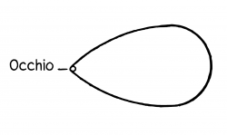

# Editor's Note

_Published by the [Ludwig Wittgenstein Project](https://www.wittgensteinproject.org/)._

_Traduzione di [Michele Lavazza](https://www.wittgensteinproject.org/w/index.php/Project:People#Michele_Lavazza)_

_Questa traduzione è stata condotta sul testo della seguente edizione tedesca: Ludwig Wittgenstein, *Tractatus Logico-Philosophicus*, a cura di C. K. Ogden e F. P. Ramsey, Kegan Paul, Trench, Trubner & Co., 1922. Wittgenstein, disconoscendo l'edizione della *Logisch-philosophische Abhandlung* pubblicata nel 1921 da Wilhelm Ostwald nei suoi *Annalen der Naturphilosophie*, considerava quella di Ogden e Ramsey come la prima edizione della sua opera; ne corresse personalmente le bozze e collaborò con i curatori anche alla revisione della traduzione inglese di Ramsey. In virtù dell'autorevolezza che le deriva da questa vicenda editoriale, tale versione inglese è stata consultata anche ai fini della presente traduzione italiana. Le espressioni tra parentesi quadre presenti in questa edizione sono del traduttore: hanno lo scopo di chiarificare alcune proposizioni rendendo espliciti termini che il passaggio dal tedesco all'italiano, o la *brevitas* di Wittgenstein, avrebbero altrimenti lasciato impliciti. Il testo originale è nel pubblico dominio in tutti i paesi dove i diritti di proprietà intellettuale scadono 70 anni o meno dopo la morte dell'autore. Questa traduzione è pubblicata secondo i termini della licenza [Creative Commons Attribuzione – Condividi allo stesso modo](https://creativecommons.org/licenses/by-sa/4.0/)._

# Tractatus logico-philosophicus

## Dedica

Dedicato
alla memoria del mio amico
DAVID H. PINSENT

## Epigrafe

*… e tutto ciò che si sa, che non si sia solo udito ruggire e rombare, può essere detto in tre parole. *

*Kürnberger.*

## Prefazione

Forse comprenderà questo libro solo chi ha già pensato da sé i pensieri che vi sono espressi – o almeno pensieri simili. – Esso non è quindi un manuale. – Il suo scopo sarebbe raggiunto se desse piacere a chi, leggendolo, lo comprendesse.

Il libro tratta i problemi filosofici e mostra, credo, che la posizione di questi problemi nasce dal fraintendimento della logica del nostro linguaggio. Si potrebbe riassumere all'incirca l'intero senso del libro nelle parole: ciò che può essere detto può essere detto in modo chiaro; e di ciò di cui non si può parlare si deve tacere.

Il libro vuole quindi tracciare un limite al pensiero, o piuttosto – non al pensiero, ma all'espressione dei pensieri: poiché per tracciare un limite al pensiero dovremmo poter pensare entrambi i lati di questo limite (dovremmo cioè poter pensare ciò che non può essere pensato).

Il limite potrà così essere tracciato solo nel linguaggio, e ciò che si trova oltre il limite sarà semplicemente nonsenso.

Non voglio giudicare della misura in cui i miei sforzi coincidono con quelli di altri filosofi. Certo, ciò che ho scritto qui nel particolare non ha affatto la pretesa della novità; e se non cito alcuna fonte è perché mi è indifferente se qualcun altro ha già pensato, prima di me, ciò che ho pensato io.

Solo questo voglio menzionare: che sono in debito per una gran parte degli stimoli ai miei pensieri verso le grandiose opere di Frege e verso i lavori del mio amico Signor Bertrand Russell.

Se questo lavoro ha un valore, esso consiste in due cose. In primo luogo nel fatto che vi sono espressi pensieri, e questo valore sarà tanto maggiore quanto meglio i pensieri sono espressi. Quanto più si è colpito nel segno. – Qui sono consapevole di essere rimasto molto al di sotto del possibile. Semplicemente perché la mia forza è insufficiente per portare a termine il compito. – Possano altri venire e farlo meglio.

D'altro canto la verità dei pensieri qui esposti mi sembra incontrovertibile e definitiva. Sono così dell'opinione di aver risolto nell'essenziale i problemi una volta per tutte. E, se non mi sbaglio su questo punto, allora il valore di questo lavoro consiste in secondo luogo nel mostrare quanto poco si ottiene con l'essere questi problemi risolti.

*L.W.*

Vienna, 1918.

---

## Tractatus logico-philosophicus

**[1](https://www.wittgensteinproject.org/w/index.php/Logisch-philosophische_Abhandlung#1)** Il mondo è tutto ciò che si verifica.[^1]

**[1.1](https://www.wittgensteinproject.org/w/index.php/Logisch-philosophische_Abhandlung#1.1)** Il mondo è la totalità dei fatti, non delle cose.

**[1.11](https://www.wittgensteinproject.org/w/index.php/Logisch-philosophische_Abhandlung#1.11)** Il mondo è determinato dai fatti e dal loro essere *tutti* i fatti.

**[1.12](https://www.wittgensteinproject.org/w/index.php/Logisch-philosophische_Abhandlung#1.12)** Poiché la totalità dei fatti determina ciò che si verifica e anche tutto ciò che non si verifica.

**[1.13](https://www.wittgensteinproject.org/w/index.php/Logisch-philosophische_Abhandlung#1.13)** I fatti nello spazio logico sono il mondo.

**[1.2](https://www.wittgensteinproject.org/w/index.php/Logisch-philosophische_Abhandlung#1.2)** Il mondo si divide in fatti.

**[1.21](https://www.wittgensteinproject.org/w/index.php/Logisch-philosophische_Abhandlung#1.21)** Qualcosa può verificarsi o non verificarsi e tutto il resto rimanere uguale.

**[2](https://www.wittgensteinproject.org/w/index.php/Logisch-philosophische_Abhandlung#2)** Ciò che si verifica, il fatto, è il sussistere di stati di cose.

**[2.01](https://www.wittgensteinproject.org/w/index.php/Logisch-philosophische_Abhandlung#2.01)** Lo stato di cose è un collegamento di oggetti (cose, entità).

**[2.011](https://www.wittgensteinproject.org/w/index.php/Logisch-philosophische_Abhandlung#2.011)** È essenziale alla cosa poter essere parte costitutiva di uno stato di cose.

**[2.012](https://www.wittgensteinproject.org/w/index.php/Logisch-philosophische_Abhandlung#2.012)** Nella logica niente è casuale: se la cosa *può* comparire nello stato di cose, allora la possibilità dello stato di cose dev'essere già implicata nella cosa.

**[2.0121](https://www.wittgensteinproject.org/w/index.php/Logisch-philosophische_Abhandlung#2.0121)** Sembrerebbe per così dire un caso se alla cosa, che di per sé potrebbe sussistere da sola, in seguito venisse adattato uno stato di cose.

Se le cose possono comparire negli stati di cose, allora questo deve già appartenere loro.

\(Qualcosa di logico non può essere *meramente* possibile. La logica si occupa di ogni possibilità e tutte le possibilità sono i suoi fatti.)

Come non possiamo affatto rappresentarci oggetti spaziali al di fuori dello spazio, né temporali al di fuori del tempo, così non possiamo rappresentarci *nessun* oggetto al di fuori della possibilità del suo collegamento con altri.

Se posso rappresentarmi l'oggetto nel contesto dello stato di cose, allora non posso rappresentarmelo al di fuori della *possibilità* di questo contesto.

**[2.0122](https://www.wittgensteinproject.org/w/index.php/Logisch-philosophische_Abhandlung#2.0122)** La cosa è autosufficiente, nella misura in cui essa può comparire in tutti gli stati di cose *possibili*, ma questa forma di autosufficienza è una forma di connessione con lo stato di cose, una forma di non-autosufficienza. (È impossibile che le parole si presentino in due modi diversi, da sole e nella proposizione.)

**[2.0123](https://www.wittgensteinproject.org/w/index.php/Logisch-philosophische_Abhandlung#2.0123)** Se conosco l'oggetto, allora conosco anche tutte le possibilità del suo comparire in stati di cose.

\(Ogni possibilità di questo genere deve appartenere alla natura dell'oggetto.)

Non si può scoprire in seguito una nuova possibilità.

**[2.01231](https://www.wittgensteinproject.org/w/index.php/Logisch-philosophische_Abhandlung#2.01231)** Per conoscere un oggetto non devo, certo, conoscere le sue proprietà esterne – ma devo conoscere tutte le sue proprietà interne.

**[2.0124](https://www.wittgensteinproject.org/w/index.php/Logisch-philosophische_Abhandlung#2.0124)** Se sono dati tutti gli oggetti, allora sono dati con ciò anche tutti i *possibili* stati di cose.

**[2.013](https://www.wittgensteinproject.org/w/index.php/Logisch-philosophische_Abhandlung#2.013)** Ogni cosa è, per così dire, in uno spazio di stati di cose possibili. Posso rappresentarmi questo spazio vuoto, ma non la cosa senza lo spazio.

**[2.0131](https://www.wittgensteinproject.org/w/index.php/Logisch-philosophische_Abhandlung#2.0131)** L'oggetto spaziale deve trovarsi nello spazio infinito. (Il punto nello spazio è un posto per l'argomento [del predicato, della funzione].)

La macchia nel campo visivo non deve certo essere rossa, ma deve avere un colore: ha intorno a sé, in un certo senso, lo spazio dei colori. Il suono deve avere *una* altezza, l'oggetto del tatto *una* durezza ecc.

**[2.014](https://www.wittgensteinproject.org/w/index.php/Logisch-philosophische_Abhandlung#2.014)** Gli oggetti contengono la possibilità di tutti gli stati di cose.

**[2.0141](https://www.wittgensteinproject.org/w/index.php/Logisch-philosophische_Abhandlung#2.0141)** La possibilità del suo comparire in stati di cose è la forma dell'oggetto.

**[2.02](https://www.wittgensteinproject.org/w/index.php/Logisch-philosophische_Abhandlung#2.02)** L'oggetto è semplice.

**[2.0201](https://www.wittgensteinproject.org/w/index.php/Logisch-philosophische_Abhandlung#2.0201)** Ogni asserzione riguardante complessi può essere scomposta in una asserzione riguardante le loro parti costitutive e in quelle proposizioni che descrivono completamente i complessi.

**[2.021](https://www.wittgensteinproject.org/w/index.php/Logisch-philosophische_Abhandlung#2.021)** Gli oggetti costituiscono la sostanza del mondo. Per questo non possono essere compositi.

**[2.0211](https://www.wittgensteinproject.org/w/index.php/Logisch-philosophische_Abhandlung#2.0211)** Se il mondo non avesse una sostanza, allora l'avere senso una proposizione dipenderebbe dall'essere vera un'altra proposizione.

**[2.0212](https://www.wittgensteinproject.org/w/index.php/Logisch-philosophische_Abhandlung#2.0212)** Sarebbe allora impossibile abbozzare un'immagine del mondo (non importa se vera o falsa).

**[2.022](https://www.wittgensteinproject.org/w/index.php/Logisch-philosophische_Abhandlung#2.022)** È evidente che un mondo, per quanto diverso da quello reale venga concepito, deve avere qualcosa – una forma – in comune con il mondo reale.

**[2.023](https://www.wittgensteinproject.org/w/index.php/Logisch-philosophische_Abhandlung#2.023)** Questa forma fissa consiste proprio degli oggetti.

**[2.0231](https://www.wittgensteinproject.org/w/index.php/Logisch-philosophische_Abhandlung#2.0231)** La sostanza del mondo *può* determinare soltanto una forma e nessuna proprietà materiale. Poiché queste proprietà si presentano solo attraverso le proposizioni – si costituiscono solo attraverso la configurazione degli oggetti.

**[2.0232](https://www.wittgensteinproject.org/w/index.php/Logisch-philosophische_Abhandlung#2.0232)** Detto incidentalmente: gli oggetti sono privi di colore.

**[2.0233](https://www.wittgensteinproject.org/w/index.php/Logisch-philosophische_Abhandlung#2.0233)** Due oggetti di forma logica uguale sono – a parte le loro proprietà esterne – distinti l'uno dall'altro solo dal loro essere diversi.

**[2.02331](https://www.wittgensteinproject.org/w/index.php/Logisch-philosophische_Abhandlung#2.02331)** O una cosa ha proprietà che nessun'altra ha, e allora si può senz'altro distinguerla dalle altre con una descrizione e indicarla; o invece vi sono più cose che hanno in comune tutte le loro proprietà, e allora è del tutto impossibile indicarne una tra le altre.

Poiché se la cosa non è individuata da niente, allora non posso individuarla, poiché altrimenti sarebbe appunto individuata.

**[2.024](https://www.wittgensteinproject.org/w/index.php/Logisch-philosophische_Abhandlung#2.024)** La sostanza è ciò che sussiste indipendentemente da ciò che si verifica.

**[2.025](https://www.wittgensteinproject.org/w/index.php/Logisch-philosophische_Abhandlung#2.025)** Essa è forma e contenuto.

**[2.0251](https://www.wittgensteinproject.org/w/index.php/Logisch-philosophische_Abhandlung#2.0251)** Spazio, tempo e colore (la proprietà dell'essere colorato) sono forme degli oggetti.

**[2.026](https://www.wittgensteinproject.org/w/index.php/Logisch-philosophische_Abhandlung#2.026)** Solo se vi sono oggetti può esserci una forma fissa del mondo.

**[2.027](https://www.wittgensteinproject.org/w/index.php/Logisch-philosophische_Abhandlung#2.027)** Ciò che è fisso, ciò che sussiste e l'oggetto sono uno.

**[2.0271](https://www.wittgensteinproject.org/w/index.php/Logisch-philosophische_Abhandlung#2.0271)** L'oggetto è ciò che è fisso, ciò che sussiste; la configurazione è ciò che è mutevole, instabile.

**[2.0272](https://www.wittgensteinproject.org/w/index.php/Logisch-philosophische_Abhandlung#2.0272)** La configurazione degli oggetti costituisce lo stato di cose.

**[2.03](https://www.wittgensteinproject.org/w/index.php/Logisch-philosophische_Abhandlung#2.03)** Nello stato di cose gli oggetti sono connessi fra di loro, come gli anelli di una catena.

**[2.031](https://www.wittgensteinproject.org/w/index.php/Logisch-philosophische_Abhandlung#2.031)** Nello stato di cose gli oggetti stanno in relazione l'uno con l'altro in modo determinato.

**[2.032](https://www.wittgensteinproject.org/w/index.php/Logisch-philosophische_Abhandlung#2.032)** Il modo in cui gli oggetti sono reciprocamente connessi nello stato di cose è la struttura dello stato di cose.

**[2.033](https://www.wittgensteinproject.org/w/index.php/Logisch-philosophische_Abhandlung#2.033)** La forma è la possibilità della struttura.

**[2.034](https://www.wittgensteinproject.org/w/index.php/Logisch-philosophische_Abhandlung#2.034)** La struttura del fatto consiste delle strutture degli stati di cose.

**[2.04](https://www.wittgensteinproject.org/w/index.php/Logisch-philosophische_Abhandlung#2.04)** La totalità degli stati di cose sussistenti è il mondo.

**[2.05](https://www.wittgensteinproject.org/w/index.php/Logisch-philosophische_Abhandlung#2.05)** La totalità degli stati di cose sussistenti determina anche quali stati di cose non sussistono.

**[2.06](https://www.wittgensteinproject.org/w/index.php/Logisch-philosophische_Abhandlung#2.06)** Il sussistere e il non-sussistere di stati di cose è la realtà.

\(Il sussistere di stati di cose è da noi chiamato anche un fatto positivo, il non-sussistere un fatto negativo.)

**[2.061](https://www.wittgensteinproject.org/w/index.php/Logisch-philosophische_Abhandlung#2.061)** Gli stati di cose sono indipendenti l'uno dall'altro.

**[2.062](https://www.wittgensteinproject.org/w/index.php/Logisch-philosophische_Abhandlung#2.062)** Dal sussistere o non-sussistere di uno stato di cose non si possono trarre conclusioni circa il sussistere o non-sussistere di un altro.

**[2.063](https://www.wittgensteinproject.org/w/index.php/Logisch-philosophische_Abhandlung#2.063)** La realtà nel suo complesso è il mondo.

**[2.1](https://www.wittgensteinproject.org/w/index.php/Logisch-philosophische_Abhandlung#2.1)** Noi ci facciamo immagini dei fatti.

**[2.11](https://www.wittgensteinproject.org/w/index.php/Logisch-philosophische_Abhandlung#2.11)** L'immagine rappresenta lo stato di cose nello spazio logico, il sussistere e non-sussistere degli stati cose.

**[2.12](https://www.wittgensteinproject.org/w/index.php/Logisch-philosophische_Abhandlung#2.12)** L'immagine è un modello della realtà.

**[2.13](https://www.wittgensteinproject.org/w/index.php/Logisch-philosophische_Abhandlung#2.13)** Agli oggetti corrispondono nell'immagine gli elementi dell'immagine.

**[2.131](https://www.wittgensteinproject.org/w/index.php/Logisch-philosophische_Abhandlung#2.131)** Gli elementi dell'immagine stanno, nell'immagine, per gli oggetti.

**[2.14](https://www.wittgensteinproject.org/w/index.php/Logisch-philosophische_Abhandlung#2.14)** L'immagine consiste nello stare in relazione l'uno con l'altro in modo determinato dei suoi elementi.

**[2.141](https://www.wittgensteinproject.org/w/index.php/Logisch-philosophische_Abhandlung#2.141)** L'immagine è un fatto.

**[2.15](https://www.wittgensteinproject.org/w/index.php/Logisch-philosophische_Abhandlung#2.15)** Lo stare in relazione l'uno con l'altro in modo determinato degli elementi dell'immagine rappresenta lo stare così in relazione l'una con l'altra delle cose.

Questa connessione degli elementi dell'immagine è chiamata la struttura dell'immagine e la possibilità di questa è chiamata la forma della raffigurazione dell'immagine.

**[2.151](https://www.wittgensteinproject.org/w/index.php/Logisch-philosophische_Abhandlung#2.151)** La forma della raffigurazione è la possibilità che le cose stiano in relazione l'una con l'altra così come gli elementi dell'immagine.

**[2.1511](https://www.wittgensteinproject.org/w/index.php/Logisch-philosophische_Abhandlung#2.1511)** L'immagine è legata *così* alla realtà; essa raggiunge la realtà.

**[2.1512](https://www.wittgensteinproject.org/w/index.php/Logisch-philosophische_Abhandlung#2.1512)** L'immagine è come una misura applicata alla realtà.

**[2.15121](https://www.wittgensteinproject.org/w/index.php/Logisch-philosophische_Abhandlung#2.15121)** Solo i punti più esterni delle lineette di graduazione *toccano* l'oggetto da misurare.

**[2.1513](https://www.wittgensteinproject.org/w/index.php/Logisch-philosophische_Abhandlung#2.1513)** Secondo questa concezione, dunque, appartiene all'immagine anche la relazione raffigurativa che la rende un'immagine.

**[2.1514](https://www.wittgensteinproject.org/w/index.php/Logisch-philosophische_Abhandlung#2.1514)** La relazione raffigurativa consiste nelle coordinazioni degli elementi dell'immagine e delle cose.

**[2.1515](https://www.wittgensteinproject.org/w/index.php/Logisch-philosophische_Abhandlung#2.1515)** Queste coordinazioni sono, per così dire, i tentacoli degli elementi dell'immagine, con i quali l'immagine raggiunge la realtà.

**[2.16](https://www.wittgensteinproject.org/w/index.php/Logisch-philosophische_Abhandlung#2.16)** Il fatto, per essere immagine, deve avere qualcosa in comune con il raffigurato.

**[2.161](https://www.wittgensteinproject.org/w/index.php/Logisch-philosophische_Abhandlung#2.161)** Qualcosa dev'essere identico nell'immagine e nel raffigurato, affinché l'una possa essere un'immagine dell'altro.

**[2.17](https://www.wittgensteinproject.org/w/index.php/Logisch-philosophische_Abhandlung#2.17)** Ciò che l'immagine deve avere in comune con la realtà per poterla raffigurare nel suo dato modo – corretto o errato – è la propria forma della raffigurazione.

**[2.171](https://www.wittgensteinproject.org/w/index.php/Logisch-philosophische_Abhandlung#2.171)** L'immagine può raffigurare ogni realtà di cui ha la forma.

L'immagine spaziale tutto ciò che è spaziale, quella cromatica tutto ciò che è colorato, ecc.

**[2.172](https://www.wittgensteinproject.org/w/index.php/Logisch-philosophische_Abhandlung#2.172)** L'immagine, tuttavia, non può raffigurare la propria forma della raffigurazione. Essa la esibisce.

**[2.173](https://www.wittgensteinproject.org/w/index.php/Logisch-philosophische_Abhandlung#2.173)** L'immagine presenta il suo soggetto dall'esterno (il suo punto di vista è la sua forma della presentazione); perciò l'immagine presenta il suo soggetto in modo corretto o errato.

**[2.174](https://www.wittgensteinproject.org/w/index.php/Logisch-philosophische_Abhandlung#2.174)** L'immagine non può tuttavia porsi al di fuori della sua forma della presentazione.

**[2.18](https://www.wittgensteinproject.org/w/index.php/Logisch-philosophische_Abhandlung#2.18)** Ciò che ogni immagine, di qualunque forma, deve avere in comune con la realtà per poterla raffigurare – in modo corretto o errato – è la forma logica, cioè la forma della realtà.

**[2.181](https://www.wittgensteinproject.org/w/index.php/Logisch-philosophische_Abhandlung#2.181)** Se la forma della raffigurazione è la forma logica, allora l'immagine è chiamata l'immagine logica.

**[2.182](https://www.wittgensteinproject.org/w/index.php/Logisch-philosophische_Abhandlung#2.182)** Ogni immagine è *anche* un'immagine logica. (Per contro, non ogni immagine è ad es. un'immagine spaziale.)

**[2.19](https://www.wittgensteinproject.org/w/index.php/Logisch-philosophische_Abhandlung#2.19)** L'immagine logica può raffigurare il mondo.

**[2.2](https://www.wittgensteinproject.org/w/index.php/Logisch-philosophische_Abhandlung#2.2)** L'immagine ha in comune con il raffigurato la forma logica della raffigurazione.

**[2.201](https://www.wittgensteinproject.org/w/index.php/Logisch-philosophische_Abhandlung#2.201)** L'immagine raffigura la realtà presentando una possibilità del sussistere e non-sussistere di stati di cose.

**[2.202](https://www.wittgensteinproject.org/w/index.php/Logisch-philosophische_Abhandlung#2.202)** L'immagine presenta uno stato di cose possibile nello spazio logico.

**[2.203](https://www.wittgensteinproject.org/w/index.php/Logisch-philosophische_Abhandlung#2.203)** L'immagine contiene la possibilità dello stato di cose che presenta.

**[2.21](https://www.wittgensteinproject.org/w/index.php/Logisch-philosophische_Abhandlung#2.21)** L'immagine corrisponde alla realtà o no; è esatta o inesatta, vera o falsa.

**[2.22](https://www.wittgensteinproject.org/w/index.php/Logisch-philosophische_Abhandlung#2.22)** L'immagine presenta ciò che presenta, indipendentemente dalla sua verità o falsità, attraverso la forma della raffigurazione.

**[2.221](https://www.wittgensteinproject.org/w/index.php/Logisch-philosophische_Abhandlung#2.221)** Ciò che l'immagine presenta è il suo senso.

**[2.222](https://www.wittgensteinproject.org/w/index.php/Logisch-philosophische_Abhandlung#2.222)** La sua verità o falsità sta nell'accordo o non-accordo del suo senso con la realtà.

**[2.223](https://www.wittgensteinproject.org/w/index.php/Logisch-philosophische_Abhandlung#2.223)** Per stabilire se l'immagine è vera o falsa dobbiamo paragonarla con la realtà.

**[2.224](https://www.wittgensteinproject.org/w/index.php/Logisch-philosophische_Abhandlung#2.224)** Dall'immagine da sola non si stabilisce se essa sia vera o falsa.

**[2.225](https://www.wittgensteinproject.org/w/index.php/Logisch-philosophische_Abhandlung#2.225)** Non vi è un'immagine vera a priori.

**[3](https://www.wittgensteinproject.org/w/index.php/Logisch-philosophische_Abhandlung#3)** L'immagine logica dei fatti è il pensiero.

**[3.001](https://www.wittgensteinproject.org/w/index.php/Logisch-philosophische_Abhandlung#3.001)** «Uno stato di cose è pensabile» vuol dire: possiamo farci un'immagine di esso.

**[3.01](https://www.wittgensteinproject.org/w/index.php/Logisch-philosophische_Abhandlung#3.01)** La totalità dei pensieri veri è un'immagine del mondo.

**[3.02](https://www.wittgensteinproject.org/w/index.php/Logisch-philosophische_Abhandlung#3.02)** Il pensiero contiene la possibilità degli stati di cose che pensa. Ciò che è pensabile, è anche possibile.

**[3.03](https://www.wittgensteinproject.org/w/index.php/Logisch-philosophische_Abhandlung#3.03)** Non possiamo pensare niente di illogico, perché altrimenti dovremmo pensare illogicamente.

**[3.031](https://www.wittgensteinproject.org/w/index.php/Logisch-philosophische_Abhandlung#3.031)** Si diceva un tempo che Dio può creare tutto, tranne solo ciò che è contrario alle leggi logiche. – Noi in effetti non potremmo *dire*, di un mondo «illogico», che aspetto avrebbe.

**[3.032](https://www.wittgensteinproject.org/w/index.php/Logisch-philosophische_Abhandlung#3.032)** Presentare nel linguaggio qualcosa «che contraddice la logica» è tanto impossibile quanto presentare nella geometria, attraverso le sue coordinate, una figura che contraddice le leggi dello spazio; oppure indicare le coordinate di un punto che non esiste.

**[3.0321](https://www.wittgensteinproject.org/w/index.php/Logisch-philosophische_Abhandlung#3.0321)** Possiamo ben presentare spazialmente uno stato di cose che vada contro le leggi della fisica, ma non uno che vada contro le leggi della geometria.

**[3.04](https://www.wittgensteinproject.org/w/index.php/Logisch-philosophische_Abhandlung#3.04)** Un pensiero corretto a priori sarebbe un pensiero tale che la sua possibilità implicasse la sua verità.

**[3.05](https://www.wittgensteinproject.org/w/index.php/Logisch-philosophische_Abhandlung#3.05)** Potremmo sapere a priori che un pensiero è vero solo se la sua verità si riconoscesse dal pensiero stesso (senza un termine di paragone).

**[3.1](https://www.wittgensteinproject.org/w/index.php/Logisch-philosophische_Abhandlung#3.1)** Nella proposizione il pensiero si esprime in modo percepibile sensibilmente.

**[3.11](https://www.wittgensteinproject.org/w/index.php/Logisch-philosophische_Abhandlung#3.11)** Utilizziamo il segno percepibile sensibilmente (segno vocale o grafico ecc.) della proposizione come proiezione dello stato di cose possibile.

Il metodo di proiezione è il pensare il senso della proposizione.

**[3.12](https://www.wittgensteinproject.org/w/index.php/Logisch-philosophische_Abhandlung#3.12)** Chiamo il segno attraverso il quale esprimiamo il pensiero il segno proposizionale. E la proposizione è il segno proposizionale nella sua relazione proiettiva con il mondo.

**[3.13](https://www.wittgensteinproject.org/w/index.php/Logisch-philosophische_Abhandlung#3.13)** Alla proposizione appartiene tutto ciò che appartiene alla proiezione; ma non il proiettato.

Quindi la possibilità di ciò che è proiettato, ma *non* ciò che è proiettato.

Nella proposizione, dunque, non è ancora contenuto il suo senso, ma vi è contenuta la possibilità di esprimerlo.

\(«Il contenuto della proposizione» vuol dire il contenuto della proposizione dotata di senso.)

Nella proposizione è contenuta la forma del suo senso, ma non il suo contenuto.

**[3.14](https://www.wittgensteinproject.org/w/index.php/Logisch-philosophische_Abhandlung#3.14)** Il segno proposizionale consiste nello stare in relazione l'uno con l'altro in modo determinato dei suoi elementi, le parole.

Il segno proposizionale è un fatto.

**[3.141](https://www.wittgensteinproject.org/w/index.php/Logisch-philosophische_Abhandlung#3.141)** La proposizione non è un miscuglio di parole. – (Come il tema musicale non è un miscuglio di suoni.)

La proposizione è articolata. **[3.142](https://www.wittgensteinproject.org/w/index.php/Logisch-philosophische_Abhandlung#3.142)** Solo i fatti possono esprimere un senso; una classe di nomi non può.

**[3.143](https://www.wittgensteinproject.org/w/index.php/Logisch-philosophische_Abhandlung#3.143)** Che il segno proposizionale sia un fatto viene occultato dall'abituale forma espressiva della scrittura o della stampa.

Infatti nella proposizione stampata, ad es., il segno proposizionale non sembra essenzialmente diverso dalla parola.

\(Per questo Frege ha potuto chiamare la proposizione un nome composto.)

**[3.1431](https://www.wittgensteinproject.org/w/index.php/Logisch-philosophische_Abhandlung#3.1431)** L'essenza del segno proposizionale diventa molto chiara se ce lo rappresentiamo come composto, anziché da segni grafici, da oggetti spaziali (come tavoli, sedie, libri).

La reciproca posizione spaziale di queste cose esprime allora il senso della proposizione.

**[3.1432](https://www.wittgensteinproject.org/w/index.php/Logisch-philosophische_Abhandlung#3.1432)** Non «il segno complesso “*a* R *b*” dice che *a* sta nella relazione R con *b*», bensì *che* «*a*» sta in una certa relazione con «*b*» dice *che* *a* R *b*.

**[3.144](https://www.wittgensteinproject.org/w/index.php/Logisch-philosophische_Abhandlung#3.144)** Si possono descrivere gli stati di cose, non *nominarli*.

\(I nomi assomigliano a punti, le proposizioni a frecce: esse hanno senso.)

**[3.2](https://www.wittgensteinproject.org/w/index.php/Logisch-philosophische_Abhandlung#3.2)** Nella proposizione il pensiero può essere espresso in modo tale che gli elementi del segno proposizionale corrispondano agli oggetti del pensiero.

**[3.201](https://www.wittgensteinproject.org/w/index.php/Logisch-philosophische_Abhandlung#3.201)** Chiamo questi elementi «segni semplici» e la proposizione «completamente analizzata».

**[3.202](https://www.wittgensteinproject.org/w/index.php/Logisch-philosophische_Abhandlung#3.202)** I segni semplici usati nella proposizione si chiamano nomi.

**[3.203](https://www.wittgensteinproject.org/w/index.php/Logisch-philosophische_Abhandlung#3.203)** Il nome significa l'oggetto. L'oggetto è il suo significato. («A» è lo stesso segno che «A».)

**[3.21](https://www.wittgensteinproject.org/w/index.php/Logisch-philosophische_Abhandlung#3.21)** Alla configurazione dei segni semplici nel segno proposizionale corrisponde la configurazione degli oggetti nello stato di cose.

**[3.22](https://www.wittgensteinproject.org/w/index.php/Logisch-philosophische_Abhandlung#3.22)** Il nome sta, nella proposizione, per l'oggetto.

**[3.221](https://www.wittgensteinproject.org/w/index.php/Logisch-philosophische_Abhandlung#3.221)** Posso solo *nominare* gli oggetti. I segni stanno per essi. Posso solo parlare *di* essi, non posso *asserirli*. Una proposizione può dire solo *come* uno oggetto è, non *cosa* è.

**[3.23](https://www.wittgensteinproject.org/w/index.php/Logisch-philosophische_Abhandlung#3.23)** Il requisito della possibilità dei segni semplici è il requisito della determinatezza del senso.

**[3.24](https://www.wittgensteinproject.org/w/index.php/Logisch-philosophische_Abhandlung#3.24)** La proposizione che tratta di un complesso è in una relazione interna con la proposizione che tratta di una parte costituente del complesso.

Il complesso può essere dato solo attraverso la sua descrizione, e questa sarà esatta o non esatta. La proposizione nella quale si parla di un complesso non sarà, se questo non esiste, insensata, ma semplicemente falsa.

Che un elemento della proposizione designi un complesso si può vedere da un'indeterminatezza nelle proposizioni in cui tale elemento compare. Noi *sappiamo* che questa proposizione non determina ancora tutto. (La designazione della generalità *contiene* un archetipo.)

La sintesi del simbolo di un complesso in un simbolo semplice può essere espressa da una definizione.

**[3.25](https://www.wittgensteinproject.org/w/index.php/Logisch-philosophische_Abhandlung#3.25)** Vi è una e una sola analisi completa della proposizione.

**[3.251](https://www.wittgensteinproject.org/w/index.php/Logisch-philosophische_Abhandlung#3.251)** La proposizione esprime ciò che esprime in modi determinati, suscettibili di essere indicati chiaramente: la proposizione è articolata.

**[3.26](https://www.wittgensteinproject.org/w/index.php/Logisch-philosophische_Abhandlung#3.26)** Il nome non può essere scomposto per mezzo di alcuna ulteriore definizione: esso è un segno primitivo.

**[3.261](https://www.wittgensteinproject.org/w/index.php/Logisch-philosophische_Abhandlung#3.261)** Ogni segno definito designa *attraverso* quel segno da cui viene definito; e le definizioni mostrano la via.

Due segni, un segno primitivo e uno definito attraverso segni primitivi, non possono designare nello stesso modo. Non si *possono* dissezionare i nomi attraverso definizioni. (Né alcun segno che da solo e in modo indipendente ha un significato.)

**[3.262](https://www.wittgensteinproject.org/w/index.php/Logisch-philosophische_Abhandlung#3.262)** Ciò che nei segni non giunge a espressione viene mostrato dal loro uso. Ciò che i segni nascondono è enunciato dal loro uso.

**[3.263](https://www.wittgensteinproject.org/w/index.php/Logisch-philosophische_Abhandlung#3.263)** I significati dei segni primitivi possono essere chiariti attraverso spiegazioni. Le spiegazioni sono proposizioni che contengono i segni primitivi. Dunque possono essere comprese solo se i significati di questi segni sono già conosciuti.

**[3.3](https://www.wittgensteinproject.org/w/index.php/Logisch-philosophische_Abhandlung#3.3)** Solo la proposizione ha senso; solo nel contesto della proposizione un nome ha significato.

**[3.31](https://www.wittgensteinproject.org/w/index.php/Logisch-philosophische_Abhandlung#3.31)** Chiamo ogni parte della proposizione che caratterizza il suo senso un'espressione (un simbolo).

\(La proposizione stessa è un'espressione.)

È espressione tutto ciò di essenziale per il senso della proposizione che le proposizioni possono avere in comune tra di loro.

L'espressione caratterizza una forma e un contenuto.

**[3.311](https://www.wittgensteinproject.org/w/index.php/Logisch-philosophische_Abhandlung#3.311)** L'espressione presuppone le forme di tutte le proposizioni in cui può comparire. Essa è il tratto caratteristico comune di una classe di proposizioni.

**[3.312](https://www.wittgensteinproject.org/w/index.php/Logisch-philosophische_Abhandlung#3.312)** Essa è dunque presentata dalla forma generale delle proposizioni che essa caratterizza.

Infatti in questa forma l'espressione sarà *costante*, e tutto il resto *variabile*.

**[3.313](https://www.wittgensteinproject.org/w/index.php/Logisch-philosophische_Abhandlung#3.313)** L'espressione è quindi presentata da una variabile i cui valori sono le proposizioni che contengono l'espressione.

\(Nel caso limite le variabili divengono costanti, l'espressione diviene proposizione.)

Chiamo una tale variabile «variabile proposizionale».

**[3.314](https://www.wittgensteinproject.org/w/index.php/Logisch-philosophische_Abhandlung#3.314)** L'espressione ha significato solo nella proposizione. Ogni variabile può essere intesa come variabile proposizionale.

\(Incluso il nome variabile.)

**[3.315](https://www.wittgensteinproject.org/w/index.php/Logisch-philosophische_Abhandlung#3.315)** Se trasformiamo una parte costitutiva di una proposizione in una variabile, otteniamo una classe di proposizioni che costituiscono tutti i valori della proposizione variabile così ottenuta. Questa classe dipende ancora, in generale, da ciò che noi intendiamo, per convenzione arbitraria, mediante le parti di quella proposizione. Se però trasformiamo in variabili tutti quei segni il cui significato è determinato arbitrariamente, otteniamo ancora e sempre una tale classe. Questa, tuttavia, non dipende più da alcuna convenzione, ma solo dalla natura della proposizione. Essa corrisponde a una forma logica – a un archetipo logico.

**[3.316](https://www.wittgensteinproject.org/w/index.php/Logisch-philosophische_Abhandlung#3.316)** Quali valori sia possibile assumere per la variabile proposizionale è qualcosa che viene fissato.

La fissazione dei valori *è* la variabile.

**[3.317](https://www.wittgensteinproject.org/w/index.php/Logisch-philosophische_Abhandlung#3.317)** La fissazione dei valori delle variabili proposizionali è l'*indicazione delle proposizioni* il cui tratto comune è la variabile.

La fissazione è una descrizione di queste proposizioni.

La fissazione quindi tratterà solo di simboli, non del loro significato.

E *solo* questo è essenziale a tale fissazione: *che essa è solo una descrizione di simboli e non dice niente sul simbolizzato*.

Come avviene la descrizione delle proposizioni è inessenziale.

**[3.318](https://www.wittgensteinproject.org/w/index.php/Logisch-philosophische_Abhandlung#3.318)** Intendo la proposizione – come Frege e Russell – come funzione delle espressioni in essa contenute.

**[3.32](https://www.wittgensteinproject.org/w/index.php/Logisch-philosophische_Abhandlung#3.32)** Il segno è ciò che nel simbolo è percepibile sensibilmente.

**[3.321](https://www.wittgensteinproject.org/w/index.php/Logisch-philosophische_Abhandlung#3.321)** Due simboli diversi possono quindi avere il segno in comune tra loro (segno grafico o segno vocale ecc.) – essi simbolizzano allora in modo diverso.

**[3.322](https://www.wittgensteinproject.org/w/index.php/Logisch-philosophische_Abhandlung#3.322)** Che noi li simbolizziamo con lo stesso segno ma con due diversi *modi di simbolizzazione* non può mai indicare il tratto comune di due oggetti. Il segno, infatti, è arbitrario. Si potrebbero quindi anche scegliere due segni diversi, e allora che ne sarebbe di ciò che vi è in comune nella simbolizzazione?

**[3.323](https://www.wittgensteinproject.org/w/index.php/Logisch-philosophische_Abhandlung#3.323)** Nel linguaggio comune capita spessissimo che la stessa parola simbolizzi in diversi modi – che dunque appartenga a diversi simboli – o che due parole che simbolizzano in modi diversi vengano impiegate in modo esteriormente identico nella proposizione.

Così la parola «è» compare come copula, come segno di identità e come espressione dell'esistenza; «esistere» come verbo intransitivo alla stessa stregua di «andare»; «identico» come aggettivo; parliamo di *un qualcosa*, ma anche dell'accadere *di qualcosa*.

\(Nella proposizione «Rosa è rosa» – dove la prima parola è un nome di persona, l'ultima un aggettivo – queste parole non hanno semplicemente diverso significato, ma sono *simboli diversi*.)

**[3.324](https://www.wittgensteinproject.org/w/index.php/Logisch-philosophische_Abhandlung#3.324)** Così nascono facilmente gli equivoci più fondamentali (dei quali tutta la filosofia è piena).

**[3.325](https://www.wittgensteinproject.org/w/index.php/Logisch-philosophische_Abhandlung#3.325)** Per sottrarci a questi errori dobbiamo impiegare un linguaggio segnico che li esclude, non impiegando lo stesso segno in simboli diversi e non impiegando esteriormente nello stesso modo segni che simbolizzano in modo diverso. Un linguaggio segnico, dunque, che obbedisce alla grammatica *logica* – la sintassi logica.

\(L'ideografia di Frege e Russell è un tale linguaggio, che tuttavia non esclude ancora tutti gli errori.)

**[3.326](https://www.wittgensteinproject.org/w/index.php/Logisch-philosophische_Abhandlung#3.326)** Per riconoscere il simbolo nel segno bisogna prenderne in considerazione l'uso dotato di senso.

**[3.327](https://www.wittgensteinproject.org/w/index.php/Logisch-philosophische_Abhandlung#3.327)** Solo insieme con la sua applicazione logico-sintattica il segno determina una forma logica.

**[3.328](https://www.wittgensteinproject.org/w/index.php/Logisch-philosophische_Abhandlung#3.328)** Se un segno *non* viene *usato*, allora è privo di significato. Questo è il senso del rasoio di Occam.

\(Se tutto sta come se un segno avesse significato, allora esso ha significato.)

**[3.33](https://www.wittgensteinproject.org/w/index.php/Logisch-philosophische_Abhandlung#3.33)** Nella sintassi logica il significato di un segno non può mai avere un ruolo; esso deve poter essere stabilito senza che in ciò si parli del *significato* di un segno; esso può presupporre *solo* la descrizione delle espressioni.

**[3.331](https://www.wittgensteinproject.org/w/index.php/Logisch-philosophische_Abhandlung#3.331)** A partire da questa osservazione volgiamo lo sguardo alla «*theory of types*» di Russell: l'errore di Russell si mostra nella necessità in cui egli si è trovato, al momento di stabilire le regole relative ai segni, di parlare del significato dei segni.

**[3.332](https://www.wittgensteinproject.org/w/index.php/Logisch-philosophische_Abhandlung#3.332)** Nessuna proposizione può enunciare qualcosa su se stessa, poiché il segno proposizionale non può essere contenuto in sé stesso (questa è l'intera «*theory of types*»).

**[3.333](https://www.wittgensteinproject.org/w/index.php/Logisch-philosophische_Abhandlung#3.333)** Una funzione, quindi, non può essere il proprio stesso argomento, poiché il segno di funzione contiene già l'archetipo del suo argomento e non può contenere se stesso.

Assumiamo infatti che la funzione *F* (*f* *x*) possa essere il proprio stesso argomento; allora si darebbe una proposizione «*F* (*F* (*f* *x*))», ma in questa la funzione *F* esterna e la funzione *F* interna devono avere significati diversi, poiché quella interna ha la forma *φ* (*f* *x*), quella esterna la forma *ψ* (*φ* (*f* *x*)). In comune a entrambe le funzioni vi è solo la lettera «*F*», che però da sola non simbolizza niente.

Questo diventa subito chiaro se anziché «*F* (*F* (*u*))» scriviamo «(∃ *φ*) : *F* (*φ u*) . *φ u* = *F u*».

Con ciò si risolve il paradosso di Russell.

**[3.334](https://www.wittgensteinproject.org/w/index.php/Logisch-philosophische_Abhandlung#3.334)** Le regole della sintassi logica devono comprendersi da sé, purché si sappia come ogni dato segno designa.

**[3.34](https://www.wittgensteinproject.org/w/index.php/Logisch-philosophische_Abhandlung#3.34)** La proposizione possiede tratti essenziali e accidentali.

Accidentali sono i tratti che derivano dal particolare modo in cui viene prodotto il segno proposizionale. Essenziali quelli senza i quali la proposizione non sarebbe capace di esprimere il suo senso.

**[3.341](https://www.wittgensteinproject.org/w/index.php/Logisch-philosophische_Abhandlung#3.341)** L'essenziale nella proposizione è dunque ciò che è comune a tutte le proposizioni che possono esprimere lo stesso senso.

E allo stesso modo, in generale, l'essenziale nel simbolo è ciò che hanno in comune tutti i simboli che possono assolvere lo stesso scopo.

**[3.3411](https://www.wittgensteinproject.org/w/index.php/Logisch-philosophische_Abhandlung#3.3411)** Si potrebbe quindi dire: il nome, propriamente, è ciò che tutti i simboli che designano l'oggetto hanno in comune. Si rivelerebbe così gradualmente che nessuna composizione è minimamente essenziale per il nome.

**[3.342](https://www.wittgensteinproject.org/w/index.php/Logisch-philosophische_Abhandlung#3.342)** Nelle nostre notazioni qualcosa è, certo, arbitrario, ma *questo* non è arbitrario: che *se* abbiamo determinato qualcosa arbitrariamente, allora qualcosa d'altro deve verificarsi. (Questo dipende dall'*essenza* della notazione.)

**[3.3421](https://www.wittgensteinproject.org/w/index.php/Logisch-philosophische_Abhandlung#3.3421)** Una particolare modalità di designazione può non essere importante, ma è sempre importante che essa sia una *possibile* modalità di designazione. E così stanno le cose nella filosofia in generale: l'individuo si rivela sempre di nuovo non importante, ma la possibilità di ogni individuo ci rivela qualcosa sull'essenza del mondo.

**[3.343](https://www.wittgensteinproject.org/w/index.php/Logisch-philosophische_Abhandlung#3.343)** Le definizioni sono regole per la traduzione di un linguaggio in un altro. Ogni linguaggio segnico corretto deve poter essere tradotto in ogni altro secondo tali regole: *questo* è ciò che essi hanno tutti in comune.

**[3.344](https://www.wittgensteinproject.org/w/index.php/Logisch-philosophische_Abhandlung#3.344)** Ciò che nel simbolo designa è ciò che vi è di comune in tutti quei simboli con cui esso può essere sostituito secondo le regole della sintassi logica.

**[3.3441](https://www.wittgensteinproject.org/w/index.php/Logisch-philosophische_Abhandlung#3.3441)** Si può ad es. esprimere così ciò che vi è di comune in tutte le notazioni per le funzioni di verità: a esse è comune il *poter essere* tutte *sostituite* – ad es. – dalla notazione di «\~*p*» («non *p*») e «*p* ∨ *q*» («*p* o *q*»).

\(Ecco il modo in cui una particolare notazione possibile può rivelarci qualcosa di generale.)

**[3.3442](https://www.wittgensteinproject.org/w/index.php/Logisch-philosophische_Abhandlung#3.3442)** Anche il segno del complesso si risolve tramite l'analisi in modo non arbitrario, cosicché la sua scomposizione sarebbe diversa per ogni struttura della proposizione.

**[3.4](https://www.wittgensteinproject.org/w/index.php/Logisch-philosophische_Abhandlung#3.4)** La proposizione determina un luogo nello spazio logico. L'esistenza di questo luogo logico non è garantita che dall'esistenza delle parti costituenti, dall'esistenza della proposizione dotata di senso.

**[3.41](https://www.wittgensteinproject.org/w/index.php/Logisch-philosophische_Abhandlung#3.41)** Il segno proposizionale e le coordinate logiche: questo è il luogo logico.

**[3.411](https://www.wittgensteinproject.org/w/index.php/Logisch-philosophische_Abhandlung#3.411)** Il luogo geometrico e quello logico corrispondono in quanto sono entrambi la possibilità di un'esistenza.

**[3.42](https://www.wittgensteinproject.org/w/index.php/Logisch-philosophische_Abhandlung#3.42)** Benché la proposizione possa determinare solo un luogo dello spazio logico, con essa dev'essere già dato l'intero spazio logico.

\(Altrimenti con la negazione, la somma logica, il prodotto logico ecc. verrebbero introdotti sempre nuovi elementi – in coordinazione.)

\(L'impalcatura logica intorno all'immagine determina lo spazio logico. La proposizione attraversa tutto lo spazio logico.)

**[3.5](https://www.wittgensteinproject.org/w/index.php/Logisch-philosophische_Abhandlung#3.5)** Il segno proposizionale applicato, pensato, è il pensiero.

**[4](https://www.wittgensteinproject.org/w/index.php/Logisch-philosophische_Abhandlung#4)** Il pensiero è la proposizione dotata di senso.

**[4.001](https://www.wittgensteinproject.org/w/index.php/Logisch-philosophische_Abhandlung#4.001)** La totalità delle proposizioni è il linguaggio.

**[4.002](https://www.wittgensteinproject.org/w/index.php/Logisch-philosophische_Abhandlung#4.002)** L'uomo possiede la capacità di costruire linguaggi, mediante i quali può essere espresso qualsiasi senso, senza avere un'idea di come e cosa ogni parola significa. – Così come si parla senza sapere come sono prodotti i singoli suoni.

Il linguaggio comune è una parte dell'organismo umano e non è meno complicato di quest'ultimo.

È umanamente impossibile dedurne in modo immediato la logica del linguaggio.

Il linguaggio traveste il pensiero. Di modo che non si può concludere dalla forma esteriore del vestito alla forma del pensiero sotto il vestito; perché la forma esteriore del vestito è fatta per tutt'altri scopi che quello di permettere di riconoscere la forma del corpo.

Gli accordi taciti per la comprensione del linguaggio comune sono enormemente complessi.

**[4.003](https://www.wittgensteinproject.org/w/index.php/Logisch-philosophische_Abhandlung#4.003)** Le tesi e le domande su cose filosofiche che sono state messe per iscritto sono per la maggior parte non false, ma insensate. Perciò non possiamo affatto rispondere a domande di tal sorta, ma solo stabilire la loro insensatezza. Le domande e le proposizioni dei filosofi nascono per la maggior parte dall'incomprensione della logica del nostro linguaggio.

\(Esse sono domande dello stesso tipo di quella se il buono sia o meno lo stesso che il bello.)

E non è stupefacente che i problemi più profondi propriamente *non* siano problemi.

**[4.0031](https://www.wittgensteinproject.org/w/index.php/Logisch-philosophische_Abhandlung#4.0031)** Tutta la filosofia è «critica del linguaggio». (Non tuttavia nel senso di Mauthner.) È merito di Russell aver mostrato che la forma logica apparente della proposizione può non essere la sua forma logica reale.

**[4.01](https://www.wittgensteinproject.org/w/index.php/Logisch-philosophische_Abhandlung#4.01)** La proposizione è un'immagine della realtà.

La proposizione è un modello della realtà così come ce la rappresentiamo.

**[4.011](https://www.wittgensteinproject.org/w/index.php/Logisch-philosophische_Abhandlung#4.011)** A prima vista la proposizione – come essa per esempio sta stampata sulla carta – non sembra essere un'immagine della realtà di cui tratta. Ma anche la notazione musicale a prima vista non sembra essere un'immagine della musica, e la nostra notazione fonetica o alfabetica non sembra essere un'immagine del nostro linguaggio vocale.

E tuttavia questi linguaggi segnici si rivelano, anche nel senso abituale, come immagini di ciò che presentano.

**[4.012](https://www.wittgensteinproject.org/w/index.php/Logisch-philosophische_Abhandlung#4.012)** È evidente che percepiamo una proposizione della forma «*a* R *b*» come immagine. Qui il segno è evidentemente qualcosa di rassomigliante al designato.

**[4.013](https://www.wittgensteinproject.org/w/index.php/Logisch-philosophische_Abhandlung#4.013)** E se penetriamo nell'essenziale di questa natura figurativa vediamo che essa *non* viene compromessa da *apparenti irregolarità* (come l'impiego del ♯ e del ♭ nella notazione musicale).

Poiché anche queste irregolarità raffigurano ciò che devono esprimere; solo in modo diverso.

**[4.014](https://www.wittgensteinproject.org/w/index.php/Logisch-philosophische_Abhandlung#4.014)** Il disco del grammofono, il pensiero musicale, la notazione musicale, le onde sonore stanno tutti tra di loro in quella relazione interna di raffigurazione che sussiste tra linguaggio e mondo.

A tutti è comune la costruzione logica.

\(Come nella fiaba i due giovani, i loro due cavalli e i loro gigli. Essi sono tutti in un certo senso uno.)

**[4.0141](https://www.wittgensteinproject.org/w/index.php/Logisch-philosophische_Abhandlung#4.0141)** Che vi sia una regola generale mediante la quale il musicista può trarre la sinfonia dalla partitura, e che ve ne sia una mediante la quale si può trarre dal solco del disco per il grammofono la sinfonia e poi, secondo la prima regola, di nuovo dedurre la partitura – in questo appunto consiste la somiglianza interna di queste forme apparentemente così diverse. E questa regola è la legge della proiezione che proietta la sinfonia nel linguaggio della notazione musicale. È la regola della traduzione del linguaggio della notazione musicale nel linguaggio del disco del grammofono.

**[4.015](https://www.wittgensteinproject.org/w/index.php/Logisch-philosophische_Abhandlung#4.015)** La possibilità di tutte le immagini, di tutta la natura figurativa del nostro modo di espressione, risiede nella logica della raffigurazione.

**[4.016](https://www.wittgensteinproject.org/w/index.php/Logisch-philosophische_Abhandlung#4.016)** Per comprendere l'essenza della proposizione, pensiamo alla scrittura geroglifica, che raffigura i fatti che descrive.

E da essa si è sviluppata la scrittura alfabetica, senza che l'essenziale della raffigurazione andasse perso.

**[4.02](https://www.wittgensteinproject.org/w/index.php/Logisch-philosophische_Abhandlung#4.02)** Lo vediamo da questo: che comprendiamo il senso del segno proposizionale senza che esso ci sia stato spiegato.

**[4.021](https://www.wittgensteinproject.org/w/index.php/Logisch-philosophische_Abhandlung#4.021)** La proposizione è un'immagine della realtà: poiché se comprendo la proposizione conosco lo stato di cose da essa presentato. E comprendo la proposizione senza che il suo senso mi sia stato spiegato.

**[4.022](https://www.wittgensteinproject.org/w/index.php/Logisch-philosophische_Abhandlung#4.022)** La proposizione *mostra* il suo senso.

La proposizione *mostra* come le cose stanno *se* è vera. E *dice* *che* stanno così.

**[4.023](https://www.wittgensteinproject.org/w/index.php/Logisch-philosophische_Abhandlung#4.023)** La realtà deve essere fissata mediante la proposizione per il sì o per il no.

A questo scopo la realtà deve essere descritta completamente dalla proposizione.

La proposizione è la descrizione di uno stato di cose.

Come la descrizione di un oggetto lo descrive secondo le sue proprietà esterne, così la proposizione descrive la realtà secondo le sue proprietà interne.

La proposizione costruisce un mondo con l'aiuto di un'impalcatura logica, e perciò dalla proposizione si può anche vedere come sta tutto ciò che logicamente ne consegue *se* essa è vera. Si possono *trarre conclusioni* da una proposizione falsa.

**[4.024](https://www.wittgensteinproject.org/w/index.php/Logisch-philosophische_Abhandlung#4.024)** Comprendere una proposizione vuol dire sapere cosa accade se essa è vera.

\(La si può quindi comprendere senza sapere se è vera.)

La si comprende quando si comprendono le sue parti costituenti.

**[4.025](https://www.wittgensteinproject.org/w/index.php/Logisch-philosophische_Abhandlung#4.025)** La traduzione di un linguaggio in un altro non procede traducendo ogni *proposizione* dell'uno in una *proposizione* dell'altro; bensì vengono tradotte solo le parti costituenti.

\(E il vocabolario non traduce solo i sostantivi, ma anche verbi, aggettivi, congiunzioni ecc.; e li tratta tutti allo stesso modo.)

**[4.026](https://www.wittgensteinproject.org/w/index.php/Logisch-philosophische_Abhandlung#4.026)** I significati dei segni semplici (delle parole) devono esserci spiegati affinché li comprendiamo.

Con le proposizioni invece ci spieghiamo.

**[4.027](https://www.wittgensteinproject.org/w/index.php/Logisch-philosophische_Abhandlung#4.027)** Fa parte dell'essenza della proposizione che essa possa comunicarci un senso *nuovo*.

**[4.03](https://www.wittgensteinproject.org/w/index.php/Logisch-philosophische_Abhandlung#4.03)** Una proposizione deve comunicare un senso nuovo con vecchie espressioni.

La proposizione ci comunica uno stato di cose; quindi dev'essere *essenzialmente* connessa con lo stato di cose.

E la connessione consiste appunto in questo: che la proposizione è l'immagine logica dello stato di cose.

La proposizione asserisce qualcosa solo in quanto è un'immagine.

**[4.031](https://www.wittgensteinproject.org/w/index.php/Logisch-philosophische_Abhandlung#4.031)** Nella proposizione uno stato di cose viene, per dir così, messo insieme a titolo di prova.

Si potrebbe addirittura dire, invece che «questa proposizione ha questo e questo senso», «questa proposizione presenta questo e questo stato di cose».

**[4.0311](https://www.wittgensteinproject.org/w/index.php/Logisch-philosophische_Abhandlung#4.0311)** Se un nome sta per una cosa, un altro per un'altra cosa ed essi sono collegati l'uno all'altro, allora l'insieme – come un *tableau vivant* – rappresenta lo stato di cose.

**[4.0312](https://www.wittgensteinproject.org/w/index.php/Logisch-philosophische_Abhandlung#4.0312)** La possibilità della proposizione riposa sul principio che i segni *stanno per* gli oggetti.

Il mio pensiero fondamentale è che le «costanti logiche» non *stanno per* alcunché. Che niente può *stare per* la *logica* dei fatti.

**[4.032](https://www.wittgensteinproject.org/w/index.php/Logisch-philosophische_Abhandlung#4.032)** La proposizione è un'immagine di uno stato di cose solo in quanto essa è logicamente organizzata.

\(Anche la proposizione «*ambulo*» è composta, poiché la sua radice dà un altro senso con un'altra desinenza, e la sua desinenza con un'altra radice.)

**[4.04](https://www.wittgensteinproject.org/w/index.php/Logisch-philosophische_Abhandlung#4.04)** Nella proposizione dev'essere differenziato esattamente tanto quanto è differenziato nello stato di cose che essa presenta.

Entrambi devono possedere la stessa molteplicità logica (matematica). (Vedi la *Meccanica* di Hertz a proposito dei modelli dinamici.)

**[4.041](https://www.wittgensteinproject.org/w/index.php/Logisch-philosophische_Abhandlung#4.041)** Questa stessa molteplicità matematica non si può, naturalmente, raffigurare a sua volta. Da essa non si può uscire finché si raffigura.

**[4.0411](https://www.wittgensteinproject.org/w/index.php/Logisch-philosophische_Abhandlung#4.0411)** Se volessimo ad es. esprimere ciò che esprimiamo attraverso «(*x*).*f x*» attraverso l'anteposizione di un indice a «*f* *x*» – ad es. così: «gen. *f* *x*» – ciò non sarebbe sufficiente – non sapremmo che cosa viene generalizzato. Se volessimo indicarlo attraverso un indice «*g*» – ad es. così: «*f* (*x~g~*)» – anche ciò non sarebbe sufficiente – non conosceremmo il dominio della designazione della generalità.

Se volessimo cercare di farlo attraverso l'introduzione di un indice nei posti per l'argomento – per esempio così: «(G, G) . F (G, G)» – ciò non sarebbe sufficiente – non potremmo stabilire l'identità delle variabili. E così via.

Tutti questi modi di designazione non sono sufficienti perché essi non hanno la necessaria molteplicità matematica.

**[4.0412](https://www.wittgensteinproject.org/w/index.php/Logisch-philosophische_Abhandlung#4.0412)** Per la stessa ragione la spiegazione idealistica della visione delle relazioni spaziali attraverso gli «occhiali spaziali» non è sufficiente, poiché essa non riesce a spiegare la molteplicità di queste relazioni.

**[4.05](https://www.wittgensteinproject.org/w/index.php/Logisch-philosophische_Abhandlung#4.05)** La realtà viene confrontata con la proposizione.

**[4.06](https://www.wittgensteinproject.org/w/index.php/Logisch-philosophische_Abhandlung#4.06)** La proposizione può essere vera o falsa solo essendo un'immagine della realtà.

**[4.061](https://www.wittgensteinproject.org/w/index.php/Logisch-philosophische_Abhandlung#4.061)** Se non si considera che la proposizione ha un senso indipendente dai fatti, allora si può facilmente credere che vero e falso siano relazioni tra segno e designato a eguale titolo.

Allora si potrebbe dire ad es. che «*p*» designa in modo vero ciò che «\~*p*» designa in modo falso, ecc.

**[4.062](https://www.wittgensteinproject.org/w/index.php/Logisch-philosophische_Abhandlung#4.062)** Si può comunicare con proposizioni false, come finora si è fatto con proposizioni vere? Purché si sappia che esse sono intese come false. No! Poiché una proposizione è vera quando le cose stanno come noi diciamo attraverso essa; e se con «*p*» intendiamo \~*p* e le cose stanno come noi intendiamo, allora «*p*» nella nuova concezione è vera, e non falsa.

**[4.0621](https://www.wittgensteinproject.org/w/index.php/Logisch-philosophische_Abhandlung#4.0621)** È però importante che il segno «*p*» e «\~*p*» *possano* dire lo stesso. Poiché ciò mostra che al segno «\~» non corrisponde niente nella realtà.

Che in una proposizione compaia la negazione non è ancora un'indicazione del suo senso (\~\~*p* = *p*).

Le proposizioni «*p*» e «\~*p*» hanno senso contraddittorio, ma corrisponde loro una e la stessa realtà.

**[4.063](https://www.wittgensteinproject.org/w/index.php/Logisch-philosophische_Abhandlung#4.063)** Un'immagine per spiegare il concetto di verità: macchia nera su carta bianca; la forma della macchia si può descrivere dichiarando per ogni punto della superficie se esso è bianco o nero. Al fatto che un punto sia nero corrisponde un fatto positivo, al fatto che un punto sia bianco (non nero) un fatto negativo. Se indico un punto della superficie (un valore di verità, nei termini di Frege), questo corrisponde all'assunzione che viene offerta al giudizio, ecc. ecc.

Tuttavia per poter dire che un punto è nero o bianco devo prima sapere quando un punto si chiama nero e quando lo si chiama bianco; per poter dire che «*p*» è vera (o falsa) devo aver determinato in quali circostanze chiamo «*p*» vera, e così facendo determino il senso della proposizione.

Ora, il punto in cui la similitudine zoppica è questo: possiamo indicare un punto del foglio anche senza sapere che cosa è bianco e cosa nero; a una proposizione senza senso però non corrisponde proprio niente, poiché essa non designa alcuna cosa (valore di verità) le cui proprietà si chiamino per esempio «falso» o «vero»; il verbo di una proposizione non è – come credeva Frege – «è vero» o «è falso», bensì ciò che «è vero» deve già contenere il verbo.

**[4.064](https://www.wittgensteinproject.org/w/index.php/Logisch-philosophische_Abhandlung#4.064)** Ogni proposizione deve *già* avere un senso; l'affermazione non può darglielo, poiché essa afferma appunto il senso. E lo stesso vale per la negazione, ecc.

**[4.0641](https://www.wittgensteinproject.org/w/index.php/Logisch-philosophische_Abhandlung#4.0641)** Si potrebbe dire: la negazione è già correlata al luogo logico che la proposizione negata determina.

La proposizione che nega determina un *altro* luogo logico rispetto alla proposizione negata.

La proposizione che nega determina un luogo logico con l'aiuto del luogo logico della proposizione negata, descrivendo il primo come collocato al di fuori del secondo.

Che si possa negare di nuovo la proposizione negata basta per mostrare che ciò che viene negato è già una proposizione, e non solo la bozza di una proposizione.

**[4.1](https://www.wittgensteinproject.org/w/index.php/Logisch-philosophische_Abhandlung#4.1)** La proposizione [rap]presenta il sussistere e non-sussistere degli stati di cose.

**[4.11](https://www.wittgensteinproject.org/w/index.php/Logisch-philosophische_Abhandlung#4.11)** La totalità delle proposizioni vere è l'intera scienza della natura (o la totalità delle scienze della natura).

**[4.111](https://www.wittgensteinproject.org/w/index.php/Logisch-philosophische_Abhandlung#4.111)** La filosofia non è una delle scienze della natura.

\(La parola «filosofia» deve significare qualcosa che sta sopra o sotto, ma non accanto, alle scienze della natura.)

**[4.112](https://www.wittgensteinproject.org/w/index.php/Logisch-philosophische_Abhandlung#4.112)** Lo scopo della filosofia è la chiarificazione logica dei pensieri.

La filosofia non è una teoria, ma un'attività.

Un'opera filosofica consiste essenzialmente di chiarificazioni.

La filosofia non dà come risultato «proposizioni filosofiche», ma il chiarificarsi di proposizioni.

La filosofia deve rendere chiari pensieri che altrimenti sono, per così dire, nebulosi e sfocati, e delimitarli precisamente.

**[4.1121](https://www.wittgensteinproject.org/w/index.php/Logisch-philosophische_Abhandlung#4.1121)** La psicologia non è imparentata con la filosofia più di qualsiasi altra scienza della natura.

La teoria della conoscenza è la filosofia della psicologia.

Il mio studio dei linguaggi segnici non corrisponde allo studio dei processi di pensiero, che i filosofi consideravano così essenziale per la filosofia della logica? Solamente, essi si impelagarono perlopiù in ricerche psicologiche inessenziali, e vi è un pericolo analogo anche per il mio metodo.

**[4.1122](https://www.wittgensteinproject.org/w/index.php/Logisch-philosophische_Abhandlung#4.1122)** La teoria darwiniana non ha a che fare con la filosofia più di ogni altra ipotesi della scienza naturale.

**[4.113](https://www.wittgensteinproject.org/w/index.php/Logisch-philosophische_Abhandlung#4.113)** La filosofia delimita l'area [di ciò che è] problematizzabile [da parte] della scienza naturale.

**[4.114](https://www.wittgensteinproject.org/w/index.php/Logisch-philosophische_Abhandlung#4.114)** Essa deve circoscrivere il pensabile e, con ciò, l'impensabile.

Deve delimitare l'impensabile dall'interno, attraverso il pensabile.

**[4.115](https://www.wittgensteinproject.org/w/index.php/Logisch-philosophische_Abhandlung#4.115)** Essa significherà l'indicibile presentando chiaramente il dicibile.

**[4.116](https://www.wittgensteinproject.org/w/index.php/Logisch-philosophische_Abhandlung#4.116)** Tutto ciò che può essere affatto pensato può essere pensato chiaramente. Tutto ciò che può essere detto può essere detto chiaramente.

**[4.12](https://www.wittgensteinproject.org/w/index.php/Logisch-philosophische_Abhandlung#4.12)** La proposizione può presentare l'intera realtà, ma non può presentare ciò che essa deve avere in comune con la realtà per poterla presentare – la forma logica.

Per poter presentare la forma logica dovremmo poterci porre con la proposizione al di fuori della logica, cioè al di fuori del mondo.

**[4.121](https://www.wittgensteinproject.org/w/index.php/Logisch-philosophische_Abhandlung#4.121)** La proposizione non può presentare la forma logica; questa si rispecchia nella proposizione.

Ciò che si rispecchia nel linguaggio non può essere presentato dal linguaggio.

Ciò che *si* esprime nel linguaggio non può essere espresso *da noi* mediante il linguaggio.

La proposizione *mostra* la forma logica della realtà.

La esibisce.

**[4.1211](https://www.wittgensteinproject.org/w/index.php/Logisch-philosophische_Abhandlung#4.1211)** Così una proposizione «*f* *a*» mostra che nel suo senso compare l'oggetto *a*; due proposizioni «*f* *a*» e «*g* *a*» che in entrambe si parla dello stesso oggetto.

Se due proposizioni si contraddicono a vicenda, questo è mostrato dalla loro struttura; lo stesso se esse seguono una dall'altra. E così via.

**[4.1212](https://www.wittgensteinproject.org/w/index.php/Logisch-philosophische_Abhandlung#4.1212)** Ciò che *può* essere mostrato non *può* essere detto.

**[4.1213](https://www.wittgensteinproject.org/w/index.php/Logisch-philosophische_Abhandlung#4.1213)** Ora comprendiamo anche questo nostro sentimento: che saremmo in possesso di una concezione logica corretta se solo nel nostro linguaggio segnico tutto funzionasse.

**[4.122](https://www.wittgensteinproject.org/w/index.php/Logisch-philosophische_Abhandlung#4.122)** Possiamo parlare, in un certo senso, di proprietà formali degli oggetti e degli stati di cose, ovvero di proprietà della struttura dei fatti, e, nello stesso senso, di relazioni formali e di relazioni di strutture.

\(Anziché «proprietà della struttura» dico anche «proprietà interna»; anziché «relazione delle strutture», «relazione interna».

Introduco queste espressioni per mostrare la ragione della confusione, molto comune tra i filosofi, tra le relazioni interne e le relazioni vere e proprie (esterne).)

Il sussistere di certe proprietà e relazioni interne non può tuttavia essere asserito mediante proposizioni; esso si mostra invece nelle proposizioni che presentano quegli stati di cose e vertono su quegli oggetti.

**[4.1221](https://www.wittgensteinproject.org/w/index.php/Logisch-philosophische_Abhandlung#4.1221)** Una proprietà interna di un fatto può anche essere chiamata un tratto di questo fatto. (Nel senso in cui parliamo per esempio di tratti di un viso.)

**[4.123](https://www.wittgensteinproject.org/w/index.php/Logisch-philosophische_Abhandlung#4.123)** Una proprietà è interna se è impensabile che il suo oggetto non la possieda.

\(Questo colore blu e quello stanno *eo ipso* nella relazione interna di più chiaro e più scuro. È impensabile che *questi* due oggetti non stiano in questa relazione.)

\(Qui all'uso oscillante delle parole «proprietà» e «relazione» corrisponde l'uso oscillante della parola «oggetto».)

**[4.124](https://www.wittgensteinproject.org/w/index.php/Logisch-philosophische_Abhandlung#4.124)** Il sussistere di una proprietà interna di uno stato di cose possibile non viene espresso attraverso una proposizione, bensì si esprime nella proposizione che presenta lo stato di cose attraverso una proprietà interna di questa proposizione.

Affermare che la proposizione ha una proprietà formale sarebbe tanto insensato quanto negarlo.

**[4.1241](https://www.wittgensteinproject.org/w/index.php/Logisch-philosophische_Abhandlung#4.1241)** Non si possono distinguere le forme una dall'altra dicendo che questa ha questa proprietà, l'altra invece quella; poiché ciò presuppone che abbia un senso affermare entrambe le proprietà di entrambe le forme.

**[4.125](https://www.wittgensteinproject.org/w/index.php/Logisch-philosophische_Abhandlung#4.125)** Il sussistere di una relazione interna tra stati di cose possibili si esprime linguisticamente attraverso una relazione interna tra le proposizioni che li presentano.

**[4.1251](https://www.wittgensteinproject.org/w/index.php/Logisch-philosophische_Abhandlung#4.1251)** Qui si risolve la disputa «se tutte le relazioni siano interne o esterne».

**[4.1252](https://www.wittgensteinproject.org/w/index.php/Logisch-philosophische_Abhandlung#4.1252)** Chiamo serie formali quelle serie che sono ordinate attraverso relazioni *interne*.

La serie dei numeri non è ordinata secondo una relazione esterna, ma secondo una relazione interna.

Analogamente la serie delle proposizioni

«*a* R *b*»,

«(∃*x*) : a R *x* . *x* R *b*»,

«(∃*x*, *y*) : *a* R *x* . *x* R *y* . *y* R *b*», e così di seguito.

\(Se *b* sta in una di queste relazioni ad *a*, allora chiamo *b* un successore di *a*.)

**[4.126](https://www.wittgensteinproject.org/w/index.php/Logisch-philosophische_Abhandlung#4.126)** Nel senso in cui parliamo di proprietà formali possiamo ora parlare anche di concetti formali.

\(Introduco questa espressione per rendere chiara la ragione della confusione dei concetti logici con i concetti veri e propri, la quale attraversa tutta la vecchia logica.)

Che qualcosa cada sotto un concetto formale come suo oggetto non può essere espresso mediante una proposizione. Ciò si mostra invece nel segno di questo oggetto stesso. (Il nome mostra di designare un oggetto, il segno numerico di designare un numero ecc.)

I concetti formali non possono essere presentati, come i concetti veri e propri, attraverso una funzione.

Poiché i loro caratteri, le proprietà formali, non vengono espressi attraverso funzioni.

L'espressione della proprietà formale è un tratto di certi simboli.

Il segno dei caratteri di un concetto formale è quindi un tratto distintivo di tutti i simboli i cui significati cadono sotto il concetto.

L'espressione del concetto formale dunque è una variabile proposizionale in cui solo questo tratto caratteristico è costante.

**[4.127](https://www.wittgensteinproject.org/w/index.php/Logisch-philosophische_Abhandlung#4.127)** La variabile proposizionale designa il concetto formale e i suoi valori gli oggetti che cadono sotto questo concetto.

**[4.1271](https://www.wittgensteinproject.org/w/index.php/Logisch-philosophische_Abhandlung#4.1271)** Ogni variabile è il segno di un concetto formale.

Ogni variabile infatti presenta una forma costante che tutti i suoi valori possiedono, e che può essere considerata una proprietà formale di questi valori.

**[4.1272](https://www.wittgensteinproject.org/w/index.php/Logisch-philosophische_Abhandlung#4.1272)** Perciò il nome variabile «*x*» è il segno proprio dello pseudo-concetto *oggetto*.

Ovunque la parola «oggetto» («cosa», «entità», ecc.) viene impiegata correttamente, essa nell'ideografia viene espressa attraverso il nome variabile.

Per esempio nella proposizione «vi sono 2 oggetti che…» attraverso «(∃*x*, *y*)…».

Ovunque viene impiegata diversamente, cioè come parola che indica un concetto vero e proprio, si originano pseudo-proposizioni insensate.

Così ad es. non si può dire «vi sono oggetti» come si dice «vi sono libri». E allo stesso modo non si può dire «vi sono 100 oggetti» o «vi sono ℵ~0~ oggetti». Ed è insensato parlare del *numero di tutti gli oggetti*.

Lo stesso vale per le parole «complesso», «fatto», «funzione», «numero», ecc.

Esse simbolizzano tutte concetti formali e vengono presentate nell'ideografia attraverso variabili, non (come pensavano Frege e Russell) attraverso funzioni o classi.

Espressioni come «1 è un numero», «vi è un solo zero» e tutte quelle di questo genere sono insensate.

\(Dire «vi è un solo 1» è tanto insensato quanto lo sarebbe dire: «2 + 2 è uguale a 4 alle ore 3».)

**[4.12721](https://www.wittgensteinproject.org/w/index.php/Logisch-philosophische_Abhandlung#4.12721)** Il concetto formale è già dato con un oggetto che cade sotto di esso. Non si possono quindi introdurre, come concetti fondamentali, gli oggetti che cadono sotto un concetto formale *e* il concetto formale stesso. Non si possono quindi ad es. introdurre, come concetti fondamentali, il concetto della funzione e anche funzioni particolari (come fa Russell); o il concetto di numero e numeri determinati.

**[4.1273](https://www.wittgensteinproject.org/w/index.php/Logisch-philosophische_Abhandlung#4.1273)** Se vogliamo esprimere la proposizione generale «*b* è un successore di *a*» nell'ideografia, abbiamo bisogno per questo di un'espressione per il termine generale della serie formale:

*a* R *b*,

\(∃*x*) : *a* R *x* . *x* R *b*,

\(∃*x* *y*) : *a* R *x* . *x* R *y* . *y* R *b*, …

Il termine generale di una serie formale può essere espresso solo mediante una variabile, poiché il concetto di termine di questa serie formale è un concetto *formale*. (Questo è stato trascurato da Frege e Russell; il modo in cui essi vogliono esprimere le proposizioni generali, come quella qui sopra, è perciò errato; esso contiene un circolo vizioso.)

Possiamo determinare il termine generale della serie formale indicando il suo primo termine e la forma generale dell'operazione che genera l'elemento successivo dalla proposizione precedente.

**[4.1274](https://www.wittgensteinproject.org/w/index.php/Logisch-philosophische_Abhandlung#4.1274)** La domanda sull'esistenza di un concetto formale è insensata. Poiché nessuna proposizione può rispondere a una tale domanda.

\(Così ad es. non si può chiedere: «Vi sono proposizioni soggetto-predicato inanalizzabili?»)

**[4.128](https://www.wittgensteinproject.org/w/index.php/Logisch-philosophische_Abhandlung#4.128)** Le forme logiche sono *anumeriche*.

Perciò nella logica non vi sono numeri speciali e perciò non vi è alcun monismo filosofico o dualismo filosofico ecc.

**[4.2](https://www.wittgensteinproject.org/w/index.php/Logisch-philosophische_Abhandlung#4.2)** Il senso della proposizione è il suo accordo e non-accordo con le possibilità del sussistere e non-sussistere degli stati di cose.

**[4.21](https://www.wittgensteinproject.org/w/index.php/Logisch-philosophische_Abhandlung#4.21)** La proposizione più semplice, la proposizione elementare, asserisce il sussistere di uno stato di cose.

**[4.211](https://www.wittgensteinproject.org/w/index.php/Logisch-philosophische_Abhandlung#4.211)** Una caratteristica della proposizione elementare è che nessuna proposizione elementare può contraddirla.

**[4.22](https://www.wittgensteinproject.org/w/index.php/Logisch-philosophische_Abhandlung#4.22)** La proposizione elementare consiste di nomi. Essa è una connessione, una concatenazione di nomi.

**[4.221](https://www.wittgensteinproject.org/w/index.php/Logisch-philosophische_Abhandlung#4.221)** È evidente che tramite l'analisi della proposizione dobbiamo pervenire a proposizioni elementari che consistano di nomi collegati gli uni agli altri in modo immediato.

Si pone qui la questione di come si costituisca la connessione proposizionale.

**[4.2211](https://www.wittgensteinproject.org/w/index.php/Logisch-philosophische_Abhandlung#4.2211)** Anche se il mondo fosse infinitamente complesso, così che ogni fatto consistesse di un numero infinito di stati di cose e ogni stato di cose fosse composto di un numero infinito di oggetti, anche in questo caso dovrebbero esservi oggetti e stati di cose.

**[4.23](https://www.wittgensteinproject.org/w/index.php/Logisch-philosophische_Abhandlung#4.23)** Il nome compare nella proposizione solo nel contesto della proposizione elementare.

**[4.24](https://www.wittgensteinproject.org/w/index.php/Logisch-philosophische_Abhandlung#4.24)** I nomi sono i simboli semplici; li indico mediante singole lettere («*x*», «*y*», «*z*»).

Scrivo la proposizione elementare come funzione dei nomi nella forma: «*f* *x*», «*φ* (*x*, *y*)», ecc.

Oppure la indico mediante le lettere *p*, *q*, *r*.

**[4.241](https://www.wittgensteinproject.org/w/index.php/Logisch-philosophische_Abhandlung#4.241)** Se utilizzo due segni in un solo e medesimo significato, lo esprimo collocando tra essi il segno «=».

«*a* = *b*» vuol dire quindi: il segno «*a*» può essere sostituito con il segno «*b*».

\(Se introduco un nuovo segno «*b*» attraverso un'uguaglianza, stabilendo che esso debba sostituire un segno «*a*» già noto, allora (come Russell) scrivo l'uguaglianza – definizione – nella forma «*a* = *b* def.». La definizione è una regola segnica.)

**[4.242](https://www.wittgensteinproject.org/w/index.php/Logisch-philosophische_Abhandlung#4.242)** Espressioni della forma «*a* = *b*» sono quindi solo espedienti della presentazione; esse non dicono nulla sul significato dei segni «*a*», «*b*».

**[4.243](https://www.wittgensteinproject.org/w/index.php/Logisch-philosophische_Abhandlung#4.243)** Possiamo comprendere due nomi senza sapere se essi simbolizzano la stessa cosa o due cose diverse? – Possiamo comprendere una proposizione in cui compaiono due nomi senza sapere se il loro significato è uguale o diverso?

Se per esempio conosco il significato di una parola inglese e di una tedesca che ha lo stesso significato, è impossibile che io non sappia che le due parole hanno lo stesso significato; è impossibile che io non riesca a tradurle l'una nell'altra.

Espressioni come «*a* = *a*», o derivate da queste, non sono né proposizioni elementari né segni comunque dotati di senso. (Questo si mostrerà più tardi.)

**[4.25](https://www.wittgensteinproject.org/w/index.php/Logisch-philosophische_Abhandlung#4.25)** Se la proposizione elementare è vera, allora lo stato di cose sussiste; se la proposizione elementare è falsa, allora lo stato di cose non sussiste.

**[4.26](https://www.wittgensteinproject.org/w/index.php/Logisch-philosophische_Abhandlung#4.26)** L'enunciazione di tutte le proposizioni elementari vere descrive il mondo completamente. Il mondo è completamente descritto dall'enunciazione di tutte le proposizioni elementari più l'enunciazione di quali tra esse sono vere e quali false.

**[4.27](https://www.wittgensteinproject.org/w/index.php/Logisch-philosophische_Abhandlung#4.27)** Quanto al sussistere o non-sussistere di *n* stati di cose vi sono ${\displaystyle K_{n}=\sum _{\nu =0}^{n}{\binom {n}{\nu }}}$ possibilità.

Ciascuna combinazione di stati di cose può sussistere, le altre non sussistendo.

**[4.28](https://www.wittgensteinproject.org/w/index.php/Logisch-philosophische_Abhandlung#4.28)** A queste combinazioni corrispondono altrettante possibilità della verità – e falsità – di *n* proposizioni elementari.

**[4.3](https://www.wittgensteinproject.org/w/index.php/Logisch-philosophische_Abhandlung#4.3)** Le possibilità di verità delle proposizioni elementari significano le possibilità del sussistere e non-sussistere degli stati di cose.

**[4.31](https://www.wittgensteinproject.org/w/index.php/Logisch-philosophische_Abhandlung#4.31)** Possiamo presentare le possibilità di verità attraverso schemi fatti nel modo seguente («V» significa «vero», «F» «falso». Le righe delle «V» ed «F» sotto la riga delle proposizioni elementari significano con un simbolismo facilmente comprensibile le loro possibilità di verità):

|p |q |r |
|---|---|---|
|V|V|V |
|F|V|V |
|V|F|V |
|V|V|F |
|F|F|V |
|F|V|F |
|V|F|F |
|F|F|F |

|p |q |
|---|---|
|V|V |
|F|V |
|V|F |
|F|F |

|p |
|---|
|V |
|F |

**[4.4](https://www.wittgensteinproject.org/w/index.php/Logisch-philosophische_Abhandlung#4.4)** La proposizione è l'espressione dell'accordo e non-accordo con le possibilità di verità delle proposizioni elementari.

**[4.41](https://www.wittgensteinproject.org/w/index.php/Logisch-philosophische_Abhandlung#4.41)** Le possibilità di verità delle proposizioni elementari sono le condizioni della verità e falsità delle proposizioni.

**[4.411](https://www.wittgensteinproject.org/w/index.php/Logisch-philosophische_Abhandlung#4.411)** Appare subito verosimile che l'introduzione delle proposizioni elementari sia fondamentale per la comprensione di tutti gli altri tipi di proposizione. Già, *si percepisce* che la comprensione delle proposizioni generali dipende da quella delle proposizioni elementari.

**[4.42](https://www.wittgensteinproject.org/w/index.php/Logisch-philosophische_Abhandlung#4.42)** Quanto all'accordo e non-accordo di una proposizione con le possibilità di verità di *n* proposizioni elementari, vi sono ${\displaystyle \sum _{\kappa =0}^{K_{n}}{\binom {K_{n}}{\kappa }}=L_{n}}$ possibilità.

**[4.43](https://www.wittgensteinproject.org/w/index.php/Logisch-philosophische_Abhandlung#4.43)** Possiamo esprimere l'accordo con le possibilità di verità assegnando a esse nello schema per esempio il segno «V» (vero).

L'assenza di questo segno significa il non-accordo.

**[4.431](https://www.wittgensteinproject.org/w/index.php/Logisch-philosophische_Abhandlung#4.431)** L'espressione dell'accordo e non-accordo con le possibilità di verità delle proposizioni elementari esprime le condizioni di verità della proposizione.

La proposizione è l'espressione delle sue condizioni di verità.

\(Frege aveva quindi perfettamente ragione quando le ha poste in apertura come spiegazione dei segni della sua ideografia. In Frege, tuttavia, è errata la spiegazione del concetto di verità: se «il vero» e «il falso» fossero davvero oggetti e fossero gli argomenti in \~*p* ecc., allora secondo la determinazione di Frege il senso di «\~*p*» non sarebbe in alcun modo determinato.)

**[4.44](https://www.wittgensteinproject.org/w/index.php/Logisch-philosophische_Abhandlung#4.44)** Il segno che nasce dalla coordinazione di questo segno «V» e delle possibilità di verità è un segno proposizionale.

**[4.441](https://www.wittgensteinproject.org/w/index.php/Logisch-philosophische_Abhandlung#4.441)** È chiaro che al complesso dei segni «F» e «V» non corrisponde alcun oggetto (o complesso di oggetti); no più che alle linee verticali od orizzontali o alle parentesi. – Non vi sono «oggetti logici».

Qualcosa di analogo vale naturalmente per tutti i segni che esprimono lo stesso che gli schemi delle «V» ed «F».

**[4.442](https://www.wittgensteinproject.org/w/index.php/Logisch-philosophische_Abhandlung#4.442)** Per esempio

«

|p |q | |
|---|---|---|
|V|V |V |
|F|V |V |
|V|F | |
|F|F |V |

»

è un segno proposizionale.

\(Il «segno di affermazione» di Frege «${\displaystyle \vdash }$» è logicamente del tutto privo di significato; in Frege (e Russell) esso indica solo che questi autori tengono per vere le proposizioni da esso contrassegnate. «${\displaystyle \vdash }$» non appartiene quindi alla struttura della proposizione più di quanto [le appartenga] per esempio il numero della proposizione. È impossibile che una proposizione dica di se stessa che è vera.)

Se la sequenza di possibilità di verità nello schema è stabilita una volta per tutte mediante una regola di combinazione, allora l'ultima colonna da sola è già un'espressione delle condizioni di verità. Se riscriviamo questa colonna come riga, il segno proposizionale diviene:

«(VV–V)(*p*, *q*)» o, più esplicitamente, «(VVFV)(*p*, *q*)».

\(Il numero dei posti nella parantesi a sinistra è determinato dal numero dei termini in quella a destra.)

**[4.45](https://www.wittgensteinproject.org/w/index.php/Logisch-philosophische_Abhandlung#4.45)** Per *n* proposizioni elementari vi sono *L~n~* possibili gruppi di condizioni di verità.

I gruppi di condizioni di verità che appartengono alle possibilità di verità di un certo numero di proposizioni elementari possono essere ordinati in una serie.

**[4.46](https://www.wittgensteinproject.org/w/index.php/Logisch-philosophische_Abhandlung#4.46)** Tra i gruppi possibili di condizioni di verità vi sono due casi estremi.

Nell'un caso la proposizione è vera per tutte le possibilità di verità delle proposizioni elementari. Diciamo che le condizioni di verità sono *tautologiche*.

Nell'altro caso la proposizione è falsa per tutte le possibilità di verità [delle proposizioni elementari]: le condizioni di verità sono *contraddittorie*.

Nel primo caso chiamiamo la proposizione una tautologia, nel secondo caso una contraddizione.

**[4.461](https://www.wittgensteinproject.org/w/index.php/Logisch-philosophische_Abhandlung#4.461)** La proposizione mostra che cosa dice; la tautologia e la contraddizione mostrano di non dire niente.

La tautologia non ha condizioni di verità, poiché essa è vera senza condizioni; e la contraddizione non è vera sotto alcuna condizione.

Tautologia e contraddizione sono prive di senso.

\(Come il punto dal quale si dipartono due frecce in direzione contraria l'una rispetto all'altra.)

\(Ad es. non so nulla del tempo se so che piove o non piove.)

**[4.4611](https://www.wittgensteinproject.org/w/index.php/Logisch-philosophische_Abhandlung#4.4611)** La tautologia e la contraddizione non sono però insensate; esse appartengono al simbolismo, similmente in effetti a come lo «0» appartiene al simbolismo dell'aritmetica.

**[4.462](https://www.wittgensteinproject.org/w/index.php/Logisch-philosophische_Abhandlung#4.462)** Tautologia e contraddizione non sono immagini della realtà. Esse non presentano alcuno stato di cose possibile. Quella infatti permette *ogni* stato di cose possibile, questa *nessuno*.

Nella tautologia le condizioni dell'accordo con il mondo – le relazioni di presentazione – si annullano a vicenda, in modo tale che essa non sta in alcuna relazione di presentazione con la realtà.

**[4.463](https://www.wittgensteinproject.org/w/index.php/Logisch-philosophische_Abhandlung#4.463)** Le condizioni di verità determinano il gioco che viene lasciato ai fatti dalla proposizione.

\(La proposizione, l'immagine, il modello sono, in senso negativo, come un corpo fisso che limita la libertà di movimento di altri [corpi]; in senso positivo, come lo spazio limitato da una sostanza fissa in cui un corpo ha posto.)

La tautologia lascia alla realtà l'intero – infinito – spazio logico; la contraddizione riempie l'intero spazio logico e non lascia alla realtà alcun punto. Nessuna delle due perciò può determinare in alcun modo la realtà.

**[4.464](https://www.wittgensteinproject.org/w/index.php/Logisch-philosophische_Abhandlung#4.464)** La verità della tautologia è certa, della proposizione possibile, della contraddizione impossibile.

\(Certo, possibile, impossibile: qui abbiamo l'indicazione di quella gradazione di cui abbiamo bisogno nella teoria della probabilità.)

**[4.465](https://www.wittgensteinproject.org/w/index.php/Logisch-philosophische_Abhandlung#4.465)** Il prodotto logico di una tautologia e di una proposizione dice lo stesso che la proposizione. Quindi tale prodotto è identico alla proposizione. Non si può infatti modificare l'essenziale del simbolo senza modificare il suo senso.

**[4.466](https://www.wittgensteinproject.org/w/index.php/Logisch-philosophische_Abhandlung#4.466)** A un determinato collegamento logico di segni corrisponde un determinato collegamento logico dei loro significati; solo ai segni non collegati corrisponde *un qualsiasi* collegamento [di significati].

Questo vuol dire che le proposizioni che sono vere per ogni stato di cose non possono assolutamente essere un collegamento di segni, poiché altrimenti potrebbero corrispondere a esse solo collegamenti determinati di oggetti.

\(E non vi è alcun collegamento logico a cui non corrisponde *alcun* collegamento degli oggetti).

Tautologia e contraddizione sono i casi limite del collegamento di segni, cioè ne sono la dissoluzione.

**[4.4661](https://www.wittgensteinproject.org/w/index.php/Logisch-philosophische_Abhandlung#4.4661)** Ovviamente anche nella tautologia e nella contraddizione i segni sono collegati tra di loro, cioè sono in relazione gli uni con gli altri, ma queste relazioni sono prive di significato, inessenziali per il *simbolo*.

**[4.5](https://www.wittgensteinproject.org/w/index.php/Logisch-philosophische_Abhandlung#4.5)** Sembra ora che sia possibile indicare la forma proposizionale più generale: cioè dare una descrizione delle proposizioni *di un* linguaggio segnico *qualunque*, in modo tale che ogni senso possibile possa essere espresso mediante un simbolo al quale si attaglia la descrizione, e che ogni simbolo al quale la descrizione si attaglia possa esprimere un senso se i significati dei nomi vengono scelti appropriatamente.

È chiaro che nella descrizione della forma proposizionale più generale può essere descritto *solo* ciò che essa ha di essenziale – altrimenti infatti essa non sarebbe la più generale.

Che vi sia una forma proposizionale generale è dimostrato dall'impossibilità che vi sia una proposizione la cui forma non si sarebbe potuta prevedere (cioè costruire). La forma generale della proposizione è: le cose stanno così e così.

**[4.51](https://www.wittgensteinproject.org/w/index.php/Logisch-philosophische_Abhandlung#4.51)** Supponiamo che mi fossero date *tutte* le proposizioni elementari: viene da chiedersi quali proposizioni io potrei costruire con esse. E queste sono *tutte* le proposizioni ed esse sono *così* limitate.

**[4.52](https://www.wittgensteinproject.org/w/index.php/Logisch-philosophische_Abhandlung#4.52)** Le proposizioni sono tutto ciò che segue dalla totalità delle proposizioni elementari (e naturalmente anche dall'essere queste la *totalità* [delle proposizioni elementari]). (Così si potrebbe dire, in un certo senso, che *tutte* le proposizioni sono generalizzazioni delle proposizioni elementari.)

**[4.53](https://www.wittgensteinproject.org/w/index.php/Logisch-philosophische_Abhandlung#4.53)** La forma proposizionale generale è una variabile.

**[5](https://www.wittgensteinproject.org/w/index.php/Logisch-philosophische_Abhandlung#5)** La proposizione è una funzione di verità delle proposizioni elementari.

\(La proposizione elementare è una funzione di verità di se stessa.)

**[5.01](https://www.wittgensteinproject.org/w/index.php/Logisch-philosophische_Abhandlung#5.01)** Le proposizioni elementari sono gli argomenti di verità della proposizione.

**[5.02](https://www.wittgensteinproject.org/w/index.php/Logisch-philosophische_Abhandlung#5.02)** Ci vuole poco a confondere gli argomenti delle funzioni con gli indici dei nomi. Infatti riconosco tanto bene dall'argomento come dall'indice il significato del segno che li contiene.

Nel «+~*c*~» di Russell per esempio «*c*» è un indice che segnala che l'intero segno è il segno dell'addizione per i numeri cardinali. Ma questa simbolizzazione riposa su una convenzione arbitraria e si potrebbe scegliere al posto di «+~*c*~» un segno semplice; in «\~*p*» però «*p*» non è un indice, ma un argomento: il senso di «\~*p*» *non può* venir compreso senza che prima sia stato compreso il senso di «*p*». (Nel nome Giulio Cesare, «Giulio» è un indice. L'indice è sempre una parte di una descrizione dell'oggetto al cui nome lo associamo. Ad es. *Il* Cesare della *gens* Iulia.)

La confusione tra argomento e indice è alla base, se non m'inganno, della teoria del significato delle proposizioni e delle funzioni di Frege. Per Frege le proposizioni della logica erano nomi e i loro argomenti gli indici di questi nomi.

**[5.1](https://www.wittgensteinproject.org/w/index.php/Logisch-philosophische_Abhandlung#5.1)** Le funzioni di verità possono essere ordinate in serie.

Questo è il fondamento della teoria della probabilità.

**[5.101](https://www.wittgensteinproject.org/w/index.php/Logisch-philosophische_Abhandlung#5.101)** Le funzioni di verità di un qualunque numero di proposizioni elementari possono essere inserite in uno schema fatto nel modo seguente:

|   |   |   |
|---|---|---|
|(VVVV)(*p*, *q*) |tautologia |(Se *p*, allora *p*; e se *q*, allora *q*.) (*p* ⊃ *p* . *q* ⊃ *q*) |
|(FVVV)(*p*, *q*) |a parole: |Non sia *p* che *q*. (\~(*p* . *q*)) |
|(VFVV)(*p*, *q*) |» » |Se *q*, allora *p*. (q ⊃ p) |
|(VVFV)(*p*, *q*) |» » |Se *p*, allora *q*. (p ⊃ q) |
|(VVVF)(*p*, *q*) |» » |*p* o *q*. (*p* ∨ *q*) |
|(FFVV)(*p*, *q*) |» » |Non *q*. \~*q* |
|(FVFV)(*p*, *q*) |» » |Non *p*. \~*p* |
|(FVVF)(*p*, *q*) |» » |*p* o *q*, ma non sia *p* che *q*. (*p* . \~*q* : ∨ : *q* . \~*p*) |
|(VFFV)(*p*, *q*) |» » |Se *p*, allora *q*; e se *q*, allora *p*. (*p* ≡ *q*) |
|(VFVF)(*p*, *q*) |» » |*p* |
|(VVFF)(*p*, *q*) |» » |*q* |
|(FFFV)(*p*, *q*) |» » |Né *p* né *q*. (\~*p* . \~*q*) o (*p* \| *q*) |
|(FFVF)(*p*, *q*) |» » |*p* e non *q*. (*p* . \~*q*) |
|(FVFF)(*p*, *q*) |» » |*q* e non *p*. (*q* . \~*p*) |
|(VFFF)(*p*, *q*) |» » |*q* e *p*. (*q* . *p*) |
|(FFFF)(*p*, *q*) |contraddizione |(*p* e non *p*; e *q* e non *q*.) (*p* . \~*p* . *q* . \~*q*) |

Chiamo *fondamenti di verità* di una proposizione quelle possibilità di verità degli argomenti di verità della proposizione che la rendono vera.

**[5.11](https://www.wittgensteinproject.org/w/index.php/Logisch-philosophische_Abhandlung#5.11)** Se i fondamenti di verità che sono comuni a un certo numero di proposizioni sono tutti anche fondamenti di verità di una determinata proposizione, allora diciamo che la verità di questa proposizione segue dalla verità di quelle proposizioni.

**[5.12](https://www.wittgensteinproject.org/w/index.php/Logisch-philosophische_Abhandlung#5.12)** In particolare la verità di una proposizione «*p*» segue dalla verità di un'altra «*q*» se tutti i fondamenti di verità della seconda sono fondamenti di verità della prima.

**[5.121](https://www.wittgensteinproject.org/w/index.php/Logisch-philosophische_Abhandlung#5.121)** I fondamenti di verità dell'una sono contenuti in quelli dell'altra; *p* segue da *q*.

**[5.122](https://www.wittgensteinproject.org/w/index.php/Logisch-philosophische_Abhandlung#5.122)** Se *p* segue da *q*, allora il senso di «*p*» è contenuto nel senso di «*q*».

**[5.123](https://www.wittgensteinproject.org/w/index.php/Logisch-philosophische_Abhandlung#5.123)** Se un dio crea un mondo in cui certe proposizioni sono vere, allora con ciò crea anche già un mondo in cui tutte le proposizioni che conseguono da esse sono vere. E similmente egli non potrebbe creare un mondo in cui la proposizione «*p*» è vera senza creare tutti i suoi oggetti.

**[5.124](https://www.wittgensteinproject.org/w/index.php/Logisch-philosophische_Abhandlung#5.124)** La proposizione afferma ogni proposizione che segue da essa.

**[5.1241](https://www.wittgensteinproject.org/w/index.php/Logisch-philosophische_Abhandlung#5.1241)** «*p* . *q*» è una delle proposizioni che affermano «*p*» e, allo stesso modo, una delle proposizioni che affermano «*q*».

Due proposizioni sono contraddittorie quando non vi è alcuna proposizione dotata di senso che le afferma entrambe.

Ogni proposizione che ne contraddice un'altra la nega.

**[5.13](https://www.wittgensteinproject.org/w/index.php/Logisch-philosophische_Abhandlung#5.13)** Che la verità di una proposizione segue dalla verità di altre proposizioni si vede dalla struttura delle proposizioni.

**[5.131](https://www.wittgensteinproject.org/w/index.php/Logisch-philosophische_Abhandlung#5.131)** Se la verità di una proposizione segue dalla verità di altre, questo si esprime attraverso relazioni in cui le forme di quelle proposizioni stanno l'una con l'altra; in effetti non abbiamo bisogno di essere noi a metterle in quelle relazioni collegandole l'una con l'altra in una proposizione; queste relazioni sono bensì interne, sussistono non appena sussistono quelle proposizioni e per il sussistere di quelle proposizioni.

**[5.1311](https://www.wittgensteinproject.org/w/index.php/Logisch-philosophische_Abhandlung#5.1311)** Se concludiamo da *p* ∨ *q* e \~*p* a *q*, qui la relazione delle forme proposizionali di «*p* ∨ *q*» e «\~*p*» è nascosta dalla modalità di simbolizzazione. Ma se ad es. scriviamo «*p* \| *q* *.* \| *.* *p* \| *q*» invece che «*p* ∨ *q*» e «*p* \| *p*» (dove *p* \| *q* = né *p* né *q*) anziché «\~*p*», allora la connessione interna diviene evidente.

\(Che si possa concludere da (*x*) . *f* *x* a *f* *a* mostra che la generalità è presente anche nel simbolo «(*x*) . *f* *x*».)

**[5.132](https://www.wittgensteinproject.org/w/index.php/Logisch-philosophische_Abhandlung#5.132)** Se *p* segue da *q*, allora posso concludere da *q* a *p*; dedurre *p* da *q*.

La modalità dell'inferenza va tratta soltanto dalle due proposizioni.

Solo esse stesse possono giustificare l'inferenza.

«Leggi d'inferenza», intese – come in Frege e Russell – a giustificare le inferenze, sono prive di senso, e sarebbero superflue.

**[5.133](https://www.wittgensteinproject.org/w/index.php/Logisch-philosophische_Abhandlung#5.133)** Ogni deduzione avviene a priori.

**[5.134](https://www.wittgensteinproject.org/w/index.php/Logisch-philosophische_Abhandlung#5.134)** Da una proposizione elementare non è possibile dedurne un'altra.

**[5.135](https://www.wittgensteinproject.org/w/index.php/Logisch-philosophische_Abhandlung#5.135)** In nessun modo si può concludere dal sussistere di un certo stato di cose al sussistere di uno stato di cose del tutto diverso da esso.

**[5.136](https://www.wittgensteinproject.org/w/index.php/Logisch-philosophische_Abhandlung#5.136)** Un nesso di causa che giustifica una tale inferenza non vi è.

**[5.1361](https://www.wittgensteinproject.org/w/index.php/Logisch-philosophische_Abhandlung#5.1361)** Non *possiamo* dedurre gli eventi del futuro da quelli presenti.

La credenza nel nesso di causa è la *superstizione*.

**[5.1362](https://www.wittgensteinproject.org/w/index.php/Logisch-philosophische_Abhandlung#5.1362)** La libertà dell'arbitrio consiste in ciò: che gli atti futuri non possono essere conosciuti adesso. Potremmo conoscerli solo se la causalità fosse una necessità *interna*, come quella delle inferenze logiche. – La connessione tra il conoscere e ciò che è conosciuto è la connessione della necessità logica.

\(«A sa che si verifica *p*» è privo di senso se *p* è una tautologia.)

**[5.1363](https://www.wittgensteinproject.org/w/index.php/Logisch-philosophische_Abhandlung#5.1363)** Se dal sembrarci una proposizione evidente non *segue* che essa è vera, allora nemmeno il suo sembrare evidente è una giustificazione per il nostro credere alla sua verità.

**[5.14](https://www.wittgensteinproject.org/w/index.php/Logisch-philosophische_Abhandlung#5.14)** Se una proposizione segue da un'altra, questa dice più di quella, quella meno di questa.

**[5.141](https://www.wittgensteinproject.org/w/index.php/Logisch-philosophische_Abhandlung#5.141)** Se *p* segue da *q* e *q* da *p*, allora le due sono una e la stessa proposizione.

**[5.142](https://www.wittgensteinproject.org/w/index.php/Logisch-philosophische_Abhandlung#5.142)** La tautologia segue da tutte le proposizioni: essa non dice niente.

**[5.143](https://www.wittgensteinproject.org/w/index.php/Logisch-philosophische_Abhandlung#5.143)** La contraddizione è, tra ciò che le proposizioni hanno in comune, ciò che *nessuna* proposizione ha in comune con un'altra. La tautologia è ciò che hanno in comune tutte le proposizioni che non hanno niente in comune l'una con l'altra.

La contraddizione scompare per così dire al di fuori di tutte le proposizioni, la tautologia all'interno.

La contraddizione è il limite esterno delle proposizioni, la tautologia il loro centro privo di sostanza.

**[5.15](https://www.wittgensteinproject.org/w/index.php/Logisch-philosophische_Abhandlung#5.15)** Se *V*~*r*~ è il numero dei fondamenti di verità della proposizione «*r*» e *V*~*rs*~ il numero di quei fondamenti di verità della proposizione «*s*» che sono ugualmente fondamenti di verità di «*r*», allora chiamiamo il rapporto *V*~*rs*~ : *V*~*r*~ la misura della *probabilità* che la proposizione «*r*» dà alla proposizione «*s*».

**[5.151](https://www.wittgensteinproject.org/w/index.php/Logisch-philosophische_Abhandlung#5.151)** Sia, in uno schema come quello sopra al n. [5.101](#5.101), *V*~*r*~ il numero delle «V» nella proposizione *r*; *V*~*rs*~ il numero di quelle «V» nella proposizione *s* che si trovano nelle stesse colonne delle «V» della proposizione *r*. La proposizione *r* dà allora alla proposizione *s* la probabilità *V*~*rs*~ : *V*~*r*~.

**[5.1511](https://www.wittgensteinproject.org/w/index.php/Logisch-philosophische_Abhandlung#5.1511)** Non vi è alcun oggetto particolare che sia proprio delle proposizioni della [teoria della] probabilità.

**[5.152](https://www.wittgensteinproject.org/w/index.php/Logisch-philosophische_Abhandlung#5.152)** Chiamiamo indipendenti l'una dall'altra proposizioni che non hanno alcun argomento di verità in comune l'una con l'altra.

Proposizioni indipendenti l'una dall'altra (ad es. due qualsiasi proposizioni elementari) danno l'una all'altra la probabilità ½.

Se *p* segue da *q*, la proposizione «*q*» dà alla proposizione «*p*» la probabilità 1. La certezza dell'inferenza logica è un caso limite della probabilità.

\(Applicazione alla tautologia e alla contraddizione.)

**[5.153](https://www.wittgensteinproject.org/w/index.php/Logisch-philosophische_Abhandlung#5.153)** Una proposizione non è in sé né probabile né improbabile. Un evento capita o non capita, non vi è una via di mezzo.

**[5.154](https://www.wittgensteinproject.org/w/index.php/Logisch-philosophische_Abhandlung#5.154)** In un'urna vi siano altrettante palle bianche e nere (e nessun'altra). Estraggo una palla dopo l'altra e le rimetto di nuovo nell'urna. In tal modo posso stabilire sperimentalmente che i numeri delle palle nere e bianche estratte si avvicinano l'uno all'altro man mano che continuo con le estrazioni.

Quindi *questo* non è un dato di fatto matematico.

Se ora dico: è altrettanto probabile che io estragga una palla bianca o una nera, questo vuol dire: tutte le circostanze che mi sono note (incluse le leggi naturali assunte ipoteticamente) non danno al capitare dell'un evento più probabilità che al capitare dell'altro. Il che vuol dire che danno a ciascuno – come si comprende facilmente dalle spiegazioni date sopra – la probabilità ½.

Ciò che confermo sperimentalmente è che il capitare dei due eventi è indipendente dalle circostanze, per quanto le conosco.

**[5.155](https://www.wittgensteinproject.org/w/index.php/Logisch-philosophische_Abhandlung#5.155)** L'unità della proposizione della probabilità è: le circostanze – nella misura in cui le conosco – danno al capitare di un determinato evento questo e questo grado di probabilità.

**[5.156](https://www.wittgensteinproject.org/w/index.php/Logisch-philosophische_Abhandlung#5.156)** Quindi la probabilità è una generalizzazione.

Essa comporta una descrizione generale di una forma proposizionale.

Solo in mancanza della certezza usiamo la probabilità. – Se non conosciamo perfettamente un fatto, ma pur sappiamo *qualcosa* sulla sua forma.

\(Una proposizione può essere un'immagine imperfetta di un certo stato di cose, ma è sempre *una* immagine perfetta.)

La proposizione della probabilità è per così dire un estratto da altre proposizioni.

**[5.2](https://www.wittgensteinproject.org/w/index.php/Logisch-philosophische_Abhandlung#5.2)** Le strutture delle proposizioni stanno in relazioni interne l'una con l'altra.

**[5.21](https://www.wittgensteinproject.org/w/index.php/Logisch-philosophische_Abhandlung#5.21)** Possiamo far emergere queste relazioni interne nel nostro modo di espressione presentando una proposizione come risultato di un'operazione che fa risultare quella proposizione da altre proposizioni (dalle basi dell'operazione).

**[5.22](https://www.wittgensteinproject.org/w/index.php/Logisch-philosophische_Abhandlung#5.22)** L'operazione è l'espressione di una relazione tra le strutture del suo risultato e delle sue basi.

**[5.23](https://www.wittgensteinproject.org/w/index.php/Logisch-philosophische_Abhandlung#5.23)** L'operazione è ciò che deve succedere all'una proposizione per ottenerne l'altra.

**[5.231](https://www.wittgensteinproject.org/w/index.php/Logisch-philosophische_Abhandlung#5.231)** E questo dipenderà naturalmente dalle loro proprietà formali, dalla somiglianza interna delle loro forme.

**[5.232](https://www.wittgensteinproject.org/w/index.php/Logisch-philosophische_Abhandlung#5.232)** La relazione interna che ordina una serie è equivalente all'operazione attraverso la quale un termine risulta dall'altro.

**[5.233](https://www.wittgensteinproject.org/w/index.php/Logisch-philosophische_Abhandlung#5.233)** L'operazione può comparire solo là dove una proposizione risulta in modo logicamente dotato di significato da un'altra. Quindi là dove comincia la costruzione logica della proposizione.

**[5.234](https://www.wittgensteinproject.org/w/index.php/Logisch-philosophische_Abhandlung#5.234)** Le funzioni di verità delle proposizioni elementari sono risultati di operazioni che hanno le proposizioni elementari come basi. (Chiamo queste operazioni operazioni di verità.)

**[5.2341](https://www.wittgensteinproject.org/w/index.php/Logisch-philosophische_Abhandlung#5.2341)** Il senso di una funzione di verità di *p* è una funzione del senso di *p*.

Negazione, addizione logica, moltiplicazione logica ecc. ecc. sono operazioni.

\(La negazione inverte il senso della proposizione.)

**[5.24](https://www.wittgensteinproject.org/w/index.php/Logisch-philosophische_Abhandlung#5.24)** L'operazione si mostra in una variabile; essa mostra come si può passare da una forma di proposizioni a un'altra.

Essa porta a espressione la differenza delle forme.

\(E ciò che è in comune tra le basi e il risultato dell'operazione sono appunto le basi.)

**[5.241](https://www.wittgensteinproject.org/w/index.php/Logisch-philosophische_Abhandlung#5.241)** L'operazione non caratterizza alcuna forma, ma solo la differenza delle forme.

**[5.242](https://www.wittgensteinproject.org/w/index.php/Logisch-philosophische_Abhandlung#5.242)** La stessa operazione che ottiene «*q*» da «*p*» ottiene da «*q*» «*r*» e così di seguito. Questo può esprimersi solo in questo: che «*p*», «*q*», «*r*» sono variabili che portano a espressione generale certe relazioni formali.

**[5.25](https://www.wittgensteinproject.org/w/index.php/Logisch-philosophische_Abhandlung#5.25)** Il comparire dell'operazione non caratterizza il senso della proposizione.

L'operazione in effetti non enuncia niente, solo il proprio risultato, e questo dipende dalle basi dell'operazione.

\(Operazione e funzione non possono essere scambiate l'una con l'altra.)

**[5.251](https://www.wittgensteinproject.org/w/index.php/Logisch-philosophische_Abhandlung#5.251)** Una funzione non può essere il proprio stesso argomento, ma il risultato di un'operazione può ben diventare la sua base.

**[5.252](https://www.wittgensteinproject.org/w/index.php/Logisch-philosophische_Abhandlung#5.252)** Solo così è possibile il passaggio da termine a termine in una serie formale (da tipo a tipo nelle gerarchie di Russell e Whitehead). (Russell e Whitehead non hanno ammesso la possibilità di questo passaggio, ma ne hanno più e più volte fatto uso.)

**[5.2521](https://www.wittgensteinproject.org/w/index.php/Logisch-philosophische_Abhandlung#5.2521)** Chiamo l'applicazione ripetuta di un'operazione al suo proprio risultato la sua applicazione successiva («O' O' O' *a*» è il risultato della applicazione successiva, per tre volte, di «O' ξ» ad «*a*»).

In un senso simile parlo dell'applicazione successiva di *più* operazioni a un certo numero di proposizioni.

**[5.2522](https://www.wittgensteinproject.org/w/index.php/Logisch-philosophische_Abhandlung#5.2522)** Scrivo quindi il termine generale di una serie formale *a*, O' *a*, O' O' *a*, … così: «[*a*, *x*, O' *x*]». Questa espressione tra parentesi è una variabile. Il primo termine dell'espressione tra parentesi è l'inizio della serie formale, il secondo la forma di un termine a piacere *x* della serie e il terzo la forma di quel termine della serie che segue immediatamente *x*.

**[5.2523](https://www.wittgensteinproject.org/w/index.php/Logisch-philosophische_Abhandlung#5.2523)** Il concetto dell'applicazione successiva dell'operazione è equivalente al concetto «e così via».

**[5.253](https://www.wittgensteinproject.org/w/index.php/Logisch-philosophische_Abhandlung#5.253)** Un'operazione può annullare l'effetto di un'altra. Le operazioni possono cancellarsi l'un l'altra.

**[5.254](https://www.wittgensteinproject.org/w/index.php/Logisch-philosophische_Abhandlung#5.254)** L'operazione può scomparire (ad es. la negazione in «\~\~*p*», \~\~*p* = *p*).

**[5.3](https://www.wittgensteinproject.org/w/index.php/Logisch-philosophische_Abhandlung#5.3)** Tutte le proposizioni sono risultati di operazioni di verità con le proposizioni elementari.

L'operazione di verità è il modo in cui dalle proposizioni elementari risulta la funzione di verità.

Secondo l'essenza dell'operazione di verità, allo stesso modo in cui dalle proposizioni elementari risulta la loro funzione di verità, dalle funzioni di verità risulta una nuova funzione di verità. Ogni operazione di verità genera, da funzioni di verità di proposizioni elementari, di nuovo una funzione di verità di proposizioni elementari, una proposizione. Il risultato di ogni operazione di verità con i risultati di operazioni di verità con proposizioni elementari è di nuovo il risultato di *una* operazione di verità con proposizioni elementari.

Ogni proposizione è il risultato di operazioni di verità con proposizioni elementari.

**[5.31](https://www.wittgensteinproject.org/w/index.php/Logisch-philosophische_Abhandlung#5.31)** Gli schemi al n. [4.31](#4.31) hanno quindi un significato anche se «*p*», «*q*», «*r*», ecc. non sono proposizioni elementari.

Ed è facile vedere che il segno proposizionale al n. [4.442](#4.442) esprime una funzione di verità di proposizioni elementari anche se «*p*» e «*q*» sono funzioni di verità di proposizioni elementari.

**[5.32](https://www.wittgensteinproject.org/w/index.php/Logisch-philosophische_Abhandlung#5.32)** Tutte le funzioni di verità sono risultati dell'applicazione successiva di un numero finito di operazioni di verità alle proposizioni elementari.

**[5.4](https://www.wittgensteinproject.org/w/index.php/Logisch-philosophische_Abhandlung#5.4)** Qui si mostra che non vi sono «oggetti logici», «costanti logiche» (nel senso di Frege e di Russell).

**[5.41](https://www.wittgensteinproject.org/w/index.php/Logisch-philosophische_Abhandlung#5.41)** Infatti tutti i risultati di operazioni di verità con funzioni di verità che sono una e la stessa funzione di verità di proposizioni elementari sono identici.

**[5.42](https://www.wittgensteinproject.org/w/index.php/Logisch-philosophische_Abhandlung#5.42)** È evidente che ∨, ⊃, ecc. non sono relazioni nel senso di destra e sinistra ecc.

La possibilità di definire i «segni primitivi» logici di Frege e di Russell l'uno con riferimento all'altro mostra già che questi non sono segni primitivi e, a maggior ragione, che essi non designano alcuna relazione.

Ed è evidente che il «⊃» che noi definiamo mediante «\~» e «∨» è identico a quello mediante il quale e mediante «\~» definiamo «∨»; e che questo «∨» è identico al primo. E così via.

**[5.43](https://www.wittgensteinproject.org/w/index.php/Logisch-philosophische_Abhandlung#5.43)** Che da un fatto *p* debbano seguirne infiniti *altri*, cioè \~\~*p*, \~\~\~\~*p,* ecc., è, già a prima vista, difficile a credersi. E non è meno degno di nota che le infinite proposizioni della logica (della matematica) seguano da una mezza dozzina di «leggi fondamentali».

Ma tutte le proposizioni della logica dicono lo stesso – cioè niente.

**[5.44](https://www.wittgensteinproject.org/w/index.php/Logisch-philosophische_Abhandlung#5.44)** Le funzioni di verità non sono funzioni materiali.

Se ad es. si può generare un'affermazione mediante una doppia negazione, allora la negazione è – in qualche senso – contenuta nell'affermazione? «\~\~*p*» nega \~*p* o afferma *p*? O fa entrambe le cose?

La proposizione «\~\~*p*» non tratta della negazione come di un oggetto; ma la possibilità della negazione è già implicata nell'affermazione.

E se vi fosse un oggetto chiamato «\~», «\~\~*p*» dovrebbe dire qualcosa di diverso da «*p*». Poiché l'una proposizione tratterebbe appunto di \~, l'altra no.

**[5.441](https://www.wittgensteinproject.org/w/index.php/Logisch-philosophische_Abhandlung#5.441)** Questo scomparire delle costanti logiche apparenti entra in scena anche nel momento in cui «(∃*x*) . \~*f* *x*» dice lo stesso che «(*x*) . *f x»*, o «(∃*x*) . *f* *x* . *x* = *a*» lo stesso che «*f* *a»*.

**[5.442](https://www.wittgensteinproject.org/w/index.php/Logisch-philosophische_Abhandlung#5.442)** Se ci è data una proposizione, *con essa* ci sono già dati anche i risultati di tutte le operazioni di verità che hanno quella proposizione come base.

**[5.45](https://www.wittgensteinproject.org/w/index.php/Logisch-philosophische_Abhandlung#5.45)** Se vi sono segni logici primitivi, una logica corretta deve render chiara la loro posizione reciproca e giustificare la loro esistenza. Deve divenire chiara la costruzione della logica *a partire dai* suoi segni primitivi.

**[5.451](https://www.wittgensteinproject.org/w/index.php/Logisch-philosophische_Abhandlung#5.451)** Se la logica ha concetti fondamentali, essi devono essere indipendenti gli uni dagli altri. Se viene introdotto un concetto fondamentale, esso dev'essere introdotto in tutte le connessioni in cui compare. Non si può quindi introdurlo dapprima per *una* connessione, poi di nuovo per un'altra. Ad es.: una volta introdotta la negazione, dobbiamo comprenderla tanto in proposizioni della forma «\~*p*» quanto in proposizioni come «\~(*p* ∨ *q*)», «(∃*x*) . \~*f* *x* ecc. Non possiamo introdurla prima per l'una classe di casi, poi per l'altra, poiché allora rimarrebbe dubbio se il suo significato sia lo stesso nei due casi e non vi sarebbe alcun motivo per usare nei due casi la stessa modalità di connessione dei segni.

\(In breve, per l'introduzione dei segni primitivi vale, *mutatis mutandis*, lo stesso che Frege (nei *Grundgesetze der Arithmetik*) ha detto per l'introduzione di segni mediante definizioni.)

**[5.452](https://www.wittgensteinproject.org/w/index.php/Logisch-philosophische_Abhandlung#5.452)** L'introduzione di un nuovo espediente nel simbolismo della logica deve sempre essere un evento gravido di conseguenze. Nessun nuovo espediente può essere introdotto nella logica – per così dire, con aria del tutto innocente – tra parentesi o a margine.

\(Così nei *Principia Mathematica* di Russell e Whitehead compaiono definizioni e leggi fondamentali espresse a parole. Perché qui improvvisamente parole? Questo richiederebbe una giustificazione. Essa manca e deve mancare; poiché il procedimento, di fatto, non è consentito.)

Se però l'introduzione di un nuovo espediente in una certa posizione si è dimostrata necessaria, ci si deve subito chiedere: dove, allora, questo espediente dev'essere *sempre* applicato? Adesso bisogna spiegare la sua posizione nella logica.

**[5.453](https://www.wittgensteinproject.org/w/index.php/Logisch-philosophische_Abhandlung#5.453)** Tutti i numeri della logica devono poter essere giustificati.

O piuttosto: deve rendersi chiaro che nella logica non vi sono numeri.

Non vi sono numeri speciali.

**[5.454](https://www.wittgensteinproject.org/w/index.php/Logisch-philosophische_Abhandlung#5.454)** Nella logica non vi è alcuna giustapposizione, non può esservi alcuna classificazione.

Nella logica non può esservi niente di più generale o di più particolare.

**[5.4541](https://www.wittgensteinproject.org/w/index.php/Logisch-philosophische_Abhandlung#5.4541)** Le soluzioni dei problemi logici devono essere semplici, poiché esse stabiliscono lo standard della semplicità.

Gli uomini hanno sempre avuto il sentimento che debba esservi un ambito di domande le cui risposte sono – a priori – unite simmetricamente, secondo una struttura chiusa e regolare.

Un ambito nel quale vale la sentenza: *simplex sigillum veri*.

**[5.46](https://www.wittgensteinproject.org/w/index.php/Logisch-philosophische_Abhandlung#5.46)** Se si introducessero i segni logici correttamente, si sarebbe già introdotto con ciò anche il senso di tutte le loro combinazioni; quindi non solo «*p* ∨ *q*», ma anche «\~(*p* ∨ \~*q*)» ecc. ecc. Si sarebbe già introdotto con ciò anche l'effetto di tutte le possibili combinazioni di parentesi. E con ciò sarebbe divenuto chiaro che i veri e propri segni primitivi generali non sono i «*p* ∨ *q*», «(∃*x*) . *f* *x*» ecc., bensì la forma più generale delle loro combinazioni.

**[5.461](https://www.wittgensteinproject.org/w/index.php/Logisch-philosophische_Abhandlung#5.461)** È significativo il fatto apparentemente irrilevante che le pseudo-relazioni logiche, come ∨ e ⊃, hanno bisogno delle parentesi – al contrario delle relazioni reali.

L'uso delle parentesi con questi segni primitivi apparenti indica già che questi non sono i segni primitivi reali. E certo nessuno crederà che le parentesi abbiano un significato autonomo.

**[5.4611](https://www.wittgensteinproject.org/w/index.php/Logisch-philosophische_Abhandlung#5.4611)** I segni logici di operazione sono punteggiatura.

**[5.47](https://www.wittgensteinproject.org/w/index.php/Logisch-philosophische_Abhandlung#5.47)** È chiaro che ciò che può essere detto *fin dal principio* sulla forma di tutte le proposizioni deve poter essere detto *tutto in una volta*.

Nella proposizione elementare sono già contenute tutte le operazioni logiche. Poiché «*f* *a*» dice lo stesso che «(∃*x*) . *f* *x* . *x* = *a*».

Dov'è composizione sono anche argomento e funzione, e dove sono questi sono già tutte le costanti logiche.

Si potrebbe dire: l'unica costante logica è ciò che *tutte* le proposizioni, per loro natura, hanno in comune l'una con l'altra.

Ma questa è la forma generale della proposizione.

**[5.471](https://www.wittgensteinproject.org/w/index.php/Logisch-philosophische_Abhandlung#5.471)** La forma generale della proposizione è l'essenza della proposizione.

**[5.4711](https://www.wittgensteinproject.org/w/index.php/Logisch-philosophische_Abhandlung#5.4711)** Indicare l'essenza della proposizione vuol dire indicare l'essenza di ogni descrizione, e quindi l'essenza del mondo.

**[5.472](https://www.wittgensteinproject.org/w/index.php/Logisch-philosophische_Abhandlung#5.472)** La descrizione della forma più generale della proposizione è la descrizione dell'uno e unico segno primitivo generale della logica.

**[5.473](https://www.wittgensteinproject.org/w/index.php/Logisch-philosophische_Abhandlung#5.473)** La logica deve badare a se stessa.

Un segno *possibile* deve anche poter designare. Tutto ciò che nella logica è possibile è anche lecito. («Socrate è identico» non vuol dire niente perché non vi è alcuna proprietà che si chiama «identico». La proposizione è insensata perché non abbiamo stabilito una determinazione arbitraria, ma non perché il simbolo sarebbe illegittimo in sé e per sé.)

In un certo senso, nella logica non possiamo sbagliarci.

**[5.4731](https://www.wittgensteinproject.org/w/index.php/Logisch-philosophische_Abhandlung#5.4731)** L'autoevidenza di cui Russell ha parlato tanto può diventare superflua in logica solo nella misura in cui il linguaggio stesso impedisce ogni errore logico. – L'essere la logica a priori consiste nell'essere *impossibile* pensare illogicamente.

**[5.4732](https://www.wittgensteinproject.org/w/index.php/Logisch-philosophische_Abhandlung#5.4732)** Non possiamo dare a un segno il senso sbagliato.

**[5.47321](https://www.wittgensteinproject.org/w/index.php/Logisch-philosophische_Abhandlung#5.47321)** Il rasoio di Occam non è naturalmente una regola arbitraria o giustificata dal suo successo pratico: esso dice che unità segniche *non necessarie* non significano niente.

Segni che realizzano *uno* scopo sono logicamente equivalenti; segni che *non* realizzano *alcuno* scopo sono logicamente privi di significato.

**[5.4733](https://www.wittgensteinproject.org/w/index.php/Logisch-philosophische_Abhandlung#5.4733)** Frege dice: ogni proposizione costruita legittimamente deve avere un senso; e io dico: ogni proposizione possibile è costruita legittimamente, e se non ha senso ciò può dipendere solo dal non aver noi dato alcun *significato* a qualcuno dei suoi elementi costitutivi.

\(Anche se crediamo di averlo fatto.)

Quindi «Socrate è identico» non dice niente perché alla parola «identico» *non* abbiamo dato *alcun* significato come *aggettivo*. Infatti, quando funziona come segno d'identità, questa parola simbolizza in modo del tutto diverso – la relazione di designazione è un'altra – così che anche il simbolo è del tutto diverso nei due casi; i due simboli hanno in comune solo il segno, per caso.

**[5.474](https://www.wittgensteinproject.org/w/index.php/Logisch-philosophische_Abhandlung#5.474)** Il numero delle operazioni fondamentali necessarie dipende *solo* dalla nostra notazione.

**[5.475](https://www.wittgensteinproject.org/w/index.php/Logisch-philosophische_Abhandlung#5.475)** È solo questione di costruire un sistema di segni con un determinato numero di dimensioni – con una determinata molteplicità matematica.

**[5.476](https://www.wittgensteinproject.org/w/index.php/Logisch-philosophische_Abhandlung#5.476)** È chiaro che qui non si tratta di un *novero di concetti fondamentali* che devono essere designati, ma dell'espressione di una regola.

**[5.5](https://www.wittgensteinproject.org/w/index.php/Logisch-philosophische_Abhandlung#5.5)** Ogni funzione di verità è un risultato dell'applicazione successiva dell'operazione (– – – – –V)(ξ, ....) a proposizioni elementari.

Questa operazione nega tutte le proposizioni nella parentesi di destra e io la chiamo la negazione di queste proposizioni.

**[5.501](https://www.wittgensteinproject.org/w/index.php/Logisch-philosophische_Abhandlung#5.501)** Indico un'espressione tra parentesi i cui termini sono proposizioni – se l'ordine dei termini nella parentesi è indifferente – mediante un segno della forma «${\displaystyle ({\bar {\xi }})}$». «ξ» è una variabile i cui valori sono i termini dell'espressione tra parentesi; e la linea sopra la variabile indica che essa sta per tutti i suoi valori nella parentesi.

\(Se quindi, per esempio, ξ ha i 3 valori P, Q, R, allora ${\displaystyle ({\bar {\xi }})}$ = (P, Q, R).)

I valori delle variabili si stabiliscono.

Il fatto di stabilirli consiste nel descrivere le proposizioni per cui sta la variabile.

Come avvenga la descrizione dei termini dell'espressione tra parentesi è inessenziale.

Noi *possiamo* distinguere tre modalità della descrizione: 1. L'enumerazione diretta. In questo caso possiamo semplicemente inserire al posto della variabile i suoi valori costanti. 2. L'enunciazione di una funzione *f* *x* i cui valori sono, per tutti i valori di *x*, le proposizioni da descrivere. 3. L'enunciazione di una legge formale secondo la quale quelle proposizioni sono costruite. In questo caso i termini dell'espressione tra parentesi sono tutti i termini di una serie formale.

**[5.502](https://www.wittgensteinproject.org/w/index.php/Logisch-philosophische_Abhandlung#5.502)** Scrivo dunque, anziché «(– – – – –V)(ξ, ....)», «${\displaystyle N({\bar {\xi }})}$».

${\displaystyle N({\bar {\xi }})}$ è la negazione di tutti i valori della variabile proposizionale ξ.

**[5.503](https://www.wittgensteinproject.org/w/index.php/Logisch-philosophische_Abhandlung#5.503)** È evidentemente agevole esprimere come con questa operazione possono essere costruite proposizioni e come proposizioni non vanno costruite con essa; anche questo perciò deve poter trovare un'espressione esatta.

**[5.51](https://www.wittgensteinproject.org/w/index.php/Logisch-philosophische_Abhandlung#5.51)** Se ξ ha solo un valore, allora ${\displaystyle N({\bar {\xi }})}$ = \~*p* (non *p*); se ha due valori, allora ${\displaystyle N({\bar {\xi }})}$ = \~*p* . \~*q* (né *p* né *q*).

**[5.511](https://www.wittgensteinproject.org/w/index.php/Logisch-philosophische_Abhandlung#5.511)** Come può la logica, onnicomprensiva, specchio del mondo, impiegare cavilli e manipolazioni così particolari? Solo in quanto questi si legano tutti a una rete infinitamente sottile, al grande specchio.

**[5.512](https://www.wittgensteinproject.org/w/index.php/Logisch-philosophische_Abhandlung#5.512)** «\~*p*» è vera se è falsa «*p*». Quindi nella proposizione vera «\~*p*», «*p*» è una proposizione falsa. Ora come può il tratto «\~» portarla a concordare con la realtà?

Quello che in «\~*p*» nega non è però il «\~», bensì ciò che è comune a tutti i segni di questa notazione che negano *p*.

Cioè la regola comune secondo la quale «\~*p*», «\~\~\~*p*», «\~*p* ∨ \~*p*», «\~*p* . \~*p*», ecc. ecc. (*ad infinitum*) vengono costruite. E questo qualcosa che è comune [a tutti i segni che negano *p*] rispecchia la negazione.

**[5.513](https://www.wittgensteinproject.org/w/index.php/Logisch-philosophische_Abhandlung#5.513)** Si potrebbe dire: ciò che è comune a tutti i simboli che affermano tanto *p* quanto *q* è la proposizione «*p* . *q*». Ciò che è comune a tutti i simboli che affermano *p* oppure *q* è la proposizione «*p* ∨ *q*».

E così si può dire: due proposizioni sono contraddittorie se non hanno niente in comune, e: ogni proposizione ha solo un negativo, poiché vi è una sola proposizione che si trova del tutto al di fuori di essa.

Si mostra così anche nella notazione di Russell che «*q* : *p* ∨ \~*p*» dice lo stesso che «*q*»; che «*p* ∨ \~*p*» non dice niente.

**[5.514](https://www.wittgensteinproject.org/w/index.php/Logisch-philosophische_Abhandlung#5.514)** Se è stabilita una notazione, allora vi è in essa una regola secondo la quale vengono costruite tutte le proposizioni che negano *p*, una regola secondo la quale vengono costruite tutte le proposizioni che affermano *p*, una regola secondo la quale vengono costruite tutte le proposizioni che affermano *p* o *q*, e così di seguito. Queste regole sono equivalenti ai simboli e in essi si rispecchia il loro senso.

**[5.515](https://www.wittgensteinproject.org/w/index.php/Logisch-philosophische_Abhandlung#5.515)** Deve mostrarsi nei nostri simboli che ciò che è collegato da «∨», «.», ecc. devono essere proposizioni.

Ed è così, poiché il simbolo «*p*» e «*q*» presuppone esso stesso «∨», «\~» ecc. Se il segno «*p*» in «*p* ∨ *q*» non sta per un segno complesso, allora esso, da solo, non può avere senso; allora però non possono avere senso nemmeno i segni che hanno lo stesso senso di *p*, come «*p* ∨ *p*», «*p* . *p*» ecc. Se tuttavia «*p* ∨ *p*» non ha senso, allora neanche «*p* ∨ *q*» può avere senso.

**[5.5151](https://www.wittgensteinproject.org/w/index.php/Logisch-philosophische_Abhandlung#5.5151)** Il segno della proposizione negativa dev'essere costruito con il segno della positiva? Perché non si dovrebbe poter esprimere una proposizione negativa attraverso un fatto negativo? (Per esempio: se «*a*» non sta in una determinata relazione con «*b*», questo potrebbe esprimere che *a R b* non si verifica.)

Ma anche qui la proposizione negativa è indirettamente costruita attraverso la positiva.

La *proposizione* positiva deve presupporre l'esistenza della *proposizione* negativa e viceversa.

**[5.52](https://www.wittgensteinproject.org/w/index.php/Logisch-philosophische_Abhandlung#5.52)** Se i valori di ξ sono tutti i valori di una funzione *f* *x* per tutti i valori di *x*, allora sarà ${\displaystyle N({\bar {\xi }})}$ = \~(∃*x*) . *f* *x*.

**[5.521](https://www.wittgensteinproject.org/w/index.php/Logisch-philosophische_Abhandlung#5.521)** Io separo il concetto *tutti* dalla funzione di verità.

Frege e Russell hanno introdotto la generalità in connessione con il prodotto logico o con la somma logica. Così [però] diveniva difficile comprendere le proposizioni (∃*x*) . *f* *x* e (*x*) . *f* *x*, contenute nelle quali vi sono entrambe le idee.

**[5.522](https://www.wittgensteinproject.org/w/index.php/Logisch-philosophische_Abhandlung#5.522)** Caratteristico della designazione della generalità è in primo luogo che essa rimanda a un archetipo logico; e in secondo luogo che essa mette in evidenza le costanti.

**[5.523](https://www.wittgensteinproject.org/w/index.php/Logisch-philosophische_Abhandlung#5.523)** La designazione della generalità compare come argomento.

**[5.524](https://www.wittgensteinproject.org/w/index.php/Logisch-philosophische_Abhandlung#5.524)** Quando gli oggetti sono dati, ci sono anche già dati con ciò *tutti* gli oggetti.

Quando le proposizioni elementari sono date, sono anche date con ciò *tutte* le proposizioni elementari.

**[5.525](https://www.wittgensteinproject.org/w/index.php/Logisch-philosophische_Abhandlung#5.525)** È scorretto rendere in parole la proposizione «(∃*x*) . *f* *x*» con «*f* *x* è *possibile*» – come fa Russell.

Certezza, possibilità o impossibilità di uno stato di cose non sono espresse da una proposizione, ma dal fatto che un'espressione sia una tautologia, una proposizione dotata di senso o una contraddizione.

Quel precedente al quale ci si vorrebbe sempre richiamare deve trovarsi già nel simbolo stesso.

**[5.526](https://www.wittgensteinproject.org/w/index.php/Logisch-philosophische_Abhandlung#5.526)** Si può descrivere completamente il mondo mediante proposizioni perfettamente generalizzate, cioè senza assegnare preventivamente alcun nome a un determinato oggetto.

Per venire quindi al modo abituale di espressione, dopo un'espressione «vi è uno e un solo *x* che…» si deve dire semplicemente: e questo *x* è *a*.

**[5.5261](https://www.wittgensteinproject.org/w/index.php/Logisch-philosophische_Abhandlung#5.5261)** Una proposizione perfettamente generalizzata è composita, come ogni altra proposizione. (Questo si mostra nel fatto che dobbiamo menzionare «*φ*» e «*x*» separatamente in «(∃*x*, *φ*) . *φ x*». Entrambi [i simboli, «*φ*» e «*x*»,] stanno indipendentemente in relazioni di designazione col mondo, come nella proposizione non generalizzata.)

Segno di riconoscimento del simbolo composito: esso ha qualcosa in comune con *altri* simboli.

**[5.5262](https://www.wittgensteinproject.org/w/index.php/Logisch-philosophische_Abhandlung#5.5262)** La verità o falsità di *ogni* proposizione cambia qualcosa nella costruzione generale del mondo. E il gioco che viene lasciato alla sua costruzione dalla totalità delle proposizioni elementari è proprio quello che delimitano le proposizioni completamente generali.

\(Se una proposizione elementare è vera, con ciò è comunque vera una proposizione elementare *in più*.)

**[5.53](https://www.wittgensteinproject.org/w/index.php/Logisch-philosophische_Abhandlung#5.53)** Esprimo l'uguaglianza dell'oggetto mediante l'uguaglianza del segno, e non con l'aiuto di un segno di uguaglianza. [Ed esprimo] la diversità degli oggetti mediante la diversità dei segni.

**[5.5301](https://www.wittgensteinproject.org/w/index.php/Logisch-philosophische_Abhandlung#5.5301)** È ovvio che l'identità non è una relazione tra oggetti. Ciò risulta molto chiaro se si esamina ad es. la proposizione «(*x*) : *f* *x* . ⊃ . *x* = *a*». Ciò che dice questa proposizione è semplicemente che *solo* *a* soddisfa la funzione *f*, e non che soddisfano la funzione *f* solo quelle cose che hanno una certa relazione con *a*.

Certo si potrebbe allora dire che proprio *solo* *a* ha questa relazione con *a*, ma per esprimere ciò avremmo bisogno appunto del segno di uguaglianza.

**[5.5302](https://www.wittgensteinproject.org/w/index.php/Logisch-philosophische_Abhandlung#5.5302)** La definizione di «=» di Russell non è adeguata; perché in accordo con essa non si può dire che due oggetti hanno in comune tutte le loro proprietà. (Anche se questa proposizione non è mai corretta, essa ha pur *senso*.)

**[5.5303](https://www.wittgensteinproject.org/w/index.php/Logisch-philosophische_Abhandlung#5.5303)** Detto incidentalmente: il dire di *due* cose che sono identiche è un nonsenso, e il dire di *una* che è identica a se stessa non dice proprio niente.

**[5.531](https://www.wittgensteinproject.org/w/index.php/Logisch-philosophische_Abhandlung#5.531)** Non scrivo dunque «*f* (*a*, *b*) . *a* = *b*», ma «*f* (*a*, *a*)» (o «*f* (*b*, *b*)»). E non «*f* (*a*, *b*) . \~*a* = *b*», ma «*f* (*a*, *b*)».

**[5.532](https://www.wittgensteinproject.org/w/index.php/Logisch-philosophische_Abhandlung#5.532)** E analogamente: non «(∃*x*, *y*) . *f* (*x*, *y*) . *x* = *y*», ma «(∃*x*) . *f* (*x*, *x*)»; e non «(∃*x*, *y*) . *f* (*x*, *y*) . \~*x* = *y*», ma «(∃*x*, *y*) . *f* (*x*, *y*)».

\(Quindi, in luogo del russelliano «(∃*x*, *y*) . *f* *x*, *y*)»: «(∃*x*, *y*) . *f* (*x*, *y*) . ∨ . (∃*x*) . *f* *x*, *x*)».)

**[5.5321](https://www.wittgensteinproject.org/w/index.php/Logisch-philosophische_Abhandlung#5.5321)** Anziché «(*x*) : *f* *x* ⊃ *x* = *a*» scriviamo quindi ad es. «(∃*x*) . *f* *x*. ⊃ .*f* *a* : \~(∃*x*, *y*) . *f* *x* . *f* *y*».

E la proposizione «un *solo* *x* soddisfa *f* ( )» suona: «(∃*x*) . *f* *x* : \~(∃*x*, *y*) . *f* *x* . *f* *y*».

**[5.533](https://www.wittgensteinproject.org/w/index.php/Logisch-philosophische_Abhandlung#5.533)** Il segno di uguaglianza dunque non è una parte costitutiva essenziale dell'ideografia.

**[5.534](https://www.wittgensteinproject.org/w/index.php/Logisch-philosophische_Abhandlung#5.534)** E ora vediamo che pseudo-proposizioni come «*a* = *a*», «*a* = *b* . *b* = *c*. ⊃ *a* = *c*», «(*x*) . *x* = *x*», «(∃*x*) . *x* = *a*», ecc. in un'ideografia corretta non possono essere scritte affatto.

**[5.535](https://www.wittgensteinproject.org/w/index.php/Logisch-philosophische_Abhandlung#5.535)** Con ciò si risolvono anche tutti i problemi che erano collegati a queste pseudo-proposizioni.

Tutti i problemi che porta con sé l'«*axiom of infinity*» di Russell possono essere risolti già qui.

Ciò che l'*axiom of infinity* intende dire si esprimerebbe nel linguaggio con l'esservi infiniti nomi con significati diversi.

**[5.5351](https://www.wittgensteinproject.org/w/index.php/Logisch-philosophische_Abhandlung#5.5351)** Vi sono certi casi in cui sì è tentati di usare espressioni della forma «*a* = *a*» o «*p* ⊃ *p*» e simili. In effetti ciò è evidente quando si vorrebbe parlare dell'archetipo: proposizione, cosa, ecc. Così nei *Principles of Mathematics* Russell ha reso in simboli, mediante *p* ⊃ *p*, il nonsenso «*p* è una proposizione», e lo ha premesso come ipotesi a certe proposizioni in modo che i loro posti per l'argomento potessero essere riempiti solo da proposizioni.

\(A questo proposito è già nonsenso premettere l'ipotesi *p* ⊃ *p* a una proposizione per assicurarle argomenti della forma giusta, poiché l'ipotesi, per un argomento che non sia una proposizione, diventa non falsa, ma insensata, e poiché la proposizione stessa con il genere sbagliato di argomenti diventa insensata, cosicché essa stessa garantisce contro gli argomenti illegittimi tanto bene, o tanto male, quanto l'ipotesi priva di senso aggiunta a questo scopo.)

**[5.5352](https://www.wittgensteinproject.org/w/index.php/Logisch-philosophische_Abhandlung#5.5352)** Similmente si voleva esprimere «non vi sono *cose*» mediante «\~(∃*x*) . *x* = *x*». Ma quand'anche questa fosse una proposizione – non sarebbe vera anche se «vi fossero cose» ma non fossero identiche a se stesse?

**[5.54](https://www.wittgensteinproject.org/w/index.php/Logisch-philosophische_Abhandlung#5.54)** Nella forma generale della proposizione, la proposizione compare nella proposizione solo come base delle operazioni di verità.

**[5.541](https://www.wittgensteinproject.org/w/index.php/Logisch-philosophische_Abhandlung#5.541)** A un primo sguardo sembra che una proposizione potrebbe comparire in un'altra anche in modo diverso.

Soprattutto in certe forme proposizionali della psicologia, come «A crede che si verifichi *p*», o «A pensa *p*», ecc.

Qui infatti, guardando superficialmente, sembra che la proposizione *p* stia in una sorta di relazione con un oggetto A.

\(E nella moderna teoria della conoscenza (Russell, Moore, ecc.) queste proposizioni sono state in effetti intese così.)

**[5.542](https://www.wittgensteinproject.org/w/index.php/Logisch-philosophische_Abhandlung#5.542)** È tuttavia chiaro che «A crede che *p*», «A pensa *p*», «A dice *p*» sono della forma «“*p*” dice *p*»: e qui non si tratta di un'associazione di un fatto e di un oggetto, ma di un'associazione di fatti mediante associazione dei loro oggetti.

**[5.5421](https://www.wittgensteinproject.org/w/index.php/Logisch-philosophische_Abhandlung#5.5421)** Ciò mostra anche che, come essa viene intesa nella superficiale psicologia di oggi, l'anima – il soggetto, ecc. – è un'assurdità.

Un'anima composita non sarebbe infatti più un'anima.

**[5.5422](https://www.wittgensteinproject.org/w/index.php/Logisch-philosophische_Abhandlung#5.5422)** La spiegazione corretta della forma della proposizione «A esprime il giudizio *p*» deve mostrare che è impossibile esprimere un giudizio insensato. (La teoria di Russell non soddisfa questo requisito.)

**[5.5423](https://www.wittgensteinproject.org/w/index.php/Logisch-philosophische_Abhandlung#5.5423)** Percepire un complesso vuol dire percepire che le sue parti costitutive stanno in relazione le une con le altre in questo e questo modo.

Questo spiega bene anche come la figura

\

possa essere vista come cubo in due modi; e [spiega bene anche] tutti i fenomeni simili. Poiché vediamo davvero due fatti diversi.

\(Se bado prima ai vertici *a* e solo di sfuggita ai *b*, gli *a* appaiono davanti; e viceversa.)

**[5.55](https://www.wittgensteinproject.org/w/index.php/Logisch-philosophische_Abhandlung#5.55)** Dobbiamo ora rispondere a priori alla domanda circa tutte le possibili forme delle proposizioni elementari.

La proposizione elementare consiste di nomi. Poiché tuttavia non possiamo indicare il numero dei nomi con significato diverso, non possiamo indicare neanche la composizione della proposizione elementare.

**[5.551](https://www.wittgensteinproject.org/w/index.php/Logisch-philosophische_Abhandlung#5.551)** Nostro principio è che ogni domanda che può essere decisa dalla logica deve poter essere decisa senza ricorrere ad altro.

\(E se ci ritroviamo nella situazione di dover rispondere a una tale questione guardando al mondo, ciò mostra che siamo su una strada radicalmente sbagliata.)

**[5.552](https://www.wittgensteinproject.org/w/index.php/Logisch-philosophische_Abhandlung#5.552)** L'«esperienza» di cui abbiamo bisogno per la comprensione della logica non è l'esperienza che qualcosa sta così e così, bensì che qualcosa *è*: ma ciò appunto *non* è esperienza.

La logica è *prima* di ogni esperienza – che qualcosa è *così*. Essa è prima del *come*, non prima del *cosa*.

**[5.5521](https://www.wittgensteinproject.org/w/index.php/Logisch-philosophische_Abhandlung#5.5521)** E se fosse altrimenti, come potremmo applicare la logica? Si potrebbe dire: se una logica vi fosse anche se non vi fosse un mondo, allora come potrebbe esservi una logica essendovi un mondo?

**[5.553](https://www.wittgensteinproject.org/w/index.php/Logisch-philosophische_Abhandlung#5.553)** Russell sosteneva che vi fossero relazioni semplici tra diversi numeri di cose (*individuals*). Ma tra quali numeri? E come lo si dovrebbe decidere? – Attraverso l'esperienza?

\(Non vi è un numero speciale.)

**[5.554](https://www.wittgensteinproject.org/w/index.php/Logisch-philosophische_Abhandlung#5.554)** L'enumerazione di ogni forma particolare sarebbe completamente arbitraria.

**[5.5541](https://www.wittgensteinproject.org/w/index.php/Logisch-philosophische_Abhandlung#5.5541)** Dovrebbe poter essere indicato a priori se è possibile che io mi trovi ad es. nella situazione di dover simbolizzare qualcosa con il segno di una relazione a 27 posti.

**[5.5542](https://www.wittgensteinproject.org/w/index.php/Logisch-philosophische_Abhandlung#5.5542)** Ma allora ci è davvero lecito chiederlo? Possiamo costituire una forma segnica e non sapere se a essa possa corrispondere qualcosa?

Ha un senso chiedere cosa deve *essere* affinché qualcosa possa verificarsi?

**[5.555](https://www.wittgensteinproject.org/w/index.php/Logisch-philosophische_Abhandlung#5.555)** È chiaro che abbiamo un concetto della proposizione elementare a prescindere dalla sua particolare forma logica.

Dove però si possono formare simboli secondo un sistema, lì ciò che è logicamente importante è questo sistema, e non i singoli simboli.

E come sarebbe possibile che io nella logica avessi a che fare con forme che posso inventare? Al contrario devo avere a che fare con ciò che mi rende possibile inventarle.

**[5.556](https://www.wittgensteinproject.org/w/index.php/Logisch-philosophische_Abhandlung#5.556)** Non può esservi una gerarchia delle forme delle proposizioni elementari. Possiamo prevedere solo ciò che costruiamo noi stessi.

**[5.5561](https://www.wittgensteinproject.org/w/index.php/Logisch-philosophische_Abhandlung#5.5561)** La realtà empirica è limitata dalla totalità degli oggetti. Il limite si mostra ancora nella totalità delle proposizioni elementari.

Le gerarchie sono e devono essere indipendenti dalla realtà.

**[5.5562](https://www.wittgensteinproject.org/w/index.php/Logisch-philosophische_Abhandlung#5.5562)** Se sappiamo per ragioni puramente logiche che devono esservi proposizioni elementari, allora deve saperlo chiunque comprenda le proposizioni nella loro forma non analizzata.

**[5.5563](https://www.wittgensteinproject.org/w/index.php/Logisch-philosophische_Abhandlung#5.5563)** Tutte le proposizioni del nostro linguaggio comune sono in effetti, così come sono, logicamente del tutto in ordine. – Ciò di semplicissimo che qui dobbiamo indicare non è un simulacro della verità, ma la piena verità stessa.

\(In nostri problemi non sono astratti, bensì forse i più concreti che vi siano.)

**[5.557](https://www.wittgensteinproject.org/w/index.php/Logisch-philosophische_Abhandlung#5.557)** L'*applicazione* della logica decide di quali proposizioni elementari vi sono.

Ciò che si trova nell'applicazione non può essere anticipato dalla logica.

Questo è chiaro: la logica non può collidere con la sua applicazione.

Ma la logica e la sua applicazione devono toccarsi.

Quindi la logica e la sua applicazione non possono sovrapporsi l'una all'altra.

**[5.5571](https://www.wittgensteinproject.org/w/index.php/Logisch-philosophische_Abhandlung#5.5571)** Se non posso indicare a priori le proposizioni elementari, volerle indicare deve condurre a un palese nonsenso.

**[5.6](https://www.wittgensteinproject.org/w/index.php/Logisch-philosophische_Abhandlung#5.6)** *I limiti del mio linguaggio* significano i limiti del mio mondo.

**[5.61](https://www.wittgensteinproject.org/w/index.php/Logisch-philosophische_Abhandlung#5.61)** La logica riempie il mondo; i limiti del mondo sono anche i suoi limiti.

Dunque nella logica non possiamo dire: nel mondo vi è questo e questo, quello no.

Apparentemente, infatti, ciò presupporrebbe che noi escludessimo certe possibilità, e questo non può verificarsi, poiché altrimenti la logica dovrebbe uscire dai limiti del mondo; se essa cioè potesse considerare questi limiti anche dall'altro lato.

Non possiamo pensare ciò che non possiamo pensare; quindi non possiamo nemmeno *dire* ciò che non possiamo pensare.

**[5.62](https://www.wittgensteinproject.org/w/index.php/Logisch-philosophische_Abhandlung#5.62)** Questa osservazione dà la chiave per rispondere alla domanda fino a che punto il solipsismo sia una verità.

Ciò, infatti, che il solipsismo *intende* è del tutto corretto; solo non può essere *detto*, ma si mostra.

Che il mondo è il *mio* mondo si mostra nel significare i limiti *del* linguaggio (del solo linguaggio che io comprendo) i limiti del *mio* mondo.

**[5.621](https://www.wittgensteinproject.org/w/index.php/Logisch-philosophische_Abhandlung#5.621)** Il mondo e la vita sono uno.

**[5.63](https://www.wittgensteinproject.org/w/index.php/Logisch-philosophische_Abhandlung#5.63)** Io sono il mio mondo. (Il microcosmo.)

**[5.631](https://www.wittgensteinproject.org/w/index.php/Logisch-philosophische_Abhandlung#5.631)** Il soggetto che pensa, che si fa rappresentazioni, non vi è. Se scrivessi un libro intitolato *Il mondo come io l'ho trovato*, in esso dovrei raccontare anche del mio corpo e dire quali membra sottostanno alla mia volontà e quali no, ecc.; questo è quindi un metodo per isolare il soggetto, o meglio per mostrare che in un senso importante non vi è alcun soggetto: di esso solo, infatti, in questo libro *non* si potrebbe parlare. –

**[5.632](https://www.wittgensteinproject.org/w/index.php/Logisch-philosophische_Abhandlung#5.632)** Il soggetto non appartiene al mondo, bensì è un limite del mondo.

**[5.633](https://www.wittgensteinproject.org/w/index.php/Logisch-philosophische_Abhandlung#5.633)** Dove nel mondo si può riscontrare un soggetto metafisico? Tu dici che qui tutto sta come con l'occhio e il campo visivo. Ma l'occhio in realtà *non* lo vedi.

E niente *nel campo visivo* permette di concludere che esso viene visto da un occhio.

**[5.6331](https://www.wittgensteinproject.org/w/index.php/Logisch-philosophische_Abhandlung#5.6331)** Il campo visivo, cioè, non ha una forma come questa:

\

**[5.634](https://www.wittgensteinproject.org/w/index.php/Logisch-philosophische_Abhandlung#5.634)** Ciò è connesso con il fatto che nessuna parte della nostra esperienza è al contempo a priori.

Tutto ciò che vediamo potrebbe anche essere altrimenti.

Tutto ciò che possiamo affatto descrivere potrebbe anche essere altrimenti.

Non vi è alcun ordine a priori delle cose.

**[5.64](https://www.wittgensteinproject.org/w/index.php/Logisch-philosophische_Abhandlung#5.64)** Qui si vede che il solipsismo, portato avanti rigorosamente, coincide con il puro realismo. L'Io del solipsismo si raggrinzisce in un punto privo di estensione, e rimane la realtà a esso coordinata.

**[5.641](https://www.wittgensteinproject.org/w/index.php/Logisch-philosophische_Abhandlung#5.641)** Vi è dunque davvero un senso in cui nella filosofia si può parlare dell'Io in modo non psicologico.

L'Io entra nella filosofia con questo: che «il mondo è il mio mondo».

L'Io filosofico non è l'uomo, non è il corpo umano o l'anima umana di cui tratta la psicologia, bensì il soggetto metafisico, non una parte del mondo, ma il suo limite.

**[6](https://www.wittgensteinproject.org/w/index.php/Logisch-philosophische_Abhandlung#6)** La forma generale della funzione di verità è: ${\displaystyle [{\bar {p}},{\bar {\xi }},N({\bar {\xi }})]}$.

Questa è la forma generale della proposizione.

**[6.001](https://www.wittgensteinproject.org/w/index.php/Logisch-philosophische_Abhandlung#6.001)** Questo non dice altro se non che ogni proposizione è un risultato dell'applicazione successiva dell'operazione ${\displaystyle N({\bar {\xi }})}$ alle proposizioni elementari.

**[6.002](https://www.wittgensteinproject.org/w/index.php/Logisch-philosophische_Abhandlung#6.002)** Se è data la forma generale secondo cui è costruita una proposizione, è anche già data con ciò la forma generale secondo cui da una proposizione, mediante un'operazione, può esserne generata un'altra.

**[6.01](https://www.wittgensteinproject.org/w/index.php/Logisch-philosophische_Abhandlung#6.01)** La forma generale dell'operazione ${\displaystyle \Omega '({\bar {\eta }})}$ è quindi: ${\displaystyle [{\bar {\xi }},N({\bar {\xi }})]'({\bar {\eta }})(=[{\bar {\eta }},{\bar {\xi }},N({\bar {\xi }})])}$.

Questa è la forma più generale del passaggio da una proposizione a un'altra.

**[6.02](https://www.wittgensteinproject.org/w/index.php/Logisch-philosophische_Abhandlung#6.02)** E così veniamo ai numeri: definisco

${\displaystyle x=\Omega ^{0\prime }x{\text{ Def.}}}$ e
${\displaystyle \Omega ^{\prime }\Omega ^{\nu \prime }x=\Omega ^{\nu +1\prime }x{\text{ Def.}}}$

Secondo questa regola segnica quindi scriviamo la serie ${\displaystyle x,\Omega 'x,\Omega '\Omega 'x,\Omega '\Omega '\Omega 'x,.....}$

così: ${\displaystyle \Omega ^{0\prime }x,\Omega ^{0+1\prime }x,\Omega ^{0+1+1\prime }x,\Omega ^{0+1+1+1\prime }x,.....}$

Dunque, invece che «${\displaystyle [x,\xi ,\Omega '\xi ]}$», scrivo:

«${\displaystyle [\Omega ^{0\prime }x,\Omega ^{\nu \prime }x,\Omega ^{\nu +1\prime }x]}$».

E definisco:

${\displaystyle 0+1=1{\text{ Def.}}}$

${\displaystyle 0+1+1=2{\text{ Def.}}}$

${\displaystyle 0+1+1+1=3{\text{ Def.}}}$

\(e così di seguito).

**[6.021](https://www.wittgensteinproject.org/w/index.php/Logisch-philosophische_Abhandlung#6.021)** Il numero è l'esponente di un'operazione.

**[6.022](https://www.wittgensteinproject.org/w/index.php/Logisch-philosophische_Abhandlung#6.022)** Il concetto di numero non è altro che ciò che hanno in comune tutti i numeri, la forma generale del numero.

Il concetto di numero è il numero variabile.

E il concetto dell'uguaglianza di numeri è la forma generale di tutte le particolari uguaglianze di numeri.

**[6.03](https://www.wittgensteinproject.org/w/index.php/Logisch-philosophische_Abhandlung#6.03)** La forma generale del numero intero è: [0, ξ, ξ + 1].

**[6.031](https://www.wittgensteinproject.org/w/index.php/Logisch-philosophische_Abhandlung#6.031)** La teoria delle classi è, nella matematica, del tutto superflua.

Questo è connesso col fatto che la generalità di cui abbiamo bisogno nella matematica non è la generalità *casuale*.

**[6.1](https://www.wittgensteinproject.org/w/index.php/Logisch-philosophische_Abhandlung#6.1)** Le proposizioni della logica sono tautologie.

**[6.11](https://www.wittgensteinproject.org/w/index.php/Logisch-philosophische_Abhandlung#6.11)** Le proposizioni della logica, dunque, non dicono *niente*. (Esse sono le proposizioni analitiche.)

**[6.111](https://www.wittgensteinproject.org/w/index.php/Logisch-philosophische_Abhandlung#6.111)** Teorie che fanno sembrare dotata di contenuto una proposizione della logica sono sempre false. Si potrebbe ad es. credere che le parole «vero» e «falso» designino due proprietà tra altre proprietà, e di conseguenza sembrerebbe un fatto degno di nota che ogni proposizione possieda una di queste [due] proprietà. Ciò apparirebbe tutto tranne che ovvio, non più ovvio di quanto per esempio suonerebbe la proposizione «tutte le rose sono o gialle o rosse», anche se essa fosse vera. Già, quella proposizione [logica] riceve tutto il carattere di una proposizione delle scienze naturali, e questa è l'indicazione sicura che è stata intesa in modo errato.

**[6.112](https://www.wittgensteinproject.org/w/index.php/Logisch-philosophische_Abhandlung#6.112)** La spiegazione corretta delle proposizioni logiche deve dar loro una posizione unica tra tutte le proposizioni.

**[6.113](https://www.wittgensteinproject.org/w/index.php/Logisch-philosophische_Abhandlung#6.113)** Che si possa riconoscere che sono vere dal solo simbolo è il carattere specifico delle proposizioni logiche, e questo fatto racchiude in sé tutta la filosofia della logica. E così un altro dei fatti più importanti è che la verità o falsità delle proposizioni non logiche *non* si possa riconoscere dalla sola proposizione.

**[6.12](https://www.wittgensteinproject.org/w/index.php/Logisch-philosophische_Abhandlung#6.12)** Che le proposizioni della logica siano tautologie *mostra* le proprietà formali – logiche – del linguaggio, del mondo.

Che le loro parti costitutive *così* legate diano una tautologia caratterizza la logica delle loro parti costitutive.

Affinché proposizioni legate in modo determinato diano una tautologia, esse devono avere determinate proprietà della struttura. Che esse *così* collegate diano una tautologia mostra quindi che esse possiedono queste proprietà della struttura.

**[6.1201](https://www.wittgensteinproject.org/w/index.php/Logisch-philosophische_Abhandlung#6.1201)** Che ad es. le proposizioni «*p*» e «\~*p*», nel collegamento «\~(*p* . \~*p*)», diano una tautologia mostra che esse si contraddicono l'un l'altra. Che le proposizioni «*p* ⊃ *q*», «*p*» e «*q*», collegate tra di loro nella forma «(*p* ⊃ *q*) . (*p*) : ⊃ : (*q*)», diano una tautologia mostra che *q* segue da *p* e *p* ⊃ *q*. Che «(*x*) . *f* *x* : ⊃ : *f* *a*» sia una tautologia [mostra] che *f* *a* segue da (*x*) . *f* *x*, ecc. ecc.

**[6.1202](https://www.wittgensteinproject.org/w/index.php/Logisch-philosophische_Abhandlung#6.1202)** È chiaro che per lo stesso scopo si potrebbero impiegare, anziché le tautologie, anche le contraddizioni.

**[6.1203](https://www.wittgensteinproject.org/w/index.php/Logisch-philosophische_Abhandlung#6.1203)** Per riconoscere una tautologia come tale, nei casi in cui nella tautologia non compare alcuna designazione di generalità ci si può servire del seguente metodo grafico: scrivo anziché «*p*», «*q*», «*r*» ecc. «V *p* F», «V *q* F», «V *r* F» ecc. Esprimo le combinazioni di verità mediante parentesi, ad es.:

\

ed esprimo la correlazione tra la verità o falsità dell'intera proposizione e le combinazioni di verità degli argomenti di verità mediante linee nel modo seguente:

\

Questo segno presenterebbe dunque ad es. la proposizione *p* ⊃ *q*. Ora voglio ad es. controllare se la proposizione \~(*p* . \~*p*) (principio di non contraddizione) è una tautologia. La forma «\~ ξ» viene scritta, nella nostra notazione,

\

la forma «ξ . η» così:

\

Perciò la proposizione \~(*p* . \~*q*) ha questo aspetto:

\

Se inseriamo qui «*p*» al posto di «*q*» e controlliamo il collegamento delle V e F più esterne con le più interne, risulta che la verità dell'intera proposizione è associata a *tutte* le combinazioni di verità del suo argomento, la sua falsità a nessuna delle combinazioni di verità.

**[6.121](https://www.wittgensteinproject.org/w/index.php/Logisch-philosophische_Abhandlung#6.121)** Le proposizioni della logica dimostrano le proprietà logiche delle proposizioni collegandole a formare proposizioni che non dicono nulla.

Questo metodo potrebbe anche essere chiamato un metodo di annullamento. Nella proposizione logica le proposizioni vengono portate all'equilibrio reciproco e lo stato di equilibrio mostra allora come logicamente queste proposizioni devono essere costruite.

**[6.122](https://www.wittgensteinproject.org/w/index.php/Logisch-philosophische_Abhandlung#6.122)** Da ciò risulta che possiamo anche fare a meno delle proposizioni logiche, poiché in una notazione adeguata possiamo riconoscere le proprietà formali delle proposizioni col semplice guardare queste proposizioni.

**[6.1221](https://www.wittgensteinproject.org/w/index.php/Logisch-philosophische_Abhandlung#6.1221)** Se ad es. da due proposizioni «*p*» e «*q*» nel collegamento «*p* ⊃ *q*» risulta una tautologia, allora è chiaro che *q* segue da *p*.

Vediamo ad es. che «*q*» segue da «*p* ⊃ *q* . *p*» da queste due proposizioni stesse, ma possiamo mostrarlo anche *così*: collegandole in «*p* ⊃ *q* . *p* :⊃:*q*» e mostrando ora che questa è una tautologia.

**[6.1222](https://www.wittgensteinproject.org/w/index.php/Logisch-philosophische_Abhandlung#6.1222)** Questo getta luce sulla questione del motivo per cui le proposizioni logiche non possono essere confermate attraverso l'esperienza – non più di quanto possono essere confutate attraverso l'esperienza. Non solo una proposizione della logica deve non poter essere confutata attraverso alcuna possibile esperienza, ma non le è neanche lecito poterne essere confermata.

**[6.1223](https://www.wittgensteinproject.org/w/index.php/Logisch-philosophische_Abhandlung#6.1223)** Ora diviene chiaro perché si è spesso avuta la sensazione che le «verità logiche» dovessero essere da noi «*postulate*»: possiamo infatti postularle nella stessa misura in cui possiamo postulare una notazione soddisfacente.

**[6.1224](https://www.wittgensteinproject.org/w/index.php/Logisch-philosophische_Abhandlung#6.1224)** E diviene ora chiaro anche perché la logica è stata chiamata la teoria delle forme e dell'inferenza.

**[6.123](https://www.wittgensteinproject.org/w/index.php/Logisch-philosophische_Abhandlung#6.123)** È chiaro: le leggi logiche non possono sottostare esse stesse a loro volta a leggi logiche.

\(Non vi è, come riteneva Russell, una legge della contraddizione propria di ogni «*type*»: una sola basta, poiché non viene applicata a se stessa.)

**[6.1231](https://www.wittgensteinproject.org/w/index.php/Logisch-philosophische_Abhandlung#6.1231)** La caratteristica della proposizione logica *non* è la validità generale.

Essere generale infatti vuol dire solo: valere casualmente per tutte le cose. Una proposizione non generalizzata può essere tautologica tanto quanto una generalizzata.

**[6.1232](https://www.wittgensteinproject.org/w/index.php/Logisch-philosophische_Abhandlung#6.1232)** La validità generale logica potrebbe essere chiamata essenziale, in contrapposizione a quella casuale per esempio della proposizione «tutti gli uomini sono mortali». Proposizioni come l'«*axiom of reducibility*» di Russell non sono proposizioni logiche, e questo spiega la nostra sensazione che esse, se anche fossero vere, non potrebbero essere vere che per un caso fortunato.

**[6.1233](https://www.wittgensteinproject.org/w/index.php/Logisch-philosophische_Abhandlung#6.1233)** Si può pensare un mondo in cui l'*axiom of reducibility* non vale. È chiaro però che la logica non ha niente a che fare con la questione se il nostro mondo sia o meno realmente così.

**[6.124](https://www.wittgensteinproject.org/w/index.php/Logisch-philosophische_Abhandlung#6.124)** Le proposizioni logiche descrivono l'impalcatura del mondo, o meglio la presentano. Esse non «trattano» di niente. Esse presuppongono che i nomi abbiano significato e le proposizioni elementari senso: e questa è la loro connessione con il mondo. Chiaramente il fatto che certe connessioni di simboli – che hanno essenzialmente un determinato carattere – siano tautologie deve mostrare qualcosa sul mondo. Qui sta il punto decisivo. Abbiamo detto che qualcosa nei simboli che utilizziamo è arbitrario, qualcosa no. Nella logica è solo questo[, solo ciò che non è arbitrario,] a esprimere: ma ciò vuol dire che nella logica non siamo *noi* a esprimere, con l'aiuto dei segni, ciò che vogliamo; nella logica ad asserire è piuttosto la natura stessa dei segni per natura necessari: se conosciamo la sintassi logica di un qualsiasi linguaggio segnico, allora sono già date tutte le proposizioni della logica.

**[6.125](https://www.wittgensteinproject.org/w/index.php/Logisch-philosophische_Abhandlung#6.125)** È possibile (in effetti anche secondo la vecchia concezione della logica) dare fin dall'inizio una descrizione di tutte le proposizioni logiche «vere».

**[6.1251](https://www.wittgensteinproject.org/w/index.php/Logisch-philosophische_Abhandlung#6.1251)** Per questo nella logica non possono neanche *mai* esservi sorprese.

**[6.126](https://www.wittgensteinproject.org/w/index.php/Logisch-philosophische_Abhandlung#6.126)** Si può calcolare se una proposizione appartiene alla logica calcolando le proprietà logiche del *simbolo*.

E questo facciamo quando «dimostriamo» una proposizione logica. Poiché, senza occuparci di un senso e di un significato, formiamo la proposizione logica a partire da altre secondo semplici *regole segniche*.

La dimostrazione delle proposizioni logiche consiste nel fatto che le facciamo risultare da altre proposizioni logiche attraverso l'applicazione successiva di certe operazioni che, a partire dalle prime, generano sempre di nuovo tautologie. (In effetti da una tautologia *seguono* solo tautologie.)

Naturalmente questo modo di mostrare che le sue proposizioni sono tautologie è perfettamente inessenziale alla logica, non fosse che perché le proposizioni da cui parte la dimostrazione devono mostrare, senza alcuna dimostrazione, di essere tautologie.

**[6.1261](https://www.wittgensteinproject.org/w/index.php/Logisch-philosophische_Abhandlung#6.1261)** Nella logica processo e risultato sono equivalenti. (Per questo nessuna sorpresa.)

**[6.1262](https://www.wittgensteinproject.org/w/index.php/Logisch-philosophische_Abhandlung#6.1262)** Nella logica la dimostrazione è solo uno strumento meccanico per riconoscere più facilmente la tautologia là dove essa è complicata.

**[6.1263](https://www.wittgensteinproject.org/w/index.php/Logisch-philosophische_Abhandlung#6.1263)** Sarebbe inoltre troppo strano se si potesse dimostrare *logicamente* a partire da altre una proposizione dotata di senso e *anche* una proposizione logica. È chiaro fin dall'inizio che la dimostrazione logica di una proposizione dotata di senso e la dimostrazione *nella* logica devono essere due cose del tutto diverse.

**[6.1264](https://www.wittgensteinproject.org/w/index.php/Logisch-philosophische_Abhandlung#6.1264)** La proposizione dotata di senso asserisce qualcosa, e la sua dimostrazione mostra che ciò è così; nella logica ogni proposizione è la forma di una dimostrazione.

Ogni proposizione della logica è un *modus ponens* presentato in segni. (E non si può esprimere il *modus ponens* con una proposizione.)

**[6.1265](https://www.wittgensteinproject.org/w/index.php/Logisch-philosophische_Abhandlung#6.1265)** Si può sempre concepire la logica in modo tale che ogni proposizione sia la propria dimostrazione.

**[6.127](https://www.wittgensteinproject.org/w/index.php/Logisch-philosophische_Abhandlung#6.127)** Tutte le proposizioni della logica hanno lo stesso rango; non vi sono tra esse per essenza leggi fondamentali e proposizioni derivate.

Ogni tautologia mostra da sé di essere una tautologia.

**[6.1271](https://www.wittgensteinproject.org/w/index.php/Logisch-philosophische_Abhandlung#6.1271)** È chiaro che il novero delle «leggi logiche fondamentali» è arbitrario, poiché si potrebbe derivare la logica da una sola legge fondamentale, semplicemente formando ad es. il prodotto logico delle leggi fondamentali di Frege. (Frege direbbe forse che questa legge fondamentale allora non sarebbe più immediatamente evidente. Ma è strano che un pensatore così esatto come Frege si sia richiamato al grado di evidenza come criterio della proposizione logica.)

**[6.13](https://www.wittgensteinproject.org/w/index.php/Logisch-philosophische_Abhandlung#6.13)** La logica non è una teoria, ma un'immagine speculare del mondo.

La logica è trascendentale.

**[6.2](https://www.wittgensteinproject.org/w/index.php/Logisch-philosophische_Abhandlung#6.2)** La matematica è un metodo logico.

Le proposizioni della matematica sono equazioni e quindi pseudo-proposizioni.

**[6.21](https://www.wittgensteinproject.org/w/index.php/Logisch-philosophische_Abhandlung#6.21)** La proposizione della matematica non esprime alcun pensiero.

**[6.211](https://www.wittgensteinproject.org/w/index.php/Logisch-philosophische_Abhandlung#6.211)** Nella vita invero non è mai della proposizione matematica che abbiamo bisogno; al contrario usiamo la proposizione matematica *solo* per concludere da proposizioni che non appartengono alla matematica ad altre che ugualmente non appartengono alla matematica.

\(Nella filosofia la domanda «per cosa utilizziamo propriamente quella parola, quella proposizione?» conduce sempre di nuovo a risultati di grande valore.)

**[6.22](https://www.wittgensteinproject.org/w/index.php/Logisch-philosophische_Abhandlung#6.22)** La logica del mondo, che le proposizioni della logica mostrano nelle tautologie, è mostrata dalla matematica nelle equazioni.

**[6.23](https://www.wittgensteinproject.org/w/index.php/Logisch-philosophische_Abhandlung#6.23)** Se due espressioni vengono collegate dal segno di uguaglianza ciò vuol dire che possono essere sostituite l'una con l'altra. Se però questo si verifica deve mostrarsi nelle due espressioni stesse.

Che esse possano essere sostituite l'una con l'altra caratterizza la forma logica di due proposizioni.

**[6.231](https://www.wittgensteinproject.org/w/index.php/Logisch-philosophische_Abhandlung#6.231)** È una proprietà dell'affermazione che essa possa essere concepita come doppia negazione.

È una proprietà di «1 + 1 + 1 + 1» che essa possa essere concepita come «(1 + 1) + (1 + 1)».

**[6.232](https://www.wittgensteinproject.org/w/index.php/Logisch-philosophische_Abhandlung#6.232)** Frege dice che le due espressioni hanno lo stesso significato, ma senso diverso.

L'essenziale nell'equazione è però che essa non è necessaria per mostrare che le due espressioni collegate dal segno di uguaglianza hanno lo stesso significato, poiché questo può essere visto dalle due espressioni stesse.

**[6.2321](https://www.wittgensteinproject.org/w/index.php/Logisch-philosophische_Abhandlung#6.2321)** E che le proposizioni della matematica possano essere dimostrate non vuol dire altro se non che la loro correttezza è da vedersi senza che ciò stesso che esse esprimono debba essere confrontato con i fatti per sincerarsi della sua correttezza.

**[6.2322](https://www.wittgensteinproject.org/w/index.php/Logisch-philosophische_Abhandlung#6.2322)** L'identità del significato di due espressioni non può essere *asserita*. Poiché per poter asserire qualcosa sul loro significato devo conoscere il loro significato: e conoscendo il loro significato so se esse significano lo stesso o qualcosa di diverso.

**[6.2323](https://www.wittgensteinproject.org/w/index.php/Logisch-philosophische_Abhandlung#6.2323)** L'equazione caratterizza solo il punto di vista dal quale io considero le due espressioni, cioè dal punto di vista dell'uguaglianza del loro significato.

**[6.233](https://www.wittgensteinproject.org/w/index.php/Logisch-philosophische_Abhandlung#6.233)** La questione se per la soluzione dei problemi matematici vi sia bisogno dell'intuizione dev'essere risolta con ciò: che proprio il linguaggio offre qui l'intuizione necessaria.

**[6.2331](https://www.wittgensteinproject.org/w/index.php/Logisch-philosophische_Abhandlung#6.2331)** Il processo del *calcolare* trasmette appunto questa intuizione.

Il calcolo non è un esperimento.

**[6.234](https://www.wittgensteinproject.org/w/index.php/Logisch-philosophische_Abhandlung#6.234)** La matematica è un metodo della logica.

**[6.2341](https://www.wittgensteinproject.org/w/index.php/Logisch-philosophische_Abhandlung#6.2341)** L'essenziale del metodo matematico è questo: lavorare con equazioni. Su questo metodo si basa cioè il fatto che ogni proposizione della matematica deve comprendersi da sé.

**[6.24](https://www.wittgensteinproject.org/w/index.php/Logisch-philosophische_Abhandlung#6.24)** Il metodo della matematica per arrivare alle sue equazioni è il metodo di sostituzione.

Le equazioni infatti esprimono la sostituibilità di due espressioni e noi procediamo da un certo novero di equazioni a equazioni nuove sostituendo espressioni con altre [espressioni] in accordo con le equazioni.

**[6.241](https://www.wittgensteinproject.org/w/index.php/Logisch-philosophische_Abhandlung#6.241)** La dimostrazione della proposizione 2 × 2 = 4 ha questo aspetto:

${\displaystyle (\Omega ^{\nu })^{\mu \prime }x=\Omega ^{\nu \times \mu \prime }x{\text{ Def.}}}$

${\displaystyle \Omega ^{2\times 2\prime }x=(\Omega ^{2})^{2\prime }x=(\Omega ^{2})^{1+1\prime }x=\Omega ^{2\prime }\Omega ^{2\prime }x=\Omega ^{1+1\prime }\Omega ^{1+1\prime }x}$

${\displaystyle (\Omega '\Omega )^{\prime }(\Omega '\Omega )^{\prime }x=\Omega '\Omega '\Omega '\Omega 'x=\Omega ^{1+1+1+1\prime }x=\Omega ^{4\prime }x}$

**[6.3](https://www.wittgensteinproject.org/w/index.php/Logisch-philosophische_Abhandlung#6.3)** L'esplorazione della logica significa l'esplorazione *di tutte le conformità a leggi*. E al di fuori della logica tutto è caso.

**[6.31](https://www.wittgensteinproject.org/w/index.php/Logisch-philosophische_Abhandlung#6.31)** La cosiddetta legge dell'induzione non può certamente essere una legge logica, poiché è evidentemente una proposizione dotata di senso. – E perciò non può neanche essere una legge a priori.

**[6.32](https://www.wittgensteinproject.org/w/index.php/Logisch-philosophische_Abhandlung#6.32)** La legge di causalità non è una legge, ma la forma di una legge.

**[6.321](https://www.wittgensteinproject.org/w/index.php/Logisch-philosophische_Abhandlung#6.321)** «Legge di causalità», ecco il nome di un genere. E come nella meccanica vi sono, diciamo, leggi di minimo – per esempio di minima azione – così nella fisica vi sono leggi di causalità, leggi della forma della causalità.

**[6.3211](https://www.wittgensteinproject.org/w/index.php/Logisch-philosophische_Abhandlung#6.3211)** In effetti l'idea che dovesse esservi *una* «legge di minima azione» è anche stata intrattenuta prima che si sapesse che aspetto essa aveva. (Qui, come sempre, ciò che è certo a priori si rivela essere qualcosa di puramente logico.)

**[6.33](https://www.wittgensteinproject.org/w/index.php/Logisch-philosophische_Abhandlung#6.33)** Non *crediamo* a priori in una legge di conservazione, bensì *conosciamo* a priori la possibilità di una forma logica.

**[6.34](https://www.wittgensteinproject.org/w/index.php/Logisch-philosophische_Abhandlung#6.34)** Tutti quei principi, come il principio di ragione, di continuità nella natura, di minimo sforzo nella natura ecc. ecc., tutte queste sono intuizioni a priori circa la forma che possono assumere le proposizioni della scienza.

**[6.341](https://www.wittgensteinproject.org/w/index.php/Logisch-philosophische_Abhandlung#6.341)** La meccanica newtoniana ad es. porta la descrizione del mondo a una forma unitaria. Immaginiamo una superficie bianca sulla quale vi siano macchie nere irregolari. Diciamo ora: qualunque immagine ne risulti, io posso sempre approssimarmi a piacere alla sua descrizione ricoprendo la superficie con un reticolo quadrato adeguatamente fine e dicendo quindi di ogni quadrato che è bianco o che è nero. In tal modo avrò portato la descrizione della superficie a una forma unitaria. Questa forma è arbitraria, poiché con uguale successo avrei potuto utilizzare una rete dalle maglie triangolari o esagonali. Può essere che la descrizione per mezzo di una rete di triangoli sarebbe risultata più semplice; ciò vuol dire che avremmo potuto descrivere la superficie più esattamente con una rete di triangoli più grossa che con una più fine di quadrati (o viceversa), e così via. Alle diverse reti corrispondono diversi sistemi per la descrizione del mondo. La meccanica determina una forma della descrizione del mondo dicendo: tutte le proposizioni della descrizione del mondo devono essere ottenute da un novero di proposizioni date – gli assiomi meccanici – in un dato modo. In questo modo essa offre i mattoni per la costruzione dell'edificio scientifico e dice: qualunque edificio tu voglia mai erigere, devi metterlo insieme in qualche maniera con questi mattoni e solo con questi.

\(Come con il sistema dei numeri [si deve poter scrivere] ogni numero che si voglia, così con il sistema della meccanica si deve poter scrivere ogni proposizione della fisica che si voglia.)

**[6.342](https://www.wittgensteinproject.org/w/index.php/Logisch-philosophische_Abhandlung#6.342)** E ora vediamo la posizione reciproca di logica e meccanica. (Si potrebbe far consistere la rete anche di figure eterogenee, per esempio di triangoli ed esagoni.) Che un'immagine come quella menzionata or ora possa essere descritta mediante una rete di forma data non asserisce *niente* sull'immagine. (Poiché ciò vale per ogni immagine di questo tipo.) *Questo* però caratterizza l'immagine: che essa può essere *completamente* descritta mediante una determinata rete di *determinata* finezza.

Così, neanche il fatto che il mondo possa essere descritto mediante la meccanica newtoniana asserisce alcunché su di esso; asserisce però qualcosa il fatto che esso possa essere descritto *così* dalla meccanica newtoniana come appunto può esserlo. E dice qualcosa sul mondo anche il fatto che esso possa essere descritto più semplicemente mediante una certa meccanica che mediante un'altra.

**[6.343](https://www.wittgensteinproject.org/w/index.php/Logisch-philosophische_Abhandlung#6.343)** La meccanica è un tentativo di costruire secondo un unico piano tutte le proposizioni *vere* di cui abbiamo bisogno per la descrizione del mondo.

**[6.3431](https://www.wittgensteinproject.org/w/index.php/Logisch-philosophische_Abhandlung#6.3431)** Mediante l'intero apparato logico, le leggi fisiche parlano pur sempre degli oggetti del mondo.

**[6.3432](https://www.wittgensteinproject.org/w/index.php/Logisch-philosophische_Abhandlung#6.3432)** Non possiamo dimenticare che la descrizione del mondo mediante la meccanica è sempre una descrizione del mondo del tutto generale. In essa ad es. non si parla mai di *determinati* punti materiali, bensì sempre di punti materiali *qualsiasi*.

**[6.35](https://www.wittgensteinproject.org/w/index.php/Logisch-philosophische_Abhandlung#6.35)** Benché le macchie nella nostra immagine siano figure geometriche, evidentemente la geometria non può dire proprio niente sulla loro forma e sul loro luogo fattuali. La rete tuttavia è *puramente* geometrica, tutte le sue proprietà possono essere indicate a priori.

Leggi come il principio di ragione ecc. trattano della rete, non di ciò che la rete descrive.

**[6.36](https://www.wittgensteinproject.org/w/index.php/Logisch-philosophische_Abhandlung#6.36)** Se vi fosse una legge di causalità, essa potrebbe avere questo aspetto: «Vi sono leggi naturali».

Ma ciò non può certo essere detto: ciò si mostra.

**[6.361](https://www.wittgensteinproject.org/w/index.php/Logisch-philosophische_Abhandlung#6.361)** Secondo il modo di esprimersi di Hertz si potrebbe dire: solo le connessioni *conformi a leggi* sono *pensabili*.

**[6.3611](https://www.wittgensteinproject.org/w/index.php/Logisch-philosophische_Abhandlung#6.3611)** Non possiamo paragonare alcun processo con lo «scorrere del tempo» – questo non vi è –, bensì solo con un altro processo (per esempio con il procedere del cronometro).

Perciò la descrizione del passare del tempo è possibile solo se ci appoggiamo a un altro processo.

Per lo spazio vale qualcosa di perfettamente analogo. Dove ad es. si dice che non può accadere nessuno di due eventi (che si escludono a vicenda) perché *non* esiste una *causa* per cui dovrebbe accadere l'uno piuttosto che l'altro, là si tratta in realtà di questo: che non si può affatto descrivere *uno* dei due eventi se non esiste una qualche asimmetria. E *se* una tale asimmetria *esiste*, allora possiamo concepirla come *causa* dell'accadere dell'uno e del non-accadere dell'altro.

**[6.36111](https://www.wittgensteinproject.org/w/index.php/Logisch-philosophische_Abhandlung#6.36111)** Il problema kantiano della mano destra e sinistra che non si possono sovrapporre sussiste già nel piano, anzi già nello spazio unidimensionale, dove anche le due figure congruenti *a* e *b* non possono essere sovrapposte senza essere tirate fuori da questo spazio.

\

La mano destra e sinistra sono di fatto perfettamente congruenti. E che non si possa sovrapporle non ha con ciò niente a che fare.

Si potrebbe indossare il guanto destro sulla mano sinistra se si potesse rivoltarlo nello spazio quadridimensionale.

**[6.362](https://www.wittgensteinproject.org/w/index.php/Logisch-philosophische_Abhandlung#6.362)** Ciò che può essere descritto può anche avvenire, e ciò che la legge di causalità deve escludere non può nemmeno essere descritto.

**[6.363](https://www.wittgensteinproject.org/w/index.php/Logisch-philosophische_Abhandlung#6.363)** Il processo dell'induzione consiste nel nostro accettare la legge che è *più semplice* da armonizzare con le nostre esperienze.

**[6.3631](https://www.wittgensteinproject.org/w/index.php/Logisch-philosophische_Abhandlung#6.3631)** Questo processo non ha però un fondamento logico, ma solo psicologico.

È chiaro che non esiste alcuna ragione per credere che avverrà davvero il caso più semplice.

**[6.36311](https://www.wittgensteinproject.org/w/index.php/Logisch-philosophische_Abhandlung#6.36311)** Che il sole domani sorgerà è un'ipotesi; e questo vuol dire: non *sappiamo* se sorgerà.

**[6.37](https://www.wittgensteinproject.org/w/index.php/Logisch-philosophische_Abhandlung#6.37)** Una coercizione per cui qualcosa debba avvenire perché qualcos'altro è avvenuto non vi è. Vi è solo una necessità *logica*.

**[6.371](https://www.wittgensteinproject.org/w/index.php/Logisch-philosophische_Abhandlung#6.371)** Alla base dell'intera visione moderna del mondo giace l'illusione che le cosiddette leggi naturali siano la spiegazione dei fenomeni naturali.

**[6.372](https://www.wittgensteinproject.org/w/index.php/Logisch-philosophische_Abhandlung#6.372)** Così i moderni stanno al cospetto delle leggi della natura come di qualcosa di sacrosanto, alla stregua degli antichi al cospetto di Dio e del Fato.

Ed entrambi[, moderni e antichi,] hanno al contempo ragione e torto. Gli antichi sono però più chiari in quanto ammettono un chiaro termine [alle spiegazioni], mentre nel nuovo sistema deve sembrare che *tutto* sia spiegato.

**[6.373](https://www.wittgensteinproject.org/w/index.php/Logisch-philosophische_Abhandlung#6.373)** Il mondo è indipendente dalla mia volontà.

**[6.374](https://www.wittgensteinproject.org/w/index.php/Logisch-philosophische_Abhandlung#6.374)** Anche se tutto ciò che desideriamo avvenisse, questo sarebbe ancora per così dire un dono del destino, poiché a garantirlo non vi è alcuna connessione *logica* tra volontà e mondo, e, quanto alla connessione fisica stessa che viene assunta, non potremmo volerla a sua volta.

**[6.375](https://www.wittgensteinproject.org/w/index.php/Logisch-philosophische_Abhandlung#6.375)** Come vi è solo una necessità *logica*, così vi è anche solo un'impossibilità *logica*.

**[6.3751](https://www.wittgensteinproject.org/w/index.php/Logisch-philosophische_Abhandlung#6.3751)** Che ad es. due colori siano contemporaneamente in un punto del campo visivo è impossibile, cioè logicamente impossibile, perché è escluso dalla struttura logica del colore.

Pensiamo a come questa contraddizione si presenta nella fisica, cioè all'incirca così: una particella non può nello stesso momento avere due velocità; il che vuol dire che essa non può essere al medesimo tempo in due punti diversi; il che vuol dire che particelle che sono in punti diversi in un unico momento non possono essere identiche.

\(È chiaro che il prodotto logico di due proposizioni elementari non può essere né una tautologia né una contraddizione. L'asserzione che nello stesso momento un punto del campo visivo ha due colori diversi è una contraddizione.)

**[6.4](https://www.wittgensteinproject.org/w/index.php/Logisch-philosophische_Abhandlung#6.4)** Tutte le proposizioni hanno lo stesso valore.

**[6.41](https://www.wittgensteinproject.org/w/index.php/Logisch-philosophische_Abhandlung#6.41)** Il senso del mondo deve trovarsi al di fuori del mondo. Nel mondo tutto è come è e tutto avviene come avviene; non vi è *in* esso alcun valore – e se vi fosse, non avrebbe alcun valore.

Se vi è un valore che ha valore, esso deve trovarsi al di fuori di tutto l'accadere ed essere-così. Poiché tutto l'accadere e l'essere-così è casuale.

Ciò che lo rende non-casuale non può trovarsi *nel* mondo, poiché altrimenti sarebbe di nuovo casuale.

Deve trovarsi al di fuori del mondo.

**[6.42](https://www.wittgensteinproject.org/w/index.php/Logisch-philosophische_Abhandlung#6.42)** Perciò non può nemmeno esservi alcuna proposizione dell'etica.

Le proposizioni non possono esprimere niente di ciò che è più elevato.

**[6.421](https://www.wittgensteinproject.org/w/index.php/Logisch-philosophische_Abhandlung#6.421)** È chiaro che l'etica non può essere enunciata.

L'etica è trascendentale.

\(Etica ed estetica sono uno.)

**[6.422](https://www.wittgensteinproject.org/w/index.php/Logisch-philosophische_Abhandlung#6.422)** Il primo pensiero di fronte al dispiegamento di una legge etica della forma «tu devi…» è: e allora se non lo faccio? Ma è chiaro che l'etica non ha niente a che fare con punizione e premio nel senso abituale. Quindi tale domanda sulle *conseguenze* di un'azione dev'essere irrilevante. – Quanto meno queste conseguenze non possono essere eventi. Poiché qualcosa deve pur essere corretto nella formulazione di quella domanda. Deve, sì, esservi una sorta di premio etico e di punizione etica, ma questi devono giacere nell'azione stessa.

\(Ed è chiaro anche che il premio dev'essere qualcosa di gradevole, la punizione qualcosa di sgradevole.)

**[6.423](https://www.wittgensteinproject.org/w/index.php/Logisch-philosophische_Abhandlung#6.423)** Della volontà come del portatore di ciò che è etico non si può parlare.

E la volontà come fenomeno interessa solo la psicologia.

**[6.43](https://www.wittgensteinproject.org/w/index.php/Logisch-philosophische_Abhandlung#6.43)** Se il volere buono o cattivo modifica il mondo, esso può modificare solo i limiti del mondo, non i fatti; non ciò che può essere espresso mediante il linguaggio.

In breve, il mondo deve allora divenire per mezzo del volere un mondo del tutto diverso. Deve, per così dire, ridursi o crescere come intero.

Il mondo di colui che è felice è un mondo diverso rispetto a quello di colui che è infelice.

**[6.431](https://www.wittgensteinproject.org/w/index.php/Logisch-philosophische_Abhandlung#6.431)** Come anche, con la morte, il mondo non si modifica, ma finisce.

**[6.4311](https://www.wittgensteinproject.org/w/index.php/Logisch-philosophische_Abhandlung#6.4311)** La morte non è un evento della vita. Non si vive la morte.

Se per eternità non si intende durata temporale infinita, ma intemporalità, allora vive in eterno colui che vive nel presente.

La nostra vita è tanto priva di fine quanto il nostro campo visivo è privo di limite.

**[6.4312](https://www.wittgensteinproject.org/w/index.php/Logisch-philosophische_Abhandlung#6.4312)** L'immortalità temporale dell'anima umana, cioè quindi la sua sopravvivenza eterna anche dopo la morte, non solo non è in alcun modo garantita, ma soprattutto è un'assunzione che non realizza affatto ciò che si è sempre voluto ottenere grazie a essa. Col mio sopravvivere in eterno si risolve forse un enigma? Non è questa vita eterna tanto enigmatica quanto la presente? La soluzione dell'enigma della vita nello spazio e nel tempo si trova *al di fuori* di spazio e tempo.

\(Quelli che qui vanno risolti non sono problemi della scienza naturale.)

**[6.432](https://www.wittgensteinproject.org/w/index.php/Logisch-philosophische_Abhandlung#6.432)** *Come* è il mondo è perfettamente indifferente per ciò che è più elevato. Dio non si manifesta *nel* mondo.

**[6.4321](https://www.wittgensteinproject.org/w/index.php/Logisch-philosophische_Abhandlung#6.4321)** I fatti appartengono tutti solo al problema, non alla soluzione.

**[6.44](https://www.wittgensteinproject.org/w/index.php/Logisch-philosophische_Abhandlung#6.44)** Non *come* è il mondo, ma *che* esso è, è il mistico.

**[6.45](https://www.wittgensteinproject.org/w/index.php/Logisch-philosophische_Abhandlung#6.45)** La visione del mondo *sub specie aeterni* è la sua visione come tutto – limitato.

Il sentimento del mondo come tutto limitato è il sentimento mistico.

**[6.5](https://www.wittgensteinproject.org/w/index.php/Logisch-philosophische_Abhandlung#6.5)** Per una risposta che non si può formulare non si può formulare neanche la domanda.

*L'enigma* non vi è.

Se è possibile porre una data domanda, essa *può* anche avere risposta.

**[6.51](https://www.wittgensteinproject.org/w/index.php/Logisch-philosophische_Abhandlung#6.51)** Lo scetticismo *non* è inconfutabile, bensì evidentemente insensato, se vuole dubitare dove non si può domandare.

Il dubbio può sussistere solo dove sussiste una domanda; una domanda solo dove sussiste una risposta e questa solo dove qualcosa *può* essere *detto*.

**[6.52](https://www.wittgensteinproject.org/w/index.php/Logisch-philosophische_Abhandlung#6.52)** Noi sentiamo che, anche se si dà risposta a tutte le domande scientifiche *possibili*, i problemi della nostra vita non risultano ancora neanche toccati. Certo non rimane allora proprio nessuna domanda; e proprio questa è la risposta.

**[6.521](https://www.wittgensteinproject.org/w/index.php/Logisch-philosophische_Abhandlung#6.521)** La soluzione del problema della vita si coglie al dissolversi di tale problema.

\(Non è questa la ragione per cui coloro a cui il senso della vita divenne chiaro dopo lungo dubitare poi non seppero dire in cosa questo senso consistesse?)

**[6.522](https://www.wittgensteinproject.org/w/index.php/Logisch-philosophische_Abhandlung#6.522)** Vi è in effetti qualcosa di indicibile. Ciò si *mostra*, è il mistico.

**[6.53](https://www.wittgensteinproject.org/w/index.php/Logisch-philosophische_Abhandlung#6.53)** Il metodo corretto della filosofia sarebbe propriamente questo: non dire *niente* se non ciò che può essere detto, cioè proposizioni della scienza naturale – cioè qualcosa che con la filosofia non ha niente a che fare –, e poi tutte le volte che qualcun altro volesse dire qualcosa di metafisico provargli che a certi segni nelle sue proposizioni egli non ha dato alcun significato. Questo metodo sarebbe per l'altro insoddisfacente – egli non avrebbe la sensazione che noi gli stiamo insegnando la filosofia – ma *esso* sarebbe l'unico rigorosamente corretto.

**[6.54](https://www.wittgensteinproject.org/w/index.php/Logisch-philosophische_Abhandlung#6.54)** Le mie proposizioni chiarificano qualcosa perché colui che mi comprende le riconosce, alla fine, come insensate, quando egli attraverso esse – su di esse – è salito oltre esse. (Egli deve per così dire gettar via la scala dopo averla usata per salire.)

Egli deve oltrepassare queste proposizioni, e allora vede il mondo correttamente.

**[7](https://www.wittgensteinproject.org/w/index.php/Logisch-philosophische_Abhandlung#7)** Di ciò di cui non si può parlare si deve tacere.

[^1]: Le cifre decimali con cui sono numerate le singole proposizioni indicano il peso logico delle proposizioni, l'enfasi a loro attribuita nella mia presentazione. Le proposizioni *n*.1, *n*.2, *n*.3 ecc. sono commenti alla proposizione numero *n*; le proposizioni *n*.*m*1, *n*.*m*2, ecc. commenti alla proposizione numero *n*.*m*; e così via.