# Editor's Note

_Published by the [Ludwig Wittgenstein Project](https://www.wittgensteinproject.org/)._

_Traduzido por [José Arthur Giannotti](https://pt.wikipedia.org/wiki/Jos%C3%A9_Arthur_Giannotti)_

_Esta edição digital é baseada na ediçao brasileira: L. Wittgenstein, *Tractatus Logico-Philosophicus*, traduzido por José Arthur Giannotti, Companhia Editora Nacional, São Paulo, 1968. A tradução é baseada no texto alemão da edição inglesa bilíngue: L. Wittgenstein, *Tractatus Logico-Philosophicus*, Routledge & Kegan Paul, 1961. O Projeto Ludwig Wittgenstein é grato a Davi Bulgarelli por sua ajuda na revisão da edição digital. O texto da língua original está em domínio público no seu país de origem e em outros países e áreas onde o período de proteção dos direitos autorais é igual à vida do autor mais 70 anos ou menos. Com a gentil permissão do Prof. Marco Garaude Giannotti, esta tradução é republicada no website do Projeto Ludwig Wittgenstein sob os termos da licença [Creative Commons Atribuição](https://creativecommons.org/licenses/by/4.0/deed.pt)._

# Tractatus Logico-Philosophicus (português)

## Dedicatória

À memória de
DAVID H. PINSENT

## Mote

>
>
> *Mote:* ... e tudo o que se sabe, que não seja apenas rumor ouvido, pode ser dito em três palavras.
>
> *Kürnberger*
>
>

## Prefácio

Talvez êste livro sòmente seja compreendido por quem já tenha cogitado por si próprio os pensamentos aqui expressos, ou ao menos cogitado pensamentos semelhantes. Não é, pois, um manual. Terá alcançado seu objetivo se agradar a quem o ler com atenção.

Trata de problemas filosóficos e mostra, creio eu, que o questionar dêsses problemas repousa na má compreensão da lógica de nossa linguagem. Poder-se-ia apanhar todo o sentido do livro com estas palavras: em geral o que pode ser dito, o pode ser claramente, mas o que não se pode falar deve-se calar.

Pretende, portanto, estabelecer um limite ao pensar, ou melhor, não ao pensar mas à expressão do pensamento, porquanto para traçar um limite ao pensar deveríamos poder pensar ambos os lados dêsse limite (de sorte que deveríamos pensar o que não pode ser pensado).

O limite será, pois, traçado ùnicamente no interior da língua; tudo o que fica além dêle será simplesmente absurdo.

Não quero julgar até onde meus esforços coincidem com os de outros filósofos. Por certo o que escrevi não pretende ser original no pormenor; por isso não dou fonte alguma, pôsto que me é indiferente se o que pensei já foi pensado por alguém antes de mim.

Quero apenas mencionar que devo grande parte do estímulo a meus pensamentos às grandiosas obras de Frege e aos trabalhos de meu amigo Sr. Bertrand Russell.

Caso meu trabalho tenha valor, êle será duplo. Primeiramente porque exprime pensamentos, valor que será tanto maior quanto melhor os pensamentos forem expressos. Nisto estou consciente de estar muito aquém do possível, simplesmente porque minhas fôrças são poucas para cumprir a tarefa. Possam outros vir e fazer melhor.

No entanto, a *verdade* dos pensamentos comunicados aqui me parece intocável e definitiva, de modo que penso ter resolvido os problemas no que é essencial. Se não me engano, o segundo valor dêsse trabalho é mostrar quão pouco se consegue quando se resolvem tais problemas.

*L. W.*

Viena, 1918

## Tractatus Logico-Philosophicus

**[1](https://www.wittgensteinproject.org/w/index.php/Logisch-philosophische_Abhandlung#1)** O mundo é tudo o que ocorre.[^tlp-note-1_85-0]

**[1.1](https://www.wittgensteinproject.org/w/index.php/Logisch-philosophische_Abhandlung#1.1)** O mundo é a totalidade dos fatos, não das coisas.

**[1.11](https://www.wittgensteinproject.org/w/index.php/Logisch-philosophische_Abhandlung#1.11)** O mundo é determinado pelos fatos e por isto consistir em *todos* os fatos.

**[1.12](https://www.wittgensteinproject.org/w/index.php/Logisch-philosophische_Abhandlung#1.12)** A totalidade dos fatos determina, pois, o que ocorre e também tudo que não ocorre.

**[1.13](https://www.wittgensteinproject.org/w/index.php/Logisch-philosophische_Abhandlung#1.13)** Os fatos, no espaço lógico, são o mundo.

**[1.2](https://www.wittgensteinproject.org/w/index.php/Logisch-philosophische_Abhandlung#1.2)** O mundo se resolve em fatos.

**[1.21](https://www.wittgensteinproject.org/w/index.php/Logisch-philosophische_Abhandlung#1.21)** Algo pode ocorrer ou não ocorrer e todo o resto permanecer na mesma.

**[2](https://www.wittgensteinproject.org/w/index.php/Logisch-philosophische_Abhandlung#2)** O que ocorre, o fato, é o subsistir dos estados de coisas.

**[2.01](https://www.wittgensteinproject.org/w/index.php/Logisch-philosophische_Abhandlung#2.01)** O estado de coisas é uma ligação de objetos (coisas).

**[2.011](https://www.wittgensteinproject.org/w/index.php/Logisch-philosophische_Abhandlung#2.011)** É essencial para a coisa poder ser parte constituinte de um estado de coisas.

**[2.012](https://www.wittgensteinproject.org/w/index.php/Logisch-philosophische_Abhandlung#2.012)** Nada é acidental na lógica: se uma coisa *puder* aparecer num estado de coisas, a possibilidade do estado de coisas já deve estar antecipada nela.

**[2.0121](https://www.wittgensteinproject.org/w/index.php/Logisch-philosophische_Abhandlung#2.0121)** Parece, por assim dizer, acidental que à coisa, que poderia subsistir sòzinha e para si, viesse ajustar-se em seguida uma situação.

Se as coisas podem aparecer em estados de coisas, então isto já deve estar nelas.

\(Algo lógico não pode ser meramente-possível. A lógica trata de cada possibilidade e tôdas as possibilidades são fatos que lhe pertencem.)

Assim como não podemos pensar objetos espaciais fora do espaço, os temporais fora do tempo, assim não podemos pensar *nenhum* objeto fora da possibilidade de sua ligação com outros.

Se posso pensar o objeto ligando-o ao estado de coisas, não posso então pensá-lo fora da *possibilidade* dessa ligação.

**[2.0122](https://www.wittgensteinproject.org/w/index.php/Logisch-philosophische_Abhandlung#2.0122)** A coisa é autônoma enquanto puder aparecer em tôdas as situações *possíveis*, mas esta forma de autonomia é uma forma de conexão com o estado de coisas, uma forma de heteronomia. (É impossível palavras comparecerem de dois modos diferentes, sòzinhas e na proposição.)

**[2.0123](https://www.wittgensteinproject.org/w/index.php/Logisch-philosophische_Abhandlung#2.0123)** Se conheço o objeto, também conheço tôdas as possibilidades de seu aparecer em estados de coisas.

\(Cada uma dessas possibilidades deve estar na natureza do objeto.)

Não é possível posteriormente encontrar nova possibilidade.

**[2.01231](https://www.wittgensteinproject.org/w/index.php/Logisch-philosophische_Abhandlung#2.01231)** Para conhecer um objeto não devo com efeito conhecer suas propriedades externas — mas tôdas as internas.

**[2.0124](https://www.wittgensteinproject.org/w/index.php/Logisch-philosophische_Abhandlung#2.0124)** Ao serem dados todos os objetos, dão-se também todos os *possíveis* estados de coisas.

**[2.013](https://www.wittgensteinproject.org/w/index.php/Logisch-philosophische_Abhandlung#2.013)** Cada coisa está como num espaço de estados de coisas possíveis. Posso pensar êste espaço vazio, mas não a coisa sem o espaço.

**[2.0131](https://www.wittgensteinproject.org/w/index.php/Logisch-philosophische_Abhandlung#2.0131)** O objeto espacial deve estar no espaço infinito. (O ponto no espaço é lugar do argumento.)

A mancha no campo visual não deve, pois, ser vermelha, mas deve ter uma côr; tem; por assim dizer, *uma* espacialidade colorida em volta de si. O som deve possuir *uma* altura, o objeto do tato, *uma* dureza, e assim por diante.

**[2.014](https://www.wittgensteinproject.org/w/index.php/Logisch-philosophische_Abhandlung#2.014)** Os objetos contêm a possibilidade de tôdas as situações.

**[2.0141](https://www.wittgensteinproject.org/w/index.php/Logisch-philosophische_Abhandlung#2.0141)** A possibilidade de seu aparecer nos estados de coisas é a forma dos objetos.

**[2.02](https://www.wittgensteinproject.org/w/index.php/Logisch-philosophische_Abhandlung#2.02)** O objeto é simples.

**[2.0201](https://www.wittgensteinproject.org/w/index.php/Logisch-philosophische_Abhandlung#2.0201)** Cada asserção sôbre complexos deixa-se dividir numa asserção sôbre suas partes constitutivas e naquelas proposições que descrevem inteiramente tais complexos.

**[2.021](https://www.wittgensteinproject.org/w/index.php/Logisch-philosophische_Abhandlung#2.021)** Os objetos formam a substância do mundo. Por isso não podem ser compostos.

**[2.0211](https://www.wittgensteinproject.org/w/index.php/Logisch-philosophische_Abhandlung#2.0211)** Se o mundo não possuísse substância, para uma proposição ter sentido dependeria de outra proposição ser verdadeira.

**[2.0212](https://www.wittgensteinproject.org/w/index.php/Logisch-philosophische_Abhandlung#2.0212)** Seria, pois, impossível traçar uma figuração do mundo (verdadeira ou falsa).

**[2.022](https://www.wittgensteinproject.org/w/index.php/Logisch-philosophische_Abhandlung#2.022)** É claro que um mundo, pensado muito diferente do real, deve possuir algo — uma forma — comum com êste mundo real.

**[2.023](https://www.wittgensteinproject.org/w/index.php/Logisch-philosophische_Abhandlung#2.023)** Esta forma fixa consiste precisamente em objetos.

**[2.0231](https://www.wittgensteinproject.org/w/index.php/Logisch-philosophische_Abhandlung#2.0231)** A substância do mundo *pode* determinar apenas uma forma, mas não propriedades materiais; já que estas são primeiramente representadas pelas proposições — primeiramente formadas pela configuração dos objetos.

**[2.0232](https://www.wittgensteinproject.org/w/index.php/Logisch-philosophische_Abhandlung#2.0232)** Aproximadamente falando: os objetos são desprovidos de côr.

**[2.0233](https://www.wittgensteinproject.org/w/index.php/Logisch-philosophische_Abhandlung#2.0233)** Dois objetos de mesma forma lógica — abstraindo suas propriedades externas — se diferenciam um do outro apenas por serem distintos.

**[2.02331](https://www.wittgensteinproject.org/w/index.php/Logisch-philosophische_Abhandlung#2.02331)** Ou uma coisa possui propriedades que nenhuma outra possui e dêsse modo é possível sem mais separá-la de outras por uma descrição e referir-se a ela; ou, ao contrário, existem várias coisas que possuem tôdas suas propriedades em comum, sendo então impossível em geral indicar uma delas.

Se a coisa não se distingue por nada, não posso então distingui-la, pois do contrário estaria distinguida.

**[2.024](https://www.wittgensteinproject.org/w/index.php/Logisch-philosophische_Abhandlung#2.024)** Substância é o que subsiste independentemente do que ocorre.

**[2.025](https://www.wittgensteinproject.org/w/index.php/Logisch-philosophische_Abhandlung#2.025)** Ela é forma e conteúdo.

**[2.0251](https://www.wittgensteinproject.org/w/index.php/Logisch-philosophische_Abhandlung#2.0251)** Espaço, tempo e côr (coloridade) são formas dos objetos.

**[2.026](https://www.wittgensteinproject.org/w/index.php/Logisch-philosophische_Abhandlung#2.026)** Só se houver objetos, pode haver forma fixa do mundo.

**[2.027](https://www.wittgensteinproject.org/w/index.php/Logisch-philosophische_Abhandlung#2.027)** O fixo, o subsistente e o objeto são um só.

**[2.0271](https://www.wittgensteinproject.org/w/index.php/Logisch-philosophische_Abhandlung#2.0271)** O objeto é o fixo, o subsistente; a configuração é o mutável, o instável.

**[2.0272](https://www.wittgensteinproject.org/w/index.php/Logisch-philosophische_Abhandlung#2.0272)** A configuração dos objetos forma o estado de coisas.

**[2.03](https://www.wittgensteinproject.org/w/index.php/Logisch-philosophische_Abhandlung#2.03)** No estado de coisas os objetos se ligam uns aos outros como elos de uma cadeia.

**[2.031](https://www.wittgensteinproject.org/w/index.php/Logisch-philosophische_Abhandlung#2.031)** No estado de coisas os objetos estão uns em relação aos outros de um modo determinado.

**[2.032](https://www.wittgensteinproject.org/w/index.php/Logisch-philosophische_Abhandlung#2.032)** O modo pelo qual os objetos se vinculam no estado de coisas constitui a estrutura do estado de coisas.

**[2.033](https://www.wittgensteinproject.org/w/index.php/Logisch-philosophische_Abhandlung#2.033)** A forma é a possibilidade da estrutura.

**[2.034](https://www.wittgensteinproject.org/w/index.php/Logisch-philosophische_Abhandlung#2.034)** A estrutura do fato é constituída pelas estruturas dos estados de coisas.

**[2.04](https://www.wittgensteinproject.org/w/index.php/Logisch-philosophische_Abhandlung#2.04)** A totalidade dos subsistentes estados de coisas é o mundo.

**[2.05](https://www.wittgensteinproject.org/w/index.php/Logisch-philosophische_Abhandlung#2.05)** A totalidade dos subsistentes estados de coisas determina também quais estados de coisas não subsistem.

**[2.06](https://www.wittgensteinproject.org/w/index.php/Logisch-philosophische_Abhandlung#2.06)** A subsistência e a não-subsistência dos estados de coisas é a realidade.

\(Chamamos de fato positivo à subsistência de estados de coisas e de negativo à não-subsistência dêles.)

**[2.061](https://www.wittgensteinproject.org/w/index.php/Logisch-philosophische_Abhandlung#2.061)** Os estados de coisas são independentes uns dos outros.

**[2.062](https://www.wittgensteinproject.org/w/index.php/Logisch-philosophische_Abhandlung#2.062)** Da subsistência ou da não-subsistência de um estado de coisas não é possível concluir a subsistência ou a não-subsistência de outro.

**[2.063](https://www.wittgensteinproject.org/w/index.php/Logisch-philosophische_Abhandlung#2.063)** A realidade inteira é o mundo.

**[2.1](https://www.wittgensteinproject.org/w/index.php/Logisch-philosophische_Abhandlung#2.1)** Fazemo-nos figurações dos fatos.

**[2.11](https://www.wittgensteinproject.org/w/index.php/Logisch-philosophische_Abhandlung#2.11)** A figuração presenta a situação no espaço lógico, a subsistência e a não-subsistência de estados de coisas.

**[2.12](https://www.wittgensteinproject.org/w/index.php/Logisch-philosophische_Abhandlung#2.12)** A figuração é um modêlo da realidade.

**[2.13](https://www.wittgensteinproject.org/w/index.php/Logisch-philosophische_Abhandlung#2.13)** Na figuração, seus elementos correspondem aos objetos.

**[2.131](https://www.wittgensteinproject.org/w/index.php/Logisch-philosophische_Abhandlung#2.131)** Os elementos da figuração substituem nela os objetos.

**[2.14](https://www.wittgensteinproject.org/w/index.php/Logisch-philosophische_Abhandlung#2.14)** A figuração consiste em que seus elementos estão uns em relação aos outros de um modo determinado.

**[2.141](https://www.wittgensteinproject.org/w/index.php/Logisch-philosophische_Abhandlung#2.141)** A figuração é um fato.

**[2.15](https://www.wittgensteinproject.org/w/index.php/Logisch-philosophische_Abhandlung#2.15)** Os elementos da figuração estando uns em relação aos outros de um modo determinado, isto representa as coisas estando umas em relação às outras.

Esta vinculação dos elementos da figuração chama-se sua estrutura e a possibilidade dela, sua forma de afiguração.

**[2.151](https://www.wittgensteinproject.org/w/index.php/Logisch-philosophische_Abhandlung#2.151)** A forma de afiguração é a possibilidade de que as coisas estejam umas em relação às outras como os elementos da figuração.

**[2.1511](https://www.wittgensteinproject.org/w/index.php/Logisch-philosophische_Abhandlung#2.1511)** A figuração enlaça-se com a realidade; *dêste modo*: estendendo-se para ela.

**[2.1512](https://www.wittgensteinproject.org/w/index.php/Logisch-philosophische_Abhandlung#2.1512)** É como padrão de medida que se aplica à realidade.

**[2.15121](https://www.wittgensteinproject.org/w/index.php/Logisch-philosophische_Abhandlung#2.15121)** Sòmente os pontos mais exteriores das linhas divisórias *tocam* o objeto a ser medido.

**[2.1513](https://www.wittgensteinproject.org/w/index.php/Logisch-philosophische_Abhandlung#2.1513)** Segundo essa concepção, também pertence à figuração a forma afigurante que precisamente a torna figuração.

**[2.1514](https://www.wittgensteinproject.org/w/index.php/Logisch-philosophische_Abhandlung#2.1514)** A relação afigurante consiste nas coordenações dos elementos da figuração e das coisas.

**[2.1515](https://www.wittgensteinproject.org/w/index.php/Logisch-philosophische_Abhandlung#2.1515)** Estas coordenações são, por assim dizer, antenas dos elementos da figuração, com as quais esta toca a realidade.

**[2.16](https://www.wittgensteinproject.org/w/index.php/Logisch-philosophische_Abhandlung#2.16)** Os fatos, para serem figuração, devem ter algo em comum com o que é afigurado.

**[2.161](https://www.wittgensteinproject.org/w/index.php/Logisch-philosophische_Abhandlung#2.161)** Deve haver algo idêntico na figuração e no afigurado a fim de que um possa ser a figuração do outro.

**[2.17](https://www.wittgensteinproject.org/w/index.php/Logisch-philosophische_Abhandlung#2.17)** O que a figuração deve ter em comum com a realidade para poder afigurar à sua maneira — correta ou falsamente — é sua forma de afiguração.

**[2.171](https://www.wittgensteinproject.org/w/index.php/Logisch-philosophische_Abhandlung#2.171)** A figuração pode afigurar qualquer realidade cuja forma ela possui.

A figuração espacial, tudo o que é espacial; a colorida, tudo que é colorido, etc.

**[2.172](https://www.wittgensteinproject.org/w/index.php/Logisch-philosophische_Abhandlung#2.172)** Sua forma de afiguração, contudo, a figuração não pode afigurar; apenas a exibe.

**[2.173](https://www.wittgensteinproject.org/w/index.php/Logisch-philosophische_Abhandlung#2.173)** A figuração representa seu objeto de fora (seu ponto de vista é sua forma de representação), por isso a figuração representa seu objeto correta ou falsamente.

**[2.174](https://www.wittgensteinproject.org/w/index.php/Logisch-philosophische_Abhandlung#2.174)** A figuração não pode, porém, colocar-se fora de sua forma de representação.

**[2.18](https://www.wittgensteinproject.org/w/index.php/Logisch-philosophische_Abhandlung#2.18)** O que cada figuração, de forma qualquer, deve sempre ter em comum com a realidade para poder afigurá-la em geral — correta ou falsamente — é a forma lógica, isto é, a forma da realidade.

**[2.181](https://www.wittgensteinproject.org/w/index.php/Logisch-philosophische_Abhandlung#2.181)** Se a forma da afiguração é a forma lógica, a figuração chama-se lógica.

**[2.182](https://www.wittgensteinproject.org/w/index.php/Logisch-philosophische_Abhandlung#2.182)** Tôda figuração *também* é lógica. (No entanto, nem tôda figuração é, por exemplo, espacial.)

**[2.19](https://www.wittgensteinproject.org/w/index.php/Logisch-philosophische_Abhandlung#2.19)** A figuração lógica pode afigurar o mundo.

**[2.2](https://www.wittgensteinproject.org/w/index.php/Logisch-philosophische_Abhandlung#2.2)** A figuração tem em comum com o afigurado a forma lógica da afiguração.

**[2.201](https://www.wittgensteinproject.org/w/index.php/Logisch-philosophische_Abhandlung#2.201)** A figuração afigura a realidade, pois representa uma possibilidade da subsistência e da não-subsistência de estados de coisas.

**[2.202](https://www.wittgensteinproject.org/w/index.php/Logisch-philosophische_Abhandlung#2.202)** A figuração representa uma situação possível no espaço lógico.

**[2.203](https://www.wittgensteinproject.org/w/index.php/Logisch-philosophische_Abhandlung#2.203)** A figuração contém a possibilidade da situação, a qual ela representa.

**[2.21](https://www.wittgensteinproject.org/w/index.php/Logisch-philosophische_Abhandlung#2.21)** A figuração concorda ou não com a realidade, é correta ou incorreta, verdadeira ou falsa.

**[2.22](https://www.wittgensteinproject.org/w/index.php/Logisch-philosophische_Abhandlung#2.22)** A figuração representa o que representa, independentemente de sua verdade ou falsidade, por meio da forma da afiguração.

**[2.221](https://www.wittgensteinproject.org/w/index.php/Logisch-philosophische_Abhandlung#2.221)** O que a figuração representa é o seu sentido.

**[2.222](https://www.wittgensteinproject.org/w/index.php/Logisch-philosophische_Abhandlung#2.222)** Na concordância ou na discordância de seu sentido com a realidade consiste sua verdade ou sua falsidade.

**[2.223](https://www.wittgensteinproject.org/w/index.php/Logisch-philosophische_Abhandlung#2.223)** Para reconhecer se uma figuração é verdadeira ou falsa devemos compará-la com a realidade.

**[2.224](https://www.wittgensteinproject.org/w/index.php/Logisch-philosophische_Abhandlung#2.224)** Não é possível reconhecer apenas pela figuração se ela é verdadeira ou falsa.

**[2.225](https://www.wittgensteinproject.org/w/index.php/Logisch-philosophische_Abhandlung#2.225)** Não existe uma figuração *a priori* verdadeira.

**[3](https://www.wittgensteinproject.org/w/index.php/Logisch-philosophische_Abhandlung#3)** Pensamento é a figuração lógica dos fatos.

**[3.001](https://www.wittgensteinproject.org/w/index.php/Logisch-philosophische_Abhandlung#3.001)** “Um estado de coisas é pensável” significa: podemos construir-nos uma figuração dêle.

**[3.01](https://www.wittgensteinproject.org/w/index.php/Logisch-philosophische_Abhandlung#3.01)** A totalidade dos pensamentos verdadeiros é figuração do mundo.

**[3.02](https://www.wittgensteinproject.org/w/index.php/Logisch-philosophische_Abhandlung#3.02)** O pensamento contém a possibilidade da situação que êle pensa. O que é pensável também é possível.

**[3.03](https://www.wittgensteinproject.org/w/index.php/Logisch-philosophische_Abhandlung#3.03)** Não podemos pensar nada ilógico, porquanto, do contrário, deveríamos pensar ilògicamente.

**[3.031](https://www.wittgensteinproject.org/w/index.php/Logisch-philosophische_Abhandlung#3.031)** Já foi dito por alguém que Deus poderia criar tudo, salvo o que contrariasse as leis lógicas. Isto porque não podemos *dizer* como pareceria um mundo “ilógico”.

**[3.032](https://www.wittgensteinproject.org/w/index.php/Logisch-philosophische_Abhandlung#3.032)** Representar na linguagem algo que “contrarie as leis lógicas” é tão pouco possível como representar, na geometria, por meio de suas coordenadas, uma figura que contrarie as leis do espaço; ou, então, dar as coordenadas de um ponto inexistente.

**[3.0321](https://www.wittgensteinproject.org/w/index.php/Logisch-philosophische_Abhandlung#3.0321)** Podemos perfeitamente representar um estado de coisas espacial contrário às leis da física, nunca, porém, contrário às leis da geometria.

**[3.04](https://www.wittgensteinproject.org/w/index.php/Logisch-philosophische_Abhandlung#3.04)** Um pensamento correto *a priori* seria aquêle cuja possibilidade condicionasse sua verdade.

**[3.05](https://www.wittgensteinproject.org/w/index.php/Logisch-philosophische_Abhandlung#3.05)** Desse modo, só poderíamos conhecer *a priori* que um pensamento é verdadeiro se a verdade dêle fôsse reconhecível a partir do próprio pensamento (sem objeto de comparação).

**[3.1](https://www.wittgensteinproject.org/w/index.php/Logisch-philosophische_Abhandlung#3.1)** Na proposição o pensamento se exprime sensível e perceptivelmente.

**[3.11](https://www.wittgensteinproject.org/w/index.php/Logisch-philosophische_Abhandlung#3.11)** Utilizamos o signo sensível e perceptível (signo sonoro ou escrito, etc.) da proposição como projeção da situação possível.

O método de projeção é o pensar do sentido da proposição.

**[3.12](https://www.wittgensteinproject.org/w/index.php/Logisch-philosophische_Abhandlung#3.12)** Chamo signo proposicional o signo pelo qual exprimimos o pensamento. E a proposição é o signo proposicional em sua relação projetiva com o mundo.

**[3.13](https://www.wittgensteinproject.org/w/index.php/Logisch-philosophische_Abhandlung#3.13)** À proposição pertence tudo que pertence à projeção, não, porém, o que é projetado.

Portanto, a possibilidade do que é projetado, não, porém, êste último.

A proposição, portanto, não contém seu sentido, mas a possibilidade de exprimi-lo.

\(“O conteúdo da proposição” quer dizer o conteúdo da proposição significativa.)

Está contida na proposição a forma de seu sentido, não, porém, seu conteúdo.

**[3.14](https://www.wittgensteinproject.org/w/index.php/Logisch-philosophische_Abhandlung#3.14)** O signo proposicional consiste em que seus elementos, as palavras, estão relacionados uns aos outros de maneira determinada.

O signo proposicional é um fato.

**[3.141](https://www.wittgensteinproject.org/w/index.php/Logisch-philosophische_Abhandlung#3.141)** A proposição não é uma mistura de palavras. (Do mesmo modo que o tema musical não é uma mistura de sons.)

A proposição é articulada.

**[3.142](https://www.wittgensteinproject.org/w/index.php/Logisch-philosophische_Abhandlung#3.142)** Sòmente fatos podem exprimir um sentido, uma classe de nomes não o pode.

**[3.143](https://www.wittgensteinproject.org/w/index.php/Logisch-philosophische_Abhandlung#3.143)** Que um signo proposicional seja um fato, isto é velado pela forma comum de expressão, escrita ou impressa.

Na proposição impressa, por exemplo, o signo proposicional não parece essencialmente diferente da palavra.

\(Foi assim possível a Frege chamar à proposição de nome composto.)

**[3.1431](https://www.wittgensteinproject.org/w/index.php/Logisch-philosophische_Abhandlung#3.1431)** A essência do signo proposicional se torna muito clara quando, em vez de o pensarmos composto de signos escritos, o pensamos composto de objetos espaciais (tais como mesas, cadeiras, livros).

A posição espacial oposta dessas coisas exprime, pois, o sentido da proposição.

**[3.1432](https://www.wittgensteinproject.org/w/index.php/Logisch-philosophische_Abhandlung#3.1432)** Não: “O signo complexo ‘*aRb*’ diz que *a* por *R* se relaciona com *b*”, mas: *que* “*a*” por um certo *R* se relaciona com “*b*”, isto quer dizer *que* *aRb*.

**[3.144](https://www.wittgensteinproject.org/w/index.php/Logisch-philosophische_Abhandlung#3.144)** É possível descrever situações, impossível no entanto *nomeá-las*.

\(Os nomes são como pontos, as proposições, flechas; possuem sentido.)

**[3.2](https://www.wittgensteinproject.org/w/index.php/Logisch-philosophische_Abhandlung#3.2)** Nas proposições os pensamentos podem ser expressos de tal modo que aos objetos dos pensamentos correspondam elementos do signo proposicional.

**[3.201](https://www.wittgensteinproject.org/w/index.php/Logisch-philosophische_Abhandlung#3.201)** A êsses elementos chamo de “signos simples” e à proposição, “completamente analisada”.

**[3.202](https://www.wittgensteinproject.org/w/index.php/Logisch-philosophische_Abhandlung#3.202)** Os signos simples empregados nas proposições são chamados nomes.

**[3.203](https://www.wittgensteinproject.org/w/index.php/Logisch-philosophische_Abhandlung#3.203)** O nome denota o objeto. O objeto é sua denotação. (“*A*” é o mesmo signo que “*A*”.)

**[3.21](https://www.wittgensteinproject.org/w/index.php/Logisch-philosophische_Abhandlung#3.21)** À configuração dos signos simples no signo proposicional corresponde a configuração dos objetos na situação.

**[3.22](https://www.wittgensteinproject.org/w/index.php/Logisch-philosophische_Abhandlung#3.22)** Na proposição o nome substitui o objeto.

**[3.221](https://www.wittgensteinproject.org/w/index.php/Logisch-philosophische_Abhandlung#3.221)** Posso *nomear* apenas objetos. Os signos os substituem. Posso apenas falar *sôbre* êles, não posso, porém, *enunciá-los*. Uma proposição pode apenas dizer *como* uma coisa é, mas não *o que* é.

**[3.23](https://www.wittgensteinproject.org/w/index.php/Logisch-philosophische_Abhandlung#3.23)** Postular a possibilidade de signos simples é postular a determinabilidade do sentido.

**[3.24](https://www.wittgensteinproject.org/w/index.php/Logisch-philosophische_Abhandlung#3.24)** A proposição que trata de um complexo acha-se numa relação interna com a proposição que trata das partes constituintes dêle.

O complexo só pode ser dado por sua descrição, e esta concordará ou não concordará com êle. A proposição que se ocupa de um complexo inexistente não será absurda, mas simplesmente falsa.

Que um elemento proposicional designa um complexo, isto pode ser visto graças a uma indeterminabilidade na proposição na qual êle aparece. *Sabemos* por esta proposição que nem tudo está determinado. (A designação da universalidade já *contém*, com efeito, uma protofiguração.)

A reunião dos símbolos de um complexo em um símbolo simples pode ser expressa por uma definição.

**[3.25](https://www.wittgensteinproject.org/w/index.php/Logisch-philosophische_Abhandlung#3.25)** Existe apenas uma e uma única análise completa da proposição.

**[3.251](https://www.wittgensteinproject.org/w/index.php/Logisch-philosophische_Abhandlung#3.251)** A proposição exprime o que é expresso de um modo determinado e dado claramente: A proposição é articulada.

**[3.26](https://www.wittgensteinproject.org/w/index.php/Logisch-philosophische_Abhandlung#3.26)** O nome não é para ser desmembrado ademais por uma definição: é um signo primitivo.

**[3.261](https://www.wittgensteinproject.org/w/index.php/Logisch-philosophische_Abhandlung#3.261)** Cada signo definido designa *por sôbre* os signos pelos quais é definido, e as definições mostram o caminho.

Dois signos, um signo primitivo e outro definido por signos primitivos, não podem designar pela mesma maneira. Nomes *não podem* ser decompostos por definições. (Nenhum signo isolado e autônomo possui denotação.)

**[3.262](https://www.wittgensteinproject.org/w/index.php/Logisch-philosophische_Abhandlung#3.262)** O que no signo não vem expresso é indicado pela aplicação. O que os signos escondem, a aplicação exprime.

**[3.263](https://www.wittgensteinproject.org/w/index.php/Logisch-philosophische_Abhandlung#3.263)** As denotações dos signos primitivos podem ser esclarecidas por elucidações. Elucidações são proposições que contêm os signos primitivos. Só podem, portanto, ser entendidas quando já se conhecem as denotações dêsses signos.

**[3.3](https://www.wittgensteinproject.org/w/index.php/Logisch-philosophische_Abhandlung#3.3)** Só a proposição possui sentido; só em conexão com a proposição um nome tem denotação.

**[3.31](https://www.wittgensteinproject.org/w/index.php/Logisch-philosophische_Abhandlung#3.31)** A cada parte da proposição que caracteriza um sentido chamo de expressão (símbolo).

\(A própria proposição é uma expressão.)

A expressão é tudo que, sendo essencial para o sentido da proposição, as proposições podem ter em comum entre si.

A expressão caracteriza uma forma e um conteúdo.

**[3.311](https://www.wittgensteinproject.org/w/index.php/Logisch-philosophische_Abhandlung#3.311)** A expressão pressupõe as formas de tôdas as proposições nas quais pode aparecer. Constitui a marca característica comum a uma classe de proposições.

**[3.312](https://www.wittgensteinproject.org/w/index.php/Logisch-philosophische_Abhandlung#3.312)** Representa-se, pois, por intermédio da forma geral das proposições que a caracteriza.

E assim a expressão será, nesta forma, *constante* e todo o resto, *variável*.

**[3.313](https://www.wittgensteinproject.org/w/index.php/Logisch-philosophische_Abhandlung#3.313)** A expressão será representada por uma variável, cujos valores são as proposições que contêm a expressão.

\(No caso limite, a variável torna-se constante, a expressão, a proposição.)

A uma tal variável chamo de “variável proposicional”.

**[3.314](https://www.wittgensteinproject.org/w/index.php/Logisch-philosophische_Abhandlung#3.314)** A expressão tem denotação apenas na proposição. Cada variável pode ser concebida como variável proposicional.

\(A variável nome também.)

**[3.315](https://www.wittgensteinproject.org/w/index.php/Logisch-philosophische_Abhandlung#3.315)** Se transformarmos uma parte constituinte de uma proposição numa variável, existe então uma classe de proposições constituída por todos os valôres da proposição variável assim resultante. Esta classe ainda depende em geral do que nós, segundo um ajuste arbitrário, chamamos partes da proposição. Se, no entanto, transformarmos todos aquêles signos, cujas denotações foram determinadas arbitràriamente, em variáveis, ainda continua a existir aquela classe. Esta, porém, não mais depende de qualquer ajuste, mas ùnicamente da natureza da proposição. Corresponde a uma forma lógica — a uma protofiguração lógica.

**[3.316](https://www.wittgensteinproject.org/w/index.php/Logisch-philosophische_Abhandlung#3.316)** Fixam-se os valôres que a variável proposicional deve tomar.

A fixação dos valôres *é* a variável.

**[3.317](https://www.wittgensteinproject.org/w/index.php/Logisch-philosophische_Abhandlung#3.317)** A fixação dos valôres das variáveis proposicionais consiste na *indicação das proposições*, as quais têm como marca característica comum a variável.

A fixação é uma descrição dessas proposições.

A fixação se ocupará, pois, ùnicamente dos símbolos, não se ocupando de sua denotação.

E para a fixação é essencial *ser apenas uma descrição de símbolos, nada assertando sôbre o designado*. Como se dá a descrição da proposição é inessencial.

**[3.318](https://www.wittgensteinproject.org/w/index.php/Logisch-philosophische_Abhandlung#3.318)** Concebo a proposição — do mesmo modo que Frege e Russell — como função das expressões que nela estão contidas.

**[3.32](https://www.wittgensteinproject.org/w/index.php/Logisch-philosophische_Abhandlung#3.32)** O signo é o que no símbolo é sensivelmente perceptível.

**[3.321](https://www.wittgensteinproject.org/w/index.php/Logisch-philosophische_Abhandlung#3.321)** Dois símbolos diferentes podem ter, pois, em comum o mesmo signo (escrito ou sonoro, etc.) — designam dêsse modo de diferentes maneiras.

**[3.322](https://www.wittgensteinproject.org/w/index.php/Logisch-philosophische_Abhandlung#3.322)** A marca característica comum a dois objetos nunca pode indicar que os designamos com o mesmo signo, embora com diferentes *modos de designação*; porquanto o signo, sem dúvida, é arbitrário. Poderíamos, portanto, escolher dois signos diferentes, e onde permaneceria o que é comum na designação?

**[3.323](https://www.wittgensteinproject.org/w/index.php/Logisch-philosophische_Abhandlung#3.323)** Na linguagem corrente amiúde acontece que a mesma palavra designa de modos diferentes — pertencendo, pois, a símbolos diferentes — ou ainda duas palavras, que designam de modos diferentes, são empregadas na proposição superficialmente da mesma maneira.

Assim a palavra “é” aparece como cópula, como sinal de igualdade e expressão da existência; “existir”, enquanto verbo intransitivo do mesmo modo que “ir”; “idêntico”, enquanto adjetivo: falamos a respeito de *algo*, mas também de que *algo* acontece.

\(Na proposição “Rosa é rosa” (“*Grün ist grün*”) — onde a primeira palavra é nome de pessoa e a última é adjetivo — ambas as palavras não têm apenas denotações diferentes, mas constituem *símbolos diferentes*.)

**[3.324](https://www.wittgensteinproject.org/w/index.php/Logisch-philosophische_Abhandlung#3.324)** Nascem, assim, as confusões mais fundamentais (de que tôda a filosofia está plena).

**[3.325](https://www.wittgensteinproject.org/w/index.php/Logisch-philosophische_Abhandlung#3.325)** Para evitar êsses erros devemos usar uma linguagem simbólica que os exclua, pois esta não empregará superficialmente o mesmo signo para símbolos diferentes, e não empregará signos, que designam de maneira diversa, do mesmo modo. Uma linguagem simbólica, portanto, que obedeça à gramática *lógica* — à sintase lógica.

\(A ideografia de Frege, ou a de Russell, constitui uma tal linguagem que, no entanto, não elimina todos os erros.)

**[3.326](https://www.wittgensteinproject.org/w/index.php/Logisch-philosophische_Abhandlung#3.326)** Para reconhecer o símbolo no signo deve-se atentar para seu uso significativo.

**[3.327](https://www.wittgensteinproject.org/w/index.php/Logisch-philosophische_Abhandlung#3.327)** O signo determina uma forma lógica sòmente junto de sua utilização lógico-sintática.

**[3.328](https://www.wittgensteinproject.org/w/index.php/Logisch-philosophische_Abhandlung#3.328)** Se um signo *não* tem *serventia*, então êle é desprovido de denotação. Êste é o sentido do lema de Occam.

\(Se tudo se passa como se um signo tivesse denotação, então êle a terá.)

**[3.33](https://www.wittgensteinproject.org/w/index.php/Logisch-philosophische_Abhandlung#3.33)** Na sintaxe lógica a denotação de um signo não há de desempenhar papel algum, a sintaxe deve elaborar-se sem que surja a preocupação com a *denotação*, devendo pressupor *apenas* a descrição das expressões.

**[3.331](https://www.wittgensteinproject.org/w/index.php/Logisch-philosophische_Abhandlung#3.331)** Feita esta observação, consideremos a *Theory of types* de Russell: o êrro dêste se revela quando, ao elaborar as regras dos signos, teve de apelar para a denotação dêsses signos.

**[3.332](https://www.wittgensteinproject.org/w/index.php/Logisch-philosophische_Abhandlung#3.332)** Nenhuma proposição pode assertar algo sôbre si mesma, pois o signo proposicional não pode estar contido em si mesmo (aí está tôda a *Theory of types*).

**[3.333](https://www.wittgensteinproject.org/w/index.php/Logisch-philosophische_Abhandlung#3.333)** Uma função por isso não pode ser seu próprio argumento, pois o signo da função já contém a protofiguração de seu argumento, e não contém a si própria.

Tomemos, por exemplo, a função *F*(*fx*) podendo ser seu próprio argumento; haveria então uma proposição “*F*(*F*(*fx*))”, em que a função externa *F* e a interna *F* teriam denotações diferentes; a interna tendo como forma *ϕ*(*fx*), a externa, *ψ*(*ϕ*(*fx*)). Ambas as funções têm em comum apenas a letra “*F*” que nada designa.

Isto se torna claro logo que, em vez de “*F*(*F*(*u*))”, escrevemos “(∃*ϕ*) : *F*(*ϕu*) . *ϕu* = *Fu*”.

Isto liquida o paradoxo de Russell.

**[3.334](https://www.wittgensteinproject.org/w/index.php/Logisch-philosophische_Abhandlung#3.334)** As regras da sintaxe lógica devem ser entendidas de per si, desde que se saiba apenas como cada signo designa.

**[3.34](https://www.wittgensteinproject.org/w/index.php/Logisch-philosophische_Abhandlung#3.34)** A proposição possui traços essenciais e acidentais.

Acidentais são os traços que derivam da maneira particular de produzir o signo proposicional; essenciais, aquêles que sòzinhos tornam a proposição capaz de exprimir seu sentido.

**[3.341](https://www.wittgensteinproject.org/w/index.php/Logisch-philosophische_Abhandlung#3.341)** É pois essencial na proposição o que é comum a tôdas as proposições que podem exprimir o mesmo sentido.

E do mesmo modo é em geral essencial no símbolo o que é comum a todos os símbolos que podem preencher o mesmo fim.

**[3.3411](https://www.wittgensteinproject.org/w/index.php/Logisch-philosophische_Abhandlung#3.3411)** Seria então possível dizer: o nome autêntico é aquilo que todos os símbolos que designam o objeto têm em comum. Daí resultaria paulatinamente que nenhuma composição é essencial para o nome.

**[3.342](https://www.wittgensteinproject.org/w/index.php/Logisch-philosophische_Abhandlung#3.342)** Há com efeito em nossa notação algo arbitrário, mas *o seguinte* não o é: *se* determinarmos algo arbitràriamente, então algo a mais deve ocorrer. (Isto depende da *essência* da notação.)

**[3.3421](https://www.wittgensteinproject.org/w/index.php/Logisch-philosophische_Abhandlung#3.3421)** Um modo particular de designação pode ser desimportante, mas é sempre importante que seja um modo *possível* de designação. Esta é a situação na filosofia em geral: o singular se manifesta repetidamente como desimportante, mas a possibilidade de cada singular nos dá um esclarecimento sôbre a essência do mundo.

**[3.343](https://www.wittgensteinproject.org/w/index.php/Logisch-philosophische_Abhandlung#3.343)** Definições são regras para a tradução de uma linguagem a outra. Cada linguagem simbólica correta deve deixar-se traduzir numa outra segundo tais regras: *isto* é tudo o que elas têm em comum.

**[3.344](https://www.wittgensteinproject.org/w/index.php/Logisch-philosophische_Abhandlung#3.344)** O que designa no símbolo é o que é comum a todos os símbolos pelos quais o primeiro pode ser substituído de acordo com as regras da sintaxe lógica.

**[3.3441](https://www.wittgensteinproject.org/w/index.php/Logisch-philosophische_Abhandlung#3.3441)** É possível, por exemplo, exprimir do seguinte modo o que é comum a tôdas as notações para as funções de verdade: é-lhes comum, por exemplo, *poderem ser substituídas* pela notação “∼*p*” (“não *p*”) e “*p* ∨ *q*” (“*p* ou *q*”).

\(Com isso se indica a maneira pela qual uma notação especialmente possível nos pode dar esclarecimentos gerais.)

**[3.3442](https://www.wittgensteinproject.org/w/index.php/Logisch-philosophische_Abhandlung#3.3442)** O signo do complexo não se divide pela análise arbitràriamente, de modo que sua divisão fôsse diferente em cada construção proposicional.

**[3.4](https://www.wittgensteinproject.org/w/index.php/Logisch-philosophische_Abhandlung#3.4)** A proposição determina um lugar no espaço lógico. A existência dêsse espaço lógico é assegurada apenas pela existência das partes constitutivas, pela existência das proposições significativas.

**[3.41](https://www.wittgensteinproject.org/w/index.php/Logisch-philosophische_Abhandlung#3.41)** O signo proposicional e as coordenadas lógicas: é isto o lugar lógico.

**[3.411](https://www.wittgensteinproject.org/w/index.php/Logisch-philosophische_Abhandlung#3.411)** O lugar geométrico e o lógico concordam em que ambos consistem na possibilidade de uma existência.

**[3.42](https://www.wittgensteinproject.org/w/index.php/Logisch-philosophische_Abhandlung#3.42)** Se bem que a proposição deva determinar apenas um lugar do espaço lógico, o espaço lógico inteiro já deve ser dado por ela.

\(Em caso contrário, novos elementos — em coordenação — sempre se introduziriam por meio da negação, da soma lógica, do produto lógico, etc.)

\(O andaime lógico em volta da figuração determina o espaço lógico. A proposição apanha o espaço lógico inteiro.)

**[3.5](https://www.wittgensteinproject.org/w/index.php/Logisch-philosophische_Abhandlung#3.5)** O signo proposicional empregado e pensado é o pensamento.

**[4](https://www.wittgensteinproject.org/w/index.php/Logisch-philosophische_Abhandlung#4)** O pensamento é a proposição significativa.

**[4.001](https://www.wittgensteinproject.org/w/index.php/Logisch-philosophische_Abhandlung#4.001)** A totalidade das proposições é a linguagem.

**[4.002](https://www.wittgensteinproject.org/w/index.php/Logisch-philosophische_Abhandlung#4.002)** O homem possui a capacidade de construir linguagens nas quais cada sentido se deixa exprimir, sem contudo pressentir como e o que cada palavra denota. — Assim se fala sem saber como os sons singulares são produzidos.

A linguagem corrente forma parte do organismo humano e não é menos complicada do que êle.

É humanamente impossível de imediato apreender dela a lógica da linguagem.

A linguagem veda o pensamento; do mesmo modo, não é possível concluir, da forma exterior da veste, a forma do pensamento vestido por ela, porquanto a forma exterior da veste não foi feita com o intuito de deixar conhecer a forma do corpo.

Os acordos silenciosos para entender a linguagem corrente são enormemente complicados.

**[4.003](https://www.wittgensteinproject.org/w/index.php/Logisch-philosophische_Abhandlung#4.003)** A maioria das proposições e questões escritas sôbre temas filosóficos não são falsas mas absurdas. Por isso não podemos em geral responder a questões dessa espécie, apenas estabelecer seu caráter absurdo. A maioria das questões e das proposições dos filósofos se apóiam, pois, no nosso desentendimento da lógica da linguagem.

\(São questões da seguinte espécie: o bem é mais ou menos idêntico do que a beleza?)

Não é, pois, de admirar que os mais profundos problemas *não* constituam pròpriamente problemas.

**[4.0031](https://www.wittgensteinproject.org/w/index.php/Logisch-philosophische_Abhandlung#4.0031)** Tôda filosofia é “crítica da linguagem”. (Por certo, não no sentido de Mauthner). O mérito de Russell é ter mostrado que a forma aparentemente lógica da proposição não deve ser sua forma real.

**[4.01](https://www.wittgensteinproject.org/w/index.php/Logisch-philosophische_Abhandlung#4.01)** A proposição é figuração da realidade.

A proposição é modêlo da realidade tal como a pensamos.

**[4.011](https://www.wittgensteinproject.org/w/index.php/Logisch-philosophische_Abhandlung#4.011)** À primeira vista, a proposição — em particular tal como está impressa no papel — não parece ser figuração da realidade de que trata. Mas tampouco a escrita musical parece à primeira vista ser figuração da música, e nossa escrita fonética (letras), figuração da linguagem falada.

No entanto, essas linguagens simbólicas se manifestam, também no sentido comum, como figurações do que representam.

**[4.012](https://www.wittgensteinproject.org/w/index.php/Logisch-philosophische_Abhandlung#4.012)** É óbvio que percebemos como figuração uma proposição da forma “*aRb*”. Aqui o signo é òbviamente um símile do designado.

**[4.013](https://www.wittgensteinproject.org/w/index.php/Logisch-philosophische_Abhandlung#4.013)** E quando entramos no que é essencial dessa figuratividade vemos que ela *não* é perturbada por *aparentes irregularidades* (como o emprego de ♯ e de ♭ na escrita musical).

Porquanto também essas irregularidades afiguram o que devem expressar, apenas de outra maneira.

**[4.014](https://www.wittgensteinproject.org/w/index.php/Logisch-philosophische_Abhandlung#4.014)** O disco da vitrola, o pensamento e a escrita musicais, as ondas sonoras estão uns em relação aos outros no mesmo relacionamento existente entre a linguagem e o mundo.

A todos é comum a construção lógica.

\(Como na estória dos dois jovens, seus dois cavalos e seus lírios. Num certo sentido, todos são um.)

**[4.0141](https://www.wittgensteinproject.org/w/index.php/Logisch-philosophische_Abhandlung#4.0141)** Que exista uma regra geral por meio da qual o músico possa apreender a sinfonia a partir da partitura, regra por meio da qual se possa derivar a sinfonia das linhas do disco e ainda, segundo a primeira regra, de nôvo derivar a partitura; nisto consiste pròpriamente a semelhança interna dessas figuras aparentemente tão diversas. E essa regra é a lei de projeção que projeta a sinfonia na linguagem musical. É a regra da tradução da linguagem musical para a linguagem do disco.

**[4.015](https://www.wittgensteinproject.org/w/index.php/Logisch-philosophische_Abhandlung#4.015)** A possibilidade de todos êsses símiles, a figuratividade inteira de nosso modo de expressão, se apóia na lógica da afiguração.

**[4.016](https://www.wittgensteinproject.org/w/index.php/Logisch-philosophische_Abhandlung#4.016)** Para compreender a essência da proposição, convém pensar na escrita hieroglífica que afigura os fatos que descreve.

E dela provém o alfabeto sem perder o que é essencial na afiguração.

**[4.02](https://www.wittgensteinproject.org/w/index.php/Logisch-philosophische_Abhandlung#4.02)** Isto se vê ao entendermos o sentido do signo proposicional sem que êle nos tenha sido explicado.

**[4.021](https://www.wittgensteinproject.org/w/index.php/Logisch-philosophische_Abhandlung#4.021)** A proposição é figuração da realidade; pois conheço a situação representada por ela quando entendo a proposição. E entendo a proposição sem que o sentido me seja explicado.

**[4.022](https://www.wittgensteinproject.org/w/index.php/Logisch-philosophische_Abhandlung#4.022)** A proposição *mostra* seu sentido.

A proposição *mostra*, *se* fôr verdadeira, como algo está. E *diz que* isto *está* assim.

**[4.023](https://www.wittgensteinproject.org/w/index.php/Logisch-philosophische_Abhandlung#4.023)** Por meio da proposição a realidade deve ser fixada enquanto sim ou enquanto não.

Por isso deve ser completamente descrita por ela.

A proposição é a descrição de um estado de coisas.

Assim como a descrição de um objeto se dá segundo suas propriedades externas, a proposição descreve a realidade segundo suas propriedades internas.

A proposição constrói o mundo com a ajuda de andaimes lógicos, e por isso é possível, na proposição, também se ver, *caso* ela fôr verdadeira, como tudo que é lógico está. Pode-se de uma proposição falsa *tirar conclusões*.

**[4.024](https://www.wittgensteinproject.org/w/index.php/Logisch-philosophische_Abhandlung#4.024)** Compreender uma proposição é saber o que ocorre, caso ela fôr verdadeira.

\(É possível, pois, compreendê-la sem saber se é verdadeira.)

Ela será compreendida, caso se compreenda suas partes constituintes.

**[4.025](https://www.wittgensteinproject.org/w/index.php/Logisch-philosophische_Abhandlung#4.025)** A tradução de uma linguagem para outra não se dá como se se traduzisse cada *proposição* de uma numa *proposição* da outra, mas sòmente as partes da proposição são traduzidas.

\(E o dicionário não traduz apenas substantivos, mas ainda verbos, adjetivos, conectivos, etc.; e trata-os todos de modo igual.)

**[4.026](https://www.wittgensteinproject.org/w/index.php/Logisch-philosophische_Abhandlung#4.026)** As denotações dos signos simples (das palavras) nos devem ser explicadas para que as compreendamos.

Com as proposições, no entanto, compreendemo-nos a nós mesmos.

**[4.027](https://www.wittgensteinproject.org/w/index.php/Logisch-philosophische_Abhandlung#4.027)** Está na essência da proposição poder comunicar-nos um *nôvo* sentido.

**[4.03](https://www.wittgensteinproject.org/w/index.php/Logisch-philosophische_Abhandlung#4.03)** Uma proposição deve comunicar nôvo sentido com velhas expressões.

A proposição nos comunica uma situação, de sorte que deve estar *essencialmente* vinculada a ela.

E a vinculação consiste precisamente em que ela é sua figuração lógica.

A proposição só asserta algo enquanto é figuração.

**[4.031](https://www.wittgensteinproject.org/w/index.php/Logisch-philosophische_Abhandlung#4.031)** Uma situação é justaposta à proposição, por assim dizer, por tentativas.

É possível dizer diretamente: esta proposição representa esta ou aquela situação, em vez de esta proposição tem êste ou aquêle sentido.

**[4.0311](https://www.wittgensteinproject.org/w/index.php/Logisch-philosophische_Abhandlung#4.0311)** Um nome presenta uma coisa, outro, outra coisa, e estão ligados entre si de tal modo que o todo — como quadro vivo (*ein lebendes Bild*) — presenta o estado de coisas.

**[4.0312](https://www.wittgensteinproject.org/w/index.php/Logisch-philosophische_Abhandlung#4.0312)** A possibilidade da proposição se estriba no princípio da substituição dos objetos por meio de signos.

Meu pensamento basilar é que as “constantes lógicas” nada substituem; que a *lógica* dos fatos não se deixa substituir.

**[4.032](https://www.wittgensteinproject.org/w/index.php/Logisch-philosophische_Abhandlung#4.032)** A proposição é uma figuração da situação ùnicamente enquanto fôr lògicamente articulada.

\(Também a proposição *Ambulo* é composta, pois sua raiz com outra desinência nos dá outro sentido, o mesmo acontecendo se esta desinência estiver com outra raiz.)

**[4.04](https://www.wittgensteinproject.org/w/index.php/Logisch-philosophische_Abhandlung#4.04)** Tanto se distinguirá na proposição quanto na situação que ela representa.

Ambos devem possuir a mesma multiplicidade lógica (matemática). (Cf. a mecânica de Hertz a propósito dos modelos dinâmicos.)

**[4.041](https://www.wittgensteinproject.org/w/index.php/Logisch-philosophische_Abhandlung#4.041)** Esta multiplicidade matemática não pode naturalmente ser de nôvo afigurada. Ao afigurar não é possível colocar-se fora dela.

**[4.0411](https://www.wittgensteinproject.org/w/index.php/Logisch-philosophische_Abhandlung#4.0411)** Se quiséssemos, por exemplo, exprimir o que é expresso por “(*x*) . *fx*” apondo um índice junto a “*fx*”, a saber: “Univ. *fx*”, isto não bastaria — não saberíamos o que foi universalizado. Se quiséssemos indicá-lo por um índice “*α*” — tal como “f(*x~α~*)”, isto também não bastaria — não conheceríamos o escopo da designação da universalidade.

Se quiséssemos tentar graças à introdução de uma marca no lugar do argumento — por exemplo: “(*A*, *A*) . *F*(*A*, *A*)” —, isto também não bastaria, pois não poderíamos fixar a identidade das variáveis. E assim por diante.

Todos êsses modos de designação não bastam, porquanto não possuem a necessária multiplicidade matemática.

**[4.0412](https://www.wittgensteinproject.org/w/index.php/Logisch-philosophische_Abhandlung#4.0412)** Pelo mesmo motivo não basta a explicação idealista da visão das relações espaciais por meio de “óculos espaciais”, já que êstes não podem explicar a multiplicidade que essas relações possuem.

**[4.05](https://www.wittgensteinproject.org/w/index.php/Logisch-philosophische_Abhandlung#4.05)** Compara-se a realidade com a proposição.

**[4.06](https://www.wittgensteinproject.org/w/index.php/Logisch-philosophische_Abhandlung#4.06)** Sòmente por isso a proposição pode ser verdadeira ou falsa, quando ela é uma figuração da realidade.

**[4.061](https://www.wittgensteinproject.org/w/index.php/Logisch-philosophische_Abhandlung#4.061)** Se não se observar que uma proposição possui sentido independente dos fatos, então fàcilmente se acredita que o verdadeiro e o falso são relações eqüiponderantes entre signos e designado.

Seria então possível dizer, por exemplo, que “*p*” designa segundo a modalidade do verdadeiro o que “∼*p*”, segundo a modalidade do falso, etc.

**[4.062](https://www.wittgensteinproject.org/w/index.php/Logisch-philosophische_Abhandlung#4.062)** Não seria possível fazer-se entender com proposições falsas assim como se fêz até agora com verdadeiras; desde que se soubesse que são mentadas falsamente? Não! Porquanto uma proposição é verdadeira se a situação é tal como dizemos por seu intermédio, e se com “*p*” mentássemos “∼*p*” e se a situação fôsse tal como a mentamos, então “*p*” não seria falso na nova concepção mas verdadeiro.

**[4.0621](https://www.wittgensteinproject.org/w/index.php/Logisch-philosophische_Abhandlung#4.0621)** É importante, porém, que os signos “*p*” e “∼*p*” *possam* dizer a mesma coisa, pois isto mostra que. o signo “∼” a nada corresponde na realidade.

A negação aparecer numa proposição não é marca característica de seu sentido (∼∼*p* = *p*).

As proposições “*p*” e “∼*p*” têm sentido oposto, mas a elas corresponde uma e a mesma realidade.

**[4.063](https://www.wittgensteinproject.org/w/index.php/Logisch-philosophische_Abhandlung#4.063)** Afiguremo-nos um exemplo para esclarecer o conceito de verdade: dada uma mancha preta num papel branco; pode-se descrever a forma da mancha indicando para cada ponto dela se é branco ou prêto. Ao fato de que um ponto seja prêto corresponde um fato positivo; de que um ponto seja branco (não-prêto) corresponde um fato negativo. Se designo um ponto da superfície (um valor de verdade, segundo Frege), então isto corresponde à assunção estabelecida pelo julgamento, etc., etc.

Para poder dizer que um ponto é prêto ou branco antes devo saber quando lhe chamo de branco e quando de prêto — para poder dizer “*p*” é verdadeiro (ou falso) devo ter determinado em que condições chamo “*p*” verdadeiro e, dêsse modo, determino o sentido da proposição.

O símile falha apenas no ponto seguinte: podemos indicar um ponto do papel sem saber o que seja branco e o que seja prêto; uma proposição sem sentido, porém, não corresponde a nada, pois não designa coisa alguma (valor de verdade) cujas propriedades fôssem chamadas “falsas” ou “verdadeiras” — o verbo de uma proposição não é “é verdadeiro” ou “é falso”, como acreditava Frege, mas o verbo já deve conter o que “é verdadeiro”.

**[4.064](https://www.wittgensteinproject.org/w/index.php/Logisch-philosophische_Abhandlung#4.064)** Cada proposição *já* deve possuir um sentido; a afirmação não lho pode dar pois afirma precisamente o sentido. E o mesmo vale para a negação, etc.

**[4.0641](https://www.wittgensteinproject.org/w/index.php/Logisch-philosophische_Abhandlung#4.0641)** É possível dizer: a negação já se reporta ao lugar lógico determinado pela proposição negada.

A proposição negadora determina *outro* lugar lógico do que a negada.

A proposição negadora determina um lugar lógico com a ajuda do lugar lógico da proposição negada, quando descreve aquêle permanecendo fora dêste.

Poder negar de nôvo a proposição negada mostra que o que é negado já é uma proposição, não sendo a mera preparação de uma proposição.

**[4.1](https://www.wittgensteinproject.org/w/index.php/Logisch-philosophische_Abhandlung#4.1)** A proposição representa a subsistência e a não-subsistência dos estados de coisas.

**[4.11](https://www.wittgensteinproject.org/w/index.php/Logisch-philosophische_Abhandlung#4.11)** A totalidade das proposições verdadeiras é tôda a ciência da natureza (ou a totalidade das ciências naturais).

**[4.111](https://www.wittgensteinproject.org/w/index.php/Logisch-philosophische_Abhandlung#4.111)** A filosofia não é ciência da natureza.

\(A palavra “filosofia” deve denotar alguma coisa que se coloca acima ou abaixo mas não ao lado das ciências naturais.)

**[4.112](https://www.wittgensteinproject.org/w/index.php/Logisch-philosophische_Abhandlung#4.112)** A finalidade da filosofia é o esclarecimento lógico dos pensamentos.

A filosofia não é teoria mas atividade.

Uma obra filosófica consiste essencialmente em comentários.

A filosofia não resulta em “proposições filosóficas” mas em tornar claras as proposições.

A filosofia deve tomar os pensamentos que, por assim dizer, são vagos e obscuros e torná-los claros e bem delimitados.

**[4.1121](https://www.wittgensteinproject.org/w/index.php/Logisch-philosophische_Abhandlung#4.1121)** A psicologia não é mais aparentada à filosofia do que qualquer outra ciência natural.

A teoria do conhecimento é a filosofia da psicologia.

Não corresponde meu estudo sôbre a linguagem simbólica ao estudo dos processos do pensamento, os quais os filósofos consideram tão essencial para a filosofia da lógica? Êles apenas se confundem na maior parte com investigações psicológicas inessenciais, existindo um perigo análogo para meu método.

**[4.1122](https://www.wittgensteinproject.org/w/index.php/Logisch-philosophische_Abhandlung#4.1122)** A teoria de Darwin não tem mais a ver com a filosofia do que qualquer outra hipótese das ciências naturais.

**[4.113](https://www.wittgensteinproject.org/w/index.php/Logisch-philosophische_Abhandlung#4.113)** A filosofia delimita o domínio contestável das ciências naturais.

**[4.114](https://www.wittgensteinproject.org/w/index.php/Logisch-philosophische_Abhandlung#4.114)** Deve delimitar o pensável e com isso o impensável.

Deve demarcar o impensável do interior por meio do pensável.

**[4.115](https://www.wittgensteinproject.org/w/index.php/Logisch-philosophische_Abhandlung#4.115)** Denotará o indizível, representando claramente o dizível.

**[4.116](https://www.wittgensteinproject.org/w/index.php/Logisch-philosophische_Abhandlung#4.116)** Tudo em geral o que pode ser pensado o pode claramente. Tudo que se deixa exprimir, deixa-se claramente.

**[4.12](https://www.wittgensteinproject.org/w/index.php/Logisch-philosophische_Abhandlung#4.12)** A proposição pode representar a realidade inteira, não pode, porém, representar o que ela deve ter em comum com a realidade para poder representá-la — a forma lógica.

Para podermos representar a forma lógica seria preciso nos colocar, com a proposição, fora da lógica; a saber, fora do mundo.

**[4.121](https://www.wittgensteinproject.org/w/index.php/Logisch-philosophische_Abhandlung#4.121)** A proposição não pode representar a forma lógica, esta espelha-se naquela.

Não é possível representar o que se espelha na linguagem.

O que *se* exprime na linguagem não podemos expressar por meio dela.

A proposição *mostra* a forma lógica da realidade.

Ela a exibe.

**[4.1211](https://www.wittgensteinproject.org/w/index.php/Logisch-philosophische_Abhandlung#4.1211)** Dêsse modo, a proposição “*fa*” mostra que o objeto a aparece em seu sentido, duas proposições “*fa*” e “*ga*” que em ambas se trata do mesmo objeto.

Se duas proposições se contradizem, isto é mostrado por sua estrutura; do mesmo modo, quando uma se segue da outra. E assim por diante.

**[4.1212](https://www.wittgensteinproject.org/w/index.php/Logisch-philosophische_Abhandlung#4.1212)** O que *pode* ser mostrado *não pode* ser dito.

**[4.1213](https://www.wittgensteinproject.org/w/index.php/Logisch-philosophische_Abhandlung#4.1213)** Agora compreendemos nosso sentimento de que estamos de posse de uma concepção lógica correta sòmente quando tudo esteja conforme em nossa linguagem simbólica.

**[4.122](https://www.wittgensteinproject.org/w/index.php/Logisch-philosophische_Abhandlung#4.122)** Podemos em certo sentido falar de propriedades formais de objetos e estados de coisas, em particular de propriedades da estrutura dos fatos, e no mesmo sentido de relações formais e de relações de estruturas.

\(Em lugar de propriedade da estrutura falo também de “propriedade interna”, em lugar de relação de estruturas, “relação interna”.

Introduzo essas expressões para mostrar o fundamento da confusão, muito difundida no meio dos filósofos, entre relações internas e relações pròpriamente ditas (externas).)

A subsistência de tais propriedades e de tais relações internas não pode ser, todavia, afirmada por proposições, mas se mostra nas proposições que apresentam os estados de coisas e os objetos em questão.

**[4.1221](https://www.wittgensteinproject.org/w/index.php/Logisch-philosophische_Abhandlung#4.1221)** A uma propriedade interna de um fato podemos ainda chamar de traço dêsse fato. (No sentido em que falamos, por exemplo, de traços faciais.)

**[4.123](https://www.wittgensteinproject.org/w/index.php/Logisch-philosophische_Abhandlung#4.123)** Uma propriedade é interna quando fôr impensável que seu objeto não a possua.

\(Esta côr azul e aquela estão na relação interna de mais claro e *eo ipso* mais escuro. É impensável *êstes* dois objetos não estarem nesta relação.)

\(Ao emprego impreciso das palavras “propriedade” e “relação” corresponde aqui o emprêgo impreciso da palavra “objeto”.)

**[4.124](https://www.wittgensteinproject.org/w/index.php/Logisch-philosophische_Abhandlung#4.124)** A subsistência de uma propriedade interna de uma situação possível não se expressa por uma proposição mas, na proposição que a representa, por uma propriedade interna desta proposição.

Seria, pois, absurdo tanto imputar como não imputar à proposição uma propriedade formal.

**[4.1241](https://www.wittgensteinproject.org/w/index.php/Logisch-philosophische_Abhandlung#4.1241)** Não se podem distinguir as formas umas das outras dizendo que uma tem esta propriedade e aquela, outra, pois isto pressupõe que teria sentido assertar ambas propriedades de ambas as formas.

**[4.125](https://www.wittgensteinproject.org/w/index.php/Logisch-philosophische_Abhandlung#4.125)** A subsistência de uma relação interna entre situações possíveis exprime-se lingüìsticamente por meio de uma relação interna entre as proposições que as representam.

**[4.1251](https://www.wittgensteinproject.org/w/index.php/Logisch-philosophische_Abhandlung#4.1251)** Isto liquida a disputa “se tôdas as relações são internas ou externas”.

**[4.1252](https://www.wittgensteinproject.org/w/index.php/Logisch-philosophische_Abhandlung#4.1252)** Às séries ordenadas por relações *internas* chamo de séries formais.

A série dos números não se ordena segundo uma relação externa, mas segundo uma relação *interna*.

Da mesma maneira, a série de proposições “*aRb*”,

“(∃*x*) : *aRx* . *xRb*”,

“(∃*x, y*) : *aRx* . *xRy* . *yRb*”, e assim por diante.

\(Estando *b* numa dessas relações com *a*, chamo-lhe de sucessor de *a*.)

**[4.126](https://www.wittgensteinproject.org/w/index.php/Logisch-philosophische_Abhandlung#4.126)** No mesmo sentido em que falamos de propriedades formais, podemos também nos referir a conceitos formais.

\(Introduzo essa expressão com o intuito de deslindar a confusão dos conceitos formais com os conceitos autênticos, que perpassa tôda a velha lógica.)

Não é possível exprimir por uma proposição que algo caia sob um conceito formal como um objeto dêle. Isto se mostra, porém, no signo dêsse próprio objeto. (O nome mostra que designa um objeto, os signos numéricos, que designam um número, etc.)

Os conceitos formais não podem, pois, como os conceitos pròpriamente ditos, ser representados por uma função.

Porquanto suas marcas características, as propriedades formais, não se representam por funções.

A expressão da propriedade formal é um traço de certos símbolos.

O signo das marcas características de um conceito formal é um traço próprio a todos os símbolos, cujas denotações caem sob o conceito.

A expressão do conceito formal é uma variável proposicional, em que apenas êste traço próprio é constante.

**[4.127](https://www.wittgensteinproject.org/w/index.php/Logisch-philosophische_Abhandlung#4.127)** A variável proposicional designa o conceito formal, e seus valôres, os objetos que caem sob êsse conceito.

**[4.1271](https://www.wittgensteinproject.org/w/index.php/Logisch-philosophische_Abhandlung#4.1271)** Cada variável é signo de um conceito formal.

Porquanto cada variável representa uma forma constante que todos os seus valôres possuem, e que pode ser concebida como a propriedade formal dêsses valôres.

**[4.1272](https://www.wittgensteinproject.org/w/index.php/Logisch-philosophische_Abhandlung#4.1272)** De sorte que a variável nome “*x*” é o signo apropriado ao pseudoconceito *objeto*.

Sempre que a palavra “objeto” (“coisa”, etc.) fôr corretamente empregada, será expressa na ideografia pela variável nome.

Por exemplo, na proposição “Há dois objetos que...”, por “(∃*x*, *y*)...”.

Sempre, contudo, que fôr empregada de outra maneira, a saber, como palavra de um conceito propriamente dito, nascem pseudoproposições absurdas.

Não se pode dizer, por exemplo, “Há objetos” como se diz “Há livros”. Nem tampouco “Há 100 objetos” ou “Há ℵ~0~ objetos”.

E é absurdo falar do *número de todos os objetos*.

O mesmo vale para as palavras “complexo”, “fato”, “função”, “número”, etc.

Tôdas designam conceitos formais e são representadas na ideografia por variáveis e não por funções ou classes. (Como Frege e Russell acreditavam.)

Expressões como “1 é um número”, “Há apenas um zero” e tôdas as outras semelhantes são absurdas.

\(É, pois, absurdo dizer “Há apenas um 1”, tanto quanto seria absurdo dizer: 2 + 2 é às 3 horas igual a 4.)

**[4.12721](https://www.wittgensteinproject.org/w/index.php/Logisch-philosophische_Abhandlung#4.12721)** O conceito formal já está dado com um objeto que cai sob êle. Não se pode, portanto, introduzir como conceitos fundamentais objetos de um conceito formal *e* ainda o próprio conceito formal. Não se pode, por exemplo, introduzir o conceito de função e ainda funções especiais (como Russell) na qualidade de conceitos fundamentais; ou também o conceito de número e números determinados.

**[4.1273](https://www.wittgensteinproject.org/w/index.php/Logisch-philosophische_Abhandlung#4.1273)** Se quisermos exprimir, na ideografia, a proposição universal: “*b* é sucessor de *a*”, precisamos de uma expressão para o têrmo geral da série formal: *aRb* ; (∃*x*) : *aRx . xRb* ; (∃*x, y*) : *aRx* . *xRy* . *yRb*, ... Só é possível exprimir o têrmo universal de uma série formal por meio de uma variável, pois o conceito: membro de uma série formal, é um conceito *formal*. (A isso desatentaram Frege e Russell; a maneira pela qual pretendem exprimir proposições universais, como a mencionada, é por isso falsa, contendo um *circulus vitiosus*.)

Podemos determinar o têrmo universal da série formal dando seu primeiro têrmo e a forma geral da operação que gera o têrmo seguinte a partir da proposição precedente.

**[4.1274](https://www.wittgensteinproject.org/w/index.php/Logisch-philosophische_Abhandlung#4.1274)** É absurda a pergunta pela existência de um conceito formal, pois não há proposição que possa respondê-la.

\(Não é possível, por exemplo, perguntar: “Há proposições sujeito-predicado inanalisáveis?”)

**[4.128](https://www.wittgensteinproject.org/w/index.php/Logisch-philosophische_Abhandlung#4.128)** As formas lógicas são *anuméricas*.

De sorte que não há na lógica números excelentes, não havendo monismo ou dualismo filosófico, etc.

**[4.2](https://www.wittgensteinproject.org/w/index.php/Logisch-philosophische_Abhandlung#4.2)** O sentido de uma proposição é sua concordância ou sua discordância com a possibilidade da subsistência ou não-subsistência de estados de coisas.

**[4.21](https://www.wittgensteinproject.org/w/index.php/Logisch-philosophische_Abhandlung#4.21)** A proposição mais simples, a proposição elementar, afirma a subsistência de um estado de coisas.

**[4.211](https://www.wittgensteinproject.org/w/index.php/Logisch-philosophische_Abhandlung#4.211)** É um signo da proposição elementar que nenhuma outra possa estar em contradição com ela.

**[4.22](https://www.wittgensteinproject.org/w/index.php/Logisch-philosophische_Abhandlung#4.22)** A proposição elementar é constituída de nomes. É uma conexão, um encadeamento de nomes.

**[4.221](https://www.wittgensteinproject.org/w/index.php/Logisch-philosophische_Abhandlung#4.221)** É óbvio que, graças à análise da proposição, devemos chegar a proposições elementares que consistam de nomes numa vinculação imediata.

Pergunta-se aqui como se dá o vínculo proposicional.

**[4.2211](https://www.wittgensteinproject.org/w/index.php/Logisch-philosophische_Abhandlung#4.2211)** Ainda que o mundo fôsse infinitamente complexo, de modo que cada fato fôsse constituído por muitos estados de coisas ao infinito e cada estado de coisas composto por muitos objetos ao infinito, mesmo assim deveria haver objetos e estados de coisas.

**[4.23](https://www.wittgensteinproject.org/w/index.php/Logisch-philosophische_Abhandlung#4.23)** O nome só aparece na proposição em conexão com proposições elementares.

**[4.24](https://www.wittgensteinproject.org/w/index.php/Logisch-philosophische_Abhandlung#4.24)** Os nomes são os símbolos mais simples, indico-os por letras singulares (“*x*”, “*y*”, “*z*”).

Escrevo as proposições elementares como função dos nomes, com a seguinte forma: “*fx*”, “*ϕ*(*x*, *y*)”, etc.

Ou indico-as por meio das letras *p*, *q*, *r*.

**[4.241](https://www.wittgensteinproject.org/w/index.php/Logisch-philosophische_Abhandlung#4.241)** Se emprego dois signos numa única e mesma denotação, isto vem expresso quando introduzo entre ambos o signo “=”.

“*a* = *b*” equivale pois a: o signo “*a*” é substituível pelo signo “*b*”.

\(Se introduzo por meio de uma equação um nôvo signo “*b*”, determinando que deve substituir um signo “*a*” já conhecido, então escrevo a equação — definição — (como Russell) na forma “*a* = *b* Def.”. A definição é uma regra a propósito de signos.)

**[4.242](https://www.wittgensteinproject.org/w/index.php/Logisch-philosophische_Abhandlung#4.242)** Expressões de forma “*a* = *b*” são, pois, recursos de representação; nada dizem a respeito da denotação dos signos “*a*”, “*b*”.

**[4.243](https://www.wittgensteinproject.org/w/index.php/Logisch-philosophische_Abhandlung#4.243)** Podemos compreender dois nomes sem saber se designam a mesma coisa ou duas coisas diferentes? — Podemos compreender uma proposição em que dois nomes aparecem sem saber se denotam o mesmo ou o diverso?

Conhecendo a denotação de uma palavra inglêsa e de outra alemã de mesma denotação, não me é possível ignorar que ambas possuem a mesma denotação, não me é possível não traduzi-las uma pela outra.

Expressões como “*a* = *a*” ou destas derivadas não são nem proposições elementares nem signos significativos. (Isto será mostrado mais tarde.)

**[4.25](https://www.wittgensteinproject.org/w/index.php/Logisch-philosophische_Abhandlung#4.25)** Se a proposição elementar fôr verdadeira, o estado de coisas subsiste; se fôr falsa, o estado de coisas não subsiste.

**[4.26](https://www.wittgensteinproject.org/w/index.php/Logisch-philosophische_Abhandlung#4.26)** A indicação de tôdas as proposições elementares verdadeiras descreve o mundo completamente. O mundo é completamente descrito pela indicação de tôdas as proposições elementares mais a indicação de quais são as verdadeiras e quais as falsas.

**[4.27](https://www.wittgensteinproject.org/w/index.php/Logisch-philosophische_Abhandlung#4.27)** A respeito da subsistência e da não-subsistência de *n* estados de coisas dá-se 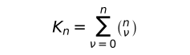\  possibilidades.

É possível tôdas as combinações de estados de coisas subsistirem e outras não subsistirem.

**[4.28](https://www.wittgensteinproject.org/w/index.php/Logisch-philosophische_Abhandlung#4.28)** A essas combinações correspondem assim muitas possibilidades de verdade — e falsidade — de *n* proposições elementares.

**[4.3](https://www.wittgensteinproject.org/w/index.php/Logisch-philosophische_Abhandlung#4.3)** As possibilidades de verdade das proposições elementares denotam as possibilidades da subsistência e da não-subsistência de estados de coisas.

**[4.31](https://www.wittgensteinproject.org/w/index.php/Logisch-philosophische_Abhandlung#4.31)** Podemos representar as possibilidades de verdade do seguinte modo (“*V*” denota “verdadeiro”, “*F*” denota “falso”. As séries de “*V*” e “*F*” sob a série das proposições elementares denotam suas possibilidades de verdade num simbolismo fàcilmente compreensível):

|p |q |r |
|---|---|---|
|V|V|V |
|F|V|V |
|V|F|V |
|V|V|F |
|F|F|V |
|F|V|F |
|V|F|F |
|F|F|F |

|p |q |
|---|---|
|V|V |
|F|V |
|V|F |
|F|F |

|p |
|---|
|V |
|F |

**[4.4](https://www.wittgensteinproject.org/w/index.php/Logisch-philosophische_Abhandlung#4.4)** A proposição é a expressão da concordância e da discordância com as possibilidades de verdade das proposições elementares.

**[4.41](https://www.wittgensteinproject.org/w/index.php/Logisch-philosophische_Abhandlung#4.41)** As possibilidades de verdade das proposições elementares são as condições da verdade e falsidade das proposições.

**[4.411](https://www.wittgensteinproject.org/w/index.php/Logisch-philosophische_Abhandlung#4.411)** É de antemão provável que a introdução de proposições elementares seja fundamental para a compreensão de todos os outros modos de proposição. A compreensão das proposições universais, com efeito, depende *palpàvelmente* da das proposições elementares.

**[4.42](https://www.wittgensteinproject.org/w/index.php/Logisch-philosophische_Abhandlung#4.42)** No que respeita à concordância ou à discordância de uma proposição com as possibilidades de verdade de *n* proposições elementares há 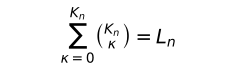\  possibilidades

**[4.43](https://www.wittgensteinproject.org/w/index.php/Logisch-philosophische_Abhandlung#4.43)** A concordância com as possibilidades de verdade podemos exprimi-la apondo-lhe no esquema a insígnia “*V*” (verdadeiro).

A falta dessa insígnia denota a discordância.

**[4.431](https://www.wittgensteinproject.org/w/index.php/Logisch-philosophische_Abhandlung#4.431)** A expressão da concordância e da discordância com as possibilidades de verdade das proposições elementares exprime as condições de verdade da proposição.

A proposição é expressão de suas condições de verdade.

\(Por isso Frege agiu corretamente ao tomá-las desde logo como explicação dos signos de sua ideografia. Sòmente a explicação do conceito de verdade em Frege é falsa: fôssem realmente “o verdadeiro” e “o falso” os objetos e os argumentos em ∼*p*, etc., então, segundo a determinação de Frege, o sentido de “∼*p*” não estaria determinado de modo algum.)

**[4.44](https://www.wittgensteinproject.org/w/index.php/Logisch-philosophische_Abhandlung#4.44)** O signo que surge por meio da aposição dessa insígnia “*V*” às possibilidades de verdade é um signo proposicional.

**[4.441](https://www.wittgensteinproject.org/w/index.php/Logisch-philosophische_Abhandlung#4.441)** É claro que nenhum objeto (ou complexo de objetos) corresponde ao complexo de signos “*F*” ou “*V*”; tampouco como às linhas horizontais ou verticais ou aos parênteses. — Não há “objetos lógicos”.

Algo análogo vale naturalmente para todos os signos que exprimem a mesma coisa que os esquemas de “*V*” e “*F*”.

**[4.442](https://www.wittgensteinproject.org/w/index.php/Logisch-philosophische_Abhandlung#4.442)** Por exemplo:

“

|p |q | |
|---|---|---|
|V|V |V |
|F|V |V |
|V|F | |
|F|F |V |

”

é um signo proposicional.

\(O “traço de juízo” “⊢”, introduzido por Frege, do ponto de vista lógico carece inteiramente de denotação; indica em Frege (e Russell) que tais autores tomam como verdadeiras as proposições assim designadas. “⊢” pertence tão pouco à construção da proposição como, por exemplo, a numeração das proposições. Uma proposição não pode, de forma alguma, assertar de si mesma que é verdadeira.)

Se as séries de possibilidades de verdade forem fixadas de vez no esquema, por meio de uma regra de combinação, a última coluna por si só já exprime as condições de verdade. Ao escrevermos esta coluna como série, o signo proposicional será o seguinte: “(*VV*–*V*) (*p*, *q*)”, ou de modo mais nítido “(*VVFV*) (*p*, *q*)”.

\(O número de posições no interior dos parênteses da esquerda está determinado pelo número de têrmos dos da direita.)

**[4.45](https://www.wittgensteinproject.org/w/index.php/Logisch-philosophische_Abhandlung#4.45)** Para *n* proposições elementares há *L~n~* grupos possíveis de condições de verdade.

Os grupos de condições de verdade que pertencem às possibilidades de verdade de um número de proposições elementares ordenam-se numa série.

**[4.46](https://www.wittgensteinproject.org/w/index.php/Logisch-philosophische_Abhandlung#4.46)** Entre os grupos possíveis de condições de verdade há dois casos extremos.

No primeiro caso a proposição é verdadeira para tôdas as condições de verdade das proposições elementares. Dizemos então que as condições de verdade são *tautológicas*.

No segundo caso a proposição é falsa para tôdas as condições de verdade: as condições de verdade são *contraditórias*.

No primeiro caso chamamos à proposição de tautologia, no segundo, contradição.

**[4.461](https://www.wittgensteinproject.org/w/index.php/Logisch-philosophische_Abhandlung#4.461)** A proposição mostra o que diz, a tautologia e a contradição que não dizem nada.

A tautologia não possui condições de verdade pois é verdadeira sob qualquer condição; a contradição sob nenhuma condição é verdadeira.

A tautologia e a contradição são vazias de sentido.

\(Como o ponto de onde duas flechas partem em direções opostas.)

\(Nada sei, por exemplo, a respeito do tempo se sei que chove ou não chove.)

**[4.4611](https://www.wittgensteinproject.org/w/index.php/Logisch-philosophische_Abhandlung#4.4611)** A tautologia a contradição não são, porém, absurdas; pertencem ao simbolismo do mesmo modo que “0” pertence ao simbolismo da aritmética.

**[4.462](https://www.wittgensteinproject.org/w/index.php/Logisch-philosophische_Abhandlung#4.462)** A tautologia e a contradição não são figurações da realidade. Não representam nenhuma situação possível, porquanto aquela permite *tôdas* as situações possíveis, esta, *nenhuma*.

Na tautologia as condições de concordância com o mundo — as relações representativas — cancelam-se umas às outras, pois não se põem em relação representativa com a realidade.

**[4.463](https://www.wittgensteinproject.org/w/index.php/Logisch-philosophische_Abhandlung#4.463)** As condições de verdade determinam o campo aberto aos fatos pela proposição.

\(A proposição, a figuração, o modêlo são, num sentido negativo, como um corpo sólido que limita a liberdade de movimento de outro; no sentido positivo, como um espaço limitado por uma substância sólida onde um corpo pode ter lugar.)

A tautologia deixa inteiramente à realidade o espaço lógico — infinito —; a contradição preenche o espaço lógico inteiro, não deixando à realidade ponto algum. Nenhuma delas pode, por conseguinte, determinar a realidade de um modo qualquer.

**[4.464](https://www.wittgensteinproject.org/w/index.php/Logisch-philosophische_Abhandlung#4.464)** É certa a verdade da tautologia, da proposição é possível e da contradição impossível.

\(Certo, possível, impossível: temos aqui a indicação da gradação que precisamos para a teoria da probabilidade.)

**[4.465](https://www.wittgensteinproject.org/w/index.php/Logisch-philosophische_Abhandlung#4.465)** O produto lógico de uma tautologia e de uma proposição diz o mesmo que a proposição. O produto é, pois, idêntico à proposição, porquanto não se pode alterar o essencial do símbolo sem alterar seu sentido.

**[4.466](https://www.wittgensteinproject.org/w/index.php/Logisch-philosophische_Abhandlung#4.466)** A uma determinada união lógica de signos corresponde uma determinada união da denotação dêles; *cada* união *arbitrária* corresponde apenas a signos desunidos.

Isto quer dizer que proposições, verdadeiras para qualquer situação, não podem ser em geral uniões de signos, pois, caso contrário, apenas determinadas uniões de objetos poderiam corresponder.

\(E a nenhuma união lógica corresponde *nenhuma* união de objetos.)

Tautologia e contradição são casos-limites da união de signos, a saber, sua dissolução.

**[4.4661](https://www.wittgensteinproject.org/w/index.php/Logisch-philosophische_Abhandlung#4.4661)** Por certo na tautologia e na contradição os signos ainda estão ligados uns aos outros, isto é, relacionam-se entre si, mas estas relações são desprovidas de denotação, são inessenciais para o *símbolo*.

**[4.5](https://www.wittgensteinproject.org/w/index.php/Logisch-philosophische_Abhandlung#4.5)** Agora parece possível estabelecer a forma mais geral da proposição, isto é, estabelecer uma descrição das proposições numa linguagem simbólica *qualquer*, de tal modo que cada um dos sentidos possíveis poderia ser expresso por um símbolo adequado à descrição e cada símbolo adequado à descrição poderia exprimir um sentido, se as denotações dos nomes fôssem convenientemente escolhidas.

É claro que, descrevendo a forma mais geral de uma proposição, *sòmente* o que é essencial deve ser descrito — caso contrário não seria a mais geral.

Prova-se a existência de uma forma geral da proposição porque não deve haver proposição alguma cuja forma não seja antes pressuposta (isto é, construída). A forma geral da proposição é: isto *está* do seguinte modo.

**[4.51](https://www.wittgensteinproject.org/w/index.php/Logisch-philosophische_Abhandlung#4.51)** Supondo que *tôdas* as proposições elementares me sejam dadas, surge a pergunta: quais são as proposições que posso formar a partir delas? E estas são *tôdas* as proposições e *assim* elas são limitadas.

**[4.52](https://www.wittgensteinproject.org/w/index.php/Logisch-philosophische_Abhandlung#4.52)** As proposições são tudo o que se segue da totalidade das proposições elementares (sem dúvida por que se parte da *totalidade de tôdas elas*). (Num certo sentido é possível dizer que *tôdas* as proposições são generalizações das proposições elementares.)

**[4.53](https://www.wittgensteinproject.org/w/index.php/Logisch-philosophische_Abhandlung#4.53)** A forma geral da proposição é uma variável.

**[5](https://www.wittgensteinproject.org/w/index.php/Logisch-philosophische_Abhandlung#5)** A proposição é uma função de verdade das proposições elementares.

\(A proposição elementar é uma função de verdade de si mesma.)

**[5.01](https://www.wittgensteinproject.org/w/index.php/Logisch-philosophische_Abhandlung#5.01)** As proposições elementares são os argumentos de verdade da proposição.

**[5.02](https://www.wittgensteinproject.org/w/index.php/Logisch-philosophische_Abhandlung#5.02)** E fácil confundir argumentos de uma função com índices de nomes. Conheço em particular a denotação de um signo que a contém tanto pelo argumento como pelo índice.

No sinal de Russell “+*~c~*”, por exemplo, “*c*” é um índice que indica valer o signo inteiro para a soma de números cardinais. Esta designação, porém, se apóia num ajuste arbitrário, de sorte que seria possível em vez de “+*~c~*” escolher outro signo simples; em “∼*p*”, entretanto, “*p*” não é índice algum, mas argumento: o sentido de “∼*p*” *não pode* ser compreendido sem que antes o sentido de “*p*” o seja. (No nome Julius Caesar, “Julius” é índice. Êste é sempre parte da descrição do objeto cujos nomes vinculamos a êle. Por exemplo, *o* Caesar da gente juliana.)

A confusão entre argumento e índice constitui, se não me engano, a base da teoria de Frege a respeito da denotação das proposições e das funções. Para Frege, as proposições da lógica seriam nomes, e seus argumentos, os índices dêsses nomes.

**[5.1](https://www.wittgensteinproject.org/w/index.php/Logisch-philosophische_Abhandlung#5.1)** As funções de verdade se ordenam em séries.

Êste é o fundamento da teoria da probabilidade.

**[5.101](https://www.wittgensteinproject.org/w/index.php/Logisch-philosophische_Abhandlung#5.101)** As funções de verdade de todos os números de proposições elementares inscrevem-se no seguinte esquema:

|   |   |   |
|---|---|---|
|(VVVV)(*p*, *q*) |Tautologia |(Se *p*, então *p*; e se *g*, então *q*.) (*p* ⊃ *p* . *q* ⊃ *q*) |
|(FVVV)(*p*, *q*) |em palavras: |Não ambos *p* e *q*. (∼(*p* . *q*)) |
|(VFVV)(*p*, *q*) |em palavras: |Se *q*, então *p*. (*q* ⊃ *p*) |
|(VVFV)(*p*, *q*) |em palavras: |Se *p*, então *q*. (*p* ⊃ *q*) |
|(VVVF)(*p*, *q*) |em palavras: |*p* ou *q* (*p* ∨ *q*) |
|(FFVV)(*p*, *q*) |em palavras: |Não *q*. ∼*q* |
|(FVFV)(*p*, *q*) |em palavras: |Não *p*. ∼*p* |
|(FVVF)(*p*, *q*) |em palavras: |*p* ou *q* mas não ambos. (*p* . ∼*q* : ∨ : *q* . ∼*p*) |
|(VFFV)(*p*, *q*) |em palavras: |Se *p*, então *q*; e se *q*, então *p*. (*p* ≡ *q*) |
|(VFVF)(*p*, *q*) |em palavras: |*p* |
|(VVFF)(*p*, *q*) |em palavras: |*q* |
|(FFFV)(*p*, *q*) |em palavras: |*q*) |
|(FFVF)(*p*, *q*) |em palavras: |*p* e não *q*. (*p* . ∼*q*) |
|(FVFF)(*p*, *q*) |em palavras: |*q* e não *p*. (*q* . ∼*p*) |
|(VFFF)(*p*, *q*) |em palavras: |*q* e *p* (*q* . *p*) |
|(FFFF)(*p*, *q*) |Contradição |(*p* e não *p*; e *q* e não *g*.) (*p* . ∼*p* . *q* . ∼*q*) |

A essas possibilidades de verdade de seus argumentos de verdade, que confirmam as proposições, chamo de seus *fundamentos de verdade*.

**[5.11](https://www.wittgensteinproject.org/w/index.php/Logisch-philosophische_Abhandlung#5.11)** Se os fundamentos de verdade comuns a um número de proposições, também forem fundamentos de verdade de uma proposição determinada, dizemos então que a verdade dessa proposição se segue da verdade daquelas outras.

**[5.12](https://www.wittgensteinproject.org/w/index.php/Logisch-philosophische_Abhandlung#5.12)** Em particular a verdade de uma proposição “*p*” segue-se da de outra “*q*” se todos os fundamentos de verdade da segunda forem fundamentos de verdade da primeira.

**[5.121](https://www.wittgensteinproject.org/w/index.php/Logisch-philosophische_Abhandlung#5.121)** Os fundamentos de verdade de uma estão contidos nos da outra; assim, *p* segue-se de *q*.

**[5.122](https://www.wittgensteinproject.org/w/index.php/Logisch-philosophische_Abhandlung#5.122)** Se *p* segue-se de *q*, o sentido de “*p*” está contigo no sentido de “*q*”.

**[5.123](https://www.wittgensteinproject.org/w/index.php/Logisch-philosophische_Abhandlung#5.123)** Se um deus criasse um mundo em que certas proposições fôssem verdadeiras, criaria do mesmo modo um mundo com o qual concordariam tôdas suas proposições conseqüentes. E assim similarmente não poderia criar um mundo em que a proposição “*p*” fôsse verdadeira, sem criar todos os objetos dela.

**[5.124](https://www.wittgensteinproject.org/w/index.php/Logisch-philosophische_Abhandlung#5.124)** A proposição afirma cada proposição que dela se segue.

**[5.1241](https://www.wittgensteinproject.org/w/index.php/Logisch-philosophische_Abhandlung#5.1241)** “*p* . *q*” é uma das proposições que afirmam “*p*” e ao mesmo tempo uma das proposições que afirmam “*q*”.

Duas proposições são opostas uma à outra se não existir qualquer proposição significativa que afirme ambas.

Cada proposição que contradiz a outra, nega-a.

**[5.13](https://www.wittgensteinproject.org/w/index.php/Logisch-philosophische_Abhandlung#5.13)** Que a verdade de uma proposição segue-se da verdade de outras vemos a partir da estrutura das proposições.

**[5.131](https://www.wittgensteinproject.org/w/index.php/Logisch-philosophische_Abhandlung#5.131)** Se a verdade de uma proposição segue-se da verdade de outras, isto se exprime nas relações que as formas dessas proposições mantêm entre si; e não precisamos com efeito colocá-las primeiro naquelas relações, unindo-as com outra proposição, porquanto essas relações são internas e subsistem enquanto aquelas proposições subsistirem, e porque elas subsistem.

**[5.1311](https://www.wittgensteinproject.org/w/index.php/Logisch-philosophische_Abhandlung#5.1311)** Se pois de *p* ∨ *q* e de \~*p* inferimos *q*, a relação entre as formas das proposições “*p* ∨ *q*” e “∼*p*” se oculta em virtude da maneira de simbolizar. Se em lugar de “*p* ∨ *q*”, escrevemos, por exemplo, “*p* \| *q* . \| . *p* \| *q*” e em lugar de “∼*p*” “*p* \| *p*” (*p* \| *q* = nem *p* nem *q*), logo se torna clara a conexão interna.

De (*x*).*fx* pode-se inferir *fa*; isto mostra que a universalidade já está presente no símbolo “(*x*).*fx*”.

**[5.132](https://www.wittgensteinproject.org/w/index.php/Logisch-philosophische_Abhandlung#5.132)** Se *p* segue-se de *q*, posso então inferir de *q*, *p*; deduzir *p* de *q*.

O modo de inferência há de ser captado apenas de ambas as proposições.

Sòmente elas podem justificar a inferência.

“Regras de inferência” que — como em Frege e Russell — devem justificar a inferência são vazias de sentido e seriam supérfluas.

**[5.133](https://www.wittgensteinproject.org/w/index.php/Logisch-philosophische_Abhandlung#5.133)** Tôda dedução se dá *a priori*.

**[5.134](https://www.wittgensteinproject.org/w/index.php/Logisch-philosophische_Abhandlung#5.134)** De uma proposição elementar nenhuma outra pode ser deduzida.

**[5.135](https://www.wittgensteinproject.org/w/index.php/Logisch-philosophische_Abhandlung#5.135)** De modo algum é possível inferir da subsistência de uma situação qualquer a subsistência de uma situação inteiramente diferente dela.

**[5.136](https://www.wittgensteinproject.org/w/index.php/Logisch-philosophische_Abhandlung#5.136)** Não há nexo causal que justifique tal inferência.

**[5.1361](https://www.wittgensteinproject.org/w/index.php/Logisch-philosophische_Abhandlung#5.1361)** Não *podemos* inferir os acontecimentos do futuro a partir daqueles do presente.

É *superstição* a crença no nexo causal.

**[5.1362](https://www.wittgensteinproject.org/w/index.php/Logisch-philosophische_Abhandlung#5.1362)** A liberdade da vontade consiste em não poder conhecer agora as ações futuras. Só poderíamos conhecê-las se a causalidade fôsse uma necessidade *interna*, como a inferência lógica. A conexão entre o conhecer e o conhecido é a mesma da necessidade lógica.

\(“*A* sabe que *p* ocorre” é vazia de sentido se *p* fôr uma tautologia.)

**[5.1363](https://www.wittgensteinproject.org/w/index.php/Logisch-philosophische_Abhandlung#5.1363)** Sendo uma proposição óbvia para nós, não *se segue* que seja verdadeira; por conseguinte, a obviedade não é justificativa para nossa crença em sua verdade.

**[5.14](https://www.wittgensteinproject.org/w/index.php/Logisch-philosophische_Abhandlung#5.14)** Se uma proposição segue-se de outra, esta diz mais do que aquela, aquela menos do que esta.

**[5.141](https://www.wittgensteinproject.org/w/index.php/Logisch-philosophische_Abhandlung#5.141)** Se *p* segue-se de *q* e *q* de *p*, ambas são pois uma única e mesma proposição.

**[5.142](https://www.wittgensteinproject.org/w/index.php/Logisch-philosophische_Abhandlung#5.142)** A tautologia segue-se de tôdas as proposições: não diz nada.

**[5.143](https://www.wittgensteinproject.org/w/index.php/Logisch-philosophische_Abhandlung#5.143)** A contradição é algo comum às proposições e que *nenhuma* proposição tem em comum com outra. A tautologia é o que é comum a tôdas as proposições que não têm nada em comum entre si.

A contradição desaparece, por assim dizer, por fora, a tautologia, por dentro de tôdas as proposições.

A contradição é limite externo das proposições, a tautologia, seu centro dessubstancializado.

**[5.15](https://www.wittgensteinproject.org/w/index.php/Logisch-philosophische_Abhandlung#5.15)** Seja *V~r~* o número dos fundamentos de verdade da proposição “*r*”, *V~rs~* o número daqueles fundamentos de verdade da proposição “*s*” que ao mesmo tempo são fundamentos de verdade de “*r*”; chamamos então à relação: *V~rs~* : *V~r~* de medida de *probabilidade* que a proposição “*r*” tem em relação à proposição “*s*”.

**[5.151](https://www.wittgensteinproject.org/w/index.php/Logisch-philosophische_Abhandlung#5.151)** Seja num esquema como o de cima, no número [5.101](https://www.wittgensteinproject.org/w/index.php?title=Private:Tractatus_Logico-Philosophicus_(Portugu%C3%AAs)&action=edit&redlink=1), *V~r~* o número de “*V*” da proposição *r*; *V~rs~* o número daqueles “*V*” na proposição *s* que estão na mesma coluna com os “*V*” da proposição *r*. A proposição *r* tem em relação à proposição *s* a probabilidade *V~rs~* : *V~r~*.

**[5.1511](https://www.wittgensteinproject.org/w/index.php/Logisch-philosophische_Abhandlung#5.1511)** Não há nenhum objeto particular próprio às proposições probabilísticas.

**[5.152](https://www.wittgensteinproject.org/w/index.php/Logisch-philosophische_Abhandlung#5.152)** Chamamos mùtuamente independentes as proposições que não têm em comum com outras qualquer argumento de verdade.

Duas proposições elementares têm entre si a probabilidade ½.

Se *p* segue-se de *q*, a proposição “*q*” tem em relação à proposição “*p*” a probabilidade 1. A certeza da inferência lógica é o caso-limite da probabilidade.

\(Aplicação à tautologia e à contradição.)

**[5.153](https://www.wittgensteinproject.org/w/index.php/Logisch-philosophische_Abhandlung#5.153)** Uma proposição não é nem provável nem improvável. Um acontecimento se dá ou não se dá, não há meio-têrmo.

**[5.154](https://www.wittgensteinproject.org/w/index.php/Logisch-philosophische_Abhandlung#5.154)** Suponhamos que numa urna estejam tantas bolas brancas quantas pretas (e nenhuma a mais). Tiro uma bola depois da outra e as reponho de nôvo na urna. Posso, então, estabelecer pela experiência que o número das bolas pretas tiradas e o das bolas brancas tiradas se aproximam progressivamente um do outro.

*Isto* não é, portanto, um fato matemático.

Se disser agora: é igualmente provável que tirarei uma bola branca como uma preta, isso quer dizer: tôdas as circunstâncias que me são conhecidas (incluindo as leis da natureza tomadas hipotèticamente) não conferem a um acontecimento nenhuma probabilidade *a mais* do que a outro. A saber, estão — como se compreende fàcilmente a partir das explicações acima — numa relação de probabilidade de ½.

O que verifiquei pela experiência é que ambos os acontecimentos independem das circunstâncias das quais não tenho conhecimento mais próximo.

**[5.155](https://www.wittgensteinproject.org/w/index.php/Logisch-philosophische_Abhandlung#5.155)** A unidade das proposições probabilísticas é a seguinte: as circunstâncias — de que, aliás, não tenho conhecimento mais amplo — conferem a um determinado acontecimento tal e tal grau de probabilidade.

**[5.156](https://www.wittgensteinproject.org/w/index.php/Logisch-philosophische_Abhandlung#5.156)** Dêsse modo, a probabilidade é uma generalização.

Envolve uma descrição geral de uma forma proposicional.

Só na falta de certeza precisamos de probabilidade. — Quando não conhecemos um fato completamente, mas ao menos sabemos *algo* a respeito de sua forma.

\(Uma proposição pode, com efeito, ser uma figuração incompleta de uma certa situação, entretanto sempre é *uma* figuração completa.)

A proposição probabilística é como se fôsse um extrato de outras proposições.

**[5.2](https://www.wittgensteinproject.org/w/index.php/Logisch-philosophische_Abhandlung#5.2)** As estruturas das proposições mantêm entre si relações internas.

**[5.21](https://www.wittgensteinproject.org/w/index.php/Logisch-philosophische_Abhandlung#5.21)** Podemos trazer essas relações internas para nosso modo de expressão, representando uma proposição como resultado de uma operação que a produz de outras proposições (as bases da operação).

**[5.22](https://www.wittgensteinproject.org/w/index.php/Logisch-philosophische_Abhandlung#5.22)** A operação é a expressão de uma relação entre as estruturas do resultado e de suas bases.

**[5.23](https://www.wittgensteinproject.org/w/index.php/Logisch-philosophische_Abhandlung#5.23)** Operação é o que deve acontecer com uma proposição a fim de gerar outra a partir dela.

**[5.231](https://www.wittgensteinproject.org/w/index.php/Logisch-philosophische_Abhandlung#5.231)** E isso naturalmente dependerá de suas propriedades formais, da semelhança interna de suas formas.

**[5.232](https://www.wittgensteinproject.org/w/index.php/Logisch-philosophische_Abhandlung#5.232)** A relação interna que ordena uma série equivale à operação que produz um têrmo a partir de outro.

**[5.233](https://www.wittgensteinproject.org/w/index.php/Logisch-philosophische_Abhandlung#5.233)** A operação só pode ter lugar pela primeira vez onde uma proposição nasce de outra de modo lògicamente denotativo; onde começa, portanto, a construção lógica da proposição.

**[5.234](https://www.wittgensteinproject.org/w/index.php/Logisch-philosophische_Abhandlung#5.234)** As funções de verdade das proposições elementares resultam de operações que têm como bases as proposições elementares. (A essa operação chamo de operação-verdade.)

**[5.2341](https://www.wittgensteinproject.org/w/index.php/Logisch-philosophische_Abhandlung#5.2341)** O sentido de uma função de verdade de *p* é função do sentido de *p*.

Negação, soma lógica, multiplicação lógica, etc., etc., são operações.

\(A negação inverte o sentido da proposição.)

**[5.24](https://www.wittgensteinproject.org/w/index.php/Logisch-philosophische_Abhandlung#5.24)** A operação mostra-se numa variável; mostra como de uma forma de proposições se pode chegar a outra.

Torna expressa a diferença de formas.

\(E o que é comum às bases e ao resultado da operação são precisamente essas bases.)

**[5.241](https://www.wittgensteinproject.org/w/index.php/Logisch-philosophische_Abhandlung#5.241)** A operação não designa forma alguma, mas apenas a diferença de formas.

**[5.242](https://www.wittgensteinproject.org/w/index.php/Logisch-philosophische_Abhandlung#5.242)** A mesma operação que produz “*q*” de “*p*”, produz também de “*q*”, “*r*” e assim por diante. Isto só pode ser expresso porque “*p*”, “*q*”, “*r*”, etc., são variáveis que tornam expressas de um modo geral certas relações formais.

**[5.25](https://www.wittgensteinproject.org/w/index.php/Logisch-philosophische_Abhandlung#5.25)** A realização de uma operação não caracteriza o sentido de uma proposição.

A operação nada asserta além de seu resultado e isto depende das bases dessa operação.

\(Operações e funções não devem ser confundidas.)

**[5.251](https://www.wittgensteinproject.org/w/index.php/Logisch-philosophische_Abhandlung#5.251)** Uma função não pode ser seu próprio argumento; no entanto, o resultado de uma operação pode muito bem ser sua própria base.

**[5.252](https://www.wittgensteinproject.org/w/index.php/Logisch-philosophische_Abhandlung#5.252)** Sòmente assim é possível o progresso de um têrmo a outro na série formal (de tipo a tipo na hierarquia de Russell e Whitehead). (Russell e Whitehead não admitiram a possibilidade dêsse progresso mas fizeram dêle uso repetido.)

**[5.2521](https://www.wittgensteinproject.org/w/index.php/Logisch-philosophische_Abhandlung#5.2521)** À aplicação progressiva de uma operação sôbre seu próprio resultado chamo sua aplicação sucessiva. (“*O'O'O'a*” resulta de três aplicações sucessivas de “*O'ξ*” sôbre “*a*”).

Em sentido semelhante falo da aplicação sucessiva de *muitas* operações sôbre um número de proposições.

**[5.2522](https://www.wittgensteinproject.org/w/index.php/Logisch-philosophische_Abhandlung#5.2522)** O têrmo geral de uma seqüência formal *a*, *O'a*, *O'O'a*, ... escrevo por isso do seguinte modo: “[*a*, *x*, *O'x*]”. Esta expressão entre colchêtes é uma variável. O primeiro têrmo da expressão do colchête é o início da série formal, o segundo a forma de um têrmo qualquer *x* da série e o terceiro a forma daquele têrmo da série que segue imediatamente a *x*.

**[5.2523](https://www.wittgensteinproject.org/w/index.php/Logisch-philosophische_Abhandlung#5.2523)** O conceito de aplicação sucessiva de operação equivale ao conceito “e assim por diante”.

**[5.253](https://www.wittgensteinproject.org/w/index.php/Logisch-philosophische_Abhandlung#5.253)** Uma operação pode anular o efeito de outra. Operações podem suprimir-se mùtuamente.

**[5.254](https://www.wittgensteinproject.org/w/index.php/Logisch-philosophische_Abhandlung#5.254)** A operação pode desaparecer (por exemplo, a negação em “∼∼*p*”, ∼∼*p* = *p*).

**[5.3](https://www.wittgensteinproject.org/w/index.php/Logisch-philosophische_Abhandlung#5.3)** Tôdas as proposições resultam de operações-verdades sôbre as proposições elementares.

A operação-verdade é o modo pelo qual a função de verdade nasce das proposições elementares.

Do mesmo modo que das proposições elementares nasce sua função de verdade, das funções de verdade nasce uma nova, de acôrdo com a essência da operação-verdade. Cada operação-verdade reproduz a partir de funções de verdade de proposições elementares uma função de verdade de proposições elementares, a saber, uma proposição. O resultado de cada operação-verdade realizada com resultados de operações-verdades sôbre proposições elementares é de nôvo o resultado de *uma* operação-verdade sôbre proposições elementares.

Tôda proposição resulta de operações-verdades sôbre proposições elementares.

**[5.31](https://www.wittgensteinproject.org/w/index.php/Logisch-philosophische_Abhandlung#5.31)** Os esquemas do n.º [4.31](https://www.wittgensteinproject.org/w/index.php?title=Private:Tractatus_Logico-Philosophicus_(Portugu%C3%AAs)&action=edit&redlink=1) possuem também denotação quando “*p*”, “*q*”, “*r*”, etc., não são proposições elementares.

É fácil verificar que o signo proposicional no n.º [4.442](https://www.wittgensteinproject.org/w/index.php?title=Private:Tractatus_Logico-Philosophicus_(Portugu%C3%AAs)&action=edit&redlink=1) exprime uma função de verdade de proposições elementares ainda quando “*p*” e “*q*” são funções de verdade de proposições elementares.

**[5.32](https://www.wittgensteinproject.org/w/index.php/Logisch-philosophische_Abhandlung#5.32)** Tôdas as funções de verdade resultam da aplicação sucessiva de um número finito de operações-verdades sôbre proposições elementares.

**[5.4](https://www.wittgensteinproject.org/w/index.php/Logisch-philosophische_Abhandlung#5.4)** Aqui se evidencia que não há “objetos lógicos”, “constantes lógicas” (no sentido de Frege e Russell).

**[5.41](https://www.wittgensteinproject.org/w/index.php/Logisch-philosophische_Abhandlung#5.41)** Porquanto: todos os resultados de operações-verdades sôbre funções de verdade são idênticos, são uma e a mesma função de verdade de proposições elementares.

**[5.42](https://www.wittgensteinproject.org/w/index.php/Logisch-philosophische_Abhandlung#5.42)** É óbvio que ∨, ⊃, etc., não são relações no sentido de direita e esquerda.

A possibilidade de definição cruzada dos “signos primitivos” de Frege e Russell já mostra que não são primitivos e que não designam relação alguma.

É evidente que “⊃”, que definimos por “∼” e “v”, é idêntico ao que serve para definir “∨” com a ajuda de “∼” e que êste “∨” é idêntico ao primeiro. E assim por diante.

**[5.43](https://www.wittgensteinproject.org/w/index.php/Logisch-philosophische_Abhandlung#5.43)** Que de um fato *p* *outros* ao infinito seguir-se-ão, nomeadamente ∼∼*p*, ∼∼∼∼*p*, etc., é difícil, no início, de se acreditar. E não é menos extraordinário o número infinito de proposições da lógica (da matemática) seguir-se de meia dúzia de “princípios”.

Tôdas as proposições da lógica dizem, porém, o mesmo; a saber, nada.

**[5.44](https://www.wittgensteinproject.org/w/index.php/Logisch-philosophische_Abhandlung#5.44)** As funções de verdade não são funções materiais.

Já que, por exemplo, é possível gerar uma afirmação por meio da dupla negação, estará a negação — seja qual fôr o sentido — incluída na afirmação? “∼∼*p*” nega ∼*p* ou afirma *p*, ou ambos?

A proposição “∼∼*p*” não trata a negação como um objeto; a possibilidade da negação, entretanto, já está antecipada na afirmação.

E se houvesse um objeto chamado “∼”, então “∼∼*p*” deveria dizer outra coisa do que “*p*”. Porquanto uma proposição trataria de “∼”, enquanto a outra não.

**[5.441](https://www.wittgensteinproject.org/w/index.php/Logisch-philosophische_Abhandlung#5.441)** Êste desaparecimento das aparentes constantes lógicas se dá se “∼(∃*x*) . ∼*fx*” diz a mesma coisa que “(*x*). *fx*” ou “(∃*x*). *fx* . *x* = *a*”, o mesmo que “*fa*”.

**[5.442](https://www.wittgensteinproject.org/w/index.php/Logisch-philosophische_Abhandlung#5.442)** Caso uma proposição nos seja dada, *com ela* dão-se os resultados de tôdas as operações-verdades que a têm como base.

**[5.45](https://www.wittgensteinproject.org/w/index.php/Logisch-philosophische_Abhandlung#5.45)** Se houvesse signos lógicos primitivos, uma lógica correta deveria esclarecer suas posições, relativas umas às outras, e justificar sua existência. Deve tornar-se clara a construção da lógica *a partir* de seus signos primitivos.

**[5.451](https://www.wittgensteinproject.org/w/index.php/Logisch-philosophische_Abhandlung#5.451)** Se a lógica possuísse conceitos básicos, êstes deveriam ser independentes uns dos outros. Admitido um conceito básico, deveria êle ser admitido em tôdas as vinculações em que em geral aparece. Não é possível, portanto, primeiramente admiti-lo *numa* conexão para em seguida admiti-lo em outra. Por exemplo, admitida a negação, devemos entendê-la tanto nas proposições de forma “∼*p*”, como nas proposições tais que “∼(*p* ∨ *q*)”, “(∃*x*) . ∼*fx*”, etc. Não podemos introduzi-la primeiro para uma classe de casos, em seguida para outra: permaneceria duvidoso se sua denotação seria a mesma em ambos os casos, não havendo motivo de utilizar para êsses casos o mesmo modo de vincular os signos.

\(Em resumo, para a introdução de signos primitivos vale, *mutatis mutandis*, o que Frege (nos *Princípios da Aritmética*) disse a propósito da introdução de signos por meio de definições.)

**[5.452](https://www.wittgensteinproject.org/w/index.php/Logisch-philosophische_Abhandlung#5.452)** A introdução de um nôvo recurso no simbolismo da lógica sempre há de ser um acontecimento pleno de conseqüências. Nenhum recurso nôvo há de ser introduzido na lógica — entre parênteses ou à margem — por assim dizer, com cara inocente.

\(Aparecem nos *Principia Mathematica* de Russell e Whitehead definições e princípios em palavras. Por que de repente palavras? Isto demanda uma justificação, que falta e deve faltar, pois o procedimento não é de fato permitido.)

Se todavia a introdução de nôvo recurso se provou necessária, deve-se perguntar imediatamente: onde êsse recurso deve ser *sempre* empregado? Sua localização na lógica deve ser esclarecida.

**[5.453](https://www.wittgensteinproject.org/w/index.php/Logisch-philosophische_Abhandlung#5.453)** Todos os números da lógica devem deixar-se justificar.

Ou melhor, deve evidenciar-se que não há números na lógica.

Não há número excelente.

**[5.454](https://www.wittgensteinproject.org/w/index.php/Logisch-philosophische_Abhandlung#5.454)** Não há na lógica um lado a lado, pois não há classificação.

Não pode haver na lógica o mais geral ou o mais especial.

**[5.4541](https://www.wittgensteinproject.org/w/index.php/Logisch-philosophische_Abhandlung#5.4541)** A solução dos problemas lógicos deve ser simples, já que êstes colocam o padrão da simplicidade.

Os homens sempre tiveram o pressentimento que deveria haver um domínio de questões cujas respostas — *a priori* — fôssem simétricas e unidas a uma construção acabada e regular.

Um domínio em que vale a sentença: *simplex sigillum veri*.

**[5.46](https://www.wittgensteinproject.org/w/index.php/Logisch-philosophische_Abhandlung#5.46)** Caso se introduzam corretamente os signos lógicos, então já se introduz o sentido de tôdas as suas combinações; portanto, não apenas “*p* ∨ *q*” mas também “∼(*p* ∨ ∼*q*)”, etc., etc. Já se teria introduzido, pois, o efeito de tôdas as combinações meramente-possíveis de parênteses. E assim estaria claro que os signos primitivos pròpriamente universais não seriam “*p* ∨ *q*”, “(∃*x*) . *fx*” mas a forma mais geral de suas combinações.

**[5.461](https://www.wittgensteinproject.org/w/index.php/Logisch-philosophische_Abhandlung#5.461)** Muito denota o fato aparentemente desimportante de que as pseudo-relações lógicas como ∨ ou ⊃ precisem de parênteses — ao contrário das relações reais.

A utilização de parênteses junto a esses pseudo-signos primitivos já indica que não são signos primitivos reais. E ninguém acreditará porventura que os parênteses possuam denotação autônoma.

**[5.4611](https://www.wittgensteinproject.org/w/index.php/Logisch-philosophische_Abhandlung#5.4611)** Os signos das operações lógicas são pontuações.

**[5.47](https://www.wittgensteinproject.org/w/index.php/Logisch-philosophische_Abhandlung#5.47)** É claro que tudo o que se diz *de antemão* sôbre a forma de tôdas as proposições deve ser dito ao menos *uma vez*.

Na proposição elementar já estão contidas tôdas as operações lógicas. Porquanto “*fa*” diz o mesmo que “(∃*x*) . *fx* . *x* = *a*”.

Onde há composição já há argumento e função, e onde estão êstes já estão tôdas as constantes lógicas.

Poder-se-ia dizer: uma constante lógica é aquilo que *tôdas* as proposições, conforme sua natureza, possuem em comum.

Isto é, porém, a forma proposicional geral.

**[5.471](https://www.wittgensteinproject.org/w/index.php/Logisch-philosophische_Abhandlung#5.471)** A forma proposicional geral é a essência da proposição.

**[5.4711](https://www.wittgensteinproject.org/w/index.php/Logisch-philosophische_Abhandlung#5.4711)** Dar a essência da proposição quer dizer dar a essência de tôdas as descrições e, por conseguinte, a essência do mundo.

**[5.472](https://www.wittgensteinproject.org/w/index.php/Logisch-philosophische_Abhandlung#5.472)** A descrição da forma proposicional mais geral é a descrição de um e um só signo primitivo universal da lógica.

**[5.473](https://www.wittgensteinproject.org/w/index.php/Logisch-philosophische_Abhandlung#5.473)** A lógica deve cuidar de si mesma.

Um signo *possível* também deve poder designar. Tudo o que na lógica é possível também é permitido. (“Sócrates é idêntico” não diz nada, pois não há propriedade que se chame “idêntico”. A proposição é absurda porque não encontramos uma determinação arbitrária, e não porque o símbolo em si e para si não fôsse permitido.)

Em certo sentido, não podemos errar na lógica.

**[5.4731](https://www.wittgensteinproject.org/w/index.php/Logisch-philosophische_Abhandlung#5.4731)** O óbvio de que Russell tanto fala só pode tornar-se prescindível porque a própria linguagem impede os erros lógicos. — Que a lógica seja *a priori* consiste em que *nada* ilógico *pode* ser pensado.

**[5.4732](https://www.wittgensteinproject.org/w/index.php/Logisch-philosophische_Abhandlung#5.4732)** Não podemos dar a um signo um sentido incorreto.

**[5.47321](https://www.wittgensteinproject.org/w/index.php/Logisch-philosophische_Abhandlung#5.47321)** O lema de Occam não é por certo uma regra arbitrária, ou que se justifique por seus resultados práticos; diz apenas que unidades de signos *desnecessárias* nada designam.

Signos que preenchem *uma* finalidade são lògicamente equivalentes, os que preenchem *nenhuma* são lògicamente desprovidos de denotação.

**[5.4733](https://www.wittgensteinproject.org/w/index.php/Logisch-philosophische_Abhandlung#5.4733)** Frege diz: cada proposição formada legìtimamente deve ter um sentido; eu digo: cada proposição possível é legitimamente formada e, se não tiver sentido, isto só é possível porque não emprestamos *denotação* a algumas de suas partes constituintes.

\(Ainda que acreditemos tê-lo feito.)

Dêsse modo, “Sócrates é idêntico” não diz nada, porque *não* emprestamos à palavra “idêntico” como *adjetivo* denotação alguma. Quando aparece como signo de igualdade, ela simboliza de maneira totalmente diversa — é outra a relação designadora —, de sorte que o símbolo, em ambos os casos, é inteiramente diferente; ambos os símbolos apenas têm, por acidente, o signo em comum.

**[5.474](https://www.wittgensteinproject.org/w/index.php/Logisch-philosophische_Abhandlung#5.474)** O número das operações básicas necessárias depende *apenas* de nossa notação.

**[5.475](https://www.wittgensteinproject.org/w/index.php/Logisch-philosophische_Abhandlung#5.475)** Trata-se apenas de formar um sistema de signos com número determinado de dimensões — com uma multiplicidade matemática determinada.

**[5.476](https://www.wittgensteinproject.org/w/index.php/Logisch-philosophische_Abhandlung#5.476)** É claro que não se discute aqui o *número de conceitos fundamentais* que devem ser designados, mas a expressão de uma regra.

**[5.5](https://www.wittgensteinproject.org/w/index.php/Logisch-philosophische_Abhandlung#5.5)** Cada função de verdade resulta da aplicação sucessiva da operação (– – – – –*V*)(*ξ*, . . . .) sôbre proposições elementares.

Esta operação nega tôdas as proposições no interior dos parênteses da direita, e a chamo negação dessas proposições.

**[5.501](https://www.wittgensteinproject.org/w/index.php/Logisch-philosophische_Abhandlung#5.501)** Uma expressão nos parênteses cujos têrmos sejam proposições — quando é indiferente a seqüência dos têrmos nos parênteses — indico por meio de um signo da forma “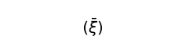\ ”. “*ξ*” é uma variável cujos valôres são os têrmos da expressão entre parênteses, e o traço sôbre a variável indica que esta substitui nos parênteses todos os seus valôres.

\(Se, por exemplo, *ξ* tem 3 valôres *P*, *Q*, *R*, \  = (*P*, *Q*, *R*).)

Serão fixados os valores das variáveis.

A fixação é a descrição das proposições que a variável substitui.

É inessencial como se dá a descrição dos têrmos da expressão entre parênteses.

*Podemos* distinguir três maneiras de descrever: 1) Enumeração direta; neste caso podemos, em lugar das variáveis, colocar simplesmente seus valôres constantes. 2) Indicação de uma função *fx* cujos valôres, para todos os valôres de *x*, constituam as proposições a serem descritas. 3) Indicação de uma lei formal segundo a qual cada proposição é formada; neste caso os têrmos da expressão entre parênteses são todos os têrmos de uma série formal.

**[5.502](https://www.wittgensteinproject.org/w/index.php/Logisch-philosophische_Abhandlung#5.502)** Escrevo pois “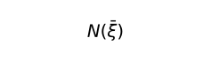\ ” em lugar de “(– – – – –*V*)(*ξ*, . . . .)”.

\  é a negação de todos os valores da variável proposicional *ξ*.

**[5.503](https://www.wittgensteinproject.org/w/index.php/Logisch-philosophische_Abhandlung#5.503)** Evidentemente é fácil exprimir como proposições podem formar-se graças a esta operação e como proposições não têm de ser formadas graças a ela; e isto também pode encontrar uma expressão exata.

**[5.51](https://www.wittgensteinproject.org/w/index.php/Logisch-philosophische_Abhandlung#5.51)** Se *ξ* tiver apenas um valor, \  = ∼*p* (não *p*), se tiver dois valôres, \  = ∼*p* . ∼*q* (nem *p* nem *q*).

**[5.511](https://www.wittgensteinproject.org/w/index.php/Logisch-philosophische_Abhandlung#5.511)** Como é possível a lógica, que tudo abrange e espelha o mundo, precisar de tais artifícios e manipulações especiais? Sòmente porque tudo isto está ligado a uma rêde infinitamente fina, ao grande espelho.

**[5.512](https://www.wittgensteinproject.org/w/index.php/Logisch-philosophische_Abhandlung#5.512)** “∼*p*” é verdadeiro se “*p*” fôr falso. Portanto, numa proposição verdadeira “\~*p*”, “*p*” é uma falsa proposição. Como lhe é possível fazer o traço “∼” concordar com a realidade?

O que é negado em “∼*p*” não é “∼”, mas o que é comum a todos os signos dessa notação que negam *p*.

Dêsse modo, a regra comum pela qual se formam “∼*p*”, “∼∼∼*p*”, “∼*p* ∨ ∼*p*”, “∼*p* . ∼*p*”, etc., etc. (ao infinito). E o que é comum espelha a negação.

**[5.513](https://www.wittgensteinproject.org/w/index.php/Logisch-philosophische_Abhandlung#5.513)** Poder-se-ia dizer: O que é comum a todos os símbolos que afirmam tanto *p* como *q* é a proposição “*p* . *q*”. O que é comum a todos os símbolos que afirmam *p* ou *q*, é a proposição “*p* ∨ *q*”.

E assim se pode dizer: Duas proposições são opostas mùtuamente se nada possuem em comum; e: cada proposição tem apenas um negativo, pois há apenas uma proposição que se situa inteiramente fora dela.

E na própria notação de Russell é evidente que “*q* : *p* ∨ ∼*p*” diz a mesma coisa que “*q*” e que “*p* ∨ ∼*p*” não diz nada.

**[5.514](https://www.wittgensteinproject.org/w/index.php/Logisch-philosophische_Abhandlung#5.514)** Fixada uma notação, há nela uma regra pela qual são formadas tôdas as proposições negadoras de *p*, uma regra pela qual são formadas tôdas as proposições afirmadoras de *p*, uma regra pela qual são formadas tôdas as proposições afirmadoras de *p* ou *q*, e assim por diante. Essas regras são equivalentes aos símbolos e nelas espelha-se o seu sentido.

**[5.515](https://www.wittgensteinproject.org/w/index.php/Logisch-philosophische_Abhandlung#5.515)** É preciso indicar que, em nossos símbolos, o que é ligado mùtuamente por “∨”, “.”, etc., deve ser proposições.

E isto ocorre, pois o símbolo “*p*” e “*q*” já pressupõem “∨”, “∼”, etc. Se o signo “*p*” em “*p* ∨ *q*” não substituir um signo complexo, não pode possuir sentido sozinho; mas então também os signos “*p* ∨ *p*”, “*p* . *p*”, que têm o mesmo sentido que “*p*”, não teriam sentido. Se entretanto “*p* ∨ *p*” não tiver sentido, então do mesmo modo “*p* ∨ *q*” não terá sentido.

**[5.5151](https://www.wittgensteinproject.org/w/index.php/Logisch-philosophische_Abhandlung#5.5151)** Deve o signo da proposição negativa ser formado por meio do signo da positiva? Por que não se poderia exprimir a proposição negativa por um fato negativo? (Do seguinte modo: se “*a*” não se relacionar de modo determinado com “*b*”, isto poderia exprimir que *aRb* não ocorre.)

Mas também aqui a proposição negativa se forma indiretamente pela positiva.

A *proposição* positiva deve pressupor a existência da *proposição* negativa e vice-versa.

**[5.52](https://www.wittgensteinproject.org/w/index.php/Logisch-philosophische_Abhandlung#5.52)** Sejam os valôres de *ξ* todos os valôres de uma função *fx* para todos os valôres de *x*, então \  = ∼(∃*x*) . *fx*.

**[5.521](https://www.wittgensteinproject.org/w/index.php/Logisch-philosophische_Abhandlung#5.521)** Separo o conceito *todo* das funções de verdade.

Frege e Russell introduziram a universalidade em ligação com o produto lógico ou a soma lógica e, dêsse modo, tornou-se difícil entender as proposições “(∃*x*) . *fx*” e “(*x*) . *fx*”, em que ambas as idéias permanecem ocultas.

**[5.522](https://www.wittgensteinproject.org/w/index.php/Logisch-philosophische_Abhandlung#5.522)** É peculiar à designação da universalidade: 1) referir-se a uma protofiguração lógica; 2) salientar as constantes.

**[5.523](https://www.wittgensteinproject.org/w/index.php/Logisch-philosophische_Abhandlung#5.523)** A designação da universalidade aparece como argumento.

**[5.524](https://www.wittgensteinproject.org/w/index.php/Logisch-philosophische_Abhandlung#5.524)** Caso os objetos estejam dados, nos estarão dados *todos* os objetos.

Caso as proposições elementares estejam dadas, já nos estão dadas *tôdas* as proposições elementares.

**[5.525](https://www.wittgensteinproject.org/w/index.php/Logisch-philosophische_Abhandlung#5.525)** É incorreto interpretar a proposição “(∃*x*) . *fx*” — como Russell o faz — pelas palavras: “*fx* é *possível*”.

Certeza, possibilidade e impossibilidade de uma situação não se expressam por meio de uma proposição mas por ser a expressão uma tautologia, uma proposição significativa ou uma contradição.

Aquêle caso precedente a que sempre se há de apelar já deve estar no próprio símbolo.

**[5.526](https://www.wittgensteinproject.org/w/index.php/Logisch-philosophische_Abhandlung#5.526)** É possível descrever o mundo completamente por meio de proposições perfeitamente universalizadas, a saber, sem que de antemão um nome fôsse coordenado a um objeto.

Para chegar-se ao modo de expressão habitual deve-se simplesmente, depois de uma expressão “há um e um único *x* tal que...”, dizer: e êste *x* é *a*.

**[5.5261](https://www.wittgensteinproject.org/w/index.php/Logisch-philosophische_Abhandlung#5.5261)** Uma proposição perfeitamente universalizada é, como qualquer outra proposição, composta. (Isto se mostra quando, em “(∃*x*, *ϕ*) . *ϕx*” devemos mencionar separadamente “*ϕ*” e “*x*”. Ambos se correlacionam independentemente com o mundo, como na proposição que não foi universalizada.)

Característica de um símbolo composto: tem algo em comum com *outro* símbolo.

**[5.5262](https://www.wittgensteinproject.org/w/index.php/Logisch-philosophische_Abhandlung#5.5262)** A verdade ou a falsidade de *cada* proposição altera em algo a construção geral do mundo. E o campo que se deixa para sua construção por meio da totalidade das proposições elementares é precisamente aquêle que as proposições inteiramente universalizadas delimitam.

\(Se uma proposição elementar fôr verdadeira, sempre haverá por isso *mais* uma proposição elementar verdadeira.)

**[5.53](https://www.wittgensteinproject.org/w/index.php/Logisch-philosophische_Abhandlung#5.53)** Exprimo a igualdade de objetos pela igualdade de signos e não graças ao auxílio de um signo de igualdade. E a diversidade dos objetos por meio da diversidade de signos.

**[5.5301](https://www.wittgensteinproject.org/w/index.php/Logisch-philosophische_Abhandlung#5.5301)** É óbvio que a identidade não é uma relação entre objetos. Isto se torna muito claro quando se considera, por exemplo, a proposição “(*x*) : *fx* . ⊃ . *x* = *a*”. A proposição diz meramente que *apenas* *a* satisfaz a função *f*, mas não diz que sòmente as coisas que mantêm uma certa relação com *a* satisfazem a função *f*.

Poder-se-ia sem dúvida dizer que *sòmente* *a* mantém esta relação com *a*, mas para exprimi-lo precisamos do signo da igualdade.

**[5.5302](https://www.wittgensteinproject.org/w/index.php/Logisch-philosophische_Abhandlung#5.5302)** A definição dada por Russell de “=” não é suficiente, pois, segundo ela, não é possível dizer que dois objetos possuem em comum tôdas as propriedades. (Ainda que esta proposição não seja correta, possui *sentido*.)

**[5.5303](https://www.wittgensteinproject.org/w/index.php/Logisch-philosophische_Abhandlung#5.5303)** Falando *grosso modo*: dizer de *dois* objetos que são idênticos é absurdo, e de *um único* que é idêntico consigo mesmo por certo não diz nada.

**[5.531](https://www.wittgensteinproject.org/w/index.php/Logisch-philosophische_Abhandlung#5.531)** Não escrevo pois “*f*(*a*, *b*) . *a* = *b*” mas “*f*(*a*, *a*) (ou “*f*(*b*, *b*)”). Não escrevo “*f*(*a*, *b*)”. ∼*a* = *b*”, mas “*f*(*a*, *b*)”.

**[5.532](https://www.wittgensteinproject.org/w/index.php/Logisch-philosophische_Abhandlung#5.532)** E anàlogamente: não “(∃*x*, *y*) . *f*(*x*, *y*) . *x* = *y*”, mas “(∃*x*). *f*(*x*, *x*)”; não “(∃*x*, *y*). *f*(*x*, *y*) . ∼*x* = *y*”, mas “(∃*x*, *y*). *f*(*x*, *y*)”.

\(Dêsse modo, em vez da fórmula de Russell “(∃*x*, *y*) . *f*(*x*, *y*)”, temos “(∃*x*, *y*). *f*(*x*, *y*) . ∨ . (∃x) . *f*(*x*, *x*)”).

**[5.5321](https://www.wittgensteinproject.org/w/index.php/Logisch-philosophische_Abhandlung#5.5321)** Em vez de “(*x*) : *fx* ⊃ *x* = a” escrevemos, por exemplo, “(∃*x*). *fx* . ⊃ . *fa* : ∼(∃*x*, *y*). *fx* . *fy*”.

E a proposição “*sòmente* um *x* satisfaz *f*( )” será “(∃*x*) . *fx* : ∼(∃*x*, *y*) . *fx* . *fy*”.

**[5.533](https://www.wittgensteinproject.org/w/index.php/Logisch-philosophische_Abhandlung#5.533)** O signo da igualdade não é, pois, parte essencial da ideografia.

**[5.534](https://www.wittgensteinproject.org/w/index.php/Logisch-philosophische_Abhandlung#5.534)** Vemos então que pseudoproposições como: “*a* = *a*”, “*a* = *b* . *b* = *c* . ⊃ *a* = *c*”, “(*x*) . *x* = *x*”, “(∃*x*) . *x* = *a*”, etc., não se deixam inscrever de modo algum numa ideografia correta.

**[5.535](https://www.wittgensteinproject.org/w/index.php/Logisch-philosophische_Abhandlung#5.535)** Desaparecem assim todos os problemas ligados a tais pseudoproposições.

Todos os problemas que encerra o *axiom of infinity* de Russell aqui se resolvem.

O *axiom of infinity* quer dizer, em têrmos da linguagem, que existem infinitamente muitos nomes com denotação diferente.

**[5.5351](https://www.wittgensteinproject.org/w/index.php/Logisch-philosophische_Abhandlung#5.5351)** Existem certos casos em que se é tentado a usar expressões da forma: “*a* = *a*”, ou “*p* ⊃ *p*” e outras. E isto com efeito acontece quando se deve falar da protofiguração: proposição, coisa, etc. Russell, nos *Principles of Mathematics* transpôs o absurdo “*p* é uma proposição” no símbolo “*p* ⊃ *p*”, tomando-o como hipótese diante de certas proposições a fim de que os lugares dos argumentos destas só pudessem ser ocupados por proposições.

\(Já é um absurdo colocar diante de uma proposição a hipótese *p* ⊃ *p* para assegurar aos argumentos forma correta, porque a hipótese estabelecida para uma não-proposição enquanto argumento não se torna falsa mas absurda; além do mais, a própria proposição se torna absurda para argumentos de gênero incorreto, de sorte que se conserva tanto boa como má diante dos argumentos incorretos, assim como a hipótese sem sentido empregada para êsse fim.)

**[5.5352](https://www.wittgensteinproject.org/w/index.php/Logisch-philosophische_Abhandlung#5.5352)** Do mesmo modo, pretendeu-se exprimir “Não existe *coisa* alguma” por meio de “∼(∃*x*) . *x* = *x*”. Ainda, porém, que isto fôsse uma proposição — esta não seria verdadeira se, com efeito, “houvesse coisas” que todavia não fôssem idênticas consigo mesmas?

**[5.54](https://www.wittgensteinproject.org/w/index.php/Logisch-philosophische_Abhandlung#5.54)** Na forma geral da proposição, a proposição aparece na proposição apenas como base das operações-verdades.

**[5.541](https://www.wittgensteinproject.org/w/index.php/Logisch-philosophische_Abhandlung#5.541)** À primeira vista parece que seria possível uma proposição aparecer numa outra de outro modo.

Em particular em certas formas proposicionais da psicologia tais como “*A* acredita que *p* ocorre” ou “*A* pensa *p*”, etc.

Nelas parece superficialmente que *a* proposição *p* se relaciona, de um certo modo, com um objeto *A*.

\(E na moderna teoria do conhecimento (Russell, Moore, etc.) essas proposições são assim concebidas.)

**[5.542](https://www.wittgensteinproject.org/w/index.php/Logisch-philosophische_Abhandlung#5.542)** É claro porém que “*A* acredita que *p*”, “*A* pensa *p*”, “*A* diz *p*” são da forma “*p* diz *p*”. Não se trata aqui da coordenação de um fato e um objeto, mas da coordenação de fatos por meio da coordenação de seus objetos.

**[5.5421](https://www.wittgensteinproject.org/w/index.php/Logisch-philosophische_Abhandlung#5.5421)** Isto mostra que a alma — o sujeito, etc. — tal como é compreendida atualmente pela psicologia superficial, é um disparate.

Uma alma composta não seria mais alma.

**[5.5422](https://www.wittgensteinproject.org/w/index.php/Logisch-philosophische_Abhandlung#5.5422)** A explicação correta da forma da proposição “*A* julga *p*” deve indicar ser impossível julgar um absurdo. (A teoria de Russell não satisfaz essa condição.)

**[5.5423](https://www.wittgensteinproject.org/w/index.php/Logisch-philosophische_Abhandlung#5.5423)** Perceber um complexo quer dizer perceber que suas partes constituintes estão em relação entre si de um certo modo.
\
Isto também explica por que é possível ver a figura de duas maneiras como um cubo; e todos os fenômenos parecidos. Porquanto vemos realmente dois fatos diferentes.

\(Primeiro vejo a partir dos vértices *a*, e só ligeiramente a partir de *b*; *a* aparece na frente; e vice-versa.)

**[5.55](https://www.wittgensteinproject.org/w/index.php/Logisch-philosophische_Abhandlung#5.55)** Devemos agora *a priori* responder à pergunta a respeito de tôdas as formas possíveis de proposições elementares.

A proposição elementar constitui-se de nomes. Pôsto que não podemos dar o número de nomes com denotação diferente, não podemos também dar a composição das proposições elementares.

**[5.551](https://www.wittgensteinproject.org/w/index.php/Logisch-philosophische_Abhandlung#5.551)** É nossa proposição básica: cada questão que em geral se deixa decidir pela lógica, deve sem mais deixar-se decidir.

\(E se chegarmos à condição de precisar olhar o mundo para responder a tais problemas, isto mostraria que enveredamos por pistas bàsicamente falsas.)

**[5.552](https://www.wittgensteinproject.org/w/index.php/Logisch-philosophische_Abhandlung#5.552)** A “experiência” que precisamos para compreender a lógica, não é a de que algo está do seguinte modo, mas a de que algo *é*; esta, porém, *não* é uma experiência.

A lógica está *antes* de qualquer experiência — de que algo *é assim*.

Dêsse modo está antes do Como mas não antes do Que.

**[5.5521](https://www.wittgensteinproject.org/w/index.php/Logisch-philosophische_Abhandlung#5.5521)** E se não fôsse assim como poderíamos aplicar a lógica? Poder-se-ia dizer: se houvesse uma lógica ainda que não houvesse um mundo, como poderia haver uma lógica já que há um mundo?

**[5.553](https://www.wittgensteinproject.org/w/index.php/Logisch-philosophische_Abhandlung#5.553)** Russell disse que havia relações simples entre diversos números de coisas (individuais). Mas entre que números? E como isto há de ser decidido? — Por meio da experiência?

\(Não existe um número excelente.)

**[5.554](https://www.wittgensteinproject.org/w/index.php/Logisch-philosophische_Abhandlung#5.554)** A indicação daquelas formas especiais seria completamente arbitrária.

**[5.5541](https://www.wittgensteinproject.org/w/index.php/Logisch-philosophische_Abhandlung#5.5541)** Há de se revelar *a priori* se, por exemplo, posso chegar à condição de ter de designar alguma coisa com um signo de uma relação de 27 têrmos?

**[5.5542](https://www.wittgensteinproject.org/w/index.php/Logisch-philosophische_Abhandlung#5.5542)** Devemos, pois, fazer em geral tal pergunta? Podemos estabelecer uma forma em signos e não saber se a ela poderia corresponder alguma coisa?

Tem sentido a questão: O que deve *ser* a fim de que algo possa ocorrer?

**[5.555](https://www.wittgensteinproject.org/w/index.php/Logisch-philosophische_Abhandlung#5.555)** É claro que temos da proposição elementar um conceito independente de sua forma lógica particular.

Onde é possível formar símbolos de acôrdo com um sistema, o importante do ponto de vista lógico é o próprio sistema, não o símbolo singular.

Como seria também possível que, na lógica, tivesse que me ocupar de formas que posso inventar? No entanto, devo ocupar-me com o que me torna possível inventá-las.

**[5.556](https://www.wittgensteinproject.org/w/index.php/Logisch-philosophische_Abhandlung#5.556)** Não pode haver hierarquia de formas das proposições elementares. Podemos pressupor sòmente o que nós próprios construímos.

**[5.5561](https://www.wittgensteinproject.org/w/index.php/Logisch-philosophische_Abhandlung#5.5561)** A realidade empírica é limitada pela totalidade dos objetos. O limite reaparece na totalidade das proposições elementares.

As hierarquias são e devem ser independentes da realidade.

**[5.5562](https://www.wittgensteinproject.org/w/index.php/Logisch-philosophische_Abhandlung#5.5562)** Por motivos puramente lógicos sabemos que deve haver proposições elementares; dêsse modo, isto deve ser conhecido por todo aquêle que compreende as proposições na sua forma não-analisada.

**[5.5563](https://www.wittgensteinproject.org/w/index.php/Logisch-philosophische_Abhandlung#5.5563)** Tôdas as proposições de nossa linguagem corrente são, de fato, tais como são, perfeitamente ordenadas de um ponto de vista lógico. — Tudo o que fôr mais simples e que devemos aqui admitir não é símile da verdade mas a própria verdade plena.

\(Nossos problemas não são abstratos mas talvez os mais concretos que existem.)

**[5.557](https://www.wittgensteinproject.org/w/index.php/Logisch-philosophische_Abhandlung#5.557)** A *aplicação* da lógica decide que proposições elementares existem.

O que está na aplicação a lógica não pode antecipar.

É claro: a lógica não há de colidir com sua aplicação.

Mas a lógica deve referir-se à sua aplicação.

Dêsse modo, a lógica e sua aplicação não devem sobrepor-se uma à outra.

**[5.5571](https://www.wittgensteinproject.org/w/index.php/Logisch-philosophische_Abhandlung#5.5571)** Se não posso indicar *a priori* as proposições elementares, querer indicá-las deve redundar num patente absurdo.

**[5.6](https://www.wittgensteinproject.org/w/index.php/Logisch-philosophische_Abhandlung#5.6)** *Os limites de minha linguagem* denotam os limites de meu mundo.

**[5.61](https://www.wittgensteinproject.org/w/index.php/Logisch-philosophische_Abhandlung#5.61)** A lógica preenche o mundo, os limites do mundo são também seus limites.

Não podemos pois dizer na lógica: isto e isto existem no mundo, aquilo não.

Porquanto se pressuporia aparentemente que excluímos certas possibilidades, o que não pode ocorrer pois, do contrário, a lógica deveria colocar-se além dos limites do mundo, como se pudesse considerar êsses limites também do outro lado.

Não podemos pensar o que não podemos pensar, por isso também não podemos *dizer* o que não podemos pensar.

**[5.62](https://www.wittgensteinproject.org/w/index.php/Logisch-philosophische_Abhandlung#5.62)** Esta observação dá a chave para decidir da questão: até onde o solipsismo é uma verdade.

O que o solipsismo nomeadamente *acha* é inteiramente correto, mas isto se mostra em vez de deixar-se *dizer*.

Que o mundo é o *meu* mundo, isto se mostra porque os limites *da* linguagem (da linguagem que sòmente eu compreendo) denotam os limites de *meu* mundo.

**[5.621](https://www.wittgensteinproject.org/w/index.php/Logisch-philosophische_Abhandlung#5.621)** O mundo e a vida são um só.

**[5.63](https://www.wittgensteinproject.org/w/index.php/Logisch-philosophische_Abhandlung#5.63)** Sou meu mundo. (O microcosmos.)

**[5.631](https://www.wittgensteinproject.org/w/index.php/Logisch-philosophische_Abhandlung#5.631)** O sujeito representante e pensante não existe.

Se escrevesse um livro: *O mundo tal como encontro*, deveria reportar-me a meu corpo e dizer quais membros estão sob minha vontade e quais não estão, etc. — isto é particularmente um método para isolar o sujeito, ou melhor, para indicar que não existe sujeito num sentido importante: dêle sòzinho *não* é possível tratar neste livro.

**[5.632](https://www.wittgensteinproject.org/w/index.php/Logisch-philosophische_Abhandlung#5.632)** O sujeito não pertence ao mundo mas é limite do mundo.

**[5.633](https://www.wittgensteinproject.org/w/index.php/Logisch-philosophische_Abhandlung#5.633)** Onde *no* mundo se há de notar um sujeito metafísico?

Tu dizes que aqui se está inteiramente como diante do ôlho e do campo visual, mas tu *não* vês realmente o ôlho.

E não há coisa no *campo visual* que leve à conclusão de que ela é vista por um ôlho.

**[5.6331](https://www.wittgensteinproject.org/w/index.php/Logisch-philosophische_Abhandlung#5.6331)** O campo visual não tem nomeadamente uma forma como esta:
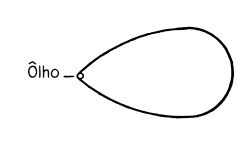\

**[5.634](https://www.wittgensteinproject.org/w/index.php/Logisch-philosophische_Abhandlung#5.634)** Isto se liga a que nenhuma parte de nossa experiência é *a priori*.

Tudo o que vemos poderia ser diferente.

Tudo o que podemos em geral descrever poderia ser diferente.

Não há *a priori* uma ordem das coisas.

**[5.64](https://www.wittgensteinproject.org/w/index.php/Logisch-philosophische_Abhandlung#5.64)** Por aqui se vê que o solipsismo, levado às últimas conseqüências, coincide com o realismo puro. O eu do solipsismo reduz-se a um ponto sem extensão, a realidade permanecendo coordenada a êle.

**[5.641](https://www.wittgensteinproject.org/w/index.php/Logisch-philosophische_Abhandlung#5.641)** Tem, portanto, sentido real falar-se, na filosofia, do eu de um ponto de vista não-psicológico.

O eu penetra na filosofia porque o “mundo é meu mundo”.

O eu filosófico não é o homem, nem o corpo humano, nem a alma humana de que se ocupa a psicologia, mas o sujeito metafísico, o limite — não sendo pois parte do mundo.

**[6](https://www.wittgensteinproject.org/w/index.php/Logisch-philosophische_Abhandlung#6)** A forma geral da função de verdade é ![{ [ \bar{p}, \bar{\xi}, N (\bar{\xi}) ] }](images/336cae8a41089348ef601ba5dbe893d3758f7baa1841701bd587566e0f16d282.svg)\

Esta é a forma geral da proposição.

**[6.001](https://www.wittgensteinproject.org/w/index.php/Logisch-philosophische_Abhandlung#6.001)** Isto nada mais diz do que: cada proposição resulta da aplicação sucessiva da operação \  sôbre as proposições elementares.

**[6.002](https://www.wittgensteinproject.org/w/index.php/Logisch-philosophische_Abhandlung#6.002)** Dada a forma geral de como construir uma proposição, com isto já está dada a forma geral de como é possível gerar outra, por meio de uma operação, partindo-se de uma proposição.

**[6.01](https://www.wittgensteinproject.org/w/index.php/Logisch-philosophische_Abhandlung#6.01)** A forma geral da operação 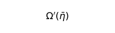\  é pois: ![{ [\bar{\xi}, N(\bar{\xi})]' (\bar{\eta}) (= [ \bar{\eta}, \bar{\xi}, N (\bar{\xi}) ]) }](images/d1cf195aa1fb631bffe7b018f1114530b8c1bcc712299ba306fdef8ed6c55335.svg)\ .

Esta é a forma mais geral da transposição de uma proposição para outra.

**[6.02](https://www.wittgensteinproject.org/w/index.php/Logisch-philosophische_Abhandlung#6.02)** Chegamos *assim* aos números. Defino:

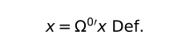\  e
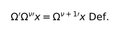\

Segundo essa regra de signos, escrevemos pois a série: 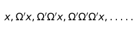\

como: \

Em vez de “![{ [ x, \xi, \Omega ' \xi ] }](images/356a71ba81334c39be3a91a1d42c9d51eb9ad1ea7b726f750fd3a307d7947385.svg)\ ” escrevo, portanto,

“![{ [ \Omega^{0 \prime} x, \Omega^{ \nu \prime} x, \Omega^{ \nu + 1 \prime} x ] }](images/cbe2c1a200eb49c3a9b16c7105afbb9fbed122da767f2d37389ac28a9e93e102.svg)\ ”.

E defino:

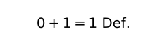\

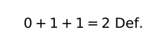\

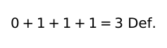\

\(e assim por diante)

**[6.021](https://www.wittgensteinproject.org/w/index.php/Logisch-philosophische_Abhandlung#6.021)** O número é o expoente de uma operação.

**[6.022](https://www.wittgensteinproject.org/w/index.php/Logisch-philosophische_Abhandlung#6.022)** O conceito de número nada mais é do que é comum a todos os números, a forma geral do número.

O conceito número é a variável número.

E o conceito da igualdade entre os números é a forma geral de tôdas as igualdades especiais entre os números.

**[6.03](https://www.wittgensteinproject.org/w/index.php/Logisch-philosophische_Abhandlung#6.03)** A forma geral dos números inteiros é: [0, *ξ*, *ξ* + 1].

**[6.031](https://www.wittgensteinproject.org/w/index.php/Logisch-philosophische_Abhandlung#6.031)** A teoria das classes é inteiramente supérflua para a matemática.

Isto está ligado a que a universalidade de que precisamos na matemática não é a *acidental*.

**[6.1](https://www.wittgensteinproject.org/w/index.php/Logisch-philosophische_Abhandlung#6.1)** As proposições da lógica são tautologias.

**[6.11](https://www.wittgensteinproject.org/w/index.php/Logisch-philosophische_Abhandlung#6.11)** As proposições da lógica, portanto, não dizem nada. (São as proposições analíticas.)

**[6.111](https://www.wittgensteinproject.org/w/index.php/Logisch-philosophische_Abhandlung#6.111)** São sempre falsas as teorias que fazem uma proposição da lógica aparecer com conteúdo. Poder-se-ia, por exemplo, acreditar que as palavras “verdadeiro” e “falso” designassem duas propriedades entre outras, de sorte que pareceria um fato extraordinário que cada proposição possuísse uma dessas propriedades. Isto não parece, de modo algum, evidente; é tão pouco evidente como, por exemplo, o é a proposição “Tôdas as rosas são ou amarelas ou vermelhas”, ainda que fôsse verdadeira. Essa proposição toma, com efeito, o caráter de uma proposição das ciências naturais e isto é sintoma seguro de que foi falsamente concebida.

**[6.112](https://www.wittgensteinproject.org/w/index.php/Logisch-philosophische_Abhandlung#6.112)** A explicação correta das proposições lógicas deve conferir-lhe uma posição peculiar entre tôdas as proposições.

**[6.113](https://www.wittgensteinproject.org/w/index.php/Logisch-philosophische_Abhandlung#6.113)** É marca característica e particular das proposições lógicas que se possa conhecer apenas pelo símbolo quando são verdadeiras, e êste fato contém em si tôda a filosofia da lógica. Assim, é um dos fatos mais importantes que a verdade ou a falsidade das proposições não-lógicas *não* é conhecida ùnicamente na proposição.

**[6.12](https://www.wittgensteinproject.org/w/index.php/Logisch-philosophische_Abhandlung#6.12)** As proposições da lógica são tautologias; isto *mostra* as propriedades (lógicas) formais da linguagem, do mundo.

Suas partes constituintes, ao se vincularem *dessa maneira*, produzem uma tautologia, e isto caracteriza a lógica de suas partes constituintes.

As proposições devem possuir determinadas propriedades de estrutura a fim de que, vinculadas de um determinado modo, produzam uma tautologia. Se produzem uma tautologia ligando-se *dessa maneira*, isto mostra que possuem tais propriedades de estrutura.

**[6.1201](https://www.wittgensteinproject.org/w/index.php/Logisch-philosophische_Abhandlung#6.1201)** Por exemplo: a proposição “*p*” e a “∼*p*” na conexão “∼(*p* . ∼*p*)” produzem uma tautologia, o que mostra que se contradizem entre si. As proposições “*p* ⊃ *q*”, “*p*” e “*q*”, ligadas entre si na forma “(*p* ⊃ *q*) . (*p*) : ⊃ : (*q*)”, produzem uma tautologia, o que mostra que *q* se segue de *p* e *p* ⊃ *q*. Que “(*x*) . *fx* : ⊃ : *fa*” seja uma tautologia, mostra que *fa* se segue de (*x*) . *fx*, etc., etc.

**[6.1202](https://www.wittgensteinproject.org/w/index.php/Logisch-philosophische_Abhandlung#6.1202)** É claro que, em vez da tautologia, é possível empregar a contradição para os mesmos fins.

**[6.1203](https://www.wittgensteinproject.org/w/index.php/Logisch-philosophische_Abhandlung#6.1203)** Para reconhecer uma tautologia como tal, nos casos em que na tautologia não aparece qualquer designação da generalidade, é possível utilizar o seguinte método intuitivo: em vez de “*p*”, “*q*”, “*r*”, etc., escrevo “*VpF*”, “*VqF*”, “*VrF*”, etc. As combinações de verdade são expressas por chaves:
\
e a coordenação da verdade ou da falsidade da proposição total e as combinações de verdade dos argumentos de verdade, por meio de traços, do modo seguinte:
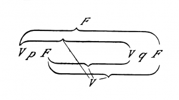\
Êste signo representaria, por exemplo, a proposição “*p* ⊃ *q*”. Vou verificar, por exemplo, se a proposição ∼(*p* . ∼*p*) (lei da contradição) é uma tautologia. A forma “∼*ξ*” será escrita em nossa notação:
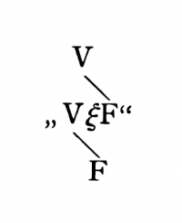\
A forma “*ξ* . *η*”:
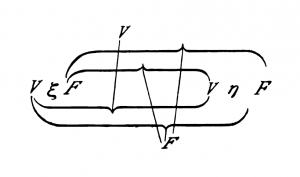\
De modo que a proposição ∼(*p* . ∼*q*) será:
\
Em lugar de “*q*” coloquemos “*p*” e examinemos a conexão dos *V* e *F* mais exteriores com os mais interiores; logo verificamos que a verdade da proposição total coordena-se com *tôdas* as combinações de verdade de seus argumentos, enquanto que sua falsidade, com nenhuma das combinações de verdade.

**[6.121](https://www.wittgensteinproject.org/w/index.php/Logisch-philosophische_Abhandlung#6.121)** As proposições da lógica demonstram as propriedades lógicas das proposições, pois se ligam em proposições que não dizem nada.

É possível chamar a êsse método de método-nulo. Na proposição lógica as proposições são levadas a se equilibrarem mùtuamente, de modo que a situação de equilíbrio indica como tais proposições devem ser constituídas de um ponto de vista lógico.

**[6.122](https://www.wittgensteinproject.org/w/index.php/Logisch-philosophische_Abhandlung#6.122)** Donde resulta ser possível viver sem as proposições lógicas, já que podemos reconhecer, graças à mera inspeção dessas proposições, suas propriedades formais numa notação correspondente.

**[6.1221](https://www.wittgensteinproject.org/w/index.php/Logisch-philosophische_Abhandlung#6.1221)** Se, por exemplo, duas proposições “*p*” e “*q*” geram, na conexão *p* ⊃ *q*, uma tautologia, é claro então que *q* se segue de *p*.

Que, por exemplo, “*q*” segue-se de “*p* ⊃ *q* . *p*”, vemos graças ao exame de ambas as proposições, mas podemos mostrá-lo ligando-as em “*p* ⊃ *q* . *p* : ⊃ : *q*” e mostrando que esta última forma uma tautologia.

**[6.1222](https://www.wittgensteinproject.org/w/index.php/Logisch-philosophische_Abhandlung#6.1222)** Isso ilumina a questão: porque as proposições lógicas não podem ser confirmadas pela experiência nem refutadas por ela. Não só uma proposição da lógica não pode ser refutada por uma experiência possível, mas também não há de ser confirmada por ela.

**[6.1223](https://www.wittgensteinproject.org/w/index.php/Logisch-philosophische_Abhandlung#6.1223)** E assim se torna claro porque muitas vêzes sentimos como se as “verdades lógicas” fôssem *postuladas* por nós; podemos com efeito postulá-las enquanto podemos postular uma notação satisfatória.

**[6.1224](https://www.wittgensteinproject.org/w/index.php/Logisch-philosophische_Abhandlung#6.1224)** Agora se torna claro porque a lógica foi chamada teoria das formas e das inferências.

**[6.123](https://www.wittgensteinproject.org/w/index.php/Logisch-philosophische_Abhandlung#6.123)** É claro que as leis lógicas não devem elas próprias depender de outras leis lógicas.

\(Não há, como Russell imaginou, para cada *type* uma certa lei da contradição, mas basta uma, desde que não se aplique a si mesma.)

**[6.1231](https://www.wittgensteinproject.org/w/index.php/Logisch-philosophische_Abhandlung#6.1231)** O sintoma da proposição lógica *não* é a validade universal.

Ser universal quer dizer apenas: valer para tôdas as coisas de modo acidental. Uma proposição não universalizada pode ser tautologia tanto como uma proposição universalizada.

**[6.1232](https://www.wittgensteinproject.org/w/index.php/Logisch-philosophische_Abhandlung#6.1232)** A validade lógica universal pode ser chamada essencial, em oposição àquela acidental, como a da proposição: “Todos os homens são mortais”. Proposições como o *axiom of reducibility* de Russell não são proposições lógicas, o que esclarece nosso sentimento de que, quando verdadeiras, só o podem ser graças a um acaso favorável.

**[6.1233](https://www.wittgensteinproject.org/w/index.php/Logisch-philosophische_Abhandlung#6.1233)** É plausível pensar um mundo em que não valha o *axiom of reducibility*; de sorte que se torna claro que a lógica nada tem a ver com a questão de nosso mundo ser realmente assim ou não.

**[6.124](https://www.wittgensteinproject.org/w/index.php/Logisch-philosophische_Abhandlung#6.124)** As proposições lógicas descrevem os andaimes do mundo, ou melhor, os representam. Não “tratam” de nada. Pressupõem que os nomes possuam denotação e as proposições elementares, sentido. E tal é sua vinculação com o mundo. É claro que isso deve indicar alguma coisa a respeito do mundo, que certas vinculações de símbolos — que essencialmente possuem um caráter determinado — são tautologias. E aqui está o que é decisivo. Dissemos que, nos símbolos que usamos, muito era arbitrário, muito não o era. E na lógica apenas isso se exprime; o que quer dizer que na lógica *nós* não exprimimos o que queremos com a ajuda de signos, mas que a natureza dos signos naturalmente necessários, na lógica, asserta-se a si própria. Ao conhecermos a sintaxe lógica de uma linguagem simbólica qualquer, já estão dadas tôdas as proposições da lógica.

**[6.125](https://www.wittgensteinproject.org/w/index.php/Logisch-philosophische_Abhandlung#6.125)** É possível, e isto também de acordo com a velha concepção da lógica, dar prèviamente uma descrição de tôdas as proposições lógicas “verdadeiras”.

**[6.1251](https://www.wittgensteinproject.org/w/index.php/Logisch-philosophische_Abhandlung#6.1251)** *Nunca* poderá haver, pois, surprêsas na lógica.

**[6.126](https://www.wittgensteinproject.org/w/index.php/Logisch-philosophische_Abhandlung#6.126)** É possível calcular se uma proposição pertence à lógica calculando as propriedades lógicas do *símbolo*.

E é o que fazemos ao “provar” uma proposição lógica. Porquanto, sem nos preocuparmos com o sentido e a denotação, formamos a proposição lógica a partir de outras meramente segundo as *regras dos signos*.

A prova das proposições lógicas consiste em fazermos com que sejam geradas a partir de outras proposições lógicas graças à aplicação sucessiva de certas operações, que das primeiras tautologias reproduzem outras. (E, com efeito, de uma tautologia *seguem-se* apenas tautologias.)

Êste modo de mostrar que suas proposições são tautologias é, sem dúvida, para a lógica, inteiramente inessencial. Exatamente porque as proposições de que parte a prova já devem mostrar, sem prova, que são tautologias.

**[6.1261](https://www.wittgensteinproject.org/w/index.php/Logisch-philosophische_Abhandlung#6.1261)** Na lógica, processo e resultado são equivalentes. (Por isso não há nenhuma surprêsa.)

**[6.1262](https://www.wittgensteinproject.org/w/index.php/Logisch-philosophische_Abhandlung#6.1262)** A prova na lógica é apenas um expediente mecânico para facilitar o reconhecimento da tautologia onde ela é complicada.

**[6.1263](https://www.wittgensteinproject.org/w/index.php/Logisch-philosophische_Abhandlung#6.1263)** Seria, pois, extraordinário poder provar *lògicamente* uma proposição significativa a partir de outra, e *ainda* uma proposição lógica. É claro desde logo que a prova lógica de uma proposição significativa e a prova *na* lógica devem ser coisas inteiramente diferentes.

**[6.1264](https://www.wittgensteinproject.org/w/index.php/Logisch-philosophische_Abhandlung#6.1264)** A proposição significativa asserta algo e sua prova mostra que é assim; na lógica cada proposição está sob a forma de uma prova.

Cada proposição da lógica é um *modus ponens* representado num signo. (E não é possível exprimir o *modus ponens* por meio de uma proposição.)

**[6.1265](https://www.wittgensteinproject.org/w/index.php/Logisch-philosophische_Abhandlung#6.1265)** Sempre se pode conceber a lógica de tal modo que cada proposição seja sua própria prova.

**[6.127](https://www.wittgensteinproject.org/w/index.php/Logisch-philosophische_Abhandlung#6.127)** Tôdas as proposições da lógica são eqüiponderantes, não existem entre elas princípios essenciais e proposições derivadas.

Cada tautologia, ela própria, mostra que é uma tautologia.

**[6.1271](https://www.wittgensteinproject.org/w/index.php/Logisch-philosophische_Abhandlung#6.1271)** É claro que o número dos princípios lógicos é arbitrário, pois se poderia derivar a lógica de um único princípio, por exemplo, formando meramente o produto lógico dos princípios de Frege. (Frege talvez dissesse que êsses princípios não seriam mais transparentes de modo imediato. Seria extraordinário, porém, que um pensador tão exato como Frege tomasse, como critério de uma proposição lógica, seu grau de transparência.)

**[6.13](https://www.wittgensteinproject.org/w/index.php/Logisch-philosophische_Abhandlung#6.13)** A lógica não é teoria, mas figuração especular do mundo.

A lógica é transcendental.

**[6.2](https://www.wittgensteinproject.org/w/index.php/Logisch-philosophische_Abhandlung#6.2)** A matemática é um método lógico.

As proposições da matemática são equações e, portanto, pseudoproposições.

**[6.21](https://www.wittgensteinproject.org/w/index.php/Logisch-philosophische_Abhandlung#6.21)** A proposição da matemática não exprime pensamentos.

**[6.211](https://www.wittgensteinproject.org/w/index.php/Logisch-philosophische_Abhandlung#6.211)** Na vida, não é da proposição matemática que precisamos, usamo-la *apenas* para inferir, de proposições que não pertencem à matemática, outras que igualmente não pertencem a ela.

\(Na filosofia, a questão “para que precisamos efetivamente de tal palavra ou de tal proposição” sempre conduz a valiosas visualizações.)

**[6.22](https://www.wittgensteinproject.org/w/index.php/Logisch-philosophische_Abhandlung#6.22)** A lógica do mundo que as proposições lógicas mostram nas tautologias, a matemática a mostra nas equações.

**[6.23](https://www.wittgensteinproject.org/w/index.php/Logisch-philosophische_Abhandlung#6.23)** Se duas expressões estiverem ligadas pelo signo de igualdade, isto quer dizer que são mùtuamente substituíveis. Quando, porém, isto vier a ocorrer, deve mostrar-se nas próprias expressões.

Caracteriza a forma lógica de duas expressões serem mùtuamente substituíveis.

**[6.231](https://www.wittgensteinproject.org/w/index.php/Logisch-philosophische_Abhandlung#6.231)** É propriedade da afirmação poder ser concebida como dupla negação.

E propriedade de “1 + 1 + 1 + 1” poder ser concebida como “(1 + 1) + (1 + 1)”.

**[6.232](https://www.wittgensteinproject.org/w/index.php/Logisch-philosophische_Abhandlung#6.232)** Frege diz que ambas as expressões têm a mesma denotação mas sentido diverso.

É essencial para a equação, entretanto, ela não ser necessária para mostrar que ambas as expressões, ligadas pelo signo de igualdade, possuam a mesma denotação, pois isto se vê a partir de ambas as expressões.

**[6.2321](https://www.wittgensteinproject.org/w/index.php/Logisch-philosophische_Abhandlung#6.2321)** E que as proposições da matemática possam ser provadas, nada mais quer dizer que sua correção é reconhecida sem precisar comparar o que elas exprimem com os fatos, do ponto de vista de sua correção.

**[6.2322](https://www.wittgensteinproject.org/w/index.php/Logisch-philosophische_Abhandlung#6.2322)** Não se *afirma* a identidade da denotação de duas expressões, pois, para poder afirmar algo a respeito de sua denotação, devo conhecer essa denotação e, ao conhecê-la, já sei se denota a mesma coisa ou algo diferente.

**[6.2323](https://www.wittgensteinproject.org/w/index.php/Logisch-philosophische_Abhandlung#6.2323)** A equação revela apenas o ponto de vista do qual considero ambas as expressões, a saber, o ponto de vista da igualdade de sua denotação.

**[6.233](https://www.wittgensteinproject.org/w/index.php/Logisch-philosophische_Abhandlung#6.233)** A pergunta se é preciso a intuição para resolver problemas matemáticos deve ser respondida considerando que a própria linguagem fornece a intuição necessária.

**[6.2331](https://www.wittgensteinproject.org/w/index.php/Logisch-philosophische_Abhandlung#6.2331)** O processo de *calcular* faz intervir precisamente essa intuição.

O cálculo não é experimento.

**[6.234](https://www.wittgensteinproject.org/w/index.php/Logisch-philosophische_Abhandlung#6.234)** A matemática é um método da lógica.

**[6.2341](https://www.wittgensteinproject.org/w/index.php/Logisch-philosophische_Abhandlung#6.2341)** O que é essencial para o método matemático é trabalhar com equações. E dêsse método depende particularmente que cada proposição da matemática deve ser compreendida de per si.

**[6.24](https://www.wittgensteinproject.org/w/index.php/Logisch-philosophische_Abhandlung#6.24)** O método pelo qual a matemática chega às equações é o da substituição.

Porquanto a equação exprime o caráter substitutivo das duas expressões, de sorte que passamos de um número de equações para uma nova equação, substituindo expressões por outras, de acordo com as equações.

**[6.241](https://www.wittgensteinproject.org/w/index.php/Logisch-philosophische_Abhandlung#6.241)** É desta maneira então que se desdobra a prova de 2 × 2 = 4

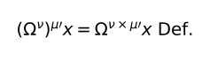\

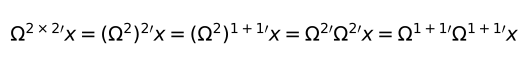\

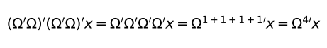\

**[6.3](https://www.wittgensteinproject.org/w/index.php/Logisch-philosophische_Abhandlung#6.3)** A investigação da lógica denota a investigação de *tôda a legalidade*. Fora dela tudo é acidente.

**[6.31](https://www.wittgensteinproject.org/w/index.php/Logisch-philosophische_Abhandlung#6.31)** A assim chamada lei da indução não pode, em caso algum, ser uma lei lógica, pois é patentemente uma proposição significativa. — De sorte que nem mesmo pode ser uma lei *a priori*.

**[6.32](https://www.wittgensteinproject.org/w/index.php/Logisch-philosophische_Abhandlung#6.32)** A lei da causalidade não é lei mas forma de uma lei.

**[6.321](https://www.wittgensteinproject.org/w/index.php/Logisch-philosophische_Abhandlung#6.321)** “Lei de causalidade” é um nome genérico. E assim como dizemos, na mecânica, que existem leis mínimas — por exemplo, a de ação menor — existem na física leis de causalidade, leis da forma da causalidade.

**[6.3211](https://www.wittgensteinproject.org/w/index.php/Logisch-philosophische_Abhandlung#6.3211)** Já se teve, com efeito, um pressentimento de que era preciso *uma* “lei de ação mínima” antes de se saber exatamente o que rezava. (Aqui como sempre, o que é certo *a priori* se revela como algo puramente lógico.)

**[6.33](https://www.wittgensteinproject.org/w/index.php/Logisch-philosophische_Abhandlung#6.33)** Não *acreditamos* *a priori* numa lei da conservação, mas *conhecemos a priori* a possibilidade de uma forma lógica.

**[6.34](https://www.wittgensteinproject.org/w/index.php/Logisch-philosophische_Abhandlung#6.34)** Tôdas aquelas proposições, como o princípio de razão suficiente, o de continuidade na natureza, o do mínimo esfôrço na natureza, etc., etc., tôdas são visualizações *a priori* a respeito da possibilidade de enformar proposições da ciência.

**[6.341](https://www.wittgensteinproject.org/w/index.php/Logisch-philosophische_Abhandlung#6.341)** A mecânica newtoniana, por exemplo, conduz a descrição do universo a uma forma unificada. Tomemos uma superfície branca e sôbre ela manchas pretas irregulares. Dizemos então: seja qual for a figuração que faço, sempre posso aproximar-me quanto quiser de sua descrição, se cubro a superfície com uma rêde quadriculada suficientemente fina de modo a poder dizer de cada quadrado se é branco ou prêto. Conduzi dessa maneira a descrição da superfície a uma forma unificada. Essa forma é qualquer, pois teria empregado com o mesmo sucesso uma rêde feita em triângulos ou em hexágonos. É possível que a descrição com auxílio de uma rêde em triângulos fôsse mais simples, isto é, com uma grossa rêde em triângulos poderíamos ter obtido uma descrição mais precisa das manchas do que com outra mais fina e quadriculada (ou vice-versa), e assim por diante. Às diversas rêdes correspondem diversos sistemas de descrever o mundo. A mecânica determina uma forma de descrição do mundo, pois diz: tôdas as proposições da descrição do mundo devem ser obtidas de um número de proposições dadas — os axiomas mecânicos — segundo um modo dado. Com isto provê as pedras para a construção do edifício científico, dizendo: sejam quais forem os edifícios que pretendas levantar, deves construí-los com estas e apenas estas pedras.

\(Assim como se escreve qualquer número com o sistema numérico, com o sistema da mecânica deve-se poder escrever qualquer proposição da física.)

**[6.342](https://www.wittgensteinproject.org/w/index.php/Logisch-philosophische_Abhandlung#6.342)** Vemos assim a posição oposta da lógica e da mecânica. (Poder-se-ia também fazer a rêde composta de figuras diversas, como de triângulos e hexágonos.) Que uma figuração como a mencionada acima seja descrita por uma rêde de uma forma dada, não asserta *nada* a respeito da figuração. (Porquanto isso vale para cada figuração dessa espécie.) Caracteriza, porém, a figuração poder ser *completamente* descrita por uma determinada rêde de *determinada* finura.

Do mesmo modo, nada asserta a respeito do mundo poder ser descrito pela mecânica newtoniana; asserta, entretanto, poder ser descrito por ela *tal* como precisamente vem a ser. Também diz algo a respeito do mundo poder ser descrito, por uma mecânica, de maneira mais simples do que por outra.

**[6.343](https://www.wittgensteinproject.org/w/index.php/Logisch-philosophische_Abhandlung#6.343)** A mecânica é uma tentativa de construir, conforme um plano único, tôdas as proposições *verdadeiras* que precisamos para a descrição do mundo.

**[6.3431](https://www.wittgensteinproject.org/w/index.php/Logisch-philosophische_Abhandlung#6.3431)** Através de todo o aparato lógico, as leis físicas ainda falam de objetos do mundo.

**[6.3432](https://www.wittgensteinproject.org/w/index.php/Logisch-philosophische_Abhandlung#6.3432)** Não devemos nos esquecer de que a descrição do mundo feita pela mecânica é sempre inteiramente geral. Nunca trata, por exemplo, de um ponto material *determinado*, mas ùnicamente de *qualquer um*.

**[6.35](https://www.wittgensteinproject.org/w/index.php/Logisch-philosophische_Abhandlung#6.35)** Embora as manchas em nossa figuração sejam figuras geométricas, a geometria evidentemente nada tem a dizer sôbre sua forma efetiva e sôbre sua condição. A rêde, porém, é *puramente* geométrica, tôdas as suas propriedades podem ser dadas *a priori*.

Leis como o princípio de razão suficiente, etc., tratam da rêde, não, porém, do que ela descreve.

**[6.36](https://www.wittgensteinproject.org/w/index.php/Logisch-philosophische_Abhandlung#6.36)** Se houvesse uma lei da causalidade, seria do seguinte teor: “há leis naturais”.

No entanto, òbviamente isto não se pode dizer: mostra-se.

**[6.361](https://www.wittgensteinproject.org/w/index.php/Logisch-philosophische_Abhandlung#6.361)** Segundo as expressões de Hertz, poder-se-ia dizer: apenas as conexões *em conformidade com a lei* são *pensáveis*.

**[6.3611](https://www.wittgensteinproject.org/w/index.php/Logisch-philosophische_Abhandlung#6.3611)** Não podemos comparar nenhum processo com o “decurso do tempo” (êsse decurso não existe), apenas com outro processo — em particular, com o andar de um cronômetro.

Por isso a descrição do curso temporal só é possível porque nos apoiamos em outro processo.

É análogo o que acontece com o espaço. Quando se diz, por exemplo, que nenhum de dois acontecimentos (mùtuamente exclusivos) tem lugar, porque não há *nenhuma causa* que leve um a realizar-se ao invés do outro, na realidade trata-se apenas da impossibilidade de descrever *um* dentre os dois acontecimentos quando não há uma assimetria qualquer. *Desde que haja* tal assimetria, podemos tomá-la como *causa* do vir-a-ser de um e do não vir-a-ser do outro.

**[6.36111](https://www.wittgensteinproject.org/w/index.php/Logisch-philosophische_Abhandlung#6.36111)** O problema kantiano da mão direita e da mão esquerda que não se cobrem já surge no plano e até mesmo num espaço unidimensional, onde duas figuras congruentes *a* e *b* não se cobrem a não ser que se movam fora dêsse espaço. A mão esquerda e a direita são de fato perfeitamente congruentes. E nada tem a ver com isso a impossibilidade de fazer com que se cubram.
\
Seria possível vestir a luva direita na mão esquerda se a girássemos num espaço quadridimensional.

**[6.362](https://www.wittgensteinproject.org/w/index.php/Logisch-philosophische_Abhandlung#6.362)** O que pode ser descrito pode acontecer e o que a lei da causalidade há de excluir não pode ser descrito.

**[6.363](https://www.wittgensteinproject.org/w/index.php/Logisch-philosophische_Abhandlung#6.363)** O processo da indução consiste em aceitar a lei *mais simples* que possa estar conforme com nossa experiência.

**[6.3631](https://www.wittgensteinproject.org/w/index.php/Logisch-philosophische_Abhandlung#6.3631)** Êste processo todavia não tem fundamento lógico, mas apenas psicológico.

É claro que não há razão alguma para acreditar que o caso mais simples realmente ocorrerá.

**[6.36311](https://www.wittgensteinproject.org/w/index.php/Logisch-philosophische_Abhandlung#6.36311)** Que o sol se levante amanhã, é uma hipótese, e isto quer dizer: não *sabemos* se se levantará.

**[6.37](https://www.wittgensteinproject.org/w/index.php/Logisch-philosophische_Abhandlung#6.37)** Não há obrigação para algo acontecer depois de alguma coisa ter acontecido. Não há necessidade que não seja *lógica*.

**[6.371](https://www.wittgensteinproject.org/w/index.php/Logisch-philosophische_Abhandlung#6.371)** Na base de tôda moderna visão do mundo está a ilusão de que as assim chamadas leis naturais sejam esclarecimentos a propósito dos fenômenos naturais.

**[6.372](https://www.wittgensteinproject.org/w/index.php/Logisch-philosophische_Abhandlung#6.372)** Colocam-se assim diante das leis naturais como diante de algo intangível, como os antigos diante de Deus e do destino.

E ambos têm e não têm razão. Os antigos, entretanto, eram tanto mais claros quanto mais reconheciam um claro término, enquanto os novos sistemas devem parecê-lo quando *tudo* estiver explicado.

**[6.373](https://www.wittgensteinproject.org/w/index.php/Logisch-philosophische_Abhandlung#6.373)** O mundo independe de minha vontade.

**[6.374](https://www.wittgensteinproject.org/w/index.php/Logisch-philosophische_Abhandlung#6.374)** Se acontecesse tudo o que desejássemos, isto seria, por assim dizer, uma graça do destino, já que não há vinculação *lógica* entre vontade e mundo; e, suposta uma vinculação física, não podemos querê-la de nôvo.

**[6.375](https://www.wittgensteinproject.org/w/index.php/Logisch-philosophische_Abhandlung#6.375)** Havendo sòmente uma necessidade *lógica*, só há uma impossibilidade *lógica*.

**[6.3751](https://www.wittgensteinproject.org/w/index.php/Logisch-philosophische_Abhandlung#6.3751)** Que, por exemplo, duas côres estejam concomitantemente no mesmo lugar do campo visual é impossível, e por certo lògicamente impossível, porquanto isto se exclui em virtude da estrutura lógica da côr.

Consideremos como essa contradição se representa na física. Aproximadamente do seguinte modo: uma partícula não pode ao mesmo tempo possuir duas velocidades; quer dizer que ela não pode estar concomitantemente em dois lugares, o que significa que partículas, que estão em diferentes lugares num mesmo tempo, não podem ser idênticas.

\(É claro que o produto lógico de duas proposições elementares não pode ser nem uma tautologia nem uma contradição. A asserção de que um ponto do campo visual tem, ao mesmo tempo, duas côres diferentes é uma contradição.)

**[6.4](https://www.wittgensteinproject.org/w/index.php/Logisch-philosophische_Abhandlung#6.4)** Tôdas as proposições têm igual valor.

**[6.41](https://www.wittgensteinproject.org/w/index.php/Logisch-philosophische_Abhandlung#6.41)** O sentido do mundo deve estar fora dêle. No mundo tudo é como é e acontece como acontece: *nêle* não há valor — e se houvesse, o valor não teria valor.

Se houver um valor que tenha valor, então deve permanecer fora de todos os acontecimentos e do ser-peculiar, pois todos os acontecimentos e o ser-peculiar são acidentais.

O que o faz não-acidental não pode estar *no* mundo pois, no caso contrário, isto seria de nôvo acidental.

Deve estar fora do mundo.

**[6.42](https://www.wittgensteinproject.org/w/index.php/Logisch-philosophische_Abhandlung#6.42)** Por isso não pode haver proposições da ética.

Proposições não podem exprimir nada além.

**[6.421](https://www.wittgensteinproject.org/w/index.php/Logisch-philosophische_Abhandlung#6.421)** É claro que a ética não se deixa exprimir.

A ética é transcendental.

\(Ética e estética são um só.)

**[6.422](https://www.wittgensteinproject.org/w/index.php/Logisch-philosophische_Abhandlung#6.422)** O primeiro pensamento para estabelecer uma lei ética da forma “tu deves...” consiste em: E o que se daria se eu não fizesse isso? No entanto, é claro que a ética nada tem a ver com castigo e recompensa no sentido comum. Essa questão a respeito das *conseqüências* de uma ação deve ser insignificante. — No mínimo essas conseqüências não serão acontecimentos. Algo, porém, deve estar correto na colocação da questão. Por certo deve existir uma espécie de recompensa ética e de castigo ético que devem, todavia, estar na própria ação.

\(Mas também é claro que a recompensa deve ter algo agradável, o castigo, algo desagradável.)

**[6.423](https://www.wittgensteinproject.org/w/index.php/Logisch-philosophische_Abhandlung#6.423)** No que respeita à vontade como portador do que é ético, nada pode ser dito.

A vontade como fenômeno apenas interessa à psicologia.

**[6.43](https://www.wittgensteinproject.org/w/index.php/Logisch-philosophische_Abhandlung#6.43)** Se querer o bem ou querer o mal muda o mundo, isto só poderá mudar os limites do mundo, nunca os fatos; nunca o que pode ser expresso pela linguagem.

Em suma, por isso o mundo deve em geral tornar-se outro. Deve, por assim dizer, crescer ou diminuir como um todo.

O mundo dos felizes é diferente do mundo dos infelizes.

**[6.431](https://www.wittgensteinproject.org/w/index.php/Logisch-philosophische_Abhandlung#6.431)** Também como na morte, o mundo não se altera mas acaba.

**[6.4311](https://www.wittgensteinproject.org/w/index.php/Logisch-philosophische_Abhandlung#6.4311)** A morte não é acontecimento da vida. Não se vive a morte.

Se por eternidade não se entender a duração infinita do tempo mas a atemporalidade, vive eternamente quem vive no presente.

Nossa vida está privada de fim como nosso campo visual, de limite.

**[6.4312](https://www.wittgensteinproject.org/w/index.php/Logisch-philosophische_Abhandlung#6.4312)** A imortalidade temporal da alma humana, a saber, seu continuar a viver eternamente ainda depois da morte, não está de maneira alguma assegurada; além do mais, essa assunção não cumpre nada do que sempre se quis lograr com ela. Algum enigma será resolvido por ter eu continuado a viver eternamente? Não é a vida eterna tão enigmática como a presente? A solução do enigma da vida no espaço e no tempo reside *fora* do espaço e do tempo.

\(Não são problemas de ciência natural a serem resolvidos.)

**[6.432](https://www.wittgensteinproject.org/w/index.php/Logisch-philosophische_Abhandlung#6.432)** *Como* é o mundo é perfeitamente indiferente para o que está além. Deus não se manifesta *no* mundo.

**[6.4321](https://www.wittgensteinproject.org/w/index.php/Logisch-philosophische_Abhandlung#6.4321)** Os fatos fazem todos parte da tarefa mas não da solução.

**[6.44](https://www.wittgensteinproject.org/w/index.php/Logisch-philosophische_Abhandlung#6.44)** O que é místico não é *como* o mundo é mas *que* êle seja.

**[6.45](https://www.wittgensteinproject.org/w/index.php/Logisch-philosophische_Abhandlung#6.45)** A intuição do mundo *sub specie aeterni* é a intuição dêle como um todo limitado.

É místico o sentimento do mundo como um todo limitado.

**[6.5](https://www.wittgensteinproject.org/w/index.php/Logisch-philosophische_Abhandlung#6.5)** Para uma resposta inexprimível é inexprimível a pergunta.

*O enigma* não existe.

Se uma questão pode ser colocada, *poderá* também ser respondida.

**[6.51](https://www.wittgensteinproject.org/w/index.php/Logisch-philosophische_Abhandlung#6.51)** O cepticismo *não* é irrefutável mas patentemente absurdo, quando pretende duvidar onde não cabe perguntar.

A dúvida, pois, só existe onde existe uma questão, uma questão apenas onde existe uma resposta, e esta sòmente onde algo *pode ser dito*.

**[6.52](https://www.wittgensteinproject.org/w/index.php/Logisch-philosophische_Abhandlung#6.52)** Sentimos que, mesmo que *tôdas as possíveis* questões científicas fôssem respondidas, nossos problemas vitais não teriam sido tocados. Sem dúvida, não cabe mais pergunta alguma, e esta é precisamente a resposta.

**[6.521](https://www.wittgensteinproject.org/w/index.php/Logisch-philosophische_Abhandlung#6.521)** Observa-se a solução dos problemas da vida no desaparecimento dêsses problemas.

\(Esta não é a razão por que os homens, para os quais o sentido da vida se tornou claro depois de um longo duvidar, não podem mais dizer em que consiste êsse sentido?)

**[6.522](https://www.wittgensteinproject.org/w/index.php/Logisch-philosophische_Abhandlung#6.522)** Existe com certeza o indizível. Isto *se mostra*, é o que é místico.

**[6.53](https://www.wittgensteinproject.org/w/index.php/Logisch-philosophische_Abhandlung#6.53)** O método correto em filosofia seria pròpriamente: nada dizer a não ser o que pode ser dito, isto é, proposições das ciências naturais — algo, portanto, que nada tem a haver com a filosofia; e sempre que alguém quisesse dizer algo a respeito da metafísica, demonstrar-lhe que não conferiu denotação a certos signos de suas proposições. Para outrem êsse método não seria satisfatório — êle não teria o sentimento de que lhe estaríamos ensinando filosofia — mas seria o único método estritamente correto.

**[6.54](https://www.wittgensteinproject.org/w/index.php/Logisch-philosophische_Abhandlung#6.54)** Minhas proposições se elucidam do seguinte modo: quem me entende, por fim as reconhecerá como absurdas, quando graças a elas — por elas — tiver escalado para além delas. (É preciso por assim dizer jogar fora a escada depois de ter subido por ela.)

Deve-se vencer essas proposições para ver o mundo corretamente.

**[7](https://www.wittgensteinproject.org/w/index.php/Logisch-philosophische_Abhandlung#7)** O que não se pode falar, deve-se calar.

---

## Notas à tradução

A numeração das notas segue a numeração do Tractatus.

— Convém observar que a formulação do sistema de numeração das proposições é matemàticamente insuficiente; não explica, por exemplo, a proposição 2.001, cujo sentido no entanto se apreende fàcilmente pelo contexto.

[2](#2) — Estado de coisas: *Sachverhalt*, etimològicamente “como as coisas se comportam entre si” (cf. Introdução, p. 39). Tivemos o cuidado de traduzir *sich verhalten* por “*está* em relação”, vinculando dêsse modo *estado* ao verbo *estar*. Russell indagara de Wittgenstein a respeito da diferença entre estado de coisa e fato (*Tatsache*). A resposta é a seguinte: “*Sachverhalt* é o que corresponde à proposição elementar quando verdadeira. *Tatsache*, o que corresponde ao produto lógico de proposições elementares quando êsse produto é verdadeiro. A razão pela qual introduzo *Tatsache* antes de introduzir *Sachverhalt* demandaria uma longa explicação” (*Schriften*, I, p. 275). Baseado nessa informação, Russell escreveu no prefácio da edição inglêsa (p. 9): “Os fatos que não são compostos de outros fatos é o que o Sr. Wittgenstein chama *Sachverhalt*, enquanto que o fato constituído por dois ou mais fatos, é chamado *Tatsache*. Assim, por exemplo, ‘Sócrates é sábio’ é Sachverhalt e também Tatsache, enquanto ‘Sócrates é sábio e Platão foi seu aluno’ é *Tatsache* mas não *Sachverhalt*”. Basta, porém, confrontar a proposição 5.5571 para nos convencermos da falsidade da interpretação de Russell. É de notar que o problema dos elementos simples da realidade está estreitamente ligado ao problema das proposições elementares, devendo, portanto, ser colocado juntamente com a proposição 5.55.

[2.0121](#2.0121) (3) — Meramente-possível: *nur-möglich*, neologismo que serve para indicar que a noção de possibilidade, em Wittgenstein, não se confunde com a possibilidade desvencilhada dos fatos.

[2.0251](#2.0251) — Coloridade: *Färbigkeit*, indicando que não se trata simplesmente da côr, mas da possibilidade de os objetos serem coloridos.

[2.06](#2.06) Realidade: *Wirklichkeit*, a lingua alemã possui *Realität* e *Wirklichkeit*, esta última palavra indicando a realidade efetiva. O contexto, no entanto, basta para indicar que sentido Wittgenstein dá a êsse têrmo, de modo que não foi preciso carregar a tradução com duas palavras para um único significado.

[2.1](#2.1) — Figuração: *Bild*, apesar do caráter ativo de “figuração”, inexistente em *Bild*, preferimos essa palavra ao invés do têrmo neutro “imagem”, tendo em vista ser ela a única capaz de indicar todos os matizes do texto alemão.

[3.24](#3.24) (3) — O mesmo prefixo *ur* foi traduzido diferentemente em *Urbild* (protofiguração) e *Urzeichen* (signo primitivo), e a isso fomos levados porque uma protofiguração é uma parte de um fato que, sòmente so ser completado, adquire uma função figurativa, enquanto o signo primitivo é um signo completo, que serve de ponto de partida para a construção do edifício simbólico.

[3.261](#3.261) — A tradução freqüente dêsse *über* é “por meio de” (a tradução inglêsa emprega a palavra latina *via*). Adotamos a tradução “por sôbre”, para nos manter fiel a um texto que diz expressamente que as definições apenas mostram o caminho cujo alcance vai além dos membros da expressão definidora. Convém lembrar que uma proposição elementar é constituída de nomes designando objetos, ligados uns aos outros como elos de uma cadeia. Essa possibilidade de vinculação, inscrita na própria natureza do objeto, faz com que o nome não designe um elemento autônomo, mas um elemento que se comporta como um ponto sempre prestes a se reunir a outro. Dêsse modo, os objetos designados pelos nomes possuem a mesma estrutura que a função proposicional no nível da linguagem; na proposição *fa*, *f* e *a* são igualmente incompletos. É por isso que os signos da expressão definidora designam além de suas partes copresentes, sendo essencial, na designação, a necessidade de o símbolo vincular-se a outro, o que é sistemàticamente ocultado pelo processo de notação.

[4.003](#4.003) — É preciso ter sempre presente que “absurdo” (*unsinnig*) está além de tôda figuração possível. É absurda, pois, a proposição que diz respeito à estrutura interna da própria figuração ou à natureza dos fatos como tais, porquanto, a figuração afigura a *maneira* de os objetos formarem os fatos, nunca revelando sua dimensão ontológica. É, porém, desprovida de sentido (*sinnlos*) tôda proposição que, fazendo parte do simbolismo, deixa de afigurar na medida em que não estabelece os limites necessários à constituição do sentido (cf. 4.461).

[4.0031](#4.0031) — Mauthner, Fritz (1849-1923), crítico e filósofo alemão que trabalhou particularmente na filosofia da linguagem. Sob certos aspectos seu pensamento se aproxima do logicismo de Russell, mas sua crítica da linguagem se orienta no sentido de privilegiar a dimensão estética da palavra em detrimento da dimensão pròpriamente epistemológica.

[4.022](#4.022) (2) — E *diz que* isto *está* assim: “Und er *sagt*, *dass* es sich so verhält”; essa expressão liga-se inegàvelmente à forma geral da proposição: “Es verhält sich so und so” (cf. 4.5), que traduzimos por “isto está do seguinte modo”.

Devemos notar a referência à situação, ao conjunto de estados de coisas, tanto no sentido da expressão como no emprêgo do verbo *sich verhalten*.

[4.0311](#4.0311) — Esta é a única ocasião em que *Bild* não pode ser traduzida por *figuração*, pois está a indicar um quadro formado por pessoas vivas, representando uma cena.

[4.04](#4.04) — Cf. Hertz, *The Principles of Mechanics*, trad. de D. E. Jones e J. T. Walley, Londres, Nova York, 1899. A filiação de certas idéias de Wittgenstein provenientes do físico Hertz foi estudada por James Griffin, *Wittgenstein’s Logical Atomism*, Oxford University Press, pp. 99 e segs. Hertz de fato considera a elaboração de uma teoria física como a construção de um modêlo da realidade que tenha com ela algo em comum, ambos possuindo a mesma multiplicidade, o mesmo número de coordenadas.

[4.466](#4.466) — *Cada* união arbitrária: “*jede beliebige* Verbindung”. O Prof. Andrés R. Raggio nos lembrou que “jede beliebige” é uma expressão freqüentemente usada na linguagem matemática para indicar “um qualquer”; e de fato, a distributividade de cada conferiria às várias uniões arbitrárias uma forma lógica que parece incompatível com o sentido do texto, em particular com o que segue no parágrafo posterior. No entanto, para não evitar outras interpretações possíveis, preferimos traduzir *jede* por *cada* e escrever esta nota.

[5.2521](#5.2521) — Na notação de Frege, *ξ* indica uma variável em geral.

[5.555](#5.555) — O axioma da infinidade de Russell formula-se da seguinte maneira: se *n* fôr um número cardinal indutivo qualquer, existe ao menos uma classe de indivíduos que tem *n* elementos. Número cardinal indutivo é o número cardinal visto da óptica de sua geração a partir de certos axiomas, dentre os quais está o princípio de indução finita (se uma propriedade *p* pertence a zero e, pertencendo a *n* fôr possível demonstrar que pertence a *n* + 1, então *p* pertence a todos os números), princípio cuja função é garantir que, para todo o conjunto de números, um número e seu sucessor possam possuir certas propriedades em comum. Suponhamos um universo de apenas 9 indivíduos; como um número não pode ter mais de um sucessor, o sucessor de 9 seria 10, uma classe vazia, que por isso seria também igual ao sucessor de 10, também uma classe vazia. Para evitar êsse paradoxo é que surge o axioma da infinidade, garantindo a existência das classes correspondentes a cada número *n*. Isto pôsto, o número de objetos do mundo não é um número indutivo (cf. Russell, *Introduction to Mathematical Philosophy*, cap. XII).