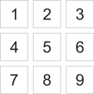
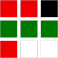
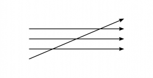
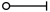

# Editor's Note

_Published by the [Ludwig Wittgenstein Project](https://www.wittgensteinproject.org/)._

_Traducido por [Alberto Buscató](https://www.wittgensteinproject.org/w/index.php/Project:People#Alberto_Buscató)_
_Editado por [Gerardo Piña](https://www.wittgensteinproject.org/w/index.php/Project:People#Gerardo_Piña)_

_El texto original está en el dominio público en su país de origen y en otros países y zonas donde el plazo de los derechos de autor es la vida del autor más 70 años o menos. Esta traducción se publica bajo los términos de la licencia [Creative Commons Atribución-Compartir Igual](https://creativecommons.org/licenses/by-sa/4.0/deed.es). La edición de esta traducción ha sido posible gracias al apoyo económico de [Wikimedia Italia](https://wikimedia.it)._

_Versiones consultadas:_

_-_
_*Philosophische Untersuchungen*. Zweite Auflage. Blackwell Publishers. 1997._
_-_
_*Philosophical investigations*. Second Edition. Traducido por G. E. M. Anscombe. Blackwell Publishers. 1997._
_-_
_*Investigaciones filosóficas*. Traducción y notas de Alfonso García Suarez y Carlos Ulises Moulines. Editorial Gredos. 2009._

_## Nota del editor_

_Esta es la edición B de las *Investigaciones Filosóficas* de Ludwig Wittgenstein; es una variante de la misma traducción de la [edición A](https://www.wittgensteinproject.org/w/index.php/Investigaciones_filos%C3%B3ficas_(edici%C3%B3n_A)), hecha por Alberto Buscató. La diferencia entre esta versión y aquella es que esta ha sido editada para facilitar la lectura al público en español. Se ha conservado la literalidad de la traducción propuesta por Buscató en la medida de lo posible, pero hemos optado por priorizar la comprensión del discurso en aquellos lugares en donde nos parecía pertinente hacerlo. Algunos términos, como “Gedanken”, por ejemplo, que se ha traducido como “pensamientos”, a veces puede significar “ideas” o “reflexiones” y de esa manera hemos mantenido una flexibilidad en la traducción. También hemos hecho sugerencias o correcciones ortográficas y de estilo para que esta versión sea más clara para el público de habla española, sin alterar el enfoque del traductor (es decir, una traducción literal que no tiene en cuenta las diferencias de sintaxis, puntuación, voz pasiva, etc., entre el alemán y el español). Esperamos que el lector encuentre esta versión como un término medio entre las traducciones más académicas –en donde el tono del discurso de Wittgenstein se pierde– y una traducción literal que puede dejar fuera al lector por ser a ratos poco comprensible; en especial a aquellos lectores que se acercan por primera vez a las obras del filósofo austriaco._

_*Gerardo Piña, en julio de 2025*_

# Investigaciones filosóficas (edición B)

## Motto

>
>
> *En general, el progreso tiene la característica de parecer mucho mayor de lo que realmente es. *
>
> *Nestroy*
>
>

## Prefacio

En lo que sigue publico pensamientos, el precipitado de investigaciones filosóficas a las que me he dedicado los últimos 16 años. Estas abarcan muchos objetos: el concepto de significado [*Bedeutung*], de entender [*Verstehen*], de proposición [*Satz*], de lógica; los fundamentos de las matemáticas; los estados de conciencia [*Bewußtseinszustände*] y otros. He anotado todos estos pensamientos como *observaciones*, incisos cortos. En ocasiones [los he anotado] en largas cadenas sobre el mismo objeto; en ocasiones, saltando con gran alternancia de un ámbito a otro. ―Mi propósito era, desde el principio, compilar todo esto alguna vez en un libro, cuya forma me imaginé de distintas maneras en distintos momentos. Sin embargo, me parecía esencial que en esto los pensamientos deberían avanzar en una sucesión natural y fluida.

Tras muchos intentos desafortunados de fundir mis resultados en una totalidad tal, comprendí que nunca iba a conseguir esto. Que lo mejor que podía escribir siempre quedaría [como] meras observaciones filosóficas; que mis pensamientos pronto se paralizarían si yo intentara forzarlos en *una* dirección contra su tendencia natural. ―― Y esto tiene que ver, obviamente, con la propia naturaleza de la investigación. A saber: esta nos obliga a recorrer un amplio ámbito del pensamiento sin rumbo y en todas direcciones. ―― Las observaciones filosóficas de este libro son, de alguna manera, un montón de bocetos de paisajes, que han surgido de estos largos e intrincados viajes.

Los mismos puntos, o más o menos los mismos, fueron siempre abordados desde distintas direcciones y siempre dieron nuevas imágenes. Un sinfín de estas fue garabateado o impropiamente cargadas con todas las carencias de un dibujante débil. Y cuando estas se rechazaron, quedó un número restante a medio camino, que ahora deberían ser ordenados, a menudo recortados, de tal manera que pudieran dar una imagen del paisaje al espectador. ― Así pues, este libro es realmente solo un álbum.

En verdad, hasta hace poco había abandonado el pensamiento de una publicación de mi trabajo en vida. Sin embargo, ha sido revivido de vez en cuando, principalmente porque tuve que experimentar que mis resultados, que yo había transmitido en lecciones, apuntes y discusiones, eran malentendidos por múltiples razones, más o menos diluidos o mutilados al circular. En ese sentido, mi vanidad ha sido estimulada y tenía dificultades para calmarla.

Sin embargo, hace cuatro años tuve ocasión de leer [o exponer] de nuevo mi primer libro (el *Tratado lógico-filosófico*) y aclarar sus pensamientos. Entonces me pareció de repente que debería publicar conjuntamente aquellos viejos pensamientos y los nuevos, ya que estos últimos solo mediante la contraposición con, y a partir del bagaje de mi antigua forma de pensar, podrían obtener su correcta iluminación.

Así, desde que hace dieciséis años empecé de nuevo a dedicarme a la filosofía debía reconocer errores graves en aquello que escribí en aquel primer libro. A comprender estos errores me ha ayudado ― en una medida que casi ni yo mismo podría juzgar ― la crítica que mis ideas han experimentado a manos de Frank Ramsey ― con el cual he discutido durante los últimos dos años de su vida en incontables conversaciones. ― Todavía más que a esta crítica ― siempre enérgica y certera ― agradezco a aquella que un profesor de esta universidad, el señor P. Sraffa, ha realizado incesantemente durante muchos años sobre mis pensamientos. *A este* estímulo le agradezco las más consecuentes de las ideas de este texto.

Por más de *una* razón se solapará lo que aquí publico con aquello que otros escriben hoy. ― Si mis observaciones no portan ningún sello en sí ― que las marque como las mías, entonces no quiero por lo demás proclamarlas como mi propiedad.

Las entrego al público con dudosos sentimientos. Que este trabajo esté destinado, en [toda] su estrechez y en la oscuridad de este tiempo, a arrojar luz en un cerebro u otro, no es imposible, pero obviamente tampoco probable.

No querría ahorrarles a otros el acto de pensar con mi texto. Sino, si fuera posible, estimular a alguien a realizar sus propios pensamientos.

Me habría gustado crear un buen libro. Este no es el caso, pero el tiempo en el que podría haber sido mejorado por mí ha pasado.

CAMBRIDGE,

*en enero* de 1945

## Parte I

**[1.](https://www.wittgensteinproject.org/w/index.php/Philosophische_Untersuchungen#1)** [San] Agustín, en las *Confesiones* 1/8 [dice]: *si los mayores nombraban un objeto cualquiera y se volvían hacia él, entonces yo percibía eso y comprendía que el objeto era designada mediante los sonidos que ellos expresaban, dado que ellos querían referirse a él. Sin embargo, esto lo deducía yo de sus gestos, del lenguaje natural de todos los pueblos, del lenguaje que, mediante un juego de ojos y cara, mediante los movimientos de los miembros y el sonido de la voz, denotaba las sensaciones del alma, cuando esta deseaba alguna cosa o la agarraba o la repelía o huía [de ella]. Así aprendí poco a poco a comprender qué cosas denotaban las palabras que yo oía pronunciar una y otra vez en sus posiciones determinadas en distintas proposiciones. Y yo, una vez que mi boca se había habituado a estos signos, enunciaba mediante ellas mis deseos*.[^1]

De estas palabras obtenemos, así me parece, una imagen determinada de la esencia [*Wesen*] del lenguaje humano. A saber, esta: las palabras del lenguaje denominan objetos ― [las] proposiciones son uniones de tales denominaciones. ―― En esta imagen del lenguaje encontramos la raíz de la idea: cada palabra tiene un significado [*Bedeutung*]. Este significado está relacionado con la palabra. Ella es el objeto para el cual está la palabra.

[San] Agustín no habla de una diferenciación de los tipos de palabras. Quien describe así el aprendizaje del lenguaje, piensa, querría yo pensar, en primer lugar en las palabras principales como «mesa», «silla», «pan», y los nombres de personas, y en segunda línea en los nombres de ciertas actividades y propiedades y en los restantes tipos de palabras como algo que se adaptará.

Piensa ahora en esta utilización del lenguaje: yo mando a alguien a comprar algo. Le doy un papel en el cual están los signos: «cinco manzanas rojas». Él lleva el papel al vendedor, este abre la caja en la que está el signo «manzana», después busca en una tabla la palabra «rojo» y encuentra un patrón de colores enfrente, entonces dice la lista de numerales principales ― asumo que los conoce de carrerilla ― hasta la palabra «cinco» y en cada numeral coge una manzana de la caja que tiene los colores de la muestra. ― ― Así, y de forma similar, se opera con palabras. ―― «Sin embargo, ¿cómo sabe él dónde y cómo debe consultar la palabra “rojo” y qué ha de hacer [*anfangen*] con la palabra “cinco”?». ―― Ahora, asumo que él *actúa* como lo he descrito. Las explicaciones tienen en algún momento un final. ― Pero, ¿cuál es el significado de la palabra «cinco»? ― De eso no se trataba aquí en ningún caso, solo de cómo es usada la palabra «cinco».

**[2.](https://www.wittgensteinproject.org/w/index.php/Philosophische_Untersuchungen#2)** Aquel concepto filosófico del significado se encuentra como en casa en una noción [*Vorstellung*] primitiva de la forma en la que funciona el lenguaje. Sin embargo, también se puede decir que es una noción de un lenguaje más primitivo que el nuestro.

Pensemos en un lenguaje para el cual vale la descripción tal y como [San] Agustín la ha dado: el lenguaje debe servir a la comunicación [*Verständigung*] de un constructor A con un ayudante B. A dirige una construcción a partir de módulos o piedras de construcción; hay cubos, pilares, placas y vigas disponibles. B le ha facilitado los módulos, y ciertamente según el orden en el que A los necesita. Para este fin se sirve de un lenguaje consistente en las palabras: «cubo», «pilar», «placa», «viga». A los nombra; ― B trae la piedra que ha aprendido a traer según esta exclamación [*Ruf*]. ―― Comprendo esto como el lenguaje completamente primitivo.

**[3.](https://www.wittgensteinproject.org/w/index.php/Philosophische_Untersuchungen#3)** [San] Agustín describe, podríamos decir, un sistema de comunicación; solo que este sistema no es todo lo que llamamos lenguaje. Y esto se debe decir en muchos casos, en los que surge la pregunta: «¿es esta representación útil o inútil?». La respuesta es entonces: «sí, útil; pero solo estrechamente circunscrita para este ámbito, no para la totalidad que te figuras representar».

Es como alguien explicó: «[los] juegos consisten en que se desplazan cosas sobre una superficie acorde a ciertas reglas…» ― y le respondemos: parece que piensas en los juegos de mesa, pero esos no son todos los juegos. Puedes corregir tu explicación en cuanto la limites explícitamente a estos juegos.

**[4.](https://www.wittgensteinproject.org/w/index.php/Philosophische_Untersuchungen#4)** Piensa en una escritura en la que [las] letras fueran usadas para la designación de sonidos, pero también para la designación de acentos y como signos de puntuación. (Una escritura se puede comprender como un lenguaje para la descripción de imágenes de sonidos.) Piensa ahora que alguien entendiese aquella escritura como si simplemente correspondiera a cada letra un sonido y como si las letras no tuvieran tampoco ninguna otra función. A una concepción así, tan simple, de la escritura se iguala la concepción de [San] Agustín del lenguaje.

**[5.](https://www.wittgensteinproject.org/w/index.php/Philosophische_Untersuchungen#5)** Cuando se observa el ejemplo en §1, entonces se intuye quizás hasta qué punto el concepto general del significado de la palabra rodea el funcionar del lenguaje con una neblina que hace imposible la visión clara. ―La neblina se disipa cuando estudiamos los fenómenos del lenguaje en formas primitivas de su utilización, en las que se puede abarcar claramente el fin y el funcionar de las palabras.

Tales formas primitivas del lenguaje las usa el niño cuando aprende a hablar. El aprendizaje del lenguaje no es aquí ningún explicar, sino un adiestrar.

**[6.](https://www.wittgensteinproject.org/w/index.php/Philosophische_Untersuchungen#6)** Podríamos imaginarnos que el lenguaje en §2 es el lenguaje *completo* de A y B; o sea, el lenguaje completo de una tribu. Los niños serían educados en hacer *estas* actividades, utilizar *estas* palabras con ellas y en reaccionar *así* ante las palabras del otro.

Una parte importante del adiestramiento consistiría en que el docente señale los objetos, dirija la atención del niño hacia ellos y con esto pronuncie una palabra; por ejemplo, la palabra «placa» mostrando esta forma. (Esto no lo quiero llamar «explicación indicativa» o «definición», porque el niño no podría ni siquiera *preguntar* algo tras la designación. Quiero llamarlo «aprendizaje indicativo de las palabras». ―― Digo que esto constituirá una parte importante del adiestramiento, porque esto es el caso en los seres humanos [*Menschen*], no porque no se pueda imaginar de otra manera.) Este aprendizaje indicativo de las palabras, se podría decir, propone una relación asociativa entre la palabra y la cosa. Pero, ¿qué significa esto? Pues puede significar [cosas] diferentes, pero se piensa buenamente primero que para el niño la imagen de la cosa ocurre frente a su mente[^2] cuando escucha la palabra. Ahora pues, cuando esto ocurre ― ¿es esto el fin de la palabra? ― Sí, *puede* ser el fin. Yo puedo pensar tal utilización de palabras (series de sonidos). (La pronunciación de una palabra es como un teclear de una tecla en el piano de la imaginación.) Pero en el lenguaje de §2 el fin de las palabras *no* es despertar imágenes. (Obviamente, se puede encontrar que esto es propicio para el propio fin.)

Sin embargo, cuando esto ocasiona el aprendizaje indicativo ― ¿debo decir provoca la comprensión de la palabra? ¿No comprende la exclamación «¡placa!» el que actúa respecto a ella así y asá? ― Pero bien ayudó el aprendizaje indicativo a que esto se originara; pero ciertamente solo junto con una cierta enseñanza. Con otra enseñanza, el mismo aprendizaje indicativo de estas palabras habría ocasionado un entendimiento completamente distinto.

«En tanto que conecto la palanca con la vara pongo el freno». ― Sí, dado todo el mecanismo restante. Solo con este es ella [la palanca de frenos], si no puede ser cualquier cosa posible o nada.

**[7.](https://www.wittgensteinproject.org/w/index.php/Philosophische_Untersuchungen#7)** En la práctica del uso [*Gebrauch*] del lenguaje (2), una de las partes exclama las palabras, la otra actúa acorde a ellas; sin embargo, en la enseñanza del lenguaje se encontrará *este* proceso: el docente nombra los objetos. Esto es, él dice la palabra cuando el maestro muestra una piedra. ― Pues se encontrará aquí el ejercicio aún más sencillo: el estudiante repetirá las palabras que el profesor le sopla ―― ambos [son] procedimientos similares lingüísticamente.

Podemos figurarnos que el proceso completo del uso de las palabras en (2) es uno de aquellos juegos mediante los cuales [los] niños aprenden su lengua materna. Quiero llamar a estos juegos «juegos del lenguaje» [*Sprachspiele*] y hablar en ocasiones de un lenguaje primitivo como un juego del lenguaje.

Y también se podría llamar juegos del lenguaje a los procedimientos de la designación de las piedras y de la repetición de las palabras que el maestro sopló. Pienso en algunos usos, que son hechos a partir de algunas palabras en juegos de corro.

También voy a llamar al todo, [es decir] al lenguaje y las actividades con las que está entrelazado, el «juego del lenguaje».

**[8.](https://www.wittgensteinproject.org/w/index.php/Philosophische_Untersuchungen#8)** Observemos ahora una expansión del lenguaje (2). Aparte de las cuatro palabras «cubo», «pilar», etc. contiene una serie de palabras que son usadas, como el vendedor en (1) usa los números (puede ser la serie de letras del alfabeto); además, dos palabras, sean «ahí» y «este» (pues este ya indica aproximadamente su fin), son usadas en conexión con un movimiento indicativo de la mano; y finalmente un número de muestras de colores. A da una orden del tipo: «d-placa-ahí». Con ello indica al ayudante una muestra de color, y con la palabra «ahí» indica una posición en el lugar de la edificación. B toma del almacén de las placas una del color de la muestra por cada letra del alfabeto hasta la «d» y las lleva al lugar que A ha señalado. ― En otras ocasiones, A da la orden: «esto-ahí». Con «esto» señala un componente. Etc.

**[9.](https://www.wittgensteinproject.org/w/index.php/Philosophische_Untersuchungen#9)** Cuando el niño aprende este lenguaje debe aprender la serie de “numerales” a, b, c… diligentemente. Y debe aprender su uso. ― ¿Ocurrirá en esta enseñanza también un aprendizaje indicativo de las palabras? ― Pues, por ejemplo, se puede señalar y contar [las] placas: «placas a, b, c». ― Más similitudes con el aprendizaje indicativo de las palabras “cubo”, “columna”, etc. tendría el aprendizaje indicativo de los numerales que no sirven para contar, sino para designar grupos de cosas que el ojo puede captar. Así aprenden, pues, [los] niños el uso de los primeros cinco o seis numerales fundamentales.

¿Se aprenden también «ahí» y «este» de manera indicativa? ¡Imagínate cómo se podría enseñar su uso aproximadamente! Se indicarán con ello lugares y cosas, ― pero aquí aparece ciertamente esta indicación también en el *uso* de las palabras y no solo en la enseñanza del uso. ―

**[10.](https://www.wittgensteinproject.org/w/index.php/Philosophische_Untersuchungen#10)** ¿Qué denominan ahora las palabras de este lenguaje? ― Lo que denominan, ¿cómo deben mostrar que se da en la forma de su uso? Y eso ya lo hemos descrito. La expresión «esta palabra denota *eso*» debería volverse, por lo tanto, una parte de esta descripción. O: la descripción debe ser llevada a la forma: «la palabra… denota…».

Ahora bien, ciertamente se puede acortar la descripción del uso de la palabra «placa» en tanto que se dice: esta palabra denota este objeto. Esto se hace cuando, por ejemplo, se trata de eliminar a partir de ahora el malentendido de que la palabra «placa» se refiere a la forma de un elemento de construcción que de facto llamamos «cubo» ― sin embargo, la forma de esta “referencia”, es decir, el uso de estas palabras, por lo demás, es conocida.

Y de la misma forma se puede decir que los signos «a», «b», etc. denotan números, cuando esto corrige aproximadamente el malentendido de que «a», «b», «c» juegan en el lenguaje el papel que en verdad juegan «cubo», «placa», «pilar». Y también se puede decir que «c» denota este número y no aquel, cuando con ello se explica aproximadamente que las letras sean usadas en la sucesión a, b, c, d, etc. y no en la de a, b, d, c.

Pero, ¡aunque uno asimile las descripciones del uso de las palabras entre sí, este uso no puede volverse más similar! Entonces, como vemos, es completamente heterogéneo.

**[11.](https://www.wittgensteinproject.org/w/index.php/Philosophische_Untersuchungen#11)** Piénsese en las herramientas en una caja de herramientas: ahí hay un martillo, una tenaza, una sierra, un destornillador, un metro, un bote para mezclar cola, cola, clavos y tornillos. ― Tan diferentes [sean] las funciones de estos objetos, tan diferentes serán las funciones de las palabras. (Y hay similitudes aquí y allá.)

Obviamente, lo que nos confunde es la uniformidad de sus apariciones, cuando enfrentamos las palabras habladas o en la escritura o en la impresión. Pues su *aplicación* no nos aparece tan clara. ¡Menos aún cuando filosofamos!

**[12.](https://www.wittgensteinproject.org/w/index.php/Philosophische_Untersuchungen#12)** Cuando observamos en la cabina de conducción de una locomotora: ahí hay manijas, y todas parecen más o menos iguales. (Eso es conceptual, pues todas ellas deben ser agarradas con la mano.) Pero una es la manija de una manivela, que se puede ajustar constantemente (regula la apertura del ventilador); otra es la manija de una ventanilla, que solo tiene efectivamente dos posiciones, ha sido bajada o elevada correctamente; una tercera es el tirador de una palanca de frenos, que cuanto más se tire de ella, con más fuerza se aplicará el freno; una cuarta, la manija de una bomba, funciona solo cuando se mueve de un lado a otro.

**[13.](https://www.wittgensteinproject.org/w/index.php/Philosophische_Untersuchungen#13)** Cuando decimos: «cada palabra del lenguaje designa [*bezeichnet*] algo», no se dice *absolutamente* nada con ello al principio; a no ser que explicásemos exactamente *qué* diferenciación queremos hacer. (Bien podría ser que quisiéramos diferenciar las palabras del lenguaje (8) de palabras “sin significado”, como aparecen en la poesía de Lewis Carroll, o de palabras como «*juwiwallera*» en una canción.)

**[14.](https://www.wittgensteinproject.org/w/index.php/Philosophische_Untersuchungen#14)** Imagínate que alguien dijera: «*todas* las herramientas sirven para modificar algo. Así, el martillo, la posición de los clavos; la sierra, la forma del tablón, etc.». ― Y, ¿qué modifica el metro, el bote para mezclar cola, los clavos? ― «Nuestro conocimiento sobre la longitud de una cosa, la temperatura de la cola y la solidez de la caja». ¿Se habría ganado algo con esta asimilación de la expresión? ―

**[15.](https://www.wittgensteinproject.org/w/index.php/Philosophische_Untersuchungen#15)** Lo más directo quizás sea usar la palabra «designar» ahí donde se encuentra el signo del objeto que designa. Supón que las herramientas que A usa para construir porten ciertos signos. Si A muestra al ayudante tal signo, entonces este trae la herramienta que está equipada con ese signo.

Así, y de manera más o menos similar, un nombre designa un objeto y a una cosa se le da un nombre.―Resultará útil frecuentemente, cuando digamos al filosofar: nombrar algo es similar a pegar una tablita con su nombre a una cosa.

**[16.](https://www.wittgensteinproject.org/w/index.php/Philosophische_Untersuchungen#16)** ¿Cómo es con los patrones de colores que A muestra a B? ― ¿Pertenecen al *lenguaje*? Pues, como uno quiera. Al lenguaje de palabras no pertenecen, pero cuando yo digo a alguien: «expresa la palabra “la”», entonces contarás también esta segunda «“la”» como parte de la proposición. Y también juega un papel muy similar a un patrón de colores en el juego del lenguaje (8); a saber, es un patrón de lo cual el otro debe decir.

Es lo más natural y lo que causa menos confusión, cuando contamos los patrones entre las herramientas del lenguaje.

\((Observación sobre el pronombre reflexivo «*esta* proposición»)).

**[17.](https://www.wittgensteinproject.org/w/index.php/Philosophische_Untersuchungen#17)** Podremos decir: en el lenguaje (8) tenemos distintas *clases de palabras* [*Wortarten*]. Pues la función de la palabra «placa» y de la palabra «cubo» son[^3] similares entre sí, como la de «placa» y «d». Pero como englobamos las palabras acordes a clases, dependerá de la finalidad de la clasificación ― y de nuestra inclinación.

Piensa en los distintos puntos de vista según los cuales se pueden clasificar las herramientas en clases de herramientas. O figuras de ajedrez en clases de figuras.

**[18.](https://www.wittgensteinproject.org/w/index.php/Philosophische_Untersuchungen#18)** Que los lenguajes (2) y (8) consistan solo de órdenes, no debe perturbar[nos]. Quieres decir que con ello no son completos, entonces te pregunto si nuestro lenguaje es completo ― [te pregunto] si lo era antes de que le fuera anexado el simbolismo químico y la notación infinitesimal; pues esto son, por así decirlo, barrios de nuestro lenguaje. (Y, ¿con cuántas casas o calles comienza una ciudad a ser una ciudad?) Nuestro lenguaje se puede ver como una ciudad antigua: un laberinto de callejoncitos y plazas, casas nuevas y antiguas, y casas con añadidos de distintos periodos; y esto rodeado de una cantidad de nuevas periferias con calles rectas y ordenadas y con casas uniformes.

**[19.](https://www.wittgensteinproject.org/w/index.php/Philosophische_Untersuchungen#19)** Uno puede representarse fácilmente un lenguaje que consista únicamente de normas y avisos en la batalla. ― O un lenguaje que solo consista de preguntas y una expresión de afirmación y de negación. Y una infinidad más. ―― Y representar un lenguaje significa representarse una forma de vida.

Pero, ¿cómo es esto? ¿Es la exclamación «¡placa!» en el ejemplo (2) una proposición o una palabra? ― Si [es] una palabra, entonces no tiene el mismo significado que la [palabra] consonante de nuestro lenguaje habitual, pues en el §2 es ciertamente una exclamación. Si es una proposición, entonces no es la proposición elíptica «¡placa!» de nuestro lenguaje. ―― En lo que concierne a la primera pregunta puedes llamar a «¡placa!» una palabra y también una proposición, quizás [sea] oportuno [llamarla] una “proposición degenerada” (igual que se habla de una hipérbole degenerada) y ciertamente es solo nuestra proposición “elíptica”. ― Pero esta es solo una forma contraída de la proposición «¡tráeme una placa!» y esta proposición no se da en [el] ejemplo (2). ― Pero, ¿por qué no debería, al revés, llamar a la proposición «¡tráeme una placa!» una *prolongación* de la proposición «¡placa!»? ― Porque el que exclama «¡placa!», en realidad quiere decir «¡tráeme una placa!». ― Pero, ¿cómo haces eso, *este querer significar*, mientras *dices* «placa»? ¿Te dices internamente la proposición no-contraída? Y, ¿por qué debería yo, para decir lo que uno quiere decir con la exclamación «¡placa!», convertir esta expresión en otra? Y, si significan lo mismo, ― ¿por qué no puedo decir: «cuando dice “¡placa!”, quiere decir “¡placa!”»? O, ¿por qué no debes poder querer decir «¡placa!», cuando puedes querer decir «¡tráeme la placa!». ―― Pero cuando yo exclamo «¡placa!», entonces quiero [decir], ¡*él debe traerme una placa*! ―― Ciertamente, pero, ¿consiste “este querer” en que tú, de alguna manera, piensas en otra proposición que la que expresas? ―

**[20.](https://www.wittgensteinproject.org/w/index.php/Philosophische_Untersuchungen#20)** Ahora bien, cuando uno dice «¡tráeme una placa!», entonces ahora parece ciertamente, que podría querer decir esta expresión como *una* palabra larga: es decir, correspondiente a la palabra «¡placa!». ―― ¿Podría uno querer decirlo una vez como *una* palabra, otra como tres palabras? Y, ¿qué se quiere decir habitualmente? ―― Yo creo que estaremos de acuerdo al decir: queremos decir una proposición como una de *cuatro* palabras, cuando la usamos en contraposición a otras proposiciones, como «¡me *es suficiente* una placa!», «¡tráeme una placa!», «¡tráeme dos placas!», etc.; o sea, en contraposición a las proposiciones que contienen las palabras de nuestra orden en otras relaciones. ―― Pero, ¿en qué consiste usar una proposición en contraposición a otras? ¿Le rondan a uno por la cabeza estas proposiciones en estos casos? Y, ¿*todos*? Y, ¿*mientras* uno dice una proposición o antes o después? ― ¡No! Cuando tal explicación tiene alguna tentativa para nosotros, entonces solo necesitamos considerar un momento qué ocurre realmente, para ver que estamos en un falso camino. Decimos que usamos la orden en contraposición a otras proposiciones, cuando *nuestro lenguaje* contiene la posibilidad de estas otras proposiciones. Quien no entienda nuestro lenguaje, un extranjero, que hubiera oído de vez en cuando, cómo alguien da la orden «¡tráeme una placa!», podría ser de la opinión de que toda esta serie de sonidos son una palabra y correspondieran, por así decirlo, a la palabra para «piedra de construcción» [Baustein] en su lenguaje. Cuando él mismo hubiera dado esta orden, la expresaría quizás de otra forma, porque él la considera como *una* palabra. ―― Pero, ¿no ocurre simplemente, cuando él la pronuncia, algo diferente en él, ― correspondiendo a que él comprende la proposición como *una* palabra? ―― Puede ocurrir lo mismo en él o también otra [cosa]. ¿Qué ocurre entonces en ti, cuando das tal orden? ¿Eres consciente de que consiste de cuatro palabras *mientras* la pronuncias? Obviamente, tú *dominas* este lenguaje, en el que también hay otras muchas proposiciones, ― pero, ¿es este dominio algo que “*ocurre*” mientras pronuncias la proposición? ― Y yo he admitido que el extranjero dirá la proposición, que concibe de otra forma, probablemente de forma diferente, pero lo que llamamos concepción falsa, no *debe* residir en nada que acompañe a la pronunciación de la orden.

Una proposición no es “elíptica” porque omita algo que queremos decir cuando la pronunciamos, sino porque está acortada ― en comparación con un cierto modelo de nuestra gramática. ― Uno podría hacer aquí, obviamente, la [siguiente] objeción: «admites que las proposiciones contraídas y no-contraídas tienen el mismo sentido [*Sinn*]. ― ¿Qué sentido tienen, entonces? ¿No hay, entonces, para este sentido una expresión verbal?». ―― Pero, ¿no consiste el mismo sentido de las proposiciones en su mismo *uso*? ― (En ruso se dice «piedra roja», en lugar de «la piedra es roja»; ¿no les hace falta la cópula en el sentido o es que *piensan* la cópula?

**[21.](https://www.wittgensteinproject.org/w/index.php/Philosophische_Untersuchungen#21)** Imagínate un juego del lenguaje en el cual B comunica tras la pregunta de A el número de placas o de cubos apilados, o el color y las formas de los módulos, que se encuentran aquí y allá. ― Tal comunicación podría ser: «cinco placas». ¿Cuál es ahora la diferencia entre la comunicación o la afirmación «cinco placas» y la orden «¡cinco placas!»? ― Pues el papel que juega la pronunciación de estas palabras en el juego del lenguaje. Pero ciertamente, también será otro el tono, en el que son pronunciadas, y la expresión facial y otras muchas cosas. Pero podríamos imaginarnos que el tono fuera el mismo ― pues una orden y una comunicación pueden ser pronunciadas en *muchos* tonos y con muchas expresiones faciales ― y que la diferencia resida únicamente en el uso. (Obviamente, también podríamos usar las palabras «afirmación» y «orden» para la designación de una construcción gramatical y de un tono [concreto], como llamamos ciertamente una pregunta a «¿no hace hoy un tiempo maravilloso?», aunque es usada como afirmación.) Podríamos imaginarnos un lenguaje en el que *todas* las afirmaciones tuvieran la forma y el tono de preguntas retóricas o cada orden, la forma de la pregunta: «¿quieres hacer eso?». Entonces quizás se dirá: «lo que dice tiene la forma de la pregunta, pero es realmente una orden» ― es decir, tiene la función de una orden en la práctica del lenguaje. (De manera similar se dice «vas a hacer eso», no como una profecía, sino como una orden. ¿Qué la convierte en una y qué en otra?)

**[22.](https://www.wittgensteinproject.org/w/index.php/Philosophische_Untersuchungen#22)** La opinión de Frege de que en una afirmación se haya una suposición que es aquello que se afirma, se basa en el fondo en la posibilidad que hay en nuestro lenguaje de escribir cada proposición afirmativa en la forma «se afirma que esto y aquello es el caso». ― Pero «que esto y aquello es el caso» no es en nuestro lenguaje una proposición, no es ni siquiera un *rasgo* en el juego del lenguaje. Y si escribo, en lugar de «se afirma que…», «se afirma: eso y aquello es el caso», entonces aquí las palabras «se afirma» son simplemente superfluas.

También podríamos muy bien escribir cada afirmación en la forma de una pregunta con una afirmación consiguiente, por ejemplo: «¿Llueve? ¡Sí!». ¿Mostraría eso que en cada afirmación se encuentra una pregunta? Uno tiene ciertamente el derecho de usar un signo de afirmación en contraposición a, por ejemplo, un signo de interrogación; o cuando uno quiere diferenciar una afirmación de una ficción o una suposición. Solo es erróneo cuando se quiere decir que la afirmación consiste nada más de dos actos: la consideración y la afirmación (atribuyendo el valor de verdad o algo por el estilo) y que realizamos este acto tras el signo de la proposición, más o menos como cantamos de acuerdo con las notas musicales. Evidentemente es comparable la lectura en voz alta o baja de la proposición escrita con el canto según las notas, pero no el “*querer decir*” (pensar) de la proposición leída.

El signo de afirmación fregiano acentúa el *inicio proposicional*. Tiene, por lo tanto, una función parecida al punto final. Diferencia el periodo completo de la proposición *en* el periodo. Cuando escucho a alguien decir: «llueve», pero no sé, si he escuchado el inicio y el final del periodo, entonces esta proposición no es para mí ningún medio de entendimiento.

---

Pensemos en una imagen representando un boxeador en una determinada posición de combate. Esta imagen se puede utilizar para indicarle a alguien cómo debe colocarse, mantenerse; o cómo no debe mantenerse; o cómo se ha colocado un determinado hombre en tal o cual lugar; etcétera, etcétera. Alguien podría llamar a esta imagen (hablando químicamente) un radical proposicional. De manera similar pensó Frege el «supuesto».

---

**[23.](https://www.wittgensteinproject.org/w/index.php/Philosophische_Untersuchungen#23)** Pero, ¿cuántas clases de proposiciones hay? ¿Algo así como afirmación, pregunta y orden? ― Hay incontables clases: incontables clases distintas del uso de todo lo que llamamos «signos», «palabras», «proposiciones». Y esta multiplicidad no es algo fijo, dado de una vez por todas; sino que surgen nuevos tipos del lenguaje, nuevos juegos del lenguaje, como podemos decir, y otros envejecen y se olvidan. (Una *imagen aproximada* de ello nos la pueden dar las trasformaciones de las matemáticas.)

Las palabras «*juego* del lenguaje» deben aquí resaltar que el *habla* del lenguaje es una parte, una ocupación o una forma de vida.

Examina la multiplicidad de los juegos del lenguaje en estos ejemplos y otros:

Dar órdenes y seguir órdenes ―

Describir un objeto por su apariencia o por sus medidas ―

Construir un objeto por su descripción (dibujo) ―

Informar de un proceso ―

Establecer presuposiciones sobre un proceso ―

Establecer y probar hipótesis ―

Representar los resultados de un experimento mediante tablas y diagramas ―

Inventar una historia; y leer ―

Representar una obra teatral ―

Cantar en coro ―

Resolver acertijos ―

Hacer una broma; contar ―

Resolver un problema práctico ―

Traducir de un lenguaje a otro ―

Pedir, agradecer, maldecir, saludar, rezar.

― Es interesante comparar la multiplicidad de herramientas del lenguaje y sus formas de aplicación, la multiplicidad de las clases de palabras y proposiciones, con aquello que los lógicos han dicho sobre la construcción del lenguaje. (Y también el autor del *Tratado lógico-filosófico*).

**[24.](https://www.wittgensteinproject.org/w/index.php/Philosophische_Untersuchungen#24)** Para el que la multiplicidad de los juegos del lenguaje no esté ante sus ojos estará tentado a [hacer] preguntas, algo así como esta: «¿qué es una pregunta?». ― ¿Es la constatación de que yo no sé eso y eso otro o la constatación de que desearía que el otro me dijera…? O, ¿es la descripción de mi estado psíquico de incertidumbre? ― ¿Y es la exclamación «¡ayuda!» una descripción tal?

Piensa cuántas [expresiones] diferentes son llamadas «descripción»: descripción del lugar de un cuerpo mediante sus coordenadas, descripción de una expresión facial, descripción de una sensación táctil, de una voz.

Obviamente, en lugar de la forma habitual de la pregunta se puede establecer la de la constatación o descripción: «yo quiero saber si…», o «yo pongo en duda que…», ― pero con ello no se han puesto los distintos juegos del lenguaje más cerca respectivamente.

La relevancia de tales posibilidades de transformación, por ejemplo, de todas las proposiciones afirmativas en proposiciones que comiencen con la cláusula «yo pienso» o «yo creo» (o sea, por así decirlo, en descripciones *de mi* vida interna) se mostrarán más claramente en otro lugar. (Solipsismo).

**[25.](https://www.wittgensteinproject.org/w/index.php/Philosophische_Untersuchungen#25)** En ocasiones se dice: los animales no hablan porque carecen de la capacidad intelectual. Y esto significa: «no piensan, porque no hablan». Pero, simplemente, no hablan. O, mejor, no usan el lenguaje ― si prescindimos de las formas del lenguaje más primitivas. ― Ordenar, preguntar, contar, charlar pertenecen a nuestra historia natural tanto como andar, comer, beber, jugar.

**[26.](https://www.wittgensteinproject.org/w/index.php/Philosophische_Untersuchungen#26)** Uno quiere decir, el aprender el lenguaje consiste en nombrar objetos. Y, ciertamente, hombres, formas, colores, dolores, talantes, números, etcétera. Como se ha dicho ― el nombramiento [*Benennen*] es algo similar a pegar una tablita con el nombre a una cosa. Pero, ¿*para qué* es esto una preparación?

**[27.](https://www.wittgensteinproject.org/w/index.php/Philosophische_Untersuchungen#27)** «Nombramos las cosas y entonces podemos hablar sobre ellas, podemos referirnos a ellas en el discurso». ― Como si con el acto del nombramiento se diera ya lo que posteriormente hacemos. Como si solo hubiera una [posibilidad], que significara: «hablar de cosas». Mientras que hacemos lo más variado con nuestras proposiciones. Pensemos solamente en la exclamación. Con sus funciones completamente distintas.

¡Agua!

¡Fuera!

¡Au!

¡Ayuda!

¡Bien!

¡No!

¿No estás ahora tentado a llamar a estas palabras «nombres de objetos»?

En los lenguajes (2) y (8) no había una pregunta tras el nombramiento. Esto y su correlato, la explicación indicativa, es, como podríamos decir, un juego del lenguaje propio. Esto significa, en el fondo: estamos educados, adiestrados para preguntar: «¿cómo se llama eso?» ― para lo cual entonces surte efecto el nombramiento. Y hay también un juego del lenguaje: inventar un nombre para algo. O sea, decir: «esto se llama…», y entonces usar el nuevo nombre. (Así nombran los niños, por ejemplo, a sus muñecas y entonces hablan de ellas y a ellas. Considérese también con esto, ¡qué peculiar es el uso del nombre de una persona, con el cual *llamamos* al nombrado!).

**[28.](https://www.wittgensteinproject.org/w/index.php/Philosophische_Untersuchungen#28)** Ahora se puede definir de manera indicativa un nombre personal, una palabra para un color, una palabra para un material, un numeral, el nombre de un punto cardinal, etc. La definición del número dos «eso se llama “dos”» ― con lo que se muestran dos nueces ― es completamente exacta. Pero, ¿cómo se puede, entonces, definir así el número dos? Aquel al que se le da la definición no sabe *qué* se quiere nombrar con «dos»; él aceptará, ¡que tú llamas «dos» a *este* grupo de nueces! ―― Él *puede* aceptar esto, pero quizás no lo acepte. Él también podría, a la inversa, malinterpretar como un nombre del número cuando quiero atribuir un nombre a este grupo de nueces. Y de la misma manera, cuando explico indicativamente un nombre personal, tomo este como nombre de color, como designación de la raza, bien como nombre de un punto cardinal. Esto significa que la definición indicativa puede ser interpretada en *cada* caso así y de diferente manera.

---

Para explicar la palabra «rojo», ¿se podría señalar a algo que no es rojo? Eso sería similar a cuando uno debiera explicar a alguien que no es capaz [de hablar] la lengua alemana la palabra «modesto», y entonces alguien mostrase a una persona arrogante para la explicación y dijera: «Él no es modesto». No es un argumento contra una explicación tal, el que sea ambigua. Cada explicación puede ser malinterpretada.

Pero sí podría alguien preguntar: ¿debemos llamar todavía a eso una «explicación»? — Pues juega en el cálculo, obviamente, otro papel que [el que juega] lo que normalmente llamamos «explicación indicativa» de la palabra «rojo», incluso si tuviera las mismas consecuencias prácticas, el mismo efecto sobre el aprendiz.

---

**[29.](https://www.wittgensteinproject.org/w/index.php/Philosophische_Untersuchungen#29)** Quizás se diga: el dos solo puede ser definido indicativamente *así*: «este *número* significa “dos”». Entonces la palabra «número» denota aquí en qué *lugar* del lenguaje, de la gramática, colocamos la palabra. Pero esto significa que se debe explicar la palabra «número», antes de que se pueda entender una definición indicativa. ― La palabra «número» en la definición, en efecto, denota este lugar; el puesto en el que colocamos la palabra. Y así podemos prevenir malentendidos en tanto que decimos: «este *color* significa esto y esto», «esta *longitud* significa esto y esto», etc. Esto significa: en ocasiones [los] malentendidos se evitan de esta manera. Pero, ¿se puede interpretar la palabra «color» o «longitud» solo así? ― Bueno, debemos simplemente explicarlas. ― Es decir, ¡explicarlas mediante otras palabras! Y, ¿qué pasa con la última explicación en esta cadena? (No digas «no hay una explicación “última”». Eso es como si quisieras decir: «no hay una última casa en esta calle; siempre se puede construir una más».)

Si la palabra «número» en la definición indicativa del dos es necesaria depende de si, al no estar esta palabra, se le interpreta de otra manera a como yo quiero. Y eso depende de las circunstancias bajo las cuales es dada, y de la persona a la que se la doy.

Y [dependiendo de] cómo “interprete” esta explicación, se muestra cómo hace uso de la palabra aclarada.

**[30.](https://www.wittgensteinproject.org/w/index.php/Philosophische_Untersuchungen#30)** También se podría decir: la definición indicativa explica el uso ― el significado ― de la palabra, cuando ya está claro qué papel debe jugar la palabra en el lenguaje en general. Si yo sé que uno me va a explicar una palabra para un color, entonces la explicación indicativa «eso se llama “sepia”» me va a ayudar a la comprensión de la palabra. ― Y esto se puede decir si uno no se olvida de que cualquier tipo de pregunta se anexiona a la palabra «saber» o «estar claro».

Se debe (o puede) saber ya algo para poder preguntar por el nombramiento. Pero, ¿qué se debe saber?

**[31.](https://www.wittgensteinproject.org/w/index.php/Philosophische_Untersuchungen#31)** Si se le enseña a alguien la figura del rey en el ajedrez y se le dice «este es el rey del ajedrez», no se le explica con ello el uso de esta figura, ― a no ser que él ya conozca las reglas del juego hasta esta última determinación: la forma de una figura de rey. Se puede pensar que ha aprendido las reglas del juego sin que se le haya mostrado una auténtica figura del juego. La forma de la figura del juego corresponde aquí al sonido o a la forma de una palabra.

Pero también se puede pensar que uno ha aprendido el juego sin aprender las reglas o sin formularlas. Por así decirlo, él ha aprendido primero mediante la observación de juegos de mesa muy sencillos y ha avanzado a los más complicados. También a este se le podría dar la explicación: «este es el rey» ― cuando se le muestran, por ejemplo, las figuras de ajedrez de una forma nada habitual para él. También esta explicación le enseña el uso de la figura solo porque, como podríamos decir, el lugar en el que fue puesta ya estaba preparado. O también: solo vamos a decir, entonces, ella le enseña el uso cuando el lugar ya está preparado. Y no es que aquí él, al que le hemos dado la explicación, ya conozca las reglas, sino que ya domina el juego en otro sentido.

Contempla el siguiente caso: yo le explico a alguien el juego del ajedrez, y comienzo con ello, en tanto que señalo una figura y le digo: «este es el rey. Se mueve así y así, etc., etc.». ― En este caso diremos: las palabras «este es el rey» (o «este se llama “rey”») solo son una explicación de palabras, cuando el aprendiz ya “sabe qué es una figura del juego”. Cuando él, por ejemplo, ya ha jugado otros juegos o ha observado “con entendimiento” ― el juego de otros *y similares*. Solo entonces podrá también hacer preguntas relevantes durante el aprendizaje del juego: «¿cómo se llama eso?», ― es decir, esa figura del juego.

Podemos decir: por el nombramiento pregunta solo el sensato, el que ya sabe hacer algo con ello.

Bien que también podemos pensar que quien ha sido interrogado responda: «determina el nombre tú mismo», ― y ahora el que ha preguntado debería responder todo por sí mismo.

**[32.](https://www.wittgensteinproject.org/w/index.php/Philosophische_Untersuchungen#32)** El que llega a una tierra extranjera aprenderá en ocasiones el lenguaje de los nativos mediante explicaciones indicativas que le dan y habitualmente deberá *adivinar* la interpretación de estas explicaciones y adivinará a veces de manera correcta; a veces lo hará falsamente.

Y ahora, yo creo, podemos decir: [San] Agustín describe el aprendizaje del lenguaje humano así, como si llegara el niño a una tierra lejana y no entendiera el lenguaje de la tierra; eso significa: así como si ya tuviera una lengua, solo que no esta. O también, como si el niño pudiera ya *pensar*, solo que no hablar. Y «pensar» significa aquí algo como hablar para sí mismo.

**[33.](https://www.wittgensteinproject.org/w/index.php/Philosophische_Untersuchungen#33)** Pero qué pasaría si alguien objetara: «¡no es verdad que uno ya deba dominar un juego del lenguaje para comprender una definición indicativa, sino que debe solo ― obviamente ― saber (o acertar) qué señala el explicador! Es decir, si, por ejemplo, a la forma del objeto o a su color o a su número, etc., etc.». ―― Y, ¿en qué consiste entonces ― “señalar la forma”, “señalar el color”? ¡Señala un trozo de papel! ― Y ahora, ¡señala su forma ― ahora su color ― ahora su número (eso suena raro)! Ahora bien, ¿cómo lo has hecho? ― Dirás que cada vez has “*querido decir*” una cosa distinta al señalar. Y si te pregunta cómo sucede eso, dirás que has concentrado tu atención en el color, la forma, etc. Ahora pregunto de nuevo cómo ocurre *eso*.

Piensa que alguien señala un florero y dice: «¡observa el maravilloso azul! ― No se trata de la forma ―». U: «¡observa la maravillosa forma! ― El color es indiferente». No hay duda de que harás [algo] *distinto* cuando satisfagas estas dos exigencias. Pero, ¿haces siempre lo *mismo* cuando diriges tu atención al color? ¡Imagínate distintos casos! Quiero interpretar algunos:

«¿Es este color el mismo que el de allí? ¿Ves una diferencia?» ―

Mezclas los colores y dices: «este azul cielo es difícil de hacer».

«¡Se está despejando, se ve de nuevo el cielo azul!».

«¡Mira, qué efecto más diferente producen estos dos azules!».

«¿Ves ahí el libro azul? Tráelo».

«Esta señal luminosa azul significa…».

«¿Cómo se llama este azul? ― ¿Es “índigo”?».

Dirigir la atención al color se hace en ocasiones en tanto que los límites de la forma se eliminan con la mano o no se dirige la mirada al contorno de las cosas o se mira fijamente al objeto y se aspira a recordar dónde ha visto uno ya este color.

Uno dirige su atención a la forma, a veces calcándola, a veces entornando los ojos para no ver claramente el color, etc., etc. Quiero decir, esto y cosas *similares* ocurren, *mientras* que “se dirige la atención a eso y a eso”. Pero no es solo esto lo que nos permite decir, que uno dirige su atención a la forma, al color, etc. Como una jugada no solo consiste en que una piedra se desplace así y así sobre el tablero ― pero tampoco en los pensamientos y sentimientos del que la mueve, que acompañan la jugada, sino en las circunstancias que llamamos «jugar una partida de ajedrez», «solucionar un problema de ajedrez», y similares.

**[34.](https://www.wittgensteinproject.org/w/index.php/Philosophische_Untersuchungen#34)** Pero supón que alguien dijera: «yo hago siempre lo mismo cuando dirijo mi atención a la forma: sigo el contorno con los ojos y así siento…» Y supón que a esta persona alguien más le diera una explicación indicativa: «esto se llama “círculo”», en tanto que él, con todas estas vivencias, señala a un objeto con forma circular ― ¿no puede el otro interpretar la explicación de otra forma, también al ver que quien explica sigue la forma con los ojos y también al sentir lo que siente quien explica? Esto significa: esta «interpretación» puede también consistir en cómo hace uso ahora de la palabra explicada, por ejemplo, qué señala cuando recibe la orden: «¡señala un círculo!». ― Pues ni la expresión «querer decir la explicación así y así», ni el «interpretar la explicación así y así» designan un procedimiento que acompañe el dar y oír de la explicación.

**[35.](https://www.wittgensteinproject.org/w/index.php/Philosophische_Untersuchungen#35)** Obviamente, también hay lo que se pueden llamar «vivencias características», algo así como para el señalar la forma. Por ejemplo, el seguir el contorno con el dedo o con la mirada al señalar. ― Pero tan poco ocurre *esto* en todos los casos en los que yo “quiero decir la forma”, como ocurre algún otro tipo de procedimiento característico en todos estos casos. ― Pero también, cuando yo repito tal [procedimiento] en todos [los casos], así llego a la situación ― es decir, a eso que ocurre antes y después del señalar, ― como si dijéramos «él ha señalado la forma y no el color».

Pues las palabras «señalar la forma», «querer decir la forma», etc., no se usan así, como *estas*: «señalar este libro» (no aquel), «señalar la silla, no la mesa», etc. ― Pues tan solo piensa, de qué otra forma *aprendemos* el uso de las palabras: «señalar esta cosa», «señalar aquella cosa», y por otra parte: «señalar el color, no la forma», «querer decir el *color*», etc., etc.

Como hemos dicho, en ciertos casos, especialmente al señalar “la forma” o “el número” hay vivencias características y tipos de señalar; ― “característicos” porque se repiten frecuentemente (no siempre), donde forma o número “quieren decir algo”. Pero, ¿conoces también una experiencia característica para señalar una figura de juego en tanto que *figura de juego*? Y así se puede decir: «yo quiero decir que esta *figura de juego* se llama “rey”, no este trozo de madera determinado que señalo». (Reconocer, desear, acordarse, etc.)

---

¿Cómo tiene lugar [el hecho de que] las palabras «Esto es azul» puedan referirse una vez como afirmación sobre el objeto al que alguien señala y otra vez como explicación de la palabra «azul»? En el segundo caso, alguien quiere decir en realidad: «Esto se llama “azul”». —¿Puede entonces alguien referir la palabra «es» como «llamarse», y la palabra «azul» como «“azul”»? ¿Y en otra ocasión, el «es» realmente como «es»?

También puede ocurrir que alguien, lo que se quiso decir como comunicación, lo tome como una explicación de palabras. [Aquí se mantiene oculta una superstición de consecuencias graves.]

¿Puedo con la palabra «bububu» querer decir «si no llueve, iré a pasear»? —Solo en un lenguaje puedo querer decir algo con algo. Eso muestra claramente que la gramática de «querer decir» no es parecida a la de la expresión «imaginarse algo» y cosas similares.

---

**[36.](https://www.wittgensteinproject.org/w/index.php/Philosophische_Untersuchungen#36)** Y aquí hacemos lo mismo que en mil casos similares: porque no podemos indicar una acción corporal que llamamos señalar la forma (al contrario de, por ejemplo, señalar el color), entonces decimos que a estas palabras corresponden una actividad *mental* [*geistig*].

Donde nuestro lenguaje deja suponer un cuerpo y no hay ningún cuerpo, ahí querríamos decir que es un *espíritu* [*Geist*].

**[37.](https://www.wittgensteinproject.org/w/index.php/Philosophische_Untersuchungen#37)** ¿Cuál es la relación entre el nombre y lo nombrado? ― Bueno, ¿qué *es* esta relación? ¡Observa el juego del lenguaje (2) u otro! Ahí se ve en qué consiste esta relación, por así decirlo. Esta relación puede también consistir, entre muchas otras cosas, en que el escuchar el nombre nos evoca la imagen de lo nombrado en la mente, y consiste también, entre otras cosas, en que el nombre es escrito en lo nombrado o en que este, al señalar, se expresa sobre lo nombrado.

**[38.](https://www.wittgensteinproject.org/w/index.php/Philosophische_Untersuchungen#38)** Pero, ¿qué nombra, por ejemplo, la palabra «esto» en un juego del lenguaje (8) o la palabra «eso» en la explicación indicativa «eso significa…»? ― Si no se quiere causar ninguna confusión, lo mejor es no decir en ningún caso que estas palabras nombran algo. ― Y curiosamente alguna vez se dijo que la palabra «esto» era el nombre *verdadero*. Todo lo que normalmente llamamos «nombre» lo sería solo en un sentido inexacto, aproximado.

Esta rara concepción procede de una tendencia a sublimar la lógica de nuestro lenguaje ― como se le podría llamar. La verdadera respuesta a esto es: llamamos «nombre» a [cosas] *muy diferentes*; la palabra «nombre» caracteriza muchos tipos distintos, familiarizados entre ellos de formas muy distintas, del uso de una palabra ― pero entre estos tipos de uso no está el de la palabra «esto».

Bien es cierto que habitualmente, por ejemplo, en la definición indicativa, señalamos lo nombrado y con ello pronunciamos el nombre. Y del mismo modo pronunciamos, por ejemplo, en la definición indicativa, la palabra «esto», en tanto que señalamos una cosa. Y tanto la palabra «esto» como un nombre también están habitualmente en la misma posición en el contexto proposicional. Pero lo característico para el nombre es justo lo que se explica mediante la [frase] indicativa «eso es N» (o «eso se llama N»). Pero, ¿explicamos también: «eso significa “esto”» o «esto se llama “esto”»?

Esto está relacionado con la concepción del acto de nombrar como un procedimiento oculto, por así decirlo. El nombrar aparece como una conexión *extraña* de una palabra con un objeto. ― Y así, una conexión extraña realmente tiene efecto, cuando, a saber, el filósofo, para sacar cuál es *la* relación entre el nombre y lo nombrado, mira fijamente un objeto frente a sí y con ello repite incontables veces un nombre, o también la palabra «esto». Entonces surgen los problemas filosóficos, cuando el lenguaje *celebra* algo. Y *entonces* podemos figurarnos, en efecto, que el nombrar sea algún tipo de acto psíquico [*seelisch*] curioso, casi como el bautismo de un objeto. Y así también podemos decirle la palabra «esto» en cierto modo *al* objeto, y con ello *dirigirnos a él* [*ansprechen*], ― un uso extraño de esta palabra que ciertamente solo ocurre al filosofar.

**[39.](https://www.wittgensteinproject.org/w/index.php/Philosophische_Untersuchungen#39)** Pero, ¿por qué llega uno a la idea de querer hacer justo de esta palabra un nombre, cuando evidentemente *no* es un nombre? ― Justo por eso. Pues se intenta hacer una objeción contra aquello que habitualmente se llama «nombre»; y eso se puede expresar así: *que el nombre debe designar realmente lo sencillo*. Y se podría justificar más o menos así: un nombre propio en sentido habitual es como la palabra «Excálibur». La espada Excálibur consiste en partes en una composición determinada. Si estas son compuestas de otra manera, entonces no existe Excálibur. Ahora bien, la proposición «Excálibur tiene un filo afilado» tiene evidentemente *sentido*, si Excálibur está completa o bien hecha añicos. Pero, si Excálibur es el nombre de un objeto, entonces no existe más este objeto cuando Excálibur está hecho añicos; y entonces al nombre no le corresponde ningún objeto, así no tendría ningún significado. Pero entonces se encontraba en la proposición «Excálibur está afilada» una palabra que no tiene ningún significado y por lo tanto la proposición sería [un] absurdo. Ahora bien, sí tiene un sentido, pues a las palabras en las que consiste debe corresponder siempre algo. Por lo tanto, debe desaparecer la palabra «Excálibur» del análisis del sentido y en su lugar deben introducirse palabras que nombren lo sencillo. Estas palabras las llamaremos, con razón, los nombres verdaderos.

**[40.](https://www.wittgensteinproject.org/w/index.php/Philosophische_Untersuchungen#40)** Hablemos en primer lugar sobre *el punto* de este razonamiento: que la palabra no tenga ningún sentido cuando no le corresponde nada. ― Es importante establecer que la palabra «significado» es utilizada contra el lenguaje cuando con ella uno designa la cosa que “corresponde” a la palabra. Esto implica que el significado de un nombre cambia con el *portador* del nombre. Cuando don Fulano de tal muere, se dice que muere el portador del nombre, no que muere el significado del nombre. Y sería absurdo hablar así, pues el nombre dejaría de tener significado, así no tendría sentido decir «don Fulano de tal ha muerto».

**[41.](https://www.wittgensteinproject.org/w/index.php/Philosophische_Untersuchungen#41)** En §15 hemos introducido en el lenguaje (8) nombres propios. Ahora supón que la herramienta con el nombre «E» se ha hecho añicos. A no lo sabe y le da a B el signo «E». ¿Tiene este signo ahora significado o no tiene ninguno? ― ¿Qué debe hacer B cuando recibe este signo? ― No hemos acordado nada al respecto. Se podría preguntar: ¿qué hará? Ahora bien, quizás quedará perplejo o mostrará los añicos a A. Se *podría* decir aquí: «E» se ha vuelto insignificante y esta expresión diría que para el signo «E» en nuestro lenguaje no hay ningún uso más (excepto que le demos uno nuevo). «E» también podría volverse insignificante en tanto que uno por la razón que sea le diera a la herramienta otra designación y no usara más el signo «E» en el juego del lenguaje. ― Pero podemos imaginarnos un convenio según el cual B, cuando una herramienta se haya hecho añicos y A le diera el signo de esta herramienta, como respuesta a ello, haya movido la cabeza. ― Con ello se podría decir [que] la orden «E» ha sido aceptada en el juego del lenguaje incluso cuando esta herramienta ya no existe y el signo «E» tendría significado incluso cuando su portador dejara de existir.

**[42.](https://www.wittgensteinproject.org/w/index.php/Philosophische_Untersuchungen#42)** Pero, ¿tienen también algo así como significado en aquel juego los nombres que *nunca* han sido usados para una herramienta? ―― Supongamos, entonces, que «X» sea tal signo y que A diera este signo a B ― ahora bien, tales signos podrían también darse en el juego del lenguaje y B podría también responder, por así decirlo, con un movimiento de cabeza. (Se podría uno imaginar esto como un tipo de entretenimiento de ambos.)

**[43.](https://www.wittgensteinproject.org/w/index.php/Philosophische_Untersuchungen#43)** Para una *gran* clase de casos de uso de la palabra «significado» ― cuando no para *todo* caso de su uso ― puede explicarse esta palabra así: el significado de una palabra es su uso en el lenguaje.

Y el *significado* de un nombre se explica a veces al señalar a su *portador*.

**[44.](https://www.wittgensteinproject.org/w/index.php/Philosophische_Untersuchungen#44)** Dijimos: la proposición «Excálibur está afilada» tiene sentido incluso cuando Excálibur se ha hecho añicos. Ahora bien, esto es así porque en este juego del lenguaje un nombre también se usa en la ausencia de su portador. Pero podemos imaginarnos un juego del lenguaje con nombres (esto eso, con signos que ciertamente llamaremos también «nombres»), en el cual estos solo se usan en ausencia del portador: es decir, *siempre* pueden sustituirse mediante el pronombre indicativo con el gesto indicativo.

**[45.](https://www.wittgensteinproject.org/w/index.php/Philosophische_Untersuchungen#45)** El «esto» indicativo no puede nunca carecer de portador. Se podría decir: «mientras haya un *esto*, la palabra “esto” tiene también significado, bien sea *esto* simple o compuesto». ―― Pero eso por sí mismo no convierte la palabra en un nombre. Al contrario, pues un nombre no se usa con el gesto indicativo, sino solo se explica mediante él.

**[46.](https://www.wittgensteinproject.org/w/index.php/Philosophische_Untersuchungen#46)** ¿Qué tipo de motivo hay para que, en el fondo, el nombre designe lo simple? ―

Sócrates (en el *Teeteto* [201e–202b]): «a mí me parece haber oído decir a ciertas personas que los *primeros elementos* ― por decirlo así ― a partir de los cuales estamos compuestos nosotros mismos y el resto de las cosas, constituyen algo que no tiene explicación. Pues cada uno de estos sólo puede *recibir* [*bezeichnen*] el nombre que en sí y por sí mismo le corresponde, pero no se puede decir de ellos nada más, ni siquiera que *son* o que *no son* […] si fuera posible designarlos en sí mismos […] deberíamos designarlos con independencia de todo lo demás. Pero es imposible que cualquiera de los elementos primeros quede expresado en una explicación. Respecto a ellos, no podemos hacer otra cosa que nombrarlos, ya que sólo tienen nombre. Sin embargo, si hablamos de las cosas que se componen de éstos, de la misma manera que ellas son complejas, también sus nombres pueden combinarse y llegar a constituir una explicación, pues la combinación de los nombres es la esencia de una explicación»[^4].

Estos elementos primeros serían también los “*individuales*” [*individuals*] de Russell y también mis “objetos” [*Gegenstände*] (*Tratado lógico-filosófico*).

**[47.](https://www.wittgensteinproject.org/w/index.php/Philosophische_Untersuchungen#47)** Pero, ¿cuáles son las partes constitutivas simples por las cuales se compone la realidad? ― ¿Cuáles son las partes constitutivas simples de un sillón? ― ¿Los trozos de madera por los cuales este se compone? ¿O las moléculas o los átomos? ― «Simple» significa: no compuesto. Y así llegamos a lo siguiente: ¿en qué sentido algo está “compuesto”? No tiene ningún sentido hablar de “las partes constitutivas simples del sillón sin más”.

O, ¿mi visión de este árbol, de este sillón, está constituida en partes? Y, ¿cuáles son sus partes constitutivas simples? [La] policromía es *un* tipo de composicionalidad[^5]; otra es, por ejemplo, la de un contorno roto a partir de trozos rectos. Y un trozo curvo se puede llamar compuesto de una rama ascendente y una descendente.

Cuando le digo a alguien, sin más explicación: «lo que veo frente a mí está compuesto», preguntará con razón: «¿a qué te refieres con “compuesto”? ¡Eso puede significar cualquier cosa!». ― La pregunta: «¿lo que ves es compuesto?» tiene ciertamente sentido, una vez que se establece de qué tipo de ser compuesto se debe tratar ― es decir, cuál es el uso particular de esta palabra―. Si se ha establecido que la visión de un árbol debería llamarse «compuesta», cuando no solo se le vea un tronco, sino también las ramas, entonces la pregunta: «¿es la visión de este árbol sencilla o compuesta?» y la pregunta: «¿cuáles son sus partes constitutivas?» Un sentido claro ― una aplicación clara. Y respecto a la segunda pregunta, la respuesta no es, obviamente, «las ramas» (esto sería una respuesta a la pregunta *gramatical*: «¿a qué se *llama* aquí las “partes constitutivas simples”?»), sino algo así como la descripción de las ramas individuales.

Pero, ¿no es algo compuesto, por ejemplo, un tablero de ajedrez de manera evidente y así sin más? ― Piensas ciertamente en la composición de 32 cuadrados blancos y 32 negros. Pero, ¿no podríamos, por ejemplo, también decir, que está compuesto por el color blanco, negro y el esquema de la red cuadriculada? Y, ¿si hubiera aquí puntos de vista completamente distintos, no querrías decir entonces que el tablero de ajedrez está “compuesto” sin más? ― *Al margen de* un juego particular, preguntar «¿está este objeto compuesto?» es similar a lo que hizo una vez un chico, que debía indicar si los verbos en ciertos ejemplos de proposiciones eran usados en la forma pasiva o en la activa, y que se devanaba los sesos pensando si, por ejemplo, la palabra «dormir» significaba algo activo o algo pasivo.

La palabra «compuesto» (y también la palabra «sencillo») la usamos en una infinidad de situaciones, relacionadas entre sí de distintas formas. (¿Es el color de un campo de ajedrez sencillo o consiste en blanco puro y amarillo puro? Y, ¿es el blanco simple o consiste en los colores del arcoíris? ― ¿Es esta vara de dos centímetros sencilla o consiste en dos partes de vara de un centímetro cada una? Pero, ¿por qué no en un trozo de tres centímetros de largo y un trozo de un centímetro asignado en sentido negativo?)

A la pregunta *filosófica*: «¿es la visión de este árbol compuesta y cuáles son sus partes constitutivas?», la respuesta correcta es: «eso depende de qué entiendes por “compuesta”». (Y esta no es, obviamente, una respuesta, sino una recusación de la pregunta.)

**[48.](https://www.wittgensteinproject.org/w/index.php/Philosophische_Untersuchungen#48)** Apliquemos el método del §2 a la representación del *Teeteto*. Observemos un juego del lenguaje en el que verdaderamente se aplique esta representación. El lenguaje sirve para representar combinaciones de cuadrados de colores en una superficie. Los cuadrados constituyen un complejo con forma de tablero de ajedrez. Hay cuadrados rojos, verdes, blancos y negros. Las palabras del lenguaje son (respectivamente): «R», «V», «B», «N» y una proposición es una serie de estas palabras. Ellas describen una composición de cuadrados en la serie sucesiva

\

La proposición «RRNVVVRBB» describe así, por ejemplo, una composición de este tipo:

\

Aquí la proposición es un complejo de nombres al que corresponde un complejo de elementos. Los elementos primeros son los cuadrados de colores. «Pero, ¿son estos simples?» ― No sabría a qué debería llamar con más naturalidad lo «simple» en este juego del lenguaje. Pero, bajo otras circunstancias, llamaría a un cuadrado de un solo color “compuesto”, por ejemplo, de dos esquinas rectas o de los elementos color y forma. Pero el concepto de la composición podría también ser extendido, al ser llamada la superficie más pequeña “compuesta” de una más grande y una sustraída de ella. Compárese [la] “composición” de las fuerzas, “división” de una vara mediante un punto externo; estas expresiones muestran que bajo [ciertas] circunstancias somos también proclives a comprender lo más pequeño como resultado de la composición de lo más grande, y lo más grande como un resultado de la división de lo más pequeño.

Pero, ¡yo no sé si ahora debo decir que la figura que describe nuestra proposición consiste en cuatro elementos o en nueve! Ahora bien, ¿consiste aquella proposición en cuatro letras o en nueve? ― Y, ¿cuáles son *sus* elementos: los tipos de letras o las letras? ¿No es indiferente lo que digamos? ¡Si solo evitásemos malentendidos en el caso concreto!

**[49.](https://www.wittgensteinproject.org/w/index.php/Philosophische_Untersuchungen#49)** Pero, ¿qué significa que no podamos explicar estos elementos (esto es, describirlos) sino solo nombrarlos? Eso podría significar, más o menos, que la descripción de un complejo, cuando consiste solo de *un* cuadrado, en el caso límite, es simplemente el nombre del cuadrado de color.

Se podría decir aquí ― aunque esto lleva fácilmente a todo tipo de supersticiones filosóficas ― que un signo «R», o «N», etc., podría ser una vez una palabra; y otra vez, una proposición. Pero que “sea palabra o proposición” depende de la situación en la que se pronuncie o escriba. Si, por ejemplo, A debe describir a B unos complejos de cuadrados de colores y usar aquí la palabra «R» *sola*, entonces podremos decir que la palabra es una descripción ― una proposición. Pero si él, por ejemplo, memoriza las palabras y su significado o enseña a otro el uso de las palabras y las pronuncia al enseñar indicativamente, entonces no diríamos que ellas son aquí proposiciones. En esta situación no es la palabra «R», por ejemplo, una descripción: se *nombra* con ello un elemento ―― pero ¡por eso sería raro decir aquí que el elemento *solo* se puede nombrar así! Nombrar y describir no están en *un* mismo nivel: el nombrar es una preparación para la descripción. El nombrar no es todavía un rasgo del juego del lenguaje ― como tampoco la colocación de una figura de ajedrez, un signo en el juego del ajedrez. Se puede decir: con el nombrar una cosa no se ha hecho todavía *nada*. No *tiene* tampoco ningún nombre, excepto en el juego. Eso sería también lo que Frege quería decir con que una palabra solo tiene sentido en el contexto proposicional.

**[50.](https://www.wittgensteinproject.org/w/index.php/Philosophische_Untersuchungen#50)** Ahora bien, ¿qué significa decir de los elementos que no podemos añadirles ni ser ni no ser? ― Se podría decir: si todo lo que nombramos «ser» y «no ser» consiste en la existencia y no existencia de conexiones entre los elementos, entonces no tiene ningún sentido hablar del ser (no ser) de un elemento: como tampoco tiene ningún sentido, si todo lo que llamamos «hecho añicos» consiste en la separación de elementos, hablar del hacer añicos de un elemento.

Pero se querría decir: no se le puede añadir ser a los elementos, pues ello no *sería*, así que no se les podría ni siquiera nombrar y tampoco expresar absolutamente nada sobre ellos. ― ¡Observemos un caso análogo! De *una* cosa no se puede decir que es de un metro de longitud, tampoco que no sea de un metro de longitud, y eso es el metro patrón de París. ― Con ello, obviamente, no hemos adscrito algún tipo de propiedad característica, sino solo [hemos] marcado su peculiar papel en el juego de la medición con la medida de un metro. ― Imaginémonos de manera similar al metro patrón que también [hemos] depositado el patrón de colores en París. Así diremos: «sepia» se llama al color sepia patrón conservado allí herméticamente cerrado. Entonces no tendrá ningún sentido decir sobre este patrón que tiene este color o que no lo tiene.

Podemos expresar esto así: este patrón es un instrumento del lenguaje con el cual hacemos enunciados sobre el color. No hay en este juego nada representante, sino [un] medio de representación. ― Y eso también es válido de un elemento en el juego del lenguaje (48), cuando pronunciamos dándole nombre a la palabra «R»: con ello le hemos dado a esta cosa un papel en nuestro juego del lenguaje; ahora bien, es solo un *medio* de representación. Y decir «si no *fuera*, entonces no podría tener ningún nombre» dice tanto y tan poco como: si no existiera esta cosa, entonces no podríamos usarla en nuestro juego. ― Lo que, aparentemente *debe* dar, pertenece al lenguaje. Es un paradigma en nuestro juego; algo con lo que es comparado. Y constatar esto, puede llamarse hacer una constatación importante, pero pese a ello es una constatación respecto a nuestro juego del lenguaje ― de nuestra forma de representación ―.

**[51.](https://www.wittgensteinproject.org/w/index.php/Philosophische_Untersuchungen#51)** En la descripción del juego del lenguaje (48) dije que a los colores del cuadrado corresponden las palabras «R», «N», etc. Pero, ¿en qué consiste esta correspondencia; hasta dónde se puede decir que a estos signos corresponden ciertos colores de los cuadrados? La explicación en (48) establecía solo un nexo entre estos signos y ciertas palabras de nuestro lenguaje (los nombres de los colores). ― Ahora bien, se suponía que el uso de los signos en el juego se enseñarían de otra manera y, ciertamente, mediante algunas indicaciones a ciertos paradigmas. Bien, pero, ¿qué significa ahora decir que en la *praxis* *del lenguaje* a los signos corresponden ciertos elementos? ― ¿Consiste en que aquello que describe los complejos de cuadrados de colores, en este sentido, dice siempre «R» donde se encuentra un cuadrado rojo, «N» donde hay uno negro, etc.? Pero, ¿y si se equivoca en la descripción y dice «R» falsamente donde ve un cuadrado negro ― cuál es aquí el criterio por el cual esto fue un *error*? ― O, ¿que «R» designe un cuadrado rojo consiste en que a las personas que usan el lenguaje siempre les venga a la mente un cuadrado rojo cuando usan el signo «R»?

Para verlo más claro debemos contemplar aquí las particularidades de los procedimientos, como en incontables casos similares, *observar* qué ocurre *en la cercanía.*

**[52.](https://www.wittgensteinproject.org/w/index.php/Philosophische_Untersuchungen#52)** Si yo tiendo a aceptar que un ratón surge por generación espontánea a partir de trizas y polvo gris, entonces estará bien investigar estas trizas con detenimiento, cómo un ratón podría trasponerse en ellos, cómo podría llegar ahí dentro, etc. Pero si yo estoy convencido de que un ratón no puede surgir de estas cosas, entonces quizás esta investigación sea innecesaria.

Pero qué se opone en la filosofía a tal observación de las particularidades, debemos aprender a entender [eso] en primer lugar.

**[53.](https://www.wittgensteinproject.org/w/index.php/Philosophische_Untersuchungen#53)** Pues bien, hay *diversas* posibilidades para nuestro juego del lenguaje (48), diversos casos en los que diríamos que un signo nombra en el juego un cuadrado de tal y tal color. Diríamos esto, por ejemplo, cuando supiéramos que a las personas que usan este lenguaje se les presentó el uso de los signos de este y este tipo. O, si estuviera por escrito, como en forma de una tabla, que a este signo corresponde este elemento y si se usó la tabla para la enseñanza del lenguaje y si se consultó en ciertas disputas para tomar decisiones.

Pero también podemos imaginarnos que dicha tabla es una herramienta en el uso del lenguaje. La descripción de un complejo, entonces, procede así: el que describe el complejo lleva una tabla consigo y busca cada elemento del complejo y lo transfiere de la tabla a un signo (y al que se le da la descripción también puede traducir las palabras de la misma mediante una tabla en la noción de cuadrados de colores). Se podría decir que esta tabla se hace aquí cargo del papel que en otros casos juegan la memoria y la asociación. (No realizamos la orden «¡tráeme una flor roja!» comúnmente así: buscar el color rojo en una tabla de colores y entonces llevar una flor del color que encontramos en la tabla; pero si se trata de escoger un cierto tono de rojo, o de mezclarlo, entonces nos servimos de un patrón o una tabla.)

Si nombramos dicha tabla como la expresión de una regla del juego del lenguaje, entonces se puede decir que lo que nombramos regla de un juego del lenguaje puede corresponder a papeles muy distintos en el juego.

**[54.](https://www.wittgensteinproject.org/w/index.php/Philosophische_Untersuchungen#54)** ¡Pensemos en qué tipo de casos decimos que un juego se juega acorde a una regla determinada!

La regla puede ser un recurso de la enseñanza en el juego. Al aprendiz se le comparte dicha regla y se ensaya su aplicación. ― O es una herramienta del juego mismo. ― O: una regla no encuentra aplicación ni en la enseñanza ni en el juego, ni es apuntada en el catálogo de reglas. El juego se aprende en tanto que se observa cómo otros lo juegan. Pero decimos: se juega acorde a tales y tales reglas porque un observador puede leer estas reglas de la práctica del juego ― como una ley de la naturaleza a la cual siguen las acciones del juego. ― Pero, ¿cómo diferencia el observador en este caso entre un error del jugador y una acción de juego correcta? ― Para ello hay características en el comportamiento de los jugadores. Piensa en el comportamiento característico de aquel que corrige un error del habla. Sería posible reconocer que alguien hace esto aun cuando no entendamos su lenguaje.

**[55.](https://www.wittgensteinproject.org/w/index.php/Philosophische_Untersuchungen#55)** «Lo que los nombres del lenguaje designan debe ser indestructible: pues se debe poder describir el estado en el que está destruido todo lo que es destruible. Y en esta descripción habrá palabras, y lo que a ellas corresponde no puede entonces destruirse, pues entonces las palabras no tendrían ningún significado». No debo serrar la rama sobre la que me siento.

Obviamente, ahora se podría objetar de igual manera que la descripción misma debería exceptuarse de la destrucción. ― Pero eso que corresponde a las palabras de la descripción y por lo tanto no debe destruirse cuando esta es verdadera es lo que da a las palabras su significado ― sin lo cual no tendrían ningún significado. ―― Pero esta persona es en un sentido lo que corresponde a su nombre. Pero él es destructible y su nombre no pierde su significado cuando el portador es destruido. ― Lo que corresponde al nombre y sin él no podría tener ningún significado; es, por ejemplo, un paradigma que es usado en el juego del lenguaje en conexión con el nombre.

**[56.](https://www.wittgensteinproject.org/w/index.php/Philosophische_Untersuchungen#56)** Pero, ¿y si *anotamos mentalmente*, por ejemplo, el color que designa una palabra cuando ningún patrón así pertenezca al lenguaje? ―― «Y si la anotamos mentalmente, entonces aparece frente a nuestros ojos mentales cuando, por ejemplo, pronunciamos la palabra. Entonces debe ser indestructible en sí, si debe existir la posibilidad de que nos acordemos de ella en todo momento». ―― Pero, ¿qué contemplamos entonces como criterio para acordarnos de ella correctamente? ― Cuando trabajamos con un patrón en lugar de nuestra memoria decimos, en [ciertas] circunstancias, que el patrón ha cambiado su color y juzgamos esto con la memoria. Pero, ¿no podríamos en [ciertas] circunstancias hablar también de un oscurecimiento (por ejemplo) de nuestra imagen mental? ¿No estamos tan a merced de nuestra memoria como de un patrón? (Pues uno podría querer decir: «si no tuviéramos memoria, estaríamos a merced de un patrón».) ― O, por ejemplo, de una reacción química. Piensa que podrías pintar un cierto color «C» y es el color que se ve cuando las sustancias químicas X y Y se unen entre sí. ― Supón que el color te parece un día más claro que otro, ¿no dirías entonces en [ciertas] circunstancias: «debo equivocarme, el color es ciertamente el mismo que ayer»? Esto muestra que no siempre nos servimos de aquello que la memoria dice como el arbitrio superior e inapelable.

**[57.](https://www.wittgensteinproject.org/w/index.php/Philosophische_Untersuchungen#57)** «Algo rojo puede ser destruido, pero [el] rojo no puede ser destruido y por ello es el significado de la palabra “rojo” independiente de la existencia de una cosa roja». ― Cierto, no tiene ningún sentido decir que el color rojo (color, no pigmento) sea desmenuzado o triturado. Pero, ¿no decimos que «la rojez desaparece»? Y, ¡no te empeñes en que podemos llamarla frente a nuestros ojos mentales incluso cuando no haya nada más rojo! Esto no es otra cosa que si quisieras decir que siempre habría una reacción química que produciría una llama roja. ― Entonces, ¿qué si no puedes recordar más el color? ― Si olvidamos qué color es el que tiene este nombre, entonces pierde su significado para nosotros, es decir, no podemos jugar más con él en un juego del lenguaje determinado. Y la situación es entonces comparable a la del paradigma que, siendo un medio de nuestro lenguaje, se perdió.

**[58.](https://www.wittgensteinproject.org/w/index.php/Philosophische_Untersuchungen#58)** «Yo quiero llamar “*nombre*” solo a aquello que no puede estar en la relación “X existe”. ― Y así no se puede decir: “el rojo existe”, porque si no hubiera rojo no se podría hablar de él en absoluto». ― Más bien: cuando «X existe» dice tanto como «X» tiene significado ― pues no hay ninguna proposición que trate de X, sino una proposición sobre nuestro uso del lenguaje, o sea, del uso de la palabra «X».

Pareciera que con ello dijéramos algo sobre la naturaleza del rojo: que las palabras «rojo existe» no da como resultado ningún sentido. Existe, simplemente “en y para sí”. La misma idea ― que este es un enunciado metafísico sobre el rojo ― se expresa en tanto que decimos algo así como que el rojo es atemporal y quizás más firmemente en la palabra «indestructible».

Pero en el fondo queremos solo interpretar que «rojo existe» como enunciado: la palabra «rojo» tiene significado. O quizás más correctamente: «rojo no existe» como «“rojo” no tiene significado». Solo no queremos decir que aquella expresión *dice*, sino que debería decir *eso*, *si* tuviera sentido. Pero que se contradiga a sí misma en el intento de decirlo ― dado que rojo es “en y para sí”. Mientras que una contradicción reside solo en que la proposición parece como si hablara del color, cuando debe decir algo sobre el uso de la palabra «rojo». ― Pero, en realidad, decimos muy bien que un color determinado existe y eso significa tanto como que existe algo que tiene color. Y la primera expresión no es menos exacta que la segunda, sobre todo no [es menos exacta] allí donde “eso que tiene color” no es ningún objeto físico.

**[59.](https://www.wittgensteinproject.org/w/index.php/Philosophische_Untersuchungen#59)** «*Nombre* designa solo eso que es *elemento* de la realidad. Lo que no puede ser destruido, lo que permanece en todo cambio». ― Pero, ¿qué es eso? ― Mientras decíamos la proposición, ¡la teníamos ya en mente! Expresábamos ya una representación determinada y completa. Una imagen determinada que queremos aplicar. Pues la experiencia no nos muestra este elemento. Vemos *partes constitutivas* de algo compuesto (un sillón, por ejemplo). Decimos que el respaldo es una parte del sillón, pero compuesto en sí mismo nuevamente de distintos trozos de madera, mientras que un pie es una parte constitutiva simple. También vemos un todo que cambia (es destruido) mientras sus partes constitutivas permanecen inalteradas. Estos son los materiales a partir de los cuales confeccionamos aquella imagen de realidad.

**[60.](https://www.wittgensteinproject.org/w/index.php/Philosophische_Untersuchungen#60)** Ahora bien, si yo digo: «mi escoba está en el rincón» ― ¿es esto en el fondo un enunciado sobre el mango de la escoba y el cepillo de la escoba? En cualquier caso se podría sustituir el enunciado por uno que marcara la posición del mango y la posición del cepillo. Y este enunciado es ahora una forma más analizada del primero. ― Pero, ¿por qué la llamo «más analizada»? ― Pues, si la escoba se encuentra ahí, entonces eso significa que mango y cepillo deben estar ahí y en cierta posición relativa; y esto estaba anteriormente casi como oculto en el sentido de la proposición, y en la proposición analizada ya está *expresado*. Así, el que dice que la escoba está en el rincón, ¿quiere decir en el fondo: el mango está ahí y el cepillo [también] y el mango está metido en el cepillo? Si preguntamos a alguien si quiere decir eso, bien diría que no ha pensado para nada en el mango de la escoba o en el cepillo en particular. Y eso sería una respuesta *correcta*, pues él no quería hablar ni del mango de la escoba ni del cepillo en particular. Piensa que le dijeras a alguien, en lugar de «¡tráeme la escoba!» ― «¡tráeme el mango de la escoba y el cepillo en el que está metido!». ―― No es la respuesta a ello[^6]: «¿quieres la escoba? Y, ¿por qué lo expresas de una manera tan particular?». ―― ¿Entenderá mejor la proposición más analizada? ― Esta proposición, se podría decir, ofrece lo mismo que la habitual, pero por un camino más prolijo. ― Imagínate un juego del lenguaje en el que a alguien se le da la orden para que traiga, mueva o algo parecido, ciertas cosas compuestas de muchas partes. Y dos formas de jugarlo: en una (a) las cosas compuestas (escobas, sillas, mesas, etc.) tienen nombre, como en (15), en otra (b) solo las partes contienen nombre y el todo es descrito a partir de estas. ― ¿Hasta qué punto es entonces la orden del segundo juego una forma analizada de la orden del primero? ¿Se encuentra, entonces, aquella en esta y es extraída mediante el análisis? ― Pues la escoba se desmonta cuando se separan mango y cepillo, pero ¿consiste también la orden de traer la escoba en sus partes correspondientes?

**[61.](https://www.wittgensteinproject.org/w/index.php/Philosophische_Untersuchungen#61)** «Pero no negarás que una orden determinada en (a) dice lo mismo que una en (b); y, ¿cómo quieres llamar entonces a la segunda si no una forma analizada de la primera?». ― Obviamente, yo diría también que una orden en (a) tiene el mismo sentido que una en (b); o, como he expresado anteriormente: ofrecen lo mismo. Y eso significa: si se me mostrase, por ejemplo, una orden en (a) y se estableciera la pregunta «¿qué orden en (b) es igual a esta?» o también «¿a qué ordenes en (b) se opone?», entonces responderé a la pregunta así y así. Pero con ello no decimos que nos hemos entendido *en general* sobre la aplicación de la expresión «tener el mismo sentido» u «ofrecer lo mismo». O sea, se puede preguntar: ¿en qué caso decimos que «esas son solo dos formas distintas del mismo juego»?

**[62.](https://www.wittgensteinproject.org/w/index.php/Philosophische_Untersuchungen#62)** Piensa, por ejemplo, que al que le son dadas las órdenes en (a) y (b) tuviera que consultar en una tabla cuyos nombres e imágenes están respectivamente ordenados, antes de traer lo deseado. ¿Hace él ahora *lo mismo* cuando cumple una orden en (a) y la respectiva en (b)? ― Sí y no. Puedes decir: «la *esencia* [*Witz*, punto en común] de ambas órdenes es la misma». Yo diría aquí lo mismo. ― Pero no está del todo claro a qué se debe llamar la “esencia” de la orden. (Igualmente se puede decir de ciertas cosas: su fin es este y aquel. Lo esencial es que eso es una *lámpara* que sirve para iluminar ―― que adorna el dormitorio, llena un espacio vacío, etc. no es esencial. Pero no siempre están separados claramente en esencial y no esencial.)

**[63.](https://www.wittgensteinproject.org/w/index.php/Philosophische_Untersuchungen#63)** Pero la expresión de que una proposición en (b) es una forma “analizada” de una en (a) nos lleva fácilmente a querer decir que aquella forma es la más fundamental; esta muestra primero lo que con la otra se quiere decir, etc. Pensamos, por ejemplo, que quien posee una forma no analizada, carece del análisis; pero quien conoce la forma analizada, posee todo con ello. ― Pero, ¿no puedo decir que *para este* se ha perdido un aspecto del asunto, como para aquel?

**[64.](https://www.wittgensteinproject.org/w/index.php/Philosophische_Untersuchungen#64)** Imaginémonos el juego (48) alterado de tal manera que en él [los] nombres no designen cuadrados monocromos, sino rectángulos que consisten en dos de tales cuadrados. Tal rectángulo, medio rojo, medio verde, llámese «U»; un rectángulo, medio verde, medio blanco, llámese «V», etc. ¿No podríamos imaginarnos personas que tuvieran nombres para tales combinaciones de colores, pero no para los colores individuales? Piensa en los casos en los que decimos: «esta composición de colores (como por ejemplo la tricolor francesa) tiene un carácter especial».

¿Hasta qué punto necesitan un análisis los signos de este juego del lenguaje? O sea, ¿hasta qué punto *puede* el juego ser sustituido por (48)? ― Ese es sencillamente *otro* juego del lenguaje, aunque relacionado con (48).

**[65.](https://www.wittgensteinproject.org/w/index.php/Philosophische_Untersuchungen#65)** Aquí llegamos a la gran pregunta que se encuentra tras todas estas observaciones. ― Pues ahora uno me podría objetar: «¡no te compliques! Hablas de todos los juegos del lenguaje posibles, pero en ningún lugar has dicho qué es entonces lo esencial del juego del lenguaje y, por tanto, del lenguaje. Qué es común a todos estos procedimientos y les hace lenguaje o parte del lenguaje. Te ahorras justo en la parte de la investigación que a ti mismo te ha provocado los mayores quebraderos de cabeza, a saber, la referente a la *forma general de la proposición* y del lenguaje».

Y eso es cierto. ― En lugar de ofrecer algo que es común a todo lo que llamamos lenguaje, digo que en estos fenómenos no hay absolutamente nada en común, por lo que aplicamos la misma palabra para todos, sino que están *emparentados* entre sí de formas muy distintas. Y debido a este parentesco, o a estos parentescos, los llamamos a todos «lenguajes». Intentaré explicar esto.

**[66.](https://www.wittgensteinproject.org/w/index.php/Philosophische_Untersuchungen#66)** Observa, por ejemplo, una vez los procedimientos que llamamos «juegos». Me refiero a los juegos de mesa, juegos de cartas, juegos de pelota, juegos de lucha, etc. ¿Qué es común a todos estos? ― No digas: «algo *debe* ser común a ellos, de otra manera no se llamarían “juegos”» ― sino *mira* si algo es común a todos ellos. ― Pues, cuando los contemplas, no verás ciertamente nada que sea común *a todos*, pero verás similitudes, parentescos, y ciertamente una serie completa. Como se ha dicho: ¡no pienses, sino mira! ― Contempla, por ejemplo, los juegos de mesa, con sus múltiples parentescos. Ahora pásate a los juegos de cartas, aquí encuentras muchas correspondencias con aquella primera clase, pero muchos rasgos comunes desaparecen, otros aparecen. Si nos pasamos ahora a los juegos de pelota, entonces mucho de lo común se mantiene, pero mucho se pierde. ― ¿Son todos “*divertidos*”? Compara el ajedrez con el juego del molino[^7]. O, ¿hay en todos casos un ganador y perdedor o una concurrencia de jugadores? Piensa en el solitario. En los juegos de pelota hay ganadores y perdedores, pero si un niño tira la pelota contra un muro y la coge de nuevo, este rasgo desaparece. Mira qué rol juegan la habilidad y la suerte. Y qué distinta es la habilidad en el juego del ajedrez y la habilidad en el juego del tenis. Piensa ahora en el juego del corro: aquí es el elemento de conversación [conservado], ¡pero cuántos de los otros rasgos característicos han desaparecido! Y así podemos atravesar los muchos, muchos otros grupos de juegos. Ver similitudes que aparecen y desaparecen.

Y el resultado de esta observación ahora reza: vemos una complicada red de similitudes que se extienden y cruzan mutuamente. Similitudes en lo grande y pequeño.

**[67.](https://www.wittgensteinproject.org/w/index.php/Philosophische_Untersuchungen#67)** No puedo caracterizar mejor estas similitudes que mediante las palabras «similitudes de familia», pues así se atraviesan y cruzan las distintas similitudes que existen entre los miembros de una familia: tamaño, rasgos faciales, color de ojos, andares, temperamento, etc., etc. ― Y diré: los “juegos” constituyen una familia.

E igualmente constituyen, por ejemplo, los tipos de número, una familia. ¿Por qué llamamos a algo «número»? Pues bien, porque tiene un parentesco ― directo ― con alguno que hasta ahora hemos llamado número; y por ello se puede decir que contiene un parentesco indirecto con otros que también los llamamos *así*. Y extendemos nuestro concepto del número, dando vueltas hebra a hebra como en el hilado de un cordón. Y la fuerza del cordón no consiste en que una hebra corra durante toda su longitud, sino en que muchas hebras se atraviesen mutuamente.

Pero cuando uno quisiera decir: «entonces es algo común a todas estas figuras, ― a saber, la disyunción de todas estas cosas en común», ― entonces respondería: aquí solo juegas con una palabra. Igualmente se podría decir: corre un algo a lo largo de todo el cordón, ― a saber, el entrecruzamiento continuo de estas hebras.

**[68.](https://www.wittgensteinproject.org/w/index.php/Philosophische_Untersuchungen#68)** «Bien, con esto está entonces explicado el concepto de número para ti como la suma lógica de aquellos conceptos particulares emparentados entre sí: números cardinales, números racionales, números reales, etc. y de la misma manera el concepto del juego como suma lógica de los correspondientes conceptos parciales». ―― Esto no debe ser. Pues yo *puedo* darle así al concepto “número” límites firmes, esto es, usar la palabra «número» para la designación de un concepto firmemente limitado, pero también lo puedo usar de tal manera que la extensión del concepto *no* se cierre mediante un límite. Y así usamos ciertamente la palabra «juego». ¿Cómo está cerrado entonces el concepto del juego? ¿Qué es un juego y qué ya no lo es? ¿Puedes señalar los límites? No. Tú puedes trazar uno, pues no hay ninguno trazado. (Pero eso nunca te ha perturbado cuando has aplicado la palabra «juego».)

«Pero entonces la aplicación de la palabra no está reglada; el “juego” con el cual jugamos no está reglado». ―― No está limitado en ningún lado por reglas, pero no hay tampoco reglas para ello, por ejemplo, cuán alto se debe lanzar la pelota en el tenis o cuán fuerte, pero el tenis sigue siendo un juego y tiene también reglas.

**[69.](https://www.wittgensteinproject.org/w/index.php/Philosophische_Untersuchungen#69)** ¿Cómo le explicaríamos entonces a alguien qué es un juego? Creo que le describiremos *juegos* y podríamos añadir a la descripción: «eso *y similares* se llaman “juegos”». Y, ¿entonces nosotros mismos conocemos más? ¿Es que no podemos decirle exactamente al otro qué es un juego? ― Pero eso no es ignorancia. No conocemos los límites porque ninguno está trazado. Como se ha dicho, podemos marcar un límite ― para un objetivo particular ―. En primer lugar, ¿hacemos con ello utilizable el concepto? ¡De ningún modo! Sea entonces para este fin particular. Tan poco como el que hace utilizable la medida de longitud “1 paso”, que da la definición: 1 paso = 75 cm. Y si quieres decir: «pero anteriormente no había ninguna medida de longitud exacta», entonces respondo: bien, entonces era una inexacta. ― Aunque me debes todavía una definición de “exactitud”.

**[70.](https://www.wittgensteinproject.org/w/index.php/Philosophische_Untersuchungen#70)** «Pero si el concepto “juego” es limitado de esta manera, entonces ya no sabes en el fondo qué quieres decir con “juego”». ―― Si doy la descripción: «el suelo estaba completamente cubierto de plantas» ― ¿querrás decir que no sé de qué hablo antes de que pueda dar una definición de planta?

Una explicación de lo que me refiero sería como una señalización y las palabras «más o menos así se ve el suelo». Quizás también diga: «se ve así *exactamente*». ― Pues, ¿estaban exactamente *estas* hierbas y hojas allí en esta posición? No, no significa eso. Y no reconocería ninguna imagen, en *este* sentido, como exacta.

---

Alguien me dice: «¡enséñale a los niños un juego!». Les enseño a echar los dados por dinero y otro me dice «no he querido decir un juego de ese tipo». ¿Debería rondarle por la cabeza a él, dado que él me ha dado la orden, la exclusión del juego de dados?

---

**[71.](https://www.wittgensteinproject.org/w/index.php/Philosophische_Untersuchungen#71)** Se puede decir que el concepto “juego” es un concepto con bordes difusos. ― «Pero, ¿es un concepto difuso si quiera un *concepto*?». ― ¿Es una fotografía borrosa si quiera una imagen de un hombre? Pues[^8], ¿puede siempre sustituirse una imagen borrosa por una nítida con ventaja? ¿No es, con frecuencia, la imagen borrosa justo lo que necesitamos?

Frege compara el concepto con un distrito y dice: un distrito vagamente limitado no se podría llamar siquiera un distrito. Bien, eso significa que con él no podemos hacer nada. ― Pero, ¿carece de sentido decir: «¡detente aproximadamente aquí!»? Imagínate que estuviera con otro en un sitio y yo dijera eso. Con ello no señalaría ni siquiera un límite cualquiera, sino que haría algo así como un movimiento señalador con la mano ― como [si] le mostrara un *punto* determinado. Y justo así se explica, por ejemplo, qué es un juego. Se dan ejemplos y se quiere que se entiendan en un cierto sentido. ― Pero con esta expresión no quiero decir: ahora debería ver en estos ejemplos lo común que yo ― por una razón cualquiera, no pude expresar, sino: ahora debería *aplicar* estos ejemplos en [una] forma concreta. El ejemplificar no es aquí un medio *indirecto* de la explicación ― por no tener uno mejor. Pues cualquier explicación general también puede ser malentendida. *Así*, jugamos simplemente el juego. (Me refiero al juego del lenguaje con la palabra «juego».)

**[72.](https://www.wittgensteinproject.org/w/index.php/Philosophische_Untersuchungen#72)** *Ver lo común*. Pon que muestro a alguien distintas imágenes a color y digo: «el color que ves en todas estas imágenes se llama “ocre”». ― Eso es una explicación que se comprende en tanto que el otro busca y ve lo que es común en aquellas imágenes. Entonces puede mirar lo común y mostrarlo.

Compáralo con esto: le muestro figuras de distintas formas, todas dibujadas en los mismos colores y digo: «lo que estas tienen en común se llama “ocre”».

Y compáralo con esto: le muestro patrones de diferentes matices de azul y digo: «el color es común a todos, lo llamo “azul”».

**[73.](https://www.wittgensteinproject.org/w/index.php/Philosophische_Untersuchungen#73)** Si alguien me explicase los nombres de los colores en tanto que señalase patrones y dijera: «este color se llama “azul”, este “verde”…», entonces puede este caso compararse en muchos aspectos con aquel en el que alguien me diera una tabla en la mano, en la cual bajo los patrones de los colores estuvieran las palabras. ― Aunque esta comparación puede llevarnos a equívocos de varias maneras. ― Ahora alguien tendería a extender la comparación: haber entendido la explicación significa poseer un concepto de lo explicado en el espíritu y, esto es, un patrón o una imagen. Alguien me muestra distintas hojas y dice: «esto se llama “hoja”», entonces obtengo un concepto de la forma de la hoja, una imagen de ella en el espíritu. ― Pero, ¿cómo parece entonces la imagen de una hoja que no señala ninguna forma concreta, sino “esa que todas las formas de la hoja tienen en común”? ¿Qué tonalidad tiene el “patrón en mi espíritu” del color verde ― el cual todos los tonos de verde tienen en común?

«Pero, ¿podría no haber tal patrón “general”? ¿Algo así como un esquema de la hoja o un patrón del verde *puro*?». ― ¡Ciertamente! Pero, que este esquema sea entendido como *esquema* y no como la forma de una hoja determinada y que una tablilla de verde puro sea entendida como muestra de todo aquello que es verdoso y no como muestra para [el] verde puro ― eso reside de nuevo en el tipo de utilización de este patrón.

Te pregunto: ¿qué *forma* debe tener el patrón del color verde? ¿Debe ser cuadrangular? O ¿sería entonces el patrón para un cuadrado verde? ― ¿Debe pues estar formado “irregularmente”? ―Y, ¿qué nos impide, entonces, contemplarlo, ― esto es, usarlo, solo como patrón de la forma irregular?

**[74.](https://www.wittgensteinproject.org/w/index.php/Philosophische_Untersuchungen#74)** Aquí pertenece también el pensamiento de que aquel que contempla esta hoja como patrón “de la forma de la hoja en general”, *ve* otra cosa que aquel que lo observa, por ejemplo, como patrón para esta forma determinada. Ahora bien, eso podría ser así ― aunque no es así ― entonces eso solo diría que, según la experiencia, aquel que *ve* la hoja de [una] manera determinada, entonces la usa así y así o acorde a estas o aquellas reglas. Hay, obviamente, un ver *así* y *de otra forma*, y también hay casos en los que aquel que ve un patrón *así*, lo usará en general de *esta* manera, y quien lo ve de otra manera, en otra forma. Quien, por ejemplo, ve la señalización esquemática de un cubo como una figura plana, consistente en un cuadrado y dos rombos, él realizará la orden «¡tráeme algo como eso!» quizás de forma distinta que aquel que ve la imagen espacial.

**[75.](https://www.wittgensteinproject.org/w/index.php/Philosophische_Untersuchungen#75)** ¿Qué significa: saber qué es un juego? ¿Qué significa saber y no poder decirlo? ¿Es este conocimiento algún tipo de equivalente de una definición no expresable? De modo que, si fuera expresable, ¿podría reconocerla como la expresión de mi conocimiento? ¿No está mi conocimiento, mi concepto del juego, completamente expresado en la explicación que yo podría dar? Es decir, que yo describa ejemplos de juegos de distinto tipo; [que] muestre cómo se pueden construir análogamente este a partir de cualquier tipo posible de juego diferente; [que] diga que ya no llamaría más juego a eso y aquello; y más de lo mismo.

**[76.](https://www.wittgensteinproject.org/w/index.php/Philosophische_Untersuchungen#76)** Si alguien dibujase un límite nítido, entonces no lo podría reconocer como aquel que yo también quería dibujar o que he dibujado en la mente [*Geist*]. Pues yo no quería dibujar nada. Se puede decir, entonces: su concepto no es el mismo que el mío, pero está emparentado con él. Y el parentesco es las dos imágenes, de las cuales una consiste en manchas de colores borrosamente delimitadas; la otra, en imágenes igualmente formadas y repartidas, pero nítidamente limitadas. El parentesco es entonces tan innegable como la diferencia.

**[77.](https://www.wittgensteinproject.org/w/index.php/Philosophische_Untersuchungen#77)** Y si llevamos esta comparación un poco más allá, entonces está claro que el grado hasta el cual la imagen nítida *puede* ser similar a la borrosa depende del grado de desenfoque de la segunda. Pues imagínate que para una imagen borrosa debieras esbozar una imagen correspondiente nítida. En aquella hay un cuadrado rojo borroso, pues pones uno nítido. Obviamente ― se pueden dibujar diversos cuadrados rojos que correspondan al desenfocado. ― Pero si en el original los colores se confunden sin rastro de un límite, ― ¿no se volverá entonces una tarea desesperanzada dibujar una imagen nítida correspondiente a la borrosa? No tendrías que decir entonces: «aquí podría dibujar tanto un círculo, como un cuadrado o una forma de un corazón; se difuminan todos los colores confusamente. Todo vale, y nada». ―― Y en esta situación se encuentra, por ejemplo, aquel que en la estética o ética busca definiciones que correspondan a nuestros conceptos.

Pregúntate siempre en esta dificultad: ¿cómo hemos *aprendido* entonces el significado de esta palabra (por ejemplo, «bien»)? ¿De qué tipo de ejemplos, en qué juegos del lenguaje? Entonces verás fácilmente que la palabra debe tener una familia de significados.

**[78.](https://www.wittgensteinproject.org/w/index.php/Philosophische_Untersuchungen#78)** Compara: *saber* y *decir*:

cuántos m. de altura tiene el Mont Blanc ―

cómo se usa la palabra «juego» ―

cómo suena un clarinete.

Quien se sorprenda de que se puede saber algo y no decirlo, piense quizás en un caso como el primero. Ciertamente, no en uno como el tercero.

**[79.](https://www.wittgensteinproject.org/w/index.php/Philosophische_Untersuchungen#79)** Observa este ejemplo: cuando se dice «Moisés no existió», entonces puede significar lo más diverso. Puede significar: los israelitas no han tenido *un* líder que les sacara de Egipto ―― o: su líder no se ha llamado Moisés ―― o: no ha habido ninguna persona que haya realizado todo eso que la Biblia cuenta sobre Moisés ―― o etc. etc. ― Según Russell, podemos decir: el nombre «Moisés» puede ser definido mediante diversas descripciones. Por ejemplo, como «el hombre que ha guiado a los israelitas por el desierto», «el hombre que vivió en ese tiempo y ese lugar y que en su día fue llamado “Moisés”», «el hombre que de niño fue sacado del Nilo por la hija del Faraón», etc. Y según aceptemos una u otra definición, la proposición «Moisés existió» recibe uno u otro sentido, e igualmente todas las demás proposiciones que tratan de Moisés. ― Y cuando se nos diga: «N no ha existido», preguntemos: «¿qué quieres decir? ¿Quieres decir que… o que…, etc.?».

Pero si yo ahora hago una declaración sobre Moisés ― ¿estoy siempre preparado para establecer *una* de estas descripciones para «Moisés»? Yo diré algo así como: por «Moisés» entiendo al hombre que ha hecho lo que la Biblia cuenta sobre Moisés o gran parte de ello. Pero, ¿cuánto? ¿He tomado una decisión sobre cuánto debe demostrarse como falso para que conceda mi proposición como falsa? ¿Tiene así el nombre «Moisés» para mí un uso fijo y determinado inequívocamente en todos los casos posibles? ― ¿No es que yo tengo, por así decirlo, toda una serie de apoyos a mi disposición y estoy preparado para apoyarme en alguno cuando el otro sea retirado, y al revés? ―― Observa ahora otro caso. Si digo «N ha fallecido», entonces con el significado del nombre «N» puedo referirme más o menos a estos significados: creo que ha vivido una persona que yo (1) he visto aquí y allá, que (2) ha aparecido así y asá (imágenes), [que] (3) ha hecho esto y aquello y [que] (4) en el mundo social lleva este nombre: «N». ― Si me preguntaran qué entiendo por «N» contaría todo aquello, o algunas de estas cosas, y en distintas ocasiones, [contaría algo] distinto. Mi definición de «N» sería entonces algo así como: «el hombre del cual todo eso es cierto». ― Pero, ¡ay, cuándo algo de eso se demuestre falso! ― ¿Estaré preparado para declarar la proposición: «N ha fallecido» como falsa ― incluso cuando solo algo que me parezca secundario resulte falso? ¿Dónde está el límite de lo secundario? ― Si hubiera dado en un caso así una explicación del nombre entonces estaría preparado para modificarla.

Y eso se puede expresar así: utilizo el nombre «N» sin un significado *fijo*. (Pero eso aporta tan poco a su uso como el de una mesa que descanse sobre cuatro patas, en lugar de tres, y por lo tanto cojee bajo [ciertas] circunstancias.)

¿Se debe decir que [si] yo uso una palabra cuyo significado no conozco, entonces digo [algo] absurdo? ― Di lo que quieras mientras eso no te impida ver cómo se comporta. (Y cuando veas eso, no dirás mucho.)

\(La fluctuación de las definiciones científicas: lo que hoy sirve como efecto secundario acorde a la experiencia del fenómeno A, mañana será usado para la definición de «A».)

**[80.](https://www.wittgensteinproject.org/w/index.php/Philosophische_Untersuchungen#80)** Digo: «ahí hay un sillón». ¿Qué, si voy allí y quiero cogerlo y se desvanece de repente de mi vista? ―― «Entonces no había ningún sillón, sino algún tipo de engaño». ―― Pero en un par de segundos lo vemos de nuevo y podemos agarrarlo, etc. ―― «Entonces el sillón sí estaba ahí y su desaparición era algún tipo de engaño». ―― Pero supón que tras un tiempo desaparece de nuevo ― o parece que desaparece. ¿Qué debemos decir ahora? ¿Tienes reglas preparadas para tales casos ― que digan, si alguien puede todavía llamar «sillón» a algo así? Pero despeguémonos del uso de la palabra «sillón», y ¿debemos decir que en el fondo no asociamos con esta palabra ningún significado, dado que no estamos proveídos de reglas para todas las posibilidades de su aplicación?

**[81.](https://www.wittgensteinproject.org/w/index.php/Philosophische_Untersuchungen#81)** Una vez F. P. Ramsey insistió en una charla conmigo en que la lógica es una “ciencia normativa”. Qué idea exactamente le rondaba la cabeza con ello, no lo sé; pero, sin duda, estaba estrechamente emparentada con aquella que se me ocurrió después: a saber, que nosotros *comparamos* frecuentemente en la filosofía los usos de las palabras con juegos, cálculos acordes a reglas fijas, pero no podemos decir que quien usa el lenguaje *debería* jugar a tal juego. ―― Pero si ahora se dice que nuestra expresión lingüística *solo* se *acerca* a tales cálculos, entonces uno se encuentra con ello al borde de un malentendido. Pues así puede parecer que hablábamos en la lógica de un lenguaje *ideal*. Como si nuestra lógica fuera una lógica, en cierto modo, para el espacio sin aire. ― Mientras la lógica no trata del lenguaje ― mejor dicho, del pensamiento ― en el sentido en el que las ciencias de la naturaleza, de los fenómenos naturales, y a lo máximo se puede decir que *construimos* un lenguaje ideal. Pero aquí la palabra «ideal» sería engañosa, pues eso suena como si estos lenguajes fueran mejores, más prefectos, que nuestro lenguaje coloquial; y como si necesitara al lógico para que él finalmente mostrara a los seres humanos qué pinta tiene una proposición correcta.

Pero todo esto puede aparecer primeramente bajo la luz correcta cuando uno ha conseguido una mayor claridad sobre los conceptos del entender, el creer o el pensar. Pues entonces se volverá claro lo que nos llevar a pensar (y a mí me ha llevado) que, quien dice una proposición y la *cree* o la *entiende*, realiza un cálculo acorde a distintas reglas.

**[82.](https://www.wittgensteinproject.org/w/index.php/Philosophische_Untersuchungen#82)** ¿A qué llamo “la regla según la cual algo procede”? ― ¿La hipótesis que describe satisfactoriamente su uso de las palabras que observamos; o la regla que él consulta al usar los signos; o la que nos da como respuesta cuando le preguntamos por su regla? ― ¿Qué, entonces, cuando la observación no permite reconocer claramente ninguna regla y la pregunta no saca ninguna a la luz? ― Pues, en efecto, sobre mi pregunta acerca de qué entiende por «N», me dio una explicación, pero estaba preparado para refutar o modificar esta explicación. ― ¿Cómo debo entonces determinar las reglas acordes a las cuales juega? Él mismo no las sabe. ― O, más correctamente: ¿qué debe decir aquí la expresión «regla según la cual algo procede»?

**[83.](https://www.wittgensteinproject.org/w/index.php/Philosophische_Untersuchungen#83)** ¿No nos arroja luz la analogía del lenguaje con el juego? Muy bien podríamos imaginarnos que algunas personas conversaran como jugando con una pelota, de tal manera que comenzaran distintos juegos existentes, aunque muchos no los jugaran hasta el final, entre medias tiraran la pelota al tuntún hacia arriba, que se tiraran y persiguieran mutuamente en broma con la pelota, etc. Y entonces dice alguno: durante todo el tiempo la gente juega un juego de pelota y por lo tanto se rigen en cada pelotazo acorde a reglas determinadas.

Y, ¿no se da también en caso en el que jugamos y ― “hacemos las reglas sobre la marcha”[^9]? Sí, también [se da] aquel en el que las cambiamos ― sobre la marcha.

**[84.](https://www.wittgensteinproject.org/w/index.php/Philosophische_Untersuchungen#84)** Sobre la aplicación de una palabra dije: no está limitada por ciertas reglas en todas partes. Pero, ¿qué pinta tiene entonces un juego que está limitado en todas partes por ciertas reglas? Cuyas reglas no permiten ninguna duda de que obstruye todos los huecos. ― ¿No podríamos imaginarnos una regla que regulara la aplicación de la regla? Y, ¿una duda a la que *aquella* regla remediara ― etcétera?

Pero eso no dice que dudamos porque podemos *imaginar*nos una duda. Yo puedo ciertamente imaginarme que alguien alguna vez duda, frente la apertura de la puerta de su casa, de si tras ella no ha surgido un precipicio y que se asegurara de ello, antes de atravesar la puerta (y se puede demostrar una vez que tenía razón) ― pero por ello yo no dudo en el mismo caso.

**[85.](https://www.wittgensteinproject.org/w/index.php/Philosophische_Untersuchungen#85)** Una regla está ahí como una indicación. ― ¿No deja ninguna duda abierta sobre el camino por el que tengo que ir? ¿Muestra en qué dirección debo ir *a posteriori*; si por la calle o el camino rural o campo a través? Pero, ¿dónde está en qué sentido tengo que seguirlo; en la dirección de la mano o, por ejemplo, en la contraria? ― Y, ¿si en lugar de en una indicación consistiera en una cadena cerrada de indicaciones, o corrieran marcas de tiza en el suelo ― hay para ellas *una* interpretación? ― Pues puedo decir que la indicación no deja ninguna duda abierta. O, más aún, que en ocasiones deja una duda abierta, en ocasiones no. Y esta ya no es una proposición filosófica, sino una proposición empírica [*Erfahrungssatz*].

**[86.](https://www.wittgensteinproject.org/w/index.php/Philosophische_Untersuchungen#86)** Un juego del lenguaje como (2) será jugado con ayuda de una tabla. Los signos que A le da a B son solo signos escritos. B tiene una tabla; en la primera columna están los signos escritos que son usados en el juego, en la segunda, imágenes de bloques de construcción. A le muestra a B tal signo escrito; B lo busca en la tabla, mira a la imagen aledaña, etc. La tabla es, por lo tanto, una regla según la cual puede orientarse en el cumplimiento de las órdenes. ― La búsqueda de la imagen en la tabla se aprende por adiestramiento y una parte de este adiestramiento consiste aproximadamente en que el estudiante aprende llevando en la tabla con el dedo horizontal de izquierda a derecha; así aprende, por así decirlo, a dibujar una serie de trazos horizontales.

Imagínate que se introduzcan distintas formas para leer una tabla, es decir, una como la superior, según el esquema:

\

otra según este esquema:

\

o según otro. Sea tal esquema adjunto a la tabla como regla de uso.

¿No podemos representarnos ahora más reglas para la explicación *de esta*? Y, de otra forma, ¿estaba aquella primera tabla incompleta sin el esquema de las flechas? Y, ¿están las otras tablas sin su esquema?

**[87.](https://www.wittgensteinproject.org/w/index.php/Philosophische_Untersuchungen#87)** Supón que explico: «Por “Moisés” entiendo al hombre, si ha habido uno tal, que guio a los israelitas fuera de Egipto, como sea que se llamara entonces y sea lo que sea que haya hecho o no hecho». ― Pero, sobre las palabras de esta explicación son posibles dudas similares, como sobre el nombre «Moisés» (¿a qué nombras «Egipto»; a quiénes «los israelitas», etc.?). Sí, estas preguntas no tienen final si hemos llegado a palabras como «rojo», «oscuro», «dulce». ― «Pero, ¿cómo me ayuda, entonces, una explicación a entender, cuando no es la última? Pues entonces, ¡la explicación nunca está terminada, entonces yo todavía no entiendo ni nunca entenderé qué quiere decir!». ― Como si colgase una explicación, en cierto sentido, en el aire, cuando otra no la soporta. Mientras una explicación puede, en efecto, reposar sobre otra que se ha dado, pero ninguna requiere a otra ― sea entonces, que *nosotros* las necesitamos para evitar un malentendido. Se podría decir: una explicación sirve para combatir un malentendido o para prevenirlo ―― o sea para uno que ocurriría sin la explicación, pero no para todo aquel que me puedo representar.

Así puede parecer fácil, como cada duda *mostró* solo un hueco existente en el fundamento; así solo es posible entonces un entendimiento seguro cuando primero dudamos de todo lo que *puede* dudarse y entonces remediamos todas estas dudas.

La indicación está bien ― cuando cumple su función en situaciones normales.

**[88.](https://www.wittgensteinproject.org/w/index.php/Philosophische_Untersuchungen#88)** Si le digo a alguien: «¡detente aproximadamente aquí!», ― ¿puede entonces esta explicación no funcionar perfectamente? Y, ¿no puede también fallar cualquier otra?

«Pero, ¿no es esta explicación todavía inexacta?». ― Pues, ¿por qué no se le debe llamar «inexacta»? ¡Entendamos solo qué significa «inexacta»! Pues no significa solo «inservible». Y, ¡reflexionemos también sobre qué llamamos una explicación «exacta», en oposición a esta explicación! ¿Algo así como la delimitación de una zona mediante una marca de tiza? Ahí nos ocurre también que la marca tiene una anchura. Más exacto sería entonces un límite de color. Pero, ¿tiene entonces esta exactitud aquí todavía una función, no se vacía? Y no tenemos todavía determinado qué debe servir como traspaso de este límite nítido; cómo, con qué instrumentos se fija. Etc.

Entendemos qué significa: poner exactamente un reloj de bolsillo en hora o ajustarlo para que vaya con exactitud. Pero, ¿qué cuando uno se preguntase: es esta exactitud ideal o hasta qué punto se le acerca? ― Podemos hablar obviamente de medidas del tiempo, para las cuales hay otra y, como diríamos, mayor exactitud que para la medida del tiempo con el reloj de bolsillo. Donde las palabras «poner el reloj exactamente en hora» tengan otro significado, aunque emparentado, y “leer la hora” sea otro procedimiento, etc. ― Si ahora le dijera a alguien: «deberías llegar puntual a comer; sabes que la comida comienza exactamente a la una» ― ¿no se trata aquí en el fondo de *exactitud*? Porque se puede decir: «piensa en la determinación del tiempo en el laboratorio o en el observatorio astronómico: *entonces* ves qué significa “exactitud”».

«Inexacto», eso es en el fondo un reproche, y «exacto» un halago. Y eso significa: lo inexacto no alcanza su meta tan perfectamente como lo más exacto. Ahí se llega pues a lo que llamamos «la meta». ¿Es inexacta si yo no diera la distancia del sol respecto a nosotros con 1 m de exactitud; y para el carpintero la anchura de la mesa a 0,001 mm?

*Un* ideal de exactitud no se ha previsto, no sabemos qué debemos representarnos por ello ― sea entonces que tú mismo establezcas lo que eso debe llamarse. Pero te será difícil alcanzar tal determinación, una que te satisfaga.

**[89.](https://www.wittgensteinproject.org/w/index.php/Philosophische_Untersuchungen#89)** Con estas reflexiones estamos en el lugar donde está el problema: ¿hasta qué punto es la lógica algo sublime?

Pues parece que le corresponde una profundidad especial ― un significado general ―. Esta yace, según parece, en el fundamento de todas las ciencias. ― Pues la observación lógica investiga el ser de todas las coas. Ella quiere ver las cosas en su fundamento, y no debe preocuparse del tal o cual de la ocurrencia fáctica. ―― Ella surge, no de un interés por los hechos de la ocurrencia de la naturaleza, ni de la necesidad de comprender relaciones causales. Sino de una aspiración a comprender el fundamento o ser de todo [lo] acorde a la experiencia. Pero no como si debiéramos hallar para ello nuevos hechos: es mucho más esencial para nuestra investigación que no queramos aprender con ella nada *nuevo*. Queremos *entender* algo que ya se encuentra abiertamente ante nuestros ojos. Pues parecemos no entender *eso* en algún sentido.

[San] Agustín (Conf. XI/14): «¿Qué es entonces el tiempo? Si nadie me plantea la cuestión, lo sé. Si quisiera explicarla a quien la plantea, no lo sé»[^10]. Esto no se podría decir de una pregunta de la ciencia de la naturaleza (algo así como la del peso específico del hidrógeno). Eso que se sabe cuando nadie nos lo pregunta, pero que no se sabe más cuando debemos explicarlo, es algo sobre lo que se debe *meditar*. (Y evidentemente algo sobre lo que difícilmente se medita por cualquier razón.)

**[90.](https://www.wittgensteinproject.org/w/index.php/Philosophische_Untersuchungen#90)** Es para nosotros como si debiéramos *mirar a través* de los fenómenos: pero nuestra investigación no se dirige a los *fenómenos*, sino, como se podría decir, a las “*posibilidades*” de los fenómenos. Meditamos, eso significa sobre el *tipo de declaraciones* que hacemos sobre los fenómenos. Por eso reflexiona también [San] Agustín sobre las distintas declaraciones que uno hace sobre la duración de [los] acontecimientos, sobre su pasado, presente o futuro. (Estas no son obviamente declaraciones *filosóficas* sobre el tiempo, pasado, presente y futuro.)

Nuestra consideración es por eso una gramatical. Y esta consideración trae luz a nuestro problema, en tanto que elimina malentendidos. Malentendidos que conciernen al uso de palabras; son causados, entre otras cosas, mediante ciertas analogías entre las formas de expresión en distintos ámbitos de nuestro lenguaje. ― Muchos de ellos se pueden suprimir en tanto que uno sustituye una forma de expresión mediante otra; esto se puede llamar un «analizar» de nuestra forma de expresión, pues el proceso tiene a veces similitudes con el acto de descomponer.

**[91.](https://www.wittgensteinproject.org/w/index.php/Philosophische_Untersuchungen#91)** Pero entonces puede parecer que hubiera algo así como un último análisis de nuestras formas del lenguaje, o sea *una* forma perfectamente descompuesta de la expresión. Esto es: como si estuvieran nuestras formas de expresión usuales, esencialmente, todavía no analizadas; como si hubiera en ellas algo oculto que hay que conducir a la luz. Si ha ocurrido esto, entonces estaría con ello la expresión completamente aclarada y nuestra tarea, resuelta.

También se puede decir eso así: suprimimos malentendidos en tanto que hacemos nuestra expresión más exacta: pero ahora puede parecer como si tendiéramos a un estado determinado, a la exactitud perfecta; y como si fuera eso la verdadera meta de nuestra investigación.

**[92.](https://www.wittgensteinproject.org/w/index.php/Philosophische_Untersuchungen#92)** Esto se expresa en la pregunta por el *ser* del lenguaje, de la proposición, del pensamiento. ― Pues si aspiramos a entender también en nuestras investigaciones al ser del lenguaje ― su función, su construcción ― entonces no es ya *eso* lo que esta pregunta tiene en cuenta. Pues ella no ve en el ser algo que ya está claro y que mediante el acto de ordenar se vuelve *evidente*. Sino algo que reside *bajo* la superficie. Algo que reside en el interior, que vemos cuando vemos a través de las cosas y que un análisis debe desenterrar.

“*El ser está oculto para nosotros*”: eso es la forma que ahora asume nuestro problema. Preguntamos: «¿*qué* *es* el lenguaje?», ¿*qué es* la proposición?». Y la respuesta a estas preguntas es dada de una vez por todas; e independientemente de cualquier experiencia futura.

**[93.](https://www.wittgensteinproject.org/w/index.php/Philosophische_Untersuchungen#93)** Alguien podría decir que «una proposición es lo más habitual del mundo» y alguien más: «una proposición ― «¡eso es algo muy extraño!». ―― Y este no puede simplemente mirar cómo funcionan [las] proposiciones. Porque las formas de nuestra manera de expresión, las proposiciones y el pensamiento respectivo le salen al paso.

¿Por qué decimos que una proposición es algo extraño? Por un lado, por el enorme significado que le corresponde. (Y eso es correcto.) Por otro lado, nos despista este significado y un malentendido de la lógica del lenguaje a este respecto, que queremos decir que la proposición debe rendir algo extraordinario, verdaderamente único. ― Mediante un *malentendido* nos aparece como si la proposición *hiciera* algo raro.

**[94.](https://www.wittgensteinproject.org/w/index.php/Philosophische_Untersuchungen#94)** “La proposición, ¡una cosa extraña!”: ahí reside ya la sublimación de toda la representación. La tendencia de suponer un intermediario puro entre el *signo* proposicional y los hechos. O también querer limpiar, sublimar el propio signo proposicional. ― Pues en lo que tiene que ver con cosas cotidianas, ver eso nos impide de diversas maneras nuestra forma de expresión, en tanto que nos envía a la caza de quimeras.

**[95.](https://www.wittgensteinproject.org/w/index.php/Philosophische_Untersuchungen#95)** «Pensar debe ser algo único». Si decimos, *queremos decir*, que se comporta así y así, entonces no nos detenemos en ningún lugar con eso que queremos decir frente al hecho; sino queremos decir que *eso y eso* ― *así y así* ― *es*. Pero esta paradoja (que ciertamente tiene la forma de un sobrentendido) se puede expresar también así: se puede *pensar* lo que no es el caso.

**[96.](https://www.wittgensteinproject.org/w/index.php/Philosophische_Untersuchungen#96)** Al engaño particular que aquí es referido se conectan otros desde diversos lugares. El pensar, el lenguaje, nos aparece ahora como un único correlato, una imagen, del mundo. Los conceptos: proposición, lenguaje, pensamiento, mundo, se sitúan uno tras otro en una serie, cada uno equivalente al otro. (Pero, ¿para qué son usadas ahora estas palabras? Falta el juego del lenguaje al que hay que aplicarlas.)

**[97.](https://www.wittgensteinproject.org/w/index.php/Philosophische_Untersuchungen#97)** El pensamiento está rodeado de un nimbo. ― Su ser, la lógica, representa una ordenación, y ciertamente la ordenación *a priori* del mundo, esto es, la ordenación de las *posibilidades*, que al mundo y [al] pensamiento debe ser común. Pero este ordenamiento parece que debe ser *sumamente sencillo*. Está *antes* de toda experiencia; debe infiltrarse a través de toda experiencia; a él mismo no debe serle inherente ninguna turbiedad o inseguridad debida a la experiencia. ―― Debe ser más bien del cristal más puro. Pero este cristal no aparece como una abstracción, sino como algo concreto, incluso como lo más concreto, por así decirlo [lo] *más duro*. (*Tratado lógico-filosófico*, no. 5.5563).

Estamos en el engaño, lo concreto, profundo, lo esencial de nuestra investigación para nosotros reside en que aspira a conceptualizar el ser incomparable del lenguaje. Esto es, la ordenación, que reside entre los conceptos de la proposición, [de la] palabra, [de la] conclusión, de la verdad, de la experiencia, etc. Esta ordenación es una *Supra-*ordenación entre ― por así decirlo ― *supra-*conceptos. Mientras que las palabras «lenguaje», «experiencia», «mundo», si tienen una aplicación, debe ser una tan reducida como las palabras «mesa», «lámpara», «puerta».

**[98.](https://www.wittgensteinproject.org/w/index.php/Philosophische_Untersuchungen#98)** Por un lado, está claro que cada proposición de nuestro lenguaje “está bien [está en el ordenamiento] como está”. Esto es, que no *pretendemos* un ideal: como si nuestras vagas y cotidianas proposiciones no tuvieran todavía ningún sentido completamente irreprochable y un lenguaje perfecto tuviera que ser construido por nosotros. ― Por otro lado, es obvio: donde hay sentido, debe haber ordenamiento perfecto. ―― Pues el ordenamiento perfecto debe introducirse también en la proposición más vaga.

**[99.](https://www.wittgensteinproject.org/w/index.php/Philosophische_Untersuchungen#99)** El sentido de la proposición ― se querría decir ― puede obviamente dejar abierto esto o aquello, pero la proposición debe tener *un* sentido determinado. Un sentido determinado ― eso no sería en el fondo *ningún* sentido *en absoluto*. ― Eso es como una limitación difusa, eso no es en el fondo ninguna limitación. Uno piensa entonces algo así: si yo digo «he encerrado firmemente al hombre en el cuarto ― solo *una* puerta ha quedado abierta», entonces simplemente no le he encerrado en absoluto. Solo está encerrado en apariencia. Uno estaría tentado a decir aquí: «entonces con ello no has hecho nada». Una delimitación que tiene un hueco es tan buena como *absolutamente ninguna*. ― Pero, entonces, ¿es esto cierto?

**[100.](https://www.wittgensteinproject.org/w/index.php/Philosophische_Untersuchungen#100)** «No es ningún juego si hay una vaguedad *en las reglas*». ― Pero, ¿no *es* entonces ningún juego? ― «Sí, quizás lo llamarás juego, pero de todas formas no es un juego completo». Esto es, está entonces contaminado y me intereso ahora por aquello que estaría aquí contaminado. ― Pero quiero decir: malentendemos el papel que juega el ideal en nuestra manera de expresión. Es decir, también lo llamaríamos un juego, solo que estamos cegados por el ideal y por lo tanto no vemos claramente la aplicación real de la palabra «juego».

**[101.](https://www.wittgensteinproject.org/w/index.php/Philosophische_Untersuchungen#101)** Querríamos decir que no puede haber una vaguedad en la lógica. Pues vivimos en la idea: el ideal “*debería*” encontrarse en la realidad. Mientras tanto, no se ve *cómo* se encuentra este en ello, y no comprende el ser de este «haber». Creemos: debe hallarse en ella; pues creemos verla ya en ella.

**[102.](https://www.wittgensteinproject.org/w/index.php/Philosophische_Untersuchungen#102)** Las reglas fuertes y claras de la construcción lógica nos aparecen como algo oculto en el trasfondo ― en el medio del entendimiento. Yo las veo ahora (aunque a través de un medio), dado que yo ya comprendo el signo, quiero decir algo con él.

**[103.](https://www.wittgensteinproject.org/w/index.php/Philosophische_Untersuchungen#103)** El ideal en nuestro pensamiento se fija inamoviblemente. No puedes salir de él. Debes volver siempre. No hay ningún afuera en absoluto, afuera falta el aliento vital. ― ¿De dónde [viene] esto? La idea se posa, por así decirlo, como gafas sobre nuestra nariz, y lo que vemos, lo vemos a través de ellas. No caemos de ninguna manera en la idea de quitárnoslas.

**[104.](https://www.wittgensteinproject.org/w/index.php/Philosophische_Untersuchungen#104)** Se predica de las proposiciones lo que reside en la forma de representación. La posibilidad de la comparación que nos impresiona, la tomamos como la percepción de una situación [*Sachlage*] sumamente general.

---

Faraday, *La historia química de una vela*: el agua es una cosa individual, nunca cambia.

---

**[105.](https://www.wittgensteinproject.org/w/index.php/Philosophische_Untersuchungen#105)** Si creemos que debemos encontrar aquella ordenación, el ideal, en el lenguaje real, estaremos entonces descontentos con aquello que en la vida corriente se llama «proposición», «palabra», «signo».

La proposición, la palabra, de la cual trata la lógica, debe ser algo puro y de corte nítido. Y nos devanamos la cabeza, pues, sobre el ser del signo *verdadero*. ― ¿Es algo así como la *representación* del signo? ¿O la representación en el momento actual?

**[106.](https://www.wittgensteinproject.org/w/index.php/Philosophische_Untersuchungen#106)** Aquí es difícil, por así decirlo, mantener la cabeza alta ― ver que debemos permanecer con las cosas del pensamiento cotidiano y no ir por mal camino, donde parece como si debiéramos describir las últimas sutilezas que no podríamos describir de ninguna manera con nuestros medios. Es para nosotros como si debiéramos poner en orden con nuestros dedos una tela de araña rota.

**[107.](https://www.wittgensteinproject.org/w/index.php/Philosophische_Untersuchungen#107)** Cuanto más en detalle observamos el lenguaje fáctico, más fuerte será el conflicto entre él y nuestra exigencia. (La pureza cristalina de la lógica no se me había *entregado*, sino que era una exigencia.) El conflicto se volverá insostenible; la exigencia amenaza ahora con volverse algo vacío. ― Nos hemos desviado por la superficie helada donde falta el rozamiento, pues las condiciones son ideales en cierto sentido, pero justo por eso no podemos avanzar. Si queremos avanzar; entonces necesitamos el *rozamiento*. ¡Volved al suelo áspero!

**[108.](https://www.wittgensteinproject.org/w/index.php/Philosophische_Untersuchungen#108)** Reconocemos que lo que llamamos «proposición», «lenguaje» no es la unidad formal que yo me represento, sino la familia de figuras más o menos emparentadas entre ellas. ―― Pero, ¿qué será entonces de la lógica? Su fuerza parece irse al garete aquí. ― Pero, ¿no desaparece con ello completamente? ― Pues, ¿cómo puede la lógica perder su fuerza? No naturalmente porque le restemos algo de su fuerza. ― La *ventaja* de la pureza cristalina solo puede ser suprimida en tanto que volteemos nuestra consideración al completo. (Se podría decir: la consideración debe ser volteada, pero con nuestra propia necesidad como eje).

---

La filosofía de la lógica no habla en ningún otro sentido de proposiciones y palabras como hacemos en la vida corriente, cuando decimos por ejemplo «aquí hay escrita una proposición en chino» o «no, eso parece un signo de escritura, pero es un ornamento», etc.

Hablamos del fenómeno espacial y temporal del lenguaje, no de un absurdo no espacial y atemporal. [*Apostilla*. Solo se puede interesar uno por un fenómeno de distintas maneras]. Pero hablamos así de él [el fenómeno][^11], como de las figuras del juego de ajedrez, en tanto que damos reglas de figuras para ellas, no [en tanto que] describimos sus características físicas.

La pregunta «¿qué es en el fondo una palabra?» es análoga a la de «¿qué es una figura de ajedrez?».

---

**[109.](https://www.wittgensteinproject.org/w/index.php/Philosophische_Untersuchungen#109)** Era correcto que nuestras consideraciones no deberían ser consideraciones científicas. La experiencia “que se pueda pensar esto o aquello, contra nuestro prejuicio” –sea lo que sea eso– no nos podría interesar. (La concepción neumática del pensamiento.) Y no debemos establecer ningún tipo de teoría. No debe haber nada hipotético en nuestras consideraciones. Todas las *explicaciones* deben irse y solo las descripciones deben darse en su lugar. Y esta descripción recibe su luz, es decir, su fin, de los problemas filosóficos. Estos no son, obviamente, empíricos, sino que son resueltos mediante una comprensión en el trabajo de nuestro lenguaje, y ciertamente así, [en tanto que] este es reconocido: *al contrario* a un impulso a malentenderlo. Los problemas son resueltos, no mediante [el] aportar nueva información, sino mediante la composición de lo conocido desde hace mucho. La filosofía es una lucha contra el embrujo de nuestro entendimiento por medio de nuestro lenguaje.

**[110.](https://www.wittgensteinproject.org/w/index.php/Philosophische_Untersuchungen#110)** «El lenguaje (o el pensamiento) es algo único» ― eso resulta una superstición (¡no error!), causada a sí misma por engaños gramaticales.

Y sobre estos engaños, sobre los problemas, recae ahora el énfasis.

**[111.](https://www.wittgensteinproject.org/w/index.php/Philosophische_Untersuchungen#111)** Los problemas que surgen mediante una mala interpretación de nuestras formas del lenguaje tienen el carácter de la *profundidad*. Son inquietudes profundas, se enraízan tan profundamente en nosotros como las formas de nuestro lenguaje y su significado es tan grande como la importancia de nuestro lenguaje. ―― Nos preguntamos: ¿por qué sentimos una broma gramatical como *profunda*? (Y ciertamente esto es la profundidad filosófica.)

**[112.](https://www.wittgensteinproject.org/w/index.php/Philosophische_Untersuchungen#112)** Una parábola que es acogida en la forma de nuestro lenguaje ocasiona una falsa apariencia; que nos inquieta: «¡no es *así*!» ― decimos. «Pero, ¡sí debe ser *así*!».

**[113.](https://www.wittgensteinproject.org/w/index.php/Philosophische_Untersuchungen#113)** «Es ciertamente *así* ―――», me repito una y otra vez. Para mí es como si quisiera comprender el ser de la cuestión, si pudiera dirigir mi mirada *del todo nítida* a este hecho, acercarla hasta el punto de interés.

**[114.](https://www.wittgensteinproject.org/w/index.php/Philosophische_Untersuchungen#114)** Tratado lógico-filosófico (4.5): «La forma general de la proposición es: se comporta así y así». ―― Esta es una proposición de aquel tipo que se repiten incontables veces. Uno cree seguir una y otra vez a la naturaleza y solo pasa por la forma mediante la cual la observamos.

**[115.](https://www.wittgensteinproject.org/w/index.php/Philosophische_Untersuchungen#115)** Una *imagen* nos retiene. Y de ahí no podíamos salir, pues residía en nuestro lenguaje y solo nos parecía repetirse implacablemente.

**[116.](https://www.wittgensteinproject.org/w/index.php/Philosophische_Untersuchungen#116)** Cuando los filósofos usan una palabra ― «conocimiento», «ser», «objeto», «yo», «proposición», «nombre» ― y aspiran a comprender el *ser* de la cosa, uno debe siempre preguntarse: ¿es entonces esta palabra usada así en el lenguaje en el que tiene su hogar fácticamente? ―

*Nosotros* repatriamos las palabras de su aplicación metafísica a su uso cotidiano.

**[117.](https://www.wittgensteinproject.org/w/index.php/Philosophische_Untersuchungen#117)** Alguien me dice: «¿pero entiendes esta expresión? Pues entonces ― yo la uso también en el significado que tú conoces». ― Como si el significado fuera una atmósfera que la palabra trae consigo y asumiera en cada aplicación.

Cuando alguien dice, por ejemplo, que la proposición «esto es aquí» (con lo cual señala un objeto) tiene sentido para él, entonces querría preguntarse bajo qué circunstancias especiales se usa fácticamente esta proposición. En estos tiene entonces sentido.

**[118.](https://www.wittgensteinproject.org/w/index.php/Philosophische_Untersuchungen#118)** ¿De dónde toma la consideración su importancia, dado que parece destruir todo lo interesante, es decir, todo lo grande e importante? (Por así decirlo, toda obra, en tanto que solo deja pedruscos y escombros.) Pero son solo castillos en el aire, lo que destruimos y descubrimos es el fundamento del lenguaje sobre el que se asentaban.

**[119.](https://www.wittgensteinproject.org/w/index.php/Philosophische_Untersuchungen#119)** Los resultados de la filosofía son el descubrimiento de cualquier tipo de absurdo sin más y [de] bultos que el entendimiento ha producido embistiendo los límites del lenguaje. Estos, los bultos, nos permiten reconocer el valor de cada descubrimiento.

**[120.](https://www.wittgensteinproject.org/w/index.php/Philosophische_Untersuchungen#120)** Cuando hablo sobre lenguaje (palabra, proposición, etc.), debo hablar del lenguaje del día a día. ¿Es este lenguaje, por así decirlo, demasiado burdo, material, para eso que queremos decir? *Y, ¿cómo entonces se construye otro?* ― Y, ¡qué curioso que entonces podamos comenzar alguna cosa con el nuestro!

Que ya debo aplicar el lenguaje completo (no uno preparatorio o temporal) en mis explicaciones respecto al lenguaje, muestra ya que solo puedo aducir lo externo sobre el lenguaje.

Sí, pero ¿cómo pueden entonces liberarnos estas aclaraciones? Pues, ¡tus preguntas estaban ya redactadas en este lenguaje, deberían ser expresadas en este lenguaje cuando era algo para preguntar!

Y tus escrúpulos son malentendidos.

Tus preguntas se refieren a palabras, por lo que debo hablar de palabras.

Se dice: no se trata de la palabra, sino de su significado, y piensa con ello en el significado como una cosa del tipo de la palabra, aunque distinto de la palabra. Aquí la palabra, aquí el significado. El dinero y la vaca que uno puede comprar con él. (Pero, de otra forma: el dinero y su utilidad.)

**[121.](https://www.wittgensteinproject.org/w/index.php/Philosophische_Untersuchungen#121)** Alguien podría querer decir: cuando la filosofía habla del uso de la palabra «filosofía», entonces debería haber una filosofía de segundo orden. Pero, simplemente no es así, sino que el caso corresponde a la ortografía, que también tiene que ver con la palabra «ortografía», pero en ese caso no hay una tal de segundo orden.

**[122.](https://www.wittgensteinproject.org/w/index.php/Philosophische_Untersuchungen#122)** Es una fuente principal de nuestra falta de entendimiento, el que no *abarquemos* [o veamos sinópticamente, *übersehen*] el uso de nuestras palabras. ― Nuestra gramática carece de [dicha] abarcabilidad [*Übersichtlichkeit*] ―. La representación sinóptica [*übersichtlich*] proporciona el entendimiento que consiste en que “veamos lo compuesto”. De ahí la importancia del encontrar y del inventar *miembros intermediarios.*

El concepto de la representación sinóptica tiene para nosotros un significado fundamental. Él designa nuestra forma de representación, la forma como vemos las cosas. (¿Es esto una “cosmovisión”?).

**[123.](https://www.wittgensteinproject.org/w/index.php/Philosophische_Untersuchungen#123)** Un problema filosófico tiene la forma: «no sé sacarme de aquí».

**[124.](https://www.wittgensteinproject.org/w/index.php/Philosophische_Untersuchungen#124)** La filosofía no debe tocar el uso fáctico del lenguaje de ninguna manera, al final ella solo puede describirlo.

Entonces ella tampoco puede fundamentarlo.

Ella deja todo como está.

Ella deja también las matemáticas como están, y no puede desarrollar ningún descubrimiento matemático. Un «problema destacado de la lógica matemática» es para nosotros un problema de las matemáticas, como cualquier otro.

**[125.](https://www.wittgensteinproject.org/w/index.php/Philosophische_Untersuchungen#125)** No es un asunto de la filosofía el resolver la contradicción mediante un descubrimiento matemático, lógico-matemático. Sino hacer abarcable [*übersehbar*] el estado de las matemáticas que nos preocupa, el estado *frente* a la solución de la contradicción. (Y con ello no se quita del medio ninguna dificultad.)

El hecho fundamental está aquí: [en que] establecemos reglas, una técnica, para un juego, y en que entonces, cuando seguimos las reglas, las cosas no van como habíamos supuesto. En que también nosotros, por así decirlo, nos enredamos en nuestras propias reglas.

Este enredarse en nuestras reglas es lo que queremos entender, esto es, abarcar.

Arroja una luz sobre nuestro concepto del querer decir [algo]. Pues ocurre entonces en aquellos casos de otra manera a como habíamos pensado, previsto. Decimos simplemente, cuando, por ejemplo, ocurre la contradicción: «no he querido decir eso».

La posición civil de la contradicción o su posición en el mundo civil, ese es el problema filosófico.

**[126.](https://www.wittgensteinproject.org/w/index.php/Philosophische_Untersuchungen#126)** La filosofía simplemente presenta todo y no explica ni infiere nada. ― Dado que todo está ahí abiertamente, no hay nada que explicar. Pues lo que está oculto, por así decirlo, no nos interesa.

«Filosofía» se puede también llamar a lo que es posible *antes de* todos los nuevos descubrimientos e invenciones.

**[127.](https://www.wittgensteinproject.org/w/index.php/Philosophische_Untersuchungen#127)** El trabajo de los filósofos es un ensamblaje de recuerdos para un propósito determinado.

**[128.](https://www.wittgensteinproject.org/w/index.php/Philosophische_Untersuchungen#128)** Si se quiere plantear una *tesis* en la filosofía, no se podría nunca llegar a una discusión sobre ellas, pues todos estarían de acuerdo con ellas.

**[129.](https://www.wittgensteinproject.org/w/index.php/Philosophische_Untersuchungen#129)** Los aspectos de las cosas más importantes para nosotros están ocultos por su simplicidad y cotidianeidad. (No se puede advertir ― porque se tiene ante los ojos). Los verdaderos fundamentos de su investigación pasan completamente desapercibidos para el ser humano. A no ser que a él *esto* le haya llamado la atención en una ocasión. ― Y esto significa: aquello que, una vez ocurrido es lo más evidente y más fuerte, nos llama la atención.

**[130.](https://www.wittgensteinproject.org/w/index.php/Philosophische_Untersuchungen#130)** Nuestros claros y sencillos juegos del lenguaje no son estudios preparatorios para una reglamentación futura del lenguaje ― en cierto modo [una] primera aproximación, sin contemplación del rozamiento y de la resistencia del aire. Más bien se sitúan los juegos del lenguaje como *objetos de comparación*, que deben arrojar luz mediante similitud y diferencia en los comportamientos de nuestro lenguaje.

**[131.](https://www.wittgensteinproject.org/w/index.php/Philosophische_Untersuchungen#131)** Es decir, solo así podemos eludir la injusticia o vacío de nuestras afirmaciones, en tanto que colocamos el modelo como aquello que es, como objeto de comparación ― por así decirlo como escala ―; y no como prejuicio al cual *debería* corresponder la realidad. (El dogmatismo en el que tan fácilmente caemos al filosofar.)

**[132.](https://www.wittgensteinproject.org/w/index.php/Philosophische_Untersuchungen#132)** Queremos elaborar una ordenación en nuestro conocimiento del uso del lenguaje: una ordenación para un fin determinado; una de muchas ordenaciones posibles; no *la* ordenación. Nosotros *resaltaremos* repetidamente diferencias para este fin que nuestras formas de lenguaje corrientes fácilmente dejan descuidadas. De esta manera, se puede ganar la apariencia de que ojeamos nuestro deber de reformar el lenguaje.

Tal reforma por fines prácticos determinados, la mejora de nuestra terminología para evitar malentendidos en el uso práctico, es bien posible. Pero estos no son los casos con los que tenemos que ver. Las confusiones que nos ocupan surgen, por así decirlo, cuando el lenguaje se vacía, no cuando trabaja.

**[133.](https://www.wittgensteinproject.org/w/index.php/Philosophische_Untersuchungen#133)** No queremos refinar o perfeccionar de manera inédita el sistema de reglas para la aplicación de nuestras palabras.

Pues la claridad que pretendemos es, desde luego, una claridad *completa*. Pero eso significa solo que los problemas filosóficos deben desaparecer *completamente*.

El verdadero descubrimiento es aquel que me hace capaz de interrumpir el filosofar cuando yo quiera. ― Aquel que acalla la filosofía, de tal manera que no sea fustigada más por preguntas que *ella misma* cuestiona. ― Sino que un método se muestra ahora en ejemplos y la serie de estos ejemplos se puede interrumpir. ―― [Los] problemas serán solucionados ([las] dificultades eliminadas), no *un* problema.

---

No hay *un* método de la filosofía, pero sí hay métodos, por así decirlo, distintas terapias.

---

**[134.](https://www.wittgensteinproject.org/w/index.php/Philosophische_Untersuchungen#134)** Observemos la proposición: «se comporta así y así» ― ¿cómo puedo decir que esta es la forma general de la proposición? ― Es *ella misma* ante todo una proposición, una proposición en alemán, pues tiene un sujeto y un predicado. Pero, ¿cómo es aplicada esta proposición, o sea, ― en nuestro lenguaje cotidiano? Pues solo *por eso* la he tomado.

Decimos, por ejemplo: «me explicó su posición, dijo que se comportaba así y así y trajo por lo tanto un anticipo». Se puede, entonces, decir en este sentido, que aquella proposición consistía en algún tipo de declaración. Se emplea como un *esquema* proposicional; pero eso *solo* porque tiene la construcción de una proposición en alemán. Se podría también decir sin más, en lugar suyo: «eso y eso es el caso» o «así y así están las cosas», etc. Se podría también, como en la lógica simbólica, usar meramente una letra, una variable. Pero nadie llamará la letra «p» a la forma general de una proposición. Como se ha dicho: «se comporta así y así» era esto solo por esto, porque ella misma es eso, que se llama una proposición en alemán. Pero, aunque es una proposición, solo tiene aplicación como variable proposicional. Decir que esta proposición concuerda (o no) con la realidad sería [un] absurdo evidente e ilustra pues esto que *una* característica de nuestro concepto proposicional es el *sonido proposicional* [*Satzklang*].

**[135.](https://www.wittgensteinproject.org/w/index.php/Philosophische_Untersuchungen#135)** Pero, ¿no tenemos entonces un concepto de aquello que es una proposición, de lo que entendemos por «proposición»? ― Sí [lo tenemos]; en tanto que también tenemos un concepto de aquello que entendemos por «juego». Si se nos pregunta por qué es una proposición ―si ahora tenemos que responder a otro o a nosotros mismos ― daremos ejemplos y entre estos también lo que se puede llamar una serie inductiva de proposiciones; pues de *esta* manera tenemos un concepto de la proposición. (Compárese el concepto de la proposición con el concepto del número.)

**[136.](https://www.wittgensteinproject.org/w/index.php/Philosophische_Untersuchungen#136)** En el fondo es la indicación de «se comporta así y así», en tanto que forma general de la proposición, lo mismo que la explicación: una proposición es todo lo que puede ser verdadero o falso. Pues, en lugar de «se comporta…» podría también haber dicho: «esto y esto es verdadero». (Pero también: «esto y esto es falso».) Pues ahora es

“p” es verdadero = p

“p” es falso = no-p.

Y decir que una proposición es todo lo que puede ser verdadero o falso sale de lo siguiente: llamamos proposición a aquello sobre lo cual aplicamos el cálculo de las funciones de verdad *en nuestro lenguaje*.

Pues parece como si determinase la explicación ― proposición es aquello que puede ser verdadero o falso ― lo que una proposición es, en tanto que dice: «lo que encaja con el concepto “verdadero” o sobre lo que encaja el concepto “verdadero”, eso es una proposición. Es entonces como si tuviéramos un concepto de verdadero y falso con cuya ayuda ahora podemos determinar lo que es una proposición y lo que no es ninguna. Lo que en el concepto de verdad *engrana* (como en una rueda dentada) eso es una proposición.

Pero esa es una mala imagen. Es como si se dijera: «el rey del ajedrez es *la* figura a la cual se puede hacer jaque». Pero eso solo puede significar que en nuestro juego de ajedrez solo damos jaque al rey. Como la proposición, que solo una *proposición* puede ser verdadera, solo puede decir que solo predicamos «verdadero» y «falso» de lo que llamamos una proposición. Y lo que es una proposición está determinado en *un* sentido mediante las reglas de la construcción proposicional (del lenguaje alemán, etc.), en otro sentido mediante el uso del signo en el juego del lenguaje. Y el uso de las palabras «verdadero» y «falso» puede ser también una parte constitutiva de este juego; y entonces *forma parte* de la proposición para nosotros, pero no “*encaja*” con él. Como también podemos decir que el dar jaque *pertenece* a nuestro concepto del rey del ajedrez (como una parte constitutiva, por así decirlo, del mismo). Decir que el dar jaque no *encaja* con nuestro concepto de los peones significaría que un juego en el cual se diera jaque a los peones, en el cual, por ejemplo, perdiera el que perdiera sus peones ― que tal juego sería interesante o estúpido o demasiado complejo o cosas así.

**[137.](https://www.wittgensteinproject.org/w/index.php/Philosophische_Untersuchungen#137)** ¿Qué, entonces, cuando aprendemos a determinar el sujeto en la proposición mediante la pregunta «quién o qué…?». ― Aquí hay ciertamente un “*encajar*” del sujeto con esta pregunta; pues, ¿cómo sabríamos si no mediante la pregunta: qué es el sujeto? Lo sabemos de manera similar a como sabemos qué letra en el alfabeto viene tras la “K”, en tanto que nos recitamos el alfabeto hasta la “K”. ¿Hasta qué punto encaja ahora la “L” con aquella serie de letras? ― Y en *este* sentido se podría también decir que «verdadero» y «falso» encajan con la proposición; y se podría enseñar a un niño a diferenciar proposiciones de otras expresiones en tanto que se le dice: «pregúntate si tras ello puedes decir “es verdadero”. Si estas palabras encajan, entonces es una proposición». (E igualmente se podría haber dicho: pregúntate si anteriormente puedes poner las palabras «se comporta *así*:».)

**[138.](https://www.wittgensteinproject.org/w/index.php/Philosophische_Untersuchungen#138)** Pero, ¿no puede entonces encajar el significado de una palabra que yo entiendo con el sentido de la proposición que yo entiendo? O, ¿el significado de una palabra con el significado de otra? ―― Obviamente, si el significado es el *uso* que hacemos de la palabra, entonces no tiene ningún sentido hablar de tal acto de encajar. Pero, ahora *entendemos* el significado de una palabra cuando la oímos o pronunciamos, la captamos de golpe y ¡lo que así captamos es ciertamente algo distinto al “uso” extendido en el tiempo!

---

¿Debo *saber* si entiendo una palabra? ¿No ocurre también que me imagino entender una palabra (no otra cosa, como entender un método de cálculo) y ahora llego [a la idea de] que no la he entendido? («He creído que sabía lo que significaba movimiento “relativo” y “absoluto”, pero veo que no lo sé»).

---

**[139.](https://www.wittgensteinproject.org/w/index.php/Philosophische_Untersuchungen#139)** Si alguien me dice, por ejemplo, la palabra «cubo», entonces sé lo que significa. Pero, ¿puede venirme a la mente toda la *aplicación* de la palabra, cuando yo la *entiendo* así?

Pues, ¿no está por otro lado determinado el significado de la palabra también por esta aplicación? Y ahora, ¿se podrían refutar estas determinaciones? ¿Puede concordar lo que comprendemos así *de golpe* con una aplicación, encajar o no con ella? Y, ¿cómo puede eso que está presente en un instante, lo que nos viene a la mente en un instante, encajar con una *aplicación*?

¿Qué es entonces en el fondo lo que nos viene a la mente cuando *entendemos* una palabra? ― ¿No es algo como una imagen? ¿No puede *ser* una imagen?

Ahora supón que al escuchar la palabra «cubo» tienes una imagen en mente. Algo así como el dibujo de un cubo. ¿Hasta qué punto puede esta imagen encajar con una aplicación de la palabra «cubo» o no encajar con ella? ― Quizás digas: «eso es fácil; si nos viene esta imagen a la mente y muestro, por ejemplo, un prisma triangular y digo, esto es un cubo, entonces no encaja esta aplicación con la imagen». ― Pero, ¿no encaja? He escogido el ejemplo a propósito para que sea muy fácil representarse un *método de proyección* según el cual la imagen encaje ciertamente.

La imagen de un cubo nos *sugería* naturalmente una cierta aplicación, pero yo podía también haber empleado otra.

---

\(a) «Yo creo que la palabra correcta en este caso es…». ¿No muestra eso que el significado de la palabra es un algo que nos viene a la mente y que eso es, por así decirlo, la imagen exacta que queremos usar aquí? Piensa que escogiera entre las palabras «elegante», «noble», «orgulloso», «respetuoso»; ¿no es como si escogiera entre los dibujos en un mapa? No; que se hable de la *palabra oportuna*, no *muestra* la existencia de un algo que, etc. Uno está mucho más inclinado a hablar de aquel algo del tipo de las imágenes, porque se puede sentir una palabra como oportuna; escoge entre palabras habitualmente, como entre imágenes similares, pero no iguales; porque se usan habitualmente imágenes en lugar de palabras o como ilustración de palabras.

\(b) Veo una imagen: representa un hombre mayor que camina apoyado en un bastón cuesta arriba por un camino empinado. Y, ¿qué? ¿No podía también parecer eso si en esta posición se deslizase hacia abajo por la calle? Un marciano representaría quizás la imagen así. No necesito explicar por qué *nosotros* no la describimos así.

---

**[140.](https://www.wittgensteinproject.org/w/index.php/Philosophische_Untersuchungen#140)** Pero entonces, ¿cuál fue mi error; el que se querría expresar así: yo había pensado que la imagen me obligaba ahora a una determinada aplicación? ¿Cómo pude entonces creer eso? ¿Qué *he* creído yo ahí? ¿Hay entonces una imagen o algo similar a una imagen, que nos obligue a una determinada aplicación y fue mi error entonces una confusión? ― Pues podríamos estar inclinados a expresarnos también así: estamos como mucho bajo una obligación psicológica, pero no bajo una lógica. Y entonces parece completamente como si conociéramos dos tipos de caso.

¿Qué hacía entonces mi argumento? Nos hacía atentos respecto a (nos recordaba) que estábamos preparados bajo [ciertas] circunstancias a llamar también a otro procedimiento «aplicación de la imagen del cubo», que solo a aquel en el que habíamos pensado originalmente. Nuestro “creo que la imagen nos obliga a una aplicación determinada” consistía en que se nos ocurrió un caso y ningún otro. «Hay también otra solución» significa: también hay algo distinto a lo que estoy preparado a llamar «solución», sobre lo que estoy preparado a aplicar esa y aquella imagen, esta y aquella analogía, etc.

Y lo esencial ahora es que vemos que nos viene a la mente lo mismo al escuchar la palabra, y su aplicación todavía puede ser otra. Y, ¿tiene entonces en ambas ocasiones el *mismo* significado? Yo creo que negaremos eso.

**[141.](https://www.wittgensteinproject.org/w/index.php/Philosophische_Untersuchungen#141)** Pero, ¿qué pasa cuando sencillamente no nos viene a la mente la imagen del cubo sino también el método de proyección? ―― ¿Cómo debo imaginarme eso? ― Más o menos así, al ver ante mí un esquema del tipo de proyección. Una imagen, por ejemplo, que muestra dos cubos unidos entre sí mediante haces de proyección. ― Pero, ¿me lleva eso esencialmente hacia adelante? ¿No puedo ahora imaginarme distintas aplicaciones de este esquema? ―― Sí, pero ¿no puede entonces *venirme a la mente* una *aplicación*? ― Ciertamente; solo debemos ser más claros sobre nuestra aplicación *de esta* expresión. Supón que expongo a alguien distintos métodos de proyección para que él entonces los aplique; y preguntémonos en qué casos diremos que le viene a la mente *el* método de proyección al que yo me refiero.

Para ello reconocemos abiertamente dos tipos de criterios: por un lado, la imagen (sea del tipo que sea), que le viene a la mente en un tiempo cualquiera; por otro lado, la aplicación que él se hace de esta representación ― a lo largo del tiempo ―. (Y aquí ¿no está claro que es absolutamente insignificante que esta imagen le venga a la mente en la fantasía y no más bien como un dibujo que yace frente a él o como modelo; o también es establecido por él como modelo?)

¿Pueden ahora colisionar imagen y aplicación? Pues pueden colisionar en tanto que la imagen nos deja esperar otra aplicación, porque las personas en general hacen de *esta* imagen *esta* aplicación.

Quiero decir: aquí hay un caso *normal* y casos anormales.

**[142.](https://www.wittgensteinproject.org/w/index.php/Philosophische_Untersuchungen#142)** Solo en los casos normales está el uso de las palabras claramente prescrito; sabemos, no tenemos ninguna duda, qué tenemos que decir en este o aquel caso. Cuanto más anormal sea el caso, tanto más dudoso se volverá lo que debamos decir ahora. Y si se comportaron las cosas de forma completamente distinta a como se comportan fácticamente ―― si no hubiera, por ejemplo, ninguna expresión característica del dolor, del miedo, de la alegría; sería excepción lo que es regla; y lo que es excepción, regla; o se volverían ambos fenómenos de más o menos la misma frecuencia ―― entonces perderían con ello su gracia nuestros juegos del lenguaje normales. ― El procedimiento de poner una porción de queso en la balanza y determinar el precio acorde a la desviación de la balanza perdería su gracia si ocurriera más frecuentemente que tal porción aumentase o disminuyese de repente sin causa aparente. Esta observación será más clara cuando hablemos sobre cosas como el comportamiento de la expresión respecto al sentimiento y cosas similares.

---

Lo que debemos decir para la explicación del significado, quiero decir la importancia de un concepto, son frecuentemente hechos naturales extraordinariamente generales. Tanto, que por su gran generalidad, rara vez se les menciona.

---

**[143.](https://www.wittgensteinproject.org/w/index.php/Philosophische_Untersuchungen#143)** Observemos ahora este tipo de juego del lenguaje: B debe escribir por orden de A unas series de signos de acuerdo con una ley de formación determinada.

La primera de estas series debe ser la de los números naturales en el sistema decimal. ― ¿Cómo aprende a entender este sistema? ―En primer lugar, le dictan series numéricas y se le anima a escribirlas. (¡No te centres en la palabra «serie numérica», no se aplica aquí incorrectamente!) Y ya aquí hay una reacción normal y una anormal del aprendiz. ― Le guiamos la mano, primeramente, por ejemplo, escribiendo la serie 0 hasta 9; pero entonces la *posibilidad del entendimiento* dependerá de que él ahora siga escribiendo de manera autónoma. ― Y aquí podemos imaginarnos, por ejemplo, que él copie cifras de manera autónoma, pero no según la serie, sino irregularmente, ahora esta, ahora aquella. Y entonces se detiene *ahí* el entendimiento. ― O comete “*fallos*” en el orden numérico. ― La diferencia entre este y el primer caso es naturalmente una de frecuencia. ― O comete un fallo sistemático, escribe, por ejemplo, siempre solo uno de cada dos números; o copia la serie 0, 1, 2, 3, 4, 5… así: 1, 0, 3, 2, 5, 4… aquí, por poco estaremos tentados a decir que nos ha entendido *mal*.

Pero ten en cuenta: no hay ningún límite definido entre un fallo irregular y uno sistemático. Esto es, entre aquel que estás tentado a llamar «fallo irregular» y aquel «sistemático».

Alguien quizás pueda quitarle ahora el fallo sistemático (como un vicio). O alguien deja válida su forma de copiar y aspira a aportarle la forma normal como una desviación, variación, de la suya. ― Y aquí también puede terminar la capacidad de aprendizaje de nuestro estudiante.

**[144.](https://www.wittgensteinproject.org/w/index.php/Philosophische_Untersuchungen#144)** ¿Qué quiero decir entonces, cuando digo «aquí *puede* terminar la capacidad de aprendizaje del estudiante»? ¿Digo esto por mi experiencia? Claro que no. (Incluso cuando yo haya tenido una experiencia así.) Y, ¿qué hago entonces con aquella proposición? Yo querría que dijeras: «¡sí, es cierto, eso también podría pensarse, eso también podría pasar!». ― Pero, ¿querría yo hacer a alguien atento para que esté en la posición de imaginarse eso? ―― Yo querría poner esta imagen frente a sus ojos y su *reconocimiento* de esta imagen consiste en que esté inclinado a observar un caso dado de otra manera: o sea, a compararlo con esta serie de imágenes. He cambiado su *forma de opinión*. (Matemático indio: «¡mira esto!».)

**[145.](https://www.wittgensteinproject.org/w/index.php/Philosophische_Untersuchungen#145)** El estudiante escribe ahora la serie 0 hasta 9 para nuestra satisfacción. ― Y esto será solo el caso, cuando a él esto le ocurra *frecuentemente*, no cuando lo haga correctamente una vez por cada cien intentos. Yo le guío pues en la serie y dirijo su atención al regreso de la primera serie en la unidad; entonces al regreso en la decena. (Lo que solo significa que yo uso ciertas acentuaciones, subrayo signos, escribo en esta y aquella manera recíprocamente y similares.) ― Y ahora continua la serie autónomamente, ― o no lo hace. ―Pero, por qué dices eso; ¡*eso* es evidente! ― Obviamente; solo quería decir: el efecto de cada *explicación* depende más de su *reacción*.

Pero supongamos pues que él continua, tras unos esfuerzos del profesor, la serie correctamente, esto es, tal y como lo hacemos nosotros. Ahora podemos decir: él controla el sistema. ― Pero, ¿hasta dónde debe él continuar la serie correctamente para que podamos decir eso justificadamente? Está claro: no puedes dar aquí ninguna limitación.

Lo que debemos decir para aclarar el significado, me refiero a la importancia, de un concepto, son habitualmente hechos de la naturaleza extraordinariamente generales. Tales que debido a su gran generalidad casi no han sido mencionados.

**[146.](https://www.wittgensteinproject.org/w/index.php/Philosophische_Untersuchungen#146)** Si yo ahora pregunto: «¿ha entendido el sistema cuando continua la serie cien posiciones más?». O ― si en nuestro juego del lenguaje primitivo no se trata de “entender”: ¿tiene él interiorizado el sistema si continua la serie hasta *ahí* correctamente? ― Entonces quizás dirás: tener el sistema interiorizado (o también entenderlo) no puede consistir en que se continúe la serie hasta *este* o hasta *aquel* número; *eso* es solo la aplicación del entender. El propio entender es un estado *al cual* corresponde el empleo correcto.

Y, entonces, ¿en qué se piensa realmente? ¿No se piensa en la derivación de una serie a partir de su expresión algebraica? ¿O en algo análogo? ― Pero ahí ya estuvimos una vez. Podemos imaginarnos más de *una* aplicación de una expresión algebraica; y cada tipo de aplicación puede ciertamente ser de nuevo dada algebraicamente, pero esto no nos lleva más allá, evidentemente. ― La aplicación permanece como un criterio del entendimiento.

**[147.](https://www.wittgensteinproject.org/w/index.php/Philosophische_Untersuchungen#147)** «Pero, ¿cómo puede serlo? Si *yo* digo que entiendo la ley de una serie, entonces ¡no lo digo ciertamente a razón de la *experiencia* que he aplicado hasta ahora así y así a la expresión algebraica! Yo sé de todos modos por mí mismo que me refiero a esta y aquella serie; [es] indistinto hasta dónde la he desarrollado fácticamente». ―

Tú quieres decir, por lo tanto: tú sabes la aplicación de la ley de la serie, prescindiendo completamente de un recuerdo en la aplicación fáctica a números determinados. Y tú quizás dirás: «¡evidentemente! Pues la serie es infinita y el fragmento de la serie que yo podía desarrollar, finita».

**[148.](https://www.wittgensteinproject.org/w/index.php/Philosophische_Untersuchungen#148)** Pero, ¿en qué consiste el conocimiento? Déjame preguntar: ¿*cuándo* sabes tú esta aplicación? ¿Siempre? ¿Día y noche? ¿O solo justo mientras piensas en la ley de la serie? Esto es: ¿la conoces como conoces también el ABC y las tablas de multiplicar; o nombras “conocimiento” a un estado de conciencia o procedimiento ― algo así como un pensar-en-algo o lo mismo?

**[149.](https://www.wittgensteinproject.org/w/index.php/Philosophische_Untersuchungen#149)** Si uno dice que el conocimiento del ABC es un estado del alma [o mental, *Seele*], entonces se piensa en el estado del aparato psíquico [*Seelenapparats*] (algo así como nuestro cerebro), a través del cual explicamos las *exteriorizaciones* de este conocimiento. Tal estado se llama una disposición. Pero no es irreprochable hablar aquí de un estado del alma, en tanto que deberían darse dos criterios para el estado: es decir, un reconocimiento de la construcción del aparato, prescindiendo de sus efectos. (Nada sería aquí más confuso que el uso de las palabras «consciente» e «inconsciente» para la oposición de estado de conciencia y disposición. Pues aquel par de palabras oculta una diferencia gramatical.)

**[150.](https://www.wittgensteinproject.org/w/index.php/Philosophische_Untersuchungen#150)** La gramática de la palabra «saber» está abierta y estrechamente emparentada con la gramática de la palabra «poder», «estar en disposición de». Pero también estrechamente emparentada con la de la palabra «entender». (“Dominar” una técnica.)

---

\(a) «Entender una palabra», un estado. Pero, ¿un estado *psíquico*? Congoja, excitación, dolor, los llamamos estados psíquicos. Haz esta observación gramatical: decimos

«él estuvo acongojado todo el día»

«él estuvo enormemente excitado todo el día»

«él tenía desde ayer dolor ininterrumpido»

También decimos: «entiendo esta palabra desde ayer». Pero, ¿«ininterrumpidamente»? Sí, se puede hablar de una interrupción del entendimiento. Pero, ¿en qué casos? Compara: «¿cuándo han cesado tus dolores?» y «¿cuándo has dejado de entender la palabra?».

\(b) ¿Qué, si se preguntase: cuándo *puedes* jugar ajedrez? ¿Siempre? ¿O mientras haces un movimiento? Y, ¿todo el ajedrez durante cada movimiento? Y, qué extraño que poder jugar al ajedrez requiera tan poco tiempo y una partida mucho más.

---

**[151.](https://www.wittgensteinproject.org/w/index.php/Philosophische_Untersuchungen#151)** Pero ahora también hay *esta* aplicación de la palabra «saber»: decimos «¡ahora lo sé!» ― e igualmente «¡ahora puedo!» y «¡ahora lo entiendo!».

Imaginémonos este ejemplo: A escribe series de números; B las ve y aspira a encontrar en la serie numérica una ley. Si lo consigue, entonces exclama: «¡ahora puedo continuar!». ―― Esta capacidad, este entender es entonces algo que ocurre en un instante. Miremos entonces: ¿qué ocurre aquí? ― A ha escrito los números 1, 5, 11, 19, 29; entonces dice B que ahora él sabe continuar. ¿Qué ocurre ahí? Podía haber ocurrido diversas cosas, por ejemplo, mientras A coloca lentamente un número tras el otro, B está capacitado para intentar distintas fórmulas algebraicas en los números escritos. Cuando A había escrito el número 19, B intentaba la fórmula *a*~*n*~ = *n*^2^ + *n* − 1; y el siguiente número confirma su suposición.

O bien: B no piensa en fórmulas. Observa con un cierto sentimiento de emoción cómo A escribe sus números; con ello flotan en la cabeza todo tipo de pensamientos confusos. Finalmente, se pregunta: «¿cuál es la serie de las diferencias?». Él encuentra: 4, 6, 8, 10 y dice: entonces puedo continuar.

U observa y dice: «sí, *esta* serie la conozco» ― y la continúa como él también habría hecho, por así decirlo, si A hubiera escrito la serie 1, 3, 5, 7, 9. ― O él no dice absolutamente nada y simplemente sigue escribiendo la serie. Quizás tenía una vivencia que se puede llamar: «¡eso es fácil!». (Tal vivencia es, por ejemplo, la de un contener el aliento leve, rápido, similar a un susto suave.)

**[152.](https://www.wittgensteinproject.org/w/index.php/Philosophische_Untersuchungen#152)** Pero, ¿son entonces estos procedimientos que he descrito aquí el *entender*? «B entiende el sistema de las series» no significa simplemente: ¡a B se le ocurre la fórmula «*a*~*n*~ = …!». Pues muy bien podemos pensar que se le ocurra la fórmula y que no la entienda. «Él entiende» debe más bien comprenderse como: a él se le ocurre la fórmula. Y más bien como cualquiera de aquellos *procedimientos acompañantes* o exteriorizaciones más o menos característicos del pensamiento.

**[153.](https://www.wittgensteinproject.org/w/index.php/Philosophische_Untersuchungen#153)** Intentamos ahora comprender el procedimiento psíquico del entender que, según parece, se oculta tras aquel fenómeno acompañante basto y por eso presente ante nuestros ojos. Pero eso no da resultado. O, dicho más correctamente: no se llega en ningún caso a un intento real. Pues incluso aceptando que hubiera encontrado algo que ocurría en todos aquellos casos del entender ― ¿por qué debería ser ahora *eso* el entender? Pues, ¡¿cómo podría entonces estar oculto el procedimiento del entender si dijera «ahora entiendo», *porque* yo entiendo?! Y si yo dijera, está oculto ― ¿cómo sé yo entonces, qué tengo que buscar? Estoy [metido] en un jaleo.

**[154.](https://www.wittgensteinproject.org/w/index.php/Philosophische_Untersuchungen#154)** Pero: ¡detente! ― Si «ahora entiendo el sistema» no dice lo mismo que «se me ocurre la fórmula…» (o «yo expreso la fórmula», «la escribo», etc.) ― ¿se sigue de eso que empleo la proposición «ahora entiendo…» o «ahora puedo continuar» como descripción de un procedimiento que se encuentra tras o junto a la expresión de la fórmula?

Si debe haber algo “tras la expresión de la fórmula”, entonces son ciertas circunstancias las que me autorizan a decir que yo podría continuar ― si se me ocurriera la fórmula.

¡No pienses en ningún caso en el entender como “procedimiento psíquico”! ― Pues *esa* es la manera de hablar que te confunde. Sino pregúntate: ¿en qué tipo de caso, bajo qué circunstancias decimos entonces «ahora sé seguir»? Quiero decir, si se me ha ocurrido la fórmula. ―

En el sentido en el que hay procedimientos característicos (también procedimientos psíquicos) para el entender, no es el entender ningún procedimiento psíquico.

\(El aumentar y disminuir de una sensación dolorosa, la escucha de una melodía, de una proposición: procedimientos psíquicos.)

**[155.](https://www.wittgensteinproject.org/w/index.php/Philosophische_Untersuchungen#155)** Entonces yo quería decir: si él sabía continuar de repente, entendía el sistema, entonces quizás él tuvo una vivencia particular ― la cual describirá, por ejemplo, cuando se le pregunte: «¿cómo fue eso?, ¿qué pasó ahí, cuando comprendiste de repente el sistema?», análogamente a como hemos descrito arriba ――, pero eso que nos autoriza a decir en tal caso, acerca de él, que entiende, que sabe continuar, son las *circunstancias* bajo las cuales tuvo tal vivencia.

**[156.](https://www.wittgensteinproject.org/w/index.php/Philosophische_Untersuchungen#156)** Esto se volverá más claro cuando abordemos la observación de otra palabra, a saber, de la palabra «*leer*». En primer lugar debo mencionar que por “leer”, en esta observación, no me refiero al entender del sentido de lo leído; sino leer es aquí la actividad de trasladar [lo] escrito o impreso a sonidos; pero también escribir un dictado, copiar [lo

] impreso, tocar siguiendo notas y cosas similares.

El uso de esta palabra bajo las circunstancias de nuestra vida cotidiana es para nosotros evidente, muy bien conocida. Pero el papel que la palabra juega en nuestra vida y con ello el juego del lenguaje en el que la usamos sería difícil de representar incluso en caracteres burdos. Una persona, un alemán, digamos, ha aprendido en la escuela o en casa mediante uno de los tipos de enseñanza comunes para nosotros, ha estudiado en esta clase a leer su lengua materna. Más tarde lee libros, cartas, el periódico, entre otras cosas.

¿Qué ocurre ahora cuando lee, por ejemplo, el periódico? ―― Sus ojos se deslizan ― como decimos ― a lo largo de las palabras impresas, las pronuncia ― o las dice solo para sí mismo; y en efecto ciertas palabras, en tanto que comprende su forma impresa como un todo, otras después de que sus ojos hayan comprendido las primeras sílabas, algunas las lee de nuevo sílaba por sílaba y una u otra quizás letra por letra. ― También diríamos que él ha leído una proposición cuando mientras leía no hablaba ni en voz alta ni para sí, pero después es capaz de repetir la proposición literal o aproximadamente. ― Puede fijarse en lo que lee o también ― como podríamos decir ― como funciona una máquina de lectura, me refiero, leer en voz alta y correctamente sin fijarse en lo que lee; quizás mientras ha dirigido su atención a algo completamente distinto (de tal manera que él no es capaz de decir lo que ha leído cuando se le pregunta justo después).

Ahora compara este lector con un principiante. Él lee las palabras en tanto que las deletrea con esfuerzo. ― Pero algunas palabras las adivina por el contexto; o quizás ya conozca la pieza de lectura parcialmente de carrerilla. El profesor dice entonces que él no *lee* realmente las palabras (y en ciertos casos, que solo finge leerlas).

Si pensamos en *este* leer, en el leer del principiante, y nos preguntamos en qué consiste *leer*, estaremos inclinados a decir: es una actividad particular consciente psíquica.

También decimos del estudiante: «evidentemente solo él sabe si realmente lee o si dice las palabras solo de carrerilla». (Sobre estas proposiciones «solo *él* sabe…» debo hablar todavía.)

Quiero decir: debemos admitir que ― en lo que concierne a pronunciar *cualquiera* de las palabras impresas ― puede ocurrir lo mismo en la conciencia del estudiante que “finge” leerlo, como en la conciencia del lector versado que las “lee”. La palabra «leer» es aplicada de otra manera cuando hablamos del aprendiz y cuando [hablamos] del lector versado. ―― Obviamente ahora querríamos decir: lo que ocurre con el lector versado y lo que [ocurre] con el aprendiz cuando pronuncian las palabras *puede* no ser lo mismo. Y si no hubiera ninguna diferencia en ello, lo que les es ahora consciente, entonces en el trabajo inconsciente de la mente o del cerebro. ― También querríamos decir: ¡aquí hay en cualquier caso dos mecanismos distintos! Y lo que en ellos ocurre debe diferenciar leer de no leer. ― Pero estos mecanismos son solo hipótesis; modelos para la explicación, para la sinopsis de aquello que tú percibes.

**[157.](https://www.wittgensteinproject.org/w/index.php/Philosophische_Untersuchungen#157)** Reflexiona sobre el siguiente caso: [que] algunas personas u otros seres fueran usados por nosotros como máquinas de lectura; máquinas adiestradas para este fin. Aquel que les adiestra dice de unos, ya pueden leer; de otros, todavía no pueden. Supón que a un estudiante, que hasta ahora no ha participado, se le muestra una palabra escrita, así producirá en ocasiones algún tipo de sonido, y entonces sucede que “casualmente”, en algunos casos, más o menos concuerdan. Un tercero escucha a este estudiante y dice: «él lee». Pero el profesor dice: «no, no lee, fue solo casualidad». ― Pero supongamos que este estudiante, cuando le presentan más palabras, continúa reaccionando adecuadamente. Tras un tiempo dice el profesor: «¡ahora puede leer!». ― Pero, ¿qué pasó entonces con aquellas primeras palabras? ¿Debería decir el profesor: «me he equivocado, *sí* la ha leído»? ― o: ¿«solo después ha comenzado a leer realmente»? ― ¿Cuándo ha empezado a leer? ¿Cuál es la primera palabra que ha *leído*? Esta pregunta carece aquí de sentido. Sea entonces que expliquemos: «la primera palabra que uno “lee” es la primera palabra de la primera serie de 50 palabras que lee correctamente» (o algo parecido).

Si por el contario empleamos «leer» como una cierta experiencia de la transición de signos a sonidos pronunciados, entonces tiene ciertamente sentido hablar de una *primera* palabra que ha leído realmente. Entonces puede decir algo como: «con estas palabras tuve por primera vez la sensación [de]: “ahora puedo leer”».

O en el caso, distinto a este, de una máquina de lectura que, más o menos según la forma de una pianola, traduce signos en sonidos, se podría decir: «solo después de que ocurrió esto y aquello en la máquina ― esta y esta parte fueran unidas mediante un alambre ― ha *leído* la máquina; el primer signo que ha leído ha sido…».

En el caso de una máquina de lectura viva, «leer» significa: reaccionar así y así ante los signos de escritura. Este concepto era entonces completamente independiente de uno u otro mecanismo psíquico. ― El profesor no puede tampoco decir aquí del adiestrado: «quizás ya ha leído esta palabra». Pues no hay ninguna duda de lo que ha hecho. ― Sin embargo, cuando el estudiante comenzó a leer hubo un cambio en su *comportamiento*; y hablar de una “primera palabra en la nueva circunstancia” no tiene ningún sentido.

**[158.](https://www.wittgensteinproject.org/w/index.php/Philosophische_Untersuchungen#158)** Pero, ¿no se debe esto a nuestro muy escaso conocimiento de los procedimientos en el cerebro y en el sistema nervioso? Si los conociéramos con mayor exactitud, veríamos qué conexiones fueron establecidas mediante el adiestramiento y podríamos entonces decir, si lo viéramos en el cerebro: «esta palabra la ha *leído* ahora, ahora fue establecida la conexión con la lectura». ―― Y eso *debe* ser así ciertamente ―, pues, ¿cómo podríamos si no, estar tan seguros de que hay tal conexión? ¿Esto es ciertamente así, *a priori* ― o solo probablemente? Pregúntate: ¿qué *sabes* entonces de estas cosas? ―― Pero, si es *a priori*, entonces eso significa que es una forma de representación muy convincente para nosotros.

**[159.](https://www.wittgensteinproject.org/w/index.php/Philosophische_Untersuchungen#159)** Pero nosotros estamos, cuando reflexionamos sobre ello, tentados a decir: el único criterio real para que uno *lea* es el acto consciente de leer, de leer los sonidos de las letras. «¡Una persona sabe ciertamente si lee o solo finge leer!». ― Supongamos que A quiere hacer creer a B que puede leer escritura cirílica. Aprende una proposición rusa de carrerilla y entonces se la dice, cuando ve las palabras impresas, como si las leyera. Aquí diríamos ciertamente que A sabe que él no lee y, mientras finge leer, simplemente siente esto. Pues obviamente hay un montón de sensaciones más o menos características para el leer de una proposición impresa; no es difícil evocar tales [sensaciones]; piensa en la sensación de atascarse, ver más detalladamente, equivocarse, la mayor o menor soltura para seguir las palabras, entre otras. E igualmente hay sensaciones características para recitar algo aprendido de carrerilla. Y A no tendrá en nuestro caso ninguna de las sensaciones que son características para leer, y tendrá, por ejemplo, una serie de sensaciones que son características para mentir.

**[160.](https://www.wittgensteinproject.org/w/index.php/Philosophische_Untersuchungen#160)** Pero imagínate este caso: le damos a alguien que puede leer con fluidez un texto para leer que nunca antes ha visto. Él nos lo lee ― pero con la sensación de que dice algo aprendido de carrerilla (esto podría ser el efecto de algún tipo de veneno). ¿Diríamos en tal caso que no lee la pieza realmente? ¿Daríamos aquí por válida su sensación como criterio de si lee o no?

O más bien: si se le presenta a una persona que está bajo el efecto de un determinado veneno una serie de signos de escritura que no necesitan pertenecer a ningún alfabeto existente, entonces pronuncia palabras acordes al número de signos, como si los signos fueran letras, y además con todas las características y sensaciones externas de leer. (En sueños tenemos experiencias similares, tras el despertar se dice entonces, por ejemplo: «me ocurrió que leía los signos, aunque no había ningún signo en absoluto »). En tal caso, muchos estarían inclinados a decir que la persona *lee* los signos. Otros, que no los lee. ― Supongamos que hubiera leído (o interpretado) ― de esta manera un grupo de cuatro signos como A L T O, le mostramos ahora los mismos signos en sucesión inversa y lee O T L A y conserva en intentos sucesivos siempre la misma interpretación de los signos, aquí estaríamos ciertamente inclinados a decir que se crea un alfabeto *ad hoc* y entonces lee acorde a él.

**[161.](https://www.wittgensteinproject.org/w/index.php/Philosophische_Untersuchungen#161)** Considera ahora también que hay una serie continua de gradaciones entre el caso en el que alguien recita de carrerilla eso que debe leer y en el que lee cada palabra, letra a letra, sin aquella ayuda de adivinar por el contexto o de saber algo de carrerilla.

Haz este intento: di la serie numérica del 1 al 12. Ahora mira la esfera de tu reloj y *lee* esta serie. ― ¿Qué has llamado «leer» en este caso? Eso significa: ¿qué has hecho para que se *lea*?

**[162.](https://www.wittgensteinproject.org/w/index.php/Philosophische_Untersuchungen#162)** Probemos esta explicación: alguien lee cuando *deriva* la reproducción del patrón. Y llamo “patrón” al texto que lee o transcribe; el dictado, según el cual escribe; la partitura que toca, etc. etc. ― Cuando hubiéramos, por ejemplo, enseñado a alguien el alfabeto cirílico y cómo se pronuncia cada letra ― si entonces le presentamos una pieza de lectura y la lee en tanto que pronuncia cada letra tal y como le hemos enseñado ― entonces diríamos ciertamente que deriva el sonido de las palabras de la imagen escrita con ayuda de las reglas que le hemos dado. Y esto es también un claro caso del acto de *leer*. (Podríamos decir que le hemos enseñado las “reglas del alfabeto”.)

Pero, ¿por qué decimos que ha *derivado* las palabras pronunciadas de las impresas? ¿Sabemos algo más que el hecho de que le hemos enseñado como se pronuncia cada letra y que entonces él ha leído las palabras en voz alta? Quizás responderemos: el estudiante muestra que hace una transición de lo impreso a lo pronunciado con ayuda de las reglas que le hemos dado. ― Cómo se pueda *mostrar* esto quedará más claro cuando alteremos nuestro ejemplo de tal manera que el estudiante, en lugar de habernos leído el texto, lo haya transcrito, haya trasladado la escritura de imprenta a escritura cursiva. Entonces en este caso podemos darle la regla en forma de una tabla [donde] estén en una columna las letras de imprenta y en la otra las letras en cursiva. Y que él derive la escritura de lo impreso se muestra cuando él mira la tabla.

**[163.](https://www.wittgensteinproject.org/w/index.php/Philosophische_Untersuchungen#163)** Pero, ¿qué si hiciera esto y con ello reescribiera una A siempre en una b, una B en una c, una C en una D, etcétera, y una Z en una a? ― También llamaríamos a eso un derivar acorde a la tabla. ― Él solo la necesita, podríamos decir, según el segundo esquema en §86, en lugar de seguir el primero.

También eso sería ciertamente un derivar acorde a la tabla, lo que sería representado mediante un esquema de flechas sin toda la regularidad simple.

Pero supón que no se mantiene en *una* forma del transcribir, sino que las cambia según una regla sencilla: si ha reescrito una vez una A en una n, entonces reescribe la siguiente A en una o, la siguiente en una p, etcétera. ― Pero, ¿dónde está el límite entre este proceder y uno irregular?

Entonces, ¿significa eso que la palabra «derivar» no tiene en el fondo ningún significado, dado que sí parece que este, cuando nos acercamos a él, se diluye en la nada?

**[164.](https://www.wittgensteinproject.org/w/index.php/Philosophische_Untersuchungen#164)** En el caso (162) estaba el significado de la palabra «derivar» claro frente a nosotros. Pero nos decíamos que este es solo un caso muy especial del acto de derivar, una vestimenta completamente especial; esta debería despojarse de aquel si quisiéramos reconocer el ser del derivar. ― Pues le despojamos de las envolturas particulares, pero entonces desaparece el propio derivar. Para encontrar la auténtica alcachofa, la hemos desvestido de sus hojas. Pues (162) era evidentemente un caso especial del derivar, pero lo esencial del derivar no estaba oculto bajo la exterioridad de este caso, sino que esta “exterioridad” era un caso de la familia de los casos del derivar.

Y así empleamos también la palabra «leer» para una familia de casos. Y aplicamos bajo distintas circunstancias distintos criterios para [determinar] si uno lee.

**[165.](https://www.wittgensteinproject.org/w/index.php/Philosophische_Untersuchungen#165)** Pero, ¡leer ― querríamos decir ― es un procedimiento completamente determinado! Lee una página impresa y entonces puedes verlo; ocurre algo especial y algo extremadamente característico. ―― Pues, ¿qué ocurre entonces cuando leo la impresión? Veo palabras impresas y pronuncio palabras. Pero, obviamente, eso no es todo, pues podría ver las palabras impresas y pronunciar palabras y eso no sería leer. Y entonces tampoco cuando las palabras que yo digo son aquellas que uno *debe* leer para cada [palabra] impresa según un alfabeto existente. ― Y cuando tú dices que leer es una determinada experiencia, entonces no juega ningún papel si lees acorde a unas reglas generalmente reconocidas por los seres humanos del alfabeto o no. ― ¿En qué consiste entonces lo característico en la vivencia del leer? ― Ahí querría decir: «las palabras que pronuncio *vienen* de una forma determinada». A saber, no vienen como vienen cuando yo, por ejemplo, pienso. ― Vienen de sí mismas. ― Pero eso tampoco es suficiente, pues de seguro se me podrían haber venido a la mente algunos sonidos de algunas palabras mientras miro las palabras impresas y con ello no las he leído todavía. ― Ahí podría decir que las palabras pronunciadas no se me han venido a la mente como si recordara algo en ellas, por ejemplo. No querría decir, por ejemplo: la palabra impresa «nada» me recuerda siempre al sonido «nada». ― Sino que las palabras pronunciadas eclosionan, por así decirlo, al leer. Sí, no puedo en absoluto mirar una palabra alemana impresa sin un procedimiento característico de la escucha interna del sonido de la palabra.

---

La gramática de la expresión: «una completamente determinada» (atmósfera).

Se dice «este rostro tiene una expresión muy *determinada*» y se busca, por así decirlo, palabras que lo caractericen.

---

**[166.](https://www.wittgensteinproject.org/w/index.php/Philosophische_Untersuchungen#166)** Yo dije que las palabras pronunciadas durante el acto de leer venían “de forma especial”, pero ¿de qué forma? ¿No es esto una ficción? Vemos letras individuales y prestamos atención a la manera en que viene el sonido de la letra. Lee la letra A. ― Entonces, ¿cómo vino el sonido? ― No sabemos decir absolutamente nada sobre ello. ―― ¡Pues escribe una pequeña [letra] a latina! ― ¿Cómo vino el movimiento de la mano al escribir? ¿De forma distinta al sonido en el intento anterior? ― He visto la letra de imprenta y escribo la letra cursiva, pero no sé más. ―― Ahora mira el signo \  y deja que te venga con ello a la mente un sonido; pronúncialo. A mí me vino el sonido “U” a la mente; pero no podría decir que había una diferencia esencial en la manera en la que este sonido *vino*. La diferencia residía en la situación ligeramente distinta: me había dicho con anterioridad que debía dejar que me viniera un sonido a la mente; ahí había una cierta tensión antes de que viniera el sonido. Y yo no dije automáticamente el sonido “U” al ver la letra U. Tampoco me era aquel signo familiar, como las letras. Lo miré, por así decirlo, tenso, con un cierto interés por su forma; pensé con ello en un σ invertido. ―― Imagínate que debieras usar este signo regularmente como letras; te acostumbras entonces a pronunciar un sonido determinado al verlo, por ejemplo el sonido “sch”. ¿Podemos decir algo más que tras cierto tiempo este sonido viene automáticamente cuando veo el signo? Esto es, no me pregunto más al verlo «¿qué tipo de letra es esa?» ― tampoco me digo obviamente «voy a pronunciar el sonido “sch” para este signo» ― y tampoco «este signo me recuerda de alguna manera al sonido “sch”».

\(Compara con ello la idea: la imagen mental se diferencia de otras imágenes representativas mediante una característica especial).

**[167.](https://www.wittgensteinproject.org/w/index.php/Philosophische_Untersuchungen#167)** ¿Qué pasa entonces con la proposición [que dice] que leer es “un procedimiento completamente determinado”? Eso significa ciertamente que en el acto de leer tiene lugar siempre *un* determinado proceso que reconocemos. ― Pero si leo ahora una vez una proposición impresa y otra vez escribo en código morse ― ¿tiene aquí realmente lugar el mismo procedimiento psicológico? ―― Por el contrario, hay obviamente una uniformidad en la vivencia de leer una página impresa. Pues el procedimiento es ciertamente uniforme. Y es fácilmente comprensible que este procedimiento se diferencie de aquel que, por ejemplo, deja que vengan a la mente palabras al ver trazos aleatorios. ― Pues entonces la mera visión de una línea impresa es enormemente característica, esto es, una imagen completamente especial: las letras todas de aproximadamente el mismo tamaño, emparentadas también según la forma, siempre vuelven; las palabras que en gran parte se repiten con frecuencia y que están infinitamente bien familiarizadas con nosotros, igual que rostros bien familiarizados. ― Piensa en el malestar que sentimos cuando se cambia la ortografía de una palabra. (Y en el profundo sentimiento que han producido las preguntas del grafismo de palabras.) Obviamente, no se ha grabado *profundamente* en nosotros la forma de cada signo. Un signo, por ejemplo, en el álgebra de la lógica puede ser sustituido mediante otro [signo] arbitrario sin que se provocaran sentimientos profundos en nosotros. ―

Considera que la imagen de la palabra vista está familiarizada con nosotros en un grado similar al del acto de escuchar.

**[168.](https://www.wittgensteinproject.org/w/index.php/Philosophische_Untersuchungen#168)** También resbala nuestra vista de forma distinta sobre las líneas impresas que sobre una serie de garabatos y firuletes. (Pero no hablo aquí de aquel que se puede establecer mediante la observación del movimiento de los ojos del lector.) La vista resbala, se querría decir, especialmente sin obstáculos, sin quedarse clavada; y no se *desliza*. Y en ello obra un hablar involuntario en la imaginación. Y así se comporta cuando leo alemán y otras lenguas; impresas o escritas y en distintas formas de escritura. Pero, ¿qué es esencial de todas ellas para el acto de leer como tal? ¡No un rasgo que ocurra en todos los casos del leer! (Compara la lectura de palabras con el procedimiento de leer la escritura impresa habitual que está en mayúsculas, como en ocasiones está las resoluciones de acertijos. ¡Qué otro procedimiento! ― O el leer de nuestra escritura de derecha a izquierda.)

**[169.](https://www.wittgensteinproject.org/w/index.php/Philosophische_Untersuchungen#169)** Pero, ¿no sentimos cuando leemos un tipo de causación de nuestro hablar mediante las imágenes de palabras? ― ¡Lee una proposición! ― y ahora mira a lo largo de la serie

&8§≠ §≠?ß +% 8!’§*

y di una proposición sobre ello. ¿No es notable que en el primer caso el hablar estaba *conectado* con la vista de los signos y en el segundo se recorre sin conexión con el acto de ver los signos?

Pero, ¿por qué dices que sentíamos una causación? Causación es aquello que establecemos mediante experimentos; en tanto que nosotros, por ejemplo, observamos el concurso regular de procedimientos. ¿Cómo podía decir entonces que *siento* lo que se establece mediante intentos? (Es verdad que no establecemos causación solo mediante la observación de una ocurrencia regular.) Más bien se podría decir que siento que las letras son la *razón* por la que leo así y asá. Pues, si pregunto a alguien: «¿por qué lees *así*?», ―entonces lo fundamento mediante las letras que están ahí.

Pero, ¿qué debe significar *sentir* esta fundamentación que yo he pronunciado, pensado? Querría decir: al leer siento una cierta *influencia* de las letras sobre mí ―― pero no una influencia de aquella serie de los firuletes sobre lo que yo hablo. ― ¡Comparemos de nuevo una letra individual con tal firulete! ¿Diría también que siento la influencia de la «i» cuando leo esta letra? Hay obviamente una diferencia si sigo el sonido “i” al mirar la «i» o al mirar el signo «§». La diferencia es, por así decirlo, que en el mirar de la letra ocurre la escucha interna del sonido “i” automáticamente, incluso contra mi voluntad; y si leo en voz alta la letra, su pronunciación se da con un menor esfuerzo que al mirar el signo «§». Eso significa ― que se comporta así, si hago el *intento*, pero obviamente no mirando casualmente el signo «§», por así decirlo, pronuncio una palabra en la que el sonido “i” ocurre.

**[170.](https://www.wittgensteinproject.org/w/index.php/Philosophische_Untersuchungen#170)** Nunca habríamos llegado al pensamiento de que *sentíamos la influencia* de las letras sobre nosotros al leer, si no hubiéramos comparado el caso de las letras con el de trazos aleatorios. Y aquí notamos en efecto una *diferencia*. Y esta diferencia la interpretamos como influencia y carencia de la influencia.

Y en efecto estamos especialmente inclinados a esta interpretación, si leemos lento a propósito ―algo así como para ver lo que ocurre al leer. Cuando, por así decirlo, nos dejamos *guiar* a propósito correctamente por las letras. Pero este “dejarme guiar” consiste de nuevo solo en que contemplo bien las letras ― por así decirlo, desactivo otros ciertos pensamientos.

Nos imaginamos que percibiésemos mediante un sentimiento, en cierto sentido, un mecanismo conector entre la imagen de la palabra y del sonido que decimos. Pues, cuando hablo de la vivencia de la influencia, de la causación, del ser guiado, entonces eso debe significar que yo, por así decirlo, siento el movimiento de la palanca que conecta la visión de las letras con el hablar.

**[171.](https://www.wittgensteinproject.org/w/index.php/Philosophische_Untersuchungen#171)** Yo habría podido expresar con palabras mi vivencia al leer una palabra de diferentes maneras apropiadas. Así podría decir que lo escrito me *inspira* los sonidos. ― Pero también esto, que letras y sonidos forman una *unidad* al leer ― una aleación, en cierto sentido. (Una fusión similar hay, por ejemplo, entre los rostros de personas conocidas y el sonido de sus nombres. Nos ocurre que estos nombres son la única expresión correcta para este rostro.) Si siento esta unidad, podría decir: veo o escucho el sonido en la palabra escrita. ―

Pero ahora lee una vez un par de proposiciones impresas como haces habitualmente cuando no piensas en el concepto de leer y te pregunto si al leer has tenido tales experiencias de unidad, de influencia, etc. ― ¡No digas que las has tenido inconscientemente! ¡Tampoco nos dejemos seducir por la imagen del tipo “mirando de cerca” se mostraban estos fenómenos! Si debo describir cómo parece un objeto desde la distancia, entonces esta descripción no se volverá más precisa por decir que se nota al mirar de cerca.

**[172.](https://www.wittgensteinproject.org/w/index.php/Philosophische_Untersuchungen#172)** ¡Pensamos en la vivencia del ser guiado! Nos preguntamos: ¿en qué consiste esta vivencia si somos guiados, por ejemplo, por un *camino*? ― Imagínate estos casos:

Estás en un parque de juegos, por ejemplo, con los ojos vendados y alguien te lleva de la mano, ora a la derecha, ora a la izquierda; debes siempre estar atento al gesto de su mano, también prestar atención a no tropezarte por algo inesperado.

O también: alguien te lleva de la mano con violencia, a donde no quieres [ir].

O: un compañero te guía en el baile; te haces tan receptivo como sea posible para adivinar su intención y seguir la presión más suave.

O: alguien te guía por un camino; vais hablando; donde sea que vaya, vas tú también.

O: vas a lo largo de un camino rural, te dejas guiar por él.

Todas estas situaciones son respectivamente similares; pero, ¿qué tienen todas las vivencias en común?

**[173.](https://www.wittgensteinproject.org/w/index.php/Philosophische_Untersuchungen#173)** «Pero, ¡ser guiado es una vivencia determinada!». ― La respuesta a eso es: tú *piensas* ahora en una vivencia determinada del ser guiado.

Si yo quiero rememorar la vivencia de aquello que en uno de los ejemplos anteriores es guiado mediante el texto impreso y la tabla al escribir, entonces me imagino el observar “concienzudo”, etc. Supongo con ello incluso una cierta expresión facial (la de, por ejemplo, un contable concienzudo). En esta imagen es, por ejemplo, el *cuidado* muy esencial; en otra, de nuevo, el apagar de aquella voluntad propia. (Pero imagínate que alguien acompaña cosas que las personas corrientes hacen con los signos de la distracción con la expresión ―y, ¿por qué no con las sensaciones? ― del cuidado. ― ¿Ahora él es esmerado? Imagínate, por ejemplo, que el camarero deje caerse al suelo la tabla del té con todo lo que en ella esté, con los signos externos del *cuidado.*) Si rememoro una experiencia determinada tal, entonces me aparece como *la* vivencia del ser guiado (o del leer). Pero ahora me pregunto: ¿qué haces? Miras cada signo, haces para ello esta cara, escribes las letras con cuidado (y cosas similares). ― ¿Es eso entonces la vivencia del ser guiado? ―― Ahí querría decir: «no, eso no es; es algo más interno, más esencial». ― Es como si en primer lugar todos estos procedimientos más o menos insignificantes estuvieran revestidos en una atmósfera determinada que se volatiliza cuando la observo detenidamente.

**[174.](https://www.wittgensteinproject.org/w/index.php/Philosophische_Untersuchungen#174)** Pregúntate, cómo dibujas un segmento paralelo a un segmento dado “*con cuidado*” ― en otra ocasión en ángulo con él con cuidado. ¿Qué es la vivencia del cuidado? Ahí te viene a la mente enseguida un cierto semblante, un gesto, ― y entonces querrías decir: «y es solo una vivencia interna *determinada*». (Con lo cual obviamente no has dicho absolutamente nada más.)

\(Hay ahí una conexión con la pregunta por el ser del propósito, de la voluntad.)

**[175.](https://www.wittgensteinproject.org/w/index.php/Philosophische_Untersuchungen#175)** Dibuja una guía cualquiera en el papel. ――Y ahora cópiala al lado, déjate guiar por ella. ―― Querría decir: «¡ciertamente! ahora me he dejado guiar. Pero, ¿qué ha sucedido ahí que sea característico? Si digo que algo ha sucedido, entonces no me ocurre nada más característico».

Pero date cuenta de esto: *mientras* me dejo guiar, todo es fácil, no noto nada *particular*; pero después, cuando me pregunto qué ha sucedido entonces, de esta manera parece haber sido algo indescriptible. *Después* no me satisface ninguna descripción. No puedo, por así decirlo, creer que simplemente he mirado, he puesto esta cara, he dibujado el trazo. ― Pero, ¿*recuerdo* entonces otra cosa? No, y me ocurre como si debiera haber sido algo distinto; y en efecto, entonces, cuando digo con ello la palabra «*guiar*», «*influencia*» y similares. «Pues ciertamente he sido *guiado*», me digo. ― Solo entonces surge la idea de aquella influencia etérea, intangible.

**[176.](https://www.wittgensteinproject.org/w/index.php/Philosophische_Untersuchungen#176)** Tengo la sensación, cuando pienso posteriormente en la vivencia, de que lo esencial en ella es una “vivencia de una influencia”, de una conexión ― al contrario de cualquier tipo de mera simultaneidad de fenómenos: pero al mismo tiempo no querría llamar a ningún fenómeno vivido “vivencia de una influencia”. (Aquí reside la idea: la voluntad no es ninguna *apariencia.*) Querría decir que había vivido el “*por qué*”; y aun así no quiero llamar a ninguna apariencia “vivencia del por qué”.

**[177.](https://www.wittgensteinproject.org/w/index.php/Philosophische_Untersuchungen#177)** Querría decir: «yo vivo el por qué». Pero no porque recuerde esa vivencia, sino porque al reflexionar al respecto de lo que he vivido en un caso así, lo observo a través del medio del concepto “por qué” (o “influencia” o “causa” o “conexión”). ― Pues obviamente es correcto decir que yo he dibujado esta línea bajo la influencia de la muestra: pero esto no reside simplemente en lo que experimento al dibujar la línea ― sino bajo circunstancias, por ejemplo, en las que dibujo paralelas a las otras; aunque eso puede también no ser en general esencial para el ser guiado. ―

**[178.](https://www.wittgensteinproject.org/w/index.php/Philosophische_Untersuchungen#178)** También decimos: «tú *ves* que me dejo guiar por ella» ― y ¿qué ve el que ve?

Si me digo a mí mismo: «yo soy ciertamente guiado» ― entonces hago con ello, por ejemplo, un movimiento con la mano que expresa el guiar. ― Haz tal movimiento, en cierto sentido como si guiases a alguien a lo largo [de la línea] y pregúntate entonces en qué consiste el *guiar* de este movimiento. Pues tú ciertamente no has guiado aquí a nadie. Y aun así querrías llamar al movimiento un [movimiento] guía. Así, en este movimiento y experiencia, no estaba contenido el ser de guiar y te urgía usar esta designación. Es simplemente *una forma de aparición* del guiar, que nos encaja en esta expresión.

**[179.](https://www.wittgensteinproject.org/w/index.php/Philosophische_Untersuchungen#179)** Volvamos a nuestro caso (151). Está claro: no diríamos que V tiene un derecho de decir las palabras «ahora sé continuar», porque le ha venido la fórmula a la mente ― si no existía un nexo acorde a la experiencia entre el venir a la mente ― pronunciar, escribir ― de la fórmula y el continuar fáctico de la serie. Y así existe abiertamente un nexo. Y ahora se podría pensar que la proposición «yo puedo continuar» dice tanto como: «tengo una vivencia que, acorde a la experiencia, guía el avance de la serie». Pero, ¿se refiere a eso B cuando dice que podría continuar? ¿Tiene en mente con ello aquella proposición o está preparado para darla como explicación de aquello a lo que se refiere?

No. Las palabras «ahora sé continuar» serían aplicadas correctamente cuando le hubiera venido la fórmula a la mente: es decir, bajo ciertas circunstancias. Por ejemplo, si había aprendido álgebra, había usado ya anteriormente tales fórmulas. ― Pero eso no significa que aquella declaración sea solo una abreviación para la descripción de todas las circunstancias que construyen el escenario de nuestro juego del lenguaje. ― Piensa en cómo aprendemos a usar tales expresiones: «ahora sé continuar», «ahora puedo continuar», entre otras; en qué familia de juegos del lenguaje hemos aprendido su uso.

También podemos imaginarnos el caso de que en la mente de B no ocurre absolutamente nada más cuando él dice de repente «ahora puedo continuar» ― algo así como con una sensación de alivio; y que solo continúa calculando la serie fácticamente, sin utilizar las fórmulas. Y también en este caso diríamos ― bajo ciertas circunstancias ― que él ha sabido continuar.

**[180.](https://www.wittgensteinproject.org/w/index.php/Philosophische_Untersuchungen#180)** *Así se usa estas palabras.* En este último caso, por ejemplo, llevaría totalmente a equívocos llamar a las palabras una «descripción de un estado psíquico». ― Más bien uno aquí podría llamarlas una «señal»; y si se aplica correctamente juzgamos acorde a aquello que él continúa haciendo.

**[181.](https://www.wittgensteinproject.org/w/index.php/Philosophische_Untersuchungen#181)** Para entender esto debemos pensar también lo siguiente: supongamos que B dice que él sabe continuar ― pero cuando quiere continuar se bloquea y no puede: ¿debemos entonces decir que ha dicho injustamente que podía continuar o también que habría podido continuar entonces, solo que ahora no puede? ― Está claro que en distintos casos diremos [algo] distinto. (Reflexiona sobre ambos tipos de casos.)

**[182.](https://www.wittgensteinproject.org/w/index.php/Philosophische_Untersuchungen#182)** La gramática de «encajar», «poder», «entender». Tareas: 1) ¿cuándo se dice que un cilindro C encaja en un agujero para el cilindro A? 2) A veces se dice: C ha dejado de encajar en A en este y este momento. ¿Qué criterios se emplean en tal caso para lo que ocurrió en este momento? 3) ¿Qué se contempla como criterios para que un cuerpo haya cambiado su peso en un cierto tiempo, si no estaba en la balanza en aquel entonces? 4) Ayer me sabía el poema de memoria; hoy ya no lo sé. En qué tipo de casos tiene sentido la pregunta: «¿cuándo he dejado de saberlo de carrerilla»? 5) Alguien me pregunta: «¿puedes levantar este peso?». Yo respondo «sí». Ahora dice «¡hazlo!» ― entonces no puedo. ¿Bajo qué tipo de circunstancias se tomaría como válida la justificación: «cuando respondí “sí”, entonces *podía*, solo que ahora no puedo»? Los criterios que tomamos como válidos para el «encajar», «poder», «entender», son mucho más complicados de lo que parecería en un primer vistazo. Esto es, el juego con estas palabras, su empleo en el intercambio lingüístico, del que son un medio, es más complicado ― el papel de estas palabras en nuestro lenguaje [es] otro del que estamos tentados a creer.

\(Este papel es lo que debemos entender para resolver paradojas filosóficas. Y por ello habitualmente no es suficiente una definición; y mucho menos la fijación de que una palabra es “indefinible”.)

**[183.](https://www.wittgensteinproject.org/w/index.php/Philosophische_Untersuchungen#183)** Pero ― ¿entonces qué, ha significado lo mismo la proposición «ahora puedo continuar» en el caso (151) que «ahora se me ha venido la fórmula a la mente» o alguna otra? Podemos decir que, bajo estas circunstancias, esta proposición tiene el mismo sentido (hace lo mismo) que aquella. Pero también que *en general* estas dos proposiciones no tienen el mismo sentido. También decimos: «ahora puedo continuar, quiero decir, sé la fórmula»; como decimos: «puedo ir, esto es, tengo tiempo»; pero también: «puedo ir, esto es, soy suficientemente fuerte»; o «puedo ir, en lo que concierne al estado de mi pierna», es decir, cuando oponemos *esta* condición del ir a otras condiciones. Pero aquí debemos salvaguardarnos de creer que hay, respecto a la naturaleza del caso, una *totalidad* de todas las condiciones (por ejemplo, para que uno vaya), de tal manera que él, por así decirlo, no *pudiera* hacer otra cosa que ir cuando todas ellas estuvieran cumplidas.

**[184.](https://www.wittgensteinproject.org/w/index.php/Philosophische_Untersuchungen#184)** Quiero acordarme de una melodía y no me viene a la mente; de repente digo «¡ahora la sé!» y la canto. ¿Cómo fue que la supe de repente? ¡No pudo haberme venido a la mente *entera* en este momento! ― Quizás digas: «es un sentimiento determinado, como si estuviera ahora *ahí*» ― pero, ¿*está* ahora ahí? ¿Qué, si yo ahora empezara a cantarla y me atascara? ―― Sí pero, ¿no podía estar *seguro* en este momento de que la sabría? ¡Pues estaba simplemente *ahí* en cierto sentido! ―― Pero, ¿en qué sentido? Dices bien que la melodía está ahí cuando, por así decirlo, la estuviera cantando o la oyera en el oído interno desde el principio hasta el final. Evidentemente, no niego que el enunciado «la melodía está ahí» también se puede dar en un sentido completamente distinto ― por ejemplo, si yo tuviera un papel en el que estuviera escrito. ― Y, ¿en qué consiste entonces que él está “seguro”, que él se sabía la canción? Evidentemente, se puede decir: cuando alguien dice con convicción que ahora sabe la melodía, entonces está en este instante (de alguna manera) por completo en su mente ―― y esto es una explicación de las palabras: «la melodía está completamente en su mente».

**[185.](https://www.wittgensteinproject.org/w/index.php/Philosophische_Untersuchungen#185)** Volvamos pues a nuestro ejemplo (143). El estudiante domina ahora la serie de números cardinales ― según se juzga en los criterios habituales ―. Le enseñamos ahora también a escribir otra serie de números cardinales y le llevamos a que, por ejemplo, escriba series de la forma

0, n, 2n, 3n,

etc. tras órdenes de la forma «+n»; por lo tanto, tras la orden «+1», la serie de números cardinales. ― Habríamos hecho nuestros ejercicios y comprobaciones de su entendimiento en el espacio numérico hasta 1000.

Ahora dejamos al estudiante continuar una serie (por ejemplo «+2») más allá de 1000, ― entonces escribe: 1004, 1008, 1012.

Le decimos: «¡mira lo que estás haciendo!». ― No nos entiende. Decimos: «deberías añadir *dos*; ¡mira cómo has empezado la serie!». ― Responde: «¡Sí! ¿No es entonces correcto? Pensé que *debía* hacer eso». ―― O supón que dijera, indicando la serie: «¡he continuado de la misma manera!». ― No nos serviría de nada decir: «pero, ¿no ves que…?» ― y repetirle las antiguas explicaciones y ejemplos. ― Podríamos decir en tal caso algo así como: esta persona entiende de manera natural aquella orden por nuestras explicaciones como *nosotros* la orden: «añade siempre 2 hasta 1000, 4 hasta 2000, 6 hasta 3000, etc.».

Este caso tendría similitud con aquel en el que una persona reaccionara naturalmente a un gesto indicativo de la mano de tal manera que mirara en la dirección de la punta del dedo hacia la muñeca, en lugar de en la dirección del punto del dedo.

**[186.](https://www.wittgensteinproject.org/w/index.php/Philosophische_Untersuchungen#186)** «Lo que tú dices, entonces, es que se necesita una nueva comprensión ― intuición ― para el acatamiento correcto de la orden “+n” en cada etapa». ― ¡Para el cumplimiento correcto! ¿Cómo se decidirá entonces cuál es el paso correcto en un punto determinado? ― «El paso correcto es aquel que concuerda con la orden ― como él la ha *querido decir*». ― Entonces, ¿tú has querido decir, en el momento en el que dabas la orden “+2”, que él debería escribir 1000, 1002 ― y también has querido decir que él debería escribir de 1866, 1868 y 100034, 100036, etc. ― un número infinito de tales proposiciones? ― «No, he querido decir que él debería escribir, tras *cada* número que escribe, el siguiente; y de ahí se sigue según su lugar todas aquellas proposiciones». ― Pero se da justo ahora la pregunta sobre qué se sigue de cada proposición en un lugar cualquiera. O también ― qué debemos llamar «concordancia» con cada proposición en cada lugar (y también con la *opinión*, que tú entonces has dado a la proposición ― sea lo que sea en lo que esta consista). Poco más correcto que decir que en cada punto es necesaria una intuición sería decir: en cada punto es necesaria una nueva decisión.

**[187.](https://www.wittgensteinproject.org/w/index.php/Philosophische_Untersuchungen#187)** «¡Yo también sabía ya cuando daba la orden, que él debe escribir 1000, 1002!». ― Ciertamente, y puedes incluso decir que lo habías *querido decir*; solo no debes dejarte confundir por la gramática de las palabras «conocer» y «querer decir». Pues tú no quieres decir que has pensado entonces en la transición desde 1000 hasta 1002 ― y si [has pensado] en esta transición, no así en otras. Tu «yo ya sabía entonces…» significa algo así como: «si se me hubiera preguntado qué número debe escribir tras el 1000, entonces habría respondido “1002”». Y yo no lo dudo. Esta es una suposición, por así decirlo, del tipo de esta: «si él se hubiera caído en el agua, entonces habría saltado tras él». ― ¿Dónde reside lo erróneo de tu idea?

**[188.](https://www.wittgensteinproject.org/w/index.php/Philosophische_Untersuchungen#188)** Ahí querría decir en primer lugar: tu idea ha sido aquella en la que aquel querer decir de la orden ha realizado todas aquellas transiciones a su manera: tu mente vuela adelantada al querer decir, por así decirlo, y hace todas las transiciones, antes de que tú hayas llegado corporalmente a esta o aquella.

Tú tendías a decir algo como: «las transiciones están ya *propiamente* hechas, incluso antes de que yo las haga por escrito, oralmente o en [el] pensamiento». Y parece como si estuvieran predeterminadas, anticipadas de una manera *única* ― como solo el querer decir puede anticipar la realidad.

**[189.](https://www.wittgensteinproject.org/w/index.php/Philosophische_Untersuchungen#189)** «Pero entonces, ¿no están las transiciones determinadas mediante la fórmula algebraica?». ― En la pregunta reside un fallo.

Empleamos la expresión: «las transiciones están determinadas mediante la fórmula…». ¿*Cómo* se usa? ― Podemos, más o menos, decir al respecto que a las personas se les lleva mediante una educación (o adiestramiento) a emplear la fórmula *y* = *x*^2^ de tal manera que todos cuando introducen el mismo número para *x*, siempre calculan y obtienen el mismo número. O podemos decir: «estas personas están adiestradas de tal manera que todas hacen la misma transición en la misma etapa ante la orden “+3”. Podríamos expresar esto así: la orden “+3” determina completamente para estas personas cada transición de un número al siguiente”. (Al contrario que otras personas que ante esta orden no saben qué tienen que hacer; o que reaccionan ante ella con total seguridad, pero cada uno de manera distinta.)

Por otro lado, podemos contraponer distintos tipos de fórmulas y los distintos tipos de empleo que les pertenecen (distintas formas de adiestramiento). *Llamamos* entonces a las fórmulas de un tipo determinado (y a las formas de empleo correspondientes), «fórmulas que determinan un número *y* para un *x* dado» y fórmulas de otro tipo a aquellas «que no determinan el número *y* para un *x* dado» (*y* = *x*^2^ sería del primer tipo, *y* ≠ *x*^2^ del segundo). La proposición «la fórmula… determina un número *y*» es entonces un enunciado sobre la forma de la fórmula ― y ahora se puede diferenciar una proposición como esta: «la fórmula, que he anotado, determina *y*» o «aquí hay una fórmula que determina *x*» de una proposición del tipo: «la fórmula *y* = *x*^2^ determina el número *y* para un *x* dado». La pregunta «¿hay ahí una fórmula que determine *y*?» significa entonces lo mismo que «¿hay ahí una fórmula de este tipo o de aquel tipo?» ― pero lo que debemos hacer con la pregunta «¿es *y* = *x*^2^ una fórmula que determina *y* para un *x* dado?» no está claro sin más. Esta pregunta se podría más o menos dirigir a un estudiante para probar si entiende el empleo de la palabra «determinar»; o podría ser una tarea matemática para probar en un sistema determinado en el que *x* solo posee un cuadrado.

**[190.](https://www.wittgensteinproject.org/w/index.php/Philosophische_Untersuchungen#190)** Ahora se puede decir: «según como se quiera decir la fórmula, eso determina qué transiciones hay que hacer». ¿Cuál es el criterio por el que la fórmula se quiere decir? Aproximadamente, la forma en la que la usamos constantemente, cómo se nos enseña a usarla.

Decimos, por ejemplo, a alguien que usa un signo desconocido por nosotros: «si con “*x*!2” quieres decir *x*^2^, entonces conservas *este* valor para *y*, si quieres decir 2*x*, entonces *aquel*». ― Ahora pregúntate: ¿cómo se hace para *querer decir* con “*x*!2” lo uno o lo otro?

*Así* el querer decir puede determinar entonces las transiciones por adelantado.

**[191.](https://www.wittgensteinproject.org/w/index.php/Philosophische_Untersuchungen#191)** «Es como si pudiéramos captar todo el empleo de la palabra de golpe». ― ¿Cómo *era*, por ejemplo? ― ¿No se *puede* ― en cierto sentido ― captarlo de golpe? Y, ¿en *qué* sentido no se puede eso? ― Es simplemente como si pudiéramos “captar de golpe” en un sentido muy directo. ― Pero, ¿tienes para ello un modelo? No. Solo se nos ofrece esta forma de expresión. Como el resultado de imágenes cruzadas.

**[192.](https://www.wittgensteinproject.org/w/index.php/Philosophische_Untersuchungen#192)** No tienes ningún modelo de este hecho excesivo, pero eres inducido a usar una sobreexpresión [*Über-Ausdruck*]. (Eso se podría llamar un superlativo filosófico.)

**[193.](https://www.wittgensteinproject.org/w/index.php/Philosophische_Untersuchungen#193)** La máquina como símbolo de su forma de actuación: la máquina ― podría yo decir en primer lugar ― parece tener ya su método de actuación en sí misma. ¿Eso qué significa? ― En tanto que conocemos la máquina, parece que está completamente determinado todo lo restante, a saber, los movimientos que hará.

Hablamos así, como si así pudieran moverse estas partes solas, como si no pudieran hacer ninguna otra cosa. ¿Cómo es ― olvidamos también la posibilidad de que se doblen, rompan, fundan, etc.? Sí; en muchos casos no pensamos en absoluto en ello. Usamos una máquina, o la imagen de una máquina, como símbolo para una determinada forma de actuación. Compartimos, por ejemplo, con alguien esta imagen y presuponemos que se deducen de ella las apariencias del movimiento de las partes. (Así como podemos compartir con alguien un número, en tanto que le decimos que este es el vigesimoquinto de la serie 1, 4, 9, 16…)

«La máquina parece tener ya en sí misma su forma de actuación» significa: tendemos a comparar los movimientos futuros de la máquina en su determinación con objetos que se encuentran ya en un cajón y nosotros los extraemos. ―― Pero no hablamos así cuando se trata de predecir el verdadero comportamiento de una máquina. Ahí no olvidamos, en general, la posibilidad de la deformación de las partes, etc. ―― Pero sí lo hacemos cuando nos preguntamos asombrados cómo podemos emplear la máquina como símbolo de una forma de movimiento, dado que también puede moverse de manera completamente *distinta*.

Podríamos decir que la máquina, o su imagen, es el inicio de una serie de imágenes que hemos aprendido a derivar de esta imagen.

Pero cuando consideramos que la máquina habría podido moverse también de otra manera, entonces solo puede parecer como si su tipo de movimiento debiera estar contenido en la máquina, como símbolo, de manera mucho más determinada que en la máquina real. No es suficiente que estos sean los movimientos predeterminados acordes a la experiencia, sino que deberían estar en el fondo ― en un sentido misterioso ― ya *presentes*. Y es ciertamente verdadero: el movimiento del símbolo de la máquina está determinado de una manera diferente al de una máquina real dada.

**[194.](https://www.wittgensteinproject.org/w/index.php/Philosophische_Untersuchungen#194)** Cuando alguien, entonces, piensa: ¿tiene ya la máquina en sí sus posibles movimientos de alguna forma misteriosa? ― Pues, cuando uno filosofa. Y, ¿qué nos lleva a pensar eso? La manera en la que hablamos de la máquina. Decimos, por ejemplo, que la máquina *tiene* (posee) estas posibilidades de movimiento; hablamos de la máquina rígida ideal, que solo *puede* moverse así y así. ― La *posibilidad* de movimiento, ¿qué es? No es el *movimiento*; pero tampoco parece ser la mera condición física del movimiento ― por ejemplo, que entre una arandela y un perno hay un espacio de juego, el perno no encaja muy justo en la arandela. Pues esto es en verdad, según la experiencia, la condición del movimiento, pero alguien también podría plantearse el asunto de otra manera. La posibilidad de movimiento debe más bien ser como una sobra del propio movimiento. Pero, ¿conoces una sombra tal? Y, por sombra entiendo, no una imagen cualquiera del movimiento ― pues la imagen no debería ser la imagen justa *de este* movimiento. Pero la posibilidad del movimiento debe ser la posibilidad justa de este movimiento. (¡Observa cuán alto alcanzan las olas del lenguaje!)

Las olas cesan en cuanto nos preguntamos: cuando hablamos de una máquina, ¿cómo usamos entonces la palabra «posibilidad del movimiento»? ―― ¿De dónde provenían entonces las ideas extrañas? Ahora te muestro la posibilidad del movimiento, por ejemplo, mediante una *imagen* del movimiento: “pues es la posibilidad algo similar a la realidad”. Decimos: «todavía no se mueve, pero ya tiene la posibilidad de moverse» ―― “pues la posibilidad es algo muy cercano a la realidad”. En verdad, querríamos poner en duda si esta y aquella condición física hace posible este movimiento, pero nunca discutimos si *esta* es la posibilidad de este o aquel movimiento: “pues la posibilidad del movimiento está en una relación particular al movimiento mismo; más estrecha que la de la imagen a su objeto”; pues puede ser puesto en duda si esta es la imagen de este o aquel objeto. Decimos: «la experiencia nos enseñará si esto da esta posibilidad de movimiento al perno», pero no decimos: «la experiencia nos enseñará si esto es la posibilidad de este movimiento»; “pues no es un hecho empírico que esta posibilidad sea la posibilidad justa de este movimiento”.

Nos fijamos en nuestra propia forma de expresión, en relación con estas cosas, pero no las entendemos, sino las malinterpretamos. Somos, cuando filosofamos, como salvajes, personas primitivas, que escuchan las formas de expresión de personas civilizadas, las malinterpretan y ahora extraen las más extrañas conclusiones de su interpretación.

**[195.](https://www.wittgensteinproject.org/w/index.php/Philosophische_Untersuchungen#195)** «Pero yo no quiero decir que lo que hago ahora (al comprender) determine el empleo futuro de manera *causal* y empírica, sino que, de una manera *extraña*, este mismo empleo está presente en algún sentido». ― Pero, ¡ lo está “en *algún* sentido”! En el fondo, solo es falso en aquello que dices: la expresión «de manera extraña». Lo demás es correcto; y la proposición aparece extraña solo cuando uno se imagina otro juego del lenguaje a ella, como aquello por lo que la empleamos fácticamente. (Alguien me dijo que de niño se había extrañado de que el sastre “*pudiera coser una prenda*” ― pensó que esto significa que crearía una prenda solo cosiendo, en tanto que cosería hilo tras hilo.)

**[196.](https://www.wittgensteinproject.org/w/index.php/Philosophische_Untersuchungen#196)** El incomprensible empleo de la palabra se interpreta como la expresión de un *procedimiento* extraño. (Como se piensa en el tiempo como un medio extraño, en el alma como un ser extraño.)

**[197.](https://www.wittgensteinproject.org/w/index.php/Philosophische_Untersuchungen#197)** «Es como si pudiéramos captar todo el empleo de la palabra de golpe». ― Ciertamente decimos que lo hacemos. Es decir, en efecto describimos lo que hacemos con estas palabras. Pero en aquello que ocurre no hay nada sorprendente, nada extraño. Extraño sería si fuésemos llevados a pensar que el desarrollo futuro de alguna manera debe estar ya presente en el acto de la comprensión y que no está presente. ― Entonces decimos que no hay ninguna duda de que entendemos esta palabra y, por otro lado, su significado reside en su empleo. No hay ninguna duda de que yo quiero ahora jugar al ajedrez, pero el juego del ajedrez es este juego con todas sus reglas (etcétera). ¿No sé, entonces, qué quería jugar antes de *haberlo* jugado? O más bien, ¿están contenidas todas las reglas en mi acto de la intención? ¿Es solo experiencia, lo que me enseña que a este acto de la intención sigue habitualmente esta forma del juego? ¿No puedo entonces estar seguro de qué pretendo hacer? Y si esto es absurdo, ¿qué tipo de conexión superrígida existe entre el acto del propósito y la pretensión? ―― ¿Dónde se ha hecho la conexión entre el sentido de las palabras «¡juguemos una partida de ajedrez!» y todas las reglas del juego? ― Pues, en el catálogo de las reglas del juego, en la clase de ajedrez, en la práctica diaria del juego.

**[198.](https://www.wittgensteinproject.org/w/index.php/Philosophische_Untersuchungen#198)** «Pero, ¿cómo puede una regla enseñarme lo que tengo que hacer en *esta* posición? Haga lo que haga está unido mediante alguna interpretación con la regla». ― No, no debería significar eso, sino lo siguiente: cada interpretación está, junto con lo interpretado, en el aire; no puede servirle como apoyo. Las interpretaciones solas no determinan el significado.

«Entonces, ¿haga lo que haga es compatible con la regla?». ― Déjame preguntar esto: ¿qué tiene que ver la expresión de la regla ― decimos, de la guía ― con mi acción? ¿Qué tipo de conexión se da ahí? ― Pues, una como esta: yo he aprendido a reaccionar de una determinada manera ante este signo, y así reacciono ahora.

Pero con ello solo has dado un nexo causal, solo explica cómo se llegó a que nos dirijamos ahora según la guía; no en qué consiste en el fondo este acto de seguir-el-signo. No; también he interpretado que uno se dirige de acuerdo con una guía solo en tanto que hay un uso continuo, una costumbre.

**[199.](https://www.wittgensteinproject.org/w/index.php/Philosophische_Untersuchungen#199)** ¿Es, lo que llamamos «seguir una regla», algo que *una* persona, solo podría hacer *una vez* en la vida? ― Y eso es obviamente una observación sobre la *gramática* de la expresión «seguir la regla».

Una regla no puede seguirse solo una única vez por una persona. No puede haberse comunicado solo una vez, haber dado o comprendido una orden, etc. ― Seguir una regla, comunicarse, dar una orden, jugar una partida de ajedrez, son *costumbres* (usos, instituciones).

Entender una proposición significa entender un lenguaje. Entender un lenguaje significa dominar una técnica.

**[200.](https://www.wittgensteinproject.org/w/index.php/Philosophische_Untersuchungen#200)** Obviamente se puede pensar que en un pueblo, donde no se conociera el juego, se sentaran dos personas ante un tablero de ajedrez y realizaran los movimientos de una partida de ajedrez; incluso con todos los fenómenos acompañantes psíquicos. Y *nosotros* veríamos esto, entonces diríamos que jugaban al ajedrez. Pero ahora imagínate que asociásemos con un *juego* ― una partida de ajedrez traducida de acuerdo con ciertas reglas en una serie de movimientos, a los cuales no estamos acostumbrados, por ejemplo un griterío y pataleo. Y aquellos dos ahora deben gritar y patalear, en lugar de jugar ajedrez de la forma habitual para nosotros; y, en verdad, de tal manera que estos procedimientos se dejen traducir de acuerdo con las reglas apropiadas en una partida de ajedrez. ¿Estaríamos ahora tentados a decir que jugaban un juego; y con qué derecho se podría decir eso?

**[201.](https://www.wittgensteinproject.org/w/index.php/Philosophische_Untersuchungen#201)** Nuestra paradoja era esta: una regla no podría determinar ninguna forma de actuación, dado que cada forma de actuación se pone en concordancia con la regla. La respuesta era: se pone en concordancia cada una con la regla, también entonces [se pone] en contradicción. Por lo tanto, aquí no había ni concordancia ni contradicción.

Que esto es un malentendido se muestra en que establecemos una interpretación tras otra en este razonamiento; como si nos tranquilizase cada uno al menos por un momento, hasta que pensamos en una interpretación que de nuevo reside tras esta. De esta manera mostramos, a saber, que hay una concepción de una regla, que *no* es una *interpretación*, sino que en cada caso de aplicación en la que se expresa lo que llamamos «seguir la regla» y «actuar en contra suya».

Ahí reside una tendencia a decir: cada actuación acorde a la regla es una interpretación. Pero «interpretación» se debería solo llamar: sustituir una expresión de la regla mediante otra.

**[202.](https://www.wittgensteinproject.org/w/index.php/Philosophische_Untersuchungen#202)** Por eso es “seguir la regla” una práctica. Y *creer* seguir la regla no es seguir la regla. Y por eso no se puede seguir la regla “*privatim*”, porque por lo demás, creer seguir la regla sería lo mismo que seguir la regla.

**[203.](https://www.wittgensteinproject.org/w/index.php/Philosophische_Untersuchungen#203)** El lenguaje es un laberinto de caminos. Vienes de *un* sitio y lo conoces; vienes de otro al mismo lugar y ya no lo conoces más.

**[204.](https://www.wittgensteinproject.org/w/index.php/Philosophische_Untersuchungen#204)** Yo puedo, por ejemplo, tal y como están las cosas, crear un juego que nunca sea jugado por nadie. ― Pero, ¿sería también posible que la humanidad nunca hubiera jugado juegos; pero que alguna vez haya descubierto uno ― que sin embargo nunca fuera jugado?

**[205.](https://www.wittgensteinproject.org/w/index.php/Philosophische_Untersuchungen#205)** «Eso es justo lo curioso en la *intención* en el procedimiento psíquico, que para ella la existencia de la costumbre, la técnica, no es necesaria. Que es, por ejemplo, pensable que dos personas jugaran una partida de ajedrez en un mundo en el que no sea jugado nada más, incluso solo el inicio de una partida de ajedrez ― y que se vieran perturbados».

Pero, ¿no es el juego de ajedrez definible mediante sus reglas? Y, ¿cómo están estas reglas presentes en la mente de quien pretende jugar al ajedrez?

**[206.](https://www.wittgensteinproject.org/w/index.php/Philosophische_Untersuchungen#206)** Seguir una regla es análogo a seguir una orden. Se le entrena a alguien al respecto y reacciona ante eso de una manera determinada. Pero, ¿qué pasa cuando alguien reacciona *así*, otro *de otra manera*, ante la orden y al entrenamiento? ¿Quién tiene entonces razón?

Piensa que llegases como investigador a una tierra desconocida con un lenguaje completamente extraño para ti. ¿Bajo qué circunstancias dirías que la gente ahí da órdenes, entiende, sigue órdenes, se rebela contra las órdenes, etc.?

La forma de actuación humana general es el sistema de referencia respecto al cual interpretamos un lenguaje extranjero.

**[207.](https://www.wittgensteinproject.org/w/index.php/Philosophische_Untersuchungen#207)** Imaginémonos que la gente en aquella tierra desarrollara actividades humanas comunes y manejase, tal y como parece, un lenguaje articulado. Si se observa su acción, entonces es comprensible, nos parece “lógica”. Pero, si intentamos aprender su lenguaje, entonces encontramos que es imposible. Pues este no consiste en la conexión regular de lo hablado, de los sonidos, con las acciones; pero estos sonidos no son superfluos; pues si amordazamos, por ejemplo, a una de estas personas, entonces esto tiene las mismas consecuencias que entre nosotros: sin aquellos sonidos sus acciones se vuelven confusas ― como yo quiero decirlo.

¿Debemos decir que esta gente tendría un lenguaje; órdenes, mensajes, etc.?

A lo que llamamos «lenguaje» le falta la regularidad.

**[208.](https://www.wittgensteinproject.org/w/index.php/Philosophische_Untersuchungen#208)** Entonces, ¿explico qué significa «orden» y «regla» mediante «regularidad»? ― ¿Cómo le explico yo a alguien el significado de «regular», «homogéneo», «igual»? ― A alguien que, digamos, solo hablase francés, le explicaría estas palabras mediante las palabras correspondientes francesas. Pero, quien no posea este *concepto*, a él le enseñaré las palabras mediante *ejemplos* y mediante *ejercicios*. ― Y con ello no comparto menos de lo que yo mismo sé.

En esta enseñanza le mostraré entonces colores iguales, longitudes iguales, figuras iguales, le dejaré encontrarlas y establecerlas, etc. Por ejemplo, le instruiré en continuar “homogéneamente” series ornamentales tras una orden. ― Y también a continuar progresiones. También a continuar . .. ... así .... ..... ...... .

Se lo enseño, él me imita; y yo influyo en él mediante exteriorizaciones de aprobación, de rechazo, de espera, de ánimo. Le dejo hacer o le contengo; etc.

Piensa que fueras un testigo de tal enseñanza. No se explicaría ninguna palabra por sí misma, no se haría ningún círculo lógico.

También las expresiones «etcétera» o «así *ad infinitum*» serían explicadas en esta enseñanza. Para ello puede servir, entre otros, un gesto. El gesto que significa «¡sigue así!» o «etcétera» tiene una función, comparable a la del señalar un objeto o un lugar.

Hay que diferenciar el «etc.» que es una abreviación de la escritura, de aquel que *no* es esto. El «etc. *ad infinitum*» no es una abreviación de la escritura. Que no podamos escribir todas las cifras de π no es una insuficiencia humana, como los matemáticos piensan en ocasiones.

Una enseñanza que quiera mantenerse en los ejemplos presentados se diferencia de una que “*va más allá*”.

**[209.](https://www.wittgensteinproject.org/w/index.php/Philosophische_Untersuchungen#209)** «Pero entonces, ¿no va la comprensión más allá de todo ejemplo?». ― Una expresión muy curiosa ¡y completamente natural! ―

Pero, ¿es eso *todo*? ¿No hay una explicación todavía más profunda; o no debe ser más profunda la comprensión de la explicación? ― Pues, ¿tengo yo mismo entonces una comprensión más profunda? ¿*Tengo* yo más de lo que puedo explicar? ― Pero, ¿de dónde [proviene] entonces la sensación de que tengo más?

¿Es como cuando interpreto lo ilimitado como una longitud que va más allá de cualquier longitud?

**[210.](https://www.wittgensteinproject.org/w/index.php/Philosophische_Untersuchungen#210)** «Pero, ¿le explicas realmente lo que tú mismo entiendes? ¿No le dejas *adivinar* lo esencial? Le das ejemplos ― pero él debe adivinar su tendencia, o sea, tu intención». ― Cada explicación que puedo darme a mí mismo se la doy a él también. ― «Él adivina lo que yo quiero decir» significaría: él tiene en mente distintas interpretaciones de mi explicación y él se decanta por una de ellas. Entonces, él podría preguntar en este caso; y yo podría responderle, y lo haría.

**[211.](https://www.wittgensteinproject.org/w/index.php/Philosophische_Untersuchungen#211)** «Sea como sea que le instruyas en el continuar de la serie ornamental ― ¿cómo puede *saber* que ha continuado autónomamente? ― Ahora bien, ¿cómo *lo* sé *yo*? ―― Si eso significa «¿tengo razones?», entonces la respuesta es: las razones se me agotarán pronto. Y entonces actuaría yo sin razones.

**[212.](https://www.wittgensteinproject.org/w/index.php/Philosophische_Untersuchungen#212)** Cuando alguien a quien temo me da la orden de continuar una serie, entonces actuaré sin tardanza, con total seguridad, y la falta de razones no me perturba.

**[213.](https://www.wittgensteinproject.org/w/index.php/Philosophische_Untersuchungen#213)** «Pero este inicio de la serie podría interpretarse de maneras distintas, obviamente (por ejemplo, mediante expresiones algebraicas) y deberías entonces escoger en primer lugar *una* de tales interpretaciones». ― ¡De ningún modo! Había, bajo [ciertas] circunstancias, una posible duda. Pero eso no implica que yo haya dudado ni que pudiera dudar. (En relación con ello está lo que se dice de la “atmósfera” psicológica de un proceso.)

¿Solo la intuición podría resolver esa duda? ― Si esta es una voz interior ― ¿cómo sé yo *cómo* debo seguirla? Y, ¿cómo sé yo que no me lleva a un error? Pues si puede guiarme correctamente, entonces también puede llevarme a un error.

\((La intuición, una excusa innecesaria.))

**[214.](https://www.wittgensteinproject.org/w/index.php/Philosophische_Untersuchungen#214)** Si es necesaria una intuición para el desarrollo de la serie 1 2 3 4… entonces también para el desarrollo de la serie 2 2 2 2…

**[215.](https://www.wittgensteinproject.org/w/index.php/Philosophische_Untersuchungen#215)** Pero, ¿no es por lo menos igual: [lo] *igual*?

Para la igualdad parece que tenemos un paradigma infalible en la igualdad de una cosa consigo misma. Yo diría: «aquí no puede haber distintas interpretaciones. Si ve una cosa frente a él, entonces ve también la igualdad».

Entonces, ¿son dos cosas iguales cuando son como *una* cosa? Y, ¿cómo debo aplicar aquello que me muestra *una* cosa al caso de las dos?

**[216.](https://www.wittgensteinproject.org/w/index.php/Philosophische_Untersuchungen#216)** «Una cosa es idéntica a sí misma». ― No hay un ejemplo más bello de una proposición inútil, pero que a la par está unida con un juego de representación. Es como si dejásemos la cosa, en la representación, en su propia forma y viésemos cómo encaja.

También podríamos decir: «cada cosa encaja en sí misma». ― O, de otra forma: «cada cosa cabe en su propia forma». Uno observa así una cosa y establece que el espacio estaba reservado para ella y que cabe exactamente.

¿“*Cabe*” esta mancha \  en su alrededor blanco? ― *Pero justo eso parecería*, si en su lugar hubiera habido en primer lugar un agujero y ahora ella cupiese. Con la expresión «ella cabe» no se describe simplemente esta imagen. Ni siquiera esta *situación*.

«Cada mancha de color cabe exactamente en su alrededor» es una proposición de identidad algo especializada.

**[217.](https://www.wittgensteinproject.org/w/index.php/Philosophische_Untersuchungen#217)** «¿Cómo puedo seguir una regla?» ― si esto no es una pregunta por las causas, entonces es una pregunta por la justificación sobre por qué actúo *así* por ella.

Si he agotado los fundamentos, entonces he llegado ahora a la dura roca y mi pala retrocede. Estoy tentado a decir: «simplemente actúo así».

\(Acuérdate de que en ocasiones exigimos explicaciones no por su contenido sino por la forma de la explicación. Nuestra exigencia es arquitectónica, la explicación es un tipo de moldura ornamental que no porta nada.)

**[218.](https://www.wittgensteinproject.org/w/index.php/Philosophische_Untersuchungen#218)** ¿De dónde [proviene] la idea de que la serie empezada sería una sección visible de una vía tendida invisiblemente hasta el infinito? Pues en lugar de la regla podríamos pensar en vías. Y en lugar de la aplicación no limitada de la regla, una vía infinitamente larga.

**[219.](https://www.wittgensteinproject.org/w/index.php/Philosophische_Untersuchungen#219)** «En el fondo, las transiciones ya están hechas» significa: no tengo ninguna opción más. La regla, una vez sellada con un significado determinado, traza las líneas de su cumplimiento por todo el espacio. ―― Pero, si algo así fuera realmente el caso, ¿qué me ayudaría?

No; mi descripción solo tendría sentido cuando fuera comprensible simbólicamente. ― *Así se me acontece* ― debería decir.

Si sigo la regla, entonces no elijo.

Sigo la regla *ciegamente*.

**[220.](https://www.wittgensteinproject.org/w/index.php/Philosophische_Untersuchungen#220)** ¿Qué fin tiene entonces aquella proposición simbólica? Debería resaltar una diferencia entre la condicionalidad causal y la condicionalidad [*Bedingtheit*] lógica.

**[221.](https://www.wittgensteinproject.org/w/index.php/Philosophische_Untersuchungen#221)** Mi expresión simbólica era en el fondo una descripción mitológica del uso de una regla.

**[222.](https://www.wittgensteinproject.org/w/index.php/Philosophische_Untersuchungen#222)** «La línea me dicta cómo debo marchar». ― Pero, obviamente, eso es solo una imagen. Y si yo juzgo que me dicta esto o aquello, en cierto modo irresponsablemente, entonces no diría que la sigo como una regla.

**[223.](https://www.wittgensteinproject.org/w/index.php/Philosophische_Untersuchungen#223)** No se siente que uno siempre deba esperar la señal (la sugerencia) de la regla. Al contrario. No estamos expectantes sobre lo que nos va a decir ahora, sino que nos dice siempre lo mismo y hacemos lo que nos dice.

Se podría decir a aquel al que alguien instruye: «mira, yo siempre hago lo mismo: yo…».

**[224.](https://www.wittgensteinproject.org/w/index.php/Philosophische_Untersuchungen#224)** La palabra «concordancia» y la palabra «regla» están *familiarizadas* entre sí, son primas. Si yo enseño a uno el uso de una palabra, entonces le enseño con ello también el uso de la otra.

**[225.](https://www.wittgensteinproject.org/w/index.php/Philosophische_Untersuchungen#225)** El empleo de la palabra «regla» está entrelazado con el empleo de la palabra «igual». (Como el empleo de «proposición» con el empleo de «verdadero».)

**[226.](https://www.wittgensteinproject.org/w/index.php/Philosophische_Untersuchungen#226)** Supón que alguien sigue la regla 1, 3, 5, 7… apuntando la serie de *x*^2^ + 1.[^12] Y se pregunta: «pero, ¿hago siempre lo mismo o cada vez hago algo distinto?».

Quien de un día tras otro se promete «mañana quiero visitarte» ― ¿dice cada día lo mismo o cada día es algo distinto?

**[227.](https://www.wittgensteinproject.org/w/index.php/Philosophische_Untersuchungen#227)** ¿Tendría algún sentido decir: «si él hiciera cada vez algo *distinto*, entonces no diríamos: él sigue una regla»? Eso *no* tiene *ningún* sentido.

**[228.](https://www.wittgensteinproject.org/w/index.php/Philosophische_Untersuchungen#228)** «¡Una serie tiene para nosotros *un* rostro!». ― Bien, pero ¿cuál? Ciertamente el algebraico, y el de una parte del desarrollo. O, ¿tiene algún otro? ― «Pero en ello reside ya todo!». Pero eso no es ninguna constatación sobre el segmento de la serie o sobre algo que vemos con ello; sino la expresión de que miramos solo la boca de la regla y no apelamos a ninguna instrucción.

**[229.](https://www.wittgensteinproject.org/w/index.php/Philosophische_Untersuchungen#229)** Creo percibir un dibujo muy sutil en el segmento de la serie, un rasgo característico, que solo requiere el «etc.» para alcanzar la infinidad.

**[230.](https://www.wittgensteinproject.org/w/index.php/Philosophische_Untersuchungen#230)** «La línea me dicta cómo debo marchar», eso solo parafrasea [que]: es mi *última* instancia para el cómo debo marchar.

**[231.](https://www.wittgensteinproject.org/w/index.php/Philosophische_Untersuchungen#231)** «¡Pero tú ves…!». Bien, eso es solo la exteriorización característica de alguien que se ve forzado por la regla.

**[232.](https://www.wittgensteinproject.org/w/index.php/Philosophische_Untersuchungen#232)** Supón que una regla me dicta cómo debo seguirla; esto es, cuando recorro la línea con los ojos, entonces me dice una voz interior: «¡dibuja *así*!». ― ¿Cuál es la diferencia entre este procedimiento de seguir un tipo de inspiración y aquel de seguir una regla? Pues no son lo mismo. En el caso de la inspiración *espero* la instrucción. No podría enseñar a alguien más mi “técnica” para seguir la línea. Sea entonces que le enseño un tipo de escucha, de receptividad. Pero entonces, obviamente no puedo exigir que él siga la línea como yo.

Estas no son mis experiencias del actuar según una inspiración y según una regla, sino anotaciones gramaticales.

**[233.](https://www.wittgensteinproject.org/w/index.php/Philosophische_Untersuchungen#233)** Se podría también pensar una enseñanza tal en un tipo de aritmética. Los niños pueden entonces, cada uno a su manera, calcular ― siempre que escuchen su voz interior y la sigan. Este cálculo sería como el acto de componer.

**[234.](https://www.wittgensteinproject.org/w/index.php/Philosophische_Untersuchungen#234)** Pero, ¿no podríamos también calcular como calculamos (todo en concordancia, etc.) y ahí tener a cada paso la sensación de ser guiado por las reglas como por un conjuro; quizás aturdidos por eso, [por] que concuerde? (Agradeciendo a la divinidad, por así decirlo, por esta concordancia.)

**[235.](https://www.wittgensteinproject.org/w/index.php/Philosophische_Untersuchungen#235)** ¡Con ello ves solo todo lo que pertenece a la fisionomía de aquello que en la vida cotidiana llamamos «seguir una regla»!

**[236.](https://www.wittgensteinproject.org/w/index.php/Philosophische_Untersuchungen#236)** Los calculadores, que alcanzan el resultado correcto, pero no pueden decir cómo. ¿Deberíamos decir que no calculan? (Una familia de casos.)

**[237.](https://www.wittgensteinproject.org/w/index.php/Philosophische_Untersuchungen#237)** Imagínate que alguien siguiera una línea en tanto que regla de esta manera: sostiene un compás cuya punta guía a lo largo de la línea-regla, mientras la otra punta dibuja la línea que sigue la regla. Y mientras recorre de esta manera la regla a lo largo cambia la apertura del compás, aparentemente con gran precisión donde él observa la regla como si determinara su acción. Ahora que nosotros le observamos, no vemos ningún tipo de regularidad en esta apertura y cierre del compás. No podemos aprender de él la forma en la que sigue la línea. Aquí quizás diríamos realmente: «el patrón parece *dictar*le cómo debe ir. Pero: ¡no es ninguna regla!».

**[238.](https://www.wittgensteinproject.org/w/index.php/Philosophische_Untersuchungen#238)** Con ello me puede parecer como si la regla hubiera generado todas sus conclusiones por adelantado, deberían ser *evidentes* para mí. Tan evidentes como para mí es llamar «azul» a este color. (Los criterios para que esto sea “evidente” para mí.)

**[239.](https://www.wittgensteinproject.org/w/index.php/Philosophische_Untersuchungen#239)** ¿Cómo debe saber qué color tiene que elegir cuando escucha «rojo»? ― Muy fácil: debe tomar el color cuya imagen le viene a la mente al escuchar la palabra. ― Pero, ¿cómo debe saber qué color es ese “cuya imagen le viene a la mente”? ¿Necesita para ello un criterio adicional? (En efecto hay un procedimiento: elegir el color que a uno le venga a la mente con la palabra…)

«“Rojo” significa el color que a mí me viene a la mente al escuchar la palabra “rojo”» ― sería una *definición*. Ninguna explicación de la *esencia* de la designación mediante una palabra.

**[240.](https://www.wittgensteinproject.org/w/index.php/Philosophische_Untersuchungen#240)** No se desencadena ninguna disputa al respecto (por ejemplo, entre matemáticos) sobre si debe proceder según la regla o no. No se llega, por ejemplo, a las manos por ello. Eso pertenece al andamiaje desde el cual nuestro lenguaje causa un efecto (por ejemplo da una descripción).

**[241.](https://www.wittgensteinproject.org/w/index.php/Philosophische_Untersuchungen#241)** «Entonces: ¿dices que la concordancia de las personas decide qué es verdadero y qué es falso?». ― Verdadero y falso es lo que las personas *dicen*; y en el *lenguaje* coinciden las personas. Esto no es ninguna concordancia de opiniones, sino de forma de vida.

**[242.](https://www.wittgensteinproject.org/w/index.php/Philosophische_Untersuchungen#242)** A la comprensión mediante el lenguaje no le pertenece solo una concordancia con las definiciones, sino (tan extraño como esto quiera sonar) una concordancia con los juicios. Esto parece abolir la lógica, pero no la abole. ― Una [cosa] es describir el método de medición, otra encontrar y expresar resultados de medición. Pero lo que llamamos «medir» está determinado también mediante una cierta constancia de los resultados de la medición.

**[243.](https://www.wittgensteinproject.org/w/index.php/Philosophische_Untersuchungen#243)** Una persona puede animarse a sí misma, ordenarse, obedecerse, quejarse, castigarse a sí misma, plantearse una pregunta y responderla. Se podría también pensar en personas que hablasen solo con monólogos. [Que] acompañasen sus actividades con discursos propios. ― Para un investigador, que le observase y espiase sus discursos, podría ser suficiente traducir su lenguaje en el nuestro. (Estaría entonces en la situación de predecir comportamientos de estas personas correctamente, pues oye también intenciones y tomas de decisiones.)

Pero, ¿sería también pensable un lenguaje en el que pudieran sus vivencias internas ― sus emociones, estados de ánimo, etc.― escribirse o expresarse? ―― ¿No podemos entonces hacer eso en nuestro lenguaje corriente? ― Pero, no me refiero a eso. Las palabras de este lenguaje deben referirse a eso que solo el hablante puede conocer; a sus sensaciones inmediatas, privadas. Un otro no puede entonces entender este lenguaje.

**[244.](https://www.wittgensteinproject.org/w/index.php/Philosophische_Untersuchungen#244)** ¿Cómo se *refieren* las palabras a las sensaciones? ― Ahí parece no haber ningún problema, pues, ¿no hablamos diariamente de sensaciones y las nombramos? Pero, ¿cómo se establece la conexión de un nombre con lo nombrado? La pregunta es la misma que esta: ¿cómo aprende una persona el significado de los nombres de las sensaciones? Por ejemplo, de la palabra «dolor». Esta es una posibilidad: se unen unas palabras con la expresión original, natural de la sensación y se establecen en su lugar. Un niño se ha hecho daño, grita; y ahora le consuelan los adultos y le presentan exclamaciones y posteriormente proposiciones. Enseñan al niño un nuevo comportamiento del dolor.

«Entonces, ¿tú dices que la palabra “dolor” en verdad significa el gritar?» ― Al contrario; la expresión lingüística del dolor sustituye el gritar y no lo describe.

**[245.](https://www.wittgensteinproject.org/w/index.php/Philosophische_Untersuchungen#245)** ¿Cómo puedo entonces querer que se encuentren con el lenguaje la expresión del dolor y el dolor?

**[246.](https://www.wittgensteinproject.org/w/index.php/Philosophische_Untersuchungen#246)** ¿Hasta qué punto son mis sensaciones *privadas*? ― Ahora bien, solo yo puedo saber si tengo realmente dolor; el otro solo puede suponerlo. ― Eso es de una manera falso; de otra, absurdo. Cuando usamos la palabra «conocer» como se usa normalmente (¡y como entonces debemos usarla!) entonces los otros saben muy frecuentemente cuando yo tengo dolor. ― Sí, pero ¡no con la seguridad con la que yo lo sé! ― De mí uno no puede decir en ningún caso (excepto por así decirlo, de broma) que yo *sé* que tengo dolores. ¿Entonces qué debe significar eso ― excepto, algo así como que yo *tengo* dolor?

No se puede decir que otros aprenden mis sensaciones *solo* mediante mi comportamiento ― pues de mí no se puede decir que las aprendí. Yo *las tengo*.

Eso es correcto: tiene sentido decir de otros que dudan de si tengo dolor; pero no decirlo de mí mismo.

**[247.](https://www.wittgensteinproject.org/w/index.php/Philosophische_Untersuchungen#247)** «Solo tú puedes saber si tendrías la intención». Eso le podría decir uno a alguien, cuando se le explicase el significado de la palabra «intención». Entonces significa: *así* la usamos nosotros.

\(Y «saber significa aquí, que la expresión de la incertidumbre carece de sentido.)

**[248.](https://www.wittgensteinproject.org/w/index.php/Philosophische_Untersuchungen#248)** La proposición «[las] sensaciones son privadas» es comparable con la de: «al solitario juega uno solo».

**[249.](https://www.wittgensteinproject.org/w/index.php/Philosophische_Untersuchungen#249)** ¿Nos hemos precipitado en la suposición de que la sonrisa bebé no es fingimiento? ― Y, ¿en qué experiencia se basa nuestra suposición?

\(El mentir es un juego del lenguaje que alguien requiere aprender, como cualquier otro.)

**[250.](https://www.wittgensteinproject.org/w/index.php/Philosophische_Untersuchungen#250)** ¿Por qué no puede un perro fingir dolor? ¿Es muy honesto? ¿Podría uno enseñar a un perro a fingir dolor? Uno podría quizás llevarle a rugir en ciertas ocasiones como cuando sufre, sin tener dolor. Pero para fingir realmente, a este comportamiento siempre le faltan las circunstancias correctas.

**[251.](https://www.wittgensteinproject.org/w/index.php/Philosophische_Untersuchungen#251)** ¿Qué significa cuando decimos: «no puedo representarme lo contrario de eso» o: «cómo sería si fuera de otra manera»? ― Por ejemplo, cuando alguien ha dicho que mi representación es privada; o que solo yo puedo saber si siento dolor; y cosas similares.

«No puedo representarme lo contrario» no significa aquí obviamente: mi fuerza de representación no alcanza. Con estas palabras nos defendemos contra algo que simula mediante su forma ser una proposición empírica, pero que en realidad es una proposición gramatical.

Pero, ¿por qué digo yo «no puedo representarme lo contrario»? ¿Por qué no: «no puedo representarme lo que dices»?

Ejemplo: «Cada vara tiene una longitud». Eso significa algo así como: llamamos a algo (o *esto*) «la longitud de una vara» ― pero a nada «la longitud de una bola». ¿Puedo ahora representar mentalmente que “cada vara tiene una longitud”? Pues bien, me imagino simplemente una vara; y eso es todo. Solo juega esta imagen en relación con esta proposición un papel completamente distinto, como una imagen en relación con la proposición «esta mesa tiene la misma longitud que la de allí». Pues aquí entiendo lo que significa hacer una imagen de lo contrario (y no debe ser ninguna imagen de representación).

Pero la imagen de la proposición gramatical solo puede mostrar, digamos, lo que uno llama «longitud de una vara». Y, ¿qué debería ser la imagen contrapuesta de eso?

\((Observación sobre la negación de una proposición *a priori*.))

**[252.](https://www.wittgensteinproject.org/w/index.php/Philosophische_Untersuchungen#252)** Podríamos responder a la proposición «este cuerpo tiene una extensión» [diciendo]: «¡absurdo!» ― pero tendemos a responder: «¡obviamente!» ― ¿Por qué?

**[253.](https://www.wittgensteinproject.org/w/index.php/Philosophische_Untersuchungen#253)** «El otro no puede tener mi dolor». ― ¿Cuáles es *mi* dolor? ¿Qué vale aquí como criterio de identidad? Reflexiona [sobre] qué hace posible hablar en el caso de objetos físicos de «dos exactamente iguales». Por ejemplo, decir: «este sillón no es el mismo que has visto aquí ayer, pero es uno exactamente igual».

En tanto que tiene *sentido* decir que mi dolor es el mismo que el suyo podemos tener también ambos el mismo dolor. (Pues también sería pensable que dos personas sintieran dolor en el mismo ― solo que no homólogo ― lugar. En el caso de gemelos siameses, por ejemplo, podría ser el caso).

Yo he visto cómo alguien en una discusión sobre este objeto se golpeó en el pecho y dijo: «¡pero el otro no puede tener ESTE dolor!». ― La respuesta a ello es que mediante la entonación empática de la palabra «este» no se define ningún criterio de identidad. El énfasis más bien solo hace las veces del caso en el que tal criterio nos es familiar, pero debemos recordarlo.

**[254.](https://www.wittgensteinproject.org/w/index.php/Philosophische_Untersuchungen#254)** También la sustitución de la palabra «igual» por «idéntico» (por ejemplo) es un recurso típico en la filosofía. Como si hablásemos de la sombra del significado y se trata solo de encontrar con nuestras palabras el matiz correcto. Y por ello solo se trata en el filosofar ahí donde nuestro deber es el intento de usar una forma de expresión concreta, plasmarla psicológicamente de manera exacta. Lo que en un caso así “estamos tentados a decir” no es obviamente filosofía; sino su materia prima. Pues lo que un matemático, por ejemplo, está tentado a decir sobre objetividad y realidad de los hechos matemáticos, no es una filosofía de las matemáticas, sino algo que la filosofía tenía que *tratar*.

**[255.](https://www.wittgensteinproject.org/w/index.php/Philosophische_Untersuchungen#255)** El filósofo trata una pregunta; como una enfermedad.

**[256.](https://www.wittgensteinproject.org/w/index.php/Philosophische_Untersuchungen#256)** ¿Qué pasa con el lenguaje que describe mi vivencia interna y que solo yo puedo entender? ¿*Cómo* designo mis sensaciones con palabras? ― ¿Cómo lo hacemos habitualmente? ¿Entonces están unidas mis palabras sobre las sensaciones con mis exteriorizaciones naturales de las sensaciones? ― En este caso, mi lenguaje no es “privado”. Alguien más podría entenderlo, igual que yo. ― Pero, ¿qué, cuando yo no posea ninguna exteriorización de las sensaciones, sino solo las sensaciones? Y ahora *asocio* simplemente nombres con las sensaciones y empleo estos nombres en una descripción. ―

**[257.](https://www.wittgensteinproject.org/w/index.php/Philosophische_Untersuchungen#257)** «¿Cómo sería si las personas no exteriorizasen sus dolores (no gimiesen, no hicieran muecas con la cara, etc.)? Entonces no se podría enseñar a un niño el uso de la palabra “dolor de muelas”». Pues, ¡supongamos que el niño es un genio e inventa un nombre para la sensación! ― Pero ahora, obviamente, no podría hacerse entender con esta palabra. ―Entonces, ¿se entiende el nombre, pero nadie puede aclarar su significado? ―Pero, ¿qué significa entonces que él “ha nombrado su dolor”? ― ¿¡Cómo ha hecho eso: nombrar el dolor!? Y, lo que sea que ha hecho, ¿qué tiene como objetivo? ―Cuando se dice «ha dado un nombre a la sensación», entonces se olvida que ya debe haber mucho preparado en el lenguaje, para que el mero nombramiento tenga un sentido. Y cuando hablamos de que uno ha dado al dolor un nombre, entonces es la gramática de la palabra «dolor» lo aquí ya preparado; marca el poste en el que la nueva palabra se coloca.

**[258.](https://www.wittgensteinproject.org/w/index.php/Philosophische_Untersuchungen#258)** Imaginémonos este caso. Quiero escribir un diario sobre la reaparición de una cierta sensación. Para ello la asocio con el signo «S» y escribo en un calendario este signo cada día en el que tenga esta sensación. ―Primero quiero advertir de que una definición del signo no se deja expresar. ―Pero, ¡yo puedo darle para mí mismo como un tipo de definición indicativa! ― ¿Cómo? ¿Puedo señalar la sensación? ―No en el sentido corriente. Pero yo pronuncio o escribo el signo y con ello concentro mi atención en la sensación ―por lo tanto la señalo, por así decirlo, en el interior. ―Pero, ¿para qué esta ceremonia? ¡Pues solo parece ser una ceremonia! Una definición sirve para estipular el significado de un signo. ―Ahora bien, eso ocurre simplemente mediante el concentrar de la atención; pues con ello imprimo en mí la relación del signo con la sensación. ―«La imprimo en mí» solo puede significar: este procedimiento produce que en el futuro recuerde *correctamente* la relación. Pero en nuestro caso no tengo ningún criterio para la corrección. Se querría decir aquí: correcto es lo que me aparece siempre como correcto. Y eso solo significa que aquí no puede hablarse de algo “correcto”.

**[259.](https://www.wittgensteinproject.org/w/index.php/Philosophische_Untersuchungen#259)** ¿Son las reglas del lenguaje privado *impresiones* de reglas? ―La balanza en la que se pesan las impresiones no es la *impresión* [*Eindruck*] de una balanza.

**[260.](https://www.wittgensteinproject.org/w/index.php/Philosophische_Untersuchungen#260)** «Ahora bien, yo *creo* que esta es de nuevo la sensación S». ― ¡Tú crees creer eso!

Entonces, ¿*no* habría notado *absolutamente nada* el que introdujo el signo en el calendario? ―No consideres obvio que uno haya notado algo cuando introduce el signo ―en un calendario, por ejemplo―. Una nota tiene ciertamente una función; y el «S» no tiene, de momento, ninguna.

\(Uno puede hablar para sí mismo. ― ¿Habla cada uno para sí mismo cuando no hay ningún otro presente?)

**[261.](https://www.wittgensteinproject.org/w/index.php/Philosophische_Untersuchungen#261)** ¿Qué razón tenemos para llamar a «S» el signo para una *sensación*? «Sensación» es ciertamente una palabra de nuestro lenguaje general, no solo comprensible para mí. El uso de esta palabra requiere, por lo tanto, una justificación que todos entiendan. ―Y tampoco ayuda nada decir: no debe haber ninguna *sensación*; cuando él escribe «S», tiene él *algo*―y no podemos decir más. Pero «tener» y «algo» pertenecen también al lenguaje general. ―Así llega uno en el filosofar al final, donde se quisiera espetar solo un sonido no articulado. ―Pero tal sonido es una expresión solo en un juego del lenguaje determinado, que ahora se debe describir.

**[262.](https://www.wittgensteinproject.org/w/index.php/Philosophische_Untersuchungen#262)** Se podría decir: quien ha dado una explicación privada de una palabra debe ahora proponerse en el interior usar la palabra así y asá. Y, ¿cómo se propone él eso? ¿Debo suponer que él ha desarrollado la técnica de este empleo; o que él la ha encontrado ya hecha?

**[263.](https://www.wittgensteinproject.org/w/index.php/Philosophische_Untersuchungen#263)** «Yo puedo proponerme (en el interior) en el futuro llamar a ESO “dolor”». ―«Pero, ¿te has propuesto eso ciertamente? ¿Estás seguro de que para ello era suficiente concentrar la atención en tu sentimiento?». ―Extraña pregunta. ―

**[264.](https://www.wittgensteinproject.org/w/index.php/Philosophische_Untersuchungen#264)** «Cuando sabes una vez *qué* designa la palabra, entonces la entiendes, conoces toda su aplicación».

**[265.](https://www.wittgensteinproject.org/w/index.php/Philosophische_Untersuchungen#265)** Imaginémonos una tabla que solo existe en nuestra representación; algo así como un diccionario. Mediante un diccionario se puede justificar la traducción de una palabra X mediante una palabra Y. Pero, ¿debemos llamarlo también una justificación cuando esta tabla solo está anotada en nuestra representación? ―«Ahora bien, entonces es simplemente una justificación subjetiva». ―Pero la justificación consiste en que uno apela a una posición independiente. ―«Pero yo también puedo apelar de un recuerdo a otro. Yo no sé (por ejemplo) si he recordado correctamente la hora de salida del tren y me traigo a la memoria la imagen de la página de los horarios [del tren] para comprobarlo. ¿No tenemos aquí el mismo caso?». ―No; pues este procedimiento debe ahora en realidad traer el recuerdo *correcto*. Si no se pudiera *comprobar* la autenticidad de la imagen de representación de los horarios, ¿cómo podría afirmarlo la autenticidad del primer recuerdo? (Como si uno comprara varios ejemplares del periódico de la mañana de hoy, para asegurarse de que escribe la verdad.)

En la representación mental, anotar una tabla equivale a la anotación de una tabla tanto como la representación del resultado de un experimento planteado equivale al resultado de dicho experimento.

**[266.](https://www.wittgensteinproject.org/w/index.php/Philosophische_Untersuchungen#266)** Yo puedo mirar la hora para ver qué hora es. Pero también puedo mirar la esfera de un reloj para *adivinar* qué hora es; o puedo, con esta finalidad, cambiar la manecilla de una hora hasta que se dé la posición correcta. Así puede servir la imagen del reloj para determinar el tiempo de más de una forma. (En la representación mental, mirar el reloj.)

**[267.](https://www.wittgensteinproject.org/w/index.php/Philosophische_Untersuchungen#267)** [Sea] supuesto que quisiera justificar las dimensiones de un puente que es construido en mi representación mental, haciendo, en primer lugar, pruebas con el material del puente en dicha representación. Esto sería obviamente la representación de aquello que se llama la justificación del dimensionado de un puente. Pero, ¿lo llamaríamos también una justificación de la representación de las dimensiones?

**[268.](https://www.wittgensteinproject.org/w/index.php/Philosophische_Untersuchungen#268)** ¿Por qué no puede mi mano derecha donar dinero a mi mano izquierda? ―Mi mano derecha puede ponerlo en mi izquierda. Mi mano derecha puede escribir un certificado de donación y mi izquierda una factura. ―Pero, más allá, las consecuencias prácticas no serían las de una donación. Si la mano izquierda ha tomado el dinero de la derecha, etc., alguien se pregunta: «pues, ¿ahora qué?». Y lo mismo alguien se podría preguntar si una persona le hubiera dado una explicación privativa de una palabra; quiero decir, cuando alguien hubiera recitado una palabra y con ello hubiera dirigido su atención a una sensación.

**[269.](https://www.wittgensteinproject.org/w/index.php/Philosophische_Untersuchungen#269)** Recordemos que hay ciertos criterios de comportamiento para que uno no entienda una palabra: que no le diga nada, que no sepa ni siquiera como empezar a usarla. Y criterios para que él “crea entender” la palabra, unir un significado con ella, pero no el correcto. E infinitos criterios para que él entienda correctamente la palabra. En el segundo caso se podría hablar de un entendimiento subjetivo. Y un «lenguaje privativo» se podría llamar a los sonidos que ningún otro entiende, pero que yo “*parezco entender*”.

**[270.](https://www.wittgensteinproject.org/w/index.php/Philosophische_Untersuchungen#270)** Imaginémonos ahora un empleo de la entrada del signo «S» en mi diario. Ocurre la siguiente experiencia: siempre que tengo una cierta sensación, un manómetro me muestra que mi presión arterial aumenta. Así estoy puesto en disposición de anunciar una subida de mi presión arterial sin ayuda adicional de un aparato. Esto es un resultado útil. Y ahora parece ser aquí completamente indiferente si he reconocido la sensación *correctamente* o no. Supongamos que me equivoco persistentemente en su identificación, eso da absolutamente igual. Y eso muestra ya que la suposición de este error era solo una apariencia. (Giramos, por así decirlo, un botón que parecía como si se pudiera regular con él algo en la máquina; pero era una mera perilla que no estaba para nada conectada con el mecanismo.)

Y, ¿qué razón tenemos aquí para llamar a «S» la designación de una sensación? Quizás la manera como este signo se emplea en este juego del lenguaje.―Y, ¿por qué una «cierta sensación», o sea, cada vez la misma? Ahora bien, suponemos ciertamente que escribimos cada vez «S».

**[271.](https://www.wittgensteinproject.org/w/index.php/Philosophische_Untersuchungen#271)** «¡Imagínate una persona que no puede mantener en la memoria *qué* significa la palabra “dolor” ―y que por lo tanto cada vez lo llama de una manera distinta ― pero que a pesar de ello usa la palabra en concordancia con los síntomas y premisas habituales del dolor!» y que también la emplea como todos nosotros. Aquí yo querría decir: la rueda que se puede girar sin que se mueva con ella otra cosa no pertenece a la máquina.

**[272.](https://www.wittgensteinproject.org/w/index.php/Philosophische_Untersuchungen#272)** Lo esencial en la vivencia privada no es en el fondo que cada uno posea su propio ejemplar, sino que nadie sepa si el otro también tiene *esto* o algo distinto. Pues sería posible la presuposición ―aunque no verificable― de que una parte de la humanidad tuviera *una* sensación de rojo; otra parte, una sensación distinta.

**[273.](https://www.wittgensteinproject.org/w/index.php/Philosophische_Untersuchungen#273)** ¿Qué pasa entonces con la palabra «rojo»? ¿Debo decir que esta designa algo “opuesto a todos nosotros”, y cada uno debería tener en el fondo, además de esta palabra, otra para la designación de su *propia* sensación de rojo? O es así: ¿la palabra «rojo» designa algo conocido por todos nosotros; y para cada uno, además, algo que solo esa persona conoce? (O, quizás, mejor aún: se *refiere* a algo solo conocido por esa persona.)

**[274.](https://www.wittgensteinproject.org/w/index.php/Philosophische_Untersuchungen#274)** Obviamente, no nos ayuda en absoluto para conceptualizar la función de «rojo» decir que «se *refiere a*» en lugar de «designa» lo privado; pero es la expresión psicológicamente más acertada para una determinada vivencia en el acto de filosofar. Es como si lanzase una mirada de reojo a la sensación propia al articular la palabra, por así decirlo, para decirme a mí mismo: ya sé lo que con ello quiero decir.

**[275.](https://www.wittgensteinproject.org/w/index.php/Philosophische_Untersuchungen#275)** Observa el azul del cielo y dite a ti mismo: «¡qué azul es el cielo!». ―Si lo haces espontáneamente ―no con intenciones filosóficas― entonces no te viene a la cabeza que esta impresión de color te pertenezca solo *a ti*. Y no tienes ninguna consideración de dirigir esta exclamación a otro. Y cuando tú señalas algo con las palabras, entonces eso es el cielo. Quiero decir: tú no tienes la impresión [*Gefühl*] del mostrar-en-ti-mismo, que frecuentemente acompaña al “nombrar de la sensación” cuando se reflexiona sobre el “lenguaje privado”. Tampoco piensas que en el fondo deberías señalar el color, no con la mano, sino solo con la atención. (Reflexiona sobre qué significa «señalar algo con la atención».)

**[276.](https://www.wittgensteinproject.org/w/index.php/Philosophische_Untersuchungen#276)** «Pero, ¿no *queremos decir* entonces al menos algo completamente determinado, cuando observamos un color y nombramos la impresión de color?». Es formalmente como si eliminásemos la *impresión* de color, como una cascarilla del objeto visto. (Esto debería despertar nuestras sospechas.)

**[277.](https://www.wittgensteinproject.org/w/index.php/Philosophische_Untersuchungen#277)** Pero, ¿cómo es posible en cualquier caso que uno esté tentado a creer que *se quiera decir* una vez con una palabra del color por todos conocida; una vez: la “impresión visual” que *yo ahora* guardo? ¿Cómo puede aquí también haber solo una tendencia? Yo no dedico el mismo tipo de atención en estos casos al color. Si quiero referirme a la impresión de color que me pertenece solo a mí (como querría decir), entonces profundizo en el color. Más o menos así, como cuando “no puedo cansarme de mirar” un color. Por eso es más fácil producir esta vivencia cuando uno observa un color brillante o una composición de colores que nos impresiona.

**[278.](https://www.wittgensteinproject.org/w/index.php/Philosophische_Untersuchungen#278)** «Yo sé cómo *me* aparece el color verde» ― pues bien, ¡eso tiene sentido!― Ciertamente; ¿qué empleo de la proposición te imaginas?

**[279.](https://www.wittgensteinproject.org/w/index.php/Philosophische_Untersuchungen#279)** ¡Imagínate que alguien dijera: «¡claro que sé qué alto soy!» y con ello pusiera la mano en su coronilla como signo!

**[280.](https://www.wittgensteinproject.org/w/index.php/Philosophische_Untersuchungen#280)** Alguien dibuja una imagen para mostrar cómo se imagina, por ejemplo, una escena en el teatro. Y entonces digo: «esta imagen tiene una doble función; comparte algo con otro, igual que las imágenes o las palabras comparten algo―― pero para el que comparte es una representación (¿o comunicación?) de otro tipo: para él es la imagen de su representación como no puede ser para ningún otro. Su impresión privada de la imagen le dice lo que él se ha imaginado; en un sentido en el que la imagen no puede [serlo] para el otro». ―Y, ¿con qué derecho hablo en este segundo caso de representación o comunicación, cuando estas palabras en el *primer* caso fueron aplicadas correctamente?

**[281.](https://www.wittgensteinproject.org/w/index.php/Philosophische_Untersuchungen#281)** «Pero, ¿no implica lo que dices que no habría, por ejemplo, ningún dolor sin *comportamiento doliente*?» ― Implicación: solo se podría decir de una persona viva y lo que le es similar (que se comporta similar), que tiene sensaciones; que ve; que es ciego; que escucha; que es sordo; que tiene consciencia o [es] inconsciente.

**[282.](https://www.wittgensteinproject.org/w/index.php/Philosophische_Untersuchungen#282)** «Pero, ¡en un cuento de hadas, una olla también puede ver y escuchar!». (Cierto; pero también *puede* hablar.)

«Pero el cuento inventa solo lo que no es el caso; o sea que no dice lo *absurdo*». ―No es tan fácil. ¿Es falsedad o absurdo decir que una olla habla? ¿Uno se hace una imagen clara sobre en cuáles circunstancias diríamos que una olla habla? (Tampoco un poema absurdo es absurdo de la misma forma en que es, por ejemplo, el balbuceo de un niño.)

Sí; decimos de lo inerte que tiene dolor: en el juego con muñecas, por ejemplo. Pero este empleo del concepto de dolor es un [empleo] secundario. ¡Figurémonos el caso de que la gente dijera *solo* de lo inerte, que tiene dolor; que *solo* se lamentan [las] muñecas! (Cuando los niños juegan al ferrocarril, su juego depende de su conocimiento del ferrocarril. Pero podría haber niños de una tribu para la cual el ferrocarril les es desconocido, que hubieran tomado este juego de otro lado y lo jugaran sin saber que con ello se imita algo. Se podría decir que el juego no tiene para ellos el mismo *sentido* que para nosotros.)

**[283.](https://www.wittgensteinproject.org/w/index.php/Philosophische_Untersuchungen#283)** ¿De dónde nos viene *también solo el pensamiento*: [de que] seres, objetos, podrían sentir algo?

¿Me ha guiado mi educación en tanto que me ha hecho consciente de los sentimientos en mí y ahora transfiero la idea a objetos fuera de mí? ¿Reconozco que hay algo ahí (en mí) que yo, sin contradecir a otro con el uso de la palabra, puedo llamar «dolor»? ―Yo no transfiero mi idea a piedras y plantas, etc.

¿No podría imaginarme que tuviera un dolor terrible y me convirtiera, mientras durase, en una piedra? Pues, ¿cómo sé, cuando cierro los ojos, que no me he vuelto una piedra? ―Y si eso hubiera ocurrido, ¿hasta qué punto tendrá dolor *la piedra*? ¿Hasta qué punto se podría decir eso de la piedra? ¿¡Pues por qué debe tener aquí el dolor un portador!?

Y, ¿se podría decir de la piedra que tiene un alma y *esta* tiene dolor? ¿Qué tiene un alma, qué tiene el dolor que ver con una piedra?

Solo de aquello que se comporta como una persona se puede decir que *tiene* dolor.

Pues eso se debe decir de un cuerpo o, si quieres, de un alma que *tiene* un cuerpo. Y, ¿cómo puede un cuerpo *tener* un alma?

**[284.](https://www.wittgensteinproject.org/w/index.php/Philosophische_Untersuchungen#284)** ¡Observa una piedra y figúrate que tiene sensaciones! ―Alguien se dice a sí mismo: ¿cómo podría una persona llegar a la idea de adscribirle una *sensación* a una *cosa*? ¡Se le podría adscribir igualmente a un número! ― Y ahora observa una mosca pataleando y esta dificultad desaparece inmediatamente y el dolor parece aquí poder ser *captado* donde anteriormente todo era, por así decirlo, *llano* para él.

Y así nos parece también que un cadáver es completamente inaccesible al dolor. ―Nuestra visión de lo vivo no es la de lo muerto. Todas nuestras reacciones son distintas. ― Alguien dice: «eso no puede simplemente consistir en que lo viviente se mueve así y asá y lo muerto no» ― entonces quiero explicarle que aquí reside un caso de traspaso “de cantidad a cualidad”.

**[285.](https://www.wittgensteinproject.org/w/index.php/Philosophische_Untersuchungen#285)** Piensa en el reconocimiento de la *expresión facial*. O en la descripción de la expresión facial ― ¡que no consiste en que uno dé las medidas del rostro! Piensa también en cómo se puede imitar el rostro de una persona sin ver el propio en un espejo.

**[286.](https://www.wittgensteinproject.org/w/index.php/Philosophische_Untersuchungen#286)** Pero, ¿no es absurdo [*absurd*], decir de un *cuerpo* que tiene dolor? ―― Y, ¿por qué siente uno ahí una absurdidad? ¿Hasta qué punto no siente mi mano dolor; sino yo lo siento en la mano?

¿Qué tipo de objeto de disputa es ese: es el *cuerpo*, el que siente dolor? ― ¿Cómo se puede resolver? ¿Cómo se valida que *no* es el cuerpo? ― Pues, algo así: cuando alguien tiene dolor en la mano, entonces no dice la *mano* (excepto que la escriba) y no se le ofrece consuelo a la mano, sino al doliente; se le ve en los ojos.

**[287.](https://www.wittgensteinproject.org/w/index.php/Philosophische_Untersuchungen#287)** ¿Cómo estoy repleto de compasión *por esta persona*? ¿Cómo se muestra qué objeto tiene la compasión? (La compasión, se puede decir, es una forma de convencimiento de que alguien más tiene dolor.)

**[288.](https://www.wittgensteinproject.org/w/index.php/Philosophische_Untersuchungen#288)** Me endurezco [hasta volverme] una piedra y mi dolor perdura. ― ¡Y si me equivocase y no hubiera más *dolor*! ―― Pero, aquí no me puedo equivocar; ¡no significa nada dudar si tengo dolor! ― Esto es: si uno dijera que «¿yo no sé si es dolor lo que tengo o es otra [cosa]?», entonces pensaríamos, por así decirlo, que él no sabe lo que significa la palabra alemana «dolor» [*Schmerz*] y se lo explicaríamos. ― ¿Cómo? Quizás mediante gestos o en tanto que le clavásemos una aguja y dijéramos «ves, eso es dolor». Él podría entender esta explicación de palabras correcta, falsamente o no entenderla en absoluto. Y lo que hace se muestra en el uso de la palabra, tal y como ocurra.

Si él dijera, por ejemplo: «oh, yo sé lo que significa “dolor”, pero si *eso* es dolor, lo que yo tengo aquí ahora, no lo sé» ―entonces simplemente sacudiríamos las cabezas y deberíamos ver sus palabras como una reacción extraña, con la que no sabríamos qué hacer. (Es, por así decirlo, como si oyéramos decir a alguien en serio: «yo me acuerdo claramente de haber creído poco tiempo antes de mi nacimiento…»).

Aquella expresión de duda no pertenece al juego del lenguaje; pero si la expresión de la sensación, el comportamiento humano, fuese abierta, entonces parece que *debiera* dudar de nuevo. Lo que intento decir aquí, que se podría tener la sensación por algo distinto a lo que es, viene de: cuando pienso suprimir el juego de lenguaje normal con la expresión de la sensación, necesito un criterio de identidad para ello; y en ello consistiría también la posibilidad del error.

**[289.](https://www.wittgensteinproject.org/w/index.php/Philosophische_Untersuchungen#289)** «Cuando yo digo: “tengo dolor”, estoy justificado en cualquier caso *ante mí mismo*». ― ¿Qué significa eso? Significa: «cuando otro quisiera saber a qué llamo “dolor”, ¿reconocería que empleo la palabra correctamente?».

Usar una palabra sin justificación no significa usarla injustamente.

**[290.](https://www.wittgensteinproject.org/w/index.php/Philosophische_Untersuchungen#290)** Yo identifico mi sensación, obviamente, no mediante criterios, sino que uso la misma expresión. Pero con ello no *termina* el juego del lenguaje; con ello comienza.

Pero, ¿no comienza con la sensación ― que yo describo? ― Aquí la palabra «describir» quizás nos engañe. Yo digo «describo mi estado psíquico» y «describo mi cuarto». Se deben traer a la memoria las diferencias de los juegos del lenguaje.

**[291.](https://www.wittgensteinproject.org/w/index.php/Philosophische_Untersuchungen#291)** Lo que llamamos «*descripción*» son instrumentos para aplicaciones particulares. Piensa en un dibujo de una máquina, en una sección, en una plantilla con las medidas que el mecánico tiene ante sí. Cuando uno piensa en una descripción como una imagen lingüística de los hechos, entonces eso tiene algo de engañoso: se piensa, por así decirlo, solo en imágenes, como las que cuelgan en nuestras paredes; estas parecen simplemente representar cómo se ve una cosa, cómo está formada. (Estas imágenes son en cierto modo ociosas.)

**[292.](https://www.wittgensteinproject.org/w/index.php/Philosophische_Untersuchungen#292)** ¡No pienses siempre que tú extraes tus palabras de los hechos; que construyes estos según [ciertas] reglas en palabras! Pues la aplicación de las reglas en un caso particular deberías hacerlo sin guía.

**[293.](https://www.wittgensteinproject.org/w/index.php/Philosophische_Untersuchungen#293)** Cuando yo digo de mí mismo que solo sé de mi propio caso qué significa la palabra «dolor» ― ¿no debo decir *eso* también de los otros? Y, ¿cómo puedo entonces generalizar el *único* caso de una manera tan irresponsable?

Ahora bien, ¡todo el mundo me dice de sí mismo que solo sabe lo que es el dolor en sí mismo! ― Supongamos que cada uno tuviera una caja, ahí habría algo que llamaríamos un «escarabajo». Nadie puede ciertamente mirar en la caja del otro; y cada uno dice que sabe solo por la visión *de su* escarabajo, lo que es un escarabajo. ― Podría ser cierto que cada uno tuviera una cosa distinta en su caja. Pues uno podría imaginarse que una cosa tal cambiase constantemente. ― Pero, ¿cuándo tendría entonces la palabra «escarabajo» de esta gente un uso? ― Entonces no sería este [uso] el de la designación de una cosa. La cosa en la caja no pertenece en ningún caso al juego del lenguaje; ni siquiera como un *algo*: pues la caja podría también estar vacía. ―No, mediante esta cosa en la caja puede “acortarse”; se levanta, sea lo que sea.

Eso significa: cuando se construye la gramática de la forma de expresar la sensación según el modelo de “objeto y designación”, entonces el objeto queda fuera de la observación como irrelevante.

**[294.](https://www.wittgensteinproject.org/w/index.php/Philosophische_Untersuchungen#294)** Cuando dices que él ve una imagen privada frente a sí, que él describe, entonces has realizado una suposición sobre aquello que él tiene frente a sí. Y eso significa que tú puedes describirlo con más precisión o que lo describes. Si no admites que no tienes absolutamente ninguna idea de qué tipo de imagen pudiera ser lo que él tiene frente a sí ―¿qué te lleva a decir que él tiene algo frente a sí? No es eso como si yo dijera de alguien: «él *tiene* algo. Pero si es dinero o deudas o una caja vacía, no lo sé».

**[295.](https://www.wittgensteinproject.org/w/index.php/Philosophische_Untersuchungen#295)** ¿Y qué clase de proposición es «yo sé solo del caso *propio*…»? ¿Una proposición empírica? No. ― ¿Una gramatical?

Pues yo pienso: cada uno dice de sí mismo que solo sabe por el dolor propio, lo que es el dolor. ―No que las personas realmente digan eso o tampoco que estén dispuestas a decir eso. Pero ahora *cuando* cada uno lo dijera――podría ser un tipo de exclamación. Y si es una comunicación inexpresiva, entonces es también una imagen; y ¿por qué no deberíamos querer traer a la mente una imagen así? Piensa, en lugar de palabras, en una imagen alegórica dibujada.

Pues cuando al filosofar miramos en nosotros mismos, recibimos frecuentemente una imagen tal para observar. Oficialmente, una representación gráfica de nuestra gramática. No hechos [*Fakten*[^13]]; sino, por así decirlo, formas de hablar ilustradas.

**[296.](https://www.wittgensteinproject.org/w/index.php/Philosophische_Untersuchungen#296)** «Sí, pero ¡ahí hay un algo que acompaña a mi exclamación del dolor! Y por el cual la hago. Y este algo es eso que es importante ―y terrible». ―¿Con quién compartimos eso? Y, ¿en qué ocasión?

**[297.](https://www.wittgensteinproject.org/w/index.php/Philosophische_Untersuchungen#297)** Obviamente, cuando el agua hierve en el caldero, entonces ascienden el vapor y también la imagen del vapor del caldero. Pero, ¿cómo, si se quisiera decir, debiera hervir algo en la imagen del caldero?

**[298.](https://www.wittgensteinproject.org/w/index.php/Philosophische_Untersuchungen#298)** Que queramos decir tan gustosamente «lo importante es *eso*» ― en tanto que señalásemos la sensación para nosotros mismos ―ya muestra cuán tentados estamos a decir algo que no es ninguna comunicación.

**[299.](https://www.wittgensteinproject.org/w/index.php/Philosophische_Untersuchungen#299)** No podemos menos que ―cuando nos entregamos a los pensamientos filosóficos― decir eso y aquello, tender irresistiblemente a decir eso no significa estar obligado a una *suposición* o a comprender o saber inmediatamente un estado de las cosas.

**[300.](https://www.wittgensteinproject.org/w/index.php/Philosophische_Untersuchungen#300)** Al juego del lenguaje con las palabras «él tiene dolor» pertenece ―se querría decir― no solo la imagen del comportamiento, sino también la imagen del dolor. O: no solo el paradigma del comportamiento, sino también el del dolor. ― Decir «la imagen del dolor entra en el juego del lenguaje con la palabra “dolor”» es un malentendido. La representación del dolor no es ninguna imagen, y *esta* representación tampoco es sustituible mediante algo en el juego del lenguaje, que llamaríamos una imagen. ―Buenamente entra la representación del dolor en un sentido en el juego del lenguaje; solo que no como imagen.

**[301.](https://www.wittgensteinproject.org/w/index.php/Philosophische_Untersuchungen#301)** Una representación no es ninguna imagen, pero una imagen puede corresponderle.

**[302.](https://www.wittgensteinproject.org/w/index.php/Philosophische_Untersuchungen#302)** Cuando uno debe representarse el dolor de otro acorde al modelo del propio, entonces no es cosa fácil: dado que yo, acorde al dolor que *siento*, debo representar un dolor que yo *no siento*. O sea, no tengo simplemente en la imaginación [*Vorstellung*] una [capacidad de] hacer una transición de un sitio del dolor a otro. Del dolor en la mano a dolor en el brazo. Entonces no debo imaginarme que siento dolor en un lugar de su cuerpo. (Lo que también sería posible.)

El comportamiento del dolor puede señalarse en un lugar doloroso ― pero la persona doliente es aquella que expresa dolor.

**[303.](https://www.wittgensteinproject.org/w/index.php/Philosophische_Untersuchungen#303)** «Solo puedo *creer* que el otro tiene dolor, pero yo *sé* cuando yo lo tengo». ― Sí, uno puede decidirse a decir «yo creo que él tiene dolor» en lugar de «él tiene dolor». Pero eso es todo. ―― Lo que aquí parece como una explicación o una declaración sobre procedimientos psíquicos es en verdad una permutación de una forma de hablar por otra que, mientras filosofamos, nos parece la acertada.

¡Intenta alguna vez ―en un caso real― poner en duda el miedo, el dolor del otro!

**[304.](https://www.wittgensteinproject.org/w/index.php/Philosophische_Untersuchungen#304)** «Pero reconocerás que hay una diferencia entre el comportamiento de dolor con dolor y el comportamiento de dolor sin dolor». ¿Reconocer? ¡Qué diferencia podría ser mayor! ― «Y aun así llegas siempre al resultado de que la sensación misma es nada». ― En absoluto. No es algo, pero ¡tampoco nada! El resultado era solo que nada haría el mismo servicio que algo del cual no se puede decir nada. Desechamos solo la gramática que aquí se nos quiere imponer.

La paradoja desaparece solo cuando rompemos radicalmente con la idea de que el lenguaje funciona siempre de *una* manera, sirve siempre a la misma meta: [el de] transmitir pensamientos― sean estos pensamientos sobre casas, dolores, bien y mal o lo que sea.

**[305.](https://www.wittgensteinproject.org/w/index.php/Philosophische_Untersuchungen#305)** «Pero no puedes negar que, por ejemplo, al recordar tiene lugar un proceso interno». ― ¿Por qué da la impresión de que quisiéramos negar algo? Cuando alguien dice «con ello tiene lugar un proceso interno» ― entonces se querría continuar: «tú lo *ves*». Y es justo este proceso interno que se quiere decir con la palabra «acordarse». ― La impresión de que quisiéramos negar algo surge de que nos dirigimos contra la imagen del “proceso interno”. Lo que negamos es que la imagen del proceso interno nos dé la idea correcta del empleo de la palabra «recordar». Pues decimos que esta imagen nos impide con sus ramificaciones ver el empleo de la palabra de que se trata.

**[306.](https://www.wittgensteinproject.org/w/index.php/Philosophische_Untersuchungen#306)** ¡¿Por qué debo entonces negar que ahí hay un proceso espiritual?! Solo significa: «ha tenido lugar ahora en mí el proceso espiritual del recuerdo de…» nada más que: «yo he recordado ahora que…». Negar el proceso espiritual significa negar el recordar; negar que alguien recuerda ciertamente algo.

**[307.](https://www.wittgensteinproject.org/w/index.php/Philosophische_Untersuchungen#307)** «¿No eres un conductista encubierto? ¿Pues no dices que, en el fondo, todo es ficción, excepto el comportamiento humano?». ― Cuando hablo de una ficción, entonces, de una ficción *gramatical*.

**[308.](https://www.wittgensteinproject.org/w/index.php/Philosophische_Untersuchungen#308)** ¿Cómo surge entonces el problema filosófico de los procesos y estados psíquicos y el conductismo? ―― El primer paso es uno completamente inadvertido. ¡Hablamos de procesos y estados y dejamos su naturaleza sin decidir! Quizás sabremos en algún momento más sobre ellos ― pensamos. Pero incluso con ello hemos establecido una determinada manera de observación. Pues tenemos un determinado concepto de qué significa: conocer un proceso más de cerca. (El paso decisivo en la prestidigitación está hecho, y justo nos parece inocente.) ―Y ahora se desintegra la comparación que nuestros pensamientos hubieran debido hacer comprensible. Pues debemos negar el todavía incomprendido proceso en el todavía no investigado medio. Y así parece que hemos negado los procesos espirituales. ¡Y obviamente no los queremos negar!

**[309.](https://www.wittgensteinproject.org/w/index.php/Philosophische_Untersuchungen#309)** ¿Cuál es tu meta en la filosofía? ― Mostrarle a la mosca la salida de la trampa para moscas.

**[310.](https://www.wittgensteinproject.org/w/index.php/Philosophische_Untersuchungen#310)** Le digo a alguien que tengo dolor. Su punto de vista respecto a mí será ahora aquel de la creencia; de la falta de fe [en mí]; de la desconfianza; etc.

Supongamos que dice: «no será tan malo». ― ¿No es eso la prueba de que él cree en algo que se encuentra tras la expresión del dolor? ―― Su punto de vista es una prueba de su punto de vista. ¡Imagínate no solo la proposición «tengo dolor», sino también la respuesta «no será tan malo» sustituida por sonidos naturales y gestos!

**[311.](https://www.wittgensteinproject.org/w/index.php/Philosophische_Untersuchungen#311)** «¡Qué diferencia podría ser mayor!». ― En el caso del dolor, creo que podría imaginarme de manera privada esta diferencia. Pero la diferencia entre un diente roto y uno no roto podría mostrársela a cualquiera. ―Pero para la muestra privada no necesitas en absoluto evocar dolor, sino que es suficiente cuando te lo *imaginas* ― por ejemplo, cuando deformas un poco el rostro. Y, ¿sabes que lo que así te imaginas es dolor y no, por ejemplo, una expresión facial? ¿Cómo sabes, también, lo que debes imaginarte antes de que te lo imagines? Esta muestra *privada* es una ilusión.

**[312.](https://www.wittgensteinproject.org/w/index.php/Philosophische_Untersuchungen#312)** Pero, ¿no son los casos de los dientes y del dolor de nuevo similares? Pues la sensación facial en alguien corresponde a la sensación de dolor en otro. La sensación facial puede mostrarme tan poco o tan bien como la sensación de dolor.

Pensemos en este caso: [que] las superficies de las cosas de nuestro entorno (piedras, plantas, etc. etc.) tengan manchas y zonas que causarían dolor a nuestra piel al tocarlas. (Por ejemplo, mediante la propiedad química de estas superficies. Pero eso no necesitamos saberlo.) Pues hablaríamos, como lo hacemos hoy de una franja manchada de rojo de una determinada planta, de una franja con manchas de dolor. Me imagino que la percepción de estas manchas y su forma sería[^14] de utilidad para nosotros, que podríamos extraer de ella conclusiones sobre propiedades importantes de las cosas.

**[313.](https://www.wittgensteinproject.org/w/index.php/Philosophische_Untersuchungen#313)** Puedo representarme un dolor, como me imagino el rojo, y como me imagino [lo] recto y [lo] curvo y un árbol y una piedra. *A eso* lo *llamamos* simplemente «representar».

**[314.](https://www.wittgensteinproject.org/w/index.php/Philosophische_Untersuchungen#314)** Muestra un malentendido fundamental cuando estoy tentado a observar mi estado actual de jaqueca para echar luz sobre el problema filosófico de la sensación.

**[315.](https://www.wittgensteinproject.org/w/index.php/Philosophische_Untersuchungen#315)** ¿Podría entender la palabra «dolor» aquel que *nunca* ha sentido dolor? ― ¿Debe la experiencia enseñarme si eso es así o no? ― Y, cuando decimos que «alguien no puede representarse el dolor a menos que lo haya sentido alguna vez»―, ¿de dónde sabemos eso? ¿Cómo se puede decidir si eso es cierto?

**[316.](https://www.wittgensteinproject.org/w/index.php/Philosophische_Untersuchungen#316)** Para aclarar el significado de la palabra «pensar», mirémonos a nosotros mismos al pensar: lo que ahí observamos ¡será lo que la palabra significa! ― Pero simplemente así no se usa este concepto. (Sería similar a cuando yo, sin conocimiento del juego del ajedrez, a partir de la observación precisa del último movimiento de una partida de ajedrez quisiera sacar lo que significa la palabra «jaque mate».)

**[317.](https://www.wittgensteinproject.org/w/index.php/Philosophische_Untersuchungen#317)** Paralelo engañoso: el grito, una expresión del dolor ― la proposición, ¡una expresión del pensamiento!

Como si fuera el fin de una proposición hacer saber a alguien cómo se encuentra el otro: solo, por así decirlo, en el aparato del pensamiento y no en el estómago.

**[318.](https://www.wittgensteinproject.org/w/index.php/Philosophische_Untersuchungen#318)** Cuando hablamos, o también escribimos, mientras pensamos ―quiero decir, como hacemos habitualmente― entonces no diríamos, en general, que pensamos más rápido de lo que hablamos; sino que el pensamiento *no* aparece aquí *separado* de la expresión. Pero, en otro caso, se habla de la velocidad del pensamiento; de cómo un pensamiento nos cruza la cabeza como un rayo, de cómo [los] problemas no son claros de golpe, etc. Eso nos sugiere preguntar: ¿ocurre en el pensar fulminante lo mismo que en el hablar no precipitado ― solo que muy acelerado? Así que también en el primer caso el mecanismo de relojería, por así decirlo, corre de un tirón, pero en el segundo, impedido por las palabras, [corre] paso a paso.

**[319.](https://www.wittgensteinproject.org/w/index.php/Philosophische_Untersuchungen#319)** En el mismo sentido, yo puedo ver frente a mí un pensamiento fulminante o entender cómo puedo notarlo con pocas palabras o trazos.

¿Qué hace de esta nota un resumen de este pensamiento?

**[320.](https://www.wittgensteinproject.org/w/index.php/Philosophische_Untersuchungen#320)** El pensamiento fulminante puede comportarse respecto al expresado, como la fórmula algebraica respecto a una serie numérica, que yo desarrollo a partir de ella.

Si se me da, por ejemplo, una función algebraica, entonces estoy SEGURO, de que podré calcular sus valores para los argumentos 1, 2, 3, hasta 10. Esta seguridad se llamará “bien fundamentada”, pues yo he aprendido a calcular tales funciones, etc. En otros casos no estará fundamentado ― pero justificado mediante el éxito.

**[321.](https://www.wittgensteinproject.org/w/index.php/Philosophische_Untersuchungen#321)** «¿Qué ocurre cuando una persona, de repente, entiende [algo]?». ― La pregunta está mal planteada. Si se pregunta por el significado de la expresión «entender [algo] de repente», entonces la respuesta no es la referencia a un procedimiento que llamamos así. ― La pregunta podría significar: ¿cuáles son algunas señales para que uno entienda algo de repente; cuáles son los fenómenos acompañantes psíquicos característicos del entender algo de repente?

\(No hay ninguna razón para suponer que una persona sienta los movimientos expresivos de su rostro, por ejemplo, o los cambios característicos en su respiración para un movimiento del ánimo. Incluso cuando los sienta, en cuanto dirija su atención a ellos.) ((Posición.))

**[322.](https://www.wittgensteinproject.org/w/index.php/Philosophische_Untersuchungen#322)** Que la respuesta a la pregunta sobre el significado de la expresión no se dé con esta descripción induce a la consecuencia de que el entender sea simplemente una vivencia específica, indefinible. Pero uno se olvida de que lo que nos debe interesar es la pregunta: ¿cómo *comparamos* estas vivencias; qué *establecemos* como criterio de la identidad del suceso?

**[323.](https://www.wittgensteinproject.org/w/index.php/Philosophische_Untersuchungen#323)** «¡Ahora sé seguir!» es una exclamación; corresponde a un sonido natural, a una reacción de júbilo. De mi sensación no se sigue, obviamente, que yo no permanezca bloqueado, como tampoco que intente continuar. ― Ahí hay casos, en los que yo diré: «como dije, yo sé seguir, eso *era* así». Eso dirá, por ejemplo, alguien cuando una molestia imprevista haya ocurrido. Pero lo imprevisto no debería ser simplemente eso; que yo estoy bloqueado.

También sería pensable que uno tuviera siempre apariencias de alguna iluminación ―que dijera: «¡ahora lo tengo!» y entonces nunca pudiera justificarlo mediante la acción. ― Podría parecerle, como si olvidase instantáneamente de nuevo el significado de la imagen que le vino a la mente.

**[324.](https://www.wittgensteinproject.org/w/index.php/Philosophische_Untersuchungen#324)** ¿Sería correcto decir que se trata aquí de inducción y yo estoy tan seguro de que podré continuar la serie como lo estoy de que este libro caerá a la tierra cuando yo lo suelte; y no quedaría atónito si de repente estuviera bloqueado sin causa aparente en el desarrollo de la serie, como quedaría cuando el libro, en lugar de caer, permaneciese levitando en el aire? ― A eso quiero responder que simplemente tampoco necesitamos ninguna razón para *esta* seguridad. ¿Qué *más* podría justificar la seguridad que el éxito?

**[325.](https://www.wittgensteinproject.org/w/index.php/Philosophische_Untersuchungen#325)** «La certeza de que podré continuar después de que haya tenido esta vivencia― por ejemplo, de que haya visto esta fórmula― se fundamenta simplemente en la inducción». ¿Qué significa eso? ― «La certeza de que el fuego me quemará se fundamenta en la inducción». ¿Significa esto que yo concluyo para mí que « siempre me he quemado en una llama, por lo tanto pasará también ahora»? O, ¿es la experiencia anterior la *causa* de mi certeza, no su razón? ¿Es esta experiencia anterior la causa de la certeza? ― Eso nos lleva al sistema de hipótesis, leyes naturales, en el cual observamos el fenómeno de la certeza.

¿Está justificada la confianza? ― Lo que las personas toman por justificación ― muestra cómo piensan y viven.

**[326.](https://www.wittgensteinproject.org/w/index.php/Philosophische_Untersuchungen#326)** Esperamos *esto* y nos sorprendemos *de eso*; pero la cadena de razones tiene un final.

**[327.](https://www.wittgensteinproject.org/w/index.php/Philosophische_Untersuchungen#327)** «¿Se puede pensar sin hablar?». ― Y, ¿qué es [el] *pensar*? ― Ahora bien, ¿nunca piensas? ¿No puedes observarte y ver qué ocurre ahí? Eso debería ser muy fácil. Para ello, no debes, como en un fenómeno astronómico, esperar y entonces, por así decirlo, hacer tu observación de prisa.

**[328.](https://www.wittgensteinproject.org/w/index.php/Philosophische_Untersuchungen#328)** Ahora bien, ¿a qué se le llama «pensar»? ¿Para qué se ha aprendido a usar la palabra? ― Cuando yo digo que he pensado ― ¿debo tener siempre la razón? ― ¿Qué *tipo* de error se da ahí? Hay circunstancias bajo las cuales se preguntaría: «¿era, lo que ahí he hecho, realmente un pensamiento; no me equivoco?». Cuando alguien en el transcurso de un razonamiento realiza una medición: ¿ha interrumpido el pensamiento, cuando durante la medición no habla para sí mismo?

**[329.](https://www.wittgensteinproject.org/w/index.php/Philosophische_Untersuchungen#329)** Cuando pienso en el lenguaje, entonces no me vienen a la mente junto a la expresión lingüística «significados»; sino que el lenguaje en sí mismo es el vehículo del pensamiento.

**[330.](https://www.wittgensteinproject.org/w/index.php/Philosophische_Untersuchungen#330)** ¿Es [el] pensar un tipo de hablar? Se querría decir, que es eso que diferencia [el] hablar pensante del hablar necio. ― Y ahí parece ser un acompañamiento del lenguaje. Un procedimiento que quizás también acompaña a alguna otra [cosa] o que puede moverse independientemente.

Di la línea: «la pluma está completamente estropeada. Ah, no, funciona». Una vez, pensando; luego sin pensar; entonces piensa solo en el pensamiento, pero sin las palabras. ― Ahora bien, yo podría, en el transcurso de una acción, comprobar la punta de mi pluma, deformar mi rostro ―entonces, con un gesto de resignación, continuar escribiendo. ― Yo podría también, ocupado con cualquier tipo de medición, actuar de tal manera que quien me viera, diría que yo he pensado ―sin palabras―: si dos medidas son iguales a una tercera, entonces son iguales entre sí. ― Pero lo que aquí constituye el pensar, no es un procedimiento que debe acompañar a las palabras cuando ellas deben ser pronunciadas sin pensar.

**[331.](https://www.wittgensteinproject.org/w/index.php/Philosophische_Untersuchungen#331)** ¡Imagínate a unas personas que solo pudieran pensar en voz alta! (Como hay personas que solo pueden leer en voz alta).

**[332.](https://www.wittgensteinproject.org/w/index.php/Philosophische_Untersuchungen#332)** Ciertamente, en ocasiones llamamos pensar a la proposición acompañada con un procedimiento psíquico, pero no llamamos «pensamiento» a aquel acompañamiento. ―― Di una proposición y piensa en ella; ¡dila con entendimiento! ― Y ahora, ¡no la digas, y haz solo eso con lo cual la has acompañado en el decir comprensivo! ― (¡Canta esta canción con expresión! Y ahora, ¡no la cantes, pero repite la expresión! ― Y aquí se podría también repetir algo; por ejemplo, oscilaciones del cuerpo, respiración más lenta y más rápida, etc.).

**[333.](https://www.wittgensteinproject.org/w/index.php/Philosophische_Untersuchungen#333)** «Eso solo lo puede decir alguien que está *convencido* de ello». ― ¿Cómo le ayuda el convencimiento cuando lo dice? ― ¿Existe entonces junto a la expresión pronunciada? (O, ¿será cubierta por este, como un tono bajo por uno alto, de tal manera que en cierto modo no pueden ya oírse cuando se expresan en voz alta?) ¿Qué, cuando uno dice: «para que uno pueda cantar una melodía de memoria debe oírla en el espíritu [*Geist*] y después cantarla»?

**[334.](https://www.wittgensteinproject.org/w/index.php/Philosophische_Untersuchungen#334)** «Entonces tú en verdad querías decir…». ― Con esta forma de hablar llevamos a alguien de una forma de expresión a otra. Uno está tentado a usar la imagen: esto, que él en verdad “quería decir”, lo que él “quiere decir”, está, incluso antes de que lo dijéramos, presente en su espíritu. Lo que nos mueve a abandonar una expresión y en su lugar aceptar otra puede ser de distintos tipos. Para entender eso es útil observar el comportamiento en el que las soluciones de problemas matemáticos están con motivo y causa de su planteamiento. El concepto “tripartición del ángulo con regla y compás”, cuando busca la tripartición y, por otro lado, cuando demuestra que no la hay.

**[335.](https://www.wittgensteinproject.org/w/index.php/Philosophische_Untersuchungen#335)** ¿Qué ocurre cuando nos esforzamos ―por ejemplo, al escribir una carta― en encontrar la expresión correcta para nuestros pensamientos? ― Esta forma de hablar compara el procedimiento con el de una traducción o descripción: los pensamientos están ahí (por así decirlos, con anterioridad) y nosotros solo buscamos su expresión. Esta imagen corresponde a distintos casos más o menos. ― Pero que, ¡aquí no puede pasar todo! ― Yo me entrego a un estado de ánimo y la expresión *viene*. O me viene a la mente una imagen que aspiro a describir. O se me ocurre una expresión inglesa y quiero recordar la correspondiente en alemán. O hago un gesto y me pregunto: «¿cuáles son las palabras que corresponden a este gesto?». Etc.

Si alguien ahora se preguntase: «¿tienes el pensamiento antes de que tengas la expresión?» ― ¿Qué debería alguien responder a eso? Y qué a la pregunta: «¿en qué consistía el pensamiento, como existía antes de la expresión?».

**[336.](https://www.wittgensteinproject.org/w/index.php/Philosophische_Untersuchungen#336)** Aquí existe un caso similar al de cuando alguien se imagina que no podría pensar fácilmente una proposición con el curioso orden de las palabras alemanas de la lengua alemana o latina tal y como está. Uno debería primero pensarlas y entonces trae uno las palabras en aquel raro orden. (Un político francés escribió una vez que es una particularidad de la lengua francesa que en ella las palabras están en el orden en el que uno las piensa.)

**[337.](https://www.wittgensteinproject.org/w/index.php/Philosophische_Untersuchungen#337)** Pero, ¿no he pretendido la forma completa de la proposición, por ejemplo, ya desde su origen? Entonces, ¡estaba ya en mi espíritu antes de que fuera expresado! ― Si estaba en mí, en el espíritu, entonces estaba en general, no con otro orden de las palabras. Pero aquí nos hacemos de nuevo una imagen errónea de “pretender”; esto es, del uso de esta palabra. El propósito está incluido en la situación, en las costumbres e instituciones humanas. Si no existiera la técnica del juego del ajedrez, entonces no podría pretender jugar una partida de ajedrez. En tanto que pretendo la forma proposicional por adelantado, esto es entonces posible por [el hecho de] que puedo hablar alemán.

**[338.](https://www.wittgensteinproject.org/w/index.php/Philosophische_Untersuchungen#338)** Uno solo puede decir algo cuando ha aprendido a hablar. Entonces, quien *quiere* decir algo debe también haber aprendido a dominar un lenguaje; y entonces está claro que en el querer hablar no se debería hablar. Igual que en el querer bailar no se baila.

Y cuando se reflexiona sobre eso, entonces el espíritu toma la *representación* del bailar, hablar, etc.

**[339.](https://www.wittgensteinproject.org/w/index.php/Philosophische_Untersuchungen#339)** Pensar no es un proceso incorpóreo que adquiera vida y sentido al hablar, y al cual uno podría quitarle el hablar, igual que el diablo coge la sombra de Schlemihl del suelo[^15]. ―― Pero, ¿cómo: «ningún proceso incorpóreo»? ¿Conozco entonces procesos incorpóreos, pero el pensar no es uno de ellos? No; la palabra «proceso incorpóreo»[^16] la tomo como ayuda en mi apuro, dado que quiero explicar el significado de la palabra «pensar» de manera primitiva.

Pero alguien podría decir «pensar es un proceso incorpóreo» cuando con ello alguien quiere diferenciar la gramática de la palabra «pensar» de la de la palabra «comer», por ejemplo. Ahora, con ello parece *muy pequeña* la diferencia de los significados. (Es similar cuando alguien dice: los signos numéricos son objetos reales, los números [objetos] no-reales.) Una forma de expresión inapropiada es un medio seguro de estancarnos en una confusión. En cierto modo, atranca la salida de ella.

**[340.](https://www.wittgensteinproject.org/w/index.php/Philosophische_Untersuchungen#340)** Cómo funciona una palabra no se puede desvelar. Uno debe *observar* su aplicación y aprender de ahí.

Pero la dificultad es vencer el prejuicio que se opone a este aprendizaje. Ese no es ningún prejuicio *estúpido*.

**[341.](https://www.wittgensteinproject.org/w/index.php/Philosophische_Untersuchungen#341)** El lenguaje sin pensamientos y con pensamientos es comparable a la ejecución de una pieza musical sin pensamientos y con pensamientos.

**[342.](https://www.wittgensteinproject.org/w/index.php/Philosophische_Untersuchungen#342)** William James, para mostrar que pensar sin hablar es posible, cita los recuerdos de un sordomudo, Mr. Ballard, el cual escribe que en su temprana juventud, incluso antes de que pudiera hablar, se había hecho pensamientos sobre dios y el mundo. ― ¡Qué quiere decir eso! ― Ballard escribe: «fue durante esos placenteros viajes, unos dos o tres años antes de mi iniciación en los rudimentos del lenguaje escrito, que yo empecé a hacerme a mí mismo la pregunta: ¿cómo comenzó a existir el mundo?». ― ¿Estás seguro de que esta es la traducción correcta en palabras de tus pensamientos sin palabras? ― se preguntaría alguien. Y, ¿por qué levanta su cabeza esta pregunta ―que por lo demás parece no existir en absoluto― aquí? ¿Quiero decir que su memoria engaña al escritor? ―No sé ni siquiera si podría decir *eso*. Estos recuerdos son un fenómeno extraño de la memoria ―y ¡yo no sé qué conclusiones se pueden extraer del pasado del narrador!

**[343.](https://www.wittgensteinproject.org/w/index.php/Philosophische_Untersuchungen#343)** Las palabras con las cuales expreso mi recuerdo son mi reacción al recuerdo.

**[344.](https://www.wittgensteinproject.org/w/index.php/Philosophische_Untersuchungen#344)** ¿Sería pensable que algunas personas nunca hablasen un lenguaje audible, pero sí uno al interior, en la representación, para sí mismos?

«Si las personas siempre hablasen en su interior para sí mismas, entonces finalmente harían solo aquello *fijo*, que también hoy hacemos *a veces*». ― Es, pues, completamente sencillo representarse esto; se requiere solo la sencilla transición de unos pocos a todos. (Algo similar: «una fila de árboles infinitamente larga es simplemente una que *no* llega al final».) Nuestro criterio para que uno se hable a sí mismo es lo que nos dice y su comportamiento restante; y decimos solo que habla para sí mismo del que, en sentido corriente, *puede hablar*. Y tampoco lo decimos de un papagayo; ni de un gramófono.

**[345.](https://www.wittgensteinproject.org/w/index.php/Philosophische_Untersuchungen#345)** «Lo que ocurre en ocasiones podría ocurrir siempre» ― ¿qué tipo de proposición es esa? Una similar a esta: si «F(a)» tiene sentido, entonces «(x).F(x)» tiene sentido.

«Si puede darse que alguien mueva algo erróneamente en un juego, entonces podría ser que todas las personas en todos los juegos no hicieran más que movimientos falsos». ― Pues estamos entonces tentados a malinterpretar aquí la lógica de nuestras expresiones, a representar incorrectamente el uso de nuestras palabras.

En ocasiones no se sigue [las] órdenes. Pero, ¿cómo sería si nadie *nunca* siguiera las órdenes? El concepto “orden” habría perdido su finalidad.

**[346.](https://www.wittgensteinproject.org/w/index.php/Philosophische_Untersuchungen#346)** Pero, ¿no nos podríamos imaginar que Dios, de repente, diese entendimiento a un papagayo y este hablase solo para sí? ― Pero aquí es importante que tome como ayuda para esta imagen la imagen de una divinidad.

**[347.](https://www.wittgensteinproject.org/w/index.php/Philosophische_Untersuchungen#347)** «Pero, yo sé lo que significa “hablar para uno mismo”. Y si me robasen el órgano del hablar en voz alta, aun entonces podría llevar a cabo conversaciones propias en mí».

Si sé eso solo por mí mismo, entonces sé también lo que *yo* llamo a eso, no lo que el otro lo llama.

**[348.](https://www.wittgensteinproject.org/w/index.php/Philosophische_Untersuchungen#348)** «Estos sordomudos han aprendido todos solo un lenguaje de signos, pero cada uno habla para sí mismo en el interior un lenguaje de sonidos». ― Ahora bien, ¿no entiendes eso? ― ¿¡Cómo sé yo ahora si lo entiendo!? ― ¿Qué puedo hacer con esta comunicación (en caso de que sea una)? Toda la idea del entender contiene aquí un tufo sospechoso. Yo no sé si debo decir que entiendo o que no entiendo. Debería responder: «es una proposición alemana; *aparentemente* en orden ―antes de que se quiera trabajar con ella; se encuentra en relación con otras proposiciones, que nos hacen difícil decir que en el fondo no se sabe lo que nos comunica; cada uno que no se ha vuelto insensible mediante la filosofía, nota que aquí algo no cuadra».

**[349.](https://www.wittgensteinproject.org/w/index.php/Philosophische_Untersuchungen#349)** «Pero, ¡esta suposición tiene ciertamente un sentido bueno!» ― Sí; estas palabras y esta imagen tienen en circunstancias corrientes una aplicación corriente. ― Supongamos un caso en el cual se omita esta aplicación, entonces seremos conscientes en cierto sentido por primera vez de la desnudez de las palabras y de la imagen.

**[350.](https://www.wittgensteinproject.org/w/index.php/Philosophische_Untersuchungen#350)** «Pero si yo supongo que alguien tiene dolor, entonces simplemente supongo que tiene lo mismo que yo habitualmente he tenido». ― Eso no nos lleva más lejos. Es como si yo dijera: «tú sabes ciertamente lo que significa “aquí son las cinco”; también sabes lo que significa que son las cinco en el sol. Significa sencillamente, que allí es la misma hora que aquí cuando aquí son las cinco». ― La explicación por medio de la *igualdad* no funciona aquí. Pues yo sé que se puede llamar las cinco aquí a «la misma hora» que las cinco allí, pero simplemente no sé en qué caso se debe hablar de simultaneidad aquí y allí.

Precisamente por eso no es ninguna explicación decir: la suposición de que él tiene dolor es simplemente la suposición de que él tiene lo mismo que yo. Pues *esta* parte de la gramática me es completamente clara: a saber, que se dirá que el horno tiene la misma vivencia que yo *si* alguien dice: él tiene dolor y yo tengo dolor.

**[351.](https://www.wittgensteinproject.org/w/index.php/Philosophische_Untersuchungen#351)** Nos gustaría decir siempre : «la sensación de dolor es la sensación de dolor― si *él* la tiene o *yo* la tengo; y si yo sé si él la tiene o no». ― Con ello, yo podría declararme conforme. ― Y cuando me preguntas: «¿no sabes entonces lo que quiero decir cuando digo que el horno tiene dolor?» ― entonces yo puedo responder: estas palabras pueden llevarme a todo tipo de representaciones, pero su valor no va más allá. Y yo también puedo representarme algo con las palabras «eran justo las cinco de la tarde en el sol» ― a saber, algo como un reloj de péndulo que marca las cinco. ― Pero mejor sería el ejemplo de la aplicación de «arriba» y «abajo» al globo terráqueo. Aquí tenemos todos una representación completamente clara de lo que significa «arriba» y «abajo». ¡Yo veo que estoy arriba; la tierra está debajo de mí! (No te rías del ejemplo. En la escuela nos enseñan que es estúpido decir algo así. Pero simplemente es mucho más sencillo enterrar un problema que solucionarlo.) Y, en primer lugar, una reflexión nos muestra que en este caso «arriba» y «abajo» no se usan de la manera corriente. (Que nosotros, por ejemplo, podemos hablar de las antípodas como de las personas “bajo” nuestro continente, pero ahora debemos reconocer como algo correcto cuando ellos aplican la misma expresión a nosotros.)

**[352.](https://www.wittgensteinproject.org/w/index.php/Philosophische_Untersuchungen#352)** Ahora ocurre aquí que nuestro pensar nos juega una extraña pasada. A saber, queremos citar la ley [*Gesetz*] del tercero excluido y decir: «o bien le viene a la mente una imagen tal, o no; ¡no hay un tercero!». ― Este extraño argumento lo encontramos también en otros ámbitos de la filosofía. «En el infinito desarrollo de π ocurre en una ocasión el grupo «7777» o no― no hay un tercero». Esto significa: Dios lo ve ― pero nosotros no lo sabemos. Pero, ¿qué significa esto? ― Usamos una imagen; la imagen de una serie visible que omite uno, pero no el otro. La proposición [*Satz*] del tercero excluido dice aquí: debe verse o bien *así* o *así*. Pues no dice en el fondo ―y esto es obvio― absolutamente nada, sino que nos da una imagen. Y el problema debe ser ahora: si la realidad concuerda con la imagen o no. Y esta imagen *parece* ahora determinar lo que nosotros hacemos, cómo y donde hemos buscado― pero no lo hace, porque simplemente no sabemos cómo se aplica. Si aquí decimos «no hay un tercero» o «¡no hay ningún tercero!», entonces se expresa con ello que no podemos quitar la vista de esta imagen ― eso se ve, como si debiera residir ya en ella el problema y su solución, mientras que nosotros *sentimos* que este no es el caso.

Igualmente, si uno dice «¡o bien tiene esta sensación o no la tiene!» ― entonces nos viene a la mente con ello ante todo una imagen que ya parece determinar *inequívocamente* el sentido de la exclamación. «Tú sabes ahora de qué se trata» ― querría decirse. Y justo eso no lo sabe él todavía.

**[353.](https://www.wittgensteinproject.org/w/index.php/Philosophische_Untersuchungen#353)** La pregunta por el tipo y posibilidad de verificación de una proposición es solo una forma particular de la pregunta «¿a qué te refieres?». La respuesta es una contribución a la gramática de la proposición.

**[354.](https://www.wittgensteinproject.org/w/index.php/Philosophische_Untersuchungen#354)** La vacilación en la gramática entre criterios y síntomas deja surgir la apariencia de que hubiera únicamente síntomas. Decimos algo como: «la experiencia enseña que llueve cuando el barómetro cae, pero enseña también que llueve cuando tenemos ciertas sensaciones de humedad y frío o esta y aquella impresión facial». Como argumento para ello se puede dar que estas impresiones en los sentidos nos pueden engañar. Pero con ello no se tiene en cuenta que el hecho que ahora nos simula la lluvia consiste en una definición.

**[355.](https://www.wittgensteinproject.org/w/index.php/Philosophische_Untersuchungen#355)** No se trata de que nuestras impresiones de los sentidos nos puedan mentir, sino de que entendamos su lenguaje. (Y este lenguaje consiste, como cualquier otro, en un consenso.)

**[356.](https://www.wittgensteinproject.org/w/index.php/Philosophische_Untersuchungen#356)** Alguien está tentado a decir: «llueve o no llueve ― cómo sé yo, cómo he alcanzado la información al respecto, eso es otro tema». Pero formulemos entonces la pregunta así: ¿a qué llamo «una información de que llueve»? (O, ¿he recibido de esta información solo información?). Y, ¿qué marca entonces esta “información” como información de algo? ¿No nos lleva a equívoco la forma de nuestra expresión? ¿No es simplemente una metáfora engañosa: «mis ojos me dan información de que ahí hay un sillón»?

**[357.](https://www.wittgensteinproject.org/w/index.php/Philosophische_Untersuchungen#357)** No decimos que un perro *posiblemente* habla consigo mismo. ¿Es eso porque conocemos su alma con total exactitud? Ahora bien, se podría decir: cuando se observa el comportamiento de un ser vivo, se observa su alma. ― Pero ¿también digo de mí mismo que hablo conmigo mismo porque me comporto así y asá? ― *No* lo digo por la observación de mi comportamiento. Pero solo tiene sentido porque yo me comporto así. ― Entonces, ¿no tiene sentido porque yo lo considero?

**[358.](https://www.wittgensteinproject.org/w/index.php/Philosophische_Untersuchungen#358)** Pero, ¿no es nuestro *parecer* lo que da sentido a la proposición? (Y a ello pertenece, obviamente que unas series de palabras sin sentido no se pueden querer decir.) Y el parecer es algo en el ámbito psicológico. Pero, ¡también es algo privado! Es algo impalpable; comparable solo con la conciencia misma.

¡Cómo se podría encontrar eso ridículo! Es ciertamente, en cierto sentido, un sueño de nuestra lengua

**[359.](https://www.wittgensteinproject.org/w/index.php/Philosophische_Untersuchungen#359)** ¿Podría pensar una máquina? ―― ¿Puede tener dolor? ― Ahora bien, ¿debe el cuerpo humano llamarse una máquina tal? Es lo más cercano a ser una máquina de este tipo.

**[360.](https://www.wittgensteinproject.org/w/index.php/Philosophische_Untersuchungen#360)** Pero, ¡una máquina no puede pensar! ― ¿Es esa una proposición empírica? No. Solo decimos de una persona, y lo que es similar a ella, que piensa. También lo decimos de muñecos y de espíritus. ¡Observa la palabra «pensar» como instrumento!

**[361.](https://www.wittgensteinproject.org/w/index.php/Philosophische_Untersuchungen#361)** El sillón piensa por sí mismo…

¿Dónde? ¿En una de sus partes? ¿O fuera de su cuerpo; en el aire a su alrededor? ¿O *en ningún sitio* en absoluto? Pero, ¿cuál es entonces la diferencia entre el hablar interno de este sillón y de otro que se encuentre al lado? ― Pero, ¿cómo es entonces con la persona: dónde habla *él* consigo mismo? ¿Cómo es que esta pregunta parece carente de sentido y que no es necesaria ninguna localización, excepto aquella de que esta persona simplemente habla consigo mismo? Mientras, la pregunta *dónde* habla el sillón consigo mismo parece exigir una respuesta. ― La razón es: queremos saber *cómo* debe aquí compararse el sillón a una persona; si la cabeza, por ejemplo, está en la parte superior del respaldo, etc.

¿Cómo es eso cuando uno habla en el interior consigo mismo?, ¿qué ocurre ahí? ― ¿Cómo puedo explicarlo? Pues bien, solo así, como tú puedes enseñar uno de los significados de la expresión «hablar contigo mismo». Y de niños aprendemos ciertamente este significado. ― Ahora, que nadie dirá que quien nos enseña nos dice: “lo que ahí ocurre”.

**[362.](https://www.wittgensteinproject.org/w/index.php/Philosophische_Untersuchungen#362)** Parece más bien como si el profesor, en este caso, trajera el significado al estudiante― sin decírselo directamente; pero que finalmente se lleva al estudiante a dar por sí mismo la explicación indicativa correcta. Y ahí reside nuestra ilusión.

**[363.](https://www.wittgensteinproject.org/w/index.php/Philosophische_Untersuchungen#363)** «Cuando me imagino algo, ¡entonces *ocurre* ciertamente algo!». Bien, ocurre algo ― y, ¿por qué armo entonces un alboroto? Ciertamente para comunicar lo que ocurre. ― Pero, ¿cómo se comparte algo en cualquier caso? ¿Cuándo dice uno que algo ha sido comunicado? ― ¿Cuál es el juego del lenguaje del comunicar?

Querría decir: a ti te parece muy obvio que se pueda comunicar algo a alguien. Eso significa: estamos tan familiarizados con la comunicación mediante el hablar en la conversación, que nos parece como si toda la gracia de la comunicación residiera en que otro captara el sentido de mis palabras ―algo psicológico― [en que] por así decirlo las asimilara en su espíritu. Cuando él entonces comenzara algo con ello, entonces eso ya no pertenece más a la meta inmediata del lenguaje.

Se querría decir que «esta comunicación causa que él *sepa* que yo tengo dolor; ella causa este fenómeno mental; todo lo demás es insignificante para la comunicación». Lo que este curioso fenómeno del conocimiento es― con ello hay tiempo. [Los] procedimientos psicológicos son algo curioso. (Es como si se dijera: «la hora nos muestra el tiempo. *Qué* es el tiempo, no está todavía decidido. Y *para qué* se lee el tiempo― eso no corresponde ahora».)

**[364.](https://www.wittgensteinproject.org/w/index.php/Philosophische_Untersuchungen#364)** Alguien hace un cálculo mental. El resultado lo emplea, digamos, en la construcción de un puente o una máquina. ― ¿Dirías que no ha encontrado *en el fondo* este número mediante un cálculo? ¿Que le ha caído encima como, por así decirlo, por un tipo de ensoñación? Debe calcularse y se ha calculado. Pues él *sabe* qué y cómo lo ha calculado; y el resultado correcto no sería explicable sin un cálculo. ―― Pero qué [pasaría] si dijera: «le *viene a él*, él lo ha calculado. Y ¿por qué debe explicarse el resultado correcto? ¿No es suficientemente incomprensible que él, sin una palabra, sin signos escritos, pueda CALCULAR?». ―

¿Es el cálculo en la representación en cierto sentido menos importante que en un papel? Es el *verdadero*―cálculo mental. ― ¿Es similar al cálculo en el papel? ― No sé si debo llamarlos similares. ¿Es un trozo de papel blanco con borrones negros similar a un cuerpo humano?

**[365.](https://www.wittgensteinproject.org/w/index.php/Philosophische_Untersuchungen#365)** ¿Juegan Adelheid y el obispo[^17] una *verdadera* partida de ajedrez? ― Obviamente. No fingen simplemente jugar una ―como también podría pasar en una obra de teatro. ―Pero, ¡esta partida no tiene, por ejemplo, ningún principio! ― Ciertamente; en caso contrario no sería ninguna partida de ajedrez.

**[366.](https://www.wittgensteinproject.org/w/index.php/Philosophische_Untersuchungen#366)** ¿Es el cálculo mental menos real que el cálculo en papel? ― Quizás alguien esté tentado a decir algo así; pero se le puede traer a la opinión contraria en tanto que se le dice: papel, tinta, etc. son solo construcciones lógicas de nuestros datos sensoriales.

«Yo he realizado la multiplicación… mentalmente» ― ¿no me *creo*, por así decirlo, una expresión tal? ― Pero, ¿era realmente una multiplicación? No era simplemente “una” multiplicación, sino *esta*― mentalmente. Este es el punto en el que me equivoco. Pues yo ahora quiero decir: había algún tipo de proceso intelectual *correspondiente* a la multiplicación en papel. De tal manera que tuviera sentido decir: «*este* proceso en la mente corresponde *a este* proceso en el papel». Y entonces tendría sentido hablar de un método de ilustración según el cual la representación del signo represente el signo mismo.

**[367.](https://www.wittgensteinproject.org/w/index.php/Philosophische_Untersuchungen#367)** La imagen de representación es la imagen que es descrita cuando uno describe tal representación.

**[368.](https://www.wittgensteinproject.org/w/index.php/Philosophische_Untersuchungen#368)** Le describo a alguien un cuarto y entonces le dejo dibujar, como marca de que ha entendido mi descripción, una imagen *impresionista* acorde a esta descripción. ― Él dibuja las sillas de color rojo oscuro, que en mi descripción se denominan verdes; donde yo dije «amarillo», dibuja azul. ― Esta es la impresión que él tiene de este cuarto. Y ahora yo digo: «exacto, así es».

**[369.](https://www.wittgensteinproject.org/w/index.php/Philosophische_Untersuchungen#369)** Alguien querría preguntar: «¿cómo es ―qué ocurre ahí― cuando uno calcula mentalmente?». ― Y en el caso particular la respuesta puede ser: «yo añado primero 17 y 18, luego substraigo 39…». Pero esa no es la respuesta a nuestra pregunta. Lo que significa calcular mentalmente no es explicado de *tal* manera.

**[370.](https://www.wittgensteinproject.org/w/index.php/Philosophische_Untersuchungen#370)** No lo que son las representaciones mentales o lo que ahí ocurre cuando uno se representa algo debe preguntarse, sino: cómo se usa la palabra «representación». Pero eso no significa que yo solo quiera hablar de palabras. Pues en tanto que en mi pregunta se trata de la palabra «representación» está también en la pregunta por el ser de la representación. Y yo solo digo que esta pregunta no se explica mediante un signo― ni para el que se representa ni para el otro; ni mediante la descripción de algún tipo de proceso. Por una explicación de palabras pregunta también la primera pregunta: pero ella conduce nuestras expectativas hacia un tipo falso de respuesta.

**[371.](https://www.wittgensteinproject.org/w/index.php/Philosophische_Untersuchungen#371)** El *ser* [o esencia, *Wesen*] es expresado en la gramática.

**[372.](https://www.wittgensteinproject.org/w/index.php/Philosophische_Untersuchungen#372)** Reflexiona: «el único correlato en el lenguaje de una necesidad natural es una regla arbitraria; es lo único que se puede extraer de esta necesidad natural en una proposición».

**[373.](https://www.wittgensteinproject.org/w/index.php/Philosophische_Untersuchungen#373)** Qué tipo de objeto es algo, dice el gramático. (Teología como gramática.)

**[374.](https://www.wittgensteinproject.org/w/index.php/Philosophische_Untersuchungen#374)** La mayor dificultad aquí es no representar el asunto como si uno no *pudiera* hacer algo. Como si ahí hubiera ciertamente un objeto del que extraigo la descripción, pero no estuviera capacitado para mostrárselo a alguien. ―― Y lo mejor que puedo proponer es, ciertamente, que consintamos la tentación de usar esta imagen; pero ahora investigamos cómo se ve la *aplicación* de esta imagen.

**[375.](https://www.wittgensteinproject.org/w/index.php/Philosophische_Untersuchungen#375)** ¿Cómo se le enseña a alguien a leer para sí en silencio? ¿Cómo sabe uno cuándo él puede [hacer esto]? ¿Cómo sabe él mismo que hace lo que se le exige?

**[376.](https://www.wittgensteinproject.org/w/index.php/Philosophische_Untersuchungen#376)** Cuando yo recito para mis adentros el ABC, ¿cuál es el criterio para que yo haga lo mismo que otro que lo recita en silencio? Se podría encontrar que en mi laringe y la suya ocurre lo mismo. (E igualmente, cuando nosotros dos pensamos lo mismo, deseamos lo mismo, etc.) Pero, ¿aprendimos entonces el empleo de las palabras «recitar esto y aquello en silencio» en tanto que se nos advirtió de un proceso en la laringe o en el cerebro? ¿No es también ciertamente posible que mi representación del sonido y la suya correspondan a procesos fisiológicamente distintos? La pregunta es: ¿*cómo* se *comparan* las representaciones?

**[377.](https://www.wittgensteinproject.org/w/index.php/Philosophische_Untersuchungen#377)** Un lógico quizás piense: lo igual es igual ―es una pregunta psicológica cómo una persona se convence de la igualdad. (Altura es altura ― pertenece a la psicología que la persona a veces la *vea*, en ocasiones la *oiga.*)

¿Cuál es el criterio de igualdad de dos representaciones? ― ¿Cuál es el criterio de la rojez de una representación? Para mí, cuando el otro la tiene: lo que él dice y hace. Para mí, cuando yo la tengo: absolutamente nada. Y lo que vale para «rojo» vale también para «igual».

**[378.](https://www.wittgensteinproject.org/w/index.php/Philosophische_Untersuchungen#378)** «Antes de que yo juzgue que dos de mis representaciones son iguales, las debo reconocer ciertamente como iguales». Y cuando eso ha ocurrido, ¿cómo sabré entonces que la palabra «igual» describe mi conocimiento? Solo cuando expreso este conocimiento de otra manera y otro me enseña que aquí «igual» es la palabra correcta.

Pues requiero una autorización para usar una palabra, entonces debe haber una también para el otro.

**[379.](https://www.wittgensteinproject.org/w/index.php/Philosophische_Untersuchungen#379)** Yo lo reconozco en primer lugar como *eso*; y entonces recuerdo cómo se llama eso. ― Piensa: ¿en qué casos se puede decir eso justificadamente?

**[380.](https://www.wittgensteinproject.org/w/index.php/Philosophische_Untersuchungen#380)** ¿Cómo reconozco yo que esto es rojo? ― «Yo veo que *esto* lo es; y ahora sé que esto se llama así». ¿Esto? ― ¡¿Qué?! ¿Qué tipo de respuesta tiene sentido para esta pregunta?

\(Tú te diriges siempre hacia una explicación indicativa interior.)

Al traspaso *privado* de lo visto a la palabra no podría aplicar ninguna regla. Aquí las reglas están realmente en el aire; dado que falta la institución de su aplicación.

**[381.](https://www.wittgensteinproject.org/w/index.php/Philosophische_Untersuchungen#381)** ¿Cómo reconozco yo que este color es rojo? ― Una respuesta sería: «he aprendido alemán».

**[382.](https://www.wittgensteinproject.org/w/index.php/Philosophische_Untersuchungen#382)** ¿Cómo puedo *justificar* que hago esta representación a partir de estas palabras?

¿Me ha mostrado alguien la representación del color azul y [me ha] dicho que *este* es [tal color]?

¿Qué significan las palabras «*esta* representación»? ¿Cómo señala alguien una representación? ¿Cómo señala alguien en dos ocasiones la misma representación?

**[383.](https://www.wittgensteinproject.org/w/index.php/Philosophische_Untersuchungen#383)** No analizamos un fenómeno (por ejemplo, el pensamiento), sino un concepto (por ejemplo, el del pensamiento) y por lo tanto el empleo de una palabra. Así puede parecer como si lo que practicamos fuera nominalismo. [Los] nominalistas cometen el error de interpretar todas las palabras como *nombres*, por lo tanto, no describen realmente su empleo, sino, por así decirlo, solo dan una instrucción en papel para tal descripción.

**[384.](https://www.wittgensteinproject.org/w/index.php/Philosophische_Untersuchungen#384)** El concepto “dolor” lo has aprendido con el lenguaje.

**[385.](https://www.wittgensteinproject.org/w/index.php/Philosophische_Untersuchungen#385)** Pregúntate: ¿sería pensable que alguien aprendiese a calcular mentalmente sin calcular ni de manera escrita ni oral? ― «Aprenderlo» significa ciertamente que alguien te lleve a poder [hacer] eso. Y ahora se pregunta qué valdrá como criterio para que alguien pueda hacer esto. ―― Pero, ¿es también posible que una tribu solo conozca el cálculo mental y ningún otro? Aquí uno debe preguntarse «¿cómo se verá eso?». ― Uno deberá imaginarse esto también en un caso extremo. Y entonces se preguntará si todavía queremos aplicar aquí el concepto de “cálculo mental” ― o si este bajo tales circunstancias ha perdido su objetivo; porque las apariencias gravitan ahora en torno a otro modelo.

**[386.](https://www.wittgensteinproject.org/w/index.php/Philosophische_Untersuchungen#386)** «Pero, ¿por qué confías tan poco en ti mismo? Tú siempre sabes normalmente lo que “calcular” significa. Cuando tú dices que has hecho cálculos en la imaginación, entonces es simplemente así. Si tú *no* hubieras calculado algo, entonces no lo dirías. Del mismo modo: cuando tú dices que ves algo rojo en la representación mental, entonces *será* simplemente rojo. Tú sabes ciertamente lo que es “rojo”. ― Y, más allá: no te abandonas nunca a la conformidad con el otro; pues frecuentemente informas de que has visto algo que nadie más ha visto». ―― Pero yo sí confío en mí― yo digo sin pensar que he calculado esto mentalmente, me he representado este color. Eso no es la dificultad, que dudo si realmente me he representado algo rojo. Sino *esta*: que nosotros podamos mostrar sin más o describir qué colores nos hemos representado, que la figuración de la representación en la realidad no nos depara ninguna dificultad en absoluto. ¿Se ven entonces tan similares como para confundirse? ― Pero yo puedo ciertamente reconocer sin más a una persona por un dibujo. ― Pero, ¿puedo entonces preguntar «cómo se ve una representación correcta de este color?» o «¿cómo está hecho?»; puedo *aprender* esto?

\(No puedo aceptar su testimonio, porque no es ningún *testimonio*. Solo me dice lo que está *tentado* a decir.)

**[387.](https://www.wittgensteinproject.org/w/index.php/Philosophische_Untersuchungen#387)** El aspecto *profundo* se escurre fácilmente.

**[388.](https://www.wittgensteinproject.org/w/index.php/Philosophische_Untersuchungen#388)** «Yo no veo ciertamente aquí nada violeta, pero cuando me das una caja de colores, entonces te lo puedo mostrar ahí». ¿Cómo se puede *saber* que uno puede mostrarlo cuando…, que uno puede reconocerlo cuando lo ve?

¿Cómo sé yo con mi *representación mental* cómo se ve el color realmente?

¿Cómo sé yo que podré hacer algo? Es decir, ¿que la situación en la cual yo ahora estoy es la de poder hacer eso?

**[389.](https://www.wittgensteinproject.org/w/index.php/Philosophische_Untersuchungen#389)** «La representación debe ser similar a su objeto, como toda imagen: entonces haga yo la imagen tan similar a aquello que debe representar como quiera, siempre puede ser la imagen de alguna otra cosa. Pero la representación tiene en sí que es la representación de *esto* y de nada más». Se podría llegar a ver la representación como un sobrerretrato.

**[390.](https://www.wittgensteinproject.org/w/index.php/Philosophische_Untersuchungen#390)** ¿Podría uno imaginarse que una piedra tuviera conciencia? Y, si uno pudiera ― ¿por qué eso no debe simplemente demostrar que este tipo de representación no tiene para nosotros ningún interés?

**[391.](https://www.wittgensteinproject.org/w/index.php/Philosophische_Untersuchungen#391)** Yo puedo quizás también representarme (aunque no es fácil), que cada una de las personas que veo en la calle tenga un dolor terrible, pero lo oculte magistralmente. Y es importante que yo aquí me debo representar un ocultamiento magistral. Que yo no simplemente me digo: «pues bien, su alma tiene dolor; pero ¡qué tiene eso que ver con su cuerpo!» o «¡eso no debe mostrarse finalmente en el cuerpo!» ― Y cuando yo me represento eso ― ¿qué hago; qué me digo a mí mismo; cómo veo a esa gente? Yo observo, por así decirlo, a alguien y me imagino: « debe ser difícil reír cuando uno tiene tal dolor» y cosas similares. Juego, por así decirlo, un papel, *hago tal cosa*, como si los otros tuvieran dolor. Cuando yo hago eso, alguien dice, por ejemplo, me imagino…

**[392.](https://www.wittgensteinproject.org/w/index.php/Philosophische_Untersuchungen#392)** «Si me imagino que él tiene dolor, en realidad solo ocurre algo en mí». Alguien más dice entonces: «Creo que también puedo imaginármelo sin pensar en ello». («Creo que puedo pensar sin hablar».) Eso no lleva a nada. El análisis oscila entre uno científico-natural y uno gramatical.

**[393.](https://www.wittgensteinproject.org/w/index.php/Philosophische_Untersuchungen#393)** «Cuando me imagino que alguien que ríe en realidad tiene dolor, entonces no me imagino ningún comportamiento del dolor, pues yo veo justo lo contrario. ¿*Qué* me imagino entonces?». ― Ya lo he dicho. Y yo no me imagino con ello necesariamente que *yo* sienta dolor. ―― «Pero, ¿cómo ocurre eso: representarse esto?». ―― ¿Dónde (al margen de la filosofía) empleamos entonces las palabras «yo puedo imaginarme que él tiene dolor» o «yo me imagino que» o «¡imagínate que…!?».

Alguien dice, por ejemplo, al que ha de representar un papel en el teatro: «debes imaginarte aquí que esta persona tiene un dolor que oculta» ― y no le damos ninguna instrucción, no le decimos lo que él *en el fondo* debe hacer. Por eso la cuestión tampoco es aquel análisis. ― Solo vemos al intérprete que se representa esta situación.

**[394.](https://www.wittgensteinproject.org/w/index.php/Philosophische_Untersuchungen#394)** Bajo qué tipo de circunstancias le preguntaríamos a alguien: «¿qué ha ocurrido en ti en el fondo, cómo te has imaginado esto?». ― ¿qué tipo de respuesta esperamos ahí?

**[395.](https://www.wittgensteinproject.org/w/index.php/Philosophische_Untersuchungen#395)** Hay confusión respecto a qué papel juega [la] *imaginabilidad* [*Vorstellbarkeit*] en nuestra investigación. O sea, hasta qué punto tiene el sentido de una proposición.

**[396.](https://www.wittgensteinproject.org/w/index.php/Philosophische_Untersuchungen#396)** Es tan poco esencial para la comprensión de una proposición el que uno se imagine algo con ella como que uno haga un dibujo acorde a ella.

**[397.](https://www.wittgensteinproject.org/w/index.php/Philosophische_Untersuchungen#397)** En lugar de «imaginabilidad» uno puede decir aquí también: representabilidad [*Darstellbarkeit*] en un cierto medio de la visualización. Y de tal visualización se *puede* evidentemente guiar un camino seguro a nuevos empleos. De otra manera una imagen puede imponerse sobre nosotros y no ser útil para nada.

**[398.](https://www.wittgensteinproject.org/w/index.php/Philosophische_Untersuchungen#398)** «Pero, cuando yo me represento algo o también [cuando] *veo* realmente objetos, entonces *tengo* ciertamente algo que mi vecino no tiene». ― Te entiendo. Tú quieres verte y decir: «ahora *yo* tengo ciertamente ESTO». ― ¿Para qué estas palabras? No sirven para nada. ― Pues uno tampoco puede decir «¿no se trata aquí de un “ver” ― y por lo tanto también de un “tener” ― y de un sujeto, por lo tanto, también del yo? ¿No podría preguntar: eso de lo que hablas y dices solo tú lo tienes ― hasta qué punto lo *tienes* entonces? ¿Lo posees? Tú no lo *ves* ni una vez. Pues, ¿no deberías decir que nadie lo tiene? También está claro: si tú lógicamente excluyes que otro pueda tener algo, entonces pierde también sentido decir que tú lo tienes.

Pero, ¿qué es entonces eso de lo que hablas? Ciertamente, yo dije que sé en mi interior a lo que te refieres. Pero eso significa: yo sé cómo alguien comprende este objeto, ve como uno, por así decirlo, mediante la visión y los gestos quiere designarlo. Yo sé de qué manera alguien mira ante sí y alrededor de sí en este caso ― y otros. Yo creo que se puede decir: hablas (cuando tú, por ejemplo, te sientas en el cuarto) del “cuarto visual”. Eso que no tiene ningún dueño, es el “cuarto visual”. Puedo poseerlo en la medida en que puedo pasear por él, mirarlo o señalarlo. No me pertenece en tanto que no puede pertenecer a nadie más. O no me pertenece en tanto que quiero emplear la misma forma de expresión como al cuarto material mismo en el que me siento. La descripción del último no necesita ningún dueño para nombrarlo, no debe, en efecto, tener ningún dueño. Pero entonces el cuarto visual *puede* no tener ningún dueño. «Pues no tiene ningún dueño aparte de sí mismo y ninguno en sí», ― se podría decir.

Imagínate un paisaje, un paisaje de fantasía, y en él una casa― y que alguien preguntase: «¿a quién le pertenece la casa?». ― Desde luego, la respuesta podría ser: «al campesino que se sienta en el banco aquel». Pero este no podría entonces entrar en su casa, por ejemplo.

**[399.](https://www.wittgensteinproject.org/w/index.php/Philosophische_Untersuchungen#399)** También se podría decir: el dueño del cuarto visual debería ser consustancial con él; pero él no se encuentra ahí, ni hay un exterior.

**[400.](https://www.wittgensteinproject.org/w/index.php/Philosophische_Untersuchungen#400)** Lo que quien, por así decirlo, parece haber descubierto el “cuarto visual”, había encontrado una nueva forma del lenguaje, una nueva comparación; y también se podría decir: una nueva sensación.

**[401.](https://www.wittgensteinproject.org/w/index.php/Philosophische_Untersuchungen#401)** Tú interpretas la nueva concepción como la visualización de un nuevo objeto. Interpretas un movimiento gramatical que has hecho como un fenómeno cuasifísico que observases. (Piensa, por ejemplo, en la pregunta «¿son [los] datos de los sentidos la materia prima del universo?».)

Pero mi expresión no es intachable: tú habrías hecho un movimiento “gramatical”. Tú has encontrado antes que nadie una nueva concepción. Así, como si hubieras inventado una nueva forma de pintura; o también un nuevo metro o tipo de canto.―

**[402.](https://www.wittgensteinproject.org/w/index.php/Philosophische_Untersuchungen#402)** «Yo digo más bien: “tengo ahora esta y aquella imagen”, pero las palabras “yo tengo” son solo un signo para los *otros*; el mundo de la representación está figurado *completamente* en la descripción de la imagen». ― Quieres decir: el «yo tengo» es como un «¡cuidado ahora!». Estás tentado a decir que en el fondo debería expresarse de otra manera. Por ejemplo, simplemente, en tanto que uno da un signo con la mano y entonces describe. ― Cuando alguien, como aquí, no está de acuerdo con las expresiones de nuestro lenguaje corriente (lo que es su responsabilidad), entonces nos pone una imagen en la cabeza que compite con la de la manera común de expresión. Mientras estamos tentados a decir que nuestra forma de expresión describe los hechos no tal y como son. Como si (por ejemplo) la proposición «él tiene dolor» pudiera ser falsa de otra manera que [no fuera que] esta persona *no* tiene dolor. Como si la forma de expresión dijera algo falso también cuando la proposición por necesidad dijera algo correcto.

Entonces *así* se ven en realidad las disputas entre idealistas, solipsistas y realistas. Los unos atacan la forma de expresión normal, como si así atacasen una afirmación; los otros la defienden, como si constataran hechos, que cualquier persona racional reconociera.

**[403.](https://www.wittgensteinproject.org/w/index.php/Philosophische_Untersuchungen#403)** Cuando tomo la palabra «dolor» completamente por aquella que he llamado hasta entonces «mi dolor» y lo que alguien más ha llamado «el dolor de L. W.», entonces con ello no le sobreviene al otro ninguna injusticia en tanto que solo haya previsto una notación en la que el fallo de la palabra «dolor» fuera sustituido en otro tipo cualquiera de conexiones. A los otros se les compadece, el doctor los trata, etcétera. *No* sería, obviamente, *ninguna* objeción contra esta forma de expresión, decir: «pero, ¡los otros tienen exactamente lo mismo que tú tienes!».

Pero, ¿qué tenía yo entonces de esta nueva forma de figuración? Nada. Pero, ¡el solipsista no *quiere* tampoco una ventaja práctica cuando defiende su punto de vista!

**[404.](https://www.wittgensteinproject.org/w/index.php/Philosophische_Untersuchungen#404)** «Cuando digo: “tengo dolor”, no señalo a una persona que tiene dolor, dado que yo, en cierto sentido, no sé en absoluto *quién* tiene dolor». Y eso se puede justificar. Pues, ante todo: yo no dije que esta y aquella persona tienen dolor, sino « tengo…». Ahora bien, con ello no nombro a ninguna persona. Mucho menos en tanto que me *quejo* del dolor. Aunque alguien más deduzca del gemir quién tiene dolor.

¿Qué significa entonces: saber *quién* tiene dolor? Significa, por ejemplo, saber qué persona tiene dolor en este cuarto: o sea, el que se sienta allí o el que está en esta esquina, el larguirucho de allá con el cabello rubio, etc. ― ¿Hacia dónde voy? Hacia que hay muchos criterios distintos de “*identidad*” de la persona.

Ahora bien, ¿cuál es el que me determina a decir “*yo*” tengo dolor? Absolutamente ninguno.

**[405.](https://www.wittgensteinproject.org/w/index.php/Philosophische_Untersuchungen#405)** «Pero, en cualquier caso, cuando dices: “tengo dolor”, quieres dirigir la atención de los otros a una persona determinada». ― La respuesta podría ser: no; yo solo quiero dirigirla hacia *mí*.―

**[406.](https://www.wittgensteinproject.org/w/index.php/Philosophische_Untersuchungen#406)** «Pero tú quieres diferenciar mediante las palabras “tengo…” entre *tú* y *otro*». ― ¿Se puede decir eso en todos los casos? ¿Incluso cuando simplemente me quejo? Y, ¿también cuando yo “quiero diferenciar” entre yo y otro ― con ello quiero diferenciar entre la persona L. W. y Fulano de Tal?

**[407.](https://www.wittgensteinproject.org/w/index.php/Philosophische_Untersuchungen#407)** Alguien podría imaginar que una persona se quejaba: «¡Alguien tiene dolor — no sé quién!» — y entonces alguien acudía para ayudar a quien se quejaba.

**[408.](https://www.wittgensteinproject.org/w/index.php/Philosophische_Untersuchungen#408)** «¡Pero no dudas de si eres tú quien tiene dolor o es el otro!» — La frase «No sé si yo, o el otro, tiene dolor» sería un producto lógico, y uno de sus factores: «No sé si yo tengo dolor o no» — y esta no es una proposición con sentido.

**[409.](https://www.wittgensteinproject.org/w/index.php/Philosophische_Untersuchungen#409)** Piensa que muchas personas están en un círculo, entre los cuales también [estoy] yo. Uno cualquiera de nosotros, ora este, ora aquel, es unido con la polea de una máquina electrizable sin que nosotros lo podamos ver. Yo observo los rostros de los otros y aspiro a reconocer cuáles de nosotros son electrizados ahora mismo. ― En un momento digo: «ahora *sé* quién es; soy *yo*». En este sentido, también podría decir: «ahora sé quién siente los golpes; a saber, yo». Esto sería una forma de expresión un poco rara. ― Pero acepto que yo también puedo sentir golpes cuando otro es electrificado, entonces la forma de expresión «ahora yo sé quién…» sería completamente inapropiada. No pertenece a este juego.

**[410.](https://www.wittgensteinproject.org/w/index.php/Philosophische_Untersuchungen#410)** «Yo» no nombra a ninguna persona, «aquí» a ningún lugar, «este» no es ningún nombre. Pero ellos están en conexión con nombres. [Los] nombres son explicados por medio de ellos. También es cierto que la física es caracterizada por no emplear estas palabras.

**[411.](https://www.wittgensteinproject.org/w/index.php/Philosophische_Untersuchungen#411)** Reflexiona: cómo pueden ser aplicadas estas preguntas y cómo [pueden ser] resueltas:

1) «¿Son estos libros *mis* libros?»

2) «¿Es este pie *mi* pie?»

3) «¿Es este cuerpo *mi* cuerpo?»

4) «¿Es esta sensación *mi* sensación?»

Cada una de estas preguntas tiene aplicaciones prácticas (no filosóficas).

A la 2): Piensa en casos en los que mi pie está anestesiado o paralizado. Bajo ciertas circunstancias la pregunta podría ser resuelta en tanto que se establece si siento dolor en ese pie.

A la 3): Con ello se podría señalar una imagen en el espejo. Pero bajo ciertas circunstancias uno podría palpar un cuerpo y plantear la pregunta. Bajo otras circunstancias eso significa lo mismo que: «¿se ve mi cuerpo *así*?».

A la 4): ¿Cuál es entonces *esta* sensación? Esto es: ¿cómo se emplea aquí el pronombre indicativo? ¡Ciertamente al contrario que en el primer ejemplo! Los extravíos surgen aquí de nuevo cuando uno se imagina que alguien señala una sensación en tanto que uno dirige su atención a ella.

**[412.](https://www.wittgensteinproject.org/w/index.php/Philosophische_Untersuchungen#412)** La sensación de infranqueabilidad del abismo entre conciencia y proceso cerebral: ¿cómo puede ser que eso no juegue un papel en las consideraciones de la vida corriente? La idea de esta diferencia de tipo está unida con un pequeño engaño ― que sobreviene cuando desarrollamos prestidigitaciones lógicas. (El mismo engaño nos cautiva en ciertos teoremas de la teoría de conjuntos.) ¿Cuándo sobreviene, en nuestro caso, esta sensación? Pues, cuando yo, por ejemplo, dirijo mi atención de cierta manera a mi conciencia y me digo maravillado con ello: ¡ESTO debe haberse creado mediante un proceso cerebral! ― en tanto que me agarro la frente, por así decirlo ― Pero, ¿qué puede significar eso: «dirigir mi atención a mi conciencia»? ¡No existe nada más curioso que [el hecho de que] haya algo así! Lo que yo así llamé (pues, en efecto, estas palabras no se usan en la vida corriente) era el acto de mirar. Yo miré frente a mí ― pero *no* un punto u objeto determinado cualquiera. Mis ojos estaban muy abiertos, mis cejas no [estaban] contraídas (como están habitualmente cuando un objeto determinado me interesa). Ninguno de esos intereses ha ocurrido al mirar. Mi mirada estaba “vacía”[^18]; o *similar* a la de una persona a la que le maravilla la iluminación del cielo y absorbe la luz.

Considera pues, que en la proposición que yo expresé como paradoja (¡ESTO se crea mediante un proceso cerebral!) no había absolutamente nada paradójico. Yo lo había podido expresar durante un experimento, cuya meta era mostrar el efecto de la iluminación que yo veo, es creado mediante la estimulación de una parte determinada del cerebro. ― Pero yo no expresé la proposición en el entorno en el que habría tenido un sentido cotidiano y no paradójico. Y mi atención no era del tipo que habría sido adecuada al experimento. (Mi mirada había sido “intencional”[^19], no “vacía”.)

**[413.](https://www.wittgensteinproject.org/w/index.php/Philosophische_Untersuchungen#413)** Aquí tenemos un caso de introspección; no diferente a aquel mediante el cual William James sacó que el “yo mismo” [*Selbst*] consiste principalmente en “movimientos peculiares en la cabeza y entre la cabeza y la garganta”[^20]. Y lo que la introspección de James mostró no era el significado de las palabras “yo mismo” (en tanto que estas significan algo similar, como «persona» [*Person*], «ser humano» [*Mensch*], “él mismo”, “yo mismo” [*ich selbst*]), ni un análisis de un ser tal, sino el estado de atención de un filósofo que se dice las palabras “yo mismo” y quiere analizar su significado. (Y de ahí se puede aprender mucho.)

**[414.](https://www.wittgensteinproject.org/w/index.php/Philosophische_Untersuchungen#414)** Piensas que debes tejer un material: porque te sientas frente a un telar –aunque vacío– y haces los movimientos del acto de tejer.

**[415.](https://www.wittgensteinproject.org/w/index.php/Philosophische_Untersuchungen#415)** Lo que nosotros aportamos son en el fondo observaciones sobre la historia natural del ser humano; pero no aportaciones curiosas, sino constataciones de las que nadie ha dudado y que han escapado a ser notadas, porque están constantemente ante nuestros ojos.

**[416.](https://www.wittgensteinproject.org/w/index.php/Philosophische_Untersuchungen#416)** «Los seres humanos dicen de manera consensuada: [que] ven, oyen, sienten, etc. (aunque algunos son ciegos y algunos sordos). Muestran de sí mismos que tienen *conciencia*». ― Pero, ¡qué curioso! ¿A quién le doy un mensaje cuando digo «yo tengo conciencia»? ¿Cuál es el fin de decirme eso y cómo puede otro entenderme a mí? ― Ahora bien, proposiciones como «yo veo», «yo digo», «yo estoy consciente» tienen ciertamente su uso. Al médico le digo «ahora escucho de nuevo por este oído»; al que cree que estoy inconsciente le digo «estoy consciente de nuevo», etcétera.

**[417.](https://www.wittgensteinproject.org/w/index.php/Philosophische_Untersuchungen#417)** Entonces, ¿me observo y percibo que veo o que estoy consciente? Y, ¡para qué hablar en cualquier caso de observación! ¿Por qué no decir simplemente «yo percibo» ― por qué no decir «yo estoy consciente»? ― Pero las palabras «yo percibo» aquí, ¿no muestran que yo estoy atento a mi conciencia? ― lo que no es el caso habitual. ― Cuando es así, entonces la proposición «yo percibo que…» no dice que estoy consciente, sino que mi atención está dirigida de tal o cual manera.

Pero, ¿no es entonces una experiencia determinada lo que me permite decir «estoy consciente de nuevo»? ― ¿*Qué* experiencia? ¿En qué situación decimos eso?

**[418.](https://www.wittgensteinproject.org/w/index.php/Philosophische_Untersuchungen#418)** ¿Es, el hecho de estar consciente, un hecho empírico [*Erfahrungstatsache*]? ―

Pero, ¿no se dice del ser humano, que tiene conciencia; pero del árbol o [de la] piedra, que no tiene? ― ¿Cómo sería si fuera de otra forma? ― ¿No serían todas las personas inconscientes? ― No; no en el sentido habitual de la palabra. Pero yo, por ejemplo, no tenía conciencia ― como, de hecho, la tengo ahora.

**[419.](https://www.wittgensteinproject.org/w/index.php/Philosophische_Untersuchungen#419)** ¿Bajo qué circunstancias diría que una tribu tiene un *cacique*? Y, el cacique debe ciertamente tener *conciencia*. ¡No puede estar sin conciencia!

**[420.](https://www.wittgensteinproject.org/w/index.php/Philosophische_Untersuchungen#420)** Pero, ¿no puedo imaginarme que los seres humanos a mí alrededor sean autómatas, que no tengan conciencia, incluso cuando sus formas de actuar sean las mismas de siempre? ― Si yo ahora mismo ― solo en mi cuarto ― me imagino que sigo con la mirada fija (como en un trance) a la gente en sus acciones ― la idea es quizás un poco extraña. Pero ahora, ¡intenta mantenerte en esta idea en tu vida cotidiana, por ejemplo, en la calle! Dite a ti mismo algo como: «los niños allí son meros autómatas; toda su vitalidad es mero automatismo». Y estas palabras o bien serán absolutamente anodinas para ti; o bien se producirá en ti una especie de sentimiento extraño o algo similar.

Ver a un ser humano vivo como autómatas[^21] es análogo a ver cualquier figura como caso límite o variación de otra, por ejemplo, un crucero de ventana como una esvástica.

**[421.](https://www.wittgensteinproject.org/w/index.php/Philosophische_Untersuchungen#421)** Nos parece paradójico que confundamos desordenadamente en *una* parte los estados corporales y de conciencia: «él sufría de grandes dolores y se sacudía nerviosamente en todas direcciones». Eso es completamente habitual; ¿por qué nos parece tan paradójico? Porque queremos decir que la proposición trata de lo comprensible [*Greifbarem*] y lo incomprensible. ― Pero, ¿captas algo cuando digo: «estos tres apoyos dan firmeza al edificio»? ¿Son [los conceptos] tres y firmeza captables? ―― ¡Observa la proposición como un instrumento y su sentido como su empleo!

**[422.](https://www.wittgensteinproject.org/w/index.php/Philosophische_Untersuchungen#422)** ¿En qué creo cuando creo [que hay] un alma en el ser humano? ¿En qué creo, cuando creo que esta sustancia contiene dos anillos de carbono? En ambos casos hay una imagen en primer plano, pero el sentido se encuentra profundo en el trasfondo; esto es, la aplicación de la imagen no es fácil de pasar por alto.

**[423.](https://www.wittgensteinproject.org/w/index.php/Philosophische_Untersuchungen#423)** *Ciertamente* en ti ocurren todas estas cosas. ― Y ahora déjame entender la expresión que usamos. ― La imagen está ahí. Y su validez en ciertos casos no la niego. ― Solo déjame ahora entender el empleo de la imagen.

**[424.](https://www.wittgensteinproject.org/w/index.php/Philosophische_Untersuchungen#424)** La imagen está *ahí*; y yo no niego su *veracidad*. Pero, ¿*cuál* es su empleo? Piensa en la imagen de la ceguera como una oscuridad en la mente o en la cabeza del ciego.

**[425.](https://www.wittgensteinproject.org/w/index.php/Philosophische_Untersuchungen#425)** Es decir, mientras que nos esforzamos en incontables casos por encontrar una imagen y [cuando] esta se ha encontrado, el empleo surge como de sí mismo, así tenemos aquí ya una imagen que se nos impone de todas formas ― pero no nos saca de la dificultad que solo empiece aquí.

Pregúntate, por ejemplo: «¿cómo debo representarme que *este* mecanismo va en *esta* caja?». ― Así puede servir como respuesta, por ejemplo, una marca en pequeña medida. Uno puede decirme entonces «ves tú, *así* va»; o quizás también; «¿por qué te extrañas? Así, como tú lo ves *aquí*, así va también allí». ― Lo último, obviamente, no explica nada más, sino que me exige hacer ahora el empleo de la imagen que se me ha dado.

**[426.](https://www.wittgensteinproject.org/w/index.php/Philosophische_Untersuchungen#426)** Una imagen es evocada, eso parece determinar el sentido *inequívocamente*. El empleo real parece algo contaminado frente al que la imagen nos dibuja. Se trata aquí, de nuevo, como en la teoría de conjuntos: la forma de expresión parece estar hecha para un dios que sepa lo que nosotros no podemos saber; él ve la serie infinita al completo y ve en el interior de la conciencia del ser humano. Para nosotros, obviamente, estas formas de expresión son casi un adorno [*Ornat*[^22]] que nos colocamos buenamente, pero con el que no podemos hacer mucho, dado que nos falta el poder real que darían sentido y finalidad a este adorno.

En el empleo real de las expresiones damos como un rodeo, vamos por callejuelas secundarias; mientras que vemos bien el ancho de la calle frente a nosotros, pero no podemos usarlo, obviamente, porque está cerrado permanentemente.

**[427.](https://www.wittgensteinproject.org/w/index.php/Philosophische_Untersuchungen#427)** «Mientras hablaba con él, no sabía lo que ocurría tras su frente». Con ello no se piensa en procesos cerebrales, sino en procesos de pensamiento. Hay que captar en serio la imagen. Querríamos observar de verdad tras esta frente. Y solo queremos decir lo que también normalmente queremos decir con las palabras: querríamos saber lo que piensa. Quiero decir: tenemos la viva imagen ― y el uso que parece contradecir a la imagen y que expresa lo psíquico.

**[428.](https://www.wittgensteinproject.org/w/index.php/Philosophische_Untersuchungen#428)** «El pensamiento, es un ser extraño» ― pero no nos viene extrañamente, cuando pensamos. El pensamiento no nos viene misteriosamente mientras pensamos, sino solo cuando decimos retrospectivamente algo como: «¿cómo fue eso posible?» ¿Cómo fue posible que el pensamiento de este objeto tratase *de sí mismo*? Nos parece como si hubiéramos captado con él la realidad.

**[429.](https://www.wittgensteinproject.org/w/index.php/Philosophische_Untersuchungen#429)** La concordancia, armonía, del pensamiento y la realidad reside en que cuando yo digo falsamente que algo es *rojo*, que en todo caso no es *rojo*. Y cuando quiero explicar a alguien la palabra «rojo» en la proposición «eso no es rojo», señalo con ello algo rojo.

**[430.](https://www.wittgensteinproject.org/w/index.php/Philosophische_Untersuchungen#430)** «Deja una regla en este cuerpo; él no dice que el cuerpo es así de largo. Más bien, querría decir yo, está en sí muerto, y no otorga nada de lo que otorga el pensamiento». ― Es como si nos hubiésemos imaginado que lo esencial en el ser humano vivo es la forma externa y hubiéramos hecho un bloque de madera con esta forma y viésemos con vergüenza el tronco muerto, que tampoco tiene ninguna similitud con un ser vivo.

**[431.](https://www.wittgensteinproject.org/w/index.php/Philosophische_Untersuchungen#431)** «Entre la orden y la ejecución hay un abismo. Debe ser concluido mediante el entendimiento».

«Primero en el pensamiento significa que tenemos que hacer ESO. La *orden* ―― eso son solo sonidos, marcas de tinta ―».

**[432.](https://www.wittgensteinproject.org/w/index.php/Philosophische_Untersuchungen#432)** Cada señal parece *por sí misma* muerta. ¿*Qué* le da la vida? ― En el uso *vive*. ¿Lo tiene el aliento vivo en sí? ― O, ¿es el *uso* su aliento?

**[433.](https://www.wittgensteinproject.org/w/index.php/Philosophische_Untersuchungen#433)** Cuando damos una orden puede parecer como si lo último que la orden quisiera debiera quedar inexpresado, dado que siempre hay un abismo entre la orden y su consecución. Yo quiero, por así decirlo, que uno haga un movimiento concreto, como por ejemplo levantar el brazo. Para que sea completamente claro, hago el movimiento ante él. Esta imagen parece inequívoca; hasta la pregunta: ¿cómo sabe él que *debe hacer este movimiento*? ― ¿Cómo sabe, en cualquier caso, cómo debe usar la señal que le doy? ― Yo aspiraré ahora, por así decirlo, a completar la orden mediante otras señales, en tanto que interpreto ante mí las otras, hago gestos de animación, etc. Aquí parece como si comenzase a tartamudear.

Como si la señal aspirase a levantar en nosotros un entendimiento con medios inseguros. Pero cuando lo entendemos, ¿en qué señal lo hacemos?

**[434.](https://www.wittgensteinproject.org/w/index.php/Philosophische_Untersuchungen#434)** El gesto *intenta* retratar, se querría decir, pero no puede.

**[435.](https://www.wittgensteinproject.org/w/index.php/Philosophische_Untersuchungen#435)** Si uno pregunta «¿cómo hace la proposición eso que representa?» ― entonces la respuesta podría ser: «¿no lo sabes? Tú lo ves cuando lo usas». No hay ciertamente nada oculto.

¿Cómo hace eso la proposición? ― ¿No lo sabes? No hay ciertamente nada escondido.

Pero a la respuesta «tú sí sabes cómo la proposición lo hace, no hay ciertamente nada oculto» se querría objetar: «sí, pero todo sucede muy rápido y yo querría, por así decirlo, verlo explicado de manera más amplia».

**[436.](https://www.wittgensteinproject.org/w/index.php/Philosophische_Untersuchungen#436)** Aquí es fácil desvelar, en aquel callejón sin salida del filosofar, donde uno cree que la dificultad de la tarea reside en que debemos describir fenómenos difícilmente captables, las experiencias presentes que se esfuman rápidamente o cosas similares. Donde el lenguaje cotidiano nos aparece demasiado crudo, y parece como si no tuviera que ver con los fenómenos de los cuales hablamos a diario, sino «con el fácil desvanecerse que con su emerger y perecer produce aquellos primeros aproximadamente».

\([San] Agustín: son [cosas] muy manifiestas y repetidas y, al mismo tiempo, se encuentran muy ocultas, y nuevo es su descubrimiento[^23]).

**[437.](https://www.wittgensteinproject.org/w/index.php/Philosophische_Untersuchungen#437)** El deseo parece ya saber lo que lo va a satisfacer o satisfaría; la proposición, el pensamiento, lo que lo hace real, ¡incluso cuando no hay nada ahí! ¿De dónde [viene] este *determinar* de lo que todavía no está ahí? ¿Este despótico exigir? («La dureza de la obligación lógica».)

**[438.](https://www.wittgensteinproject.org/w/index.php/Philosophische_Untersuchungen#438)** «El plan es, como plan, algo insatisfecho». (Como el deseo, la expectativa, la suposición, etc.)

Y aquí quiero decir que la expectativa está insatisfecha, porque es la expectativa de algo; la creencia, la opinión [está] insatisfecha, porque ella es la opinión de que algo es el caso, algo real, algo al margen del proceso de opinar.

**[439.](https://www.wittgensteinproject.org/w/index.php/Philosophische_Untersuchungen#439)** ¿En qué punto se puede llamar al deseo, a la expectativa, a la creencia, etc. «insatisfecha»? ¿Cuál es nuestro modelo de insatisfacción? ¿Es un hueco? Y, ¿se diría de un tal que está insatisfecho? ¿No sería eso también una metáfora? ― ¿No es un sentimiento, lo que llamamos insatisfacción ― algo así como el hambre?

Podemos describir en un determinado sistema de expresión un objeto por medio de las palabras «satisfecho» e «insatisfecho». Cuando nosotros, por ejemplo, establecemos llamar al cilindro vacío un «cilindro insatisfecho» y al cilindro completo adicional a este «su satisfacción».

**[440.](https://www.wittgensteinproject.org/w/index.php/Philosophische_Untersuchungen#440)** Decir que «yo tengo ganas de una manzana» no significa: yo creo que una manzana callará mi sentimiento de insatisfacción. *Esta* proposición no es ninguna manifestación del deseo, sino de la insatisfacción.

**[441.](https://www.wittgensteinproject.org/w/index.php/Philosophische_Untersuchungen#441)** Estamos tan determinados por la naturaleza y mediante un determinado adiestramiento, educación, que nos hacemos manifestaciones de deseo bajo determinadas circunstancias. (Una “circunstancia” tal no es, naturalmente, el *deseo.*) Una pregunta sobre si sé lo que deseo, antes de que mi deseo esté completo, no puede darse en absoluto en este juego. Y que un evento haga acallar mi deseo, no significa que cumpla dicho deseo. Yo no estaría, quizás, satisfecho, si hubiera cumplido mi deseo.

Por otro lado, la palabra «desear» se usa así: «yo mismo no sé lo que deseo para mí». («Pues los deseos nos disfrazan a nosotros mismos lo deseado»).

Como cuando se pregunta: «¿yo sé qué me basta antes de que lo obtenga?». Si he aprendido a hablar, entonces lo sé.

**[442.](https://www.wittgensteinproject.org/w/index.php/Philosophische_Untersuchungen#442)** Yo veo cómo alguien apunta con el rifle y digo: «yo me esperaba un estruendo». El disparo falla. ― ¿Qué, eso te lo has esperado; estaba entonces este estruendo de alguna manera ya en tu expectativa? O, ¿concuerda tu expectativa solo en otro respecto con lo acontecido; no estaba contenido este alboroto en tu expectativa y se añadió solo como accidente[^24], cuando la expectativa se cumplió? ― Pero no, si el alboroto no había acontecido, entonces mi expectativa no se habría cumplido; el alboroto la ha cumplido; no fue un añadido al cumplimiento, como un segundo huésped al primero que yo había esperado. ― ¿Era eso en el evento, lo que tampoco estaba en la expectativa, un accidente, un añadido del destino? ― Pero, ¿qué *no* era entonces algo añadido? ¿Ocurre ya en mi expectativa algo de este disparo? ― Y, ¿qué *era* entonces añadido ― pues no me había yo esperado el disparo completo?

«El estruendo no era tan alto como yo lo había esperado». ― «¿Ha sonado entonces más fuerte en tu expectativa?».

**[443.](https://www.wittgensteinproject.org/w/index.php/Philosophische_Untersuchungen#443)** «El rojo que te representas no es ciertamente el mismo (la misma cosa) que eso que ves ante ti; ¿cómo puedes decir entonces que es eso lo que tú te habías representado?». ― Pero, ¿no se comporta análogamente en las proposiciones «aquí hay una mancha roja» y «aquí no hay ninguna mancha roja»? En ambos casos está la palabra «roja»; por lo tanto, esta palabra no puede denotar la existencia de algo rojo.

**[444.](https://www.wittgensteinproject.org/w/index.php/Philosophische_Untersuchungen#444)** Quizás uno tenga la sensación de que en la proposición «yo creo que él viene», las palabras «él viene» tienen otro significado que en la afirmación «él viene». Pero si fuera así, ¿cómo podría hablar de que mi expectativa se cumplió? Si yo quisiera explicar las dos palabras «él» y «viene», por así decirlo, mediante explicaciones indicativas, entonces valdrían las mismas explicaciones de estas palabras para ambas proposiciones.

Pero ahora se podría preguntar: ¿cómo se ve eso, cuando él viene? ― La puerta se abre, alguien entra, etc. ― ¿Cómo se ve eso, cuando yo creo que él viene? ― Yo voy y vengo por la habitación, miro de vez en cuando la hora, etc. ― Pero, en efecto, ¡uno de los procesos no tiene la más mínima similitud con el otro! ¿Cómo se puede entonces usar las mismas palabras para su descripción? ― Pero ahora digo yo quizás al ir y venir: «yo espero que él entre». ― Ahora hay una similitud disponible. Pero, ¿¡de qué tipo es!?

**[445.](https://www.wittgensteinproject.org/w/index.php/Philosophische_Untersuchungen#445)** En el lenguaje se tocan la expectativa y el cumplimiento.

**[446.](https://www.wittgensteinproject.org/w/index.php/Philosophische_Untersuchungen#446)** Sería cómico decir: «un proceso se ve de distintas formas cuando ocurre que cuando no ocurre». O: «una mancha roja se ve de distintas formas cuando está ahí que cuando no está ahí ― pero el lenguaje abstrae de estas diferencias, pues habla de una mancha roja, [tanto] si está ahí como si no».

**[447.](https://www.wittgensteinproject.org/w/index.php/Philosophische_Untersuchungen#447)** La sensación es como si la proposición que niega, para negar una proposición, en primer lugar, la hiciera verdadera en cierto sentido.

\(La afirmación de la proposición que niega contiene la proposición negada, pero no su afirmación.)

**[448.](https://www.wittgensteinproject.org/w/index.php/Philosophische_Untersuchungen#448)** «Si digo que esta noche *no* he soñado, entonces debo saber dónde se buscaría el sueño; esto es: la proposición “yo he soñado” debe ser, aplicada a la situación fáctica, falsa, pero no absurda». ― ¿Significa eso entonces, que tú has experimentado algo, por así decirlo, la reminiscencia de un sueño que te hace consciente de la posición en la que había habido un sueño?

O si digo que «yo no tengo dolor en el brazo», ¿significa que yo tengo una sombra de un sentimiento de dolor que, por así decirlo, indica la posición en la que podría entrar el dolor?

¿Hasta qué punto contiene el estado actual carente de dolor la posibilidad del dolor?

Si uno dice: «con ello, la palabra “dolor” tiene significado, es necesario que uno reconozca tal dolor cuando este ocurra»― entonces se puede responder: «no es más necesario que [el hecho de] que se reconozca la ausencia del dolor».

**[449.](https://www.wittgensteinproject.org/w/index.php/Philosophische_Untersuchungen#449)** «Pero, ¿no debo yo saber cómo sería si tuviera dolor? ― Uno no puede evitar que el uso de la proposición consista en que uno se represente algo con cada palabra.

Una persona no considera que se *calcula*, se opera con palabras, las traduce con el tiempo en esta o aquella imagen. ― Es como si uno creyera que, por así decirlo, la indicación escrita en una vaca, que uno debe darme a mí, debe estar siempre acompañada de una representación de una vaca, para que con ello esta indicación no pierda su sentido.

**[450.](https://www.wittgensteinproject.org/w/index.php/Philosophische_Untersuchungen#450)** Conocer cómo alguien mira: poder representarse ― pero también: poder *imitar*. ¿Uno debe representárselo para imitarlo? Y, ¿no es imitarlo tan fuerte como representarlo?

**[451.](https://www.wittgensteinproject.org/w/index.php/Philosophische_Untersuchungen#451)** ¿Qué pasa cuando le doy a alguien la orden: «¡imagínate aquí una cruz roja!» ― y ahora digo: entender la orden significa saber cómo es cuando se ejecuta ― o se realiza: poder imaginarse cómo es…?

**[452.](https://www.wittgensteinproject.org/w/index.php/Philosophische_Untersuchungen#452)** Quiero decir: «cuando uno pudiera ver la expectativa del proceso mental, debería ver *lo que* se espera». ― Pero ciertamente es así: quien ve la expresión de la expectativa, ve lo que se espera. Y, ¿cómo podría alguien ver de otra manera, en otro sentido?

**[453.](https://www.wittgensteinproject.org/w/index.php/Philosophische_Untersuchungen#453)** Quien percibe mi expectativa, debe percibir inmediatamente *lo que* se espera. Esto es: ¡no *concluirlo* del proceso perceptivo! ― Pero decir que alguien percibe la expectativa *no tiene ningún sentido*. Sea entonces algo así como: él percibe la expresión de la expectativa. Decir del que espera que él percibe la expectativa, en lugar de [decir que] él espera sería [una] tergiversación estúpida de la expresión.

**[454.](https://www.wittgensteinproject.org/w/index.php/Philosophische_Untersuchungen#454)** «Todo reside en…». ¿Cómo sucede que la flecha \  *muestra*? ¿No parece llevar en sí algo más allá de sí misma? ― «No, no es el trazo muerto; solo lo psíquico, el significado, puede [hacer] esto». ― Eso es cierto y falso. La flecha muestra solo en el empleo que los seres vivos hacen de ella.

Este mostrar *no* es una farsa que solo el alma pueda realizar.

**[455.](https://www.wittgensteinproject.org/w/index.php/Philosophische_Untersuchungen#455)** Queremos decir: «si opinamos, entonces no hay aquí ninguna imagen muerta (del tipo que sea), sino que es como si fuésemos hacia alguien». Nos acercamos a lo opinado.

**[456.](https://www.wittgensteinproject.org/w/index.php/Philosophische_Untersuchungen#456)** «Si alguien opina, entonces se opina a sí mismo»; así se mueve uno a sí mismo. Uno mismo corre hacia adelante y por eso no puede observar la [propia] carrera. Ciertamente no.

**[457.](https://www.wittgensteinproject.org/w/index.php/Philosophische_Untersuchungen#457)** Sí, opinar es, como cuando uno va hacia alguien.

**[458.](https://www.wittgensteinproject.org/w/index.php/Philosophische_Untersuchungen#458)** «La orden exige su cumplimiento». Entonces, ¿conoce su cumplimiento en tanto que está ahí? ― Pero, esta era una proposición gramatical y dice: cuando una orden reza «¡haz eso y eso!», entonces uno nombra a «hacer eso y eso» el cumplir de la orden.

**[459.](https://www.wittgensteinproject.org/w/index.php/Philosophische_Untersuchungen#459)** Decimos «la orden ordena *esto*―» y lo hace; pero también «la orden ordena esto: yo debo…». Lo traducimos a veces en una proposición, otras veces en una demostración y otras en la acción.

**[460.](https://www.wittgensteinproject.org/w/index.php/Philosophische_Untersuchungen#460)** ¿Podría la justificación de una acción como consecuencia de una orden rezar así: «tú has dicho “tráeme una flor amarilla” y esta de aquí me ha transmitido un sentimiento de liberación, por eso la he traído»? ¿No se debería responder ahí: «¡yo no he hecho que me traigas la flor que te haría sentir así ante mis palabras!»?

**[461.](https://www.wittgensteinproject.org/w/index.php/Philosophische_Untersuchungen#461)** Entonces, ¿hasta qué punto anticipa la orden la [su] realización? ¿En tanto que ordena ahora *eso* que posteriormente se realizará? Pero eso debería significar: «lo que se realiza posteriormente o también [lo que] no se realiza». Y eso no dice nada.

«Pero si mi deseo no determina lo que será el caso, entonces determina, por así decirlo, el tema de un hecho; si este complementa el deseo o no». No nos maravillamos ―en cierto modo― sobre que uno sepa el futuro; sino sobre que pueda en todo caso profetizar (correcta o falsamente).

Como si la mera profecía, independientemente de si verdadera o falsa, predijera ya una sombra del futuro; mientras que no sabe nada sobre el futuro y no puede saber menos que nada.

**[462.](https://www.wittgensteinproject.org/w/index.php/Philosophische_Untersuchungen#462)** Yo puedo buscarlo si no está ahí, pero no colgarlo cuando no está ahí.

Alguien podría querer decir: «ahí debe estar él cuando le busque». ― Entonces también debe estar cuando no lo encuentro y también cuando no está en absoluto.

**[463.](https://www.wittgensteinproject.org/w/index.php/Philosophische_Untersuchungen#463)** «¿*Esto* lo has buscado? ¡No podrías saber en ningún caso si está ahí!». ― Pero este problema surge *realmente* buscando en las matemáticas. Uno puede, por ejemplo, formular la pregunta: ¿cómo era posible *buscar* la tripartición del ángulo?

**[464.](https://www.wittgensteinproject.org/w/index.php/Philosophische_Untersuchungen#464)** Lo que quiero enseñar es: pasar de un absurdo no manifiesto a uno manifiesto.

**[465.](https://www.wittgensteinproject.org/w/index.php/Philosophische_Untersuchungen#465)** «Una expectativa está hecha de tal forma que ocurra lo que ocurra debe concordar con ella o no».

Si alguien pregunta ahora: está entonces el hecho determinado mediante la expectativa de sí o no ― esto es; está determinado el sentido con que se responderá la expectativa mediante un evento ― sea el que sea―; entonces uno debe responder «sí, sea entonces que la expresión de la expectativa está indeterminada, que, por así decirlo, contenga una disyunción de distintas posibilidades».

**[466.](https://www.wittgensteinproject.org/w/index.php/Philosophische_Untersuchungen#466)** ¿Para qué piensa el ser humano? ¿Para qué le es útil? ― ¿Para qué *calcula* calderas de vapor y no deja el ancho de sus muros a la casualidad? ¡Solo es un hecho empírico que [las] calderas que se calculan así no exploten tan a menudo! Pero así, como él hacía todo antes, como la mano se mete en el fuego que anteriormente le ha quemado, así más bien lo hará todo, como no calcular la caldera. ― Pero dado que las causas no nos interesan ― diremos que las personas piensan fácticamente: proceden, por ejemplo, de esta manera, cuando construyen una caldera de vapor. ― Ahora bien, ¿no puede explotar una caldera construida así? Oh, claro que sí.

**[467.](https://www.wittgensteinproject.org/w/index.php/Philosophische_Untersuchungen#467)** Entonces, ¿piensa el ser humano porque el pensamiento está valorado? ― ¿Porque piensa que es ventajoso pensar?

\(¿Educa a sus hijos, porque está comprobado su valor?).

**[468.](https://www.wittgensteinproject.org/w/index.php/Philosophische_Untersuchungen#468)** ¿Cómo podríamos saber *por qué* piensa?

**[469.](https://www.wittgensteinproject.org/w/index.php/Philosophische_Untersuchungen#469)** Y así se puede decir que el pensar se ha demostrado su valor. Si hay ahora menos explosiones de calderas que anteriormente, desde que, por ejemplo, el ancho de los muros no se determina más por una sensación, sino que se calcula de esta y aquella manera. O, desde que se puede controlar cada cálculo de un ingeniero mediante un segundo.

**[470.](https://www.wittgensteinproject.org/w/index.php/Philosophische_Untersuchungen#470)** Así, *en ocasiones* se piensa porque se ha demostrado su valor.

**[471.](https://www.wittgensteinproject.org/w/index.php/Philosophische_Untersuchungen#471)** Si suprimimos la pregunta «por qué», habitualmente seremos conscientes primero de los *hechos* importantes; que entonces nos llevan a una respuesta en nuestras investigaciones.

**[472.](https://www.wittgensteinproject.org/w/index.php/Philosophische_Untersuchungen#472)** La naturaleza de la creencia en la uniformidad del suceso será quizás muy clara en el caso en el que experimentemos temor ante a lo esperado. Nada podría moverme a poner mi mano en el fuego ― aunque me he quemado *únicamente en el pasado*.

**[473.](https://www.wittgensteinproject.org/w/index.php/Philosophische_Untersuchungen#473)** La creencia de que el fuego me quemará es del tipo del temor de que me queme.

**[474.](https://www.wittgensteinproject.org/w/index.php/Philosophische_Untersuchungen#474)** Que el fuego me quemará cuando introduzca en él la mano es seguro.

Es decir, ahí vemos lo que significa seguridad. (No solo lo que la palabra «seguridad» significa, sino también lo que se implica con ella.)

**[475.](https://www.wittgensteinproject.org/w/index.php/Philosophische_Untersuchungen#475)** Preguntado por las razones de una suposición, uno reflexiona sobre estas razones. ¿Ocurre aquí lo mismo que cuando uno piensa cuáles podrían ser las causas de un evento?

**[476.](https://www.wittgensteinproject.org/w/index.php/Philosophische_Untersuchungen#476)** Hay que diferenciar entre el objeto del temor y la causa del temor.

Así, el rostro que nos infunde temor o deleite (el objeto del miedo, del deleite) no es por ello su causa, sino ―se podría decir― su dirección.

**[477.](https://www.wittgensteinproject.org/w/index.php/Philosophische_Untersuchungen#477)** «¿Por qué crees tú que te vas a quemar con la placa eléctrica caliente?». ― ¿Tienes razones para esta creencia, necesitas razones?

**[478.](https://www.wittgensteinproject.org/w/index.php/Philosophische_Untersuchungen#478)** ¿Qué razón tengo para suponer que mi dedo, cuando toca la mesa, notará una resistencia? ¿Qué razón, para creer que este lápiz no puede introducirse sin dolor en mi mano? ― Si yo pregunto esto, se nombran cien razones que casi no pueden dirigirse unas a otras. «Yo mismo lo he experimentado en innumerables ocasiones; e incluso oído frecuentemente de experiencias similares; si no fuera así, sería… etc.».

**[479.](https://www.wittgensteinproject.org/w/index.php/Philosophische_Untersuchungen#479)** La pregunta «¿por qué razones crees eso?» podría significar: «¿por qué razones deduces tú eso ahora (lo has deducido ahora)?». Pero también: «¿qué razones puedes darme con posterioridad para estas suposiciones?».

**[480.](https://www.wittgensteinproject.org/w/index.php/Philosophische_Untersuchungen#480)** También se podría, de facto, entender por «razones» sobre una opinión solo eso, lo que uno se ha dicho, antes de llegar a una opinión. El cálculo, que él ha realizado de facto. Si ahora se preguntase: ¿pero cómo *puede* la experiencia anterior ser una razón para la suposición de que más tarde ocurrirá eso y aquello? ― entonces la respuesta es: entonces, ¿qué conceptos generales de razón tenemos para tal suposición? Este tipo de indicaciones sobre el pasado las llamamos simplemente razón para la suposición de que ocurrirá eso en el futuro. ― Y cuando uno se maravilla de que juguemos a un juego tal, entonces me remito al *efecto* de una experiencia anterior (de que un niño que se ha quemado tema el fuego).

**[481.](https://www.wittgensteinproject.org/w/index.php/Philosophische_Untersuchungen#481)** Quien diga que no se ha convencido mediante la indicación sobre el pasado de que algo ocurrirá en el futuro ― a él, yo no le entendería. Uno podría preguntarle: ¿qué quieres escuchar, entonces? ¿A qué tipo de indicación llamas razones para creer eso? ¿A qué llamas tú entonces «convencer»? ¿Qué tipo de convencimiento esperas? ― Si *eso* no es una razón, entonces, ¿qué son razones? ― Cuando dices que no son razón alguna, entonces debes poder decir cuál debería ser el caso con el que podríamos decir con derecho que hay razones para nuestra suposición.

Entonces, entiéndase bien: [las] razones aquí no son proposiciones de las cuales se sigan lógicamente lo creído.

Pero no, como si uno pudiera decir: para la creencia basta menos que para el conocimiento. ― Entonces aquí no se trata de una aproximación a la consecución lógica.

**[482.](https://www.wittgensteinproject.org/w/index.php/Philosophische_Untersuchungen#482)** Nos equivocaremos mediante la forma de expresión: «esta razón es buena, pues hace la llegada del suceso probable». Aquí es como si hubiéramos dicho algo más sobre la razón, lo que la justifica como razón; mientras con la proposición de que esta razón hace probable la llegada, no se ha dicho nada, excepto que esta razón corresponde a una determinada medida de la buena razón ― pero, ¡la medida no está fundamentada!

**[483.](https://www.wittgensteinproject.org/w/index.php/Philosophische_Untersuchungen#483)** Una buena razón es una que *así* parece.

**[484.](https://www.wittgensteinproject.org/w/index.php/Philosophische_Untersuchungen#484)** Uno querría decir: «una buena razón lo es solo porque hace *realmente* probable el evento». Porque, por así decirlo, tiene realmente una influencia en el evento; una casi experiencia.

**[485.](https://www.wittgensteinproject.org/w/index.php/Philosophische_Untersuchungen#485)** La justificación mediante la experiencia tiene un fin. Si no tuviera ninguno, entonces no sería ninguna justificación.

**[486.](https://www.wittgensteinproject.org/w/index.php/Philosophische_Untersuchungen#486)** ¿*Se sigue* que ahí hay un sillón de las impresiones de los sentidos que yo recibo? ― ¿Cómo puede entonces una *proposición* seguirse de las impresiones de los sentidos? Ahora bien, ¿se sigue de las proposiciones que las impresiones de los sentidos describen? No. ― Pero, entonces, ¿no concluyo yo de las impresiones, [de los] datos de los sentidos, que ahí hay un sillón? ― ¡Yo no extraigo ninguna conclusión! ― Pero sí en ocasiones. Yo veo, por ejemplo, una fotografía y digo: «ahí debe haber habido un sillón», o también «de lo que ahí se ve, concluyo, que ahí hay un sillón». Esto es una conclusión; pero no de la lógica. Una conclusión es la transición a una afirmación; por lo tanto, también a la afirmación del correspondiente comportamiento. “Yo extraigo las consecuencias” no solo en palabras, sino también en acciones.

¿Estaba autorizado para extraer estas consecuencias? ¿Qué se *llama* aquí una autorización? ― ¿Cómo se usa la palabra «autorización»? ¡Describe juegos del lenguaje! De ellos sacamos también la importancia de estar autorizado.

**[487.](https://www.wittgensteinproject.org/w/index.php/Philosophische_Untersuchungen#487)** «Yo abandono el cuarto, porque tú lo ordenas».

«Yo abandono el cuarto, pero no porque tú lo ordenas».

¿*Describe* esta proposición un nexo de mi comportamiento con su orden; o hace este nexo?

¿Puede uno preguntar: «de dónde sabes tú que tú lo haces por eso o no [lo] haces por eso?». Y, ¿no es acaso la respuesta: «yo lo siento»?

**[488.](https://www.wittgensteinproject.org/w/index.php/Philosophische_Untersuchungen#488)** ¿Cómo juzgo yo si es así? ¿Acorde a indicios?

**[489.](https://www.wittgensteinproject.org/w/index.php/Philosophische_Untersuchungen#489)** Pregúntate: ¿en qué ocasiones, para qué fines, decimos eso?

¿Qué formas de comportamiento acompañan a estas palabras? (¡Piensa en los saludos!) ¿En qué escenarios serán usados y para qué?

**[490.](https://www.wittgensteinproject.org/w/index.php/Philosophische_Untersuchungen#490)** ¿Cómo sé yo que *este proceso de pensamiento* me ha llevado a esta acción? ― Ahora bien, es una imagen determinada: por ejemplo, en una investigación experimental mediante un cálculo se llega a un experimento posterior. Se ve *así* ―― y ahora podría describir un ejemplo.

**[491.](https://www.wittgensteinproject.org/w/index.php/Philosophische_Untersuchungen#491)** No: «sin lenguaje no podemos entendernos entre nosotros» ― pero ciertamente: sin lenguaje no podemos influir a otras personas así y asá; no podemos construir calles ni máquinas, etc. Y también: sin el uso del habla y de la escritura las personas no se podrían entender.

**[492.](https://www.wittgensteinproject.org/w/index.php/Philosophische_Untersuchungen#492)** Inventar un lenguaje podría significar, a causa de las leyes de la naturaleza (o de acuerdo con ellas) inventar un dispositivo para una determinada meta; pero tiene también otro sentido, análogo a aquel en que hablamos de la invención de un juego.

Yo expreso aquí algo sobre la gramática de la palabra «lenguaje», en la que la pongo en concordancia con la gramática de la palabra «inventar».

**[493.](https://www.wittgensteinproject.org/w/index.php/Philosophische_Untersuchungen#493)** Se dice: «el gallo llama a las gallinas mediante su canto» ― pero, ¿no reside aquí ya en el fondo la comparación con nuestro lenguaje? ― ¿No se cambiará completamente el aspecto cuando nos representemos que, mediante cualquier tipo de influencia física, el canto ponga a las gallinas en movimiento?

Pero, si se mostrara de qué forma las palabras «¡ven a mí!» influyen en la persona a la que se dirigen, de tal manera que en conclusión bajo ciertas condiciones los músculos de sus piernas son inervados, etc. ― ¿perdería para nosotros aquella proposición con ello el carácter de la proposición?

**[494.](https://www.wittgensteinproject.org/w/index.php/Philosophische_Untersuchungen#494)** Yo quiero decir: el aparato de nuestro lenguaje cotidiano, nuestro lenguaje de palabras, es *ante todo* eso que llamamos «lenguaje»; y entonces a otros acorde a su analogía o comparabilidad con él.

**[495.](https://www.wittgensteinproject.org/w/index.php/Philosophische_Untersuchungen#495)** Está claro que puedo establecer por experiencia que una persona (o animal) reacciona así a un signo como yo quiero, no de otra manera. Que, por ejemplo, una persona va a la derecha con el signo «\ » y a la izquierda con el signo «\ »; pero que al signo «\ » no reacciona así, como a «\ », etc.

Pues yo no necesito inventarme absolutamente ningún caso y solo considerar el hecho de que solo puedo controlar a una persona que ha aprendido alemán, solo con la lengua alemana. (Pues el aprender de la lengua alemana lo observo ahora como una regulación del mecanismo de un tipo determinado de influencia; y puede darnos igual si alguien más ha aprendido la lengua o quizás ha sido ya construido así de nacimiento [de tal manera] que a las proposiciones de la lengua alemana reacciona así, como las personas habituales que han aprendido alemán).

**[496.](https://www.wittgensteinproject.org/w/index.php/Philosophische_Untersuchungen#496)** [La] gramática no dice nada sobre cómo el lenguaje ha sido construido para cumplir su fin, para influir a las personas así y asá. Solo describe, pero no explica de ninguna manera, el uso de los signos.

**[497.](https://www.wittgensteinproject.org/w/index.php/Philosophische_Untersuchungen#497)** Se puede llamar a las reglas de la gramática «aleatorias», pues con ello debe decirse que el *fin* de la gramática es solo el del lenguaje.

Cuando uno dice «si nuestro lenguaje no tuviera esta gramática, entonces no podría expresar estos hechos» ― así se pregunta uno lo que eso «*podría*» significar.

**[498.](https://www.wittgensteinproject.org/w/index.php/Philosophische_Untersuchungen#498)** Si yo digo que la orden «¡tráeme azúcar!» y «¡tráeme leche!» tiene[^25] sentido, pero no la combinación «leche con azúcar», eso no significa que la pronunciación de esta combinación de palabras no tenga ningún efecto. Y cuando dicha combinación tenga el efecto de que alguien más me mire fijamente y abra la boca, entonces no la llamo por eso la orden de mirarme fijamente, etc., incluso cuando yo quisiera haber causado este efecto.

**[499.](https://www.wittgensteinproject.org/w/index.php/Philosophische_Untersuchungen#499)** Decir «esta combinación de palabras no tiene ningún sentido» se excluye del ámbito del lenguaje y delimita con ello el área del lenguaje. Pero si uno dibuja un límite, entonces puede tener eso una serie de razones distintas. Si yo dibujo una valla, una línea u otra forma alrededor de un lugar , entonces eso puede tener como fin no dejar salir o no dejar entrar a nadie; pero también puede pertenecer a un juego y el límite debe, por así decirlo, haber surgido de los jugadores; o también puede indicar dónde terminan las pertenencias de una persona y comienzan las de otra; etc. Si yo dibujo un límite, entonces con ello no se ha dicho nada de por qué lo dibujo.

**[500.](https://www.wittgensteinproject.org/w/index.php/Philosophische_Untersuchungen#500)** Cuando se dice que una proposición carece de sentido, su significado no es, por así decirlo, carente de sentido. Sino se excluye del lenguaje y se saca de circulación una combinación de palabras.

**[501.](https://www.wittgensteinproject.org/w/index.php/Philosophische_Untersuchungen#501)** «El fin del lenguaje es expresar pensamientos». ― Así es ciertamente el fin de cada proposición expresar pensamientos. ¿Qué pensamientos expresa entonces, por ejemplo, la proposición «llueve»?―

**[502.](https://www.wittgensteinproject.org/w/index.php/Philosophische_Untersuchungen#502)** La pregunta por el sentido. Compara:

«Esta proposición tiene sentido». ― «¿Cuál?».

«Esta serie de palabras es una proposición». ― «¿Cuál?».

**[503.](https://www.wittgensteinproject.org/w/index.php/Philosophische_Untersuchungen#503)** Cuando le doy a alguien una orden, entonces me es *completamente suficiente* darle una señal. Y yo nunca diría: eso son solo palabras, y yo debo penetrar más allá de las palabras. Igualmente, cuando había preguntado algo a alguien y él me da una respuesta (esto es, una señal), estoy contento ― eso era lo que yo esperaba ― y no objeto [nada]: eso es una mera respuesta.

**[504.](https://www.wittgensteinproject.org/w/index.php/Philosophische_Untersuchungen#504)** Pero cuando se dice: «cómo debo yo saber lo que él quiere decir, yo veo solo sus señales», entonces digo: «cómo debe saber *él* lo que quiere decir, él también tiene solo sus señales».

**[505.](https://www.wittgensteinproject.org/w/index.php/Philosophische_Untersuchungen#505)** ¿Debo entender una orden antes de poder actuar acorde a ella? ― ¡Ciertamente! De otra manera no sabrías lo que tienes que hacer. ― Pero, ¡de *saber* a hacer hay de nuevo un salto! ―

**[506.](https://www.wittgensteinproject.org/w/index.php/Philosophische_Untersuchungen#506)** El despistado que a la orden «¡a la derecha!» gira hacia la izquierda y entonces, cogiéndose la frente, dice «ah ― a la derecha» y gira a la derecha. ― ¿Qué ha pasado con él? ¿Una interpretación?

**[507.](https://www.wittgensteinproject.org/w/index.php/Philosophische_Untersuchungen#507)** «Yo no solo digo eso, con ello quiero decir algo». ― Cuando uno reflexiona sobre lo que ocurre en nosotros cuando *queremos decir* palabras (y no solo [las] decimos) entonces es para nosotros como si hubiese algo acoplado con estas palabras, mientras que ellas de otra manera se vaciarían. ― Como si ellas, en cierto modo, impactasen en nosotros.

**[508.](https://www.wittgensteinproject.org/w/index.php/Philosophische_Untersuchungen#508)** Yo digo una proposición: «el tiempo es bueno»; pero las palabras son señales aleatorias ― pongamos entonces en su lugar estas: «a b c d». Pero ahora yo puedo, cuando leo esto, unir con ella sin más el sentido de arriba. ― No estoy acostumbrado, podría decir, a decir «a» en lugar de «el», «b» en lugar de «tiempo», etc. Pero con ello no quiero decir que no estoy habituado a asociar la palabra «el» con «a» inmediatamente, sino que no estoy habituado a usar «a» *en el lugar* de «el» ― o sea, en el significado de «el». (No domino este lenguaje.)

\(No estoy habituado a medir temperaturas en grados Fahrenheit. Por eso una indicación de temperatura tal no me “*dice*” nada.)

**[509.](https://www.wittgensteinproject.org/w/index.php/Philosophische_Untersuchungen#509)** Como cuando preguntásemos a alguien «¿hasta qué punto son estas palabras una descripción de aquello que tú ves?» ― y él respondiese: «yo quiero decir eso con estas palabras». (Él vio, por ejemplo, un paisaje). ¿Por qué esta respuesta «yo *quiero decir* que…» no es ninguna respuesta en absoluto?

¿Cómo alguien *quiere decir* lo que ve ante sí con palabras?

Piensa, decía yo «a b c d» y quiere decir con ello: el tiempo es bueno. O sea, yo tenía en la pronunciación de estas señales la vivencia que normalmente solo tendría el que ha usado año tras año «a» con el significado de «el», «b» con el significado de «tiempo», etcétera. ― ¿Dice, entonces, «a b c d»: el tiempo es bueno?

¿Cuál debe ser el criterio para que yo tenga *esta* vivencia?

**[510.](https://www.wittgensteinproject.org/w/index.php/Philosophische_Untersuchungen#510)** Haz este intento: *di* «aquí hace frío» y *quiere decir* «aquí hace calor». ¿Puedes? ― Y, ¿qué haces con ello? Y, ¿hay solo una forma de hacer eso?

**[511.](https://www.wittgensteinproject.org/w/index.php/Philosophische_Untersuchungen#511)** ¿Qué significa entonces: «descubrir que una declaración no tiene ningún sentido»? ― Y, ¿qué significa eso: «si yo quiero decir algo con ello, debe entonces tener un sentido»? ― ¿Si yo quiero decir algo con ello? ― ¡¿Si yo quiero decir *qué* con ello?! ― Se querría decir: la proposición significativa es aquella que no solo se puede decir, sino que también se puede pensar.

**[512.](https://www.wittgensteinproject.org/w/index.php/Philosophische_Untersuchungen#512)** Parece como si se pudiera decir: «el lenguaje de palabras permite composiciones de palabras absurdas», pero el lenguaje de la representación [no permite] representaciones absurdas». ― Entonces, ¿el lenguaje de la señalización tampoco [permite] señalizaciones absurdas? Piensa que habría señalizaciones acordes a las cuales deben modelarse algunos cuerpos. Entonces, algunas señalizaciones tienen sentido; otras ninguno. ― ¿Qué, si me represento composiciones de palabras absurdas?

**[513.](https://www.wittgensteinproject.org/w/index.php/Philosophische_Untersuchungen#513)** Observa esta forma de expresión: «mi libro tiene tantas páginas como contiene una solución de la ecuación *x*^3^ + 2*x* − 3 = 0». O: «el número de mis amigos es *n* y *n*^2^ + 2*n* + 2 = 0». ¿Tiene sentido esta proposición? No es inmediatamente reconocible en ella. En este ejemplo se ve cómo puede ser que algo parezca como una proposición que entendemos, pero que no tiene ningún sentido.

\(Esto arroja una luz sobre el concepto “entender” y “querer decir” [*Meinen*].)

**[514.](https://www.wittgensteinproject.org/w/index.php/Philosophische_Untersuchungen#514)** Un filósofo dice que él entiende la proposición «yo estoy aquí», quiere opinar algo con ella, piensa algo ― incluso cuando él no puede reflexionar en absoluto sobre ello, como en qué ocasión se usa esta proposición. Y cuando yo digo «la rosa también es roja en la oscuridad», entonces ves este rojo formalmente ante ti en la oscuridad.

**[515.](https://www.wittgensteinproject.org/w/index.php/Philosophische_Untersuchungen#515)** Dos imágenes de la rosa en la oscuridad. La una es completamente negra; entonces la rosa es invisible. En la otra, está dibujada en todo detalle y rodeada de negro. ¿Es una de estas verdadera, la otra falsa? ¿No hablamos de una rosa blanca en la oscuridad y de una rosa roja en la oscuridad? Y, ¿no decimos que no se les puede diferenciar en la oscuridad?

**[516.](https://www.wittgensteinproject.org/w/index.php/Philosophische_Untersuchungen#516)** Parece claro: entendemos lo que significa la pregunta «¿ocurre la serie de cifras 777 en el desarrollo de π?». Es una proposición en alemán; se puede mostrar lo que significa, 415 ocurre en el desarrollo de π y cosas similares. Ahora bien, en tanto que tales explicaciones bastan, en tanto que se puede decir, se entiende aquella pregunta.

**[517.](https://www.wittgensteinproject.org/w/index.php/Philosophische_Untersuchungen#517)** Se pregunta: ¿no podemos entonces equivocarnos en [creer] que entendemos una pregunta?

Pues muchas demostraciones matemáticas nos llevan simplemente a decir que *no* podemos representarnos lo que creíamos poder representarnos. (Por ejemplo, la construcción del heptágono.) Nos lleva a reivindicar lo que servía como ámbito de lo representable.

**[518.](https://www.wittgensteinproject.org/w/index.php/Philosophische_Untersuchungen#518)** Sócrates a Teeteto: «y quien representa, ¿no debería representar *algo*?». ― Tee.: «Necesariamente». ― Sóc.: «Y quien representa algo, ¿[no representa] nada real?». ― Tee.: «Eso parece».

Y quien pinta, ¿no debería pintar algo ― y quien pinta algo, [no pinta] nada real? ― Pues, ¿cuál es el objeto de pintar: la imagen humana (por ejemplo) o el hombre, que la imagen representa?

**[519.](https://www.wittgensteinproject.org/w/index.php/Philosophische_Untersuchungen#519)** Alguien quiere decir: una orden es una imagen de la acción que se ejecuta con ella; pero también, una imagen de la acción que *debe* ejecutarse con ella.

**[520.](https://www.wittgensteinproject.org/w/index.php/Philosophische_Untersuchungen#520)** «Si uno capta también la proposición como imagen de un posible estado de las cosas [*Sachverhalt*] y dice que muestra la posibilidad del estado de las cosas, entonces puede hacer la proposición en el mejor de los casos lo que hace una imagen pintada o plástica, o una película; y esta entonces no puede establecer en cualquier caso lo que no es. Entonces, ¿depende completamente de nuestra gramática lo que se llama (lógicamente) posible y lo que no ― a saber, simplemente, lo que esta permite?». ― Pero, ¡eso sí que es aleatorio! ¿Es aleatorio? ― No sabemos comenzar algo con cada construcción de tipo proposicional, no sucede que cada técnica tenga un empleo en nuestra vida y, cuando estamos tentados en la filosofía a incluir algo completamente inútil entre las proposiciones, ocurre habitualmente porque no hemos reflexionado suficientemente sobre su aplicación.

**[521.](https://www.wittgensteinproject.org/w/index.php/Philosophische_Untersuchungen#521)** Compara “lógicamente posible” con “químicamente posible”. Químicamente posible se podría llamar, por así decirlo, a una conexión para la que hay una fórmula estructural con las valencias correctas (por ejemplo, H-O-O-O-H). Una conexión tal no debe existir, obviamente: pero a una fórmula HO~2~ tampoco puede en realidad corresponder menos que una conexión.

**[522.](https://www.wittgensteinproject.org/w/index.php/Philosophische_Untersuchungen#522)** Si comparamos la proposición con una imagen, entonces debemos considerar, si [es] con un retrato (una representación histórica) o con una pintura de género [costumbrista]. Y ambas comparaciones tienen sentido.

Si veo una pintura de género, entonces algo me “dice”, incluso cuando no creo (me imagino) ni por un segundo, que las personas que ahí veo son reales o si había personas reales en esta situación. Entonces, qué, si yo preguntase: «¿*qué* me dice entonces?».

**[523.](https://www.wittgensteinproject.org/w/index.php/Philosophische_Untersuchungen#523)** «La imagen me habla de sí misma» ― querría decir yo. Esto es, que me diga algo consiste en su propia estructura, en *sus* formas y colores. (¿Qué significaría cuando uno dijera «el tema musical me habla de sí mismo»?)

**[524.](https://www.wittgensteinproject.org/w/index.php/Philosophische_Untersuchungen#524)** No lo veas como evidente, sino como un hecho [*Faktum*] curioso que [las] imágenes y relatos inventados nos produzcan deleite; ocupen nuestro espíritu.

\(«No lo veas como evidente» ― eso significa: maravíllate de eso, así como de otras [cosas] que te preocupan. Entonces desaparecerá lo problemático, en tanto que tú tomes un hecho como el otro).

\((Transición de un absurdo manifiesto a uno no manifiesto.))

**[525.](https://www.wittgensteinproject.org/w/index.php/Philosophische_Untersuchungen#525)** «Después de que haya dicho eso, lo dejó como el día anterior». ― ¿Entiendo yo esta proposición? ¿La entiendo del mismo modo como lo hacía cuando la escuché en el transcurso de una comunicación? Si está aislado, entonces diría yo que no sé de qué trata. Pero yo sabría cómo se podría usar, por así decirlo, esta proposición; yo mismo podría inventar un nexo para ella.

\(Un montón de caminos bien conocidos salen de estas palabras en todas direcciones.)

**[526.](https://www.wittgensteinproject.org/w/index.php/Philosophische_Untersuchungen#526)** ¿Qué significa entender una imagen, una señalización? También ahí se da [el] entender y no entender. Y también ahí estas expresiones pueden significar cosas distintas. La imagen es, por así decirlo, una naturaleza muerta; pero una parte de ella no la entiendo; no soy capaz de ver ahí un cuerpo, sino que veo solo manchas de color en un lienzo. ― O veo todo corpóreo, pero son objetos que no conozco (parecen como dispositivos, pero no conozco su uso). ― Pero quizás conozco los objetos, pero no entiendo, en otro sentido ― su ordenamiento.

**[527.](https://www.wittgensteinproject.org/w/index.php/Philosophische_Untersuchungen#527)** Entender una proposición del lenguaje está mucho más relacionado de lo que uno cree con el entender de un tema en la música. Pero me refiero a lo siguiente: que entender una proposición lingüística está más cerca de lo que uno piensa a lo que usualmente se llama entender un tema musical. ¿Por qué deben moverse la fuerza y el *tempo* justamente en *esta* línea? Se querría decir: «porque yo sé qué significa todo eso». Pero, ¿qué significa eso? No sabría decirlo. Para la “explicación” lo podría comparar con otra cosa que tiene el mismo ritmo (quiero decir, la misma línea). (Alguien dice: «no ves que eso es como si se hubiera extraído una conclusión» o: «eso es en cierto modo un paréntesis», etc. ¿Cómo se fundamenta esa comparación? ― Entonces hay muchas fundamentaciones de distinto tipo.)

**[528.](https://www.wittgensteinproject.org/w/index.php/Philosophische_Untersuchungen#528)** Alguien podría imaginarse personas que poseyesen algo así como un lenguaje no completamente distinto: sonidos, sin vocabulario o gramática. (“Hablar con la lengua”.)

**[529.](https://www.wittgensteinproject.org/w/index.php/Philosophische_Untersuchungen#529)** «Pero, ¿cuál sería aquí el significado del sonido?». ― ¿Qué significa en la música? Yo tampoco quiero decir en ningún caso que este lenguaje de gesticulaciones sonoras debiera ser comparado con la música.

**[530.](https://www.wittgensteinproject.org/w/index.php/Philosophische_Untersuchungen#530)** También podría haber un lenguaje en cuyo empleo el “alma” de las palabras no jugara ningún papel. En el que no resida en nosotros, por ejemplo, sustituir una palabra por una nueva inventada arbitrariamente.

**[531.](https://www.wittgensteinproject.org/w/index.php/Philosophische_Untersuchungen#531)** Hablamos de entender una proposición en el sentido en el que puede sustituirse por otra que dice lo mismo; pero también en el sentido en el que puede no ser sustituida por ninguna otra. (Mucho menos en el que un tema musical es sustituido por otro.)

En un caso, el pensamiento de la proposición es lo que distintas proposiciones tienen en común; en otro, algo, que solo estas palabras, en esta posición, expresan. (Entender un poema.)

**[532.](https://www.wittgensteinproject.org/w/index.php/Philosophische_Untersuchungen#532)** Entonces, ¿tiene la palabra «entender» aquí dos significados distintos? ― Yo quiero más bien decir que estos tipos de uso de «entender» constituyen su significado, mi *concepto* del entender.

Entonces yo *quiero* aplicar «entender» a todo eso.

**[533.](https://www.wittgensteinproject.org/w/index.php/Philosophische_Untersuchungen#533)** Pero, ¿cómo se puede explicar en aquel segundo caso la expresión, transmitir el entendimiento? Pregúntate: ¿cómo se *guía* a alguien al entendimiento de un poema o de un tema? La respuesta a eso dice cómo se explica aquí el sentido.

**[534.](https://www.wittgensteinproject.org/w/index.php/Philosophische_Untersuchungen#534)** *Oír* una palabra en este significado. ¡Qué extraño que haya algo así!

*Así* parafraseada, así enfatizada, así escuchada la proposición es el comienzo de una transición a *estas* proposiciones, imágenes, acciones.

\((Un montón de caminos bien conocidos salen de estas palabras en todas direcciones.))

**[535.](https://www.wittgensteinproject.org/w/index.php/Philosophische_Untersuchungen#535)** ¿Qué ocurre cuando aprendemos a *experimentar* el cierre de un modo eclesiástico como cierre?

**[536.](https://www.wittgensteinproject.org/w/index.php/Philosophische_Untersuchungen#536)** Digo: «esta cara (que produce la impresión de timidez) puedo imaginármela también como una valiente». Con ello no queremos decir que me puedo representar cómo alguien puede salvar, por así decirlo, la vida a otro con esta cara (eso se puede representar obviamente con cada cara). Yo hablo más bien de un aspecto de la propia cara. Lo que tampoco quiero decir es que puedo representarme que esta persona puede cambiar su cara por una cara valiente, en el sentido habitual; más bien, que se puede devenir en una tal de manera completamente determinada. La resignificación de una expresión facial es comparable a la resignificación de un acorde en la música cuando lo experimentamos como transición a veces en esta, en ocasiones en aquella tonalidad.

**[537.](https://www.wittgensteinproject.org/w/index.php/Philosophische_Untersuchungen#537)** Alguien puede decir: «leo la timidez en esta cara», pero en cualquier caso [la] timidez no parece simplemente asociada, conectada externamente, con la cara; sino que el temor vive en sus rasgos faciales. Cuando estos rasgos cambian un poco, entonces podemos hablar de un cambio correspondiente del temor. Preguntaríamos: «¿puedes imaginarte esta cara también como expresión del valor?», ― así no sabríamos, en cierto modo, cómo deberíamos subsumir el valor en estos rasgos. Entonces digo, por ejemplo: «no sé lo que significa cuando esta cara es una cara valiente». Pero, ¿qué pinta tiene la solución de una pregunta tal? Alguien dice, por ejemplo: «sí, ahora lo entiendo: la cara es, por así decirlo, indiferente frente al mundo exterior». Así hemos interpretado valor. El valor, se podría decir, *encaja* ahora de nuevo en la cara. Pero, ¿*qué* encaja aquí *con qué*?

**[538.](https://www.wittgensteinproject.org/w/index.php/Philosophische_Untersuchungen#538)** Es un caso común (aunque quizás no lo parezca) cuando nos maravillamos, por ejemplo, de que en francés el adjetivo predicativo concuerde en género con el sustantivo y cuando esto lo explicamos así: quiere decir que «la persona es *buena*».

**[539.](https://www.wittgensteinproject.org/w/index.php/Philosophische_Untersuchungen#539)** Veo una imagen que representa una cabeza sonriente. ¿Qué hago yo cuando capto la sonrisa a veces como algo amigable, a veces como una sonrisa maligna? ¿No me la represento habitualmente en un entorno espacial y temporal que es amigable o maligno? Así podría representarme la imagen en la que alguien sonríe por un niño que juega o bien por el dolor de un enemigo.

Nada cambia por [el hecho de que] yo también pueda interpretarme de nuevo una situación que a primera vista se ve agradable, mediante otro entorno. ― Captaré como amigable una cierta sonrisa, cuando ninguna circunstancia particular circunscriba mi interpretación, y la llamaré una [sonrisa] «amigable», reaccionaré en consecuencia.

\((Probabilidad, frecuencia.))

**[540.](https://www.wittgensteinproject.org/w/index.php/Philosophische_Untersuchungen#540)** «¿No es extraño que yo no deba poder pensar que dejará pronto de llover ― incluso sin la institución del lenguaje y todo su ambiente?». ― ¿Quieres decir que es raro que no debas poder decirte estas palabras y *significar*las sin aquel ambiente?

Supón que alguien exclama, apuntando al cielo, una serie de palabras incomprensibles. Dado que le preguntamos qué quiere decir, dice que eso significa «gracias a Dios que dejará pronto de llover». Así nos explica también lo que significan las palabras individuales. ― Supongo que, en cierto modo, de repente volvería en sí y diría: aquella proposición ha sido un completo absurdo, pero le pareció a él, cuando la decía, como una proposición de un lenguaje habitual para él. (Incluso como una cita bien conocida.) ― ¿Qué debo decir ahora? ¿No ha entendido esta proposición cuando la decía? ¿No lleva la proposición todo su sentido en sí?

**[541.](https://www.wittgensteinproject.org/w/index.php/Philosophische_Untersuchungen#541)** Pero, ¿dónde residía aquel entender y el significado? Él dijo la serie de sonidos, por así decirlo, en tono alegre, mientras señaló el cielo, mientras todavía llovía, pero ya se volvía más débil: *después* hizo una conexión de sus palabras con las palabras alemanas.

**[542.](https://www.wittgensteinproject.org/w/index.php/Philosophische_Untersuchungen#542)** «Pero sus palabras se sentían para él justo como las palabras de un lenguaje bien conocido por él». ― Sí; un criterio para ello es que él dijo *esto* después. Y ahora no digas *ciertamente*: «las palabras de un lenguaje para nosotros conocido se sienten justamente de una manera completamente determinada». (¿Cuál es la *expresión* de este sentimiento?)

**[543.](https://www.wittgensteinproject.org/w/index.php/Philosophische_Untersuchungen#543)** ¿No puedo decir: el grito, la risa están llenas de significado?

Y eso significa más o menos: se puede leer mucho en ellos.

**[544.](https://www.wittgensteinproject.org/w/index.php/Philosophische_Untersuchungen#544)** Cuando la añoranza me hace decir: «¡ay, si solo viniera!», el sentimiento le da “significado” a las palabras. Pero, ¿tienen las palabras individuales sus significados?

Pero aquí se podría decir: el sentimiento da a las palabras *verdad*. Y ahí ves cómo aquí los conceptos se confunden. (Esto recuerda a la pregunta: ¿cuál es el *sentido* de una proposición matemática?).

**[545.](https://www.wittgensteinproject.org/w/index.php/Philosophische_Untersuchungen#545)** Pero cuando alguien dice: «*espero* que venga» ― ¿no da el sentimiento a la palabra «esperar» su significado? (Y, ¿qué pasa con la proposición: «*no* espero más que venga»?) Quizás el sentimiento da a la palabra «esperar» su sonido característico; esto es, tiene su expresión en el sonido. ― Cuando el sentimiento da a la palabra su significado, entonces «significado» significa aquí: *aquello de donde llega.* Pero, ¿por qué importa el sentimiento?

¿Es la esperanza un sentimiento? (Distintivo.)

**[546.](https://www.wittgensteinproject.org/w/index.php/Philosophische_Untersuchungen#546)** Así, querría decir, están las palabras «¡ojalá venga!» cargadas con un deseo. Y nos pueden arrancar [las] palabras ― como un grito. [Las] palabras se pueden pronunciar *difícilmente*; tales, por ejemplo, con las que alguien renuncia a algo o confiesa una debilidad. ([Las] palabras son también actos.)

**[547.](https://www.wittgensteinproject.org/w/index.php/Philosophische_Untersuchungen#547)** Negar una “actividad espiritual”. ¡Niega algo y observa lo que haces! ― ¿Sacudes, por así decirlo, interiormente la cabeza? Y si es así ― ¿es este proceso ahora más importante para nuestro interés que, por así decirlo, escribir una señal de negación en una proposición? ¿Conoces ahora el *ser* de la negación?

**[548.](https://www.wittgensteinproject.org/w/index.php/Philosophische_Untersuchungen#548)** ¿Cuál es la diferencia entre los dos procesos: desear que algo ocurra ― y desear que lo mismo *no* ocurra?

Si se quiere representar gráficamente, entonces se realizarán distintas [cosas] con la imagen del suceso; tacharlo, acotarlo, y cosas similares. Pero eso que nos ocurre es un método *crudo* de la expresión. En el lenguaje de palabras usamos siempre el signo «no». Este es como un torpe recurso. Se quiere decir: en el *pensar* ocurre ya otra cosa.

**[549.](https://www.wittgensteinproject.org/w/index.php/Philosophische_Untersuchungen#549)** «¡¿Cómo puede negar la palabra “no”?!». ― «El signo “no” indica que debes captar de manera negativa lo que sigue». Se querría decir: el signo de la negación es una ocasión de hacer algo ― posiblemente muy complejo. Es como si el signo de le negación nos causara algo. Pero, ¿para qué? Eso no se dice. Es como si solo debiera ser indicado; como si ya lo supiéramos. Como si una explicación fuera innecesaria, dado que ya conocemos la cosa sin más.

**[550.](https://www.wittgensteinproject.org/w/index.php/Philosophische_Untersuchungen#550)** La negación [*Negation*], se podría decir, es un gesto de rechazo, de repulsa. Pero, ¡un gesto tal lo usamos en casos muy distintos!

**[551.](https://www.wittgensteinproject.org/w/index.php/Philosophische_Untersuchungen#551)** «¿Es la *misma* negación [*Verneinung*]: “el hierro no se funde a 100 ºC” y “2 por 2 no es 5”?». ¿Se debe decidir eso mediante una introspección; de tal manera que intentemos observar lo que *pensamos* con estas dos proposiciones?

**[552.](https://www.wittgensteinproject.org/w/index.php/Philosophische_Untersuchungen#552)** Y, ¿qué, si yo preguntase: se nos muestra claramente, mientras pronunciamos las proposiciones: «esta barra tiene un metro de largo» y «aquí hay un soldado», que con «1» nos referimos a lo distinto, que «1» tiene distintos significados? ― No se nos muestra en absoluto. ― Di, por ejemplo, una proposición como: «cada metro hay un soldado; cada dos metros, entonces, hay dos soldados». Si alguien pregunta: «¿te refieres a lo mismo con los dos unos?», se respondería algo como: «obviamente me refiero a lo mismo: ¡*uno*!». (Con ello alguien levanta, por ejemplo, un dedo en el aire.)

**[553.](https://www.wittgensteinproject.org/w/index.php/Philosophische_Untersuchungen#553)** ¿Tiene entonces el «1» diferentes significados cuando se pone a veces para la medida, otras veces para el número? Si la pregunta se formula *así*, entonces se afirmará.

**[554.](https://www.wittgensteinproject.org/w/index.php/Philosophische_Untersuchungen#554)** Podemos imaginarnos fácilmente a unas personas con una lógica “más primitiva” en la que hay algo correspondiente a nuestra negación solo para determinadas proposiciones; para tales, por ejemplo, que no contienen ninguna negación. Se podría negar la proposición: «él entra en la casa», pero una negación de la proposición negativa carecería de sentido o solo valdría como repetición de la negación. Piensa en otro medio al nuestro para expresar una negación: algo así como mediante la tonalidad de la proposición. ¿Cómo se vería aquí una doble negación?

**[555.](https://www.wittgensteinproject.org/w/index.php/Philosophische_Untersuchungen#555)** La pregunta de si para estas personas la negación tiene el mismo significado que para nosotros sería análoga a aquella sobre si la cifra «5» significase lo mismo para aquellas personas cuya serie numérica terminase en 5, como para nosotros.

**[556.](https://www.wittgensteinproject.org/w/index.php/Philosophische_Untersuchungen#556)** Imagínate una lengua con dos palabras distintas para la negación: una es «X», la otra «Y». Una doble «X» da una afirmación, pero una doble «Y» una negación reforzada. En el resto [de los casos] se usan las dos palabras de la misma manera. ― ¿Tienen entonces «X» y «Y» el mismo significado cuando ocurren sin repetición en las proposiciones? ― A ello se podría responder de distintas formas.

a) Las dos palabras tienen distinto uso. Por lo tanto, distinto significado. Pero las proposiciones en las que se dan sin repetición y que por lo demás rezan igual, tienen el mismo sentido.

b) Las dos palabras tienen la misma función en los juegos del lenguaje, hasta la diferencia que es una cuestión trivial de la proveniencia. El uso de ambas palabras se enseña de la misma manera, mediante las mismas acciones, gestos, imágenes, etc.; y la diferencia en la forma de uso es añadido como algo secundario, como uno de los rasgos caprichosos del lenguaje, de la explicación de las palabras. Por ello diremos: «X» y «Y» tienen el mismo significado.

c) Con las dos negaciones unimos distintas representaciones. «X» gira en cierto modo el sentido 180 grados. Y *por ello* traen dos negaciones tales el sentido de vuelta a su posición anterior. «Y» es como una sacudida de cabeza. Y como uno no cancela una sacudida de cabeza mediante una segunda, entonces tampoco una «Y» mediante una segunda. Y entonces, incluso cuando ciertas proposiciones con las dos negaciones provienen prácticamente de lo mismo, «X» y «Y» expresan ideas diferentes.

---

a) «Que tres negaciones resulten de nuevo en una negación debe residir ya en la única negación que estoy usando ahora». (La tentación de inventar un mito del acto de «significar».)

Parece como si se siguiera de la naturaleza de la negación que una doble negación es una afirmación. (Y algo correcto hay en ello. ¿Qué? Nuestra naturaleza está relacionada con ambas.)

b) No puede haber ninguna discusión sobre si estas reglas, u otras, son las correctas para la palabra «no» (quiero decir, sobre si son acordes a su significado). Entonces la palabra no tiene aún ningún significado sin estas reglas; y si cambiamos las reglas, entonces tiene otro significado (o ninguno), y bien podríamos entonces cambiar también la palabra.

---

**[557.](https://www.wittgensteinproject.org/w/index.php/Philosophische_Untersuchungen#557)** ¿De qué depende que yo, al hacer una doble negación, quiera con ello hacer una negación reforzada y no una afirmación? No hay ninguna respuesta que diga: «reside en que…». En lugar de decir «esta duplicación está referida como refuerzo» puedo, bajo ciertas circunstancias, pronunciarlas como refuerzo. En lugar de decir: «la duplicación de la negación está referida como su anulación» puedo, por ejemplo, poner paréntesis. ― «Sí, pero estos paréntesis por sí mismos pueden tener distintos papeles; pues, ¿quién dice que sean comprendidos como *paréntesis*?». Nadie lo dice. Lo que los paréntesis significan reside en la técnica de su aplicación. La pregunta es: ¿bajo qué circunstancias tiene sentido decir: «yo he querido decir…», y qué circunstancias justifican que yo diga: «él ha querido decir…»?

**[558.](https://www.wittgensteinproject.org/w/index.php/Philosophische_Untersuchungen#558)** ¿Qué significa, que en la proposición «la rosa es roja» el «es» tenga otro significado que en «dos por dos es cuatro»? Si se responde que eso significa que son válidas distintas reglas para estas dos palabras, entonces se dice que aquí tenemos solo *una* palabra. ― Y si presto atención únicamente a las reglas gramaticales, entonces estas permiten incluso el empleo de la palabra «es» en cualquiera de los dos contextos. ― Sin embargo, la regla que muestra que la palabra «es» en estas proposiciones tiene distinto significado es aquella que permite que en la segunda proposición la palabra «es» se sustituya por el signo de igualdad y esta sustitución está prohibida en la primera proposición.

**[559.](https://www.wittgensteinproject.org/w/index.php/Philosophische_Untersuchungen#559)** Se querría hablar, si acaso, de la función de la palabra en *esta* proposición. Como si fuera la proposición un mecanismo en el que la palabra tuviera una determinada función. Pero, ¿en qué consiste esta función? ¿Cómo viene a la luz? Pues no es ya nada oculto, ¡la vemos completamente! Esta función debe mostrarse en el proceso del cálculo. ((Cuerpo del significado.))

**[560.](https://www.wittgensteinproject.org/w/index.php/Philosophische_Untersuchungen#560)** «El significado de la palabra es aquel que la explicación del significado explica». Esto significa: si quieres entender el uso de la palabra «significado», entonces observa detenidamente lo que se llama «explicación del significado».

**[561.](https://www.wittgensteinproject.org/w/index.php/Philosophische_Untersuchungen#561)** ¿No es curioso que yo diga que la palabra «es» es usada con dos significados distintos (como cópula y como signo de igualdad) y no querría decir que su significado sea su uso: a saber, como cópula y como signo de igualdad?

Se querría decir que estos dos tipos de uso no dan *un* significado; que la unión personal mediante la misma palabra son una casualidad intranscendente.

**[562.](https://www.wittgensteinproject.org/w/index.php/Philosophische_Untersuchungen#562)** Pero, ¿cómo puedo decidir cuál es un rasgo trascendente y cuál, uno intrascendente, casual, de la notación? ¿Reside entonces una realidad tras la notación a la cual se dirige su gramática?

Pensemos en un caso similar en el juego: en las damas, la dama es marcada al poner dos fichas juntas. ¿No se dirá ahora que es intrascendente para el juego que una dama consista en dos fichas?

**[563.](https://www.wittgensteinproject.org/w/index.php/Philosophische_Untersuchungen#563)** Decimos: el significado de una ficha (una figura) es su papel en el juego. ― Ahora bien, al principio de cada partida de ajedrez se decide a suertes qué jugador obtiene las blancas. Para ello sostiene uno en cada una de sus manos cerradas un rey, el otro escoge a suertes una de ambas manos. ¿Se contará ahora para el papel del rey en el ajedrez, que se emplee de esta manera para el sorteo?

**[564.](https://www.wittgensteinproject.org/w/index.php/Philosophische_Untersuchungen#564)** Estoy tentado a diferenciar también en el juego entre reglas trascendentes e intranscendentes. El juego, se querría decir, no tiene solo reglas, sino también un *punto* [un objetivo] [*Witz*].

**[565.](https://www.wittgensteinproject.org/w/index.php/Philosophische_Untersuchungen#565)** ¿Para qué, la misma palabra? ¡No hacemos ningún uso de esta igualdad en el cálculo! ― ¿Por qué, para ambos fines, la misma ficha? ― Pero, ¿qué significa aquí «hacer uso de la igualdad»? ¿No es entonces un [solo] uso, cuando usamos justo la misma palabra?

**[566.](https://www.wittgensteinproject.org/w/index.php/Philosophische_Untersuchungen#566)** Aquí parece como si el uso de la misma palabra, de la misma ficha, tuviera un *fin* ― cuando la igualdad no es casual, sino intrascendente. Y como si fuera el fin que se le reconoce a la ficha y pudiera saber cómo se tiene que jugar. ― ¿Se trata de una posibilidad física o una lógica? En el último caso, entonces, pertenece simplemente a la igualdad de la ficha al juego.

**[567.](https://www.wittgensteinproject.org/w/index.php/Philosophische_Untersuchungen#567)** ¡El juego debe estar ciertamente determinado por las reglas! Cuando una regla del juego dictamina que para el sorteo de una partida de ajedrez se usen los reyes, entonces eso pertenece, esencialmente, al juego. ¿Qué se podría objetar en contra? Que no se comprende el objetivo de esta prescripción. Más o menos, como cuando uno no comprendiera el objetivo de una regla acorde a la cual cada ficha se girase tres veces antes de que uno moviera con ella. Si encontrásemos esta regla en un tablero de ajedrez, entonces nos extrañaríamos y haríamos presunciones sobre el fin de esta regla. («¿Debe esta prescripción evitar que alguien moviera sin reflexionar?».)

**[568.](https://www.wittgensteinproject.org/w/index.php/Philosophische_Untersuchungen#568)** Si yo entiendo el carácter del juego correctamente ― podría decir ―, entonces, eso no pertenece esencialmente a ello.

\((El significado, una fisionomía.))

**[569.](https://www.wittgensteinproject.org/w/index.php/Philosophische_Untersuchungen#569)** El lenguaje es un instrumento. Sus conceptos son instrumentos. Piénsese ahora, por ejemplo, que no podría hacer ninguna *gran* diferencia *qué* conceptos empleamos. Como finalmente se puede hacer física con pies y pulgadas tanto como con m [metros] y cm [centímetros]; la diferencia es solo una de comodidad. Pero tampoco eso es cierto, cuando, por ejemplo, [los] cálculos en un sistema de medidas requieren más tiempo y esfuerzo del que podemos emplear.

**[570.](https://www.wittgensteinproject.org/w/index.php/Philosophische_Untersuchungen#570)** [Los] conceptos nos llevan a investigaciones. Son la expresión de nuestros intereses y dirigen nuestros intereses.

**[571.](https://www.wittgensteinproject.org/w/index.php/Philosophische_Untersuchungen#571)** Paralelismo engañoso: [la] psicología trata de los procesos en la esfera psíquica, como la física en la [esfera] física.

Ver, oír, pensar, sentir, querer, no son *en el mismo sentido* los objetos de la psicología, como los movimientos de los cuerpos, los fenómenos eléctricos, etc. [son] objetos de la física. Ahí ves tú que el físico ve estos fenómenos, oye, reflexiona sobre ellos, nos los comunica, y el psicólogo observa la *manifestación* (el comportamiento) del sujeto.

**[572.](https://www.wittgensteinproject.org/w/index.php/Philosophische_Untersuchungen#572)** Expectación es, gramaticalmente, un estado: como ser de una opinión, esperar algo, saber algo, poder algo. Pero, para entender la gramática de estos estados, uno debe preguntarse: «¿qué vale como criterio para que alguien se encuentre en este estado?». (Estado de la dureza, del peso, del ajuste.)

**[573.](https://www.wittgensteinproject.org/w/index.php/Philosophische_Untersuchungen#573)** Tener una opinión es un estado. ― ¿Un estado de quién? ¿Del alma? ¿Del espíritu? Pues, ¿de quién se dice que tiene una opinión? Del señor Fulano de tal, por ejemplo. Y esa es la respuesta correcta.

Uno no debe simplemente esperar explicación alguna de la respuesta a la pregunta. Preguntas que penetran más profundamente son: ¿qué vemos, en casos particulares, como criterios para que uno tenga tal y cual opinión? ¿Cuándo decimos: en ese momento ha llegado a esta opinión? ¿Cuándo: él ha cambiado su opinión? Etc. La imagen que nos da las respuestas a estas preguntas muestra *lo que* aquí se trata como *estado* gramatical.

**[574.](https://www.wittgensteinproject.org/w/index.php/Philosophische_Untersuchungen#574)** Una proposición, y por eso en otro sentido un pensamiento, puede ser la “expresión” de la creencia, esperanza, expectativa, etc. Pero [el] creer no es [el] pensar[^26]. (Una observación gramatical.) Los conceptos de la creencia, expectativa, esperanza, son menos extraños entre ellos como lo son al concepto del pensamiento.

**[575.](https://www.wittgensteinproject.org/w/index.php/Philosophische_Untersuchungen#575)** Cuando me senté en esta silla, pensé obviamente que me iba a sostener. No pensé en absoluto que se pudiera romper.

Pero: «a pesar de todo lo que él hace se sustenta en la creencia de…». Aquí, una determinada actitud se piensa y, por así decirlo, constantemente se conquista.

**[576.](https://www.wittgensteinproject.org/w/index.php/Philosophische_Untersuchungen#576)** Yo miro a la mecha ardiente, sigo con la máxima emoción el progreso de la llama y cómo se acerca a la carga explosiva. Quizás no piense nada en absoluto, o tenga una mezcla de pensamientos inconexos. Eso es ciertamente un caso de la expectativa.

**[577.](https://www.wittgensteinproject.org/w/index.php/Philosophische_Untersuchungen#577)** Decimos «yo le espero», cuando creemos que vendrá, pero su venida no nos *ocupa*. («Yo le espero» significa aquí «quedaría atónito si él no viniera» ― y a eso no se le llamaría la descripción de un estado psíquico.) Pero también decimos «yo le espero», cuando esto debe significar: yo le aguardo a él [su llegada]. Podríamos imaginarnos un lenguaje que en estos casos usase consecuentemente distintos verbos. Incluso más que un verbo allí donde nosotros hablamos de “creer”, “esperar”, etc. Los conceptos de este lenguaje serían quizás más apropiados para un entendimiento de la psicología que los conceptos de nuestro lenguaje.

**[578.](https://www.wittgensteinproject.org/w/index.php/Philosophische_Untersuchungen#578)** Pregúntate: ¿qué significa *creer* en la proposición de Goldbach? ¿En qué consiste esta creencia? ¿En un sentimiento de seguridad cuando decimos, oímos o pensamos la proposición? (Eso no nos interesa). Y, ¿cuáles son las señas de este sentimiento? Yo tampoco sé hasta qué punto el sentimiento puede despertarse mediante la proposición en sí misma.

¿Debo decir que la creencia es una tonalidad del pensamiento? ¿De dónde [viene] esta idea? Pues hay un tono tanto de la creencia como de la duda.

Yo querría preguntar: ¿cómo interviene la creencia en esta proposición? Observemos de cerca qué consecuencias tiene esta creencia, a dónde nos lleva. «Ella me lleva a buscar una prueba de esta proposición». ― Bien, ahora ¡observemos detenidamente en qué consiste en el fondo tu búsqueda! Entonces sabremos en qué consiste la creencia en la proposición.

**[579.](https://www.wittgensteinproject.org/w/index.php/Philosophische_Untersuchungen#579)** El sentimiento de la confianza. ¿Cómo se manifiesta en el comportamiento?

**[580.](https://www.wittgensteinproject.org/w/index.php/Philosophische_Untersuchungen#580)** Un “proceso interno” demanda criterios externos.

**[581.](https://www.wittgensteinproject.org/w/index.php/Philosophische_Untersuchungen#581)** Una expectativa está incluida en una situación de la cual surge. La expectativa de una explosión puede, por ejemplo, surgir de una situación en la que *se espera* una explosión.

**[582.](https://www.wittgensteinproject.org/w/index.php/Philosophische_Untersuchungen#582)** Cuando alguien, en lugar de decir «espero la explosión a cada momento», susurra: «va a ocurrir ya», entonces sus palabras no describen ninguna sensación; aunque ellas y su tono puedan ser una manifestación de su sensación.

**[583.](https://www.wittgensteinproject.org/w/index.php/Philosophische_Untersuchungen#583)** «Pero tú hablas como si en el fondo yo no aguardase, esperase, *ahora* ― dado que creo esperar. Como si lo que *ahora* ocurre estuviera sin significado profundo». ― ¿Qué significa: «lo que ahora ocurre tiene sentido» o «tiene sentido profundo»? ¿Qué es una sensación *profunda*? ¿Podría alguien experimentar durante un segundo amor o esperanza íntima ― *sea lo que sea* que ocurra en este segundo o que le siga? ―― Lo que ahora ocurre tiene significado― en este entorno. El entorno le da importancia. Y la palabra «esperar» se refiere a un fenómeno de la vida humana. (Una boca sonriente *sonríe* solo en un rostro humano.)

**[584.](https://www.wittgensteinproject.org/w/index.php/Philosophische_Untersuchungen#584)** Si yo me siento en mi cuarto y espero que Fulano venga y me traiga dinero y si pudiera aislar un minuto de este estado, extraerlo de su contexto: ¿no sería, lo que en él ocurre, entonces, esperar? ― Piensa, por ejemplo, en las palabras que tú has dicho en este tiempo. No pertenecen más a este lenguaje. Y la institución del dinero no existe tampoco en otro entorno.

Una coronación real es la imagen de la grandeza y dignidad. Corta un minuto de este proceso de su entorno: al rey en la vestimenta real le ponen la corona en la cabeza. ― Pero, en otro entorno, es [el] oro el metal más barato, su brillo es considerado vulgar. Hacer el tejido de las vestimentas es entonces barato. La corona es una parodia de un sombrero decente. Etc.

**[585.](https://www.wittgensteinproject.org/w/index.php/Philosophische_Untersuchungen#585)** Cuando alguien dice «espero que venga» ― ¿es eso un *informe* sobre su estado psíquico o una *manifestación* de su esperanza? ― Yo puedo, por ejemplo, decírmelo a mí mismo. Y a mí no me hago ningún informe. Puede ser un suspiro; pero no debe ser ningún suspiro. Le digo a alguien: «hoy no puedo mantener mis pensamientos en el trabajo; pienso constantemente en su llegada» ― entonces uno llamaría a *eso* una descripción de mi estado psíquico.

**[586.](https://www.wittgensteinproject.org/w/index.php/Philosophische_Untersuchungen#586)** «Yo he escuchado que él vendrá; yo le espero ya todo el día». Esto es un informe sobre cómo he pasado el día. ―― Yo llego en una conversación a la conclusión de que se espera una cierta conclusión y la extraigo con las palabras: «entonces debo esperar ahora su llegada». A eso se le puede llamar el primer pensamiento, el primer acto, de esta expectativa. ―― A la exclamación «¡le espero con ganas!» se le puede llamar esperar. Pero yo puedo decir las mismas palabras como resultado de una observación propia y entonces ellas significan algo así como: «entonces tras todo lo que ha ocurrido, le espero con ganas». Se trata de: ¿cómo se ha llegado a estas palabras?

**[587.](https://www.wittgensteinproject.org/w/index.php/Philosophische_Untersuchungen#587)** ¿Tiene sentido preguntar «¿cómo sabes que crees eso?» ― y es la respuesta: «lo reconozco mediante una introspección»?

En *muchos* casos se podría decir algo así; en la mayoría, no.

Tiene sentido preguntar: «¿la amo realmente, no estoy solo engañándome a mí mismo?» y el proceso de introspección es el despertar de recuerdos; de representaciones de situaciones posibles y de los sentimientos que uno tenía cuando…

**[588.](https://www.wittgensteinproject.org/w/index.php/Philosophische_Untersuchungen#588)** «Yo le doy vueltas a la decisión de partir mañana». (A esto se le puede llamar la descripción de un estado de ánimo.) ―― «Tus razones no me convencen; tengo la opinión, como antes, de partir mañana». Aquí alguien está tentado a llamar a la opinión un sentimiento. El sentimiento es el de una cierta rigidez; de la decisión inalterable. (Pero también hay aquí muchos sentimientos y actitudes característicos distintos.) ―― Alguien me pregunta: «¿cuánto tiempo te quedas aquí?». Yo respondo: «mañana parto; terminan mis vacaciones». ― Pero, al contrario, al final de una pelea digo «pues bien; ¡entonces mañana parto!». Entonces tomo una decisión.

**[589.](https://www.wittgensteinproject.org/w/index.php/Philosophische_Untersuchungen#589)** «Yo me he decidido por ello en mi corazón». Y uno está también tentado a señalarse el pecho. Esta forma de hablar se debe tomar en serio psicológicamente. ¿Por qué debería ser tomada menos en serio que la declaración de que la creencia sea un estado de la mente? (Lutero: «La creencia se encuentra bajo el pezón izquierdo».)

**[590.](https://www.wittgensteinproject.org/w/index.php/Philosophische_Untersuchungen#590)** Podría ser que alguien aprendiera a entender el significado de la expresión «*querer decir* seriamente, lo que uno dice» con un gesto hacia el corazón. Pero, ahora se debe uno preguntar «¿cómo lo ha aprendido?».

**[591.](https://www.wittgensteinproject.org/w/index.php/Philosophische_Untersuchungen#591)** ¿Debo decir que quien tiene una opinión experimenta una tendencia? ¿Hay ciertas experiencias de la tendencia? ― Acuérdate de este caso: cuando alguien quiere hacer urgentemente una observación en una discusión, una objeción, ocurre constantemente que uno abre la boca, coge aliento y se detiene; entonces se decide a dejar salir la objeción, entonces deja salir el aliento. La vivencia de este proceso es abiertamente la vivencia de una tendencia al hablar. Quien me observa reconocerá que quería decir algo y he pensado de otra manera. A saber, en *esta* situación. ― En otra no interpretaría mi comportamiento así, aunque sea tan característico también en la presente situación para la opinión de hablar. ¿Y si existe una razón cualquiera para aceptar que esta misma experiencia podría ocurrir en una situación completamente distinta ― en la que no tiene nada que ver con una tendencia?

**[592.](https://www.wittgensteinproject.org/w/index.php/Philosophische_Untersuchungen#592)** «Pero, cuando tú dices “yo tengo la idea de partir”, entonces ¡lo dices realmente! Es simplemente, aquí de nuevo, el querer decir espiritual lo que da vida a la proposición. Si simplemente repites la proposición a alguien más, por ejemplo, para burlarte de su forma de expresión, entonces la dices sin este querer decir». ― Cuando filosofamos, en ocasiones puede parecer eso. Pero, ¡inventémonos realmente *distintas* situaciones y conversaciones y cómo se dice aquella proposición en dichas conversaciones! ― «Yo descubro siempre un matiz espiritual; quizás no siempre el *mismo*». ― Y, ¿no había entonces ningún matiz cuando le has repetido la proposición a alguien más? Y, ¿cómo diferenciar ahora el “matiz” del resto de la vivencia del lenguaje?

**[593.](https://www.wittgensteinproject.org/w/index.php/Philosophische_Untersuchungen#593)** Una causa principal de la enfermedad filosófica ― [la] dieta unidireccional: uno alimenta su pensamiento solo con un tipo de ejemplos.

**[594.](https://www.wittgensteinproject.org/w/index.php/Philosophische_Untersuchungen#594)** «Pero las palabras, dichas razonablemente, ¡tienen no solo superficie, sino también una dimensión de profundidad!». Ocurre simplemente otra cosa cuando se dicen razonablemente, a cuando son dichas sin más. ― Cómo expreso yo eso, no es la cuestión. Si yo digo que tienen profundidad, en el primer caso; o que ocurre algo en mí, en mi interior; o que tienen una atmósfera ― siempre se llega a lo mismo.

«Si todos nosotros estamos de acuerdo, ¿no será verdad?».

\(No puedo aceptar el testimonio de alguien más porque no es ningún *testimonio*. Solo me dice lo que él está *tentado* a decir.)

**[595.](https://www.wittgensteinproject.org/w/index.php/Philosophische_Untersuchungen#595)** Nos es natural decir la proposición en este contexto; e innatural decirla aislada. Debemos decir: ¿hay un sentimiento determinado que acompaña al pronunciar de cada proposición cuyo pronunciar nos es natural?

**[596.](https://www.wittgensteinproject.org/w/index.php/Philosophische_Untersuchungen#596)** El sentimiento de la “familiaridad” y de la “naturalidad”. Es más fácil encontrar un sentimiento de desconocimiento y falta de naturalidad; o *sentimientos*. Pues no todo lo que nos es conocido nos da la impresión de desconocimiento. Y aquí debe uno reflexionar sobre a qué llamamos “desconocido”. Un canto [rodado] que vemos en el camino, lo reconocemos como tal, pero quizás no como aquel que siempre ha estado ahí. Una persona, por así decirlo, como persona, pero no como conocido. Hay sentimientos de completa familiaridad; su manifestación es en ocasiones una mirada o las palabras «¡el antiguo cuarto!» (que yo he habitado durante muchos años y ahora reencuentro inalterado). Igualmente hay sentimientos de extrañeza: yo me detengo, miro el objeto o a la persona, examinándolo o desconfiadamente; digo «me es completamente extraño». ― Pero, porque hay este sentimiento de extrañeza, no puede uno decir: cada objeto que conocemos bien y que no nos parece extraño, nos da un sentimiento de familiaridad. ― Queremos decir, aproximadamente, el lugar, que una vez tomó el sentimiento de extrañeza, debe ocuparse *en algún momento*. Es el lugar para que exista esta atmósfera, y si no lo toma uno, entonces lo hará alguien más.

**[597.](https://www.wittgensteinproject.org/w/index.php/Philosophische_Untersuchungen#597)** Como al alemán que habla buen inglés se le cuelan germanismos, aunque no construya en primer lugar la expresión alemana y entonces la traduzca al inglés; como habla inglés, *como si lo tradujera* “inconscientemente” del alemán, así pensamos habitualmente, como si en el fundamento de nuestro pensamiento residiera un esquema de pensamiento, como si tradujéramos de una manera de pensar primitiva a la nuestra.

**[598.](https://www.wittgensteinproject.org/w/index.php/Philosophische_Untersuchungen#598)** Cuando filosofamos querríamos hipostasiar sentimientos donde no hay ninguno. Estos sirven para explicar nuestros pensamientos.

“¡*Aquí* la explicación de nuestro pensamiento exige un sentimiento!”. Es como si nuestra convicción satisficiera esta exigencia en sí.

**[599.](https://www.wittgensteinproject.org/w/index.php/Philosophische_Untersuchungen#599)** En la filosofía no son extraídas conclusiones. «¡Debe comportarse así!» no es una proposición de la filosofía. Solo establece lo que cualquiera le concede.

**[600.](https://www.wittgensteinproject.org/w/index.php/Philosophische_Untersuchungen#600)** ¿Hace todo lo que nos pasa desapercibido la impresión de desapercibidad [*Unauffälligkeit*]? ¿Nos hace lo ordinario siempre la *impresión* de ordinariez?

**[601.](https://www.wittgensteinproject.org/w/index.php/Philosophische_Untersuchungen#601)** Si hablo sobre esta mesa ― ¿*recuerdo* que este objeto se llama «mesa»?

**[602.](https://www.wittgensteinproject.org/w/index.php/Philosophische_Untersuchungen#602)** Si se me pregunta: ¿«has reconocido tu escritorio cuando has entrado esta mañana en tu habitación?» ― entonces bien diría «¡ciertamente!». Y entonces sería engañoso decir que ahí ha ocurrido un reconocimiento. El escritorio, obviamente, no me era desconocido; no estaba sorprendido de verlo, como lo habría estado si otra [persona] hubiera estado ahí de pie o un objeto extraño.

**[603.](https://www.wittgensteinproject.org/w/index.php/Philosophische_Untersuchungen#603)** Nadie dirá que cada vez que entro en mi cuarto, en el acostumbrado entorno, se da un reconocimiento de todo aquello que veo y he visto cientos de veces.

**[604.](https://www.wittgensteinproject.org/w/index.php/Philosophische_Untersuchungen#604)** De los procesos que se llaman «reconocimiento» tenemos fácilmente una imagen falsa; como si consistiera siempre el reconocimiento en comparar entre sí dos impresiones. Es como si trajera una imagen de un objeto conmigo y asociara entonces un objeto como aquel que la imagen representa. Nuestra memoria parece así comunicarnos una comparación en tanto que conserva una imagen de lo anteriormente visto o nos permite (como por un tubo) mirar en el pasado.

**[605.](https://www.wittgensteinproject.org/w/index.php/Philosophische_Untersuchungen#605)** Y no es tanto como si comparase el objeto con una imagen situada junto a él, sino como si se cubriera con la imagen. Yo veo entonces solo uno y no dos.

**[606.](https://www.wittgensteinproject.org/w/index.php/Philosophische_Untersuchungen#606)** Decimos «la expresión de su voz era *real*». Si era irreal, entonces nos imaginamos aproximadamente otra, tras ella. ― Él pone hacia fuera *esta* cara, pero en el interior [pone] otra. ― Pero eso no significa que, cuando su expresión es *real*, ponga dos caras iguales.

\((«Una expresión completamente determinada».))

**[607.](https://www.wittgensteinproject.org/w/index.php/Philosophische_Untersuchungen#607)** ¿Cómo estima uno qué hora es? Pero no me refiero a la hora acorde a puntos de referencia externos como la posición del sol, la claridad en el cuarto y cosas similares. ― Uno se pregunta, por ejemplo, «¿qué hora puede ser?», echa una mirada al interior, se imagina quizás una esfera [del reloj]; y entonces pronuncia una hora. ― O uno reflexiona sobre varias posibilidades; piensa en *una* hora, entonces en otra, y finalmente se queda con una. Ocurre así y de manera similares. ―― Pero no es una ocurrencia acompañada de un sentimiento de convicción; y, ¿eso no significa que él concuerda con una hora interna? ― No, yo no leo el tiempo de ningún reloj; un sentimiento de convicción se encuentra ahí en tanto que yo, *sin* sensación de duda, con tranquilidad y seguridad, digo un tiempo. ― Pero, ¿no me mosquea algo en esta indicación temporal? ― Nada que yo supiera; excepto que no lo llames el llegar-a-la-tranquilidad de la reflexión, el mantenerse en un número. Yo nunca había hablado aquí de un “sentimiento de convicción”, sino [que he] dicho: yo he reflexionado un rato y entonces he decidido que son las cinco y cuarto. ― Pero, ¿acorde a qué me he decidido? Yo había dicho quizás: «meramente por el sentimiento»; eso significa solo: lo he dejado a la ocurrencia. ―― Pero, ¡debías colocarte en un estado determinado para, al menos, estimar una hora; y tú no tomas cada representación de una indicación temporal como la indicación de la hora correcta! ― Como [se ha] dicho: me he *preguntado* «¿qué hora será?». Esto es, yo no he, por ejemplo, leído esta pregunta en una narración; ni la he citado como frase de alguien más; ni me estaba entrenando en el pronunciar de estas palabras; etc. No he dicho las palabras bajo *estas* circunstancias. ― Pero, ¿bajo cuáles, entonces? ― Yo pensé en mi desayuno y si hoy llegaría tarde por ello. Esas eran las circunstancias. ― Pero, ¿realmente no ves que estabas ciertamente en un estado característico, aunque inaprehensible, para la estimación de la hora, por así decirlo, en una atmósfera característica para ello? ― Sí, lo característico era que me había preguntado «¿qué hora será?». ― Y, si esta proposición tiene una atmósfera determinada ― ¿cómo debo poder separarla de sí misma? Nunca se me habría ocurrido que la proposición tuviera tal atmósfera, si no hubiera pensado en cómo se podría decir de otra manera ― como cita, con un dolor, como ejercicio lingüístico, etc. ― Y *ahí* querría yo decir, yo debería haber *querido decir* las palabras de manera particular; o sea, de una forma distinta a la de aquellos casos. Se me hubiera impuesto la imagen de la atmósfera particular; la veo solemnemente frente a mí ― o sea, en tanto que no veo lo que, acorde a mi recuerdo, realmente ha sido.

Y respecto a lo que concierne al sentimiento de seguridad: me digo muchas veces «estoy seguro de que son las…», y en un tono más o menos seguro, etc. Si preguntas por la *razón* de esta seguridad, no tengo ninguna.

Si digo: lo leo en un reloj interno ― entonces eso es una imagen, a la cual solo corresponde que yo he dado esta indicación temporal. Y el fin de la imagen es comparar este caso al otro. Yo me resisto a reconocer ambos casos diferentes.

**[608.](https://www.wittgensteinproject.org/w/index.php/Philosophische_Untersuchungen#608)** De mayor importancia es la idea de la inaprehensibilidad de aquel estado mental en la estimación del tiempo. ¿Por qué es *inaprehensible*? ¿No es porque nos resistimos a contar con lo que es aprehensible en nuestro estado, para el estado específico que postulamos?

**[609.](https://www.wittgensteinproject.org/w/index.php/Philosophische_Untersuchungen#609)** La descripción de una atmósfera es una aplicación especial del lenguaje para fines especiales.

\((Interpretamos el “entender” como atmósfera; como acto psíquico. Uno puede construir una atmósfera para todo. “Un carácter indescriptible”.))

**[610.](https://www.wittgensteinproject.org/w/index.php/Philosophische_Untersuchungen#610)** ¡Describe el aroma del café! ― ¿Por qué eso no funciona? ¿Nos faltan las palabras? Y, ¿*para qué* nos faltan las palabras? ― Pero, ¿por qué el pensamiento de que debe ser posible tal descripción? ¿Te ha faltado alguna vez tal descripción? ¿Has intentado describir el aroma y no te ha salido?

\((Yo quería decir: «estos tonos dicen algo señorial, pero no sé qué». Estos tonos son un gesto fuerte, pero no puedo poner nada explicativo en su lugar. Una profunda señal afirmativa en serio. James: «nos faltan las palabras». ¿Por qué no las implementamos, entonces? ¿Cuál debe ser el caso para que pudiéramos hacer eso?))

**[611.](https://www.wittgensteinproject.org/w/index.php/Philosophische_Untersuchungen#611)** «El querer es también solo una experiencia», querría decirse (la “voluntad” también, solo una “representación”). Viene, cuando viene, y no lo puedo causar.

¿No causar? ― ¿Como *qué*? ¿Qué puedo causar, entonces? ¿Con qué comparo el querer cuando digo esto?

**[612.](https://www.wittgensteinproject.org/w/index.php/Philosophische_Untersuchungen#612)** Del movimiento de mis brazos, por ejemplo, no diría que viene cuando viene, etcétera. Y aquí está el ámbito en el cual decimos razonablemente que no nos ocurre simplemente algo, sino que lo *hacemos*. «No necesito esperar a que mi brazo se eleve ― yo lo puedo elevar». Y aquí pongo el movimiento de mi brazo, por así decirlo, frente al que se produce por el impetuoso latir de mi corazón.

**[613.](https://www.wittgensteinproject.org/w/index.php/Philosophische_Untersuchungen#613)** En el sentido en el que puedo causar alguna cosa (por ejemplo, dolor de estómago mediante [un] atracón) puedo también causar el querer. En este sentido causo el querer nadar, en tanto que salto en el agua. Querría decir: yo podría no querer desear algo; esto es, no tiene ningún sentido hablar de querer desear. «Querer» no es el nombre para una acción y, por lo tanto, [tampoco] para una [acción] voluntaria. Y mi falsa expresión viene de que se quiere pensar el querer como una causación inmediata, no causal. Pero en esta idea reside una analogía engañosa; el nexo causal aparece establecido mediante un mecanismo que conecta dos partes de [una] máquina. La conexión puede perderse, cuando el mecanismo se perturba. (Se piensa solo en las perturbaciones en las cuales está normalmente sujeto un mecanismo; no en que, por ejemplo, los piñones de repente se vuelvan blandos o que se atraviesen mutuamente, etc.)

**[614.](https://www.wittgensteinproject.org/w/index.php/Philosophische_Untersuchungen#614)** Si muevo mi brazo “voluntariamente”, entonces no me sirvo de un medio para causar el movimiento. Ni siquiera mi deseo es tal medio.

**[615.](https://www.wittgensteinproject.org/w/index.php/Philosophische_Untersuchungen#615)** «El querer, si no debe ser un tipo de deseo, debe ser el acto de este. No debe quedarse tras el acto». Si es el acto, entonces lo es en el sentido habitual de la palabra; por lo tanto: hablar, escribir, ir, levantar algo, representarse algo. Pero también: aspirar a, intentar, esforzarse ― para hablar, escribir, levantar algo, representarse algo, etc.

**[616.](https://www.wittgensteinproject.org/w/index.php/Philosophische_Untersuchungen#616)** Si levanto el brazo, entonces *no* he deseado que se levante. La acción voluntaria excluye este deseo. Evidentemente alguien puede decir: «espero dibujar el círculo sin errores». Y con ello expresa el deseo de que la mano se mueva así y asá.

**[617.](https://www.wittgensteinproject.org/w/index.php/Philosophische_Untersuchungen#617)** Si cruzamos los dedos de manera particular, entonces, en ocasiones, no estamos en condiciones de mover un dedo determinado por una orden, cuando el que nos da la orden meramente *señala* el dedo ― lo señala simplemente. Cuando, por el contrario, lo toca, entonces podemos moverlo. Se podría describir esta experiencia así: no estamos en condiciones de mover el dedo a *voluntad*. El caso es completamente contrario de aquel en el que no estamos en condiciones de mover el dedo porque alguien, por ejemplo, lo sujeta. Uno está tentado a describir el primer caso así: uno no podría encontrar ningún apoyo para la voluntad, antes de que alguien toque el dedo. Solo cuando uno lo siente puede la voluntad saber dónde apoyarse. Pero esta forma de expresión es engañosa. Se podría decir: «¿cómo debo saber, entonces, dónde he de abordar con la voluntad, cuando el sentimiento no denote la posición?». Pero, ¿cómo sabe alguien entonces, cuando el sentimiento está ahí, dónde he conducido la voluntad?

Que el deseo en este caso, por así decirlo, este paralizado, antes de que sintamos un toque en él, eso muestra la experiencia; pero no era comprensible *a priori*.

**[618.](https://www.wittgensteinproject.org/w/index.php/Philosophische_Untersuchungen#618)** Al sujeto que desea algo se le representa aquí como algo sin masa (sin inercia); como un motor que en sí mismo no tiene que superar ninguna resistencia a la inercia. Y por lo tanto solo se mueve y no es movido. Esto es: uno puede decir «yo quiero, pero mi cuerpo no me sigue» ― pero no: «mi voluntad no me sigue». ([San] Agustín).

Pero en el sentido en el que no me puede salir mal querer, tampoco puedo intentarlo.

**[619.](https://www.wittgensteinproject.org/w/index.php/Philosophische_Untersuchungen#619)** Y se podría decir: «yo puedo solo *querer* a cada momento en tanto que nunca he intentado querer».

**[620.](https://www.wittgensteinproject.org/w/index.php/Philosophische_Untersuchungen#620)** *Hacer* parece no tener en sí mismo ningún volumen de la experiencia. Aparece como un punto sin extensión, la pinta de una aguja. Esta punta parece el agente de hecho. Y el ocurrir en el fenómeno solo sigue este hacer. «Yo *hago*» parece tener un sentido determinado, desprendido de cualquier experiencia.

**[621.](https://www.wittgensteinproject.org/w/index.php/Philosophische_Untersuchungen#621)** Pero no olvidemos una [cosa]; cuando “levanto mi brazo”, levanto mi brazo. Y el problema surge: ¿qué es eso que queda ahí cuando del hecho de que levanto mi brazo elimino que mi brazo se levante?

\((¿Son, pues, las sensaciones cenestésicas mi querer?))

**[622.](https://www.wittgensteinproject.org/w/index.php/Philosophische_Untersuchungen#622)** Cuando levanto el brazo no *intento*, en la mayoría de los casos, levantarlo.

**[623.](https://www.wittgensteinproject.org/w/index.php/Philosophische_Untersuchungen#623)** «Yo quiero alcanzar incondicionalmente esta casa». Pero cuando no hay ahí ninguna dificultad ― entonces, ¿*puedo* aspirar a alcanzar incondicionalmente esta casa?

**[624.](https://www.wittgensteinproject.org/w/index.php/Philosophische_Untersuchungen#624)** En el laboratorio, bajo la influencia de una corriente eléctrica, por ejemplo, dice alguien con los ojos cerrados: «muevo el brazo arriba y abajo» ― aunque el brazo no se mueva. «Él tiene entonces el sentimiento particular de este movimiento», decimos. ― Mueve con los ojos cerrados tu brazo aquí y allá. Y ahora ¡intenta, mientras que lo haces, persuadirte de que el brazo se mantiene quieto y tú tienes solo ciertas sensaciones extrañas en los músculos y extremidades!

**[625.](https://www.wittgensteinproject.org/w/index.php/Philosophische_Untersuchungen#625)** «¿Cómo sabes tú que has levantado el brazo?». ― «Yo lo siento». Pues lo que tú reconoces, ¿es la sensación? Y, ¿estás seguro de que tú la reconoces correctamente? ― ¿Estás seguro de que tú has levantado el brazo?; ¿no es esto el criterio, la medida, del reconocimiento?

**[626.](https://www.wittgensteinproject.org/w/index.php/Philosophische_Untersuchungen#626)** «Si yo toco con un palo este objeto, tengo la sensación táctil en la punta del palo, no en la mano que lo sujeta». Cuando alguien dice: «yo no tengo dolor aquí en la mano, sino en la muñeca», entonces la consecuencia es que el médico investigue la muñeca. Pero, ¿qué diferencia hay si yo digo que siento la dureza del objeto en la punta del palo o en la mano? ¿Significa que yo digo: «es como si tuviera las terminaciones nerviosas en la punta del palo»? ¿*Hasta qué punto* es así? ― Pues, yo estoy tentado en cada caso a decir: «yo siento la dureza, etc. en la punta del palo». Y con ello va que al palpar no mire mi mano, sino la punta del palo; que, lo que yo siento, lo describo con las palabras: «yo siento ahí algo duro, redondo» ― no con las palabras: «yo siento una presión contra la punta del dedo pulgar, corazón e índice…». Si alguien, por ejemplo, me preguntase: «¿qué sientes ahora en el dedo que sostiene la sonda?», entonces podría responderle: «no lo sé ―― yo siento *ahí* algo duro, rugoso».

**[627.](https://www.wittgensteinproject.org/w/index.php/Philosophische_Untersuchungen#627)** Observa esta descripción de una acción voluntaria: «yo tomo la decisión de tocar la campana a las cinco; y cuando sean las cinco, mi brazo hace este movimiento». ― ¿Es esa la descripción correcta, y no *esta*: «…cuando sean las cinco, levanto el brazo»? ― La primera descripción se podría ampliar así: «¡y mira ahí! Mi brazo se levanta cuando son las cinco». Y este «mira ahí» es justo lo que aquí se suprime. Yo *no* digo: «¡mira, mi brazo se levanta!» cuando yo lo levanto.

**[628.](https://www.wittgensteinproject.org/w/index.php/Philosophische_Untersuchungen#628)** Se podría decir, entonces: el movimiento voluntario está caracterizado por la ausencia de asombro. Y entonces yo no quiero que alguien pregunte: «pero, ¿*por qué* no se asombra uno aquí?».

**[629.](https://www.wittgensteinproject.org/w/index.php/Philosophische_Untersuchungen#629)** Si la gente habla sobre la posibilidad de una presciencia del futuro, se olvidan siempre del predecir los movimientos voluntarios.

**[630.](https://www.wittgensteinproject.org/w/index.php/Philosophische_Untersuchungen#630)** Observa ambos juegos del lenguaje:

a) Uno da a otro una orden de hacer ciertos movimientos con los brazos o de adoptar ciertas posiciones corporales (profesor y estudiante). Y una variante del juego es esta: el estudiante se da a sí mismo una orden y entonces la sigue.

b) Alguien observa ciertos procesos regulares ― por ejemplo, las reacciones de distintos metales a los ácidos ― y hace con ello predicciones sobre las reacciones que ocurrirán en ciertos casos.

Entre estos dos juegos hay una familiaridad evidente y también una diferencia fundamental. En ambos se podría llamar «predicciones» a las palabras pronunciadas. Pero, ¡compara el adiestramiento que lleva a la primera técnica con el adiestramiento para la segunda!

**[631.](https://www.wittgensteinproject.org/w/index.php/Philosophische_Untersuchungen#631)** «Yo voy ahora a tomar dos [tipos de] polvo, en media hora estaré enfermo». ― No explica nada si digo que en el primer caso yo soy el agente y en el segundo meramente el observador. O en el primer caso veo el nexo causal desde dentro; en el segundo, desde fuera. Y muchos casos similares.

Tampoco tiene nada que ver decir que una predicción del primer tipo es tan infalible como una del segundo.

No dije que tomaría ahora dos [tipos de] polvo por causa de observaciones de mi comportamiento. Los antecedentes [*Antezedentien*] de esta proposición eran otros. Me refiero a los pensamientos, acciones, etc. que llevan a ella. Y es simplemente engañoso decir: «la única premisa esencial de tu manifestación era justamente tu decisión».

**[632.](https://www.wittgensteinproject.org/w/index.php/Philosophische_Untersuchungen#632)** No quiero decir: en el caso de la manifestación de la voluntad «yo tomaré [una especie de] polvo», la premisa sea causa ― y su cumplimiento, el efecto. (Eso lo podría quizás determinar una investigación fisiológica.) Pero por lo menos es cierto [esto]: podemos habitualmente predecir a partir de la manifestación de la decisión el comportamiento de una persona. Un juego del lenguaje importante.

**[633.](https://www.wittgensteinproject.org/w/index.php/Philosophische_Untersuchungen#633)** «Tú ibas a interrumpir antes; ¿sabes todavía lo que querías decir?». ― Si lo sé y lo digo ― ¿significa que ya lo había pensado y no lo había dicho anteriormente? No. A menos que tomes la seguridad con la que continúo la proposición interrumpida como criterio de que los pensamientos ya estaban listos entonces. ― Pero, obviamente, ya estaba todo lo posible en la situación y en mis pensamientos, lo que ayudaba con la proposición.

**[634.](https://www.wittgensteinproject.org/w/index.php/Philosophische_Untersuchungen#634)** Si continúo la proposición interrumpida y digo, *así* quería yo continuar aquella vez, entonces eso es similar a cuando desarrollo un razonamiento siguiendo pequeñas notas.

Y, ¿no *interpreto* yo entonces estas notas? ¿Había solo *una* continuación posible bajo aquellas circunstancias? Ciertamente no. Pero yo no *elegí* bajo estas interpretaciones. Yo no *recordé* que yo quería decir eso.

**[635.](https://www.wittgensteinproject.org/w/index.php/Philosophische_Untersuchungen#635)** «Yo quería decir…». ― Tú recuerdas distintos detalles. Pero todos ellos no muestran esta intención. Es como si la imagen hubiera absorbido una escena, pero solo se ven de ella algunos detalles dispersos; aquí una mano, allí un fragmento de una cara o un gorro ― el resto está oscuro. Y es, pues, como si supiera yo con toda certeza lo que la imagen completa representa. Como si pudiera leer la oscuridad.

**[636.](https://www.wittgensteinproject.org/w/index.php/Philosophische_Untersuchungen#636)** Estos “detalles” no son irrelevantes en el sentido en el que lo son otras circunstancias que igualmente puedo recordar. Pero a quien comunico «yo quería decir por un instante…», él no sabe con ello estos detalles y tampoco puede adivinarlos. Él no debe saber, por ejemplo, que yo ya había abierto la boca para hablar. Pero, él *puede* “imaginarse” el proceso de esta manera. (Y esta capacidad pertenece al entendimiento de mi comunicación.)

**[637.](https://www.wittgensteinproject.org/w/index.php/Philosophische_Untersuchungen#637)** «¡Yo sé exactamente lo que quería decir!». Y aun así no lo había dicho. ― Y aun así, no lo leo de algún otro procedimiento que ocurriera entonces y esté en mi recuerdo.

Y yo tampoco *interpreto* la situación de entonces y su historia previa. Pues yo no reflexiono sobre ella y no la juzgo.

**[638.](https://www.wittgensteinproject.org/w/index.php/Philosophische_Untersuchungen#638)** ¿Cómo es que yo estoy entonces, a pesar de todo, tentado a ver una interpretación cuando digo: «durante un instante quise engañarle»?

«¿Cómo puedes estar seguro de que tú querías engañarle durante un segundo? ¿No eran tus acciones y pensamientos demasiado rudimentarios?

¿Puede entonces la evidencia no ser tan escasa? Sí, si uno la sigue, aparece extraordinariamente escasa, pero, ¿no es eso porque uno obvia la historia de esta evidencia? Si yo tuve durante un segundo la intención de fingir estar mal para otro, entonces necesité para ello una historia previa.

¿Describe aquel que dice: «durante un instante…» realmente solo un proceso momentáneo?

Pero tampoco la historia completa era la evidencia por la que yo dije «durante un instante…».

**[639.](https://www.wittgensteinproject.org/w/index.php/Philosophische_Untersuchungen#639)** Se querría decir que la opinión *se desarrolla*. Pero incluso ahí reside un error.

**[640.](https://www.wittgensteinproject.org/w/index.php/Philosophische_Untersuchungen#640)** «Este pensamiento se une a otros pensamientos que yo he tenido anteriormente». ― ¿Cómo hace eso? ¿Mediante un *sentimiento* de la conexión? Pero, ¿cómo puede unificar realmente el sentimiento de los pensamientos? ― La palabra «sentimiento» es aquí muy engañosa. Pero a veces es posible decir con seguridad: «este pensamiento está relacionado con aquel pensamiento anterior» sin que se esté en la situación de mostrar la conexión. Esto se consigue quizás más tarde.

**[641.](https://www.wittgensteinproject.org/w/index.php/Philosophische_Untersuchungen#641)** «Si hubiera dicho las palabras “yo quiero engañarle ahora a él”, no hubiera sido mi intención más cierta que de esta manera». ― Pero si tú hubieras dicho aquellas palabras, ¿deberías haberlas dicho completamente en serio? (Pues así la expresión mayoritariamente explícita de la intención no es por sí misma ninguna evidencia suficiente de la opinión.)

**[642.](https://www.wittgensteinproject.org/w/index.php/Philosophische_Untersuchungen#642)** «La he tenido en este instante» ― ¿qué ocurrió ahí? ¿No existe ahí en pensamientos, sentimientos y acciones? Y si se me presentó justo en este instante pondría una cierta cara, pensaría en ciertos sucesos, respiraría de una determinada manera, despertaría en mí ciertos sentimientos. Yo podría imaginarme una conversación, una escena completa, en la que este odio se incendiara. Y yo podría representar esta escena con sentimientos que se asemejan a aquellos de un suceso real. Para ello me ayudaría, obviamente, que hubiera vivido realmente [algo] similar.

**[643.](https://www.wittgensteinproject.org/w/index.php/Philosophische_Untersuchungen#643)** Si me avergüenzo de este suceso, me avergüenzo del todo: de las palabras, del tono tóxico, etc.

**[644.](https://www.wittgensteinproject.org/w/index.php/Philosophische_Untersuchungen#644)** «No me avergüenzo de aquello que hice entonces, sino de la intención que tenía». ― Y, ¿no reside *también* la intención en aquello que hice? ¿Qué justifica la vergüenza? La historia completa del suceso.

**[645.](https://www.wittgensteinproject.org/w/index.php/Philosophische_Untersuchungen#645)** «Durante un instante quise…». Esto significa que yo tenía un cierto sentimiento, [una] vivencia interna; y me acuerdo de ella. ―― Y, ¡ahora la recuerdo *exactamente*! Ahí parece desaparecer de nuevo la “vivencia interna” del querer. En lugar de eso se acuerda uno de pensamientos, sentimientos, movimientos, así como conexiones con situaciones anteriores.

Es como si se hubiera cambiado la configuración de un microscopio y lo que ahora está en el foco no se veía anteriormente.

**[646.](https://www.wittgensteinproject.org/w/index.php/Philosophische_Untersuchungen#646)** «Pues eso solo muestra que tú has configurado tu microscopio erróneamente. Deberías ver una cierta capa del preparado, pero ves otra».

Ahí hay algo cierto. Pero supón que recordase (con una cierta configuración de las lentes) *una* sensación; ¿cómo debería decir que ello es eso que llamo «intención»? Podría ser que un cierto cosquilleo (por ejemplo) acompañase a cada una de mis intenciones.

**[647.](https://www.wittgensteinproject.org/w/index.php/Philosophische_Untersuchungen#647)** ¿Cuál es la expresión natural de una intención? ― Observa un gato cuando se aproxima sigilosamente a un pájaro; o un animal, cuando quiere huir.

\((Conexión con proposiciones sobre sensaciones.))

**[648.](https://www.wittgensteinproject.org/w/index.php/Philosophische_Untersuchungen#648)** «No me acuerdo más de mis palabras, pero recuerdo perfectamente mi intención: yo quería aplacarla con mis palabras». ¿Qué me *muestra* mi recuerdo; qué trae a mi mente? Pues, ¡si no hiciera nada más que darme estas palabras! Y quizás otras que dibujasen la situación con mayor exactitud. ― («Yo no recuerdo más mis palabras, pero sí el espíritu de mis palabras».)

**[649.](https://www.wittgensteinproject.org/w/index.php/Philosophische_Untersuchungen#649)** «Entonces, ¿no puede tener ciertos recuerdos aquel que no ha aprendido ningún lenguaje?». Obviamente ― no puede tener recuerdos lingüísticos, deseos o temores lingüísticos, etc. Y recuerdos, etc. en el lenguaje no son ciertamente solo las representaciones deshilachadas de las vivencias *reales*; ¿no es entonces lo lingüístico ninguna vivencia?

**[650.](https://www.wittgensteinproject.org/w/index.php/Philosophische_Untersuchungen#650)** Decimos que el perro teme que su señor le golpee; pero no: él teme que su señor lo golpeará mañana. ¿Por qué no?

**[651.](https://www.wittgensteinproject.org/w/index.php/Philosophische_Untersuchungen#651)** «Yo recuerdo que me habría quedado gustosamente más tiempo». ― ¿Qué imagen de esta exigencia se presenta a mi mente? Absolutamente ninguna. Lo que yo veo frente a mí en los recuerdos no permite ninguna conclusión a mis sentimientos. Y aun así recuerdo con gran claridad que estos existían.

**[652.](https://www.wittgensteinproject.org/w/index.php/Philosophische_Untersuchungen#652)** «Él midió a otro con mirada amenazante y le dijo…». El lector de la narración entiende esto; él no tiene ninguna duda en su mente. Ahora dices: «bien, él se imagina el significado, él lo adivina». ― En general: no. En general, no se imagina nada, no adivina nada. ― Pero también es posible que la mirada amenazante y las palabras se descubran posteriormente como fingidas o que el lector mantenga la duda sobre si son así o no y que él adivine realmente una posible interpretación. ― Pero entonces adivina sobre todo por una conexión. Él se dice algo así: los dos que aquí aparecen tan enemistados, son en realidad amigos, etc. etc.

\((«Si tú quieres entender la proposición, debes imaginarte el significado psíquico, el estado de la mente».))

**[653.](https://www.wittgensteinproject.org/w/index.php/Philosophische_Untersuchungen#653)** Imagínate este caso: le digo a alguien que he ido por un cierto camino, acorde a un plan que he preparado anteriormente. Le enseño este plan y consiste en trazos sobre un papel; pero no le puedo explicar hasta qué punto estos trazos son el plan de mi caminata, [no puedo] decirle al otro ninguna regla de cómo interpretar el plan. Pero ciertamente he seguido aquellas señales con todas las marcas características del lector de mapas. Podría llamar a tales marcas un plan “privado”; o el fenómeno que yo he descrito: «seguir un plan privado». (Pero esta expresión sería obviamente muy fácil de malinterpretar).

¿Podría decir yo ahora: «que quisiera actuar entonces así y asá, leo en cierto sentido como de un plan, aunque no hay ahí ningún plan»? Pero eso no significa nada más que: *estoy ahora tentado a decir*: «leo la intención de actuar así, en ciertos estados psíquicos de los que me acuerdo».

**[654.](https://www.wittgensteinproject.org/w/index.php/Philosophische_Untersuchungen#654)** Nuestro error es buscar allí una explicación donde debíamos ver los hechos como “fenómenos primitivos”. Esto es, donde deberíamos decir: *se juega este juego del lenguaje*.

**[655.](https://www.wittgensteinproject.org/w/index.php/Philosophische_Untersuchungen#655)** No se trata de la explicación de un juego del lenguaje mediante nuestra vivencia, sino de la determinación de un juego del lenguaje.

**[656.](https://www.wittgensteinproject.org/w/index.php/Philosophische_Untersuchungen#656)** ¿*Para qué* le digo a alguien que tenía anteriormente tal y cual deseo? ― ¡Observa el juego del lenguaje como lo *primario*! ¡Y a los sentimientos, etc. como una forma de observar, una interpretación del juego del lenguaje!

Alguien se podría preguntar: ¿cómo es la persona que ha llegado a hacer una manifestación lingüística que llamamos «comunicación de un deseo pasado» o una intención pasada?

**[657.](https://www.wittgensteinproject.org/w/index.php/Philosophische_Untersuchungen#657)** Imaginémonos que esta expresión toma siempre la forma: «yo me dije a mí mismo: “¡si quisiera quedarme más tiempo!”». El fin de tal comunicación podría ser presentar mis reacciones a los otros. (Compara la gramática del «querer decir» y «querer decir»[^27].)

**[658.](https://www.wittgensteinproject.org/w/index.php/Philosophische_Untersuchungen#658)** Piensa que expresamos la intención de una persona siempre así, al decir: «él se dice en cierto sentido a sí mismo: “yo quiero…”». ― Esa es la imagen. Y ahora quiero decir: ¿cómo emplea uno la expresión «en cierto sentido, decirse algo así mismo»? Pues él no implica decirse algo a sí mismo.

**[659.](https://www.wittgensteinproject.org/w/index.php/Philosophische_Untersuchungen#659)** ¿Por qué quiero yo comunicarle a él aparte de lo que yo hago también otra intención[^28]? ― No porque la intención fuera todavía algo más de lo que entonces ocurría. Sino porque quiero comunicarle a él algo sobre *mí* que va más allá de eso que ocurrió entonces.

Yo le descubro mi interior cuando digo lo que quería hacer. ― Pero no a causa de una observación propia, sino mediante una reacción (se puede llamar también una intuición interna).

**[660.](https://www.wittgensteinproject.org/w/index.php/Philosophische_Untersuchungen#660)** La gramática de la expresión «yo quería decir entonces…» está familiarizada con la expresión: «yo habría podido continuar entonces».

En un caso, el recuerdo de una intención; en otro, un entender.

**[661.](https://www.wittgensteinproject.org/w/index.php/Philosophische_Untersuchungen#661)** Me acuerdo de haber querido decir*la*. ¿Me acuerdo de un proceso o [de un] estado? ― ¿Cuándo comenzó; cómo desapareció; etc.?

**[662.](https://www.wittgensteinproject.org/w/index.php/Philosophische_Untersuchungen#662)** En una situación ligeramente distinta, él le había dicho a alguien, en lugar de señalar con el dedo en silencio, «dile al [señor] N. que debe venir a mí». Pues uno puede decir que las palabras «yo quería que N. debiera venir a mí» describen el estado de aquel entonces de mi mente y *no* puede tampoco decir nada de nuevo.

**[663.](https://www.wittgensteinproject.org/w/index.php/Philosophische_Untersuchungen#663)** Si yo digo: «me refería a él», ahí puede habérseme pasado por la cabeza ciertamente una imagen, por ejemplo, una de cómo le veía a él, etc.; pero la imagen es solo como una ilustración para una historia. Solo de ella no se podría desvelar completamente nada; solo cuando alguien conoce la historia, alguien sabe qué debe [interpretarse] de la imagen.

**[664.](https://www.wittgensteinproject.org/w/index.php/Philosophische_Untersuchungen#664)** Se podría diferenciar en el uso de una palabra una “gramática superficial” de una “gramática profunda”. Eso que se nos graba inmediatamente en el uso de una palabra, es su modo de empleo en la *construcción proposicional*, la parte de su uso ― podría alguien decir ― que uno puede captar con el oído. ―― Y ahora compara la gramática profunda de las palabras «querer decir», por ejemplo, con aquella que su gramática superficial nos permitiría suponer. [No es] ninguna sorpresa cuando uno encuentre difícil entenderlo.

**[665.](https://www.wittgensteinproject.org/w/index.php/Philosophische_Untersuchungen#665)** Piensa que alguien señalase a su mejilla con una expresión facial de dolor y dijera «¡abracadabra!». ― Preguntamos: «¿qué quieres decir?» Y responde: «con ello quería decir dolor de dientes». Tú piensas inmediatamente: ¿cómo puede alguien entonces “*querer decir* dolor de dientes” con esta palabra? O, ¿qué *significa* entonces: *querer decir* dolor con [aquella] palabra? Y así habrías afirmado tú, en otro contexto, que la actividad mental de *querer decir* eso y eso es justo lo más importante en el uso del lenguaje.

Pero cómo, ― ¿no puedo entonces decir: «con “abracadabra” quiero decir dolor de dientes»? Obviamente; pero eso es una definición; no una descripción de aquello que ocurre en mí en la pronunciación de la palabra.

**[666.](https://www.wittgensteinproject.org/w/index.php/Philosophische_Untersuchungen#666)** Piensa que tienes dolor y a la vez oyes cómo alguien afina un piano cercano. Dices: «pronto parará». ¡Hay ciertamente una diferencia si te refieres al dolor o a la afinación del piano! ― Obviamente; pero, ¿dónde reside esta diferencia? Yo reconozco: en muchos casos corresponderá a la opinión una dirección de la atención como habitualmente una mirada, un gesto o un cerrar de los ojos, que uno podría llamar un «mirar hacia dentro».

**[667.](https://www.wittgensteinproject.org/w/index.php/Philosophische_Untersuchungen#667)** Piensa que alguien simula [tener] dolor y dice: «pronto disminuirá». ¿No puede alguien decir que se refiere al dolor? Y aun así no concentra su atención en ningún dolor. ― Y, ¿qué si yo digo finalmente: «ya ha parado»?

**[668.](https://www.wittgensteinproject.org/w/index.php/Philosophische_Untersuchungen#668)** Pero, ¿no puede también alguien mentir en tanto que dice: «pronto parará» y se refiere al dolor ― pero a la pregunta: «¿a qué te refieres?» Da la respuesta: «el alboroto en el cuarto de al lado»? En casos de este tipo se dice, por ejemplo: «yo quería responder…, pero lo he pensado bien y he respondido…».

**[669.](https://www.wittgensteinproject.org/w/index.php/Philosophische_Untersuchungen#669)** Al hablar, alguien puede referirse a un objeto en tanto que lo señala. Ese señalar es aquí una parte del juego del lenguaje. Y nos ocurre ahora como si uno hablase de una sensación al dirigir su atención hacia ella hablando. Pero, ¿dónde está la analogía? Reside claramente en que alguien puede señalar algo mediante *mirar* y *escuchar*.

Pero también *señalar* el objeto del que uno habla puede ser completamente indiferente para el juego del lenguaje, para los pensamientos, bajo [ciertas] circunstancias.

**[670.](https://www.wittgensteinproject.org/w/index.php/Philosophische_Untersuchungen#670)** Piensa que llamas por teléfono a alguien y le dices: «esta mesa está muy alta», en tanto que señalas con el dedo la mesa. ¿Qué papel juega aquí el acto de señalar? ¿Puedo decir: *me refiero* a la mesa en cuestión en tanto que la señalo? ¿Para qué este señalar y para qué estas palabras y lo que sea que las acompañe?

**[671.](https://www.wittgensteinproject.org/w/index.php/Philosophische_Untersuchungen#671)** Y, ¿qué señalo entonces mediante la actividad interna de escuchar? ¿Al sonido que llega a mis oídos y al silencio cuando no oigo *nada*?

La escucha *busca,* en cierto modo, una impresión auditiva y no puede, por lo tanto, señalarla, sino solo el *lugar* donde se le busca.

**[672.](https://www.wittgensteinproject.org/w/index.php/Philosophische_Untersuchungen#672)** Si a la configuración receptiva se le llama un «indicar» algo ― entonces no a la sensación que recibimos a través de ella.

**[673.](https://www.wittgensteinproject.org/w/index.php/Philosophische_Untersuchungen#673)** La configuración mental no “*acompaña*” a la palabra en el mismo sentido en el que un gesto la acompaña. (Del mismo modo que alguien puede viajar solo y aun así acompañar mis deseos y como un espacio puede estar vacío y aun así atravesado por la luz.)

**[674.](https://www.wittgensteinproject.org/w/index.php/Philosophische_Untersuchungen#674)** ¿Dice alguien, por ejemplo: «yo no me he referido en el fondo a mi dolor; yo no le he dado suficiente atención»? Yo me pregunto, por ejemplo: «¿qué he querido decir entonces con esta palabra? ¿Estaba mi atención dividida entre mi dolor y el alboroto―»?

**[675.](https://www.wittgensteinproject.org/w/index.php/Philosophische_Untersuchungen#675)** «Dime, ¿qué ha pasado en ti cuando has dicho las palabras…?». ― A ello, ¡la respuesta no es «yo he querido decir…»!

**[676.](https://www.wittgensteinproject.org/w/index.php/Philosophische_Untersuchungen#676)** «Yo quería decir con la palabra *esto*» es una comunicación que es empleada de manera distinta a la de una afección del alma.

**[677.](https://www.wittgensteinproject.org/w/index.php/Philosophische_Untersuchungen#677)** Por otro lado: «antes, cuando maldecías, ¿lo has querido decir en serio?». Esto significa algo así como: «¿estabas tú realmente enfadado?». ― Y la respuesta puede ser dada debido a una introspección y es frecuentemente del tipo: «no lo he querido decir muy en serio», «lo he querido decir medio en broma», etc. Aquí hay diferencias de grado.

Y, efectivamente, también se dice: «con estas palabras he pensado a medias en él».

**[678.](https://www.wittgensteinproject.org/w/index.php/Philosophische_Untersuchungen#678)** ¿En qué consiste este querer decir (del dolor o del afinar del piano)? No viene ninguna respuesta ― pues las respuestas que se nos ofrecen al primer vistazo, no valen para nada. ― «Y aun así yo *quería decir* en aquel entonces lo uno y no lo otro». Sí, ― ahora solo has repetido una proposición con énfasis, la cual nadie ha discutido.

**[679.](https://www.wittgensteinproject.org/w/index.php/Philosophische_Untersuchungen#679)** «Pero, ¿puedes dudar de que tú has querido decir *eso*?». ― No, pero tampoco puedo estar seguro de saberlo.

**[680.](https://www.wittgensteinproject.org/w/index.php/Philosophische_Untersuchungen#680)** Si me dices que has maldecido y con ello [te has] referido a Fulano., entonces me es indiferente si con ello has observado su imagen, si te lo has imaginado, si has pronunciado su nombre, etc. Las conclusiones del hecho que me interesan no tienen nada que ver con eso. Pero, por otro lado, podría ser que alguien me explicase que la maldición solo es *efectiva* cuando alguien se representa claramente a la persona o pronuncia su nombre en voz alta. Pero alguien no diría: «depende de cómo el que maldice *se refiera* a su víctima».

**[681.](https://www.wittgensteinproject.org/w/index.php/Philosophische_Untersuchungen#681)** Obviamente, nadie tampoco se pregunta: «¿estás seguro de que tú *le* has maldecido, de que se ha establecido la conexión con él?».

Pues, ¡¿es entonces esta conexión tan fácil de establecer que uno puede estar tan seguro de ella?! Puede saber que esta no está errada. ― Ahora, ¿puede pasarme que yo quiera escribirle a *una persona* y en efecto le escriba a otra? Y, ¿cómo puede pasar eso?

**[682.](https://www.wittgensteinproject.org/w/index.php/Philosophische_Untersuchungen#682)** «Tú dijiste: “parará pronto”. ― ¿Has pensado en el alboroto o en tu dolor?». Si él responde: «yo he pensado en la afinación del piano» ― ¿constata que esta conexión se ha formado o la establece él con estas palabras? ― ¿No puedo decir *ambas* [cosas]? Cuando lo que él dice era cierto, no había allí ninguna conexión ― y ¿no establece él una conexión que no existía?

**[683.](https://www.wittgensteinproject.org/w/index.php/Philosophische_Untersuchungen#683)** Yo señalo una cabeza. Tú preguntas: «¿a quién debe representar esa cabeza?». ― Yo: «debe ser Fulano.». ― Tú: «pero no se le parece, más bien se [parece] a Sutano.». ― Cuando dije que representaba a Fulano ― ¿hice una conexión o informé de una? ¿Qué conexión había habido, entonces?

**[684.](https://www.wittgensteinproject.org/w/index.php/Philosophische_Untersuchungen#684)** ¿Qué habla a favor de que mis palabras describan una conexión que ha habido? Pues bien, se refieren a distintas [cosas], que no aparecían en primer lugar con ellas en el momento. Dicen, por ejemplo, que yo en aquella ocasión *habría* dado una determinada respuesta si alguien me hubiera preguntado. Y cuando esto es también solo condicional, entonces dice algo sobre el pasado.

**[685.](https://www.wittgensteinproject.org/w/index.php/Philosophische_Untersuchungen#685)** «Busca a A» no significa «busca a B»; pero yo quiero, en tanto que sigo ambas órdenes, hacer exactamente lo mismo.

Decir que debería ocurrir algo distinto con ello sería similar a que alguien dijera: las proposiciones «hoy es mi cumpleaños» y «el 26 de abril es mi cumpleaños» deberían referirse a días completamente distintos, dado que su sentido no es el mismo.

**[686.](https://www.wittgensteinproject.org/w/index.php/Philosophische_Untersuchungen#686)** «Obviamente me he referido a B; ¡yo no he pensado en absoluto en A!».

«Yo quería que B tuviera que venir conmigo, para…». ― Todo esto apunta a una gran conexión.

**[687.](https://www.wittgensteinproject.org/w/index.php/Philosophische_Untersuchungen#687)** En lugar de «yo me he referido a él» se puede decir, obviamente, a veces, «yo he pensado en él»; a veces también «sí, hemos hablado de él». Entonces, pregúntate ¡en qué consiste “hablar de él”!

**[688.](https://www.wittgensteinproject.org/w/index.php/Philosophische_Untersuchungen#688)** Se puede decir bajo [ciertas] circunstancias: «cuando hablaba sentía que te lo decía a *ti*». Pero, eso no lo diría yo si yo hablase contigo de todas formas.

**[689.](https://www.wittgensteinproject.org/w/index.php/Philosophische_Untersuchungen#689)** «Yo pienso en Fulano.». «Yo hablo de Fulano

¿Cómo hablo yo de él? Yo digo algo como: «hoy debo visitar a Fulano.». ―― Pero, ¡eso no es suficiente! Con «Fulano.» podría referirme a distintas personas que tienen este nombre. ― «Por lo tanto, debe haber otra conexión de mi discurso con Fulano., pues de otra manera *no* me habría referido a ÉL».

Ciertamente, tal conexión existe. Solo que no como tú te la imaginas: a saber, mediante un *mecanismo* intelectual.

\(Se compara «referirse a él» con «apuntarle a él».)

**[690.](https://www.wittgensteinproject.org/w/index.php/Philosophische_Untersuchungen#690)** Y, ¿qué si hago una vez una observación aparentemente inocente y la acompaño con una mirada de reojo a alguien; otra vez, con la mirada gacha, hablo sobre alguien presente, en tanto que digo su nombre ― o realmente pienso *específicamente* en él, cuando uso su nombre?

**[691.](https://www.wittgensteinproject.org/w/index.php/Philosophische_Untersuchungen#691)** Cuando me represento a mí mismo la cara de Fulano de memoria, entonces se puede decir que yo me *refiero* a él con mi dibujo. Pero, ¿de qué procedimiento, que ocurría durante el acto de dibujar (antes o después) podría decir que proviene el acto de referirse?

Pues, obviamente, alguien querría decir: cuando se refería a él se ha enfocado en él. Pero, ¿cómo hace alguien eso cuando trae a la memoria la cara de otra persona?

Quiero decir, ¿cómo recuerda a ÉL?

¿*Cómo le trae* a la memoria?

**[692.](https://www.wittgensteinproject.org/w/index.php/Philosophische_Untersuchungen#692)** ¿Es correcto cuando alguien dice: «cuando yo di esta regla quería decir que en este caso tú deberías…»? ¿Incluso cuando él, al dar la regla, no pensase en absoluto en este caso? Obviamente es correcto. «Querer decir» no significa simplemente: pensar en ello. Pero la pregunta es ahora: ¿cómo podemos juzgar si alguien ha querido decir esto? ― Dado que él, por ejemplo, domina una determinada técnica de la aritmética y el álgebra y da al otro la clase habitual en el desarrollo de una serie, tal es un criterio.

**[693.](https://www.wittgensteinproject.org/w/index.php/Philosophische_Untersuchungen#693)** «Si yo enseño a alguien la construcción de la serie… quiero decir que él debería escribir… en la centésima posición». Completamente cierto: tú quieres decir eso. Y, claramente, también sin pensar de forma necesaria solo en eso. Eso te muestra qué distinta es la gramática del verbo «querer decir» de la del verbo «pensar». Y, ¡nada más erróneo que llamar al querer decir una actividad intelectual! Excepto que alguien no evite producir una confusión. (Se podría hablar también de una actividad de la mantequilla cuando sube de precio; y si de ahí no se produce ningún problema, entonces es inofensivo.)

## Parte II

### i

Uno puede imaginarse un animal enfadado, temeroso, triste, amistoso, asustado. Pero, ¿esperanzado? Y, ¿por qué no?

El perro cree que su señor está en la puerta. Pero, ¿puede también creer que su señor vendrá pasado mañana? ― Y, ¿*qué* cosa no puede? ― ¿Cómo lo hago yo, entonces? ― ¿Qué debo responder a eso?

¿Solo puede tener esperanza el que puede hablar? Solo aquel que domina el empleo de un lenguaje. Esto es, los fenómenos del acto de esperar son modificaciones de esta forma de vida complicada. (Cuando un concepto se refiere a un carácter de la escritura humana, entonces no tiene ninguna aplicación a seres que no escriben.)

«Pena» nos describe un patrón que se repite con distintas variaciones en el transcurso de nuestra vida. Si a una persona le cambiase la expresión corporal del tormento y la alegría, más o menos con el tic-tac de un reloj, entonces no tendríamos aquí el curso característico del patrón de la pena ni de la alegría.

«Él sintió un dolor intenso por un segundo». ― ¿Por qué suena raro: «él sintió una pena profunda por un segundo»? ¿Solo porque ocurre muy raramente?

Pero, ¿no sientes tú *ahora* la pena? («Pero, ¿no juegas *ahora* al ajedrez?») La respuesta puede ser afirmativa; pero eso no hace el concepto de la pena similar a un concepto de la sensación. ― La pregunta era en el fondo una temporal y personal; no la lógica que queríamos establecer.

«Debes saber: tengo miedo».

«Debes saber: me horroriza eso».

Sí, también se puede decir eso en tono *jocoso*.

Y, ¡¿vas a decirme que él no siente eso?! ¿Cómo lo *sabe* si no? ― Pero también, si es una comunicación, entonces no aprende nada de sus sensaciones.

Entonces imagínate despertar las sensaciones mediante los *gestos* del horror: las palabras «me horroriza eso» son ciertamente tales gestos; y cuando las oigo y siento algo al pronunciarlas, eso pertenece a las sensaciones restantes. ¿Por qué deben entonces los gestos no hablados fundamentar a los hablados?

### ii

Con las palabras: «cuando escuché la palabra significó para mí…», se refiere a un *momento* y a un *tipo de empleo de la palabra*. (Lo que nosotros no captamos obviamente es esta combinación.)

Y la expresión: «en aquella ocasión yo quería decir…» se refiere a un *momento* y a una acción.

Yo hablo de las *referencias* esenciales de la manifestación para distinguirlas de las otras particularidades de nuestra expresión. Y esenciales son para la manifestación las referencias que nos motivarían a traducir una forma de expresión, por lo demás extraña para nosotros, en esta forma habitual para nosotros.

Quien no estuviera en condición de decir: la palabra «sino»[^29] podría usar un verbo y una conjunción, o construir proposiciones en las que sea una vez esto y otra vez aquello; esa persona no podría resolver ejercicios escolares sencillos. Pero eso no se le exige a un estudiante: *captar* la palabra al margen de un contexto así o asá o informar cómo lo ha captado.

Las palabras: «la rosa es roja» son carentes de sentido cuando la palabra «es» tiene el significado de «es igual». ― ¿Significa esto que si tú dices aquella proposición y te refieres a «es» como un signo de igualdad, entonces se desmorona el sentido?

Tomamos una proposición y le explicamos a alguien el significado de cada una de sus palabras; él aprende con ello a aplicarlas y también aquella proposición. Si hubiéramos escogido, en lugar de aquella proposición, una serie de palabras sin sentido, entonces él no aprendería a usar*las*. Y si uno explica la palabra «es» como signo de igualdad, entonces él no aprende a usar la proposición «la rosa es roja».

Sin embargo, el “desmoronamiento del sentido” también es cierto. Reside en este ejemplo: se le podría decir a alguien: «si tú quieres decir la exclamación ¡huevo, huevo! de manera expresiva, ¡no puedes pensar con ello en huevos!»

La experiencia de un significado y la experiencia de una imagen de representación. «Alguien *experimenta* aquí y ahora» se querría decir, «solo algo diferente. Se ofrece a la conciencia un contenido diferente ― está frente a él». ― ¿Cuál es el contenido de la experiencia de la representación? La respuesta es una imagen o una descripción. Y, ¿cuál es el contenido de la experiencia del significado? No sé cómo debo responder. ― Si aquella afirmación tiene algún tipo de sentido, entonces significa que ambos conceptos son similares entre sí, como “rojo” y “azul”; y eso es falso.

¿Puede alguien fijar el entendimiento de un significado como una imagen de representación? Si me viene a la mente de repente un significado de la palabra ― ¿puede detenerse también en mi mente?

«El plan apareció por completo de golpe en mi mente y permaneció así durante cinco minutos». ¿Por qué eso suena raro? Se podría creer: lo que apareció como un relámpago y lo que permaneció no podían ser lo mismo.

Yo afirmo: «¡ya lo tengo!». ― Fue un destello repentino: entonces pude representar el plan en sus detalles. ¿Qué debía permanecer ahí? Una imagen, quizás. Pero afirmar «ahora lo tengo» no significa que tengo la imagen.

A quien se le pasa por la cabeza el significado de una palabra y quien no lo olvida más puede entonces aplicar la palabra de esta manera.

A quien se le pasa por la cabeza el significado, entonces esa persona *sabe* algo, y la ocurrencia fue el inicio del conocimiento. ¿Cómo es entonces eso similar a la experiencia de imaginarse algo?

Si pronuncio [la frase] «[el] señor Suizo no es suizo», me refiero al primer «Suizo» como nombre propio, al segundo como gentilicio. ¿Debe entonces ocurrir con el primer «Suizo» algo distinto en mi espíritu que con el segundo? (Sea entonces, que yo diga la proposición “como un papagayo”). ― ¡Intenta referirte al primer «suizo» como gentilicio y al segundo como nombre propio! ― ¿Cómo se hace eso? Si *yo* hago eso parpadeo con los ojos por el esfuerzo en tanto que intento representarme el significado correcto de cada una de las palabras. ― Pero, ¿me presento entonces su significado también en el uso habitual de las palabras?

Cuando pronuncio la proposición con los significados cambiados, entonces el sentido de la proposición desaparece para mí. ― Entonces, desaparece *para mí*, pero no para aquel al que se lo comunico. ¿Qué sienta mal, entonces? ―― «Pero, en la pronunciación habitual de la proposición ocurre algo de verdad *diferente*». ― No ocurre con ello aquella “presentación del significado”.

### iii

¿Qué hace mi representación de él una representación de *él*?

No la similitud de la imagen.

De la manifestación «yo le veo vivamente ahora delante de mí» es válida la misma pregunta que de la representación. ¿Qué hace de esta manifestación una manifestación sobre *él*? ― Nada que resida en él o que sea simultáneo con él («que esté tras él»). Si quieres saber a quién se ha referido, ¡pregúntale!

\(Pero también puede ser que me venga a la mente un rostro que yo pueda dibujar y no sepa a qué persona pertenece, dónde lo he visto.)

Pero si alguien dibujase mientras imagina algo o en lugar de imaginar algo; solo que con el dedo en el aire. (Se podría llamar la «representación motora».) Ahí alguien podría preguntar: «¿a quién representa eso?». Y su respuesta decidiría. ― Es completamente así, como si hubiera dado una descripción en palabras, y esta puede darse incluso *en lugar* de la representación.

### iv

«Creo que él sufre». ― ¿*Creo* yo también que él no es ningún autómata?

Solo con esfuerzo podría pronunciar la palabra en estos dos contextos.

\(O es *así*: yo creo que él sufre; ¿estoy seguro de que no es un autómata? ¡Absurdo!)

Piensa que yo dijera de un amigo: «no es ningún autómata». ― ¿Qué se comunica aquí y a quién estaría dirigida esta comunicación? ¿Para una *persona* que se encuentra a otro bajo ciertas circunstancias? ¡Qué *podría* comunicarle a él! (A lo máximo, que este se comporta siempre como un hombre, no a veces como una máquina.)

«Yo creo que no es un autómata» no tiene, así sin más, ningún sentido en absoluto.

Mi actitud hacia él es una actitud hacia el alma. Yo no tengo la *opinión* de que él tiene alma.

La religión enseña que el alma puede subsistir cuando el cuerpo ha caído. ¿Entiendo yo, entonces, lo que enseña? ― Obviamente, lo entiendo ―― yo puedo con ello representarme mucho. Se han dibujado incluso imágenes de estas cosas. Y, ¿por qué debería tal imagen ser solo la reproducción imperfecta del pensamiento manifestado? ¿Por qué no debe prestar el *mismo* servicio que la enseñanza verbal? Y el servicio es lo relevante.

Si se nos puede imponer la imagen del pensamiento en la cabeza, ¿por qué, entonces, no mucho más la del pensamiento en el alma?

El cuerpo humano es la mejor imagen del alma humana.

Pero, ¿qué pasa con una expresión así: «cuando tú lo dijiste, lo entendí en mi corazón»? Con ello alguien señala el corazón con el dedo. Y, ¡¿no *dice* uno este gesto *en serio*, por así decirlo?! Obviamente, uno lo dice en serio. O, ¿es uno consciente de usar *solo* una imagen? Ciertamente no. ― No es una imagen de nuestra elección, ni una parábola, y sin embargo [es] una expresión figurativa.

### v

Imagínate que observásemos el movimiento de un punto (un punto de luz en una imagen, por ejemplo). Importantes conclusiones de los más distintos tipos podrían darse del comportamiento en este punto. Pero, ¡de cuántas formas se le puede observar! ― El recorrido del punto y algunas de sus medidas (por ejemplo, amplitud y longitud de onda) o la velocidad y la ley acorde a la cual cambia o el número o la posición, las situaciones en las que cambian a saltos o la curvatura del recorrido en estas posiciones e incontables [medidas más]. ― Y cada uno de estos *rasgos* del comportamiento podría ser el único que nos interesase. Podría, por ejemplo, darnos igual todo en este movimiento excepto el número de lazos en cierto tiempo. ― Y si no nos interesase solo *un* rasgo tal, sino varios de ellos, entonces nos daría cada uno de ellos una explicación particular acorde a su tipo, distinta a todas las demás. Y así es con el comportamiento del ser humano, con las distintas características que observamos de este comportamiento.

Entonces, ¿trata la psicología del comportamiento, no del alma?

¿De qué informa el psicólogo? ― ¿Qué observa? ¿No [es] el comportamiento de las personas, en particular sus manifestaciones? Pero, *este* no trata del comportamiento.

«Yo noté que él estaba disgustado». ¿Es eso un informe sobre el comportamiento o [sobre] el estado del alma? («El cielo parece amenazante»: ¿trata eso del presente o del futuro?). Ambos; pero no a la vez; sino de uno a través del otro.

El médico pregunta: «¿cómo se siente él?». La enfermera dice: «se queja». Un informe sobre el comportamiento. Pero, ¿debe existir de alguna manera la pregunta para los dos, si este gemido es real, si realmente esnla expresión de algo? ¿No podrían, por ejemplo, extraer la conclusión: «si se queja, entonces deberíamos darle un polvo calmante» ― sin ocultar un término medio? ¿No es relevante el servicio en el que se pone la descripción del comportamiento?

«Pero entonces, esto hace una premisa oculta». Entonces descansa el proceso de nuestro juego del lenguaje siempre en una premisa oculta.

Yo describo un experimento psicológico: el aparato, las preguntas del experimentador, las acciones y respuestas del sujeto ― y entonces digo que esta es una escena en una obra de teatro. ― Entonces ha cambiado todo. Uno explicará entonces: cuando en un libro sobre psicología se describiera este experimento de la misma manera, entonces la descripción del comportamiento se entendería justo como una expresión de lo psíquico, porque alguien *presupone* que el sujeto no nos está bromeando, no ha aprendido las respuestas de memoria ni cosas similares. ― ¿Hacemos entonces una presuposición?

¿Nos expresaríamos realmente así: «yo hago obviamente la presuposición de que…»? ― O ¿solo no [la hago] porque el otro ya lo sabe?

¿No hay una presuposición donde hay una duda? Y la duda puede faltar completamente. El dudar tiene un fin.

Aquí es como con el comportamiento: [un] objeto físico e impresiones de los sentidos. Tenemos aquí dos juegos del lenguaje y sus relaciones recíprocas son de un tipo complicado. ― Si alguien quiere reducir estas relaciones a una fórmula *simple*, entonces esa persona se confundirá.

### vi

Imagínate que alguien dijera: cada palabra bien conocida por nosotros, de un libro, por ejemplo, tiene ya en nuestro espíritu una atmósfera, un “halo” de usos ligeramente señalados en ella misma. ― Así, como si cada una de las figuras en un cuadro estuviera también rodeada de escenas tenues y nebulosas dibujadas, por así decirlo, en otra dimensión, y viésemos las figuras aquí en otro contexto. ― ¡Tomémonos en serio esta suposición! ― Entonces se muestra que esta no tiene la capacidad de explicar la *intención*.

Pues si es así que las posibilidades del uso de una palabra en el hablar o en el oírnos se nos pasan por la mente en medias tintas ― si es así, entonces eso vale justo para *nosotros*. Pero nos entendemos con otros sin saber si también ellos tienen estas vivencias.

¿Qué le responderíamos entonces a alguien que nos comunicase que para *él* el entender es un proceso interno? ― ¿Qué le responderíamos si dijera que para él el poder jugar al ajedrez es un proceso interno? ― Que nada de lo que ocurre en él nos interesa si queremos saber si él puede jugar ajedrez. ― Y si él ahora responde que justo esto nos interesa: ― a saber, si él podría jugar ajedrez ― entonces deberíamos hacerle consciente de los criterios que nos revelarían su facultad y, por otro lado, de los criterios de los “estados internos”.

Incluso si alguien tuviera una determinada facultad solo entonces y solo mientras que sienta algo determinado, no sería el sentimiento la facultad.

El significado no es la vivencia al oír o pronunciar una palabra y el sentido de la proposición no [es] el complejo de estas vivencias. ― (¿Cómo se compone el sentido de la proposición «yo todavía no le he visto» con los significados de sus palabras?) La proposición está compuesta de las palabras y eso es suficiente.

Cada palabra ―se podría decir― puede tener ciertamente distintos caracteres en distintos contextos, pero tiene siempre *un* carácter ― un rostro. Nos observa. Pero también un rostro *pintado* nos observa.

¿Estás seguro de que hay *un* solo sentimiento para expresar la condición «si»?; ¿no hay muchos, quizás? ¿Has intentado pronunciar una palabra en contextos de tipos muy diversos? Si, por ejemplo, lleva el tono principal de la proposición y si este te lleva a la siguiente palabra.

Imagínate que encontrásemos una persona que nos dice sobre sus sentimientos de las palabras: que para él «si» y «pero» tenían el *mismo* sentimiento. ― ¿No deberíamos creerle en eso? Quizás nos extrañaría. «Él no juega en absoluto a nuestro juego», se podría decir. O también: «eso es otro tipo».

¿No creeríamos de este que entiende las palabras «si» y «pero», tal y como nosotros las entendemos, si él las *usa* como nosotros?

Uno estima el interés psicológico del sentimiento para expresar «si» incorrectamente, si uno mira un significado como correlato evidente; esto más bien debe verse en otro contexto, en el de las circunstancias particulares bajo las cuales ocurre.

¿No tiene nadie nunca el sentimiento «si», si no pronuncia la palabra «si»? Sea como sea es curioso si solo esta causa despierta este sentimiento. Y así es en cualquier caso con la “atmósfera” de una palabra: ― ¿por qué alguien ve como evidente que solo *esta* palabra tenga esta atmósfera?

El sentimiento para expresar «si» no es un sentimiento que acompañe a la palabra «si».

El sentimiento para expresar «si» debería ser comparado al “sentimiento” particular que nos da una estrofa musical. (Así uno describe a veces un sentimiento en tanto que dice «es como si se hubiera extraído una conclusión» o «yo querría decir “*entonces*…”» o «yo haría aquí siempre un gesto―» y ahora lo hace.)

Pero, ¿puede alguien separar este sentimiento de una estrofa? Y no es la propia estrofa; pues alguien puede oírla sin este sentimiento.

¿Es en esto similar a la “expresión” con la que se toca?

Decimos que esta posición nos da un sentimiento completamente particular. Lo tarareamos y hacemos con ello cierto movimiento, tenemos quizás también una sensación particular. Pero estos acompañantes ― el movimiento, la sensación ― no los reconoceríamos en absoluto en otro contexto. Están completamente vacíos, excepto justo cuando cantamos este pasaje.

«La canto con una expresión completamente determinada». Esta expresión no es algo que alguien pueda separar del pasaje. Es otro concepto. (Otro juego.)

La vivencia es esta posición, así tocada (*así*, como yo lo demuestro, por así decirlo; una descripción solo puede *indicarlo*).

La atmósfera inseparable de la cosa ― no es entonces ninguna atmósfera.

Lo que está asociado íntimamente entre sí, *se asociaba* antes, eso parece cuadrar recíprocamente. Pero, ¿qué parece eso? ¿Cómo se manifiesta que eso parece cuadrar? Más o menos así: no podemos imaginarnos que el hombre que tenía este nombre, este rostro, estos trazos, no ha producido *estas* obras sino, por así decirlo [unas obras] completamente distintas (que otro gran hombre [ha producido]).

¿No podemos imaginarnos eso? ¿Lo intentamos? ―

Podría ser así: yo escucho que alguien dibuja una imagen: «Beethoven escribiendo la novena sinfonía». Yo podría fácilmente imaginarme cómo se vería tal imagen, por así decirlo. Pero, ¿qué, si uno quisiera imaginarse, cómo Goethe habría visto la escritura de la novena sinfonía? Entonces no querría imaginarme nada que no fuera doloroso y ridículo.

### vii

La gente que nos cuenta ciertos sucesos tras despertar (que ha estado aquí y allá, etc.). Les enseñamos la expresión «he soñado», que sigue a la narración. Entonces les pregunto en ocasiones: «¿has soñado algo esta noche?» Y recibo una respuesta afirmativa o negativa, a veces una narración de un sueño; otras veces, no. Ese es el juego del lenguaje. (Ahora he aceptado que yo mismo no sueño. Pero yo tampoco tengo nunca sentimientos de un presente invisible y otros los tienen, y yo puedo preguntarles sobre sus experiencias.)

¿Debo entonces hacer una suposición sobre si la gente ha engañado a su conciencia o no; sobre si realmente han visto durante el sueño estas imágenes frente a sí o si solo les han venido a la mente después de despertar? Y, ¿qué sentido tienen estas preguntas? ― Y ¿¡qué interés!? ¿Nos preguntamos realmente eso cuando uno nos cuenta sus sueños? Y, si no ― ¿es porque estamos seguros de que su memoria no le habrá engañado? (Y aceptando que habría personas con una memoria especialmente mala.)

Y, ¿significa eso que es absurdo hacer la pregunta: si el sueño [*Traum*, las imágenes que se observan] realmente ocurre durante el sueño [*Schlaf*, el acto de dormir] o es un fenómeno de la memoria de quien despierta? Dependerá del empleo de la pregunta.

«Parece que el espíritu puede darle significado a la palabra» ― eso, ¿no es como si dijera: «parece que en el benceno, el átomo de carbono estuviera en la esquina de un hexágono»? Eso no es ninguna apariencia; es una imagen.

La evolución de los animales superiores y del ser humano y el despertar de la conciencia a un determinado nivel. La imagen es algo más o menos como esto: el mundo es, a pesar de todas las oscilaciones del éter que lo atraviesan, oscuro. Pero, un día, el ser humano abre los ojos para ver y todo se vuelve luminoso.

Nuestro lenguaje describe, en primer lugar, una imagen. Lo que tiene que ocurrir con la imagen, cómo se emplee, permanece en la oscuridad. Pero, ciertamente es claro que debe investigarse si se quiere entender el sentido de nuestras declaraciones. Pero la imagen parece ahorrarnos este trabajo; ya interpreta un cierto empleo. Y con ello nos vacila.

### viii

«Mis sensaciones cinestésicas me orientan sobre los movimientos y posiciones de mis miembros».

Dejo hacer a mi dedo índice un suave movimiento pendular con pequeñas desviaciones. Casi no lo siento o no [lo siento] en absoluto. Quizás un poco en la punta del dedo, como un suave estiramiento. (Para nada en la articulación.) Y esta sensación, ¿me orienta sobre el movimiento? ― Pues yo puedo describir este movimiento con exactitud.

«Tú debes sentirlo, de otra manera no sabrías (sin mirar) cómo se mueve el dedo». Pero, «saberlo» solo significa poder describirlo. ― Yo podría dar solo la dirección de donde viene un sonido, porque este me afecta con más fuerza una oreja que la otra; pero eso no lo siento en las orejas; sin embargo ocasiona que yo “*sepa*” de dónde viene el sonido; yo miro, por ejemplo, en esa dirección.

Así funciona también con las ideas, que una señal de la sensación del dolor nos orienta sobre su localización en el cuerpo, y una señal de la imagen del recuerdo sobre el tiempo en el que ocurre.

Una sensación *puede* orientarnos sobre el movimiento o la posición de un miembro. (Quien, por ejemplo, no supiese, como las personas normales, si su brazo está extendido, a esa persona le podría convencer de ello un dolor punzante en el codo.) ― Y así puede orientarnos también el carácter de un dolor sobre el lugar de la lesión. (Y lo amarillento de una fotografía sobre su antigüedad.)

¿Cuál es un criterio para que una impresión sensorial me oriente sobre la forma y el color?

¿*Qué* impresión sensorial? Solo *esta*; la describo mediante palabras o mediante una imagen.

Y ahora: ¿qué sientes cuando tus dedos están en esta posición? ― «¿Cómo debe alguien explicar una sensación? Es algo inexplicable, especial». Pero, ¡uno debe poder aprender el uso de las palabras!

Yo busco ahora la diferencia gramatical.

¡Prescindamos por una vez de la sensación cinestésica! ― Yo quiero describirle a alguien un sentimiento y le digo: «haz *esto* y entonces lo tendrás», con ello coloco mi brazo o mi cabeza en una determinada posición. ¿Es eso solo una descripción de una sensación y cuándo le diré que él ha entendido a qué sensación me refería? ― Él deberá dar una descripción *más* de la sensación. Y, ¿de qué tipo debe ser dicha descripción?

Yo digo: «haz *esto*, entonces lo tendrás tú». ¿No puede haber ahí una duda? ¿No debe haber una cuando se refiere a una sensación?

*Eso* se ve *así*; *eso* sabe *así*; *eso* se siente *así*. «Eso» y «así» deben explicarse de diferentes maneras.

Una “sensación” tiene para nosotros un interés completamente *determinado*. Y a ello pertenece, por ejemplo, el “grado del sentimiento”, su “lugar”, la capacidad de una sensación de ser sustituida por otra. (Cuando el movimiento es muy doloroso, de tal manera que el dolor aquel subsume cualquier otra sensación suave en esta posición, ¿estará claro con ello si tú has hecho realmente este movimiento? ¿Podría llevarte, por así decirlo, a que te convenzas de ello con los ojos?)

### ix

Quien observa la propia pena, ¿con qué sentidos la observa? ¿Con un sentido especial; con el que *siente* la pena? ¿Entonces, la siente *de una manera* distinta a cuando la observa? Y, ¿cuál observa ahora; aquel que solo está ahí mientras es observado?

“Observar” no crea lo observado. (Esta es una aserción conceptual.)

O yo no “observo” *eso* que aparece en primer lugar tras el acto de observar. El objeto de la observación es otro.

Un roce que ayer era doloroso, hoy no lo es más.

Hoy solo siento el dolor cuando pienso en él. (Esto es: bajo ciertas circunstancias.)

Mi pena no es más la misma: un recuerdo que hace un año me era insoportable, hoy no lo es más.

Ese es el resultado de una observación.

¿Cuándo dice una persona: «alguien observa»? Aproximadamente: cuando se encuentra en una situación favorable para recibir ciertas impresiones, para (por ejemplo) describir lo que le enseñan.

A quien alguien ha adiestrado para proferir un sonido determinado al ver algo rojo, otro [sonido] al ver algo amarillo, e igual para otros colores, no describiría con eso los objetos según su color. Aunque esa persona nos podría ayudar a conseguir una descripción. Una descripción es una imagen de una distribución en un espacio (el tiempo, por ejemplo).

Dejo vagar mi mirada por una habitación y de repente cae sobre un objeto de una ostentosa coloración roja y digo: «¡rojo”» ― con ello no he dado ninguna descripción.

¿Son las palabras «yo tengo miedo» una descripción de un estado anímico?

Yo digo: «tengo miedo», alguien me pregunta: «¿qué fue eso? ¿Un grito de miedo; quieres comunicarme tu estado de ánimo; o es una observación sobre tu estado actual?». ― ¿Podría darle siempre una respuesta clara? ¿Podría no darle nunca alguna?

Uno puede representarse cosas muy distintas, por ejemplo: «¡no, no! ¡No tengo miedo!».

«Tengo miedo. Lamentablemente debo confesarlo».

«Siempre tengo un poco de miedo, pero ya no más como antes».

«Siempre tengo miedo, en principio, aunque no quiero confesarlo».

«Me atormento a mí mismo con todo tipo de pensamientos terroríficos».

«Tengo miedo ― ahora, ¡cuando no debería tener miedo!».

A cada una de estas proposiciones le pertenece un determinado tono; a cada una, un contexto distinto.

Alguien puede imaginarse personas que, en cierto modo, pensasen mucho más determinadamente que nosotros y donde nosotros empleamos *una* palabra, empleasen varias.

Alguien se pregunta: «¿qué significa “tengo miedo” en el fondo, a qué aspiro con ello?». Y, obviamente, no viene ninguna respuesta, o una que no es suficiente.

La pregunta es: «¿en qué tipo de contextos está?».

No viene ninguna respuesta cuando a las preguntas «¿a qué aspiro?», «¿qué pienso con ello?» quiero responder que repito la manifestación del miedo y con ello pongo atención a la par que mi alma observa por el rabillo del ojo. Pero yo puedo, sin duda, preguntar en un caso concreto: «¿por qué he dicho eso, qué quería con ello?» ― y yo podría también responder a la pregunta: pero no a causa de la observación de fenómenos acompañantes del habla. Y mi respuesta complementaría, parafrasearía, la manifestación anterior.

¿Qué es [el] miedo? ¿Qué significa «tener miedo»? Si quisiera explicarlo con *un* gesto ― *fingiría que tengo* miedo.

¿Podría representar también así [la] esperanza? Apenas. ¿O, en algún caso, [el] acto de creer?

Describir mi estado anímico (el miedo, por ejemplo), eso lo hago en un determinado contexto. (Como una determinada acción solo es un experimento en un determinado contexto.)

¿Es, entonces, tan sorprendente, que yo emplee la misma expresión en distintos juegos? ¿Y, a veces, también, en cierto sentido, entre juegos?

Y, ¿entonces hablo siempre con una intención muy determinada? ― Y, ¿por eso lo que digo es absurdo?

Si en una oración fúnebre se dice: «lamentamos la pérdida de…», entonces eso debe dar ya la expresión de tristeza; no comunicar la presencia de algo. Pero en un epitafio en una tumba estas palabras serían un tipo de comunicación.

El problema es este: el grito con el que uno no puede llamar una descripción, que es más primitivo que cualquier descripción, no obstante, hace el servicio de una descripción de la vida psíquica.

Un grito no es una descripción. Pero hay transiciones. Y las palabras «tengo miedo» pueden estar más cerca o más lejos de un grito. Pueden estar completamente cerca de él y *completamente* lejos de él.

No decimos incondicionalmente de alguien que *se queja* porque dice que tiene dolor. Pues las palabras «yo tengo dolor» pueden ser una queja y también algo distinto.

Pero, ¿es «tengo miedo» no siempre y en ocasiones algo similar a una queja, por qué debe entonces ser *siempre* una descripción de un estado psíquico?

### x

¿Cómo se ha llegado a usar una expresión como: «yo creo…»? ¿Se ha sido consciente alguna vez de un fenómeno (de la creencia)?

¿Se ha observado alguien a sí mismo y a los otros y así [ha] encontrado la creencia?

La paradoja de Moore se puede exponer así: la manifestación: «yo creo que se comporta» es usada de manera similar a la afirmación: «se comporta así»; y así la *suposición* yo creo que se comporta así, no es similar a la suposición de que se comporta así.

¡Parece como si la afirmación «yo creo» no fuera la afirmación de aquello que la suposición «yo creo» acepta!

Del mismo modo: la expresión «yo creo que lloverá» tiene un sentido similar, es decir, un empleo similar a «lloverá», pero «yo creía entonces que llovería» no [tiene un sentido] similar a «entonces llovió».

«Pero, ¡“yo creía” debe decir en el pasado justo lo que “yo creo” [dice] en el presente! ― ¡\  debe significar para −1 justo lo que \  significa para 1! Eso no dice absolutamente nada.

«En el fondo yo describo con las palabras “yo creo…” un estado mental ― pero esta descripción es aquí de manera indirecta una afirmación del propio supuesto [*Tatbestand*] creído». ― Como yo describo, bajo [ciertas] circunstancias una fotografía para describir aquello de lo que esta es una captura.

Pero entonces debo poder decir que la fotografía es una buena captura. Entonces también: «yo creo que llueve y mi creencia es fiable, por lo que confío en ella». Entonces mi creencia sería un tipo de impresión sensorial.

Uno puede desconfiar de los propios sentidos, pero no de la propia creencia.

Si hubiera un verbo con el significado “creer falsamente”, entonces no tendría ninguna primera persona del indicativo del presente con sentido.

No se ve como evidente, sino como algo muy curioso, que los verbos «creer», «desear», «querer», muestren las formas gramaticales que «cortar», «masticar», o «correr» también tienen.

El juego del lenguaje del acto de comunicar puede dar tal giro que la comunicación no deba informar al destinatario sobre su objeto; sino sobre el comunicador.

Así es, por ejemplo, cuando el maestro examina al estudiante. (Uno puede medir para comprobar la escala.)

Si se acepta que hago una expresión ― por ejemplo la de: «yo creo» ― así: él debe formar parte en la comunicación, allí donde esta sirve para dar información sobre el mismo comunicador. (No se necesita, por lo tanto, añadir ninguna inseguridad a la expresión. Considera que la inseguridad de la afirmación se puede expresar también impersonalmente: «él puede venir hoy».) «Yo creo… y no es así» sería una contradicción.

«Yo creo…» arroja luz sobre mi estado. Se pueden extraer de esta manifestación conclusiones sobre mi comportamiento. También hay aquí una *similitud* con las manifestaciones del movimiento del ánimo, del humor, etc.

Pero si «yo creo que es así» arroja luz sobre mi estado, entonces también la afirmación «es así». Pues la señal «yo creo» no puede hacerlo; puede, a lo máximo, indicarlo.

Un lenguaje en el que «yo creo que es así» sea expresado solo mediante el tono de la afirmación «es así». En lugar de «él cree» significa allí «está tentado a decir…» y hay también las suposiciones (el subjuntivo) «supongamos que estoy tentado a, etc.), pero no una manifestación: «estoy tentado a decir».

No habría paradoja de Moore en este lenguaje; pero, en lugar de aquello, un verbo al que le falta una forma.

Pero eso no podría sorprendernos. Piensa en que las acciones futuras *propias* pueden preverse en la manifestación de la intención.

Yo digo de alguien más «parece creer…» y el otro lo dice de mí. Ahora bien, ¿por qué no lo digo nunca de mí, tampoco entonces cuando otros lo dicen de mí *con derecho*? ― ¿No veo y escucho yo mismo, entonces? ― Se podría decir.

«El convencimiento se siente en uno mismo, uno no lo extrae de las propias palabras o de su tono». Es cierto: alguien no extrae el convencimiento propio de las propias palabras; o las acciones que surgen de estas.

«Ahí parece como si la afirmación “yo creo” no fuese la afirmación de aquello que la suposición afirma». ― Yo estoy tentado a buscar otra continuación del verbo en la primera persona del presente de indicativo.

Yo pienso así: creer es un estado del alma. Es algo que persiste; e independientemente del transcurso de su expresión en una proposición, por ejemplo. Es también un tipo de disposición del que cree. Esto se me muestra en otros; su comportamiento, sus palabras. Y del mismo modo una manifestación «yo creo», como su afirmación simple. ― ¿Cómo es conmigo: cómo reconozco yo mismo la disposición propia? ― ¡Ahí debería poder prestarme atención como me la presta alguien más, escuchar mis palabras, extraer conclusiones de ellas!

Yo tengo una posición completamente distinta a los demás respecto a mis propias palabras.

Aquella continuación la podría encontrar solo si pudiera decir «parece que creo».

Si escuchase el discurso de mi boca, entonces podría decir que otro habla por mi boca.

«Juzgando acorde a mi manifestación, yo creo *eso*». Ahora, se pueden imaginar circunstancias en las que estas palabras tuvieran sentido.

Y entonces alguien también podría decir «llueve y no lo creo» o «me parece que mi ego cree eso, pero no es así». Uno debería imaginarse un comportamiento que se interpretase como que dos seres hablasen por mi boca.

La línea reside ya en la *suposición* de una forma distinta a la que tú piensas.

«En las palabras “supongamos que yo crea…” ya presupones toda la gramática de la palabra “creer” del uso habitual que tú dominas. ― Tú no tomas una posición de las cosas que, por así decirlo, aparezca frente a ti inequívocamente mediante una imagen, de tal manera que tú entonces puedas colocar otra afirmación a la habitual en esta suposición. ― Tu no sabías en absoluto, lo que aquí aceptabas (es decir, lo que, por ejemplo, se seguía de tal suposición), si no te fuese ya familiar el empleo de “creer”».

Piensa en la expresión «yo digo…», por ejemplo, en «yo digo que hoy va a llover», que iguala simplemente la afirmación «va a…». «Él dice que va a…» significa casualmente «él cree que va a…». «Supongamos que yo digo…» *no* significa: supongamos que hoy va a…

Distintos conceptos se tocan aquí y caminan juntos una parte del camino. No se debe creer simplemente que todas las líneas son *círculos*.

Observa también la no proposición [*Unsatz*]: «debería llover; pero no llueve».

Y aquí debe alguien tener cuidado de decir: que «debería llover» significa en el fondo: yo creo que lloverá. ― ¿Por qué no debería entonces, a la inversa, esta significar aquella?

No observes la temerosa afirmación como afirmación de la temeridad.

### xi

Dos empleos de la palabra «ver».

Uno: «¿qué ves ahí?» ― «Yo veo *esto*» (sigue una descripción, un dibujo, una copia). Otro: «yo veo una similitud en ambos rostros» ― aquel con el que comparto esto puede ver los rostros tan claramente como a mí mismo.

La importancia: la diferencia categórica de ambos “objetos” del ver.

Alguien podría dibujar ambos rostros exactamente; otro, darse cuenta de la similitud en estos dibujos que el primero no vio.

Yo observo un rostro, de pronto noto su similitud con otro. Yo *veo* que no ha cambiado; y aun así lo veo de otra forma. Esta experiencia la llamo «el darse cuenta de un aspecto».

Sus *causas* interesan a los psicólogos.

A nosotros nos interesa el concepto y su posición entre los conceptos de la experiencia.

Alguien podría imaginarse que en varias ubicaciones de un libro, por ejemplo, un libro de texto, estuviera esta ilustración:

\

En el texto correspondiente se trata en cada ocasión de algo distinto: una vez se trata de un cubo de cristal; otra vez, de un cajón abierto puesto bocabajo; otra vez, de un alambre de soporte que tiene esta forma; otra vez, de tres tablas que forman una esquina en una habitación. El texto interpreta en cada caso la ilustración.

Pero nosotros también podemos *ver* la ilustración una vez como una cosa; otra vez, como la otra. ― Entonces la interpretamos y la *vemos* como la *interpretamos*.

Ahí alguien quizás querría responder: la descripción de la experiencia inmediata, de la vivencia del observador, por medio de una interpretación es una descripción indirecta. «Yo veo la figura como un arcón» significa: yo tengo una vivencia de observador determinada, que corresponde con la interpretación de la figura como arcón o con la observación de un arcón. Pero si significa eso, entonces yo debería saberlo. Yo debería poder referirme a la vivencia directamente y no solo indirectamente. (Igual que no debo hablar del rojo incondicionalmente como el color de la sangre.)

La siguiente figura, que he extraído de Jastrow[^30], se llamará en mis observaciones la cabeza L-P. Se puede ver como cabeza de liebre o cabeza de pato.

\

Debo diferenciar entre el “ver constante” de un aspecto y la “aparición repentina” [*Aufleuchten*] de un aspecto.

Me podían haber mostrado la imagen y yo no haber visto nunca otra cosa que una liebre.

Aquí es útil presentar el concepto del objeto de la imagen. Una “imagen de un rostro”, por ejemplo, sería la figura

\

Yo me comporto respecto a ella en muchos sentidos como respecto a un rostro humano. Puedo estudiar su expresión, reaccionar a ella como ante la expresión de un rostro humano. Un niño puede hablarle a una imagen de una persona o [a la] imagen de un animal, tratarla como trata a las muñecas.

Yo podría ver entonces la cabeza L-P desde el principio simplemente como la imagen de una liebre. Esto es: si me preguntan: «¿qué es eso?» o «¿qué ves ahí?» habría respondido: «una imagen de una liebre». Si me hubieran preguntado qué es eso, entonces para la explicación habría señalado todo tipo de imágenes de liebres, quizás de liebres reales, habría hablado de la vida de estos animales, o las habría imitado.

A la pregunta: «¿qué ves ahí?», no habría respondido: «yo veo eso ahora como imagen de una liebre». Yo habría descrito simplemente la percepción; nada más, como si mis palabras hubieran sido: «yo veo ahí un círculo rojo».

Por lo tanto, alguien más podría haber dicho de mí: «él ve la figura como imagen L».

Decir «lo veo ahora como…», habría tenido para mí tan poco sentido, como decir, al ver un cuchillo y un tenedor: «yo veo eso ahora como cuchillo y un tenedor». Alguien no entendería esta expresión. ― Del mismo modo [ocurriría] con esta: «esto es ahora para mí un tenedor» o «eso puede ser también un tenedor».

Una persona tampoco “*toma*” *como* un cubierto lo que reconoce en la mesa como un cubierto; como tampoco, al comer, alguien intenta mover la boca como habitualmente lo hace o intenta moverla.

A quien dice: «esto es para mí un rostro», se le puede preguntar: «¿a qué uso aludes?».

Yo veo dos imágenes; en una, la cabeza L-P está rodeada de liebres; en la otra, de patos. No noto la igualdad. ¿*Se sigue* de ello que cada vez *veo* algo distinto? ― Nos da una razón para usar aquí esta expresión.

«¡Lo he visto completamente distinto, no lo habría reconocido nunca!». Ahora, esto es una exclamación. Y tiene también una justificación.

Yo nunca habría pensado en poner ambas cabezas así, una al lado de la otra, para compararlas *así*. Entonces sugieren otra forma de comparación.

La cabeza, *así* vista, no tiene tampoco la más mínima similitud con la cabeza *así* vista ―― aunque son congruentes.

Alguien me muestra una imagen de una liebre y me pregunta qué es; le digo: «eso es una L». No: «eso es ahora una L». Comparto la percepción. ― Alguien me muestra la cabeza L-P y me pregunta qué es; ahí yo *puedo* decir: «eso es una cabeza L-P». Pero también puedo reaccionar a la pregunta de manera completamente distinta. ― La respuesta “es la cabeza L-P” es de nuevo la comunicación de la percepción; la respuesta «ahora es una L» no lo es. Si hubiera dicho «es una liebre», entonces habría caído en una ambigüedad, y habría informado de la percepción.

El cambio de aspecto. «¡Tú dirías que la imagen ha cambiado ahora completamente!».

Pero, ¿qué es distinto: mi impresión? ¿Mi postura? ― ¿Puedo decirlo? Yo *describo* el cambio como una percepción, como si hubiera cambiado el objeto ante mis ojos.

«Ahora veo ciertamente *eso*», podría decir (por ejemplo, señalando a otra imagen). Es la forma del comunicado de una nueva percepción.

La expresión del cambio de aspecto es la expresión de una percepción *nueva* junto con la expresión de la percepción inalterada.

Yo veo de pronto la solución de un cuadro enigmático[^31]. Donde antes había ramas ahora hay una forma humana. Mi impresión del rostro ha cambiado y ahora reconozco que no tenía solo color y forma, sino también una “organización” completamente determinada. Mi impresión del rostro ha cambiado; ¿cómo era anteriormente; cómo es ahora? ― Si la represento mediante una copia exacta ― y, ¿no es eso una buena representación? ― entonces no se muestra ningún cambio.

Y no digas ahora: «mi impresión del rostro no es el *dibujo*; es *esto* ―― lo que no puedo mostrar a nadie». ― Obviamente no es el dibujo, pero tampoco nada de la misma categoría que porto en mí.

El concepto de la “imagen interna” es engañoso, pues el modelo para este concepto es la “imagen *externa*”; y aun así no son los usos de las palabras de conceptos similares entre sí, como «numerales» y «números». (Sí, quien quisiera llamar a los números “numerales ideales”, podría ocasionar una confusión similar.)

Quien compone la “organización” de la impresión del rostro con colores y formas se aleja de la impresión del rostro como un objeto interno. Este objeto será con ello, obviamente, un absurdo; una figura rara oscilante. Pues la similitud con la imagen está ahora estropeada.

Si yo sé que hay distintos aspectos del esquema del cubo puedo producirle o mostrarle a alguien más, para que experimente lo que ve, además de una copia, un modelo de lo visto, incluso cuando *esa persona* no sepa nada, para lo cual exijo dos explicaciones.

Pero difiere en el cambio de aspecto. Será esa la única expresión de la vivencia posible, lo que anteriormente era o parecía una determinación inútil acorde con la copia.

Si veía la cabeza L-P como L, entonces veía: estas formas y colores (las reproduzco exactamente) ― y también al margen algo así: con ello ahora muestro un montón de imágenes distintas de liebres. ― Esto muestra la diferencia de los conceptos.

El “ver como…” no pertenece a la percepción. Y por eso es como el acto de ver y no de volver a ver.

Yo observo un animal; alguien me pregunta: «¿qué ves?». Respondo: «una liebre». ― Yo veo un paisaje; de repente pasa corriendo una liebre. Grito «¡una liebre!».

Ambos, el comunicado y la exclamación, son una expresión de la percepción y de la vivencia del acto de ver. Pero la exclamación tiene otro sentido que el comunicado. Se nos escapa. ― Se comporta respecto a la vivencia de manera similar a un grito, al dolor.

Pero, dado que es la descripción de una percepción, uno puede llamarla también expresión del pensamiento. ―― Quien observa el objeto no debe pensar en él; pero quien tiene la experiencia del acto de ver, cuya expresión es la exclamación, él *piensa* también en eso que él ve.

Y por ello la aparición repentina del aspecto aparece a medias como vivencia del ver, a medias como pensamiento.

Alguien ve de repente un fenómeno frente a sí que no reconoce (puede ser un objeto bien conocido por él; pero en una ubicación o [con una] iluminación insólita); el no-reconocimiento dura quizás solo un segundo. ¿Es correcto [decir]: él tiene una experiencia del acto de ver distinta a la de aquel que reconoció inmediatamente el objeto?

¿No podría entonces alguien describir una de las formas aparecidas ante él, una forma desconocida por él, tan *exactamente* como yo, al cual le es familiar? Y, ¿no es esa la respuesta? ― Obviamente, en general no será así. También su descripción será completamente distinta. (Yo diré, por ejemplo, «el animal tenía orejas largas» ― él dirá: «ahí había dos protuberancias largas» y las señalará.)

Me encuentro a alguien que no he visto desde hace años; le veo claramente, pero no le reconozco. De repente le reconozco, veo en su rostro cambiado su [rostro] anterior. Creo que ahora le retrataría de otra manera, si le pudiera pintar.

Cuando reconozco a mis conocidos entre una multitud, quizás tras haber estado largo tiempo mirando en su dirección ― ¿es eso una manera de ver particular? ¿Es un acto de ver y pensar? ¿O una unión de ambos ― como casi podría decir?

La pregunta es: ¿*por qué* quiere alguien decir eso?

La misma expresión que es también comunicado del suceso es ahora exclamación del conocimiento.

¿Cuál es el criterio de la experiencia del ver? ― ¿Cuál debe ser el criterio?

La representación de aquello “que ocurrirá”.

El concepto de representación del suceso, como el de la copia es muy elástico y *con él* el concepto de lo sucedido. Ambos están íntimamente relacionados. (Y eso *no* significa que sean similares.)

¿Cómo nota alguien que las personas *ven* espacialmente? ― Le pregunto a alguien, cómo es el terreno (ahí) que él abarca con la mirada. «¿Es *así*? (Lo señalo con la mano.) ― «Sí». ― «¿Cómo sabes eso?» ― «No hay niebla, lo veo con total claridad». ― No son dadas estas razones para la *suposición*. Solo nos es natural representar lo observado espacialmente; mientras que para la representación simple, sea mediante dibujos o mediante palabras, se requieren ejercicios especiales y una enseñanza. (La particularidad de los dibujos infantiles.)

Si uno ve una sonrisa que no reconoce como sonrisa, entonces, ¿no entiende de otra manera al que la entiende [al que la reconoce como sonrisa]? Él la imita, por ejemplo, de otra forma.

Mantén el dibujo de un rostro invertido y no puedes reconocer la expresión del rostro. Quizás puedes ver que sonríe, pero no exactamente *cómo* sonríe. No puedes imitar la sonrisa o describir exactamente su carácter.

Y aun así, la imagen invertida puede representar con gran precisión el rostro de una persona.

La figura a) \  es la inversión de la figura b) \ , como la figura c) \ , la inversión de d) \ . Pero entre mi impresión de c) y d) hay otra diferencia ―querría decir― a la que hay entre la de a) y b). D) se ve más correcta que c). (Compara una observación de Lewis Carroll.) D) es fácil de copiar; c), difícil.

Imagínate la cabeza L-P oculta en un enredo de trazos. Una vez la noto en la imagen y solamente como cabeza de liebre. Posteriormente miro una vez la misma imagen y noto las mismas líneas, pero como pato, y con ello no necesito siquiera saber que ambas veces era la misma línea. Si posteriormente veo el cambio de aspecto ― ¿puedo decir que con ello el aspecto L y P se ven completamente distintos a cuando los reconocí individualmente en el enredo de trazos? No.

Pero el cambio despierta un estupor que el reconocimiento no despertó.

Quien busca en una figura (1) otra figura (2) y entonces la encuentra, él ve (1) de una nueva forma. Él puede no solo dar un nuevo tipo de descripción de ella, sino que aquel darse cuenta era una nueva vivencia del acto de ver.

Pero no debe ocurrir que él diga: «la figura (1) se ve ahora de forma completamente distinta; no tiene tampoco ninguna similitud con la anterior, ¡aunque es congruente con ella!».

Hay aquí un sinfín de fenómenos emparentados entre sí y conceptos posibles.

¿Es entonces la copia de la figura una descripción *imperfecta* de mi vivencia del acto de ver? No. ― Depende de las circunstancias, si son necesarias algunas determinaciones más cercanas, y cuáles. ― Esta *puede* ser una descripción imperfecta; si una pregunta permanece restante.

Uno puede obviamente decir: hay ciertas cosas que caen tanto bajo el concepto de “imagen de liebre” como “imagen de pato”. Y tal cosa es una imagen, un dibujo. ― Pero la *impresión* no es igualmente la de una imagen de pato y la de una imagen de liebre.

«Lo que yo *veo* en el fondo debe ser eso que se lleva a cabo en mí mediante el efecto del objeto». ― Eso, lo que se lleva a cabo en mí, es entonces un tipo de reflejo, algo que uno mismo ve de nuevo, que podría tener frente a sí; más o menos algo así como una *materialización*.

Y esta materialización es algo espacial y debe poderse describir completamente en conceptos espaciales. Puede, por ejemplo, sonreír (si es un rostro), pero el concepto de amistad no pertenece a su representación, sino que es *extraña* a esta representación (incluso cuando puede servirle a ella).

Si me preguntas lo que he visto, entonces podré elaborarte un boceto que lo muestra, pero entonces no me voy a acordar en absoluto en la mayoría de los casos de cómo mi mirada ha cambiado.

El concepto “ver” da una impresión confusa. Ahora bien, así es este concepto. ― Yo veo un paisaje; mi mirada deambula, veo todo tipo de movimientos claros y difusos; *este* se me graba claramente, *aquel* se difumina completamente. ¡Cuán completamente desgarrado puede parecernos lo que vemos! Y ahora: ¡observa lo que significa «descripción del suceso»! ― Pero eso es simplemente lo que se llama descripción del suceso. No hay *un* caso firme, *real* de tal descripción ― y lo restante es nada más confuso, pendiente de clarificación o debe tan solo barrerse a la esquina como se hace con los desechos.

Hay aquí para nosotros un inmenso peligro: querer hacer diferencias sutiles. ― Es similar a cuando se quiere explicar el concepto del cuerpo físico a partir del “suceso real”. ― Es más bien aceptar el juego del lenguaje cotidiano, y algunas *falsas* representaciones son aquí señaladas como tales. El juego del lenguaje primitivo, que el niño trae consigo, no necesita ninguna justificación; los intentos de justificación requieren el rechazo.

Observa ahora como ejemplo el aspecto del triángulo. El triángulo

\

puede ser visto como agujero triangular, como cuerpo, como dibujo geométrico; de pie sobre su línea inferior, colgando de su cúspide; como montaña, como cuña, como flecha o indicador; como un cuerpo muerto que (por ejemplo) debería estar sobre el cateto más corto, como medio paralelogramo y de otras maneras distintas.

«Así, tú puedes pensar una vez en *esto*, otra en *aquello*, observar una vez *esto*, otra *aquello*, y entonces lo verás una vez *así*, otra *asá*». ¿*Cómo*, entonces? No hay ciertamente ninguna determinación más.

Pero, ¿cómo es posible que alguien *vea* una cosa acorde a una *interpretación*? ― La pregunta se presenta como un hecho extraño; como si hubiera aquí algo forzado en una forma que en el fondo no le corresponde. Pero aquí no ha ocurrido ninguna presión ni coerción.

Cuando parece que no habría espacio para tal forma entre otras, entonces debes buscarla en otra dimensión. Si aquí no hay ningún espacio, entonces está simplemente en otra dimensión.

\(En este sentido, tampoco hay espacio en la línea de los números reales para los números imaginarios. Y eso significa: la aplicación del concepto de número imaginario es diferente a la de los números reales como se manifiesta tras una ojeada a los cálculos. Uno debe descender para la aplicación, entonces aquel concepto encuentra un espacio inesperadamente distinto, por así decirlo.)

¿Cómo sería esta explicación: «yo puedo ver algo como *eso*, de lo cual puede ser una imagen»?

Esto significa: los aspectos en el cambio de aspecto son *aquello* que la figura podría tener constantemente en una imagen bajo [ciertas] circunstancias.

Un triángulo puede ciertamente *estar* en un cuadro, colgar en otro, representar algo caído en un tercero. ― De ahí que yo no le diga al observador: «eso también puede representar algo caído», sino: «el cristal se ha caído y se ha hecho añicos». Así reaccionamos ante la imagen.

¿Podría decir cómo debe producirse una imagen para provocar esto? No. Hay, por ejemplo, formas de pintar que no me comunican nada de esta manera inmediata, pero sí a otras personas. Creo que la costumbre y la crianza tienen aquí algo que decir.

¿Qué significa ahora que yo “*vea flotar*” una bola en la imagen?

¿Reside en el hecho de que esta descripción es la directa, la evidente? No; eso podría ocurrir por distintas razones. Esta descripción podría, por ejemplo, ser sencillamente la convencional.

Pero, ¿cuál es la expresión para [decir] que no solo entiendo (sé lo que *debe* representar) así la imagen, por ejemplo, sino la *veo*? ― Tal expresión es: «la bola parece flotar», «se la ve flotar» o también, en un tono particular, «¡flota!».

Esa es, por lo tanto, la expresión del acto de opinar. Pero no empleada como tal.

No nos preguntamos aquí cuáles son las causas y qué produce esta impresión en un caso particular.

Y, ¿*es* eso una impresión particular? ― «Yo veo algo *distinto* cuando muevo la bola, a cuando meramente la veo ahí». ― Eso significa, en el fondo: ¡esta expresión está justificada! (Entonces, tomado literalmente, es solo una repetición.)

\(Y aun así, tampoco es mi impresión la de una bola realmente flotante. Hay variantes del llamado “ver espacial”. La espacialidad de una fotografía la espacialidad de aquello que vemos mediante el estereoscopio.)

«Y, ¿es realmente otra impresión?». ― Para responder debería preguntarme si existe realmente algo distinto en mí. Pero, ¿cómo puedo convencerme de ello? ―― Yo *describo* lo que veo de otra forma.

Ciertos dibujos se ven siempre como figuras en el plano, otras veces, o incluso siempre, espacialmente[^32].

Ahí se debería decir: la impresión facial del dibujo visto espacialmente es espacial; es para el esquema cúbico, por ejemplo, un cubo. (Entonces, la descripción de la impresión es la descripción de un cubo.)

Y entonces es curioso que nuestra impresión sea para muchos dibujos algo plano; para muchos otros, algo espacial. Alguien se pregunta: «¿dónde debe acabar eso?».

Si veo la imagen de un caballo galopante ― ¿únicamente yo *sé* que este tipo de movimiento es referido? ¿Es una superstición que yo *vea* galopar en la imagen? ―― Y, ¿ mi impresión facial hace esto también?

¿Qué comparte conmigo alguien que dice: «yo veo esto ahora como…»? ¿Qué consecuencias tiene esta comunicación? ¿Qué puedo comenzar con ella?

[Las] personas asocian frecuentemente colores con vocales. Podría ser que para muchos una vocal, si es pronunciada frecuentemente tras otra, cambie su color. *A* es para él, por ejemplo, “ahora azul ― ahora rojo”.

La expresión «la veo ahora como…» no podría significar más que la de: «*a* es para mí, ahora, rojo».

\(Junto con observaciones fisiológicas, este cambio también podría volverse importante para nosotros.)

Entonces se me ocurre que en conversaciones sobre objetos estéticos se usan las palabras: «tú debes verlo *así*, así es referido»; «si lo ves *así*, tú ves dónde reside el error»; «tú debes oír estos compases como introducción»; «tú debes escuchar estos tonos»; «tú debes frasearlo *así*» (y eso puede referirse tanto al oír como al tocar).

La figura

\

debe representar un escalón convexo y usarse para la demostración de algún tipo de procedimiento espacial. Para ello dibujamos la recta *a* a través de los puntos medios de ambas superficies. ― Si ahora alguien viese en un instante la figura espacialmente y entonces tanto como escalón cóncavo como converso, entonces podría con ello volverse difícil seguir nuestra demostración. Y si para él se cambia el aspecto plano por uno espacial, entonces no se trata aquí de otra cosa que de mostrarle mediante la demostración objetos completamente distintos.

¿Qué significa si yo, observando un dibujo en la geometría representada, dijera: «yo sé que esta línea aquí viene hacia el frente, pero no puedo *verla* así»? ¿Significa eso sencillamente que me falta la soltura del acto de operar en el dibujo, que no “la entiendo” tan bien? ― Ahora, esta soltura es ciertamente uno de nuestros criterios. Lo que nos convence del ver espacial del dibujo es una cierta manera de “entenderla”. Ciertos gestos, por ejemplo, que interpretan los comportamientos espaciales: sombreados sutiles del comportamiento.

Yo veo que en la imagen la flecha atraviesa el animal. Le ha dado en el cuello y le sale por la nuca. La imagen es una silueta. ― ¿*Ves* la flecha ― *sabes* que estos dos trozos deben representar partes de una flecha?

\(Compara la figura de Köhler[^33] de los hexágonos interpenetrados.)

«¡Eso no es *ver*!» ―― «¡Eso es ver!» ― Ambos deben poder justificarse conceptualmente.

¡Eso es ver! ¿*Hasta qué punto* es ver?

«El fenómeno es al principio un milagro, pero ciertamente se encontrará una explicación fisiológica para ello». ―

Nuestro problema no es causal, sino conceptual.

Si se me mostrase la imagen del animal atravesado o del hexágono interpenetrado por un instante y debiera describirla después, entonces sería *eso* la descripción; debería mostrarlo, entonces produciría ciertamente una copia muy defectuosa, pero mostraría un tipo de animal atravesado por una flecha o dos hexágonos que se interpenetran. Esto es: *no* cometería ciertos errores.

Lo primero que me salta a los ojos en esta imagen es que son dos hexágonos.

Ahora los observo y me pregunto: «¿los veo realmente *como* hexágonos?» ― ¿Y todo el tiempo, mientras que están frente a mis ojos? (Supongo que su aspecto no ha cambiado.) ― Y yo querría responder: «yo no pienso todo el tiempo en ellos como hexágonos».

Alguien me dice: «los he visto inmediatamente como dos hexágonos. Sí, eso fue *todo* *lo* que yo he visto». Pero, ¿cómo entiendo eso? Yo pienso que él había respondido a la pregunta: «¿qué ves tú?» igualmente con esta descripción, tampoco la habría tratado como una de muchas descripciones posibles. En eso es igual a la respuesta: «un rostro», si le hubiera mostrado la siguiente figura:

\

La mejor descripción que puedo dar de él, lo que alguien me mostró en un instante, es *eso*…

«La impresión era la de un animal encabritado». Venía, entonces, una descripción completamente determinada. ― ¿Era eso el *ver* o era un pensamiento?

¡No intentes analizar en ti mismo la vivencia!

También podría haber sido que viese la imagen primero como algo distinto y me dijera entonces: «¡ah, son dos hexágonos!». El aspecto habría cambiado entonces. Y, ¿demuestra eso ahora que yo lo *vi* efectivamente como algo determinado?

«¿Es una vivencia del ver *real*?». La pregunta es: hasta qué punto lo es.

Aquí es *difícil* ver que se trata de una determinación conceptual.

Un *concepto* se impone. (No debes olvidar eso.)

¿Cuándo lo llamaría, entonces, un simple saber, no un ver? ― Por ejemplo, si alguien tratase la imagen como un dibujo de trabajo, la *dejaría* como un cianotipo[^34]. (Sombreados sutiles del comportamiento. ― ¿Por qué son *importantes*? Tienen consecuencias importantes.)

«Para mí es un animal atravesado por una flecha». Lo trato como tal; esta es mi *actitud* hacia la figura. Ese es un significado de lo que llamamos “ver”.

Pero, ¿puedo decir en el mismo sentido: «estos son para mí dos hexágonos»? No en el mismo sentido, pero en uno similar.

Debes pensar en el papel que juegan las imágenes de caracteres del cuadro (al contrario de los dibujos de trabajo) en nuestra vida. Y aquí no hay uniformidad en absoluto.

Comparar con ello: alguien cuelga a veces dichos en la pared. Pero no axiomas de la mecánica. (Nuestro comportamiento respecto a ambos.)

De aquel que ve el dibujo como este animal esperaré muchas otras [cosas] que de aquel que solo sabe lo que debe representar.

Mejor sería, quizás, esta expresión: *observamos* la fotografía, la imagen en nuestra pared, como el propio objeto (persona, paisaje, etc.) que en ella está representada.

Esto no debería ser. Nos representaríamos fácilmente personas que no tuvieran este comportamiento con tales imágenes. Personas a las que, por ejemplo, les repugnasen las fotografías, porque a ellos un rostro sin color, quizás un rostro a pequeña escala, les parecería inhumano.

Si ahora yo dijera: «observamos un retrato como personas» ― ¿Cuándo y cuánto tiempo hacemos esto? ¿*Siempre*, si lo vemos en absoluto (y no lo vemos, por así decirlo, como otra cosa)?

Podría afirmar eso y con ello determinaría el concepto del acto de observar. ― La pregunta es si es importante para nosotros un concepto distinto, familiarizado, de un ver-así (o sea), que solo tuviera efecto mientras me ocupase con la imagen como el objeto (que está representado).

Yo podría decir: una imagen no *vive* siempre para mí mientras la veo.

«Su imagen me sonríe desde la pared». Eso no debe hacerlo siempre si mi mirada le falla.

La cabeza L-P. Uno se pregunta: ¿cómo es posible que el ojo, este *punto*, mire en una dirección? ― «¡*Ves cómo mira*!». (Y con ello uno mismo “mira”). Pero alguien no dice y hace eso de corrido, mientras observa la imagen. Y ¿qué es ahora este: «¡Ves cómo mira!» ― es la expresión de una sensación?

\(No aspiro con todos estos ejemplos a algún tipo de totalidad. No una clasificación de los conceptos psicológicos. Ellos deben solo poner al lector en posición de ayudar en incertidumbres conceptuales.)

«Yo lo veo ahora como un…» va junto con: «yo intento verlo como un…» o «no puedo todavía verlo como un…». Pero yo no puedo intentar ver la imagen convencional de un león *como* león, como tampoco una F como esta letra. (Pero sí como, por ejemplo, un galgo.)

No te preguntes ahora: «¿cómo funciona conmigo?» ― Pregunta: «¿qué sé yo del otro?».

¿Entonces, cómo juega alguien el juego: «podría también ser *eso*»? (*Eso*, lo que la figura también podría ser ― y eso es eso, como lo que puede ser visto ― no es sencillamente otra figura. Quien dice «yo veo \  como \ », podría referirse a muchas [cosas] distintas).

Los niños juegan a este juego. Dicen de un arcón, por ejemplo, que ahora es una casa; y con base en eso es interpretada como una casa. Una invención tejida en ella.

Y, ¿*ve* el niño el arcón como casa?

«Se olvida completamente de que es un arcón; para él es efectivamente una casa». (De ello hay determinadas señales.) ¿No sería entonces correcto decir que lo *ve* como una casa?

Y quien pudiera jugar así y en una determinada situación gritase con una expresión particular: «¡ahora es una casa!» ― él daría expresión a la aparición repentina del aspecto.

Si oí hablar a alguien sobre la imagen L-P y *ahora*, en cierta forma, sobre la expresión particular de este rostro de liebre, entonces diría que él ve la imagen ahora como liebre.

Pero la expresión de la voz y los gestos es la misma si hubiera cambiado el objeto y se hubiera *vuelto* finalmente este o aquel.

Me permito repetir un tema y cada vez lo toco en un tempo más lento. Finalmente digo: «*ahora* es correcto» o «*ahora* es por primera vez una marcha», «*ahora* es un baile». ― En *este* tono se expresa también la aparición repentina del aspecto.

“Sutiles sombreados del comportamiento”. ― Si mi entender del tema se expresa en que lo silbo con la expresión correcta, entonces eso es un ejemplo de estos sombreados sutiles.

Los aspectos del triángulo: es como cuando una *representación* entra en contacto con la impresión facial y se mantiene durante un tiempo en contacto.

Pero estos aspectos se diferencian de los aspectos cóncavos y convexos del escalón (por ejemplo). También de los aspectos de la figura

\

\(yo la llamaré «doble cruz») como cruz blanca sobre un fondo negro o como cruz negra sobre un fondo blanco.

Tú debes pensar que la descripción de los aspectos intercambiables son[^35] en cada caso de otro tipo.

\(La tentación de decir: «lo veo *así*», en tanto que uno señala lo mismo con «lo» y «así».) Elimínate siempre el objeto privado, en tanto que aceptas: se modifica constantemente, pero no lo notas porque tu memoria te engaña constantemente.

Ambos aspectos de la doble cruz (los llamaré los aspectos A) se dejaron comunicar, por ejemplo, en que el observador alternadamente señale una cruz blanca aislada y una [cruz] negra aislada.

Sí, alguien podría imaginarse que esta sería la reacción primitiva de un niño antes de que pudiera hablar.

\(En la comunicación de los aspectos A se apunta también una parte de la figura de doble cruz. ― El aspecto L y P no se podrían describir de manera análoga.)

Solo “ve los aspectos L y P” el que interioriza las formas de ambos animales. No hay una condición análoga para los aspectos A.

Alguien puede mantener la cabeza L-P simplemente para la imagen de una liebre; la doble cruz, para la imagen de una cruz negra, pero no la simple figura triangular para la imagen de un objeto caído. Ver este aspecto del triángulo requiere una *fuerza imaginativa*.

Los aspectos A no son aspectos esencialmente espaciales; una cruz negra sobre un fondo blanco no es esencialmente una que tiene una superficie blanca como fondo. Se le podría enseñar a alguien el concepto de la cruz negra sobre superficies de otros colores sin mostrarle nunca cruces que no estuvieran dibujadas en un papel. El “fondo” es aquí sencillamente el entorno de la figura de cruz.

Los aspectos A no están relacionados de la misma manera con un posible engaño, como los aspectos espaciales del dibujo del cubo o del escalón.

Yo puedo ver el esquema del cubo como [una] caja; pero ¿también puedo verlo una vez como caja de papel; otra, como caja de chapa? ― ¿Qué debería decir cuando alguien me asegurase que *él* puede verlo? ― Yo puedo aquí dibujar un límite conceptual.

Pero, piensa en la expresión “experimentado” en la observación de una imagen. («Alguien siente la suavidad de este material»). (El *saber* en el sueño. «Yo sabía que era la habitación del…»).

¿Cómo le enseña alguien a un niño (por ejemplo, al calcular) «ahora, ¡junta *estos* puntos!» o «ahora van *estos* juntos»? Obviamente, «juntar» e «ir juntos» deben haber tenido originalmente para él otro significado que el de *ver* algo así o asá. ― Y eso es una observación sobre conceptos, no sobre métodos de enseñanza.

A un *tipo* de aspectos se les podría llamar «aspectos de la organización». Si cambia el aspecto, entonces son correspondientes algunas partes de la imagen que antes no eran correspondientes.

Yo puedo ahora ver en el triángulo *eso* como cúspide, *eso* como base ― ahora *eso* como cúspide y *eso* como base. ― Está claro que al estudiante que solo ahora se ha familiarizado con el concepto cúspide, base, etc., las palabras «ahora veo *eso* como cúspide» no le puede decir nada. ― Pero no me refiero a eso con una proposición empírica.

Solo se podría decir que lo veía ahora *así*, ahora *asá*, del que *está en condiciones* de hacer con soltura ciertas aplicaciones de la figura.

El sustrato de esta vivencia es el control de una técnica.

Pero, ¡qué extraño que esta deba ser la condición lógica de aquello que alguien *vive* así y asá! Tú no dices que solamente: “tiene dolor de muelas” quien está en condiciones de hacer eso o aquello. ― De ahí se sigue que no podamos tener aquí que ver con el mismo concepto de vivencia. Es uno distinto, aunque relacionado.

Solo de alguien que *puede* hacer eso y aquello, que ha aprendido, dominado algo, tiene sentido decir que él ha vivido *eso*.

Y si eso suena loco, debes pensar que el *concepto* del acto de ver está aquí modificado. (Una reflexión similar es frecuentemente necesaria para eliminar el sentimiento de confusión en las matemáticas.)

Hablamos, hacemos manifestaciones, y solo *posteriormente* obtenemos una imagen de su vida.

¿Cómo podría yo ver entonces que esta posición era vacilante antes de que supiera que es una posición y no la anatomía de este ser?

Pero, ¿no significa eso solo que yo no podría emplear *este* concepto, que no se refiere *solo* a lo visual, para la descripción del suceso? ― ¿No podría así y todo tener un concepto puramente visual para la posición vacilante del rostro temeroso?

Tal sería entonces comparable con los conceptos “mayor” y “menor” [de los modos musicales], que bien tienen un valor emocional, pero también pueden usarse únicamente para la descripción de la estructura perceptiva.

Aplicar el epíteto «triste» a la cara de trazos, por ejemplo, caracteriza el grupo de trazos en un óvalo. Aplicado a la persona tiene otro significado (aunque familiar). (Pero, ¡eso *no* significa que la triste expresión facial sea *parecida* al sentimiento de tristeza!)

Piensa también esto: [el] rojo y verde solo los puedo ver, pero no oír ― pero la tristeza, en tanto que la puedo ver, la puedo también escuchar.

¡Piensa ahora en la expresión: «yo escuché una melodía lastimera»! Y ahora la pregunta: «¿*escucha* él el lamento»?

Y si yo respondiese: «no, él no lo oye; solo lo siente» ― ¿qué hice con ello? No se puede señalar un órgano de los sentidos de esta “sensación”.

Muchos querrían responder: «¡obviamente, lo escucho!». ― Muchos: «yo, en verdad, no lo *escucho*».

Pero se pueden establecer diferencias conceptuales.

Reaccionamos de otra forma a la impresión facial que aquel que no le reconoce como temeroso (en el sentido *completo* de la palabra). ― Pero ahora *no* quiero decir que sentimos en los músculos y articulaciones esta reacción y esto sería la “sensación”. ― No, tenemos aquí un concepto modificado de *sensación*.

Se podría decir de alguien que sea ciego para la *expresión* en un rostro. Pero, ¿faltaría por ello algo a su sentido de la vista?

Pero eso no es naturalmente una pregunta de la fisiología. Lo fisiológico es aquí un símbolo para lo lógico.

Quien siente la seriedad de una melodía, ¿qué percibe? ― Nada que se pueda comunicar mediante la repetición de la escucha.

A partir de un signo de escritura arbitrario ― por ejemplo este \  ― puedo imaginarme que sea una letra escrita [de forma] estrictamente correcta de cualquier alfabeto extraño. Pero también que sea una mal escrita; y mal de una u otra manera: por ejemplo, burdamente o con la torpeza típica de los niños o con florituras burocráticas. Se podría desviar de distintas formas del [estar] escrita correctamente. ― Y, según la manera en que la adorne, puedo verla en distintos aspectos. Y aquí hay [un] estrecho parentesco con la “vivencia del significado de una palabra”.

Yo querría decir que lo que aquí aparece, permanece solo en tanto que dura como una cierta determinación con el objeto observado. («Mira cómo él observa».) ―― “Yo querría decir” ― y, ¿*es* así? ― Pregúntate: «¿durante cuánto tiempo me salta algo a la vista?». ― ¿Durante cuánto tiempo es para mí *nuevo*?

En el aspecto existe una fisionomía que posteriormente desaparece. Es casi como si hubiera ahí un rostro que primero *imito*, y luego acepto sin imitarlo. ― Y, ¿no hay ahí realmente suficiente explicación? ― Pero, ¿no es demasiado?

«Yo noté la similitud entre él y su padre durante un par de minutos, luego no más». ― Eso se podría decir si su rostro cambiara y solo lo viera similar a su padre por un corto tiempo. Pero también puede significar: tras un par de minutos su similitud no me ha saltado a la vista.

«Después de que la similitud te hubiera saltado a la vista ― ¿durante cuánto tiempo fuiste consciente de ella?». ¿Cómo se podría responder a esta pregunta? ― Yo casi no he pensado más en ella» o «ella me ha saltado a la vista de tiempo en tiempo» o «se me ha pasado por la cabeza una única vez: ¡qué similares son!» o «ciertamente me he maravillado durante un minuto de la similitud». ― Más o menos así se ven las respuestas.

Yo querría formular la pregunta: «¿soy *siempre consciente* de la espacialidad, profundidad, de un objeto (este armario, por ejemplo) mientras lo veo? ¿Lo *siento*, por así decirlo, todo el tiempo? ― Pero, formula la pregunta en la tercera persona. ― ¿Cuándo dirías que está siempre consciente de ella? ¿Cuándo al contrario? ― Se le podría preguntar ― pero, ¿cómo ha aprendido a responder a estas preguntas? ― Él sabe lo que significa «sentir ininterrumpidamente un dolor». Pero, aquí eso solo le confundirá (como también me confunde a mí).

Si él ahora dice que a menudo es consciente de la profundidad ― ¿le creo? Y si dice que es consciente de ella solo de tiempo en tiempo (por ejemplo, cuando habla de ella) ― ¿le creo en *eso*? Me ocurrirá como si estas respuestas reposasen sobre una base falsa. ― Pero [es] distinto si él dice que el objeto se le viene a la mente en ocasiones plano; en ocasiones, espacialmente.

Alguien me cuenta: «yo observaba la flor, pero pensaba en otra cosa y no era consciente de sus colores». ¿Entiendo eso? ― Yo puedo imaginarme un contexto sensato para ello; sería algo así: «entonces, de repente, la *vi* y reconocí que era ella la que…».

O también: «si me hubiera ido entonces, no habría podido decir qué color tenía».

«Él la observaba sin verla». ― Eso es. Pero, ¿cuál es el criterio para ello? ― Hay entonces una multitud de casos distintos.

«Yo ahora he mirado más la forma que el color». Solo, no te dejes confundir por tales giros de la expresión. Ante todo, no pienses «¿qué puede estar ocurriendo en el ojo o en el cerebro [de él]?».

La similitud me salta a la vista, y el saltarme a la vista se desvanece.

Me salta a la vista solo unos pocos minutos, luego no más.

¿Qué ocurrió ahí? ― ¿De qué puedo acordarme? Mi propia expresión facial me viene a la mente, yo podría reproducirla. Si alguien que me conoce hubiera visto mi rostro, habría dicho: «ahora te ha saltado a la vista algo sobre su rostro». ― También me viene a la mente lo que yo digo en tal ocasión, por así decirlo, en voz alta o solo para mí mismo. Y eso es todo. ― Y, ¿es eso el saltarme a la vista? No. Esos son los fenómenos del saltar a la vista; pero ellos *son* “lo que ocurre”.

¿Es el saltar a la vista observar + pensar? No. Muchos de nuestros conceptos se *entrecruzan* aquí.

\(“Pensar” y “hablar en la imaginación” ― yo no digo «hablar a sí mismo» ― son conceptos distintos.)

Al color del objeto le corresponde el color en la impresión facial (este papel secante me aparece rosa y es rosa) ― a la forma del objeto [le corresponde] la forma en la impresión facial (me parece rectangular, y es rectangular) ― pero lo que percibo en la aparición repentina del aspecto no es una propiedad del objeto, es una relación interna entre él y otro objeto.

Es casi como si el “ver del signo en este contexto” fuera un eco del pensamiento.

«Un pensamiento resonante en el ver» ― se querría decir.

Imagínate una explicación fisiológica para la vivencia. Sea esta: al observar la figura, la mirada atraviesa su objeto una y otra vez un cierto camino. El camino corresponde a una cierta forma de oscilación de los globos oculares al observar. Puede ocurrir que tal tipo de movimiento salte a otro y que ambos se cambien respectivamente (aspectos A). Ciertas formas de movimiento son fisiológicamente imposibles; por eso yo no puedo, por ejemplo, ver el esquema del cubo como dos prismas recíprocamente interpenetrados, etc. Esta es la explicación. ― «Sí, ahora sé que es un tipo de *ver*». ― Tú has introducido ahora un nuevo criterio fisiológico del ver». Y eso puede ocultar el antiguo problema, pero no resolverlo. ― Pero el objetivo de esta observación era traer ante nuestros ojos lo que ocurre cuando se nos ofrece una explicación fisiológica. El concepto psicológico flota inmaculado sobre esta explicación. Y la naturaleza de nuestro problema es con esto más clara.

¿Veo realmente cada vez algo distinto o solo interpreto lo que veo de maneras diferentes? Estoy tentado a decir lo primero. Pero, ¿por qué? ― Interpretar es pensar, actuar; ver, un estado.

Ahora bien, los casos en los que *interpretamos* son fáciles de reconocer. Si interpretamos, entonces hacemos hipótesis que pueden revelarse como falsas. ― «Yo veo esta figura como una…» puede ser tan poco verificado como (o solo en el sentido de) «yo veo un rojo brillante». Existe por lo tanto una similitud del empleo de «*ver*» en ambos contextos. ¡No pienses ahora que sabías desde el principio lo que aquí significaba «*estado* del ver»! Deja que te *enseñe* el significado mediante el uso.

Lo cierto en el ver nos parece misterioso porque todo el ver no nos parece suficientemente misterioso.

Quien observa una fotografía de personas, casas, árboles, no le falta la espacialidad en ellas. No nos sería fácil describirlas como agregados de manchas de colores en la superficie, pero lo que vemos en el estereoscopio aparece espacial de otra manera.

\(No es nada menos que evidente que vemos “espacialmente” con dos ojos. Cuando ambas imágenes faciales se unen en una, alguien podría esperar como resultado un difuminado.)

El concepto del aspecto está emparentado con el concepto de la representación. O el concepto “yo veo ahora como…” está emparentado con “yo me represento ahora *eso*”.

¿Pertenece a eso escuchar algo como variación de un cierto tema, no [como] fantasía? Y aun así alguien percibe algo ahí.

«Represéntate eso así cambiado, entonces tienes lo otro». En la imaginación alguien puede introducir una prueba.

El ver del aspecto y el representar están sujetos a la voluntad. Existe la orden «¡represéntate *eso*!» y la [orden de]: «¡observa la figura ahora *así*!; pero no: «¡ahora mira la hoja [como si fuera] verde!».

Ahora se plantea la pregunta: ¿podría haber personas que carecieran de la capacidad de ver algo *como algo* ― y como sería eso? ¿Qué consecuencias tendría eso? ― ¿Sería este defecto comparable con el daltonismo o con la falta del oído absoluto? ― Queremos llamarlo «ceguera del aspecto» ― y ahora pensar qué podría ser referido con ello. (Una investigación conceptual.) La ceguera de aspecto no debe cambiar los aspectos A. Pero, ¿tampoco debe reconocer que la doble cruz contiene una cruz negra y una blanca? ¿Debe entonces no poder realizar la tarea: «muéstrame entre estas figuras la que contiene una cruz negra»? No. Debería poder [hacer] eso, pero no debe decir: «¡ahora es una cruz negra sobre un fondo blanco!».

¿Debe ser ciego para la similitud entre dos rostros? ― Pero, ¿entonces también para la igualdad o casi igualdad? Yo no quiero establecer eso. (Él debe poder ejecutar órdenes del tipo «¡dame algo que se parezca a *eso*!».)

¿No debe él poder ver el esquema del cubo como un cubo? ― De ello no se seguiría que él no podría reconocerlo como representación (por ejemplo, como dibujo de trabajo) de un cubo. Pero para él no saltaría de un aspecto al otro. ― Pregúntate: ¿debe poder *tomarlo*, como nosotros, bajo [ciertas] circunstancias por un cubo? ― Si no, entonces uno no podría llamarlo una ceguera.

La “ceguera de aspecto” tendrá respecto a las imágenes un comportamiento completamente distinto al nuestro.

\(Anomalías *de este* tipo podemos imaginárnoslas fácilmente.)

[La] ceguera de aspecto estará *emparentada* con la falta de “oído musical”.

La importancia de este concepto reside en la conexión con los conceptos “ver del aspecto” y “vivir el significado de una palabra”. Entonces queremos preguntar: «¿qué le faltó a aquel que no *vive* el significado de una palabra?».

¿Qué le faltó, por ejemplo, a aquel que no entendiese la interpelación a pronunciar la palabra “sino” y querer decirla como verbo ― o a alguien que no siente que la palabra, cuando se pronuncia diez veces seguidas, pierde su sentido para él y se vuelve un mero sonido?

Ante un tribunal, por ejemplo, podría plantearse la pregunta de cómo alguien ha querido decir una palabra. Y esto puede ser deducido de ciertos hechos. ― Es una pregunta sobre el *propósito*. Pero, ¿podría ser significativo de manera similar a como ha vivido una palabra ― la palabra «banco», por ejemplo»?

Había acordado con alguien un lenguaje secreto; «torre» significa banco. Le digo «¡ahora a la torre!» ― él me entiende y actúa en consecuencia, pero la palabra «torre» le resulta en este empleo extraña, no ha “interiorizado” todavía el significado.

«Si leo un poema, una narración con emoción, entonces ocurre algo en mí que no ocurre cuando hojeo las líneas solo por la información». ― ¿A qué procesos hago alusión? ― Las proposiciones *suenan* de manera diferente. Presto atención precisa al tono. En ocasiones una palabra tiene un tono falso, destaca demasiado o demasiado poco. Lo noto y mi rostro lo expresa. Yo podría hablar posteriormente sobre los detalles de mi charla, por ejemplo, sobre las incorrecciones en el tono. En ocasiones, se me pasa por la cabeza una imagen, una ilustración, en cierto modo. Sí, esto parece ayudarme a leer en la expresión correcta. Y podría enumerar muchas [cosas] del mismo tipo. ― También puedo darle a una palabra un tono que resalte su significado, casi como si fuera la palabra una imagen de la cosa. (Y esto puede, obviamente, estar condicionado por la construcción de la proposición.)

Si pronuncio esta palabra en la lectura intensamente emotiva [esta] está completamente rebosante con su significado. ― «¿Cómo puede ser eso, si [el] significado es el uso de la palabra?». Bien, mi expresión fue referida gráficamente. Pero no como si yo hubiera escogido la imagen, sino como si se me impusiera. ― Pero el empleo gráfico de la palabra no puede entrar en conflicto con el original.

Por qué justo *esta* imagen se me ofrece quizás se pueda explicar. (Piensa solo en la expresión y el significado de la expresión «la palabra apropiada».)

Pero si la proposición puede ocurrírseme como un cuadro de palabras, incluso la palabra individual en la proposición como una imagen, entonces ya no es tan sorprendente que una palabra, aislada y pronunciada sin propósito, pueda parecer llevar consigo un determinado significado.

Piensa aquí en un tipo particular de engaño que arroja luz sobre estas cosas. ― Yo voy con un conocido a pasear a las afueras de la ciudad. En la conversación se muestra que yo me represento la ciudad situada a nuestra derecha. Para esta suposición no tengo *ninguna* razón consciente, sino que una reflexión completamente sencilla podría convencerme de que la ciudad está un poco a la izquierda de nosotros. A la pregunta, *por qué* me he representado entonces la ciudad en *esta* dirección, no puedo dar al principio ninguna respuesta. Yo *no* tenía *ninguna razón* para creer eso. Pero, aunque [no tuviera] ninguna razón, me parece ver ciertas causas psicológicas. Y, en efecto, son ciertas asociaciones y recuerdos. Por ejemplo, este: o sea, íbamos a lo largo de un canal y yo había seguido uno antes una vez, bajo circunstancias parecidas, y la ciudad residía entonces a la derecha de nosotros. ― Yo podría intentar encontrar, en cierto modo, psicoanalíticamente, las causas de mi convencimiento infundado.

«Pero, ¿qué tipo de vivencia extraña es esta?». ― No es, obviamente, más rara que cualquier otra; es solo de otro tipo al de aquellas vivencias que observamos como las más fundamentales, por así decirlo, las impresiones de los sentidos.

«Para mí es como si supiera que la ciudad reside allí». ― «Para mí es como si el nombre “Schubert” concordase con los trabajos de Schubert y su rostro».

Tú puedes decirte la palabra «fuera» y en una ocasión como imperativo, en otra como adjetivo. Y ahora di «¡fuera! ― y entonces «¡fuera de la plaza!»- ¿Acompaña la *misma* vivencia en ambas ocasiones a la palabra ― estas seguro?

Si un sutil agudizar los oídos me muestra que en aquel juego yo vivo la palabra bien *así*, bien *asá* ― ¿también me muestra eso que yo en el devenir de la conversación habitualmente *no* la vivo *en absoluto*? ― Entonces, que yo me refiera a algo o que pretenda referirme, incluso luego explicarlo bien *así*, bien *asá*, no es la pregunta.

Pero entonces se mantiene la pregunta de por qué hablamos en este *juego* de la vivencia de las palabras también sobre [el] “significado” y [el] “querer decir”. ― Eso es una pregunta de otro tipo. ―― Es el fenómeno característico de este juego del lenguaje que nosotros, en *esta* situación, usamos como expresión: habíamos pronunciado la palabra en *el* significado y trasladado esta expresión a aquel otro juego del lenguaje.

Llámalo un sueño, no cambia nada.

Dados ambos conceptos “gordo” y “delgado”, ¿estarías tentado a decir más bien que el miércoles es gordo y el martes delgado o al revés? (Yo tiendo a decidirme por la primera. opción) ¿Tienen aquí “gordo” y “delgado” otro sentido al habitual? ― Tienen otro empleo. ― ¿Debería haber usado realmente otras palabras? Ciertamente no. ― Quiero usar *estas* palabras *aquí* (con los significados habituales para mí). ― Ahora yo no digo nada sobre las causas del fenómeno. Estas *podrían* ser asociaciones de mis días infantiles. Pero eso es [una] hipótesis. Sea cual sea la explicación ― aquella inclinación se mantiene.

Preguntado, «¿qué quieres decir aquí en el fondo con “gordo” y “delgado”?» ― Solo podría explicar los significados de manera completamente habitual. Yo *no* podría mostrarlas con los ejemplos del martes y el miércoles.

Uno podría hablar aquí de significado “primario” y “secundario” de una palabra. Solo aquel para el que la palabra tiene aquel significado lo aplica en este.

Solo a aquel que ha aprendido a calcular ―por escrito u oralmente― puede alguien hacerle comprensible, por medio de este concepto de calcular, lo que es el cálculo mental.

El significado secundario no es un significado “metafórico”. Si yo digo «la vocal *e* es para mí amarilla», entonces no me refiero al “amarillo” en sentido metafórico ― pues yo no podría, en absoluto, expresar lo que quiero decir de otra manera que por medio del concepto “amarillo”.

Alguien me dice: «espérame en el banco». Pregúntate: ¿te has referido a este banco *cuando decías la palabra*? ― Esta pregunta es del tipo de aquellas: «¿has pretendido, de camino a él, decirle esto y aquello?». Ella se refiere a un determinado tiempo (el tiempo del ir, como la primera pregunta sobre el tiempo del hablar) ― pero no a una *vivencia* durante este tiempo. El querer decir es tan poco una vivencia como la pretensión.

Pero, ¿qué las diferencia de una vivencia? ― No tienen ningún contenido vivencial. Pues el contenido (por ejemplo, representaciones) que las acompañan e ilustran no son el querer decir o el pretender.

El propósito *con el que* se actúa no “acompaña” a la acción, como tampoco el pensamiento “acompaña” al discurso. Pensamiento y propósito no están ni “articulados” ni “desarticulados”, ni son comparables a un único tono que suena durante el actuar o el hablar, ni a una melodía.

“Hablar” (bien en voz alta o en silencio) y “pensar” no son conceptos del mismo tipo; aunque sí en estrecha relación.

La vivencia al hablar y el propósito no tienen el mismo *interés*. (La vivencia podría, quizás, instruir a un psicólogo sobre el “*inconsciente*”.)

«Ambos hemos pensado en él con esta palabra». Aceptemos que cada uno de nosotros hubiera dicho las mismas palabras en silencio para sí ― y MÁS no puede significar―. Pero, ¿no serían estas palabras también solo un *germen*? Ellas deben pertenecer a un lenguaje y a un contexto para ser realmente la expresión del pensamiento de aquella persona.

Dios, si hubiera mirado en nuestras almas, no habría podido ver ahí de quién hablamos.

«¿Por qué me has observado con estas palabras, has pensado en…?». ― Hay, por lo tanto, una reacción en este momento y ella se explica mediante las palabras: «yo pensé en…» o «yo me acordé de repente de…».

Tú te refieres con esta manifestación al momento de hablar. Hay una diferencia si te refieres a este o a aquel momento.

La mera explicación de palabras no se refiere a un suceso en el momento de pronunciar las palabras.

El juego del lenguaje «yo me refiero (o me refería) a *eso*» (la explicación de las palabras con posterioridad) es completamente distinto del de: «yo pensé con ello en…». *Esto* está relacionado con: «me acordé de…».

«Yo me he acordado hoy ya tres veces de que debería escribirle». ¿Qué importancia tiene lo que pasó en mí entonces? ― Pero, por otro lado, ¿qué importancia, qué interés tiene el informe en sí mismo? ― Permite ciertas conclusiones.

«Con estas palabras me vino él a la cabeza». ― ¿Cuál es la reacción primitiva con la que comienza el juego del lenguaje? ― La que, entonces, puede traducirse en estas palabras. ¿Cómo es, entonces, que las personas usan estas palabras?

La reacción primitiva podría ser una mirada, un gesto, pero también una palabra.

«¿Por qué me has mirado y sacudido la cabeza?» ― «Yo quería darte por entendido que tú…». Eso no debe expresar una regla de signos, sino el objetivo de mi acción.

El querer decir no es ningún proceso que acompañe a esta palabra. Pues ningún *proceso* podría tener las consecuencias del querer decir.

\(De manera similar se podría decir, yo creo: un cálculo no es ningún experimento, pues ningún experimento podría tener las consecuencias particulares de una multiplicación.)

Hay procesos importantes que acompañan el acto de hablar que frecuentemente faltan cuando se habla sin pensar y caracterizan dicha habla. Pero *estos* no son el pensamiento.

«¡Ahora lo sé!». ¿Qué ocurrió ahí? ―― ¿*No* lo sabía yo entonces, cuando aseguré que ahora lo sabía?

Lo miras falsamente.

\(¿Para qué es la señal?)

Y, ¿podría alguien llamar al “saber” un acompañamiento del acto de exclamar?

El rostro familiar de una palabra, la sensación de que ha tomado su significado en sí mismo, ya sea una imagen de su significado ― podría haber personas a las que todo esto les fuera extraño. (Les faltaría la dependencia en sus palabras.) Y, ¿cómo se expresan estos sentimientos entre nosotros? ― En cómo escogemos y valoramos las palabras.

¿Cómo encuentro la palabra “correcta”? ¿Cómo escojo entre las palabras? Es, en ocasiones, como si las comparase por sutiles diferencias de su olor: *esta* es muy, *esta otra* muy… ― *eso* es lo correcto. ― Pero yo no tengo que juzgar, explicar; yo podría frecuentemente solo decir: «simplemente no está bien». Estoy frustrado, sigo buscando. Finalmente viene una palabra: «¡*esa* es!». *A veces* puedo decir por qué. Así parece aquí el acto de buscar y así, el encontrar.

Pero, ¿no “viene” la palabra que te viene a la cabeza de forma algo particular? ¡Presta atención! ― El poner atención exacta no me sirve para nada. Solo podría descubrir lo que *ahora* ocurre en *mí*.

Y, ¿cómo puedo yo, justo ahora, escuchar eso? Yo debería esperar hasta que me venga a la mente de nuevo una palabra. Pero lo raro es, de hecho, que parece como si no pudiera esperar la oportunidad, sino que podría representármelo incluso cuando no ocurriese de verdad… y, ¿cómo? ― Yo lo *juego*. Pero, ¿*qué* puedo experimentar de esta manera? ¿Qué reproduzco yo entonces? ― Fenómenos acompañantes característicos. Principalmente: gestos, caras, tonos.

Sobre una diferencia sutil estética se puede decir *mucho* ― eso es importante. ― La primera manifestación podría ser: «*esta* palabra cuadra; *esta,* no» ― o similares. Pero ahora puede discutirse todos [los] contextos extensamente ramificados que cada una de las palabras propone. *No* está descartado simplemente con aquel primer juicio, pues es el *campo* de una palabra lo que decide.

«Tengo la palabra en la punta de la lengua». ¿Qué ocurre con ello en mi conciencia? Ahí no viene absolutamente nada. Lo que siempre ocurrió no era referido con aquella manifestación. Más interesante es lo que con ello ocurrió en mi comportamiento. ― «Tengo la palabra en la punta de la lengua» comparte contigo: la palabra que aquí corresponde se me ha olvidado, espero encontrarla pronto. Por lo demás, aquella expresión de palabras no hace más que un cierto comportamiento sin palabras.

James realmente quiere decir sobre eso: «¡Qué vivencia más curiosa! La palabra no está ahí y está, en un sentido, ya ahí ― o algo está ahí que *puede* crecer hasta [convertirse en] esta palabra». ― Pero eso no es ninguna vivencia. *Interpretada* como vivencia parece en verdad extraña. Nada distinto a la intención interpretada como acompañamiento del actuar o a – 1, como número cardinal.

Las palabras «lo tengo en la punta de la lengua» son tan poco la expresión de una vivencia como estas: «¡ahora sé seguir!». ― Las utilizamos en *ciertas situaciones* y están rodeadas de un comportamiento de un tipo particular, también de muchas vivencias características. En particular les sigue habitualmente el *encontrar* la palabra. (Pregúntate: «¿cómo sería si las personas *nunca* encontrasen la palabra que tienen en la punta de la lengua?»)

El hablar silencioso, “interior”, no es un fenómeno medio oculto, como si se percibiera tras un velo. *No* está oculto *en absoluto*, pero su concepto puede confundirnos fácilmente, pues recorre un largo trecho fijo al concepto de un procedimiento “externo”, sin cubrirse con él.

\(Las preguntas acerca de si en el habla interna se enervan los músculos de la laringe y cosas similares puede tener gran interés, pero no para nuestra investigación.)

El parentesco estrecho del “hablar interno” con el “hablar” se expresa en que se puede comunicar de forma audible lo que se habla internamente y que el hablar interno puede *acompañar* un comportamiento externo. (Yo puedo cantar interiormente o leer en silencio o calcular mentalmente y con ello marcar el compás con la mano.)

«¡Pero el hablar interno es una cierta actividad que debo aprender!». Ciertamente; pero, ¿qué es aquí “hacer” y qué es aquí “aprender”?

¡Permítete aprender el significado de las palabras a partir de sus usos! (De manera similar se puede decir frecuentemente en las matemáticas: deja que la *prueba* te enseñe *lo que* es probado.)

«Entonces, ¿no calculo *realmente* cuando calculo de cabeza? ― ¡Distingues entre el cálculo mental del calcular perceptible! Pero tú solo puedes aprender lo que es “calcular mentalmente” en tanto que aprendes lo que es “calcular”; tú solo puedes aprender a calcular mentalmente en tanto que aprendes a calcular.

Alguien puede hablar muy “claramente” en la imaginación si con ello se reproduce mediante murmuro (con los labios cerrados) el tono de las proposiciones. También los movimientos de la laringe ayudan. Pero lo curioso es ciertamente que se *escucha* entonces el habla en la imaginación y no meramente, por así decirlo, se *siente* su esqueleto en la laringe. (Pues eso permitiría también pensar que las personas calculan en silencio con movimientos de la laringe como alguien puede calcular con los dedos.)

Una hipótesis como la de que ocurrirían en el calcular interior esto y esto en nuestro cuerpo, solo es interesante para nosotros en tanto que nos muestra un posible empleo de la manifestación «me dije a mí mismo…»; a saber, la de concluir de la manifestación al proceso fisiológico.

Que lo que otro hable interiormente esté oculto para mí reside en el *concepto* de “hablar interiormente”. Ahora aquí «oculto» es la palabra falsa; pues si algo está oculto para mí, entonces debería estar a la vista para él mismo, *él* debería *saber*lo. Pero él no lo “sabe”, solo la duda que existe para mí no existe para él.

«Lo que alguien se dice a sí mismo en el interior está oculto para mí» podría perfectamente también significar que yo no podría *adivinarlo* la mayoría de las veces, incluso (aunque fuera posible) si leyera, por ejemplo, los movimientos de su laringe.

«Yo sé lo que quiero, deseo, creo, siento…» (y así con todos los verbos psicológicos) es o un absurdo-filosófico o *no* es un juicio a priori.

«Yo sé…» puede significar «yo no dudo de…» ― pero no significa que las palabras «yo dudo de…» sean carentes de sentido [que] la duda [esté] lógicamente excluida.

Alguien dice «yo sé» donde también puede decir «yo creo» o «yo supongo»; donde alguien puede convencerse. (Pero quien me reproche que se diga a veces «¡yo debo saber si tengo dolor!», «ahora tú puedes saber lo que sientes» y cosas similares, él debe mirar las ocasiones y el fin de estos tipos de expresiones. «¡[La] guerra es [la] guerra! tampoco es un ejemplo de la ley de identidad.)

Se puede pensar el caso en el que yo me *podría* convencer de que tengo dos manos. Pero normalmente *no* puedo. «Pero solo debes ponerlas ante tus ojos». ― Si yo *ahora* dudo de si tengo dos manos, entonces no necesito confiar en mis ojos. (De igual manera podría preguntarle entonces a mi amigo.)

De ello depende que, por ejemplo, la proposición «la tierra ha existido por millones de años» tenga un sentido más claro que el de «la tierra ha existido en los últimos cinco minutos». Pues a quien afirme lo último, le preguntaría: «¿a qué observaciones se refiere esta proposición; y cuáles irían en contra suya?» ― mientras que yo sé a qué círculo de pensamientos y a qué observaciones pertenece la primera.

«Un recién nacido no tiene dientes». ― «Un ganso no tiene dientes». ― «Una rosa no tiene dientes». ― La última ―se podría decir― ¡es obviamente cierta! Más seguro, incluso, que afirmar que un ganso no tiene dientes. ― Y aun así no está tan claro. Pues, ¿dónde debería tener dientes una rosa? El ganso no tiene ninguno en su mandíbula. Y, obviamente, tampoco tiene en las alas, pero nadie se refiere a eso al decir que no tiene dientes. ― Y qué si alguien dijera: la vaca rumia su comida y luego abona con ella la rosa, entonces la rosa tiene dientes en la boca de un animal. Eso no sería absurdo porque desde el principio alguien no sepa dónde buscar los dientes en la rosa. ((Conexión con “dolor en el cuerpo del otro”.))

Yo puedo saber lo que el otro piensa, no lo que yo pienso.

Es correcto decir: «yo sé lo que piensas» y falso: «yo sé lo que pienso».

\(Una nube entera de la filosofía se condensa en una gotita de la doctrina del lenguaje.)

«El pensar del ser humano ocurre en el interior de la conciencia en un aislamiento frente al cual cualquier aislamiento físico es una manera de estar en público».

¿Estarían las personas que siempre ―por así decirlo mediante el observar de la laringe― pudieran leer los lenguajes propios silenciosos del otro, estarían también tentadas a usar la imagen del aislamiento total?

Si hablase en voz alta para mí mismo en un lenguaje que los presentes no entendiesen, entonces mis pensamientos estarían ocultos para ellos.

Supongamos que hubiera una persona que siempre adivinase correctamente lo que hablo conmigo mismo en el pensamiento. (Cómo lo hace es indiferente.) Pero, ¿cuál es el criterio para [decir] que él adivina *correctamente*? Pues yo soy fiel a la verdad y confieso que él lo ha adivinado correctamente. ― Pero, ¿no podría equivocarme, no puede engañarme mi memoria? Y, ¿no podría [pasar] eso siempre, si yo pronunciase ― sin mentir ― lo que he pensado para mí mismo? ―― Pero así parece que no llegamos a absolutamente nada “de lo que ha pasado en mi interior”. (Hago aquí una construcción de soporte.)

Para determinar la verdad de una *confesión* había pensado eso y aquello, los criterios no son los de la *descripción* acorde a la verdad de un proceso. Y la importancia de la verdadera confesión no reside en que reproduzca correctamente con seguridad cualquier tipo de procedimiento. Reside más bien en las consecuencias particulares que se pueden extraer de una confesión, cuya verdad está garantizada por los criterios particulares de la *veracidad*.

\(Suponiendo que los sueños puedan darnos importantes explicaciones sobre quien sueña, entonces lo que la explicación da sería eso, la narración verídica de quien sueña. La pregunta de si al soñador le engaña su memoria, cuando informa del sueño tras el despertar, no se puede eliminar, sea entonces que introduzcamos un criterio completamente nuevo para una “concordancia” del informe con el sueño, un criterio que distinga aquí una verdad de la veracidad.)

Hay un juego: “adivinar pensamientos”. Una variante de él sería esta: comunico algo a A en un lenguaje que B no entiende. B debe adivinar el sentido de la comunicación. ― Otra variante: anoto una proposición que el otro no puede ver. Debe adivinar el texto o el sentido. ― Otra más: hago un puzle, el otro no puede verme, pero adivina de tiempo en tiempo mis pensamientos y los pronuncia. Él dice, por ejemplo: «¡dónde va ahora esta pieza!». ― «¡*Ahora* sé dónde encaja!» ― «No tengo ni idea de lo que va aquí». ― «El cielo es siempre lo más complicado», etc. ― pero con ello no necesito *yo* hablarme a mí mismo ni en voz alta ni en silencio.

Todo eso sería adivinar los pensamientos; y si no ocurre efectivamente, no hace esto a los pensamientos más ocultos que el proceso físico que uno no percibe.

«Lo *interno* nos está oculto». ― El futuro nos está oculto». Pero, ¿piensa así el astrónomo cuando calcula un eclipse?

Si yo veo retorcerse de dolor [a alguien] con [una] causa evidente, no pienso de él: sus sentimientos están ocultos para mí.

También decimos de una persona, que es transparente para nosotros. Pero es importante para esta observación que una persona pueda ser para otra un completo misterio. Eso lo experimenta alguien cuando contacta en una tierra extraña con tradiciones completamente extrañas; e incluso cuando se domina el lenguaje del país. Uno no *entiende* a las personas. (Y no porque no sepa lo que hablan consigo mismos.) No podemos identificarnos con ellos.

«Yo no puedo saber lo que a él le ocurre» es ante todo una *imagen*. Es la expresión convincente de una convicción. No da las razones de la convicción. *Estas* no están disponibles.

Si un león pudiera hablar, no podríamos entenderle.

Alguien se puede imaginar el acto de adivinar la intención, similar a adivinar el pensamiento, pero también a adivinar eso que de hecho alguien *va a hacer*.

Decir «solo él puede saber lo que él pretende» es [un] absurdo; decir «solo él puede saber lo que él hará», falso. Pues el predecir que reside en la expresión de mi intención (por ejemplo «cuando sean las cinco, me voy a casa») puede no darse, y el otro puede saber lo que realmente va a pasar.

Pero de dos formas diferentes es importante: que otro en muchos casos no pueda predecir mis acciones, mientras que yo las preveo en mi intención. Y que mi previsión (en la expresión de mi intención) no descanse sobre la misma base que su previsión de mi acción y las conclusiones que se extraen de esta previsión son [cosas] completamente distintas.

Yo puedo estar tan *seguro* de la sensación del otro como de cualquier hecho [*Faktum*]. Pero con ello se han vuelto las proposiciones «está duramente deprimido», «25 × 25 = 625» y «tengo 60 años» instrumentos disímiles. Se recomienda la explicación: la seguridad es de otro *tipo*. ― Esta parece apuntar a una diferencia psicológica. Pero la diferencia es una [diferencia] lógica.

«Pero, ¿no cierras tú los ojos simplemente solo ante la duda cuando estás *seguro*?» ― Están cerrados para mí.

¿Estoy menos seguro de que este hombre tiene dolor que de 2 × 2 = 4? ― Pero, ¿es por eso la primera una seguridad matemática? ―― “Seguridad matemática” no es un concepto psicológico.

El tipo de seguridad es un tipo del juego del lenguaje.

«Sus motivos solo los sabe él» ― eso es una expresión para que *le* preguntemos por sus motivos. ― Si es sincero, entonces nos los dirá; pero yo necesito más que la sinceridad para adivinar sus motivos. Aquí está el parentesco con el caso del *saber*.

Pero te puede *llamar la atención* que haya algo tal como nuestro juego del lenguaje: confesar el motivo de mi acto.

La inenarrable diferencia de todos los juegos del lenguaje diarios no nos viene a la conciencia porque las ropas de nuestro lenguaje hacen todas iguales.

Lo nuevo (espontáneo, “especifico”) es siempre un juego del lenguaje.

¿Cuál es la diferencia entre motivo y causa? ― ¿Cómo se *encuentra* el motivo y cómo la causa?

Existe la pregunta: «¿hay una manera fiable de juzgar los motivos de las personas?». Pero para poder preguntar eso debemos saber lo que significa: «juzgar el motivo»; y eso no lo aprendemos en tanto que experimentamos lo que es “*motivo*” y lo que es “*juzgar*”.

Uno juzga la longitud de un palo y puede buscar y encontrar un método para juzgarlo más precisa o fiablemente. Entonces ― dices tú ― es *lo que* aquí se juzga independientemente del método del juicio. Lo que *es* longitud no se puede explicar por medio del método de la determinación de la longitud. ― Quien piensa así comete un error. ¿Cuál? ― Decir «la altura del Mont Blanc depende de cómo uno lo suba» sería raro. Y “la longitud se puede medir siempre [de manera] más precisa” se quiere comparar con traerlo más y más cerca de un objeto. Pero está claro en ciertos casos; en [otros] [casos] *no*, lo que significa «traerlo más cerca a la longitud de un objeto». Lo que significa «determinar la longitud» no se aprende al aprender lo que es *longitud* y lo que es *determinar*; sino que el significado de la palabra «longitud» se aprende, entre otras cosas, al aprender lo que es la determinación de la longitud.

\(Ahí tiene la palabra «metodología» un doble significado. «Investigación metodológica» se le puede llamar a una investigación física, pero también a una conceptual.)

De la seguridad de la creencia se podría a veces decir que son matices del pensamiento: y es verdad: tienen una expresión en el *tono* del habla. Pero, ¡no pienses en ellos como “sentimientos” al hablar o pensar!

No preguntes: «¿qué nos ocurre cuando estamos seguros de…?», sino: ¿cómo se expresa “la seguridad de que es así” en el actuar del ser humano?

«Tú puedes tener total seguridad del estado del alma del otro, pero siempre es solo una seguridad subjetiva, no una objetiva». Estas dos palabras apuntan a una diferencia entre juegos del lenguaje.

Puede originarse una disputa sobre cuál es el resultado correcto de un cálculo (por ejemplo, de una adición larga). Pero tal disputa surge raramente y es de corta duración. Se decide, como decimos, “con seguridad”.

No se llega entre los matemáticos, en general, a la discusión sobre el resultado de un cálculo. (Eso es un hecho importante.) ― Si fuera de otra manera, si alguien estuviera, por ejemplo, convencido de que ha cambiado sin notarlo una cifra o de que la memoria le ha engañado a él o al otro, etc., etc., ― entonces no existiría nuestro concepto de “seguridad matemática”.

Podía entonces siempre significar: «nunca podemos *saber* cuál es el resultado de un cálculo, pero siempre tiene un resultado completamente determinado. (Dios lo sabe.) Las matemáticas son, sin duda, una mayor seguridad, aunque solo poseamos de ellas una imagen cruda».

Pero, ¿quiero decir, en cierto sentido, que la seguridad de las matemáticas reside en la fiabilidad de la tinta y el papel? *No*. (Eso sería un círculo vicioso[^36].) ― Yo no he dicho *por qué* no se llega a disputas entre los matemáticos, sino solo *que* no se llega a disputas.

Es cierto que uno no podría hacer cálculos con ciertos tipos de papel y tinta, si estos hubieran sufrido ciertas modificaciones extrañas ― o sea, cuando ellas hubieran sufrido modificaciones extrañas ―pero si estas cambiaran, entonces los cálculos podrían obtenerse solo mediante la memoria y la comparación con otros métodos de cálculo. Y, ¿cómo se muestra esto?

Lo añadido, [lo] dado ― se podría decir ― son *formas de vida*.

¿Tiene sentido decir que las personas concuerdan en relación con su juicio sobre los colores en general? ¿Cómo sería entonces si fuese de otra forma? ― Este diría que la flor es roja, aquel la describe como azul, etc., etc. ― Pero, ¿con qué derecho se podría llamar entonces a las palabras «roja» y «azul» de estas personas *nuestras* “palabras de colores”? ―

Pero esta reflexión debe valer también para las matemáticas. Si no hubiera una concordancia total, entonces no aprenderían las personas la técnica que nosotros aprendemos. Sería para nosotros más o menos distinta hasta no ser reconocibles.

«¡La verdad matemática es independiente de si las personas la reconocen o no!». ― Ciertamente las proposiciones «las personas creen que 2 × 2 = 4» y «2 × 2 = 4» no tienen el mismo sentido. Esta es una proposición matemática, aquella, si tiene algún sentido en absoluto, puede significar algo así como que las personas han *llegado* a la proposición matemática. Ambas tienen *usos* completamente distintos. ― Pero qué significaría *eso*: «incluso aunque todas las personas creyesen que 2 × 2 son 5, el resultado sería 4». ― ¿Cómo se vería entonces si todas las personas creyesen esto? ―Ahora bien, yo podría imaginarme, por ejemplo, que tuvieran otro cálculo o una técnica que nosotros no llamaríamos «calcular». Pero, ¿sería eso *falso*? (¿Es *falsa* una coronación real? Esta podría parecer extremadamente extraña a seres distintos a nosotros.)

[La] matemática es obviamente, en un sentido, una doctrina ― pero también un *hacer*. Y “rasgos falsos” solo puede haberlos como suposición. Pues si fueran, lo que ahora así llamamos, las reglas, entonces se habría abolido con ello el juego donde están los rasgos falsos.

«Todos nosotros aprendemos las mismas tablas de multiplicar». Eso podría ciertamente ser una observación sobre las clases de aritmética en nuestras escuelas ― pero también una constatación sobre el concepto de la tabla de multiplicar. («En una carrera de caballos corren caballos, en general, tan rápido como pueden».)

Hay daltonismos y métodos para establecerlos. En las expresiones de colores de los considerados normales domina, en general, una completa concordancia. Eso caracteriza al concepto de la expresión de colores.

Esta concordancia no se da en general en la pregunta de si la manifestación de las emociones es real o irreal.

Estoy seguro, *seguro*, de que no se desfigura; pero un tercero no lo está. ¿Le puedo convencer siempre? Y, si no, ¿comete esa persona un error de pensamiento o de observación?

«¡No entiendes nada!» ― así se dice cuando alguien duda de lo que podemos reconocer claramente como real ― pero no podemos demostrar nada.

¿Existe sobre la realidad de la expresión de la emoción un juicio “profesional”? ― Hay también ahí personas con “mejor” y personas con “peor” juicio.

Del juicio del más conocedor de las personas surgirán, en general, pronósticos más adecuados.

¿Puede alguien aprender el conocimiento de las personas? Sí; puede aprender mucho. Pero no mediante un curso, sino mediante [la] “*experiencia*”. ― ¿Puede otro ser su maestro en eso? Ciertamente. Le da de tiempo en tiempo la *sugestión* correcta. ― Así se ve aquí el “aprender” y el “enseñar”. ― Lo que alguien aprende no es una técnica; alguien aprende juicios correctos. También hay reglas, pero no constituyen ningún sistema y solo los expertos pueden usarlas correctamente. A diferencia de las reglas de cálculo.

Lo más difícil es aquí expresar la indeterminación correcta y auténtica.

«La realidad de la expresión no se puede demostrar; se debe sentir». ― Sí ― pero ¿qué ocurre con este reconocer de la realidad? Si alguien dice: «Aquí está lo que puede decir un corazón realmente enamorado»[^37] ― y cuando también trae a otro a su opinión, ¿qué más consecuencias tiene? O, ¿no tiene ninguna y *termina* el juego con que a uno le gusta lo que al otro no le gusta?

Hay *consecuencias*, pero son de tipo difuso. [La] experiencia, o sea, [la] observación variada, puede enseñarse; y tampoco se puede formular de manera general, sino solo en casos diversos, lanzar un juicio correcto, fructífero, establecer una conexión fructífera. Y las observaciones más generales dan en gran medida lo que se ve como las ruinas de un sistema.

Alguien puede convencerse mediante la evidencia de que uno se encuentra en tal y cual estado del alma que él, por ejemplo, no está fingiendo. Pero, aquí hay también evidencias “imponderables”.

La pregunta es: ¿qué *consigue* la evidencia imponderable?

Piensa que si hubiese [una] evidencia imponderable para la estructura química (el interior) de una sustancia, entonces debería demostrarse como evidencia mediante ciertas consecuencias *ponderables*.

\([La] evidencia imponderable podría convencer a alguien de que esta imagen sea un… real. Pero esto *puede* demostrarse como cierto también documentalmente.)

A la evidencia imponderable pertenecen las sutilezas de la vista, los gestos, el tono.

Yo puedo reconocer la mirada real del amor, diferenciarla de la falsa (y naturalmente puedo dar aquí un reforzamiento “ponderable” de mi juicio). Pero puedo ser completamente incapaz de describir la diferencia. Y eso no porque los idiomas por mí conocidos no tengan ninguna palabra para ello. ¿Por qué no introduzco entonces simplemente nuevas palabras? ― Si fuera yo un pintor muy talentoso, entonces sería pensable que representase en imágenes la mirada real y la fingida.

Pregúntate: ¿cómo aprende la persona a pillar una “mirada” para algo? Y, ¿cómo se puede emplear tal mirada?

[El] fingimiento es, obviamente, solo un caso particular en el que alguien, por ejemplo, realiza una manifestación de dolor y no tiene dolor. Si esto es de alguna forma posible, ¿por qué debería entonces siempre darse [un] fingimiento ― este patrón muy especial en la trama de la vida?

Un niño debe aprender mucho antes de que pueda fingir. (Un perro no puede disimular, pero tampoco puede ser sincero.)

Bien podría darse un caso en el que dijéramos: «este *cree* fingir».

### xii

Si la formación de conceptos se pudiera explicar por hechos naturales, ¿no deberíamos nosotros entonces, en lugar de la gramática, interesarnos en aquello que está en su base en la naturaleza? ― Ciertamente nos interesa la correspondencia de conceptos con los hechos de la naturaleza muy generales. (Tales que por su generalidad no llaman nuestra atención.) Pero nuestro interés no recae en estas causas posibles de la formación de conceptos; no nos dedicamos a la ciencia de la naturaleza; tampoco a la historia natural, ― dado que podemos inventar la historia de la naturaleza para nuestros propósitos.

Yo no digo: si los hechos de la naturaleza fueran otros, entonces tendrían las personas otros conceptos (en el sentido de una hipótesis). Sino: quien cree que ciertos conceptos son simplemente los correctos, quien tuviera otros, no reconocería lo que nosotros reconocemos ― esa persona podría representarse ciertos hechos de la naturaleza muy generales de una manera distinta a como nosotros estamos habituados y otras formaciones de conceptos que las habituales se volverán comprensibles para esa persona.

Compara un concepto con una forma de pintar: ¿es entonces también solo nuestra forma de pintar caprichosa? ¿Podemos escoger una a voluntad? (Por ejemplo, la egipcia.) O, ¿se trata aquí solo de bonito y odioso?

### xiii

Si yo digo «hace media hora estaba aquí» ― a saber, de memoria ― entonces eso no es la descripción de una vivencia presente.

[Las] *vivencias* del recuerdo son fenómenos acompañantes del acto de recordar.

Recordar no tiene contenido de vivencia. ― ¿No se reconoce eso mediante introspección? ¿No muestra *esta* simplemente que no hay nada ahí cuando busco su contenido? ― Eso podría mostrarlo solo de caso en caso. Y, ¡la vivencia no puede mostrarme lo que significa la palabra «recordar», *donde* se buscaría su contenido!

La *idea* de un contenido del acto de recordar la obtengo solo mediante una comparación de los conceptos psicológicos. Es similar a la comparación entre *juegos*. (El fútbol tiene *porterías*, el balón prisionero no.)

Alguien podría imaginarse esta situación: una persona recuerda por primera vez en la vida algo y dice: «sí, ahora sé lo que es “recordar”, cómo se *hace* el recordar». ― ¿Cómo sabe él que este sentimiento es “recordar”? Compara: «¡sí, ahora sé lo que es “hormiguear”!» (por ejemplo, ha recibido por primera vez un chispazo eléctrico). ― ¿Sabe él lo que es recordar porque fue producido mediante lo pasado? Y, ¿cómo sabe él lo que es [el] pasado? El concepto del pasado lo aprende el ser humano en tanto que recuerda.

Y, ¿cómo sabrá en el futuro cómo se recuerda?

\(En contra, uno podría quizás hablar del sentimiento «hace mucho, mucho tiempo», pues existe un tono, un gesto, que pertenecen a ciertas narraciones de tiempos pasados.)

### xiv

La confusión y el abandono de la psicología no se explican por el hecho de que sea una «ciencia joven»; su estado no es comparable al de la física, por ejemplo, en sus inicios. (Más bien con ciertas ramas de la matemática. Teoría de conjuntos.) En la psicología existen, a saber, métodos experimentales *y confusiones conceptuales*. (Como en el otro caso confusiones conceptuales y métodos de demostración.)

La existencia de métodos experimentales nos permite creer que tendríamos el medio para resolver los problemas que nos inquietan; aunque problema y método corren en direcciones divergentes.

Es posible para las matemáticas una investigación completamente análoga a nuestra investigación de la psicología. Esta es tan poco *matemática*; como la otra, psicológica. En esta *no* se realizan cálculos, así no es, por ejemplo, logística. Esta podría merecerse el nombre de una investigación de los “principios de las matemáticas”.

[^1]: Cita en latín en el original, aquí traducido directamente del latín por el traductor. (N. del T.)

[^2]: La palabra *Seele* puede traducirse tanto por mente como por alma, y se usa en este texto para hacer referencia a ambas realidades. Aquí, y en otras muchas notas, parece hacer referencia a la mente, mientras que en §283, también entre otras, parece claramente hacer referencia al alma, con relación al cuerpo. En cada caso se traducirá como parezca ser más adecuado. (N. del T.)

[^3]: Anacoluto en el original: *die Funktion… sind*. (N. del T.)

[^4]: Según la traducción de Álvaro Vallejo Campos, publicada por la Editorial Gredos en 1988. Las palabras en cursiva son marcadas por Wittgenstein. (N. del T.)

[^5]: La palabra *Zusammengesetztheit* no está recogida por los diccionarios alemanes, pero referiría a la cualidad (-*heit*) de la composición (*Zusammengesetzt*-). (N. del T.)

[^6]: En el original faltan los signos de interrogación que la sintaxis indican. (N. del T.)

[^7]: Juego de mesa de estrategia de origen medieval de dos jugadores. (N. del T.)

[^8]: El “ja” en alemán, en este contexto, es ambiguo, pues no deja claro si es una respuesta afirmativa a la pregunta anterior (sí) o un conector (pues). Por la primera opción se decantan Alfonso García Suárez y Carlos Ulises Moulines en la versión española de Gredos; y por la segunda, G. E. M. Anscombe en la versión inglesa de Blackwell. Esta última traducción parecería tener más sentido contextual. (N. del T.)

[^9]: En inglés en el original: *make up the rules as we go along.* (N. del T.)

[^10]: En latín en el original. Se da aquí la traducción de Alfredo Encuentra Ortega publicada por la Editorial Gredos en 2010. (N. del T.)

[^11]: El referente queda claro por los géneros en alemán. (N. del T.)

[^12]: Como se puede comprobar, esta ecuación (así escrita en los manuscritos originales) no justifica la serie descrita en el segundo y cuarto término. G. E. M. Anscombe y R. Rhees la sustituyen acertadamente por 2*x* + 1. (N. del T.)

[^13]: En lugar del habitual *Tatsachen*. (N. del T.)

[^14]: Anacoluto en el original. (N. del T.)

[^15]: Referencia a *La historia maravillosa de Peter Schlemihl* de Adelbert von Chamisso, en la que el protagonista vende su sombra al diablo. (N.del T.)

[^16]: Anacoluto en el original. (N. del T.)

[^17]: Anécdota relativamente conocida en Alemania de una partida legendaria en la que la noble Adelheid consigue la victoria mediante un sacrificio de una pieza relevante. (N. del T.)

[^18]: En inglés en el original: *vacant* (N. del T.).

[^19]: En inglés en el original: *intent* (N. del T.)

[^20]: En inglés en el original: *peculiar motions in the head and between the head and the throat* (N. del T.)

[^21]: Anacoluto en el original (N. del T.)

[^22]: Palabra que hace referencia a la vestimenta festiva del clérigo. (N. del T.)

[^23]: En latín en el original: *manifestissima et usitatissima sunt, et eadem rusus nimis latent, et nova est inventio eorum* (N. del T.)

[^24]: Término usado en latín con la mayúscula como en el alemán: *Accidens*, frente al que sería el término alemán *Akzidens* o al latín *accidens*. (N. del T.)

[^25]: Anacoluto en el original (N. del T.)

[^26]: Sustantivación clara en el alemán por el uso de la mayúscula. (N. del T.)

[^27]: Este segundo en francés en el texto original: *vouloir dire*. (N. del T.)

[^28]: Aquí se usa la palabra *Intuition* en lugar de la habitual (usada hasta el momento) de *Absicht*. (N. del T.)

[^29]: *Sondern*, o sea, la conjunción adversativa. (N. del T.)

[^30]: De la obra *Hecho y fábula en psicología*. (N. del T.)

[^31]: La palabra *Vexierbild* hace referencia a las obras basadas en ilusiones ópticas, como el famoso Cubo de Necker o como las obras de Giuseppe Arcimboldo. (N. del T.)

[^32]: Entiéndase tridimensionalmente. (N. del T.)

[^33]: Se refiere al triángulo imposible. (N. del T.)

[^34]: O borrador. (N. del T.)

[^35]: Anacoluto en el original (N. del T.)

[^36]: En latín en el original, aunque con la mayúscula propia de los sustantivos alemanes: *Circulus vitiosus*. (N. del T.)

[^37]: En francés en el original: *voila ce que peut dire un cœur vraiment épris*. (N. del T.)

---

*La edición de esta traducción ha sido posible gracias al apoyo económico de:*

\