# Editor's Note

_Published by the [Ludwig Wittgenstein Project](https://www.wittgensteinproject.org/)._

_Traducción: [Alberto Buscató](https://www.wittgensteinproject.org/w/index.php/Project:People#Alberto_Buscat%C3%B3_V%C3%A1zquez)_

_*Nota a la traducción*_

_Se ha intentado mantener el estilo y el léxico lo más fiel al texto posible, frente a la injustificada academización artificial de otras traducciones. Entendemos que el autor lo habría querido así. Para ello, se recogen las repeticiones de palabras iguales muy cercanas en la oración, que son habituales en Wittgenstein (cf. el tercer párrafo de la introducción o la frase [2.01231](#2.01231)), en lugar de sustituirlos por pronombres; se mantienen los elementos ortotipográficos (como los puntos y párrafos) ahí donde están en el original, aunque en ocasiones eso resulte en frases carentes de una sintaxis adecuada (por ejemplo, sin verbo, véase [4.126](#4.126)); también se ha intentado, en la medida de lo posible, mantener el lenguaje semicoloquial, aunque preciso, que caracteriza la escritura del autor (cf. [4.003](#4.003)); así como la ortotipografía, la estructura de las enumeraciones (cf. [3.321](#3.321)), el uso particular de artículos determinados e indeterminados (así como su ausencia, en ocasiones marcada por corchetes), la arbitrariedad en la utilización de signos ortotipográficos o títulos de las obras (cf. [5.452](#5.452)), mayúsculas innecesarias (cf. [6.343](#6.343)), anacolutos (cf. [3.01](#3.01))…_

_Esperamos, así, facilitar la comprobación con el original, para lo cual también se han marcado entre corchetes las palabras significativas en el alemán, tanto a nivel de contenido como de traducción, así como las locuciones latinas o las palabras inglesas usadas en el original en alemán._

_Traducido por Alberto Buscató y revisado por Santiago M. Olábarri Oriol._

_Versiones consultadas:_

_Versión en español: Wittgenstein, L. (2009). *Tractatus logico-philosophicus* (J. Muñoz Veiga, I. Reguera Pérez, Trads.) España: Alianza Editorial._

_Versión inglesa: Wittgenstein, L. (1922). *Tractatus Logico-Philosophicus* (C. K. Ogden, F. P. Ramsey, Eds.) Kegan Paul, Trench, Trubner & Co._

_Versión alemana: Wittgenstein, L. (1922). *Logisch-philosophische Abhandlung* (C. K. Ogden, F. P. Ramsey, Eds.) Kegan Paul, Trench, Trubner & Co._

_El texto original está en el dominio público en su país de origen y en otros países y zonas donde el plazo de los derechos de autor es la vida del autor más 70 años o menos. Esta traducción se publica bajo los términos de la licencia [Creative Commons Atribución-Compartir Igual](https://creativecommons.org/licenses/by-sa/4.0/deed.es)._

# Tratado lógico-filosófico

## Dedicatoria

Dedicado a la Memoria de mi Amigo
DAVID H. PINSENT

## Lema

*Lema*: … y todo lo que uno sabe, no solo lo que conoce de oídas, se puede decir en cuatro palabras.

*Kürnberger.*

## Prólogo

Quizá este libro será entendido solo por aquel que ya haya pensado por sí mismo los pensamientos que en este se expresan (o, al menos, pensamientos similares). Pues este no es un libro de texto. Su objetivo sería alcanzado, cuando este hiciera disfrutar a uno que lo leyera con entendimiento.

El libro trata los problemas filosóficos[^1] y muestra, a mi entender, que el planteamiento de estos problemas se basa en la mala comprensión de la lógica de nuestro lenguaje. Se podría captar aproximadamente el sentido del libro en las siguientes palabras: lo que se puede decir en cualquier caso [*überhaupt*], se puede decir claramente; y de lo que no se puede hablar, de ello se debe guardar silencio.

El libro pretende así establecer un límite al pensamiento o, más bien, no al pensamiento, sino a la expresión de los pensamientos, pues para establecer un límite al pensamiento, deberíamos poder pensar ambos lados del límite (deberíamos, por lo tanto, poder pensar, lo que no se puede pensar).

El límite, por lo tanto, podrá ser establecido solo en el lenguaje, y lo que se encuentre más allá del límite será simplemente absurdo [*Unsinn*].

Hasta qué punto coinciden mis esfuerzos con los de otros filósofos, no pretendo juzgarlo. Sí, lo que he escrito aquí no tiene en ningún caso pretensión de originalidad al detalle; y por eso no cito tampoco ninguna fuente, porque me es indiferente, si lo que yo he pensado lo ha pensado otro antes que yo.

Solo quiero mencionar que una gran parte de la inspiración de mis pensamientos se la debo a las magníficas obras de Frege y a los trabajos de mi amigo D. Bertrand Russel.

Si este trabajo tiene algún valor, este reside en dos cuestiones. En primer lugar, que en él se expresan pensamientos, y este valor será mayor cuanto mejor estén expresados estos pensamientos. Cuanto más se haya dado en el clavo. Soy consciente de haberme quedado muy lejos de lo posible. Se debe, sencillamente, a que mi fuerza para superar el trabajo es muy pequeña. Que vengan otros y lo hagan mejor.

Sin embargo, la *verdad* de los pensamientos aquí compartidos me parece intocable y definitiva. Pues, en mi opinión, he resuelto de forma definitiva los problemas en lo esencial. Y si no me equivoco en esto, entonces el valor de este trabajo reside, en segundo lugar, en esto, que muestra qué poco se ha conseguido al resolver estos problemas.

*L. W.*

*Viena, 1918*

---

## Tratado lógico-filosófico

**[1](https://www.wittgensteinproject.org/w/index.php/Logisch-philosophische_Abhandlung#1)** El mundo [*Welt*] es todo lo que es el caso [*Fall*][^tlp-note-1_2-0].

**[1.1](https://www.wittgensteinproject.org/w/index.php/Logisch-philosophische_Abhandlung#1.1)** El mundo es la totalidad de los hechos [*Tatsachen*], no de las cosas [*Dinge*].

**[1.11](https://www.wittgensteinproject.org/w/index.php/Logisch-philosophische_Abhandlung#1.11)** El mundo está determinado por los hechos y porque son *todos* los hechos.

**[1.12](https://www.wittgensteinproject.org/w/index.php/Logisch-philosophische_Abhandlung#1.12)** Pues, la totalidad de los hechos determina lo que es el caso y también todo lo que no es el caso.

**[1.13](https://www.wittgensteinproject.org/w/index.php/Logisch-philosophische_Abhandlung#1.13)** Los hechos en el espacio lógico son el mundo.

**[1.2](https://www.wittgensteinproject.org/w/index.php/Logisch-philosophische_Abhandlung#1.2)** El mundo se descompone en hechos.

**[1.21](https://www.wittgensteinproject.org/w/index.php/Logisch-philosophische_Abhandlung#1.21)** Uno puede ser el caso o no ser el caso y todo lo demás mantenerse igual.

**[2](https://www.wittgensteinproject.org/w/index.php/Logisch-philosophische_Abhandlung#2)** Lo que es el caso, el hecho, es el darse [*Bestehen*][^3] de estados de las cosas [*Sachverhalten*][^4].

**[2.01](https://www.wittgensteinproject.org/w/index.php/Logisch-philosophische_Abhandlung#2.01)** El estado de las cosas es una conexión entre objetos [*Gegenstände*]. (Cosas [*Sachen*], cosas [*Dingen*]).

**[2.011](https://www.wittgensteinproject.org/w/index.php/Logisch-philosophische_Abhandlung#2.011)** Es esencial a la cosa, el poder ser una parte constitutiva [*Bestandteil*] de un estado de las cosas.

**[2.012](https://www.wittgensteinproject.org/w/index.php/Logisch-philosophische_Abhandlung#2.012)** En la lógica nada es casual: cuando la cosa puede ocurrir en el estado de las cosas, entonces debe ser ya prejuzgada la posibilidad del estado de las cosas en la cosa.

**[2.0121](https://www.wittgensteinproject.org/w/index.php/Logisch-philosophische_Abhandlung#2.0121)** Aparecería, por así decir, como casualidad, cuando a la cosa, que podría darse sola por sí misma, le correspondiera posteriormente una situación [*Sachlage*][^5].

Si las cosas pueden ocurrir en estados de las cosas, entonces esto debe residir ya en ellas.

\(Algo lógico no puede ser solo-posible. La lógica trata de cada posibilidad y todas las posibilidades son sus hechos).

Igual que no podemos pensar en absoluto objetos espaciales al margen del espacio, temporales al margen del tiempo, tampoco podemos pensar *ningún* objeto al margen de la posibilidad de su conexión con otros.

Si puedo pensar el objeto en el contexto [*Verband*] del estado de las cosas, entonces no puedo pensar al margen de la *posibilidad* de este contexto.

**[2.0122](https://www.wittgensteinproject.org/w/index.php/Logisch-philosophische_Abhandlung#2.0122)** La cosa es autónoma, en tanto que puede aparecer en todas las situaciones posibles, pero esta forma de autonomía es una forma de relación con el estado de las cosas, una forma de dependencia. (Es imposible que las palabras aparezcan de dos maneras diferentes, solas y en la proposición [*Satz*]).

**[2.0123](https://www.wittgensteinproject.org/w/index.php/Logisch-philosophische_Abhandlung#2.0123)** Si conozco un objeto, entonces también conozco el conjunto de posibilidades de su aparición en estados de las cosas.

\(Cada una de tales posibilidades debe residir en la naturaleza del objeto).

No puede ser encontrada una nueva posibilidad con posterioridad.

**[2.01231](https://www.wittgensteinproject.org/w/index.php/Logisch-philosophische_Abhandlung#2.01231)** Para conocer un objeto, debo conocer, no sus externas, sino que debo conocer todas sus cualidades internas.

**[2.0124](https://www.wittgensteinproject.org/w/index.php/Logisch-philosophische_Abhandlung#2.0124)** Si son dados todos los objetos, entonces también son dados con ellos todos los estados de las cosas posibles.

**[2.013](https://www.wittgensteinproject.org/w/index.php/Logisch-philosophische_Abhandlung#2.013)** Cada cosa está, por así decirlo, en un espacio de un posible estado de las cosas. Yo puedo representarme este espacio vacío, pero no la cosa sin el espacio.

**[2.0131](https://www.wittgensteinproject.org/w/index.php/Logisch-philosophische_Abhandlung#2.0131)** El objeto espacial debe residir en el espacio infinito. (El punto espacial es una postura argumentativa [*Argumentstelle*][^6]).

La mancha en el campo visual no tiene por qué ser roja, pero debe tener un color: esta tiene, por así decirlo, el espacio de color en sí. El tono tiene que tener *una* altura, el objeto del tacto *una* dureza, etc.

**[2.014](https://www.wittgensteinproject.org/w/index.php/Logisch-philosophische_Abhandlung#2.014)** Los objetos contienen la posibilidad de todas las situaciones.

**[2.0141](https://www.wittgensteinproject.org/w/index.php/Logisch-philosophische_Abhandlung#2.0141)** La posibilidad de su ocurrencia en estados de las cosas es la forma del objeto.

**[2.02](https://www.wittgensteinproject.org/w/index.php/Logisch-philosophische_Abhandlung#2.02)** El objeto es simple.

**[2.0201](https://www.wittgensteinproject.org/w/index.php/Logisch-philosophische_Abhandlung#2.0201)** Todo enunciado [*Aussage*] sobre complejos puede descomponerse en un enunciado sobre sus partes constitutivas y en aquellas proposiciones que describen completamente los complejos.

**[2.021](https://www.wittgensteinproject.org/w/index.php/Logisch-philosophische_Abhandlung#2.021)** Los objetos constituyen la sustancia [*Substanz*] del mundo. Por eso no pueden ser compuestos.

**[2.0211](https://www.wittgensteinproject.org/w/index.php/Logisch-philosophische_Abhandlung#2.0211)** Si el mundo no tuviera ninguna sustancia, entonces, que una proposición tenga sentido [*Sinn*], dependería de si otra proposición es cierta.

**[2.0212](https://www.wittgensteinproject.org/w/index.php/Logisch-philosophische_Abhandlung#2.0212)** Entonces sería imposible esbozar una imagen [*Bild*] del mundo (verdadera o falsa).

**[2.022](https://www.wittgensteinproject.org/w/index.php/Logisch-philosophische_Abhandlung#2.022)** Está claro que también un mundo pensable distinto del real debe tener algo (una forma) en común con el real.

**[2.023](https://www.wittgensteinproject.org/w/index.php/Logisch-philosophische_Abhandlung#2.023)** Esta forma fija consiste precisamente en los objetos.

**[2.0231](https://www.wittgensteinproject.org/w/index.php/Logisch-philosophische_Abhandlung#2.0231)** La sustancia del mundo solo *puede* determinar una forma y no las cualidades materiales. Pues estas son representadas primeramente a través de las proposiciones, construidas primeramente a través de la configuración de los objetos.

**[2.0232](https://www.wittgensteinproject.org/w/index.php/Logisch-philosophische_Abhandlung#2.0232)** Dicho brevemente: los objetos son incoloros.

**[2.0233](https://www.wittgensteinproject.org/w/index.php/Logisch-philosophische_Abhandlung#2.0233)** Dos objetos con la misma forma lógica son (al margen de sus cualidades externas) diferenciados uno del otro solo por ser diferentes.

**[2.02331](https://www.wittgensteinproject.org/w/index.php/Logisch-philosophische_Abhandlung#2.02331)** O bien una cosa tiene cualidades que no tiene ninguna otra, por lo que uno puede destacarla respecto a las otras mediante una descripción sin más y aludir a ello; o bien hay varias cosas que tienen todas sus cualidades en común, por lo que es entonces imposible señalar una de ellas.

Pues si la cosa no es destacada por nada, entonces no la puedo destacar, pues de otra forma estaría precisamente destacada.

**[2.024](https://www.wittgensteinproject.org/w/index.php/Logisch-philosophische_Abhandlung#2.024)** La sustancia es eso que se da independientemente de lo que es el caso.

**[2.025](https://www.wittgensteinproject.org/w/index.php/Logisch-philosophische_Abhandlung#2.025)** Ella es forma y contenido.

**[2.0251](https://www.wittgensteinproject.org/w/index.php/Logisch-philosophische_Abhandlung#2.0251)** Espacio, tiempo y color (coloración) son formas de los objetos.

**[2.026](https://www.wittgensteinproject.org/w/index.php/Logisch-philosophische_Abhandlung#2.026)** Solo si hay objetos puede haber una forma fija del mundo.

**[2.027](https://www.wittgensteinproject.org/w/index.php/Logisch-philosophische_Abhandlung#2.027)** Lo fijo [*Feste*], lo persistente [*Bestehende*][^7] y el objeto son uno.

**[2.0271](https://www.wittgensteinproject.org/w/index.php/Logisch-philosophische_Abhandlung#2.0271)** El objeto es lo fijo, persistente; la configuración es lo cambiante [*Wechselnde*], inestable [*Unbeständige*].

**[2.0272](https://www.wittgensteinproject.org/w/index.php/Logisch-philosophische_Abhandlung#2.0272)** La configuración de los objetos constituye el estado de las cosas.

**[2.03](https://www.wittgensteinproject.org/w/index.php/Logisch-philosophische_Abhandlung#2.03)** Del estado de las cosas penden los objetos unos de otros, como los eslabones de una cadena.

**[2.031](https://www.wittgensteinproject.org/w/index.php/Logisch-philosophische_Abhandlung#2.031)** En el estado de las cosas se comportan [*verhalten*] los objetos mutuamente de una manera determinada.

**[2.032](https://www.wittgensteinproject.org/w/index.php/Logisch-philosophische_Abhandlung#2.032)** La manera en la que los objetos están relacionados en el estado de las cosas es la estructura del estado de las cosas.

**[2.033](https://www.wittgensteinproject.org/w/index.php/Logisch-philosophische_Abhandlung#2.033)** La forma es la posibilidad de la estructura.

**[2.034](https://www.wittgensteinproject.org/w/index.php/Logisch-philosophische_Abhandlung#2.034)** La estructura del hecho consiste en las estructuras de los estados de las cosas.

**[2.04](https://www.wittgensteinproject.org/w/index.php/Logisch-philosophische_Abhandlung#2.04)** La totalidad [*Gesamtheit*] de los estados de las cosas persistentes es el mundo.

**[2.05](https://www.wittgensteinproject.org/w/index.php/Logisch-philosophische_Abhandlung#2.05)** La totalidad de los estados persistentes de las cosas determina también qué estados de las cosas no se dan.

**[2.06](https://www.wittgensteinproject.org/w/index.php/Logisch-philosophische_Abhandlung#2.06)** El darse y no darse [*Nichtbestehen*] de los estados de las cosas es la realidad [*Wirklichkeit*].

\(Llamamos al darse de estados de las cosas un hecho positivo, al no darse uno negativo).

**[2.061](https://www.wittgensteinproject.org/w/index.php/Logisch-philosophische_Abhandlung#2.061)** Los estados de las cosas son independientes entre sí.

**[2.062](https://www.wittgensteinproject.org/w/index.php/Logisch-philosophische_Abhandlung#2.062)** Del darse o no darse de un estado de las cosas no se puede concluir el darse o no darse de otro.

**[2.063](https://www.wittgensteinproject.org/w/index.php/Logisch-philosophische_Abhandlung#2.063)** La realidad total es el mundo.

**[2.1](https://www.wittgensteinproject.org/w/index.php/Logisch-philosophische_Abhandlung#2.1)** Nosotros nos hacemos imágenes de los hechos.

**[2.11](https://www.wittgensteinproject.org/w/index.php/Logisch-philosophische_Abhandlung#2.11)** La imagen presenta la situación en el espacio lógico, el darse y el no darse de estados de las cosas.

**[2.12](https://www.wittgensteinproject.org/w/index.php/Logisch-philosophische_Abhandlung#2.12)** La imagen es un modelo de la realidad.

**[2.13](https://www.wittgensteinproject.org/w/index.php/Logisch-philosophische_Abhandlung#2.13)** A los objetos corresponden en la imagen los elementos de la imagen.

**[2.131](https://www.wittgensteinproject.org/w/index.php/Logisch-philosophische_Abhandlung#2.131)** Los elementos de la imagen representan los objetos en la imagen.

**[2.14](https://www.wittgensteinproject.org/w/index.php/Logisch-philosophische_Abhandlung#2.14)** La imagen consiste en que en ella los elementos se comportan entre sí de una manera determinada.

**[2.141](https://www.wittgensteinproject.org/w/index.php/Logisch-philosophische_Abhandlung#2.141)** La imagen es un hecho.

**[2.15](https://www.wittgensteinproject.org/w/index.php/Logisch-philosophische_Abhandlung#2.15)** Que los elementos de la imagen se comporten entre sí de manera determinada representa que las cosas se comportan entre sí de esa manera.

Esta relación de los elementos de la imagen se llama su estructura y su posibilidad, la forma de la ilustración [*Abbildung*].

**[2.151](https://www.wittgensteinproject.org/w/index.php/Logisch-philosophische_Abhandlung#2.151)** La forma de la ilustración es la posibilidad de que las cosas se comporten entre sí como los elementos de la imagen.

**[2.1511](https://www.wittgensteinproject.org/w/index.php/Logisch-philosophische_Abhandlung#2.1511)** La imagen está *así* conectada con la realidad; alcanza hasta ella.

**[2.1512](https://www.wittgensteinproject.org/w/index.php/Logisch-philosophische_Abhandlung#2.1512)** Es puesta sobre la realidad como una medida.

**[2.15121](https://www.wittgensteinproject.org/w/index.php/Logisch-philosophische_Abhandlung#2.15121)** Solo los puntos más externos de las marcas *tocan* el objeto a medir.

**[2.1513](https://www.wittgensteinproject.org/w/index.php/Logisch-philosophische_Abhandlung#2.1513)** Según esta concepción [*Auffassung*] pertenece también a la imagen la relación ilustrativa que la convierte en imagen.

**[2.1514](https://www.wittgensteinproject.org/w/index.php/Logisch-philosophische_Abhandlung#2.1514)** La relación ilustrativa consiste en las ordenaciones [*Zuordnungen*] de los elementos de la imagen y de las cosas.

**[2.1515](https://www.wittgensteinproject.org/w/index.php/Logisch-philosophische_Abhandlung#2.1515)** Estas ordenaciones son en cierto modo los sensores de los elementos de la imagen, con los cuales la imagen toca la realidad.

**[2.16](https://www.wittgensteinproject.org/w/index.php/Logisch-philosophische_Abhandlung#2.16)** El hecho debe, para ser imagen, tener algo en común con lo ilustrado.

**[2.161](https://www.wittgensteinproject.org/w/index.php/Logisch-philosophische_Abhandlung#2.161)** En la imagen y lo ilustrado, algo debe ser idéntico para que el uno pueda ser en todo caso [*überhaupt*] una imagen del otro.

**[2.17](https://www.wittgensteinproject.org/w/index.php/Logisch-philosophische_Abhandlung#2.17)** Lo que la imagen debe tener en común con la realidad, para poder ilustrarla a su manera (verdadera o falsamente), es su forma de ilustración.

**[2.171](https://www.wittgensteinproject.org/w/index.php/Logisch-philosophische_Abhandlung#2.171)** La imagen puede ilustrar cualquier realidad cuya forma tenga. La imagen espacial, todo lo espacial; la colorida, todo coloreado; etc.

**[2.172](https://www.wittgensteinproject.org/w/index.php/Logisch-philosophische_Abhandlung#2.172)** Sin embargo, la imagen no puede ilustrar su forma de ilustración; la muestra.

**[2.173](https://www.wittgensteinproject.org/w/index.php/Logisch-philosophische_Abhandlung#2.173)** La imagen representa su objeto [*Objekt*] desde fuera (su punto de referencia es su forma de representación [*Darstellung*]), de ahí que la imagen represente el objeto verdadera o falsamente.

**[2.174](https://www.wittgensteinproject.org/w/index.php/Logisch-philosophische_Abhandlung#2.174)** No obstante, la imagen no puede situarse fuera de su forma de representación.

**[2.18](https://www.wittgensteinproject.org/w/index.php/Logisch-philosophische_Abhandlung#2.18)** Lo que cada imagen, de la forma que sea, debe tener en común con la realidad para poder ilustrarla en cualquier caso (verdadera o falsamente), es la forma lógica, esto es, la forma de la realidad.

**[2.181](https://www.wittgensteinproject.org/w/index.php/Logisch-philosophische_Abhandlung#2.181)** Si la forma de ilustración es la forma lógica, entonces la imagen se llama la imagen lógica.

**[2.182](https://www.wittgensteinproject.org/w/index.php/Logisch-philosophische_Abhandlung#2.182)** Toda imagen es *también* una [imagen] lógica. (Por el contrario no es, por ejemplo, toda imagen una [imagen] espacial).

**[2.19](https://www.wittgensteinproject.org/w/index.php/Logisch-philosophische_Abhandlung#2.19)** La imagen lógica puede ilustrar el mundo.

**[2.2](https://www.wittgensteinproject.org/w/index.php/Logisch-philosophische_Abhandlung#2.2)** La imagen tiene en común con lo ilustrado la forma lógica de la ilustración.

**[2.201](https://www.wittgensteinproject.org/w/index.php/Logisch-philosophische_Abhandlung#2.201)** La imagen ilustra la realidad, en tanto que representa una posibilidad del darse y el no darse de los estados de las cosas.

**[2.202](https://www.wittgensteinproject.org/w/index.php/Logisch-philosophische_Abhandlung#2.202)** La imagen representa una posible situación en el espacio lógico.

**[2.203](https://www.wittgensteinproject.org/w/index.php/Logisch-philosophische_Abhandlung#2.203)** La imagen contiene la posibilidad de la situación que representa.

**[2.21](https://www.wittgensteinproject.org/w/index.php/Logisch-philosophische_Abhandlung#2.21)** La imagen concuerda con la realidad o no; es correcta o incorrecta, verdadera o falsa.

**[2.22](https://www.wittgensteinproject.org/w/index.php/Logisch-philosophische_Abhandlung#2.22)** La imagen representa lo que representa, independientemente de su verdad o falsedad, mediante la forma de ilustración.

**[2.221](https://www.wittgensteinproject.org/w/index.php/Logisch-philosophische_Abhandlung#2.221)** Lo que la imagen representa es su sentido.

**[2.222](https://www.wittgensteinproject.org/w/index.php/Logisch-philosophische_Abhandlung#2.222)** En la concordancia [*Übereinstimmung*] o no concordancia de su sentido con la realidad se da su verdad o falsedad.

**[2.223](https://www.wittgensteinproject.org/w/index.php/Logisch-philosophische_Abhandlung#2.223)** Para reconocer si la imagen es verdadera o falsa debemos compararla con la realidad.

**[2.224](https://www.wittgensteinproject.org/w/index.php/Logisch-philosophische_Abhandlung#2.224)** A partir de la imagen solamente no se puede reconocer si es verdadera o falsa.

**[2.225](https://www.wittgensteinproject.org/w/index.php/Logisch-philosophische_Abhandlung#2.225)** No hay una imagen verdadera *a priori*.

**[3](https://www.wittgensteinproject.org/w/index.php/Logisch-philosophische_Abhandlung#3)** La imagen lógica de los hechos es el pensamiento [*Gedanke*].

**[3.001](https://www.wittgensteinproject.org/w/index.php/Logisch-philosophische_Abhandlung#3.001)** «Un estado de las cosas es pensable» significa: nos podemos hacer una imagen de él.

**[3.01](https://www.wittgensteinproject.org/w/index.php/Logisch-philosophische_Abhandlung#3.01)** La totalidad de los pensamientos verdaderos son una imagen del mundo[^8].

**[3.02](https://www.wittgensteinproject.org/w/index.php/Logisch-philosophische_Abhandlung#3.02)** El pensamiento contiene la posibilidad de la situación que piensa. Lo que es pensable, también es posible.

**[3.03](https://www.wittgensteinproject.org/w/index.php/Logisch-philosophische_Abhandlung#3.03)** No podemos pensar nada ilógico [*Unlogisches*], porque en ese caso deberíamos pensar ilógicamente.

**[3.031](https://www.wittgensteinproject.org/w/index.php/Logisch-philosophische_Abhandlung#3.031)** Alguien dijo alguna vez, que dios podría hacer todo, excepto lo que fuera contrario a las leyes lógicas. No podríamos *decir* nada sobre un mundo «ilógico» cómo se vería.

**[3.032](https://www.wittgensteinproject.org/w/index.php/Logisch-philosophische_Abhandlung#3.032)** Se puede representar en el lenguaje algo «contrario a la lógica» tan poco como, en geometría, representar una figura contraria a las leyes del espacio mediante sus coordenadas; o dar las coordenadas de un punto que no existe.

**[3.0321](https://www.wittgensteinproject.org/w/index.php/Logisch-philosophische_Abhandlung#3.0321)** Bien podríamos representar espacialmente un estado de las cosas que contradijera las leyes de la física, pero ninguno que [contradijera] las leyes de la geometría.

**[3.04](https://www.wittgensteinproject.org/w/index.php/Logisch-philosophische_Abhandlung#3.04)** Un pensamiento correcto *a priori* sería aquel cuya posibilidad determinara su verdad.

**[3.05](https://www.wittgensteinproject.org/w/index.php/Logisch-philosophische_Abhandlung#3.05)** Solo así podríamos saber *a priori* que un pensamiento es verdadero, cuando su verdad fuera reconocible a partir del propio pensamiento (sin objeto de comparación).

**[3.1](https://www.wittgensteinproject.org/w/index.php/Logisch-philosophische_Abhandlung#3.1)** En una proposición, se expresa el pensamiento de manera perceptible para los sentidos.

**[3.11](https://www.wittgensteinproject.org/w/index.php/Logisch-philosophische_Abhandlung#3.11)** Usamos la señal perceptible para los sentidos (señal escrita, acústica, etc.) de la proposición como proyección de la situación posible.

El método de proyección es el pensar del sentido de la proposición [*Satz-Sinnes*].

**[3.12](https://www.wittgensteinproject.org/w/index.php/Logisch-philosophische_Abhandlung#3.12)** La señal a través de la cual expresamos el pensamiento, la llamo signo proposicional [*Satzzeichen*]. Y la proposición es el signo proposicional en su relación proyectiva hacia el mundo.

**[3.13](https://www.wittgensteinproject.org/w/index.php/Logisch-philosophische_Abhandlung#3.13)** A la proposición le pertenece todo lo que le pertenece a la proyección, pero no lo proyectado.

Es decir, la posibilidad de lo proyectado, pero no este en sí mismo.

En la proposición, por lo tanto, no está todavía contenido su sentido, pero si la posibilidad de expresarlo.

\(«El contenido de la proposición» significa el contenido de la proposición significativa [*sinnvoll*]).

En la proposición está contenida la forma de su sentido, pero no su contenido.

**[3.14](https://www.wittgensteinproject.org/w/index.php/Logisch-philosophische_Abhandlung#3.14)** El signo proposicional consiste en que sus elementos, las palabras, se comportan en él entre sí de una manera determinada.

El signo proposicional es un hecho.

**[3.141](https://www.wittgensteinproject.org/w/index.php/Logisch-philosophische_Abhandlung#3.141)** La proposición no es una mezcla de palabras. (Igual que una pieza musical no es una mezcla de tonos).

La proposición está articulada.

**[3.142](https://www.wittgensteinproject.org/w/index.php/Logisch-philosophische_Abhandlung#3.142)** Solo [los] hechos pueden expresar un sentido, una clase de nombres no puede.

**[3.143](https://www.wittgensteinproject.org/w/index.php/Logisch-philosophische_Abhandlung#3.143)** Que el signo proposicional es un hecho, está velado por la forma de expresión habitual de la escritura o de la impresión.

Pues en una proposición impresa, por ejemplo, el signo proposicional no parece esencialmente diferente de la palabra.

\(Así era posible que Frege llamase a la proposición un nombre compuesto).

**[3.1431](https://www.wittgensteinproject.org/w/index.php/Logisch-philosophische_Abhandlung#3.1431)** El ser [*Wesen*] del signo proposicional se volverá muy claro cuando lo pensemos, en lugar de como signos de escritura, como objetos espaciales (por ejemplo mesas, sillas, libros) combinados.

La posición espacial recíproca de estas cosas expresa entonces el sentido de la proposición.

**[3.1432](https://www.wittgensteinproject.org/w/index.php/Logisch-philosophische_Abhandlung#3.1432)** No «el signo complejo *aRb* dice que *a* está en la relación *R* respecto a *b*», sino *que* «a» esté en una cierta relación respecto a «b» dice *que* *aRb*.

**[3.144](https://www.wittgensteinproject.org/w/index.php/Logisch-philosophische_Abhandlung#3.144)** [Las] situaciones se pueden describir, no *nombrar*.

\([Los] nombres se asemejan a puntos; proposiciones, a flechas, estas tienen sentido).

**[3.2](https://www.wittgensteinproject.org/w/index.php/Logisch-philosophische_Abhandlung#3.2)** En la proposición, el pensamiento puede ser expresado de tal forma, que a los objetos del pensamiento correspondan elementos del signo proposicional.

**[3.201](https://www.wittgensteinproject.org/w/index.php/Logisch-philosophische_Abhandlung#3.201)** Estos elementos los llamo «signos simples» y la proposición, «completamente analizada».

**[3.202](https://www.wittgensteinproject.org/w/index.php/Logisch-philosophische_Abhandlung#3.202)** Los signos simples [*einfache Zeichen*] usados en proposiciones se llaman nombres.

**[3.203](https://www.wittgensteinproject.org/w/index.php/Logisch-philosophische_Abhandlung#3.203)** El nombre significa [*bedeutet*] el objeto. El objeto es su significado [*Bedeutung*]. («*A*» es el mismo signo que «*A*»).

**[3.21](https://www.wittgensteinproject.org/w/index.php/Logisch-philosophische_Abhandlung#3.21)** A la configuración de los signos sencillos en el signo proposicional corresponde la configuración de los objetos en la situación.

**[3.22](https://www.wittgensteinproject.org/w/index.php/Logisch-philosophische_Abhandlung#3.22)** El nombre representa al objeto en la proposición.

**[3.221](https://www.wittgensteinproject.org/w/index.php/Logisch-philosophische_Abhandlung#3.221)** A los objetos solo puedo *nombrarlos*. [Los] signos los representan. Yo solo puedo hablar *de* ellos, no puedo *expresarlos a ellos*. Una proposición solo puede decir *cómo* es una cosa, no *qué* es.

**[3.23](https://www.wittgensteinproject.org/w/index.php/Logisch-philosophische_Abhandlung#3.23)** La exigencia de la posibilidad de los signos sencillos es la exigencia de la determinación del sentido.

**[3.24](https://www.wittgensteinproject.org/w/index.php/Logisch-philosophische_Abhandlung#3.24)** La proposición que trata del complejo está en relación interna con la proposición que trata de sus partes constitutivas.

El complejo puede ser dado solo mediante su descripción, y esta será cierta o no será cierta. La proposición en la cual se trata un complejo, cuando este no existe, será, no absurda [*unsinnig*], sino simplemente falsa.

Que un elemento proposicional señale un complejo se puede ver en una indeterminación en las proposiciones en las que ocurre. Nosotros *sabemos* [que] mediante esta proposición no está todo determinado. (La designación de la generalidad ya *contiene* un arquetipo [*Urbild*]).

El resumen del símbolo de un complejo en un símbolo sencillo puede ser expresado mediante una definición.

**[3.25](https://www.wittgensteinproject.org/w/index.php/Logisch-philosophische_Abhandlung#3.25)** Hay un, y solo un, análisis completo de una proposición.

**[3.251](https://www.wittgensteinproject.org/w/index.php/Logisch-philosophische_Abhandlung#3.251)** La proposición expresa de manera determinada y claramente específica lo que expresa: la proposición está articulada.

**[3.26](https://www.wittgensteinproject.org/w/index.php/Logisch-philosophische_Abhandlung#3.26)** El nombre no es más descompuesto mediante ninguna definición: es un signo primitivo [*Urzeichen*].

**[3.261](https://www.wittgensteinproject.org/w/index.php/Logisch-philosophische_Abhandlung#3.261)** Cada signo definido señala *mediante* aquellos signos a través de los cuales ha sido definido; y las definiciones indican el camino.

Dos signos, un signo primitivo y uno definido mediante un signo primitivo no pueden señalar de la misma manera. [Los] nombres no se *pueden* descomponer mediante definiciones. (Ningún signo, que solo, independiente, tenga un significado [se puede descomponer]).

**[3.262](https://www.wittgensteinproject.org/w/index.php/Logisch-philosophische_Abhandlung#3.262)** Lo que no se expresa en los signos, eso muestra su uso [*Anwendung*]. Lo que los signos se tragan, eso expresa su uso.

**[3.263](https://www.wittgensteinproject.org/w/index.php/Logisch-philosophische_Abhandlung#3.263)** Los significados de signos primitivos pueden ser aclarados mediante explicaciones [*Erläuterungen*]. Explicaciones son proposiciones que contienen los signos primitivos. Así, solo pueden ser entendidas cuando ya son conocidos los significados de estos signos.

**[3.3](https://www.wittgensteinproject.org/w/index.php/Logisch-philosophische_Abhandlung#3.3)** Solo la proposición tiene sentido; solo en el contexto de la proposición tiene el nombre significado.

**[3.31](https://www.wittgensteinproject.org/w/index.php/Logisch-philosophische_Abhandlung#3.31)** Cada parte de la proposición que caracteriza su sentido la llamo un término [*Ausdruck*] (un símbolo).

\(La propia proposición es un término).

Término es todo [aquello] esencial para el sentido de la proposición que las proposiciones pueden tener en común entre sí.

El término delimita una forma y un contenido.

**[3.311](https://www.wittgensteinproject.org/w/index.php/Logisch-philosophische_Abhandlung#3.311)** El término presupone las formas de todas las proposiciones en las cuales puede ocurrir. Él es la característica distintiva común de una clase de proposiciones.

**[3.312](https://www.wittgensteinproject.org/w/index.php/Logisch-philosophische_Abhandlung#3.312)** Así, será representado mediante la forma general de las proposiciones que él caracteriza.

Y, ciertamente, el término en esta forma será *constante* y todo lo demás *variable*.

**[3.313](https://www.wittgensteinproject.org/w/index.php/Logisch-philosophische_Abhandlung#3.313)** Así, el término es representado mediante una variable cuyos valores son las proposiciones que el término contiene.

\(En el caso límite, la variable se vuelve constante; el término, proposición).

Tal variable la llamo «variable proposicional» [*Satzvariable*].

**[3.314](https://www.wittgensteinproject.org/w/index.php/Logisch-philosophische_Abhandlung#3.314)** El término solo tiene significado en una proposición. Cada variable se puede comprender como variable proposicional.

\(También el nombre variable [*der variable Name*]).

**[3.315](https://www.wittgensteinproject.org/w/index.php/Logisch-philosophische_Abhandlung#3.315)** Si convertimos una parte constitutiva de una proposición en una variable, entonces hay una clase de proposiciones las cuales son todos los valores de la proposición variable [*variablen Satzes*] así surgida. Esta clase depende en general todavía de lo que nosotros queremos decir, según un convenio arbitrario, con partes de aquella proposición. Pero si convertimos todos aquellos signos cuyo significado ha sido determinado arbitrariamente en variable, entonces ahora hay siempre una clase tal. Pero esta ahora no es dependiente de ningún convenio, sino solo de la naturaleza de la proposición. Ella corresponde a una forma lógica, a un arquetipo lógico.

**[3.316](https://www.wittgensteinproject.org/w/index.php/Logisch-philosophische_Abhandlung#3.316)** Qué valores puede aceptar la variable proposicional está establecido. El establecimiento [*Festsetzung*] de los valores *es* la variable.

**[3.317](https://www.wittgensteinproject.org/w/index.php/Logisch-philosophische_Abhandlung#3.317)** El establecimiento de los valores de la variable proposicional es la *indicación de las proposiciones*, cuya característica común es la variable.

El establecimiento es una descripción de estas proposiciones.

Así, el establecimiento tratará solo de los símbolos, no de su significado.

Y *solo* esto es esencial para el establecimiento, *que él solo es una descripción de símbolos y no dice nada sobre lo señalado*.

Cómo aparezca la descripción de las proposiciones es inesencial.

**[3.318](https://www.wittgensteinproject.org/w/index.php/Logisch-philosophische_Abhandlung#3.318)** Yo comprendo la proposición (igual que Frege y Russell) como función de los términos en ella contenidos.

**[3.32](https://www.wittgensteinproject.org/w/index.php/Logisch-philosophische_Abhandlung#3.32)** El signo es lo perceptible sensorialmente en el símbolo.

**[3.321](https://www.wittgensteinproject.org/w/index.php/Logisch-philosophische_Abhandlung#3.321)** Así, dos símbolos distintos pueden tener en común el signo (signo escrito o signo sonoro, etc.)[^9], señalan entonces de manera distinta.

**[3.322](https://www.wittgensteinproject.org/w/index.php/Logisch-philosophische_Abhandlung#3.322)** No puede nunca indicar la característica común de dos objetos, [el hecho de] que los señalamos con el mismo símbolo, pero mediante dos *formas de designación* [*Bezeichnungsweise*] distintas. Pues el signo es ciertamente arbitrario. Se podría así también escoger dos signos distintos y dónde estaría entonces lo común en la designación.

**[3.323](https://www.wittgensteinproject.org/w/index.php/Logisch-philosophische_Abhandlung#3.323)** En el lenguaje coloquial ocurre extremadamente a menudo que la misma palabra señala de diferentes maneras (es decir, que pertenece a distintos símbolos) o que dos palabras que señalan de distinta manera, se usan extrínsecamente de la misma manera en una proposición.

Así aparece la palabra «es» como cópula, como signo de igualdad y como expresión de la existencia [*Existenz*]; «existir» [*existieren*] como verbo intransitivo igual que «ir»; «idéntico» como adjetivo; hablamos de *algo*, pero también de que *algo* ocurre.

\(En la proposición «Verde es verde» –donde la primera es palabra un antropónimo; la última, un adjetivo– no tienen estas palabras simplemente distinto significado, sino que son *distintos símbolos*.

**[3.324](https://www.wittgensteinproject.org/w/index.php/Logisch-philosophische_Abhandlung#3.324)** Así surgen fácilmente las confusiones más fundamentales (de las cuales la filosofía está repleta).

**[3.325](https://www.wittgensteinproject.org/w/index.php/Logisch-philosophische_Abhandlung#3.325)** Para evitar estos errores, debemos usar un lenguaje de signos que los excluya, en tanto que no use extrínsecamente de la misma manera el mismo signo en distintos símbolos, ni signos que señalan de distinta manera. Un lenguaje de signos, por lo tanto, que obedezca a la gramática *lógica* (a la sintaxis lógica).

\(La escritura de signos de Frege y Russel es un lenguaje tal, que sin embargo no excluye todavía todos los errores).

**[3.326](https://www.wittgensteinproject.org/w/index.php/Logisch-philosophische_Abhandlung#3.326)** Para reconocer el símbolo en el signo, se debe prestar atención al uso significativo.

**[3.327](https://www.wittgensteinproject.org/w/index.php/Logisch-philosophische_Abhandlung#3.327)** El signo determina una forma lógica solo con su uso lógico-sintáctico.

**[3.328](https://www.wittgensteinproject.org/w/index.php/Logisch-philosophische_Abhandlung#3.328)** Si un signo *no* es *usado*, entonces es insignificante [*bedeutungslos*]. Este es el sentido de la ley de Occam[^10].

\(Cuando todo se comporta como si un signo tuviera significado, entonces este tiene también significado).

**[3.33](https://www.wittgensteinproject.org/w/index.php/Logisch-philosophische_Abhandlung#3.33)** En la sintaxis lógica, el significado de un signo no debe nunca jugar un papel; debe poder colocarse sin que ello tuviera que ver con el *significado* de un signo, *solo* puede presuponer la descripción de los términos.

**[3.331](https://www.wittgensteinproject.org/w/index.php/Logisch-philosophische_Abhandlung#3.331)** De esta observación vemos más allá en la «Teoría de los tipos» de Russell: el error de Russell se manifiesta en que por el establecimiento de las reglas de signos tuvo que hablar del significado de los signos.

**[3.332](https://www.wittgensteinproject.org/w/index.php/Logisch-philosophische_Abhandlung#3.332)** Ninguna proposición puede enunciar algo sobre sí misma, porque el signo proposicional no puede estar contenidos en sí mismo, (esta es la «teoría de los tipos» [*Theory of types*] al completo).

**[3.333](https://www.wittgensteinproject.org/w/index.php/Logisch-philosophische_Abhandlung#3.333)** Por eso una función no puede ser su propio argumento, porque el signo de la función ya contiene el arquetipo de su argumento y este no puede contenerse a sí mismo.

Supongamos, por ejemplo, la función *F* (*fx*) pudiera ser su propio argumento; en ese caso habría entonces una proposición «*F* (*F* (*fx*))» y, en esta, la función externa *F* y la función interna *F* deberían tener distintos significados, por lo que la interna tiene la forma *ϕ*(*fx*); la externa, la forma *ψ*(*ϕ*(*fx*)). En conjunto es la letra «*F*», que, sin embargo, no señala nada, para las dos funciones.

Esto se vuelve claro inmediatamente, cuando en lugar de «*F(F(u))*» escribimos «(∃*ϕ*) : *F* (*ϕu*) . *ϕu* = *Fu*».

Así se resuelve la paradoja de Russell.

**[3.334](https://www.wittgensteinproject.org/w/index.php/Logisch-philosophische_Abhandlung#3.334)** Las reglas de la sintaxis lógica deben comprenderse por sí mismas, solo cuando uno sabe cómo señala cada signo.

**[3.34](https://www.wittgensteinproject.org/w/index.php/Logisch-philosophische_Abhandlung#3.34)** La proposición posee características [*Züge*] esenciales y accidentales.

Accidentales son las características que proceden del tipo especial de producción del signo de la proposición. Esenciales aquellas que solas facultan a la proposición para expresar su sentido.

**[3.341](https://www.wittgensteinproject.org/w/index.php/Logisch-philosophische_Abhandlung#3.341)** Lo esencial en la proposición es, pues, aquello que todas las proposiciones que pueden expresar el mismo sentido tienen en común.

E igualmente es en general lo esencial en el símbolo aquello que todos los símbolos que pueden cumplir el mismo fin tienen en común.

**[3.3411](https://www.wittgensteinproject.org/w/index.php/Logisch-philosophische_Abhandlung#3.3411)** Así, se podría decir: el nombre de suyo es aquello que tienen en común todos los símbolos que señalan al objeto. De esta manera resultaría en lo sucesivo que ningún tipo de composición es esencial para el nombre.

**[3.342](https://www.wittgensteinproject.org/w/index.php/Logisch-philosophische_Abhandlung#3.342)** En nuestras notaciones [*Notationen*] hay ciertamente algo arbitrario, pero *esto* no es arbitrario: que *cuando* hemos determinado algo arbitrariamente, entonces alguna otra cosa debe ser el caso. (Esto depende del *ser* de la notación).

**[3.3421](https://www.wittgensteinproject.org/w/index.php/Logisch-philosophische_Abhandlung#3.3421)** Una forma de designación [*Bezeichnungsweisen*] particular puede ser intranscendente [*unwichtig*], pero siempre es importante [*wichtig*] que sea esta una forma de designación *posible*. Y así se comporta en la filosofía en todo caso: el individuo [*Einzelne*] se muestra reiteradamente como intranscendente, pero la posibilidad de cada individuo nos da una aclaración sobre el ser del mundo [*das Wesen der Welt*].

**[3.343](https://www.wittgensteinproject.org/w/index.php/Logisch-philosophische_Abhandlung#3.343)** [Las] definiciones son reglas de la traducción de un lenguaje a otro. Cada lenguaje de signos correcto debe poder traducirse a otro según estas reglas: *esto* es lo que todos ellos tienen en común.

**[3.344](https://www.wittgensteinproject.org/w/index.php/Logisch-philosophische_Abhandlung#3.344)** Lo que en el símbolo señala es lo común de todos aquellos símbolos, a través de los cuales el primero puede ser sustituido acorde a las reglas de la sintaxis lógica.

**[3.3441](https://www.wittgensteinproject.org/w/index.php/Logisch-philosophische_Abhandlung#3.3441)** Se puede, por ejemplo, expresar lo común de todas las notaciones para las funciones de la verdad así: les es común que todos *pueden ser sustituidos*, por ejemplo, mediante la notación de «\~*p*» («no *p*») y «*p* ∨ *q*» («*p* o *q*»).

\(Con esto es delimitada la manera como una posible notación especial nos puede dar explicaciones generales).

**[3.3442](https://www.wittgensteinproject.org/w/index.php/Logisch-philosophische_Abhandlung#3.3442)** El signo del complejo tampoco se disuelve en el análisis arbitrariamente, de tal manera que, por ejemplo, su disolución en cada estructura proposicional fuera una otra.

**[3.4](https://www.wittgensteinproject.org/w/index.php/Logisch-philosophische_Abhandlung#3.4)** La proposición determina un sitio en el espacio lógico. La existencia de este sitio lógico está garantizada únicamente por la existencia de las partes constitutivas, por la existencia de la proposición con sentido.

**[3.41](https://www.wittgensteinproject.org/w/index.php/Logisch-philosophische_Abhandlung#3.41)** El signo proposicional y las coordenadas lógicas: eso es el sitio lógico.

**[3.411](https://www.wittgensteinproject.org/w/index.php/Logisch-philosophische_Abhandlung#3.411)** El sitio lógico y el geométrico coinciden en que ambos son la posibilidad de una existencia.

**[3.42](https://www.wittgensteinproject.org/w/index.php/Logisch-philosophische_Abhandlung#3.42)** Aunque la proposición solo debe determinar un sitio del espacio lógico, aun así todo el espacio lógico debe ya estar dado a través de ella.

\(De no ser así, nuevos elementos –en coordinación– serían introducidos constantemente mediante la negación, la suma lógica, el producto lógico, etc.).

\(El armazón lógico alrededor de la imagen determina el espacio lógico. La proposición impone todo el espacio lógico).

**[3.5](https://www.wittgensteinproject.org/w/index.php/Logisch-philosophische_Abhandlung#3.5)** El signo proposicional aplicado, pensado, es el pensamiento.

**[4](https://www.wittgensteinproject.org/w/index.php/Logisch-philosophische_Abhandlung#4)** El pensamiento es la proposición significativa.

**[4.001](https://www.wittgensteinproject.org/w/index.php/Logisch-philosophische_Abhandlung#4.001)** La totalidad de las proposiciones es el lenguaje.

**[4.002](https://www.wittgensteinproject.org/w/index.php/Logisch-philosophische_Abhandlung#4.002)** El ser humano [*Mensch*] posee la facultad para construir lenguajes con los que puede expresar cualquier sentido, sin tener una idea [*Ahnung*] de cómo y qué significa cada palabra. Como también uno habla sin saber cómo son producidos los sonidos individuales.

El lenguaje coloquial es una parte del organismo humano y no menos complicado que este.

Es humanamente imposible extraer de manera inmediata la lógica del lenguaje a partir de este.

El lenguaje reviste al pensamiento. Y lo hace de tal manera, que se puede inferir a partir de la forma exterior del vestido, no de la forma del revestido pensamiento; porque la forma externa del vestido está construida para finalidades completamente distintas que dejar que se reconozca la forma del cuerpo.

Los convenios tácitos para el entendimiento del lenguaje coloquial son enormemente complicados.

**[4.003](https://www.wittgensteinproject.org/w/index.php/Logisch-philosophische_Abhandlung#4.003)** La mayoría de proposiciones y preguntas que han sido escritas sobre cosas [*Dinge*][^11] filosóficas no son falsas, sino absurdas. Por lo tanto, no podemos en absoluto responder preguntas de este tipo, sino solo establecer su absurdidad. La mayoría de preguntas y proposiciones de los filósofos residen en que no comprendemos nuestra lógica del lenguaje.

\(Ellas son del tipo de preguntas, si el bien es más o menos idéntico que lo bello).

Y no es sorprendente que los problemas más profundos en el fondo *no* son problemas.

**[4.0031](https://www.wittgensteinproject.org/w/index.php/Logisch-philosophische_Abhandlung#4.0031)** Toda filosofía es «crítica del lenguaje» [*Sprachkritik*]. (Aunque no en el sentido de Mauthner). El mérito de Russell es haber mostrado que la forma lógica aparente de la proposición no puede ser su verdadera [forma].

**[4.01](https://www.wittgensteinproject.org/w/index.php/Logisch-philosophische_Abhandlung#4.01)** La proposición es una imagen de la realidad.

La proposición es un modelo de la realidad tal y como nosotros la pensamos.

**[4.011](https://www.wittgensteinproject.org/w/index.php/Logisch-philosophische_Abhandlung#4.011)** A primera vista, la proposición (como aparece, por ejemplo, impresa en el papel) no parece ser una imagen de la realidad de la que trata. Pero tampoco la notación musical parece ser una imagen de la música a primera vista ni nuestra escritura de fonogramas (de letras), una imagen de nuestro lenguaje hablado.

Y aun así estos lenguajes de signos se manifiestan también en el sentido habitual como imágenes de aquello que representan.

**[4.012](https://www.wittgensteinproject.org/w/index.php/Logisch-philosophische_Abhandlung#4.012)** Es evidente que consideramos una proposición de la forma «*aRb*» como imagen. Aquí es el signo evidentemente un símil [*Gleichnis*] de lo señalado.

**[4.013](https://www.wittgensteinproject.org/w/index.php/Logisch-philosophische_Abhandlung#4.013)** Y cuando profundizamos en lo esencial de esta capacidad figurativa [*Bildhaftigkeit*], entonces vemos que ella misma *no* se ve afectada por las *irregularidades aparentes* (como la utilización de ♯ y ♭en la partitura).

Pues también estas irregularidades constituyen lo que deben expresar, solo que de otra manera.

**[4.014](https://www.wittgensteinproject.org/w/index.php/Logisch-philosophische_Abhandlung#4.014)** El disco plano del gramófono, el pensamiento musical, la notación musical, las ondas sonoras están todos entre sí en aquella relación ilustrativa interna que se da entre el lenguaje y el mundo.

A todos ellos es común la construcción lógica.

\(Como los dos jóvenes, sus dos caballos y sus lirios en el cuento[^12]. Todos ellos son en cierto sentido uno).

**[4.0141](https://www.wittgensteinproject.org/w/index.php/Logisch-philosophische_Abhandlung#4.0141)** Que haya una regla general mediante la cual el músico pueda extraer la sinfonía de la partitura, mediante la cual se puede deducir la sinfonía de las líneas del disco plano del gramófono y, acorde a la primera regla, [deducir] de nuevo la partitura, ahí reside la similitud interna de estas figuras [*Gebilde*] aparentemente tan diferentes. Y aquella regla es la ley de la proyección que proyecta la sinfonía en la notación musical. Ella es la regla de traducción del lenguaje musical en el lenguaje del disco plano del gramófono.

**[4.015](https://www.wittgensteinproject.org/w/index.php/Logisch-philosophische_Abhandlung#4.015)** La posibilidad de todos los símiles, de la totalidad de la capacidad figurativa de nuestra forma de expresión, se basa en la lógica de la ilustración.

**[4.016](https://www.wittgensteinproject.org/w/index.php/Logisch-philosophische_Abhandlung#4.016)** Para comprender el ser de la proposición, pensamos en la escritura jeroglífica, la cual ilustra los hechos que describe. Y de ella surgió la escritura alfabética, sin perder lo esencial de la ilustración.

**[4.02](https://www.wittgensteinproject.org/w/index.php/Logisch-philosophische_Abhandlung#4.02)** Esto lo observamos en que entendemos el sentido del signo proposicional sin que nos haya sido aclarado.

**[4.021](https://www.wittgensteinproject.org/w/index.php/Logisch-philosophische_Abhandlung#4.021)** La proposición es una imagen de la realidad: pues conozco la situación por ella descrita cuando entiendo la proposición. Y entiendo la proposición sin que su sentido me sea explicado.

**[4.022](https://www.wittgensteinproject.org/w/index.php/Logisch-philosophische_Abhandlung#4.022)** La proposición *muestra* [*zeigt*] su significado.

La proposición *muestra* cómo se comporta *cuando* es verdadera. Y *dice* *que* así se comporta.

**[4.023](https://www.wittgensteinproject.org/w/index.php/Logisch-philosophische_Abhandlung#4.023)** La realidad debe ser fijada mediante la proposición en [un] sí o [un] no.

Para ello, ella [la realidad] debe ser descrita completamente por ella [la proposición][^13]. La proposición es la descripción de un estado de las cosas.

Como la descripción [describe] un objeto según sus cualidades externas, así la proposición describe la realidad según sus cualidades internas.

La proposición construye un mundo con ayuda de un armazón lógico y por eso se puede ver también en la proposición cómo se comporta todo lo lógico [*Logisches*], *cuando* es verdadero. Se pueden *extraer conclusiones* de una proposición falsa.

**[4.024](https://www.wittgensteinproject.org/w/index.php/Logisch-philosophische_Abhandlung#4.024)** Entender una proposición significa saber qué es el caso cuando esta es verdadera.

\(Uno puede así entenderla sin saber si es verdadera).

Uno la entiende, cuando entiende sus partes constitutivas.

**[4.025](https://www.wittgensteinproject.org/w/index.php/Logisch-philosophische_Abhandlung#4.025)** La traducción de un lenguaje a otro no se realiza al traducirse cada *proposición* de una a una *proposición* de la otra, sino que solo son traducidas las partes constitutivas de la proposición.

\(Y el diccionario traduce no solo sustantivos, sino también verbos, adjetivos y conjunciones etc. y los trata a todos igual).

**[4.026](https://www.wittgensteinproject.org/w/index.php/Logisch-philosophische_Abhandlung#4.026)** Los significados de los signos simples (las palabras) deben sernos explicados [para] que los entendamos.

Sin embargo, con las proposiciones nos entendemos nosotros.

**[4.027](https://www.wittgensteinproject.org/w/index.php/Logisch-philosophische_Abhandlung#4.027)** En el ser de la proposición reside [el hecho de] que nos pueda comunicar un *nuevo* sentido.

**[4.03](https://www.wittgensteinproject.org/w/index.php/Logisch-philosophische_Abhandlung#4.03)** Una proposición debe comunicarnos un nuevo sentido con términos antiguos. La proposición nos comunica una situación, por lo que debe estar relacionado *esencialmente* con la situación.

Y la relación es sencillamente, que ella [la proposición] es su imagen lógica.

La proposición expresa algo solo en tanto que es una imagen.

**[4.031](https://www.wittgensteinproject.org/w/index.php/Logisch-philosophische_Abhandlung#4.031)** En la proposición, una situación es en cierto modo combinada a modo de ensayo.

Se puede incluso decir, en lugar de: esta proposición tiene este y este significado; esta proposición representa esta y esta situación.

**[4.0311](https://www.wittgensteinproject.org/w/index.php/Logisch-philosophische_Abhandlung#4.0311)** Un nombre está en lugar de una cosa, otro en lugar de otra, y entre ellos están unidos, de esta manera el todo representa (como una imagen viva) el estado de las cosas.

**[4.0312](https://www.wittgensteinproject.org/w/index.php/Logisch-philosophische_Abhandlung#4.0312)** La posibilidad de la proposición reside en el principio de representación de objetos a través de signos.

Mi idea fundamental es que las «constantes lógicas» no representan. Que la *lógica* de los hechos no se puede representar.

**[4.032](https://www.wittgensteinproject.org/w/index.php/Logisch-philosophische_Abhandlung#4.032)** Solo en la medida en que es la proposición una imagen de una situación está esta lógicamente articulada.

\(También la proposición «*ambulo*»[^14] está compuesta, pues su raíz con otra terminación y su terminación con otra raíz dan lugar a un significado distinto).

**[4.04](https://www.wittgensteinproject.org/w/index.php/Logisch-philosophische_Abhandlung#4.04)** En la proposición debe haber exactamente tanto por diferenciar como en la situación que ella representa.

Ambas deben tener la misma multiplicidad lógica (matemática). (Compárese la mecánica de Hertz sobre modelos dinámicos).

**[4.041](https://www.wittgensteinproject.org/w/index.php/Logisch-philosophische_Abhandlung#4.041)** Esta multiplicidad matemática no se puede, evidentemente, ilustrar por sí misma. De ella no puede uno salir mediante la figuración [*Abbilden*].

**[4.0411](https://www.wittgensteinproject.org/w/index.php/Logisch-philosophische_Abhandlung#4.0411)** Quisiéramos, por ejemplo, expresar lo que expresamos mediante «(*x*)*fx*», [expresarlo] mediante la introducción de un índice ante «*fx*» (algo así como «Gen. *fx*», no sería suficiente), no sabríamos que ha sido generalizado. Quisiéramos indicarlo mediante un índice «*a*» (algo así como «*f* (*x~a~*)» tampoco sería suficiente), no sabríamos el campo de designación de la generalidad.

Quisiéramos intentarlo mediante la introducción de una marca en la posición argumentativa (algo así como «(*A*, *A*) . *F* (*A*, *A*)», no sería suficiente), no podríamos establecer la identidad de la variable. Etc.

Todas estas formas de designación no son suficientes, porque no tienen la multiplicidad matemática necesaria.

**[4.0412](https://www.wittgensteinproject.org/w/index.php/Logisch-philosophische_Abhandlung#4.0412)** Por la misma razón no es suficiente la explicación idealista de la visión de las relaciones espaciales mediante las «gafas espaciales», porque no puede explicar la multiplicidad de estas relaciones.

**[4.05](https://www.wittgensteinproject.org/w/index.php/Logisch-philosophische_Abhandlung#4.05)** La realidad es comparada con la proposición.

**[4.06](https://www.wittgensteinproject.org/w/index.php/Logisch-philosophische_Abhandlung#4.06)** Solo de esta manera puede la proposición ser verdadera o falsa, en tanto que es una imagen de la realidad.

**[4.061](https://www.wittgensteinproject.org/w/index.php/Logisch-philosophische_Abhandlung#4.061)** Si no se tiene en cuenta que la proposición tiene un sentido independiente de los hechos, entonces se puede creer fácilmente, que verdadero y falso son relaciones igualmente justificadas de signos y señalados.

Se podría entonces, por ejemplo, decir, que «*p*» señala de manera verdadera lo que «\~*p*» de manera falsa, etc.

**[4.062](https://www.wittgensteinproject.org/w/index.php/Logisch-philosophische_Abhandlung#4.062)** ¿No puede uno comunicarse con proposiciones falsas como anteriormente con verdaderas? Solo con que uno sepa que son dichas falsamente[^15]. ¡No! Pues verdadera es una proposición cuando eso se comporta como nosotros mediante ella decimos; y cuando con «*p*» queremos decir \~*p*, y eso se comporta como nosotros queremos decir, entonces es «*p*» verdadero en la nueva concepción, y no falso.

**[4.0621](https://www.wittgensteinproject.org/w/index.php/Logisch-philosophische_Abhandlung#4.0621)** Sin embargo, que los signos «*p*» y «\~*p*» *puedan* decir lo mismo es importante. Pues muestra que nada corresponde al signo «\~» en la realidad.

Que en una proposición ocurra la negación tampoco es una característica de su sentido (\~\~*p* = *p*).

Las proposiciones «*p*» y «\~*p*» tienen sentidos contrarios, pero les corresponde una y la misma realidad.

**[4.063](https://www.wittgensteinproject.org/w/index.php/Logisch-philosophische_Abhandlung#4.063)** Una imagen para explicar el concepto de verdad [*Wahrheitsbegriff*]: mancha negra en un papel blanco; la forma de la mancha se puede describir al señalar para cada punto si es blanco o negro. Al hecho de que un punto sea negro corresponde un hecho positivo, al que un punto sea blanco (no negro), uno negativo. Si señalo un punto en la superficie (un valor de verdad fregiano), entonces esto corresponde a la presunción que es dispuesta a juicio, etc., etc.

Sin embargo, para poder decir, si un punto es negro o blanco, debo primeramente saber, cuando se llama a un punto negro y cuando blanco; para poder decir: «*p*» es verdadero (o falso), debo haber determinado bajo qué circunstancias llamo «*p*» verdadero, y con ello determino el sentido de la proposición.

El punto en el que el símil se rompe es ahora este: podemos mostrar un punto del papel, incluso sin saber, que es blanco y negro; pero a una proposición sin sentido no corresponde absolutamente nada, pues no señala a ninguna cosa (valor de verdad) cuyas cualidades se llamaban algo así como «falso» o «verdadero»: el verbo [*Verbum*] de una proposición no es «es verdadero» o «es falso» (como creía Frege), sino que lo que «es verdadero» debe contenerlo ya el verbo.

**[4.064](https://www.wittgensteinproject.org/w/index.php/Logisch-philosophische_Abhandlung#4.064)** Cada proposición debe *ya* tener un sentido; la afirmación no se lo puede dar, pues esta [afirmación][^16] afirma ya el sentido. Y lo mismo vale para la negación, etc.

**[4.0641](https://www.wittgensteinproject.org/w/index.php/Logisch-philosophische_Abhandlung#4.0641)** Se podría decir: la negación se refiere ya al sitio lógico que la proposición negada determina.

La proposición negadora [*verneinende*] determina *otro* sitio lógico que la negada [*verneinte*].

La proposición negadora determina un sitio lógico con ayuda del sitio lógico de la proposición negada, en tanto que ella describe a aquel fuera de este.

Que la proposición negada se pueda volver a negar muestra ya que lo que es negado ya es una proposición y no primeramente la preparación para una proposición.

**[4.1](https://www.wittgensteinproject.org/w/index.php/Logisch-philosophische_Abhandlung#4.1)** La proposición representa el darse y no darse de los estados de las cosas.

**[4.11](https://www.wittgensteinproject.org/w/index.php/Logisch-philosophische_Abhandlung#4.11)** La totalidad de las proposiciones verdaderas es la ciencia de la naturaleza completa (o la totalidad de las ciencias de la naturaleza).

**[4.111](https://www.wittgensteinproject.org/w/index.php/Logisch-philosophische_Abhandlung#4.111)** La filosofía no es ninguna de las ciencias de la naturaleza.

\(La palabra «filosofía» debe significar algo que se encuentre sobre o bajo, pero no junto a las ciencias de la naturaleza).

**[4.112](https://www.wittgensteinproject.org/w/index.php/Logisch-philosophische_Abhandlung#4.112)** La finalidad de la filosofía es la aclaración lógica de los pensamientos.

La filosofía no es ninguna doctrina, sino una actividad.

Una obra filosófica consiste esencialmente en explicaciones.

El resultado de la filosofía no son «proposiciones filosóficas», sino el esclarecimiento de las proposiciones.

La filosofía debe aclarar y delimitar incisivamente los pensamientos que de otra manera son, por así decirlo, nublados y difusos.

**[4.1121](https://www.wittgensteinproject.org/w/index.php/Logisch-philosophische_Abhandlung#4.1121)** La psicología no está más emparentada con la filosofía que cualquier otra ciencia de la naturaleza.

Teoría del conocimiento es la filosofía de la psicología.

¿No corresponde mi estudio del lenguaje de signos al estudio de los procesos de pensamiento que los filósofos consideraban tan fundamentales para la filosofía de la lógica? Solo que ellos se complican principalmente con investigaciones psicológicas insignificantes y hay un peligro análogo también en mi método.

**[4.1122](https://www.wittgensteinproject.org/w/index.php/Logisch-philosophische_Abhandlung#4.1122)** La teoría darwiniana no tiene nada que ver con la filosofía, como cualquier otra hipótesis de la ciencia de la naturaleza.

**[4.113](https://www.wittgensteinproject.org/w/index.php/Logisch-philosophische_Abhandlung#4.113)** La filosofía limita el ámbito discutible de la ciencia de la naturaleza.

**[4.114](https://www.wittgensteinproject.org/w/index.php/Logisch-philosophische_Abhandlung#4.114)** Ella debe delimitar lo pensable [*Denkbare*] y con ello lo impensable.

Ella debe limitar lo impensable desde dentro mediante lo pensable.

**[4.115](https://www.wittgensteinproject.org/w/index.php/Logisch-philosophische_Abhandlung#4.115)** Ella significará lo inefable en tanto que represente claramente lo decible.

**[4.116](https://www.wittgensteinproject.org/w/index.php/Logisch-philosophische_Abhandlung#4.116)** Todo lo que puede ser pensado en cualquier caso, puede ser claramente pensado. Todo lo que se puede expresar, se puede expresar claramente.

**[4.12](https://www.wittgensteinproject.org/w/index.php/Logisch-philosophische_Abhandlung#4.12)** La proposición puede representar la realidad completa, pero no puede representar lo que debe tener en común con la realidad para poder representarla: la forma lógica.

Para poder representar la forma lógica, deberíamos poder colocarnos fuera de la lógica con la proposición, esto es, fuera del mundo.

**[4.121](https://www.wittgensteinproject.org/w/index.php/Logisch-philosophische_Abhandlung#4.121)** La proposición no puede representar la forma lógica, ella [la forma lógica] se refleja en ella [la proposición][^17].

Lo que se refleja en el lenguaje, no lo puede representar.

Lo que *se* expresa en el lenguaje, no lo podemos *nosotros* expresar mediante ella [la forma lógica].

La proposición *muestra* la forma lógica de la realidad.

La exhibe.

**[4.1211](https://www.wittgensteinproject.org/w/index.php/Logisch-philosophische_Abhandlung#4.1211)** Así, muestra una proposición «*fa*» que el objeto *a* ocurre en su sentido, dos proposiciones «*fa*» y «*ga*», que en ellas dos se trata del mismo objeto.

Cuando dos proposiciones se contradicen mutuamente, entonces esto muestra su estructura; igualmente, cuando una se sigue de la otra, etc.

**[4.1212](https://www.wittgensteinproject.org/w/index.php/Logisch-philosophische_Abhandlung#4.1212)** Lo que *puede* ser mostrado, no *puede* ser dicho.

**[4.1213](https://www.wittgensteinproject.org/w/index.php/Logisch-philosophische_Abhandlung#4.1213)** Ahora entendemos también nuestro sentimiento: que estamos en posesión de una concepción lógica correcta, solo cuando todo en nuestro lenguaje de signos está bien.

**[4.122](https://www.wittgensteinproject.org/w/index.php/Logisch-philosophische_Abhandlung#4.122)** Podemos hablar en cierto sentido de cualidades formales de los objetos y los estados de las cosas, en su caso, de cualidades de la estructura de los hechos, y en el mismo sentido, de relaciones formales y relaciones de estructuras.

\(En lugar de cualidad de la estructura digo también «cualidad interna»; en lugar de relación de estructuras, «relación interna».

Introduzco estos términos para mostrar la razón de la confusión, muy extendida entre los filósofos, entre las relaciones internas y las relaciones propiamente dichas (externas)).

Sin embargo, el darse de tales cualidades y relaciones internas no puede ser afirmado mediante proposiciones, sino que se muestra en las proposiciones que representan aquellos estados de las cosas y que tratan de aquellos objetos.

**[4.1221](https://www.wittgensteinproject.org/w/index.php/Logisch-philosophische_Abhandlung#4.1221)** A una cualidad interna de un hecho podemos llamarle también un rasgo de este hecho. (En el sentido en el que hablamos de algo así como rasgos faciales).

**[4.123](https://www.wittgensteinproject.org/w/index.php/Logisch-philosophische_Abhandlung#4.123)** Una cualidad es interna cuando es impensable que su objeto no la posea.

\(Este color azul y aquel están en la relación interna de más claro y más oscuro por sí mismos [*eo ipso*]. Es impensable que *estos* dos objetos no estuvieran en esta relación).

\(Aquí corresponde al fluctuante uso de la palabra «cualidad» y «relación» el fluctuante uso de la palabra «objeto»).

**[4.124](https://www.wittgensteinproject.org/w/index.php/Logisch-philosophische_Abhandlung#4.124)** El darse de una cualidad interna de una situación posible no es expresado mediante una proposición, sino que se expresa en la proposición que la[^18] representa mediante una cualidad interna de esta.

Sería tan absurdo atribuir una cualidad formal a la proposición como privarle de ella.

**[4.1241](https://www.wittgensteinproject.org/w/index.php/Logisch-philosophische_Abhandlung#4.1241)** [Las] formas no se pueden diferenciar entre sí diciendo que una tiene esta cualidad, pero la otra aquella; pues esto presupone que tiene un sentido decir ambas cualidades de ambas formas.

**[4.125](https://www.wittgensteinproject.org/w/index.php/Logisch-philosophische_Abhandlung#4.125)** El darse de una relación interna entre posibles situaciones se expresa lingüísticamente mediante una relación interna entre las proposiciones que las representan.

**[4.1251](https://www.wittgensteinproject.org/w/index.php/Logisch-philosophische_Abhandlung#4.1251)** Aquí se resuelve ahora la disputa de «si todas las relaciones son internas o externas».

**[4.1252](https://www.wittgensteinproject.org/w/index.php/Logisch-philosophische_Abhandlung#4.1252)** Series que están ordenadas mediante relaciones *internas* las llamo series de formas [*Formenreihen*].

La serie de los números no está ordenada según una relación externa, sino según una interna.

Igualmente la serie de proposiciones «*aRb*», «(∃*x*) : *aRx* . *xRb*», «(∃*x*, *y*) : *aRx* . *xRy* . *yRb*», etc.

\(Encuéntrese *b* en una de estas relaciones respecto a *a*, entonces llamo a *b* un sucesor de *a*).

**[4.126](https://www.wittgensteinproject.org/w/index.php/Logisch-philosophische_Abhandlung#4.126)** En el sentido en el que hablamos de cualidades formales podemos también hablar ahora de conceptos [*Begriffe*] formales.

\(Introduzco este término para aclarar la razón de la confusión de los conceptos formales con los conceptos propiamente dichos, que se extiende por toda la lógica antigua).

Que algo caiga bajo un concepto formal como su objeto no puede ser expresado mediante una proposición. Más bien se muestra en el signo de este mismo objeto. (El nombre muestra que señala un objeto; el numeral, que señala un número, etc.).

Los conceptos formales no pueden pues, como los conceptos propiamente dichos, ser representados por una función.

Pues sus características, las cualidades formales, no son expresadas mediante funciones.

El término de la cualidad formal es un rasgo de ciertos símbolos.

El signo de las características de un concepto formal es, por lo tanto, un rasgo característico de todos los símbolos cuyos significados caen bajo el concepto.

El término del concepto formal, por lo tanto, una variable proposicional, en la cual solo este rasgo es constante[^19].

**[4.127](https://www.wittgensteinproject.org/w/index.php/Logisch-philosophische_Abhandlung#4.127)** La variable proposicional señala el concepto formal y sus valores, los objetos que caen bajo este concepto.

**[4.1271](https://www.wittgensteinproject.org/w/index.php/Logisch-philosophische_Abhandlung#4.1271)** Cada variable es el signo de un concepto formal.

Pues cada variable representa una forma constante, la cual todos sus valores poseen, y que puede ser tomada como cualidad formal de estos valores.

**[4.1272](https://www.wittgensteinproject.org/w/index.php/Logisch-philosophische_Abhandlung#4.1272)** Así, el nombre variable «*x*» es el signo propiamente dicho del concepto aparente [*Scheinbegriff*] *objeto*.

Siempre que la palabra «objeto» («cosa» [*Ding*], «cosa» [*Sache*], etc.) es usada correctamente, es expresada en la escritura conceptual mediante el nombre variable.

Por ejemplo, en la proposición «hay 2 objetos, los cuales… » mediante «∃*x*, *y*…».

Siempre que sea usada de otra manera, así como palabra conceptual propiamente dicha, surgen proposiciones aparentes [*Scheinsätze*] absurdas.

Así, no se puede decir, por ejemplo, «hay objetos», como si uno dijera algo así como «hay libros». Y mucho menos «hay 100 objetos» o «hay ℵ~0~ objetos».

Y es absurdo hablar del *número de todos los objetos*.

Lo mismo es válido de las palabras «complejo», «hecho», «función», «número», etc.

Todas ellas señalan conceptos formales y son representadas en la escritura conceptual mediante variables, no mediante funciones o clases. (Como Frege y Russell creían).

Términos como «1 es un número», «solo hay un cero» y todos los similares son absurdos.

\(Tan absurdo es decir «solo hay un 1», como absurdo sería decir 2 + 2 es a las 3 horas, igual a 4).

**[4.12721](https://www.wittgensteinproject.org/w/index.php/Logisch-philosophische_Abhandlung#4.12721)** El concepto formal es ya dado con un objeto que cae bajo él. No se puede, por lo tanto, introducir objetos de un concepto formal *y* el propio concepto formal como concepto fundamental. No se puede, así, por ejemplo, introducir el concepto de la función y también funciones especiales (como Russell [hace]) como conceptos fundamentales; o [introducir] el concepto de numeral y ciertos números.

**[4.1273](https://www.wittgensteinproject.org/w/index.php/Logisch-philosophische_Abhandlung#4.1273)** Si queremos expresar la proposición general «*b* es un sucesor de *a*» en la escritura conceptual, entonces necesitamos para ello un término para el miembro general de la serie formal: *aRb*, (∃*x*) : *aRx*.*xRb*, (∃*x*, *y*) : *aRx*.*xRy*.*yRb*,… El miembro general de una serie formal se puede expresar solo mediante una variable, pues el concepto miembro de esta serie formal, es un concepto *formal*. (Esto se les ha escapado a Frege y Russell; la manera en la que ellos quieren expresar proposiciones generales como las arriba mencionadas, es por lo tanto falsa; contiene un círculo vicioso [*circulus vitiosus*]).

Podemos determinar el miembro general de la serie formal, dando su primer miembro y la forma general de la operación por la que, a partir de la proposición anterior, se produce el miembro siguiente.

**[4.1274](https://www.wittgensteinproject.org/w/index.php/Logisch-philosophische_Abhandlung#4.1274)** La pregunta por la existencia de un concepto formal es absurda. Pues ninguna proposición puede responder tal pregunta.

\(No se puede preguntar, por ejemplo, «¿hay proposiciones de sujeto y predicado no analizables?»).

**[4.128](https://www.wittgensteinproject.org/w/index.php/Logisch-philosophische_Abhandlung#4.128)** Las formas lógicas son *in*contables.

Por eso no hay en la lógica números extraordinarios y por eso no hay ningún monismo o dualismo filosófico, etc.

**[4.2](https://www.wittgensteinproject.org/w/index.php/Logisch-philosophische_Abhandlung#4.2)** El sentido de la proposición es su concordancia y no-concordancia con las posibilidades del darse y del no darse de los estados de las cosas.

**[4.21](https://www.wittgensteinproject.org/w/index.php/Logisch-philosophische_Abhandlung#4.21)** La proposición más sencilla, la proposición elemental [*Elementarsatz*], afirma el darse de un estado de las cosas.

**[4.211](https://www.wittgensteinproject.org/w/index.php/Logisch-philosophische_Abhandlung#4.211)** Un signo de la proposición elemental es que ninguna proposición elemental puede estar en contradicción con ella.

**[4.22](https://www.wittgensteinproject.org/w/index.php/Logisch-philosophische_Abhandlung#4.22)** La proposición elemental consiste en nombres. Es una relación, una concatenación de nombres.

**[4.221](https://www.wittgensteinproject.org/w/index.php/Logisch-philosophische_Abhandlung#4.221)** Es evidente que, en el análisis de las proposiciones, debemos llegar a las proposiciones elementales, que consisten en nombres en conexión inmediata.

Surge la pregunta aquí sobre cómo se lleva a cabo la asociación de proposiciones.

**[4.2211](https://www.wittgensteinproject.org/w/index.php/Logisch-philosophische_Abhandlung#4.2211)** Incluso si el mundo es infinitamente complejo, de tal forma que cada hecho consiste en una infinidad de estados de las cosas y cada estado de las cosas está unido con una infinidad de objetos, también entonces debería haber objetos y estados de las cosas.

**[4.23](https://www.wittgensteinproject.org/w/index.php/Logisch-philosophische_Abhandlung#4.23)** El nombre ocurre en la proposición solo en el contexto de una proposición elemental.

**[4.24](https://www.wittgensteinproject.org/w/index.php/Logisch-philosophische_Abhandlung#4.24)** Los nombres son símbolos sencillos, yo los denoto mediante letras individuales («*x*», «*y*», «*z*»).

Escribo la proposición elemental como función del nombre en la forma: «*fx*», «*ϕ*(*x, y*)», etc.

O la denoto mediante las letras *p*, *q*, *r*.

**[4.241](https://www.wittgensteinproject.org/w/index.php/Logisch-philosophische_Abhandlung#4.241)** Si utilizo dos signos en uno y el mismo significado, entonces expreso esto en tanto que pongo entre ambos el signo «=».

«*a* = *b*» significa, por lo tanto: el signo «*a*» es sustituible por el signo «*b*».

\(Si introduzco mediante una igualdad un nuevo signo «*b*», en tanto que determino que debe sustituir un signo «*a*» ya conocido, entonces escribo la igualdad ‒ definición ‒ (como Russell) en la forma «*a* = *b* Def.». La definición es una regla de signos).

**[4.242](https://www.wittgensteinproject.org/w/index.php/Logisch-philosophische_Abhandlung#4.242)** Términos de la forma «*a* = *b*» son, por lo tanto, solo recursos de la representación; no expresan nada sobre el significado de los signos «*a*», «*b*».

**[4.243](https://www.wittgensteinproject.org/w/index.php/Logisch-philosophische_Abhandlung#4.243)** ¿Podemos entender dos nombres sin saber si señalan la misma cosa o dos cosas distintas? ¿Podemos entender una proposición en la que ocurren dos nombres sin saber si significan lo mismo o cosas distintas?

Si conozco, por ejemplo, el significado de una palabra inglesa y una alemana del mismo significado, entonces es imposible que no sepa que las dos mantienen el mismo significado; es imposible que no pueda traducir una por otra.

Términos como «*a* = *a*» o derivados de estos, no son ni proposiciones elementales ni, por otra parte, signos significativos. (Esto se mostrará más tarde).

**[4.25](https://www.wittgensteinproject.org/w/index.php/Logisch-philosophische_Abhandlung#4.25)** Si la proposición elemental es cierta, entonces se da el estado de las cosas; si la proposición elemental es falsa, entonces no se da el estado de las cosas.

**[4.26](https://www.wittgensteinproject.org/w/index.php/Logisch-philosophische_Abhandlung#4.26)** La especificación de todas las proposiciones elementales verdaderas describe el mundo al completo. El mundo es completamente descrito mediante las especificaciones de todas las proposiciones elementales más la especificación de cuáles son verdaderas y cuáles falsas.

**[4.27](https://www.wittgensteinproject.org/w/index.php/Logisch-philosophische_Abhandlung#4.27)** Respecto al darse y no darse de *n* estados de las cosas, hay 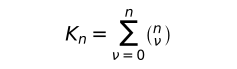\  posibilidades.

Pueden darse todas las combinaciones de los estados de las cosas, los otros no se dan.

**[4.28](https://www.wittgensteinproject.org/w/index.php/Logisch-philosophische_Abhandlung#4.28)** A estas combinaciones corresponden igualmente muchas posibilidades de verdad ‒ y falsedad ‒ de *n* proposiciones elementales.

**[4.3](https://www.wittgensteinproject.org/w/index.php/Logisch-philosophische_Abhandlung#4.3)** Las posibilidades de verdad de las proposiciones elementales significan las posibilidades del darse y no darse de los estados de las cosas.

**[4.31](https://www.wittgensteinproject.org/w/index.php/Logisch-philosophische_Abhandlung#4.31)** Las posibilidades de verdad podemos representarlas mediante esquemas del siguiente tipo («V» significa «verdadero», «F», «falso». Las series de «V» y «F» bajo las series de proposiciones elementales significan en simbolismo fácil de entender sus posibilidades de verdad).

|p |q |r |
|---|---|---|
|V|V|V |
|F|V|V |
|V|F|V |
|V|V|F |
|F|F|V |
|F|V|F |
|V|F|F |
|F|F|F |

|p |q |
|---|---|
|V|V |
|F|V |
|V|F |
|F|F |

|p |
|---|
|V |
|F |

**[4.4](https://www.wittgensteinproject.org/w/index.php/Logisch-philosophische_Abhandlung#4.4)** La proposición es el término de la concordancia y no concordancia con las posibilidades de verdad de las proposiciones elementales.

**[4.41](https://www.wittgensteinproject.org/w/index.php/Logisch-philosophische_Abhandlung#4.41)** Las posibilidades de verdad de las proposiciones elementales son las condiciones de posibilidad y falsedad de las proposiciones.

**[4.411](https://www.wittgensteinproject.org/w/index.php/Logisch-philosophische_Abhandlung#4.411)** Es probable desde el comienzo que la introducción de proposiciones elementales sea fundamental para el entendimiento de todos los otros tipos de proposiciones. En efecto, el entendimiento de las proposiciones generales depende *sensiblemente* del de las proposiciones elementales.

**[4.42](https://www.wittgensteinproject.org/w/index.php/Logisch-philosophische_Abhandlung#4.42)** Respecto a la concordancia y no concordancia de una proposición con las posibilidades de verdad de *n* proposiciones elementales hay 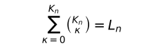\  posibilidades.

**[4.43](https://www.wittgensteinproject.org/w/index.php/Logisch-philosophische_Abhandlung#4.43)** La concordancia con las posibilidades de verdad podemos expresarlas, en tanto que les adjudicamos en el esquema algo así como la distinción «V» (verdadero).

La falta de esta distinción significa la no concordancia.

**[4.431](https://www.wittgensteinproject.org/w/index.php/Logisch-philosophische_Abhandlung#4.431)** El término de la concordancia y no concordancia con las posibilidades de verdad de las proposiciones elementales expresa las condiciones de verdad de la proposición.

La proposición es el término de sus condiciones de posibilidad. (Por eso Frege la ha anticipado correctamente como explicación de los signos de su escritura conceptual. Solo la explicación del concepto de verdad de Frege es falso: si fueran «lo verdadero» y «lo falso» objetos reales y los argumentos en \~*p* etc., entonces la determinación del sentido de «\~*p*» según Frege no sería de ninguna manera determinada).

**[4.44](https://www.wittgensteinproject.org/w/index.php/Logisch-philosophische_Abhandlung#4.44)** El signo, el cual surge mediante la adjudicación de aquellas distinciones «V» y las posibilidades de verdad, es un signo proposicional.

**[4.441](https://www.wittgensteinproject.org/w/index.php/Logisch-philosophische_Abhandlung#4.441)** Está claro que al complejo de signos «F» y «V» no corresponde ningún objeto (o complejo de objetos); mucho menos [signos tales] como las rayas horizontales y verticales o los paréntesis. No hay «objetos lógicos».

[Lo] análogo es válido, obviamente, para todos los signos que expresan como los esquemas de «F» y «V».

**[4.442](https://www.wittgensteinproject.org/w/index.php/Logisch-philosophische_Abhandlung#4.442)** Es, por ejemplo,

«

|p |q | |
|---|---|---|
|V|V |V |
|F|V |V |
|V|F | |
|F|F |V |

»

un signo proposicional.

La «raya de juicio» de Frege «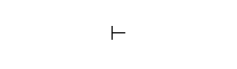\ » carece por completo lógicamente de sentido, solo muestra en Frege (y Russell) que estos autores tienen las proposiciones así señaladas por verdaderas. «\ » pertenece, por lo tanto, tan poco al armazón proposicional como, por así decirlo, el número de la proposición. Es imposible que una proposición pueda decir de sí misma que es verdadera).

Si está establecido de una vez por todas el orden de las posibilidades de verdad en el esquema mediante una regla de combinación, entonces la última columna es por sí misma ya un término de las condiciones de verdad. Si escribimos esta columna en una fila, entonces el signo proposicional se vuelve:

«(VV‒V)(*p*, *q*)» o, más claramente, «(VVFV)(*p*, *q*)».

\(El número de posiciones en el paréntesis de la izquierda está determinado por el número de miembros en el de la derecha).

**[4.45](https://www.wittgensteinproject.org/w/index.php/Logisch-philosophische_Abhandlung#4.45)** Para *n* proposiciones elementales hay *L~n~* posibles grupos de condiciones de verdad.

Los grupos de condiciones de verdad, los cuales pertenecen a las posibilidades de verdad de un número de proposiciones elementales, se pueden ordenar en una serie.

**[4.46](https://www.wittgensteinproject.org/w/index.php/Logisch-philosophische_Abhandlung#4.46)** Entre los posibles grupos de condiciones de verdad hay dos casos extremos.

En uno de los casos, la proposición es verdadera para todas las posibilidades de verdad de las proposiciones elementales. Decimos [que] las posibilidades de verdad son *tautológicas*.

En el segundo caso, la proposición es falsa para todas las posibilidades de verdad: las condiciones de verdad son *contradictorias*.

En el primer caso llamamos a la proposición una tautología, en el segundo caso, una contradicción.

**[4.461](https://www.wittgensteinproject.org/w/index.php/Logisch-philosophische_Abhandlung#4.461)** La proposición muestra lo que dice, la tautología y la contradicción, [muestran] que no dicen nada.

La tautología no tiene condiciones de verdad, pues ella es incondicionalmente verdadera; y la contradicción no es verdadera bajo ninguna condición.

Tautología y contradicción son carentes de sentido [*sinnlos*].

\(Como el punto del que dos flechas salen en direcciones opuestas).

\(Yo no sé, por ejemplo, nada sobre el tiempo [entiéndase, el climático], cuando sé que llueve o no llueve).

**[4.4611](https://www.wittgensteinproject.org/w/index.php/Logisch-philosophische_Abhandlung#4.4611)** Sin embargo, tautología y contradicción no son absurdas; pertenecen al simbolismo y, ciertamente, igual que el «0» al simbolismo de la aritmética.

**[4.462](https://www.wittgensteinproject.org/w/index.php/Logisch-philosophische_Abhandlung#4.462)** Tautología y contradicción no son imágenes de la realidad. No representan ninguna situación posible. Pues aquella permite *cualquier* situación posible; esta, *ninguna*.

En la tautología se superan las condiciones de la concordancia con el mundo ‒ la relación representativa ‒ mutuamente, de tal manera que ella no esté en ninguna relación representativa para la realidad.

**[4.463](https://www.wittgensteinproject.org/w/index.php/Logisch-philosophische_Abhandlung#4.463)** Las condiciones de verdad determinan el espacio de juego que es dejado a los hechos mediante la proposición.

\(La proposición, la imagen, el modelo, son, en el sentido negativo, como un cuerpo sólido que limita la libertad de movimiento de los otros; en el sentido positivo, como el espacio limitado por la sustancia sólida, en el que un cuerpo tiene lugar).

La tautología deja todo el espacio lógico ‒ ilimitado ‒ a la realidad; la contradicción rellena todo el espacio lógico y no deja a la realidad ningún punto. Ninguno de los dos puede, por lo tanto, determinar la realidad de ninguna manera.

**[4.464](https://www.wittgensteinproject.org/w/index.php/Logisch-philosophische_Abhandlung#4.464)** La verdad de la tautología es cierta; de la proposición, posible; de la contradicción, imposible.

\(Cierta, posible, imposible: aquí tenemos la marca de aquella gradación que necesitamos en la doctrina de la probabilidad).

**[4.465](https://www.wittgensteinproject.org/w/index.php/Logisch-philosophische_Abhandlung#4.465)** El producto lógico de una tautología y de una proposición dice lo mismo que la proposición. Así es aquel producto idéntico con la proposición. Pues no se puede cambiar lo esencial del símbolo sin cambiar su sentido.

**[4.466](https://www.wittgensteinproject.org/w/index.php/Logisch-philosophische_Abhandlung#4.466)** A una conexión lógica determinada de signos le corresponde una conexión lógica determinada de sus significados; *cada* conexión *arbitraria* corresponde únicamente a los signos no conectados.

Es decir, proposiciones que son verdaderas para cada situación no pueden en ningún caso ser conexiones de signos, pues en otro caso solo ciertas conexiones de objetos podrían corresponderles.

\(Y a ninguna conexión lógica le corresponde *ninguna* conexión de objetos).

Tautología y contradicción son los casos límite de las conexiones de signos, es decir, su disolución.

**[4.4661](https://www.wittgensteinproject.org/w/index.php/Logisch-philosophische_Abhandlung#4.4661)** Obviamente, también en la tautología y contradicción están los signos todavía unidos entre sí, es decir, están en relaciones recíprocas, pero estas relaciones son insignificantes, inesenciales para el *símbolo*.

**[4.5](https://www.wittgensteinproject.org/w/index.php/Logisch-philosophische_Abhandlung#4.5)** Ahora parece ser posible indicar la forma más general de la proposición [*allgemeinste Satzform*]: es decir, dar una descripción de las proposiciones *de cualquier tipo* de lenguaje de signos, de tal manera que cada posible sentido pueda ser expresado mediante un símbolo al cual le encaje la descripción, y que cada símbolo, sobre el que cabe la descripción, pueda expresar un sentido cuando los significados del nombre sean escogidos respectivamente.

Está claro que, en la descripción de la forma más general de la proposición, *solo* lo esencial a ella debe ser descrito, en otro caso no sería, ciertamente, la más general.

Que hay una forma general de la proposición, es demostrado por [el hecho de] que no puede haber ninguna proposición cuya forma no se pueda haber previsto (es decir, construido). La forma general de la proposición es: se comporta así y así.

**[4.51](https://www.wittgensteinproject.org/w/index.php/Logisch-philosophische_Abhandlung#4.51)** Supuesto que se me han dado *todas* las proposiciones elementales, entonces se puede preguntar fácilmente: qué proposiciones puedo componer a partir de ellas. Y esto son *todas* las proposiciones y *así* son delimitadas.

**[4.52](https://www.wittgensteinproject.org/w/index.php/Logisch-philosophische_Abhandlung#4.52)** Las proposiciones son Todo [*Alles*] lo que se sigue de la totalidad de todas[^20] las proposiciones elementales (obviamente también de ellos [se sigue] que esto es la *totalidad de todas*). (Así se podría decir en cierto sentido, que *todas* las proposiciones son generalizaciones de las proposiciones elementales).

**[4.53](https://www.wittgensteinproject.org/w/index.php/Logisch-philosophische_Abhandlung#4.53)** La forma proposicional general es una variable.

**[5](https://www.wittgensteinproject.org/w/index.php/Logisch-philosophische_Abhandlung#5)** La proposición es una función de verdad de las proposiciones elementales.

\(La proposición elemental es una función de verdad de sí misma).

**[5.01](https://www.wittgensteinproject.org/w/index.php/Logisch-philosophische_Abhandlung#5.01)** Las proposiciones elementales son los argumentos de verdad de la proposición.

**[5.02](https://www.wittgensteinproject.org/w/index.php/Logisch-philosophische_Abhandlung#5.02)** Se tiende a confundir los argumentos de las funciones con los índices de [los] nombres. Reconozco ciertamente, tanto en el argumento como en el índice, el significado del signo que los contiene.

En el «+*~c~*» de Russel es, por ejemplo, «*c*» un índice que apunta a que el signo completo es el signo de adición para los números cardinales. Pero esta designación radica en [un] convenio arbitrario y uno podría escoger, en lugar de «+*~c~*», un signo sencillo; en «\~*p*», sin embargo, «*p*» no es ningún índice, sino un argumento: el sentido de «\~*p*» *no puede* ser entendido sin que haya sido entendido anteriormente el sentido de «*p*». (En el nombre de Julio Cesar, «Julio» es un índice. El índice es siempre una parte de una descripción del objeto, cuyo nombre le añadimos. Por ejemplo, *el* Cesar al género de los Julios).

La confusión entre argumento e índice subyace, si no me equivoco, en la teoría de Frege sobre el significado de las proposiciones y las funciones. Para Frege, las proposiciones de la lógica eran nombres y sus argumentos, los índices de estos nombres.

**[5.1](https://www.wittgensteinproject.org/w/index.php/Logisch-philosophische_Abhandlung#5.1)** Las funciones de verdad pueden ser ordenadas en series. Ese es el fundamento de la doctrina de la probabilidad.

**[5.101](https://www.wittgensteinproject.org/w/index.php/Logisch-philosophische_Abhandlung#5.101)** Las funciones de verdad de cada número de proposiciones elementales pueden ser escritas en un esquema del siguiente tipo:

|   |   |   |
|---|---|---|
|(VVVV)(*p*, *q*) |Tautología |(Si *p*, entonces *p*; y si *q*, entonces *q*). (*p* ⊃ *p* . *q* ⊃ *q*) |
|(FVVV)(*p*, *q*) |en palabras |No ambos *p* y *q* (\~(*p* . *q*)) |
|(VFVV)(*p*, *q*) |" " |Si *q*, entonces *p* (*q* ⊃ *p*) |
|(VVFV)(*p*, *q*) |" " |Si *p*, entonces *q* (*p* ⊃ *q*) |
|(VVVF)(*p*, *q*) |" " |*p* o *q* (*p* ∨ *q*) |
|(FFVV)(*p*, *q*) |" " |No *q*. \~*q* |
|(FVFV)(*p*, *q*) |" " |No *p*. \~*p* |
|(FVVF)(*p*, *q*) |" " |*p* o *q*, pero no ambos. (*p* . \~*q* : ∨ : *q* . \~*p*) |
|(VFFV)(*p*, *q*) |" " |Si *p*, entonces *q*; y si *q*, entonces *p* (*p* ≡ *q*) |
|(VFVF)(*p*, *q*) |" " |*p* |
|(VVFF)(*p*, *q*) |" " |*q* |
|(FFFV)(*p*, *q*) |" " |Ni *p* ni *q* (\~*p* . \~*q*) o (*p* \| *q*) |
|(FFVF)(*p*, *q*) |" " |*p* y no *q* (*p* . \~*q*) |
|(FVFF)(*p*, *q*) |" " |*q* y no *p* (*q* . \~*p*) |
|(VFFF)(*p*, *q*) |" " |*q* y *p* (*q* . *p*) |
|(FFFF)(*p*, *q*) |Contradicción |(*p* y no *p*; y *q* y no *q*) (*p* . \~*p* . *q* . \~*q*) |

A aquellas posibilidades de verdad de sus argumentos de verdad, las cuales confirman la proposición, quiero llamarlas sus *razones de verdad* [*Wahrheitsgründe*].

**[5.11](https://www.wittgensteinproject.org/w/index.php/Logisch-philosophische_Abhandlung#5.11)** Si las razones de verdad, que un número de proposiciones tienen en común, son todas además las razones de verdad de una proposición determinada, entonces decimos, la verdad de esta proposición se sigue de la verdad de aquellas proposiciones.

**[5.12](https://www.wittgensteinproject.org/w/index.php/Logisch-philosophische_Abhandlung#5.12)** En concreto, la verdad de una proposición «*p*» se sigue de la verdad de una otra «*q*», cuando todas las razones de verdad de la segunda son razones de verdad de la primera.

**[5.121](https://www.wittgensteinproject.org/w/index.php/Logisch-philosophische_Abhandlung#5.121)** Las razones de verdad de una están contenidas en aquellas [razones de verdad] de la otra; *p* se sigue de *q*.

**[5.122](https://www.wittgensteinproject.org/w/index.php/Logisch-philosophische_Abhandlung#5.122)** Si se sigue *p* de *q*, entonces el sentido de «*p*» está contenido en el sentido de «*q*».

**[5.123](https://www.wittgensteinproject.org/w/index.php/Logisch-philosophische_Abhandlung#5.123)** Si un dios crea un mundo en el que ciertas proposiciones son verdaderas, entonces crea también de esta manera un mundo en el que son ciertas todas sus proposiciones derivadas [*Folgesätze*]. E igualmente no podría crear un mundo donde la proposición «*p*» sea verdadera, sin crear todos sus objetos.

**[5.124](https://www.wittgensteinproject.org/w/index.php/Logisch-philosophische_Abhandlung#5.124)** La proposición afirma cada proposición que se sigue de ella.

**[5.1241](https://www.wittgensteinproject.org/w/index.php/Logisch-philosophische_Abhandlung#5.1241)** «*p* . *q*» es una de las proposiciones, las cuales afirman «*p*» y a la vez una de las proposiciones, las cuales afirman «*q*».

Dos proposiciones son opuestas entre sí, cuando no hay ninguna proposición significativa que las afirme a ambas.

Cada proposición que contradice a otra, la niega.

**[5.13](https://www.wittgensteinproject.org/w/index.php/Logisch-philosophische_Abhandlung#5.13)** Que la verdad de una proposición se siga de la verdad de otras proposiciones, se desprende de la estructura de las proposiciones.

**[5.131](https://www.wittgensteinproject.org/w/index.php/Logisch-philosophische_Abhandlung#5.131)** Si se sigue la verdad de una proposición de la verdad de otra, entonces esto se expresa mediante relaciones en las que las formas de aquellas proposiciones están [colocadas] recíprocamente, y ciertamente no necesitamos establecerlas primeramente en aquellas relaciones en las que las conectamos entre sí en una proposición, sino que estas relaciones son internas y se dan en cuanto y por el hecho de que aquellas proposiciones se dan.

**[5.1311](https://www.wittgensteinproject.org/w/index.php/Logisch-philosophische_Abhandlung#5.1311)** Si de *p* ∨ *q* y \~*p* deducimos *q*, entonces está aquí oculta mediante la forma de designación la relación de las formas proposicionales de «*p* ∨ *q*» y «\~*p*». Sin embargo, si, por ejemplo, en lugar de «*p* ∨ *q*» escribimos «*p* \| *q* . \| . *p* \| *q*», y en lugar de «\~*p*» [escribimos] «*p* \| *p*» (*p* \| *p* = ni *p* ni *q*), entonces se vuelve clara la relación interna.

\(Que de (*x*) . *fx* se pueda deducir *fa*, eso muestra que la generalidad está contenida también en el símbolo «(*x*) . *fx*»).

**[5.132](https://www.wittgensteinproject.org/w/index.php/Logisch-philosophische_Abhandlung#5.132)** Si se sigue *p* de *q*, entonces puedo derivar *p* de *q*; inferir *p* de *q*.

Este tipo de conclusión solo se desprende de ambas proposiciones.

Solo ellas mismas pueden justificar la conclusión.

«Leyes de derivación», las cuales ‒ como según Frege y Russell ‒ deban justificar las conclusiones, son carentes de sentido y serían redundantes.

**[5.133](https://www.wittgensteinproject.org/w/index.php/Logisch-philosophische_Abhandlung#5.133)** Todo inferir ocurre *a priori*.

**[5.134](https://www.wittgensteinproject.org/w/index.php/Logisch-philosophische_Abhandlung#5.134)** De una proposición elemental no se puede inferir ninguna otra.

**[5.135](https://www.wittgensteinproject.org/w/index.php/Logisch-philosophische_Abhandlung#5.135)** De ninguna manera puede ser deducida, del darse de una situación cualquiera, el darse de una situación completamente distinta a esta.

**[5.136](https://www.wittgensteinproject.org/w/index.php/Logisch-philosophische_Abhandlung#5.136)** No hay un nexo causal que justifique tal conclusión.

**[5.1361](https://www.wittgensteinproject.org/w/index.php/Logisch-philosophische_Abhandlung#5.1361)** Los eventos del futuro no los *podemos* descubrir desde los del presente.

La creencia en el nexo causal es la *superstición*.

**[5.1362](https://www.wittgensteinproject.org/w/index.php/Logisch-philosophische_Abhandlung#5.1362)** El libre albedrío consiste en que las acciones futuras no pueden ser conocidas ahora. Solo entonces podríamos conocerlas, cuando la casualidad fuera una necesidad *interna*, como la de la conclusión lógica. La relación entre el conocimiento y lo conocido es la de la necesidad lógica.

\(«A sabe que *p* es el caso» es carente de sentido cuando *p* es una tautología).

**[5.1363](https://www.wittgensteinproject.org/w/index.php/Logisch-philosophische_Abhandlung#5.1363)** Si de que una proposición nos convenza no *se sigue* que sea verdadera, entonces tampoco es el convencimiento ninguna justificación para nuestra creencia en su verdad.

**[5.14](https://www.wittgensteinproject.org/w/index.php/Logisch-philosophische_Abhandlung#5.14)** Si se sigue una proposición de otra, entonces dice esta más que aquella, aquella menos que esta.

**[5.141](https://www.wittgensteinproject.org/w/index.php/Logisch-philosophische_Abhandlung#5.141)** Si se sigue *p* de *q* y *q* de *p*, entonces son una y la misma proposición.

**[5.142](https://www.wittgensteinproject.org/w/index.php/Logisch-philosophische_Abhandlung#5.142)** La tautología se sigue de todas las proposiciones: no dice nada.

**[5.143](https://www.wittgensteinproject.org/w/index.php/Logisch-philosophische_Abhandlung#5.143)** La contradicción es lo común de las proposiciones, lo que *ninguna* proposición tiene en común con otra. La tautología es lo común de todas las proposiciones, las cuales no tienen nada en común entre ellas.

La contradicción desaparece, por así decirlo, externamente, la tautología internamente a todas las proposiciones.

La contradicción es el límite externo de las proposiciones, la tautología su punto medio insustancial.

**[5.15](https://www.wittgensteinproject.org/w/index.php/Logisch-philosophische_Abhandlung#5.15)** Si es *V*~r~ el número de las razones de verdad de la proposición «*r*»; *V*~rs~, el número de aquellas razones de verdad de la proposición «*s*» que a la vez son razones de verdad de «*r*», entonces nombramos el comportamiento: *V*~r~ : *V*~rs~ la masa de *probabilidad*, la cual la proposición «*r*» da a la proposición «*s*».

**[5.151](https://www.wittgensteinproject.org/w/index.php/Logisch-philosophische_Abhandlung#5.151)** Sea en un esquema como el de arriba en el número [5.101](#5.101) *V*~r~ el número de «*V*» en la proposición *r*; *V*~rs~, el número de aquellas «*V*» en la proposición *s* que están en la misma columna con «*V*» de la proposición *r*. La proposición *r* da, entonces, a la proposición *s* la probabilidad: *V*~rs~ : *V*~r~.

**[5.1511](https://www.wittgensteinproject.org/w/index.php/Logisch-philosophische_Abhandlung#5.1511)** No hay ningún objeto especial que sea propio de las proposiciones de probabilidad.

**[5.152](https://www.wittgensteinproject.org/w/index.php/Logisch-philosophische_Abhandlung#5.152)** Proposiciones, las cuales no tengan ningún argumento de verdad en común recíprocamente las llamamos recíprocamente independientes.

De proposiciones recíprocamente independientes (por ejemplo, dos proposiciones elementales cualesquiera) dan recíprocamente la probabilidad ½.

Si se sigue *p* de *q*, entonces la proposición «*q*» da a la proposición «*p*» la probabilidad 1. La certeza de la conclusión lógica es un caso límite de la probabilidad.

\(Aplicación a la tautología y contradicción).

**[5.153](https://www.wittgensteinproject.org/w/index.php/Logisch-philosophische_Abhandlung#5.153)** Una proposición no es en sí misma ni probable ni improbable. Un evento tiene lugar o no tiene lugar, no hay una cosa intermedia [*Mittelding*].

**[5.154](https://www.wittgensteinproject.org/w/index.php/Logisch-philosophische_Abhandlung#5.154)** Encuéntrense en una urna el mismo número de bolas blancas y negras (y ninguna otra). Cojo una bola tras otra y las dejo de nuevo en la urna. Entonces puedo establecer mediante el intento, que los números de bolas negras y blancas extraídas se acercan mutuamente con las sucesivas extracciones.

Ahora bien, *esto* no es ningún hecho [*Faktum*] matemático.

Si ahora digo: es tan probable que vaya a sacar una bola blanca como una negra, entonces eso significa: todas las circunstancias por mí conocidas (incluyendo las leyes de la naturaleza hipotéticamente aceptadas) no dan a la ocurrencia de un evento ninguna probabilidad *más* que a la ocurrencia del otro. Esto significa que dan ‒ como es fácilmente deducible de las explicaciones dadas más arriba ‒ a cada uno la probabilidad ½.

Lo que confirmo mediante el intento es que la ocurrencia de ambos eventos es independiente de las circunstancias que yo no conozco de cerca.

**[5.155](https://www.wittgensteinproject.org/w/index.php/Logisch-philosophische_Abhandlung#5.155)** La unidad de la proposición de probabilidad es: las circunstancias ‒ que por lo demás yo no conozco ‒ dan a la ocurrencia de un determinado evento tal y tal grado de probabilidad.

**[5.156](https://www.wittgensteinproject.org/w/index.php/Logisch-philosophische_Abhandlung#5.156)** Así la probabilidad es una generalización.

Ella involucra una descripción general de una forma proposicional. Solo en carencia de certeza necesitamos la probabilidad. Cuando ciertamente no conocemos un hecho a la perfección, pero sí sabemos *algo* sobre su forma.

\(Una proposición puede ciertamente ser una imagen imperfecta de cierta situación, pero es siempre *una* imagen perfecta).

La proposición de probabilidad es en cierto modo un extracto de otras proposiciones.

**[5.2](https://www.wittgensteinproject.org/w/index.php/Logisch-philosophische_Abhandlung#5.2)** Las estructuras de las proposiciones están en relaciones internas entre sí.

**[5.21](https://www.wittgensteinproject.org/w/index.php/Logisch-philosophische_Abhandlung#5.21)** Podemos destacar estas relaciones internas mediante nuestra forma de expresión, en tanto que representamos una proposición como resultado de una operación, que da lugar a ella a partir de otras proposiciones (las bases de la operación).

**[5.22](https://www.wittgensteinproject.org/w/index.php/Logisch-philosophische_Abhandlung#5.22)** La operación es el término de una relación entre las estructuras de su resultado y sus bases.

**[5.23](https://www.wittgensteinproject.org/w/index.php/Logisch-philosophische_Abhandlung#5.23)** La operación es lo que debe ocurrir con una proposición para hacer otra de ella.

**[5.231](https://www.wittgensteinproject.org/w/index.php/Logisch-philosophische_Abhandlung#5.231)** Y eso dependerá obviamente de sus cualidades formales, de la similitud interna de sus formas.

**[5.232](https://www.wittgensteinproject.org/w/index.php/Logisch-philosophische_Abhandlung#5.232)** La relación [*Relation*] interna que ordena una serie es equivalente con la operación mediante la cual surge un miembro de otro.

**[5.233](https://www.wittgensteinproject.org/w/index.php/Logisch-philosophische_Abhandlung#5.233)** La operación puede ocurrir por primera vez allí, donde una proposición surge de otra de una manera lógicamente significativa. Es decir, allí donde comienza la construcción lógica de la proposición.

**[5.234](https://www.wittgensteinproject.org/w/index.php/Logisch-philosophische_Abhandlung#5.234)** Las funciones de verdad de las proposiciones elementales son resultados de operaciones que tienen las proposiciones elementales como bases. (Llamo operaciones de verdad a estas operaciones).

**[5.2341](https://www.wittgensteinproject.org/w/index.php/Logisch-philosophische_Abhandlung#5.2341)** El sentido de una función de verdad de *p* es una función del sentido de *p*.

Negación, adición lógica, multiplicación lógica, etc., etc. son operaciones.

\(La negación invierte el sentido de la proposición).

**[5.24](https://www.wittgensteinproject.org/w/index.php/Logisch-philosophische_Abhandlung#5.24)** La operación se muestra en una variable; ella muestra cómo se puede llegar de una forma de proposiciones a otra.

Ella expresa la diferencia de las formas. (Y lo común entre las bases y el resultado de la operación son simplemente las bases).

**[5.241](https://www.wittgensteinproject.org/w/index.php/Logisch-philosophische_Abhandlung#5.241)** La operación no caracteriza ninguna forma, sino solo la diferencia de las formas.

**[5.242](https://www.wittgensteinproject.org/w/index.php/Logisch-philosophische_Abhandlung#5.242)** La misma operación que hace «*q*» de «*p*», hace de «*q*» «*r*», etcétera. Esto solo puede ser expresado si «*p*», «*q*», «*r*», etc. son variables, que expresan ciertas relaciones formales en general.

**[5.25](https://www.wittgensteinproject.org/w/index.php/Logisch-philosophische_Abhandlung#5.25)** La ocurrencia de la operación no caracteriza el sentido de la proposición.

La operación, pues, no manifiesta nada, solo su resultado, y este depende de las bases de la operación.

\(Operación y función no deben ser confundidas entre sí).

**[5.251](https://www.wittgensteinproject.org/w/index.php/Logisch-philosophische_Abhandlung#5.251)** Una función no puede ser su propio argumento, pero el resultado de una operación sí puede llegar a ser su propia base.

**[5.252](https://www.wittgensteinproject.org/w/index.php/Logisch-philosophische_Abhandlung#5.252)** Solo así es posible el avance de miembro a miembro en una serie de formas (de tipo [*Type*] a tipo en las jerarquías de Russel y Whitehead). (Russell y Whitehead no han reconocido la posibilidad de este avance, pero han hecho uso constante de él).

**[5.2521](https://www.wittgensteinproject.org/w/index.php/Logisch-philosophische_Abhandlung#5.2521)** La aplicación continua de una operación a su propio resultado la llamo su aplicación sucesiva [*successive Anwendung*] («O'O'O'*a*» es el resultado de la triple aplicación sucesiva de «O'*ξ*» a «*a*»).

En un sentido similar hablo de la aplicación sucesiva de *varias* operaciones a un número de proposiciones.

**[5.2522](https://www.wittgensteinproject.org/w/index.php/Logisch-philosophische_Abhandlung#5.2522)** El miembro general de una serie de formas *a*, O'*a*, O'O'*a*,… lo escribo, por lo tanto, así: «[*a*, *x*, O'*x*]». Esta expresión entre corchetes es una variable. El primer miembro del término entre corchetes es el comienzo de la serie de formas; el segundo, la forma de un miembro arbitrario *x* de la serie; y la tercera, la forma de aquel miembro de la serie que sigue inmediatamente a *x*.

**[5.2523](https://www.wittgensteinproject.org/w/index.php/Logisch-philosophische_Abhandlung#5.2523)** El concepto de la aplicación sucesiva de la operación es equivalente con el concepto «etcétera».

**[5.253](https://www.wittgensteinproject.org/w/index.php/Logisch-philosophische_Abhandlung#5.253)** Una operación puede revertir el efecto de otra. [Las] operaciones pueden superarse [*aufheben*] mutuamente.

**[5.254](https://www.wittgensteinproject.org/w/index.php/Logisch-philosophische_Abhandlung#5.254)** La operación puede desaparecer (por ejemplo, la negación en «\~\~*p*», \~\~*p* = *p*).

**[5.3](https://www.wittgensteinproject.org/w/index.php/Logisch-philosophische_Abhandlung#5.3)** Todas las proposiciones son resultados de operaciones de verdad con las proposiciones elementales.

La operación de verdad es la manera en la que surge la función de verdad a partir de las proposiciones elementales.

Según el ser de la operación de verdad llega a ser, de la misma manera que de las proposiciones elementales, su función de verdad; de las funciones de verdad [llega a ser] una nueva. Cada operación de verdad da lugar, a partir de funciones de verdad de proposiciones elementales, de nuevo a una función de verdad de proposiciones elementales, a una proposición. El resultado de cada operación de verdad con los resultados de operaciones de verdad con proposiciones elementales es de nuevo el resultado de *una* operación de verdad con proposiciones elementales.

Cada proposición es el resultado de operaciones de verdad con proposiciones elementales.

**[5.31](https://www.wittgensteinproject.org/w/index.php/Logisch-philosophische_Abhandlung#5.31)** Los esquemas [del punto] número [4.31](#4.31) tienen también un significado cuando «*p*», «*q*», «*r*», etc. no son proposiciones elementales.

Y es fácil ver que el signo proposicional en [el] número [4.442](#4.442), también cuando «*p*» y «*q*» son funciones de verdad de proposiciones elementales, expresa una función de verdad de proposiciones elementales.

**[5.32](https://www.wittgensteinproject.org/w/index.php/Logisch-philosophische_Abhandlung#5.32)** Todas las funciones de verdad son resultados de las aplicaciones sucesivas de un número infinito de operaciones de verdad a las proposiciones elementales.

**[5.4](https://www.wittgensteinproject.org/w/index.php/Logisch-philosophische_Abhandlung#5.4)** Aquí se muestra que no hay «objetos lógicos», «constantes lógicas» (en el sentido de Frege y Russell).

**[5.41](https://www.wittgensteinproject.org/w/index.php/Logisch-philosophische_Abhandlung#5.41)** Pues: todos los resultados de operaciones de verdad con funciones de verdad son idénticos, los cuales son una y la misma función de verdad de proposiciones elementales.

**[5.42](https://www.wittgensteinproject.org/w/index.php/Logisch-philosophische_Abhandlung#5.42)** Que ∨, ⊃, etc. no son relaciones en el sentido de derecha e izquierda, etc. es obvio.

La posibilidad de la definición cruzada de los «signos primitivos» de Frege y Russell ya muestra que estos no son signos primitivos y, desde luego, que no señalan ninguna relación.

Y es evidente que el «⊃», que definimos mediante «\~» y «∨», es idéntico con aquel mediante el cual definimos «∨» con «\~» y que este «∨» es idéntico con el primero. Etc.

**[5.43](https://www.wittgensteinproject.org/w/index.php/Logisch-philosophische_Abhandlung#5.43)** Que de un hecho *p* se debieran seguir una infinidad de *otros* [hechos], a saber, \~\~*p*, \~\~\~\~*p*, etc. es ciertamente difícil de creer desde el principio. Y no menos curioso es que un número infinito de proposiciones de la lógica (de las matemáticas) se sigan de una media docena de «leyes fundamentales».

Sin embargo, todas las proposiciones de la lógica dicen lo mismo. A saber, nada.

**[5.44](https://www.wittgensteinproject.org/w/index.php/Logisch-philosophische_Abhandlung#5.44)** Las funciones de verdad no son funciones materiales.

Cuando uno puede dar lugar a, por ejemplo, una afirmación mediante una doble negación, ¿está entonces la negación – en un cierto sentido – contenida en la afirmación? ¿Niega «\~\~*p*» a \~*p* o afirma *p*, o ambos?

La proposición «\~\~*p*» no trata de la negación como de un objeto; pero sí la posibilidad de la negación está prejuzgada ya en la afirmación.

Y si hubiera un objeto que se llamase «\~», entonces debería «\~\~*p*» decir algo distinto que «*p*». Pues una proposición trataría entonces simplemente de \~, la otra no.

**[5.441](https://www.wittgensteinproject.org/w/index.php/Logisch-philosophische_Abhandlung#5.441)** Esta desaparición de las constantes lógicas aparentes ocurre también cuando «\~(∃*x*) . \~*fx*» dice lo mismo que «(*x*) . *fx*» o «(∃*x*) . *fx* . *x* = *a*» lo mismo que «*fa*».

**[5.442](https://www.wittgensteinproject.org/w/index.php/Logisch-philosophische_Abhandlung#5.442)** Cuando una proposición nos es dada, entonces nos son dados también *con ella* los resultados de todas las operaciones de verdad que la tienen como base.

**[5.45](https://www.wittgensteinproject.org/w/index.php/Logisch-philosophische_Abhandlung#5.45)** Si hay signos primitivos lógicos, entonces una lógica correcta debe aclarar su posición respectiva y justificar su existencia [*Dasein*]. La construcción de la lógica *a partir de* sus signos primitivos debe volverse clara.

**[5.451](https://www.wittgensteinproject.org/w/index.php/Logisch-philosophische_Abhandlung#5.451)** Si la lógica tiene conceptos fundamentales, entonces deben ser independientes entre ellos. Si se introduce un concepto fundamental, entonces debe ser introducido en todas las conexiones en las que puede ocurrir en cualquier caso. No se puede, pues, introducirlo primero para *una* conexión, luego otra vez para alguna otra. Por ejemplo, si es introducida la negación, entonces debemos entenderla ahora en proposiciones de la forma «\~*p*» igual que en proposiciones como «\~(*p* ∨ *q*)», «(∃*x*) . \~*fx*», entre otras. No debemos introducirla primero para una clase de casos, entonces para la otra, pues entonces permanecería dudosa, si su significado en ambos casos fuera el mismo y no hubiera disponible ninguna razón para usar en ambos casos el mismo tipo de conexión de signos.

\(Brevemente, para la introducción de un signo primitivo vale, *mutatis mutandis*, lo mismo que Frege (*Los fundamentos de la aritmética*) ha dicho para la introducción de signos mediante definiciones).

**[5.452](https://www.wittgensteinproject.org/w/index.php/Logisch-philosophische_Abhandlung#5.452)** La introducción de un nuevo recurso en el simbolismo de la lógica debe siempre ser un evento de gran importancia. Ningún nuevo recurso debe ser introducido en la lógica – por así decirlo, con semblante completamente inocente – entre paréntesis o al pie de la línea.

\(Así ocurren, en los *Principia mathematica* de Russell y Whitehead, definiciones y leyes fundamentales en palabras. ¿Por qué aquí, de repente, palabras? Esto requeriría una justificación. Esta falta y debe faltar, dado que el procedimiento es, de hecho, ilícito.)

Sin embargo, si se ha demostrado necesaria la introducción de un nuevo recurso en una posición, entonces debe uno preguntarse inmediatamente: ¿Dónde debe ser este recurso aplicado *siempre*? Su posición en la lógica ahora debe ser explicada.

**[5.453](https://www.wittgensteinproject.org/w/index.php/Logisch-philosophische_Abhandlung#5.453)** Todos los números de la lógica deben poder ser justificados.

O, es más, se debe destacar que en la lógica no hay ningún número.

No hay números distinguidos.

**[5.454](https://www.wittgensteinproject.org/w/index.php/Logisch-philosophische_Abhandlung#5.454)** En la lógica no hay ninguna coexistencia, no puede haber ninguna clasificación.

En la lógica no puede haber general y especial.

**[5.4541](https://www.wittgensteinproject.org/w/index.php/Logisch-philosophische_Abhandlung#5.4541)** Las soluciones de los problemas lógicos deben ser sencillas, pues asientan el estándar de la sencillez.

Los seres humanos siempre han intuido que debería darse un ámbito de preguntas cuyas respuestas – *a priori* – [serían] simétricas y estuvieran unidas[^21] a una estructura cerrada y regular.

Un ámbito, en el que valiese la proposición: la sencillez es el signo de la verdad [*simplex sigillum veri*].

**[5.46](https://www.wittgensteinproject.org/w/index.php/Logisch-philosophische_Abhandlung#5.46)** Cuando se hubieran introducido correctamente los signos lógicos, entonces ya se habría introducido así también el sentido de todas sus combinaciones; así, no solo «*p* ∨ *q*», sino también «\~(*p* ∨ \~*q*)», etc. etc. Se habría también introducido ya con ello el efecto solo de todas las posibles combinaciones de paréntesis. Y así estaría claro que los signos primitivos generales propios no son los «*p* ∨ *q*», «(∃*x*) . *fx*», etc., sino la forma más general de sus combinaciones.

**[5.461](https://www.wittgensteinproject.org/w/index.php/Logisch-philosophische_Abhandlung#5.461)** Es significativo el hecho aparentemente insignificante de que las relaciones aparentes lógicas, como ∨ y ⊃, necesitan los paréntesis, al contrario que las relaciones reales.

La utilización de los paréntesis con aquellos signos primitivos aparentes denota ya además, que estos no son signos primitivos reales. Y nadie creerá ciertamente, que los paréntesis tienen un significado independiente.

**[5.4611](https://www.wittgensteinproject.org/w/index.php/Logisch-philosophische_Abhandlung#5.4611)** Los signos de operación lógicos son puntuaciones [*Interpunktionen*].

**[5.47](https://www.wittgensteinproject.org/w/index.php/Logisch-philosophische_Abhandlung#5.47)** Está claro que absolutamente todo lo que se puede decir sobre la forma de todas las proposiciones *desde el comienzo*, se debe poder decir *de una vez*.

Están ya, pues, todas las operaciones lógicas contenidas en la proposición elemental. Pues «*fa*» dice lo mismo que «(∃*x*) . *fx* . *x* = *a*».

Donde hay composicionalidad[^22], ahí hay argumento y función, y donde están estos, están ya todas las constantes lógicas.

Se podría decir: una constante lógica es aquella, que *todas* las proposiciones, acorde a su naturaleza, tienen mutuamente en común.

Esta es, sin embargo, la forma proposicional más general.

**[5.471](https://www.wittgensteinproject.org/w/index.php/Logisch-philosophische_Abhandlung#5.471)** La forma proposicional general es el ser de la proposición.

**[5.4711](https://www.wittgensteinproject.org/w/index.php/Logisch-philosophische_Abhandlung#5.4711)** Dar el ser de la proposición significa dar el ser de toda descripción, por lo tanto el ser del mundo.

**[5.472](https://www.wittgensteinproject.org/w/index.php/Logisch-philosophische_Abhandlung#5.472)** La descripción de la forma proposicional más general es la descripción del signo primitivo uno y único general de la lógica.

**[5.473](https://www.wittgensteinproject.org/w/index.php/Logisch-philosophische_Abhandlung#5.473)** La lógica debe preocuparse de sí misma.

Un signo *posible* debe también poder señalar. Todo lo que es posible en la lógica, también está permitido. («Sócrates es idéntico» no significa nada, porque no hay ninguna cualidad que signifique «idéntico». La proposición es absurda, porque no nos hemos encontrado una determinación arbitraria, pero no porque el símbolo fuera ilícito en y por sí.

No podemos, en cierto sentido, equivocarnos en la lógica.

**[5.4731](https://www.wittgensteinproject.org/w/index.php/Logisch-philosophische_Abhandlung#5.4731)** La convicción [*Einleuchten*], de la que Russell tanto habló, puede solo ser dispensable en la lógica, ya que el lenguaje en sí mismo impide cada error lógico. Que la lógica sea *a priori* consiste en que no *puede* ser pensada ilógicamente.

**[5.4732](https://www.wittgensteinproject.org/w/index.php/Logisch-philosophische_Abhandlung#5.4732)** No podemos darle a un signo el sentido incorrecto.

**[5.47321](https://www.wittgensteinproject.org/w/index.php/Logisch-philosophische_Abhandlung#5.47321)** La navaja de Occam no es, obviamente, ninguna regla arbitraria o justificada por su éxito práctico: ella dice que unidades de signos *innecesarias* no significan nada.

Signos que cumplen *una* finalidad, son lógicamente equivalentes; signos que *no* cumplen *ninguna* finalidad, lógicamente carentes de significado.

**[5.4733](https://www.wittgensteinproject.org/w/index.php/Logisch-philosophische_Abhandlung#5.4733)** Frege dice: cada proposición legítimamente construida debe tener un sentido; y yo digo: cada proposición posible está legítimamente construida, y cuando no tiene sentido, entonces esto solo puede residir en que no le hemos dado a algunas de sus partes constitutivas ningún *significado*.

\(También si creemos haberlo hecho).

Así, «Sócrates es idéntico» no dice nada, porque no le hemos dado *ningún* significado a la palabra «idéntico» como *adjetivo*. Pues, cuando aparece como signo de igualdad, entonces simboliza de otra manera completamente distinta – la relación señalada es otra – así es también el símbolo en ambos casos completamente distinto; ambos símbolos solo tienen en común el signo por casualidad.

**[5.474](https://www.wittgensteinproject.org/w/index.php/Logisch-philosophische_Abhandlung#5.474)** El número de operaciones fundamentales necesarias depende *solo* de nuestra notación.

**[5.475](https://www.wittgensteinproject.org/w/index.php/Logisch-philosophische_Abhandlung#5.475)** Se trata únicamente de construir un sistema de signos de un número determinado de dimensiones – de una cierta multiplicidad matemática.

**[5.476](https://www.wittgensteinproject.org/w/index.php/Logisch-philosophische_Abhandlung#5.476)** Está claro que se no se trata aquí de un *número de conceptos fundamentales* que deben ser señalados, sino de la expresión de una regla.

**[5.5](https://www.wittgensteinproject.org/w/index.php/Logisch-philosophische_Abhandlung#5.5)** Cada función de verdad es un resultado de la aplicación sucesiva de la operación (‒ ‒ ‒ ‒ ‒V)(*ξ*, . . . .) a las proposiciones elementales.

Esta operación niega todas las proposiciones entre los paréntesis de la derecha y yo la llamo la negación de estas proposiciones.

**[5.501](https://www.wittgensteinproject.org/w/index.php/Logisch-philosophische_Abhandlung#5.501)** Un término entre paréntesis cuyos miembros son proposiciones, lo denoto – cuando el orden de los miembros entre paréntesis es igualmente válido – mediante un signo de la forma «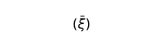\ ». «*ξ*» es una variable cuyos valores son los miembros del término entre paréntesis, y la barra sobre la variable indica que ella representa todos sus valores en los paréntesis.

\(Así, si tiene ξ, digamos, los tres valores P, Q, R, entonces es \  = (*P*, *Q*, *R*)).

Los valores de las variables son establecidos.

El establecimiento es la descripción de las proposiciones, las cuales la variable representa.

Cómo aparezca la descripción de los miembros del término entre paréntesis, es irrelevante.

*Podemos* diferenciar tres tipos de descripción: 1. La enumeración directa. En este caso podemos sencillamente poner, en lugar de las variables, sus valores constantes. 2. La indicación de una función *fx* cuyos valores son las proposiciones a describir para todos los valores de *x*. 3. La indicación de una ley formal según la cual aquellas proposiciones son construidas. En este caso, los miembros del término entre paréntesis son todos los miembros de una serie de formas.

**[5.502](https://www.wittgensteinproject.org/w/index.php/Logisch-philosophische_Abhandlung#5.502)** Así pues, escribo, en lugar de «(‒ ‒ ‒ ‒ ‒V)(*ξ*, . . . .)», «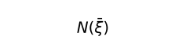\ ».

\  es la negación de todos los valores de la variable proposicional *ξ*.

**[5.503](https://www.wittgensteinproject.org/w/index.php/Logisch-philosophische_Abhandlung#5.503)** Dado que obviamente se puede expresar con facilidad, cómo con esta operación pueden ser construidas proposiciones y cómo no se [deben] construir proposiciones con ella, así esto debe también poder encontrar un término exacto.

**[5.51](https://www.wittgensteinproject.org/w/index.php/Logisch-philosophische_Abhandlung#5.51)** Si ξ tiene solo un valor, entonces es \  = \~*p* (no *p*), si tiene dos valores, entonces es \  = \~*p .* \~*q* (ni *p* ni *q*).

**[5.511](https://www.wittgensteinproject.org/w/index.php/Logisch-philosophische_Abhandlung#5.511)** ¿Cómo puede la lógica omnímoda, que refleja el mundo, utilizar anzuelos y manipulaciones tan especiales? Solo en tanto que todos estos se unen a una red infinitamente fina, al gran espejo.

**[5.512](https://www.wittgensteinproject.org/w/index.php/Logisch-philosophische_Abhandlung#5.512)** «\~*p*» es verdadero, si «*p*» es falso. Pues en la proposición verdadera «\~*p*» es «*p*» una proposición falsa. ¿Cómo puede la barra «\~» hacerlo concordar con la realidad?

Lo que niega en «\~*p*» no es, sin embargo, «\~», sino aquello que todos los signos de esta notación, las cuales niegan *p*, tienen en común.

Así, la regla general según la cual «\~*p*», «\~\~\~*p*», «\~*p* ∨ \~*p*», «\~*p* . \~*p*», etc. etc. (indefinidamente [*ad inf.*]) son construidas. Y esto común refleja la negación.

**[5.513](https://www.wittgensteinproject.org/w/index.php/Logisch-philosophische_Abhandlung#5.513)** Se podría decir: lo común de todos los símbolos que afirman tanto *p* como *q*, es la proposición «*p* . *q*». Lo común de todos los símbolos que afirman o bien *p* o bien *q*, es la proposición «*p* ∨ *q*».

Y así se puede decir: dos proposiciones son recíprocamente contrarias, cuando no tienen nada en común entre sí, y: cada proposición tiene solo un negativo, porque solo hay una proposición que reside completamente fuera de sí.

Se muestra también en la notación de Russell que «*q* : *p* ∨ \~*p*» dice lo mismo que «*q*»; que «*p* ∨ \~*p*» no dice nada.

**[5.514](https://www.wittgensteinproject.org/w/index.php/Logisch-philosophische_Abhandlung#5.514)** Si es establecida una notación, entonces hay en ella una regla según la cual todas las proposiciones negadoras de *p* son construidas, una regla según la cual todas las proposiciones afirmadoras de *p* son construidas, una regla, según la cual todas las proposiciones afirmadoras de *p* o *q* son construidas, etc. Estas reglas son equivalentes a los símbolos y en ellas se refleja su sentido.

**[5.515](https://www.wittgensteinproject.org/w/index.php/Logisch-philosophische_Abhandlung#5.515)** Se debe mostrar en nuestros símbolos, que lo que está conectado mutuamente mediante «∨», «.», etc. deben ser proposiciones.

Y este es también el caso, pues el símbolo «*p*» y «*q*» presuponen ya en sí mismos el «∨», «\~», etc. Cuando el signo «*p*» en «*p* ∨ *q*» no representa un signo complejo, entonces no puede tener sentido solo; pero entonces no podrían tampoco tener ningún sentido los signos «*p* ∨ *p*», «*p* . *p*», etc., con el mismo sentido que «*p*».

**[5.5151](https://www.wittgensteinproject.org/w/index.php/Logisch-philosophische_Abhandlung#5.5151)** ¿Debe el signo de una proposición negativa ser construido con el signo de la positiva? Por qué no se debería poder expresar la proposición negativa mediante un hecho negativo. (Algo así como: cuando «*a*» no está en una cierta relación a «*b*», podría eso expresar que *aRb* no es el caso».

Pero también aquí es ya la proposición negativa construida indirectamente mediante la positiva.

La *proposición* positiva debe presuponer la existencia de la *proposición* negativa, y viceversa.

**[5.52](https://www.wittgensteinproject.org/w/index.php/Logisch-philosophische_Abhandlung#5.52)** Si son todos valores de *ξ* todos los valores de una función *fx* para todos los valores de *x*, entonces será \  = \~(∃*x*) . *fx*.

**[5.521](https://www.wittgensteinproject.org/w/index.php/Logisch-philosophische_Abhandlung#5.521)** Separo el concepto *Todos* de la función de verdad.

Frege y Russell han introducido la generalidad en conexión con el producto lógico o la suma lógica. Así era difícil entender las proposiciones «(∃*x*) . *fx*» y «(*x*) . *fx*» en las cuales ambas ideas están incluidas.

**[5.522](https://www.wittgensteinproject.org/w/index.php/Logisch-philosophische_Abhandlung#5.522)** Lo característico de la designación de la generalidad es, en primer lugar, que apunta a un arquetipo lógico, y, en segundo lugar, que destaca la constante.

**[5.523](https://www.wittgensteinproject.org/w/index.php/Logisch-philosophische_Abhandlung#5.523)** La designación de la generalidad se da como argumento.

**[5.524](https://www.wittgensteinproject.org/w/index.php/Logisch-philosophische_Abhandlung#5.524)** Cuando son dados los objetos, entonces nos son ya dados así también *todos* los objetos.

Cuando son dadas las proposiciones elementales, entonces son con ello dadas también *todas* las proposiciones elementales.

**[5.525](https://www.wittgensteinproject.org/w/index.php/Logisch-philosophische_Abhandlung#5.525)** Es incorrecto reproducir la proposición «(∃*x*) . *fx*» ‒ como hace Russell ‒ en palabras mediante «*fx* es *imposible*».

Certeza, posibilidad o imposibilidad de una situación no es[^23] expresada mediante una proposición, sino en que un término es una tautología, una proposición significativa, o una contradicción.

Aquel caso precedente, al que siempre querría uno remitirse, debe encontrarse ya en el propio símbolo.

**[5.526](https://www.wittgensteinproject.org/w/index.php/Logisch-philosophische_Abhandlung#5.526)** Uno puede describir el mundo al completo mediante proposiciones generalizadas, esto significa, pues, sin relacionar desde el principio un nombre cualquiera con un objeto determinado.

Para llegar entonces a la manera de expresión habitual, se debe decir sencillamente según un término «hay una y solo una *x*, que . . . .»: y esta *x* es *a*.

**[5.5261](https://www.wittgensteinproject.org/w/index.php/Logisch-philosophische_Abhandlung#5.5261)** Una proposición completamente generalizada es compuesta como cualquier otra proposición. (Esto se muestra en que, en «(∃*x*, *ϕ*).*ϕx*», debemos nombrar por separado «*ϕ*» y «*x*». Ambas se mantienen independientes en relaciones señaladoras respecto al mundo, como en la proposición no generalizada).

Señal [*Kennzeichen*] del símbolo compuesto: tiene algo en común con *otros* símbolos.

**[5.5262](https://www.wittgensteinproject.org/w/index.php/Logisch-philosophische_Abhandlung#5.5262)** La verdad o falsedad *de cada* proposición cambia ciertamente algo en la construcción general del mundo. Y el espacio de juego [*Spielraum*], el cual le es dejado a su construcción mediante la generalidad de las proposiciones elementales es justamente aquel que limitan las proposiciones completamente generales.

\(Cuando una proposición elemental es verdadera, entonces es con ello en cada caso una proposición elemental *más* verdadera).

**[5.53](https://www.wittgensteinproject.org/w/index.php/Logisch-philosophische_Abhandlung#5.53)** [La] igualdad del objeto la expreso mediante la igualdad del signo, y no con ayuda de un signo de igualdad. [La] diferencia de los objetos, mediante diferencia de los signos.

**[5.5301](https://www.wittgensteinproject.org/w/index.php/Logisch-philosophische_Abhandlung#5.5301)** Que la identidad no es ninguna relación entre objetos, es convincente. Esto se vuelve muy claro cuando uno observa, por ejemplo, la proposición «(*x*) : *fx*. ⊃ .*x* = *a*». Lo que esta proposición dice es, sencillamente, que *solo* es suficiente *a* de la función *f*, y no que solo son suficiente tales cosas de la función *f*, las cuales tienen una cierta relación respecto a *a*.

Obviamente, se podría decir ahora que *solo* *a* tiene esta relación respecto a *a*, pero para expresar esto, necesitamos el propio signo de identidad.

**[5.5302](https://www.wittgensteinproject.org/w/index.php/Logisch-philosophische_Abhandlung#5.5302)** La definición de Russell de «=» no es suficiente, porque no se podría decir según ella que dos objetos tienen todas las cualidades en común. (Incluso cuando esta proposición no es nunca correcta, tiene, sin embargo, *sentido*).

**[5.5303](https://www.wittgensteinproject.org/w/index.php/Logisch-philosophische_Abhandlung#5.5303)** Dicho aproximadamente: decir de *dos* cosas, que son idénticas, es un sinsentido, y decir de *una*, que es idéntica consigo misma, no dice absolutamente nada.

**[5.531](https://www.wittgensteinproject.org/w/index.php/Logisch-philosophische_Abhandlung#5.531)** Así pues, no escribo «*f* (*a*, *b*) . *a* = *b*», sino «*f* (*a*, *a*)» (o «*f* (*b*, *b*)»). Y no «*f* (*a*, *b*) . \~*a* = *b*», sino «*f* (*a*, *b*)».

**[5.532](https://www.wittgensteinproject.org/w/index.php/Logisch-philosophische_Abhandlung#5.532)** Y análogamente: no «(∃*x*, *y*) . *f* (*x*, *y*) . *x* = *y*», sino «(∃*x*) . *f* (*x*, *x*)»; y no «(∃*x*, *y*) . *f* (*x*, *y*) . \~*x* = *y*», sino «(∃*x*, *y*) . *f* (*x*, *y*)».

\(Entonces, en lugar de la russelliana «(∃*x*, *y*) . *f* (*x*, *y*)»: «(∃*x*, *y*) . *f* (*x*, *y*) . ∨ . (∃*x*) . *f* (*x*, *x*)»).

**[5.5321](https://www.wittgensteinproject.org/w/index.php/Logisch-philosophische_Abhandlung#5.5321)** En lugar de «(*x*) : *fx* ⊃ *x* = *a*», escribimos entonces, por ejemplo, «(∃*x*) . *fx.* ⊃ *.fa* : \~(∃*x*, *y*) . *fx* . *fy*».

Y la proposición «*solo* un *x* satisface *f* ()» reza «(∃*x*) . *fx* : \~(∃*x*, *y*) . *fx* . *fy*».

**[5.533](https://www.wittgensteinproject.org/w/index.php/Logisch-philosophische_Abhandlung#5.533)** El signo de igualdad no es, por lo tanto, ninguna parte constitutiva esencial de la escritura conceptual.

**[5.534](https://www.wittgensteinproject.org/w/index.php/Logisch-philosophische_Abhandlung#5.534)** Y ahora vemos que proposiciones aparentes como «*a* = *a*», «*a* = *b* . *b* = *c*. ⊃ *a* = *c*», «(*x*) . *x* = *x*», «(∃*x*) . *x* = *a*», etc. no se pueden escribir de ninguna manera en una escritura conceptual correcta.

**[5.535](https://www.wittgensteinproject.org/w/index.php/Logisch-philosophische_Abhandlung#5.535)** Así se solucionan también todos los problemas que estaban vinculados a tales proposiciones aparentes.

Todos los problemas que el «Axioma del Infinito» de Russell trae consigo son aquí ya solucionables.

Que lo que el Axioma del infinito debe decir, se habría expresado en el lenguaje por [el hecho de que] habría una infinidad de nombres con distintos significados.

**[5.5351](https://www.wittgensteinproject.org/w/index.php/Logisch-philosophische_Abhandlung#5.5351)** Hay ciertos casos en los que uno cae en la tentación de usar términos de la forma «*a* = *a*» o «*p* ⊃ *p*» y similares. Y esto ocurre ciertamente, cuando uno quisiera hablar del arquetipo proposición, cosa, etc. Así ha reproducido Russell en los *Principios de las matemáticas* [*Principles of Mathematics*] el sinsentido «*p* es una proposición» en símbolos mediante «*p* ⊃ *p*» y [lo ha] puesto como hipótesis de ciertas proposiciones con lo cual sus posiciones argumentativas podrían ser ocupadas solo por proposiciones.

\(Es ya un sinsentido poner la hipótesis *p* ⊃ *p* ante una proposición para garantizarle argumentos de la forma correcta, porque la hipótesis para una no-proposición como argumento se vuelve no falsa, sino absurda, y porque la propia proposición se vuelve absurda por el género incorrecto de argumentos, por lo tanto, ella misma se conserva tan bien o tan mal frente a los argumentos incorrectos, como las hipótesis carentes de sentido de esta finalidad).

**[5.5352](https://www.wittgensteinproject.org/w/index.php/Logisch-philosophische_Abhandlung#5.5352)** Igualmente querría uno expresar «no hay ninguna *cosa*» mediante «\~(∃*x*) . *x* = *x*». Pero incluso cuando esta fuera una proposición, ¿no sería ella también cierta, cuando en verdad «hubiera cosas», pero estas no fueran idénticas consigo mismas?

**[5.54](https://www.wittgensteinproject.org/w/index.php/Logisch-philosophische_Abhandlung#5.54)** En la forma proposicional general ocurre la proposición en la proposición solo como base de las operaciones de verdad.

**[5.541](https://www.wittgensteinproject.org/w/index.php/Logisch-philosophische_Abhandlung#5.541)** A primera vista, parece que una proposición podría ocurrir en otra también de otra manera.

Especialmente en ciertas formas proposicionales de la psicología, como «A cree, que *p* es el caso» o «A piensa *p*», etc.

Aquí parece, ciertamente, superficial, como si la proposición *p* estuviera respecto a un objeto A en un tipo de relación.

\(Y en la teoría del conocimiento moderna (Russell, Moore, etc.), aquellas proposiciones han sido también interpretadas de esta forma.

**[5.542](https://www.wittgensteinproject.org/w/index.php/Logisch-philosophische_Abhandlung#5.542)** Sin embargo, está claro que «A cree que *p*», «A piensa *p*», «A dice *p*» son de la forma «“*p*” dice *p*»: y aquí no se trata de una asignación de un hecho y un objeto, sino de la asignación de hechos mediante la asignación de sus objetos.

**[5.5421](https://www.wittgensteinproject.org/w/index.php/Logisch-philosophische_Abhandlung#5.5421)** Esto también muestra que el alma – el sujeto, etc. – como es interpretada en la psicología superficial actual, es una no-cosa [*Unding*].

Un alma compuesta dejaría de ser, ciertamente, un alma.

**[5.5422](https://www.wittgensteinproject.org/w/index.php/Logisch-philosophische_Abhandlung#5.5422)** La explicación correcta de la forma de la proposición «A juzga *p*» debe mostrar que es imposible juzgar un sinsentido. (La teoría de Russell no satisface esta condición).

**[5.5423](https://www.wittgensteinproject.org/w/index.php/Logisch-philosophische_Abhandlung#5.5423)** Percibir un complejo significa percibir que sus partes constitutivas se comportan entre sí así y así.

Esto aclara también, que la figura

\

puede verse de dos formas como cubos; todos los fenómenos similares. Pues vemos realmente dos hechos distintos.

\(Yo veo primero las esquinas *a* y solo fugazmente *b*, entonces aparece *a* delante, y viceversa).

**[5.55](https://www.wittgensteinproject.org/w/index.php/Logisch-philosophische_Abhandlung#5.55)** Debemos responder ahora *a priori* la pregunta sobre todas las formas posibles de las proposiciones elementales.

La proposición elemental consiste en nombres. Sin embargo, dado que no podemos dar el número de los nombres de distinto significado, así tampoco podemos dar la composición de la proposición elemental.

**[5.551](https://www.wittgensteinproject.org/w/index.php/Logisch-philosophische_Abhandlung#5.551)** Nuestra proposición elemental es que cada pregunta que se puede decidir completamente mediante la lógica, se debe poder decidir sin más.

\(Y cuando llegamos a la posición de deber responder tal problema mediante la observación del mundo, entonces esto muestra que estamos en la pista fundamentalmente equivocada).

**[5.552](https://www.wittgensteinproject.org/w/index.php/Logisch-philosophische_Abhandlung#5.552)** La «experiencia» que necesitamos para el entendimiento de la lógica no es la de que algo se comporta así y así, sino, que algo *es*: pero esta no es, simplemente, ninguna experiencia.

La lógica es anterior a toda experiencia de que algo es *así*. Ella es anterior al cómo, no anterior al qué.

**[5.5521](https://www.wittgensteinproject.org/w/index.php/Logisch-philosophische_Abhandlung#5.5521)** Y cuando esto no fuera así, ¿cómo podríamos usar la lógica? Se podría decir: si hubiera una lógica, incluso cuando no hubiera un mundo, cómo podría entonces haber una lógica dado que hay un mundo.

**[5.553](https://www.wittgensteinproject.org/w/index.php/Logisch-philosophische_Abhandlung#5.553)** Russell decía, habría relaciones sencillas entre distintas cantidades de cosas (individuos [*Individuals*]). Pero, ¿entre qué cantidades? Y, ¿cómo se debería decidir eso? ¿Mediante la experiencia?

\(No hay un número distinguido).

**[5.554](https://www.wittgensteinproject.org/w/index.php/Logisch-philosophische_Abhandlung#5.554)** La indicación de cada forma especial sería completamente arbitraria.

**[5.5541](https://www.wittgensteinproject.org/w/index.php/Logisch-philosophische_Abhandlung#5.5541)** Debe poder darse *a priori*, si yo, por ejemplo, puedo llegar a la posición de deber señalar algo con el signo de una relación de 27 posiciones.

**[5.5542](https://www.wittgensteinproject.org/w/index.php/Logisch-philosophische_Abhandlung#5.5542)** Sin embargo, ¿debemos entonces si quiera preguntar algo así? ¿Podemos colocar una forma de signos y no saber si le pudiera corresponder algo?

¿Tiene un sentido la pregunta: qué debe *ser* para que algo pueda ser-el-caso?

**[5.555](https://www.wittgensteinproject.org/w/index.php/Logisch-philosophische_Abhandlung#5.555)** Está claro, tenemos un concepto de proposición elemental, al margen de su forma lógica particular.

Sin embargo, donde uno puede construir símbolos acorde a un sistema, allí es este sistema el importante lógicamente y no el símbolo individual.

Y cómo sería posible también que yo tuviera que lidiar con formas en la lógica que yo puedo inventar; sino yo tengo que lidiar con aquellas que me hicieran posible crearlas.

**[5.556](https://www.wittgensteinproject.org/w/index.php/Logisch-philosophische_Abhandlung#5.556)** No puede haber una jerarquía de las formas de las proposiciones elementales. Podemos prever, solo lo que podemos construir nosotros mismos.

**[5.5561](https://www.wittgensteinproject.org/w/index.php/Logisch-philosophische_Abhandlung#5.5561)** La realidad empírica está limitada por la totalidad de los objetos. El límite se muestra de nuevo en la totalidad de las proposiciones elementales.

Las jerarquías son y deben ser independientes de la realidad.

**[5.5562](https://www.wittgensteinproject.org/w/index.php/Logisch-philosophische_Abhandlung#5.5562)** Si sabemos por razones puramente lógicas que debe haber proposiciones elementales, entonces debe saberlo cada uno que entienda las proposiciones en su forma no analizada.

**[5.5563](https://www.wittgensteinproject.org/w/index.php/Logisch-philosophische_Abhandlung#5.5563)** Todas las proposiciones de nuestro lenguaje coloquial están de hecho, tal y como son, completamente ordenadas lógicamente. Aquello más sencillo que debemos dar aquí no es un símil de la verdad, sino la propia verdad al completo.

\(Nuestros problemas no son abstractos, sino quizás los más concretos que hay).

**[5.557](https://www.wittgensteinproject.org/w/index.php/Logisch-philosophische_Abhandlung#5.557)** La *aplicación* de la lógica decide sobre qué proposiciones elementales hay.

Lo que reside en la aplicación, la lógica no lo puede anticipar.

Eso está claro: la lógica no debe colisionar con su aplicación.

Pero la lógica debe tocarse con su aplicación.

Así, la lógica y su aplicación no deben solaparse mutuamente.

**[5.5571](https://www.wittgensteinproject.org/w/index.php/Logisch-philosophische_Abhandlung#5.5571)** Si no puedo dar las proposiciones elementales *a priori*, entonces debe dar lugar a un sinsentido manifiesto el querer darlas.

**[5.6](https://www.wittgensteinproject.org/w/index.php/Logisch-philosophische_Abhandlung#5.6)** *Los límites de mi lenguaje* significan los límites de mi mundo.

**[5.61](https://www.wittgensteinproject.org/w/index.php/Logisch-philosophische_Abhandlung#5.61)** La lógica impregna el mundo; los límites del mundo son también sus límites.

No podemos decir, por lo tanto, en la lógica: en el mundo hay esto y esto, aquello no.

Eso presupondría aparentemente que excluimos ciertas posibilidades y esto no puede ser el caso, dado que si no la lógica debería [extenderse] sobre los límites del mundo; es decir, cuando ella pudiera observar estos límites también desde el otro lado.

Lo que no podemos pensar, no lo podemos pensar; tampoco podemos *decir* lo que no podemos pensar.

**[5.62](https://www.wittgensteinproject.org/w/index.php/Logisch-philosophische_Abhandlung#5.62)** Esta observación da la clave para la decisión de la pregunta de hasta qué punto el solipsismo es una verdad.

Es decir, lo que el solipsismo *quiere decir* es totalmente correcto, solo que no se puede *decir*, sino que se muestra.

Que el mundo es *mi* mundo se muestra en que los límites *del* lenguaje (del lenguaje que solo yo entiendo) significan los límites *de mi* mundo.

**[5.621](https://www.wittgensteinproject.org/w/index.php/Logisch-philosophische_Abhandlung#5.621)** El mundo y la vida son uno.

**[5.63](https://www.wittgensteinproject.org/w/index.php/Logisch-philosophische_Abhandlung#5.63)** Yo soy mi mundo. (El microcosmos).

**[5.631](https://www.wittgensteinproject.org/w/index.php/Logisch-philosophische_Abhandlung#5.631)** El sujeto pensante, representante, no hay [tal cosa].

Si escribiera un libro [titulado] El mundo como lo encontré, entonces ello consistiría también en informar sobre mi cuerpo y en decir qué miembros están sujetos a mi voluntad y cuáles no, etc. es decir, este es un método de aislar al sujeto o, más bien, de mostrar que en un sentido importante no hay ningún sujeto: es decir, *no* podría tratarse solo de él en este libro.

**[5.632](https://www.wittgensteinproject.org/w/index.php/Logisch-philosophische_Abhandlung#5.632)** El sujeto no pertenece al mundo sino que es un límite del mundo.

**[5.633](https://www.wittgensteinproject.org/w/index.php/Logisch-philosophische_Abhandlung#5.633)** ¿Dónde en el mundo hay un sujeto metafísico que se note?

Tú dices, esto se comporta aquí totalmente igual como con [el] ojo y [el] campo visual. Pero tú *no* ves el ojo en verdad.

Y no se puede concluir nada *en el campo visual* que sea visto por un ojo.

**[5.6331](https://www.wittgensteinproject.org/w/index.php/Logisch-philosophische_Abhandlung#5.6331)** Es decir, el campo visual no tiene, por así decirlo, tal forma:

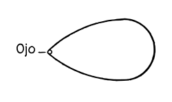\

**[5.634](https://www.wittgensteinproject.org/w/index.php/Logisch-philosophische_Abhandlung#5.634)** Eso está relacionado con que tampoco ninguna parte de nuestra experiencia es *a priori*.

Todo lo que vemos podría ser también distinto.

Todo lo que podemos describir, en todo caso, podría también ser distinto.

No hay ningún orden de las cosas *a priori*.

**[5.64](https://www.wittgensteinproject.org/w/index.php/Logisch-philosophische_Abhandlung#5.64)** Aquí se ve que el solipsismo llevado al extremo coincide con el realismo puro. El yo del solipsismo se reduce a un punto sin extensión[^24] y permanece la realidad con él coordinada.

**[5.641](https://www.wittgensteinproject.org/w/index.php/Logisch-philosophische_Abhandlung#5.641)** Por lo tanto, hay realmente un sentido en el cual en la filosofía puede hablarse del yo de manera no psicológica.

El yo entra en la filosofía en el momento en el que «el mundo es mi mundo».

El yo filosófico no es el ser humano, no el cuerpo humano o el alma humana de los que trata la psicología, sino el sujeto metafísico, el límite – no una parte del mundo.

**[6](https://www.wittgensteinproject.org/w/index.php/Logisch-philosophische_Abhandlung#6)** La forma general de la función de verdad es ![{ [ \bar{p}, \bar{\xi}, N (\bar{\xi}) ] }](images/336cae8a41089348ef601ba5dbe893d3758f7baa1841701bd587566e0f16d282.svg)\ .

Esta es la forma general de la proposición.

**[6.001](https://www.wittgensteinproject.org/w/index.php/Logisch-philosophische_Abhandlung#6.001)** Esto no dice nada más que cada proposición es un resultado de la aplicación sucesiva de la operación \  a las proposiciones elementales.

**[6.002](https://www.wittgensteinproject.org/w/index.php/Logisch-philosophische_Abhandlung#6.002)** Si es dada la forma general de cómo una proposición es construida, entonces es dada ya con ello también la forma general de cómo a partir de una proposición puede ser producida otra mediante una operación.

**[6.01](https://www.wittgensteinproject.org/w/index.php/Logisch-philosophische_Abhandlung#6.01)** La forma general de la operación 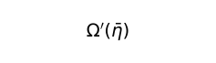\  es, por lo tanto: ![{ [\bar{\xi}, N(\bar{\xi})]' (\bar{\eta}) (= [ \bar{\eta}, \bar{\xi}, N (\bar{\xi}) ]) }](images/d1cf195aa1fb631bffe7b018f1114530b8c1bcc712299ba306fdef8ed6c55335.svg)\ .

Esta es la forma más general de la transición de una proposición a otra.

**[6.02](https://www.wittgensteinproject.org/w/index.php/Logisch-philosophische_Abhandlung#6.02)** Y así llegamos a los números: yo defino

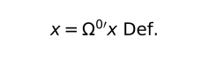\  y
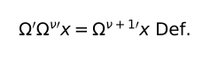\

Así, según estas reglas de signos escribimos la serie

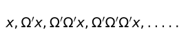\

así: 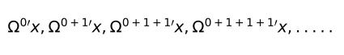\

Así escribo, en lugar de «![{ [ x, \xi, \Omega ' \xi ] }](images/356a71ba81334c39be3a91a1d42c9d51eb9ad1ea7b726f750fd3a307d7947385.svg)\ »:

«![{ [ \Omega^{0 \prime} x, \Omega^{ \nu \prime} x, \Omega^{ \nu + 1 \prime} x ] }](images/cbe2c1a200eb49c3a9b16c7105afbb9fbed122da767f2d37389ac28a9e93e102.svg)\ ».

Y defino:

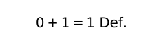\

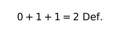\

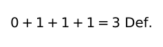\

\(etcétera).

**[6.021](https://www.wittgensteinproject.org/w/index.php/Logisch-philosophische_Abhandlung#6.021)** El número es el exponente de una operación.

**[6.022](https://www.wittgensteinproject.org/w/index.php/Logisch-philosophische_Abhandlung#6.022)** El concepto numérico [*Zahlbegriff*] no es otra cosa que lo común de todos los números, la forma general del número.

El concepto numérico es el número variable.

Y el concepto de igualdad numérica es la forma general de todas las igualdades numéricas especiales.

**[6.03](https://www.wittgensteinproject.org/w/index.php/Logisch-philosophische_Abhandlung#6.03)** La forma general del número total es: [0, ξ, ξ + 1].

**[6.031](https://www.wittgensteinproject.org/w/index.php/Logisch-philosophische_Abhandlung#6.031)** La teoría de las clases es, en las matemáticas, completamente superflua.

Esto está relacionado con que la generalidad, la cual necesitamos en las matemáticas, no es la *casual* [**zufällige**].

**[6.1](https://www.wittgensteinproject.org/w/index.php/Logisch-philosophische_Abhandlung#6.1)** Las proposiciones de la lógica son tautologías.

**[6.11](https://www.wittgensteinproject.org/w/index.php/Logisch-philosophische_Abhandlung#6.11)** Las proposiciones de la lógica, por lo tanto, no dicen Nada. (Ellas son las proposiciones analíticas).

**[6.111](https://www.wittgensteinproject.org/w/index.php/Logisch-philosophische_Abhandlung#6.111)** Teorías que dejan parecer sustancial una proposición de la lógica son siempre falsas. Se podría, por ejemplo, creer que las palabras «verdadero» y «falso» señalan dos cualidades entre otras cualidades, y entonces aparecería como un hecho curioso que cada proposición posea una de estas cualidades. Eso parece ahora ser no menos que evidente, como tampoco evidente sonaría, por así decirlo, la proposición «todas las rosas son o bien amarillas o bien rojas», también cuando esta fuera verdadera. Sí, aquella proposición recibe ahora completamente el carácter de una proposición de las ciencias de la naturaleza y esto es la marca segura de que fue captada falsamente.

**[6.112](https://www.wittgensteinproject.org/w/index.php/Logisch-philosophische_Abhandlung#6.112)** La explicación correcta de las proposiciones lógicas debe darles una posición única entre todas las proposiciones.

**[6.113](https://www.wittgensteinproject.org/w/index.php/Logisch-philosophische_Abhandlung#6.113)** Es la característica particular de las proposiciones lógicas, que se puede reconocer solo en el símbolo que son verdad, y este hecho encierra en sí la filosofía de la lógica al completo. Y así es también uno de los hechos más importantes que la verdad o falsedad de las proposiciones no lógicas *no* se pueda reconocer solo en la proposición.

**[6.12](https://www.wittgensteinproject.org/w/index.php/Logisch-philosophische_Abhandlung#6.12)** Que las proposiciones de la lógica son tautologías, eso *muestra* la cualidad formal – lógica – del lenguaje, del mundo.

Que sus partes constitutivas *así* enlazadas dan como resultado una tautología, eso caracteriza la lógica de sus partes constitutivas.

Para que proposiciones enlazadas de una manera determinada den como resultado una tautología, para ello deben tener determinadas cualidades de la estructura. Que ellas *así* unidas den lugar a una tautología muestra, por lo tanto, que ellas poseen estas cualidades de la estructura.

**[6.1201](https://www.wittgensteinproject.org/w/index.php/Logisch-philosophische_Abhandlung#6.1201)** Que, por ejemplo, las proposiciones «*p*» y «\~*p*» en la conexión «\~(*p*.\~*p*)» den como resultado una tautología muestra que se contradicen mutuamente. Que las proposiciones «*p* ⊃ *q*», «*p*» y «*q*» en la forma «(*p* ⊃ *q*).(*p*) : ⊃ : (*q*)» unidas entre sí den como resultado una tautología muestra que *q* se sigue de *p* y *p* ⊃ *q*. Que «(*x*) . *fx* : ⊃ : *fa*» sea una tautología, que *fa* se siga de (*x*) . *fx*. Etc. etc.

**[6.1202](https://www.wittgensteinproject.org/w/index.php/Logisch-philosophische_Abhandlung#6.1202)** Está claro que se podría utilizar para el mismo fin, en lugar de las tautologías, también las contradicciones.

**[6.1203](https://www.wittgensteinproject.org/w/index.php/Logisch-philosophische_Abhandlung#6.1203)** Para reconocer una tautología como tal, puede uno servirse del siguiente método demostrativo, en los casos en los cuales no ocurre ninguna designación de la generalidad en la tautología: escribo, en lugar de «*p*», «*q*», «*r*», etc. «V*p*F», «V*q*F», «V*r*F», etc. Las combinaciones de verdad las expreso mediante paréntesis, por ejemplo:

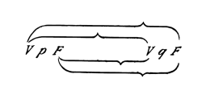\

y la asignación de la verdad o la falsedad de toda la proposición y de las combinaciones de verdad de los argumentos de verdad mediante barras de la siguiente manera:

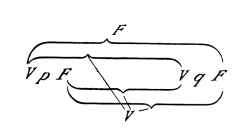\

Por lo tanto, este signo representaría, por ejemplo, la proposición *p* ⊃ *q*. Ahora quiero investigar, por ejemplo, la proposición \~(*p* . \~*p*) (ley de la contradicción), si es una tautología. La forma «\~*ξ*» es escrita en nuestra notación:

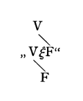\

la forma «*ξ* . *η*» así:

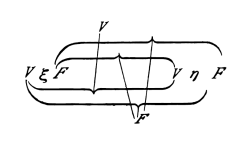\

Por lo tanto, la proposición \~(*p* . \~*q*) reza así:

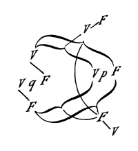\

Si colocamos aquí, en lugar de «*q*» «*p*», e investigamos la conexión de los V y F más externos con los más internos, entonces resulta que la verdad de la proposición al completo está relacionada con *todas* las combinaciones de su argumento; su falsedad, con ninguna de sus combinaciones de verdad.

**[6.121](https://www.wittgensteinproject.org/w/index.php/Logisch-philosophische_Abhandlung#6.121)** Las proposiciones de la lógica demuestran las cualidades lógicas de las proposiciones, en tanto que las conectan a proposiciones que no dicen nada [*nichtssagende*].

Este método se podría nombrar también un método nulo. En la proposición lógica son usadas proposiciones en equilibrio mutuo y el estado del equilibrio denota entonces cómo deben ser elaboradas lógicamente estas proposiciones.

**[6.122](https://www.wittgensteinproject.org/w/index.php/Logisch-philosophische_Abhandlung#6.122)** De ello resulta que podemos entendernos también sin las proposiciones lógicas, dado que podemos reconocer en una notación respectiva las cualidades formales de las proposiciones mediante la mera vista de estas proposiciones.

**[6.1221](https://www.wittgensteinproject.org/w/index.php/Logisch-philosophische_Abhandlung#6.1221)** Si dan como resultado, por ejemplo, dos proposiciones «*p*» y «*q*» en conexión «*p* ⊃ *q*» una tautología, entonces está claro que *q* se sigue de *p*.

Que, por ejemplo, «*q*» se sigue de «*p* ⊃ *q* . *p*», lo deducimos de ambas proposiciones propias, pero podemos también mostrar *así*, en tanto que las unimos en «*p* ⊃ *q* . *p* : ⊃ : *q*» y ahora mostramos que esto es una tautología.

**[6.1222](https://www.wittgensteinproject.org/w/index.php/Logisch-philosophische_Abhandlung#6.1222)** Esto arroja una luz sobre la pregunta de por qué las proposiciones lógicas no pueden ser confirmadas mediante la experiencia como tampoco pueden ser refutadas mediante la experiencia. No solo debe una proposición de la lógica no poder ser refutada mediante ninguna experiencia posible, sino que tampoco debe poder ser afirmada mediante tal.

**[6.1223](https://www.wittgensteinproject.org/w/index.php/Logisch-philosophische_Abhandlung#6.1223)** Ahora se vuelve claro porqué se sentía frecuentemente como si las «verdades lógicas» fueran a «*exigir*» de nosotros: es decir, podemos exigirlas en tanto que podemos exigir una notación suficiente.

**[6.1224](https://www.wittgensteinproject.org/w/index.php/Logisch-philosophische_Abhandlung#6.1224)** Se vuelve ahora también claro por qué la lógica fue llamada la disciplina de las formas y de las conclusiones.

**[6.123](https://www.wittgensteinproject.org/w/index.php/Logisch-philosophische_Abhandlung#6.123)** Está claro: las leyes lógicas no deben a su vez estar en sí mismas subordinadas a leyes lógicas.

\(No hay, como Russell quería decir, una ley de la contradicción propia para cada «tipo», sino que una es suficiente, en tanto que no sea aplicada a sí misma).

**[6.1231](https://www.wittgensteinproject.org/w/index.php/Logisch-philosophische_Abhandlung#6.1231)** La marca de la proposición lógica *no* es la validez general [*Allgemeingültigkeit*].

Ser general solo significa: ser válido casualmente para todas las cosas. Pues una proposición no generalizada puede ser tan tautológica como una generalizada.

**[6.1232](https://www.wittgensteinproject.org/w/index.php/Logisch-philosophische_Abhandlung#6.1232)** La validez general lógica se podría esencialmente llamar, al contrario de aquella casual, algo así como de la proposición «todos los seres humanos son mortales». Proposiciones, como el «axioma de reductibilidad» [*Axiom of reducibility*] de Russell no son proposiciones lógicas, y esto explica nuestro sentimiento: que ella, si verdadera, solo podría ser verdadera mediante una casualidad conveniente.

**[6.1233](https://www.wittgensteinproject.org/w/index.php/Logisch-philosophische_Abhandlung#6.1233)** Se puede pensar un mundo en el que el axioma de reductibilidad no tenga validez. Sin embargo, está claro que la lógica no tiene nada que ver con la pregunta de si nuestro mundo es realmente así o no.

**[6.124](https://www.wittgensteinproject.org/w/index.php/Logisch-philosophische_Abhandlung#6.124)** Las proposiciones lógicas describen el andamiaje del mundo o, es más, lo representan. Ellas no «tratan» de nada. Ellas presuponen que [los] nombres tienen significado y [las] proposiciones elementales, sentido: y esta es su conexión con el mundo. Está claro que deben indicar algo sobre el mundo, que ciertas conexiones de símbolos – que esencialmente tienen un carácter determinado – son tautologías. Aquí reside lo decisivo. Decíamos, algo en los símbolos que utilizamos sería arbitrario, algo no. En la lógica esto solo expresa: que, sin embargo, significa que en la lógica no expresamos *nosotros* con ayuda de signos lo que queremos, sino que en la lógica la naturaleza de los símbolos naturalmente necesarios se manifiesta a sí misma: cuando conocemos la sintaxis lógica de un lenguaje de signos cualquiera, entonces son ya dadas todas las proposiciones de la lógica.

**[6.125](https://www.wittgensteinproject.org/w/index.php/Logisch-philosophische_Abhandlung#6.125)** Es posible y ciertamente también según la concepción antigua de la lógica, dar desde el principio una descripción de todas las proposiciones lógicas «verdaderas».

**[6.1251](https://www.wittgensteinproject.org/w/index.php/Logisch-philosophische_Abhandlung#6.1251)** Por eso tampoco puede haber *nunca* sorpresas en la lógica.

**[6.126](https://www.wittgensteinproject.org/w/index.php/Logisch-philosophische_Abhandlung#6.126)** Si una proposición pertenece a la lógica se puede calcular en tanto que se calculen las cualidades lógicas del *símbolo*. Y esto hacemos cuando «demostramos» una proposición lógica. Pues, sin preocuparnos por un sentido y un significado, construimos la proposición lógica a partir de otra mediante meras *reglas de signos*.

La prueba de las proposiciones lógicas consiste en que las podemos hacer surgir a partir de otras proposiciones lógicas mediante aplicaciones sucesivas de ciertas operaciones, que a partir de la primera producen siempre tautologías. (Y, a decir verdad, a partir de una tautología solo *se siguen* tautologías).

Naturalmente es esta forma de mostrar que sus proposiciones son tautologías completamente insignificantes para la lógica. Precisamente porque las proposiciones de las cuales parte la prueba, deben mostrar incluso sin prueba, que son tautologías.

**[6.1261](https://www.wittgensteinproject.org/w/index.php/Logisch-philosophische_Abhandlung#6.1261)** En la lógica, proceso y resultado son equivalentes. (Por eso, ninguna sorpresa).

**[6.1262](https://www.wittgensteinproject.org/w/index.php/Logisch-philosophische_Abhandlung#6.1262)** La prueba en la lógica es solo un medio mecánico para el reconocimiento más sencillo de la tautología, donde ella es complicada.

**[6.1263](https://www.wittgensteinproject.org/w/index.php/Logisch-philosophische_Abhandlung#6.1263)** Pues también sería demasiado curioso si se pudiera probar una proposición significativa *lógicamente* a partir de otras, y *también* una proposición lógica. Está claro desde el principio, que la prueba lógica de una proposición significativa y la prueba *en* la lógica deben ser dos cosas completamente distintas.

**[6.1264](https://www.wittgensteinproject.org/w/index.php/Logisch-philosophische_Abhandlung#6.1264)** La proposición significativa expresa algo y su prueba muestra que eso es así; en la lógica, cada proposición es la forma de una prueba.

Cada proposición de la lógica es un *modus ponens* representativo en signos. (Y el *modus ponens* no se puede expresar mediante una proposición).

**[6.1265](https://www.wittgensteinproject.org/w/index.php/Logisch-philosophische_Abhandlung#6.1265)** Siempre se puede interpretar la lógica de tal manera, que cada proposición sea su propia prueba.

**[6.127](https://www.wittgensteinproject.org/w/index.php/Logisch-philosophische_Abhandlung#6.127)** Todas las proposiciones de la lógica tienen los mismos derechos, bajo ellas no hay leyes fundamentales esenciales y proposiciones derivadas.

Cada tautología muestra por sí misma que es una tautología.

**[6.1271](https://www.wittgensteinproject.org/w/index.php/Logisch-philosophische_Abhandlung#6.1271)** Está claro que el número de «leyes fundamentales lógicas» es arbitrario, pues se podría deducir la lógica a partir de Una ley fundamental, en tanto que se construya simplemente, por ejemplo, a partir de la ley fundamental de Frege, el producto lógico. (Frege diría quizás, que esta ley fundamental convence, aunque ya no inmediatamente. Pero es curioso que un pensador tan exacto como Frege se remita al grado de convencimiento como criterio de la proposición lógica).

**[6.13](https://www.wittgensteinproject.org/w/index.php/Logisch-philosophische_Abhandlung#6.13)** La lógica no es ninguna disciplina, sino una imagen reflejada del mundo. La lógica es trascendental.

**[6.2](https://www.wittgensteinproject.org/w/index.php/Logisch-philosophische_Abhandlung#6.2)** Las matemáticas son un método lógico.

Las proposiciones de las matemáticas son igualdades, por lo tanto, proposiciones aparentes.

**[6.21](https://www.wittgensteinproject.org/w/index.php/Logisch-philosophische_Abhandlung#6.21)** La proposición de las matemáticas no expresa ningún pensamiento.

**[6.211](https://www.wittgensteinproject.org/w/index.php/Logisch-philosophische_Abhandlung#6.211)** Pues, en la vida, nunca es la proposición matemática que usamos, sino que usamos la proposición matemática *solo* para concluir de proposiciones, las cuales no pertenecen a las matemáticas, otras, las cuales igualmente no pertenecen a las matemáticas.

\(En la filosofía, la pregunta «para qué usamos realmente aquella palabra, aquella proposición» guía siempre a reflexiones valiosas).

**[6.22](https://www.wittgensteinproject.org/w/index.php/Logisch-philosophische_Abhandlung#6.22)** La lógica del mundo, que muestra las proposiciones de la lógica en las tautologías, muestra las matemáticas en las igualdades.

**[6.23](https://www.wittgensteinproject.org/w/index.php/Logisch-philosophische_Abhandlung#6.23)** Cuando dos términos son unidos mediante el signo de igualdad, entonces eso significa que son sustituibles mutuamente. Sin embargo, que esto sea el caso debe mostrarse en los dos términos en sí mismos.

Caracteriza la forma lógica de dos términos, que sean sustituibles mutuamente.

**[6.231](https://www.wittgensteinproject.org/w/index.php/Logisch-philosophische_Abhandlung#6.231)** Es una cualidad de la afirmación, que se puede interpretar como negación doble.

Es una cualidad de «1 + 1 + 1 +1», que se puede interpretar como «(1 + 1) + (1 + 1)».

**[6.232](https://www.wittgensteinproject.org/w/index.php/Logisch-philosophische_Abhandlung#6.232)** Frege dice que ambos términos tienen el mismo significado, pero distinto sentido.

Sin embargo, lo esencial en la igualdad es que no es necesaria para mostrar que ambos términos que el signo de igualdad conecta tengan el mismo significado, dado que esto se puede desprender de ambos términos en sí mismos.

**[6.2321](https://www.wittgensteinproject.org/w/index.php/Logisch-philosophische_Abhandlung#6.2321)** Y, que las proposiciones de las matemáticas pueden ser demostradas, no significa otra cosa, que su corrección sea reconocida sin que lo que expresan deba ser comparado en sí mismo con los hechos por su corrección.

**[6.2322](https://www.wittgensteinproject.org/w/index.php/Logisch-philosophische_Abhandlung#6.2322)** La identidad del significado de dos términos no se puede *afirmar* [**behaupten**]. Pues para poder afirmar algo de su significado debo conocer su significado: y en tanto que conozco su significado, sé si significan lo mismo o [algo] distinto.

**[6.2323](https://www.wittgensteinproject.org/w/index.php/Logisch-philosophische_Abhandlung#6.2323)** La igualdad marca solo el punto de vista desde el que observo ambos términos, es decir, desde el punto de vista de su igualdad de significado.

**[6.233](https://www.wittgensteinproject.org/w/index.php/Logisch-philosophische_Abhandlung#6.233)** La pregunta de si uno necesita la intuición para la resolución de los problemas matemáticos, debe ser respondida con que justamente el lenguaje proporciona aquí la intuición necesaria.

**[6.2331](https://www.wittgensteinproject.org/w/index.php/Logisch-philosophische_Abhandlung#6.2331)** El proceso del *cálculo* [**Rechnen**] transmite justamente esta intuición.

El cálculo [*Rechnung*] no es ningún experimento.

**[6.234](https://www.wittgensteinproject.org/w/index.php/Logisch-philosophische_Abhandlung#6.234)** Las matemáticas es un método de la lógica.

**[6.2341](https://www.wittgensteinproject.org/w/index.php/Logisch-philosophische_Abhandlung#6.2341)** Lo esencial del método matemático es trabajar con igualdades. Es decir, en este método consiste que cada proposición de las matemáticas debe ser entendida por sí misma.

**[6.24](https://www.wittgensteinproject.org/w/index.php/Logisch-philosophische_Abhandlung#6.24)** El método de las matemáticas para llegar a sus igualdades, es el método de la sustitución.

Pues las igualdades expresan la sustitubilidad [*Ersetzbarkeit*] de dos términos y procedemos de un número de igualdades a nuevas igualdades, en tanto que sustituimos términos por otros, acorde a las igualdades.

**[6.241](https://www.wittgensteinproject.org/w/index.php/Logisch-philosophische_Abhandlung#6.241)** Así reza la prueba de la proposición 2 × 2 = 4:

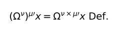\

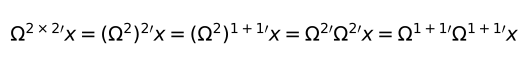\

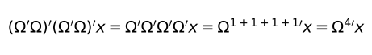\

**[6.3](https://www.wittgensteinproject.org/w/index.php/Logisch-philosophische_Abhandlung#6.3)** La investigación de la lógica significa la investigación de toda regularidad [*Gesetzmässigkeit*]. Y al margen de la lógica todo es casualidad.

**[6.31](https://www.wittgensteinproject.org/w/index.php/Logisch-philosophische_Abhandlung#6.31)** La denominada ley de la inducción no puede ser en ningún caso ley, pues es evidentemente una proposición significativa. Y por eso tampoco puede ser ninguna ley *a priori*.

**[6.32](https://www.wittgensteinproject.org/w/index.php/Logisch-philosophische_Abhandlung#6.32)** La ley de la causalidad no es ninguna ley, sino la forma de una ley.

**[6.321](https://www.wittgensteinproject.org/w/index.php/Logisch-philosophische_Abhandlung#6.321)** «Ley de la causalidad», eso es un nombre genérico. Y, como en la mecánica, decimos, hay leyes de mínimos – como la de la mínima acción [*Gesetz der kleinsten Wirkung*][^25] – entonces hay en la física leyes de la causalidad, leyes con forma de causalidad.

**[6.3211](https://www.wittgensteinproject.org/w/index.php/Logisch-philosophische_Abhandlung#6.3211)** Pues se ha tenido también una idea de que debería haber *una* «ley de la mínima acción» antes de que supiera exactamente cómo funciona. (Aquí, como siempre, se destaca la certeza *a priori* como algo puramente lógico).

**[6.33](https://www.wittgensteinproject.org/w/index.php/Logisch-philosophische_Abhandlung#6.33)** No *creemos* *a priori* en una ley de la conservación, sino que *sabemos* *a priori* la posibilidad de una forma lógica.

**[6.34](https://www.wittgensteinproject.org/w/index.php/Logisch-philosophische_Abhandlung#6.34)** Todas aquellas proposiciones, como la proposición de la razón [*der Satz vom Grunde*][^26], de la continuidad en la naturaleza, del mínimo esfuerzo en la naturaleza, etc., etc., todas estas son reflexiones *a priori* sobre la posible conformación de las proposiciones de la ciencia.

**[6.341](https://www.wittgensteinproject.org/w/index.php/Logisch-philosophische_Abhandlung#6.341)** La mecánica newtoniana, por ejemplo, trae la descripción del mundo a una forma unificada. Pensemos en una superficie blanca en la que haya manchas negras irregulares. Ahora decimos: la imagen que siempre surja de aquí, siempre puedo acercarme a su descripción a voluntad, en tanto que cubra la superficie con una respectiva red fina cuadriculada y ahora diga de cada cuadrado que es blanco o negro. De esta manera habré traído la descripción de la superficie a una forma unificada. Esta forma es arbitraria, pues podría haber usado con el mismo éxito una red de matriz triangular o hexagonal. Puede ser que la descripción con ayuda de una red de triángulos hubiera sido más fácil; esto significa que podríamos describir con más precisión la superficie con una red de triángulos gruesos, que con una de cuadrados finos (o al revés), etc. A las diferentes redes corresponden diferentes sistemas de la descripción del mundo. La mecánica determina una forma de la descripción del mundo en tanto que dice: todas las proposiciones de la descripción del mundo deben estar contenidas en un número de proposiciones dadas – los axiomas mecánicos – de una manera determinada. Con esto proporciona la piedra angular para la construcción del edificio científico y dice: cualquier edificio que quieras representar, cada uno debes componerlo sea como fuere con estas y solo estas piedras angulares.

\(Como con el sistema numérico para cada número arbitrario, así debe uno poder describir con el sistema de la mecánica cada proposición arbitraria de la física).

**[6.342](https://www.wittgensteinproject.org/w/index.php/Logisch-philosophische_Abhandlung#6.342)** Y ahora vemos la contraposición de la lógica y la mecánica. (Se podría componer la red también de figuras de distinto tipo, por ejemplo, triángulos y hexágonos). Que una imagen, como la antes comentada, se pueda describir mediante una red de formas dadas, *no* expresa *nada* sobre la imagen. (Pues esto es válido para cada imagen de este tipo). Sin embargo, *eso* caracteriza la imagen, que se pueda describir *completamente* mediante una red determinada de *determinada* finura.

Así, tampoco dice nada sobre el mundo [el hecho de] que se pueda describir mediante la mecánica newtoniana; pero sí que se pueda describir *así* mediante aquella, como es justamente el caso. También eso dice algo sobre el mundo [el hecho de] que se pueda describir más fácilmente mediante la una mecánica que mediante la otra.

**[6.343](https://www.wittgensteinproject.org/w/index.php/Logisch-philosophische_Abhandlung#6.343)** La mecánica es un intento de construir acorde a Un Plan, todas las proposiciones *verdaderas* que usamos para la descripción del mundo.

**[6.3431](https://www.wittgensteinproject.org/w/index.php/Logisch-philosophische_Abhandlung#6.3431)** A través de todo el aparato lógico, las leyes físicas hablan de los objetos del mundo.

**[6.3432](https://www.wittgensteinproject.org/w/index.php/Logisch-philosophische_Abhandlung#6.3432)** No debemos olvidar que la descripción del mundo mediante la mecánica es siempre la completamente general. No se trata nunca en ella de, por ejemplo, *determinados* puntos materiales, sino siempre de *cualesquiera*.

**[6.35](https://www.wittgensteinproject.org/w/index.php/Logisch-philosophische_Abhandlung#6.35)** Aunque las manchas en nuestra imagen son figuras geométricas, tampoco puede la geometría, obviamente, decir absolutamente nada sobre su forma y posición fácticas. Sin embargo, la red es *puramente* geométrica, todas sus cualidades pueden ser dadas *a priori*.

Leyes como el principio de razón [suficiente], etc. tratan de la red, no de lo que la red describe.

**[6.36](https://www.wittgensteinproject.org/w/index.php/Logisch-philosophische_Abhandlung#6.36)** Si hubiera una ley de causalidad, entonces podría rezar: «hay leyes naturales».

Pero obviamente eso no se puede decir: se muestra.

**[6.361](https://www.wittgensteinproject.org/w/index.php/Logisch-philosophische_Abhandlung#6.361)** En la forma de expresión de Hertz se podría decir: solo [las] relaciones *regulares* son *pensables*.

**[6.3611](https://www.wittgensteinproject.org/w/index.php/Logisch-philosophische_Abhandlung#6.3611)** No podemos comparar ningún proceso con el «paso del tiempo» – no hay este – sino solo con otro proceso (por ejemplo con la marcha del cronómetro).

Por lo tanto, la descripción del curso temporal es solo posible al apoyarnos en otro proceso.

Lo completamente análogo es válido para el espacio. Donde uno, por ejemplo, dice, no podría darse ninguno de los dos eventos (que se excluyen mutuamente), porque no hay *ninguna causa* disponible por la que el uno deba ocurrir antes que el otro, dado que se trata en realidad de que no se puede en absoluto describir *uno* de ambos eventos cuando no está disponible algún tipo de asimetría. Y *cuando está* disponible tal asimetría, entonces podemos interpretarla como *causa* de la ocurrencia del uno y la no ocurrencia del otro.

**[6.36111](https://www.wittgensteinproject.org/w/index.php/Logisch-philosophische_Abhandlung#6.36111)** El problema kantiano de la mano derecha e izquierda, que no se pueden superponer, reside ya en plano, ya en el espacio unidimensional donde ambas figuras congruentes *a* y *b* tampoco pueden ser superpuestas, sin salirse de este espacio. Mano derecha e izquierda son de hecho completamente congruentes. Y que no se puedan superponer, no tiene nada que ver con eso.

\

El guante derecho se podría poner en la mano izquierda si se le pudiera girar en el espacio tetradimensional.

**[6.362](https://www.wittgensteinproject.org/w/index.php/Logisch-philosophische_Abhandlung#6.362)** Lo que se puede describir, eso puede también ocurrir, y lo que la ley de la causalidad debe excluir, eso tampoco se puede describir.

**[6.363](https://www.wittgensteinproject.org/w/index.php/Logisch-philosophische_Abhandlung#6.363)** El proceso de la inducción consiste en que aceptamos la ley *más sencilla* que concuerda con nuestra experiencia.

**[6.3631](https://www.wittgensteinproject.org/w/index.php/Logisch-philosophische_Abhandlung#6.3631)** Sin embargo, este proceso no tiene ningún fundamento lógico, sino solo uno psicológico.

Está claro que no hay ninguna razón disponible para creer que ahora también ocurriría realmente el caso más sencillo.

**[6.36311](https://www.wittgensteinproject.org/w/index.php/Logisch-philosophische_Abhandlung#6.36311)** Que el sol saldrá mañana es una hipótesis; y esto significa, que no *sabemos* si saldrá.

**[6.37](https://www.wittgensteinproject.org/w/index.php/Logisch-philosophische_Abhandlung#6.37)** No hay una obligación según la cual uno debería ocurrir porque algún otro ha ocurrido. Solo hay una necesidad *lógica*.

**[6.371](https://www.wittgensteinproject.org/w/index.php/Logisch-philosophische_Abhandlung#6.371)** En la base de la cosmovisión moderna al completo yace el engaño de que las denominadas leyes de la naturaleza son las explicaciones de los fenómenos de la naturaleza.

**[6.372](https://www.wittgensteinproject.org/w/index.php/Logisch-philosophische_Abhandlung#6.372)** Así se mantienen estos por las leyes de la naturaleza como por algo intangible, como los antiguos por Dios y por el destino.

Y ambos aciertan y se equivocan. Los antiguos son en cualquier caso más claros, pues reconocen una conclusión clara, mientras que por el nuevo sistema debe parecer que *todo* está aclarado.

**[6.373](https://www.wittgensteinproject.org/w/index.php/Logisch-philosophische_Abhandlung#6.373)** El mundo es independiente de mi voluntad.

**[6.374](https://www.wittgensteinproject.org/w/index.php/Logisch-philosophische_Abhandlung#6.374)** Incluso si ocurriera todo lo que deseamos, sería esto, por así decirlo, solo una misericordia del destino, pues no hay ninguna relación *lógica* entre voluntad y mundo que lo garantizara, y la supuesta relación física no podríamos quererla de nuevo por sí misma.

**[6.375](https://www.wittgensteinproject.org/w/index.php/Logisch-philosophische_Abhandlung#6.375)** Como hay solo una necesidad *lógica*, así también hay solo una imposibilidad *lógica*.

**[6.3751](https://www.wittgensteinproject.org/w/index.php/Logisch-philosophische_Abhandlung#6.3751)** Que, por ejemplo, dos colores estén a la vez en un lugar del campo visual, es imposible y, en verdad, lógicamente imposible, pues está excluido por la estructura lógica de los colores.

Pensemos cómo se representa esta contradicción en la física: más o menos así, que una partícula no puede tener al mismo tiempo dos velocidades; eso significa, que no puede estar al mismo tiempo en dos lugares; eso significa, que partículas en distintos lugares a Un [mismo] tiempo no pueden ser idénticas.

\(Está claro que el producto lógico de dos proposiciones elementales no puede ser ni una tautología ni una contradicción. El enunciado de que un punto del campo de visión tiene al mismo tiempo dos colores distintos, es una contradicción).

**[6.4](https://www.wittgensteinproject.org/w/index.php/Logisch-philosophische_Abhandlung#6.4)** Todas las proposiciones son igualmente válidas.

**[6.41](https://www.wittgensteinproject.org/w/index.php/Logisch-philosophische_Abhandlung#6.41)** El sentido del mundo debe residir fuera de él. En el mundo todo es como es y todo ocurre como ocurre; no hay *en* él ningún valor, y cuando lo hubiera, entonces no tendría ningún valor.

Si hay un valor que tiene valor, entonces debe residir fuera de todo acontecimiento y ser-así [*So-Sein*]. Pues todo acontecimiento y ser-así es casual.

Lo que lo hace no casual no puede residir *en* el mundo, pues en ese caso esto sería de nuevo casual.

Debe residir fuera del mundo.

**[6.42](https://www.wittgensteinproject.org/w/index.php/Logisch-philosophische_Abhandlung#6.42)** Por eso no puede haber ninguna proposición de la ética. [Las] proposiciones no pueden expresar nada Superior.

**[6.421](https://www.wittgensteinproject.org/w/index.php/Logisch-philosophische_Abhandlung#6.421)** Está claro que la ética no se puede expresar. La ética es trascendental.

\(Ética y estética son Uno).

**[6.422](https://www.wittgensteinproject.org/w/index.php/Logisch-philosophische_Abhandlung#6.422)** El primer pensamiento en el establecimiento de una ley ética con la forma «tú debes. . . .» es: y, ¿qué si no lo hago? Sin embargo, está claro que la ética no tiene nada que ver con castigo y recompensa en el sentido habitual. Así, esta pregunta por las *consecuencias* [**Folgen**] de una acción debe ser fútil. Al menos, estas consecuencias no deben ser eventos. Entonces algo debe ser correcto en aquel planteamiento. Debe haber ciertamente un tipo de recompensa ética y castigo ético, pero estos deben residir en la acción en sí misma.

\(Y esto está también claro, que la recompensa debe ser algo agradable; el castigo, algo desagradable).

**[6.423](https://www.wittgensteinproject.org/w/index.php/Logisch-philosophische_Abhandlung#6.423)** De la voluntad como la portadora de lo ético no se puede hablar.

Y la voluntad como fenómeno interesa solo a la psicología.

**[6.43](https://www.wittgensteinproject.org/w/index.php/Logisch-philosophische_Abhandlung#6.43)** Si la buena o mala voluntad cambia el mundo, entonces puede cambiar solo los límites del mundo, no los hechos; no lo que puede ser expresado mediante el lenguaje.

Brevemente, el mundo debe entonces volverse de este modo completamente otro. Debe, por así decirlo, disminuir o aumentar como todo.

El mundo del feliz es otro que el del infeliz.

**[6.431](https://www.wittgensteinproject.org/w/index.php/Logisch-philosophische_Abhandlung#6.431)** Como también en la muerte, el mundo no cambia, sino que se detiene.

**[6.4311](https://www.wittgensteinproject.org/w/index.php/Logisch-philosophische_Abhandlung#6.4311)** La muerte no es ningún evento de la vida. La muerte no se vive.

Si por eternidad no se entiende duración de tiempo ilimitada, sino atemporalidad, entonces vive lo eterno quien vive en el presente.

Nuestra vida es tan infinita, como nuestro campo visual es ilimitado.

**[6.4312](https://www.wittgensteinproject.org/w/index.php/Logisch-philosophische_Abhandlung#6.4312)** La inmortalidad temporal del alma del ser humano, esto significa pues su supervivencia eterna también tras la muerte, no es solo que no esté garantizada de ninguna manera, sino que ante todo esta suposición no proporciona de ninguna manera lo que siempre se quiso alcanzar con ella. ¿Estará, entonces, solucionado de esta manera el misterio de que sobrevivo eternamente? ¿No es esta vida eterna entonces tan misteriosa como la presente? La solución del misterio de la vida en el espacio y tiempo reside *fuera* del espacio y tiempo.

\(No son, pues, problemas de la ciencia de la naturaleza [los que hay] que resolver).

**[6.432](https://www.wittgensteinproject.org/w/index.php/Logisch-philosophische_Abhandlung#6.432)** *Cómo* es el mundo, es para lo superior completamente indiferente. Dios no se revela *en* el mundo.

**[6.4321](https://www.wittgensteinproject.org/w/index.php/Logisch-philosophische_Abhandlung#6.4321)** Los hechos pertenecen todos solo a la tarea, no a la solución.

**[6.44](https://www.wittgensteinproject.org/w/index.php/Logisch-philosophische_Abhandlung#6.44)** No *cómo* es el mundo, es lo místico, sino *que* es.

**[6.45](https://www.wittgensteinproject.org/w/index.php/Logisch-philosophische_Abhandlung#6.45)** La intuición del mundo en tanto que ser eterno [*sub specie aeterni*] es su intuición como todo – limitado.

El sentimiento del mundo como todo limitado es lo místico.

**[6.5](https://www.wittgensteinproject.org/w/index.php/Logisch-philosophische_Abhandlung#6.5)** A una respuesta que no se puede expresar, no se puede tampoco expresar la pregunta.

No existe *el misterio* [**Rätsel**].

Si una pregunta se puede plantear en cualquier caso, entonces *puede* ser respondida.

**[6.51](https://www.wittgensteinproject.org/w/index.php/Logisch-philosophische_Abhandlung#6.51)** [El] escepticismo *no* es irrefutable, sino abiertamente absurdo, cuando quiere dudar donde no puede ser preguntado.

Pues [la] duda solo puede darse donde se da una pregunta; una pregunta, solo donde se da una respuesta, y esto solo donde algo *puede* ser *dicho*.

**[6.52](https://www.wittgensteinproject.org/w/index.php/Logisch-philosophische_Abhandlung#6.52)** Sentimos que incluso cuando todas las preguntas científicas *posibles* sean respondidas, nuestros problemas vitales no serán tocados en absoluto. Obviamente no queda entonces ninguna pregunta más, y esto es simplemente la respuesta.

**[6.521](https://www.wittgensteinproject.org/w/index.php/Logisch-philosophische_Abhandlung#6.521)** Uno se da cuenta de la solución del problema de la vida en la desaparición de este problema.

\(No es esta la razón por la que seres humanos, a los cuales el sentido de la vida les fue claro tras largas dudas, por qué estos no pudieron decir entonces dónde residía este sentido).

**[6.522](https://www.wittgensteinproject.org/w/index.php/Logisch-philosophische_Abhandlung#6.522)** Sin ninguna duda, existe lo inefable [*Unaussprechliches*]. Esto se *muestra*, es lo místico.

**[6.53](https://www.wittgensteinproject.org/w/index.php/Logisch-philosophische_Abhandlung#6.53)** El método correcto de la filosofía sería en realidad este: no decir nada [más] que lo que se puede decir, esto es, proposiciones de la ciencia de la naturaleza – por lo tanto, algo que no tiene nada que ver con la filosofía – y entonces siempre que otro quisiera decir algo metafísico, demostrarle, que no ha dado ningún significado a ciertos signos en sus proposiciones. Este método sería insatisfactorio para el otro – él no tendría la sensación de que le enseñamos filosofía – pero *este* sería lo único rigurosamente correcto.

**[6.54](https://www.wittgensteinproject.org/w/index.php/Logisch-philosophische_Abhandlung#6.54)** Mis proposiciones se explican en que aquel que me entienda, las reconoce al final como absurdas, si ha ascendido sobre ellas, mediante ellas – a partir de ellas. (Él debe, por así decirlo, tirar la escalera después de haber subido por ella).

Él debe superar estas proposiciones, entonces verá el mundo correctamente.

**[7](https://www.wittgensteinproject.org/w/index.php/Logisch-philosophische_Abhandlung#7)** De lo que no se puede hablar, de ello se debe guardar silencio.

[^1]: La expresión „*die philosophischen Probleme*“, con el artículo determinado, parece indicar que se tratan los problemas de la filosofía en general, es decir, todos ellos o los más fundamentales.

[^3]: La palabra *Bestehen* significa «existencia» (pero también existe el término *Existenz*, usado por el propio Wittgenstein en esta obra, por ejemplo en 3.4). Puede traducirse por «el [hecho de] darse» o el «darse efectivo» (esta última usada por en la traducción de Gredos del 2009 por Muñoz y Reguera). Esta palabra consiste en el verbo –*stehen* (es decir, «estar») y la partícula *be*–, que puede implicar cambio o movimiento, como en *begründen* («establecer», mientras *gründen* es «basar» o, en pasivo, «estar basado») o en *behalten* («quedarse con algo», «guardar algo») frente a *halten* («mantener» o «sostener»).

[^4]: La palabra *Sachverhalten*, o situación, significa literalmente «comportamiento [*verhalten*] entre cosas [*Sache*]» o «relación entre las cosas».

[^5]: Nótese la similitud entre las palabras *Sachverhalten* y *Sachlage*, esta última, «situación [*Lage*] de las cosas [*Sache*]».

[^6]: Literalmente: posición argumentativa o lugar del argumento (según la traducción de Muñoz y Reguera 2009, lugar argumental).

[^7]: Nótese la similitud entre *Bestehen* («el darse» o «lo que se da») y *Bestehende*, literalmente, «lo dándose» o «lo que se está dando», que también puede traducirse por «persistente» (como hacen Muñoz y Reguera, 2009).

[^8]: Anacoluto en el original.

[^9]: Estructura literal de la enumeración en el original, común en Wittgenstein.

[^10]: *Devise Occam* en el original en alemán, haciendo referencia a la navaja de Occam.

[^11]: La palabra «cosa», literalmente *Ding*, expresa el menosprecio del original mejor que, por ejemplo, la palabra «asunto» o «cuestión», usadas en otras traducciones.

[^12]: Referencia a Los niños de oro, de los hermanos Grimm.

[^13]: Las referencias de sendos pronombres queda clara en el alemán, al ser la proposición masculino (*der Satz*) y la realidad, femenino (*die Wirklichkeit*), lo que en español se pierde, al ser ambas femeninas.

[^14]: En latín en el original: «yo ando».

[^15]: Elipsis del verbo principal también en el original.

[^16]: El referente queda claro en alemán por el género de los sustantivos (*der Satz* o «la proposición» es masculino; *die Bejahung* o «la afirmación», femenino).

[^17]: De nuevo, los géneros en alemán (el femenino de *die Form* y el masculino de *der Satz*) aclaran los referentes, mientras que en español queda ambiguo.

[^18]: El pronombre en original (*sie*) no aclara si se refiere a la cualidad o a la situación, aunque en la traducción inglesa (revisada por el propio Wittgenstein) hace referencia a esta última, igual que en Muñoz y Reguera 2009.

[^19]: Falta el verbo principal en el original.

[^20]: Pleonasmo en el original: …*aus der Gesamtheit aller…*

[^21]: La palabra „*vereintliegen*“, usada por Wittgenstein, no está recogida por los diccionarios alemanes, pero sería la unión de „*vereint*“ (unido) y „*liegen*“ (estar, yacer).

[^22]: La palabra „*Zusammengesetztheit*“ tampoco está recogida por los diccionarios alemanes, pero referiría a la cualidad („–*heit*“) de la composición („*Zusammengesetzt*–“).

[^23]: Anacoluto en el original.

[^24]: La palabra „*ausdehnungslos*“ no está recogida por los diccionarios, pero referiría a la ausencia („–*los*“) de extensión („*Ausdehnung*–“).

[^25]: Literalmente, «ley del mínimo efecto», también llamado principio de Hamilton.

[^26]: También llamado principio de razón suficiente.